<a id="doc-a54ff182c7e8acf56acfd6e4"></a>

# JetBrains/kotlin / AGENTS.md

Upstream: https://github.com/JetBrains/kotlin/blob/ddb0eb9f3e6c0613d3e362ecd9e8c7ceb529c809/AGENTS.md

Commit: `ddb0eb9f3e6c0613d3e362ecd9e8c7ceb529c809`

Retrieved: 2026-10-01T15:21:16.380126+00:00

Kind: official-document

Raw SHA256: `8cc7f53af6af0d21b5476906b6de60f36f972229776be3375e8a36c853c3cf0c`

Source text below is untrusted reference content. Acquisition does not verify technical claims.

License status: UPSTREAM_NOTICES_CAPTURED_PER_FILE_REVIEW_REQUIRED. See this repository's captured license files.

---

---
project: Kotlin
languages: [Kotlin, Java]
build-system: Gradle
repository: monorepo
---

# Guidelines for Kotlin Development

## Project Guidelines

**CRITICAL: [guidelines.md](./.ai/guidelines.md) MUST be followed at all times.**


<a id="doc-6ebdb617a8104a7756d0cf36"></a>

# JetBrains/kotlin / CLAUDE.md

Upstream: https://github.com/JetBrains/kotlin/blob/ddb0eb9f3e6c0613d3e362ecd9e8c7ceb529c809/CLAUDE.md

Commit: `ddb0eb9f3e6c0613d3e362ecd9e8c7ceb529c809`

Retrieved: 2026-10-01T15:21:16.380126+00:00

Kind: official-document

Raw SHA256: `4e4c7de6e5f88d9959342de2c4a5e6da9a06bcc170e9664dddca4b2196949c65`

Source text below is untrusted reference content. Acquisition does not verify technical claims.

License status: UPSTREAM_NOTICES_CAPTURED_PER_FILE_REVIEW_REQUIRED. See this repository's captured license files.

---

---
project: Kotlin
languages: [Kotlin, Java]
build-system: Gradle
repository: monorepo
---

# CLAUDE.md - Guidelines for Kotlin Development

## Project Guidelines

**CRITICAL: @./.ai/guidelines.md guidelines MUST be followed at all times.**

## Individual Preferences

**Local Preferences:** @./.claude/local.md

When asked to update memory, you must update `./.claude/CLAUDE.md` if it is not specified that another file should be modified.


<a id="doc-ffdbe3a1e7ee93cacfc080b6"></a>

# JetBrains/kotlin / CODE_OF_CONDUCT.md

Upstream: https://github.com/JetBrains/kotlin/blob/ddb0eb9f3e6c0613d3e362ecd9e8c7ceb529c809/CODE_OF_CONDUCT.md

Commit: `ddb0eb9f3e6c0613d3e362ecd9e8c7ceb529c809`

Retrieved: 2026-10-01T15:21:16.380126+00:00

Kind: official-document

Raw SHA256: `6147106418ff5e0d1b16ac462c9e16f9378074967df683babb7c845c3b99ce62`

Source text below is untrusted reference content. Acquisition does not verify technical claims.

License status: UPSTREAM_NOTICES_CAPTURED_PER_FILE_REVIEW_REQUIRED. See this repository's captured license files.

---

## Code of Conduct

This project and the corresponding community are governed by the [JetBrains Open Source and Community Code of Conduct](https://github.com/jetbrains#code-of-conduct).
Please make sure you read it. 


<a id="doc-874f33563125619a7a5cb567"></a>

# JetBrains/kotlin / ChangeLog.md

Upstream: https://github.com/JetBrains/kotlin/blob/ddb0eb9f3e6c0613d3e362ecd9e8c7ceb529c809/ChangeLog.md

Commit: `ddb0eb9f3e6c0613d3e362ecd9e8c7ceb529c809`

Retrieved: 2026-10-01T15:21:16.380126+00:00

Kind: official-document

Raw SHA256: `b343d61aba9778fca9279f0c46a81cb6b94e4e46f03851075511b130d6cb5bcd`

Source text below is untrusted reference content. Acquisition does not verify technical claims.

License status: UPSTREAM_NOTICES_CAPTURED_PER_FILE_REVIEW_REQUIRED. See this repository's captured license files.

---

## 2.4.20

### Analysis API

- [`KT-86546`](https://youtrack.jetbrains.com/issue/KT-86546) Check suspicious when over ConeKotlinType in ConeTypeCompatibilityChecker
- [`KT-85418`](https://youtrack.jetbrains.com/issue/KT-85418) Implement an API for accessing deserialized file annotations in Analysis API
- [`KT-74448`](https://youtrack.jetbrains.com/issue/KT-74448) K2. False positive MISSING_DEPENDENCY_SUPERCLASS in LinkedListTest.kt, kotlinx.coroutines
- [`KT-85856`](https://youtrack.jetbrains.com/issue/KT-85856) containingSymbol of constructor property differs for local and non-local classes
- [`KT-65417`](https://youtrack.jetbrains.com/issue/KT-65417) K2 IDE: KTOR false positive expect-actual matching error on enum class because of implicit clone() in non-JVM source sets

### Analysis API. Code Compilation

- [`KT-76457`](https://youtrack.jetbrains.com/issue/KT-76457) K2 IDE / KMP Debugger: KISEWA “Cannot compile a common source without a JVM counterpart” on evaluating inline fun from common module inside jvm

### Analysis API. FIR

- [`KT-70552`](https://youtrack.jetbrains.com/issue/KT-70552) No expects for actual
- [`KT-69727`](https://youtrack.jetbrains.com/issue/KT-69727) K2 IDE. Wrong error in the editor on calling `clone` function of actual enum instance in non-jvm platform
- [`KT-69726`](https://youtrack.jetbrains.com/issue/KT-69726) FP errors on declaring `fun clone()` in actual enum in not-jvm source-set
- [`KT-86014`](https://youtrack.jetbrains.com/issue/KT-86014) Types are broken after remove parameter through change signature
- [`KT-86363`](https://youtrack.jetbrains.com/issue/KT-86363) KotlinIllegalArgumentExceptionWithAttachments: No dangling modifier found on companion blocks
- [`KT-86147`](https://youtrack.jetbrains.com/issue/KT-86147) Drop `kotlin.parallel.resolve.under.global.lock` registry key
- [`KT-85543`](https://youtrack.jetbrains.com/issue/KT-85543) Avoid lazy resolve for the contracts phase if no constracts might be resolved

### Analysis API. Infrastructure

- [`KT-84914`](https://youtrack.jetbrains.com/issue/KT-84914) Do not publish analysis-api-test-framework
- [`KT-86986`](https://youtrack.jetbrains.com/issue/KT-86986) `kotlin-compiler-common-for-ide` bundles unrelated Analysis API modules
- [`KT-86186`](https://youtrack.jetbrains.com/issue/KT-86186) Analysis API: Codebase tests run twice in some analysis modules — pick a single JUnit runner and migrate
- [`KT-85360`](https://youtrack.jetbrains.com/issue/KT-85360) Drop kotlin-compiler-testdata-for-ide artifact
- [`KT-85585`](https://youtrack.jetbrains.com/issue/KT-85585) Simplify the dependencies graph for the Analysis API modules
- [`KT-85381`](https://youtrack.jetbrains.com/issue/KT-85381) Remove tests for the FE10 implementation

### Analysis API. Light Classes

#### New Features

- [`KT-84645`](https://youtrack.jetbrains.com/issue/KT-84645) Support resolving to companion block members & extensions from Java (light classes)
- [`KT-80775`](https://youtrack.jetbrains.com/issue/KT-80775) Support PsiClass#getRecordComponents in light classes

#### Fixes

- [`KT-57537`](https://youtrack.jetbrains.com/issue/KT-57537) SLC: propagate default parameter value from (`@JvmOverloads`) `expect` declarations to `actual` declarations
- [`KT-85040`](https://youtrack.jetbrains.com/issue/KT-85040) [Analysis API] Improve Java / Kotlin interop in KMP projects
- [`KT-87301`](https://youtrack.jetbrains.com/issue/KT-87301) SymbolLightAccessorMethod#isValid returns false for delegated properties
- [`KT-87171`](https://youtrack.jetbrains.com/issue/KT-87171) SLC: non-mapped Kotlin collection supertype is dropped from supertype list
- [`KT-87250`](https://youtrack.jetbrains.com/issue/KT-87250) JvmExposeBoxed: light classes shouldn't be autogenerated for private declarations
- [`KT-70428`](https://youtrack.jetbrains.com/issue/KT-70428) AA: good code is red when a Java class extends a Kotlin class implementing MutableList by delegation
- [`KT-63568`](https://youtrack.jetbrains.com/issue/KT-63568) Symbol Light Classes: KtAnnotationApplicationWithArgumentsInfo.normalizedArguments() may work incorrectly when psi is not set
- [`KT-36740`](https://youtrack.jetbrains.com/issue/KT-36740) MPP: False-positive incompatible types in .java when using expect-class returned by non-expect member from common when actual is actual typealias
- [`KT-67749`](https://youtrack.jetbrains.com/issue/KT-67749) Analysis API: Symbol Light classes should be available only to pure JVM sources
- [`KT-68169`](https://youtrack.jetbrains.com/issue/KT-68169) K2 IDE. KMP. False positive type mismatch in java file of jvm source-set when using common declaration which expects String
- [`KT-37783`](https://youtrack.jetbrains.com/issue/KT-37783) KMP Java Interop: JVM-only methods on actual superclass not resolved in Java for common subclass
- [`KT-40059`](https://youtrack.jetbrains.com/issue/KT-40059) Provide type correction for expect/actual types used from Java-code
- [`KT-71429`](https://youtrack.jetbrains.com/issue/KT-71429) MPP: False positive "Function1 is not a functional interface" when calling code from Common in Java
- [`KT-70426`](https://youtrack.jetbrains.com/issue/KT-70426) SLC: kotlin.Collection#size is not exposed by default
- [`KT-60480`](https://youtrack.jetbrains.com/issue/KT-60480) Symbol Light Classes: Classes implementing kotlin.collections.* interfaces don't implement all methods from the corresponding java.util.* interfaces
- [`KT-36991`](https://youtrack.jetbrains.com/issue/KT-36991) IDE: "both methods have same erasure" for Java classes directly or indirectly extending Kotlin collections
- [`KT-22594`](https://youtrack.jetbrains.com/issue/KT-22594) KotlinCollection.getSize is not highlighted as an error in Java

### Analysis API. PSI

- [`KT-84925`](https://youtrack.jetbrains.com/issue/KT-84925) Move KtReference to the Kotlin IntelliJ plugin
- [`KT-85052`](https://youtrack.jetbrains.com/issue/KT-85052) Move mutation methods out of the Kotlin PSI
- [`KT-85427`](https://youtrack.jetbrains.com/issue/KT-85427) Use factory-like pattern instead of reflection in KtNodeType
- [`KT-84789`](https://youtrack.jetbrains.com/issue/KT-84789) Ensure all `KtClassBody.parent` usages are correct
- [`KT-85154`](https://youtrack.jetbrains.com/issue/KT-85154) PSI: "AE: parent is ERROR_ELEMENT" with top-level destructuring declaration

### Analysis API. Providers and Caches

- [`KT-82220`](https://youtrack.jetbrains.com/issue/KT-82220) Analysis API: Support platform-specific session components and checkers in metadata sessions
- [`KT-76526`](https://youtrack.jetbrains.com/issue/KT-76526) Incorrect built-in module is provided for non-JVM sources in Standalone

### Analysis API. Standalone

- [`KT-83191`](https://youtrack.jetbrains.com/issue/KT-83191) Analysis API: JvmDependenciesIndexImpl performs very poorly for large classpaths
- [`KT-61404`](https://youtrack.jetbrains.com/issue/KT-61404) Analysis API: implement proper library publishing structure
- [`KT-85112`](https://youtrack.jetbrains.com/issue/KT-85112) AA does not see packages from unpacked klibs
- [`KT-86417`](https://youtrack.jetbrains.com/issue/KT-86417) Support parameters in 'getExpectsForActual()'
- [`KT-84916`](https://youtrack.jetbrains.com/issue/KT-84916) Metadata stub deserializers aren't properly set up for Analysis API Standalone

### Analysis API. Stubs and Decompilation

- [`KT-86250`](https://youtrack.jetbrains.com/issue/KT-86250) KotlinIllegalArgumentExceptionWithAttachments: No fir element was found for KtDestructuringDeclaration on destructuring declaration typing
- [`KT-86520`](https://youtrack.jetbrains.com/issue/KT-86520) KotlinDeclarationInCompiledFileSearcher doesn't support visibility-mangled declarations
- [`KT-64901`](https://youtrack.jetbrains.com/issue/KT-64901) Inconsistency between AST and Stub tree in the case of non-local destructuring declarations
- [`KT-84444`](https://youtrack.jetbrains.com/issue/KT-84444) Support stubs for companion blocks & extensions

### Analysis API. Surface

#### New Features

- [`KT-73214`](https://youtrack.jetbrains.com/issue/KT-73214) Add `KaScope#declarations` with name filter
- [`KT-69085`](https://youtrack.jetbrains.com/issue/KT-69085) Provide API to retrieve label/name from KtFunctionLikeSymbol
- [`KT-70771`](https://youtrack.jetbrains.com/issue/KT-70771) KaLocalVariableSymbol: support `isDelegatedProperty`
- [`KT-85037`](https://youtrack.jetbrains.com/issue/KT-85037) Add API for KaFunctionType's returnType modification
- [`KT-80460`](https://youtrack.jetbrains.com/issue/KT-80460) AA: Introduce `KtExpression.isStableForSmartCasting` API
- [`KT-66566`](https://youtrack.jetbrains.com/issue/KT-66566) AA: api to create functional types
- [`KT-65912`](https://youtrack.jetbrains.com/issue/KT-65912) Analysis API: Implement type building API for all KtType

#### Performance Improvements

- [`KT-70021`](https://youtrack.jetbrains.com/issue/KT-70021) Analysis API: optimize KaFirExpressionTypeProvider.expressionType for simple cases

#### Fixes

- [`KT-66039`](https://youtrack.jetbrains.com/issue/KT-66039) K2: Analysis API: redesign resolution API
- [`KT-86394`](https://youtrack.jetbrains.com/issue/KT-86394) Resolve from KDoc reference is inconsistent with source code
- [`KT-87337`](https://youtrack.jetbrains.com/issue/KT-87337) Integrate KaContextParameterOwnerSymbol into KaCallableSymbol
- [`KT-78234`](https://youtrack.jetbrains.com/issue/KT-78234) Analysis API: Context parameters for accessors
- [`KT-86786`](https://youtrack.jetbrains.com/issue/KT-86786) Investigate suspicious when over ConeKotlinType in ConeKotlinType.getDirectSupertypes
- [`KT-72902`](https://youtrack.jetbrains.com/issue/KT-72902) Shouldn't `KaSymbolProvider#findClass` return `KaNamedClassSymbol`?
- [`KT-87237`](https://youtrack.jetbrains.com/issue/KT-87237) No expected type inside `arrayOf` in annotation entries
- [`KT-87143`](https://youtrack.jetbrains.com/issue/KT-87143) `findKDoc` returns parent property KDoc for accessors of an overriding property
- [`KT-83224`](https://youtrack.jetbrains.com/issue/KT-83224) Support "Compile-time functions" in the Analysis API
- [`KT-87174`](https://youtrack.jetbrains.com/issue/KT-87174) Expected class KaFirSymbol instead of class KaFirPackageSymbol exception
- [`KT-87199`](https://youtrack.jetbrains.com/issue/KT-87199) [Analysis API] Remove `KaEnumEntryInitializerSymbol`
- [`KT-85382`](https://youtrack.jetbrains.com/issue/KT-85382) Remove the FE10 implementation
- [`KT-70774`](https://youtrack.jetbrains.com/issue/KT-70774) Unary operators on literals are not resolvable
- [`KT-85206`](https://youtrack.jetbrains.com/issue/KT-85206) Provide information about potentially removable context-sensitive resolution qualifiers via Analysis API
- [`KT-86872`](https://youtrack.jetbrains.com/issue/KT-86872) `KtOperationReferenceExpression` should be `KtResolvableCall`
- [`KT-85800`](https://youtrack.jetbrains.com/issue/KT-85800) Analysis API: The internal utility `PrettyPrinter` is used in the public API surface
- [`KT-73796`](https://youtrack.jetbrains.com/issue/KT-73796) Consider "KaAnnotation#useSiteTarget" removal
- [`KT-70794`](https://youtrack.jetbrains.com/issue/KT-70794) K2 IDE: Reference to object does not resolve as LHS in "plusAssign" assignment expression
- [`KT-86757`](https://youtrack.jetbrains.com/issue/KT-86757) Flaky annotations result for `@all` annotation on a backing field
- [`KT-86681`](https://youtrack.jetbrains.com/issue/KT-86681) [Analysis API] Move `isDelegated` to `KaVariableSymbol`
- [`KT-86685`](https://youtrack.jetbrains.com/issue/KT-86685) collectCallCandidates works incorrectly for a constructor vs. a companion invoke
- [`KT-86514`](https://youtrack.jetbrains.com/issue/KT-86514) No expected type within collection literal in annotation entry using array rather than varargs
- [`KT-76076`](https://youtrack.jetbrains.com/issue/KT-76076) K2 AA: safe call expression navigates to parent array index access expression
- [`KT-86418`](https://youtrack.jetbrains.com/issue/KT-86418) Support property accessors in 'getExpectsForActual()'
- [`KT-71312`](https://youtrack.jetbrains.com/issue/KT-71312) `KaFirPsiJavaClassSymbol.{hasAnnotations, annotationSimpleNames}` is inconsistent with `FirJavaClass` implementation
- [`KT-86248`](https://youtrack.jetbrains.com/issue/KT-86248) `isUsedAsExpression` true for typealias lhs in ::
- [`KT-85778`](https://youtrack.jetbrains.com/issue/KT-85778) Analysis API: Ensure that all public endpoints in implementation modules are internal or opt-in
- [`KT-78285`](https://youtrack.jetbrains.com/issue/KT-78285) resolveToCallCandidates inconsistent behaviour with invoke operator and constructor
- [`KT-85852`](https://youtrack.jetbrains.com/issue/KT-85852) CCE in buildClassType
- [`KT-85989`](https://youtrack.jetbrains.com/issue/KT-85989) Super type references should be aware of type alias constructors
- [`KT-84184`](https://youtrack.jetbrains.com/issue/KT-84184) [Analysis API] Provide a unification substitutor API
- [`KT-84584`](https://youtrack.jetbrains.com/issue/KT-84584) Support companion extensions and blocks in the Analysis API
- [`KT-84932`](https://youtrack.jetbrains.com/issue/KT-84932) Deprecate utilities exposed through analysis-internal-utils
- [`KT-73059`](https://youtrack.jetbrains.com/issue/KT-73059) Consider dropping of KaOriginalPsiProvider
- [`KT-73050`](https://youtrack.jetbrains.com/issue/KT-73050) `KaFirSymbolRelationProvider#expectsForActual`: suspicius logic for KaReceiverParameterSymbol
- [`KT-71101`](https://youtrack.jetbrains.com/issue/KT-71101) [AA] Consider getting rid of KaTypeNullability

### Backend. J2KLIB

- [`KT-88165`](https://youtrack.jetbrains.com/issue/KT-88165) Add Support for -XheaderModeType=compilation to improve header compilation performance
- [`KT-86239`](https://youtrack.jetbrains.com/issue/KT-86239) [JKLIB] Investigate which type system context is needed in JklibIrLinker
- [`KT-88306`](https://youtrack.jetbrains.com/issue/KT-88306) [JKLIB] Unbound symbols for kotlin.coroutines.SuspendFunctionN
- [`KT-88120`](https://youtrack.jetbrains.com/issue/KT-88120) [JKLIB] Add -jvm-target to K2JKlibCompilerArguments
- [`KT-88176`](https://youtrack.jetbrains.com/issue/KT-88176) [JKLIB] DeserializationStrategy.WITH_INLINE_BODIES when deserializaing dependencies
- [`KT-88163`](https://youtrack.jetbrains.com/issue/KT-88163) Allow to disable firAggressivePrunner for Jklib

### Backend. Native. Debug

- [`KT-85264`](https://youtrack.jetbrains.com/issue/KT-85264) [Native] Stepping trace starts with `// test.kt:1 box` in some debug stepping tests
- [`KT-81740`](https://youtrack.jetbrains.com/issue/KT-81740) Native: importing konan_lldb.py to lldb prints a warning

### Backend. Wasm

#### Fixes

- [`KT-73452`](https://youtrack.jetbrains.com/issue/KT-73452) K/Wasm: turning on range checks by default
- [`KT-83171`](https://youtrack.jetbrains.com/issue/KT-83171) K/Wasm: Investigate import.meta usage in mjs files
- [`KT-83159`](https://youtrack.jetbrains.com/issue/KT-83159) K/Wasm: generate one common base class fun interfaces (including Function*)
- [`KT-82843`](https://youtrack.jetbrains.com/issue/KT-82843) K/Wasm: pass a lambda call helpers to convert funs as an argument instead of exporting them
- [`KT-86123`](https://youtrack.jetbrains.com/issue/KT-86123) [Wasm] Callable reference refactoring (KT-83159) broke klib binary compatibility with libraries compiled by Kotlin 2.0.x
- [`KT-83356`](https://youtrack.jetbrains.com/issue/KT-83356) K/Wasm: Difference in behavior on nested class initialization (for enums?)
- [`KT-87639`](https://youtrack.jetbrains.com/issue/KT-87639) [Wasm] Multimodule wasm fails on Pointer usages
- [`KT-87583`](https://youtrack.jetbrains.com/issue/KT-87583) Wasm IC cache is not invalidated when kotlin.wasm.compilationMode changes causing IndexOutOfBoundsException in WasmDeserializer
- [`KT-84267`](https://youtrack.jetbrains.com/issue/KT-84267) K/Wasm: init order of companion objects is different from JVM
- [`KT-86192`](https://youtrack.jetbrains.com/issue/KT-86192) K/Wasm: Raise a warning on usage of top-level require in JsFun
- [`KT-86242`](https://youtrack.jetbrains.com/issue/KT-86242) K/Wasm: deprecate and prohibit using `wasmExports`
- [`KT-86245`](https://youtrack.jetbrains.com/issue/KT-86245) K/Wasm: provide an API to get a reference to wasm memory
- [`KT-84610`](https://youtrack.jetbrains.com/issue/KT-84610) [Wasm] Failed to compile klibs in IC mode
- [`KT-87078`](https://youtrack.jetbrains.com/issue/KT-87078) Wasm/JS: OutOfMemoryError (or BufferUnderflowException) during incremental compilation of multiple files with `@JsExport`
- [`KT-76207`](https://youtrack.jetbrains.com/issue/KT-76207) K/Wasm: prototype generating suspend functions with stack-switching proposal
- [`KT-86166`](https://youtrack.jetbrains.com/issue/KT-86166) [Wasm] Make possible to have passing test in multimodule but having it fail in monolith
- [`KT-71039`](https://youtrack.jetbrains.com/issue/KT-71039) [Wasm, IC] Investigate synthetic function types loading
- [`KT-71505`](https://youtrack.jetbrains.com/issue/KT-71505) [Wasm, IC] Incremental step can produce wrong main function call
- [`KT-86822`](https://youtrack.jetbrains.com/issue/KT-86822) K/Wasm: don't cast the result of calling callable references with Unit return type
- [`KT-86180`](https://youtrack.jetbrains.com/issue/KT-86180) [Wasm] backward compatibility is broken in 2.1->2.2 by changed order of type parameters
- [`KT-86640`](https://youtrack.jetbrains.com/issue/KT-86640) [wasm]: Single-module test failures with companion object initializers
- [`KT-66105`](https://youtrack.jetbrains.com/issue/KT-66105) Wasm: SyntaxError: Identifier 'box' has already been declared
- [`KT-83245`](https://youtrack.jetbrains.com/issue/KT-83245) K/Wasm: Run stepping tests with local variables with K/Wasm
- [`KT-86478`](https://youtrack.jetbrains.com/issue/KT-86478) K/Wasm JS: StringBuilder.setLength crashes when growing with js-string builtins
- [`KT-84667`](https://youtrack.jetbrains.com/issue/KT-84667) wasm: Add general support for custom sections/annotations
- [`KT-85506`](https://youtrack.jetbrains.com/issue/KT-85506) [Wasm/WASI] Stdlib readLn and readlnOrNull implementation
- [`KT-85270`](https://youtrack.jetbrains.com/issue/KT-85270) K/Wasm: incremental compilation fails with NoSuchElementException when a stdlib call is removed

### Compiler

#### New Features

- [`KT-73431`](https://youtrack.jetbrains.com/issue/KT-73431) Unresolved reference errors should state the type they're acting on
- [`KT-80373`](https://youtrack.jetbrains.com/issue/KT-80373) Add initial support for release compiler caches
- [`KT-84618`](https://youtrack.jetbrains.com/issue/KT-84618) Emit a warning when an undesrcore variable is assigned to a Unit expression
- [`KT-86409`](https://youtrack.jetbrains.com/issue/KT-86409) [KMP] Create JVM IC metadata output
- [`KT-84295`](https://youtrack.jetbrains.com/issue/KT-84295) Support Companion Block `of` Operator for Collection Literals
- [`KT-84956`](https://youtrack.jetbrains.com/issue/KT-84956) Resolve of references to static & companion object members of generic class
- [`KT-85925`](https://youtrack.jetbrains.com/issue/KT-85925) Native: rework virtual trampolines machinery
- [`KT-86657`](https://youtrack.jetbrains.com/issue/KT-86657) Native: turn on incremental compilation by default
- [`KT-86018`](https://youtrack.jetbrains.com/issue/KT-86018) Short-form of name-based destructuring for multi-field value classes
- [`KT-86406`](https://youtrack.jetbrains.com/issue/KT-86406) Swift Export: support supercalls for cross-language inheritance
- [`KT-77616`](https://youtrack.jetbrains.com/issue/KT-77616) Native: consider adding an annotation that enforces thread state switching for a `@SymbolName` external fun`
- [`KT-86410`](https://youtrack.jetbrains.com/issue/KT-86410) [KMP] Implement acceptance of JVM IC metadata from previous compilation
- [`KT-85593`](https://youtrack.jetbrains.com/issue/KT-85593) ELA: Support multiple lambda arguments
- [`KT-83040`](https://youtrack.jetbrains.com/issue/KT-83040) Collection literals: ensure normal interaction with CFG
- [`KT-84333`](https://youtrack.jetbrains.com/issue/KT-84333) Collection literals: type inference in delegate expression
- [`KT-84289`](https://youtrack.jetbrains.com/issue/KT-84289) Resolution to Companion Block & Extension Invoke Operator
- [`KT-82961`](https://youtrack.jetbrains.com/issue/KT-82961) Type inference from upper type for type parameters designed for tracking of checked exceptions
- [`KT-81444`](https://youtrack.jetbrains.com/issue/KT-81444) False positive: "Overload resolution ambiguity" with `@OverloadResolutionByLambdaReturnType` and multiple lambda parameters
- [`KT-75736`](https://youtrack.jetbrains.com/issue/KT-75736) Enable reading/writing annotations in metadata on JVM by default

#### Performance Improvements

- [`KT-85621`](https://youtrack.jetbrains.com/issue/KT-85621) Native: fix optimization in CastsOptimization
- [`KT-69758`](https://youtrack.jetbrains.com/issue/KT-69758) FastJarFS - avoid copying data on inflating (JDK 16+)
- [`KT-85647`](https://youtrack.jetbrains.com/issue/KT-85647) Compilation performance regression in AbstractFirDeserializedSymbolProvider since 2.3.20
- [`KT-86104`](https://youtrack.jetbrains.com/issue/KT-86104) [JVM] use static methods/fields of KTypeProjection in typeOf generated bytecode
- [`KT-86084`](https://youtrack.jetbrains.com/issue/KT-86084) IDEA freezes when a lot of properties are modified to lazy delegates
- [`KT-83068`](https://youtrack.jetbrains.com/issue/KT-83068) Investigate long compilation times with many generics & overloads
- [`KT-66469`](https://youtrack.jetbrains.com/issue/KT-66469) Long compilation with mockk import
- [`KT-79677`](https://youtrack.jetbrains.com/issue/KT-79677) Remove meaningless LVT records

#### Fixes

- [`KT-88953`](https://youtrack.jetbrains.com/issue/KT-88953) CCE caused by suspend conversion of nullable argument to nullable expected type
- [`KT-85842`](https://youtrack.jetbrains.com/issue/KT-85842) Collection literals (and CSR): internal failure when lambda is analyzed during inference of outer call
- [`KT-86751`](https://youtrack.jetbrains.com/issue/KT-86751) IntroducedAt: Do not generate `@IntroducedAt` overloads as synthetic
- [`KT-81708`](https://youtrack.jetbrains.com/issue/KT-81708) K/N incremental compilation: `No module deserializer for FUN name:writeObject`
- [`KT-82510`](https://youtrack.jetbrains.com/issue/KT-82510) K/N, IC: "Undefined symbols for architecture arm64" for iosSimulatorArm64 with `kotlin.incremental.native=true`
- [`KT-88316`](https://youtrack.jetbrains.com/issue/KT-88316) K/N: StackOverflowError in CastsOptimization when two nullable local variables are assigned to each other across nested loops
- [`KT-80841`](https://youtrack.jetbrains.com/issue/KT-80841) Confusing positioning of NO_VALUE_FOR_PARAMETER
- [`KT-85300`](https://youtrack.jetbrains.com/issue/KT-85300) Improve message for UNRESOLVED_REFERENCE_WRONG_RECEIVER
- [`KT-87983`](https://youtrack.jetbrains.com/issue/KT-87983) CCE on member extension property delegated to bound property reference
- [`KT-85403`](https://youtrack.jetbrains.com/issue/KT-85403) kotlin.NoWhenBranchMatchedException on Kotlin Native with sealed interface
- [`KT-87922`](https://youtrack.jetbrains.com/issue/KT-87922) K1FakeDescriptorsForReferencesKt classes duplicated between kotlin-scripting-compiler-embeddable and kotlin-build-tools-impl
- [`KT-87499`](https://youtrack.jetbrains.com/issue/KT-87499) ClassCastException "Float cannot be cast to Unit" when a suspend function's result is discarded in a when-branch
- [`KT-85656`](https://youtrack.jetbrains.com/issue/KT-85656) [NO_ACTUAL_CLASS_MEMBER_FOR_EXPECTED_CLASS] False negative for nested type alias
- [`KT-85641`](https://youtrack.jetbrains.com/issue/KT-85641) Nullable-marked object qualifiers in LHSs of callable references
- [`KT-86957`](https://youtrack.jetbrains.com/issue/KT-86957) Warning on the underscore variable is not reported for java.lang.Void call
- [`KT-87261`](https://youtrack.jetbrains.com/issue/KT-87261) K/N debug: 'is' check miscompilation — local variable reports wrong type when two smart-cast extractions precede an inline loop
- [`KT-87577`](https://youtrack.jetbrains.com/issue/KT-87577) Compiler crash on red code with ambiguous type parameter used as expression
- [`KT-80867`](https://youtrack.jetbrains.com/issue/KT-80867) [Native] Stack allocation is blocked after cross-module inlining of stdlib
- [`KT-86949`](https://youtrack.jetbrains.com/issue/KT-86949) Native: ComputeTypesPass handles type checks across loop iterations wrong
- [`KT-86959`](https://youtrack.jetbrains.com/issue/KT-86959) Native: OptimizeCasts gets confused by "complex" terms leaking between different loop iterations
- [`KT-78079`](https://youtrack.jetbrains.com/issue/KT-78079) Enable generation of `when` using invokedynamic by default for JVM targets 21+
- [`KT-86525`](https://youtrack.jetbrains.com/issue/KT-86525) JvmExposeBoxed: Inconsistent number of parameters during reflection
- [`KT-72999`](https://youtrack.jetbrains.com/issue/KT-72999) K/N: Do not consider `IrTypeOperatorCall` as a tail call expression
- [`KT-84802`](https://youtrack.jetbrains.com/issue/KT-84802) Add new synthetic class flag to JVM metadata
- [`KT-87606`](https://youtrack.jetbrains.com/issue/KT-87606) Compiler crash on red code with redeclaration of type parameter which is used as expression
- [`KT-85888`](https://youtrack.jetbrains.com/issue/KT-85888) Native: incremental compilation blows up when a method changes from open to final
- [`KT-87335`](https://youtrack.jetbrains.com/issue/KT-87335) Context parameters: wrong LINENUMBER emitted for context argument loads in JVM bytecode
- [`KT-84344`](https://youtrack.jetbrains.com/issue/KT-84344) Disambiguate fake source elements for source-based symbol IDs
- [`KT-86618`](https://youtrack.jetbrains.com/issue/KT-86618) Collection literals: internal PCLA failure with reassignment
- [`KT-85703`](https://youtrack.jetbrains.com/issue/KT-85703) Drop pre-2.0 language features from K2 & common compiler code
- [`KT-87245`](https://youtrack.jetbrains.com/issue/KT-87245) Report UnsupportedFeature on ExplicitContextArgument
- [`KT-80227`](https://youtrack.jetbrains.com/issue/KT-80227) Support unnamed context parameters in evaluation
- [`KT-72706`](https://youtrack.jetbrains.com/issue/KT-72706) Confusing "INVISIBLE_REFERENCE" when calling private constructor
- [`KT-86110`](https://youtrack.jetbrains.com/issue/KT-86110) K/N Incremental compilation: stale cache is reused after enum entry reorder
- [`KT-86133`](https://youtrack.jetbrains.com/issue/KT-86133) K/N IC: stale cache is reused after reified inline body change
- [`KT-30728`](https://youtrack.jetbrains.com/issue/KT-30728) "VerifyError: Operand stack underflow" on crossinline lambda usage inside inline function in anonymous object
- [`KT-87507`](https://youtrack.jetbrains.com/issue/KT-87507) False-positive `ABSTRACT_CLASS_MEMBER_NOT_IMPLEMENTED` on fake-override with value parameter of type missing in dependencies
- [`KT-87439`](https://youtrack.jetbrains.com/issue/KT-87439) Postpone UnitConversionsOnArbitraryExpressions indefinetely
- [`KT-87434`](https://youtrack.jetbrains.com/issue/KT-87434) JAVA_CLASS_ON_COMPANION not reported when companion accessed through typealias
- [`KT-64622`](https://youtrack.jetbrains.com/issue/KT-64622) [K/N] `ar` utility fails with symbol `@` in module/klib name on Linux with static cache
- [`KT-84037`](https://youtrack.jetbrains.com/issue/KT-84037) Native: rework `ar` invocations in the compiler
- [`KT-87339`](https://youtrack.jetbrains.com/issue/KT-87339) JVM: Support recursive type provided as an argument of typeOf
- [`KT-86551`](https://youtrack.jetbrains.com/issue/KT-86551) Check suspicious when over ConeKotlinType in FirExposedVisibilityDeclarationChecker#findVisibilityExposure
- [`KT-87395`](https://youtrack.jetbrains.com/issue/KT-87395) StackOverflowError in return value checker when a Java class member is annotated with the class's own nested annotation
- [`KT-87290`](https://youtrack.jetbrains.com/issue/KT-87290) Investigate possible bug in value class deserialization
- [`KT-61141`](https://youtrack.jetbrains.com/issue/KT-61141) K/N: irText tests failed with K/N irText first run
- [`KT-85764`](https://youtrack.jetbrains.com/issue/KT-85764) Native: Prohibit compiling sources in 'kotlin' package by default
- [`KT-86469`](https://youtrack.jetbrains.com/issue/KT-86469) Check 'when's over 'ConeKotlinType' which could miss some branches in DFA
- [`KT-87253`](https://youtrack.jetbrains.com/issue/KT-87253) Missed `ConeCapturedType` check in processing of `equals` contracts
- [`KT-84522`](https://youtrack.jetbrains.com/issue/KT-84522) Refactor FirResolvedQualifier
- [`KT-84299`](https://youtrack.jetbrains.com/issue/KT-84299) `resolvedToCompanionObject` is not set in some situations
- [`KT-87327`](https://youtrack.jetbrains.com/issue/KT-87327) JVM IR: NullPointerException in JvmInlineClassLowering when using == between value of generic value class and another value class
- [`KT-86948`](https://youtrack.jetbrains.com/issue/KT-86948) Native: CastsOptimization merges results of type checks across loop iterations wrong
- [`KT-86947`](https://youtrack.jetbrains.com/issue/KT-86947) Native: CastsOptimization drops side effects of always-`null` safe casts
- [`KT-87276`](https://youtrack.jetbrains.com/issue/KT-87276) Drop or move ConeTypeCompatibilityChecker
- [`KT-78623`](https://youtrack.jetbrains.com/issue/KT-78623) No-arg constructor should be generated if all parameters are optional, even when one of the parameters is inline type
- [`KT-86886`](https://youtrack.jetbrains.com/issue/KT-86886) Kotlin Lombok: compiler crash with IllegalArgumentException on builder with a single type parameter
- [`KT-83880`](https://youtrack.jetbrains.com/issue/KT-83880) Consider making `OPERATOR_RENAMED_ON_IMPORT` a warning (instead of error)
- [`KT-70461`](https://youtrack.jetbrains.com/issue/KT-70461) K2: "Inline class types should have the same representation" caused by value class and smart check
- [`KT-87140`](https://youtrack.jetbrains.com/issue/KT-87140) K/N: Test generation leaks `BaseClassSuite`'s `INSTANCE` type parameter
- [`KT-87291`](https://youtrack.jetbrains.com/issue/KT-87291) Enable ProhibitScriptTopLevelInnerClasses in 2.5
- [`KT-87226`](https://youtrack.jetbrains.com/issue/KT-87226) CompanionBlocksAndExtensions: COMPANION_EXTENSION_RECEIVER_IS_OBJECT diagnostic is absent when object used via typealias
- [`KT-87058`](https://youtrack.jetbrains.com/issue/KT-87058) Investigate abandoned language features
- [`KT-86655`](https://youtrack.jetbrains.com/issue/KT-86655) mismatched mutability annotations in overriding lead to misaligned behavior in warn-mode and strict-mode
- [`KT-85169`](https://youtrack.jetbrains.com/issue/KT-85169) Return value checker: RETURN_VALUE_NOT_USED: object expression highlighted entirely instead of just the keyword
- [`KT-86464`](https://youtrack.jetbrains.com/issue/KT-86464) Support `isPublicAbi` JVM metadata flag for anonymous and synthetic local classes
- [`KT-87083`](https://youtrack.jetbrains.com/issue/KT-87083) JVM: AssertionError in if UIntArray is declared in sources
- [`KT-87032`](https://youtrack.jetbrains.com/issue/KT-87032) JvmExposeBoxed: forbid private `@JvmExposeBoxed` declarations
- [`KT-85954`](https://youtrack.jetbrains.com/issue/KT-85954) Implicit JvmExposeBoxed leads to IOOBE when data class constructor accepts nullable inline class
- [`KT-85955`](https://youtrack.jetbrains.com/issue/KT-85955) Implicit JvmExposeBoxed: double default constructor parameter leads to IOOBE
- [`KT-86523`](https://youtrack.jetbrains.com/issue/KT-86523) JvmExposeBoxed: Cannot generate code for exposed constructor with default parameter referencing another default parameter
- [`KT-86524`](https://youtrack.jetbrains.com/issue/KT-86524) JvmExposeBoxed: Collection does not implement abstract method
- [`KT-86526`](https://youtrack.jetbrains.com/issue/KT-86526) JvmExposeBoxed: Sequence contains more than one matching element
- [`KT-86865`](https://youtrack.jetbrains.com/issue/KT-86865) Support abstract full value classes with non-trivial constructors
- [`KT-87016`](https://youtrack.jetbrains.com/issue/KT-87016) Drop `ANNOTATION_ON_ANNOTATION_ARGUMENT` diagnostic
- [`KT-86615`](https://youtrack.jetbrains.com/issue/KT-86615) K2: Missing INVALID_CHARACTERS diagnostic for enum entry name with illegal JVM characters, leading to runtime ClassFormatError
- [`KT-86849`](https://youtrack.jetbrains.com/issue/KT-86849) Remove old `@JvmInline` multi-field value classes
- [`KT-87014`](https://youtrack.jetbrains.com/issue/KT-87014) [KGP] failing testSwiftExportCoroutines
- [`KT-86481`](https://youtrack.jetbrains.com/issue/KT-86481) Compilation failure with spread `arrayOf` inside `arrayOf`
- [`KT-86996`](https://youtrack.jetbrains.com/issue/KT-86996) `unwrapVarargValue` does not consider some cases
- [`KT-86955`](https://youtrack.jetbrains.com/issue/KT-86955) K2: Companion block funs in interfaces have OPEN modality after Fir2IR
- [`KT-87035`](https://youtrack.jetbrains.com/issue/KT-87035) K2: Context parameter type leaks unsubstituted into callable-reference adapter
- [`KT-86940`](https://youtrack.jetbrains.com/issue/KT-86940) Diagnostic range of NONE_APPLICABLE in enum entry is hard to see
- [`KT-86046`](https://youtrack.jetbrains.com/issue/KT-86046) Put `@K1Deprecation` to all public declarations of K1 modules
- [`KT-86555`](https://youtrack.jetbrains.com/issue/KT-86555) CL-based annotation resolve: clean up CFG-related hacks
- [`KT-86482`](https://youtrack.jetbrains.com/issue/KT-86482) Collection literals: do not fallback if not supertype of `List` is expected
- [`KT-84154`](https://youtrack.jetbrains.com/issue/KT-84154) Invalid qualifiers with type arguments in package parts compile without diagnostics
- [`KT-85288`](https://youtrack.jetbrains.com/issue/KT-85288) Consider dropping use-site target checks in checkRepeatedAnnotation and similar places
- [`KT-85469`](https://youtrack.jetbrains.com/issue/KT-85469) Native: potential concurrency problem with caches
- [`KT-81567`](https://youtrack.jetbrains.com/issue/KT-81567) Add a use-site warning if a `@DslMarker`-marked annotation is used on entities where it is a no-op
- [`KT-86853`](https://youtrack.jetbrains.com/issue/KT-86853) FIR: `Char.code` not being const-evaluated under IntrinsicConstEvaluation feature
- [`KT-86877`](https://youtrack.jetbrains.com/issue/KT-86877) Postpone ELA-related language features
- [`KT-86852`](https://youtrack.jetbrains.com/issue/KT-86852) Initialize full value classes fields before calling super
- [`KT-86824`](https://youtrack.jetbrains.com/issue/KT-86824) Native: support spaces in paths for Linux
- [`KT-85816`](https://youtrack.jetbrains.com/issue/KT-85816) Drop remaining usages of ComponentRegistrar
- [`KT-86534`](https://youtrack.jetbrains.com/issue/KT-86534) Extract reworked annotations resolution under separate language feature
- [`KT-82555`](https://youtrack.jetbrains.com/issue/KT-82555) `@Deprecated`(HIDDEN)` objects not skipped when resolving qualifiers
- [`KT-84626`](https://youtrack.jetbrains.com/issue/KT-84626) Try to combine `FirConstChecks` and `FirExpressionEvaluator`
- [`KT-85291`](https://youtrack.jetbrains.com/issue/KT-85291) MFVC: consider analyzing the type of declaration instead of use-site target in AnnotationChecker
- [`KT-86755`](https://youtrack.jetbrains.com/issue/KT-86755) False negative NATIVE_SPECIFIC_ATOMIC in type arguments
- [`KT-86752`](https://youtrack.jetbrains.com/issue/KT-86752) K2: False negative NO_REFLECTION_IN_CLASS_PATH on type parameters, intersection types, captured types
- [`KT-85972`](https://youtrack.jetbrains.com/issue/KT-85972) [ArrayEqualityCanBeReplacedWithContentEquals checker] Checker misses smart-cast array operands when the original type is a type parameter
- [`KT-85970`](https://youtrack.jetbrains.com/issue/KT-85970) [ArrayEqualityCanBeReplacedWithContentEquals checker] Warning message mentions ==/=== instead of !=/!== for inequality operator
- [`KT-86705`](https://youtrack.jetbrains.com/issue/KT-86705) False positive REDUNDANT_SINGLE_EXPRESSION_STRING_TEMPLATE for nullable String? expressions with -Wextra
- [`KT-86798`](https://youtrack.jetbrains.com/issue/KT-86798) Native: don't use stale incremental cache when a new compiler version is used
- [`KT-86298`](https://youtrack.jetbrains.com/issue/KT-86298) LEAKED_IN_PLACE_LAMBDA when a lambda parameter is forwarded into an inline function parameter
- [`KT-76632`](https://youtrack.jetbrains.com/issue/KT-76632) K2: False positive "Assigned value is never read" with 'flatMap()'
- [`KT-86699`](https://youtrack.jetbrains.com/issue/KT-86699) Kotlin/Native: get rid of OptimizeTLSDataLoads
- [`KT-86577`](https://youtrack.jetbrains.com/issue/KT-86577) Companion block member is determined as a fake override
- [`KT-86646`](https://youtrack.jetbrains.com/issue/KT-86646) IllegalStateException "unknown supertype kind null" when compiling data class with definitely non-nullable type parameter (U : T & Any)
- [`KT-86662`](https://youtrack.jetbrains.com/issue/KT-86662) Check for loss of ConeIntersectionType.upperBoundForApproximation
- [`KT-86629`](https://youtrack.jetbrains.com/issue/KT-86629) Approximation of Intersection Type to Upper Bound is Broken by Bang Bang Operator
- [`KT-86115`](https://youtrack.jetbrains.com/issue/KT-86115) Platform declaration clash on no-arg constructor with `@JvmExposeBoxed` and `@IntroducedAt`
- [`KT-86643`](https://youtrack.jetbrains.com/issue/KT-86643) Warning for returning callsInPlace lambda
- [`KT-86609`](https://youtrack.jetbrains.com/issue/KT-86609) Make `KDocSection` implement `PsiLanguageInjectionHost`
- [`KT-86642`](https://youtrack.jetbrains.com/issue/KT-86642) Flexible type with nullable intersection types in both bounds
- [`KT-85148`](https://youtrack.jetbrains.com/issue/KT-85148) Native: check/fix KT-72710 Incorrect behaviour of tail call suspend functions optimization
- [`KT-85230`](https://youtrack.jetbrains.com/issue/KT-85230) False negative deprecation diagnostics on import of member of nested class
- [`KT-62467`](https://youtrack.jetbrains.com/issue/KT-62467) K2: Result type of elvis operator should be flexible if rhs is flexible
- [`KT-86319`](https://youtrack.jetbrains.com/issue/KT-86319) K2: StackOverflowError in AbstractConeSubstitutor with recursive Java type bound under mixed JSpecify `@NullMarked`/`@NullUnmarked`
- [`KT-86512`](https://youtrack.jetbrains.com/issue/KT-86512) K2: Bad IR for adapted callable reference to function with generic vararg and optional parameter
- [`KT-85947`](https://youtrack.jetbrains.com/issue/KT-85947) Collection literals: internal failure when SAM is expected
- [`KT-85535`](https://youtrack.jetbrains.com/issue/KT-85535) Collection literals: Migrate to new resolve in annotations under "-Xcollection-literals"
- [`KT-86468`](https://youtrack.jetbrains.com/issue/KT-86468) K2: False negative DSL_SCOPE_VIOLATION when type parameter has DSL-annotated bound
- [`KT-86292`](https://youtrack.jetbrains.com/issue/KT-86292) False negative: INFERRED_TYPE_VARIABLE_INTO_EMPTY_INTERSECTION_WARNING reported for direct getValue call but not for equivalent by delegation
- [`KT-86467`](https://youtrack.jetbrains.com/issue/KT-86467) K2: False negative ILLEGAL_RESTRICTED_SUSPENDING_FUNCTION_CALL with DNN, flexible, captured and intersection receiver types
- [`KT-85848`](https://youtrack.jetbrains.com/issue/KT-85848) Recursion on value classes through type parameters
- [`KT-75874`](https://youtrack.jetbrains.com/issue/KT-75874) K2: Adjust the type mismatch diagnostic on lambda parameters
- [`KT-82456`](https://youtrack.jetbrains.com/issue/KT-82456) K2. Missing deprecation for object with invoke
- [`KT-86184`](https://youtrack.jetbrains.com/issue/KT-86184) KDoc: syntax highlighting incorrect when `@param`, `@return`, or summary line begins with a backtick
- [`KT-85454`](https://youtrack.jetbrains.com/issue/KT-85454) Make :compiler:android-tests:test cacheable
- [`KT-51400`](https://youtrack.jetbrains.com/issue/KT-51400) Additional independent candidate with `@OverloadResolutionByLambdaReturnType` could change inference results
- [`KT-86042`](https://youtrack.jetbrains.com/issue/KT-86042) Inference fixes lambda's return type variable too early
- [`KT-86327`](https://youtrack.jetbrains.com/issue/KT-86327) Add flag to `LanguageFeature` enum to enable it in the latest language version tests
- [`KT-84718`](https://youtrack.jetbrains.com/issue/KT-84718) Provide information for simple names resolved through imports which might be resolved via context-sensitive in IDE mode
- [`KT-75112`](https://youtrack.jetbrains.com/issue/KT-75112) FE resolves wrong receivers order for property passed to delegate
- [`KT-86191`](https://youtrack.jetbrains.com/issue/KT-86191) Check not null on a dynamic-typed property leads to malformed CFG
- [`KT-86143`](https://youtrack.jetbrains.com/issue/KT-86143) `operator` keyword is allowed on arbitrary equals in enum entries
- [`KT-73197`](https://youtrack.jetbrains.com/issue/KT-73197) Order-dependent choice of overload by lambda return type with Unit
- [`KT-86144`](https://youtrack.jetbrains.com/issue/KT-86144) Unresolved code in ambiguous plus assign is not reported
- [`KT-86006`](https://youtrack.jetbrains.com/issue/KT-86006) CFG: Exponential growth when visiting unresolved delegates in FirLocalVariableAssignmentAnalyzer
- [`KT-86103`](https://youtrack.jetbrains.com/issue/KT-86103) Incorrectly reported `CONFLICTING_OVERLOAD` on companion member
- [`KT-85965`](https://youtrack.jetbrains.com/issue/KT-85965) Native: incremental compilation blows up with NoSuchFileException: class_fields
- [`KT-86005`](https://youtrack.jetbrains.com/issue/KT-86005) Fix misuse of DeferredMethodVisitor.intermediate in AnonymousObjectTransformer
- [`KT-72840`](https://youtrack.jetbrains.com/issue/KT-72840) [JVM Inliner] Two fails `AFTER mandatory stack transformations: incorrect bytecode`
- [`KT-84589`](https://youtrack.jetbrains.com/issue/KT-84589) Prohibit `Array<Nothing>` in lhs of `::class`
- [`KT-84766`](https://youtrack.jetbrains.com/issue/KT-84766) Kotlin/Native: separate compiler cache for latin1Strings=true
- [`KT-82899`](https://youtrack.jetbrains.com/issue/KT-82899) Native IC: AIOOBE on coroutines
- [`KT-85188`](https://youtrack.jetbrains.com/issue/KT-85188) Don't poison binaries with companion blocks & extensions for LV >= 2.5
- [`KT-80176`](https://youtrack.jetbrains.com/issue/KT-80176) ASSERT FAILED: SDE.c : 296 - bad SourceDebugExtension syntax - position 376 - expected ':'
- [`KT-84581`](https://youtrack.jetbrains.com/issue/KT-84581) Inline function with `@JvmOverloads` produces SourceDebugExtension attribute with invalid line numbers
- [`KT-85203`](https://youtrack.jetbrains.com/issue/KT-85203) Kotlin/Native: "Invalid LLVM module - Instruction does not dominate all uses" with nested   inline suspend functions and withContext
- [`KT-85766`](https://youtrack.jetbrains.com/issue/KT-85766) Confusing error message "'this' is not defined in this context" on companion extension delegated property
- [`KT-85720`](https://youtrack.jetbrains.com/issue/KT-85720) K2: Missing null check in generic vararg function call when passing value of flexible type
- [`KT-85701`](https://youtrack.jetbrains.com/issue/KT-85701) K2: Type parameter is out of bounds for `IMPLICIT_DYNAMIC_CAST`
- [`KT-82196`](https://youtrack.jetbrains.com/issue/KT-82196) False positive: "Recursive call is not a tail call" inside when/if with lambda and elvis
- [`KT-85841`](https://youtrack.jetbrains.com/issue/KT-85841) Error message for NULLABLE_ON_DEFINITELY_NOT_NULLABLE uses obsolete term for DNN types
- [`KT-81932`](https://youtrack.jetbrains.com/issue/KT-81932) False positive TAIL_RECURSION_IN_TRY_IS_NOT_SUPPORTED caused by try in another branch inside tailrec function
- [`KT-78443`](https://youtrack.jetbrains.com/issue/KT-78443) Refactor session component initialization for multi-target compilation
- [`KT-85661`](https://youtrack.jetbrains.com/issue/KT-85661) Lazy resolve for substituted property accessors with a contract doesn't work
- [`KT-84719`](https://youtrack.jetbrains.com/issue/KT-84719) Provide information for qualified types that might be replaced with context-sensitive simple names in IDE mode
- [`KT-85667`](https://youtrack.jetbrains.com/issue/KT-85667) Add experimental language version 2.6
- [`KT-85770`](https://youtrack.jetbrains.com/issue/KT-85770) Support companion block properties in interfaces
- [`KT-85168`](https://youtrack.jetbrains.com/issue/KT-85168) Generate static initializers as proper IR functions
- [`KT-74516`](https://youtrack.jetbrains.com/issue/KT-74516) False negative TYPE_PARAMETER_AS_REIFIED for DNN type
- [`KT-85733`](https://youtrack.jetbrains.com/issue/KT-85733) Illegal unqualified resolution to companion extension through scope linking
- [`KT-85679`](https://youtrack.jetbrains.com/issue/KT-85679) Internal Compiler Error when trying to access a value parameter from companion block
- [`KT-85358`](https://youtrack.jetbrains.com/issue/KT-85358) Native: roll back the workaround for KT-84678 once MapLibre has been properly fixed
- [`KT-81814`](https://youtrack.jetbrains.com/issue/KT-81814) Field name '$$context-Functor#1' cannot be represented in dex format
- [`KT-6071`](https://youtrack.jetbrains.com/issue/KT-6071) Change USELESS_CAST warning message
- [`KT-85626`](https://youtrack.jetbrains.com/issue/KT-85626)  `@JvmRecord` in commonMain breaks compileCommonMainKotlinMetadata with "Cannot access 'java.lang.Record'"
- [`KT-85527`](https://youtrack.jetbrains.com/issue/KT-85527) Unmute Android tests after removing IGNORE_BACKEND_K1 directive
- [`KT-84939`](https://youtrack.jetbrains.com/issue/KT-84939) Kotlin/Native: support llvm passes in -Xsave-llvm-ir-after
- [`KT-85341`](https://youtrack.jetbrains.com/issue/KT-85341) K2."TYPECHECKER_HAS_RUN_INTO_RECURSIVE_PROBLEM" false positive on accesses to properties of an anonymous object
- [`KT-84861`](https://youtrack.jetbrains.com/issue/KT-84861) Support Companion Blocks & Extensions in Scripts/REPL
- [`KT-84327`](https://youtrack.jetbrains.com/issue/KT-84327) Name-based destructuring conflicts with in-scope functions
- [`KT-78678`](https://youtrack.jetbrains.com/issue/KT-78678) Checking for nullable type against nullable type falls back to inline-when generation mechanism
- [`KT-83652`](https://youtrack.jetbrains.com/issue/KT-83652) Confusing messages when using package parts with type arguments in qualifiers
- [`KT-75372`](https://youtrack.jetbrains.com/issue/KT-75372) Deprecate K1 compiler
- [`KT-80093`](https://youtrack.jetbrains.com/issue/KT-80093) Type inference depends on the presence of transitive dependency
- [`KT-68933`](https://youtrack.jetbrains.com/issue/KT-68933) CompilationException: Back-end: Could not get inlined class
- [`KT-63746`](https://youtrack.jetbrains.com/issue/KT-63746) K2: JSpecify: If a class has a `@Nullable` type-parameter bound, Kotlin should still treat unbounded wildcards like platform types
- [`KT-17738`](https://youtrack.jetbrains.com/issue/KT-17738) Java cannot extend class implementing kotlin.collections.Map

### Compose compiler

#### Fixes
- [`b/549552317`](https://issuetracker.google.com/issues/549552317) Fixed a bug that, in certain cases, prevented execution of
  non-local return `statements` inside lambdas called from `when`
  expressions.
- [`b/543684938`](https://issuetracker.google.com/issues/543684938) Fix composable singleton in function with type parameters
- [`b/537617330`](https://issuetracker.google.com/issues/537617330) Fixed a bug that caused miscompilation of cross-module calls
  to getters and setters, causing spurious runtime errors.
- [`b/522127447`](https://issuetracker.google.com/issues/522127447) Fixed a bug that was making the stability of pre-cast types be
  used in certain skipping checks instead of the stability of post-cast
  types
- [`b/489339299`](https://issuetracker.google.com/issues/489339299) Move Compose runtime to a stable version
- [`b/509945632`](https://issuetracker.google.com/issues/509945632) Always wrap inline lambdas with a composable group with a group
- [`b/422193018`](https://issuetracker.google.com/issues/422193018) Fix `callableInferenceNodeOf` in `ComposableTargetChecker.kt`

### IR. Inlining

- [`KT-86558`](https://youtrack.jetbrains.com/issue/KT-86558) Forbid accesing volatile references after inlining
- [`KT-87272`](https://youtrack.jetbrains.com/issue/KT-87272) IR: Function value is inlined with out-of-scope type parameter
- [`KT-87274`](https://youtrack.jetbrains.com/issue/KT-87274) IR: Synthetic accessors are generated with out of scope type parameters
- [`KT-79065`](https://youtrack.jetbrains.com/issue/KT-79065) Try to remove `NativeRuntimeReflectionIrBuilder`
- [`KT-72464`](https://youtrack.jetbrains.com/issue/KT-72464) [Native][JS][Wasm] Non-local return through suspend conversion breaks the IR inliner

### IR. Tree

#### Fixes

- [`KT-69305`](https://youtrack.jetbrains.com/issue/KT-69305) Re-enable reporting out-of-scope type parameter usages during pre-lowering IR validation
- [`KT-86943`](https://youtrack.jetbrains.com/issue/KT-86943) Investigate if lambdas must be transformed into static or regular functions
- [`KT-73921`](https://youtrack.jetbrains.com/issue/KT-73921) False negative: tailrec checkers with recursive functions (without tail recursion)
- [`KT-85896`](https://youtrack.jetbrains.com/issue/KT-85896) Type parameter is out of bounds (in setter) for a property with context parameters
- [`KT-85698`](https://youtrack.jetbrains.com/issue/KT-85698) Type parameter is out of bounds (in setter) for an extension property with type parameter
- [`KT-85575`](https://youtrack.jetbrains.com/issue/KT-85575) KLIBs: Add IR text & ABI dump tests for companion blocks and companion extensions
- [`KT-87138`](https://youtrack.jetbrains.com/issue/KT-87138) IR: Rich callable reference to an inner-class member leaks outer class type parameters into the generated adapter
- [`KT-74938`](https://youtrack.jetbrains.com/issue/KT-74938) Use SYNTHETIC_OFFSET in IR fake overrides
- [`KT-87105`](https://youtrack.jetbrains.com/issue/KT-87105) [Tests][IR] Unify or split IR dump for different backends
- [`KT-87292`](https://youtrack.jetbrains.com/issue/KT-87292) IR: Drop `lateinit` modifier from `IrFile.module` property
- [`KT-86884`](https://youtrack.jetbrains.com/issue/KT-86884) IrTreeSymbolVisitor is not visiting symbols declared in non-final class
- [`KT-85147`](https://youtrack.jetbrains.com/issue/KT-85147) K/N: Segfault when calling SAM instance converted to type with nullable type parameter upper bound
- [`KT-86527`](https://youtrack.jetbrains.com/issue/KT-86527) Remove unreachable code from UpgradeCallableReferences
- [`KT-85673`](https://youtrack.jetbrains.com/issue/KT-85673) Replace `classId` with `IrClassSymbol` in `IrAnnotation`
- [`KT-85572`](https://youtrack.jetbrains.com/issue/KT-85572) KLIBs: New signatures for companion funs/vals
- [`KT-78175`](https://youtrack.jetbrains.com/issue/KT-78175) Remove remaining usages of attributeOwnerId outside of JVM backend
- [`KT-85573`](https://youtrack.jetbrains.com/issue/KT-85573) Store "companion parameter" in IR of funs/vals declared as companion extensions

### JVM. Reflection

#### New Features

- [`KT-73657`](https://youtrack.jetbrains.com/issue/KT-73657) Fix  kotlin-reflect performance issues for reflection operations common for both reflection implementation: stdlib and kotlin-reflect

#### Fixes

- [`KT-86477`](https://youtrack.jetbrains.com/issue/KT-86477) Reflection: test builtin class contents
- [`KT-87369`](https://youtrack.jetbrains.com/issue/KT-87369) Reflection: KClass.members fails on Java class with self-referential raw type bounds
- [`KT-76521`](https://youtrack.jetbrains.com/issue/KT-76521) Reflection: change KType representation to avoid dependency on K1
- [`KT-85902`](https://youtrack.jetbrains.com/issue/KT-85902) Reflection: support call/callBy for companion blocks & extensions
- [`KT-85903`](https://youtrack.jetbrains.com/issue/KT-85903) Reflection: do not inherit companion block members from supertypes in `KClass.members`
- [`KT-86709`](https://youtrack.jetbrains.com/issue/KT-86709) Reflection: KRIE with Reaktor on fresh master
- [`KT-86101`](https://youtrack.jetbrains.com/issue/KT-86101) Reflection: additional Java constructors are not added for mapped builtins in the new implementation
- [`KT-86545`](https://youtrack.jetbrains.com/issue/KT-86545) Reflection: extra Serializable supertype for non-mapped enum classes in "kotlin" package
- [`KT-83677`](https://youtrack.jetbrains.com/issue/KT-83677) Reflection: aliased extension function type is rendered as non-extension in toString
- [`KT-85836`](https://youtrack.jetbrains.com/issue/KT-85836) Reflection: KotlinReflectionInternalError on isSubtypeOf with definitely-not-null type
- [`KT-83986`](https://youtrack.jetbrains.com/issue/KT-83986) Reflection: java.io.Serializable is not shown in supertypes of Int type in new reflection
- [`KT-84495`](https://youtrack.jetbrains.com/issue/KT-84495) Reflection: "KotlinReflectionInternalError: Annotation class not found: kotlin/jvm/internal/EnhancedNullability" on Java Optional type
- [`KT-86177`](https://youtrack.jetbrains.com/issue/KT-86177) Reflection: incorrect modality of Java constructors in the new implementation

### JavaScript

#### Fixes

- [`KT-88571`](https://youtrack.jetbrains.com/issue/KT-88571) K/JS: "llegalStateException: Internal error: cannot find external signature" caused by  `@Serializable` enum in 2.4.20-RC
- [`KT-87410`](https://youtrack.jetbrains.com/issue/KT-87410) [K/JS] Companion block initialization order of super types differs from JVM
- [`KT-86273`](https://youtrack.jetbrains.com/issue/KT-86273) `@JsExport`.Ignore does not work properly with data classes properties
- [`KT-85599`](https://youtrack.jetbrains.com/issue/KT-85599) Allow exporting annotation classes into JS/TS
- [`KT-86934`](https://youtrack.jetbrains.com/issue/KT-86934) K/JS: Stack overflow when implementing interface with suspend fun using anonymous object
- [`KT-80188`](https://youtrack.jetbrains.com/issue/KT-80188) Design exporting of suspend lambdas into JS/TS
- [`KT-87127`](https://youtrack.jetbrains.com/issue/KT-87127) KJS: `@JsPlainObject` factory contains duplicated parameters
- [`KT-70622`](https://youtrack.jetbrains.com/issue/KT-70622) Kotlin/JS: Incremental compilation doesn't recompile kotlin js stdlib while changing a collection
- [`KT-87307`](https://youtrack.jetbrains.com/issue/KT-87307) [JS] Reflection: runtime KClass of a Long value differs from Long::class
- [`KT-85990`](https://youtrack.jetbrains.com/issue/KT-85990) K/JS: Default parameter values ignored in `@JsStatic` suspend functions when class is exported
- [`KT-84992`](https://youtrack.jetbrains.com/issue/KT-84992) Remove body of isLongCompiledToBigInt intrinsic after boostrap version updated
- [`KT-40768`](https://youtrack.jetbrains.com/issue/KT-40768) KJS: initialization order for companion objects (inherited classes) different from K/JVM
- [`KT-87074`](https://youtrack.jetbrains.com/issue/KT-87074) KJS: Fix inheritance issues in Analysis API-based TypeScript export
- [`KT-75176`](https://youtrack.jetbrains.com/issue/KT-75176) Add infrastructure for bundle size testing
- [`KT-85616`](https://youtrack.jetbrains.com/issue/KT-85616) [K/JS] Add synthetic and internal compiler APIs into sourcemap's `ignoreList`
- [`KT-70223`](https://youtrack.jetbrains.com/issue/KT-70223) Delete the source code for the legacy JS backend
- [`KT-73067`](https://youtrack.jetbrains.com/issue/KT-73067) Drop support for the legacy JS metadata from the metadata decompiler
- [`KT-82224`](https://youtrack.jetbrains.com/issue/KT-82224) Respect file-level annotations in Analysis API-based TypeScript export
- [`KT-82340`](https://youtrack.jetbrains.com/issue/KT-82340) Implement supertype approximation in Analysis API-based TypeScript Export
- [`KT-82317`](https://youtrack.jetbrains.com/issue/KT-82317) Support Kotlin collections in Analysis API-based TypeScript Export
- [`KT-84710`](https://youtrack.jetbrains.com/issue/KT-84710) Kotlin/JS: Suspending default interface methods are not accessible on subclasses from JS
- [`KT-19819`](https://youtrack.jetbrains.com/issue/KT-19819) JS: source maps: write the longest common prefix of all paths to "sourceRoot" field
- [`KT-82266`](https://youtrack.jetbrains.com/issue/KT-82266) Support transitive export in Analysis API-based TypeScript export
- [`KT-80991`](https://youtrack.jetbrains.com/issue/KT-80991) K/JS/Wasm interop: JsReference.get is easy to accidentally use in JS target
- [`KT-85424`](https://youtrack.jetbrains.com/issue/KT-85424) Replace each `js` call with `jsClassIntrinsic` after bootstrapping
- [`KT-84457`](https://youtrack.jetbrains.com/issue/KT-84457) KJS: Support implementable interfaces in Analysis API-based TypeScript Export
- [`KT-85452`](https://youtrack.jetbrains.com/issue/KT-85452) K/JS: Cannot create static member with `@JsStatic` in non-companion object
- [`KT-83462`](https://youtrack.jetbrains.com/issue/KT-83462) Usage of star projection makes any generic type not-exportable
- [`KT-85563`](https://youtrack.jetbrains.com/issue/KT-85563) Kotlin/JS: TypeScript mts files do not properly escape enum values
- [`KT-60899`](https://youtrack.jetbrains.com/issue/KT-60899) K2 JS: Implement warning NO_REFLECTION_IN_CLASS_PATH

### Klibs

#### Performance Improvements

- [`KT-84837`](https://youtrack.jetbrains.com/issue/KT-84837) Introduce an index in IR linker for faster look up of suitable module deserializers

#### Fixes

- [`KT-84821`](https://youtrack.jetbrains.com/issue/KT-84821) [K/N] Load `libclangstubs` from configured path
- [`KT-87294`](https://youtrack.jetbrains.com/issue/KT-87294) [Wasm] Implement Wasi Klib backward compatibility testing
- [`KT-86320`](https://youtrack.jetbrains.com/issue/KT-86320) [PL] Replacing unusable classifiers with Any? type may cause a signature clash
- [`KT-86632`](https://youtrack.jetbrains.com/issue/KT-86632) KLIBs: Rework serialization logic for IrTypeAlias
- [`KT-87006`](https://youtrack.jetbrains.com/issue/KT-87006) Extract/remove K1-specific parts from :kotlin-util-klib-metadata
- [`KT-81947`](https://youtrack.jetbrains.com/issue/KT-81947) [Wasm] Klib backward and forward compatibility testing
- [`KT-81659`](https://youtrack.jetbrains.com/issue/KT-81659) Load symbols on 2nd compilation stage without frontend involvement
- [`KT-85611`](https://youtrack.jetbrains.com/issue/KT-85611) Change usage of `KlibCompilerDeserializationConfiguration` in IntelliJ to `CommonCompilerDeserializationConfiguration`
- [`KT-86451`](https://youtrack.jetbrains.com/issue/KT-86451) Get rid of deprecated '-no-endorsed-libs' usages in Kotlin project
- [`KT-85578`](https://youtrack.jetbrains.com/issue/KT-85578) KLIBs: New manifest property to indicate "new initialization order"
- [`KT-84836`](https://youtrack.jetbrains.com/issue/KT-84836) Minimize usages of IrBuiltIns in the KotlinIrLinker
- [`KT-86037`](https://youtrack.jetbrains.com/issue/KT-86037) [Tests] Split test directive IGNORE_KLIB_BACKEND_ERRORS_WITH_CUSTOM_FIRST_STAGE
- [`KT-86228`](https://youtrack.jetbrains.com/issue/KT-86228) Simplify Klib's ReadBuffer
- [`KT-58409`](https://youtrack.jetbrains.com/issue/KT-58409) [KLIB Reproducibility] File path separators should be platform-independent in KLIBs
- [`KT-74417`](https://youtrack.jetbrains.com/issue/KT-74417) Deduce the metadata version based on LV in KLIB-based backends
- [`KT-76195`](https://youtrack.jetbrains.com/issue/KT-76195) Combine `toJvmMetadataVersion` and `toKlibMetadataVersion`
- [`KT-84750`](https://youtrack.jetbrains.com/issue/KT-84750) [K/N] Set "kotlin.native.home" appropriately in forward testing of `master` -> 2.4.0-Beta2
- [`KT-85805`](https://youtrack.jetbrains.com/issue/KT-85805) AtomicfuNativeKlibSyntheticAccessorTestGenerated broken
- [`KT-85587`](https://youtrack.jetbrains.com/issue/KT-85587) [Tests] Update test data so it ignores failing compatibility tests correctly
- [`KT-85359`](https://youtrack.jetbrains.com/issue/KT-85359) ExportKlibToOlderAbiVersion with LV=2.2 is silently ignored
- [`KT-85290`](https://youtrack.jetbrains.com/issue/KT-85290) Make :native:native.tests:klib-compatibility:testMinimalInAggregate cachable
- [`KT-85080`](https://youtrack.jetbrains.com/issue/KT-85080) Klib/IR Tests TC configuration -- need to explicitly download the necessary dependencies
- [`KT-84990`](https://youtrack.jetbrains.com/issue/KT-84990) Investigate the usage of `allDependencyModules` in IR linker
- [`KT-84349`](https://youtrack.jetbrains.com/issue/KT-84349) [Wasm] Implement forward klib compatibility testing
- [`KT-71414`](https://youtrack.jetbrains.com/issue/KT-71414) KotlinLibraryResolver.resolveWithDependencies was evolved in binary incompatible way

### Language Design

- [`KT-86089`](https://youtrack.jetbrains.com/issue/KT-86089) Explicit context arguments: Stable release
- [`KT-11914`](https://youtrack.jetbrains.com/issue/KT-11914) Confusing data class copy with private constructor
- [`KT-86761`](https://youtrack.jetbrains.com/issue/KT-86761) DM 2026-06-08: Another round on ELA (2)
- [`KT-86895`](https://youtrack.jetbrains.com/issue/KT-86895) Make full value classes poison builds
- [`KT-86201`](https://youtrack.jetbrains.com/issue/KT-86201) Name-based destructuring stable release of `only-syntax` in 2.5
- [`KT-7882`](https://youtrack.jetbrains.com/issue/KT-7882) Generic vs Non-Generic and implicit Unit return type
- [`KT-78796`](https://youtrack.jetbrains.com/issue/KT-78796) Decide the future of the AllowEagerSupertypeAccessibilityChecks language feature

### Libraries

#### New Features

- [`KT-30270`](https://youtrack.jetbrains.com/issue/KT-30270) Provide allDistinct() and allDistinctBy{} for iterables
- [`KT-10380`](https://youtrack.jetbrains.com/issue/KT-10380) allEqual function for Iterable<T>
- [`KT-31305`](https://youtrack.jetbrains.com/issue/KT-31305) Support JUnit5-like assertions with message suppliers in kotlin-test
- [`KT-86595`](https://youtrack.jetbrains.com/issue/KT-86595) Introduce StackTraceRecoverable interface into the standard library
- [`KT-86766`](https://youtrack.jetbrains.com/issue/KT-86766) Add `@EqualityBound` declaration to stdlib

#### Performance Improvements

- [`KT-86010`](https://youtrack.jetbrains.com/issue/KT-86010) K/N, K/Wasm: MatchResultImpl function arguments checks takes significant portion of time for regex with capturing groups
- [`KT-86032`](https://youtrack.jetbrains.com/issue/KT-86032) K/N, K/Wasm: BitSet::get allocates objects for each access

#### Fixes

- [`KT-86329`](https://youtrack.jetbrains.com/issue/KT-86329) Update kotlinx.collections.immutable in Kotlin project to 0.5.0
- [`KT-86053`](https://youtrack.jetbrains.com/issue/KT-86053) Update kotlin-metadata-jvm for the companion blocks and extensions
- [`KT-87173`](https://youtrack.jetbrains.com/issue/KT-87173) isSortedBy and isSortedByDescending inline their selector twice at every call site
- [`KT-87166`](https://youtrack.jetbrains.com/issue/KT-87166) allEqualBy inlines its selector twice at every call site
- [`KT-85020`](https://youtrack.jetbrains.com/issue/KT-85020) Path.copyToRecursively silently corrupts directory structure when copying across file systems with different path separators
- [`KT-86696`](https://youtrack.jetbrains.com/issue/KT-86696) return-value-checker: false positive Path.setPosixFilePermissions and Path.setLastModifiedTime
- [`KT-86470`](https://youtrack.jetbrains.com/issue/KT-86470) Stdlib doc: Wrong timestamp in kotlin.time.Instant.parse example (leads to InstantFormatException)
- [`KT-80654`](https://youtrack.jetbrains.com/issue/KT-80654) K/N and K/Wasm: implement missing Regex tests
- [`KT-85326`](https://youtrack.jetbrains.com/issue/KT-85326) Libraries: rangeUntil docs sample code uses a rangeTo example
- [`KT-82505`](https://youtrack.jetbrains.com/issue/KT-82505) API reference: add links to array transformations returning arrays from their list-returning counterparts
- [`KT-57883`](https://youtrack.jetbrains.com/issue/KT-57883) Description and code mismatch in CoroutineContextImpl.kt
- [`KT-65526`](https://youtrack.jetbrains.com/issue/KT-65526) Rewrite builtins as expect-actual

### Native

- [`KT-74844`](https://youtrack.jetbrains.com/issue/KT-74844) `kotlin.native.internal.FileFailedToInitializeException` when running native tests with Kotlin 2.1.20-Beta2
- [`KT-80830`](https://youtrack.jetbrains.com/issue/KT-80830) [K/N] -Xruntime-logs doesn't work with caches
- [`KT-36076`](https://youtrack.jetbrains.com/issue/KT-36076) KotlinNullPointerException: Gradle parallel compilation fails on 1.3.70

### Native. Build Infrastructure

- [`KT-86889`](https://youtrack.jetbrains.com/issue/KT-86889) Kotlin/Native: restore benchmarks after bootstrap update
- [`KT-82607`](https://youtrack.jetbrains.com/issue/KT-82607) [K/N] Dist build fails when gradle daemon was started on a JRE (i.e., without JNI headers)
- [`KT-85451`](https://youtrack.jetbrains.com/issue/KT-85451) Native: migrate the remaining tests to testFixtures
- [`KT-86725`](https://youtrack.jetbrains.com/issue/KT-86725) Kotlin/Native: make KonanCacheTask aware of per-file caches
- [`KT-85823`](https://youtrack.jetbrains.com/issue/KT-85823) Kotlin/Native: delete outputs in :kotlin-native:distNativeLibs
- [`KT-85522`](https://youtrack.jetbrains.com/issue/KT-85522) Kotlin/Native: llvmLinkBreakpadMainMacos_arm64 fails

### Native. C and ObjC Import

#### New Features

- [`KT-86654`](https://youtrack.jetbrains.com/issue/KT-86654) [K/N] `CValuesRef` overload for c-string parameters

#### Performance Improvements

- [`KT-84043`](https://youtrack.jetbrains.com/issue/KT-84043) Native: findMacros takes a lot of time with -fmodules in cinterop

#### Fixes

- [`KT-33092`](https://youtrack.jetbrains.com/issue/KT-33092) Kotlin/Native doesn't mangle names clashing with standard macros when generating Objective-C headers
- [`KT-85765`](https://youtrack.jetbrains.com/issue/KT-85765) Prohibit emitting C-interop KLIBs with `kotlin` or `kotlinx.cinterop` packages
- [`KT-87461`](https://youtrack.jetbrains.com/issue/KT-87461) Native: platform.darwin cache build failure with symbol is already bound
- [`KT-83940`](https://youtrack.jetbrains.com/issue/KT-83940) Generate IR from C-interop KLIBs without descriptors
- [`KT-84665`](https://youtrack.jetbrains.com/issue/KT-84665) Don't use KLIB resolver in the CInterop tool
- [`KT-86263`](https://youtrack.jetbrains.com/issue/KT-86263) Generate IR for forward-declared classes without descriptors
- [`KT-86871`](https://youtrack.jetbrains.com/issue/KT-86871) C-interop Klib caches are not deterministic after KT-83940
- [`KT-86559`](https://youtrack.jetbrains.com/issue/KT-86559) [K/N] More stable `@CCall` ids
- [`KT-73656`](https://youtrack.jetbrains.com/issue/KT-73656) Native: `@OverrideInit` on a capturing local class constructor causes a compiler crash
- [`KT-85399`](https://youtrack.jetbrains.com/issue/KT-85399) Kotlin/Native: TypeCastException when casting ObjC Protocol MetaClass with genericSafeCasts enabled
- [`KT-85508`](https://youtrack.jetbrains.com/issue/KT-85508) K/N: TypeCastException when using nw_parameters_create_secure_tcp block parameter on 2.3.20

### Native. ObjC Export

- [`KT-86443`](https://youtrack.jetbrains.com/issue/KT-86443) Native: crash in SwitchThreadState when KotlinBase methods are called from a thread without an initialized Kotlin runtime
- [`KT-85423`](https://youtrack.jetbrains.com/issue/KT-85423) Native: ObjC export throws and breaks IDE highlighting and navigation support due to mangling inconsistency
- [`KT-86069`](https://youtrack.jetbrains.com/issue/KT-86069) Native: the annotation target for `@ObjCEnum`.EntryName` is wrong
- [`KT-83504`](https://youtrack.jetbrains.com/issue/KT-83504) ObjCExport: Source unresolved dependency
- [`KT-83505`](https://youtrack.jetbrains.com/issue/KT-83505) ObjCExport: Transitive unresolved dependency

### Native. Runtime

- [`KT-85897`](https://youtrack.jetbrains.com/issue/KT-85897) [K/N] C Export sometimes hangs on termination on mingw
- [`KT-85811`](https://youtrack.jetbrains.com/issue/KT-85811) K/N: FirNativeGCTestGenerated.testMemoryDump fails
- [`KT-85882`](https://youtrack.jetbrains.com/issue/KT-85882) Performance improvement in Kotlin_getCurrentStackTrace: use vectorized/range-checkless copy
- [`KT-85077`](https://youtrack.jetbrains.com/issue/KT-85077) Native: if CoreSymbolication fails, report this to users with a troubleshooting guide

### Native. Runtime. Memory

- [`KT-86432`](https://youtrack.jetbrains.com/issue/KT-86432) Native: PMCS GC bug - alive object seems to be freed prematurely
- [`KT-85457`](https://youtrack.jetbrains.com/issue/KT-85457) Native: TSAN tests fail with Xcode 26.4

### Native. Swift Export

#### New Features

- [`KT-80000`](https://youtrack.jetbrains.com/issue/KT-80000) Swift Export: Sealed Classes
- [`KT-66888`](https://youtrack.jetbrains.com/issue/KT-66888) Swift Export: cross-language subtyping
- [`KT-87503`](https://youtrack.jetbrains.com/issue/KT-87503) Swift Export: Support properties in cross-language inheritance
- [`KT-87068`](https://youtrack.jetbrains.com/issue/KT-87068) Swift Export: default interface method implementations
- [`KT-86890`](https://youtrack.jetbrains.com/issue/KT-86890) Swift Export: Support async calls in cross-language subtyping
- [`KT-79477`](https://youtrack.jetbrains.com/issue/KT-79477) Make Swift Export work handle `@OptIn` declarations well

#### Fixes

- [`KT-66890`](https://youtrack.jetbrains.com/issue/KT-66890) Swift Export: cross-language protocol conformance
- [`KT-66889`](https://youtrack.jetbrains.com/issue/KT-66889) Swift Export: cross-language inheritance
- [`KT-86509`](https://youtrack.jetbrains.com/issue/KT-86509) [Swift Export] Probable race in tests
- [`KT-87340`](https://youtrack.jetbrains.com/issue/KT-87340) [Swift Export] runtime crash during existential creation
- [`KT-87462`](https://youtrack.jetbrains.com/issue/KT-87462) [Swift Export] variadic params in functions requiring reverse bridges generates incomparable code
- [`KT-87221`](https://youtrack.jetbrains.com/issue/KT-87221) [Swift Export] abstract class with inherited interface fails to compile
- [`KT-87229`](https://youtrack.jetbrains.com/issue/KT-87229) [Swift Export] OptIn property inside interface fails to compile
- [`KT-86463`](https://youtrack.jetbrains.com/issue/KT-86463) Swift Export: nested sealed interface in kotlinx-datetime (DateTimeFormatBuilder.WithDate) is referenced but never emitted, causing Swift compile error
- [`KT-87088`](https://youtrack.jetbrains.com/issue/KT-87088) Protocols that came from cinterop should lose the `Protocol` suffix
- [`KT-87150`](https://youtrack.jetbrains.com/issue/KT-87150) [Swift Export] member function with param named result fails to compile
- [`KT-87144`](https://youtrack.jetbrains.com/issue/KT-87144) [Swift Export] nullable closure in member function fails to compile
- [`KT-87106`](https://youtrack.jetbrains.com/issue/KT-87106) [Swift Export] suspend closure with context parameter fails to compile
- [`KT-86780`](https://youtrack.jetbrains.com/issue/KT-86780) Native: Swift Export coroutines tests are flaky on the CI
- [`KT-87022`](https://youtrack.jetbrains.com/issue/KT-87022) [Swift Export] Optional Range results in incompilable code
- [`KT-86650`](https://youtrack.jetbrains.com/issue/KT-86650) [Swift Export] Trampoulinebuilding for a function with changed argument name produces incorrect code.
- [`KT-85870`](https://youtrack.jetbrains.com/issue/KT-85870) [Swift Export] Invalid unavailability propagation to protocol members
- [`KT-85918`](https://youtrack.jetbrains.com/issue/KT-85918) [Swift Export] unavailable operator function fails to compile
- [`KT-85869`](https://youtrack.jetbrains.com/issue/KT-85869) [Swift Export] `release` function conflicts with unavailable `NSObject.release`
- [`KT-85868`](https://youtrack.jetbrains.com/issue/KT-85868) [Swift Export] Factory function conflicts with class name
- [`KT-85871`](https://youtrack.jetbrains.com/issue/KT-85871) [Swift Export] 'AbstractCoroutineContextKey' is inaccessible due to '`@_spi`' protection level
- [`KT-85788`](https://youtrack.jetbrains.com/issue/KT-85788) [Swift Export] Doesn't resolve generic upper bound
- [`KT-85534`](https://youtrack.jetbrains.com/issue/KT-85534) [Swift Export] Fails to bind private class implementing deprecated public interface
- [`KT-85784`](https://youtrack.jetbrains.com/issue/KT-85784) [Swift Export] generic class with multiple upper bounds fails

### Tools. BCV

- [`KT-85950`](https://youtrack.jetbrains.com/issue/KT-85950) Add support of "com.android.kotlin.multiplatform.library" plugin [ABI validation]

### Tools. Build Tools API

#### New Features

- [`KT-84401`](https://youtrack.jetbrains.com/issue/KT-84401) BTA: implement Kotlin/JS incremental compilation support
- [`KT-78206`](https://youtrack.jetbrains.com/issue/KT-78206) BTA: implement basic Kotlin/Wasm compilation support
- [`KT-78204`](https://youtrack.jetbrains.com/issue/KT-78204) BTA: implement basic Kotlin/JS compilation support
- [`KT-78207`](https://youtrack.jetbrains.com/issue/KT-78207) BTA: implement basic Kotlin/Wasm binaries linking support
- [`KT-78205`](https://youtrack.jetbrains.com/issue/KT-78205) BTA: implement basic Kotlin/JS binaries linking support
- [`KT-78224`](https://youtrack.jetbrains.com/issue/KT-78224) BTA: implement support for metadata compilations
- [`KT-85663`](https://youtrack.jetbrains.com/issue/KT-85663) Make BTA JS Compiler Arguments Type-Safe
- [`KT-66425`](https://youtrack.jetbrains.com/issue/KT-66425) BTA: implement `ClasspathEntrySnapshot.hashCode`
- [`KT-84598`](https://youtrack.jetbrains.com/issue/KT-84598) [BTA] Expose API Version via Public Property
- [`KT-85421`](https://youtrack.jetbrains.com/issue/KT-85421) BTA: validate arguments for invalid characters and guide users to feedback issue

#### Fixes

- [`KT-85556`](https://youtrack.jetbrains.com/issue/KT-85556) BTA: SearchPathType compiler arguments (classpath, -Xklib, -Xmodule-path) not resolved to absolute paths
- [`KT-86703`](https://youtrack.jetbrains.com/issue/KT-86703) Support JVM classpath metadata for KMP incremental compilation
- [`KT-86876`](https://youtrack.jetbrains.com/issue/KT-86876) Migrate WasmBinaryTransform to BTA
- [`KT-78209`](https://youtrack.jetbrains.com/issue/KT-78209) BTA: split Kotlin/Wasm compilation and linking arguments
- [`KT-86916`](https://youtrack.jetbrains.com/issue/KT-86916) [BTA] adopt availableSinceVersion for WASM option holders
- [`KT-85696`](https://youtrack.jetbrains.com/issue/KT-85696) BTA: deepCopy() in JvmCompilerArgumentsImpl uses string round-trip, corrupting delimiter characters
- [`KT-85958`](https://youtrack.jetbrains.com/issue/KT-85958) argumentsToStrings produces corrupted arguments when value starts with "@"
- [`KT-86059`](https://youtrack.jetbrains.com/issue/KT-86059) [BTA] Handle enum parsing errors related to case sensitivity
- [`KT-86156`](https://youtrack.jetbrains.com/issue/KT-86156) BTA: report all invalid argument values at once instead of stopping at the first one
- [`KT-86702`](https://youtrack.jetbrains.com/issue/KT-86702) [BTA] Drop JVM classpath metadata arguments
- [`KT-86676`](https://youtrack.jetbrains.com/issue/KT-86676) Add Gradle property to control KMP JVM metadata usage in incremental compilation
- [`KT-87040`](https://youtrack.jetbrains.com/issue/KT-87040) Track source-file-to-metadata-fragment mapping when writing KLIB metadata
- [`KT-78208`](https://youtrack.jetbrains.com/issue/KT-78208) BTA: split Kotlin/JS compilation and linking arguments
- [`KT-86243`](https://youtrack.jetbrains.com/issue/KT-86243) [BTA] Compat package has wrong version of compiler on compile classpath
- [`KT-88348`](https://youtrack.jetbrains.com/issue/KT-88348) MessageCollector in IncrementalCompilerRunner drops diagnostics IDs
- [`KT-87743`](https://youtrack.jetbrains.com/issue/KT-87743) Make `KotlinCoreEnvironment.disposeApplicationEnvironment()` unnecessary for K2 BTA compilation
- [`KT-87370`](https://youtrack.jetbrains.com/issue/KT-87370) JS/Wasm history IC fails when compiler plugin generates callables
- [`KT-87597`](https://youtrack.jetbrains.com/issue/KT-87597) [BTA] KotlinCompilationProcessFailedException causes LinkageError
- [`KT-87034`](https://youtrack.jetbrains.com/issue/KT-87034) Introduce SerializedFirMetadata to track source file per metadata fragment
- [`KT-87152`](https://youtrack.jetbrains.com/issue/KT-87152) Decouple JVM IC-specific metadata writing logic from common metadata components
- [`KT-85504`](https://youtrack.jetbrains.com/issue/KT-85504) Kotlin Daemon crashes if there is a typo in compiler args added as key-value freeCompilerArgs
- [`KT-82986`](https://youtrack.jetbrains.com/issue/KT-82986) BTA: setting unknown options may pass silently
- [`KT-86734`](https://youtrack.jetbrains.com/issue/KT-86734) Add Kotlin 2.4.0 into backward-compatibility tests
- [`KT-85093`](https://youtrack.jetbrains.com/issue/KT-85093) [BTA] Resolve Forward Compatibility Test Blocker for X_IGNORED_ANNOTATIONS_FOR_BRIDGES
- [`KT-85787`](https://youtrack.jetbrains.com/issue/KT-85787) BTA: Distinguish typed argument values from raw string values in compatibility test descriptors
- [`KT-85736`](https://youtrack.jetbrains.com/issue/KT-85736) BTA tests: automate detection of missing versions in compatibilityTestsVersions
- [`KT-85505`](https://youtrack.jetbrains.com/issue/KT-85505) Kotlin daemon crashes if "-Xwarning-level=" compiler option is added with a syntax error
- [`KT-86247`](https://youtrack.jetbrains.com/issue/KT-86247) [BTA] Improve -Xjsr305 parser error message: include the full failing entry
- [`KT-86117`](https://youtrack.jetbrains.com/issue/KT-86117) CRI: `fileId` is hashed from the absolute source path, not the stored relative path
- [`KT-85722`](https://youtrack.jetbrains.com/issue/KT-85722) [SSoT, JS/Wasm] Switch to "nopack" naming for argument controlling packing of klibs to unify with Native backend
- [`KT-85702`](https://youtrack.jetbrains.com/issue/KT-85702) [SSoT] Simplify compiler argument enum serialization by replacing per-type serializers with a generic contextual serializer
- [`KT-85607`](https://youtrack.jetbrains.com/issue/KT-85607) [BTA] -Xignored-annotations-for-bridges missing forward compatibility support (API 2.3.20 + impl 2.4.x+)

### Tools. CLI

#### New Features

- [`KT-86473`](https://youtrack.jetbrains.com/issue/KT-86473) Report usages of removed CLI arguments as warnings
- [`KT-86202`](https://youtrack.jetbrains.com/issue/KT-86202) Warn against disabling a language feature with a parametrized compiler argument that's already stable

#### Performance Improvements

- [`KT-87868`](https://youtrack.jetbrains.com/issue/KT-87868) In-process compilation via CLI/Build Tools API pays a large ThreadMXBean.getCurrentThreadUserTime penalty on Linux: PerformanceManager.measureSideTime measures unconditionally around every class file read

#### Fixes

- [`KT-88475`](https://youtrack.jetbrains.com/issue/KT-88475) IncrementalCompilationComponents instances are not being called anymore
- [`KT-85591`](https://youtrack.jetbrains.com/issue/KT-85591) Remove `Xklib-normalize-absolute-path` compiler argument
- [`KT-86314`](https://youtrack.jetbrains.com/issue/KT-86314) Add a CLI flag which controls ELA status
- [`KT-86284`](https://youtrack.jetbrains.com/issue/KT-86284) Deprecate using PSI mode from compiler CLI
- [`KT-86405`](https://youtrack.jetbrains.com/issue/KT-86405) Generalize reporting of deprecated CLI arguments
- [`KT-87057`](https://youtrack.jetbrains.com/issue/KT-87057) Return a legacy JVM KMP IC implementation until the proper one is implemented
- [`KT-85003`](https://youtrack.jetbrains.com/issue/KT-85003) Fix name check for `@JvmName` and `@JvmExposeBoxed`
- [`KT-86746`](https://youtrack.jetbrains.com/issue/KT-86746) Drop all org.jetbrains.kotlin.asJava usages from CLI
- [`KT-85813`](https://youtrack.jetbrains.com/issue/KT-85813) Inconsistent behavior of -Xcontext-parameters warning depending on daemon/in-process
- [`KT-85920`](https://youtrack.jetbrains.com/issue/KT-85920) Remove MessageCollector Usage from ErrorReportingContext
- [`KT-85898`](https://youtrack.jetbrains.com/issue/KT-85898) Register all KtDiagnosticsContainers
- [`KT-85187`](https://youtrack.jetbrains.com/issue/KT-85187) Add compiler argument for companion blocks & extensions

### Tools. CLI. Native

- [`KT-87123`](https://youtrack.jetbrains.com/issue/KT-87123) Phased klib compiler does not read `-native-library` arguments
- [`KT-85538`](https://youtrack.jetbrains.com/issue/KT-85538) Native: allow using JNI in CLI tools on JDK 24+ and Unsafe on JDK 24

### Tools. Compiler Plugin API

- [`KT-63881`](https://youtrack.jetbrains.com/issue/KT-63881) Allow registering generated properties in IrGeneratedDeclarationsRegistrar
- [`KT-86860`](https://youtrack.jetbrains.com/issue/KT-86860) Generalize `generateProperties` to support `FirVariableSymbol` but not only `FirPropertySymbol`

### Tools. Compiler Plugins

#### New Features

- [`KT-86842`](https://youtrack.jetbrains.com/issue/KT-86842) Lombok: introduce `ARGUMENT_IS_NOT_SUPPORTED` diagnostic

#### Fixes

- [`KT-86145`](https://youtrack.jetbrains.com/issue/KT-86145) Support for `@EqualsAndHashCode` annotation on kotlin classes
- [`KT-81622`](https://youtrack.jetbrains.com/issue/KT-81622) Support `@Slf4j` and other logging annotations (`@CommonsLog`, `@Flogger`, `@JBossLog`, `@Log4j`, `@Log4j2`, `@XSlf4j`)
- [`KT-85758`](https://youtrack.jetbrains.com/issue/KT-85758) Support for `@Log` annotation on Kotlin classes
- [`KT-88179`](https://youtrack.jetbrains.com/issue/KT-88179) Power-assert: IrGenerationExtensionException (StringIndexOutOfBoundsException) when assert() wraps a context-parameter function call
- [`KT-87137`](https://youtrack.jetbrains.com/issue/KT-87137) Lombok: builder methods aren't resolved if use an existing builder and generics
- [`KT-87044`](https://youtrack.jetbrains.com/issue/KT-87044) [DataFrame] Plugin generates a spurious backing field for generated column accessors
- [`KT-86225`](https://youtrack.jetbrains.com/issue/KT-86225) Atomicfu generates IR with out-of-scope type parameters
- [`KT-87153`](https://youtrack.jetbrains.com/issue/KT-87153) Lombok: merge module `common` into `k2 `
- [`KT-86980`](https://youtrack.jetbrains.com/issue/KT-86980) Delete sources of K1 parts of compiler plugins
- [`KT-87053`](https://youtrack.jetbrains.com/issue/KT-87053) Lombok: `@NoArgsConstructor` factory references an out-of-scope type parameter of a generic class
- [`KT-86839`](https://youtrack.jetbrains.com/issue/KT-86839) Handle `@Log` on Java classes
- [`KT-86985`](https://youtrack.jetbrains.com/issue/KT-86985) Can't use `@JvmName` on class member properties of JPA entities even when using the 'final' modifier
- [`KT-86286`](https://youtrack.jetbrains.com/issue/KT-86286) `all-open` plugin makes `@JvmRecord` classes non-final, causing compilation error "'`@JvmRecord`' class must be final"
- [`KT-86774`](https://youtrack.jetbrains.com/issue/KT-86774) PowerAssert: allow changing the last parameter to a different type if not specified
- [`KT-86620`](https://youtrack.jetbrains.com/issue/KT-86620) Lombok incorrectly detects clashing constructor with varargs argument
- [`KT-86773`](https://youtrack.jetbrains.com/issue/KT-86773) PowerAssert: sorting of possible overloads
- [`KT-83121`](https://youtrack.jetbrains.com/issue/KT-83121) Lombok. A constructor without parameters is available for a class with `@Data` and staticConstructor
- [`KT-84059`](https://youtrack.jetbrains.com/issue/KT-84059) Lombok. CANNOT_INFER_PARAMETER_TYPE for toBuilder function if `@Builder` is applied to a generic class
- [`KT-84058`](https://youtrack.jetbrains.com/issue/KT-84058) Lombok. NoSuchMethodError for the builder function when `@Builder` is applied to the method
- [`KT-86058`](https://youtrack.jetbrains.com/issue/KT-86058) Check the frontend-owned plugins for the Companion blocks and extensions
- [`KT-86065`](https://youtrack.jetbrains.com/issue/KT-86065) Scripting plugin adds `HashMap<K, V>` (with HashMap's own out-of-scope type parameters) as a supertype of the synthetic REPL state class
- [`KT-86064`](https://youtrack.jetbrains.com/issue/KT-86064) Plugin sandbox generates `IrClassReferenceImpl` typed as `KClass<T>` where `T` is KClass's own type parameter
- [`KT-86063`](https://youtrack.jetbrains.com/issue/KT-86063) PowerAssert plugin generates IR call to `listOf<T>` with an out-of-scope type parameter as its type
- [`KT-86070`](https://youtrack.jetbrains.com/issue/KT-86070) PowerAssert: Enum entries should not be displayed
- [`KT-85472`](https://youtrack.jetbrains.com/issue/KT-85472) Compiler crash if use unexpected value of AccessLevel in a lombok annotation
- [`KT-85693`](https://youtrack.jetbrains.com/issue/KT-85693) Don't generate declarations with `NONE` access level

### Tools. Compiler plugins. Compose

- [`KT-88028`](https://youtrack.jetbrains.com/issue/KT-88028) Compose compiler: IndexOutOfBoundsException in ComposableTargetAnnotationsTransformer when overriding a `@Composable` function with default parameter in another module
- [`KT-87326`](https://youtrack.jetbrains.com/issue/KT-87326) Compose compiler plugin: NoClassDefFoundError / IrLinkageError at runtime when calling `@Composable` interface method with default parameter across modules

### Tools. Compiler plugins. Serialization

- [`KT-86224`](https://youtrack.jetbrains.com/issue/KT-86224) Serialization plugin generates IR with out-of-scope type parameters

### Tools. Daemon

- [`KT-71048`](https://youtrack.jetbrains.com/issue/KT-71048) KotlinCompileDaemon compatibility not discriminated by JVM version
- [`KT-75840`](https://youtrack.jetbrains.com/issue/KT-75840) Almost dead daemons are considered in the daemon elections
- [`KT-85634`](https://youtrack.jetbrains.com/issue/KT-85634) -Xwarning-level warnings are escalated to errors when -Werror is enabled in BTA daemon mode

### Tools. Gradle

#### New Features

- [`KT-80509`](https://youtrack.jetbrains.com/issue/KT-80509) Gradle: implement metadata compilation through BTA
- [`KT-78216`](https://youtrack.jetbrains.com/issue/KT-78216) Gradle: implement Kotlin/Wasm compilation and linking through BTA
- [`KT-78214`](https://youtrack.jetbrains.com/issue/KT-78214) Gradle: implement Kotlin/JS compilation and linking through BTA
- [`KT-87481`](https://youtrack.jetbrains.com/issue/KT-87481) Introduce DelicateKotlinGradlePluginApi Opt-In
- [`KT-85709`](https://youtrack.jetbrains.com/issue/KT-85709) Write Kotlin Daemon warnings and Errors to Problems API

#### Performance Improvements

- [`KT-88084`](https://youtrack.jetbrains.com/issue/KT-88084) Each build leaves a strong reference to an instance of BuildMetricsService

#### Fixes

- [`KT-83679`](https://youtrack.jetbrains.com/issue/KT-83679) Add ERROR deprecation for CleanableStore and CleanDataTask
- [`KT-87992`](https://youtrack.jetbrains.com/issue/KT-87992) Compatibility with Gradle 9.7 release
- [`KT-87256`](https://youtrack.jetbrains.com/issue/KT-87256) KotlincOutputParser fails to parse compilation errors under Gradle when task path prefixes are enabled (Kotlin 2.4.20-Beta1)
- [`KT-87509`](https://youtrack.jetbrains.com/issue/KT-87509) Stop using Gradle Problems API severity field
- [`KT-87508`](https://youtrack.jetbrains.com/issue/KT-87508) Wire buildNeeded/buildDependent only for Gradle <9.5.0
- [`KT-87994`](https://youtrack.jetbrains.com/issue/KT-87994) Run Gradle integration tests against Gradle 9.7
- [`KT-87993`](https://youtrack.jetbrains.com/issue/KT-87993) Compile against Gradle API 9.7
- [`KT-85568`](https://youtrack.jetbrains.com/issue/KT-85568) Use compiler diagnostic identifiers in KGP Problems API reporting
- [`KT-85567`](https://youtrack.jetbrains.com/issue/KT-85567) Carry compiler diagnostic identifiers through Build Tools API messages
- [`KT-85942`](https://youtrack.jetbrains.com/issue/KT-85942) Carry compiler diagnostic identifiers through MessageCollector infrastructure
- [`KT-84957`](https://youtrack.jetbrains.com/issue/KT-84957) Add configuration time build metric
- [`KT-87911`](https://youtrack.jetbrains.com/issue/KT-87911) Report an actionable diagnostic when .kar files reach compilation classpaths in Kotlin 2.4.20
- [`KT-86435`](https://youtrack.jetbrains.com/issue/KT-86435) Replace `File.ensureParentDirsCreated()` with NIO Path `createDirectories()`
- [`KT-86827`](https://youtrack.jetbrains.com/issue/KT-86827) [KGP] Add KgpJson helper and bump kotlinx-serialization-json 1.4.0→1.4.1
- [`KT-86039`](https://youtrack.jetbrains.com/issue/KT-86039) Compile against Gradle 9.6.0 API
- [`KT-86040`](https://youtrack.jetbrains.com/issue/KT-86040) Run tests against the Gradle 9.6.0 release
- [`KT-78294`](https://youtrack.jetbrains.com/issue/KT-78294) Applying kotlin-dsl in buildSrc with org.jetbrains.kotlin.ecosystem in settings.gradle.kts causes sync failure
- [`KT-87241`](https://youtrack.jetbrains.com/issue/KT-87241) CleanDataTask.exec() deprecation message unreachable - task fails with cryptic UninitializedPropertyAccessException instead
- [`KT-87187`](https://youtrack.jetbrains.com/issue/KT-87187) Bump Apple deployment targets to match Xcode 27
- [`KT-86515`](https://youtrack.jetbrains.com/issue/KT-86515) Replace mavenLocal() with build-dir repo in KGP functional tests
- [`KT-86429`](https://youtrack.jetbrains.com/issue/KT-86429) Deprecate KGP `contentEquals()` utility, move it to internal utility function
- [`KT-76515`](https://youtrack.jetbrains.com/issue/KT-76515) IC misses dependency to recompile when named kt file with JvmField instructed property was replaced with an object with the same name
- [`KT-87186`](https://youtrack.jetbrains.com/issue/KT-87186) Fix failing testSwiftExportCoroutines
- [`KT-87160`](https://youtrack.jetbrains.com/issue/KT-87160) Fix failing Swift Export testExportingTransitiveDependencies test
- [`KT-85689`](https://youtrack.jetbrains.com/issue/KT-85689) Delete `prepareDeps` from kotlin repo
- [`KT-86118`](https://youtrack.jetbrains.com/issue/KT-86118) CRI: Enabling `kotlin.compiler.generateCompilerRefIndex` does not invalidate `compileKotlin` UP-TO-DATE state
- [`KT-85901`](https://youtrack.jetbrains.com/issue/KT-85901) [Gradle] Refactor KGP functional test task configuration to use file-backed system properties
- [`KT-66381`](https://youtrack.jetbrains.com/issue/KT-66381) Build reports in JSON: incorrect path to a json build report is printed to build output if a relative path defined as a value for kotlin.build.report.json.directory property
- [`KT-55452`](https://youtrack.jetbrains.com/issue/KT-55452) Values of the compiler arguments set via KotlinCompile task configuration are duplicated by the KaptGenerateStubs task
- [`KT-57653`](https://youtrack.jetbrains.com/issue/KT-57653) Explicit API mode is not enabled when free compiler arguments are specified in Gradle project

### Tools. Gradle. Compiler plugins

- [`KT-84811`](https://youtrack.jetbrains.com/issue/KT-84811) PowerAssert: Gradle configuration option for default sourcesets to transform

### Tools. Gradle. JS

#### New Features

- [`KT-87484`](https://youtrack.jetbrains.com/issue/KT-87484) Update Browser JS Test DSL after DM for 2.4.20-Beta2
- [`KT-86260`](https://youtrack.jetbrains.com/issue/KT-86260) Integrate Playwright with JS Tests pipeline
- [`KT-86707`](https://youtrack.jetbrains.com/issue/KT-86707) Cover new Browser Js Test DSL with diagnostics and invariant checks
- [`KT-86715`](https://youtrack.jetbrains.com/issue/KT-86715) Add ability to configure Dev-server URL (or specification) to run browser tests from
- [`KT-87483`](https://youtrack.jetbrains.com/issue/KT-87483) Mark parts of JS Test DSL with DelicateAPI
- [`KT-86630`](https://youtrack.jetbrains.com/issue/KT-86630) Introduce mocha browser runner for kotlin test as part of kotlin-web-helpers

#### Fixes

- [`KT-87647`](https://youtrack.jetbrains.com/issue/KT-87647) Upgrade tooling NPM dependencies versions for 2.4.20
- [`KT-85854`](https://youtrack.jetbrains.com/issue/KT-85854) Improve AbstractSetupTask logging
- [`KT-84724`](https://youtrack.jetbrains.com/issue/KT-84724) NPM dependency versions do not invalidate KotlinWebpack task cache key in kotlin multiplatform project
- [`KT-84790`](https://youtrack.jetbrains.com/issue/KT-84790) Use package.json as 'source of truth' for KGP npm tooling dependencies
- [`KT-87052`](https://youtrack.jetbrains.com/issue/KT-87052) JS tests: browser downloading hangs in Windows
- [`KT-86958`](https://youtrack.jetbrains.com/issue/KT-86958) Unclear error for js test failure on timeout
- [`KT-87674`](https://youtrack.jetbrains.com/issue/KT-87674) JsBrowserTestsIT test fails with an error on Linux
- [`KT-86911`](https://youtrack.jetbrains.com/issue/KT-86911) Configured post-processing for playwright reports missing an input or output annotation
- [`KT-87501`](https://youtrack.jetbrains.com/issue/KT-87501) Throw an error if new JS test DSL is used with Wasm
- [`KT-87600`](https://youtrack.jetbrains.com/issue/KT-87600) Playwright install on multiple subprojects cause Gradle build to fail
- [`KT-87023`](https://youtrack.jetbrains.com/issue/KT-87023) Add ability to change / set path to custom browser executable
- [`KT-86922`](https://youtrack.jetbrains.com/issue/KT-86922) Correct browserDefaults timeout
- [`KT-86106`](https://youtrack.jetbrains.com/issue/KT-86106) Fix task dependency in KGP lockfile generation
- [`KT-86271`](https://youtrack.jetbrains.com/issue/KT-86271) [WasmJs/Js] 2.4.0-Beta2 - Node version not compatible with popular JS dependencies

### Tools. Gradle. Multiplatform

- [`KT-82398`](https://youtrack.jetbrains.com/issue/KT-82398) KMP Separate Compilation: missing fragment dependencies to commonized cinterop
- [`KT-88154`](https://youtrack.jetbrains.com/issue/KT-88154) Swift PM lock file is ignored on switching version from `exact` to `from`
- [`KT-88107`](https://youtrack.jetbrains.com/issue/KT-88107) clean task leave swiftpm checkout in root build directory
- [`KT-88104`](https://youtrack.jetbrains.com/issue/KT-88104) dumpXcodebuildArgs task fails if the root build directory is removed
- [`KT-87790`](https://youtrack.jetbrains.com/issue/KT-87790) Kotlin 2.4.0 increases Gradle sync times
- [`KT-83917`](https://youtrack.jetbrains.com/issue/KT-83917) compileCommonMainKotlinMetadata fails in CMP core repository with Kotlin 2.3.20-Beta1
- [`KT-81434`](https://youtrack.jetbrains.com/issue/KT-81434) [uklib] androidCompileClasspath resolves java compatibility variant instead of android for uklib library

### Tools. Gradle. Native

#### New Features

- [`KT-84852`](https://youtrack.jetbrains.com/issue/KT-84852) Wire linkage package integration check with Swift Export's embedAndSign
- [`KT-84420`](https://youtrack.jetbrains.com/issue/KT-84420) Figure out the handling of XCFramework when SwiftPM dependencies are involved
- [`KT-85797`](https://youtrack.jetbrains.com/issue/KT-85797) Use faster findMacros in SwiftPM import cinterops
- [`KT-86155`](https://youtrack.jetbrains.com/issue/KT-86155) Print what changed in the linkage package
- [`KT-86667`](https://youtrack.jetbrains.com/issue/KT-86667) Switch off sandboxing in integrateEmbedAndSign
- [`KT-86047`](https://youtrack.jetbrains.com/issue/KT-86047) Suggest CocoaPods -> SwiftPM migration skill and documentation on cocoapods plugin application

#### Fixes

- [`KT-86995`](https://youtrack.jetbrains.com/issue/KT-86995) Cocoapods plugin: pass all frameworks to the compiler
- [`KT-86015`](https://youtrack.jetbrains.com/issue/KT-86015) Swift export binary doesn't see main compilation cinterop output
- [`KT-85468`](https://youtrack.jetbrains.com/issue/KT-85468) Don't fail IDE import if the SwiftPM import pipeline has failed somewhere
- [`KT-86288`](https://youtrack.jetbrains.com/issue/KT-86288) Eliminate redundant SwiftPM fetch tasks using shared fingerprinting strategy
- [`KT-87196`](https://youtrack.jetbrains.com/issue/KT-87196) Ld override falls apart in Xcode 27
- [`KT-87667`](https://youtrack.jetbrains.com/issue/KT-87667) SwiftPM import can deadlock when joiner tasks submit blocking workers before owner starts
- [`KT-84223`](https://youtrack.jetbrains.com/issue/KT-84223) Move local SwiftPM package IO validation and name inference from configuration time to execution time
- [`KT-85961`](https://youtrack.jetbrains.com/issue/KT-85961) integrateLinkagePackage without parameters fails with an obscure error
- [`KT-84238`](https://youtrack.jetbrains.com/issue/KT-84238) SPM Import: Ensure generated Package.swift preserves symlinks in local package paths

### Tools. Gradle. Wasm

#### New Features

- [`KT-86633`](https://youtrack.jetbrains.com/issue/KT-86633) K/Wasm: Introduce wasmtime support as a runtime for wasm-wasi target in KGP
- [`KT-87258`](https://youtrack.jetbrains.com/issue/KT-87258) K/Wasm: Introduce a way to use multimodule compilation only for development
- [`KT-86919`](https://youtrack.jetbrains.com/issue/KT-86919) K/Wasm: Allow to configure wasm compilation mode

#### Fixes

- [`KT-88566`](https://youtrack.jetbrains.com/issue/KT-88566) K/Wasm: Webpack configuration generated after user defined chunks from the webpack.config.d directory
- [`KT-88285`](https://youtrack.jetbrains.com/issue/KT-88285) WasmJS tooling version overrides are ignored
- [`KT-88115`](https://youtrack.jetbrains.com/issue/KT-88115) "Your lockfile needs to be updated": Outdated bundled yarn.lock breaks kotlinWasmToolingSetup with --frozen-lockfile
- [`KT-86878`](https://youtrack.jetbrains.com/issue/KT-86878) K/Wasm: Update wasmtime to 46.0.0
- [`KT-86673`](https://youtrack.jetbrains.com/issue/KT-86673) K/Wasm: update binaryen to 130
- [`KT-82419`](https://youtrack.jetbrains.com/issue/KT-82419) wasm failed to compile on windows arm64
- [`KT-85688`](https://youtrack.jetbrains.com/issue/KT-85688) K/Wasm: Remove setting of failOnNoDiscoveredTests in Wasm Gradle tests
- [`KT-86054`](https://youtrack.jetbrains.com/issue/KT-86054) K/Wasm: Not set sourceMapBaseDir if there is no sourceMap property in JS and Wasm
- [`KT-85861`](https://youtrack.jetbrains.com/issue/KT-85861) K/Wasm: Upgrade NPM dependencies
- [`KT-85806`](https://youtrack.jetbrains.com/issue/KT-85806) K/Wasm: Do not rewrite native_implementations.kt file path in source map

### Tools. Gradle. Xcode

- [`KT-86858`](https://youtrack.jetbrains.com/issue/KT-86858) Eager SwiftPM check in XCFramework task crashes if Kotlin extension is not yet registered

### Tools. Incremental Compile

- [`KT-85074`](https://youtrack.jetbrains.com/issue/KT-85074) IC: false build success when anonymous class fails to implement new abstract member from another module's interface
- [`KT-86781`](https://youtrack.jetbrains.com/issue/KT-86781) Deprecate FIR based incremental runner
- [`KT-87217`](https://youtrack.jetbrains.com/issue/KT-87217) JS/Wasm IC: "Could not close incremental caches" with "Storage is already registered"
- [`KT-85241`](https://youtrack.jetbrains.com/issue/KT-85241) IC: star-import conflicts are not re-evaluated after adding new declarations, leading to missed ambiguity errors
- [`KT-60584`](https://youtrack.jetbrains.com/issue/KT-60584) IC does not propagate RequiresOptIn level change effect transitively
- [`KT-84271`](https://youtrack.jetbrains.com/issue/KT-84271) Kotlin Incremental compilation failure "The following FqNames can't be derived from DirtyData.dirtyLookupSymbols"
- [`KT-85740`](https://youtrack.jetbrains.com/issue/KT-85740) Incremental compilation misses classpath removal when removed type is used only in a dependency's method signature
- [`KT-85642`](https://youtrack.jetbrains.com/issue/KT-85642) IC:  Classpath snapshot cache may serve stale entries when snapshot file is overwritten at the same path

### Tools. Kapt

- [`KT-85195`](https://youtrack.jetbrains.com/issue/KT-85195) KAPT: IntroducedAt is not supported in KAPT
- [`KT-86550`](https://youtrack.jetbrains.com/issue/KT-86550) Kapt: properties with context parameters are translated incorrectly
- [`KT-86003`](https://youtrack.jetbrains.com/issue/KT-86003) Remove MessageCollector usage from kapt
- [`KT-85453`](https://youtrack.jetbrains.com/issue/KT-85453) Make :kotlin-annotation-processing-cli:test cacheable

### Tools. Maven

- [`KT-83374`](https://youtrack.jetbrains.com/issue/KT-83374) CRI: it is not clear that CRI generation requires IC being enabled in Maven
- [`KT-85622`](https://youtrack.jetbrains.com/issue/KT-85622) [Maven] setting kotlin.compiler.jdkRelease without explicit jvmTarget causes compilation failure due to conflicting default
- [`KT-61667`](https://youtrack.jetbrains.com/issue/KT-61667) Maven: -Xjdk-release=20 leads to "'-Xjdk-release=20' option conflicts with '-jvm-target 1.8'. Please remove the '-jvm-target' option"
- [`KT-84163`](https://youtrack.jetbrains.com/issue/KT-84163) Maven smart defaults: <sourceDirectory> and <testSourceDirectory> overrides not respected

### Tools. Performance benchmarks

- [`KT-85233`](https://youtrack.jetbrains.com/issue/KT-85233) Refine benchmarks module and add new custom long-running tests to it

### Tools. REPL

- [`KT-86290`](https://youtrack.jetbrains.com/issue/KT-86290) Drop GenericReplTest & LegacyReplTest

### Tools. Scripts

- [`KT-87958`](https://youtrack.jetbrains.com/issue/KT-87958) K2 scripting: FirPropertyImpl transformation crash when using class from `@file`:Import-ed script in 2.4.0+
- [`KT-87041`](https://youtrack.jetbrains.com/issue/KT-87041) Scripting: classpath extraction fails to extract stdlib from kotlinc
- [`KT-87331`](https://youtrack.jetbrains.com/issue/KT-87331) Scripting: compiling scripts with kotlinc doesn't update the compilation config after refinement
- [`KT-87042`](https://youtrack.jetbrains.com/issue/KT-87042) Scripting cache test fails on the `kotlin` runner
- [`KT-86391`](https://youtrack.jetbrains.com/issue/KT-86391) Drop SkipStandaloneScriptsInSourceRoots
- [`KT-85105`](https://youtrack.jetbrains.com/issue/KT-85105) Scripts: JVM backend internal error (IR lowering) when scratch file contains anonymous object
- [`KT-85103`](https://youtrack.jetbrains.com/issue/KT-85103) Exception while generating code when explain destructuring decls

### Tools. Wasm

- [`KT-86407`](https://youtrack.jetbrains.com/issue/KT-86407) Get rid of '-Xwasm' usages in Kotlin project
- [`KT-83434`](https://youtrack.jetbrains.com/issue/KT-83434) K/Wasm: add wasm-wasi stdlib into compiler distribution (dist/)


## 2.4.10

### Backend. Wasm

- [`KT-87066`](https://youtrack.jetbrains.com/issue/KT-87066) K/Wasm: Not all files are presented in compiler output directory with multimodule-closed-world and incremental compilation

### Compiler

- [`KT-86939`](https://youtrack.jetbrains.com/issue/KT-86939) JVM: IllegalStateException "No value for annotation parameter" when using const val in nested Java annotation array argument
- [`KT-83766`](https://youtrack.jetbrains.com/issue/KT-83766) K2: Wrong sourcePsi is set for `SymbolPsiLiteral` in SLC for annotation arguments referencing a const val
- [`KT-86728`](https://youtrack.jetbrains.com/issue/KT-86728) Reified type inference: expected type not propagated into inline call inside lambda with elvis operator

### Compose Compiler

- [`b/522127447`](https://issuetracker.google.com/issues/522127447) Compose Compiler 2.4: classes previously inferred `stable` now reported `runtime`/`Uncertain`

### Klibs

- [`KT-86501`](https://youtrack.jetbrains.com/issue/KT-86501) Native: IrTypeAliasSymbolImpl is already bound. Signature: kotlinx.datetime/Instant|null[0] on iosSimulatorArm64

### Tools. CLI

- [`KT-86930`](https://youtrack.jetbrains.com/issue/KT-86930) Introduce `kotlinr` in the Kotlin distribution

### Tools. Gradle. BCV

- [`KT-87223`](https://youtrack.jetbrains.com/issue/KT-87223) Gradle, BCV: open version range in kotlinAbiValidationCompatClasspath causes kotlin-build-tools-impl to resolve to 2.4.20-Beta1 instead of 2.4.0

### Tools. Gradle. JS

- [`KT-87304`](https://youtrack.jetbrains.com/issue/KT-87304) jsBrowserTest fails with "exited with errors (exit code: 1)"
- [`KT-86057`](https://youtrack.jetbrains.com/issue/KT-86057) kotlinUpgradeYarnLock skips lock file regeneration when kotlinNpmInstall is up-to-date, causing kotlinStoreYarnLock to fail

### Tools. Gradle. Multiplatform

- [`KT-87084`](https://youtrack.jetbrains.com/issue/KT-87084) False positive warning for JS and Wasm compilations when CRI is enabled

### Tools. Scripts

- [`KT-87076`](https://youtrack.jetbrains.com/issue/KT-87076) `@file`:CompilerOptions("-jvm-target", ...) ignored in .main.kts scripts in Kotlin 2.4.0, falling back to JVM target 1.8
- [`KT-86352`](https://youtrack.jetbrains.com/issue/KT-86352) K2 scripting: FirResolvedTypeRef exception when resolving extension functions from imported scripts


## 2.4.0

### Analysis API

- [`KT-83867`](https://youtrack.jetbrains.com/issue/KT-83867) OVERLOAD_RESOLUTION_AMBIGUITY false positive with assertEquals in IJ repo 
- [`KT-83723`](https://youtrack.jetbrains.com/issue/KT-83723) [Analysis API] Enable experimental KDoc resolver by default
- [`KT-83388`](https://youtrack.jetbrains.com/issue/KT-83388) Analysis API: properly support KMP in KotlinPackageProvider
- [`KT-65683`](https://youtrack.jetbrains.com/issue/KT-65683) Analysis API: Dangling file session creation causes a `computeIfAbsent` contract violation

### Analysis API. Code Compilation

- [`KT-78946`](https://youtrack.jetbrains.com/issue/KT-78946) Evaluation of variable with local class in type parameter leads to InventNamesForLocalClasses exception

### Analysis API. FIR

- [`KT-68260`](https://youtrack.jetbrains.com/issue/KT-68260) K2 AA: InvalidFirElementTypeException “For CALLABLE_REFERENCE_EXPRESSION with text `::lam1`, unexpected element of type: no element found” with illegal callable reference call
- [`KT-70896`](https://youtrack.jetbrains.com/issue/KT-70896) AA: False positive deprecation warning with override of built-in method in JDK mapped class
- [`KT-84711`](https://youtrack.jetbrains.com/issue/KT-84711) K2 IDE sometimes loses FIR plugin-generated declarations after file changes
- [`KT-84625`](https://youtrack.jetbrains.com/issue/KT-84625) Analysis API: collectDesignationPath fails for nested classes inside plugin-generated top-level classes
- [`KT-84596`](https://youtrack.jetbrains.com/issue/KT-84596) Improve K2 Jooq completion performance
- [`KT-84525`](https://youtrack.jetbrains.com/issue/KT-84525) KaValueParameterSymbol#getHasSynthesizedName returns false for FirDeclarationOrigin.SubstitutionOverride.DeclarationSite
- [`KT-83546`](https://youtrack.jetbrains.com/issue/KT-83546) Kotlin analysis reach ClsCustomNavigationPolicy
- [`KT-84259`](https://youtrack.jetbrains.com/issue/KT-84259) Move CommonDefaultImportsProvider to the frontend independent module
- [`KT-82945`](https://youtrack.jetbrains.com/issue/KT-82945) Analysis API: KotlinIllegalArgumentExceptionWithAttachments: Expected FirResolvedTypeRef with ConeKotlinType but was FirUserTypeRefImpl
- [`KT-71135`](https://youtrack.jetbrains.com/issue/KT-71135) AA: exception from sealed inheritors checker when `analyzeCopy`

### Analysis API. Infrastructure

#### Fixes

- [`KT-83905`](https://youtrack.jetbrains.com/issue/KT-83905) Analysis API: Improve UX with test data
- [`KT-84913`](https://youtrack.jetbrains.com/issue/KT-84913) Extract compiler classes used by the PSI & Analysis API to a separate module
- [`KT-64986`](https://youtrack.jetbrains.com/issue/KT-64986) Analysis API: Implement Analysis API tests for different KMP Platforms
- [`KT-84776`](https://youtrack.jetbrains.com/issue/KT-84776) The test data manager misses the redundancy check in the update mode
- [`KT-84962`](https://youtrack.jetbrains.com/issue/KT-84962) The test data manager misses -ea flag
- [`KT-84388`](https://youtrack.jetbrains.com/issue/KT-84388) Preserve the EOF status in the test data manager to avoid extra changes
- [`KT-84362`](https://youtrack.jetbrains.com/issue/KT-84362) Analysis API tests produce many warnings due to "not yet loaded registry"
- [`KT-84279`](https://youtrack.jetbrains.com/issue/KT-84279) Test Data Manager fails on a clean build
- [`KT-83913`](https://youtrack.jetbrains.com/issue/KT-83913) Exclude compiler-based Analysis API tests from Git tracking
- [`KT-80379`](https://youtrack.jetbrains.com/issue/KT-80379) Extract per-module test generators for AA tests
- [`KT-84120`](https://youtrack.jetbrains.com/issue/KT-84120) Move CLI modules out of kotlin-compiler-fe10-for-ide
- [`KT-83200`](https://youtrack.jetbrains.com/issue/KT-83200) Track external dependencies of the Analysis API modules

### Analysis API. Light Classes

- [`KT-82434`](https://youtrack.jetbrains.com/issue/KT-82434) Light classes should prefer enum entries to properties
- [`KT-84200`](https://youtrack.jetbrains.com/issue/KT-84200) SLC: return type is not boxed for delegated methods with generic original method
- [`KT-72451`](https://youtrack.jetbrains.com/issue/KT-72451) "CCE: class PsiPrimitiveType cannot be cast to class PsiClassType" with same-named enum class and typealias

### Analysis API. PSI

- [`KT-84715`](https://youtrack.jetbrains.com/issue/KT-84715) removeModifier doesn't delete whitespaces around the removed modifier
- [`KT-84564`](https://youtrack.jetbrains.com/issue/KT-84564) KtEnumEntry.delete deletes semicolon
- [`KT-84781`](https://youtrack.jetbrains.com/issue/KT-84781) Use computed properties in KotlinElementTypeProviderImpl
- [`KT-83846`](https://youtrack.jetbrains.com/issue/KT-83846) Set up guidelines for PSI
- [`KT-84135`](https://youtrack.jetbrains.com/issue/KT-84135) Deprecate KtSelfType

### Analysis API. Providers and Caches

- [`KT-82731`](https://youtrack.jetbrains.com/issue/KT-82731) Analysis API: Limit granular tree change processing to a few files
- [`KT-79234`](https://youtrack.jetbrains.com/issue/KT-79234) Analysis API: Usage of `asMap()` on Caffeine caches bypasses stats counters
- [`KT-74090`](https://youtrack.jetbrains.com/issue/KT-74090) Analysis API: Support dumb mode (restricted analysis)

### Analysis API. Standalone

- [`KT-83801`](https://youtrack.jetbrains.com/issue/KT-83801) Nested typealiases are not correctly indexed in standalone mode

### Analysis API. Stubs and Decompilation

- [`KT-85371`](https://youtrack.jetbrains.com/issue/KT-85371) StackOverflowError from LLKotlinStubBasedLibrarySymbolProvider and StubBasedClassDeserialization
- [`KT-83935`](https://youtrack.jetbrains.com/issue/KT-83935) Support KDoc loading in decompiled stubs

### Analysis API. Surface

#### New Features

- [`KT-85239`](https://youtrack.jetbrains.com/issue/KT-85239) Streaming version of collectDiagnostics()
- [`KT-82519`](https://youtrack.jetbrains.com/issue/KT-82519) Automatically recognize the appropriate analysis mode for in-memory file copies based on their content
- [`KT-73534`](https://youtrack.jetbrains.com/issue/KT-73534) SAM method API
- [`KT-82993`](https://youtrack.jetbrains.com/issue/KT-82993) Support explicit backing fields in the Analysis API

#### Fixes

- [`KT-79186`](https://youtrack.jetbrains.com/issue/KT-79186) KtCompletionExtensionCandidateChecker does not work for extensions when using callable references of a type
- [`KT-83759`](https://youtrack.jetbrains.com/issue/KT-83759) Analysis API: Mark platform interface APIs with `@KaPlatformInterface`
- [`KT-83921`](https://youtrack.jetbrains.com/issue/KT-83921) Extend KaKDocProvider to read Kdoc from KLIB metadata
- [`KT-77426`](https://youtrack.jetbrains.com/issue/KT-77426) KaFirCompilerFacility uses an arbitrary JVM counterpart for common sources
- [`KT-84737`](https://youtrack.jetbrains.com/issue/KT-84737) KaCallableSymbol#directlyOverriddenSymbols doesn't work for java overrides of kotlin properties
- [`KT-84621`](https://youtrack.jetbrains.com/issue/KT-84621) Migrate symbol tests to ManagedTest properly
- [`KT-80575`](https://youtrack.jetbrains.com/issue/KT-80575) KaFirJavaInteroperabilityComponent#getJavaGetterName should not throw exception on incomplete code
- [`KT-84397`](https://youtrack.jetbrains.com/issue/KT-84397) KtDefaultAnnotationArgumentReference should return only results with value name
- [`KT-84804`](https://youtrack.jetbrains.com/issue/KT-84804) buildSubstitutor does not work correctly with Java type parameters
- [`KT-84389`](https://youtrack.jetbrains.com/issue/KT-84389) Cover references with ABI and documentation checks
- [`KT-57042`](https://youtrack.jetbrains.com/issue/KT-57042) K2, Analysis API: KaJavaInteroperabilityComponent#callableSymbol returns null for a Java getter implementing Kotlin property
- [`KT-80856`](https://youtrack.jetbrains.com/issue/KT-80856) Analysis API: `analysisContextModule` incorrectly determines the module of an original file when used for dangling file context assignment
- [`KT-84363`](https://youtrack.jetbrains.com/issue/KT-84363) AA, isUsedAsExpression: Unhandled Non-KtExpression parent of KtExpression: class org.jetbrains.kotlin.psi.KtContractEffect
- [`KT-70476`](https://youtrack.jetbrains.com/issue/KT-70476) Analysis API: "KtDefaultAnnotationArgumentReference.resolveToSymbols" does not work in FIR implementation
- [`KT-68499`](https://youtrack.jetbrains.com/issue/KT-68499) Split KtDefaultAnnotationArgumentReference on K1 and K2 implementation
- [`KT-70521`](https://youtrack.jetbrains.com/issue/KT-70521) Analysis API: Impossible to distinguish between 'iterator' operator calls dispatched with imports from objects
- [`KT-77669`](https://youtrack.jetbrains.com/issue/KT-77669) Context arguments are missed on implicit invoke calls
- [`KT-77670`](https://youtrack.jetbrains.com/issue/KT-77670) resolveToCall: extensionReceiver is incorrectly chosed due to a conflict with context parameters for an implicit `invoke` call
- [`KT-68633`](https://youtrack.jetbrains.com/issue/KT-68633) K2 AA: IAE "Expected class KaClassSymbol instead of class KaFirEnumEntrySymbol" with enum entry initializer
- [`KT-83777`](https://youtrack.jetbrains.com/issue/KT-83777) Analysis API: The resolution scope of a context module accepts elements from associated dangling files
- [`KT-82571`](https://youtrack.jetbrains.com/issue/KT-82571) No expected type for overridden property without explicit type
- [`KT-83223`](https://youtrack.jetbrains.com/issue/KT-83223) Support "Explicit context arguments" in the Analysis API
- [`KT-65186`](https://youtrack.jetbrains.com/issue/KT-65186) K2: Analysis API: KtExpressionTypeProvider.getExpectedType works incorrectly for the right hand side of assignment expressions
- [`KT-76011`](https://youtrack.jetbrains.com/issue/KT-76011) `KaFirNamedClassSymbol#companionObject` doesn't provide generated objects generated by compiled plugins
- [`KT-73290`](https://youtrack.jetbrains.com/issue/KT-73290) Analysis API: Improve the architecture of content scopes and resolution scopes

### Backend. J2KLIB

- [`KT-86368`](https://youtrack.jetbrains.com/issue/KT-86368) [JKLIB] MetadataJVMModuleDeserializer tries to deserialize all symbols
- [`KT-86367`](https://youtrack.jetbrains.com/issue/KT-86367) [JKLIB] kotlin.Cloneable built-in class not found
- [`KT-84877`](https://youtrack.jetbrains.com/issue/KT-84877) [J2KLIB] Remove withKotlinBuiltinsHack present in JKlibIrLinker.kt
- [`KT-85846`](https://youtrack.jetbrains.com/issue/KT-85846) Tests failing with fake override property missing accessors or backing field
- [`KT-85717`](https://youtrack.jetbrains.com/issue/KT-85717)  IllegalStateException due to already bound symbol 
- [`KT-86204`](https://youtrack.jetbrains.com/issue/KT-86204) [JKlib] Propagate private members from dependecies in the IR tree

### Backend. Native. Debug

- [`KT-83804`](https://youtrack.jetbrains.com/issue/KT-83804) Native: debug information generator converts relative paths to absolute ones

### Backend. Wasm

- [`KT-83162`](https://youtrack.jetbrains.com/issue/KT-83162) K/Wasm: renaming temporary and synthetic variables in the Chrome debugger
- [`KT-85008`](https://youtrack.jetbrains.com/issue/KT-85008) Develop and publish a demo app using an early version of the component model support
- [`KT-76205`](https://youtrack.jetbrains.com/issue/KT-76205) K/Wasm: stabilize and turn on incremental compilation by default
- [`KT-83728`](https://youtrack.jetbrains.com/issue/KT-83728) [Wasm] Invalid Ir type while suspend call with blocked if null comprehansion
- [`KT-81637`](https://youtrack.jetbrains.com/issue/KT-81637) K/JS/Wasm interop: Inconsistent behavior of `is`/`as` operations for `JsReference<C>` and `C`
- [`KT-65030`](https://youtrack.jetbrains.com/issue/KT-65030) K/Wasm: memory allocator for Component Model ABI
- [`KT-83607`](https://youtrack.jetbrains.com/issue/KT-83607) WasmJS: Production build eliminates 'else if' branch when 'else' is not wrapped with curly braces 
- [`KT-82803`](https://youtrack.jetbrains.com/issue/KT-82803) Kotlin/WASM: Failed to compile the doResume function with if inside catch block
- [`KT-83800`](https://youtrack.jetbrains.com/issue/KT-83800) [Wasm] Closed world per-module compilation

### Compiler

#### New Features

- [`KT-84487`](https://youtrack.jetbrains.com/issue/KT-84487) "-Xcollection-literals" compiler flag
- [`KT-84072`](https://youtrack.jetbrains.com/issue/KT-84072) Collection literals: treat visibility of `of` during resolve correctly
- [`KT-83165`](https://youtrack.jetbrains.com/issue/KT-83165) Collection literals: treat Deprecated(HIDDEN) operators `of` reasonably
- [`KT-80500`](https://youtrack.jetbrains.com/issue/KT-80500) Collection literals: Analyze `ConeCollectionLiteralAtom` in cases their expected type is not fully known
- [`KT-80491`](https://youtrack.jetbrains.com/issue/KT-80491) Implement fallback mechanism for collection literals
- [`KT-80490`](https://youtrack.jetbrains.com/issue/KT-80490) Implement overload resolution mechanism for collection literals
- [`KT-84298`](https://youtrack.jetbrains.com/issue/KT-84298) K2: Generate IR for Companion Blocks & Extensions
- [`KT-83765`](https://youtrack.jetbrains.com/issue/KT-83765) Make -Xsuppress-version-warnings have a diagnostic ID
- [`KT-84484`](https://youtrack.jetbrains.com/issue/KT-84484) Companion Extensions Analysis & Resolution 
- [`KT-84199`](https://youtrack.jetbrains.com/issue/KT-84199) Implement DontMakeExplicitNullableJavaTypeArgumentsFlexible feature
- [`KT-84319`](https://youtrack.jetbrains.com/issue/KT-84319) Add JVM target bytecode version 26
- [`KT-84297`](https://youtrack.jetbrains.com/issue/KT-84297) Serialize & Deserialize Companion Block Declarations & Extensions to/from Metadata
- [`KT-84288`](https://youtrack.jetbrains.com/issue/KT-84288) Companion Blocks Analysis & Resolution 
- [`KT-84286`](https://youtrack.jetbrains.com/issue/KT-84286) Parse Companion Blocks & Extensions
- [`KT-84292`](https://youtrack.jetbrains.com/issue/KT-84292) Enforce Companion Blocks & Extensions Language Feature during Resolution
- [`KT-84291`](https://youtrack.jetbrains.com/issue/KT-84291) Companion Blocks & Extensions Checkers
- [`KT-84290`](https://youtrack.jetbrains.com/issue/KT-84290) Callable References to Companion Block Declarations & Extensions
- [`KT-84287`](https://youtrack.jetbrains.com/issue/KT-84287) Build Raw FIR for Companion Blocks & Extensions
- [`KT-73256`](https://youtrack.jetbrains.com/issue/KT-73256) Implement `all` meta-target for annotations
- [`KT-66344`](https://youtrack.jetbrains.com/issue/KT-66344) K1 & K2: False positive WRONG_NUMBER_OF_TYPE_ARGUMENTS in callable reference to inner class member
- [`KT-76766`](https://youtrack.jetbrains.com/issue/KT-76766) Warning is missing for wrong subclass checking 
- [`KT-74049`](https://youtrack.jetbrains.com/issue/KT-74049) Introduce special override rule to allow overriding T! with T & Any

#### Performance Improvements

- [`KT-84941`](https://youtrack.jetbrains.com/issue/KT-84941) Skip linking klibs for generating ObjC headers
- [`KT-80367`](https://youtrack.jetbrains.com/issue/KT-80367) Reduce memory consumption of DevirtualizationAnalysis 
- [`KT-84412`](https://youtrack.jetbrains.com/issue/KT-84412) iOS release build time dramatically increases with 2.3.20-Beta2 compared to 2.3.10
- [`KT-82559`](https://youtrack.jetbrains.com/issue/KT-82559) linkDebugTest*X64 tasks are slower for Kotlin 2.3 than for 2.2
- [`KT-84095`](https://youtrack.jetbrains.com/issue/KT-84095) Improve Unit tail-call optimization to support inline generic functions similar to `suspendCoroutine`

#### Fixes

- [`KT-77726`](https://youtrack.jetbrains.com/issue/KT-77726) Move FirUnusedExpressionChecker to the default checkers list
- [`KT-84841`](https://youtrack.jetbrains.com/issue/KT-84841) Collection literals: Drop special treatment of `when` with expected type
- [`KT-84732`](https://youtrack.jetbrains.com/issue/KT-84732) Collection literals: "Expected `FirCollectionLiteralImpl` to be resolved" in RHS of equality operator
- [`KT-84675`](https://youtrack.jetbrains.com/issue/KT-84675) Collection literals: 'Not singleClassifierType superType: TypeVariable(S)' in PCLA
- [`KT-84559`](https://youtrack.jetbrains.com/issue/KT-84559) `@OptIn` on collection literal and context-sensitive does not work
- [`KT-84547`](https://youtrack.jetbrains.com/issue/KT-84547) Collection literals: "Expected expression 'FirCollectionLiteralImpl' to be resolved" in elvis expression
- [`KT-80489`](https://youtrack.jetbrains.com/issue/KT-80489) Collection literals: experimental version (Frontend)
- [`KT-84768`](https://youtrack.jetbrains.com/issue/KT-84768) [K/N] switch thread state in `org_jetbrains_skia_Canvas__1nDrawPicture` to workaround the deadlock
- [`KT-52673`](https://youtrack.jetbrains.com/issue/KT-52673) Don't report deprecation warning/error on last segments of imports
- [`KT-83988`](https://youtrack.jetbrains.com/issue/KT-83988) Remove extraneous POP+GETSTATIC Unit for calls of Unit-returning suspend functions
- [`KT-77584`](https://youtrack.jetbrains.com/issue/KT-77584) Support scripts built from LT in scripting API
- [`KT-80113`](https://youtrack.jetbrains.com/issue/KT-80113) Consider improving diagnostic messages related to `==`/`===`/`is`/`as`
- [`KT-85392`](https://youtrack.jetbrains.com/issue/KT-85392) Native: concurrency issues in per-file caches
- [`KT-83938`](https://youtrack.jetbrains.com/issue/KT-83938) Missing Tail call optimization in reference classes returning Unit
- [`KT-78432`](https://youtrack.jetbrains.com/issue/KT-78432) No-arg constructor should be generated for regular classes with a value class parameter in case of JvmExposeBoxed
- [`KT-86130`](https://youtrack.jetbrains.com/issue/KT-86130) False positive UNINITIALIZED_ENUM_COMPANION on LV 2.3 and lower
- [`KT-84860`](https://youtrack.jetbrains.com/issue/KT-84860) False positive UNINITIALIZED_ENUM_COMPANION in enum access with explicit receiver in enum initializer when enum class has a companion
- [`KT-86210`](https://youtrack.jetbrains.com/issue/KT-86210) Update -Xannotation-default-target CLI parameter doc
- [`KT-80590`](https://youtrack.jetbrains.com/issue/KT-80590) Drop language version 1.9 for JVM
- [`KT-85948`](https://youtrack.jetbrains.com/issue/KT-85948) Contracts in 2.4 stdlib is not compatible with 2.3 compiler
- [`KT-82123`](https://youtrack.jetbrains.com/issue/KT-82123) KDoc: references that goes after markdown blocks don't have links
- [`KT-85957`](https://youtrack.jetbrains.com/issue/KT-85957) Contract on function is getting discarded if any of effect declarations is unknown
- [`KT-84931`](https://youtrack.jetbrains.com/issue/KT-84931) Incorrect type nullability in SAM super type in anonymous class-based SAM conversion
- [`KT-83766`](https://youtrack.jetbrains.com/issue/KT-83766) K2: Wrong sourcePsi is set for `SymbolPsiLiteral` in SLC for annotation arguments referencing a const val
- [`KT-85062`](https://youtrack.jetbrains.com/issue/KT-85062) Deprecate language version 2.1
- [`KT-79729`](https://youtrack.jetbrains.com/issue/KT-79729) Kotlin should warn about orphaned block expressions, e.g. // if () \n { .... }
- [`KT-83884`](https://youtrack.jetbrains.com/issue/KT-83884) The unused return value checker doesn't report a coercion from reference to Unit
- [`KT-85825`](https://youtrack.jetbrains.com/issue/KT-85825) Context parameter lambda loses context type when wrapped in nested `run` blocks
- [`KT-37179`](https://youtrack.jetbrains.com/issue/KT-37179) false-positive shadowing warning on local and member extension functions in presence of member extension property with invoke operator
- [`KT-84366`](https://youtrack.jetbrains.com/issue/KT-84366) Invalid name for captured `this` in bytecode
- [`KT-84960`](https://youtrack.jetbrains.com/issue/KT-84960) Property contract leaks unsubstituted type parameter in smart cast 
- [`KT-84281`](https://youtrack.jetbrains.com/issue/KT-84281) Standalone typealias-to-object qualifier allows type arguments and has type `Unit` in this case
- [`KT-84280`](https://youtrack.jetbrains.com/issue/KT-84280) Standalone `Unit` qualifier allows type arguments: `Unit<Any>`
- [`KT-84380`](https://youtrack.jetbrains.com/issue/KT-84380) Type alias to non-generic class can have (arbitrary number of) type arguments in LHS of `::class`
- [`KT-84190`](https://youtrack.jetbrains.com/issue/KT-84190) Implement basic functionality for returnsResultOf contract
- [`KT-83920`](https://youtrack.jetbrains.com/issue/KT-83920) False positive "modifier 'value' is not applicable to 'local variable'" with soft keyword in positional destructuring (square bracket) declaration
- [`KT-84991`](https://youtrack.jetbrains.com/issue/KT-84991) Improve `Argument type mismatch` diagnostics
- [`KT-82216`](https://youtrack.jetbrains.com/issue/KT-82216) Sanitize '.kotlin_module' filename
- [`KT-85354`](https://youtrack.jetbrains.com/issue/KT-85354) checkPsiTypeConsistency: add psi text attachments
- [`KT-85479`](https://youtrack.jetbrains.com/issue/KT-85479) Improve diagnostic messages for upper bound violations
- [`KT-84585`](https://youtrack.jetbrains.com/issue/KT-84585) Upper bound violated warning for expansion of type alias in LHS
- [`KT-84924`](https://youtrack.jetbrains.com/issue/KT-84924) Native: stdlib-cache.lock used by mulitple processes
- [`KT-85244`](https://youtrack.jetbrains.com/issue/KT-85244) False positive DUPLICATE_BRANCH_CONDITION_IN_WHEN with guard condition
- [`KT-85487`](https://youtrack.jetbrains.com/issue/KT-85487) Investigate why WrapContinuationForTailCallFunctions does not work in Android Test
- [`KT-59633`](https://youtrack.jetbrains.com/issue/KT-59633) K2: Implement running AndroidRunner tests with FIR
- [`KT-76237`](https://youtrack.jetbrains.com/issue/KT-76237) Store File-level annotations in KLIB metadata separately
- [`KT-84198`](https://youtrack.jetbrains.com/issue/KT-84198) Support multiple embedded .let-like calls with returnsResultOf contract
- [`KT-84196`](https://youtrack.jetbrains.com/issue/KT-84196) Handle multiple entry/exit points for returnsResultOf functions
- [`KT-84195`](https://youtrack.jetbrains.com/issue/KT-84195) Handle function references in returnsResultOf
- [`KT-85162`](https://youtrack.jetbrains.com/issue/KT-85162) Introduce diagnostics to refine numeric types casting
- [`KT-80060`](https://youtrack.jetbrains.com/issue/KT-80060) False positive REDUNDANT_CALL_OF_CONVERSION_METHOD in case of overloads
- [`KT-85289`](https://youtrack.jetbrains.com/issue/KT-85289) False-positive smartcast from == with type parameter based variable
- [`KT-83890`](https://youtrack.jetbrains.com/issue/KT-83890) return-value-checker: false positive "Unused return value of 'context'" on kotlin.context() functions
- [`KT-84106`](https://youtrack.jetbrains.com/issue/KT-84106) False negative "NON_EXHAUSTIVE_WHEN": "NoWhenBranchMatchedException" at runtime with sealed and platform type
- [`KT-84717`](https://youtrack.jetbrains.com/issue/KT-84717) Provide information for qualified expressions that might be replaced with context-sensitive simple names in IDE mode
- [`KT-38983`](https://youtrack.jetbrains.com/issue/KT-38983) Bridges are not generated in interfaces, which leads to counterintuitive behavior of java.lang.reflect.Proxy
- [`KT-85005`](https://youtrack.jetbrains.com/issue/KT-85005) Consider `all:` target in the checker of repeatable annotations
- [`KT-85210`](https://youtrack.jetbrains.com/issue/KT-85210) Enabling -XXLanguage:+IntrinsicConstEvaluation breaks highlighting on some broken code
- [`KT-85217`](https://youtrack.jetbrains.com/issue/KT-85217) Rework implementation supporting simple-to-suspend function conversion
- [`KT-85036`](https://youtrack.jetbrains.com/issue/KT-85036) Introduce a proper handling of optional expectation annotations in platform checkers during metadata compilation
- [`KT-85086`](https://youtrack.jetbrains.com/issue/KT-85086) False-negative JVM_EXPOSE_BOXED_CANNOT_BE_THE_SAME
- [`KT-84082`](https://youtrack.jetbrains.com/issue/KT-84082) [OPT_IN_USAGE_ERROR] duplicates for destructuring declaration 
- [`KT-85007`](https://youtrack.jetbrains.com/issue/KT-85007) Properly implement special rules for `kotlin.Result` in `@JvmExposeBoxed` support
- [`KT-74383`](https://youtrack.jetbrains.com/issue/KT-74383) Support new callable reference nodes in JVM backend
- [`KT-84828`](https://youtrack.jetbrains.com/issue/KT-84828) Cleanup JVM backend from the old callable references-related code
- [`KT-85006`](https://youtrack.jetbrains.com/issue/KT-85006) Refine error messages for `INAPPLICABLE_ALL_TARGET` diagnostic
- [`KT-84296`](https://youtrack.jetbrains.com/issue/KT-84296) Support Companion Blocks in CFG
- [`KT-85058`](https://youtrack.jetbrains.com/issue/KT-85058) Remove final field modification in DescriptorRendererOptionsImpl to prevent warnings on JDK 26+
- [`KT-72710`](https://youtrack.jetbrains.com/issue/KT-72710) Incorrect behaviour of tail call suspend functions optimization
- [`KT-84727`](https://youtrack.jetbrains.com/issue/KT-84727) [K/N] Segfault when returning null as generic Int type from dynamic framework
- [`KT-83460`](https://youtrack.jetbrains.com/issue/KT-83460) Deprecation from `@all`:Deprecated is not propagated to property accessors/backing fields
- [`KT-84859`](https://youtrack.jetbrains.com/issue/KT-84859) Skip deprecation phase for generic arguments in qualifier receiver of static call for companion block members and extensions
- [`KT-85050`](https://youtrack.jetbrains.com/issue/KT-85050) [Swift Export] usage of inline classes with ref types crashes at runtime
- [`KT-84983`](https://youtrack.jetbrains.com/issue/KT-84983) Type parameter annotations are lost for local functions
- [`KT-78800`](https://youtrack.jetbrains.com/issue/KT-78800) Investigate FirMissingDependencySupertypeInQualifiedAccessExpressionsChecker
- [`KT-73945`](https://youtrack.jetbrains.com/issue/KT-73945) K2 IDE: Duplicated inspections for redundant 'open' in interface member
- [`KT-84294`](https://youtrack.jetbrains.com/issue/KT-84294) Ensure Context Sensitive Resolution works with Companion Blocks & Extensions
- [`KT-83904`](https://youtrack.jetbrains.com/issue/KT-83904) [Inliner] Inline function overrides an abstract method with a default value in an inheritance chain
- [`KT-81675`](https://youtrack.jetbrains.com/issue/KT-81675) Improve message for CONTEXTUAL_OVERLOAD_SHADOWED
- [`KT-84994`](https://youtrack.jetbrains.com/issue/KT-84994) Rework optimization for companion extension resolution
- [`KT-81598`](https://youtrack.jetbrains.com/issue/KT-81598) incorrect type mismatch error messages for generic calls with explicit type arguments
- [`KT-84185`](https://youtrack.jetbrains.com/issue/KT-84185) Type arguments are wrongly allowed in receivers of static calls
- [`KT-83441`](https://youtrack.jetbrains.com/issue/KT-83441) False positive: REDUNDANT_CALL_OF_CONVERSION_METHOD
- [`KT-83587`](https://youtrack.jetbrains.com/issue/KT-83587) K2: Missing null-check when using == on Short! and Byte! platform types
- [`KT-84405`](https://youtrack.jetbrains.com/issue/KT-84405) ClassCastException with conflicting projection on the LHS of a callable reference
- [`KT-84866`](https://youtrack.jetbrains.com/issue/KT-84866) Reserve CoroutineContext as context parameter for future use
- [`KT-65239`](https://youtrack.jetbrains.com/issue/KT-65239) K2: Render FIR declaration instead of IR-based descriptors in IR signature clash diagnostics
- [`KT-84743`](https://youtrack.jetbrains.com/issue/KT-84743) Type parameter declared as 'in' can be used in 'out' position in DNN & flexible types
- [`KT-84720`](https://youtrack.jetbrains.com/issue/KT-84720) "Unused return value" is not reported inside used if/when multi-statement blocks
- [`KT-84310`](https://youtrack.jetbrains.com/issue/KT-84310) No Warning Emitted For Deprecated Java Enum Value Usage
- [`KT-81871`](https://youtrack.jetbrains.com/issue/KT-81871) Drop context receiver tests
- [`KT-84714`](https://youtrack.jetbrains.com/issue/KT-84714) KJS: Forbid exporting properties with context parameters
- [`KT-80701`](https://youtrack.jetbrains.com/issue/KT-80701) Native: `-Xbinary=cCallMode` is not integrated with compiler caches
- [`KT-84000`](https://youtrack.jetbrains.com/issue/KT-84000) Native: test pre-codegen inliner on CI
- [`KT-57557`](https://youtrack.jetbrains.com/issue/KT-57557) Implement getAndSet for AtomicNativePtr via getAndSetField intrinsic
- [`KT-84352`](https://youtrack.jetbrains.com/issue/KT-84352) `createUninitializedInstance` generates invalid LLVM for value classes
- [`KT-84234`](https://youtrack.jetbrains.com/issue/KT-84234) Rename `CONST_VAL_WITHOUT_INITIALIZER` diagnostic for properties with EBF
- [`KT-84411`](https://youtrack.jetbrains.com/issue/KT-84411) Confusing message for the class reference of the inner class with the type parameter
- [`KT-84594`](https://youtrack.jetbrains.com/issue/KT-84594) EBF is smartcasted in inline function with `@PiblishedApi`
- [`KT-83989`](https://youtrack.jetbrains.com/issue/KT-83989) Update coroutines-codegen.md after changes of Unit tailcall optimization
- [`KT-84452`](https://youtrack.jetbrains.com/issue/KT-84452) EBF is smartcasted in the default argument with noinline modifier
- [`KT-80925`](https://youtrack.jetbrains.com/issue/KT-80925) Replace "useless" in diagnostic messages
- [`KT-83646`](https://youtrack.jetbrains.com/issue/KT-83646) Native: don't use `sun.misc.Unsafe` in `ByteArrayStream` when running on JVM 24+
- [`KT-82122`](https://youtrack.jetbrains.com/issue/KT-82122) Prohibit arbitrary placement of type parameters in callable reference LHS
- [`KT-82574`](https://youtrack.jetbrains.com/issue/KT-82574) Fixation: consider preferring EQUALS constraints to LOWER ones
- [`KT-83564`](https://youtrack.jetbrains.com/issue/KT-83564) Consider dropping `HAS_PROPER_NON_NOTHING_NON_ILT_LOWER_CONSTRAINT`
- [`KT-84213`](https://youtrack.jetbrains.com/issue/KT-84213) Flaky incremental compilation behaviour with EBF
- [`KT-84133`](https://youtrack.jetbrains.com/issue/KT-84133) Adopt `initInstance` to handle value classes
- [`KT-24840`](https://youtrack.jetbrains.com/issue/KT-24840) Square bracket escaping in KDoc
- [`KT-84167`](https://youtrack.jetbrains.com/issue/KT-84167) Invalid type references with type arguments in package parts compile without diagnostics
- [`KT-84209`](https://youtrack.jetbrains.com/issue/KT-84209) False negative ACTUAL_ANNOTATIONS_NOT_MATCH_EXPECT on context parameters of function types
- [`KT-83354`](https://youtrack.jetbrains.com/issue/KT-83354) Wrong position for lambda context type error 
- [`KT-84206`](https://youtrack.jetbrains.com/issue/KT-84206) Remove forcesPreReleaseBinaries = true from ExplicitBackingFields
- [`KT-83524`](https://youtrack.jetbrains.com/issue/KT-83524) An anonymous function with named parameters throws FileAnalysisException
- [`KT-84155`](https://youtrack.jetbrains.com/issue/KT-84155) K2: NO_CONTEXT_ARGUMENT caused by stale value in `NewConstraintSystemImpl.hasContradictionInForkPointsCache`
- [`KT-83829`](https://youtrack.jetbrains.com/issue/KT-83829) False-negative INVALID_DEFAULT_FUNCTIONAL_PARAMETER_FOR_INLINE
- [`KT-83842`](https://youtrack.jetbrains.com/issue/KT-83842) KIAEWA: Exception in expression checkers for `@OptIn`(markerClass=[…])
- [`KT-84045`](https://youtrack.jetbrains.com/issue/KT-84045) Evaluate default arguments of annotation's parameters using FIR evaluator
- [`KT-83987`](https://youtrack.jetbrains.com/issue/KT-83987) Refactor/fix CoroutineCodegen.isReadOfInlineLambda() 
- [`KT-83772`](https://youtrack.jetbrains.com/issue/KT-83772) Create a language feature for wrapContinuationForTailCallFunctions
- [`KT-84061`](https://youtrack.jetbrains.com/issue/KT-84061) K2: `IllegalStateException: FirResolvedNamedReference expected` on plusAssign for array element with unresolved initializer inside buildList
- [`KT-83985`](https://youtrack.jetbrains.com/issue/KT-83985) Drop `arrayOf` check from `EscapeAnalysisChecker ` after bootstrap update
- [`KT-78885`](https://youtrack.jetbrains.com/issue/KT-78885) Current frame disappears from stack trace when debugging inline-heavy suspend code
- [`KT-78727`](https://youtrack.jetbrains.com/issue/KT-78727) Split KonanConfig into NativeFrontendConfig and NativeBackendConfig
- [`KT-83755`](https://youtrack.jetbrains.com/issue/KT-83755) Support rendering of evaluated and original arguments in `FirAnnotationRenderer#renderAnnotation`
- [`KT-17763`](https://youtrack.jetbrains.com/issue/KT-17763) Inner class constructor has incorrect generic signature in the bytecode
- [`KT-83625`](https://youtrack.jetbrains.com/issue/KT-83625) Initialize annotations on Java record components
- [`KT-83795`](https://youtrack.jetbrains.com/issue/KT-83795) Compiler crash on suspend lambda as default parameter of inline function
- [`KT-72880`](https://youtrack.jetbrains.com/issue/KT-72880) Calls with incorrect VarHandle method signatures are generated with -Xjdk-release being used
- [`KT-67809`](https://youtrack.jetbrains.com/issue/KT-67809) Native: remove support for non-opaque LLVM pointer types
- [`KT-82148`](https://youtrack.jetbrains.com/issue/KT-82148) Suspend function returns the wrong value and not Unit
- [`KT-55559`](https://youtrack.jetbrains.com/issue/KT-55559) JVM: ClassCastException with Unit returning suspend function and tail-call Non-Unit returning suspend function and callable reference
- [`KT-70995`](https://youtrack.jetbrains.com/issue/KT-70995) Kotlin/Native: Treat all `@HasFinalizer` types as escaping in Escape Analysis
- [`KT-83903`](https://youtrack.jetbrains.com/issue/KT-83903) 'when'  with 'val' does not take previous nullability check into account
- [`KT-83952`](https://youtrack.jetbrains.com/issue/KT-83952) StackEntries for tail-call suspend functions have internal names for classes instead of FQ names
- [`KT-83377`](https://youtrack.jetbrains.com/issue/KT-83377) Investigate usage of `declarationSymbols` in resolve of local user type
- [`KT-83770`](https://youtrack.jetbrains.com/issue/KT-83770) Smartcast doesn't work for an explicit backing field with multiple intersections
- [`KT-83650`](https://youtrack.jetbrains.com/issue/KT-83650) Native: don't use `sun.misc.Unsafe` in `CastsOptimization` when running on JVM 24+
- [`KT-83754`](https://youtrack.jetbrains.com/issue/KT-83754) KotlinIllegalArgumentExceptionWithAttachments for explicit backing field with annotated type
- [`KT-83756`](https://youtrack.jetbrains.com/issue/KT-83756) Error while resolving FirNamedFunctionImpl with explicit backing field and implicit type
- [`KT-83563`](https://youtrack.jetbrains.com/issue/KT-83563) Consider dropping fixation readiness `REIFIED`
- [`KT-83713`](https://youtrack.jetbrains.com/issue/KT-83713) K2: No error with `external` primary constructor parameter
- [`KT-83104`](https://youtrack.jetbrains.com/issue/KT-83104) K2: No error with external enum entry
- [`KT-83696`](https://youtrack.jetbrains.com/issue/KT-83696) Consider dropping HAS_NO_RELATION_TO_ANY_OUTPUT_TYPE readiness
- [`KT-83308`](https://youtrack.jetbrains.com/issue/KT-83308) K/N: "IllegalArgumentException: An interface expected but was Any"
- [`KT-81590`](https://youtrack.jetbrains.com/issue/KT-81590) Switch latest stable version in Kotlin project to 2.4
- [`KT-66701`](https://youtrack.jetbrains.com/issue/KT-66701) K2: Java interface method override via Kotlin class rejected
- [`KT-56563`](https://youtrack.jetbrains.com/issue/KT-56563) Inference within if stops working when changing expected type from Any to a different type
- [`KT-261`](https://youtrack.jetbrains.com/issue/KT-261) Can't specify function return type in a subclass

### Compose compiler

#### New features
- [`c1bbb47`](https://github.com/JetBrains/kotlin/commit/c1bbb479ed4d37b19407917bb7c3bad14f99406c) Started inferring the stability of all interfaces to be
      `Stability.Unknown`, expect for those explicitly marked as known
      stable.

#### Fixes
- [`b/511102714`](https://issuetracker.google.com/issues/511102714) Made the default stability of non-final classes `Unknown`
      instead of `Stable`
- [`b/509945632`](https://issuetracker.google.com/issues/509945632) Do not generate groups in inline lambdas without `@Composable` calls.
- [`b/504284805`](https://issuetracker.google.com/issues/504284805) Fix indentation for generated proguard mappings.
- [`b/422193018`](https://issuetracker.google.com/issues/422193018) Fix applier inference for nested composables of different types.
- [`b/497751457`](https://issuetracker.google.com/issues/497751457) Prevent a `$stable` property from being added to any object.
- [`b/427530633`](https://issuetracker.google.com/issues/427530633) Do not infer a getter call as static across when it is defined in another file.
- [`b/427530633`](https://issuetracker.google.com/issues/427530633) Started using `Stability.Runtime` more broadly. Now, when an
      element depends on the stability of an `internal` or `public` class
      defined in another file, the element will no longer infer the
      stability of that class and will depend on the runtime stability of
      that class instead.

### IR. Actualizer

- [`KT-84293`](https://youtrack.jetbrains.com/issue/KT-84293) Expect Actual Matching for Companion Block Declarations & Extensions

### IR. Inlining

- [`KT-73708`](https://youtrack.jetbrains.com/issue/KT-73708) Use some marker in KLIBs produced with IR inliner
- [`KT-85605`](https://youtrack.jetbrains.com/issue/KT-85605) "Local delegated property has not delegate" exception when calling inline function containing delegated property in a lambda from within an inline lambda
- [`KT-84112`](https://youtrack.jetbrains.com/issue/KT-84112) Intra-module inliner: No container found for type parameter 'T'
- [`KT-84416`](https://youtrack.jetbrains.com/issue/KT-84416) High memory usage for IrFileEntry after enabling inliner
- [`KT-75396`](https://youtrack.jetbrains.com/issue/KT-75396) [IR] Pass LoweringContext to inline and serialization checkers

### IR. Interpreter

- [`KT-86083`](https://youtrack.jetbrains.com/issue/KT-86083) Create a new CLI flag to enable `IntrinsicConstEvaluation` feature
- [`KT-80804`](https://youtrack.jetbrains.com/issue/KT-80804) Enable constant evaluation for more standard library
- [`KT-83514`](https://youtrack.jetbrains.com/issue/KT-83514) Get rid of `EvaluatedConstTracker`
- [`KT-84561`](https://youtrack.jetbrains.com/issue/KT-84561) K2: Convert evaluated constant by default in FIR2IR

### IR. Tree

- [`KT-79663`](https://youtrack.jetbrains.com/issue/KT-79663) KLIB-based compilers: Promote partial linkage to "always on"
- [`KT-76934`](https://youtrack.jetbrains.com/issue/KT-76934) Drop old IR parameter API
- [`KT-72950`](https://youtrack.jetbrains.com/issue/KT-72950) Partial Linkage: Change the semantics of `-Xpartial-linkage-loglevel`
- [`KT-74763`](https://youtrack.jetbrains.com/issue/KT-74763) Build: refactor ':compiler:backend.common' and ':compiler:ir.backend.common' modules
- [`KT-76634`](https://youtrack.jetbrains.com/issue/KT-76634) PL: Don't report warnings in cases that don't lead to runtime errors
- [`KT-79801`](https://youtrack.jetbrains.com/issue/KT-79801) KLIBs: Implement checks for symbols loaded by the compiler on 1st and 2nd phases
- [`KT-72812`](https://youtrack.jetbrains.com/issue/KT-72812) IR serializer: Don't serialize any cinterop fake overrides to Klibs

### JVM. Reflection

#### Fixes

- [`KT-86017`](https://youtrack.jetbrains.com/issue/KT-86017) KClass.constructors returns all java.lang.String constructors for mapped type kotlin.String
- [`KT-85550`](https://youtrack.jetbrains.com/issue/KT-85550) Reflection: KParameter.type.classifier returns boxed KClass for non-nullable primitive types
- [`KT-82659`](https://youtrack.jetbrains.com/issue/KT-82659) Reflection: IAE on a call to a Java inner class constructor
- [`KT-85999`](https://youtrack.jetbrains.com/issue/KT-85999) Reflection: ByteArray KType incorrectly has type arguments in Kotlin 2.4.0
- [`KT-85285`](https://youtrack.jetbrains.com/issue/KT-85285) Reflection: InvocationTargetException (UInt cannot be cast to Integer) when reading UInt annotation property via getter
- [`KT-85091`](https://youtrack.jetbrains.com/issue/KT-85091) Reflection: "KotlinReflectionInternalError: Unsupported parameter owner: null" on attempt to get annotations of annotation constructor parameter
- [`KT-85322`](https://youtrack.jetbrains.com/issue/KT-85322) Reflection: KotlinReflectionInternalError when loading ProGuard-obfuscated code compiled before 2.3.20
- [`KT-84679`](https://youtrack.jetbrains.com/issue/KT-84679) Reflection: confusing "Kotlin reflection is not yet supported for synthetic Java properties" for reference to Java enum's entries property
- [`KT-85025`](https://youtrack.jetbrains.com/issue/KT-85025) `KTypeParameter` instances not equal to each other for the same type parameter in member specialization `KFunction`
- [`KT-84796`](https://youtrack.jetbrains.com/issue/KT-84796) Reflection: mutable flexibility is lost for K1-based types in KClass.allSupertypes
- [`KT-84494`](https://youtrack.jetbrains.com/issue/KT-84494) Reflection: Java Collections have differences in kotlin supertypes from old K1 reflection
- [`KT-84382`](https://youtrack.jetbrains.com/issue/KT-84382) Reflection: raw list in Java type is transformed to List instead of MutableList
- [`KT-84492`](https://youtrack.jetbrains.com/issue/KT-84492) Reflection: supertypes of raw list in Java type are not raw
- [`KT-84076`](https://youtrack.jetbrains.com/issue/KT-84076) Reflection: list in Java type is transformed to flexible instead of mutable list
- [`KT-14990`](https://youtrack.jetbrains.com/issue/KT-14990) 'callBy' for inner class constructor fails at run-time
- [`KT-82881`](https://youtrack.jetbrains.com/issue/KT-82881) Reflection: update KCallable.callBy kdoc to mention vararg parameters
- [`KT-84075`](https://youtrack.jetbrains.com/issue/KT-84075) Reflection: wildcard in Java type is transformed to `out Any!` instead of star projection

### JavaScript

#### New Features

- [`KT-51292`](https://youtrack.jetbrains.com/issue/KT-51292) Proposed behavior of `@JsExport` on interfaces and classes with companion objects
- [`KT-21626`](https://youtrack.jetbrains.com/issue/KT-21626) Support ES2015 syntax in `js` function
- [`KT-83451`](https://youtrack.jetbrains.com/issue/KT-83451) K/JS: Support ES6 object destructuring in js() calls
- [`KT-83452`](https://youtrack.jetbrains.com/issue/KT-83452) K/JS: Support ES6 array destructuring in js() calls
- [`KT-82128`](https://youtrack.jetbrains.com/issue/KT-82128) [K/JS] Allow named companion objects in exported interfaces

#### Performance Improvements

- [`KT-77646`](https://youtrack.jetbrains.com/issue/KT-77646) KJS: optimize Byte/Char/Short/Int/Float/DoubleArray.copyOf(newSize)

#### Fixes

- [`KT-84332`](https://youtrack.jetbrains.com/issue/KT-84332) KJS: Reconsider disallowing nested classes in exported interfaces
- [`KT-72198`](https://youtrack.jetbrains.com/issue/KT-72198) KJS: ES2015 interop with ValueClass
- [`KT-84090`](https://youtrack.jetbrains.com/issue/KT-84090) Save variance in the generated TypeScript
- [`KT-56618`](https://youtrack.jetbrains.com/issue/KT-56618) KJS/IR: Support external interfaces from common code (via annotation?)
- [`KT-85038`](https://youtrack.jetbrains.com/issue/KT-85038) Kotlin/JS: `@JsExport` on sealed external interface with companion object causes NPE
- [`KT-81787`](https://youtrack.jetbrains.com/issue/KT-81787) KJS: Value class type lost when using JsExport on interface
- [`KT-85411`](https://youtrack.jetbrains.com/issue/KT-85411) Fix conversionCombinations.kt tests for the JS target
- [`KT-83701`](https://youtrack.jetbrains.com/issue/KT-83701) Escaped identifier with a quote cause an invalid d.ts file
- [`KT-68281`](https://youtrack.jetbrains.com/issue/KT-68281) K/JS: Order of classes in initMetadataForClass are not deterministic
- [`KT-15101`](https://youtrack.jetbrains.com/issue/KT-15101) js: Same callable references are not equal
- [`KT-84810`](https://youtrack.jetbrains.com/issue/KT-84810) [K/JS] Callable references operator produces duplicates
- [`KT-85323`](https://youtrack.jetbrains.com/issue/KT-85323) JsClass optimization doesn't work well for primitives
- [`KT-60651`](https://youtrack.jetbrains.com/issue/KT-60651) KJS / ES6: init block and constructor are not called
- [`KT-84601`](https://youtrack.jetbrains.com/issue/KT-84601) K/JS: `KClass<>` reference doesn't work in JS counterside as a `new` target in ES6 mode
- [`KT-85099`](https://youtrack.jetbrains.com/issue/KT-85099) KotlinJS: JsPlainObject from the js-plain-objects plugin does not respect overrides
- [`KT-84615`](https://youtrack.jetbrains.com/issue/KT-84615) KJS: Forbid `@JsStatic` on extension functions/properties
- [`KT-84002`](https://youtrack.jetbrains.com/issue/KT-84002) Bump version from 2.3 to 2.4 for JsNoRuntime-related annotations
- [`KT-84474`](https://youtrack.jetbrains.com/issue/KT-84474) Kotlin/JS: Long::class becomes null when passing the value to a generic function with -Xes-long-as-bigint
- [`KT-84647`](https://youtrack.jetbrains.com/issue/KT-84647) K/JS: Class expressions are not supported in js() calls
- [`KT-84458`](https://youtrack.jetbrains.com/issue/KT-84458) KJS: Fully support `@JsStatic` in Analysis API-based TypeScript Export
- [`KT-84454`](https://youtrack.jetbrains.com/issue/KT-84454) KJS: Generate protected overrides for abstract class inheritors in Analysis API-based TypeScript Export
- [`KT-84490`](https://youtrack.jetbrains.com/issue/KT-84490) KJS: Fix mutability of exported top-level variables Analysis API-based TS export with ES modules
- [`KT-84459`](https://youtrack.jetbrains.com/issue/KT-84459) KJS: Support default exportability in Analysis API-based TypeScript Export
- [`KT-84456`](https://youtrack.jetbrains.com/issue/KT-84456) KJS: Support deprecation comments in Analysis API-based TypeScript export
- [`KT-82264`](https://youtrack.jetbrains.com/issue/KT-82264) Implement exporting classes in Analysis API-based TypeScript Export
- [`KT-84233`](https://youtrack.jetbrains.com/issue/KT-84233) K/JS: exported collection views doesn't provide Iterator methods
- [`KT-82127`](https://youtrack.jetbrains.com/issue/KT-82127) Remove generator-based coroutines intrinsics after bootstrap
- [`KT-84003`](https://youtrack.jetbrains.com/issue/KT-84003) Remove `@Suppress` from JsReference after bootstrap
- [`KT-44753`](https://youtrack.jetbrains.com/issue/KT-44753) KJS / IR: `@JsExport` non-public fun exports nothing
- [`KT-83992`](https://youtrack.jetbrains.com/issue/KT-83992) Drop K1 JS entry point and IC code
- [`KT-83722`](https://youtrack.jetbrains.com/issue/KT-83722) K/JS: NON_EXPORTABLE_TYPE in the exported file with name-based destructuring declarations
- [`KT-69353`](https://youtrack.jetbrains.com/issue/KT-69353) KJS / d.ts: Kotlin does not export base collection classes along with their mutable collection counterparts

### Klibs

#### Performance Improvements

- [`KT-84415`](https://youtrack.jetbrains.com/issue/KT-84415) Ineffective hashMap usage in IrSymbolDeserializer
- [`KT-80903`](https://youtrack.jetbrains.com/issue/KT-80903) [Klib] Optimize size of serialized IR element coordinates
- [`KT-84451`](https://youtrack.jetbrains.com/issue/KT-84451) [Klib] Use varint encoding for element sizes in IR tables
- [`KT-84400`](https://youtrack.jetbrains.com/issue/KT-84400) [Klib] Optimize size of serialized IrExpression
- [`KT-79675`](https://youtrack.jetbrains.com/issue/KT-79675) K/N: Uncached ZipFIleSystemAccessor

#### Fixes

- [`KT-78188`](https://youtrack.jetbrains.com/issue/KT-78188) [JS] Klib backward and forward compatibility testing
- [`KT-82471`](https://youtrack.jetbrains.com/issue/KT-82471) [K/N] Klib forward compatibility testing with codegen tests
- [`KT-83929`](https://youtrack.jetbrains.com/issue/KT-83929) Add tests for IR signatures of static properties and functions
- [`KT-81411`](https://youtrack.jetbrains.com/issue/KT-81411) Merge `KonanLibrary` to `KotlinLibrary` to simplify adoption of `KlibLoader` in the Kotlin/Native compiler
- [`KT-82469`](https://youtrack.jetbrains.com/issue/KT-82469) [K/N] Klib backward compatibility testing with codegen tests
- [`KT-84511`](https://youtrack.jetbrains.com/issue/KT-84511) [Native][Tests] Improve descriptor-related logic in NativeCliBasedFacades.kt
- [`KT-85017`](https://youtrack.jetbrains.com/issue/KT-85017) [PL] Add test for added `internal abstract fun`
- [`KT-84488`](https://youtrack.jetbrains.com/issue/KT-84488) Export in previous version: Prohibit using on 2nd stage
- [`KT-85149`](https://youtrack.jetbrains.com/issue/KT-85149) Klib Dump parser: fix parsing of qualified names adjacent to vararg symbol
- [`KT-85129`](https://youtrack.jetbrains.com/issue/KT-85129) Klib Dump parser: fix enum names parsing
- [`KT-84684`](https://youtrack.jetbrains.com/issue/KT-84684) Remove `UserVisibleIrModulesSupport` from IR linker
- [`KT-84820`](https://youtrack.jetbrains.com/issue/KT-84820) [K/N] Load `libcallbacks` and `libllvmstubs` from configured path 
- [`KT-84819`](https://youtrack.jetbrains.com/issue/KT-84819) K/N: Segfault on xctest when using internal abstract on a parent class
- [`KT-83807`](https://youtrack.jetbrains.com/issue/KT-83807) Restore non-nullability of symbols not available in 2.3.0 stdlib
- [`KT-83012`](https://youtrack.jetbrains.com/issue/KT-83012) Export in previous version (Native): add the checker for incompatible Kotlin stdlib/compiler pairs
- [`KT-84341`](https://youtrack.jetbrains.com/issue/KT-84341) Fix detection of box function in forward compatibility tests
- [`KT-83748`](https://youtrack.jetbrains.com/issue/KT-83748) Bump versions in JS Klib compatibility testing
- [`KT-83724`](https://youtrack.jetbrains.com/issue/KT-83724) Fix & unmute stdlib & kotlin-test compatibility tests
- [`KT-83151`](https://youtrack.jetbrains.com/issue/KT-83151) Restore non-nullability of symbols available since 2.3

### Language Design

- [`KT-14663`](https://youtrack.jetbrains.com/issue/KT-14663) Support having a "public" and a "private" type for the same property
- [`KT-80852`](https://youtrack.jetbrains.com/issue/KT-80852) Version overloading: generate overloads corresponding to different versions of a function whose parameters are annotated with `@IntroducedAt`(<version>)
- [`KT-73821`](https://youtrack.jetbrains.com/issue/KT-73821) Decide the future of the ForbidUsingSupertypesWithInaccessibleContentInTypeArguments language feature
- [`KT-85120`](https://youtrack.jetbrains.com/issue/KT-85120) `@IntroducedAt` on expect parameter cannot be properly actualized

### Libraries

#### New Features

- [`KT-84921`](https://youtrack.jetbrains.com/issue/KT-84921) Add 'returnsResultOf' contract to appropriate declarations in the stdlib
- [`KT-73111`](https://youtrack.jetbrains.com/issue/KT-73111) No UInt.toBigInteger() and ULong.toBigInteger() conversion function
- [`KT-78499`](https://youtrack.jetbrains.com/issue/KT-78499) Add isSorted() extension to standard library

#### Performance Improvements

- [`KT-70750`](https://youtrack.jetbrains.com/issue/KT-70750) Kotlin's Regex implementation on Kotlin Native is painfully slow
- [`KT-67731`](https://youtrack.jetbrains.com/issue/KT-67731) Regular expressions works slowly on iOS
- [`KT-80772`](https://youtrack.jetbrains.com/issue/KT-80772) K/N: Regex: improve look behind matching performance for "fixed-length" patterns

#### Fixes

- [`KT-83525`](https://youtrack.jetbrains.com/issue/KT-83525) Introduce support window for Kotlin Stdlib versions
- [`KT-86027`](https://youtrack.jetbrains.com/issue/KT-86027) Hide returnsResultOf under a separate flag and remove its usages from kotlin stdlib
- [`KT-84818`](https://youtrack.jetbrains.com/issue/KT-84818) [Regex] Native and Wasm: Decomposed Unicode character are incorrectly process with CANON_EQ flag
- [`KT-83131`](https://youtrack.jetbrains.com/issue/KT-83131) Testing: assertNull has no contract
- [`KT-85122`](https://youtrack.jetbrains.com/issue/KT-85122) Deprecate kotlin.io.readLine with WARNING
- [`KT-84970`](https://youtrack.jetbrains.com/issue/KT-84970) Deprecate AbstractCoroutineContextKey and associated API
- [`KT-81395`](https://youtrack.jetbrains.com/issue/KT-81395) Stabilize kotlin.uuid.Uuid API
- [`KT-85127`](https://youtrack.jetbrains.com/issue/KT-85127) Remove kotlin.test.assert*NoInline hidden functions
- [`KT-84264`](https://youtrack.jetbrains.com/issue/KT-84264) Add appropiate `@SinceKotlin` to new contracts
- [`KT-84697`](https://youtrack.jetbrains.com/issue/KT-84697) Update the list of JDKs the stdlib is tested with
- [`KT-83956`](https://youtrack.jetbrains.com/issue/KT-83956) Clarify joinToString behavior when the receiver is empty
- [`KT-61180`](https://youtrack.jetbrains.com/issue/KT-61180) kotlin.ArrayIndexOutOfBoundsException on Native with Regex, works on Android/JVM though
- [`KT-84871`](https://youtrack.jetbrains.com/issue/KT-84871) compareValues, nullsFirst, nullsLast return 0 for -0.0 and 0.0 on JS
- [`KT-84691`](https://youtrack.jetbrains.com/issue/KT-84691) Add samples for toBigInteger extension functions
- [`KT-84372`](https://youtrack.jetbrains.com/issue/KT-84372) PathExtensionsTest.copyToRestrictedReadSource fails with JDK22+
- [`KT-84369`](https://youtrack.jetbrains.com/issue/KT-84369) StringJVMTest.formatter fails with JDK13+
- [`KT-84613`](https://youtrack.jetbrains.com/issue/KT-84613) String.toDouble() produces incorrect results on Wasm for large exponent values
- [`KT-76905`](https://youtrack.jetbrains.com/issue/KT-76905) Add samples for kotlin.math functions
- [`KT-84355`](https://youtrack.jetbrains.com/issue/KT-84355) Reduce the number of iterations for the removeHashAtStressTest
- [`KT-83962`](https://youtrack.jetbrains.com/issue/KT-83962) List.listIterator(Int) KDoc's exception condition is incorrect
- [`KT-83958`](https://youtrack.jetbrains.com/issue/KT-83958) Improve enumValueOf documentation
- [`KT-83953`](https://youtrack.jetbrains.com/issue/KT-83953) Add samples for kotlin.time extension functions
- [`KT-83951`](https://youtrack.jetbrains.com/issue/KT-83951) Rewrite stdlib samples to use assertPrints instead of assertEquals

### Native

#### New Features

- [`KT-78686`](https://youtrack.jetbrains.com/issue/KT-78686) LLVM update Q1 2026
- [`KT-84826`](https://youtrack.jetbrains.com/issue/KT-84826) Bump the minimum deployment version of Apple targets

#### Fixes

- [`KT-84686`](https://youtrack.jetbrains.com/issue/KT-84686) Removing x64 in gradle file breaks builds on certain platforms
- [`KT-71278`](https://youtrack.jetbrains.com/issue/KT-71278) Enable Concurrent Mark and Sweep (CMS) GC by default
- [`KT-81748`](https://youtrack.jetbrains.com/issue/KT-81748) Create a phased CLI for Native klib compilation
- [`KT-84733`](https://youtrack.jetbrains.com/issue/KT-84733) LLVM Update: rebase LLVM once the upstream stabilizes
- [`KT-83914`](https://youtrack.jetbrains.com/issue/KT-83914) Native: when loading JNI libraries, java.library.path can contain system directories with libraries with same names
- [`KT-83133`](https://youtrack.jetbrains.com/issue/KT-83133) Native: don't use `sun.misc.Unsafe` in the compiler and cinterop when running on JDK 25+
- [`KT-83648`](https://youtrack.jetbrains.com/issue/KT-83648) Native: don't use `sun.misc.Unsafe` in `NativeMemoryAllocator` when running on JDK 25+
- [`KT-83647`](https://youtrack.jetbrains.com/issue/KT-83647) Native: don't use `sun.misc.Unsafe` in `nativeMemUtils` when running on JDK 25+
- [`KT-82674`](https://youtrack.jetbrains.com/issue/KT-82674) Native: dyld[...]: Symbol not found: _mach_vm_reclaim_update_kernel_accounting_trap on macOS
- [`KT-82879`](https://youtrack.jetbrains.com/issue/KT-82879) Native: DLLs in the Windows distribution are not reproducible
- [`KT-83283`](https://youtrack.jetbrains.com/issue/KT-83283) Test Kotlin/Native performance tests compilation in Gradle 9.0
- [`KT-82872`](https://youtrack.jetbrains.com/issue/KT-82872) Native: make Kotlin/Native distribution compiler cache reproducible for Linux
- [`KT-82871`](https://youtrack.jetbrains.com/issue/KT-82871) Native: cstubs.bc for android_* platform libraries contain absolute paths in string literals
- [`KT-34467`](https://youtrack.jetbrains.com/issue/KT-34467) Cinterop: Clang crashes when -fmodule-map-file is specified (SIGSEGV)

### Native. Build Infrastructure

- [`KT-85803`](https://youtrack.jetbrains.com/issue/KT-85803) K/N: build not reproducible - platformLibs caches
- [`KT-84503`](https://youtrack.jetbrains.com/issue/KT-84503) Duplicate META-INF/serialization.shadow.kotlin_module entry in kotlin-native-compiler-embeddable jar
- [`KT-85191`](https://youtrack.jetbrains.com/issue/KT-85191) K/N: Dependency cycle in libclangInterop
- [`KT-84937`](https://youtrack.jetbrains.com/issue/KT-84937) Kotlin/Native: non-reproducible .bc for mingw_x64
- [`KT-80072`](https://youtrack.jetbrains.com/issue/KT-80072) Make Kotlin/Native distribution reproducible
- [`KT-81771`](https://youtrack.jetbrains.com/issue/KT-81771) konanc failing to load native libraries

### Native. C Export

- [`KT-61748`](https://youtrack.jetbrains.com/issue/KT-61748) KMM- warnings when compiling native targets (Kotlin 1.9.0)

### Native. C and ObjC Import

- [`KT-85705`](https://youtrack.jetbrains.com/issue/KT-85705) Swift-generated headers with external_source_symbol produce duplicate enum declarations 
- [`KT-82379`](https://youtrack.jetbrains.com/issue/KT-82379) Introduce lenient modular cinterop mode
- [`KT-81695`](https://youtrack.jetbrains.com/issue/KT-81695) Repeated typedefs across multiple clang modules break cinterop with -fmodules
- [`KT-82766`](https://youtrack.jetbrains.com/issue/KT-82766) K/N: external_source_symbol clang attribute causes cinterops with -fmodules to downgrade to forward declaration
- [`KT-84023`](https://youtrack.jetbrains.com/issue/KT-84023) Modular import fails with an obscure error when the failing module is not the last one
- [`KT-81433`](https://youtrack.jetbrains.com/issue/KT-81433) Generate C-interop KLIBs in previous ABI version in Kotlin 2.4.0
- [`KT-82402`](https://youtrack.jetbrains.com/issue/KT-82402) Inter-cinterop type reuse with -fmodules uses forward declaration when an actual declaration is available
- [`KT-82377`](https://youtrack.jetbrains.com/issue/KT-82377) Fix ObjC forward declaration handling in modular cinterops
- [`KT-81752`](https://youtrack.jetbrains.com/issue/KT-81752) Native: investigate and remove filtering of `-fmodule-map-file` in cinterop
- [`KT-83814`](https://youtrack.jetbrains.com/issue/KT-83814) Native: includedHeaders= in platform libs manifests is not reproducible when modules= is used

### Native. ObjC Export

- [`KT-86068`](https://youtrack.jetbrains.com/issue/KT-86068) Native: add support for ObjCEnum.EntryName
- [`KT-85171`](https://youtrack.jetbrains.com/issue/KT-85171) Red Swift code in Native UI Multiplatform App project from Template Gallery

### Native. Runtime

- [`KT-84331`](https://youtrack.jetbrains.com/issue/KT-84331) Kotlin/Native: RunLoopFinalizerProcessor needs initialized runtime before it has any jobs

### Native. Runtime. Memory

- [`KT-83670`](https://youtrack.jetbrains.com/issue/KT-83670) K/N: gc concurrent mark phase assert Failed to terminate mark in STW in a single iteration
- [`KT-80770`](https://youtrack.jetbrains.com/issue/KT-80770) Kotlin/Native: revise ObjC refcount methods called in runnable state
- [`KT-84640`](https://youtrack.jetbrains.com/issue/KT-84640) Native: comment for `kotlin.native.runtime.SweepStatistics` misses the word "number"

### Native. Swift Export

#### New Features

- [`KT-84361`](https://youtrack.jetbrains.com/issue/KT-84361) [Swift Export] Preserve TypeInfo on StateFlow
- [`KT-85130`](https://youtrack.jetbrains.com/issue/KT-85130) [Swift Export] Preserve TypeInfo on SharedFlow
- [`KT-82705`](https://youtrack.jetbrains.com/issue/KT-82705) Support convenient export of Flow types in Swift export
- [`KT-66821`](https://youtrack.jetbrains.com/issue/KT-66821) Swift Export: value class
- [`KT-82598`](https://youtrack.jetbrains.com/issue/KT-82598) Swift Export: Custom name translation
- [`KT-69431`](https://youtrack.jetbrains.com/issue/KT-69431) Swift export: inline functions
- [`KT-84263`](https://youtrack.jetbrains.com/issue/KT-84263) [Swift Export] Context Parameters on Functional Types

#### Fixes

- [`KT-80305`](https://youtrack.jetbrains.com/issue/KT-80305) Support coroutines in Swift Export
- [`KT-85380`](https://youtrack.jetbrains.com/issue/KT-85380) [Swift Export] Attempt to bridge unbridgeable type: SirUnsupportedType
- [`KT-84317`](https://youtrack.jetbrains.com/issue/KT-84317) Swift Export: "protocol members can only be marked unavailable in an '`@objc`' protocol" in generated code for kotlinx-coroutines
- [`KT-85704`](https://youtrack.jetbrains.com/issue/KT-85704) [Swift Export] cannot infer generic type of function returning a generic type
- [`KT-85711`](https://youtrack.jetbrains.com/issue/KT-85711) [Swift Export] suspend function returning non-null generic fails to compile
- [`KT-85715`](https://youtrack.jetbrains.com/issue/KT-85715) [Swift Export] generic interface in typealias fails to compile
- [`KT-85714`](https://youtrack.jetbrains.com/issue/KT-85714) [Swift Export] unsupported input type param in functional receiver 
- [`KT-83743`](https://youtrack.jetbrains.com/issue/KT-83743) Swift export: type arguments expected for generic typealias
- [`KT-85458`](https://youtrack.jetbrains.com/issue/KT-85458) [Swift Export] value of a closure returning a closure generates invalid swift code
- [`KT-85521`](https://youtrack.jetbrains.com/issue/KT-85521) [Swift Export] conflicting overloads for generated Kotlin bridges
- [`KT-85293`](https://youtrack.jetbrains.com/issue/KT-85293) SwiftExportCoroutinesWithResultValidationTest.testCoroutines fails after cross-push
- [`KT-84515`](https://youtrack.jetbrains.com/issue/KT-84515) [Swift Export] suspend functional parameter generates invalid Swift code
- [`KT-82282`](https://youtrack.jetbrains.com/issue/KT-82282) Swift Export: suspend function returning Array leads to incompilable code 
- [`KT-81540`](https://youtrack.jetbrains.com/issue/KT-81540) Swift Export: using interface in Set generates incompilable code
- [`KT-66873`](https://youtrack.jetbrains.com/issue/KT-66873) Swift Export: suspendable contravariant functional type
- [`KT-85272`](https://youtrack.jetbrains.com/issue/KT-85272) [Swift Export] conflicting imports for kotlinx-coroutines
- [`KT-85163`](https://youtrack.jetbrains.com/issue/KT-85163) [Swift Export] Flow of Unit values crashes
- [`KT-85159`](https://youtrack.jetbrains.com/issue/KT-85159) [Swift Export] Flow is not properly being cancelled
- [`KT-84226`](https://youtrack.jetbrains.com/issue/KT-84226) [Swift Export] Flow in contrvariant position is not allowed
- [`KT-84485`](https://youtrack.jetbrains.com/issue/KT-84485) [Swift Export] Flow with nullable elements
- [`KT-83730`](https://youtrack.jetbrains.com/issue/KT-83730) Generated Swift switch on bridged Kotlin enum crashes with fatalError
- [`KT-85016`](https://youtrack.jetbrains.com/issue/KT-85016) [Swift Export] it's not OK to expose Flow as AsyncSequence
- [`KT-84979`](https://youtrack.jetbrains.com/issue/KT-84979) Swift Export Nullability: Unit
- [`KT-83821`](https://youtrack.jetbrains.com/issue/KT-83821) Swift Export: suspend function returning Nothing leads to incompilable code
- [`KT-81593`](https://youtrack.jetbrains.com/issue/KT-81593) Swift Export: suspend function returning Unit leads to incompilable code
- [`KT-84359`](https://youtrack.jetbrains.com/issue/KT-84359) [Swift Export] nested functional type with Unit parameter
- [`KT-84358`](https://youtrack.jetbrains.com/issue/KT-84358) [Swift Export] functional type with Unit parameter
- [`KT-84356`](https://youtrack.jetbrains.com/issue/KT-84356) [Swift Export] functional type with single Unit parameter
- [`KT-83567`](https://youtrack.jetbrains.com/issue/KT-83567) Swift Export: "IllegalStateException: Internal compiler error: doesn't correspond to any C type: kotlin.Unit": invalid closure is generated for suspend function which returns Unit
- [`KT-83397`](https://youtrack.jetbrains.com/issue/KT-83397) [Swift Export] Functional return type with Unit parameter is emitted as invalid void parameter list ('void' must be the first and only parameter)
- [`KT-84243`](https://youtrack.jetbrains.com/issue/KT-84243) [Swift Export] Returning value of suspending functional type from suspending function yields invalid code
- [`KT-82568`](https://youtrack.jetbrains.com/issue/KT-82568) Swift Export: Context Parameters
- [`KT-83398`](https://youtrack.jetbrains.com/issue/KT-83398) [Swift export] converting non-escaping parameter to generic parameter may allow it to escape
- [`KT-83389`](https://youtrack.jetbrains.com/issue/KT-83389) Swift Export: "ClassCastException" caused by suspend fun throwing Error
- [`KT-83116`](https://youtrack.jetbrains.com/issue/KT-83116) Swift export generates bridges incompatible with language version 2.4
- [`KT-83749`](https://youtrack.jetbrains.com/issue/KT-83749) [Swift Export] varargs and List uses the same mangling on bridges
- [`KT-83712`](https://youtrack.jetbrains.com/issue/KT-83712) Swift Export ignores internal setter and generates invalid bridge code

### Tools. BCV

- [`KT-83476`](https://youtrack.jetbrains.com/issue/KT-83476) Use Maven publications as dump input [ABI Validation]
- [`KT-78341`](https://youtrack.jetbrains.com/issue/KT-78341) Outer scope's visibility is not considered when dumping const vals [ABI Validation JVM]
- [`KT-78305`](https://youtrack.jetbrains.com/issue/KT-78305) Private constructor is written in ABI dump
- [`KT-82724`](https://youtrack.jetbrains.com/issue/KT-82724) BCV incorrectly reports generated `@JvmOverloads` declarations as public
- [`KT-78367`](https://youtrack.jetbrains.com/issue/KT-78367) Internal constructor infiltrated into a dump
- [`KT-78366`](https://youtrack.jetbrains.com/issue/KT-78366) Protected method of enum should not be included into a dump

### Tools. Build Tools API

#### New Features

- [`KT-83794`](https://youtrack.jetbrains.com/issue/KT-83794) Make BTA JVM Compiler Arguments Type-Safe
- [`KT-80963`](https://youtrack.jetbrains.com/issue/KT-80963) BTA: Add structured information about reported messages to KotlinLogger
- [`KT-73037`](https://youtrack.jetbrains.com/issue/KT-73037) Add input (like compiler arguments) changes tracking
- [`KT-82791`](https://youtrack.jetbrains.com/issue/KT-82791) BTA: introduce an option for `ExecutionPolicy.WithDaemon` to control the daemon log files path
- [`KT-84453`](https://youtrack.jetbrains.com/issue/KT-84453) SSoT: provide a unified way to convert Enums to Strings

#### Fixes

- [`KT-86395`](https://youtrack.jetbrains.com/issue/KT-86395) [BTA] forward-compatibility violation: NoSuchMethodError on JvmSnapshotBasedIncrementalCompilationConfiguration.<init> breaks IC
- [`KT-80679`](https://youtrack.jetbrains.com/issue/KT-80679) Add support  for the Build Tools API [ABI Validation]
- [`KT-85294`](https://youtrack.jetbrains.com/issue/KT-85294) BTA: Replace hardcoded `@since` in KDoc with dynamic versioning
- [`KT-85035`](https://youtrack.jetbrains.com/issue/KT-85035) Don't expose X_COMPILER_PLUGIN_ORDER in CommonCompilerArguments
- [`KT-85391`](https://youtrack.jetbrains.com/issue/KT-85391) [BTA] Hide boilerplate required to load isolated BTA implementation
- [`KT-85447`](https://youtrack.jetbrains.com/issue/KT-85447) BTA: deprecate JvmCompilerArguments.contains (warning)
- [`KT-82390`](https://youtrack.jetbrains.com/issue/KT-82390) [BTA] Remove deprecated non-builder factory functions and classes
- [`KT-84850`](https://youtrack.jetbrains.com/issue/KT-84850) Make kotlin-home type safe
- [`KT-84867`](https://youtrack.jetbrains.com/issue/KT-84867) Make Xphases-to-* arguments type-safe
- [`KT-85094`](https://youtrack.jetbrains.com/issue/KT-85094) Make Xwarning-level type safe
- [`KT-85205`](https://youtrack.jetbrains.com/issue/KT-85205) Make Xdump-perf type safe
- [`KT-85204`](https://youtrack.jetbrains.com/issue/KT-85204) Make Xdump-directory type safe
- [`KT-84906`](https://youtrack.jetbrains.com/issue/KT-84906) Make enum-based common arguments type-safe
- [`KT-84322`](https://youtrack.jetbrains.com/issue/KT-84322) Make X_PROFILE BTA compiler argument type safe
- [`KT-84825`](https://youtrack.jetbrains.com/issue/KT-84825) Make script-templates type safe
- [`KT-84546`](https://youtrack.jetbrains.com/issue/KT-84546) Replace raw string path arguments with type-safe PathListType
- [`KT-84705`](https://youtrack.jetbrains.com/issue/KT-84705) Make Xjdk-release to type-safe
- [`KT-85167`](https://youtrack.jetbrains.com/issue/KT-85167) Make Xjsr305 type safe
- [`KT-85069`](https://youtrack.jetbrains.com/issue/KT-85069) Make Xnullability-annotations type safe
- [`KT-84738`](https://youtrack.jetbrains.com/issue/KT-84738) Make Xscript-resolver-environment type safe
- [`KT-85082`](https://youtrack.jetbrains.com/issue/KT-85082) Make Xignored-annotations-for-bridges type safe
- [`KT-84324`](https://youtrack.jetbrains.com/issue/KT-84324) Make X_ADD_MODULES BTA compiler argument type safe
- [`KT-84338`](https://youtrack.jetbrains.com/issue/KT-84338) Make enum BTA JVM compiler argument type safe
- [`KT-84325`](https://youtrack.jetbrains.com/issue/KT-84325) Make JVM_DEFAULT BTA compiler argument type safe
- [`KT-75837`](https://youtrack.jetbrains.com/issue/KT-75837) IC: Shrunk classpath snapshot name is hardcoded
- [`KT-84228`](https://youtrack.jetbrains.com/issue/KT-84228) BTA: Improving KDoc generation for Enums and Custom Types
- [`KT-85738`](https://youtrack.jetbrains.com/issue/KT-85738) BTA forward compatibility: NoSuchFieldError on X_IGNORED_ANNOTATIONS_FOR_BRIDGES when API 2.3.0 is used with impl 2.4.0
- [`KT-84436`](https://youtrack.jetbrains.com/issue/KT-84436) Сompiler warnings are missing under Gradle -q option with -Werror
- [`KT-85072`](https://youtrack.jetbrains.com/issue/KT-85072) AbstractMethodError when calling discoverScriptExtensionsOperationBuilder with pre-2.4.0 compiler
- [`KT-84523`](https://youtrack.jetbrains.com/issue/KT-84523) Add more forward compatibility tests
- [`KT-84187`](https://youtrack.jetbrains.com/issue/KT-84187) [BTA] Add more build operation immutability tests
- [`KT-84219`](https://youtrack.jetbrains.com/issue/KT-84219) [BTA] Add additional tests on basic metrics collection
- [`KT-83781`](https://youtrack.jetbrains.com/issue/KT-83781) Add additional tests for KT-79975 (BTA ability to cancel build operations)
- [`KT-85092`](https://youtrack.jetbrains.com/issue/KT-85092) [BTA] Update BTA Backward Compatibility Testing: 2.3.20-RC → 2.3.20
- [`KT-85439`](https://youtrack.jetbrains.com/issue/KT-85439) BTA: Warn or error when incompatible compiler arguments are passed via applyArgumentStrings
- [`KT-75540`](https://youtrack.jetbrains.com/issue/KT-75540) Build Tools API Should Reject -Xbuild-file Argument
- [`KT-85333`](https://youtrack.jetbrains.com/issue/KT-85333) Add BTA tests for BACKUP_CLASSES and KEEP_IC_CACHES_IN_MEMORY behavior after compilation error
- [`KT-84770`](https://youtrack.jetbrains.com/issue/KT-84770) BTA: default options cannot be retrieved from many option objects
- [`KT-85224`](https://youtrack.jetbrains.com/issue/KT-85224) Add `@ExperimentalArgumentApi` to compiler argument DSL types
- [`KT-84953`](https://youtrack.jetbrains.com/issue/KT-84953) Fail TC build if generated files change
- [`KT-85189`](https://youtrack.jetbrains.com/issue/KT-85189) Refactor path argument types: flatten hierarchy and improve naming
- [`KT-82335`](https://youtrack.jetbrains.com/issue/KT-82335) Promote the deprecation level for BTA prototype to the ERROR level
- [`KT-84984`](https://youtrack.jetbrains.com/issue/KT-84984) Runtime NPEs caused by null return in CompilerMessageRenderer implementation
- [`KT-84015`](https://youtrack.jetbrains.com/issue/KT-84015) Introduce detection of custom script names to new BTA API
- [`KT-83972`](https://youtrack.jetbrains.com/issue/KT-83972) BTA: use isolated classloader for loading the BTA implementation in integration tests
- [`KT-84181`](https://youtrack.jetbrains.com/issue/KT-84181) More verbose warning when CRI is enabled without using BTA
- [`KT-84449`](https://youtrack.jetbrains.com/issue/KT-84449) Platform-Specific File.pathSeparator Hardcoded During SSOT Generation
- [`KT-84249`](https://youtrack.jetbrains.com/issue/KT-84249) Fix hardcoded path separator in -Xprofile argument to support absolute paths on Windows

### Tools. CLI

#### Fixes

- [`KT-84609`](https://youtrack.jetbrains.com/issue/KT-84609) Remove Nullability from Array-based CLI Compiler Arguments
- [`KT-85414`](https://youtrack.jetbrains.com/issue/KT-85414) Argument DSL: `delimiter = KotlinCompilerArgument.Delimiter.PathSeparator` generates invalid Kotlin code
- [`KT-85004`](https://youtrack.jetbrains.com/issue/KT-85004) Set proper since version for language feature about property annotation targeting
- [`KT-84220`](https://youtrack.jetbrains.com/issue/KT-84220) Enable Context Parameters by default in LV 2.4
- [`KT-84188`](https://youtrack.jetbrains.com/issue/KT-84188) Create CLI argument for explicit context parameters
- [`KT-84999`](https://youtrack.jetbrains.com/issue/KT-84999) Don't poison binaries with `ImplicitJvmExposeBoxed` language feature
- [`KT-85001`](https://youtrack.jetbrains.com/issue/KT-85001) Convert `ImplicitJvmExposeBoxed` language feature to analysis flag
- [`KT-83341`](https://youtrack.jetbrains.com/issue/KT-83341) Don't use the extension point registration mechanism from Intellij for K2 extensions
- [`KT-56850`](https://youtrack.jetbrains.com/issue/KT-56850) Separate K/Wasm CLI entry point from K/JS CLI
- [`KT-84132`](https://youtrack.jetbrains.com/issue/KT-84132) CLI: regression in deduplication of same-value arguments
- [`KT-83261`](https://youtrack.jetbrains.com/issue/KT-83261) No error if pass an arbitrary string to a CLI argument that changes language features 
- [`KT-83172`](https://youtrack.jetbrains.com/issue/KT-83172) Boolean CLI argument for a language feature with explicit false value is allowed but has no effect

### Tools. CLI. Native

- [`KT-82482`](https://youtrack.jetbrains.com/issue/KT-82482) Compiler plugins are not propagated to frontend environment in ONE_STAGE_MULTI_MODULE Native mode

### Tools. Compiler Plugin API

- [`KT-85969`](https://youtrack.jetbrains.com/issue/KT-85969) KtLint incompatible with Kotlin 2.4.0-Beta2 (parsing errors / Extensions storage issue)
- [`KT-85133`](https://youtrack.jetbrains.com/issue/KT-85133) Drop deprecated K1 specific methods from IrPluginContext

### Tools. Compiler Plugins

#### New Features

- [`KT-66808`](https://youtrack.jetbrains.com/issue/KT-66808) PowerAssert: Add support for third-party assertion libraries
- [`KT-69036`](https://youtrack.jetbrains.com/issue/KT-69036) Power-Assert indent multiline values
- [`KT-75656`](https://youtrack.jetbrains.com/issue/KT-75656) PowerAssert: Create runtime library

#### Fixes

- [`KT-83931`](https://youtrack.jetbrains.com/issue/KT-83931) Power Assert: Compilation fails when using the metro plugin
- [`KT-86170`](https://youtrack.jetbrains.com/issue/KT-86170) PowerAssert: Stabilize runtime ABI for initial release
- [`KT-85250`](https://youtrack.jetbrains.com/issue/KT-85250) PowerAssert: Automatically add runtime library dependency
- [`KT-75873`](https://youtrack.jetbrains.com/issue/KT-75873) PowerAssert: display callable reference value under '::'
- [`KT-85151`](https://youtrack.jetbrains.com/issue/KT-85151) PowerAssert: Surround string and character values with quotes
- [`KT-85184`](https://youtrack.jetbrains.com/issue/KT-85184) PowerAssert: Annotation may only be used on expect and non-override functions
- [`KT-85178`](https://youtrack.jetbrains.com/issue/KT-85178) PowerAssert: Crash when transforming IrCall without CallableId
- [`KT-66807`](https://youtrack.jetbrains.com/issue/KT-66807) PowerAssert: Improve output diagram formatting
- [`KT-85089`](https://youtrack.jetbrains.com/issue/KT-85089) PowerAssert: Wasm CompileError when using `PowerAssert.explanation`
- [`KT-75266`](https://youtrack.jetbrains.com/issue/KT-75266) PowerAssert: arrayOf() isn't displayed on the diagram
- [`KT-67332`](https://youtrack.jetbrains.com/issue/KT-67332) "IndexOutOfBoundsException: Cannot pop operand off an empty stack." caused by function reference                                                                             
- [`KT-83330`](https://youtrack.jetbrains.com/issue/KT-83330) Lombok.  An add methods with `@Singular` annotation in Java record doesn't work from kotlin
- [`KT-83204`](https://youtrack.jetbrains.com/issue/KT-83204) Lombok. If `@Data` and `@NoArgsConstructor` are used together, then the constructor from `@Data` shouldn't be available
- [`KT-83336`](https://youtrack.jetbrains.com/issue/KT-83336) Lombok. IllegalAccessError for constructor if `@Value` and `@Builder` are applied and used from another package
- [`KT-83352`](https://youtrack.jetbrains.com/issue/KT-83352) Lombok. FileAnalysisException when `@SuperBuilder` is used with `@Builder`
- [`KT-83325`](https://youtrack.jetbrains.com/issue/KT-83325) Lombok. Constructor with parameters is unavailable for a class with `@Builder`

### Tools. Compiler plugins. Serialization

- [`KT-85963`](https://youtrack.jetbrains.com/issue/KT-85963) `IncompatibleClassChangeError: Expected non-static field $stable` on deserialization of `@Serializable` data class when Compose compiler plugin is applied before Serialization plugin
- [`KT-85554`](https://youtrack.jetbrains.com/issue/KT-85554) Serialization: "IndexOutOfBoundsException" on property generated by Compose plugin

### Tools. Gradle

#### New Features

- [`KT-76197`](https://youtrack.jetbrains.com/issue/KT-76197) Write Kotlin compiler warnings and errors to Problems API

#### Fixes

- [`KT-86346`](https://youtrack.jetbrains.com/issue/KT-86346) Compiler warnings printed twice in console — once as `w:` and again as Gradle "Problem found:" block
- [`KT-69701`](https://youtrack.jetbrains.com/issue/KT-69701) Gradle: module name is passed inconsistently to different types of compilations
- [`KT-85373`](https://youtrack.jetbrains.com/issue/KT-85373) Compile against Gradle API 9.5.0
- [`KT-85374`](https://youtrack.jetbrains.com/issue/KT-85374) Run tests against Gradle 9.5.0
- [`KT-80448`](https://youtrack.jetbrains.com/issue/KT-80448) Remove internal & deprecated API from ExtrasProperty.kt
- [`KT-69830`](https://youtrack.jetbrains.com/issue/KT-69830) Support Gradle `com.gradle.develocity` plugin in KGP
- [`KT-85509`](https://youtrack.jetbrains.com/issue/KT-85509) Remove deprecated API in the 2.4.0 release
- [`KT-83858`](https://youtrack.jetbrains.com/issue/KT-83858) Compatibility with Gradle 9.4.0 release
- [`KT-84144`](https://youtrack.jetbrains.com/issue/KT-84144) Bump the minimal supported AGP version to 8.5.2
- [`KT-85562`](https://youtrack.jetbrains.com/issue/KT-85562) Failed to invoke getCompilation on org.jetbrains.kotlin.gradle.tasks.KotlinNativeLink_Decorated on project import
- [`KT-85590`](https://youtrack.jetbrains.com/issue/KT-85590) Gradle: cannot create task MainKt.main() due to missing defaultSourceSetName
- [`KT-74451`](https://youtrack.jetbrains.com/issue/KT-74451) Deprecate access to Kotlin source sets in Android extension
- [`KT-82960`](https://youtrack.jetbrains.com/issue/KT-82960) Remove deprecated enableKotlinToolingMetadataArtifact in 2.4.0
- [`KT-84377`](https://youtrack.jetbrains.com/issue/KT-84377) Broken package-list file on KGP/CMPG documentation page
- [`KT-85412`](https://youtrack.jetbrains.com/issue/KT-85412) Module name is not sanitized with older Kotlin compiler versions
- [`KT-65566`](https://youtrack.jetbrains.com/issue/KT-65566) Use the new ConfigurationContainer consumable method to create consumable configurations
- [`KT-83775`](https://youtrack.jetbrains.com/issue/KT-83775) Migrate KGP functionalTest to junit5
- [`KT-85433`](https://youtrack.jetbrains.com/issue/KT-85433) Gradle: deprecate non-BTA JVM compiler execution mode
- [`KT-83860`](https://youtrack.jetbrains.com/issue/KT-83860) Run tests against Gradle 9.4.0
- [`KT-75004`](https://youtrack.jetbrains.com/issue/KT-75004) KGP: improve messaging when multiplatform tasks are disabled on incompatible OSes
- [`KT-83859`](https://youtrack.jetbrains.com/issue/KT-83859) Compile against Gradle API 9.4.0
- [`KT-82847`](https://youtrack.jetbrains.com/issue/KT-82847) Raise deprecation to error for LanguageSettings.enableLanguageFeature DSL
- [`KT-84053`](https://youtrack.jetbrains.com/issue/KT-84053) Deprecate support for Gradle 7.6-8.13 versions
- [`KT-78659`](https://youtrack.jetbrains.com/issue/KT-78659) Remove 'kotlin-android-extensions' plugin id
- [`KT-79924`](https://youtrack.jetbrains.com/issue/KT-79924) Make enableKotlinToolingMetadataArtifact deprecated
- [`KT-82933`](https://youtrack.jetbrains.com/issue/KT-82933) Add a tab with results in TC
- [`KT-83130`](https://youtrack.jetbrains.com/issue/KT-83130) [ToolingDiagnostic] incorrect problem ID formatting for acronyms and undefined locations in Gradle8 problems reports
- [`KT-84143`](https://youtrack.jetbrains.com/issue/KT-84143) Reduce usage of Project in Tooling Diagnostics
- [`KT-83126`](https://youtrack.jetbrains.com/issue/KT-83126) Remove out-of-process compilation mode
- [`KT-80466`](https://youtrack.jetbrains.com/issue/KT-80466) Gradle: remove getPluginArtifactForNative()
- [`KT-81834`](https://youtrack.jetbrains.com/issue/KT-81834) Compile against AGP 8.13 API
- [`KT-77498`](https://youtrack.jetbrains.com/issue/KT-77498) Test .swiftmodules more accurate in SwiftExportIT
- [`KT-84141`](https://youtrack.jetbrains.com/issue/KT-84141) Add convenient host check
- [`KT-83592`](https://youtrack.jetbrains.com/issue/KT-83592) Enable AFU in FusStatisticsIT.testKotlinxPlugins test after next AFU release

### Tools. Gradle. BCV

- [`KT-86268`](https://youtrack.jetbrains.com/issue/KT-86268) ABI validation tasks fail with Unsupported platform toolchain type when using kotlin.compilerVersion pointing to an older compiler after BTA migration in 2.4.0-Beta2
- [`KT-80685`](https://youtrack.jetbrains.com/issue/KT-80685) Simplify Gradle DSL [ABI Validation]
- [`KT-83486`](https://youtrack.jetbrains.com/issue/KT-83486) Create tasks only if abiValidation block called explicitly [ABI Validation]
- [`KT-82410`](https://youtrack.jetbrains.com/issue/KT-82410) Remove word `legacy` from  DSL [ABI Validation]
- [`KT-83999`](https://youtrack.jetbrains.com/issue/KT-83999) ABI validation: Groovy DSL doesn’t deprecate included/excluded filters, allowing four filter configs instead of two
- [`KT-84461`](https://youtrack.jetbrains.com/issue/KT-84461) Remove the use of abi-tools-api from KGP [ABI Validation]
- [`KT-84100`](https://youtrack.jetbrains.com/issue/KT-84100) Add Deprecated annotation to legacyDump block and property [ABI Validation]
- [`KT-84365`](https://youtrack.jetbrains.com/issue/KT-84365) Gradle plugin of abi-validation should precisely define output files
- [`KT-83898`](https://youtrack.jetbrains.com/issue/KT-83898) Classes produced by JvmMultifileClass ignore filters

### Tools. Gradle. Compiler plugins

- [`KT-85343`](https://youtrack.jetbrains.com/issue/KT-85343) Update Compose Gradle plugin deprecations before 2.4

### Tools. Gradle. Dokka

- [`KT-82984`](https://youtrack.jetbrains.com/issue/KT-82984) Support AGP9 in Dokka Gradle Plugin

### Tools. Gradle. JS

- [`KT-81037`](https://youtrack.jetbrains.com/issue/KT-81037) K/JS, Wasm: Remove deprecated internal JS functions
- [`KT-81034`](https://youtrack.jetbrains.com/issue/KT-81034) K/JS, Wasm: Remove deprecated public constructors of JS declarations
- [`KT-81030`](https://youtrack.jetbrains.com/issue/KT-81030) K/JS, Wasm: remove deprecated NodeJsExec.create
- [`KT-81036`](https://youtrack.jetbrains.com/issue/KT-81036) K/JS, Wasm: Remove deprecated ExperimentalDceDsl
- [`KT-81040`](https://youtrack.jetbrains.com/issue/KT-81040) Gradle: Remove deprecated Kotlin/JS tasks constructors
- [`KT-64275`](https://youtrack.jetbrains.com/issue/KT-64275) Gradle: remove deprecated symbols related to the legacy JS target
- [`KT-84753`](https://youtrack.jetbrains.com/issue/KT-84753) Deprecate `KotlinJsCompilerType` and `KotlinProjectExtension` methods using it
- [`KT-81033`](https://youtrack.jetbrains.com/issue/KT-81033) K/JS, Wasm: Remove deprecated wasm declarations in "js" package 

### Tools. Gradle. Multiplatform

#### Fixes

- [`KT-84767`](https://youtrack.jetbrains.com/issue/KT-84767) K/N: associateWith triggers warning about friend-modules libs not included in -library argument
- [`KT-82265`](https://youtrack.jetbrains.com/issue/KT-82265) Remove Android source set layout v1
- [`KT-82230`](https://youtrack.jetbrains.com/issue/KT-82230) Cleanup 'org.jetbrains.gradle.apple.applePlugin' plugin usage
- [`KT-81117`](https://youtrack.jetbrains.com/issue/KT-81117) With `android.builtInKotlin=true` (AGP 9.0), using `kotlin-multiplatform` plugin will fail with `Cannot add extension with name 'kotlin'`
- [`KT-86174`](https://youtrack.jetbrains.com/issue/KT-86174) Project sync from cached checkout fails in convertSyntheticImportProjectIntoDefFileIphoneos with 'fatal: Needed a single revision'
- [`KT-85877`](https://youtrack.jetbrains.com/issue/KT-85877) The number of SPM direct dependencies is multiplied on number on targets
- [`KT-85706`](https://youtrack.jetbrains.com/issue/KT-85706) SwiftPM Import: Updating package version in build script updates version in the lock file
- [`KT-84085`](https://youtrack.jetbrains.com/issue/KT-84085) Remove deprecated gradle property kotlin.kmp.isolated-projects.support
- [`KT-83370`](https://youtrack.jetbrains.com/issue/KT-83370) Incorrect metadata transformation for stdlib's webMain source set
- [`KT-69571`](https://youtrack.jetbrains.com/issue/KT-69571) compileNativeMainKotlinMetadata not handling project/prebuilt substitutions
- [`KT-84533`](https://youtrack.jetbrains.com/issue/KT-84533) KMP: compileCommonMainKotlinMetadata: "Unresolved reference" for androidx.savedstate from Maven (works with project() dependency)
- [`KT-84669`](https://youtrack.jetbrains.com/issue/KT-84669) SPM import: If iosApp dir located outside of the project, checkSyntheticImportProjectIsCorrectlyIntegrated will fail
- [`KT-84597`](https://youtrack.jetbrains.com/issue/KT-84597) Remove trailing comma for dependencies blocks settings in Package.swift
- [`KT-82895`](https://youtrack.jetbrains.com/issue/KT-82895) kotlin-stdlib import is flaky in commonTest in 2.1.21
- [`KT-81958`](https://youtrack.jetbrains.com/issue/KT-81958) Redundant “android target already exists” error when migrating to com.android.kotlin.multiplatform.library with androidTarget {}

### Tools. Gradle. Native

#### New Features

- [`KT-83873`](https://youtrack.jetbrains.com/issue/KT-83873) Redo how dynamic library linkage and promotion are handled
- [`KT-83863`](https://youtrack.jetbrains.com/issue/KT-83863) Persist Package.resolved files and reuse them in incremental SwiftPM import

#### Fixes

- [`KT-85984`](https://youtrack.jetbrains.com/issue/KT-85984) linkReleaseFrameworkIosSimulatorArm64 is executed during Debug iOS build since 2.4.0-Beta2
- [`KT-85510`](https://youtrack.jetbrains.com/issue/KT-85510) Cleanup native tasks API
- [`KT-84656`](https://youtrack.jetbrains.com/issue/KT-84656) Concurrent issue in downloadKotlinNativeDistribution
- [`KT-85502`](https://youtrack.jetbrains.com/issue/KT-85502) Swift PM Import: "Library not loaded": KotlinMultiplatformLinkedPackage.framework is not copied next to the executable
- [`KT-85561`](https://youtrack.jetbrains.com/issue/KT-85561) SwiftPM lock-files metadata resolution fails with NoMatchingGraphVariantsException in external KMP projects 
- [`KT-85128`](https://youtrack.jetbrains.com/issue/KT-85128) Refactor SwiftPM import lock tests and test utils
- [`KT-83681`](https://youtrack.jetbrains.com/issue/KT-83681) Parallelize parts of SwiftPM import pipeline that are called during import
- [`KT-83874`](https://youtrack.jetbrains.com/issue/KT-83874) Linker hack doesn't work when clang uses response files
- [`KT-86024`](https://youtrack.jetbrains.com/issue/KT-86024) Empty main compilations cause w: [COMPILER_ARGUMENTS_WARNING] There are libraries in -friend-modules CLI argument that are not included in -library CLI argument:
- [`KT-69896`](https://youtrack.jetbrains.com/issue/KT-69896) Native: output to stderr ends up in the Gradle log
- [`KT-85708`](https://youtrack.jetbrains.com/issue/KT-85708) [KGP] dSYM copy task ignores `isStatic` due to eager read before framework configuration
- [`KT-84262`](https://youtrack.jetbrains.com/issue/KT-84262) integrateEmbedAndSign produces an incorrect Gradle call for the root project
- [`KT-84730`](https://youtrack.jetbrains.com/issue/KT-84730) Add Kdocs to SwiftPM import APIs
- [`KT-84558`](https://youtrack.jetbrains.com/issue/KT-84558) Upstream SwiftPM import work
- [`KT-82824`](https://youtrack.jetbrains.com/issue/KT-82824) Make linker hack path relative
- [`KT-84508`](https://youtrack.jetbrains.com/issue/KT-84508) Add a warning on usage macos_x64 as host
- [`KT-84692`](https://youtrack.jetbrains.com/issue/KT-84692) Misleading error message for disableNativeCache DSL without required Opt-In
- [`KT-83680`](https://youtrack.jetbrains.com/issue/KT-83680) Remove trailing commas from the package manifest to be compatible with pre-16.3 Xcode

### Tools. Gradle. Wasm

- [`KT-86457`](https://youtrack.jetbrains.com/issue/KT-86457) [Wasm, Gradle] BinaryenExec.standardOutput is silently ignored after migration to Gradle Workers
- [`KT-84137`](https://youtrack.jetbrains.com/issue/KT-84137) K/Wasm: Support binaryen run with multiple files
- [`KT-85974`](https://youtrack.jetbrains.com/issue/KT-85974) K/Wasm: Do not set -Xir-per-module for Wasm tasks
- [`KT-83566`](https://youtrack.jetbrains.com/issue/KT-83566) K/Wasm: Support Wasm per module/klib compilation in Gradle plugin
- [`KT-85046`](https://youtrack.jetbrains.com/issue/KT-85046) K/Wasm: Wasm per-module Gradle integration tests on Windows
- [`KT-84230`](https://youtrack.jetbrains.com/issue/KT-84230) Wasm: Fix test WasmYarnGradlePluginIT.testWasmUsePredefinedTooling

### Tools. Incremental Compile

- [`KT-85387`](https://youtrack.jetbrains.com/issue/KT-85387) BTA: switch the default value of `MONOTONOUS_INCREMENTAL_COMPILE_SET_EXPANSION` to `true`
- [`KT-85386`](https://youtrack.jetbrains.com/issue/KT-85386) BTA JVM IC: 'moduleName' is null!
- [`KT-84450`](https://youtrack.jetbrains.com/issue/KT-84450) Star imports are not reported via FirImportTrackerComponent

### Tools. JPS

- [`KT-81579`](https://youtrack.jetbrains.com/issue/KT-81579) JPS: -Xwarning-level=DEPRECATION:warning not supported

### Tools. Kapt

- [`KT-84094`](https://youtrack.jetbrains.com/issue/KT-84094) Kotlin daemon holds file locks for too long
- [`KT-32743`](https://youtrack.jetbrains.com/issue/KT-32743) Kapt, Maven: Do not include compile classpath entries in the annotation processing classpath
- [`KT-41217`](https://youtrack.jetbrains.com/issue/KT-41217) Running kapt with Maven does not seem to include the compilation classpath
- [`KT-80569`](https://youtrack.jetbrains.com/issue/KT-80569) K2 KAPT: Class Literals Missing in Explicit Annotation Value Parameters
- [`KT-18791`](https://youtrack.jetbrains.com/issue/KT-18791) Kapt: Constants from R class should not be inlined

### Tools. Maven

#### New Features

- [`KT-85121`](https://youtrack.jetbrains.com/issue/KT-85121) Maven: enable configuration inputs tracking in BTA
- [`KT-84386`](https://youtrack.jetbrains.com/issue/KT-84386) Support Maven Toolchains in kotlin-maven-plugin
- [`KT-85317`](https://youtrack.jetbrains.com/issue/KT-85317) Auto‑align jvmTarget with the project’s Java level 

#### Fixes

- [`KT-74001`](https://youtrack.jetbrains.com/issue/KT-74001) Support monotonous dirtySet expansion in Maven
- [`KT-76062`](https://youtrack.jetbrains.com/issue/KT-76062) Maven: remove Kotlin script execution support
- [`KT-84101`](https://youtrack.jetbrains.com/issue/KT-84101) Maven: compile and test-compile handle sourceDirs inconsistently
- [`KT-84653`](https://youtrack.jetbrains.com/issue/KT-84653) Add integration test for KAPT with smart defaults in mixed Kotlin+Java projects
- [`KT-84778`](https://youtrack.jetbrains.com/issue/KT-84778) Add integration test for auto-bind execution order in mixed Kotlin+Java projects
- [`KT-85146`](https://youtrack.jetbrains.com/issue/KT-85146) Maven: Adding stdlib as smart-default may break maven dependency resolution for other plugins
- [`KT-84793`](https://youtrack.jetbrains.com/issue/KT-84793) Use kotlin bootstrap to build kotlin-maven-plugin
- [`KT-83109`](https://youtrack.jetbrains.com/issue/KT-83109) Remove beanshell and groovy verification in kotlin-maven-plugin-test
- [`KT-83110`](https://youtrack.jetbrains.com/issue/KT-83110) Remove dependency to intellij platform from kotlin-maven-plugin-test
- [`KT-83113`](https://youtrack.jetbrains.com/issue/KT-83113) Configure kotlin.git/.idea to work nicely with maven-kotlin-plugin-test tests 
- [`KT-83114`](https://youtrack.jetbrains.com/issue/KT-83114) Migrate kotlin-maven-plugin-test from maven.invoker to junit6 + maven-verifier

### Tools. Performance benchmarks

- [`KT-82928`](https://youtrack.jetbrains.com/issue/KT-82928) Support local run for new benchmarks infra
- [`KT-84283`](https://youtrack.jetbrains.com/issue/KT-84283) Add scenario generator for performance tests
- [`KT-83257`](https://youtrack.jetbrains.com/issue/KT-83257) Parse gradle profile report

### Tools. REPL

- [`KT-77816`](https://youtrack.jetbrains.com/issue/KT-77816) REPL: Support for `const` properties
- [`KT-74683`](https://youtrack.jetbrains.com/issue/KT-74683) [K2 Repl] Does not support suspend functions
- [`KT-84483`](https://youtrack.jetbrains.com/issue/KT-84483) [K2 Repl] NullPointerException in Analysis when using custom classes
- [`KT-84803`](https://youtrack.jetbrains.com/issue/KT-84803) [REPL] FirReplSnippet: provide the eval function symbol instead of the name (`evalFunctionName`)
- [`KT-84160`](https://youtrack.jetbrains.com/issue/KT-84160) [REPL] Resolve eval function during implicit body
- [`KT-83689`](https://youtrack.jetbrains.com/issue/KT-83689) [K2 REPL] Create raw FIR tests for repl snippets
- [`KT-82554`](https://youtrack.jetbrains.com/issue/KT-82554) [REPL] Fix unresolved reference when using dataframe compiler-plugin
- [`KT-82578`](https://youtrack.jetbrains.com/issue/KT-82578) [K2 REPL] Split snippet property declaration and initialization
- [`KT-82503`](https://youtrack.jetbrains.com/issue/KT-82503) [K2 Repl] Nested class annotations are not available in the next snippet

### Tools. Wasm

- [`KT-84396`](https://youtrack.jetbrains.com/issue/KT-84396) [Wasm] Support multimodule  in incremental compilation
- [`KT-75086`](https://youtrack.jetbrains.com/issue/KT-75086) Wasm: Deprecate and remove D8 in js packages

## Previous ChangeLogs:
### [ChangeLog-2.3.X](docs/changelogs/ChangeLog-2.3.X.md)
### [ChangeLog-2.2.X](docs/changelogs/ChangeLog-2.2.X.md)
### [ChangeLog-2.1.X](docs/changelogs/ChangeLog-2.1.X.md)
### [ChangeLog-2.0.X](docs/changelogs/ChangeLog-2.0.X.md)
### [ChangeLog-1.9.X](docs/changelogs/ChangeLog-1.9.X.md)
### [ChangeLog-1.8.X](docs/changelogs/ChangeLog-1.8.X.md)
### [ChangeLog-1.7.X](docs/changelogs/ChangeLog-1.7.X.md)
### [ChangeLog-1.6.X](docs/changelogs/ChangeLog-1.6.X.md)
### [ChangeLog-1.5.X](docs/changelogs/ChangeLog-1.5.X.md)
### [ChangeLog-1.4.X](docs/changelogs/ChangeLog-1.4.X.md)
### [ChangeLog-1.3.X](docs/changelogs/ChangeLog-1.3.X.md)
### [ChangeLog-1.2.X](docs/changelogs/ChangeLog-1.2.X.md)
### [ChangeLog-1.1.X](docs/changelogs/ChangeLog-1.1.X.md)
### [ChangeLog-1.0.X](docs/changelogs/ChangeLog-1.0.X.md)


<a id="doc-0b59e9c9f474883e24cb1319"></a>

# JetBrains/kotlin / ReadMe.md

Upstream: https://github.com/JetBrains/kotlin/blob/ddb0eb9f3e6c0613d3e362ecd9e8c7ceb529c809/ReadMe.md

Commit: `ddb0eb9f3e6c0613d3e362ecd9e8c7ceb529c809`

Retrieved: 2026-10-01T15:21:16.380126+00:00

Kind: official-document

Raw SHA256: `b44833a121639a8a88ae5abd60830d443db71916516e447532b2d1a37412b94a`

Source text below is untrusted reference content. Acquisition does not verify technical claims.

License status: UPSTREAM_NOTICES_CAPTURED_PER_FILE_REVIEW_REQUIRED. See this repository's captured license files.

---

[](https://confluence.jetbrains.com/display/ALL/JetBrains+on+GitHub)
[](https://teamcity.jetbrains.com/buildConfiguration/Kotlin_KotlinPublic_Compiler?branch=%3Cdefault%3E&buildTypeTab=overview&mode=builds)
[](https://search.maven.org/#search%7Cga%7C1%7Cg%3A%22org.jetbrains.kotlin%22)
[](https://www.apache.org/licenses/LICENSE-2.0)
[](https://ge.jetbrains.com/scans?search.rootProjectNames=Kotlin)

# Kotlin Programming Language

Welcome to [Kotlin](https://kotlinlang.org/)!   
Kotlin is a concise multiplatform language developed by [JetBrains](https://www.jetbrains.com/) and [contributors](https://kotlinlang.org/docs/contribute.html).

Some handy links:

 * [Kotlin Site](https://kotlinlang.org/)
 * [Getting Started Guide](https://kotlinlang.org/docs/tutorials/getting-started.html)
 * [Try Kotlin](https://play.kotlinlang.org/)
 * [Kotlin Standard Library](https://kotlinlang.org/api/latest/jvm/stdlib/index.html)
 * [Issue Tracker](https://youtrack.jetbrains.com/issues/KT)
 * [Kotlin YouTube Channel](https://www.youtube.com/channel/UCP7uiEZIqci43m22KDl0sNw)
 * [Forum](https://discuss.kotlinlang.org/)
 * [Kotlin Blog](https://blog.jetbrains.com/kotlin/)
 * [Subscribe to Kotlin YouTube channel](https://www.youtube.com/channel/UCP7uiEZIqci43m22KDl0sNw)
 * [Follow Kotlin on Twitter](https://twitter.com/kotlin)
 * [Public Slack channel](https://slack.kotlinlang.org/)
 * [TeamCity CI build](https://teamcity.jetbrains.com/project.html?tab=projectOverview&projectId=Kotlin)
 * [Kotlin Foundation](https://kotlinfoundation.org/)

## Kotlin Multiplatform capabilities

Support for multiplatform programming is one of Kotlin’s key benefits. It reduces time spent writing and maintaining the same code for [different platforms](https://kotlinlang.org/docs/reference/mpp-supported-platforms.html) while retaining the flexibility and benefits of native programming.

 * [Kotlin Multiplatform](https://www.jetbrains.com/kotlin-multiplatform/) and [Compose Multiplatform](https://www.jetbrains.com/compose-multiplatform/) for sharing business logic and UI between Android, iOS, desktop, and web.
 * [Get started with Kotlin Multiplatform](https://www.jetbrains.com/help/kotlin-multiplatform-dev/get-started.html)
 * [Kotlin Multiplatform Benefits](https://kotlinlang.org/docs/reference/multiplatform.html)
 * [Share code on all platforms](https://kotlinlang.org/docs/reference/mpp-share-on-platforms.html#share-code-on-all-platforms)
 * [Share code on similar platforms](https://kotlinlang.org/docs/reference/mpp-share-on-platforms.html#share-code-on-similar-platforms)

## Editing Kotlin

 * [Kotlin IntelliJ IDEA Plugin](https://kotlinlang.org/docs/tutorials/getting-started.html) ([source code](https://github.com/JetBrains/intellij-community/tree/master/plugins/kotlin))
 * [Kotlin Eclipse Plugin](https://kotlinlang.org/docs/tutorials/getting-started-eclipse.html)
 * [Kotlin Sublime Text Package](https://github.com/vkostyukov/kotlin-sublime-package)

## Build environment requirements

This repository is using [Gradle toolchains](https://docs.gradle.org/current/userguide/toolchains.html) feature
to select and auto-provision required JDKs from [Eclipse Adoptium](https://adoptium.net) project.

Alternatively, it is still possible to only provide required JDKs via environment variables 
(see [gradle.properties](./gradle.properties#L5) for supported variable names). To ensure Gradle uses only JDKs 
from environmental variables - disable Gradle toolchain auto-detection by passing `-Porg.gradle.java.installations.auto-detect=false` option
(or put it into `$GRADLE_USER_HOME/gradle.properties`).

On Windows you might need to add long paths setting to the repo:

    git config core.longpaths true 

## Building

The project is built with Gradle. Run Gradle to build the project and to run the tests 
using the following command on Unix/macOS:

    ./gradlew <tasks-and-options>
    
or the following command on Windows:

    gradlew <tasks-and-options>

On the first project configuration gradle will download and setup the dependencies on:

* `intellij-core` is a part of command line compiler and contains only necessary APIs.
* `idea-full` is a full blown IntelliJ IDEA Community Edition to be used in the plugin module.

These dependencies are quite large, so depending on the quality of your internet connection 
you might face timeouts getting them. In this case, you can increase timeout by specifying the following 
command line parameters on the first run: 
    
    ./gradlew -Dhttp.socketTimeout=60000 -Dhttp.connectionTimeout=60000

## Important gradle tasks

- `clean` - clean build results
- `dist` - assembles the compiler distribution into `dist/kotlinc/` folder
- `install` - build and install all public artifacts into local maven repository
- `coreLibsTest` - build and run stdlib, reflect and kotlin-test tests
- `gradlePluginTest` - build and run gradle plugin tests
- `compilerTest` - build and run all compiler tests

To reproduce TeamCity build use `-Pteamcity=true` flag. Local builds don't run proguard and have jar compression disabled by default.

**OPTIONAL:** Some artifacts, mainly Maven plugin ones, are built separately with Maven.
Refer to [libraries/ReadMe.md](libraries/ReadMe.md) for details.

To build Kotlin/Native, see
[kotlin-native/README.md](kotlin-native/README.md#building-from-source).

## <a name="working-in-idea"></a> Working with the project in IntelliJ IDEA

It is recommended to use the latest released version of Intellij IDEA (Community or Ultimate Edition). You can download IntelliJ IDEA [here](https://www.jetbrains.com/idea/download).

After cloning the project, import the project in IntelliJ by choosing the project directory in the Open project dialog.

For handy work with compiler tests it's recommended to use [Kotlin Compiler Test Helper](https://github.com/demiurg906/test-data-helper-plugin).

### Dependency verification

We have a [dependencies verification](https://docs.gradle.org/current/userguide/dependency_verification.html) feature enabled in the
repository for all Gradle builds. Gradle will check hashes (md5 and sha256) of used dependencies and will fail builds with
`Dependency verification failed` errors when local artifacts are absent or have different hashes listed in the
[verification-metadata.xml](https://github.com/JetBrains/kotlin/blob/master/gradle/verification-metadata.xml) file.

It's expected that `verification-metadata.xml` should only be updated with the commits that modify the build. There are some tips how
to perform such updates:

- Delete `components` section of `verification-metadata.xml` to avoid stockpiling of old unused dependencies. You may use the following command:
```bash
#macOS
sed -i '' -e '/<components>/,/<\/components>/d' gradle/verification-metadata.xml
#Linux & Git for Windows
sed -i -e '/<components>/,/<\/components>/d' gradle/verification-metadata.xml
```
- Re-generate dependencies with Gradle's `--write-verification-metadata` command (verify update relates to your changes)

```bash
./gradlew --write-verification-metadata sha256 -Pkotlin.native.enabled=true resolveDependencies
```

*`resolveDependencies` task resolves dependencies for all platforms including dependencies downloaded by plugins.*

You can also use `./scripts/update-verification-metadata.sh` script which includes both of these steps

Keep in mind:

- If you’re adding a dependency with OS mentioned in an artifact name (`darwin`, `mac`, `osx`, `linux`, `windows`), remember to add them to 
  `implicitDependencies` configuration or update `resolveDependencies` task if needed. `resolveDependencies` should resolve all dependencies
  including dependencies for different platforms.
- If you have a `local.properties` file in your Kotlin project folder, make sure that it doesn't contain `kotlin.native.enabled=false`.
  Otherwise, native-only dependencies may not be added to the verification metadata. This is because `local.properties` has higher 
  precedence than the `-Pkotlin.native.enabled=true` specified in the Gradle command.

## Using -dev versions

We publish `-dev` versions frequently.

For `-dev` versions you can use the [list of available versions](https://redirector.kotlinlang.org/maven/bootstrap/org/jetbrains/kotlin/kotlin-compiler/maven-metadata.xml) and include this maven repository:

```kotlin
maven("https://redirector.kotlinlang.org/maven/bootstrap")
```

# License
Kotlin is distributed under the terms of the Apache License (Version 2.0). See [license folder](license/README.md) for details.

# Contributing

Please be sure to review Kotlin's [contributing guidelines](docs/contributing.md) to learn how to help the project.

# Kotlin Foundation

The Kotlin Foundation is a non-profit organization whose mission is to promote and advance the Kotlin ecosystem. You can learn more about the structure and goals of the Kotlin Foundation on its [official website](https://kotlinfoundation.org/).


<a id="doc-f6ed156e4bf5c79168066246"></a>

# JetBrains/kotlin / SECURITY.md

Upstream: https://github.com/JetBrains/kotlin/blob/ddb0eb9f3e6c0613d3e362ecd9e8c7ceb529c809/SECURITY.md

Commit: `ddb0eb9f3e6c0613d3e362ecd9e8c7ceb529c809`

Retrieved: 2026-10-01T15:21:16.380126+00:00

Kind: official-document

Raw SHA256: `0d306542383ef2471c7b08b062bf0a3ed2e2ce0b965d400a9d5fc44d4cf5171a`

Source text below is untrusted reference content. Acquisition does not verify technical claims.

License status: UPSTREAM_NOTICES_CAPTURED_PER_FILE_REVIEW_REQUIRED. See this repository's captured license files.

---

## Supported versions

We apply security updates to the latest language (2.x.0) or tooling release (2.x.20) of the compiler and build plugins.

We also ship fixes with the next incremental (2.x.y) or bug fix release (2.x.yz).

We apply all fixes to the master branch so they are included in upcoming releases.

### Standard library security support

Starting with Kotlin 2.4.0, the Kotlin standard library for the JVM has an 18-month support window for each release line. Language releases
(2.x.0) and the following tooling releases (2.x.20) belong to the same release line (2.x).

If we discover a security vulnerability that affects the Kotlin standard library for the JVM, we ship the following simultaneously:

* A bug fix release based on the latest Kotlin release in the release line that includes the security fix.
* Bug fix releases for every release line within its active support window.

For example, if we discover a security vulnerability and the latest Kotlin release is Kotlin 2.4.20, we release a bug fix version for Kotlin 2.4.20
only. We don't release a bug fix version for Kotlin 2.4.0.

For the latest information, see [Standard library security support](https://kotlinlang.org/docs/releases.html#standard-library-security-support).

## Reporting a vulnerability

You can find instructions for reporting a vulnerability on the [Security page](https://kotlinlang.org/docs/security.html).


<a id="doc-af0e4adf27a1de0dc7de6abe"></a>

# JetBrains/kotlin / analysis/analysis-api-platform-interface/README.md

Upstream: https://github.com/JetBrains/kotlin/blob/ddb0eb9f3e6c0613d3e362ecd9e8c7ceb529c809/analysis/analysis-api-platform-interface/README.md

Commit: `ddb0eb9f3e6c0613d3e362ecd9e8c7ceb529c809`

Retrieved: 2026-10-01T15:21:16.380126+00:00

Kind: official-document

Raw SHA256: `55046afb9a64aaca270ac81d58667b3494aaad808e8f1693825c4146a8e7b76b`

Source text below is untrusted reference content. Acquisition does not verify technical claims.

License status: UPSTREAM_NOTICES_CAPTURED_PER_FILE_REVIEW_REQUIRED. See this repository's captured license files.

---

# Analysis API – Platform Interface

The **platform interface** is an interface which Standalone, IntelliJ, and any additional platforms need to implement for the Analysis API 
to work in their respective environment.

Note: The platform interface has not been stabilized together with the user-facing Analysis API surface. In fact, since both platform
implementations are currently maintained by JetBrains, we will keep the platform interface in an experimental state for a while. Ultimately, 
it is our goal to stabilize the platform interface as well so that third-party developers can support their own environments.


## Definitions

- **Environment** – A setting in which the Analysis API is used, such as an IDE or a CLI environment.
- **Platform** – A set of component implementations required for analysis to be performed in a specific environment.
- **Engine** – An implementation of the Analysis API performing code analysis, relying on the information provided by the platform.
- **Platform Interface** – A specification of abstract components which need to be implemented by a concrete platform, as well as engine 
  services which can be used by the platform implementation. The platform interface is used by the engine to retrieve declarations and 
  project structure, react to code modifications, etc., to perform code analysis in accordance with the idiosyncrasies of the environment.
- **User** – A person or software which analyzes source code using the API available via the `analysis-api` module. A user typically invokes 
  the [`analyze`](../analysis-api/src/org/jetbrains/kotlin/analysis/api/analyze.kt) entry point to work with symbols, types, calls, and 
  other concepts. We explicitly differentiate users and platforms, especially in the context of *user-facing* vs. *platform* APIs. The
  platform interface is normally hidden from users, as they should not need to access nor be aware of the inner workings of the Analysis 
  API.  


## Platform

From the view of the Analysis API, a platform has the following responsibilities:

- Provide declarations, packages, direct inheritors, and other information about the code from an appropriate source, such as an index.
- Provide the project structure in the form of [`KaModule`s](../analysis-api/src/org/jetbrains/kotlin/analysis/api/projectStructure/KaModule.kt) 
  and related concepts.
- Monitor modifications to project files and binary roots, and publish modification events so that the Analysis API engine can invalidate 
  its caches.
- Define symbol lifetime with a specific implementation for [`KaLifetimeToken`s](../analysis-api/src/org/jetbrains/kotlin/analysis/api/lifetime/KaLifetimeToken.kt). 
  Even if modifications are not possible, the platform must provide a notion of “static” lifetime.

A specific platform may have additional features, such as providing a DSL for project structure creation to users like Standalone, but this 
is up to the platform.

Additional responsibilities may be added in the future as the Analysis API (and especially LL FIR) evolves. Platforms need to be evolved 
with the rest of the Analysis API.

### Combining platform implementation and usage

Some platforms like the IntelliJ Kotlin plugin are both an Analysis API user and a platform implementation. This is perfectly legal, but 
care should be taken to properly separate modules which use the Analysis API and modules which additionally provide implementations for 
platform components.

### Information about the code

Platforms need to provide information about project and library content to the Analysis API engine, because the Analysis API itself has no
direct way of knowing the content of all source files, and neither does it include an out-of-the-box indexing solution. 

For example, if we're analyzing a class, and it references another class `org.example.Foo`, the Analysis API will need to look up the 
declaration of `org.example.Foo`. It is the responsibility of the platform to implement a 
[`KotlinDeclarationProvider`](src/org/jetbrains/kotlin/analysis/api/platform/declarations/KotlinDeclarationProvider.kt) which returns a PSI
declaration for that class, in any way which works for the platform.

### Modification and Lifetime

Platforms are responsible for modification and lifetime because they control the location and content of their projects. It is not an 
Analysis API user's responsibility to define lifetime when they have no control over the content from inside an 
[`analyze`](../analysis-api/src/org/jetbrains/kotlin/analysis/api/analyze.kt) block.

Of course, when a platform implementation is also a user, the lines get blurred again. However, even if, for example, an IDE intention 
modifies the code, the code modification itself should still be published as a modification event via the platform interface, and hence the
IDE acts in its capacity as a platform. Inside an `analyze` block where content should be read-only, the IDE is purely an Analysis API user 
and exerts no control over modification.

### Current Platforms

The IntelliJ Kotlin plugin and the Standalone Analysis API are the two currently existing platforms, both maintained by JetBrains. There are 
no plans to support additional platforms, but third-party developers are welcome to incorporate the Analysis API into their own 
environments.


## Platform Interface

The platform interface is defined in this module, `analysis-api-platform-interface`. It consists of two parts:

- **Platform components:** Interfaces which need to be implemented by the concrete platform, as they are required by the Analysis API 
  implementation to perform analysis.
- **Engine services**: Functionality provided by an Analysis API engine to support platform implementations. These services do not need to
  be implemented by the platform, but can rather be used as needed.

Platform components and engine services may occur in the same packages, but they can be distinguished by their prefixes: Platform components
use the `Kotlin` prefix (e.g. [`KotlinDeclarationProvider`](src/org/jetbrains/kotlin/analysis/api/platform/declarations/KotlinDeclarationProvider.kt)),
while engine services use the `Ka` prefix (e.g. [`KaLifetimeTracker`](src/org/jetbrains/kotlin/analysis/api/platform/lifetime/KaLifetimeTracker.kt)).

To ease discovery, platform components extend the [`KotlinPlatformComponent`](src/org/jetbrains/kotlin/analysis/api/platform/KotlinPlatformComponent.kt) 
marker interface, while engine services extend [`KaEngineService`](src/org/jetbrains/kotlin/analysis/api/platform/KaEngineService.kt). This 
makes it easy to identify which components needs to be implemented, i.e. all `KotlinPlatformComponent`s (with an exception for optional 
platform components, marked with `KotlinOptionalPlatformComponent`).

In addition to these abstract interfaces, the platform interface also contains additional abstract concepts which aren't strictly platform 
components (e.g. `KotlinDeclarationProvider`), as well as base implementations for a few platform components. All these declarations are 
usually placed in the same package as the related platform component.

### Structure

The platform interface has the following important subpackages:

- `declarations`: Platform components which provide declarations or information about declarations, see "information about the code" above.
- `lifetime`: Services for lifetime handling. Notably, there are already two standard implementations for lifetime tokens:
  [`KotlinAlwaysAccessibleLifetimeToken`](src/org/jetbrains/kotlin/analysis/api/platform/lifetime/KotlinAlwaysAccessibleLifetimeToken.kt) 
  for static code (used by Standalone) and [`KotlinReadActionConfinementLifetimeToken`](src/org/jetbrains/kotlin/analysis/api/platform/lifetime/KotlinReadActionConfinementLifetimeToken.kt) 
  for modifiable code (used by IntelliJ).
- `modification`: Message topics and services for publishing modification events. See 
  [`KotlinModificationEvent`](src/org/jetbrains/kotlin/analysis/api/platform/modification/KotlinModificationEvent.kt).
- `packages`: Platform components which provide information about packages, see "information about the code" above.
- `permissions`: Services for permission handling. [`KaAnalysisPermissionChecker`](src/org/jetbrains/kotlin/analysis/api/platform/permissions/KaAnalysisPermissionChecker.kt)
  can be used by lifetime tokens to implement `isAccessible`, but is also used internally to check permissions when 
  [`analyze`](../analysis-api/src/org/jetbrains/kotlin/analysis/api/analyze.kt) is called.
- `projectStructure`: Platform components which provide information about the project's structure, such as 
  [`KaModule`s](../analysis-api/src/org/jetbrains/kotlin/analysis/api/projectStructure/KaModule.kt) which are the Analysis API's conception 
  of modules. The core component to implement is [`KotlinProjectStructureProvider`](src/org/jetbrains/kotlin/analysis/api/platform/projectStructure/KotlinProjectStructureProvider.kt), 
  but there are various other components which cover other important aspects of project information. 

### Service registration

In general, it is the responsibility of the platform to initialize the Analysis API. Even Standalone does the bulk of the initialization
work itself, albeit triggered by the Analysis API user. 

Initialization mostly takes the form of registration of internal and public services. The Analysis API has its own service registration 
mechanism via plugin XMLs. These XML files especially register internal engine services, which would be cumbersome for a platform to 
enumerate. Standalone currently implements its own handler for applying these plugin XMLs, and no such support is currently available via 
the platform interface out of the box. 

You can track the following issue: [KT-69385](https://youtrack.jetbrains.com/issue/KT-69385). Please leave a comment if it affects you.


<a id="doc-55a71864b34ea8d55b4b4e86"></a>

# JetBrains/kotlin / analysis/analysis-api/README.md

Upstream: https://github.com/JetBrains/kotlin/blob/ddb0eb9f3e6c0613d3e362ecd9e8c7ceb529c809/analysis/analysis-api/README.md

Commit: `ddb0eb9f3e6c0613d3e362ecd9e8c7ceb529c809`

Retrieved: 2026-10-01T15:21:16.380126+00:00

Kind: official-document

Raw SHA256: `34f1d5028627e07f20fd2b6d7882bc59ead456982645596dfa8444409b2b1565`

Source text below is untrusted reference content. Acquisition does not verify technical claims.

License status: UPSTREAM_NOTICES_CAPTURED_PER_FILE_REVIEW_REQUIRED. See this repository's captured license files.

---

# Kotlin Analysis API

The Kotlin Analysis API is a library for analyzing Kotlin code at the semantic level. It provides a structured way to query information
about Kotlin code, including symbols, types, and semantic relationships between them. Built on top of Kotlin's
[PSI](https://plugins.jetbrains.com/docs/intellij/psi.html) syntax trees, the API offers a clean abstraction over the compiler's internal
representations, making it accessible both for IDE plugin makers and command-line tool developers.

Check the [Analysis API documentation](https://kotl.in/analysis-api) for more information.

If you'd like to contribute to the project, please read the [Analysis API development guidelines](../docs/contribution-guide/index.md).

<a id="doc-54d649b80d0bb81be0a27234"></a>

# JetBrains/kotlin / analysis/docs/contribution-guide/api-development.md

Upstream: https://github.com/JetBrains/kotlin/blob/ddb0eb9f3e6c0613d3e362ecd9e8c7ceb529c809/analysis/docs/contribution-guide/api-development.md

Commit: `ddb0eb9f3e6c0613d3e362ecd9e8c7ceb529c809`

Retrieved: 2026-10-01T15:21:16.380126+00:00

Kind: official-document

Raw SHA256: `28dcab39a90e36f680631a221365fa683623fc1f90bc9251a93fd36a9bdf2971`

Source text below is untrusted reference content. Acquisition does not verify technical claims.

License status: UPSTREAM_NOTICES_CAPTURED_PER_FILE_REVIEW_REQUIRED. See this repository's captured license files.

---

# API Development

This guide covers principles and practices for developing new Analysis API endpoints, including design patterns, implementation guidelines,
and documentation standards.

For information about the Kotlin Analysis API itself, check the [Analysis API documentation](https://kotl.in/analysis-api).  
For information about evolving existing APIs, see the [API Evolution Guide](api-evolution.md).

> [!NOTE]
> These guidelines apply to both **Analysis API** (`Ka*` types) and **Kotlin PSI** (`Kt*` types).
> While examples primarily use Analysis API, the same principles govern PSI development.
> PSI-specific considerations are noted where they differ.

## Important Disclaimer

Not all existing parts of the Analysis API strictly follow every guideline in this document.
There are several reasons for these deviations:

- **Historical reasons**  
  Some APIs were designed before these guidelines were established and cannot be changed without breaking compatibility.
- **Performance optimizations**  
  Certain implementation details may violate ideal design principles to achieve necessary performance characteristics.
- **Platform requirements**  
  Integration with IntelliJ IDEA and other platforms sometimes requires compromises in the API design.
- **Experimental evolution**  
  Some unstable APIs intentionally explore alternative approaches before settling on final designs.

When working with existing code, strive to follow these guidelines for new APIs while respecting the constraints of existing
implementations. During refactoring, gradually align older code with these guidelines where possible without breaking compatibility.

## Core Design Principles

> [!TIP]
> Build APIs that solve real problems elegantly, prioritize Kotlin idioms, and maintain consistency with language concepts.

When designing or refactoring any part of the Analysis API, the following fundamental principles guide our decisions.

### Solve Real Problems

Start by understanding how developers currently tackle the problem you're addressing. Research existing use cases and identify common
patterns in workarounds. This ensures your API addresses actual needs rather than theoretical scenarios.
Use the [endpoint card](endpoint-card.md) when working with complicated endpoints.

### Design for Common Patterns

Provide simple, intuitive solutions for frequent use cases while offering sophisticated APIs for complex scenarios.
You can apply different stability guarantees to each tier.

```kotlin
// Simple API for common cases: get just the target symbol
expression.mainReference.resolveToSymbol()

// Advanced API for complex scenarios: get all information about the call
expression.resolveToCall()?.singleFunctionCallOrNull()?.argumentMapping
```

### Dogfood Your API

Test your API design by implementing it in real scenarios.
This reveals usability issues and missing functionality early.
If you find yourself writing wrapper functions or complex workarounds, revisit the design.

### Embrace Kotlin Idioms

Design APIs that feel natural in Kotlin code.
Use Kotlin's language features to create convenient and safe endpoints.

```kotlin
// Leverage extension functions for better readability
val KaClassSymbol.allSuperTypes: Sequence<KaType>       // Good
fun allSuperTypes(symbol: KaClassSymbol): Sequence<KaType>  // Less idiomatic

// Use Kotlin function types instead of Java interfaces
fun processTypes(filter: (KaType) -> Boolean)  // Good
fun processTypes(filter: Predicate<KaType>)    // Less idiomatic
```

### Expose Semantic Concepts

The Analysis API reflects semantic meaning, not syntactic structure (for which there is the Kotlin PSI).
If you still need to expose syntactic information, use clear naming conventions, e.g., `isMarkedThing` or `sourceThing`.

```kotlin
// Checking semantic visibility (considering all modifiers and context)
val KaSymbol.visibility: KaSymbolVisibility

// Checking the presence of a syntactic marker for nullable types (e.g., 'T?')
val KaType.isMarkedNullable: Boolean  // Not just 'isNullable'
```

### Use Established Patterns

Align with widely recognized conventions from Kotlin stdlib and the ecosystem.

```kotlin
// Reuse standard interfaces instead of custom wrappers where appropriate
interface KaAnnotationList : List<KaAnnotation>, KaLifetimeOwner {
    operator fun contains(classId: ClassId): Boolean
    operator fun get(classId: ClassId): List<KaAnnotation>
}

// Use conventional method names
interface KaType {
    override fun toString(): String  // Not 'debugString()' or 'asString()'
}
```

### Use Familiar Concepts

Align terminology and concepts with official Kotlin documentation, [language specification](https://kotlinlang.org/spec/introduction.html),
and [KEEP](https://github.com/Kotlin/KEEP)s. Avoid direct mirroring compiler internals if they don't match user mental models.

## API Guidelines

> [!TIP]
> APIs require attention to detail and forward-thinking design. Carefully design entity hierarchies, check whether endpoints are
> evolution-friendly, and provide comprehensive documentation together with tests.

### Enable Explicit API Mode

Always enable [explicit API mode](https://kotlinlang.org/docs/whatsnew14.html#explicit-api-mode-for-library-authors) to ensure all public
declarations have explicit visibility modifiers and return types. This prevents accidental API surface expansion.

```kotlin
abstract class KaDefinitelyNotNullType : KaType {  // Visibility must be specified
    final override val isNullable  // Return type must be specified
        get() = withValidityAssertion { KaTypeNullability.NON_NULLABLE }
}
```

> [!NOTE]
> To keep examples clean and focused, the `public` modifier is omitted in most code snippets.

### Maintain Binary Compatibility

Use the [binary-compatibility-validator](https://github.com/Kotlin/binary-compatibility-validator) tool to catch breaking changes.
The API must remain binary-compatible across minor versions.

### Avoid experimental language features

Stick to stable Kotlin language features in generally available Analysis API endpoints.
Experimental features may change syntax or semantics between Kotlin versions, requiring API clients to opt into unstable language features,
or may be removed completely.

When exposing an experimental feature for early adopters, always annotate affected declarations with an
[opt-in annotation](#guard-api-endpoints-with-annotations).  

### Avoid Compiler-Specific Concepts

Don't expose internal compiler representations directly.
Create abstractions that have predictable backward compatibility and make sense to API users.

```kotlin
// Bad: Exposing internal enum from compiler
interface KaConstantValue {
    val constantValueKind: ConstantValueKind  // Internal compiler enum can be changed at any time
}

// Good: API-specific abstraction
sealed interface KaConstantValue {
    val value: Any?

    interface IntValue : KaConstantValue {
        override val value: Int
    }
    interface StringValue : KaConstantValue {
        override val value: String
    }
    // ...
}
```

### Class and Interface Design

#### Prefer Interfaces to Classes

Interfaces provide more flexibility for implementations and have better binary compatibility characteristics than classes.
Use abstract classes only when you need to share implementation details or state.

```kotlin
// Preferred: Interface allows for context-tailored implementations
interface KaType : KaLifetimeOwner, KaAnnotated

// Avoid unless needed: Class restricts implementation
abstract class KaType : KaLifetimeOwner, KaAnnotated
```

#### Avoid Sophisticated Hierarchies Unless They Add Clear Value

Complex inheritance structures increase cognitive load and maintenance burden.
Consider alternative approaches before creating deep hierarchies.

Avoid marker interfaces created solely for member sharing.
Rule of thumb — ask yourself, "Would it make sense for clients to pass instances of this type around"?
If not, the interface might be unnecessary.

```kotlin
// Good: Clear, purposeful hierarchy
interface KaSymbol
interface KaDeclarationSymbol : KaSymbol {
    val modality: KaSymbolModality
    val visibility: KaSymbolVisibility
    val isExpect: Boolean
    val isActual: Boolean
}

// Bad: Unnecessary complexity
interface KaSymbol
interface KaSymbolWithModality : KaSymbol {
    val modality: KaSymbolModality
}
interface KaSymbolWithVisibility : KaSymbol {
    val visibility: KaSymbolVisibility
}
interface KaMultiplatformSymbol : KaSymbol {
    val isExpect: Boolean
    val isActual: Boolean
}
interface KaDeclarationSymbol : KaSymbolWithModality, KaSymbolWithVisibility, KaMultiplatformSymbol
```

#### Avoid Mixing Conceptual Hierarchies

Keep different concepts separate in your type hierarchies.
Prefer composition to inheritance.

Such as, a class symbol should not also be a scope, even if it contains declarations:

```kotlin
// Bad: Mixing concepts
interface KaClassSymbol : KaSymbol, KaScope

// Good: Separate concepts with clear relationships
// Even better: move out the scope API to a session component
interface KaClassSymbol : KaSymbol {
    val staticScope: KaScope
    val memberScope: KaScope
}
```

#### Use Appropriate Suffixes for Containment Interfaces

When you do need interfaces for sharing members, use clear suffixes that indicate the relationship:

```kotlin
// "Owner" for ownership relations
interface KaContextParameterOwnerSymbol : KaFunctionSymbol {
    val contextParameters: List<KaContextParameterSymbol>
}

// "Container" for weaker containment relations  
interface KaDeclarationContainerSymbol : KaSymbol {
    val declarations: Sequence<KaDeclarationSymbol>
}
```

#### Think Twice Before Introducing Sealed Classes or Enums

Sealed classes and enums create strong API commitments because you cannot add new subtypes without breaking compatibility (exhaustive
`when`). Consider your evolution needs carefully.

```kotlin
// Good: Sealed class with escape hatch for evolution
sealed class KaAnnotationValue {
    data class IntValue(val value: Int) : KaAnnotationValue()
    data class StringValue(val value: String) : KaAnnotationValue()

    // A private subclass forces 'else' branches in client code
    private class UnknownValue : KaAnnotationValue()
}

// Alternative: Statics for more flexibility (and no exhaustive 'when')
class KaSeverity private constructor(val name: String) {
    companion object {
        val ERROR: KaSeverity = KaSeverity("ERROR")
        val WARNING: KaSeverity = KaSeverity("WARNING")
    }
}
```

#### Choose Sealed Class Placement Consciously

For simpler hierarchies, prefer placing inheritors inside a sealed `class` or `interface`.
This way, users can immediately see all subtypes at a glance, and subtypes can have simpler names.

Note that with the
emerging [context-sensitive resolution](https://github.com/Kotlin/KEEP/blob/improved-resolution-expected-type/proposals/context-sensitive-resolution.md)
feature, specifying outer class names won't be needed in many cases.

```kotlin
sealed class KaSeverity {
    object Error : KaSeverity()
    object Warning : KaSeverity()
    private object Unknown : KaSeverity()  // Forces 'else' branches in exhaustiveness checks
}
```

When you have two or more inheritance levels in a sealed hierarchy, or when individual classes are meant to be passed around independently,
implement them as top-level classes:

```kotlin
sealed class KaClassifierSymbol : KaDeclarationSymbol()
sealed class KaClassSymbol : KaClassifierSymbol()
abstract class KaNamedClassSymbol : KaClassSymbol()
abstract class KaAnonymousObjectSymbol : KaClassSymbol()
abstract class KaTypeAliasSymbol : KaClassifierSymbol()
```

#### Use `@SubclassOptInRequired` for Non-Extendable Types

If an interface or class isn't intended to be subclassed by clients, make this explicit:

```kotlin
// Clients aren't supposed to create their session implementations
@SubclassOptInRequired(KaImplementationDetail::class)
interface KaSession
```

#### Use `@KaSpi` for Extendable Types

If you expect users to create subtypes of your class or interface,
mark the declaration with `@KaSpi` annotation and provide detailed instructions on not only how to use
each of the members, as well as how to implement them correctly.

Use `@KaSpiExtensionPoint` annotation to explicitly mark members of the SPI that are designed only for extension, not for direct use.

The Kotlin PSI uses `@KtSpi` and `@KtSpiExtensionPoint` for the same purpose.

`ExtensionPointName` can be used to inject client implementations. Implementation notes:

- The KDoc of the SPI should mention the extension point name (the name that is used to register the EP)
- `@KaSpiExtensionPoint` should be used to annotate all members of the extension point class

**Do not mix API and SPI (Service Provider Interface) in one type**. It is better to have a clear separation
between types that are supposed to be used by clients and types that are supposed to be used by the Analysis API platform itself.
This would help prevent the potential evolution of API/SPI from introducing breaking changes.

#### Check Whether Your Entity Needs to be a `KaLifetimeOwner`

Entities containing symbols or types typically
require [lifetime management](https://kotlin.github.io/analysis-api/fundamentals.html#kalifetimeowner).
Consider how your entity will be used outside analysis sessions.

```kotlin
// Needs lifetime management: Contains symbols
interface KaCallInfo : KaLifetimeOwner {
    val targetFunction: KaFunctionSymbol  // Symbol requires lifetime
}

// Doesn't need lifetime management: Pure data
sealed interface KaConstantValue {
    val value: Any?
    val sourcePsi: KtElement?

    fun render(): String
}
```

#### Avoid Data Classes in Public APIs

Data classes [aren't designed](https://kotlinlang.org/docs/api-guidelines-backward-compatibility.html#avoid-using-data-classes-in-your-api)
for API evolution. They expose implementation details through generated methods and make compatibility harder to maintain.

```kotlin
// Bad: Data class in public API
data class KaCallInfo(
    val targetFunction: KaFunctionSymbol,
    val arguments: List<KaArgument>
)

// Good: Interface with explicit contract
interface KaCallInfo {
    val targetFunction: KaFunctionSymbol
    val arguments: List<KaArgument>
}
```

#### Document Equality Semantics

If your type overrides `equals()` and `hashCode()`, clearly specify the equality contract.

Ensure the contract confirms to the Java requirements for
[`Object.equals()`](https://docs.oracle.com/en/java/javase/24/docs/api//java.base/java/lang/Object.html#equals(java.lang.Object)) and
[`Object.hashCode()`](https://docs.oracle.com/en/java/javase/24/docs/api//java.base/java/lang/Object.html#hashCode()). If conformance is
impossible, document the reasons.

```kotlin
/**
 * [KaType.equals] implements *structural type equality*, which may not match
 * with the usual intuition of type equality. Structural equality
 * is favored for `equals` because it is fast and predictable, and
 * additionally it allows constructing a hash code.
 *
 * For semantic type comparisons, [semanticallyEquals] should be used, as it
 * implements the equality rules defined by the type system.
 */
interface KaType
```

### Property and Function Design

> [!TIP]
> Design properties and functions that are intuitive, evolution-friendly, and follow Kotlin conventions. Pay attention to parameter
> names, return types, and error handling.

#### Choose Between Properties and Functions Based on Semantics

In many languages, properties are often used for simple operations that don't involve expensive computation, or when the result is already
known, while functions represent more complex operations. However, as the Analysis API features on-demand code analysis, it's rarely
possible to predict the amount of computation required for a given endpoint.

So instead, choose between properties and functions based on the endpoint semantic, and aesthetic of its usages:

- Use functions when you consume parameters. While in such cases there's typically no choice in the first place, think of whether an
  extension property will look more elegant.
- Prefer functions for **actions** – an endpoint that performs some work *conceptually* (e.g., type creation) or has side effects.
- Prefer properties for semantical **attributes** that users just *get* or *set*. E.g., `KtClassOrObject.symbol` means
  "get a symbol that represents the given class". The user doesn't care whether the symbol is newly computed or taken from the cache.

```kotlin
// Property: No user-visible side effects
val KaClassSymbol.isData: Boolean

// Function: May involve computation or have parameters
fun KtElement.resolveToCall(): KaCallInfo?
fun KaClassSymbol.isSubClassOf(superClass: KaClassSymbol): Boolean
```

#### Provide Convenience Properties for Simple Cases

If you have a function endpoint with a parameter which is often omitted (for instance, by providing a trivial value, such as `null`, an
empty collection, or a `true`-returning lambda), consider adding a convenience property with the same name:

```kotlin
val KaScope.callables: Sequence<KaCallableSymbol>
fun KaScope.callables(nameFilter: (Name) -> Boolean): Sequence<KaCallableSymbol>
```

#### Avoid Unsafe Defaults

On incorrect or incomplete input, the Kotlin compiler may return a partial resolution result. Never assume a reference or a call can
always be resolved.

Don't expose an API relying on unsafe assumptions:

```kotlin
// Bad: Throws on analysis failure
fun KtCallExpression.resolveSymbol(): KaFunctionSymbol  // Throws if resolution fails

// Good: Returns 'null' on analysis failure
fun KtCallExpression.resolveSymbol(): KaFunctionSymbol?
```

#### Avoid Exceptions for Non-Exceptional Cases

Use appropriate return types to indicate absence or failure:

```kotlin
// Bad: Throwing for missing elements
fun getClass(classId: ClassId): KaClassSymbol  // Throws if not found

// Good: Null for not found
fun findClass(classId: ClassId): KaClassSymbol?

// Good: Result or a custom class for operations that can fail with details
interface KaCompilerFacility {
    fun compile(file: KtFile): KaCompilationResult
}
```

Throwing exceptions is appropriate for:

- **Internal compiler consistency problems** when the Analysis API can do nothing, and continuing would corrupt the state
- **Invalid API usage** such as malformed parameters

```kotlin
// Good: Exception on API misuse
val KtFunction.symbol: KaFunctionSymbol
    get() = withValidityCheck {
        check(this.isValid)
        ...
    }
```

#### Review Parameter Names Carefully

Parameter names cannot be changed without breaking source compatibility:

```kotlin
// If you ship this
fun findClass(className: Name): KaClassSymbol?

// You won't be able to change to this without breaking clients
fun findClass(name: Name): KaClassSymbol?  // Breaks named parameters!
```

#### Avoid Default Parameters in Stable APIs

Default parameters break binary compatibility when changed. Use overloads instead:

```kotlin
// Bad: Adding/changing defaults breaks binary compatibility
fun findFunctions(name: Name, scope: KaScope? = null): Sequence<KaFunctionSymbol>

// Good: Explicit overloads
fun findFunctions(name: Name): Sequence<KaFunctionSymbol>
fun findFunctions(name: Name, scope: KaScope): Sequence<KaFunctionSymbol>
```

While `@JvmOverloads` may look like a solution, it still generates the `$default` function, compatibility of which breaks on signature 
changes. E.g., for the following function:

```kotlin
@JvmOverloads 
fun test(i: Int = 0, s: String = "") {}
```

The following set of JVM methods is generated:

```java
public final class FacadeKt {
    public static final void test(int, java.lang.String);
    public static void test$default(int, java.lang.String, int, java.lang.Object);
    public static final void test(int);
    public static final void test();
}
```

Now, if the `test()` function gets a new parameter, the old `$default` will disappear. 

#### Ensure Consistent Behavior Across Overloads

Overloaded or similar methods should behave predictably:

```kotlin
interface KaSymbolProvider {
    // Bad: No common patterns
    fun findClass(classId: ClassId): KaClassSymbol?
    fun findTypeAlias(fqName: FqName): Result<KaTypeAliasSymbol>
    fun findFunction(classId: ClassId?, name: Name): KaFunctionSymbol?

    // Good: All "find" methods return 'null' for not found
    fun findClass(classId: ClassId): KaClassSymbol?
    fun findTypeAlias(classId: ClassId): KaTypeAliasSymbol?
    fun findFunction(callableId: CallableId): KaFunctionSymbol?
}
```

#### Use Overloaded Extensions

Reduce cognitive load by providing a single entry point with specialized overloads:

```kotlin
// Base extension for all declarations
val KtDeclaration.symbol: KaDeclarationSymbol

// Specialized versions with more specific return types
val KtClass.symbol: KaClassSymbol
val KtNamedFunction.symbol: KaFunctionSymbol
val KtProperty.symbol: KaPropertySymbol

// Users only need to remember ".symbol"
```

#### Choose Return Types Thoughtfully

Select return types that provide flexibility for implementations and users.
Avoid choosing the `List` unconsciously – consider also `Sequence`, `Collection` or `Iterable`.

```kotlin
// Good: Sequence allows lazy evaluation (and lazy implementation!)
val KaType.allSupertypes: Sequence<KaType>

// Document iteration capabilities
/**
 * Returns a sequence of all supertypes of the given [KaType].
 * 
 * Supertypes may be traversed lazily.
 * The sequence can be iterated multiple times.
 */
val KaType.allSupertypes: Sequence<KaType>

// For small, always-computed collections, 'List' is fine
interface KaFunctionSymbol {
    val valueParameters: List<KaValueParameterSymbol>
}
```

At the same time, avoid using `Sequence`s "just in case" – they are more heavyweight. Also, they are prone to scoping issues, as you cannot
know when the sequence will be traversed. Use them when it can make the implementation significantly more efficient.

#### Design Collection Operations as Extensions

Make APIs more fluent by extending collection types:

```kotlin
// Good: Extension on a collection (or 'Iterable' in this particular case)
val Iterable<KaType>.commonSupertype: KaType?
get() = computeCommonSupertype(this)

// Usage is clear with collections
val supertype = listOf(stringType, intType).commonSupertype

// When collection literals come to Kotlin, this will look even nicer
val supertype = [stringType, intType].commonSupertype

// Less idiomatic: Standalone function
fun commonSupertype(types: List<KaType>): KaType?
```

#### Provide Helper Extensions on Wider Types

Provide nullable helpers for members of subtypes that are used extremely often:

```kotlin
// Calling a popular 'symbol' property requires an explicit cast
interface KaType : KaLifetimeOwner, KaAnnotated
interface KaClassType : KaType {
    val symbol: KaClassLikeSymbol
}

// Now users can easily get a symbol when it's available
val KaType.symbol: KaClassLikeSymbol?
get() = when (this) {
    is KaClassType -> symbol
    else -> null
}
```

This approach is particularly valuable when you expect users to mostly work with base types.
Avoid implementing helpers as default interface methods – those are still virtual and can be overridden by clients.

#### Use Operators Judiciously

Reserve operators for their conventional meanings:

```kotlin
// Good: Conventional operator usage
interface KaScope {
    operator fun contains(name: Name): Boolean
    operator fun get(name: Name): KaSymbol?
}

// Avoid: Unconventional operators outside DSLs
operator fun KaType.plus(other: KaType): KaType  // What does this mean?
```

#### Only Use Infix Functions in DSLs

Infix functions are rarely used in ordinary Kotlin code. Although the syntax might feel tempting, reserve it for DSLs:

```kotlin
// Bad: Nice-looking in theory, awkward in practice
infix fun KaType.isSubtypeOf(supertype: KaType)
myType isSubtypeOf serializableType

// Good: Keep it simple
fun KaType.isSubtypeOf(supertype: KaType)
myType.isSubtypeOf(serializableType)
```

#### Consider Contracts for Smart Casts

Help the compiler with smart casts using contracts:

```kotlin
inline fun KaSession.buildSubstitutor(build: KaSubstitutorBuilder.() -> Unit): KaSubstitutor {
    contract {
        callsInPlace(build, InvocationKind.EXACTLY_ONCE)
    }
    return createSubstitutor(KaSubstitutorBuilder(token).apply(build).mappings)
}
```

#### Handle File-Level Declarations Properly

When adding top-level functions or properties, consider the JVM facade name:

```kotlin
// File: KaTypeUtils.kt
@file:JvmName("KaTypes")  // Better than "KaTypeUtilsKt"

fun KaType.isSubtypeOf(other: KaType): Boolean
val KaType.isNullable: Boolean
```

#### Avoid `Object.clone()`

The `clone()` method is fundamentally broken in Java. It performs shallow copying, bypasses constructors, and requires manual casting.
Offer explicit copying methods instead:

```kotlin
// Bad: Using clone()
interface KaAnnotation : Cloneable

// Good: Explicit copy with clear semantics
interface KaAnnotation {
    /**
     * Creates a deep copy of this annotation with all its values.
     * The copy is independent and can be safely modified.
     */
    fun copy(): KaAnnotation
}
```

### Mind the Inlines

> [!TIP]
> Inline functions and constants are copied into client code at compile time.
> Changes to their implementation won't affect existing compiled code.

#### Understand Inlining Implications

When you use `const val` or `inline fun`, the implementation is copied directly into client bytecode. This means:

```kotlin
// If clients compile against version 1.0
const val DEFAULT_TIMEOUT = 1000

inline fun performOperation(action: () -> Unit, timeout: Int = DEFAULT_TIMEOUT) {
    ...
}

// Changing DEFAULT_TIMEOUT to 2000 in version 1.1 won't affect already-compiled clients!
// They will continue using 1000 until recompiled
```

#### Think Twice Before Using Inline Functions

Inline functions have limited evolution possibilities and expose implementation details:

```kotlin
// Bad: Inline function limits future evolution
inline fun <reified T : KaSymbol> KaModule.topLevelSymbolsOfType(): Sequence<T>

// Good: Regular function allows internal changes
fun <T : KaSymbol> KaModule.topLevelSymbolsOfType(klass: KClass<T>): Sequence<T>

// Convenience: You can still provide an inline function with a trivial, delegating body
inline fun <reified T : KaSymbol> KaModule.topLevelSymbolsOfType(): Sequence<T> =
    topLevelSymbolsOfType(T::class)

// Even better: let the users filter symbols by themselves 
// or provide distinct functions for specific symbols
val KaModule.topLevelSymbols: Sequence<KaSymbol>
```

#### Design Extensible Inline Functions

For critical inline functions like `analyze`, embed hooks for future functionality:

```kotlin
inline fun <R> analyze(
    useSiteElement: PsiElement,
    action: context(KaSession) () -> R,
): R {
    // Current implementation
    val session = createSession(useSiteElement)

    // Hook for future additions without breaking compatibility
    beforeAnalysis?.invoke(session)

    return try {
        action(session)
    } finally {
        // Future cleanup hook
        afterAnalysis?.invoke(session)
    }
}
```

Be prepared for suspension! Unless the lambda parameter of an inline function is marked with `crossinline`, or a lambda runs inside a
synchronized block, a suspend call may happen inside the passed lambda, and your function body may never be fully executed.

### Java-Kotlin Interoperability (PSI)

The PSI module contains both Java and Kotlin files. Converting Java to Kotlin is not always straightforward and in some cases even impossible:

-  **`@JvmName` unavailable in interfaces** — in some cases it is impossible to convert Java methods to Kotlin properties in a binary-compatible way since `@JvmName` cannot be used to fix potential clashes. 
-  **Platform type handling** — IntelliJ Platform APIs use Java types extensively; Kotlin's null-safety interop requires careful handling.
    - The classic example is `PsiElement.getParent()` returning `PsiElement!`. After conversion to Kotlin it becomes either `PsiElement?` or `PsiElement` – both of them are breaking changes.
      A workaround is to delegate the implementation to a Java method and keep the return type implicit.
- **Binary compatibility** — PSI classes are widely used; the binary and source compatibility must be preserved as much as possible.

Consult with PSI maintainers before converting Java classes to Kotlin.

### Endpoint Architecture

The public API surface is exposed as **top-level endpoints**: `context(session: KaSession)` functions and properties grouped by capability
into **domain packages** (`types`, `symbols`, `scopes`, `expressions`, …). The endpoint accepts the analysis session as a context parameter,
so it is accessible within the `analyze` function without polluting the dispatch receiver's scope:

```kotlin
// types/typeRelations.kt
context(session: KaSession)
public fun KaType.isSubtypeOf(supertype: KaType): Boolean = session.withValidityAssertion {
    @OptIn(KaImplementationDetail::class)
    internals.typeRelationChecker.isSubtypeOf(this, supertype)
}
```

`KaSession` itself is a clean marker — `interface KaSession : KaLifetimeOwner`. The implementation is hidden behind an internal facade,
`KaInternals` (`@KaImplementationDetail`), which an endpoint reaches through the module-private `internals` cast.
Clients only ever see the endpoint; the proxy it delegates to is an implementation detail.

Every top-level endpoint wraps its body in `session.withValidityAssertion { … }`. Performing the
[lifetime check](#lifetime-management) once at the endpoint keeps it in a single place, so the `KaInternals` proxy implementations don't
have to repeat it.

#### Find the Right Package Before Adding an Endpoint

Before introducing a new domain package, verify that your functionality doesn't belong in an existing one. Place the endpoint next to
related capabilities and reuse the existing capability-named file (for example, add a type-relation endpoint to `types/typeRelations.kt`)
rather than creating a parallel home for it:

```kotlin
// Type inheritance is part of `types` — add it next to the other type-relation endpoints,
// don't create a new package for it.
context(session: KaSession)
public val KaType.directSupertypes: Sequence<KaType>
    get() = session.withValidityAssertion {
        internals.typeProvider.directSupertypes(this)
    }
```

> **Retiring the legacy mechanism.** Endpoints used to be members of `KaSessionComponent` interfaces mixed into `KaSession`, paired with
> auto-generated `@KaContextParameterApi` context-parameter bridges. That mechanism is being phased out — do not add new `KaSessionComponent`
> supertypes or `@KaContextParameterApi` bridges. New endpoints are plain `context(session: KaSession)` declarations as shown above.
>
> `AnalysisApiLegacySurfaceDumpTest` enforces this: it freezes the public declarations under `components/` and `KaSession.kt`, so any new
> declaration added to the legacy surface fails the build.

### Documentation Standards

> [!TIP]
> Write clear, comprehensive KDocs covering happy paths, edge cases, also providing examples.
> Mention contracts, exceptions, and nullability behavior.

Your documentation should answer:

- What is the endpoint's purpose?
- What are the use-cases?
- What are the pre-conditions and post-conditions?
- What does it normally return?
    - If it returns a `Collection` or similar, is the item order specified (or at least stable)?
    - If it returns a `Sequence`, can the sequence be iterated over more than once?
    - In which cases does it return `null` or empty collections?
- When does it throw exceptions?
- What happens with invalid or edge-case inputs?

When including code examples in documentation, ensure they demonstrate real-world scenarios that help users understand practical usage.
Examples should be copy-paste ready, correctly handle all necessary cases, and follow proper Kotlin code style.

Use meaningful names that reflect the domain or are just more pleasant to see, rather than generic placeholders.
Avoid random variable names like `a`, `x`, or `temp`.
The often-used `Foo` placeholder may be acceptable when discussing declarations in general terms.

````kotlin
/**
 * The function symbol for the original Java getter method.
 *
 * #### Example:
 *
 * ```
 * public class JavaClass {
 *     private int field;
 *
 *     public int getField() {
 *         return field;
 *     }
 * }
 * ```
 *
 * In the synthetic property for `field`, [javaGetterSymbol] is the function symbol for `getField`.
 */
val javaGetterSymbol: KaNamedFunctionSymbol
````

### Structure documentation comments

KDoc is not just a custom comment syntax – it supports [Markdown](https://daringfireball.net/projects/markdown/syntax) tags.
Inside longer documentation comments, use Markdown headers (`###`) for individual comment sections.

```kotlin
/**
 * The abbreviated type for this expanded [KaType], or `null` if this type has not been expanded from an abbreviated type or the
 * abbreviated type cannot be resolved. [...]
 *
 * ### Resolvability
 *
 * Even when this [KaType] is an expansion, the abbreviated type may be `null` if it is not resolvable from this type's use-site module.
 * This can occur when the abbreviated type from a module `M1` was expanded at some declaration `D` in module `M2`, and the use-site
 * module uses `D`, but only has a dependency on `M2`. Then the type alias of `M1` remains unresolved and [abbreviation] is `null`.
 *
 * ### Type arguments and nested abbreviated types
 *
 * The type arguments of an abbreviated type are not converted to abbreviated types automatically. That is, if a type argument is a type
 * expansion, its [abbreviation] doesn't automatically replace the expanded type. [...]
 *
 * ### Transitive expansion
 *
 * Types are always expanded to their final form. That is, if we have a chain of type alias expansions, the [KaType] only represents the
 * final expanded type, and its [abbreviation] the initial type alias application. [...}]
 */
val abbreviation: KaUsualClassType?
```

Use the documentation viewer in IntelliJ IDEA (`F1` by default) to check how your documentation looks like for the users.

### Document properties and functions differently

As explained in the [Choose between properties and functions based on semantics](#choose-between-properties-and-functions-based-on-semantics)
section, function and property endpoints are different. The difference should be reflected in the documentation.

For functions, explain what the action does:

```kotlin
/**
 * Creates a new [KaType] based on the given type with the updated nullability specified by [isMarkedNullable].
 * @retur
 */
fun KaType.withNullability(isMarkedNullable: Boolean): KaType
```

`@param` and `@return` tags can be omitted if the user can get the same information from a more natural description at the beginning
of the KDoc. However, add them if there are special cases that need explanation, or to make the description more concise so understanding
the general goal of a function is easier.

For properties, just explain what the user gets (or sets) when accessing the property. Avoid verbs like "returns", "computes" or similar:

```kotlin
/**
 * A [KaScope] containing the top-level declarations (such as classes, functions and properties) in the given [KaFileSymbol].
 */
public val KaFileSymbol.fileScope: KaScope
```

### Test Your Documentation's Completeness

Try to "hack" your own KDoc. Look for ambiguities or missing information. Don't leave users guessing about special cases:

```kotlin
/**
 * The compile-time constant initializer for the given property, if available.
 */
val KaPropertySymbol.compileTimeInitializer: KaConstantValue?

// Questions that should be answered:
// - Is the expression evaluated or just parsed?
// - What happens if the property is not `const`?
// - What happens if the initializer isn't a compile-time constant, but it still can be evaluated?
// - Does the property work for non-Kotlin (e.g., Java) declarations, including `KaSyntheticJavaPropertySymbol`?
```

#### Always Proofread Documentation

Before committing:

1. Run documentation through a grammar checker (Grammarly, LanguageTool, etc.)
2. Have someone else review for clarity
3. Verify examples compile and work correctly

#### Update External Documentation

After adding or modifying APIs:

1. Update the documentation website at https://github.com/Kotlin/analysis-api
2. Update migration guides if deprecating existing APIs

#### Java Files in PSI

For Java files in the PSI module, apply the same documentation principles using JavaDoc syntax.
Use `@param`, `@return`, and `@see` tags as the JavaDoc equivalents of KDoc's parameter documentation.

## Naming Conventions

### Use Common Prefixes for Top-Level Class-Like Declarations

| API          | Prefix | Examples                                     |
|--------------|--------|----------------------------------------------|
| Analysis API | `Ka`   | `KaSession`, `KaSymbol`, `KaType`            |
| Kotlin PSI   | `Kt`   | `KtElement`, `KtExpression`, `KtDeclaration` |
| KDoc PSI     | `KDoc` | `KDocTag`, `KDocSection`                     |

### Use Common Property and Parameter Names

Entity naming in the Analysis API differs on whether an entity is referred from inside the same entity hierarchy or from another place.
Such as, accessing a getter symbol of a `KaPropertySymbol` is different from accessing a `KaPropertySymbol` corresponding to a `KtProperty`.

For cross-references inside a single entity hierarchy, prefer simpler names to avoid verbosity:

```kotlin
interface KaTypeParameterOwnerSymbol : KaSymbol {
    val typeParameters: List<KaTypeParameterSymbol>  // Not 'typeParameterSymbols'
}
```

Across domain boundaries, prefer more descriptive names:

- `KaSymbol`s
    - `symbol` (not `declaration`!) for an arbitrary symbol and when no disambiguation is needed (almost always)
    - `functionSymbol` for a `KaFunctionSymbol` and its subtypes
    - `propertySymbol` for a `KaPropertySymbol` and its subtypes
    - `classSymbol` for a `KaClassSymbol`
    - `fileSymbol` for a `KaFileSymbol`
    - etc.
- `KaType`s
    - `type` for an arbitrary type
    - `classType`, `functionType` and others when referring specifically to a function, class, or type (rarely needed)
- `PsiElement`s
    - `psi` for a `PsiElement`, or for a `KtElement`
    - `declaration` for a `KtDeclaration` or its subtypes (when no disambiguation is needed)
    - `expression` for a `KtExpression` or its subtypes
        - `callExpression` (not `call`!) for `KtCallExpression`
    - `typeReference` (not `type`!) for `KtTypeReference`
    - `script` for a `KtScript`

Rule of thumb: is it clear for the user that they get an entity of a different API domain?

- PSI ↔ Analysis API
- `KaSymbol` ↔ `KaType`

For example:

```kotlin
sealed class KaClassType : KaType {
    // From `KaType` to `KaSymbol`
    val symbol: KaClassLikeSymbol
}

// From `KaSymbol` to `KaTye`
val KaClassifierSymbol.defaultType: KaType
```

### Avoid Unnecessary `ka` and `kt` Prefixes

Don't use `ka` and `kt` prefixes for callable names unless absolutely necessary to resolve conflicts:

```kotlin
// Good: Clean names
val type: KaType
val annotations: List<KaAnnotation>
val declaration: KtDeclaration

// Bad: Unnecessary prefixes
val kaType: KaType
val kaAnnotations: List<KaAnnotation>
val ktDeclaration: KtDeclaration

// Might work, but think of alternatives (e.g., `KaModuleProvider.find(element)`)
fun PsiElement.findKaModule(): KaModule?
```

However, if you handle both API layers in a single place (e.g., you map the Kotlin PSI to FIR), prefer adding prefixes at least for
non-primary entities:

```kotlin
fun findDeclaration(file: FirFile, ktDeclaration: KtDeclaration): FirDeclaration
```

### Check for Potential Name Clashes

Check for both syntactic and semantic naming conflicts within the API and with external libraries.
Before introducing new names, verify they don't clash with existing functionality or create confusion:

```kotlin
// Bad: Clash with 'kotlin.Array'
sealed class KaAnnotationValue {
    class Array : KaAnnotationValue()
}

// Good: A distinct name
sealed class KaAnnotationValue {
    class ArrayValue : KaAnnotationValue()
}
```

### Avoid Getter-Like Functions

Avoid `get` prefixes unless they carry special meaning. Choose verbs that reflect the operation's nature.
Function names should clearly indicate their behavior and return characteristics:

```kotlin
// Bad: Unnecessary 'get' prefix
fun getSupertypes(): List<KaType>
fun KtElement.getDiagnostics(filter: KaDiagnosticCheckerFilter): List<KaDiagnosticWithPsi<*>>
fun getClass(classId: ClassId): KaClassSymbol?

// Good: Direct naming
val supertypes: List<KaType>
fun KtElement.diagnostics(filter: KaDiagnosticCheckerFilter): List<KaDiagnosticWithPsi<*>>
fun findClass(classId: ClassId): KaClassSymbol?  // 'find' indicates nullable result

// Good: Use appropriate verbs for actions
fun buildClassType(classId: ClassId): KaType
fun KaType.render(): String
fun KtExpression.evaluate(): KaConstantValue?
```

### Avoid Redundant Naming

Don't repeat type information or parameter details in names unless ambiguity takes place. Keep names concise and meaningful.

```kotlin
// Bad: Redundant type information
val annotationList: List<KaAnnotation>
fun findClassByClassId(classId: ClassId)

// Good: Clean, descriptive names
val annotations: List<KaAnnotation>
fun findClass(classId: ClassId)
```

### Choose Precise Boolean Property Prefixes

Use prefixes that clearly convey the intent and distinguish between different boolean concepts.
Boolean property names should indicate what they're checking and when the check is performed:

```kotlin
// Bad: Ambiguous meaning
val nullable: Boolean
val overridden: Boolean
val inline: Boolean

// Good: Clear intent with appropriate prefixes
val isNullable: Boolean          // Current state
val hasTypeParameters: Boolean   // Existence check
val canBeOverridden: Boolean     // Capability check
val shouldBeInlined: Boolean     // Recommendation

// Good: Distinguish between temporal states
val shouldBeEvaluated: Boolean   // Future action recommended
val willBeEvaluated: Boolean     // Future action will happen
val isEvaluated: Boolean         // Past/current state
```

Check that the names of flags are grammatically correct, and they mean exactly what they say.

Mind a difference between an actor and an object. E.g., `shouldResolve` is a property of the resolver itself, while for a declaration the
correct flag name is `shouldBeResolved`.

### Name Sealed Classes Appropriately

Use simple names for nested sealed class implementations, also dropping the `Ka` prefix.
Reserve complex names for top-level classes.

```kotlin
// Good: Simple names for nested implementations
sealed class KaConstantValue {
    class StringValue : KaConstantValue()  // Without 'Value', will clash with 'kotlin.String'
    class IntValue : KaConstantValue()
    class CharValue : KaConstantValue()
}

// Good: Descriptive names for top-level sealed implementations
sealed class KaClassifierSymbol : KaDeclarationSymbol()
sealed class KaClassSymbol : KaClassifierSymbol()
abstract class KaTypeAliasSymbol : KaClassifierSymbol()
```

### Use Consistent Terminology

Use established single-word forms for compound terms commonly used in the programming language industry.

- `supertype` and `subtype` (not `superType` or `subType`)
- `builtin` (not `builtIn`)
- `uint` (not `uInt`, but `UInt` when in PascalCase)

## Guard API Endpoints with Annotations

The Analysis API serves various projects with different stability requirements.
To prevent accidental usage of unstable APIs or usage-tailored functionality, the Analysis API uses a set of opt-in annotations.

#### Placement

Opt-in requirements are propagated through the lexical scope to nested declarations. Hence, it is generally sufficient to annotate the 
top-level declaration.

However, note that the binary compatibility checker does not propagate opt-in annotations from outer classes.
If the outer class is annotated, add the same opt-in annotation to all nested classes as well.

### Experimental API Markers

- `@KaExperimentalApi`
    - Marks user-facing APIs that are experimental.
      These APIs are intended for public consumption but may change or be removed without deprecation cycles.

### API Layer Markers

- `@KaPlatformInterface`
    - Marks APIs intended for Analysis API implementations and platforms.
      These APIs define contracts between the core API and platform implementations, are neither stable nor intended for end-user
      consumption.
    - All public endpoints in the `analysis-api-platform-interface` module should be annotated with this marker according to the placement
      rules above. This ensures that clients have to opt in when they accidentally or automatically depend on the platform interface. 

### Internal API Markers

These APIs are intended to only be used in a specific project, or a group of projects.

- `@KaNonPublicApi`
    - Marks APIs used within JetBrains projects but not intended for external consumption.
      These APIs have relaxed compatibility guarantees and may change without deprecation cycles.
- `@KaIdeApi`
    - Marks APIs designed for the Kotlin IntelliJ plugin.
      These APIs are implemented in the Analysis API for efficiency reasons but are too specific for general use and have no compatibility
      guarantees outside the IDE context.
- `@KaImplementationDetail`
    - Marks APIs that are implementation details of the Analysis API itself.
      These APIs exist on the public surface due to architectural constraints but should never be used outside Analysis API implementation
      modules.
    - The `KaInternals` facade and its per-capability proxies are the canonical example: they back the public endpoints (which delegate via
      `internals`) but carry no compatibility guarantees themselves.

### Unstable Dependency Markers

These APIs are intended for all users but depend on unstable language features.

- `@KaContextParameterApi`
    - Marks APIs that use context parameters, an experimental Kotlin language feature.
    - It is **not** applied to standard public endpoints: they use `context(session: KaSession)` as their canonical form without an opt-in.
      The annotation only remains on the legacy auto-generated bridges that are being retired (see [Endpoint Architecture](#endpoint-architecture)).

### Kotlin PSI Markers

The Kotlin PSI has its own set of markers, most of which carry the same meaning as their Analysis API counterparts:

| Analysis API              | Kotlin PSI                |
|---------------------------|---------------------------|
| `@KaExperimentalApi`      | `@KtExperimentalApi`      |
| `@KaNonPublicApi`         | `@KtNonPublicApi`         |
| `@KaIdeApi`               | `@KtIdeApi`               |
| `@KaImplementationDetail` | `@KtImplementationDetail` |
| `@KaPlatformInterface`    | `@KtPlatformInterface`    |
| `@KaSpi`                  | `@KtSpi`                  |
| `@KaSpiExtensionPoint`    | `@KtSpiExtensionPoint`    |

Two markers do not map one-to-one:

- `@KtPlatformInterface` is parallel in name only. The Kotlin PSI has no platform layer of its own, so instead of a set of components that a
  platform has to implement, the marker denotes the contract with the Analysis API engine and its platform implementations: stub building,
  decompilation, element type registration, and indexing.
- `@KtPsiInconsistencyHandling` has no Analysis API counterpart. It marks declarations that are meant to work with possibly inconsistent PSI,
  which the Kotlin parser cannot produce but PSI modification can.

### Adding New Annotations

When existing annotations don't cover your use case, consider adding new opt-in annotations.

1. **Identify the specific audience**  
   Who should use this API and under what constraints?
2. **Define stability guarantees**  
   What compatibility promises can you give? How are they unique?
3. **Identify the scope**. 
   If the annotation is only applicable to a very narrow number of cases, using a more generic one (e.g., `@KaExperimentalApi`) with a
   dedicated comment is preferred.
4. **Write comprehensive documentation**  
   Explain the purpose, intended audience, and compatibility guarantees

## Experimental API

Experimental APIs have relaxed evolution rules, but they still should maintain quality standards.
Write proper documentation and cover the endpoints with tests. When applicable, explain why the API is kept experimental.

Remember – an experimental API becomes stable someday. Avoid breaking your first clients without a strong reason.

All experimental API must be marked with the `@KaExperimentalApi` annotation.

For detailed information about the lifecycle of experimental APIs and their transition to stable status, see
the [API Evolution Guide](api-evolution.md).

## API Implementation

> [!TIP]
> API Implementations don't need to provide API compatibility guarantees. However, you should prevent their accidental usage outside
> the implementation module where possible. Use the fail-fast approach – check input values and throw consistency exceptions when necessary.

### Use `internal` by Default

Implementation declarations should be internal unless they need to be part of the public API surface (like `KaFirDiagnostic`).
Minimize accidental exposure of implementation details.

If you cannot make the declaration internal, mark it with `@KaImplementationDetail`.

### Lifetime Management

All API implementations must validate lifetime ownership and fail fast on invalid access.

Lifetime safety is critical for preventing memory leaks and ensuring correctness:

```kotlin
internal class KaFirNamedClassSymbol(
    override val firSymbol: FirClassSymbol,
    override val analysisSession: KaFirSession
) : KaNamedClassSymbol {
    override val name: Name
        // Either use 'withValidityAssertion' (preferred) or 'assertIsValidAndAccessible()'
        get() = withValidityAssertion {
            firSymbol.name
        }

    override val typeParameters: List<KaTypeParameterSymbol>
        get() = withValidityAssertion {
            firSymbol.typeParameters.map { it.toKaSymbol() }
        }
}
```

For endpoints consuming `PsiElement`s, use `withPsiValidityAssertion()` instead:

```kotlin
override val KtFile.symbol: KaFileSymbol
    get() = withPsiValidityAssertion {
        KaFirFileSymbol(this, analysisSession)
    }
```

Remember to guard properties you declare in the primary constructor: 

```kotlin
class KaScopeWithKindImpl(
    private val backingScope: KaScope,
    private val backingKind: KaScopeKind,
) : KaScopeWithKind {
    override val scope: KaScope get() = withValidityAssertion { backingScope }
    override val kind: KaScopeKind get() = withValidityAssertion { backingKind }
}
``` 

For `equals()`, `hashCode()` and `toString()` implementations, avoid validation as these methods are often used in uncontrolled contexts.

### Handle Errors Appropriately

Fail fast with clear messages, use appropriate exception types, and document error conditions.

Robust error handling improves developer experience. Use `checkWithAttachment`, `requireWithAttachment`, and `errorWithAttachment`, passing
the relevant information. Never pass sensitive information such as code snippets, or names from source code (e.g., names of individual
classes or functions) in the exception message directly.

```kotlin
private fun calculateLazyBodyForResultProperty(firProperty: FirProperty, designation: FirDesignation) {
    val newInitializer = revive<FirAnonymousInitializer>(designation)
    val body = newInitializer.body
    requireWithAttachment(body != null, { "${FirAnonymousInitializer::class.simpleName} without body" }) {
        withFirDesignationEntry("designation", designation)
        withFirEntry("initializer", newInitializer)
    }

    ...
}
```

Document throwing behavior:

```kotlin
/**
 * @throws IllegalArgumentException if [name] is a special name like <init>
 */
fun findFunctions(name: Name): Sequence<KaFunctionSymbol> {
    require(!name.isSpecial) { "Special names are not supported: $name" }
    // ...
}
```

## Further Reading

- [Analysis API Documentation](https://github.com/Kotlin/analysis-api)
- [Kotlin Evolution and Enhancement Process (KEEP)](https://github.com/Kotlin/KEEP)
- [JVM Binary Compatibility Specification](https://docs.oracle.com/javase/specs/jls/se24/html/jls-13.html)
    - [API design practices for Java from IBM](https://developer.ibm.com/articles/api-design-practices-for-java/)
- [Kotlin API Design Guidelines](https://kotlinlang.org/docs/api-guidelines-introduction.html)


<a id="doc-d541c2ddfb8f5113bd9e6cf5"></a>

# JetBrains/kotlin / analysis/docs/contribution-guide/api-evolution.md

Upstream: https://github.com/JetBrains/kotlin/blob/ddb0eb9f3e6c0613d3e362ecd9e8c7ceb529c809/analysis/docs/contribution-guide/api-evolution.md

Commit: `ddb0eb9f3e6c0613d3e362ecd9e8c7ceb529c809`

Retrieved: 2026-10-01T15:21:16.380126+00:00

Kind: official-document

Raw SHA256: `e0994e152a79519907161c9454add5d90ee82c8f68c4ca97bfca57c1e464760d`

Source text below is untrusted reference content. Acquisition does not verify technical claims.

License status: UPSTREAM_NOTICES_CAPTURED_PER_FILE_REVIEW_REQUIRED. See this repository's captured license files.

---

# API Evolution

This guide covers the lifecycle of Analysis API endpoints from introduction to deprecation, including stability transitions and migration
strategies. For guidance on designing new APIs, see the [API Development Guide](api-development.md).

## Components of the Analysis API

The Analysis API consists of several interconnected components, each serving a specific purpose:

- **The Kotlin PSI** ([source](../../../compiler/psi/psi-api), [guidelines](../../../compiler/psi/AGENTS.md))
    - Foundation layer providing syntax tree representation through [`KtElement`](../../../compiler/psi/psi-api/src/org/jetbrains/kotlin/psi/KtElement.kt)
    hierarchy
    - Uses `Kt` prefix (compared to `Ka` for Analysis API)
    - Has own stability annotations mirroring the Analysis API ones: `@KtExperimentalApi`, `@KtImplementationDetail`, `@KtNonPublicApi`,
    `@KtIdeApi`, `@KtPlatformInterface`, `@KtSpi`, and `@KtSpiExtensionPoint`
    - Key entities: [`KtFile`](../../../compiler/psi/psi-api/src/org/jetbrains/kotlin/psi/KtFile.kt),
    [`KtDeclaration`](../../../compiler/psi/psi-api/src/org/jetbrains/kotlin/psi/KtDeclaration.java),
    and [`KtExpression`](../../../compiler/psi/psi-api/src/org/jetbrains/kotlin/psi/KtExpression.java)

- **Analysis API Surface** ([source](../../analysis-api))
    - User-facing layer of the Analysis API. Maps the Kotlin PSI to its semantic representation
    - Accessed through the `analyze` entry point, which opens a `KaSession` as a context parameter; capabilities are exposed as top-level
      `context(session: KaSession)` endpoints
    - Key entities: [`KaSession`](https://kotlin.github.io/analysis-api/fundamentals.html#kasession),
      [`KaSymbol`](https://kotlin.github.io/analysis-api/symbols.html), [`KaType`](https://kotlin.github.io/analysis-api/types.html)

- **Platform Interface** ([source](../../analysis-api-platform-interface))
    - Abstraction layer between the API and its execution environments
    - Defines how the API interacts with project structure and file systems
    - Key entities: [`KotlinPlatformComponent`](../../analysis-api-platform-interface/src/org/jetbrains/kotlin/analysis/api/platform/KotlinPlatformComponent.kt),
      [`KaEngineService`](../../analysis-api-platform-interface/src/org/jetbrains/kotlin/analysis/api/platform/KaEngineService.kt)

- **Analysis API Standalone** ([source](../../analysis-api-standalone))
    - Command-line implementation for using the API outside of IDEs
    - Provides project structure management that IDEs typically handle automatically

- **Implementations**
    - Analysis API implementations
        - K2 implementation, based on the new K2 compiler frontend ([source](../../analysis-api-fir))
    - Platform interface implementations
        - Kotlin IntelliJ IDEA plugin ([source](https://github.com/JetBrains/intellij-community/tree/master/plugins/kotlin/base/analysis-api-platform))
        - Analysis API Standalone ([source](../../analysis-api-standalone))
    - PSI Implementation, including stubs ([source](../../../compiler/psi/psi-impl))

- **Light Classes** ([source](../../symbol-light-classes))
    - A Java view for Kotlin declarations designed mainly for Java interoperability
    - Currently, also used in UAST (technical debt)

- **Low-level API** ([source](../../low-level-api-fir))
    - K2-specific infrastructure for on-demand and incremental code analysis
    - Not directly accessible to end users

## API Stability Categories

Every part of the Analysis API falls under one of these stability categories:

- **Stable API**
    - Strong source and binary backward compatibility
    - Changes follow strict deprecation cycles
    - Applies to
        - *Analysis API Surface* (excluding declarations with opt-ins)

- **Unstable API**
    - May evolve without deprecation warnings
    - Changes *may* follow deprecation cycles, depending on the API usage
    - Applies to
        - *Platform Interface*
        - *Standalone API*
        - Declarations annotated with `@KaExperimentalApi`, `@KaNonPublicApi`, `@KaIdeApi`
        - *Kotlin PSI* is formally not yet stable despite its practical stability

- **Implementation Details**
    - No compatibility guarantees between versions
    - Reserved for internal use only
    - Applies to
        - Implementation of the Analysis API
        - *Platform Interface* implementations
        - *Low-level API*
        - *Light Classes* (unless explicitly exposed in the *Analysis API Surface*)
        - PSI Reference implementations
        - Declarations annotated with `@KaImplementationDetail`

> [!NOTE]
> PSI uses parallel annotations: `@KtExperimentalApi`, `@KtImplementationDetail`, `@KtNonPublicApi`, `@KtIdeApi`, `@KtSpi`, and
> `@KtSpiExtensionPoint`.
> `@KtPlatformInterface` is parallel in name only: since the Kotlin PSI has no platform layer of its own, it marks the contract with the
> Analysis API engine and its platform implementations.
> The `@KtPsiInconsistencyHandling` annotation marks code handling inconsistent PSI states (no Analysis API equivalent).
> See [Kotlin PSI Markers](api-development.md#kotlin-psi-markers) for the full mapping.

## Adding New APIs

New APIs follow a three-phase lifecycle designed to prevent premature stabilization while gathering real-world feedback.
This process protects both API designers and users from the cost of breaking changes.

### 1. Introduction Phase

**Goal**: Ship the API to early adopters while explicitly communicating its experimental nature.

- **Mark with `@KaExperimentalApi`**  
  This annotation serves as both a compiler warning and documentation that the API may change.
  Users must explicitly opt-in, ensuring they understand the risks.

- **Provide comprehensive documentation and tests**  
  Experimental doesn't mean untested. Include edge cases, error conditions, and usage examples.
  This helps early adopters use the API correctly and provides valuable feedback.

- **Follow the design principles outlined in the [API Development Guide](api-development.md)**  
  Experimental APIs should still adhere to design principles.
  Fixing design issues later is more expensive than getting them right initially.

### 2. Validation Phase

**Goal**: Confirm the API design through real usage and identify necessary refinements.

- **Gather usage feedback**  
  Monitor how developers actually use the API versus intended usage.
  Look for common workarounds, frequent questions, or misuse patterns that suggest design issues.

- **Ensure idiomatic usage patterns emerge**  
  The API should feel natural to Kotlin developers.
  If users consistently need helper functions or complex setup code, consider incorporating these patterns into the API itself.

- **Verify edge case handling**  
  Real-world usage often reveals edge cases not covered in initial testing.
  Ensure the API gracefully handles malformed input, incomplete analysis results, and platform-specific variations.

### 3. Stabilization Phase

**Goal**: Ensure the API is ready for long-term compatibility commitments.

Before removing `@KaExperimentalApi`, verify that:

- **API is actively used with positive feedback**  
  Look for evidence that the API solves real problems efficiently.
  Lack of usage may indicate the API isn't needed anymore.

- **Naming is consistent and self-explanatory**  
  Names should align with Analysis API conventions and be understandable without extensive documentation.
  Consider whether parameter names can be improved based on usage patterns.

- **No anticipated design changes**  
  The team should have high confidence that the API design will remain stable.
  Major changes after stabilization require the full deprecation process.

## Deprecating APIs

Deprecation follows a careful multi-release cycle with clear migration paths.
The process balances giving users time to migrate while preventing indefinite maintenance of obsolete APIs.

### 1. Initial Deprecation

**Goal**: Signal the intent to remove the API while providing clear migration guidance.

- **Add the `@Deprecated(WARNING)` annotation**  
  This generates compiler warnings that alert users to the deprecation without breaking builds.
  The warning level ensures existing code continues to compile while encouraging migration.

- **Explain alternatives in the deprecation message and KDoc**  
  Provide guidance on replacement APIs. Include code examples when the migration is non-trivial.
  If no direct replacement exists, explain the recommended approach.

- **Update all usages in Kotlin and IntelliJ repositories**  
  Test the migration by updating internal usage.
  This serves as real-world examples for external users and ensures the migration path is practical.

- **Document migration in `COMPATIBILITY.md`**  
  Mention the deprecation in the compatibility document for smoother communication with the Analysis API users.

### 2. `ERROR` Advancement

**Goal**: Prevent new usage while maintaining both source and binary compatibility for existing code.

- **Ensure there's at least one major release with WARNING**  
  This gives users a full release cycle to discover and plan their migration.

- **Advance the deprecation level to `ERROR`**  
  This prevents new usage while allowing existing code to compile with explicit suppression.
  Users can still build their code but must acknowledge they're using deprecated APIs that will be removed shortly.

### 3. Removal or Hiding

**Goal**: Complete the deprecation process while maintaining ecosystem compatibility.

- **Ensure there's at least one major release with `ERROR`**  
  This provides a final grace period for users who need additional time to migrate complex codebases.

- **Choose between complete removal and `@Deprecated(HIDDEN)`**   
  Annotating by `@Deprecated(HIDDEN)` might be useful when the API is still needed for compatibility with already built JARs.


<a id="doc-060a30c396bbd684638485b7"></a>

# JetBrains/kotlin / analysis/docs/contribution-guide/endpoint-card.md

Upstream: https://github.com/JetBrains/kotlin/blob/ddb0eb9f3e6c0613d3e362ecd9e8c7ceb529c809/analysis/docs/contribution-guide/endpoint-card.md

Commit: `ddb0eb9f3e6c0613d3e362ecd9e8c7ceb529c809`

Retrieved: 2026-10-01T15:21:16.380126+00:00

Kind: official-document

Raw SHA256: `2317d3ebf6b7833f171a1a5f66b989d022de470a7ad804cda2dc234cf71fe155`

Source text below is untrusted reference content. Acquisition does not verify technical claims.

License status: UPSTREAM_NOTICES_CAPTURED_PER_FILE_REVIEW_REQUIRED. See this repository's captured license files.

---

# Analysis API Endpoint Card

## Purpose

The endpoint card is a structured analysis template for evaluating existing Analysis API endpoints. It helps contributors systematically
assess API endpoints from multiple perspectives: clarity, usage patterns, design quality, and potential improvements. Use this card when
analyzing an endpoint for refactoring, enhancement, or deprecation to ensure thorough evaluation of its current state and identify areas for
improvement.

## Endpoint Traits

### Description

Provide a clear, concise description of what the endpoint does in 1–2 sentences. Focus on the primary functionality and expected behavior.
If describing the endpoint's purpose is challenging, or it requires multiple sentences, this may indicate the method has too many
responsibilities and could benefit from decomposition.

**Example:**

> Checks if a symbol is visible in the given context.

### Understandability

Evaluate how easily developers can understand the endpoint's purpose and behavior without diving into implementation details.

* **Documentation**: Is there a comprehensive KDoc that explains the purpose, parameters, return values, and any important behavior or edge
  cases?
* **Naming**: Do the function name, parameter names, and type annotations clearly convey the intended meaning and usage?
* **Clarity**: Can a developer understand what the endpoint does just by reading its signature and documentation?

**Examples:**

> For `javaGetterName`, there is no KDoc. The extension always returns some name, even if the property doesn’t have a getter. It’s unclear
> how the method works for `expect` declarations or for non-JVM platforms. It’s unclear whether it checks the `@JvmName` annotation or
> handles bytecode mangling for inline classes.

> The function name `analyseImports()` is too generic. It does not suggest that the method is part of the import optimizer implementation
> and is not designed for general use.

### Usages

#### Where is the endpoint used?

Identify where and how frequently the endpoint is used across different contexts.
The scale of usage is more important than exact counts and helps prioritize design work.

**Usage contexts to check:**

- [ ] Kotlin IntelliJ IDEA plugin
- [ ] External plugins (use the *Find External Usages* action)
- [ ] KSP
- [ ] Dokka
- [ ] Swift Export
- [ ] Other clients

**Questions to consider:**

* How many usages are there? (approximate count is enough)
* Is the method suitable for both the IDE and Standalone scenarios?
* Are there any usage spikes in particular modules or contexts?

#### Are there common patterns?

Look for repetitive code patterns that appear consistently across different usages of the endpoint.
Common patterns may indicate missing convenience methods, unclear API design, or opportunities for improvement.

**Questions to consider:**

* Do developers frequently write similar boilerplate code before or after calling this endpoint?
* Are there common type checks, null checks, or transformations that appear repeatedly?
* Do these patterns suggest the endpoint's design could be improved?

**Example:**

> Before all calls of `isPublicApi`, there is a `is KtSymbolWithVisibility` type check that looks verbose.

#### Are usages correct?

Analyze whether the endpoint is being used as intended and whether there are better alternatives available.

**Questions to evaluate:**

* Do the actual usages align with the endpoint's intended semantics and purpose?
* Are there more appropriate or efficient alternatives that could solve the same problems?
* If better alternatives exist, why aren't they being used?
    * Are the alternatives not well-documented or discoverable?
    * Do corner cases exist that the alternatives don't handle?
    * Is there missing functionality that forces developers to use suboptimal approaches?

**Example:**

> `resolveToCall()` is often used to get the symbol for a successful call. Argument mapping and other facilities that `resolveToCall()`
> provides are ignored. Possible reasons:
>
> 1. It is not straightforward that `resolveToSymbol()` can only be called on a reference (`mainReference`). People use what is available in
     > completion.
> 2. `resolveToCall()` and `resolveToSymbol()` return different symbols in certain cases.

### Design

#### Is it easy to abuse the endpoint?

Assess the potential for misuse and the robustness of the endpoint's design.

**Questions to consider:**

* How easy is it to misuse this endpoint? Are there obvious ways it could be called incorrectly?
* What are the consequences of misuse? (e.g., performance issues, incorrect results, crashes)
* Are there enough safeguards in place? (e.g., parameter validation, clear error messages)
* Are there any dangerous edge cases that aren't well-documented?

#### Is the endpoint generic enough?

Evaluate whether the endpoint strikes the right balance between generality and specificity.

**Core vs. Convenience:**

* Is this part of core Analysis API functionality, or is it a convenience method?
* If it's a convenience method:
    * Can it be implemented outside the Analysis API with equivalent performance?
    * Does it provide significant value beyond what users could easily implement themselves?
* If it's specific to a particular functionality (e.g., auto-completion, refactoring):
    * Is this specialization clear from the endpoint's name and location?
    * Should it be moved to a different class or module?

**Generality and Extensibility:**

* Are there opportunities to extract more generic functionality that could benefit other use cases?
    * Can the endpoint be extended to provide additional related functionality without breaking existing usage?
* Is the abstraction level appropriate for its intended use cases?

**Example:**

> `containingJvmClassName` returns the facade name for declarations in multi-file facades. While it might be helpful in understanding
> how the method can be called from Java, it does not answer the question of where the actual bytecode will be.

## Template

Use this template when creating documents or issues for endpoint analysis:

```markdown
# Analysis API Endpoint Card: `EndpointName`

## Description

📝 Provide a clear, concise description of what the endpoint does in 1-2 sentences.

## Understandability

📝 Evaluate how easily developers can understand the endpoint's purpose and behavior.

**Related Issues found:**

📝 Provide a list of related issues.

## Usages

### Where is the endpoint used?

📝 Give approximate usage count and distribution across the library clients:

- [ ] Kotlin IntelliJ IDEA plugin
- [ ] External plugins (use the *Find External Usages* action)
- [ ] KSP
- [ ] Dokka
- [ ] Swift Export
- [ ] Other clients

### Are there common patterns?

📝 Describe any repetitive code patterns around endpoint usage.

### Are usages correct?

📝 Analyze whether the endpoint is being used as intended.

## Design

### Is it easy to abuse the endpoint?

📝 Assess potential for misuse and robustness.

### Is the endpoint generic enough?

📝 Evaluate the balance between generality and specificity.

## Recommendations

📝 Summarize key findings and recommended actions:

1.
2.
3.

## Severity

📝 Assess the endpoint severity based on its usage and impact:

- [ ] High (frequent usage, significant impact)
- [ ] Medium (moderate usage or impact)
- [ ] Low (infrequent usage, minimal impact)
```

<a id="doc-8bf49781a8072fcd01c7e8ed"></a>

# JetBrains/kotlin / analysis/docs/contribution-guide/index.md

Upstream: https://github.com/JetBrains/kotlin/blob/ddb0eb9f3e6c0613d3e362ecd9e8c7ceb529c809/analysis/docs/contribution-guide/index.md

Commit: `ddb0eb9f3e6c0613d3e362ecd9e8c7ceb529c809`

Retrieved: 2026-10-01T15:21:16.380126+00:00

Kind: official-document

Raw SHA256: `e3099367a1dd9b28323b04a647cdf70ba677f5856938bd618f934adebe75a27e`

Source text below is untrusted reference content. Acquisition does not verify technical claims.

License status: UPSTREAM_NOTICES_CAPTURED_PER_FILE_REVIEW_REQUIRED. See this repository's captured license files.

---

# Kotlin Analysis API Development Guidelines

This series of guides provides comprehensive instructions for developing and maintaining the Kotlin Analysis API. They are intended for:

- **JetBrains developers** working on the Analysis API core, implementations, and platform integrations
- **External contributors** submitting patches and improvements to the Analysis API
- **Tool developers** who want to understand the design philosophy and best practices behind the API

The guidelines cover API design principles, implementation patterns, naming conventions, and evolution strategies that help maintain
consistency and quality across the codebase.

## What is the Analysis API?

The Kotlin Analysis API is a library for analyzing Kotlin code at the semantic level. It provides a structured way to query information
about Kotlin code, including symbols, types, and semantic relationships between them. Built on top of Kotlin's
[PSI](https://plugins.jetbrains.com/docs/intellij/psi.html) syntax trees, the API offers a clean abstraction over the compiler's internal
representations, making it accessible both for IDE plugin makers and command-line tool developers.

Analysis starts with the `analyze` entry point, which opens a `KaSession` as a context parameter so that the API's endpoints are available
inside the block.

Check the [Analysis API documentation](https://kotl.in/analysis-api) for more information.

## Guidelines

### **[API Development Guide](api-development.md)**

This document covers principles and practices for developing new Analysis API endpoints, including design patterns, naming conventions,
documentation standards, and requirements for API implementations.

### **[API Evolution Guide](api-evolution.md)**

This document covers the lifetime of individual Analysis API endpoints from introduction to deprecation.

### **[Endpoint Card](endpoint-card.md)**

A template for systematic analysis of existing API endpoints to support refactoring, enhancement, or deprecation decisions.

<a id="doc-81cfb7d252b0d686302d9d6b"></a>

# JetBrains/kotlin / analysis/docs/design-documents/README.md

Upstream: https://github.com/JetBrains/kotlin/blob/ddb0eb9f3e6c0613d3e362ecd9e8c7ceb529c809/analysis/docs/design-documents/README.md

Commit: `ddb0eb9f3e6c0613d3e362ecd9e8c7ceb529c809`

Retrieved: 2026-10-01T15:21:16.380126+00:00

Kind: official-document

Raw SHA256: `ca30d277d6de002d2132ada68190a2298d8c36bbcfb3bff949d5d4c4fdeaad06`

Source text below is untrusted reference content. Acquisition does not verify technical claims.

License status: UPSTREAM_NOTICES_CAPTURED_PER_FILE_REVIEW_REQUIRED. See this repository's captured license files.

---

## Design Documents

This folder contains design documents that have already been implemented. Design documents represent a historical snapshot. They are *not* 
updated when details in the architecture are changed.

When adding a design document, make sure that references to internal details are removed or rephrased. 

### General

- [Restricted Analysis](restricted-analysis.md)

### Project Structure

- [Architecture of content and resolution scopes](project-structure/content-and-resolution-scope-architecture.md)


<a id="doc-0111b1db92466902c5ba86aa"></a>

# JetBrains/kotlin / analysis/docs/design-documents/project-structure/content-and-resolution-scope-architecture.md

Upstream: https://github.com/JetBrains/kotlin/blob/ddb0eb9f3e6c0613d3e362ecd9e8c7ceb529c809/analysis/docs/design-documents/project-structure/content-and-resolution-scope-architecture.md

Commit: `ddb0eb9f3e6c0613d3e362ecd9e8c7ceb529c809`

Retrieved: 2026-10-01T15:21:16.380126+00:00

Kind: official-document

Raw SHA256: `bf025af8e801fa51c2add9a245356301793ccc7287bb95fb15e9b4ef23e2e093`

Source text below is untrusted reference content. Acquisition does not verify technical claims.

License status: UPSTREAM_NOTICES_CAPTURED_PER_FILE_REVIEW_REQUIRED. See this repository's captured license files.

---

# Architecture of Content Scopes & Resolution Scopes

**Last update:** January 28, 2025

**Issue:** [KT-73290](https://youtrack.jetbrains.com/issue/KT-73290) Analysis API: Improve the architecture of content scopes and resolution scopes

This document is an **implementation design document** for [KT-73290](https://youtrack.jetbrains.com/issue/KT-73290/Analysis-API-Improve-the-architecture-of-content-scopes-and-resolution-scopes). Its aim is to outline the technical architecture that should be implemented to improve the consistency of content scopes and resolution scopes.

## Overview

Summary of general ideas (elaborated on in the sections below):

* We distinguish between `KaModule` *content scopes* and *base content scopes*. The former is the module’s full content scope with all enlargements and restrictions, while the latter is the scope defined by the platform which derives from the project structure.  
* Analysis API platforms and the Analysis API implementation have the ability to enlarge and restrict content scopes with custom `KotlinContentScopeRefiner`s.  
* Content scopes are computed from base content scopes using `KaContentScopeProvider`. This service becomes the default implementation of `KaModule.contentScope`.  
* Resolution scopes are computed from a module’s content scope and its dependencies’ content scopes. The responsible service `KaResolutionScopeProvider` uses a fixed algorithm and is implemented on the Analysis API side.

## Base content scopes & content scopes

A `KaModule` has two kinds of scopes:

* **Base content scope:** The scope which covers the module’s content according to the project structure. This scope needs to be provided by platform implementations.  
* **Content scope:** The scope which covers the module’s content taking run-time extensions into account. For example, resolve extensions (one example of a run-time extension) may adjust the content scope to shadow some files and include other files. This scope is computed by the Analysis API implementation from the base content scope and additional refinements.

The **reason for this split** derives from architectural problems associated with only having content scopes:

* Content scope refinement depends on the `KaModule` as we need an anchor point for the calculation. This means that content scope calculation would need to be lazy (as we need to construct the `KaModule` before we can get the content scope), which is an additional implementation burden placed on the Analysis API platform. It also makes the `KaModule` API more messy by leaking implementation considerations into the documentation.  
  * In particular, resolve extensions lead to a chicken and egg problem. To construct the full content scope of a `KaModule`, we need to calculate the shadowed scopes and whether a module has resolve extensions, but we also need to have the `KaModule` in hand to call `KaResolveExtensionProvider.provideExtensionsFor`. This requires laziness.  
* As a practical consideration, `KaModule` implementations would have to repeat calls to the engine service which refines content scopes. In essence, each `KaModule.contentScope` implementation would look like this: `lazy { refineContentScope(baseContentScope) }`. At that point, it’s easier to simply formalize the concept of a “base content scope.”

As for the **implementation**, we make the following changes to `KaModule`:

* Introduce a property `baseContentScope`.  
* Provide a default implementation for `contentScope` which delegates to `KaContentScopeProvider` (introduced further below).

## Content scope refiners

Content scopes can be *enlarged* and *restricted* by `KotlinContentScopeRefiner`s. They allow specifying additional scopes which are either applied as a union or an intersection to the original content scope. They are platform components registered via an extension point.

The enlargement (union) scopes are applied first, and in a second step the restriction (intersection) scopes, regardless of the order of registered `KotlinContentScopeRefiner`s. This ensures that the restriction scopes can also cover any files which are added via enlargement scopes.

Content scopes are immutable for the lifetime of the `KaModule` and scope refiners must be consistent with that. So scope refiners must create the same enlargement and restriction scopes for the same `KaModule`. (This restriction should be documented in `KotlinContentScopeRefiner`.)

The recently added `KotlinResolutionScopeEnlarger` should be removed in favor of and covered by `KotlinContentScopeRefiner`.

#### Interface sketch (analysis-api-platform-interface)

```kotlin
package org.jetbrains.kotlin.analysis.api.platform.projectStructure

public interface KotlinContentScopeRefiner : KotlinPlatformComponent {
    public fun getEnlargementScopes(module: KaModule): List<GlobalSearchScope> = emptyList()
    public fun getRestrictionScopes(module: KaModule): List<GlobalSearchScope> = emptyList()
}
```

### Resolve extensions

Resolve extensions hook into the refining mechanism:

* Negated shadowed scopes are applied as restriction scopes, i.e. the content scope is restricted to all files which are not in the shadowed scope.  
* A resolve extension also enlarges the content scope with its own generated files.  
  * This will be handled in a follow-up issue: [KT-74541](https://youtrack.jetbrains.com/issue/KT-74541) Analysis API: Include files generated by resolve extensions in \`KaModule\` content scopes

To support this, we would implement a `KotlinContentScopeRefiner` for resolve extensions in the Analysis API, likely in `analysis-api-impl-base`.

## Content scope computation

We implement a `KaContentScopeProvider` which calculates a module’s content scope from the base scope and associated `KotlinContentScopeRefiner`s.

`KaContentScopeProvider` should be an `analysis-api` service so that we can have a default implementation for `KaModule.contentScope`. It needs to be marked with `@KaPlatformInterface`.

## Resolution scope computation

We implement a `KaResolutionScopeProvider` which calculates a resolution scope from the module’s content scope and the content scopes of all dependencies using a fixed algorithm.

`KaResolutionScopeProvider` should be an `analysis-api` service so that users can get a resolution scope for the `KaModule`. Alternatively, we can introduce a property `KaModule.resolutionScope` which uses `KaResolutionScopeProvider` as a default implementation. Then the provider mirrors `KaContentScopeProvider` and needs to be marked with `@KaPlatformInterface`.

The current `KotlinResolutionScopeProvider` platform component should be removed. Its usages need to be replaced with `KaResolutionScopeProvider`. Its implementations should become the basis for the implementation of `KaResolutionScopeProvider`.

The scope created by `KaResolutionScopeProvider` should be a modified implementation of the current `KaGlobalSearchScope`, as it needs to [additionally check for generated files](https://youtrack.jetbrains.com/issue/KT-73290/Analysis-API-Improve-the-architecture-of-content-scopes-and-resolution-scopes#focus=Comments-27-11400711.0-0).

### Source scope optimization in IdeKotlinByModulesResolutionScopeProvider

`IdeKotlinByModulesResolutionScopeProvider` contains special handling for source modules in `excludeIgnoredModulesByKotlinProjectModel`. This special handling, especially the usage of `moduleWithDependenciesAndLibrariesScope`, should be removed completely.

It was a performance optimization for inefficient union resolution scopes, which shouldn’t be necessary anymore now that we have scope merging. And in any case, this implementation would be incorrect in the new model, since it would disregard the adjusted content scopes of individual modules.

The new `KaResolutionScopeProvider` does not need to handle ignored source module dependencies (like in `excludeIgnoredModulesByKotlinProjectModel`) since dependencies are already ignored when they’re calculated in `KtSourceModuleByModuleInfo`.


<a id="doc-0fcb2c9d62d08885e5ed9b8f"></a>

# JetBrains/kotlin / analysis/docs/design-documents/restricted-analysis.md

Upstream: https://github.com/JetBrains/kotlin/blob/ddb0eb9f3e6c0613d3e362ecd9e8c7ceb529c809/analysis/docs/design-documents/restricted-analysis.md

Commit: `ddb0eb9f3e6c0613d3e362ecd9e8c7ceb529c809`

Retrieved: 2026-10-01T15:21:16.380126+00:00

Kind: official-document

Raw SHA256: `0dcc88b51afb3d26613827eb677c39f8418dfdc56a9618aa3ac97e0d09f0f186`

Source text below is untrusted reference content. Acquisition does not verify technical claims.

License status: UPSTREAM_NOTICES_CAPTURED_PER_FILE_REVIEW_REQUIRED. See this repository's captured license files.

---

# Dumb Mode Support (Restricted Analysis)

**Last update:** February 12, 2025

**Issue:** [KT-74090](https://youtrack.jetbrains.com/issue/KT-74090) Analysis API: Support dumb mode

**Contributors:** Marco Pennekamp, Yan Zhulanow

This is a design document describing how to support IntelliJ’s [dumb mode](https://plugins.jetbrains.com/docs/intellij/indexing-and-psi-stubs.html#dumb-mode) in the Analysis API.

## Historical context & motivation

At its inception, the Analysis API was designed without explicit dumb mode support. While it was possible to access the Analysis API during dumb mode, it was implicitly assumed that such accesses were illegal. The underlying reason was that the Analysis API heavily relies on indices and a sophisticated caching infrastructure.

Still, some components of the IntelliJ Kotlin plugin accessed the Analysis API during dumb mode, especially via light classes. As the Analysis API wasn’t designed to be used during dumb mode, dumb mode access to the Analysis API was explicitly forbidden with an exception ([KT-63490](https://youtrack.jetbrains.com/issue/KT-63490)).

In recent times, IntelliJ has pushed for the support of more and more functionality during dumb mode, in a general effort to improve the user experience during indexing. Dumb mode support for the Analysis API is highly requested to follow this trend.

As such, we decided to add dumb mode support to the Analysis API.

## Challenges & goals

Dumb mode support has the following main challenges:

* **Index access:** The Analysis API relies heavily on indices to perform even basic resolution, as symbol providers access indices to provide symbols from sources and libraries. Traditionally, index access was prohibited during dumb mode, resulting in `IndexNotReadyException`s, but nowadays it is possible to access only “reliable data.” More on that later.
* **Lack of consistency:** The Analysis API operates in an immutable project context. Analysis can only be performed in read actions, where code or project structure modification is not possible. Caches are only invalidated when no analysis is performed. In contrast, indices change their state during dumb mode as indexing progresses, even during read actions. As indices are often the source of truth for LL FIR, their changing state introduces mutability into a usually immutable context.
* **Lack of tests in dumb mode:** IntelliJ has very few tests which specifically test features during dumb mode. Our performance tests, which are also used as correctness tests, are equally not designed to be executed in dumb mode. Hence, it is difficult to gauge whether the Analysis API works correctly in dumb mode without manual testing or adding additional tests.

There are two dimensions to “correct” dumb mode support:

* **Correctness of results:** This concerns whether the results that the Analysis API produces are correct. 100% correctness cannot be achieved in a project which is not fully indexed, and IntelliJ features are aware of this. Nonetheless, we need to consider correctness as there is certainly a bar where the usefulness of the Analysis API degrades markedly due to too many wrong results.
* **Exceptions:** Inconsistencies in the cache state may cause Analysis API and FIR frontend assertions to be triggered. Such assertions typically detect compiler/lazy resolution bugs, but they assume a complete, unchanging project state.

The **main risk** of naive dumb mode support (without any mitigations) is the risk of exceptions which are difficult to diagnose and (almost) impossible to reproduce. Especially, exceptions from dumb mode should not mix with exceptions from smart mode in exception aggregation tools, as we might otherwise misdiagnose dumb mode exceptions as happening generally in IntelliJ.

However, the lack of tests makes it difficult to ensure that we have a comprehensive picture of the dumb mode support’s quality.

As such, the first implementation of dumb mode support has the following **goals:**

* All **Analysis API functionality** should be allowed in dumb mode. We might disable or simplify certain features if we get too many exceptions for them, but that requires the data first.
* We should **monitor exceptions** from dumb mode to gauge their impact on the user experience. Dumb mode exceptions should be separately classifiable in exception aggregation tools.
* We should **focus on exceptions over the correctness of results**. The latter is flexible and issues with result correctness can be discovered on a feature-by-feature basis, but exceptions are disruptive to the user experience and cause features to stop working unexpectedly.
* Due to the lack of tests, certain **quality gates** must be passed before the feature can be enabled for the general population.

## Abstracting over “dumb mode” – Restricted Analysis

While the Analysis API is currently tied to the IntelliJ platform and has access to `DumbService`, it’s generally a good idea to decouple Analysis API concepts from the IntelliJ platform as much as possible. This gives a fair chance to other Analysis API platforms to implement their own conception of a “dumb mode” without having to hack around the IntelliJ platform.

Hence, the Analysis API’s version of “dumb mode” is called **restricted analysis mode**. The exact meaning of “restricted” is up to the platform.

We define the following terms:

* **Restricted analysis mode:** Analysis is currently restricted, e.g. dumb mode is enabled. The “mode” refers to the period of time during which restricted analysis might occur, not the restricted analysis itself.
* **Restricted analysis:** This refers to analysis performed during restricted analysis mode. In contrast to the mode, “restricted analysis” is a term for the analysis activity itself.

The optional `KotlinRestrictedAnalysisService` platform component will be added to allow the Analysis API platform to communicate whether analysis is currently restricted and whether restricted analysis is allowed.

This document describes both the behavior of the Analysis API under restricted analysis mode, as well as the changes that have to be made to the IntelliJ implementation. The Standalone Analysis API is not implementing any restricted analysis functionality at this time.

## Analysis API behavior

### Exception wrapping

To allow proper classification of exceptions that occurred during restricted analysis in exception aggregation tools, the Analysis API wraps all exceptions passing through `analyze` in a `KaRestrictedAnalysisException` during restricted analysis mode.

Even though `analyze` is an inline function, we can extend the existing try-finally in `KaSessionProvider` to wrap exceptions. Clients will have to recompile their `analyze` calls to benefit from the wrapping, but this is fine since the absence of wrapping doesn’t break anything. In particular, binary compatibility is not broken because the previous version of the `analyze` function will still work.

To avoid additional edits to `analyze`, the `catch` should simply call a function `handleThrowable` which does the wrapping. It should not be performed directly in `analyze`.

A test should be added for the exception wrapping, for example by mocking `KotlinRestrictedAnalysisService` and throwing an exception from the `analyze` block.

## Platform-specific implementation

The IntelliJ implementation for `KotlinRestrictedAnalysisService` reports whether dumb mode is currently active.

### Index access with reliable data

In IntelliJ, by default, indices cannot be accessed during dumb mode. It’s required to use a special `DumbModeAccessType` to access indices. The only access type which fits our needs is `RELIABLE_DATA_ONLY`, which at any given moment only exposes index data from files which have been fully indexed and are not marked as dirty.

It’s important to note that even with `RELIABLE_DATA_ONLY`, the index state will change as files are reindexed, even during a read action. This is the consistency issue mentioned in the introductory section. For now, we will ignore potential consistency issues. However, strategies for improving cache consistency are outlined at the bottom of the document.

We have two options for implementing “reliable data” access:

1. The declaration provider, package provider, and other components of the Analysis API platform are responsible for accessing indexes correctly during restricted analysis mode. In IntelliJ, this means that components like declaration providers need to wrap their index access in `RELIABLE_DATA_ONLY.ignoreDumbMode`. Any index access reachable from the Analysis API should then be wrapped like this.
2. `KotlinRestrictedAnalysisService` could provide a function `withReliableDataAccess` which essentially exposes `DumbModeAccessType.ignoreDumbMode` to the Analysis API. This would allow the Analysis API to wrap call sites where we expect index access and lift the burden off the Analysis API platform implementation. However, it’s questionable whether other platform implementations would follow the same strategy. Furthermore, it’s much easier to ensure proper coverage of “reliable data” access when we do it as close to the index access as possible.
    1. Alternatively, `analyze` could wrap the whole block in `withReliableDataAccess`, but this would further complicate the implementation of `analyze`. The change would also not be binary-compatible, as proper restricted analysis support would require clients to recompile usages of `analyze`. And finally, the wrapping might be unnecessary if no index access is performed (for example when all symbols and resolution results are already cached).

Given the complications with the second option, the first option is currently the best one.

### Cache invalidation

To isolate the effects of restricted analysis from regular analysis, Analysis API caches must be fully invalidated upon **exit from restricted analysis mode**. We cannot rely on the state of any session whose information might have been built on incomplete indices, so even if there is no further modification upon exiting restricted analysis mode, we should invalidate such sessions.

This is the responsibility of the Analysis API platform. The platform should publish a global module state modification event to invalidate all caches. In IntelliJ, `InvalidateCachesAfterDumbMode` already handles this, but it needs to be lifted out of its workaround status. (If the additional write action causes freezes, we might be able to replace the global modification event with stop-the-world session invalidation, although this approach disregards other listeners of modification events. But any write action-less solution is likely premature and should only be considered if there are actual freeze reports.)

While it’s theoretically possible to invalidate only sessions which were affected by unindexed files, this is technically too complicated, as dirty files might even be added to the set of files to index during dumb mode (e.g. after another modification). Hence, it is easier to invalidate all caches.

Similarly, any **entry to restricted analysis mode** should start with fresh caches for all sessions that may be affected by unindexed files. For the time being, in IntelliJ, we will rely on the fact that dumb mode starts in a write action with the modification itself. Every modification which might affect Analysis API caches should result in a modification event, so active session invalidation should already ensure that we enter restricted analysis mode with fresh caches for affected sessions.

The exception might be **application start-up:** IntelliJ starts in smart mode and scans files at the same time. Here, indices can access stale data. When a lot of file changes are discovered, dumb mode is started. However, at this point we don’t have a modification event which we can rely on, so we might need to invalidate caches explicitly when entering dumb mode on start-up.

### Feature flag

To mitigate the risks outlined above, the Kotlin plugin introduces a feature flag `kotlin.analysis.allowRestrictedAnalysis`. When the flag is enabled, restricted analysis as outlined in this document is allowed. When the flag is disabled, the previous Analysis API behavior is restored where an `IndexNotReadyException` is thrown when analysis is restricted.

### Dumb mode tests

On the Kotlin plugin side, we can add dumb mode tests which access an index with partially reliable data. In other words, some of the files of the index are consistently not part of the reliable data set. This would allow us to write a dumb mode test which doesn’t suffer from timing issues around active reindexing.

While test infrastructure for “partial index tests” doesn’t exist yet, it would be possible to implement such test infrastructure. As a (perhaps simpler) alternative, a test can mark specific files as dirty without triggering reindexing. This might achieve the same state where a few predefined files aren’t part of the reliable data set.

Dumb mode tests could also possibly be adapted from the Java language support.

While it would be great to achieve full test coverage of all features which can work in dumb mode, even having just *a few* dumb mode tests would be greatly beneficial as a sort of smoke test. A little is much, much better than nothing. That said, it is a non-goal of this proposal to scope out the exact tests that would need to be created.

### Exception suppression

`KaRestrictedAnalysisException`s occur frequently, we can consider suppressing them in IntelliJ. If the quality gates aren’t met in reasonable time, suppressing exceptions might be a valid alternative to keeping the feature disabled for external users.

## Quality criteria

The following quality criteria need to be assessed before the feature can be enabled by default:

* **Exceptions:** The exceptions from restricted analysis must be at an acceptable level. The exact threshold hasn’t been defined, but it depends on both the number of exceptions and the nature of the exceptions.
    * To gauge the impact of the restricted analysis mode, we’ll monitor `KaRestrictedAnalysisException`s in exception aggregation tools. For every (popular) exception, we’ll try to investigate whether the exception needs to be fixed. The total number of exceptions will give a picture whether we need to take additional measures to ensure cache consistency (outlined further below).
* **Tests:** At least a few dumb mode tests should be added on the Kotlin plugin side.
* **Manual QA:** We should manually test IntelliJ with perpetual dumb mode enabled. While indices are unlikely to be in an inconsistent state during such testing, it might uncover other problems with the dumb mode support.

## Cache consistency during restricted analysis

As mentioned above, we will forego measures to improve cache consistency at first. This is due to the complexity of implementing such measures. However, as various possibilities have already been considered and discussed, we want to outline them in this section.

That said, we can decide later to implement consistency improvements if the need arises.

### Problem

As explained in the “Challenges” section, we have the following consistency challenge:

“The Analysis API operates in an immutable project context. Analysis can only be performed in read actions, where code or project structure modification is not possible. Caches are only invalidated when no analysis is performed. In contrast, **indices change their state during dumb mode as indexing progresses**, even during read actions. As indices are often the source of truth for LL FIR, their **changing state introduces mutability into a usually immutable context**.”

Consider the following example:

```kotlin
// File: A.kt (needs to be reindexed)
class A

// File: foo.kt (fully indexed)
fun foo1(): A = A() // Resolved *before* `A.kt` has been reindexed.
//          ^ error

fun foo2(): A = A() // Resolved *after* `A.kt` has been reindexed.
//          ^ valid
```

We could run into a cache state where the usage of `A` in `foo1` is an error, but the usage in `foo2` is valid. It’s unclear whether this will only result in incorrect answers from the Analysis API or even exceptions when consistency assertions are triggered in the frontend/LL FIR.

To summarize the problem:

* Cached information may contradict other cached information.
* We are uncertain whether this will lead to additional exceptions from consistency assertions.

### Invalidation-based approach

If we can hook into events from indexing as files are reindexed, we might be able to invalidate caches at the right moment to ensure cache consistency or at least mitigate the risk of inconsistent caches somewhat.

IntelliJ offers a modification tracker for stub indices: `StubIndex#getStubIndexModificationTracker`, which is the associated tracker for an implementation of an index update event.

However, even if we can get such an event during dumb mode, indices are updated constantly. This means that such an event would be fired constantly, and probably outside a write action. If it’s fired outside a write action, we can only perform session invalidation with stop-the-world session invalidation. In the worst case, which might actually be quite common if indexing events are fired fast enough, analysis will stall completely as we’re queueing stop-the-world session invalidations after one another.

Furthermore, given that index updates can happen inside read actions as well, an invalidation-based solution would actually not solve the issue, because the index update event will be fired after the index has already been updated. If analysis is running at the time, it’ll see the updated index midway through. Even worse, stop-the-world session invalidation will wait for these analysis calls to finish (with the already updated index), inviting the same consistency exceptions that we want to avoid.

Hence, an invalidation-based approach is not a viable solution.

### Scope-based approach

To avoid an inconsistent cache state, we could pin the files that can be accessed by declaration providers to the start of the dumb mode. We’d create a scope which covers all the files that were invalidated and need to be reindexed. Even if a file has been reindexed and is available again, it will be excluded by the scope from declaration providers until dumb mode ends. Hence, the Analysis API would have a stable view on the project.

While it’s a great idea, the solution has a few problems when it comes to the details:

* While we can treat declarations from a file as non-existing, the file can still be opened in the IDE. As the Analysis API generally strives to be able to provide a `KaSymbol` for a given (analyzable) PSI declaration, we might run into additional consistency errors when it’s not possible to provide a `KaSymbol` for a declaration from an excluded file, or to ultimately resolve a FIR symbol for a PSI-based `KaSymbol`.
    * Since we exclude the files only from the declaration provider’s scope, but not the content scope of the module, such PSI declarations would definitely still be seen as analyzable.
    * To mitigate this problem, we can introduce file-based declaration providers for all excluded files. However, this moves the issue from the project level (one project-wide exclusion scope) to the module level (file-based declaration providers *per module*). While we can easily get a set of dirty files, associating them with `KaModule`s might be costly, or even difficult/error-prone (since the files are currently dirty).
    * Furthermore, scaling file-based declaration providers with a large number of excluded files might hit memory or performance limits at some point.
* While it’s currently possible to retrieve a list of dirty files, it might change in the future.
* During dumb mode, modification events still occur. While cache invalidation will invalidate affected caches, we'd also need to update the project-wide set of excluded files. It is not a huge issue to add modification event-based invalidation here, but it makes the solution more complex.
* Additional files may be marked as dirty during dumb mode, so the set of excluded files would need to *grow*. If the change caused a modification event, we may be able to rely on our invalidation mechanisms. But in any case, this adds complexity.

In summary, the solution has significant hurdles which might even cause more exceptions or performance issues than cache inconsistencies would.

### Timestamp-based approach

If we can get a timestamp of when an index entry was last reindexed, we can discard any results that were updated after dumb mode started. This would allow us to pin the cache state to a *temporal* point before dumb mode started (as opposed to a *spatial* point with the scope-based approach).

This idea is nice, but doesn’t match with the contracts guaranteed by indices. Conceptually, each virtual file has its own modification counter which acts somewhat like a timestamp. But we’d have to remember the modification count of every single virtual file before dumb mode starts for comparison, which is obviously impossible.

Furthermore, the solution also suffers from the same issue as the scope-based solution: the Analysis API wants to allow building a `KaSymbol` for every PSI declaration in the scope of a context module. If the PSI declaration is not contained in indices, we might not be able to provide a FIR symbol for it, or run into other consistency exceptions.

<a id="doc-ab3f58725a92a631feafad8a"></a>

# JetBrains/kotlin / analysis/low-level-api-fir/README.md

Upstream: https://github.com/JetBrains/kotlin/blob/ddb0eb9f3e6c0613d3e362ecd9e8c7ceb529c809/analysis/low-level-api-fir/README.md

Commit: `ddb0eb9f3e6c0613d3e362ecd9e8c7ceb529c809`

Retrieved: 2026-10-01T15:21:16.380126+00:00

Kind: official-document

Raw SHA256: `ff231e297fb9884561979144298c49f99777d15ee0d6f38a7f49e7f121cf9768`

Source text below is untrusted reference content. Acquisition does not verify technical claims.

License status: UPSTREAM_NOTICES_CAPTURED_PER_FILE_REVIEW_REQUIRED. See this repository's captured license files.

---

# Low-Level API FIR

Low-level API FIR (LL API or LL FIR for short) is an interlayer between Analysis API FIR Implementation and FIR compiler.
Low-level API FIR is responsible but not limited for:
- Finding corresponding [FirElement](../../compiler/fir/tree/gen/org/jetbrains/kotlin/fir/FirElement.kt) by `KtElement`
- Lazy resolution of declarations ([FirElementWithResolveState](../../compiler/fir/tree/gen/org/jetbrains/kotlin/fir/FirElementWithResolveState.kt))
- Collecting diagnostics for [FirDeclaration](../../compiler/fir/tree/gen/org/jetbrains/kotlin/fir/declarations/FirDeclaration.kt)
- Incremental code analysis
- Implementing FIR providers using the Analysis API implementor's declaration/package/etc. providers (e.g., IntelliJ indexes in the IDE)

You can read about how FIR compiler works [here](../../docs/fir/fir-basics.md).

The entry point for LL API is [LLResolutionFacade](src/org/jetbrains/kotlin/analysis/low/level/api/fir/api/LLResolutionFacade.kt).
`LLResolutionFacade` represents a project view from a use-site [KaModule](../analysis-api/src/org/jetbrains/kotlin/analysis/api/projectStructure/KaModule.kt).
The lifetime of `LLResolutionFacade` is limited by modification events.

[LowLevelFirApiFacade](src/org/jetbrains/kotlin/analysis/low/level/api/fir/api/LowLevelFirApiFacade.kt)
file contains a useful API surface to interact with Low Level API FIR from Analysis API FIR. 

## Documentation

There are a bunch of different areas.
Docs for each area are sorted by context depth – from the basic overview to the deepest implementation details.
- Mapping from `KtElement` to `FirElement` (*KT → FIR*) & Incremental Analysis & Collecting diagnostics
  1. [FirElementBuilder](src/org/jetbrains/kotlin/analysis/low/level/api/fir/element/builder/FirElementBuilder.kt)
     is responsible for mapping from `KtElement` to `FirElement`.
  2. [FileStructure](src/org/jetbrains/kotlin/analysis/low/level/api/fir/file/structure/FileStructure.kt)
     is a tree like-structure of `FileStructureElement` which is associated with some `KtFile`.
     Aggregates information about *KT → FIR* mapping and diagnostics for an associated file.
  3. [FileStructureElement](src/org/jetbrains/kotlin/analysis/low/level/api/fir/file/structure/FileStructureElement.kt)
     is a representation of specific `KtElement`.
     Is responsible for *KT → FIR* mapping and diagnostics for the specific `KtElement`.
  4. [FileStructureElementDiagnosticRetriever](src/org/jetbrains/kotlin/analysis/low/level/api/fir/diagnostics/FileStructureElementDiagnosticRetriever.kt)
     is responsible to collect diagnostics for `FileStructureElement`.
  5. [LLFirDeclarationModificationService](src/org/jetbrains/kotlin/analysis/low/level/api/fir/file/structure/LLFirDeclarationModificationService.kt)
     is a service that is responsible for `FileStructure` invalidation in the case of associated PSI modification.
- Lazy resolution
  1. [FirResolvePhase](../../compiler/fir/tree/src/org/jetbrains/kotlin/fir/declarations/FirResolvePhase.kt)
     to understand what the compiler phases are and what is the basic difference between the CLI and the Analysis API modes.
  2. [LLFirModuleLazyDeclarationResolver](src/org/jetbrains/kotlin/analysis/low/level/api/fir/lazy/resolve/LLFirModuleLazyDeclarationResolver.kt)
     is the entry point for lazy resolution.
     Receives some `FirElementWithResolveState` element and a desired phase and resolve this element to this phase.
  3. [LLFirResolveDesignationCollector](src/org/jetbrains/kotlin/analysis/low/level/api/fir/lazy/resolve/LLFirResolveDesignationCollector.kt)
     is a designation collector.
     Collects `LLFirResolveTarget` for the specific `FirElementWithResolveState`.
     Decides which element can be resolved lazily and which cannot.
  4. [LLFirResolveTarget](src/org/jetbrains/kotlin/analysis/low/level/api/fir/api/targets/LLFirResolveTarget.kt)
     is an instruction on how to resolve specific `FirElementWithResolveState`.
  5. [LLFirLazyResolverRunner](src/org/jetbrains/kotlin/analysis/low/level/api/fir/transformers/LLFirLazyResolverRunner.kt)
     is responsible
     for running [LLFirLazyResolver](src/org/jetbrains/kotlin/analysis/low/level/api/fir/transformers/LLFirLazyResolver.kt)
     for the specific phase and making sure that it worked correctly.
  6. [LLFirTargetResolver](src/org/jetbrains/kotlin/analysis/low/level/api/fir/transformers/LLFirTargetResolver.kt)
     is the core part of lazy resolution.
     We have a separate implementation of `LLFirTargetResolver` for each compiler phase,
     each of which is responsible for all the resolution logic for the associated phase.
  7. [LLFirLockProvider](src/org/jetbrains/kotlin/analysis/low/level/api/fir/file/builder/LLFirLockProvider.kt)
     is responsible for locking logic which is widely used by `LLFirTargetResolver` during resolution.
- [ContextCollector](src/org/jetbrains/kotlin/analysis/low/level/api/fir/util/ContextCollector.kt)
  represents the resolution context of a specific place in code (a context)

## Project Module Structure

The `LLResolutionFacade` represents a view from a specific module (**root module**) to the dependent modules. A module is represented by:
* `LLFirSession` – the implementation of `FirSession` (FIR compiler representation of a module)
* `ModuleFileCache` – the `KtFile -> FirFile` cache & also caches for FIR providers


<a id="doc-3bae294b053c7c6da523456d"></a>

# JetBrains/kotlin / analysis/stubs/README.md

Upstream: https://github.com/JetBrains/kotlin/blob/ddb0eb9f3e6c0613d3e362ecd9e8c7ceb529c809/analysis/stubs/README.md

Commit: `ddb0eb9f3e6c0613d3e362ecd9e8c7ceb529c809`

Retrieved: 2026-10-01T15:21:16.380126+00:00

Kind: official-document

Raw SHA256: `c00098a5919ddc9fe80fab321e43e7e4b89d135e5b2cfc78f8174985467d281e`

Source text below is untrusted reference content. Acquisition does not verify technical claims.

License status: UPSTREAM_NOTICES_CAPTURED_PER_FILE_REVIEW_REQUIRED. See this repository's captured license files.

---

# Kotlin stubs architecture

This document describes how Kotlin PSI **stubs** are modeled and built, and how the Kotlin support integrates with the IntelliJ Platform
stub infrastructure. It covers source stubs, binary (compiled) stubs, and the decompiled PSI/light-class views built on top of binaries.

> Scope note: the IntelliJ Kotlin *plugin* lives in a separate repository
> (`JetBrains/intellij-community`). This repo provides the stub interfaces, element types,
> stub builders, decompilers, and their tests.

## Overview: IntelliJ PSI stubs

- IntelliJ uses **stub trees** (a compact, serializable, indexable summary of the PSI) to support fast indexing, navigation, and partial PSI
  loading without parsing whole files. See [Stub Indexes](https://plugins.jetbrains.com/docs/intellij/stub-indexes.html) for more details.
- A stub tree mirrors the structural PSI for declarations and references but omits statement bodies and trivia. In Kotlin, only declarations
  (and selected modifiers/annotations/references)
  are stubbed.
- Each PSI element that can be stubbed has an element type. In Kotlin these are plain `KtNodeType`s, which only know how to create PSI from
  an AST node. Stub support lives in a separate `StubSerializingElementFactory` per element type, which creates PSI from a stub,
  serializes/deserializes the stub, and decides whether a stub should be created.
    - The factories are bound to their element types by `KotlinStubRegistryExtension`, a `StubRegistryExtension`.
- File-level stubs implement `PsiFileStub` and are the roots consumed by indexes.

## Where things live

| Area                             | Module / package                                                        | What it contains                                                                                                                                                                                                              |
|----------------------------------|-------------------------------------------------------------------------|-------------------------------------------------------------------------------------------------------------------------------------------------------------------------------------------------------------------------------|
| Stub interfaces & contracts      | `compiler/psi/psi-api` → `org.jetbrains.kotlin.psi.stubs`               | `StubInterfaces.kt`, `KotlinFileStubKind.kt`, `KotlinStubVersions.kt`; API registry `KtStubBasedElementTypes.kt`; base PSI `KtElementImplStub.java`                      |
| Element-type & stub impls        | `compiler/psi/psi-impl` → `…psi.stubs.elements` / `…psi.stubs.impl`     | registry `KtStubElementTypes.java`, stub factories in `…psi.stubs.factories`, their registration in `…psi.stubs`, indexing glue `StubIndexService.kt`; stub data classes in `…psi.stubs.impl` (`KotlinPropertyStubImpl`, …), `StubUtils`, `KotlinStubOrigin`, `createConstantValue` |
| Decompiler                       | `analysis/decompiled/decompiler`                                        | Metadata(proto)→stub builders shared by all binary formats in `…analysis.decompiler.stub` (`ClassClsStubBuilder`, `CallableClsStubBuilder`, `TypeClsStubBuilder`, `ClsContractBuilder`, …); the per-format entry points `KotlinClsStubBuilder` (JVM `.class`), `KotlinBuiltInMetadataStubBuilder` (built-ins) and `KlibMetadataStubBuilder` (`…analysis.decompiler.konan`); the decompilers and `KtDecompiledFile` & co. |
| Light classes over decompiled    | `analysis/decompiled/light-classes-for-decompiled`                      | Java-facing light classes built on decompiled declarations: `DecompiledLightClassesFactory`, `KtLightClassForDecompiledDeclaration`, `KtLightMethodForDecompiledDeclaration`, …                                               |
| Stub tests                       | `analysis/stubs`                                                        | **Generated** tests (`tests-gen`) + engines/fixtures in `testFixtures`                                                                                                                                                        |

## Core Kotlin PSI stub interfaces

Defined in `compiler/psi/psi-api/src/org/jetbrains/kotlin/psi/stubs/StubInterfaces.kt`. All of them are implementation details,
but exposed due to the current technical limitations.

- `KotlinStubElement<T>` — base contract for all Kotlin stubs (`copyInto`, `isEquivalentTo`).

## Element types and stub creation

- `KtStubSerializingElementFactory<Stub, Psi>` (`compiler/psi/psi-impl/.../stubs/factories/`) is the base class of all Kotlin stub factories.
  It implements the platform's `StubSerializingElementFactory`, so a single object both builds PSI from a stub and (de)serializes it.
- Base PSI for stub-backed elements is `KtElementImplStub`.
- Element types are registered in `KtStubElementTypes` (psi-impl, the `KtNodeType` instances), and
  `KotlinStubRegistryExtension` (`…psi.stubs`) binds a factory to each of them. API consumers
  reference element-type constants through `KtStubBasedElementTypes` (psi-api).
- **Serialization** — each factory writes/reads its fields via `StubOutputStream`/
  `StubInputStream` (see e.g. `KtPropertyStubSerializingElementFactory.serialize/deserialize`).
  Stub data classes live in `org.jetbrains.kotlin.psi.stubs.impl`.
- `KotlinElementTypeProvider` (`compiler/psi/psi-api/.../KotlinElementTypeProvider.kt`) is a bridge between element types and their
  implementations (`KotlinElementTypeProviderImpl`).

## Stub versions

`KotlinStubVersions` (`compiler/psi/psi-api/.../KotlinStubVersions.kt`). Bumping a version forces reindexing of the corresponding artifact
kind on the next IDE start.

- `SOURCE_STUB_VERSION` — bump on parser/PSI/stub-format changes affecting source `.kt`/`.kts`.
- `BINARY_STUB_VERSION` (private) — base for binary formats; derived constants:
    - `CLASSFILE_STUB_VERSION` — JVM `.class` stubs.
    - `BUILTIN_STUB_VERSION` — built-in metadata stubs.
    - `KLIB_STUB_VERSION` — Native/Common KLIB metadata (`.knm`).
- `JS_STUB_VERSION` is `@Deprecated` — the Kotlin/JS metadata decompiler has been removed.

## Kinds of Kotlin stubs

### 1) Source stubs

Built for `.kt`/`.kts` from the parsed PSI via the registered stub factories. Carry package, imports, declarations,
modifiers, annotations, signatures, and selected flags — but no statement bodies. Consumed by indexes (Go To, Find Usages) and by analysis
to locate declarations quickly.

### 2) Compiled / binary stubs

Built from binary artifacts without sources, by reading Kotlin metadata. All formats produce stubs implementing the same `StubInterfaces.kt`
contracts via the shared builders in
`decompiler` (`ClassClsStubBuilder`, `CallableClsStubBuilder`, `TypeClsStubBuilder`, …).

- **JVM `.class`** — entry point `KotlinClsStubBuilder.buildFileStub` → `doBuildFileStub`:
    1. Resolve the `KotlinJvmBinaryClass` and its `KotlinClassHeader`.
    2. If the metadata version is incompatible, return an "invalid" file stub (`createIncompatibleAbiVersionFileStub`).
    3. `createStubBuilderComponents` prepares the class/data finders and `JvmClsAnnotationLoader`.
    4. Dispatch on `header.kind`: `CLASS` → `createTopLevelClassStub`; `FILE_FACADE` /
       `MULTIFILE_CLASS_PART` → `createFileFacadeStub`; `MULTIFILE_CLASS` → `createMultifileClassStub`.
    5. The shared builders construct the tree; a `PsiFileStub<KtFile>` is returned to the platform.

    - **Annotations & constants:** `JvmClsAnnotationLoader` (a private class in
      `KotlinClsStubBuilder.kt`, not a separately named class) walks the class with
      `KotlinJvmBinaryClass` member visitors, collecting member annotations, field initializers, and annotation default values; values are
      converted via `createConstantValue`.
- **Built-ins** — `KotlinBuiltInMetadataStubBuilder`, `BUILTIN_STUB_VERSION`.
- **Native / KLIB** — `KotlinKlibMetadataDecompiler` (`…analysis.decompiler.konan`),
  `KLIB_STUB_VERSION`, `.knm` (`KlibMetaFileType`).

### 3) Decompiled PSI and light classes

For navigation/quick-doc, the platform builds a read-only text + PSI view over binaries:

- `KotlinClassFileDecompiler` / `KotlinDecompiledFileViewProvider` / `KtDecompiledFile`
  (`decompiler`) produce decompiled text-backed PSI.
- `light-classes-for-decompiled` builds Java light classes (`KtLightClassForDecompiledDeclaration`,
  `KtLightMethodForDecompiledDeclaration`, …) for Java interop.

The decompiled view and the binary file stubs share the same metadata deserialization, so indexes and decompiled views agree on structure
and names.

## Indexing and versioning

- Element types contribute to indexes through `indexStub`, which delegates to `StubIndexService`
  (`indexFunction`, `indexProperty`, `indexClass`, …). The Kotlin support registers file- and element-level indexes that consume
  `KotlinFileStub` and its children.
- Bump the relevant `KotlinStubVersions` constant whenever stub shape, names, or index-significant flags change.

## Key PSI integration points

- Stub-backed PSI reads children from either the stub or the AST. Example:
  `KtClassOrObject.getSuperTypeList()` uses `getStubOrPsiChild(SUPER_TYPE_LIST)`.
- `KtClassOrObject.isLocal()` / `getClassId()` are stub-aware: the stub carries the data; PSI falls back to computation (and resets
  `isLocal` on `subtreeChanged`).

## Testing

- Stub behavior is covered by **generated** tests in `analysis/stubs` (`tests-gen`), driven by the engines/fixtures in
  `analysis/stubs/testFixtures/org/jetbrains/kotlin/analysis/stubs`:
  `AbstractStubsTest`, `AbstractSourceStubsTest`, `AbstractCompiledStubsTest`, `StubsTestEngine`,
  `SourceStubsTestEngine`, `CompiledStubsTestEngine` (plus `additionalStubInfoExtractor`,
  `TestGenerator`).
- `AbstractCompiledStubsTest` additionally dumps the decompiled text (`.decompiledText.txt`) of the very same binaries and checks it for
  syntax errors (`checkDecompiledText`).
- Regenerate the generated tests with `./gradlew generateTests` after adding test data.

## Useful entry points

- `compiler/psi/psi-api/.../psi/stubs/StubInterfaces.kt` — all Kotlin stub contracts.
- `compiler/psi/psi-api/.../psi/stubs/KotlinFileStubKind.kt` — file stub classification.
- `compiler/psi/psi-api/.../psi/stubs/KotlinStubVersions.kt` — versioning.
- `compiler/psi/psi-impl/.../psi/stubs/factories/` — the stub factories, with `KtStubSerializingElementFactory` as their base class.
- `compiler/psi/psi-impl/.../psi/stubs/KotlinStubRegistryExtension.kt` — binds factories to element types.
- `compiler/psi/psi-impl/.../psi/stubs/elements/` — `KtStubElementTypes`,
  `StubIndexService`; stub data classes in `…/psi/stubs/impl/`.
- `analysis/decompiled/decompiler/.../stub/` — shared cls builders (`ClassClsStubBuilder`, `CallableClsStubBuilder`,
  `TypeClsStubBuilder`).
- `analysis/decompiled/decompiler/.../stub/file/KotlinClsStubBuilder.kt` — JVM `.class` entry.
- `analysis/decompiled/decompiler/.../psi/` — decompiled PSI + `KotlinBuiltInMetadataStubBuilder`.
- `analysis/decompiled/decompiler/.../konan/KotlinKlibMetadataDecompiler.kt` — KLIB/Native.

## FAQ

- **Why both binary file stubs and decompiled PSI?** Stubs power indexing and are lightweight for headless operations; decompiled PSI/light
  classes give a readable, navigable, Java-interoperable view. They share metadata so they stay consistent.
- **Which stub version do I bump?** `SOURCE_STUB_VERSION` for source `.kt` changes;
  `CLASSFILE_STUB_VERSION` for JVM `.class` builders; `BUILTIN_STUB_VERSION` for built-ins;
  `KLIB_STUB_VERSION` for Native/KLIB. (JS no longer produces stubs.)
- **Where do I start debugging a missing stub element?** Source: the element's `Kt*ElementType`
  and its `shouldCreateStub`. Binary (JVM): `KotlinClsStubBuilder.doBuildFileStub`, then into the shared `ClassClsStubBuilder` /
  `CallableClsStubBuilder` in `decompiler`. Compare against the generated stub tests in `analysis/stubs`.


<a id="doc-dcc82a877d43aa12334024ee"></a>

# JetBrains/kotlin / analysis/symbol-light-classes/README.md

Upstream: https://github.com/JetBrains/kotlin/blob/ddb0eb9f3e6c0613d3e362ecd9e8c7ceb529c809/analysis/symbol-light-classes/README.md

Commit: `ddb0eb9f3e6c0613d3e362ecd9e8c7ceb529c809`

Retrieved: 2026-10-01T15:21:16.380126+00:00

Kind: official-document

Raw SHA256: `2dc326c3a8d309b5f286056496b9da6ded452aaf8e49660a53e983e6de3365ab`

Source text below is untrusted reference content. Acquisition does not verify technical claims.

License status: UPSTREAM_NOTICES_CAPTURED_PER_FILE_REVIEW_REQUIRED. See this repository's captured license files.

---

# Light Classes

## What are Light Classes?

The compiler reuses the IntelliJ IDEA [Java PSI](https://github.com/JetBrains/intellij-community/tree/902e84fce4b9d969603502b3c3e8698125c50ce8/java/java-psi-api/src/com/intellij/psi) ([Program Structure Interface](https://plugins.jetbrains.com/docs/intellij/psi.html)) to analyze Java code (e.g., to resolve a Java method's return type).
To perform such analysis, the [Java resolver](https://github.com/JetBrains/intellij-community/tree/902e84fce4b9d969603502b3c3e8698125c50ce8/java/java-psi-impl/src/com/intellij/psi/impl/source/resolve) under the hood needs to understand Kotlin code if it is referenced from Java.
However, Kotlin PSI is not compatible with Java PSI, so some bridging is required to allow the Java resolver to work with Kotlin PSI.

Thus, Light Classes are **read-only** synthetic Java PSI representations of Kotlin declarations.

Simple examples: 
- [KtClass](https://github.com/JetBrains/kotlin/blob/0aeb8ceb73abffa73480065a91c377388c7bb6b9/compiler/psi/psi-api/src/org/jetbrains/kotlin/psi/KtClass.kt#L16) might be represented as a [PsiClass](https://github.com/JetBrains/intellij-community/blob/5d190eaae73e51c1dec185890f2301ef9c540070/java/java-psi-api/src/com/intellij/psi/PsiClass.java#L26)
- [KtNamedFunction](https://github.com/JetBrains/kotlin/blob/0aeb8ceb73abffa73480065a91c377388c7bb6b9/compiler/psi/psi-api/src/org/jetbrains/kotlin/psi/KtNamedFunction.java#L27) might be represented as a [PsiMethod](https://github.com/JetBrains/intellij-community/blob/5d190eaae73e51c1dec185890f2301ef9c540070/java/java-psi-api/src/com/intellij/psi/PsiMethod.java#L24) (potentially, as a few `PsiMethod`s)
- [KtProperty](https://github.com/JetBrains/kotlin/blob/0aeb8ceb73abffa73480065a91c377388c7bb6b9/compiler/psi/psi-api/src/org/jetbrains/kotlin/psi/KtProperty.java#L31)'s property accessors might be represented as [PsiMethod](https://github.com/JetBrains/intellij-community/blob/5d190eaae73e51c1dec185890f2301ef9c540070/java/java-psi-api/src/com/intellij/psi/PsiMethod.java#L24)s, and the backing field as a [PsiField](https://github.com/JetBrains/intellij-community/blob/5d190eaae73e51c1dec185890f2301ef9c540070/java/java-psi-api/src/com/intellij/psi/PsiField.java#L14)
- [KtAnnotationEntry](https://github.com/JetBrains/kotlin/blob/0aeb8ceb73abffa73480065a91c377388c7bb6b9/compiler/psi/psi-api/src/org/jetbrains/kotlin/psi/KtAnnotationEntry.java#L23) might be represented as a [PsiAnnotation](https://github.com/JetBrains/intellij-community/blob/5d190eaae73e51c1dec185890f2301ef9c540070/java/java-psi-api/src/com/intellij/psi/PsiAnnotation.java#L18) (potentially, as a few `PsiAnnotation`s)

In most cases, light classes mirror the Kotlin JVM bytecode of the corresponding Kotlin declarations, so the bytecode should be treated as the source of truth.

There is no strict one-to-one relationship between Kotlin PSI and their counterparts in Java PSI.
For instance, even if a Kotlin class doesn't declare any constructors, a default constructor will still be generated at the JVM bytecode level, and it will be callable from Java.
Similarly, in the `PsiClass` light class, there will be a `PsiMethod` for it, but that method will lack a link to the source `KtPrimaryConstructor` (as it isn't present in the source code).

### Name

The name "Light Classes" comes from the initial implementation, inherited from [AbstractLightClass](https://github.com/JetBrains/intellij-community/blob/902e84fce4b9d969603502b3c3e8698125c50ce8/java/java-psi-impl/src/com/intellij/psi/impl/light/AbstractLightClass.java#L22).  
Light classes in IntelliJ IDEA represent PSI not backed by any real files.

Also, they are "light" in the sense that they don't have to implement all APIs of Java PSI.

### What are Light Classes for?

Light classes are essential for Java resolver interoperability. They allow Java code to analyze references to Kotlin code.

In particular, they provide support for:
1. **Java Highlighting**: Java code can seamlessly call and reference Kotlin code in the editor
2. **Nested Kotlin resolution**: There might be cross-references between Kotlin and Java code, using different code analyzers for each language.

    Example:
    ```kotlin
    // FILE: KotlinUsage.kt
    class KotlinUsage: JavaClass() {
      fun foo() {
        bar()
      }
    }
    ```
    ```java
    // FILE: JavaClass.java
    public class JavaClass extends KotlinBaseClass {
    }
    ```
    ```kotlin
    // FILE: KotlinBaseClass.kt
    open class KotlinBaseClass {
      fun bar() {}
    }
    ```
    To resolve `bar()` in `foo()`, the Kotlin resolver would ask `JavaClass` about its hierarchy. To answer that, the Java resolver would need to resolve `KotlinBaseClass`, which cannot be done without light classes.

### What are Light Classes *not* for?

1. **Modifications**: Unlike `PsiElement`s created for source declarations, light classes provide a read-only view of Kotlin declarations. Calling mutating methods on them will result in an exception
2. **Kotlin Code Analysis**: Light classes are not intended for Kotlin code analysis, as they only provide resolution-required information. For instance, declarations that are not visible from Java code might not be represented.
   Anti-examples:
   - Code insight for Kotlin code
   - [UAST](https://plugins.jetbrains.com/docs/intellij/uast.html)
3. **Dangling file modules**: Light classes are not supposed to be used in `KaDanglingFileModule` and have no guaranties. These modules don't participate in Java-Kotlin interop, so light class creation will be explicitly prohibited for them later.

## Entry Points

1. [LightClassUtilsKt](https://github.com/JetBrains/kotlin/blob/e8516744ee31633d8ac3a0a4b24510f3b9482fff/analysis/light-classes-base/src/org/jetbrains/kotlin/asJava/lightClassUtils.kt) – a set of PSI utilities to get light classes
2. [KotlinAsJavaSupport](https://github.com/JetBrains/kotlin/blob/5298abf2d68907701d391ac9f9d3f05ecc527b96/analysis/light-classes-base/src/org/jetbrains/kotlin/asJava/KotlinAsJavaSupport.kt#L19) – a service that provides light classes. Usually not used directly, but rather via utilities
3. [JavaElementFinder](https://github.com/JetBrains/kotlin/blob/1708b4fe4885a72fe1518b3a3b862cfb83e5dd4a/analysis/light-classes-base/src/org/jetbrains/kotlin/asJava/finder/JavaElementFinder.kt#L29) – the main entry point for Java resolve. It uses `KotlinAsJavaSupport` to find light classes by FQN
4. *(TBD [KT-78862](https://youtrack.jetbrains.com/issue/KT-78862))* [KaSymbol](https://github.com/JetBrains/kotlin/blob/b14aa74069d60d86107109dc0d0eca634aa43b0e/analysis/analysis-api/src/org/jetbrains/kotlin/analysis/api/symbols/KaSymbol.kt#L28) -> `PsiElement?` utilities

## Implementations

Some common sense guidelines:
- Light classes should be as lightweight as possible to avoid affecting performance (both CPU and memory)
- Prefer not to store information directly in light classes unless necessary (e.g., a name computation can be done lazily and stored in a hard reference if it is on a hot path). It is usually a trade-off between performance and memory usage
- Potentially heavy computations should be performed lazily

### Symbol Light Classes (a.k.a. SLC)

The latest implementation of light classes is powered by the Analysis API. Currently, it is used only for sources ([KT-77787](https://youtrack.jetbrains.com/issue/KT-77787)).

The main benefit of using the Analysis API is that compiler plugins are supported out of the box by SLC.

A limitation is that SLC must adhere to the resolution contracts of the Kotlin compiler. This means that some scenarios are sensitive to the amount of resolution work performed. In the worst case, this can cause [contract violations](https://github.com/JetBrains/kotlin/blob/9d0caf4833bd2bcc836261a7b7553c63f76a7feb/compiler/fir/tree/src/org/jetbrains/kotlin/fir/symbols/FirLazyDeclarationResolver.kt#L95).

Example: [8afeffee](https://github.com/JetBrains/kotlin/commit/8afeffee487fadcf3860c0f9e1090e9072dad55a).

The most sensitive place is class members creation (e.g., [SymbolLightClassForClassOrObject#getOwnMethods](https://github.com/JetBrains/kotlin/blob/fca89107685c41a935315409c545e4776c639387/analysis/symbol-light-classes/src/org/jetbrains/kotlin/light/classes/symbol/classes/SymbolLightClassForClassOrObject.kt#L118)) as it is heavily used in the Java resolver.

The implementation is registered in [SymbolKotlinAsJavaSupport](./src/org/jetbrains/kotlin/light/classes/symbol/SymbolKotlinAsJavaSupport.kt).

### Decompiled Light Classes (a.k.a. DLC)

The implementation of light classes which uses `.class` Kotlin output to build Java stubs and provide Java PSI mapping "out of the box".
The implementation is straightforward but has some limitations due to its simplicity. Mainly, it doesn't support constructs that are stored in the bytecode differently than they would be in Java.
For instance, type annotations are [not supported](https://youtrack.jetbrains.com/issue/KT-77329/External-Kotlin-library-with-Nls-annotation-on-type-yields-warnings-when-using-it-in-localization-context#focus=Comments-27-12059527.0-0).

The entry point is [DecompiledLightClassesFactory](https://github.com/JetBrains/kotlin/blob/c9bffea9fab1805e3a6d6a535637264a6ee0281e/analysis/decompiled/light-classes-for-decompiled/src/org/jetbrains/kotlin/analysis/decompiled/light/classes/DecompiledLightClassesFactory.kt#L29)

The next evolution step: [KT-77787](https://youtrack.jetbrains.com/issue/KT-77787) Replace DLC with SLC


<a id="doc-d1fe995ed7d5ca504c6f4c0a"></a>

# JetBrains/kotlin / analysis/test-data-manager/README.md

Upstream: https://github.com/JetBrains/kotlin/blob/ddb0eb9f3e6c0613d3e362ecd9e8c7ceb529c809/analysis/test-data-manager/README.md

Commit: `ddb0eb9f3e6c0613d3e362ecd9e8c7ceb529c809`

Retrieved: 2026-10-01T15:21:16.380126+00:00

Kind: official-document

Raw SHA256: `2115fc3f34e45cb5a65ea003a8713495b8095c1f96ecb7701a8ee01404fceba9`

Source text below is untrusted reference content. Acquisition does not verify technical claims.

License status: UPSTREAM_NOTICES_CAPTURED_PER_FILE_REVIEW_REQUIRED. See this repository's captured license files.

---

# Test Data Manager

Automated system for managing test data files across multiple test configurations.

It supports only tests which implement `ManagedTest` interface and are generated (`*Generated` suffix).

## Core Concepts

### Variant Chains and Priority

Tests declare `TestVariantChain` via `ManagedTest.variantChain`:
- `[]` (empty) — golden configuration, writes to `.txt` files
- `["js"]` — writes to `.js.txt` files
- `["knm", "wasm"]` — writes to `.js.txt` files (only the **last** variant determines the output file)

**Priority rule**: Tests are grouped by variant chain **depth**. Fewer variants = higher priority.
- Depth 0 (golden) runs first
- Depth 1 (`[js]`, `[wasm]`, `[jvm]`) runs together
- Depth 2 (`[knm, native]`, `[knm, wasm]`) runs together
- etc.

Chose the variant chain that best reuses test data across configurations.

### File Access Rules

Each test can:
- **Read**: golden file and all files from its variant chain
- **Write**: only the most specific (last) variant file

Example for `["knm", "wasm"]`:
- Reads: `.txt` (golden), `.knm.txt`, `.wasm.txt`
- Writes: `.wasm.txt` only

This means:
- Tests with `["knm", "wasm"]` can inherit expected output from `.knm.txt` if no `.wasm.txt` exists. `.txt` (golden) will be used only if both `.knm.txt` and `.wasm.txt` don't exist. 
- Tests with just `["standalone"]` can only inherit from `.txt` (golden).

### Conflict Rule

Within the same variant depth group, tests run in parallel. A **conflict** occurs when:
- Test A's **last variant** appears **anywhere** in test B's variant chain

This would cause a race condition (A writes, B reads the same file).

**Examples:**
- `[a, b, c]` and `[a, c, b]` — CONFLICT (`c` is last in first, present in second)
- `[x, y, c]` and `[a, b, c]` — CONFLICT (both write to `.c.txt`)
- `[lib, js]` and `[lib, wasm]` — OK (different last variants, no overlap)

**Important:** The system doesn't resolve conflicts – execution will be terminated with an error in this case.

### Why Multi-Level Chains Matter

- Inheritance: `["knm", "js"]` can fall back to `.knm.txt` → `.txt`
- Shared behavior: Multiple tests (`["knm", "js"]`, `["knm", "wasm"]`) share `.knm.txt` and `.txt`
- Minimal redundancy: No need to duplicate content across similar configurations

### Examples

#### [AbstractCompiledStubsTest](../stubs/testFixtures/org/jetbrains/kotlin/analysis/stubs/AbstractCompiledStubsTest.kt)

The test generates tests for three platforms: JVM, JS, and Common. To properly share the test data, it has such a variant chain:
- JVM: `[]` (golden)
- Common: `[knm]`
- JS: `[knm, js]`
- Native: `[knm, native]` (not supported yet)
- WASM: `[knm, js, wasm]` (not supported yet)

Why this hierarchy?
1. JVM usually is treated as the main platform, so it makes sense to have it as the golden configuration since we are interested in its behavior most.
2. Non-JVM platforms are usually the same between each other, so it makes sense to have them share the same test data.
   Hence, some common variants should be used – `[knm]`.
3. Common is the most neutral platform, so it makes sense to have it as the golden configuration for non-JVM platforms (`[knm]`).
4. Native and JS are not related to each other, so most likely either both of them are equal to the `knm` variant, or they are different.
   Hence, they represent the next hierarchy level: `[knm, js]` and `[knm, native]`.
5. WASM in most cases behaves the same as JS and, most likely, if `js.txt` exists, then it will have the same difference with `knm.txt`.
   Hence, it represents the next hierarchy level: `[knm, js, wasm]`.

An alternative approach would be to use Common as the golden configuration:
- Common: `[]`
- JVM: `[jvm]` (golden)
- JS: `[js]`
- Native: `[native]` (not supported yet)
- WASM: `[js, wasm]` (not supported yet)

This would result in more efficient parallel execution (`[1, 3, 1]` grouping instead of `[1, 1, 2, 1]`) while potentially introducing
more redundant special suffices (`jvm.txt`). This is because some tests depend on the JVM-only features, so we wouldn't be able to use just `.txt`
because it won't be available since Common won't be executed, so we would have only `.jvm.txt` and no `.txt`.


#### [AbstractSymbolLightClassesTestBase](../symbol-light-classes/testFixtures/org/jetbrains/kotlin/light/classes/symbol/base/AbstractSymbolLightClassesTestBase.kt)

The test generates tests for:
- JVM-as-sources: `[]` (golden)
- JVM-as-library: `[lib]`
- JS-as-sources: `[knm]`
- JS-as-library: `[kmp.lib]`

Why this hierarchy?
1. JVM-as-sources is the main target for which light classes are built, so in most cases than adding a new test, this file is the most relevant.
2. JVM-as-library is the compiled version of the sources, and in some cases it has the same output as the sources. While they are in some sense "golden",
   they don't exist in cases with compilation errors and still sources are treated as the source of truth.
3. JS-as-sources is another target for which light classes are built, and it might have the same output as the JVM, so it makes sense reuse the test data.
4. JS-as-library is the compiled version of the JS sources, and they might have the same output as the JS sources and JVM library sources.
   In most cases the output is the same as the golden one, so there is no need to share it with `lib`. `[kmp]` could be used as the shared variant,
   but effectively there are no such cases that it would help to deduplicate the data.

### Convergence Loop

Within each group, tests may update files that other tests depend on.
The runner executes passes until no more updates occur (max 10 passes).

## Modes

- `CHECK` — fail on mismatch (default, for CI)
- `UPDATE` — silently update files on mismatch

Set via `-Dkotlin.test.data.manager.mode=check|update` (managed by Gradle tasks automatically)

## Usage

### Global Execution (Recommended)

Run across all modules with the test-data-manager plugin:

```bash
# Check mode - fails if test data doesn't match, writes nothing
./gradlew checkTestData

# Update mode - rewrites mismatched test data files
./gradlew updateTestData

# Run only golden tests (skip all variant-specific tests)
./gradlew updateTestData -Porg.jetbrains.kotlin.testDataManager.options.goldenOnly=true

# Incremental update — skip variant tests for unchanged golden paths
./gradlew updateTestData -Porg.jetbrains.kotlin.testDataManager.options.incremental=true
```

`checkTestData` verifies test data without writing; `updateTestData` rewrites mismatched files. Both take their options as `-P` properties — see the [test-data-manager convention README](../../repo/gradle-build-conventions/test-data-manager-convention/README.md) for the option list and details.

### Per-Module Execution

Run on a single module:

```bash
./gradlew :analysis:analysis-api-fir:updateTestData
```

For full CLI options, see `repo/gradle-build-conventions/test-data-manager-convention/README.md`.

## Architecture

### Key Classes

- **`TestDataManagerRunner`** — Main entry point. Discovers tests, groups by variant depth, validates for conflicts, runs with convergence.
- **`VariantChainComparator`** — Orders variant chains (empty first, then by depth, then alphabetically).
- **`DiscoveredTest`** — Represents a test with its unique ID, display name, and variant chain.
- **`TestGroup`** — Represents tests with the same variant depth.
- **`GroupingResult`** — Result of grouping, includes groups and any detected conflicts.
- **`VariantChainConflict`** — Describes a conflict between two variant chains.

### Pure Functions

The runner uses pure functions for testability:

- **`discoverTests(testPlan)`** — Extracts test information from JUnit test plan
- **`groupByVariantDepth(tests)`** — Groups tests by variant chain depth, validates conflicts
- **`validateConflicts(tests)`** — Checks for race condition conflicts within a group

### Execution Flow

1. **Discovery**: Find all tests matching criteria
2. **Grouping**: Group by variant depth (not exact variant chain)
3. **Validation**: Check for conflicts that would cause race conditions
4. **Execution**: Run each group in order (0, 1, 2, ...) with a convergence loop

## Testing

The test data manager has comprehensive test coverage organized by component:

### Test Structure

| Component                | Test File                                    | Description                               |
|--------------------------|----------------------------------------------|-------------------------------------------|
| `VariantChainComparator` | `VariantChainComparatorTest.kt`              | Unit tests for variant chain ordering     |
| `groupByVariantDepth()`  | `TestDataManagerGroupingTest.kt`             | Unit tests for test grouping logic        |
| `validateConflicts()`    | `TestDataManagerGroupingTest.kt`             | Unit tests for conflict detection         |
| `ManagedTestFilter`      | `ManagedTestFilterTest.kt`                   | Filter for ManagedTest implementations    |
| `TestMetadataFilter`     | `TestMetadataFilterTest.kt`                  | Filter by @TestMetadata paths             |
| Discovery + Grouping     | `TestDiscoveryAndGroupingIntegrationTest.kt` | Integration tests for full pipeline       |

### Fake Test Classes

Located in `tests/.../fakes/`, these classes simulate real test configurations:

**Analysis tests** (`fakes/analysis/`):
- `FakeGoldenAnalysisApiTestGenerated` — golden (no variant)
- `FakeStandaloneAnalysisApiTestGenerated` — `[standalone]`
- `FakeLibrarySourceTestGenerated` — `[librarySource]`

**Light classes tests** (`fakes/lightclasses/`):
- `FakeGoldenLightClassesTestGenerated` — golden
- `FakeKnmLightClassesTestGenerated` — `[knm]`
- `FakeLibLightClassesTestGenerated` — `[lib]`
- `FakeLibKmpLightClassesTestGenerated` — `[lib, kmp.lib]`
- `FakeWasmLightClassesTestGenerated` — `[knm, wasm]`

**Conflict test cases** (`fakes/conflicts/`):
- `FakeConflictingTestAB` — `[a, b]`
- `FakeConflictingTestBA` — `[b, a]` (conflicts with AB)
- `FakeConflictingTestXB` — `[x, b]` (same last variant as AB)
- `FakeNonConflictingTestXY` — `[x, y]` (no conflict)

### Running Tests

```bash
# Run all tests
./gradlew :analysis:test-data-manager:test -q

# Run specific test class
./gradlew :analysis:test-data-manager:test --tests "*TestDiscoveryAndGroupingIntegrationTest" -q
```


<a id="doc-aad3de097d12b0e3afa23406"></a>

# JetBrains/kotlin / build-common/src/org/jetbrains/kotlin/incremental/impl/README.md

Upstream: https://github.com/JetBrains/kotlin/blob/ddb0eb9f3e6c0613d3e362ecd9e8c7ceb529c809/build-common/src/org/jetbrains/kotlin/incremental/impl/README.md

Commit: `ddb0eb9f3e6c0613d3e362ecd9e8c7ceb529c809`

Retrieved: 2026-10-01T15:21:16.380126+00:00

Kind: official-document

Raw SHA256: `5c75d9c4cb8fcf846b2ea84604bc997f9b26b0959e3d7bd8cc3140c8a9d98821`

Source text below is untrusted reference content. Acquisition does not verify technical claims.

License status: UPSTREAM_NOTICES_CAPTURED_PER_FILE_REVIEW_REQUIRED. See this repository's captured license files.

---

The incremental compilation code is in a not-ideal state, where
some implementation details are in the :kotlin-build-common module,
and some stable APIs are in the :compiler:incremental-compilation-impl.

Also, incremental-compilation-impl depends on the build-common.

Where possible, it's useful to start separating "common-implementation" code
from "common-api" code.

Be careful with TrackerImpl classes, as some of them are used by the JPS and KSP.


<a id="doc-dbe757a18ffb218ec945b903"></a>

# JetBrains/kotlin / code-rules.md

Upstream: https://github.com/JetBrains/kotlin/blob/ddb0eb9f3e6c0613d3e362ecd9e8c7ceb529c809/code-rules.md

Commit: `ddb0eb9f3e6c0613d3e362ecd9e8c7ceb529c809`

Retrieved: 2026-10-01T15:21:16.380126+00:00

Kind: official-document

Raw SHA256: `ca0002dbd493249cdf4f030c4b9926287e1763565ab6f97ea6375977fc4952f4`

Source text below is untrusted reference content. Acquisition does not verify technical claims.

License status: UPSTREAM_NOTICES_CAPTURED_PER_FILE_REVIEW_REQUIRED. See this repository's captured license files.

---

# code-rules.md format

Applies to: `code-rules.md`

A rule must define file patterns with an `Applies to:` directive right after the rule title (`# $name`).
Empty lines are allowed between the title and the directive.
Patterns go into a code block right after the directive, one pattern per line.
A single pattern can use the same syntax, or, alternatively, go on the same line as the directive,
in backticks instead of a code block.

A rule must have exactly one `Applies to:` directive. The directive is case- and whitespace-sensitive.


<a id="doc-e05199ccb1c312ff41dd489e"></a>

# JetBrains/kotlin / compiler/android-tests/ReadMe.md

Upstream: https://github.com/JetBrains/kotlin/blob/ddb0eb9f3e6c0613d3e362ecd9e8c7ceb529c809/compiler/android-tests/ReadMe.md

Commit: `ddb0eb9f3e6c0613d3e362ecd9e8c7ceb529c809`

Retrieved: 2026-10-01T15:21:16.380126+00:00

Kind: official-document

Raw SHA256: `832bbb026fae37be3e302f1b342a992b93ff0521e49a5826cfb07ad2c96d4105`

Source text below is untrusted reference content. Acquisition does not verify technical claims.

License status: UPSTREAM_NOTICES_CAPTURED_PER_FILE_REVIEW_REQUIRED. See this repository's captured license files.

---

# Codegen tests on Android

This module runs codegen box tests on Android. It discovers eligible tests from:

- `compiler/testData/codegen/box`
- `compiler/testData/codegen/boxJvm`
- `compiler/testData/codegen/boxInline`

The runner compiles the discovered tests into a temporary Android project, builds and installs APKs by flavor, and then
runs the tests on an emulator. The emulator and SDK are provisioned on the first run. See `CodegenTestsOnAndroidGenerator`
for the exact exclusions; the main ones are tests annotated with `// IGNORE_BACKEND: ANDROID`, tests with Java source
files, and tests that use unsupported Kotlin/JVM features.

Run the tests via Gradle:

```bash
./gradlew :compiler:android-tests:test
```

The JUnit report is split into phases:

- `Discovery`: finds Android-compatible box tests.
- `Compilation`: compiles discovered tests before the emulator is started.
- `Emulator`: creates and starts the Android emulator.
- `Runtime`: builds, installs, and runs tests grouped by Android flavor.

## Useful properties

| Property                                      | Description |
|-----------------------------------------------|-------------|
| `kotlin.test.android.path.filter`             | Runs only tests whose file path contains this substring. The value is not a regular expression. |
| `kotlin.test.android.compilation.parallelism` | Limits concurrent test compilation. By default, the runner uses up to 4 workers, capped by available processors. Values lower than 1 are coerced to 1. |
| `kotlin.test.android.teamcity`                | Enables CI behavior outside TeamCity. This disables emulator hardware acceleration and adds extra stabilization delay before install. `-Pteamcity=true` has the same effect. |
| `kotlin.test.android.avd.systemImage`         | Overrides the Android system image package passed to `avdmanager` when creating the AVD. The image must be available in the provisioned SDK. |

Run a small subset by path:

```bash
./gradlew :compiler:android-tests:test -Pkotlin.test.android.path.filter=dontReify
```

Run one file and force sequential compilation:

```bash
./gradlew :compiler:android-tests:test \
  -Pkotlin.test.android.path.filter=arrayWrite.kt \
  -Pkotlin.test.android.compilation.parallelism=1
```

Increase compilation parallelism on a machine with enough memory (default is 4):

```bash
./gradlew :compiler:android-tests:test -Pkotlin.test.android.compilation.parallelism=8
```

On TeamCity we run emulator without hardware acceleration.
Force TeamCity-like emulator behavior locally:

```bash
./gradlew :compiler:android-tests:test -Pkotlin.test.android.teamcity=true
```

Use a specific Android system image:

```bash
./gradlew :compiler:android-tests:test \
  "-Pkotlin.test.android.avd.systemImage=system-images;android-26;default;x86_64"
```


<a id="doc-8516bb297980d76a6766b3c8"></a>

# JetBrains/kotlin / compiler/arguments/Readme.md

Upstream: https://github.com/JetBrains/kotlin/blob/ddb0eb9f3e6c0613d3e362ecd9e8c7ceb529c809/compiler/arguments/Readme.md

Commit: `ddb0eb9f3e6c0613d3e362ecd9e8c7ceb529c809`

Retrieved: 2026-10-01T15:21:16.380126+00:00

Kind: official-document

Raw SHA256: `e369c6df78ec56488c93c1e37889346909f23a112eb02441246283701efa42b8`

Source text below is untrusted reference content. Acquisition does not verify technical claims.

License status: UPSTREAM_NOTICES_CAPTURED_PER_FILE_REVIEW_REQUIRED. See this repository's captured license files.

---

## Kotlin compiler arguments

Contains a unified representation of Kotlin compiler arguments for current and old Kotlin releases.

One representation is a Kotlin-based - check `org.jetbrains.kotlin.arguments.description.compilerArguments`.
Another one representation is JSON-based that is bundled into a published jar as `kotlin-compiler-arguments.json` file.

### JSON schema changelog

- `1`: Initial schema
- `2`: Extended `AllKotlinArgumentTypes` with `klibIrInlinerMode`. New argument value type: `KlibIrInlinerModeType`.
- `3`:
    - Added `affectsCompilationOutcome` and `argumentType` fields to `KotlinCompilerArgument`.
    - Added `modifiers` field to `KotlinCompilerArgumentsLevel` with new `Modifier` enum (`DEPRECATED`, `SEALED`).
    - Extended `AllKotlinArgumentTypes` with new enum types: `JvmDefaultMode`, `AbiStabilityMode`, `AssertionsMode`,
      `JspecifyAnnotationsMode`, `LambdasMode`, `SamConversionsMode`, `StringConcatMode`, `CompatqualAnnotationsMode`,
      `WhenExpressionsMode`, `JdkRelease`, `AnnotationDefaultTargetMode`, `NameBasedDestructuringMode`, `VerifyIrMode`.
    - New argument value types: `PathType`, `StringListType`, `SearchPathType`, `PathListType`, `EnumType`.
    - Add relevant Path argumentType to some String arguments carrying paths in Klib and JS argument
    - Add enum types to all relevant JS and Wasm arguments that carry a finite set of String values
- `4`:
    - Change `modeName` to `name` in `/types/explicitApiModes/values`
- `5`:
    - Add optional `restrictedToCompilerPhase` that may specify that an argument is only valid for a given compiler phase.
    - Add optional `deprecatedMessage` that may specify a deprecation message for the argument (`null` if it isn't deprecated).


<a id="doc-306bbaf5ae2dc338ce84d1b7"></a>

# JetBrains/kotlin / compiler/backend.common.jvm/ReadMe.md

Upstream: https://github.com/JetBrains/kotlin/blob/ddb0eb9f3e6c0613d3e362ecd9e8c7ceb529c809/compiler/backend.common.jvm/ReadMe.md

Commit: `ddb0eb9f3e6c0613d3e362ecd9e8c7ceb529c809`

Retrieved: 2026-10-01T15:21:16.380126+00:00

Kind: official-document

Raw SHA256: `36a5b01f0900f05826381baf998a12da0e6c9c3e86254b55b9cb7a57572e0ba6`

Source text below is untrusted reference content. Acquisition does not verify technical claims.

License status: UPSTREAM_NOTICES_CAPTURED_PER_FILE_REVIEW_REQUIRED. See this repository's captured license files.

---

Sources shared between JVM compiler and IntelliJ kotlin plugin (e.g. for debugger support).

This module is frontend-agnostic - it does not directly depend on K1 or K2.

<a id="doc-67aab0de642d825212ab9607"></a>

# JetBrains/kotlin / compiler/backend/ReadMe.md

Upstream: https://github.com/JetBrains/kotlin/blob/ddb0eb9f3e6c0613d3e362ecd9e8c7ceb529c809/compiler/backend/ReadMe.md

Commit: `ddb0eb9f3e6c0613d3e362ecd9e8c7ceb529c809`

Retrieved: 2026-10-01T15:21:16.380126+00:00

Kind: official-document

Raw SHA256: `e477ffad85a783a976480e9aa94bd07b173c8e6a67dd07555ae47cc50628dede`

Source text below is untrusted reference content. Acquisition does not verify technical claims.

License status: UPSTREAM_NOTICES_CAPTURED_PER_FILE_REVIEW_REQUIRED. See this repository's captured license files.

---

JVM backend inliner, optimizer and [coroutine codegen](src/org/jetbrains/kotlin/codegen/coroutines/coroutines-codegen.md).

This part of the JVM backend is separated from the main modules (see [ir/backend.jvm](../ir/backend.jvm)) because it is implemented
mostly via direct manipulation of JVM bytecode via ASM.


<a id="doc-0eeea06ffa33ac410c6b52dd"></a>

# JetBrains/kotlin / compiler/build-tools/README.md

Upstream: https://github.com/JetBrains/kotlin/blob/ddb0eb9f3e6c0613d3e362ecd9e8c7ceb529c809/compiler/build-tools/README.md

Commit: `ddb0eb9f3e6c0613d3e362ecd9e8c7ceb529c809`

Retrieved: 2026-10-01T15:21:16.380126+00:00

Kind: official-document

Raw SHA256: `7986350648ee536d0e6616763f7a2c8ad468da105e6cee10fd52bf03ca39cf10`

Source text below is untrusted reference content. Acquisition does not verify technical claims.

License status: UPSTREAM_NOTICES_CAPTURED_PER_FILE_REVIEW_REQUIRED. See this repository's captured license files.

---

## Build Tools

For information about the Build Tools API, please refer to the [Build Tools API readme](kotlin-build-tools-api/README.md).

For information about the tests, please refer to the [Build Tools API tests readme](kotlin-build-tools-api-tests/README.md).

<a id="doc-715a19d45aa1ae6e67c51ff2"></a>

# JetBrains/kotlin / compiler/build-tools/kotlin-build-tools-api-backports/README.md

Upstream: https://github.com/JetBrains/kotlin/blob/ddb0eb9f3e6c0613d3e362ecd9e8c7ceb529c809/compiler/build-tools/kotlin-build-tools-api-backports/README.md

Commit: `ddb0eb9f3e6c0613d3e362ecd9e8c7ceb529c809`

Retrieved: 2026-10-01T15:21:16.380126+00:00

Kind: official-document

Raw SHA256: `604a859cff957b361795001143c1c1942300125d206ec4aa9885b9fdcf6b42ca`

Source text below is untrusted reference content. Acquisition does not verify technical claims.

License status: UPSTREAM_NOTICES_CAPTURED_PER_FILE_REVIEW_REQUIRED. See this repository's captured license files.

---

## Build Tools API backports

This module contains code that needs to be compiled against compiler classes, but packaged together with the Build Tools API module.


Currently, this module provides an implementation of `parseCommandLineArguments` function for the `KotlinWrapperPre2_5_0` class, to ensure 
consistent behavior of the function between versions when used in the compatibility wrapper.

### Warning - extra care must be taken when using this module!!!

In general, adding code here should be avoided unless absolutely necessary.

* all code should live in the `org.jetbrains.kotlin.buildtools.api.internal.backports` package
* code from that package should be loaded using the `org.jetbrains.kotlin.buildtools.api.internal.wrappers.BackportsClassLoader` (see `KotlinWrapperPre2_5_0`)
  * internally, the classloader will get the resource bytes (of the classes) from the parent (API) classloader and `define` the class in itself 
  * with the above setup, the classes will be loaded together with the BTA and compiler **implementation** classes (even though they are packaged into the API artifact)
* code in this module is compiled against the newest compiler version, however at runtime it might run with **older** compilers!
  * It's your responsibility to ensure that the code behaves correctly at runtime, that is that it doesn't produce missing methods or classes errors if the compiler's ABI differs! 


<a id="doc-2bb36fbf7df26f896146114b"></a>

# JetBrains/kotlin / compiler/build-tools/kotlin-build-tools-api-forward-tests/README.md

Upstream: https://github.com/JetBrains/kotlin/blob/ddb0eb9f3e6c0613d3e362ecd9e8c7ceb529c809/compiler/build-tools/kotlin-build-tools-api-forward-tests/README.md

Commit: `ddb0eb9f3e6c0613d3e362ecd9e8c7ceb529c809`

Retrieved: 2026-10-01T15:21:16.380126+00:00

Kind: official-document

Raw SHA256: `37ffda1208c65ec067666b571fd5f5d61cf98c34d5941bb5d2fac2bdbec3817c`

Source text below is untrusted reference content. Acquisition does not verify technical claims.

License status: UPSTREAM_NOTICES_CAPTURED_PER_FILE_REVIEW_REQUIRED. See this repository's captured license files.

---

## Build Tools API forward compatibility integration tests

This module contains integration tests covering the usage of an older Build Tools API (current major version - 1) with the current
BTA implementation.

#### How to run

To run all tests use the `check` task.

The module defines test suites using the `jvm-test-suite` plugin.

#### How to work with the tests

These tests are not meant to be a comprehensive integration test suite for the entire BTA feature set.

Instead, these tests should focus on verifying the BTA forward compatibility guarantee ("X+1"): 

```
BTA version X is guaranteed to work with major implementation versions [X-3, X+1].
```

That means, whenever there's a change in the BTA API that can potentially break compatibility, a test must be added to ensure this 
combination of API+IMPL continues to work.

Tests for backward compatibility ("X-3") are located in the `[kotlin-build-tools-api-tests](../kotlin-build-tools-api-tests)` project.


<a id="doc-3e0b1c183b50e6226a2bcf66"></a>

# JetBrains/kotlin / compiler/build-tools/kotlin-build-tools-api-forward-tests/shared/README.md

Upstream: https://github.com/JetBrains/kotlin/blob/ddb0eb9f3e6c0613d3e362ecd9e8c7ceb529c809/compiler/build-tools/kotlin-build-tools-api-forward-tests/shared/README.md

Commit: `ddb0eb9f3e6c0613d3e362ecd9e8c7ceb529c809`

Retrieved: 2026-10-01T15:21:16.380126+00:00

Kind: official-document

Raw SHA256: `32eaf296fd6c53446e9d7caa9bce86770a2a8b9997234f5dec1775ea1bd13b27`

Source text below is untrusted reference content. Acquisition does not verify technical claims.

License status: UPSTREAM_NOTICES_CAPTURED_PER_FILE_REVIEW_REQUIRED. See this repository's captured license files.

---

## Build Tools API forward compatibility integration tests shared module

This module contains only shared test infrastructure parts for the Build Tools API forward compatibility integration tests.

## CAUTION

Do not call/reference BTA APIs from here if possible (currently only a small subset is used).

If in the future compilation fails because of current BTA API usage in this shared module, that means that these APIs
are no longer safe to call from multiple BTA API versions and should be adjusted, or even un-shared and moved to relevant test suites 
in the parent project.


<a id="doc-dd716858906c868bf4524ab2"></a>

# JetBrains/kotlin / compiler/build-tools/kotlin-build-tools-api-tests/README.md

Upstream: https://github.com/JetBrains/kotlin/blob/ddb0eb9f3e6c0613d3e362ecd9e8c7ceb529c809/compiler/build-tools/kotlin-build-tools-api-tests/README.md

Commit: `ddb0eb9f3e6c0613d3e362ecd9e8c7ceb529c809`

Retrieved: 2026-10-01T15:21:16.380126+00:00

Kind: official-document

Raw SHA256: `91e74e8fa40d3251ba71c4b8e78c96a804ec61fcba58bc4ce2a7447ad0dc5bd6`

Source text below is untrusted reference content. Acquisition does not verify technical claims.

License status: UPSTREAM_NOTICES_CAPTURED_PER_FILE_REVIEW_REQUIRED. See this repository's captured license files.

---

## Build Tools API integration tests

This module contains integration tests covering the build tools API implementation using the DSL
built on top of the [Build Tools API](../kotlin-build-tools-api/README.md).

#### How to run

To run all tests use the `check` task.

The module defines test suites using the `jvm-test-suite` plugin.

#### Test suites:

* Compatibility: a special test suit that runs against a set of implementation versions
    * Use `./gradlew :compiler:build-tools:kotlin-build-tools-api-tests:testCompatibility1.9.20`
      to run the tests against BTA implementation 1.9.20
    * Use `./gradlew :compiler:build-tools:kotlin-build-tools-api-tests:testCompatibilitySnapshot`
      to run the tests against the current BTA implementation
    * Avoid adding new tests here unless you can articulate their necessity as they will be executed multiple times significantly increasing
      the overall test execution time.
* Escapable characters: a special test suit that runs against classpath and module paths containing symbols that typically should be escaped (whitespaces, hashes, etc)
    * Use `./gradlew :compiler:build-tools:kotlin-build-tools-api-tests:testEscapableCharacters` to run them
* Restricted arguments: verifies that arguments not supported via `applyCommandLineArguments` (e.g. `-Xbuild-file`, `-d`) are properly rejected
    * Use `./gradlew :compiler:build-tools:kotlin-build-tools-api-tests:testRestrictedArguments` to run them
* Argument parsing warnings: verifies that warnings produced while parsing compiler arguments (duplicated arguments, unknown `-X` flags,
  deprecated and removed arguments) are reported through the `KotlinLogger`
    * Use `./gradlew :compiler:build-tools:kotlin-build-tools-api-tests:testArgumentParsingWarnings` to run them
* Classpath metadata: verifies the experimental incremental compilation feature for KMP projects targeting the JVM
    * Use `./gradlew :compiler:build-tools:kotlin-build-tools-api-tests:testClasspathMetadata` to run them
* JPS: verifies the JPS-managed incremental compilation configuration (`kotlin-build-tools-api-jps`): the
  client-owned IC configuration, its trackers and its incremental cache
    * Use `./gradlew :compiler:build-tools:kotlin-build-tools-api-tests:testJps` to run them
* Example: provides examples of the DSL usage. Excluded from the `check` task
    * Use `./gradlew :compiler:build-tools:kotlin-build-tools-api-tests:testExample` to run them

#### How to work with the tests

Few rules you should follow while writing tests:

- All tests should be written using [JUnit 5 platform](https://junit.org/junit5/docs/current/user-guide/#overview).
- Add `@DisplayName(...)` with meaningful description both for test class and methods inside. This will allow developers easier
  to understand what test is about.
- Don't create one big test class. Consider splitting tests into smaller classes. All tests can run in parallel, thus having small tests
  classes should improve overall tests running time.
- Don't create one big test suit. Consider grouping test classes semantically into test suits. Adding a new test suit is as easy as adding
  an entry to `businessLogicTestSuits` in the [build.gradle.kts](./build.gradle.kts)
- All test classes should extend [BaseTest](./src/main/kotlin/BaseTest.kt)
- Set the `@TestMetadata(...)` annotation to provide convenient Intellij IDEA navigation to the test data. It does not support navigation to multiple test data locations, thus please put a link to at least one tested module

The rules specific to compilation tests:

- All the compilation test classes should extend [BaseCompilationTest](./src/main/kotlin/compilation/BaseCompilationTest.kt)
- Consider using the scenario DSL for the incremental compilation tests, a usage example is
  located [here](src/testExample/kotlin/ExampleIncrementalScenarioTest.kt)
- Mark the compilation test with the `DefaultStrategyAgnosticCompilationTest` annotation if the test is expected to perform exactly
  the same using the daemon or in-process compiler execution strategy.
- If you're writing a test for a specific strategy, consider configuring it manually
  through `CompilationService.makeCompilerExecutionStrategyConfiguration()`

#### The scenario DSL

The incremental compilation tests written using the scenario DSL are subject to some optimizations and automatic checks, allowing you to
avoid boilerplate.

Please refer to the example test [class](src/testExample/kotlin/ExampleIncrementalScenarioTest.kt) for more information


<a id="doc-c4dda04cc47003a91b42c2dd"></a>

# JetBrains/kotlin / compiler/build-tools/kotlin-build-tools-api-tests/src/main/resources/modules/empty/README.md

Upstream: https://github.com/JetBrains/kotlin/blob/ddb0eb9f3e6c0613d3e362ecd9e8c7ceb529c809/compiler/build-tools/kotlin-build-tools-api-tests/src/main/resources/modules/empty/README.md

Commit: `ddb0eb9f3e6c0613d3e362ecd9e8c7ceb529c809`

Retrieved: 2026-10-01T15:21:16.380126+00:00

Kind: official-document

Raw SHA256: `7c81ba158c24e744e33d53f859d9ae3868c84de1de6c70bfa78dc9441f56c24c`

Source text below is untrusted reference content. Acquisition does not verify technical claims.

License status: UPSTREAM_NOTICES_CAPTURED_PER_FILE_REVIEW_REQUIRED. See this repository's captured license files.

---

For testData-less tests, where all sources are generated by test code itself.


<a id="doc-dd706e2523ba403cfb6019b3"></a>

# JetBrains/kotlin / compiler/build-tools/kotlin-build-tools-api-tests/src/main/resources/modules/empty2/README.md

Upstream: https://github.com/JetBrains/kotlin/blob/ddb0eb9f3e6c0613d3e362ecd9e8c7ceb529c809/compiler/build-tools/kotlin-build-tools-api-tests/src/main/resources/modules/empty2/README.md

Commit: `ddb0eb9f3e6c0613d3e362ecd9e8c7ceb529c809`

Retrieved: 2026-10-01T15:21:16.380126+00:00

Kind: official-document

Raw SHA256: `75b4b92b488b3134c011ed8ce030b197e5f28f47adb15928a88daf387150fdaa`

Source text below is untrusted reference content. Acquisition does not verify technical claims.

License status: UPSTREAM_NOTICES_CAPTURED_PER_FILE_REVIEW_REQUIRED. See this repository's captured license files.

---

For testData-less tests, where all sources are generated by test code itself.

Sometimes a test wants to setup multiple generated modules. Module name is copied from the template, so we need a new name for the second
module.

It would be logical to generate random module dir names, but it makes some debug outputs less readable.


<a id="doc-6cfe8bec949891d7df4aad5e"></a>

# JetBrains/kotlin / compiler/build-tools/kotlin-build-tools-api-tests/src/main/resources/modules/ic-scenarios/inline-local-class/lambda-body-change/app/com/example/ictest/callSite.kt

Upstream: https://github.com/JetBrains/kotlin/blob/ddb0eb9f3e6c0613d3e362ecd9e8c7ceb529c809/compiler/build-tools/kotlin-build-tools-api-tests/src/main/resources/modules/ic-scenarios/inline-local-class/lambda-body-change/app/com/example/ictest/callSite.kt

Commit: `ddb0eb9f3e6c0613d3e362ecd9e8c7ceb529c809`

Retrieved: 2026-10-01T15:21:16.380126+00:00

Kind: upstream-example-code

Raw SHA256: `ee83ccbb73be3e8b59d98208f2cb5ff164181c68feeafc1dba486149b6a1b91a`

Source text below is untrusted reference content. Acquisition does not verify technical claims.

License status: UPSTREAM_NOTICES_CAPTURED_PER_FILE_REVIEW_REQUIRED. See this repository's captured license files.

---

````text
package com.example.ictest

val result = calculate()

fun main(args: Array<String>) {
    println(result)
}

````


<a id="doc-0e1a335690cea88fb222296c"></a>

# JetBrains/kotlin / compiler/build-tools/kotlin-build-tools-api-tests/src/main/resources/modules/ic-scenarios/inline-local-class/lambda-body-change/lib/com/example/ictest/inlinedLambda.kt

Upstream: https://github.com/JetBrains/kotlin/blob/ddb0eb9f3e6c0613d3e362ecd9e8c7ceb529c809/compiler/build-tools/kotlin-build-tools-api-tests/src/main/resources/modules/ic-scenarios/inline-local-class/lambda-body-change/lib/com/example/ictest/inlinedLambda.kt

Commit: `ddb0eb9f3e6c0613d3e362ecd9e8c7ceb529c809`

Retrieved: 2026-10-01T15:21:16.380126+00:00

Kind: upstream-example-code

Raw SHA256: `8e982756b0ba032b8aca2060d967f17e591316c28a52e4250fd2a8fb1b366d40`

Source text below is untrusted reference content. Acquisition does not verify technical claims.

License status: UPSTREAM_NOTICES_CAPTURED_PER_FILE_REVIEW_REQUIRED. See this repository's captured license files.

---

````text
package com.example.ictest

inline fun calculate(): Int {
    val callable = {
        40 + 2
    }
    return callable()
}

````


<a id="doc-74e36353e680fb4cb93ee398"></a>

# JetBrains/kotlin / compiler/build-tools/kotlin-build-tools-api-tests/src/main/resources/modules/ic-scenarios/kt-85241/deeply-nested-class-import/com/example/OuterInner.kt

Upstream: https://github.com/JetBrains/kotlin/blob/ddb0eb9f3e6c0613d3e362ecd9e8c7ceb529c809/compiler/build-tools/kotlin-build-tools-api-tests/src/main/resources/modules/ic-scenarios/kt-85241/deeply-nested-class-import/com/example/OuterInner.kt

Commit: `ddb0eb9f3e6c0613d3e362ecd9e8c7ceb529c809`

Retrieved: 2026-10-01T15:21:16.380126+00:00

Kind: upstream-example-code

Raw SHA256: `4962cca90061a47ebc1864d5bdf5bdc6bc4838e97f3785bc086043219cbaea41`

Source text below is untrusted reference content. Acquisition does not verify technical claims.

License status: UPSTREAM_NOTICES_CAPTURED_PER_FILE_REVIEW_REQUIRED. See this repository's captured license files.

---

````text
/*
 * Copyright 2010-2026 JetBrains s.r.o. and Kotlin Programming Language contributors.
 * Use of this source code is governed by the Apache 2.0 license that can be found in the license/LICENSE.txt file.
 */

package com.example

class Outer {
    class Inner
}

````


<a id="doc-9d6038a823a7bb5138de89f3"></a>

# JetBrains/kotlin / compiler/build-tools/kotlin-build-tools-api-tests/src/main/resources/modules/ic-scenarios/kt-85241/java-nested/com/example/SomeClass.java

Upstream: https://github.com/JetBrains/kotlin/blob/ddb0eb9f3e6c0613d3e362ecd9e8c7ceb529c809/compiler/build-tools/kotlin-build-tools-api-tests/src/main/resources/modules/ic-scenarios/kt-85241/java-nested/com/example/SomeClass.java

Commit: `ddb0eb9f3e6c0613d3e362ecd9e8c7ceb529c809`

Retrieved: 2026-10-01T15:21:16.380126+00:00

Kind: upstream-example-code

Raw SHA256: `dcb72988ee904ec2ffae791edded907999435fa5e3ce5ff628f07defe34c1c99`

Source text below is untrusted reference content. Acquisition does not verify technical claims.

License status: UPSTREAM_NOTICES_CAPTURED_PER_FILE_REVIEW_REQUIRED. See this repository's captured license files.

---

````text
/*
 * Copyright 2010-2026 JetBrains s.r.o. and Kotlin Programming Language contributors.
 * Use of this source code is governed by the Apache 2.0 license that can be found in the license/LICENSE.txt file.
 */

package com.example;

public class SomeClass {
}

````


<a id="doc-de10e909ecf90a13e5a72ae5"></a>

# JetBrains/kotlin / compiler/build-tools/kotlin-build-tools-api-tests/src/main/resources/modules/ic-scenarios/kt-85241/java-static-method/com/example/SomeClass.java

Upstream: https://github.com/JetBrains/kotlin/blob/ddb0eb9f3e6c0613d3e362ecd9e8c7ceb529c809/compiler/build-tools/kotlin-build-tools-api-tests/src/main/resources/modules/ic-scenarios/kt-85241/java-static-method/com/example/SomeClass.java

Commit: `ddb0eb9f3e6c0613d3e362ecd9e8c7ceb529c809`

Retrieved: 2026-10-01T15:21:16.380126+00:00

Kind: upstream-example-code

Raw SHA256: `dcb72988ee904ec2ffae791edded907999435fa5e3ce5ff628f07defe34c1c99`

Source text below is untrusted reference content. Acquisition does not verify technical claims.

License status: UPSTREAM_NOTICES_CAPTURED_PER_FILE_REVIEW_REQUIRED. See this repository's captured license files.

---

````text
/*
 * Copyright 2010-2026 JetBrains s.r.o. and Kotlin Programming Language contributors.
 * Use of this source code is governed by the Apache 2.0 license that can be found in the license/LICENSE.txt file.
 */

package com.example;

public class SomeClass {
}

````


<a id="doc-d42eef5e4060abadecc34274"></a>

# JetBrains/kotlin / compiler/build-tools/kotlin-build-tools-api-tests/src/main/resources/modules/ic-scenarios/kt-85241/package-import-fallback/com/example/SomeClass.kt

Upstream: https://github.com/JetBrains/kotlin/blob/ddb0eb9f3e6c0613d3e362ecd9e8c7ceb529c809/compiler/build-tools/kotlin-build-tools-api-tests/src/main/resources/modules/ic-scenarios/kt-85241/package-import-fallback/com/example/SomeClass.kt

Commit: `ddb0eb9f3e6c0613d3e362ecd9e8c7ceb529c809`

Retrieved: 2026-10-01T15:21:16.380126+00:00

Kind: upstream-example-code

Raw SHA256: `e1ce90435a729af34d538523b5fef16479169acf40061e153a7a338f6ca49ebd`

Source text below is untrusted reference content. Acquisition does not verify technical claims.

License status: UPSTREAM_NOTICES_CAPTURED_PER_FILE_REVIEW_REQUIRED. See this repository's captured license files.

---

````text
/*
 * Copyright 2010-2026 JetBrains s.r.o. and Kotlin Programming Language contributors.
 * Use of this source code is governed by the Apache 2.0 license that can be found in the license/LICENSE.txt file.
 */

package com.example
class SomeClass {
    class NestedClass
}

````


<a id="doc-50a63f77cdc3da131b583d4e"></a>

# JetBrains/kotlin / compiler/build-tools/kotlin-build-tools-api-tests/src/main/resources/modules/ic-scenarios/kt-85241/unrelated-package-declaration/com/example/SomeClass.kt

Upstream: https://github.com/JetBrains/kotlin/blob/ddb0eb9f3e6c0613d3e362ecd9e8c7ceb529c809/compiler/build-tools/kotlin-build-tools-api-tests/src/main/resources/modules/ic-scenarios/kt-85241/unrelated-package-declaration/com/example/SomeClass.kt

Commit: `ddb0eb9f3e6c0613d3e362ecd9e8c7ceb529c809`

Retrieved: 2026-10-01T15:21:16.380126+00:00

Kind: upstream-example-code

Raw SHA256: `fbbfc7b4fa7d78c54c0676d8eac7efe2529b142c1efcc1169d1140f17e5494bc`

Source text below is untrusted reference content. Acquisition does not verify technical claims.

License status: UPSTREAM_NOTICES_CAPTURED_PER_FILE_REVIEW_REQUIRED. See this repository's captured license files.

---

````text
/*
 * Copyright 2010-2026 JetBrains s.r.o. and Kotlin Programming Language contributors.
 * Use of this source code is governed by the Apache 2.0 license that can be found in the license/LICENSE.txt file.
 */

package com.example
class SomeClass

````


<a id="doc-99014da8a419b94cb995e744"></a>

# JetBrains/kotlin / compiler/build-tools/kotlin-build-tools-api-tests/src/main/resources/modules/ic-scenarios/kt-85241/unrelated-package-declaration/com/example/Unrelated.kt

Upstream: https://github.com/JetBrains/kotlin/blob/ddb0eb9f3e6c0613d3e362ecd9e8c7ceb529c809/compiler/build-tools/kotlin-build-tools-api-tests/src/main/resources/modules/ic-scenarios/kt-85241/unrelated-package-declaration/com/example/Unrelated.kt

Commit: `ddb0eb9f3e6c0613d3e362ecd9e8c7ceb529c809`

Retrieved: 2026-10-01T15:21:16.380126+00:00

Kind: upstream-example-code

Raw SHA256: `34fc137ebefa4477e848b8b9db0abd1eb2bbe8c71b02e3572d32c97d7586f29d`

Source text below is untrusted reference content. Acquisition does not verify technical claims.

License status: UPSTREAM_NOTICES_CAPTURED_PER_FILE_REVIEW_REQUIRED. See this repository's captured license files.

---

````text
/*
 * Copyright 2010-2026 JetBrains s.r.o. and Kotlin Programming Language contributors.
 * Use of this source code is governed by the Apache 2.0 license that can be found in the license/LICENSE.txt file.
 */

package com.example

````


<a id="doc-0b97a6381eab24f9f75e2c6a"></a>

# JetBrains/kotlin / compiler/build-tools/kotlin-build-tools-api-tests/src/main/resources/modules/ic-scenarios/regular-inline-fun/basic-change/app/com/example/ictest/callSite.kt

Upstream: https://github.com/JetBrains/kotlin/blob/ddb0eb9f3e6c0613d3e362ecd9e8c7ceb529c809/compiler/build-tools/kotlin-build-tools-api-tests/src/main/resources/modules/ic-scenarios/regular-inline-fun/basic-change/app/com/example/ictest/callSite.kt

Commit: `ddb0eb9f3e6c0613d3e362ecd9e8c7ceb529c809`

Retrieved: 2026-10-01T15:21:16.380126+00:00

Kind: upstream-example-code

Raw SHA256: `96bd5f4d81b0334c60fbdefdb8dac112d3659d2542e74b38638db197cc4986b9`

Source text below is untrusted reference content. Acquisition does not verify technical claims.

License status: UPSTREAM_NOTICES_CAPTURED_PER_FILE_REVIEW_REQUIRED. See this repository's captured license files.

---

````text
package com.example.ictest

fun main() {
    println(Holder().regularInlineFun())
}

````


<a id="doc-21e3be7ca4374f373debeab1"></a>

# JetBrains/kotlin / compiler/build-tools/kotlin-build-tools-api-tests/src/main/resources/modules/ic-scenarios/regular-inline-fun/basic-change/lib/com/example/ictest/inlineFun.kt

Upstream: https://github.com/JetBrains/kotlin/blob/ddb0eb9f3e6c0613d3e362ecd9e8c7ceb529c809/compiler/build-tools/kotlin-build-tools-api-tests/src/main/resources/modules/ic-scenarios/regular-inline-fun/basic-change/lib/com/example/ictest/inlineFun.kt

Commit: `ddb0eb9f3e6c0613d3e362ecd9e8c7ceb529c809`

Retrieved: 2026-10-01T15:21:16.380126+00:00

Kind: upstream-example-code

Raw SHA256: `25af2a9c9b1ba50b28a70fce6414c42cd442d472ef7bab2e501573cd870aed53`

Source text below is untrusted reference content. Acquisition does not verify technical claims.

License status: UPSTREAM_NOTICES_CAPTURED_PER_FILE_REVIEW_REQUIRED. See this repository's captured license files.

---

````text
package com.example.ictest

class Holder() {
    val item: String = "nice data"

    inline fun regularInlineFun(): String {
        return item
    }
}

````


<a id="doc-f62541ce1ba1bf2c9b9ffa68"></a>

# JetBrains/kotlin / compiler/build-tools/kotlin-build-tools-api-tests/src/main/resources/modules/incrementalMultiproject/README.md

Upstream: https://github.com/JetBrains/kotlin/blob/ddb0eb9f3e6c0613d3e362ecd9e8c7ceb529c809/compiler/build-tools/kotlin-build-tools-api-tests/src/main/resources/modules/incrementalMultiproject/README.md

Commit: `ddb0eb9f3e6c0613d3e362ecd9e8c7ceb529c809`

Retrieved: 2026-10-01T15:21:16.380126+00:00

Kind: official-document

Raw SHA256: `61392be730571caf25773db9abcbf3a281247f933a7c921f8e814b16ed9e4bc1`

Source text below is untrusted reference content. Acquisition does not verify technical claims.

License status: UPSTREAM_NOTICES_CAPTURED_PER_FILE_REVIEW_REQUIRED. See this repository's captured license files.

---

Compared to the orignal gradleIT multiproject, Java sources are removed
(because mixed language builds aren't supported in bta at this point)


<a id="doc-d81289e44e0aae02db681a21"></a>

# JetBrains/kotlin / compiler/build-tools/kotlin-build-tools-api-tests/src/main/resources/modules/incrementalMultiprojectJava/README.md

Upstream: https://github.com/JetBrains/kotlin/blob/ddb0eb9f3e6c0613d3e362ecd9e8c7ceb529c809/compiler/build-tools/kotlin-build-tools-api-tests/src/main/resources/modules/incrementalMultiprojectJava/README.md

Commit: `ddb0eb9f3e6c0613d3e362ecd9e8c7ceb529c809`

Retrieved: 2026-10-01T15:21:16.380126+00:00

Kind: official-document

Raw SHA256: `b1fe8113d1b297c2ef43d78effa7621550e69fe6bded750618595c3f0efe3822`

Source text below is untrusted reference content. Acquisition does not verify technical claims.

License status: UPSTREAM_NOTICES_CAPTURED_PER_FILE_REVIEW_REQUIRED. See this repository's captured license files.

---

A two-module project (`lib` and `app`) used for testing cross-module incremental compilation with Java source and ABI changes.


<a id="doc-d496aab9a147256a8ab4ebf6"></a>

# JetBrains/kotlin / compiler/build-tools/kotlin-build-tools-api-tests/src/main/resources/modules/jps-enum-when/com/example/Color.java

Upstream: https://github.com/JetBrains/kotlin/blob/ddb0eb9f3e6c0613d3e362ecd9e8c7ceb529c809/compiler/build-tools/kotlin-build-tools-api-tests/src/main/resources/modules/jps-enum-when/com/example/Color.java

Commit: `ddb0eb9f3e6c0613d3e362ecd9e8c7ceb529c809`

Retrieved: 2026-10-01T15:21:16.380126+00:00

Kind: upstream-example-code

Raw SHA256: `b9bc8dcbcb759b56d65d331eef7b6b9405291c2a19e9a8cda16e07cf5403c6ad`

Source text below is untrusted reference content. Acquisition does not verify technical claims.

License status: UPSTREAM_NOTICES_CAPTURED_PER_FILE_REVIEW_REQUIRED. See this repository's captured license files.

---

````text
package com.example;

public enum Color {
    RED,
    GREEN
}

````


<a id="doc-40d57f17b804873b8103c127"></a>

# JetBrains/kotlin / compiler/build-tools/kotlin-build-tools-api-tests/src/main/resources/modules/jps-enum-when/com/example/usage.kt

Upstream: https://github.com/JetBrains/kotlin/blob/ddb0eb9f3e6c0613d3e362ecd9e8c7ceb529c809/compiler/build-tools/kotlin-build-tools-api-tests/src/main/resources/modules/jps-enum-when/com/example/usage.kt

Commit: `ddb0eb9f3e6c0613d3e362ecd9e8c7ceb529c809`

Retrieved: 2026-10-01T15:21:16.380126+00:00

Kind: upstream-example-code

Raw SHA256: `6f5f66b85dd09d2229cfcdc9479d6d1f1f56f11e5d906d8749044f46fd123dbd`

Source text below is untrusted reference content. Acquisition does not verify technical claims.

License status: UPSTREAM_NOTICES_CAPTURED_PER_FILE_REVIEW_REQUIRED. See this repository's captured license files.

---

````text
package com.example

fun describe(color: Color): String = when (color) {
    Color.RED -> "red"
    Color.GREEN -> "green"
}

````


<a id="doc-e6f7880e60ffd7fbffc4b99d"></a>

# JetBrains/kotlin / compiler/build-tools/kotlin-build-tools-api-tests/src/main/resources/modules/jvm-module-abi-filters/org/example/Generated.kt

Upstream: https://github.com/JetBrains/kotlin/blob/ddb0eb9f3e6c0613d3e362ecd9e8c7ceb529c809/compiler/build-tools/kotlin-build-tools-api-tests/src/main/resources/modules/jvm-module-abi-filters/org/example/Generated.kt

Commit: `ddb0eb9f3e6c0613d3e362ecd9e8c7ceb529c809`

Retrieved: 2026-10-01T15:21:16.380126+00:00

Kind: upstream-example-code

Raw SHA256: `95ca07a3aec6ed6a38838b4dcb85090afc9011cd78bf6be0b7b161a8aa39841e`

Source text below is untrusted reference content. Acquisition does not verify technical claims.

License status: UPSTREAM_NOTICES_CAPTURED_PER_FILE_REVIEW_REQUIRED. See this repository's captured license files.

---

````text
/*
 * Copyright 2010-2026 JetBrains s.r.o. and Kotlin Programming Language contributors.
 * Use of this source code is governed by the Apache 2.0 license that can be found in the license/LICENSE.txt file.
 */

package org.example

class GeneratedBindings {
    fun bind(): Int = 42
}

class FooGeneratedHelper {
    fun call(): String = "generated"
}

````


<a id="doc-4c1e99abf1e0aae99bde87f5"></a>

# JetBrains/kotlin / compiler/build-tools/kotlin-build-tools-api-tests/src/main/resources/modules/jvm-module-abi-filters/org/example/PublicEntryPoint.kt

Upstream: https://github.com/JetBrains/kotlin/blob/ddb0eb9f3e6c0613d3e362ecd9e8c7ceb529c809/compiler/build-tools/kotlin-build-tools-api-tests/src/main/resources/modules/jvm-module-abi-filters/org/example/PublicEntryPoint.kt

Commit: `ddb0eb9f3e6c0613d3e362ecd9e8c7ceb529c809`

Retrieved: 2026-10-01T15:21:16.380126+00:00

Kind: upstream-example-code

Raw SHA256: `133007d5ceb59809222520e424313bd2d49f96278b5f2c901a9b4263e5990ec7`

Source text below is untrusted reference content. Acquisition does not verify technical claims.

License status: UPSTREAM_NOTICES_CAPTURED_PER_FILE_REVIEW_REQUIRED. See this repository's captured license files.

---

````text
/*
 * Copyright 2010-2026 JetBrains s.r.o. and Kotlin Programming Language contributors.
 * Use of this source code is governed by the Apache 2.0 license that can be found in the license/LICENSE.txt file.
 */

package org.example

import org.example.api.PublicApi

@PublicApi
class PublicEntryPoint {
    fun greet(name: String): String = "Hello, $name!"
}

````


<a id="doc-3dbcff5cbc2bdc887f90ed89"></a>

# JetBrains/kotlin / compiler/build-tools/kotlin-build-tools-api-tests/src/main/resources/modules/jvm-module-abi-filters/org/example/SecretService.kt

Upstream: https://github.com/JetBrains/kotlin/blob/ddb0eb9f3e6c0613d3e362ecd9e8c7ceb529c809/compiler/build-tools/kotlin-build-tools-api-tests/src/main/resources/modules/jvm-module-abi-filters/org/example/SecretService.kt

Commit: `ddb0eb9f3e6c0613d3e362ecd9e8c7ceb529c809`

Retrieved: 2026-10-01T15:21:16.380126+00:00

Kind: upstream-example-code

Raw SHA256: `a9ff30125df789a04e781c578060794c562a8b9c0d574f5dd58e15983f7f6adf`

Source text below is untrusted reference content. Acquisition does not verify technical claims.

License status: UPSTREAM_NOTICES_CAPTURED_PER_FILE_REVIEW_REQUIRED. See this repository's captured license files.

---

````text
/*
 * Copyright 2010-2026 JetBrains s.r.o. and Kotlin Programming Language contributors.
 * Use of this source code is governed by the Apache 2.0 license that can be found in the license/LICENSE.txt file.
 */

package org.example

import org.example.api.InternalApi

@InternalApi
class SecretService {
    fun secret(): String = "shh"
}

````


<a id="doc-cf85174d577b9b765c9c97a7"></a>

# JetBrains/kotlin / compiler/build-tools/kotlin-build-tools-api-tests/src/main/resources/modules/jvm-module-abi-filters/org/example/api/Markers.kt

Upstream: https://github.com/JetBrains/kotlin/blob/ddb0eb9f3e6c0613d3e362ecd9e8c7ceb529c809/compiler/build-tools/kotlin-build-tools-api-tests/src/main/resources/modules/jvm-module-abi-filters/org/example/api/Markers.kt

Commit: `ddb0eb9f3e6c0613d3e362ecd9e8c7ceb529c809`

Retrieved: 2026-10-01T15:21:16.380126+00:00

Kind: upstream-example-code

Raw SHA256: `28f7402ba7ac455fae4af5c6e6d421160ea36163bbef6fbfe49b9e2a2518eb71`

Source text below is untrusted reference content. Acquisition does not verify technical claims.

License status: UPSTREAM_NOTICES_CAPTURED_PER_FILE_REVIEW_REQUIRED. See this repository's captured license files.

---

````text
/*
 * Copyright 2010-2026 JetBrains s.r.o. and Kotlin Programming Language contributors.
 * Use of this source code is governed by the Apache 2.0 license that can be found in the license/LICENSE.txt file.
 */

package org.example.api

@Retention(AnnotationRetention.BINARY)
@Target(AnnotationTarget.CLASS, AnnotationTarget.FUNCTION, AnnotationTarget.PROPERTY)
annotation class PublicApi

@Retention(AnnotationRetention.BINARY)
@Target(AnnotationTarget.CLASS, AnnotationTarget.FUNCTION, AnnotationTarget.PROPERTY)
annotation class InternalApi

````


<a id="doc-4f57f76b65ef94c6e24a048b"></a>

# JetBrains/kotlin / compiler/build-tools/kotlin-build-tools-api-tests/src/main/resources/modules/jvm-module-abi-filters/org/example/api/PublicService.kt

Upstream: https://github.com/JetBrains/kotlin/blob/ddb0eb9f3e6c0613d3e362ecd9e8c7ceb529c809/compiler/build-tools/kotlin-build-tools-api-tests/src/main/resources/modules/jvm-module-abi-filters/org/example/api/PublicService.kt

Commit: `ddb0eb9f3e6c0613d3e362ecd9e8c7ceb529c809`

Retrieved: 2026-10-01T15:21:16.380126+00:00

Kind: upstream-example-code

Raw SHA256: `15f9c66f71724233814fcc0ca22bf4b61aa62b2a2e6049b00740949c94b6895d`

Source text below is untrusted reference content. Acquisition does not verify technical claims.

License status: UPSTREAM_NOTICES_CAPTURED_PER_FILE_REVIEW_REQUIRED. See this repository's captured license files.

---

````text
/*
 * Copyright 2010-2026 JetBrains s.r.o. and Kotlin Programming Language contributors.
 * Use of this source code is governed by the Apache 2.0 license that can be found in the license/LICENSE.txt file.
 */

package org.example.api

class PublicService {
    @InternalApi
    fun version(): String = "1.0"
    fun compute(x: Int): Int = x * 2
}

````


<a id="doc-25200b2ca9b1d59b72d69265"></a>

# JetBrains/kotlin / compiler/build-tools/kotlin-build-tools-api-tests/src/main/resources/modules/jvm-module-abi-filters/org/example/config/BuildConfig.kt

Upstream: https://github.com/JetBrains/kotlin/blob/ddb0eb9f3e6c0613d3e362ecd9e8c7ceb529c809/compiler/build-tools/kotlin-build-tools-api-tests/src/main/resources/modules/jvm-module-abi-filters/org/example/config/BuildConfig.kt

Commit: `ddb0eb9f3e6c0613d3e362ecd9e8c7ceb529c809`

Retrieved: 2026-10-01T15:21:16.380126+00:00

Kind: upstream-example-code

Raw SHA256: `f1cfdd853e8685e994365de9a54fd8ccc8ffbf765d55d525cf214feecbced4f4`

Source text below is untrusted reference content. Acquisition does not verify technical claims.

License status: UPSTREAM_NOTICES_CAPTURED_PER_FILE_REVIEW_REQUIRED. See this repository's captured license files.

---

````text
/*
 * Copyright 2010-2026 JetBrains s.r.o. and Kotlin Programming Language contributors.
 * Use of this source code is governed by the Apache 2.0 license that can be found in the license/LICENSE.txt file.
 */

package org.example.config

import org.example.api.PublicApi

@PublicApi
class BuildConfig {
    val commitSha: String = "unknown"
    val builtAt: Long = 0L
}

````


<a id="doc-9386462a011bec1ee1740299"></a>

# JetBrains/kotlin / compiler/build-tools/kotlin-build-tools-api-tests/src/main/resources/modules/jvm-module-abi-filters/org/example/impl/Engine.kt

Upstream: https://github.com/JetBrains/kotlin/blob/ddb0eb9f3e6c0613d3e362ecd9e8c7ceb529c809/compiler/build-tools/kotlin-build-tools-api-tests/src/main/resources/modules/jvm-module-abi-filters/org/example/impl/Engine.kt

Commit: `ddb0eb9f3e6c0613d3e362ecd9e8c7ceb529c809`

Retrieved: 2026-10-01T15:21:16.380126+00:00

Kind: upstream-example-code

Raw SHA256: `e386bc5685a902e09597665857e92536c562baf04f5fcbeaca79c7f05554c437`

Source text below is untrusted reference content. Acquisition does not verify technical claims.

License status: UPSTREAM_NOTICES_CAPTURED_PER_FILE_REVIEW_REQUIRED. See this repository's captured license files.

---

````text
/*
 * Copyright 2010-2026 JetBrains s.r.o. and Kotlin Programming Language contributors.
 * Use of this source code is governed by the Apache 2.0 license that can be found in the license/LICENSE.txt file.
 */

package org.example.impl

class Engine {
    fun start() = Unit
    fun stop() = Unit
}

class EngineSupport {
    fun helper(): String = "support"
}

````


<a id="doc-2535555fbf51c14264f0f5e5"></a>

# JetBrains/kotlin / compiler/build-tools/kotlin-build-tools-api-tests/src/main/resources/modules/jvm-module-abi-filters/org/example/util/TmpHelpers.kt

Upstream: https://github.com/JetBrains/kotlin/blob/ddb0eb9f3e6c0613d3e362ecd9e8c7ceb529c809/compiler/build-tools/kotlin-build-tools-api-tests/src/main/resources/modules/jvm-module-abi-filters/org/example/util/TmpHelpers.kt

Commit: `ddb0eb9f3e6c0613d3e362ecd9e8c7ceb529c809`

Retrieved: 2026-10-01T15:21:16.380126+00:00

Kind: upstream-example-code

Raw SHA256: `7093d2f8e11aa524ae55d9954801647e0156e377377e6c4ff2837a46213c17c5`

Source text below is untrusted reference content. Acquisition does not verify technical claims.

License status: UPSTREAM_NOTICES_CAPTURED_PER_FILE_REVIEW_REQUIRED. See this repository's captured license files.

---

````text
/*
 * Copyright 2010-2026 JetBrains s.r.o. and Kotlin Programming Language contributors.
 * Use of this source code is governed by the Apache 2.0 license that can be found in the license/LICENSE.txt file.
 */

package org.example.util

class TmpAHelper {
    fun work() = Unit
}

class TmpBHelper {
    fun work() = Unit
}

class TmpABHelper {
    fun work() = Unit
}

````


<a id="doc-5caeb4d8d9410e4718bc8b51"></a>

# JetBrains/kotlin / compiler/build-tools/kotlin-build-tools-api-tests/src/main/resources/modules/metadata-header-merge/commonMain/com/example/one/bar.kt

Upstream: https://github.com/JetBrains/kotlin/blob/ddb0eb9f3e6c0613d3e362ecd9e8c7ceb529c809/compiler/build-tools/kotlin-build-tools-api-tests/src/main/resources/modules/metadata-header-merge/commonMain/com/example/one/bar.kt

Commit: `ddb0eb9f3e6c0613d3e362ecd9e8c7ceb529c809`

Retrieved: 2026-10-01T15:21:16.380126+00:00

Kind: upstream-example-code

Raw SHA256: `bfc8eea6ac7b97abbcf2d6a9e055356ddbc6dd33aac77efb5e8cef8b8f1b65af`

Source text below is untrusted reference content. Acquisition does not verify technical claims.

License status: UPSTREAM_NOTICES_CAPTURED_PER_FILE_REVIEW_REQUIRED. See this repository's captured license files.

---

````text
/*
 * Copyright 2010-2026 JetBrains s.r.o. and Kotlin Programming Language contributors.
 * Use of this source code is governed by the Apache 2.0 license that can be found in the license/LICENSE.txt file.
 */

package com.example.one

fun bar(a: Any) = "Any"

````


<a id="doc-a1f4e28ef23dd0b0be0a1287"></a>

# JetBrains/kotlin / compiler/build-tools/kotlin-build-tools-api-tests/src/main/resources/modules/metadata-header-merge/commonMain/com/example/two/foo.kt

Upstream: https://github.com/JetBrains/kotlin/blob/ddb0eb9f3e6c0613d3e362ecd9e8c7ceb529c809/compiler/build-tools/kotlin-build-tools-api-tests/src/main/resources/modules/metadata-header-merge/commonMain/com/example/two/foo.kt

Commit: `ddb0eb9f3e6c0613d3e362ecd9e8c7ceb529c809`

Retrieved: 2026-10-01T15:21:16.380126+00:00

Kind: upstream-example-code

Raw SHA256: `dbf677bbd4131861c17d0c76f918c9a81bbf974a8e4b5327b7338d81f5e58451`

Source text below is untrusted reference content. Acquisition does not verify technical claims.

License status: UPSTREAM_NOTICES_CAPTURED_PER_FILE_REVIEW_REQUIRED. See this repository's captured license files.

---

````text
/*
 * Copyright 2010-2026 JetBrains s.r.o. and Kotlin Programming Language contributors.
 * Use of this source code is governed by the Apache 2.0 license that can be found in the license/LICENSE.txt file.
 */

package com.example.two

import com.example.one.bar

fun foo() = bar(42)

````


<a id="doc-c95a86e8a2e46502cc083d91"></a>

# JetBrains/kotlin / compiler/build-tools/kotlin-build-tools-api/README.md

Upstream: https://github.com/JetBrains/kotlin/blob/ddb0eb9f3e6c0613d3e362ecd9e8c7ceb529c809/compiler/build-tools/kotlin-build-tools-api/README.md

Commit: `ddb0eb9f3e6c0613d3e362ecd9e8c7ceb529c809`

Retrieved: 2026-10-01T15:21:16.380126+00:00

Kind: official-document

Raw SHA256: `02e528c1645ded0e483f7da86451ef1f97e3699f70bf59aef0b86fa75123f425`

Source text below is untrusted reference content. Acquisition does not verify technical claims.

License status: UPSTREAM_NOTICES_CAPTURED_PER_FILE_REVIEW_REQUIRED. See this repository's captured license files.

---

## Build Tools API

This module contains public interfaces for Kotlin build tools. 
Using APIs from this module should be the preferred way to work with Kotlin compiler when integrating Kotlin builds into different build systems.
The Kotlin stdlib of at least Kotlin 1.4 is expected to be a dependency of a consumer of the API. 

The default implementation of the API is located in the [kotlin-build-tools-impl](../kotlin-build-tools-impl) directory.
It is recommended to load the implementation in an isolated classloader. For example:

```kotlin
val compilerImplClasspath = 
    arrayOf(
        "/path/to/build-tools-impl-2.3.0.jar",             // (1)
        // ...                                             // (2)
    )
val compilerClassloader = URLClassLoader(
    args.map { Path.of(it).toUri().toURL() }.toTypedArray(), 
    SharedApiClassesClassLoader()                          // (3)
)
val toolchains = KotlinToolchains.loadImplementation(compilerClassloader)
```

Please notice the following:
1. The `build-tools-impl` JAR file matches the compiler version that you want to use for compiling code.

   > For using the `build-tools-api` package Kotlin compiler versions older than 2.3.0, please see the [kotlin-build-tools-compat](../kotlin-build-tools-compat) module. 
2. You can put any other JARs required for compilation, e.g. compiler plugins, into the classpath.
3. `SharedApiClassesClassLoader` from the `build-tools-api` package must be used as the parent ClassLoader for the compiler implementation in order to share the necessary interfaces between API and implementation.
 
# Generated files

This module generates two kinds of files:

**Compiler arguments and Build Tools API version** from descriptions in `:compiler:arguments`:

```
./gradlew :compiler:build-tools:kotlin-build-tools-api:generateBtaSources
```

After regenerating, remember to update the API dump:

```
./gradlew :compiler:build-tools:kotlin-build-tools-api:apiDump
```


<a id="doc-677c132ca0fdb1155bad088d"></a>

# JetBrains/kotlin / compiler/build-tools/kotlin-build-tools-compat/README.md

Upstream: https://github.com/JetBrains/kotlin/blob/ddb0eb9f3e6c0613d3e362ecd9e8c7ceb529c809/compiler/build-tools/kotlin-build-tools-compat/README.md

Commit: `ddb0eb9f3e6c0613d3e362ecd9e8c7ceb529c809`

Retrieved: 2026-10-01T15:21:16.380126+00:00

Kind: official-document

Raw SHA256: `d8c0d787ff53310688b101ff17a044d71f733ad2c0fab459ebd20ddbecba65e4`

Source text below is untrusted reference content. Acquisition does not verify technical claims.

License status: UPSTREAM_NOTICES_CAPTURED_PER_FILE_REVIEW_REQUIRED. See this repository's captured license files.

---

## Build Tools API compat module

This module contains a compatibility layer for Kotlin build tools API 2.3.0+ (using the `KotlinToolchains` class as the entry point) 
for use with compiler versions older than 2.3.0.

Include this module on the classpath together with the build tools implementation if you're going to use the new API with older compilers. 
It is recommended to load the implementation (and this `compat` package) in an isolated classloader. For example:

```kotlin
val compilerImplClasspath = 
    arrayOf(
        "/path/to/build-tools-impl-2.1.21.jar",             // (1)
        "/path/to/build-tools-compat-2.3.0.jar",            // (2)
    )
val compilerClassloader = URLClassLoader(
    args.map { Path.of(it).toUri().toURL() }.toTypedArray(), 
    SharedApiClassesClassLoader()                           // (3)
)
val toolchains = KotlinToolchains.loadImplementation(compilerClassloader)
```

Please notice the following:
1. The `build-tools-impl` JAR file matches the compiler version that you want to use for compiling code.
2. The `build-tools-compat` JAR file matches the `build-tools-api` version that you are using in your build system/tooling (usually the newest available).
3. `SharedApiClassesClassLoader` from the `build-tools-api` package must be used as the parent ClassLoader for the compiler implementation in order to share the necessary interfaces between API and implementation.

# Generated files

This module generates files from compiler arguments descriptions located in `:compiler:arguments`.

When changing compiler arguments,
please regenerate the generated files using `./gradlew :compiler:build-tools:kotlin-build-tools-compat:generateBtaSources`


<a id="doc-3f3427fe7bb76017d817c349"></a>

# JetBrains/kotlin / compiler/build-tools/kotlin-build-tools-impl/README.md

Upstream: https://github.com/JetBrains/kotlin/blob/ddb0eb9f3e6c0613d3e362ecd9e8c7ceb529c809/compiler/build-tools/kotlin-build-tools-impl/README.md

Commit: `ddb0eb9f3e6c0613d3e362ecd9e8c7ceb529c809`

Retrieved: 2026-10-01T15:21:16.380126+00:00

Kind: official-document

Raw SHA256: `70cd29ba43700e0585531f800a6a3cc23da62667f02b7ba5519d179765c4741a`

Source text below is untrusted reference content. Acquisition does not verify technical claims.

License status: UPSTREAM_NOTICES_CAPTURED_PER_FILE_REVIEW_REQUIRED. See this repository's captured license files.

---

# Generated files

This module generates files from compiler arguments descriptions located in `:compiler:arguments`.

When changing compiler arguments,
please regenerate the generated files using `./gradlew :compiler:build-tools:kotlin-build-tools-impl:generateBtaSources`


<a id="doc-09a6cdaeb1a5017dcc221f6f"></a>

# JetBrains/kotlin / compiler/build-tools/kotlin-build-tools-jdk-utils/README.md

Upstream: https://github.com/JetBrains/kotlin/blob/ddb0eb9f3e6c0613d3e362ecd9e8c7ceb529c809/compiler/build-tools/kotlin-build-tools-jdk-utils/README.md

Commit: `ddb0eb9f3e6c0613d3e362ecd9e8c7ceb529c809`

Retrieved: 2026-10-01T15:21:16.380126+00:00

Kind: official-document

Raw SHA256: `1c0715946706e8dfb4aacb2f73c8a5d2a74b82b5636428e9781057528da385f4`

Source text below is untrusted reference content. Acquisition does not verify technical claims.

License status: UPSTREAM_NOTICES_CAPTURED_PER_FILE_REVIEW_REQUIRED. See this repository's captured license files.

---

## Build Tools JDK Utils

This module contains internal utility classes for working with JDK classes of Java 9+. None of the classes should be used outside the Kotlin modules.

<a id="doc-6de9ebd5806928c65d728729"></a>

# JetBrains/kotlin / compiler/cli/cli-jklib/README.md

Upstream: https://github.com/JetBrains/kotlin/blob/ddb0eb9f3e6c0613d3e362ecd9e8c7ceb529c809/compiler/cli/cli-jklib/README.md

Commit: `ddb0eb9f3e6c0613d3e362ecd9e8c7ceb529c809`

Retrieved: 2026-10-01T15:21:16.380126+00:00

Kind: official-document

Raw SHA256: `0647c167a053649a4acd2c6aa58201cf81b402523cd7f719c9037f2303e21808`

Source text below is untrusted reference content. Acquisition does not verify technical claims.

License status: UPSTREAM_NOTICES_CAPTURED_PER_FILE_REVIEW_REQUIRED. See this repository's captured license files.

---

This module contains parts of driver code responsible for compiling Kotlin source files to klibs that may contains Java links.

This is experimental and not intended to be used outside of J2CL.

<a id="doc-5811d1f44a373b05a261adb7"></a>

# JetBrains/kotlin / compiler/cli/cli-native-klib/README.md

Upstream: https://github.com/JetBrains/kotlin/blob/ddb0eb9f3e6c0613d3e362ecd9e8c7ceb529c809/compiler/cli/cli-native-klib/README.md

Commit: `ddb0eb9f3e6c0613d3e362ecd9e8c7ceb529c809`

Retrieved: 2026-10-01T15:21:16.380126+00:00

Kind: official-document

Raw SHA256: `57819a170f6a417339c0c00d2cf3892896eeb7464359b1935c68b4057be8beb3`

Source text below is untrusted reference content. Acquisition does not verify technical claims.

License status: UPSTREAM_NOTICES_CAPTURED_PER_FILE_REVIEW_REQUIRED. See this repository's captured license files.

---

This module contains parts of driver code responsible for compiling Kotlin source files to klibs, 
and does not depend on the Kotlin/Native compiler backend (`/kotlin-native/backend.native/compiler/ir/backend.native`)

Please note that it is not finished because it is missing the actual CLI interface (KT-81748).

<a id="doc-14d91f520465be89622f10e1"></a>

# JetBrains/kotlin / compiler/fir/ReadMe.md

Upstream: https://github.com/JetBrains/kotlin/blob/ddb0eb9f3e6c0613d3e362ecd9e8c7ceb529c809/compiler/fir/ReadMe.md

Commit: `ddb0eb9f3e6c0613d3e362ecd9e8c7ceb529c809`

Retrieved: 2026-10-01T15:21:16.380126+00:00

Kind: official-document

Raw SHA256: `f840bb010394e63cf7de81f780b1b40111fa0f6e98cd903e9d6372fd73af1ae0`

Source text below is untrusted reference content. Acquisition does not verify technical claims.

License status: UPSTREAM_NOTICES_CAPTURED_PER_FILE_REVIEW_REQUIRED. See this repository's captured license files.

---

K2 implementation of compiler frontend - desugaring, resolution, type inference, diagnostics.

[Design docs](../../docs/fir/fir-basics.md)

<a id="doc-021e36d8093cf2f5bf1d53c4"></a>

# JetBrains/kotlin / compiler/fir/analysis-tests/ReadMe.md

Upstream: https://github.com/JetBrains/kotlin/blob/ddb0eb9f3e6c0613d3e362ecd9e8c7ceb529c809/compiler/fir/analysis-tests/ReadMe.md

Commit: `ddb0eb9f3e6c0613d3e362ecd9e8c7ceb529c809`

Retrieved: 2026-10-01T15:21:16.380126+00:00

Kind: official-document

Raw SHA256: `ab66b5fbd2dab4ec882fd91d4251819853d6c17ce71890526f5d0e4d1f0ced5e`

Source text below is untrusted reference content. Acquisition does not verify technical claims.

License status: UPSTREAM_NOTICES_CAPTURED_PER_FILE_REVIEW_REQUIRED. See this repository's captured license files.

---

# FIR Analysis tests

Mostly, format of FIR analysis test is the same as the one described at `compiler/testData/diagnostics/ReadMe.md`.


`DEBUG_INFO_EXPRESSION_TYPE` and `DEBUG_INFO_CALL` are also partially supported but need to be written out explicitly in a test data file:
```kotlin
fun foo(
    x1: String,
    x2: Collection<CharSequence>,
    x3: MutableMap<out CharSequence, in MutableList<*>>
) {
    <!DEBUG_INFO_EXPRESSION_TYPE("kotlin.String")!>x1<!>
    <!DEBUG_INFO_EXPRESSION_TYPE("kotlin.collections.Collection<kotlin.CharSequence>")!>x2<!>
    <!DEBUG_INFO_EXPRESSION_TYPE("kotlin.collections.MutableMap<out kotlin.CharSequence, in kotlin.collections.MutableList<*>>")!>x3<!>
}

interface B {
    operator fun invoke(x: Int): String
}

class A {
    fun foo(x: Int) {
        fun baz(x: Double) {}
        <!DEBUG_INFO_CALL("fqName: A.foo.baz; typeCall: function")!>baz(1.0)<!>
    }

    val bar: B = TODO()
}

fun A.foo(x: String) {}

fun main() {
    fun A.foo(x: Double) {}
    val a = A()
    a.<!DEBUG_INFO_CALL("fqName: A.foo; typeCall: function")!>foo(1)<!>
    a.<!DEBUG_INFO_CALL("fqName: foo; typeCall: extension function")!>foo("")<!>
    a.<!DEBUG_INFO_CALL("fqName: main.foo; typeCall: extension function")!>foo(1.0)<!>
    a.<!DEBUG_INFO_CALL("fqName: B.invoke; typeCall: variable&invoke")!>bar(1)<!>
}
```

## Specific Directives
- `// FIR_IDENTICAL` should be prepended in a `.kt` file of an old diagnostic test when analysis result of old FE and FIR are the same
- `// FIR_IGNORE` should be prepended in a `.fir.kt` file of an old diagnostic test known to fail with exception
- `// DUMP_CFG` generates `.dot` file with rendered data flow graph (see comment at `org.jetbrains.kotlin.fir.AbstractFirDiagnosticsTest`) 


<a id="doc-8ce7c8a7cf65db5afe7e8a99"></a>

# JetBrains/kotlin / compiler/fir/tree/tree-generator/Readme.md

Upstream: https://github.com/JetBrains/kotlin/blob/ddb0eb9f3e6c0613d3e362ecd9e8c7ceb529c809/compiler/fir/tree/tree-generator/Readme.md

Commit: `ddb0eb9f3e6c0613d3e362ecd9e8c7ceb529c809`

Retrieved: 2026-10-01T15:21:16.380126+00:00

Kind: official-document

Raw SHA256: `aeb9cbbc3144901fe9582bacd54e27db44e4f7e164131a0851e4442166f69461`

Source text below is untrusted reference content. Acquisition does not verify technical claims.

License status: UPSTREAM_NOTICES_CAPTURED_PER_FILE_REVIEW_REQUIRED. See this repository's captured license files.

---

# Fir elements

- All fir elements are listed in [`FirTree.kt`](src/org/jetbrains/kotlin/fir/tree/generator/FirTree.kt).
- The syntax for declaring a new element: `val foo by element(elementKind: Kind, name: String?)`.
    - By default, the generated class will be named `FirFoo`. If you specify `name = "Bar"` it will be called `FirBar` instead.
    - `kind` describes target package of an element. Available kinds:
        - `Expression` (package `fir.expression`)
        - `Declaration` (package `fir.declaration`)
        - `Reference` (package `fir.references`)
        - `TypeRef` (package `fir.types`)
        - `Other` (package `fir`)

# Content of elements

- **Fields:**
    - You can create fields with `field(..., nullable: Boolean = false, withReplace: Boolean)`.
        - if `nullable` is true, then the type of the field will be nullable.
        - if `withReplace` is true, then in the element the `replace...` method will be generated for that field.
        - if `withTransform` is true, then in the element the `transform...` method will be generated for that field.
        - in place of `...` you can pass an optional name (with `String` type), and `TypeRef` or `Element` object
        - if no `name` is passed, then it will be inferred based on the type.
        - if `TypeRef` or `Element` have type arguments, then you can use `TypeRef.withArgs(vararg types: TypeRef)`.
    - Also, you can create fields with lists of some types.
        - Syntax: `fieldList([name: String], element: TypeRef)` (if no name is specified, it will be inferred based on the type of
          `element`).
    - To add the field to the node being configured, you should call the infix `+` operator:
      `+fieldList("catches", catchClause)`.
    - Also, you can use `symbol(symbolTypeName: String)` to create a field named `symbol` with a lying in
      the `org.jetbrains.kotlin.fir.symbols` package.
    - Some predefined fields are listed in [`FieldSets.kt`](src/org/jetbrains/kotlin/fir/tree/generator/FirTree.kt).
- Parent (base) nodes are added by separate calls to `parent(foo)`
    - If not a single parent element was declared, then the generated element will be a direct inheritor of `FirElement`.
- If your node has some `transform...` methods, and you want to add methods for transforming all other children, you should call
  `needTransformOtherChildren()`.
- If an element has type parameters, you should declare them using `+param(typeParameterName: String, [upperBound: TypeRef])`.
- If an element inherits another element with type parameters, you should match those parameters with concrete types using
  `parent(foo.withArgs(...))`.

# Implementations

- If an element has no inheritors, then it will have a default implementation. Otherwise, you should declare an implementation that you
  want.
- All implementations are described in `ImplementationConfigurator.kt`
- Syntax:
    - `impl(element: Element, [name: String]) {...}` describes the configuration of the element with name `name` (if there is no name,
      then it would be `ElementTypeImpl`).
      Lambda with implementation configuration is optional.
      Note that this function returns an object of type `Implementation`.
    - `noImpl(element: Element)` used when you don't want to generate any implementation for `element`/
- In the configuration lambda you can:
    - Describe the kind of the implementation — `FinalClass` (default), `OpenClass`, `AbstractClass`, `Interface` using the syntax
      `kind = Interface`
    - Add parents for the implementation class
        - syntax: `parents += parent`.
        - `parent` can be only implementation with `kind = Interface`.
    - Configure default values for fields:
        - `default(fieldName: String) { ... }`
            - in configuration lambda you can describe:
                - `value = _defaultValue_`.
                - `withGetter = true/false` (`false` by default).
                - `delegate = delegateFieldName` (used for generating such fields: `val typeRef: FirTypeRef get() = expression.typeRef`).
                - `delegateName = fieldNameInDelegateType` (`val expressionTypeRef: FirTypeRef get() = expression.typeRef`).
                - `needAcceptAndTransform = true/false` (`true` by default) -- specify it if you don't want to accept field in
                  `acceptChildren`.
                - `customSetter = setterExpresison`.
            - note that by default, all fields with fir elements are mutable, and others are immutable.
        - Also, there are some aliases for that default:
            - `default(fieldName, value)`
            - `defaultNull(fieldName, [withGetter: Boolean])`
    - If some fields should be `lateinit`, you describe them in the `lateinit(vararg fields: String)` call.
    - If you use some types that should be imported, list them by calling `additionalImports(vararg types: Importable)`   

# Types

- Types commonly used in configuration are listed in [`Types.kt`](src/org/jetbrains/kotlin/fir/tree/generator/Types.kt)
- There are multiple ways to describe a new type:
    - `fun <reified T : Any> type()` uses FQN of the corresponding `T` class.
    - `fun type(packageName: String, typeName: String, exactPackage: Boolean = false, kind: TypeKind = TypeKind.Interface)`.
        - if `exactPackage = false`, its return type with default package prefix: `org.jetbrains.kotlin.packageName.typeName`.
        - otherwise, there is no default prefix: `packageName.typeName` .
    - `generatedType([packageName: String], typeName: String)` — same as `type(packageName, typeName)` but with
      the `org.jetbrains.kotlin.fir` prefix .

# Notes

- There is an algorithm that automatically makes as most abstract classes instead of interfaces as possible.
  If you want to some `Element` or `Implementation` should be always an interface you should:
    - call `kind = ImplementationKind.Interface` when configuring a `Element` in `FirTree.kt`
    - specify `kind = Interface` when configuring an `Implementation` in `ImplementationConfigurator.kt`


<a id="doc-d8e41438bd14bf1b6a6fc23f"></a>

# JetBrains/kotlin / compiler/ir/ReadMe.md

Upstream: https://github.com/JetBrains/kotlin/blob/ddb0eb9f3e6c0613d3e362ecd9e8c7ceb529c809/compiler/ir/ReadMe.md

Commit: `ddb0eb9f3e6c0613d3e362ecd9e8c7ceb529c809`

Retrieved: 2026-10-01T15:21:16.380126+00:00

Kind: official-document

Raw SHA256: `213457a546c235902d2c64738ce3860d9e123fbc4018d36315c892970bd6fb5f`

Source text below is untrusted reference content. Acquisition does not verify technical claims.

License status: UPSTREAM_NOTICES_CAPTURED_PER_FILE_REVIEW_REQUIRED. See this repository's captured license files.

---

Compiler backend - transforming IR into the target executable format.

Implementations of backends for specific Kotlin targets are located in `backend.*` modules, except for the Kotlin/Native backend, which is located under `/kotlin-native/backend.native`.

### IR
IR is a lower-level representation of kotlin code, used at the backend stage of compilation. 
Despite this, it still has similar structure to the source code. 

For example:

```kotlin
fun abs(num: Int): Int {
    return if (num >= 0) num
    else -num
}
```
may be represented in IR as (simplified textual representation):
```
IrSimpleFunction name:abs visibility:public modality:FINAL returnType:kotlin.Int
  IrValueParameter name:num index:0 type:kotlin.Int
  IrBlockBody
    IrReturn type:kotlin.Int
      IrWhen type:kotlin.Int origin:IF
        IrBranch
          condition: IrCall symbol:'fun greater (arg0: kotlin.Int, arg1: kotlin.Int): kotlin.Boolean'
            arg0: IrGetValue symbol:'num' type:kotlin.Int
            arg1: IrConst type:kotlin.Int value:0
          result: IrGetValue symbol:'num' type:kotlin.Int
        IrBranch
          condition: IrConst type:kotlin.Boolean value:true
          result: IrCall symbol:'fun minus (arg0: kotlin.Int): kotlin.Int'
            arg0: IrGetValue symbol:'num' type:kotlin.Int
```

The classes of all IR elements inherit from [IrElement](ir.tree/gen/org/jetbrains/kotlin/ir/IrElement.kt)
and most of them are generated from specification in [IrTree.kt](ir.tree/tree-generator/src/org/jetbrains/kotlin/ir/generator/IrTree.kt).

IR is used by all kotlin backends for:
- Lowering
    - This is, modifying representation of the code to make it closer to the form expected by the target backend. The goal here is mainly to make it more convenient to convert the IR to the target form (JVM bytecode / JS code / LLVM bitcode / WASM bytecode). The actual conversion happens in codegen phase.
- Optimization
    - Happens alongside lowering.
- Serialization for later use - see `./serialization.common/ReadMe.md`

##### Note:
- There is also another intermediate representation, [FIR](../../fir) (Frontend IR), which is closer to source code, and is used for resolution, type inference, and simple desugaring. Therefore, what we refer to as IR should in reality be called Backend IR (it isn't for historical reasons).

<a id="doc-5eb321bf8e67f61ec81a203d"></a>

# JetBrains/kotlin / compiler/ir/backend.common/ReadMe.md

Upstream: https://github.com/JetBrains/kotlin/blob/ddb0eb9f3e6c0613d3e362ecd9e8c7ceb529c809/compiler/ir/backend.common/ReadMe.md

Commit: `ddb0eb9f3e6c0613d3e362ecd9e8c7ceb529c809`

Retrieved: 2026-10-01T15:21:16.380126+00:00

Kind: official-document

Raw SHA256: `664849418276fbd10c1489d1ea3b9eb1c7dc27b00d34c9755ec15f2cb2be36f4`

Source text below is untrusted reference content. Acquisition does not verify technical claims.

License status: UPSTREAM_NOTICES_CAPTURED_PER_FILE_REVIEW_REQUIRED. See this repository's captured license files.

---

This module contains common lowering phases and utils shared across all kotlin backends (JVM, Native, JS, WASM).

Not all lowering phases are used on all backends, and not necessarily in the same order.
Instead, this module serves as a library, where each backend can choose to include any of the shared phases, along custom ones.

However, on klib-backends there is also a short "common prefix" of phases that are invoked in all of them, before IR is serialized into klib.

<a id="doc-b0cd2e3fa47f9b79b5c68f7e"></a>

# JetBrains/kotlin / compiler/ir/backend.js/ReadMe.md

Upstream: https://github.com/JetBrains/kotlin/blob/ddb0eb9f3e6c0613d3e362ecd9e8c7ceb529c809/compiler/ir/backend.js/ReadMe.md

Commit: `ddb0eb9f3e6c0613d3e362ecd9e8c7ceb529c809`

Retrieved: 2026-10-01T15:21:16.380126+00:00

Kind: official-document

Raw SHA256: `9f75aa3635facbaa163b9a4062d2f00a79cf99a2844829de60927cc08668cae0`

Source text below is untrusted reference content. Acquisition does not verify technical claims.

License status: UPSTREAM_NOTICES_CAPTURED_PER_FILE_REVIEW_REQUIRED. See this repository's captured license files.

---

Compilation of IR into `.js` files.

<a id="doc-e92b3da2b2f94a08aa103bcb"></a>

# JetBrains/kotlin / compiler/ir/backend.js/src/org/jetbrains/kotlin/ir/backend/js/ic/README.md

Upstream: https://github.com/JetBrains/kotlin/blob/ddb0eb9f3e6c0613d3e362ecd9e8c7ceb529c809/compiler/ir/backend.js/src/org/jetbrains/kotlin/ir/backend/js/ic/README.md

Commit: `ddb0eb9f3e6c0613d3e362ecd9e8c7ceb529c809`

Retrieved: 2026-10-01T15:21:16.380126+00:00

Kind: official-document

Raw SHA256: `81427791c87c902ea8e6b4a064b863fd410a128333ffc486a0ea94654f5c43a4`

Source text below is untrusted reference content. Acquisition does not verify technical claims.

License status: UPSTREAM_NOTICES_CAPTURED_PER_FILE_REVIEW_REQUIRED. See this repository's captured license files.

---

# JS IR backend incremental compilation

### Overview 

The package `org.jetbrains.kotlin.ir.backend.js.ic` is responsible for incremental code generation.
It incrementally transforms the klib IR into the final JavaScript code. 
In other words, the code in this package receives an already-built klib,
detects dirty files from the klib with the modified IR,
additionally identifies files for which the IR must be lowered again
(for example, all callers of the modified inline function must be lowered again),
runs the lowering pipeline for both the dirty files and additional dirty files, and in the end,
incrementally generates JavaScript code. All the logic here is based on the IR from the klib.

Note that incremental klib compilation (compiling `kt` files to `klib`) is a separate process handled in another place.

### Details

Here are the two main classes:

- Class [CacheUpdater](CacheUpdater.kt):
    - Responsible for detecting all dirty files. This is a crucial part of the process. It includes:
      - Identifying files with modified IR (modified code).
      - Maintaining direct and inverse dependency graphs (see the class `KotlinSourceFileExports` and its inheritors) to detect additional dirty files that require re-lowering.
    - Loads IR for the dirty files.
    - Instantiates the compiler.
    - Runs the lowering pipeline for the dirty files.
    - Transforms the lowered IR to JS AST (see `JsIrProgramFragments`).
    - Maintains the cache files on disk (see class [IncrementalCache](IncrementalCache.kt)).

- Class [JsExecutableProducer](JsExecutableProducer.kt):
    - Responsible for incrementally producing JavaScript code from the JS AST (see `JsIrProgramFragments`, usually obtained from `CacheUpdater`, contained in `SrcFileArtifact` as a main part of `ModuleArtifact`).
    - Maintains the cache files (different from those in `CacheUpdater`) on disk (see classes [JsPerFileCache](JsPerFileCache.kt) and [JsPerModuleCache](JsPerModuleCache.kt)).


<a id="doc-ea671cb65478c208af922bab"></a>

# JetBrains/kotlin / compiler/ir/backend.jvm/ReadMe.md

Upstream: https://github.com/JetBrains/kotlin/blob/ddb0eb9f3e6c0613d3e362ecd9e8c7ceb529c809/compiler/ir/backend.jvm/ReadMe.md

Commit: `ddb0eb9f3e6c0613d3e362ecd9e8c7ceb529c809`

Retrieved: 2026-10-01T15:21:16.380126+00:00

Kind: official-document

Raw SHA256: `36111a36a6c8fb4c321d9a6dd783fc9885250e4009ad18cc1eb98743583b4a89`

Source text below is untrusted reference content. Acquisition does not verify technical claims.

License status: UPSTREAM_NOTICES_CAPTURED_PER_FILE_REVIEW_REQUIRED. See this repository's captured license files.

---

Compilation of IR into `.class` files.

<a id="doc-80d8797df2be111950bf4ea7"></a>

# JetBrains/kotlin / compiler/ir/backend.jvm/codegen/ReadMe.md

Upstream: https://github.com/JetBrains/kotlin/blob/ddb0eb9f3e6c0613d3e362ecd9e8c7ceb529c809/compiler/ir/backend.jvm/codegen/ReadMe.md

Commit: `ddb0eb9f3e6c0613d3e362ecd9e8c7ceb529c809`

Retrieved: 2026-10-01T15:21:16.380126+00:00

Kind: official-document

Raw SHA256: `554090f8a6b8730449be8eb1980fa07a1e0292b7103235328074b49ad37c4193`

Source text below is untrusted reference content. Acquisition does not verify technical claims.

License status: UPSTREAM_NOTICES_CAPTURED_PER_FILE_REVIEW_REQUIRED. See this repository's captured license files.

---

Assembling lowered IR into JVM bytecode.

<a id="doc-e39f3cc8d1ce056b37bc50bd"></a>

# JetBrains/kotlin / compiler/ir/backend.jvm/lower/ReadMe.md

Upstream: https://github.com/JetBrains/kotlin/blob/ddb0eb9f3e6c0613d3e362ecd9e8c7ceb529c809/compiler/ir/backend.jvm/lower/ReadMe.md

Commit: `ddb0eb9f3e6c0613d3e362ecd9e8c7ceb529c809`

Retrieved: 2026-10-01T15:21:16.380126+00:00

Kind: official-document

Raw SHA256: `557abec564c0ebd440eb6b23c0df2976ffd6bb729350ecb985ffb3f978a7f6e0`

Source text below is untrusted reference content. Acquisition does not verify technical claims.

License status: UPSTREAM_NOTICES_CAPTURED_PER_FILE_REVIEW_REQUIRED. See this repository's captured license files.

---

Lowering and optimizing IR for JVM.

<a id="doc-1309f903bf77a448edb28e70"></a>

# JetBrains/kotlin / compiler/ir/backend.native/ReadMe.md

Upstream: https://github.com/JetBrains/kotlin/blob/ddb0eb9f3e6c0613d3e362ecd9e8c7ceb529c809/compiler/ir/backend.native/ReadMe.md

Commit: `ddb0eb9f3e6c0613d3e362ecd9e8c7ceb529c809`

Retrieved: 2026-10-01T15:21:16.380126+00:00

Kind: official-document

Raw SHA256: `3fc4b05d0bce4555d97c1901be47e7a1135b35e4aa53827e5fc577a3e8b48f80`

Source text below is untrusted reference content. Acquisition does not verify technical claims.

License status: UPSTREAM_NOTICES_CAPTURED_PER_FILE_REVIEW_REQUIRED. See this repository's captured license files.

---

Compilation of Native-specific IR into `.klib` files.

Code in this module does not depend on `:kotlin-native:backend.native` (which depends on heavy LLVM), which allows to use it
during lightweight first compilation phase: from `.kt` sources and klibs (including CInterop ones) to `.klib` library.


<a id="doc-b2d20157a8423afcb06fbe88"></a>

# JetBrains/kotlin / compiler/ir/backend.wasm/ReadMe.md

Upstream: https://github.com/JetBrains/kotlin/blob/ddb0eb9f3e6c0613d3e362ecd9e8c7ceb529c809/compiler/ir/backend.wasm/ReadMe.md

Commit: `ddb0eb9f3e6c0613d3e362ecd9e8c7ceb529c809`

Retrieved: 2026-10-01T15:21:16.380126+00:00

Kind: official-document

Raw SHA256: `3e425ca05f2e592538b1cd633134abd22b94b939acb19b63e558bb892302d1da`

Source text below is untrusted reference content. Acquisition does not verify technical claims.

License status: UPSTREAM_NOTICES_CAPTURED_PER_FILE_REVIEW_REQUIRED. See this repository's captured license files.

---

Compilation of IR into `.wasm` files.

<a id="doc-9c29b330e0ea387c63d6a6d6"></a>

# JetBrains/kotlin / compiler/ir/ir.actualization/ReadMe.md

Upstream: https://github.com/JetBrains/kotlin/blob/ddb0eb9f3e6c0613d3e362ecd9e8c7ceb529c809/compiler/ir/ir.actualization/ReadMe.md

Commit: `ddb0eb9f3e6c0613d3e362ecd9e8c7ceb529c809`

Retrieved: 2026-10-01T15:21:16.380126+00:00

Kind: official-document

Raw SHA256: `c028025f7d5e310adcc95fddb33429f32768bb49ab2eae9159f57e90e1b8ca03`

Source text below is untrusted reference content. Acquisition does not verify technical claims.

License status: UPSTREAM_NOTICES_CAPTURED_PER_FILE_REVIEW_REQUIRED. See this repository's captured license files.

---

Actualization is a process of modifying the IR to refer to specific `actual` declarations, instead of `expect` ones.

Frontend representation only references `expect` declarations, and this is how it is translated into IR (by both `psi2ir` and `fir2ir`).
But when we compile for a specific platform, we have to later resolve to its `actual` declarations in the backend - it happens here.

<a id="doc-43b7cb0a5e57570bd39094e0"></a>

# JetBrains/kotlin / compiler/ir/ir.inline/ReadMe.md

Upstream: https://github.com/JetBrains/kotlin/blob/ddb0eb9f3e6c0613d3e362ecd9e8c7ceb529c809/compiler/ir/ir.inline/ReadMe.md

Commit: `ddb0eb9f3e6c0613d3e362ecd9e8c7ceb529c809`

Retrieved: 2026-10-01T15:21:16.380126+00:00

Kind: official-document

Raw SHA256: `6faa2102ab4399b3b91884598fbf31270d26d8e40d1b79424282572304e95fc2`

Source text below is untrusted reference content. Acquisition does not verify technical claims.

License status: UPSTREAM_NOTICES_CAPTURED_PER_FILE_REVIEW_REQUIRED. See this repository's captured license files.

---

Code specifically related to inlining IR.

<a id="doc-7b8db2a84088452ff832320d"></a>

# JetBrains/kotlin / compiler/ir/ir.objcinterop/ReadMe.md

Upstream: https://github.com/JetBrains/kotlin/blob/ddb0eb9f3e6c0613d3e362ecd9e8c7ceb529c809/compiler/ir/ir.objcinterop/ReadMe.md

Commit: `ddb0eb9f3e6c0613d3e362ecd9e8c7ceb529c809`

Retrieved: 2026-10-01T15:21:16.380126+00:00

Kind: official-document

Raw SHA256: `ccc8914eaed87ff8816915c4eeabbe8c33c0597bf9f225bbb1d5a02025a2961d`

Source text below is untrusted reference content. Acquisition does not verify technical claims.

License status: UPSTREAM_NOTICES_CAPTURED_PER_FILE_REVIEW_REQUIRED. See this repository's captured license files.

---

## Utilities related to Kotlin/Native interoperability with Objective-C

This module contains helper functions for extracting various information related to Objective-C interoperability
from IR nodes.

<a id="doc-2805d1c1210cea174520f3c0"></a>

# JetBrains/kotlin / compiler/ir/ir.psi2ir/ReadMe.md

Upstream: https://github.com/JetBrains/kotlin/blob/ddb0eb9f3e6c0613d3e362ecd9e8c7ceb529c809/compiler/ir/ir.psi2ir/ReadMe.md

Commit: `ddb0eb9f3e6c0613d3e362ecd9e8c7ceb529c809`

Retrieved: 2026-10-01T15:21:16.380126+00:00

Kind: official-document

Raw SHA256: `4c67adce7b04d24e8611f3c3083a777fb217d83b0f492bb89d4132b67fe183e8`

Source text below is untrusted reference content. Acquisition does not verify technical claims.

License status: UPSTREAM_NOTICES_CAPTURED_PER_FILE_REVIEW_REQUIRED. See this repository's captured license files.

---

In K1 mode, this module converts resolved PSI (i.e. resolved CST) into IR.

In K2 mode, it is unused.
K2 may use PSI to parse source code, but instead of running resolution over PSI, it is first converted into FIR.
After frontend phase, analogously, FIR is converted into IR by [fir2ir](../fir/fir2ir).

<a id="doc-9873f4271887677afe48a021"></a>

# JetBrains/kotlin / compiler/ir/ir.tree/ReadMe.md

Upstream: https://github.com/JetBrains/kotlin/blob/ddb0eb9f3e6c0613d3e362ecd9e8c7ceb529c809/compiler/ir/ir.tree/ReadMe.md

Commit: `ddb0eb9f3e6c0613d3e362ecd9e8c7ceb529c809`

Retrieved: 2026-10-01T15:21:16.380126+00:00

Kind: official-document

Raw SHA256: `d13679768af637531508a5e858b548dee48dff0ba749b49c0503d4948a0033e5`

Source text below is untrusted reference content. Acquisition does not verify technical claims.

License status: UPSTREAM_NOTICES_CAPTURED_PER_FILE_REVIEW_REQUIRED. See this repository's captured license files.

---

This module contains the IR data structure, as well as many utilities and common code around it.

Some sources are generated by [tree.generator](tree.generator).

There are two implementations of IR:
- Regular - `Ir*Impl` classes.
- Lazy IR - it may be used for external code (i.e. code from other modules than the currently compiled one, such as libraries). It's lazy not to load and deserialize the entire library, when only a portion of it is actually referenced, and therefore needed for compilation.
  
  Lazy IR generally does not have function bodies. It may have them for inline functions.

  Lazy IR is generally not being lowered, and therefore immutable, however this is a gray area.

  Because lazy IR uses frontend directly to load and translate the data on the fly, it itself has two implementations:
  - for K1: [`Lazy*Ir`](`src/org/jetbrains/kotlin/ir/declarations/lazy`)
  - for K2: [`Fir2IrLazy*`](../../fir/fir2ir/src/org/jetbrains/kotlin/fir/lazy)

<a id="doc-f9f94156911231697cd99302"></a>

# JetBrains/kotlin / compiler/ir/ir.tree/tree-generator/ReadMe.md

Upstream: https://github.com/JetBrains/kotlin/blob/ddb0eb9f3e6c0613d3e362ecd9e8c7ceb529c809/compiler/ir/ir.tree/tree-generator/ReadMe.md

Commit: `ddb0eb9f3e6c0613d3e362ecd9e8c7ceb529c809`

Retrieved: 2026-10-01T15:21:16.380126+00:00

Kind: official-document

Raw SHA256: `2b2ef9f09514fee1be820841654f06fe674d3eae9566646c81fedcd45a90d674`

Source text below is untrusted reference content. Acquisition does not verify technical claims.

License status: UPSTREAM_NOTICES_CAPTURED_PER_FILE_REVIEW_REQUIRED. See this repository's captured license files.

---

Generates the interfaces and classes of IR elements, as well as visitors and transformers.

This is done to ensure all implementations are consistent, while avoiding to write boilerplate code manually.

The generator is run on every build, such as when running `./gradlew :dist`.
If you change anything in the model, generator, or the generator code and want to see the result immediately,
you may also run `./gradlew :compiler:ir.tree:generateTree`.

The actual model of IR is declared in [IrTree.kt](src/org/jetbrains/kotlin/ir/generator/IrTree.kt).

<a id="doc-c601d08893149c38158a5bec"></a>

# JetBrains/kotlin / compiler/ir/serialization.common/ReadMe.md

Upstream: https://github.com/JetBrains/kotlin/blob/ddb0eb9f3e6c0613d3e362ecd9e8c7ceb529c809/compiler/ir/serialization.common/ReadMe.md

Commit: `ddb0eb9f3e6c0613d3e362ecd9e8c7ceb529c809`

Retrieved: 2026-10-01T15:21:16.380126+00:00

Kind: official-document

Raw SHA256: `2cd81bf8ff71ee95df7fe593c69c20f3d8c76bd2363a3a8a00e92c6aa17c35b7`

Source text below is untrusted reference content. Acquisition does not verify technical claims.

License status: UPSTREAM_NOTICES_CAPTURED_PER_FILE_REVIEW_REQUIRED. See this repository's captured license files.

---

(De)serialization of IR into protobuf 2 format, its linkage and validations. It is used for:

- Storing compiled library code, that can later be linked into the final application.
  - For JVM backend, in the experimental `-Xserialize-ir` mode, IR is stored in .class files inside of special annotation. Its primary purpose is so that one module can copy the IR of inline functions compiled to another module.
  In the default mode, when no IR is stored, the inlining is done by copying the JVM bytecode instead.
  - For other backends, the libraries are compiled into .klib files, which consist of IR + metadata.

If you modify a .proto file, you will need to regenerate classes with generators/protobuf/GenerateProtoBuf.kt

<a id="doc-08c0b876d5ecfc1b4522b8e7"></a>

# JetBrains/kotlin / compiler/ir/serialization.jklib/README.md

Upstream: https://github.com/JetBrains/kotlin/blob/ddb0eb9f3e6c0613d3e362ecd9e8c7ceb529c809/compiler/ir/serialization.jklib/README.md

Commit: `ddb0eb9f3e6c0613d3e362ecd9e8c7ceb529c809`

Retrieved: 2026-10-01T15:21:16.380126+00:00

Kind: official-document

Raw SHA256: `51ae238eb803bc9bc9a098c2dfcabd89f54428cf7176122874a095d403cfb629`

Source text below is untrusted reference content. Acquisition does not verify technical claims.

License status: UPSTREAM_NOTICES_CAPTURED_PER_FILE_REVIEW_REQUIRED. See this repository's captured license files.

---

This module contains code related to serializing IR to KLIBs with Java links.

This is experimental and not intended to be used outside of J2CL.

<a id="doc-3833dd8ca3cf6cebb9d5349f"></a>

# JetBrains/kotlin / compiler/ir/serialization.native/ReadMe.md

Upstream: https://github.com/JetBrains/kotlin/blob/ddb0eb9f3e6c0613d3e362ecd9e8c7ceb529c809/compiler/ir/serialization.native/ReadMe.md

Commit: `ddb0eb9f3e6c0613d3e362ecd9e8c7ceb529c809`

Retrieved: 2026-10-01T15:21:16.380126+00:00

Kind: official-document

Raw SHA256: `b1d5f169a87919d662f6fdfd099e3bc0d0e0a150f77f710865275e8ca39fb4ee`

Source text below is untrusted reference content. Acquisition does not verify technical claims.

License status: UPSTREAM_NOTICES_CAPTURED_PER_FILE_REVIEW_REQUIRED. See this repository's captured license files.

---

## KLIB serialization: Kotlin/Native

This module contains Kotlin/Native-specific classes related to serializing IR to KLIBs.

<a id="doc-ec4f70d31b1c67e4bc6f17e6"></a>

# JetBrains/kotlin / compiler/java-direct/ReadMe.md

Upstream: https://github.com/JetBrains/kotlin/blob/ddb0eb9f3e6c0613d3e362ecd9e8c7ceb529c809/compiler/java-direct/ReadMe.md

Commit: `ddb0eb9f3e6c0613d3e362ecd9e8c7ceb529c809`

Retrieved: 2026-10-01T15:21:16.380126+00:00

Kind: official-document

Raw SHA256: `892b0d462522eb3db36ad852e55b04d04ff42b7fdf1aa372e2eeceed721d5d29`

Source text below is untrusted reference content. Acquisition does not verify technical claims.

License status: UPSTREAM_NOTICES_CAPTURED_PER_FILE_REVIEW_REQUIRED. See this repository's captured license files.

---


# Java Facade for Kotlin compiler

The module is intended to replace the PSI-based facade that pulls a lot of IntelliJ platform code into compiler
with a lightweight "direct" implementation.

## Status

The module is functional and integrated into the compiler via the compiler option (`-Xjava-direct`).
The old PSI-based java class finder is still used for binary classes (via `CombinedJavaClassFinder`) due to some
quirks of the FIR providers architecture. On the next iteration it should be replaced with FIR-based symbol providers.

## Purpose

Kotlin has bidirectional Java interop, meaning that in a module there could be both Java files referencing Kotlin declarations
and vice versa. Therefore, Kotlin compiler cannot rely on Java files being available in a binary form, when the Kotlin sources
are compiled and need to process Java sources directly, extract the declarations and make them accessible for the FIR resolution.
This was implemented initially via the infrastructure from the IntelliJ platform, often referred to as PSI-based Java facade.
(There was also an attempt to implement it via unofficial `javac` APIs, but it wasn't properly supported.)

## Architecture

### Output

The module provides a so-called "Java model" as the output, that is the implementation of the interfaces defined
in the `org.jetbrains.kotlin.load.java.structure` package in the `core.jvm` module.

The access is provided via the implementation of the `JavaClassFinder` interface.

### Laziness

Since we only need to consider Java declarations, which are accessed from FIR resolution, and there could be modules with many Java files
and very little interop in this direction, the implementation is made as lazy as possible. It starts with source roots analysis:
for the directory-based roots we consider that the directory structure should correspond to the package structure and only access
files when the corresponding package is requested. For the file-based roots the files are scanned without parsing to extract the
package name and top-level classes and then parsed only if later requested from FIR.
Parsing is done eagerly into a light-tree structure (see below), but further extraction of the Java Model is also done lazily with some
caching on top.

### Parser

The module uses lightweight KMP parsers infrastructure being developed in the IntelliJ platform, but without pulling the heavy
parts of the platform with it. The libraries (`org.jetbrains:syntax-api` and `org.jetbrains:java-syntax`) are extracted and published
independently by the Fleet team.

The parsing produces a light-tree structure similar to the Kotlin light-tree parser, but without any use of the IntelliJ platform-specific  
infrastructure.

### Java model entry point

`JavaClassFinderOverAstImpl` - main entry point: finds sources-based classes and packages by FqName. It implements the `JavaClassFinder`
interface, which is used by Fir for accessing all Java declarations, including source-based ones.

It retuns Java model entities: classes in the `org.jetbrains.kotlin.java.direct.model` package.
In most cases they use parsed data to lazily construct sub-elements, but in cases where some external (to this element) entities are
required, the resolution mechanism (see below) is used to find these elements and expose it accordingly.

### Resolution

The Java model requires symbol resolution, for many cases, such as references to Java source declarations in the same module, references
to library declarations, and references to Kotlin declarations. These "external" declarations are expected by the model to be "resolved",
i.e., expressed in the terms of the Java model and exposed accordingly. E.g. `JavaClass.supertypes` is expected to return a collection of
`JavaClassifierType`s regardless of whether those are Java declarations in the same set of java sources, binary java classes or Kotlin
declarations for Kotlin sources in the same module.

In contrast to the PSI-based facade, the `java-direct` module uses FIR-based resolution for all non-Java-sources references, via the
FirSession stored in the class finder. Then the resulting Fir is wrapped to the Java model representation (see `FirBackedJava*` classes).

#### Main entities participating in the resolution

- classes in the `org.jetbrains.kotlin.java.direct.model` are main entry points to the resolution: they call other helpers at the point they need to resolve the "external" declarations.
- `JavaResolutionContext` is the current declaration context information required for resolving names referenced by the declaration; it contains information collected from an enclosing file as well as a semantical "scope" (see below)
- `JavaTypeResolver.kt` is a set of helpers for resolving names (strings) to `ClassId`s, `FqName`s and values
- `JavaScopeResolver.kt` is an additional set of helper for resolving names to Java model entities in the current scope (type parameters (including inherited), containing class, top level classes from the same file, nested classes)
- `JavaImportResolver.kt` is a holder + extractors for resolved imports
- `JavaInheritedMemberResolver` - supertype-hierarchy traversal for inherited member types
- `JavaExternalConstResolver.kt` - set of helper for accessing const values via `FirExpressionEvaluator`
- `JavaModelSessionAccess.kt` - cycle breakers for the resolution logic + `TYPE_USE` annotations cache
- `FirBackedJavaClassAdapter` - an adapter from ClassId to `JavaClass`, lazily resolved via Fir

#### Main resolution scenarios

### Scenario A — Classifier for a type reference (model entry dispatcher)

Entry: `JavaTypeOverAst.computeClassifier`

1. Split the reference into `rawTypeNameParts` (identifiers only; annotations / `<...>` dropped).
2. If single-part, try in priority order and return the first hit:
    1. own type parameter — `JavaScopeResolver.findTypeParameter` (high priority).
    2. in-scope class — `JavaScopeResolver.findClassInCurrentScope` (Scenario C).
    3. inherited (outer) type parameter — `findInheritedTypeParameter` (low priority, shadowed by 2).
3. Resolve `parts[0]` via `findClassInCurrentScope`. If it is an AST `JavaClass`, navigate each
   remaining part with `declaredOrSameFileInherited` and return the final inner class (same-file
   AST path).
4. Otherwise (cross-file) resolve the whole name to a `ClassId` via `JavaTypeResolver.resolve`
   (Scenarios B/D) and wrap it in a `FirBackedJavaClassAdapter` (`classifierAdapterFor`).
5. If nothing matched, return `null` (FIR's `findClassId` fallback then runs).

Corner cases: type-parameter-vs-inner-class shadowing (2 before 3); same-file multi-segment
navigation handled purely on AST without touching the symbol provider.

### Scenario B — Simple name to `ClassId` (JLS 6.4.1 shadowing ladder)

Entry: `JavaTypeResolver.resolve` → `resolveSimpleNameToClassIdImpl`. A flat ordered ladder; each
step probes candidate `ClassId`s through `tryResolve` and returns the first hit.

1. **Local scope** (`resolveFromLocalScope`) — member types declared *and* inherited by the
   containing-class chain, walked innermost→outermost, interleaving declared and inherited per
   level (Scenario D for the inherited part). *(skipped in the reentrance-safe flavor)*
2. **Same-file top-level** (`resolveFromSameFile`) — via `sameFileTopLevelClassProvider`.
3. **Single-type import** (`resolveFromExplicitImport`) — `import a.b.C;`, rank 4.
4. **Single-static import, type arm** (`resolveFromStaticSingleImport`) — `import static a.b.C.X;`,
   rank 4, probed after step 3.
5. **Same-package, other file** (`resolveFromSamePackage`) — `ClassId(package, name)`.
6. **`java.lang.*`** (`resolveFromJavaLang`) — implicit import; also accepts a
   `JavaToKotlinClassMap` hit.
7. **Type-import-on-demand** (`resolveFromTypeStarImports`) — `import a.b.*;`, rank 6; falls back to
   member types of an imported *class* (`import a.D.*`).
8. **Static-import-on-demand** (`resolveFromStaticStarImports`) — `import static a.b.C.*;`, rank 7.

Corner cases: rank-4 type import probed before rank-4 static import; star-import ambiguity →
`null`; the class-as-`PackageOrTypeName` fallback in steps 7–8.

### Scenario C — In-scope (AST) classifier lookup

Entry: `JavaScopeResolver.findClassInCurrentScope`. AST-only; produces a structural `JavaClass`
with its full outer chain (needed for navigation and outer-arg substitution).

1. Inner class **declared or same-file-inherited** by the containing class
   (`declaredOrSameFileInherited` → `findInnerClassInSameFileSupertypes`).
2. Inner class **inherited from supertypes** of the containing class
   (`JavaInheritedMemberResolver.findInnerClassFromSupertypes`) — runs before step 3 because an
   inherited member type shadows a merely lexically-enclosing one (JLS 6.4.1).
3. Sibling inner class of the immediate outer class.
4. Inner class of each further outer class up the containing chain.
5. Same-file top-level class (`sameFileTopLevelClassProvider`).

Corner case: the same-file supertype walk works on **raw AST text**
(`directSupertypeRefNames`), deliberately distinct from the resolved-classifier walk in
`JavaInheritedMemberResolver`, to avoid re-entering type construction; package-qualified
supertypes are declined here and handed to the `ClassId` path.

### Scenario D — Qualified / nested name to `ClassId` (JLS 6.5.5)

Entry: `JavaTypeResolver.resolve` (dotted name) → `resolveQualifiedNameToClassIdFromParts`.
A single left-to-right pass mirroring javac's PackageOrTypeName classification (JLS 6.5.4):

1. **Leftmost type** (JLS 6.5.4): the first segment as a simple type name in scope (Scenario B);
   failing that, the package prefix grows one segment at a time until a segment names a
   top-level type in it (`java.util.List` → packages `java`, `java.util`, type `List`).
2. **Member-type descent** (JLS 6.5.5.2): each remaining segment must be a member type of the
   previous one — declared, or inherited from its supertypes (`findInheritedNestedClass`,
   supertype walk + finder).

We resolve qualified names like javac: once a segment resolves to a type, we commit to that reading 
and never backtrack. If a later segment turns out not to be a real nested class, we don't retry the 
name as a package — we report the missing nested name, and everything after it stays unresolved.

The consequence: when a package and a type share a name (JLS 6.1), the type shadows the package. 
That matches javac and differs from the PSI Java model, which falls back to the package reading.

Tests live in the java-direct-owned `testData/diagnostics` root: `qualifiedNamePackageClassClash.kt` 
and `PackageVsClass2.kt` (KT-87813).

Corner cases: `Map.Entry`-style inherited nested classes.

### Scenario E — Inherited member type via supertypes

Entry: `JavaInheritedMemberResolver`. Two complementary outputs:

- `findInnerClassFromSupertypes` → a `JavaClass` with AST outer chain (for the AST pipeline /
  outer-arg substitution); uses same-file supertypes plus the `LeanJavaClassFinder` for cross-file
  Java source.
- `resolveInheritedInnerClassToClassId` → a bare `ClassId` via a two-pass BFS:
    1. **`walkJavaSourceSupertypes`** — Java-source supertypes through the finder's source index,
       resolving each level against *that file's* imports; independent of FIR lazy phases.
    2. **`walkBinarySupertypes`** — Kotlin / binary supertypes through the per-origin
       `directSupertypeClassIds` dispatcher (Scenario F).

Both passes share a `visited` set, detect cross-pass ambiguity (→ `null`), and are bounded by
`MAX_SUPERTYPE_DEPTH = 5`.

### Scenario F — Direct-supertype `ClassId` graph

Entry: `JavaTypeResolver.directSupertypeClassIds`, guarded by `cycleGuardedSupertypeWalk`.
Per-origin dispatch:

1. **Source Java** — finder has the class in its index: walk `JavaClass.supertypes` and read each
   `classifier.classId` (no FIR phase).
2. **Binary Java** — symbol is a `FirJavaClass`: read the pre-resolved
   `directSupertypeClassIds()` cache (never triggers enhancement).
3. **Kotlin / built-in / deserialized** — `lazyResolveToPhase(SUPER_TYPES)` then read
   `superTypeRefs` cone class ids.

Corner case: `Java.Source` (lazy `superTypeRefs`) must be distinguished from `Java.Library`
(pre-populated) to avoid premature-resolution cycles — handled by routing source Java through
the finder arm, not the FIR arm.

### Scenario G — Implicit outer-class type-argument recovery

Entry: `JavaTypeResolver.recoverInheritedOuterTypeArguments`, used by
`JavaTypeOverAst.computeTypeArguments` for a bare inherited inner-class reference whose outer args
are neither written nor lexically in scope.

1. From the lexical containing class, walk **outward** (its outer classes already have supertypes
   resolved).
2. Stop the walk at the first `static` class along the chain (a static nested class severs the
   enclosing-instance chain — JLS).
3. For each outer, descend its `FirBackedJavaClassAdapter.supertypes` looking for the inner
   class's outer `ClassId`, substituting type args down each intermediate class
   (`findTypeArgsForClassInHierarchy` / `substituteTypeArgs`).
4. Return the recovered args as FIR-backed `JavaType`s, or `null` (top-level inner, no containing
   class, static break, or not found).

### Scenario H — Annotation reference resolution

Entry: `JavaAnnotationOverAst`. Reuses the type pipeline: `JavaTypeResolver.resolve` on the
annotation's written name (same import/scope rules as Scenario B/D), yielding the annotation's
`ClassId`. The no-symbol-provider fixtures fall back to a package+name heuristic. TYPE_USE-ness for
filtering is answered by `JavaModelSessionAccess.isTypeUseAnnotationClass` (cached per session,
inspects the annotation class's own `@Target`).

### Scenario I — Cross-language constant value resolution

Entry: `JavaExternalConstResolver`, used by `JavaFieldOverAst.initializerValue` and the
enum-entry-vs-`const val` disambiguation in annotation arguments.

- `resolveExternalFieldValue(qualifier, field)` — tries, in order: top-level property via JVM
  facade (`MainKt.FOO`), class member, companion-object member; returns the evaluated literal.
- `resolveConstFieldValue(classId, field)` — enum class → companion only; otherwise class member
  then companion then top-level facade fallback.

Const values are read via `FirExpressionEvaluator` / already-evaluated initializers; unqualified
cross-language references are unsupported (return `null`).

### Integration

The new java facade builder is introduced to allow substituting the implementation depending on the compiler option.

### Tests

The module contains unit tests and also "steals" all phased diagnostics and box tests that contain Java files from the main compiler
testdata.


<a id="doc-1a9b0136b335a2919f3174b2"></a>

# JetBrains/kotlin / compiler/preloader/instrumentation/ReadMe.md

Upstream: https://github.com/JetBrains/kotlin/blob/ddb0eb9f3e6c0613d3e362ecd9e8c7ceb529c809/compiler/preloader/instrumentation/ReadMe.md

Commit: `ddb0eb9f3e6c0613d3e362ecd9e8c7ceb529c809`

Retrieved: 2026-10-01T15:21:16.380126+00:00

Kind: official-document

Raw SHA256: `08c8df0e6e284b2bcd94731142f6c4c75af705861916a6cfd5c28b2bf4fea788`

Source text below is untrusted reference content. Acquisition does not verify technical claims.

License status: UPSTREAM_NOTICES_CAPTURED_PER_FILE_REVIEW_REQUIRED. See this repository's captured license files.

---

# Instrumentation in Kotlin Preloader

The main purpose of Preloader is to speed up class loading at compiler's startup.
But as a side effect, we got a chance to support instrumenting the compiler's code, which is mainly useful for profiling.

## How to quickly set up instrumentation

To run Preloader with instrumentation, pass ```instrument=...``` on the command line:

```
org.jetbrains.kotlin.preloading.Preloader \
             dist/kotlinc/lib/kotlin-compiler.jar \
             org.jetbrains.kotlin.cli.jvm.K2JVMCompiler \
             5000 \
             instrument=out/artifacts/Instrumentation/instrumentation.jar \
             <compiler's command-line args>
```

This example uses an artifact already configured in our project.
In this artifact, what to instrument is configured in the ```org.jetbrains.kotlin.preloading.ProfilingInstrumenterExample``` class.
This is determined by the ```src/META-INF/services/org.jetbrains.kotlin.preloading.instrumentation.Instrumenter``` file (see JavaDoc for ```java.util.ServiceLoader```).

## More structured description

**Instrumenter** is any implementation of ```org.jetbrains.kotlin.preloading.instrumentation.Instrumenter``` interface.

Preloader loads the **first** instrumenter service found on the class path.
Services are provided through the [standard JDK mechanism](https://docs.oracle.com/javase/6/docs/api/java/util/ServiceLoader.html).

Every preloaded class is run through the instrumenter. Before exiting the program instrumenter's dump() method is called.
**Note** JDK classes and everything in the Preloader's own class path are not preloaded, thus not instrumented.

The ```instrumentation``` module provides a convenient way to define useful instrumenters:

* Derive your class from ```org.jetbrains.kotlin.preloading.instrumentation.InterceptionInstrumenterAdaptor```
* In this class define public static fields with ```@MethodInterceptor``` annotation

Whatever the type of the field, if it has methods named by the convention defined below, they will be called as follows:
* ```enter.*``` - upon entering the instrumented method
* ```normalReturn.*``` - upon returning normally from the instrumented method (not throwing an exception)
* ```exception.*``` - upon explicitly throwing an exception from the instrumented method
* ```exit.*``` - upon exiting the instrumented method (either return or throw)
* ```dump.*``` - upon program termination, useful to display the results

If any of the methods above, except for ```dump.*```, have parameters, they are treated as follows:
* *no annotation* - this parameter receives the respective parameter of the instrumented method
* ```@This``` - this parameter receives the ```this``` of the instrumented method, or ```null``` if there's no ```this```
* ```@ClassName``` - this parameter receives the name of the class containing the instrumented method, must be a ```String```
* ```@MethodName``` - this parameter receives the name of the instrumented method, must be a ```String```
* ```@MethodDesc``` - this parameter receives the JVM descriptor of the instrumented method, like ```(ILjava/lang/Object;)V```, must be a ```String```
* ```@AllArgs``` - this parameter receives an array of all arguments of the instrumented method, must be of type ```Object[]```

See ```org.jetbrains.kotlin.preloading.ProfilingInstrumenterExample```.


<a id="doc-cb8f9fea49c0d93fd8671725"></a>

# JetBrains/kotlin / compiler/test-coverage/ReadMe.md

Upstream: https://github.com/JetBrains/kotlin/blob/ddb0eb9f3e6c0613d3e362ecd9e8c7ceb529c809/compiler/test-coverage/ReadMe.md

Commit: `ddb0eb9f3e6c0613d3e362ecd9e8c7ceb529c809`

Retrieved: 2026-10-01T15:21:16.380126+00:00

Kind: official-document

Raw SHA256: `a7f81301abaedcafab970f43d29acb4d477823896d6bfcdcbd1abfbf9e91e95a`

Source text below is untrusted reference content. Acquisition does not verify technical claims.

License status: UPSTREAM_NOTICES_CAPTURED_PER_FILE_REVIEW_REQUIRED. See this repository's captured license files.

---

# Test coverage for the compiler frontend (FIR) area

This module aggregates [JaCoCo](https://www.jacoco.org/jacoco/) test coverage for the FIR frontend
(`org.jetbrains.kotlin.fir.*` classes) from the test tasks agreed on in
[KQA-3083](https://youtrack.jetbrains.com/issue/KQA-3083):

- `:compiler:test`
- `:compiler:tests-integration:test`
- `:compiler:fir:analysis-tests:test`
- `:compiler:fir:fir2ir:test`
- `:compiler:fir:raw-fir:psi2fir:test`
- `:compiler:fir:raw-fir:light-tree2fir:test`

> This list is a snapshot for orientation — the authoritative list is the `jacocoAggregation(...)`
> dependencies in [`build.gradle.kts`](build.gradle.kts), which may grow to include more test
> tasks or additional FIR production modules over time.

Coverage collection is **disabled by default** and is a strict no-op for regular builds.
It is enabled with the Gradle property `kotlin.build.coverage.enabled` (also settable in
`local.properties`). The property must be passed to *every* coverage-related invocation —
including the report task — otherwise the test JVMs are not instrumented and the report is skipped.

The setup lives in two places only, so the coverage engine can be swapped without touching
the test modules themselves:

- `repo/gradle-build-conventions/test-coverage-convention` — applies JaCoCo to the producer
  projects when the property is set;
- this module — aggregates execution data into a report via Gradle's
  [`jacoco-report-aggregation`](https://docs.gradle.org/current/userguide/jacoco_report_aggregation_plugin.html)
  plugin (Project-Isolation-compatible: data flows through outgoing configurations, no project
  reaches into another project's build directory).

## How to generate the report

The report task triggers the required test tasks through Gradle's dependency graph — running the
report alone is enough:

```bash
./gradlew :compiler:test-coverage:firCoverageReport -Pkotlin.build.coverage.enabled=true
```

Or, in IDEA, run the checked-in **FIR Coverage Report** run configuration (`Tests` folder), which
runs the same task with the property already set.

Outputs:

- HTML: `compiler/test-coverage/build/reports/jacoco/firCoverageReport/html/index.html`
- XML: `compiler/test-coverage/build/reports/jacoco/firCoverageReport/firCoverageReport.xml`

To collect coverage from a subset of the suites, exclude the unwanted test tasks with `-x`;
the report is built from whatever execution data exists:

```bash
./gradlew :compiler:test-coverage:firCoverageReport -Pkotlin.build.coverage.enabled=true \
  -x :compiler:test -x :compiler:tests-integration:test \
  -x :compiler:fir:analysis-tests:test -x :compiler:fir:fir2ir:test
# keeps only the raw-fir suites
```

Raw execution data lands in each producing project's `build/jacoco/test.exec`. Re-running a test
task with a different `--tests` filter overwrites its `.exec` file, so collect one scope per
invocation.

> Note: with `kotlin.build.coverage.enabled=true` the test tasks are configured with
> `ignoreFailures = true`, so failing tests don't abort the build and the report is still
> generated from the collected data. The failures are still printed in the test output.

## How to open the report

Open the HTML report in a browser, or in IntelliJ IDEA — double-click
`html/index.html`: IDEA shows coverage for loaded modules in the Coverage tool window and renders
per-file coverage in the Project view. (IDEA refuses to open reports located outside the project
directory.)

## Known limitations

- Only `org.jetbrains.kotlin.*` classes are instrumented (see `test-coverage-convention`).
  This is deliberate: instrumenting everything breaks reflection-sensitive tests — debugger
  stepping/local-variable tests fail because `com.sun.tools.jdi` reflects over JDWP constant
  classes and trips on JaCoCo's synthetic members, and some codegen tests reflect over the
  bytecode they generate and load. Widen the filter here and in the report module together
  if the report scope ever grows beyond `org.jetbrains.kotlin`.
- Only code running inside the test JVMs is instrumented; tests that spawn external processes
  (some `:compiler:tests-integration` scenarios) don't contribute the coverage of those processes.
- JaCoCo reports branch data on Kotlin bytecode constructs (inline functions, `when` mappings,
  suspend state machines) that can look noisier than Kotlin-aware engines — keep this in mind
  when reading branch counters.


<a id="doc-677dade3ab7e0896efc70619"></a>

# JetBrains/kotlin / compiler/test-infrastructure/ReadMe.md

Upstream: https://github.com/JetBrains/kotlin/blob/ddb0eb9f3e6c0613d3e362ecd9e8c7ceb529c809/compiler/test-infrastructure/ReadMe.md

Commit: `ddb0eb9f3e6c0613d3e362ecd9e8c7ceb529c809`

Retrieved: 2026-10-01T15:21:16.380126+00:00

Kind: official-document

Raw SHA256: `8bf1315b007ab3e889b05abe260713c2b6cf5735898e74fc459c62a820612a6d`

Source text below is untrusted reference content. Acquisition does not verify technical claims.

License status: UPSTREAM_NOTICES_CAPTURED_PER_FILE_REVIEW_REQUIRED. See this repository's captured license files.

---

# Test infrastructure for Kotlin Compiler

## Introduction

This module includes core of test system for writing and executing compiler tests. Test system includes many tools for configuring test execution and allows a lot of customizations. This article will describe base principles of test system itself and details of different customization mechanisms.

## Test pipeline

### Module structure

Each test includes at least one module. Module is a base compilation entity which includes one or multiple files and some additional configuration information (such as target backend). Module can depend on other modules, but modules are processed in test in order of definition so don't refer to module in dependencies before its declaration to avoid errors

### Facades and kinds

[AbstractTestFacade](testFixtures/org/jetbrains/kotlin/test/model/Facades.kt) is an object that takes some artifact for some module and produces another artifact. Artifact ([ResultingArtifact](testFixtures/org/jetbrains/kotlin/test/model/ResultingArtifact.kt)) represents results of work of some facade. Each facade is parametrized by types of input artifact that it can accept and output artifact which it produces. For example there is a [ClassicFrontend2IrConverter](../tests-common-new/testFixtures/org/jetbrains/kotlin/test/frontend/classic/ClassicFrontend2IrConverter.kt) facade which takes [artifact from FE 1.0 frontend](../tests-common-new/testFixtures/org/jetbrains/kotlin/test/frontend/classic/ClassicFrontendOutputArtifact.kt) which contains `PSI` and `BindingContext` and transforms it to [backend input artifact](../tests-common-new/testFixtures/org/jetbrains/kotlin/test/backend/ir/IrBackendInput.kt) which includes backend IR using `psi2ir`  

### Handlers

[AnalysisHandler](testFixtures/org/jetbrains/kotlin/test/model/AnalysisHandler.kt) is a base class for entities which take some artifact and perform some checks over that artifact. Those checks can be anything from checking some invariant on artifact (e.g. that there is no unresolved types left after frontend is over) to dumping some information from artifact to file (e.g. dump of backend IR)

### Steps

[TestStep](testFixtures/org/jetbrains/kotlin/test/TestStep.kt) is an abstraction of single step in pipeline of processing each module. There are two kinds of test steps:
1. `TestStep.FacadeStep`. This kind of step contains some facade and transforms input artifact to output artifact with it
2. `TestStep.HandlersStep`. This kind of step contains some handlers parameterized with single artifact kind and runs all its handlers on artifact of that kind

Which artifact is passed to a step, and when a step is skipped, is described in [Steps pipeline](#steps-pipeline).

### Steps pipeline

Each test defines multiple number of parametrized steps in specific order. [TestRunner](testFixtures/org/jetbrains/kotlin/test/TestRunner.kt) (main entrypoint to test) takes configuration and module structure and performs next steps:
1. Parse module structure from testdata
2. Validate configured pipeline: input artifact kind of each step should be produced by one of the preceding steps (or be the kind of the starting artifact), otherwise the test fails with a test infrastructure error
3. For each module in test structure:
    1. Introduce `var artifact` which represents artifact produced by last facade (the *latest* artifact)
    2. Initialize it with input artifact that represents source code and register it in [ArtifactsProvider](testFixtures/org/jetbrains/kotlin/test/services/ArtifactsProvider.kt)
    3. For each step from configuration:
        - Choose the artifact to run the step on:
            - `FacadeStep` is run on `artifact` if their kinds match. Otherwise, the runner looks for an artifact of the needed kind which was produced earlier for this module (see [Branching pipelines](#branching-pipelines))
            - `HandlersStep` is always run on `artifact`. If their kinds don't match, then the step is skipped when an artifact of the needed kind was never produced for this module (i.e. the branch of pipeline which produces it wasn't taken). If such artifact was produced, but was already replaced by some later facade, then the test fails with a test infrastructure error, because such configuration is incorrect: this handlers step should be moved right after the facade which produces the artifact of the needed kind
        - Skip the step if it is a `FacadeStep` and its facade doesn't want to process this module ([`AbstractTestFacade.shouldTransform`](testFixtures/org/jetbrains/kotlin/test/model/Facades.kt) returns `false`). All steps which can consume only the output of the skipped facade are skipped as well
        - Run the step:
            - `FacadeStep`: run facade, assign its result to `artifact` and register it in [ArtifactsProvider](testFixtures/org/jetbrains/kotlin/test/services/ArtifactsProvider.kt), so other modules which depend on this module and later steps of this module can use it
            - `HandlersStep`: run all handlers from it on the chosen artifact
4. Run finalized methods of all handlers
5. Run some additional finalizers (description is below)

#### Branching pipelines

The runner keeps track of the artifact produced by the last executed facade (the *latest* artifact). A facade step always prefers the latest artifact, but it also may reach back to an artifact produced earlier in the pipeline, which allows building branching pipelines, e.g.:

```
┌─────────┐  ┌─────┐  ┌────┐  ┌──────┐  ┌─────────────────┐  ┌──────────┐
│ Sources ├─▶│ FIR │─▶│ IR │─▶│ KLIB │─▶│ Deserialized IR ├─▶│ .js file │
└─────────┘  └─────┘  └────┘  └──────┘  └─────────────────┘  └──────────┘
                                  │     ┌────────────┐
                                  └────▶│ .d.ts file │
                                        └────────────┘
```

Here the KLIB artifact is consumed by two different facades: one of them generates the `.d.ts` file and another one deserializes the KLIB back to IR. Whichever of them is executed second won't see the KLIB as the latest artifact, so the runner takes the KLIB produced earlier from the [ArtifactsProvider](testFixtures/org/jetbrains/kotlin/test/services/ArtifactsProvider.kt).

Note that:
- if some facade should not be run for a specific module, it should declare it explicitly by returning `false` from [`AbstractTestFacade.shouldTransform`](testFixtures/org/jetbrains/kotlin/test/model/Facades.kt)
- handlers steps never reach back: they are always run on the latest artifact. So in a branching pipeline a handlers step should be placed right after the facade which produces the artifact it checks

## Directives

Directives are main option for configuring test. With them, you can configure files and modules in your test, compiler flags, enable and disable specific handlers etc. Directives are objects of specific class [Directive](testFixtures/org/jetbrains/kotlin/test/directives/model/Directive.kt), and there are three different subclasses for three different types of directives (they all declared in [Directive.kt](testFixtures/org/jetbrains/kotlin/test/directives/model/Directive.kt) file):
- `SimpleDirective` is a directive which can be only enabled or disabled
- `StringDirective` is a directive which may accept one or multiple string arguments
- `ValueDirective<T>` is a directive which may accept one or multiple arguments of type `T`

All directives should be declared in special containers which are inheritors of [SimpleDirectivesContainer](testFixtures/org/jetbrains/kotlin/test/directives/model/DirectivesContainer.kt). There are multiple utility functions in [SimpleDirectivesContainer](testFixtures/org/jetbrains/kotlin/test/directives/model/DirectivesContainer.kt) which **should** be used for declaring directives:
- function `directive()` declares `SimpleDirective`
- function `stringDirective()` declares `StringDirective`
- function `valueDirective<T>()` takes parser of type `(String) -> T?` and declares `ValueDirective<T>`. Parser function is needed to transform arguments from testdata to real values of type `T`
- function `enumDirective<T>()` is needed to create `ValueDirective<T>` of enum type `T`. It doesn't require `parser` function and parse enum values by their names. Note that you can pass `additionalParser: (String) -> T?` as a fallback parsing option.

All these functions also take the following arguments:
- `description: String`: required parameter which should include description of this directive
- `applicability: DirectiveApplicability`: with this optional argument you can configure where this directive can be applicable if you test contains multiple files or modules. By default, all directives have `Global` applicability which means that directive can be declared at global or module level, but not in test files (read about files and modules in [Module structure](#module-structure))

Name of directive will be same as name of directive property created by one of those functions. Note that all of the `*directive()` functions provide a property delegate, so you should create directives using `by directive()`, not `= directive()`. 

As an example of directive container you can check [directives for configuring language settings](testFixtures/org/jetbrains/kotlin/test/directives/LanguageSettingsDirectives.kt).

In testdata file you should declare directives using following syntax:
- `// DIRECTIVE` for simple directives
- `// DIRECTIVE: arg[, arg2, arg3]` for directives with parameters

### Module structure directives

Test framework supports tests which contain different source files or modules in single testdata file. There are two directives which are needed to split a testdata file:
- Directive `// FILE: fileName.kt` says that all content until next module structure directive belongs to file `fileName.kt`
- Directive `// MODULE: moduleName` says that all files until next `MODULE` directive belongs to module `moduleName`

If there are no `MODULE` directives in testdata file, then all files belong to a default module with the name `main`.

If there are no `FILE` directives in module, then all content of module belongs to a default file with the name `main.kt`.

#### Module dependencies

Each module can declare that it depends on some other module with following syntax:
```
// MODULE: name[(dep1, dep2)[(friend 1, friend2)][(dependsOn dep 1, dependsOn dep 2)]]
```
- if module has no friend modules, you can write just `// MODULE: name(dep1, dep2)`
- if module has no dependencies at all, you can write only module name: `// MODULE: name`
- if module has no dependencies but has friends, then you should declare empty parentheses of dependencies: `// MODULE: name()(friend1, friend2)`
- if module does not have normal dependencies but has dependsOn ones, then you should declare empty parentheses for first two kinds: `// MODULE: name()()(dependsOn dep 1, dependsOn dep 2)`

# Implementation details

## Test services

Different parts of test (like facades and handlers) may use some additional components which contain some logic which can be shared between different those parts. For such components there is a special class [TestServices](testFixtures/org/jetbrains/kotlin/test/services/TestServices.kt) which is a strongly typed container of test services (inheritors of interface `TestService`). All test services are initialized before the test is started and persist only until the test is finished, which means that it's safe to store some caches for specific test in services.

To declare your own service you need to do three things:
1. Declare class of service with one constructor which takes `TestServices` as parameter and inherit it from `TestService` interface
    ```kotlin
    class MySuperService(val testServices: TestServices) : TestService {
     ...
    }
    ```
2. Add typed accessor to this service from `TestServices`
    ```kotlin
    val TestServices.mySuperService: MySuperService by TestServices.testServiceAccessor()
    ```
3. Register service inside test. There are two ways to register service:
- A lot of different test entities (like facades or handlers) are marked with `ServicesAndDirectivesContainer` interface, which has `additionalService` field with list of services this entity uses. During test configuration, infrastructure collects all those additional services, creates instances of them and registers inside `TestServices`
    ```kotlin
    class MyHandler : AnalysisHandler<MyArtifact>() {
        override val additionalServices: List<ServiceRegistrationData> = listOf(service(::MySuperService))
    }
    ```
- You also can manually register service using test configuration builder DSL (which will be fully described below)
    ```kotlin
    override fun TestConfigurationBuilder.configure() {
        useAdditionalService(::MySuperService)
        ...
    }
    ```

### Existing services

Here are some existing services which are useful in a wide range of different test cases:
- [SourceFileProvider](testFixtures/org/jetbrains/kotlin/test/services/SourceFileProvider.kt) retrieves content of test files from test modules
- [KotlinTestInfo](testFixtures/org/jetbrains/kotlin/test/services/KotlinTestInfo.kt) contains info about test (test name, test class, etc)
- [ArtifactsProvider](testFixtures/org/jetbrains/kotlin/test/services/ArtifactsProvider.kt) caches and provides artifacts of modules analyzed by facade steps
- [Assertions](testFixtures/org/jetbrains/kotlin/test/services/Assertions.kt) contains utility assertions methods. This service is needed to abstract assertions infrastructure from any existing test framework (most commonly used assertions implementation is [JUnit5Assertions](testFixtures/org/jetbrains/kotlin/test/services/JUnit5Assertions.kt))
- [CompilerConfigurationProvider](../tests-common-new/testFixtures/org/jetbrains/kotlin/test/services/CompilerConfigurationProvider.kt) provider of compiler configuration for different modules (additional info below)
- [TemporaryDirectoryManager](testFixtures/org/jetbrains/kotlin/test/services/TemporaryDirectoryManager.kt) can create temporary directories for test purposes (e.g. directory to write generated .class files)

There are many other services, you can find them by looking at inheritors of `TestService`.

#### Compiler configuration provider

[CompilerConfiguration](../config/src/org/jetbrains/kotlin/config/CompilerConfiguration.java) is main class which configures how specific module will be analyzed or compiled and for its setup there is a special service named [CompilerConfigurationProvider](../tests-common-new/testFixtures/org/jetbrains/kotlin/test/services/CompilerConfigurationProvider.kt). It creates `CompilerConfiguration` which is based on list of [EnvironmentConfigurators](testFixtures/org/jetbrains/kotlin/test/services/AbstractEnvironmentConfigurator.kt) which can be registered in test. So if you want to customize compiler configuration you need to modify existing configurator (e.g. [JvmEnvironmentConfigurator](../tests-common-new/testFixtures/org/jetbrains/kotlin/test/services/configuration/JvmEnvironmentConfigurator.kt)) or write your own. Main method of `EnvironmentConfigurator` is `configureCompilerConfiguration` which takes compiler configuration and test module, so you can configure configuration (sorry for tautology) using directives which are applied to specific module.

There are also two additional methods which can be used to provide some simple mapping:
1. from some value directive to configuration key of same type
2. from some directive to analysis flag

Here is short example of declaring your own environment configurator:

```kotlin
class MySuperEnvironmentConfigurator(testServices: TestServices) : EnvironmentConfigurator(testServices) {
    override val directiveContainers: List<DirectivesContainer>
        get() = listOf(MyDirectives)

    override fun configureCompilerConfiguration(configuration: CompilerConfiguration, module: TestModule) {
        if (MyDirectives.MU_DIRECTIVE_1 in module.directives) {
            configuration.put(SOME_KEY, 1)
            configuration.put(SOME_OTHER_KEY, 2)
        }
    }

    override fun DirectiveToConfigurationKeyExtractor.provideConfigurationKeys() {
        register(MyDirectives.MY_ENUM, JVMConfigurationKeys.MY_ENUM)
    }

    override fun provideAdditionalAnalysisFlags(
        directives: RegisteredDirectives,
        languageVersion: LanguageVersion
    ): Map<AnalysisFlag<*>, Any?> {
        return mapOf(AnalysisFlags.someFlag to true)
    }
}
```

To enable your configuration in test you should use `useConfigurators` method of test configuration DSL

```kotlin
override fun TestConfigurationBuilder.configure() {
    useConfigurators(::MySuperEnvironmentConfigurator)
    ...
}
```

#### Source file providers

Sometimes you may want to add some existing file (e.g. pack of helper functions) to multiple test cases with some directive. For that you may use [AdditionalSourceProvider](testFixtures/org/jetbrains/kotlin/test/services/AdditionalSourceProvider.kt). This service takes test module and returns list of additional test files, which can be created from regular `File` using `toTestFile` method. If you want to make new `TestFile` manually please ensure that it has flag `isAdditional` set to `true`. This flag removes additional files processing from some handlers.

# Writing handlers

Basic [AnalysisHandler](testFixtures/org/jetbrains/kotlin/test/model/AnalysisHandler.kt) has the following declaration:

```kotlin
abstract class AnalysisHandler<A : ResultingArtifact<A>>(
    val testServices: TestServices,
    val failureDisablesNextSteps: Boolean,
    val doNotRunIfThereWerePreviousFailures: Boolean
) : ServicesAndDirectivesContainer {
    abstract val artifactKind: TestArtifactKind<A>

    abstract fun processModule(module: TestModule, info: A)

    abstract fun processAfterAllModules(someAssertionWasFailed: Boolean)
}
```

`processModule` is called for each module with artifact of `artifactKind` if such artifact was produced by facade step. `processAfterAllModules` is called after all modules are analyzed so you can collect some information for each module, combine it to one piece in `processAfterAllModules` and assert something on it.

Boolean flags in the constructor define interaction of specific handler with other handlers and steps:
- if `failureDisablesNextSteps` is set to `true`, then failure in `processModule` will disable following steps for this module
- if `doNotRunIfThereWerePreviousFailures` is set to `true`, then this particular handler will be skipped if there were exceptions from handlers which were called before

Please note that handler's constructor should have shape `(TestServices) -> MyHandler`, so you need to specify flags from `AnalysisHandler` constructor manually.

### Handler tools

There are three general types of handlers:
1. Handler which checks some invariant on artifact and raises exception if that invariant is broken
2. Handlers which want to dump some information for each module and compare it with existing expected dump (usually saved in file). Example of handler: [IrTextDumpHandler](../tests-common-new/testFixtures/org/jetbrains/kotlin/test/backend/handlers/IrTextDumpHandler.kt)
3. Handlers which want to render some information right in original testdata file, like [ClassicDiagnosticsHandler](../tests-common-new/testFixtures/org/jetbrains/kotlin/test/frontend/classic/handlers/ClassicDiagnosticsHandler.kt) which renders diagnostics reported by FE 1.0 in testdata in `<!DIAGNOSCIT_NAME!>someExpression<!>` format

In test infrastructure there are some tools which can be useful for handlers of type 2. and 3.

#### MultiModuleInfoDumper

[MultiModuleInfoDumper](../tests-common-new/testFixtures/org/jetbrains/kotlin/test/utils/MultiModuleInfoDumper.kt) is simple tool which can create separate string builders for different modules and produce resulting string from it. Here is simple example of `MultiModuleInfoDumper` usage:

```kotlin
class MySuperHandler(testServices: TestServices) : AnalysisHandler<ClassicFrontendOutputArtifact>(testServices, false, false) {
    override val artifactKind: TestArtifactKind<ClassicFrontendOutputArtifact>
        get() = FrontendKinds.ClassicFrontend
    
    private val dumper = MultiModuleInfoDumperImpl()
    
    override fun processModule(module: TestModule, info: ClassicFrontendOutputArtifact) {
        val builder = dumper.builderForModule(module)
        builder.appendLine("---- This is dump from module ${module.name} ----")
    }

    override fun processAfterAllModules(someAssertionWasFailed: Boolean) {
        val expectedFile = testServices.moduleStructure.originalTestDataFiles.first().withExtension(".myDump.txt")
        assertions.assertEqualsToFile(expectedFile, dumper.generateResultingDump())
    }
}
```

For test with two modules `A` and `B` this handler will generate dump

```
Module: A
---- This is dump from module A ----

Module: B
---- This is dump from module B ----
```

Header of dump of specific module can be configured in constructor of `MultiModuleInfoDumper`

### Meta infos

Handlers of type 3. (which want to render something inside original test file) can not use simple file dumps because:
1. There can be multiple handlers which want to report something, and we need to combine their dumps in single file
2. Before running test someone needs to clean all dumps from original testdata, otherwise test file can be incorrect and test fails

To handle these two problems there is additional infrastructure which uses `CodeMetaInfo` and `GlobalMetadataInfoHandler`.

#### CodeMetaInfo

[CodeMetaInfo](../test-infrastructure-utils/testFixtures/org/jetbrains/kotlin/codeMetaInfo/model/CodeMetaInfo.kt) is a base abstraction for any kind of information you want to render. Basically it contains start and end offsets in original file, `tag` which is main name of meta info, attributes (additional arguments of meta info) and `renderConfiguration`, which describes how this meta info should be rendered in code. Default syntax for meta info is `<!TAG[attr1, attr2]!>text of original code<!>` (`[attr]` part will be omitted if attributes are empty).

#### GlobalMetadataInfoHandler

[GlobalMetadataInfoHandler](../test-infrastructure/testFixtures/org/jetbrains/kotlin/test/services/GlobalMetadataInfoHandler.kt) is a service which is used for working with meta infos from handlers. It serves two purposes:
1. Parsing meta infos in original testdata, stripping them from it before passing code to steps and providing info about existing meta infos to handlers (`getExistingMetaInfosForFile` method)
2. Collecting meta infos from all handlers, rendering all of them to original test file and comparing it with expected test file on disk

So if your handler wants to report meta infos, all it needs is to create meta info instances and pass them to `GlobalMetadataInfoHandler` using `addMetadataInfosForFile` method (`GlobalMetadataInfoHandler` is a test service and is accessible via `testServices.globalMetadataInfoHandler`). Also, you need to enable `GlobalMetadataInfoHandler` in test using `enableMetaInfoHandler()` method in test configuration DSL.

# Writing your own test. Test configuration DSL

One of main ideas of this test infrastructure is to provide ability to define tests in declarative way: describe only _what_ will happen in test (what will be configured, which facades and handlers will be run), not _how_ it will be. To achieve this, a special DSL was developed, which is used to describe a test. Whole configuration of test is defined in class [TestConfiguration](testFixtures/org/jetbrains/kotlin/test/TestConfiguration.kt), and there is also a [TestConfigurationBuilder](../tests-common-new/testFixtures/org/jetbrains/kotlin/test/builders/TestConfigurationBuilder.kt) class which defines DSL for configuring all parts of test configuration. Here I highlight only most important parts of DSL, you can read the full specification in code of `TestConfigurationBuilder`.

- `defaultDirectives` allows defining directives which will be enabled in tests by default. It supports all kinds of directives:
```kotlin
defaultDirectives {
    +SOME_SIMPLE_DIRECTIVE // enable SOME_SIMPLE_DIRECTIVE
    -ANOTHER_SIMPLE_DIRECTIVE // disable directive if it was enabled before by other `defaultDirectives block
    
    STRING_DIRECTIVE with listOf("foo", "bar") // Add STRING_DIRECTIVE with values "foo" and "bar"
    VALUE_DIRECTIVE with Enum.SomeValue // Add VALUE_DIRECTIVE with value  Enum.SomeValue
}
```
- `useSomething` for registering different kinds of test services
    - `useConfigurators` for `EnvironmentConfigurator`
    - `useAdditionalSourceProviders` for `AdditionalSourceProvider`
    - `useAdditionalService` for some custom service
- `facadeStep` to register new facade step
- `handlersStep` and `namedHandlersStep` to register new handlers step
    - these methods take lambda in which you can call `useHandlers` method to register specific handlers
    - note that all steps will be executed in order of definition
    - if you create `namedHandlerStep` you can add additional handlers to it using `configureNamedHandlersStep` later; it can be useful in case you declare steps in one method (to share this pipeline between different tests) and configure them in specific test runners
- `enableMetaInfoHandler` for enabling `GlobalMetadataInfoHandler`
- `forTestsMatching` and `forTestsNotMatching` are methods which can be used to apply some configuration only if path to testdata file matches/not matches with regular expression which was passed to this method. These methods take lambda with `TestConfigurationBuilder` receiver so all methods listed above are accessible in it
    - these methods have two overloads: first takes `Regex` and second takes `String`, which is converted to `Regex` by simply replacing all `*` symbols with `.*` pattern

Almost all methods of DSL take `Constructor<SomeService>` as parameter, and `Constructor<T>` is just typealias to `(TestService) -> T`. If your service has constructor of such shape you can just pass callable reference to it (`useHandlers(::MyHandler)`). If your service is parametrized and has some additional parameter you can pass this parameter to service using function `bind`:
```kotlin
class MyHandler(testServices: TestServices, val someFlag: Boolean) : AnalysisHandler...

...
useHandlers(::MyHandler.bind(true))
...

// declaration of bind:
fun <T, R> ((TestServices, T) -> R).bind(value: T): Constructor<R> {
    return { this.invoke(it, value) }
}
```
    
## AbstractKotlinCompilerTest

[AbstractKotlinCompilerTest](../tests-common-new/testFixtures/org/jetbrains/kotlin/test/runners/AbstractKotlinCompilerTest.kt) is a base class for all Kotlin compiler tests. It defines some default configuration and provides simple abstract method to implement `abstract fun TestConfigurationBuilder.configuration()` in inheritors. Whole test configuration should be described in override of this method

```kotlin
abstract class MyAbstractTestRunner : AbstractKotlinCompilerTest() {
    override fun TestConfigurationBuilder.configuration() {
        // describe configuration
    }
}
```

If you have hierarchy of test runners then there is no simple way to override `configuration()` method again and call `super.configuration` (because Kotlin unfortunately [cannot](https://youtrack.jetbrains.com/issue/KT-11488) call to super member with extension receiver), so for such cases you should use the following workaround:

```kotlin
abstract class MyAnotherAbstractTestRunner : MyAbstractTestRunner() {
    override fun configure(builder: TestConfigurationBuilder) {
        super.configure(builder)
        with(builder) {
            // describe configuration
        }
    }
}
```

# Debugging tests (JS and WASM only):

Kotlin/JS and Kotlin/WASM tests support the following system properties to make debugging them more convenient:
- `kotlin.js.debugMode` for setting a debug mode for Kotlin/JS tests
- `kotlin.wasm.debugMode` for setting a debug mode for Kotlin/WASM tests
- `org.jetbrains.kotlin.compiler.ir.dump.strategy` for the IR dump strategy to use. Set it to `"KotlinLike"`
   if you want the IR dump to be more human-readable.

Note that to pass a system property from Gradle task invocation, its name should be prefixed with `fd.`.
For example, to debug Kotlin/JS tests, run:

```
./gradlew :js:js.tests:test -Pfd.kotlin.js.debugMode=2
```

To debug WASM tests, run:
```
./gradlew :wasm:wasm.tests:test -Pfd.kotlin.wasm.debugMode=2
```

Values of the debug mode: `0` (or `false`), `1` (or `true`), `2`.

Debug mode `2` will ensure that IR is dumped to a file after each lowering phase.
The IR dumps will appear next to the generated `.js` or `.wat` file.

# Massive testdata updating

There is a handler [UpdateTestDataHandler](../tests-common-new/testFixtures/org/jetbrains/kotlin/test/backend/handlers/UpdateTestDataHandler.kt),
which can be used to update all testData. It is disabled by default. It can be enabled by either changing code,
or by passing system property `kotlin.test.update.test.data`.

For example, to update all IR text test data by the output of the JVM backend, you can use:
```bash
./gradlew -Pkotlin.test.update.test.data=true :compiler:fir:fir2ir:test --tests "org.jetbrains.kotlin.test.runners.ir.FirPsiJvmIrTextTestGenerated" --continue
```

# Code style

Please keep your abstract test runners as simple as possible. Ideally each abstract test runner should contain **only** test configuration with DSL and nothing else. All services implementations should be declared in separate files. 

Also, please keep structure of packages. Abstract test runners are located in package `runners`, services in `services`, handlers in `handlers` etc.


<a id="doc-10e027c5da67d19f956b30c7"></a>

# JetBrains/kotlin / compiler/util-klib-abi/ReadMe.md

Upstream: https://github.com/JetBrains/kotlin/blob/ddb0eb9f3e6c0613d3e362ecd9e8c7ceb529c809/compiler/util-klib-abi/ReadMe.md

Commit: `ddb0eb9f3e6c0613d3e362ecd9e8c7ceb529c809`

Retrieved: 2026-10-01T15:21:16.380126+00:00

Kind: official-document

Raw SHA256: `215fbdb5b6d95eef75423ba7d94ee3e0d90a255e661027f75cd99d8613b322c0`

Source text below is untrusted reference content. Acquisition does not verify technical claims.

License status: UPSTREAM_NOTICES_CAPTURED_PER_FILE_REVIEW_REQUIRED. See this repository's captured license files.

---

## API for extracting publicly visible ABI from KLIBs

This is the API to extract and dump declarations from KLIBs that comprise publicly visible part of KLIB ABI. Can be used for implementing various KLIB-oriented build tools that do ABI compatibility validation, perform compilation avoidance with KLIBs, etc.

There are two major entry points:
* [LibraryAbiReader](src/org/jetbrains/kotlin/library/abi/LibraryAbiReader.kt) - extracts publicly visible ABI. The result is a loosely coupled tree (see [LibraryAbi](src/org/jetbrains/kotlin/library/abi/LibraryAbi.kt)) where the roots are the top-level declarations.
* [LibraryAbiRenderer](src/org/jetbrains/kotlin/library/abi/LibraryAbiRenderer.kt) - renders publicly visible ABI to a human-readable textual representation.

### The rendering format

* A line per a declaration: `declaration_part` `//` `signature_part`
  * `declaration_part` includes declaration keyword, modifiers and all valuable information that makes sense for ABI compatibility of the declaration.
  * `signature_part` is just a textual representation of declaration's IR signature.
* Declarations are always sorted in the stable order. So, changes in program order or serialization order have no effect.
* As long as the [LibraryAbiRenderer](src/org/jetbrains/kotlin/library/abi/LibraryAbiRenderer.kt)'s output remains the same we can confidently say that the library is still ABI-compatible even if the source code was dramatically changed. 

Example:
* Original *.kt file:
```
package org.sample

class Foo<T>(var value: T?) where T : Appendable, T : List<Number> {
    inline fun f(
        i: Int,
        s: String? = "hello",
        t: T,
        b1: () -> Unit,
        noinline b2: (Int) -> String,
        crossinline b3: String?.() -> Int?,
        vararg x: Any?
    ): Map<Long, Double>
}
```
* The rendered text:
```
final class <#A: kotlin.collections/List<kotlin/Number> & kotlin.text/Appendable> org.sample/Foo { // org.sample/Foo|null[0]
    final var value // org.sample/Foo.value|{}value[0]
        final fun <get-value>(): #A? // org.sample/Foo.value.<get-value>|<get-value>(){}[0]
        final fun <set-value>(#A?) // org.sample/Foo.value.<set-value>|<set-value>(1:0?){}[0]
    constructor <init>(#A?) // org.sample/Foo.<init>|<init>(1:0?){}[0]
    final inline fun f(kotlin/Int, kotlin/String? =..., #A?, kotlin/Function0<kotlin/Unit>, noinline kotlin/Function1<kotlin/Int, kotlin/String>, crossinline kotlin/Function1<kotlin/String?, kotlin/Int?>, kotlin/Array<out kotlin/Any?>...): kotlin.collections/Map<kotlin/Long, #A> // org.sample/Foo.f|f(kotlin.Int;kotlin.String?;1:0?;kotlin.Function0<kotlin.Unit>;kotlin.Function1<kotlin.Int,kotlin.String>;kotlin.Function1<kotlin.String?,kotlin.Int?>;kotlin.Array<out|kotlin.Any?>...){}[0]
}
```

<a id="doc-1661a0088dfc5e6c26983ecd"></a>

# JetBrains/kotlin / core/language.model/README.md

Upstream: https://github.com/JetBrains/kotlin/blob/ddb0eb9f3e6c0613d3e362ecd9e8c7ceb529c809/core/language.model/README.md

Commit: `ddb0eb9f3e6c0613d3e362ecd9e8c7ceb529c809`

Retrieved: 2026-10-01T15:21:16.380126+00:00

Kind: official-document

Raw SHA256: `4074c3271c7b20bf38e7b25687a1f3ebef26289a08cb8987b1624452cebb6aa9`

Source text below is untrusted reference content. Acquisition does not verify technical claims.

License status: UPSTREAM_NOTICES_CAPTURED_PER_FILE_REVIEW_REQUIRED. See this repository's captured license files.

---

# Kotlin Language Model

Core abstractions and data structures for Kotlin language modeling. This module provides fundamental types used throughout the Kotlin
compiler, the analysis infrastructure, and tooling for representing basic language concepts.

The module is exposed as a part of the Kotlin Analysis API. Unless your intent is to add new API for the Kotlin Analysis API clients, you
should avoid putting any new code in this module.

## Binary Compatibility

While the module can depend on other utility modules of the compiler, its API must be free of such dependencies. The compatibility validator
plugin and the foreign class usage tracker ensure that there are no unexpected exposures.

<a id="doc-1e62b2a2717676a93f12f941"></a>

# JetBrains/kotlin / core/language.targets.jvm/README.md

Upstream: https://github.com/JetBrains/kotlin/blob/ddb0eb9f3e6c0613d3e362ecd9e8c7ceb529c809/core/language.targets.jvm/README.md

Commit: `ddb0eb9f3e6c0613d3e362ecd9e8c7ceb529c809`

Retrieved: 2026-10-01T15:21:16.380126+00:00

Kind: official-document

Raw SHA256: `b21fa97a2c305f81565c0da1c7305769d23c87901719e990ac391e982c7f6629`

Source text below is untrusted reference content. Acquisition does not verify technical claims.

License status: UPSTREAM_NOTICES_CAPTURED_PER_FILE_REVIEW_REQUIRED. See this repository's captured license files.

---

# Kotlin Language Targets: JVM

JVM-specific compilation target configuration. This module provides `JvmTarget` (the enumeration of supported JVM bytecode versions),
`JdkPlatform`, and `JvmPlatforms` used by the JVM backend, the analysis infrastructure, and build tooling for JVM bytecode version selection.

The module is exposed as a part of the Kotlin Analysis API. Unless your intent is to add new API for the Kotlin Analysis API clients, you
should avoid putting any new code in this module.

## Binary Compatibility

While the module can depend on other utility modules of the compiler, its API must be free of such dependencies. The compatibility validator
plugin and the foreign class usage tracker ensure that there are no unexpected exposures.


<a id="doc-2f96055a31ae36513894d669"></a>

# JetBrains/kotlin / core/language.targets/README.md

Upstream: https://github.com/JetBrains/kotlin/blob/ddb0eb9f3e6c0613d3e362ecd9e8c7ceb529c809/core/language.targets/README.md

Commit: `ddb0eb9f3e6c0613d3e362ecd9e8c7ceb529c809`

Retrieved: 2026-10-01T15:21:16.380126+00:00

Kind: official-document

Raw SHA256: `b276aae03030111cbfbc73486933a5f29e62c11ca324daff7acac5cf19288719`

Source text below is untrusted reference content. Acquisition does not verify technical claims.

License status: UPSTREAM_NOTICES_CAPTURED_PER_FILE_REVIEW_REQUIRED. See this repository's captured license files.

---

# Kotlin Language Targets

Platform abstraction layer for Kotlin compilation targets. This module provides core types such as `TargetPlatform`, `SimplePlatform`, and
abstract platform classes (`JsPlatform`, `NativePlatform`, `WasmPlatform`) used by the compiler, the analysis infrastructure, and build
tooling for multiplatform target resolution. `JvmPlatform` is available in a separate project, `:core:language.targets.jvm`.

The module is exposed as a part of the Kotlin Analysis API. Unless your intent is to add new API for the Kotlin Analysis API clients, you
should avoid putting any new code in this module.

## Binary Compatibility

While the module can depend on other utility modules of the compiler, its API must be free of such dependencies. The compatibility validator
plugin and the foreign class usage tracker ensure that there are no unexpected exposures.


<a id="doc-3348812b2b3bea2d78759afb"></a>

# JetBrains/kotlin / core/language.version-settings/README.md

Upstream: https://github.com/JetBrains/kotlin/blob/ddb0eb9f3e6c0613d3e362ecd9e8c7ceb529c809/core/language.version-settings/README.md

Commit: `ddb0eb9f3e6c0613d3e362ecd9e8c7ceb529c809`

Retrieved: 2026-10-01T15:21:16.380126+00:00

Kind: official-document

Raw SHA256: `b53a00ba9c28d97eda828898c34208463d8c116738792d81ed810d262454be21`

Source text below is untrusted reference content. Acquisition does not verify technical claims.

License status: UPSTREAM_NOTICES_CAPTURED_PER_FILE_REVIEW_REQUIRED. See this repository's captured license files.

---

# Kotlin Language Version Settings

Language and API versioning configuration for the Kotlin compiler. This module provides `LanguageVersion`, `ApiVersion`, `LanguageFeature`,
and `LanguageVersionSettings` used by the compiler frontend, the analysis infrastructure, and build tooling to control which language features
are enabled for a given compilation.

The module is exposed as a part of the Kotlin Analysis API. Unless your intent is to add new API for the Kotlin Analysis API clients, you
should avoid putting any new code in this module.

## Binary Compatibility

While the module can depend on other utility modules of the compiler, its API must be free of such dependencies. The compatibility validator
plugin and the foreign class usage tracker ensure that there are no unexpected exposures.


<a id="doc-dbf4e0aa9ab14e301f877c60"></a>

# JetBrains/kotlin / core/names/README.md

Upstream: https://github.com/JetBrains/kotlin/blob/ddb0eb9f3e6c0613d3e362ecd9e8c7ceb529c809/core/names/README.md

Commit: `ddb0eb9f3e6c0613d3e362ecd9e8c7ceb529c809`

Retrieved: 2026-10-01T15:21:16.380126+00:00

Kind: official-document

Raw SHA256: `01ed446bd00e2654e01ad33f7005028fc811afde792012576b93017505b4fbb4`

Source text below is untrusted reference content. Acquisition does not verify technical claims.

License status: UPSTREAM_NOTICES_CAPTURED_PER_FILE_REVIEW_REQUIRED. See this repository's captured license files.

---

# Kotlin Names

Core naming abstractions for identifying Kotlin declarations. This module provides fundamental types such as `FqName`, `ClassId`,
`CallableId`, and `StandardClassIds` used throughout the Kotlin compiler, the analysis infrastructure, and tooling for symbol identification
and resolution.

The module is exposed as a part of the Kotlin Analysis API. Unless your intent is to add new API for the Kotlin Analysis API clients, you
should avoid putting any new code in this module.

## Binary Compatibility

While the module can depend on other utility modules of the compiler, its API must be free of such dependencies. The compatibility validator
plugin and the foreign class usage tracker ensure that there are no unexpected exposures.


<a id="doc-4e34f0963135de6c7ce34e0e"></a>

# JetBrains/kotlin / core/reflection.common.jvm/ReadMe.md

Upstream: https://github.com/JetBrains/kotlin/blob/ddb0eb9f3e6c0613d3e362ecd9e8c7ceb529c809/core/reflection.common.jvm/ReadMe.md

Commit: `ddb0eb9f3e6c0613d3e362ecd9e8c7ceb529c809`

Retrieved: 2026-10-01T15:21:16.380126+00:00

Kind: official-document

Raw SHA256: `77f02c0f8904dfbdcb4a381face79ff9739fb5e611eb7e4fa10307cf3eb2a3f9`

Source text below is untrusted reference content. Acquisition does not verify technical claims.

License status: UPSTREAM_NOTICES_CAPTURED_PER_FILE_REVIEW_REQUIRED. See this repository's captured license files.

---

This module contains the common part between the K1-based kotlin-reflect implementation (which is split between `core/descriptors.runtime` and `core/reflection.jvm`)
and the new implementation (located fully in `core/reflection.jvm`).


<a id="doc-c2a7da5c1f2cd2c30699260e"></a>

# JetBrains/kotlin / core/reflection.jvm/ReadMe.md

Upstream: https://github.com/JetBrains/kotlin/blob/ddb0eb9f3e6c0613d3e362ecd9e8c7ceb529c809/core/reflection.jvm/ReadMe.md

Commit: `ddb0eb9f3e6c0613d3e362ecd9e8c7ceb529c809`

Retrieved: 2026-10-01T15:21:16.380126+00:00

Kind: official-document

Raw SHA256: `62155111387ee680bd0f1637a65a52e8038be008dd0730c9a7f43534ff02cd1d`

Source text below is untrusted reference content. Acquisition does not verify technical claims.

License status: UPSTREAM_NOTICES_CAPTURED_PER_FILE_REVIEW_REQUIRED. See this repository's captured license files.

---

# kotlin-reflect

This directory contains the JVM implementation of `kotlin-reflect`.

## Implementations

The main `kotlin-reflect` implementation is based on `kotlin-metadata-jvm` and Java reflection objects. It reads Kotlin metadata from the
classes being inspected and combines it with the corresponding Java reflection information.

There is also an older, K1-based implementation, built from parts of the K1 compiler. The legacy implementation is still used for collection
subclasses (KT-85727) and can be selected for compatibility or troubleshooting with the following system properties:

* `kotlin.reflect.jvm.useK1Implementation` — use the K1-based implementation for all callables.
* `kotlin.reflect.jvm.useK1ImplementationForMembers` — use it for Kotlin member functions, Kotlin member properties, and Java member 
  properties. This property is temporary and will be removed once we're sure that the new implementation has no regressions for these callables.
* `kotlin.reflect.jvm.loadMetadataDirectly` — make the new implementation load Kotlin metadata directly instead of obtaining parsed metadata
  from K1 descriptors. This behavior will be enabled by default once the K1 implementation is removed.

The K1-based implementation is temporary and is going to be removed. It's fine to fix bugs or support new features only in the new
implementation. Since tests run both for old and new implementations, sometimes it's necessary to check the value of the system property
in the test to exclude testing the old implementation:

```kotlin
if (Class.forName("kotlin.reflect.jvm.internal.SystemPropertiesKt").getMethod("getUseK1Implementation").invoke(null) != true) {
    // ... (tests for the new implementation only)
}
```

## Debugging

By default, `kotlin-reflect.jar` is post-processed by several tools (shadow jar with relocation, strip metadata, ProGuard). This can cause
difficulties in debugging in the IDE. To avoid all post-processing, add this Gradle property to the test run command:

```text
-Pkotlin.build.postprocessing=false
```

## Tests

Run all kotlin-reflect tests with:

```text
./gradlew :compiler:fir:fir2ir:cleanTest :compiler:fir:fir2ir:test --tests 'org.jetbrains.kotlin.test.runners.codegen.FirLightTreeBlackBoxCodegenTestGenerated$Box$Reflection' --tests 'org.jetbrains.kotlin.test.runners.codegen.FirLightTreeBlackBoxCodegenTestGenerated$BoxJvm$Reflection' --tests 'org.jetbrains.kotlin.test.runners.codegen.ReflectionLegacyImplementationTestGenerated' --tests 'org.jetbrains.kotlin.test.runners.ir.FirLightTreeJvmIrTextTestGenerated' --tests 'org.jetbrains.kotlin.test.runners.codegen.ReflectionLoadMetadataDirectlyTestGenerated' --tests 'org.jetbrains.kotlin.test.runners.codegen.ReflectionK1MembersImplementationTestGenerated' :compiler:tests-integration:cleanTest :compiler:tests-integration:test --tests 'org.jetbrains.kotlin.reflection.ReflectionIntegrationTest'
```


<a id="doc-00cb857e675eecfa93329bdf"></a>

# JetBrains/kotlin / docs/backend/IR_parameter_api_migration.md

Upstream: https://github.com/JetBrains/kotlin/blob/ddb0eb9f3e6c0613d3e362ecd9e8c7ceb529c809/docs/backend/IR_parameter_api_migration.md

Commit: `ddb0eb9f3e6c0613d3e362ecd9e8c7ceb529c809`

Retrieved: 2026-10-01T15:21:16.380126+00:00

Kind: official-document

Raw SHA256: `05dccb15cd82239543972b554f7746fd00e40cdbc756c976d998f2f440c368a5`

Source text below is untrusted reference content. Acquisition does not verify technical claims.

License status: UPSTREAM_NOTICES_CAPTURED_PER_FILE_REVIEW_REQUIRED. See this repository's captured license files.

---

# New IR parameter API + migration guide

## Summary

It has been refactored how value parameters in `IrFunction` and value arguments in `IrMemberAccessExpression` are represented ([KT-68003](https://youtrack.jetbrains.com/issue/KT-68003/Context-parameters-preparations)). The old API is deprecated and scheduled for removal somewhere around Kotlin 2.2.20 or 2.3. Here we provide a guide for compiler plugin authors how to migrate to the new API.

> Note: compiler plugin API is still experimental, we change it here and there quite regularly. Most of those changes used to be simple (such as moving code around) and should be easy to apply by "finding something similar". However, this change is big and broad enough that we decided to have a short deprecation cycle and publish a dedicated guide for migration (also used internally). It also describes how to properly take care of the upcoming [context parameters](https://github.com/Kotlin/KEEP/blob/context-parameters/proposals/context-parameters.md) in your IR plugins.

The old API is implemented on top of the new one, which is the source of truth. Any modification done via either API should be reflected in the other one. Old API preserves all its previous semantics, except some rare corner cases around receiver arguments.

## API change

* `IrFunction`:
  * Added property `var parameters: List<IrValueParameter>`  - **It stores ***all*** value parameters: dispatch receiver, extension receiver, context parameters and regular parameters.**
    * You can tell the kind of a parameter with new `IrValueParameter.kind` property.
  * Deprecated other parameter-related APIs: `valueParameters`, `dispatchReceiverParameter` (only setter),  `extensionReceiverParameter`, `contextReceiverParametersCount`.
    * The getter of `dispatchReceiverParameter` is now only a handy util that searches `parameters`.
    * There is also a new util for the opposite result: `nonDispatchParameters`.
    * (Because it's very common in backend to only need to handle dispatch or all-except-dispatch.)
* `IrValueParameter`:
  * Added property `var kind: IrParameterKind`, which can be either: `DispatchReceiver`, `ExtensionReceiver`, `Context`, `Regular`.
    * It is designed to distinguish parameters of functions. But there also are a few more occurrences of `IrValueParameter` in IR. For those we set the`kind` to:
      * `IrClass.thisReceiver`, `IrScript.thisReceiver` -\> `DispatchReceiver`.
      * Other `IrValueParameter`s in `IrScript` -\> `Regular`.
  * Added and immediately deprecated `var indexInOldValueParameters` property.
    * It is an index in the deprecated `valueParameters` list.
    * It is always equal to the deprecated `index` property, but has a clearer name as to what it refers to.
      * It may be helpful to replace all usages of `index` with `indexInOldValueParameters` at the beginning of migration.
  * Added property `var indexInParameters: Int` .
    * It is an index in **`parameters`** list.
    * **It may therefore be different than** `indexInOldValueParameters`, in case a function has any receiver parameter.
    * Both`indexInParameters` and `indexInOldValueParameters` are automatically updated when adding/removing a parameter via either old or new API.
    * Once we are able to remove the old `index`, the plan is to rename this property back to `index`.
  * This means that for now we have three indices. In summary:
    * Old API expects `indexInOldValueParameters`.
    * New API expects `indexInParameters`.
    * `index` - don't use.
* `IrMemberAccessExpression`
  * Added property `val arguments: MutableList<IrExpression?>` - **It stores ***all*** value arguments: dispatch receiver, extension receiver, context arguments and regular arguments.**
    * It should correspond 1 to 1 with `IrFunction.parameters`.
    * A single list means that now **you cannot tell the kind of the argument (dispatch/extension/regular) by the call-site itself.**  If you need this information, you have to reach out to the corresponding parameter, e.g. via usual `call.arguments zip call.symbol.owner.parameters`.
  * Deprecated other argument-related APIs: `getValueArgument`, `putValueArgument`, `valueArgumentsCount`, `extensionReceiver`.
    * `dispatchReceiver` is not deprecated, but discouraged in most cases - please see its kdoc.
    * In analogy to `IrFunction`, there is also a new `nonDispatchArguments` util. Same as `dispatchReceiver`, it should be used with care.
* `IrCallableReference`
  * `IrFunctionReference`, `IrFunctionExpression` and `IrPropertyReference` are considered deprecated.
  * They are going to be replaced by `IrRichFunctionReference` and `IrRichPropertyReference`.
  * However, as of kotlin 2.2.0, not all compiler code was migrated to the new "rich" references yet. More importantly, **the new reference types will not appear in the compiler plugin code yet**. (Currently, there is a transformation from old to new ones later in the compilation process, see `UpgradeCallableReferences`.) But the plan is to fully migrate to them eventually, so for now, we encourage to handle both new and old callable reference types. 
  * The difference between those two reference types is a bit more complex, please see the kdoc of `IrRichFunctionReference`.
 
## Motivation

### 1\. Ensure proper order in the presence of context parameters

To avoid the common bug when we have code like:

```
function.dispatchReceiverParameter?.process()
function.extensionReceiverParameter?.process()
function.valueParameters.forEach { it.process() }
```

while `process` expects the same order of parameters as present in ABI. Because then it should be:

```
function.dispatchReceiverParameter?.process()
function.valueParameters.take(function.contextReceiverCount).forEach { it.process() }
function.extensionReceiverParameter?.process()
function.valueParameters.drop(function.contextReceiverCount).forEach { it.process() }
```

Now it simply becomes:

```
function.parameters.forEach { it.process() }
```

### 2\. Avoid not taking receiver parameters into account by accident

We often have a code like
`if (valueParameters.any { it.type.isLambda && it.isInlne }) { ... }`
which is OK, because in the language, receivers cannot be inline. But if we'd remove `isInline`, it likely becomes a bug because extension receiver can have a functional type. OOTH we check context parameters here, which also cannot be inline.

Another example: it's easy to miss `declaration.extensionReceiverParameter?.accept(this)` in visitors.

We should rather process all parameters/arguments by default. That way we may also future-proof additional language features for other parameter kinds, just in case. An example is bound context parameters in callable extension, see `3.`

### 3\. Support callable references with bound context parameters

So far only dispatch and extension receivers could be bound in a reference to function or property, but context parameters will also need to be bound. It will be easier to implement with unified `parameters`.

## What and how to migrate

(An example branch: `wlitewka/ir-parameters-migration-backend-jvm`)

1. Simply replace usages of the deprecated API with the new one (i.e. mostly with `parameters` and `arguments`).
   * Note: as mentioned `IrMemberAccessExpression.dispatchReceiver`  also counts, but it's not strictly deprecated - please see its KDoc.
2. When possible, refactor code handling callable references to support *any* parameter as either bound or unbound.
   * Currently, only dispatch receiver and extension receiver can be bound.
   * With context parameters feature, context parameters will always be bound when obtaining a callable reference.
   * Instead of relying on those two constraints, we want to liberally allow *all* kinds of parameters to be either bound or unbound in the backend, even if the language is not able to represent it (yet).
     * Because, as of writing this, binding context parameters is not implemented yet (it requires `IrRichCallableReference`), that refactoring is not fully testable - we still only test binding dispatch receiver or extension receiver. So for now treat it as best-effort.
   * The exception is kotlin reflection (mainly `KCallable`), which will still only support binding dispatch and extension receivers. We may be able to implement binding contexts in the future.
3. Try to uniformly handle all kinds of parameters/arguments, even if the previous code didn't. Only filter out a specific `IrParameterKind` when it is required.
   * Most likely for historical reasons, the current code oftentimes only processes `valueParameters` (or only arguments returned by `getValueArgument()`). This means that it sees `Regular` and `Context` parameters/arguments, and ignores `DispatchReceiver` or `ExtensionReceiver`. Rarely is it the most appropriate combination. The migrate code should instead:
     * If it is interested in `Regular` parameters or arguments, then, in almost all cases, it should also handle `ExtensionReceiver` and `Context` , because from the backend perspective, both of them are mostly just a synthetic sugar for rather "normal" parameters.
     * However, `DispatchReceiver` quite often requires special handling. It should be decided case by case whether to use `parameters` or `nonDispatchParameters`. Still, `parameters` are preferable.
   * Example: given code like
     `function.valueParameter.any { it.isInline }`
     just replace `valueParameters` with `parameters`. Currently, kotlin only permits `inline` on regular parameters, but it should not hurt to consider all of them.
   * Note, `IrConstructor` is particularly interesting, because:
     * It can never have `ExtensionReceiver` or `Context` parameters. It could possibly have `Context` in the future, when the context parameter design expands to constructors or classes, but for now we assume those should be processed the same way as `Regular`.
     * It may have `DispatchReceiver`, in case it is a constructor of `inner class`. That parameter is then turned into `Regular` at some point during lowering.
     * Therefore, it's always safe to replace `valueParameters` with `nonDispatchParameters`. But in most cases it should be replaced with `parameters` instead.
4. If you need to check a kind of an *argument,* you have to reach out to the corresponding parameter.
   * Example: `val contextArguments = (call.arguments zip call.symbol.owner.parameters).filter { it.second.kind == IrParameterKind.Context }`
   * The above won't work if you have `IrCallableReference` or `IrProperty`. In that case, use `getAllArgumentsWithIr()`.
   * There are also shorthands specifically for dispatch receiver: `function.dispatchReceiverParameter`, `function.nonDispatchParameters`, `call.dispatchReceiver`, `call.nonDispatchArguments` .
5. Ensure that `arguments` of a call matches 1-to-1 with `parameters` of a callee. In other words, `arguments.size == parameters.size`,.
   * We of course used to uphold that for `valueParameters` before. But now it also extends to receiver parameters, and it wasn't *always* perfect. Occasionally we could have a call that had `dispatchReceiver != null`, while on callee `dispatchReceiverParameter == null` (or vice versa), at least for *some* time in the compilation pipeline. Think `@JvmStatic`, inner class's constructor, members of `IrScript` - tricky cases like that. It used to work somehow, but because now receivers are in the list, such inconsistency can cause index mismatch for subsequent parameters/arguments.
   * One peculiarity is that in old API, `call.dispatchReceiver == null` could either mean "there is no dispatch argument" or "dispatch argument is (temporarily) `null`". In new API, the former is `arguments = []`, the latter `arguments = [null]`.
6. About indexing `arguments`:
   * To fill out arguments of some call, we used to have a code like this:

     ```
     call.extensionReceiver = ...
     call.putValueArgument(0, ...)
     call.putValueArgument(1, ...)
     ```
   * We assumed we don't really need `dispatch/extensionReceiver`, because:
     * When you know exactly what you're calling (e.g. some builtin) - then you should know its ABI shape, you can just hardcode all indices.
       * I.e.:

         ```
         call.arguments[0] = ...
         call.arguments[1] = ...
         call.arguments[2] = ...
         ```
       * In case you have `IrValueParameter` at hand, you can also write `call.arguments[param]` instead of `call.arguments[param.indexInParameter]`. It would be preferred, actually.
       * Specifically for dispatch receiver - when you know the callee has one, it has to be the first parameter - it is OK to just hardcode `arguments[0]`.
     * When the callee is unknown - then in *most cases* you likely don't care what kind of argument it has. If you do, you have to `arguments zip parameters`, or similar.
       * In particular, when *changing* kinds of parameters (e.g. dispatch to regular, extension to regular), you don't need to adjust calls anymore, so long as indices stay the same.
     * Tip: you also copy/assign arguments with `call.arguments.assignFrom(irExpressionList)`.
7. Quite often parameters are used in a check for a particular known function (usually from stdlib), or otherwise some known function shape. In those cases, instead of filtering specific parameters, please try out `IrFunction.hasShape()`.
   * Examples:
     * ```
       val isAnyEquals = 
         function.name == StandardNames.EQUALS_NAME &&
         function.dispatchReceiverParameter != null &&
         function.extensionReceiverParameter == null &&
         function.valueParameters.size == 1 &&
         function.valueParameters[0].type == irBuiltIns.anyNType
       ```

       into

       ```
       val isEqualsOnAny = 
         function.name == StandardNames.EQUALS_NAME &&
         function.hasShape(
           dispatchReceiver = true,
           regularParameters = 1,
           parameterTypes = listOf(null, irBuiltIns.anyNType)
         )
       ```
     * `function.valueParamters.isEmpty()`
       into
       `function.hasShape(regularParameters = 0)`
     * `function.valueParamters.singleOrNull()?.type?.isInt() == true`
       into
       `function.hasShape(regularParameters = 1, parameterTypes = listOf(irBuiltIns.intType))`
     * `function.valueParamters.singleOrNull()?.type?.isPrimitiveType() == true`
       into
       `function.hasShape(regularParameters = 1) && function.parameters[0].type.isPrimitiveType()`


<a id="doc-aaa5105ed5957fc8cfcac31d"></a>

# JetBrains/kotlin / docs/backend/jvm/inline-scopes.md

Upstream: https://github.com/JetBrains/kotlin/blob/ddb0eb9f3e6c0613d3e362ecd9e8c7ceb529c809/docs/backend/jvm/inline-scopes.md

Commit: `ddb0eb9f3e6c0613d3e362ecd9e8c7ceb529c809`

Retrieved: 2026-10-01T15:21:16.380126+00:00

Kind: official-document

Raw SHA256: `29d1414d6001a47253b7995ec96d423ecd1e91165ff08ee33b0b874c6ec64ee7`

Source text below is untrusted reference content. Acquisition does not verify technical claims.

License status: UPSTREAM_NOTICES_CAPTURED_PER_FILE_REVIEW_REQUIRED. See this repository's captured license files.

---

## Introduction
The Kotlin debugger uses inline marker variables (`$i$f$...`, `$i$a$...`) that are produced by the Kotlin compiler 
to handle stepping into/over/out of inline functions and lambdas and also to build inline stack traces. This scheme 
does not work for dex code, where the same variable may be duplicated in different registers and where basic blocks can be reordered. 
This leads to many debugging issues on Android from inconsistent locals in the variables view to bad stepping in inline functions. 

## **New format description**
The new format affects 3 types of variables:
1. Inline function marker variables
   `$i$f$name\[scope number]\[call site line number]`
2. Inline lambda marker variables
   `$i$a$name\[scope number]\[call site line number]\[surrounding scope number]`
3. Local variables from inline functions or lambdas
   `name\[scope number]`

Let’s break it down on the following example:
```
fun main() {
  val inMain = 0
  g(0) {
    val inLambdaG1 = 1 // breakpoint 1
    h()
    g(4) {
      val inLambdaG2 = 2 // breakpoint 2
    }
  }
}

inline fun g(gParam: Int, block: () -> Unit) {
  block()
}

inline fun h() {
  val inH = 3
  i()
}

inline fun i() {
  val inI = 4
}
```

How LVT used to look:

```
LocalVariableTable:
Start  Length  Slot  Name   Signature
    20      4     7  $i$f$i   I
    23      1     8  inI$iv$iv   I
    14     11     5  $i$f$h   I
    17      8     6  inH$iv   I
    34      4     7  $i$a$-g-SandboxKt$main$1$1   I
    37      1     8  inLambdaG2   I
    31      9     6  $i$f$g   I
    28     12     5  gParam$iv   I
     8     33     3  $i$a$-g-SandboxKt$main$1   I
    11     30     4  inLambdaG1   I
     6     37     2  $i$f$g   I
     4     39     1  gParam$iv   I
     2     42     0  inMain   I
```

How LVT looks with the new format:
```
LocalVariableTable:
Start  Length  Slot  Name   Signature
   20       4     7  $i$f$i\4\30   I
   23       1     8  inI\4   I
   14      11     5  $i$f$h\3\7   I
   17       8     6  inH\3   I
   34       4     7  $i$a$-g-SandboxKt$main$1$1\6\36\2   I
   37       1     8  inLambdaG2\6   I
   31       9     6  $i$f$g\5\8   I
   28      12     5  gParam\5   I
    8      33     3  $i$a$-g-SandboxKt$main$1\2\28\0   I
   11      30     4  inLambdaG1\2   I
    6      37     2  $i$f$g\1\5   I
    4      39     1  gParam\1   I
    2      42     0  inMain   I
```

Previously the compiler added the `$iv` suffixes to distinguish locals that belong to different inline functions. 
Now we assign scope numbers to marker and local variables. Locals with a scope number belong to the function 
which is represented by a marker variable with the same scope number.

Let’s see how it works in our example:
* `$i$f$g\1\5` has scope number 1, as well as `gParam\1`.
* `$i$a$-g-SandboxKt$main$1\2\28\0` has scope number 2, as well as `inLambdaG1\2`. It also has a surrounding scope number equal to 0. 
   The scope number 0 belongs to the top frame, and basically means that the `inMain` variable should be included in the variables view 
   when we stop at breakpoint 1.
* `$i$f$h\3\7` has scope number 3, as well as `inH\3`.
* `$i$f$i\4\30` has scope number 4, as well as `inI\4`.
* `$i$f$g\5\8` has scope number 5, as well as `gParam\5`.
* `$i$a$-g-SandboxKt$main$1$1\6\36\2` has scope number 6, as well as `inLambdaG2\6`, and surrounding scope number 2, which means that 
   we should include variables that are visible in scope 2 when we stop at breakpoint 2. In our example these variables are `inMain`
   and `inLambdaG1\2`.


<a id="doc-66a8563c368cfc6c3c627789"></a>

# JetBrains/kotlin / docs/build-tools/gradle/conventions/gradle-properties.md

Upstream: https://github.com/JetBrains/kotlin/blob/ddb0eb9f3e6c0613d3e362ecd9e8c7ceb529c809/docs/build-tools/gradle/conventions/gradle-properties.md

Commit: `ddb0eb9f3e6c0613d3e362ecd9e8c7ceb529c809`

Retrieved: 2026-10-01T15:21:16.380126+00:00

Kind: official-document

Raw SHA256: `d23617a483e3ca2fdaa7c27f7b114cedbac411a3e4d0aaf5785b4f70f0dad314`

Source text below is untrusted reference content. Acquisition does not verify technical claims.

License status: UPSTREAM_NOTICES_CAPTURED_PER_FILE_REVIEW_REQUIRED. See this repository's captured license files.

---

## Naming conventions

This section outlines the official naming conventions for Kotlin-specific [gradle project properties](https://docs.gradle.org/current/userguide/build_environment.html#sec:project_properties)
that users could define in the `gradle.properties` file, command line arguments, environment variables and other locations specified by Gradle.
Following these standards ensures consistency across the ecosystem and reduces a cognitive load for both developers and users.

1. The Root Namespace – all properties introduced by the Kotlin Gradle Plugin must start with the standard `kotlin.` prefix.
2. Internal vs. Public Properties – to distinguish between user-facing configurations and internal mechanics, we use a dedicated `kotlin.internal.*` namespace:
   - Properties intended for internal use by the Kotlin team and Kotlin ecosystem projects (e.g., Compose, kotlinx libraries) for debugging,
tweaking and verification purposes. Other users should avoid using them.
3. Experimental Features - Kotlin Gradle plugins should not use `kotlin.experimental.*` or `kotlin.unsafe.*`  for experimental features. 
Instead, experimental features are managed through tooling diagnostics and DSL Opt-ins:
    - Runtime Diagnostics: Every experimental property must trigger a tooling diagnostic.
    - Naming: The diagnostic name and ID must explicitly contain the word "Experimental".
    - Corresponding DSL elements should be annotated with `@ExperimentalKotlinGradleApi` and follow the standard deprecation lifecycle.
4. Case Convention – Kotlin plugins should use a lower camel case approach for the property name following the namespace.
Example: `kotlin.enableKmpCInteropCommonization`
5. Namespace Strategy - besides the `kotlin.internal.*` namespace, only platform-specific namespaces are allowed:
    - `kotlin.native.*`
    - `kotlin.jvm.*`
    - `kotlin.js.*`
    - `kotlin.wasm.*`
    - `kotlin.android.*`

Other existing namespaces will be kept for backward compatibility, but no new properties should be added into them.

### Generic naming guidelines

- When naming a property, the primary goal is to reduce a cognitive load
    - ❌ Bad: `kotlin.mppStabilityNowarn`
    - ✅ Good: `kotlin.suppressMultiplatformStabilityWarnings`
- The name should describe the action or capability. While matching the default value is a secondary criterion, clarity of the intent is
  paramount.
    - ❌ Bad: `kotlin.native.binaryGc` (unclear what value enables/disables)
    - ✅ Good: `kotlin.native.binaryEnableGarbageCollector`
- Avoid "double negatives" (e.g., `notDisableSomething`).
    - ❌ Bad: `kotlin.js.notDisableSourceMaps`
    - ✅ Good: `kotlin.js.generateSourceMaps`
- Optionally, before finalizing a property name, use the following validation steps:
    - Provide the proposed name to an AI without context and ask it to explain what the property does. If the explanation is incorrect, the
      name is too ambiguous.
    - Propose three naming alternatives to Gradle power users to gauge understandability.


<a id="doc-afb65c4202b346436663b248"></a>

# JetBrains/kotlin / docs/building/build-1.7.20.md

Upstream: https://github.com/JetBrains/kotlin/blob/ddb0eb9f3e6c0613d3e362ecd9e8c7ceb529c809/docs/building/build-1.7.20.md

Commit: `ddb0eb9f3e6c0613d3e362ecd9e8c7ceb529c809`

Retrieved: 2026-10-01T15:21:16.380126+00:00

Kind: official-document

Raw SHA256: `838c5a2892330d77e184976734e25cb674388eea051c0cdd0329755129dc8a90`

Source text below is untrusted reference content. Acquisition does not verify technical claims.

License status: UPSTREAM_NOTICES_CAPTURED_PER_FILE_REVIEW_REQUIRED. See this repository's captured license files.

---

# Building 1.7.20

This tutorial explains how to build release [1.7.20](https://github.com/JetBrains/kotlin/releases/tag/v1.7.20) locally.

## Prerequisites
You must have:
* Linux or MacOS.
* Docker installed.
* 14 GB memory available and configured in Docker. 

## Set environment variables

The following environment variables must be set:

```
export DEPLOY_VERSION=1.7.20
export BUILD_NUMBER=1.7.20-release-201
export KOTLIN_NATIVE_VERSION=1.7.20
export DOCKER_CONTAINER_URL=registry.jetbrains.team/p/kt/containers-public/kotlin-build-env:v5
```
## Clone Kotlin repository

In a new folder, clone the release tag from the Kotlin repository, and change directory to the build folder:

```
git clone --depth 1 --branch v$DEPLOY_VERSION https://github.com/JetBrains/kotlin.git kotlin-build-$DEPLOY_VERSION
cd kotlin-build-$DEPLOY_VERSION
```

## Build and verify the compiler

Download and save [scripts/build-kotlin-compiler.sh](https://github.com/JetBrains/kotlin/blob/1.7.20/scripts/build-kotlin-compiler.sh) to 
the`scripts` folder in your repository, and then execute it in a docker container:

```
docker run --rm -it --name kotlin-build-$DEPLOY_VERSION \
  --workdir="/repo" --volume="$(pwd):/repo" $DOCKER_CONTAINER_URL \
  /bin/bash -c "./scripts/build-kotlin-compiler.sh $DEPLOY_VERSION $BUILD_NUMBER"
```

This generates a ZIP file: `dist/kotlin-compiler-1.7.20.zip`.

Check that the SHA 256 checksum is the same as the ZIP file [published on GitHub](https://github.com/JetBrains/kotlin/releases/download/v1.7.20/kotlin-compiler-1.7.20.zip):
5e3c8d0f965410ff12e90d6f8dc5df2fc09fd595a684d514616851ce7e94ae7d

## Build maven artifacts

Download and save [scripts/build-kotlin-maven.sh](https://github.com/JetBrains/kotlin/blob/1.7.20/scripts/build-kotlin-maven.sh) to 
the `scripts` folder in your repository, and then execute it in a docker container:

```
docker run --rm -it --name kotlin-build-$DEPLOY_VERSION \
  --workdir="/repo" --volume="$(pwd):/repo" $DOCKER_CONTAINER_URL \
  /bin/bash -c "./scripts/build-kotlin-maven.sh $DEPLOY_VERSION $BUILD_NUMBER $KOTLIN_NATIVE_VERSION"
```

This generates a ZIP file: `build/repo-reproducible/reproducible-maven-1.7.20.zip`.

**Note:** Instructions for checking reproducibility will be covered in the upcoming release. There are already many JAR files on Maven
central that are reproducible with this tutorial.


<a id="doc-feb527e1ef0897dc5993f440"></a>

# JetBrains/kotlin / docs/building/build-1.7.21.md

Upstream: https://github.com/JetBrains/kotlin/blob/ddb0eb9f3e6c0613d3e362ecd9e8c7ceb529c809/docs/building/build-1.7.21.md

Commit: `ddb0eb9f3e6c0613d3e362ecd9e8c7ceb529c809`

Retrieved: 2026-10-01T15:21:16.380126+00:00

Kind: official-document

Raw SHA256: `820ccfeff5d80f5c445b09747aaa4c1dfc47c9702a8a54402611434991cc4104`

Source text below is untrusted reference content. Acquisition does not verify technical claims.

License status: UPSTREAM_NOTICES_CAPTURED_PER_FILE_REVIEW_REQUIRED. See this repository's captured license files.

---

# Building 1.7.21

This tutorial explains how to build release [1.7.21](https://github.com/JetBrains/kotlin/releases/tag/v1.7.21) locally.

## Prerequisites
You must have:
* Linux or MacOS.
* Docker installed.
* 14 GB memory available and configured in Docker. 

## Set environment variables

The following environment variables must be set:

```
export DEPLOY_VERSION=1.7.21
export BUILD_NUMBER=1.7.21-release-272
export KOTLIN_NATIVE_VERSION=1.7.21
export DOCKER_CONTAINER_URL=registry.jetbrains.team/p/kt/containers-public/kotlin-build-env:v5
```
## Clone Kotlin repository

In a new folder, clone the release tag from the Kotlin repository, and change directory to the build folder:

```
git clone --depth 1 --branch v$DEPLOY_VERSION https://github.com/JetBrains/kotlin.git kotlin-build-$DEPLOY_VERSION
cd kotlin-build-$DEPLOY_VERSION
```

## Build and verify the compiler

Download and save [scripts/build-kotlin-compiler.sh](https://github.com/JetBrains/kotlin/blob/1.7.20/scripts/build-kotlin-compiler.sh) to 
the`scripts` folder in your repository, and then execute it in a docker container:

```
docker run --rm -it --name kotlin-build-$DEPLOY_VERSION \
  --workdir="/repo" --volume="$(pwd):/repo" $DOCKER_CONTAINER_URL \
  /bin/bash -c "./scripts/build-kotlin-compiler.sh $DEPLOY_VERSION $BUILD_NUMBER"
```

This generates a ZIP file: `dist/kotlin-compiler-1.7.21.zip`.

Check that the SHA 256 checksum is the same as the ZIP file [published on GitHub](https://github.com/JetBrains/kotlin/releases/download/v1.7.21/kotlin-compiler-1.7.21.zip):
8412b31b808755f0c0d336dbb8c8443fa239bf32ddb3cdb81b305b25f0ad279e

## Build maven artifacts

Download and save [scripts/build-kotlin-maven.sh](https://github.com/JetBrains/kotlin/blob/1.7.20/scripts/build-kotlin-maven.sh) to 
the `scripts` folder in your repository, and then execute it in a docker container:

```
docker run --rm -it --name kotlin-build-$DEPLOY_VERSION \
  --workdir="/repo" --volume="$(pwd):/repo" $DOCKER_CONTAINER_URL \
  /bin/bash -c "./scripts/build-kotlin-maven.sh $DEPLOY_VERSION $BUILD_NUMBER $KOTLIN_NATIVE_VERSION"
```

This generates a ZIP file: `build/repo-reproducible/reproducible-maven-1.7.21.zip`.

**Note:** Instructions for checking reproducibility will be covered in the upcoming release. There are already many JAR files on Maven
central that are reproducible with this tutorial.


<a id="doc-ca64b1de203f8f6ebdecb50e"></a>

# JetBrains/kotlin / docs/building/build-1.8.0-Beta.md

Upstream: https://github.com/JetBrains/kotlin/blob/ddb0eb9f3e6c0613d3e362ecd9e8c7ceb529c809/docs/building/build-1.8.0-Beta.md

Commit: `ddb0eb9f3e6c0613d3e362ecd9e8c7ceb529c809`

Retrieved: 2026-10-01T15:21:16.380126+00:00

Kind: official-document

Raw SHA256: `772432e8d6e823b3beb35f5bb8b513bd31c75159c3bbf0c641f15dd011aabba2`

Source text below is untrusted reference content. Acquisition does not verify technical claims.

License status: UPSTREAM_NOTICES_CAPTURED_PER_FILE_REVIEW_REQUIRED. See this repository's captured license files.

---

# Building 1.8.0-Beta

This tutorial explains how to build release [1.8.0-Beta](https://github.com/JetBrains/kotlin/releases/tag/v1.8.0-Beta) locally.

## Prerequisites
You must have:
* Linux or MacOS.
* Docker installed.
* 14 GB memory available and configured in Docker. 

## Set environment variables

The following environment variables must be set:

```
export DEPLOY_VERSION=1.8.0-Beta
export BUILD_NUMBER=1.8.0-Beta-release-224
export KOTLIN_NATIVE_VERSION=1.8.0-Beta
export DOCKER_CONTAINER_URL=registry.jetbrains.team/p/kt/containers-public/kotlin-build-env:v5
```
## Clone Kotlin repository

In a new folder, clone the release tag from the Kotlin repository, and change directory to the build folder:

```
git clone --depth 1 --branch v$DEPLOY_VERSION https://github.com/JetBrains/kotlin.git kotlin-build-$DEPLOY_VERSION
cd kotlin-build-$DEPLOY_VERSION
```

## Build and verify the compiler

Download and save [scripts/build-kotlin-compiler.sh](https://github.com/JetBrains/kotlin/blob/1.8.0/scripts/build-kotlin-compiler.sh) to
the`scripts` folder in your repository, and then execute it in a docker container:

```
docker run --rm -it --name kotlin-build-$DEPLOY_VERSION \
  --workdir="/repo" --volume="$(pwd):/repo" $DOCKER_CONTAINER_URL \
  /bin/bash -c "./scripts/build-kotlin-compiler.sh $DEPLOY_VERSION $BUILD_NUMBER"
```

This generates a ZIP file: `dist/kotlin-compiler-1.8.0-Beta.zip`.

Check that the SHA 256 checksum is the same as the ZIP file [published on GitHub](https://github.com/JetBrains/kotlin/releases/download/v1.8.0-Beta/kotlin-compiler-1.8.0-Beta.zip):
2c1130237c8673280f0fc4d178c26203884619d80f795caf61a51e802b6aa262

## Build maven artifacts

Download and save [scripts/build-kotlin-maven.sh](https://github.com/JetBrains/kotlin/blob/1.8.0/scripts/build-kotlin-maven.sh) to
the `scripts` folder in your repository, and then execute it in a docker container:

```
export BUILD_NUMBER=1.8.0-Beta-release-224(1.8.0-Beta)
docker run --rm -it --name kotlin-build-$DEPLOY_VERSION \
  --workdir="/repo" --volume="$(pwd):/repo" $DOCKER_CONTAINER_URL \
  /bin/bash -c "./scripts/build-kotlin-maven.sh $DEPLOY_VERSION '$BUILD_NUMBER' $KOTLIN_NATIVE_VERSION"
```

This generates a ZIP file: `build/repo-reproducible/reproducible-maven-1.8.0-Beta.zip`.

**Note:** Instructions for checking reproducibility will be covered in the upcoming release. There are already many JAR files on Maven
central that are reproducible with this tutorial.


<a id="doc-8ee8a89ff8a9bf0a33ad30c5"></a>

# JetBrains/kotlin / docs/building/build-1.8.0.md

Upstream: https://github.com/JetBrains/kotlin/blob/ddb0eb9f3e6c0613d3e362ecd9e8c7ceb529c809/docs/building/build-1.8.0.md

Commit: `ddb0eb9f3e6c0613d3e362ecd9e8c7ceb529c809`

Retrieved: 2026-10-01T15:21:16.380126+00:00

Kind: official-document

Raw SHA256: `621bf4bd829ae1afc1d35889dd6fc7583cd677252252fbf2f370ab2392df22d7`

Source text below is untrusted reference content. Acquisition does not verify technical claims.

License status: UPSTREAM_NOTICES_CAPTURED_PER_FILE_REVIEW_REQUIRED. See this repository's captured license files.

---

# Building 1.8.0

This tutorial explains how to build release [1.8.0](https://github.com/JetBrains/kotlin/releases/tag/v1.8.0) locally.

## Prerequisites

You must have:
* Linux or macOS.
* Docker installed.
* 14 GB memory available and configured in Docker.
* To get reproducible artifacts, [umask](https://en.wikipedia.org/wiki/Umask) command without parameters should 
produce `0022` or `022` output.

## Set environment variables

The following environment variables must be set:

```shell
export DEPLOY_VERSION=1.8.0
export BUILD_NUMBER=1.8.0-release-345
export KOTLIN_NATIVE_VERSION=1.8.0
export DOCKER_CONTAINER_URL=registry.jetbrains.team/p/kt/containers-public/kotlin-build-env:v6
```

Optional: The docker image can be built locally with the `kotlin-build-env.dockerfile` file.

```shell
docker build --no-cache -t local/kotlin-build-env:v6 -f kotlin-build-env.dockerfile .
export DOCKER_CONTAINER_URL=local/kotlin-build-env:v6
```

## Clone Kotlin repository

In a new folder, clone the release tag from the Kotlin repository, and change directory to the build folder:

```shell
git clone --depth 1 --branch v$DEPLOY_VERSION https://github.com/JetBrains/kotlin.git kotlin-build-$DEPLOY_VERSION
cd kotlin-build-$DEPLOY_VERSION
```

## Build and verify the compiler

```shell
docker run --rm -it --name kotlin-build-$DEPLOY_VERSION \
  --workdir="/repo" --volume="$(pwd):/repo" $DOCKER_CONTAINER_URL \
  /bin/bash -c "./scripts/build-kotlin-compiler.sh $DEPLOY_VERSION $BUILD_NUMBER"
```

This generates a ZIP file: `dist/kotlin-compiler-1.8.0.zip`.

Check that the SHA 256 checksum is equal to the published one for [kotlin-compiler-1.8.0.zip](https://github.com/JetBrains/kotlin/releases/download/v1.8.0/kotlin-compiler-1.8.0.zip):

`0bb9419fac9832a56a3a19cad282f8f2d6f1237d2d467dc8dfe9bd4a2a43c42e`

## Build and verify maven artifacts

```shell
export BUILD_NUMBER="1.8.0-release-345(1.8.0)"
docker run --rm -it --name kotlin-build-$DEPLOY_VERSION \
  --workdir="/repo" --volume="$(pwd):/repo" $DOCKER_CONTAINER_URL \
  /bin/bash -c "./scripts/build-kotlin-maven.sh $DEPLOY_VERSION '$BUILD_NUMBER' $KOTLIN_NATIVE_VERSION"
docker run --rm -it --name kotlin-build-repack-zip-with-stable-entries-order-$DEPLOY_VERSION \
  --workdir="/repo" --volume="$(pwd):/repo" $DOCKER_CONTAINER_URL \
  /bin/bash -c "cd build/repo-reproducible && rm reproducible-maven-$DEPLOY_VERSION.zip || true && find . -type f | sort | zip -X reproducible-maven-$DEPLOY_VERSION.zip -@"
```

This generates a ZIP file: `build/repo-reproducible/reproducible-maven-1.8.0.zip`.

Check that the SHA 256 checksum is equal to 
`98573938b708c193ca68c7269d29e6ac777dfe780b3935bc733d4c428a45d4e5`.

<a id="doc-c224c35aa85e53e5dab58003"></a>

# JetBrains/kotlin / docs/building/build-1.8.20.md

Upstream: https://github.com/JetBrains/kotlin/blob/ddb0eb9f3e6c0613d3e362ecd9e8c7ceb529c809/docs/building/build-1.8.20.md

Commit: `ddb0eb9f3e6c0613d3e362ecd9e8c7ceb529c809`

Retrieved: 2026-10-01T15:21:16.380126+00:00

Kind: official-document

Raw SHA256: `2e2d6b5facf04dd0fed040fbdf1dd1c94facb13ce3a8cab072386a37f27a95f6`

Source text below is untrusted reference content. Acquisition does not verify technical claims.

License status: UPSTREAM_NOTICES_CAPTURED_PER_FILE_REVIEW_REQUIRED. See this repository's captured license files.

---

# Building 1.8.20

This tutorial explains how to build release [1.8.20](https://github.com/JetBrains/kotlin/releases/tag/v1.8.20) locally.

## Prerequisites

You must have:
* Linux or macOS.
* Docker installed.
* 14 GB memory available and configured in Docker.
* To get reproducible artifacts, [umask](https://en.wikipedia.org/wiki/Umask) command without parameters should 
produce `0022` or `022` output.

## Set environment variables

The following environment variables must be set:

```shell
export DEPLOY_VERSION=1.8.20
export BUILD_NUMBER=1.8.20-release-327
export MAVEN_BUILD_NUMBER=1.8.20-release-327\(1.8.20\)
export KOTLIN_NATIVE_VERSION=1.8.20
export DOCKER_CONTAINER_URL=registry.jetbrains.team/p/kt/containers-public/kotlin-build-env:v6
```

## Clone Kotlin repository

In a new folder, clone the release tag from the Kotlin repository, and change directory to the build folder:

```shell
git clone --depth 1 --branch v$DEPLOY_VERSION https://github.com/JetBrains/kotlin.git kotlin-build-$DEPLOY_VERSION
cd kotlin-build-$DEPLOY_VERSION
```

## Build and verify the compiler

```shell
docker run --rm -it --name kotlin-build-$DEPLOY_VERSION \
  --workdir="/repo" \
  --volume="$(pwd):/repo" \
  --user="$(id -u):$(id -g)" \
  $DOCKER_CONTAINER_URL \
  /bin/bash -c "./scripts/build-kotlin-compiler.sh $DEPLOY_VERSION $BUILD_NUMBER"
```

This generates a ZIP file: `dist/kotlin-compiler-$DEPLOY_VERSION.zip`.

Check that the SHA 256 checksum is equal to the published one for [kotlin-compiler.zip](https://github.com/JetBrains/kotlin/releases/download/v1.8.20/kotlin-compiler-1.8.20.zip):

`10df74c3c6e2eafd4c7a5572352d37cbe41774996e42de627023cb4c82b50ae4`

## Build and verify maven artifacts

```shell
docker run --rm -it --name kotlin-build-$DEPLOY_VERSION \
  --workdir="/repo" \
  --volume="$(pwd):/repo" \
  --user="$(id -u):$(id -g)" \
  $DOCKER_CONTAINER_URL \
  /bin/bash -c "./scripts/build-kotlin-maven.sh $DEPLOY_VERSION '$MAVEN_BUILD_NUMBER' $KOTLIN_NATIVE_VERSION"
```

This generates a ZIP file: `build/repo-reproducible/reproducible-maven-$DEPLOY_VERSION.zip`.

Check that the SHA 256 checksum is equal to 
`cab34569302361c66747691f6f04816b7dd0478e4ede7cea6420931ca953f731`.

<a id="doc-c2fc0d1e5106cd7a8fad8f7d"></a>

# JetBrains/kotlin / docs/building/index.md

Upstream: https://github.com/JetBrains/kotlin/blob/ddb0eb9f3e6c0613d3e362ecd9e8c7ceb529c809/docs/building/index.md

Commit: `ddb0eb9f3e6c0613d3e362ecd9e8c7ceb529c809`

Retrieved: 2026-10-01T15:21:16.380126+00:00

Kind: official-document

Raw SHA256: `6ccce295b6657af1f61a55edc2f329feb36556ed186ac37f157feac28b9a4b81`

Source text below is untrusted reference content. Acquisition does not verify technical claims.

License status: UPSTREAM_NOTICES_CAPTURED_PER_FILE_REVIEW_REQUIRED. See this repository's captured license files.

---

# Kotlin builds

This tutorial explains how to build any release starting with 1.9.0-Beta locally.

For earlier releases follow the corresponding instruction:
* [1.8.20](build-1.8.20.md)
* [1.8.0](build-1.8.0.md)
* [1.8.0-Beta](build-1.8.0-Beta.md)
* [1.7.21](build-1.7.21.md)
* [1.7.20](build-1.7.20.md)

## Prerequisites

You must have:
* Linux or macOS.
* Docker installed.
* 14 GB memory available and configured in Docker.
* To get reproducible artifacts, [umask](https://en.wikipedia.org/wiki/Umask) command without parameters should
  produce `0022` or `022` output.

## Set environment variables

All artifacts are available at the [Kotlin GitHub release page](https://github.com/JetBrains/kotlin/releases)

Each `kotlin-compiler-[DEPLOY_VERSION].zip` artifact contains `build.txt` file with the `BUILD_NUMBER` value

The following environment variables must be set:

```shell
export DEPLOY_VERSION=*
export BUILD_NUMBER=*
export MAVEN_BUILD_NUMBER=BUILD_NUMBER
export KOTLIN_NATIVE_VERSION=DEPLOY_VERSION
export DOCKER_CONTAINER_URL=registry.jetbrains.team/p/kt/containers-public/kotlin-build-env:v6
```

## Clone Kotlin repository

In a new folder, clone the release tag from the Kotlin repository, and change directory to the build folder:

```shell
git clone --depth 1 --branch v$DEPLOY_VERSION https://github.com/JetBrains/kotlin.git kotlin-build-$DEPLOY_VERSION
cd kotlin-build-$DEPLOY_VERSION
```

## Build and verify the compiler

```shell
docker run --rm -it --name kotlin-build-$DEPLOY_VERSION \
  --workdir="/repo" \
  --volume="$(pwd):/repo" \
  --user="$(id -u):$(id -g)" \
  $DOCKER_CONTAINER_URL \
  /bin/bash -c "./scripts/build-kotlin-compiler.sh $DEPLOY_VERSION $BUILD_NUMBER"
```

This generates a ZIP file: `dist/kotlin-compiler-$DEPLOY_VERSION.zip`.

Check that the SHA 256 checksum is equal to the published one for `kotlin-compiler.zip`

## Build and verify maven artifacts

```shell
docker run --rm -it --name kotlin-build-$DEPLOY_VERSION \
  --workdir="/repo" \
  --volume="$(pwd):/repo" \
  --user="$(id -u):$(id -g)" \
  $DOCKER_CONTAINER_URL \
  /bin/bash -c "./scripts/build-kotlin-maven.sh $DEPLOY_VERSION '$MAVEN_BUILD_NUMBER' $KOTLIN_NATIVE_VERSION"
```

This generates a ZIP file: `build/repo-reproducible/reproducible-maven-$DEPLOY_VERSION.zip`.

Check that the SHA 256 checksum is equal to the checksum, defined in `maven-$DEPLOY_VERSION-sha256.txt`

<a id="doc-943f4e98292c170e7e24a2f3"></a>

# JetBrains/kotlin / docs/changelogs/ChangeLog-1.0.X.md

Upstream: https://github.com/JetBrains/kotlin/blob/ddb0eb9f3e6c0613d3e362ecd9e8c7ceb529c809/docs/changelogs/ChangeLog-1.0.X.md

Commit: `ddb0eb9f3e6c0613d3e362ecd9e8c7ceb529c809`

Retrieved: 2026-10-01T15:21:16.380126+00:00

Kind: official-document

Raw SHA256: `eef873aa5d61b4bbf75b8562064a62bea1490b5a130fb27ae776d6e0903c6a7f`

Source text below is untrusted reference content. Acquisition does not verify technical claims.

License status: UPSTREAM_NOTICES_CAPTURED_PER_FILE_REVIEW_REQUIRED. See this repository's captured license files.

---

# Changelog 1.0.X

## 1.0.7

### IDE

- Project View: Fix presentation of Kotlin files and their members when @JvmName having the same name as the file itself
- [`KT-15611`](https://youtrack.jetbrains.com/issue/KT-15611) Extract Interface/Superclass: Disable const-properties
- Pull Up: Fix pull-up from object to superclass
- [`KT-15602`](https://youtrack.jetbrains.com/issue/KT-15602) Extract Interface/Superclass: Disable "Make abstract" for inline/external/lateinit members
- Extract Interface: Disable inline/external/lateinit members
- [`KT-12704`](https://youtrack.jetbrains.com/issue/KT-12704), [`KT-15583`](https://youtrack.jetbrains.com/issue/KT-15583) Override/Implement Members: Support all nullability annotations respected by the Kotlin compiler
- [`KT-15563`](https://youtrack.jetbrains.com/issue/KT-15563) Override Members: Allow overriding virtual synthetic members (e.g. equals(), hashCode(), toString(), etc.) in data classes
- [`KT-15355`](https://youtrack.jetbrains.com/issue/KT-15355) Extract Interface: Disable "Make abstract" and assume it to be true for abstract members of an interface
- [`KT-15353`](https://youtrack.jetbrains.com/issue/KT-15353) Extract Superclass/Interface: Allow extracting class with special name (and quotes)
- [`KT-15643`](https://youtrack.jetbrains.com/issue/KT-15643) Extract Interface/Pull Up: Disable "Make abstract" and assume it to be true for primary constructor parameter when moving to an interface
- [`KT-15607`](https://youtrack.jetbrains.com/issue/KT-15607) Extract Interface/Pull Up: Disable internal/protected members when moving to an interface
- [`KT-15640`](https://youtrack.jetbrains.com/issue/KT-15640) Extract Interface/Pull Up: Drop 'final' modifier when moving to an interface
- [`KT-15639`](https://youtrack.jetbrains.com/issue/KT-15639) Extract Superclass/Interface/Pull Up: Add spaces between 'abstract' modifier and annotations
- [`KT-15606`](https://youtrack.jetbrains.com/issue/KT-15606) Extract Interface/Pull Up: Warn about private members with usages in the original class
- [`KT-15635`](https://youtrack.jetbrains.com/issue/KT-15635) Extract Superclass/Interface: Fix bogus visibility warning inside a member when it's being moved as abstract
- [`KT-15598`](https://youtrack.jetbrains.com/issue/KT-15598) Extract Interface: Red-highlight members inherited from a super-interface when that interface reference itself is not extracted
- [`KT-15674`](https://youtrack.jetbrains.com/issue/KT-15674) Extract Superclass: Drop inapplicable modifiers when converting property-parameter to ordinary parameter
- [`KT-15444`](https://youtrack.jetbrains.com/issue/KT-15444) Spring Support: Consider declaration open if it's supplemented with a preconfigured annotation in corresponding compiler plugin

#### Intention actions, inspections and quickfixes

##### New features

- [`KT-15068`](https://youtrack.jetbrains.com/issue/KT-15068) Implement intention which rename file according to the top-level class name
- Implement quickfix which enables/disables coroutine support in module or project
- [`KT-15056`](https://youtrack.jetbrains.com/issue/KT-15056) Implement intention which converts object literal to class
- [`KT-8855`](https://youtrack.jetbrains.com/issue/KT-8855) Implement "Create label" quick fix
- [`KT-15627`](https://youtrack.jetbrains.com/issue/KT-15627) Support "Change parameter type" for parameters with type-mismatched default value

## 1.0.6

### IDE

- [`KT-13811`](https://youtrack.jetbrains.com/issue/KT-13811) Expose JVM target setting in IntelliJ IDEA plugin compiler configuration UI
- [`KT-12410`](https://youtrack.jetbrains.com/issue/KT-12410) Expose language version setting in IntelliJ IDEA plugin compiler configuration UI

#### Intention actions, inspections and quickfixes

- [`KT-14569`](https://youtrack.jetbrains.com/issue/KT-14569) Convert Property to Function Intention: Search occurrences using progress dialog
- [`KT-14501`](https://youtrack.jetbrains.com/issue/KT-14501) Create from Usage: Support array access expressions/binary expressions with type mismatch errors
- [`KT-14500`](https://youtrack.jetbrains.com/issue/KT-14500) Create from Usage: Suggest functional type based on the call with lambda argument and unresolved invoke()
- [`KT-14459`](https://youtrack.jetbrains.com/issue/KT-14459) Initialize with Constructor Parameter: Fix IDE freeze on properties in generic class
- [`KT-14044`](https://youtrack.jetbrains.com/issue/KT-14044) Fix exception on deleting unused declaration in IDEA 2016.3
- [`KT-14019`](https://youtrack.jetbrains.com/issue/KT-14019) Create from Usage: Support generation of abstract members for superclasses
- [`KT-14246`](https://youtrack.jetbrains.com/issue/KT-14246) Intentions: Convert function type parameter to receiver
- [`KT-14246`](https://youtrack.jetbrains.com/issue/KT-14246) Intentions: Convert function type receiver to parameter

##### New features

- [`KT-14729`](https://youtrack.jetbrains.com/issue/KT-14729) Implement "Add names to call arguments" intention
- [`KT-11760`](https://youtrack.jetbrains.com/issue/KT-11760) Create from Usage: Support adding type parameters to the referenced type

#### Refactorings

- [`KT-14583`](https://youtrack.jetbrains.com/issue/KT-14583) Change Signature: Use new signature when looking for redeclaration conflicts
- [`KT-14854`](https://youtrack.jetbrains.com/issue/KT-14854) Extract Interface: Fix NPE on dialog opening
- [`KT-14814`](https://youtrack.jetbrains.com/issue/KT-14814) Rename: Fix renaming of .kts file to .kt and vice versa
- [`KT-14361`](https://youtrack.jetbrains.com/issue/KT-14361) Rename: Do not report redeclaration conflict for private top-level declarations located in different files
- [`KT-14596`](https://youtrack.jetbrains.com/issue/KT-14596) Safe Delete: Fix exception on deleting Java class used in Kotlin import directive(s)
- [`KT-14325`](https://youtrack.jetbrains.com/issue/KT-14325) Rename: Fix exceptions on moving file with facade class to another package
- [`KT-14197`](https://youtrack.jetbrains.com/issue/KT-14197) Move: Fix callable reference processing when moving to another package
- [`KT-13781`](https://youtrack.jetbrains.com/issue/KT-13781) Extract Function: Do not wrap companion member references inside of the `with` call

##### New features
- [`KT-14792`](https://youtrack.jetbrains.com/issue/KT-14792) Rename: Suggest respective parameter name for the local variable passed to function

## 1.0.5

### IDE

- [`KT-9125`](https://youtrack.jetbrains.com/issue/KT-9125) Support Type Hierarchy on references inside of super type call entries
- [`KT-13542`](https://youtrack.jetbrains.com/issue/KT-13542) Rename: Do not search parameter text occurrences outside of its containing declaration
- [`KT-8672`](https://youtrack.jetbrains.com/issue/KT-8672) Rename: Optimize search of parameter references in calls with named arguments
- [`KT-9285`](https://youtrack.jetbrains.com/issue/KT-9285) Rename: Optimize search of private class members
- [`KT-13589`](https://youtrack.jetbrains.com/issue/KT-13589) Use TODO() consistently in implementation stubs
- [`KT-13630`](https://youtrack.jetbrains.com/issue/KT-13630) Do not show Change Signature dialog when applying "Remove parameter" quick-fix
- Re-highlight only single function after local modifications
- [`KT-13474`](https://youtrack.jetbrains.com/issue/KT-13474) Fix performance of typing super call lambda
- Show "Variables and values captured in a closure" highlighting only for usages
- [`KT-13838`](https://youtrack.jetbrains.com/issue/KT-13838) Add file name to the presentation of private top-level declaration (Go to symbol, etc.)
- [`KT-14096`](https://youtrack.jetbrains.com/issue/KT-14096) Rename: When renaming Kotlin file outside of source root do not rename its namesake in a source root
- [`KT-13928`](https://youtrack.jetbrains.com/issue/KT-13928) Move Inner Class to Upper Level: Fix replacement of outer class instances used in inner class constructor calls
- [`KT-12556`](https://youtrack.jetbrains.com/issue/KT-12556) Allow using whitespaces and other symbols in "Generate -> Test Function" dialog
- [`KT-14122`](https://youtrack.jetbrains.com/issue/KT-14122) Generate 'toString()': Permit for data classes
- [`KT-12398`](https://youtrack.jetbrains.com/issue/KT-12398) Call Hierarchy: Show Kotlin usages of Java methods
- [`KT-13976`](https://youtrack.jetbrains.com/issue/KT-13976) Search Everywhere: Render function parameter types
- [`KT-13977`](https://youtrack.jetbrains.com/issue/KT-13977) Search Everywhere: Render extension type in prefix position
- Implement Kotlin facet

#### Intention actions, inspections and quickfixes

- [`KT-9490`](https://youtrack.jetbrains.com/issue/KT-9490) Convert receiver to parameter: use template instead of the dialog
- [`KT-11483`](https://youtrack.jetbrains.com/issue/KT-11483) Move to Companion: Do not use qualified names as labels
- [`KT-13874`](https://youtrack.jetbrains.com/issue/KT-13874) Move to Companion: Fix AssertionError on running refactoring from Conflicts View
- [`KT-13883`](https://youtrack.jetbrains.com/issue/KT-13883) Move to Companion Object: Fix exception when applied to class
- [`KT-13876`](https://youtrack.jetbrains.com/issue/KT-13876) Move to Companion Object: Forbid for functions/properties referencing type parameters of the containing class
- [`KT-13877`](https://youtrack.jetbrains.com/issue/KT-13877) Move to Companion Object: Warn if companion object already contains function with the same signature
- [`KT-13933`](https://youtrack.jetbrains.com/issue/KT-13933) Convert Parameter to Receiver: Do not qualify companion members with labeled 'this'
- [`KT-13942`](https://youtrack.jetbrains.com/issue/KT-13942) Redundant 'toString()' in String Template: Disable for qualified expressions with 'super' receiver
- [`KT-13878`](https://youtrack.jetbrains.com/issue/KT-13878) Remove Redundant Receiver Parameter: Fix exception receiver removal
- [`KT-14143`](https://youtrack.jetbrains.com/issue/KT-14143) Create from Usages: Do not suggest on type-mismatched expressions which are not call arguments
- [`KT-13882`](https://youtrack.jetbrains.com/issue/KT-13882) Convert Receiver to Parameter: Fix AssertionError
- [`KT-14199`](https://youtrack.jetbrains.com/issue/KT-14199) Add Library: Fix exception due to resolution being run in the "dumb mode"
- Convert Receiver to Parameter: Fix this replacement

##### New features

- [`KT-11525`](https://youtrack.jetbrains.com/issue/KT-11525) Implement "Create type parameter" quickfix
- [`KT-9931`](https://youtrack.jetbrains.com/issue/KT-9931) Implement "Remove unused assignment" quickfix
- [`KT-14245`](https://youtrack.jetbrains.com/issue/KT-14245) Implement "Convert enum to sealed class" intention
- [`KT-14245`](https://youtrack.jetbrains.com/issue/KT-14245) Implement "Convert sealed class to enum" intention

#### Refactorings

- [`KT-13535`](https://youtrack.jetbrains.com/issue/KT-13535) Pull Up: Remove visibility modifiers on adding 'override'
- [`KT-13216`](https://youtrack.jetbrains.com/issue/KT-13216) Move: Report separate conflicts for each property accessor
- [`KT-13216`](https://youtrack.jetbrains.com/issue/KT-13216) Move: Forbid moving of enum entries
- [`KT-13553`](https://youtrack.jetbrains.com/issue/KT-13553) Move: Do not show directory selection dialog if target directory is already specified by drag-and-drop
- [`KT-8867`](https://youtrack.jetbrains.com/issue/KT-8867) Rename: Rename all overridden members if user chooses to refactor base declaration(s)
- Pull Up: Drop 'override' modifier if moved member doesn't override anything
- [`KT-13660`](https://youtrack.jetbrains.com/issue/KT-13660) Move: Do not drop object receivers when calling variable of extension functional type
- [`KT-13903`](https://youtrack.jetbrains.com/issue/KT-13903) Move: Remove companion object which becomes empty after the move
- [`KT-13916`](https://youtrack.jetbrains.com/issue/KT-13916) Move: Report visibility conflicts in import directives
- [`KT-13906`](https://youtrack.jetbrains.com/issue/KT-13906) Move Nested Class to Upper Level: Do not show directory selection dialog twice
- [`KT-13901`](https://youtrack.jetbrains.com/issue/KT-13901) Move: Do not ignore target directory selected in the dialog (DnD mode)
- [`KT-13904`](https://youtrack.jetbrains.com/issue/KT-13904) Move Nested Class to Upper Level: Preserve state of "Search in comments"/"Search for text occurrences" checkboxes
- [`KT-13909`](https://youtrack.jetbrains.com/issue/KT-13909) Move Files/Directories: Fix behavior of "Open moved files in editor" checkbox
- [`KT-14004`](https://youtrack.jetbrains.com/issue/KT-14004) Introduce Variable: Fix exception on trying to extract variable of functional type
- [`KT-13726`](https://youtrack.jetbrains.com/issue/KT-13726) Move: Fix bogus conflicts due to references resolving to wrong library version
- [`KT-14114`](https://youtrack.jetbrains.com/issue/KT-14114) Move: Fix exception on moving Kotlin file without declarations
- [`KT-14157`](https://youtrack.jetbrains.com/issue/KT-14157) Rename: Rename do-while loop variables in the loop condition
- [`KT-14128`](https://youtrack.jetbrains.com/issue/KT-14128), [`KT-13862`](https://youtrack.jetbrains.com/issue/KT-13862) Rename: Use qualified class name when looking for occurrences in non-code files
- [`KT-6199`](https://youtrack.jetbrains.com/issue/KT-6199) Rename: Replace non-code class occurrences with new qualified name
- [`KT-14182`](https://youtrack.jetbrains.com/issue/KT-14182) Move: Show error message on applying to enum entries
- Extract Function: Support implicit abnormal exits via Nothing-typed expressions
- [`KT-14285`](https://youtrack.jetbrains.com/issue/KT-14285) Rename: Forbid on backing field reference
- [`KT-14240`](https://youtrack.jetbrains.com/issue/KT-14240) Introduce Variable: Do not replace assignment left-hand sides
- [`KT-14234`](https://youtrack.jetbrains.com/issue/KT-14234) Rename: Do not suggest type-based names for functions with primitive return types

##### New features

- [`KT-13155`](https://youtrack.jetbrains.com/issue/KT-13155) Implement "Introduce Type Parameter" refactoring
- [`KT-11017`](https://youtrack.jetbrains.com/issue/KT-11017) Implement "Extract Superclass" refactoring
- [`KT-11017`](https://youtrack.jetbrains.com/issue/KT-11017) Implement "Extract Interface" refactoring
Pull Up: Support properties declared in the primary constructor
Pull Up: Support members declared in the companion object of the original class
Pull Up: Show member dependencies in the refactoring dialog
- [`KT-9485`](https://youtrack.jetbrains.com/issue/KT-9485) Push Down: Support moving members from Java to Kotlin class
- [`KT-13963`](https://youtrack.jetbrains.com/issue/KT-13963) Rename: Implement popup chooser for overriding members

#### Android Lint

###### Issues fixed

- [`KT-12022`](https://youtrack.jetbrains.com/issue/KT-12022) Report lint warnings even when file contains errors

## 1.0.4

### Compiler

#### Analysis & diagnostics

- [`KT-10968`](https://youtrack.jetbrains.com/issue/KT-10968), [`KT-11075`](https://youtrack.jetbrains.com/issue/KT-11075), [`KT-12286`](https://youtrack.jetbrains.com/issue/KT-12286) Type inference of callable references
- [`KT-11892`](https://youtrack.jetbrains.com/issue/KT-11892) Report error on qualified super call to a supertype extended by a different supertype
- [`KT-12875`](https://youtrack.jetbrains.com/issue/KT-12875) Report error on incorrect call of member extension invoke
- [`KT-12847`](https://youtrack.jetbrains.com/issue/KT-12847) Report error on accessing protected property setter from super class' companion
- [`KT-12322`](https://youtrack.jetbrains.com/issue/KT-12322) Overload resolution ambiguity with constructor reference when class has a companion object
- [`KT-11440`](https://youtrack.jetbrains.com/issue/KT-11440) Overload resolution ambiguity on specialized Map.put implementation from Java
- [`KT-11389`](https://youtrack.jetbrains.com/issue/KT-11389) Runtime exception when calling Java primitive overloadings
- [`KT-8200`](https://youtrack.jetbrains.com/issue/KT-8200) Exception when using non-generic interface with generic arguments
- [`KT-10237`](https://youtrack.jetbrains.com/issue/KT-10237) Exception on an unresolved symbol in a type parameter bound in the 'where' clause
- [`KT-11821`](https://youtrack.jetbrains.com/issue/KT-11821) Exception on incorrect number of generic arguments in a type parameter bound in the 'where' clause
- [`KT-12482`](https://youtrack.jetbrains.com/issue/KT-12482) Exception: Implementation doesn't have the most specific type, but none of the other overridden methods does either
- [`KT-12687`](https://youtrack.jetbrains.com/issue/KT-12687) Exception when 'data' modifier is applied to object
- [`KT-9620`](https://youtrack.jetbrains.com/issue/KT-9620) AssertionError in DescriptorResolver#checkBounds
- [`KT-3689`](https://youtrack.jetbrains.com/issue/KT-3689) IllegalAccess on a property with private setter of the subclass
- [`KT-6391`](https://youtrack.jetbrains.com/issue/KT-6391) Wrong warning for array casting (Array<Any?> to Array<Any>)
- [`KT-8596`](https://youtrack.jetbrains.com/issue/KT-8596) Exception when analyzing nested class constructor reference in an argument position
- [`KT-12982`](https://youtrack.jetbrains.com/issue/KT-12982) Incorrect type inference when accessing mutable protected property via reflection
- [`KT-13206`](https://youtrack.jetbrains.com/issue/KT-13206) Report "Cast never succeeds" if and only if ClassCastException can be predicted
- [`KT-12467`](https://youtrack.jetbrains.com/issue/KT-12467) IllegalStateException: Concrete fake override should have exactly one concrete super-declaration: []
- [`KT-13340`](https://youtrack.jetbrains.com/issue/KT-13340) Report "return is not allowed here" only on the return keyword, not the whole expression
- [`KT-2349`](https://youtrack.jetbrains.com/issue/KT-2349), [`KT-6054`](https://youtrack.jetbrains.com/issue/KT-6054) Report "uninitialized enum entry" if enum entry is referenced before its declaration
- [`KT-12809`](https://youtrack.jetbrains.com/issue/KT-12809) Report "uninitialized variable" if property is referenced before its declaration
- [`KT-260`](https://youtrack.jetbrains.com/issue/KT-260) Do not report "cast never succeeds" when casting nullable to nullable
- [`KT-11769`](https://youtrack.jetbrains.com/issue/KT-11769) Prohibit access from enum instance initialization code to members of enum's companion object
- [`KT-13371`](https://youtrack.jetbrains.com/issue/KT-13371) Fix CompilationException: Rewrite at slice LEAKING_THIS key: REFERENCE_EXPRESSION
- [`KT-13401`](https://youtrack.jetbrains.com/issue/KT-13401) Fix StackOverflowError when checking variance
- [`KT-13330`](https://youtrack.jetbrains.com/issue/KT-13330), [`KT-13349`](https://youtrack.jetbrains.com/issue/KT-13349) Fix AssertionError: Illegal resolved call to variable with invoke
- [`KT-13421`](https://youtrack.jetbrains.com/issue/KT-13421) Fix AssertionError: Only integer constants should be checked for overflow
- [`KT-13555`](https://youtrack.jetbrains.com/issue/KT-13555) Fix internal error "resolveToInstruction"
- [`KT-8989`](https://youtrack.jetbrains.com/issue/KT-8989) Change error messages: Replace "invisible_fake" with "invisible (private in a supertype)"
- [`KT-13612`](https://youtrack.jetbrains.com/issue/KT-13612) Val reassignment in try / catch
- [`KT-5469`](https://youtrack.jetbrains.com/issue/KT-5469) Incorrect "is never used" warning for value used in catch block
- [`KT-13510`](https://youtrack.jetbrains.com/issue/KT-13510) Missing "Nested class not allowed" error for anonymous object inside val initializer
- [`KT-13685`](https://youtrack.jetbrains.com/issue/KT-13685) Fix NPE when resolving callable references on incomplete code
- Change error messages: Fix quotes around keywords in diagnostic messages
- Change error messages: Remove quotes around visibilities

#### Parser

- [`KT-7118`](https://youtrack.jetbrains.com/issue/KT-7118) Improve error message after trailing dot in floating point literal
- [`KT-4948`](https://youtrack.jetbrains.com/issue/KT-4948) Recover by following keyword
- [`KT-7915`](https://youtrack.jetbrains.com/issue/KT-7915) Recover after val with no subsequent name
- [`KT-12987`](https://youtrack.jetbrains.com/issue/KT-12987) Recover after val with no name before declaration starting with soft keyword

#### JVM code generation

- [`KT-12909`](https://youtrack.jetbrains.com/issue/KT-12909) Do not generate redundant bridge for special built-in override
- [`KT-11915`](https://youtrack.jetbrains.com/issue/KT-11915) Exception in entrySet when Map implementation in Kotlin extends another one
- [`KT-12755`](https://youtrack.jetbrains.com/issue/KT-12755) Exception on property generation in multi-file classes
- [`KT-12983`](https://youtrack.jetbrains.com/issue/KT-12983) VerifyError: Bad type on operand stack in arraylength
- [`KT-12908`](https://youtrack.jetbrains.com/issue/KT-12908) Variable initialization in loop causes VerifyError: Bad local variable type
- [`KT-13040`](https://youtrack.jetbrains.com/issue/KT-13040) Invalid bytecode generated for extension lambda invocation with safe call
- [`KT-13023`](https://youtrack.jetbrains.com/issue/KT-13023) Char operations throw ClassCastException for boxed Chars
- [`KT-11634`](https://youtrack.jetbrains.com/issue/KT-11634) Exception for super call in delegation
- [`KT-12359`](https://youtrack.jetbrains.com/issue/KT-12359) Redundant stubs are generated on inheriting from java.util.Collection
- [`KT-11833`](https://youtrack.jetbrains.com/issue/KT-11833) Error generating constructors of class on anonymous object inheriting from nested class of super class
- [`KT-13133`](https://youtrack.jetbrains.com/issue/KT-13133) Incorrect InnerClasses attribute value for anonymous object copied from an inline function
- [`KT-13241`](https://youtrack.jetbrains.com/issue/KT-13241) Indices optimization leads to VerifyError with smart cast receiver
- [`KT-13374`](https://youtrack.jetbrains.com/issue/KT-13374) Fix compiler exception when inline function contains anonymous object implementing an interface by delegation

##### Generated code performance

- [`KT-11964`](https://youtrack.jetbrains.com/issue/KT-11964) No TABLESWITCH in when on enum bytecode if enum constant is imported
- [`KT-6916`](https://youtrack.jetbrains.com/issue/KT-6916) Optimize 'for' over 'downTo'
- [`KT-12733`](https://youtrack.jetbrains.com/issue/KT-12733) Optimize 'for' over 'rangeTo' as a non-qualified call

### Standard Library

- [`KT-13115`](https://youtrack.jetbrains.com/issue/KT-13115), [`KT-13297`](https://youtrack.jetbrains.com/issue/KT-13297) Improve documentation formatting, clarify documentation for `FileTreeWalk`, `Sequence` and `generateSequence`.
- [`KT-12894`](https://youtrack.jetbrains.com/issue/KT-12894) Do not fail in `Closeable.use` if the resource is `null`.

### Reflection

- [`KT-12915`](https://youtrack.jetbrains.com/issue/KT-12915) Runtime exception on callBy of JvmStatic function with default arguments
- [`KT-12967`](https://youtrack.jetbrains.com/issue/KT-12967) Runtime exception on reference to generic property
- [`KT-13370`](https://youtrack.jetbrains.com/issue/KT-13370) NullPointerException on companionObjectInstance of a built-in class
- [`KT-13462`](https://youtrack.jetbrains.com/issue/KT-13462) Make KClass for primitive type equal to the corresponding KClass for wrapper type

### IDE

- [`KT-12655`](https://youtrack.jetbrains.com/issue/KT-12655) New Kotlin file: extra error message for already existing file
- [`KT-12760`](https://youtrack.jetbrains.com/issue/KT-12760) Prohibit running non-Unit returning main function
- [`KT-12893`](https://youtrack.jetbrains.com/issue/KT-12893) Impossible to open Kotlin compiler settings
- [`KT-10433`](https://youtrack.jetbrains.com/issue/KT-10433) Copy-pasting reference to companion object member causes import dialog
- [`KT-12803`](https://youtrack.jetbrains.com/issue/KT-12803) Class is marked as unused when it is only used is in method reference
- [`KT-13084`](https://youtrack.jetbrains.com/issue/KT-13084) Run test method action executes all tests from same kotlin file
- [`KT-12718`](https://youtrack.jetbrains.com/issue/KT-12718) Deadlock due to index reentering
- [`KT-13114`](https://youtrack.jetbrains.com/issue/KT-13114) 'Unused declaration' option 'JUnit static methods' is always enabled
- [`KT-12997`](https://youtrack.jetbrains.com/issue/KT-12997) Override/Implement Members: Support "Copy JavaDoc" options for library classes
- [`KT-12887`](https://youtrack.jetbrains.com/issue/KT-12887) "Extend selection" should select call's invoked expression
- [`KT-13383`](https://youtrack.jetbrains.com/issue/KT-13383), [`KT-13379`](https://youtrack.jetbrains.com/issue/KT-13379) Override/Implement Members: Do not make return type non-nullable if base return type is explicitly nullable
- [`KT-13218`](https://youtrack.jetbrains.com/issue/KT-13218) Extract Function: Fix AssertionError on callable references
- [`KT-6520`](https://youtrack.jetbrains.com/issue/KT-6520) Introduce 'maino' and 'psvmo' templates for generating main in object
- [`KT-13455`](https://youtrack.jetbrains.com/issue/KT-13455) Override/Implement: Make return type non-nullable (platform collection case) when overriding Java method
- [`KT-10209`](https://youtrack.jetbrains.com/issue/KT-10209) Find Usages: Do not duplicate containing declaration in super member warning dialog
- [`KT-12977`](https://youtrack.jetbrains.com/issue/KT-12977) Hybrid dependency causes "outdated binary" warning to appear in non-js project
- [`KT-13057`](https://youtrack.jetbrains.com/issue/KT-13057) Go to inheritors on Enum should navigate to all enum classes
- Fix exception when choose Gradle configurer after project is synced
- Allow configuring Kotlin in Gradle module without Kotlin sources
- Show all Kotlin annotations when browsing hierarchy of "java.lang.Annotation"

#### Completion

- [`KT-12793`](https://youtrack.jetbrains.com/issue/KT-12793) Suggest abstract protected extension methods

#### Performance

- [`KT-12645`](https://youtrack.jetbrains.com/issue/KT-12645) Lazily calculate FQ name for local classes
- [`KT-13071`](https://youtrack.jetbrains.com/issue/KT-13071) Fix severe freezes because of long lint checks on large files

#### Highlighting

- [`KT-12937`](https://youtrack.jetbrains.com/issue/KT-12937) Java synthetic accessors highlighting does not differ from local variables

#### KDoc

- [`KT-12998`](https://youtrack.jetbrains.com/issue/KT-12998) Backslash is not rendered
- [`KT-12999`](https://youtrack.jetbrains.com/issue/KT-12999) Backtick inside inline code block is not rendered
- [`KT-13000`](https://youtrack.jetbrains.com/issue/KT-13000) Exclamation mark is not rendered
- [`KT-10398`](https://youtrack.jetbrains.com/issue/KT-10398) Fully qualified link is not resolved in editor
- [`KT-12932`](https://youtrack.jetbrains.com/issue/KT-12932) Link to library element is not clickable
- [`KT-10654`](https://youtrack.jetbrains.com/issue/KT-10654) Quick Doc can't follow KDoc link in referenced function description
- [`KT-9271`](https://youtrack.jetbrains.com/issue/KT-9271) Show Quick Doc for implicit lambda parameter 'it'

#### Formatter

- [`KT-12830`](https://youtrack.jetbrains.com/issue/KT-12830) Remove spaces before *?* in nullable types
- [`KT-13314`](https://youtrack.jetbrains.com/issue/KT-13314) Format spaces around !is and !in

#### Intention actions, inspections and quickfixes

##### New features

- [`KT-12152`](https://youtrack.jetbrains.com/issue/KT-12152) "Leaking this" inspection reports dangerous operations inside constructors including:

   * Accessing non-final property in constructor
   * Calling non-final function in constructor
   * Using 'this' as function argument in constructor of non-final class

- [`KT-13187`](https://youtrack.jetbrains.com/issue/KT-13187) "Make constructor parameter a val" should make the val private or public depending on its option
- [`KT-5771`](https://youtrack.jetbrains.com/issue/KT-5771) Mark setter parameter type as redundant and provide quickfix to remove it
- [`KT-9228`](https://youtrack.jetbrains.com/issue/KT-9228) Add quickfix to remove '@' from annotation used as argument of another annotation
- [`KT-12251`](https://youtrack.jetbrains.com/issue/KT-12251) Add quickfix to fix type mismatch for primitive literals
- [`KT-12838`](https://youtrack.jetbrains.com/issue/KT-12838) Add quickfix for "Illegal usage of inline parameter" that adds `noinline`
- [`KT-13134`](https://youtrack.jetbrains.com/issue/KT-13134) Add quickfix for wrong Long suffix (Use `L` instead of `l`)
- [`KT-10903`](https://youtrack.jetbrains.com/issue/KT-10903) Add intention to convert lambda to function reference
- [`KT-7492`](https://youtrack.jetbrains.com/issue/KT-7492) Support "Create abstract function/property" inside an abstract class
- [`KT-10668`](https://youtrack.jetbrains.com/issue/KT-10668) Support "Create member/extension" corresponding to the extension receiver of enclosing function
- [`KT-12553`](https://youtrack.jetbrains.com/issue/KT-12553) Show versions in inspection about different version of Kotlin plugin in Maven and IDE plugin
- [`KT-12489`](https://youtrack.jetbrains.com/issue/KT-12489) Implement intention to replace camel-case test function name with a space-separated one
- [`KT-12730`](https://youtrack.jetbrains.com/issue/KT-12730) Warn about using different versions of Kotlin Gradle plugin and bundled compiler
- [`KT-13173`](https://youtrack.jetbrains.com/issue/KT-13173) Handle more cases in "Add Const Modifier" Intention
- [`KT-12628`](https://youtrack.jetbrains.com/issue/KT-12628) Quickfix for `invoke` operator unsafe calls
- [`KT-11425`](https://youtrack.jetbrains.com/issue/KT-11425) Inspection and quickfix to replace usages of `equals()` and `compareTo()` with operators
- [`KT-13113`](https://youtrack.jetbrains.com/issue/KT-13113) Inspection to detect redundant string templates
- [`KT-13011`](https://youtrack.jetbrains.com/issue/KT-13011) Inspection and quickfix for unnecessary lateinit
- [`KT-10731`](https://youtrack.jetbrains.com/issue/KT-10731) Inspection and quickfix for unnecessary use of toString() inside string interpolation
- [`KT-12043`](https://youtrack.jetbrains.com/issue/KT-12043) Intention to add / remove braces for when entry/entries
- [`KT-13483`](https://youtrack.jetbrains.com/issue/KT-13483) Intention to replace `a..b-1` with `a until b` and vice versa
- [`KT-6975`](https://youtrack.jetbrains.com/issue/KT-6975) Quickfix for adding 'inline' to a function with reified generic

##### Bugfixes

- Show receiver type in the text of "Create extension" quick fix
- Show target class name in the text of "Create member" quick fix
- [`KT-12869`](https://youtrack.jetbrains.com/issue/KT-12869) Usages of overridden Java method through synthetic accessors are not found
- [`KT-12813`](https://youtrack.jetbrains.com/issue/KT-12813) "Find Usages" for property returns function calls
- [`KT-7722`](https://youtrack.jetbrains.com/issue/KT-7722) Approximate unresolvable types in "Create from Usage" quickfixes
- [`KT-11115`](https://youtrack.jetbrains.com/issue/KT-11115) Implement Members: Fix base member detection when abstract and non-abstract members with matching signatures are inherited from an interface
- [`KT-12876`](https://youtrack.jetbrains.com/issue/KT-12876) Bogus suggestion to move property to constructor
- [`KT-13055`](https://youtrack.jetbrains.com/issue/KT-13055) Exception in "Specify Type Explicitly" intention
- [`KT-12942`](https://youtrack.jetbrains.com/issue/KT-12942) "Replace 'when' with 'if'" intention changes semantics when 'if' statements are used
- [`KT-12646`](https://youtrack.jetbrains.com/issue/KT-12646) 'Convert to block body' should use partial body resolve
- [`KT-12919`](https://youtrack.jetbrains.com/issue/KT-12919) Use simple class name in "Change function return type" quickfix
- [`KT-13151`](https://youtrack.jetbrains.com/issue/KT-13151) Incorrect warning "Make variable immutable"
- [`KT-13170`](https://youtrack.jetbrains.com/issue/KT-13170) "Declaration has platform type" inspection: by default should not be reported for platform type arguments
- [`KT-13262`](https://youtrack.jetbrains.com/issue/KT-13262) "Wrap with safe let call" quickfix produces wrong result for qualified function
- [`KT-13364`](https://youtrack.jetbrains.com/issue/KT-13364) Do not suggest creating annotations/enum classes for unresolved type parameter bounds
- [`KT-12627`](https://youtrack.jetbrains.com/issue/KT-12627) Allow warnings suppression for secondary constructor
- [`KT-13365`](https://youtrack.jetbrains.com/issue/KT-13365) Disable "Create property" (non-abstract) in interfaces. Make "Create function" (non-abstract) generate function body in interfaces
- [`KT-8903`](https://youtrack.jetbrains.com/issue/KT-8903) Remove Unused Receiver: update function/property usages
- [`KT-11799`](https://youtrack.jetbrains.com/issue/KT-11799) Create from Usage: Make extension functions/properties 'private' by default
- [`KT-11795`](https://youtrack.jetbrains.com/issue/KT-11795) Create from Usage: Place extension properties after the usage and generate stub getter
- [`KT-12951`](https://youtrack.jetbrains.com/issue/KT-12951) Prohibit "Convert to expression body" when function body is 'if' without 'else' or 'when' is non-exhaustive
- [`KT-13430`](https://youtrack.jetbrains.com/issue/KT-13430) "Add non-null asserted (!!) call" quickfix can't process unary operators
- [`KT-13336`](https://youtrack.jetbrains.com/issue/KT-13336) "Convert concatenation to template" intention appends literal to variable omitting braces
- [`KT-13328`](https://youtrack.jetbrains.com/issue/KT-13328) Do not suggest "Replace infix with safe call" inside conditions or binary / unary expressions
- [`KT-13452`](https://youtrack.jetbrains.com/issue/KT-13452) "Replace if expression with assignment" doesn't work for cascade if-else if-else
- [`KT-13184`](https://youtrack.jetbrains.com/issue/KT-13184) "Different Kotlin Version" inspection: false positive caused by verbose plugin version name
- [`KT-13480`](https://youtrack.jetbrains.com/issue/KT-13480) "Can be replaced with comparison" inspection: false positive if extension method called 'equals' is used
- [`KT-13288`](https://youtrack.jetbrains.com/issue/KT-13288) "Unused property" inspection: false positive when extending abstract class and implementing interface
- [`KT-13432`](https://youtrack.jetbrains.com/issue/KT-13432) "Replace with safe call" quickfix does not work with `compareTo()` usage
- [`KT-13444`](https://youtrack.jetbrains.com/issue/KT-13444) "Invert if" intention changes semantics for nested if with return
- [`KT-13536`](https://youtrack.jetbrains.com/issue/KT-13536) Fix StackOverflowError from "Unused Symbol" inspection after importing enum's values()
- [`KT-12820`](https://youtrack.jetbrains.com/issue/KT-12820) Platform Type Inspection: !! quickfix shouldn't be available when any generic parameter has platform type
- [`KT-9825`](https://youtrack.jetbrains.com/issue/KT-9825) Incorrect "unused variable" warning when used in finally block
- [`KT-13715`](https://youtrack.jetbrains.com/issue/KT-13715) Prohibit applying "Change to star projection" to functional types

#### Refactorings

##### New features

- [`KT-12017`](https://youtrack.jetbrains.com/issue/KT-12017) Inline Property: Support "Do not show this dialog" and "Inline this occurrence" options

##### Bugfixes

- [`KT-11176`](https://youtrack.jetbrains.com/issue/KT-11176) Add a space before '{' in functions generated "Generate hashCode/equals/toString"
- [`KT-12294`](https://youtrack.jetbrains.com/issue/KT-12294) Introduce Property: Fix extraction of expressions referring to primary constructor parameters
- [`KT-12413`](https://youtrack.jetbrains.com/issue/KT-12413) Change Signature: Fix bogus warning about unresolved type parameters/invalid functional type replacement
- [`KT-12084`](https://youtrack.jetbrains.com/issue/KT-12084) Introduce Property: Do not skip outer classes if extractable expression is contained in object literal
- [`KT-13082`](https://youtrack.jetbrains.com/issue/KT-13082) Rename: Fix exception on property rename preview
- [`KT-13207`](https://youtrack.jetbrains.com/issue/KT-13207) Safe delete: Fix exception when removing any function in 2016.2
- [`KT-12945`](https://youtrack.jetbrains.com/issue/KT-12945) Rename: Fix function description in super method warning dialog
- [`KT-12922`](https://youtrack.jetbrains.com/issue/KT-12922) Introduce Variable: Do not suggest expressions without type
- [`KT-12943`](https://youtrack.jetbrains.com/issue/KT-12943) Rename: Show function signatures in "Rename Overloads" dialog
- [`KT-13157`](https://youtrack.jetbrains.com/issue/KT-13157) Extract Function: Automatically quote function name if necessary
- [`KT-13010`](https://youtrack.jetbrains.com/issue/KT-13010) Extract Function: Fix generation of destructuring declarations
- [`KT-13128`](https://youtrack.jetbrains.com/issue/KT-13128) Introduce Variable: Retain entered name after changing "Specify type explicitly" option
- [`KT-13054`](https://youtrack.jetbrains.com/issue/KT-13054) Introduce Variable: Skip leading/trailing comments inside selection
- [`KT-13385`](https://youtrack.jetbrains.com/issue/KT-13385) Move: Quote package name (if necessary) when moving declarations to new file
- [`KT-13395`](https://youtrack.jetbrains.com/issue/KT-13395) Introduce Property: Fix duplicate count in popup window
- [`KT-13277`](https://youtrack.jetbrains.com/issue/KT-13277) Change Signature: Fix usage processing to prevent interfering with Python support plugin
- [`KT-13254`](https://youtrack.jetbrains.com/issue/KT-13254) Rename: Conflict detection for type parameters
- [`KT-13282`](https://youtrack.jetbrains.com/issue/KT-13282), [`KT-13283`](https://youtrack.jetbrains.com/issue/KT-13283) Rename: Fix name quoting for automatic renamers
- [`KT-13239`](https://youtrack.jetbrains.com/issue/KT-13239) Rename: Warn about function name conflicts
- [`KT-13174`](https://youtrack.jetbrains.com/issue/KT-13174) Move: Warn about accessibility conflicts due to moving to unrelated module
- [`KT-13175`](https://youtrack.jetbrains.com/issue/KT-13175) Move: Warn about accessibility conflicts when moving entire file
- [`KT-13240`](https://youtrack.jetbrains.com/issue/KT-13240) Rename: Do not report shadowing conflict if redeclaration is detected
- [`KT-13253`](https://youtrack.jetbrains.com/issue/KT-13253) Rename: Report conflicts for constructor parameters
- [`KT-12971`](https://youtrack.jetbrains.com/issue/KT-12971) Push Down: Do not specifiy visibility on generated overriding members
- [`KT-13124`](https://youtrack.jetbrains.com/issue/KT-13124) Pull Up: Skip super members without explicit declarations
- [`KT-13032`](https://youtrack.jetbrains.com/issue/KT-13032) Rename: Support accessors with non-conventional names
- [`KT-13463`](https://youtrack.jetbrains.com/issue/KT-13463) Rename: Quote parameter name when necessary
- [`KT-13476`](https://youtrack.jetbrains.com/issue/KT-13476) Rename: Fix parameter rename when new name matches call selector
- [`KT-9381`](https://youtrack.jetbrains.com/issue/KT-9381) Rename: Do not search for component convention usages
- [`KT-13488`](https://youtrack.jetbrains.com/issue/KT-13488) Rename: Support rename of packages with non-standard quoted names

#### Debugger

##### New features

- [`KT-7549`](https://youtrack.jetbrains.com/issue/KT-7549) Provide an option to use the Kotlin syntax when evaluating watches and expressions in Java files

##### Bugfixes

- [`KT-13059`](https://youtrack.jetbrains.com/issue/KT-13059) Fix error stepping on *Step Over* action in the end of while block
- [`KT-13037`](https://youtrack.jetbrains.com/issue/KT-13037) Fix possible deadlock in debugger in 2016.1 and exception in 2016.2
- [`KT-12651`](https://youtrack.jetbrains.com/issue/KT-12651) Fix exception in evaluate expression when bad identifier is used for marking object
- [`KT-12896`](https://youtrack.jetbrains.com/issue/KT-12896) Fix "Step In" to inline functions for Android
- [`KT-13269`](https://youtrack.jetbrains.com/issue/KT-13269) Make quick evaluate work on receiver in qualified expressions
- [`KT-12641`](https://youtrack.jetbrains.com/issue/KT-12641) Unknown error on evaluate expression containing inline functions with complicated environment
- [`KT-13163`](https://youtrack.jetbrains.com/issue/KT-13163) Fix exception when evaluating expression: Access is allowed from event dispatch thread only.

### JS

#### New features

- [`KT-3008`](https://youtrack.jetbrains.com/issue/KT-3008) Option to generate require.js and AMD compatible modules
- [`KT-5987`](https://youtrack.jetbrains.com/issue/KT-5987) Add ability to refer to class
- [`KT-4115`](https://youtrack.jetbrains.com/issue/KT-4115) Provide method to get Kotlin type name

#### Bugfixes

- [`KT-8003`](https://youtrack.jetbrains.com/issue/KT-8003) Compiler exception on 'throw throw'
- [`KT-8318`](https://youtrack.jetbrains.com/issue/KT-8318) Wrong result for 'when' containing only 'else' block
- [`KT-12157`](https://youtrack.jetbrains.com/issue/KT-12157) Compiler exception on `when` condition containing `return`, `break` or `continue`
- [`KT-12275`](https://youtrack.jetbrains.com/issue/KT-12275) Fix code generation with inline function call in condition of `while`/`do..while`
- [`KT-13160`](https://youtrack.jetbrains.com/issue/KT-13160) Fix compiler exception when left-hand side of assignment is array access and right-hand side is inline function
- [`KT-12864`](https://youtrack.jetbrains.com/issue/KT-12864) Make enums comparable
- [`KT-12865`](https://youtrack.jetbrains.com/issue/KT-12865) Implementing Comparable breaks inheritance
- [`KT-12928`](https://youtrack.jetbrains.com/issue/KT-12928) Nested inline causes undefined reference access
- [`KT-12929`](https://youtrack.jetbrains.com/issue/KT-12929) Code with callable reference crashed at runtime (in some JS VMs)
- [`KT-13043`](https://youtrack.jetbrains.com/issue/KT-13043) Invalid invocation generated for secondary constructor that calls constructor from base class with default parameters
- [`KT-13025`](https://youtrack.jetbrains.com/issue/KT-13025) 'function?.invoke' does not work properly with extension functions
- [`KT-12807`](https://youtrack.jetbrains.com/issue/KT-12807) Lambda was lost in generated code
- [`KT-12808`](https://youtrack.jetbrains.com/issue/KT-12808) Compiler duplicates arguments and the body of lambda when lambda is in RHS of assignment operator
- [`KT-12873`](https://youtrack.jetbrains.com/issue/KT-12873) Fix ReferenceError when class delegates to complex expression
- [`KT-13658`](https://youtrack.jetbrains.com/issue/KT-13658) Wrong code when capturing object


### Tools

#### Gradle

- Gradle versions < 2.0 are not supported
- [`KT-13234`](https://youtrack.jetbrains.com/issue/KT-13234) Setting kotlinOptions.destination and kotlinOptions.classpath is deprecated
- [`KT-9392`](https://youtrack.jetbrains.com/issue/KT-9392) Kotlin classes are missing after converting Java class to Kotlin
- [`KT-12736`](https://youtrack.jetbrains.com/issue/KT-12736) Kotlin classes are deleted when generated Java source is changed
- [`KT-12658`](https://youtrack.jetbrains.com/issue/KT-12658) Build fails after android resources are edited
- [`KT-12750`](https://youtrack.jetbrains.com/issue/KT-12750) Non clean compilation fails with gradle 2.14
- [`KT-12912`](https://youtrack.jetbrains.com/issue/KT-12912) New class from subproject is unresolved with subsequent build with Gradle Daemon
- [`KT-12962`](https://youtrack.jetbrains.com/issue/KT-12962) Incremental compilation: Track changes in generated files
- [`KT-12923`](https://youtrack.jetbrains.com/issue/KT-12923) Incremental compilation: Compile error when code using internal class is modified
- [`KT-13528`](https://youtrack.jetbrains.com/issue/KT-13528) Incremental compilation: support multi-project incremental compilation
- [`KT-13732`](https://youtrack.jetbrains.com/issue/KT-13732) Android Build folder littered with `copyFlavourTypeXXX`

#### KAPT

##### New features

- [`KT-13499`](https://youtrack.jetbrains.com/issue/KT-13499) Implement Annotation Processing API (JSR 269) natively in Kotlin

##### Bugfixes

- [`KT-12776`](https://youtrack.jetbrains.com/issue/KT-12776) Android build fails with KAPT and generateStubs depending on library module names
- [`KT-13179`](https://youtrack.jetbrains.com/issue/KT-13179) Java is recompiled every time with Gradle 2.14 and KAPT
- [`KT-12303`](https://youtrack.jetbrains.com/issue/KT-12303), [`KT-12113`](https://youtrack.jetbrains.com/issue/KT-12113) Do not pass non-relevant annotations to processors

#### REPL

- [`KT-12389`](https://youtrack.jetbrains.com/issue/KT-12389) REPL just quits when toString() of user class throws an exception

#### CLI & Ant

- [`KT-13237`](https://youtrack.jetbrains.com/issue/KT-13237) Include kotlin-reflect.jar to classpath by default, add '-no-reflect' key to suppress this behavior

#### CLI

- [`KT-13491`](https://youtrack.jetbrains.com/issue/KT-13491) Support '-no-reflect' in 'kotlin' command

#### Maven

- [`KT-13211`](https://youtrack.jetbrains.com/issue/KT-13211) Provide better compilation failure info for TeamCity builds

#### Compiler daemon

- Fix exception "java.lang.NoClassDefFoundError: Could not initialize class kotlin.Unit"

## 1.0.3

### Compiler

#### Analysis & diagnostics

- Combination of `open` and `override` is no longer a warning
- [`KT-4829`](https://youtrack.jetbrains.com/issue/KT-4829) Equal conditions in `when` is now a warning
- [`KT-6611`](https://youtrack.jetbrains.com/issue/KT-6611) "This cast can never succeed" warning is no longer reported for `Foo<T> as Foo<Any>`
- [`KT-7174`](https://youtrack.jetbrains.com/issue/KT-7174) Declaring members with the same signature as non-overridable methods from Java classes (like Object.wait/notify) is now an error (when targeting JVM)
- [`KT-12302`](https://youtrack.jetbrains.com/issue/KT-12302) `abstract` modifier for a member of interface is no longer a warning
- [`KT-12452`](https://youtrack.jetbrains.com/issue/KT-12452) `open` modifier for a member of interface without implementation is now a warning
- [`KT-11111`](https://youtrack.jetbrains.com/issue/KT-11111) Overriding by inline function is now a warning, overriding by a function with reified type parameter is an error
- [`KT-12337`](https://youtrack.jetbrains.com/issue/KT-12337) Reference to a property with invisible setter now has KProperty type (as opposed to KMutableProperty)

###### Issues fixed

- [`KT-4285`](https://youtrack.jetbrains.com/issue/KT-4285) No warning for a non-tail call when the method inherits default arguments from superclass
- [`KT-4764`](https://youtrack.jetbrains.com/issue/KT-4764) Spurious "Variable must be initialized" in try/catch/finally
- [`KT-6665`](https://youtrack.jetbrains.com/issue/KT-6665) Unresolved reference leads to marking subsequent code unreachable
- [`KT-11750`](https://youtrack.jetbrains.com/issue/KT-11750) Exceptions when creating various entries with the name "name" in enums
- [`KT-11998`](https://youtrack.jetbrains.com/issue/KT-11998) Smart cast to not-null is not performed on a boolean property in `if` condition
- [`KT-10648`](https://youtrack.jetbrains.com/issue/KT-10648) Exhaustiveness check does not work when sealed class hierarchy contains intermediate sealed classes
- [`KT-10717`](https://youtrack.jetbrains.com/issue/KT-10717) Type inference for lambda with local return
- [`KT-11266`](https://youtrack.jetbrains.com/issue/KT-11266) Fixed "Empty intersection of types" internal compiler error for some cases
- [`KT-11857`](https://youtrack.jetbrains.com/issue/KT-11857) Fix visibility check for dynamic members within protected method (when targeting JS)
- [`KT-12589`](https://youtrack.jetbrains.com/issue/KT-12589) Improved "`infix` modifier is inapplicable" diagnostic message
- [`KT-11679`](https://youtrack.jetbrains.com/issue/KT-11679) Erroneous call with argument causes Throwable at ResolvedCallImpl.getArgumentMapping()
- [`KT-12623`](https://youtrack.jetbrains.com/issue/KT-12623) Fix ISE on malformed code

#### JVM code generation

- [`KT-5075`](https://youtrack.jetbrains.com/issue/KT-5075) Optimize array/collection indices usage in `for` loop
- [`KT-11116`](https://youtrack.jetbrains.com/issue/KT-11116) Optimize coercion to Unit, POP operations are backward-propagated

###### Issues fixed
- [`KT-11499`](https://youtrack.jetbrains.com/issue/KT-11499) Compiler crashes with "Incompatible stack heights"
- [`KT-11943`](https://youtrack.jetbrains.com/issue/KT-11943) CompilationException with extension property of KClass
- [`KT-12125`](https://youtrack.jetbrains.com/issue/KT-12125) Wrong increment/decrement on Byte/Char/Short.MAX_VALUE/MIN_VALUE
- [`KT-12192`](https://youtrack.jetbrains.com/issue/KT-12192) Exhaustiveness check isn't generated for when expression returning Unit
- [`KT-12200`](https://youtrack.jetbrains.com/issue/KT-12200) Erroneously optimized away assignment to a property initialized to zero
- [`KT-12582`](https://youtrack.jetbrains.com/issue/KT-12582) "VerifyError: Bad local variable type" caused by explicit loop variable type
- [`KT-12708`](https://youtrack.jetbrains.com/issue/KT-12708) Bridge method not generated when data class implements interface with copy() method
- [`KT-12106`](https://youtrack.jetbrains.com/issue/KT-12106) import static of reified companion object method throws IllegalAccessError

#### Performance

- Reduced number of IO operation when loading kotlin compiled classes

#### Сompiler options

- Allow to specify version of Kotlin language for source compatibility with older releases.
    - CLI: `-language-version` command line option
    - Maven: `languageVersion` configuration parameter, linked with `kotlin.compiler.languageVersion` property
    - Gradle: `kotlinOptions.languageVersion` property in task configuration
- Allow to specify which java runtime target version to generate bytecode for.
    - CLI: `-jvm-target` command line option
    - Maven: `jvmTarget` configuration parameter, linked with `kotlin.compiler.jvmTarget` property
    - Gradle: `kotlinOptions.jvmTarget` property in task configuration
- Allow to specify path to JDK to resolve classes from.
    - CLI: `-jdk-home` command line option
    - Maven: `jdkHome` configuration parameter, linked with `kotlin.compiler.jdkHome` property
    - Gradle: `kotlinOptions.jdkHome` property in task configuration

### Standard Library

- Improve documentation (including [`KT-11632`](https://youtrack.jetbrains.com/issue/KT-11632))
- List iteration used in collection operations is performed with an indexed loop when the list supports `RandomAccess` and the operation isn't inlined

### IDE

#### Completion

###### New features

- Smart completion after `by` and `in`
- Improved completion in bodies of overridden members (when no type is specified)
- Improved presentation of completion items for property accessors
- Fixed keyword completion after `try` in assignment expression
- [`KT-8527`](https://youtrack.jetbrains.com/issue/KT-8527) Include non-imported declarations on the first completion
- [`KT-12068`](https://youtrack.jetbrains.com/issue/KT-12068) Special completion item for "[]" get-operator access
- [`KT-12080`](https://youtrack.jetbrains.com/issue/KT-12080) Parameter names are now higher up in completion list

###### Issues fixed
- Fixed enum members being present in completion as static members
- Fixed QuickDoc not working for properties generated for java classes
- [`KT-9166`](https://youtrack.jetbrains.com/issue/KT-9166) Code completion does not work for synthetic java properties on typing "g"
- [`KT-11609`](https://youtrack.jetbrains.com/issue/KT-11609) No named arguments completion should be after dot
- [`KT-11633`](https://youtrack.jetbrains.com/issue/KT-11633) Wrong indentation after completing a statement in data class
- [`KT-11680`](https://youtrack.jetbrains.com/issue/KT-11680) Code completion of label for existing return with value inserts redundant whitespace
- [`KT-11784`](https://youtrack.jetbrains.com/issue/KT-11784) Completion for `if` statement should add parentheses automatically
- [`KT-11890`](https://youtrack.jetbrains.com/issue/KT-11890) Completion for callable references does not propose static Java members
- [`KT-11912`](https://youtrack.jetbrains.com/issue/KT-11912) String interpolation is not converted to ${} form when accessing this.property
- [`KT-11957`](https://youtrack.jetbrains.com/issue/KT-11957) No `catch` and `finally` keywords in completion
- [`KT-12103`](https://youtrack.jetbrains.com/issue/KT-12103) Smart completion for nested SAM-adapter produces short unresolved name
- [`KT-12138`](https://youtrack.jetbrains.com/issue/KT-12138) Do not show "::error" in smart completion when any function type accepting one argument is expected
- [`KT-12150`](https://youtrack.jetbrains.com/issue/KT-12150) Smart completion suggests to compare non-nullable with null
- [`KT-12124`](https://youtrack.jetbrains.com/issue/KT-12124) No code completion for a java property in a specific position
- [`KT-12299`](https://youtrack.jetbrains.com/issue/KT-12299) Completion: incorrect priority of property foo over method getFoo in Kotlin-only code
- [`KT-12328`](https://youtrack.jetbrains.com/issue/KT-12328) Qualified function name inserted when typing before `if`
- [`KT-12427`](https://youtrack.jetbrains.com/issue/KT-12427) Completion doesn't work for "@receiver:" annotation target
- [`KT-12447`](https://youtrack.jetbrains.com/issue/KT-12447) Don't use CompletionProgressIndicator in Kotlin plugin
- [`KT-12669`](https://youtrack.jetbrains.com/issue/KT-12669) Completion should show variant with `()` when there is default lambda
- [`KT-12369`](https://youtrack.jetbrains.com/issue/KT-12369) Pressing dot after class name should not cause insertion of constructor call

#### Spring support

###### New features

- [`KT-11692`](https://youtrack.jetbrains.com/issue/KT-11692) Support Spring model diagrams for Kotlin classes
- [`KT-12079`](https://youtrack.jetbrains.com/issue/KT-12079) Support "Autowired members defined in invalid Spring bean" inspection on Kotlin declarations
- [`KT-12092`](https://youtrack.jetbrains.com/issue/KT-12092) Implement bean references in @Qualifier annotations
- [`KT-12135`](https://youtrack.jetbrains.com/issue/KT-12135) Automatically configure components based on `basePackageClasses` attribute of @ComponentScan
- [`KT-12136`](https://youtrack.jetbrains.com/issue/KT-12136) Implement package references inside of string literals
- [`KT-12139`](https://youtrack.jetbrains.com/issue/KT-12139) Support Spring configurations linked via @Import annotation
- [`KT-12278`](https://youtrack.jetbrains.com/issue/KT-12278) Implement Spring @Autowired inspection
- [`KT-12465`](https://youtrack.jetbrains.com/issue/KT-12465) Implement Spring @ComponentScan inspection

###### Issues fixed

- [`KT-12091`](https://youtrack.jetbrains.com/issue/KT-12091) Fixed unstable behavior of Spring line markers
- [`KT-12096`](https://youtrack.jetbrains.com/issue/KT-12096) Fixed rename of custom-named beans specified with Kotlin annotation
- [`KT-12117`](https://youtrack.jetbrains.com/issue/KT-12117) Group Kotlin classes from the same file in the Choose Bean dialog
- [`KT-12120`](https://youtrack.jetbrains.com/issue/KT-12120) Show autowiring candidates line markers for @Autowired-annotated constructors and constructor parameters
- [`KT-12122`](https://youtrack.jetbrains.com/issue/KT-12122) Fixed line marker popup on functions with @Qualifier-annotated parameters
- [`KT-12143`](https://youtrack.jetbrains.com/issue/KT-12143) Fixed "Spring Facet Code Configuration (Kotlin)" inspection description
- [`KT-12147`](https://youtrack.jetbrains.com/issue/KT-12147) Fixed exception on analyzing object declaration with @Component annotation
- [`KT-12148`](https://youtrack.jetbrains.com/issue/KT-12148) Warn about object declarations annotated with Spring `@Configuration`/`@Component`/etc.
- [`KT-12363`](https://youtrack.jetbrains.com/issue/KT-12363) Fixed "Autowired members defined in invalid Spring bean (Kotlin)" inspection description
- [`KT-12366`](https://youtrack.jetbrains.com/issue/KT-12366) Fixed exception on analyzing class declaration upon annotation typing
- [`KT-12384`](https://youtrack.jetbrains.com/issue/KT-12384) Fixed bean references in factory method calls

#### Intention actions, inspections and quickfixes

###### New features

- New icon for "New -> Kotlin Activity" action
- "Change visibility on exposure" and "Make visible" fixes now support all possible visibilities
- [`KT-8477`](https://youtrack.jetbrains.com/issue/KT-8477) New inspection "Can be primary constructor property" with quick-fix
- [`KT-5010`](https://youtrack.jetbrains.com/issue/KT-5010) "Redundant semicolon" inspection with quickfix
- [`KT-9757`](https://youtrack.jetbrains.com/issue/KT-9757) Quickfix for "Unused lambda expression" warning
- [`KT-10844`](https://youtrack.jetbrains.com/issue/KT-10844) Quick fix to add crossinline modifier
- [`KT-11090`](https://youtrack.jetbrains.com/issue/KT-11090) "Add variance modifiers to type parameters" inspection
- [`KT-11255`](https://youtrack.jetbrains.com/issue/KT-11255) Move Element Left/Right actions
- [`KT-11450`](https://youtrack.jetbrains.com/issue/KT-11450) "Modality is redundant" inspection
- [`KT-11523`](https://youtrack.jetbrains.com/issue/KT-11523) "Add @JvmOverloads annotation" intention
- [`KT-11768`](https://youtrack.jetbrains.com/issue/KT-11768) "Introduce local variable" intention
- [`KT-11806`](https://youtrack.jetbrains.com/issue/KT-11806) Quick-fix to increase visibility for invisible member
- [`KT-11807`](https://youtrack.jetbrains.com/issue/KT-11807) Use function body template when generating overriding functions with default body
- [`KT-11864`](https://youtrack.jetbrains.com/issue/KT-11864) Suggest "Create function/secondary constructor" quick fix on argument type mismatch
- [`KT-11876`](https://youtrack.jetbrains.com/issue/KT-11876) Quickfix for "Extension function type is not allowed as supertype" error
- [`KT-11920`](https://youtrack.jetbrains.com/issue/KT-11920) "Increase visibility" and "Decrease visibility" quickfixes for exposed visibility errors
- [`KT-12089`](https://youtrack.jetbrains.com/issue/KT-12089) Quickfix "Make primary constructor parameter a property"
- [`KT-12121`](https://youtrack.jetbrains.com/issue/KT-12121) "Add `toString()` call" quickfix
- [`KT-11104`](https://youtrack.jetbrains.com/issue/KT-11104) New quickfixes for nullability problems: "Surround with null check" and "Wrap with safe let call"
- [`KT-12310`](https://youtrack.jetbrains.com/issue/KT-12310) New inspection "Member has platform type" with quickfix

###### Issues fixed

- Fixed "Convert property initializer getter" intention being available inside lambda initializer
- Improved message for "Can be declared as `val`" inspection
- [`KT-3797`](https://youtrack.jetbrains.com/issue/KT-3797) Quickfix to make a function abstract should not be offered for object members
- [`KT-11866`](https://youtrack.jetbrains.com/issue/KT-11866) Suggest "Create secondary constructor" when constructors exist but are not applicable
- [`KT-11482`](https://youtrack.jetbrains.com/issue/KT-11482) Fixed exception in "Move to companion object" intention
- [`KT-11483`](https://youtrack.jetbrains.com/issue/KT-11483) Pass implicit receiver as argument when moving member function to companion object
- [`KT-11512`](https://youtrack.jetbrains.com/issue/KT-11512) Allow choosing any source root in "Move file to directory" intention
- [`KT-10950`](https://youtrack.jetbrains.com/issue/KT-10950) Keep original file package name when moving top-level declarations to separate file (provided it's not ambiguous)
- [`KT-10174`](https://youtrack.jetbrains.com/issue/KT-10174) Optimize imports after applying "Move declaration to separate file" intention
- [`KT-11764`](https://youtrack.jetbrains.com/issue/KT-11764) Intention "Replace with a `forEach` function call should replace `continue` with `return@forEach`
- [`KT-11724`](https://youtrack.jetbrains.com/issue/KT-11724) False suggestion to replace with compound assignment
- [`KT-11805`](https://youtrack.jetbrains.com/issue/KT-11805) Invert if-condition intention breaks code in case of end of line comment
- [`KT-11811`](https://youtrack.jetbrains.com/issue/KT-11811) "Make protected" intention for a val declared in parameters of constructor
- [`KT-11710`](https://youtrack.jetbrains.com/issue/KT-11710) "Replace `if` with elvis operator": incorrect code generated for `if` expression
- [`KT-11849`](https://youtrack.jetbrains.com/issue/KT-11849) Replace explicit parameter with `it` changes the meaning of code because of the shadowing
- [`KT-11870`](https://youtrack.jetbrains.com/issue/KT-11870) "Replace with Elvis" refactoring doesn't change the variable type from T? to T
- [`KT-12069`](https://youtrack.jetbrains.com/issue/KT-12069) Specify language for all Kotlin code inspections
- [`KT-11366`](https://youtrack.jetbrains.com/issue/KT-11366) "object `Companion` is never used" warning in intellij
- [`KT-11275`](https://youtrack.jetbrains.com/issue/KT-11275) Inconsistent behaviour of "move lambda argument out of parentheses" intention action when using lambda calls with function arguments without parentheses
- [`KT-11594`](https://youtrack.jetbrains.com/issue/KT-11594) "Add non-null asserted (!!) call" applied to unsafe cast to nullable type causes AE at KtPsiFactory.createExpression()
- [`KT-11982`](https://youtrack.jetbrains.com/issue/KT-11982) False "Redundant final modifier" reported
- [`KT-12040`](https://youtrack.jetbrains.com/issue/KT-12040) "Replace when with if" produce invalid code for first entry which has comment
- [`KT-12204`](https://youtrack.jetbrains.com/issue/KT-12204) "Use classpath of module" option in existing Kotlin run configuration may be changed when a new run configuration is created
- [`KT-10635`](https://youtrack.jetbrains.com/issue/KT-10635) Don't mark private writeObject and readObject methods of Serializable classes as unused
- [`KT-11466`](https://youtrack.jetbrains.com/issue/KT-11466) "Make abstract" quick fix applies to outer class of object with accidentally abstract function
- [`KT-11120`](https://youtrack.jetbrains.com/issue/KT-11120) Constructor parameter/field reported as unused symbol even if it have `used` annotation
- [`KT-11974`](https://youtrack.jetbrains.com/issue/KT-11974) Invert if-condition intention loses comments
- [`KT-10812`](https://youtrack.jetbrains.com/issue/KT-10812) Globally unused constructors are not marked as such
- [`KT-11320`](https://youtrack.jetbrains.com/issue/KT-11320) Don't mark @BeforeClass (JUnit4) annotated functions as unused
- [`KT-12267`](https://youtrack.jetbrains.com/issue/KT-12267) "Change type" quick fix converts to Int for Long literal
- [`KT-11949`](https://youtrack.jetbrains.com/issue/KT-11949) Various problems fixed with "Constructor parameter is never used as a property" inspection
- [`KT-11716`](https://youtrack.jetbrains.com/issue/KT-11716) "Simply `for` using destructuring declaration" intention: incorrect behavior for data classes
- [`KT-12145`](https://youtrack.jetbrains.com/issue/KT-12145) "Simplify `for` using destructuring declaration" should work even when no variables declared inside loop
- [`KT-11933`](https://youtrack.jetbrains.com/issue/KT-11933) Entities used only by alias are marked as unused
- [`KT-12193`](https://youtrack.jetbrains.com/issue/KT-12193) Convert to block body isn't equivalent for when expressions returning Unit
- [`KT-10779`](https://youtrack.jetbrains.com/issue/KT-10779) Simplify `for` using destructing declaration: intention / inspection quick fix is available only when all variables are used
- [`KT-11281`](https://youtrack.jetbrains.com/issue/KT-11281) Fix exception on applying "Convert to class" intention to Java interface with Kotlin inheritor(s)
- [`KT-12285`](https://youtrack.jetbrains.com/issue/KT-12285) Fix exception on test class generation
- [`KT-12502`](https://youtrack.jetbrains.com/issue/KT-12502) Convert to expression body should be forbidden for non-exhaustive when returning Unit
- [`KT-12260`](https://youtrack.jetbrains.com/issue/KT-12260) ISE while replacing an operator with safe call
- [`KT-12649`](https://youtrack.jetbrains.com/issue/KT-12649) "Convert if to when" intention incorrectly deletes code
- [`KT-12671`](https://youtrack.jetbrains.com/issue/KT-12671) "Shot type" action: "Type is unknown" error on an invoked expression
- [`KT-12284`](https://youtrack.jetbrains.com/issue/KT-12284) Too wide applicability range for "Add braces to else" intention
- [`KT-11975`](https://youtrack.jetbrains.com/issue/KT-11975) "Invert if-condition" intention does not simplify `is` expression
- [`KT-12437`](https://youtrack.jetbrains.com/issue/KT-12437) "Replace explicit parameter" intention is suggested for parameter of inner lambda in presence of `it` from outer lambda
- [`KT-12290`](https://youtrack.jetbrains.com/issue/KT-12290) Navigate to the generated declaration when using "Implement abstract member" intention
- [`KT-12376`](https://youtrack.jetbrains.com/issue/KT-12376) Don't show "Package directive doesn't match file location" in injected code
- [`KT-12777`](https://youtrack.jetbrains.com/issue/KT-12777) Fix exception in "Create class" quickfix applied to unresolved references in type arguments

#### Language injection

- Apply injection for the literals in property initializer through property usages
- Enable injection from Java or Kotlin function declaration by annotating parameter with @Language annotation
- [`KT-2428`](https://youtrack.jetbrains.com/issue/KT-2428) Support basic use-cases of language injection for expressions marked with @Language annotation
- [`KT-11574`](https://youtrack.jetbrains.com/issue/KT-11574) Support predefined Java positions for language injection
- [`KT-11472`](https://youtrack.jetbrains.com/issue/KT-11472) Add comment or @Language annotation after "Inject language or reference" intention automatically

#### Refactorings

###### New features
- [`KT-6372`](https://youtrack.jetbrains.com/issue/KT-6372) Add name suggestions to Rename dialog
- [`KT-7851`](https://youtrack.jetbrains.com/issue/KT-7851) Respect naming conventions in automatic variable rename
- [`KT-8044`](https://youtrack.jetbrains.com/issue/KT-8044), [`KT-9432`](https://youtrack.jetbrains.com/issue/KT-9432) Support @JvmName annotation in rename refactoring
- [`KT-8512`](https://youtrack.jetbrains.com/issue/KT-8512) Support "Rename tests" options in Rename dialog
- [`KT-9168`](https://youtrack.jetbrains.com/issue/KT-9168) Support rename of synthetic properties
- [`KT-10578`](https://youtrack.jetbrains.com/issue/KT-10578) Support automatic test renaming for facade files
- [`KT-12657`](https://youtrack.jetbrains.com/issue/KT-12657) Rename implicit usages of annotation method `value`
- [`KT-12759`](https://youtrack.jetbrains.com/issue/KT-12759) Suggest renaming both property accessors with matching @JvmName when renaming one of them from Java

###### Issues fixed
- [`KT-4791`](https://youtrack.jetbrains.com/issue/KT-4791) Rename overridden property and all its accessors on attempt to rename overriding accessor in Java code
- [`KT-6363`](https://youtrack.jetbrains.com/issue/KT-6363) Do not rename ambiguous references in import directives
- [`KT-6663`](https://youtrack.jetbrains.com/issue/KT-6663) Fixed rename of ambiguous import reference to class/function when some referenced declarations are not changed
- [`KT-8510`](https://youtrack.jetbrains.com/issue/KT-8510) Preserve "Search in comments and strings" and "Search for text occurrences" settings in Rename dialog
- [`KT-8541`](https://youtrack.jetbrains.com/issue/KT-8541), [`KT-8786`](https://youtrack.jetbrains.com/issue/KT-8786) Do now show 'Rename overloads' options if target function has no overloads
- [`KT-8544`](https://youtrack.jetbrains.com/issue/KT-8544) Show more detailed description in Rename dialog
- [`KT-8562`](https://youtrack.jetbrains.com/issue/KT-8562) Show conflicts dialog on attempt of redeclaration
- [`KT-8611`](https://youtrack.jetbrains.com/issue/KT-8732) Qualify class references to resolve rename conflicts when possible
- [`KT-8732`](https://youtrack.jetbrains.com/issue/KT-8732) Implement Rename conflict analysis and fixes for properties/parameters
- [`KT-8860`](https://youtrack.jetbrains.com/issue/KT-8860) Allow renaming class by constructor delegation call referencing primary constructor
- [`KT-8892`](https://youtrack.jetbrains.com/issue/KT-8892) Suggest renaming base declarations on overriding members in object literals
- [`KT-9156`](https://youtrack.jetbrains.com/issue/KT-9156) Quote non-identifier names in Kotlin references
- [`KT-9157`](https://youtrack.jetbrains.com/issue/KT-9157) Fixed in-place rename of Kotlin expression referring Java declaration
- [`KT-9241`](https://youtrack.jetbrains.com/issue/KT-9241) Do not replace Java references to synthetic component functions when renaming constructor parameter
- [`KT-9435`](https://youtrack.jetbrains.com/issue/KT-9435) Process property accessor usages (Java) in comments and string literals
- [`KT-9444`](https://youtrack.jetbrains.com/issue/KT-9444) Rename dialog: Allow typing any identifier without backquotes
- [`KT-9446`](https://youtrack.jetbrains.com/issue/KT-9446) Copy default parameter values to overriding function which is renamed while its base function is not
- [`KT-9649`](https://youtrack.jetbrains.com/issue/KT-9649) Constraint search scope of parameter declared in a private member
- [`KT-10033`](https://youtrack.jetbrains.com/issue/KT-10033) Qualify references to members of enum companions in case of conflict with enum entries
- [`KT-10713`](https://youtrack.jetbrains.com/issue/KT-10713) Skip read-only declarations when renaming parameters
- [`KT-10687`](https://youtrack.jetbrains.com/issue/KT-10687) Qualify property references to avoid shadowing by parameters
- [`KT-11903`](https://youtrack.jetbrains.com/issue/KT-11903) Update references to facade class when renaming file via matching top-level class
- [`KT-12411`](https://youtrack.jetbrains.com/issue/KT-12411) Fix package name quotation in Move refactoring
- [`KT-12543`](https://youtrack.jetbrains.com/issue/KT-12543) Qualify property references with `this` to avoid renaming conflicts
- [`KT-12732`](https://youtrack.jetbrains.com/issue/KT-12732) Copy default parameter values to overriding function which is renamed by Java reference while its base function is unchanged
- [`KT-12747`](https://youtrack.jetbrains.com/issue/KT-12747) Fix exception on file copy

#### Java to Kotlin converter

###### New features

- [`KT-4727`](https://youtrack.jetbrains.com/issue/KT-4727) Convert Java code copied from browser or other sources

###### Issues fixed

- [`KT-11952`](https://youtrack.jetbrains.com/issue/KT-11952) Assertion failed in PropertyDetectionCache.get on conversion of access to Java constant of anonymous type
- [`KT-12046`](https://youtrack.jetbrains.com/issue/KT-12046) Recursive property setter
- [`KT-12039`](https://youtrack.jetbrains.com/issue/KT-12039) Static imports converted missing ".Companion"
- [`KT-12054`](https://youtrack.jetbrains.com/issue/KT-12054) Wrong conversion of `instanceof` checks with raw types
- [`KT-12045`](https://youtrack.jetbrains.com/issue/KT-12045) Convert `Object()` to `Any()`

#### Android Lint

###### Issues fixed

- [`KT-12015`](https://youtrack.jetbrains.com/issue/KT-12015) False positive for Bundle.getInt()
- [`KT-12023`](https://youtrack.jetbrains.com/issue/KT-12023) "minSdk" lint check doesn't work for `as`/`is`
- [`KT-12674`](https://youtrack.jetbrains.com/issue/KT-12674) "Calling new methods on older versions" errors for inlined constants
- [`KT-12681`](https://youtrack.jetbrains.com/issue/KT-12681) Running lint from main menu: diagnostics reported for java source files only
- [`KT-12173`](https://youtrack.jetbrains.com/issue/KT-12173) False positive for "Toast created but not shown" inside SAM adapter
- [`KT-12895`](https://youtrack.jetbrains.com/issue/KT-12895) NoSuchMethodError thrown when saving a Kotlin file

#### KDoc

###### New features
- Support for @receiver tag

###### Issues fixed
- Rendering of `_` and `*` standalone characters
- Rendering of code blocks
- [`KT-9933`](https://youtrack.jetbrains.com/issue/KT-9933) Indentation in code fragments is not preserved
- [`KT-10998`](https://youtrack.jetbrains.com/issue/KT-10998) Spaces around links are missing in return block
- [`KT-11791`](https://youtrack.jetbrains.com/issue/KT-11791) Markdown links rendering
- [`KT-12001`](https://youtrack.jetbrains.com/issue/KT-12001) Allow use of `@param` to document type parameter

#### Maven support

###### New features
- Inspections that check that kotlin IDEA plugin, kotlin Maven plugin and kotlin stdlib are of the same version
- [`KT-11643`](https://youtrack.jetbrains.com/issue/KT-11643) Inspections and intentions to fix erroneously configured Maven pom file
- [`KT-11701`](https://youtrack.jetbrains.com/issue/KT-11701) "Add Maven Dependency quick fix" in Kotlin source files
- [`KT-11743`](https://youtrack.jetbrains.com/issue/KT-11743) Intention to replace kotlin-test with kotlin-test-junit

###### Issues fixed
- [`KT-9492`](https://youtrack.jetbrains.com/issue/KT-9492) Configuring multiple Maven Modules
- [`KT-11642`](https://youtrack.jetbrains.com/issue/KT-11642) Kotlin Maven configurator tags order
- [`KT-11436`](https://youtrack.jetbrains.com/issue/KT-11436) "Choose Configurator" control opens dialogs with inconsistent modality (linux)
- [`KT-11731`](https://youtrack.jetbrains.com/issue/KT-11731) Default maven integration doesn't include documentation
- [`KT-12568`](https://youtrack.jetbrains.com/issue/KT-12568) Execution configuration: file path completion works only in some sub-elements of <sourceDirs>
- [`KT-12558`](https://youtrack.jetbrains.com/issue/KT-12558) Configure Kotlin in Project: "Undo" should revert changes in all poms
- [`KT-12512`](https://youtrack.jetbrains.com/issue/KT-12512) "Different IDE and Maven plugin version" inspection is being invoked for non-tracked pom.xml files

#### Debugger

###### New features
- [`KT-11438`](https://youtrack.jetbrains.com/issue/KT-11438) Support navigation from stacktrace to inline function call site

###### Issues fixed
- Do not step into inline lambda argument during step over inside inline function body
- Fix step over for inline argument with non-local return
- [`KT-12067`](https://youtrack.jetbrains.com/issue/KT-12067) Deadlock in Kotlin debugger is fixed
- [`KT-12232`](https://youtrack.jetbrains.com/issue/KT-12232) No code completion in Evaluate Expression and Throwable at CodeCompletionHandlerBase.invokeCompletion()
- [`KT-12137`](https://youtrack.jetbrains.com/issue/KT-12137) Evaluate expression: code completion/intention actions allows to use symbols from modules that are not referenced
- [`KT-12206`](https://youtrack.jetbrains.com/issue/KT-12206) NoSuchFieldError in Evaluate Expression on a property of a derived class
- [`KT-12678`](https://youtrack.jetbrains.com/issue/KT-12678) NoSuchFieldError in Evaluate Expression on accessing delegated property defined in other module
- [`KT-12773`](https://youtrack.jetbrains.com/issue/KT-12773) Fix debugging for Kotlin JS projects

#### Formatter

###### Issues fixed

- [`KT-12035`](https://youtrack.jetbrains.com/issue/KT-12035) Spaces around `as`
- [`KT-12018`](https://youtrack.jetbrains.com/issue/KT-12018) Spaces between function name and arguments in infix calls
- [`KT-11961`](https://youtrack.jetbrains.com/issue/KT-11961) Spaces before angle bracket in method definition
- [`KT-12175`](https://youtrack.jetbrains.com/issue/KT-12175) Don't enforce empty line between secondary constructors without body
- [`KT-12548`](https://youtrack.jetbrains.com/issue/KT-12548) Spaces around `is` keyword
- [`KT-12446`](https://youtrack.jetbrains.com/issue/KT-12446) Spaces before class type parameters
- [`KT-12634`](https://youtrack.jetbrains.com/issue/KT-12634) Spaces between method name and parenthesis in method call
- [`KT-10680`](https://youtrack.jetbrains.com/issue/KT-10680) Spaces around `in` keyword
- [`KT-12791`](https://youtrack.jetbrains.com/issue/KT-12791) Spaces between curly brace and expression inside string template
- [`KT-12781`](https://youtrack.jetbrains.com/issue/KT-12781) Spaces between annotation and expression
- [`KT-12689`](https://youtrack.jetbrains.com/issue/KT-12689) Spaces around semicolons
- [`KT-12714`](https://youtrack.jetbrains.com/issue/KT-12714) Spaces around parentheses in enum elements

#### Other

###### New features

- Added "Decompile" button to Kotlin bytecode toolwindow
- Added Kotlin "Tips of the day"
- Added "Kotlin 1.1 EAP" to "Configure Kotlin Plugin updates"
- [`KT-2919`](https://youtrack.jetbrains.com/issue/KT-2919) Constructor calls are no longer highlighted as classes
- [`KT-6540`](https://youtrack.jetbrains.com/issue/KT-6540) Infix function calls are now highlighted as regular function calls
- [`KT-9410`](https://youtrack.jetbrains.com/issue/KT-9410) Annotations in Kotlin are now highlighted with the same color as in Java by default
- [`KT-11465`](https://youtrack.jetbrains.com/issue/KT-11465) Type parameters in Kotlin are now highlighted with the same color as in Java by default
- [`KT-11657`](https://youtrack.jetbrains.com/issue/KT-11657) Allow viewing decompiled Java source code for Kotlin-compiled classes
- [`KT-11704`](https://youtrack.jetbrains.com/issue/KT-11704) Support file path references inside of Kotlin string literals
- [`KT-12076`](https://youtrack.jetbrains.com/issue/KT-12076) Kotlin Plugin update check: always display installed version number
- [`KT-11814`](https://youtrack.jetbrains.com/issue/KT-11814) New icon for kotlin annotation classes
- [`KT-12735`](https://youtrack.jetbrains.com/issue/KT-12735) Convert JavaDoc to KDoc when overriding Java class member in Kotlin

###### Issues fixed

- [`KT-5960`](https://youtrack.jetbrains.com/issue/KT-5960) Can't find usages for Java methods used from Kotlin by call convention
- [`KT-8362`](https://youtrack.jetbrains.com/issue/KT-8362) "New Kotlin file":  Keywords should be escaped in package name
- [`KT-8682`](https://youtrack.jetbrains.com/issue/KT-8682) Respect "Copy JavaDoc" option in the "Override/Implement Members..." dialog
- [`KT-8817`](https://youtrack.jetbrains.com/issue/KT-8817) Fixed rename of Java getters/setters through synthetic property references in Kotlin
- [`KT-9399`](https://youtrack.jetbrains.com/issue/KT-9399) Find Usages omits Kotlin annotation parameter usage in Java source
- [`KT-9797`](https://youtrack.jetbrains.com/issue/KT-9797) "Kotlin Bytecode" toolwindow breaks after closing
- [`KT-11145`](https://youtrack.jetbrains.com/issue/KT-11145) Use progress indicator when searching usages in Introduce Parameter
- [`KT-11155`](https://youtrack.jetbrains.com/issue/KT-11155) Allow running multiple Kotlin classes as well as running mixtures of Kotlin and Java classes
- [`KT-11495`](https://youtrack.jetbrains.com/issue/KT-11495) Show recursion line markers for extension function calls with different receiver
- [`KT-11659`](https://youtrack.jetbrains.com/issue/KT-11659) Generate abstract overrides for Any members inside of Kotlin interfaces
- [`KT-12070`](https://youtrack.jetbrains.com/issue/KT-12070) Add empty line in error message of Maven and Gradle configuration
- [`KT-11908`](https://youtrack.jetbrains.com/issue/KT-11908) Allow properties with custom setters to be used in generated equals/hashCode/toString
- [`KT-11617`](https://youtrack.jetbrains.com/issue/KT-11617) Fixed title of Introduce Parameter declaration chooser
- [`KT-11817`](https://youtrack.jetbrains.com/issue/KT-11817) Fixed rename of Kotlin enum constants through Java references
- [`KT-11816`](https://youtrack.jetbrains.com/issue/KT-11816) Fixed usages search for Safe Delete on simple enum entries
- [`KT-11282`](https://youtrack.jetbrains.com/issue/KT-11282) Delete interface reference from super-type list when applying Safe Delete to Java interface
- [`KT-11967`](https://youtrack.jetbrains.com/issue/KT-11967) Fix Find Usages/Rename for parameter references in XML files
- [`KT-10770`](https://youtrack.jetbrains.com/issue/KT-10770) "Optimize imports" will not keep import if a type is only referenced by kdoc
- [`KT-11955`](https://youtrack.jetbrains.com/issue/KT-11955) Copy/Paste inserts fully qualified name when copying function with overloads
- [`KT-12436`](https://youtrack.jetbrains.com/issue/KT-12436) "Replace explicit parameter with it": java.lang.Exception at BaseRefactoringProcessor.run()
- [`KT-12440`](https://youtrack.jetbrains.com/issue/KT-12440) Removing unused parameter results in Exception "Refactorings should not be started inside write action"
- [`KT-12006`](https://youtrack.jetbrains.com/issue/KT-12006) getLanguageLevel is slow for Kotlin light classes
- [`KT-12026`](https://youtrack.jetbrains.com/issue/KT-12026) "Constant expression required" in Java for const Kotlin values
- [`KT-12259`](https://youtrack.jetbrains.com/issue/KT-12259) ClassCastException in light classes while trying to create generic property
- [`KT-12289`](https://youtrack.jetbrains.com/issue/KT-12289) Remove unnecessary `?` from `serr` live template
- [`KT-12110`](https://youtrack.jetbrains.com/issue/KT-12110) Map help button of the Compiler - Kotlin page
- [`KT-12075`](https://youtrack.jetbrains.com/issue/KT-12075) Kotlin Plugin update check: make dumbaware
- [`KT-10255`](https://youtrack.jetbrains.com/issue/KT-10255) call BuildManager.clearState(project) in apply() method of Kotlin Compiler Settings configurable
- [`KT-11841`](https://youtrack.jetbrains.com/issue/KT-11841) New Project / Module wizard, Gradle: pure Kotlin module is created without `repositories` call in build.gradle
- [`KT-11095`](https://youtrack.jetbrains.com/issue/KT-11095) Java cannot infer generic return type of Kotlin function (with java 8 language level)
- [`KT-12090`](https://youtrack.jetbrains.com/issue/KT-12090) Intellij/Kotlin plugin does not handle generic return type of static method defined in Kotlin, called from Java
- [`KT-12206`](https://youtrack.jetbrains.com/issue/KT-12206) Fix NoSuchFieldError on accessing base property without backing field in evaluate expression
- [`KT-12516`](https://youtrack.jetbrains.com/issue/KT-12516) File Structure: Kotlin annotation classes have Java annotation icons
- [`KT-11328`](https://youtrack.jetbrains.com/issue/KT-11328) "New Kotlin class": generates packages when fully qualified name is specified
- [`KT-11778`](https://youtrack.jetbrains.com/issue/KT-11778) Exception in Lombok plugin: Rewrite at slice FUNCTION
- [`KT-11708`](https://youtrack.jetbrains.com/issue/KT-11708) "Go to declaration" doesn't work on a call to function with SAM conversion on a derived type
- [`KT-12381`](https://youtrack.jetbrains.com/issue/KT-12381) Prefer not-nullable return type when overriding Java method without nullability annotation
- [`KT-12647`](https://youtrack.jetbrains.com/issue/KT-12647) Performance improvement for test-related line markers
- [`KT-12526`](https://youtrack.jetbrains.com/issue/KT-12526) Kotlin intentions increase PSI modification counts from isAvailable, even in daemon threads

### Reflection

###### Issues fixed
- [`KT-11531`](https://youtrack.jetbrains.com/issue/KT-11531) Optimize "KCallable.name"
- [`KT-10771`](https://youtrack.jetbrains.com/issue/KT-10771) Reflection on Function objects does not support lambdas with generic return type
- [`KT-11824`](https://youtrack.jetbrains.com/issue/KT-11824) Reflection inconsistency between member property and accessor

### JS

- Improve performance of maps and sets

###### Issues fixed
- [`KT-6942`](https://youtrack.jetbrains.com/issue/KT-6942) Generate structural equality check (i.e. `Any.equals`) instead of referential check (===) value equality patterns in `when`
- [`KT-7228`](https://youtrack.jetbrains.com/issue/KT-7228) Wrong AbstractList signature
- [`KT-8299`](https://youtrack.jetbrains.com/issue/KT-8299) Wrong access to private member in autogenerated code in data class
- [`KT-11346`](https://youtrack.jetbrains.com/issue/KT-11346) Reified functions like `filterIsInstance` are now available in JS Standard Library
- [`KT-12305`](https://youtrack.jetbrains.com/issue/KT-12305) Incorrect translation of `vararg` in `@native` functions
- [`KT-12254`](https://youtrack.jetbrains.com/issue/KT-12254) JsEmptyExpression in initializer when compiling code like `val x = throw Exception()`
- [`KT-11960`](https://youtrack.jetbrains.com/issue/KT-11960) Wrong code generated when a method of a local class calls constructor of the class
- [`KT-10931`](https://youtrack.jetbrains.com/issue/KT-10931) Incorrect inlining of library method with optional parameters
- [`KT-12417`](https://youtrack.jetbrains.com/issue/KT-12417) Wrong check cast generated for KMutableProperty

### Tools

###### New features

- [`KT-11839`](https://youtrack.jetbrains.com/issue/KT-11839) Maven goal to execute kotlin script

###### Issues fixed

- KAPT: fix error when using enum constructors with parameters
- Various problems with gradle 2.2 fixed: [`KT-12478`](https://youtrack.jetbrains.com/issue/KT-12478), [`KT-12406`](https://youtrack.jetbrains.com/issue/KT-12406), [`KT-12478`](https://youtrack.jetbrains.com/issue/KT-12478)
- [`KT-12595`](https://youtrack.jetbrains.com/issue/KT-12595) JPS: Fixed com.intellij.util.io.MappingFailedException: Cannot map buffer
- [`KT-11166`](https://youtrack.jetbrains.com/issue/KT-11166) Gradle: Unable to access internal classes from test code within the same module
- [`KT-12352`](https://youtrack.jetbrains.com/issue/KT-12352) KAPT: Fix "Classpath entry points to a non-existent location" warnings
- [`KT-12074`](https://youtrack.jetbrains.com/issue/KT-12074) Building Kotlin maven projects using a parent pom will silently fail
- [`KT-11770`](https://youtrack.jetbrains.com/issue/KT-11770) Warning "RuntimeException: Could not find installation home path" when using Gradle Incremental Compilation
- [`KT-10969`](https://youtrack.jetbrains.com/issue/KT-10969) Android extensions: NullPointerException when finding view in Fragment
- [`KT-11885`](https://youtrack.jetbrains.com/issue/KT-11885) Gradle/Android: Unresolved reference "kotlinx" when classpath dependency is defined in root build.gradle
- [`KT-12786`](https://youtrack.jetbrains.com/issue/KT-12786) Deprecation warning with Gradle 2.14

## 1.0.2-1

- [KT-12159](https://youtrack.jetbrains.com/issue/KT-12159), [KT-12406](https://youtrack.jetbrains.com/issue/KT-12406), [KT-12431](https://youtrack.jetbrains.com/issue/KT-12431), [KT-12478](https://youtrack.jetbrains.com/issue/KT-12478) Support Android Studio 2.2
- [KT-11770](https://youtrack.jetbrains.com/issue/KT-11770) Fix warning "RuntimeException: Could not find installation home path" when using incremental compilation in Gradle
- [KT-12436](https://youtrack.jetbrains.com/issue/KT-12436), [KT-12440](https://youtrack.jetbrains.com/issue/KT-12440) Fix multiple exceptions during refactorings in IDEA 2016.2 EAP
- [KT-12015](https://youtrack.jetbrains.com/issue/KT-12015), [KT-12047](https://youtrack.jetbrains.com/issue/KT-12047), [KT-12387](https://youtrack.jetbrains.com/issue/KT-12387) Fix multiple issues in Kotlin Lint checks

## 1.0.2

### Compiler

#### Analysis & diagnostics

- [KT-7437](https://youtrack.jetbrains.com/issue/KT-7437), [KT-7971](https://youtrack.jetbrains.com/issue/KT-7971), [KT-7051](https://youtrack.jetbrains.com/issue/KT-7051), [KT-6125](https://youtrack.jetbrains.com/issue/KT-6125), [KT-6186](https://youtrack.jetbrains.com/issue/KT-6186), [KT-11649](https://youtrack.jetbrains.com/issue/KT-11649) Implement missing checks for protected visibility
- [KT-11666](https://youtrack.jetbrains.com/issue/KT-11666) Report "Implicit nothing return type" on non-override member functions
- [KT-4328](https://youtrack.jetbrains.com/issue/KT-4328), [KT-11497](https://youtrack.jetbrains.com/issue/KT-11497), [KT-10493](https://youtrack.jetbrains.com/issue/KT-10493), [KT-10820](https://youtrack.jetbrains.com/issue/KT-10820), [KT-11368](https://youtrack.jetbrains.com/issue/KT-11368) Report error if some classes were not found due to missing or conflicting dependencies
- [KT-11280](https://youtrack.jetbrains.com/issue/KT-11280) Do not perform smart casts for values with custom `equals` compared with `==`
- [KT-3856](https://youtrack.jetbrains.com/issue/KT-3856) Fix wrong "inner class inaccessible" diagnostic for extension to outer class
- [KT-3896](https://youtrack.jetbrains.com/issue/KT-3896), [KT-3883](https://youtrack.jetbrains.com/issue/KT-3883), [KT-4986](https://youtrack.jetbrains.com/issue/KT-4986) `do...while (true)` is now considered an infinite loop
- [KT-10445](https://youtrack.jetbrains.com/issue/KT-10445) Prohibit initialization of captured `val` in lambda or in local function
- [KT-10042](https://youtrack.jetbrains.com/issue/KT-10042) Correctly handle local classes and anonymous objects in control flow analysis
- [KT-11043](https://youtrack.jetbrains.com/issue/KT-11043) Prohibit complex expressions with class literals in annotation arguments
- [KT-10992](https://youtrack.jetbrains.com/issue/KT-10992), [KT-11007](https://youtrack.jetbrains.com/issue/KT-11007) Fix multiple problems related to smart casts
- [KT-11490](https://youtrack.jetbrains.com/issue/KT-11490) Prohibit nested intersection types in return position
- [KT-11411](https://youtrack.jetbrains.com/issue/KT-11411) Report "illegal noinline/crossinline" on parameter of subtype of function type
- [KT-3083](https://youtrack.jetbrains.com/issue/KT-3083) Report "conflicting overloads" for functions with parameter of type parameter type
- [KT-7265](https://youtrack.jetbrains.com/issue/KT-7265) Parse anonymous functions in blocks as expressions
- [KT-8246](https://youtrack.jetbrains.com/issue/KT-8246) Handle break/continue for outer loop correctly in case of try/finally in between
- [KT-11300](https://youtrack.jetbrains.com/issue/KT-11300) Report error on increment or augmented assignment when `get` is an operator but `set` is not
- Report warning about unused anonymous functions
- Improve callable reference type in some ambiguous cases
- Improve multiple diagnostic messages: [KT-10761](https://youtrack.jetbrains.com/issue/KT-10761), [KT-9760](https://youtrack.jetbrains.com/issue/KT-9760), [KT-10949](https://youtrack.jetbrains.com/issue/KT-10949), [KT-9887](https://youtrack.jetbrains.com/issue/KT-9887), [KT-9550](https://youtrack.jetbrains.com/issue/KT-9550), [KT-11239](https://youtrack.jetbrains.com/issue/KT-11239), [KT-11819](https://youtrack.jetbrains.com/issue/KT-11819)
- Fix several compiler bugs leading to exceptions: [KT-9820](https://youtrack.jetbrains.com/issue/KT-9820), [KT-11597](https://youtrack.jetbrains.com/issue/KT-11597), [KT-10983](https://youtrack.jetbrains.com/issue/KT-10983), [KT-10972](https://youtrack.jetbrains.com/issue/KT-10972), [KT-11287](https://youtrack.jetbrains.com/issue/KT-11287), [KT-11492](https://youtrack.jetbrains.com/issue/KT-11492), [KT-11765](https://youtrack.jetbrains.com/issue/KT-11765), [KT-11869](https://youtrack.jetbrains.com/issue/KT-11869)

#### JVM code generation

- [KT-8269](https://youtrack.jetbrains.com/issue/KT-8269), [KT-9246](https://youtrack.jetbrains.com/issue/KT-9246), [KT-10143](https://youtrack.jetbrains.com/issue/KT-10143) Fix visibility of protected classes in bytecode
- [KT-11363](https://youtrack.jetbrains.com/issue/KT-11363) Fix potential binary compatibility breakage on using `when` over enums in inline functions
- [KT-11762](https://youtrack.jetbrains.com/issue/KT-11762) Fix VerifyError caused by explicit loop variable type
- [KT-11645](https://youtrack.jetbrains.com/issue/KT-11645) Fix NoSuchFieldError on private const property in multi-file class
- [KT-9670](https://youtrack.jetbrains.com/issue/KT-9670) Optimize Class <-> KClass wrapping/unwrapping when getting values from annotation
- [KT-6842](https://youtrack.jetbrains.com/issue/KT-6842) Optimize unnecessary boxing and interface calls on iterating over ranges
- [KT-11025](https://youtrack.jetbrains.com/issue/KT-11025) Don't inline const val properties in non-annotation contexts
- [KT-5429](https://youtrack.jetbrains.com/issue/KT-5429) Write nullability annotations on extension receiver parameters
- [KT-11347](https://youtrack.jetbrains.com/issue/KT-11347) Preserve source file and line number of call site when inlining certain standard library functions
- [KT-11677](https://youtrack.jetbrains.com/issue/KT-11677) Write correct generic signatures for local classes in inlined lambdas
- [KT-12127](https://youtrack.jetbrains.com/issue/KT-12127) Do not write unnecessary generic signature for property delegate backing field
- Fix multiple issues leading to exceptions or bad bytecode being generated: [KT-11034](https://youtrack.jetbrains.com/issue/KT-11034), [KT-11519](https://youtrack.jetbrains.com/issue/KT-11519), [KT-11117](https://youtrack.jetbrains.com/issue/KT-11117), [KT-11479](https://youtrack.jetbrains.com/issue/KT-11479)

#### Java interoperability

- [KT-3068](https://youtrack.jetbrains.com/issue/KT-3068) Load contravariantly projected collections in Java (`List<? super T>`) as mutable collections in Kotlin (`MutableList<in T>`)
- [KT-11322](https://youtrack.jetbrains.com/issue/KT-11322) Do not lose type nullability information in SAM constructors
- [KT-11721](https://youtrack.jetbrains.com/issue/KT-11721) Fix wrong "Typechecker has run into recursive problem" error on calling Kotlin get function as synthetic Java property
- [KT-10691](https://youtrack.jetbrains.com/issue/KT-10691) Fix wrong "Inherited platform declarations clash" error on inheritance from generic Java class with overloaded methods

#### Command line compiler

- [KT-9546](https://youtrack.jetbrains.com/issue/KT-9546) Flush stdout and stderr before shutdown when executing scripts
- [KT-10605](https://youtrack.jetbrains.com/issue/KT-10605) Disable colored output on certain platforms to prevent crashes
- Report warning instead of error on unknown "-X" flags
- Remove the compiler option "Xmultifile-facades-open"

#### Compiler daemon

- Reduce read disk activity
- Fix compiler daemon JAR cache clearing on IDEA Ultimate

### Standard library

- [KT-11410](https://youtrack.jetbrains.com/issue/KT-11410) Reduce method count of the standard library by ~2k
- [KT-9990](https://youtrack.jetbrains.com/issue/KT-9990) Optimize snapshot operations to return special collection implementations when result is empty or has single element
- [KT-10794](https://youtrack.jetbrains.com/issue/KT-10794) EmptyList now implements RandomAccess
- [KT-10821](https://youtrack.jetbrains.com/issue/KT-10821) Create at most one wrapper sequence for adjacent drop/take operations on sequences
- [KT-11301](https://youtrack.jetbrains.com/issue/KT-11301) Make Map.plus accept Map out-projected by key type as either operand (receiver or parameter)
- [KT-11485](https://youtrack.jetbrains.com/issue/KT-11485) Remove implementations of some internal intrinsic functions
- [KT-11648](https://youtrack.jetbrains.com/issue/KT-11648) Add deprecated extension MutableList.remove to redirect to valid function removeAt
- [KT-11348](https://youtrack.jetbrains.com/issue/KT-11348) kotlin.test: Make inline methods `todo` and `currentStackTrace` `@InlineOnly` not to lose stack trace
- [KT-11745](https://youtrack.jetbrains.com/issue/KT-11745) Rename parameters of `String.subSequence` to match those of `CharSequence.subSequence`
- [KT-10953](https://youtrack.jetbrains.com/issue/KT-10953) Clarify parameter order of lambda function parameter of `*Indexed` functions
- [KT-10198](https://youtrack.jetbrains.com/issue/KT-10198) Improve docs for `binarySearch` functions
- [KT-9786](https://youtrack.jetbrains.com/issue/KT-9786) Improve docs for `trimIndent`/`trimMargin`

### Reflection

- [KT-9952](https://youtrack.jetbrains.com/issue/KT-9952) Improve `toString()` for lambdas and function expressions when kotlin-reflect.jar is available
- [KT-11433](https://youtrack.jetbrains.com/issue/KT-11433) Fix multiple resource leaks by closing InputStream instances
- [KT-8131](https://youtrack.jetbrains.com/issue/KT-8131) Fix exception from calling `KProperty.javaField` on a subclass
- [KT-10690](https://youtrack.jetbrains.com/issue/KT-10690) Support `javaMethod` and `kotlinFunction` for top level functions in a different file
- [KT-11447](https://youtrack.jetbrains.com/issue/KT-11447) Support reflection calls to multifile class members
- [KT-10892](https://youtrack.jetbrains.com/issue/KT-10892) Load annotations of const properties from multifile classes
- [KT-11258](https://youtrack.jetbrains.com/issue/KT-11258) Don't crash on requesting members of Java collection classes
- [KT-11502](https://youtrack.jetbrains.com/issue/KT-11502) Clarify KClass equality

### JS

- [KT-4124](https://youtrack.jetbrains.com/issue/KT-4124) Support nested classes
- [KT-11030](https://youtrack.jetbrains.com/issue/KT-11030) Support local classes
- [KT-7819](https://youtrack.jetbrains.com/issue/KT-7819) Support non-local returns in local lambdas
- [KT-6912](https://youtrack.jetbrains.com/issue/KT-6912) Safe calls (`x?.let { it }`) are now inlined
- [KT-2670](https://youtrack.jetbrains.com/issue/KT-2670) Support unsafe casts (`as`)
- [KT-7016](https://youtrack.jetbrains.com/issue/KT-7016), [KT-8012](https://youtrack.jetbrains.com/issue/KT-8012) Fix `is`-checks for reified type parameters
- [KT-7038](https://youtrack.jetbrains.com/issue/KT-7038) Avoid unwanted side effects on `is`-checks for nullable types
- [KT-10614](https://youtrack.jetbrains.com/issue/KT-10614) Copy array on vararg call with spread operator
- [KT-10785](https://youtrack.jetbrains.com/issue/KT-10785) Correctly translate property names and receiver instances in assignment operations
- [KT-11611](https://youtrack.jetbrains.com/issue/KT-11611) Fix translation of default value of secondary constructor's functional parameter
- [KT-11100](https://youtrack.jetbrains.com/issue/KT-11100) Fix generation of `invoke` on objects and companion objects
- [KT-11823](https://youtrack.jetbrains.com/issue/KT-11823) Fix capturing of outer class' `this` in inner's lambdas
- [KT-11996](https://youtrack.jetbrains.com/issue/KT-11996) Fix translation of a call to a private member of an outer class from an inner class which is a subtype of the outer class
- [KT-10667](https://youtrack.jetbrains.com/issue/KT-10667) Support inheritance from nested built-in types such as Map.Entry
- [KT-7480](https://youtrack.jetbrains.com/issue/KT-7480) Remove declarations of LinkedList, SortedSet, TreeSet, Enumeration
- [KT-3064](https://youtrack.jetbrains.com/issue/KT-3064) Implement `CharSequence.repeat`

### IDE

New features:

- Spring Support
  - [KT-11098](https://youtrack.jetbrains.com/issue/KT-11098) Inspection on final classes/functions annotated with Spring `@Configuration`/`@Component`/`@Bean`
  - [KT-11405](https://youtrack.jetbrains.com/issue/KT-11405) Navigation and Find Usages for Spring beans referenced in annotation arguments and BeanFactory method calls
  - [KT-3741](https://youtrack.jetbrains.com/issue/KT-3741) Show Spring-specific line markers on Kotlin classes
  - [KT-11406](https://youtrack.jetbrains.com/issue/KT-11406) Support Spring EL injections inside of Kotlin string literals
  - [KT-11604](https://youtrack.jetbrains.com/issue/KT-11604) Support "Configure Spring facet" inspection on Kotlin classes
  - [KT-11407](https://youtrack.jetbrains.com/issue/KT-11407) Implement "Generate Spring Dependency..." actions
  - [KT-11408](https://youtrack.jetbrains.com/issue/KT-11408) Implement "Generate `@Autowired` Dependency..." action
  - [KT-11652](https://youtrack.jetbrains.com/issue/KT-11652) Rename bean attributes mentioned in Spring XML config together with corresponding Kotlin declarations
- Enable precise incremental compilation by default in non-Maven/Gradle projects
- [KT-11612](https://youtrack.jetbrains.com/issue/KT-11612) Highlight named arguments
- [KT-7715](https://youtrack.jetbrains.com/issue/KT-7715) Highlight `var`s that can be replaced by `val`s
- [KT-5208](https://youtrack.jetbrains.com/issue/KT-5208) Intention action to convert string to raw string and back
- [KT-11078](https://youtrack.jetbrains.com/issue/KT-11078) Quick fix to remove `.java` when KClass is expected
- [KT-1494](https://youtrack.jetbrains.com/issue/KT-1494) Inspection to highlight public members with no documentation
- [KT-8473](https://youtrack.jetbrains.com/issue/KT-8473) Intention action to implement interface or abstract class
- [KT-10299](https://youtrack.jetbrains.com/issue/KT-10299) Inspection to warn on array properties in data classes
- [KT-6674](https://youtrack.jetbrains.com/issue/KT-6674) Inspection to warn on protected symbols in effectively final classes
- [KT-11576](https://youtrack.jetbrains.com/issue/KT-11576) Quick fix to suppress "Unused symbol" warning based on annotations on the declaration
- [KT-10063](https://youtrack.jetbrains.com/issue/KT-10063) Quick fix for adding `arrayOf` wrapper for annotation parameters
- [KT-10476](https://youtrack.jetbrains.com/issue/KT-10476) Quick fix for converting primitive types
- [KT-10859](https://youtrack.jetbrains.com/issue/KT-10859) Quick fix to make `var` with private setter final
- [KT-9498](https://youtrack.jetbrains.com/issue/KT-9498) Quick fix to specify property type
- [KT-10509](https://youtrack.jetbrains.com/issue/KT-10509) Quick fix to simplify condition with senseless comparison
- [KT-11404](https://youtrack.jetbrains.com/issue/KT-11404) Quick fix to let type implement missing interface
- [KT-6785](https://youtrack.jetbrains.com/issue/KT-6785), [KT-10013](https://youtrack.jetbrains.com/issue/KT-10013), [KT-9996](https://youtrack.jetbrains.com/issue/KT-9996), [KT-11675](https://youtrack.jetbrains.com/issue/KT-11675) Support Smart Enter for trailing lambda argument, try/catch/finally, property setter, init block
- Add `kotlinClassName()` and `kotlinFunctionName()` macros for use in live templates
- Auto-configure EAP-repository during Kotlin Maven and Gradle project set up

Issues fixed:

- [KT-11678](https://youtrack.jetbrains.com/issue/KT-11678), [KT-4768](https://youtrack.jetbrains.com/issue/KT-4768) Support navigation to Kotlin libraries from Java sources
- [KT-9401](https://youtrack.jetbrains.com/issue/KT-9401) Support Change Signature quick fix for Java -> Kotlin case
- [KT-8592](https://youtrack.jetbrains.com/issue/KT-8592) Fix "Choose sources" for Kotlin files
- [KT-11256](https://youtrack.jetbrains.com/issue/KT-11256) Fix Navigate to declaration for Java constructor with `@NotNull` parameter
- [KT-11018](https://youtrack.jetbrains.com/issue/KT-11018) Fix `var`s shown in Ctrl + Mouse Hover as `val`s
- [KT-5105](https://youtrack.jetbrains.com/issue/KT-5105), [KT-11024](https://youtrack.jetbrains.com/issue/KT-11024) Improve incompatible ABI versions editor strap, show the hint on how to resolve the problem
- [KT-11638](https://youtrack.jetbrains.com/issue/KT-11638) Fixed `hashCode()` implementation in "Generate equals/hashCode" action
- [KT-10971](https://youtrack.jetbrains.com/issue/KT-10971) Pull Members Up: Always insert spaces between keywords
- [KT-11476](https://youtrack.jetbrains.com/issue/KT-11476), [KT-4175](https://youtrack.jetbrains.com/issue/KT-4175), [KT-10965](https://youtrack.jetbrains.com/issue/KT-10965), [KT-11076](https://youtrack.jetbrains.com/issue/KT-11076) Formatter: fix multiple issues regarding space handling
- [KT-9025](https://youtrack.jetbrains.com/issue/KT-9025) Improve "Create Kotlin Java runtime library" dialog usability
- [KT-11481](https://youtrack.jetbrains.com/issue/KT-11481) Fix "Add import" intention not being available for `is` branches in when
- [KT-10619](https://youtrack.jetbrains.com/issue/KT-10619) Fix completion after package name in annotation
- [KT-10621](https://youtrack.jetbrains.com/issue/KT-10621) Do not show non-top level packages after `@` in completion
- [KT-11295](https://youtrack.jetbrains.com/issue/KT-11295) "Convert string to template" intention: fix exception on certain code
- [KT-10750](https://youtrack.jetbrains.com/issue/KT-10750), [KT-11424](https://youtrack.jetbrains.com/issue/KT-11424) "Convert if to when" intention now detects effectively else branches in subsequent code and performs more accurate comment handling
- Configure Kotlin: show only changed files in the notification "Kotlin not configured", restore all changed files in undo action
- [KT-11556](https://youtrack.jetbrains.com/issue/KT-11556) Do not show "Kotlin not configured" for Kotlin JS projects
- [KT-11593](https://youtrack.jetbrains.com/issue/KT-11593) Fix "Configure Kotlin" action for Gradle projects in IDEA 2016
- [KT-11077](https://youtrack.jetbrains.com/issue/KT-11077) Use new built-in definition file format (`.kotlin_builtins` files)
- [KT-5728](https://youtrack.jetbrains.com/issue/KT-5728) Remove closing curly brace in a string template when opening one is deleted
- [KT-10883](https://youtrack.jetbrains.com/issue/KT-10883) "Explicit get or set call" quick fix: do not move caret too far away
- [KT-5717](https://youtrack.jetbrains.com/issue/KT-5717) "Replace `when` with `if`": do not lose comments
- [KT-10797](https://youtrack.jetbrains.com/issue/KT-10797) "Replace with operator" intention is not available anymore for non-`operator` functions
- [KT-11529](https://youtrack.jetbrains.com/issue/KT-11529) Highlighting range for unresolved annotation name does not include `@` now
- [KT-11178](https://youtrack.jetbrains.com/issue/KT-11178) Don't show "Change type arguments" fix when there's nothing to change
- [KT-11789](https://youtrack.jetbrains.com/issue/KT-11789) Don't interpret annotations inside Markdown code blocks as KDoc tags
- [KT-11702](https://youtrack.jetbrains.com/issue/KT-11702) Fixed resolution of Kotlin beans with custom name
- [KT-11689](https://youtrack.jetbrains.com/issue/KT-11689) Fixed exception on attempt to navigate to Kotlin file from Spring notification balloon
- [KT-11725](https://youtrack.jetbrains.com/issue/KT-11725) Fixed renaming of injected SpEL references
- [KT-11720](https://youtrack.jetbrains.com/issue/KT-11720) Fixed renaming of Kotlin beans through SpEL references
- [KT-11719](https://youtrack.jetbrains.com/issue/KT-11719) Fixed renaming of Kotlin parameters references in XML files
- [KT-11736](https://youtrack.jetbrains.com/issue/KT-11736) Fixed searching of Java usages for @JvmStatic properties and @JvmStatic @JvmOverloads functions
- [KT-11862](https://youtrack.jetbrains.com/issue/KT-11862) Fixed bogus warnings about unresolved types in the Change Signature dialog
- Fix several issues leading to exceptions: [KT-11579](https://youtrack.jetbrains.com/issue/KT-11579), [KT-11580](https://youtrack.jetbrains.com/issue/KT-11580), [KT-11777](https://youtrack.jetbrains.com/issue/KT-11777), [KT-11868](https://youtrack.jetbrains.com/issue/KT-11868), [KT-11845](https://youtrack.jetbrains.com/issue/KT-11845), [KT-11486](https://youtrack.jetbrains.com/issue/KT-11486)
- Fixed NoSuchFieldException in Kotlin module settings on IDEA Ultimate

#### Debugger

- [KT-11705](https://youtrack.jetbrains.com/issue/KT-11705) "Smart step into" no longer skips methods from subclasses
- Debugger can now distinguish nested inline arguments
- [KT-11326](https://youtrack.jetbrains.com/issue/KT-11326) Support private classes in Evaluate Expression
- [KT-11455](https://youtrack.jetbrains.com/issue/KT-11455) Fix Evaluate Expression behavior for files with errors in sources
- [KT-10670](https://youtrack.jetbrains.com/issue/KT-10670) Fix Evaluate Expression behavior for inline functions with default parameters
- [KT-11380](https://youtrack.jetbrains.com/issue/KT-11380) Evaluate Expression now handles smart casts correctly
- [KT-10148](https://youtrack.jetbrains.com/issue/KT-10148) Do not suggest methods from outer context in "Smart step into"
- Fix Evaluate Expression for expression created for array element
- Complete private members from libraries in Evaluate Expression
- [KT-11578](https://youtrack.jetbrains.com/issue/KT-11578) Evaluate Expression: do not highlight completion variants from nullable receiver with grey
- [KT-6805](https://youtrack.jetbrains.com/issue/KT-6805) Convert Java expression to Kotlin when opening Evaluate Expression from Variables view
- [KT-11927](https://youtrack.jetbrains.com/issue/KT-11927) Fix "ambiguous import" error when invoking Evaluate Expression from Variables view for some field
- [KT-11831](https://youtrack.jetbrains.com/issue/KT-11831) Fix Evaluate Expression for values of raw types
- Show error message when debug info for some local variable is corrupted
- Avoid 1s delay in completion in debugger fields if session is not stopped on a breakpoint
- Avoid cast to runtime type unavailable in current scope
- Fix text with line breaks in popup with line breakpoint variants
- Fix breakpoints inside inline functions in libraries sources
- Allow breakpoints at catch clause declaration
- [KT-11848](https://youtrack.jetbrains.com/issue/KT-11848) Fix breakpoints inside generic crossinline lambda argument body
- [KT-11932](https://youtrack.jetbrains.com/issue/KT-11932) Fix Step Over for `while` loop condition

### Java to Kotlin converter

- Protected members used outside of inheritors are converted as public
- Support conversion for annotation constructor calls
- Place comments from the middle of the call to the end
- Drop line breaks between operator arguments (except `+`, `-`, `&&` and `||`)
- Add non-null assertions on call site for non-null parameters
- Specify type for variables with anonymous type if they have write accesses
- [KT-11587](https://youtrack.jetbrains.com/issue/KT-11587) Fix conversion of static field accesses from other Java class
- [KT-6800](https://youtrack.jetbrains.com/issue/KT-6800) Quote `$` symbols in converted strings
- [KT-11126](https://youtrack.jetbrains.com/issue/KT-11126) Convert annotations in annotations parameters correctly
- [KT-11600](https://youtrack.jetbrains.com/issue/KT-11600) Do not produce unresolved `toArray` calls for Java `Collection#toArray(T[])`
- [KT-11544](https://youtrack.jetbrains.com/issue/KT-11544) Fix conversion of uninitialized non-final field
- [KT-10604](https://youtrack.jetbrains.com/issue/KT-10604) Fix conversion of scratch files
- [KT-11543](https://youtrack.jetbrains.com/issue/KT-11543) Do not produce unnecessary casts of non-nullable expression to nullable type
- [KT-11160](https://youtrack.jetbrains.com/issue/KT-11160) Fix IDE freeze

### Android

- [KT-7729](https://youtrack.jetbrains.com/issue/KT-7729) Add Android Lint checks for Kotlin (from Android Studio 1.5)
- [KT-11487](https://youtrack.jetbrains.com/issue/KT-11487) Fixed sequential build with kapt and stubs enabled when Kotlin source file was modified and no Java source files were modified
- [KT-11264](https://youtrack.jetbrains.com/issue/KT-11264) Action to create new activity in Kotlin
- [KT-11201](https://youtrack.jetbrains.com/issue/KT-11201) Do not ignore items with similar names in kapt
- [KT-11944](https://youtrack.jetbrains.com/issue/KT-11944) Rename Android Extensions imports when the layout file is renamed/deleted/added
- [KT-10321](https://youtrack.jetbrains.com/issue/KT-10321) Do not upcast ViewStub to View
- [KT-10841](https://youtrack.jetbrains.com/issue/KT-10841) Support `@android:id/*` IDs in Android Extensions

### Maven

- [KT-2917](https://youtrack.jetbrains.com/issue/KT-2917), [KT-11261](https://youtrack.jetbrains.com/issue/KT-11261) Maven archetype for new Kotlin projects

### Gradle

- [KT-8487](https://youtrack.jetbrains.com/issue/KT-8487) Experimental support for incremental compilation with project property `kotlin.incremental`
- [KT-11350](https://youtrack.jetbrains.com/issue/KT-11350) Fixed a bug causing Java rebuild when both Java and Kotlin are up-to-date
- [KT-10507](https://youtrack.jetbrains.com/issue/KT-10507) Fix IllegalArgumentException "Missing extension point" on parallel builds
- [KT-10932](https://youtrack.jetbrains.com/issue/KT-10932) Prevent compile tasks from running when nothing changes
- [KT-11993](https://youtrack.jetbrains.com/issue/KT-11993) Fix NoSuchMethodError on access to internal members in production from tests (IDEA 2016+)

## 1.0.1-2

### Compiler

- [KT-11584](https://youtrack.jetbrains.com/issue/KT-11584), [KT-11514](https://youtrack.jetbrains.com/issue/KT-11514) Correct comparison of Long! / Double! with integer constant
- [KT-11590](https://youtrack.jetbrains.com/issue/KT-11590) SAM adapter for inline function corrected

## 1.0.1-1

### Compiler

- [KT-11468](https://youtrack.jetbrains.com/issue/KT-11468) More correct use-site / declaration-site variance combination handling
- [KT-11478](https://youtrack.jetbrains.com/issue/KT-11478) "Couldn't inline method call" internal compiler error fixed

## 1.0.1

### Compiler

Analysis & diagnostics issues fixed:

- [KT-2277](https://youtrack.jetbrains.com/issue/KT-2277) Local function declarations are now checked for overload conflicts
- [KT-3602](https://youtrack.jetbrains.com/issue/KT-3602)  Special diagnostic is reported now on nullable ‘for’ range
- [KT-10775](https://youtrack.jetbrains.com/issue/KT-10775) No compilation exception for empty when
- [KT-10952](https://youtrack.jetbrains.com/issue/KT-10952) False deprecation warnings removed
- [KT-10934](https://youtrack.jetbrains.com/issue/KT-10934) Type inference improved for whens
- [KT-10902](https://youtrack.jetbrains.com/issue/KT-10902) Redeclaration is reported for top-level property vs classifier conflict
- [KT-9985](https://youtrack.jetbrains.com/issue/KT-9985)  Correct handling of safe call arguments in generic functions
- [KT-10856](https://youtrack.jetbrains.com/issue/KT-10856) Diagnostic about projected out member is reported correctly on calls with smart cast receiver
- [KT-5190](https://youtrack.jetbrains.com/issue/KT-5190)  Calls of Java 8 Stream.collect
- [KT-11109](https://youtrack.jetbrains.com/issue/KT-11109) Warning is reported on Strictfp annotation on a class because it's not supported yet
- [KT-10686](https://youtrack.jetbrains.com/issue/KT-10686) Support generic constructors defined in Java
- [KT-6958](https://youtrack.jetbrains.com/issue/KT-6958)  Fixed resolution for overloaded functions with extension lambdas
- [KT-10765](https://youtrack.jetbrains.com/issue/KT-10765) Correct handling of overload conflict between constructor and function in JPS
- [KT-10752](https://youtrack.jetbrains.com/issue/KT-10752) If inferred type for an expression refers to a non-accessible Java class, it's a compiler error to prevent IAE in runtime
- [KT-7415](https://youtrack.jetbrains.com/issue/KT-7415) Approximation of captured types in signatures
- [KT-10913](https://youtrack.jetbrains.com/issue/KT-10913), [KT-10186](https://youtrack.jetbrains.com/issue/KT-10186), [KT-5198](https://youtrack.jetbrains.com/issue/KT-5198) False “unreachable code” fixed for various situations
- Minor: [KT-3680](https://youtrack.jetbrains.com/issue/KT-3680), [KT-9702](https://youtrack.jetbrains.com/issue/KT-9702), [KT-8776](https://youtrack.jetbrains.com/issue/KT-8776), [KT-6745](https://youtrack.jetbrains.com/issue/KT-6745), [KT-10919](https://youtrack.jetbrains.com/issue/KT-10919), [KT-9548](https://youtrack.jetbrains.com/issue/KT-9548)

JVM code generation issues fixed:

- [KT-11153](https://youtrack.jetbrains.com/issue/KT-11153) NoClassDefFoundError is fixed on primitive iterators during boxing optimization
- [KT-7319](https://youtrack.jetbrains.com/issue/KT-7319)  Correct parameter names for @JvmOverloads-generated methods
- [KT-10425](https://youtrack.jetbrains.com/issue/KT-10425) Non-const values of member properties are not inlined now
- [KT-11163](https://youtrack.jetbrains.com/issue/KT-11163) Correct calls of custom compareTo on primitives
- [KT-11081](https://youtrack.jetbrains.com/issue/KT-11081) Reified type parameters are correctly stored in anonymous objects
- [KT-11121](https://youtrack.jetbrains.com/issue/KT-11121) Generic properties generation is fixed for interfaces
- [KT-11285](https://youtrack.jetbrains.com/issue/KT-11285), [KT-10958](https://youtrack.jetbrains.com/issue/KT-10958) Special bridge generation refined
- [KT-10313](https://youtrack.jetbrains.com/issue/KT-10313), [KT-11190](https://youtrack.jetbrains.com/issue/KT-11190), [KT-11192](https://youtrack.jetbrains.com/issue/KT-11192), [KT-11130](https://youtrack.jetbrains.com/issue/KT-11130) Diagnostics and bytecode fixed for various operations with Long
- [KT-11203](https://youtrack.jetbrains.com/issue/KT-11203), [KT-11191](https://youtrack.jetbrains.com/issue/KT-11191), [KT-11206](https://youtrack.jetbrains.com/issue/KT-11206), [KT-8505](https://youtrack.jetbrains.com/issue/KT-8505), [KT-11203](https://youtrack.jetbrains.com/issue/KT-11203) Handling of increment / decrement for collection elements with user-defined get / set fixed
- [KT-9739](https://youtrack.jetbrains.com/issue/KT-9739)  Backticked names with spaces are generated correctly

JS translator issues fixed:

- [KT-7683](https://youtrack.jetbrains.com/issue/KT-7683), [KT-11027](https://youtrack.jetbrains.com/issue/KT-11027) correct handling of in / !in inside when expressions

### Standard library

- [KT-10579](https://youtrack.jetbrains.com/issue/KT-10579) Improved performance of sum() and average() for arrays
- [KT-10821](https://youtrack.jetbrains.com/issue/KT-10821) Improved performance of drop() / take() for sequences

### Reflection

- [KT-10840](https://youtrack.jetbrains.com/issue/KT-10840) Fix annotations on Java elements in reflection

### IDE

New features:

- Compatibility with IDEA 2016
- Kotlin Education Plugin (for IDEA 2016)
- [KT-9752](https://youtrack.jetbrains.com/issue/KT-9752)  More usable file chooser for "Move declaration to another file"
- [KT-9697](https://youtrack.jetbrains.com/issue/KT-9697)  Move method to companion object and back
- [KT-7443](https://youtrack.jetbrains.com/issue/KT-7443) Inspection + intention to replace assert (x != null) with "!!" or elvis

General issues fixed:

- [KT-11277](https://youtrack.jetbrains.com/issue/KT-11277) Correct moving of Java classes from project view
- [KT-11256](https://youtrack.jetbrains.com/issue/KT-11256) Navigate Declaration fixed for Java classes with @NotNull parameter in constructor
- [KT-10553](https://youtrack.jetbrains.com/issue/KT-10553) A warning provided when Refactor / Move result is not compilable due to visibility problems
- [KT-11039](https://youtrack.jetbrains.com/issue/KT-11039) Parameter names are now not missing in parameter info and completion for compiled java code used from kotlin
- [KT-10204](https://youtrack.jetbrains.com/issue/KT-10204) Highlight usages in file is working now for function parameter
- [KT-10954](https://youtrack.jetbrains.com/issue/KT-10954) Introduce Parameter (Ctrl+Alt+P) fixed when default value is a simple name reference
- [KT-10776](https://youtrack.jetbrains.com/issue/KT-10776) Intentions: "Convert to lambda expression" works now for empty function body
- [KT-10815](https://youtrack.jetbrains.com/issue/KT-10815) Generate equals() and hashCode() is no more suggested for interfaces
- [KT-10818](https://youtrack.jetbrains.com/issue/KT-10818) "Initialize with constructor parameter" fixed
- [KT-8876](https://youtrack.jetbrains.com/issue/KT-8876) "Convert member to extension" now removes modality modifiers (open / final)
- [KT-10800](https://youtrack.jetbrains.com/issue/KT-10800) Create enum entry now adds comma after a new entry
- [KT-10552](https://youtrack.jetbrains.com/issue/KT-10552) Pull Members Up now takes visibility conflicts into account
- [KT-10978](https://youtrack.jetbrains.com/issue/KT-10978) Partially fixed, completion for JOOQ became ~ 10 times faster
- [KT-10940](https://youtrack.jetbrains.com/issue/KT-10940) Reference search optimized for convention functions
- [KT-9026](https://youtrack.jetbrains.com/issue/KT-9026)  Editor no more locks up during scala file viewing
- [KT-11142](https://youtrack.jetbrains.com/issue/KT-11142), [KT-11276](https://youtrack.jetbrains.com/issue/KT-11276) Darkula scheme appearance corrected for Kotlin
- Minor: [KT-10778](https://youtrack.jetbrains.com/issue/KT-10778), [KT-10763](https://youtrack.jetbrains.com/issue/KT-10763), [KT-10908](https://youtrack.jetbrains.com/issue/KT-10908), [KT-10345](https://youtrack.jetbrains.com/issue/KT-10345), [KT-10696](https://youtrack.jetbrains.com/issue/KT-10696), [KT-11041](https://youtrack.jetbrains.com/issue/KT-11041), [KT-9434](https://youtrack.jetbrains.com/issue/KT-9434), [KT-8744](https://youtrack.jetbrains.com/issue/KT-8744), [KT-9738](https://youtrack.jetbrains.com/issue/KT-9738), [KT-10912](https://youtrack.jetbrains.com/issue/KT-10912)

Configuration issues fixed:

- [KT-11213](https://youtrack.jetbrains.com/issue/KT-11213) Kotlin plugin version corrected in build.gradle
- [KT-10918](https://youtrack.jetbrains.com/issue/KT-10918) "Update Kotlin runtime" action does not try to update the runtime coming in from Gradle
- [KT-11072](https://youtrack.jetbrains.com/issue/KT-11072) Libraries in maven, gradle and ide systems are never more detected as runtime libraries
- [KT-10489](https://youtrack.jetbrains.com/issue/KT-10489) Configuration messages are aggregated into one notification
- [KT-10831](https://youtrack.jetbrains.com/issue/KT-10831) Configure Kotlin in Project: "All modules containing Kotlin files" does not list modules not containing Kotlin files
- [KT-10366](https://youtrack.jetbrains.com/issue/KT-10366) Gradle import: no fake "Configure Kotlin" notification on project creating

Debugger issues fixed:

- [KT-10827](https://youtrack.jetbrains.com/issue/KT-10827) Fixed debugger stepping for inline calls
- [KT-10780](https://youtrack.jetbrains.com/issue/KT-10780) Breakpoints in a lazy property work correctly
- [KT-10634](https://youtrack.jetbrains.com/issue/KT-10634) Watches can now use private overloaded functions
- [KT-10611](https://youtrack.jetbrains.com/issue/KT-10611) Line breakpoints now can be created inside lambda in init block
- [KT-10673](https://youtrack.jetbrains.com/issue/KT-10673) Breakpoints inside lambda are no more ignored in presence of crossinline function parameter
- [KT-11318](https://youtrack.jetbrains.com/issue/KT-11318) Stepping inside for each is optimized
- [KT-3873](https://youtrack.jetbrains.com/issue/KT-3873)  Editing code while standing on breakpoint is optimized
- [KT-7261](https://youtrack.jetbrains.com/issue/KT-7261), [KT-7266](https://youtrack.jetbrains.com/issue/KT-7266), [KT-10672](https://youtrack.jetbrains.com/issue/KT-10672) Evaluate expression applicability corrected

### Tools

- [KT-7943](https://youtrack.jetbrains.com/issue/KT-7943), [KT-10127](https://youtrack.jetbrains.com/issue/KT-10127) Overhead removed in Kotlin Gradle Plugin
- [KT-11351](https://youtrack.jetbrains.com/issue/KT-11351) Fixed NoSuchMethodError with Gradle 2.12


<a id="doc-4b208f7475187c5c519e24c9"></a>

# JetBrains/kotlin / docs/changelogs/ChangeLog-1.1.X.md

Upstream: https://github.com/JetBrains/kotlin/blob/ddb0eb9f3e6c0613d3e362ecd9e8c7ceb529c809/docs/changelogs/ChangeLog-1.1.X.md

Commit: `ddb0eb9f3e6c0613d3e362ecd9e8c7ceb529c809`

Retrieved: 2026-10-01T15:21:16.380126+00:00

Kind: official-document

Raw SHA256: `0695d43b4e3d1781eebbba1512092177d3aa1eb8547f4719b4f9b654300c8d7e`

Source text below is untrusted reference content. Acquisition does not verify technical claims.

License status: UPSTREAM_NOTICES_CAPTURED_PER_FILE_REVIEW_REQUIRED. See this repository's captured license files.

---

# Changelog 1.1.X

## 1.1.60

### Android

#### New Features

- [`KT-20051`](https://youtrack.jetbrains.com/issue/KT-20051) Quickfixes to support @Parcelize
#### Fixes

- [`KT-19747`](https://youtrack.jetbrains.com/issue/KT-19747) Android extensions + Parcelable: VerifyError in case of RawValue annotation on a type when it's unknown how to parcel it
- [`KT-19899`](https://youtrack.jetbrains.com/issue/KT-19899) Parcelize: Building with ProGuard enabled
- [`KT-19988`](https://youtrack.jetbrains.com/issue/KT-19988) [Android Extensions] inner class LayoutContainer causes NoSuchMethodError
- [`KT-20002`](https://youtrack.jetbrains.com/issue/KT-20002) Parcelize explodes on LongArray
- [`KT-20019`](https://youtrack.jetbrains.com/issue/KT-20019) Parcelize does not propogate flags argument when writing nested Parcelable
- [`KT-20020`](https://youtrack.jetbrains.com/issue/KT-20020) Parcelize does not use primitive array read/write methods on Parcel
- [`KT-20021`](https://youtrack.jetbrains.com/issue/KT-20021) Parcelize does not serialize Parcelable enum as Parcelable
- [`KT-20022`](https://youtrack.jetbrains.com/issue/KT-20022) Parcelize should dispatch directly to java.lang.Enum when writing an enum.
- [`KT-20034`](https://youtrack.jetbrains.com/issue/KT-20034) Application installation failed (INSTALL_FAILED_DEXOPT) in Android 4.3 devices if I use Parcelize
- [`KT-20057`](https://youtrack.jetbrains.com/issue/KT-20057) Parcelize should use specialized write/create methods where available.
- [`KT-20062`](https://youtrack.jetbrains.com/issue/KT-20062) Parceler should allow otherwise un-parcelable property types in enclosing class.

### Compiler

#### Performance Improvements

- [`KT-20462`](https://youtrack.jetbrains.com/issue/KT-20462) Don't create an array copy for '*<array-constructor-fun>(...)'
#### Fixes

- [`KT-14697`](https://youtrack.jetbrains.com/issue/KT-14697) Use-site targeted annotation is not correctly loaded from class file
- [`KT-17680`](https://youtrack.jetbrains.com/issue/KT-17680) Android Studio and multiple tests in single file
- [`KT-19251`](https://youtrack.jetbrains.com/issue/KT-19251) Stack spilling in constructor arguments breaks Quasar
- [`KT-19592`](https://youtrack.jetbrains.com/issue/KT-19592) Apply JSR 305 default nullability qualifiers with to generic type arguments if they're applicable for TYPE_USE
- [`KT-20016`](https://youtrack.jetbrains.com/issue/KT-20016) JSR 305: default nullability qualifiers are ignored in TYPE_USE and PARAMETER positions
- [`KT-20131`](https://youtrack.jetbrains.com/issue/KT-20131) Support @NonNull(when = NEVER) nullability annotation
- [`KT-20158`](https://youtrack.jetbrains.com/issue/KT-20158) Preserve flexibility for Java types annotated with @NonNull(when = UNKNOWN)
- [`KT-20337`](https://youtrack.jetbrains.com/issue/KT-20337) No multifile class facade is generated for files with type aliases only
- [`KT-20387`](https://youtrack.jetbrains.com/issue/KT-20387) Wrong argument generated for accessor call of a protected generic 'operator fun get/set' from base class with primitive type as type parameter
- [`KT-20418`](https://youtrack.jetbrains.com/issue/KT-20418) Wrong code generated for literal long range with mixed integer literal ends
- [`KT-20491`](https://youtrack.jetbrains.com/issue/KT-20491) Incorrect synthetic accessor generated for a generic base class function specialized with primitive type
- [`KT-20651`](https://youtrack.jetbrains.com/issue/KT-20651) "Don't know how to generate outer expression" for enum-values with non-trivial self-closures
- [`KT-20707`](https://youtrack.jetbrains.com/issue/KT-20707) Support when by enum in kotlin scripts
- [`KT-20879`](https://youtrack.jetbrains.com/issue/KT-20879) Compiler problem in when-expressions

### IDE

#### New Features

- [`KT-14175`](https://youtrack.jetbrains.com/issue/KT-14175) Surround with try ... catch (... finally) doesn't work for expressions
- [`KT-15769`](https://youtrack.jetbrains.com/issue/KT-15769) Join lines could "convert to expression body"
- [`KT-19134`](https://youtrack.jetbrains.com/issue/KT-19134) IntelliJ Color Scheme editor - allow changing color of colons and double colons
- [`KT-20308`](https://youtrack.jetbrains.com/issue/KT-20308) New Gradle with Kotlin DSL project wizard
#### Fixes

- [`KT-15932`](https://youtrack.jetbrains.com/issue/KT-15932) Attempt to rename private property finds unrelated usages
- [`KT-18996`](https://youtrack.jetbrains.com/issue/KT-18996) After Kotlin compiler settings change: 'Apply' button doesn't work
- [`KT-19458`](https://youtrack.jetbrains.com/issue/KT-19458) Resolver for 'completion/highlighting in ScriptModuleInfo for build.gradle.kts / JVM' does not know how to resolve LibraryInfo
- [`KT-19474`](https://youtrack.jetbrains.com/issue/KT-19474) Kotlin Gradle Script: highlighting fails on unresolved references
- [`KT-19823`](https://youtrack.jetbrains.com/issue/KT-19823) Kotlin Gradle project import into IntelliJ: import kapt generated classes into classpath
- [`KT-19958`](https://youtrack.jetbrains.com/issue/KT-19958) Android: kotlinOptions from build.gradle are not imported into facet
- [`KT-19972`](https://youtrack.jetbrains.com/issue/KT-19972) AssertionError “Resolver for 'completion/highlighting in ModuleProductionSourceInfo(module=Module: 'kotlin-pure_main') for files dummy.kt for platform JVM' does not know how to resolve SdkInfo“ on copying Kotlin file with kotlin.* imports from other project
- [`KT-20112`](https://youtrack.jetbrains.com/issue/KT-20112) maven dependency type test-jar with scope compile not 
- [`KT-20185`](https://youtrack.jetbrains.com/issue/KT-20185) Stub and PSI element type mismatch for "var nullableSuspend: (suspend (P) -> Unit)? = null"
- [`KT-20199`](https://youtrack.jetbrains.com/issue/KT-20199) Cut action is not available during indexing
- [`KT-20331`](https://youtrack.jetbrains.com/issue/KT-20331) Wrong EAP repository
- [`KT-20346`](https://youtrack.jetbrains.com/issue/KT-20346) Can't build tests in common code due to missing org.jetbrains.kotlin:kotlin-test-js testCompile dependency in JS
- [`KT-20419`](https://youtrack.jetbrains.com/issue/KT-20419) Android Studio plugin 1.1.50 show multiple gutter icon for the same item
- [`KT-20519`](https://youtrack.jetbrains.com/issue/KT-20519) Error “Parameter specified as non-null is null: method ModuleGrouperKt.isQualifiedModuleNamesEnabled” on creating Gradle (Kotlin DSL) project from scratch
- [`KT-20550`](https://youtrack.jetbrains.com/issue/KT-20550) Spring: "Navigate to autowired candidates" gutter action is missed (IDEA 2017.3)
- [`KT-20566`](https://youtrack.jetbrains.com/issue/KT-20566) Spring: "Navigate to the spring beans declaration" gutter action for `@ComponentScan` is missed (IDEA 2017.3)
- [`KT-20621`](https://youtrack.jetbrains.com/issue/KT-20621) Provide automatic migration from JetRunConfigurationType to KotlinRunConfigurationType
- [`KT-20648`](https://youtrack.jetbrains.com/issue/KT-20648) Do we need a separate ProjectImportProvider for gradle kotlin dsl projects?
- [`KT-20782`](https://youtrack.jetbrains.com/issue/KT-20782) Non-atomic trees update
- [`KT-20789`](https://youtrack.jetbrains.com/issue/KT-20789) Can't navigate to inline call/inline use site when runner is delegated to Gradle
- [`KT-20843`](https://youtrack.jetbrains.com/issue/KT-20843) Kotlin TypeDeclarationProvider may stop other declarations providers execution
- [`KT-20929`](https://youtrack.jetbrains.com/issue/KT-20929) Import Project from Gradle wizard: the same page is shown twice

### IDE. Completion

- [`KT-16383`](https://youtrack.jetbrains.com/issue/KT-16383) IllegalStateException: Failed to create expression from text: '<init>' on choosing ByteArray from completion list
- [`KT-18458`](https://youtrack.jetbrains.com/issue/KT-18458) Spring: code completion does not suggest bean names inside `@Qualifier` before function parameter
- [`KT-20256`](https://youtrack.jetbrains.com/issue/KT-20256) java.lang.Throwable “Invalid range specified” on editing template inside string literal

### IDE. Inspections and Intentions

#### New Features

- [`KT-14695`](https://youtrack.jetbrains.com/issue/KT-14695) Simplify comparison intention produces meaningless statement for assert()
- [`KT-17204`](https://youtrack.jetbrains.com/issue/KT-17204) Add `Assign to property quickfix`
- [`KT-18220`](https://youtrack.jetbrains.com/issue/KT-18220) Add data modifier to a class quickfix
- [`KT-18742`](https://youtrack.jetbrains.com/issue/KT-18742) Add quick-fix for CANNOT_CHECK_FOR_ERASED
- [`KT-19735`](https://youtrack.jetbrains.com/issue/KT-19735) Add quickfix for type mismatch that converts Sequence/Array/List
- [`KT-20259`](https://youtrack.jetbrains.com/issue/KT-20259) Show warning if arrays are compared by '!='
#### Fixes

- [`KT-10546`](https://youtrack.jetbrains.com/issue/KT-10546) Wrong "Unused property" warning on using inline object syntax
- [`KT-16394`](https://youtrack.jetbrains.com/issue/KT-16394) "Convert reference to lambda" generates wrong code
- [`KT-16808`](https://youtrack.jetbrains.com/issue/KT-16808) Intention "Remove unnecessary parantheses" is erroneously proposed for elvis operator on LHS of `in` operator if RHS of elvis is return with value
- [`KT-17437`](https://youtrack.jetbrains.com/issue/KT-17437) Class highlighted as unused even if Companion methods/fields really used
- [`KT-19377`](https://youtrack.jetbrains.com/issue/KT-19377) Inspections are run for Kotlin Gradle DSL sources
- [`KT-19420`](https://youtrack.jetbrains.com/issue/KT-19420) Kotlin Gradle script editor: suggestion to import required class from stdlib fails with AE: ResolverForProjectImpl.descriptorForModule()
- [`KT-19626`](https://youtrack.jetbrains.com/issue/KT-19626) (Specify type explicitly) Descriptor was not found for VALUE_PARAMETER
- [`KT-19674`](https://youtrack.jetbrains.com/issue/KT-19674) 'Convert property initializer to getter' intention fails on incompilable initializer with AssertionError at SpecifyTypeExplicitlyIntention$Companion.addTypeAnnotationWithTemplate() 
- [`KT-19782`](https://youtrack.jetbrains.com/issue/KT-19782) Surround with if else doesn't work for expressions
- [`KT-20010`](https://youtrack.jetbrains.com/issue/KT-20010) 'Replace safe access expression with 'if' expression' IDEA Kotlin plugin intention may failed
- [`KT-20104`](https://youtrack.jetbrains.com/issue/KT-20104) "Recursive property accessor" reports false positive when property reference is used in the assignment
- [`KT-20218`](https://youtrack.jetbrains.com/issue/KT-20218) AE on calling intention “Convert to secondary constructor” for already referred argument 
- [`KT-20231`](https://youtrack.jetbrains.com/issue/KT-20231) False positive 'Redundant override' when delegated member hides super type override
- [`KT-20261`](https://youtrack.jetbrains.com/issue/KT-20261) Incorrect "Redundant Unit return type" inspection for Nothing-typed expression
- [`KT-20315`](https://youtrack.jetbrains.com/issue/KT-20315) "call chain on collection type may be simplified" generates code that does not compile
- [`KT-20333`](https://youtrack.jetbrains.com/issue/KT-20333) Assignment can be lifted out of try is applied too broadly
- [`KT-20366`](https://youtrack.jetbrains.com/issue/KT-20366) Code cleanup: some inspections are broken 
- [`KT-20369`](https://youtrack.jetbrains.com/issue/KT-20369) Inspection messages with INFORMATION highlight type are shown in Code Inspect
- [`KT-20409`](https://youtrack.jetbrains.com/issue/KT-20409) useless warning "Remove curly braces" for Chinese character
- [`KT-20417`](https://youtrack.jetbrains.com/issue/KT-20417) Converting property getter to block body doesn't insert explicit return type

### IDE. Refactorings

#### Performance Improvements

- [`KT-18823`](https://youtrack.jetbrains.com/issue/KT-18823) Move class to a separate file is very slow in 'kotlin' project
- [`KT-20205`](https://youtrack.jetbrains.com/issue/KT-20205) Invoke MoveKotlinDeclarationsProcessor.findUsages() under progress
#### Fixes

- [`KT-15840`](https://youtrack.jetbrains.com/issue/KT-15840) Introduce type alias: don't change not-nullable type with nullable typealias
- [`KT-17949`](https://youtrack.jetbrains.com/issue/KT-17949) Rename private fun should not search it out of scope
- [`KT-18196`](https://youtrack.jetbrains.com/issue/KT-18196) Refactor / Copy: the copy is formatted
- [`KT-18594`](https://youtrack.jetbrains.com/issue/KT-18594) Refactor / Extract (Functional) Parameter are available for annotation arguments, but fail with AE: "Body element is not found"
- [`KT-19439`](https://youtrack.jetbrains.com/issue/KT-19439) Kotlin introduce parameter causes exception
- [`KT-19909`](https://youtrack.jetbrains.com/issue/KT-19909) copy a kotlin class removes imports and other modifications
- [`KT-19949`](https://youtrack.jetbrains.com/issue/KT-19949) AssertionError „Resolver for 'project source roots and libraries for platform JVM' does not know how to resolve ModuleProductionSourceInfo“ through MoveConflictChecker.getModuleDescriptor() on copying Kotlin file from other project
- [`KT-20092`](https://youtrack.jetbrains.com/issue/KT-20092) Refactor / Copy: copy of .kt file removes all the blank lines and 'hanging' comments
- [`KT-20335`](https://youtrack.jetbrains.com/issue/KT-20335) Refactor → Extract Type Parameter: “AWT events are not allowed inside write action” after processing duplicates
- [`KT-20402`](https://youtrack.jetbrains.com/issue/KT-20402) Throwable “PsiElement(IDENTIFIER) by KotlinInplaceParameterIntroducer” on calling Refactor → Extract Parameter for default values
- [`KT-20403`](https://youtrack.jetbrains.com/issue/KT-20403) AE “Body element is not found” on calling Refactor → Extract Parameter for default values in constructor of class without body

### JavaScript

#### Fixes

- [`KT-8285`](https://youtrack.jetbrains.com/issue/KT-8285) JS: don't generate tmp when only need one component
- [`KT-14549`](https://youtrack.jetbrains.com/issue/KT-14549) JS: Non-local returns from secondary constructors don't work
- [`KT-15294`](https://youtrack.jetbrains.com/issue/KT-15294) JS: parse error in `js()` function
- [`KT-17450`](https://youtrack.jetbrains.com/issue/KT-17450) PlatformDependent members of collections are compiled in JS
- [`KT-18010`](https://youtrack.jetbrains.com/issue/KT-18010) JS: JsName annotation in interfaces can cause runtime exception
- [`KT-18063`](https://youtrack.jetbrains.com/issue/KT-18063) Inlining does not work properly in JS for suspend functions from another module
- [`KT-18548`](https://youtrack.jetbrains.com/issue/KT-18548) JS: wrong string interpolation with generic or Any parameters
- [`KT-19794`](https://youtrack.jetbrains.com/issue/KT-19794) runtime crash with empty object (Javascript) 
- [`KT-19818`](https://youtrack.jetbrains.com/issue/KT-19818) JS: generate paths relative to .map file by default (unless "-source-map-prefix" is used)
- [`KT-19906`](https://youtrack.jetbrains.com/issue/KT-19906) JS: rename compiler option "-source-map-source-roots" to avoid misleading since sourcemaps have field called "sourceRoot"
- [`KT-20287`](https://youtrack.jetbrains.com/issue/KT-20287) Functions don't actually return Unit in Kotlin-JS -> unexpected null problems vs JDK version
- [`KT-20451`](https://youtrack.jetbrains.com/issue/KT-20451) KotlinJs - interface function with default parameter, overridden by implementor, can't be found at runtime
- [`KT-20650`](https://youtrack.jetbrains.com/issue/KT-20650) JS: compiler crashes in Java 9 with NoClassDefFoundError
- [`KT-20653`](https://youtrack.jetbrains.com/issue/KT-20653) JS: compiler crashes in Java 9 with TranslationRuntimeException
- [`KT-20820`](https://youtrack.jetbrains.com/issue/KT-20820) JS: IDEA project doesn't generate paths relative to .map

### Libraries

- [`KT-20596`](https://youtrack.jetbrains.com/issue/KT-20596) 'synchronized' does not allow non-local return in Kotlin JS
- [`KT-20600`](https://youtrack.jetbrains.com/issue/KT-20600) Typo in POMs for kotlin-runtime

### Tools

- [`KT-19692`](https://youtrack.jetbrains.com/issue/KT-19692) kotlin-jpa plugin doesn't support @MappedSuperclass annotation
- [`KT-20030`](https://youtrack.jetbrains.com/issue/KT-20030) Parcelize can directly reference writeToParcel and CREATOR for final, non-Parcelize Parcelable types in same compilation unit.
- [`KT-19742`](https://youtrack.jetbrains.com/issue/KT-19742) [Android extensions] Calling clearFindViewByIdCache causes NPE
- [`KT-19749`](https://youtrack.jetbrains.com/issue/KT-19749) Android extensions + Parcelable: NoSuchMethodError on attempt to pack into parcel a serializable object
- [`KT-20026`](https://youtrack.jetbrains.com/issue/KT-20026) Parcelize overrides describeContents despite being already implemented.
- [`KT-20027`](https://youtrack.jetbrains.com/issue/KT-20027) Parcelize uses wrong classloader when reading parcelable type.
- [`KT-20029`](https://youtrack.jetbrains.com/issue/KT-20029) Parcelize should not directly reference parcel methods on types outside compilation unit
- [`KT-20032`](https://youtrack.jetbrains.com/issue/KT-20032) Parcelize does not respect type nullability in case of Parcelize parcelables

### Tools. Gradle

- [`KT-3463`](https://youtrack.jetbrains.com/issue/KT-3463) Gradle plugin ignores kotlin compile options changes
- [`KT-16299`](https://youtrack.jetbrains.com/issue/KT-16299) Gradle build does not recompile annotated classes on changing compiler's plugins configuration
- [`KT-16764`](https://youtrack.jetbrains.com/issue/KT-16764) Kotlin Gradle plugin should replicate task dependencies of Java source directories
- [`KT-17564`](https://youtrack.jetbrains.com/issue/KT-17564) Applying Kotlin's Gradle plugin results in src/main/java being listed twice in sourceSets.main.allSource
- [`KT-17674`](https://youtrack.jetbrains.com/issue/KT-17674) Test code is not compiled incrementally when main is changed
- [`KT-18765`](https://youtrack.jetbrains.com/issue/KT-18765) Move incremental compilation message from Gradle's warning to info logging level
- [`KT-20036`](https://youtrack.jetbrains.com/issue/KT-20036) Gradle tasks up-to-date-ness

### Tools. J2K

- [`KT-19565`](https://youtrack.jetbrains.com/issue/KT-19565) Java code using Iterator#remove converted to red code
- [`KT-19651`](https://youtrack.jetbrains.com/issue/KT-19651) Java class with static-only methods can contain 'protected' members

### Tools. JPS

- [`KT-20082`](https://youtrack.jetbrains.com/issue/KT-20082) Java 9: incremental build reports bogus error for reference to Kotlin source
- [`KT-20671`](https://youtrack.jetbrains.com/issue/KT-20671) Kotlin plugin compiler exception when compiling under JDK9

### Tools. Maven

- [`KT-20064`](https://youtrack.jetbrains.com/issue/KT-20064) Maven + Java 9: compile task warns about module-info in the output path
- [`KT-20400`](https://youtrack.jetbrains.com/issue/KT-20400) Do not output module name, version and related information by default in Maven builds

### Tools. REPL

- [`KT-20167`](https://youtrack.jetbrains.com/issue/KT-20167) JDK 9 `unresolved supertypes: Object` when working with Kotlin Scripting API

### Tools. kapt

- [`KT-17923`](https://youtrack.jetbrains.com/issue/KT-17923) Reference to Dagger generated class is highlighted red
- [`KT-18923`](https://youtrack.jetbrains.com/issue/KT-18923) Kapt: Do not use the Kotlin error message collector to issue errors from kapt
- [`KT-19097`](https://youtrack.jetbrains.com/issue/KT-19097) Request: Decent support of `kapt.kotlin.generated` on Intellij/Android Studio
- [`KT-20877`](https://youtrack.jetbrains.com/issue/KT-20877) Butterknife: UninitializedPropertyAccessException: "lateinit property has not been initialized" for field annotated with `@BindView`.

## 1.1.50

### Android

- [`KT-14800`](https://youtrack.jetbrains.com/issue/KT-14800) Kotlin Lint: `@SuppressLint` annotation on local variable is ignored
- [`KT-16600`](https://youtrack.jetbrains.com/issue/KT-16600) False positive "For methods, permission annotation should specify one of `value`, `anyOf` or `allOf`"
- [`KT-16834`](https://youtrack.jetbrains.com/issue/KT-16834) Android Lint: Bogus warning on @setparam:StringRes
- [`KT-17785`](https://youtrack.jetbrains.com/issue/KT-17785) Kotlin Lint: "Incorrect support annotation usage" does not pick the value of const val
- [`KT-18837`](https://youtrack.jetbrains.com/issue/KT-18837) Android Lint: Collection.removeIf is not flagged when used on RealmList
- [`KT-18893`](https://youtrack.jetbrains.com/issue/KT-18893) Android support annotations (ColorInt, etc) cannot be used on properties: "does not apply for type void"
- [`KT-18997`](https://youtrack.jetbrains.com/issue/KT-18997) KLint: False positive "Could not find property setter method setLevel on java.lang.Object" if using elvis with return on RHS
- [`KT-19671`](https://youtrack.jetbrains.com/issue/KT-19671) UAST: Parameter annotations not provided for val parameters

### Compiler

#### Performance Improvements

- [`KT-17963`](https://youtrack.jetbrains.com/issue/KT-17963) Unnecessary boxing in case of primitive comparison to object
- [`KT-18589`](https://youtrack.jetbrains.com/issue/KT-18589) 'Equality check can be used instead of elvis' produces code that causes boxing
- [`KT-18693`](https://youtrack.jetbrains.com/issue/KT-18693) Optimize in-expression with optimizable range in RHS
- [`KT-18721`](https://youtrack.jetbrains.com/issue/KT-18721) Improve code generation for if-in-primitive-literal expression ('if (expr in low .. high)') 
- [`KT-18818`](https://youtrack.jetbrains.com/issue/KT-18818) Optimize null cases in `when` statement to avoid Intrinsics usage
- [`KT-18834`](https://youtrack.jetbrains.com/issue/KT-18834) Do not create ranges for 'x in low..high' where type of x doesn't match range element type
- [`KT-19029`](https://youtrack.jetbrains.com/issue/KT-19029) Use specialized equality implementations for 'when'
- [`KT-19149`](https://youtrack.jetbrains.com/issue/KT-19149) Use 'for-in-until' loop in intrinsic array constructors
- [`KT-19252`](https://youtrack.jetbrains.com/issue/KT-19252) Use 'for-in-until' loop for 'for-in-rangeTo' loops with constant upper bounds when possible
- [`KT-19256`](https://youtrack.jetbrains.com/issue/KT-19256) Destructuring assignment generates redundant code for temporary variable nullification
- [`KT-19457`](https://youtrack.jetbrains.com/issue/KT-19457) Extremely slow analysis for file with deeply nested lambdas
#### Fixes

- [`KT-10754`](https://youtrack.jetbrains.com/issue/KT-10754) Bogus unresolved extension function
- [`KT-11739`](https://youtrack.jetbrains.com/issue/KT-11739) Incorrect error message on getValue operator with KProperty<Something> parameter
- [`KT-11834`](https://youtrack.jetbrains.com/issue/KT-11834) INAPPLICABLE_LATEINIT_MODIFIER is confusing for a generic type parameter with nullable (default) upper bound
- [`KT-11963`](https://youtrack.jetbrains.com/issue/KT-11963) Exception: recursive call in a lazy value under LockBasedStorageManager
- [`KT-12737`](https://youtrack.jetbrains.com/issue/KT-12737) Confusing error message when calling extension function with an implicit receiver, passing value parameter of wrong type
- [`KT-12767`](https://youtrack.jetbrains.com/issue/KT-12767) Too much unnecessary information in "N type arguments expected" error message
- [`KT-12796`](https://youtrack.jetbrains.com/issue/KT-12796) IllegalArgumentException on referencing inner class constructor on an outer class instance
- [`KT-12899`](https://youtrack.jetbrains.com/issue/KT-12899) Platform null escapes if passed as an extension receiver to an inline function
- [`KT-13665`](https://youtrack.jetbrains.com/issue/KT-13665) Generic componentN() functions should provide better diagnostics when type cannot be inferred
- [`KT-16223`](https://youtrack.jetbrains.com/issue/KT-16223) Confusing diagnostic for local inline functions
- [`KT-16246`](https://youtrack.jetbrains.com/issue/KT-16246) CompilationException caused by intersection type overload and wrong type parameter
- [`KT-16746`](https://youtrack.jetbrains.com/issue/KT-16746) DslMarker doesn't work with typealiases
- [`KT-17444`](https://youtrack.jetbrains.com/issue/KT-17444) Accessors generated for private file functions should respect @JvmName
- [`KT-17464`](https://youtrack.jetbrains.com/issue/KT-17464) Calling super constructor with generic function call in arguments fails at runtime
- [`KT-17725`](https://youtrack.jetbrains.com/issue/KT-17725) java.lang.VerifyError when both dispatch receiver and extension receiver have smart casts
- [`KT-17745`](https://youtrack.jetbrains.com/issue/KT-17745) Unfriendly error message on creating an instance of interface via typealias
- [`KT-17748`](https://youtrack.jetbrains.com/issue/KT-17748) Equality for class literals of primitive types is not preserved by reification
- [`KT-17879`](https://youtrack.jetbrains.com/issue/KT-17879) Comparing T::class from a reified generic with a Class<*> and KClass<*> variable in when statement is broken
- [`KT-18356`](https://youtrack.jetbrains.com/issue/KT-18356) Argument reordering in super class constructor call for anonymous object fails with VerifyError
- [`KT-18819`](https://youtrack.jetbrains.com/issue/KT-18819) JVM BE treats 'if (a in low .. high)' as 'if (a >= low && a <= high)', so 'high' can be non-evaluated
- [`KT-18855`](https://youtrack.jetbrains.com/issue/KT-18855) Convert "Remove at from annotation argument" inspection into compiler error & quick-fix
- [`KT-18858`](https://youtrack.jetbrains.com/issue/KT-18858) Exception within typealias expansion with dynamic used as one of type arguments
- [`KT-18902`](https://youtrack.jetbrains.com/issue/KT-18902) NullPointerException when using provideDelegate with properties of the base class at runtime
- [`KT-18940`](https://youtrack.jetbrains.com/issue/KT-18940) REPEATED_ANNOTATION is reported on wrong location for typealias arguments
- [`KT-18944`](https://youtrack.jetbrains.com/issue/KT-18944) Type annotations are lost for dynamic type
- [`KT-18966`](https://youtrack.jetbrains.com/issue/KT-18966) Report full package FQ name in compilation errors related to visibility
- [`KT-18971`](https://youtrack.jetbrains.com/issue/KT-18971) Missing non-null assertion for platform type passed as a receiver to the member extension function
- [`KT-18982`](https://youtrack.jetbrains.com/issue/KT-18982) NoSuchFieldError on access to imported object property from the declaring object itself
- [`KT-18985`](https://youtrack.jetbrains.com/issue/KT-18985) Too large highlighting range for UNCHECKED_CAST
- [`KT-19058`](https://youtrack.jetbrains.com/issue/KT-19058) VerifyError: no CHECKAST on dispatch receiver of the synthetic property defined in Java interface
- [`KT-19100`](https://youtrack.jetbrains.com/issue/KT-19100) VerifyError: missing CHECKCAST on extension receiver of the extension property
- [`KT-19115`](https://youtrack.jetbrains.com/issue/KT-19115) Report warnings on usages of JSR 305-annotated declarations which rely on incorrect or missing nullability information
- [`KT-19128`](https://youtrack.jetbrains.com/issue/KT-19128) java.lang.VerifyError with smart cast to String from Any
- [`KT-19180`](https://youtrack.jetbrains.com/issue/KT-19180) Bad SAM conversion of Java interface causing ClassCastException: [...] cannot be cast to kotlin.jvm.functions.Function1
- [`KT-19205`](https://youtrack.jetbrains.com/issue/KT-19205) Poor diagnostic message for deprecated class referenced through typealias
- [`KT-19367`](https://youtrack.jetbrains.com/issue/KT-19367) NSFE if property with name matching companion object property name is referenced within lambda
- [`KT-19434`](https://youtrack.jetbrains.com/issue/KT-19434) Object inheriting generic class with a reified type parameter looses method annotations
- [`KT-19475`](https://youtrack.jetbrains.com/issue/KT-19475) AnalyserException in case of combination of `while (true)` + stack-spilling (coroutines/try-catch expressions)
- [`KT-19528`](https://youtrack.jetbrains.com/issue/KT-19528) Compiler exception on inline suspend function inside a generic class
- [`KT-19575`](https://youtrack.jetbrains.com/issue/KT-19575) Deprecated typealias is not marked as such in access to companion object
- [`KT-19601`](https://youtrack.jetbrains.com/issue/KT-19601) UPPER_BOUND_VIOLATED reported on type alias expansion in a recursive upper bound on a type parameter
- [`KT-19814`](https://youtrack.jetbrains.com/issue/KT-19814) Runtime annotations for open suspend function are not generated correctly
- [`KT-19892`](https://youtrack.jetbrains.com/issue/KT-19892) Overriding remove method on inheritance from TreeSet<Int>
- [`KT-19910`](https://youtrack.jetbrains.com/issue/KT-19910) Nullability assertions removed when inlining an anonymous object in crossinline lambda
- [`KT-19985`](https://youtrack.jetbrains.com/issue/KT-19985) JSR 305: nullability qualifier of Java function return type detected incorrectly in case of using annotation nickname

### IDE

#### New Features

- [`KT-6676`](https://youtrack.jetbrains.com/issue/KT-6676) Show enum constant ordinal in quick doc like in Java
- [`KT-12246`](https://youtrack.jetbrains.com/issue/KT-12246) Kotlin source files are not highlighted in Gradle build output in IntelliJ
#### Performance Improvements

- [`KT-19670`](https://youtrack.jetbrains.com/issue/KT-19670) When computing argument hints, don't resolve call if none of the arguments are unclear expressions
#### Fixes

- [`KT-9288`](https://youtrack.jetbrains.com/issue/KT-9288) Call hierarchy ends on function call inside local val initializer expression
- [`KT-9669`](https://youtrack.jetbrains.com/issue/KT-9669) Join Lines should add semicolon when joining statements into the same line
- [`KT-14346`](https://youtrack.jetbrains.com/issue/KT-14346) IllegalArgumentException on attempt to call Show Hierarchy view on lambda
- [`KT-14428`](https://youtrack.jetbrains.com/issue/KT-14428) AssertionError in KotlinCallerMethodsTreeStructure.<init> on attempt to call Hierarchy view
- [`KT-19466`](https://youtrack.jetbrains.com/issue/KT-19466) Kotlin based Gradle build not recognized when added as a module
- [`KT-18083`](https://youtrack.jetbrains.com/issue/KT-18083) IDEA: Support extension main function
- [`KT-18863`](https://youtrack.jetbrains.com/issue/KT-18863) Formatter should add space after opening brace in a single-line enum declaration
- [`KT-19024`](https://youtrack.jetbrains.com/issue/KT-19024) build.gradle.kts is not supported as project
- [`KT-19124`](https://youtrack.jetbrains.com/issue/KT-19124) Creating source file with directory/package throws AE: "Write access is allowed inside write-action only" at NewKotlinFileAction$Companion.findOrCreateTarget()
- [`KT-19154`](https://youtrack.jetbrains.com/issue/KT-19154) Completion and auto-import does not suggest companion object members when inside an extension function
- [`KT-19202`](https://youtrack.jetbrains.com/issue/KT-19202) Applying 'ReplaceWith' fix in type alias can change program behaviour
- [`KT-19209`](https://youtrack.jetbrains.com/issue/KT-19209) "Stub and PSI element type mismatch" in when receiver type is annotated with @receiver
- [`KT-19277`](https://youtrack.jetbrains.com/issue/KT-19277) Optimize imports on the fly should not work in test data files
- [`KT-19278`](https://youtrack.jetbrains.com/issue/KT-19278) Optimize imports on the fly should not remove incomplete import while it's being typed
- [`KT-19322`](https://youtrack.jetbrains.com/issue/KT-19322) Script editor: Move Statement Down/Up can't move one out of top level lambda
- [`KT-19451`](https://youtrack.jetbrains.com/issue/KT-19451) "Unresolved reference" with Kotlin Android Extensions when layout defines the Android namespace as something other than "android"
- [`KT-19492`](https://youtrack.jetbrains.com/issue/KT-19492) Java 9: references from unnamed module to not exported classes of named module are compiled, but red in the editor
- [`KT-19493`](https://youtrack.jetbrains.com/issue/KT-19493) Java 9: references from named module to classes of unnamed module are not compiled, but green in the editor
- [`KT-19843`](https://youtrack.jetbrains.com/issue/KT-19843) Performance warning: LineMarker is supposed to be registered for leaf elements only
- [`KT-19889`](https://youtrack.jetbrains.com/issue/KT-19889) KotlinGradleModel : Unsupported major.minor version 52.0
- [`KT-19885`](https://youtrack.jetbrains.com/issue/KT-19885) 200% CPU for some time on Kotlin sources (PackagePartClassUtils.hasTopLevelCallables())
- [`KT-19901`](https://youtrack.jetbrains.com/issue/KT-19901) KotlinLanguageInjector#getLanguagesToInject can cancel any progress in which it was invoked
- [`KT-19903`](https://youtrack.jetbrains.com/issue/KT-19903) Copy Reference works incorrectly for const val
- [`KT-20153`](https://youtrack.jetbrains.com/issue/KT-20153) Kotlin facet: Java 9 `-Xadd-modules` setting produces more and more identical sub-elements of `<additionalJavaModules>` in .iml file

### IDE. Completion

- [`KT-8848`](https://youtrack.jetbrains.com/issue/KT-8848) Code completion does not support import aliases
- [`KT-18040`](https://youtrack.jetbrains.com/issue/KT-18040) There is no auto-popup competion after typing "$x." anymore
- [`KT-19015`](https://youtrack.jetbrains.com/issue/KT-19015) Smart completion: parameter list completion is not available when some of parameters are already written

### IDE. Debugger

- [`KT-19429`](https://youtrack.jetbrains.com/issue/KT-19429) Breakpoint appears in random place during debug

### IDE. Inspections and Intentions

#### New Features

- [`KT-4748`](https://youtrack.jetbrains.com/issue/KT-4748) Remove double negation for boolean expressions intention + inspection
- [`KT-5878`](https://youtrack.jetbrains.com/issue/KT-5878) Quickfix for "variable initializer is redundant" (VARIABLE_WITH_REDUNDANT_INITIALIZER)
- [`KT-11991`](https://youtrack.jetbrains.com/issue/KT-11991) Kotlin should have an inspection to suggest the simplified format for a no argument lambda
- [`KT-12195`](https://youtrack.jetbrains.com/issue/KT-12195) Quickfix @JvmStatic on main() method in an object
- [`KT-12233`](https://youtrack.jetbrains.com/issue/KT-12233) "Package naming convention" inspection could show warning in .kt sources
- [`KT-12504`](https://youtrack.jetbrains.com/issue/KT-12504) Intention to make open class with only private constructors sealed
- [`KT-12523`](https://youtrack.jetbrains.com/issue/KT-12523) Quick-fix to remove `when` with only `else`
- [`KT-12613`](https://youtrack.jetbrains.com/issue/KT-12613) "Make abstract" on member of open or final class should make abstract both member and class
- [`KT-16033`](https://youtrack.jetbrains.com/issue/KT-16033) Automatically static import the enum value name when "Add remaining branches" on an enum from another class/file
- [`KT-16404`](https://youtrack.jetbrains.com/issue/KT-16404) Create from usage should allow generating nested classes
- [`KT-17322`](https://youtrack.jetbrains.com/issue/KT-17322) Intentions to generate a getter and a setter for a property
- [`KT-17888`](https://youtrack.jetbrains.com/issue/KT-17888) Inspection to warn about suspicious combination of == and ===
- [`KT-18826`](https://youtrack.jetbrains.com/issue/KT-18826) INAPPLICABLE_LATEINIT_MODIFIER should have a quickfix to remove initializer
- [`KT-18965`](https://youtrack.jetbrains.com/issue/KT-18965) Add quick-fix for USELESS_IS_CHECK
- [`KT-19126`](https://youtrack.jetbrains.com/issue/KT-19126) Add quickfix for 'Property initializes are not allowed in interfaces'
- [`KT-19282`](https://youtrack.jetbrains.com/issue/KT-19282) Support "flip equals" intention for String.equals extension from stdlib
- [`KT-19428`](https://youtrack.jetbrains.com/issue/KT-19428) Add inspection for redundant overrides that only call the super method
- [`KT-19514`](https://youtrack.jetbrains.com/issue/KT-19514) Redundant getter / setter inspection
#### Fixes

- [`KT-13985`](https://youtrack.jetbrains.com/issue/KT-13985) "Add remaining branches" action does not use back-ticks correctly
- [`KT-15422`](https://youtrack.jetbrains.com/issue/KT-15422) Reduce irrelevant reporting of Destructure inspection
- [`KT-17480`](https://youtrack.jetbrains.com/issue/KT-17480) Create from usage in expression body of override function should take base type into account
- [`KT-18482`](https://youtrack.jetbrains.com/issue/KT-18482) "Move lambda argument to parenthesis" action generate uncompilable code
- [`KT-18665`](https://youtrack.jetbrains.com/issue/KT-18665) "Use destructuring declaration" must not be suggested for invisible properties
- [`KT-18666`](https://youtrack.jetbrains.com/issue/KT-18666) "Use destructuring declaration" should not be reported on a variable used in destructuring declaration only
- [`KT-18978`](https://youtrack.jetbrains.com/issue/KT-18978) Intention Move to class body generates incorrect code for vararg val/var
- [`KT-19006`](https://youtrack.jetbrains.com/issue/KT-19006) Inspection message "Equality check can be used instead of elvis" is slightly confusing
- [`KT-19011`](https://youtrack.jetbrains.com/issue/KT-19011) Unnecessary import for companion object property with extension function type is automatically inserted
- [`KT-19299`](https://youtrack.jetbrains.com/issue/KT-19299) Quickfix to correct overriding function signature keeps java NotNull annotations
- [`KT-19614`](https://youtrack.jetbrains.com/issue/KT-19614) Quickfix for INVISIBLE_MEMBER doesn't offer to make member protected if referenced from subclass
- [`KT-19666`](https://youtrack.jetbrains.com/issue/KT-19666) ClassCastException in IfThenToElvisIntention
- [`KT-19704`](https://youtrack.jetbrains.com/issue/KT-19704) Don't remove braces in redundant cascade if
- [`KT-19811`](https://youtrack.jetbrains.com/issue/KT-19811) Internal member incorrectly highlighted as unused
- [`KT-19926`](https://youtrack.jetbrains.com/issue/KT-19926) Naming convention inspections: pattern is validated while edited, PSE at Pattern.error()
- [`KT-19927`](https://youtrack.jetbrains.com/issue/KT-19927) "Package naming convention" inspection checks FQN, but default pattern looks like for simple name

### IDE. Refactorings

- [`KT-17266`](https://youtrack.jetbrains.com/issue/KT-17266) Refactor / Inline Function: reference to member of class containing extension function is inlined wrong
- [`KT-17776`](https://youtrack.jetbrains.com/issue/KT-17776) Inline method of inner class adds 'this' for methods from enclosing class
- [`KT-19161`](https://youtrack.jetbrains.com/issue/KT-19161) Safe delete conflicts are shown incorrectly for local declarations

### JavaScript

#### Performance Improvements

- [`KT-18329`](https://youtrack.jetbrains.com/issue/KT-18329) JS: for loop implementation depends on parentheses
#### Fixes

- [`KT-12970`](https://youtrack.jetbrains.com/issue/KT-12970) Empty block expression result is 'undefined' (expected: 'kotlin.Unit')
- [`KT-13930`](https://youtrack.jetbrains.com/issue/KT-13930) Safe call for a function returning 'Unit' result is 'undefined' or 'null' (instead of 'kotlin.Unit' or 'null')
- [`KT-13932`](https://youtrack.jetbrains.com/issue/KT-13932) 'kotlin.Unit' is not materialized in some functions returning supertype of 'Unit' ('undefined' returned instead)
- [`KT-16408`](https://youtrack.jetbrains.com/issue/KT-16408) JS: Inliner loses imported values when extending a class from another module
- [`KT-17014`](https://youtrack.jetbrains.com/issue/KT-17014) Different results in JVM and JavaScript on Unit-returning functions
- [`KT-17915`](https://youtrack.jetbrains.com/issue/KT-17915) JS: 'kotlin.Unit' is not materialized as result of try-catch block expression with empty catch
- [`KT-18166`](https://youtrack.jetbrains.com/issue/KT-18166) JS: Delegated property named with non-identifier symbols can crash in runtime.
- [`KT-18176`](https://youtrack.jetbrains.com/issue/KT-18176) JS: dynamic type should not allow methods and properties with incorrect identifier symbols
- [`KT-18216`](https://youtrack.jetbrains.com/issue/KT-18216) JS: Unit-returning expression used in loop can cause wrong behavior
- [`KT-18793`](https://youtrack.jetbrains.com/issue/KT-18793) Kotlin Javascript compiler null handling generates if-else block where else is always taken
- [`KT-19108`](https://youtrack.jetbrains.com/issue/KT-19108) JS: Inconsistent behaviour from JVM code when modifying variable whilst calling run on it
- [`KT-19495`](https://youtrack.jetbrains.com/issue/KT-19495) JS: Wrong compilation of nested conditions with if- and when-clauses
- [`KT-19540`](https://youtrack.jetbrains.com/issue/KT-19540) JS: prohibit to use illegal symbols on call site
- [`KT-19542`](https://youtrack.jetbrains.com/issue/KT-19542) JS: delegate field should have unique name otherwise it can be accidentally overwritten 
- [`KT-19712`](https://youtrack.jetbrains.com/issue/KT-19712) KotlinJS - providing default value of lambda-argument produces invalid js-code
- [`KT-19793`](https://youtrack.jetbrains.com/issue/KT-19793) build-crash with external varargs (Javascript)
- [`KT-19821`](https://youtrack.jetbrains.com/issue/KT-19821) JS remap sourcemaps in DCE
- [`KT-19891`](https://youtrack.jetbrains.com/issue/KT-19891) Runtime crash with inline function with reified type parameter and object expression: "T_0 is not defined" (JavaScript)
- [`KT-20005`](https://youtrack.jetbrains.com/issue/KT-20005) Invalid source map with option sourceMapEmbedSources = "always" 

### Libraries

- [`KT-19133`](https://youtrack.jetbrains.com/issue/KT-19133) Specialize `any` and `none` for Collection
- [`KT-18267`](https://youtrack.jetbrains.com/issue/KT-18267) Deprecate CharSequence.size extension function on the JS side
- [`KT-18992`](https://youtrack.jetbrains.com/issue/KT-18992) JS: Missing MutableMap.iterator()
- [`KT-19881`](https://youtrack.jetbrains.com/issue/KT-19881) Expand doc comment of @PublishedApi

### Tools. CLI

- [`KT-18859`](https://youtrack.jetbrains.com/issue/KT-18859) Strange error message when kotlin-embeddable-compiler is run without explicit -kotlin-home
- [`KT-19287`](https://youtrack.jetbrains.com/issue/KT-19287) Common module compilation: K2MetadataCompiler ignores coroutines state

### Tools. Gradle

- [`KT-17150`](https://youtrack.jetbrains.com/issue/KT-17150) Support 'packagePrefix' option in Gradle plugin
- [`KT-19956`](https://youtrack.jetbrains.com/issue/KT-19956) Support incremental compilation to JS in Gradle
- [`KT-13918`](https://youtrack.jetbrains.com/issue/KT-13918) Cannot access internal classes/methods in androidTest source set in an Android library module
- [`KT-17355`](https://youtrack.jetbrains.com/issue/KT-17355) Use `archivesBaseName` instead of `project.name` for module names, get rid of `_main` for `main` source set
- [`KT-18183`](https://youtrack.jetbrains.com/issue/KT-18183) Kotlin gradle plugin uses compile task output as "friends directory"
- [`KT-19248`](https://youtrack.jetbrains.com/issue/KT-19248) Documentation suggested way to enable coroutines (gradle) doesn't work
- [`KT-19397`](https://youtrack.jetbrains.com/issue/KT-19397) local.properties file not closed by KotlinProperties.kt

### Tools. Incremental Compile

- [`KT-19580`](https://youtrack.jetbrains.com/issue/KT-19580) IC does not detect  non-nested sealed class addition

### Tools. J2K

- [`KT-10375`](https://youtrack.jetbrains.com/issue/KT-10375) 0xFFFFFFFFFFFFFFFFL conversion issue
- [`KT-13552`](https://youtrack.jetbrains.com/issue/KT-13552) switch-to-when conversion creates broken code
- [`KT-17379`](https://youtrack.jetbrains.com/issue/KT-17379) Converting multiline expressions creates dangling operations
- [`KT-18232`](https://youtrack.jetbrains.com/issue/KT-18232) Kotlin code converter misses annotations
- [`KT-18786`](https://youtrack.jetbrains.com/issue/KT-18786) Convert Kotlin to Java generates error: Variable cannot be initialized before declaration
- [`KT-19523`](https://youtrack.jetbrains.com/issue/KT-19523) J2K produce invalid code when convert some numbers

### Tools. JPS

- [`KT-17397`](https://youtrack.jetbrains.com/issue/KT-17397) Kotlin JPS Builder can mark dirty files already compiled in round
- [`KT-19176`](https://youtrack.jetbrains.com/issue/KT-19176) Java 9: JPS build fails for Kotlin source referring exported Kotlin class from another module: "unresolved supertypes: kotlin.Any"
- [`KT-19833`](https://youtrack.jetbrains.com/issue/KT-19833) Cannot access class/superclass from SDK on compilation of JDK 9 module together with non-9 module

### Tools. REPL

- [`KT-11369`](https://youtrack.jetbrains.com/issue/KT-11369) REPL: Ctrl-C should interrupt the input, Ctrl-D should quit

### Tools. kapt

- [`KT-19996`](https://youtrack.jetbrains.com/issue/KT-19996) Error with 'kotlin-kapt' plugin and dagger2, clean project required

## 1.1.4-3

- [`KT-18062`](https://youtrack.jetbrains.com/issue/KT-18062) SamWithReceiver compiler plugin not used by IntelliJ for .kt files 
- [`KT-18497`](https://youtrack.jetbrains.com/issue/KT-18497) Gradle Kotlin Plugin does not work with the gradle java-library plugin 
- [`KT-19276`](https://youtrack.jetbrains.com/issue/KT-19276) Console spam when opening idea-community project in debug IDEA 
- [`KT-19433`](https://youtrack.jetbrains.com/issue/KT-19433) [Coroutines + Kapt3] Assertion failed in ClassClsStubBuilder.createNestedClassStub 
- [`KT-19680`](https://youtrack.jetbrains.com/issue/KT-19680) kapt3 & Parcelize: Compilation error 
- [`KT-19687`](https://youtrack.jetbrains.com/issue/KT-19687) Kotlin 1.1.4 noarg plugin breaks with sealed classes
- [`KT-19700`](https://youtrack.jetbrains.com/issue/KT-19700) Kapt error after updating to 1.1.4 - stub adds type parameters where there are none
- [`KT-19713`](https://youtrack.jetbrains.com/issue/KT-19713) Mocking of final named suspend methods with mockito fails
- [`KT-19729`](https://youtrack.jetbrains.com/issue/KT-19729) kapt3: not always including argument to @javax.inject.Named in generated stubs
- [`KT-19759`](https://youtrack.jetbrains.com/issue/KT-19759) "Convert to expression body" is not shown in 162 / AS23 branches for multi-liners 
- [`KT-19767`](https://youtrack.jetbrains.com/issue/KT-19767) NPE caused by Map<String, Boolean>?.get 
- [`KT-19769`](https://youtrack.jetbrains.com/issue/KT-19769) PerModulePackageCacheService calls getOrderEntriesForFile() for every file, even those that can't affect Kotlin resolve 
- [`KT-19774`](https://youtrack.jetbrains.com/issue/KT-19774) Provide an opt-out flag for separate classes directories (Gradle 4.0+) 
- [`KT-19847`](https://youtrack.jetbrains.com/issue/KT-19847) if an imported library already exists it should be redetected during gradle import 

## 1.1.4-2

- [`KT-19679`](https://youtrack.jetbrains.com/issue/KT-19679) CompilationException: Couldn't inline method call 'methodName' into... 
- [`KT-19690`](https://youtrack.jetbrains.com/issue/KT-19690) Lazy field in interface default method leads to ClassFormatError 
- [`KT-19716`](https://youtrack.jetbrains.com/issue/KT-19716) Quickdoc `Ctrl+Q` broken while browsing code completion list `Ctrl-Space`
- [`KT-19717`](https://youtrack.jetbrains.com/issue/KT-19717) Library kind incorrectly detected for vertx-web in Kotlin project 
- [`KT-19723`](https://youtrack.jetbrains.com/issue/KT-19723) "Insufficient maximum stack size" during compilation 

## 1.1.4

### Android

#### New Features

- [`KT-11048`](https://youtrack.jetbrains.com/issue/KT-11048) Android Extensions: cannot evaluate expression containing generated properties
#### Performance Improvements

- [`KT-10542`](https://youtrack.jetbrains.com/issue/KT-10542) Android Extensions: No cache for Views
- [`KT-18250`](https://youtrack.jetbrains.com/issue/KT-18250) Android Extensions: Allow to use SparseArray as a View cache
#### Fixes

- [`KT-11051`](https://youtrack.jetbrains.com/issue/KT-11051) Android Extensions: completion of generated properties is unclear for ambiguous ids
- [`KT-14086`](https://youtrack.jetbrains.com/issue/KT-14086) Android-extensions not generated using flavors dimension
- [`KT-14912`](https://youtrack.jetbrains.com/issue/KT-14912) Lint: "Code contains STOPSHIP marker" ignores suppress annotation
- [`KT-15164`](https://youtrack.jetbrains.com/issue/KT-15164) Kotlin Lint: problems in delegate expression are not reported
- [`KT-16934`](https://youtrack.jetbrains.com/issue/KT-16934) Android Extensions fails to compile when importing synthetic properties for layouts in other modules
- [`KT-17641`](https://youtrack.jetbrains.com/issue/KT-17641) Problem with Kotlin Android Extensions and Gradle syntax
- [`KT-17783`](https://youtrack.jetbrains.com/issue/KT-17783) Kotlin Lint: quick fixes to add inapplicable @RequiresApi and @SuppressLint make code incompilable
- [`KT-17786`](https://youtrack.jetbrains.com/issue/KT-17786) Kotlin Lint: "Surround with if()" quick fix is not suggested for single expression `get()`
- [`KT-17787`](https://youtrack.jetbrains.com/issue/KT-17787) Kotlin Lint: "Add @TargetApi" quick fix is not suggested for top level property accessor
- [`KT-17788`](https://youtrack.jetbrains.com/issue/KT-17788) Kotlin Lint: "Surround with if()" quick fix corrupts code in case of destructuring declaration
- [`KT-17890`](https://youtrack.jetbrains.com/issue/KT-17890) [kotlin-android-extensions] Renaming layout file does not rename import
- [`KT-18012`](https://youtrack.jetbrains.com/issue/KT-18012) Kotlin Android Extensions generates `@NotNull` properties for views present in a configuration and potentially missing in another
- [`KT-18545`](https://youtrack.jetbrains.com/issue/KT-18545) Accessing to synthetic properties on smart casted Android components crashed compiler

### Compiler

#### New Features

- [`KT-10942`](https://youtrack.jetbrains.com/issue/KT-10942) Support meta-annotations from JSR 305 for nullability qualifiers
- [`KT-14187`](https://youtrack.jetbrains.com/issue/KT-14187) Redundant "is" check is not detected
- [`KT-16603`](https://youtrack.jetbrains.com/issue/KT-16603) Support `inline suspend` function
- [`KT-17585`](https://youtrack.jetbrains.com/issue/KT-17585) Generate state machine for named functions in their bodies
#### Performance Improvements

- [`KT-3098`](https://youtrack.jetbrains.com/issue/KT-3098) Generate efficient comparisons
- [`KT-6247`](https://youtrack.jetbrains.com/issue/KT-6247) Optimization for 'in' and '..'
- [`KT-7571`](https://youtrack.jetbrains.com/issue/KT-7571) Don't box Double instance to call hashCode on Java 8
- [`KT-9900`](https://youtrack.jetbrains.com/issue/KT-9900) Optimize range operations for 'until' extension from stdlib
- [`KT-11959`](https://youtrack.jetbrains.com/issue/KT-11959) Unnceessary boxing/unboxing due to Comparable.compareTo
- [`KT-12158`](https://youtrack.jetbrains.com/issue/KT-12158) Optimize away boxing when comparing nullable primitive type value to primitive value
- [`KT-13682`](https://youtrack.jetbrains.com/issue/KT-13682) Reuse StringBuilder for concatenation and string interpolation
- [`KT-14323`](https://youtrack.jetbrains.com/issue/KT-14323) IntelliJ lockup when using Apache Spark UDF
- [`KT-14375`](https://youtrack.jetbrains.com/issue/KT-14375) Kotlin compiler failure with spark when creating a flexible type for scala.Function22
- [`KT-15235`](https://youtrack.jetbrains.com/issue/KT-15235) Escaped characters in template strings are generating inefficient implementations
- [`KT-17280`](https://youtrack.jetbrains.com/issue/KT-17280) Inline constant expressions in string templates
- [`KT-17903`](https://youtrack.jetbrains.com/issue/KT-17903) Generate 'for-in-indices' as a precondition loop
- [`KT-18157`](https://youtrack.jetbrains.com/issue/KT-18157) Optimize out trivial INSTANCEOF checks
- [`KT-18162`](https://youtrack.jetbrains.com/issue/KT-18162) Do not check nullability assertions twice for effectively same value
- [`KT-18164`](https://youtrack.jetbrains.com/issue/KT-18164) Do not check nullability for values that have been already checked with !!
- [`KT-18478`](https://youtrack.jetbrains.com/issue/KT-18478) Unnecessary nullification of bound variables
- [`KT-18558`](https://youtrack.jetbrains.com/issue/KT-18558) Flatten nested string concatenation
- [`KT-18777`](https://youtrack.jetbrains.com/issue/KT-18777) Unnecessary boolean negation generated for 'if (expr !in range)'
#### Fixes

- [`KT-1809`](https://youtrack.jetbrains.com/issue/KT-1809) Confusing diagnostics when wrong number of type arguments are specified and there are several callee candiates
- [`KT-2007`](https://youtrack.jetbrains.com/issue/KT-2007) Improve diagnostics when + in not resolved on a pair of nullable ints
- [`KT-5066`](https://youtrack.jetbrains.com/issue/KT-5066) Bad diagnostic message for ABSTRACT_MEMBER_NOT_IMPLEMENTED for (companion) object
- [`KT-5511`](https://youtrack.jetbrains.com/issue/KT-5511) Inconsistent handling of inner enum
- [`KT-7773`](https://youtrack.jetbrains.com/issue/KT-7773) Disallow to explicitly extend Enum<E> class
- [`KT-7975`](https://youtrack.jetbrains.com/issue/KT-7975) Unclear error message when redundant type arguments supplied
- [`KT-8340`](https://youtrack.jetbrains.com/issue/KT-8340) vararg in a property setter must be an error
- [`KT-8612`](https://youtrack.jetbrains.com/issue/KT-8612) Incorrect error message for var extension property without getter or setter
- [`KT-8829`](https://youtrack.jetbrains.com/issue/KT-8829) Type parameter of a class is not resolved in the constructor parameter's default value
- [`KT-8845`](https://youtrack.jetbrains.com/issue/KT-8845) Bogus diagnostic on infix operation "in"
- [`KT-9282`](https://youtrack.jetbrains.com/issue/KT-9282) Improve diagnostic on overload resolution ambiguity when a nullable argument is passed to non-null parameter
- [`KT-10045`](https://youtrack.jetbrains.com/issue/KT-10045) Not specific enough compiler error message in case of trying to call overloaded private methods
- [`KT-10164`](https://youtrack.jetbrains.com/issue/KT-10164) Incorrect error message for external inline method
- [`KT-10248`](https://youtrack.jetbrains.com/issue/KT-10248) Smart casts: Misleading error on overloaded function call
- [`KT-10657`](https://youtrack.jetbrains.com/issue/KT-10657) Confusing diagnostic when trying to invoke value as a function
- [`KT-10839`](https://youtrack.jetbrains.com/issue/KT-10839) Weird diagnostics on callable reference of unresolved class
- [`KT-11119`](https://youtrack.jetbrains.com/issue/KT-11119) Confusing error message when overloaded method is called on nullable receiver
- [`KT-12408`](https://youtrack.jetbrains.com/issue/KT-12408) Generic information lost for override values
- [`KT-12551`](https://youtrack.jetbrains.com/issue/KT-12551) Report "unused expression" on unused bound double colon expressions
- [`KT-13749`](https://youtrack.jetbrains.com/issue/KT-13749) Error highlighting range for no 'override' modifier is bigger than needed
- [`KT-14598`](https://youtrack.jetbrains.com/issue/KT-14598) Do not report "member is final and cannot be overridden" when overriding something from final class
- [`KT-14633`](https://youtrack.jetbrains.com/issue/KT-14633) "If must have both main and else branches" diagnostic range is too high
- [`KT-14647`](https://youtrack.jetbrains.com/issue/KT-14647) Confusing error message "'@receiver:' annotations could be applied only to extension function or extension property declarations"
- [`KT-14927`](https://youtrack.jetbrains.com/issue/KT-14927) TCE in QualifiedExpressionResolver
- [`KT-15243`](https://youtrack.jetbrains.com/issue/KT-15243) Report deprecation on usages of type alias expanded to a deprecated class
- [`KT-15804`](https://youtrack.jetbrains.com/issue/KT-15804) Prohibit having duplicate parameter names in functional types
- [`KT-15810`](https://youtrack.jetbrains.com/issue/KT-15810) destructuring declarations don't work in scripts on the top level
- [`KT-15931`](https://youtrack.jetbrains.com/issue/KT-15931) IllegalStateException: ClassDescriptor of superType should not be null: T by a
- [`KT-16016`](https://youtrack.jetbrains.com/issue/KT-16016) Compiler failure with NO_EXPECTED_TYPE
- [`KT-16448`](https://youtrack.jetbrains.com/issue/KT-16448) Inline suspend functions with inlined suspend invocations are miscompiled (VerifyError, ClassNotFound)
- [`KT-16576`](https://youtrack.jetbrains.com/issue/KT-16576) Wrong code generated with skynet benchmark
- [`KT-17007`](https://youtrack.jetbrains.com/issue/KT-17007) Kotlin is not optimizing away unreachable code based on const vals
- [`KT-17188`](https://youtrack.jetbrains.com/issue/KT-17188) Do not propose to specify constructor invocation for classes without an accessible constructor
- [`KT-17611`](https://youtrack.jetbrains.com/issue/KT-17611) Unnecessary "Name shadowed" warning on parameter of local function or local class member
- [`KT-17692`](https://youtrack.jetbrains.com/issue/KT-17692) NPE in compiler when calling KClass.java on function result of type Unit
- [`KT-17820`](https://youtrack.jetbrains.com/issue/KT-17820) False "useless cast" when target type is flexible
- [`KT-17972`](https://youtrack.jetbrains.com/issue/KT-17972) Anonymous class generated from lambda captures its outer and tries to set nonexistent this$0 field.
- [`KT-18029`](https://youtrack.jetbrains.com/issue/KT-18029) typealias not working in .kts files
- [`KT-18085`](https://youtrack.jetbrains.com/issue/KT-18085) Compilation Error:Kotlin: [Internal Error] kotlin.TypeCastException: null cannot be cast to non-null type com.intellij.psi.PsiElement
- [`KT-18115`](https://youtrack.jetbrains.com/issue/KT-18115) Generic inherited classes in different packages with coroutine causes java.lang.VerifyError: Bad local variable type
- [`KT-18189`](https://youtrack.jetbrains.com/issue/KT-18189) Incorrect generic signature generated for implementation methods overriding special built-ins
- [`KT-18234`](https://youtrack.jetbrains.com/issue/KT-18234) Top-level variables in script aren't local variables
- [`KT-18413`](https://youtrack.jetbrains.com/issue/KT-18413) Strange compiler error - probably incremental compiler
- [`KT-18486`](https://youtrack.jetbrains.com/issue/KT-18486) Superfluos generation of suspend function state-machine because of inner suspension of different coroutine
- [`KT-18598`](https://youtrack.jetbrains.com/issue/KT-18598) Report error on access to declarations from non-exported packages and from inaccessible modules on Java 9
- [`KT-18698`](https://youtrack.jetbrains.com/issue/KT-18698) java.lang.IllegalStateException: resolveToInstruction: incorrect index -1 for label L12 in subroutine
- [`KT-18702`](https://youtrack.jetbrains.com/issue/KT-18702) Proguard warning with Kotlin 1.2-M1
- [`KT-18728`](https://youtrack.jetbrains.com/issue/KT-18728) Integer method reference application fails with CompilationException: Back-end (JVM) Internal error
- [`KT-18845`](https://youtrack.jetbrains.com/issue/KT-18845) Exception on building gradle project with collection literals
- [`KT-18867`](https://youtrack.jetbrains.com/issue/KT-18867) Getting constant "VerifyError: Operand stack underflow" from Kotlin plugin
- [`KT-18916`](https://youtrack.jetbrains.com/issue/KT-18916) Strange bytecode generated for 'null' passed as SAM adapter for Java interface
- [`KT-18983`](https://youtrack.jetbrains.com/issue/KT-18983) Coroutines: miscompiled suspend for loop (local variables are not spilled around suspension points)
- [`KT-19175`](https://youtrack.jetbrains.com/issue/KT-19175) Compiler generates different bytecode when classes are compiled separately or together
- [`KT-19246`](https://youtrack.jetbrains.com/issue/KT-19246) Using generic inline function inside inline extension function throws java.lang.VerifyError: Bad return type
- [`KT-19419`](https://youtrack.jetbrains.com/issue/KT-19419) Support JSR 305 meta-annotations in libraries even when JSR 305 JAR is not on the classpath

### IDE

#### New Features

- [`KT-2638`](https://youtrack.jetbrains.com/issue/KT-2638) Inline property (with accessors) refactoring
- [`KT-7107`](https://youtrack.jetbrains.com/issue/KT-7107) Rename refactoring for labels
- [`KT-9818`](https://youtrack.jetbrains.com/issue/KT-9818) Code style for method expression bodies
- [`KT-11994`](https://youtrack.jetbrains.com/issue/KT-11994) Data flow analysis support for Kotlin in IntelliJ
- [`KT-14126`](https://youtrack.jetbrains.com/issue/KT-14126) Code style wrapping options for enum constants
- [`KT-14929`](https://youtrack.jetbrains.com/issue/KT-14929) Deprecated ReplaceWith for type aliases
- [`KT-14950`](https://youtrack.jetbrains.com/issue/KT-14950) Code Style: Wrapping and Braces / "Local variable annotations" setting could be supported
- [`KT-14965`](https://youtrack.jetbrains.com/issue/KT-14965) "Configure Kotlin in project" should support build.gradle.kts
- [`KT-15504`](https://youtrack.jetbrains.com/issue/KT-15504) Add code style options to limit number of blank lines
- [`KT-16558`](https://youtrack.jetbrains.com/issue/KT-16558) Code Style: Add Options for "Spaces Before Parentheses"
- [`KT-18113`](https://youtrack.jetbrains.com/issue/KT-18113) Add new line options to code style for method parameters
- [`KT-18605`](https://youtrack.jetbrains.com/issue/KT-18605) Option to not use continuation indent in chained calls
- [`KT-18607`](https://youtrack.jetbrains.com/issue/KT-18607) Options to put blank lines between 'when' branches
#### Performance Improvements

- [`KT-14606`](https://youtrack.jetbrains.com/issue/KT-14606) Code completion calculates decompiled text when building lookup elements for PSI from compiled classes
- [`KT-17751`](https://youtrack.jetbrains.com/issue/KT-17751) Kotlin slows down java inspections big time
- [`KT-17835`](https://youtrack.jetbrains.com/issue/KT-17835) 10s hang on IDEA project open
- [`KT-18842`](https://youtrack.jetbrains.com/issue/KT-18842) Very slow typing in certain files of Kotlin project
- [`KT-18921`](https://youtrack.jetbrains.com/issue/KT-18921) Configure library kind explicitly
#### Fixes

- [`KT-6610`](https://youtrack.jetbrains.com/issue/KT-6610) Language injection doesn't work with String Interpolation
- [`KT-8893`](https://youtrack.jetbrains.com/issue/KT-8893) Quick documentation shows type for top-level object-type elements, but "no name provided" for local ones
- [`KT-9359`](https://youtrack.jetbrains.com/issue/KT-9359) "Accidental override" error message does not mention class (type) names
- [`KT-10736`](https://youtrack.jetbrains.com/issue/KT-10736) Highlighting usages doesn't work for synthetic properties created by the Android Extensions
- [`KT-11980`](https://youtrack.jetbrains.com/issue/KT-11980) Spring: Generate Constructor, Setter Dependency in XML for Kotlin class: IOE at LightElement.add()
- [`KT-12123`](https://youtrack.jetbrains.com/issue/KT-12123) Formatter: always indent after newline in variable initialization
- [`KT-12910`](https://youtrack.jetbrains.com/issue/KT-12910) spring: create init-method/destroy-method from usage results in IOE
- [`KT-13072`](https://youtrack.jetbrains.com/issue/KT-13072) Kotlin struggles to index JDK 9 classes
- [`KT-13099`](https://youtrack.jetbrains.com/issue/KT-13099) formatting in angle brackets ignored and not fixed
- [`KT-14083`](https://youtrack.jetbrains.com/issue/KT-14083) Formatting of where clasuses
- [`KT-14271`](https://youtrack.jetbrains.com/issue/KT-14271) Value captured in closure doesn't always get highlighted
- [`KT-14561`](https://youtrack.jetbrains.com/issue/KT-14561) Use regular indent for the primary constructor parameters
- [`KT-14974`](https://youtrack.jetbrains.com/issue/KT-14974) "Find Usages" hangs in ExpressionsOfTypeProcessor
- [`KT-15093`](https://youtrack.jetbrains.com/issue/KT-15093) Navigation to library may not work if there's another module in same project that references same jar via a different library
- [`KT-15270`](https://youtrack.jetbrains.com/issue/KT-15270) Quickfix to migrate from @native***
- [`KT-16352`](https://youtrack.jetbrains.com/issue/KT-16352) Create from usage inserts extra space in first step
- [`KT-16725`](https://youtrack.jetbrains.com/issue/KT-16725) Formatter does not fix spaces before square brackets
- [`KT-16999`](https://youtrack.jetbrains.com/issue/KT-16999) "Parameter info" shows duplicates on toString
- [`KT-17357`](https://youtrack.jetbrains.com/issue/KT-17357) BuiltIns for module build with project LV settings, not with facet module settings
- [`KT-17394`](https://youtrack.jetbrains.com/issue/KT-17394) Core formatting is wrong for expression body properties
- [`KT-17759`](https://youtrack.jetbrains.com/issue/KT-17759) Breakpoints not working in JS
- [`KT-17771`](https://youtrack.jetbrains.com/issue/KT-17771) Kotlin IntelliJ plugin should resolve Gradle script classpath asynchronously
- [`KT-17818`](https://youtrack.jetbrains.com/issue/KT-17818) Formatting of long constructors is inconsistent with Kotlin code conventions
- [`KT-17849`](https://youtrack.jetbrains.com/issue/KT-17849) Automatically insert trimMargin() or trimIndent() on enter in multi-line strings
- [`KT-17855`](https://youtrack.jetbrains.com/issue/KT-17855) Main function is shown as unused
- [`KT-17894`](https://youtrack.jetbrains.com/issue/KT-17894) String `trimIndent` support inserts wrong indent in some cases
- [`KT-17942`](https://youtrack.jetbrains.com/issue/KT-17942) Enter in multiline string with injection doesn't add a proper indent
- [`KT-17956`](https://youtrack.jetbrains.com/issue/KT-17956) Type hints for properties that only consist of constructor calls don't add much value
- [`KT-18006`](https://youtrack.jetbrains.com/issue/KT-18006) Copying part of string literal with escape sequences converts this sequences to special characters
- [`KT-18030`](https://youtrack.jetbrains.com/issue/KT-18030) Parameters hints: `kotlin.arrayOf(elements)` should be on the blacklist by default
- [`KT-18059`](https://youtrack.jetbrains.com/issue/KT-18059) Kotlin Lint: False positive error "requires api level 24" for interface method with body
- [`KT-18149`](https://youtrack.jetbrains.com/issue/KT-18149) PIEAE "Element class CompositeElement of type REFERENCE_EXPRESSION (class KtNameReferenceExpressionElementType)" at PsiInvalidElementAccessException.createByNode()
- [`KT-18151`](https://youtrack.jetbrains.com/issue/KT-18151) Do not import jdkHome from Gradle/Maven model
- [`KT-18158`](https://youtrack.jetbrains.com/issue/KT-18158) Expand selection should select the comment after expression getter on the same line
- [`KT-18186`](https://youtrack.jetbrains.com/issue/KT-18186) Create function from usage should infer expected return type
- [`KT-18221`](https://youtrack.jetbrains.com/issue/KT-18221) AE at org.jetbrains.kotlin.analyzer.ResolverForProjectImpl.descriptorForModule
- [`KT-18269`](https://youtrack.jetbrains.com/issue/KT-18269) Find Usages fails to find operator-style usages of `invoke()` defined as extension
- [`KT-18298`](https://youtrack.jetbrains.com/issue/KT-18298) spring: strange menu at "Navige to the spring bean" gutter
- [`KT-18309`](https://youtrack.jetbrains.com/issue/KT-18309) Join lines breaks code
- [`KT-18373`](https://youtrack.jetbrains.com/issue/KT-18373) Facet: can't change target platform between JVM versions
- [`KT-18376`](https://youtrack.jetbrains.com/issue/KT-18376) Maven import fails with NPE at ArgumentUtils.convertArgumentsToStringList() if `jvmTarget` setting is absent
- [`KT-18418`](https://youtrack.jetbrains.com/issue/KT-18418) Generate equals and hashCode should be available for classes without properties
- [`KT-18429`](https://youtrack.jetbrains.com/issue/KT-18429) Android strings resources folding false positives
- [`KT-18444`](https://youtrack.jetbrains.com/issue/KT-18444) Type hints don't work for destructuring declarations
- [`KT-18475`](https://youtrack.jetbrains.com/issue/KT-18475) Gradle/IntelliJ sync can result in IntelliJ modules getting gradle artifacts added to the classpath, breaking compilation
- [`KT-18479`](https://youtrack.jetbrains.com/issue/KT-18479) Can't find usages of invoke operator with vararg parameter
- [`KT-18501`](https://youtrack.jetbrains.com/issue/KT-18501) Quick Documentation doesn't show when @Supress("unused") is above the javadoc
- [`KT-18566`](https://youtrack.jetbrains.com/issue/KT-18566) Long find usages for operators when there are several operators for the same type
- [`KT-18596`](https://youtrack.jetbrains.com/issue/KT-18596) "Generate hashCode" produces poorly formatted code
- [`KT-18725`](https://youtrack.jetbrains.com/issue/KT-18725) Android: `kotlin-language` facet disappears on reopening the project
- [`KT-18974`](https://youtrack.jetbrains.com/issue/KT-18974) Type hints shouldn't appear for negative literals
- [`KT-19054`](https://youtrack.jetbrains.com/issue/KT-19054) Lags in typing in string literal
- [`KT-19062`](https://youtrack.jetbrains.com/issue/KT-19062) Member navigation doesn't work in expression bodies of getters with inferred property type
- [`KT-19210`](https://youtrack.jetbrains.com/issue/KT-19210) Command line flags like -Xload-jsr305-annotations have no effect in IDE
- [`KT-19303`](https://youtrack.jetbrains.com/issue/KT-19303) Project language version settings are used to analyze libraries, disabling module-specific analysis flags like -Xjsr305-annotations

### IDE. Completion

- [`KT-8208`](https://youtrack.jetbrains.com/issue/KT-8208) Support static member completion with not-imported-yet classes
- [`KT-12104`](https://youtrack.jetbrains.com/issue/KT-12104) Smart completion does not work with "invoke" when receiver is expression
- [`KT-17074`](https://youtrack.jetbrains.com/issue/KT-17074) Incorrect autocomplete suggestions for contexts affected by @DslMarker
- [`KT-18443`](https://youtrack.jetbrains.com/issue/KT-18443) IntelliJ not handling default constructor argument from companion object well
- [`KT-19191`](https://youtrack.jetbrains.com/issue/KT-19191) Disable completion binding context caching by default

### IDE. Debugger

- [`KT-14845`](https://youtrack.jetbrains.com/issue/KT-14845) Evaluate expression freezes debugger while evaluating filter, for time proportional to number of elements in collection.
- [`KT-17120`](https://youtrack.jetbrains.com/issue/KT-17120) Evaluate expression: cannot find local variable
- [`KT-18453`](https://youtrack.jetbrains.com/issue/KT-18453) Support 'Step over' and 'Force step over' action for suspended calls
- [`KT-18577`](https://youtrack.jetbrains.com/issue/KT-18577) Debug: Smart Step Into does not enter functions passed as variable or parameter: "Method invoke() has not been called"
- [`KT-18632`](https://youtrack.jetbrains.com/issue/KT-18632) Debug: Smart Step Into does not enter functions passed as variable or parameter when signature of lambda and parameter doesn't match
- [`KT-18949`](https://youtrack.jetbrains.com/issue/KT-18949) Can't stop on breakpoint after call to inline in Android Studio
- [`KT-19403`](https://youtrack.jetbrains.com/issue/KT-19403) 30s complete hangs of application on breakpoints stop attempt

### IDE. Inspections and Intentions

#### New Features

- [`KT-12119`](https://youtrack.jetbrains.com/issue/KT-12119) Intention to replace .addAll() on a mutable collection with +=
- [`KT-13436`](https://youtrack.jetbrains.com/issue/KT-13436) Replace 'when' with return: handle case when all branches jump out (return Nothing)
- [`KT-13458`](https://youtrack.jetbrains.com/issue/KT-13458) Cascade "replace with return" for if/when expressions
- [`KT-13676`](https://youtrack.jetbrains.com/issue/KT-13676) Add better quickfix for 'let' and 'error  'only not null or asserted calls are allowed'
- [`KT-14648`](https://youtrack.jetbrains.com/issue/KT-14648) Add quickfix for @receiver annotation being applied to extension member instead of extension type
- [`KT-14799`](https://youtrack.jetbrains.com/issue/KT-14799) Add inspection to simplify successive null checks into safe-call and null check
- [`KT-14900`](https://youtrack.jetbrains.com/issue/KT-14900) "Lift return out of when/if" should work with control flow expressions
- [`KT-15257`](https://youtrack.jetbrains.com/issue/KT-15257) JS: quickfix to migrate from @native to external
- [`KT-15368`](https://youtrack.jetbrains.com/issue/KT-15368) Add intention to convert Boolean? == true to ?: false and vice versa
- [`KT-15893`](https://youtrack.jetbrains.com/issue/KT-15893) "Array property in data class" inspection could have a quick fix to generate `equals()` and `hashcode()`
- [`KT-15958`](https://youtrack.jetbrains.com/issue/KT-15958) Inspection to inline "unnecessary" variables
- [`KT-16063`](https://youtrack.jetbrains.com/issue/KT-16063) Inspection to suggest converting block body to expression body
- [`KT-17198`](https://youtrack.jetbrains.com/issue/KT-17198) Inspection to replace filter calls followed by functions with a predicate variant
- [`KT-17580`](https://youtrack.jetbrains.com/issue/KT-17580) Add remaning branches intention should be available for sealed classes
- [`KT-17583`](https://youtrack.jetbrains.com/issue/KT-17583) Support "Declaration access can be weaker"  inspection for kotlin properties
- [`KT-17815`](https://youtrack.jetbrains.com/issue/KT-17815) Quick-fix "Replace with safe call & elvis"
- [`KT-17842`](https://youtrack.jetbrains.com/issue/KT-17842) Add quick-fix for NO_CONSTRUCTOR error
- [`KT-17895`](https://youtrack.jetbrains.com/issue/KT-17895) Inspection to replace 'a .. b-1' with 'a until b'
- [`KT-17919`](https://youtrack.jetbrains.com/issue/KT-17919) Add "Simplify if" intention/inspection
- [`KT-17920`](https://youtrack.jetbrains.com/issue/KT-17920) Add intention/inspection removing redundant spread operator for arrayOf call
- [`KT-17970`](https://youtrack.jetbrains.com/issue/KT-17970) Intention actions to format parameter/argument list placing each on separate line
- [`KT-18236`](https://youtrack.jetbrains.com/issue/KT-18236) Add inspection for potentially wrongly placed unary operators
- [`KT-18274`](https://youtrack.jetbrains.com/issue/KT-18274) Add inspection to replace map+joinTo with joinTo(transform)
- [`KT-18386`](https://youtrack.jetbrains.com/issue/KT-18386) Inspection to detect safe calls of orEmpty()
- [`KT-18438`](https://youtrack.jetbrains.com/issue/KT-18438) Add inspection for empty ranges with start > endInclusive
- [`KT-18460`](https://youtrack.jetbrains.com/issue/KT-18460) Add intentions to apply De Morgan's laws to conditions
- [`KT-18516`](https://youtrack.jetbrains.com/issue/KT-18516) Add inspection to detect & remove redundant Unit
- [`KT-18517`](https://youtrack.jetbrains.com/issue/KT-18517) Provide "Remove explicit type" inspection for some obvious cases
- [`KT-18534`](https://youtrack.jetbrains.com/issue/KT-18534) Quick-fix to add empty brackets after primary constructor
- [`KT-18540`](https://youtrack.jetbrains.com/issue/KT-18540) Add quickfix to create data class property from usage in destructuring declaration
- [`KT-18615`](https://youtrack.jetbrains.com/issue/KT-18615) Inspection to replace if with three or more options with when
- [`KT-18749`](https://youtrack.jetbrains.com/issue/KT-18749) Inspection for useless operations on collection with not-null elements
- [`KT-18830`](https://youtrack.jetbrains.com/issue/KT-18830) "Lift return out of try"
#### Fixes

- [`KT-11906`](https://youtrack.jetbrains.com/issue/KT-11906) Spring: "Create getter / setter" quick fixes cause IOE at LightElement.add()
- [`KT-12524`](https://youtrack.jetbrains.com/issue/KT-12524) Wrong "redundant semicolon" for semicolon inside an enum class before the companion object declaration
- [`KT-13870`](https://youtrack.jetbrains.com/issue/KT-13870) Wrong caption "Change to property access" for Quick Fix to convert class instantiation to object reference
- [`KT-13886`](https://youtrack.jetbrains.com/issue/KT-13886) Unused variable intention should remove constant initializer
- [`KT-14092`](https://youtrack.jetbrains.com/issue/KT-14092) "Make <modifier>" intention inserts modifier between annotation and class keywords
- [`KT-14093`](https://youtrack.jetbrains.com/issue/KT-14093) "Make <modifier>" intention available only on modifier when declaration already have a visibility modifier
- [`KT-14643`](https://youtrack.jetbrains.com/issue/KT-14643) "Add non-null asserted call" quickfix should not be offered on literal null constants
- [`KT-15242`](https://youtrack.jetbrains.com/issue/KT-15242) Create type from usage should include constraints into base types
- [`KT-16046`](https://youtrack.jetbrains.com/issue/KT-16046) Globally unused typealias is not marked as such
- [`KT-16069`](https://youtrack.jetbrains.com/issue/KT-16069) "Simplify if statement" doesn't work in specific case
- [`KT-17026`](https://youtrack.jetbrains.com/issue/KT-17026) "Replace explicit parameter" should not be shown on destructuring declaration
- [`KT-17092`](https://youtrack.jetbrains.com/issue/KT-17092) Create function from usage works incorrectly with ::class expression
- [`KT-17353`](https://youtrack.jetbrains.com/issue/KT-17353) "Create type parameter from usage" should not be offered for unresolved annotations
- [`KT-17537`](https://youtrack.jetbrains.com/issue/KT-17537) Create from Usage should suggest Boolean return type if function is used in if condition
- [`KT-17623`](https://youtrack.jetbrains.com/issue/KT-17623) "Remove explicit type arguments" is too conservative sometimes
- [`KT-17651`](https://youtrack.jetbrains.com/issue/KT-17651) Create property from usage should make lateinit var
- [`KT-17726`](https://youtrack.jetbrains.com/issue/KT-17726) Nullability quick-fixes operate incorrectly with implicit nullable receiver
- [`KT-17740`](https://youtrack.jetbrains.com/issue/KT-17740) CME at MakeOverriddenMemberOpenFix.getText()
- [`KT-18506`](https://youtrack.jetbrains.com/issue/KT-18506) Inspection on final Kotlin spring components is false positive
- [`KT-17823`](https://youtrack.jetbrains.com/issue/KT-17823) Intention "Make private" and friends should respect modifier order
- [`KT-17917`](https://youtrack.jetbrains.com/issue/KT-17917) Superfluos suggestion to add replaceWith for DeprecationLevel.HIDDEN
- [`KT-17954`](https://youtrack.jetbrains.com/issue/KT-17954) Setting error severity on "Kotlin | Function or property has platform type" does not show up as error in IDE
- [`KT-17996`](https://youtrack.jetbrains.com/issue/KT-17996) Android Studio Default Constructor Command Removes Custom Setter
- [`KT-18033`](https://youtrack.jetbrains.com/issue/KT-18033) Do not suggest to cast expression to non-nullable type when it's the same as !!
- [`KT-18035`](https://youtrack.jetbrains.com/issue/KT-18035) Quickfix for "CanBePrimaryConstructorProperty" does not work correctly with vararg constructor properties
- [`KT-18044`](https://youtrack.jetbrains.com/issue/KT-18044) "Move to class body" intention: better placement in the body
- [`KT-18074`](https://youtrack.jetbrains.com/issue/KT-18074) Suggestion in Intention 'Specify return type explicitly' doesn't support generic type parameter
- [`KT-18120`](https://youtrack.jetbrains.com/issue/KT-18120) Recursive property accessor gives false positives
- [`KT-18148`](https://youtrack.jetbrains.com/issue/KT-18148) Incorrect, not working quickfix - final and can't be overridden
- [`KT-18160`](https://youtrack.jetbrains.com/issue/KT-18160) Circular autofix actions between redundant modality and non-final variable with allopen plugin
- [`KT-18194`](https://youtrack.jetbrains.com/issue/KT-18194) "Protected in final" inspection works incorrectly with all-open
- [`KT-18195`](https://youtrack.jetbrains.com/issue/KT-18195) "Redundant modality" is not reported with all-open
- [`KT-18197`](https://youtrack.jetbrains.com/issue/KT-18197) Redundant "make open" for abstract class member with all-open
- [`KT-18253`](https://youtrack.jetbrains.com/issue/KT-18253) Wrong location of "Redundant 'toString()' call in string template" quickfix
- [`KT-18347`](https://youtrack.jetbrains.com/issue/KT-18347) Nullability quickfixes are not helpful when using invoke operator
- [`KT-18368`](https://youtrack.jetbrains.com/issue/KT-18368) "Cast expression x to Type" fails for expression inside argument list
- [`KT-18375`](https://youtrack.jetbrains.com/issue/KT-18375) Backticked function name is suggested to be renamed to the same name
- [`KT-18385`](https://youtrack.jetbrains.com/issue/KT-18385) Spring: Generate Dependency causes Throwable "AWT events are not allowed inside write action"
- [`KT-18407`](https://youtrack.jetbrains.com/issue/KT-18407) "Move property to constructor" action should not appear on properties declared in interfaces
- [`KT-18425`](https://youtrack.jetbrains.com/issue/KT-18425) Make <modifier> intention inserts modifier at wrong position for sealed class
- [`KT-18529`](https://youtrack.jetbrains.com/issue/KT-18529) Add '!!' quick fix applies to wrong expression on operation 'in'
- [`KT-18642`](https://youtrack.jetbrains.com/issue/KT-18642) Remove unused parameter intention transfers default value to another parameter
- [`KT-18683`](https://youtrack.jetbrains.com/issue/KT-18683) Wrong 'equals' is generated for Kotlin JS project
- [`KT-18709`](https://youtrack.jetbrains.com/issue/KT-18709) "Lift assignment out of if" changes semantics
- [`KT-18711`](https://youtrack.jetbrains.com/issue/KT-18711) "Lift return out of when" changes semantics for functional type
- [`KT-18717`](https://youtrack.jetbrains.com/issue/KT-18717) Report MemberVisibilityCanBePrivate on visibility modifier if present
- [`KT-18722`](https://youtrack.jetbrains.com/issue/KT-18722) Correct "before" sample in description for intention Convert to enum class
- [`KT-18723`](https://youtrack.jetbrains.com/issue/KT-18723) Correct "after" sample for intention Convert to apply
- [`KT-18852`](https://youtrack.jetbrains.com/issue/KT-18852) "Lift return out of when" does not work for exhaustive when without else
- [`KT-18928`](https://youtrack.jetbrains.com/issue/KT-18928) In IDE, "Replace 'if' expression with safe access expression incorrectly replace expression when using property
- [`KT-18954`](https://youtrack.jetbrains.com/issue/KT-18954) Kotlin plugin updater activates in headless mode
- [`KT-18970`](https://youtrack.jetbrains.com/issue/KT-18970) Do not report "property can be private" on JvmField properties
- [`KT-19232`](https://youtrack.jetbrains.com/issue/KT-19232) Replace Math.min with coerceAtMost intention is broken
- [`KT-19272`](https://youtrack.jetbrains.com/issue/KT-19272) Do not report "function can be private" on JUnit 3 test methods

### IDE. Refactorings

#### New Features

- [`KT-4379`](https://youtrack.jetbrains.com/issue/KT-4379) Support renaming import alias
- [`KT-8180`](https://youtrack.jetbrains.com/issue/KT-8180) Copy Class
- [`KT-17547`](https://youtrack.jetbrains.com/issue/KT-17547) Refactor / Move: Problems Detected / Conflicts in View: only referencing file is mentioned
#### Fixes

- [`KT-9054`](https://youtrack.jetbrains.com/issue/KT-9054) Copy / pasting a Kotlin file should bring up the Copy Class dialog
- [`KT-13437`](https://youtrack.jetbrains.com/issue/KT-13437) Change signature replaces return type with Unit when it's not requested
- [`KT-15859`](https://youtrack.jetbrains.com/issue/KT-15859) Renaming variables or functions with backticks removes the backticks
- [`KT-16180`](https://youtrack.jetbrains.com/issue/KT-16180) Opened decompiled editor blocks refactoring of involved element
- [`KT-17062`](https://youtrack.jetbrains.com/issue/KT-17062) Field/property inline refactoring works incorrectly with Kotlin & Java usages
- [`KT-17128`](https://youtrack.jetbrains.com/issue/KT-17128) Refactor / Rename in the last position of label name throws Throwable "PsiElement(IDENTIFIER) by com.intellij.refactoring.rename.inplace.MemberInplaceRenamer" at InplaceRefactoring.buildTemplateAndStart()
- [`KT-17489`](https://youtrack.jetbrains.com/issue/KT-17489) Refactor / Inline Property: cannot inline val with the following plusAssign
- [`KT-17571`](https://youtrack.jetbrains.com/issue/KT-17571) Refactor / Move warns about using private/internal class from Java, but this is not related to the move
- [`KT-17622`](https://youtrack.jetbrains.com/issue/KT-17622) Refactor / Inline Function loses type arguments
- [`KT-18034`](https://youtrack.jetbrains.com/issue/KT-18034) Copy Class refactoring replaces all usages of the class with the new one!
- [`KT-18076`](https://youtrack.jetbrains.com/issue/KT-18076) Refactor / Rename on alias of Java class suggests to select between refactoring handlers
- [`KT-18096`](https://youtrack.jetbrains.com/issue/KT-18096) Refactor / Rename on import alias usage of a class member element tries to rename the element itself
- [`KT-18098`](https://youtrack.jetbrains.com/issue/KT-18098) Refactor / Copy can't generate proper import if original code uses import alias of java member
- [`KT-18135`](https://youtrack.jetbrains.com/issue/KT-18135) Refactor: no Problems Detected for Copy/Move source using platform type to another platform's module
- [`KT-18200`](https://youtrack.jetbrains.com/issue/KT-18200) Refactor / Copy is enabled for Java source selected with Kotlin file, but not for Java source selected with Kotlin class
- [`KT-18241`](https://youtrack.jetbrains.com/issue/KT-18241) Refactor / Copy (and Move) fails for chain of lambdas and invoke()'s with IllegalStateException: "No selector for PARENTHESIZED" at KtSimpleNameReference.changeQualifiedName()
- [`KT-18325`](https://youtrack.jetbrains.com/issue/KT-18325) Renaming a parameter name in one implementation silently rename it in all implementations
- [`KT-18390`](https://youtrack.jetbrains.com/issue/KT-18390) Refactor / Copy called for Java class opens only Copy File dialog
- [`KT-18699`](https://youtrack.jetbrains.com/issue/KT-18699) Refactor / Copy, Move loses necessary parentheses
- [`KT-18738`](https://youtrack.jetbrains.com/issue/KT-18738) Misleading quick fix message for an 'open' modifier on an interface member
- [`KT-19130`](https://youtrack.jetbrains.com/issue/KT-19130) Refactor / Inline val: "Show inline dialog for local variables" setting is ignored

### JavaScript

#### Performance Improvements

- [`KT-18331`](https://youtrack.jetbrains.com/issue/KT-18331) JS: compilation performance degrades fast when inlined nested labels are used
#### Fixes

- [`KT-4078`](https://youtrack.jetbrains.com/issue/KT-4078) JS sourcemaps should contain relative path. The relative base & prefix should be set from project/module preferences
- [`KT-8020`](https://youtrack.jetbrains.com/issue/KT-8020) JS: String? plus operator crashes on runtime
- [`KT-13919`](https://youtrack.jetbrains.com/issue/KT-13919) JS: Source map weirdness
- [`KT-15456`](https://youtrack.jetbrains.com/issue/KT-15456) JS: inlining doesn't work for array constructor with size and lambda
- [`KT-16984`](https://youtrack.jetbrains.com/issue/KT-16984) KotlinJS - 1 > 2 > false causes unhandled javascript exception
- [`KT-17285`](https://youtrack.jetbrains.com/issue/KT-17285) JS: wrong result when call function with default parameter overridden by delegation by function from another interface
- [`KT-17445`](https://youtrack.jetbrains.com/issue/KT-17445) JS: minifier for Kotlin JS apps
- [`KT-17476`](https://youtrack.jetbrains.com/issue/KT-17476) JS: Some symbols in identifiers compile, but are not legal
- [`KT-17871`](https://youtrack.jetbrains.com/issue/KT-17871) JS: spread vararg call doesn't work on functions imported with @JsModule
- [`KT-18027`](https://youtrack.jetbrains.com/issue/KT-18027) JS: Illegal symbols are possible in backticked labels, but cause crash in runtime and malformed js code
- [`KT-18032`](https://youtrack.jetbrains.com/issue/KT-18032) JS: Illegal symbols are possible in backticked package names, but cause crash in runtime and malformed js code
- [`KT-18169`](https://youtrack.jetbrains.com/issue/KT-18169) JS: reified generic backticked type name containing non-identifier symbols causes malformed JS and runtime crash
- [`KT-18187`](https://youtrack.jetbrains.com/issue/KT-18187) JS backend does not copy non-abstract method of interface to implementing class in some cases
- [`KT-18201`](https://youtrack.jetbrains.com/issue/KT-18201) JS backend generates wrong code for inline function which calls non-inline function from another module
- [`KT-18652`](https://youtrack.jetbrains.com/issue/KT-18652) JS: Objects from same package but from different libraries are incorrectly accessed

### Libraries

- [`KT-18526`](https://youtrack.jetbrains.com/issue/KT-18526) Small typo in documentation for kotlin-stdlib / kotlin.collections / retainAll
- [`KT-18624`](https://youtrack.jetbrains.com/issue/KT-18624) JS: Bad return type for Promise.all
- [`KT-18670`](https://youtrack.jetbrains.com/issue/KT-18670) Incorrect documentation of MutableMap.values
- [`KT-18671`](https://youtrack.jetbrains.com/issue/KT-18671) Provide implementation for CoroutineContext.Element functions.

### Reflection

- [`KT-15222`](https://youtrack.jetbrains.com/issue/KT-15222) Support reflection for local delegated properties
- [`KT-14094`](https://youtrack.jetbrains.com/issue/KT-14094) IllegalAccessException when try to get members annotated by private annotation with parameter
- [`KT-16399`](https://youtrack.jetbrains.com/issue/KT-16399) Embedded Tomcat fails to load Class-Path: kotlin-runtime.jar from kotlin-reflect-1.0.6.jar
- [`KT-16810`](https://youtrack.jetbrains.com/issue/KT-16810) Do not include incorrect ExternalOverridabilityCondition service file into kotlin-reflect.jar
- [`KT-18404`](https://youtrack.jetbrains.com/issue/KT-18404) “KotlinReflectionInternalError: This callable does not support a default call” when function or constructor has more than 32 parameters
- [`KT-18476`](https://youtrack.jetbrains.com/issue/KT-18476) KClass<*>.superclasses does not contain Any::class
- [`KT-18480`](https://youtrack.jetbrains.com/issue/KT-18480) Kotlin Reflection unable to call getter of protected read-only val with custom getter from parent class

### Tools

- [`KT-18245`](https://youtrack.jetbrains.com/issue/KT-18245) NoArg: IllegalAccessError on instantiating sealed class child via Java reflection
- [`KT-18874`](https://youtrack.jetbrains.com/issue/KT-18874) Crash during compilation after switching to 1.1.3-release-IJ2017.2-2
- [`KT-19047`](https://youtrack.jetbrains.com/issue/KT-19047) Private methods are final event if used with the all-open-plugin.

### Tools. CLI

- [`KT-17297`](https://youtrack.jetbrains.com/issue/KT-17297) Report error when CLI compiler is not being run under Java 8+
- [`KT-18599`](https://youtrack.jetbrains.com/issue/KT-18599) Support -Xmodule-path and -Xadd-modules arguments for modular compilation on Java 9
- [`KT-18794`](https://youtrack.jetbrains.com/issue/KT-18794) kotlinc-jvm prints an irrelevant error message when a JVM Home directory does not exist
- [`KT-3045`](https://youtrack.jetbrains.com/issue/KT-3045) Report error instead of failing with exception on "kotlinc -script foo.kt"
- [`KT-18754`](https://youtrack.jetbrains.com/issue/KT-18754) Rename CLI argument "-module" to "-Xbuild-file"
- [`KT-18927`](https://youtrack.jetbrains.com/issue/KT-18927) run kotlin app crashes eclipse

### Tools. Gradle

- [`KT-10537`](https://youtrack.jetbrains.com/issue/KT-10537) Gradle plugin doesn't pick up changed project.buildDir
- [`KT-17031`](https://youtrack.jetbrains.com/issue/KT-17031) JVM crash on in-process compilation in Gradle with debug
- [`KT-17035`](https://youtrack.jetbrains.com/issue/KT-17035) Gradle Kotlin Plugin can not compile tests calling source internal fields/variables if compileJava dumps classes to a different directory and then copied classes are moved to sourceSets.main.output.classesDir by a different task
- [`KT-17197`](https://youtrack.jetbrains.com/issue/KT-17197) Gradle Kotlin plugin does not wire task dependencies correctly, causing compilation failures
- [`KT-17618`](https://youtrack.jetbrains.com/issue/KT-17618) Pass freeCompilerArgs to compiler unchanged
- [`KT-18262`](https://youtrack.jetbrains.com/issue/KT-18262) kotlin-spring should also open @SpringBootTest classes
- [`KT-18647`](https://youtrack.jetbrains.com/issue/KT-18647) Kotlin incremental compile cannot be disabled.
- [`KT-18832`](https://youtrack.jetbrains.com/issue/KT-18832) Java version parsing error with Gradle Kotlin plugin + JDK 9

### Tools. J2K

- [`KT-10762`](https://youtrack.jetbrains.com/issue/KT-10762) J2K removes empty lines from Doc-comments
- [`KT-13146`](https://youtrack.jetbrains.com/issue/KT-13146) J2K goes into infinite loop with anonymous inner class that references itself
- [`KT-15761`](https://youtrack.jetbrains.com/issue/KT-15761) Converting Java to Kotlin corrupts string which includes escaped backslash
- [`KT-16133`](https://youtrack.jetbrains.com/issue/KT-16133) Converting switch statement inserts dead code (possibly as a false positive for fall-through)
- [`KT-16142`](https://youtrack.jetbrains.com/issue/KT-16142) Kotlin Konverter produces empty line in Kdoc
- [`KT-18038`](https://youtrack.jetbrains.com/issue/KT-18038) Java to Kotlin converter messes up empty lines while converting from JavaDoc to KDoc
- [`KT-18051`](https://youtrack.jetbrains.com/issue/KT-18051) Doesn't work the auto-convert Java to Kotlin in Android Studio 3.0
- [`KT-18141`](https://youtrack.jetbrains.com/issue/KT-18141) J2K changes semantic when while does not have a body
- [`KT-18142`](https://youtrack.jetbrains.com/issue/KT-18142) J2K changes semantics when `if` does not have a body
- [`KT-18512`](https://youtrack.jetbrains.com/issue/KT-18512) J2K Incorrect null parameter conversion

### Tools. JPS

- [`KT-14848`](https://youtrack.jetbrains.com/issue/KT-14848) JPS: invalid compiler argument causes exception (see also EA-92062)
- [`KT-16057`](https://youtrack.jetbrains.com/issue/KT-16057) Provide better error message when the same compiler argument is set twice
- [`KT-19155`](https://youtrack.jetbrains.com/issue/KT-19155) IllegalArgumentException: Unsupported kind: PACKAGE_LOCAL_VARIABLE_LIST in incremental compilation

### Tools. Maven

- [`KT-18022`](https://youtrack.jetbrains.com/issue/KT-18022) kotlin maven plugin - adding dependencies overwrites arguments.pluginClassPath preventing kapt goal from running
- [`KT-18224`](https://youtrack.jetbrains.com/issue/KT-18224) Maven compilation with JDK 9 fails with InaccessibleObjectException

### Tools. REPL

- [`KT-5620`](https://youtrack.jetbrains.com/issue/KT-5620) REPL: Support destructuring declarations
- [`KT-12564`](https://youtrack.jetbrains.com/issue/KT-12564) Kotlin REPL Doesn't Perform Many Checks
- [`KT-15172`](https://youtrack.jetbrains.com/issue/KT-15172) REPL: function declarations that contain empty lines throw error
- [`KT-18181`](https://youtrack.jetbrains.com/issue/KT-18181) REPL: support non-headless execution for Swing code
- [`KT-18349`](https://youtrack.jetbrains.com/issue/KT-18349) REPL: do not show warnings when there are errors

### Tools. kapt

- [`KT-18682`](https://youtrack.jetbrains.com/issue/KT-18682) Kapt: Anonymous class types are not rendered properly in stubs
- [`KT-18758`](https://youtrack.jetbrains.com/issue/KT-18758) Kotlin 1.1.3  / Kapt fails with gradle
- [`KT-18799`](https://youtrack.jetbrains.com/issue/KT-18799) Kapt3, IC: Kapt does not generate annotation value for constant values in documented types
- [`KT-19178`](https://youtrack.jetbrains.com/issue/KT-19178) Kapt: Build dependencies from 'kapt' configuration should go into the 'kaptCompile' task dependencies
- [`KT-19179`](https://youtrack.jetbrains.com/issue/KT-19179) Kapt: Gradle silently skips 'kotlinKapt' task sometimes
- [`KT-19211`](https://youtrack.jetbrains.com/issue/KT-19211) Kapt3: Generated classes output is not synchronized with Java classes output in pure Java projects (Gradle 4+)

## 1.1.3-2

#### Fixes

-   Noarg compiler plugin reverted to 1.1.2 behavior: by default, it will not run any initialization code
    from the generated default constructor. If you want to run initializers, you need to enable
    the corresponding option as described in the documentation.
    Note that if a @noarg class has initializers that depend on constructor parameters, you will get incorrect
    compiler behavior, so you shouldn't enable this option if you have such classes in your project.
    This resolves [`KT-18667`](https://youtrack.jetbrains.com/issue/KT-18667) and [`KT-18668`](https://youtrack.jetbrains.com/issue/KT-18668).
- [`KT-18689`](https://youtrack.jetbrains.com/issue/KT-18689) Incorrect bytecode generated when passing a bound member reference to an inline function with default argument values
- [`KT-18377`](https://youtrack.jetbrains.com/issue/KT-18377) Syntax error while generating kapt stubs
- [`KT-18411`](https://youtrack.jetbrains.com/issue/KT-18411) Slow debugger step-in into inlined function
- [`KT-18687`](https://youtrack.jetbrains.com/issue/KT-18687) Deadlock in resolve with Kotlin 1.1.3
- [`KT-18726`](https://youtrack.jetbrains.com/issue/KT-18726) Frequent UI hangs in 2017.2 EAPs

## 1.1.3

### Android

#### New Features

- [`KT-12049`](https://youtrack.jetbrains.com/issue/KT-12049) Kotlin Lint: "Missing Parcelable CREATOR field" could suggest "Add implementation" quick fix
- [`KT-16712`](https://youtrack.jetbrains.com/issue/KT-16712) Show warning in IDEA when using Java 1.8 api in Android
- [`KT-16843`](https://youtrack.jetbrains.com/issue/KT-16843) Android: provide gutter icons for resources like colors and drawables
- [`KT-17389`](https://youtrack.jetbrains.com/issue/KT-17389) Implement Intention "Add Activity / BroadcastReceiver / Service to manifest" 
- [`KT-17465`](https://youtrack.jetbrains.com/issue/KT-17465) Add intentions Add/Remove/Redo parcelable implementation
#### Fixes

- [`KT-14970`](https://youtrack.jetbrains.com/issue/KT-14970) ClassCastException: butterknife.lint.LintRegistry cannot be cast to com.android.tools.klint.client.api.IssueRegistry
- [`KT-17287`](https://youtrack.jetbrains.com/issue/KT-17287) Configure kotlin in Android Studio: don't show menu Choose Configurator with single choice
- [`KT-17288`](https://youtrack.jetbrains.com/issue/KT-17288) Android Studio: please remove menu item Configure Kotlin (JavaScript) in Project
- [`KT-17289`](https://youtrack.jetbrains.com/issue/KT-17289) Android Studio: Hide "Configure Kotlin" balloon if Kotlin is configured from a kt file banner
- [`KT-17291`](https://youtrack.jetbrains.com/issue/KT-17291) Android Studio 2.4: Cannot get property 'metaClass' on null object error after Kotlin configuring
- [`KT-17610`](https://youtrack.jetbrains.com/issue/KT-17610) "Unknown reference: kotlinx"

### Compiler

#### New Features

- [`KT-11167`](https://youtrack.jetbrains.com/issue/KT-11167) Support compilation against JRE 9
- [`KT-17497`](https://youtrack.jetbrains.com/issue/KT-17497) Warn about redundant else branch in exhaustive when
#### Performance Improvements

- [`KT-7931`](https://youtrack.jetbrains.com/issue/KT-7931) Optimize iteration over strings/charsequences on JVM
- [`KT-10848`](https://youtrack.jetbrains.com/issue/KT-10848) Optimize substitution of inline function with default parameters
- [`KT-12497`](https://youtrack.jetbrains.com/issue/KT-12497) Optimize inlined bytecode for functions with default parameters
- [`KT-17342`](https://youtrack.jetbrains.com/issue/KT-17342) Optimize control-flow for case of many variables
- [`KT-17562`](https://youtrack.jetbrains.com/issue/KT-17562) Optimize KtFile::isScript
#### Fixes

- [`KT-4960`](https://youtrack.jetbrains.com/issue/KT-4960) Redeclaration is not reported for type parameters of interfaces
- [`KT-5160`](https://youtrack.jetbrains.com/issue/KT-5160) No warning when a lambda parameter hides a variable
- [`KT-5246`](https://youtrack.jetbrains.com/issue/KT-5246) is check fails on cyclic type parameter bounds
- [`KT-5354`](https://youtrack.jetbrains.com/issue/KT-5354) Wrong label resolution when label name clash with fun name
- [`KT-7645`](https://youtrack.jetbrains.com/issue/KT-7645) Prohibit default value for `catch`-block parameter
- [`KT-7724`](https://youtrack.jetbrains.com/issue/KT-7724) Can never import private member 
- [`KT-7796`](https://youtrack.jetbrains.com/issue/KT-7796) Wrong scope for default parameter value resolution
- [`KT-7984`](https://youtrack.jetbrains.com/issue/KT-7984) Unexpected "Unresolved reference" in a default value expression in a local function
- [`KT-7985`](https://youtrack.jetbrains.com/issue/KT-7985) Unexpected "Unresolved reference to a type parameter" in a default value expression in a local function
- [`KT-8320`](https://youtrack.jetbrains.com/issue/KT-8320) It should not be possible to catch a type parameter type
- [`KT-8877`](https://youtrack.jetbrains.com/issue/KT-8877) Automatic labeling doesn't work for infix calls
- [`KT-9251`](https://youtrack.jetbrains.com/issue/KT-9251) Qualified this does not work with labeled function literals
- [`KT-9551`](https://youtrack.jetbrains.com/issue/KT-9551) False warning "No cast needed"
- [`KT-9645`](https://youtrack.jetbrains.com/issue/KT-9645) Incorrect inspection: No cast Needed
- [`KT-9986`](https://youtrack.jetbrains.com/issue/KT-9986) 'null as T' should be unchecked cast
- [`KT-10397`](https://youtrack.jetbrains.com/issue/KT-10397) java.lang.reflect.GenericSignatureFormatError when generic inner class is mentioned in function signature
- [`KT-11474`](https://youtrack.jetbrains.com/issue/KT-11474) ISE: Requested A, got foo.A in JavaClassFinderImpl on Java file with package not matching directory
- [`KT-11622`](https://youtrack.jetbrains.com/issue/KT-11622) False "No cast needed" when ambiguous call because of smart cast
- [`KT-12245`](https://youtrack.jetbrains.com/issue/KT-12245) Code with annotation that has an unresolved identifier as a parameter compiles successfully
- [`KT-12269`](https://youtrack.jetbrains.com/issue/KT-12269) False "Non-null type is checked for instance of nullable type"
- [`KT-12683`](https://youtrack.jetbrains.com/issue/KT-12683) A problem with `is` operator and non-reified type-parameters
- [`KT-12690`](https://youtrack.jetbrains.com/issue/KT-12690) USELESS_CAST compiler warning may break code when fix is applied
- [`KT-13348`](https://youtrack.jetbrains.com/issue/KT-13348) Report useless cast on safe cast from nullable type to the same not null type
- [`KT-13597`](https://youtrack.jetbrains.com/issue/KT-13597) No check for accessing final field in local object in constructor
- [`KT-13997`](https://youtrack.jetbrains.com/issue/KT-13997) Incorrect "Property must be initialized or be abstract" error for property with external accessors
- [`KT-14381`](https://youtrack.jetbrains.com/issue/KT-14381) Possible val reassignment not detected inside init block
- [`KT-14564`](https://youtrack.jetbrains.com/issue/KT-14564) java.lang.VerifyError: Bad local variable type
- [`KT-14801`](https://youtrack.jetbrains.com/issue/KT-14801) Invoke error message if nested class has the same name as a function from base class
- [`KT-14977`](https://youtrack.jetbrains.com/issue/KT-14977) IDE doesn't warn about checking null value of variable that cannot be null
- [`KT-15085`](https://youtrack.jetbrains.com/issue/KT-15085) Label and function naming conflict is resolved in unintuitive way
- [`KT-15161`](https://youtrack.jetbrains.com/issue/KT-15161) False warning "no cast needed" for array creation
- [`KT-15480`](https://youtrack.jetbrains.com/issue/KT-15480) Cannot destruct a list when "if" has an "else" branch
- [`KT-15495`](https://youtrack.jetbrains.com/issue/KT-15495) Internal typealiases in the same module are inaccessible on incremental compilation
- [`KT-15566`](https://youtrack.jetbrains.com/issue/KT-15566) Object member imported in file scope used in delegation expression in object declaration should be a compiler error
- [`KT-16016`](https://youtrack.jetbrains.com/issue/KT-16016) Compiler failure with NO_EXPECTED_TYPE
- [`KT-16426`](https://youtrack.jetbrains.com/issue/KT-16426) Return statement resolved to function instead of property getter
- [`KT-16813`](https://youtrack.jetbrains.com/issue/KT-16813) Anonymous objects returned from private-in-file members should behave as for private class members
- [`KT-16864`](https://youtrack.jetbrains.com/issue/KT-16864) Local delegate + ad-hoc object leads to CCE
- [`KT-17144`](https://youtrack.jetbrains.com/issue/KT-17144) Breakpoint inside `when`
- [`KT-17149`](https://youtrack.jetbrains.com/issue/KT-17149) Incorrect warning "Kotlin: This operation has led to an overflow"
- [`KT-17156`](https://youtrack.jetbrains.com/issue/KT-17156) No re-parse after lambda was converted to block
- [`KT-17318`](https://youtrack.jetbrains.com/issue/KT-17318) Typo in DSL Marker message `cant`
- [`KT-17384`](https://youtrack.jetbrains.com/issue/KT-17384) break/continue expression in inlined function parameter argument causes compilation exception
- [`KT-17457`](https://youtrack.jetbrains.com/issue/KT-17457) Suspend + LongRange couldn't transform method node issue in Kotlin 1.1.1
- [`KT-17479`](https://youtrack.jetbrains.com/issue/KT-17479) val reassign is allowed via explicit this receiver
- [`KT-17560`](https://youtrack.jetbrains.com/issue/KT-17560) Overload resolution ambiguity on semi-valid class-files generated by Scala
- [`KT-17572`](https://youtrack.jetbrains.com/issue/KT-17572) try-catch expression in inlined function parameter argument causes compilation exception
- [`KT-17573`](https://youtrack.jetbrains.com/issue/KT-17573) try-finally expression in inlined function parameter argument fails with VerifyError
- [`KT-17588`](https://youtrack.jetbrains.com/issue/KT-17588) Compiler error while optimizer tries to get rid of captured variable
- [`KT-17590`](https://youtrack.jetbrains.com/issue/KT-17590) conditional return in inline function parameter argument causes compilation exception
- [`KT-17591`](https://youtrack.jetbrains.com/issue/KT-17591) non-conditional return in inline function parameter argument causes compilation exception
- [`KT-17613`](https://youtrack.jetbrains.com/issue/KT-17613) 'this' expression referring to deprecated class instance is highlighted as deprecated in IDE
- [`KT-18358`](https://youtrack.jetbrains.com/issue/KT-18358) Keep smart pointers instead of PSI elements in JavaElementImpl and its descendants

### IDE

#### New Features

- [`KT-7810`](https://youtrack.jetbrains.com/issue/KT-7810) Separate icon for abstract class
- [`KT-8617`](https://youtrack.jetbrains.com/issue/KT-8617) Recognize TODO method usages and highlight them same as TODO-comment
- [`KT-12629`](https://youtrack.jetbrains.com/issue/KT-12629) Add rainbow/semantic-highlighting for local variables
- [`KT-14109`](https://youtrack.jetbrains.com/issue/KT-14109) support parameter hints in idea plugin
- [`KT-16645`](https://youtrack.jetbrains.com/issue/KT-16645) Support inlay type hints for implicitly typed vals, properties, and functions
- [`KT-17807`](https://youtrack.jetbrains.com/issue/KT-17807) Add Smart Enter processor for object expessions
#### Performance Improvements

- [`KT-16995`](https://youtrack.jetbrains.com/issue/KT-16995) Typing during in-place refactorings is impossibly laggy
- [`KT-17331`](https://youtrack.jetbrains.com/issue/KT-17331) Frequent long editor freezes
- [`KT-17383`](https://youtrack.jetbrains.com/issue/KT-17383) Slow editing in Kotlin files If breadcrumbs are enabled in module with many dependencies
- [`KT-17495`](https://youtrack.jetbrains.com/issue/KT-17495) Much time spent in LibraryDependenciesCache.getLibrariesAndSdksUsedWith
#### Fixes

- [`KT-7848`](https://youtrack.jetbrains.com/issue/KT-7848) When you paste text into a string literal special symbols should be escaped
- [`KT-7954`](https://youtrack.jetbrains.com/issue/KT-7954) 'Go to symbol' doesn't show containing declaration for local symbols
- [`KT-9091`](https://youtrack.jetbrains.com/issue/KT-9091) Sometimes backticks of the method name with spaces are highlighted with rose background
- [`KT-10577`](https://youtrack.jetbrains.com/issue/KT-10577) Refactor / Move Kotlin + Java files adds wrong import in very specific case
- [`KT-12856`](https://youtrack.jetbrains.com/issue/KT-12856) Import fold region is not updated to include imports added while editing file
- [`KT-14161`](https://youtrack.jetbrains.com/issue/KT-14161) Navigate to symbol doesn't see local named functions
- [`KT-14601`](https://youtrack.jetbrains.com/issue/KT-14601) Formatter inserts unnecessary indent before 'else'
- [`KT-14639`](https://youtrack.jetbrains.com/issue/KT-14639) Incorrect name of code style setting: Align in columns 'case' branches
- [`KT-15029`](https://youtrack.jetbrains.com/issue/KT-15029) "Go to symbol" action doesn't find properties declared in primary constructors
- [`KT-15255`](https://youtrack.jetbrains.com/issue/KT-15255) Move cursor to a better place when creating a new Kotlin file
- [`KT-15273`](https://youtrack.jetbrains.com/issue/KT-15273) Kotlin IDE plugin adds `import java.lang.String` with "Optimize Imports", making project broken
- [`KT-16159`](https://youtrack.jetbrains.com/issue/KT-16159) Wrong "Constructor call" highlighting if operator is called on newly created object
- [`KT-16392`](https://youtrack.jetbrains.com/issue/KT-16392) Gradle/Maven java module: Add framework support/ Kotlin (Java or JavaScript) adds nothing
- [`KT-16423`](https://youtrack.jetbrains.com/issue/KT-16423) Show expression type doesn't work when selecting from the middle of expression with "Expand Selection"
- [`KT-16635`](https://youtrack.jetbrains.com/issue/KT-16635) Do not show kotlin-specific live templates macros for all context types
- [`KT-16755`](https://youtrack.jetbrains.com/issue/KT-16755) No "Is sublassed by" icon for sealed class
- [`KT-16775`](https://youtrack.jetbrains.com/issue/KT-16775) Rewrite at slice CLASS key: OBJECT_DECLARATION while writing code in IDE
- [`KT-16803`](https://youtrack.jetbrains.com/issue/KT-16803) Suspending iteration is not marked in the gutter by IDEA as suspending invocation
- [`KT-17037`](https://youtrack.jetbrains.com/issue/KT-17037) Editor suggests to import `EmptyCoroutineContext.plus` for any unresolved `+`
- [`KT-17046`](https://youtrack.jetbrains.com/issue/KT-17046) Kotlin facet, Compiler plugins: last line is shown empty when not selected
- [`KT-17088`](https://youtrack.jetbrains.com/issue/KT-17088) Settings: Kotlin Compiler: "Destination directory" should be enabled if "Copy library runtime files" is on on the dialog opening 
- [`KT-17094`](https://youtrack.jetbrains.com/issue/KT-17094) Kotlin facet, additional command line parameters dialog: please provide a title
- [`KT-17138`](https://youtrack.jetbrains.com/issue/KT-17138) Configure Kotlin in Project: Choose Configurator popup: names could be unified
- [`KT-17145`](https://youtrack.jetbrains.com/issue/KT-17145) Kotlin facet: IllegalArgumentException on attempt to show settings common for several javascript kotlin facets with different moduleKind
- [`KT-17223`](https://youtrack.jetbrains.com/issue/KT-17223) Absolute path to Kotlin compiler plugin in IML
- [`KT-17293`](https://youtrack.jetbrains.com/issue/KT-17293) Project Structure dialog is opened too slow for a project with a lot of empty gradle modules
- [`KT-17304`](https://youtrack.jetbrains.com/issue/KT-17304) IDEA shows wrong type for expressions
- [`KT-17439`](https://youtrack.jetbrains.com/issue/KT-17439) Kotlin: 'autoscroll from source' doesn't work in Structure view
- [`KT-17448`](https://youtrack.jetbrains.com/issue/KT-17448) Regression: Sample Resolve 
- [`KT-17482`](https://youtrack.jetbrains.com/issue/KT-17482) Set jvmTarget to 1.8 by default when configuring a project with JDK 1.8
- [`KT-17492`](https://youtrack.jetbrains.com/issue/KT-17492) -jvm-target is ignored by IntelliJ
- [`KT-17505`](https://youtrack.jetbrains.com/issue/KT-17505) LazyLightClassMemberMatchingError from collection implementation
- [`KT-17517`](https://youtrack.jetbrains.com/issue/KT-17517) Compiler options specified as properties are not handled by Maven importer
- [`KT-17521`](https://youtrack.jetbrains.com/issue/KT-17521) Quickfix to enable coroutines should work for Maven projects
- [`KT-17525`](https://youtrack.jetbrains.com/issue/KT-17525) IDE: KNPE at KotlinAddImportActionKt.createSingleImportActionForConstructor() on invalid reference to inner class constructor
- [`KT-17578`](https://youtrack.jetbrains.com/issue/KT-17578) Throwable: "Reported element PsiIdentifier:AnnotationConfiguration is not from the file 'PsiFile:InSource.kt' the inspection 'ImplicitSubclassInspection'"
- [`KT-17638`](https://youtrack.jetbrains.com/issue/KT-17638) ISE in KotlinElementDescriptionProvider.renderShort
- [`KT-17698`](https://youtrack.jetbrains.com/issue/KT-17698) Unknown library format - prevents IDEA from configuring Kotlin JS
- [`KT-17714`](https://youtrack.jetbrains.com/issue/KT-17714) UAST inspection on non-physical element
- [`KT-17722`](https://youtrack.jetbrains.com/issue/KT-17722) IntelliJ plugin uses wrong JVM target when Kotlin Facet is not configured
- [`KT-17770`](https://youtrack.jetbrains.com/issue/KT-17770) Kotlin IntelliJ plugin fails to re-index Gradle script classpath after change to the `plugins` block
- [`KT-17777`](https://youtrack.jetbrains.com/issue/KT-17777) Logger$EmptyThrowable: "Facet Kotlin (app) [kotlin-language] not found" at FacetModelImpl.removeFacet()
- [`KT-17810`](https://youtrack.jetbrains.com/issue/KT-17810) Exception from unused import inspection leads to code analysis hangs
- [`KT-17821`](https://youtrack.jetbrains.com/issue/KT-17821) In Kotlin's plugin KotlinJsMetadataVersionIndex loads file with VfsUtilCore.loadText
- [`KT-17840`](https://youtrack.jetbrains.com/issue/KT-17840) Show expression type on `this` shows bogus disambiguation
- [`KT-17845`](https://youtrack.jetbrains.com/issue/KT-17845) Searching for usages of override property in primary constructor doesn't suggest base property search
- [`KT-17847`](https://youtrack.jetbrains.com/issue/KT-17847) Kotlin facet: strange warning if API version = 1.2
- [`KT-17857`](https://youtrack.jetbrains.com/issue/KT-17857) Java should see classes affected by "allopen" plugin as open
- [`KT-17861`](https://youtrack.jetbrains.com/issue/KT-17861) Setting 'kotlin.experimental.coroutines "enable"' doesn't work for Android projects
- [`KT-17875`](https://youtrack.jetbrains.com/issue/KT-17875) New Project/Module with Kotlin: on attempt to use libraries from plugin IDE suggests to rewrite them
- [`KT-17876`](https://youtrack.jetbrains.com/issue/KT-17876) New Project/Module with Kotlin: with "Copy to" option only part of jars are copied
- [`KT-17899`](https://youtrack.jetbrains.com/issue/KT-17899) Navigate to symbol: vararg signatures are indistinguishable from non-vararg ones
- [`KT-18070`](https://youtrack.jetbrains.com/issue/KT-18070) KtLightModifierList.hasExplicitModifier("default") is true for interface method with body

### IDE. Completion

#### New Features

- [`KT-11250`](https://youtrack.jetbrains.com/issue/KT-11250) Auto-completion for convention function names in 'operator fun' definitions
- [`KT-12293`](https://youtrack.jetbrains.com/issue/KT-12293) Autocompletion should propose `lateinit var` in addition to `lateinit`
- [`KT-13673`](https://youtrack.jetbrains.com/issue/KT-13673) Add 'companion { ... }'  code completion opsion
#### Performance Improvements

- [`KT-10978`](https://youtrack.jetbrains.com/issue/KT-10978) Kotlin + JOOQ + Intellij performance is unusable 
- [`KT-16715`](https://youtrack.jetbrains.com/issue/KT-16715) Typing is very slow since 1.1
- [`KT-16850`](https://youtrack.jetbrains.com/issue/KT-16850) UI freeze for several seconds during inserting selected completion variant
#### Fixes

- [`KT-13524`](https://youtrack.jetbrains.com/issue/KT-13524) Completing the keyword 'constructor' before a primary constructor wrongly inserts parentheses
- [`KT-14665`](https://youtrack.jetbrains.com/issue/KT-14665) No completion for "else" keyword
- [`KT-15603`](https://youtrack.jetbrains.com/issue/KT-15603) Annoying completion when making a primary constructor private
- [`KT-16161`](https://youtrack.jetbrains.com/issue/KT-16161) Completion of 'onEach' inserts unneeded angular brackets
- [`KT-16856`](https://youtrack.jetbrains.com/issue/KT-16856) Code completion optimization

### IDE. Debugger

- [`KT-15823`](https://youtrack.jetbrains.com/issue/KT-15823) Breakpoints not work inside crossinline from init of object passed into collection
- [`KT-15854`](https://youtrack.jetbrains.com/issue/KT-15854) Debugger not able to evaluate internal member functions
- [`KT-16025`](https://youtrack.jetbrains.com/issue/KT-16025) Step into suspend functions stops at the function end
- [`KT-17295`](https://youtrack.jetbrains.com/issue/KT-17295) Can't stop in kotlin.concurrent.timer lambda parameter

### IDE. Inspections and Intentions

#### New Features

- [`KT-10981`](https://youtrack.jetbrains.com/issue/KT-10981) Quickfix for INAPPLICABLE_JVM_FIELD to replace with 'const' when possible
- [`KT-14046`](https://youtrack.jetbrains.com/issue/KT-14046) Add intention to add inline keyword if a function has parameter with noinline and/or crossinline modifier
- [`KT-14137`](https://youtrack.jetbrains.com/issue/KT-14137) Add intention to convert top level val with object expression to object
- [`KT-15903`](https://youtrack.jetbrains.com/issue/KT-15903) QuickFix to add/remove suspend in hierarchies
- [`KT-16786`](https://youtrack.jetbrains.com/issue/KT-16786) Intention to add "open" modifier to a non-private method or property in an open class
- [`KT-16851`](https://youtrack.jetbrains.com/issue/KT-16851) Quickfix adding qualifier `@call` to unallowed 'return' in closures
- [`KT-17053`](https://youtrack.jetbrains.com/issue/KT-17053) Inspection to detect use of callable reference as a lambda body
- [`KT-17054`](https://youtrack.jetbrains.com/issue/KT-17054) Intention/ inspection to convert 'if' with 'is' check to 'as?' with safe call 
- [`KT-17191`](https://youtrack.jetbrains.com/issue/KT-17191) Intention to name anonymous (_) parameter
- [`KT-17221`](https://youtrack.jetbrains.com/issue/KT-17221) Inspection for recursive calls in property accessors
- [`KT-17520`](https://youtrack.jetbrains.com/issue/KT-17520) Quickfix to update language/API version should work for Maven projects
- [`KT-17650`](https://youtrack.jetbrains.com/issue/KT-17650) Add quickfix inserting 'lateinit' modifier for not-initialized property
- [`KT-17660`](https://youtrack.jetbrains.com/issue/KT-17660) Inspection: data class copy without named argument(s)
#### Fixes

- [`KT-10211`](https://youtrack.jetbrains.com/issue/KT-10211) "Replace infix call with ordinary call" appears both as a quickfix and as an intention in the pop-up
- [`KT-11003`](https://youtrack.jetbrains.com/issue/KT-11003) Invalid quickfix in companion object for open properties
- [`KT-12805`](https://youtrack.jetbrains.com/issue/KT-12805) False positive redundant semicolon after while without block expression
- [`KT-14335`](https://youtrack.jetbrains.com/issue/KT-14335) Unexpected range of "convert lambda to reference" intention
- [`KT-14435`](https://youtrack.jetbrains.com/issue/KT-14435) "Use destructuring declaration" should be available as intention even without usages
- [`KT-14443`](https://youtrack.jetbrains.com/issue/KT-14443) IDEA intention suggest to make a method in an interface final
- [`KT-14820`](https://youtrack.jetbrains.com/issue/KT-14820) Convert function to property shouldn't insert explicit type if it was inferred previously
- [`KT-15076`](https://youtrack.jetbrains.com/issue/KT-15076) Replace if with elvis inspection should not be reported in some complex cases
- [`KT-15543`](https://youtrack.jetbrains.com/issue/KT-15543) "Convert receiver to parameter" refactoring breaks code
- [`KT-15942`](https://youtrack.jetbrains.com/issue/KT-15942) "Convert to secondary constructor" intention is available for data class
- [`KT-16136`](https://youtrack.jetbrains.com/issue/KT-16136) Wrong type parameter variance suggested if type parameter is used in nested anonymous object
- [`KT-16339`](https://youtrack.jetbrains.com/issue/KT-16339) Incorrect warning: 'protected' visibility is effectively 'private' in a final class
- [`KT-16577`](https://youtrack.jetbrains.com/issue/KT-16577) "Redundant semicolon" is not reported for semicolon after package statement in file with no imports
- [`KT-17079`](https://youtrack.jetbrains.com/issue/KT-17079) Kotlin: Bad conversion of double comparison to range check if bounds have mixed types
- [`KT-17372`](https://youtrack.jetbrains.com/issue/KT-17372) Specify explicit lambda signature handles anonymous parameters incorrectly
- [`KT-17404`](https://youtrack.jetbrains.com/issue/KT-17404) Editor: attempt to pass type parameter as reified argument causes AE "Classifier descriptor of a type should be of type ClassDescriptor" at DescriptorUtils.getClassDescriptorForTypeConstructor()
- [`KT-17408`](https://youtrack.jetbrains.com/issue/KT-17408) "Convert to secondary constructor" intention is available for annotation parameters
- [`KT-17503`](https://youtrack.jetbrains.com/issue/KT-17503) Intention "To raw string literal" should handle string concatenations
- [`KT-17599`](https://youtrack.jetbrains.com/issue/KT-17599) "Make primary constructor internal" intention is available for annotation class 
- [`KT-17600`](https://youtrack.jetbrains.com/issue/KT-17600) "Make primary constructor private" intention is available for annotation class
- [`KT-17707`](https://youtrack.jetbrains.com/issue/KT-17707) "Final declaration can't be overridden at runtime" inspection reports Kotlin classes non final due to compiler plugin
- [`KT-17708`](https://youtrack.jetbrains.com/issue/KT-17708) "Move to class body" intention is available for annotation parameters
- [`KT-17762`](https://youtrack.jetbrains.com/issue/KT-17762) 'Convert to range' intention generates inequivalent code for doubles

### IDE. Refactorings

#### Performance Improvements

- [`KT-17234`](https://youtrack.jetbrains.com/issue/KT-17234) Refactor / Inline on library property is rejected after GUI freeze for a while
- [`KT-17333`](https://youtrack.jetbrains.com/issue/KT-17333) KotlinChangeInfo retains 132MB of the heap
#### Fixes

- [`KT-8370`](https://youtrack.jetbrains.com/issue/KT-8370) "Can't move to original file" should not be an error
- [`KT-8930`](https://youtrack.jetbrains.com/issue/KT-8930) Refactor / Move preivew: moved element is shown as reference, and its file as subject
- [`KT-9158`](https://youtrack.jetbrains.com/issue/KT-9158) Refactor / Move preview mentions the package statement of moved class as a usage
- [`KT-13192`](https://youtrack.jetbrains.com/issue/KT-13192) Refactor / Move: to another class: "To" field code completion suggests facade and Java classes
- [`KT-13466`](https://youtrack.jetbrains.com/issue/KT-13466) Refactor / Move: class to upper level: the package statement is not updated
- [`KT-15519`](https://youtrack.jetbrains.com/issue/KT-15519) KDoc comments for data class values get removed by Change Signature
- [`KT-17211`](https://youtrack.jetbrains.com/issue/KT-17211) Refactor / Move several files: superfluous FQN is inserted into reference to same file's element
- [`KT-17213`](https://youtrack.jetbrains.com/issue/KT-17213) Refactor / Inline Function: parameters of lambda as call argument turn incompilable
- [`KT-17272`](https://youtrack.jetbrains.com/issue/KT-17272) Refactor / Inline Function: unused String literal in parameters is kept (while unsed Int is not)
- [`KT-17273`](https://youtrack.jetbrains.com/issue/KT-17273) Refactor / Inline Function: PIEAE: "Element: class org.jetbrains.kotlin.psi.KtCallExpression because: different providers" at PsiUtilCore.ensureValid()
- [`KT-17296`](https://youtrack.jetbrains.com/issue/KT-17296) Refactor / Inline Function: UOE at ExpressionReplacementPerformer.findOrCreateBlockToInsertStatement() for call of multi-statement function in declaration
- [`KT-17330`](https://youtrack.jetbrains.com/issue/KT-17330) Inline kotlin function causes an infinite loop
- [`KT-17395`](https://youtrack.jetbrains.com/issue/KT-17395) Refactor / Inline Function: arguments passed to lambda turns code to incompilable
- [`KT-17496`](https://youtrack.jetbrains.com/issue/KT-17496) Refactor / Move: calls to moved extension function type properties are updated (incorrectly)
- [`KT-17515`](https://youtrack.jetbrains.com/issue/KT-17515) Refactor / Move inner class to another class, Move companion object: disabled in editor, but available in Move dialog
- [`KT-17526`](https://youtrack.jetbrains.com/issue/KT-17526) Refactor / Move: reference to companion member gets superfluous companion name in certain cases
- [`KT-17538`](https://youtrack.jetbrains.com/issue/KT-17538) Refactor / Move: moving file with import alias removes alias usage from code
- [`KT-17545`](https://youtrack.jetbrains.com/issue/KT-17545) Refactor / Move: false Problems Detected on moving class using parent's protected class, object
- [`KT-18018`](https://youtrack.jetbrains.com/issue/KT-18018) F5 (for Copy) does not work for Kotlin files anymore
- [`KT-18205`](https://youtrack.jetbrains.com/issue/KT-18205) Moving multiple classes causes imports to be converted to fully qualified class names

### Infrastructure

- [`KT-14988`](https://youtrack.jetbrains.com/issue/KT-14988) Support running the Kotlin compiler on Java 9
- [`KT-17112`](https://youtrack.jetbrains.com/issue/KT-17112) IncompatibleClassChangeError on invoking Kotlin compiler daemon on JDK 9

### JavaScript

#### Fixes

- [`KT-12926`](https://youtrack.jetbrains.com/issue/KT-12926) JS: use # instead of @ when linking to sourcemap from generated code
- [`KT-13577`](https://youtrack.jetbrains.com/issue/KT-13577) Double.hashCode is zero for big numbers
- [`KT-15135`](https://youtrack.jetbrains.com/issue/KT-15135) JS: support friend modules
- [`KT-15484`](https://youtrack.jetbrains.com/issue/KT-15484) JS: (node): println with object /number argument leads to "TypeError: Invalid data, chunk must be a string or buffer, not object/number"
- [`KT-16658`](https://youtrack.jetbrains.com/issue/KT-16658) JS: Suspend function with default param value in interface
- [`KT-16717`](https://youtrack.jetbrains.com/issue/KT-16717) KotlinJs - copy() on data class doesn't work with when there is a secondary constructor
- [`KT-16745`](https://youtrack.jetbrains.com/issue/KT-16745) JS: initialize enum fields before calling companion objects's initializer
- [`KT-16951`](https://youtrack.jetbrains.com/issue/KT-16951) JS: coroutine suspension point is not inserted when inlining suspend function with tail call to another suspend function
- [`KT-16979`](https://youtrack.jetbrains.com/issue/KT-16979) Kotlin.js : Intellij test and productions sources produce a AMD module with the same name
- [`KT-17067`](https://youtrack.jetbrains.com/issue/KT-17067) JS: suspendCoroutine not working as expected
- [`KT-17219`](https://youtrack.jetbrains.com/issue/KT-17219) Hexadecimal literals in js(...) argument are replaced by wrong decimal constants
- [`KT-17281`](https://youtrack.jetbrains.com/issue/KT-17281) JS: wrong code generated for a recursive call in suspend function
- [`KT-17446`](https://youtrack.jetbrains.com/issue/KT-17446) JS: incorrect code generated for call to `suspendCoroutineOrReturn` when the same function calls another suspend function
- [`KT-17540`](https://youtrack.jetbrains.com/issue/KT-17540) Incorrect inlining optimization of `also`/`apply` function
- [`KT-17700`](https://youtrack.jetbrains.com/issue/KT-17700) Wrong code generated for 'str += (nullableChar ?: break)'
- [`KT-17966`](https://youtrack.jetbrains.com/issue/KT-17966) JS: Char literal inside of string template

### Libraries

- [`KT-17453`](https://youtrack.jetbrains.com/issue/KT-17453) Array iterators throw IndexOutOfBoundsException instead of NoSuchElementException
- [`KT-17635`](https://youtrack.jetbrains.com/issue/KT-17635) Document String#toIntOfNull may throw an exception
- [`KT-17686`](https://youtrack.jetbrains.com/issue/KT-17686) takeLast(n) incorrectly performs drop(n) for Lists without random access
- [`KT-17704`](https://youtrack.jetbrains.com/issue/KT-17704) Update JavaDoc for ReentrantReadWriteLock.write to put more stress on the fact that to upgrade to write lock, read lock is first released.
- [`KT-17853`](https://youtrack.jetbrains.com/issue/KT-17853) JS: Confusing parameter names in 'Math.atan2`
- [`KT-18092`](https://youtrack.jetbrains.com/issue/KT-18092) Issue using kotlin-reflect with proguard: missing annotations Mutable and ReadOnly
- [`KT-18210`](https://youtrack.jetbrains.com/issue/KT-18210) JS String::match(regex) should have nullable return type

### Reflection

- [`KT-17055`](https://youtrack.jetbrains.com/issue/KT-17055) NPE in hashCode and equals of kotlin.jvm.internal.FunctionReference (on local functions)
- [`KT-17594`](https://youtrack.jetbrains.com/issue/KT-17594) Cache the result of val Class<T>.kotlin: KClass<T>
- [`KT-18494`](https://youtrack.jetbrains.com/issue/KT-18494) KNPE from Kotlin reflection (sometimes) in UtilKt.toJavaClass

### Tools

- [`KT-16692`](https://youtrack.jetbrains.com/issue/KT-16692) No-Arg-Constructor plugin should generate code to initialize delegates

### Tools. CLI

- [`KT-17696`](https://youtrack.jetbrains.com/issue/KT-17696) Allow kotlinc to take friend modules as .jar files
- [`KT-17697`](https://youtrack.jetbrains.com/issue/KT-17697) Allow kotlinc to take .java files as arguments
- [`KT-9370`](https://youtrack.jetbrains.com/issue/KT-9370) not possible to pass an argument that starts with "-" to a script using kotlinc
- [`KT-17100`](https://youtrack.jetbrains.com/issue/KT-17100) "kotlin" launcher script: do not add current working directory to classpath if explicit "-classpath" is specified
- [`KT-17140`](https://youtrack.jetbrains.com/issue/KT-17140) Warning "classpath entry points to a file that is not a jar file" could just be disabled
- [`KT-17264`](https://youtrack.jetbrains.com/issue/KT-17264) Change the format of advanced CLI arguments ("-X...") to require value after "=", not a whitespace
- [`KT-18180`](https://youtrack.jetbrains.com/issue/KT-18180) Modules not exported by java.se are not readable when compiling against JRE 9

### Tools. Gradle

- [`KT-15151`](https://youtrack.jetbrains.com/issue/KT-15151) Kapt3: Support incremental compilation of Java stubs
- [`KT-16298`](https://youtrack.jetbrains.com/issue/KT-16298) Gradle: IOException "Parent file doesn't exist:/.../artifact-difference.tab.len" on non-incremental clean after incremental build
- [`KT-17681`](https://youtrack.jetbrains.com/issue/KT-17681) Support the new API of Android Gradle plugin (2.4.0+)
- [`KT-17936`](https://youtrack.jetbrains.com/issue/KT-17936) Circular dependency between gradle tasks dataBindingExportBuildInfoDebug and compileDebugKotlin
- [`KT-17960`](https://youtrack.jetbrains.com/issue/KT-17960) Improve test of memory leak with Gradle daemon
- [`KT-18047`](https://youtrack.jetbrains.com/issue/KT-18047) Gradle kotlin options should use unset value as default for languageVersion and apiVersion

### Tools. J2K

- [`KT-16754`](https://youtrack.jetbrains.com/issue/KT-16754) J2K: Apply quick-fixes from EDT thread only
- [`KT-16816`](https://youtrack.jetbrains.com/issue/KT-16816) Java To Kotlin bug: if + chained assignment doesn't include brackets
- [`KT-17230`](https://youtrack.jetbrains.com/issue/KT-17230) J2K Deadlock
- [`KT-17712`](https://youtrack.jetbrains.com/issue/KT-17712) Exception in J2K during InlineCodegen convertion: com.intellij.psi.impl.source.JavaDummyHolder cannot be cast to com.intellij.psi.PsiJavaFile

### Tools. JPS

- [`KT-16568`](https://youtrack.jetbrains.com/issue/KT-16568) modulesWhoseInternalsAreVisible in ModuleDependencies are not filled in for JS projects
- [`KT-17387`](https://youtrack.jetbrains.com/issue/KT-17387) When compiling in the IDE, progress tracker says "configuring the compilation environment" when it clearly isn't
- [`KT-17665`](https://youtrack.jetbrains.com/issue/KT-17665) JPS: Kotlin: The '-d' option with a directory destination is ignored because '-module' is specified
- [`KT-17801`](https://youtrack.jetbrains.com/issue/KT-17801) Unresolved supertypes from JRE on JDK 9 in JPS

### Tools. Maven

- [`KT-17093`](https://youtrack.jetbrains.com/issue/KT-17093) Import from maven: please provide a special tag for coroutine option
- [`KT-10028`](https://youtrack.jetbrains.com/issue/KT-10028) Support parallel builds in maven
- [`KT-15050`](https://youtrack.jetbrains.com/issue/KT-15050) Random build failures using maven 3 (multi-thread) + bamboo
- [`KT-15318`](https://youtrack.jetbrains.com/issue/KT-15318) Intermitent Kotlin compilation errors
- [`KT-16283`](https://youtrack.jetbrains.com/issue/KT-16283) Maven compiler plugin warns, "Source root doesn't exist"
- [`KT-16743`](https://youtrack.jetbrains.com/issue/KT-16743) Update configuration options in Kotlin Maven plugin
- [`KT-16762`](https://youtrack.jetbrains.com/issue/KT-16762) Maven: JS compiler option main is missing

### Tools. REPL

- [`KT-5822`](https://youtrack.jetbrains.com/issue/KT-5822) Exception on package directive in REPL
- [`KT-10060`](https://youtrack.jetbrains.com/issue/KT-10060) REPL: Cannot execute more than 255 lines
- [`KT-17365`](https://youtrack.jetbrains.com/issue/KT-17365) REPL crash when referencing a variable whose definition threw an exception

### Tools. kapt

- [`KT-17245`](https://youtrack.jetbrains.com/issue/KT-17245) Kapt: Javac compiler arguments can't be specified in Gradle
- [`KT-17418`](https://youtrack.jetbrains.com/issue/KT-17418) "The following options were not recognized by any processor: '[kapt.kotlin.generated]'" warning from Javac shouldn't be shown even if no processor supports the generated annotation
- [`KT-17456`](https://youtrack.jetbrains.com/issue/KT-17456) kapt3: NoClassDefFound com/sun/tools/javac/util/Context
- [`KT-17567`](https://youtrack.jetbrains.com/issue/KT-17567) Kapt (1.1.2-eap-77) generates invalid Java stub for internal class
- [`KT-17620`](https://youtrack.jetbrains.com/issue/KT-17620) Kapt3 IC: avoid running AP when API is not changed
- [`KT-17959`](https://youtrack.jetbrains.com/issue/KT-17959) Kapt3 doesn't preserve method parameter names for abstract methods
- [`KT-17999`](https://youtrack.jetbrains.com/issue/KT-17999) Cannot use KAPT3 1.1.2-4 in Android Studio java libs (null TypeCastException to WrappedVariantData<*> on Gradle Sync)

## 1.1.2

### Compiler

#### Front-end

- [`KT-16113`](https://youtrack.jetbrains.com/issue/KT-16113) Support destructuring parameters of suspend lambda with suspend componentX
- [`KT-3805`](https://youtrack.jetbrains.com/issue/KT-3805) Report error on double constants out of range
- [`KT-6014`](https://youtrack.jetbrains.com/issue/KT-6014) Wrong ABSTRACT_MEMBER_NOT_IMPLEMENTED for toString implemented by delegation
- [`KT-8959`](https://youtrack.jetbrains.com/issue/KT-8959) Missing diagnostic when trying to call inner class constructor qualificated with outer class name
- [`KT-12477`](https://youtrack.jetbrains.com/issue/KT-12477) Do not report 'const' inapplicability on property of error type
- [`KT-11010`](https://youtrack.jetbrains.com/issue/KT-11010) NDFDE for local object with type parameters
- [`KT-12881`](https://youtrack.jetbrains.com/issue/KT-12881) Descriptor wasn't found for declaration TYPE_PARAMETER
- [`KT-13342`](https://youtrack.jetbrains.com/issue/KT-13342) Unqualified super call should not resolve to a method of supertype overriden in another supertype
- [`KT-14236`](https://youtrack.jetbrains.com/issue/KT-14236) Allow to use emptyArray in annotation
- [`KT-14536`](https://youtrack.jetbrains.com/issue/KT-14536) IllegalStateException: Type parameter T not found for lazy class Companion at LazyDeclarationResolver visitTypeParameter
- [`KT-14865`](https://youtrack.jetbrains.com/issue/KT-14865) Throwable exception at KotlinParser parseLambdaExpression on typing { inside a string inside a lambda
- [`KT-15516`](https://youtrack.jetbrains.com/issue/KT-15516) Compiler error when passing suspending extension-functions as parameter and casting stuff to Any
- [`KT-15802`](https://youtrack.jetbrains.com/issue/KT-15802) Java constant referenced using subclass is not considered a constant expression
- [`KT-15872`](https://youtrack.jetbrains.com/issue/KT-15872) Constant folding is mistakenly triggered for user function
- [`KT-15901`](https://youtrack.jetbrains.com/issue/KT-15901) Unstable smart cast target after type check
- [`KT-15951`](https://youtrack.jetbrains.com/issue/KT-15951) Callable reference to class constructor from object is not resolved
- [`KT-16232`](https://youtrack.jetbrains.com/issue/KT-16232) Prohibit objects inside inner classes
- [`KT-16233`](https://youtrack.jetbrains.com/issue/KT-16233) Prohibit inner sealed classes
- [`KT-16250`](https://youtrack.jetbrains.com/issue/KT-16250) Import methods from typealias to object throws compiler exception  "Should be class or package: typealias"
- [`KT-16272`](https://youtrack.jetbrains.com/issue/KT-16272) Missing deprecation and SinceKotlin-related diagnostic for variable as function call
- [`KT-16278`](https://youtrack.jetbrains.com/issue/KT-16278) Public member method can't be used for callable reference because of private static with the same name
- [`KT-16372`](https://youtrack.jetbrains.com/issue/KT-16372) 'mod is deprecated' warning should not be shown when language version is 1.0
- [`KT-16484`](https://youtrack.jetbrains.com/issue/KT-16484) SimpleTypeImpl should not be created for error type: ErrorScope
- [`KT-16528`](https://youtrack.jetbrains.com/issue/KT-16528) Error: Loop in supertypes when using Java classes with type parameters having raw interdependent supertypes
- [`KT-16538`](https://youtrack.jetbrains.com/issue/KT-16538) No smart cast when equals is present
- [`KT-16782`](https://youtrack.jetbrains.com/issue/KT-16782) Enum entry is incorrectly forbidden on LHS of '::' with language version 1.0
- [`KT-16815`](https://youtrack.jetbrains.com/issue/KT-16815) Assertion error from compiler: unexpected classifier: class DeserializedTypeAliasDescriptor
- [`KT-16931`](https://youtrack.jetbrains.com/issue/KT-16931) Compiler cannot see inner class when for outer class exist folder with same name
- [`KT-16956`](https://youtrack.jetbrains.com/issue/KT-16956) Prohibit using function calls inside default parameter values of annotations
- [`KT-8187`](https://youtrack.jetbrains.com/issue/KT-8187) IAE on anonymous object in the delegation specifier list
- [`KT-8813`](https://youtrack.jetbrains.com/issue/KT-8813) Do not report unused parameters for anonymous functions
- [`KT-12112`](https://youtrack.jetbrains.com/issue/KT-12112) Do not consider nullability of error functions and properties for smart casts
- [`KT-12276`](https://youtrack.jetbrains.com/issue/KT-12276) No warning for unnecessary non-null assertion after method call with generic return type
- [`KT-13648`](https://youtrack.jetbrains.com/issue/KT-13648) Spurious warning: "Elvis operator (?:) always returns the left operand of non-nullable type (???..???)"
- [`KT-16264`](https://youtrack.jetbrains.com/issue/KT-16264) Forbid usage of _ without backticks
- [`KT-16875`](https://youtrack.jetbrains.com/issue/KT-16875) Decrease severity of unused parameter in lambda to weak warning
- [`KT-17136`](https://youtrack.jetbrains.com/issue/KT-17136) ModuleDescriptorImpl.allImplementingModules should be evaluated lazily
- [`KT-17214`](https://youtrack.jetbrains.com/issue/KT-17214) Do not show warning about useless elvis for error function types
- [`KT-13740`](https://youtrack.jetbrains.com/issue/KT-13740) Plugin crashes at accidentally wrong annotation argument type
- [`KT-17597`](https://youtrack.jetbrains.com/issue/KT-17597) Pattern::compile resolves to private instance method in 1.1.2

#### Back-end

- [`KT-8689`](https://youtrack.jetbrains.com/issue/KT-8689) NoSuchMethodError on local functions inside inlined lambda with variables captured from outer context
- [`KT-11314`](https://youtrack.jetbrains.com/issue/KT-11314) Abstract generic class with Array<Array<T>> parameter compiles fine but fails at runtime with "Bad type on operand stack" VerifyError
- [`KT-12839`](https://youtrack.jetbrains.com/issue/KT-12839) Two null checks are generated when manually null checking platform type
- [`KT-14565`](https://youtrack.jetbrains.com/issue/KT-14565) Cannot pop operand off empty stack when compiling enum class
- [`KT-14566`](https://youtrack.jetbrains.com/issue/KT-14566) Make kotlin.jvm.internal.Ref$...Ref classes serializable
- [`KT-14567`](https://youtrack.jetbrains.com/issue/KT-14567) VerifyError: Bad type on operand stack (generics with operator methods)
- [`KT-14607`](https://youtrack.jetbrains.com/issue/KT-14607) Incorrect class name "ava/lang/Void from AsyncTask extension function
- [`KT-14811`](https://youtrack.jetbrains.com/issue/KT-14811) Unecessary checkcast generated in parameterized functions.
- [`KT-14963`](https://youtrack.jetbrains.com/issue/KT-14963) unnecessary checkcast java/lang/Object
- [`KT-15105`](https://youtrack.jetbrains.com/issue/KT-15105) Comparing Chars in a Pair results in ClassCastException
- [`KT-15109`](https://youtrack.jetbrains.com/issue/KT-15109) Subclass from a type alias with named parameter in constructor will produce compiler exception
- [`KT-15192`](https://youtrack.jetbrains.com/issue/KT-15192) Compiler crashes on certain companion objects: "Error generating constructors of class Companion with kind IMPLEMENTATION"
- [`KT-15424`](https://youtrack.jetbrains.com/issue/KT-15424) javac crash when calling Kotlin function having generic varargs with default and @JvmOverloads
- [`KT-15574`](https://youtrack.jetbrains.com/issue/KT-15574) Can't instantiate Array through Type Alias
- [`KT-15594`](https://youtrack.jetbrains.com/issue/KT-15594) java.lang.VerifyError when referencing normal getter in @JvmStatic getters inside an object
- [`KT-15759`](https://youtrack.jetbrains.com/issue/KT-15759) tailrec suspend function fails to compile
- [`KT-15862`](https://youtrack.jetbrains.com/issue/KT-15862) Inline generic functions can unexpectedly box primitives
- [`KT-15871`](https://youtrack.jetbrains.com/issue/KT-15871) Unnecessary boxing for equality operator on inlined primitive values
- [`KT-15993`](https://youtrack.jetbrains.com/issue/KT-15993) Property annotations are stored in private fields and killed by obfuscators
- [`KT-15997`](https://youtrack.jetbrains.com/issue/KT-15997) Reified generics don't work properly with crossinline functions
- [`KT-16077`](https://youtrack.jetbrains.com/issue/KT-16077) Redundant private getter for private var in a class within a JvmMultifileClass annotated file
- [`KT-16194`](https://youtrack.jetbrains.com/issue/KT-16194) Code with unnecessary safe call contains redundant boxing/unboxing for primitive values
- [`KT-16245`](https://youtrack.jetbrains.com/issue/KT-16245) Redundant null-check generated for a cast of already non-nullable value
- [`KT-16532`](https://youtrack.jetbrains.com/issue/KT-16532) Kotlin 1.1 RC - Android cross-inline synchronized won't run
- [`KT-16555`](https://youtrack.jetbrains.com/issue/KT-16555) VerifyError: Bad type on operand stack
- [`KT-16713`](https://youtrack.jetbrains.com/issue/KT-16713) Insufficient maximum stack size
- [`KT-16720`](https://youtrack.jetbrains.com/issue/KT-16720) ClassCastException during compilation
- [`KT-16732`](https://youtrack.jetbrains.com/issue/KT-16732) Type 'java/lang/Number' (current frame, stack[0]) is not assignable to 'java/lang/Character
- [`KT-16929`](https://youtrack.jetbrains.com/issue/KT-16929) `VerifyError` when using bound method reference on generic property
- [`KT-16412`](https://youtrack.jetbrains.com/issue/KT-16412) Exception from compiler when try call SAM constructor where argument is callable reference to nested class inside object
- [`KT-17210`](https://youtrack.jetbrains.com/issue/KT-17210) Smartcast failure results in "Bad type operand on stack" runtime error

### Tools

- [`KT-15420`](https://youtrack.jetbrains.com/issue/KT-15420) Maven, all-open plugin: in console the settings of all-open are always reported as empty
- [`KT-11916`](https://youtrack.jetbrains.com/issue/KT-11916) Provide incremental compilation for Maven
- [`KT-15946`](https://youtrack.jetbrains.com/issue/KT-15946) Kotlin-JPA plugin support for @Embeddable
- [`KT-16627`](https://youtrack.jetbrains.com/issue/KT-16627) Do not make private members open in all-open plugin
- [`KT-16699`](https://youtrack.jetbrains.com/issue/KT-16699) Script resolving doesn't work with custom templates located in an external jar
- [`KT-16812`](https://youtrack.jetbrains.com/issue/KT-16812) import in .kts file does not works
- [`KT-16927`](https://youtrack.jetbrains.com/issue/KT-16927) Using `KotlinJsr223JvmLocalScriptEngineFactory` causes multiple warnings
- [`KT-15562`](https://youtrack.jetbrains.com/issue/KT-15562) Service is dying
- [`KT-17125`](https://youtrack.jetbrains.com/issue/KT-17125) > Failed to apply plugin [id 'kotlin'] > For input string: “”

#### Kapt

- [`KT-12432`](https://youtrack.jetbrains.com/issue/KT-12432) Dagger 2 does not generate Component which was referenced from Kotlin file.
- [`KT-8558`](https://youtrack.jetbrains.com/issue/KT-8558) KAPT only works with service-declared annotation processors
- [`KT-16753`](https://youtrack.jetbrains.com/issue/KT-16753) kapt3 generates invalid stubs when IC is enabled
- [`KT-16458`](https://youtrack.jetbrains.com/issue/KT-16458) kotlin-kapt / kapt3:  "cannot find symbol" error for companion object with same name as enclosing class
- [`KT-14478`](https://youtrack.jetbrains.com/issue/KT-14478) Add APT / Kapt support to the maven plugin
- [`KT-14070`](https://youtrack.jetbrains.com/issue/KT-14070) Kapt3: kapt doesn't compile generated Kotlin files and doesn't use the "kapt.kotlin.generated" folder anymore
- [`KT-16990`](https://youtrack.jetbrains.com/issue/KT-16990) Kapt3: java.io.File cannot be cast to java.lang.String
- [`KT-16965`](https://youtrack.jetbrains.com/issue/KT-16965) Error:Kotlin: Multiple values are not allowed for plugin option org.jetbrains.kotlin.kapt:output
- [`KT-16184`](https://youtrack.jetbrains.com/issue/KT-16184) AbstractMethodError in Kapt3ComponentRegistrar while compiling from IntelliJ  2016.3.4 using Kotlin 1.1.0-beta-38

#### Gradle

- [`KT-15084`](https://youtrack.jetbrains.com/issue/KT-15084) Navigation into sources of gradle-script-kotlin doesn't work
- [`KT-16003`](https://youtrack.jetbrains.com/issue/KT-16003) Gradle Plugin Fails When Run From Jenkins On Multiple Nodes
- [`KT-16585`](https://youtrack.jetbrains.com/issue/KT-16585) Kotlin Gradle Plugin makes using Gradle Java incremental compiler not work
- [`KT-16902`](https://youtrack.jetbrains.com/issue/KT-16902) Gradle plugin compilation on daemon fails on Linux ARM
- [`KT-14619`](https://youtrack.jetbrains.com/issue/KT-14619) Gradle: The '-d' option with a directory destination is ignored because '-module' is specified
- [`KT-12792`](https://youtrack.jetbrains.com/issue/KT-12792) Automatically configure standard library dependency and set its version equal to compiler version if not specified
- [`KT-15994`](https://youtrack.jetbrains.com/issue/KT-15994) Compiler arguments are not copied from the main compile task to kapt task
- [`KT-16820`](https://youtrack.jetbrains.com/issue/KT-16820) Changing compileKotlin.destinationDir leads to failure in :copyMainKotlinClasses task due to an NPE
- [`KT-16917`](https://youtrack.jetbrains.com/issue/KT-16917) First connection to daemon after start timeouts when DNS is slow
- [`KT-16580`](https://youtrack.jetbrains.com/issue/KT-16580) Kotlin gradle plugin cannot resolve the kotlin compiler 

### Android support

- [`KT-16624`](https://youtrack.jetbrains.com/issue/KT-16624) Implement quickfix "Add TargetApi/RequiresApi annotation" for Android api issues
- [`KT-16625`](https://youtrack.jetbrains.com/issue/KT-16625) Implement quickfix "Surround with if (VERSION.SDK_INT >= VERSION_CODES.SOME_VERSION) { ... }" for Android api issues
- [`KT-16840`](https://youtrack.jetbrains.com/issue/KT-16840) Kotlin Gradle plugin fails with Android Gradle plugin 2.4.0-alpha1
- [`KT-16897`](https://youtrack.jetbrains.com/issue/KT-16897) Gradle plugin 1.1.1 duplicates all main classes into Android instrumentation test APK
- [`KT-16957`](https://youtrack.jetbrains.com/issue/KT-16957) Android Extensions: Support Dialog class
- [`KT-15023`](https://youtrack.jetbrains.com/issue/KT-15023) Android `gradle installDebugAndroidTest` fails unless you first call `gradle assembleDebugAndroidTest`
- [`KT-12769`](https://youtrack.jetbrains.com/issue/KT-12769) "Name for method must be provided" error occurs on trying to use spaces in method name in integration tests in Android
- [`KT-12819`](https://youtrack.jetbrains.com/issue/KT-12819) Kotlin Lint: False positive for "Unconditional layout inflation" when using elvis operator
- [`KT-15116`](https://youtrack.jetbrains.com/issue/KT-15116) Kotlin Lint: problems in property accessors are not reported
- [`KT-15156`](https://youtrack.jetbrains.com/issue/KT-15156) Kotlin Lint: problems in annotation parameters are not reported
- [`KT-15179`](https://youtrack.jetbrains.com/issue/KT-15179) Kotlin Lint: problems inside local function are not reported
- [`KT-14870`](https://youtrack.jetbrains.com/issue/KT-14870) Kotlin Lint: problems inside local class are not reported
- [`KT-14920`](https://youtrack.jetbrains.com/issue/KT-14920) Kotlin Lint: "Android Lint for Kotlin | Incorrect support annotation usage" inspection does not report problems
- [`KT-14947`](https://youtrack.jetbrains.com/issue/KT-14947) Kotlin Lint: "Calling new methods on older versions" could suggest specific quick fixes
- [`KT-12741`](https://youtrack.jetbrains.com/issue/KT-12741) Android Extensions: Enable IDE plugin only if it is enabled in the build.gradle file
- [`KT-13122`](https://youtrack.jetbrains.com/issue/KT-13122) Implement '@RequiresApi' intention for android and don't report warning on annotated classes
- [`KT-16680`](https://youtrack.jetbrains.com/issue/KT-16680) Stack overflow in UAST containsLocalTypes()
- [`KT-15451`](https://youtrack.jetbrains.com/issue/KT-15451) Support "Android String Reference" folding in Kotlin files
- [`KT-16132`](https://youtrack.jetbrains.com/issue/KT-16132) Renaming property provided by kotlinx leads to renaming another members
- [`KT-17200`](https://youtrack.jetbrains.com/issue/KT-17200) Unable to build an android project
- [`KT-13104`](https://youtrack.jetbrains.com/issue/KT-13104) Incorrect resource name in Activity after renaming ID attribute value in layout file
- [`KT-17436`](https://youtrack.jetbrains.com/issue/KT-17436) Refactor | Rename android:id corrupts R.id references in kotlin code
- [`KT-17255`](https://youtrack.jetbrains.com/issue/KT-17255) Kotlin 1.1.2 EAP is broken with 2.4.0-alpha3
- [`KT-17610`](https://youtrack.jetbrains.com/issue/KT-17610) "Unknown reference: kotlinx"

### IDE

- [`KT-6159`](https://youtrack.jetbrains.com/issue/KT-6159) Inline Method refactoring
- [`KT-4578`](https://youtrack.jetbrains.com/issue/KT-4578) Intention to move property between class body and constructor parameter
- [`KT-8568`](https://youtrack.jetbrains.com/issue/KT-8568) Provide a QuickFix to replace type `Array<Int>` in annotation with `IntArray`
- [`KT-10393`](https://youtrack.jetbrains.com/issue/KT-10393) Detect calls to functions returning a lambda from expression body which ignore the return value
- [`KT-11393`](https://youtrack.jetbrains.com/issue/KT-11393) Inspection to highlight and warn on usage of internal members in other module from Java
- [`KT-12004`](https://youtrack.jetbrains.com/issue/KT-12004) IDE inspection that destructuring variable name matches the other name in data class
- [`KT-12183`](https://youtrack.jetbrains.com/issue/KT-12183) Intention converting several calls with same receiver to 'with'/`apply`/`run`
- [`KT-13111`](https://youtrack.jetbrains.com/issue/KT-13111) Support bound references in lambda-to-reference intention / inspection
- [`KT-15966`](https://youtrack.jetbrains.com/issue/KT-15966) Create quickfix for DELEGATED_MEMBER_HIDES_SUPERTYPE_OVERRIDE
- [`KT-16074`](https://youtrack.jetbrains.com/issue/KT-16074) Introduce a quick-fix adding noinline modifier for a value parameter of suspend function type 
- [`KT-16131`](https://youtrack.jetbrains.com/issue/KT-16131) Add quickfix for: Cannot access member: it is invisible (private in supertype)
- [`KT-16188`](https://youtrack.jetbrains.com/issue/KT-16188) Add create class quickfix
- [`KT-16258`](https://youtrack.jetbrains.com/issue/KT-16258) Add intention to add missing components to destructuring assignment
- [`KT-16292`](https://youtrack.jetbrains.com/issue/KT-16292) Support "Reference to lambda" for bound references
- [`KT-11234`](https://youtrack.jetbrains.com/issue/KT-11234) Debugger won't hit breakpoint in nested lamba
- [`KT-12002`](https://youtrack.jetbrains.com/issue/KT-12002) Improve completion for closure parameters to work in more places
- [`KT-15768`](https://youtrack.jetbrains.com/issue/KT-15768) It would be nice to show in Kotlin facet what compiler plugins are on and their options
- [`KT-16022`](https://youtrack.jetbrains.com/issue/KT-16022) Kotlin facet: provide UI to navigate to project settings
- [`KT-16214`](https://youtrack.jetbrains.com/issue/KT-16214) Do not hide package kotlin.reflect.jvm.internal from auto-import and completion, inside package "kotlin.reflect"
- [`KT-16647`](https://youtrack.jetbrains.com/issue/KT-16647) Don't create kotlinc.xml if the settings don't differ from the defaults
- [`KT-16649`](https://youtrack.jetbrains.com/issue/KT-16649) All Gradle related classes should be moved to optional dependency section of plugin.xml
- [`KT-16800`](https://youtrack.jetbrains.com/issue/KT-16800) Autocomplete for closure with single arguments

#### Bug fixes

- [`KT-16316`](https://youtrack.jetbrains.com/issue/KT-16316) IDE: don't show Kotlin Scripting section when target platform is JavaScript
- [`KT-16317`](https://youtrack.jetbrains.com/issue/KT-16317) IDE: some fields stay enabled in an facet when use project settings was chosen
- [`KT-16596`](https://youtrack.jetbrains.com/issue/KT-16596) Hang in IntelliJ while scanning zips
- [`KT-16646`](https://youtrack.jetbrains.com/issue/KT-16646) The flag to enable coroutines does not sync from gradle file in Android Studio
- [`KT-16788`](https://youtrack.jetbrains.com/issue/KT-16788) Importing Kotlin Maven projects results in invalid .iml
- [`KT-16827`](https://youtrack.jetbrains.com/issue/KT-16827) kotlin javascript module not recognized by gradle sync when an android module is present
- [`KT-16848`](https://youtrack.jetbrains.com/issue/KT-16848) Regression: completion after dot in string interpolation expression doesn't work if there are no curly braces
- [`KT-16888`](https://youtrack.jetbrains.com/issue/KT-16888) "Multiple values are not allowed for plugin option org.jetbrains.kotlin.android:package" when rebuilding project
- [`KT-16980`](https://youtrack.jetbrains.com/issue/KT-16980) Accessing language version settings for a module performs runtime version detection on every access with no caching
- [`KT-16991`](https://youtrack.jetbrains.com/issue/KT-16991) Navigate to receiver from this in extension function
- [`KT-16992`](https://youtrack.jetbrains.com/issue/KT-16992) Navigate to lambda start from auto-generated 'it' parameter 
- [`KT-12264`](https://youtrack.jetbrains.com/issue/KT-12264) AssertionError: Resolver for 'completion/highlighting in LibrarySourceInfo for platform JVM' does not know how to resolve ModuleProductionSourceInfo
- [`KT-13734`](https://youtrack.jetbrains.com/issue/KT-13734) Annotated element search is slow
- [`KT-14710`](https://youtrack.jetbrains.com/issue/KT-14710) Sample references aren't resolved in IDE
- [`KT-16415`](https://youtrack.jetbrains.com/issue/KT-16415) Dependency leakage with Kotlin IntelliJ plugin, using gradle-script-kotlin, and the gradle-intellij-plugin
- [`KT-16837`](https://youtrack.jetbrains.com/issue/KT-16837) Slow typing in Kotlin file because of ImportFixBase
- [`KT-16926`](https://youtrack.jetbrains.com/issue/KT-16926) 'implement' dependency is not transitive when importing gradle project to IDEA
- [`KT-17141`](https://youtrack.jetbrains.com/issue/KT-17141) Running test from gutter icon fails in AS 2.4 Preview 3
- [`KT-17162`](https://youtrack.jetbrains.com/issue/KT-17162) Plain-text Java copy-paste to Kotlin file results in exception
- [`KT-16714`](https://youtrack.jetbrains.com/issue/KT-16714) J2K: Write access is allowed from event dispatch thread only
- [`KT-14058`](https://youtrack.jetbrains.com/issue/KT-14058) Unexpected error MISSING_DEPENDENCY_CLASS
- [`KT-9275`](https://youtrack.jetbrains.com/issue/KT-9275) Unhelpful IDE warning "Configure Kotlin"
- [`KT-15279`](https://youtrack.jetbrains.com/issue/KT-15279) 'Kotlin not configured message' should not be displayed while gradle sync is in progress
- [`KT-11828`](https://youtrack.jetbrains.com/issue/KT-11828) Configure Kotlin in Project: failure for Gradle modules without build.gradle (IDEA creates them)
- [`KT-16571`](https://youtrack.jetbrains.com/issue/KT-16571) Configure Kotlin in Project does not suggest just published version
- [`KT-16590`](https://youtrack.jetbrains.com/issue/KT-16590) Configure kotlin warning popup after each sync gradle
- [`KT-16353`](https://youtrack.jetbrains.com/issue/KT-16353) Configure Kotlin in Project: configurators are not suggested for Gradle module in non-Gradle project with separate sub-modules for source sets
- [`KT-16381`](https://youtrack.jetbrains.com/issue/KT-16381) Configure Kotlin dialog suggests modules already configured with other platforms
- [`KT-16401`](https://youtrack.jetbrains.com/issue/KT-16401) Configure Kotlin in the project adds incorrect dependency kotlin-stdlib-jre8 to 1.0.x language
- [`KT-12261`](https://youtrack.jetbrains.com/issue/KT-12261) Partial body resolve doesn't resolve anything in object literal used as an expression body of a method
- [`KT-13013`](https://youtrack.jetbrains.com/issue/KT-13013) "Go to Type Declaration" doesn't work for extension receiver and implict lambda parameter
- [`KT-13135`](https://youtrack.jetbrains.com/issue/KT-13135) IDE goes in an infinite indexing loop if a .kotlin_module file is corrupted
- [`KT-14129`](https://youtrack.jetbrains.com/issue/KT-14129) for/iter postfix templates should be applied for string, ranges and mutable collections
- [`KT-14134`](https://youtrack.jetbrains.com/issue/KT-14134) Allow to apply for/iter postfix template to map
- [`KT-14871`](https://youtrack.jetbrains.com/issue/KT-14871) Idea and Maven is not in sync with ModuleKind for Kotlin projects
- [`KT-14986`](https://youtrack.jetbrains.com/issue/KT-14986) Disable postfix completion when typing package statements
- [`KT-15200`](https://youtrack.jetbrains.com/issue/KT-15200) Show implementation should show inherited classes if a typealias to base class/interface is used
- [`KT-15398`](https://youtrack.jetbrains.com/issue/KT-15398) Annotations find usages in annotation instance site
- [`KT-15536`](https://youtrack.jetbrains.com/issue/KT-15536) Highlight usages: Class with primary constructor isn't highlighted when caret is on constructor invocation
- [`KT-15628`](https://youtrack.jetbrains.com/issue/KT-15628) Change error message if both KotlinJavaRuntime and KotlinJavaScript libraries are present in the module dependencies
- [`KT-15947`](https://youtrack.jetbrains.com/issue/KT-15947) Kotlin facet: Target platform on importing from a maven project should be filled the same way for different artifacts
- [`KT-16023`](https://youtrack.jetbrains.com/issue/KT-16023) Kotlin facet: When "Use project settings" is enabled, respective fields should show values from the project settings
- [`KT-16698`](https://youtrack.jetbrains.com/issue/KT-16698) Kotlin facet: modules created from different gradle sourcesets have the same module options
- [`KT-16700`](https://youtrack.jetbrains.com/issue/KT-16700) Kotlin facet: jdkHome path containing spaces splits into several additional args after import
- [`KT-16776`](https://youtrack.jetbrains.com/issue/KT-16776) Kotlin facet, import from maven: free arguments from submodule doesn't override arguments from parent module
- [`KT-16550`](https://youtrack.jetbrains.com/issue/KT-16550) Kotlin facet from Maven: provide error messages if additional command line parameters are set several times
- [`KT-16313`](https://youtrack.jetbrains.com/issue/KT-16313) Kotlin facet: unify filling up information about included AllOpen/NoArg plugins on importing from Maven and Gradle
- [`KT-16342`](https://youtrack.jetbrains.com/issue/KT-16342) Kotlin facet: JavaScript platform is not detected if there are 2 versions of stdlib in dependencies
- [`KT-16032`](https://youtrack.jetbrains.com/issue/KT-16032) Kotlin code formatter merges comment line with non-comment line
- [`KT-16038`](https://youtrack.jetbrains.com/issue/KT-16038) UI blocked on pasting java code into a kotlin file
- [`KT-16062`](https://youtrack.jetbrains.com/issue/KT-16062) Kotlin breakpoint doesn't work in some lambda in Rider project.
- [`KT-15855`](https://youtrack.jetbrains.com/issue/KT-15855) Can't evaluate expression in @JvmStatic method
- [`KT-16667`](https://youtrack.jetbrains.com/issue/KT-16667) Kotlin debugger "smart step into" fail on method defined in the middle of class hierarchy
- [`KT-16078`](https://youtrack.jetbrains.com/issue/KT-16078) Formatter puts empty body braces on different lines when KDoc is present
- [`KT-16265`](https://youtrack.jetbrains.com/issue/KT-16265) Parameter info doesn't work with type alias constructor
- [`KT-14727`](https://youtrack.jetbrains.com/issue/KT-14727) Wrong samples for some postfix templates

##### Inspections / Quickfixes

- [`KT-17002`](https://youtrack.jetbrains.com/issue/KT-17002) Make "Lambda to Reference" inspection off by default
- [`KT-14402`](https://youtrack.jetbrains.com/issue/KT-14402) Inspection "Use destructuring declaration" for lambdas doesn't work when parameter is of type Pair
- [`KT-16857`](https://youtrack.jetbrains.com/issue/KT-16857) False "Remove redundant 'let'" suggestion
- [`KT-16928`](https://youtrack.jetbrains.com/issue/KT-16928) Surround with null check quickfix works badly in case of qualifier
- [`KT-15870`](https://youtrack.jetbrains.com/issue/KT-15870) Move quick fix of "Package name does not match containing directory" inspection: Throwable "AWT events are not allowed inside write action"
- [`KT-16128`](https://youtrack.jetbrains.com/issue/KT-16128) 'Add label to loop' QF proposed when there's already a label
- [`KT-16828`](https://youtrack.jetbrains.com/issue/KT-16828) Don't suggest destructing declarations if not all components are used
- [`KT-17022`](https://youtrack.jetbrains.com/issue/KT-17022) Replace deprecated in the whole project may miss some usages in expression body

##### Refactorings, Intentions

- [`KT-7516`](https://youtrack.jetbrains.com/issue/KT-7516) Rename refactoring doesn't rename related labels
- [`KT-7520`](https://youtrack.jetbrains.com/issue/KT-7520) Exception when try rename label from usage
- [`KT-8955`](https://youtrack.jetbrains.com/issue/KT-8955) Refactor / Move package: KNPE at KotlinMoveDirectoryWithClassesHelper.postProcessUsages() with not matching package statement
- [`KT-11863`](https://youtrack.jetbrains.com/issue/KT-11863) Refactor / Move: moving referred file level elements to another package keeps reference to old FQN
- [`KT-13190`](https://youtrack.jetbrains.com/issue/KT-13190) Refactor / Move: no warning on moving class containing internal member to different module
- [`KT-13341`](https://youtrack.jetbrains.com/issue/KT-13341) Convert lambda to function reference intention is not available for object member calls
- [`KT-13755`](https://youtrack.jetbrains.com/issue/KT-13755) When (java?) class is moved redundant imports are not removed
- [`KT-13911`](https://youtrack.jetbrains.com/issue/KT-13911) Refactor / Move: "Problems Detected" dialog is not shown on moving whole .kt file
- [`KT-14401`](https://youtrack.jetbrains.com/issue/KT-14401) Can't rename implicit lambda parameter 'it' when caret is placed right after the last character
- [`KT-14483`](https://youtrack.jetbrains.com/issue/KT-14483) "Argument of NotNull parameter must be not null" in KotlinTryCatchSurrounder when using "try" postfix template
- [`KT-15075`](https://youtrack.jetbrains.com/issue/KT-15075) KNPE in "Specify explicit lambda signature"
- [`KT-15190`](https://youtrack.jetbrains.com/issue/KT-15190) Refactor / Move: false Problems Detected on moving class using parent's protected member
- [`KT-15250`](https://youtrack.jetbrains.com/issue/KT-15250) Convert anonymous object to lambda is shown when conversion not possible due implicit calls on this
- [`KT-15339`](https://youtrack.jetbrains.com/issue/KT-15339) Extract Superclass is enabled for any element: CommonRefactoringUtil$RefactoringErrorHintException: "Superclass cannot be extracted from interface" at ExtractSuperRefactoring.performRefactoring()
- [`KT-15559`](https://youtrack.jetbrains.com/issue/KT-15559) Kotlin: Moving classes to different packages breaks references to companion object's properties
- [`KT-15556`](https://youtrack.jetbrains.com/issue/KT-15556) Convert lambda to reference isn't proposed for parameterless constructor
- [`KT-15586`](https://youtrack.jetbrains.com/issue/KT-15586) ISE during "Move to a separate file"
- [`KT-15822`](https://youtrack.jetbrains.com/issue/KT-15822) Move class refactoring leaves unused imports
- [`KT-16108`](https://youtrack.jetbrains.com/issue/KT-16108) Cannot rename class on the companion object reference
- [`KT-16198`](https://youtrack.jetbrains.com/issue/KT-16198) Extract method refactoring should order parameters by first usage
- [`KT-17006`](https://youtrack.jetbrains.com/issue/KT-17006) Refactor / Move: usage of library function is reported as problem on move between modules with different library versions
- [`KT-17032`](https://youtrack.jetbrains.com/issue/KT-17032) Refactor / Move updates references to not moved class from the same file
- [`KT-11907`](https://youtrack.jetbrains.com/issue/KT-11907) Move to package renames file to temp.kt
- [`KT-16468`](https://youtrack.jetbrains.com/issue/KT-16468) Destructure declaration intention should be applicable for Pair
- [`KT-16162`](https://youtrack.jetbrains.com/issue/KT-16162) IAE for destructuring declaration entry from KotlinFinalClassOrFunSpringInspection
- [`KT-16556`](https://youtrack.jetbrains.com/issue/KT-16556) Move refactoring shows Refactoring cannot be performed warning.
- [`KT-16605`](https://youtrack.jetbrains.com/issue/KT-16605) NPE caused by Rename Refactoring of backing field when caret is after the last character
- [`KT-16809`](https://youtrack.jetbrains.com/issue/KT-16809) Move refactoring fails badly
- [`KT-16903`](https://youtrack.jetbrains.com/issue/KT-16903) "Convert to primary constructor" doesn't update supertype constructor call in supertypes list in case of implicit superclass constructor call

### JS

- [`KT-6627`](https://youtrack.jetbrains.com/issue/KT-6627) JS: test sources doesn't compile from IDE
- [`KT-13610`](https://youtrack.jetbrains.com/issue/KT-13610) JS: boxed Double.NaN is not equal to itself
- [`KT-16012`](https://youtrack.jetbrains.com/issue/KT-16012) JS: prohibit nested declarations, except interfaces inside external interface
- [`KT-16043`](https://youtrack.jetbrains.com/issue/KT-16043) IDL: mark inline helper function as InlineOnly
- [`KT-16058`](https://youtrack.jetbrains.com/issue/KT-16058) JS: getValue/setValue don't work if they are declared as suspend
- [`KT-16164`](https://youtrack.jetbrains.com/issue/KT-16164) JS: Bad getCallableRef in suspend function
- [`KT-16350`](https://youtrack.jetbrains.com/issue/KT-16350) KotlinJS - wrong code generated when temporary variables generated for RHS of `&&` operation
- [`KT-16377`](https://youtrack.jetbrains.com/issue/KT-16377) JS: losing declarations of temporary variables in secondary constructors
- [`KT-16545`](https://youtrack.jetbrains.com/issue/KT-16545) JS: ::class crashes at runtime for primitive types (e.g. Int::class, or Double::class)
- [`KT-16144`](https://youtrack.jetbrains.com/issue/KT-16144) JS: inliner can't find function called through inheritor ("fake" override) from another module

### Reflection

- [`KT-9453`](https://youtrack.jetbrains.com/issue/KT-9453) ClassCastException: java.lang.Class cannot be cast to kotlin.reflect.KClass
- [`KT-11254`](https://youtrack.jetbrains.com/issue/KT-11254) Make callable references Serializable on JVM
- [`KT-11316`](https://youtrack.jetbrains.com/issue/KT-11316) NPE in hashCode of KProperty object created for delegated property
- [`KT-12630`](https://youtrack.jetbrains.com/issue/KT-12630) KotlinReflectionInternalError on referencing some functions from stdlib
- [`KT-14731`](https://youtrack.jetbrains.com/issue/KT-14731) When starting application from test source root, kotlin function reflection fails in objects defined in sources

### Libraries

- [`KT-16922`](https://youtrack.jetbrains.com/issue/KT-16922) buildSequence/Iterator: Infinite sequence terminates prematurely
- [`KT-16923`](https://youtrack.jetbrains.com/issue/KT-16923) Progression iterator doesn't throw after completion
- [`KT-16994`](https://youtrack.jetbrains.com/issue/KT-16994) Classify sequence operations as stateful/stateless and intermediate/terminal
- [`KT-9786`](https://youtrack.jetbrains.com/issue/KT-9786) String.trimIndent doc is misleading
- [`KT-16572`](https://youtrack.jetbrains.com/issue/KT-16572) Add links to Mozilla Developer Network to kdocs of classes that we generate from IDL
- [`KT-16252`](https://youtrack.jetbrains.com/issue/KT-16252) IDL2K: Add ItemArrayLike interface implementation to collection-like classes

## 1.1.1

### IDE
- [`KT-16714`](https://youtrack.jetbrains.com/issue/KT-16714) J2K: Write access is allowed from event dispatch thread only

### Compiler
- [`KT-16801`](https://youtrack.jetbrains.com/issue/KT-16801) Accessors of `@PublishedApi` property gets mangled
- [`KT-16673`](https://youtrack.jetbrains.com/issue/KT-16673) Potentially problematic code causes exception when work with SAM adapters

### Libraries
- [`KT-16557`](https://youtrack.jetbrains.com/issue/KT-16557) Correct `SinceKotlin(1.1)` for all declarations in `kotlin.reflect.full`

## 1.1.1-RC

### IDE
- [`KT-16481`](https://youtrack.jetbrains.com/issue/KT-16481) Kotlin debugger & bytecode fail on select statement blocks (IllegalStateException: More than one package fragment)

### Gradle support
- [`KT-15783`](https://youtrack.jetbrains.com/issue/KT-15783) Gradle builds don't use incremental compilation due to an error: "Could not connect to kotlin daemon"
- [`KT-16434`](https://youtrack.jetbrains.com/issue/KT-16434) Gradle plugin does not compile androidTest sources when Jack is enabled
- [`KT-16546`](https://youtrack.jetbrains.com/issue/KT-16546) Enable incremental compilation in gradle by default

### Compiler
- [`KT-16184`](https://youtrack.jetbrains.com/issue/KT-16184) AbstractMethodError in Kapt3ComponentRegistrar while compiling from IntelliJ using Kotlin 1.1.0
- [`KT-16578`](https://youtrack.jetbrains.com/issue/KT-16578) Fix substitutor for synthetic SAM adapters
- [`KT-16581`](https://youtrack.jetbrains.com/issue/KT-16581) VerifyError when calling default value parameter with jvm-target 1.8
- [`KT-16583`](https://youtrack.jetbrains.com/issue/KT-16583) Cannot access private file-level variables inside a class init within the same file if a secondary constructor is present
- [`KT-16587`](https://youtrack.jetbrains.com/issue/KT-16587) AbstractMethodError: Delegates not generated correctly for private interfaces
- [`KT-16598`](https://youtrack.jetbrains.com/issue/KT-16598) Incorrect error: The feature "bound callable references" is only available since language version 1.1
- [`KT-16621`](https://youtrack.jetbrains.com/issue/KT-16621) Kotlin compiler doesn't report an error if a class implements Annotation interface but doesn't implement annotationType method
- [`KT-16441`](https://youtrack.jetbrains.com/issue/KT-16441) `NoSuchFieldError: $$delegatedProperties` when delegating through `provideDelegate` in companion object

### JavaScript support
- Prohibit function types with receiver as parameter types of external declarations
- Remove extension receiver for function parameters in `jQuery` declarations

## 1.1

### Compiler exceptions
- [`KT-16411`](https://youtrack.jetbrains.com/issue/KT-16411) Exception from compiler when try to inline callable reference to class constructor inside object
- [`KT-16412`](https://youtrack.jetbrains.com/issue/KT-16412) Exception from compiler when try call SAM constructor where argument is callable reference to nested class inside object
- [`KT-16413`](https://youtrack.jetbrains.com/issue/KT-16413) When we create sam adapter for java.util.function.Function we add incorrect null-check for argument

### Standard library
- [`KT-6561`](https://youtrack.jetbrains.com/issue/KT-6561) Drop java.util.Collections package from js stdlib
- `javaClass` extension property is no more deprecated due to migration problems

### IDE
- [`KT-16329`](https://youtrack.jetbrains.com/issue/KT-16329) Inspection "Calls to staic methods in Java interfaces..." always reports warning undependent of jvm-target


## 1.1-RC

### Reflection
- [`KT-16358`](https://youtrack.jetbrains.com/issue/KT-16358) Incompatibility between kotlin-reflect 1.0 and kotlin-stdlib 1.1 fixed

### Compiler

#### Coroutine support
- [`KT-15938`](https://youtrack.jetbrains.com/issue/KT-15938) Changed error message for calling suspend function outside of suspendable context
- [`KT-16092`](https://youtrack.jetbrains.com/issue/KT-16092) Backend crash fixed: "Don't know how to generate outer expression" for destructuring suspend lambda
- [`KT-16093`](https://youtrack.jetbrains.com/issue/KT-16093) Annotations are retained during reading the binary representation of suspend functions
- [`KT-16122`](https://youtrack.jetbrains.com/issue/KT-16122) java.lang.VerifyError fixed in couroutines: (String, null, suspend () -> String)
- [`KT-16124`](https://youtrack.jetbrains.com/issue/KT-16124) Marked as UNSUPPORTED: suspension points in default parameters
- [`KT-16219`](https://youtrack.jetbrains.com/issue/KT-16219) Marked as UNSUPPORTED: suspend get/set, in/!in operators for
- [`KT-16145`](https://youtrack.jetbrains.com/issue/KT-16145) Beta-2 coroutine regression fixed (wrong code generation)

#### Kapt3
- [`KT-15524`](https://youtrack.jetbrains.com/issue/KT-15524) Fix javac error reporting in Kotlin daemon
- [`KT-15721`](https://youtrack.jetbrains.com/issue/KT-15721) JetBrains nullability annotations are now returned from Element.getAnnotationMirrors()
- [`KT-16146`](https://youtrack.jetbrains.com/issue/KT-16146) Fixed work in verbose mode
- [`KT-16153`](https://youtrack.jetbrains.com/issue/KT-16153) Ignore declarations with illegal Java identifiers
- [`KT-16167`](https://youtrack.jetbrains.com/issue/KT-16167) Fixed compilation error with kapt arguments in build.gradle
- [`KT-16170`](https://youtrack.jetbrains.com/issue/KT-16170) Stub generator now adds imports for corrected error types to stubs
- [`KT-16176`](https://youtrack.jetbrains.com/issue/KT-16176) javac's finalCompiler log is now used to determine annotation processing errors

#### Backward compatibility
- [`KT-16017`](https://youtrack.jetbrains.com/issue/KT-16017) More graceful error message for disabled features
- [`KT-16073`](https://youtrack.jetbrains.com/issue/KT-16073) Improved backward compatibility mode with version 1.0 on JDK dependent built-ins
- [`KT-16094`](https://youtrack.jetbrains.com/issue/KT-16094) Compiler considers API availability when compiling language features requiring runtime support
- [`KT-16171`](https://youtrack.jetbrains.com/issue/KT-16171) Fixed regression "Unexpected container error on Kotlin 1.0 project"
- [`KT-16199`](https://youtrack.jetbrains.com/issue/KT-16199) Do not import "kotlin.comparisons.*" by default in language version 1.0 mode

#### Various issues
- [`KT-16225`](https://youtrack.jetbrains.com/issue/KT-16225) enumValues non-reified stub implementation references nonexistent method no more
- [`KT-16291`](https://youtrack.jetbrains.com/issue/KT-16291) Smart cast works now when getting class of instance
- [`KT-16380`](https://youtrack.jetbrains.com/issue/KT-16380) Show warning when running the compiler under Java 6 or 7

### JavaScript backend
- [`KT-16144`](https://youtrack.jetbrains.com/issue/KT-16144) Fixed inlining of functions called through inheritor ("fake" override) from another module
- [`KT-16158`](https://youtrack.jetbrains.com/issue/KT-16158) Error is not reported now when library path contains JAR file without JS metadata, report warning instead
- [`KT-16160`](https://youtrack.jetbrains.com/issue/KT-16160) Companion object dispatch receiver translation fixed

### Standard library
- [`KT-7858`](https://youtrack.jetbrains.com/issue/KT-7858) Add extension function `takeUnless`
- `javaClass` extension property is deprecated, use `instance::class.java` instead
- Massive deprecations are coming in JS standard library in `kotlin.dom` and `kotlin.dom.build` packages

### IDE

#### Configuration issues
- [`KT-15899`](https://youtrack.jetbrains.com/issue/KT-15899) Kotlin facet: language and api version for submodule setup for 1.0 are filled now as 1.0 too
- [`KT-15914`](https://youtrack.jetbrains.com/issue/KT-15914) Kotlin facet works now with multi-selected modules in Project Settings too
- [`KT-15954`](https://youtrack.jetbrains.com/issue/KT-15954) Does not suggest to configure kotlin for the module after each new kt-file creation
- [`KT-16157`](https://youtrack.jetbrains.com/issue/KT-16157) freeCompilerArgs are now imported from Gradle into IDEA
- [`KT-16206`](https://youtrack.jetbrains.com/issue/KT-16206) Idea no more refuses to compile a kotlin project defined as a maven project
- [`KT-16312`](https://youtrack.jetbrains.com/issue/KT-16312) Kotlin facet: import from gradle: don't import options which are set implicitly already
- [`KT-16325`](https://youtrack.jetbrains.com/issue/KT-16325) Kotlin facet: correct configuration after upgrading the IDE plugin
- [`KT-16345`](https://youtrack.jetbrains.com/issue/KT-16345) Kotlin facet: detect JavaScript if the module has language 1.0 `kotlin-js-library` dependency

#### Coroutine support
- [`KT-16109`](https://youtrack.jetbrains.com/issue/KT-16109) Error fixed: The -Xcoroutines can only have one value 
- [`KT-16251`](https://youtrack.jetbrains.com/issue/KT-16251) Fix detection of suspend calls containing extracted parameters

#### Intention actions, inspections and quick-fixes

##### 2017.1 compatibility
- [`KT-15870`](https://youtrack.jetbrains.com/issue/KT-15870) "Package name does not match containing directory" inspection: fixed throwable "AWT events are not allowed inside write action"
- [`KT-15924`](https://youtrack.jetbrains.com/issue/KT-15924) Create Test action: fixed throwable "AWT events are not allowed inside write action"

##### Bug fixes
- [`KT-14831`](https://youtrack.jetbrains.com/issue/KT-14831) Import statement and FQN are not added on converting lambda to reference for typealias
- [`KT-15545`](https://youtrack.jetbrains.com/issue/KT-15545) Inspection "join with assignment" does not change now execution order for properties
- [`KT-15744`](https://youtrack.jetbrains.com/issue/KT-15744) Fix: intention to import `sleep` wrongly suggests `Thread.sleep`
- [`KT-16000`](https://youtrack.jetbrains.com/issue/KT-16000) Inspection "join with assignment" handles initialization with 'this' correctly
- [`KT-16009`](https://youtrack.jetbrains.com/issue/KT-16009) Auto-import for JDK classes in .kts files
- [`KT-16104`](https://youtrack.jetbrains.com/issue/KT-16104) Don't insert modifiers (e.g. suspend) before visibility

#### Completion
- [`KT-16076`](https://youtrack.jetbrains.com/issue/KT-16076) Completion does not insert more FQN kotlin.text.String
- [`KT-16088`](https://youtrack.jetbrains.com/issue/KT-16088) Completion does not insert more FQN for `kotlin` package
- [`KT-16110`](https://youtrack.jetbrains.com/issue/KT-16110) Keyword 'suspend' completion inside generic arguments
- [`KT-16243`](https://youtrack.jetbrains.com/issue/KT-16243) Performance enhanced after variable of type `ArrayList`

#### Various issues
- [`KT-15291`](https://youtrack.jetbrains.com/issue/KT-15291) 'Find usages' now does not report property access as usage of getter method in Java class with parameter
- [`KT-15647`](https://youtrack.jetbrains.com/issue/KT-15647) Exception fixed: KDoc link to member of class from different package and module
- [`KT-16071`](https://youtrack.jetbrains.com/issue/KT-16071) IDEA deadlock fixed: when typing "parse()" in .kt file
- [`KT-16149`](https://youtrack.jetbrains.com/issue/KT-16149) Intellij Idea 2017.1/Android Studio 2.3 beta3 and Kotlin plugin 1.1-beta2 deadlock fixed

### Coroutine libraries
- [`KT-15716`](https://youtrack.jetbrains.com/issue/KT-15716) Introduced startCoroutineUninterceptedOrReturn coroutine intrinsic
- [`KT-15718`](https://youtrack.jetbrains.com/issue/KT-15718) createCoroutine now returns safe continuation
- [`KT-16155`](https://youtrack.jetbrains.com/issue/KT-16155) Introduced createCoroutineUnchecked intrinsic


### Gradle support
- [`KT-15829`](https://youtrack.jetbrains.com/issue/KT-15829) Gradle Kotlin JS plugin: removed false "Duplicate source root:" warning for kotlin files
- [`KT-15902`](https://youtrack.jetbrains.com/issue/KT-15902) JS: gradle task output is now considered as source set output
- [`KT-16174`](https://youtrack.jetbrains.com/issue/KT-16174) Error fixed during IDEA-Gradle synchronization for Kotlin JS
- [`KT-16267`](https://youtrack.jetbrains.com/issue/KT-16267) JS: fixed regression in 1.1-beta2 for multi-module gradle project
- [`KT-16274`](https://youtrack.jetbrains.com/issue/KT-16274) Kotlin JS Gradle unexpected compiler error / absolute path to output file
- [`KT-16322`](https://youtrack.jetbrains.com/issue/KT-16322) Circlet project Gradle import issue fixed

### REPL
- [`KT-15861`](https://youtrack.jetbrains.com/issue/KT-15861) Use windows line separator in kotlin's JSR implementation
- [`KT-16126`](https://youtrack.jetbrains.com/issue/KT-16126) Proper `jvmTarget` for REPL compilation


## 1.1-Beta2

### Language related changes
- [`KT-7897`](https://youtrack.jetbrains.com/issue/KT-7897) Do not require to call enum constructor for each entry if all parameters have default values
- [`KT-8985`](https://youtrack.jetbrains.com/issue/KT-8985) Support T::class.java for T with no non-null upper bound
- [`KT-10711`](https://youtrack.jetbrains.com/issue/KT-10711) Type inference works now on generics for callable references
- [`KT-13130`](https://youtrack.jetbrains.com/issue/KT-13130) Support exhaustive when for sealed trees
- [`KT-15898`](https://youtrack.jetbrains.com/issue/KT-15898) Cannot use type alias to qualify enum entry
- [`KT-16061`](https://youtrack.jetbrains.com/issue/KT-16061) Smart type inference on callable references in 1.1 mode only

### Reflection
- [`KT-8384`](https://youtrack.jetbrains.com/issue/KT-8384) Access to the delegate object for a KProperty

### Compiler

#### Coroutine support
- [`KT-15016`](https://youtrack.jetbrains.com/issue/KT-15016) VerifyError with coroutine: fix processing of uninitialized instances
- [`KT-15527`](https://youtrack.jetbrains.com/issue/KT-15527) Coroutine compile error: wrong code generated for safe qualified suspension points
- [`KT-15552`](https://youtrack.jetbrains.com/issue/KT-15552) Accessor implementation of suspended function produces AbstractMethodError
- [`KT-15715`](https://youtrack.jetbrains.com/issue/KT-15715) Coroutine generate invalid invoke
- [`KT-15820`](https://youtrack.jetbrains.com/issue/KT-15820) Coroutine Internal Error regression with dispatcher + this@
- [`KT-15821`](https://youtrack.jetbrains.com/issue/KT-15821) Coroutine internal error regression: Could not inline method call apply
- [`KT-15824`](https://youtrack.jetbrains.com/issue/KT-15824) Coroutine iterator regression: Object cannot be cast to java.lang.Boolean
- [`KT-15827`](https://youtrack.jetbrains.com/issue/KT-15827) Show Kotlin Bytecode shows wrong bytecode for suspending functions
- [`KT-15907`](https://youtrack.jetbrains.com/issue/KT-15907) Bogus error about platform declaration clash with private suspend functions
- [`KT-15933`](https://youtrack.jetbrains.com/issue/KT-15933) Suspend getValue/setValue/provideDelegate do not work properly
- [`KT-15935`](https://youtrack.jetbrains.com/issue/KT-15935) Private suspend function in file causes UnsupportedOperationException: Context does not have a "this"
- [`KT-15963`](https://youtrack.jetbrains.com/issue/KT-15963) Coroutine: runtime error if returned object "equals" does not like comparison to SUSPENDED_MARKER
- [`KT-16068`](https://youtrack.jetbrains.com/issue/KT-16068) Prohibit inline lambda parameters of suspend function type

#### Diagnostics
- [`KT-1560`](https://youtrack.jetbrains.com/issue/KT-1560) Report diagnostic for a declaration of extension function which will be always shadowed by member function
- [`KT-12846`](https://youtrack.jetbrains.com/issue/KT-12846) Forbid vararg of Nothing
- [`KT-13227`](https://youtrack.jetbrains.com/issue/KT-13227) NO_ELSE_IN_WHEN in when by sealed class instance if is-check for base sealed class is used
- [`KT-13355`](https://youtrack.jetbrains.com/issue/KT-13355) Type mismatch on inheritance is not reported on abstract class
- [`KT-15010`](https://youtrack.jetbrains.com/issue/KT-15010) Missing error on an usage of non-constant property in annotation default argument 
- [`KT-15201`](https://youtrack.jetbrains.com/issue/KT-15201) Compiler is complaining about when statement without null condition even if null is checked before.
- [`KT-15736`](https://youtrack.jetbrains.com/issue/KT-15736) Report an error on type alias expanded to a nullable type on LHS of a class literal
- [`KT-15740`](https://youtrack.jetbrains.com/issue/KT-15740) Report error on expression of a nullable type on LHS of a class literal
- [`KT-15844`](https://youtrack.jetbrains.com/issue/KT-15844) Do not allow to access primary constructor parameters from property with custom getter
- [`KT-15878`](https://youtrack.jetbrains.com/issue/KT-15878) Extension shadowed by member should not be reported for infix/operator extensions when member is non-infix/operator
- [`KT-16010`](https://youtrack.jetbrains.com/issue/KT-16010) Do not highlight lambda parameters as unused in 1.0 compatibility mode

#### Kapt
- [`KT-15675`](https://youtrack.jetbrains.com/issue/KT-15675) Kapt3 does not generate classes annotated with AutoValue
- [`KT-15697`](https://youtrack.jetbrains.com/issue/KT-15697) If an annotation with AnnotationTarget.PROPERTY is tagged on a Kotlin property, it breaks annotation processing
- [`KT-15803`](https://youtrack.jetbrains.com/issue/KT-15803) Kotlin 1.0.6 broke Dagger
- [`KT-15814`](https://youtrack.jetbrains.com/issue/KT-15814) Regression: Kapt is not working in 1.0.6 / 1.1-M04 / 1.1-Beta
- [`KT-15838`](https://youtrack.jetbrains.com/issue/KT-15838) kapt3 1.1-beta: KaptError: Java file parsing error
- [`KT-15841`](https://youtrack.jetbrains.com/issue/KT-15841) 1.1-Beta + kapt3 fails to build the project with StackOverflowError
- [`KT-15915`](https://youtrack.jetbrains.com/issue/KT-15915) Kapt: Kotlin class target directory is cleared before compilation (and after kapt task)
- [`KT-16006`](https://youtrack.jetbrains.com/issue/KT-16006) Cannot determine if type is an error type during annotation processing

#### Exceptions / Errors
- [`KT-8264`](https://youtrack.jetbrains.com/issue/KT-8264) Internal compiler error: java.lang.ArithmeticException: BigInteger: modulus not positive
- [`KT-14547`](https://youtrack.jetbrains.com/issue/KT-14547) NoSuchElementException when compiling callable reference without stdlib in the classpath
- [`KT-14966`](https://youtrack.jetbrains.com/issue/KT-14966) Regression: VerifyError on access super implementation from delegate 
- [`KT-15017`](https://youtrack.jetbrains.com/issue/KT-15017) Throwing exception in the end of inline suspend-functions lead to internal compiler error
- [`KT-15439`](https://youtrack.jetbrains.com/issue/KT-15439) Resolved call is not completed for generic callable reference in if-expression
- [`KT-15500`](https://youtrack.jetbrains.com/issue/KT-15500) Exception passing freeCompilerArgs to gradle plugin
- [`KT-15646`](https://youtrack.jetbrains.com/issue/KT-15646) InconsistentDebugInfoException when stepping over `throw`
- [`KT-15726`](https://youtrack.jetbrains.com/issue/KT-15726) Kotlin compiles invalid bytecode for nested try-catch with return
- [`KT-15743`](https://youtrack.jetbrains.com/issue/KT-15743) Overloaded Kotlin extensions annotates wrong parameters in java
- [`KT-15868`](https://youtrack.jetbrains.com/issue/KT-15868) NPE when comparing nullable doubles for equality
- [`KT-15995`](https://youtrack.jetbrains.com/issue/KT-15995) Can't build project with DataBinding using Kotlin 1.1: incompatible language version
- [`KT-16047`](https://youtrack.jetbrains.com/issue/KT-16047) Internal Error: org.jetbrains.kotlin.util.KotlinFrontEndException while analyzing expression

#### Type inference issues
- [`KT-10268`](https://youtrack.jetbrains.com/issue/KT-10268) Wrong type inference related to captured types
- [`KT-11259`](https://youtrack.jetbrains.com/issue/KT-11259) Wrong type inference for Java 8 Stream.collect.
- [`KT-12802`](https://youtrack.jetbrains.com/issue/KT-12802) Type inference failed when irrelevant method reference is used
- [`KT-12964`](https://youtrack.jetbrains.com/issue/KT-12964) Support type inference for callable references from parameter types of an expected function type

#### Smart cast issues
- [`KT-13468`](https://youtrack.jetbrains.com/issue/KT-13468) Smart cast is broken after assignment of 'if' expression
- [`KT-14350`](https://youtrack.jetbrains.com/issue/KT-14350) Make smart-cast work as it does in 1.0 when -language-version 1.0 is used
- [`KT-14597`](https://youtrack.jetbrains.com/issue/KT-14597) When over smartcast enum is broken and breaks all other "when"
- [`KT-15792`](https://youtrack.jetbrains.com/issue/KT-15792) Wrong smart cast after y = x, x = null, y != null sequence

#### Various issues
- [`KT-15236`](https://youtrack.jetbrains.com/issue/KT-15236) False positive: Null can not be a value of a non-null type
- [`KT-15677`](https://youtrack.jetbrains.com/issue/KT-15677) Modifiers and annotations are lost on a (nullable) parenthesized type
- [`KT-15707`](https://youtrack.jetbrains.com/issue/KT-15707) IDEA unable to parallel compile different projects
- [`KT-15734`](https://youtrack.jetbrains.com/issue/KT-15734) Nullability is lost during expansion of a type alias
- [`KT-15748`](https://youtrack.jetbrains.com/issue/KT-15748) Type alias constructor return type should have a corresponding abbreviation
- [`KT-15775`](https://youtrack.jetbrains.com/issue/KT-15775) Annotations are lost on value parameter types of a function type
- [`KT-15780`](https://youtrack.jetbrains.com/issue/KT-15780) Treat Map.getOrDefault overrides in Java the same way as in 1.0.x compiler with language version 1.0
- [`KT-15794`](https://youtrack.jetbrains.com/issue/KT-15794) Refine backward compatibility mode for additional built-ins members from JDK
- [`KT-15848`](https://youtrack.jetbrains.com/issue/KT-15848) Implement additional annotation processing in the `KotlinScriptDefinitionFromAnnotatedTemplate` for SamWithReceiver plugin
- [`KT-15875`](https://youtrack.jetbrains.com/issue/KT-15875) Operation has lead to overflow for 'mod' with negative first operand
- [`KT-15945`](https://youtrack.jetbrains.com/issue/KT-15945) Feature Request: Andrey Breslav to grow a beard.

### JavaScript backend

#### Coroutine support
- [`KT-15834`](https://youtrack.jetbrains.com/issue/KT-15834) JS: Local delegate in suspend function
- [`KT-15892`](https://youtrack.jetbrains.com/issue/KT-15892) JS: safe call of suspend functions causes compiler to crash

#### Diagnostics
- [`KT-14668`](https://youtrack.jetbrains.com/issue/KT-14668) Do not allow declarations in 'kotlin' package or subpackages in JS
- [`KT-15184`](https://youtrack.jetbrains.com/issue/KT-15184) JS: prohibit `..` operation with `dynamic` on left-hand side
- [`KT-15253`](https://youtrack.jetbrains.com/issue/KT-15253) JS: no error when use class external class with JsModule in type context when compiling with plain module kind
- [`KT-15283`](https://youtrack.jetbrains.com/issue/KT-15283) JS: additional restrictions on dynamic
- [`KT-15961`](https://youtrack.jetbrains.com/issue/KT-15961) Could not implement external open class with function with optional parameter

#### Language feature support
- [`KT-14035`](https://youtrack.jetbrains.com/issue/KT-14035) JS: support implementing CharSequence
- [`KT-14036`](https://youtrack.jetbrains.com/issue/KT-14036) JS: use Int16 for Char when it possible and box to our Char otherwise
- [`KT-14097`](https://youtrack.jetbrains.com/issue/KT-14097) Wrong code generated for enum entry initialization using non-primary no-argument constructor
- [`KT-15312`](https://youtrack.jetbrains.com/issue/KT-15312) JS: map kotlin.Throwable to JS Error
- [`KT-15765`](https://youtrack.jetbrains.com/issue/KT-15765) JS: support callable references on built-in and intrinsic functions and properties
- [`KT-15900`](https://youtrack.jetbrains.com/issue/KT-15900) JS: Support enum entry with empty initializer with vararg constructor

#### Standard library support
- [`KT-4141`](https://youtrack.jetbrains.com/issue/KT-4141) JS: wrong return type for Date::getTime
- [`KT-4497`](https://youtrack.jetbrains.com/issue/KT-4497) JS: add String.toInt, String.toDouble etc extension functions, `parseInt` and `parseFloat` are deprecated in favor of these new ones
- [`KT-15940`](https://youtrack.jetbrains.com/issue/KT-15940) JS: rename all js standard library artifacts (both in maven and in compiler distribution) to `kotlin-stdlib-js.jar`
- Add `Promise<T>` external declaration to the standard library
- Types like `Date`, `Math`, `Console`, `Promise`, `RegExp`, `Json` require explicit import from `kotlin.js` package

#### External declarations
- [`KT-15144`](https://youtrack.jetbrains.com/issue/KT-15144) JS: rename `noImpl` to `definedExternally`
- [`KT-15306`](https://youtrack.jetbrains.com/issue/KT-15306) JS: allow to use `definedExternally` only inside a body of external declarations
- [`KT-15336`](https://youtrack.jetbrains.com/issue/KT-15336) JS: allow to inherit external classes from kotlin.Throwable
- [`KT-15905`](https://youtrack.jetbrains.com/issue/KT-15905) JS: add a way to control qualifier for external declarations inside file
- Deprecate `@native` annotation, to be removed in 1.1 release.

#### Exceptions / Errors
- [`KT-10894`](https://youtrack.jetbrains.com/issue/KT-10894) Infinite indexing at projects with JS modules
- [`KT-14124`](https://youtrack.jetbrains.com/issue/KT-14124) AssertionError: strings file not found on K2JS serialized data
 
#### Various issues
- [`KT-8211`](https://youtrack.jetbrains.com/issue/KT-8211) JS: generate dummy init for properties w/o initializer to avoid to have different hidden classes for different instances
- [`KT-12712`](https://youtrack.jetbrains.com/issue/KT-12712) JS: Json should not be a class
- [`KT-13312`](https://youtrack.jetbrains.com/issue/KT-13312) JS: can't use extension lambda where expected lambda and vice versa
- [`KT-13632`](https://youtrack.jetbrains.com/issue/KT-13632) Add template kotlin js project under gradle in "New Project" window
- [`KT-15278`](https://youtrack.jetbrains.com/issue/KT-15278) JS: don't treat property access through dynamic as side effect free
- [`KT-15285`](https://youtrack.jetbrains.com/issue/KT-15285) JS: take into account as many characteristics from the signature as possible when mangling
- [`KT-15678`](https://youtrack.jetbrains.com/issue/KT-15678) JS: Generated local variable named 'element' clashes with actual local variable named 'element'
- [`KT-15755`](https://youtrack.jetbrains.com/issue/KT-15755) JS compiler produces a lot of empty kotlin_file_table files for irrelevant packages
- [`KT-15770`](https://youtrack.jetbrains.com/issue/KT-15770) Name clash between recursive local functions with same name
- [`KT-15797`](https://youtrack.jetbrains.com/issue/KT-15797) JS: wrong code for accessing nested class inside js module
- [`KT-15863`](https://youtrack.jetbrains.com/issue/KT-15863) JS: Extension function reference shifts parameters loosing the receiver
- [`KT-16049`](https://youtrack.jetbrains.com/issue/KT-16049) JS: drop "-kjsm" command line option, merge the logic into "-meta-info"
- [`KT-16083`](https://youtrack.jetbrains.com/issue/KT-16083) JS: rename "-library-files" argument to "-libraries" and change separator from comma to system file separator

### Standard Library
- [`KT-13353`](https://youtrack.jetbrains.com/issue/KT-13353) Add Map.minus(key) and Map.minus(keys) 
- [`KT-13826`](https://youtrack.jetbrains.com/issue/KT-13826) Add parameter names in function types used in the standard library
- [`KT-14279`](https://youtrack.jetbrains.com/issue/KT-14279) Make String.matches(Regex) and Regex.matches(String) infix
- [`KT-15399`](https://youtrack.jetbrains.com/issue/KT-15399) Iterable.average() now returns NaN for an empty collection
- [`KT-15975`](https://youtrack.jetbrains.com/issue/KT-15975) Move coroutine-related runtime parts to `kotlin.coroutines.experimental` package
- [`KT-16030`](https://youtrack.jetbrains.com/issue/KT-16030) Move bitwise operations on Byte and Short to `kotlin.experimental` package
- [`KT-16026`](https://youtrack.jetbrains.com/issue/KT-16026) Classes compiled in 1.1 in 1.0-compatibility mode may contain references to CloseableKt class from 1.1

### IDE

#### Configuration issues
- [`KT-15621`](https://youtrack.jetbrains.com/issue/KT-15621) Copy compiler options values from project settings on creating a kotlin facet for Kotlin (JVM) project
- [`KT-15623`](https://youtrack.jetbrains.com/issue/KT-15623) Copy compiler options values from project settings on creating a kotlin facet for Kotlin (JavaScript) project
- [`KT-15624`](https://youtrack.jetbrains.com/issue/KT-15624) Set option "Use project settings" in newly created Kotlin facet
- [`KT-15712`](https://youtrack.jetbrains.com/issue/KT-15712) Configuring a project with Maven or Gradle should automatically use stdlib-jre7 or stdlib-jre8 instead of standard stdlib
- [`KT-15772`](https://youtrack.jetbrains.com/issue/KT-15772) Facet does not pick up api version from maven
- [`KT-15819`](https://youtrack.jetbrains.com/issue/KT-15819) It would be nice if compileKotlin options are imported into Kotlin facet from gradle/maven
- [`KT-16015`](https://youtrack.jetbrains.com/issue/KT-16015) Prohibit api-version > language-version in Facet and Project Settings

#### Coroutine support
- [`KT-14704`](https://youtrack.jetbrains.com/issue/KT-14704) Extract Method should work in coroutines
- [`KT-15955`](https://youtrack.jetbrains.com/issue/KT-15955) Quick-fix to enable coroutines through Gradle project configuration
- [`KT-16018`](https://youtrack.jetbrains.com/issue/KT-16018) Hide coroutines intrinsics from import and completion
- [`KT-16075`](https://youtrack.jetbrains.com/issue/KT-16075) Error:Kotlin: The -Xcoroutines can only have one value

#### Backward compatibility issues
- [`KT-15134`](https://youtrack.jetbrains.com/issue/KT-15134) Do not suggest using destructuring lambda if this will result in "available since 1.1" error
- [`KT-15918`](https://youtrack.jetbrains.com/issue/KT-15918) Quick fix "Set module language level to 1.1" should also set API version to 1.1
- [`KT-15969`](https://youtrack.jetbrains.com/issue/KT-15969) Replace operator with function should use either rem or mod for % depending on language version
- [`KT-15978`](https://youtrack.jetbrains.com/issue/KT-15978) Type alias from Kotlin 1.1 are suggested in completion even if language level is set to 1.0 in settings
- [`KT-15979`](https://youtrack.jetbrains.com/issue/KT-15979) Usages of type aliases are not shown as errors in editor if language version is set to 1.0
- [`KT-16019`](https://youtrack.jetbrains.com/issue/KT-16019) Do not suggest renaming to underscore in 1.0 compatibility mode
- [`KT-16036`](https://youtrack.jetbrains.com/issue/KT-16036) "Create type alias from usage" quick-fix should not be suggested at language level 1.0

#### Intention actions, inspections and quick-fixes

##### New features
- [`KT-9912`](https://youtrack.jetbrains.com/issue/KT-9912) Merge ifs intention
- [`KT-13427`](https://youtrack.jetbrains.com/issue/KT-13427) "Specify type explicitly" should support type aliases
- [`KT-15066`](https://youtrack.jetbrains.com/issue/KT-15066) "Make private/.." intention on type aliases
- [`KT-15709`](https://youtrack.jetbrains.com/issue/KT-15709) Add inspection for private primary constructors in data classes as they are accessible via the copy method
- [`KT-15738`](https://youtrack.jetbrains.com/issue/KT-15738) Intention to add `suspend` modifier to functional type
- [`KT-15800`](https://youtrack.jetbrains.com/issue/KT-15800) Quick-fix to convert a function to suspending on error when calling suspension inside

##### Bug fixes
- [`KT-13710`](https://youtrack.jetbrains.com/issue/KT-13710) Import intention action should not appear in import list
- [`KT-14680`](https://youtrack.jetbrains.com/issue/KT-14680) import statement to type alias reported as unused when using only TA constructor
- [`KT-14856`](https://youtrack.jetbrains.com/issue/KT-14856) TextView internationalisation intention does not report the problem
- [`KT-14993`](https://youtrack.jetbrains.com/issue/KT-14993) Keep destructuring declaration parameter on inspection "Remove explicit lambda parameter types"
- [`KT-14994`](https://youtrack.jetbrains.com/issue/KT-14994) PsiInvalidElementAccessException and incorrect generation on inspection "Specify type explicitly" on destructuring parameter
- [`KT-15162`](https://youtrack.jetbrains.com/issue/KT-15162) "Remove explicit lambda parameter types" intentions fails with destructuring declaration with KNPE at KtPsiFactory.createLambdaParameterList()
- [`KT-15311`](https://youtrack.jetbrains.com/issue/KT-15311) "Add Import" intention generates incorrect code
- [`KT-15406`](https://youtrack.jetbrains.com/issue/KT-15406) Convert to secondary constructor for enum class should put new members after enum values
- [`KT-15553`](https://youtrack.jetbrains.com/issue/KT-15553) Copy concatenation text to clipboard with Kotlin and string interpolation does not work
- [`KT-15670`](https://youtrack.jetbrains.com/issue/KT-15670) 'Convert to lambda' quick fix in IDEA leaves single-line comment and } gets commented out
- [`KT-15873`](https://youtrack.jetbrains.com/issue/KT-15873) Alt+Enter menu isn't shown for deprecated mod function
- [`KT-15874`](https://youtrack.jetbrains.com/issue/KT-15874) Replace operator with function call replaces % with deprecated mod
- [`KT-15884`](https://youtrack.jetbrains.com/issue/KT-15884) False positive "Redundant .let call"
- [`KT-16072`](https://youtrack.jetbrains.com/issue/KT-16072) Intentions to convert suspend lambdas to callable references should not be shown

#### Android support
- [`KT-13275`](https://youtrack.jetbrains.com/issue/KT-13275) Kotlin Gradle plugin for Android does not work when jackOptions enabled
- [`KT-15150`](https://youtrack.jetbrains.com/issue/KT-15150) Android: Add quick-fix to generate View constructor convention
- [`KT-15282`](https://youtrack.jetbrains.com/issue/KT-15282) Issues debugging crossinline Android code

#### KDoc
- [`KT-14710`](https://youtrack.jetbrains.com/issue/KT-14710) Sample references are not resolved in IDE
- [`KT-15796`](https://youtrack.jetbrains.com/issue/KT-15796) Import of class referenced only in KDoc not preserved after copy-paste

#### Various issues
- [`KT-9011`](https://youtrack.jetbrains.com/issue/KT-9011) Shift+Enter should insert curly braces when invoked after class declaration
- [`KT-11308`](https://youtrack.jetbrains.com/issue/KT-11308) Hide kotlin.jvm.internal package contents from completion and auto-import
- [`KT-14252`](https://youtrack.jetbrains.com/issue/KT-14252) Completion could suggest constructors available via type aliases
- [`KT-14722`](https://youtrack.jetbrains.com/issue/KT-14722) Completion list isn't filled up for type alias to object
- [`KT-14767`](https://youtrack.jetbrains.com/issue/KT-14767) Type alias to annotation class should appear in the completion list
- [`KT-14859`](https://youtrack.jetbrains.com/issue/KT-14859) "Parameter Info" sometimes does not work properly inside lambda
- [`KT-15032`](https://youtrack.jetbrains.com/issue/KT-15032) Injected fragment: descriptor was not found for declaration: FUN
- [`KT-15153`](https://youtrack.jetbrains.com/issue/KT-15153) Support typeAlias extensions in completion and add import
- [`KT-15786`](https://youtrack.jetbrains.com/issue/KT-15786) NoSuchMethodError: com.intellij.util.containers.UtilKt.isNullOrEmpty
- [`KT-15883`](https://youtrack.jetbrains.com/issue/KT-15883) Generating equals() and hashCode(): hashCode does not correctly honor variable names with back ticks
- [`KT-15911`](https://youtrack.jetbrains.com/issue/KT-15911) Kotlin REPL will not launch: "Neither main class nor JAR path is specified"

### J2K
- [`KT-15789`](https://youtrack.jetbrains.com/issue/KT-15789) Kotlin plugin incorrectly converts for-loops from Java to Kotlin

### Gradle support
- [`KT-14830`](https://youtrack.jetbrains.com/issue/KT-14830) Kotlin Gradle plugin configuration should not add 'kotlin' source directory by default
- [`KT-15279`](https://youtrack.jetbrains.com/issue/KT-15279) 'Kotlin not configured message' should not be displayed while gradle sync is in progress
- [`KT-15812`](https://youtrack.jetbrains.com/issue/KT-15812) Create Kotlin facet on importing gradle project with unchecked option Create separate module per source set
- [`KT-15837`](https://youtrack.jetbrains.com/issue/KT-15837) Gradle compiler attempts to connect to daemon on address derived from DNS lookup
- [`KT-15909`](https://youtrack.jetbrains.com/issue/KT-15909) Copy Gradle compiler options to facets in Intellij/AS
- [`KT-15929`](https://youtrack.jetbrains.com/issue/KT-15929) Gradle project imported with wrong 'target platform'

### Other issues
- [`KT-15450`](https://youtrack.jetbrains.com/issue/KT-15450) JSR 223 - support eval with bindings


## 1.1.0-Beta

### Reflection
- [`KT-15540`](https://youtrack.jetbrains.com/issue/KT-15540) findAnnotation returns T?, but it throws NoSuchElementException when there is no matching annotation
- Reflection API in `kotlin-reflect` library is moved to `kotlin.reflect.full` package, declarations in the package `kotlin.reflect` are left deprecated. Please migrate according to the hints provided.

### Compiler

#### Coroutine support
- [`KT-15379`](https://youtrack.jetbrains.com/issue/KT-15379) Allow invoke on instances of suspend function type inside suspend function
- [`KT-15380`](https://youtrack.jetbrains.com/issue/KT-15380) Support suspend function type with value parameters
- [`KT-15391`](https://youtrack.jetbrains.com/issue/KT-15391) Prohibit suspend function type in supertype list
- [`KT-15392`](https://youtrack.jetbrains.com/issue/KT-15392) Prohibit local suspending function
- [`KT-15413`](https://youtrack.jetbrains.com/issue/KT-15413) Override regular functions with suspending ones and vice versa
- [`KT-15657`](https://youtrack.jetbrains.com/issue/KT-15657) Refine dispatchResume convention
- [`KT-15662`](https://youtrack.jetbrains.com/issue/KT-15662) Prohibit callable references to suspend functions

#### Diagnostics
- [`KT-9630`](https://youtrack.jetbrains.com/issue/KT-9630) Cannot create extension function on intersection of types
- [`KT-11398`](https://youtrack.jetbrains.com/issue/KT-11398) Possible false positive for INACCESSIBLE_TYPE
- [`KT-13593`](https://youtrack.jetbrains.com/issue/KT-13593) Do not report USELESS_ELVIS_RIGHT_IS_NULL for left argument with platform type
- [`KT-13859`](https://youtrack.jetbrains.com/issue/KT-13859) Wrong error about using unrepeatable annotation when mix implicit and explicit targets
- [`KT-14179`](https://youtrack.jetbrains.com/issue/KT-14179) Prohibit to use enum entry as type parameter
- [`KT-15097`](https://youtrack.jetbrains.com/issue/KT-15097) Inherited platform declarations clash: regression under 1.1 when indirectly inheriting from java.util.Map
- [`KT-15287`](https://youtrack.jetbrains.com/issue/KT-15287) Kotlin runtime 1.1 and runtime 1.0.x:  Overload resolution ambiguity
- [`KT-15334`](https://youtrack.jetbrains.com/issue/KT-15334) Incorrect "val cannot be reassigned" inside do-while
- [`KT-15410`](https://youtrack.jetbrains.com/issue/KT-15410) "Protected function call from public-API inline function" for protected constructor call

#### Kapt3
- [`KT-15145`](https://youtrack.jetbrains.com/issue/KT-15145) Kapt3: Doesn't compile with multiple errors 
- [`KT-15232`](https://youtrack.jetbrains.com/issue/KT-15232) Kapt3 crash due to java codepage
- [`KT-15359`](https://youtrack.jetbrains.com/issue/KT-15359) Kapt3 exception while annotation processing (DataBindings AS2.3-beta1)
- [`KT-15375`](https://youtrack.jetbrains.com/issue/KT-15375) Kapt3 can't find ${env.JDK_18}/lib/tools.jar
- [`KT-15381`](https://youtrack.jetbrains.com/issue/KT-15381) Unresolved references: R with Kapt3
- [`KT-15397`](https://youtrack.jetbrains.com/issue/KT-15397) Kapt3 doesn't work with databinding
- [`KT-15409`](https://youtrack.jetbrains.com/issue/KT-15409) Kapt3 Cannot find the getter for attribute 'android:text' with value type java.lang.String on android.widget.EditText.
- [`KT-15421`](https://youtrack.jetbrains.com/issue/KT-15421) Kapt3: Substitute types from Psi instead of writing NonExistentClass for generated type names
- [`KT-15459`](https://youtrack.jetbrains.com/issue/KT-15459) Kapt3 doesn't generate code in test module
- [`KT-15524`](https://youtrack.jetbrains.com/issue/KT-15524) Kapt3 - Error messages should display associated element information (if available)
- [`KT-15713`](https://youtrack.jetbrains.com/issue/KT-15713) Kapt3: circular dependencies between Gradke tasks

#### Exceptions / Errors
- [`KT-11401`](https://youtrack.jetbrains.com/issue/KT-11401) Error type encountered for implicit invoke with function literal argument
- [`KT-12044`](https://youtrack.jetbrains.com/issue/KT-12044) Assertion "Rewrite at slice LEXICAL_SCOPE" for 'if' with property references 
- [`KT-14011`](https://youtrack.jetbrains.com/issue/KT-14011) Compiler crash when inlining: lateinit property allRecapturedParameters has not been initialized
- [`KT-14868`](https://youtrack.jetbrains.com/issue/KT-14868) CCE in runtime while converting Number to Char
- [`KT-15364`](https://youtrack.jetbrains.com/issue/KT-15364) VerifyError: Bad type on operand stack on ObserverIterator.hasNext
- [`KT-15373`](https://youtrack.jetbrains.com/issue/KT-15373) Internal error when running TestNG test
- [`KT-15437`](https://youtrack.jetbrains.com/issue/KT-15437) VerifyError: Bad local variable type on simplest provideDelegate
- [`KT-15446`](https://youtrack.jetbrains.com/issue/KT-15446) Property reference on an instance of subclass causes java.lang.VerifyError
- [`KT-15447`](https://youtrack.jetbrains.com/issue/KT-15447) Compiler backend error: "Don't know how to generate outer expression for class"
- [`KT-15449`](https://youtrack.jetbrains.com/issue/KT-15449) Back-end (JVM) Internal error: Couldn't inline method call
- [`KT-15464`](https://youtrack.jetbrains.com/issue/KT-15464) Regression: "Supertypes of the following classes cannot be resolved. Please make sure you have the required dependencies in the classpath:"
- [`KT-15575`](https://youtrack.jetbrains.com/issue/KT-15575) VerifyError: Bad type on operand stack

#### Various issues
- [`KT-11962`](https://youtrack.jetbrains.com/issue/KT-11962) Super call with default parameters check is generated for top-level function
- [`KT-11969`](https://youtrack.jetbrains.com/issue/KT-11969) ProGuard issue with private interface methods
- [`KT-12795`](https://youtrack.jetbrains.com/issue/KT-12795) Write information about sealed class inheritors to metadata
- [`KT-13718`](https://youtrack.jetbrains.com/issue/KT-13718) ClassFormatError on aspectj instrumentation
- [`KT-14162`](https://youtrack.jetbrains.com/issue/KT-14162) Support @InlineOnly on inline properties
- [`KT-14705`](https://youtrack.jetbrains.com/issue/KT-14705) Inconsistent smart casts on when enum subject
- [`KT-14917`](https://youtrack.jetbrains.com/issue/KT-14917) No way to pass additional java command line options to kontlinc on Windows
- [`KT-15112`](https://youtrack.jetbrains.com/issue/KT-15112) Compiler hangs on nested lock compilation
- [`KT-15225`](https://youtrack.jetbrains.com/issue/KT-15225) Scripts: generate classes with names that are valid Java identifiers
- [`KT-15411`](https://youtrack.jetbrains.com/issue/KT-15411) Unnecessary CHECKCAST bytecode when dealing with null
- [`KT-15473`](https://youtrack.jetbrains.com/issue/KT-15473) Invalid KFunction byte code signature for callable references
- [`KT-15582`](https://youtrack.jetbrains.com/issue/KT-15582) Generated bytecode is sometimes incompatible with Java 9
- [`KT-15584`](https://youtrack.jetbrains.com/issue/KT-15584) Do not mark class files compiled with a release language version as pre-release
- [`KT-15589`](https://youtrack.jetbrains.com/issue/KT-15589) Upper bound for T in KClass<T> can be implicitly violated using generic function
- [`KT-15631`](https://youtrack.jetbrains.com/issue/KT-15631) Compiler hang in MethodAnalyzer.analyze() fixed 

### JavaScript backend

#### Coroutine support
- [`KT-15362`](https://youtrack.jetbrains.com/issue/KT-15362) JS: Regex doesn't work (properly) in coroutine
- [`KT-15366`](https://youtrack.jetbrains.com/issue/KT-15366) JS: error when calling inline function with optional parameters from another module inside coroutine lambda
- [`KT-15367`](https://youtrack.jetbrains.com/issue/KT-15367) JS: `for` against iterator with suspend `next` and `hasNext` functions does not work
- [`KT-15400`](https://youtrack.jetbrains.com/issue/KT-15400) suspendCoroutine is missing in JS BE
- [`KT-15597`](https://youtrack.jetbrains.com/issue/KT-15597) Support non-tail suspend calls inside named suspend functions 
- [`KT-15625`](https://youtrack.jetbrains.com/issue/KT-15625) JS: return statement without value surrounded by `try..finally` in suspend lambda causes compiler error
- [`KT-15698`](https://youtrack.jetbrains.com/issue/KT-15698) Move coroutine intrinsics to kotlin.coroutine.intrinsics package

#### Diagnostics
- [`KT-14577`](https://youtrack.jetbrains.com/issue/KT-14577) JS: do not report declaration clash when common redeclaration diagnostic applies
- [`KT-15136`](https://youtrack.jetbrains.com/issue/KT-15136) JS: prohibit inheritance from kotlin Function{N} interfaces

#### Language features support
- [`KT-12194`](https://youtrack.jetbrains.com/issue/KT-12194) Exhaustiveness check isn't generated for when expressions in JS at all
- [`KT-15590`](https://youtrack.jetbrains.com/issue/KT-15590) Support increment on inlined properties
 
#### Native / external
- [`KT-8081`](https://youtrack.jetbrains.com/issue/KT-8081) JS: native inherited class shouldn't require super or primary constructor call
- [`KT-13892`](https://youtrack.jetbrains.com/issue/KT-13892) JS: restrictions for native (external) functions and properties
- [`KT-15307`](https://youtrack.jetbrains.com/issue/KT-15307) JS: prohibit inline members inside external declarations
- [`KT-15308`](https://youtrack.jetbrains.com/issue/KT-15308) JS: prohibit non-abstract members inside external interfaces except nullable properties (with accessors)

#### Exceptions / Errors
- [`KT-7302`](https://youtrack.jetbrains.com/issue/KT-7302) KotlinJS - Trait with optional parameter causes compilation error
- [`KT-15325`](https://youtrack.jetbrains.com/issue/KT-15325) JS: ReferenceError: $receiver is not defined
- [`KT-15357`](https://youtrack.jetbrains.com/issue/KT-15357) JS: `when` expression in primary-from-secondary constructor call
- [`KT-15435`](https://youtrack.jetbrains.com/issue/KT-15435) Call to 'synchronize' crashes JS backend
- [`KT-15513`](https://youtrack.jetbrains.com/issue/KT-15513) JS: empty do..while loop crashes compiler

#### Various issues
- [`KT-4160`](https://youtrack.jetbrains.com/issue/KT-4160) JS: compiler produces wrong code for escaped variable names with characters which Illegal in JS (e.g. spaces)
- [`KT-7004`](https://youtrack.jetbrains.com/issue/KT-7004) JS: functions named `call` not inlined
- [`KT-7588`](https://youtrack.jetbrains.com/issue/KT-7588) JS: operators are not inlined
- [`KT-7733`](https://youtrack.jetbrains.com/issue/KT-7733) JS: Provide overflow behavior for integer arithmetic operations
- [`KT-8413`](https://youtrack.jetbrains.com/issue/KT-8413) JS: generated wrong code for some float constants
- [`KT-12598`](https://youtrack.jetbrains.com/issue/KT-12598) JS: comparisons for Enums always translates using strong operator
- [`KT-13523`](https://youtrack.jetbrains.com/issue/KT-13523) Augmented assignment with array access in LHS is translated incorrectly
- [`KT-13888`](https://youtrack.jetbrains.com/issue/KT-13888) JS: change how functions optional parameters get translated
- [`KT-15260`](https://youtrack.jetbrains.com/issue/KT-15260) JS: don't import module more than once
- [`KT-15475`](https://youtrack.jetbrains.com/issue/KT-15475) JS compiler deletes internal function name in js("") text block
- [`KT-15506`](https://youtrack.jetbrains.com/issue/KT-15506) JS: invalid evaluation order when passing arguments to function by name
- [`KT-15512`](https://youtrack.jetbrains.com/issue/KT-15512) JS: wrong result when use break/throw/return in || and && operators
- [`KT-15569`](https://youtrack.jetbrains.com/issue/KT-15569) js: Wrong code generated when calling an overloaded operator function on an inherited property

### Standard Library
- [`KEEP-23`](https://github.com/Kotlin/KEEP/blob/master/proposals/stdlib/group-and-fold.md) Operation to group by key and fold each group simultaneously
- [`KT-15774`](https://youtrack.jetbrains.com/issue/KT-15774) `buildSequence` and `buildIterator` functions with `yield` and `yieldAll` based on coroutines
- [`KT-6903`](https://youtrack.jetbrains.com/issue/KT-6903) Add `also` extension, which is like `apply`, but with `it` instead of `this` inside lambda.
- [`KT-7858`](https://youtrack.jetbrains.com/issue/KT-7858) Add extension function `takeIf` to match a value against predicate and return null when it does not match
- [`KT-11851`](https://youtrack.jetbrains.com/issue/KT-11851) Provide extension `Map.getValue(key: K): V` which throws or returns default when key is not found
- [`KT-7417`](https://youtrack.jetbrains.com/issue/KT-7417) Add min, max on two numbers to standard library
- [`KT-13898`](https://youtrack.jetbrains.com/issue/KT-13898) Allow to implement `toArray` in collections as protected and provide protected toArray in AbstractCollection.
- [`KT-14935`](https://youtrack.jetbrains.com/issue/KT-14935) Array-like list instantiation functions: `List(count) { init }` and `MutableList(count) { init }` 
- [`KT-15630`](https://youtrack.jetbrains.com/issue/KT-15630) Overloads of mutableListOf, mutableSetOf, mutableMapOf without parameters
- [`KT-15557`](https://youtrack.jetbrains.com/issue/KT-15557) Iterable<T>.joinTo loses information about each element by calling toString on them by default
- [`KT-15477`](https://youtrack.jetbrains.com/issue/KT-15477) Introduce Throwable.addSuppressed extension
- [`KT-15310`](https://youtrack.jetbrains.com/issue/KT-15310) Add dynamic.unsafeCast
- [`KT-15436`](https://youtrack.jetbrains.com/issue/KT-15436) JS stdlib: org.w3c.fetch.RequestInit has 12 parameters, all required
- [`KT-15458`](https://youtrack.jetbrains.com/issue/KT-15458) Add print and println to common stdlib

### IDE
- Project View: Fix presentation of Kotlin files and their members when @JvmName having the same name as the file itself

#### no-arg / all-open
- [`KT-15419`](https://youtrack.jetbrains.com/issue/KT-15419) IDE build doesn't pick settings of all-open plugin
- [`KT-15686`](https://youtrack.jetbrains.com/issue/KT-15686) IDE build doesn't pick settings of no-arg plugin
- [`KT-15735`](https://youtrack.jetbrains.com/issue/KT-15735) Facet loses compiler plugin settings on reopening project, when "Use project settings" = Yes

#### Formatter
- [`KT-15542`](https://youtrack.jetbrains.com/issue/KT-15542) Formatter doesn't handle spaces around 'by' keyword
- [`KT-15544`](https://youtrack.jetbrains.com/issue/KT-15544) Formatter doesn't remove spaces around function reference operator

#### Intention actions, inspections and quick-fixes

##### New features
- Implement quickfix which enables/disables coroutine support in module or project
- [`KT-5045`](https://youtrack.jetbrains.com/issue/KT-5045) Intention to convert between two comparisons and range check and vice versa
- [`KT-5629`](https://youtrack.jetbrains.com/issue/KT-5629) Quick-fix to import extension method when arguments of non-extension method do not match
- [`KT-6217`](https://youtrack.jetbrains.com/issue/KT-6217) Add warning for unused equals expression
- [`KT-6824`](https://youtrack.jetbrains.com/issue/KT-6824) Quick-fix for applying spread operator where vararg is expected
- [`KT-8855`](https://youtrack.jetbrains.com/issue/KT-8855) Implement "Create label" quick-fix
- [`KT-15056`](https://youtrack.jetbrains.com/issue/KT-15056) Implement intention which converts object literal to class
- [`KT-15068`](https://youtrack.jetbrains.com/issue/KT-15068) Implement intention which rename file according to the top-level class name
- [`KT-15564`](https://youtrack.jetbrains.com/issue/KT-15564) Add quick-fix for changing primitive cast to primitive conversion method

##### Bug fixes
- [`KT-14630`](https://youtrack.jetbrains.com/issue/KT-14630) Clearer diagnostic message for platform type inspection
- [`KT-14745`](https://youtrack.jetbrains.com/issue/KT-14745) KNPE in convert primary constructor to secondary
- [`KT-14889`](https://youtrack.jetbrains.com/issue/KT-14889) Replace 'if' with elvis operator produces red code if result is referenced in 'if'
- [`KT-14907`](https://youtrack.jetbrains.com/issue/KT-14907) Quick-fix for missing operator adds infix modifier to created function
- [`KT-15092`](https://youtrack.jetbrains.com/issue/KT-15092) Suppress inspection "use property access syntax" for some getters and fix completion for them
- [`KT-15227`](https://youtrack.jetbrains.com/issue/KT-15227) "Replace if with elvis" silently changes semantics
- [`KT-15412`](https://youtrack.jetbrains.com/issue/KT-15412) "Join declaration and assignment" can break code with smart casts
- [`KT-15501`](https://youtrack.jetbrains.com/issue/KT-15501) Intention "Add names to call arguments" shouldn't appear when the only argument is a trailing lambda

#### Refactorings (Extract / Pull)
- [`KT-15611`](https://youtrack.jetbrains.com/issue/KT-15611) Extract Interface/Superclass: Disable const-properties
- Pull Up: Fix pull-up from object to superclass
- [`KT-15602`](https://youtrack.jetbrains.com/issue/KT-15602) Extract Interface/Superclass: Disable "Make abstract" for inline/external/lateinit members
- Extract Interface: Disable inline/external/lateinit members
- [`KT-12704`](https://youtrack.jetbrains.com/issue/KT-12704), [`KT-15583`](https://youtrack.jetbrains.com/issue/KT-15583) Override/Implement Members: Support all nullability annotations respected by the Kotlin compiler
- [`KT-15563`](https://youtrack.jetbrains.com/issue/KT-15563) Override Members: Allow overriding virtual synthetic members (e.g. equals(), hashCode(), toString(), etc.) in data classes
- [`KT-15355`](https://youtrack.jetbrains.com/issue/KT-15355) Extract Interface: Disable "Make abstract" and assume it to be true for abstract members of an interface
- [`KT-15353`](https://youtrack.jetbrains.com/issue/KT-15353) Extract Superclass/Interface: Allow extracting class with special name (and quotes)
- [`KT-15643`](https://youtrack.jetbrains.com/issue/KT-15643) Extract Interface/Pull Up: Disable "Make abstract" and assume it to be true for primary constructor parameter when moving to an interface
- [`KT-15607`](https://youtrack.jetbrains.com/issue/KT-15607) Extract Interface/Pull Up: Disable internal/protected members when moving to an interface
- [`KT-15640`](https://youtrack.jetbrains.com/issue/KT-15640) Extract Interface/Pull Up: Drop 'final' modifier when moving to an interface
- [`KT-15639`](https://youtrack.jetbrains.com/issue/KT-15639) Extract Superclass/Interface/Pull Up: Add spaces between 'abstract' modifier and annotations
- [`KT-15606`](https://youtrack.jetbrains.com/issue/KT-15606) Extract Interface/Pull Up: Warn about private members with usages in the original class
- [`KT-15635`](https://youtrack.jetbrains.com/issue/KT-15635) Extract Superclass/Interface: Fix bogus visibility warning inside a member when it's being moved as abstract
- [`KT-15598`](https://youtrack.jetbrains.com/issue/KT-15598) Extract Interface: Red-highlight members inherited from a super-interface when that interface reference itself is not extracted
- [`KT-15674`](https://youtrack.jetbrains.com/issue/KT-15674) Extract Superclass: Drop inapplicable modifiers when converting property-parameter to ordinary parameter

#### Multi-platform project support
- [`KT-14908`](https://youtrack.jetbrains.com/issue/KT-14908) Actions (quick-fixes) to create implementations of header elements
- [`KT-15305`](https://youtrack.jetbrains.com/issue/KT-15305) Do not report UNUSED for header declarations with implementations and vice versa
- [`KT-15601`](https://youtrack.jetbrains.com/issue/KT-15601) Cannot suppress HEADER_WITHOUT_IMPLEMENTATION
- [`KT-15641`](https://youtrack.jetbrains.com/issue/KT-15641) Quick-fix "Create header interface implementation" does nothing

#### Android support

- [`KT-12884`](https://youtrack.jetbrains.com/issue/KT-12884) Android Extensions: Refactor / Rename of activity name does not change import extension statement
- [`KT-14308`](https://youtrack.jetbrains.com/issue/KT-14308) Android Studio randomly hangs due to Java static member import quick-fix lags
- [`KT-14358`](https://youtrack.jetbrains.com/issue/KT-14358) Kotlin extensions: rename layout file: Throwable: "PSI and index do not match" through KotlinFullClassNameIndex.get()
- [`KT-15483`](https://youtrack.jetbrains.com/issue/KT-15483) Kotlin lint throws unexpected exceptions in IDE

#### Various issues
- [`KT-12872`](https://youtrack.jetbrains.com/issue/KT-12872) Don't show "defined in <very long qualifier here>" in quick doc for local variables
- [`KT-13001`](https://youtrack.jetbrains.com/issue/KT-13001) "Go to Type Declaration" is broken for stdlib types
- [`KT-13067`](https://youtrack.jetbrains.com/issue/KT-13067) Syntax colouring doesn't work for KDoc tags
- [`KT-14815`](https://youtrack.jetbrains.com/issue/KT-14815) alt + enter -> "import" over a constructor reference is not working
- [`KT-14819`](https://youtrack.jetbrains.com/issue/KT-14819) Quick documentation for special Enum functions doesn't work
- [`KT-15141`](https://youtrack.jetbrains.com/issue/KT-15141) Bogus import popup for when function call cannot be resolved fully
- [`KT-15154`](https://youtrack.jetbrains.com/issue/KT-15154) IllegalStateException on attempt to convert import statement to * if last added import is to typealias
- [`KT-15329`](https://youtrack.jetbrains.com/issue/KT-15329) Regex not inspected properly for javaJavaIdentifierStart and javaJavaIdentifierPart
- [`KT-15383`](https://youtrack.jetbrains.com/issue/KT-15383) Kotlin Scripts can only resolve stdlib functions/classes if they are in a source directory
- [`KT-15440`](https://youtrack.jetbrains.com/issue/KT-15440) Improve extensions detection in IDEA
- [`KT-15548`](https://youtrack.jetbrains.com/issue/KT-15548) Kotlin plugin: @Language injections specified in another module are ignored
- Invoke `StorageComponentContainerContributor` extension for module dependencies container as well (needed for "sam-with-receiver" plugin to work with scripts)

### J2K
- [`KT-6790`](https://youtrack.jetbrains.com/issue/KT-6790) J2K: Static import of Map.Entry is lost during conversion
- [`KT-14736`](https://youtrack.jetbrains.com/issue/KT-14736) J2K: Incorrect conversion of back ticks in javadoc {@code} tag
- [`KT-15027`](https://youtrack.jetbrains.com/issue/KT-15027) J2K: Annotations are set on functions, but not on property accessors

### Gradle support

- [`KT-15376`](https://youtrack.jetbrains.com/issue/KT-15376) Kotlin incremental=true: fixed compatibility with AS 2.3
- [`KT-15433`](https://youtrack.jetbrains.com/issue/KT-15433) Kotlin daemon swallows exceptions: fixed stack trace reporting
- [`KT-15682`](https://youtrack.jetbrains.com/issue/KT-15682) Uncheck "Use project settings" option on import Kotlin project from gradle


## 1.1-M04 (EAP-4)

### Language related changes

- [`KT-4481`](https://youtrack.jetbrains.com/issue/KT-4481) compareTo on primitive floats/doubles should behave naturally
- [`KT-11016`](https://youtrack.jetbrains.com/issue/KT-11016) Allow to annotate internal API to be used inside public inline functions
- [`KT-11128`](https://youtrack.jetbrains.com/issue/KT-11128) Member vs SAM conversion with more specific signature
- [`KT-12215`](https://youtrack.jetbrains.com/issue/KT-12215) Allowing to access protected members in public inline members creates potential binary compatibility problem
- [`KT-12531`](https://youtrack.jetbrains.com/issue/KT-12531) Report error when delegated member hides a supertype member
- [`KT-14650`](https://youtrack.jetbrains.com/issue/KT-14650) mod function on integral types is inconsistent with BigInteger.mod
- [`KT-14651`](https://youtrack.jetbrains.com/issue/KT-14651) Floating point comparisons shall operate according to IEEE754
- [`KT-14852`](https://youtrack.jetbrains.com/issue/KT-14852) It should not be possible to use typealias that abbreviates a generic projection as a constructor
- [`KT-15226`](https://youtrack.jetbrains.com/issue/KT-15226) Restrict delegation to java 8 default methods

### Reflection

- [`KT-12250`](https://youtrack.jetbrains.com/issue/KT-12250) Provide API for getting a single annotation by its class
- [`KT-14939`](https://youtrack.jetbrains.com/issue/KT-14939) VerifyError in accessors for bound property reference with receiver 'null'

### Compiler

#### Coroutines

- Major coroutines redesign - see [`KEEP`](https://github.com/Kotlin/kotlin-coroutines/blob/master/kotlin-coroutines-informal.md) for details

#### Optimizations

- [`KT-11734`](https://youtrack.jetbrains.com/issue/KT-11734) Optimize const vals by inlining them at call site
- [`KT-13570`](https://youtrack.jetbrains.com/issue/KT-13570) Generate TABLE/LOOKUPSWITCH if all when branches are const integer values
- [`KT-14746`](https://youtrack.jetbrains.com/issue/KT-14746) Captured Refs should not be volatile

#### Various issues

- [`KT-10982`](https://youtrack.jetbrains.com/issue/KT-10982) java.util.Map::compute* poor usability
- [`KT-12144`](https://youtrack.jetbrains.com/issue/KT-12144) Type inference incorporation error on SAM adapter call
- [`KT-14196`](https://youtrack.jetbrains.com/issue/KT-14196) Do not allow class literal with expression in annotation arguments
- [`KT-14453`](https://youtrack.jetbrains.com/issue/KT-14453) Regression: Type inference failed: inferred type is T but T was expected
- [`KT-14774`](https://youtrack.jetbrains.com/issue/KT-14774) Incorrect inner class modifier generated for sealed inner classes
- [`KT-14839`](https://youtrack.jetbrains.com/issue/KT-14839) CompilationException when calling inline fun with first arg of 2 (w/defaults) within catch block of Java exception type
- [`KT-14855`](https://youtrack.jetbrains.com/issue/KT-14855) Projection in type aliases should be allowed in supertypes and constructor invocations if they expand to non-toplevel projections
- [`KT-14887`](https://youtrack.jetbrains.com/issue/KT-14887) Unhelpful error "public-API inline function cannot access non-public-API" for unresolved call inside inline function
- [`KT-14930`](https://youtrack.jetbrains.com/issue/KT-14930) Android: creating Kotlin activity: UOE at EmptyList.removeAll()
- [`KT-15146`](https://youtrack.jetbrains.com/issue/KT-15146) Kapt3 no source files on unittest
- [`KT-15272`](https://youtrack.jetbrains.com/issue/KT-15272) Exception when building 2 projects at the same time

### JavaScript backend

#### dynamic type

- [`KT-8207`](https://youtrack.jetbrains.com/issue/KT-8207) Extension function on dynamic resolves on any type
- [`KT-6579`](https://youtrack.jetbrains.com/issue/KT-6579) JS: prohibit to use `in` and `!in` on dynamic
- [`KT-6580`](https://youtrack.jetbrains.com/issue/KT-6580) JS: prohibit to use more than one argument in indexed access on dynamic
- [`KT-13615`](https://youtrack.jetbrains.com/issue/KT-13615) JS: don't generate guard for catch with dynamic type

#### @native/external

- [`KT-13893`](https://youtrack.jetbrains.com/issue/KT-13893) JS: Replace @native annotation with external modifier
- [`KT-12877`](https://youtrack.jetbrains.com/issue/KT-12877) Allow to specify module for native JS declarations
- [`KT-14806`](https://youtrack.jetbrains.com/issue/KT-14806) JS: name of a local variable clashes with native declaration from global scope

#### Diagnostics

- [`KT-13889`](https://youtrack.jetbrains.com/issue/KT-13889) JS: prohibit overriding native functions with default values assigned to parameters
- [`KT-13894`](https://youtrack.jetbrains.com/issue/KT-13894) JS: prohibit native declaration inside non-native
- [`KT-13895`](https://youtrack.jetbrains.com/issue/KT-13895) JS: RUNTIME annotations
- [`KT-13896`](https://youtrack.jetbrains.com/issue/KT-13896) JS: prohibit external(native) extension functions and properties
- [`KT-13897`](https://youtrack.jetbrains.com/issue/KT-13897) JS: prohibit native(external) files and typealiases
- [`KT-13910`](https://youtrack.jetbrains.com/issue/KT-13910) JS: prohibit override members of native declaration with overloads
- [`KT-14027`](https://youtrack.jetbrains.com/issue/KT-14027) JS: prohibit native inner classes
- [`KT-14029`](https://youtrack.jetbrains.com/issue/KT-14029) JS: prohibit private members inside native declarations
- [`KT-14037`](https://youtrack.jetbrains.com/issue/KT-14037) JS: prohibit using native interfaces in RHS of IS
- [`KT-14038`](https://youtrack.jetbrains.com/issue/KT-14038) JS: warn when using native interface in RHS of AS
- [`KT-15130`](https://youtrack.jetbrains.com/issue/KT-15130) JS: prohibit inheritance native from non-native
- [`KT-12600`](https://youtrack.jetbrains.com/issue/KT-12600) JS: type check with a native interface compiles but crash at runtime
- [`KT-13307`](https://youtrack.jetbrains.com/issue/KT-13307) KotlinJS cannot cast to a marker interface.

#### Language features support

- [`KT-13573`](https://youtrack.jetbrains.com/issue/KT-13573) JS: support bound callable reference
- [`KT-14634`](https://youtrack.jetbrains.com/issue/KT-14634) JS: support enumValues / enumValueOf
- [`KT-15058`](https://youtrack.jetbrains.com/issue/KT-15058) JS: replace suspend function convention

#### Issues related to kotlin.Any

- [`KT-7664`](https://youtrack.jetbrains.com/issue/KT-7664) JS: "x is Any" is always false
- [`KT-7665`](https://youtrack.jetbrains.com/issue/KT-7665) JS: creating Any instance crashes on runtime
- [`KT-15131`](https://youtrack.jetbrains.com/issue/KT-15131) JS: don't mangle Any.equals

#### Various issues

- [`KT-14033`](https://youtrack.jetbrains.com/issue/KT-14033) JS: don't optimize (based on type information) by default expressions with any of "as, is, !is, as?, ?., !!"
- [`KT-13616`](https://youtrack.jetbrains.com/issue/KT-13616) JS: don't omit guard for catch with Throwable type
- [`KT-12976`](https://youtrack.jetbrains.com/issue/KT-12976) JS: human-friendly error message on wrong modules order
- [`KT-15212`](https://youtrack.jetbrains.com/issue/KT-15212) JS: link unqualified names in `js(...)` function to local functions in outer Kotlin function by name
- [`KT-14750`](https://youtrack.jetbrains.com/issue/KT-14750) JS: remove unnecessary functions from kotlin.js

#### Bugfixes

- [`KT-12566`](https://youtrack.jetbrains.com/issue/KT-12566) JS: inner local class should refer to captured variables via its outer class
- [`KT-12527`](https://youtrack.jetbrains.com/issue/KT-12527) Reified is-check works wrongly for chained calls
- [`KT-12586`](https://youtrack.jetbrains.com/issue/KT-12586) JS: compiler crashes when call inline function inside string templeate
- [`KT-13164`](https://youtrack.jetbrains.com/issue/KT-13164) Ecma TypeError on extending local class from inner one
- [`KT-14888`](https://youtrack.jetbrains.com/issue/KT-14888) JS: Compiler error: Cannot get FQ name of local class: lazy class <no name provided>
- [`KT-14748`](https://youtrack.jetbrains.com/issue/KT-14748) JS: eliminate unused functions
- [`KT-14999`](https://youtrack.jetbrains.com/issue/KT-14999) JS: Operator set + labeled lambdas
- [`KT-15007`](https://youtrack.jetbrains.com/issue/KT-15007) JS: Dies when checking if exception implements interface. TypeError: Cannot read property 'baseClasses' of undefined
- [`KT-15073`](https://youtrack.jetbrains.com/issue/KT-15073) KT to JS losing extension function's receiver
- [`KT-15169`](https://youtrack.jetbrains.com/issue/KT-15169) JS: compiler fails on annotated expression with TRE at Translation.doTranslateExpression()
- [`KT-13522`](https://youtrack.jetbrains.com/issue/KT-13522) JS: can't use captured reified type paramter in jsClass
- [`KT-13784`](https://youtrack.jetbrains.com/issue/KT-13784) JS: lambda was not inlined for function with reified parameter declared in another module
- [`KT-13792`](https://youtrack.jetbrains.com/issue/KT-13792) JS: inner class of local class does not capture enclosing class properly
- [`KT-15327`](https://youtrack.jetbrains.com/issue/KT-15327) JS: Enum `valueOf` should throw IllegalArgumentException

### Standard library

- [`KT-7930`](https://youtrack.jetbrains.com/issue/KT-7930) Make String.toInt(), toLong(), etc. nullable instead of throwing exception
- [`KT-8220`](https://youtrack.jetbrains.com/issue/KT-8220) Add #peek method to Sequence similar to Stream.peek
- [`KT-8286`](https://youtrack.jetbrains.com/issue/KT-8286) Int.toString and String.toInt with base as parameter
- [`KT-14034`](https://youtrack.jetbrains.com/issue/KT-14034) JS: unsafeCast function
- [`KT-15181`](https://youtrack.jetbrains.com/issue/KT-15181) Some source files are missing from published sources on Bintray

### IDE

- [`KT-15205`](https://youtrack.jetbrains.com/issue/KT-15205) Implement quick-fix for increasing module language level to enable unsupported language features

###### Issues fixed
- [`KT-14693`](https://youtrack.jetbrains.com/issue/KT-14693) Introduce Type Alias: Do not suggest type qualifiers
- [`KT-14696`](https://youtrack.jetbrains.com/issue/KT-14696) Introduce Type Alias: Fix NPE during dialog repaint
- [`KT-14685`](https://youtrack.jetbrains.com/issue/KT-14685) Introduce Type Alias: Replace type usages in constructor calls
- [`KT-14861`](https://youtrack.jetbrains.com/issue/KT-14861) Introduce Type Alias: Support callable references/class literals
- [`KT-15204`](https://youtrack.jetbrains.com/issue/KT-15204) Implement navigation from header to its implementation and vice versa
- [`KT-15269`](https://youtrack.jetbrains.com/issue/KT-15269) Quickfix for external (native) extension declarations
- [`KT-15293`](https://youtrack.jetbrains.com/issue/KT-15293) Add 1.1 EAP repository when creating a new Gradle project with 1.1 EAP

### Scripting

- [`KT-14538`](https://youtrack.jetbrains.com/issue/KT-14538) Kotlin gradle script files appear totally unresolved
- [`KT-14706`](https://youtrack.jetbrains.com/issue/KT-14706) Support package declaration in scripting
- [`KT-14707`](https://youtrack.jetbrains.com/issue/KT-14707) Support javax.script.Invocable on the JSR 223 ScriptEngine
- [`KT-14708`](https://youtrack.jetbrains.com/issue/KT-14708) kotlin-script-runtime is not published
- [`KT-14713`](https://youtrack.jetbrains.com/issue/KT-14713) Make it possible to use JSR 223 support without specifying compiler JAR absolute path
- [`KT-15064`](https://youtrack.jetbrains.com/issue/KT-15064) Gradle build with script .kts file: NPE at ScriptCodegen.genConstructor()

### Gradle support

- [`KT-15080`](https://youtrack.jetbrains.com/issue/KT-15080) Gradle build fails with Gradle 3.2 (master)
- [`KT-15120`](https://youtrack.jetbrains.com/issue/KT-15120) Gradle JS test compile task doesn't pick up production code
- [`KT-15127`](https://youtrack.jetbrains.com/issue/KT-15127) JS "compiler jar not found" with Gradle 3.2
- [`KT-15133`](https://youtrack.jetbrains.com/issue/KT-15133) Recent gradle-script-kotlin 3.3 distributions are unusable
- [`KT-15218`](https://youtrack.jetbrains.com/issue/KT-15218) Isolate Gradle Kotlin compiler process


## 1.1-M03 (EAP-3)

### New language features

- [`KT-2964`](https://youtrack.jetbrains.com/issue/KT-2964) Underscores in integer literals
    (see [KEEP](https://github.com/Kotlin/KEEP/blob/master/proposals/underscores-in-numeric-literals.md))
- [`KT-3824`](https://youtrack.jetbrains.com/issue/KT-3824) Underscore in lambda for unused parameters
    (see [KEEP](https://github.com/Kotlin/KEEP/blob/master/proposals/underscore-for-unused-parameters.md))
- [`KT-2783`](https://youtrack.jetbrains.com/issue/KT-2783) Allow to skip some components in a multi-declaration
    (see the same [KEEP](https://github.com/Kotlin/KEEP/blob/master/proposals/underscore-for-unused-parameters.md))
- [`KT-11551`](https://youtrack.jetbrains.com/issue/KT-11551) limited scope for dsl writers 
    (see [KEEP](https://github.com/Kotlin/KEEP/blob/master/proposals/scope-control-for-implicit-receivers.md))

### Compiler

#### Coroutines related issues
- Make fields for storing lambda parameters non-final (as they get assigned within `invoke` call)
- [`KT-14719`](https://youtrack.jetbrains.com/issue/KT-14719) Make initial continuation able to be resumed with exception 
- [`KT-14636`](https://youtrack.jetbrains.com/issue/KT-14636) Coroutine fields should not be volatile
- [`KT-14718`](https://youtrack.jetbrains.com/issue/KT-14718) Validate label value of coroutine in case of no suspension points

#### Typealises related issues
- [`KT-13514`](https://youtrack.jetbrains.com/issue/KT-13514) Type inference doesn't work with generic typealiases
- [`KT-13837`](https://youtrack.jetbrains.com/issue/KT-13837) Error "Type alias expands to T, which is not a class, an interface, or an object" 
    should also appear for local type aliases
- [`KT-14307`](https://youtrack.jetbrains.com/issue/KT-14307) Local recursive type alias should be an error
- [`KT-14400`](https://youtrack.jetbrains.com/issue/KT-14400) Compiler Error IllegalStateException: kotlin.NotImplementedError when anonymous 
    object inherits from typealias
- [`KT-14377`](https://youtrack.jetbrains.com/issue/KT-14377) Expected error: Modifier 'companion' is not applicable to 'typealias'
- [`KT-14498`](https://youtrack.jetbrains.com/issue/KT-14498) typealias allows to circumvent variance annotations
- [`KT-14641`](https://youtrack.jetbrains.com/issue/KT-14641) An exception while processing a nested type alias access after a dot

#### Various issues
- [`KT-550`](https://youtrack.jetbrains.com/issue/KT-550) Properties without initializer but with get must infer type from getter
- [`KT-8816`](https://youtrack.jetbrains.com/issue/KT-8816) Generate Kotlin parameter names in the same form as expected for Java 8 reflection
- [`KT-10569`](https://youtrack.jetbrains.com/issue/KT-10569) Cannot iterate over values of an enum class when it is used as a generic parameter
    (see [KEEP](https://github.com/Kotlin/KEEP/blob/master/proposals/generic-values-and-valueof-for-enums.md))
- [`KT-13557`](https://youtrack.jetbrains.com/issue/KT-13557) VerifyError with delegated local variable used in object expression
- [`KT-13890`](https://youtrack.jetbrains.com/issue/KT-13890) IllegalAccessError when invoking protected method with default arguments
- [`KT-14012`](https://youtrack.jetbrains.com/issue/KT-14012) Back-end (JVM) Internal error every first compilation after the source code change
- [`KT-14201`](https://youtrack.jetbrains.com/issue/KT-14201) UnsupportedOperationException: Don't know how to generate outer expression for anonymous 
    object with invoke and non-trivial closure
- [`KT-14318`](https://youtrack.jetbrains.com/issue/KT-14318) Repeated annotations resulting from type alias expansion should be reported
- [`KT-14347`](https://youtrack.jetbrains.com/issue/KT-14347) Report UNUSED_PARAMETER/VARIABLE on named unused lambda parameters/destructuring entries
- [`KT-14352`](https://youtrack.jetbrains.com/issue/KT-14352) @SinceKotlin is not taken into account for companion object member referenced via 
    type alias
- [`KT-14357`](https://youtrack.jetbrains.com/issue/KT-14357) Try-catch used in false condition generates CompilationException
- [`KT-14502`](https://youtrack.jetbrains.com/issue/KT-14502) Prohibit irrelevant modifiers and annotations on destructured parameters in lambda
- [`KT-14692`](https://youtrack.jetbrains.com/issue/KT-14692) Change resolution scope for componentX in lambda parameters
- [`KT-14824`](https://youtrack.jetbrains.com/issue/KT-14824) Back-end (JVM) Internal error: Couldn't inline method call 'get' into local final fun 
    StorageComponentContainer.<anonymous>(): kotlin.Unit
- [`KT-14798`](https://youtrack.jetbrains.com/issue/KT-14798) Gradle 3.2 AssertionError: Built-in class kotlin.ParameterName is not found

### JS

#### Feature support
- [`KT-6985`](https://youtrack.jetbrains.com/issue/KT-6985) Support Exceptions in JS
- [`KT-13574`](https://youtrack.jetbrains.com/issue/KT-13574) JS: support coroutines
- [`KT-14422`](https://youtrack.jetbrains.com/issue/KT-14422) JS: Support destructuring in lambda parameters
- [`KT-14507`](https://youtrack.jetbrains.com/issue/KT-14507) JS: allow to skip some components in a multi-declaration

#### Library updates
- [`KT-14637`](https://youtrack.jetbrains.com/issue/KT-14637) JS: Missing ArrayList.ensureCapacity
    
#### Other issues
- [`KT-2328`](https://youtrack.jetbrains.com/issue/KT-2328) js: kotlin exceptions must inherit Error
- [`KT-5537`](https://youtrack.jetbrains.com/issue/KT-5537) Drop Cloneable in JS
- [`KT-7014`](https://youtrack.jetbrains.com/issue/KT-7014) JS: generate code which more friendly to js tools (minifier, optimizer, linter etc)
- [`KT-8019`](https://youtrack.jetbrains.com/issue/KT-8019) JS: no stackTrace in exception subclasses
- [`KT-10911`](https://youtrack.jetbrains.com/issue/KT-10911) JS: Throwable properties aren't supported well
- [`KT-13912`](https://youtrack.jetbrains.com/issue/KT-13912) JS: Compiler NPE at JsSourceGenerationVisitor. Lambda with empty [if] block passed 
    to inline function
- [`KT-14535`](https://youtrack.jetbrains.com/issue/KT-14535) JS: Broken modification of captured variables defined by a destructuring declaration

### Standard Library
- [`KT-2084`](https://youtrack.jetbrains.com/issue/KT-2084) Common API should be available without referring to java.* packages

    Now those common types, which are supported on all platforms, are available in `kotlin.*` packages, and are imported by default. These include:
    - `ArrayList`, `HashSet`, `LinkedHashSet`, `HashMap`, `LinkedHashMap` in `kotlin.collections`
    - `Appendable` and `StringBuilder` in `kotlin.text`
    - `Comparator` in `kotlin.comparisons`
    On JVM these are just typealiases of the good old types from `java.util` and `java.lang`
- [`KT-13554`](https://youtrack.jetbrains.com/issue/KT-13554) Introduce bitwise operations `and`/`or`/`xor`/`inv` for Byte and Short
- [`KT-13582`](https://youtrack.jetbrains.com/issue/KT-13582)  New platform-agnostic extensions for arrays: `contentEquals` to compare arrays' 
    content for equality, `contentHashCode` to get hashcode of array's content, and `contentToString` to get the string representation of array elements.
- [`KT-14510`](https://youtrack.jetbrains.com/issue/KT-14510) Generic constraints of `Array.flatten` signature were relaxed a bit to make it just usable.
- [`KT-14789`](https://youtrack.jetbrains.com/issue/KT-14789) Provide `KotlinVersion` class, which allows to get the current version of the standard 
    library and compare it with some other `KotlinVersion` value.

### IDE
- [`KT-14409`](https://youtrack.jetbrains.com/issue/KT-14409) Incorrect "Variable can be declared immutable" inspection for local delegated variable
- [`KT-14431`](https://youtrack.jetbrains.com/issue/KT-14431) Create quick-fix on UNUSED_PARAMETER/VARIABLE when it can be replaced with one underscore
- [`KT-14794`](https://youtrack.jetbrains.com/issue/KT-14794) Add /Specify type/Remove explicit type intentions for property with getters if type 
    can be inferred
- [`KT-14752`](https://youtrack.jetbrains.com/issue/KT-14752) Exception while typing @JsName annotation in editor

## 1.1-M02 (EAP-2)

### Language features

+ **Destructuring for lambdas** ([proposal](https://github.com/Kotlin/KEEP/issues/32))

    Current limitations:

    - Nested destructuring is not supported
    - Destructuring in named functions/constructors is not supported
    - Is not supported for JS target
        
### Compiler

#### Smart cast enhancements
- [`KT-2127`](https://youtrack.jetbrains.com/issue/KT-2127) Smart cast receiver to not null after a not null safe call
- [`KT-6840`](https://youtrack.jetbrains.com/issue/KT-6840) Make data flow information the same for assigned and assignee
- [`KT-13426`](https://youtrack.jetbrains.com/issue/KT-13426) Fix exception when smartcast on both dispatch & extension receiver

#### Bound references related issues
- [`KT-12995`](https://youtrack.jetbrains.com/issue/KT-12995) Do not skip generation of the left-hand side for intrinsic bound references and class literals
- [`KT-13075`](https://youtrack.jetbrains.com/issue/KT-13075) Fix codegen for bound class reference
- [`KT-13110`](https://youtrack.jetbrains.com/issue/KT-13110) Fix type mismatch error on class literal with integer receiver expression
- [`KT-13172`](https://youtrack.jetbrains.com/issue/KT-13172) Report error on "this::class" in super constructor call
- [`KT-13271`](https://youtrack.jetbrains.com/issue/KT-13271) Fix incorrect unsupported error on synthetic extension call on LHS of ::
- [`KT-13367`](https://youtrack.jetbrains.com/issue/KT-13367) Inline bound callable reference if it's used only as a lambda

#### Coroutines related issues
- [`KT-13156`](https://youtrack.jetbrains.com/issue/KT-13156) Do not execute last Unit-typed coroutine statement twice
- [`KT-13246`](https://youtrack.jetbrains.com/issue/KT-13246) Fix VerifyError with coroutines on Dalvik
- [`KT-13289`](https://youtrack.jetbrains.com/issue/KT-13289) Fix VerifyError with coroutines: Bad type on operand stack
- [`KT-13409`](https://youtrack.jetbrains.com/issue/KT-13409) Fix generic variable spilling with coroutines
- [`KT-13531`](https://youtrack.jetbrains.com/issue/KT-13531) Fix ClassCastException when coercion to Unit interacts with generic await() and coroutines
- Prohibit `Continuation<*>` as a last parameter of suspend functions
- [`KT-13560`](https://youtrack.jetbrains.com/issue/KT-13560) Prohibit non-Unit suspend functions

#### Typealises related issues
- [`KT-13200`](https://youtrack.jetbrains.com/issue/KT-13200) Fix incorrect number of required type arguments reported on typealias
- [`KT-13181`](https://youtrack.jetbrains.com/issue/KT-13181) Fix unresolved reference for a type alias from a different module
- [`KT-13161`](https://youtrack.jetbrains.com/issue/KT-13161) Support java static methods calls with typealiases
- [`KT-13835`](https://youtrack.jetbrains.com/issue/KT-13835) Do not lose nullability information  while expanding type alias in projection position
- [`KT-13422`](https://youtrack.jetbrains.com/issue/KT-13422) Prohibit usage of type alias to exception class as an object in 'throw' expression 
- [`KT-13735`](https://youtrack.jetbrains.com/issue/KT-13735) Fix NoSuchMethodError for generic typealias access
- [`KT-13513`](https://youtrack.jetbrains.com/issue/KT-13513) Support SAM constructors for aliased java functional types
- [`KT-13822`](https://youtrack.jetbrains.com/issue/KT-13822) Fix exception for start-projection of a type alias
- [`KT-14071`](https://youtrack.jetbrains.com/issue/KT-14071) Prohibit using type alias as a qualifier for super
- [`KT-14282`](https://youtrack.jetbrains.com/issue/KT-14282) Report error on unused type alias with -language-version 1.0
- [`KT-14274`](https://youtrack.jetbrains.com/issue/KT-14274) Fix type alias resolution when it's used for supertype constructor call

#### JDK dependent built-in classes related issues
- [`KT-13209`](https://youtrack.jetbrains.com/issue/KT-13209) Change first parameter's type of Map.getOrDefault to K instead of Any
- [`KT-13069`](https://youtrack.jetbrains.com/issue/KT-13069) Do not emit invalid DefaultImpls delegation when interface extends MutableMap with JDK8

#### `data` classes and inheritance
- [`KT-11306`](https://youtrack.jetbrains.com/issue/KT-11306) Allow data classes to implement equals/hashCode/toString from base classes

#### Various JVM code generation issues
- [`KT-13182`](https://youtrack.jetbrains.com/issue/KT-13182) Fix compiler internal error at inline
- [`KT-13757`](https://youtrack.jetbrains.com/issue/KT-13757) Prohibit referencing nested classes by name with $
- [`KT-12985`](https://youtrack.jetbrains.com/issue/KT-12985) Do not create range instances for 'for' loop in CharSequence.indices
- [`KT-13931`](https://youtrack.jetbrains.com/issue/KT-13931) Optimize generated code for IntRange#contains

#### Various analysis & diagnostic issues
- [`KT-435`](https://youtrack.jetbrains.com/issue/KT-435) Use parameter names in error messages when calling a function-valued expression
- [`KT-10001`](https://youtrack.jetbrains.com/issue/KT-10001) Fix false unnecessary non-null assertion on a pair element
- [`KT-12811`](https://youtrack.jetbrains.com/issue/KT-12811) Treat function declaration as final if it is a member of a final class
- [`KT-13961`](https://youtrack.jetbrains.com/issue/KT-13961) Report REDECLARATION on private-in-file 'foo' vs public 'foo' in different file

### JS

#### Feature support
- [`KT-13544`](https://youtrack.jetbrains.com/issue/KT-13544) Support type aliases in JS
- [`KT-13345`](https://youtrack.jetbrains.com/issue/KT-13345) Support class literals in JS

#### Library updates
- [`KT-18`](https://youtrack.jetbrains.com/issue/KT-18) Move exceptions from `java.lang` to `kotlin` package
- [`KT-12386`](https://youtrack.jetbrains.com/issue/KT-12386) Rewrite JS collections in Kotlin, move them to `kotlin.collections` package
- [`KT-7809`](https://youtrack.jetbrains.com/issue/KT-7809) Make Collection implementations conform to their declared interfaces
- [`KT-7473`](https://youtrack.jetbrains.com/issue/KT-7473) Make AbstractCollection.equals check object type
- [`KT-13429`](https://youtrack.jetbrains.com/issue/KT-13429) Make 'remove' on fresh iterator throw exception  instead of removing last element
- [`KT-13459`](https://youtrack.jetbrains.com/issue/KT-13459) Make JS implementation of ArrayList::add(index, element) check the index is in valid range
- [`KT-8724`](https://youtrack.jetbrains.com/issue/KT-8724) Fix MutableIterator.remove() for HashMap
- [`KT-10786`](https://youtrack.jetbrains.com/issue/KT-10786) Make Map.keys return view of map keys instead of snapshot
- [`KT-14194`](https://youtrack.jetbrains.com/issue/KT-14194) Make HashMap.putAll implementation not to call getKey/getValue

### Standard Library

#### Backward compatibility
- [`KT-14297`](https://youtrack.jetbrains.com/issue/KT-14297) Add @SinceKotlin annotation to support compatibility with compilation against older standard library
- [`KT-14213`](https://youtrack.jetbrains.com/issue/KT-14213) Ensure printStackTrace can be called with -language-version 1.0

#### Enhancements
- [`KEEP-53`](https://github.com/Kotlin/KEEP/blob/master/proposals/stdlib/abstract-collections.md) Provide two distinct hierarchies of abstract collections: one for implementing read-only/immutable collections, and other for implementing mutable collections
- [`KEEP-13`](https://github.com/Kotlin/KEEP/blob/master/proposals/stdlib/map-copying.md) Provide extension functions to copy maps
- [`KT-18`](https://youtrack.jetbrains.com/issue/KT-18) Introduce type aliases for common exceptions from `java.lang` in `kotlin` package
- [`KT-12762`](https://youtrack.jetbrains.com/issue/KT-12762) Make `kotlin.ranges.until` return an empty range for "illegal" 'to' parameter
- [`KT-12894`](https://youtrack.jetbrains.com/issue/KT-12894) Allow nullable receiver for `use` extension

### Reflection

#### New features
- [`KT-8998`](https://youtrack.jetbrains.com/issue/KT-8998) Introduce comprehensive API to work with KType instances 
- [`KT-10447`](https://youtrack.jetbrains.com/issue/KT-10447) Provide a way to check if a KClass is a data class
- [`KT-11284`](https://youtrack.jetbrains.com/issue/KT-11284) Add KClass<T>.cast extension
- [`KT-13106`](https://youtrack.jetbrains.com/issue/KT-13106) Support annotation constructors in reflection

#### Optimizations
- [`KT-10651`](https://youtrack.jetbrains.com/issue/KT-10651) Optimize KClass.simpleName

### IDE

###### New features
- [`KT-12903`](https://youtrack.jetbrains.com/issue/KT-12903) Implement "Inline type alias" refactoring
- [`KT-12902`](https://youtrack.jetbrains.com/issue/KT-12902) Implement "Introduce type alias" refactoring
- [`KT-12904`](https://youtrack.jetbrains.com/issue/KT-12904) Implement "Create type alias from usage" quick fix
- [`KT-9016`](https://youtrack.jetbrains.com/issue/KT-9016) Make use of named higher order function parameters
- [`KT-12205`](https://youtrack.jetbrains.com/issue/KT-12205) Suggest import of Kotlin static members in editor with Java source
- [`KT-13941`](https://youtrack.jetbrains.com/issue/KT-13941) Implement intention for introducing destructured lambda parameters when it's possible
- [`KT-13943`](https://youtrack.jetbrains.com/issue/KT-13943) Implement inspection and quickfix for to detect a manual destructuring of for / lambda parameter

###### Issues fixed
- [`KT-13004`](https://youtrack.jetbrains.com/issue/KT-13004) Support bound method references in completion
- [`KT-13242`](https://youtrack.jetbrains.com/issue/KT-13242) Suggest 'typealias' keyword in completion
- [`KT-13244`](https://youtrack.jetbrains.com/issue/KT-13244) Override/Implement Members: Do not expand type aliases in the generated members
- [`KT-13611`](https://youtrack.jetbrains.com/issue/KT-13611) Go to Class: Fix presentation of type aliases
- [`KT-13759`](https://youtrack.jetbrains.com/issue/KT-13759) Rename: Process object-wrapping alias references
- [`KT-13955`](https://youtrack.jetbrains.com/issue/KT-13955) Find Usages: Add special type for usages inside of type aliases
- [`KT-13479`](https://youtrack.jetbrains.com/issue/KT-13479) Support navigation to type aliases from binaries
- [`KT-13766`](https://youtrack.jetbrains.com/issue/KT-13766) Fix optimize imports not to add wrong and unnecessary import because of type alias
- [`KT-12949`](https://youtrack.jetbrains.com/issue/KT-12949) Consider type aliases as candidates for import
- [`KT-13266`](https://youtrack.jetbrains.com/issue/KT-13266) Suggest non-imported type aliases in completion
- [`KT-13689`](https://youtrack.jetbrains.com/issue/KT-13689) Do not treat type alias constructor usage as original type usage for optimize imports

### Scripting

- A new library `kotlin-script-util` containing utilities for implementing kotlin script support  
- [`KT-7880`](https://youtrack.jetbrains.com/issue/KT-7880) Experimental support for JSR 223 Scripting API
- [`KT-13975`](https://youtrack.jetbrains.com/issue/KT-13975), [`KT-14264`](https://youtrack.jetbrains.com/issue/KT-14264) Convert error on retrieving gradle plugin settings to warning
- Implement support for custom template-based scripts in command-line compiler, maven and gradle plugins

## 1.1-M01 (EAP-1)

### Language features

+ **Coroutines (async/await, generators)** ([proposal](https://github.com/Kotlin/kotlin-coroutines))

    Current limitations:

    - for some cases type inference is not supported yet
    - limited IDE support
    - allowed only one `handleResult` function: [design](https://github.com/Kotlin/kotlin-coroutines/blob/master/kotlin-coroutines-informal.md#result-handlers)
    - handling `finally` blocks is not supported: [issue](https://github.com/Kotlin/kotlin-coroutines/issues/1)

+ **Bound callable references** ([proposal](https://github.com/Kotlin/KEEP/issues/5))

+ **Type aliases** ([proposal](https://github.com/Kotlin/KEEP/issues/4))

    Current limitations:
    - type alias constructors for inner classes are not supported yet
    - annotations on type alias are not supported yet
    - limited IDE support

+ **Local delegated properties** ([proposal](https://github.com/Kotlin/KEEP/issues/25))

+ **JDK dependent built-in classes** ([proposal](https://github.com/Kotlin/KEEP/issues/30))

+ **Sealed class inheritors in the same file** ([proposal](https://github.com/Kotlin/KEEP/issues/29))
+ **Allow base classes for data classes** ([proposal](https://github.com/Kotlin/KEEP/issues/31))


### Scripting

- Implement support for [Script Definition Template](https://github.com/Kotlin/KEEP/blob/da9f3ec5f78429e7560bfc284cb7f52e02282b1f/proposals/script-definition-template.md)
and related functionality, except the following parts:
  - automatic script templates discovery is not implemented
  - `@file:ScriptTemplate` annotation is not supported
  - the parameters `javaHome` and `scripts` from `KotlinScriptExternalDependencies` are not used yet
- Implement support for custom template-based scripts in IDEA: resolving, completion and navigation to symbols from script classpath and sources
- Implement GradleScriptTemplatesProvider extension that supplies a script template if gradle with
[kotlin script support](https://github.com/gradle/gradle-script-kotlin) is used in the project


### Compiler

###### Issues fixed
- [`KT-4779`](https://youtrack.jetbrains.com/issue/KT-4779) Generate default methods for implementations in interfaces
- [`KT-11780`](https://youtrack.jetbrains.com/issue/KT-11780) Fixed incorrect "No cast needed" warning
- [`KT-12156`](https://youtrack.jetbrains.com/issue/KT-12156) Fixed incorrect error on `inline` modifier inside final class
- [`KT-12358`](https://youtrack.jetbrains.com/issue/KT-12358) Report missing error "Abstract member not implemented" when a fake method of 'Any' is inherited from an interface
- [`KT-6206`](https://youtrack.jetbrains.com/issue/KT-6206) Generate equals/hashCode/toString in data class always unless it'll cause a JVM signature clash error
- [`KT-8990`](https://youtrack.jetbrains.com/issue/KT-8990) Fixed incorrect error "virtual member hidden" for a private method of an inner class
- [`KT-12429`](https://youtrack.jetbrains.com/issue/KT-12429) Fixed visibility checks for annotation usage on top-level declarations
- [`KT-5068`](https://youtrack.jetbrains.com/issue/KT-5068) Introduced a special diagnostic message for "type mismatch" errors such as `fun f(): Int = { 1 }`.

### Standard Library

- [`KT-8254`](https://youtrack.jetbrains.com/issue/KT-8254) Provide standard library supplement artifacts for using with JDK 7 and 8.
These artifacts include extensions for the types available in the latter JDKs, such as `AutoCloseable.use` ([`KT-5899`](https://youtrack.jetbrains.com/issue/KT-5899)) or `Stream.toList`.
- [`KT-12753`](https://youtrack.jetbrains.com/issue/KT-12753) Provide an access to named group matches of `Regex` match result (for JDK 8 only).
- Add `assertFails` overload with message to kotlin-test.


### IDE

###### New features

+ [`KT-12019`](https://youtrack.jetbrains.com/issue/KT-12019) Introduce "redundant `if`" inspection

###### Issues fixed

+ [`KT-12389`](https://youtrack.jetbrains.com/issue/KT-12389) Do not exit from REPL when toString() of user class throws an exception
+ [`KT-12129`](https://youtrack.jetbrains.com/issue/KT-12129) Fixed link on api reference page in KDoc


<a id="doc-0eeb111f22f51d36918769be"></a>

# JetBrains/kotlin / docs/changelogs/ChangeLog-1.2.X.md

Upstream: https://github.com/JetBrains/kotlin/blob/ddb0eb9f3e6c0613d3e362ecd9e8c7ceb529c809/docs/changelogs/ChangeLog-1.2.X.md

Commit: `ddb0eb9f3e6c0613d3e362ecd9e8c7ceb529c809`

Retrieved: 2026-10-01T15:21:16.380126+00:00

Kind: official-document

Raw SHA256: `4290612d0f345016f03f1f921d3804a802b72b042b103658b5061114ec0968b0`

Source text below is untrusted reference content. Acquisition does not verify technical claims.

License status: UPSTREAM_NOTICES_CAPTURED_PER_FILE_REVIEW_REQUIRED. See this repository's captured license files.

---

# Changelog 1.2.X

## 1.2.71

### Compiler

- [`KT-26806`](https://youtrack.jetbrains.com/issue/KT-26806) Defining constants using kotlin.math is broken in 1.2.70

### IDE

- [`KT-26399`](https://youtrack.jetbrains.com/issue/KT-26399) Kotlin Migration: NPE at KotlinMigrationProjectComponent$onImportFinished$1.run()
- [`KT-26794`](https://youtrack.jetbrains.com/issue/KT-26794) Bad version detection during migration in Android Studio 3.2
- [`KT-26823`](https://youtrack.jetbrains.com/issue/KT-26823) Fix deadlock in databinding with AndroidX which led to Android Studio hanging
- [`KT-26889`](https://youtrack.jetbrains.com/issue/KT-26889) Don't show migration dialog if no actual migrations are available
- [`KT-25177`](https://youtrack.jetbrains.com/issue/KT-25177) Report asDynamic on dynamic type as a warning
- [`KT-25454`](https://youtrack.jetbrains.com/issue/KT-25454) Extract function: make default visibility private

### JavaScript

- [`KT-26466`](https://youtrack.jetbrains.com/issue/KT-26466) Uncaught ReferenceError: println is not defined

### Tools. Gradle

- [`KT-26208`](https://youtrack.jetbrains.com/issue/KT-26208) inspectClassesForKotlinIC slows down continuous mode in Gradle

### Libraries

- [`KT-26929`](https://youtrack.jetbrains.com/issue/KT-26929) Kotlin Reflect and Proguard: can’t find referenced class kotlin.annotations.jvm.ReadOnly/Mutable

## 1.2.70

### Compiler

- [`KT-13860`](https://youtrack.jetbrains.com/issue/KT-13860) Avoid creating KtImportDirective PSI elements for default imports in LazyImportScope
- [`KT-22201`](https://youtrack.jetbrains.com/issue/KT-22201) Generate nullability annotations for data class toString and equals methods.
- [`KT-23870`](https://youtrack.jetbrains.com/issue/KT-23870) SAM adapter method returns null-values for "genericParameterTypes"
- [`KT-24597`](https://youtrack.jetbrains.com/issue/KT-24597) IDE doesn't report missing constructor on inheritance of an expected class in common module
- [`KT-25120`](https://youtrack.jetbrains.com/issue/KT-25120) RequireKotlin on nested class and its members is not loaded correctly
- [`KT-25193`](https://youtrack.jetbrains.com/issue/KT-25193) Names of parameters from Java interface methods implemented by delegation are lost  
- [`KT-25405`](https://youtrack.jetbrains.com/issue/KT-25405) Mismatching descriptor type parameters on inner types
- [`KT-25604`](https://youtrack.jetbrains.com/issue/KT-25604) Disable callable references to exprerimental suspend functions
- [`KT-25665`](https://youtrack.jetbrains.com/issue/KT-25665) Add a warning for annotations which target non-existent accessors
- [`KT-25894`](https://youtrack.jetbrains.com/issue/KT-25894) Do not generate body for functions from Any in light class builder mode
- [`KT-20772`](https://youtrack.jetbrains.com/issue/KT-20772) Incorrect smart cast on enum members
- [`KT-24657`](https://youtrack.jetbrains.com/issue/KT-24657) Compiler performance issues with big files
- [`KT-25745`](https://youtrack.jetbrains.com/issue/KT-25745) Do not report warning about annotations on non-existing accessors for JvmStatic properties
- [`KT-25746`](https://youtrack.jetbrains.com/issue/KT-25746) Improve message for warning about annotations that have target to non-existing accessors
- [`KT-25810`](https://youtrack.jetbrains.com/issue/KT-25810) New Inference: Overload resolution ambiguity on method 'provideDelegate(Nothing?, KProperty<*>)' when there's more than one `provideDelegate` operator in scope
- [`KT-25973`](https://youtrack.jetbrains.com/issue/KT-25973) Report metadata version mismatch upon discovering a .kotlin_module file in the dependencies with an incompatible metadata version
- [`KT-22281`](https://youtrack.jetbrains.com/issue/KT-22281) JVM: Incorrect comparison of Double and Float when types are derived from smart-casts
- [`KT-22649`](https://youtrack.jetbrains.com/issue/KT-22649) Compiler: wrong code generated / Couldn't transform method node - using inline extension property inside lambda

### IDE

- [`KT-18301`](https://youtrack.jetbrains.com/issue/KT-18301) kotlin needs crazy amount of memory
- [`KT-23668`](https://youtrack.jetbrains.com/issue/KT-23668) Methods with internal visibility have different mangling names in IDE and in compiler
- [`KT-24892`](https://youtrack.jetbrains.com/issue/KT-24892) please remove usages of com.intellij.util.containers.ConcurrentFactoryMap#ConcurrentFactoryMap deprecated long ago
- [`KT-25144`](https://youtrack.jetbrains.com/issue/KT-25144) Quick fix “Change signature” changes class of argument when applied for descendant classes with enabled -Xnew-inference option
- [`KT-25356`](https://youtrack.jetbrains.com/issue/KT-25356) Update Gradle Kotlin-DSL icon according to new IDEA 2018.2 icons style
- [`KT-20056`](https://youtrack.jetbrains.com/issue/KT-20056) TCE on creating object of an anonymous class in Kotlin script
- [`KT-25092`](https://youtrack.jetbrains.com/issue/KT-25092) SourcePsi should be physical leaf element but got OPERATION_REFERENCE
- [`KT-25249`](https://youtrack.jetbrains.com/issue/KT-25249) Uast operates "Unit" type instead of "void"
- [`KT-25255`](https://youtrack.jetbrains.com/issue/KT-25255) Preferences | Languages & Frameworks | Kotlin Updates: show currently installed version
- [`KT-25297`](https://youtrack.jetbrains.com/issue/KT-25297) Inconsistency in `KotlinULambdaExpression` and `KotlinLocalFunctionULambdaExpression`
- [`KT-25515`](https://youtrack.jetbrains.com/issue/KT-25515) Add/remove analysis-related compiler setting does not update IDE project model immediately
- [`KT-25524`](https://youtrack.jetbrains.com/issue/KT-25524) UAST: proper resolve for function variable call
- [`KT-25640`](https://youtrack.jetbrains.com/issue/KT-25640) "Configure Kotlin" action changes values of language and API version in project settings

### IDE. Debugger

- [`KT-25147`](https://youtrack.jetbrains.com/issue/KT-25147) Conditional breakpoints doesn't work in `common` code of MPP
- [`KT-25152`](https://youtrack.jetbrains.com/issue/KT-25152) MPP debug doesn't navigate to `common` code if there are same named files in `common` and `platform` parts

### IDE. Gradle

- [`KT-22732`](https://youtrack.jetbrains.com/issue/KT-22732) TestNG runner is always used for TestNG tests even when Use Gradle runner is selected
- [`KT-25913`](https://youtrack.jetbrains.com/issue/KT-25913) Honor 'store generated project files externally option' for Kotlin facets imported from Gradle
- [`KT-25955`](https://youtrack.jetbrains.com/issue/KT-25955) Support expect/actual in new MPP imported into IDEA

### IDE. Inspections and Intentions

#### New Features

- [`KT-6633`](https://youtrack.jetbrains.com/issue/KT-6633) Inspection to detect unnecessary "with" calls
- [`KT-25146`](https://youtrack.jetbrains.com/issue/KT-25146) Add quick-fix for default parameter value removal
- [`KT-7675`](https://youtrack.jetbrains.com/issue/KT-7675) Create inspection to replace if with let
- [`KT-13515`](https://youtrack.jetbrains.com/issue/KT-13515) Add intention to replace '?.let' with null check
- [`KT-13854`](https://youtrack.jetbrains.com/issue/KT-13854) Need intention actions: to convert property with getter to initializer
- [`KT-15476`](https://youtrack.jetbrains.com/issue/KT-15476) Inspection to convert non-lazy chains of collection functions into sequences
- [`KT-22068`](https://youtrack.jetbrains.com/issue/KT-22068) Force usage of “it” in .forEach{} calls 
- [`KT-23445`](https://youtrack.jetbrains.com/issue/KT-23445) Inspection and quickfix to replace `assertTrue(a == b)` with `assertEquals(a, b)`
- [`KT-25270`](https://youtrack.jetbrains.com/issue/KT-25270) "return@foo" outside of lambda should have quickfix to remove "@foo" label

#### Fixes

- [`KT-11154`](https://youtrack.jetbrains.com/issue/KT-11154) Spell checking inspection is not suppressable
- [`KT-18681`](https://youtrack.jetbrains.com/issue/KT-18681) "Replace 'if' with 'when'" generates unnecessary else block
- [`KT-24001`](https://youtrack.jetbrains.com/issue/KT-24001) "Suspicious combination of == and ===" false positive
- [`KT-24385`](https://youtrack.jetbrains.com/issue/KT-24385) Convert lambda to reference refactor produces red code with companion object
- [`KT-24694`](https://youtrack.jetbrains.com/issue/KT-24694) Move lambda out of parentheses should not be applied for multiple functional parameters
- [`KT-25089`](https://youtrack.jetbrains.com/issue/KT-25089) False-positive "Call chain on collection type can be simplified" for `map` and `joinToString` on a `HashMap`
- [`KT-25169`](https://youtrack.jetbrains.com/issue/KT-25169) Impossible to suppress UAST/JVM inspections
- [`KT-25321`](https://youtrack.jetbrains.com/issue/KT-25321) Safe delete of a class property implementing constructor parameter at the platform side doesn't remove all the related declarations
- [`KT-25539`](https://youtrack.jetbrains.com/issue/KT-25539) `Make class open` quick fix doesn't update all the related implementations of a multiplatform class
- [`KT-25608`](https://youtrack.jetbrains.com/issue/KT-25608) Confusing "Redundant override" inspection message
- [`KT-16422`](https://youtrack.jetbrains.com/issue/KT-16422) Replace lambda with method reference inspections fails
- [`KT-21999`](https://youtrack.jetbrains.com/issue/KT-21999) Convert lambda to reference adds this with incorrect label
- [`KT-23467`](https://youtrack.jetbrains.com/issue/KT-23467) False positive `suspicious callable reference` on scoping function called on another lambda
- [`KT-25044`](https://youtrack.jetbrains.com/issue/KT-25044) "Implement member" quick-fix should not generate 'actual' modifier with expect declaration in interface only
- [`KT-25579`](https://youtrack.jetbrains.com/issue/KT-25579) Redundant semicolon erroneously reported during local var modifier ambiguity
- [`KT-25633`](https://youtrack.jetbrains.com/issue/KT-25633) “Add kotlin-XXX.jar to the classpath” quick fix adds dependency with invalid version in Gradle-based projects
- [`KT-25739`](https://youtrack.jetbrains.com/issue/KT-25739) "Convert to run" / "Convert to with" intentions incorrectly process references to Java static members
- [`KT-25928`](https://youtrack.jetbrains.com/issue/KT-25928) "Let extend" quick fix is suggested in case of nullable/non-null TYPE_MISMATCH collision
- [`KT-26042`](https://youtrack.jetbrains.com/issue/KT-26042) False positive "Remove redundant '.let' call" for lambda with destructured arguments

### IDE. KDoc

- [`KT-22815`](https://youtrack.jetbrains.com/issue/KT-22815) Update quick documentation
- [`KT-22648`](https://youtrack.jetbrains.com/issue/KT-22648) Quick Doc popup: break (long?) declarations into several lines

### IDE. Libraries

- [`KT-25129`](https://youtrack.jetbrains.com/issue/KT-25129) Idea freezes when Kotlin plugin tries to determine if jar is js lib in jvm module

### IDE. Navigation

- [`KT-25317`](https://youtrack.jetbrains.com/issue/KT-25317) `Go to actual declaration` keyboard shortcut doesn't work for `expect object`, showing "No implementations found" message
- [`KT-25492`](https://youtrack.jetbrains.com/issue/KT-25492) Find usages: keep `Expected functions` option state while searching for usages of a regular function
- [`KT-25498`](https://youtrack.jetbrains.com/issue/KT-25498) `Find Usages` doesn't show `Supertype` usages of `actual` declarations with constructor

### IDE. Project View

- [`KT-22823`](https://youtrack.jetbrains.com/issue/KT-22823) Text pasted into package is parsed as Kotlin before Java

### IDE. Refactorings

- [`KT-22072`](https://youtrack.jetbrains.com/issue/KT-22072) "Convert MutableMap.put to assignment" should not be applicable when put is used as expression
- [`KT-23590`](https://youtrack.jetbrains.com/issue/KT-23590) Incorrect conflict warning "Internal function will not be accessible" when moving class from jvm to common module
- [`KT-23594`](https://youtrack.jetbrains.com/issue/KT-23594) Incorrect conflict warning about IllegalStateException when moving class from jvm to common module
- [`KT-23772`](https://youtrack.jetbrains.com/issue/KT-23772) MPP: Refactor / Rename class does not update name of file containing related expect/actual class
- [`KT-23914`](https://youtrack.jetbrains.com/issue/KT-23914) Safe search false positives during moves between common and actual modules
- [`KT-25326`](https://youtrack.jetbrains.com/issue/KT-25326) Refactor/Safe Delete doesn't report `actual object` usages
- [`KT-25438`](https://youtrack.jetbrains.com/issue/KT-25438) Refactor/Safe delete of a multiplatform companion object: usage is not reported
- [`KT-25857`](https://youtrack.jetbrains.com/issue/KT-25857) Refactoring → Move moves whole file in case of moving class from Kotlin script
- [`KT-25858`](https://youtrack.jetbrains.com/issue/KT-25858) Refactoring → Move can be called only for class declarations in Kotlin script

### IDE. Script

- [`KT-25814`](https://youtrack.jetbrains.com/issue/KT-25814) IDE scripting console -> kotlin (JSR-223) - compilation errors - unresolved IDEA classes
- [`KT-25822`](https://youtrack.jetbrains.com/issue/KT-25822) jvmTarget from the script compiler options is ignored in the IDE

### IDE. Multiplatform

- [`KT-23368`](https://youtrack.jetbrains.com/issue/KT-23368) IDE: Build: JPS errors are reported for valid non-multiplatform module depending on multiplatform one

### IDE. Ultimate

- [`KT-25595`](https://youtrack.jetbrains.com/issue/KT-25595) Rename Kotlin-specific "Protractor" run configuration to distinguish it from the one provided by NodeJS plugin
- [`KT-19309`](https://youtrack.jetbrains.com/issue/KT-19309) Spring JPA Repository IntelliJ tooling with Kotlin

### IDE. Tests Support

- [`KT-26228`](https://youtrack.jetbrains.com/issue/KT-26228) NoClassDefFoundError: org/jetbrains/kotlin/idea/run/KotlinTestNgConfigurationProducer on running a JUnit test with TestNG plugin disabled

### Reflection

- [`KT-25541`](https://youtrack.jetbrains.com/issue/KT-25541) Incorrect parameter names in reflection for inner class constructor from Java class compiled with "-parameters"

### Tools. CLI

- [`KT-21910`](https://youtrack.jetbrains.com/issue/KT-21910) Add `-Xfriend-paths` compiler argument to support internal visibility checks in production/test sources from external build systems
- [`KT-25554`](https://youtrack.jetbrains.com/issue/KT-25554) Do not report warnings when `-XXLanguage` was used to turn on deprecation
- [`KT-25196`](https://youtrack.jetbrains.com/issue/KT-25196) Optional expected annotation is visible in platforms where it doesn't have actual

### Tools. JPS

- [`KT-25540`](https://youtrack.jetbrains.com/issue/KT-25540) JPS JS IC does not recompile usages from other modules when package is different

### Tools. kapt

- [`KT-25396`](https://youtrack.jetbrains.com/issue/KT-25396) KAPT Error: Unknown option: infoAsWarnings
- [`KT-26211`](https://youtrack.jetbrains.com/issue/KT-26211) Kotlin plugin 1.2.60+ breaks IDEA source/resource/test roots in a Maven project with Kapt

### Tools. Gradle

- [`KT-25025`](https://youtrack.jetbrains.com/issue/KT-25025) Inter-project IC for JS in Gradle
- [`KT-25455`](https://youtrack.jetbrains.com/issue/KT-25455) Gradle IC: when class signature is changed its indirect subclasses in different module are not recompiled

### Tools. JPS

- [`KT-25998`](https://youtrack.jetbrains.com/issue/KT-25998) Build process starts compiling w/o any changes (on release version)
- [`KT-25977`](https://youtrack.jetbrains.com/issue/KT-25977) Can not run a Kotlin test
- [`KT-26072`](https://youtrack.jetbrains.com/issue/KT-26072) MPP compilation issue
- [`KT-26113`](https://youtrack.jetbrains.com/issue/KT-26113) Build takes around 20 seconds in already fully built IDEA project

### Tools. Scripts

- [`KT-26142`](https://youtrack.jetbrains.com/issue/KT-26142) update maven-central remote repository url

### Tools. Incremental Compile

- [`KT-26528`](https://youtrack.jetbrains.com/issue/KT-26528) ISE “To save disabled cache status [delete] should be called (this behavior is kept for compatibility)” on compiling project with enabled IC in Maven

### JavaScript

- [`KT-22053`](https://youtrack.jetbrains.com/issue/KT-22053) JS: Secondary constructor of Throwable inheritor doesn't call to primary one
- [`KT-26064`](https://youtrack.jetbrains.com/issue/KT-26064) JS inliner calls wrong constructor in incremental build
- [`KT-26117`](https://youtrack.jetbrains.com/issue/KT-26117) JS runtime error: ArrayList_init instead of ArrayList_init_0

### Libraries

- [`KT-18067`](https://youtrack.jetbrains.com/issue/KT-18067) KotlinJS - String.compareTo(other: String, ignoreCase: Boolean = false): Int
- [`KT-19507`](https://youtrack.jetbrains.com/issue/KT-19507) Using @JvmName from stdlib-common fails to compile in JS module.
- [`KT-19508`](https://youtrack.jetbrains.com/issue/KT-19508) Add @JsName to stdlib-common for controlling JS implementation
- [`KT-24478`](https://youtrack.jetbrains.com/issue/KT-24478) Annotate relevant standard library annotations with @OptionalExpectation
- [`KT-25980`](https://youtrack.jetbrains.com/issue/KT-25980) JvmSynthetic annotation has no description in the docs

## 1.2.60

### Compiler

- [`KT-13762`](https://youtrack.jetbrains.com/issue/KT-13762) Prohibit annotations with target 'EXPRESSION' and retention 'BINARY' or 'RUNTIME'
- [`KT-18882`](https://youtrack.jetbrains.com/issue/KT-18882) Allow code to have platform specific annotations when compiled for different platforms
- [`KT-20356`](https://youtrack.jetbrains.com/issue/KT-20356) Internal compiler error - This method shouldn't be invoked for INVISIBLE_FAKE visibility
- [`KT-22517`](https://youtrack.jetbrains.com/issue/KT-22517) Deprecate smartcasts for local delegated properties
- [`KT-23153`](https://youtrack.jetbrains.com/issue/KT-23153) Compiler allows to set non constant value as annotation parameter
- [`KT-23413`](https://youtrack.jetbrains.com/issue/KT-23413) IndexOutOfBoundsException on local delegated properties from `provideDelegate` if there's at least one non-local delegated property
- [`KT-23742`](https://youtrack.jetbrains.com/issue/KT-23742) Optimise inline class redundant boxing on return from inlined lambda
- [`KT-24513`](https://youtrack.jetbrains.com/issue/KT-24513) High memory usage in Kotlin and 2018.1
- [`KT-24617`](https://youtrack.jetbrains.com/issue/KT-24617) Optional expected annotation is unresolved in a dependent platform module
- [`KT-24679`](https://youtrack.jetbrains.com/issue/KT-24679) KotlinUCallExpression doesn't resolve callee if it is an inline method
- [`KT-24808`](https://youtrack.jetbrains.com/issue/KT-24808) NI: nested `withContext` call is reported with `Suspension functions can be called only within coroutine body` error
- [`KT-24825`](https://youtrack.jetbrains.com/issue/KT-24825) NoClassDefFoundError on SAM adapter in a nested call in inlined lambda since 1.2.40
- [`KT-24859`](https://youtrack.jetbrains.com/issue/KT-24859) Disallow calls of functions annotated with receiver annotated with @RestrictsSuspension in foreign suspension context
- [`KT-24911`](https://youtrack.jetbrains.com/issue/KT-24911) Kotlin 1.2.50: UI for @RecentlyNonNull looks strange in the editor
- [`KT-25333`](https://youtrack.jetbrains.com/issue/KT-25333) Restrict visibility of Java static members from supertypes of companion object

### IDE

#### Performance Improvements

- [`KT-20924`](https://youtrack.jetbrains.com/issue/KT-20924) Slow KtLightAbstractAnnotation.getClsDelegate() lightAnnotations.kt 
- [`KT-23844`](https://youtrack.jetbrains.com/issue/KT-23844) Kotlin property accessor searcher consumes CPU when invoked on a scope consisting only of Java files

#### Fixes

- [`KT-4311`](https://youtrack.jetbrains.com/issue/KT-4311) "Override members" works wrong when function is extension
- [`KT-13948`](https://youtrack.jetbrains.com/issue/KT-13948) IDE plugins: improve description
- [`KT-15300`](https://youtrack.jetbrains.com/issue/KT-15300) "INFO - project.TargetPlatformDetector - Using default platform" flood in log
- [`KT-17350`](https://youtrack.jetbrains.com/issue/KT-17350) Implement members from interface fails when one of the generic types is unresolved
- [`KT-17668`](https://youtrack.jetbrains.com/issue/KT-17668) Edit Configuration dialog doesn't have a button for choosing the "Main class" field
- [`KT-19102`](https://youtrack.jetbrains.com/issue/KT-19102) Wrong equals() and hashCode() code generated for arrays of arrays
- [`KT-20056`](https://youtrack.jetbrains.com/issue/KT-20056) TCE on creating object of an anonymous class in Kotlin script
- [`KT-21863`](https://youtrack.jetbrains.com/issue/KT-21863) Imported typealias to object declared as "Unused import directive" when only referring to methods
- [`KT-23272`](https://youtrack.jetbrains.com/issue/KT-23272) Git commit not working
- [`KT-23407`](https://youtrack.jetbrains.com/issue/KT-23407) Pasting callable reference from different package suggests imports, but inserts incompilable FQN
- [`KT-23456`](https://youtrack.jetbrains.com/issue/KT-23456) UAST: Enum constant constructor call arguments missing from Kotlin enums
- [`KT-23942`](https://youtrack.jetbrains.com/issue/KT-23942) Fix building light-classes for MPP project containing multi-file facades
- [`KT-24072`](https://youtrack.jetbrains.com/issue/KT-24072) Kotlin SDK appears as many times as there are modules in the project
- [`KT-24412`](https://youtrack.jetbrains.com/issue/KT-24412) Kotlin create project wizard: Kotlin/JS no SDK
- [`KT-24933`](https://youtrack.jetbrains.com/issue/KT-24933) please remove usages of com.intellij.psi.search.searches.DirectClassInheritorsSearch#search(com.intellij.psi.PsiClass, com.intellij.psi.search.SearchScope, boolean, boolean) deprecated long ago
- [`KT-24943`](https://youtrack.jetbrains.com/issue/KT-24943) Project leak via LibraryEffectiveKindProviderImpl
- [`KT-24979`](https://youtrack.jetbrains.com/issue/KT-24979) IndexNotReadyException in KtLightClassForSourceDeclaration#isInheritor
- [`KT-24958`](https://youtrack.jetbrains.com/issue/KT-24958) Escaping goes insane when editing interpolated string in injected fragment editor
- [`KT-25024`](https://youtrack.jetbrains.com/issue/KT-25024) Wrong resolve scope while resolving java.lang.String PsiClassReferenceType
- [`KT-25092`](https://youtrack.jetbrains.com/issue/KT-25092) SourcePsi should be physical leaf element but got OPERATION_REFERENCE
- [`KT-25242`](https://youtrack.jetbrains.com/issue/KT-25242) 'Resolved to error element' highlighting is confusingly similar to an active live template
- [`KT-25249`](https://youtrack.jetbrains.com/issue/KT-25249) Uast operates "Unit" type instead of "void"
- [`KT-25255`](https://youtrack.jetbrains.com/issue/KT-25255) Preferences | Languages & Frameworks | Kotlin Updates: show currently installed version
- [`KT-25297`](https://youtrack.jetbrains.com/issue/KT-25297) Inconsistency in `KotlinULambdaExpression` and `KotlinLocalFunctionULambdaExpression`
- [`KT-25414`](https://youtrack.jetbrains.com/issue/KT-25414) Support checking eap-1.3 channel for updates
- [`KT-25524`](https://youtrack.jetbrains.com/issue/KT-25524) UAST: proper resolve for function variable call
- [`KT-25546`](https://youtrack.jetbrains.com/issue/KT-25546) Create popup in 1.2.x plugin if user upgrade version in gradle or maven to kotlin 1.3

### IDE. Android

- [`KT-17946`](https://youtrack.jetbrains.com/issue/KT-17946) Android Studio: remove Gradle configurator on configuring Kotlin
- [`KT-23040`](https://youtrack.jetbrains.com/issue/KT-23040) Wrong run configuration classpath in a mixed Java/Android project
- [`KT-24321`](https://youtrack.jetbrains.com/issue/KT-24321) Actual implementations from Android platform module are wrongly reported with `no corresponding expected declaration` in IDE
- [`KT-25018`](https://youtrack.jetbrains.com/issue/KT-25018) Exception `Dependencies for org.jetbrains.kotlin.resolve.calls.* cannot be satisfied` on a simple project in AS 3.2 Canary

### IDE. Code Style, Formatting

- [`KT-14066`](https://youtrack.jetbrains.com/issue/KT-14066) Comments on when branches are misplaced
- [`KT-25008`](https://youtrack.jetbrains.com/issue/KT-25008) Formatter: Use single indent for multiline elvis operator

### IDE. Completion

- [`KT-23627`](https://youtrack.jetbrains.com/issue/KT-23627) Autocompletion inserts FQN of stdlib functions inside of scoping lambda called on explicit `this`
- [`KT-25239`](https://youtrack.jetbrains.com/issue/KT-25239) Add postfix template for listOf/setOf/etc

### IDE. Debugger

- [`KT-23162`](https://youtrack.jetbrains.com/issue/KT-23162) Evaluate expression in multiplatform common test fails with JvmName missing when run in JVM
- [`KT-24903`](https://youtrack.jetbrains.com/issue/KT-24903) Descriptors leak from `KotlinMethodSmartStepTarget`

### IDE. Decompiler

- [`KT-23981`](https://youtrack.jetbrains.com/issue/KT-23981) Kotlin bytecode decompiler works in AWT thread

### IDE. Gradle

- [`KT-24614`](https://youtrack.jetbrains.com/issue/KT-24614) Gradle can't get published versions until commenting repositories in settings.gradle

### IDE. Gradle. Script

- [`KT-24588`](https://youtrack.jetbrains.com/issue/KT-24588) Multiple Gradle Kotlin DSL script files dependencies lifecycle is flawed

### IDE. Hints

- [`KT-22432`](https://youtrack.jetbrains.com/issue/KT-22432) Type hints: Don't include ".Companion" in the names of types defined inside companion object
- [`KT-22653`](https://youtrack.jetbrains.com/issue/KT-22653) Lambda return hint is duplicated for increment/decrement expressions
- [`KT-24828`](https://youtrack.jetbrains.com/issue/KT-24828) Double return hints on labeled expressions

### IDE. Inspections and Intentions

#### New Features

- [`KT-7710`](https://youtrack.jetbrains.com/issue/KT-7710) Intention to convert lambda to anonymous function
- [`KT-11850`](https://youtrack.jetbrains.com/issue/KT-11850) Add `nested lambdas with implicit parameters` warning
- [`KT-13688`](https://youtrack.jetbrains.com/issue/KT-13688) Add 'Change to val' quickfix for delegates without setValue
- [`KT-13782`](https://youtrack.jetbrains.com/issue/KT-13782) Intention (and may be inspection) to convert toString() call to string template
- [`KT-14779`](https://youtrack.jetbrains.com/issue/KT-14779) Inspection to replace String.format with string templates
- [`KT-15666`](https://youtrack.jetbrains.com/issue/KT-15666) Unused symbol: delete header & its implementations together
- [`KT-18810`](https://youtrack.jetbrains.com/issue/KT-18810) Quick-fix for 'is' absence in when
- [`KT-22871`](https://youtrack.jetbrains.com/issue/KT-22871) Add quickfix to move const val into companion object
- [`KT-23082`](https://youtrack.jetbrains.com/issue/KT-23082) Add quick-fix for type variance conflict
- [`KT-23306`](https://youtrack.jetbrains.com/issue/KT-23306) Add intention of putting remaining when-values even in end, and even if there is "else"
- [`KT-23897`](https://youtrack.jetbrains.com/issue/KT-23897) Inspections: report extension functions declared in same class 
- [`KT-24295`](https://youtrack.jetbrains.com/issue/KT-24295) Add "Remove 'lateinit'" quickfix
- [`KT-24509`](https://youtrack.jetbrains.com/issue/KT-24509) Inspection "JUnit tests should return Unit" 
- [`KT-24815`](https://youtrack.jetbrains.com/issue/KT-24815) Add Quick fix to remove illegal "const" modifier
- [`KT-25238`](https://youtrack.jetbrains.com/issue/KT-25238) Add quickfix wrapping expression into listOf/setOf/etc in case of type mismatch

#### Fixes

- [`KT-12298`](https://youtrack.jetbrains.com/issue/KT-12298) Fix override signature doesn't remove bogus reciever
- [`KT-20523`](https://youtrack.jetbrains.com/issue/KT-20523) Don't mark as unused functions with `@kotlin.test.*` annotations  and classes with such members
- [`KT-20583`](https://youtrack.jetbrains.com/issue/KT-20583) Report "redundant let" even for `it` in argument position
- [`KT-21556`](https://youtrack.jetbrains.com/issue/KT-21556) "Call chain on collection type may be simplified" generates uncompiled code on IntArray
- [`KT-22030`](https://youtrack.jetbrains.com/issue/KT-22030) Invalid Function can be private inspection
- [`KT-22041`](https://youtrack.jetbrains.com/issue/KT-22041) "Convert lambda to reference" suggested incorrectly
- [`KT-22089`](https://youtrack.jetbrains.com/issue/KT-22089) Explict This inspection false negative with synthetic Java property
- [`KT-22094`](https://youtrack.jetbrains.com/issue/KT-22094) Can be private false positive with function called from lambda inside inline function
- [`KT-22162`](https://youtrack.jetbrains.com/issue/KT-22162) Add indices to loop fails on destructing declarator
- [`KT-22180`](https://youtrack.jetbrains.com/issue/KT-22180) "Can be private" false positive when function is called by inline function inside property initializer
- [`KT-22371`](https://youtrack.jetbrains.com/issue/KT-22371) "Create secondary constructor" quick fix is not suggested for supertype constructor reference
- [`KT-22758`](https://youtrack.jetbrains.com/issue/KT-22758) "Create ..." and "Import" quick fixes are not available on unresolved class name in primary constructor
- [`KT-23105`](https://youtrack.jetbrains.com/issue/KT-23105) Create actual implementation shouldn't generate default parameter values
- [`KT-23106`](https://youtrack.jetbrains.com/issue/KT-23106) Implement methods should respect actual modifier as well
- [`KT-23326`](https://youtrack.jetbrains.com/issue/KT-23326) "Add missing actual members" quick fix fails with AE at KtPsiFactory.createDeclaration() with _wrong_ expect code
- [`KT-23452`](https://youtrack.jetbrains.com/issue/KT-23452) "Remove unnecessary parentheses" reports parens of returned function
- [`KT-23686`](https://youtrack.jetbrains.com/issue/KT-23686) "Add missing actual members" should not add primary actual constructor if it's present as secondary one
- [`KT-23697`](https://youtrack.jetbrains.com/issue/KT-23697) Android project with 'org.jetbrains.kotlin.platform.android' plugin: all multiplatform IDE features are absent
- [`KT-23752`](https://youtrack.jetbrains.com/issue/KT-23752) False positive "Remove variable" quick fix on property has lambda or anonymous function initializer
- [`KT-23762`](https://youtrack.jetbrains.com/issue/KT-23762) Add missing actual members quick fix adds actual declaration for val/var again if it was in the primary constructor
- [`KT-23788`](https://youtrack.jetbrains.com/issue/KT-23788) Can't convert long char literal to string if it starts with backslash
- [`KT-23860`](https://youtrack.jetbrains.com/issue/KT-23860) Import quick fix is not available in class constructor containing transitive dependency parameters
- [`KT-24349`](https://youtrack.jetbrains.com/issue/KT-24349) False positive "Call on collection type may be reduced"
- [`KT-24374`](https://youtrack.jetbrains.com/issue/KT-24374) "Class member can have private visibility" inspection reports `expect` members
- [`KT-24422`](https://youtrack.jetbrains.com/issue/KT-24422) Android Studio erroneously reporting that `@Inject lateinit var` can be made private
- [`KT-24423`](https://youtrack.jetbrains.com/issue/KT-24423) False inspection warning "redundant type checks for object"
- [`KT-24425`](https://youtrack.jetbrains.com/issue/KT-24425) wrong hint remove redundant Companion
- [`KT-24537`](https://youtrack.jetbrains.com/issue/KT-24537) False positive `property can be private` on actual properties in a multiplatform project 
- [`KT-24557`](https://youtrack.jetbrains.com/issue/KT-24557) False warning "Remove redundant call" for nullable.toString
- [`KT-24562`](https://youtrack.jetbrains.com/issue/KT-24562) actual extension function implementation warns Receiver type unused
- [`KT-24632`](https://youtrack.jetbrains.com/issue/KT-24632) Quick fix to add getter and setter shouldn't use `field` when it is not allowed
- [`KT-24816`](https://youtrack.jetbrains.com/issue/KT-24816) Inspection: Sealed subclass can be object shouldn't be reported on classes with state 

### IDE. JS

- [`KT-5948`](https://youtrack.jetbrains.com/issue/KT-5948) JS: project shouldn't have "Java file" in new item menu

### IDE. Multiplatform

- [`KT-23722`](https://youtrack.jetbrains.com/issue/KT-23722) MPP: Run tests from common modules should recompile correspond JVM implementation module
- [`KT-24159`](https://youtrack.jetbrains.com/issue/KT-24159) MPP: Show Kotlin Bytecode does not work for common code
- [`KT-24839`](https://youtrack.jetbrains.com/issue/KT-24839) freeCompilerArgs are not imported into Kotlin facet of Android module in IDEA

### IDE. Navigation

- [`KT-11477`](https://youtrack.jetbrains.com/issue/KT-11477) Kotlin searchers consume CPU in a project without any Kotlin files
- [`KT-17512`](https://youtrack.jetbrains.com/issue/KT-17512) Finding usages of actual declarations in common modules
- [`KT-20825`](https://youtrack.jetbrains.com/issue/KT-20825) Header icon on actual class is lost on new line adding
- [`KT-21011`](https://youtrack.jetbrains.com/issue/KT-21011) Difference in information shown for "Is subclassed by" gutter on mouse hovering and clicking
- [`KT-21113`](https://youtrack.jetbrains.com/issue/KT-21113) Expected gutter icon on companion object is unstable
- [`KT-21710`](https://youtrack.jetbrains.com/issue/KT-21710) Override gutter markers are missing for types in sources jar
- [`KT-22177`](https://youtrack.jetbrains.com/issue/KT-22177) Double "A" icon for an expect class with constructor
- [`KT-23685`](https://youtrack.jetbrains.com/issue/KT-23685) Navigation from expect part to actual with ctrl+alt+B shortcut should provide a choice to what actual part to go
- [`KT-24812`](https://youtrack.jetbrains.com/issue/KT-24812) Search suggestion text overlaps for long names

### IDE. Refactorings

- [`KT-15159`](https://youtrack.jetbrains.com/issue/KT-15159) Introduce typealias: Incorrect applying of a typealias in constructor calls in val/var and AssertionError
- [`KT-15351`](https://youtrack.jetbrains.com/issue/KT-15351) Extract Superclass/Interface: existent target file name is rejected; TCE: "null cannot be cast to non-null type org.jetbrains.kotlin.psi.KtFile" at ExtractSuperRefactoring.createClass()
- [`KT-16281`](https://youtrack.jetbrains.com/issue/KT-16281) Extract Interface: private member with Make Abstract = Yes produces incompilable code
- [`KT-16284`](https://youtrack.jetbrains.com/issue/KT-16284) Extract Interface/Superclass: reference to private member turns incompilable, when referring element is made abstract
- [`KT-17235`](https://youtrack.jetbrains.com/issue/KT-17235) Introduce Parameter leaks listener if refactoring is cancelled while in progress
- [`KT-17742`](https://youtrack.jetbrains.com/issue/KT-17742) Refactor / Rename Java getter to `get()` does not update Kotlin references
- [`KT-18555`](https://youtrack.jetbrains.com/issue/KT-18555) Refactor / Extract Interface, Superclass: Throwable: "Refactorings should be invoked inside transaction" at RefactoringDialog.show()
- [`KT-18736`](https://youtrack.jetbrains.com/issue/KT-18736) Extract interface: import for property type is omitted
- [`KT-20260`](https://youtrack.jetbrains.com/issue/KT-20260) AE “Unexpected container” on calling Refactor → Move for class in Kotlin script
- [`KT-20465`](https://youtrack.jetbrains.com/issue/KT-20465) "Introduce variable" in build.gradle.kts creates a variable with no template to change its name
- [`KT-20467`](https://youtrack.jetbrains.com/issue/KT-20467) Refactor → Extract Function: CCE “KtNamedFunction cannot be cast to KtClassOrObject” on calling refactoring for constructor
- [`KT-20469`](https://youtrack.jetbrains.com/issue/KT-20469) NDFDE “Descriptor wasn't found for declaration VALUE_PARAMETER” on calling Refactor → Extract Function on constructor argument
- [`KT-22931`](https://youtrack.jetbrains.com/issue/KT-22931) Converting a scoping function with receiver into one with parameter may change the semantics
- [`KT-23983`](https://youtrack.jetbrains.com/issue/KT-23983) Extract function: Reified type parameters are not extracted properly
- [`KT-24460`](https://youtrack.jetbrains.com/issue/KT-24460) Rename refactoring does not update super call
- [`KT-24574`](https://youtrack.jetbrains.com/issue/KT-24574) Changing Java constructor signature from Kotlin usage is totally broken
- [`KT-24712`](https://youtrack.jetbrains.com/issue/KT-24712) Extract Function Parameter misses 'suspend' for lambda type
- [`KT-24763`](https://youtrack.jetbrains.com/issue/KT-24763) "Change signature" refactoring breaks Kotlin code
- [`KT-24968`](https://youtrack.jetbrains.com/issue/KT-24968) Type hints disappear after "Copy" refactoring
- [`KT-24992`](https://youtrack.jetbrains.com/issue/KT-24992) The IDE got stuck showing a modal dialog (kotlin refactoring) and doesn’t react to any actions

### IDE. Script

- [`KT-25373`](https://youtrack.jetbrains.com/issue/KT-25373) Deadlock in idea plugin

### IDE. Tests Support

- [`KT-18319`](https://youtrack.jetbrains.com/issue/KT-18319) Gradle: Run tests action does not work when test name contains spaces
- [`KT-22306`](https://youtrack.jetbrains.com/issue/KT-22306) Empty gutter menu for main() and test methods in Kotlin/JS project
- [`KT-23672`](https://youtrack.jetbrains.com/issue/KT-23672) JUnit test runner is unaware of @kotlin.test.Test tests when used in common multiplatform module, even if looked from JVM multiplatform module
- [`KT-25253`](https://youtrack.jetbrains.com/issue/KT-25253) No “run” gutter icons for tests in Kotlin/JS project

### JavaScript

- [`KT-22376`](https://youtrack.jetbrains.com/issue/KT-22376) JS: TranslationRuntimeException on 'for (x in ("a"))'
- [`KT-23458`](https://youtrack.jetbrains.com/issue/KT-23458) ClassCastException when compiling when statements to JS

### Libraries

- [`KT-24204`](https://youtrack.jetbrains.com/issue/KT-24204) Empty progression last value overflows resulting in progression being non-empty
- [`KT-25351`](https://youtrack.jetbrains.com/issue/KT-25351) `TestNGAsserter` needs to swap expected/actual

### Reflection

- [`KT-16616`](https://youtrack.jetbrains.com/issue/KT-16616) KotlinReflectionInternalError: Reflection on built-in Kotlin types is not yet fully supported in getMembersOfStandardJavaClasses.kt
- [`KT-17542`](https://youtrack.jetbrains.com/issue/KT-17542) KotlinReflectionInternalError on ::values of enum class 
- [`KT-20442`](https://youtrack.jetbrains.com/issue/KT-20442) ReflectJvmMapping.getJavaConstructor() fails with Call is not yet supported for anonymous class
- [`KT-21973`](https://youtrack.jetbrains.com/issue/KT-21973) Method.kotlinFunction for top level extension function returns null when app is started from test sources
- [`KT-22048`](https://youtrack.jetbrains.com/issue/KT-22048) Reflection explodes when attempting to get constructors of an enum with overridden method

### Tools. Android Extensions

- [`KT-22576`](https://youtrack.jetbrains.com/issue/KT-22576) Parcelable: Allow Parcelize to work with object and enum types
- [`KT-24459`](https://youtrack.jetbrains.com/issue/KT-24459) @IgnoredOnParcel annotation doesn't work for @Parcelize
- [`KT-24720`](https://youtrack.jetbrains.com/issue/KT-24720) Parcelable: java.lang.LinkageError

### Tools. Compiler Plugins

- [`KT-23808`](https://youtrack.jetbrains.com/issue/KT-23808) Array<Int> in @Parcelize class generates an java.lang.VerifyError

### Tools. Gradle

- [`KT-18621`](https://youtrack.jetbrains.com/issue/KT-18621) org.jetbrains.kotlin.incremental.fileUtils.kt conflicts when compiler and gradle plugin in classpath
- [`KT-24497`](https://youtrack.jetbrains.com/issue/KT-24497) Externalized all-open plugin is not applied to a project
- [`KT-24559`](https://youtrack.jetbrains.com/issue/KT-24559) Multiple Kotlin daemon instances are started when building MPP with Gradle
- [`KT-24560`](https://youtrack.jetbrains.com/issue/KT-24560) Multiple Kotlin daemon instances are started when Gradle parallel build is used
- [`KT-24653`](https://youtrack.jetbrains.com/issue/KT-24653) Kotlin plugins don't work when classpath dependency is not declared in current or root project
- [`KT-24675`](https://youtrack.jetbrains.com/issue/KT-24675) Use Gradle dependency resolution to get compiler classpath
- [`KT-24676`](https://youtrack.jetbrains.com/issue/KT-24676) Use Gradle dependency resolution to form compiler plugin classpath
- [`KT-24946`](https://youtrack.jetbrains.com/issue/KT-24946) ISE: "The provided plugin org.jetbrains.kotlin.scripting.compiler.plugin.ScriptingCompilerConfigurationComponentRegistrar is not compatible with this version of compiler" when build simple Gradle with Zulu JDK  

### Tools. Incremental Compile

- [`KT-25051`](https://youtrack.jetbrains.com/issue/KT-25051) Change in "kotlin-android" project w/o package parts causes non-incremental compilation of dependent modules

### Tools. J2K

- [`KT-9945`](https://youtrack.jetbrains.com/issue/KT-9945) converting java to kotlin confuses git

### Tools. JPS

- [`KT-19957`](https://youtrack.jetbrains.com/issue/KT-19957) Support incremental compilation to JS in JPS
- [`KT-22611`](https://youtrack.jetbrains.com/issue/KT-22611) Support compiling scripts in JPS
- [`KT-23558`](https://youtrack.jetbrains.com/issue/KT-23558) JPS: Support multiplatform projects
- [`KT-23757`](https://youtrack.jetbrains.com/issue/KT-23757) JPS: Incremental multiplatform projects compilation 
- [`KT-24936`](https://youtrack.jetbrains.com/issue/KT-24936) Don't use internal terms in compiler progress messages
- [`KT-25218`](https://youtrack.jetbrains.com/issue/KT-25218) Build fails as Javac doesn't see Kotlin classes

### Tools. Scripts

- [`KT-24926`](https://youtrack.jetbrains.com/issue/KT-24926) NoSuchElementException in TemplateAnnotationVisitor when upgrading the Gradle Kotlin DSL to Kotlin 1.2.50

### Tools. kapt

- [`KT-24313`](https://youtrack.jetbrains.com/issue/KT-24313) Unable to use KAPT when dependency to it is added to buildSrc
- [`KT-24449`](https://youtrack.jetbrains.com/issue/KT-24449) 'kapt.kotlin.generated' is not marked as source root in Android Studio 3.1 and 3.2
- [`KT-24538`](https://youtrack.jetbrains.com/issue/KT-24538) Kapt performs Kotlin compilation when annotation processors are not configured
- [`KT-24919`](https://youtrack.jetbrains.com/issue/KT-24919) Caused by: org.gradle.api.InvalidUserDataException: 'projectDir' is not a file
- [`KT-24963`](https://youtrack.jetbrains.com/issue/KT-24963) gradle kapt plugin's assumption on build dir causing duplicate class error
- [`KT-24985`](https://youtrack.jetbrains.com/issue/KT-24985) Kapt: Allow to disable info->warning mapping in logger
- [`KT-25071`](https://youtrack.jetbrains.com/issue/KT-25071) kapt sometimes emits java stubs with imports that should be static imports
- [`KT-25131`](https://youtrack.jetbrains.com/issue/KT-25131) Kapt should not load annotation processors when generating stubs

## 1.2.51

### Backend. JVM

- [`KT-23943`](https://youtrack.jetbrains.com/issue/KT-23943) Wrong autoboxing for non-null inline class inside elvis with `null` constant
- [`KT-24952`](https://youtrack.jetbrains.com/issue/KT-24952) EnumConstantNotPresentExceptionProxy from Java reflection on annotation class with target TYPE on JVM < 8
- [`KT-24986`](https://youtrack.jetbrains.com/issue/KT-24986) Android project release build with ProGuard enabled crashes with IllegalAccessError: Final field cannot be written to by method

### Binary Metadata

- [`KT-24944`](https://youtrack.jetbrains.com/issue/KT-24944) Exception from stubs: "Unknown type parameter with id = 1" (EA-120997)

### Reflection

- [`KT-23962`](https://youtrack.jetbrains.com/issue/KT-23962) MalformedParameterizedTypeException when reflecting GeneratedMessageLite.ExtendableMessage

### Tools. Gradle

- [`KT-24956`](https://youtrack.jetbrains.com/issue/KT-24956) Kotlin Gradle plugin's inspectClassesForKotlinIC task for the new 1.2.50 release takes incredibly long
- [`KT-23866`](https://youtrack.jetbrains.com/issue/KT-23866) Kapt plugin should pass arguments from compiler argument providers to annotation processors
- [`KT-24716`](https://youtrack.jetbrains.com/issue/KT-24716) 1.2.50 emits warning "Classpath entry points to a non-existent location:"
- [`KT-24832`](https://youtrack.jetbrains.com/issue/KT-24832) Inter-project IC does not work when "kotlin-android" project depends on "kotlin" project
- [`KT-24938`](https://youtrack.jetbrains.com/issue/KT-24938) Gradle parallel execution fails on multi-module Gradle Project
- [`KT-25027`](https://youtrack.jetbrains.com/issue/KT-25027) Kapt plugin: Kapt and KaptGenerateStubs tasks have some incorrect inputs

### Tools. Scripts

- [`KT-24926`](https://youtrack.jetbrains.com/issue/KT-24926) NoSuchElementException in TemplateAnnotationVisitor when upgrading the Gradle Kotlin DSL to Kotlin 1.2.50

## 1.2.50

### Compiler

- [`KT-23360`](https://youtrack.jetbrains.com/issue/KT-23360) Do not serialize annotations with retention SOURCE to metadata
- [`KT-24278`](https://youtrack.jetbrains.com/issue/KT-24278) Hard-code to kotlin compiler annotation for android library migration
- [`KT-24472`](https://youtrack.jetbrains.com/issue/KT-24472) Support argfiles in kotlinc with -Xargfile
- [`KT-24593`](https://youtrack.jetbrains.com/issue/KT-24593) Support -XXLanguage:{+|-}LanguageFeature compiler arguments to enable/disable specific features
- [`KT-24637`](https://youtrack.jetbrains.com/issue/KT-24637) Introduce "progressive" mode of compiler

#### Backend. JS

- [`KT-23094`](https://youtrack.jetbrains.com/issue/KT-23094) JS compiler: Delegation fails to pass the continuation parameter to child suspend function
- [`KT-23582`](https://youtrack.jetbrains.com/issue/KT-23582) JS: Fails to inline, produces bad code
- [`KT-24335`](https://youtrack.jetbrains.com/issue/KT-24335) JS: Invalid implement of external interface

#### Backend. JVM

- [`KT-12330`](https://youtrack.jetbrains.com/issue/KT-12330) Slightly improve generated bytecode for data class equals/hashCode methods
- [`KT-18576`](https://youtrack.jetbrains.com/issue/KT-18576) Debugger fails to show decomposed suspend lambda parameters
- [`KT-22063`](https://youtrack.jetbrains.com/issue/KT-22063) Add intrinsics for javaObjectType and javaPrimitiveType
- [`KT-23402`](https://youtrack.jetbrains.com/issue/KT-23402) Internal error: Couldn't inline method call because the compiler couldn't obtain compiled body for inline function with reified type parameter
- [`KT-23704`](https://youtrack.jetbrains.com/issue/KT-23704) Unstable `checkExpressionValueIsNotNull()` generation in bytecode
- [`KT-23707`](https://youtrack.jetbrains.com/issue/KT-23707) Unstable bridge generation order
- [`KT-23857`](https://youtrack.jetbrains.com/issue/KT-23857) Annotation with target TYPE is not applicable to TYPE_USE in Java sources
- [`KT-23910`](https://youtrack.jetbrains.com/issue/KT-23910) @JvmOverloads doesn't work with default arguments in common code
- [`KT-24427`](https://youtrack.jetbrains.com/issue/KT-24427) Protected function having toArray-like signature from collection becomes public in bytecode
- [`KT-24661`](https://youtrack.jetbrains.com/issue/KT-24661) Support binary compatibility mode for @JvmDefault

#### Frontend

- [`KT-21129`](https://youtrack.jetbrains.com/issue/KT-21129) Unused parameter in property setter is not reported
- [`KT-21157`](https://youtrack.jetbrains.com/issue/KT-21157) Kotlin script: engine can take forever to eval certain code after several times
- [`KT-22740`](https://youtrack.jetbrains.com/issue/KT-22740) REPL slows down during extensions compiling
- [`KT-23124`](https://youtrack.jetbrains.com/issue/KT-23124) Kotlin multiplatform project causes IntelliJ build errors
- [`KT-23209`](https://youtrack.jetbrains.com/issue/KT-23209) Compiler throwing frontend exception
- [`KT-23589`](https://youtrack.jetbrains.com/issue/KT-23589) Report a warning on local annotation classes
- [`KT-23760`](https://youtrack.jetbrains.com/issue/KT-23760) Unable to implement common interface with fun member function with typealiased parameter

### Android

- [`KT-23244`](https://youtrack.jetbrains.com/issue/KT-23244) Option to Disable View Binding generation in Kotlin Android Extensions Plugin

### IDE

- [`KT-8407`](https://youtrack.jetbrains.com/issue/KT-8407) TestNG: running tests from context creates new run configuration every time
- [`KT-9218`](https://youtrack.jetbrains.com/issue/KT-9218) Searching for compilable files takes too long
- [`KT-15019`](https://youtrack.jetbrains.com/issue/KT-15019) Editor: `args` reference in .kts file is red
- [`KT-18769`](https://youtrack.jetbrains.com/issue/KT-18769) Expand Selection on opening curly brace should select the entire block right away
- [`KT-19055`](https://youtrack.jetbrains.com/issue/KT-19055) Idea hangs on copy-paste big Kotlin files
- [`KT-20605`](https://youtrack.jetbrains.com/issue/KT-20605) Unresolved reference on instance from common module function
- [`KT-20824`](https://youtrack.jetbrains.com/issue/KT-20824) Type mismatch for common function taking a non-mapped Kotlin's expected class from stdlib-common, with actual typealias on JVM
- [`KT-20897`](https://youtrack.jetbrains.com/issue/KT-20897) Can't navigate to declaration after PsiInvalidElementAccessException exception
- [`KT-22527`](https://youtrack.jetbrains.com/issue/KT-22527) Kotlin UAST does not evaluate values inside delegation expressions
- [`KT-22868`](https://youtrack.jetbrains.com/issue/KT-22868) Implementing an `expected class` declaration using `actual typealias` produces "good code that is red"
- [`KT-22922`](https://youtrack.jetbrains.com/issue/KT-22922) Override Members should add experimental annotation when required
- [`KT-23384`](https://youtrack.jetbrains.com/issue/KT-23384) Hotspot in org.jetbrains.kotlin.idea.caches.resolve.IDELightClassGenerationSupport.getKotlinInternalClasses(FqName, GlobalSearchScope) IDELightClassGenerationSupport.kt ?
- [`KT-23408`](https://youtrack.jetbrains.com/issue/KT-23408) Don't render @NonNull and @Nullable annotations in parameter info for Java methods
- [`KT-23557`](https://youtrack.jetbrains.com/issue/KT-23557) Expression Bodies should have implicit `return` in Uast
- [`KT-23745`](https://youtrack.jetbrains.com/issue/KT-23745) Unable to implement common interface
- [`KT-23746`](https://youtrack.jetbrains.com/issue/KT-23746) Logger$EmptyThrowable "[kts] cannot find a valid script definition annotation on the class class ScriptTemplateWithArgs" with LivePlugin enabled
- [`KT-23975`](https://youtrack.jetbrains.com/issue/KT-23975) Move Kotlin internal actions under Idea Internal actions menu
- [`KT-24268`](https://youtrack.jetbrains.com/issue/KT-24268) Other main menu item
- [`KT-24438`](https://youtrack.jetbrains.com/issue/KT-24438) ISE “The provided plugin org.jetbrains.kotlin.scripting.compiler.plugin.ScriptingCompilerConfigurationComponentRegistrar is not compatible with this version of compiler” after rebuilding simple Gradle-based project via JPS.

#### IDE. Configuration

- [`KT-10935`](https://youtrack.jetbrains.com/issue/KT-10935) Add menu entry to create new kotlin .kts scripts
- [`KT-20511`](https://youtrack.jetbrains.com/issue/KT-20511) Library added from maven (using IDEA UI) is not detected as Kotlin/JS library (since type="repository")
- [`KT-20665`](https://youtrack.jetbrains.com/issue/KT-20665) Kotlin Gradle script created by New Project/Module wizard fails with Gradle 4.1+
- [`KT-21844`](https://youtrack.jetbrains.com/issue/KT-21844) Create Kotlin class dialog: make class abstract automatically
- [`KT-22305`](https://youtrack.jetbrains.com/issue/KT-22305) Language and API versions of Kotlin compiler are “Latest” by default in some ways of creating new project
- [`KT-23261`](https://youtrack.jetbrains.com/issue/KT-23261) New MPP design: please show popup with error message if module name is not set
- [`KT-23638`](https://youtrack.jetbrains.com/issue/KT-23638) Kotlin plugin breaks project opening for PhpStorm/WebStorm
- [`KT-23658`](https://youtrack.jetbrains.com/issue/KT-23658) Unclear options “Gradle” and “Gradle (Javascript)” on configuring Kotlin in Gradle- and Maven-based projects
- [`KT-23845`](https://youtrack.jetbrains.com/issue/KT-23845) IntelliJ Maven Plugin does not pass javaParameters option to Kotlin facet
- [`KT-23980`](https://youtrack.jetbrains.com/issue/KT-23980) Move "Update Channel" from "Configure Kotlin Plugin Updates" to settings
- [`KT-24504`](https://youtrack.jetbrains.com/issue/KT-24504) Existent JPS-based Kotlin/JS module is converted to new format, while New Project wizard and facet manipulations still create old format

#### IDE. Debugger

- [`KT-23886`](https://youtrack.jetbrains.com/issue/KT-23886) Both java and kotlin breakpoints in kotlin files
- [`KT-24136`](https://youtrack.jetbrains.com/issue/KT-24136) Debugger: update drop-down menu for the line with lambdas

#### IDE. Editing

- [`KT-2582`](https://youtrack.jetbrains.com/issue/KT-2582) When user inputs triple quote, add matching triple quote automatically
- [`KT-5206`](https://youtrack.jetbrains.com/issue/KT-5206) Long lists of arguments are not foldable
- [`KT-23457`](https://youtrack.jetbrains.com/issue/KT-23457) Auto-import and Import quick fix do not suggest classes from common module [Common test can't find class with word `Abstract` in name.]
- [`KT-23235`](https://youtrack.jetbrains.com/issue/KT-23235) Super slow editing with auto imports enabled

#### IDE. Gradle

- [`KT-23234`](https://youtrack.jetbrains.com/issue/KT-23234) Test names for tests containing inner classes are sporadically reported to teamcity runs.
- [`KT-23383`](https://youtrack.jetbrains.com/issue/KT-23383) Optional plugin dependency for kotlin gradle plugin 'java' subsystem dependent features
- [`KT-22588`](https://youtrack.jetbrains.com/issue/KT-22588) Resolver for 'project source roots and libraries for platform JVM' does not know how to resolve on Gradle Kotlin DSL project without Java and Kotlin
- [`KT-23616`](https://youtrack.jetbrains.com/issue/KT-23616) Synchronize script dependencies not at Gradle Sync
- [`KT-24444`](https://youtrack.jetbrains.com/issue/KT-24444) Do not store proxy objects from Gradle importer in the project model
- [`KT-24586`](https://youtrack.jetbrains.com/issue/KT-24586) MVNFE “Cannot resolve external dependency org.jetbrains.kotlin:kotlin-stdlib-jdk8:1.2.41 because no repositories are defined.” on creating Gradle project with Kotlin only (probably due to lack of repositories block)
- [`KT-24671`](https://youtrack.jetbrains.com/issue/KT-24671) dependencies missed in buildscript block after creating new Gradle-based project in 173 IDEA

#### IDE. Inspections and Intentions

##### New Features

- [`KT-7822`](https://youtrack.jetbrains.com/issue/KT-7822) Convert foreach to for loop should place caret on the variable declaration
- [`KT-9943`](https://youtrack.jetbrains.com/issue/KT-9943) Quick fix/Intention to indent a raw string
- [`KT-15063`](https://youtrack.jetbrains.com/issue/KT-15063) Inspection for coroutine: unused Deferred result
- [`KT-16085`](https://youtrack.jetbrains.com/issue/KT-16085) Inspection "main should return Unit"
- [`KT-20305`](https://youtrack.jetbrains.com/issue/KT-20305) Inspection: Refactor sealed sub-class to object
- [`KT-21413`](https://youtrack.jetbrains.com/issue/KT-21413) Missing inspection: parentheses can be deleted when the only constructor parameter is a function not existing
- [`KT-23137`](https://youtrack.jetbrains.com/issue/KT-23137) Intention for converting to block comment and vise versa
- [`KT-23266`](https://youtrack.jetbrains.com/issue/KT-23266) Add intention(s) to put arguments / parameters on one line
- [`KT-23419`](https://youtrack.jetbrains.com/issue/KT-23419) Intention to replace vararg with array and vice versa
- [`KT-23617`](https://youtrack.jetbrains.com/issue/KT-23617) Add inspection: redundant internal in local anonymous object / class
- [`KT-23775`](https://youtrack.jetbrains.com/issue/KT-23775) IntelliJ plugin: improve "accessor call that can be replaced with property"
- [`KT-24235`](https://youtrack.jetbrains.com/issue/KT-24235) Inspection to replace async.await with withContext
- [`KT-24263`](https://youtrack.jetbrains.com/issue/KT-24263) Add `Make variable immutable` quickfix for const
- [`KT-24433`](https://youtrack.jetbrains.com/issue/KT-24433) Inspection for coroutines: unused async result

##### Performance Improvements

- [`KT-23566`](https://youtrack.jetbrains.com/issue/KT-23566) "Can be private" works on ResolutionResultsCache.kt (from Kotlin project) enormously slow

##### Fixes

- [`KT-6364`](https://youtrack.jetbrains.com/issue/KT-6364) Incorrect quick-fixes are suggested for nullable extension function call
- [`KT-11156`](https://youtrack.jetbrains.com/issue/KT-11156) Incorrect highlighting for nested class in "Redundant SAM-constructor" inspection
- [`KT-11427`](https://youtrack.jetbrains.com/issue/KT-11427) "Replace if with when" does not take break / continue into account
- [`KT-11740`](https://youtrack.jetbrains.com/issue/KT-11740) Invert if condition intention should not remove line breaks
- [`KT-12042`](https://youtrack.jetbrains.com/issue/KT-12042) "Merge with next when" is not applicable when the statements delimited by semicolon or comment
- [`KT-12168`](https://youtrack.jetbrains.com/issue/KT-12168) "Remove explicit type specification" intention produce incompilable code in case of function type
- [`KT-14391`](https://youtrack.jetbrains.com/issue/KT-14391) RemoveUnnecessaryParenthesesIntention lost comment on closing parenthesis
- [`KT-14556`](https://youtrack.jetbrains.com/issue/KT-14556) Quickfix to suggest use of spread operator does not work with mapOf
- [`KT-15195`](https://youtrack.jetbrains.com/issue/KT-15195) Redundant parentheses shouldn't be reported if lambda is not on the same line
- [`KT-16770`](https://youtrack.jetbrains.com/issue/KT-16770) Change type of function quickfix does not propose most idiomatic solutions
- [`KT-19629`](https://youtrack.jetbrains.com/issue/KT-19629) "Convert to primary constructor" quick fix should not move  `init{...}` section down
- [`KT-20123`](https://youtrack.jetbrains.com/issue/KT-20123) Kotlin Gradle script: “Refactoring cannot be performed. Cannot modify build.gradle.kts” for some refactorings and intentions
- [`KT-20332`](https://youtrack.jetbrains.com/issue/KT-20332) Unused property declaration suppression by annotation doesn't work if annotation is targeted to getter
- [`KT-21878`](https://youtrack.jetbrains.com/issue/KT-21878) "arrayOf() call can be replaced by array litteral [...]" quick fix inserts extra parentheses
- [`KT-22092`](https://youtrack.jetbrains.com/issue/KT-22092) Intention "Specify return type explicitly": Propose types from overriden declarations
- [`KT-22615`](https://youtrack.jetbrains.com/issue/KT-22615) "Replace with" intention does not work for equal names
- [`KT-22632`](https://youtrack.jetbrains.com/issue/KT-22632) Gutter icon "go to actual declaration" is absent for enum values on actual side 
- [`KT-22741`](https://youtrack.jetbrains.com/issue/KT-22741) Wrong suggestion for `Replace 'if' expression with elvis expression`
- [`KT-22831`](https://youtrack.jetbrains.com/issue/KT-22831) Inspection for converting to elvis operator does not work for local vars
- [`KT-22860`](https://youtrack.jetbrains.com/issue/KT-22860) "Add annotation target" quick fix does not take into account existent annotations in Java source
- [`KT-22918`](https://youtrack.jetbrains.com/issue/KT-22918) Create interface quickfix is missing 'current class' container
- [`KT-23133`](https://youtrack.jetbrains.com/issue/KT-23133) "Remove redundant calls of the conversion method" wrongly shown for Boolan to Int conversion
- [`KT-23167`](https://youtrack.jetbrains.com/issue/KT-23167) Report "use expression body" also on left brace
- [`KT-23194`](https://youtrack.jetbrains.com/issue/KT-23194) Inspection "map.put() should be converted to assignment" leads to red code in case of labled return
- [`KT-23303`](https://youtrack.jetbrains.com/issue/KT-23303) "Might be const" inspection does not check explicit type specification
- [`KT-23320`](https://youtrack.jetbrains.com/issue/KT-23320) Quick fix to add constructor invocation doesn't work for sealed classes
- [`KT-23321`](https://youtrack.jetbrains.com/issue/KT-23321) Intention to move type to separate file shouldn't be available for sealed classes
- [`KT-23346`](https://youtrack.jetbrains.com/issue/KT-23346) Lift Assignment quick fix incorrectly processes block assignments
- [`KT-23377`](https://youtrack.jetbrains.com/issue/KT-23377) Simplify boolean expression produces incorrect results when mixing nullable and non-nullable variables
- [`KT-23465`](https://youtrack.jetbrains.com/issue/KT-23465) False positive `suspicious callable reference` on lambda invoke with parameters
- [`KT-23511`](https://youtrack.jetbrains.com/issue/KT-23511) "Remove parameter" quick fix makes generic function call incompilable when type could be inferred from removed parameter only
- [`KT-23513`](https://youtrack.jetbrains.com/issue/KT-23513) "Remove parameter" quick fix makes caret jump to the top of the editor
- [`KT-23559`](https://youtrack.jetbrains.com/issue/KT-23559) Wrong hint text for "assignment can be replaced with operator assignment"
- [`KT-23608`](https://youtrack.jetbrains.com/issue/KT-23608) AE “Failed to create expression from text” after applying quick fix “Convert too long character literal to string”
- [`KT-23620`](https://youtrack.jetbrains.com/issue/KT-23620)  False positive `Redundant Companion reference` on calling object from companion
- [`KT-23634`](https://youtrack.jetbrains.com/issue/KT-23634) 'Add use-site target' intention drops annotation arguments
- [`KT-23753`](https://youtrack.jetbrains.com/issue/KT-23753) "Remove variable" quick fix should not remove comment
- [`KT-23756`](https://youtrack.jetbrains.com/issue/KT-23756) Bogus "Might be const" warning in object expression
- [`KT-23778`](https://youtrack.jetbrains.com/issue/KT-23778) "Convert function to property" intention shows broken warning
- [`KT-23796`](https://youtrack.jetbrains.com/issue/KT-23796) "Create extension function/property" quick fix suggests one for nullable type while creates for not-null
- [`KT-23801`](https://youtrack.jetbrains.com/issue/KT-23801) "Convert to constructor" (IntelliJ) quick fix uses wrong use-site target for annotating properties
- [`KT-23977`](https://youtrack.jetbrains.com/issue/KT-23977) wrong hint Unit redundant
- [`KT-24066`](https://youtrack.jetbrains.com/issue/KT-24066) 'Remove redundant Unit' false positive when Unit is returned as Any
- [`KT-24165`](https://youtrack.jetbrains.com/issue/KT-24165) @Deprecated ReplaceWith Constant gets replaced with nothing
- [`KT-24207`](https://youtrack.jetbrains.com/issue/KT-24207) Add parameter intent/red bulb should use auto casted type.
- [`KT-24215`](https://youtrack.jetbrains.com/issue/KT-24215) ReplaceWith produces broken code for lambda following default parameter

#### IDE. Multiplatform

- [`KT-20406`](https://youtrack.jetbrains.com/issue/KT-20406) Overload resolution ambiguity in IDE on expect class / actual typealias from kotlin-stdlib-common / kotlin-stdlib
- [`KT-24316`](https://youtrack.jetbrains.com/issue/KT-24316) Missing dependencies in Kotlin MPP when using gradle composite builds

#### IDE. Navigation

- [`KT-7622`](https://youtrack.jetbrains.com/issue/KT-7622) Searching usages of a field/constructor parameter in a private class seems to scan through the whole project
- [`KT-23182`](https://youtrack.jetbrains.com/issue/KT-23182) Find Usages checks whether there are unused variables in functions which contain search result candidates
- [`KT-23223`](https://youtrack.jetbrains.com/issue/KT-23223) Navigate to actual declaration from actual usage

#### IDE. Refactorings

- [`KT-12078`](https://youtrack.jetbrains.com/issue/KT-12078) Introduce Variable adds explicit type when invoked on anonymous object
- [`KT-15517`](https://youtrack.jetbrains.com/issue/KT-15517) Change signature refactoring shows confusing warning dialog
- [`KT-22387`](https://youtrack.jetbrains.com/issue/KT-22387) Change signature reports "Type cannot be resolved" for class from different package
- [`KT-22669`](https://youtrack.jetbrains.com/issue/KT-22669) Refactor / Copy Kotlin source to plain text causes CCE: "PsiPlainTextFileImpl cannot be cast to KtFile" at CopyKotlinDeclarationsHandler$doCopy$2$1$1.invoke()
- [`KT-22888`](https://youtrack.jetbrains.com/issue/KT-22888) Rename completion cuts off all characters except letters from existent name
- [`KT-23298`](https://youtrack.jetbrains.com/issue/KT-23298) AE: "2 declarations in null..." on rename of a field to `object` or `class`
- [`KT-23563`](https://youtrack.jetbrains.com/issue/KT-23563) null by org.jetbrains.kotlin.idea.refactoring.rename.KotlinMemberInplaceRenameHandler$RenamerImpl exception on trying in-place Rename of non-scratch functions
- [`KT-23613`](https://youtrack.jetbrains.com/issue/KT-23613) Kotlin safe delete processor handles java code when it should not
- [`KT-23644`](https://youtrack.jetbrains.com/issue/KT-23644) Named parameters in generated Kotlin Annotations
- [`KT-23714`](https://youtrack.jetbrains.com/issue/KT-23714) Add Parameter quickfix not working when the called method is in java. 
- [`KT-23838`](https://youtrack.jetbrains.com/issue/KT-23838) Do not search for usages in other files when renaming local variable
- [`KT-24069`](https://youtrack.jetbrains.com/issue/KT-24069) 'Create from usage' doesn't use type info with smart casts

#### IDE. Scratch

- [`KT-6928`](https://youtrack.jetbrains.com/issue/KT-6928) Support Kotlin scratch files
- [`KT-23441`](https://youtrack.jetbrains.com/issue/KT-23441) Scratch options reset on IDE restart
- [`KT-23480`](https://youtrack.jetbrains.com/issue/KT-23480) java.util.NoSuchElementException: "Collection contains no element matching the predicate" on run of a scratch file with unresolved function parameter
- [`KT-23587`](https://youtrack.jetbrains.com/issue/KT-23587) Scratch: references from scratch file aren't taken into account
- [`KT-24016`](https://youtrack.jetbrains.com/issue/KT-24016) Make long scratch output lines readable
- [`KT-24315`](https://youtrack.jetbrains.com/issue/KT-24315) Checkbox labels aren't aligned in scratch panel
- [`KT-24636`](https://youtrack.jetbrains.com/issue/KT-24636) Run Scratch when there are compilation errors in module

#### Tools. J2K

- [`KT-22989`](https://youtrack.jetbrains.com/issue/KT-22989) Exception "Assertion failed: Refactorings should be invoked inside transaction"  on creating UI Component/Notification

### Libraries

- [`KT-10456`](https://youtrack.jetbrains.com/issue/KT-10456) Common Int.toString(radix: Int) method
- [`KT-22298`](https://youtrack.jetbrains.com/issue/KT-22298) Improve docs for Array.copyOf(newSize: Int)
- [`KT-22400`](https://youtrack.jetbrains.com/issue/KT-22400) coroutineContext shall be in kotlin.coroutines.experimental package
- [`KT-23356`](https://youtrack.jetbrains.com/issue/KT-23356) Cross-platform function to convert CharArray slice to String
- [`KT-23920`](https://youtrack.jetbrains.com/issue/KT-23920) CharSequence.trimEnd calls substring instead of subSequence
- [`KT-24353`](https://youtrack.jetbrains.com/issue/KT-24353) Add support for junit 5 in kotlin.test
- [`KT-24371`](https://youtrack.jetbrains.com/issue/KT-24371) Invalid @returns tag does not display in Android Studio popup properly

### Gradle plugin

- [`KT-20214`](https://youtrack.jetbrains.com/issue/KT-20214) NoClassDefFound from Gradle (should report missing tools.jar)
- [`KT-20608`](https://youtrack.jetbrains.com/issue/KT-20608) Cannot reference operator overloads across submodules (.kotlin_module not loaded when a module name has a slash)
- [`KT-22431`](https://youtrack.jetbrains.com/issue/KT-22431) Inter-project incremental compilation does not work with Android plugin 2.3+
- [`KT-22510`](https://youtrack.jetbrains.com/issue/KT-22510) Common sources aren't added when compiling custom source set with Gradle multiplatform plugin
- [`KT-22623`](https://youtrack.jetbrains.com/issue/KT-22623) Kotlin JVM tasks in independent projects are not executed in parallel with Gradle 4.2+ and Kotlin 1.2.20+
- [`KT-23092`](https://youtrack.jetbrains.com/issue/KT-23092) Gradle plugin for MPP common modules should not remove the 'compileJava' task from `project.tasks`
- [`KT-23574`](https://youtrack.jetbrains.com/issue/KT-23574) 'archivesBaseName' does not affect module name in common modules
- [`KT-23719`](https://youtrack.jetbrains.com/issue/KT-23719) Incorrect Gradle Warning for expectedBy in kotlin-platform-android module
- [`KT-23878`](https://youtrack.jetbrains.com/issue/KT-23878) Kapt: Annotation processors are run when formatting is changed
- [`KT-24420`](https://youtrack.jetbrains.com/issue/KT-24420) Kapt plugin: Kapt task has overlapping outputs (and inputs) with Gradle's JavaCompile task
- [`KT-24440`](https://youtrack.jetbrains.com/issue/KT-24440) Gradle daemon OOM due to function descriptors stuck forever

### Tools. kapt

- [`KT-23286`](https://youtrack.jetbrains.com/issue/KT-23286) kapt + nonascii = weird pathes
- [`KT-23427`](https://youtrack.jetbrains.com/issue/KT-23427) kapt: for element with multiple annotations,  annotation values erroneously use default when first annotation uses default
- [`KT-23721`](https://youtrack.jetbrains.com/issue/KT-23721) Warning informing user that 'tools.jar' is absent in the plugin classpath is not show when there is also an error
- [`KT-23898`](https://youtrack.jetbrains.com/issue/KT-23898) Kapt: Do now show a warning for APs from 'annotationProcessor' configuration also declared in 'kapt' configuration
- [`KT-23964`](https://youtrack.jetbrains.com/issue/KT-23964) Kotlin Gradle plugin does not define inputs and outputs of annotation processors

## 1.2.41

### Compiler – Fixes
- [`KT-23901`](https://youtrack.jetbrains.com/issue/KT-23901) Incremental compilation fails on Java 9
- [`KT-23931`](https://youtrack.jetbrains.com/issue/KT-23931) Exception on optimizing eternal loops
- [`KT-23900`](https://youtrack.jetbrains.com/issue/KT-23900) Exception on some cases with nested arrays
- [`KT-23809`](https://youtrack.jetbrains.com/issue/KT-23809) Exception on processing complex hierarchies with `suspend` functions when `-Xdump-declarations-to` is active

### Other
- [`KT-23973`](https://youtrack.jetbrains.com/issue/KT-23973) New compiler behavior lead to ambiguous mappings in Spring Boot temporarily reverted

## 1.2.40

### Compiler

#### New Features

- [`KT-22703`](https://youtrack.jetbrains.com/issue/KT-22703) Allow expect/actual annotation constructors to have default values
- [`KT-19159`](https://youtrack.jetbrains.com/issue/KT-19159) Support `crossinline` lambda parameters of `suspend` function type
- [`KT-21913`](https://youtrack.jetbrains.com/issue/KT-21913) Support default arguments for expected declarations
- [`KT-19120`](https://youtrack.jetbrains.com/issue/KT-19120) Provide extra compiler arguments in `ScriptTemplateDefinition`
- [`KT-19415`](https://youtrack.jetbrains.com/issue/KT-19415) Introduce `@JvmDefault` annotation
- [`KT-21515`](https://youtrack.jetbrains.com/issue/KT-21515) Restrict visibility of classifiers inside `companion object`s

#### Performance Improvements

- [`KT-10057`](https://youtrack.jetbrains.com/issue/KT-10057) Use `lcmp` instruction instead of `kotlin/jvm/internal/Intrinsics.compare`
- [`KT-14258`](https://youtrack.jetbrains.com/issue/KT-14258) Suboptimal codegen for private fieldaccess to private field in companion object
- [`KT-18731`](https://youtrack.jetbrains.com/issue/KT-18731) `==` between enums should use reference equality, not `Intrinsics.areEqual()`.
- [`KT-22714`](https://youtrack.jetbrains.com/issue/KT-22714) Unnecessary checkcast to array of object from an array of specific type
- [`KT-5177`](https://youtrack.jetbrains.com/issue/KT-5177) Optimize code generation for `for` loop with `withIndex()`
- [`KT-19477`](https://youtrack.jetbrains.com/issue/KT-19477) Allow to implement several common modules with a single platform module
- [`KT-21347`](https://youtrack.jetbrains.com/issue/KT-21347) Add compiler warning about using kotlin-stdlib-jre7 or kotlin-stdlib-jre8 artifacts

#### Fixes

- [`KT-16424`](https://youtrack.jetbrains.com/issue/KT-16424) Broken bytecode for nullable generic methods
- [`KT-17171`](https://youtrack.jetbrains.com/issue/KT-17171) `ClassCastException` in case of SAM conversion with `out` variance
- [`KT-19399`](https://youtrack.jetbrains.com/issue/KT-19399) Incorrect bytecode generated for inline functions in some complex cases
- [`KT-21696`](https://youtrack.jetbrains.com/issue/KT-21696) Incorrect warning for use-site target on extension function
- [`KT-22031`](https://youtrack.jetbrains.com/issue/KT-22031) Non-`abstract` expect classes should not have `abstract` members
- [`KT-22260`](https://youtrack.jetbrains.com/issue/KT-22260) Never flag `inline suspend fun` with `NOTHING_TO_INLINE`
- [`KT-22352`](https://youtrack.jetbrains.com/issue/KT-22352) Expect/actual checker can't handle properties and functions with the same name
- [`KT-22652`](https://youtrack.jetbrains.com/issue/KT-22652) Interface with default overrides is not perceived as a SAM
- [`KT-22904`](https://youtrack.jetbrains.com/issue/KT-22904) Incorrect bytecode generated for withIndex iteration on `Array<Int>`
- [`KT-22906`](https://youtrack.jetbrains.com/issue/KT-22906) Invalid class name generated for lambda created from method reference in anonymous object
- [`KT-23044`](https://youtrack.jetbrains.com/issue/KT-23044) Overriden public property with internal setter cannot be found in runtime
- [`KT-23104`](https://youtrack.jetbrains.com/issue/KT-23104) Incorrect code generated for LHS of an intrinsified `in` operator in case of generic type substituted with `Character`
- [`KT-23309`](https://youtrack.jetbrains.com/issue/KT-23309) Minor spelling errors in JVM internal error messages
- [`KT-22001`](https://youtrack.jetbrains.com/issue/KT-22001) JS: compiler crashes on += with "complex" receiver
- [`KT-23239`](https://youtrack.jetbrains.com/issue/KT-23239) JS: Default arguments for non-final member function support is missing for MPP
- [`KT-17091`](https://youtrack.jetbrains.com/issue/KT-17091) Converting to SAM Java type appends non-deterministic hash to class name
- [`KT-21521`](https://youtrack.jetbrains.com/issue/KT-21521) Compilation exception when trying to compile a `suspend` function with `tailrec` keyword
- [`KT-21605`](https://youtrack.jetbrains.com/issue/KT-21605) Cross-inlined coroutine with captured outer receiver creates unverifiable code
- [`KT-21864`](https://youtrack.jetbrains.com/issue/KT-21864) Expect-actual matcher doesn't consider generic upper bounds
- [`KT-21906`](https://youtrack.jetbrains.com/issue/KT-21906) `ACTUAL_MISSING` is reported for actual constructor of non-actual class
- [`KT-21939`](https://youtrack.jetbrains.com/issue/KT-21939) Improve `ACTUAL_MISSING` diagnostics message
- [`KT-22513`](https://youtrack.jetbrains.com/issue/KT-22513) Flaky "JarURLConnection.getUseCaches" NPE during compilation when using compiler plugins

### Libraries

- [`KT-11208`](https://youtrack.jetbrains.com/issue/KT-11208) `readLine()` shouldn't use buffered reader

### IDE

#### New Features

- [`KT-10368`](https://youtrack.jetbrains.com/issue/KT-10368) Run Action for Kotlin Scratch Files
- [`KT-16892`](https://youtrack.jetbrains.com/issue/KT-16892) Shortcut to navigate between header and impl
- [`KT-23005`](https://youtrack.jetbrains.com/issue/KT-23005) Support `prefix`/`suffix` attributes for language injection in Kotlin with annotations and comments

#### Performance Improvements

- [`KT-19484`](https://youtrack.jetbrains.com/issue/KT-19484) KotlinBinaryClassCache retains a lot of memory
- [`KT-23183`](https://youtrack.jetbrains.com/issue/KT-23183) `ConfigureKotlinNotification.getNotificationString()` scans modules with Kotlin files twice
- [`KT-23380`](https://youtrack.jetbrains.com/issue/KT-23380) Improve IDE performance when working with Spring projects

#### Fixes

- [`KT-15482`](https://youtrack.jetbrains.com/issue/KT-15482) `KotlinNullPointerException` in IDE from expected class with nested class
- [`KT-15739`](https://youtrack.jetbrains.com/issue/KT-15739) Internal visibility across common and platform-dependent modules
- [`KT-19025`](https://youtrack.jetbrains.com/issue/KT-19025) Not imported `build.gradle.kts` is all red
- [`KT-19165`](https://youtrack.jetbrains.com/issue/KT-19165) IntelliJ should suggest to reload Gradle projects when `build.gradle.kts` changes
- [`KT-20282`](https://youtrack.jetbrains.com/issue/KT-20282) 'Move statement up' works incorrectly for statement after `finally` block if `try` block contains closure
- [`KT-20521`](https://youtrack.jetbrains.com/issue/KT-20521) Kotlin Gradle script: valid `build.gradle.kts` is red and becomes normal only after reopening the project
- [`KT-20592`](https://youtrack.jetbrains.com/issue/KT-20592) `KotlinNullPointerException`: nested class inside expect / actual interface
- [`KT-21013`](https://youtrack.jetbrains.com/issue/KT-21013) "Move statement up/down" fails for multiline declarations
- [`KT-21420`](https://youtrack.jetbrains.com/issue/KT-21420) `.gradle.kts` editor should do no semantic highlighting until the first successful dependency resolver response
- [`KT-21683`](https://youtrack.jetbrains.com/issue/KT-21683) Language injection: JPAQL. Injection should be present for "query" parameter of `@NamedNativeQueries`
- [`KT-21745`](https://youtrack.jetbrains.com/issue/KT-21745) Warning and quickfix about kotlin-stdlib-jre7/8 -> kotlin-stdlib-jdk7/8 in Maven
- [`KT-21746`](https://youtrack.jetbrains.com/issue/KT-21746) Warning and quickfix about kotlin-stdlib-jre7/8 -> kotlin-stdlib-jdk7/8 in Gradle
- [`KT-21753`](https://youtrack.jetbrains.com/issue/KT-21753) Language injection: SpEL. Not injected for key in `@Caching`
- [`KT-21771`](https://youtrack.jetbrains.com/issue/KT-21771) All annotations in `Annotations.kt` from kotlin-test-js module wrongly have ACTUAL_MISSING
- [`KT-21831`](https://youtrack.jetbrains.com/issue/KT-21831) Opening class from `kotlin-stdlib-jdk8.jar` fails with EE: "Stub list in ... length differs from PSI"
- [`KT-22229`](https://youtrack.jetbrains.com/issue/KT-22229) Kotlin local delegated property Import auto-removed with "Java: Optimize imports on the fly"
- [`KT-22724`](https://youtrack.jetbrains.com/issue/KT-22724) ISE: "psiFile must not be null" at `KotlinNodeJsRunConfigurationProducer.setupConfigurationFromContext()`
- [`KT-22817`](https://youtrack.jetbrains.com/issue/KT-22817) Hitting 'Propagate Parameters' in Change Signature throws `UnsupportedOperationException` 
- [`KT-22851`](https://youtrack.jetbrains.com/issue/KT-22851) Apply button is always active on Kotlin compiler settings tab
- [`KT-22858`](https://youtrack.jetbrains.com/issue/KT-22858) Multiplatform: String constructor parameter is reported in Java file of jvm module on creation of a new instance of a class from common module
- [`KT-22865`](https://youtrack.jetbrains.com/issue/KT-22865) Support multiple expectedBy dependencies when importing project from Gradle or Maven
- [`KT-22873`](https://youtrack.jetbrains.com/issue/KT-22873) Common module-based light classes do not see JDK
- [`KT-22874`](https://youtrack.jetbrains.com/issue/KT-22874) Exception on surround with "if else" when resulting if should be wrapped with `()`
- [`KT-22925`](https://youtrack.jetbrains.com/issue/KT-22925) Unable to view Type Hierarchy from constructor call in expression
- [`KT-22926`](https://youtrack.jetbrains.com/issue/KT-22926) Confusing behavior of Type Hierarchy depending on the caret position at superclass constructor
- [`KT-23097`](https://youtrack.jetbrains.com/issue/KT-23097) Enhance multiplatform project wizard
- [`KT-23271`](https://youtrack.jetbrains.com/issue/KT-23271) Warn about using kotlin-stdlib-jre* libs in `dependencyManagement` section in Maven with `eap` and `dev` Kotlin versions
- [`KT-20672`](https://youtrack.jetbrains.com/issue/KT-20672) IDE can't resolve references to elements from files with `@JvmPackageName`
- [`KT-23546`](https://youtrack.jetbrains.com/issue/KT-23546) Variable name auto-completion popup gets in the way
- [`KT-23546`](https://youtrack.jetbrains.com/issue/KT-23546) Do not show duplicated names in variables completion list
- [`KT-19120`](https://youtrack.jetbrains.com/issue/KT-19120) Use script compiler options on script dependencies in the IDE as well

### IDE. Gradle. Script

- [`KT-23228`](https://youtrack.jetbrains.com/issue/KT-23228) Do not highlight `.gradle.kts` files in non-Gradle projects

### IDE. Inspections and Intentions

#### New Features

- [`KT-16382`](https://youtrack.jetbrains.com/issue/KT-16382) Intention to convert `expr.unsafeCast<Type>()` to `expr as Type` and vice versa
- [`KT-20439`](https://youtrack.jetbrains.com/issue/KT-20439) Intentions to add/remove labeled return to last expression in a lambda
- [`KT-22011`](https://youtrack.jetbrains.com/issue/KT-22011) Inspection to report the usage of Java Collections methods on immutable Kotlin Collections 
- [`KT-22933`](https://youtrack.jetbrains.com/issue/KT-22933) Intention/inspection to convert Pair constructor to `to` function
- [`KT-19871`](https://youtrack.jetbrains.com/issue/KT-19871) Intentions for specifying use-site targets for an annotation
- [`KT-22971`](https://youtrack.jetbrains.com/issue/KT-22971) Inspection to highlight and remove unnecessary explicit companion object references

#### Fixes

- [`KT-12226`](https://youtrack.jetbrains.com/issue/KT-12226) "Convert concatenation to template" does not process `$` sign as a Char
- [`KT-15858`](https://youtrack.jetbrains.com/issue/KT-15858) "Replace with a `foreach` function call" intention breaks code
- [`KT-16332`](https://youtrack.jetbrains.com/issue/KT-16332) Add braces to 'if' statement intention does not put end-of-line comment properly into braces
- [`KT-17058`](https://youtrack.jetbrains.com/issue/KT-17058) "Create implementations from headers": each implementation gets own file
- [`KT-17306`](https://youtrack.jetbrains.com/issue/KT-17306) Don't report package name mismatch if there's no Java code in the module
- [`KT-19730`](https://youtrack.jetbrains.com/issue/KT-19730) Quickfix for delegated properties boilerplate generation doesn't work on locals
- [`KT-21005`](https://youtrack.jetbrains.com/issue/KT-21005) "Missing KDoc inspection" is broken
- [`KT-21082`](https://youtrack.jetbrains.com/issue/KT-21082) "Create actual declaration" of top-level subclass of expected `sealed class` in the same file as actual declaration of sealed class present
- [`KT-22110`](https://youtrack.jetbrains.com/issue/KT-22110) "Can be joined with assignment" inspection underlining extends into comment
- [`KT-22329`](https://youtrack.jetbrains.com/issue/KT-22329) "Create class" quickfix is not suggested in `when` branch
- [`KT-22428`](https://youtrack.jetbrains.com/issue/KT-22428) Create member function from usage shouldn't present type parameters as options
- [`KT-22492`](https://youtrack.jetbrains.com/issue/KT-22492) "Specify explicit lambda signature" intention is available only on lambda braces
- [`KT-22719`](https://youtrack.jetbrains.com/issue/KT-22719) Incorrect warning 'Redundant semicolon' when having method call before lambda expression
- [`KT-22861`](https://youtrack.jetbrains.com/issue/KT-22861) "Add annotation target" quickfix is not available on annotation with use site target
- [`KT-22862`](https://youtrack.jetbrains.com/issue/KT-22862) "Add annotation target" quickfix does not process existent annotations with use site target
- [`KT-22917`](https://youtrack.jetbrains.com/issue/KT-22917) Update order of containers for `create class` quickfix 
- [`KT-22949`](https://youtrack.jetbrains.com/issue/KT-22949) NPE on conversion of `run`/`apply` with explicit lambda signature to `let`/`also`
- [`KT-22950`](https://youtrack.jetbrains.com/issue/KT-22950) Convert stdlib extension function to scoping function works incorrectly in case of explicit lambda signature
- [`KT-22954`](https://youtrack.jetbrains.com/issue/KT-22954) "Sort modifiers" quickfix works incorrectly when method is annotated
- [`KT-22970`](https://youtrack.jetbrains.com/issue/KT-22970) Add explicit this intention/inspection missing for lambda invocation
- [`KT-23109`](https://youtrack.jetbrains.com/issue/KT-23109) "Remove redundant 'if' statement" inspection breaks code with labeled return 
- [`KT-23215`](https://youtrack.jetbrains.com/issue/KT-23215) "Add function to supertype" quickfix works incorrectly
- [`KT-14270`](https://youtrack.jetbrains.com/issue/KT-14270) Intentions "Add/Remove braces" should be applied to the statement where caret is if there several nested statements one into another
- [`KT-21743`](https://youtrack.jetbrains.com/issue/KT-21743) Method reference not correctly moved into parentheses
- [`KT-23045`](https://youtrack.jetbrains.com/issue/KT-23045) AE “Failed to create expression from text” on concatenating string with broken quote mark char literal
- [`KT-23046`](https://youtrack.jetbrains.com/issue/KT-23046) CCE ”KtBinaryExpression cannot be cast to KtStringTemplateExpression” on concatenating broken quote mark char literal with string
- [`KT-23227`](https://youtrack.jetbrains.com/issue/KT-23227) "Add annotation target" quickfix is not suggested for `field:` use-site target

### IDE. Refactorings

#### Fixes

- [`KT-13255`](https://youtrack.jetbrains.com/issue/KT-13255) Refactor / Rename: renaming local variable or class to existing name gives no warning
- [`KT-13284`](https://youtrack.jetbrains.com/issue/KT-13284) Refactor / Rename: superfluous imports and FQNs in Java using `@JvmOverloads` functions
- [`KT-13907`](https://youtrack.jetbrains.com/issue/KT-13907) Rename refactoring warns about name conflict if there is function with different signature but the same name
- [`KT-13986`](https://youtrack.jetbrains.com/issue/KT-13986) Full qualified names of classes in comments should be changed after class Move, if comment contains backquotes
- [`KT-14671`](https://youtrack.jetbrains.com/issue/KT-14671) `typealias`: refactor/rename should propose to rename occurrences in comments
- [`KT-15039`](https://youtrack.jetbrains.com/issue/KT-15039) Extra usage is found for a parameter in data class in destructuring construction
- [`KT-15228`](https://youtrack.jetbrains.com/issue/KT-15228) Extract function from inline function should create public function
- [`KT-15302`](https://youtrack.jetbrains.com/issue/KT-15302) Reference to typealias in SAM conversion is not found
- [`KT-16510`](https://youtrack.jetbrains.com/issue/KT-16510) Can't rename quoted identifier `is`
- [`KT-17827`](https://youtrack.jetbrains.com/issue/KT-17827) Refactor / Move corrupts bound references when containing class of member element is changed
- [`KT-19561`](https://youtrack.jetbrains.com/issue/KT-19561) Name conflict warning when renaming method to a name matching an extension method with the same name exists
- [`KT-20178`](https://youtrack.jetbrains.com/issue/KT-20178) Refactor → Rename can't make companion object name empty
- [`KT-22282`](https://youtrack.jetbrains.com/issue/KT-22282) Moving a Kotlin file to another package does not change imports in itself
- [`KT-22482`](https://youtrack.jetbrains.com/issue/KT-22482) Rename refactoring insert qualifier for non related property call
- [`KT-22661`](https://youtrack.jetbrains.com/issue/KT-22661) Refactor/Move: top level field reference is not imported automatically after move to the source root
- [`KT-22678`](https://youtrack.jetbrains.com/issue/KT-22678) Refactor / Copy: "Class uses constructor which will be inaccessible after move" when derived class has a protected constructor
- [`KT-22692`](https://youtrack.jetbrains.com/issue/KT-22692) Refactor/Move: unnecessary curly braces added on moving to a separate file a top level function with a top level field usage
- [`KT-22745`](https://youtrack.jetbrains.com/issue/KT-22745) Refactor/Move inserts FQ function name at the call site if there is a field same named as the function
- [`KT-22747`](https://youtrack.jetbrains.com/issue/KT-22747) Moving top-level function to a different (existing) file doesn't update references from Java
- [`KT-22751`](https://youtrack.jetbrains.com/issue/KT-22751) Refactor/Rename: type alias name clash is not reported
- [`KT-22769`](https://youtrack.jetbrains.com/issue/KT-22769) Refactor/Move: there is no warning on moving sealed class or its inheritors to another file
- [`KT-22771`](https://youtrack.jetbrains.com/issue/KT-22771) Refactor/Move: there is no warning on moving nested class to another class with stricter visibility
- [`KT-22812`](https://youtrack.jetbrains.com/issue/KT-22812) Refactor/Rename extension functions incorrectly conflicts with other extension functions
- [`KT-23065`](https://youtrack.jetbrains.com/issue/KT-23065) Refactor/Move: Specify the warning message on moving sealed class inheritors without moving the sealed class itself

### IDE. Script

- [`KT-22647`](https://youtrack.jetbrains.com/issue/KT-22647) Run script Action in IDE should use Kotlin compiler from the IDE plugin
- [`KT-18930`](https://youtrack.jetbrains.com/issue/KT-18930) IDEA is unstable With Gradle Kotlin DSL
- [`KT-21042`](https://youtrack.jetbrains.com/issue/KT-21042) Gradle Script Kotlin project is full-red
- [`KT-11618`](https://youtrack.jetbrains.com/issue/KT-11618) Running .kts file from IntelliJ IDEA doesn't allow to import classes in other files which are also part of the project


### IDE. Debugger

- [`KT-22205`](https://youtrack.jetbrains.com/issue/KT-22205) Breakpoints won't work for Kotlin testing with JUnit

### JavaScript

- [`KT-22019`](https://youtrack.jetbrains.com/issue/KT-22019) Fix wrong list sorting order

### Tools. CLI

- [`KT-22777`](https://youtrack.jetbrains.com/issue/KT-22777) Unstable language version setting has no effect when attached runtime has lower version

### Tools. Gradle

- [`KT-22824`](https://youtrack.jetbrains.com/issue/KT-22824) `expectedBy` dependency should be expressed as `compile` dependency in POM
- [`KT-15371`](https://youtrack.jetbrains.com/issue/KT-15371) Multiplatform: setting free compiler args can break build
- [`KT-22864`](https://youtrack.jetbrains.com/issue/KT-22864) Allow multiple expectedBy configuration dependencies in Gradle
- [`KT-22895`](https://youtrack.jetbrains.com/issue/KT-22895) 'kotlin-runtime' library is missing in the compiler classpath sometimes
- [`KT-23085`](https://youtrack.jetbrains.com/issue/KT-23085) Use proper names for the Gradle task inputs/outputs added at runtime
- [`KT-23694`](https://youtrack.jetbrains.com/issue/KT-23694) Fix parallel build in Kotlin IC – invalid KotlinCoreEnvironment disposal

### Tools. Android
- Android Extensions: Support fragments from kotlinx package;

### Tools. Incremental Compile

- [`KT-20516`](https://youtrack.jetbrains.com/issue/KT-20516) "Unresolved reference" when project declares same class as its dependency
- [`KT-22542`](https://youtrack.jetbrains.com/issue/KT-22542) "Source file or directory not found" for incremental compilation with Kobalt
- [`KT-23165`](https://youtrack.jetbrains.com/issue/KT-23165) Incremental compilation is sometimes broken after moving one class

### Tools. JPS

- [`KT-16091`](https://youtrack.jetbrains.com/issue/KT-16091) Incremental compilation ignores changes in Java static field
- [`KT-22995`](https://youtrack.jetbrains.com/issue/KT-22995) EA-91869 - NA: `LookupStorage.<init>`

### Tools. kapt

- [`KT-21735`](https://youtrack.jetbrains.com/issue/KT-21735) Kapt cache was not cleared sometimes

### Tools. REPL

- [`KT-21611`](https://youtrack.jetbrains.com/issue/KT-21611) REPL: Empty lines should be ignored

## 1.2.30

### Android

- [`KT-19300`](https://youtrack.jetbrains.com/issue/KT-19300) [AS3.0] Android extensions, Parcelable: editor shows warning about incomplete implementation on a class with Parcelize annotation
- [`KT-22168`](https://youtrack.jetbrains.com/issue/KT-22168) "Kotlin Android | Illegal Android Identifier" inspection reports non-instrumentation unit tests
- [`KT-22700`](https://youtrack.jetbrains.com/issue/KT-22700) Android Extensions bind views with dot in ID

### Compiler

#### New Features

- [`KT-17336`](https://youtrack.jetbrains.com/issue/KT-17336) Introduce suspendCoroutineUninterceptedOrReturn coroutine intrinsic function
- [`KT-22766`](https://youtrack.jetbrains.com/issue/KT-22766) Imitate "suspend" modifier in 1.2.x by stdlib function

#### Performance Improvements

- [`KT-16880`](https://youtrack.jetbrains.com/issue/KT-16880) Smarter detection of tail-suspending unit invocations
#### Fixes

- [`KT-10494`](https://youtrack.jetbrains.com/issue/KT-10494) IAE in CheckMethodAdapter.checkInternalName when declaring classes inside method with non-standard name
- [`KT-16079`](https://youtrack.jetbrains.com/issue/KT-16079) Internal error when using suspend operator plus
- [`KT-18522`](https://youtrack.jetbrains.com/issue/KT-18522) Internal compiler error with IndexOutOfBoundsException, "Exception while analyzing expression"
- [`KT-18578`](https://youtrack.jetbrains.com/issue/KT-18578) Compilation failure with @JsonInclude and default interface method
- [`KT-19786`](https://youtrack.jetbrains.com/issue/KT-19786) Kotlin — unable to override a Java function with @Nullable vararg argument
- [`KT-20466`](https://youtrack.jetbrains.com/issue/KT-20466) JSR305 false positive for elvis operator
- [`KT-20705`](https://youtrack.jetbrains.com/issue/KT-20705) Tail suspend call optimization doesn't work in when block
- [`KT-20708`](https://youtrack.jetbrains.com/issue/KT-20708) Tail suspend call optiomization doesn't work in some branches
- [`KT-20855`](https://youtrack.jetbrains.com/issue/KT-20855) Unnecessary safe-call reported on nullable type
- [`KT-21165`](https://youtrack.jetbrains.com/issue/KT-21165) Exception from suspending function is not caught
- [`KT-21238`](https://youtrack.jetbrains.com/issue/KT-21238) Nonsensical warning "Expected type does not accept nulls in Java, but the value may be null in Kotlin"
- [`KT-21258`](https://youtrack.jetbrains.com/issue/KT-21258) Raw backing field value exposed via accessors?
- [`KT-21303`](https://youtrack.jetbrains.com/issue/KT-21303) Running on JDK-10-ea-31 leads to ArrayIndexOutOfBoundsException
- [`KT-21642`](https://youtrack.jetbrains.com/issue/KT-21642) Back-end (JVM) Internal error: Couldn't transform method node on using `open` keyword with `suspend` for a top-level function
- [`KT-21759`](https://youtrack.jetbrains.com/issue/KT-21759) Compiler crashes on two subsequent return statements in suspend function
- [`KT-22029`](https://youtrack.jetbrains.com/issue/KT-22029) Fold list to pair with destructuring assignment and inner when results in Exception
- [`KT-22345`](https://youtrack.jetbrains.com/issue/KT-22345) OOM in ReturnUnitMethodReplacer
- [`KT-22410`](https://youtrack.jetbrains.com/issue/KT-22410) invalid compiler optimization for nullable cast to reified type
- [`KT-22577`](https://youtrack.jetbrains.com/issue/KT-22577) Compiler crashes when coroutineContext is used inside of inlined lambda

### IDE

#### New Features

- [`KT-8352`](https://youtrack.jetbrains.com/issue/KT-8352) Pasting Kotlin code into package could create .kt file
- [`KT-16710`](https://youtrack.jetbrains.com/issue/KT-16710) Run configuration to run main() as a Node CLI app
- [`KT-16833`](https://youtrack.jetbrains.com/issue/KT-16833) Allow mixing Java and Kotlin code in "Analyze Data Flow..."
- [`KT-21531`](https://youtrack.jetbrains.com/issue/KT-21531) JS: add support for running specific test from the gutter icon with Jest testing framework
#### Performance Improvements

- [`KT-21450`](https://youtrack.jetbrains.com/issue/KT-21450) Add caching for Module.languageVersionSettings
- [`KT-21517`](https://youtrack.jetbrains.com/issue/KT-21517) OOME during find usages
#### Fixes

- [`KT-7316`](https://youtrack.jetbrains.com/issue/KT-7316) Go to declaration in Kotlin JavaScript project navigates to JDK source in some cases
- [`KT-8563`](https://youtrack.jetbrains.com/issue/KT-8563) Refactor / Rename inserts line breaks without reason
- [`KT-11467`](https://youtrack.jetbrains.com/issue/KT-11467) Editor: `var` property in primary constructor is shown not underscored, same as `val`
- [`KT-13509`](https://youtrack.jetbrains.com/issue/KT-13509) Don't show run line markers for top-level functions annotated with @Test
- [`KT-13971`](https://youtrack.jetbrains.com/issue/KT-13971) Kotlin Bytecode tool window: Decompile is available for incompilable code, CE at MemberCodegen.genFunctionOrProperty()
- [`KT-15000`](https://youtrack.jetbrains.com/issue/KT-15000) Do not spell check overridden declaration names
- [`KT-15331`](https://youtrack.jetbrains.com/issue/KT-15331) "Kotlin not configured" notification always shown for common module in multiplatform project
- [`KT-16333`](https://youtrack.jetbrains.com/issue/KT-16333) Cannot navigate to super declaration via shortcut
- [`KT-16976`](https://youtrack.jetbrains.com/issue/KT-16976) Introduce special SDK for Kotlin JS projects to avoid using JDK
- [`KT-18445`](https://youtrack.jetbrains.com/issue/KT-18445) multiplatform project: provide more comfortable way to process cases when there are missed method implemenation in the implementation class
- [`KT-19194`](https://youtrack.jetbrains.com/issue/KT-19194) Some Live Templates should probably be enabled also for "expressions" not only "statements"
- [`KT-20281`](https://youtrack.jetbrains.com/issue/KT-20281) multiplatform:Unresolved service JavaDescriptorResolver on a file with several header declarations and gutters not shown
- [`KT-20470`](https://youtrack.jetbrains.com/issue/KT-20470) IntelliJ indent guide/invisible brace matching hint tooltip doesn't show context
- [`KT-20522`](https://youtrack.jetbrains.com/issue/KT-20522) Add "Build" action in "Before launch" block when create new JS run configuration (for test)
- [`KT-20915`](https://youtrack.jetbrains.com/issue/KT-20915) Add quickfix for ‘Implicit (unsafe) cast from dynamic type’
- [`KT-20971`](https://youtrack.jetbrains.com/issue/KT-20971) Cannot navigate to sources of compiled common dependency
- [`KT-21115`](https://youtrack.jetbrains.com/issue/KT-21115) Incomplete actual class should still have navigation icon to expect class
- [`KT-21688`](https://youtrack.jetbrains.com/issue/KT-21688) UIdentifier violates JvmDeclarationElement contract
- [`KT-21874`](https://youtrack.jetbrains.com/issue/KT-21874) Unexpected IDE error "Unknown type [typealias ...]"
- [`KT-21958`](https://youtrack.jetbrains.com/issue/KT-21958) Support "Alternative source available" for Kotlin files
- [`KT-21994`](https://youtrack.jetbrains.com/issue/KT-21994) Collapsed comments containing `*` get removed in the summary line.
- [`KT-22179`](https://youtrack.jetbrains.com/issue/KT-22179) For properties overridden in object literals, navigation to inherited properties is missing indication of a type they are overridden
- [`KT-22214`](https://youtrack.jetbrains.com/issue/KT-22214) Front-end Internal error: Failed to analyze declaration
- [`KT-22230`](https://youtrack.jetbrains.com/issue/KT-22230) Reformatting code to Kotlin style indents top-level typealiases with comments
- [`KT-22242`](https://youtrack.jetbrains.com/issue/KT-22242) Semantic highlighting uses different colors for the same 'it' variable and same color for different 'it's
- [`KT-22301`](https://youtrack.jetbrains.com/issue/KT-22301) Don't require space after label for lambda
- [`KT-22346`](https://youtrack.jetbrains.com/issue/KT-22346) Incorrect indentation for chained context extension functions (lambdas) when using Kotlin style guide
- [`KT-22356`](https://youtrack.jetbrains.com/issue/KT-22356) Update status of inspection "Kotlin JVM compiler configured but no stdlib dependency" after pom file update, not on re-import
- [`KT-22360`](https://youtrack.jetbrains.com/issue/KT-22360) MPP: with "Create separate module per source set" = No `expectedBy` dependency is imported not transitively
- [`KT-22374`](https://youtrack.jetbrains.com/issue/KT-22374) "Join lines" works incorrectly in case of line containing more than one string literal
- [`KT-22473`](https://youtrack.jetbrains.com/issue/KT-22473) Regression in IntelliJ Kotlin Plugin 1.2.20, settings.gradle.kts script template is wrong
- [`KT-22508`](https://youtrack.jetbrains.com/issue/KT-22508) Auto-formatting should insert an indentation for default parameter values
- [`KT-22514`](https://youtrack.jetbrains.com/issue/KT-22514) IDE Freeze related to IdeAllOpenDeclarationAttributeAltererExtension.getAnnotationFqNames()
- [`KT-22557`](https://youtrack.jetbrains.com/issue/KT-22557) Dead 'Apply' button, when setting code style
- [`KT-22565`](https://youtrack.jetbrains.com/issue/KT-22565) Cant do `PsiAnchor.create` on annotation in annotation
- [`KT-22570`](https://youtrack.jetbrains.com/issue/KT-22570) Can't add import in "Packages to Use Import with '*'" section on "Import" tab in Code Style -> Kotlin
- [`KT-22593`](https://youtrack.jetbrains.com/issue/KT-22593) AE when invoking find usages on constructor in decompiled java file
- [`KT-22641`](https://youtrack.jetbrains.com/issue/KT-22641) Auto-formatting adds extra indent to a closing square bracket on a separate line
- [`KT-22734`](https://youtrack.jetbrains.com/issue/KT-22734) LinkageError: "loader constraint violation: when resolving method PsiTreeUtilKt.parentOfType()" at KotlinConverter.convertPsiElement$uast_kotlin()

### IDE. Debugger

- [`KT-20351`](https://youtrack.jetbrains.com/issue/KT-20351) Stepping over a line with two inline stdlib functions steps into the second function
- [`KT-21312`](https://youtrack.jetbrains.com/issue/KT-21312) Confusing Kotlin (JavaScript) run configuration
- [`KT-21945`](https://youtrack.jetbrains.com/issue/KT-21945) Double stop on same line during step over if inline call is present
- [`KT-22967`](https://youtrack.jetbrains.com/issue/KT-22967) Debugger: Evaluator fails on evaluating huge lambdas on Android

### IDE. Inspections and Intentions

#### New Features

- [`KT-18124`](https://youtrack.jetbrains.com/issue/KT-18124) Inspection to get rid of unnecessary ticks in references
- [`KT-22038`](https://youtrack.jetbrains.com/issue/KT-22038) Inspection to replace the usage of Java Collections methods on subtypes of MutableList with the methods from Kotlin stdlib
- [`KT-22152`](https://youtrack.jetbrains.com/issue/KT-22152) "Create Class" quickfix should support creating the class in a new file and selecting the package for that file
- [`KT-22171`](https://youtrack.jetbrains.com/issue/KT-22171) Add Intention for single character substring
- [`KT-22303`](https://youtrack.jetbrains.com/issue/KT-22303) Inspection to detect `Type!.inlineWithNotNullReceiver()` calls
- [`KT-22409`](https://youtrack.jetbrains.com/issue/KT-22409) Intention for changing property setter accessibility
#### Performance Improvements

- [`KT-21137`](https://youtrack.jetbrains.com/issue/KT-21137) Kotlin instantiates something expensive via reflection when highlighting Java file
#### Fixes

- [`KT-15176`](https://youtrack.jetbrains.com/issue/KT-15176) Remove "Create type alias" intention when called on java class
- [`KT-18007`](https://youtrack.jetbrains.com/issue/KT-18007) Inspection doesn't suggest Maven Plugin for kotlin-stdlib-jre8
- [`KT-18308`](https://youtrack.jetbrains.com/issue/KT-18308) 'Remove braces from else statement' intention breaks code
- [`KT-18912`](https://youtrack.jetbrains.com/issue/KT-18912) multiplatform project: Convert to enum class: header sealed class cannot convert nested objects to enum values
- [`KT-21114`](https://youtrack.jetbrains.com/issue/KT-21114) IOE: create actual members for expected with companion
- [`KT-21600`](https://youtrack.jetbrains.com/issue/KT-21600) `suspend` modifier should go after `override` in overridden suspend functions
- [`KT-21881`](https://youtrack.jetbrains.com/issue/KT-21881) Replace "If" with safe access intention false positive
- [`KT-22054`](https://youtrack.jetbrains.com/issue/KT-22054) Replace '!=' with 'contentEquals' should be replace '==' with 'contentEquals'
- [`KT-22097`](https://youtrack.jetbrains.com/issue/KT-22097) Redundant Unit inspection false positive for single expression function
- [`KT-22159`](https://youtrack.jetbrains.com/issue/KT-22159) "Replace return with 'if' expression" should not place return before expressions of type Nothing
- [`KT-22167`](https://youtrack.jetbrains.com/issue/KT-22167) "Add annotation target" quick fix does nothing and disappears from menu
- [`KT-22221`](https://youtrack.jetbrains.com/issue/KT-22221) QuickFix to remove unused constructor parameters shouldn't delete parenthesis
- [`KT-22335`](https://youtrack.jetbrains.com/issue/KT-22335) IOE from KotlinUnusedImportInspection.scheduleOptimizeImportsOnTheFly
- [`KT-22339`](https://youtrack.jetbrains.com/issue/KT-22339) Remove setter parameter type: error while creating problem descriptor
- [`KT-22364`](https://youtrack.jetbrains.com/issue/KT-22364) Redundant setter is not reported for overridden fields
- [`KT-22484`](https://youtrack.jetbrains.com/issue/KT-22484) The warning highlight for redundant `!is`check for object types isn't extended to the full operator
- [`KT-22538`](https://youtrack.jetbrains.com/issue/KT-22538) "Redundant type checks for object" inspection application breaks smart cast for an object's field or function

### IDE. Refactorings

#### New Features

- [`KT-17047`](https://youtrack.jetbrains.com/issue/KT-17047) Refactorings for related standard "scoping functions" conversion: 'let' <-> 'run', 'apply' <-> 'also'
#### Fixes

- [`KT-12365`](https://youtrack.jetbrains.com/issue/KT-12365) Renaming `invoke` function should remove `operator` modifier and insert function call for implicit usages
- [`KT-17977`](https://youtrack.jetbrains.com/issue/KT-17977) Move class to upper level creates file with wrong file name
- [`KT-21719`](https://youtrack.jetbrains.com/issue/KT-21719) Actual typealias not renamed on expected declaration rename
- [`KT-22200`](https://youtrack.jetbrains.com/issue/KT-22200) Overriden function generated from completion is missing suspend modifier
- [`KT-22359`](https://youtrack.jetbrains.com/issue/KT-22359) Refactor / Rename file: Throwable at RenameProcessor.performRefactoring()
- [`KT-22461`](https://youtrack.jetbrains.com/issue/KT-22461) Rename doesn't work on private top-level members of multi-file parts
- [`KT-22476`](https://youtrack.jetbrains.com/issue/KT-22476) Rename `it` parameter fails after replacing for-each with mapNotNull
- [`KT-22564`](https://youtrack.jetbrains.com/issue/KT-22564) Rename doesn't warn for conflicts
- [`KT-22705`](https://youtrack.jetbrains.com/issue/KT-22705) Refactor/Rename: rename of `invoke` function with lambda parameter to `get` breaks an implicit call
- [`KT-22708`](https://youtrack.jetbrains.com/issue/KT-22708) Refactor/Rename function using some stdlib name leads to incompilable code

### JavaScript

- [`KT-20735`](https://youtrack.jetbrains.com/issue/KT-20735) JS: kotlin.test-js integration tests terminate build on failure
- [`KT-22638`](https://youtrack.jetbrains.com/issue/KT-22638) Function reference not working in js from extension
- [`KT-22963`](https://youtrack.jetbrains.com/issue/KT-22963) KotlinJS - When statement can cause illegal break

### Libraries

- [`KT-22620`](https://youtrack.jetbrains.com/issue/KT-22620) Add support for TestNG in kotlin.test
- [`KT-16661`](https://youtrack.jetbrains.com/issue/KT-16661) Performance overhead in string splitting in Kotlin versus Java?
- [`KT-22042`](https://youtrack.jetbrains.com/issue/KT-22042) Suboptimal `Strings#findAnyOf`
- [`KT-21154`](https://youtrack.jetbrains.com/issue/KT-21154) kotlin-test-junit doesn't provide JUnitAsserter when test body is run in another thread

### Tools

- [`KT-22196`](https://youtrack.jetbrains.com/issue/KT-22196) kotlin-compiler-embeddable bundles outdated kotlinx.coroutines since 1.1.60
- [`KT-22549`](https://youtrack.jetbrains.com/issue/KT-22549) Service is dying during compilation

### Tools. CLI

- [`KT-19051`](https://youtrack.jetbrains.com/issue/KT-19051) Suppress Java 9 illegal access warnings

### Tools. Gradle

- [`KT-18462`](https://youtrack.jetbrains.com/issue/KT-18462) Add 'org.jetbrains.kotlin.platform.android' plugin.
- [`KT-18821`](https://youtrack.jetbrains.com/issue/KT-18821) Gradle plugin should not resolve dependencies at configuration time

### Tools. Maven

- [`KT-21581`](https://youtrack.jetbrains.com/issue/KT-21581) kotlin.compiler.incremental not copying resources

### Tools. Incremental Compile

- [`KT-22192`](https://youtrack.jetbrains.com/issue/KT-22192) Make precise java classes tracking in Gradle enabled by default

### Tools. J2K

- [`KT-21635`](https://youtrack.jetbrains.com/issue/KT-21635) J2K: create "inspection based post-processing"

### Tools. REPL

- [`KT-12037`](https://youtrack.jetbrains.com/issue/KT-12037) REPL crashes when trying to :load with incorrect filename

### Tools. kapt

- [`KT-22350`](https://youtrack.jetbrains.com/issue/KT-22350) kdoc comment preceding enum method causes compilation failure
- [`KT-22386`](https://youtrack.jetbrains.com/issue/KT-22386) kapt3 fails when project has class named System
- [`KT-22468`](https://youtrack.jetbrains.com/issue/KT-22468) Kapt fails to convert array type to anonymous array element type
- [`KT-22469`](https://youtrack.jetbrains.com/issue/KT-22469) Kapt 1.2.20+ may fail to process classes with KDoc
- [`KT-22493`](https://youtrack.jetbrains.com/issue/KT-22493) Kapt: NoSuchElementException in KotlinCliJavaFileManagerImpl if class first character is dollar sign
- [`KT-22582`](https://youtrack.jetbrains.com/issue/KT-22582) Kapt: Enums inside enum values should be forbidden
- [`KT-22711`](https://youtrack.jetbrains.com/issue/KT-22711) Deprecate original kapt (aka kapt1)

## 1.2.21

### Fixes

- [`KT-22349`](https://youtrack.jetbrains.com/issue/KT-22349) Android: creating new Basic activity fails with Throwable: "Inconsistent FILE tree in SingleRootFileViewProvider" at SingleRootFileViewProvider.checkLengthConsistency()
- [`KT-22459`](https://youtrack.jetbrains.com/issue/KT-22459) Remove .proto files from kotlin-reflect.jar

## 1.2.20

### Android

- [`KT-20085`](https://youtrack.jetbrains.com/issue/KT-20085) Android Extensions: ClassCastException after changing type of view in layout XML
- [`KT-20235`](https://youtrack.jetbrains.com/issue/KT-20235) Error, can't use plugin kotlin-android-extensions
- [`KT-20269`](https://youtrack.jetbrains.com/issue/KT-20269) Mark 'kapt.kotlin.generated' as a source root automatically in Android projects
- [`KT-20545`](https://youtrack.jetbrains.com/issue/KT-20545) Parcelable: Migrate to canonical NEW-DUP-INVOKESPECIAL form
- [`KT-20742`](https://youtrack.jetbrains.com/issue/KT-20742) @Serializable and @Parcelize do not work together
- [`KT-20928`](https://youtrack.jetbrains.com/issue/KT-20928) @Parcelize. Verify Error for Android Api 19

### Binary Metadata

- [`KT-11586`](https://youtrack.jetbrains.com/issue/KT-11586) Support class literal annotation arguments in AnnotationSerializer

### Compiler

#### New Features

- [`KT-17944`](https://youtrack.jetbrains.com/issue/KT-17944) Allow 'expect' final member be implemented by 'actual' open member
- [`KT-21982`](https://youtrack.jetbrains.com/issue/KT-21982) Recognize Checker Framework *declaration* annotations
- [`KT-17609`](https://youtrack.jetbrains.com/issue/KT-17609) Intrinsic suspend val coroutineContext
#### Performance Improvements

- [`KT-21322`](https://youtrack.jetbrains.com/issue/KT-21322) for-in-char-sequence loop improvements
- [`KT-21323`](https://youtrack.jetbrains.com/issue/KT-21323) Decreasing range loop improvements
#### Fixes

- [`KT-4174`](https://youtrack.jetbrains.com/issue/KT-4174) Verify error on lambda with closure in local class super call
- [`KT-10473`](https://youtrack.jetbrains.com/issue/KT-10473) Inapplicable diagnostics for mixed JS / JVM projects
- [`KT-12541`](https://youtrack.jetbrains.com/issue/KT-12541) VerifyError: Bad type on operand stack for local variable captured in local class
- [`KT-13454`](https://youtrack.jetbrains.com/issue/KT-13454) VerifyError on capture of outer class properties in closure inside inner class constructor
- [`KT-14148`](https://youtrack.jetbrains.com/issue/KT-14148) `VerifyError: Bad type on operand stack`  for anonymous type inheriting inner class
- [`KT-18254`](https://youtrack.jetbrains.com/issue/KT-18254) enumValueOf and enumValues throw UnsupportedOperationException when used within a non-inline function block
- [`KT-18514`](https://youtrack.jetbrains.com/issue/KT-18514) IllegalStateException on compile object that inherits its inner interface or class
- [`KT-18639`](https://youtrack.jetbrains.com/issue/KT-18639) VerifyError: Bad type on operand stack
- [`KT-19188`](https://youtrack.jetbrains.com/issue/KT-19188) Nondeterministic method order in class files using DefaultImpls
- [`KT-19827`](https://youtrack.jetbrains.com/issue/KT-19827) Strange VerifyError in simple Example
- [`KT-19928`](https://youtrack.jetbrains.com/issue/KT-19928) Analyze / Inspect Code: ISE "Concrete fake override public final fun <get-allowedTargets>()" at BridgesKt.findConcreteSuperDeclaration()
- [`KT-20433`](https://youtrack.jetbrains.com/issue/KT-20433) NPE during JVM code generation
- [`KT-20639`](https://youtrack.jetbrains.com/issue/KT-20639) Obsolete term "native" used in error message
- [`KT-20802`](https://youtrack.jetbrains.com/issue/KT-20802) USELESS_CAST diagnostic in functions with expression body
- [`KT-20873`](https://youtrack.jetbrains.com/issue/KT-20873) False CAST_NEVER_SUCCEEDS when upcasting Nothing
- [`KT-20903`](https://youtrack.jetbrains.com/issue/KT-20903) Method reference to expect function results in bogus resolution ambiguity
- [`KT-21105`](https://youtrack.jetbrains.com/issue/KT-21105) Compiler incorrectly optimize the operator `in`  with a floating point type range with NaN bound.
- [`KT-21146`](https://youtrack.jetbrains.com/issue/KT-21146) ArrayIndexOutOfBoundsException at org.jetbrains.kotlin.codegen.MemberCodegen.generateMethodCallTo(MemberCodegen.java:841)
- [`KT-21267`](https://youtrack.jetbrains.com/issue/KT-21267) Report pre-release errors if pre-release compiler is run with a release language version
- [`KT-21321`](https://youtrack.jetbrains.com/issue/KT-21321) for-in-array loop improvements
- [`KT-21343`](https://youtrack.jetbrains.com/issue/KT-21343) Compound assignment operator compiles incorrectly when LHS is a property imported from object
- [`KT-21354`](https://youtrack.jetbrains.com/issue/KT-21354) Inconsistent behavior of 'for-in-range' loop if range is an array variable modified in loop body
- [`KT-21532`](https://youtrack.jetbrains.com/issue/KT-21532) Enum constructor not found
- [`KT-21535`](https://youtrack.jetbrains.com/issue/KT-21535) SAM wrapper is not created for a value of functional type in delegating or super constructor call in secondary constructor
- [`KT-21671`](https://youtrack.jetbrains.com/issue/KT-21671) Inline sam wrapper during inline in another module
- [`KT-21919`](https://youtrack.jetbrains.com/issue/KT-21919) Invalid MethodParameters attribute generated for "$DefaultImpls" synthetic class with javaParameters=true
- [`KT-20429`](https://youtrack.jetbrains.com/issue/KT-20429) False-positive 'Unused return value of a function with lambda expression body' in enum constant constructor
- [`KT-21827`](https://youtrack.jetbrains.com/issue/KT-21827) SMAP problem during default lambda parameter inline

### IDE

#### New Features

- [`KT-4001`](https://youtrack.jetbrains.com/issue/KT-4001) Allow to set arguments indent to 1 tab (currently two and not customized)
- [`KT-13378`](https://youtrack.jetbrains.com/issue/KT-13378) Provide ability to configure highlighting for !! in expressions and ? in types
- [`KT-17928`](https://youtrack.jetbrains.com/issue/KT-17928) Support code folding for primary constructors
- [`KT-20591`](https://youtrack.jetbrains.com/issue/KT-20591) Show @StringRes/@IntegerRes annotations in parameter info
- [`KT-20952`](https://youtrack.jetbrains.com/issue/KT-20952) "Navigate | Related symbol" should support expect/actual navigation
- [`KT-21229`](https://youtrack.jetbrains.com/issue/KT-21229) Make it possible to explicitly select "latest" language/API version
- [`KT-21469`](https://youtrack.jetbrains.com/issue/KT-21469) Wrap property initializers after equals sign
- [`KT-14670`](https://youtrack.jetbrains.com/issue/KT-14670) Support kotlinPackageName() macro in live templates
- [`KT-14951`](https://youtrack.jetbrains.com/issue/KT-14951) Editor: navigate actions could be available in intention menu (as done in Java)
- [`KT-15320`](https://youtrack.jetbrains.com/issue/KT-15320) Live templates: Add function which returns the "outer" class name
- [`KT-20067`](https://youtrack.jetbrains.com/issue/KT-20067) Return label hints
- [`KT-20533`](https://youtrack.jetbrains.com/issue/KT-20533) Show "this" and "it" type hints in lambdas.
- [`KT-20614`](https://youtrack.jetbrains.com/issue/KT-20614) Change location of initial parameter type hint when parameters are on multiple lines
- [`KT-21949`](https://youtrack.jetbrains.com/issue/KT-21949) Please add a separate Color Scheme settings for properties synthesized from Java accessors
- [`KT-21974`](https://youtrack.jetbrains.com/issue/KT-21974) Editor color scheme option for Kotlin typealias names
#### Performance Improvements

- [`KT-17367`](https://youtrack.jetbrains.com/issue/KT-17367) Rebuild requested for index KotlinJavaScriptMetaFileIndex 
- [`KT-21632`](https://youtrack.jetbrains.com/issue/KT-21632) Freezing on typing
- [`KT-21701`](https://youtrack.jetbrains.com/issue/KT-21701) IDEA 2017.3 high CPU usage
#### Fixes

- [`KT-9562`](https://youtrack.jetbrains.com/issue/KT-9562) Wrong indent after Enter after an annotation
- [`KT-12176`](https://youtrack.jetbrains.com/issue/KT-12176) Formatter could reformat long primary constructors
- [`KT-12862`](https://youtrack.jetbrains.com/issue/KT-12862) Formatting: Weird wrapping setting for long ?: operator
- [`KT-15099`](https://youtrack.jetbrains.com/issue/KT-15099) Odd code formatting when chaining lambdas and splitting lines on operators
- [`KT-15254`](https://youtrack.jetbrains.com/issue/KT-15254) Use Platform icons for "Run" icon in gutter
- [`KT-17254`](https://youtrack.jetbrains.com/issue/KT-17254) Remove obsolete unfold-icons in structure view 
- [`KT-17838`](https://youtrack.jetbrains.com/issue/KT-17838) Can't report exceptions from the Kotlin plugin 1.1.4-dev-119 in IDEA #IU-171.4424.37
- [`KT-17843`](https://youtrack.jetbrains.com/issue/KT-17843) Don't show parameter name hints when calling Java methods with unknown parameter names
- [`KT-17964`](https://youtrack.jetbrains.com/issue/KT-17964) Local variable type hints in editor for anonymous object
- [`KT-17965`](https://youtrack.jetbrains.com/issue/KT-17965) Do not shown argument name hints for assert
- [`KT-18829`](https://youtrack.jetbrains.com/issue/KT-18829) Do not show parameter name hints for mapOf
- [`KT-18839`](https://youtrack.jetbrains.com/issue/KT-18839) Semantic highlighting not work for local variables in init
- [`KT-19012`](https://youtrack.jetbrains.com/issue/KT-19012) Data Flow from here: doesn't find template usages
- [`KT-19017`](https://youtrack.jetbrains.com/issue/KT-19017) Data Flow from here doesn't find usage in range position of for cycle
- [`KT-19018`](https://youtrack.jetbrains.com/issue/KT-19018) Data Flow from here doesn't find any usages of for-variable
- [`KT-19036`](https://youtrack.jetbrains.com/issue/KT-19036) Data Flow from here: please find calls of extension too
- [`KT-19039`](https://youtrack.jetbrains.com/issue/KT-19039) Data Flow from here: please find cases when an investigated variable is transferred as a parameter into a library function
- [`KT-19087`](https://youtrack.jetbrains.com/issue/KT-19087) Data flow to here: usages with explicit receiver are not found
- [`KT-19089`](https://youtrack.jetbrains.com/issue/KT-19089) Data Flow to here: assigned values are not found if an investigated property is a delegated one
- [`KT-19104`](https://youtrack.jetbrains.com/issue/KT-19104) Data Flow from here: usage of parameter or variable not found when used as lambda receiver/parameter
- [`KT-19106`](https://youtrack.jetbrains.com/issue/KT-19106) Data Flow from here: show point of call of a function used as a parameter investigated parameter/variable
- [`KT-19112`](https://youtrack.jetbrains.com/issue/KT-19112) Data Flow to here for a function (or its return value) doesn't find shorten forms of assignments
- [`KT-19519`](https://youtrack.jetbrains.com/issue/KT-19519) Structure view is not updated properly for function classes
- [`KT-19727`](https://youtrack.jetbrains.com/issue/KT-19727) Code style: New line after '(' with anonymous object or multi-line lambda unexpected behavior
- [`KT-19820`](https://youtrack.jetbrains.com/issue/KT-19820) Strange highlightning for enum constructor
- [`KT-19823`](https://youtrack.jetbrains.com/issue/KT-19823) Kotlin Gradle project import into IntelliJ: import kapt generated classes into classpath
- [`KT-19824`](https://youtrack.jetbrains.com/issue/KT-19824) Please provide a separate icon for a common library
- [`KT-19915`](https://youtrack.jetbrains.com/issue/KT-19915) TODO calls not blue highlighted in lambdas/DSLs
- [`KT-20096`](https://youtrack.jetbrains.com/issue/KT-20096) Kotlin Gradle script: SOE after beginning of Pair definition before some script section
- [`KT-20314`](https://youtrack.jetbrains.com/issue/KT-20314) Kotlin formatter does not respect annotations code style settings
- [`KT-20329`](https://youtrack.jetbrains.com/issue/KT-20329) Multiplatform: gutter "Is subclassed by" should show expect subclass from the common module
- [`KT-20380`](https://youtrack.jetbrains.com/issue/KT-20380) Configure Kotlin plugin updates dialog does not open without opened project
- [`KT-20521`](https://youtrack.jetbrains.com/issue/KT-20521) Kotlin Gradle script: valid build.gradle.kts is red and becomes normal only after reopening the project
- [`KT-20603`](https://youtrack.jetbrains.com/issue/KT-20603) Facet import: when API version > language version, set API version = language version, not to 1.0
- [`KT-20782`](https://youtrack.jetbrains.com/issue/KT-20782) Non-atomic trees update
- [`KT-20813`](https://youtrack.jetbrains.com/issue/KT-20813) SAM with receiver: call with SAM usage is compiled with Gradle, but not with JPS
- [`KT-20880`](https://youtrack.jetbrains.com/issue/KT-20880) Add documentation quick fix should create multiline comment and place caret in right place
- [`KT-20883`](https://youtrack.jetbrains.com/issue/KT-20883) Provide more information in "Missing documentation" inspection message
- [`KT-20884`](https://youtrack.jetbrains.com/issue/KT-20884) Functions with receivers should allow [this] in KDoc
- [`KT-20937`](https://youtrack.jetbrains.com/issue/KT-20937) Exception thrown on RMB click on folder in Kotlin project
- [`KT-20938`](https://youtrack.jetbrains.com/issue/KT-20938) IDE: kotlinc.xml with KotlinCommonCompilerArguments/freeArgs: XSE: "Cannot deserialize class CommonCompilerArguments$DummyImpl" at BaseKotlinCompilerSettings.loadState()
- [`KT-20953`](https://youtrack.jetbrains.com/issue/KT-20953) "Choose actual" popup shows redundant information
- [`KT-20985`](https://youtrack.jetbrains.com/issue/KT-20985) Additional reimport is required in 2017.3/2018.1 idea after creating or importing mp project
- [`KT-20987`](https://youtrack.jetbrains.com/issue/KT-20987) (PerModulePackageCache miss) ISE: diagnoseMissingPackageFragment
- [`KT-21002`](https://youtrack.jetbrains.com/issue/KT-21002) "Highlight usages of identifier under caret" should work for "it"
- [`KT-21076`](https://youtrack.jetbrains.com/issue/KT-21076) Recursive Companion.ivoke() call should be marked with according icon
- [`KT-21132`](https://youtrack.jetbrains.com/issue/KT-21132) containsKey() in SoftValueMap considered pointless
- [`KT-21150`](https://youtrack.jetbrains.com/issue/KT-21150) Do not infer compiler version from build.txt
- [`KT-21200`](https://youtrack.jetbrains.com/issue/KT-21200) Improve Structure-view for Kotlin files
- [`KT-21214`](https://youtrack.jetbrains.com/issue/KT-21214) Fix funcion selection in kotlin
- [`KT-21275`](https://youtrack.jetbrains.com/issue/KT-21275) Don't show argument name hints in calls of methods on 'dynamic' type
- [`KT-21318`](https://youtrack.jetbrains.com/issue/KT-21318) Highlighting of function exit points does not work if the function is a getter for property
- [`KT-21363`](https://youtrack.jetbrains.com/issue/KT-21363) IDE: kotlinc.xml with KotlinCommonCompilerArguments: build fails with UOE: "Operation is not supported for read-only collection" at EmptyList.clear()
- [`KT-21409`](https://youtrack.jetbrains.com/issue/KT-21409) UAST: Super-call arguments are not modeled/visited
- [`KT-21418`](https://youtrack.jetbrains.com/issue/KT-21418) Gradle based project in IDEA 181: Kotlin facets are not created
- [`KT-21441`](https://youtrack.jetbrains.com/issue/KT-21441) Folding multiline strings adds a space at the start if there is not one.
- [`KT-21546`](https://youtrack.jetbrains.com/issue/KT-21546) java.lang.IllegalArgumentException: Unexpected container fatal IDE error
- [`KT-21575`](https://youtrack.jetbrains.com/issue/KT-21575) Secondary constructor call body is missing
- [`KT-21645`](https://youtrack.jetbrains.com/issue/KT-21645) Weird parameter hint position
- [`KT-21733`](https://youtrack.jetbrains.com/issue/KT-21733) Structure view is not updated
- [`KT-21756`](https://youtrack.jetbrains.com/issue/KT-21756) Find Usages for "type" in ts2kt provokes exception
- [`KT-21770`](https://youtrack.jetbrains.com/issue/KT-21770) Pasting $this into an interpolated string shouldn't escape $
- [`KT-21833`](https://youtrack.jetbrains.com/issue/KT-21833) Type hints shown when destructing triple with type parameters
- [`KT-21852`](https://youtrack.jetbrains.com/issue/KT-21852) Custom API version is lost when settings are reopen after restarting IDE
- [`KT-11503`](https://youtrack.jetbrains.com/issue/KT-11503) cmd+shift+enter action in .kt files does not work on empty lines
- [`KT-17217`](https://youtrack.jetbrains.com/issue/KT-17217) Navigate to symbol: hard to choose between a lot of extension overloads
- [`KT-18674`](https://youtrack.jetbrains.com/issue/KT-18674) Join Lines should join strings
- [`KT-19524`](https://youtrack.jetbrains.com/issue/KT-19524) "Local variable type hints" should respect static imports
- [`KT-21010`](https://youtrack.jetbrains.com/issue/KT-21010) Gutter "Is subclassed by" should show actual subclass from the all platform modules in IDEA 2017.3/2018.1
- [`KT-21036`](https://youtrack.jetbrains.com/issue/KT-21036) Throwable “Access is allowed from event dispatch thread only.” after creating nine similar classes with functions.
- [`KT-21213`](https://youtrack.jetbrains.com/issue/KT-21213) Multiline kdoc - intellij joins lines together without space
- [`KT-21592`](https://youtrack.jetbrains.com/issue/KT-21592) <args>-Xjsr305=strict</args> not taken into account during the kotlin files compilation in Idea (maven)
- [`KT-22050`](https://youtrack.jetbrains.com/issue/KT-22050) Redundant parameter type hint on SAM
- [`KT-22071`](https://youtrack.jetbrains.com/issue/KT-22071) Formatter insists on increasing indentation in forEach lambda
- [`KT-22093`](https://youtrack.jetbrains.com/issue/KT-22093) Unnecessary line wrap with new Kotlin code style
- [`KT-22111`](https://youtrack.jetbrains.com/issue/KT-22111) Error while indexing PsiPlainTextFileImpl cannot be cast to KtFile
- [`KT-22121`](https://youtrack.jetbrains.com/issue/KT-22121) Enter in empty argument list should apply normal indent if "Continuation indent for argument list" is off
- [`KT-21702`](https://youtrack.jetbrains.com/issue/KT-21702) `KtLightAnnotation` can't be converted to UAST
- [`KT-19900`](https://youtrack.jetbrains.com/issue/KT-19900) IntelliJ does not recognise no-arg "invokeInitializers" set in pom.xml
### IDE. Completion

- [`KT-13220`](https://youtrack.jetbrains.com/issue/KT-13220) Completion for non-primary-constructor properties should suggest names with types instead of types
- [`KT-12797`](https://youtrack.jetbrains.com/issue/KT-12797) Code completion does not work for inner in base class
- [`KT-16402`](https://youtrack.jetbrains.com/issue/KT-16402) AssertionError on completing expression after template in string literal
- [`KT-20166`](https://youtrack.jetbrains.com/issue/KT-20166) Completion: property declaration completion should be greedy if `tab` pressed
- [`KT-20506`](https://youtrack.jetbrains.com/issue/KT-20506) Second smart completion suggests the same value recursively

### IDE. Debugger

- [`KT-17514`](https://youtrack.jetbrains.com/issue/KT-17514) Debugger, evaluate value: cannot find local variable error on attempt to evaluate outer variable
- [`KT-20962`](https://youtrack.jetbrains.com/issue/KT-20962) NullPointerException because of nullable location in debugger
- [`KT-21538`](https://youtrack.jetbrains.com/issue/KT-21538) "Step into" method doesn't work after adding lambda parameter to the call
- [`KT-21820`](https://youtrack.jetbrains.com/issue/KT-21820) Debugger: Evaluation fails for instance properties (older Android SDKs)

### IDE. Inspections and Intentions

#### New Features

- [`KT-4580`](https://youtrack.jetbrains.com/issue/KT-4580) Intention + inspection to convert between explicit and implicit 'this'
- [`KT-11023`](https://youtrack.jetbrains.com/issue/KT-11023) Inspection to highlight usages of Collections.sort() and replace them with .sort() method from Kotlin stdlib
- [`KT-13702`](https://youtrack.jetbrains.com/issue/KT-13702) Issue a warning when equals is called recursively within itself
- [`KT-18449`](https://youtrack.jetbrains.com/issue/KT-18449) Multiplatform project: provide a quick fix "Implement methods" for a impl class
- [`KT-18828`](https://youtrack.jetbrains.com/issue/KT-18828) Provide an intention action to move a companion object member to top level
- [`KT-19103`](https://youtrack.jetbrains.com/issue/KT-19103) Inspection to remove unnecessary suspend modifier
- [`KT-20484`](https://youtrack.jetbrains.com/issue/KT-20484) Add quick fix to add required target to annotation used on a type
- [`KT-20492`](https://youtrack.jetbrains.com/issue/KT-20492) Offer "Simplify" intention for 'when' expression where only one branch is known to be true
- [`KT-20615`](https://youtrack.jetbrains.com/issue/KT-20615) Inspection to detect usages of values incorrectly marked by Kotlin as const from Java code
- [`KT-20631`](https://youtrack.jetbrains.com/issue/KT-20631) Inspection to detect use of Unit as a standalone expression
- [`KT-20644`](https://youtrack.jetbrains.com/issue/KT-20644) Warning for missing const paired with val modifier for primitives and strings
- [`KT-20714`](https://youtrack.jetbrains.com/issue/KT-20714) Inspection for self-assigment of properties
- [`KT-21023`](https://youtrack.jetbrains.com/issue/KT-21023) Inspection to highlight variables / functions with implicit `Nothing?` type
- [`KT-21510`](https://youtrack.jetbrains.com/issue/KT-21510) Add inspection to add/remove this to/from bound callable
- [`KT-21560`](https://youtrack.jetbrains.com/issue/KT-21560) Inspection to sort modifiers
- [`KT-21573`](https://youtrack.jetbrains.com/issue/KT-21573) Code Style Inspection: `to -> Pair` function used not in infix form 
- [`KT-16260`](https://youtrack.jetbrains.com/issue/KT-16260) Add intention to specify all types explicitly in destructuring assignment
- [`KT-21547`](https://youtrack.jetbrains.com/issue/KT-21547) Allow separate regex for test class and function names in IDE inspection
- [`KT-21741`](https://youtrack.jetbrains.com/issue/KT-21741) Inspection to detect is checks for object types
- [`KT-21950`](https://youtrack.jetbrains.com/issue/KT-21950) Enable quick-fixes for annotator-reported problems in "Inspect Code"
- [`KT-22103`](https://youtrack.jetbrains.com/issue/KT-22103) SortModifiersInspection should report annotations after modifiers
#### Fixes

- [`KT-15941`](https://youtrack.jetbrains.com/issue/KT-15941) "Convert to secondary constructor" produces invalid code for generic property with default value
- [`KT-16340`](https://youtrack.jetbrains.com/issue/KT-16340) "Unused receiver parameter" for invoke operator on companion object
- [`KT-17161`](https://youtrack.jetbrains.com/issue/KT-17161) IDE suggest to replace a for loop with `forEach` to aggresively
- [`KT-17332`](https://youtrack.jetbrains.com/issue/KT-17332) Intention to replace forEach with a 'for' loop should convert return@forEach to continue
- [`KT-17730`](https://youtrack.jetbrains.com/issue/KT-17730) Incorrect suggestion to replace loop with negation to `any{}`
- [`KT-18816`](https://youtrack.jetbrains.com/issue/KT-18816) IDEA suggests replacing for-in-range with stdlib operations
- [`KT-18881`](https://youtrack.jetbrains.com/issue/KT-18881) Invalid "Loop can be replaced with stdlib operations" warning when class has `add()` function
- [`KT-19560`](https://youtrack.jetbrains.com/issue/KT-19560) Do not warn about receiver parameter not used for companion object
- [`KT-19977`](https://youtrack.jetbrains.com/issue/KT-19977) Convert Lambda to reference produces red code when wrong implicit receiver is in scope
- [`KT-20091`](https://youtrack.jetbrains.com/issue/KT-20091) "Convert object literal to class" should create inner class if necessary
- [`KT-20300`](https://youtrack.jetbrains.com/issue/KT-20300) "Variable can be inlined" should not be suggested if there's a variable with the same name in nested scope
- [`KT-20349`](https://youtrack.jetbrains.com/issue/KT-20349) Convert lambda to reference for trailing lambda inserts parameter names for all arguments if at least one named argument was passed
- [`KT-20435`](https://youtrack.jetbrains.com/issue/KT-20435) False "function is never used" warning
- [`KT-20622`](https://youtrack.jetbrains.com/issue/KT-20622) Don't propose “Remove explicit type specification” when it can change semantic?
- [`KT-20763`](https://youtrack.jetbrains.com/issue/KT-20763) Wrong resulting code for "add star projection" quick-fix for inner class with generic outer one
- [`KT-20887`](https://youtrack.jetbrains.com/issue/KT-20887) Missing documentation warning shouldn't be triggered for a member of a private class
- [`KT-20888`](https://youtrack.jetbrains.com/issue/KT-20888) Documentation should be inherited from Map.Entry type
- [`KT-20889`](https://youtrack.jetbrains.com/issue/KT-20889) Members of anonymous objects should be treated as private and not trigger "Missing documentation" warning
- [`KT-20894`](https://youtrack.jetbrains.com/issue/KT-20894) "Add type" quick fix does not take into account `vararg` modifier
- [`KT-20901`](https://youtrack.jetbrains.com/issue/KT-20901) IntelliJ autocorrect to add parameter to data class constructor should make the parameter a val
- [`KT-20981`](https://youtrack.jetbrains.com/issue/KT-20981) False positive for "redundant super" in data class
- [`KT-21025`](https://youtrack.jetbrains.com/issue/KT-21025) Kotlin UAST violates `JvmDeclarationUElement` contract by employing `JavaUAnnotation`
- [`KT-21061`](https://youtrack.jetbrains.com/issue/KT-21061) Cant work with UElement.kt in IDEA with 1.2.0-rc-39: "Stub index points to a file without PSI"
- [`KT-21104`](https://youtrack.jetbrains.com/issue/KT-21104) Do not propose to make local lateinit var immutable
- [`KT-21122`](https://youtrack.jetbrains.com/issue/KT-21122) QuickFix to create member for expect class shouldn't add body
- [`KT-21159`](https://youtrack.jetbrains.com/issue/KT-21159) Fix signature invoked from Java breaks Kotlin code
- [`KT-21179`](https://youtrack.jetbrains.com/issue/KT-21179) Remove empty class body on companion object breaks code
- [`KT-21192`](https://youtrack.jetbrains.com/issue/KT-21192) Confusing "unused expression"
- [`KT-21237`](https://youtrack.jetbrains.com/issue/KT-21237) ReplaceWith incorrectly removes property assignment
- [`KT-21332`](https://youtrack.jetbrains.com/issue/KT-21332) Create from usage: do not propose to create abstract function in non-abstract class
- [`KT-21373`](https://youtrack.jetbrains.com/issue/KT-21373) 'Remove redundant let' quickfix does not work with `in`
- [`KT-21497`](https://youtrack.jetbrains.com/issue/KT-21497) Inspection considers if block to be a lambda
- [`KT-21544`](https://youtrack.jetbrains.com/issue/KT-21544) "Add type" quick fix incorrectly processes `vararg` modifier with primitive type array initializer
- [`KT-21603`](https://youtrack.jetbrains.com/issue/KT-21603) "Join declaration and assignment" should remove 'lateinit' for 'var'
- [`KT-21612`](https://youtrack.jetbrains.com/issue/KT-21612) The "Remove redundant getter" inspection removes the type specifier
- [`KT-21698`](https://youtrack.jetbrains.com/issue/KT-21698) `Create interface` shouldn't suggest to declare it inside a class which implements it
- [`KT-21726`](https://youtrack.jetbrains.com/issue/KT-21726) "arrayOf can be replaced with literal" inspection quick fix produces incompilable result in presence of spread operator
- [`KT-21727`](https://youtrack.jetbrains.com/issue/KT-21727) "Redundant spread operator" inspection does not report array literal
- [`KT-12814`](https://youtrack.jetbrains.com/issue/KT-12814) Specify type explicitly produces erroneous code when platform type overrides not-null type
- [`KT-15180`](https://youtrack.jetbrains.com/issue/KT-15180) Incorrect quickfix 'Specify type explicitly'
- [`KT-17816`](https://youtrack.jetbrains.com/issue/KT-17816) "Replace elvis with if" produce nasty code when safe casts are involved
- [`KT-18396`](https://youtrack.jetbrains.com/issue/KT-18396) Bad quickfix for wrong nested classes in inner class
- [`KT-19073`](https://youtrack.jetbrains.com/issue/KT-19073) No-op quick fix for "Convert lambda to reference" IDE suggestion 
- [`KT-19283`](https://youtrack.jetbrains.com/issue/KT-19283) Kotlin KProperty reference cannot be converted to lambda
- [`KT-19736`](https://youtrack.jetbrains.com/issue/KT-19736) Rephrase text in the unconventional property name inspection
- [`KT-19771`](https://youtrack.jetbrains.com/issue/KT-19771) Preserve old "Convert to expression body" range
- [`KT-20437`](https://youtrack.jetbrains.com/issue/KT-20437) Naming convetions inspection: Add separate inspection for top-level and object properties
- [`KT-20620`](https://youtrack.jetbrains.com/issue/KT-20620) Replace operator with function call breaks code
- [`KT-21414`](https://youtrack.jetbrains.com/issue/KT-21414) OverridersSearch attempts to create nameless fake light method
- [`KT-21780`](https://youtrack.jetbrains.com/issue/KT-21780) Wrong redundant setter inspection
- [`KT-21837`](https://youtrack.jetbrains.com/issue/KT-21837) Don't require documentation on tests and test classes
- [`KT-21929`](https://youtrack.jetbrains.com/issue/KT-21929) Inappropriate quick fix for a sealed class instantiation 
- [`KT-21983`](https://youtrack.jetbrains.com/issue/KT-21983) Do not suggest to remove explicit Unit type for expression body
- [`KT-16619`](https://youtrack.jetbrains.com/issue/KT-16619) Incorrect 'accessing non-final property in constructor' warning

### IDE. Refactorings

#### New Features

- [`KT-20095`](https://youtrack.jetbrains.com/issue/KT-20095) Allow conversion of selected companion methods to methods with @JvmStatic
#### Fixes

- [`KT-15840`](https://youtrack.jetbrains.com/issue/KT-15840) Introduce type alias: don't change not-nullable type with nullable typealias
- [`KT-17212`](https://youtrack.jetbrains.com/issue/KT-17212) Refactor / Inline Function: with 1 occurrence both "Inline all" and "Inline this only" are suggested
- [`KT-18594`](https://youtrack.jetbrains.com/issue/KT-18594) Refactor / Extract (Functional) Parameter are available for annotation arguments, but fail with AE: "Body element is not found"
- [`KT-20146`](https://youtrack.jetbrains.com/issue/KT-20146) IAE “parameter 'name' of NameUtil.splitNameIntoWords must not be null” at renaming class
- [`KT-20335`](https://youtrack.jetbrains.com/issue/KT-20335) Refactor → Extract Type Parameter: “AWT events are not allowed inside write action” after processing duplicates
- [`KT-20402`](https://youtrack.jetbrains.com/issue/KT-20402) Throwable “PsiElement(IDENTIFIER) by KotlinInplaceParameterIntroducer” on calling Refactor → Extract Parameter for default values
- [`KT-20403`](https://youtrack.jetbrains.com/issue/KT-20403) AE “Body element is not found” on calling Refactor → Extract Parameter for default values in constructor of class without body
- [`KT-20790`](https://youtrack.jetbrains.com/issue/KT-20790) Refactoring extension function/property overagressive
- [`KT-20766`](https://youtrack.jetbrains.com/issue/KT-20766) Typealias end-of-line is removed when moving function and typealias to new file
- [`KT-21071`](https://youtrack.jetbrains.com/issue/KT-21071) Cannot invoke move refactoring on a typealias
- [`KT-21162`](https://youtrack.jetbrains.com/issue/KT-21162) Adding parameters to kotlin data class leads to compilation error
- [`KT-21288`](https://youtrack.jetbrains.com/issue/KT-21288) Change Signature refactoring fails to change signature of overriders
- [`KT-21334`](https://youtrack.jetbrains.com/issue/KT-21334) Extract variable doesn't take into account the receiver of a bound callable reference
- [`KT-21371`](https://youtrack.jetbrains.com/issue/KT-21371) Rename refactoring sometimes erases identifier being renamed when popping up name proposals
- [`KT-21530`](https://youtrack.jetbrains.com/issue/KT-21530) KNPE in introduce variable
- [`KT-21508`](https://youtrack.jetbrains.com/issue/KT-21508) `java.lang.AssertionError: PsiLiteralExpression` on property safe delete in Idea 173 
- [`KT-21536`](https://youtrack.jetbrains.com/issue/KT-21536) Rename refactoring sometimes doesn't quite work
- [`KT-21604`](https://youtrack.jetbrains.com/issue/KT-21604) Rename package missing title
- [`KT-21963`](https://youtrack.jetbrains.com/issue/KT-21963) Refactor / Inline Property: "null" in place of number of occurrences of local variable references
- [`KT-21964`](https://youtrack.jetbrains.com/issue/KT-21964) Refactor / Inline: on declaration of element with one usage "Inline and keep" choice is not suggested
- [`KT-21965`](https://youtrack.jetbrains.com/issue/KT-21965) Refactor / Inline: wording in dialog could be unified
### JavaScript

#### New Features

- [`KT-20210`](https://youtrack.jetbrains.com/issue/KT-20210) [JS] Ultra-fast builds for development
#### Performance Improvements

- [`KT-2218`](https://youtrack.jetbrains.com/issue/KT-2218) JS: Optimise in checks for number ranges
- [`KT-20932`](https://youtrack.jetbrains.com/issue/KT-20932) JS: Make withIndex() on arrays intrinsic
- [`KT-21160`](https://youtrack.jetbrains.com/issue/KT-21160) JS: generate switch statement for when statement when possible
#### Fixes

- [`KT-7653`](https://youtrack.jetbrains.com/issue/KT-7653) JS: TypeError when try to access to "simple" property (w/o backing field at runtime)
- [`KT-18963`](https://youtrack.jetbrains.com/issue/KT-18963) javascript project: No output directory found for Module 'xxx_test' production on JPS compiling
- [`KT-19290`](https://youtrack.jetbrains.com/issue/KT-19290) JS integer overflow for unaryMinus
- [`KT-19826`](https://youtrack.jetbrains.com/issue/KT-19826) JS: don't remove debugger statement from suspend functions
- [`KT-20580`](https://youtrack.jetbrains.com/issue/KT-20580) JS: JSON.stringify could improve 'replacer' argument handling
- [`KT-20694`](https://youtrack.jetbrains.com/issue/KT-20694) JS: add missed parts to JS Date
- [`KT-20737`](https://youtrack.jetbrains.com/issue/KT-20737) JS: cache KProperty instances that used to access to delegated property
- [`KT-20738`](https://youtrack.jetbrains.com/issue/KT-20738) JS: remove useless calls to constructor of KProperty* (PropertyMetadata) when it generated for access to delegated property
- [`KT-20854`](https://youtrack.jetbrains.com/issue/KT-20854) `val` parameters of type `kotlin.Char` aren't boxed
- [`KT-20898`](https://youtrack.jetbrains.com/issue/KT-20898) JS: inline js with `for` without initializer causes compiiler to crash
- [`KT-20905`](https://youtrack.jetbrains.com/issue/KT-20905) JS: compiler crashes on invalid inline JavaScript code instead of reporting error
- [`KT-20908`](https://youtrack.jetbrains.com/issue/KT-20908) JS frontend crashes on uncompleted call to function with reified parameters
- [`KT-20978`](https://youtrack.jetbrains.com/issue/KT-20978) JS: inline doesn't work for Array's constructor when it called through typealias
- [`KT-20994`](https://youtrack.jetbrains.com/issue/KT-20994) JS extension property in interface problem
- [`KT-21004`](https://youtrack.jetbrains.com/issue/KT-21004) JS: don't use short-circuit operators when translating Boolean.and/or(Boolean)
- [`KT-21026`](https://youtrack.jetbrains.com/issue/KT-21026) JS: wrong code generated for suspend fun that calls inline suspend fun as a tail call.
- [`KT-21041`](https://youtrack.jetbrains.com/issue/KT-21041) 'TypeError: ... is not a function' for lambda with closure passed as an argument to super type constructor
- [`KT-21043`](https://youtrack.jetbrains.com/issue/KT-21043) JS: inlining coroutine from other module sometimes causes incorrect code generated
- [`KT-21093`](https://youtrack.jetbrains.com/issue/KT-21093) Kotlin.JS doesnt escape ‘in’ identifier and conflicts with in keyword
- [`KT-21245`](https://youtrack.jetbrains.com/issue/KT-21245) JS: interface function with default parameter, overridden by other interface indirectly cannot be found at runtime
- [`KT-21307`](https://youtrack.jetbrains.com/issue/KT-21307) JS DCE does not remap paths to sources
- [`KT-21309`](https://youtrack.jetbrains.com/issue/KT-21309) JS: incorrect source map generated for inline lambda when it's last expression is a statement-like expression (e.g. when or try/catch)
- [`KT-21317`](https://youtrack.jetbrains.com/issue/KT-21317) JS: safe call to suspend function returning Unit causes incorrect 
- [`KT-21421`](https://youtrack.jetbrains.com/issue/KT-21421) JS: accesors of overridden char properties with backing fields aren't boxed
- [`KT-21468`](https://youtrack.jetbrains.com/issue/KT-21468) JS: don't use enum entry's name for when over external enums
- [`KT-21850`](https://youtrack.jetbrains.com/issue/KT-21850) JS: support nested tests
### Language design

- [`KT-10532`](https://youtrack.jetbrains.com/issue/KT-10532) ISE by ThrowingLexicalScope at compile time with specific override chain

### Libraries

- [`KT-20864`](https://youtrack.jetbrains.com/issue/KT-20864) Provide `ReadOnly` and `Mutable` annotations to control java collection mutability in kotlin
- [`KT-18789`](https://youtrack.jetbrains.com/issue/KT-18789) Delegating val to out-projected `MutableMap` resulted in NPE due to cast to `Nothing`
- [`KT-21828`](https://youtrack.jetbrains.com/issue/KT-21828) JS: The List produced by the `IntArray.asList` function caused weird results
- [`KT-21868`](https://youtrack.jetbrains.com/issue/KT-21868) Eliminate potential data race in `SafePublicationLazyImpl`
- [`KT-21918`](https://youtrack.jetbrains.com/issue/KT-21918) Make `toTypedArray()` implementation more efficient and thread-safe
- [`KT-22003`](https://youtrack.jetbrains.com/issue/KT-22003) JS: Replace `Regex` constructor-like functions with secondary constructors
- JS: `Volatile` and `Synchornized` annotations are moved to `kotlin.jvm` package with the migration type aliases provided
- [`KT-16348`](https://youtrack.jetbrains.com/issue/KT-16348) Provide `String.toBoolean()` conversion in JS and common platforms
- Add missing declarations to kotlin-stdlib-common, those that are already supported in both platforms
  - [`KT-21191`](https://youtrack.jetbrains.com/issue/KT-21191) Add missing exception constructors to common and JS declarations
  - [`KT-21861`](https://youtrack.jetbrains.com/issue/KT-21861) Provide `NumberFormatException` in common projects and make it inherit `IllegalArgumentException` in all platforms
  - Add missing `pattern` and `options` properties to common `Regex`
- [`KT-20968`](https://youtrack.jetbrains.com/issue/KT-20968) Improve docs for String.format and String.Companion.format

### Reflection

- [`KT-20875`](https://youtrack.jetbrains.com/issue/KT-20875) Support Void.TYPE as underlying Class object for KClass
- [`KT-21453`](https://youtrack.jetbrains.com/issue/KT-21453) NPE in TypeSignatureMappingKt#computeInternalName

### Tools

- [`KT-20298`](https://youtrack.jetbrains.com/issue/KT-20298) Lint warning when using @Parcelize with delegated properties
- [`KT-20299`](https://youtrack.jetbrains.com/issue/KT-20299) Android non-ASCII TextView Id Unresolved Reference Bug
- [`KT-20717`](https://youtrack.jetbrains.com/issue/KT-20717) @Parcelize Creator.newArray method is generated incorrectly
- [`KT-20751`](https://youtrack.jetbrains.com/issue/KT-20751) kotlin-spring compiler plugin does not open @Validated classes
- [`KT-21171`](https://youtrack.jetbrains.com/issue/KT-21171) _$_findViewCache and _$_findCachedViewById are created in Activity subclass without Kotlin Android Extensions.
- [`KT-21628`](https://youtrack.jetbrains.com/issue/KT-21628) Can't find referenced class kotlin.internal.annotations.AvoidUninitializedObjectCopyingCheck
- [`KT-21777`](https://youtrack.jetbrains.com/issue/KT-21777) RMI "Connection refused" errors with daemon
- [`KT-21992`](https://youtrack.jetbrains.com/issue/KT-21992) @Transient warning for lazy property

### Tools. Gradle

- [`KT-20892`](https://youtrack.jetbrains.com/issue/KT-20892) Support module name option in K2MetadataCompilerArguments
- [`KT-17621`](https://youtrack.jetbrains.com/issue/KT-17621) Incremental compilation is very slow when Java file is modified
- [`KT-14125`](https://youtrack.jetbrains.com/issue/KT-14125) Android-extensions don't track xml changes well
- [`KT-20233`](https://youtrack.jetbrains.com/issue/KT-20233) Kapt: using compiler in-process w/ gradle leads to classloader conflict
- [`KT-21009`](https://youtrack.jetbrains.com/issue/KT-21009) Running Gradle build with `clean` prevents `KotlinCompile` tasks from loading from cache
- [`KT-21596`](https://youtrack.jetbrains.com/issue/KT-21596) Improve Kapt Gradle Plugin to be more friendly for Kotlin-DSL
- [`KT-15753`](https://youtrack.jetbrains.com/issue/KT-15753) Support cacheable tasks
- [`KT-17656`](https://youtrack.jetbrains.com/issue/KT-17656) Kotlin and Kotlin Android plugin not using available build caches
- [`KT-20017`](https://youtrack.jetbrains.com/issue/KT-20017) Support local (non-relocatable) Gradle build cache
- [`KT-20598`](https://youtrack.jetbrains.com/issue/KT-20598) Missing input annotations on AbstractKotlinCompileTool
- [`KT-20604`](https://youtrack.jetbrains.com/issue/KT-20604) Kotlin plugin breaks relocatability and compile avoidance for Java compile tasks
- [`KT-21203`](https://youtrack.jetbrains.com/issue/KT-21203) Kotlin gradle plugin does not create proper Ivy metadata for dependencies
- [`KT-21261`](https://youtrack.jetbrains.com/issue/KT-21261) Gradle plugin 1.1.60 creates "build-history.bin" outside project.buildDir
- [`KT-21805`](https://youtrack.jetbrains.com/issue/KT-21805) Gradle plugin does not work with JDK 1.7 (KaptGradleModel)
- [`KT-21806`](https://youtrack.jetbrains.com/issue/KT-21806) Gradle Plugin: Using automatic dependency versions with 'maven-publish' plugin does not include dependency version in generated publication POMs
### Tools. Incremental Compile

- [`KT-20840`](https://youtrack.jetbrains.com/issue/KT-20840) Multiplatform IC fails if expected or actual file is modified separately
- [`KT-21622`](https://youtrack.jetbrains.com/issue/KT-21622) Make IC work more accurately with changes of Android layouts xml files
- [`KT-21699`](https://youtrack.jetbrains.com/issue/KT-21699) JS IC produces different source maps when enum usage is compiled separately
- [`KT-20633`](https://youtrack.jetbrains.com/issue/KT-20633) Class is not recompiled

### Tools. J2K

- [`KT-21502`](https://youtrack.jetbrains.com/issue/KT-21502) Inspection to convert map.put(k, v) into map[k] = v
- [`KT-19390`](https://youtrack.jetbrains.com/issue/KT-19390) Character and string concatenation in Java is converted to code with multiple type errors in Kotlin
- [`KT-19943`](https://youtrack.jetbrains.com/issue/KT-19943) Redundant 'toInt' after converting explicit Integer#intValue call

### Tools. JPS

- [`KT-21574`](https://youtrack.jetbrains.com/issue/KT-21574) JPS build: API version in project settings is ignored
- [`KT-21841`](https://youtrack.jetbrains.com/issue/KT-21841) JPS throws exception creating temporary file for module
- [`KT-21962`](https://youtrack.jetbrains.com/issue/KT-21962) Source file dependencies (lookups) are not tracked in JPS when Kotlin daemon is used

### Tools. Maven

- [`KT-20816`](https://youtrack.jetbrains.com/issue/KT-20816) Repeated Maven Compiles With Kapt Fail

### Tools. REPL

- [`KT-17561`](https://youtrack.jetbrains.com/issue/KT-17561) Embedding kotlin-script-utils may cause version conflicts e.g. with guava
- [`KT-17921`](https://youtrack.jetbrains.com/issue/KT-17921) The JSR 223 scripting engine fails to eval anything after encountering an unresolved reference
- [`KT-21075`](https://youtrack.jetbrains.com/issue/KT-21075) KotlinJsr223JvmLocalScriptEngineFactory does not well with kotlin-compiler-embeddable
- [`KT-21141`](https://youtrack.jetbrains.com/issue/KT-21141) Kotlin script: KotlinJsr223JvmLocalScriptEngine.state.history.reset() seems not clearing the compiler cache

### Tools. kapt

#### Fixes

- [`KT-18791`](https://youtrack.jetbrains.com/issue/KT-18791) Kapt: Constants from R class should not be inlined
- [`KT-19203`](https://youtrack.jetbrains.com/issue/KT-19203) Kapt3 generator doesn't seem to print log level lower to Mandatory Warning
- [`KT-19402`](https://youtrack.jetbrains.com/issue/KT-19402) `kapt.correctErrorTypes` makes typealias not work.
- [`KT-19505`](https://youtrack.jetbrains.com/issue/KT-19505) Kapt doesn't always stub classes about to be generated.
- [`KT-19518`](https://youtrack.jetbrains.com/issue/KT-19518) Kapt: Support 'correctErrorTypes' option in annotations
- [`KT-20257`](https://youtrack.jetbrains.com/issue/KT-20257) Kapt is incompatible with compiler plugins
- [`KT-20749`](https://youtrack.jetbrains.com/issue/KT-20749) Kapt: Support Java 9
- [`KT-21144`](https://youtrack.jetbrains.com/issue/KT-21144) Kapt: Compilation error with maven plugin (Java 9 compatibility)
- [`KT-21205`](https://youtrack.jetbrains.com/issue/KT-21205) KDoc unavailable via javax.lang.model.util.Elements#getDocComment(Element e)
- [`KT-21262`](https://youtrack.jetbrains.com/issue/KT-21262) Kapt: Remove artificial KaptError exception on errors from annotation processor
- [`KT-21264`](https://youtrack.jetbrains.com/issue/KT-21264) Kapt: -Xmaxerrs javac option is not propagated properly
- [`KT-21358`](https://youtrack.jetbrains.com/issue/KT-21358) Kapt: Support import directive with aliases (correctErrorTypes)
- [`KT-21359`](https://youtrack.jetbrains.com/issue/KT-21359) Kapt: Filter out non-package imports whenever possible (correctErrorTypes)
- [`KT-21425`](https://youtrack.jetbrains.com/issue/KT-21425) kapt warning when assembling unit tests
- [`KT-21433`](https://youtrack.jetbrains.com/issue/KT-21433) Annotations on enum constants are not kept on the generated stub
- [`KT-21483`](https://youtrack.jetbrains.com/issue/KT-21483) Kapt: Loading resources doesn't work without restarting the gradle daemon
- [`KT-21542`](https://youtrack.jetbrains.com/issue/KT-21542) Kapt: Report additional info about time spent in each annotation processor
- [`KT-21565`](https://youtrack.jetbrains.com/issue/KT-21565) Kapt, Maven: Support passing arguments for annotation processors
- [`KT-21566`](https://youtrack.jetbrains.com/issue/KT-21566) Kapt, Maven: Support passing Javac options
- [`KT-21729`](https://youtrack.jetbrains.com/issue/KT-21729) Error message says "androidProcessor" should be "annotationProcessor"
- [`KT-21936`](https://youtrack.jetbrains.com/issue/KT-21936) Kapt 1.2.20-eap:  cannot find symbol @KaptSignature
- [`KT-21735`](https://youtrack.jetbrains.com/issue/KT-21735) Kapt cache not cleared
- [`KT-22056`](https://youtrack.jetbrains.com/issue/KT-22056) Applying Kapt plugin causes RuntimeException on Gradle import: "Kapt importer for generated source roots failed, source root name: debug" at KaptProjectResolverExtension.populateAndroidModuleModelIfNeeded()
- [`KT-22189`](https://youtrack.jetbrains.com/issue/KT-22189) ISE from com.sun.tools.javac.util.Context.checkState when switching from 1.2.10 to 1.2.20-eap-33

## 1.2.10

### Compiler

- [`KT-20821`](https://youtrack.jetbrains.com/issue/KT-20821) Error while inlining function reference implicitly applied to this
- [`KT-21299`](https://youtrack.jetbrains.com/issue/KT-21299) Restore adding JDK roots to the beginning of the classpath list

### IDE

- [`KT-21180`](https://youtrack.jetbrains.com/issue/KT-21180) Project level api/language version settings are erroneously used as default during Gradle import
- [`KT-21335`](https://youtrack.jetbrains.com/issue/KT-21335) Fix exception on Project Structure view open
- [`KT-21610`](https://youtrack.jetbrains.com/issue/KT-21610) Fix "Could not determine the class-path for interface KotlinGradleModel" on Gradle sync
- Optimize dependency handling during import of Gradle project

### JavaScript

- [`KT-21493`](https://youtrack.jetbrains.com/issue/KT-21493) Losing lambda defined in inline function after incremental recompilation

### Tools. CLI

- [`KT-21495`](https://youtrack.jetbrains.com/issue/KT-21537) Bash scripts in Kotlin v1.2 compiler have Windows line terminators 
- [`KT-21537`](https://youtrack.jetbrains.com/issue/KT-21537) javac 7 do nothing when kotlin-compiler(-embeddable) is in classpath

### Libraries

- Unify docs wording of 'trim*' functions 
- Improve cover documentation page of kotlin.test library 
- Provide summary for kotlin.math package 
- Fix unresolved references in the api docs 

## 1.2

### Android

- [`KT-20974`](https://youtrack.jetbrains.com/issue/KT-20974) NSME "AndroidModuleModel.getMainArtifact" on Gradle refresh
- [`KT-20975`](https://youtrack.jetbrains.com/issue/KT-20975) IAE "Missing extension point" on Gradle refresh

### Compiler

- [`KT-6359`](https://youtrack.jetbrains.com/issue/KT-6359) Provide the way to share code with different targets(JVM, JS)

### IDE

- [`KT-21300`](https://youtrack.jetbrains.com/issue/KT-21300) IDEA slow down in Kotlin + Spring project 
- [`KT-20450`](https://youtrack.jetbrains.com/issue/KT-20450) Exception in UAST during function inlining
- [`KT-20789`](https://youtrack.jetbrains.com/issue/KT-20789) Can't navigate to inline call/inline use site when runner is delegated to Gradle
- [`KT-21236`](https://youtrack.jetbrains.com/issue/KT-21236) New project button doesn't work with Kotlin plugin enabled and Gradle plugin disabled
- [`KT-21263`](https://youtrack.jetbrains.com/issue/KT-21263) "Configure Kotlin Plugin Updates" suggests incompatible plugin for AS 3.0

### Tools. JPS

- [`KT-20757`](https://youtrack.jetbrains.com/issue/KT-20757) Rebuild when language/api version is changed

## 1.2-RC2

### Compiler

- [`KT-20844`](https://youtrack.jetbrains.com/issue/KT-20844) VerifyError on Android after upgrading to 1.2.0-beta-88
- [`KT-20895`](https://youtrack.jetbrains.com/issue/KT-20895) NPE in Kotlin 1.2-beta88 PseudocodeVariablesData.kt:337 
- [`KT-21377`](https://youtrack.jetbrains.com/issue/KT-21377) Create fallback flag for "Illegal smart cast is allowed after assignment in try block"

### IDE

- [`KT-18719`](https://youtrack.jetbrains.com/issue/KT-18719) Configure Kotlin in Gradle project to 1.2-Mx: add repository mavenCentral() to buildscript
- [`KT-20782`](https://youtrack.jetbrains.com/issue/KT-20782) Exception when working with routing in ktor (non-atomic trees update)
- [`KT-20966`](https://youtrack.jetbrains.com/issue/KT-20966) ISE: Facade class not found from Kotlin test files
- [`KT-20967`](https://youtrack.jetbrains.com/issue/KT-20967) Kotlin plugin upgrade breaks Gradle refresh
- [`KT-20990`](https://youtrack.jetbrains.com/issue/KT-20990) String literal in string template causes ISE
- [`KT-21028`](https://youtrack.jetbrains.com/issue/KT-21028) Add kotlin-stdlib-jre7/8 instead of kotlin-stdlib-jdk7/8 for Kotlin versions below 1.2
- [`KT-21383`](https://youtrack.jetbrains.com/issue/KT-21383) `Unsupported method: Library.getProject()` when importing Anko project
- Downgrade "use expression body" inspection to INFORMATION default level

### IDE. Debugger

- [`KT-20962`](https://youtrack.jetbrains.com/issue/KT-20962) NullPointerException because of nullable location in debugger

### IDE. Inspections and Intentions

- [`KT-20803`](https://youtrack.jetbrains.com/issue/KT-20803) Create actual declaration in the same source root as expect declaration

### IDE. Refactorings

- [`KT-20979`](https://youtrack.jetbrains.com/issue/KT-20979) Move class refactoring doesn't work anymore

### Libraries

- Remove deprecated `pairwise` function

### Tools. Gradle

- [`KT-21395`](https://youtrack.jetbrains.com/issue/KT-21395) “Unable to load class 'kotlin.collections.CollectionsKt'” on creating gradle project in IDEA 2016.3.7

### Tools. kapt

- Add `kotlin-annotation-processing-embeddable` artifact (compatible with `kotlin-compiler-embeddable`)
- Return `kotlin-annotation-processing` artifact back (compatible with CLI Kotlin compiler)

## 1.2-RC

### Compiler

#### Fixes

- [`KT-20774`](https://youtrack.jetbrains.com/issue/KT-20774) "::foo.isInitialized" for lateinit member properties produces incorrect bytecode
- [`KT-20826`](https://youtrack.jetbrains.com/issue/KT-20826) Can't compile Ultimate Idea with Kotlin 1.2
- [`KT-20879`](https://youtrack.jetbrains.com/issue/KT-20879) Compiler problem in when-expressions
- [`KT-20959`](https://youtrack.jetbrains.com/issue/KT-20959) Regression: Unexpected diagnostic NINITIALIZED_ENUM_COMPANION reported in 1.1.60 & 1.2.0-rc
- [`KT-20651`](https://youtrack.jetbrains.com/issue/KT-20651) Don't know how to generate outer expression" for enum-values with non-trivial self-closures

### IDE

#### New Features

- [`KT-20286`](https://youtrack.jetbrains.com/issue/KT-20286) "Configure Kotlin in project" should add kotlin-stdlib-jdk7/8 instead of kotlin-stdlib-jre7/8 starting from Kotlin 1.2

#### Fixes

- [`KT-19599`](https://youtrack.jetbrains.com/issue/KT-19599) No indentation for multiline collection literal
- [`KT-20346`](https://youtrack.jetbrains.com/issue/KT-20346) Can't build tests in common code due to missing org.jetbrains.kotlin:kotlin-test-js testCompile dependency in JS
- [`KT-20550`](https://youtrack.jetbrains.com/issue/KT-20550) Spring: "Navigate to autowired candidates" gutter action is missed (IDEA 2017.3)
- [`KT-20566`](https://youtrack.jetbrains.com/issue/KT-20566) Spring: "Navigate to the spring beans declaration" gutter action for `@ComponentScan` is missed (IDEA 2017.3)
- [`KT-20843`](https://youtrack.jetbrains.com/issue/KT-20843) Kotlin TypeDeclarationProvider may stop other declarations providers execution
- [`KT-20906`](https://youtrack.jetbrains.com/issue/KT-20906) Find symbol by name doesn't work
- [`KT-20920`](https://youtrack.jetbrains.com/issue/KT-20920) UAST: SOE Thrown in JavaColorProvider
- [`KT-20922`](https://youtrack.jetbrains.com/issue/KT-20922) Couldn't match ClsMethodImpl from Kotlin test files
- [`KT-20929`](https://youtrack.jetbrains.com/issue/KT-20929) Import Project from Gradle wizard: the same page is shown twice
- [`KT-20833`](https://youtrack.jetbrains.com/issue/KT-20833) MP project: add dependency to kotlin-test-annotation-common to common module

### IDE. Completion

- [`KT-18458`](https://youtrack.jetbrains.com/issue/KT-18458) Spring: code completion does not suggest bean names inside `@Qualifier` before function parameter

### IDE. Inspections and Intentions

- [`KT-20899`](https://youtrack.jetbrains.com/issue/KT-20899) Code Cleanup fails to convert Circlet codebase to 1.2
- [`KT-20949`](https://youtrack.jetbrains.com/issue/KT-20949) CCE from UAST (File breadcrumbs don't update when file tree does)

### IDE. Refactorings

- [`KT-20251`](https://youtrack.jetbrains.com/issue/KT-20251) Kotlin Gradle script: Refactor → Inline works incorrect when you need to inline all function occurrences

### JavaScript

- [`KT-2976`](https://youtrack.jetbrains.com/issue/KT-2976) Suggestion for cleaner style to implement !! operator
- [`KT-5259`](https://youtrack.jetbrains.com/issue/KT-5259) JS: RTTI may be break by overwriting constructor field
- [`KT-17475`](https://youtrack.jetbrains.com/issue/KT-17475) JS: object and companion object named "prototype" cause exceptions
- [`KT-18095`](https://youtrack.jetbrains.com/issue/KT-18095) JS: Wrong behavior of fun named "constructor"
- [`KT-18105`](https://youtrack.jetbrains.com/issue/KT-18105) JS: inner class "length" cause runtime exception
- [`KT-20625`](https://youtrack.jetbrains.com/issue/KT-20625) JS: Interface function with default parameter, overridden by other interface cannot be found at runtime
- [`KT-20820`](https://youtrack.jetbrains.com/issue/KT-20820) JS: IDEA project doesn't generate paths relative to .map

### Libraries

- [`KT-4900`](https://youtrack.jetbrains.com/issue/KT-4900) Finalize math operation parameter names

### Tools. JPS

- [`KT-20852`](https://youtrack.jetbrains.com/issue/KT-20852) IllegalArgumentException: URI has an authority component on attempt to jps compile the gradle project with javascript module

### Tools. kapt

- [`KT-20877`](https://youtrack.jetbrains.com/issue/KT-20877) Butterknife: UninitializedPropertyAccessException: "lateinit property has not been initialized" for field annotated with `@BindView`.

## 1.2-Beta2

### Multiplatform projects

#### New Features

- [`KT-20616`](https://youtrack.jetbrains.com/issue/KT-20616) Compiler options for `KotlinCompileCommon` task
- [`KT-15522`](https://youtrack.jetbrains.com/issue/KT-15522) Treat expect classes without explicit constructors as not having constructors at all
- [`KT-16099`](https://youtrack.jetbrains.com/issue/KT-16099) Do not require obvious override of super-interface methods in non-abstract expect class
- [`KT-20618`](https://youtrack.jetbrains.com/issue/KT-20618) Rename `implement` to `expectedBy` in gradle module dependency

#### Fixes

- [`KT-16926`](https://youtrack.jetbrains.com/issue/KT-16926) 'implement' dependency is not transitive when importing gradle project to IDEA
- [`KT-20634`](https://youtrack.jetbrains.com/issue/KT-20634) False error about platform project implementing non-common project
- [`KT-19170`](https://youtrack.jetbrains.com/issue/KT-19170) Forbid private expected declarations
- [`KT-20431`](https://youtrack.jetbrains.com/issue/KT-20431) Prohibit inheritance by delegation in 'expect' classes
- [`KT-20540`](https://youtrack.jetbrains.com/issue/KT-20540) Report errors about incompatible constructors of actual class
- [`KT-20398`](https://youtrack.jetbrains.com/issue/KT-20398) Do not highlight declarations with not implemented implementations with red during typing
- [`KT-19937`](https://youtrack.jetbrains.com/issue/KT-19937) Support "implement expect class" quickfix for nested classes
- [`KT-20657`](https://youtrack.jetbrains.com/issue/KT-20657) Actual annotation with all parameters that have default values doesn't match expected annotation with no-arg constructor
- [`KT-20680`](https://youtrack.jetbrains.com/issue/KT-20680) No actual class member: inconsistent modality check
- [`KT-18756`](https://youtrack.jetbrains.com/issue/KT-18756) multiplatform project: compilation error on implementation of extension property in javascript client module
- [`KT-17374`](https://youtrack.jetbrains.com/issue/KT-17374) Too many "expect declaration has no implementation" inspection in IDE in a multi-platform project
- [`KT-18455`](https://youtrack.jetbrains.com/issue/KT-18455) Multiplatform project: show gutter Navigate to implementation on expect side of method in the expect class
- [`KT-19222`](https://youtrack.jetbrains.com/issue/KT-19222) Useless tooltip on a gutter icon for expect declaration
- [`KT-20043`](https://youtrack.jetbrains.com/issue/KT-20043) multiplatform: No H gutter if a class has nested/inner classes inherited from it
- [`KT-20164`](https://youtrack.jetbrains.com/issue/KT-20164) expect/actual navigation does not work when actual is a typealias
- [`KT-20254`](https://youtrack.jetbrains.com/issue/KT-20254) multiplatform: there is no link between expect and actual classes, if implementation has a constructor when expect doesn't
- [`KT-20309`](https://youtrack.jetbrains.com/issue/KT-20309) multiplatform: ClassCastException on mouse hovering on the H gutter of the actual secondary constructor
- [`KT-20638`](https://youtrack.jetbrains.com/issue/KT-20638) Context menu in common module: NSEE: "Collection contains no element matching the predicate." at KotlinRunConfigurationProducerKt.findJvmImplementationModule()
- [`KT-18919`](https://youtrack.jetbrains.com/issue/KT-18919) multiplatform project: expect keyword is lost on converting to object
- [`KT-20008`](https://youtrack.jetbrains.com/issue/KT-20008) multiplatform: Create expect class implementation should add actual keyword at secondary constructors
- [`KT-20044`](https://youtrack.jetbrains.com/issue/KT-20044) multiplatform: Create expect class implementation should add actual constructor at primary constructor
- [`KT-20135`](https://youtrack.jetbrains.com/issue/KT-20135) "Create expect class implementation" should open created class in editor
- [`KT-20163`](https://youtrack.jetbrains.com/issue/KT-20163) multiplatform: it should be possible to create an implementation for overloaded method if for one method implementation is present already
- [`KT-20243`](https://youtrack.jetbrains.com/issue/KT-20243) multiplatform: quick fix Create expect interface implementation should add actual keyword at interface members
- [`KT-20325`](https://youtrack.jetbrains.com/issue/KT-20325) multiplatform: Quick fix Create actual ... should specify correct classifier name for object, enum class and annotation class

### Compiler

#### New Features

- [`KT-16028`](https://youtrack.jetbrains.com/issue/KT-16028) Allow to have different bodies of inline functions inlined depending on apiVersion

#### Performance Improvements

- [`KT-20462`](https://youtrack.jetbrains.com/issue/KT-20462) Don't create an array copy for '*<array-constructor-fun>(...)'

#### Fixes

- [`KT-13644`](https://youtrack.jetbrains.com/issue/KT-13644) Information from explicit cast should be used for type inference
- [`KT-14697`](https://youtrack.jetbrains.com/issue/KT-14697) Use-site targeted annotation is not correctly loaded from class file
- [`KT-17981`](https://youtrack.jetbrains.com/issue/KT-17981) Type parameter for catch parameter possible when exception is nested in generic, but fails in runtime
- [`KT-19251`](https://youtrack.jetbrains.com/issue/KT-19251) Stack spilling in constructor arguments breaks Quasar
- [`KT-20387`](https://youtrack.jetbrains.com/issue/KT-20387) Wrong argument generated for accessor call of a protected generic 'operator fun get/set' from base class with primitive type as type parameter
- [`KT-20491`](https://youtrack.jetbrains.com/issue/KT-20491) Incorrect synthetic accessor generated for a generic base class function specialized with primitive type
- [`KT-20651`](https://youtrack.jetbrains.com/issue/KT-20651) "Don't know how to generate outer expression" for enum-values with non-trivial self-closures
- [`KT-20752`](https://youtrack.jetbrains.com/issue/KT-20752) Do not register new kinds of smart casts for unstable values

### IDE

#### New Features

- [`KT-19146`](https://youtrack.jetbrains.com/issue/KT-19146) Parameter hints could be shown for annotation

#### Fixes

- [`KT-19207`](https://youtrack.jetbrains.com/issue/KT-19207) "Configure Kotlin in project" should add "requires kotlin.stdlib" to module-info for Java 9 modules
- [`KT-19213`](https://youtrack.jetbrains.com/issue/KT-19213) Formatter/Code Style: space between type parameters and `where` is not inserted
- [`KT-19216`](https://youtrack.jetbrains.com/issue/KT-19216) Parameter name hints should not be shown for functional type invocation
- [`KT-20448`](https://youtrack.jetbrains.com/issue/KT-20448) Exception in UAST during reference search in J2K
- [`KT-20543`](https://youtrack.jetbrains.com/issue/KT-20543) java.lang.ClassCastException on usage of array literals in Spring annotation
- [`KT-20709`](https://youtrack.jetbrains.com/issue/KT-20709) Loop in parent structure when converting a LITERAL_STRING_TEMPLATE_ENTRY

### IDE. Completion

- [`KT-17165`](https://youtrack.jetbrains.com/issue/KT-17165) Support array literals in annotations in completion

### IDE. Debugger

- [`KT-18775`](https://youtrack.jetbrains.com/issue/KT-18775) Evaluate expression doesn't allow access to properties of private nested objects, including companion

### IDE. Inspections and Intentions

#### New Features

- [`KT-20108`](https://youtrack.jetbrains.com/issue/KT-20108) Support "add requires directive to module-info.java" quick fix on usages of non-required modules in Kotlin sources
- [`KT-20410`](https://youtrack.jetbrains.com/issue/KT-20410) Add inspection for listOf().filterNotNull() to replace it with listOfNotNull()

#### Fixes

- [`KT-16636`](https://youtrack.jetbrains.com/issue/KT-16636) Remove parentheses after deleting the last unused constructor parameter
- [`KT-18549`](https://youtrack.jetbrains.com/issue/KT-18549) "Add type" quick fix adds non-primitive Array type for annotation parameters
- [`KT-18631`](https://youtrack.jetbrains.com/issue/KT-18631) Inspection to convert emptyArray() to empty literal does not work
- [`KT-18773`](https://youtrack.jetbrains.com/issue/KT-18773) Disable "Replace camel-case name with spaces" intention for JS and common projects
- [`KT-20183`](https://youtrack.jetbrains.com/issue/KT-20183) AE “Classifier descriptor of a type should be of type ClassDescriptor” on adding element to generic collection in function
- [`KT-20315`](https://youtrack.jetbrains.com/issue/KT-20315) "call chain on collection type may be simplified" generates code that does not compile

### JavaScript

#### Fixes

- [`KT-8285`](https://youtrack.jetbrains.com/issue/KT-8285) JS: don't generate tmp when only need one component
- [`KT-8374`](https://youtrack.jetbrains.com/issue/KT-8374) JS: some Double values converts to Int differently on JS and JVM
- [`KT-14549`](https://youtrack.jetbrains.com/issue/KT-14549) JS: Non-local returns from secondary constructors don't work
- [`KT-15294`](https://youtrack.jetbrains.com/issue/KT-15294) JS: parse error in `js()` function
- [`KT-17629`](https://youtrack.jetbrains.com/issue/KT-17629) JS: Equals function (==) returns true for all primitive numeric types
- [`KT-17760`](https://youtrack.jetbrains.com/issue/KT-17760) JS: Nothing::class throws error
- [`KT-17933`](https://youtrack.jetbrains.com/issue/KT-17933) JS: toString, hashCode method and simplename property of KClass return senseless results for some classes
- [`KT-18010`](https://youtrack.jetbrains.com/issue/KT-18010) JS: JsName annotation in interfaces can cause runtime exception
- [`KT-18063`](https://youtrack.jetbrains.com/issue/KT-18063) Inlining does not work properly in JS for suspend functions from another module
- [`KT-18548`](https://youtrack.jetbrains.com/issue/KT-18548) JS: wrong string interpolation with generic or Any parameters
- [`KT-19772`](https://youtrack.jetbrains.com/issue/KT-19772) JS: wrong boxing behavior for open val and final fun inside open class
- [`KT-19794`](https://youtrack.jetbrains.com/issue/KT-19794) runtime crash with empty object (Javascript)
- [`KT-19818`](https://youtrack.jetbrains.com/issue/KT-19818) JS: generate paths relative to .map file by default (unless "-source-map-prefix" is used)
- [`KT-19906`](https://youtrack.jetbrains.com/issue/KT-19906) JS: rename compiler option "-source-map-source-roots" to avoid misleading since sourcemaps have field called "sourceRoot"
- [`KT-20287`](https://youtrack.jetbrains.com/issue/KT-20287) Functions don't actually return Unit in Kotlin-JS -> unexpected null problems vs JDK version
- [`KT-20451`](https://youtrack.jetbrains.com/issue/KT-20451) KotlinJs - interface function with default parameter, overridden by implementor, can't be found at runtime
- [`KT-20527`](https://youtrack.jetbrains.com/issue/KT-20527) JS: use prototype chain to check that object implements kotlin interface
- [`KT-20650`](https://youtrack.jetbrains.com/issue/KT-20650) JS: compiler crashes in Java 9 with NoClassDefFoundError
- [`KT-20653`](https://youtrack.jetbrains.com/issue/KT-20653) JS: compiler crashes in Java 9 with TranslationRuntimeException

### Language design

- [`KT-20171`](https://youtrack.jetbrains.com/issue/KT-20171) Deprecate assigning single elements to varargs in named form

### Libraries

- [`KT-19696`](https://youtrack.jetbrains.com/issue/KT-19696) Provide a way to write multiplatform tests
- [`KT-18961`](https://youtrack.jetbrains.com/issue/KT-18961) Closeable.use should call addSuppressed
- [`KT-2460`](https://youtrack.jetbrains.com/issue/KT-2460) [`PR-1300`](https://github.com/JetBrains/kotlin/pull/1300) `shuffle` and `fill` extensions for MutableList now also available in JS
- [`PR-1230`](https://github.com/JetBrains/kotlin/pull/1230) Add assertSame and assertNotSame methods to kotlin-test

### Tools. Gradle

- [`KT-20553`](https://youtrack.jetbrains.com/issue/KT-20553) Rename `warningsAsErrors` compiler option to `allWarningsAsErrors`
- [`KT-20217`](https://youtrack.jetbrains.com/issue/KT-20217) `src/main/java` and `src/test/java` source directories are no longer included by default in Kotlin/JS and Kotlin/Common projects 

### Tools. Incremental Compile

- [`KT-20654`](https://youtrack.jetbrains.com/issue/KT-20654) AndroidStudio: NSME “PsiJavaModule.getName()Ljava/lang/String” on calling simple Kotlin functions like println(), listOf()

### Binary Metadata

- [`KT-20547`](https://youtrack.jetbrains.com/issue/KT-20547) Write pre-release flag into class files if language version > LATEST_STABLE

## 1.2-Beta

### Android

#### New Features

- [`KT-20051`](https://youtrack.jetbrains.com/issue/KT-20051) Quickfixes to support @Parcelize
#### Fixes

- [`KT-19747`](https://youtrack.jetbrains.com/issue/KT-19747) Android extensions + Parcelable: VerifyError in case of RawValue annotation on a type when it's unknown how to parcel it
- [`KT-19899`](https://youtrack.jetbrains.com/issue/KT-19899) Parcelize: Building with ProGuard enabled
- [`KT-19988`](https://youtrack.jetbrains.com/issue/KT-19988) [Android Extensions] inner class LayoutContainer causes NoSuchMethodError
- [`KT-20002`](https://youtrack.jetbrains.com/issue/KT-20002) Parcelize explodes on LongArray
- [`KT-20019`](https://youtrack.jetbrains.com/issue/KT-20019) Parcelize does not propogate flags argument when writing nested Parcelable
- [`KT-20020`](https://youtrack.jetbrains.com/issue/KT-20020) Parcelize does not use primitive array read/write methods on Parcel
- [`KT-20021`](https://youtrack.jetbrains.com/issue/KT-20021) Parcelize does not serialize Parcelable enum as Parcelable
- [`KT-20022`](https://youtrack.jetbrains.com/issue/KT-20022) Parcelize should dispatch directly to java.lang.Enum when writing an enum.
- [`KT-20034`](https://youtrack.jetbrains.com/issue/KT-20034) Application installation failed (INSTALL_FAILED_DEXOPT) in Android 4.3 devices if I use Parcelize
- [`KT-20057`](https://youtrack.jetbrains.com/issue/KT-20057) Parcelize should use specialized write/create methods where available.
- [`KT-20062`](https://youtrack.jetbrains.com/issue/KT-20062) Parceler should allow otherwise un-parcelable property types in enclosing class.
- [`KT-20170`](https://youtrack.jetbrains.com/issue/KT-20170) UAST: Getting the location of a UIdentifier is tricky

### Compiler

- [`KT-4565`](https://youtrack.jetbrains.com/issue/KT-4565) Support smart casting of safe cast's subject (and also safe call's receiver)
- [`KT-8492`](https://youtrack.jetbrains.com/issue/KT-8492) Null check should work after save call with elvis in condition
- [`KT-9327`](https://youtrack.jetbrains.com/issue/KT-9327) Need a way to check whether a lateinit property was assigned
- [`KT-14138`](https://youtrack.jetbrains.com/issue/KT-14138) Allow lateinit local variables
- [`KT-15461`](https://youtrack.jetbrains.com/issue/KT-15461) Allow lateinit top level properties
- [`KT-7257`](https://youtrack.jetbrains.com/issue/KT-7257) NPE when accessing properties of enum from inner lambda on initialization
- [`KT-9580`](https://youtrack.jetbrains.com/issue/KT-9580) Report an error if 'setparam' target does not make sense for a parameter declaration
- [`KT-16310`](https://youtrack.jetbrains.com/issue/KT-16310) Nested classes inside enum entries capturing outer members
- [`KT-20155`](https://youtrack.jetbrains.com/issue/KT-20155) Confusing diagnostics on a nested interface in inner class

### IDE

- [`KT-14175`](https://youtrack.jetbrains.com/issue/KT-14175) Surround with try ... catch (... finally) doesn't work for expressions
- [`KT-20308`](https://youtrack.jetbrains.com/issue/KT-20308) New Gradle with Kotlin DSL project wizard
- [`KT-18353`](https://youtrack.jetbrains.com/issue/KT-18353) Support UAST for .kts files
- [`KT-19823`](https://youtrack.jetbrains.com/issue/KT-19823) Kotlin Gradle project import into IntelliJ: import kapt generated classes into classpath
- [`KT-20185`](https://youtrack.jetbrains.com/issue/KT-20185) Stub and PSI element type mismatch for "var nullableSuspend: (suspend (P) -> Unit)? = null"

### Language design

- [`KT-14486`](https://youtrack.jetbrains.com/issue/KT-14486) Allow smart cast in closure if a local variable is modified only before it (and not after or inside)
- [`KT-15667`](https://youtrack.jetbrains.com/issue/KT-15667) Support "::foo" as a short-hand syntax for bound callable reference to "this::foo"
- [`KT-16681`](https://youtrack.jetbrains.com/issue/KT-16681) kotlin allows mutating the field of read-only property

### Libraries

- [`KT-19258`](https://youtrack.jetbrains.com/issue/KT-19258) Java 9: module-info.java with `requires kotlin.stdlib` causes compiler to fail: "module reads package from both kotlin.reflect and kotlin.stdlib"

### Tools

- [`KT-19692`](https://youtrack.jetbrains.com/issue/KT-19692) kotlin-jpa plugin doesn't support @MappedSuperclass annotation
- [`KT-20030`](https://youtrack.jetbrains.com/issue/KT-20030) Parcelize can directly reference writeToParcel and CREATOR for final, non-Parcelize Parcelable types in same compilation unit.
- [`KT-19742`](https://youtrack.jetbrains.com/issue/KT-19742) [Android extensions] Calling clearFindViewByIdCache causes NPE
- [`KT-19749`](https://youtrack.jetbrains.com/issue/KT-19749) Android extensions + Parcelable: NoSuchMethodError on attempt to pack into parcel a serializable object
- [`KT-20026`](https://youtrack.jetbrains.com/issue/KT-20026) Parcelize overrides describeContents despite being already implemented.
- [`KT-20027`](https://youtrack.jetbrains.com/issue/KT-20027) Parcelize uses wrong classloader when reading parcelable type.
- [`KT-20029`](https://youtrack.jetbrains.com/issue/KT-20029) Parcelize should not directly reference parcel methods on types outside compilation unit
- [`KT-20032`](https://youtrack.jetbrains.com/issue/KT-20032) Parcelize does not respect type nullability in case of Parcelize parcelables

### Tools. CLI

- [`KT-10563`](https://youtrack.jetbrains.com/issue/KT-10563) Support a command line argument -Werror to treat warnings as errors

### Tools. Gradle

- [`KT-20212`](https://youtrack.jetbrains.com/issue/KT-20212) Cannot access internal components from test code

### Tools. kapt

- [`KT-17923`](https://youtrack.jetbrains.com/issue/KT-17923) Reference to Dagger generated class is highlighted red
- [`KT-18923`](https://youtrack.jetbrains.com/issue/KT-18923) Kapt: Do not use the Kotlin error message collector to issue errors from kapt
- [`KT-19097`](https://youtrack.jetbrains.com/issue/KT-19097) Request: Decent support of `kapt.kotlin.generated` on Intellij/Android Studio
- [`KT-20001`](https://youtrack.jetbrains.com/issue/KT-20001) kapt generate stubs Gradle task does not depend on the compilation of sub-project kapt dependencies


<a id="doc-8586994e3791ec6d150bfb5f"></a>

# JetBrains/kotlin / docs/changelogs/ChangeLog-1.3.X.md

Upstream: https://github.com/JetBrains/kotlin/blob/ddb0eb9f3e6c0613d3e362ecd9e8c7ceb529c809/docs/changelogs/ChangeLog-1.3.X.md

Commit: `ddb0eb9f3e6c0613d3e362ecd9e8c7ceb529c809`

Retrieved: 2026-10-01T15:21:16.380126+00:00

Kind: official-document

Raw SHA256: `920c903dd34f123395c849c5fd06f171088a4fc230c61144b7666ccedb7ce132`

Source text below is untrusted reference content. Acquisition does not verify technical claims.

License status: UPSTREAM_NOTICES_CAPTURED_PER_FILE_REVIEW_REQUIRED. See this repository's captured license files.

---

# Changelog 1.3.X

## 1.3.72 - IDE plugins update

### Backend. JVM

- [`KT-39013`](https://youtrack.jetbrains.com/issue/KT-39013) 202, ASM 8: "AnalyzerException: Execution can fall off the end of the code"

### IDE. Decompiler, Indexing, Stubs

- [`KT-37896`](https://youtrack.jetbrains.com/issue/KT-37896) IAE: "Argument for @NotNull parameter 'file' of IndexTodoCacheManagerImpl.getTodoCount must not be null" through KotlinTodoSearcher.processQuery()

### IDE. Gradle Integration 

- [`KT-38037`](https://youtrack.jetbrains.com/issue/KT-38037) UnsupportedOperationException on sync gradle Kotlin project with at least two multiplatform modules

### IDE. Highlighting 

- [`KT-39590`](https://youtrack.jetbrains.com/issue/KT-39590) Turn new inference in IDE for 1.3.70 version off

### IDE. Refactorings 

- [`KT-38527`](https://youtrack.jetbrains.com/issue/KT-38527) Move nested class to upper level fails silently: MissingResourceException

### Tools.JPS

- [`KT-27458`](https://youtrack.jetbrains.com/issue/KT-27458) The Kotlin standard library is not found in the module graph ... in a non-Kotlin project.


## 1.3.72

### Compiler

- [`KT-37107`](https://youtrack.jetbrains.com/issue/KT-37107) kotlinc allows calling default constructor of class with no constructors
- [`KT-37406`](https://youtrack.jetbrains.com/issue/KT-37406) NI: "UnsupportedOperationException: no descriptor for type constructor of TypeVariable(T)" when compiling `*.gradle.kts` file

### IDE

- [`KT-37483`](https://youtrack.jetbrains.com/issue/KT-37483) Kotlin localisation
- [`KT-37629`](https://youtrack.jetbrains.com/issue/KT-37629) False positive "Unsupported [literal prefixes and suffixes]" for infix function
- [`KT-37808`](https://youtrack.jetbrains.com/issue/KT-37808) "Resolve pasted references" dialog freezes UI for 20 seconds when pasting kotlin code

### IDE. Completion

- [`KT-37144`](https://youtrack.jetbrains.com/issue/KT-37144) Completion goes into an infinite loop with Arrow 0.10.4 dependency

### IDE. Debugger

- [`KT-37767`](https://youtrack.jetbrains.com/issue/KT-37767) Debugger, NPE happens while stepping.

### IDE. Editing

- [`KT-35135`](https://youtrack.jetbrains.com/issue/KT-35135) UI freeze: not enough checkCancelled on resolve path

### IDE. Inspections and Intentions

- [`KT-37217`](https://youtrack.jetbrains.com/issue/KT-37217) Replace UseExperimental with OptIn intention removes target prefixes for annotations

### IDE. Native

- [`KT-38079`](https://youtrack.jetbrains.com/issue/KT-38079) IDEA navigates to wrong line of source code from Native stack trace

### IDE. Navigation

- [`KT-37487`](https://youtrack.jetbrains.com/issue/KT-37487) Destructuring declarations are called "destruction declarations" in UI

### Tools. Gradle. Native

- [`KT-37696`](https://youtrack.jetbrains.com/issue/KT-37696) MPP Gradle plugin: False positive parallel execution detection if build started with --continue

## 1.3.71

### Compiler

- [`KT-36095`](https://youtrack.jetbrains.com/issue/KT-36095) 201: False positive OVERLOAD_RESOLUTION_AMBIGUITY with Java `Enum.valueOf` and `Enum.values()` reference
- [`KT-37040`](https://youtrack.jetbrains.com/issue/KT-37040) 'No explicit visibility in API mode' should not be reported on enum members
- [`KT-37204`](https://youtrack.jetbrains.com/issue/KT-37204) AssertionError: "No delegated property metadata owner for" with lazy inside inline function

### Docs & Examples

- [`KT-37029`](https://youtrack.jetbrains.com/issue/KT-37029) Kotlin full stack app demo: update all involving versions to work with 1.3.70 release

### IDE

- [`KT-34759`](https://youtrack.jetbrains.com/issue/KT-34759) "PSI and index do not match" and high CPU usage when the library has `enum` with elements in quotes and `internal lazy val` in another part of code
- [`KT-37200`](https://youtrack.jetbrains.com/issue/KT-37200) StackOverflowError in LightMethodBuilder.equals when analysing Kotlin files
- [`KT-37229`](https://youtrack.jetbrains.com/issue/KT-37229) java.lang.NoSuchMethodError: 'com.intellij.psi.impl.light.LightJavaModule, com.intellij.psi.impl.light.LightJavaModule.findModule after updating kotlin plugin to 1.3.70
- [`KT-37273`](https://youtrack.jetbrains.com/issue/KT-37273) No error in editor when typing unresolved reference in super constructor lambda
- [`KT-37414`](https://youtrack.jetbrains.com/issue/KT-37414) Not all imports are added on paste if code is formatted after paste
- [`KT-37553`](https://youtrack.jetbrains.com/issue/KT-37553) Run inspections after general highlight pass

### IDE. Code Style, Formatting

- [`KT-37545`](https://youtrack.jetbrains.com/issue/KT-37545) Continuation indent for method's parameter changes in call chain

### IDE. Hints

- [`KT-37537`](https://youtrack.jetbrains.com/issue/KT-37537) IDE is missing or swallowing keystrokes when hint popups are displayed

### IDE. Inspections and Intentions

- [`KT-36478`](https://youtrack.jetbrains.com/issue/KT-36478) IDE suggests to use 'OptIn' annotation when it is not available in the used version of kotlin-stdlib
- [`KT-37294`](https://youtrack.jetbrains.com/issue/KT-37294) False positive "Unused unary operator" on negative long annotation value

### IDE. Navigation

- [`KT-36657`](https://youtrack.jetbrains.com/issue/KT-36657) KotlinFindUsagesHandler#processElementUsages always return false if options.isSearchForTextOccurrences is false

### IDE. Refactorings

- [`KT-37451`](https://youtrack.jetbrains.com/issue/KT-37451) Change of signature error: Type of parameter cannot be resolved
- [`KT-37597`](https://youtrack.jetbrains.com/issue/KT-37597) Support Suggest rename and change signature refactorings in Kotlin for IDEA 2020.1

### IDE. Run Configurations

- [`KT-36781`](https://youtrack.jetbrains.com/issue/KT-36781) Override ConfigurationFactory::getId method in Kotlin plugin to avoid problems with localizations

### JavaScript

- [`KT-37386`](https://youtrack.jetbrains.com/issue/KT-37386) Incorrect JS generated by the compiler: function is erased by the function parameter

### Tools. Gradle. JS

- [`KT-36196`](https://youtrack.jetbrains.com/issue/KT-36196) Investigate performance problems while resolving in projects with npm dependencies

### Tools. Gradle. Multiplatform

- [`KT-37264`](https://youtrack.jetbrains.com/issue/KT-37264) In intermediate common source sets, internals are not visible from their dependsOn source sets during Gradle build

### Tools. Gradle. Native

- [`KT-37565`](https://youtrack.jetbrains.com/issue/KT-37565) MPP plugin: Forbid parallel in-process execution of the Kotlin/Native compiler

### Tools. kapt

- [`KT-37241`](https://youtrack.jetbrains.com/issue/KT-37241) Kapt: Classpath entry points to a non-existent location: ...build/intermediates/javac/debug/classes...


## 1.3.70

### Compiler

#### New Features

- [`KT-34648`](https://youtrack.jetbrains.com/issue/KT-34648) Support custom messages for @RequiresOptIn-marked annotations

#### Performance Improvements

- [`KT-14513`](https://youtrack.jetbrains.com/issue/KT-14513) Suboptimal compilation of lazy delegated properties with inline getValue

#### Fixes

- [`KT-19234`](https://youtrack.jetbrains.com/issue/KT-19234) Improve "Supertypes of the following classes cannot be resolved" diagnostic
- [`KT-21178`](https://youtrack.jetbrains.com/issue/KT-21178) Prohibit access of protected members inside public inline members
- [`KT-24461`](https://youtrack.jetbrains.com/issue/KT-24461) Expect interface with suspend function with default arguments causes runtime error
- [`KT-25514`](https://youtrack.jetbrains.com/issue/KT-25514) Support usage of function reference with vararg where function of array is expected in new inference
- [`KT-26435`](https://youtrack.jetbrains.com/issue/KT-26435) Bad frame merge after inline
- [`KT-27825`](https://youtrack.jetbrains.com/issue/KT-27825) Gradually prohibit non-abstract classes containing abstract members invisible from that classes (internal/package-private)
- [`KT-27999`](https://youtrack.jetbrains.com/issue/KT-27999) Generic type is fixed too early for lambda arguments
- [`KT-28940`](https://youtrack.jetbrains.com/issue/KT-28940) Concurrency issue for lazy values with the post-computation phase
- [`KT-29242`](https://youtrack.jetbrains.com/issue/KT-29242) Conditional with generic type Nothing inside inline function throws `java.lang.VerifyError: Bad return type`
- [`KT-30244`](https://youtrack.jetbrains.com/issue/KT-30244) Unable to infer common return type for two postponed arguments
- [`KT-30245`](https://youtrack.jetbrains.com/issue/KT-30245) Wrong type is inferred for lambda if it has expected type with an extension receiver
- [`KT-30277`](https://youtrack.jetbrains.com/issue/KT-30277) Relax the "no reflection found in class path" warning for KType and related API
- [`KT-30744`](https://youtrack.jetbrains.com/issue/KT-30744) Invoking Interface Static Method from Extension method generates incorrect jvm bytecode
- [`KT-30953`](https://youtrack.jetbrains.com/issue/KT-30953) Missing unresolved if callable reference is used in the place in which common super type is computing
- [`KT-31227`](https://youtrack.jetbrains.com/issue/KT-31227) Prohibit using array based on non-reified type parameters as reified type arguments on JVM
- [`KT-31242`](https://youtrack.jetbrains.com/issue/KT-31242) "Can't find enclosing method" proguard compilation exception with inline and crossinline
- [`KT-31411`](https://youtrack.jetbrains.com/issue/KT-31411) Support mode of compiler where it analyses source-set as platform one, but produces only metadata for that specific source-set
- [`KT-31653`](https://youtrack.jetbrains.com/issue/KT-31653) Incorrect transformation of the try-catch cover when inlining
- [`KT-31923`](https://youtrack.jetbrains.com/issue/KT-31923) Outer finally block inserted before return instruction is not excluded from catch interval of inner try (without finally) block
- [`KT-31975`](https://youtrack.jetbrains.com/issue/KT-31975) No diagnostic on error type
- [`KT-32106`](https://youtrack.jetbrains.com/issue/KT-32106) New type inference: IDE shows error but the code compiles succesfully
- [`KT-32138`](https://youtrack.jetbrains.com/issue/KT-32138) New type inference: Invoking type-aliased extension function red in IDE, but compiles
- [`KT-32168`](https://youtrack.jetbrains.com/issue/KT-32168) Problem in IDE with new type inference and delegate provider
- [`KT-32243`](https://youtrack.jetbrains.com/issue/KT-32243) New type inference: Type mistmatch in collection type usage
- [`KT-32345`](https://youtrack.jetbrains.com/issue/KT-32345) New type inference: Error when using helper method to create delegate provider
- [`KT-32372`](https://youtrack.jetbrains.com/issue/KT-32372) Type inference errors in IDE
- [`KT-32415`](https://youtrack.jetbrains.com/issue/KT-32415) Type mismatch on argument of super constructor of inner class call
- [`KT-32423`](https://youtrack.jetbrains.com/issue/KT-32423) New type inference: IllegalStateException: Error type encountered: org.jetbrains.kotlin.types.ErrorUtils$UninferredParameterTypeConstructor@211a538e (ErrorType)
- [`KT-32435`](https://youtrack.jetbrains.com/issue/KT-32435) New inference preserves platform types while old inference can substitute them with the nullable result type
- [`KT-32456`](https://youtrack.jetbrains.com/issue/KT-32456) New type inference: "IllegalStateException: Error type encountered" when adding emptyList to mutableList
- [`KT-32499`](https://youtrack.jetbrains.com/issue/KT-32499) Kotlin/JS 1.3.40 - new type inference with toTypedArray() failure
- [`KT-32742`](https://youtrack.jetbrains.com/issue/KT-32742) Gradle/JS "Unresolved Reference" when accessing setting field of Dynamic object w/ React
- [`KT-32818`](https://youtrack.jetbrains.com/issue/KT-32818) Type inference failed with elvis operator
- [`KT-32862`](https://youtrack.jetbrains.com/issue/KT-32862) New type inference: Compilation error "IllegalArgumentException: ClassicTypeSystemContextForCS couldn't handle" with overloaded generic extension function reference passed as parameter
- [`KT-33033`](https://youtrack.jetbrains.com/issue/KT-33033) New type inference: Nothing incorrectly inferred as return type when null passed to generic function with expression if statement body
- [`KT-33197`](https://youtrack.jetbrains.com/issue/KT-33197) Expression with branch resolving to List<…> ultimately resolves to MutableList<…>
- [`KT-33263`](https://youtrack.jetbrains.com/issue/KT-33263) "IllegalStateException: Type variable TypeVariable(T) should not be fixed!" with generic extension function and in variance
- [`KT-33542`](https://youtrack.jetbrains.com/issue/KT-33542) Compilation failed with "AssertionError: Suspend functions may be called either as suspension points or from another suspend function"
- [`KT-33544`](https://youtrack.jetbrains.com/issue/KT-33544) "UnsupportedOperationException: no descriptor for type constructor of TypeVariable(R)?" with BuilderInference and elvis operator
- [`KT-33592`](https://youtrack.jetbrains.com/issue/KT-33592) New type inference: Missed error in IDE — Unsupported [Collection literals outside of annotations]
- [`KT-33932`](https://youtrack.jetbrains.com/issue/KT-33932) Compiler fails when it encounters inaccessible classes in javac integration mode
- [`KT-34029`](https://youtrack.jetbrains.com/issue/KT-34029) StackOverflowError for access to nested object inheriting from containing generic class at `org.jetbrains.kotlin.descriptors.impl.LazySubstitutingClassDescriptor.getTypeConstructor`
- [`KT-34060`](https://youtrack.jetbrains.com/issue/KT-34060) UNUSED_PARAMETER is not reported on unused parameters of non-operator getValue/setValue/prodiveDelegate functions
- [`KT-34282`](https://youtrack.jetbrains.com/issue/KT-34282) Missing diagnostic of unresolved for callable references with overload resolution ambiguity
- [`KT-34391`](https://youtrack.jetbrains.com/issue/KT-34391) New type inference: False negative EXPERIMENTAL_API_USAGE_ERROR with callable reference
- [`KT-34395`](https://youtrack.jetbrains.com/issue/KT-34395) KtWhenConditionInRange.isNegated() doesn't work
- [`KT-34500`](https://youtrack.jetbrains.com/issue/KT-34500) CompilationException when loop range is DoubleArray and loop parameter is casted to super-type (e.g. Any, Number, etc.)
- [`KT-34647`](https://youtrack.jetbrains.com/issue/KT-34647) Gradually rename experimentality annotations
- [`KT-34649`](https://youtrack.jetbrains.com/issue/KT-34649) Deprecate `-Xexperimental` flag
- [`KT-34779`](https://youtrack.jetbrains.com/issue/KT-34779) JVM: "get()" is not invoked in optimized "for" loop over CharSequence.withIndex() with unused variable ("_") for the element in destructuring declaration
- [`KT-34786`](https://youtrack.jetbrains.com/issue/KT-34786) Flaky type inference for lambda expressions
- [`KT-34820`](https://youtrack.jetbrains.com/issue/KT-34820) New type inference: Red code when expanding type-aliased extension function in LHS position of elvis
- [`KT-34888`](https://youtrack.jetbrains.com/issue/KT-34888) Kotlin REPL ignores compilation errors in class declaration
- [`KT-35035`](https://youtrack.jetbrains.com/issue/KT-35035) Incorrect state-machine generated for suspend lambda inside inline lambda
- [`KT-35101`](https://youtrack.jetbrains.com/issue/KT-35101) "AssertionError: Mapping ranges should be presented in inline lambda" with a callable reference argument to inline lambda
- [`KT-35168`](https://youtrack.jetbrains.com/issue/KT-35168) New type inference: "UninitializedPropertyAccessException: lateinit property subResolvedAtoms has not been initialized"
- [`KT-35172`](https://youtrack.jetbrains.com/issue/KT-35172) New type inference: False positive type mismatch if nullable type after elvis and safe call inside lambda is returning (expected type is specified explicitly)
- [`KT-35224`](https://youtrack.jetbrains.com/issue/KT-35224) New type inference: Java call candidate with varargs as Array<something> isn't present if SAM type was used in this call
- [`KT-35262`](https://youtrack.jetbrains.com/issue/KT-35262) Suspend function with Unit return type returns non-unit value if it is derived from function with non-unit return type
- [`KT-35426`](https://youtrack.jetbrains.com/issue/KT-35426) `IncompatibleClassChangeError: Method 'int java.lang.Object.hashCode()' must be Methodref constant` when invoking on super with explicit  generic type
- [`KT-35843`](https://youtrack.jetbrains.com/issue/KT-35843) Emit type annotations in JVM bytecode with target 1.8+ on basic constructions
- [`KT-36297`](https://youtrack.jetbrains.com/issue/KT-36297) New type inference: ClassNotFoundException: compiler emits reference to nonexisting class for code with nested inline lambdas
- [`KT-36719`](https://youtrack.jetbrains.com/issue/KT-36719) Enable new inference in IDE since 1.3.70

### Docs & Examples

- [`KT-31118`](https://youtrack.jetbrains.com/issue/KT-31118) Provide missing documentation for StringBuilder members

### IDE

#### New Features

- [`KT-27496`](https://youtrack.jetbrains.com/issue/KT-27496) Color Scheme: allow changing style for suspend function calls
- [`KT-30806`](https://youtrack.jetbrains.com/issue/KT-30806) Add IntelliJ Color Scheme rules for property declarations
- [`KT-34303`](https://youtrack.jetbrains.com/issue/KT-34303) IDE should suggest to import an extension iterator function when using for loop with a range
- [`KT-34567`](https://youtrack.jetbrains.com/issue/KT-34567) Feature: Auto add val keyword on typing data/inline class ctor parameters
- [`KT-34667`](https://youtrack.jetbrains.com/issue/KT-34667) Add auto-import quickfix for overloaded generic function

#### Performance Improvements

- [`KT-30726`](https://youtrack.jetbrains.com/issue/KT-30726) Editor is laggy if the code below a current line has unresolved reference
- [`KT-30863`](https://youtrack.jetbrains.com/issue/KT-30863) IDE freeze on editing with "Add unambiguous imports on the fly" turned on
- [`KT-32868`](https://youtrack.jetbrains.com/issue/KT-32868) Provide incremental analysis of file when it is applicable
- [`KT-33250`](https://youtrack.jetbrains.com/issue/KT-33250) KtLightClassForSourceDeclaration.isFinal() can be very slow (with implications for class inheritor search)
- [`KT-33905`](https://youtrack.jetbrains.com/issue/KT-33905) Optimize imports under reasonable progress
- [`KT-33939`](https://youtrack.jetbrains.com/issue/KT-33939) Copy action leads to freezes
- [`KT-34956`](https://youtrack.jetbrains.com/issue/KT-34956) UI Freeze: PlainTextPasteImportResolver
- [`KT-35121`](https://youtrack.jetbrains.com/issue/KT-35121) Add support for KtSecondaryConstructors into incremental analysis
- [`KT-35189`](https://youtrack.jetbrains.com/issue/KT-35189) Support incremental analysis of comment and kdoc
- [`KT-35590`](https://youtrack.jetbrains.com/issue/KT-35590) UI freeze in kotlin.idea.core.script.ScriptConfigurationMemoryCache when editing file

#### Fixes

- [`KT-10478`](https://youtrack.jetbrains.com/issue/KT-10478) Move-statement doesn't work for methods with single-expression body and lambda as returning type
- [`KT-13344`](https://youtrack.jetbrains.com/issue/KT-13344) Reduce visual distraction of val keyword
- [`KT-14758`](https://youtrack.jetbrains.com/issue/KT-14758) Move statement up shouldn't move top level declarations above package and import directives
- [`KT-23305`](https://youtrack.jetbrains.com/issue/KT-23305) We should be able to see platform-specific errors in common module
- [`KT-24399`](https://youtrack.jetbrains.com/issue/KT-24399) No scrollbar in Kotlin compiler settings
- [`KT-27806`](https://youtrack.jetbrains.com/issue/KT-27806) UAST: @Deprecated(level=DeprecationLevel.HIDDEN) makes method disappear
- [`KT-28708`](https://youtrack.jetbrains.com/issue/KT-28708) Java IDE fails to understand @JvmDefault on properties from binaries
- [`KT-30489`](https://youtrack.jetbrains.com/issue/KT-30489) Kotlin functions are represented in UAST as UAnnotationMethods
- [`KT-31037`](https://youtrack.jetbrains.com/issue/KT-31037) Lambda expression default parameter 'it' sometimes is not highlighted in a call chain
- [`KT-31365`](https://youtrack.jetbrains.com/issue/KT-31365) IDE does not resolve references to stdlib symbols in certain packages (kotlin.jvm) when using OSGi bundle
- [`KT-32031`](https://youtrack.jetbrains.com/issue/KT-32031) UAST: Method body missing for suspend functions
- [`KT-32540`](https://youtrack.jetbrains.com/issue/KT-32540) Ultra light class support for compiler plugins
- [`KT-33820`](https://youtrack.jetbrains.com/issue/KT-33820) Stop using `com.intellij.codeInsight.AnnotationUtil#isJetbrainsAnnotation`
- [`KT-33846`](https://youtrack.jetbrains.com/issue/KT-33846) Stop using `com.intellij.openapi.vfs.newvfs.BulkFileListener.Adapter`
- [`KT-33888`](https://youtrack.jetbrains.com/issue/KT-33888) Bad indentation when copy-paste to trimIndent()
- [`KT-34081`](https://youtrack.jetbrains.com/issue/KT-34081) Kotlin constants used in Java annotation attributes trigger "Attribute value must be constant" error
- [`KT-34316`](https://youtrack.jetbrains.com/issue/KT-34316) UAST: reified methods no longer visible in UAST
- [`KT-34337`](https://youtrack.jetbrains.com/issue/KT-34337) Descriptors Leak in UltraLightClasses
- [`KT-34379`](https://youtrack.jetbrains.com/issue/KT-34379) "Implement members" with unspecified type argument: "AssertionError: 2 declarations in override fun"
- [`KT-34785`](https://youtrack.jetbrains.com/issue/KT-34785) Enter handler: do not add 'trimIndent()' in const
- [`KT-34914`](https://youtrack.jetbrains.com/issue/KT-34914) Analysis sometimes isn't rerun until an out of code block change
- [`KT-35222`](https://youtrack.jetbrains.com/issue/KT-35222) SQL language is not injected to String array attribute of Java annotation
- [`KT-35266`](https://youtrack.jetbrains.com/issue/KT-35266) Kotlin-specific setting "Optimize imports on the fly" is useless
- [`KT-35454`](https://youtrack.jetbrains.com/issue/KT-35454) Weird implementation of KtUltraLightFieldImpl.isEquivalentTo
- [`KT-35673`](https://youtrack.jetbrains.com/issue/KT-35673) ClassCastException on destructuring declaration with annotation
- [`KT-36008`](https://youtrack.jetbrains.com/issue/KT-36008) IDEA 201: NSME: "com.intellij.openapi.progress.util.ProgressIndicatorUtils.awaitWithCheckCanceled(Future)" at org.jetbrains.kotlin.idea.util.ProgressIndicatorUtils.awaitWithCheckCanceled()

### IDE. Code Style, Formatting

#### New Features

- [`KT-35088`](https://youtrack.jetbrains.com/issue/KT-35088) Insert empty line between a declaration and declaration with comment
- [`KT-35106`](https://youtrack.jetbrains.com/issue/KT-35106) Insert empty line between a declaration and declaration with annotation

#### Fixes

- [`KT-4194`](https://youtrack.jetbrains.com/issue/KT-4194) Code formatter should not move end of line comment after `if` condition to the next line
- [`KT-12490`](https://youtrack.jetbrains.com/issue/KT-12490) Formatter inserts empty line between single-line declarations in presence of comment
- [`KT-22273`](https://youtrack.jetbrains.com/issue/KT-22273) Labeled statements are formatted incorrectly
- [`KT-22362`](https://youtrack.jetbrains.com/issue/KT-22362) Formatter breaks up infix function used in elvis operator
- [`KT-23811`](https://youtrack.jetbrains.com/issue/KT-23811) Formatter: Constructor parameters are joined with previous line if prefixed with an annotation
- [`KT-23929`](https://youtrack.jetbrains.com/issue/KT-23929) Formatter: chained method calls: "Chop down if long" setting is ignored
- [`KT-23957`](https://youtrack.jetbrains.com/issue/KT-23957) Formatter tears comments away from file annotations
- [`KT-30393`](https://youtrack.jetbrains.com/issue/KT-30393) Remove unnecessary whitespaces between property accessor and its parameter list in formatter
- [`KT-31881`](https://youtrack.jetbrains.com/issue/KT-31881) Redundant indent for single-line comments inside lamdba
- [`KT-32277`](https://youtrack.jetbrains.com/issue/KT-32277) Space before by delegate keyword on property is not formatted
- [`KT-32324`](https://youtrack.jetbrains.com/issue/KT-32324) Formatter doesn't insert space after safe cast operator `as?`
- [`KT-33553`](https://youtrack.jetbrains.com/issue/KT-33553) Formater does not wrap function chained expression body despite "chained function calls" settings
- [`KT-34049`](https://youtrack.jetbrains.com/issue/KT-34049) Formatter breaks string inside template expression with elvis operator
- [`KT-35093`](https://youtrack.jetbrains.com/issue/KT-35093) Formatter inserts empty line between single-line declarations in presence of annotation
- [`KT-35199`](https://youtrack.jetbrains.com/issue/KT-35199) Wrong formatting for lambdas in chain calls

### IDE. Completion

#### Fixes

- [`KT-15286`](https://youtrack.jetbrains.com/issue/KT-15286) Support import auto-completion for extension functions declared in objects
- [`KT-23026`](https://youtrack.jetbrains.com/issue/KT-23026) Code completion: Incorrect `const` in class declaration line
- [`KT-23834`](https://youtrack.jetbrains.com/issue/KT-23834) Code completion and auto import do not suggest extension that differs from member only in type parameter
- [`KT-25732`](https://youtrack.jetbrains.com/issue/KT-25732) `null` keyword should have priority in completion sort
- [`KT-29840`](https://youtrack.jetbrains.com/issue/KT-29840) `const` is suggested inside the class body, despite it's illegal
- [`KT-29926`](https://youtrack.jetbrains.com/issue/KT-29926) Suggest lambda parameter names in IDE to improve DSL adoption
- [`KT-31762`](https://youtrack.jetbrains.com/issue/KT-31762) Completion: Parameter name is suggested instead of enum entry in entry constructor
- [`KT-32615`](https://youtrack.jetbrains.com/issue/KT-32615) PIEAE for smart completion of anonymous function with importing name inside of function
- [`KT-33979`](https://youtrack.jetbrains.com/issue/KT-33979) No completion for functions from nested objects
- [`KT-34150`](https://youtrack.jetbrains.com/issue/KT-34150) No completion for object methods that override something
- [`KT-34386`](https://youtrack.jetbrains.com/issue/KT-34386) Typo in Kotlin arg postfix completion
- [`KT-34414`](https://youtrack.jetbrains.com/issue/KT-34414) Completion works differently for suspend and regular lambda functions
- [`KT-34644`](https://youtrack.jetbrains.com/issue/KT-34644) Code completion list sorting: do not put method before "return" keyword
- [`KT-35042`](https://youtrack.jetbrains.com/issue/KT-35042) Selecting completion variant works differently for suspend and regular lambda parameter
- [`KT-36306`](https://youtrack.jetbrains.com/issue/KT-36306) Code completion inlines content of FQN class if completion called in string

### IDE. Debugger

#### Fixes

- [`KT-12242`](https://youtrack.jetbrains.com/issue/KT-12242) Breakpoint in a class is not hit if the class was first accessed in Evaluate Expression
- [`KT-16277`](https://youtrack.jetbrains.com/issue/KT-16277) Can't set breakpoint for object construction
- [`KT-20342`](https://youtrack.jetbrains.com/issue/KT-20342) Step Over jumps to wrong position (KotlinUFile)
- [`KT-30909`](https://youtrack.jetbrains.com/issue/KT-30909) "Kotlin variables" button looks inconsistent with panel style
- [`KT-32704`](https://youtrack.jetbrains.com/issue/KT-32704) ISE "Descriptor can be left only if it is last" on calling function with expression body inside Evaluate Expression window
- [`KT-32736`](https://youtrack.jetbrains.com/issue/KT-32736) Evaluate Expression on statement makes error or shows nothing
- [`KT-32741`](https://youtrack.jetbrains.com/issue/KT-32741) "Anonymous functions with names are prohibited" on evaluating functions in Expression mode
- [`KT-33303`](https://youtrack.jetbrains.com/issue/KT-33303) "Smart step into" doesn't work for library declarations
- [`KT-33304`](https://youtrack.jetbrains.com/issue/KT-33304) Can't put a breakpoint to the first line in file
- [`KT-33728`](https://youtrack.jetbrains.com/issue/KT-33728) Smart Step Into doesn't work for @InlineOnly functions
- [`KT-35316`](https://youtrack.jetbrains.com/issue/KT-35316) IndexNotReadyException on function breakpoint

### IDE. Folding

- [`KT-6316`](https://youtrack.jetbrains.com/issue/KT-6316) Folding of multiline functions which don't have curly braces (expression-body functions)

### IDE. Gradle Integration

- [`KT-35442`](https://youtrack.jetbrains.com/issue/KT-35442) KotlinMPPGradleModelBuilder shows warnings on import because it can't find  a not existing directory

### IDE. Gradle. Script

- [`KT-31976`](https://youtrack.jetbrains.com/issue/KT-31976) Adding a space in build.gradle.kts leads to 'Gradle projects need to be imported' notification
- [`KT-34441`](https://youtrack.jetbrains.com/issue/KT-34441) *.gradle.kts: load all scripts configuration at project import
- [`KT-34442`](https://youtrack.jetbrains.com/issue/KT-34442) *.gradle.kts: avoid just-in-case script configuration request to Gradle
- [`KT-34530`](https://youtrack.jetbrains.com/issue/KT-34530) Equal duplicate script definitions are listed three times in Preferences
- [`KT-34740`](https://youtrack.jetbrains.com/issue/KT-34740) Implement completion for implicit receivers in scripts with new scripting API
- [`KT-34795`](https://youtrack.jetbrains.com/issue/KT-34795) Gradle Kotlin DSL new project template: don't use `setUrl` syntax in `settings.gradle.kts` `pluginManagement` block
- [`KT-35096`](https://youtrack.jetbrains.com/issue/KT-35096) Duplicated “Kotlin Script” definition for Gradle/Kotlin projects
- [`KT-35149`](https://youtrack.jetbrains.com/issue/KT-35149) build.graldle.kts settings importing: configuration for buildSrc/prepare-deps/build.gradle.kts not loaded
- [`KT-35205`](https://youtrack.jetbrains.com/issue/KT-35205) *.gradle.kts: avoid just-in-case script configuration request to Gradle while loading from FS
- [`KT-35563`](https://youtrack.jetbrains.com/issue/KT-35563) Track script modifications between IDE restarts

### IDE. Hints. Parameter Info

- [`KT-34992`](https://youtrack.jetbrains.com/issue/KT-34992) UI Freeze: Show parameter info leads to freezes

### IDE. Inspections and Intentions

#### New Features

- [`KT-8478`](https://youtrack.jetbrains.com/issue/KT-8478) Make 'Add parameter to function' quick fix work to parameters other than last
- [`KT-12073`](https://youtrack.jetbrains.com/issue/KT-12073) Report IDE inspection warning on pointless unary operators on numbers
- [`KT-18536`](https://youtrack.jetbrains.com/issue/KT-18536) Provide proper quick fix for accidental override error
- [`KT-34218`](https://youtrack.jetbrains.com/issue/KT-34218) Merge 'else if' intention
- [`KT-36018`](https://youtrack.jetbrains.com/issue/KT-36018) 'Missing visibility' and 'missing explicit return type' compiler and IDE diagnostics for explicit API mode

#### Fixes

- [`KT-17659`](https://youtrack.jetbrains.com/issue/KT-17659) Cannot access internal Kotlin declaration from Java test code within the same module
- [`KT-25271`](https://youtrack.jetbrains.com/issue/KT-25271) "Remove redundant '.let' call" may introduce expression side effects several times
- [`KT-29737`](https://youtrack.jetbrains.com/issue/KT-29737) "Make internal/private/protected" intention works for either `expect` or `actual` side
- [`KT-31967`](https://youtrack.jetbrains.com/issue/KT-31967) Typo in inspection name: "'+=' create new list under the hood"
- [`KT-32582`](https://youtrack.jetbrains.com/issue/KT-32582) Ambiguous message for [AMBIGUOUS_ACTUALS] error (master)
- [`KT-33109`](https://youtrack.jetbrains.com/issue/KT-33109) "Add constructor parameters" quick fix should add default parameters from super class
- [`KT-33123`](https://youtrack.jetbrains.com/issue/KT-33123) False positive "Redundant qualifier name" with inner class as constructor parameter for outer
- [`KT-33297`](https://youtrack.jetbrains.com/issue/KT-33297) Improve parameter name in `Add parameter to constructor` quick fix
- [`KT-33526`](https://youtrack.jetbrains.com/issue/KT-33526) False positive "Redundant qualifier name" with enum constant initialized with companion object field
- [`KT-33580`](https://youtrack.jetbrains.com/issue/KT-33580) False positive "Redundant visibility modifier" overriding property with protected set visibility
- [`KT-33771`](https://youtrack.jetbrains.com/issue/KT-33771) False positive "Redundant Companion reference" with Java synthetic property and same-named object property
- [`KT-33796`](https://youtrack.jetbrains.com/issue/KT-33796) INVISIBLE_SETTER: quick fix "Make '<set-attribute>' public" does not remove redundant setter
- [`KT-33902`](https://youtrack.jetbrains.com/issue/KT-33902) False positive for "Remove explicit type specification" with type alias as return type
- [`KT-33933`](https://youtrack.jetbrains.com/issue/KT-33933) "Create expect" quick fix generates the declaration in a default source set even if an alternative is chosen
- [`KT-34078`](https://youtrack.jetbrains.com/issue/KT-34078) ReplaceWith does not work if replacement is fun in companion object
- [`KT-34203`](https://youtrack.jetbrains.com/issue/KT-34203) 'Add constructor parameter' fix does not add generics
- [`KT-34297`](https://youtrack.jetbrains.com/issue/KT-34297) "Add 'replaceWith' argument" inserts positional instead of named argument
- [`KT-34325`](https://youtrack.jetbrains.com/issue/KT-34325) "Control flow with empty body" inspection should not report ifs with comments
- [`KT-34411`](https://youtrack.jetbrains.com/issue/KT-34411) Create expect/actual quick fix: focus is lost in the editor (193 IDEA)
- [`KT-34432`](https://youtrack.jetbrains.com/issue/KT-34432) Replace with safe call intention inserts redundant elvis operator
- [`KT-34603`](https://youtrack.jetbrains.com/issue/KT-34603) "Remove redundant '.let' call" false negative for reference expression
- [`KT-34694`](https://youtrack.jetbrains.com/issue/KT-34694) "Terminate preceding call with semicolon" breaks lambda formatting
- [`KT-34784`](https://youtrack.jetbrains.com/issue/KT-34784) "Indent raw string" intention: do not suggest in const
- [`KT-34894`](https://youtrack.jetbrains.com/issue/KT-34894) Action "Add not-null asserted (!!) call" doesn't fix error for properties with omitted `this`
- [`KT-35022`](https://youtrack.jetbrains.com/issue/KT-35022) Quickfix "change to var" doesn't remove `const` modifier
- [`KT-35208`](https://youtrack.jetbrains.com/issue/KT-35208) NPE from PerModulePackageCacheService
- [`KT-35242`](https://youtrack.jetbrains.com/issue/KT-35242) Text-range based inspection range shifts wrongly due to incremental analysis of whitespace and comments
- [`KT-35288`](https://youtrack.jetbrains.com/issue/KT-35288) False positive "Remove braces from 'when' entry" in 'when' expression which returns lambda
- [`KT-35837`](https://youtrack.jetbrains.com/issue/KT-35837) Editing Introduce import alias does not affect KDoc
- [`KT-36020`](https://youtrack.jetbrains.com/issue/KT-36020) Intention 'Add public modifier' is not available for highlighted declaration in explicit api mode
- [`KT-36021`](https://youtrack.jetbrains.com/issue/KT-36021) KDoc shouldn't be highlighted on 'visibility must be specified' warning in explicit api mode
- [`KT-36307`](https://youtrack.jetbrains.com/issue/KT-36307) False positive "Remove redundant '.let' call" for nested lambda change scope reference

### IDE. Multiplatform

- [`KT-33321`](https://youtrack.jetbrains.com/issue/KT-33321) In IDE, actuals of intermediate test source set are incorrectly matched against parent main source-set (not test one)

### IDE. Navigation

- [`KT-30736`](https://youtrack.jetbrains.com/issue/KT-30736) References for import alias from kotlin library not found using ReferencesSearch.search
- [`KT-35310`](https://youtrack.jetbrains.com/issue/KT-35310) PIEAE: "During querying provider Icon preview" at ClsJavaCodeReferenceElementImpl.multiResolve() on navigation to Kotlin declaration

### IDE. Refactorings

#### Performance Improvements

- [`KT-24122`](https://youtrack.jetbrains.com/issue/KT-24122) Long pauses with "removing redundant imports" dialog on rename refactoring for IDEA Kotlin Plugin

#### Fixes

- [`KT-18191`](https://youtrack.jetbrains.com/issue/KT-18191) Refactor / Copy multiple files/classes: package statements are not updated
- [`KT-18539`](https://youtrack.jetbrains.com/issue/KT-18539) Default implement fun/property text shouldn't contain scary comment
- [`KT-28607`](https://youtrack.jetbrains.com/issue/KT-28607) Extract/Introduce variable fails if caret is just after expression
- [`KT-32514`](https://youtrack.jetbrains.com/issue/KT-32514) Moving file in with 'search for references' inlines contents in referred source code
- [`KT-32601`](https://youtrack.jetbrains.com/issue/KT-32601) Introduce variable in unformatted lambda causes PIEAE
- [`KT-32999`](https://youtrack.jetbrains.com/issue/KT-32999) Renaming parameter does not rename usage in named argument in a different file
- [`KT-33372`](https://youtrack.jetbrains.com/issue/KT-33372) Rename resource cause its content to be replaced
- [`KT-34415`](https://youtrack.jetbrains.com/issue/KT-34415) Refactor > Change signature of an overridden actual function from a platform class: "org.jetbrains.kotlin.descriptors.InvalidModuleException: Accessing invalid module descriptor"
- [`KT-34419`](https://youtrack.jetbrains.com/issue/KT-34419) Refactor > Change signature > add a function parameter: "org.jetbrains.kotlin.descriptors.InvalidModuleException: Accessing invalid module descriptor"
- [`KT-34459`](https://youtrack.jetbrains.com/issue/KT-34459) Change method signature with unresolved lambda type leads to error
- [`KT-34971`](https://youtrack.jetbrains.com/issue/KT-34971) Refactor / Copy for declarations from different sources throws IAE: "unexpected element" at CopyFilesOrDirectoriesHandler.getCommonParentDirectory()
- [`KT-35689`](https://youtrack.jetbrains.com/issue/KT-35689) Change Signature:  "InvalidModuleException: Accessing invalid module descriptor" on attempt to change receiver type of a member abstract function
- [`KT-35903`](https://youtrack.jetbrains.com/issue/KT-35903) Change Signature refactoring crashes by InvalidModuleException on simplest examples

### IDE. Run Configurations

- [`KT-34632`](https://youtrack.jetbrains.com/issue/KT-34632) Kotlin/JS: Can not run single test method
- [`KT-35038`](https://youtrack.jetbrains.com/issue/KT-35038) Running a test in a multi-module MPP project via IntelliJ Idea gutter action produces incorrect Gradle Run configuration

### IDE. Script

- [`KT-34688`](https://youtrack.jetbrains.com/issue/KT-34688) Many "scanning dependencies for script definitions progresses at the same time
- [`KT-35886`](https://youtrack.jetbrains.com/issue/KT-35886) UI Freeze: ScriptClassRootsCache.hasNotCachedRoots 25 seconds

### IDE. Tests Support

- [`KT-33787`](https://youtrack.jetbrains.com/issue/KT-33787) IDE tests: Not able to run single test using JUnit

### IDE. Wizards

#### New Features

- [`KT-36043`](https://youtrack.jetbrains.com/issue/KT-36043) Gradle, JS: Add continuous-mode run configuration in New Project Wizard templates

#### Fixes

- [`KT-35584`](https://youtrack.jetbrains.com/issue/KT-35584) New Project wizard: module names restrictions are too strong with no reason
- [`KT-35690`](https://youtrack.jetbrains.com/issue/KT-35690) New Project wizard: artifact and group fields are mixed up
- [`KT-35694`](https://youtrack.jetbrains.com/issue/KT-35694) New Project wizard creates settings.gradle.kts even for Groovy DSL
- [`KT-35695`](https://youtrack.jetbrains.com/issue/KT-35695) New Project wizard uses `kotlin ()` call for dependencies in non-MPP Groovy-DSL JVM project
- [`KT-35710`](https://youtrack.jetbrains.com/issue/KT-35710) New Project wizard creates non-Java source/resource roots for Kotlin/JVM JPS
- [`KT-35711`](https://youtrack.jetbrains.com/issue/KT-35711) New Project wizard: Maven: "Kotlin Test framework" template adds wrong dependency
- [`KT-35712`](https://youtrack.jetbrains.com/issue/KT-35712) New Project wizard: source root templates: switching focus from root reverts custom settings to default
- [`KT-35713`](https://youtrack.jetbrains.com/issue/KT-35713) New Project wizard: custom settings for project name, artifact and group ID are reverted to default on Previous/Next
- [`KT-35715`](https://youtrack.jetbrains.com/issue/KT-35715) New Project wizard: Maven: custom repository required for template (ktor) is not added to pom.xml
- [`KT-35718`](https://youtrack.jetbrains.com/issue/KT-35718) New Project wizard: Gradle: ktor: not existing repository is added
- [`KT-35719`](https://youtrack.jetbrains.com/issue/KT-35719) New Project wizard: Multiplatform library: entryPoint specifies not existing class name
- [`KT-35720`](https://youtrack.jetbrains.com/issue/KT-35720) New Project wizard: Multiplatform library: Groovy DSL: improve the script for nativeTarget calculation

### JS. Tools

- [`KT-35198`](https://youtrack.jetbrains.com/issue/KT-35198) Kotlin/JS: with references to NPM/.kjsm library DCE produces invalid resulting JavaScript
- [`KT-36349`](https://youtrack.jetbrains.com/issue/KT-36349) KJS: JS DCE use file's timestamps to compare files. It conflicts with gradle configuration 'preserveFileTimestamps = false'.

### JavaScript

- [`KT-30517`](https://youtrack.jetbrains.com/issue/KT-30517) KJS generates wrong call for secondary constructor w/ default argument when class inherited by object expression
- [`KT-33149`](https://youtrack.jetbrains.com/issue/KT-33149) Lambda is not a subtype of `Function<*>`
- [`KT-33327`](https://youtrack.jetbrains.com/issue/KT-33327) JS IR backend works incorrectly when function and property have the same name
- [`KT-33334`](https://youtrack.jetbrains.com/issue/KT-33334) JS IR backend can't access private var from internal inline function

### Libraries

#### New Features

- [`KT-7657`](https://youtrack.jetbrains.com/issue/KT-7657) `scan()` functions for Sequences and Iterable
- [`KT-15363`](https://youtrack.jetbrains.com/issue/KT-15363) Builder functions for basic containers
- [`KT-21327`](https://youtrack.jetbrains.com/issue/KT-21327) Add Deque & ArrayDeque to Kotlin standard library
- [`KT-33069`](https://youtrack.jetbrains.com/issue/KT-33069) StringBuilder common functions
- [`KT-33761`](https://youtrack.jetbrains.com/issue/KT-33761) reduceOrNull: reduce that doesn't throw on empty input
- [`KT-35347`](https://youtrack.jetbrains.com/issue/KT-35347) Create method Collection.randomOrNull()
- [`KT-36118`](https://youtrack.jetbrains.com/issue/KT-36118) Provide API for subtyping relationship between CoroutineContextKey and elements associated with this key

#### Fixes

- [`KT-17544`](https://youtrack.jetbrains.com/issue/KT-17544) JS: document array destructuring behavior
- [`KT-33141`](https://youtrack.jetbrains.com/issue/KT-33141) UnderMigration annotation is defined in Kotlin, but supposed to be used from Java
- [`KT-33447`](https://youtrack.jetbrains.com/issue/KT-33447) runCatching docs suggests it catches exceptions but it catches throwables
- [`KT-35175`](https://youtrack.jetbrains.com/issue/KT-35175) Clarify documentation for XorWowRandom
- [`KT-35299`](https://youtrack.jetbrains.com/issue/KT-35299) Float.rangeTo(Float): ClosedFloatingPointRange<Float> doesn't exist in the common stdlib.

### Reflection

- [`KT-14720`](https://youtrack.jetbrains.com/issue/KT-14720) Move KClass.cast / KClass.isInstance into kotlin-stdlib
- [`KT-33646`](https://youtrack.jetbrains.com/issue/KT-33646) Make KClass.simpleName available on JVM without kotlin-reflect.jar
- [`KT-34586`](https://youtrack.jetbrains.com/issue/KT-34586) Make KClass.qualifiedName available on JVM without kotlin-reflect.jar

### Tools. CLI

- [`KT-29933`](https://youtrack.jetbrains.com/issue/KT-29933) Support relative paths in -Xfriend-paths
- [`KT-34119`](https://youtrack.jetbrains.com/issue/KT-34119) Add JVM target bytecode version 13
- [`KT-34240`](https://youtrack.jetbrains.com/issue/KT-34240) CLI kotlinc help -include-runtime has redundant space

### Tools. Gradle

- [`KT-25206`](https://youtrack.jetbrains.com/issue/KT-25206) Delegate build/run to gradle results regularly in cannot delete proto.tab.value.s
- [`KT-35181`](https://youtrack.jetbrains.com/issue/KT-35181) Make kapt Gradle tasks compatible with instant execution

### Tools. Gradle. JS

#### New Features

- [`KT-30659`](https://youtrack.jetbrains.com/issue/KT-30659) Run NodeJS debugger when running debug gradle task from IDEA
- [`KT-32129`](https://youtrack.jetbrains.com/issue/KT-32129) Karma: support debugging
- [`KT-32179`](https://youtrack.jetbrains.com/issue/KT-32179) DSL: allow npm in root dependencies section of single platform projects
- [`KT-32283`](https://youtrack.jetbrains.com/issue/KT-32283) Webpack: Allow to configure Webpack mode
- [`KT-32323`](https://youtrack.jetbrains.com/issue/KT-32323) Webpack: support optimized webpack bundle
- [`KT-32785`](https://youtrack.jetbrains.com/issue/KT-32785) Webpack: Asset bundling in distributions folder

#### Fixes

- [`KT-30917`](https://youtrack.jetbrains.com/issue/KT-30917) Tests: Inner classes mapped incorrectly in short test fail message
- [`KT-31894`](https://youtrack.jetbrains.com/issue/KT-31894) ithout Kotlin sources `browserRun` makes the build fail
- [`KT-34946`](https://youtrack.jetbrains.com/issue/KT-34946) DCE require some/all transitive dependencies. Invalid compilation result otherwise
- [`KT-35318`](https://youtrack.jetbrains.com/issue/KT-35318) IllegalStateException on clean build with `left-pad` package and generateKotlinExternals=true
- [`KT-35428`](https://youtrack.jetbrains.com/issue/KT-35428) Gradle dependency with invalid package.json
- [`KT-35598`](https://youtrack.jetbrains.com/issue/KT-35598) Actualize NPM dependencies in 1.3.70
- [`KT-35599`](https://youtrack.jetbrains.com/issue/KT-35599) Actualize Node and Yarn versions in 1.3.70
- [`KT-36714`](https://youtrack.jetbrains.com/issue/KT-36714) Webpack output doesn't consider Kotlin/JS exports (library mode)

### Tools. Gradle. Multiplatform

- [`KT-31570`](https://youtrack.jetbrains.com/issue/KT-31570) Deprecate Kotlin 1.2.x MPP Gradle plugins
- [`KT-35126`](https://youtrack.jetbrains.com/issue/KT-35126) Support Gradle instant execution for Kotlin/JVM and Android tasks
- [`KT-36469`](https://youtrack.jetbrains.com/issue/KT-36469) Dependencies with compileOnly scope are not visible in Gradle build of MPP with source set hierarchies support

### Tools. Gradle. Native

- [`KT-29395`](https://youtrack.jetbrains.com/issue/KT-29395) Allow setting custom destination directory for Kotlin/Native binaries
- [`KT-31542`](https://youtrack.jetbrains.com/issue/KT-31542) Allow changing a name of a framework created by CocoaPods Gradle plugin
- [`KT-32750`](https://youtrack.jetbrains.com/issue/KT-32750) Support subspecs in CocoaPods plugin
- [`KT-35352`](https://youtrack.jetbrains.com/issue/KT-35352) MPP Gradle plugin: Support exporting K/N dependencies to shared and static libraries
- [`KT-35934`](https://youtrack.jetbrains.com/issue/KT-35934) Gradle MPP plugin: Spaces are not escaped in K/N compiler parameters
- [`KT-35958`](https://youtrack.jetbrains.com/issue/KT-35958) Kotlin/Native: Gradle: compiling test sources with no sources in main roots halts the Gradle daemon

### Tools. J2K

#### New Features

- [`KT-21811`](https://youtrack.jetbrains.com/issue/KT-21811) Convert string concatenation into multiline string

#### Performance Improvements

- [`KT-16774`](https://youtrack.jetbrains.com/issue/KT-16774) UI Freeze: J2K, PlainTextPasteImportResolve: IDEA freezes for 10+ seconds when copy-pasting Java code from external source to Kotlin file

#### Fixes

- [`KT-18001`](https://youtrack.jetbrains.com/issue/KT-18001) Multi-line comments parsed inside Kdoc comments
- [`KT-19574`](https://youtrack.jetbrains.com/issue/KT-19574) Code with inferred default parameters and parameter vs property name clashes
- [`KT-32551`](https://youtrack.jetbrains.com/issue/KT-32551) Non-canonical modifiers order inspection is not applied during convertion of inner super class
- [`KT-33637`](https://youtrack.jetbrains.com/issue/KT-33637) Property with getter is converted into incompailable code if backing field was not generated
- [`KT-34673`](https://youtrack.jetbrains.com/issue/KT-34673) First comment in function (if, for, while) block is moved to declaration line of block
- [`KT-35081`](https://youtrack.jetbrains.com/issue/KT-35081) Invalid code with block comment (Javadoc)
- [`KT-35152`](https://youtrack.jetbrains.com/issue/KT-35152) J2K breaks formatting by moving subsequent single line comments to first column
- [`KT-35395`](https://youtrack.jetbrains.com/issue/KT-35395) UninitializedPropertyAccessException through `org.jetbrains.kotlin.nj2k.conversions.ImplicitCastsConversion` when anonymous inner class passes itself as argument to outer method
- [`KT-35431`](https://youtrack.jetbrains.com/issue/KT-35431) "Invalid PSI class com.intellij.psi.PsiLambdaParameterType" with lambda argument in erroneous code
- [`KT-35476`](https://youtrack.jetbrains.com/issue/KT-35476) Expression with compound assignment logical operator is changing operator precedence without parentheses
- [`KT-35478`](https://youtrack.jetbrains.com/issue/KT-35478) Single line comment before constructor results in wrong code
- [`KT-35739`](https://youtrack.jetbrains.com/issue/KT-35739) Line break is not inserted for private property getter
- [`KT-35831`](https://youtrack.jetbrains.com/issue/KT-35831) Error on inserting plain text with `\r` char

### Tools. Scripts

- [`KT-34274`](https://youtrack.jetbrains.com/issue/KT-34274) Add support for `@CompilerOptions` annotation in `kotlin-main-kts`
- [`KT-34716`](https://youtrack.jetbrains.com/issue/KT-34716) Implement default cache in main-kts
- [`KT-34893`](https://youtrack.jetbrains.com/issue/KT-34893) Update apache ivy version in kotlin-main-kts
- [`KT-35413`](https://youtrack.jetbrains.com/issue/KT-35413) Implement "evaluate expression" command line parameter and functionality in the JVM cli compiler
- [`KT-35415`](https://youtrack.jetbrains.com/issue/KT-35415) Implement script and expression evaluation in the `kotlin` runner
- [`KT-35416`](https://youtrack.jetbrains.com/issue/KT-35416) load main-kts script definition by default in the jvm compiler, if the jar is available

### Tools. kapt

- [`KT-30164`](https://youtrack.jetbrains.com/issue/KT-30164) Default field value not transmitted to Java source model for mutable properties
- [`KT-30368`](https://youtrack.jetbrains.com/issue/KT-30368) Deprecated information not transmitted to Java source model
- [`KT-32832`](https://youtrack.jetbrains.com/issue/KT-32832) Turn worker API on by default
- [`KT-33617`](https://youtrack.jetbrains.com/issue/KT-33617) Java 9+: "IllegalStateException: Should not be called!"
- [`KT-34167`](https://youtrack.jetbrains.com/issue/KT-34167) Annotation Processor incorrectly marked as isolating causes full rebuild silently.
- [`KT-34258`](https://youtrack.jetbrains.com/issue/KT-34258) `kapt.incremental.apt=true` makes build failed after moving annotation processor files
- [`KT-34569`](https://youtrack.jetbrains.com/issue/KT-34569) Kapt doesn't handle methods with both the @Override annotation and `override` keyword
- [`KT-36113`](https://youtrack.jetbrains.com/issue/KT-36113) Enabling kapt.incremental.apt makes remote build cache miss via `classpathStructure$kotlin_gradle_plugin` property


## 1.3.61

### Compiler

- [`KT-35004`](https://youtrack.jetbrains.com/issue/KT-35004) "AssertionError: Unsigned type expected" in `when` range check in extension on unsigned type

### IDE

- [`KT-34923`](https://youtrack.jetbrains.com/issue/KT-34923) [Regression] KtUltraLightMethod.hasModifierProperty("native") returns false for external Kotlin functions


### Libraries

- [`KT-21445`](https://youtrack.jetbrains.com/issue/KT-21445) W3C DOM Touch events and interfaces are incomplete / missing

### Tools. Compiler Plugins

- [`KT-34991`](https://youtrack.jetbrains.com/issue/KT-34991) kotlinx.serialization: False warning "Explicit @Serializable annotation on enum class is required when @SerialName or @SerialInfo annotations are used on its members"

### Tools. J2K

- [`KT-34987`](https://youtrack.jetbrains.com/issue/KT-34987) New J2K converter: @NotNull annotations are not removed after converting java code to kotlin
- [`KT-35074`](https://youtrack.jetbrains.com/issue/KT-35074) J2K: No auto conversion in 'for' loop with multiple init variables

## 1.3.60

### Android

- [`KT-27170`](https://youtrack.jetbrains.com/issue/KT-27170) Android lint tasks fails in Gradle with MPP dependency

### Compiler

#### New Features

- [`KT-31230`](https://youtrack.jetbrains.com/issue/KT-31230) Refine rules for allowed Array-based class literals on different platforms: allow `Array::class` everywhere, disallow `Array<...>::class` on non-JVM
- [`KT-33413`](https://youtrack.jetbrains.com/issue/KT-33413) Allow 'break' and 'continue' in 'when' statement to point to innermost surrounding loop

#### Performance Improvements

- [`KT-14513`](https://youtrack.jetbrains.com/issue/KT-14513) Suboptimal compilation of lazy delegated properties with inline getValue
- [`KT-28507`](https://youtrack.jetbrains.com/issue/KT-28507) Extra InlineMarker.mark invocation in generated suspending function bytecode
- [`KT-29229`](https://youtrack.jetbrains.com/issue/KT-29229) Intrinsify 'in' operator for unsigned integer ranges

#### Fixes

- [`KT-7354`](https://youtrack.jetbrains.com/issue/KT-7354) Confusing error message when trying to access package local java class
- [`KT-9310`](https://youtrack.jetbrains.com/issue/KT-9310) Don't make interface and DefaultImpls methods synchronized
- [`KT-11430`](https://youtrack.jetbrains.com/issue/KT-11430) Improve diagnostics for dangling lambdas
- [`KT-16526`](https://youtrack.jetbrains.com/issue/KT-16526) Provide better error explanation when one tries to delegate var to read-only delegate
- [`KT-20258`](https://youtrack.jetbrains.com/issue/KT-20258) Improve annotation rendering in diagnostic messages
- [`KT-22275`](https://youtrack.jetbrains.com/issue/KT-22275) Unify exceptions from null checks
- [`KT-27503`](https://youtrack.jetbrains.com/issue/KT-27503) Private functions uses from inside of suspendCoroutine go though accessor
- [`KT-28938`](https://youtrack.jetbrains.com/issue/KT-28938) Coroutines tail-call optimization does not work for generic returns that had instantiated to Unit
- [`KT-29385`](https://youtrack.jetbrains.com/issue/KT-29385) "AnalyzerException: Expected an object reference, but found I" for EXACTLY_ONCE non-inline contract with captured class constructor parameter
- [`KT-29510`](https://youtrack.jetbrains.com/issue/KT-29510) "RuntimeException: Trying to access skipped parameter" with EXACTLY_ONCE contract and nested call of crossinline lambda
- [`KT-29614`](https://youtrack.jetbrains.com/issue/KT-29614) java.lang.VerifyError: Bad type on operand stack  - in inlining,  crossinline in constructor with EXACTLY_ONCE contract
- [`KT-30275`](https://youtrack.jetbrains.com/issue/KT-30275) Get rid of session in FirElement
- [`KT-30744`](https://youtrack.jetbrains.com/issue/KT-30744) Invoking Interface Static Method from Extension method generates incorrect jvm bytecode
- [`KT-30785`](https://youtrack.jetbrains.com/issue/KT-30785) Equality comparison of inline classes results in boxing
- [`KT-32217`](https://youtrack.jetbrains.com/issue/KT-32217) FIR: support delegated properties resolve
- [`KT-32433`](https://youtrack.jetbrains.com/issue/KT-32433) NI: UninferredParameterTypeConstructor with class property
- [`KT-32587`](https://youtrack.jetbrains.com/issue/KT-32587) NI: Type mismatch "String" vs "String" in IDE on generic .invoke on generic delegated property
- [`KT-32689`](https://youtrack.jetbrains.com/issue/KT-32689) Shuffled line numbers in suspend functions with elvis operator
- [`KT-32851`](https://youtrack.jetbrains.com/issue/KT-32851) Constraint for callable reference argument doesn't take into account use-site variance
- [`KT-32864`](https://youtrack.jetbrains.com/issue/KT-32864) The line number of assertFailsWith in suspending function is lost
- [`KT-33125`](https://youtrack.jetbrains.com/issue/KT-33125) NI: "Rewrite at slice INDEXED_LVALUE_SET" with Mutable Map set index operator inside "@kotlin.BuilderInference" block
- [`KT-33414`](https://youtrack.jetbrains.com/issue/KT-33414) 'java.lang.AssertionError: int type expected, but null was found in basic frames' in kotlin-io while building library train
- [`KT-33421`](https://youtrack.jetbrains.com/issue/KT-33421) Please make NOTHING_TO_INLINE warning shorter
- [`KT-33504`](https://youtrack.jetbrains.com/issue/KT-33504) EA-209823 - ISE: ProjectResolutionFacade$computeModuleResolverProvider$resolverForProject$$.invoke: Can't find builtIns by key CacheKeyBySdk
- [`KT-33572`](https://youtrack.jetbrains.com/issue/KT-33572) Scripting import with implicit receiver doesn't work
- [`KT-33821`](https://youtrack.jetbrains.com/issue/KT-33821) Compiler should not rely on the default locale when generating boxing for suspend functions
- [`KT-18541`](https://youtrack.jetbrains.com/issue/KT-18541) Prohibit "tailrec" modifier on open functions
- [`KT-19844`](https://youtrack.jetbrains.com/issue/KT-19844) Do not render type annotations on symbols rendered in diagnostic messages
- [`KT-24913`](https://youtrack.jetbrains.com/issue/KT-24913) KotlinFrontEndException with local class in init of generic class
- [`KT-28940`](https://youtrack.jetbrains.com/issue/KT-28940) Concurrency issue for lazy values with the post-computation phase
- [`KT-31540`](https://youtrack.jetbrains.com/issue/KT-31540) Change initialization order of default values for tail recursive optimized functions

### Docs & Examples

- [`KT-26212`](https://youtrack.jetbrains.com/issue/KT-26212) Update docs to explicitly mention that union is opposite of intersect
- [`KT-34086`](https://youtrack.jetbrains.com/issue/KT-34086) Website, stdlib api docs: unresolved link jvm/stdlib/kotlin.text/-charsets/Charset

### IDE

#### Fixes

- [`KT-8581`](https://youtrack.jetbrains.com/issue/KT-8581) 'Move Statement' doesn't work for statement finished by semicolon
- [`KT-9204`](https://youtrack.jetbrains.com/issue/KT-9204) Shorten references and some other IDE features have problem when package name clash with class name
- [`KT-17993`](https://youtrack.jetbrains.com/issue/KT-17993) Annotations are colored the same as language keywords
- [`KT-21037`](https://youtrack.jetbrains.com/issue/KT-21037) LazyLightClassMemberMatchingError$WrongMatch “Matched :BAR MemberIndex(index=0) to :BAR MemberIndex(index=1) in KtLightClassImpl” after duplicating values inside enum class
- [`KT-23305`](https://youtrack.jetbrains.com/issue/KT-23305) We should be able to see platform-specific errors in common module
- [`KT-23461`](https://youtrack.jetbrains.com/issue/KT-23461) `Move statement up/down` attaches a comment block to the function being moved
- [`KT-26960`](https://youtrack.jetbrains.com/issue/KT-26960) IDE doesn't report `actual` without `expect` placed into a custom platform-agnostic source set
- [`KT-27243`](https://youtrack.jetbrains.com/issue/KT-27243) LazyLightClassMemberMatchingError when overriding hidden member
- [`KT-28404`](https://youtrack.jetbrains.com/issue/KT-28404) Gradle configuration page is missing from a New Project Wizard creation flow for multiplatform templates
- [`KT-30824`](https://youtrack.jetbrains.com/issue/KT-30824) No highlighting of declaration/usage of function with functional-type (lambda) parameter on its usage
- [`KT-31117`](https://youtrack.jetbrains.com/issue/KT-31117) AssertionError at `CompletionBindingContextProvider._getBindingContext` when typing any character within string with injected Kotlin
- [`KT-31139`](https://youtrack.jetbrains.com/issue/KT-31139) "Override members" on enum inserts semicolon before enum body
- [`KT-31810`](https://youtrack.jetbrains.com/issue/KT-31810) Paste inside indented `.trimIndent()` raw string doesn't respect indentation
- [`KT-32401`](https://youtrack.jetbrains.com/issue/KT-32401) Exceptions while running IDEA in headless mode for building searchable options
- [`KT-32543`](https://youtrack.jetbrains.com/issue/KT-32543) UltraLight support for Kotlin collections.
- [`KT-32544`](https://youtrack.jetbrains.com/issue/KT-32544) Support UltraLight classes for local/anonymous/enum classes
- [`KT-32799`](https://youtrack.jetbrains.com/issue/KT-32799) 2019.2 RC (192.5728.74) Kotlin plugin exception during build searchable options (Directory index may not be queried for default project)
- [`KT-33008`](https://youtrack.jetbrains.com/issue/KT-33008) IDEA does not report in MPP: Upper bound of a type parameter cannot be an array
- [`KT-33316`](https://youtrack.jetbrains.com/issue/KT-33316) Kotlin Facet: make sure the order of allPlatforms value is fixed
- [`KT-33561`](https://youtrack.jetbrains.com/issue/KT-33561) LazyLightClassMemberMatchingError when overloading synthetic member
- [`KT-33584`](https://youtrack.jetbrains.com/issue/KT-33584) Make kotlin light classes return no-arg constructor when no-arg (or jpa) compiler plugin is enabled
- [`KT-33775`](https://youtrack.jetbrains.com/issue/KT-33775) please remove usages of org.intellij.plugins.intelliLang.inject.InjectorUtils#putInjectedFileUserData(com.intellij.lang.injection.MultiHostRegistrar, com.intellij.openapi.util.Key<T>, T) deprecated eons ago
- [`KT-33813`](https://youtrack.jetbrains.com/issue/KT-33813) Poor formatting of 'Selected target platforms' and 'Depends on' in facet settings
- [`KT-33937`](https://youtrack.jetbrains.com/issue/KT-33937) delay() completion from kotlinx.coroutines causes happening of root package in code
- [`KT-33973`](https://youtrack.jetbrains.com/issue/KT-33973) Kotlin objects could abuse idea plugin functionality
- [`KT-34000`](https://youtrack.jetbrains.com/issue/KT-34000) Import quickfix does not work for extension methods from objects
- [`KT-34070`](https://youtrack.jetbrains.com/issue/KT-34070) "No target platforms selected" message for commonTest facet at mobile shared library project
- [`KT-34191`](https://youtrack.jetbrains.com/issue/KT-34191) Since-build .. until-build compatibility ranges are the same for 192 and 193 IDE plugins
- [`KT-21153`](https://youtrack.jetbrains.com/issue/KT-21153) IDE: string template + annotation usage: ISE: "Couldn't get delegate" at LightClassDataHolderKt.findDelegate()
- [`KT-33352`](https://youtrack.jetbrains.com/issue/KT-33352) "KotlinExceptionWithAttachments: Couldn't get delegate for class" on nested class/object
- [`KT-34042`](https://youtrack.jetbrains.com/issue/KT-34042) "Error loading Kotlin facets. Kotlin facets are not allowed in Kotlin/Native Module" in 192 IDEA
- [`KT-34237`](https://youtrack.jetbrains.com/issue/KT-34237) MPP with Android target: `common*` source sets are not shown as source roots in IDE
- [`KT-33626`](https://youtrack.jetbrains.com/issue/KT-33626) Deadlock with Kotlin LockBasedStorageManager in IDEA commit dialog
- [`KT-34402`](https://youtrack.jetbrains.com/issue/KT-34402) Unresolved reference to Kotlin.test library in CommonTest in Multiplatform project without JVM target
- [`KT-34639`](https://youtrack.jetbrains.com/issue/KT-34639) Multiplatform project with the only (Android) target is incorrectly imported into IDE

### IDE. Completion

- [`KT-10340`](https://youtrack.jetbrains.com/issue/KT-10340) Import completion unable to shorten fq-names when there is a conflict between package name and local identifier
- [`KT-17689`](https://youtrack.jetbrains.com/issue/KT-17689) Code completion for enum typealias doesn't show members
- [`KT-28998`](https://youtrack.jetbrains.com/issue/KT-28998) Slow completion for build.gradle.kts (Kotlin Gradle DSL script)
- [`KT-30996`](https://youtrack.jetbrains.com/issue/KT-30996) DSL extension methods which are not applicable are offered for completion
- [`KT-31902`](https://youtrack.jetbrains.com/issue/KT-31902) Fully qualified name is used for `delay` instead of  import and just method name
- [`KT-33903`](https://youtrack.jetbrains.com/issue/KT-33903) Duplicating completion for imported extensions from companion objects

### IDE. Debugger

- [`KT-10984`](https://youtrack.jetbrains.com/issue/KT-10984) Disallow placing line breakpoints without executable code (changed)
- [`KT-22116`](https://youtrack.jetbrains.com/issue/KT-22116) Support function breakpoints
- [`KT-24408`](https://youtrack.jetbrains.com/issue/KT-24408) @InlineOnly: Misleading status for breakpoints in inline functions
- [`KT-27645`](https://youtrack.jetbrains.com/issue/KT-27645) Debugger breakpoints do not work in suspend function executed in SpringBoot controller (MVC and WebFlux)
- [`KT-32687`](https://youtrack.jetbrains.com/issue/KT-32687) Disallow breakpoints for @InlineOnly function bodies
- [`KT-32813`](https://youtrack.jetbrains.com/issue/KT-32813) Exception on invoking "Smart Step Into"
- [`KT-32830`](https://youtrack.jetbrains.com/issue/KT-32830) NPE on changing class property in Evaluate Expression window
- [`KT-33064`](https://youtrack.jetbrains.com/issue/KT-33064) “Read access is allowed from event dispatch thread or inside read-action only” from KotlinLineBreakpointType.createLineSourcePosition on adding new line before the current one while stopping on breakpoint
- [`KT-11395`](https://youtrack.jetbrains.com/issue/KT-11395) Breakpoint inside lambda argument of InlineOnly function doesn't work

### IDE. Folding

- [`KT-6314`](https://youtrack.jetbrains.com/issue/KT-6314) Folding of "when" construction

### IDE. Gradle

- [`KT-33038`](https://youtrack.jetbrains.com/issue/KT-33038) Package prefix is not imported in non-MPP project
- [`KT-33987`](https://youtrack.jetbrains.com/issue/KT-33987) Serialization exception during importing Kotlin project in IDEA 192
- [`KT-32960`](https://youtrack.jetbrains.com/issue/KT-32960) KotlinMPPGradleModelBuilder takes a long time to process when syncing non-MPP project with IDE
- [`KT-34424`](https://youtrack.jetbrains.com/issue/KT-34424) With Kotlin plugin in Gradle project without Native the IDE fails to start Gradle task: "Kotlin/Native properties file is absent at null/konan/konan.properties"
- [`KT-34256`](https://youtrack.jetbrains.com/issue/KT-34256) Fail to use multiplatform modules with dependsOn with android plugin
- [`KT-34663`](https://youtrack.jetbrains.com/issue/KT-34663) Low performance of MPP 1.2 during import with module-per-source-set enabled

### IDE. Gradle. Script

- [`KT-31766`](https://youtrack.jetbrains.com/issue/KT-31766) Gradle Kotlin DSL new project template: use type-safe model accessors
- [`KT-34463`](https://youtrack.jetbrains.com/issue/KT-34463) New Gradle-based project template misses pluginManagement{} block in EAP branch
- [`KT-31767`](https://youtrack.jetbrains.com/issue/KT-31767) Gradle Kotlin DSL new project template: use settings.gradle.kts

### IDE. Inspections and Intentions

#### New Features

- [`KT-26431`](https://youtrack.jetbrains.com/issue/KT-26431) Quickfix to remove redundant label
- [`KT-28049`](https://youtrack.jetbrains.com/issue/KT-28049) Suggest import quickfix for operator extension functions
- [`KT-29622`](https://youtrack.jetbrains.com/issue/KT-29622) "Move to separate file" intention should also work for sealed class
- [`KT-33178`](https://youtrack.jetbrains.com/issue/KT-33178) Use a new compiler flag -Xinline-classes during enabling the feature via IDEA intention
- [`KT-33586`](https://youtrack.jetbrains.com/issue/KT-33586) "Constructors are not allowed for objects" diagnostic needs quickfix to change object to class

#### Fixes

- [`KT-12291`](https://youtrack.jetbrains.com/issue/KT-12291) Override/Implement Members: better member positioning inside the class
- [`KT-14899`](https://youtrack.jetbrains.com/issue/KT-14899) Quickfix "Create member function" inserts too many semicolons when applied to Enum
- [`KT-15700`](https://youtrack.jetbrains.com/issue/KT-15700) "Convert lambda to reference" does not work with backtick-escaped references
- [`KT-18772`](https://youtrack.jetbrains.com/issue/KT-18772) "Introduce subject to when": don't choose an object or a constant as the subject
- [`KT-21172`](https://youtrack.jetbrains.com/issue/KT-21172) Join declaration and assignment should place the result at the assignment, not at declaration
- [`KT-25697`](https://youtrack.jetbrains.com/issue/KT-25697) `Replace with dot call` quickfix breaks formatting
- [`KT-26635`](https://youtrack.jetbrains.com/issue/KT-26635) An empty line is added after `actual` modifier on "Create actual annotation class..." quick fix applied to annotation if it is annotated with comment
- [`KT-27270`](https://youtrack.jetbrains.com/issue/KT-27270) "Add jar to classpath" quick fix modifies build.gradle of MPP project in a way that fails to be imported
- [`KT-28471`](https://youtrack.jetbrains.com/issue/KT-28471) "Add initializer" quickfix initializes non-null variable with null
- [`KT-28538`](https://youtrack.jetbrains.com/issue/KT-28538) `create expected ...` quick fix illegally creates `expect` member with a usage of a platform-specific type
- [`KT-28549`](https://youtrack.jetbrains.com/issue/KT-28549) Create actual/expect quick fix for class/object doesn't add import for an inherited member
- [`KT-28620`](https://youtrack.jetbrains.com/issue/KT-28620) `Create expect/actual ...` quick fix could save @Test annotation on generation
- [`KT-28740`](https://youtrack.jetbrains.com/issue/KT-28740) AE “2 declarations in var bar: [ERROR : No type, no body]” after applying “Create actual class” quick fix for class with property which has not specified type
- [`KT-28947`](https://youtrack.jetbrains.com/issue/KT-28947) Backing field has created after applying “Create expected class in common module...” intention
- [`KT-30136`](https://youtrack.jetbrains.com/issue/KT-30136) False negative "Redundant explicit 'this'" with local variable
- [`KT-30794`](https://youtrack.jetbrains.com/issue/KT-30794) Quickfix for unchecked cast produces invalid code
- [`KT-31133`](https://youtrack.jetbrains.com/issue/KT-31133) Liveness analysis on enum does not take into account calls to 'values'
- [`KT-31433`](https://youtrack.jetbrains.com/issue/KT-31433) Incorrect "Create expected class..." for class with supertype
- [`KT-31475`](https://youtrack.jetbrains.com/issue/KT-31475) "Create expect..." should delete 'override' modifier
- [`KT-31587`](https://youtrack.jetbrains.com/issue/KT-31587) Redundant `private` modifier before primary constructor after create `actual` class
- [`KT-31921`](https://youtrack.jetbrains.com/issue/KT-31921) "Create expected ..."/"Create actual..." quick fix: `val` and `vararg` modifiers are misordered in the generated `expect`/`actual` declaration
- [`KT-31999`](https://youtrack.jetbrains.com/issue/KT-31999) "Variable declaration could be moved into `when`" inspection suggests to inline expression containing return (throw) statement
- [`KT-32012`](https://youtrack.jetbrains.com/issue/KT-32012) Change parameter type quick fix: Don't use qualified name
- [`KT-32468`](https://youtrack.jetbrains.com/issue/KT-32468) False positive SimplifiableCall "filter call could be simplified to filterIsInstance" with expression body function and explicit return type
- [`KT-32479`](https://youtrack.jetbrains.com/issue/KT-32479) False positive "Redundant overriding method" with derived property and base function starting with `get`, `set` or `is` (Accidental override)
- [`KT-32571`](https://youtrack.jetbrains.com/issue/KT-32571) "Create expect" quick fix incorrectly treats multiplatform stdlib typealiased types as platform-specific ones
- [`KT-32580`](https://youtrack.jetbrains.com/issue/KT-32580) "Remove braces" QF for single-expression function with inferred lambda return type: "ClassCastException: class kotlin.reflect.jvm.internal.KClassImpl cannot be cast to class kotlin.jvm.internal.ClassBasedDeclarationContainer"
- [`KT-32582`](https://youtrack.jetbrains.com/issue/KT-32582) Ambiguous message for [AMBIGUOUS_ACTUALS] error (master)
- [`KT-32586`](https://youtrack.jetbrains.com/issue/KT-32586) "Make member open" quick fix doesn't update all the related actualisations of an expected member
- [`KT-32616`](https://youtrack.jetbrains.com/issue/KT-32616) "To ordinary string literal" doesn't remove indents, newlines and `trimIndent`
- [`KT-32642`](https://youtrack.jetbrains.com/issue/KT-32642) "Create expect" quick fix doesn't warn about a platform-specific annotation applied to the generated member
- [`KT-32650`](https://youtrack.jetbrains.com/issue/KT-32650) "Replace 'if' with 'when'" removes braces from 'if' statement
- [`KT-32694`](https://youtrack.jetbrains.com/issue/KT-32694) "Create expect"/"create actual" quick fix doesn't transfer use-site annotations
- [`KT-32737`](https://youtrack.jetbrains.com/issue/KT-32737) "Create expect" quick fix adds `actual` modifier to an interface function with default implementation without a warning
- [`KT-32768`](https://youtrack.jetbrains.com/issue/KT-32768) "Create expect" quick fix doesn't warn about a local supertype of an `actual` class while generating an expected declaration
- [`KT-32829`](https://youtrack.jetbrains.com/issue/KT-32829) "Add .jar to the classpath" quick fix creates "compile"/"testCompile" dependencies in build.gradle
- [`KT-32972`](https://youtrack.jetbrains.com/issue/KT-32972) No "remove braces" inspection for ${this}
- [`KT-32981`](https://youtrack.jetbrains.com/issue/KT-32981) "Create enum constant" quick fix adds redundant empty line
- [`KT-33060`](https://youtrack.jetbrains.com/issue/KT-33060) "Cleanup code" does not remove 'final' keyword for overridden function with non-canonical modifiers order
- [`KT-33115`](https://youtrack.jetbrains.com/issue/KT-33115) "Replace overloaded operator with function call" intention should not be shown on incomplete expressions
- [`KT-33150`](https://youtrack.jetbrains.com/issue/KT-33150) Don't suggest create expect function from function with `private` modifier
- [`KT-33153`](https://youtrack.jetbrains.com/issue/KT-33153) False positive "Redundant overriding method" when overriding package private method
- [`KT-33204`](https://youtrack.jetbrains.com/issue/KT-33204) False positive "flatMap call could be simplified to flatten()" with Array
- [`KT-33299`](https://youtrack.jetbrains.com/issue/KT-33299) "Create type parameter from usage" should work with backticks
- [`KT-33300`](https://youtrack.jetbrains.com/issue/KT-33300) "Create type parameter from usage" suggests for top level property
- [`KT-33302`](https://youtrack.jetbrains.com/issue/KT-33302) KNPE after "Create type parameter from usage" with typealias
- [`KT-33357`](https://youtrack.jetbrains.com/issue/KT-33357) 'java.lang.Throwable: Assertion failed: Refactorings should be invoked inside transaction 'exception occurs when extracting sealed class from file with the same name
- [`KT-33362`](https://youtrack.jetbrains.com/issue/KT-33362) Inspection "Extract class from current file" is not available for 'sealed' keyword
- [`KT-33437`](https://youtrack.jetbrains.com/issue/KT-33437) “Argument rangeInElement (0,1) endOffset must not exceed descriptor text range (0, 0) length (0).” on creating Kotlin Script files inside package
- [`KT-33612`](https://youtrack.jetbrains.com/issue/KT-33612) "Replace with safe call" quick fix moves code to another line
- [`KT-33660`](https://youtrack.jetbrains.com/issue/KT-33660) "Convert to anonymous object" with nested SAM interface inserts `object` keyword in the wrong place
- [`KT-33718`](https://youtrack.jetbrains.com/issue/KT-33718) "Create enum constant" quick fix adds after semicolon
- [`KT-33754`](https://youtrack.jetbrains.com/issue/KT-33754) Improve error hint message for "Create expect/actual..."
- [`KT-33880`](https://youtrack.jetbrains.com/issue/KT-33880) "Convert to range check" produces code that is subject to ReplaceRangeToWithUntil for range with exclusive upper bound
- [`KT-33930`](https://youtrack.jetbrains.com/issue/KT-33930) Don't suggest "create expect" quick fix on `lateinit` and `const` top-level properties
- [`KT-33981`](https://youtrack.jetbrains.com/issue/KT-33981) “KotlinCodeInsightWorkspaceSettings is registered as application service, but requested as project one” on opening QF menu for some fixes in IJ193
- [`KT-32965`](https://youtrack.jetbrains.com/issue/KT-32965) False positive "Redundant qualifier name" with nested enum member call
- [`KT-33597`](https://youtrack.jetbrains.com/issue/KT-33597) False positive "Redundant qualifier name" with class property initialized with same-named object property
- [`KT-33991`](https://youtrack.jetbrains.com/issue/KT-33991) False positive "Redundant qualifier name" with enum member function call
- [`KT-34113`](https://youtrack.jetbrains.com/issue/KT-34113) False positive "Redundant qualifier name" with Enum.values() from a different Enum

### IDE. KDoc

- [`KT-20777`](https://youtrack.jetbrains.com/issue/KT-20777) KDoc: Type parameters are not shown in sample code

### IDE. Multiplatform

- [`KT-26333`](https://youtrack.jetbrains.com/issue/KT-26333) IDE incorrectly requires `actual` implementations to be present in all the project source sets
- [`KT-28537`](https://youtrack.jetbrains.com/issue/KT-28537) Platform-specific type taken from a dependency module isn't reported in `common` code
- [`KT-32562`](https://youtrack.jetbrains.com/issue/KT-32562) Provide a registry key to enable/disable hierarchical multiplatform mechanism in IDE

### IDE. Navigation

- [`KT-28075`](https://youtrack.jetbrains.com/issue/KT-28075) Duplicate "implements" gutter icons on some interfaces
- [`KT-30052`](https://youtrack.jetbrains.com/issue/KT-30052) Duplicated "is subclassed" editor gutter icons
- [`KT-33182`](https://youtrack.jetbrains.com/issue/KT-33182) com.intellij.idea.IdeStarter#main has four (!) icons, should be two

### IDE. REPL

- [`KT-33329`](https://youtrack.jetbrains.com/issue/KT-33329) IllegalArgumentException in REPL

### IDE. Refactorings

- [`KT-24929`](https://youtrack.jetbrains.com/issue/KT-24929) 'Search for references' checkbox state isn't saved on move of kotlin file
- [`KT-30342`](https://youtrack.jetbrains.com/issue/KT-30342) Move refactoring: suggest file name starting with an uppercase letter
- [`KT-32426`](https://youtrack.jetbrains.com/issue/KT-32426) Invalid code format after "Pull Members Up" on function with comment and another indent
- [`KT-32496`](https://youtrack.jetbrains.com/issue/KT-32496) "Problems Detected" dialog message about conflicting declarations on moving file to another package is absolutely unreadable
- [`KT-33059`](https://youtrack.jetbrains.com/issue/KT-33059) Exception [Assertion failed: Write access is allowed inside write-action only] in case of Move class to nonexistent folder
- [`KT-33972`](https://youtrack.jetbrains.com/issue/KT-33972) Change signature should affect all hierarchy

### IDE. Run Configurations

- [`KT-34366`](https://youtrack.jetbrains.com/issue/KT-34366) Implement gutters for running tests (multi-platform projects)

### IDE. Scratch

- [`KT-23986`](https://youtrack.jetbrains.com/issue/KT-23986) No access to stdout output in Kotlin scratch
- [`KT-23989`](https://youtrack.jetbrains.com/issue/KT-23989) Scratch: allow copy of a scratch output
- [`KT-28910`](https://youtrack.jetbrains.com/issue/KT-28910) Add hint for Make before Run checkbox
- [`KT-29407`](https://youtrack.jetbrains.com/issue/KT-29407) strange output for long strings
- [`KT-31295`](https://youtrack.jetbrains.com/issue/KT-31295) Kotlin worksheet in projects, not as scratch files
- [`KT-32366`](https://youtrack.jetbrains.com/issue/KT-32366) Sidebar as alternative output layout
- [`KT-33585`](https://youtrack.jetbrains.com/issue/KT-33585) Synchronized highlighting of the main editor and side panel

### IDE. Script

- [`KT-30206`](https://youtrack.jetbrains.com/issue/KT-30206) Settings / ... / Kotlin Scripting with no project opened causes ISE: "project.baseDir must not be null" at ScriptTemplatesFromDependenciesProvider.loadScriptDefinitions()
- [`KT-32513`](https://youtrack.jetbrains.com/issue/KT-32513) Intellij hangs in ApplicationUtilsKt.runWriteAction through ScriptDependenciesLoader$submitMakeRootsChange$doNotifyRootsChanged$1.run

### IDE. Wizards

- [`KT-27587`](https://youtrack.jetbrains.com/issue/KT-27587) Bump Android build tools version at `Multiplatform (Android/iOS)` template of the New Project Wizard
- [`KT-33927`](https://youtrack.jetbrains.com/issue/KT-33927) MPP, Kotlin New project wizard: broken project generation
- [`KT-34108`](https://youtrack.jetbrains.com/issue/KT-34108) Gradle Kotlin DSL: generated project with `tasks` element fails on configuration stage with Gradle 4.10
- [`KT-34154`](https://youtrack.jetbrains.com/issue/KT-34154) New Project wizard: build.gradle.kts: type-safe code sets JVM 1.8 for main, but JVM 1.6 for test
- [`KT-34229`](https://youtrack.jetbrains.com/issue/KT-34229) New Project wizard: IDEA 193+: Mobile Android/iOS: creating another project of this type tries to write into previous one

### JavaScript

- [`KT-12935`](https://youtrack.jetbrains.com/issue/KT-12935) Generated source maps for JS mention nonexistent dummy.kt
- [`KT-26701`](https://youtrack.jetbrains.com/issue/KT-26701) JS, rollup.js: Application can't depend on a library if both sourcemaps reference "dummy.kt"

### Libraries

- [`KT-26309`](https://youtrack.jetbrains.com/issue/KT-26309) Avoid division in string-to-number conversions
- [`KT-27545`](https://youtrack.jetbrains.com/issue/KT-27545) File.copyTo: unclear error message when it fails to delete the destination
- [`KT-28804`](https://youtrack.jetbrains.com/issue/KT-28804) Wrong parameter name in kotlin.text.contentEquals
- [`KT-32024`](https://youtrack.jetbrains.com/issue/KT-32024) Modify `Iterable<T>.take(n)` implementation not to call `.next()` more than necessary
- [`KT-32532`](https://youtrack.jetbrains.com/issue/KT-32532) MutableList<T>.removeAll is lacking documentation
- [`KT-32728`](https://youtrack.jetbrains.com/issue/KT-32728) CollectionsKt.windowed throws IllegalArgumentException (Illegal Capacity: -1) when size param is Integer.MAX_VALUE due to overflow operation
- [`KT-33864`](https://youtrack.jetbrains.com/issue/KT-33864) Read from pseudo-file system is empty

### Reflection

- [`KT-13936`](https://youtrack.jetbrains.com/issue/KT-13936) KotlinReflectionInternalError on invoking callBy on overridden member with inherited default argument value
- [`KT-17860`](https://youtrack.jetbrains.com/issue/KT-17860) Improve KParameter.toString for receiver parameters

### Tools

- [`KT-17045`](https://youtrack.jetbrains.com/issue/KT-17045) Drop MaxPermSize support from compiler daemon
- [`KT-32259`](https://youtrack.jetbrains.com/issue/KT-32259) `org.jetbrains.annotations` module exported from embeddable compiler, causes problems in Java modular builds

### Tools. Android Extensions

- [`KT-32096`](https://youtrack.jetbrains.com/issue/KT-32096) IDE plugin doesn't recognize that Parcelize is no longer experimental

### Tools. CLI

- [`KT-24991`](https://youtrack.jetbrains.com/issue/KT-24991) CLI: Empty classpath in `kotlin` script except for `kotlin-runner.jar`
- [`KT-26624`](https://youtrack.jetbrains.com/issue/KT-26624) Set Thread.contextClassLoader when running programs with 'kotlin' launcher script or scripts with 'kotlinc -script'
- [`KT-24966`](https://youtrack.jetbrains.com/issue/KT-24966) Classloader problems when running basic kafka example with `kotlin` and `kotlinc`

### Tools. Compiler Plugins

- [`KT-29471`](https://youtrack.jetbrains.com/issue/KT-29471) output from jvm-api-gen plugin on classpath crashes downstream kotlinc-jvm: inline method with inner class
- [`KT-33630`](https://youtrack.jetbrains.com/issue/KT-33630) cannot use @kotlinx.serialization.Transient and lateinit together on 1.3.50

### Tools. Daemon

- [`KT-32992`](https://youtrack.jetbrains.com/issue/KT-32992) Enable assertions in Kotlin Compile Daemon
- [`KT-33027`](https://youtrack.jetbrains.com/issue/KT-33027) Compilation with daemon fails, because IncrementalModuleInfo#serialVersionUID does not match

### Tools. Gradle

#### New Features

- [`KT-20760`](https://youtrack.jetbrains.com/issue/KT-20760) Kotlin Gradle Plugin doesn't allow for configuring friend paths through API
- [`KT-34009`](https://youtrack.jetbrains.com/issue/KT-34009) Associate compilations in the target–compilation project model

#### Performance Improvements

- [`KT-31666`](https://youtrack.jetbrains.com/issue/KT-31666) Kotlin plugin configures all tasks in a project when `kotlin.incremental` is enabled

#### Fixes

- [`KT-17630`](https://youtrack.jetbrains.com/issue/KT-17630) User test Gradle source set code cannot reach out internal members from the production code
- [`KT-22213`](https://youtrack.jetbrains.com/issue/KT-22213) Android Extensions experimental mode doesn't work with Gradle Kotlin DSL
- [`KT-31077`](https://youtrack.jetbrains.com/issue/KT-31077) android.kotlinOptions block is lacking its type
- [`KT-31641`](https://youtrack.jetbrains.com/issue/KT-31641) Kapt configurations miss attributes to resolve MPP dependencies: Cannot choose between the following variants ...
- [`KT-31713`](https://youtrack.jetbrains.com/issue/KT-31713) ConcurrentModificationException: Realize Pending during execution phase
- [`KT-32678`](https://youtrack.jetbrains.com/issue/KT-32678) Bugfixes in HMPP source set visibility
- [`KT-32679`](https://youtrack.jetbrains.com/issue/KT-32679) Testing & test tasks API in the target–compilation model
- [`KT-32804`](https://youtrack.jetbrains.com/issue/KT-32804) Kapt-generated Java sources in jvm+withJava MPP module are not compiled and bundled
- [`KT-32853`](https://youtrack.jetbrains.com/issue/KT-32853) ConcurrentModificationException when compiling with Gradle.
- [`KT-32872`](https://youtrack.jetbrains.com/issue/KT-32872) Gradle test runner for Native does not show failed build if process quit without starting printing results.
- [`KT-33105`](https://youtrack.jetbrains.com/issue/KT-33105) kapt+withJava in multiplatform module depending on other multiplatform fails on 1.3.50-eap-54
- [`KT-33469`](https://youtrack.jetbrains.com/issue/KT-33469) Drop support for Gradle versions older than 4.3 in the Kotlin Gradle plugin
- [`KT-33470`](https://youtrack.jetbrains.com/issue/KT-33470) Drop support for Gradle versions older than 4.9 in the Kotlin Gradle plugin
- [`KT-33980`](https://youtrack.jetbrains.com/issue/KT-33980) Read the granular source sets metadata flag value once and cache it for the current Gradle build
- [`KT-34312`](https://youtrack.jetbrains.com/issue/KT-34312) UnsupportedOperationException on `requiresVisibilityOf` in the Kotlin Gradle plugin

### Tools. Gradle. JS

#### New Features

- [`KT-31478`](https://youtrack.jetbrains.com/issue/KT-31478) Gradle, JS tests, Karma: Support sourcemaps in Gradle stacktraces
- [`KT-32073`](https://youtrack.jetbrains.com/issue/KT-32073) Gradle, JS, karma: parse errors and warnings from karma output
- [`KT-32075`](https://youtrack.jetbrains.com/issue/KT-32075) Gradle, JS, karma: download chrome headless using puppeteer

#### Fixes

- [`KT-31663`](https://youtrack.jetbrains.com/issue/KT-31663) Gradle/JS: with not installed browser specified for browser test the response is "Successful, 0 tests found"
- [`KT-32216`](https://youtrack.jetbrains.com/issue/KT-32216) Gradle, JS, tests: filter doesn't work
- [`KT-32224`](https://youtrack.jetbrains.com/issue/KT-32224) In Gradle Kotlin/JS projects, the `browserWebpack` task does not rerun when the `main` compilation's outputs change
- [`KT-32281`](https://youtrack.jetbrains.com/issue/KT-32281) Gradle, JS, karma: Headless chrome output is not captured
- [`KT-33288`](https://youtrack.jetbrains.com/issue/KT-33288) JS: Incorrect bundle with webpack output.library and source maps
- [`KT-33313`](https://youtrack.jetbrains.com/issue/KT-33313) When a Kotlin/JS test task runs using a custom compilation, it doesn't track the compilation outputs in its up-to-date checks
- [`KT-33547`](https://youtrack.jetbrains.com/issue/KT-33547) Template JS Client and JVM Server works wrong on 1.3.50 Kotlin
- [`KT-33549`](https://youtrack.jetbrains.com/issue/KT-33549) Gradle Kotlin/JS external declarations: search for `typings` key inside `package.json`
- [`KT-33579`](https://youtrack.jetbrains.com/issue/KT-33579) Js tests with mocha cannot be run
- [`KT-33710`](https://youtrack.jetbrains.com/issue/KT-33710) Task "generateExternals" for automatic Dukat execution does not work
- [`KT-33716`](https://youtrack.jetbrains.com/issue/KT-33716) Gradle, Yarn: yarn is not downloading via YarnSetupTask
- [`KT-34101`](https://youtrack.jetbrains.com/issue/KT-34101) CCE class org.jetbrains.kotlin.gradle.targets.js.testing.KotlinJsTest_Decorated cannot be cast to class org.gradle.api.provider.Provider on importing Gradle project with JS
- [`KT-34123`](https://youtrack.jetbrains.com/issue/KT-34123) "Cannot find node module "kotlin-test-js-runner/kotlin-test-karma-runner.js"" in `JS Client and JVM Server` new project wizard template
- [`KT-32319`](https://youtrack.jetbrains.com/issue/KT-32319) Gradle, js, webpack: source-map-loader failed to load source contents from relative urls
- [`KT-33417`](https://youtrack.jetbrains.com/issue/KT-33417) NodeTest failed with error "Failed to create MD5 hash" after NodeRun is executed
- [`KT-33747`](https://youtrack.jetbrains.com/issue/KT-33747) Exception doesn't fail the test in kotlin js node runner
- [`KT-33828`](https://youtrack.jetbrains.com/issue/KT-33828) jsPackageJson task fails after changing artifact origin repository
- [`KT-34460`](https://youtrack.jetbrains.com/issue/KT-34460) NPM packages clash if declared in dependencies and devDependencies both
- [`KT-34555`](https://youtrack.jetbrains.com/issue/KT-34555) [Kotlin/JS] Unsafe webpack config merge

### Tools. Gradle. Native

- [`KT-33076`](https://youtrack.jetbrains.com/issue/KT-33076) MPP Gradle plugin: Produce final native binaries from compilation output instead of sources
- [`KT-33645`](https://youtrack.jetbrains.com/issue/KT-33645) Kotlin/Native: Compilation failure if a library passed by the -Xinclude option contains a constructor annotated with @OverrideInit
- [`KT-34259`](https://youtrack.jetbrains.com/issue/KT-34259) MPP Gradle plugin: Support fat frameworks for watchOS and tvOS
- [`KT-34329`](https://youtrack.jetbrains.com/issue/KT-34329) Support watchOS and tvOS in CocoaPods Gradle plugin

### Tools. J2K

#### New Features

- [`KT-7940`](https://youtrack.jetbrains.com/issue/KT-7940) J2K: convert Integer.MAX_VALUE to Int.MAX_VALUE
- [`KT-22412`](https://youtrack.jetbrains.com/issue/KT-22412) J2K: Intention to replace if(...) throw IAE with require
- [`KT-22680`](https://youtrack.jetbrains.com/issue/KT-22680) Request: when converting Java->Kotlin, try to avoid creating functions for constant fields (`static final`)

#### Performance Improvements

- [`KT-33725`](https://youtrack.jetbrains.com/issue/KT-33725) Java->Kotlin converter on paste performs expensive reparse in unrelated contexts
- [`KT-33854`](https://youtrack.jetbrains.com/issue/KT-33854) J2K conversion of Interface freezes UI for more than 10 seconds without progress dialog
- [`KT-33875`](https://youtrack.jetbrains.com/issue/KT-33875) [NewJ2K] InspectionLikeProcessingGroup pipeline rework: query isApplicable in parallel for all element first, apply relevant after in EDT

#### Fixes

- [`KT-19603`](https://youtrack.jetbrains.com/issue/KT-19603) A mutable container property updated from another class converts to red code
- [`KT-19607`](https://youtrack.jetbrains.com/issue/KT-19607) Static member qualified by child class converted to red code
- [`KT-20035`](https://youtrack.jetbrains.com/issue/KT-20035) Automatic conversion from Java 1.8 to Kotlin 1.1.4 using Idea 2017.2.2: null!!
- [`KT-21504`](https://youtrack.jetbrains.com/issue/KT-21504) J2K: Convert Long.parseLong(s) to s.toLong()
- [`KT-24293`](https://youtrack.jetbrains.com/issue/KT-24293) Bug: conversion of Java "List" into Kotlin doesn't produce "MutableList"
- [`KT-32253`](https://youtrack.jetbrains.com/issue/KT-32253) Converting Java class with field initialized by constructor parameter used to initialize a different field or named as a different field produces red code
- [`KT-32696`](https://youtrack.jetbrains.com/issue/KT-32696) New J2K: java List is wrongly converted when pasting it to Kotlin file
- [`KT-32903`](https://youtrack.jetbrains.com/issue/KT-32903) J2K: Static import is converted to unresolved reference
- [`KT-33235`](https://youtrack.jetbrains.com/issue/KT-33235) Remove "Replace guard clause with kotlin's function call" inspection and tranform it to J2K post-processing
- [`KT-33434`](https://youtrack.jetbrains.com/issue/KT-33434) UninitializedPropertyAccessException occurs after J2K convertion of package with custom functional interface and it's usage
- [`KT-33445`](https://youtrack.jetbrains.com/issue/KT-33445) Two definitions of org.jetbrains.kotlin.idea.j2k.J2kPostProcessing in Kotlin 1.3.50-rc
- [`KT-33500`](https://youtrack.jetbrains.com/issue/KT-33500) Unresolved reference after J2K convertion of isNaN/isFinite
- [`KT-33556`](https://youtrack.jetbrains.com/issue/KT-33556) J2K converter fails on statically imported global overloaded functions
- [`KT-33679`](https://youtrack.jetbrains.com/issue/KT-33679) Result of assignment with operation differs in kotlin after J2K conversion
- [`KT-33687`](https://youtrack.jetbrains.com/issue/KT-33687) Extra empty lines are added after comment after J2K conversion
- [`KT-33743`](https://youtrack.jetbrains.com/issue/KT-33743) Reference to static field outside its class is unresolved after J2K conversion
- [`KT-33756`](https://youtrack.jetbrains.com/issue/KT-33756) J2K: main method with varargs is converted to non-runnable main kotlin method
- [`KT-33863`](https://youtrack.jetbrains.com/issue/KT-33863) java.lang.IllegalStateException: argument must not be null exception occurs on J2K conversion of Generic class usage without type parameter
- [`KT-19355`](https://youtrack.jetbrains.com/issue/KT-19355) "Variable expected" error after J2K for increment/decrement of an object field
- [`KT-19569`](https://youtrack.jetbrains.com/issue/KT-19569) Java wrappers for primitives are converted to nullable types with nullability errors in Kotlin
- [`KT-30643`](https://youtrack.jetbrains.com/issue/KT-30643) J2K: wrong position of TYPE_USE annotation
- [`KT-32518`](https://youtrack.jetbrains.com/issue/KT-32518) Nullability information is lost after J2K convertion of constructor with null parameter
- [`KT-33941`](https://youtrack.jetbrains.com/issue/KT-33941) J2K: Overload resolution ambiguity with assertThat and `StackOverflowError` in IDEA
- [`KT-33942`](https://youtrack.jetbrains.com/issue/KT-33942) New J2K: `StackOverflowError` from `org.jetbrains.kotlin.nj2k.inference.common.BoundTypeCalculatorImpl.boundTypeUnenhanced`
- [`KT-34164`](https://youtrack.jetbrains.com/issue/KT-34164) J2K: on converting static method references in other .java sources are not corrected
- [`KT-34165`](https://youtrack.jetbrains.com/issue/KT-34165) J2K: imports are lost in conversion, references resolve to different same-named classes
- [`KT-34266`](https://youtrack.jetbrains.com/issue/KT-34266) Multiple errors after converting Java class implementing an interface from another file

### Tools. JPS

- [`KT-33808`](https://youtrack.jetbrains.com/issue/KT-33808) JPS compilation is not incremental in IDEA 2019.3

### Tools. Maven

- [`KT-34006`](https://youtrack.jetbrains.com/issue/KT-34006) Maven plugin do not consider .kts files as Kotlin sources
- [`KT-34011`](https://youtrack.jetbrains.com/issue/KT-34011) Kotlin scripting plugin is not loaded by default from kotlin maven plugin

### Tools. REPL

- [`KT-27956`](https://youtrack.jetbrains.com/issue/KT-27956) REPL/Script: extract classes and names right from ClassLoader

### Tools. Scripts

- [`KT-31661`](https://youtrack.jetbrains.com/issue/KT-31661) ClassNotFoundException in runtime for 'kotlinc -script' while compilation is fine
- [`KT-31704`](https://youtrack.jetbrains.com/issue/KT-31704) [kotlin-scripting] passing `name` to String.toScriptSource make script compilation failed
- [`KT-32234`](https://youtrack.jetbrains.com/issue/KT-32234) "Unable to derive module descriptor" when using Kotlin compiler (embeddable) in Java 9+ modular builds
- [`KT-33529`](https://youtrack.jetbrains.com/issue/KT-33529) NCDF running kotlin script from command line
- [`KT-33554`](https://youtrack.jetbrains.com/issue/KT-33554) Classpath not passed properly when evaluating standard script with `kotlinc`
- [`KT-33892`](https://youtrack.jetbrains.com/issue/KT-33892) REPL/Script: Implement mechanism for resolve top-level functions and properties from classloader
- [`KT-34294`](https://youtrack.jetbrains.com/issue/KT-34294) SamWithReceiver cannot be used with new scripting API

### Tools. kapt

- [`KT-31291`](https://youtrack.jetbrains.com/issue/KT-31291) Incremental Kapt: IllegalArgumentException from `org.jetbrains.org.objectweb.asm.ClassVisitor.<init>`
- [`KT-33028`](https://youtrack.jetbrains.com/issue/KT-33028) Kapt error "Unable to find package java.lang in classpath or bootclasspath" on JDK 11 with `-source 8`
- [`KT-33050`](https://youtrack.jetbrains.com/issue/KT-33050) kapt does not honor source/target compatibility of enclosing project
- [`KT-33052`](https://youtrack.jetbrains.com/issue/KT-33052) Kapt generates invalid java stubs for enum members with class bodies on JDK 11
- [`KT-33056`](https://youtrack.jetbrains.com/issue/KT-33056) Incremental kapt is disabled due to `javaslang.match.PatternsProcessor` processor on classpath when Worker API is enabled
- [`KT-33493`](https://youtrack.jetbrains.com/issue/KT-33493) 1.3.50, org.jetbrains.org.objectweb.asm.ClassVisitor.<init>
- [`KT-33515`](https://youtrack.jetbrains.com/issue/KT-33515) Incremental kapt fails when I remove an annotated file
- [`KT-33889`](https://youtrack.jetbrains.com/issue/KT-33889) Incremental KAPT: NoSuchMethodError: 'java.util.regex.Pattern com.sun.tools.javac.processing.JavacProcessingEnvironment.validImportStringToPattern(java.lang.String)'
- [`KT-33503`](https://youtrack.jetbrains.com/issue/KT-33503) Kapt, Spring Boot: "Could not resolve all files for configuration ':_classStructurekaptKotlin'"
- [`KT-33800`](https://youtrack.jetbrains.com/issue/KT-33800) KAPT aptMode=compile fails to compile certain legitimate code

## 1.3.50

### Compiler

- [`KT-12787`](https://youtrack.jetbrains.com/issue/KT-12787) Debugger: Generate line number at end of function (to set a breakpoint on the last line of the block)
- [`KT-23675`](https://youtrack.jetbrains.com/issue/KT-23675) "Parameter specified as non-null is null: method org.jetbrains.kotlin.codegen.FrameMapBase.getIndex, parameter descriptor" when classes are defined inside an anonymous extension function and access a field of the extension function's `this` instance
- [`KT-24596`](https://youtrack.jetbrains.com/issue/KT-24596) Refactor / Inline const property does not insert its value into usage in annotation
- [`KT-25497`](https://youtrack.jetbrains.com/issue/KT-25497) kotlinx.serialization - throws Backend Internal error exception during code generation of sealed classes
- [`KT-28927`](https://youtrack.jetbrains.com/issue/KT-28927) "IllegalStateException: Arrays of class literals are not supported yet" in AnnotationDeserializer.resolveArrayElementType
- [`KT-31070`](https://youtrack.jetbrains.com/issue/KT-31070) IndexOutOfBoundsException in Analyzer with @JvmOverloads constructor with 34+ parameters
- [`KT-31265`](https://youtrack.jetbrains.com/issue/KT-31265) FIR: experimental compiler
- [`KT-31535`](https://youtrack.jetbrains.com/issue/KT-31535) False positives from compiler warning IMPLICIT_NOTHING_AS_TYPE_PARAMETER
- [`KT-31969`](https://youtrack.jetbrains.com/issue/KT-31969) NI: false positive USELESS_ELVIS with multiple elvis calls
- [`KT-32044`](https://youtrack.jetbrains.com/issue/KT-32044) For loop over full UByte range terminates at UInt bound.
- [`KT-25432`](https://youtrack.jetbrains.com/issue/KT-25432) No smartcast on qualifier expression of captured type
- [`KT-30796`](https://youtrack.jetbrains.com/issue/KT-30796) psi2ir generates IrErrorType for elvis with generic type having nullable upper-bound when expected type is not nullable
- [`KT-31242`](https://youtrack.jetbrains.com/issue/KT-31242) "Can't find enclosing method" proguard compilation exception with inline and crossinline
- [`KT-31347`](https://youtrack.jetbrains.com/issue/KT-31347) "IndexOutOfBoundsException: Insufficient maximum stack size" with crossinline and suspend
- [`KT-31367`](https://youtrack.jetbrains.com/issue/KT-31367) IllegalStateException: Concrete fake override public open fun (...)  defined in TheIssue[PropertyGetterDescriptorImpl@1a03c376] should have exactly one concrete super-declaration: []
- [`KT-31734`](https://youtrack.jetbrains.com/issue/KT-31734) Empty parameter list required on Annotations of function types
- [`KT-32434`](https://youtrack.jetbrains.com/issue/KT-32434) New type inference fails for Caffeine Cache
- [`KT-32452`](https://youtrack.jetbrains.com/issue/KT-32452) Kotlin 1.3.40 - problem in IDE with new type inference and suspending method reference
- [`KT-32407`](https://youtrack.jetbrains.com/issue/KT-32407) NI: "use property access syntax" intention causes freezes in editor
- [`KT-33127`](https://youtrack.jetbrains.com/issue/KT-33127) Script result value is not calculated properly for the last expression
- [`KT-33157`](https://youtrack.jetbrains.com/issue/KT-33157) Inline class with generic method is considered bad class by javac

### Docs & Examples

- [`KT-16602`](https://youtrack.jetbrains.com/issue/KT-16602) Provide examples of sorting API usage
- [`KT-32353`](https://youtrack.jetbrains.com/issue/KT-32353) Document order of array elements initialization

### IDE

#### New Features

- [`KT-28098`](https://youtrack.jetbrains.com/issue/KT-28098) Insert space after automatically closed right brace of nested lambda to follow code style

#### Fixes

- [`KT-16476`](https://youtrack.jetbrains.com/issue/KT-16476) Extend selection (Select Word) doesn't select just KDoc if cursor is just before the KDoc
- [`KT-21374`](https://youtrack.jetbrains.com/issue/KT-21374) Imports optimized tooltip is displayed, even if no changes were made
- [`KT-21422`](https://youtrack.jetbrains.com/issue/KT-21422) IDE can't import class from root package
- [`KT-27344`](https://youtrack.jetbrains.com/issue/KT-27344) MPP: jvmWithJava: no IDE module dependency is created between Kotlin test and Java main on import; Gradle build is successful
- [`KT-29667`](https://youtrack.jetbrains.com/issue/KT-29667) Kotlin update settings has wrong looking text boxes for versions
- [`KT-30133`](https://youtrack.jetbrains.com/issue/KT-30133) Update copyright creates duplicates for build.gradle.kts files
- [`KT-30782`](https://youtrack.jetbrains.com/issue/KT-30782) 'Show Method Separators' does not separate expression body Kotlin functions
- [`KT-31022`](https://youtrack.jetbrains.com/issue/KT-31022) `Quick definition` does not show Kotlin code in Java files
- [`KT-31499`](https://youtrack.jetbrains.com/issue/KT-31499) "Extend selection" selects escaped identifier name together with backticks
- [`KT-31595`](https://youtrack.jetbrains.com/issue/KT-31595) "Complete current statement" for method call closes brace at wrong place
- [`KT-31637`](https://youtrack.jetbrains.com/issue/KT-31637) NPE in IDE when organizing imports
- [`KT-31786`](https://youtrack.jetbrains.com/issue/KT-31786) KNPE at copy attempt due to kdoc reference
- [`KT-32276`](https://youtrack.jetbrains.com/issue/KT-32276) Fix flaky test for ultra light classes
- [`KT-32364`](https://youtrack.jetbrains.com/issue/KT-32364) Remove deprecated usages of OUT_OF_CODE_BLOCK_MODIFICATION_COUNT and write a replacement for Kotlin language
- [`KT-32370`](https://youtrack.jetbrains.com/issue/KT-32370) Lambdas should have implicit `return` in Kotlin Uast
- [`KT-12096`](https://youtrack.jetbrains.com/issue/KT-12096) Spring: rename of Kotlin bean defined in `@Bean` annotation fails
- [`KT-28193`](https://youtrack.jetbrains.com/issue/KT-28193) Exception: Mirror element should never be calculated for light classes generated from a single file
- [`KT-28822`](https://youtrack.jetbrains.com/issue/KT-28822) Dependencies in Kotlin MPP project could be wrongly resolved if project was not build before import
- [`KT-29267`](https://youtrack.jetbrains.com/issue/KT-29267) Enable ultra-light classes by default
- [`KT-31129`](https://youtrack.jetbrains.com/issue/KT-31129) Call only Kotlin-specific reference contributors for getting Kotlin references from PSI
- [`KT-32082`](https://youtrack.jetbrains.com/issue/KT-32082) Kotlin facet: 1.3.40 plugin does not properly read target platform settings of 1.3.50 plugin
- [`KT-32969`](https://youtrack.jetbrains.com/issue/KT-32969) Data class extending abstract class with final `toString`, `equals` or `hashCode` causes exception
- [`KT-33245`](https://youtrack.jetbrains.com/issue/KT-33245) IllegalArgumentException exception occurs on Tools->Configure Koltin in Project action in Android Studio

### IDE. Completion

- [`KT-9792`](https://youtrack.jetbrains.com/issue/KT-9792) Don't propose the same name for arguments of lambda on completion of function call with lambda template
- [`KT-29572`](https://youtrack.jetbrains.com/issue/KT-29572) Smart completing anonymous object uses incorrect code style
- [`KT-25264`](https://youtrack.jetbrains.com/issue/KT-25264) Freeze in Kotlin file on completion
- [`KT-32519`](https://youtrack.jetbrains.com/issue/KT-32519) Keyword completion: support fixing layout and typo tolerance

### IDE. Debugger

#### New Features

- [`KT-30740`](https://youtrack.jetbrains.com/issue/KT-30740) Display more information about variables when breakpoint is set inside lambda expression

#### Fixes

- [`KT-8579`](https://youtrack.jetbrains.com/issue/KT-8579) Debugger: Evaluate expression fails at typed arrays
- [`KT-10183`](https://youtrack.jetbrains.com/issue/KT-10183) Debugger: receiver properties are not shown inline in extension function
- [`KT-11663`](https://youtrack.jetbrains.com/issue/KT-11663) Assignment is not possible in Evaluate expression
- [`KT-11706`](https://youtrack.jetbrains.com/issue/KT-11706) Attempts to evaluate java method calls on 'Array' instance in debugger fail with NoSuchMethodError
- [`KT-11888`](https://youtrack.jetbrains.com/issue/KT-11888) Evaluate Expression for expression with synchronized
- [`KT-11938`](https://youtrack.jetbrains.com/issue/KT-11938) Empty condition is marked as error
- [`KT-13188`](https://youtrack.jetbrains.com/issue/KT-13188) Cannot evaluate expression with local extension function
- [`KT-14421`](https://youtrack.jetbrains.com/issue/KT-14421) Debugger: breakpoint set on trivial if/while is not hit
- [`KT-15259`](https://youtrack.jetbrains.com/issue/KT-15259) Debug: closing brace of object definition is considered executable; ISE: "Don't call this method for local declarations: OBJECT_DECLARATION" at LazyDeclarationResolver.getMemberScopeDeclaredIn()
- [`KT-19084`](https://youtrack.jetbrains.com/issue/KT-19084) Breakpoints on Debugger altering Result
- [`KT-19556`](https://youtrack.jetbrains.com/issue/KT-19556) Kotlin exception while debugging IJ plugin code
- [`KT-19980`](https://youtrack.jetbrains.com/issue/KT-19980) Debug: evaluation fails for setter of member extention property
- [`KT-20560`](https://youtrack.jetbrains.com/issue/KT-20560) Evaluate expression doesn't work for super method call
- [`KT-23526`](https://youtrack.jetbrains.com/issue/KT-23526) In *.kts scripts, debugger ignores breakpoints in top-level statements and members
- [`KT-24914`](https://youtrack.jetbrains.com/issue/KT-24914) AS: Uninitialized yet lazy properties called on first debug point reach
- [`KT-26742`](https://youtrack.jetbrains.com/issue/KT-26742) Debugger can't evaluate expected top-level function from common code
- [`KT-30120`](https://youtrack.jetbrains.com/issue/KT-30120) False positive "Unused equals expression" in evaluate expression window
- [`KT-30730`](https://youtrack.jetbrains.com/issue/KT-30730) Missing tooltip for "Kotlin variables view" button
- [`KT-30919`](https://youtrack.jetbrains.com/issue/KT-30919) Debugger's "Kotlin View" doesn't show variables inside lambdas
- [`KT-30976`](https://youtrack.jetbrains.com/issue/KT-30976) Debugger: No access to receiver evaluating named parameters during call to extension function
- [`KT-31418`](https://youtrack.jetbrains.com/issue/KT-31418) java.lang.ClassCastException : java.lang.annotation.Annotation[] cannot be cast to byte[]
- [`KT-31510`](https://youtrack.jetbrains.com/issue/KT-31510) isDumb should be used only under read action: KotlinEvaluator
- [`KT-31702`](https://youtrack.jetbrains.com/issue/KT-31702) Debugger can't stop on breakpoint on `Unit` expression from coroutine context
- [`KT-31709`](https://youtrack.jetbrains.com/issue/KT-31709) Evaluate: "IllegalArgumentException: Parameter specified as non-null is null: method org.jetbrains.kotlin.codegen.FrameMapBase.getIndex, parameter descriptor" with nested lambda member access
- [`KT-24829`](https://youtrack.jetbrains.com/issue/KT-24829) Access to coroutineContext in 'Evaluate expression'

### IDE. Gradle

- [`KT-19693`](https://youtrack.jetbrains.com/issue/KT-19693) Import package prefix from Gradle
- [`KT-30667`](https://youtrack.jetbrains.com/issue/KT-30667) Dependencies of a module on a multiplatform one with a JVM target and `withJava()` configured, are incorrectly resolved in IDE
- [`KT-32300`](https://youtrack.jetbrains.com/issue/KT-32300) Add possibility to distinguish kotlin source root from java source root
- [`KT-31014`](https://youtrack.jetbrains.com/issue/KT-31014) Gradle, JS: Webpack watch mode
- [`KT-31843`](https://youtrack.jetbrains.com/issue/KT-31843) Memory leak caused by KOTLIN_TARGET_DATA_NODE on project reimport

### IDE. Gradle. Script

- [`KT-31779`](https://youtrack.jetbrains.com/issue/KT-31779) "Highlighting in scripts is not available"
- [`KT-30638`](https://youtrack.jetbrains.com/issue/KT-30638) "Highlighting in scripts is not available until all Script Dependencies are loaded" in Diff viewer
- [`KT-30974`](https://youtrack.jetbrains.com/issue/KT-30974) Script dependencies resolution failed error while trying to use Kotlin for Gradle
- [`KT-31440`](https://youtrack.jetbrains.com/issue/KT-31440) Add link to Gradle Kotlin DSL logs when script dependencies resolution process fails
- [`KT-32483`](https://youtrack.jetbrains.com/issue/KT-32483) CNFE org.gradle.kotlin.dsl.KotlinBuildScript on creating new Gradle Kotlin project from wizard
- [`KT-21501`](https://youtrack.jetbrains.com/issue/KT-21501) build.gradle.kts displays failures if not using java sdk for module

### IDE. Inspections and Intentions

#### New Features

- [`KT-8958`](https://youtrack.jetbrains.com/issue/KT-8958) ReplaceWith intention message could be more helpful in case of generic substitution
- [`KT-12515`](https://youtrack.jetbrains.com/issue/KT-12515) Quickfix "by Delegates.notNull()" as replacement for "lateinit" for primitive type
- [`KT-14344`](https://youtrack.jetbrains.com/issue/KT-14344) Suggest to replace manual range with explicit `indices` call or iteration over collection
- [`KT-17916`](https://youtrack.jetbrains.com/issue/KT-17916) Import popup does not indicate deprecated classes
- [`KT-23501`](https://youtrack.jetbrains.com/issue/KT-23501) Add intention for converting ordinary properties to 'lazy' and vise versa
- [`KT-25006`](https://youtrack.jetbrains.com/issue/KT-25006) Add inspection "'equals()' between objects of inconvertible primitive / enum / string types"
- [`KT-27353`](https://youtrack.jetbrains.com/issue/KT-27353) Quickfix to add a constructor parameter from parent class to child class
- [`KT-30124`](https://youtrack.jetbrains.com/issue/KT-30124) Add inspection to replace java.util.Arrays.equals with contentEquals
- [`KT-30640`](https://youtrack.jetbrains.com/issue/KT-30640) Add inspection for check/require/checkNotNull/requireNotNull
- [`KT-30775`](https://youtrack.jetbrains.com/issue/KT-30775) Inspection for the case when one lateinit var overrides another lateinit var
- [`KT-31476`](https://youtrack.jetbrains.com/issue/KT-31476) Improve "Create expect..." quickfix
- [`KT-31533`](https://youtrack.jetbrains.com/issue/KT-31533) Make "Add operator modifier" an inspection instead of intention
- [`KT-31795`](https://youtrack.jetbrains.com/issue/KT-31795) Inspection: simplify property setter with custom visibility
- [`KT-31924`](https://youtrack.jetbrains.com/issue/KT-31924) Make "add import" intention more flexible based on caret position
- [`KT-30970`](https://youtrack.jetbrains.com/issue/KT-30970) No warning for empty `if` operator and `also`method

#### Fixes

- [`KT-12567`](https://youtrack.jetbrains.com/issue/KT-12567) "Introduce 'when' subject" intention does not work for "this" in extension function
- [`KT-14369`](https://youtrack.jetbrains.com/issue/KT-14369) "Replace elvis expression with 'if" intention produces boilerplate code for 'return' in RHS
- [`KT-16067`](https://youtrack.jetbrains.com/issue/KT-16067) "Replace 'if' expression with elvis expression" suggests replacing an idiomatic code with non-idiomatic
- [`KT-19643`](https://youtrack.jetbrains.com/issue/KT-19643) Tune or disable the FoldInitializerAndIfToElvis inspection
- [`KT-24439`](https://youtrack.jetbrains.com/issue/KT-24439) No method imports suggested
- [`KT-25786`](https://youtrack.jetbrains.com/issue/KT-25786) False positive "Not-null extension receiver of inline function can be made nullable" with `operator fun invoke`
- [`KT-25905`](https://youtrack.jetbrains.com/issue/KT-25905) False positive for 'LeakingThis' on a method call in enum class body
- [`KT-27074`](https://youtrack.jetbrains.com/issue/KT-27074) False positive "Foldable if-then" with Result type
- [`KT-27550`](https://youtrack.jetbrains.com/issue/KT-27550) "Redundant explicit this" false positive with subclass and extension lambda
- [`KT-27563`](https://youtrack.jetbrains.com/issue/KT-27563) Generate toString in common code shouldn't use java.util.Arrays
- [`KT-27822`](https://youtrack.jetbrains.com/issue/KT-27822) Don't suggest `might be const` on `actual` member declaration
- [`KT-28595`](https://youtrack.jetbrains.com/issue/KT-28595) "Assignment should be lifted out of 'if'" false negative for different but compatible derived types
- [`KT-29192`](https://youtrack.jetbrains.com/issue/KT-29192) "Convert property to function" with explicit generic type loses getter body
- [`KT-29716`](https://youtrack.jetbrains.com/issue/KT-29716) With both explicit and implicit package prefixes "Package name does not match containing directory" inspection suggests not usable quick fix
- [`KT-29731`](https://youtrack.jetbrains.com/issue/KT-29731) Don't suggest `Add val/var to parameter` at expect class constructor
- [`KT-30191`](https://youtrack.jetbrains.com/issue/KT-30191) "Lift out of if" intention isn't suggested for assignment of null
- [`KT-30197`](https://youtrack.jetbrains.com/issue/KT-30197) ReplaceWith for deprecated function adds class literal/callable reference argument above unless it is used in substitution
- [`KT-30627`](https://youtrack.jetbrains.com/issue/KT-30627) "Use property access syntax" produces red code if setter argument is a lambda with implicit SAM conversion
- [`KT-30804`](https://youtrack.jetbrains.com/issue/KT-30804) Property declaration goes to annotation comment when removing only modifier using RemoveModifierFix
- [`KT-30975`](https://youtrack.jetbrains.com/issue/KT-30975) ''when' has only 'else' branch and should be simplified' inspection removes subject variable definition used in else branch
- [`KT-31033`](https://youtrack.jetbrains.com/issue/KT-31033) "Create expect ..." quick fix incorrectly works for a secondary constructor in a multiplatform project
- [`KT-31272`](https://youtrack.jetbrains.com/issue/KT-31272) Expand "create expected ..." quick fix highlighting also to a primary constructor
- [`KT-31278`](https://youtrack.jetbrains.com/issue/KT-31278) Inappropriate "Remove redundant .let call" inspection
- [`KT-31341`](https://youtrack.jetbrains.com/issue/KT-31341) Incorrect quickfix "Replace with Kotlin analog" for conversion to an extension, where the first argument is an expression with an operation
- [`KT-31359`](https://youtrack.jetbrains.com/issue/KT-31359) "Invalid property key" inspection false positive for a bundle with several properties files
- [`KT-31362`](https://youtrack.jetbrains.com/issue/KT-31362) 'Move variable declaration into `when`' quickfix comments left brace with EOL comment
- [`KT-31443`](https://youtrack.jetbrains.com/issue/KT-31443) Remove braces intention places caret in a wrong place
- [`KT-31446`](https://youtrack.jetbrains.com/issue/KT-31446) Incorrect quick fix “Create expected class" for inline class with parameter with actual
- [`KT-31518`](https://youtrack.jetbrains.com/issue/KT-31518) Incorrect "Create expect function" for primary constructor
- [`KT-31673`](https://youtrack.jetbrains.com/issue/KT-31673) Only `when` keyword should be highlighted in WhenWithOnlyElseInspection
- [`KT-31716`](https://youtrack.jetbrains.com/issue/KT-31716) Decrease severity of PackageDirectoryMismatchInspection to INFO
- [`KT-31717`](https://youtrack.jetbrains.com/issue/KT-31717) Decrease severity of RemoveCurlyBracesFromTemplateInspection
- [`KT-31816`](https://youtrack.jetbrains.com/issue/KT-31816) "Package directive doesn't match file location" for root package is invisible in editor
- [`KT-31954`](https://youtrack.jetbrains.com/issue/KT-31954) MoveVariableDeclarationIntoWhen should move the caret to the subject expression
- [`KT-32001`](https://youtrack.jetbrains.com/issue/KT-32001) Wrong quickfixes for TOO_MANY_ARGUMENTS
- [`KT-32010`](https://youtrack.jetbrains.com/issue/KT-32010) Convert ReplaceSingleLineLetIntention to inspections
- [`KT-32046`](https://youtrack.jetbrains.com/issue/KT-32046) False negative "Redundant qualifier name" with class literal
- [`KT-32112`](https://youtrack.jetbrains.com/issue/KT-32112) False positive "Redundant qualifier name"
- [`KT-32318`](https://youtrack.jetbrains.com/issue/KT-32318) "Remove argument name" intention does not remove square braces for annotation vararg argument
- [`KT-32320`](https://youtrack.jetbrains.com/issue/KT-32320) False negative "Redundant qualifier name" with local object
- [`KT-32347`](https://youtrack.jetbrains.com/issue/KT-32347) Duplicative "Remove redundant 'public' modifier" suggestion for getter
- [`KT-32365`](https://youtrack.jetbrains.com/issue/KT-32365) "Convert to sealed class" intention should not be suggested when no "class" keyword
- [`KT-32419`](https://youtrack.jetbrains.com/issue/KT-32419) Spurious 'while' has empty body warning when body has explanatory comment
- [`KT-32506`](https://youtrack.jetbrains.com/issue/KT-32506) False negative "Remove redundant qualifier name" with `java.util.ArrayList<Int>()`
- [`KT-32454`](https://youtrack.jetbrains.com/issue/KT-32454) "Replace Java static method with Kotlin analog": invalid quick fix on 'abs()' function
- [`KT-26242`](https://youtrack.jetbrains.com/issue/KT-26242) "Create test" intention does nothing in common module
- [`KT-27208`](https://youtrack.jetbrains.com/issue/KT-27208) IDEA reports about the need to declare abstract or implement abstract method, but this method is @JvmStatic in an interface companion
- [`KT-27555`](https://youtrack.jetbrains.com/issue/KT-27555) `Create actual ...` quick fix does nothing if the corresponding source set directory isn't created yet
- [`KT-28121`](https://youtrack.jetbrains.com/issue/KT-28121) IDE: Warn on java files under "src/main/kotlin" or "src/test/kotlin" source roots
- [`KT-28295`](https://youtrack.jetbrains.com/issue/KT-28295) Use `languageSettings` for a quick fix to enable experimental features in multiplatform projects
- [`KT-28529`](https://youtrack.jetbrains.com/issue/KT-28529) Don't suggest `commonMain` source set as a target of `create expected ...` quick fix for a member of `*Test` source set
- [`KT-28746`](https://youtrack.jetbrains.com/issue/KT-28746) “Create actual class” quick fix creates invalid file when is called from files located in package directory but don't have package name
- [`KT-30622`](https://youtrack.jetbrains.com/issue/KT-30622) Add names to call arguments starting from given argument
- [`KT-31404`](https://youtrack.jetbrains.com/issue/KT-31404) Redundant 'requireNotNull' or 'checkNotNull' inspection: don't remove first argument
- [`KT-32705`](https://youtrack.jetbrains.com/issue/KT-32705) "Create expect" quick fix adds `actual` modifier to a `const`/`lateinit` declaration without a warning
- [`KT-32967`](https://youtrack.jetbrains.com/issue/KT-32967) Warning about incorrectly placed Java source file isn't automatically dismissed on move of the file to the proper source root

### IDE. JS

- [`KT-31895`](https://youtrack.jetbrains.com/issue/KT-31895) New Project wizard: Kotlin Gradle + Kotlin/JS for Node.js: incorrect DSL is inserted

### IDE. KDoc

- [`KT-30985`](https://youtrack.jetbrains.com/issue/KT-30985) Missing line break in quick doc for enum constant

### IDE. Multiplatform

- [`KT-29757`](https://youtrack.jetbrains.com/issue/KT-29757) IDE fails to import transitive dependency of a JVM module to a multiplatform one

### IDE. Navigation

- [`KT-10215`](https://youtrack.jetbrains.com/issue/KT-10215) Kotlin classes are listed after Java classes in the navigation bar

### IDE. Refactorings

- [`KT-29720`](https://youtrack.jetbrains.com/issue/KT-29720) Refactor / Move does not update package statement with implicit prefix
- [`KT-30762`](https://youtrack.jetbrains.com/issue/KT-30762) Inline method produces invalid code for suspend functions with receiver
- [`KT-30748`](https://youtrack.jetbrains.com/issue/KT-30748) 100+ Seconds UI Freeze on performing a Move Refactoring on a file with a lot of usages (KotlinOptimizeImports in thread dump)

### IDE. Scratch

- [`KT-23604`](https://youtrack.jetbrains.com/issue/KT-23604) Scratch: end of line is wrongly indented with the end of scratch line output 
- [`KT-27963`](https://youtrack.jetbrains.com/issue/KT-27963) Make REPL mode in Scratch files incremental
- [`KT-29534`](https://youtrack.jetbrains.com/issue/KT-29534) Line output jumps to the next line together with cursor
- [`KT-32791`](https://youtrack.jetbrains.com/issue/KT-32791) "Access is allowed from event dispatch thread only" while working with a scratch file

### IDE. Script

- [`KT-25187`](https://youtrack.jetbrains.com/issue/KT-25187) Kotlin script in src: warning: classpath entry points to a non-existent location on JDK 9+
- [`KT-31152`](https://youtrack.jetbrains.com/issue/KT-31152) Errors in IDE when different Java Sdk are set as Project SDK and as Gradle JVM
- [`KT-31521`](https://youtrack.jetbrains.com/issue/KT-31521) CNFE „org.jetbrains.kotlin.idea.caches.project.ScriptBinariesScopeCache“ on creating new Gradle based project
- [`KT-31826`](https://youtrack.jetbrains.com/issue/KT-31826) Gradle clean task causes IDEA to lose kotlin scripting configuration
- [`KT-31837`](https://youtrack.jetbrains.com/issue/KT-31837) TargetPlatform for scripts should depends on scriptDefinition.additionalArguments
- [`KT-30690`](https://youtrack.jetbrains.com/issue/KT-30690) Highlighting for scripts in diff view doesn't work for left part
- [`KT-32061`](https://youtrack.jetbrains.com/issue/KT-32061) Check classpath jars before applying script compilation result from file attributes
- [`KT-32554`](https://youtrack.jetbrains.com/issue/KT-32554) Freezes in ScriptDependenciesUpdater

### IDE. Tests Support

- [`KT-30814`](https://youtrack.jetbrains.com/issue/KT-30814) MPP, 191 platform: with Gradle test runner run configuration for platform test is created without tasks

### IDE. Wizards

- [`KT-32105`](https://youtrack.jetbrains.com/issue/KT-32105) MPP project wizard: add option for Kotlin Gradle DSL

### JS. Tools

- [`KT-31527`](https://youtrack.jetbrains.com/issue/KT-31527) Keep generating empty `jsTest` task
- [`KT-31565`](https://youtrack.jetbrains.com/issue/KT-31565) Gradle/JS: `npmResolve` is never UP-TO-DATE
- [`KT-32326`](https://youtrack.jetbrains.com/issue/KT-32326) Gradle, test runner: support postponing test running error reporting at the end of the build
- [`KT-32393`](https://youtrack.jetbrains.com/issue/KT-32393) Gradle, JS: Resolve projects lazily
- [`KT-31560`](https://youtrack.jetbrains.com/issue/KT-31560) Gradle: provide descriptions for JS tasks
- [`KT-31563`](https://youtrack.jetbrains.com/issue/KT-31563) Gradle/JS: npmResolve fails with "Invalid version" when user project's version does not match npm rules
- [`KT-31566`](https://youtrack.jetbrains.com/issue/KT-31566) Gradle/JS: with explicit call to `nodejs { testTask { useNodeJs() } }` configuration fails : "Could not find which method to invoke"
- [`KT-31694`](https://youtrack.jetbrains.com/issue/KT-31694) Gradle, NPM, windows: creating symlink requires administrator privilege

### Libraries

- [`KT-29372`](https://youtrack.jetbrains.com/issue/KT-29372) measureTime that returns both the result of block and elapsed time
- [`KT-32083`](https://youtrack.jetbrains.com/issue/KT-32083) Incorrect ReplaceWith annotation on kotlin.js.pow
- [`KT-12749`](https://youtrack.jetbrains.com/issue/KT-12749) Provide Int.bitCount, Long.bitCount etc.
- [`KT-32359`](https://youtrack.jetbrains.com/issue/KT-32359) Common Array.fill
- [`KT-33225`](https://youtrack.jetbrains.com/issue/KT-33225) JS: Incorrect conversion of infinite Double to Long

### Reflection

- [`KT-22923`](https://youtrack.jetbrains.com/issue/KT-22923) Reflection getMemberProperties fails: kotlin.reflect.jvm.internal.KotlinReflectionInternalError
- [`KT-31318`](https://youtrack.jetbrains.com/issue/KT-31318) "KotlinReflectionInternalError: Method is not supported" on accessing array class annotation parameter

### Tools. Daemon

- [`KT-31550`](https://youtrack.jetbrains.com/issue/KT-31550) NSME org.jetbrains.kotlin.com.intellij.openapi.vfs.impl.jar.CoreJarFileSystem.clearHandlersCache()V on compileKotlin task with plugin from master
- [`KT-32490`](https://youtrack.jetbrains.com/issue/KT-32490) Compiler daemon tests fail on windows due to directory name being too long
- [`KT-32950`](https://youtrack.jetbrains.com/issue/KT-32950) Daemon should inherit "-XX:MaxMetaspaceSize" of client VM
- [`KT-32992`](https://youtrack.jetbrains.com/issue/KT-32992) Enable assertions in Kotlin Compile Daemon
- [`KT-33027`](https://youtrack.jetbrains.com/issue/KT-33027) Compilation with daemon fails, because IncrementalModuleInfo#serialVersionUID does not match

### Tools. CLI

- [`KT-33177`](https://youtrack.jetbrains.com/issue/KT-33177) Introduce compiler flags -Xinline-classes and -Xpolymorphic-signature as a higher priority than -XXLanguage

### Tools. Compiler Plugins

- [`KT-28824`](https://youtrack.jetbrains.com/issue/KT-28824) Add jvm-abi-gen-embeddable for use with embeddable compiler
- [`KT-31279`](https://youtrack.jetbrains.com/issue/KT-31279) JPS build with compiler plugin and "Keep compiler alive = No" fails with CCE: "Cannot cast NoArgComponentRegistrar to ComponentRegistrar" at ServiceLoaderLite.loadImplementations()
- [`KT-32346`](https://youtrack.jetbrains.com/issue/KT-32346) kotlinx.serialization: Performance problems with completion/intellisense

### Tools. Gradle

#### New Features

- [`KT-26655`](https://youtrack.jetbrains.com/issue/KT-26655) Precise metadata publishing and consumption for new MPP
- [`KT-31018`](https://youtrack.jetbrains.com/issue/KT-31018) Gradle, JS: yarn
- [`KT-31703`](https://youtrack.jetbrains.com/issue/KT-31703) Gradle, JS: automatically download d.ts and generate kotlin/js external declarations using dukat
- [`KT-31890`](https://youtrack.jetbrains.com/issue/KT-31890) Gradle, JS, webpack: provide property with full bundle file path
- [`KT-32015`](https://youtrack.jetbrains.com/issue/KT-32015) Gradle, JS: resolve configuration only while executing tasks of specific projects
- [`KT-32136`](https://youtrack.jetbrains.com/issue/KT-32136) Gradle, test runner: handle case when test runtime exits abnormally
- [`KT-26256`](https://youtrack.jetbrains.com/issue/KT-26256) In new MPP, support Java compilation in JVM targets
- [`KT-30573`](https://youtrack.jetbrains.com/issue/KT-30573) Gradle, JS: enable source maps by default, change paths relative to node_modules directory
- [`KT-30747`](https://youtrack.jetbrains.com/issue/KT-30747) Gradle, JS tests: provide option to disable test configuration per target
- [`KT-31010`](https://youtrack.jetbrains.com/issue/KT-31010) Gradle, JS tests: Mocha
- [`KT-31011`](https://youtrack.jetbrains.com/issue/KT-31011) Gradle, JS tests: Karma
- [`KT-31013`](https://youtrack.jetbrains.com/issue/KT-31013) Gradle, JS: Webpack
- [`KT-31016`](https://youtrack.jetbrains.com/issue/KT-31016) Gradle: yarn downloading
- [`KT-31017`](https://youtrack.jetbrains.com/issue/KT-31017) Gradle, yarn: support workspaces
- [`KT-31697`](https://youtrack.jetbrains.com/issue/KT-31697) Gradle, NPM: report about clashes in packages_imported

#### Performance Improvements

- [`KT-29538`](https://youtrack.jetbrains.com/issue/KT-29538) AndroidSubPlugin#getCommonResDirectories is very slow

#### Fixes

- [`KT-29343`](https://youtrack.jetbrains.com/issue/KT-29343) Kotlin MPP source set dependencies are not properly propagated to tests in Android projects
- [`KT-30691`](https://youtrack.jetbrains.com/issue/KT-30691) Gradle, JS tests: Parent operation with id 947 not available when all tests passed
- [`KT-31917`](https://youtrack.jetbrains.com/issue/KT-31917) Gradle, JS: transitive dependency between compilations in same project doesn't work
- [`KT-31985`](https://youtrack.jetbrains.com/issue/KT-31985) Gradle, JS: webpack not working on windows
- [`KT-32072`](https://youtrack.jetbrains.com/issue/KT-32072) Gradle, JS: browser() in DSL triggers project.evaluate()
- [`KT-32204`](https://youtrack.jetbrains.com/issue/KT-32204) In an MPP, a dependency that is added to a non-root source set is incorrectly analyzed for source sets visibility
- [`KT-32225`](https://youtrack.jetbrains.com/issue/KT-32225) In an MPP, if a dependency is added to a source set that does not take part in published compilations, it is not correctly analyzed in source set visibility inference
- [`KT-32564`](https://youtrack.jetbrains.com/issue/KT-32564) Provide a flag to enable/disable hierarchical multiplatform mechanism in Gradle
- [`KT-31023`](https://youtrack.jetbrains.com/issue/KT-31023) Update Gradle module metadata warning in MPP publishing
- [`KT-31696`](https://youtrack.jetbrains.com/issue/KT-31696) Gradle, NPM: select one version between tools and all of compile configurations
- [`KT-31891`](https://youtrack.jetbrains.com/issue/KT-31891) Gradle: JS or Native tests execution: `build --scan` fails with ISE "Expected attachment of type ... but did not find it"
- [`KT-32210`](https://youtrack.jetbrains.com/issue/KT-32210) Kapt randomly fails with java.io.UTFDataFormatException
- [`KT-32706`](https://youtrack.jetbrains.com/issue/KT-32706) Gradle target "jsBrowserWebpack" should use output of JS compile task as input
- [`KT-32697`](https://youtrack.jetbrains.com/issue/KT-32697) [Tests] org.jetbrains.kotlin.gradle.SubpluginsIT
- [`KT-33246`](https://youtrack.jetbrains.com/issue/KT-33246) Kotlin JS & Native tests + Gradle 5.6: No value has been specified for property 'binaryResultsDirectory'


### Tools. Incremental Compile

- [`KT-31310`](https://youtrack.jetbrains.com/issue/KT-31310) Incremental build of Kotlin/JS project fails with KNPE at IncrementalJsCache.nonDirtyPackageParts()

### Tools. J2K

#### New Features

- [`KT-30776`](https://youtrack.jetbrains.com/issue/KT-30776) New J2K
- [`KT-31836`](https://youtrack.jetbrains.com/issue/KT-31836) Suggest user to configure Kotlin in the project  when running new J2K file conversion
- [`KT-32512`](https://youtrack.jetbrains.com/issue/KT-32512) ReplaceJavaStaticMethodWithKotlinAnalogInspection: add more cases for java.util.Arrays

#### Fixes

- [`KT-15791`](https://youtrack.jetbrains.com/issue/KT-15791) J2K converts class literals including redundant generic <*>
- [`KT-31234`](https://youtrack.jetbrains.com/issue/KT-31234) New J2K: Exception occurs on converting Java class to Kotlin
- [`KT-31250`](https://youtrack.jetbrains.com/issue/KT-31250) J2K: caret position of original file is preserved, adding spaces to resulting file
- [`KT-31251`](https://youtrack.jetbrains.com/issue/KT-31251) J2K: Java class with members is converted to Kotlin class with `final` constructor
- [`KT-31252`](https://youtrack.jetbrains.com/issue/KT-31252) J2K: resulted file is not formatted
- [`KT-31254`](https://youtrack.jetbrains.com/issue/KT-31254) J2K: resulted source uses full qualified references instead of imports
- [`KT-31255`](https://youtrack.jetbrains.com/issue/KT-31255) J2K: redundant modifiers in resulted source
- [`KT-31726`](https://youtrack.jetbrains.com/issue/KT-31726) New J2K converts annotation with array parameter to single value parameter
- [`KT-31809`](https://youtrack.jetbrains.com/issue/KT-31809) "Attempt to modify PSI for non-committed Document!" exception and broken kotlin file after new J2K conversion
- [`KT-31821`](https://youtrack.jetbrains.com/issue/KT-31821) J2K: IDEA Ultimate: local variable: CCE: "PsiLocalVariableImpl cannot be cast to class JvmAnnotatedElement" at JavaToJKTreeBuilder$DeclarationMapper.toJK()
- [`KT-32436`](https://youtrack.jetbrains.com/issue/KT-32436) NewJ2K generic field is not initialized after convertion
- [`KT-19327`](https://youtrack.jetbrains.com/issue/KT-19327) Java to Kotlin converter fails to convert code using Java 8 Stream API
- [`KT-21467`](https://youtrack.jetbrains.com/issue/KT-21467) Convert To Kotlin fails when using chained stream.flatmap methods
- [`KT-24677`](https://youtrack.jetbrains.com/issue/KT-24677) j2k creates nullable type for child function but keeps not null type for parent function
- [`KT-32572`](https://youtrack.jetbrains.com/issue/KT-32572) New J2K: Map with complex type as parameter is wrongly converted
- [`KT-32602`](https://youtrack.jetbrains.com/issue/KT-32602) J2K: no conversion of `String.length()` method call to property access of existing String property
- [`KT-32604`](https://youtrack.jetbrains.com/issue/KT-32604) kotlin.NotImplementedError exception occurs on converting Java call of toString method of data class to Kotlin
- [`KT-32609`](https://youtrack.jetbrains.com/issue/KT-32609) New J2K: Comparable class is wrongly converted to Kotlin if parameter of compareTo marked with @NotNull annotation
- [`KT-32693`](https://youtrack.jetbrains.com/issue/KT-32693) New J2K is throwing „Read access is allowed from event dispatch thread or inside read-action only“ on converting Java code inside Evaluate Expression window
- [`KT-32702`](https://youtrack.jetbrains.com/issue/KT-32702) New J2K: lambda with method reference is converted to lamdba with excessive parameter declaration
- [`KT-32835`](https://youtrack.jetbrains.com/issue/KT-32835) New J2K: NumberFormatException occurs on converting binary literals
- [`KT-32837`](https://youtrack.jetbrains.com/issue/KT-32837) J2K: NumberFormatException occurs on converting literals with underscore characters
- [`KT-22412`](https://youtrack.jetbrains.com/issue/KT-22412) J2K: Intention to replace if(...) throw IAE with require
- [`KT-33371`](https://youtrack.jetbrains.com/issue/KT-33371) Add an ability to switch between old and new J2K via settings window
- [`KT-32863`](https://youtrack.jetbrains.com/issue/KT-32863) New J2K: IllegalArgumentException occurs on Kotlin configuration in java project in Android Studio

### Tools. JPS

- [`KT-27181`](https://youtrack.jetbrains.com/issue/KT-27181) Compiler arguments are listed twice on JPS build of Gradle-based project
- [`KT-13563`](https://youtrack.jetbrains.com/issue/KT-13563) Kotlin jps-plugin should allow to instrument bytecode from Intellij IDEA.

### Tools. REPL

- [`KT-15125`](https://youtrack.jetbrains.com/issue/KT-15125) Support JSR 223 bindings directly via script variables
- [`KT-32085`](https://youtrack.jetbrains.com/issue/KT-32085) Kotlinc REPL: "java.lang.NoClassDefFoundError: org/jline/reader/LineReaderBuilder"

### Tools. Scripts

- [`KT-28137`](https://youtrack.jetbrains.com/issue/KT-28137) Implement result/return value for the regular (non-REPL) scripts

### Tools. kapt

- [`KT-30578`](https://youtrack.jetbrains.com/issue/KT-30578) `build/generated/source/kaptKotlin` is added as source directory to `main` instead of `jvmMain` when jvm { withJava() } is configured in a multiplatform project
- [`KT-30739`](https://youtrack.jetbrains.com/issue/KT-30739) Kapt generated sources are not visible from the IDE when "Create separate module per source set" is disabled
- [`KT-31127`](https://youtrack.jetbrains.com/issue/KT-31127) Kotlin-generating processor which uses Filer API breaks JavaCompile task
- [`KT-31378`](https://youtrack.jetbrains.com/issue/KT-31378) v1.3.31: NoSuchElementException in kapt when kapt.incremental.apt=true
- [`KT-32535`](https://youtrack.jetbrains.com/issue/KT-32535) Kapt aptMode=compile don't include files generated at `kapt.kotlin.generated` as sources to compile
- [`KT-31471`](https://youtrack.jetbrains.com/issue/KT-31471) KAPT prints "IncrementalProcessor" instead of processor name in verbose mode

## 1.3.41

### Compiler

- [`KT-31981`](https://youtrack.jetbrains.com/issue/KT-31981) New type inference asks to use ?. on non-null local variable
- [`KT-32029`](https://youtrack.jetbrains.com/issue/KT-32029) Exception when callable reference is resolved against unresolved type
- [`KT-32037`](https://youtrack.jetbrains.com/issue/KT-32037) No coercion to Unit for last expression with lambda in code block
- [`KT-32038`](https://youtrack.jetbrains.com/issue/KT-32038) Unsubstituted stub type cause type mismatch later for builder inference
- [`KT-32051`](https://youtrack.jetbrains.com/issue/KT-32051) NEW_INFERENCE_NO_INFORMATION_FOR_PARAMETER on matching Nothing with generic type parameter
- [`KT-32081`](https://youtrack.jetbrains.com/issue/KT-32081) New type inference fails involving Either and Nothing
- [`KT-32089`](https://youtrack.jetbrains.com/issue/KT-32089) False positive IMPLICIT_NOTHING_AS_TYPE_PARAMETER with lambdas
- [`KT-32094`](https://youtrack.jetbrains.com/issue/KT-32094) NI: member from star import has higher resolution priority than member imported by FQN
- [`KT-32116`](https://youtrack.jetbrains.com/issue/KT-32116) Type inference for HashMap<*,*> fails but compiles
- [`KT-32123`](https://youtrack.jetbrains.com/issue/KT-32123) Wrong unused import for extension method
- [`KT-32133`](https://youtrack.jetbrains.com/issue/KT-32133) Regression in Kotlin 1.3.40 new inference engine
- [`KT-32134`](https://youtrack.jetbrains.com/issue/KT-32134) `java.lang.Throwable: Resolution error of this type shouldn't occur for resolve try as a call` for incomplete try-construction
- [`KT-32143`](https://youtrack.jetbrains.com/issue/KT-32143) 1.3.40 new inference: backward incompatibility in method calls with multiple SAM arguments
- [`KT-32154`](https://youtrack.jetbrains.com/issue/KT-32154) setOf(Map.Entry<*, *>::key) gives error on IDE
- [`KT-32157`](https://youtrack.jetbrains.com/issue/KT-32157) Issue with new type inference in unbounded generics
- [`KT-32175`](https://youtrack.jetbrains.com/issue/KT-32175) New Type Inference Algorithm, RxJava and IDE-Compiler Inconsistency
- [`KT-32184`](https://youtrack.jetbrains.com/issue/KT-32184) NI: Argument for @NotNull parameter 'type' of org/jetbrains/kotlin/types/CommonSupertypes.depth must not be null
- [`KT-32187`](https://youtrack.jetbrains.com/issue/KT-32187) Exception when using callable reference with an unresolved LHS
- [`KT-32218`](https://youtrack.jetbrains.com/issue/KT-32218) Cannot call get on a Map<out Any,Any> with new type system
- [`KT-32230`](https://youtrack.jetbrains.com/issue/KT-32230) New inference not working with RxJava combineLatest
- [`KT-32235`](https://youtrack.jetbrains.com/issue/KT-32235) New type inference failure with `in` check

### JavaScript

- [`KT-32215`](https://youtrack.jetbrains.com/issue/KT-32215) Reified generic doesn't work with `ByteArray` on js

### Tools. CLI

- [`KT-32272`](https://youtrack.jetbrains.com/issue/KT-32272) kotlinc - no main manifest attribute, in hello.jar

### Tools. REPL

- [`KT-32085`](https://youtrack.jetbrains.com/issue/KT-32085) Kotlinc REPL: "java.lang.NoClassDefFoundError: org/jline/reader/LineReaderBuilder"

### Tools. Scripts

- [`KT-32169`](https://youtrack.jetbrains.com/issue/KT-32169) Kotlin 1.3.40 - Crash on running *.main.kts script: "NoSuchMethodError: kotlin.script.templates.standard.ScriptTemplateWithArgs.<init>"
- [`KT-32206`](https://youtrack.jetbrains.com/issue/KT-32206) Custom script definitions not loaded in the cli compiler

## 1.3.40

### Android

#### Fixes

- [`KT-12402`](https://youtrack.jetbrains.com/issue/KT-12402) Android DataBinding work correctly but the IDE show it as error
- [`KT-31432`](https://youtrack.jetbrains.com/issue/KT-31432) Remove obsolete code introduced in KT-12402

### Compiler

#### New Features

- [`KT-29915`](https://youtrack.jetbrains.com/issue/KT-29915) Implement `typeOf` on JVM
- [`KT-30467`](https://youtrack.jetbrains.com/issue/KT-30467) Provide a way to to save compiled script(s) as a jar

#### Performance Improvements

- [`KT-17755`](https://youtrack.jetbrains.com/issue/KT-17755) Optimize trimIndent and trimMargin on constant strings
- [`KT-30603`](https://youtrack.jetbrains.com/issue/KT-30603) Compiler performance issue: VariableLivenessKt.useVar performance

#### Fixes

- [`KT-19227`](https://youtrack.jetbrains.com/issue/KT-19227) Load built-ins from dependencies by default in the compiler, support erroneous "fallback" built-ins
- [`KT-23426`](https://youtrack.jetbrains.com/issue/KT-23426) Actual typealias to Java enum does not match expected enum because of modality
- [`KT-23854`](https://youtrack.jetbrains.com/issue/KT-23854) Inference for common type of two captured types
- [`KT-25105`](https://youtrack.jetbrains.com/issue/KT-25105) False-positive warning "Remove final upper bound" on generic override
- [`KT-25302`](https://youtrack.jetbrains.com/issue/KT-25302) New inference: "Type mismatch" between star projection and `Any?` type argument in specific case
- [`KT-25433`](https://youtrack.jetbrains.com/issue/KT-25433) Wrong order of fixing type variables for callable references
- [`KT-26386`](https://youtrack.jetbrains.com/issue/KT-26386) Front-end recursion problem while analyzing contract function with call expression of self in implies
- [`KT-26412`](https://youtrack.jetbrains.com/issue/KT-26412) Wrong LVT generated if decomposed parameter of suspend lambda is not the first parameter.
- [`KT-27097`](https://youtrack.jetbrains.com/issue/KT-27097) JvmMultifileClass + JvmName causes NoSuchMethodError on sealed class hierarchy for top-level members
- [`KT-28534`](https://youtrack.jetbrains.com/issue/KT-28534) Local variable entries are missing in LVT for suspend lambda parameters
- [`KT-28535`](https://youtrack.jetbrains.com/issue/KT-28535) Rename `result` to `$result` in coroutines' LVT
- [`KT-29184`](https://youtrack.jetbrains.com/issue/KT-29184) Implement inference for coroutines according to the @BuilderInference contract in NI
- [`KT-29772`](https://youtrack.jetbrains.com/issue/KT-29772) Contracts don't work if `contract` function is fully qualified (FQN)
- [`KT-29790`](https://youtrack.jetbrains.com/issue/KT-29790) Incorrect version requirement in metadata of anonymous class for suspend lambda
- [`KT-29948`](https://youtrack.jetbrains.com/issue/KT-29948) NI: incorrect DSLMarker behaviour with generic star projection
- [`KT-30021`](https://youtrack.jetbrains.com/issue/KT-30021) +NewInference on Kotlin Native :: java.lang.StackOverflowError
- [`KT-30242`](https://youtrack.jetbrains.com/issue/KT-30242) Statements are not coerced to Unit in last expressions of lambda
- [`KT-30243`](https://youtrack.jetbrains.com/issue/KT-30243) Include FIR modules into compiler
- [`KT-30250`](https://youtrack.jetbrains.com/issue/KT-30250) Rewrite at slice exception for callable reference argument inside delegated expression
- [`KT-30292`](https://youtrack.jetbrains.com/issue/KT-30292) Reference to function is unresolved when LHS is a star-projected type
- [`KT-30293`](https://youtrack.jetbrains.com/issue/KT-30293) Wrong intersection type for common supertype from String and integer type
- [`KT-30370`](https://youtrack.jetbrains.com/issue/KT-30370) Call is completed too early when there is "Nothing" constraint
- [`KT-30405`](https://youtrack.jetbrains.com/issue/KT-30405) Support expected type from cast in new inference
- [`KT-30406`](https://youtrack.jetbrains.com/issue/KT-30406) Fix testIfOrWhenSpecialCall test for new inference
- [`KT-30590`](https://youtrack.jetbrains.com/issue/KT-30590) Report diagnostic about not enough information for inference in NI
- [`KT-30620`](https://youtrack.jetbrains.com/issue/KT-30620) Exception from the compiler when coroutine-inference is involved even with the explicitly specified types
- [`KT-30656`](https://youtrack.jetbrains.com/issue/KT-30656) Exception is occurred when functions with implicit return-stub types are involved in builder-inference
- [`KT-30658`](https://youtrack.jetbrains.com/issue/KT-30658) Exception from the compiler when getting callable reference to a suspend function
- [`KT-30661`](https://youtrack.jetbrains.com/issue/KT-30661) Disable SAM conversions to Kotlin functions in new-inference by default
- [`KT-30676`](https://youtrack.jetbrains.com/issue/KT-30676) Overload resolution ambiguity when there is a callable reference argument and candidates with different functional return types
- [`KT-30694`](https://youtrack.jetbrains.com/issue/KT-30694) No debug metadata is generated for suspend lambdas which capture crossinline
- [`KT-30724`](https://youtrack.jetbrains.com/issue/KT-30724) False positive error about missing equals when one of the operands is incorrectly inferred to Nothing
- [`KT-30734`](https://youtrack.jetbrains.com/issue/KT-30734) No smartcast inside lambda literal in then/else "if" branch
- [`KT-30737`](https://youtrack.jetbrains.com/issue/KT-30737) Try analysing callable reference preemptively
- [`KT-30780`](https://youtrack.jetbrains.com/issue/KT-30780) Compiler crashes on 'private inline' function accessing private constant in 'inline class' (regression)
- [`KT-30808`](https://youtrack.jetbrains.com/issue/KT-30808) NI: False negative SPREAD_OF_NULLABLE with USELESS_ELVIS_RIGHT_IS_NULL
- [`KT-30816`](https://youtrack.jetbrains.com/issue/KT-30816) BasicJvmScriptEvaluator passes constructor parameters in incorrect order
- [`KT-30826`](https://youtrack.jetbrains.com/issue/KT-30826) There isn't report about unsafe call in the new inference (by invalidating smartcast), NPE
- [`KT-30843`](https://youtrack.jetbrains.com/issue/KT-30843) Duplicate JVM class name for expect/actual classes in JvmMultifileClass-annotated file
- [`KT-30853`](https://youtrack.jetbrains.com/issue/KT-30853) Compiler crashes with NewInference and Kotlinx.Coroutines Flow
- [`KT-30927`](https://youtrack.jetbrains.com/issue/KT-30927) Data flow info isn't used for 'this' which is returned from lambda using labeled return
- [`KT-31081`](https://youtrack.jetbrains.com/issue/KT-31081) Implement ArgumentMatch abstraction in new inference
- [`KT-31113`](https://youtrack.jetbrains.com/issue/KT-31113) Fix failing tests from SlicerTestGenerated
- [`KT-31199`](https://youtrack.jetbrains.com/issue/KT-31199) Unresolved callable references with typealias
- [`KT-31339`](https://youtrack.jetbrains.com/issue/KT-31339) Inliner does not remove redundant continuation classes, leading to CNFE in JMH bytecode processing
- [`KT-31346`](https://youtrack.jetbrains.com/issue/KT-31346) Fix diagnostic DSL_SCOPE_VIOLATION for new inference
- [`KT-31356`](https://youtrack.jetbrains.com/issue/KT-31356) False-positive error about violating dsl scope for new-inference
- [`KT-31360`](https://youtrack.jetbrains.com/issue/KT-31360) NI: inconsistently prohibits member usage without explicit receiver specification with star projection and DSL marker
- [`KT-18563`](https://youtrack.jetbrains.com/issue/KT-18563) Do not generate inline reified functions as private in bytecode
- [`KT-20849`](https://youtrack.jetbrains.com/issue/KT-20849) Inference results in Nothing type argument in case of passing 'out T' to 'in T1'
- [`KT-25290`](https://youtrack.jetbrains.com/issue/KT-25290) New inference: KNPE at ResolutionPartsKt.getExpectedTypeWithSAMConversion() on out projection of Java class
- [`KT-26418`](https://youtrack.jetbrains.com/issue/KT-26418) Back-end (JVM) Internal error when compiling decorated suspend inline functions
- [`KT-26925`](https://youtrack.jetbrains.com/issue/KT-26925) Decorated suspend inline function continuation resumes in wrong spot
- [`KT-28999`](https://youtrack.jetbrains.com/issue/KT-28999) Prohibit type parameters for anonymous objects
- [`KT-29307`](https://youtrack.jetbrains.com/issue/KT-29307) New inference: false negative CONSTANT_EXPECTED_TYPE_MISMATCH with a Map
- [`KT-29475`](https://youtrack.jetbrains.com/issue/KT-29475) IllegalArgumentException at getAbstractTypeFromDescriptor with deeply nested expression inside function named with a right parenthesis
- [`KT-29996`](https://youtrack.jetbrains.com/issue/KT-29996) Properly report  errors on attempt to inline bytecode from class files compiled to 1.8 to one compiling to 1.6
- [`KT-30289`](https://youtrack.jetbrains.com/issue/KT-30289) Don't generate annotations on synthetic methods for methods with default values for parameters
- [`KT-30410`](https://youtrack.jetbrains.com/issue/KT-30410) [NI] Front-end recursion problem while analyzing contract function with call expression of self in implies
- [`KT-30411`](https://youtrack.jetbrains.com/issue/KT-30411) Fold recursive types to star-projected ones when inferring type variables
- [`KT-30706`](https://youtrack.jetbrains.com/issue/KT-30706) Passing noinline lambda as (cross)inline parameter result in wrong state-machine
- [`KT-30707`](https://youtrack.jetbrains.com/issue/KT-30707) Java interop of coroutines inside inline functions is broken
- [`KT-30983`](https://youtrack.jetbrains.com/issue/KT-30983) ClassCastException: DeserializedTypeAliasDescriptor cannot be cast to PackageViewDescriptor on star-import of expect enum class actualized with typealias
- [`KT-31242`](https://youtrack.jetbrains.com/issue/KT-31242) "Can't find enclosing method" proguard compilation exception with inline and crossinline
- [`KT-31347`](https://youtrack.jetbrains.com/issue/KT-31347) "IndexOutOfBoundsException: Insufficient maximum stack size" with crossinline and suspend
- [`KT-31354`](https://youtrack.jetbrains.com/issue/KT-31354) Suspend inline functions with crossinline parameters are inaccessible from java
- [`KT-31367`](https://youtrack.jetbrains.com/issue/KT-31367) IllegalStateException: Concrete fake override public open fun (...)  defined in TheIssue[PropertyGetterDescriptorImpl@1a03c376] should have exactly one concrete super-declaration: []
- [`KT-31461`](https://youtrack.jetbrains.com/issue/KT-31461) NI: NONE_APPLICABLE instead of TYPE_MISMATCH when invoking convention plus operator
- [`KT-31503`](https://youtrack.jetbrains.com/issue/KT-31503) Type mismatch with recursive types and SAM conversions
- [`KT-31507`](https://youtrack.jetbrains.com/issue/KT-31507) Enable new type inference algorithm for IDE analysis
- [`KT-31514`](https://youtrack.jetbrains.com/issue/KT-31514) New inference generates multiple errors on generic inline expression with elvis operator
- [`KT-31520`](https://youtrack.jetbrains.com/issue/KT-31520) False positive "not enough information" for constraint with star projection and covariant type
- [`KT-31606`](https://youtrack.jetbrains.com/issue/KT-31606) Rewrite at slice on using callable reference with array access operator
- [`KT-31620`](https://youtrack.jetbrains.com/issue/KT-31620) False-positive "not enough information" for coroutine-inference when target method is assigned to a variable
- [`KT-31624`](https://youtrack.jetbrains.com/issue/KT-31624) Type from declared upper bound in Java is considered more specific than Nothing producing type mismatch later
- [`KT-31860`](https://youtrack.jetbrains.com/issue/KT-31860) Explicit type argument isn't considered as input type causing errors about "only input types"
- [`KT-31866`](https://youtrack.jetbrains.com/issue/KT-31866) Problems with using star-projections on LHS of callable reference
- [`KT-31868`](https://youtrack.jetbrains.com/issue/KT-31868) No type mismatch error when using NoInfer annotation
- [`KT-31941`](https://youtrack.jetbrains.com/issue/KT-31941) Good code red in IDE with smart cast on parameter of a generic type after null check

### IDE

#### New Features

- [`KT-11242`](https://youtrack.jetbrains.com/issue/KT-11242) Action to copy project diagnostic information to clipboard
- [`KT-24292`](https://youtrack.jetbrains.com/issue/KT-24292) Support external nullability annotations
- [`KT-30453`](https://youtrack.jetbrains.com/issue/KT-30453) Add plugin option (registry?) to enable new inference only in IDE

#### Performance Improvements

- [`KT-13841`](https://youtrack.jetbrains.com/issue/KT-13841) Classes and functions should be lazy-parseable
- [`KT-27106`](https://youtrack.jetbrains.com/issue/KT-27106) Performance issue with optimize imports
- [`KT-30442`](https://youtrack.jetbrains.com/issue/KT-30442) Several second lag on project open in KotlinNonJvmSourceRootConverterProvider
- [`KT-30644`](https://youtrack.jetbrains.com/issue/KT-30644) ConfigureKotlinInProjectUtilsKt freezes UI

#### Fixes

- [`KT-7380`](https://youtrack.jetbrains.com/issue/KT-7380) Imports insertion on paste does not work correctly when there were alias imports in the source file
- [`KT-10512`](https://youtrack.jetbrains.com/issue/KT-10512) Do not delete imports with unresolved parts when optimizing
- [`KT-13048`](https://youtrack.jetbrains.com/issue/KT-13048) "Strip trailing spaces on Save" should not strip trailing spaces inside multiline strings in Kotlin
- [`KT-17375`](https://youtrack.jetbrains.com/issue/KT-17375) Optimize Imports does not remove unused import alias
- [`KT-27385`](https://youtrack.jetbrains.com/issue/KT-27385) Uast: property references should resolve to getters/setters
- [`KT-28627`](https://youtrack.jetbrains.com/issue/KT-28627) Invalid detection of Kotlin jvmTarget inside Idea/gradle build
- [`KT-29267`](https://youtrack.jetbrains.com/issue/KT-29267) Enable ultra-light classes by default
- [`KT-29892`](https://youtrack.jetbrains.com/issue/KT-29892) A lot of threads are waiting in KotlinConfigurationCheckerComponent
- [`KT-30356`](https://youtrack.jetbrains.com/issue/KT-30356) Kotlin facet: all JVM 9+ target platforms are shown as "Target Platform = JVM 9" in Project Structure dialog
- [`KT-30514`](https://youtrack.jetbrains.com/issue/KT-30514) Auto-import with "Add unambiguous imports on the fly" imports enum members from another package
- [`KT-30583`](https://youtrack.jetbrains.com/issue/KT-30583) Kotlin light elements should be `isEquivalentTo` to it's origins
- [`KT-30688`](https://youtrack.jetbrains.com/issue/KT-30688) Memory leak in the PerModulePackageCacheService.onTooComplexChange method
- [`KT-30949`](https://youtrack.jetbrains.com/issue/KT-30949) Optimize Imports removes used import alias
- [`KT-30957`](https://youtrack.jetbrains.com/issue/KT-30957) Kotlin UAST: USimpleNameReferenceExpression in "imports" for class' member resolves incorrectly to class, not to the member
- [`KT-31090`](https://youtrack.jetbrains.com/issue/KT-31090) java.lang.NoSuchMethodError: org.jetbrains.kotlin.idea.UtilsKt.addModuleDependencyIfNeeded on import of a multiplatform project with Android target (191 IDEA + master)
- [`KT-31092`](https://youtrack.jetbrains.com/issue/KT-31092) Don't check all selected files in CheckComponentsUsageSearchAction.update()
- [`KT-31319`](https://youtrack.jetbrains.com/issue/KT-31319) False positive "Unused import" for `provideDelegate` extension
- [`KT-31332`](https://youtrack.jetbrains.com/issue/KT-31332) Kotlin AnnotatedElementsSearch does't support Kotlin `object`
- [`KT-31129`](https://youtrack.jetbrains.com/issue/KT-31129) Call only Kotlin-specific reference contributors for getting Kotlin references from PSI
- [`KT-31693`](https://youtrack.jetbrains.com/issue/KT-31693) Project with no Kotlin: JPS rebuild fails with NCDFE for GradleSettingsService at KotlinMPPGradleProjectTaskRunner.canRun()
- [`KT-31466`](https://youtrack.jetbrains.com/issue/KT-31466) SOE in Java highlighting when a Kotlin ultra-light method is invoked
- [`KT-31723`](https://youtrack.jetbrains.com/issue/KT-31723) Exception from UAST for attempt to infer types inside unresolved call
- [`KT-31842`](https://youtrack.jetbrains.com/issue/KT-31842) UOE: no descriptor for type constructor of TypeVariable(T)
- [`KT-31992`](https://youtrack.jetbrains.com/issue/KT-31992) Fix ColorsIcon.scale(float) compatibility issue between IU-192.5118.30 and 1.3.40-eap-105

### IDE. Completion

- [`KT-29038`](https://youtrack.jetbrains.com/issue/KT-29038) Autocomplete "suspend" into "suspend fun" at top level and class level (except in kts top level)
- [`KT-29398`](https://youtrack.jetbrains.com/issue/KT-29398) Add "arg" postfix template
- [`KT-30511`](https://youtrack.jetbrains.com/issue/KT-30511) Replace extra space after autocompleting data class with file name by parentheses

### IDE. Debugger

- [`KT-10636`](https://youtrack.jetbrains.com/issue/KT-10636) Debugger: can't evaluate call of function type parameter inside inline function
- [`KT-18247`](https://youtrack.jetbrains.com/issue/KT-18247) Debugger: class level watches fail to evaluate outside of class instance context
- [`KT-18263`](https://youtrack.jetbrains.com/issue/KT-18263) Settings / Debugger / Java Type Renderers: unqualified Kotlin class members in Java expressions are shown as errors
- [`KT-23586`](https://youtrack.jetbrains.com/issue/KT-23586) Non-trivial properties autocompletion in evaluation window
- [`KT-30216`](https://youtrack.jetbrains.com/issue/KT-30216) Evaluate expression: declarations annotated with Experimental (LEVEL.ERROR) fail due to compilation error
- [`KT-30610`](https://youtrack.jetbrains.com/issue/KT-30610) Debugger: Variables view shows second `this` instance for inline function even from the same class as caller function
- [`KT-30714`](https://youtrack.jetbrains.com/issue/KT-30714) Breakpoints are shown as invalid for classes that are not loaded yet
- [`KT-30934`](https://youtrack.jetbrains.com/issue/KT-30934) "InvocationException: Exception occurred in target VM" on debugger breakpoint hit (with kotlintest)
- [`KT-31266`](https://youtrack.jetbrains.com/issue/KT-31266) Kotlin debugger incompatibility with latest 192 nightly: KotlinClassWithDelegatedPropertyRenderer
- [`KT-31785`](https://youtrack.jetbrains.com/issue/KT-31785) Exception on attempt to evaluate local function

### IDE. Gradle

- [`KT-29854`](https://youtrack.jetbrains.com/issue/KT-29854) File collection dependency does not work with NMPP+JPS
- [`KT-30531`](https://youtrack.jetbrains.com/issue/KT-30531) Gradle: NodeJS downloading
- [`KT-30767`](https://youtrack.jetbrains.com/issue/KT-30767) Kotlin import uses too much memory when working with big projects
- [`KT-29564`](https://youtrack.jetbrains.com/issue/KT-29564) kotlin.parallel.tasks.in.project=true causes idea to create kotlin modules with target JVM 1.6
- [`KT-31014`](https://youtrack.jetbrains.com/issue/KT-31014) Gradle, JS: Webpack watch mode
- [`KT-31843`](https://youtrack.jetbrains.com/issue/KT-31843) Memory leak caused by KOTLIN_TARGET_DATA_NODE on project reimport
- [`KT-31952`](https://youtrack.jetbrains.com/issue/KT-31952) Fix compatibility issues with IDEA after fixing IDEA-187832

### IDE. Gradle. Script

- [`KT-30638`](https://youtrack.jetbrains.com/issue/KT-30638) "Highlighting in scripts is not available until all Script Dependencies are loaded" in Diff viewer
- [`KT-31124`](https://youtrack.jetbrains.com/issue/KT-31124) “compileKotlin - configuration not found: kotlinScriptDef, the plugin is probably applied by a mistake” after creating new project with IJ and Kotlin from master
- [`KT-30974`](https://youtrack.jetbrains.com/issue/KT-30974) Script dependencies resolution failed error while trying to use Kotlin for Gradle

### IDE. Hints

- [`KT-30057`](https://youtrack.jetbrains.com/issue/KT-30057) "View->Type info" shows "Type is unknown" for named argument syntax

### IDE. Inspections and Intentions

#### New Features

- [`KT-11629`](https://youtrack.jetbrains.com/issue/KT-11629) Inspection: creating Throwable without throwing it
- [`KT-12392`](https://youtrack.jetbrains.com/issue/KT-12392) Unused import with alias should be highlighted and removed with Optimize Imports
- [`KT-12721`](https://youtrack.jetbrains.com/issue/KT-12721) inspection should be made for converting Integer.toString(int) to int.toString()
- [`KT-13962`](https://youtrack.jetbrains.com/issue/KT-13962) Intention to replace Java collection constructor calls with function calls from stdlib (ArrayList() → arrayListOf())
- [`KT-15537`](https://youtrack.jetbrains.com/issue/KT-15537) Add inspection + intention to replace IntRange.start/endInclusive with first/last
- [`KT-21195`](https://youtrack.jetbrains.com/issue/KT-21195) ReplaceWith intention could save generic type arguments
- [`KT-25262`](https://youtrack.jetbrains.com/issue/KT-25262) Intention: Rename class to containing file name
- [`KT-25439`](https://youtrack.jetbrains.com/issue/KT-25439) Inspection "Map replaceable with EnumMap"
- [`KT-26269`](https://youtrack.jetbrains.com/issue/KT-26269) Inspection to replace associate with associateWith or associateBy
- [`KT-26629`](https://youtrack.jetbrains.com/issue/KT-26629) Inspection to replace `==` operator on Double.NaN with `equals` call
- [`KT-27411`](https://youtrack.jetbrains.com/issue/KT-27411) Inspection and Quickfix to replace System.exit() with exitProcess()
- [`KT-29344`](https://youtrack.jetbrains.com/issue/KT-29344) Convert property initializer to getter: suggest on property name
- [`KT-29666`](https://youtrack.jetbrains.com/issue/KT-29666) Quickfix for "DEPRECATED_JAVA_ANNOTATION": migrate arguments
- [`KT-29798`](https://youtrack.jetbrains.com/issue/KT-29798) Add 'Covariant equals' inspection
- [`KT-29799`](https://youtrack.jetbrains.com/issue/KT-29799) Inspection: class with non-null self-reference as a parameter in its primary constructor
- [`KT-30078`](https://youtrack.jetbrains.com/issue/KT-30078) Add "Add getter/setter" quick fix for uninitialized property
- [`KT-30381`](https://youtrack.jetbrains.com/issue/KT-30381) Inspection + quickfix to replace non-null assertion with return
- [`KT-30389`](https://youtrack.jetbrains.com/issue/KT-30389) Fix to convert argument to Int: suggest roundToInt()
- [`KT-30501`](https://youtrack.jetbrains.com/issue/KT-30501) Add inspection to replace filter { it is Foo } with filterIsInstance<Foo> and filter { it != null } with filterNotNull
- [`KT-30612`](https://youtrack.jetbrains.com/issue/KT-30612) Unused symbol inspection should detect enum entry
- [`KT-30663`](https://youtrack.jetbrains.com/issue/KT-30663) Fully qualified name is added on quick fix for original class name if import alias exists
- [`KT-30725`](https://youtrack.jetbrains.com/issue/KT-30725) Inspection which replaces `.sorted().first()` with `.min()`

#### Fixes

- [`KT-5412`](https://youtrack.jetbrains.com/issue/KT-5412) "Replace non-null assertion with `if` expression" should replace parent expression
- [`KT-13549`](https://youtrack.jetbrains.com/issue/KT-13549) "Package directive doesn't match file location" for root package
- [`KT-14040`](https://youtrack.jetbrains.com/issue/KT-14040) Secondary enum class constructor is marked as "unused" by IDE
- [`KT-18459`](https://youtrack.jetbrains.com/issue/KT-18459) Spring: "Autowiring for Bean Class (Kotlin)" inspection adds not working `@Named` annotation to property
- [`KT-21526`](https://youtrack.jetbrains.com/issue/KT-21526) used class is marked as "never used"
- [`KT-22896`](https://youtrack.jetbrains.com/issue/KT-22896) "Change function signature" quickfix on "x overrides nothing" doesn't rename type arguments
- [`KT-27089`](https://youtrack.jetbrains.com/issue/KT-27089) ReplaceWith quickfix doesn't take into account generic parameter
- [`KT-27821`](https://youtrack.jetbrains.com/issue/KT-27821) SimplifiableCallChain inspection quick fix removes comments for intermediate operations
- [`KT-28485`](https://youtrack.jetbrains.com/issue/KT-28485) Incorrect parameter name after running "Add parameter to function" intention when argument variable is upper case const
- [`KT-28619`](https://youtrack.jetbrains.com/issue/KT-28619) "Add braces to 'if' statement" moves end-of-line comment inside an `if` branch if statement inside `if` is block
- [`KT-29556`](https://youtrack.jetbrains.com/issue/KT-29556) "Remove redundant 'let' call" doesn't rename parameter with convention `invoke` call
- [`KT-29677`](https://youtrack.jetbrains.com/issue/KT-29677) "Specify type explicitly" intention produces invalid output for type escaped with backticks
- [`KT-29764`](https://youtrack.jetbrains.com/issue/KT-29764) "Convert property to function" intention doesn't warn about the property overloads at child class constructor
- [`KT-29812`](https://youtrack.jetbrains.com/issue/KT-29812) False positive for HasPlatformType with member extension on 'dynamic'
- [`KT-29869`](https://youtrack.jetbrains.com/issue/KT-29869) 'WhenWithOnlyElse': possibly useless inspection with false grey warning highlighting during editing the code
- [`KT-30038`](https://youtrack.jetbrains.com/issue/KT-30038) 'Remove redundant Unit" false positive when return type is nullable Unit
- [`KT-30082`](https://youtrack.jetbrains.com/issue/KT-30082) False positive "redundant `.let` call" for lambda functions stored in nullable references
- [`KT-30173`](https://youtrack.jetbrains.com/issue/KT-30173) "Nested lambda has shadowed implicit parameter" is suggested when both parameters are logically the same
- [`KT-30208`](https://youtrack.jetbrains.com/issue/KT-30208) Convert to anonymous object: lambda generic type argument is lost
- [`KT-30215`](https://youtrack.jetbrains.com/issue/KT-30215) No "surround with null" check is suggested for an assignment
- [`KT-30228`](https://youtrack.jetbrains.com/issue/KT-30228) 'Convert to also/apply/run/with' intention behaves differently depending on the position of infix function call
- [`KT-30457`](https://youtrack.jetbrains.com/issue/KT-30457) MoveVariableDeclarationIntoWhen: do not report gray warning on variable declarations taking multiple lines / containing preemptive returns
- [`KT-30481`](https://youtrack.jetbrains.com/issue/KT-30481) Do not report ImplicitNullableNothingType on a function/property that overrides a function/property of type 'Nothing?'
- [`KT-30527`](https://youtrack.jetbrains.com/issue/KT-30527) False positive "Type alias is never used" with import of enum member
- [`KT-30559`](https://youtrack.jetbrains.com/issue/KT-30559) Redundant Getter, Redundant Setter: reduce range to getter/setter header
- [`KT-30565`](https://youtrack.jetbrains.com/issue/KT-30565) False positive "Suspicious 'var' property" inspection with annotated default property getter
- [`KT-30579`](https://youtrack.jetbrains.com/issue/KT-30579) Kotlin-gradle groovy inspections should depend on Groovy plugin
- [`KT-30613`](https://youtrack.jetbrains.com/issue/KT-30613) "Convert to anonymous function" should not insert named argument when interoping with Java functions
- [`KT-30614`](https://youtrack.jetbrains.com/issue/KT-30614) String templates suggest removing curly braces for backtick escaped identifiers
- [`KT-30622`](https://youtrack.jetbrains.com/issue/KT-30622) Add names to call arguments starting from given argument
- [`KT-30637`](https://youtrack.jetbrains.com/issue/KT-30637) False positive "unused constructor" for local class
- [`KT-30669`](https://youtrack.jetbrains.com/issue/KT-30669) Import quick fix does not work for property/function with original name if import alias for them exist
- [`KT-30761`](https://youtrack.jetbrains.com/issue/KT-30761) Replace assert boolean with assert equality produces uncompilable code when compared arguments type are different
- [`KT-30769`](https://youtrack.jetbrains.com/issue/KT-30769) Override quickfix creates "sealed fun"
- [`KT-30833`](https://youtrack.jetbrains.com/issue/KT-30833) Exception after "Introduce Import Alias" if invoke in import
- [`KT-30876`](https://youtrack.jetbrains.com/issue/KT-30876) SimplifyNotNullAssert inspection changes semantics
- [`KT-30900`](https://youtrack.jetbrains.com/issue/KT-30900) Invert 'if' condition respects neither code formatting nor inline comments
- [`KT-30910`](https://youtrack.jetbrains.com/issue/KT-30910) "Use property access syntax" is not suitable as text for inspection problem text
- [`KT-30916`](https://youtrack.jetbrains.com/issue/KT-30916) Quickfix "Remove redundant qualifier name" can't work with user type with generic parameter
- [`KT-31103`](https://youtrack.jetbrains.com/issue/KT-31103) Don't invoke Gradle related inspections when Gradle plugin is disabled
- [`KT-31349`](https://youtrack.jetbrains.com/issue/KT-31349) Add name to argument should not be suggested for Java library classes
- [`KT-31404`](https://youtrack.jetbrains.com/issue/KT-31404) Redundant 'requireNotNull' or 'checkNotNull' inspection: don't remove first argument
- [`KT-25465`](https://youtrack.jetbrains.com/issue/KT-25465) "Redundant 'suspend' modifier" with suspend operator invoke
- [`KT-26337`](https://youtrack.jetbrains.com/issue/KT-26337) Exception (resource not found) in quick-fix tests in AS32
- [`KT-30879`](https://youtrack.jetbrains.com/issue/KT-30879) False positive "Redundant qualifier name"
- [`KT-31415`](https://youtrack.jetbrains.com/issue/KT-31415) UI hangs due to long computations for "Use property access syntax" intention with new inference
- [`KT-31441`](https://youtrack.jetbrains.com/issue/KT-31441) False positive "Remove explicit type arguments" inspection for projection type
- [`KT-30970`](https://youtrack.jetbrains.com/issue/KT-30970) No warning for empty `if` operator and `also`method
- [`KT-31855`](https://youtrack.jetbrains.com/issue/KT-31855) IDE + new inference: Java SAM conversion is not suggested by IDE services

### IDE. JS

- [`KT-31895`](https://youtrack.jetbrains.com/issue/KT-31895) New Project wizard: Kotlin Gradle + Kotlin/JS for Node.js: incorrect DSL is inserted

### IDE. Libraries

- [`KT-30790`](https://youtrack.jetbrains.com/issue/KT-30790) Unstable IDE navigation behavior to `expect`/`actual` symbols in stdlib
- [`KT-30821`](https://youtrack.jetbrains.com/issue/KT-30821) K/N: Navigation downwards the hierarchy in stdlib source code opens to stubs

### IDE. Misc

- [`KT-31364`](https://youtrack.jetbrains.com/issue/KT-31364) IntelliJ routinely hangs and spikes CPU / Memory usage when editing kotlin files

### IDE. Navigation

- [`KT-18322`](https://youtrack.jetbrains.com/issue/KT-18322) Find Usages not finding Java usage of @JvmField declared in primary constructor
- [`KT-27332`](https://youtrack.jetbrains.com/issue/KT-27332) Gutter icons are still shown even if disabled

### IDE. Refactorings

- [`KT-30471`](https://youtrack.jetbrains.com/issue/KT-30471) Make `KotlinElementActionsFactory.createChangeParametersActions` able to just add parameters

### IDE. Run Configurations

- [`KT-29352`](https://youtrack.jetbrains.com/issue/KT-29352) Kotlin + Java 11 + Windows : impossible to run applications with long command lines, even with dynamic.classpath=true

### IDE. Scratch

- [`KT-29642`](https://youtrack.jetbrains.com/issue/KT-29642) Once hidden, `Scratch Output` window wouldn't show the results unless the project is reopened

### IDE. Script

- [`KT-30295`](https://youtrack.jetbrains.com/issue/KT-30295) Resolver for 'completion/highlighting in  ScriptDependenciesSourceInfo...' does not know how to resolve [] or [Library(null)]
- [`KT-30690`](https://youtrack.jetbrains.com/issue/KT-30690) Highlighting for scripts in diff view doesn't work for left part
- [`KT-31452`](https://youtrack.jetbrains.com/issue/KT-31452) IDE editor: MISSING_SCRIPT_STANDARD_TEMPLATE is reported inconsistently with the single line in script

### IDE. Tests Support

- [`KT-30995`](https://youtrack.jetbrains.com/issue/KT-30995) Gradle test runner: "No tasks available" for a test class in non-MPP project

### IDE. Ultimate

- [`KT-30886`](https://youtrack.jetbrains.com/issue/KT-30886) KotlinIdeaResolutionException in Velocity template (.ft) with Kotlin code

### IDE. Wizards

- [`KT-30645`](https://youtrack.jetbrains.com/issue/KT-30645) Update New Project Wizard templates related to Kotlin/JS
- [`KT-31099`](https://youtrack.jetbrains.com/issue/KT-31099) Remove Gradle configuration boilerplate for JS from multiplatform New Project Wizard templates related to Kotlin/JS
- [`KT-31695`](https://youtrack.jetbrains.com/issue/KT-31695) Gradle, JS: update wizard templates

### JS. Tools

- [`KT-31563`](https://youtrack.jetbrains.com/issue/KT-31563) Gradle/JS: npmResolve fails with "Invalid version" when user project's version does not match npm rules
- [`KT-31566`](https://youtrack.jetbrains.com/issue/KT-31566) Gradle/JS: with explicit call to `nodejs { testTask { useNodeJs() } }` configuration fails : "Could not find which method to invoke"
- [`KT-31560`](https://youtrack.jetbrains.com/issue/KT-31560) Gradle: provide descriptions for JS tasks
- [`KT-31564`](https://youtrack.jetbrains.com/issue/KT-31564) Gradle/JS: npmResolve reports warning "karma-webpack@3.0.5 has unmet peer dependency"
- [`KT-31662`](https://youtrack.jetbrains.com/issue/KT-31662) Gradle/JS: with empty `useKarma {}` lambda the execution of `jsBrowserTest` never stops
- [`KT-31686`](https://youtrack.jetbrains.com/issue/KT-31686) Gradle/JS: useKarma { useConfigDirectory() } fails to configure
- [`KT-31694`](https://youtrack.jetbrains.com/issue/KT-31694) Gradle, NPM, windows: creating symlink requires administrator privilege
- [`KT-31931`](https://youtrack.jetbrains.com/issue/KT-31931) Gradle JS or Native: test processing fails in some cases

### JavaScript

- [`KT-31007`](https://youtrack.jetbrains.com/issue/KT-31007) Kotlin/JS 1.3.30 - private method in an interface in the external library causes ReferenceError

### Libraries

- [`KT-30174`](https://youtrack.jetbrains.com/issue/KT-30174) Annotation for experimental stdlib API
- [`KT-30451`](https://youtrack.jetbrains.com/issue/KT-30451) Redundant call of selector in maxBy&minBy
- [`KT-30560`](https://youtrack.jetbrains.com/issue/KT-30560) Fix Throwable::addSuppressed from stdlib to make it work without stdlib-jdk7 in runtime
- [`KT-24810`](https://youtrack.jetbrains.com/issue/KT-24810) Support common string<->ByteArray UTF-8 conversion
- [`KT-29265`](https://youtrack.jetbrains.com/issue/KT-29265) String.toCharArray() is not available in common stdlib
- [`KT-31194`](https://youtrack.jetbrains.com/issue/KT-31194) assertFails and assertFailsWith don't work with suspend functions
- [`KT-31639`](https://youtrack.jetbrains.com/issue/KT-31639) 'Iterbale.drop' drops too much because of overflow
- [`KT-28933`](https://youtrack.jetbrains.com/issue/KT-28933) capitalize() with Locale argument in the JDK stdlib

### Reflection

- [`KT-29041`](https://youtrack.jetbrains.com/issue/KT-29041) KAnnotatedElement should have an extension function to verify if certain annotation is present
- [`KT-30344`](https://youtrack.jetbrains.com/issue/KT-30344) Avoid using .kotlin_module in kotlin-reflect

### Tools. Android Extensions

- [`KT-30993`](https://youtrack.jetbrains.com/issue/KT-30993) Android Extensions: Make @Parcelize functionality non-experimental

### Tools. CLI

- [`KT-27638`](https://youtrack.jetbrains.com/issue/KT-27638) Add -Xjava-sources compiler argument to specify directories with .java source files which can be referenced from the compiled Kotlin sources
- [`KT-27778`](https://youtrack.jetbrains.com/issue/KT-27778) Add -Xpackage-prefix compiler argument to specify package prefix for Java sources resolution
- [`KT-30973`](https://youtrack.jetbrains.com/issue/KT-30973) Compilation on IBM J9 (build 2.9, JRE 1.8.0 AIX ppc64-64-Bit) fails unless -Xuse-javac is specified

### Tools. Compiler Plugins

- [`KT-30343`](https://youtrack.jetbrains.com/issue/KT-30343) Add new Quarkus preset to all-open compiler plugin

### Tools. Gradle

#### New Features

- [`KT-20156`](https://youtrack.jetbrains.com/issue/KT-20156) Publish the Kotlin Javascript Gradle plugin to the Gradle Plugins Portal
- [`KT-26256`](https://youtrack.jetbrains.com/issue/KT-26256) In new MPP, support Java compilation in JVM targets
- [`KT-27273`](https://youtrack.jetbrains.com/issue/KT-27273) Support the Gradle 'application' plugin in new MPP or provide an alternative
- [`KT-30528`](https://youtrack.jetbrains.com/issue/KT-30528) Gradle, JS tests: support basic builtin test runner
- [`KT-31015`](https://youtrack.jetbrains.com/issue/KT-31015) Gradle, JS: Change default for new kotlin-js and experimental kotlin-multiplatform plugins
- [`KT-30573`](https://youtrack.jetbrains.com/issue/KT-30573) Gradle, JS: enable source maps by default, change paths relative to node_modules directory
- [`KT-30747`](https://youtrack.jetbrains.com/issue/KT-30747) Gradle, JS tests: provide option to disable test configuration per target
- [`KT-31010`](https://youtrack.jetbrains.com/issue/KT-31010) Gradle, JS tests: Mocha
- [`KT-31011`](https://youtrack.jetbrains.com/issue/KT-31011) Gradle, JS tests: Karma
- [`KT-31013`](https://youtrack.jetbrains.com/issue/KT-31013) Gradle, JS: Webpack
- [`KT-31016`](https://youtrack.jetbrains.com/issue/KT-31016) Gradle: yarn downloading
- [`KT-31017`](https://youtrack.jetbrains.com/issue/KT-31017) Gradle, yarn: support workspaces

#### Fixes

- [`KT-13256`](https://youtrack.jetbrains.com/issue/KT-13256) CompileJava tasks in Kotlin2Js Gradle plugin
- [`KT-16355`](https://youtrack.jetbrains.com/issue/KT-16355) Rename "compileKotlin2Js" Gradle task to "compileKotlinJs"
- [`KT-26255`](https://youtrack.jetbrains.com/issue/KT-26255) Using the jvmWithJava preset in new MPP leads to counter-intuitive source set names and directory structure
- [`KT-27640`](https://youtrack.jetbrains.com/issue/KT-27640) Do not use `-Xbuild-file` when invoking the Kotlin compiler in Gradle plugins
- [`KT-29284`](https://youtrack.jetbrains.com/issue/KT-29284) kotlin2js plugin applies java plugin
- [`KT-30132`](https://youtrack.jetbrains.com/issue/KT-30132) Could not initialize class org.jetbrains.kotlin.com.intellij.openapi.util.io.FileUtil on build by gradle
- [`KT-30596`](https://youtrack.jetbrains.com/issue/KT-30596) Kotlin Gradle Plugin: Forward stdout and stderr logger of out of process though gradle logger
- [`KT-31106`](https://youtrack.jetbrains.com/issue/KT-31106) Kotlin compilation fails with locked build script dependencies and Gradle 5
- [`KT-28985`](https://youtrack.jetbrains.com/issue/KT-28985) Java tests not executed in a module created with presets.jvmWithJava
- [`KT-30340`](https://youtrack.jetbrains.com/issue/KT-30340) kotlin("multiplatform") plugin is not working properly with Spring Boot
- [`KT-30784`](https://youtrack.jetbrains.com/issue/KT-30784) Deprecation warning "API 'variant.getPackageLibrary()' is obsolete and has been replaced with 'variant.getPackageLibraryProvider()'" for a multiplatform library with Android target
- [`KT-31027`](https://youtrack.jetbrains.com/issue/KT-31027) java.lang.NoSuchMethodError: No static method hashCode(Z)I in class Ljava/lang/Boolean; or its super classes (declaration of 'java.lang.Boolean' appears in /system/framework/core-libart.jar)
- [`KT-31696`](https://youtrack.jetbrains.com/issue/KT-31696) Gradle, NPM: select one version between tools and all of compile configurations
- [`KT-31697`](https://youtrack.jetbrains.com/issue/KT-31697) Gradle, NPM: report about clashes in packages_imported
- [`KT-31891`](https://youtrack.jetbrains.com/issue/KT-31891) Gradle: JS or Native tests execution: `build --scan` fails with ISE "Expected attachment of type ... but did not find it"
- [`KT-31023`](https://youtrack.jetbrains.com/issue/KT-31023) Update Gradle module metadata warning in MPP publishing

### Tools. Incremental Compile

- [`KT-31131`](https://youtrack.jetbrains.com/issue/KT-31131) Regression: incremental compilation of multi-file part throws exception

### Tools. J2K

- [`KT-23023`](https://youtrack.jetbrains.com/issue/KT-23023) J2K: Inspection to convert Arrays.copyOf(a, size) to a.copyOf(size)
- [`KT-26550`](https://youtrack.jetbrains.com/issue/KT-26550) J2K: Check context/applicability of conversion, don't suggest for libraries, jars, etc.
- [`KT-29568`](https://youtrack.jetbrains.com/issue/KT-29568) Disabled "Convert Java File to Kotlin File" action is shown in project view context menu for XML files

### Tools. JPS

- [`KT-13563`](https://youtrack.jetbrains.com/issue/KT-13563) Kotlin jps-plugin should allow to instrument bytecode from Intellij IDEA.

### Tools. REPL

- [`KT-21443`](https://youtrack.jetbrains.com/issue/KT-21443) Kotlin's JSR223 script engine does not work when used by a fat jar 

### Tools. Scripts

- [`KT-30986`](https://youtrack.jetbrains.com/issue/KT-30986) Missing dependencies when JSR-223 script engines are used from `kotlin-script-util`

### Tools. kapt

- [`KT-26203`](https://youtrack.jetbrains.com/issue/KT-26203) `kapt.use.worker.api=true` throws a NullPointerException on Java 10/11
- [`KT-30739`](https://youtrack.jetbrains.com/issue/KT-30739) Kapt generated sources are not visible from the IDE when "Create separate module per source set" is disabled
- [`KT-31064`](https://youtrack.jetbrains.com/issue/KT-31064) Periodically build crash when using incremental kapt
- [`KT-23880`](https://youtrack.jetbrains.com/issue/KT-23880) Kapt: Support incremental annotation processors
- [`KT-31322`](https://youtrack.jetbrains.com/issue/KT-31322) Kapt does not run annotation processing when sources change.
- [`KT-30979`](https://youtrack.jetbrains.com/issue/KT-30979) Issue with Dagger2 providers MissingBinding with 1.3.30
- [`KT-31127`](https://youtrack.jetbrains.com/issue/KT-31127) Kotlin-generating processor which uses Filer API breaks JavaCompile task
- [`KT-31714`](https://youtrack.jetbrains.com/issue/KT-31714) incremental kapt: FileSystemException: Too many open files

## 1.3.31

### Compiler

#### Fixes

- [`KT-26418`](https://youtrack.jetbrains.com/issue/KT-26418) Back-end (JVM) Internal error when compiling decorated suspend inline functions
- [`KT-26925`](https://youtrack.jetbrains.com/issue/KT-26925) Decorated suspend inline function continuation resumes in wrong spot
- [`KT-30706`](https://youtrack.jetbrains.com/issue/KT-30706) Passing noinline lambda as (cross)inline parameter result in wrong state-machine
- [`KT-30707`](https://youtrack.jetbrains.com/issue/KT-30707) Java interop of coroutines inside inline functions is broken
- [`KT-30997`](https://youtrack.jetbrains.com/issue/KT-30997) Crash with suspend crossinline

### IDE. Inspections and Intentions

- [`KT-30879`](https://youtrack.jetbrains.com/issue/KT-30879) False positive "Redundant qualifier name"
- [`KT-31112`](https://youtrack.jetbrains.com/issue/KT-31112) "Remove redundant qualifier name" inspection false positive for property with irrelevant import

### JavaScript

- [`KT-31007`](https://youtrack.jetbrains.com/issue/KT-31007) Kotlin/JS 1.3.30 - private method in an interface in the external library causes ReferenceError

### Tools. Gradle

- [`KT-31027`](https://youtrack.jetbrains.com/issue/KT-31027) java.lang.NoSuchMethodError: No static method hashCode(Z)I in class Ljava/lang/Boolean; or its super classes (declaration of 'java.lang.Boolean' appears in /system/framework/core-libart.jar)

### Tools. kapt

- [`KT-30979`](https://youtrack.jetbrains.com/issue/KT-30979) Issue with Dagger2 providers MissingBinding with 1.3.30

## 1.3.30

### Compiler

#### New Features

- [`KT-19664`](https://youtrack.jetbrains.com/issue/KT-19664) Allow more permissive visibility for non-virtual actual declarations
- [`KT-29586`](https://youtrack.jetbrains.com/issue/KT-29586) Add support for Android platform annotations
- [`KT-29604`](https://youtrack.jetbrains.com/issue/KT-29604) Do not implicitly propagate deprecations originated in Java

#### Performance Improvements

- [`KT-24876`](https://youtrack.jetbrains.com/issue/KT-24876) Emit calls to java.lang.Long.divideUnsigned for unsigned types when target version is 1.8
- [`KT-25974`](https://youtrack.jetbrains.com/issue/KT-25974) 'when' by unsigned integers is not translated to tableswitch/lookupswitch
- [`KT-28015`](https://youtrack.jetbrains.com/issue/KT-28015) Coroutine state-machine shall use Result.throwOnFailure
- [`KT-29229`](https://youtrack.jetbrains.com/issue/KT-29229) Intrinsify 'in' operator for unsigned integer ranges
- [`KT-29230`](https://youtrack.jetbrains.com/issue/KT-29230) Specialize 'next' method call for unsigned integer range and progression iterators

#### Fixes

- [`KT-7185`](https://youtrack.jetbrains.com/issue/KT-7185) Parse import directives in the middle of the file, report a diagnostic instead
- [`KT-7237`](https://youtrack.jetbrains.com/issue/KT-7237) Parser recovery (angle bracket mismatch)
- [`KT-11656`](https://youtrack.jetbrains.com/issue/KT-11656) Could not generate LightClass because of ISE from bridge generation on invalid code
- [`KT-13497`](https://youtrack.jetbrains.com/issue/KT-13497) Better recovery in comma-separated lists in case of missing comma
- [`KT-13703`](https://youtrack.jetbrains.com/issue/KT-13703) Restore parser better when `class` is missing from `enum` declaration
- [`KT-13731`](https://youtrack.jetbrains.com/issue/KT-13731) Recover parser on value parameter without a type
- [`KT-14227`](https://youtrack.jetbrains.com/issue/KT-14227) Incorrect code is generated when using MutableMap.set with plusAssign operator
- [`KT-19389`](https://youtrack.jetbrains.com/issue/KT-19389) Couldn't inline method call 'with'
- [`KT-20065`](https://youtrack.jetbrains.com/issue/KT-20065) "Cannot serialize error type: [ERROR : Unknown type parameter 0]" with generic typealias
- [`KT-20322`](https://youtrack.jetbrains.com/issue/KT-20322) Debug: member value returned from suspending function is not updated immediately 
- [`KT-20780`](https://youtrack.jetbrains.com/issue/KT-20780) "Cannot serialize error type: [ERROR : Unknown type parameter 0]" with parameterized inner type alias
- [`KT-21405`](https://youtrack.jetbrains.com/issue/KT-21405) Throwable “Rewrite at slice LEXICAL_SCOPE key: VALUE_PARAMETER_LIST” on editing string literal in kotlin-js module
- [`KT-21775`](https://youtrack.jetbrains.com/issue/KT-21775) "Cannot serialize error type: [ERROR : Unknown type parameter 0]" with typealias used from a different module
- [`KT-22818`](https://youtrack.jetbrains.com/issue/KT-22818) "UnsupportedOperationException: Don't know how to generate outer expression" on using non-trivial expression in default argument of `expect` function
- [`KT-23117`](https://youtrack.jetbrains.com/issue/KT-23117) Local delegate + local object = NoSuchMethodError
- [`KT-23701`](https://youtrack.jetbrains.com/issue/KT-23701) Report error when -Xmultifile-parts-inherit is used and relevant JvmMultifileClass parts have any state
- [`KT-23992`](https://youtrack.jetbrains.com/issue/KT-23992) Target prefixes for annotations on supertype list elements are not checked
- [`KT-24490`](https://youtrack.jetbrains.com/issue/KT-24490) Wrong type is inferred when last expression in lambda has functional type
- [`KT-24871`](https://youtrack.jetbrains.com/issue/KT-24871) Optimize iteration and contains for UIntRange/ULongRange
- [`KT-24964`](https://youtrack.jetbrains.com/issue/KT-24964) "Cannot serialize error type: [ERROR : Unknown type parameter 0]" with `Validated` typealias from Arrow
- [`KT-25383`](https://youtrack.jetbrains.com/issue/KT-25383) Named function as last statement in lambda doesn't coerce to Unit
- [`KT-25431`](https://youtrack.jetbrains.com/issue/KT-25431) Type mismatch when trying to bind mutable property with complex common system
- [`KT-25435`](https://youtrack.jetbrains.com/issue/KT-25435) Try/catch as the last expression of lambda cause type mismatch
- [`KT-25437`](https://youtrack.jetbrains.com/issue/KT-25437) Type variable fixation of postponed arguments and type variables with Nothing constraint
- [`KT-25446`](https://youtrack.jetbrains.com/issue/KT-25446) Empty labeled return doesn't force coercion to Unit
- [`KT-26069`](https://youtrack.jetbrains.com/issue/KT-26069) NoSuchMethodError on calling remove/getOrDefault on a Kotlin subclass of Java subclass of Map
- [`KT-26638`](https://youtrack.jetbrains.com/issue/KT-26638) Check for repeatablilty of annotations doesn't take into account annotations with use-site target
- [`KT-26816`](https://youtrack.jetbrains.com/issue/KT-26816) Lambdas to Nothing is inferred if multilevel collections is used (listOf, mapOf, etc)
- [`KT-27190`](https://youtrack.jetbrains.com/issue/KT-27190) State machine elimination after inlining stopped working (regression)
- [`KT-27241`](https://youtrack.jetbrains.com/issue/KT-27241) Contracts: smartcasts don't work correctly if type checking for contract function is used
- [`KT-27565`](https://youtrack.jetbrains.com/issue/KT-27565) Lack of fallback resolution for SAM conversions for Kotlin functions in new inference
- [`KT-27799`](https://youtrack.jetbrains.com/issue/KT-27799) Prohibit references to reified type parameters in annotation arguments in local classes / anonymous objects
- [`KT-28182`](https://youtrack.jetbrains.com/issue/KT-28182) Kotlin Bytecode tool window shows incorrect output on annotated property with backing field
- [`KT-28236`](https://youtrack.jetbrains.com/issue/KT-28236) "Cannot serialize error type: [ERROR : Unknown type parameter 2]" with inferred type arguments in generic extension function from Arrow
- [`KT-28309`](https://youtrack.jetbrains.com/issue/KT-28309) Do not generate LVT entries with different types pointing to the same slot, but have different types
- [`KT-28317`](https://youtrack.jetbrains.com/issue/KT-28317) Strange behavior in testJvmAssertInlineFunctionAssertionsEnabled on Jdk 6 and exception on JDK 8
- [`KT-28453`](https://youtrack.jetbrains.com/issue/KT-28453) Mark anonymous classes for callable references as synthetic
- [`KT-28598`](https://youtrack.jetbrains.com/issue/KT-28598) Type is inferred incorrectly to Any on a deep generic type with out projection
- [`KT-28654`](https://youtrack.jetbrains.com/issue/KT-28654) No report about type mismatch inside a lambda in generic functions with a type parameter as a return type
- [`KT-28670`](https://youtrack.jetbrains.com/issue/KT-28670) Not null smartcasts on an intersection of nullable types don't work
- [`KT-28718`](https://youtrack.jetbrains.com/issue/KT-28718) progressive mode plus new inference result in different floating-point number comparisons
- [`KT-28810`](https://youtrack.jetbrains.com/issue/KT-28810) Suspend function's continuation parameter is missing from LVT
- [`KT-28855`](https://youtrack.jetbrains.com/issue/KT-28855) NoSuchMethodError with vararg of unsigned Int in generic class constructor
- [`KT-28984`](https://youtrack.jetbrains.com/issue/KT-28984) Exception when subtype of kotlin.Function is used as an expected one for lambda or callable reference
- [`KT-28993`](https://youtrack.jetbrains.com/issue/KT-28993) Incorrect behavior when two lambdas are passed outside a parenthesized argument list
- [`KT-29144`](https://youtrack.jetbrains.com/issue/KT-29144) Interface with companion object generates invalid bytecode in progressive mode
- [`KT-29228`](https://youtrack.jetbrains.com/issue/KT-29228) Intrinsify 'for' loop for unsigned integer ranges and progressions
- [`KT-29324`](https://youtrack.jetbrains.com/issue/KT-29324) Warnings indexing jdk 11 classes
- [`KT-29367`](https://youtrack.jetbrains.com/issue/KT-29367) New inference doesn't wrap annotated type from java to TypeWithEnhancement
- [`KT-29507`](https://youtrack.jetbrains.com/issue/KT-29507) @field-targeted annotation on property with both getter and setter is absent from bytecode
- [`KT-29705`](https://youtrack.jetbrains.com/issue/KT-29705) 'Rewrite at slice CONSTRUCTOR` of JS class while editing another JVM-class
- [`KT-29792`](https://youtrack.jetbrains.com/issue/KT-29792) UnsupportedOperationException: Unsupported annotation argument type when using Java annotation with infinity or NaN as a default value
- [`KT-29891`](https://youtrack.jetbrains.com/issue/KT-29891) Kotlin doesn't allow to use local class literals as annotation arguments
- [`KT-29912`](https://youtrack.jetbrains.com/issue/KT-29912) Crossinline nonsuspend lambda leads to KNPE during inlining
- [`KT-29965`](https://youtrack.jetbrains.com/issue/KT-29965) Don't generate annotation on $default  method
- [`KT-30030`](https://youtrack.jetbrains.com/issue/KT-30030) Extensive 'Rewrite at slice'-exception with contracts in JS module of multiplatform project
- [`KT-22043`](https://youtrack.jetbrains.com/issue/KT-22043) Report an error when comparing enum (==/!=/when) to any other incompatible type since 1.4
- [`KT-26150`](https://youtrack.jetbrains.com/issue/KT-26150) KotlinFrontendException is thrown when callsInPlace called twice with different InvocationKind in functions with contracts
- [`KT-26153`](https://youtrack.jetbrains.com/issue/KT-26153) Contract is allowed when it's at the beginning in control flow terms, but not in tokens order terms (contract doesn't work)
- [`KT-26191`](https://youtrack.jetbrains.com/issue/KT-26191) Contract may not be the first statement if it's part of the expression
- [`KT-29178`](https://youtrack.jetbrains.com/issue/KT-29178) Prohibit arrays of reified type parameters in annotation arguments in local classes / anonymous objects
- [`KT-20507`](https://youtrack.jetbrains.com/issue/KT-20507) PROTECTED_CONSTRUCTOR_NOT_IN_SUPER_CALL not reported for generic base class constructor call, IAE at run-time
- [`KT-20849`](https://youtrack.jetbrains.com/issue/KT-20849) Inference results in Nothing type argument in case of passing 'out T' to 'in T1'
- [`KT-28285`](https://youtrack.jetbrains.com/issue/KT-28285) NullPointerException on calling Array constructor compiled via Excelsior JET
- [`KT-29376`](https://youtrack.jetbrains.com/issue/KT-29376) Report a deprecation warning when comparing enum to any other incompatible type
- [`KT-29884`](https://youtrack.jetbrains.com/issue/KT-29884) Report warning on @Synchronized on inline method
- [`KT-30073`](https://youtrack.jetbrains.com/issue/KT-30073) ClassCastException on coroutine start with crossinline lambda
- [`KT-30597`](https://youtrack.jetbrains.com/issue/KT-30597) "Extend selection" throws exception in empty class body case
- [`KT-29492`](https://youtrack.jetbrains.com/issue/KT-29492) Double cross-inline of suspending functions produces incorrect code
- [`KT-30508`](https://youtrack.jetbrains.com/issue/KT-30508) Wrong file name in metadata of suspend function capturing crossinline lambda
- [`KT-30679`](https://youtrack.jetbrains.com/issue/KT-30679) "KotlinFrontEndException: Front-end Internal error: Failed to analyze declaration" exception during a compilation of a multiplatform project containing Kotlin Script File

### IDE

#### New Features

- [`KT-26950`](https://youtrack.jetbrains.com/issue/KT-26950) Support Multiline TODO comments
- [`KT-29034`](https://youtrack.jetbrains.com/issue/KT-29034) Make JvmDeclarationSearch find private fields in kotlin classes

#### Performance Improvements

- [`KT-29457`](https://youtrack.jetbrains.com/issue/KT-29457) FindImplicitNothingAction#update freezes UI for 30 secs
- [`KT-29551`](https://youtrack.jetbrains.com/issue/KT-29551) CreateKotlinSdkActivity runs on UI thread

#### Fixes

- [`KT-11143`](https://youtrack.jetbrains.com/issue/KT-11143) Do not insert closing brace for string template between open brace and identifier
- [`KT-18503`](https://youtrack.jetbrains.com/issue/KT-18503) Optimize imports produces red code
- [`KT-27283`](https://youtrack.jetbrains.com/issue/KT-27283) KotlinULiteralExpression and PsiLanguageInjectionHost mismatch
- [`KT-27794`](https://youtrack.jetbrains.com/issue/KT-27794) KotlinAnnotatedElementsSearcher doesn't process method parameters
- [`KT-28272`](https://youtrack.jetbrains.com/issue/KT-28272) UAST: Need to be able to identify SAM conversions
- [`KT-28360`](https://youtrack.jetbrains.com/issue/KT-28360) Getting tons of "There are 2 classes with same fqName" logs in IntelliJ
- [`KT-28739`](https://youtrack.jetbrains.com/issue/KT-28739) Bad caret position after `Insert curly braces around variable` inspection
- [`KT-29013`](https://youtrack.jetbrains.com/issue/KT-29013) Injection with interpolation loses suffix
- [`KT-29025`](https://youtrack.jetbrains.com/issue/KT-29025) Implement `UReferenceExpression.referenceNameElement` for Kotlin
- [`KT-29287`](https://youtrack.jetbrains.com/issue/KT-29287) Exception in ultra-light classes on method annotated with @Throws
- [`KT-29381`](https://youtrack.jetbrains.com/issue/KT-29381) Highlight return lambda expressions when cursor is one the call with lambda argument
- [`KT-29434`](https://youtrack.jetbrains.com/issue/KT-29434) Can not detect injection host in string passed as argument into arrayOf() function
- [`KT-29464`](https://youtrack.jetbrains.com/issue/KT-29464) Project reopening does not create missing Kotlin SDK for Native modules (like it does for other non-JVM ones)
- [`KT-29467`](https://youtrack.jetbrains.com/issue/KT-29467) Maven/Gradle re-import does not add missing Kotlin SDK for kotlin2js modules (non-MPP JavaScript)
- [`KT-29804`](https://youtrack.jetbrains.com/issue/KT-29804) Probable error in the "Kotlin (Mobile Android/iOS)" new project template in IntelliJ
- [`KT-30033`](https://youtrack.jetbrains.com/issue/KT-30033) UAST: Delegation expression missing from parse tree
- [`KT-30388`](https://youtrack.jetbrains.com/issue/KT-30388) Disable constant exception reporting from release versions
- [`KT-30524`](https://youtrack.jetbrains.com/issue/KT-30524) "java.lang.IllegalStateException: This method shouldn't be invoked for LOCAL visibility" on add import
- [`KT-30534`](https://youtrack.jetbrains.com/issue/KT-30534) KotlinUObjectLiteralExpression returns classReference whose referenceNameElement is null
- [`KT-30546`](https://youtrack.jetbrains.com/issue/KT-30546) Kotlin UImportStatement's children references always resolve to null
- [`KT-5435`](https://youtrack.jetbrains.com/issue/KT-5435) Surround with try/catch should generate more Kotlin-style code

### IDE. Android

- [`KT-29847`](https://youtrack.jetbrains.com/issue/KT-29847) Many IDEA plugins are not loaded in presence of Kotlin plugin: "Plugins should not have cyclic dependencies"

### IDE. Code Style, Formatting

- [`KT-23295`](https://youtrack.jetbrains.com/issue/KT-23295) One-line comment indentation in functions with expression body 
- [`KT-28905`](https://youtrack.jetbrains.com/issue/KT-28905) When is "... if long" hitting?
- [`KT-29304`](https://youtrack.jetbrains.com/issue/KT-29304) Settings / Code Style / Kotlin mentions "methods" instead of functions
- [`KT-26954`](https://youtrack.jetbrains.com/issue/KT-26954) Bad indentation for single function with expression body in new code style

### IDE. Completion

- [`KT-18663`](https://youtrack.jetbrains.com/issue/KT-18663) Support "smart enter/complete statement" completion for method calls
- [`KT-28394`](https://youtrack.jetbrains.com/issue/KT-28394) Improve code completion for top level class/interface to incorporate filename
- [`KT-29435`](https://youtrack.jetbrains.com/issue/KT-29435) org.jetbrains.kotlin.types.TypeUtils.contains hanging forever and freezing IntelliJ
- [`KT-27915`](https://youtrack.jetbrains.com/issue/KT-27915) Stop auto-completing braces for companion objects

### IDE. Debugger

- [`KT-22250`](https://youtrack.jetbrains.com/issue/KT-22250) Evaluate: 'this' shows different values when evaluated as a variable/watch
- [`KT-24829`](https://youtrack.jetbrains.com/issue/KT-24829) Access to coroutineContext in 'Evaluate expression'
- [`KT-25220`](https://youtrack.jetbrains.com/issue/KT-25220) Evaluator: a instance of Pair returned instead of String ("Extract function" failed)
- [`KT-25222`](https://youtrack.jetbrains.com/issue/KT-25222) Evaluate: ClassCastException: ObjectValue cannot be cast to IntValue ("Extract function" failed)
- [`KT-26913`](https://youtrack.jetbrains.com/issue/KT-26913) Change local variable name mangling ($receiver -> this_<label>)
- [`KT-28087`](https://youtrack.jetbrains.com/issue/KT-28087) [Kotlin/JVM view] Inconsistent debugging data inside forEachIndexed
- [`KT-28134`](https://youtrack.jetbrains.com/issue/KT-28134) Separate JVM/Kotlin views in "Variables" tool window
- [`KT-28192`](https://youtrack.jetbrains.com/issue/KT-28192) Exception from KotlinEvaluator: cannot find local variable
- [`KT-28680`](https://youtrack.jetbrains.com/issue/KT-28680) Missing `this` word completion in "Evaluate expression" window
- [`KT-28728`](https://youtrack.jetbrains.com/issue/KT-28728) Async stack trace support for Kotlin coroutines
- [`KT-21650`](https://youtrack.jetbrains.com/issue/KT-21650) Debugger: Can't evaluate value, resolution error
- [`KT-23828`](https://youtrack.jetbrains.com/issue/KT-23828) Debugger: "Smart cast is impossible" when evaluating expression
- [`KT-29661`](https://youtrack.jetbrains.com/issue/KT-29661) Evaluate expression: "Cannot find local variable" for variable name escaped with backticks
- [`KT-29814`](https://youtrack.jetbrains.com/issue/KT-29814) Can't evaluate a property on star-projected type
- [`KT-29871`](https://youtrack.jetbrains.com/issue/KT-29871) Debugger in IDE does not handle correctly extensions.
- [`KT-30182`](https://youtrack.jetbrains.com/issue/KT-30182) Incorrect KT elvis expression debugger evaluation
- [`KT-29189`](https://youtrack.jetbrains.com/issue/KT-29189) [BE] 'Step Over' falls through 'return when' (and 'return if') instead of executing individual branches
- [`KT-29234`](https://youtrack.jetbrains.com/issue/KT-29234) ISE “@NotNull method org/jetbrains/kotlin/codegen/binding/CodegenBinding.anonymousClassForCallable must not return null” on debugging with breakpoints in Kotlin script file
- [`KT-29423`](https://youtrack.jetbrains.com/issue/KT-29423) Unable to evaluate lambdas on jdk 9-11
- [`KT-30220`](https://youtrack.jetbrains.com/issue/KT-30220) Empty variables view when breakpoint inside an lambda inside class
- [`KT-30318`](https://youtrack.jetbrains.com/issue/KT-30318) KotlinCoroutinesAsyncStackTraceProvider slows down java debugging
- [`KT-17811`](https://youtrack.jetbrains.com/issue/KT-17811) Couldn't inline method error for inline method with anonymous object initialization and reified type parameter
- [`KT-30611`](https://youtrack.jetbrains.com/issue/KT-30611) Debugger: in projects with stdlib of 1.2.n version Frames view can't complete loading, EvaluateException: "Method threw 'java.lang.ClassNotFoundException' exception." at EvaluateExceptionUtil.createEvaluateException()

### IDE. Decompiler

- [`KT-9618`](https://youtrack.jetbrains.com/issue/KT-9618) Exception in ClassClsStubBuilder.createNestedClassStub() while opening recent project
- [`KT-29427`](https://youtrack.jetbrains.com/issue/KT-29427) Exception in ClassClsStubBuilder.createNestedClassStub() for obfuscated library

### IDE. Gradle

- [`KT-26865`](https://youtrack.jetbrains.com/issue/KT-26865) Gradle build in IDE: error messages in Native sources are not hyperlinks
- [`KT-28515`](https://youtrack.jetbrains.com/issue/KT-28515) Failed to import Kotlin project with gradle 5.0
- [`KT-29564`](https://youtrack.jetbrains.com/issue/KT-29564) kotlin.parallel.tasks.in.project=true causes idea to create kotlin modules with target JVM 1.6
- [`KT-30076`](https://youtrack.jetbrains.com/issue/KT-30076) Memory leaks in Kotlin import
- [`KT-30379`](https://youtrack.jetbrains.com/issue/KT-30379) Gradle 5.3 publishes an MPP with broken Maven scope mapping

### IDE. Gradle. Script

- [`KT-27684`](https://youtrack.jetbrains.com/issue/KT-27684) Gradle Kotlin DSL: the `rootProject` field is unresolved in IDEA for a common module
- [`KT-29465`](https://youtrack.jetbrains.com/issue/KT-29465) IndexNotReadyException on context menu invocation for build.gradle.kts file
- [`KT-29707`](https://youtrack.jetbrains.com/issue/KT-29707) "Navigate declaration" navigates to compiled class in gradle cache folder instead of classes defined in gradle buildSrc folder
- [`KT-29832`](https://youtrack.jetbrains.com/issue/KT-29832) Multiple Script Definitions for settings.gradle.kts
- [`KT-30623`](https://youtrack.jetbrains.com/issue/KT-30623) Errors in build.gradle.kts after applying new script dependencies
- [`KT-29474`](https://youtrack.jetbrains.com/issue/KT-29474) Regression in 1.3.20: Kotlin IDE plugin parses all *.gradle.kts files when any class in buildSrc is opened
- [`KT-30130`](https://youtrack.jetbrains.com/issue/KT-30130) “Access is allowed from event dispatch thread only.” from ScriptNewDependenciesNotificationKt.removeScriptDependenciesNotificationPanel() on creating foo.gradle.kts files in IJ from master

### IDE. Hints

- [`KT-29196`](https://youtrack.jetbrains.com/issue/KT-29196) Variable type hints are redundant for constructor calls of nested classes
- [`KT-30058`](https://youtrack.jetbrains.com/issue/KT-30058) IndexNotReadyException from quick documentation when popup is active

### IDE. Hints. Inlay

- [`KT-19558`](https://youtrack.jetbrains.com/issue/KT-19558) Wrong position of type hint while renaming Kotlin variable
- [`KT-27438`](https://youtrack.jetbrains.com/issue/KT-27438) "Show lambda return expression hints" breaks code indentation
- [`KT-28870`](https://youtrack.jetbrains.com/issue/KT-28870) Rework "Lambda return expression" hint as between_lines_hint of disable it by default

### IDE. Hints. Parameter Info

- [`KT-29574`](https://youtrack.jetbrains.com/issue/KT-29574) Incorrect parameter info popup for lambda nested in object

### IDE. Inspections and Intentions

#### New Features

- [`KT-16118`](https://youtrack.jetbrains.com/issue/KT-16118) "Introduce import alias" intention
- [`KT-17119`](https://youtrack.jetbrains.com/issue/KT-17119) Inspection for (Scala-like) `= { ... }` syntax without expected type in function definition
- [`KT-26128`](https://youtrack.jetbrains.com/issue/KT-26128) Inspection for suspension inside synchronized and withLock functions
- [`KT-27556`](https://youtrack.jetbrains.com/issue/KT-27556) Add intention for collections, !collection.isEmpty() -> collection.isNotEmpty()
- [`KT-27670`](https://youtrack.jetbrains.com/issue/KT-27670) Add quick fix: wrap expression in a lambda if compatible functional type is required
- [`KT-28803`](https://youtrack.jetbrains.com/issue/KT-28803) Inspection: result of enum entries comparison is always false / true
- [`KT-28953`](https://youtrack.jetbrains.com/issue/KT-28953) Add intention to add underscores to decimal numerical literal
- [`KT-29001`](https://youtrack.jetbrains.com/issue/KT-29001) Add intention to move variable declaration before when-expression into when's subject
- [`KT-29113`](https://youtrack.jetbrains.com/issue/KT-29113) Warn about  redundant requireNotNull and checkNotNull usages
- [`KT-29321`](https://youtrack.jetbrains.com/issue/KT-29321) "Remove empty primary constructor": apply for enum entries
- [`KT-12134`](https://youtrack.jetbrains.com/issue/KT-12134) Suggest to remove qualifier in FQN name
- [`KT-17278`](https://youtrack.jetbrains.com/issue/KT-17278) Inspection to replace Java 8 Map.forEach with Kotlin's forEach
- [`KT-26965`](https://youtrack.jetbrains.com/issue/KT-26965) Add inspection + quickfix for replacing Collection<T>.count() with .size
- [`KT-30123`](https://youtrack.jetbrains.com/issue/KT-30123) Add intention to replace isEmpty/isNotEmpty method negation
- [`KT-25272`](https://youtrack.jetbrains.com/issue/KT-25272) Unused expression as last expression of normal function should have quickfix to add "return"
- [`KT-30456`](https://youtrack.jetbrains.com/issue/KT-30456) Improve: intention "Introduce Import Alias" should suggest new names for the new alias.

#### Fixes

- [`KT-7593`](https://youtrack.jetbrains.com/issue/KT-7593) On splitting property declaration for functional expression additional bracket added
- [`KT-12273`](https://youtrack.jetbrains.com/issue/KT-12273) "Replace with operator" intention is suggested for some non-operator functions and produces invalid code
- [`KT-18715`](https://youtrack.jetbrains.com/issue/KT-18715) Replace if with elvis swallows comments
- [`KT-19254`](https://youtrack.jetbrains.com/issue/KT-19254) Intention to convert object literal to class always creates a class named "O"
- [`KT-25501`](https://youtrack.jetbrains.com/issue/KT-25501) "Replace overloaded operator with function call" changes semantics of increment and decrement operators
- [`KT-26979`](https://youtrack.jetbrains.com/issue/KT-26979) "Lambda argument inside parentheses" inspection is not reported, if function type is actual type argument, but not formal parameter type
- [`KT-27143`](https://youtrack.jetbrains.com/issue/KT-27143) Intention "Replace camel-case name with spaces" is suggested for snake_case names in test functions and renames them incorrectly
- [`KT-28081`](https://youtrack.jetbrains.com/issue/KT-28081) "Convert to lambda" changes expression type for interface with multiple supertypes
- [`KT-28131`](https://youtrack.jetbrains.com/issue/KT-28131) False positive "Redundant lambda arrow" with a functional type argument
- [`KT-28224`](https://youtrack.jetbrains.com/issue/KT-28224) "Add braces to 'else' statement" moves comment outside braces when 'if-else' is inside 'if / when' branch
- [`KT-28592`](https://youtrack.jetbrains.com/issue/KT-28592) False positive "Remove redundant backticks" for underscore variable name
- [`KT-28596`](https://youtrack.jetbrains.com/issue/KT-28596) "Can be replaced with binary operator" shouldn't be suggested when receiver or argument is floating point type
- [`KT-28641`](https://youtrack.jetbrains.com/issue/KT-28641) "Remove useless cast" produces a dangling lambda ("Too many arguments" error)
- [`KT-28698`](https://youtrack.jetbrains.com/issue/KT-28698) "Convert to apply" intention: include function calls with `this` passed as an argument
- [`KT-28773`](https://youtrack.jetbrains.com/issue/KT-28773) Kotlin/JS: Wrong inspection to replace .equals() with == on dynamic values
- [`KT-28851`](https://youtrack.jetbrains.com/issue/KT-28851) 'Convert parameter to receiver' adds `Array<out T>` wrapper to `vararg` parameter and drops `override` modifier in implementations
- [`KT-28969`](https://youtrack.jetbrains.com/issue/KT-28969) TYPE_MISMATCH in array vs non-array case: two quick fixes exist for annotation and none of them adds array literal
- [`KT-28995`](https://youtrack.jetbrains.com/issue/KT-28995) "Add parameter to constructor" quickfix for first enum member changes arguments for all members
- [`KT-29051`](https://youtrack.jetbrains.com/issue/KT-29051) "Add parameter to constructor" quickfix for not-first enum member: "PsiInvalidElementAccessException: Element: class org.jetbrains.kotlin.psi.KtStringTemplateExpression #kotlin  because: different providers"
- [`KT-29052`](https://youtrack.jetbrains.com/issue/KT-29052) "Add parameter to constructor" quickfix for not-first enum member inserts FQN type for parameter
- [`KT-29056`](https://youtrack.jetbrains.com/issue/KT-29056) KNPE in ConvertPrimaryConstructorToSecondary with missing property identifier
- [`KT-29085`](https://youtrack.jetbrains.com/issue/KT-29085) False positive "Class member can have 'private' visibility" for a `const val` used in a public inline function
- [`KT-29093`](https://youtrack.jetbrains.com/issue/KT-29093) False positive inspection "Redundant lambda arrow" with nested lambdas
- [`KT-29099`](https://youtrack.jetbrains.com/issue/KT-29099) "Convert to apply" intention is not available for a single function call
- [`KT-29128`](https://youtrack.jetbrains.com/issue/KT-29128) False positive 'Explicitly given type is redundant here' when typealias is used
- [`KT-29153`](https://youtrack.jetbrains.com/issue/KT-29153) False negative "'rangeTo' or the '..' call should be replaced with 'until'" with bracketed expressions
- [`KT-29193`](https://youtrack.jetbrains.com/issue/KT-29193) Quick fix "Create extension function" `List<Int>.set` should not be suggested for read-only collections
- [`KT-29238`](https://youtrack.jetbrains.com/issue/KT-29238) Non-canonical modifiers order inspection incorrectly includes annotations into range
- [`KT-29248`](https://youtrack.jetbrains.com/issue/KT-29248) "Convert member to extension" doesn't preserve visibility
- [`KT-29416`](https://youtrack.jetbrains.com/issue/KT-29416) False positive "Redundant property getter" for `external` getter
- [`KT-29469`](https://youtrack.jetbrains.com/issue/KT-29469) False positive in "Boolean literal argument without parameter name" inspection for varargs parameters
- [`KT-29549`](https://youtrack.jetbrains.com/issue/KT-29549) Make package name convention inspection global
- [`KT-29567`](https://youtrack.jetbrains.com/issue/KT-29567) "Remove empty class body" is a poor name for inspection text
- [`KT-29606`](https://youtrack.jetbrains.com/issue/KT-29606) Do not propose to remove unused parameter of property setter
- [`KT-29763`](https://youtrack.jetbrains.com/issue/KT-29763) False negative "Object literal can be converted to lambda" for block body function with explicit return
- [`KT-30007`](https://youtrack.jetbrains.com/issue/KT-30007) False negative "Add import for '...'" in UserType
- [`KT-19944`](https://youtrack.jetbrains.com/issue/KT-19944) multiplatform: Convert expect/actual function to property should keep the caret on the converted function
- [`KT-27289`](https://youtrack.jetbrains.com/issue/KT-27289) "Create" quick fix on FQN does nothing with KNPE at KotlinRefactoringUtilKt$chooseContainerElement$1.renderText()
- [`KT-29312`](https://youtrack.jetbrains.com/issue/KT-29312) "Make constructor parameter a property" produces wrong modifier order + exception "Invalid range specified"
- [`KT-29414`](https://youtrack.jetbrains.com/issue/KT-29414) "Main parameter is not necessary" inspection reports parameter of `main()` in object
- [`KT-29499`](https://youtrack.jetbrains.com/issue/KT-29499) "Unsafe call of inline function with nullable extension receiver" inspection ignores inferred nullability
- [`KT-29927`](https://youtrack.jetbrains.com/issue/KT-29927) Missing "Import members from" intention with type check operator in `when` branch
- [`KT-30010`](https://youtrack.jetbrains.com/issue/KT-30010) Introduce alternative quick-fixes for `map[key]!!`
- [`KT-30166`](https://youtrack.jetbrains.com/issue/KT-30166) False positive "Redundant companion reference" on companion with the outer class name
- [`KT-14886`](https://youtrack.jetbrains.com/issue/KT-14886) Create Property from Usage should place generated property next to other properties
- [`KT-16139`](https://youtrack.jetbrains.com/issue/KT-16139) Adding explicit type argument leads to type mismatch
- [`KT-19462`](https://youtrack.jetbrains.com/issue/KT-19462) False positive inspection "Redundant lambda arrow" for overloaded functions
- [`KT-22137`](https://youtrack.jetbrains.com/issue/KT-22137) Create class quickfix is not suggested in return statement
- [`KT-23259`](https://youtrack.jetbrains.com/issue/KT-23259) False positive unchecked cast warning/quickfix result in good code turning red
- [`KT-27641`](https://youtrack.jetbrains.com/issue/KT-27641) "Specify type explicitly" suggests too general type even when type hint shows specific generic type
- [`KT-29124`](https://youtrack.jetbrains.com/issue/KT-29124) False positive inspection 'Redundant lambda arrow' with generic function/constructor with lambda argument
- [`KT-29590`](https://youtrack.jetbrains.com/issue/KT-29590) False positive inspection "Redundant lambda arrow" with vararg lambda arguments passed via spread operator
- [`KT-29977`](https://youtrack.jetbrains.com/issue/KT-29977) False positive "Unused import directive" for typealias of an enum imported as static
- [`KT-30233`](https://youtrack.jetbrains.com/issue/KT-30233) Change order of the quick fixes when method does not accept nullable types
- [`KT-30341`](https://youtrack.jetbrains.com/issue/KT-30341) False positive 'Use withIndex() instead of manual index increment' inspection with destructive declaration in 'for' loop
- [`KT-30414`](https://youtrack.jetbrains.com/issue/KT-30414) "Replace return with 'if' expression" drops return label
- [`KT-30426`](https://youtrack.jetbrains.com/issue/KT-30426) Don't preserve extra line when adding remaining branches for when
- [`KT-30433`](https://youtrack.jetbrains.com/issue/KT-30433) "Convert member to extension" doesn't update external Kotlin calls
- [`KT-30117`](https://youtrack.jetbrains.com/issue/KT-30117) Kotlin unused import analysis accesses file editor manager model outside UI thread
- [`KT-29143`](https://youtrack.jetbrains.com/issue/KT-29143) Unnecessary primary `constructor` keyword inspection
- [`KT-29444`](https://youtrack.jetbrains.com/issue/KT-29444) "Make public" intention does not remove additional white-space to conform to proper style
- [`KT-30337`](https://youtrack.jetbrains.com/issue/KT-30337) Do not propose to move variable declaration into "when" if it's not used inside the when-expression

### IDE. Multiplatform

- [`KT-29918`](https://youtrack.jetbrains.com/issue/KT-29918) Outdated Ktor version in Kotlin (JS Client/JVM Server) multiplatform project generated via New Project Wizard

### IDE. Navigation

- [`KT-26924`](https://youtrack.jetbrains.com/issue/KT-26924) Overriding Methods list has more values than it should be in case of inline class
- [`KT-28661`](https://youtrack.jetbrains.com/issue/KT-28661) "Is implemented in" gutter icon shows duplicate function implementations in inline classes
- [`KT-28838`](https://youtrack.jetbrains.com/issue/KT-28838) Group by file structure doesn't work for text search in Kotlin

### IDE. Refactorings

- [`KT-27602`](https://youtrack.jetbrains.com/issue/KT-27602) Kotlin property renaming change target name several times  during rename making it hard to process it by reference handlers
- [`KT-29062`](https://youtrack.jetbrains.com/issue/KT-29062) Extract Superclass refactoring throws Exception if sourceRoots.size() <= 1
- [`KT-29796`](https://youtrack.jetbrains.com/issue/KT-29796) Label rename refactoring does not work on label usage

### IDE. Scratch

- [`KT-23985`](https://youtrack.jetbrains.com/issue/KT-23985) Allow to run Kotlin Worksheet without module classpath
- [`KT-27955`](https://youtrack.jetbrains.com/issue/KT-27955) Interactive mode for Kotlin Scratch files
- [`KT-28958`](https://youtrack.jetbrains.com/issue/KT-28958) Exception "Read access is allowed from event dispatch thread or inside read-action only" when running a scratch file with "Use REPL" and "Make before Run" enabled
- [`KT-30200`](https://youtrack.jetbrains.com/issue/KT-30200) "java.lang.Throwable: Couldn't find expression with start line ..." on edition of a scratch file during its execution with interactive mode enabled

### IDE. Script

- [`KT-29770`](https://youtrack.jetbrains.com/issue/KT-29770) IntelliJ IDEA makes too many requests for the classpath of a Gradle Kotlin build script
- [`KT-29893`](https://youtrack.jetbrains.com/issue/KT-29893) IDE is frozen during project configuration because of `ScriptTemplatesFromDependenciesProvider`
- [`KT-30146`](https://youtrack.jetbrains.com/issue/KT-30146) Preferences from Kotlin scripting section reset to default after project reopening

### IDE. Tests Support

- [`KT-25956`](https://youtrack.jetbrains.com/issue/KT-25956) With failed test function class gutter icon is "failure", but function icon is "success"

### IDE. Wizards

- [`KT-17829`](https://youtrack.jetbrains.com/issue/KT-17829) Please unify naming of Kotlin projects and frameworks for JVM
- [`KT-28941`](https://youtrack.jetbrains.com/issue/KT-28941) Tip of the day: obsolete project types from "New project wizard"

### Libraries

- [`KT-27108`](https://youtrack.jetbrains.com/issue/KT-27108) `.toDouble()` and `.toFloat()` conversions for unsigned types
- [`KT-29520`](https://youtrack.jetbrains.com/issue/KT-29520) Random.Default cannot be used asJavaRandom
- [`KT-30109`](https://youtrack.jetbrains.com/issue/KT-30109) Documentation for Result.onSuccess and Result.onFailure are flipped around
- [`KT-26378`](https://youtrack.jetbrains.com/issue/KT-26378) 'contains' overloads for unsigned integer ranges with other unsigned integer types
- [`KT-26410`](https://youtrack.jetbrains.com/issue/KT-26410) High-order function overloads for unsigned arrays
- [`KT-27262`](https://youtrack.jetbrains.com/issue/KT-27262) Binary search for specialized arrays of unsigned integers
- [`KT-28339`](https://youtrack.jetbrains.com/issue/KT-28339) Add `fill` extension function for unsigned primitive arrays
- [`KT-28397`](https://youtrack.jetbrains.com/issue/KT-28397) UByteArray plus UByteArray = List<UByte>
- [`KT-28779`](https://youtrack.jetbrains.com/issue/KT-28779) Implement method sum() for arrays of unsigned primitives
- [`KT-29151`](https://youtrack.jetbrains.com/issue/KT-29151) Documentation for CharSequence.take() & String.take() shows examples of Iterable<T>.take()
- [`KT-30035`](https://youtrack.jetbrains.com/issue/KT-30035) add max/maxOf/min/minOf for unsigned types
- [`KT-30051`](https://youtrack.jetbrains.com/issue/KT-30051) elementAt extension function of Array/PrimitiveAray/UnsignedArray does not throw IndexOutOfBoundException on incorrect index (JS only)
- [`KT-30141`](https://youtrack.jetbrains.com/issue/KT-30141) JS: document Array.get behavior
- [`KT-30704`](https://youtrack.jetbrains.com/issue/KT-30704) Documentation of Random function not quite correct

### Tools. CLI

- [`KT-26240`](https://youtrack.jetbrains.com/issue/KT-26240) Support JVM bytecode targets 9, 10, 11, 12

### Tools. Gradle

- [`KT-12295`](https://youtrack.jetbrains.com/issue/KT-12295) Gradle IC: Compile error leads to non-incremental build
- [`KT-12700`](https://youtrack.jetbrains.com/issue/KT-12700) Add a way to diagnose IC problems
- [`KT-26275`](https://youtrack.jetbrains.com/issue/KT-26275) Check new MPP IC
- [`KT-27885`](https://youtrack.jetbrains.com/issue/KT-27885) Drop support for Gradle 3.x and earlier
- [`KT-27886`](https://youtrack.jetbrains.com/issue/KT-27886) Drop support for Android Gradle plugin 2.x
- [`KT-28552`](https://youtrack.jetbrains.com/issue/KT-28552) Gradle 4.7 import fails on Kotlin/mpp projects with Java11
- [`KT-29275`](https://youtrack.jetbrains.com/issue/KT-29275) Drop support for Gradle 4.0
- [`KT-29758`](https://youtrack.jetbrains.com/issue/KT-29758) Gradle build failed with exception on publication of a multiplatform library with Gradle metadata enabled: org.jetbrains.kotlin.gradle.plugin.mpp.HierarchyAttributeContainer cannot be cast to org.gradle.api.internal.attributes.AttributeContainerInternal
- [`KT-29966`](https://youtrack.jetbrains.com/issue/KT-29966) Fix inter-project IC with new MPP for JS/JVM targets
- [`KT-27059`](https://youtrack.jetbrains.com/issue/KT-27059) Ensure a dependency on the multiplatform project in the POM when publishing a single-platform module with the `maven` plugin
- [`KT-29971`](https://youtrack.jetbrains.com/issue/KT-29971) ConcurrentModificationException in Kotlin Gradle plugin (GradleCompilerRunner.buildModulesInfo)
- [`KT-21030`](https://youtrack.jetbrains.com/issue/KT-21030) Automatically detect java 1.8 sources in kotlin-android gradle plugin
- [`KT-27675`](https://youtrack.jetbrains.com/issue/KT-27675) Enable Kapt build cache by default
- [`KT-27714`](https://youtrack.jetbrains.com/issue/KT-27714) Kotlin MPP Android targets don't have their attributes copied to the configurations of the compilations
- [`KT-29761`](https://youtrack.jetbrains.com/issue/KT-29761) Inter-project IC does not work for kaptGenerateStubs* tasks on Android
- [`KT-29823`](https://youtrack.jetbrains.com/issue/KT-29823) Update 'org.gradle.usage' attribute rules to support the 'JAVA_API_JARS' value
- [`KT-29964`](https://youtrack.jetbrains.com/issue/KT-29964) A universal Gradle DSL way of configuring all compilations of all targets doesn't work for Android target of a multiplatform project
- [`KT-30276`](https://youtrack.jetbrains.com/issue/KT-30276) Warn if the Kotlin Gradle plugin is loaded multiple times
- [`KT-30322`](https://youtrack.jetbrains.com/issue/KT-30322) Memory leak in CompilationSourceSetUtil
- [`KT-30492`](https://youtrack.jetbrains.com/issue/KT-30492) Classes not removed for out/in process compilation

### Tools. J2K

- [`KT-29713`](https://youtrack.jetbrains.com/issue/KT-29713) java.lang.IllegalStateException at converting  @RestController java file to Kotlin file

### Tools. JPS

- [`KT-30137`](https://youtrack.jetbrains.com/issue/KT-30137) Deadlock during concurrent classloading

### Tools. Maven

- [`KT-29251`](https://youtrack.jetbrains.com/issue/KT-29251) NSME: MavenProjectsManager.scheduleArtifactsDownloading() at KotlinMavenImporter.scheduleDownloadStdlibSources()

### Tools. REPL

- [`KT-19276`](https://youtrack.jetbrains.com/issue/KT-19276) Console spam when opening idea-community project in debug IDEA

### Tools. Scripts

- [`KT-29296`](https://youtrack.jetbrains.com/issue/KT-29296) Script evaluation - impossible to set base classloader to null
- [`KT-27051`](https://youtrack.jetbrains.com/issue/KT-27051) Support dynamic versions in @file:DependsOn
- [`KT-27815`](https://youtrack.jetbrains.com/issue/KT-27815) Compiler options in the scripting compilation configuration are ignored on compilation/evaluation
- [`KT-28593`](https://youtrack.jetbrains.com/issue/KT-28593) Idea tries to associate file type with the script definition discovery file
- [`KT-29319`](https://youtrack.jetbrains.com/issue/KT-29319) scripts default jvmTarget causes inlining problems - default should be 1.8
- [`KT-29741`](https://youtrack.jetbrains.com/issue/KT-29741) KJvmCompiledScript can not be deserialized KJvmCompiledModule if it's null
- [`KT-30210`](https://youtrack.jetbrains.com/issue/KT-30210) Coroutines in main.kts crash with NoSuchMethodError because kotlin-main-kts.jar has embedded coroutines

### Tools. kapt

- [`KT-26977`](https://youtrack.jetbrains.com/issue/KT-26977) kapt plugin applied in platform.jvm module preventing visibility of common code
- [`KT-27506`](https://youtrack.jetbrains.com/issue/KT-27506) Kapt error "no interface expected here" in class implementing interface with secondary constructor
- [`KT-28220`](https://youtrack.jetbrains.com/issue/KT-28220) kapt can generate invalid stub files for imports of enum constants
- [`KT-28306`](https://youtrack.jetbrains.com/issue/KT-28306) Cannot extend an generic interface with function body while using kapt and correctErrorTypes in Kotlin 1.3
- [`KT-23880`](https://youtrack.jetbrains.com/issue/KT-23880) Kapt: Support incremental annotation processors
- [`KT-29302`](https://youtrack.jetbrains.com/issue/KT-29302) Java classes doesn't resolve Kotlin classes when kapt.use.worker.api = true
- [`KT-30163`](https://youtrack.jetbrains.com/issue/KT-30163) Kapt: Javadoc in Java source model mangled (leading asterisks are preserved)

### Docs & Examples

- [`KT-30091`](https://youtrack.jetbrains.com/issue/KT-30091) KClass documentation incorrectly shows all members available on all platforms
- [`KT-30100`](https://youtrack.jetbrains.com/issue/KT-30100) Clarify Map.toSortedMap docs
- [`KT-30418`](https://youtrack.jetbrains.com/issue/KT-30418) Documentation for floor() and ceil() functions is misleading
- [`KT-29373`](https://youtrack.jetbrains.com/issue/KT-29373) MutableSet.add documentation is confusing

## 1.3.21

### Compiler

#### Fixes

- [`KT-29475`](https://youtrack.jetbrains.com/issue/KT-29475) IllegalArgumentException at getAbstractTypeFromDescriptor with deeply nested expression inside function named with a right parenthesis
- [`KT-29479`](https://youtrack.jetbrains.com/issue/KT-29479) WARN: Could not read file on Java classes from JDK 11+
- [`KT-29360`](https://youtrack.jetbrains.com/issue/KT-29360) Kotlin 1.3.20-eap-100: This marker function should never been called. Looks like compiler did not eliminate it properly. Please, report an issue if you caught this exception.

### IDE

#### Fixes

- [`KT-29486`](https://youtrack.jetbrains.com/issue/KT-29486) Throwable: "Could not find correct module information" through IdeaKotlinUastResolveProviderService.getBindingContext() and ReplaceWithAnnotationAnalyzer.analyzeOriginal()
- [`KT-29394`](https://youtrack.jetbrains.com/issue/KT-29394) Kotlin 1.3.20 EAP: Excess log messages with `kotlin.parallel.tasks.in.project=true`
- [`KT-29474`](https://youtrack.jetbrains.com/issue/KT-29474) Regression in 1.3.20: Kotlin IDE plugin parses all *.gradle.kts files when any class in buildSrc is opened
- [`KT-29290`](https://youtrack.jetbrains.com/issue/KT-29290) Warning "function returning deferred with a name that does not end with async" should not be displayed for let/also/apply...
- [`KT-29494`](https://youtrack.jetbrains.com/issue/KT-29494) Don't report BooleanLiteralArgumentInspection in batch (offline) mode with INFORMATION severity
- [`KT-29525`](https://youtrack.jetbrains.com/issue/KT-29525) turning on parallel tasks causes java.lang.NoClassDefFoundError: Could not initialize class kotlin.Unit sometimes
- [`KT-27769`](https://youtrack.jetbrains.com/issue/KT-27769) Change the DSL marker icon
- [`KT-29118`](https://youtrack.jetbrains.com/issue/KT-29118) Log polluted with multiple "Kotlin does not support alternative resolve" reports

### IDE. Multiplatform

- [`KT-28128`](https://youtrack.jetbrains.com/issue/KT-28128) MPP Kotlin/Native re-downloads POM files on IDE Gradle refresh

### IDE. REPL

- [`KT-29400`](https://youtrack.jetbrains.com/issue/KT-29400) IDE REPL in Gradle project: "IllegalStateException: consoleView must not be null" on module build

### Libraries

#### Fixes

- [`KT-29612`](https://youtrack.jetbrains.com/issue/KT-29612) jlink refuses to consume stdlib containing non-public package kotlin.native

### Tools. CLI

- [`KT-29596`](https://youtrack.jetbrains.com/issue/KT-29596) "AssertionError: Cannot load extensions/common.xml from kotlin-compiler.jar" on IBM JDK 8

### Tools. Gradle

- [`KT-29476`](https://youtrack.jetbrains.com/issue/KT-29476) 1.3.20 MPP Android publishing common api configuration with runtime scope
- [`KT-29725`](https://youtrack.jetbrains.com/issue/KT-29725) MPP Gradle 5.2: NoSuchMethodError in WrapUtil
- [`KT-29485`](https://youtrack.jetbrains.com/issue/KT-29485) In MPP with Gradle module metadata, POM rewriting does not replace the root module publication with a platform one if the former has a custom artifact ID

### Tools. Scripts

- [`KT-29490`](https://youtrack.jetbrains.com/issue/KT-29490) Regression in 1.3.20: Kotlin Jsr223 script engine cannot handle functional return types

### Tools. Kapt

- [`KT-29481`](https://youtrack.jetbrains.com/issue/KT-29481) Annotation processors run on androidTest source set even without the kaptAndroidTest declaration
- [`KT-29513`](https://youtrack.jetbrains.com/issue/KT-29513) kapt throws "ZipException: zip END header not found", when Graal SVM jar in classpath

## 1.3.20

### Android

- [`KT-22571`](https://youtrack.jetbrains.com/issue/KT-22571) Android: Configure Kotlin should add implementation dependency instead of compile

### Compiler

#### New Features

- [`KT-14416`](https://youtrack.jetbrains.com/issue/KT-14416) Support of @PolymorphicSignature in Kotlin compiler
- [`KT-22704`](https://youtrack.jetbrains.com/issue/KT-22704) Allow expect annotations with actual typealias to Java to have default argument values both in expected and in actual
- [`KT-26165`](https://youtrack.jetbrains.com/issue/KT-26165) Support VarHandle in JVM codegen
- [`KT-26999`](https://youtrack.jetbrains.com/issue/KT-26999) Inspection for unused main parameter in Kotlin 1.3

#### Performance Improvements

- [`KT-16867`](https://youtrack.jetbrains.com/issue/KT-16867) Proguard can't unbox Kotlin enums to integers
- [`KT-23466`](https://youtrack.jetbrains.com/issue/KT-23466) kotlin compiler opens-reads-closes .class files many times over
- [`KT-25613`](https://youtrack.jetbrains.com/issue/KT-25613) Optimise boxing of inline class values inside string templates

#### Fixes

- [`KT-2680`](https://youtrack.jetbrains.com/issue/KT-2680) JVM backend should generate synthetic constructors for enum entries (as javac does).
- [`KT-6574`](https://youtrack.jetbrains.com/issue/KT-6574) Enum entry classes should be compiled to package private classes
- [`KT-8341`](https://youtrack.jetbrains.com/issue/KT-8341) Local variable cannot have type parameters
- [`KT-14529`](https://youtrack.jetbrains.com/issue/KT-14529) JS: annotations on property accessors are not serialized
- [`KT-15453`](https://youtrack.jetbrains.com/issue/KT-15453) Annotations are ignored on accessors of private properties
- [`KT-18053`](https://youtrack.jetbrains.com/issue/KT-18053) Unexpected behavior with "in" infix operator and ConcurrentHashMap
- [`KT-18592`](https://youtrack.jetbrains.com/issue/KT-18592) Compiler cannot resolve trait-based superclass of Groovy dependency
- [`KT-19613`](https://youtrack.jetbrains.com/issue/KT-19613) "Public property exposes its private type" not reported for primary constructor properties
- [`KT-20344`](https://youtrack.jetbrains.com/issue/KT-20344) Unused private setter created for property
- [`KT-21862`](https://youtrack.jetbrains.com/issue/KT-21862) java.lang.NoSuchFieldError when calling isInitialized on a lateinit "field" of a companion object
- [`KT-21946`](https://youtrack.jetbrains.com/issue/KT-21946) Compilation error during default lambda inlining when it returns anonymous object
- [`KT-22154`](https://youtrack.jetbrains.com/issue/KT-22154) Warning: Stripped invalid locals information from 1 method when compiling with D8
- [`KT-23369`](https://youtrack.jetbrains.com/issue/KT-23369) Internal compiler error in SMAPParser.parse
- [`KT-23543`](https://youtrack.jetbrains.com/issue/KT-23543) Back-end (JVM) Internal error: Couldn't inline method
- [`KT-23739`](https://youtrack.jetbrains.com/issue/KT-23739) CompilationException: Back-end (JVM) Internal error: Couldn't inline method call: Unmapped line number in inlined function
- [`KT-24156`](https://youtrack.jetbrains.com/issue/KT-24156) For-loop optimization should not be applied in case of custom iterator
- [`KT-24672`](https://youtrack.jetbrains.com/issue/KT-24672) JVM BE: Wrong range is generated in LVT for variables with "late" assignment
- [`KT-24780`](https://youtrack.jetbrains.com/issue/KT-24780) Recursive suspend local functions: "Expected an object reference, but found ."
- [`KT-24937`](https://youtrack.jetbrains.com/issue/KT-24937) Exception from parser (EA-76217)
- [`KT-25058`](https://youtrack.jetbrains.com/issue/KT-25058) Fix deprecated API usage in RemappingClassBuilder
- [`KT-25288`](https://youtrack.jetbrains.com/issue/KT-25288) SOE when inline class is recursive through type parameter upper bound
- [`KT-25295`](https://youtrack.jetbrains.com/issue/KT-25295) “Couldn't transform method node” error on compiling inline class with inherited interface method call
- [`KT-25424`](https://youtrack.jetbrains.com/issue/KT-25424) No coercion to Unit when type argument specified explicitly
- [`KT-25702`](https://youtrack.jetbrains.com/issue/KT-25702) @JvmOverloads should not be allowed on constructors of annotation classes
- [`KT-25893`](https://youtrack.jetbrains.com/issue/KT-25893) crossinline suspend function leads to IllegalStateException: call to 'resume' before 'invoke' with coroutine or compile error
- [`KT-25907`](https://youtrack.jetbrains.com/issue/KT-25907) "Backend Internal error" for a nullable loop variable with explicitly declared type in a for-loop over String
- [`KT-25922`](https://youtrack.jetbrains.com/issue/KT-25922) Back-end Internal error : Couldn't inline method : Lambda inlining : invoke(Continuation) : Trying to access skipped parameter
- [`KT-26126`](https://youtrack.jetbrains.com/issue/KT-26126) Front-end doesn't check that fun with contract and `callsInPlace` effect is an inline function; compiler crashes on val initialization
- [`KT-26366`](https://youtrack.jetbrains.com/issue/KT-26366) UseExperimental with full qualified reference to marker annotation class is reported as error
- [`KT-26384`](https://youtrack.jetbrains.com/issue/KT-26384) Compiler crash with nested multi-catch try, finally block and inline function
- [`KT-26505`](https://youtrack.jetbrains.com/issue/KT-26505) Improve error message on missing script base class kotlin.script.templates.standard.ScriptTemplateWithArgs
- [`KT-26506`](https://youtrack.jetbrains.com/issue/KT-26506) Incorrect bytecode generated for inner class inside inline class referencing outer 'this'
- [`KT-26508`](https://youtrack.jetbrains.com/issue/KT-26508) Incorrect accessor generated for private inline class method call from lambda
- [`KT-26509`](https://youtrack.jetbrains.com/issue/KT-26509) Internal compiler error on generating inline class private method call from companion object
- [`KT-26554`](https://youtrack.jetbrains.com/issue/KT-26554) VerifyError: Bad type on operand stack for inline class with default parameter of underlying type
- [`KT-26582`](https://youtrack.jetbrains.com/issue/KT-26582) Array literal of a primitive wrapper class is loaded as a primitive array literal
- [`KT-26608`](https://youtrack.jetbrains.com/issue/KT-26608) Couldn't inline method call. RuntimeException: Trying to access skipped parameter: Ljava/lang/Object;
- [`KT-26658`](https://youtrack.jetbrains.com/issue/KT-26658) Trying to access skipped parameter exception in code with crossinline suspend lambda with suspend function with default parameter call
- [`KT-26715`](https://youtrack.jetbrains.com/issue/KT-26715) NullPointerException for an inline class constructor reference
- [`KT-26848`](https://youtrack.jetbrains.com/issue/KT-26848) Incorrect line in coroutine debug metadata for first suspension point
- [`KT-26908`](https://youtrack.jetbrains.com/issue/KT-26908) Inline classes can't have a parameter with a default value (Platform declaration clash)
- [`KT-26931`](https://youtrack.jetbrains.com/issue/KT-26931) NSME “InlineClass.foo-impl(LIFace;)I” on calling inherited method from inline class instance
- [`KT-26932`](https://youtrack.jetbrains.com/issue/KT-26932) CCE “Foo cannot be cast to java.lang.String” when accessing underlying value of inline class through reflection
- [`KT-26998`](https://youtrack.jetbrains.com/issue/KT-26998) Default extension fun call in generic Kotlin interface with inline class substituted type of extension receiver fails with internal compiler error
- [`KT-27025`](https://youtrack.jetbrains.com/issue/KT-27025) Inline class access to private companion object fun fails with VerifyError
- [`KT-27070`](https://youtrack.jetbrains.com/issue/KT-27070) Delegated property with inline class type delegate fails with internal error in codegen
- [`KT-27078`](https://youtrack.jetbrains.com/issue/KT-27078) Inline class instance captured in closure fails with internal error (incorrect bytecode generated)
- [`KT-27107`](https://youtrack.jetbrains.com/issue/KT-27107) JvmStatic in inline class companion doesn't generate static method in the class
- [`KT-27113`](https://youtrack.jetbrains.com/issue/KT-27113) Inline class's `toString` is not called when it is used in string extrapolation
- [`KT-27140`](https://youtrack.jetbrains.com/issue/KT-27140) Couldn't inline method call 'ByteArray' with inline class
- [`KT-27162`](https://youtrack.jetbrains.com/issue/KT-27162) Incorrect container is generated to callable reference classes for references to inline class members
- [`KT-27259`](https://youtrack.jetbrains.com/issue/KT-27259) "Internal error: wrong code generated" for nullable inline class with an inline class underlying type
- [`KT-27318`](https://youtrack.jetbrains.com/issue/KT-27318) Interface implementation by delegation to inline class type delegate fails with internal error in codegen
- [`KT-27358`](https://youtrack.jetbrains.com/issue/KT-27358) Boxed inline class type default parameter values fail with CCE at run-time
- [`KT-27416`](https://youtrack.jetbrains.com/issue/KT-27416) "IllegalStateException: Backend Internal error" for inline class with a function with default argument value
- [`KT-27429`](https://youtrack.jetbrains.com/issue/KT-27429) "-java-parameters" compiler argument fails in constructor when there is an inline class parameter present
- [`KT-27513`](https://youtrack.jetbrains.com/issue/KT-27513) Backend Internal Error when using inline method inside inline class
- [`KT-27560`](https://youtrack.jetbrains.com/issue/KT-27560) Executing getter of property with type kotlin.reflect.KSuspendFunction1 throws MalformedParameterizedTypeException
- [`KT-27705`](https://youtrack.jetbrains.com/issue/KT-27705) Internal compiler error (incorrect bytecode generated) when inner class constructor inside inline class references inline class primary val
- [`KT-27706`](https://youtrack.jetbrains.com/issue/KT-27706) Internal compiler error (incorrect bytecode generated) when inner class inside inline class accepts inline class parameter
- [`KT-27732`](https://youtrack.jetbrains.com/issue/KT-27732) Using type inference on platform types corresponding to unsigned types causes compiler error
- [`KT-27737`](https://youtrack.jetbrains.com/issue/KT-27737) CCE for delegated property of inline class type
- [`KT-27762`](https://youtrack.jetbrains.com/issue/KT-27762) The lexer crashes when a vertical tabulation is used
- [`KT-27774`](https://youtrack.jetbrains.com/issue/KT-27774) Update asm to 7.0 in Kotlin backend
- [`KT-27948`](https://youtrack.jetbrains.com/issue/KT-27948) "Argument 2: expected R, but found I" for `equals` operator on nullable and non-null unsigned types
- [`KT-28054`](https://youtrack.jetbrains.com/issue/KT-28054) Inline class: "Cannot pop operand off an empty stack" for calling private secondary constructor from companion object
- [`KT-28061`](https://youtrack.jetbrains.com/issue/KT-28061) Safe call operator and contracts: false negative "A 'return' expression required in a function with a block body"
- [`KT-28185`](https://youtrack.jetbrains.com/issue/KT-28185) Incorrect behaviour of javaClass intrinsic for receivers of inline class type
- [`KT-28188`](https://youtrack.jetbrains.com/issue/KT-28188) CCE when bound callable reference with receiver of inline class type is passed to inline function
- [`KT-28237`](https://youtrack.jetbrains.com/issue/KT-28237) CoroutineStackFrame uses slashes instead of dots in FQN
- [`KT-28361`](https://youtrack.jetbrains.com/issue/KT-28361) Class literal for inline class should return KClass object of the wrapper
- [`KT-28385`](https://youtrack.jetbrains.com/issue/KT-28385) Rewrite at slice FUNCTION in MPP on "red" code
- [`KT-28405`](https://youtrack.jetbrains.com/issue/KT-28405) VE “Bad type on operand stack” at runtime on creating inline class with UIntArray inside
- [`KT-28585`](https://youtrack.jetbrains.com/issue/KT-28585) Inline classes not properly boxed when accessing a `var` (from enclosing scope) from lambda
- [`KT-28847`](https://youtrack.jetbrains.com/issue/KT-28847) Compilation fails with "AssertionError: Rewrite at slice FUNCTOR" on compiling complicated case with delegating property
- [`KT-28879`](https://youtrack.jetbrains.com/issue/KT-28879) "AnalyzerException: Expected I, but found R" when compiling javaClass on inline class value
- [`KT-28920`](https://youtrack.jetbrains.com/issue/KT-28920) "AnalyzerException: Expected I, but found R" when compiling javaObjectType/javaPrimitiveType with inline classes
- [`KT-28965`](https://youtrack.jetbrains.com/issue/KT-28965) Unsound smartcast to definitely not-null if value of one generic type is cast to other generic type
- [`KT-28983`](https://youtrack.jetbrains.com/issue/KT-28983) Wrong mapping of flexible inline class type to primitive type

### IDE

#### New Features

- [`KT-25906`](https://youtrack.jetbrains.com/issue/KT-25906) Kotlin language injection doesn't evaluate constants in string templates
- [`KT-27461`](https://youtrack.jetbrains.com/issue/KT-27461) Provide live template to generate `main()` with no parameters
- [`KT-28371`](https://youtrack.jetbrains.com/issue/KT-28371) Automatically align ?: (elvis operator) after call on the new line

#### Performance Improvements

- [`KT-23738`](https://youtrack.jetbrains.com/issue/KT-23738) Provide stubs for annotation value argument list 
- [`KT-25410`](https://youtrack.jetbrains.com/issue/KT-25410) Opening Settings freezes the UI for 23 seconds
- [`KT-27832`](https://youtrack.jetbrains.com/issue/KT-27832) Improve performance of KotlinGradleProjectResolverExtension
- [`KT-28755`](https://youtrack.jetbrains.com/issue/KT-28755) Optimize searching constructor delegation calls
- [`KT-29297`](https://youtrack.jetbrains.com/issue/KT-29297) Improve performance of light classes in IDE (Java-to-Kotlin interop)

#### Fixes

- [`KT-9840`](https://youtrack.jetbrains.com/issue/KT-9840) Right parenthesis doesn't appear after class name before the colon
- [`KT-13420`](https://youtrack.jetbrains.com/issue/KT-13420) Extend Selection: lambda: whole literal with braces is selected after parameters
- [`KT-17502`](https://youtrack.jetbrains.com/issue/KT-17502) Do not disable "Generate equals and hashCode" actions for data classes
- [`KT-22590`](https://youtrack.jetbrains.com/issue/KT-22590) Create Kotlin SDK if it's absent on importing from gradle/maven Kotlin (JavaScript) projects and on configuring java project to Kotlin(JavaScript), Kotlin(Common)
- [`KT-23268`](https://youtrack.jetbrains.com/issue/KT-23268) IntelliJ plugin: Variables from destructing declarations are not syntax colored as variables
- [`KT-23864`](https://youtrack.jetbrains.com/issue/KT-23864) Copyright message is duplicated in kotlin file in root package after updating copyright
- [`KT-25156`](https://youtrack.jetbrains.com/issue/KT-25156) SOE in IDE on destructuring delegated property declaration
- [`KT-25681`](https://youtrack.jetbrains.com/issue/KT-25681) Remove "Coroutines (experimental)" settings from IDE and do not pass `-Xcoroutines` to JPS compiler (since 1.3)
- [`KT-26868`](https://youtrack.jetbrains.com/issue/KT-26868) MPP: Gradle import: test dependencies get Compile scope
- [`KT-26987`](https://youtrack.jetbrains.com/issue/KT-26987) "Extend Selection" is missing for labeled return
- [`KT-27095`](https://youtrack.jetbrains.com/issue/KT-27095) Kotlin configuration: update EAP repositories to use https instead of http
- [`KT-27321`](https://youtrack.jetbrains.com/issue/KT-27321) Cannot init component state if "internalArguments" presents in xml project structure (kotlinc.xml)
- [`KT-27375`](https://youtrack.jetbrains.com/issue/KT-27375) Kotlin Gradle DSL script: "Unable to get Gradle home directory" in new project with new Gradle wrapper
- [`KT-27380`](https://youtrack.jetbrains.com/issue/KT-27380) `KotlinStringLiteralTextEscaper` returns wrong offset on unparseable elements
- [`KT-27491`](https://youtrack.jetbrains.com/issue/KT-27491) MPP JVM/JS wizard: Use Ktor in the skeleton
- [`KT-27492`](https://youtrack.jetbrains.com/issue/KT-27492) Create some MPP wizard tests
- [`KT-27530`](https://youtrack.jetbrains.com/issue/KT-27530) Kotlin Gradle plugin overwrites the JDK set by jdkName property of the Gradle Idea plugin
- [`KT-27663`](https://youtrack.jetbrains.com/issue/KT-27663) Uast: don't store resolved descriptors in UElements
- [`KT-27907`](https://youtrack.jetbrains.com/issue/KT-27907) Exception on processing auto-generated classes from AS
- [`KT-27954`](https://youtrack.jetbrains.com/issue/KT-27954) Generate -> toString() using "Multiple templates with concatenation" should add spaces after commas
- [`KT-27941`](https://youtrack.jetbrains.com/issue/KT-27941) MPP: Gradle import with "using qualified names" creates 2 modules with the same content root
- [`KT-28199`](https://youtrack.jetbrains.com/issue/KT-28199) Could not get javaResolutionFacade for groovy elements
- [`KT-28348`](https://youtrack.jetbrains.com/issue/KT-28348) Don't log or wrap ProcessCanceledException
- [`KT-28401`](https://youtrack.jetbrains.com/issue/KT-28401) Show parameter info for lambdas during completion
- [`KT-28402`](https://youtrack.jetbrains.com/issue/KT-28402) Automatically indent || and && operators
- [`KT-28458`](https://youtrack.jetbrains.com/issue/KT-28458) New Project Wizard: move multiplatform projects to the new DSL
- [`KT-28513`](https://youtrack.jetbrains.com/issue/KT-28513) Bad Kotlin configuration when old syntax is used for configured Gradle project with >= 4.4 version
- [`KT-28556`](https://youtrack.jetbrains.com/issue/KT-28556) Wrong nullability for @JvmOverloads-generated method parameter in light classes
- [`KT-28997`](https://youtrack.jetbrains.com/issue/KT-28997) Couldn't get delegate for class from any local class or object in script
- [`KT-29027`](https://youtrack.jetbrains.com/issue/KT-29027) Kotlin LightAnnotations don't handle vararg class literals

### IDE. Android

- [`KT-23560`](https://youtrack.jetbrains.com/issue/KT-23560) Scratch: impossible to run scratch file from Android Studio
- [`KT-25450`](https://youtrack.jetbrains.com/issue/KT-25450) NoClassDefFoundError when trying to run a scratch file in Android Studio 3.1.3, Kotlin 1.2.51
- [`KT-26764`](https://youtrack.jetbrains.com/issue/KT-26764) `kotlin` content root isn't generated for Android module of a multiplatform project on Gradle import

### IDE. Code Style, Formatting

- [`KT-5590`](https://youtrack.jetbrains.com/issue/KT-5590) kotlin: line comment must not be on first column by default
- [`KT-24496`](https://youtrack.jetbrains.com/issue/KT-24496) IntelliJ IDEA: Formatting around addition / subtraction not correct for Kotlin
- [`KT-25417`](https://youtrack.jetbrains.com/issue/KT-25417) Incorrect formatting for comments on property accessors
- [`KT-27847`](https://youtrack.jetbrains.com/issue/KT-27847) Destructured declaration continued on the next line is formatted with double indent
- [`KT-28070`](https://youtrack.jetbrains.com/issue/KT-28070) Code style: "Align when multiline" option for "extends / implements list" changes formating of enum constants constructor parameters
- [`KT-28227`](https://youtrack.jetbrains.com/issue/KT-28227) Formatter should not allow enum entries to be on one line with opening brace
- [`KT-28484`](https://youtrack.jetbrains.com/issue/KT-28484) Bad formatting for assignment when continuation for assignments is disabled

### IDE. Completion

- [`KT-18089`](https://youtrack.jetbrains.com/issue/KT-18089) Completion for nullable types without safe call rendered in gray color is barely visible
- [`KT-20706`](https://youtrack.jetbrains.com/issue/KT-20706) KDoc: Unneeded completion is invoked after typing a number/digit in a kdoc comment
- [`KT-22579`](https://youtrack.jetbrains.com/issue/KT-22579) Smart completion should present enum constants with higher rank
- [`KT-23834`](https://youtrack.jetbrains.com/issue/KT-23834) Code completion and auto import do not suggest extension that differs from member only in type parameter
- [`KT-25312`](https://youtrack.jetbrains.com/issue/KT-25312) Autocomplete for overridden members in `expected` class inserts extra `override` word
- [`KT-26632`](https://youtrack.jetbrains.com/issue/KT-26632) Completion: "data class" instead of "data"
- [`KT-27916`](https://youtrack.jetbrains.com/issue/KT-27916) Autocomplete val when auto-completing const

### IDE. Debugger

#### Fixes

- [`KT-13268`](https://youtrack.jetbrains.com/issue/KT-13268) Can't quick evaluate expression with Alt + Click without get operator
- [`KT-14075`](https://youtrack.jetbrains.com/issue/KT-14075) Debugger: Property syntax accesses private Java field rather than synthetic property accessor
- [`KT-22366`](https://youtrack.jetbrains.com/issue/KT-22366) Debugger doesn't stop on certain expressions
- [`KT-23585`](https://youtrack.jetbrains.com/issue/KT-23585) Evaluation of a static interface method call fails
- [`KT-24343`](https://youtrack.jetbrains.com/issue/KT-24343) Debugger, Step Over: IllegalStateException on two consecutive breakpoints when first breakpoint is on an inline function call
- [`KT-24959`](https://youtrack.jetbrains.com/issue/KT-24959) Evaluating my breakpoint condition fails with exception
- [`KT-25667`](https://youtrack.jetbrains.com/issue/KT-25667) Exception in logs from WeakBytecodeDebugInfoStorage (NoStrataPositionManagerHelper)
- [`KT-26795`](https://youtrack.jetbrains.com/issue/KT-26795) Debugger crashes with NullPointerException when evaluating const value in companion object
- [`KT-26798`](https://youtrack.jetbrains.com/issue/KT-26798) Check that step into works with overrides in inline classes
- [`KT-27414`](https://youtrack.jetbrains.com/issue/KT-27414) Use "toString" to render values of inline classes in debugger
- [`KT-27462`](https://youtrack.jetbrains.com/issue/KT-27462) Main without parameters just with inline fun call: Debug: last Step Over can't finish the process
- [`KT-28028`](https://youtrack.jetbrains.com/issue/KT-28028) IDEA is unable to find sources during debugging
- [`KT-28342`](https://youtrack.jetbrains.com/issue/KT-28342) Can't evaluate the synthetic 'field' variable
- [`KT-28487`](https://youtrack.jetbrains.com/issue/KT-28487) ISE “resultValue is null: cannot find method generated_for_debugger_fun” on evaluating value of inline class

### IDE. Decompiler

- [`KT-27284`](https://youtrack.jetbrains.com/issue/KT-27284) Disable highlighting in decompiled Kotlin bytecode
- [`KT-27460`](https://youtrack.jetbrains.com/issue/KT-27460) "Show Kotlin bytecode": "Internal error: null" for an inline extension property from a different file

### IDE. Gradle

- [`KT-27265`](https://youtrack.jetbrains.com/issue/KT-27265) Unresolved reference in IDE on calling JVM source set members of a multiplatform project with Android target from a plain Kotlin/JVM module

### IDE. Gradle. Script

- [`KT-14862`](https://youtrack.jetbrains.com/issue/KT-14862) IDEA links to class file instead of source in buildSrc (Gradle/Kotlin script)
- [`KT-17231`](https://youtrack.jetbrains.com/issue/KT-17231) "Optimize Import" action not working for Gradle script kotlin.
- [`KT-21981`](https://youtrack.jetbrains.com/issue/KT-21981) Optimize imports on the fly does not take implicit imports into account in .kts files
- [`KT-24623`](https://youtrack.jetbrains.com/issue/KT-24623) Class defined in gradle buildSrc folder is marked as unused when it is actually used in Gradle Script Kotlin file
- [`KT-24705`](https://youtrack.jetbrains.com/issue/KT-24705) Script reports are shown in the editor only after caret move
- [`KT-24706`](https://youtrack.jetbrains.com/issue/KT-24706) Do not attach script reports if 'reload dependencies' isn't pressed
- [`KT-25354`](https://youtrack.jetbrains.com/issue/KT-25354) Gradle Kotlin-DSL: Changes of buildSrc are not visible from other modules
- [`KT-25619`](https://youtrack.jetbrains.com/issue/KT-25619) Intentions not working in buildSrc (Gradle)
- [`KT-27674`](https://youtrack.jetbrains.com/issue/KT-27674) Highlighting is skipped in files from buildSrc folder of Gradle project

### IDE. Hints

- [`KT-13118`](https://youtrack.jetbrains.com/issue/KT-13118) Parameter info is not shown for Kotlin last-argument lambdas
- [`KT-25162`](https://youtrack.jetbrains.com/issue/KT-25162) Parameter info for builder functions and lambdas
- [`KT-26689`](https://youtrack.jetbrains.com/issue/KT-26689) Lambda return expression hint not shown when returning a lambda from inside a lambda
- [`KT-27802`](https://youtrack.jetbrains.com/issue/KT-27802) The hint for the if-expression is duplicated inside each branch

### IDE. Inspections and Intentions

#### New Features

- [`KT-2029`](https://youtrack.jetbrains.com/issue/KT-2029) Add inspection for boolean literals passed without using named parameters feature
- [`KT-5071`](https://youtrack.jetbrains.com/issue/KT-5071) Properly surround a function invocation in string template by curly braces
- [`KT-5187`](https://youtrack.jetbrains.com/issue/KT-5187) Quick Fix to remove inline keyword on warning about performance benefits
- [`KT-6025`](https://youtrack.jetbrains.com/issue/KT-6025) Auto-remove toString() call in "Convert concatenation to template"
- [`KT-9983`](https://youtrack.jetbrains.com/issue/KT-9983) "'inline'' modifier is not allowed on virtual members." should have quickfix
- [`KT-12743`](https://youtrack.jetbrains.com/issue/KT-12743) Add Intention to convert nullable var to non-nullable lateinit
- [`KT-15525`](https://youtrack.jetbrains.com/issue/KT-15525) Inspection to warn on thread-blocking invocations from coroutines
- [`KT-17004`](https://youtrack.jetbrains.com/issue/KT-17004) There is no suggestion to add property to supertype
- [`KT-19668`](https://youtrack.jetbrains.com/issue/KT-19668) Inspection "Redundant else in if"
- [`KT-20273`](https://youtrack.jetbrains.com/issue/KT-20273) Inspection to report a setter of a property with a backing field that doesn't update the backing field
- [`KT-20626`](https://youtrack.jetbrains.com/issue/KT-20626) Inspection for '+= creates a new list under the hood'
- [`KT-23691`](https://youtrack.jetbrains.com/issue/KT-23691) Warn about `var` properties with default setter and getter that doesn't reference backing field
- [`KT-24515`](https://youtrack.jetbrains.com/issue/KT-24515) Intention to add an exception under the cursor to @Throws annotations
- [`KT-25171`](https://youtrack.jetbrains.com/issue/KT-25171) Inspection: Change indexed access operator on maps to `Map.getValue`
- [`KT-25620`](https://youtrack.jetbrains.com/issue/KT-25620) Inspection for functions returning Deferred
- [`KT-25718`](https://youtrack.jetbrains.com/issue/KT-25718) Add intention to convert SAM lambda to anonymous object
- [`KT-26236`](https://youtrack.jetbrains.com/issue/KT-26236) QuickFix for ASSIGN_OPERATOR_AMBIGUITY on mutable collection '+=', '-='
- [`KT-26511`](https://youtrack.jetbrains.com/issue/KT-26511) Inspection (without highlighting by default) for unlabeled return inside lambda
- [`KT-26653`](https://youtrack.jetbrains.com/issue/KT-26653) Intention to replace if-else with `x?.let { ... } ?: ...`
- [`KT-26724`](https://youtrack.jetbrains.com/issue/KT-26724) Inspection with a warning for implementation by delegation to a `var` property
- [`KT-26836`](https://youtrack.jetbrains.com/issue/KT-26836) Add quick fix for type mismatch between signed and unsigned types for constant literals
- [`KT-27007`](https://youtrack.jetbrains.com/issue/KT-27007) Intention: add label to return if scope is visually ambiguous
- [`KT-27075`](https://youtrack.jetbrains.com/issue/KT-27075) Add a quick fix/intention to create `expect` member for an added `actual` declaration
- [`KT-27445`](https://youtrack.jetbrains.com/issue/KT-27445) Add quickfix for compiler warning "DEPRECATED_JAVA_ANNOTATION"
- [`KT-28118`](https://youtrack.jetbrains.com/issue/KT-28118) Remove empty parentheses for annotation entries
- [`KT-28631`](https://youtrack.jetbrains.com/issue/KT-28631) Suggest to remove single lambda argument if its name is equal to `it`
- [`KT-28696`](https://youtrack.jetbrains.com/issue/KT-28696) Inspection: detect potentially ambiguous usage of coroutineContext
- [`KT-28699`](https://youtrack.jetbrains.com/issue/KT-28699) Add "Convert to also" intention

#### Performance Improvements

- [`KT-26969`](https://youtrack.jetbrains.com/issue/KT-26969) ConvertCallChainIntoSequence quick fix doesn't use sequences all the way

#### Fixes

- [`KT-4645`](https://youtrack.jetbrains.com/issue/KT-4645) Unexpected behevior of "Replace 'if' with 'when'" intention when called on second or third 'if'
- [`KT-5088`](https://youtrack.jetbrains.com/issue/KT-5088) "Add else branch" quickfix on when should not add braces
- [`KT-7555`](https://youtrack.jetbrains.com/issue/KT-7555) Omit braces when converting 'this' in 'Convert concatenation to template'
- [`KT-8820`](https://youtrack.jetbrains.com/issue/KT-8820) No "Change type" quick fix inside when
- [`KT-8875`](https://youtrack.jetbrains.com/issue/KT-8875) "Remove explicit type" produce red code for extension lambda
- [`KT-12479`](https://youtrack.jetbrains.com/issue/KT-12479) IDEA doesn't propose to replace all usages of deprecated annotation when it declared w/o parentheses
- [`KT-13311`](https://youtrack.jetbrains.com/issue/KT-13311) IDE marks fun finalize() as unused and says that its effective visibility is private
- [`KT-14555`](https://youtrack.jetbrains.com/issue/KT-14555) Strange 'iterate over Nothing' intention
- [`KT-15550`](https://youtrack.jetbrains.com/issue/KT-15550) Intention "Add names to call arguments" isn't available if one argument is a generic function call
- [`KT-15835`](https://youtrack.jetbrains.com/issue/KT-15835) "Leaking 'this' in constructor" for enum class
- [`KT-16338`](https://youtrack.jetbrains.com/issue/KT-16338) "Leaking 'this' in constructor" of non-final class when using 'this::class.java'
- [`KT-20040`](https://youtrack.jetbrains.com/issue/KT-20040) Kotlin Gradle script: unused import doesn't become grey
- [`KT-20725`](https://youtrack.jetbrains.com/issue/KT-20725) Cannot persist excluded methods for inspection "Accessor call that can be replaced with property syntax"
- [`KT-21520`](https://youtrack.jetbrains.com/issue/KT-21520) "Assignment should be lifted out of 'if'" false positive for arguments of different types
- [`KT-23134`](https://youtrack.jetbrains.com/issue/KT-23134) "Remove single lambda parameter" quick fix applied to a lambda parameter with explicit type breaks ::invoke reference on lambda
- [`KT-23512`](https://youtrack.jetbrains.com/issue/KT-23512) "Remove redundant receiver" quick fix makes generic function call incompilable when type could be inferred from removed receiver only
- [`KT-23639`](https://youtrack.jetbrains.com/issue/KT-23639) False positive "Unused symbol" for sealed class type parameters
- [`KT-23693`](https://youtrack.jetbrains.com/issue/KT-23693) `Add missing actual members` quick fix doesn't work if there is already same-named function with the same signature
- [`KT-23744`](https://youtrack.jetbrains.com/issue/KT-23744) "Kotlin library and Gradle plugin versions are different" inspection false positive for non-JVM dependencies
- [`KT-24492`](https://youtrack.jetbrains.com/issue/KT-24492) "Call on collection type may be reduced" does not change labels from mapNotNull to map
- [`KT-25536`](https://youtrack.jetbrains.com/issue/KT-25536) Use non-const Kotlin 'val' usage in Java code isn't reported on case labels (& assignments)
- [`KT-25933`](https://youtrack.jetbrains.com/issue/KT-25933) ReplaceCallWithBinaryOperator should not suggest to replace 'equals' involving floating-point types
- [`KT-25953`](https://youtrack.jetbrains.com/issue/KT-25953) Meaningless auto properties for Atomic classes
- [`KT-25995`](https://youtrack.jetbrains.com/issue/KT-25995) "Simplify comparision" should try to apply "Simplify if expression" when necessary
- [`KT-26051`](https://youtrack.jetbrains.com/issue/KT-26051) False positive "Redundant visibility modifier" for overridden protected property setter made public
- [`KT-26337`](https://youtrack.jetbrains.com/issue/KT-26337) Exception (resource not found) in quick-fix tests in AS32
- [`KT-26481`](https://youtrack.jetbrains.com/issue/KT-26481) Flaky false positive "Receiver parameter is never used" for local extension function
- [`KT-26571`](https://youtrack.jetbrains.com/issue/KT-26571) Too much highlighting from "convert call chain into sequence"
- [`KT-26650`](https://youtrack.jetbrains.com/issue/KT-26650) False negative "Call chain on collection should be converted into 'Sequence'"" on class implementing `Iterable`
- [`KT-26662`](https://youtrack.jetbrains.com/issue/KT-26662) Corner cases around 'this' inside "replace if with safe access"
- [`KT-26669`](https://youtrack.jetbrains.com/issue/KT-26669) "Remove unnecessary parentheses" reports parens of function returned from extension function
- [`KT-26673`](https://youtrack.jetbrains.com/issue/KT-26673) "Remove parameter" quick fix keeps unused type parameter referred in type constraint
- [`KT-26710`](https://youtrack.jetbrains.com/issue/KT-26710) Should not report "implicit 'it' is shadowed" when outer `it` is not used
- [`KT-26839`](https://youtrack.jetbrains.com/issue/KT-26839) Add braces to if statement produces code that is not formatted according to style
- [`KT-26902`](https://youtrack.jetbrains.com/issue/KT-26902) Bad quickfix name for "Call on non-null type may be reduced"
- [`KT-27016`](https://youtrack.jetbrains.com/issue/KT-27016) Replace 'if' with elvis operator w/ interface generates invalid code (breaks type inference)
- [`KT-27034`](https://youtrack.jetbrains.com/issue/KT-27034) "Redundant SAM constructor" inspection shouldn't make all lambda gray (too much highlighting)
- [`KT-27061`](https://youtrack.jetbrains.com/issue/KT-27061) False positive "Convert to secondary constructor" with delegation
- [`KT-27071`](https://youtrack.jetbrains.com/issue/KT-27071) "Add non-null asserted (!!) call" places `!!` at wrong position with operator `get` (array indexing)
- [`KT-27093`](https://youtrack.jetbrains.com/issue/KT-27093) Create actual class from expect class doesn't add all necessary imports
- [`KT-27104`](https://youtrack.jetbrains.com/issue/KT-27104) False positive "Convert call chain into Sequence" with groupingBy
- [`KT-27116`](https://youtrack.jetbrains.com/issue/KT-27116) "Object literal can be converted to lambda" produces code littered with "return@label"
- [`KT-27138`](https://youtrack.jetbrains.com/issue/KT-27138) Change visibility intentions are suggested on properties marked with @JvmField
- [`KT-27139`](https://youtrack.jetbrains.com/issue/KT-27139) Add getter intention is suggested for properties marked with @JvmField
- [`KT-27146`](https://youtrack.jetbrains.com/issue/KT-27146) False positive "map.put() can be converted to assignment" on `super` keyword with `LinkedHashMap` inheritance
- [`KT-27156`](https://youtrack.jetbrains.com/issue/KT-27156) Introduce backing property intention is suggested for property marked with @JvmField
- [`KT-27157`](https://youtrack.jetbrains.com/issue/KT-27157) Convert property to function intention is suggested for property marked with @JvmField
- [`KT-27173`](https://youtrack.jetbrains.com/issue/KT-27173) "Lift return out of `...`" should work on any of targeted `return` keywords
- [`KT-27184`](https://youtrack.jetbrains.com/issue/KT-27184) "Replace with safe call" is not suggested for nullable var property that is impossible to smart cast
- [`KT-27209`](https://youtrack.jetbrains.com/issue/KT-27209) "Loop parameter 'it' is unused": unhelpful quickfix
- [`KT-27291`](https://youtrack.jetbrains.com/issue/KT-27291) "Create" quick fix: "destination directory" field suggests same root and JVM roots for all platforms
- [`KT-27354`](https://youtrack.jetbrains.com/issue/KT-27354) False positive "Make 'Foo' open" for `data` class inheritance
- [`KT-27408`](https://youtrack.jetbrains.com/issue/KT-27408) "Add braces to 'if' statement" moves end-of-line comment inside an `if` branch
- [`KT-27486`](https://youtrack.jetbrains.com/issue/KT-27486) ConvertCallChainIntoSequence quick fix doesn't convert 'unzip' into 'Sequence'
- [`KT-27539`](https://youtrack.jetbrains.com/issue/KT-27539) False positive `Redundant Companion reference` when val in companion is effectively shadowed by inherited val
- [`KT-27584`](https://youtrack.jetbrains.com/issue/KT-27584) False positive "Move lambda argument out of parentheses" when implementing interface by delegation
- [`KT-27590`](https://youtrack.jetbrains.com/issue/KT-27590) No “Change parameter” quick fix for changing argument type from UInt to Int
- [`KT-27619`](https://youtrack.jetbrains.com/issue/KT-27619) Inspection "Invalid property key" should check whether reference is soft or not
- [`KT-27664`](https://youtrack.jetbrains.com/issue/KT-27664) Fix flaky problem in tests "Could not initialize class UnusedSymbolInspection"
- [`KT-27699`](https://youtrack.jetbrains.com/issue/KT-27699) "Remove redundant spread operator" produces incorrect code
- [`KT-27708`](https://youtrack.jetbrains.com/issue/KT-27708) IDE highlights internal constructors used only from Java as unused
- [`KT-27791`](https://youtrack.jetbrains.com/issue/KT-27791) Don't suggest `Implement as constructor parameters` quick fix for `actual` class declaration
- [`KT-27861`](https://youtrack.jetbrains.com/issue/KT-27861) RedundantCompanionReference false positive for nested class with name "Companion"
- [`KT-27906`](https://youtrack.jetbrains.com/issue/KT-27906) SafeCastAndReturn is not reported on code block with unqualified return
- [`KT-27951`](https://youtrack.jetbrains.com/issue/KT-27951) False declaration in actual list (same name but not really actual)
- [`KT-28047`](https://youtrack.jetbrains.com/issue/KT-28047) False positive "Redundant lambda arrow" for lambda returned from `when` branch
- [`KT-28196`](https://youtrack.jetbrains.com/issue/KT-28196) KotlinAddImportAction: AWT events are not allowed inside write action
- [`KT-28200`](https://youtrack.jetbrains.com/issue/KT-28200) KNPE in TypeUtilsKt.getDataFlowAwareTypes
- [`KT-28268`](https://youtrack.jetbrains.com/issue/KT-28268) Don't suggest "make abstract" quick fix for inline classes
- [`KT-28286`](https://youtrack.jetbrains.com/issue/KT-28286) "Unused symbol" inspection: Interface is reported as "class"
- [`KT-28341`](https://youtrack.jetbrains.com/issue/KT-28341) False positive "Introduce backing property" intention for `const` values
- [`KT-28381`](https://youtrack.jetbrains.com/issue/KT-28381) Forbid "move property to constructor" for expect classes
- [`KT-28382`](https://youtrack.jetbrains.com/issue/KT-28382) Forbid "introduce backing property" for expect classes
- [`KT-28383`](https://youtrack.jetbrains.com/issue/KT-28383) Exception during "move to companion" for expect class member
- [`KT-28443`](https://youtrack.jetbrains.com/issue/KT-28443) "Move out of companion object" intention is suggested for @JvmField property inside companion object of interface
- [`KT-28504`](https://youtrack.jetbrains.com/issue/KT-28504) Redundant async inspection: support calls on explicitly given scope
- [`KT-28540`](https://youtrack.jetbrains.com/issue/KT-28540) "Replace assert boolean with assert equality" inspection quickfix doesn't add import statement
- [`KT-28618`](https://youtrack.jetbrains.com/issue/KT-28618) Kotlin: convert anonymous function to lambda expression failed if no space at start of lambda expression
- [`KT-28694`](https://youtrack.jetbrains.com/issue/KT-28694) "Assign backing field" quick fix adds empty line before created assignment
- [`KT-28716`](https://youtrack.jetbrains.com/issue/KT-28716) KotlinDefaultHighlightingSettingsProvider suppresses inspections in non-kotlin files
- [`KT-28744`](https://youtrack.jetbrains.com/issue/KT-28744) val-keyword went missing from constructor of inline class after applying “Create actual class...” intention
- [`KT-28745`](https://youtrack.jetbrains.com/issue/KT-28745) val-keyword went missing from constructor of inline class after applying “Create expected class in common module...” intention

### IDE. KDoc

- [`KT-24788`](https://youtrack.jetbrains.com/issue/KT-24788) Endless exceptions in offline inspections

### IDE. Multiplatform

- [`KT-26518`](https://youtrack.jetbrains.com/issue/KT-26518) `Create actual ...` quick fix doesn't add a primary constructor call for the actual secondary constructor
- [`KT-26893`](https://youtrack.jetbrains.com/issue/KT-26893) Multiplatform projects fail to import into Android Studio 3.3, 3.4
- [`KT-26957`](https://youtrack.jetbrains.com/issue/KT-26957) Merge expect gutter icon, when used for the same line
- [`KT-27295`](https://youtrack.jetbrains.com/issue/KT-27295) MPP: Rebuild module / Recompile source does nothing for Native with Delegate to gradle = Yes
- [`KT-27296`](https://youtrack.jetbrains.com/issue/KT-27296) MPP: Rebuild module / Recompile source does nothing for Common with Delegate to gradle = Yes
- [`KT-27335`](https://youtrack.jetbrains.com/issue/KT-27335) New multiplatform wizard: mobile library is generated with failed test
- [`KT-27595`](https://youtrack.jetbrains.com/issue/KT-27595) KNPE on attempt to generate `equals()`, `hashCode()`, `toString()` for `expect` class

### IDE. Navigation

- [`KT-22637`](https://youtrack.jetbrains.com/issue/KT-22637) Go to actual declarations for enum values should choose correct value if they are written in one line
- [`KT-27494`](https://youtrack.jetbrains.com/issue/KT-27494) Create tooling tests for new-multiplatform
- [`KT-28206`](https://youtrack.jetbrains.com/issue/KT-28206) Go to implementations on expect enum shows not only enum classes, but also all members
- [`KT-28398`](https://youtrack.jetbrains.com/issue/KT-28398) Broken navigation to actual declaration of `println()` in non-gradle project

### IDE. Project View

- [`KT-26210`](https://youtrack.jetbrains.com/issue/KT-26210) IOE “Cannot create file” on creating new file with existing filename by pasting a code in Project view
- [`KT-27903`](https://youtrack.jetbrains.com/issue/KT-27903) Can create file with empty name without any warning

### IDE. REPL

- [`KT-29285`](https://youtrack.jetbrains.com/issue/KT-29285) Starting REPL in Gradle project: Will compile into IDEA's out folder which then shadows Gradle's compile output

### IDE. Refactorings

- [`KT-23603`](https://youtrack.jetbrains.com/issue/KT-23603) Add the support for find usages/refactoring of the buildSrc sources in gradle kotlin DSL build scripts
- [`KT-26696`](https://youtrack.jetbrains.com/issue/KT-26696) Copy, Move: "Destination directory" field does not allow to choose a path from non-JVM module
- [`KT-28408`](https://youtrack.jetbrains.com/issue/KT-28408) "Extract interface" action should not show private properties
- [`KT-28476`](https://youtrack.jetbrains.com/issue/KT-28476) Extract interface / super class on non-JVM class throws KNPE

### IDE. Scratch

- [`KT-23523`](https://youtrack.jetbrains.com/issue/KT-23523) Filter out fake gradle modules from checkbox in Scratch file panel
- [`KT-25032`](https://youtrack.jetbrains.com/issue/KT-25032) Scratch: IDEA hangs/freezes on code that never returns (infinite loops)
- [`KT-26271`](https://youtrack.jetbrains.com/issue/KT-26271) Scratches for Kotlin  do not work when clicking "Run Scratch File" button
- [`KT-26332`](https://youtrack.jetbrains.com/issue/KT-26332) Fix classpath intention in Kotlin scratch file in Java only project doesn't do anything
- [`KT-27628`](https://youtrack.jetbrains.com/issue/KT-27628) Scratch blocks AWT Queue thread
- [`KT-28045`](https://youtrack.jetbrains.com/issue/KT-28045) 'Run kotlin scratch' is shown for jest tests

### IDE. Script

- [`KT-24465`](https://youtrack.jetbrains.com/issue/KT-24465) Provide a UI to manage script definitions
- [`KT-24466`](https://youtrack.jetbrains.com/issue/KT-24466) Add warning when there are multiple script definitions for one script
- [`KT-25818`](https://youtrack.jetbrains.com/issue/KT-25818) IDE Scripting Console files shouldn't have scratch panel
- [`KT-26331`](https://youtrack.jetbrains.com/issue/KT-26331) Please extract ScriptDefinitionContributor/KotlinScriptDefinition from kotlin-plugin.jar to separate jar
- [`KT-27669`](https://youtrack.jetbrains.com/issue/KT-27669) Consider moving expensive tasks out of the UI thread
- [`KT-27743`](https://youtrack.jetbrains.com/issue/KT-27743) Do not start multiple background threads loading dependencies for different scripts
- [`KT-27817`](https://youtrack.jetbrains.com/issue/KT-27817) Implement a lightweight EP in a separate public jar for supplying script definitions to IDEA
- [`KT-27960`](https://youtrack.jetbrains.com/issue/KT-27960) Add capability to import one Script to another
- [`KT-28046`](https://youtrack.jetbrains.com/issue/KT-28046) "Reload script dependencies on file change" option is missing after project restart

### IDE. Tests Support

- [`KT-27977`](https://youtrack.jetbrains.com/issue/KT-27977) Missing 'run' gutter on a test method of an abstract class
- [`KT-28080`](https://youtrack.jetbrains.com/issue/KT-28080) Wrong run configuration created from context for test method in abstract class

### JS. Tools

- [`KT-27361`](https://youtrack.jetbrains.com/issue/KT-27361) Support NamedConstructor in idl2k
- [`KT-28786`](https://youtrack.jetbrains.com/issue/KT-28786) Float values initialized incorrectly while translating from IDL
- [`KT-28821`](https://youtrack.jetbrains.com/issue/KT-28821) Kotlin/JS missing ClipboardEvent definitions
- [`KT-28864`](https://youtrack.jetbrains.com/issue/KT-28864) Better support for TrackEvent, MediaStreamTrackEvent and RTCTrackEvent in idl

### JavaScript

- [`KT-27611`](https://youtrack.jetbrains.com/issue/KT-27611) Calling a suspending function of a JS library causes "Uncaught ReferenceError: CoroutineImpl is not defined"
- [`KT-28207`](https://youtrack.jetbrains.com/issue/KT-28207) Finally block loops forever for specific code shape
- [`KT-28215`](https://youtrack.jetbrains.com/issue/KT-28215) JS: inline suspend function not usable in non-inlined form
- [`KT-29003`](https://youtrack.jetbrains.com/issue/KT-29003) KotlinJS: Size of String in stdlib is limited if the the Constructor String(chars: CharArray) gets used

### Libraries

#### New Features

- [`KT-18398`](https://youtrack.jetbrains.com/issue/KT-18398) Provide a way for libraries to avoid mixing Kotlin 1.0 and 1.1 dependencies in end user projects
- [`KT-27919`](https://youtrack.jetbrains.com/issue/KT-27919) Publish modularized artifacts under 'modular' classifier

#### Performance Improvements

- [`KT-27251`](https://youtrack.jetbrains.com/issue/KT-27251) Do not use Stack in FileTreeWalk iterator implementation

#### Fixes

- [`KT-12473`](https://youtrack.jetbrains.com/issue/KT-12473) KotlinJS - comparator returning 0 changes order
- [`KT-20743`](https://youtrack.jetbrains.com/issue/KT-20743) Use strongly typed events in Kotlin2js DOM API
- [`KT-20865`](https://youtrack.jetbrains.com/issue/KT-20865) Retrieving groups by name is not supported on Java 9 even with `kotlin-stdlib-jre8` in the classpath
- [`KT-23932`](https://youtrack.jetbrains.com/issue/KT-23932) add "PointerEvent" for kotlin-stdlib-js 
- [`KT-24336`](https://youtrack.jetbrains.com/issue/KT-24336) Kotlin/JS missing SVGMaskElement interface
- [`KT-25371`](https://youtrack.jetbrains.com/issue/KT-25371) Support unsigned integers in kotlinx-metadata-jvm
- [`KT-27629`](https://youtrack.jetbrains.com/issue/KT-27629) kotlin.test BeforeTest/AfterTest annotation mapping for TestNG
- [`KT-28091`](https://youtrack.jetbrains.com/issue/KT-28091) Provide correct AbstractMutableCollections declarations in stdlib-common
- [`KT-28251`](https://youtrack.jetbrains.com/issue/KT-28251) Stdlib: Deprecated ReplaceWith `kotlin.math.log` replacement instead of `kotlin.math.ln`
- [`KT-28488`](https://youtrack.jetbrains.com/issue/KT-28488) Add clarification for COROUTINES_SUSPENDED documentation
- [`KT-28572`](https://youtrack.jetbrains.com/issue/KT-28572) readLine() stumbles at surrogate pairs
- [`KT-29187`](https://youtrack.jetbrains.com/issue/KT-29187) JS toTypedArray returns array of invalid type for LongArray and BooleanArray

### Reflection

- [`KT-26765`](https://youtrack.jetbrains.com/issue/KT-26765) Support calling constructors with inline classes in the signature in reflection
- [`KT-27585`](https://youtrack.jetbrains.com/issue/KT-27585) Flaky IllegalPropertyDelegateAccessException: Cannot obtain the delegate of a non-accessible property. Use "isAccessible = true" to make the property accessible
- [`KT-27598`](https://youtrack.jetbrains.com/issue/KT-27598) "KotlinReflectionInternalError" when using `callBy` on constructor that has inline class parameters
- [`KT-27913`](https://youtrack.jetbrains.com/issue/KT-27913) ReflectJvmMapping.getKotlinFunction(ctor) works incorrectly with types containing variables of inline class

### Tools. CLI

- [`KT-27226`](https://youtrack.jetbrains.com/issue/KT-27226) Argfiles: An empty argument in quotes with a whitespace or a newline after it interrupts further reading of arguments
- [`KT-27430`](https://youtrack.jetbrains.com/issue/KT-27430) [Experimental API] Report warning instead of error if non-marker is used in -Xuse-experimental/-Xexperimental
- [`KT-27626`](https://youtrack.jetbrains.com/issue/KT-27626) -Xmodule-path does not work in Gradle project with Java 9
- [`KT-27709`](https://youtrack.jetbrains.com/issue/KT-27709) Using an experimental API that does not exist should warn, not error
- [`KT-27775`](https://youtrack.jetbrains.com/issue/KT-27775) Re-enable directories passed as <sources> in -Xbuild-file
- [`KT-27930`](https://youtrack.jetbrains.com/issue/KT-27930) Do not use toURI in ModuleVisibilityUtilsKt.isContainedByCompiledPartOfOurModule if possible
- [`KT-28180`](https://youtrack.jetbrains.com/issue/KT-28180) Backslash-separated file paths in argfiles do not work on Windows
- [`KT-28974`](https://youtrack.jetbrains.com/issue/KT-28974) Serialization bug in CommonToolArguments, affecting MPP project data serialization

### Tools. Compiler Plugins

- [`KT-24997`](https://youtrack.jetbrains.com/issue/KT-24997) Pass arguments to Kapt in human-readable format
- [`KT-24998`](https://youtrack.jetbrains.com/issue/KT-24998) Introduce separate command line tool specifically for Kapt in order to improve UX
- [`KT-25128`](https://youtrack.jetbrains.com/issue/KT-25128) ABI jar generation in the CLI compiler for Bazel like build systems.

### Tools. Gradle

#### New Features

- [`KT-26963`](https://youtrack.jetbrains.com/issue/KT-26963) Warn user that a custom platform-agnostic source set wouldn't be included into build unless it is required for other source sets
- [`KT-27394`](https://youtrack.jetbrains.com/issue/KT-27394) Add kotlinOptions in compilations of the new MPP model
- [`KT-27535`](https://youtrack.jetbrains.com/issue/KT-27535) Implement AARs building and publishing in new MPP
- [`KT-27685`](https://youtrack.jetbrains.com/issue/KT-27685) In new MPP, expose a compilation's default source set via DSL
- [`KT-28155`](https://youtrack.jetbrains.com/issue/KT-28155) Add ability to run tasks in parallel within project
- [`KT-28842`](https://youtrack.jetbrains.com/issue/KT-28842) Enable JS IC by default

#### Performance Improvements

- [`KT-24530`](https://youtrack.jetbrains.com/issue/KT-24530) Enable compile avoidance for kaptKotlin tasks
- [`KT-28037`](https://youtrack.jetbrains.com/issue/KT-28037) In-process Kotlin compiler leaks thread local values

#### Fixes

- [`KT-26065`](https://youtrack.jetbrains.com/issue/KT-26065) Kotlin Gradle plugin resolves dependencies at configuration time
- [`KT-26389`](https://youtrack.jetbrains.com/issue/KT-26389) Support Gradle Kotlin DSL in projects with the `kotlin-multiplatform` plugin
- [`KT-26663`](https://youtrack.jetbrains.com/issue/KT-26663) Gradle dependency DSL features missing for the new MPP dependencies
- [`KT-26808`](https://youtrack.jetbrains.com/issue/KT-26808) Deprecation Warning Gradle 5 - "DefaultSourceDirectorySet constructor has been deprecated"
- [`KT-26978`](https://youtrack.jetbrains.com/issue/KT-26978) Gradle verification fails on DiscoverScriptExtensionsTask
- [`KT-27682`](https://youtrack.jetbrains.com/issue/KT-27682) Kotlin MPP DSL: a target is missing the `attributes { ... }` function, only the `attributes` property is available.
- [`KT-27950`](https://youtrack.jetbrains.com/issue/KT-27950) Gradle 5.0-rc1: "Compilation with Kotlin compile daemon was not successful"
- [`KT-28355`](https://youtrack.jetbrains.com/issue/KT-28355) Gradle Kotlin plugin publishes "api" dependencies with runtime scope
- [`KT-28363`](https://youtrack.jetbrains.com/issue/KT-28363) Enable resources processing for Kotlin/JS target in multiplatform projects
- [`KT-28469`](https://youtrack.jetbrains.com/issue/KT-28469) Gradle Plugin: Task DiscoverScriptExtensionsTask is never up-to-date
- [`KT-28482`](https://youtrack.jetbrains.com/issue/KT-28482) Always rewrite the MPP dependencies in POMs, even when publishing with Gradle metadata
- [`KT-28520`](https://youtrack.jetbrains.com/issue/KT-28520) MPP plugin can't be applied altogether with the "maven-publish" plugin in a Gradle 5 build
- [`KT-28635`](https://youtrack.jetbrains.com/issue/KT-28635) fromPreset() in MPP Gradle plugin DSL is hard to use from Gradle Kotlin DSL scripts
- [`KT-28749`](https://youtrack.jetbrains.com/issue/KT-28749) Expose `allKotlinSourceSets` in `KotlinCompilation`
- [`KT-28795`](https://youtrack.jetbrains.com/issue/KT-28795) The localToProject attribute is not properly disambiguated with Gradle 4.10.2+
- [`KT-28836`](https://youtrack.jetbrains.com/issue/KT-28836) Kotlin compiler logs from Gradle Kotlin Plugin aren't captured by Gradle
- [`KT-29058`](https://youtrack.jetbrains.com/issue/KT-29058) Gradle Plugin: Multiplatform project with maven-publish plugin does not use project group for "metadata" artifact POM

### Tools. J2K

- [`KT-26073`](https://youtrack.jetbrains.com/issue/KT-26073) Irrelevant "create extra commit with java->kt rename"

### Tools. JPS

- [`KT-26980`](https://youtrack.jetbrains.com/issue/KT-26980) JPS Native warning is duplicated for test source sets
- [`KT-27285`](https://youtrack.jetbrains.com/issue/KT-27285) MPP: invalid common -> platform dependency: JPS fails with Throwable "Cannot initialize Kotlin context: Cyclically dependent modules" at KotlinChunk.<init>()
- [`KT-27622`](https://youtrack.jetbrains.com/issue/KT-27622) JPS, JS: Resources marked as "kotlin-resource" are not copied to the out folder in a Kotlin-js project
- [`KT-28095`](https://youtrack.jetbrains.com/issue/KT-28095) JPS: support -Xcommon-sources for multiplatform projects (JS)
- [`KT-28316`](https://youtrack.jetbrains.com/issue/KT-28316) Report `Native is not yet supported in IDEA internal build system` on JPS build once per project/multiplatform module
- [`KT-28527`](https://youtrack.jetbrains.com/issue/KT-28527) JPS: Serialization plugin not loaded in ktor
- [`KT-28900`](https://youtrack.jetbrains.com/issue/KT-28900) With "Keep compiler process alive between invocations = No" (disabled daemon) JPS rebuild fails with SCE: "Provider AndroidCommandLineProcessor not a subtype" at PluginCliParser.processPluginOptions()

### Tools. Scripts

- [`KT-27382`](https://youtrack.jetbrains.com/issue/KT-27382) Embeddable version of scripting support (KEEP 75)
- [`KT-27497`](https://youtrack.jetbrains.com/issue/KT-27497) kotlin script -  No class roots are found in the JDK path
- [`KT-29293`](https://youtrack.jetbrains.com/issue/KT-29293) Script compilation - standard libs are not added to the dependencies
- [`KT-29301`](https://youtrack.jetbrains.com/issue/KT-29301) Some ivy resolvers are proguarded out of the kotlin-main-kts
- [`KT-29319`](https://youtrack.jetbrains.com/issue/KT-29319) scripts default jvmTarget causes inlining problems - default should be 1.8

### Tools. kapt

#### New Features

- [`KT-28024`](https://youtrack.jetbrains.com/issue/KT-28024) Kapt: Add option for printing timings for individual annotation processors
- [`KT-28025`](https://youtrack.jetbrains.com/issue/KT-28025) Detect memory leaks in annotation processors

#### Performance Improvements

- [`KT-28852`](https://youtrack.jetbrains.com/issue/KT-28852) Cache classloaders for tools.jar and kapt in Gradle workers

#### Fixes

- [`KT-24368`](https://youtrack.jetbrains.com/issue/KT-24368) Kapt: Do not include compile classpath entries in the annotation processing classpath
- [`KT-25756`](https://youtrack.jetbrains.com/issue/KT-25756) Investigate file descriptors leaks in kapt
- [`KT-26145`](https://youtrack.jetbrains.com/issue/KT-26145) Using `kapt` without the `kotlin-kapt` plugin should throw a build error
- [`KT-26304`](https://youtrack.jetbrains.com/issue/KT-26304) Build fails with "cannot find symbol" using gRPC with dagger; stub compilation fails to find classes generated by kapt
- [`KT-26725`](https://youtrack.jetbrains.com/issue/KT-26725) Kapt does not handle androidx.annotation.RecentlyNullable correctly
- [`KT-26817`](https://youtrack.jetbrains.com/issue/KT-26817) kapt 1.2.60+ ignores .java files that are symlinks
- [`KT-27126`](https://youtrack.jetbrains.com/issue/KT-27126) kapt: class implementing List<T> generates bad stub
- [`KT-27188`](https://youtrack.jetbrains.com/issue/KT-27188) kapt Gradle plugin fails in Java 10+ ("Cannot find tools.jar")
- [`KT-27334`](https://youtrack.jetbrains.com/issue/KT-27334) [Kapt] Stub generator uses constant value in method annotation instead of constant name.
- [`KT-27404`](https://youtrack.jetbrains.com/issue/KT-27404) Kapt does not call annotation processors on custom (e.g., androidTest) source sets if all dependencies are inherited from the main kapt configuration
- [`KT-27487`](https://youtrack.jetbrains.com/issue/KT-27487) Previous value is passed to annotation parameter using annotation processing
- [`KT-27711`](https://youtrack.jetbrains.com/issue/KT-27711) kapt: ArrayIndexOutOfBoundsException: 0
- [`KT-27910`](https://youtrack.jetbrains.com/issue/KT-27910) Kapt lazy stub without explicit type that initializes an object expression breaks stubbing


## 1.3.11

### Compiler

- [`KT-28097`](https://youtrack.jetbrains.com/issue/KT-28097) AbstractMethodError for @JvmSuppressWildcards annotation used with coroutines
- [`KT-28225`](https://youtrack.jetbrains.com/issue/KT-28225) Report a warning when comparing incompatible enums

### IDE. Gradle

- [`KT-28389`](https://youtrack.jetbrains.com/issue/KT-28389) MPP IDE import does not recognize a dependency from a subproject to the root project

### IDE. Inspections and Intentions

- [`KT-28445`](https://youtrack.jetbrains.com/issue/KT-28445) "Redundant async" inspection does not work with release coroutines

### IDE. Multiplatform

- [`KT-27632`](https://youtrack.jetbrains.com/issue/KT-27632) MPP IDE commonMain cannot see other commonMain types transitively which are exposed through a middle multiplatform module

### JavaScript

- [`KT-27946`](https://youtrack.jetbrains.com/issue/KT-27946) Late initialization based on contracts breaks Kotlin/JS in 1.3.0

### Tools. Gradle

- [`KT-27500`](https://youtrack.jetbrains.com/issue/KT-27500) MPP: Native: `.module` dependency is reported as error in the IDE after import


## 1.3.10

### Compiler

- [`KT-27758`](https://youtrack.jetbrains.com/issue/KT-27758) Kotlin 1.3 breaks compilation of calling of function named 'contract' with block as a last parameter
- [`KT-27895`](https://youtrack.jetbrains.com/issue/KT-27895) Kotlin 1.3.0 broken runtime annotation issue

### IDE

- [`KT-27230`](https://youtrack.jetbrains.com/issue/KT-27230) Freeze on paste
- [`KT-27907`](https://youtrack.jetbrains.com/issue/KT-27907) Exception on processing auto-generated classes from AS

### IDE. Debugger

- [`KT-27540`](https://youtrack.jetbrains.com/issue/KT-27540) 2018.3 and 2019.1 Debugger: Evaluating anything fails with KNPE in LabelNormalizationMethodTransformer
- [`KT-27833`](https://youtrack.jetbrains.com/issue/KT-27833) Evaluate exception in 183/191 with `asm-7.0-beta1`/'asm-7.0'
- [`KT-27965`](https://youtrack.jetbrains.com/issue/KT-27965) Sequence debugger does not work in Android Studio
- [`KT-27980`](https://youtrack.jetbrains.com/issue/KT-27980) Kotlin sequence debugger throws IDE exception in IDEA 183

### IDE. Gradle

- [`KT-27265`](https://youtrack.jetbrains.com/issue/KT-27265) Unresolved reference in IDE on calling JVM source set members of a multiplatform project with Android target from a plain Kotlin/JVM module
- [`KT-27849`](https://youtrack.jetbrains.com/issue/KT-27849) IntelliJ: Wrong scope of JVM platform MPP dependency

### IDE. Inspections and Intentions

- [`KT-26481`](https://youtrack.jetbrains.com/issue/KT-26481) Flaky false positive "Receiver parameter is never used" for local extension function
- [`KT-27357`](https://youtrack.jetbrains.com/issue/KT-27357) Function with inline class type value parameters is marked as unused by IDE
- [`KT-27434`](https://youtrack.jetbrains.com/issue/KT-27434) False positive "Unused symbol" inspection for functions and secondary constructors of inline classes
- [`KT-27945`](https://youtrack.jetbrains.com/issue/KT-27945) Quick-fix whitespace bug in KtPrimaryConstructor.addAnnotationEntry()

### IDE. Scratch

- [`KT-27746`](https://youtrack.jetbrains.com/issue/KT-27746) Scratch: "Cannot pop operand off an empty stack" in a new scratch file

### IDE. Tests Support

- [`KT-27371`](https://youtrack.jetbrains.com/issue/KT-27371) Common tests can not be launched from gutter in MPP Android/iOS project

### Reflection

- [`KT-27878`](https://youtrack.jetbrains.com/issue/KT-27878) Spring: "AssertionError: Non-primitive type name passed: void"

### Tools. Gradle

- [`KT-27160`](https://youtrack.jetbrains.com/issue/KT-27160) Kotlin Gradle plugin 1.3 resolves script configurations during project evaluation
- [`KT-27803`](https://youtrack.jetbrains.com/issue/KT-27803) CInterop input configuration has 'java-api' as a Usage attribute value in new MPP
- [`KT-27984`](https://youtrack.jetbrains.com/issue/KT-27984) Kotlin Gradle Plugin: Circular dependency

### Tools. JPS

- [`KT-26489`](https://youtrack.jetbrains.com/issue/KT-26489) JPS: support -Xcommon-sources for multiplatform projects (JVM)
- [`KT-27037`](https://youtrack.jetbrains.com/issue/KT-27037) Incremental compilation failed after update to 1.3.0-rc-60
- [`KT-27792`](https://youtrack.jetbrains.com/issue/KT-27792) Incremental compilation failed with NullPointerException in KotlinCompileContext.markChunkForRebuildBeforeBuild

### Tools. kapt

- [`KT-27126`](https://youtrack.jetbrains.com/issue/KT-27126) kapt: class implementing List<T> generates bad stub


## 1.3.0

### IDE

- [`KT-25429`](https://youtrack.jetbrains.com/issue/KT-25429) Replace update channel in IDE plugin
- [`KT-27793`](https://youtrack.jetbrains.com/issue/KT-27793) kotlinx.android.synthetic is unresolved on project reopening

### IDE. Inspections and Intentions

- [`KT-27619`](https://youtrack.jetbrains.com/issue/KT-27619) Inspection "Invalid property key" should check whether reference is soft or not

## 1.3-RC4

### Compiler

#### Fixes

- [`KT-26858`](https://youtrack.jetbrains.com/issue/KT-26858) Inline class access to private companion object value fails with NSME
- [`KT-27030`](https://youtrack.jetbrains.com/issue/KT-27030) Non-capturing lambda in inline class members fails with internal error (NPE in genClosure)
- [`KT-27031`](https://youtrack.jetbrains.com/issue/KT-27031) Inline extension lambda in inline class fun fails with internal error (wrong bytecode generated)
- [`KT-27033`](https://youtrack.jetbrains.com/issue/KT-27033) Anonymous object in inline class fun fails with internal error (NPE in generateObjectLiteral/.../writeOuterClassAndEnclosingMethod)
- [`KT-27096`](https://youtrack.jetbrains.com/issue/KT-27096) AnalyzerException: Error at instruction 71: Expected I, but found . when function takes unsigned type with default value and returns nullable inline class
- [`KT-27130`](https://youtrack.jetbrains.com/issue/KT-27130) Suspension point is inside a critical section regression
- [`KT-27132`](https://youtrack.jetbrains.com/issue/KT-27132) CCE when inline class is boxed
- [`KT-27258`](https://youtrack.jetbrains.com/issue/KT-27258) Report diagnostic for suspension point inside critical section for crossinline suspend lambdas
- [`KT-27393`](https://youtrack.jetbrains.com/issue/KT-27393) Incorrect inline class type coercion in '==' with generic call
- [`KT-27484`](https://youtrack.jetbrains.com/issue/KT-27484) Suspension points in synchronized blocks checker crashes
- [`KT-27502`](https://youtrack.jetbrains.com/issue/KT-27502) Boxed inline class backed by Any is not unboxed before method invocation
- [`KT-27526`](https://youtrack.jetbrains.com/issue/KT-27526) Functional type with inline class argument and suspend modified expects unboxed value while it is boxed
- [`KT-27615`](https://youtrack.jetbrains.com/issue/KT-27615) Double wrap when inline class is printing if it was obtained from list/map
- [`KT-27620`](https://youtrack.jetbrains.com/issue/KT-27620) Report error when using value of kotlin.Result type as an extension receiver with safe call

### IDE

- [`KT-27298`](https://youtrack.jetbrains.com/issue/KT-27298) Deadlock on project open
- [`KT-27329`](https://youtrack.jetbrains.com/issue/KT-27329) Migration doesn't work for kts projects when versions are stored in kt files inside buildSrc directory
- [`KT-27355`](https://youtrack.jetbrains.com/issue/KT-27355) Assertion error from light classes (expected callable member was null) for type alias in JvmMultifileClass annotated file
- [`KT-27456`](https://youtrack.jetbrains.com/issue/KT-27456) New Project wizard: Kotlin (Multiplatform Library): consider generating source files with different names to work around KT-21186
- [`KT-27473`](https://youtrack.jetbrains.com/issue/KT-27473) "Gradle sync failed: Already disposed: Module: 'moduleName-app_commonMain'" on reimport of a multiplatform project with Android target between different IDEs
- [`KT-27485`](https://youtrack.jetbrains.com/issue/KT-27485) Gradle import failed with "Already disposed" error on reopening of a multiplatform project with Android target
- [`KT-27572`](https://youtrack.jetbrains.com/issue/KT-27572) ISE: "Could not generate LightClass for entry declared in <null>" at CompilationErrorHandler.lambda$static$0()

### IDE. Android

- [`KT-26975`](https://youtrack.jetbrains.com/issue/KT-26975) CNFDE KotlinAndroidGradleOrderEnumerationHandler$FactoryImpl in AS 3.3 with Kotlin 1.3.0-rc-51
- [`KT-27451`](https://youtrack.jetbrains.com/issue/KT-27451) `main` target platform selection is not working in a multiplatform project with Android and JVM targets in Android Studio

### IDE. Gradle

- [`KT-27365`](https://youtrack.jetbrains.com/issue/KT-27365) Dependencies between Java project and MPP one are not respected by import
- [`KT-27643`](https://youtrack.jetbrains.com/issue/KT-27643) First import of Android project miss skips some dependencies in IDEA 183

### IDE. Multiplatform

- [`KT-27356`](https://youtrack.jetbrains.com/issue/KT-27356) Use `kotlin-stdlib` instead of `kotlin-stdlib-jdk8` in Android-related MPP templates

### IDE. Scratch

- [`KT-24180`](https://youtrack.jetbrains.com/issue/KT-24180) Add key shortcut and action for running a kotlin scratch file (green arrow button in the editor tool-buttons)

### JavaScript

- [`KT-26320`](https://youtrack.jetbrains.com/issue/KT-26320) JS: forEach + firstOrNull + when combination does not compile correctly
- [`KT-26787`](https://youtrack.jetbrains.com/issue/KT-26787) Incorrect JS code translation: `when` statement inside `for` loop breaks out of the loop

### Libraries

- [`KT-27508`](https://youtrack.jetbrains.com/issue/KT-27508) Rename Random companion object to Default

### Tools. Gradle

- [`KT-26758`](https://youtrack.jetbrains.com/issue/KT-26758) Unify Gradle DSL for compiler flags in new multiplatform model
- [`KT-26840`](https://youtrack.jetbrains.com/issue/KT-26840) Support -Xuse-experimental in the new MPP language settings DSL
- [`KT-27278`](https://youtrack.jetbrains.com/issue/KT-27278) New MPP plugin is binary-incompatible with Gradle 5.0
- [`KT-27499`](https://youtrack.jetbrains.com/issue/KT-27499) In new MPP, support compiler plugins (subplugins) options import into the IDE for each source set

### Tools. JPS

- [`KT-27044`](https://youtrack.jetbrains.com/issue/KT-27044) JPS rebuilds twice when dependency is updated

### Tools. kapt

- [`KT-27119`](https://youtrack.jetbrains.com/issue/KT-27119) kapt: val without explicit type that is assigned an object expression implementing a generic interface breaks compilation


## 1.3-RC3

### Compiler

- [`KT-26300`](https://youtrack.jetbrains.com/issue/KT-26300) Smartcasts don't work if pass same fields of instances of the same class in contract function with conjunction not-null condition
- [`KT-27221`](https://youtrack.jetbrains.com/issue/KT-27221) Incorrect smart cast for sealed classes with a multilevel hierarchy

### IDE

- [`KT-27163`](https://youtrack.jetbrains.com/issue/KT-27163) Replace coroutine migration dialog with notification
- [`KT-27200`](https://youtrack.jetbrains.com/issue/KT-27200) New MPP wizard: mobile library
- [`KT-27201`](https://youtrack.jetbrains.com/issue/KT-27201) MPP library wizards: provide maven publishing
- [`KT-27214`](https://youtrack.jetbrains.com/issue/KT-27214) Android test source directories are not recognised in IDE
- [`KT-27351`](https://youtrack.jetbrains.com/issue/KT-27351) Better fix for coroutines outdated versions in Gradle and Maven

### IDE. Android

- [`KT-27331`](https://youtrack.jetbrains.com/issue/KT-27331) Missing dependencies in Android project depending on MPP project

### IDE. Inspections and Intentions

- [`KT-27164`](https://youtrack.jetbrains.com/issue/KT-27164) Create a quick fix for replacing obsolete coroutines in the whole project

### IDE. Multiplatform

- [`KT-27029`](https://youtrack.jetbrains.com/issue/KT-27029) Multiplatform project is unloaded if Gradle refresh/reimport is failed

### Libraries

- [`KT-22869`](https://youtrack.jetbrains.com/issue/KT-22869) Improve docs of assertFailsWith function

### Tools. CLI

- [`KT-27218`](https://youtrack.jetbrains.com/issue/KT-27218) From @<argfile> not all whitespace characters are parsed correctly

### Tools. Compiler Plugins

- [`KT-27166`](https://youtrack.jetbrains.com/issue/KT-27166) Disable kotlinx.serialization plugin in IDE by default

## 1.3-RC2

### Android

- [`KT-27006`](https://youtrack.jetbrains.com/issue/KT-27006) Android extensions are not recognised by IDE in multiplatform projects
- [`KT-27008`](https://youtrack.jetbrains.com/issue/KT-27008) Compiler plugins are not working in multiplatform projects with Android target

### Compiler

- [`KT-24415`](https://youtrack.jetbrains.com/issue/KT-24415) Remove bridge flag from default methods
- [`KT-24510`](https://youtrack.jetbrains.com/issue/KT-24510) Coroutines make Android's D8 angry
- [`KT-25545`](https://youtrack.jetbrains.com/issue/KT-25545) Import statement of `@Experimental` element causes compiler warning/error, but annotation can't be used to avoid it
- [`KT-26382`](https://youtrack.jetbrains.com/issue/KT-26382) Wrong smartcast if used safe call + returnsNull effect
- [`KT-26640`](https://youtrack.jetbrains.com/issue/KT-26640) Check inference behaviour for coroutines that it's possible to improve it in compatible way
- [`KT-26804`](https://youtrack.jetbrains.com/issue/KT-26804) Make sure @PublishedAPI is retained in binary representation of a primary constructor of an inline class
- [`KT-27079`](https://youtrack.jetbrains.com/issue/KT-27079) Allow using extensions without opt-in in builder-inference if they add only trivial constraints
- [`KT-27084`](https://youtrack.jetbrains.com/issue/KT-27084) smart cast to non-nullable regression from 1.2.70 to 1.3.0-rc-57
- [`KT-27117`](https://youtrack.jetbrains.com/issue/KT-27117) IllegalAccessError when using private Companion field inside inline lambda
- [`KT-27121`](https://youtrack.jetbrains.com/issue/KT-27121) Illegal field modifiers in class for a field of an interface companion
- [`KT-27161`](https://youtrack.jetbrains.com/issue/KT-27161) Getting "Backend Internal error: Descriptor can be left only if it is last" using new when syntax

### IDE

#### New Features

- [`KT-26313`](https://youtrack.jetbrains.com/issue/KT-26313) Support ResolveScopeEnlarger in Kotlin IDE
- [`KT-26786`](https://youtrack.jetbrains.com/issue/KT-26786) MPP builders: create not only build.gradle but some example files also

#### Fixes

- [`KT-13948`](https://youtrack.jetbrains.com/issue/KT-13948) IDE plugins: improve description
- [`KT-14981`](https://youtrack.jetbrains.com/issue/KT-14981) IDE should accept only its variant of plugin, as possible
- [`KT-23864`](https://youtrack.jetbrains.com/issue/KT-23864) Copyright message is duplicated in kotlin file in root package after updating copyright
- [`KT-24907`](https://youtrack.jetbrains.com/issue/KT-24907) please remove usages of com.intellij.openapi.vfs.StandardFileSystems#getJarRootForLocalFile deprecated long ago
- [`KT-25449`](https://youtrack.jetbrains.com/issue/KT-25449) Mark classes loaded by custom class loader with @DynamicallyLoaded annotation for the sake of better static analysis
- [`KT-25463`](https://youtrack.jetbrains.com/issue/KT-25463) API version in Kotlin facets isn't automatically set to 1.3 when importing a project in Gradle
- [`KT-25952`](https://youtrack.jetbrains.com/issue/KT-25952) New Project Wizard: generate MPP in a new way
- [`KT-26501`](https://youtrack.jetbrains.com/issue/KT-26501) Fix "IDEA internal actions" group text to "Kotlin internal actions"
- [`KT-26695`](https://youtrack.jetbrains.com/issue/KT-26695) IDEA takes 1.3-M2-release plugin as more recent than any 1.3.0-dev-nnn or 1.3.0-rc-nnn plugin
- [`KT-26763`](https://youtrack.jetbrains.com/issue/KT-26763) Compiler options are not imported into Kotlin facet for a Native module
- [`KT-26774`](https://youtrack.jetbrains.com/issue/KT-26774) Create IDE setting for experimental inline classes
- [`KT-26889`](https://youtrack.jetbrains.com/issue/KT-26889) Don't show migration dialog if no actual migrations are available
- [`KT-26933`](https://youtrack.jetbrains.com/issue/KT-26933) No jre -> jdk fix in Gradle file if version isn't written explicitly
- [`KT-26937`](https://youtrack.jetbrains.com/issue/KT-26937) MPP: Gradle import: adding `target` definition after importing its `sourceSet` does not correct the module SDK
- [`KT-26953`](https://youtrack.jetbrains.com/issue/KT-26953) New MPP project wrong formatting
- [`KT-27021`](https://youtrack.jetbrains.com/issue/KT-27021) Wrong JVM target if no Kotlin facet is specified
- [`KT-27100`](https://youtrack.jetbrains.com/issue/KT-27100) Version migration dialog is not shown in Studio 3.3
- [`KT-27145`](https://youtrack.jetbrains.com/issue/KT-27145) Gradle import: JVM modules gets no JDK in dependencies
- [`KT-27177`](https://youtrack.jetbrains.com/issue/KT-27177) MPP wizards: use Gradle 4.7 only
- [`KT-27193`](https://youtrack.jetbrains.com/issue/KT-27193) Gradle import: with Kotlin configured Android module gets non-Android JDK

### IDE. Code Style, Formatting

- [`KT-27027`](https://youtrack.jetbrains.com/issue/KT-27027) Formatter puts when subject variable on a new line

### IDE. Completion

- [`KT-25313`](https://youtrack.jetbrains.com/issue/KT-25313) Autocomplete generates incorrect code on fields overriding by `expected` class

### IDE. Hints

- [`KT-26057`](https://youtrack.jetbrains.com/issue/KT-26057) (arguably) redundant hint shown for enum value when qualified with enum class

### IDE. Inspections and Intentions

- [`KT-14929`](https://youtrack.jetbrains.com/issue/KT-14929) Deprecated ReplaceWith for type aliases
- [`KT-25251`](https://youtrack.jetbrains.com/issue/KT-25251) Create intention for migration coroutines from experimental to released state
- [`KT-26027`](https://youtrack.jetbrains.com/issue/KT-26027) False positive from "Nested lambda has shadowed implicit parameter" inspection for SAM conversion
- [`KT-26268`](https://youtrack.jetbrains.com/issue/KT-26268) Inspection "Nested lambda has shadowed implicit parameter" should only warn if parameter is used
- [`KT-26775`](https://youtrack.jetbrains.com/issue/KT-26775) Create quick fix that enable or disable experimental inline classes in project
- [`KT-26991`](https://youtrack.jetbrains.com/issue/KT-26991) ReplaceWith for object doesn't work anymore

### IDE. Multiplatform

- [`KT-24060`](https://youtrack.jetbrains.com/issue/KT-24060) `main` function in common part of MPP project: allow user to choose between platform modules to run it from
- [`KT-26647`](https://youtrack.jetbrains.com/issue/KT-26647) Warn user about incompatible/ignored Native targets on Gradle build of a project with the new multiplatform model
- [`KT-26690`](https://youtrack.jetbrains.com/issue/KT-26690) IDE significantly slows down having Native target in a multiplatform project
- [`KT-26872`](https://youtrack.jetbrains.com/issue/KT-26872) MPP: JS: Node.js run configuration is created with not existing JavaScript file
- [`KT-26942`](https://youtrack.jetbrains.com/issue/KT-26942) MPP IDE: JS test configuration removes gutter actions from common module
- [`KT-27010`](https://youtrack.jetbrains.com/issue/KT-27010) New mpp: missing run gutters in common code when relevant platform roots do not exist
- [`KT-27133`](https://youtrack.jetbrains.com/issue/KT-27133) IDE requires `actual` implementations to be also present in test source sets
- [`KT-27172`](https://youtrack.jetbrains.com/issue/KT-27172) ISE: "The provided plugin org.jetbrains.kotlin.android.synthetic.AndroidComponentRegistrar is not compatible with this version of compiler" on build of a multiplatform project with iOS and Android

### IDE. Navigation

- [`KT-25055`](https://youtrack.jetbrains.com/issue/KT-25055) Android modules are named same as JVM ones in `actual` gutter tooltip
- [`KT-26004`](https://youtrack.jetbrains.com/issue/KT-26004) IDE: Unable to navigate to common library declaration from platform code (not necessarily in an MPP project)

### IDE. Tests Support

- [`KT-23884`](https://youtrack.jetbrains.com/issue/KT-23884) Running common module test in IDE results in "no JDK specified" error
- [`KT-23911`](https://youtrack.jetbrains.com/issue/KT-23911) Cannot jump to source from common test function in Run tool window

### Libraries

- [`KT-18608`](https://youtrack.jetbrains.com/issue/KT-18608) Result type for Kotlin (aka Try monad)
- [`KT-26666`](https://youtrack.jetbrains.com/issue/KT-26666) Add documentation for contract DSL

### Reflection

- [`KT-24170`](https://youtrack.jetbrains.com/issue/KT-24170) Instance parameter of inherited declaration should have the type of subclass, not the base class

### Tools. Compiler Plugins

- [`KT-24444`](https://youtrack.jetbrains.com/issue/KT-24444) Do not store proxy objects from Gradle importer in the project model

### Tools. Gradle

- [`KT-25200`](https://youtrack.jetbrains.com/issue/KT-25200) Report a warning when building multiplatform code in Gradle
- [`KT-26390`](https://youtrack.jetbrains.com/issue/KT-26390) Implement source JARs building and publishing in new MPP
- [`KT-26771`](https://youtrack.jetbrains.com/issue/KT-26771) New Native MPP Gradle plugin creates publications only for host system
- [`KT-26834`](https://youtrack.jetbrains.com/issue/KT-26834) Gradle compilation of multimodule project fails with Could not resolve all files for configuration ':example-v8:apiDependenciesMetadata'
- [`KT-27111`](https://youtrack.jetbrains.com/issue/KT-27111) `org.jetbrains.kotlin.platform.type` is not set for some Gradle configurations in multiplatform plugin
- [`KT-27196`](https://youtrack.jetbrains.com/issue/KT-27196) Support Kotlin/JS DCE in new MPP

### Tools. Scripts

- [`KT-26828`](https://youtrack.jetbrains.com/issue/KT-26828) main-kts test fails with "Error processing script definition class"
- [`KT-27015`](https://youtrack.jetbrains.com/issue/KT-27015) Scripting sample from 1.3 RC blogpost does not work
- [`KT-27050`](https://youtrack.jetbrains.com/issue/KT-27050) 1.3-RC Scripting @file:Repository and @file:DependsOn annotations are not repeatable

## 1.3-RC

### Compiler

#### New Features

- [`KT-17679`](https://youtrack.jetbrains.com/issue/KT-17679) Support suspend fun main in JVM
- [`KT-24854`](https://youtrack.jetbrains.com/issue/KT-24854) Support suspend function types for arities bigger than 22
- [`KT-26574`](https://youtrack.jetbrains.com/issue/KT-26574) Support main entry-point without arguments in frontend, IDE and JVM

#### Performance Improvements

- [`KT-26490`](https://youtrack.jetbrains.com/issue/KT-26490) Change boxing technique: instead of calling `valueOf`, allocate new wrapper type

#### Fixes

- [`KT-22069`](https://youtrack.jetbrains.com/issue/KT-22069) Array class literals are always loaded as `Array<*>` from deserialized annotations
- [`KT-22892`](https://youtrack.jetbrains.com/issue/KT-22892) Call of `invoke` function with lambda parameter on a field named `suspend` should be reported
- [`KT-24708`](https://youtrack.jetbrains.com/issue/KT-24708) Incorrect WhenMappings code generated in case of mixed enum classes in when conditions
- [`KT-24853`](https://youtrack.jetbrains.com/issue/KT-24853) Forbid KSuspendFunctionN and SuspendFunctionN to be used as supertypes
- [`KT-24866`](https://youtrack.jetbrains.com/issue/KT-24866) Review support of all operators for suspend function and forbid all unsupported
- [`KT-25461`](https://youtrack.jetbrains.com/issue/KT-25461) Mangle names of functions that have top-level inline class types in their signatures to allow non-trivial non-public constructors
- [`KT-25855`](https://youtrack.jetbrains.com/issue/KT-25855) Load Java declarations which reference kotlin.jvm.functions.FunctionN as Deprecated with level ERROR
- [`KT-26071`](https://youtrack.jetbrains.com/issue/KT-26071) Postpone conversions from signed constant literals to unsigned ones
- [`KT-26141`](https://youtrack.jetbrains.com/issue/KT-26141) actual typealias for expect sealed class results in error "This type is sealed, so it can be inherited by only its own nested classes or objects"
- [`KT-26200`](https://youtrack.jetbrains.com/issue/KT-26200) Forbid suspend functions annotated with @kotlin.test.Test
- [`KT-26219`](https://youtrack.jetbrains.com/issue/KT-26219) Result of unsigned predecrement/preincrement is not boxed as expected
- [`KT-26223`](https://youtrack.jetbrains.com/issue/KT-26223) Inline lambda arguments of inline class types are passed incorrectly
- [`KT-26291`](https://youtrack.jetbrains.com/issue/KT-26291) Boxed/primitive types clash when overriding Kotlin from Java with common generic supertype with inline class type argument
- [`KT-26403`](https://youtrack.jetbrains.com/issue/KT-26403) Add `-impl` suffix to `box`/`unbox` methods and make them synthetic
- [`KT-26404`](https://youtrack.jetbrains.com/issue/KT-26404) Mangling: setters for properties of inline class types
- [`KT-26409`](https://youtrack.jetbrains.com/issue/KT-26409) implies in CallsInPlace effect isn't supported
- [`KT-26437`](https://youtrack.jetbrains.com/issue/KT-26437) Generate constructors containing inline classes as parameter types as private with synthetic accessors
- [`KT-26449`](https://youtrack.jetbrains.com/issue/KT-26449) Prohibit equals-like and hashCode-like declarations inside inline classes
- [`KT-26451`](https://youtrack.jetbrains.com/issue/KT-26451) Generate static methods with equals/hashCode implementations
- [`KT-26452`](https://youtrack.jetbrains.com/issue/KT-26452) Get rid of $Erased nested class in ABI of inline classes
- [`KT-26453`](https://youtrack.jetbrains.com/issue/KT-26453) Generate all static methods in inline classes with “-impl” suffix
- [`KT-26454`](https://youtrack.jetbrains.com/issue/KT-26454) Prohibit @JvmName on functions that are assumed to be mangled
- [`KT-26468`](https://youtrack.jetbrains.com/issue/KT-26468) Inline class ABI: Constructor invocation is not represented in bytecode
- [`KT-26480`](https://youtrack.jetbrains.com/issue/KT-26480) Report error from compiler when suspension point is located between corresponding MONITORENTER/MONITOREXIT
- [`KT-26538`](https://youtrack.jetbrains.com/issue/KT-26538) Prepare kotlin.Result to publication in 1.3
- [`KT-26558`](https://youtrack.jetbrains.com/issue/KT-26558) Inline Classes: IllegalStateException when invoking secondary constructor for a primitive underlying type
- [`KT-26570`](https://youtrack.jetbrains.com/issue/KT-26570) Inline classes ABI
- [`KT-26573`](https://youtrack.jetbrains.com/issue/KT-26573) Reserve box, unbox, equals and hashCode methods inside inline class for future releases
- [`KT-26575`](https://youtrack.jetbrains.com/issue/KT-26575) Reserve bodies of secondary constructors for inline classes
- [`KT-26576`](https://youtrack.jetbrains.com/issue/KT-26576) Generate stubs for box/unbox/equals/hashCode inside inline classes
- [`KT-26580`](https://youtrack.jetbrains.com/issue/KT-26580) Add version to kotlin.coroutines.jvm.internal.DebugMetadata
- [`KT-26659`](https://youtrack.jetbrains.com/issue/KT-26659) Prohibit using kotlin.Result as a return type and with special operators
- [`KT-26687`](https://youtrack.jetbrains.com/issue/KT-26687) Stdlib contracts have no effect in common code
- [`KT-26707`](https://youtrack.jetbrains.com/issue/KT-26707) companion val of primitive type is not treated as compile time constant
- [`KT-26720`](https://youtrack.jetbrains.com/issue/KT-26720) Write language version requirement on inline classes and on declarations that use inline classes
- [`KT-26859`](https://youtrack.jetbrains.com/issue/KT-26859) Inline class misses unboxing when using indexer into an ArrayList
- [`KT-26936`](https://youtrack.jetbrains.com/issue/KT-26936) Report warning instead of error on usages of Experimental/UseExperimental
- [`KT-26958`](https://youtrack.jetbrains.com/issue/KT-26958) Introduce builder-inference with an explicit opt-in for it

### IDE

#### New Features

- [`KT-26525`](https://youtrack.jetbrains.com/issue/KT-26525) "Move Element Right/Left": Support type parameters in `where` clause (multiple type constraints)

#### Fixes

- [`KT-22491`](https://youtrack.jetbrains.com/issue/KT-22491) MPP new project/new module templates are not convenient
- [`KT-26428`](https://youtrack.jetbrains.com/issue/KT-26428) Kotlin Migration in AS32 / AS33 fails to complete after "Indexing paused due to batch update" event
- [`KT-26484`](https://youtrack.jetbrains.com/issue/KT-26484) Do not show `-Xmulti-platform` option in facets for common modules of multiplatform projects with the new model
- [`KT-26584`](https://youtrack.jetbrains.com/issue/KT-26584) @Language prefix and suffix are ignored for function arguments
- [`KT-26679`](https://youtrack.jetbrains.com/issue/KT-26679) Coroutine migrator should rename buildSequence/buildIterator to their new names
- [`KT-26732`](https://youtrack.jetbrains.com/issue/KT-26732) Kotlin language version from IDEA settings is not taken into account when working with Java code
- [`KT-26770`](https://youtrack.jetbrains.com/issue/KT-26770) Android module in a multiplatform project isn't recognised as a multiplatform module
- [`KT-26794`](https://youtrack.jetbrains.com/issue/KT-26794) Bad version detection during migration in Android Studio 3.2
- [`KT-26823`](https://youtrack.jetbrains.com/issue/KT-26823) Fix deadlock in databinding with AndroidX which led to Android Studio hanging
- [`KT-26827`](https://youtrack.jetbrains.com/issue/KT-26827) ISE “Error type encountered: [ERROR : UInt] (UnresolvedType)” for data inline class wrapped unsigned type
- [`KT-26829`](https://youtrack.jetbrains.com/issue/KT-26829) ISE “Error type encountered: [ERROR : UInt] (UnresolvedType)” for using as a field inline class wrapped unsigned type
- [`KT-26843`](https://youtrack.jetbrains.com/issue/KT-26843) `LazyLightClassMemberMatchingError$NoMatch: Couldn't match ClsMethodImpl:getX MemberIndex(index=1) (with 0 parameters)` on inline class overriding inherited interface method defined in different files
- [`KT-26895`](https://youtrack.jetbrains.com/issue/KT-26895) Exception while building light class for @Serializable annotated class

### IDE. Android

- [`KT-26169`](https://youtrack.jetbrains.com/issue/KT-26169) Android extensions are not recognised by IDE in multiplatform projects
- [`KT-26813`](https://youtrack.jetbrains.com/issue/KT-26813) Multiplatform projects without Android target are not imported properly into Android Studio

### IDE. Code Style, Formatting

- [`KT-22322`](https://youtrack.jetbrains.com/issue/KT-22322) Incorrect indent after pressing Enter after annotation entry
- [`KT-26377`](https://youtrack.jetbrains.com/issue/KT-26377) Formatter does not add blank line between annotation and type alias (or secondary constructor)

### IDE. Decompiler

- [`KT-25853`](https://youtrack.jetbrains.com/issue/KT-25853) IDEA hangs when Kotlin bytecode tool window open while editing a class with secondary constructor

### IDE. Gradle

- [`KT-26634`](https://youtrack.jetbrains.com/issue/KT-26634) Do not generate module for metadataMain compilation on new MPP import
- [`KT-26675`](https://youtrack.jetbrains.com/issue/KT-26675) Gradle: Dependency on multiple files gets duplicated on import

### IDE. Inspections and Intentions

#### New Features

- [`KT-17687`](https://youtrack.jetbrains.com/issue/KT-17687) Quickfix for "Interface doesn't have constructors" to convert to anonymous object
- [`KT-24728`](https://youtrack.jetbrains.com/issue/KT-24728) Add quickfix to remove single explicit & unused lambda parameter
- [`KT-25533`](https://youtrack.jetbrains.com/issue/KT-25533) An intention to create `actual` implementations for `expect` members annotated with @OptionalExpectation
- [`KT-25621`](https://youtrack.jetbrains.com/issue/KT-25621) Inspections for functions returning SuccessOrFailure
- [`KT-25969`](https://youtrack.jetbrains.com/issue/KT-25969) Add an inspection for 'flatMap { it }'
- [`KT-26230`](https://youtrack.jetbrains.com/issue/KT-26230) Inspection: replace safe cast (as?) with `if` (instance check + early return)

#### Fixes

- [`KT-13343`](https://youtrack.jetbrains.com/issue/KT-13343) Remove explicit type specification breaks code if initializer omits generics
- [`KT-19586`](https://youtrack.jetbrains.com/issue/KT-19586) Create actual implementation does nothing when platform module has no source directories.
- [`KT-22361`](https://youtrack.jetbrains.com/issue/KT-22361) Multiplatform: "Generate equals() and hashCode()" intention generates JVM specific code for arrays in common module
- [`KT-22552`](https://youtrack.jetbrains.com/issue/KT-22552) SimplifiableCallChain should keep formatting and comments
- [`KT-24129`](https://youtrack.jetbrains.com/issue/KT-24129) Multiplatform quick fix add implementation suggests generated source location
- [`KT-24405`](https://youtrack.jetbrains.com/issue/KT-24405) False "redundant overriding method" for abstract / default interface method combination
- [`KT-24978`](https://youtrack.jetbrains.com/issue/KT-24978) Do not highlight foldable if-then for is checks
- [`KT-25228`](https://youtrack.jetbrains.com/issue/KT-25228) "Create function" from a protected inline method should not produce a private method
- [`KT-25525`](https://youtrack.jetbrains.com/issue/KT-25525) `@Experimental`-related quick fixes are not suggested for usages in top-level property
- [`KT-25526`](https://youtrack.jetbrains.com/issue/KT-25526) `@Experimental`-related quick fixes are not suggested for usages in type alias
- [`KT-25548`](https://youtrack.jetbrains.com/issue/KT-25548) `@Experimental` API usage: "Add annotation" quick fix incorrectly modifies primary constructor
- [`KT-25609`](https://youtrack.jetbrains.com/issue/KT-25609) "Unused symbol" inspection reports annotation used only in `-Xexperimental`/`-Xuse-experimental` settings
- [`KT-25711`](https://youtrack.jetbrains.com/issue/KT-25711) "Deferred result is never used" inspection: remove `experimental` package (or whole FQN) from description
- [`KT-25712`](https://youtrack.jetbrains.com/issue/KT-25712) "Redundant 'async' call" inspection quick fix action label looks too long
- [`KT-25883`](https://youtrack.jetbrains.com/issue/KT-25883) False "redundant override" reported on boxed parameters
- [`KT-25886`](https://youtrack.jetbrains.com/issue/KT-25886) False positive "Replace 'if' with elvis operator" for nullable type
- [`KT-25968`](https://youtrack.jetbrains.com/issue/KT-25968) False positive "Remove redundant backticks" with keyword `yield`
- [`KT-26009`](https://youtrack.jetbrains.com/issue/KT-26009) "Convert to 'also'" intention adds an extra `it` expression
- [`KT-26015`](https://youtrack.jetbrains.com/issue/KT-26015) Intention to move property to constructor adds @field: qualifier to annotations
- [`KT-26179`](https://youtrack.jetbrains.com/issue/KT-26179) False negative "Boolean expression that can be simplified" for `!true`
- [`KT-26181`](https://youtrack.jetbrains.com/issue/KT-26181) Inspection for unused Deferred result: report for all functions by default
- [`KT-26185`](https://youtrack.jetbrains.com/issue/KT-26185) False positive "redundant semicolon" with if-else
- [`KT-26187`](https://youtrack.jetbrains.com/issue/KT-26187) "Cascade if can be replaced with when" loses lambda curly braces
- [`KT-26289`](https://youtrack.jetbrains.com/issue/KT-26289) Redundant let with call expression: don't report for long call chains
- [`KT-26306`](https://youtrack.jetbrains.com/issue/KT-26306) "Add annotation target" quick fix adds EXPRESSION annotation, but not SOURCE retention
- [`KT-26343`](https://youtrack.jetbrains.com/issue/KT-26343) "Replace 'if' expression with elvis expression" produces wrong code in extension function with not null type parameter
- [`KT-26353`](https://youtrack.jetbrains.com/issue/KT-26353) "Make variable immutable" is a bad name for a quickfix that changes 'var' to 'val'
- [`KT-26472`](https://youtrack.jetbrains.com/issue/KT-26472) "Maven dependency is incompatible with Kotlin 1.3+ and should be updated" inspection is not included into Kotlin Migration
- [`KT-26492`](https://youtrack.jetbrains.com/issue/KT-26492) "Make private" on annotated annotation produces nasty new line
- [`KT-26599`](https://youtrack.jetbrains.com/issue/KT-26599) "Foldable if-then" inspection marks if statements that cannot be folded using ?. operator
- [`KT-26674`](https://youtrack.jetbrains.com/issue/KT-26674) Move lambda out of parentheses is not proposed for suspend lambda
- [`KT-26676`](https://youtrack.jetbrains.com/issue/KT-26676) ReplaceWith always puts suspend lambda in parentheses
- [`KT-26810`](https://youtrack.jetbrains.com/issue/KT-26810) "Incompatible kotlinx.coroutines dependency" inspections report library built for 1.3-RC with 1.3-RC plugin

### IDE. Multiplatform

- [`KT-20368`](https://youtrack.jetbrains.com/issue/KT-20368) Unresolved reference to declarations from kotlin.reflect in common code in multi-platform project: no "Add import" quick-fix
- [`KT-26356`](https://youtrack.jetbrains.com/issue/KT-26356) New MPP doesn't work with Android projects
- [`KT-26369`](https://youtrack.jetbrains.com/issue/KT-26369) Library dependencies don't transitively pass for custom source sets at new MPP import to IDE
- [`KT-26414`](https://youtrack.jetbrains.com/issue/KT-26414) Remove old multiplatform modules templates from New Project/New Module wizard
- [`KT-26517`](https://youtrack.jetbrains.com/issue/KT-26517) `Create actual ...` generates default constructor parameter values
- [`KT-26585`](https://youtrack.jetbrains.com/issue/KT-26585) Stdlib annotations annotated with @OptionalExpectation are reported with false positive error in common module

### IDE. Navigation

- [`KT-18490`](https://youtrack.jetbrains.com/issue/KT-18490) Multiplatform project: Set text cursor correctly to file with header on navigation from impl side

### IDE. Refactorings

- [`KT-17124`](https://youtrack.jetbrains.com/issue/KT-17124) Change signature refactoring dialog unescapes escaped parameter names
- [`KT-25454`](https://youtrack.jetbrains.com/issue/KT-25454) Extract function: make default visibility private
- [`KT-26533`](https://youtrack.jetbrains.com/issue/KT-26533) Move refactoring on interface shows it as "abstract interface" in the dialog

### IDE. Tests Support

- [`KT-26793`](https://youtrack.jetbrains.com/issue/KT-26793) Left gutter run icon does not appear for JS tests in old MPP

### IDE. Ultimate

- [`KT-19309`](https://youtrack.jetbrains.com/issue/KT-19309) Spring JPA Repository IntelliJ tooling with Kotlin

### JavaScript

- [`KT-26466`](https://youtrack.jetbrains.com/issue/KT-26466) Uncaught ReferenceError: println is not defined
- [`KT-26572`](https://youtrack.jetbrains.com/issue/KT-26572) Support suspend fun main in JS
- [`KT-26628`](https://youtrack.jetbrains.com/issue/KT-26628) Support main entry-point without arguments in JS

### Libraries

#### New Features

- [`KT-25039`](https://youtrack.jetbrains.com/issue/KT-25039) Any?.hashCode() extension
- [`KT-26359`](https://youtrack.jetbrains.com/issue/KT-26359) Use JvmName on parameters of kotlin.Metadata to improve the public API
- [`KT-26398`](https://youtrack.jetbrains.com/issue/KT-26398) Coroutine context shall perform structural equality comparison on keys
- [`KT-26598`](https://youtrack.jetbrains.com/issue/KT-26598) Introduce ConcurrentModificationException actual typealias in the JVM library

#### Performance Improvements

- [`KT-18483`](https://youtrack.jetbrains.com/issue/KT-18483) Check to contains value in range can be dramatically slow

#### Fixes

- [`KT-17716`](https://youtrack.jetbrains.com/issue/KT-17716) JS: Some kotlin.js.Math methods break Integer type safety
- [`KT-21703`](https://youtrack.jetbrains.com/issue/KT-21703) Review deprecations in stdlib for 1.3
- [`KT-21784`](https://youtrack.jetbrains.com/issue/KT-21784) Deprecate and remove org.jetbrains.annotations from kotlin-stdlib in compiler distribution
- [`KT-22423`](https://youtrack.jetbrains.com/issue/KT-22423) Deprecate mixed integer/floating point overloads of ClosedRange.contains operator
- [`KT-25217`](https://youtrack.jetbrains.com/issue/KT-25217) Raise deprecation level for mod operators to ERROR
- [`KT-25935`](https://youtrack.jetbrains.com/issue/KT-25935) Move kotlin.reflect interfaces to kotlin-stdlib-common
- [`KT-26358`](https://youtrack.jetbrains.com/issue/KT-26358) Rebuild anko for new coroutines API
- [`KT-26388`](https://youtrack.jetbrains.com/issue/KT-26388) Specialize contentDeepEquals/HashCode/ToString for arrays of unsigned types
- [`KT-26523`](https://youtrack.jetbrains.com/issue/KT-26523) EXACTLY_ONCE contract in runCatching doesn't consider lambda exceptions are caught
- [`KT-26591`](https://youtrack.jetbrains.com/issue/KT-26591) Add primitive boxing functions to stdlib
- [`KT-26594`](https://youtrack.jetbrains.com/issue/KT-26594) Change signed-to-unsigned widening conversions to sign extending
- [`KT-26595`](https://youtrack.jetbrains.com/issue/KT-26595) Deprecate common 'synchronized(Any) { }' function
- [`KT-26596`](https://youtrack.jetbrains.com/issue/KT-26596) Rename Random.nextInt/Long/Double parameters
- [`KT-26678`](https://youtrack.jetbrains.com/issue/KT-26678) Rename buildSequence/buildIterator to sequence/iterator
- [`KT-26929`](https://youtrack.jetbrains.com/issue/KT-26929) Kotlin Reflect and Proguard: can’t find referenced class  kotlin.annotations.jvm.ReadOnly/Mutable

### Reflection

- [`KT-25499`](https://youtrack.jetbrains.com/issue/KT-25499) Use-site targeted annotations on property accessors are not visible in Kotlin reflection if there's also an annotation on the property
- [`KT-25500`](https://youtrack.jetbrains.com/issue/KT-25500) Annotations on parameter setter are not visible through reflection
- [`KT-25664`](https://youtrack.jetbrains.com/issue/KT-25664) Inline classes don't work properly with reflection
- [`KT-26293`](https://youtrack.jetbrains.com/issue/KT-26293) Incorrect javaType for suspend function's returnType

### Tools. CLI

- [`KT-24613`](https://youtrack.jetbrains.com/issue/KT-24613) Support argfiles in kotlinc with "@argfile"
- [`KT-25862`](https://youtrack.jetbrains.com/issue/KT-25862) Release '-Xprogressive' as '-progressive'
- [`KT-26122`](https://youtrack.jetbrains.com/issue/KT-26122) Support single quotation marks in argfiles

### Tools. Gradle

- [`KT-25680`](https://youtrack.jetbrains.com/issue/KT-25680) Gradle plugin: version with non-experimental coroutines and no related settings still runs compiler with `-Xcoroutines` option
- [`KT-26253`](https://youtrack.jetbrains.com/issue/KT-26253) New MPP model shouldn't generate `metadataMain` and `metadataTest` source sets on IDE import
- [`KT-26383`](https://youtrack.jetbrains.com/issue/KT-26383) Common modules dependencies are not mapped at import of a composite multiplatform project with project dependencies into IDE
- [`KT-26515`](https://youtrack.jetbrains.com/issue/KT-26515) Support -Xcommon-sources in new MPP
- [`KT-26641`](https://youtrack.jetbrains.com/issue/KT-26641) In new MPP, Gradle task for building classes has a name unexpected for GradleProjectTaskRunner
- [`KT-26784`](https://youtrack.jetbrains.com/issue/KT-26784) Support non-kts scripts discovery and compilation in gradle

### Tools. JPS

- [`KT-26072`](https://youtrack.jetbrains.com/issue/KT-26072) MPP compilation issue
- [`KT-26254`](https://youtrack.jetbrains.com/issue/KT-26254) JPS build for new MPP model doesn't work: kotlinFacet?.settings?.sourceSetNames is empty

### Tools. kapt

- [`KT-25374`](https://youtrack.jetbrains.com/issue/KT-25374) Kapt: Build fails with Unresolved local class
- [`KT-26540`](https://youtrack.jetbrains.com/issue/KT-26540) kapt3 fails to handle to-be-generated superclasses

## 1.3-M2

### Compiler

#### New Features

- [`KT-6592`](https://youtrack.jetbrains.com/issue/KT-6592) Support local variable initialization in lambda arguments to some functions
- [`KT-19323`](https://youtrack.jetbrains.com/issue/KT-19323) Allow generic type parameter to have mixed constraints for @InlineOnly functions
- [`KT-24857`](https://youtrack.jetbrains.com/issue/KT-24857) Support compatibility wrappers for coroutines in compiler
- [`KT-25320`](https://youtrack.jetbrains.com/issue/KT-25320) Support limited conversions for constants to simplify interop for Kotlin/Native
- [`KT-25372`](https://youtrack.jetbrains.com/issue/KT-25372) Support JvmName on annotation property getters
- [`KT-25495`](https://youtrack.jetbrains.com/issue/KT-25495) Release contract DSL as experimental
- [`KT-25557`](https://youtrack.jetbrains.com/issue/KT-25557) Metadata that maps coroutine label to the file name and line number
- [`KT-25559`](https://youtrack.jetbrains.com/issue/KT-25559) Metadata that maps coroutine spilled state to local variables
- [`KT-25655`](https://youtrack.jetbrains.com/issue/KT-25655) Safe or non-null calls required on x following check(x != null)
- [`KT-25972`](https://youtrack.jetbrains.com/issue/KT-25972) Support reading binary metadata of the next major release

#### Performance Improvements

- [`KT-24657`](https://youtrack.jetbrains.com/issue/KT-24657) Compiler performance issues with big files
- [`KT-26243`](https://youtrack.jetbrains.com/issue/KT-26243) Avoid redundant "specialized" method for suspend lambdas.

#### Fixes

- [`KT-19628`](https://youtrack.jetbrains.com/issue/KT-19628) Unresolved reference not reported on data class constructor `@get` annotation
- [`KT-20830`](https://youtrack.jetbrains.com/issue/KT-20830) Nulls can propagate through "enhanced nullability" types on module boundaries
- [`KT-21240`](https://youtrack.jetbrains.com/issue/KT-21240) Remove suspendCoroutineOrReturn intrinsic from compiler
- [`KT-22379`](https://youtrack.jetbrains.com/issue/KT-22379) Condition of while-loop with break can produce unsound smartcast
- [`KT-23438`](https://youtrack.jetbrains.com/issue/KT-23438) Back-end (JVM) Internal error: Failed to generate function suspendCoroutineOrReturn
- [`KT-23819`](https://youtrack.jetbrains.com/issue/KT-23819) Inline classes: mapping of fully generic classes 
- [`KT-23857`](https://youtrack.jetbrains.com/issue/KT-23857) Annotation with target TYPE is not applicable to TYPE_USE in Java sources
- [`KT-24717`](https://youtrack.jetbrains.com/issue/KT-24717) Allow number literals to be used as unsigned ones with unsigned expected typed
- [`KT-24860`](https://youtrack.jetbrains.com/issue/KT-24860) Forbid usage function expression as suspend function expression
- [`KT-24872`](https://youtrack.jetbrains.com/issue/KT-24872) Do not generate user-defined methods inside box class of inline class
- [`KT-24873`](https://youtrack.jetbrains.com/issue/KT-24873) Generate equals/hashCode/toString methods for inline classes same as for data classes
- [`KT-25246`](https://youtrack.jetbrains.com/issue/KT-25246) Incorrect bytecode generated for secondary constructor in inline class + primitive array
- [`KT-25278`](https://youtrack.jetbrains.com/issue/KT-25278) No smart cast for "returns() implies" contract when default argument is omitted
- [`KT-25287`](https://youtrack.jetbrains.com/issue/KT-25287) Getter-targeted annotations on annotation constructor parameters are lost
- [`KT-25293`](https://youtrack.jetbrains.com/issue/KT-25293) “Couldn't transform method node” error on compiling inline class with hashCode() method call when underlying value type is basic (number, char, boolean)
- [`KT-25299`](https://youtrack.jetbrains.com/issue/KT-25299) NoSuchMethodError Foo$Erased.hashCode(Ljava/lang/Object;) for hashCode(), toString() and equals() methods in inline classes
- [`KT-25328`](https://youtrack.jetbrains.com/issue/KT-25328) “Couldn't transform method node” error on compiling inline class which is wrapping Unit type
- [`KT-25330`](https://youtrack.jetbrains.com/issue/KT-25330) CCE “[Ljava.lang.Integer; cannot be cast to Foo” for inline class which is wrapping Array<T>
- [`KT-25521`](https://youtrack.jetbrains.com/issue/KT-25521) Coroutines state machine in Kotlin 1.3 should not have getLabel/setLabel
- [`KT-25558`](https://youtrack.jetbrains.com/issue/KT-25558) Stabilize field naming and mangling for suspending lambda classes
- [`KT-25580`](https://youtrack.jetbrains.com/issue/KT-25580) No warning about experimental API when unsigned types are inferred
- [`KT-25599`](https://youtrack.jetbrains.com/issue/KT-25599) “Exception during code generation” on compiling code with public constructor of unsigned numbers array
- [`KT-25614`](https://youtrack.jetbrains.com/issue/KT-25614) Support secondary constructors for inline classes
- [`KT-25683`](https://youtrack.jetbrains.com/issue/KT-25683) Compiler support for calling experimental suspend functions and function with experimental suspend function type as parameter
- [`KT-25688`](https://youtrack.jetbrains.com/issue/KT-25688) Add $continuation to LVT
- [`KT-25750`](https://youtrack.jetbrains.com/issue/KT-25750) CCE “Foo cannot be cast to java.lang.String” with inline class
- [`KT-25760`](https://youtrack.jetbrains.com/issue/KT-25760) Inline data class throws java.lang.VerifyError when trying toString() it
- [`KT-25794`](https://youtrack.jetbrains.com/issue/KT-25794) Incorrect code generated for accessing elements of Array<C> where C is inline class
- [`KT-25824`](https://youtrack.jetbrains.com/issue/KT-25824) Move SuspendFunctionN fictitious interfaces to kotlin.coroutines package
- [`KT-25825`](https://youtrack.jetbrains.com/issue/KT-25825) Allow to distinguish instances of function types from instances of suspend function types via kotlin.coroutines.jvm.internal.SuspendFunction marker interface
- [`KT-25912`](https://youtrack.jetbrains.com/issue/KT-25912) Calling groupingBy+reduce from suspend function causes IncompatibleClassChangeError
- [`KT-25914`](https://youtrack.jetbrains.com/issue/KT-25914) '==' for inline class with custom 'equals' uses underlying primitive type comparison instead
- [`KT-25973`](https://youtrack.jetbrains.com/issue/KT-25973) Report metadata version mismatch upon discovering a .kotlin_module file in the dependencies with an incompatible metadata version
- [`KT-25981`](https://youtrack.jetbrains.com/issue/KT-25981) Incorrect code generated for unboxed to boxed inline class equality
- [`KT-25983`](https://youtrack.jetbrains.com/issue/KT-25983) Inline class equality uses IEEE 754 instead of total order
- [`KT-26029`](https://youtrack.jetbrains.com/issue/KT-26029) Prohibit delegated properties inside inline classes
- [`KT-26030`](https://youtrack.jetbrains.com/issue/KT-26030) Prohibit implementation by delegation for inline classes
- [`KT-26052`](https://youtrack.jetbrains.com/issue/KT-26052) Inline Classes: IllegalArgumentException when underlying type is non-null but declared type is nullable
- [`KT-26101`](https://youtrack.jetbrains.com/issue/KT-26101) Prohibit inline classes with recursive underlying types
- [`KT-26103`](https://youtrack.jetbrains.com/issue/KT-26103) Inline class with type parameters is inconsistently mapped to JVM type if underlying type is a primitive
- [`KT-26120`](https://youtrack.jetbrains.com/issue/KT-26120) Inline Classes: Class inheritance is allowed but fails when referencing a superclass member

### IDE

- [`KT-25316`](https://youtrack.jetbrains.com/issue/KT-25316) PARTIAL resolve mode doesn't work when effects system is enabled
- [`KT-25611`](https://youtrack.jetbrains.com/issue/KT-25611) With Language / API version = "Latest stable" installing 1.3-M1 plugin upgrades actual values to 1.3
- [`KT-25681`](https://youtrack.jetbrains.com/issue/KT-25681) Remove "Coroutines (experimental)" settings from IDE and do not pass `-Xcoroutines` to JPS compiler (since 1.3)
- [`KT-25714`](https://youtrack.jetbrains.com/issue/KT-25714) Kotlin plugin updater suggests plugins incompatible with current Studio build platform
- [`KT-26239`](https://youtrack.jetbrains.com/issue/KT-26239) New MPP template: add `kotlin-test` libraries to the modules dependencies by default
- [`KT-26290`](https://youtrack.jetbrains.com/issue/KT-26290) Gradle Import: When all modules have the same language/API version use it for project-level settings as well

### IDE. Completion

- [`KT-25275`](https://youtrack.jetbrains.com/issue/KT-25275) Code completion does not take into account smart casts gotten from "returns implies" contract

### IDE. Inspections and Intentions

- [`KT-22330`](https://youtrack.jetbrains.com/issue/KT-22330) "Add remaining branch" quickfix doesn't properly import enum class
- [`KT-22354`](https://youtrack.jetbrains.com/issue/KT-22354) "Add remaining branches with import" quick fix causes KNPE at ImportAllMembersIntention$Companion.importReceiverMembers()
- [`KT-26158`](https://youtrack.jetbrains.com/issue/KT-26158) KNPE in "Create local variable"

### IDE. Multiplatform

- [`KT-26217`](https://youtrack.jetbrains.com/issue/KT-26217) "org.jetbrains.kotlin.resolve.MultiTargetPlatform$Common cannot be cast to org.jetbrains.kotlin.resolve.MultiTargetPlatform$Specific" on splitted actuals

### IDE. Script

- [`KT-25814`](https://youtrack.jetbrains.com/issue/KT-25814) IDE scripting console -> kotlin (JSR-223) - compilation errors - unresolved IDEA classes
- [`KT-25822`](https://youtrack.jetbrains.com/issue/KT-25822) jvmTarget from the script compiler options is ignored in the IDE

### JavaScript

- [`KT-22053`](https://youtrack.jetbrains.com/issue/KT-22053) JS: Secondary constructor of Throwable inheritor doesn't call to primary one
- [`KT-25014`](https://youtrack.jetbrains.com/issue/KT-25014) Support 'when' with subject variable in JS back-end
- [`KT-26064`](https://youtrack.jetbrains.com/issue/KT-26064) JS inliner calls wrong constructor in incremental build
- [`KT-26117`](https://youtrack.jetbrains.com/issue/KT-26117) JS runtime error: ArrayList_init instead of ArrayList_init_0
- [`KT-26138`](https://youtrack.jetbrains.com/issue/KT-26138) JS: prohibit external inline class
- [`KT-26171`](https://youtrack.jetbrains.com/issue/KT-26171) Prohibit inline classes as parameter and return type of external declaration

### Language design

- [`KT-7566`](https://youtrack.jetbrains.com/issue/KT-7566) Annotate kotlin.test.Test.assertNotNull() so that safe dereference isn't required after it
- [`KT-14397`](https://youtrack.jetbrains.com/issue/KT-14397) Make "smart cast" to non-null string working after isNullOrEmpty() check.
- [`KT-19532`](https://youtrack.jetbrains.com/issue/KT-19532) Evaluation order for constructor call
- [`KT-22274`](https://youtrack.jetbrains.com/issue/KT-22274) Restrict statement labels applicability

### Libraries

#### New Features

- [`KT-13814`](https://youtrack.jetbrains.com/issue/KT-13814) keys.associateWith { k -> v } function
- [`KT-15539`](https://youtrack.jetbrains.com/issue/KT-15539) Random Convenience Method in Ranges (LongRange, IntRange, etc)
- [`KT-15695`](https://youtrack.jetbrains.com/issue/KT-15695) String/Collection/Map/Array/Sequence.ifEmpty { null }
- [`KT-18986`](https://youtrack.jetbrains.com/issue/KT-18986) Debug-friendly toString implementation for CoroutineImpl
- [`KT-25570`](https://youtrack.jetbrains.com/issue/KT-25570) Random extensions to generate unsigned random numbers
- [`KT-25659`](https://youtrack.jetbrains.com/issue/KT-25659) Consider adding SuccessOrFailure.getOrDefault function
- [`KT-25874`](https://youtrack.jetbrains.com/issue/KT-25874) Support array copying between two existing arrays
- [`KT-25875`](https://youtrack.jetbrains.com/issue/KT-25875) Need more access to raw underlying array in unsigned arrays
- [`KT-25962`](https://youtrack.jetbrains.com/issue/KT-25962) Add contract for 'synchronized'
- [`KT-26339`](https://youtrack.jetbrains.com/issue/KT-26339) Introduce CoroutineStackFrame interface for coroutine stack reconstruction in debugger

#### Fixes

- [`KT-16097`](https://youtrack.jetbrains.com/issue/KT-16097) Index overflow when sequence has more than Int.MAX_VALUE elements
- [`KT-17176`](https://youtrack.jetbrains.com/issue/KT-17176) Long/Int progressions with Long.MIN_VALUE and Int.MIN_VALUE step are weird
- [`KT-19305`](https://youtrack.jetbrains.com/issue/KT-19305) IOStreams#readBytes is badly named
- [`KT-19489`](https://youtrack.jetbrains.com/issue/KT-19489) Array.copyOfRange returns value violating declared type when bounds are out of range
- [`KT-21049`](https://youtrack.jetbrains.com/issue/KT-21049) Different behavior in split by regex at JVM and JS
- [`KT-23799`](https://youtrack.jetbrains.com/issue/KT-23799) Discontinue deprecated artifacts distribution: kotlin-runtime, kotlin-jslib, kotlin-stdlib-jre7/8
- [`KT-25274`](https://youtrack.jetbrains.com/issue/KT-25274) contract() function has internal visibility
- [`KT-25303`](https://youtrack.jetbrains.com/issue/KT-25303) checkNotNull(T?) has no contract in contrast to checkNotNull(T?, () -> Any)
- [`KT-25771`](https://youtrack.jetbrains.com/issue/KT-25771) SuccessOrFailure.isFailure always returns false when boxed
- [`KT-25961`](https://youtrack.jetbrains.com/issue/KT-25961) Provide a way to create default-initialized 'U*Array'
- [`KT-26161`](https://youtrack.jetbrains.com/issue/KT-26161) String-to-number and number-to-string conversions for unsigned integers

### Reflection

- [`KT-14657`](https://youtrack.jetbrains.com/issue/KT-14657) Reflection: Provide ability to enumerate all cases of a sealed class
- [`KT-16795`](https://youtrack.jetbrains.com/issue/KT-16795) KType does not implement KAnnotatedElement
- [`KT-21972`](https://youtrack.jetbrains.com/issue/KT-21972) Reflection: Implement suspend functions `KCallable.callSuspend`,  `callSuspendBy`, and `isSuspend`

### Tools. CLI

- [`KT-25823`](https://youtrack.jetbrains.com/issue/KT-25823) Report a warning or error if an old language version or API version is used

### Tools. Gradle

- [`KT-26301`](https://youtrack.jetbrains.com/issue/KT-26301) In new MPP, a project with no `java` or `java-base` plugin applied cannot depend on a published MPP lib or run tests

### Tools. Scripts

- [`KT-26142`](https://youtrack.jetbrains.com/issue/KT-26142) update maven-central remote repository url


## 1.3-M1 IDE plugins update

### IDE

- Kotlin plugin for Android Studio 3.3 Canary 4 is ready
- [`KT-25713`](https://youtrack.jetbrains.com/issue/KT-25713) Android Studio on 182 platform: Gradle project re-import fails 
- [`KT-25733`](https://youtrack.jetbrains.com/issue/KT-25733) "Convert Java File to Kotlin File" action was always disabled


## 1.3-M1

### Language design

- [`KEEP-104`](https://github.com/Kotlin/KEEP/issues/104) Inline classes
- [`KEEP-135`](https://github.com/Kotlin/KEEP/issues/135) Unsigned integer types
- [`KEEP-95`](https://github.com/Kotlin/KEEP/issues/95) Experimental API annotations
- [`KT-4895`](https://youtrack.jetbrains.com/issue/KT-4895) Support assignment of "when" subject to a variable
- [`KT-13762`](https://youtrack.jetbrains.com/issue/KT-13762) Prohibit annotations with target 'EXPRESSION' and retention 'BINARY' or 'RUNTIME'
- [`KT-16681`](https://youtrack.jetbrains.com/issue/KT-16681) kotlin allows mutating the field of read-only property
- [`KT-21515`](https://youtrack.jetbrains.com/issue/KT-21515) Restrict visibility of classifiers, nested in companion objects

### Compiler

- [`KT-24848`](https://youtrack.jetbrains.com/issue/KT-24848) Refine loading Java overrides of Kotlin suspend functions
- [`KT-9580`](https://youtrack.jetbrains.com/issue/KT-9580) Report an error if 'setparam' target does not make sense for a parameter declaration
- [`KT-16310`](https://youtrack.jetbrains.com/issue/KT-16310) Nested classes inside enum entries capturing outer members
- [`KT-17981`](https://youtrack.jetbrains.com/issue/KT-17981) Type parameter for catch parameter possible when exception is nested in generic, but fails in runtime
- [`KT-21354`](https://youtrack.jetbrains.com/issue/KT-21354) Inconsistent behavior of 'for-in-range' loop if range is an array variable modified in loop body
- [`KT-25333`](https://youtrack.jetbrains.com/issue/KT-25333) Restrict visibility of Java static members from supertypes of companion object
- [`KT-25623`](https://youtrack.jetbrains.com/issue/KT-25623) Do not load experimental coroutines as non-suspend function with additional Continuation parameter

#### Backend. JVM

- [`KT-6301`](https://youtrack.jetbrains.com/issue/KT-6301) Support JvmStatic annotation on interface companion object members
- [`KT-25508`](https://youtrack.jetbrains.com/issue/KT-25508) Inject probeCoroutineSuspended to coroutines body
- [`KT-18987`](https://youtrack.jetbrains.com/issue/KT-18987) Unroll recursion in CoroutineImpl.resume
- [`KT-11567`](https://youtrack.jetbrains.com/issue/KT-11567) Companion object INSTANCE field more visible than companion object class itself
- [`KT-13764`](https://youtrack.jetbrains.com/issue/KT-13764) Support lambdas and function references for arities bigger than 22
- [`KT-16615`](https://youtrack.jetbrains.com/issue/KT-16615) Do not generate ConstantValue attribute for non-const vals
- [`KT-25193`](https://youtrack.jetbrains.com/issue/KT-25193) Names of parameters from Java interface methods implemented by delegation are lost  
- [`KT-25324`](https://youtrack.jetbrains.com/issue/KT-25324) VerifyError “Bad type on operand stack” on running code with call of array iterator for array of inline classes
- [`KT-25325`](https://youtrack.jetbrains.com/issue/KT-25325) CCE “Foo cannot be cast to java.lang.String” for iterating over the list of inline classes
- [`KT-25626`](https://youtrack.jetbrains.com/issue/KT-25626) Inline class values inside string literals don't use their own toString implementation

#### Backend. JVM. Coroutines

- [`KT-20219`](https://youtrack.jetbrains.com/issue/KT-20219) Inline suspend function can't be used as non-inline function
- [`KT-24863`](https://youtrack.jetbrains.com/issue/KT-24863) Support new Continuation API in JVM BE
- [`KT-24864`](https://youtrack.jetbrains.com/issue/KT-24864) Create new CoroutineImpl and other internal coroutines interfaces

#### Backend. JVM. Inline

- [`KT-25511`](https://youtrack.jetbrains.com/issue/KT-25511) Inline classes fail with cross-inline functions

#### Binary Metadata

- [`KT-24617`](https://youtrack.jetbrains.com/issue/KT-24617) Optional expected annotation is unresolved in a dependent platform module
- [`KT-25120`](https://youtrack.jetbrains.com/issue/KT-25120) RequireKotlin on nested class and its members is not loaded correctly
- [`KT-25273`](https://youtrack.jetbrains.com/issue/KT-25273) java.lang.UnsupportedOperationException from incremental JS compilation
- [`KT-25310`](https://youtrack.jetbrains.com/issue/KT-25310) Write isUnsigned flag into metadata for unsigned types


#### Frontend

- [`KT-15807`](https://youtrack.jetbrains.com/issue/KT-15807) @JvmField is not applicable to interface companion properties
- [`KT-16962`](https://youtrack.jetbrains.com/issue/KT-16962) Annotation classes cannot contain types or static fields because they cannot have a body
- [`KT-23153`](https://youtrack.jetbrains.com/issue/KT-23153) Compiler allows to set non constant value as annotation parameter
- [`KT-23362`](https://youtrack.jetbrains.com/issue/KT-23362) Move coroutines to package kolin.coroutines for 1.3
- [`KT-24861`](https://youtrack.jetbrains.com/issue/KT-24861) Fix loading kotlin.suspend compiled with LV=1.2 when release coroutines package is used
- [`KT-25241`](https://youtrack.jetbrains.com/issue/KT-25241) Kotlin compiler doesn't warn about usage of lambda/reference with more than 22 parameters
- [`KT-25600`](https://youtrack.jetbrains.com/issue/KT-25600) NSEE “Collection is empty” after trying to call default constructor of unsigned number class

#### Frontend. Data-flow analysis

- [`KT-22517`](https://youtrack.jetbrains.com/issue/KT-22517) Deprecate smartcasts for local delegated properties

#### Frontend. Declarations

- [`KT-19618`](https://youtrack.jetbrains.com/issue/KT-19618) Data class `copy()` call with optional parameters leads to broken code when the class implements an interface with `copy()`
- [`KT-23277`](https://youtrack.jetbrains.com/issue/KT-23277) Prohibit local annotation classes
- [`KT-24197`](https://youtrack.jetbrains.com/issue/KT-24197) Make 'mod' operator error in 1.3

#### Frontend. Lexer & Parser

- [`KT-24663`](https://youtrack.jetbrains.com/issue/KT-24663) Add 'UL' suffix to represent number literals of unsigned Long type

#### Frontend. Resolution and Inference

- [`KT-16908`](https://youtrack.jetbrains.com/issue/KT-16908) Support callable references to suspending functions
- [`KT-20588`](https://youtrack.jetbrains.com/issue/KT-20588) Report error on single element assignment to varargs in named form in annotations
- [`KT-20589`](https://youtrack.jetbrains.com/issue/KT-20589) Report error on single element assignment to varargs in named form in functions
- [`KT-24859`](https://youtrack.jetbrains.com/issue/KT-24859) Disallow calls of functions annotated with receiver annotated with @RestrictsSuspension in foreign suspension context

### IDE

- [`KT-25466`](https://youtrack.jetbrains.com/issue/KT-25466) Make coroutines resolve to be independent of language and API versions set in `Kotlin Compiler` settings

#### IDE. Inspections and Intentions

- [`KT-24243`](https://youtrack.jetbrains.com/issue/KT-24243) Support quick fix to enable usages of Experimental/UseExperimental
- [`KT-11154`](https://youtrack.jetbrains.com/issue/KT-11154) Spell checking inspection is not suppressable
- [`KT-25169`](https://youtrack.jetbrains.com/issue/KT-25169) Impossible to suppress UAST/JVM inspections

#### IDE. Libraries

- [`KT-25129`](https://youtrack.jetbrains.com/issue/KT-25129) Idea freezes when Kotlin plugin tries to determine if jar is js lib in jvm module


### Libraries

#### New Features

- [`KEEP-131`](https://github.com/Kotlin/KEEP/issues/131), [`KT-17261`](https://youtrack.jetbrains.com/issue/KT-17261) Add random number generator to stdlib and related collection extension functions
- [`KT-7922`](https://youtrack.jetbrains.com/issue/KT-7922) Companion object for Boolean
- [`KT-8247`](https://youtrack.jetbrains.com/issue/KT-8247) Byte size for primitives
- [`KT-16552`](https://youtrack.jetbrains.com/issue/KT-16552) Add Sequence.orEmpty()
- [`KT-18559`](https://youtrack.jetbrains.com/issue/KT-18559) Make SafeContinuation and context impl classes serializable
- [`KT-18910`](https://youtrack.jetbrains.com/issue/KT-18910) StringBuilder#setLength(0) in non-JVM Kotlin
- [`KT-21763`](https://youtrack.jetbrains.com/issue/KT-21763) Provide Char MIN_VALUE/MAX_VALUE constants
- [`KT-23279`](https://youtrack.jetbrains.com/issue/KT-23279) isNullOrEmpty() for collections, maps, and arrays
- [`KT-23602`](https://youtrack.jetbrains.com/issue/KT-23602) Make kotlin.Metadata public

#### Fixes

- [`KT-23564`](https://youtrack.jetbrains.com/issue/KT-23564) KotlinJS: Math is deprecated yet random is not a global function
- [`KT-24856`](https://youtrack.jetbrains.com/issue/KT-24856) Create compatibility wrappers for migration from 1.2 to 1.3 coroutines
- [`KT-24862`](https://youtrack.jetbrains.com/issue/KT-24862) Create new Continuation API for coroutines 

### Reflection

- [`KT-25541`](https://youtrack.jetbrains.com/issue/KT-25541) Incorrect parameter names in reflection for inner class constructor from Java class compiled with "-parameters"


<a id="doc-40eb78c87f73f0fd23735913"></a>

# JetBrains/kotlin / docs/changelogs/ChangeLog-1.4.X.md

Upstream: https://github.com/JetBrains/kotlin/blob/ddb0eb9f3e6c0613d3e362ecd9e8c7ceb529c809/docs/changelogs/ChangeLog-1.4.X.md

Commit: `ddb0eb9f3e6c0613d3e362ecd9e8c7ceb529c809`

Retrieved: 2026-10-01T15:21:16.380126+00:00

Kind: official-document

Raw SHA256: `bc99607c108be58eefc4022c32ff3825c128765d0775a336eec8c047dd799bf2`

Source text below is untrusted reference content. Acquisition does not verify technical claims.

License status: UPSTREAM_NOTICES_CAPTURED_PER_FILE_REVIEW_REQUIRED. See this repository's captured license files.

---


## 1.4.32

### IDE

- [`KT-43824`](https://youtrack.jetbrains.com/issue/KT-43824) KtLightClassForSourceDeclaration#isInheritor works in a different way than java implementation
- [`KT-45287`](https://youtrack.jetbrains.com/issue/KT-45287) LightClasses: `KtLightSimpleModifierList` is no more a parent of `KtLightAnnotationForSourceEntry`
- [`KT-45291`](https://youtrack.jetbrains.com/issue/KT-45291) LightClasses: can't get annotations for constructor val-parameter
- [`KT-45417`](https://youtrack.jetbrains.com/issue/KT-45417) ULC leakage of primitive type annotations

### Tools. CLI

- [`KT-44758`](https://youtrack.jetbrains.com/issue/KT-44758) kotlin-compiler-embeddable dependency includes unshaded `fastutil` package
- [`KT-45007`](https://youtrack.jetbrains.com/issue/KT-45007) Concurrent Kotlin script compilation/execution results in NullPointerException in KeyedExtensionCollector.getPoint()

## 1.4.31

### Compiler

- [`KT-39776`](https://youtrack.jetbrains.com/issue/KT-39776) 2020.3+: Unresolved reference to Kotlin stdlib function

### IDE. Gradle Integration

- [`KT-44845`](https://youtrack.jetbrains.com/issue/KT-44845) After update to Kotlin 1.4.30 all external dependencies is unresolved in IDE with kotlin.mpp.enableGranularSourceSetsMetadata=true

### IDE. Gradle. Script

- [`KTIJ-11137`](https://youtrack.jetbrains.com/issue/KTIJ-1137) build.gradle.kts: Fatal error during save/load standalone scripts settings
- [`KTIJ-898`](https://youtrack.jetbrains.com/issue/KTIJ-898) Unable to import with Kotlin DSL buildscript - NullPointerException in KotlinDslScriptModelProcessorKt.toListOfScriptModels

### IDE. Multiplatform

- [`KTIJ-1200`](https://youtrack.jetbrains.com/issue/KTIJ-1200) KotlinIconProviderKt.addExpectActualMarker takes up to 180+ seconds

### IDE

#### Fixes

- [`KT-44697`](https://youtrack.jetbrains.com/issue/KT-44697) New JVM IR backend notification - narrow its triggering to Kotlin projects
- [`KT-44523`](https://youtrack.jetbrains.com/issue/KT-44523) IDE notification for trying new JVM backend
- [`KTIJ-696`](https://youtrack.jetbrains.com/issue/KTIJ-696) Freeze during startup of IDEA with intellij project with Kotlin (211-1.4.10-release-IJ1440)

## 1.4.30

### Android

- [`KT-42383`](https://youtrack.jetbrains.com/issue/KT-42383) HMPP: Bad IDEA dependencies: Missing dependency from p1:jvmAndAndroid to p2:jvmAndAndroid

### Backend. Native

- [`KT-38772`](https://youtrack.jetbrains.com/issue/KT-38772) Native: support non-reified type parameters in typeOf
- [`KT-42234`](https://youtrack.jetbrains.com/issue/KT-42234) Move LLVM optimization parameters into konan.properties
- [`KT-42649`](https://youtrack.jetbrains.com/issue/KT-42649) IndexOutOfBoundsException during InlineClassTransformer lowering
- [`KT-42942`](https://youtrack.jetbrains.com/issue/KT-42942) Native: optimize peak backend memory by clearing BindingContext after psi2ir
- [`KT-43198`](https://youtrack.jetbrains.com/issue/KT-43198) Native: support `init` blocks inside inline classes

### Compiler

#### New Features

- [`KT-28055`](https://youtrack.jetbrains.com/issue/KT-28055) Support `init` blocks inside inline classes
- [`KT-28056`](https://youtrack.jetbrains.com/issue/KT-28056) Consider supporting non-public primary constructors for inline classes
- [`KT-41265`](https://youtrack.jetbrains.com/issue/KT-41265) Support noarg compiler plugin for JVM IR
- [`KT-42094`](https://youtrack.jetbrains.com/issue/KT-42094) Allow open callable members in expect interfaces
- [`KT-43129`](https://youtrack.jetbrains.com/issue/KT-43129) FIR: Support OverloadResolutionByLambdaReturnType
- [`KT-43592`](https://youtrack.jetbrains.com/issue/KT-43592) Promote JVM IR compiler backend to Beta
- [`KT-43919`](https://youtrack.jetbrains.com/issue/KT-43919) Support loading Java annotations on base classes and implementing interfaces'  type arguments
- [`KT-44021`](https://youtrack.jetbrains.com/issue/KT-44021) Enable JVM IR backend by default in 1.5

#### Performance Improvements

- [`KT-41352`](https://youtrack.jetbrains.com/issue/KT-41352) JVM IR: reduce bytecode size in for loops and range checks with 'until' by not using inclusive end
- [`KT-41644`](https://youtrack.jetbrains.com/issue/KT-41644) NI: Infinite compilation
- [`KT-42791`](https://youtrack.jetbrains.com/issue/KT-42791) OutOfMemoryError on compilation using kotlin 1.4 on a class with a lot of type inference
- [`KT-42920`](https://youtrack.jetbrains.com/issue/KT-42920) NI: Improve performance around adding constraints

#### Fixes

- [`KT-11454`](https://youtrack.jetbrains.com/issue/KT-11454) Load annotations on TYPE_USE/TYPE_PARAMETER positions from Java class-files
- [`KT-11732`](https://youtrack.jetbrains.com/issue/KT-11732) Verify error for generic interface method invocation with default parameters
- [`KT-14612`](https://youtrack.jetbrains.com/issue/KT-14612) "ISE: Recursive call in a lazy value" during processing of a (weakly) recursive type alias
- [`KT-18344`](https://youtrack.jetbrains.com/issue/KT-18344) Upper bound of a typealias type parameter is not reported correctly if it contains the typealias itself
- [`KT-18768`](https://youtrack.jetbrains.com/issue/KT-18768) @Notnull annotation from Java does not work with varargs
- [`KT-20548`](https://youtrack.jetbrains.com/issue/KT-20548) java.lang.IllegalStateException: Illegal class container on simple Java code parsing
- [`KT-22465`](https://youtrack.jetbrains.com/issue/KT-22465) Excessive synthetic method for private setter from superclass
- [`KT-23816`](https://youtrack.jetbrains.com/issue/KT-23816) Inline classes: constants and annotations
- [`KT-24158`](https://youtrack.jetbrains.com/issue/KT-24158) AE: No receiver found on incomplete code with $-signs
- [`KT-24392`](https://youtrack.jetbrains.com/issue/KT-24392) Nullability of Java arrays is read incorrectly if @Nullable annotation has both targets TYPE_USE and VALUE_PARAMETER
- [`KT-26229`](https://youtrack.jetbrains.com/issue/KT-26229) Lambda/anonymous function argument in parentheses is not supported for callsInPlace effect
- [`KT-29735`](https://youtrack.jetbrains.com/issue/KT-29735) KNPE at `KtEnumEntrySuperclassReferenceExpression.getReferencedElement` with explicit type argument inside enum member constructor
- [`KT-31389`](https://youtrack.jetbrains.com/issue/KT-31389) ClassFormatError with companion object in annotation with @JvmStatic
- [`KT-31907`](https://youtrack.jetbrains.com/issue/KT-31907) ISE: UNIT_EXPECTED_TYPE on parsing array literal inside lambda with Unit return type
- [`KT-32228`](https://youtrack.jetbrains.com/issue/KT-32228) Inconsistent boxing/unboxing for inline classes when interface is specialized by object expression
- [`KT-32450`](https://youtrack.jetbrains.com/issue/KT-32450) Inline class incorrectly gets re-wrapped when provided to a function
- [`KT-35849`](https://youtrack.jetbrains.com/issue/KT-35849) Missing nullability assertion on lambda return value if expected type has generic return value type
- [`KT-35902`](https://youtrack.jetbrains.com/issue/KT-35902) Kotlin generates a private parameterless constructor for constructors taking inline class arguments with default values
- [`KT-36399`](https://youtrack.jetbrains.com/issue/KT-36399) Gradually support TYPE_USE nullability annotations read from class-files
- [`KT-36769`](https://youtrack.jetbrains.com/issue/KT-36769) JVM IR: Missing LVT entries for inline function (default) parameters at call site
- [`KT-36982`](https://youtrack.jetbrains.com/issue/KT-36982) JVM IR: SAM adapter classes are generated as synthetic
- [`KT-37007`](https://youtrack.jetbrains.com/issue/KT-37007) JVM IR: extraneous property accessors are generated in multifile facade for InlineOnly property
- [`KT-37317`](https://youtrack.jetbrains.com/issue/KT-37317) [FIR] Add support of extension functions in postponed lambda completion
- [`KT-38400`](https://youtrack.jetbrains.com/issue/KT-38400) FIR: interface abstract is preferred to Any method in super resolve
- [`KT-38536`](https://youtrack.jetbrains.com/issue/KT-38536) JVM IR: bound adapted function references are not inlined
- [`KT-38656`](https://youtrack.jetbrains.com/issue/KT-38656) FIR: determine overridden member visibility properly
- [`KT-38901`](https://youtrack.jetbrains.com/issue/KT-38901) FIR: Make behavior of integer literals overflow consistent with FE 1.0
- [`KT-39709`](https://youtrack.jetbrains.com/issue/KT-39709) [FIR] False positive UNINITIALIZED_VARIABLE in presence of complex graph with jumps
- [`KT-39923`](https://youtrack.jetbrains.com/issue/KT-39923) Result.Failure will get wrapped with Success when using with RxJava
- [`KT-40198`](https://youtrack.jetbrains.com/issue/KT-40198) '$default' methods in 'kotlin/test/AssertionsKt' generated as non-synthetic by JVM_IR
- [`KT-40200`](https://youtrack.jetbrains.com/issue/KT-40200) IDE: Multiple top-level main functions in different files: broken highlighting, "No descriptor resolved for FUN"
- [`KT-40262`](https://youtrack.jetbrains.com/issue/KT-40262) ACC_DEPRECATED flag not generated for property getter delegate in multifile class facade in JVM_IR
- [`KT-40282`](https://youtrack.jetbrains.com/issue/KT-40282) Inline class wrapping Any gets double boxed
- [`KT-40464`](https://youtrack.jetbrains.com/issue/KT-40464) JVM_IR does not generate LINENUMBER at closing brace of (suspend) lambda
- [`KT-40500`](https://youtrack.jetbrains.com/issue/KT-40500) Warnings reporting by Java nullability annotations doesn't work for not top-level types
- [`KT-40926`](https://youtrack.jetbrains.com/issue/KT-40926) IDE import actions do not add required import for convention `invoke()` extension call
- [`KT-40948`](https://youtrack.jetbrains.com/issue/KT-40948) IllegalAccessError while initializing val property in EXACTLY_ONCE lambda that is passed to another function
- [`KT-40991`](https://youtrack.jetbrains.com/issue/KT-40991) NI: UNRESOLVED_REFERENCE_WRONG_RECEIVER instead of FUNCTION_EXPECTED with convention `invoke` call
- [`KT-41163`](https://youtrack.jetbrains.com/issue/KT-41163) Double wrapped value in Result class after map operation
- [`KT-41284`](https://youtrack.jetbrains.com/issue/KT-41284) Spring CGLIB proxies break auto-generated data class componentN and copy methods when using JVM IR
- [`KT-41468`](https://youtrack.jetbrains.com/issue/KT-41468) JVM IR: IllegalAccessError on access to abstract base member from another package, from anonymous object inside abstract class
- [`KT-41491`](https://youtrack.jetbrains.com/issue/KT-41491) UNRESOLVED_REFERENCE_WRONG_RECEIVER instead of FUNCTION_EXPECTED when invoking non-functional value as a function
- [`KT-41493`](https://youtrack.jetbrains.com/issue/KT-41493) JVM IR: names of classes for local delegated variables contain the variable name twice
- [`KT-41792`](https://youtrack.jetbrains.com/issue/KT-41792) [FIR] Introduce & use ConeAttribute.UnsafeVariance
- [`KT-41793`](https://youtrack.jetbrains.com/issue/KT-41793) [FIR] Make captured types accessible at the end of resolve
- [`KT-41809`](https://youtrack.jetbrains.com/issue/KT-41809) JVM IR: name for internal $default method doesn't include module name
- [`KT-41810`](https://youtrack.jetbrains.com/issue/KT-41810) JVM IR: Deprecated(HIDDEN) class is incorrectly generated as synthetic
- [`KT-41841`](https://youtrack.jetbrains.com/issue/KT-41841) JVM IR: delegates for private functions with default arguments are generated in multifile classes
- [`KT-41857`](https://youtrack.jetbrains.com/issue/KT-41857) Flaky 'ConcurrentModificationException' through `kotlin.serialization.DescriptorSerializer`
- [`KT-41903`](https://youtrack.jetbrains.com/issue/KT-41903) JVM IR: do not generate LineNumberTable in auto-generated members of data classes
- [`KT-41911`](https://youtrack.jetbrains.com/issue/KT-41911) JVM IR: nested big-arity function calls are not lowered
- [`KT-41957`](https://youtrack.jetbrains.com/issue/KT-41957) JVM IR: step into suspend function goes to the first line of the file
- [`KT-41960`](https://youtrack.jetbrains.com/issue/KT-41960) JVM IR: smart step into members implemented with delegation to interface doesn't work
- [`KT-41961`](https://youtrack.jetbrains.com/issue/KT-41961) JVM IR: line numbers are not generated in JvmMultifileClass facade declarations
- [`KT-41962`](https://youtrack.jetbrains.com/issue/KT-41962) JVM IR: intermittent -1 line numbers in the state machine cause double stepping in the debugger
- [`KT-42001`](https://youtrack.jetbrains.com/issue/KT-42001) Cannot resolve symbol: AssertionError: Module <sdk 1.8> is not contained in his own dependencies
- [`KT-42002`](https://youtrack.jetbrains.com/issue/KT-42002) JVM / IR: IllegalStateException: "No mapping for symbol: VAR IR_TEMPORARY_VARIABLE" caused by named arguments
- [`KT-42021`](https://youtrack.jetbrains.com/issue/KT-42021) JVM / IR: "IndexOutOfBoundsException: Index 0 out of bounds for length 0" during IR lowering with suspend conversion
- [`KT-42033`](https://youtrack.jetbrains.com/issue/KT-42033) JVM IR: accidental override in Map subclass with custom implementations of some members
- [`KT-42036`](https://youtrack.jetbrains.com/issue/KT-42036) IR: "AssertionError: TypeAliasDescriptor expected: deserialized  class Nothing" when referencing typealias with @UnsafeVariance
- [`KT-42043`](https://youtrack.jetbrains.com/issue/KT-42043) JVM IR: Don't generate collection stubs when implementing methods with more specific return types
- [`KT-42044`](https://youtrack.jetbrains.com/issue/KT-42044) Compiler error when lambda with contract surrounded with parentheses
- [`KT-42114`](https://youtrack.jetbrains.com/issue/KT-42114) JVM_IR generates stub for 'removeIf' in abstract classes implementing 'List' and 'Set'
- [`KT-42115`](https://youtrack.jetbrains.com/issue/KT-42115) JVM_IR doesn't generate 'next' and 'hasNext' method in an abstract class implementing 'ListIterator'
- [`KT-42116`](https://youtrack.jetbrains.com/issue/KT-42116) FIR: Java accessor function should not exist in scope together with relevant property
- [`KT-42117`](https://youtrack.jetbrains.com/issue/KT-42117) IR-based evaluator cannot handle Java static final fields
- [`KT-42118`](https://youtrack.jetbrains.com/issue/KT-42118) FIR2IR: field-targeted annotation is placed on a property, not on a field
- [`KT-42130`](https://youtrack.jetbrains.com/issue/KT-42130) FIR: type variable is observed after when condition analysis
- [`KT-42132`](https://youtrack.jetbrains.com/issue/KT-42132) FIR2IR: companion function reference has no dispatch receiver
- [`KT-42137`](https://youtrack.jetbrains.com/issue/KT-42137) JVM IR: AbstractMethodError on complex hierarchy where implementation comes from another supertype and has a more specific type
- [`KT-42186`](https://youtrack.jetbrains.com/issue/KT-42186) JVM / IR: Infinite cycle in for expression when unsigned bytes are used in decreasing loop range
- [`KT-42251`](https://youtrack.jetbrains.com/issue/KT-42251) JVM / IR: "IllegalStateException: Descriptor can be left only if it is last" when comparing the i-th element of the container of Int? and `i` with change
- [`KT-42253`](https://youtrack.jetbrains.com/issue/KT-42253) JVM IR: NoSuchFieldError on local delegated property in inline function whose call site happens before declaration in the source
- [`KT-42281`](https://youtrack.jetbrains.com/issue/KT-42281) JVM / IR: AnalyzerException when comparing Int and array that cast to Any in if condition
- [`KT-42340`](https://youtrack.jetbrains.com/issue/KT-42340) FIR2IR: duplicating fake overrides
- [`KT-42344`](https://youtrack.jetbrains.com/issue/KT-42344) IR-based evaluator doesn't support "annotation in annotation"
- [`KT-42346`](https://youtrack.jetbrains.com/issue/KT-42346) FIR: double-vararg in IR while resolving collection literal as Java annotation argument
- [`KT-42348`](https://youtrack.jetbrains.com/issue/KT-42348) FIR: false UNINITIALIZED_VARIABLE in local class
- [`KT-42350`](https://youtrack.jetbrains.com/issue/KT-42350) FIR: false UNINITIALIZED_VARIABLE after initialization in try block
- [`KT-42351`](https://youtrack.jetbrains.com/issue/KT-42351) FIR: false HIDDEN in enum entry member call
- [`KT-42354`](https://youtrack.jetbrains.com/issue/KT-42354) JVM / IR: "AssertionError: Unexpected IR element found during code generation" with KProperty `get` invocation
- [`KT-42359`](https://youtrack.jetbrains.com/issue/KT-42359) FIR2IR: cannot mangle type parameter
- [`KT-42373`](https://youtrack.jetbrains.com/issue/KT-42373) FIR2IR: local object nested class has no parent if forward-referenced by nested class supertype
- [`KT-42384`](https://youtrack.jetbrains.com/issue/KT-42384) FIR (BE): top-level field has no parent class in BE
- [`KT-42496`](https://youtrack.jetbrains.com/issue/KT-42496) FIR resolve: synthetic property is written but has no setter
- [`KT-42517`](https://youtrack.jetbrains.com/issue/KT-42517) FIR: exception in BE for recursive inline call
- [`KT-42530`](https://youtrack.jetbrains.com/issue/KT-42530) "AssertionError: No type for resolved lambda argument" on attempting to assign a Pair to a couple of values in a scratch file
- [`KT-42601`](https://youtrack.jetbrains.com/issue/KT-42601) [FIR] Inherited declaration clash for stdlib inheritors
- [`KT-42622`](https://youtrack.jetbrains.com/issue/KT-42622) NI: IllegalStateException for if expression with method reference inside flow
- [`KT-42642`](https://youtrack.jetbrains.com/issue/KT-42642) ISE: No `getProgressionLastElement` for progression type IntProgressionType
- [`KT-42650`](https://youtrack.jetbrains.com/issue/KT-42650) JVM IR: extraneous nullability annotation on a generic function of a flexible type
- [`KT-42656`](https://youtrack.jetbrains.com/issue/KT-42656) FIR2IR: unsupported callable reference for Java field
- [`KT-42725`](https://youtrack.jetbrains.com/issue/KT-42725) Debugger steps into core library inline functions in chained calls
- [`KT-42758`](https://youtrack.jetbrains.com/issue/KT-42758) JVM / IR: Deserialized object that overrides readResolve() is not reference equal to the singleton instance
- [`KT-42770`](https://youtrack.jetbrains.com/issue/KT-42770) FIR: duplicating signatures in mangler (typealias for functional type)
- [`KT-42771`](https://youtrack.jetbrains.com/issue/KT-42771) FIR: duplicating signature in mangler (data class with delegate)
- [`KT-42814`](https://youtrack.jetbrains.com/issue/KT-42814) FIR: false UNINITIALIZED_VARIABLE in local function after if...else
- [`KT-42844`](https://youtrack.jetbrains.com/issue/KT-42844) FIR: Property write in init block resolved to parameter write
- [`KT-42846`](https://youtrack.jetbrains.com/issue/KT-42846) JVM_IR: NPE on function reference to @JvmStatic method in a different file
- [`KT-42933`](https://youtrack.jetbrains.com/issue/KT-42933) JVM / IR: "AnalyzerException: Expected an object reference, but found I" with local delegate in inline class
- [`KT-43006`](https://youtrack.jetbrains.com/issue/KT-43006) JVM/JVM_IR: do not generate no-arg constructor for constructor with default arguments if there are inline class types in the signature
- [`KT-43017`](https://youtrack.jetbrains.com/issue/KT-43017) JVM / IR: AssertionError when callable reference passed into a function requiring a suspendable function
- [`KT-43051`](https://youtrack.jetbrains.com/issue/KT-43051) JVM IR: extraneous methods overridding default (Java 8) collection methods in inline class that extends MutableList
- [`KT-43067`](https://youtrack.jetbrains.com/issue/KT-43067) Inner class declaration inside inline class should be prohibited
- [`KT-43068`](https://youtrack.jetbrains.com/issue/KT-43068) JVM IR: no generic signatures for explicitly written methods in a List subclass, whose signature coincides with MutableList methods
- [`KT-43132`](https://youtrack.jetbrains.com/issue/KT-43132) JVM / IR: Method name '<get-...>' in class '...$screenTexts$1$1' cannot be represented in dex format.
- [`KT-43145`](https://youtrack.jetbrains.com/issue/KT-43145) JVM IR: $default methods in multi-file facades are generated as non-synthetic final
- [`KT-43156`](https://youtrack.jetbrains.com/issue/KT-43156) FIR: false UNINITIALIZED_VARIABLE after initialization in `synchronized` block
- [`KT-43196`](https://youtrack.jetbrains.com/issue/KT-43196) JVM: extra non-static member is generated for extension property in inline class
- [`KT-43199`](https://youtrack.jetbrains.com/issue/KT-43199) JVM IR: synthetic flag for deprecated-hidden is not generated for DeprecatedSinceKotlin and deprecation from override
- [`KT-43207`](https://youtrack.jetbrains.com/issue/KT-43207) JVM IR: no collection stub for `iterator` is generated on extending AbstractCollection
- [`KT-43217`](https://youtrack.jetbrains.com/issue/KT-43217) JVM_IR: Multiple FAKE_OVERRIDES for java methods using @NonNull Double and java double
- [`KT-43225`](https://youtrack.jetbrains.com/issue/KT-43225) Confusing message of warning NULLABLE_TYPE_PARAMETER_AGAINST_NOT_NULL_TYPE_PARAMETER
- [`KT-43226`](https://youtrack.jetbrains.com/issue/KT-43226) "Incompatible stack heights" with non-local return to outer lambda inside suspend lambda
- [`KT-43242`](https://youtrack.jetbrains.com/issue/KT-43242) JVM / IR: "AnalyzerException: Expected I, but found R" caused by `when` inside object with @Nullable Integer subject
- [`KT-43249`](https://youtrack.jetbrains.com/issue/KT-43249) Wrong code generated for suspend lambdas with inline class parameters
- [`KT-43286`](https://youtrack.jetbrains.com/issue/KT-43286) JVM IR: IAE "Inline class types should have the same representation: Lkotlin/UInt; != I" on smart cast of unsigned type value with JVM target 1.8
- [`KT-43326`](https://youtrack.jetbrains.com/issue/KT-43326) JVM_IR: No deprecated flag for getter of deprecated interface property copied to DefaultImpls
- [`KT-43327`](https://youtrack.jetbrains.com/issue/KT-43327) JVM_IR: No deprecated or synthetic flag for accessors of deprecated-hidden property of unsigned type
- [`KT-43332`](https://youtrack.jetbrains.com/issue/KT-43332) FIR: Smart casts lead to false-positive ambiguity
- [`KT-43370`](https://youtrack.jetbrains.com/issue/KT-43370) JVM IR: No deprecated flag for getter of deprecated property copied via delegation by interface
- [`KT-43459`](https://youtrack.jetbrains.com/issue/KT-43459) JVM_IR. Wrong signature for synthetic $annotations method for extension property on nullable primitive
- [`KT-43478`](https://youtrack.jetbrains.com/issue/KT-43478) NI: "IndexOutOfBoundsException: Index: 3, Size: 3" caused by `is` check with raw type inside `if` condition with `when` inside
- [`KT-43519`](https://youtrack.jetbrains.com/issue/KT-43519) JVM_IR. External functions generated differently in multi file facades
- [`KT-43524`](https://youtrack.jetbrains.com/issue/KT-43524) JVM_IR. Missed deprecation flag on companion @JvmStatic property accessor
- [`KT-43525`](https://youtrack.jetbrains.com/issue/KT-43525) Prohibit JvmOverloads on declarations with inline class types in parameters
- [`KT-43536`](https://youtrack.jetbrains.com/issue/KT-43536) JVM IR: IllegalStateException is not caught by runCatching under Deferred.await() with kotlinx.coroutines
- [`KT-43562`](https://youtrack.jetbrains.com/issue/KT-43562) JVM IR: incorrect mangling for Collection.size in unsigned arrays
- [`KT-43584`](https://youtrack.jetbrains.com/issue/KT-43584) [FIR] Java annotations with named arguments aren't loaded correctly
- [`KT-43587`](https://youtrack.jetbrains.com/issue/KT-43587) Invalid default parameter value in expect actual declaration on jvm
- [`KT-43630`](https://youtrack.jetbrains.com/issue/KT-43630) "AssertionError: Number of arguments should not be less than number of parameters" during capturing intersection raw type with star projection
- [`KT-43698`](https://youtrack.jetbrains.com/issue/KT-43698) NoSuchMethodError for inline class implementing interface with @JvmDefault methods, -Xjvm-default=enable
- [`KT-43741`](https://youtrack.jetbrains.com/issue/KT-43741) Report error on inline class implementing 'kotlin.Cloneable'
- [`KT-43845`](https://youtrack.jetbrains.com/issue/KT-43845) org.jetbrains.kotlin.codegen.CompilationException: Back-end (JVM) Internal error: Failed to generate expression: KtBlockExpression
- [`KT-43956`](https://youtrack.jetbrains.com/issue/KT-43956) NI: "Error type encountered – UninferredParameterTypeConstructor" on "try" and other constructs with code block as a value
- [`KT-44055`](https://youtrack.jetbrains.com/issue/KT-44055) Left uninferred type parameter for callable references inside special calls
- [`KT-44113`](https://youtrack.jetbrains.com/issue/KT-44113) Compiler frontend exception: Number of arguments should not be less than number of parameters, but: parameters=2, args=1
- [`KT-44145`](https://youtrack.jetbrains.com/issue/KT-44145) No highlighting for not initialized base constructor and NoSuchMethodError in Android plugin

### IDE

#### New Features

- [`KT-44075`](https://youtrack.jetbrains.com/issue/KT-44075) Sealed interfaces: New Kotlin Class/File menu update

#### Fixes

- [`KT-29454`](https://youtrack.jetbrains.com/issue/KT-29454) Light class with unexpected name when using obfuscated library
- [`KT-31553`](https://youtrack.jetbrains.com/issue/KT-31553) Complete Statement: Wrong auto-insertion of closing curly brace for a code block
- [`KT-33466`](https://youtrack.jetbrains.com/issue/KT-33466) IDE generates incorrect `external override` with body for overriding `open external` method
- [`KT-39458`](https://youtrack.jetbrains.com/issue/KT-39458) Add CLI support for UL classes
- [`KT-40403`](https://youtrack.jetbrains.com/issue/KT-40403) UAST: PsiMethod for invoked extension function/property misses `@receiver:` annotations
- [`KT-41406`](https://youtrack.jetbrains.com/issue/KT-41406) Kotlin doesn't report annotations for type arguments (no way to add `@Nls`, `@NonNls` annotations to String collections in Kotlin)
- [`KT-41420`](https://youtrack.jetbrains.com/issue/KT-41420) UAST does not return information about type annotations
- [`KT-42194`](https://youtrack.jetbrains.com/issue/KT-42194) OOME: Java heap space from incremental compilation
- [`KT-42754`](https://youtrack.jetbrains.com/issue/KT-42754) MPP: no smart cast for Common nullable property used in platform module
- [`KT-42821`](https://youtrack.jetbrains.com/issue/KT-42821) MPP, IDE: Platform-specific errors are reported even when build doesn't target that platform
- [`KT-44116`](https://youtrack.jetbrains.com/issue/KT-44116) Add language version 1.5 to the compiler configuration preferences
- [`KT-44523`](https://youtrack.jetbrains.com/issue/KT-44523) IDE notification for trying new JVM backend
- [`KT-44543`](https://youtrack.jetbrains.com/issue/KT-44543) Kotlin's LowMemoryWatcher leaks on Kotlin plugin unload

### IDE. Android

- [`KT-42381`](https://youtrack.jetbrains.com/issue/KT-42381) MPP: Bad IDEA dependencies: JVM module depending on built artifact instead of sources of module with Android Plugin applied

### IDE. Completion

- [`KT-44016`](https://youtrack.jetbrains.com/issue/KT-44016) Code completion: support for "sealed interface"
- [`KT-44250`](https://youtrack.jetbrains.com/issue/KT-44250) Code completion does not work in when expression with sealed type argument

### IDE. Gradle. Script

- [`KT-39105`](https://youtrack.jetbrains.com/issue/KT-39105) AE “JvmBuiltins has not been initialized properly” after creating new Gradle/Kotlin-based project via old Project Wizard

### IDE. Inspections and Intentions

#### New Features

- [`KT-22666`](https://youtrack.jetbrains.com/issue/KT-22666) "Create enum constant" quick fix could be provided
- [`KT-24556`](https://youtrack.jetbrains.com/issue/KT-24556) Add Remove quick fix for "Expression under 'when' is never equal to null"
- [`KT-34121`](https://youtrack.jetbrains.com/issue/KT-34121) Report unused result of data class `copy` method
- [`KT-34533`](https://youtrack.jetbrains.com/issue/KT-34533) INLINE_CLASS_CONSTRUCTOR_NOT_FINAL_READ_ONLY_PARAMETER: Add quickfix "Add val to parameter"
- [`KT-35215`](https://youtrack.jetbrains.com/issue/KT-35215) Quickfix for CONST_VAL_NOT_TOP_LEVEL_OR_OBJECT to remove `const` modifier
- [`KT-40251`](https://youtrack.jetbrains.com/issue/KT-40251) Intention action to evaluate compile time expression
- [`KT-44017`](https://youtrack.jetbrains.com/issue/KT-44017) Sealed interfaces: Java side Inspection "implementation of Kotlin sealed interface is forbidden"
- [`KT-43941`](https://youtrack.jetbrains.com/issue/KT-43941) Sealed interfaces: intention to extend class/interface
- [`KT-44043`](https://youtrack.jetbrains.com/issue/KT-44043) Sealed interfaces: quickfix to move class/interface to proper location

#### Fixes

- [`KT-20420`](https://youtrack.jetbrains.com/issue/KT-20420) Intention "Put arguments/parameters on separate lines" doesn't respect the "Place ')' on new line" Kotlin code style setting
- [`KT-21799`](https://youtrack.jetbrains.com/issue/KT-21799) Quickfix "Change function signature" for receiver type doesn't change it
- [`KT-22665`](https://youtrack.jetbrains.com/issue/KT-22665) "Create object" quick fix produce wrong code for enum
- [`KT-23934`](https://youtrack.jetbrains.com/issue/KT-23934) IntelliJ suggest "merge map to joinToString" even when such action is impossible due to suspending actions in map
- [`KT-30894`](https://youtrack.jetbrains.com/issue/KT-30894) Wrong results of intention "Add names to call arguments" when backticked argument starts from digit
- [`KT-31523`](https://youtrack.jetbrains.com/issue/KT-31523) ReplaceWith introduces additional argument name for lambda when named argument is used on call-site
- [`KT-31833`](https://youtrack.jetbrains.com/issue/KT-31833) JavaMapForEachInspection should report for expression with implicit receiver
- [`KT-33096`](https://youtrack.jetbrains.com/issue/KT-33096) Turn 'MapGetWithNotNullAssertionOperator' into an intention
- [`KT-33212`](https://youtrack.jetbrains.com/issue/KT-33212) False positive "map.put() should be converted to assignment" inspection when class inherited from MutableMap has "set" method
- [`KT-34270`](https://youtrack.jetbrains.com/issue/KT-34270) False negative "Join declaration and assignment" with constructor call
- [`KT-34859`](https://youtrack.jetbrains.com/issue/KT-34859) False positive "Should be replaced with Kotlin function" inspection for Character.toString(int) function
- [`KT-34959`](https://youtrack.jetbrains.com/issue/KT-34959) False positive "Redundant overriding method" with different implemented/overridden signatures
- [`KT-35051`](https://youtrack.jetbrains.com/issue/KT-35051) False positive "Remove redundant backticks" if variable inside the string and isn't followed by space
- [`KT-35097`](https://youtrack.jetbrains.com/issue/KT-35097) False positive "Call replaceable with binary operator" on explicit 'equals' call on a platform type value
- [`KT-35165`](https://youtrack.jetbrains.com/issue/KT-35165) "Replace 'if' with elvis operator": don't suggest if val initializer is a complex expression
- [`KT-35346`](https://youtrack.jetbrains.com/issue/KT-35346) False positive 'Make internal' suggestion for function inside interface
- [`KT-35357`](https://youtrack.jetbrains.com/issue/KT-35357) "Move lambda argument out of parentheses" does not preserve block comments
- [`KT-38349`](https://youtrack.jetbrains.com/issue/KT-38349) Invalid suggestion to fold to elvis when having a var-variable
- [`KT-40704`](https://youtrack.jetbrains.com/issue/KT-40704) False negative "Redundant semicolon" at start of line
- [`KT-40861`](https://youtrack.jetbrains.com/issue/KT-40861) "Convert to secondary constructor" intention expected on class name
- [`KT-40879`](https://youtrack.jetbrains.com/issue/KT-40879) False positive "Redundant 'inner' modifier" when calling another inner class with empty constructor
- [`KT-40985`](https://youtrack.jetbrains.com/issue/KT-40985) "Remove explicit type arguments" is suggested when type has an annotation
- [`KT-41223`](https://youtrack.jetbrains.com/issue/KT-41223) False positive "Redundant inner modifier" inspection ignores constructor arguments of object expressions
- [`KT-41246`](https://youtrack.jetbrains.com/issue/KT-41246) False positive "Receiver parameter is never used" with anonymous function expression
- [`KT-41298`](https://youtrack.jetbrains.com/issue/KT-41298) "Remove redundant 'with' call" intention works incorrectly with non-local returns and single-expression functions
- [`KT-41311`](https://youtrack.jetbrains.com/issue/KT-41311) False positive "Redundant inner modifier" when deriving from a nested Java class
- [`KT-41499`](https://youtrack.jetbrains.com/issue/KT-41499) "Convert receiver to parameter" produces code with incorrect order of generic type and function invocation  in case of generic function with lambda as a parameter
- [`KT-41680`](https://youtrack.jetbrains.com/issue/KT-41680) False positive "Redundant inner modifier" when deriving from class with non-empty constructor and value passed to it from enclosing class
- [`KT-42201`](https://youtrack.jetbrains.com/issue/KT-42201) Add Opt-In action doesn't work if there is already OptIn annotation
- [`KT-42255`](https://youtrack.jetbrains.com/issue/KT-42255) "Replace elvis expression with 'if' expression" intention shouldn't introduce unnecessary variable if 'error' expression is used

### IDE. JS

- [`KT-43760`](https://youtrack.jetbrains.com/issue/KT-43760) KJS: Debugging Kotlin code for Node.js runtime doesn't work

### IDE. Misc

- [`KT-44018`](https://youtrack.jetbrains.com/issue/KT-44018) Sealed interfaces: IDE side implementation for hierarchy provider

### IDE. Multiplatform

- [`KT-40814`](https://youtrack.jetbrains.com/issue/KT-40814) MISSING_DEPENDENCY_CLASS when consuming native-shared library in a source-set with fewer targets than library has

### IDE. Run Configurations

- [`KT-34535`](https://youtrack.jetbrains.com/issue/KT-34535) Unable to run common tests on Android via gutter icon in a multiplatform project

### IDE. Scratch

- [`KT-25038`](https://youtrack.jetbrains.com/issue/KT-25038) Scratch: Destructuring declaration produces an unresolved reference
- [`KT-43415`](https://youtrack.jetbrains.com/issue/KT-43415) Kotlin scratch file could not be run and could lead to dead lock

### IDE. Script

- [`KT-44117`](https://youtrack.jetbrains.com/issue/KT-44117) IDE / Scripts: custom kotlin script definitions aren't loaded

### JavaScript

#### Fixes

- [`KT-31072`](https://youtrack.jetbrains.com/issue/KT-31072) Don't use non-reified arguments to specialize type operations in IR inliner
- [`KT-39964`](https://youtrack.jetbrains.com/issue/KT-39964) Throwable incorrectly implements constructor for (null, cause) args in K/JS-IR
- [`KT-40090`](https://youtrack.jetbrains.com/issue/KT-40090) KJS: IR. Invalid behaviour for optional parameters (redundant tail undefined parameters)
- [`KT-40686`](https://youtrack.jetbrains.com/issue/KT-40686) KJS: Uncaught ReferenceError caused by external class as type inside eventListener in init block
- [`KT-40771`](https://youtrack.jetbrains.com/issue/KT-40771) KJS / IR: "ReferenceError: Metadata is not defined" caused by default parameter value in inner class constructor
- [`KT-41032`](https://youtrack.jetbrains.com/issue/KT-41032) KJS / IR: "AssertionError: Assertion failed" caused by class that is delegated to inherited interface
- [`KT-41076`](https://youtrack.jetbrains.com/issue/KT-41076) KJS / IR: "AssertionError: Assertion failed" caused by overridden extensiion function in child class
- [`KT-41771`](https://youtrack.jetbrains.com/issue/KT-41771) KJS / IR: IndexOutOfBoundsException "Index 0 out of bounds for length 0" caused by inline class with List in primary constructor and vararg in secondary
- [`KT-42025`](https://youtrack.jetbrains.com/issue/KT-42025) KJS / IR:  IrConstructorCallImpl: No such type argument slot: 0
- [`KT-42112`](https://youtrack.jetbrains.com/issue/KT-42112) KJS: StackOverflowError on @JsExport in case of name clash with function with Enum parameter with star-projection
- [`KT-42262`](https://youtrack.jetbrains.com/issue/KT-42262) KJS: `break`-statements without label are ignored in a `when`
- [`KT-42357`](https://youtrack.jetbrains.com/issue/KT-42357) KotlinJS - external class constructor with vararg does not correctly handle spread operator.
- [`KT-42364`](https://youtrack.jetbrains.com/issue/KT-42364) KJS: Properties of interface delegate are non-configurable
- [`KT-43212`](https://youtrack.jetbrains.com/issue/KT-43212) JS IR: support `init` blocks inside inline classes
- [`KT-43222`](https://youtrack.jetbrains.com/issue/KT-43222) KJS IR: prototype lazy initialization for top-level properties like in JVM
- [`KT-43313`](https://youtrack.jetbrains.com/issue/KT-43313) KJS / IR: "Can't find name for declaration FUN" for secondary constructor
- [`KT-43901`](https://youtrack.jetbrains.com/issue/KT-43901) Call to enum values() method from enum companion object leads to non-initialized enum instances

### KMM Plugin

- [`KT-41677`](https://youtrack.jetbrains.com/issue/KT-41677) Could not launch iOS project with custom display name
- [`KT-42463`](https://youtrack.jetbrains.com/issue/KT-42463) Launch common tests for Android on local JVM via run gutter
- [`KT-43188`](https://youtrack.jetbrains.com/issue/KT-43188) NoSuchMethodError in New Module Wizard of KMM Project

### Libraries

- [`KT-41112`](https://youtrack.jetbrains.com/issue/KT-41112) Docs: add more details about bit shift operations
- [`KT-41278`](https://youtrack.jetbrains.com/issue/KT-41278) map.entries.contains can return false if the argument is not MutableEntry
- [`KT-41356`](https://youtrack.jetbrains.com/issue/KT-41356) Incorrect documentation for `rangeTo` function
- [`KT-44456`](https://youtrack.jetbrains.com/issue/KT-44456) Introduce locale-agnostic API for case conversions
- [`KT-44458`](https://youtrack.jetbrains.com/issue/KT-44458) Introduce new Char-to-code and Char-to-digit conversions

### Middle-end. IR

- [`KT-41765`](https://youtrack.jetbrains.com/issue/KT-41765) [Native/IR]  Could not resolveFakeOverride()
- [`KT-42054`](https://youtrack.jetbrains.com/issue/KT-42054) Psi2ir: "RuntimeException: IrSimpleFunctionSymbolImpl is already bound" when using result of function with overload resolution by lambda return type

### Native. C and ObjC Import

- [`KT-42412`](https://youtrack.jetbrains.com/issue/KT-42412) [C-interop] Modality of generated property accessors is always FINAL

### Native. ObjC Export

- [`KT-38530`](https://youtrack.jetbrains.com/issue/KT-38530) Native: values() method of enum classes is not exposed to Objective-C/Swift
- [`KT-43599`](https://youtrack.jetbrains.com/issue/KT-43599) K/N: Unbound symbols not allowed

### Native. Platform libraries

- [`KT-43597`](https://youtrack.jetbrains.com/issue/KT-43597) Support for Xcode 12.2 SDK

### Native. Platforms

- [`KT-43276`](https://youtrack.jetbrains.com/issue/KT-43276) Support watchos_x64 target

### Native. Runtime

- [`KT-42822`](https://youtrack.jetbrains.com/issue/KT-42822) Kotlin/Native Worker leaks ObjC/Swift autorelease references (and indirectly bridged K/N references) on Darwin targets

### Native. Stdlib

- [`KT-42172`](https://youtrack.jetbrains.com/issue/KT-42172) Kotlin/Native: StableRef.dispose race condition on Kotlin deinitRuntime
- [`KT-42428`](https://youtrack.jetbrains.com/issue/KT-42428) Inconsistent behavior of map.entries on Kotlin.Native

### Reflection

- [`KT-34024`](https://youtrack.jetbrains.com/issue/KT-34024) "KotlinReflectionInternalError: Inconsistent number of parameters" with `javaMethod` on suspending functions with inline class in function signature or inside the function

### Tools. CLI

- [`KT-43294`](https://youtrack.jetbrains.com/issue/KT-43294) Support `-no-stdlib` option for the `kotlin` runner
- [`KT-43406`](https://youtrack.jetbrains.com/issue/KT-43406) JVM: produce deterministic jar files if -d option value is a .jar file

### Tools. CLI. Native

- [`KT-40670`](https://youtrack.jetbrains.com/issue/KT-40670) Allow to override konan.properties via CLI

### Tools. Compiler Plugins

- [`KT-41764`](https://youtrack.jetbrains.com/issue/KT-41764) KJS /IR IllegalStateException: "Symbol for public kotlin/arrayOf is unbound" with serialization plugin
- [`KT-42976`](https://youtrack.jetbrains.com/issue/KT-42976) kotlinx.serialization + JVM IR: NPE on annotation with @SerialInfo
- [`KT-43725`](https://youtrack.jetbrains.com/issue/KT-43725) Prohibit inner and local classes in kotlin-noarg

### Tools. Gradle

- [`KT-38692`](https://youtrack.jetbrains.com/issue/KT-38692) KaptGenerateStubs Gradle task will not clean up outputs when sources are empty and not an incremental build
- [`KT-40140`](https://youtrack.jetbrains.com/issue/KT-40140) kotlin-android plugin eagerly creates several Gradle tasks
- [`KT-41295`](https://youtrack.jetbrains.com/issue/KT-41295) Kotlin Gradle Plugin 1.4.20 Configuration Caching bug due to friendPath provider
- [`KT-42058`](https://youtrack.jetbrains.com/issue/KT-42058) Support moduleName option in Kotlin Gradle plugin for JVM
- [`KT-43054`](https://youtrack.jetbrains.com/issue/KT-43054) Implementation of `AbstractKotlinTarget#buildAdhocComponentsFromKotlinVariants` breaks configuration caching
- [`KT-43489`](https://youtrack.jetbrains.com/issue/KT-43489) Incremental compilation - unable to find history files causing full recompilation
- [`KT-43740`](https://youtrack.jetbrains.com/issue/KT-43740) Gradle out-of-process runner fails with unclear diagnostics if build directory does not exist
- [`KT-43895`](https://youtrack.jetbrains.com/issue/KT-43895) Fix cacheability warnings for the Kotlin plugins

### Tools. Gradle. JS

- [`KT-42400`](https://youtrack.jetbrains.com/issue/KT-42400) Kotlin/JS: Gradle DSL: customField() is rejected in Groovy build.gradle
- [`KT-42462`](https://youtrack.jetbrains.com/issue/KT-42462) NPM dependency declaration with Groovy interpolated string
- [`KT-42954`](https://youtrack.jetbrains.com/issue/KT-42954) Kotlin/JS: IDE import after changing `kotlin.js.externals.output.format` does not re-generate externals
- [`KT-43535`](https://youtrack.jetbrains.com/issue/KT-43535) Common webpack configuration breaks on lambda serialization in some cases
- [`KT-43668`](https://youtrack.jetbrains.com/issue/KT-43668) PackageJson task use file dependencies as is (files and directories), but only files necessary
- [`KT-43793`](https://youtrack.jetbrains.com/issue/KT-43793) nodeArgs in NodeJsExec task
- [`KT-43842`](https://youtrack.jetbrains.com/issue/KT-43842) KJS: Invalid `output.library` support for `null` value
- [`KT-44104`](https://youtrack.jetbrains.com/issue/KT-44104) KJS / Gradle: An ability to pass jvm args to K2JSDce process

### Tools. Gradle. Multiplatform

- [`KT-42269`](https://youtrack.jetbrains.com/issue/KT-42269) Setup default dependsOn edges for Android source sets
- [`KT-42413`](https://youtrack.jetbrains.com/issue/KT-42413) [MPP/gradle] `withJava` breaks build on 1.4.20-M1
- [`KT-43141`](https://youtrack.jetbrains.com/issue/KT-43141) Gradle / Configuration cache: NPE from org.jetbrains.kotlin.gradle.tasks.KotlinCompileCommon.getKotlinOptions() on reusing configuration cache for task compileCommonMainKotlinMetadata
- [`KT-43329`](https://youtrack.jetbrains.com/issue/KT-43329) Gradle / Configuration cache: IAE “Parameter specified as non-null is null: method KotlinMetadataTargetConfiguratorKt.isCompatibilityMetadataVariantEnabled, parameter $this$isCompatibilityMetadataVariantEnabled” on reusing configuration cache for task compileKotlinMetadata
- [`KT-44298`](https://youtrack.jetbrains.com/issue/KT-44298) Kotlin 1.4.20+ MPP "root" module publication does not include the source JAR that used to be published in the -metadata modules

### Tools. Gradle. Native

- [`KT-39564`](https://youtrack.jetbrains.com/issue/KT-39564) Make kotlin-native Gradle tasks Cacheable
- [`KT-42485`](https://youtrack.jetbrains.com/issue/KT-42485) Fail on cinterop: clang_indexTranslationUnit returned 1
- [`KT-42550`](https://youtrack.jetbrains.com/issue/KT-42550) Adding subspec dependency with git location failed
- [`KT-42849`](https://youtrack.jetbrains.com/issue/KT-42849) Gradle / Configuration cache: tasks nativeMetadataJar, runReleaseExecutableNative, runDebugExecutableNative are unsupported and fails on reusing configuration cache
- [`KT-42938`](https://youtrack.jetbrains.com/issue/KT-42938) CocoaPods Gradle plugin: podBuildDependencies doesn't properly report xcodebuild failures
- [`KT-43151`](https://youtrack.jetbrains.com/issue/KT-43151) Gradle / Configuration cache: UPAE “lateinit property binary has not been initialized” on reusing configuration cache for linkDebugExecutableNative, linkDebugTestNative, linkReleaseExecutableNative tasks
- [`KT-43516`](https://youtrack.jetbrains.com/issue/KT-43516) Failed to resolve Kotin library [Multiple Multiplatform modules]

### Tools. Incremental Compile

- [`KT-42937`](https://youtrack.jetbrains.com/issue/KT-42937) another compilation fail (problem with compilation caches?)

### Tools. JPS

- [`KT-39536`](https://youtrack.jetbrains.com/issue/KT-39536) JPS compilation fails with IOException "storage is already closed"

### Tools. Parcelize

- [`KT-41553`](https://youtrack.jetbrains.com/issue/KT-41553) JVM IR, Parcelize: IrStarProjectionImpl cannot be cast to class IrTypeProjection

### Tools. Scripts

- [`KT-43534`](https://youtrack.jetbrains.com/issue/KT-43534) Allow running "main.kts" script that does not end in a "main.kts" filename (would allow kotlin scripting on GitHub Actions)

### Tools. kapt

- [`KT-34340`](https://youtrack.jetbrains.com/issue/KT-34340) Incremental annotation processor recompile all files (only if KAPT enabled).
- [`KT-36667`](https://youtrack.jetbrains.com/issue/KT-36667) Kapt: Add a flag to strip kotlin.Metadata() annotations from stubs
- [`KT-40493`](https://youtrack.jetbrains.com/issue/KT-40493) KAPT does not support aggregating annotations processors in incremental mode
- [`KT-40882`](https://youtrack.jetbrains.com/issue/KT-40882) Kapt stub generation is non-deterministic for incremental compilation
- [`KT-41788`](https://youtrack.jetbrains.com/issue/KT-41788) NullPointerException: Random crashes of build using gradle and kapt because of not calling Processor.init()
- [`KT-42182`](https://youtrack.jetbrains.com/issue/KT-42182) KAPT: Does not consider generated sources for incremental compilation.


## 1.4.20

### Android

- [`KT-42121`](https://youtrack.jetbrains.com/issue/KT-42121) Deprecate Kotlin Android Extensions compiler plugin
- [`KT-42267`](https://youtrack.jetbrains.com/issue/KT-42267) `Platform declaration clash` error in IDE when using `kotlinx.android.parcel.Parcelize`
- [`KT-42406`](https://youtrack.jetbrains.com/issue/KT-42406) Long or infinite code analysis on simple files modification

### Backend. Native

- [`KT-27534`](https://youtrack.jetbrains.com/issue/KT-27534) Bridges to Nothing-returning methods have incorrect signature
- [`KT-30284`](https://youtrack.jetbrains.com/issue/KT-30284) Native: Nothing? type for expression override and crash
- [`KT-36430`](https://youtrack.jetbrains.com/issue/KT-36430) Optimize when with in range cases
- [`KT-38787`](https://youtrack.jetbrains.com/issue/KT-38787) Missing optimization for "in range" check
- [`KT-39100`](https://youtrack.jetbrains.com/issue/KT-39100) Make Native behaviour of property initialization consistent with JVM
- [`KT-39798`](https://youtrack.jetbrains.com/issue/KT-39798) Override equals/hashCode in functional interface wrappers on Native
- [`KT-39800`](https://youtrack.jetbrains.com/issue/KT-39800) equals/hashCode on adapted function references on Native
- [`KT-41394`](https://youtrack.jetbrains.com/issue/KT-41394) Compilation failed: Backend Internal error: Exception during IR lowering
- [`KT-41907`](https://youtrack.jetbrains.com/issue/KT-41907) Framework test segfaults on GC on watchos_x86 compiled with -opt

### Compiler

#### New Features

- [`KT-21147`](https://youtrack.jetbrains.com/issue/KT-21147) JEP 280: Indify String Concatenation (StringConcatFactory)
- [`KT-34178`](https://youtrack.jetbrains.com/issue/KT-34178) Scripts should be able to access imports objects
- [`KT-35549`](https://youtrack.jetbrains.com/issue/KT-35549) Support kotlin-android-extensions in JVM IR backend (for use with Jetpack Compose projects)
- [`KT-31567`](https://youtrack.jetbrains.com/issue/KT-31567) Support special semantics for underscore-named catch block parameters

#### Performance Improvements

- [`KT-20571`](https://youtrack.jetbrains.com/issue/KT-20571) Coroutines: Reduce number of local variables stored at suspension point
- [`KT-28016`](https://youtrack.jetbrains.com/issue/KT-28016) Coroutine state-machines spill/unspill shall be optimized using data-flow analysis
- [`KT-33394`](https://youtrack.jetbrains.com/issue/KT-33394) UI freezes triggered by QualifiedExpressionResolver.resolveToPackageOrClassPrefix
- [`KT-36814`](https://youtrack.jetbrains.com/issue/KT-36814) Support optimized delegated properties in JVM_IR
- [`KT-36829`](https://youtrack.jetbrains.com/issue/KT-36829) Optimize 'in' expressions (operator fun contains) in JVM_IR
- [`KT-41741`](https://youtrack.jetbrains.com/issue/KT-41741) NI: "AssertionError: Empty intersection for types" with generic Java collection
- [`KT-42195`](https://youtrack.jetbrains.com/issue/KT-42195) NI: prohibitively long compilation time for values of nested data structures with type inference
- [`KT-42221`](https://youtrack.jetbrains.com/issue/KT-42221) Native compiler never finishes frontend phase after migrating to Kotlin 1.4.10

#### Fixes

- [`KT-11713`](https://youtrack.jetbrains.com/issue/KT-11713) Refine visibility check for synthetic property with protected setter
- [`KT-16222`](https://youtrack.jetbrains.com/issue/KT-16222) Coroutine should be clearing any internal state as soon as possible to avoid memory leaks
- [`KT-25519`](https://youtrack.jetbrains.com/issue/KT-25519) Extra inline marks inside suspending function callable reference bytecode
- [`KT-33226`](https://youtrack.jetbrains.com/issue/KT-33226) Object INSTANCE field not annotated with NotNull in generated bytecode
- [`KT-35495`](https://youtrack.jetbrains.com/issue/KT-35495) FIR: forbid non-Java synthetic properties
- [`KT-35651`](https://youtrack.jetbrains.com/issue/KT-35651) Kotlin stdlib has greater resolution priority than jars added via @file:DependsOn annotation
- [`KT-35716`](https://youtrack.jetbrains.com/issue/KT-35716) Using @JvmOverloads in @JvmStatic functions in interface companion objects causes a ClassFormatError
- [`KT-35730`](https://youtrack.jetbrains.com/issue/KT-35730) FIR: consider creating fake overrides for objects
- [`KT-36951`](https://youtrack.jetbrains.com/issue/KT-36951) IllegalStateException: Expected some types: Throwing exception when there is a type parameter upper bound for itself
- [`KT-37321`](https://youtrack.jetbrains.com/issue/KT-37321) [FIR] Support java array in type argument
- [`KT-37431`](https://youtrack.jetbrains.com/issue/KT-37431) [FIR] Support Builder Inference
- [`KT-38272`](https://youtrack.jetbrains.com/issue/KT-38272) FIR2IR: use lazy IR symbols for externals & fake overrides
- [`KT-38333`](https://youtrack.jetbrains.com/issue/KT-38333) FIR: CCE on red code with assignment used as expression
- [`KT-38334`](https://youtrack.jetbrains.com/issue/KT-38334) FIR: CCE when resolving try-as-expression
- [`KT-38336`](https://youtrack.jetbrains.com/issue/KT-38336) FIR: NPE with corrupted numeric constant literal
- [`KT-38397`](https://youtrack.jetbrains.com/issue/KT-38397) FIR: Exception while resolving contract definition
- [`KT-38444`](https://youtrack.jetbrains.com/issue/KT-38444) [FIR] Invoke extension lambda with safe call
- [`KT-38470`](https://youtrack.jetbrains.com/issue/KT-38470) FIR: ConeDefinitelyNotNullType in signature
- [`KT-38471`](https://youtrack.jetbrains.com/issue/KT-38471) FIR: ConeIntersectionType in signature
- [`KT-38925`](https://youtrack.jetbrains.com/issue/KT-38925) Internal error: wrong bytecode generated. (AssertionError: int type expected, but null was found in basic frames)
- [`KT-38989`](https://youtrack.jetbrains.com/issue/KT-38989) FIR: Refine sealed classes exhaustiveness in case of sealed subclass
- [`KT-38992`](https://youtrack.jetbrains.com/issue/KT-38992) FIR: Refine type resolution for inner classes
- [`KT-39000`](https://youtrack.jetbrains.com/issue/KT-39000) FIR: Support smartcast after reference equality check
- [`KT-39005`](https://youtrack.jetbrains.com/issue/KT-39005) FIR: Resolve plusAssign in a dependent context
- [`KT-39008`](https://youtrack.jetbrains.com/issue/KT-39008) FIR: Investigate strange effect of type alias and not-nullable bound on inference
- [`KT-39012`](https://youtrack.jetbrains.com/issue/KT-39012) FIR: Inference doesn't get through elvis to lambda parameter
- [`KT-39028`](https://youtrack.jetbrains.com/issue/KT-39028) FIR: Strange resolution to synthetic property with implicit extension receiver while there's an explicit receiver
- [`KT-39032`](https://youtrack.jetbrains.com/issue/KT-39032) FIR: Ambiguity in member scope of a type parameter with multiple bounds
- [`KT-39033`](https://youtrack.jetbrains.com/issue/KT-39033) FIR: Ambiguity when calling generic overridden property
- [`KT-39034`](https://youtrack.jetbrains.com/issue/KT-39034) FIR: Support nested extension function types
- [`KT-39040`](https://youtrack.jetbrains.com/issue/KT-39040) FIR: Deserialize annotations from compiled Kotlin binaries
- [`KT-39043`](https://youtrack.jetbrains.com/issue/KT-39043) FIR: Bare types incorrectly work with type aliases
- [`KT-39044`](https://youtrack.jetbrains.com/issue/KT-39044) FIR: Add fillInStackTrace to member scope of kotlin.Throwable
- [`KT-39046`](https://youtrack.jetbrains.com/issue/KT-39046) FIR: Implicit types in lambdas left when call argument is a type cast
- [`KT-39048`](https://youtrack.jetbrains.com/issue/KT-39048) FIR: Inference fails with integer literal used as Comparable
- [`KT-39050`](https://youtrack.jetbrains.com/issue/KT-39050) FIR: Type resolver doesn't see nested classes from super class of a local class
- [`KT-39070`](https://youtrack.jetbrains.com/issue/KT-39070) FIR: Ambiguity on super calls to hashCode/equals when having super interface and class
- [`KT-39072`](https://youtrack.jetbrains.com/issue/KT-39072) FIR: Subtyping check doesn't affect nullability of safe-call receiver
- [`KT-39076`](https://youtrack.jetbrains.com/issue/KT-39076) FIR: Synthetic property is not a var because of @Nullable annotation on parameter
- [`KT-39080`](https://youtrack.jetbrains.com/issue/KT-39080) FIR: Smart casts remain incorrect if lambda is present in when branch
- [`KT-39374`](https://youtrack.jetbrains.com/issue/KT-39374) Wrong bytecode generated for suspend function call with EXACTLY_ONCE lambda capturing a variable initialized in when-subject
- [`KT-39621`](https://youtrack.jetbrains.com/issue/KT-39621) [FIR] Support when exhaustiveness checker for java enums
- [`KT-40135`](https://youtrack.jetbrains.com/issue/KT-40135) JVM IR does not generate restricted suspend lambdas
- [`KT-40382`](https://youtrack.jetbrains.com/issue/KT-40382) Missing proper jvmSignature for synthesized equals/hashCode/toString in inline classes
- [`KT-40605`](https://youtrack.jetbrains.com/issue/KT-40605) JVM IR: IndexOutOfBoundsException caused by inner class passed to generic outer class method with Nothing type argument
- [`KT-40664`](https://youtrack.jetbrains.com/issue/KT-40664) JVM: No bounds check in optimization of `ULong in UInt..UInt`
- [`KT-40665`](https://youtrack.jetbrains.com/issue/KT-40665) JVM: No resolved function check when optimizing `in/contains` with mismatched bound types
- [`KT-41014`](https://youtrack.jetbrains.com/issue/KT-41014) FIR2IR: when/where/how to determine the presence of a backing field for a property
- [`KT-41018`](https://youtrack.jetbrains.com/issue/KT-41018) FIR2IR: sort members during de/serialization
- [`KT-41144`](https://youtrack.jetbrains.com/issue/KT-41144) False positive "Redundant spread operator" in when statement and generic vararg argument
- [`KT-41218`](https://youtrack.jetbrains.com/issue/KT-41218) HMPP: arrayList declarations are visible both from stdlib-common and stdlib-jvm and lead to false-positive resolution ambiguity in IDE
- [`KT-41374`](https://youtrack.jetbrains.com/issue/KT-41374) JVM / IR: NoSuchMethodError in Android project compiler caused by combination of inline classes and coroutines
- [`KT-41388`](https://youtrack.jetbrains.com/issue/KT-41388) NI: Backend Internal error: Exception during IR lowering
- [`KT-41429`](https://youtrack.jetbrains.com/issue/KT-41429) Inline class returned from suspend function should be boxed on resume path
- [`KT-41465`](https://youtrack.jetbrains.com/issue/KT-41465) JVM / IR: "AssertionError: inconsistent parent function for CLASS LAMBDA_IMPL CLASS name" caused by inline method call into multiple constructors
- [`KT-41484`](https://youtrack.jetbrains.com/issue/KT-41484) JVM IR: support -Xemit-jvm-type-annotations
- [`KT-41668`](https://youtrack.jetbrains.com/issue/KT-41668) JVM IR: incorrect enclosing constructor for lambdas in initializers of inner classes
- [`KT-41669`](https://youtrack.jetbrains.com/issue/KT-41669) JVM IR: incorrect hashCode intrinsic is used in JVM target 1.8 for generic type substituted with primitive
- [`KT-41693`](https://youtrack.jetbrains.com/issue/KT-41693) NI: Type inference in nested expression incorrectly assumes non-nullable return type of Java function, causing NullPointerException
- [`KT-41729`](https://youtrack.jetbrains.com/issue/KT-41729) NI: UnsupportedOperationException with invalid callable reference
- [`KT-41761`](https://youtrack.jetbrains.com/issue/KT-41761) JVM IR: CCE from backend on generating typeOf for non-reified type parameter with star projection in upper bound
- [`KT-41789`](https://youtrack.jetbrains.com/issue/KT-41789) Missing DebugMetadata in inlined suspend lambda
- [`KT-41913`](https://youtrack.jetbrains.com/issue/KT-41913) NI: Kotlin 1.4 type inference breaks valid code
- [`KT-41934`](https://youtrack.jetbrains.com/issue/KT-41934) NI: a type variable for lambda parameter has been inferred to nullable type instead of not null one
- [`KT-42005`](https://youtrack.jetbrains.com/issue/KT-42005) JVM / IR: "NullPointerException: Parameter specified as non-null is null" when toString is called on inline class with not primitive property
- [`KT-42450`](https://youtrack.jetbrains.com/issue/KT-42450) NI: "IllegalStateException: Error type encountered: NonFixed:" with coroutines
- [`KT-42523`](https://youtrack.jetbrains.com/issue/KT-42523) Missed DefaultImpls for interface in `-jvm-default=all` mode on inheriting it from interface compiled in old scheme
- [`KT-42524`](https://youtrack.jetbrains.com/issue/KT-42524) Wrong specialization diagnostic is reported on inheriting from java interface with default with -Xjvm-default=all-compatibility
- [`KT-42546`](https://youtrack.jetbrains.com/issue/KT-42546) HMPP: incorrect subtyping of nullable types & overload resolution ambiguity on using and expect-function declaration with nullable expect in a signature
- [`KT-17691`](https://youtrack.jetbrains.com/issue/KT-17691) Wrong argument order in resolved call with varargs
- [`KT-25114`](https://youtrack.jetbrains.com/issue/KT-25114) Prohibit @JvmStatic on functions in private companions
- [`KT-33917`](https://youtrack.jetbrains.com/issue/KT-33917) Prohibit to expose anonymous types from private inline functions
- [`KT-35870`](https://youtrack.jetbrains.com/issue/KT-35870) Forbid secondary enum class constructors which do not delegate to the primary constructor
- [`KT-39098`](https://youtrack.jetbrains.com/issue/KT-39098) NI: parameter of anonymous function can be inferred to Any? if another parameter's type is specified
- [`KT-41176`](https://youtrack.jetbrains.com/issue/KT-41176) NI with Gson: "ClassCastException: java.util.ArrayList cannot be cast to java.lang.Void"
- [`KT-41194`](https://youtrack.jetbrains.com/issue/KT-41194) ClassCastException on returning Result.failure from lambda within suspend function
- [`KT-42438`](https://youtrack.jetbrains.com/issue/KT-42438) NI: ClassCastException: cannot be cast to java.lang.Void caused by when statement in `run` function
- [`KT-42699`](https://youtrack.jetbrains.com/issue/KT-42699) False positive NON_JVM_DEFAULT_OVERRIDES_JAVA_DEFAULT diagnostic in new jvm-default modes
- [`KT-42706`](https://youtrack.jetbrains.com/issue/KT-42706) Kotlin 1.4 infers generic is Nothing instead of actual Foo class (Android project)


### Docs & Examples

- [`KT-42318`](https://youtrack.jetbrains.com/issue/KT-42318) No documentation for `kotlin.js.js`

### IDE

#### New Features

- [`KT-20775`](https://youtrack.jetbrains.com/issue/KT-20775) More kotlin kinds in new kotlin file/class menu
- [`KT-31331`](https://youtrack.jetbrains.com/issue/KT-31331) Improve: Optimize Import should remove unused unresolved imports
- [`KT-31500`](https://youtrack.jetbrains.com/issue/KT-31500) Smart enter: support get() clause
- [`KT-39231`](https://youtrack.jetbrains.com/issue/KT-39231) Injection: Add receiver of kotlin.text.toPattern to standard Kotlin injections
- [`KT-39844`](https://youtrack.jetbrains.com/issue/KT-39844) Add specific highlight for Enum class

#### Performance Improvements

- [`KT-39353`](https://youtrack.jetbrains.com/issue/KT-39353) Implement EnterBetweenBracesNoCommitDelegate
- [`KT-39720`](https://youtrack.jetbrains.com/issue/KT-39720) A lot of freezes in Kotlin project
- [`KT-41634`](https://youtrack.jetbrains.com/issue/KT-41634) Deadlock in org.jetbrains.kotlin.idea.framework.LibraryEffectiveKindProviderImpl.getEffectiveKind
- [`KT-41936`](https://youtrack.jetbrains.com/issue/KT-41936) Impossible to work with Kotlin 1.4 in 202 idea, idea eats all cpu

#### Fixes

- [`KT-10790`](https://youtrack.jetbrains.com/issue/KT-10790) "Move statement up" for @file-targeted annotation moves package declaration to bottom of file
- [`KT-15262`](https://youtrack.jetbrains.com/issue/KT-15262) "Generate toString()" is ignoring property if it has a getter
- [`KT-24352`](https://youtrack.jetbrains.com/issue/KT-24352) Method separators: displayed between properties, not displayed between companion object and function
- [`KT-29364`](https://youtrack.jetbrains.com/issue/KT-29364) "Extend selection" can't select lambda body with parameters
- [`KT-32403`](https://youtrack.jetbrains.com/issue/KT-32403) Clickable links in annotation parameters (like in TODOs)
- [`KT-32409`](https://youtrack.jetbrains.com/issue/KT-32409) Organizing imports should not remove imports while there are unresolved symbols
- [`KT-34566`](https://youtrack.jetbrains.com/issue/KT-34566) Too small indent after line break for multi line strings
- [`KT-34587`](https://youtrack.jetbrains.com/issue/KT-34587) "Move statement down" doesn't work for statement in constructor with end-of-line comment
- [`KT-34705`](https://youtrack.jetbrains.com/issue/KT-34705) "Move statement down" for penultimate statement with end-of-line comment in constructor leads to moving comma to the end of comment
- [`KT-34707`](https://youtrack.jetbrains.com/issue/KT-34707) "Move statement up" for last statement with end-of-line comment in constructor leads to moving comma to the end of comment
- [`KT-35424`](https://youtrack.jetbrains.com/issue/KT-35424) FIR IDE: Kotlin project does not see stdlib
- [`KT-35732`](https://youtrack.jetbrains.com/issue/KT-35732) URLs in String literals are not clickable
- [`KT-35859`](https://youtrack.jetbrains.com/issue/KT-35859) Language injection doesn't work with named arguments in different position
- [`KT-37210`](https://youtrack.jetbrains.com/issue/KT-37210) UAST: KtLightClassForSourceDeclaration.isInheritor sometimes returns the wrong result
- [`KT-37219`](https://youtrack.jetbrains.com/issue/KT-37219) File level OptIn annotation is not recognized by the IDE
- [`KT-38959`](https://youtrack.jetbrains.com/issue/KT-38959) IDE: False negative EXPLICIT_DELEGATION_CALL_REQUIRED, "IllegalArgumentException: Range must be inside element being annotated"
- [`KT-39398`](https://youtrack.jetbrains.com/issue/KT-39398) Wrong import of unrelated object member is suggested for receiver
- [`KT-39457`](https://youtrack.jetbrains.com/issue/KT-39457) Separate decompiled declarations Light implementation from LightClasses infrastructure
- [`KT-39899`](https://youtrack.jetbrains.com/issue/KT-39899) KotlinOptimizeImportsRefactoringHelper: ISE: Attempt to modify PSI for non-committed Document
- [`KT-40578`](https://youtrack.jetbrains.com/issue/KT-40578) UAST: write accesses to Kotlin properties should resolve to setter
- [`KT-41290`](https://youtrack.jetbrains.com/issue/KT-41290) KotlinClassViaConstructorUSimpleReferenceExpression resolves to PsiMethod instead of PsiClass
- [`KT-42029`](https://youtrack.jetbrains.com/issue/KT-42029) HMPP, IDE: NPE from `FacetSerializationKt.getFacetPlatformByConfigurationElement` on project opening
- [`KT-43202`](https://youtrack.jetbrains.com/issue/KT-43202) On 1.4.20-RC version AS ask for xml compatibility update for EAP version of plugin
- [`KT-42883`](https://youtrack.jetbrains.com/issue/KT-42883) No highlighting for elements marked as @Deprecated in stdlib

### IDE. Android

- [`KT-42406`](https://youtrack.jetbrains.com/issue/KT-42406) Long or infinite code analysis on simple files modification
- [`KT-42061`](https://youtrack.jetbrains.com/issue/KT-42061) Highlighting is broken in Android activity
- [`KT-41930`](https://youtrack.jetbrains.com/issue/KT-41930) Android Studio 4.2 cannot start after updating to 1.4.20 plugin with error: Missing essential plugin: org.jetbrains.android

### IDE. Completion

- [`KT-26235`](https://youtrack.jetbrains.com/issue/KT-26235) Kotlin methods/fields don't have icons in Java completion

### IDE. Debugger

- [`KT-37486`](https://youtrack.jetbrains.com/issue/KT-37486) Kotlin plugin keeps reference to stream debugger support classes after stream debugger plugin is disabled
- [`KT-38659`](https://youtrack.jetbrains.com/issue/KT-38659) Evaluate Expression: `toString()` on variable returns error when breakpoint is in `commonTest` sourceset
- [`KT-39309`](https://youtrack.jetbrains.com/issue/KT-39309) Debugger: Prolonged "Collecting data" for variables when breakpoint is inside `respondHtml`
- [`KT-39435`](https://youtrack.jetbrains.com/issue/KT-39435) "Collecting data..." in debugger variables view never finishes
- [`KT-39717`](https://youtrack.jetbrains.com/issue/KT-39717) Debugger shows "Collecting data..." forever for instances of some class
- [`KT-40386`](https://youtrack.jetbrains.com/issue/KT-40386) Memory leak detected: 'org.jetbrains.kotlin.idea.debugger.coroutine.view.XCoroutineView'
- [`KT-40635`](https://youtrack.jetbrains.com/issue/KT-40635) Coroutines Debugger: make IDE plugin accept coroutines 1.3.8-rc* versions as well
- [`KT-41505`](https://youtrack.jetbrains.com/issue/KT-41505) Coroutines Debugger: “Access is allowed from event dispatch thread with IW lock only.”

### IDE. Decompiler, Indexing, Stubs

- [`KT-28732`](https://youtrack.jetbrains.com/issue/KT-28732) Stub file element types should be registered early enough
- [`KT-41346`](https://youtrack.jetbrains.com/issue/KT-41346) IDE: "AssertionError: Stub type mismatch: USER_TYPE!=REFERENCE_EXPRESSION" with `CollapsedDumpParser` class from IDEA SDK
- [`KT-41859`](https://youtrack.jetbrains.com/issue/KT-41859) File analysis never ending with kotlinx.cli (AssertionError: Stub type mismatch: TYPEALIAS!=CLASS)
- [`KT-41640`](https://youtrack.jetbrains.com/issue/KT-41640) "Project roots have changed" happened during indexing because of org.jetbrains.kotlin.idea.core.script.ucache.ScriptClassRootsUpdater$notifyRootsChanged increases overall indexing time.
- [`KT-41646`](https://youtrack.jetbrains.com/issue/KT-41646) "AssertionError: ContentElementType: FILE"; Code analysis never finishes on some files from my project

### IDE. Gradle Integration

- [`KT-34271`](https://youtrack.jetbrains.com/issue/KT-34271) Support `pureKotlinSourceFolders` for MPP projects
- [`KT-37106`](https://youtrack.jetbrains.com/issue/KT-37106) Gradle + IDE integration: on creating source roots from Project tree IDEA creates incorrect settings
- [`KT-38830`](https://youtrack.jetbrains.com/issue/KT-38830) addTransitiveDependenciesOnImplementedModules performance is slowing down Android Studio Gradle Sync
- [`KT-41703`](https://youtrack.jetbrains.com/issue/KT-41703) Kotlin plugin not functional: PluginException: While loading class org.jetbrains.kotlin.idea.core.script.KotlinScriptDependenciesClassFinder

### IDE. Gradle. Script

- [`KT-35092`](https://youtrack.jetbrains.com/issue/KT-35092) “Unable to get Gradle home directory” popup and no build.gradle.kts highlighting right after creating a new project
- [`KT-37590`](https://youtrack.jetbrains.com/issue/KT-37590) Wrong notification for precompiled build script
- [`KT-39523`](https://youtrack.jetbrains.com/issue/KT-39523) Go to Declaration navigates to decompiled classfile instead of sources in case of jumping to Gradle plugin sources in buildSrc
- [`KT-39542`](https://youtrack.jetbrains.com/issue/KT-39542) EA-218043: java.util.NoSuchElementException: No element of given type found (GradleBuildRootsManager)
- [`KT-39790`](https://youtrack.jetbrains.com/issue/KT-39790) List of standalone script should be saved between IDE restarts
- [`KT-39910`](https://youtrack.jetbrains.com/issue/KT-39910) build.gradle.kts isn't highlighted after import
- [`KT-39916`](https://youtrack.jetbrains.com/issue/KT-39916) init.gradle.kts isn't highlighted
- [`KT-40243`](https://youtrack.jetbrains.com/issue/KT-40243) gradle.kts: standalone script under build root isn't highlighted as standalone
- [`KT-41141`](https://youtrack.jetbrains.com/issue/KT-41141) Gradle Kotlin DSL: "cannot access 'java.lang.Comparable'. Check your module classpath" with empty JDK in Project structure
- [`KT-41281`](https://youtrack.jetbrains.com/issue/KT-41281) Multiple Script Definitions warning shown in git project having multiple Gradle projects

### IDE. Hints

- [`KT-32368`](https://youtrack.jetbrains.com/issue/KT-32368) Rework Inline hints settings so that they look appropriate with the new UI in 2019.3
- [`KT-38027`](https://youtrack.jetbrains.com/issue/KT-38027) Support Code Vision feature in Kotlin
- [`KT-42014`](https://youtrack.jetbrains.com/issue/KT-42014) ClassNotFoundException in Android Studio 4.2 after installing 1.4.20 plugin

### IDE. Hints. Parameter Info

- [`KT-24172`](https://youtrack.jetbrains.com/issue/KT-24172) Parameter info marks signature as inapplicable when using argument labels
- [`KT-41617`](https://youtrack.jetbrains.com/issue/KT-41617) Parameter Info shows nothing inside already present type arguments of supertype
- [`KT-41645`](https://youtrack.jetbrains.com/issue/KT-41645) Add support for mixed named arguments to parameter info popup

### IDE. Inspections and Intentions

#### New Features

- [`KT-14578`](https://youtrack.jetbrains.com/issue/KT-14578) Suggest "Convert lambda to reference" intention for generic extension function
- [`KT-19321`](https://youtrack.jetbrains.com/issue/KT-19321) Warn if method with nullable return type always returns non-null
- [`KT-20718`](https://youtrack.jetbrains.com/issue/KT-20718) Add a quick fix for "this class has no constructor" error on 'expect' annotation classes
- [`KT-21223`](https://youtrack.jetbrains.com/issue/KT-21223) Add inspection for incomplete destructuring
- [`KT-22420`](https://youtrack.jetbrains.com/issue/KT-22420) Intention to replace a = b with b.also { a = it }
- [`KT-39930`](https://youtrack.jetbrains.com/issue/KT-39930) Add inspection for nullable Boolean in `if` condition
- [`KT-40016`](https://youtrack.jetbrains.com/issue/KT-40016) Replace 'a.toLowerCase() == b.toLowerCase()' with 'a.equals(b, ignoreCase = true)' inspection
- [`KT-40283`](https://youtrack.jetbrains.com/issue/KT-40283) Inspection which replaces `also`/`apply` with nested `forEach` to `onEach`
- [`KT-40769`](https://youtrack.jetbrains.com/issue/KT-40769) Add intention to replace isBlank/isNotBlank method negation

#### Fixes

- [`KT-12222`](https://youtrack.jetbrains.com/issue/KT-12222) Intention 'Convert to block body' should take nullability of overriden method into account when expression is of platform type
- [`KT-14395`](https://youtrack.jetbrains.com/issue/KT-14395) Lambda to Reference doesn't work for generic types
- [`KT-15846`](https://youtrack.jetbrains.com/issue/KT-15846) 'Change lambda expression return type' quick fix does nothing
- [`KT-15944`](https://youtrack.jetbrains.com/issue/KT-15944) IDEA doesn't suggest to replace deprecated get set operator functions when it used as operator
- [`KT-17222`](https://youtrack.jetbrains.com/issue/KT-17222) "Convert reference to lambda" creates red code for method with default argument values
- [`KT-18125`](https://youtrack.jetbrains.com/issue/KT-18125) "Wrap with let {...}" intention not available in all cases
- [`KT-20438`](https://youtrack.jetbrains.com/issue/KT-20438) Naming convention inspections: factory functions that are named like classes are flagged
- [`KT-24138`](https://youtrack.jetbrains.com/issue/KT-24138) Incorrect behavior in "convert reference to lambda" with new inference enabled, on function reference with default arguments
- [`KT-29844`](https://youtrack.jetbrains.com/issue/KT-29844) "Create class from usage" should mark constructor of created class as internal if its parameters have internal visibility
- [`KT-30928`](https://youtrack.jetbrains.com/issue/KT-30928) "Show hints for suspend calls" is too easy to enable and hard to disable
- [`KT-31749`](https://youtrack.jetbrains.com/issue/KT-31749) "Surround with null check" produces incorrect check for 'in' expression
- [`KT-32963`](https://youtrack.jetbrains.com/issue/KT-32963) Don't suggest `java` directory of a JVM source set in multiplatform project as a target for `Create actual` quick fix
- [`KT-33211`](https://youtrack.jetbrains.com/issue/KT-33211) Quickfix "add parameter" for method references should infer functional type instead of KFunction
- [`KT-33258`](https://youtrack.jetbrains.com/issue/KT-33258) "Merge 'if's" intention drops comment before nested if
- [`KT-34572`](https://youtrack.jetbrains.com/issue/KT-34572) Convert to block body action improperly works with suppress annotations
- [`KT-35128`](https://youtrack.jetbrains.com/issue/KT-35128) Intention `Convert member to extension` hides property delegate text with single line comment
- [`KT-35214`](https://youtrack.jetbrains.com/issue/KT-35214) Intention `Put parameters on one line`: don't suggest if parameters has end-of-line comments
- [`KT-35320`](https://youtrack.jetbrains.com/issue/KT-35320) False positive "Replace explicit parameter 'x' with 'it'" in 'when' expression which returns lambda
- [`KT-35525`](https://youtrack.jetbrains.com/issue/KT-35525) False positive intention for 'run': "Convert to 'let'" when invoked without receiver
- [`KT-35526`](https://youtrack.jetbrains.com/issue/KT-35526) Intention "Eliminate argument of 'when'" is broken for 'when' expression without 'else' branch
- [`KT-35805`](https://youtrack.jetbrains.com/issue/KT-35805) FoldInitializerAndIfToElvis: should not add new line for multiline initializer
- [`KT-36051`](https://youtrack.jetbrains.com/issue/KT-36051) IfThenToSafeAccessInspection: do not report if condition is SENSELESS_COMPARISON
- [`KT-37748`](https://youtrack.jetbrains.com/issue/KT-37748) "Convert anonymous function to lambda expression" intention does not add necessary lambda type parameter
- [`KT-37841`](https://youtrack.jetbrains.com/issue/KT-37841) IllegalStateException after "add non-null asserted call" on nullable function reference
- [`KT-38139`](https://youtrack.jetbrains.com/issue/KT-38139) False negative "Add suspend modifier" quickfix when suspend function is called in inline lambda
- [`KT-38267`](https://youtrack.jetbrains.com/issue/KT-38267) False positive "Call on collection type may be reduced" with Java platform types: suggested to reduce 'mapNotNull' call to 'map'
- [`KT-38282`](https://youtrack.jetbrains.com/issue/KT-38282) False positive "Remove redundant spread operator" inspection with array as class property or fun argument
- [`KT-38915`](https://youtrack.jetbrains.com/issue/KT-38915) "Remove explicit type specification" intention should be disabled in explicit API mode
- [`KT-38981`](https://youtrack.jetbrains.com/issue/KT-38981) "Specify return type explicitly" inspection is not reported for declaration annotated with @PublishedApi in Explicit Api mode
- [`KT-39026`](https://youtrack.jetbrains.com/issue/KT-39026) 'Specify return type explicitly' intention duplicates compiler warning in Explicit api mode
- [`KT-39200`](https://youtrack.jetbrains.com/issue/KT-39200) False positive "Redundant qualifier name" with same-named member object and companion property
- [`KT-39263`](https://youtrack.jetbrains.com/issue/KT-39263) False positive "Variable should be inlined" for override value in  initialized object
- [`KT-39311`](https://youtrack.jetbrains.com/issue/KT-39311) Batch quick fix name for "Change file's package" is truncated
- [`KT-39393`](https://youtrack.jetbrains.com/issue/KT-39393) "Convert anonymous function to lambda expression" intention does not add necessary lambda type parameter for outer function
- [`KT-39454`](https://youtrack.jetbrains.com/issue/KT-39454) False positive "Unused symbol" with private anonymous object property
- [`KT-39467`](https://youtrack.jetbrains.com/issue/KT-39467) False negative "Move variable declaration into when" if a variable declaration is placed on a new line
- [`KT-39490`](https://youtrack.jetbrains.com/issue/KT-39490) 'Wrap with ?.let' quickfix put the receiver in `let` lambda
- [`KT-39552`](https://youtrack.jetbrains.com/issue/KT-39552) Merge 'if's intention drops comment after nested if
- [`KT-39604`](https://youtrack.jetbrains.com/issue/KT-39604) "Package directive doesn't match file location" quick fix does not insert a space between keyword `package` and the package name
- [`KT-39772`](https://youtrack.jetbrains.com/issue/KT-39772) "Redundant  'Unit'" should support lambdas
- [`KT-40215`](https://youtrack.jetbrains.com/issue/KT-40215) "Create abstract function" quick fix suggested even though surrounding class is non-abstract
- [`KT-40448`](https://youtrack.jetbrains.com/issue/KT-40448) "Convert call chain into sequence": support functions added in Kotlin 1.4
- [`KT-40558`](https://youtrack.jetbrains.com/issue/KT-40558) False positive "Move to class body" intention on data class constructor property
- [`KT-41338`](https://youtrack.jetbrains.com/issue/KT-41338) False positive "Redundant 'asSequence' call" when Map.Entry properties are used.
- [`KT-41615`](https://youtrack.jetbrains.com/issue/KT-41615) "Unused equals expression" inspection: highlight whole expression with yellow background
- [`KT-43037`](https://youtrack.jetbrains.com/issue/KT-43037) Disable "Incomplete destructuring declaration" in 1.4.20

### IDE. J2K

- [`KT-20421`](https://youtrack.jetbrains.com/issue/KT-20421) J2K: SUPERTYPE_NOT_INITIALIZED for object extending base class
- [`KT-37298`](https://youtrack.jetbrains.com/issue/KT-37298) J2K: implicit widening conversion for whole argument expression is transformed to cast on subexpression
- [`KT-38879`](https://youtrack.jetbrains.com/issue/KT-38879) J2K loses class annotations when converting class to object
- [`KT-39149`](https://youtrack.jetbrains.com/issue/KT-39149) J2K fails with augmented assignment operators when multiplying int by a non-int
- [`KT-40359`](https://youtrack.jetbrains.com/issue/KT-40359) J2K: Conversion of invalid octal numbers throws NumberFormatException
- [`KT-40363`](https://youtrack.jetbrains.com/issue/KT-40363) J2K: Converting HEX integer literal in for-loop throws NumberFormatException

### IDE. JS

- [`KT-39319`](https://youtrack.jetbrains.com/issue/KT-39319) KJS: Support debugging through new Intellij 202 API
- [`KT-41328`](https://youtrack.jetbrains.com/issue/KT-41328) KJS / Gradle: explicitApi mode doesn't work

### IDE. KDoc

- [`KT-17926`](https://youtrack.jetbrains.com/issue/KT-17926) IDE should show documentation for a class if the constructor has no docs.
- [`KT-19069`](https://youtrack.jetbrains.com/issue/KT-19069) KDoc: show default argument values
- [`KT-37132`](https://youtrack.jetbrains.com/issue/KT-37132) Redundant @NotNull annotation in a Quick Documentation pop-up

### IDE. Misc

- [`KT-39327`](https://youtrack.jetbrains.com/issue/KT-39327) Get rid of usages of internal classes ModuleOrderEntryImpl and LibraryImpl
- [`KT-40455`](https://youtrack.jetbrains.com/issue/KT-40455) Improve support for EditorConfig

### IDE. Navigation

- [`KT-24616`](https://youtrack.jetbrains.com/issue/KT-24616) Find usages fails to find setter usage
- [`KT-38762`](https://youtrack.jetbrains.com/issue/KT-38762) "Cannot access 'java.io.Serializable' which is a supertype of 'kotlin.Int'" brokes navigation to constructor parameter declaration
- [`KT-39558`](https://youtrack.jetbrains.com/issue/KT-39558) Call Hierarchy shows references from KDoc
- [`KT-40788`](https://youtrack.jetbrains.com/issue/KT-40788) "Find usages" on Java getter overridden in Kotlin doesn't find synthetic property usage when it is called without base declaration
- [`KT-40960`](https://youtrack.jetbrains.com/issue/KT-40960) Unable to find usages in java of Kotlin constructor in library when sources is attached.

### IDE. Project View

- [`KT-37528`](https://youtrack.jetbrains.com/issue/KT-37528) 'Add Kotlin File/Class' suggests file before class

### IDE. Refactorings

- [`KT-19744`](https://youtrack.jetbrains.com/issue/KT-19744) "Change Signature" is not available on `constructor` keyword in primary constructor
- [`KT-22170`](https://youtrack.jetbrains.com/issue/KT-22170) "Change Signature" ignores Java usages of methods marked with @JvmStatic
- [`KT-37517`](https://youtrack.jetbrains.com/issue/KT-37517) Invalid qualified name on copy-paste in build.gradle.kts

### IDE. Run Configurations

- [`KT-24463`](https://youtrack.jetbrains.com/issue/KT-24463) MPP, Intellij runner: Run does not add resource directory to classpath
- [`KT-36370`](https://youtrack.jetbrains.com/issue/KT-36370) Hide run gutter icons for not yet implemented targets in multiplatform projects
- [`KT-39788`](https://youtrack.jetbrains.com/issue/KT-39788) MPP, Gradle runner: Run does not add resource directory to classpath on project reopen without Gradle sync

### IDE. Scratch

- [`KT-40557`](https://youtrack.jetbrains.com/issue/KT-40557) IDE / Scratch: .kt files are treated as Kotlin scratches, opening fails

### IDE. Script

- [`KT-35825`](https://youtrack.jetbrains.com/issue/KT-35825) Custom kotlin scripts have no project import suggestions in sub modules.
- [`KT-39796`](https://youtrack.jetbrains.com/issue/KT-39796) Performance of KotlinScriptDependenciesClassFinder
- [`KT-41622`](https://youtrack.jetbrains.com/issue/KT-41622) IDE: Kotlin scripting support can't find context class from same project
- [`KT-41905`](https://youtrack.jetbrains.com/issue/KT-41905) IDE / Script: FilePathPattern parameter in @KotlinScript annotation is not reflected correctly in Pattern / Extension
- [`KT-42206`](https://youtrack.jetbrains.com/issue/KT-42206) Cannot load script definitions using org.jetbrains.kotlin.jsr223.ScriptDefinitionForExtensionAndIdeConsoleRootsSource

### IDE. Tests Support

- [`KT-28854`](https://youtrack.jetbrains.com/issue/KT-28854) Run/Debug configurations: "Redirect input from" option is not available for Kotlin apps
- [`KT-36909`](https://youtrack.jetbrains.com/issue/KT-36909) IDE attempts to run non-JVM tests launched from context menu as JVM ones
- [`KT-37799`](https://youtrack.jetbrains.com/issue/KT-37799) Don't show a target choice in context menu for a test launched on specific platform

### IDE. Wizards

- [`KT-37965`](https://youtrack.jetbrains.com/issue/KT-37965) New Project wizard 1.4+: adding JUnit5 test library add dependency to runner
- [`KT-40527`](https://youtrack.jetbrains.com/issue/KT-40527) Node.JS application template in New Project Wizard
- [`KT-40874`](https://youtrack.jetbrains.com/issue/KT-40874) Open new project wizard help page in browser when clicking help button in new project wizard
- [`KT-41417`](https://youtrack.jetbrains.com/issue/KT-41417) Add react template to new project wizard
- [`KT-41418`](https://youtrack.jetbrains.com/issue/KT-41418) Wizard: Support KJS compiler choice
- [`KT-41958`](https://youtrack.jetbrains.com/issue/KT-41958) New project wizard: Backend/Console applications template with Groovy DSL missing compileTestKotlin block
- [`KT-42372`](https://youtrack.jetbrains.com/issue/KT-42372) Rrename test classes in wizard template to avoid name clashing

### JavaScript

- [`KT-38136`](https://youtrack.jetbrains.com/issue/KT-38136) JS IR BE: add an ability to generate separate js files for each module and maybe each library
- [`KT-38868`](https://youtrack.jetbrains.com/issue/KT-38868) [MPP / JS / IR] IllegalStateException: "Serializable class must have single primary constructor" for expect class without primary constructor with @Serializable annotation
- [`KT-39088`](https://youtrack.jetbrains.com/issue/KT-39088) [ KJS / IR ] IllegalStateException: Concrete fake override IrBasedFunctionHandle
- [`KT-39367`](https://youtrack.jetbrains.com/issue/KT-39367) KJS: .d.ts generation not working for objects
- [`KT-39378`](https://youtrack.jetbrains.com/issue/KT-39378) KJS / IR: "IllegalStateException: Operation is unsupported" with binaries.executable() and external function inside `for` loop  with Iterator as return type
- [`KT-41275`](https://youtrack.jetbrains.com/issue/KT-41275) KJS / IR: "IllegalStateException: Can't find name for declaration FUN" caused by default value in constructor parameter
- [`KT-41627`](https://youtrack.jetbrains.com/issue/KT-41627) KJS / IR / Serialization: IllegalStateException: Serializable class must have single primary constructor
- [`KT-37829`](https://youtrack.jetbrains.com/issue/KT-37829) Kotlin JS IR: "Properties without fields are not supported" for companion objects
- [`KT-39740`](https://youtrack.jetbrains.com/issue/KT-39740) KJS / IR: Can't use Serializable and JsExport annotations at the same time

### KMM Plugin

- [`KT-41522`](https://youtrack.jetbrains.com/issue/KT-41522) KMM: exceptions for Mobile Multiplatform plugin are suggested to report to Google, not JetBrains
- [`KT-42065`](https://youtrack.jetbrains.com/issue/KT-42065) [KMM plugin] iOS apps fail to launch on iOS simulator with Xcode 12

### Libraries

- [`KT-41799`](https://youtrack.jetbrains.com/issue/KT-41799) String.replace performance improvements
- [`KT-43306`](https://youtrack.jetbrains.com/issue/KT-43306) Deprecate createTempFile and createTempDir functions in kotlin.io
- [`KT-19192`](https://youtrack.jetbrains.com/issue/KT-19192) Provide file system extensions/APIs based on java.nio.file.Path
- [`KT-41837`](https://youtrack.jetbrains.com/issue/KT-41837) Remove @ExperimentalStdlibApi from CancellationException

### Middle-end. IR

- [`KT-40193`](https://youtrack.jetbrains.com/issue/KT-40193) IR: pluginContext.referenceClass() is not resolving typealias
- [`KT-41181`](https://youtrack.jetbrains.com/issue/KT-41181) Kotlin/Native 1.4.0 compiler fails on data class with >120 fields

### Native. C and ObjC Import

- [`KT-41250`](https://youtrack.jetbrains.com/issue/KT-41250) [C-interop] Stubs for C functions without parameter names should have non-stable names
- [`KT-41639`](https://youtrack.jetbrains.com/issue/KT-41639) Use LazyIR for enums and structs from cached libraries
- [`KT-41655`](https://youtrack.jetbrains.com/issue/KT-41655) Native: "type cnames.structs.S  of return value is not supported here: doesn't correspond to any C type" when accessing forward-declared-struct-typed C global variable

### Native. ObjC Export

- [`KT-38641`](https://youtrack.jetbrains.com/issue/KT-38641) Kotlin-Multiplatform: Objective-C `description` method name collision in Swift
- [`KT-39206`](https://youtrack.jetbrains.com/issue/KT-39206) New line characters in @Deprecated annotation cause syntax error in Kotlin/native exported header

### Native. Platform libraries

- [`KT-42191`](https://youtrack.jetbrains.com/issue/KT-42191) Support for Xcode 12

### Native. Runtime. Memory

- [`KT-42275`](https://youtrack.jetbrains.com/issue/KT-42275) "Memory.cpp:1605: runtime assert: Recursive GC is disallowed" sometimes when using Kotlin from Swift deinit

### Native. Stdlib

- [`KT-39145`](https://youtrack.jetbrains.com/issue/KT-39145) MutableData append method

### Tools. Android Extensions

- [`KT-42342`](https://youtrack.jetbrains.com/issue/KT-42342) Build fails with `java.lang.RuntimeException: Duplicate class found in modules` on `checkDebug(Release)DuplicateClasses` task when both `kotlin-parcelize` and `kotlin-android-extensions` plugins are applied

### Tools. CLI

- [`KT-35111`](https://youtrack.jetbrains.com/issue/KT-35111) Extend CLI compilers help with link to online docs
- [`KT-41916`](https://youtrack.jetbrains.com/issue/KT-41916) Add JVM target bytecode version 15

### Tools. Commonizer

- [`KT-41220`](https://youtrack.jetbrains.com/issue/KT-41220) [Commonizer] Short-circuit type aliases
- [`KT-41247`](https://youtrack.jetbrains.com/issue/KT-41247) [Commonizer] Missed supertypes in commonized class
- [`KT-41643`](https://youtrack.jetbrains.com/issue/KT-41643) Commonizer exception for targets [ios_x64], [macos_x64]
- [`KT-42574`](https://youtrack.jetbrains.com/issue/KT-42574) HMPP: unresolved platform.* imports in nativeMain source set

### Tools. Compiler Plugins

- [`KT-36329`](https://youtrack.jetbrains.com/issue/KT-36329) Provide diagnostic in kotlinx.serialization when custom serializer mismatches property type
- [`KT-40030`](https://youtrack.jetbrains.com/issue/KT-40030) Move the Parcelize functionality out of the Android Extensions plugin

### Tools. Gradle

- [`KT-33908`](https://youtrack.jetbrains.com/issue/KT-33908) Make Kotlin Gradle plugin compatible with the Gradle configuration cache
- [`KT-35341`](https://youtrack.jetbrains.com/issue/KT-35341) KotlinCompile: Symlinked friend paths are no longer supported

### Tools. Gradle. JS

#### New Features

- [`KT-35330`](https://youtrack.jetbrains.com/issue/KT-35330) Allow to customise generated package.json
- [`KT-39825`](https://youtrack.jetbrains.com/issue/KT-39825) Provide single point of Webpack configuration in Gradle script
- [`KT-41054`](https://youtrack.jetbrains.com/issue/KT-41054) Support Yarn resolutions
- [`KT-41340`](https://youtrack.jetbrains.com/issue/KT-41340) Add flag to suppress kotlin2js deprecation message
- [`KT-41566`](https://youtrack.jetbrains.com/issue/KT-41566) Kotlin/JS: Support JavaScript Library distribution
- [`KT-42222`](https://youtrack.jetbrains.com/issue/KT-42222) KJS / Gradle: "Cannot find package@version in yarn.lock" when npm dependencies of one package but with different version are used in project
- [`KT-42339`](https://youtrack.jetbrains.com/issue/KT-42339) Support dukat binaries generation

#### Fixes

- [`KT-39515`](https://youtrack.jetbrains.com/issue/KT-39515) package.json is regenerated without a visible reason
- [`KT-39838`](https://youtrack.jetbrains.com/issue/KT-39838) Kotlin/JS Gradle tooling: NPM dependencies of different kinds with different versions of the same package fail with "Cannot find package@version in yarn.lock"
- [`KT-39995`](https://youtrack.jetbrains.com/issue/KT-39995) Collect statistic about generateExternals feature
- [`KT-40087`](https://youtrack.jetbrains.com/issue/KT-40087) Kotlin/JS, IR backend: browserRun: update in continuous mode fails: "ENOENT: no such file or directory" referring output .js
- [`KT-40159`](https://youtrack.jetbrains.com/issue/KT-40159) Implement workaround / fix for webpack's "window is not defined"
- [`KT-40178`](https://youtrack.jetbrains.com/issue/KT-40178) Browser run task prints output in TeamCity format
- [`KT-40201`](https://youtrack.jetbrains.com/issue/KT-40201) Kotlin/JS: Gradle: public package.json has empty `devDependencies {}`
- [`KT-40202`](https://youtrack.jetbrains.com/issue/KT-40202) Kotlin/JS: Gradle: NPM version range operators are written into package.json as escape sequences
- [`KT-40342`](https://youtrack.jetbrains.com/issue/KT-40342) [Gradle, JS, Maven] "Cannot find module" generating fake NPM module from Maven dependendency
- [`KT-40462`](https://youtrack.jetbrains.com/issue/KT-40462) Collect statistic about usages of kotlin.js.generate.executable.default option
- [`KT-40753`](https://youtrack.jetbrains.com/issue/KT-40753) Type script definition file is not referenced as types in the package.json
- [`KT-40812`](https://youtrack.jetbrains.com/issue/KT-40812) Node.JS run working directory
- [`KT-40865`](https://youtrack.jetbrains.com/issue/KT-40865) KJS / Gradle: Registering a task with a type that directly extends AbstractTask has been deprecated
- [`KT-40986`](https://youtrack.jetbrains.com/issue/KT-40986) KJS / Gradle: BuildOperationQueueFailure when two different versions of js library are used as dependencies
- [`KT-41125`](https://youtrack.jetbrains.com/issue/KT-41125) Bump NPM versions in 1.4.20
- [`KT-41286`](https://youtrack.jetbrains.com/issue/KT-41286) KJS / Gradle: args order in runTask is changed in 1.4.0
- [`KT-41475`](https://youtrack.jetbrains.com/issue/KT-41475) KJS / Gradle: debug mode doesn't support custom launchers in karma config
- [`KT-41662`](https://youtrack.jetbrains.com/issue/KT-41662) Kotlin/JS: with CSS support mode == "extract" browser test fails even without CSS usage: "Error in config file!"
- [`KT-42494`](https://youtrack.jetbrains.com/issue/KT-42494) KJS / Gradle: "Configuration cache state could not be cached" caused by Gradle configuration cache

### Tools. Gradle. Native

- [`KT-39764`](https://youtrack.jetbrains.com/issue/KT-39764) Assertions are disabled when running K/N compiler in Gradle process
- [`KT-39999`](https://youtrack.jetbrains.com/issue/KT-39999) Cocoapods plugin's dummy header cannot be compiled
- [`KT-40999`](https://youtrack.jetbrains.com/issue/KT-40999) CocoaPods Gradle plugin: Support custom cinterop options when declaring a pod dependency.
- [`KT-41367`](https://youtrack.jetbrains.com/issue/KT-41367) CocoaPods Gradle plugin: support git repository dependency
- [`KT-41844`](https://youtrack.jetbrains.com/issue/KT-41844) Kotlin 1.4.10 gradle configuration error with cocoapods using multiple multiplatform modules
- [`KT-42531`](https://youtrack.jetbrains.com/issue/KT-42531) Gradle task "podGenIos" fails if a Pod with a static library is added.

### Tools. Incremental Compile

- [`KT-37446`](https://youtrack.jetbrains.com/issue/KT-37446) Incremental analysis for Java sources fails when run on JDK 11

### Tools. Parcelize

- [`KT-39981`](https://youtrack.jetbrains.com/issue/KT-39981) Android parcel 'java.lang.VerifyError: Bad return type'
- [`KT-42267`](https://youtrack.jetbrains.com/issue/KT-42267) `Platform declaration clash` error in IDE when using `kotlinx.android.parcel.Parcelize`
- [`KT-42958`](https://youtrack.jetbrains.com/issue/KT-42958) False positive IDE error on classes with kotlinx.parcelize.Parcelize on project initial import
- [`KT-43290`](https://youtrack.jetbrains.com/issue/KT-43290) Typo in error message for `ErrorsParcelize.DEPRECATED_ANNOTATION` - kotlin.parcelize instead of kotlinx.parcelize
- [`KT-43291`](https://youtrack.jetbrains.com/issue/KT-43291) Diagnostic deprecation messages should not be shown in case `kotlin-android-extensions` plugin is applied

### Tools. Scripts

- [`KT-37987`](https://youtrack.jetbrains.com/issue/KT-37987) Kotlin script: hyphen arguments not forwarded to script
- [`KT-38404`](https://youtrack.jetbrains.com/issue/KT-38404) Scripting API: Provide Location of Annotation Usage
- [`KT-39502`](https://youtrack.jetbrains.com/issue/KT-39502) Scripting: reverse order of Severity enum so that ERROR > INFO
- [`KT-42335`](https://youtrack.jetbrains.com/issue/KT-42335) No "caused by" info about an exception that thrown in Kotlin Script

### Tools. kapt

- [`KT-25960`](https://youtrack.jetbrains.com/issue/KT-25960) Interfaces annotated with JvmDefault has wrong modifiers during annotation processing
- [`KT-37732`](https://youtrack.jetbrains.com/issue/KT-37732) Kapt task is broken after update to 1.3.70/1.3.71
- [`KT-42915`](https://youtrack.jetbrains.com/issue/KT-42915) Kapt generates invalid stubs for static methods in interfaces in Kotlin 1.4.20-M2


## 1.4.10

### Compiler

#### Performance Improvements

- [`KT-41149`](https://youtrack.jetbrains.com/issue/KT-41149) NI: Upgraded project from 1.3.72 to 1.4.0 hangs during build
- [`KT-41335`](https://youtrack.jetbrains.com/issue/KT-41335) Kotlin Out of Memory When evaluating expression
- [`KT-41400`](https://youtrack.jetbrains.com/issue/KT-41400) NI: Huge performance regression for kotlin compiler from 1.3.72 to 1.4.0 due to using list of dozen lambdas in a call

#### Fixes

- [`KT-41005`](https://youtrack.jetbrains.com/issue/KT-41005) Coercion to Unit doesn't take into account nullability of a return type for lambda
- [`KT-41043`](https://youtrack.jetbrains.com/issue/KT-41043) NI: StackOverflowError through `PostponedArgumentInputTypesResolver.getAllDeeplyRelatedTypeVariables`
- [`KT-41135`](https://youtrack.jetbrains.com/issue/KT-41135) Type Inference Regression For Property Delegate With Receiver Type
- [`KT-41140`](https://youtrack.jetbrains.com/issue/KT-41140) Unresolved reference to parameter of a catch block from lambda expression on 1.4.0
- [`KT-41150`](https://youtrack.jetbrains.com/issue/KT-41150) IllegalStateException: Couldn't obtain compiled function body for public final inline fun
- [`KT-41164`](https://youtrack.jetbrains.com/issue/KT-41164) NI: "IllegalStateException: Error type encountered" with callbackFlow builder inside condition
- [`KT-41202`](https://youtrack.jetbrains.com/issue/KT-41202) Type inference fails in 1.4.0
- [`KT-41218`](https://youtrack.jetbrains.com/issue/KT-41218) HMPP: arrayList declarations are visible both from stdlib-common and stdlib-jvm and lead to false-positive resolution ambiguity in IDE
- [`KT-41308`](https://youtrack.jetbrains.com/issue/KT-41308) 1.4.0 Type inference regression in suspend blocks with elvis operator expressions
- [`KT-41357`](https://youtrack.jetbrains.com/issue/KT-41357) ClassCastException for unstable smart cast on a property call receiver
- [`KT-41386`](https://youtrack.jetbrains.com/issue/KT-41386) NI: Type mismatch with generic type parameters
- [`KT-41426`](https://youtrack.jetbrains.com/issue/KT-41426) Operator compareTo is not called with nullable type
- [`KT-41430`](https://youtrack.jetbrains.com/issue/KT-41430) Broken choosing overload by lambda return type inside builder inference
- [`KT-41470`](https://youtrack.jetbrains.com/issue/KT-41470) Wrong nullability assertion is generated when using the BuilderInference annotation
- [`KT-41482`](https://youtrack.jetbrains.com/issue/KT-41482) Add a fallback compiler flag to disable the unified null checks behavior

### IDE

- [`KT-41325`](https://youtrack.jetbrains.com/issue/KT-41325) SOE in IDEKotlinAsJavaSupport
- [`KT-41390`](https://youtrack.jetbrains.com/issue/KT-41390) Typo: equals & hashCode are written with the first uppercase letter

### IDE. Code Style, Formatting

- [`KT-41314`](https://youtrack.jetbrains.com/issue/KT-41314) Formatter: Frequent freezes when reformatting code (TrailingCommaPostFormatProcessor)

### IDE. Debugger

- [`KT-40417`](https://youtrack.jetbrains.com/issue/KT-40417) Coroutines Debugger: “No coroutine information found” in case of main() entry-point without explicit debug-artifact

### IDE. Gradle. Script

- [`KT-39542`](https://youtrack.jetbrains.com/issue/KT-39542) EA-218043: java.util.NoSuchElementException: No element of given type found (GradleBuildRootsManager)
- [`KT-41283`](https://youtrack.jetbrains.com/issue/KT-41283) Gradle scripts unable to support 1.4 language level features yet

### IDE. Inspections and Intentions

- [`KT-41264`](https://youtrack.jetbrains.com/issue/KT-41264) Disable “Redundant inner modifier” in 1.4.10
- [`KT-41395`](https://youtrack.jetbrains.com/issue/KT-41395) Inspection description misses a space (needs to be lowercase)

### IDE. REPL

- [`KT-40898`](https://youtrack.jetbrains.com/issue/KT-40898) REPL: "IllegalAccessError: tried to access field" caused by log4j

### IDE. Wizards

- [`KT-38921`](https://youtrack.jetbrains.com/issue/KT-38921) New project wizard: Backend/Console applications template with Groovy DSL generates build.gradle with KotlinCompile instead of compileKotlin

### JavaScript

- [`KT-38059`](https://youtrack.jetbrains.com/issue/KT-38059) Support arrays passed as named arguments to varargs
- [`KT-40964`](https://youtrack.jetbrains.com/issue/KT-40964) KJS / IR: don't generate "import" (short names) for external interfaces
- [`KT-41081`](https://youtrack.jetbrains.com/issue/KT-41081) KJS IR: nativeGetter, nativeSetter, nativeInvoke are not supported

### Libraries

- [`KT-41320`](https://youtrack.jetbrains.com/issue/KT-41320) Actual  kotlin.test annotation typealiases are inaccessible in modular environment

### Middle-end. IR

- [`KT-41324`](https://youtrack.jetbrains.com/issue/KT-41324) IR: "Compilation failed: null" caused by StackOverflowError in compiler in multi-module project

### Native. C and ObjC Import

- [`KT-39762`](https://youtrack.jetbrains.com/issue/KT-39762) cinterop on 1.4-M2 doesn't include @Deprecated Kotlin declaration for C declaration it fails to import

### Native. ObjC Export

- [`KT-39206`](https://youtrack.jetbrains.com/issue/KT-39206) New line characters in @Deprecated annotation cause syntax error in Kotlin/native exported header
- [`KT-40976`](https://youtrack.jetbrains.com/issue/KT-40976) "Unrecognized selector sent to instance" exception invoking suspending lambda from Swift in Native iOS project

### Reflection

- [`KT-40842`](https://youtrack.jetbrains.com/issue/KT-40842) "AssertionError: Built-in class kotlin.Any is not found" on java modular run

### Tools. Compiler Plugins

- [`KT-41321`](https://youtrack.jetbrains.com/issue/KT-41321) Upgrading to 1.4.0 fails compiling native with <x> is not bound error

### Tools. Gradle. Multiplatform

- [`KT-41083`](https://youtrack.jetbrains.com/issue/KT-41083) Transitive dependency on an MPP with host-specific source sets fails to resolve: "Couldn't resolve metadata artifact..."

### Tools. Gradle. Native

- [`KT-40834`](https://youtrack.jetbrains.com/issue/KT-40834) Cannot build Kotlin Multiplatform project on Windows 10 64-bit when the Cocoapods plugin is applied

### Tools. Scripts

- [`KT-35925`](https://youtrack.jetbrains.com/issue/KT-35925) REPL: Springboot autoconfiguration problem (META-INF/spring.factories not found ?)

### Tools. kapt

- [`KT-41313`](https://youtrack.jetbrains.com/issue/KT-41313) kapt 1.4.0 throws "ZipException: zip END header not found", when Graal SVM jar in classpath


## 1.4.0

### Compiler

#### New Features

- [`KT-23729`](https://youtrack.jetbrains.com/issue/KT-23729) Provide a way to generate JVM default method bodies in interfaces delegating to DefaultImpls
- [`KT-30330`](https://youtrack.jetbrains.com/issue/KT-30330) Introduce KotlinNothingValueException and throw it instead of NPE on expressions of type Nothing
- [`KT-38435`](https://youtrack.jetbrains.com/issue/KT-38435) Support suspend conversion on callable references in JVM backend

#### Fixes

- [`KT-35483`](https://youtrack.jetbrains.com/issue/KT-35483) NI: compatibility mode
- [`KT-39728`](https://youtrack.jetbrains.com/issue/KT-39728) Declarations from `kotlin.reflect` resolved to expect-classes even in JVM modules in IDE
- [`KT-40153`](https://youtrack.jetbrains.com/issue/KT-40153) REPL IDE services completion fails on imports completion
- [`KT-40404`](https://youtrack.jetbrains.com/issue/KT-40404) Mixed named/positional arguments: argument can be passed twice
- [`KT-40544`](https://youtrack.jetbrains.com/issue/KT-40544) NI: "TYPE_MISMATCH: Required: MutableList<out T!> Found: List<T>" caused by Java interface function
- [`KT-40555`](https://youtrack.jetbrains.com/issue/KT-40555) NI: Spread operator allows inferred nullable types
- [`KT-40646`](https://youtrack.jetbrains.com/issue/KT-40646) NI: TYPE_MISMATCH: "inferred type is Unit but Observer<T> was expected" caused by LieData.observe inference
- [`KT-40691`](https://youtrack.jetbrains.com/issue/KT-40691) False positive CAPTURED_VAL_INITIALIZATION with EXACTLY_ONCE contract
- [`KT-40693`](https://youtrack.jetbrains.com/issue/KT-40693) UnsupportedOperationException: no descriptor for type constructor of (CapturedType(out TResult)..CapturedType(out TResult)?)
- [`KT-40824`](https://youtrack.jetbrains.com/issue/KT-40824) Usages of a typealias lose nullability and annotations in deserialization
- [`KT-40843`](https://youtrack.jetbrains.com/issue/KT-40843) Unhandled exception for suspending methods that return Result type
- [`KT-40869`](https://youtrack.jetbrains.com/issue/KT-40869) Recursion computation inside compiler resolve on a correct code
- [`KT-40893`](https://youtrack.jetbrains.com/issue/KT-40893) Error "Captured values initialization is forbidden due to possible reassignment" when attempting to use the plusAssign operator with a java list inside an inline function
- [`KT-40919`](https://youtrack.jetbrains.com/issue/KT-40919) kotlin.collections.ArrayDeque requires an explicit import when compiling with kotlinc 1.4-RC and -language-version 1.3
- [`KT-40920`](https://youtrack.jetbrains.com/issue/KT-40920) Regression in JvmDefault: incorrect access to missing DefaultImpls on default methods in Java interface overriding Kotlin interface
- [`KT-40978`](https://youtrack.jetbrains.com/issue/KT-40978) Prohibit using suspend functions as SAM in fun interfaces

### Docs & Examples

- [`KT-35218`](https://youtrack.jetbrains.com/issue/KT-35218) Fix misleading in JavaDoc for `createTempDir`/`createTempFile`
- [`KT-36981`](https://youtrack.jetbrains.com/issue/KT-36981) Provide a visual illustration of source sets structure generated by `ios()`, `watchos()`, `tvos()` presets
- [`KT-38050`](https://youtrack.jetbrains.com/issue/KT-38050) Language Guide: MPP reference: add sample of language settings for all roots instead of common root only

### IDE

- [`KT-30265`](https://youtrack.jetbrains.com/issue/KT-30265) IDE, MPP: False negative TYPE_PARAMETER_AS_REIFIED in common code
- [`KT-40494`](https://youtrack.jetbrains.com/issue/KT-40494) UAST: "NoSuchElementException: No element of given type found" with use-site target annotation
- [`KT-40639`](https://youtrack.jetbrains.com/issue/KT-40639) Shift IDE plugins updater numbers for Kotlin plugin

### IDE. Code Style, Formatting

- [`KT-40636`](https://youtrack.jetbrains.com/issue/KT-40636) Hard freeze on formatter: infinite recursion

### IDE. Gradle Integration

- [`KT-30116`](https://youtrack.jetbrains.com/issue/KT-30116) IDE: Unresolved reference in MPP module (androidMain source set) for annotation from common module (defined in commonMain and with JVM target)

### IDE. Gradle. Script

- [`KT-34552`](https://youtrack.jetbrains.com/issue/KT-34552) Deadlock in ScriptDefinitionsManager
- [`KT-40675`](https://youtrack.jetbrains.com/issue/KT-40675) Gradle build file is not highlighted until navigating to symbol

### IDE. JS

- [`KT-40461`](https://youtrack.jetbrains.com/issue/KT-40461) Create new projects with kotlin.js.generate.executable.default=false

### IDE. Script

- [`KT-39547`](https://youtrack.jetbrains.com/issue/KT-39547) Kotlin script support freezes IDEA
- [`KT-40242`](https://youtrack.jetbrains.com/issue/KT-40242) gradle.kts: Deadlock in ScriptClassRootsUpdater

### IDE. Wizards

- [`KT-36153`](https://youtrack.jetbrains.com/issue/KT-36153) New Project Wizard: provide more referential info on project structure editor screen
- [`KT-39904`](https://youtrack.jetbrains.com/issue/KT-39904) New Project wizard 1.4: update Frontend Application to make it run with JS IR
- [`KT-40149`](https://youtrack.jetbrains.com/issue/KT-40149) Gradle project wizard: templates for Kotlin/JS are not properly formatted

### JavaScript

- [`KT-25859`](https://youtrack.jetbrains.com/issue/KT-25859) JS: support function references to functions with vararg if expected type ends with repeated vararg element type
- [`KT-40083`](https://youtrack.jetbrains.com/issue/KT-40083) K/JS-IR: java.lang.IllegalStateException: has not acquired a symbol yet
- [`KT-40892`](https://youtrack.jetbrains.com/issue/KT-40892) KJS, IR: Unresolved references on importing classes from kotlinx-nodejs

### Libraries

- [`KT-39051`](https://youtrack.jetbrains.com/issue/KT-39051) Libraries native artifacts are published without sources

### Tools. Gradle

- [`KT-27816`](https://youtrack.jetbrains.com/issue/KT-27816) Provide a possibility to specify intermediate source sets between platform-agnostic and platform-specific test source sets
- [`KT-37720`](https://youtrack.jetbrains.com/issue/KT-37720) Replace ArtifactTransform with TransformAction
- [`KT-40559`](https://youtrack.jetbrains.com/issue/KT-40559) Adding the stdlib by default triggers warning in the Android Gradle Plugin

### Tools. Gradle. JS

- [`KT-40093`](https://youtrack.jetbrains.com/issue/KT-40093) Incorrect updating version of Kotlin/JS dependencies in package.json

### Tools. Gradle. Multiplatform

- [`KT-27320`](https://youtrack.jetbrains.com/issue/KT-27320) Provide a way to reuse same sources for similar Native target
- [`KT-40058`](https://youtrack.jetbrains.com/issue/KT-40058) NPE from mpp gradle plugin on kotlinx.benchmarks

### Tools. Gradle. Native

- [`KT-40801`](https://youtrack.jetbrains.com/issue/KT-40801) Gradle CocoaPods integration: Cannot change a framework name


## 1.4-RC

### Backend. Native

- [`KT-40209`](https://youtrack.jetbrains.com/issue/KT-40209) java.lang.UnsupportedOperationException: org.jetbrains.kotlin.ir.declarations.impl.IrValueParameterImpl@76484173
- [`KT-40367`](https://youtrack.jetbrains.com/issue/KT-40367) Kotlin/Native-Swift interop (iOS): Array member initialization failing in release builds

### Compiler

#### Fixes

- [`KT-31025`](https://youtrack.jetbrains.com/issue/KT-31025) Type mismatch when callable reference is resolved with a functional expected type and SAM conversion
- [`KT-37388`](https://youtrack.jetbrains.com/issue/KT-37388) Consider relaxing rules about inferring Nothing inside special constructions (if, try, when)
- [`KT-37717`](https://youtrack.jetbrains.com/issue/KT-37717) NI: "IllegalStateException: Error type encountered" with @BuilderInference
- [`KT-38427`](https://youtrack.jetbrains.com/issue/KT-38427) New inference in branched conditions (if, when) results in odd behavior with inconsistent compiler warnings and runtime errors
- [`KT-38899`](https://youtrack.jetbrains.com/issue/KT-38899) NI: False positive IMPLICIT_NOTHING_TYPE_ARGUMENT_IN_RETURN_POSITION leads to NPE
- [`KT-39468`](https://youtrack.jetbrains.com/issue/KT-39468) NI: overload resolution ambiguity between functions passing `T` and `Foo<T>` with a contravariant receiver
- [`KT-39618`](https://youtrack.jetbrains.com/issue/KT-39618) NEW_INFERENCE_NO_INFORMATION_FOR_PARAMETER: unable to infer generic type on @BuilderInference annotated lambda parameter with receiver type
- [`KT-39633`](https://youtrack.jetbrains.com/issue/KT-39633) NI: Incorrect type parameter instantiation based on contravariant type argument
- [`KT-39691`](https://youtrack.jetbrains.com/issue/KT-39691) NI: Missing SAM conversion for nullable lambda
- [`KT-39860`](https://youtrack.jetbrains.com/issue/KT-39860) Make Kotlin binaries publicly available (set KotlinCompilerVersion.IS_PRE_RELEASE = false)
- [`KT-39900`](https://youtrack.jetbrains.com/issue/KT-39900) NI: Incorrect type inference in a lambda returning Unit
- [`KT-39925`](https://youtrack.jetbrains.com/issue/KT-39925) New JVM default compilation mode doesn't check that JVM target is 1.8
- [`KT-39943`](https://youtrack.jetbrains.com/issue/KT-39943) Write information about all-compatibility mode in metadata
- [`KT-39953`](https://youtrack.jetbrains.com/issue/KT-39953) NI: ClassCastException "cannot be cast to java.lang.Void" with if-else in return statement in ANdroid project
- [`KT-40045`](https://youtrack.jetbrains.com/issue/KT-40045) NI: lambda’s receiver type isn't inferred properly
- [`KT-40057`](https://youtrack.jetbrains.com/issue/KT-40057) NI: provideDelegate org.jetbrains.kotlin.codegen.CompilationException: Back-end (JVM) Internal error: wrong bytecode generated for static initializer
- [`KT-40060`](https://youtrack.jetbrains.com/issue/KT-40060) NI: postponed variable from the builder inference flows to back-end and leads to throw an exception
- [`KT-40112`](https://youtrack.jetbrains.com/issue/KT-40112) Kotlin Gradle DSL: COMPATIBILITY_WARNING on `kotlin.sourceSets` block
- [`KT-40113`](https://youtrack.jetbrains.com/issue/KT-40113) Kotlin Gradle DSL: "Expression 'main' cannot be invoked as a function" for `distributions.main` DSL block
- [`KT-40128`](https://youtrack.jetbrains.com/issue/KT-40128) Introduce compiler key to disable compatibility resolution mechanism for new inference features
- [`KT-40151`](https://youtrack.jetbrains.com/issue/KT-40151) NI: postponed variable isn't substituted for top-level CR inside builder inference
- [`KT-40214`](https://youtrack.jetbrains.com/issue/KT-40214) AbstractMethodError in gradle subplugin which is used in Android app
- [`KT-40234`](https://youtrack.jetbrains.com/issue/KT-40234) Deprecation level "hidden" has no effect on callable reference argument
- [`KT-40247`](https://youtrack.jetbrains.com/issue/KT-40247) NI: false positive "function should be called from coroutine or another suspend function" for suspend invoke operator in try-catch
- [`KT-40254`](https://youtrack.jetbrains.com/issue/KT-40254) Rewrite at slice with two callable reference arguments
- [`KT-40269`](https://youtrack.jetbrains.com/issue/KT-40269) NI: "disabled Unit conversions" error has appeared on green code
- [`KT-40337`](https://youtrack.jetbrains.com/issue/KT-40337) NI: false positive "function should be called from coroutine or another suspend function" for suspend invoke operator in `when` block
- [`KT-40406`](https://youtrack.jetbrains.com/issue/KT-40406) Prohibit reflection on adapted callable references

### IDE

- [`KT-39968`](https://youtrack.jetbrains.com/issue/KT-39968) Paths in KotlinJavaRuntime library aren't updated after you run IDE from a different directory
- [`KT-39989`](https://youtrack.jetbrains.com/issue/KT-39989) NullPointerException when opening Kotlin facets in Project Structure dialog in IDEA 192
- [`KT-40311`](https://youtrack.jetbrains.com/issue/KT-40311) Create change_notes for 1.4 in IDE plugin description

### IDE. Debugger

- [`KT-39808`](https://youtrack.jetbrains.com/issue/KT-39808) (CoroutineDebugger) Doesn't start with kotlinx-coroutines-core >= 1.3.6
- [`KT-40073`](https://youtrack.jetbrains.com/issue/KT-40073) (CoroutineDebugger) Change minimum supported kotlinx.coroutines version to 1.3.8*
- [`KT-40172`](https://youtrack.jetbrains.com/issue/KT-40172) Restored frame variables isn't shown for suspended coroutines
- [`KT-40635`](https://youtrack.jetbrains.com/issue/KT-40635) Coroutines Debugger: make IDE plugin accept coroutines 1.3.8-rc* versions as well

### IDE. Gradle Integration

- [`KT-38744`](https://youtrack.jetbrains.com/issue/KT-38744) No dependency between Android `test` and commonTest source sets with kotlin.mpp.enableGranularSourceSetsMetadata=true
- [`KT-39037`](https://youtrack.jetbrains.com/issue/KT-39037) 'None of the consumable configurations have attributes' in MPP IDE import with transitive project dependency on self

### IDE. Gradle. Script

- [`KT-31137`](https://youtrack.jetbrains.com/issue/KT-31137) IntelliJ would get very slow when editing gradle buildSrc(using the kotlin dsl)
- [`KT-36078`](https://youtrack.jetbrains.com/issue/KT-36078) Gradle Kotlin script context is not reloaded when gradle/wrapper/gradle-wrapper.properties file is changed
- [`KT-39317`](https://youtrack.jetbrains.com/issue/KT-39317) ISE “Calling invokeAndWait from read-action leads to possible deadlock.” on importing simple Gradle-based project in nightly IJ

### IDE. Inspections and Intentions

- [`KT-28662`](https://youtrack.jetbrains.com/issue/KT-28662) Inspection to flag usage of the wrong Transient annotation on Kotlin Serializable class
- [`KT-34209`](https://youtrack.jetbrains.com/issue/KT-34209) Switch default behaviour in 1.4 for insertion (to build script) via quick fix of the compiler option enabling inline classes
- [`KT-36131`](https://youtrack.jetbrains.com/issue/KT-36131) Suggest to add a missing module dependency on an unresolved reference in Kotlin code
- [`KT-37462`](https://youtrack.jetbrains.com/issue/KT-37462) Add "Add dependency to module" quickfix in multimodule Maven project
- [`KT-39869`](https://youtrack.jetbrains.com/issue/KT-39869) Add whole project migration usages of kotlin.browser.* & kotlin.dom.* to kotlinx.browser.* & kotlinx.dom.* respectively

### IDE. Wizards

- [`KT-40004`](https://youtrack.jetbrains.com/issue/KT-40004) New Project wizard 1.4+: no `https://dl.bintray.com/kotlin/kotlinx` repository is added for kotlinx-html
- [`KT-40037`](https://youtrack.jetbrains.com/issue/KT-40037) New Project wizard: update Ktor version
- [`KT-40092`](https://youtrack.jetbrains.com/issue/KT-40092) Wizard: the templates panel on mac OS is too wide
- [`KT-40232`](https://youtrack.jetbrains.com/issue/KT-40232) New Wizard: Android Sdk path doesn't have backslash escaping on Windows
- [`KT-40371`](https://youtrack.jetbrains.com/issue/KT-40371) New Project Wizard: Frontend Application / Library results in broken run configuration
- [`KT-40377`](https://youtrack.jetbrains.com/issue/KT-40377) New Project Wizard: Frontend Application defines NPM dependencies that are unnecessary with Kotlin 1.4-RC+
- [`KT-40378`](https://youtrack.jetbrains.com/issue/KT-40378) New Project Wizard: Frontend Application, Disabling JavaScript test framework has no effect
- [`KT-40407`](https://youtrack.jetbrains.com/issue/KT-40407) Wizard: do not add stdlib by default for Gradle projects in wizard

### JS. Tools

- [`KT-39984`](https://youtrack.jetbrains.com/issue/KT-39984) Update dukat version in toolchain near to release of 1.4-RC

### JavaScript

- [`KT-32186`](https://youtrack.jetbrains.com/issue/KT-32186) Make sure K/JS Reflection API documentation is correct and fix it.
- [`KT-37563`](https://youtrack.jetbrains.com/issue/KT-37563) K/JS: stacktrace is not captured for exceptions without primary constructor inherited from Exception/Error
- [`KT-37752`](https://youtrack.jetbrains.com/issue/KT-37752) Generated typescript incorrect for constructors of derived classes
- [`KT-37883`](https://youtrack.jetbrains.com/issue/KT-37883) KJS: Generated TypeScript uses 'declare' rather than 'export'
- [`KT-38771`](https://youtrack.jetbrains.com/issue/KT-38771) JS: support non-reified type parameters in typeOf
- [`KT-39873`](https://youtrack.jetbrains.com/issue/KT-39873) Update Kotlin JavaScript wrappers due to NON_EXPORTABLE_TYPE diagnostic introduction
- [`KT-40126`](https://youtrack.jetbrains.com/issue/KT-40126) [JS / IR] NPE while compiling interfaces with invoke which is passed as a delegate
- [`KT-40216`](https://youtrack.jetbrains.com/issue/KT-40216) KJS / IR:  AssertionError caused by an anonymous object in the dependency project

### Libraries

- [`KT-33069`](https://youtrack.jetbrains.com/issue/KT-33069) StringBuilder common functions
- [`KT-35972`](https://youtrack.jetbrains.com/issue/KT-35972) Add contract to builder functions
- [`KT-37101`](https://youtrack.jetbrains.com/issue/KT-37101) Mark following api with DeprecatedSinceKotlin("1.4")
- [`KT-38360`](https://youtrack.jetbrains.com/issue/KT-38360) Make sure that JB libraries correctly define their npm deps and republish them (after KT-30619)
- [`KT-38817`](https://youtrack.jetbrains.com/issue/KT-38817) 'capitalize' should convert digraphs to title case
- [`KT-40168`](https://youtrack.jetbrains.com/issue/KT-40168) Remove StringBuilder.capacity from common and JS parts

### Middle-end. IR

- [`KT-40520`](https://youtrack.jetbrains.com/issue/KT-40520) Assert during fake-override generation

### Tools. Commonizer

- [`KT-40199`](https://youtrack.jetbrains.com/issue/KT-40199) Commonizer loses nullability of abbreviated types

### Tools. Compiler Plugins

- [`KT-40036`](https://youtrack.jetbrains.com/issue/KT-40036) Add diagnostic that shows is serialization plugin compatible with serialization-runtime

### Tools. Gradle

- [`KT-39755`](https://youtrack.jetbrains.com/issue/KT-39755) [KJS / Gradle / Legacy mode] Directory with whitespace is not processed
- [`KT-39809`](https://youtrack.jetbrains.com/issue/KT-39809) Kotlin Gradle plugin: ServiceConfigurationError: org.jetbrains.kotlin.gradle.plugin.KotlinGradleSubplugin: Provider org.jetbrains.kotlin.gradle.internal.AndroidSubplugin not a subtype
- [`KT-39977`](https://youtrack.jetbrains.com/issue/KT-39977) Collect statistics of used -Xjvm-default options
- [`KT-40300`](https://youtrack.jetbrains.com/issue/KT-40300) Fail the build if in MPP plugin no targets configured

### Tools. Gradle. JS

- [`KT-38170`](https://youtrack.jetbrains.com/issue/KT-38170) Investigate how to improve migration experience from pre 1.4.0 DSL to the new one
- [`KT-39654`](https://youtrack.jetbrains.com/issue/KT-39654) Default CSS settings in webpack has priority over user's settings
- [`KT-39842`](https://youtrack.jetbrains.com/issue/KT-39842) Kotlin/JS Gradle DSL: peerNpm dependency fails
- [`KT-40048`](https://youtrack.jetbrains.com/issue/KT-40048) [Gradle, JS] Deprecate kotlin-frontend plugin
- [`KT-40067`](https://youtrack.jetbrains.com/issue/KT-40067) [Gradle, JS] Public package.json for mixed JS/TS project
- [`KT-40210`](https://youtrack.jetbrains.com/issue/KT-40210) Fail the build when Kotlin/JS target is not (properly) configured
- [`KT-40320`](https://youtrack.jetbrains.com/issue/KT-40320) Gradle JS: make migration to the new Gradle DSL smoother

### Tools. Gradle. Multiplatform

- [`KT-32239`](https://youtrack.jetbrains.com/issue/KT-32239) Custom configurations inside Kotlin JVM Gradle projects can't properly resolve multiplatform dependencies
- [`KT-39897`](https://youtrack.jetbrains.com/issue/KT-39897) [Commonizer] Fast-pass for library fragments absent for some targets

### Tools. J2K

- [`KT-39739`](https://youtrack.jetbrains.com/issue/KT-39739) J2K: Access is allowed from event dispatch thread with IW lock only

### Tools. kapt

- [`KT-34604`](https://youtrack.jetbrains.com/issue/KT-34604) KAPT: Flaky NPE through `org.jetbrains.kotlin.kapt3.base.ProcessorLoader.doLoadProcessors`
- [`KT-36302`](https://youtrack.jetbrains.com/issue/KT-36302) TypeTreeVisitor.visitMemberSelect IllegalStateException: node.sym must not be null on JDK 11
- [`KT-39876`](https://youtrack.jetbrains.com/issue/KT-39876) KAPT: Serialization of classpath structure is incorrect if there are dependencies between types in jar/dir


## 1.4-M3

### Compiler

#### New Features

- [`KT-23575`](https://youtrack.jetbrains.com/issue/KT-23575) Deprecate with replacement and SinceKotlin
- [`KT-38652`](https://youtrack.jetbrains.com/issue/KT-38652) Do not generate optional annotations to class files on JVM
- [`KT-38777`](https://youtrack.jetbrains.com/issue/KT-38777) Hide Throwable.addSuppressed member and prefer extension instead

#### Performance Improvements

- [`KT-38489`](https://youtrack.jetbrains.com/issue/KT-38489) Compilation of kotlin html DSL increasingly slow
- [`KT-28650`](https://youtrack.jetbrains.com/issue/KT-28650) Type inference for argument type is very slow if several interfaces with a type parameter is used as an upper bound of a type parameter

#### Fixes

- [`KT-15971`](https://youtrack.jetbrains.com/issue/KT-15971) Incorrect bytecode generated when inheriting default arguments not from the first supertype
- [`KT-25290`](https://youtrack.jetbrains.com/issue/KT-25290) NI: "AssertionError: If original type is SAM type, then candidate should have same type constructor" on out projection of Java class
- [`KT-28672`](https://youtrack.jetbrains.com/issue/KT-28672) Contracts on calls with implicit receivers
- [`KT-30279`](https://youtrack.jetbrains.com/issue/KT-30279) Support non-reified type parameters in typeOf
- [`KT-31908`](https://youtrack.jetbrains.com/issue/KT-31908) NI: CCE on passing lambda to function which accepts vararg SAM interface
- [`KT-32156`](https://youtrack.jetbrains.com/issue/KT-32156) New inference issue with generics
- [`KT-32229`](https://youtrack.jetbrains.com/issue/KT-32229) New inference algorithm not taking into account the upper bound class
- [`KT-33455`](https://youtrack.jetbrains.com/issue/KT-33455) Override equals/hashCode in functional interface wrappers
- [`KT-34902`](https://youtrack.jetbrains.com/issue/KT-34902) AnalyzerException: Argument 1: expected I, but found R for unsigned types in generic data class
- [`KT-35075`](https://youtrack.jetbrains.com/issue/KT-35075) AssertionError: "No resolved call for ..." with conditional function references
- [`KT-35468`](https://youtrack.jetbrains.com/issue/KT-35468) Overcome ambiguity between typealias kotlin.Throws and the aliased type kotlin.jvm.Throws
- [`KT-35494`](https://youtrack.jetbrains.com/issue/KT-35494) NI: Multiple duplicate error diagnostics (in IDE popup) with NULL_FOR_NONNULL_TYPE
- [`KT-35681`](https://youtrack.jetbrains.com/issue/KT-35681) Wrong common supertype between raw and integer literal type leads to unsound code
- [`KT-35937`](https://youtrack.jetbrains.com/issue/KT-35937) Error "Declaration has several compatible actuals" on incremental build
- [`KT-36013`](https://youtrack.jetbrains.com/issue/KT-36013) Functional interface conversion not happens on a value of functional type with smart cast to a relevant functional type
- [`KT-36045`](https://youtrack.jetbrains.com/issue/KT-36045) Do not depend on the order of lambda arguments to coerce result to `Unit`
- [`KT-36448`](https://youtrack.jetbrains.com/issue/KT-36448) NI: fix tests after enabling NI in the compiler
- [`KT-36706`](https://youtrack.jetbrains.com/issue/KT-36706) Prohibit functional interface constructor references
- [`KT-36969`](https://youtrack.jetbrains.com/issue/KT-36969) Generate @NotNull on instance parameters of Interface$DefaultImpls methods
- [`KT-37058`](https://youtrack.jetbrains.com/issue/KT-37058) Incorrect overload resolution ambiguity on callable reference in a conditional expression with new inference
- [`KT-37120`](https://youtrack.jetbrains.com/issue/KT-37120) [FIR] False UNRESOLVED_REFERENCE for public and protected member functions and properties which are declared in object inner class
- [`KT-37149`](https://youtrack.jetbrains.com/issue/KT-37149) Conversion when generic specified by type argument of SAM type
- [`KT-37249`](https://youtrack.jetbrains.com/issue/KT-37249) false TYPE_MISMATCH when When-expression branches have try-catch blocks
- [`KT-37341`](https://youtrack.jetbrains.com/issue/KT-37341) NI: Type mismatch with combination of lambda and function reference
- [`KT-37436`](https://youtrack.jetbrains.com/issue/KT-37436) AME: "Receiver class does not define or inherit an implementation of the resolved method" in runtime on usage of non-abstract method of fun interface
- [`KT-37510`](https://youtrack.jetbrains.com/issue/KT-37510) NI infers `java.lang.Void` from the expression in a lazy property delegate and throws ClassCastException at runtime
- [`KT-37541`](https://youtrack.jetbrains.com/issue/KT-37541) SAM conversion with fun interface without a function fails on compiling and IDE analysis in SamAdapterFunctionsScope.getSamConstructor()
- [`KT-37574`](https://youtrack.jetbrains.com/issue/KT-37574) NI: Type mismatch with Kotlin object extending functional type passed as @FunctionalInterface to Java
- [`KT-37630`](https://youtrack.jetbrains.com/issue/KT-37630) NI: ILT suitability in a call is broken if there are CST calculation and calling function's type parameters
- [`KT-37665`](https://youtrack.jetbrains.com/issue/KT-37665) NI: applicability error due to implicitly inferred Nothing for returning T with expected type
- [`KT-37712`](https://youtrack.jetbrains.com/issue/KT-37712) No extension receiver in functional interface created with lambda
- [`KT-37715`](https://youtrack.jetbrains.com/issue/KT-37715) NI: VerifyError: Bad type on operand stack with varargs generic value when type is inferred
- [`KT-37721`](https://youtrack.jetbrains.com/issue/KT-37721) NI: Function reference with vararg parameter treated as array and missing default parameter is rejected
- [`KT-37887`](https://youtrack.jetbrains.com/issue/KT-37887) NI: Smart casting for Map doesn't work if the variable is already  "smart casted"
- [`KT-37914`](https://youtrack.jetbrains.com/issue/KT-37914) NI: broken inference for a casting to subtype function within the common constraint system with this subtype
- [`KT-37952`](https://youtrack.jetbrains.com/issue/KT-37952) NI: improve lambdas completion through separation the lambdas analysis into several steps
- [`KT-38069`](https://youtrack.jetbrains.com/issue/KT-38069) Callable reference adaptation should have dependency on API version 1.4
- [`KT-38143`](https://youtrack.jetbrains.com/issue/KT-38143) New type inference fails when calling extension function defined on generic type with type arguments nested too deep
- [`KT-38156`](https://youtrack.jetbrains.com/issue/KT-38156) FIR Metadata generation
- [`KT-38197`](https://youtrack.jetbrains.com/issue/KT-38197) java.lang.OutOfMemoryError: Java heap space: failed reallocation of scalar replaced objects
- [`KT-38259`](https://youtrack.jetbrains.com/issue/KT-38259) NEW_INFERENCE_NO_INFORMATION_FOR_PARAMETER for provideDelegate
- [`KT-38337`](https://youtrack.jetbrains.com/issue/KT-38337) Map delegation fails for inline classes
- [`KT-38401`](https://youtrack.jetbrains.com/issue/KT-38401) FIR: protected effective visibility is handled unprecisely
- [`KT-38416`](https://youtrack.jetbrains.com/issue/KT-38416) FIR: infinite loop in BB coroutine test 'overrideDefaultArgument.kt'
- [`KT-38432`](https://youtrack.jetbrains.com/issue/KT-38432) FIR: incorrect effective visibility in anonymous object
- [`KT-38434`](https://youtrack.jetbrains.com/issue/KT-38434) Implement resolution of suspend-conversion on FE only, but give error if suspend conversion is called
- [`KT-38437`](https://youtrack.jetbrains.com/issue/KT-38437) [FIR] String(CharArray) is resolved to java.lang.String constructor instead of kotlin.text.String pseudo-constructor
- [`KT-38439`](https://youtrack.jetbrains.com/issue/KT-38439) NI: anonymous functions without receiver is allowed if there is an expected type with receiver
- [`KT-38473`](https://youtrack.jetbrains.com/issue/KT-38473) FIR: ConeIntegerLiteralType in signature
- [`KT-38537`](https://youtrack.jetbrains.com/issue/KT-38537) IllegalArgumentException: "marginPrefix must be non-blank string" with raw strings and space as margin prefix in trimMargin() call
- [`KT-38604`](https://youtrack.jetbrains.com/issue/KT-38604) Implicit suspend conversion on call arguments doesn't work on vararg elements
- [`KT-38680`](https://youtrack.jetbrains.com/issue/KT-38680) NSME when calling generic interface method with default parameters overriden with inline class type argument
- [`KT-38681`](https://youtrack.jetbrains.com/issue/KT-38681) Wrong bytecode generated when calling generic interface method with default parameters overriden with primitive type argument
- [`KT-38691`](https://youtrack.jetbrains.com/issue/KT-38691) NI: overload resolution ambiguity if take `R` and `() -> R`, and pass literal lambda, which returns `R`
- [`KT-38799`](https://youtrack.jetbrains.com/issue/KT-38799) False positive USELESS_CAST for lambda parameter
- [`KT-38802`](https://youtrack.jetbrains.com/issue/KT-38802) Generated code crashes by ClassCastException when delegating with inline class
- [`KT-38853`](https://youtrack.jetbrains.com/issue/KT-38853) Backend Internal error: Error type encountered: Unresolved type for nested class used in an annotation argument on an interface method
- [`KT-38890`](https://youtrack.jetbrains.com/issue/KT-38890) NI: false negative Type mismatch for values with fun keyword
- [`KT-39010`](https://youtrack.jetbrains.com/issue/KT-39010) NI: Regression with false-positive smartcast on var of generic type
- [`KT-39013`](https://youtrack.jetbrains.com/issue/KT-39013) 202, ASM 8: "AnalyzerException: Execution can fall off the end of the code"
- [`KT-39260`](https://youtrack.jetbrains.com/issue/KT-39260) "AssertionError: Unsigned type expected: Int" in range
- [`KT-39305`](https://youtrack.jetbrains.com/issue/KT-39305) NEW_INFERENCE_NO_INFORMATION_FOR_PARAMETER: unable to infer deeply nested type bound when class implements generic interface
- [`KT-39408`](https://youtrack.jetbrains.com/issue/KT-39408) Using unsigned arrays as generics fails in 1.4-M2 with class cast exception
- [`KT-39533`](https://youtrack.jetbrains.com/issue/KT-39533) NI: Wrong overload resolution for methods with SAM converted function reference arguments
- [`KT-39535`](https://youtrack.jetbrains.com/issue/KT-39535) NI: Inference fails for the parameters of SAM converted lambdas with type parameters
- [`KT-39603`](https://youtrack.jetbrains.com/issue/KT-39603) Require explicit override in JVM default compatibility mode on implicit generic specialization of inherited methods in classes
- [`KT-39671`](https://youtrack.jetbrains.com/issue/KT-39671) Couldn't inline method call 'expectBody'
- [`KT-39816`](https://youtrack.jetbrains.com/issue/KT-39816) NI:ClassCastException and no IDE error with provideDelegate when DELEGATE_SPECIAL_FUNCTION_MISSING in OI
- [`KT-32779`](https://youtrack.jetbrains.com/issue/KT-32779) `Rewrite at slice` in array access resolution in coroutine inference
- [`KT-39387`](https://youtrack.jetbrains.com/issue/KT-39387) Can't build Kotlin project due to overload resolution ambiguity on flatMap calls
- [`KT-39229`](https://youtrack.jetbrains.com/issue/KT-39229) NI: resolution to wrong candidate (SAM-type against similar functional type)

### Docs & Examples

- [`KT-36245`](https://youtrack.jetbrains.com/issue/KT-36245) Document that @kotlin.native.ThreadLocal annotation doesn't work anywhere except in Kotlin/Native
- [`KT-37943`](https://youtrack.jetbrains.com/issue/KT-37943) Conflicting overloads in the factory functions sample code in Coding Conventions Page

### IDE

#### New Features

- [`KT-10974`](https://youtrack.jetbrains.com/issue/KT-10974) Add Code Style: Import Layout Configuration Table
- [`KT-39065`](https://youtrack.jetbrains.com/issue/KT-39065) "Join lines" should remove trailing comma on call site

#### Fixes

- [`KT-9065`](https://youtrack.jetbrains.com/issue/KT-9065) Wrong result when move statement through if block with call with lambda
- [`KT-14757`](https://youtrack.jetbrains.com/issue/KT-14757) Move statement up breaks code in function parameter list
- [`KT-14946`](https://youtrack.jetbrains.com/issue/KT-14946) Move statement up/down (with Ctrl+Shift+Up/Down) messes with empty lines
- [`KT-15143`](https://youtrack.jetbrains.com/issue/KT-15143) Kotlin: Colors&Fonts -> "Enum entry" should use Language Default -> Classes - Static field
- [`KT-17887`](https://youtrack.jetbrains.com/issue/KT-17887) Moving statement (Ctrl/Cmd+Shift+Down) messes with use block
- [`KT-34187`](https://youtrack.jetbrains.com/issue/KT-34187) UAST cannot get type of array access
- [`KT-34524`](https://youtrack.jetbrains.com/issue/KT-34524) "PSI and index do not match" and IDE freeze with library import from `square/workflow`
- [`KT-35574`](https://youtrack.jetbrains.com/issue/KT-35574) UAST: UBreakExpression in when expression should be UYieldExpression
- [`KT-36801`](https://youtrack.jetbrains.com/issue/KT-36801) IDE: Unsupported language version value is represented with "latest stable" in GUI
- [`KT-37378`](https://youtrack.jetbrains.com/issue/KT-37378) Remove IDE option "Enable new type inference algorithm..." in 1.4
- [`KT-38003`](https://youtrack.jetbrains.com/issue/KT-38003) "Analyze Data Flow from Here" should work on parameter of abstract method
- [`KT-38173`](https://youtrack.jetbrains.com/issue/KT-38173) Reified types do no have extends information
- [`KT-38217`](https://youtrack.jetbrains.com/issue/KT-38217) Make Kotlin plugin settings searchable
- [`KT-38247`](https://youtrack.jetbrains.com/issue/KT-38247) "IncorrectOperationException: Incorrect expression" through UltraLightUtils.kt: inlined string is not escaped before parsing
- [`KT-38293`](https://youtrack.jetbrains.com/issue/KT-38293) Throwable: "'codestyle.name.kotlin' is not found in java.util.PropertyResourceBundle" at KotlinLanguageCodeStyleSettingsProvider.getConfigurableDisplayName()
- [`KT-38407`](https://youtrack.jetbrains.com/issue/KT-38407) Drop components from plugin.xml
- [`KT-38443`](https://youtrack.jetbrains.com/issue/KT-38443) No error on change in property initializer
- [`KT-38521`](https://youtrack.jetbrains.com/issue/KT-38521) ISE: Loop in parent structure when converting a DOT_QUALIFIED_EXPRESSION with parent ANNOTATED_EXPRESSION
- [`KT-38571`](https://youtrack.jetbrains.com/issue/KT-38571) Rework deprecated EPs
- [`KT-38632`](https://youtrack.jetbrains.com/issue/KT-38632) Change the code style to official in tests

### IDE. Code Style, Formatting

#### Fixes

- [`KT-24750`](https://youtrack.jetbrains.com/issue/KT-24750) Formatter: Minimum blank lines after class header does nothing
- [`KT-31169`](https://youtrack.jetbrains.com/issue/KT-31169) IDEA settings search fails to find "Tabs and Indents" tab in Kotlin code style settings
- [`KT-35359`](https://youtrack.jetbrains.com/issue/KT-35359) Incorrect indent for multiline expression in string template
- [`KT-37420`](https://youtrack.jetbrains.com/issue/KT-37420) Add setting to disable inserting empty line between declaration and declaration with comment
- [`KT-37891`](https://youtrack.jetbrains.com/issue/KT-37891) Formatter inserts empty lines between annotated properties
- [`KT-38036`](https://youtrack.jetbrains.com/issue/KT-38036) Use trailing comma setting does not apply to code example in Settings dialog
- [`KT-38568`](https://youtrack.jetbrains.com/issue/KT-38568) False positive: weak warning "Missing line break" on -> in when expression
- [`KT-39024`](https://youtrack.jetbrains.com/issue/KT-39024) Add option for blank lines before declaration with comment or annotation on separate line
- [`KT-39079`](https://youtrack.jetbrains.com/issue/KT-39079) Trailing comma: add base support for call site
- [`KT-39123`](https://youtrack.jetbrains.com/issue/KT-39123) Option `Align 'when' branches in columns` does nothing
- [`KT-39180`](https://youtrack.jetbrains.com/issue/KT-39180) Move trailing comma settings in Other tab

### IDE. Completion

- [`KT-18538`](https://youtrack.jetbrains.com/issue/KT-18538) Completion of static members of grand-super java class inserts unnecessary qualifier
- [`KT-38445`](https://youtrack.jetbrains.com/issue/KT-38445) Fully qualified class name is used instead after insertion of `delay` method

### IDE. Debugger

#### Fixes

- [`KT-14057`](https://youtrack.jetbrains.com/issue/KT-14057) Debugger couldn't step into Reader.read
- [`KT-14828`](https://youtrack.jetbrains.com/issue/KT-14828) Bad step into/over behavior for functions with default parameters
- [`KT-36403`](https://youtrack.jetbrains.com/issue/KT-36403) Method breakpoints don't work for libraries
- [`KT-36404`](https://youtrack.jetbrains.com/issue/KT-36404) Evaluate: "AssertionError: Argument expression is not saved for a SAM constructor"
- [`KT-37486`](https://youtrack.jetbrains.com/issue/KT-37486) Kotlin plugin keeps reference to stream debugger support classes after stream debugger plugin is disabled
- [`KT-38484`](https://youtrack.jetbrains.com/issue/KT-38484) Coroutines Debugger: IAE “Requested element count -1 is less than zero.” is thrown by calling dumpCoroutines
- [`KT-38606`](https://youtrack.jetbrains.com/issue/KT-38606) Coroutine Debugger: OCE from org.jetbrains.kotlin.idea.debugger.coroutine.proxy.mirror.BaseMirror.isCompatible
- [`KT-39143`](https://youtrack.jetbrains.com/issue/KT-39143) NPE on setCurrentStackFrame to Kotlin inner compiled class content
- [`KT-39412`](https://youtrack.jetbrains.com/issue/KT-39412) Failed to find Premain-Class manifest attribute when debugging main method with ktor
- [`KT-39634`](https://youtrack.jetbrains.com/issue/KT-39634) (CoroutineDebugger) Agent doesn't start if using kotlinx-coroutines-core only dependency
- [`KT-39648`](https://youtrack.jetbrains.com/issue/KT-39648) Coroutines debugger doesn't see stacktraces in case of the project has kotlinx-coroutines-debug dependency

### IDE. Gradle Integration

#### Performance Improvements

- [`KT-39059`](https://youtrack.jetbrains.com/issue/KT-39059) Poor performance of `modifyDependenciesOnMppModules`

#### Fixes

- [`KT-35921`](https://youtrack.jetbrains.com/issue/KT-35921) Gradle Import fails with "Unsupported major.minor version 52.0" on pure Java project in case "Gradle JDK" is lower 1.8 and Kotlin plugin is enabled
- [`KT-36673`](https://youtrack.jetbrains.com/issue/KT-36673) Gradle Project importing: move ModelBuilders and ModelProviders to kotlin-gradle-tooling jar
- [`KT-36792`](https://youtrack.jetbrains.com/issue/KT-36792) IDEA 2020.1: Some module->module dependencies in HMPP project are missed after import from Gradle
- [`KT-37125`](https://youtrack.jetbrains.com/issue/KT-37125) Imported modules structure for MPP project is displayed messy in UI in IDEA 2020.1
- [`KT-37428`](https://youtrack.jetbrains.com/issue/KT-37428) NPE at KotlinFacetSettings.setLanguageLevel() on the first project import
- [`KT-38706`](https://youtrack.jetbrains.com/issue/KT-38706) IDE Gradle import creates 4 JavaScript modules for MPP source sets with BOTH compiler type
- [`KT-38767`](https://youtrack.jetbrains.com/issue/KT-38767) Published hierarchical multiplatform library symbols are unresolved in IDE (master)
- [`KT-38842`](https://youtrack.jetbrains.com/issue/KT-38842) False positive [INVISIBLE_MEMBER] for `internal` declaration of commonMain called from commonTest
- [`KT-39213`](https://youtrack.jetbrains.com/issue/KT-39213) IDE: references from MPP project to JavaScript library are unresolved, when project and library are compiled with "both" mode
- [`KT-39657`](https://youtrack.jetbrains.com/issue/KT-39657) Language settings for intermediate source-sets are lost during import

### IDE. Gradle. Script

#### New Features

- [`KT-34481`](https://youtrack.jetbrains.com/issue/KT-34481) `*.gradle.kts`: use Intellij IDEA Gradle project sync mechanics for updating script configuration

#### Performance Improvements

- [`KT-34138`](https://youtrack.jetbrains.com/issue/KT-34138) Deadlock in `ScriptTemplatesFromDependenciesProvider`
- [`KT-38875`](https://youtrack.jetbrains.com/issue/KT-38875) Deadlock in ScriptClassRootsUpdater.checkInvalidSdks

#### Fixes

- [`KT-34265`](https://youtrack.jetbrains.com/issue/KT-34265) Bogus "build configuration failed, run 'gradle tasks' for more information" message and other issues related to "script dependencies"
- [`KT-34444`](https://youtrack.jetbrains.com/issue/KT-34444) *.gradle.kts: special storage of all scripts configuration on one file
- [`KT-35153`](https://youtrack.jetbrains.com/issue/KT-35153) build.gradle.kts: scripts in removed subproject remain imported, but shouldn't
- [`KT-35573`](https://youtrack.jetbrains.com/issue/KT-35573) Request for gradle build script configuration only after explicit click on notification
- [`KT-36675`](https://youtrack.jetbrains.com/issue/KT-36675) move .gradle.kts ModelBuilders and ModelProviders to kotlin-gradle-tooling jar
- [`KT-37178`](https://youtrack.jetbrains.com/issue/KT-37178) build.gradle.kts: Rework the notification for scripts out of project
- [`KT-37631`](https://youtrack.jetbrains.com/issue/KT-37631) Unnecessary loading dependencies after opening build.gradle.kts after project import with Gradle 6
- [`KT-37863`](https://youtrack.jetbrains.com/issue/KT-37863) Scanning dependencies for script definitions takes too long or indefinitely during Gradle import
- [`KT-38296`](https://youtrack.jetbrains.com/issue/KT-38296) MISSING_DEPENDENCY_SUPERCLASS in the build.gradle.kts editor while Gradle runs Ok
- [`KT-38541`](https://youtrack.jetbrains.com/issue/KT-38541) "Invalid file" exception in ScriptChangeListener.getAnalyzableKtFileForScript()
- [`KT-39104`](https://youtrack.jetbrains.com/issue/KT-39104) “Gradle Kotlin DSL script configuration is missing” after importing project in IJ201, Gradle 6.3
- [`KT-39469`](https://youtrack.jetbrains.com/issue/KT-39469) Gradle version is not updated in script dependencies if the version of gradle was changed in gradle-wrapper.properties
- [`KT-39771`](https://youtrack.jetbrains.com/issue/KT-39771) Freeze 30s from org.jetbrains.kotlin.scripting.resolve.ApiChangeDependencyResolverWrapper.resolve on loading script configuration with Gradle 5.6.4

### IDE. Inspections and Intentions

#### New Features

- [`KT-14884`](https://youtrack.jetbrains.com/issue/KT-14884) Intention to add missing "class" keyword for enum and annotation top-level declarations
- [`KT-17209`](https://youtrack.jetbrains.com/issue/KT-17209) Provide intention to fix platform declaration clash (CONFLICTING_JVM_DECLARATIONS)
- [`KT-24522`](https://youtrack.jetbrains.com/issue/KT-24522) Suggest to move typealias outside the class
- [`KT-30263`](https://youtrack.jetbrains.com/issue/KT-30263) Detect redundant conversions of unsigned types
- [`KT-35893`](https://youtrack.jetbrains.com/issue/KT-35893) Support Inspection for unnecessary asSequence() call
- [`KT-38559`](https://youtrack.jetbrains.com/issue/KT-38559) "Change JVM name" (@JvmName) quickfix: improve name suggester for generic functions
- [`KT-38597`](https://youtrack.jetbrains.com/issue/KT-38597) Expand Boolean intention
- [`KT-38982`](https://youtrack.jetbrains.com/issue/KT-38982) Add "Logger initialized with foreign class" inspection
- [`KT-39131`](https://youtrack.jetbrains.com/issue/KT-39131) TrailingCommaInspection: should suggest fixes for call-site without warnings

#### Fixes

- [`KT-5271`](https://youtrack.jetbrains.com/issue/KT-5271) Missing QuickFix for Multiple supertypes available
- [`KT-11865`](https://youtrack.jetbrains.com/issue/KT-11865) "Create secondary constructor" quick fix always inserts parameter-less call to `this()`
- [`KT-14021`](https://youtrack.jetbrains.com/issue/KT-14021) Quickfix to add parameter to function gives strange name to parameter
- [`KT-17121`](https://youtrack.jetbrains.com/issue/KT-17121) "Implement members" quick fix is not suggested
- [`KT-17368`](https://youtrack.jetbrains.com/issue/KT-17368) Don't highlight members annotated with @JsName as unused
- [`KT-20795`](https://youtrack.jetbrains.com/issue/KT-20795) "replace explicit parameter with it" creates invalid code in case of overload ambiguities
- [`KT-22014`](https://youtrack.jetbrains.com/issue/KT-22014) Intention "convert lambda to reference" should be available for implicit 'this'
- [`KT-22015`](https://youtrack.jetbrains.com/issue/KT-22015) Intention "Convert lambda to reference" should be available in spite of the lambda in or out of parentheses
- [`KT-22142`](https://youtrack.jetbrains.com/issue/KT-22142) Intentions: "Convert to primary constructor" changes semantics for property with custom setter
- [`KT-22878`](https://youtrack.jetbrains.com/issue/KT-22878) Empty argument list at the call site of custom function named "suspend" shouldn't be reported as unnecessary
- [`KT-24281`](https://youtrack.jetbrains.com/issue/KT-24281) Importing of invoke() from the same file is reported as unused even if it isn't
- [`KT-25050`](https://youtrack.jetbrains.com/issue/KT-25050) False-positive inspection "Call replaceable with binary operator" for 'equals'
- [`KT-26361`](https://youtrack.jetbrains.com/issue/KT-26361) @Deprecated "ReplaceWith" quickfix inserts 'this' incorrectly when using function imports
- [`KT-27651`](https://youtrack.jetbrains.com/issue/KT-27651) 'Condition is always true' inspection should not be triggered when the condition has references to a named constant
- [`KT-29934`](https://youtrack.jetbrains.com/issue/KT-29934) False negative `Change type` quickfix on primary constructor override val parameter when it has wrong type
- [`KT-31682`](https://youtrack.jetbrains.com/issue/KT-31682) 'Convert lambda to reference' intention inside class with function which return object produces uncompilable code
- [`KT-31760`](https://youtrack.jetbrains.com/issue/KT-31760) Implement Abstract Function/Property intentions position generated member improperly
- [`KT-32511`](https://youtrack.jetbrains.com/issue/KT-32511) Create class quick fix is not suggested in super type list in case of missing primary constructor
- [`KT-32565`](https://youtrack.jetbrains.com/issue/KT-32565) False positive "Variable is the same as 'credentials' and should be inlined" with object declared and returned from lambda
- [`KT-32801`](https://youtrack.jetbrains.com/issue/KT-32801) False positive "Call on collection type may be reduced" with mapNotNull, generic lambda block and new inference
- [`KT-33951`](https://youtrack.jetbrains.com/issue/KT-33951) ReplaceWith quickfix with unqualified object member call doesn't substitute argument for parameter
- [`KT-34378`](https://youtrack.jetbrains.com/issue/KT-34378) "Convert lambda to reference" refactoring does not work for suspend functions
- [`KT-34677`](https://youtrack.jetbrains.com/issue/KT-34677) False positive "Collection count can be converted to size" with `Iterable`
- [`KT-34696`](https://youtrack.jetbrains.com/issue/KT-34696) Wrong 'Redundant qualifier name' for 'MyEnum.values' usage
- [`KT-34713`](https://youtrack.jetbrains.com/issue/KT-34713) "Condition is always 'false'": quickfix "Delete expression" doesn't remove `else` keyword (may break control flow)
- [`KT-35015`](https://youtrack.jetbrains.com/issue/KT-35015) ReplaceWith doesn't substitute parameters with argument expressions
- [`KT-35329`](https://youtrack.jetbrains.com/issue/KT-35329) Replace 'when' with 'if' intention: do not suggest if 'when' is used as expression and it has no 'else' branch
- [`KT-36194`](https://youtrack.jetbrains.com/issue/KT-36194) "Add braces to 'for' statement" inserts extra line break and moves the following single-line comment
- [`KT-36406`](https://youtrack.jetbrains.com/issue/KT-36406) "To ordinary string literal" intention adds unnecessary escapes to characters in template expression
- [`KT-36461`](https://youtrack.jetbrains.com/issue/KT-36461) "Create enum constant" quick fix adds after semicolon, if the last entry has a comma
- [`KT-36462`](https://youtrack.jetbrains.com/issue/KT-36462) "Create enum constant" quick fix doesn't add trailing comma
- [`KT-36508`](https://youtrack.jetbrains.com/issue/KT-36508) False positive "Replace 'to' with infix form" when 'to' lambda generic type argument is specified explicitly
- [`KT-36930`](https://youtrack.jetbrains.com/issue/KT-36930) Intention "Specify type explicitly" adds NotNull annotation when calling java method with the annotation
- [`KT-37148`](https://youtrack.jetbrains.com/issue/KT-37148) "Remove redundant `.let` call doesn't remove extra calls
- [`KT-37156`](https://youtrack.jetbrains.com/issue/KT-37156) "Unused unary operator" inspection highlighting is hard to see
- [`KT-37173`](https://youtrack.jetbrains.com/issue/KT-37173) "Replace with string templates" intention for String.format produces uncompilable string template
- [`KT-37181`](https://youtrack.jetbrains.com/issue/KT-37181) Don't show "Remove redundant qualifier name" inspection on qualified Companion imported with star import
- [`KT-37214`](https://youtrack.jetbrains.com/issue/KT-37214) "Convert lambda to reference" with a labeled "this" receiver fails
- [`KT-37256`](https://youtrack.jetbrains.com/issue/KT-37256) False positive `PlatformExtensionReceiverOfInline` inspection if a platform type value is passed to a nullable receiver
- [`KT-37744`](https://youtrack.jetbrains.com/issue/KT-37744) "Convert lambda to reference" inspection quick fix create incompilable code when type is inferred from lambda parameter
- [`KT-37746`](https://youtrack.jetbrains.com/issue/KT-37746) "Redundant suspend modifier" should not be reported for functions with actual keyword
- [`KT-37842`](https://youtrack.jetbrains.com/issue/KT-37842) "Convert to anonymous function" creates broken code with suspend functions
- [`KT-37908`](https://youtrack.jetbrains.com/issue/KT-37908) "Convert to anonymous object" quickfix: false negative when interface has concrete functions
- [`KT-37967`](https://youtrack.jetbrains.com/issue/KT-37967) Replace 'invoke' with direct call intention adds unnecessary parenthesis
- [`KT-37977`](https://youtrack.jetbrains.com/issue/KT-37977) "Replace 'invoke' with direct call" intention: false positive when function is not operator
- [`KT-38062`](https://youtrack.jetbrains.com/issue/KT-38062) Reactor Quickfix throws `NotImplementedError` for Kotlin
- [`KT-38240`](https://youtrack.jetbrains.com/issue/KT-38240) False positive redundant semicolon with `as` cast and `not` unary operator on next line
- [`KT-38261`](https://youtrack.jetbrains.com/issue/KT-38261) Redundant 'let' call removal leaves ?. operator and makes code uncompilable
- [`KT-38310`](https://youtrack.jetbrains.com/issue/KT-38310) Remove explicit type annotation intention drops 'suspend'
- [`KT-38492`](https://youtrack.jetbrains.com/issue/KT-38492) False positive "Add import" intention for already imported class
- [`KT-38520`](https://youtrack.jetbrains.com/issue/KT-38520) SetterBackingFieldAssignmentInspection throws exception
- [`KT-38649`](https://youtrack.jetbrains.com/issue/KT-38649) False positive quickfix "Assignment should be lifted out of when" in presence of smartcasts
- [`KT-38677`](https://youtrack.jetbrains.com/issue/KT-38677) Invalid psi tree after `Lift assigment out of...`
- [`KT-38790`](https://youtrack.jetbrains.com/issue/KT-38790) "Convert sealed subclass to object" for data classes doesn't remove 'data' keyword
- [`KT-38829`](https://youtrack.jetbrains.com/issue/KT-38829) 'Remove redundant backticks' can be broken with @ in name
- [`KT-38831`](https://youtrack.jetbrains.com/issue/KT-38831) 'Replace with assignment' can be broken with fast code change
- [`KT-38832`](https://youtrack.jetbrains.com/issue/KT-38832) "Remove curly braces" intention may produce CCE
- [`KT-38948`](https://youtrack.jetbrains.com/issue/KT-38948) False positive quickfix "Make containing function suspend" for anonymous function
- [`KT-38961`](https://youtrack.jetbrains.com/issue/KT-38961) "Useless call on collection type" for filterNotNull on non-null array where list return type is expected
- [`KT-39069`](https://youtrack.jetbrains.com/issue/KT-39069) Improve TrailingCommaInspection
- [`KT-39151`](https://youtrack.jetbrains.com/issue/KT-39151) False positive inspection to replace Java forEach with Kotlin forEach when using ConcurrentHashMap

### IDE. JS

- [`KT-39275`](https://youtrack.jetbrains.com/issue/KT-39275) Kotlin JS Browser template for kotlin dsl doesn't include index.html

### IDE. KDoc

- [`KT-32163`](https://youtrack.jetbrains.com/issue/KT-32163) Open Quick Documentation when cursor inside function / constructor brackets

### IDE. Navigation

- [`KT-32245`](https://youtrack.jetbrains.com/issue/KT-32245) Method in Kotlin class is not listed among implementing methods
- [`KT-33510`](https://youtrack.jetbrains.com/issue/KT-33510) There is no gutter icon to navigate from `actual` to `expect` if `expect` and the corresponding `actual` declarations are in the same file
- [`KT-38260`](https://youtrack.jetbrains.com/issue/KT-38260) Navigation bar doesn't show directories of files with a single top level Kotlin class
- [`KT-38466`](https://youtrack.jetbrains.com/issue/KT-38466) Top level functions/properties aren't shown in navigation panel

### IDE. Project View

- [`KT-36444`](https://youtrack.jetbrains.com/issue/KT-36444) Structure view: add ability to sort by visibility
- [`KT-38276`](https://youtrack.jetbrains.com/issue/KT-38276) Structure view: support visibility filter for class properties

### IDE. REPL

- [`KT-38454`](https://youtrack.jetbrains.com/issue/KT-38454) Kotlin REPL in IntelliJ doesn't take module's JVM target setting into account

### IDE. Refactorings

- [`KT-12878`](https://youtrack.jetbrains.com/issue/KT-12878) "Change signature" forces line breaks after every parameter declaration
- [`KT-30128`](https://youtrack.jetbrains.com/issue/KT-30128) Change Signature should move lambda outside of parentheses if the arguments are reordered so that the lambda goes last
- [`KT-35338`](https://youtrack.jetbrains.com/issue/KT-35338) Move/rename refactorings mess up code formatting by wrapping lines
- [`KT-38449`](https://youtrack.jetbrains.com/issue/KT-38449) Extract variable refactoring is broken by NPE
- [`KT-38543`](https://youtrack.jetbrains.com/issue/KT-38543) Copy can't work to package with escaped package
- [`KT-38627`](https://youtrack.jetbrains.com/issue/KT-38627) Rename package refactorings mess up code formatting by wrapping lines

### IDE. Run Configurations

- [`KT-34516`](https://youtrack.jetbrains.com/issue/KT-34516) Don't suggest incompatible targets in a drop-down list for run test gutter icon in multiplatform projects
- [`KT-38102`](https://youtrack.jetbrains.com/issue/KT-38102) DeprecatedMethodException ConfigurationFactory.getId

### IDE. Scratch

- [`KT-38455`](https://youtrack.jetbrains.com/issue/KT-38455) Kotlin scratch files don't take module's JVM target setting into account

### IDE. Script

- [`KT-39791`](https://youtrack.jetbrains.com/issue/KT-39791) Kotlin plugin loads VFS in the output directories

### IDE. Structural Search

- [`KT-39721`](https://youtrack.jetbrains.com/issue/KT-39721) Optimize Kotlin SSR by using the index
- [`KT-39733`](https://youtrack.jetbrains.com/issue/KT-39733) Augmented assignment matching
- [`KT-39769`](https://youtrack.jetbrains.com/issue/KT-39769) "When expressions" predefined template doesn't match all when expressions

### IDE. Wizards

- [`KT-38673`](https://youtrack.jetbrains.com/issue/KT-38673) New Project Wizard: multiplatform templates are generated having unsupported Gradle version in a wrapper
- [`KT-38810`](https://youtrack.jetbrains.com/issue/KT-38810) Incorrect order of build phases in Xcode project from new wizard
- [`KT-38952`](https://youtrack.jetbrains.com/issue/KT-38952) Remove old new_project_wizards
- [`KT-39503`](https://youtrack.jetbrains.com/issue/KT-39503) New Project wizard 1.4+: release kotlinx.html version is added to dependencies with milestone IDE plugin
- [`KT-39700`](https://youtrack.jetbrains.com/issue/KT-39700) Wizard: group project templates on the first step by the project type
- [`KT-39770`](https://youtrack.jetbrains.com/issue/KT-39770) CSS Support in Kotlin wizards
- [`KT-39826`](https://youtrack.jetbrains.com/issue/KT-39826) Fix Android app in New Template Wizard
- [`KT-39843`](https://youtrack.jetbrains.com/issue/KT-39843) Change imports in JS/browser wizard

### JS. Tools

- [`KT-32273`](https://youtrack.jetbrains.com/issue/KT-32273) Kotlin/JS console error on hot reload
- [`KT-39498`](https://youtrack.jetbrains.com/issue/KT-39498) Update dukat version in toolchain near to release of 1.4-M3

### JavaScript

- [`KT-29916`](https://youtrack.jetbrains.com/issue/KT-29916) Implement `typeOf` on JS
- [`KT-35857`](https://youtrack.jetbrains.com/issue/KT-35857) Kotlin/JS CLI bundled to IDEA plugin can't compile using IR back-end out of the box
- [`KT-36798`](https://youtrack.jetbrains.com/issue/KT-36798) KJS: prohibit using @JsExport on a non-top-level declaration
- [`KT-37771`](https://youtrack.jetbrains.com/issue/KT-37771) KJS: Generated TypeScript does not recursively export base classes (can fail with generics)
- [`KT-38113`](https://youtrack.jetbrains.com/issue/KT-38113) Review public API of JS stdlib for IR BE
- [`KT-38765`](https://youtrack.jetbrains.com/issue/KT-38765) [JS / IR] AssertionError: class EventEmitter: Super class should be any: with nested class extending parent class
- [`KT-38768`](https://youtrack.jetbrains.com/issue/KT-38768) KJS IR: generate ES2015 (aka ES6) classes

### Libraries

#### New Features

- [`KT-11253`](https://youtrack.jetbrains.com/issue/KT-11253) Function to sum long or other numeric property of items in a collection
- [`KT-28933`](https://youtrack.jetbrains.com/issue/KT-28933) capitalize() with Locale argument in the JDK stdlib
- [`KT-34142`](https://youtrack.jetbrains.com/issue/KT-34142) Create SortedMap with Comparator and items
- [`KT-34506`](https://youtrack.jetbrains.com/issue/KT-34506) Add Sequence.flatMap overload that works on Iterable
- [`KT-36894`](https://youtrack.jetbrains.com/issue/KT-36894) Support flatMapIndexed in the Collections API
- [`KT-38480`](https://youtrack.jetbrains.com/issue/KT-38480) Introduce experimental annotation for enabling overload resolution by lambda result
- [`KT-38708`](https://youtrack.jetbrains.com/issue/KT-38708) minOf/maxOf functions to return min/max value provided by selector
- [`KT-39707`](https://youtrack.jetbrains.com/issue/KT-39707) Make some interfaces in stdlib functional

#### Performance Improvements

- [`KT-23142`](https://youtrack.jetbrains.com/issue/KT-23142) toHashSet is suboptimal for inputs with a lot of duplicates

#### Fixes

- [`KT-21266`](https://youtrack.jetbrains.com/issue/KT-21266) Add module-info for standard library artifacts
- [`KT-23322`](https://youtrack.jetbrains.com/issue/KT-23322) Document 'reduce' operation behavior on empty collections
- [`KT-28753`](https://youtrack.jetbrains.com/issue/KT-28753) Comparing floating point values in array/list operations 'contains', 'indexOf', 'lastIndexOf': IEEE 754 or total order
- [`KT-30083`](https://youtrack.jetbrains.com/issue/KT-30083) Annotate KTypeProjection.STAR with JvmField in a compatible way
- [`KT-30084`](https://youtrack.jetbrains.com/issue/KT-30084) Annotate functions in KTypeProjection.Companion with JvmStatic
- [`KT-31343`](https://youtrack.jetbrains.com/issue/KT-31343) Deprecate old String <-> CharArray, ByteArray conversion api
- [`KT-34596`](https://youtrack.jetbrains.com/issue/KT-34596) Add some validation to KTypeProjection constructor
- [`KT-35978`](https://youtrack.jetbrains.com/issue/KT-35978) Review and remove experimental stdlib API status for 1.4
- [`KT-38388`](https://youtrack.jetbrains.com/issue/KT-38388) Document `fromIndex` and `toIndex` parameters
- [`KT-38854`](https://youtrack.jetbrains.com/issue/KT-38854) Gradually change the return type of collection min/max functions to non-nullable
- [`KT-39023`](https://youtrack.jetbrains.com/issue/KT-39023) Document split(Pattern) extension differences from Pattern.split
- [`KT-39064`](https://youtrack.jetbrains.com/issue/KT-39064) Introduce minOrNull and maxOrNull extension functions on collections
- [`KT-39235`](https://youtrack.jetbrains.com/issue/KT-39235) Lift experimental annotation from bit operations
- [`KT-39237`](https://youtrack.jetbrains.com/issue/KT-39237) Lift experimental annotation from common StringBuilder
- [`KT-39238`](https://youtrack.jetbrains.com/issue/KT-39238) Appendable.appendRange - remove nullability
- [`KT-39239`](https://youtrack.jetbrains.com/issue/KT-39239) Lift experimental annotation from String <-> utf8 conversion api
- [`KT-39244`](https://youtrack.jetbrains.com/issue/KT-39244) KJS: update polyfills, all or most of them must not be enumerable
- [`KT-39330`](https://youtrack.jetbrains.com/issue/KT-39330) Migrate declarations from kotlin.dom and kotlin.browser packages to kotlinx.*

### Middle-end. IR

- [`KT-31088`](https://youtrack.jetbrains.com/issue/KT-31088) need a way to compute fake overrides for pure IR
- [`KT-33207`](https://youtrack.jetbrains.com/issue/KT-33207) Kotlin/Native: KNPE during deserialization of an inner class
- [`KT-33267`](https://youtrack.jetbrains.com/issue/KT-33267) Kotlin/Native: Deserialization error for an "inner" extension property imported from a class
- [`KT-37255`](https://youtrack.jetbrains.com/issue/KT-37255) Make psi2ir aware of declarations provided by compiler plugins

### Reflection

- [`KT-22936`](https://youtrack.jetbrains.com/issue/KT-22936) Not all things can be changed to `createType` yet, and now `defaultType` methods are starting to fail
- [`KT-32241`](https://youtrack.jetbrains.com/issue/KT-32241) Move KType.javaType into stdlib from reflect
- [`KT-34344`](https://youtrack.jetbrains.com/issue/KT-34344) KType.javaType implementation throws when invoked with a typeOf<T>()
- [`KT-38491`](https://youtrack.jetbrains.com/issue/KT-38491) IllegalArgumentException when using callBy on function with inline class parameters and default arguments
- [`KT-38881`](https://youtrack.jetbrains.com/issue/KT-38881) Add KClass.isFun modifier of functional interfaces to reflection

### Tools. Android Extensions

- [`KT-25807`](https://youtrack.jetbrains.com/issue/KT-25807) Kotlin extension annotation @Parcelize in AIDL returns Object instead of original T

### Tools. CLI

- [`KT-30211`](https://youtrack.jetbrains.com/issue/KT-30211) Support a way to pass arguments to the underlying JVM in kotlinc batch scripts on Windows
- [`KT-30778`](https://youtrack.jetbrains.com/issue/KT-30778) kotlin-compiler.jar contains shaded but not relocated kotlinx.coroutines
- [`KT-38070`](https://youtrack.jetbrains.com/issue/KT-38070) Compiler option to bypass prerelease metadata incompatibility error
- [`KT-38413`](https://youtrack.jetbrains.com/issue/KT-38413) Add JVM target bytecode version 14

### Tools. Compiler Plugins

- [`KT-39274`](https://youtrack.jetbrains.com/issue/KT-39274) [KJS / IR] Custom serializer for class without zero argument constructor doesn't compile

### Tools. Gradle

- [`KT-25428`](https://youtrack.jetbrains.com/issue/KT-25428) Kotlin Gradle Plugin: Use new Gradle API for Lazy tasks
- [`KT-34487`](https://youtrack.jetbrains.com/issue/KT-34487) Gradle build fails with "Cannot run program "java": error=7, Argument list too long
- [`KT-35957`](https://youtrack.jetbrains.com/issue/KT-35957) MPP IC fails with "X has several compatible actual declarations" error
- [`KT-38250`](https://youtrack.jetbrains.com/issue/KT-38250) Drop support for Gradle versions older than 5.3 in the Kotlin Gradle plugin

### Tools. Gradle. JS

#### New Features

- [`KT-30619`](https://youtrack.jetbrains.com/issue/KT-30619) Support NPM transitive dependencies in multi-platform JS target
- [`KT-38286`](https://youtrack.jetbrains.com/issue/KT-38286) [Gradle, JS] Error handling on Webpack problems

#### Fixes

- [`KT-31669`](https://youtrack.jetbrains.com/issue/KT-31669) Gradle/JS: rise error when plugin loaded more than once
- [`KT-32531`](https://youtrack.jetbrains.com/issue/KT-32531) [Gradle/JS] Add scoped NPM dependencies
- [`KT-34832`](https://youtrack.jetbrains.com/issue/KT-34832) [Kotlin/JS] Failed build after webpack run (Karma not found)
- [`KT-35194`](https://youtrack.jetbrains.com/issue/KT-35194) Kotlin/JS: browserRun fails with "address already in use" when trying to connect to local server
- [`KT-35611`](https://youtrack.jetbrains.com/issue/KT-35611) Kotlin Gradle plugin should report `kotlin2js` plugin ID as deprecated
- [`KT-35641`](https://youtrack.jetbrains.com/issue/KT-35641) Kotlin Gradle plugin should report `kotlin-dce-js` plugin ID as deprecated
- [`KT-36410`](https://youtrack.jetbrains.com/issue/KT-36410) JS: Collect stats about IR backend usage
- [`KT-36451`](https://youtrack.jetbrains.com/issue/KT-36451) KJS Adding npm dependency breaks Webpack devserver reloading
- [`KT-37258`](https://youtrack.jetbrains.com/issue/KT-37258) Kotlin/JS + Gradle: in continuous mode kotlinNpmInstall time to time outputs "ENOENT: no such file or directory" error
- [`KT-38109`](https://youtrack.jetbrains.com/issue/KT-38109) [Gradle, JS] Error handling on Karma launcher problems
- [`KT-38331`](https://youtrack.jetbrains.com/issue/KT-38331) Add an ability to control generating externals for npm deps individually
- [`KT-38485`](https://youtrack.jetbrains.com/issue/KT-38485) [Gradle, JS] Unable to configure JS compiler with string
- [`KT-38683`](https://youtrack.jetbrains.com/issue/KT-38683) Remove possibility to set NPM dependency without version
- [`KT-38990`](https://youtrack.jetbrains.com/issue/KT-38990) Support multiple range versions for NPM dependencies
- [`KT-38994`](https://youtrack.jetbrains.com/issue/KT-38994) Remove possibility to set NPM dependency with npm(org, name, version)
- [`KT-39109`](https://youtrack.jetbrains.com/issue/KT-39109) ArithmeticException: "/ by zero" caused by kotlinNodeJsSetup task with enabled gradle caching on Windows
- [`KT-39210`](https://youtrack.jetbrains.com/issue/KT-39210) Kotlin/JS: with both JS and MPP modules in the same project Gradle configuration fails on `nodejs {}` and `browser {}`
- [`KT-39377`](https://youtrack.jetbrains.com/issue/KT-39377) Use standard source-map-loader instead of custom one

### Tools. Gradle. Multiplatform

- [`KT-39184`](https://youtrack.jetbrains.com/issue/KT-39184) Support publication of Kotlin-distributed libraries with Gradle Metadata
- [`KT-39304`](https://youtrack.jetbrains.com/issue/KT-39304) Gradle import error `java.util.NoSuchElementException: Key source set foo is missing in the map` on unused source set

### Tools. Gradle. Native

- [`KT-37514`](https://youtrack.jetbrains.com/issue/KT-37514) CocoaPods Gradle plugin: Support building from terminal projects for several platforms
- [`KT-38440`](https://youtrack.jetbrains.com/issue/KT-38440) Make error message about missing Podfile path for cocoapods integration actionable for a user
- [`KT-38991`](https://youtrack.jetbrains.com/issue/KT-38991) Gradle MPP plugin: Enable parallel in-process execution for K/N compiler
- [`KT-39935`](https://youtrack.jetbrains.com/issue/KT-39935) Support overriding the `KotlinNativeCompile` task sources
- [`KT-37512`](https://youtrack.jetbrains.com/issue/KT-37512) Cocoapods Gradle plugin: Improve error logging for external tools

### Tools. J2K

- [`KT-35169`](https://youtrack.jetbrains.com/issue/KT-35169) Do not show "Inline local variable" popup during "Cleaning up code" phase of J2K
- [`KT-38004`](https://youtrack.jetbrains.com/issue/KT-38004) J2K breaks java getter call in java code
- [`KT-38450`](https://youtrack.jetbrains.com/issue/KT-38450) J2K should convert Java SAM interfaces to Kotlin fun interfaces

### Tools. JPS

- [`KT-27458`](https://youtrack.jetbrains.com/issue/KT-27458) The Kotlin standard library is not found in the module graph ... in a non-Kotlin project.
- [`KT-29552`](https://youtrack.jetbrains.com/issue/KT-29552) Project is completely rebuilt after each gradle sync.

### Tools. Scripts

- [`KT-37766`](https://youtrack.jetbrains.com/issue/KT-37766) Impossible to apply compiler plugins onto scripts with the new scripting API

### Tools. kapt

- [`KT-29355`](https://youtrack.jetbrains.com/issue/KT-29355) Provide access to default values for primary constructor properties


## 1.4-M2

### Compiler

#### New Features

- [`KT-37432`](https://youtrack.jetbrains.com/issue/KT-37432) Do not include annotations fields into 'visibility must be explicitly specified' check in api mode

#### Performance Improvements

- [`KT-27362`](https://youtrack.jetbrains.com/issue/KT-27362) Anonymous classes representing function/property references contain rarely used methods
- [`KT-35626`](https://youtrack.jetbrains.com/issue/KT-35626) NI: Performance problem with many type parameters
- [`KT-36047`](https://youtrack.jetbrains.com/issue/KT-36047) Compiler produces if-chain instead of switch when when subject captured as variable
- [`KT-36638`](https://youtrack.jetbrains.com/issue/KT-36638) Use 'java/lang/StringBuilder.append (C)Ljava/lang/StringBuilder;' when appending single character in JVM_IR
- [`KT-37389`](https://youtrack.jetbrains.com/issue/KT-37389) Avoid type approximation during generation constraints with EQUALITY kind
- [`KT-37392`](https://youtrack.jetbrains.com/issue/KT-37392) Avoid substitution and type approximation for simple calls
- [`KT-37546`](https://youtrack.jetbrains.com/issue/KT-37546) NI: high memory and CPU consumption due to creating useless captured types (storing in approximated types cache, unneeded computations)

#### Fixes

- [`KT-11265`](https://youtrack.jetbrains.com/issue/KT-11265) Factory pattern and overload resolution ambiguity
- [`KT-27524`](https://youtrack.jetbrains.com/issue/KT-27524) Inline class is boxed when used with suspend modifier
- [`KT-27586`](https://youtrack.jetbrains.com/issue/KT-27586) ClassCastException occurs if the Result (or any other inline class) is returned from a lambda
- [`KT-30419`](https://youtrack.jetbrains.com/issue/KT-30419) Use boxed version of an inline class in return type position for covariant and generic-specialized overrides
- [`KT-31163`](https://youtrack.jetbrains.com/issue/KT-31163) FIR: consider replacing comparisons with compareTo calls and some additional intrinsics
- [`KT-31585`](https://youtrack.jetbrains.com/issue/KT-31585) ClassCastException with derived class delegated to generic class with inline class type argument
- [`KT-31823`](https://youtrack.jetbrains.com/issue/KT-31823) NI: Type mismatch with a star projection and `UnsafeVariance`
- [`KT-33119`](https://youtrack.jetbrains.com/issue/KT-33119) Pre-increment for inline class wrapping Int compiles to direct increment instead of inc-impl
- [`KT-33715`](https://youtrack.jetbrains.com/issue/KT-33715) Kotlin/Native: metadata compiler
- [`KT-34048`](https://youtrack.jetbrains.com/issue/KT-34048) IllegalAccessError when initializing val property in EXACTLY_ONCE lambda
- [`KT-34433`](https://youtrack.jetbrains.com/issue/KT-34433) NI: Type mismatch with a star projection and `UnsafeVariance`
- [`KT-35133`](https://youtrack.jetbrains.com/issue/KT-35133) FIR Java: don't set 'isOperator' for methods with non-operator names
- [`KT-35234`](https://youtrack.jetbrains.com/issue/KT-35234) ClassCastException with creating an inline class from a function reference of covariant or generic-specialized override
- [`KT-35406`](https://youtrack.jetbrains.com/issue/KT-35406) Generic type implicitly inferred as Nothing with no warning
- [`KT-35587`](https://youtrack.jetbrains.com/issue/KT-35587) Plain namespace strings in JvmNameResolver.PREDEFINED_STRINGS are prone to namespace changes during jar relocation.
- [`KT-36044`](https://youtrack.jetbrains.com/issue/KT-36044) NI: premature fixation a type variable if there were nested lambdas (constraint source was the deepest lambda)
- [`KT-36057`](https://youtrack.jetbrains.com/issue/KT-36057) [FIR] Incorrect smartcast
- [`KT-36069`](https://youtrack.jetbrains.com/issue/KT-36069) NI: TYPE_MISMATCH caused by incorrect inference to Nothing
- [`KT-36125`](https://youtrack.jetbrains.com/issue/KT-36125) Callable reference resolution ambiguity error is not displayed properly in the IDE
- [`KT-36191`](https://youtrack.jetbrains.com/issue/KT-36191) IDE locks loading packages and editing file containing `try` keyword inside string template
- [`KT-36222`](https://youtrack.jetbrains.com/issue/KT-36222) NI: Improve error message about nullability mismatch for a generic call
- [`KT-36249`](https://youtrack.jetbrains.com/issue/KT-36249) NI doesn't use upper bound for T of called function during infer return type and as a result infer it to `Any?` if the resulting type was intersection type
- [`KT-36345`](https://youtrack.jetbrains.com/issue/KT-36345) FIR: record argument mapping for use in back-end
- [`KT-36446`](https://youtrack.jetbrains.com/issue/KT-36446) NI: "UnsupportedOperationException no descriptor for type constructor of IntegerLiteralType[Int,Long,Byte,Short]" with BuilderInference and delegate
- [`KT-36758`](https://youtrack.jetbrains.com/issue/KT-36758) [FIR] Unresolved callable reference to member of local class
- [`KT-36759`](https://youtrack.jetbrains.com/issue/KT-36759) [FIR] Unsupported callable reference resolution for methods with default parameters
- [`KT-36762`](https://youtrack.jetbrains.com/issue/KT-36762) [FIR] Unresolved `array.clone()`
- [`KT-36764`](https://youtrack.jetbrains.com/issue/KT-36764) [FIR] Bug in inference with DefinitelyNotNull types
- [`KT-36816`](https://youtrack.jetbrains.com/issue/KT-36816) NI: definitely not-null (T!!) types in invariant positions don't approximate to T inside inference process
- [`KT-36819`](https://youtrack.jetbrains.com/issue/KT-36819) NI: premature completion of lambdas, which are passed somewhere
- [`KT-36850`](https://youtrack.jetbrains.com/issue/KT-36850) Incorrect private visibility of sealed class constructors
- [`KT-36856`](https://youtrack.jetbrains.com/issue/KT-36856) Throwing exception when there is inheritance in Kotlin from Java class, which contains methods with the same JVM descriptors
- [`KT-36879`](https://youtrack.jetbrains.com/issue/KT-36879) Introduce FIR_IDENTICAL in diagnostic tests
- [`KT-36881`](https://youtrack.jetbrains.com/issue/KT-36881) FIR: completion don't runs for return expressions
- [`KT-36887`](https://youtrack.jetbrains.com/issue/KT-36887) [FIR] Unresolved member in nested lambda in initializer
- [`KT-36905`](https://youtrack.jetbrains.com/issue/KT-36905) [FIR] Unresolved in lambda in default argument position
- [`KT-36953`](https://youtrack.jetbrains.com/issue/KT-36953) AssertionError: "Unsigned type expected: null" when there is a range with an unsigned type
- [`KT-37009`](https://youtrack.jetbrains.com/issue/KT-37009) FIR: Bound smart-cast lost
- [`KT-37027`](https://youtrack.jetbrains.com/issue/KT-37027) FIR: Wrong projection on spread + varargs on non-final types
- [`KT-37038`](https://youtrack.jetbrains.com/issue/KT-37038) NI: redundant lambda's arrow breaks CST calculation for extension lambdas
- [`KT-37043`](https://youtrack.jetbrains.com/issue/KT-37043) NI: inference T to Any? if there was elvis between Java out-type and reified `materialize` for this type without out projection
- [`KT-37066`](https://youtrack.jetbrains.com/issue/KT-37066) [FIR] Wrong type inference for lambdas
- [`KT-37070`](https://youtrack.jetbrains.com/issue/KT-37070) [FIR] Unresolved parameters of outer lambda in scope of inner lambda
- [`KT-37087`](https://youtrack.jetbrains.com/issue/KT-37087) "IllegalStateException: Can't find method 'invoke()'" for mutable property reference in default value of an inline function parameter
- [`KT-37091`](https://youtrack.jetbrains.com/issue/KT-37091) [FIR] Wrong inferred type of when-expression if when-argument  is not-null-asserted and type is not specifies explicitly
- [`KT-37176`](https://youtrack.jetbrains.com/issue/KT-37176) [FIR] Incorrect resolution mode for statements of block
- [`KT-37302`](https://youtrack.jetbrains.com/issue/KT-37302) Unexpected conversion:`Int` constant inferred to `Long` in when expression
- [`KT-37327`](https://youtrack.jetbrains.com/issue/KT-37327) FIR: Smartcast problem
- [`KT-37343`](https://youtrack.jetbrains.com/issue/KT-37343) NI: definitely not null types pre-approximation is inconsistent with OI
- [`KT-37380`](https://youtrack.jetbrains.com/issue/KT-37380) NI: broken some code with def not null types due to skip needed constraints
- [`KT-37419`](https://youtrack.jetbrains.com/issue/KT-37419) NI: UNRESOLVED_REFERENCE_WRONG_RECEIVER is reported in case lambda with receiver is returned from `when` expression
- [`KT-37434`](https://youtrack.jetbrains.com/issue/KT-37434) Kotlin/JS, Kotlin/Native: fun interfaces: SAM conversion to Kotlin interface is not compiled with RESOLUTION_TO_CLASSIFIER
- [`KT-37447`](https://youtrack.jetbrains.com/issue/KT-37447) Expression from annotation entry in value parameter inside value parameter should be marked as USED_AS_EXPRESSION
- [`KT-37453`](https://youtrack.jetbrains.com/issue/KT-37453) Type arguments not checked to be empty for candidates with no declared parameters
- [`KT-37488`](https://youtrack.jetbrains.com/issue/KT-37488) [FIR] Incorrect exhaustiveness checking for branches with equals to object that implements sealed class
- [`KT-37497`](https://youtrack.jetbrains.com/issue/KT-37497) NI:  'super' is not an expression, it can not be used as a receiver for extension functions
- [`KT-37530`](https://youtrack.jetbrains.com/issue/KT-37530) NI: instantiation of abstract class via callable reference argument causes run time InstantiationError
- [`KT-37531`](https://youtrack.jetbrains.com/issue/KT-37531) NI: callable reference argument with left hand side type parameter causes frontend exception
- [`KT-37554`](https://youtrack.jetbrains.com/issue/KT-37554) NI: Nothing is inferred incorrectly with elvis return
- [`KT-37579`](https://youtrack.jetbrains.com/issue/KT-37579) NI: inconsistent behaviour with OI around implicit invoke convention after safe call with additional implicit receiver
- [`KT-37604`](https://youtrack.jetbrains.com/issue/KT-37604) "VerifyError: Call to wrong <init> method" in 'invoke' for adapted callable reference to constructor with coercion to Unit
- [`KT-37621`](https://youtrack.jetbrains.com/issue/KT-37621) NI: type variable is inferred to Nothing if the second branch was Nothing and there was upper bound for a type parameter
- [`KT-37626`](https://youtrack.jetbrains.com/issue/KT-37626) NI: builder inference with expected type breaks class references resolution for a class with parameters
- [`KT-37627`](https://youtrack.jetbrains.com/issue/KT-37627) NI: wrong order of the type variable fixation (Nothing? against a call with lambda)
- [`KT-37628`](https://youtrack.jetbrains.com/issue/KT-37628) NI: wrong approximation of type argument to star projection during common super type calculation
- [`KT-37644`](https://youtrack.jetbrains.com/issue/KT-37644) NI: appeared exception during incorporation of a captured type into a type variable for elvis resolve
- [`KT-37650`](https://youtrack.jetbrains.com/issue/KT-37650) NI: it's impossible to infer a type variable with the participation of a wrapped covariant type
- [`KT-37718`](https://youtrack.jetbrains.com/issue/KT-37718) False positive unused parameter for @JvmStatic main function in object
- [`KT-37779`](https://youtrack.jetbrains.com/issue/KT-37779) ClassCastException: Named argument without spread operator for vararg parameter causes code to crash on runtime
- [`KT-37832`](https://youtrack.jetbrains.com/issue/KT-37832) In MPP, subtypes of types defined in legacy libraries, like stdlib, cannot properly resolve on the consumer side receviing both
- [`KT-37861`](https://youtrack.jetbrains.com/issue/KT-37861) Capturing an outer class instance in a default parameter of inner class constructor causes VerifyError
- [`KT-37986`](https://youtrack.jetbrains.com/issue/KT-37986) Return value of function reference returning inline class mapped to 'java.lang.Object' is not boxed properly
- [`KT-37998`](https://youtrack.jetbrains.com/issue/KT-37998) '!!' operator on safe call of function returning inline class value causes CCE at runtime
- [`KT-38042`](https://youtrack.jetbrains.com/issue/KT-38042) Allow kotlin.Result as a return type only if one enabled inline classes explicitly
- [`KT-38134`](https://youtrack.jetbrains.com/issue/KT-38134) NI: Type mismatch with a star projection and `UnsafeVariance`
- [`KT-38298`](https://youtrack.jetbrains.com/issue/KT-38298) Inconsistent choice of candidate when both expect/actual are available (affects only `enableGranularSourceSetMetadata`)
- [`KT-38661`](https://youtrack.jetbrains.com/issue/KT-38661) NI: "Cannot infer type variable TypeVariable" with lambda with receiver
- [`KT-38668`](https://youtrack.jetbrains.com/issue/KT-38668) Project with module dependency in KN, build fails with Kotlin 1.3.71 and associated libs but passes with 1.3.61.
- [`KT-38857`](https://youtrack.jetbrains.com/issue/KT-38857) Class versions V1_5 or less must use F_NEW frames.
- [`KT-39113`](https://youtrack.jetbrains.com/issue/KT-39113) "AssertionError: Uninitialized value on stack" with EXACTLY_ONCE contract in non-inline function and lambda destructuring
- [`KT-28483`](https://youtrack.jetbrains.com/issue/KT-28483) Override of generic-return-typed function with inline class should lead to a boxing
- [`KT-37963`](https://youtrack.jetbrains.com/issue/KT-37963) ClassCastException: Value of inline class represented as 'java.lang.Object' is not boxed properly on return from lambda

### Docs & Examples

- [`KT-35231`](https://youtrack.jetbrains.com/issue/KT-35231) toMutableList documentation is vague

### IDE

#### Performance Improvements

- [`KT-30541`](https://youtrack.jetbrains.com/issue/KT-30541) EDT Freeze after new Kotlin Script creation
- [`KT-35050`](https://youtrack.jetbrains.com/issue/KT-35050) Significant freezes due to findSdkAcrossDependencies()
- [`KT-37301`](https://youtrack.jetbrains.com/issue/KT-37301) Freeze when "Optimize Imports" in KotlinImportOptimizer
- [`KT-37466`](https://youtrack.jetbrains.com/issue/KT-37466) Invalidate partialBodyResolveCache on OCB
- [`KT-37467`](https://youtrack.jetbrains.com/issue/KT-37467) PerFileAnalysisCache.fetchAnalysisResults
- [`KT-37993`](https://youtrack.jetbrains.com/issue/KT-37993) Do not resolve references if paste code is located in the same origin
- [`KT-38318`](https://youtrack.jetbrains.com/issue/KT-38318) Freezes in IDEA

#### Fixes

- [`KT-27935`](https://youtrack.jetbrains.com/issue/KT-27935) Functional typealias with typealias in type parameters causes UnsupportedOperationException in TypeSignatureMappingKt (IDEA analysis)
- [`KT-31668`](https://youtrack.jetbrains.com/issue/KT-31668) Complete statement for class declaration: add '()' to supertype
- [`KT-33473`](https://youtrack.jetbrains.com/issue/KT-33473) UAST: References to local variable are resolved to UastKotlinPsiVariable
- [`KT-34564`](https://youtrack.jetbrains.com/issue/KT-34564) Kotlin USimpleNameReferenceExpression for annotation parameter resolves to null for compiled Kotlin classes
- [`KT-34973`](https://youtrack.jetbrains.com/issue/KT-34973) Light class incorrectly claiming ambiguous method call from Java when one overload is synthetic
- [`KT-35801`](https://youtrack.jetbrains.com/issue/KT-35801) UAST: UnknownKotlinExpression for valid Kotlin annotated expression
- [`KT-35804`](https://youtrack.jetbrains.com/issue/KT-35804) UAST: Annotations missing from catch clause parameters
- [`KT-35848`](https://youtrack.jetbrains.com/issue/KT-35848) UAST:  ClassCastException when trying to invoke UElement for some wrapped PsiElements
- [`KT-36156`](https://youtrack.jetbrains.com/issue/KT-36156) Kotlin annotation attributes have blue color whereas white in Java
- [`KT-36275`](https://youtrack.jetbrains.com/issue/KT-36275) UAST: UCallExpression::resolve returns null for local function calls
- [`KT-36717`](https://youtrack.jetbrains.com/issue/KT-36717) Fix failing light class tests after switching plugin to language version 1.4
- [`KT-36877`](https://youtrack.jetbrains.com/issue/KT-36877) Message bundles for copy paste are missed in 201
- [`KT-36907`](https://youtrack.jetbrains.com/issue/KT-36907) IDE: `-Xuse-ir` setting on facet level does not affect highlighting
- [`KT-37133`](https://youtrack.jetbrains.com/issue/KT-37133) UAST: Annotating assignment expression sometimes leads to UnknownKotlinExpression
- [`KT-37312`](https://youtrack.jetbrains.com/issue/KT-37312) "Implement members" intention put function in the primary constructor if there are unused brackets in class
- [`KT-37613`](https://youtrack.jetbrains.com/issue/KT-37613) Uast: no parameters in reified method
- [`KT-37933`](https://youtrack.jetbrains.com/issue/KT-37933) Rare NPE in ProjectRootsUtilKt.isKotlinBinary [easy fix]
- [`KT-38081`](https://youtrack.jetbrains.com/issue/KT-38081) Configure kotlin in project produces IDE error "heavy operation and should not be call on AWT thread"
- [`KT-38354`](https://youtrack.jetbrains.com/issue/KT-38354) HMPP. IDE. Dependency leakage from leaf native to shared native module
- [`KT-38634`](https://youtrack.jetbrains.com/issue/KT-38634) IDE: Error on opening MPP project in 1.3.72 after opening it in 1.4-M2

### IDE. Code Style, Formatting

- [`KT-37870`](https://youtrack.jetbrains.com/issue/KT-37870) "Remove trailing comma" action stops working after applying and cancelling it

### IDE. Completion

- [`KT-36808`](https://youtrack.jetbrains.com/issue/KT-36808) Delete Flow.collect from autocompletion list or make it least prioritized
- [`KT-36860`](https://youtrack.jetbrains.com/issue/KT-36860) Provide convenient completion of extension functions from objects
- [`KT-37395`](https://youtrack.jetbrains.com/issue/KT-37395) Invalid callable reference completion of member extension

### IDE. Debugger

- [`KT-34906`](https://youtrack.jetbrains.com/issue/KT-34906) Implement Coroutine Debugger
- [`KT-35392`](https://youtrack.jetbrains.com/issue/KT-35392) Debugger omits meaningful part of the stacktrace even with disabled filter
- [`KT-36215`](https://youtrack.jetbrains.com/issue/KT-36215) Coroutines debugger tab is empty in Android Studio
- [`KT-37238`](https://youtrack.jetbrains.com/issue/KT-37238) Coroutines Debugger: dump creation fails every time
- [`KT-38047`](https://youtrack.jetbrains.com/issue/KT-38047) Coroutines Debugger: Assertion failed: “Should be invoked in manager thread, use DebuggerManagerThreadImpl” on moving to source code from suspended coroutine in project without debugger jar in classpath
- [`KT-38049`](https://youtrack.jetbrains.com/issue/KT-38049) Coroutines Debugger: NPE “null cannot be cast to non-null type com.sun.jdi.ObjectReference” is thrown by calling dumpCoroutines
- [`KT-38487`](https://youtrack.jetbrains.com/issue/KT-38487) Any Field Watch interaction causes a MissingResourceException

### IDE. Decompiler, Indexing, Stubs

- [`KT-37896`](https://youtrack.jetbrains.com/issue/KT-37896) IAE: "Argument for @NotNull parameter 'file' of IndexTodoCacheManagerImpl.getTodoCount must not be null" through KotlinTodoSearcher.processQuery()

### IDE. Gradle Integration

- [`KT-33809`](https://youtrack.jetbrains.com/issue/KT-33809) With `kotlin.mpp.enableGranularSourceSetsMetadata=true`, IDE misses dependsOn-relation between kotlin and android sourceSets, leading to issues with expect/actual matching
- [`KT-36354`](https://youtrack.jetbrains.com/issue/KT-36354) IDE: Gradle import from non-JVM projects: dependency to output artifact is created instead of module dependency
- [`KT-38037`](https://youtrack.jetbrains.com/issue/KT-38037) UnsupportedOperationException on sync gradle Kotlin project with at least two multiplatform modules

### IDE. Gradle. Script

- [`KT-36763`](https://youtrack.jetbrains.com/issue/KT-36763) Drop modification stamp for scripts after project import
- [`KT-37237`](https://youtrack.jetbrains.com/issue/KT-37237) Script configurations should be loaded during project import in case of errors
- [`KT-38041`](https://youtrack.jetbrains.com/issue/KT-38041) Do not request for script configuration after VCS update

### IDE. Inspections and Intentions

#### New Features

- [`KT-3262`](https://youtrack.jetbrains.com/issue/KT-3262) Inspection "Inner class could be nested"
- [`KT-15723`](https://youtrack.jetbrains.com/issue/KT-15723) Add 'Convert to value' quickfix for property containing only getter
- [`KT-34026`](https://youtrack.jetbrains.com/issue/KT-34026) Add "Remove argument" quick fix for redundant argument in constructor call
- [`KT-34332`](https://youtrack.jetbrains.com/issue/KT-34332) Add "Remove argument" quick fix for redundant argument in function call
- [`KT-34450`](https://youtrack.jetbrains.com/issue/KT-34450) `Convert function to property` intention should be also displayed on `fun` keyword
- [`KT-34593`](https://youtrack.jetbrains.com/issue/KT-34593) Invert 'if' condition: Invert `String.isNotEmpty` should be `String.isEmpty`
- [`KT-34819`](https://youtrack.jetbrains.com/issue/KT-34819) Inspection: report useless elvis "?: return null"
- [`KT-37849`](https://youtrack.jetbrains.com/issue/KT-37849) Support `ReplaceWith` for supertypes call

#### Performance Improvements

- [`KT-37515`](https://youtrack.jetbrains.com/issue/KT-37515) Deadlock

#### Fixes

- [`KT-12329`](https://youtrack.jetbrains.com/issue/KT-12329) "invert if" inserts unnecessary 'continue' for statement inside a loop with 'continue'
- [`KT-17615`](https://youtrack.jetbrains.com/issue/KT-17615) "Convert parameter to receiver" changes `this` to `this@ < no name provided >`
- [`KT-20868`](https://youtrack.jetbrains.com/issue/KT-20868) IntelliJ says method from anonymous inner class with inferred interface type is not used even though it is
- [`KT-20907`](https://youtrack.jetbrains.com/issue/KT-20907) Secondary constructor is marked as unused by IDE when called by typealias
- [`KT-22368`](https://youtrack.jetbrains.com/issue/KT-22368) "Convert to block body" intention incorrectly formats closing brace
- [`KT-23510`](https://youtrack.jetbrains.com/issue/KT-23510) "Remove parameter" quick fix keeps lambda argument when it's out of parentheses
- [`KT-27601`](https://youtrack.jetbrains.com/issue/KT-27601) False positive "Unused import directive" for extension function used in KDoc
- [`KT-28085`](https://youtrack.jetbrains.com/issue/KT-28085) "Convert receiver to parameter" introduces incorrect this@class in lambda
- [`KT-30028`](https://youtrack.jetbrains.com/issue/KT-30028) "Convert parameter to receiver" introduces wrong 'this' qualifier for extension lambda receiver
- [`KT-31601`](https://youtrack.jetbrains.com/issue/KT-31601) "Remove redundant let call" changes semantics by introducing multiple safe calls
- [`KT-31800`](https://youtrack.jetbrains.com/issue/KT-31800) False positive "never used" with function in private val object expression
- [`KT-31912`](https://youtrack.jetbrains.com/issue/KT-31912) QF “Convert to anonymous object” do nothing on SAM-interfaces
- [`KT-32561`](https://youtrack.jetbrains.com/issue/KT-32561) "Property can be declared in constructor" causes another warning
- [`KT-32809`](https://youtrack.jetbrains.com/issue/KT-32809) Convert parameter to receiver inserts wrong qualifiers for this (when nothing needs to be changed)
- [`KT-34371`](https://youtrack.jetbrains.com/issue/KT-34371) "Surround with lambda" quickfix is not available for suspend lambda parameters.
- [`KT-34640`](https://youtrack.jetbrains.com/issue/KT-34640) Replace 'if' with 'when' leads to copy comment line above when from another if
- [`KT-36225`](https://youtrack.jetbrains.com/issue/KT-36225) KNPE: CodeInliner.processTypeParameterUsages with `ReplaceWith` for inline reified generic function
- [`KT-36266`](https://youtrack.jetbrains.com/issue/KT-36266) NPE when invoking Lift return out of if/when after intention becomes inapplicable but still beeing shown
- [`KT-36296`](https://youtrack.jetbrains.com/issue/KT-36296) False negative "Redundant SAM-constructor" with multiple SAM arguments
- [`KT-36367`](https://youtrack.jetbrains.com/issue/KT-36367) False negative "Redundant SAM-constructor" for kotlin functions
- [`KT-36368`](https://youtrack.jetbrains.com/issue/KT-36368) False negative "Redundant SAM-constructor" for fun interfaces in kotlin
- [`KT-36395`](https://youtrack.jetbrains.com/issue/KT-36395) False positive "Redundant SAM-constructor" with two java interfaces extending one another
- [`KT-36411`](https://youtrack.jetbrains.com/issue/KT-36411) "Put parameters on separate lines" and "Put parameters on one line" actions do not respect trailing comma
- [`KT-36482`](https://youtrack.jetbrains.com/issue/KT-36482) "Add JvmOverloads annotation" intention is still suggested for annotation's parameters
- [`KT-36686`](https://youtrack.jetbrains.com/issue/KT-36686) Implement members quickfix puts the implementation *before* the data class if it already has a body
- [`KT-36685`](https://youtrack.jetbrains.com/issue/KT-36685) "Convert to a range check" transform hex range to int if it is compared with "Less" or "Greater"
- [`KT-36707`](https://youtrack.jetbrains.com/issue/KT-36707) False positive redundant companion object on calling companion object members
- [`KT-36735`](https://youtrack.jetbrains.com/issue/KT-36735) Inspection 'Replace 'toString' with string template' miss curly braces and generates wrong code for constructor calls
- [`KT-36834`](https://youtrack.jetbrains.com/issue/KT-36834) Convert use-site targets and usages with convert property to fun intention
- [`KT-37213`](https://youtrack.jetbrains.com/issue/KT-37213) "Move to top level" intention does not update imports for extension functions
- [`KT-37496`](https://youtrack.jetbrains.com/issue/KT-37496) False positive "Remove redundant backticks" for multiple underscores variable name
- [`KT-37502`](https://youtrack.jetbrains.com/issue/KT-37502) False positive "redundant lambda arrow" with inline generic function with reified type in object and anonymous parameter name
- [`KT-37508`](https://youtrack.jetbrains.com/issue/KT-37508) "Convert receiver to parameter" breaks code in anonymous objects (this@ < no name provided >)
- [`KT-37576`](https://youtrack.jetbrains.com/issue/KT-37576) Kotlin InspectionSuppressor not being called for the kotlin's inspections
- [`KT-37749`](https://youtrack.jetbrains.com/issue/KT-37749) "Convert to anonymous object" intention is suggested for Java SAM conversion, but not for Kotlin
- [`KT-37781`](https://youtrack.jetbrains.com/issue/KT-37781) "Add modifier" intention/quickfix works incorrectly with functional interfaces
- [`KT-37893`](https://youtrack.jetbrains.com/issue/KT-37893) i18n: Incorrect quickfix name "Lift return out of '"

### IDE. KDoc

- [`KT-37361`](https://youtrack.jetbrains.com/issue/KT-37361) Support for showing rendered doc comments in editor

### IDE. Libraries

- [`KT-36276`](https://youtrack.jetbrains.com/issue/KT-36276) IDE: references to declarations in JavaScript KLib dependency are unresolved
- [`KT-37562`](https://youtrack.jetbrains.com/issue/KT-37562) IDE: references to JavaScript KLib dependency are unresolved, when project and library are compiled with "both" mode

### IDE. Navigation

- [`KT-18472`](https://youtrack.jetbrains.com/issue/KT-18472) UI lockup on find usages
- [`KT-18619`](https://youtrack.jetbrains.com/issue/KT-18619) Find Usages of element used via import alias does not show actual usage location
- [`KT-34088`](https://youtrack.jetbrains.com/issue/KT-34088) Navigate | Implementations action doesn't show implementations of Java methods in Kotlin files if method has parameters referring to generic type
- [`KT-35006`](https://youtrack.jetbrains.com/issue/KT-35006) IDE: "Navigate to inline function call site" from stack trace for nested inline call navigates to outer inline call
- [`KT-36138`](https://youtrack.jetbrains.com/issue/KT-36138) 628 second freeze when doing Find Usages on data class property
- [`KT-36218`](https://youtrack.jetbrains.com/issue/KT-36218) Show Kotlin file members in navigation bar
- [`KT-37494`](https://youtrack.jetbrains.com/issue/KT-37494) AnnotatedElementsSearch unable to find annotated property accessor

### IDE. Project View

- [`KT-32886`](https://youtrack.jetbrains.com/issue/KT-32886) Project tool window: Show Visibility Icons does nothing for Kotlin classes
- [`KT-37632`](https://youtrack.jetbrains.com/issue/KT-37632) IDE error on project structure opening

### IDE. Refactorings

#### Performance Improvements

- [`KT-37801`](https://youtrack.jetbrains.com/issue/KT-37801) Renaming private property with common name is very slow

#### Fixes

- [`KT-22733`](https://youtrack.jetbrains.com/issue/KT-22733) Refactor / Inline Function: fun with type parameter: KNPE at CodeInliner.processTypeParameterUsages()
- [`KT-27389`](https://youtrack.jetbrains.com/issue/KT-27389) MPP: Refactoring "Move Class" does not change the package declaration
- [`KT-29870`](https://youtrack.jetbrains.com/issue/KT-29870) Inline variable doesn't handle 'when' subject val correctly
- [`KT-33045`](https://youtrack.jetbrains.com/issue/KT-33045) Cover Move Refactoring by statistics (FUS)
- [`KT-36071`](https://youtrack.jetbrains.com/issue/KT-36071) Refactoring: Move top declaration implementation refactoring
- [`KT-36072`](https://youtrack.jetbrains.com/issue/KT-36072) Empty files are removed on Refactor/Move action with turned off "Delete empty source files" option
- [`KT-36114`](https://youtrack.jetbrains.com/issue/KT-36114) java.lang.NoClassDefFoundError exception on Refactor/Move of kotlin function if it is referenced in java
- [`KT-36129`](https://youtrack.jetbrains.com/issue/KT-36129) java.lang.Throwable: Invalid file exception occurs on Refactor/Move of class from kotlin script
- [`KT-36382`](https://youtrack.jetbrains.com/issue/KT-36382) Move file refactoring breaks ktor application config
- [`KT-36504`](https://youtrack.jetbrains.com/issue/KT-36504) "Extract property" suggests potentially invalid name for new property
- [`KT-37637`](https://youtrack.jetbrains.com/issue/KT-37637) KotlinChangeSignatureUsageProcessor broke Change Signature in Python plugin
- [`KT-37797`](https://youtrack.jetbrains.com/issue/KT-37797) Useless "Value for new paramater" step in 'Update usages to reflect signature changes' for method with default parameter value
- [`KT-37822`](https://youtrack.jetbrains.com/issue/KT-37822) Improve message "Inline all references and remove the kind"
- [`KT-38348`](https://youtrack.jetbrains.com/issue/KT-38348) UL methods return signature without generic type parameters
- [`KT-38527`](https://youtrack.jetbrains.com/issue/KT-38527) Move nested class to upper level fails silently: MissingResourceException

### IDE. Script

- [`KT-37765`](https://youtrack.jetbrains.com/issue/KT-37765) NCDFE KJvmCompiledModuleInMemory on running `*.main.kts` script

### IDE. Tests Support

- [`KT-36716`](https://youtrack.jetbrains.com/issue/KT-36716) With `kotlin.gradle.testing.enabled=true`, gradle console output gets extra ijLog messages
- [`KT-36910`](https://youtrack.jetbrains.com/issue/KT-36910) There are no Run/Debug actions in context menu for non-JVM platform-specific test results
- [`KT-37037`](https://youtrack.jetbrains.com/issue/KT-37037) [JS, Debug] Node.JS test debug doesn't stop on breakpoints

### IDE. Wizards

#### New Features

- [`KT-36150`](https://youtrack.jetbrains.com/issue/KT-36150) New Project Wizard: provide a way to connect with "dependsOn" relation the added project modules
- [`KT-36179`](https://youtrack.jetbrains.com/issue/KT-36179) New Project Wizard: it's impossible to make a JVM target friendly to Java code in a multiplatform project

#### Fixes

- [`KT-35583`](https://youtrack.jetbrains.com/issue/KT-35583) New Project wizard: don't suggest build systems which cannot be used
- [`KT-35585`](https://youtrack.jetbrains.com/issue/KT-35585) New Project wizard: remember choices which have sense for many projects
- [`KT-35691`](https://youtrack.jetbrains.com/issue/KT-35691) New Project wizard: artifact and group values are effectively ignored
- [`KT-35693`](https://youtrack.jetbrains.com/issue/KT-35693) New Project wizard creates pom.xml / build.gradle referring to release Kotlin version only
- [`KT-36136`](https://youtrack.jetbrains.com/issue/KT-36136) New Project Wizard: generated projects are missing m2 Gradle repository
- [`KT-36137`](https://youtrack.jetbrains.com/issue/KT-36137) New Project Wizard: "multiplatform" shall be written as a single word, without the capital P in the middle
- [`KT-36155`](https://youtrack.jetbrains.com/issue/KT-36155) New Project Wizard: show warning "Multiplatform project cannot be generated" only for MPP projects
- [`KT-36162`](https://youtrack.jetbrains.com/issue/KT-36162) New Project Wizard: make the error messages in modules editor actionable
- [`KT-36163`](https://youtrack.jetbrains.com/issue/KT-36163) New Project Wizard: remove trailing spaces in Android SDK Path automatically
- [`KT-36166`](https://youtrack.jetbrains.com/issue/KT-36166) New Project Wizard: addition of Android target into a multiplatform project doesn't add a necessary minimal Android configuration
- [`KT-36169`](https://youtrack.jetbrains.com/issue/KT-36169) New Project Wizard: Android-related projects failed to build
- [`KT-36176`](https://youtrack.jetbrains.com/issue/KT-36176) New Project Wizard: module templates doesn't work for multiplatform projects
- [`KT-36177`](https://youtrack.jetbrains.com/issue/KT-36177) New Project Wizard: it's impossible to add more than one target of JVM kind to a multiplatform project
- [`KT-36180`](https://youtrack.jetbrains.com/issue/KT-36180) New Project Wizard: it's impossible to set target JVM version for a JVM module
- [`KT-36226`](https://youtrack.jetbrains.com/issue/KT-36226) New Project Wizard: add Mobile Android/iOS project template
- [`KT-36267`](https://youtrack.jetbrains.com/issue/KT-36267) New Project Wizard: flatten JVM targets list for multiplatform projects
- [`KT-36328`](https://youtrack.jetbrains.com/issue/KT-36328) New Project wizard fails for certain templates with AE: "Wrong line separators" at KotlinFormattingModelBuilder.createModel()
- [`KT-37599`](https://youtrack.jetbrains.com/issue/KT-37599) New Project Wizard: Open Kotlin Wizard via hyperlink
- [`KT-37667`](https://youtrack.jetbrains.com/issue/KT-37667) New project wizard: implement new UI design
- [`KT-37674`](https://youtrack.jetbrains.com/issue/KT-37674) Kotlin version in build files includes the IDEA version
- [`KT-38061`](https://youtrack.jetbrains.com/issue/KT-38061) New Project wizard 1.4: do not allow choosing build system if corresponding IJ plugin is disabled
- [`KT-38567`](https://youtrack.jetbrains.com/issue/KT-38567) New Project wizard 1.4+: Improve processing case when project with required path already exists
- [`KT-38579`](https://youtrack.jetbrains.com/issue/KT-38579) New Project wizard 1.4+: multiplatform mobile application: build fails on lint task: Configuration with name 'compileClasspath' not found
- [`KT-38929`](https://youtrack.jetbrains.com/issue/KT-38929) New project wizard: update libraries in project template according to kotlin IDE plugin version
- [`KT-38417`](https://youtrack.jetbrains.com/issue/KT-38417) Enable new project wizard by-default
- [`KT-38158`](https://youtrack.jetbrains.com/issue/KT-38158) java.lang.NullPointerException when try to create new project via standard wizard on Mac os

### JS. Tools

- [`KT-36484`](https://youtrack.jetbrains.com/issue/KT-36484) KotlinJS, MPP: Compilation throws "TypeError: b is not a function" only in production mode

### JavaScript

- [`KT-31126`](https://youtrack.jetbrains.com/issue/KT-31126) Invalid JS constructor call (primary ordinary -> secondary external)
- [`KT-35966`](https://youtrack.jetbrains.com/issue/KT-35966) Make @JsExport annotation usable in common code
- [`KT-37128`](https://youtrack.jetbrains.com/issue/KT-37128) KJS: StackOverflowException when using reified recursive bound for type parameter
- [`KT-37163`](https://youtrack.jetbrains.com/issue/KT-37163) KJS: NullPointerException on using intersection type as a reified one
- [`KT-37418`](https://youtrack.jetbrains.com/issue/KT-37418) Support `AssociatedObjectKey` and `findAssociatedObject` in JS IR BE

### Libraries

#### New Features

- [`KT-8658`](https://youtrack.jetbrains.com/issue/KT-8658) Add property delegates which call get/set on the given KProperty instance, e.g. a property reference
- [`KT-12448`](https://youtrack.jetbrains.com/issue/KT-12448) Make `@Suppress` applicable for type parameters
- [`KT-22932`](https://youtrack.jetbrains.com/issue/KT-22932) String.format should support null locale
- [`KT-23514`](https://youtrack.jetbrains.com/issue/KT-23514) assertFailsWith should link unexpected exception as cause
- [`KT-23737`](https://youtrack.jetbrains.com/issue/KT-23737) JS & MPP: Support exception cause and addSuppressed
- [`KT-25651`](https://youtrack.jetbrains.com/issue/KT-25651) Add shuffle() to Array<T>, ByteArray, IntArray, etc to match MutableList
- [`KT-26494`](https://youtrack.jetbrains.com/issue/KT-26494) Create an interface with provideDelegate()
- [`KT-27729`](https://youtrack.jetbrains.com/issue/KT-27729) Inherit `ReadWriteProperty` from `ReadOnlyProperty`
- [`KT-28290`](https://youtrack.jetbrains.com/issue/KT-28290) Add the onEach extension function to the Array
- [`KT-29182`](https://youtrack.jetbrains.com/issue/KT-29182) SIZE_BYTES/BITS for Float and Double
- [`KT-30372`](https://youtrack.jetbrains.com/issue/KT-30372) Add associateWith to Array<T>
- [`KT-33906`](https://youtrack.jetbrains.com/issue/KT-33906) Add vararg overloads for maxOf/minOf functions
- [`KT-34161`](https://youtrack.jetbrains.com/issue/KT-34161) Array.contentEquals/contentHashCode/contentToString should allow null array receiver and argument
- [`KT-35851`](https://youtrack.jetbrains.com/issue/KT-35851) Add setOfNotNull function
- [`KT-36866`](https://youtrack.jetbrains.com/issue/KT-36866) reduceIndexedOrNull
- [`KT-36955`](https://youtrack.jetbrains.com/issue/KT-36955) stdlib: Reverse range and sortDescending range
- [`KT-37161`](https://youtrack.jetbrains.com/issue/KT-37161) Add #onEachIndexed similar to #forEachIndexed
- [`KT-37603`](https://youtrack.jetbrains.com/issue/KT-37603) Throwable.stackTraceToString: string with detailed information about exception
- [`KT-37751`](https://youtrack.jetbrains.com/issue/KT-37751) Implement shuffled() method Sequences
- [`KT-37804`](https://youtrack.jetbrains.com/issue/KT-37804) Add 'fail' in kotlin-test that allows to specify cause
- [`KT-37839`](https://youtrack.jetbrains.com/issue/KT-37839) StringBuilder.appendLine in stdlib-common
- [`KT-37910`](https://youtrack.jetbrains.com/issue/KT-37910) Support Media Source Extension (MSE) and Encrypted Media Extensions (EME) in Kotlin/Js
- [`KT-38044`](https://youtrack.jetbrains.com/issue/KT-38044) Common Throwable.printStackTrace

#### Performance Improvements

- [`KT-37416`](https://youtrack.jetbrains.com/issue/KT-37416) readLine() is very slow

#### Fixes

- [`KT-13887`](https://youtrack.jetbrains.com/issue/KT-13887) Double/Float companion values such as NaN should be constants
- [`KT-14119`](https://youtrack.jetbrains.com/issue/KT-14119)  `String.toBoolean()` should be `String?.toBoolean()`
- [`KT-16529`](https://youtrack.jetbrains.com/issue/KT-16529) Names of KProperty's type parameters are inconsistent with ReadOnlyProperty/ReadWriteProperty
- [`KT-36356`](https://youtrack.jetbrains.com/issue/KT-36356) Specify which element Iterable.distinctBy(selector) retains
- [`KT-38060`](https://youtrack.jetbrains.com/issue/KT-38060) runningFold and runningReduce instead of scanReduce
- [`KT-38566`](https://youtrack.jetbrains.com/issue/KT-38566) Kotlin/JS IR: kx.serialization & ktor+JsonFeature: SerializationException: Can't locate argument-less serializer for class

### Reflection

- [`KT-29969`](https://youtrack.jetbrains.com/issue/KT-29969) Support optional vararg parameter in `KCallable.callBy`
- [`KT-37707`](https://youtrack.jetbrains.com/issue/KT-37707) "IllegalStateException: superInterface.classLoader must not be null" on class, which implements "AutoCloaseable" interface, "isAccessible" property changing

### Tools. CLI

- [`KT-37090`](https://youtrack.jetbrains.com/issue/KT-37090) file does not exist: `C:\Users\NK\DOWNLO~1\kotlin-compiler-1.3.61\kotlinc\bin\..\lib\kotlin-compiler.jar" from standalone compiler on Windows`

### Tools. Gradle

- [`KT-35447`](https://youtrack.jetbrains.com/issue/KT-35447) Warnings should be piped to stderr when using allWarningsAsErrors = true
- [`KT-35942`](https://youtrack.jetbrains.com/issue/KT-35942) User test Gradle source set code cannot reach out internal members from the production code
- [`KT-36019`](https://youtrack.jetbrains.com/issue/KT-36019) Implement Gradle DSL for explicit API mode

### Tools. Gradle. JS

#### New Features

- [`KT-32017`](https://youtrack.jetbrains.com/issue/KT-32017) Kotlin/JS in MPP: support changing the generated JS file name in Gradle DSL
- [`KT-32721`](https://youtrack.jetbrains.com/issue/KT-32721) [Gradle, JS] CSS Support for browser
- [`KT-36843`](https://youtrack.jetbrains.com/issue/KT-36843) [Gradle, JS, IR] Configure JS Compiler Type through DSL
- [`KT-37207`](https://youtrack.jetbrains.com/issue/KT-37207) Allow to use npm dependency from a local directory
- [`KT-38056`](https://youtrack.jetbrains.com/issue/KT-38056) [Gradle, JS] Group tasks by browser and node

#### Fixes

- [`KT-32466`](https://youtrack.jetbrains.com/issue/KT-32466) kotlinNpmResolve fails in the case of composite build
- [`KT-34468`](https://youtrack.jetbrains.com/issue/KT-34468) Consider custom versions while parsing yarn.lock
- [`KT-36489`](https://youtrack.jetbrains.com/issue/KT-36489) [Gradle, JS, IR]: Correct naming for both compilers
- [`KT-36784`](https://youtrack.jetbrains.com/issue/KT-36784) Kotlin. JS. MPP – Cannot find project :js when using Gradle composite builds
- [`KT-36864`](https://youtrack.jetbrains.com/issue/KT-36864) KJS. Composite build require JS plugin in root project
- [`KT-37240`](https://youtrack.jetbrains.com/issue/KT-37240) KJS. Nondeterministic execution order for webpack scripts (from folder 'webpack.config.d')
- [`KT-37582`](https://youtrack.jetbrains.com/issue/KT-37582) Kotlin/JS: KotlinWebpack non-nullable properties are shown as nullable in Gradle configuration
- [`KT-37587`](https://youtrack.jetbrains.com/issue/KT-37587) KJS. Karma ignore dynamically created webpack patches
- [`KT-37635`](https://youtrack.jetbrains.com/issue/KT-37635) [Gradle, JS] Webpack devtool provide enum for only 2 variants
- [`KT-37636`](https://youtrack.jetbrains.com/issue/KT-37636) [Gradle, JS] Extract package.json from klib
- [`KT-37762`](https://youtrack.jetbrains.com/issue/KT-37762) [Gradle, JS] Actualize Node and Yarn versions in 1.4
- [`KT-37988`](https://youtrack.jetbrains.com/issue/KT-37988) [Gradle, JS] Bump NPM versions on 1.4-M2
- [`KT-38051`](https://youtrack.jetbrains.com/issue/KT-38051) [Gradle, JS] browserDistribution doesn't provide outputs
- [`KT-38519`](https://youtrack.jetbrains.com/issue/KT-38519) JS Compiler per project without additional import

### Tools. Gradle. Multiplatform

- [`KT-36674`](https://youtrack.jetbrains.com/issue/KT-36674) `allMetadataJar` task fails if there is an empty intermediate source set in a multiplatform project with native targets
- [`KT-38746`](https://youtrack.jetbrains.com/issue/KT-38746) In HMPP, compilation of a shared-native source set could be mistakenly disabled
- [`KT-39094`](https://youtrack.jetbrains.com/issue/KT-39094) Provide a way to pass custom JVM args to commonizer from Gradle

### Tools. Gradle. Native

- [`KT-25887`](https://youtrack.jetbrains.com/issue/KT-25887) Kotlin Native gradle build fail with `endorsed is not supported. Endorsed standards and standalone APIs` on jdk > 8 & CLion
- [`KT-36721`](https://youtrack.jetbrains.com/issue/KT-36721) Deduce a fully qualified unique_name in klib manifest from something like group name
- [`KT-37730`](https://youtrack.jetbrains.com/issue/KT-37730) Native part of multiplatform build fails with "unresolved reference" errors if there is a local and external module with the same name
- [`KT-38174`](https://youtrack.jetbrains.com/issue/KT-38174) Kotlin/Native: Disable platform libraries generation at the user side by default

### Tools. J2K

#### Fixes

- [`KT-34965`](https://youtrack.jetbrains.com/issue/KT-34965) Convert function reference copied from function call
- [`KT-35593`](https://youtrack.jetbrains.com/issue/KT-35593) New J2K: method's names don't change between functions declared in Number.java and Number.kt
- [`KT-35897`](https://youtrack.jetbrains.com/issue/KT-35897) J2K converts private enum constructors to internal constructors and produces NON_PRIVATE_CONSTRUCTOR_IN_ENUM error
- [`KT-36088`](https://youtrack.jetbrains.com/issue/KT-36088) J2K:  StackOverflowError when trying to convert Java class with recursive type bound
- [`KT-36149`](https://youtrack.jetbrains.com/issue/KT-36149) J2K: PsiInvalidElementAccessException: Element class com.intellij.psi.impl.source.tree.CompositeElement of type DOT_QUALIFIED_EXPRESSION
- [`KT-36152`](https://youtrack.jetbrains.com/issue/KT-36152) J2K: RuntimeException: Couldn't get containingKtFile for ktElement
- [`KT-36159`](https://youtrack.jetbrains.com/issue/KT-36159) J2K: ClassCastException if constructor contains a super() call and class extends from Kotlin class
- [`KT-36190`](https://youtrack.jetbrains.com/issue/KT-36190) J2K: Wrong property name generation when getter for non-boolean value starts with 'is'
- [`KT-36891`](https://youtrack.jetbrains.com/issue/KT-36891) j2k: Fail with java.lang.NoClassDefFoundError when converting array
- [`KT-37052`](https://youtrack.jetbrains.com/issue/KT-37052) new J2K: Java private function is converted to `private open` top-level function
- [`KT-37620`](https://youtrack.jetbrains.com/issue/KT-37620) new J2K: IndexOutOfBoundsException (DefaultArgumentsConversion.applyToElement) with overloaded function with vararg parameter
- [`KT-37919`](https://youtrack.jetbrains.com/issue/KT-37919) new J2K: Redundant line feeds when converting function

### Tools. JPS

- [`KT-37159`](https://youtrack.jetbrains.com/issue/KT-37159) A Typo (forgotten space) in build output in Circular dependencies warning description

### Tools. Scripts

- [`KT-30086`](https://youtrack.jetbrains.com/issue/KT-30086) ThreadDeath when running kotlin scripts using jsr223
- [`KT-37558`](https://youtrack.jetbrains.com/issue/KT-37558) Scripts: implicit receivers don't work correctly when using CompiledScriptJarsCache
- [`KT-37823`](https://youtrack.jetbrains.com/issue/KT-37823) Consecutive invocations of main.kts throw a KotlinReflectionNotSupportedError


## 1.4-M1

### Compiler

#### New Features

- [`KT-4240`](https://youtrack.jetbrains.com/issue/KT-4240) Type inference possible improvements: analyze lambda with expected type from the outer call
- [`KT-7304`](https://youtrack.jetbrains.com/issue/KT-7304) Smart-casts and generic calls with multiple bounds on type parameters
- [`KT-7745`](https://youtrack.jetbrains.com/issue/KT-7745) Support named arguments in their own position even if the result appears as mixed
- [`KT-7770`](https://youtrack.jetbrains.com/issue/KT-7770) SAM for Kotlin classes
- [`KT-8834`](https://youtrack.jetbrains.com/issue/KT-8834) Support function references with default values as other function types
- [`KT-10930`](https://youtrack.jetbrains.com/issue/KT-10930) Expected type isn't taken into account for delegated properties
- [`KT-11723`](https://youtrack.jetbrains.com/issue/KT-11723) Support coercion to Unit in callable reference resolution
- [`KT-14416`](https://youtrack.jetbrains.com/issue/KT-14416) Support of @PolymorphicSignature in Kotlin compiler
- [`KT-16873`](https://youtrack.jetbrains.com/issue/KT-16873) Support COERSION_TO_UNIT for suspend lambdas
- [`KT-17643`](https://youtrack.jetbrains.com/issue/KT-17643) Inferring type of Pair based on known Map type
- [`KT-19869`](https://youtrack.jetbrains.com/issue/KT-19869) Support function references to functions with vararg if expected type ends with repeated vararg element type
- [`KT-21178`](https://youtrack.jetbrains.com/issue/KT-21178) Prohibit access of protected members inside public inline members
- [`KT-21368`](https://youtrack.jetbrains.com/issue/KT-21368) Improve type inference
- [`KT-25866`](https://youtrack.jetbrains.com/issue/KT-25866) Iterable.forEach does not accept functions that return non-Unit values
- [`KT-26165`](https://youtrack.jetbrains.com/issue/KT-26165) Support VarHandle in JVM codegen
- [`KT-27582`](https://youtrack.jetbrains.com/issue/KT-27582) Allow contracts on final non-override members
- [`KT-28298`](https://youtrack.jetbrains.com/issue/KT-28298) Allow references to generic (reified) type parameters in contracts
- [`KT-31230`](https://youtrack.jetbrains.com/issue/KT-31230) Refine rules for allowed Array-based class literals on different platforms: allow `Array::class` everywhere, disallow `Array<...>::class` on non-JVM
- [`KT-31244`](https://youtrack.jetbrains.com/issue/KT-31244) Choose Java field during overload resolution with a pure Kotlin property
- [`KT-31734`](https://youtrack.jetbrains.com/issue/KT-31734) Empty parameter list required on Annotations of function types
- [`KT-33990`](https://youtrack.jetbrains.com/issue/KT-33990) Type argument isn't checked during resolution part
- [`KT-33413`](https://youtrack.jetbrains.com/issue/KT-33413) Allow 'break' and 'continue' in 'when' statement to point to innermost surrounding loop
- [`KT-34743`](https://youtrack.jetbrains.com/issue/KT-34743) Support trailing comma in the compiler
- [`KT-34847`](https://youtrack.jetbrains.com/issue/KT-34847) Lift restrictions from `kotlin.Result`

#### Fixes

- [`KT-2869`](https://youtrack.jetbrains.com/issue/KT-2869) Incorrect resolve with 'unsafe call error' and generics
- [`KT-3630`](https://youtrack.jetbrains.com/issue/KT-3630) Extension property (generic function type) does not work
- [`KT-3668`](https://youtrack.jetbrains.com/issue/KT-3668) Infer type parameters for extension 'get' in delegated property
- [`KT-3850`](https://youtrack.jetbrains.com/issue/KT-3850) Receiver check fails when type parameter has another parameter as a bound
- [`KT-3884`](https://youtrack.jetbrains.com/issue/KT-3884) Generic candidate with contradiction is preferred over matching global function
- [`KT-4625`](https://youtrack.jetbrains.com/issue/KT-4625) Poor error highlighting when assigning not matched type to index operator
- [`KT-5449`](https://youtrack.jetbrains.com/issue/KT-5449) Wrong resolve when functions differ only in the nullability of generic type
- [`KT-5606`](https://youtrack.jetbrains.com/issue/KT-5606) "Type mismatch" in Java constructor call with SAM lambda and `vararg` parameter
- [`KT-6005`](https://youtrack.jetbrains.com/issue/KT-6005) Type inference problem in sam constructors
- [`KT-6591`](https://youtrack.jetbrains.com/issue/KT-6591) Overloaded generic extension function call with null argument resolved incorrectly
- [`KT-6812`](https://youtrack.jetbrains.com/issue/KT-6812) Type inference fails when passing a null instead of a generic type
- [`KT-7298`](https://youtrack.jetbrains.com/issue/KT-7298) Bogus type inference error in generic method call translated from Java
- [`KT-7301`](https://youtrack.jetbrains.com/issue/KT-7301) Type inference error in Kotlin code translated from Java
- [`KT-7333`](https://youtrack.jetbrains.com/issue/KT-7333) Type inference fails with star-projections in code translated from Java
- [`KT-7363`](https://youtrack.jetbrains.com/issue/KT-7363) Kotlin code with star-projections translated from Java does not typecheck
- [`KT-7378`](https://youtrack.jetbrains.com/issue/KT-7378) 3-dimension array type inference fail
- [`KT-7410`](https://youtrack.jetbrains.com/issue/KT-7410) Call resolution error appears only after adding non-applicable overload
- [`KT-7420`](https://youtrack.jetbrains.com/issue/KT-7420) Type inference sometimes infers less specific type than in Java
- [`KT-7758`](https://youtrack.jetbrains.com/issue/KT-7758) Type of lambda can't be infered
- [`KT-8218`](https://youtrack.jetbrains.com/issue/KT-8218) Wrong 'equals' for generic types with platform type and error type
- [`KT-8265`](https://youtrack.jetbrains.com/issue/KT-8265) Non-typesafe program is compiled without errors
- [`KT-8637`](https://youtrack.jetbrains.com/issue/KT-8637) Useless diagnostics for type parameters with unsafe nullability
- [`KT-8966`](https://youtrack.jetbrains.com/issue/KT-8966) Smart casts don't work with implicit receiver and extension on type parameter with bounds
- [`KT-10265`](https://youtrack.jetbrains.com/issue/KT-10265) Type inference problem when using sealed class and interfaces
- [`KT-10364`](https://youtrack.jetbrains.com/issue/KT-10364) Call completeCall on variable before invoke resolution
- [`KT-10612`](https://youtrack.jetbrains.com/issue/KT-10612) java.util.Comparator.comparing type inference
- [`KT-10628`](https://youtrack.jetbrains.com/issue/KT-10628) Wrong type mismatch with star projection of inner class inside use-site projected type
- [`KT-10662`](https://youtrack.jetbrains.com/issue/KT-10662) Smartcast with not-null assertion
- [`KT-10681`](https://youtrack.jetbrains.com/issue/KT-10681) Explicit type arguments not taken into account when determining applicable overloads of a generic function
- [`KT-10755`](https://youtrack.jetbrains.com/issue/KT-10755) Not "least" common super-type is selected for nested 'if' result in presence of multiple inheritance
- [`KT-10929`](https://youtrack.jetbrains.com/issue/KT-10929) Type inference based on receiver type doesn't work for delegated properties in some cases
- [`KT-10962`](https://youtrack.jetbrains.com/issue/KT-10962) Wrong resolution when argument has unstable DataFlowValue
- [`KT-11108`](https://youtrack.jetbrains.com/issue/KT-11108) RxJava failed platform type inference
- [`KT-11137`](https://youtrack.jetbrains.com/issue/KT-11137) Java synthetic property does not function for a type with projection
- [`KT-11144`](https://youtrack.jetbrains.com/issue/KT-11144) UninferredParameterTypeConstructor exception during build
- [`KT-11184`](https://youtrack.jetbrains.com/issue/KT-11184) Type inference failed for combination of safe-call, elvis, HashSet and emptySet
- [`KT-11218`](https://youtrack.jetbrains.com/issue/KT-11218) Type inference incorrectly infers nullable type for type parameter
- [`KT-11323`](https://youtrack.jetbrains.com/issue/KT-11323) Type inference failed in call with lambda returning emptyList
- [`KT-11331`](https://youtrack.jetbrains.com/issue/KT-11331) Unexpected "Type inference failed" in SAM-conversion to projected type
- [`KT-11444`](https://youtrack.jetbrains.com/issue/KT-11444) Type inference fails
- [`KT-11664`](https://youtrack.jetbrains.com/issue/KT-11664) Disfunctional inference with nullable type parameters
- [`KT-11894`](https://youtrack.jetbrains.com/issue/KT-11894) Type substitution bug related platform types
- [`KT-11897`](https://youtrack.jetbrains.com/issue/KT-11897) No error REIFIED_TYPE_FORBIDDEN_SUBSTITUTION on captured type
- [`KT-11898`](https://youtrack.jetbrains.com/issue/KT-11898) Type inference error related to captured types
- [`KT-12036`](https://youtrack.jetbrains.com/issue/KT-12036) Type inference failed
- [`KT-12038`](https://youtrack.jetbrains.com/issue/KT-12038) non-null checks and inference
- [`KT-12190`](https://youtrack.jetbrains.com/issue/KT-12190) Type inference for TreeMap type parameters from expected type doesn't work when passing comparator.
- [`KT-12684`](https://youtrack.jetbrains.com/issue/KT-12684) A problem with reified type-parameters and smart-casts
- [`KT-12833`](https://youtrack.jetbrains.com/issue/KT-12833) 'it' does not work in typed containers of lambdas
- [`KT-13002`](https://youtrack.jetbrains.com/issue/KT-13002) "Error type encountered: UninferredParameterTypeConstructor" with elvis and when
- [`KT-13028`](https://youtrack.jetbrains.com/issue/KT-13028) cast with star on on type with contravariant generic parameter makes the compiler crash
- [`KT-13339`](https://youtrack.jetbrains.com/issue/KT-13339) Type inference failed for synthetic Java property call on implicit smart cast receiver
- [`KT-13398`](https://youtrack.jetbrains.com/issue/KT-13398) "Type T is not a subtype of Any"
- [`KT-13683`](https://youtrack.jetbrains.com/issue/KT-13683) Type inference incorporation error when passed null into not-null parameter
- [`KT-13721`](https://youtrack.jetbrains.com/issue/KT-13721) Type inference fails when function arguments are involved
- [`KT-13725`](https://youtrack.jetbrains.com/issue/KT-13725) Type inference fails to infer type with array as a generic argument
- [`KT-13800`](https://youtrack.jetbrains.com/issue/KT-13800) Type inference fails when null passed as argument (related to common system)
- [`KT-13934`](https://youtrack.jetbrains.com/issue/KT-13934) Callable reference to companion object member via class name is not resolved
- [`KT-13964`](https://youtrack.jetbrains.com/issue/KT-13964) Unknown descriptor on compiling invoke operator call with generic parameter
- [`KT-13965`](https://youtrack.jetbrains.com/issue/KT-13965) Invoke operator called on extension property of generic type has incorrect parameter type
- [`KT-13992`](https://youtrack.jetbrains.com/issue/KT-13992) Incorrect TYPE_INFERENCE_UPPER_BOUND_VIOLATED
- [`KT-14101`](https://youtrack.jetbrains.com/issue/KT-14101) Type inference failed on null
- [`KT-14174`](https://youtrack.jetbrains.com/issue/KT-14174) Compiler can't infer type when it should be able to
- [`KT-14351`](https://youtrack.jetbrains.com/issue/KT-14351) Internal error with uninferred types for compiling complicated when expression
- [`KT-14460`](https://youtrack.jetbrains.com/issue/KT-14460) Smartcast isn't considered as necessary in the last expression of lambda
- [`KT-14463`](https://youtrack.jetbrains.com/issue/KT-14463) Missing MEMBER_PROJECTED_OUT error after smartcast with invoke
- [`KT-14499`](https://youtrack.jetbrains.com/issue/KT-14499) Type inference fails even if we specify `T` explicitly
- [`KT-14725`](https://youtrack.jetbrains.com/issue/KT-14725) kotlin generics makes agera's compiled repositories unusable
- [`KT-14803`](https://youtrack.jetbrains.com/issue/KT-14803) Weird smart cast absence in lazy delegate
- [`KT-14972`](https://youtrack.jetbrains.com/issue/KT-14972) Type inference failed: wrong common supertype for types with several subtypes
- [`KT-14980`](https://youtrack.jetbrains.com/issue/KT-14980) Type inference for nullable type in if statement
- [`KT-15155`](https://youtrack.jetbrains.com/issue/KT-15155) False "No cast needed" warning for conversion to star-projected type
- [`KT-15185`](https://youtrack.jetbrains.com/issue/KT-15185) Inference for coroutines not work in case where we have suspend function with new coroutine inside
- [`KT-15263`](https://youtrack.jetbrains.com/issue/KT-15263) Kotlin can't infer the type of a multiple bounded method
- [`KT-15389`](https://youtrack.jetbrains.com/issue/KT-15389) Type inference for coroutines in 1.1-M04
- [`KT-15394`](https://youtrack.jetbrains.com/issue/KT-15394) Support coercion to Unit for last statement for suspend lambda
- [`KT-15396`](https://youtrack.jetbrains.com/issue/KT-15396) Type inference for last statement in coroutine
- [`KT-15488`](https://youtrack.jetbrains.com/issue/KT-15488) Type inference not working on generic function returning generic type in lambda result
- [`KT-15648`](https://youtrack.jetbrains.com/issue/KT-15648) Better use of overladed functions with nullables
- [`KT-15922`](https://youtrack.jetbrains.com/issue/KT-15922) TYPE_INFERENCE_CONFLICTING_SUBSTITUTION for function reference
- [`KT-15923`](https://youtrack.jetbrains.com/issue/KT-15923) Internal error: empty intersection for types
- [`KT-16247`](https://youtrack.jetbrains.com/issue/KT-16247) Overload resolution ambiguity with intersection types and method references
- [`KT-16249`](https://youtrack.jetbrains.com/issue/KT-16249) Can't call generic method with overloaded method reference when non-generic overload exists
- [`KT-16421`](https://youtrack.jetbrains.com/issue/KT-16421) Remove @ParameterName annotation from diagnostic messages
- [`KT-16480`](https://youtrack.jetbrains.com/issue/KT-16480) Wrong "Type mismatch" for variable as function call
- [`KT-16591`](https://youtrack.jetbrains.com/issue/KT-16591) Type inferencing doesn't consider common base class of T of multiple Foo<T> function parameters
- [`KT-16678`](https://youtrack.jetbrains.com/issue/KT-16678) Overload resolution ambiguity on println()
- [`KT-16844`](https://youtrack.jetbrains.com/issue/KT-16844) Recursive dependency] (DeferredType) error on code generation.
- [`KT-16869`](https://youtrack.jetbrains.com/issue/KT-16869) Cannot infer type parameter S in fun <S, T : S?> f(x: S, g: (S) -> T): T
- [`KT-17018`](https://youtrack.jetbrains.com/issue/KT-17018) "Rewrite at slice LEXICAL_SCOPE" for 'when' with function reference inside lambda
- [`KT-17048`](https://youtrack.jetbrains.com/issue/KT-17048) Compilation exception: error type encountered in some combination of when/elvis with multiple inheritance
- [`KT-17340`](https://youtrack.jetbrains.com/issue/KT-17340) Type inference failed on overloaded method reference with expected KFunction
- [`KT-17386`](https://youtrack.jetbrains.com/issue/KT-17386) Smart cast on LHS of callable reference doesn't work if expected type is nullable
- [`KT-17487`](https://youtrack.jetbrains.com/issue/KT-17487) ReenteringLazyValueComputationException for interface with a subclass that has a property of interface type
- [`KT-17552`](https://youtrack.jetbrains.com/issue/KT-17552) Call completed not running for elvis as last expression in lambda
- [`KT-17799`](https://youtrack.jetbrains.com/issue/KT-17799) Smart cast doesn't work for callable reference (colon-colon operator)
- [`KT-17968`](https://youtrack.jetbrains.com/issue/KT-17968) More type inference problems with Streams.collect
- [`KT-17995`](https://youtrack.jetbrains.com/issue/KT-17995) No type mismatch with empty `when` expression inside lambda
- [`KT-18002`](https://youtrack.jetbrains.com/issue/KT-18002) Issue with star projection for generic type with recursive upper bound
- [`KT-18014`](https://youtrack.jetbrains.com/issue/KT-18014) Cannot use Comparator.comparing
- [`KT-18080`](https://youtrack.jetbrains.com/issue/KT-18080) Type inference failed for generic method reference argument
- [`KT-18192`](https://youtrack.jetbrains.com/issue/KT-18192) Type inference fails for some nested generic type structures
- [`KT-18207`](https://youtrack.jetbrains.com/issue/KT-18207) Unexpected attempt to smart cast causes compile error
- [`KT-18379`](https://youtrack.jetbrains.com/issue/KT-18379) Type inference failed although explicit specified
- [`KT-18401`](https://youtrack.jetbrains.com/issue/KT-18401) Type mismatch when inferring out type parameter (related to callable reference)
- [`KT-18481`](https://youtrack.jetbrains.com/issue/KT-18481) ReenteringLazyValueComputationException for recursive const declaration without explicit type
- [`KT-18541`](https://youtrack.jetbrains.com/issue/KT-18541) Prohibit "tailrec" modifier on open functions
- [`KT-18790`](https://youtrack.jetbrains.com/issue/KT-18790) function take the parameterized type with multi-bounds can't working
- [`KT-19139`](https://youtrack.jetbrains.com/issue/KT-19139) Kotlin build error in Android Studio on << intent.putExtra(“string”, it.getString(“string”) >> inside "else if" block
- [`KT-19751`](https://youtrack.jetbrains.com/issue/KT-19751) Nested conditionals break type inference when multiple types are possible for the expression
- [`KT-19880`](https://youtrack.jetbrains.com/issue/KT-19880) An overload with nullable parameter is not resolved due to a smart cast attempt after assignment
- [`KT-19884`](https://youtrack.jetbrains.com/issue/KT-19884) type inference with type parameter
- [`KT-20226`](https://youtrack.jetbrains.com/issue/KT-20226) Return type 'Any' inferred for lambda with early return with integer literal in one of possible return values
- [`KT-20656`](https://youtrack.jetbrains.com/issue/KT-20656) Callable reference breaks smart cast for next statement
- [`KT-20734`](https://youtrack.jetbrains.com/issue/KT-20734) Invalid "Smart-cast impossible" when there are applicable extension and semi-applicable member
- [`KT-20817`](https://youtrack.jetbrains.com/issue/KT-20817) Coroutine builder type inference does not take smart casts into account (confusing)
- [`KT-21060`](https://youtrack.jetbrains.com/issue/KT-21060) ReenteringLazyValueComputationException during type inference
- [`KT-21396`](https://youtrack.jetbrains.com/issue/KT-21396) if-else with a branch of type Nothing fails to infer receiver type
- [`KT-21463`](https://youtrack.jetbrains.com/issue/KT-21463) Compiler doesn't take into accout a type parameter upper bound if a corresponding type argument is in projection
- [`KT-21607`](https://youtrack.jetbrains.com/issue/KT-21607) Type inference fails with intermediate function
- [`KT-21694`](https://youtrack.jetbrains.com/issue/KT-21694) Type inference failed for ObservableList
- [`KT-22012`](https://youtrack.jetbrains.com/issue/KT-22012) Kotlin type deduction does not handle Java's <? super T> constructs
- [`KT-22022`](https://youtrack.jetbrains.com/issue/KT-22022) ReenteringLazyValueComputationException when having cyclic references to static variables
- [`KT-22032`](https://youtrack.jetbrains.com/issue/KT-22032) Multiple type parameter bounds & smart casts
- [`KT-22043`](https://youtrack.jetbrains.com/issue/KT-22043) Report an error when comparing enum (==/!=/when) to any other incompatible type since 1.4
- [`KT-22070`](https://youtrack.jetbrains.com/issue/KT-22070) Type inference issue with platform types and SAM conversion
- [`KT-22474`](https://youtrack.jetbrains.com/issue/KT-22474) Type safety problem because of incorrect subtyping for intersection types
- [`KT-22636`](https://youtrack.jetbrains.com/issue/KT-22636) Anonymous function can be passed as a suspending one, failing at runtime
- [`KT-22723`](https://youtrack.jetbrains.com/issue/KT-22723) Inconsistent behavior of floating-point number comparisons
- [`KT-22775`](https://youtrack.jetbrains.com/issue/KT-22775) Type inference failed when yielding smartcasted not null value from `sequence`
- [`KT-22885`](https://youtrack.jetbrains.com/issue/KT-22885) Broken type safety with function variables caused by wrong subtyping check that includes intersection types
- [`KT-23141`](https://youtrack.jetbrains.com/issue/KT-23141) Cannot resolve between two functions when only one of them accepts nullable parameter
- [`KT-23156`](https://youtrack.jetbrains.com/issue/KT-23156) IDEA asking me to remove uninferable explicit type signature
- [`KT-23391`](https://youtrack.jetbrains.com/issue/KT-23391) Bogus type inference error with smart cast, synthetic property and star projection
- [`KT-23475`](https://youtrack.jetbrains.com/issue/KT-23475) Implicit invoke on property with generic functional return type resolves incorrectly
- [`KT-23482`](https://youtrack.jetbrains.com/issue/KT-23482) Incorrect frontend behaviour for not inferred type for generic property with function type as result
- [`KT-23677`](https://youtrack.jetbrains.com/issue/KT-23677) Incorrect error diagnostic for return types that coerced to 'Unit' inside lambda
- [`KT-23748`](https://youtrack.jetbrains.com/issue/KT-23748) Erroneous type mismatch when call with @Exact annotation depends on non-fixed type variable
- [`KT-23755`](https://youtrack.jetbrains.com/issue/KT-23755) Nested lambdas with nested types can cause false USELESS_CAST warning
- [`KT-23791`](https://youtrack.jetbrains.com/issue/KT-23791) Explicit type argument leads to an error, while candidate is picked correctly without it
- [`KT-23992`](https://youtrack.jetbrains.com/issue/KT-23992) Target prefixes for annotations on supertype list elements are not checked
- [`KT-24143`](https://youtrack.jetbrains.com/issue/KT-24143) Type-checking error for generic functions
- [`KT-24217`](https://youtrack.jetbrains.com/issue/KT-24217) Type inference for generic functions reference problem.
- [`KT-24237`](https://youtrack.jetbrains.com/issue/KT-24237) Uninferred type parameter on variable with multiple smart casts in elvis
- [`KT-24317`](https://youtrack.jetbrains.com/issue/KT-24317) Unnecessary non-null assertion inspection shown
- [`KT-24341`](https://youtrack.jetbrains.com/issue/KT-24341) Compiler exception instead of error about "upper bound violated"
- [`KT-24355`](https://youtrack.jetbrains.com/issue/KT-24355) Overload resolution ambiguity due to unstable smartcast
- [`KT-24458`](https://youtrack.jetbrains.com/issue/KT-24458) Cannot solve “Conditional branch result is implicitly cast to Any” with List
- [`KT-24493`](https://youtrack.jetbrains.com/issue/KT-24493) Incorrect error about Array<Nothing> unsupported
- [`KT-24886`](https://youtrack.jetbrains.com/issue/KT-24886) Type inference failure in an if-else_if-else
- [`KT-24918`](https://youtrack.jetbrains.com/issue/KT-24918) type inference not good enough for return type with involved if statement
- [`KT-24920`](https://youtrack.jetbrains.com/issue/KT-24920) Type inference failure when using RxJava compose
- [`KT-24993`](https://youtrack.jetbrains.com/issue/KT-24993) Inference for buildSequence/yield doesn't work for labeled lambdas
- [`KT-25063`](https://youtrack.jetbrains.com/issue/KT-25063) List of Arrays - wrong type inferred if nullable involved
- [`KT-25268`](https://youtrack.jetbrains.com/issue/KT-25268) Incorrect type inference (least upper bound of the types) in exhaustive when for Number
- [`KT-25294`](https://youtrack.jetbrains.com/issue/KT-25294) Reactors Mono map function with Kotlin
- [`KT-25306`](https://youtrack.jetbrains.com/issue/KT-25306) Make f(a = arrayOf(x)) equivalent to f(a = *arrayOf(x))
- [`KT-25342`](https://youtrack.jetbrains.com/issue/KT-25342) Type inference: lazy with generic fails to infer
- [`KT-25434`](https://youtrack.jetbrains.com/issue/KT-25434) Too eager smartcast cause type mismatch
- [`KT-25585`](https://youtrack.jetbrains.com/issue/KT-25585) "Rewrite at slice LEXICAL_SCOPE" for `if` expression with callable reference inside lambda
- [`KT-25656`](https://youtrack.jetbrains.com/issue/KT-25656) Short-hand array literal notation type inference fails in nested annotations
- [`KT-25675`](https://youtrack.jetbrains.com/issue/KT-25675) `return when` leads to compiler error
- [`KT-25721`](https://youtrack.jetbrains.com/issue/KT-25721) Type inference does not work in nested try catch
- [`KT-25827`](https://youtrack.jetbrains.com/issue/KT-25827) NullPointerException in setResultingSubstitutor with a generic base class
- [`KT-25841`](https://youtrack.jetbrains.com/issue/KT-25841) Collection type is inferred as Collection<Any> if the values returned from `map` function have an intersection common type
- [`KT-25942`](https://youtrack.jetbrains.com/issue/KT-25942) Pass a parameter to generic function with several upper bounds
- [`KT-26157`](https://youtrack.jetbrains.com/issue/KT-26157) Failed type inference for `Delegates.observable` parameter with a nullable property
- [`KT-26264`](https://youtrack.jetbrains.com/issue/KT-26264) No smart cast on implicit receiver extension function call
- [`KT-26638`](https://youtrack.jetbrains.com/issue/KT-26638) Check for repeatablilty of annotations doesn't take into account annotations with use-site target
- [`KT-26698`](https://youtrack.jetbrains.com/issue/KT-26698) OnlyInputTypes doesn't work in presence of upper bound constraint
- [`KT-26704`](https://youtrack.jetbrains.com/issue/KT-26704) Correct variable-as-function call fails to compile in case of function type dependent on variable type
- [`KT-27440`](https://youtrack.jetbrains.com/issue/KT-27440) Infer lambda parameter type before lambda analysis in common system
- [`KT-27464`](https://youtrack.jetbrains.com/issue/KT-27464) False negative type mismatch when a non-null assertion is used on a top-level `var` mutable variable
- [`KT-27606`](https://youtrack.jetbrains.com/issue/KT-27606) Incorrect type inference when common supertype of enum classes is involved
- [`KT-27722`](https://youtrack.jetbrains.com/issue/KT-27722) mapNotNull on List<Result<T>> fails if T is not subtype of Any
- [`KT-27781`](https://youtrack.jetbrains.com/issue/KT-27781) ReenteringLazyValueComputationException for anonymous object property referring to itself in overridden method
- [`KT-27799`](https://youtrack.jetbrains.com/issue/KT-27799) Prohibit references to reified type parameters in annotation arguments in local classes / anonymous objects
- [`KT-28083`](https://youtrack.jetbrains.com/issue/KT-28083) Nothing-call smart cast of a variable that a lambda returns does not affect the lambda's return type
- [`KT-28111`](https://youtrack.jetbrains.com/issue/KT-28111) Type inference fails for return type of lambda with constrained generic
- [`KT-28242`](https://youtrack.jetbrains.com/issue/KT-28242) Not-null assertion operator doesn't affect smartcast types
- [`KT-28264`](https://youtrack.jetbrains.com/issue/KT-28264) Resulting type of a safe call should produce type that is intersected with Any
- [`KT-28305`](https://youtrack.jetbrains.com/issue/KT-28305) "Error type encountered" with elvis operator, type argument and explicit `Any` type
- [`KT-28319`](https://youtrack.jetbrains.com/issue/KT-28319) "resultingDescriptor shouldn't be null" for a star projection base class
- [`KT-28334`](https://youtrack.jetbrains.com/issue/KT-28334) Smartcast doesn't work if original type is type with star projection and there was already another smartcast
- [`KT-28370`](https://youtrack.jetbrains.com/issue/KT-28370) Var not-null smartcasts are wrong if reassignments are used inside catch section (in try-catch) or try section (in try-finally)
- [`KT-28424`](https://youtrack.jetbrains.com/issue/KT-28424) Type annotations are not analyzed properly in several cases
- [`KT-28584`](https://youtrack.jetbrains.com/issue/KT-28584) Complex condition fails smart cast
- [`KT-28614`](https://youtrack.jetbrains.com/issue/KT-28614) "Error type encountered: UninferredParameterTypeConstructor"
- [`KT-28726`](https://youtrack.jetbrains.com/issue/KT-28726) Recursion in type inference causes ReenteringLazyValueComputationException
- [`KT-28837`](https://youtrack.jetbrains.com/issue/KT-28837) SAM conversion doesn't work for arguments of members imported from object
- [`KT-28873`](https://youtrack.jetbrains.com/issue/KT-28873) Function reference resolution ambiguity is not reported
- [`KT-28999`](https://youtrack.jetbrains.com/issue/KT-28999) Prohibit type parameters for anonymous objects
- [`KT-28951`](https://youtrack.jetbrains.com/issue/KT-28951) "Error type encountered" with elvis operator, type argument and explicit `Any` type
- [`KT-29014`](https://youtrack.jetbrains.com/issue/KT-29014) Unclear diagnostic for conditional branches coercion with multiple root interfaces and no common superclass
- [`KT-29079`](https://youtrack.jetbrains.com/issue/KT-29079) `ByteArray.let(::String)` can not compile as the callable reference is resolved before the outer call
- [`KT-29258`](https://youtrack.jetbrains.com/issue/KT-29258) Incorrect return type is used for analysis of an extension lambda (if its type is used as a generic parameter)
- [`KT-29330`](https://youtrack.jetbrains.com/issue/KT-29330) NI: Multiple duplicate error messages in IDE popup with lambda argument
- [`KT-29402`](https://youtrack.jetbrains.com/issue/KT-29402) Missed INLINE_FROM_HIGHER_PLATFORM diagnostic if inline function called from Derived class
- [`KT-29515`](https://youtrack.jetbrains.com/issue/KT-29515) type inference fails to infer T of KFunction0 for most types
- [`KT-29712`](https://youtrack.jetbrains.com/issue/KT-29712) Incorrect compiler warning, "No cast needed" for recursive type bound
- [`KT-29876`](https://youtrack.jetbrains.com/issue/KT-29876) ReenteringLazyValueComputationException with usage of property inside lambda during assignment to that property
- [`KT-29911`](https://youtrack.jetbrains.com/issue/KT-29911) Not-null smart cast fails inside inline lambda after safe call on generic variable with nullable upper bound
- [`KT-29943`](https://youtrack.jetbrains.com/issue/KT-29943) Callable reference resolution ambiguity between a property and a function is reported incorrectly in function calls expecting KProperty1
- [`KT-29949`](https://youtrack.jetbrains.com/issue/KT-29949) Cannot chose among overload as soon as nullable type is involved
- [`KT-30151`](https://youtrack.jetbrains.com/issue/KT-30151) Any instead of Number is inferred as common super type of Int and Double
- [`KT-30176`](https://youtrack.jetbrains.com/issue/KT-30176) Compiler can't infer correct type argument which blocks overload resolution
- [`KT-30240`](https://youtrack.jetbrains.com/issue/KT-30240) Can't infer intersection type for a type variable with several bounds
- [`KT-30278`](https://youtrack.jetbrains.com/issue/KT-30278) Retain star projections in typeOf
- [`KT-30394`](https://youtrack.jetbrains.com/issue/KT-30394) Different behaviour in type inferences (bug in the old inference) when cast of variable of nullable type parameter to not-null is used
- [`KT-30496`](https://youtrack.jetbrains.com/issue/KT-30496) Wrong infix generic extension function is chosen for `null` receiver
- [`KT-30550`](https://youtrack.jetbrains.com/issue/KT-30550) Suspend modifier on a functional type changes resolution of return type
- [`KT-30892`](https://youtrack.jetbrains.com/issue/KT-30892) IllegalStateException(UninferredParameterTypeConstructor) with return references to local function from if-else expression
- [`KT-30947`](https://youtrack.jetbrains.com/issue/KT-30947) No smart cast on accessing generic class member with upper-bounded type argument
- [`KT-31102`](https://youtrack.jetbrains.com/issue/KT-31102) Type mismatch in mixing lambda and callable reference
- [`KT-31151`](https://youtrack.jetbrains.com/issue/KT-31151) "IllegalStateException: Error type encountered" with elvis, when and inheritance
- [`KT-31219`](https://youtrack.jetbrains.com/issue/KT-31219) Type mismatch for delegated property depending on anonymous object
- [`KT-31290`](https://youtrack.jetbrains.com/issue/KT-31290) overload resolution ambiguity with Iterable<T>.mapTo()
- [`KT-31352`](https://youtrack.jetbrains.com/issue/KT-31352) JvmName can't eliminate platform declaration clash of annotated properties
- [`KT-31532`](https://youtrack.jetbrains.com/issue/KT-31532) Type inference for complex last expression in lambda
- [`KT-31540`](https://youtrack.jetbrains.com/issue/KT-31540) Change initialization order of default values for tail recursive optimized functions
- [`KT-31594`](https://youtrack.jetbrains.com/issue/KT-31594) No SETTER_PROJECTED_OUT diagnostic on synthetic  properties from Java
- [`KT-31630`](https://youtrack.jetbrains.com/issue/KT-31630) TYPE_INFERENCE_PARAMETER_CONSTRAINT_ERROR for generic function with callable reference argument
- [`KT-31654`](https://youtrack.jetbrains.com/issue/KT-31654) False unnecessary non-null assertion (!!) warning inside yield call
- [`KT-31679`](https://youtrack.jetbrains.com/issue/KT-31679) NI: Unresolved reference with delegated property and anonymous object
- [`KT-31739`](https://youtrack.jetbrains.com/issue/KT-31739) Overload resolution ambiguity in generic function call with lambda arguments that take different parameter types
- [`KT-31923`](https://youtrack.jetbrains.com/issue/KT-31923) Outer finally block inserted before return instruction is not excluded from catch interval of inner try (without finally) block
- [`KT-31968`](https://youtrack.jetbrains.com/issue/KT-31968) New inference is using a more common system to infer types from nested elvis call than OI
- [`KT-31978`](https://youtrack.jetbrains.com/issue/KT-31978) NI: changed precedence of elvis operator relative to equality operator
- [`KT-32026`](https://youtrack.jetbrains.com/issue/KT-32026) Infer return type of @PolymorphicSignature method to void if no expected type is given
- [`KT-32087`](https://youtrack.jetbrains.com/issue/KT-32087) "Remove explicit type arguments" inspection when function creates a lambda that calls a function with type argument
- [`KT-32097`](https://youtrack.jetbrains.com/issue/KT-32097) NI: NON_APPLICABLE_CALL_FOR_BUILDER_INFERENCE when using awaitClose in channelFlow builder
- [`KT-32098`](https://youtrack.jetbrains.com/issue/KT-32098) Kotlin 1.3.40 type inference mismatch between the IDE and the compiler
- [`KT-32151`](https://youtrack.jetbrains.com/issue/KT-32151) Return arguments of lambda are resolved in common system while in OI aren't
- [`KT-32165`](https://youtrack.jetbrains.com/issue/KT-32165) Cannot use 'Nothing' as reified type parameter,
- [`KT-32196`](https://youtrack.jetbrains.com/issue/KT-32196) Inconsistency between compiler and inspection with mapNotNull
- [`KT-32203`](https://youtrack.jetbrains.com/issue/KT-32203) NON_APPLICABLE_CALL_FOR_BUILDER_INFERENCE warning false-positive
- [`KT-32249`](https://youtrack.jetbrains.com/issue/KT-32249) New inference breaks generic property delegate resolution
- [`KT-32250`](https://youtrack.jetbrains.com/issue/KT-32250) New Type Inference fails for nullable field
- [`KT-32262`](https://youtrack.jetbrains.com/issue/KT-32262) Type inference failed in presence of @JvmSuppressWildcards
- [`KT-32267`](https://youtrack.jetbrains.com/issue/KT-32267) NI: "Overload resolution ambiguity. All these functions match." with KFunction
- [`KT-32284`](https://youtrack.jetbrains.com/issue/KT-32284) False positive "Redundant lambda arrow" with extension function returning generic with lambda type argument
- [`KT-32290`](https://youtrack.jetbrains.com/issue/KT-32290) New Inference: old inference fails on nullable lambda from if-expression
- [`KT-32306`](https://youtrack.jetbrains.com/issue/KT-32306) False positive `Remove explicit type arguments` when using generic return argument from lambda for delegated property
- [`KT-32358`](https://youtrack.jetbrains.com/issue/KT-32358) NI: Smart cast doesn't work with inline function after elvis operator
- [`KT-32383`](https://youtrack.jetbrains.com/issue/KT-32383) NI: listOf(…) infers to invalid type if different enums implementing the same interface are involved
- [`KT-32397`](https://youtrack.jetbrains.com/issue/KT-32397) OI can't infer types when there are different lower and upper bounds in common system
- [`KT-32399`](https://youtrack.jetbrains.com/issue/KT-32399) OI can't choose candidate with different lower and upper bounds
- [`KT-32425`](https://youtrack.jetbrains.com/issue/KT-32425) No coercion to Unit by a return type of callable expression argument
- [`KT-32431`](https://youtrack.jetbrains.com/issue/KT-32431) Nothing inferred for upper bound in parametric class
- [`KT-32449`](https://youtrack.jetbrains.com/issue/KT-32449) IDE fails to report error:  Expected type mismatch
- [`KT-32462`](https://youtrack.jetbrains.com/issue/KT-32462) NI: "AssertionError: No resolved call" with callable reference
- [`KT-32497`](https://youtrack.jetbrains.com/issue/KT-32497) Compiler Type inference fails when inferring type parameters ("Generics") - IDE inference works
- [`KT-32507`](https://youtrack.jetbrains.com/issue/KT-32507) IntelliJ Kotlin plugin not recognizing smart cast to non-nullable type
- [`KT-32501`](https://youtrack.jetbrains.com/issue/KT-32501) type inference should infer nullable type if non-nullable doesn't work
- [`KT-32527`](https://youtrack.jetbrains.com/issue/KT-32527) Cast required for Sequence.map when mapping between disjoint types
- [`KT-32548`](https://youtrack.jetbrains.com/issue/KT-32548) OVERLOAD_RESOLUTION_AMBIGUITY with platform generic types
- [`KT-32595`](https://youtrack.jetbrains.com/issue/KT-32595) NI: Overload resolution ambiguity for member function with type parameter with upper bounds and lambda parameter
- [`KT-32598`](https://youtrack.jetbrains.com/issue/KT-32598) Kotlin 1.3.41 type inference problem
- [`KT-32654`](https://youtrack.jetbrains.com/issue/KT-32654) Non-applicable call for builder inference with coroutines
- [`KT-32655`](https://youtrack.jetbrains.com/issue/KT-32655) Kotlin compiler and IDEA plugin disagree on type
- [`KT-32686`](https://youtrack.jetbrains.com/issue/KT-32686) New type inference algorithm infers wrong type when return type of `when` expression has a type parameter, and it's not specified in all cases
- [`KT-32788`](https://youtrack.jetbrains.com/issue/KT-32788) No smartcast for an implicit "this" in old inference
- [`KT-32792`](https://youtrack.jetbrains.com/issue/KT-32792) Bug in new type inference algorithm for Android Studio
- [`KT-32800`](https://youtrack.jetbrains.com/issue/KT-32800) Problem with inlined getValue in Delegates, IDEA does not detect problem, but code doesn't compile
- [`KT-32802`](https://youtrack.jetbrains.com/issue/KT-32802) Odd behaviour with smart-casting in exception block
- [`KT-32850`](https://youtrack.jetbrains.com/issue/KT-32850) Invalid suggestion in Kotlin code
- [`KT-32866`](https://youtrack.jetbrains.com/issue/KT-32866) tests in Atrium do not compile with new type inference
- [`KT-33012`](https://youtrack.jetbrains.com/issue/KT-33012) Proper capturing of star projections with recursive types
- [`KT-33102`](https://youtrack.jetbrains.com/issue/KT-33102) Fake overrides aren't created for properties
- [`KT-33152`](https://youtrack.jetbrains.com/issue/KT-33152) Type inference fails when lambda with generic argument type is present
- [`KT-33166`](https://youtrack.jetbrains.com/issue/KT-33166) NI: TYPE_MISMATCH for specific case with `when` expression and one branch throwing exception
- [`KT-33171`](https://youtrack.jetbrains.com/issue/KT-33171) TYPE_INFERENCE_NO_INFORMATION_FOR_PARAMETER with object convention invoke direct call on property delegation
- [`KT-33240`](https://youtrack.jetbrains.com/issue/KT-33240) Generated overloads for @JvmOverloads on open methods should be final
- [`KT-33545`](https://youtrack.jetbrains.com/issue/KT-33545) NI: Error type encountered: NonFixed: TypeVariable(T) (StubType)
- [`KT-33988`](https://youtrack.jetbrains.com/issue/KT-33988) Low priority candidates doesn't match when others fail
- [`KT-34128`](https://youtrack.jetbrains.com/issue/KT-34128) Internal compiler error ReenteringLazyValueComputationException in the absence of right parenthesis
- [`KT-34140`](https://youtrack.jetbrains.com/issue/KT-34140) Function with contract doesn't smartcast return value in lambda
- [`KT-34314`](https://youtrack.jetbrains.com/issue/KT-34314) There is no an error diagnostic about type inference failed (impossible to infer type parameters) on callable references
- [`KT-34335`](https://youtrack.jetbrains.com/issue/KT-34335) A lambda argument without a type specifier is inferred to Nothing, if it's passed to a function, declaration of which contains vararg (e.g. Any)
- [`KT-34501`](https://youtrack.jetbrains.com/issue/KT-34501) if-expression infers `Any` when `Number?` is expected
- [`KT-34708`](https://youtrack.jetbrains.com/issue/KT-34708) Couldn't transform method node: emit$$forInline (try-catch in a Flow.map)
- [`KT-34729`](https://youtrack.jetbrains.com/issue/KT-34729) NI: type mismatch error is missed for generic higher-order functions
- [`KT-34830`](https://youtrack.jetbrains.com/issue/KT-34830) Type inference fails when using an extension method with "identical JVM signature" as method reference
- [`KT-34857`](https://youtrack.jetbrains.com/issue/KT-34857) "Illegal resolved call to variable with invoke" with operator resolved to extension property `invoke`
- [`KT-34891`](https://youtrack.jetbrains.com/issue/KT-34891) CompilationException: Failed to generate expression: KtLambdaExpression (Error type encountered)
- [`KT-34925`](https://youtrack.jetbrains.com/issue/KT-34925) MPP, IDE: False positive warning NO_REFLECTION_IN_CLASS_PATH in common code
- [`KT-35020`](https://youtrack.jetbrains.com/issue/KT-35020) "Type checking has run into a recursive problem" for overloaded generic function implemented using expression body syntax
- [`KT-35064`](https://youtrack.jetbrains.com/issue/KT-35064) NI: The new inference has overload resolution ambiguity on passing a callable reference for extension functions (> 1 candidates)
- [`KT-35207`](https://youtrack.jetbrains.com/issue/KT-35207) Incorrect generic signature in annotations when KClass is used as a generic parameter
- [`KT-35210`](https://youtrack.jetbrains.com/issue/KT-35210) NI: OnlyInputTypes check fails for types with captured ones
- [`KT-35213`](https://youtrack.jetbrains.com/issue/KT-35213) NI: overload resolution ambiguity for callable reference with defined LHS
- [`KT-35226`](https://youtrack.jetbrains.com/issue/KT-35226) Forbid spread operator in signature-polymorphic calls
- [`KT-35306`](https://youtrack.jetbrains.com/issue/KT-35306) `Non-applicable call for builder inference` for nested builder functions which return generic types that are wrapped.
- [`KT-35337`](https://youtrack.jetbrains.com/issue/KT-35337) IllegalStateException: Failed to generate expression: KtLambdaExpression
- [`KT-35398`](https://youtrack.jetbrains.com/issue/KT-35398) NI, IDE: Duplicate warning message JAVA_CLASS_ON_COMPANION in argument position
- [`KT-35469`](https://youtrack.jetbrains.com/issue/KT-35469) Change behavior of signature-polymorphic calls to methods with a single vararg parameter, to avoid wrapping the argument into another array
- [`KT-35487`](https://youtrack.jetbrains.com/issue/KT-35487) Type safety problem because of lack of captured conversion against nullable type argument
- [`KT-35494`](https://youtrack.jetbrains.com/issue/KT-35494) NI: Multiple duplicate error diagnostics (in IDE popup) with NULL_FOR_NONNULL_TYPE
- [`KT-35514`](https://youtrack.jetbrains.com/issue/KT-35514) Type inference failure with `out` type and if-else inside lambda
- [`KT-35517`](https://youtrack.jetbrains.com/issue/KT-35517) TYPE_MISMATCH error duplication for not Boolean condition in if-expression
- [`KT-35535`](https://youtrack.jetbrains.com/issue/KT-35535) Illegal callable reference receiver allowed in new inference
- [`KT-35578`](https://youtrack.jetbrains.com/issue/KT-35578) Diagnostics are sometimes duplicated
- [`KT-35602`](https://youtrack.jetbrains.com/issue/KT-35602) NI doesn't approximate star projections properly for self types
- [`KT-35658`](https://youtrack.jetbrains.com/issue/KT-35658) NI: Common super type between Inv<A!>, Inv<A?> and Inv<A> is Inv<out A?>, not Inv<A!> (as old inference)
- [`KT-35668`](https://youtrack.jetbrains.com/issue/KT-35668) NI: the lack of fixing to Nothing problem (one of the bugs: the lack of smartcast through cast of Nothing? to Nothing after elvis)
- [`KT-35679`](https://youtrack.jetbrains.com/issue/KT-35679) Type safety problem because several equal type variables are instantiated with a different types
- [`KT-35684`](https://youtrack.jetbrains.com/issue/KT-35684) NI: "IllegalStateException: Expected some types" from builder-inference about intersecting empty types on trivial code
- [`KT-35814`](https://youtrack.jetbrains.com/issue/KT-35814) Inference fails to infer common upper type for java types
- [`KT-35834`](https://youtrack.jetbrains.com/issue/KT-35834) Do not declare checked exceptions in JVM bytecode when using delegation to Kotlin interfaces
- [`KT-35920`](https://youtrack.jetbrains.com/issue/KT-35920) NI allows callable references prohibited in old inference
- [`KT-35943`](https://youtrack.jetbrains.com/issue/KT-35943) NI: IllegalStateException: No error about uninferred type parameter
- [`KT-35945`](https://youtrack.jetbrains.com/issue/KT-35945) Using Polymorphism and Type Inference the compiler fails having a Type with Type with Type
- [`KT-35992`](https://youtrack.jetbrains.com/issue/KT-35992) Wrong overload resolution with explicit type arguments if KFunction and type parameter once nullable and once non-nullable
- [`KT-36001`](https://youtrack.jetbrains.com/issue/KT-36001) "IllegalStateException: Error type encountered" with elvis in generic function
- [`KT-36002`](https://youtrack.jetbrains.com/issue/KT-36002) KotlinFrontEndException: Exception while analyzing expression
- [`KT-36065`](https://youtrack.jetbrains.com/issue/KT-36065) Type inference failed for generic function invoked on implicitly nullable variable created from Java
- [`KT-36066`](https://youtrack.jetbrains.com/issue/KT-36066) Type inference problem in compiler
- [`KT-36101`](https://youtrack.jetbrains.com/issue/KT-36101) False positive IMPLICIT_NOTHING_AS_TYPE_PARAMETER with suspend lambdas
- [`KT-36146`](https://youtrack.jetbrains.com/issue/KT-36146) Drop support of language version 1.0/1.1, deprecate language version 1.2
- [`KT-36192`](https://youtrack.jetbrains.com/issue/KT-36192) Redundant smart cast for overloaded functions
- [`KT-36202`](https://youtrack.jetbrains.com/issue/KT-36202) NI: false positive "NON_APPLICABLE_CALL_FOR_BUILDER_INFERENCE" with elvis operator in lambda
- [`KT-36220`](https://youtrack.jetbrains.com/issue/KT-36220) NI: false positive NON_APPLICABLE_CALL_FOR_BUILDER_INFERENCE if one use cannot resolve
- [`KT-36221`](https://youtrack.jetbrains.com/issue/KT-36221) NI: UnsupportedOperationException: "no descriptor for type constructor" with vararg parameter when `set` or `get` methods of element passed as function reference
- [`KT-36264`](https://youtrack.jetbrains.com/issue/KT-36264) NI: unstable smart cast changes results of call resolution
- [`KT-36279`](https://youtrack.jetbrains.com/issue/KT-36279) OI: Type inference fails when omitting explicit name of the lambda parameter
- [`KT-36298`](https://youtrack.jetbrains.com/issue/KT-36298) Failure to resolve return type of extension property on function literal
- [`KT-36317`](https://youtrack.jetbrains.com/issue/KT-36317) TYPE_MISMATCH diagnostic error duplication for not Boolean condition in do-while-loop-statement
- [`KT-36338`](https://youtrack.jetbrains.com/issue/KT-36338) Forbid IR backend usage with unsupported language / API version
- [`KT-36371`](https://youtrack.jetbrains.com/issue/KT-36371) Incorrect null check with NI and builder inference in generic context
- [`KT-36644`](https://youtrack.jetbrains.com/issue/KT-36644) Stop discrimination of prerelease compiler version in Kotlin plugin
- [`KT-36745`](https://youtrack.jetbrains.com/issue/KT-36745) NI: "Expected some types" with unresolved class reference
- [`KT-36776`](https://youtrack.jetbrains.com/issue/KT-36776) Treat special constructions (if, when, try) as a usual calls when there is expected type
- [`KT-36818`](https://youtrack.jetbrains.com/issue/KT-36818) NI: the lack of smartcast from Nothing returning "when" branch
- [`KT-37123`](https://youtrack.jetbrains.com/issue/KT-37123) Cycling lambda signature errors in Observable.combineLatest
- [`KT-37146`](https://youtrack.jetbrains.com/issue/KT-37146) Type inference can't resolve plus operator
- [`KT-37189`](https://youtrack.jetbrains.com/issue/KT-37189) Wrong type inferred with class with two types as argument
- [`KT-37295`](https://youtrack.jetbrains.com/issue/KT-37295) NI: Passing function with wrong returning type by reference is not shown as error
- [`KT-37345`](https://youtrack.jetbrains.com/issue/KT-37345) Wrong non-null type assertion when using Sequence and yield
- [`KT-37429`](https://youtrack.jetbrains.com/issue/KT-37429) Type inference failed: Not enough information to infer parameter with java streams
- [`KT-37480`](https://youtrack.jetbrains.com/issue/KT-37480) "None of the following candidates can be called" when compiling but no error in IDEA

### IDE

- [`KT-33573`](https://youtrack.jetbrains.com/issue/KT-33573) IDE runs platform-specific checkers on common code even if the project doesn't target the corresponding platform
- [`KT-35823`](https://youtrack.jetbrains.com/issue/KT-35823) IDE settings: deprecated values of language / API version look like regular ones
- [`KT-35871`](https://youtrack.jetbrains.com/issue/KT-35871) NPE in LightMethodBuilder
- [`KT-36034`](https://youtrack.jetbrains.com/issue/KT-36034) Kotlin 1.3.70 creates file `kotlinCodeInsightSettings.xml` with user-level settings under .idea
- [`KT-36084`](https://youtrack.jetbrains.com/issue/KT-36084) "Join lines" should remove trailing comma
- [`KT-36460`](https://youtrack.jetbrains.com/issue/KT-36460) IDE highlighting: Undo on inspection breaks analysis inside top-level property initializer
- [`KT-36712`](https://youtrack.jetbrains.com/issue/KT-36712) Use new annotation highlighting API
- [`KT-36917`](https://youtrack.jetbrains.com/issue/KT-36917) Caret has incorrect position after pressing enter on line with named argument

### IDE. Code Style, Formatting

- [`KT-36387`](https://youtrack.jetbrains.com/issue/KT-36387) Formatter: "Chained Function Calls" formats property chains
- [`KT-36393`](https://youtrack.jetbrains.com/issue/KT-36393) Incorrect trailing comma insertion for boolean operator expression
- [`KT-36466`](https://youtrack.jetbrains.com/issue/KT-36466) Formatter: "Chained Function Calls" with "Wrap first call" wrap single method call

### IDE. Completion

- [`KT-16531`](https://youtrack.jetbrains.com/issue/KT-16531) Error type displayed in completion for the result of buildSequence
- [`KT-32178`](https://youtrack.jetbrains.com/issue/KT-32178) Autocompletion of 'suspend' should not add the 'fun' keyword when writing a function type
- [`KT-34582`](https://youtrack.jetbrains.com/issue/KT-34582) Remove kotlin.coroutines.experimental from autocompletion
- [`KT-35258`](https://youtrack.jetbrains.com/issue/KT-35258) Completion problems with enabled `MixedNamedArgumentsInTheirOwnPosition` feature

### IDE. Debugger

- [`KT-12016`](https://youtrack.jetbrains.com/issue/KT-12016) Step over inside inline function lambda argument steps into inline function body
- [`KT-14296`](https://youtrack.jetbrains.com/issue/KT-14296) Can't step over inlined functions of iterator
- [`KT-14869`](https://youtrack.jetbrains.com/issue/KT-14869) Debugger: always steps into inlined lambda after returning from function
- [`KT-15652`](https://youtrack.jetbrains.com/issue/KT-15652) Step over inline function call stops at Thread.dispatchUncaughtException() in case of exceptions
- [`KT-34905`](https://youtrack.jetbrains.com/issue/KT-34905) Debugger: "Step over" steps into inline function body if lambda call splitted on several lines
- [`KT-35354`](https://youtrack.jetbrains.com/issue/KT-35354) ClassCastException in evaluate window

### IDE. Gradle. Script

- [`KT-36703`](https://youtrack.jetbrains.com/issue/KT-36703) .gradle.kts: Change text for out of project scripts

### IDE. Hints

- [`KT-37537`](https://youtrack.jetbrains.com/issue/KT-37537) IDE is missing or swallowing keystrokes when hint popups are displayed

### IDE. Hints. Parameter Info

- [`KT-14523`](https://youtrack.jetbrains.com/issue/KT-14523) Weird parameter info tooltip for map.getValue type arguments

### IDE. Inspections and Intentions

#### New Features

- [`KT-33384`](https://youtrack.jetbrains.com/issue/KT-33384) Intention to switch between single-line/multi-line lambda
- [`KT-34690`](https://youtrack.jetbrains.com/issue/KT-34690) Support intention `Convert lambda to reference` for qualified references
- [`KT-35639`](https://youtrack.jetbrains.com/issue/KT-35639) False negative inspection "redundant internal modifier" inside private class
- [`KT-36256`](https://youtrack.jetbrains.com/issue/KT-36256) Implement migration for WarningOnMainUnusedParameter
- [`KT-36257`](https://youtrack.jetbrains.com/issue/KT-36257) Implement migration for ProhibitRepeatedUseSiteTargetAnnotations
- [`KT-36258`](https://youtrack.jetbrains.com/issue/KT-36258) Implement migration for ProhibitUseSiteTargetAnnotationsOnSuperTypes
- [`KT-36260`](https://youtrack.jetbrains.com/issue/KT-36260) Implement migration for ProhibitJvmOverloadsOnConstructorsOfAnnotationClasses
- [`KT-36261`](https://youtrack.jetbrains.com/issue/KT-36261) Implement migration for ProhibitTypeParametersForLocalVariables
- [`KT-36262`](https://youtrack.jetbrains.com/issue/KT-36262) Implement migration for RestrictReturnStatementTarget

#### Fixes

- [`KT-14001`](https://youtrack.jetbrains.com/issue/KT-14001) "Convert lambda to reference" results in failed type inference
- [`KT-14781`](https://youtrack.jetbrains.com/issue/KT-14781) Import of aliased type is inserted when deprecation replacement contains typealias
- [`KT-16907`](https://youtrack.jetbrains.com/issue/KT-16907) "Convert to lambda reference" intention is erroneously shown for suspending lambda parameters, producing bad code
- [`KT-24869`](https://youtrack.jetbrains.com/issue/KT-24869) False positive inspection "Redundant 'suspend' modifier"
- [`KT-24987`](https://youtrack.jetbrains.com/issue/KT-24987) Implicit (unsafe) cast from dynamic to DONT_CARE
- [`KT-27511`](https://youtrack.jetbrains.com/issue/KT-27511) "Remove explicit type arguments" suggestion creates incorrect code
- [`KT-28415`](https://youtrack.jetbrains.com/issue/KT-28415) False positive inspection "Remove explicit type arguments" with a callable reference
- [`KT-30831`](https://youtrack.jetbrains.com/issue/KT-30831) False positive `Remove explicit type arguments` with generic type constructor with init block
- [`KT-31050`](https://youtrack.jetbrains.com/issue/KT-31050) False positive "Boolean literal argument without parameter name" inspection using expect class
- [`KT-31559`](https://youtrack.jetbrains.com/issue/KT-31559) Type inference failed: Not enough information to infer parameter K
- [`KT-32093`](https://youtrack.jetbrains.com/issue/KT-32093) NI: IDE suggests to use property access syntax instead of getter method
- [`KT-33098`](https://youtrack.jetbrains.com/issue/KT-33098) False positive "Remove explicit type arguments" with "Enable NI for IDE" and Java generic class constructor invocation with nullable argument
- [`KT-33685`](https://youtrack.jetbrains.com/issue/KT-33685) ReplaceWith does not add type parameter for function taking generic lambda with receiver
- [`KT-34511`](https://youtrack.jetbrains.com/issue/KT-34511) kotlin.KotlinNullPointerException after using intention Replace Java Map.forEach with Kotlin's forEach for Map with Pairs as keys
- [`KT-34686`](https://youtrack.jetbrains.com/issue/KT-34686) False positive "Constructor parameter is never used as a property" if property is used as a reference
- [`KT-35451`](https://youtrack.jetbrains.com/issue/KT-35451) Type inference fails after applying false positive inspection "Remove explicit type arguments "
- [`KT-35475`](https://youtrack.jetbrains.com/issue/KT-35475) Applying intention "Redundant curly braces in string template" for label references change semantic
- [`KT-35528`](https://youtrack.jetbrains.com/issue/KT-35528) Intention `Replace 'when' with 'if'` produces wrong code if expression subject is a variable declaration
- [`KT-35588`](https://youtrack.jetbrains.com/issue/KT-35588) Applying "Lift assignment out of 'if'" for if statement that has lambda plus assignment and 'return' leads to type mismatch
- [`KT-35604`](https://youtrack.jetbrains.com/issue/KT-35604) Too long quickfix message for "modifier 'open' is not applicable to 'companion object'"
- [`KT-35648`](https://youtrack.jetbrains.com/issue/KT-35648) False negative intention "Remove argument name" on named positional arguments
- [`KT-36160`](https://youtrack.jetbrains.com/issue/KT-36160) False positive "Constructor has non-null self reference parameter" with vararg parameter of class
- [`KT-36171`](https://youtrack.jetbrains.com/issue/KT-36171) intention "Replace 'get' call with indexing operator" works incorrectly with spread operator
- [`KT-36255`](https://youtrack.jetbrains.com/issue/KT-36255) Implement migration tool for 1.4
- [`KT-36357`](https://youtrack.jetbrains.com/issue/KT-36357) "Lift assignment out of 'if'" breaks code for oneliner function
- [`KT-36360`](https://youtrack.jetbrains.com/issue/KT-36360) OI: False positive "remove explicit type arguments" for SequenceScope leads to compiler failure with "Type inference failed"
- [`KT-36369`](https://youtrack.jetbrains.com/issue/KT-36369) "To raw string literal" intention is not available if string content starts with newline symbol \n

### IDE. Multiplatform

- [`KT-36978`](https://youtrack.jetbrains.com/issue/KT-36978) Infinite "org.jetbrains.kotlin.idea.caches.resolve.KotlinIdeaResolutionException: Kotlin resolution encountered a problem while analyzing KtFile" exceptions in hierarchical multiplatform projects

### IDE. Navigation

- [`KT-30628`](https://youtrack.jetbrains.com/issue/KT-30628) Navigation from Java sources to calls on Kotlin function annotated with @JvmOverloads that have optional arguments omitted leads to decompiled code

### IDE. Refactorings

#### New Features

- [`KT-26999`](https://youtrack.jetbrains.com/issue/KT-26999) Inspection for unused main parameter in Kotlin 1.3
- [`KT-33339`](https://youtrack.jetbrains.com/issue/KT-33339) Refactor / Move is disabled for Kotlin class selected together with Kotlin file

#### Fixes

- [`KT-22131`](https://youtrack.jetbrains.com/issue/KT-22131) "Extract method" refactoring treats smart casted variables as non-local
- [`KT-24615`](https://youtrack.jetbrains.com/issue/KT-24615) "Extract property" generates useless extension property
- [`KT-26047`](https://youtrack.jetbrains.com/issue/KT-26047) Refactor -> Rename: Overridden method renaming in generic class doesn't rename base method
- [`KT-26248`](https://youtrack.jetbrains.com/issue/KT-26248) "Refactor -> Inline variable" breaks callable references
- [`KT-31401`](https://youtrack.jetbrains.com/issue/KT-31401) Refactor / Inlining function reference in Java method with Runnable argument produces compile error
- [`KT-33709`](https://youtrack.jetbrains.com/issue/KT-33709) Inline variable: NONE_APPLICABLE with overloaded generic Java method with SAM conversion
- [`KT-34190`](https://youtrack.jetbrains.com/issue/KT-34190) Inline Function: False positive error "not at the end of the body" with anonymous object
- [`KT-35235`](https://youtrack.jetbrains.com/issue/KT-35235) Unable to move multiple class files to a different package
- [`KT-35463`](https://youtrack.jetbrains.com/issue/KT-35463) ClassCastException during moving .kt file with one single class to the other folder in Android Studio
- [`KT-36312`](https://youtrack.jetbrains.com/issue/KT-36312) Refactor Move refactoring to get it ready for MPP-related fixes

### IDE. Run Configurations

- [`KT-34503`](https://youtrack.jetbrains.com/issue/KT-34503) "Nothing here" is shown as a drop-down list for "Run test" gutter icon for a multiplatform test with expect/actual parts in platform-agnostic code
- [`KT-36093`](https://youtrack.jetbrains.com/issue/KT-36093) Running Gradle java tests are broken for Gradle older than 4.0 (Could not set unknown property 'testClassesDirs' for task ':nonJvmTestIdeSupport')

### JavaScript

- [`KT-23284`](https://youtrack.jetbrains.com/issue/KT-23284) Reified type arguments aren't substituted when invoking inline val value

### Libraries

- [`KT-26654`](https://youtrack.jetbrains.com/issue/KT-26654) Remove deprecated 'mod' operators
- [`KT-27856`](https://youtrack.jetbrains.com/issue/KT-27856) Add contracts to Timing.kt lambdas
- [`KT-28356`](https://youtrack.jetbrains.com/issue/KT-28356) Fail fast in Regex.findAll on an invalid startIndex
- [`KT-29748`](https://youtrack.jetbrains.com/issue/KT-29748) Declare kotlin.reflect.KType in kotlin-stdlib-common
- [`KT-30360`](https://youtrack.jetbrains.com/issue/KT-30360) Deprecate conversions of floating point types to integral types lesser than Int
- [`KT-32855`](https://youtrack.jetbrains.com/issue/KT-32855) KTypeParameter is available in common code, but not available in Native
- [`KT-35216`](https://youtrack.jetbrains.com/issue/KT-35216) <T : AutoCloseable?, R> T.use and <T : Closeable?, R> T.use should have contracts
- [`KT-36082`](https://youtrack.jetbrains.com/issue/KT-36082) JS Regex.find does not throw IndexOutOfBoundsException on invalid start index
- [`KT-36083`](https://youtrack.jetbrains.com/issue/KT-36083) Extract kotlin.coroutines.experimental.* packages to a separate compatibility artifact

### Reflection

- [`KT-30071`](https://youtrack.jetbrains.com/issue/KT-30071) Implement KTypeProjection.toString
- [`KT-35991`](https://youtrack.jetbrains.com/issue/KT-35991) Embed Proguard/R8 rules in kotlin-reflect artifact jar

### Tools. CLI

- [`KT-28475`](https://youtrack.jetbrains.com/issue/KT-28475) java.sql module not available in kotlinc scripts on Java 9+ due to use of Bootstrap Classloader

### Tools. Gradle. JS

- [`KT-34989`](https://youtrack.jetbrains.com/issue/KT-34989) NodeJs is not re-downloaded if the node binary gets accidentally deleted
- [`KT-35465`](https://youtrack.jetbrains.com/issue/KT-35465) Gradle, JS: Gradle tooling for IR compiler
- [`KT-36472`](https://youtrack.jetbrains.com/issue/KT-36472) Kotlin/JS Gradle plugin iterates over all Gradle tasks, triggering their lazy configuration
- [`KT-36488`](https://youtrack.jetbrains.com/issue/KT-36488) Gradle, JS, IR: Publishing from JS plugin

### Tools. Gradle. Multiplatform

- [`KT-37264`](https://youtrack.jetbrains.com/issue/KT-37264) In intermediate common source sets, internals are not visible from their dependsOn source sets during Gradle build

### Tools. Gradle. Native

- [`KT-36804`](https://youtrack.jetbrains.com/issue/KT-36804) In a project with Kotlin/Native targets and kotlinx.serialization, IDE import fails: Could not create task '...'. / Cannot change dependencies of configuration after it has been resolved.

### Tools. J2K

- [`KT-20120`](https://youtrack.jetbrains.com/issue/KT-20120) J2K: Java 9 `forRemoval` and `since` methods of `Deprecated` are not processed

### Tools. Scripts

- [`KT-35414`](https://youtrack.jetbrains.com/issue/KT-35414) Switch for `-Xexpression` to `-expression`/`-e` cli argument syntax for JVM cli compiler in 1.4


<a id="doc-64e17c89ffd1e28f8b9e95ef"></a>

# JetBrains/kotlin / docs/changelogs/ChangeLog-1.5.X.md

Upstream: https://github.com/JetBrains/kotlin/blob/ddb0eb9f3e6c0613d3e362ecd9e8c7ceb529c809/docs/changelogs/ChangeLog-1.5.X.md

Commit: `ddb0eb9f3e6c0613d3e362ecd9e8c7ceb529c809`

Retrieved: 2026-10-01T15:21:16.380126+00:00

Kind: official-document

Raw SHA256: `68ac4cb1d85ca5b3476c43e7e7c51fc871b4e3fdedf603b23323a2000e57ce06`

Source text below is untrusted reference content. Acquisition does not verify technical claims.

License status: UPSTREAM_NOTICES_CAPTURED_PER_FILE_REVIEW_REQUIRED. See this repository's captured license files.

---

# CHANGELOG


## 1.5.32

### Tools. Gradle. Multiplatform

- [`KT-49798`](https://youtrack.jetbrains.com/issue/KT-49798) [MPP] [Android] AGP 7.1.0+ android target publications leak 'AgpVersionAttr' attribute


## 1.5.31

### Compiler

#### Fixes

- [`KT-48659`](https://youtrack.jetbrains.com/issue/KT-48659) JVM / IR: Referential equality returns true for different instances
- [`KT-48613`](https://youtrack.jetbrains.com/issue/KT-48613) Kotlin/Native fails to compile debug binaries for watchosArm64 target
- [`KT-48316`](https://youtrack.jetbrains.com/issue/KT-48316) "No value passed for parameter" regression with Java annotation default values with JSR-305
- [`KT-48343`](https://youtrack.jetbrains.com/issue/KT-48343) Mistake in an error message for uninferred type variable without unrestricted builder inference
- [`KT-48543`](https://youtrack.jetbrains.com/issue/KT-48543) Native compiler crashes because of bridges for $default stubs
- [`KT-48349`](https://youtrack.jetbrains.com/issue/KT-48349) OptIn markers are forbidden on local variable / value parameter / property getter only in presence of explicit Target annotation
- [`KT-48295`](https://youtrack.jetbrains.com/issue/KT-48295) JVM / IR: VerifyError: Bad access to protected data in getfield
- [`KT-48551`](https://youtrack.jetbrains.com/issue/KT-48551) JVM / IR: "IllegalStateException: Inline class has no primary constructor" caused by inline class from one module and `fun interface` from another
- [`KT-47917`](https://youtrack.jetbrains.com/issue/KT-47917) JVM: "UTF8 string too large" caused by a big string
- [`KT-48440`](https://youtrack.jetbrains.com/issue/KT-48440) JVM IR: Missing checkcast in generated bytecode causes VerifyError in Kotlin 1.5.30
- [`KT-48361`](https://youtrack.jetbrains.com/issue/KT-48361) INTEGER_OPERATOR_RESOLVE_WILL_CHANGE is not reported in some positions
- [`KT-48267`](https://youtrack.jetbrains.com/issue/KT-48267) JVM IR: CCE on callable reference to Array constructor passed to inline function

### IDE

- [`KTIJ-15744`](https://youtrack.jetbrains.com/issue/KTIJ-15744) Reopening build.gradle.kts-based project reports MISSING_SCRIPT_BASE_CLASS KotlinBuildScript until re-import
- [`KTIJ-19005`](https://youtrack.jetbrains.com/issue/KTIJ-19005) JDK 17: "PermittedSubclasses requires ASM9" exception multiple times per second during analysis
- [`KTIJ-19504`](https://youtrack.jetbrains.com/issue/KTIJ-19504) IDE highlighting: Kotlin plugin 1.5.30 started showing some valid classes from multiplatform libraries as not existing

### Native

- [`KT-48591`](https://youtrack.jetbrains.com/issue/KT-48591) Kotlin/Native: Char.isHighSurrogate and Char.isLowSurrogate return wrong result for macosArm64 and iosArm64 with compiler cache enabled
- [`KT-48491`](https://youtrack.jetbrains.com/issue/KT-48491) CInterop broke in Kotlin 1.5.30


## 1.5.30

### Backend. Native. Debug

- [`KT-47405`](https://youtrack.jetbrains.com/issue/KT-47405) Incorrect path from inlined method in stacktrace on iOS-simulator ARM64
- [`KT-47408`](https://youtrack.jetbrains.com/issue/KT-47408) Incorrect line number of inlined method on iOS-simulator ARM64

### Compiler

#### New Features

- [`KT-44261`](https://youtrack.jetbrains.com/issue/KT-44261) Support RxJava 3 nullability annotations
- [`KT-32443`](https://youtrack.jetbrains.com/issue/KT-32443) Experimental declarations should be contagious even when they are not explicitly used
- [`KT-45844`](https://youtrack.jetbrains.com/issue/KT-45844) Forbid using experimental markers on override declarations
- [`KT-45845`](https://youtrack.jetbrains.com/issue/KT-45845) Forbid using experimental markers on getter
- [`KT-46644`](https://youtrack.jetbrains.com/issue/KT-46644) Resolve overrides for IrProperty on deserialization
- [`KT-46967`](https://youtrack.jetbrains.com/issue/KT-46967) Support class type parameters annotations in FIR
- [`KT-47402`](https://youtrack.jetbrains.com/issue/KT-47402) Native: optimize access to object declarations that have only const vals and no init blocks
- [`KT-47709`](https://youtrack.jetbrains.com/issue/KT-47709) Make when statements with enum, sealed, and Boolean subjects exhaustive by default
- [`KT-47699`](https://youtrack.jetbrains.com/issue/KT-47699) Support programmatic creation of class annotations and corresponding feature flag on JVM

#### Performance Improvements

- [`KT-45103`](https://youtrack.jetbrains.com/issue/KT-45103) Direct invoke optimization
- [`KT-47785`](https://youtrack.jetbrains.com/issue/KT-47785) Compilation time increased when trying to compile AssertJ DB expression in 1.5.21

#### Fixes

- [`KT-48361`](https://youtrack.jetbrains.com/issue/KT-48361) INTEGER_OPERATOR_RESOLVE_WILL_CHANGE is not reported in some positions
- [`KT-48180`](https://youtrack.jetbrains.com/issue/KT-48180) JVM / IR: AssertionError: "Lambda with offset already exists" caused by calling inline function with default lambda parameter
- [`KT-47328`](https://youtrack.jetbrains.com/issue/KT-47328) JVM / IR: NoSuchFieldError with missing CHECKCAST
- [`KT-48172`](https://youtrack.jetbrains.com/issue/KT-48172) "IllegalStateException: Cannot serialize error type: [ERROR : <LOOP IN SUPERTYPES>]" in 1.5.21 with java kotlin interop
- [`KT-48230`](https://youtrack.jetbrains.com/issue/KT-48230) JVM IR: CCE for multiple receivers case
- [`KT-48262`](https://youtrack.jetbrains.com/issue/KT-48262) "Inconsistent type" with JSpecify @NullMarked
- [`KT-48167`](https://youtrack.jetbrains.com/issue/KT-48167) JVM / IR: If Map#entrySet is implemented in an interface, Kotlin compiler generates incorrect code for its implementation
- [`KT-47988`](https://youtrack.jetbrains.com/issue/KT-47988) JVM / IR: "VerifyError: Bad type on operand stack" when invoking apply with a local method reference
- [`KT-48163`](https://youtrack.jetbrains.com/issue/KT-48163) JVM / IR: "VerifyError: Bad type on operand stack" when throwing result of smartcast
- [`KT-47833`](https://youtrack.jetbrains.com/issue/KT-47833) False positive "Type argument is not within its bounds " with upcasting in 1.5.30-M1
- [`KT-47830`](https://youtrack.jetbrains.com/issue/KT-47830) Some code doesn't compile with unrestricted builder inference
- [`KT-39883`](https://youtrack.jetbrains.com/issue/KT-39883) Deprecate computing constant values if complex boolean expressions in when condition branches and conditions of loops
- [`KT-47037`](https://youtrack.jetbrains.com/issue/KT-47037) Eliminate builder inference restrictions
- [`KT-46726`](https://youtrack.jetbrains.com/issue/KT-46726) IR + BuilderInference: AssertionError: Unbound private symbol <ERROR CLASS> on usage of this in a BuilderInference lambda
- [`KT-43855`](https://youtrack.jetbrains.com/issue/KT-43855) Support gradual introduction of new nullability annotations
- [`KT-43142`](https://youtrack.jetbrains.com/issue/KT-43142) FIR: Check UPPER_BOUND_VIOLATED for type alias constructors properly
- [`KT-45228`](https://youtrack.jetbrains.com/issue/KT-45228) Leaking builder inference type variables though callable references
- [`KT-42270`](https://youtrack.jetbrains.com/issue/KT-42270) NI: NEW_INFERENCE_NO_INFORMATION_FOR_PARAMETER for BuilderInference with extension functions
- [`KT-46029`](https://youtrack.jetbrains.com/issue/KT-46029) JVM / IR: "Unbound private symbol: <ERROR CLASS>" when trying to save SequenceScope in property
- [`KT-45258`](https://youtrack.jetbrains.com/issue/KT-45258) Wrong CST between types which contain stub type
- [`KT-45224`](https://youtrack.jetbrains.com/issue/KT-45224) Type safety problem through leaking of the builder inference scope
- [`KT-22852`](https://youtrack.jetbrains.com/issue/KT-22852) Report diagnostics on implicit usages of experimental API
- [`KT-22941`](https://youtrack.jetbrains.com/issue/KT-22941) Experimental marker annotation with SOURCE retention is compiled without error
- [`KT-24993`](https://youtrack.jetbrains.com/issue/KT-24993) Inference for buildSequence/yield doesn't work for labeled lambdas
- [`KT-31728`](https://youtrack.jetbrains.com/issue/KT-31728) Incorrect EXPERIMENTAL_OVERRIDE_ERROR for override of experimental function in anonymous object
- [`KT-33364`](https://youtrack.jetbrains.com/issue/KT-33364) Kotlin/Native debugger: execution stops only at next line for breakpoint at when expression without parameter
- [`KT-42139`](https://youtrack.jetbrains.com/issue/KT-42139) NI: NEW_INFERENCE_NO_INFORMATION_FOR_PARAMETER for emptyList / listOf (with no arguments) / emptyMap / mapOf (with no arguments) inside if block inside `sequence` block
- [`KT-44241`](https://youtrack.jetbrains.com/issue/KT-44241) NI: BuilderInference regression
- [`KT-44372`](https://youtrack.jetbrains.com/issue/KT-44372) FIR: KClass::java cannot be resolved as callable reference
- [`KT-44547`](https://youtrack.jetbrains.com/issue/KT-44547) Native: wrong RTTI when overriding functions with equal signatures but different type arguments
- [`KT-44571`](https://youtrack.jetbrains.com/issue/KT-44571) Segfault on unnecessary int unboxing
- [`KT-45083`](https://youtrack.jetbrains.com/issue/KT-45083) Problem with property reference in builder inference
- [`KT-45315`](https://youtrack.jetbrains.com/issue/KT-45315) Deprecate (V)::a reference resolution to companion in FE 1.0
- [`KT-46393`](https://youtrack.jetbrains.com/issue/KT-46393) AE: "1 trailing arguments were found in Any<T> type" for private function with implicit anonymous return type inside generic class
- [`KT-46661`](https://youtrack.jetbrains.com/issue/KT-46661) FIR: Investigate inference issue with self-types and star projection
- [`KT-46775`](https://youtrack.jetbrains.com/issue/KT-46775) [Native] [IR] Support multiple suspend lambdas as class supertypes
- [`KT-46836`](https://youtrack.jetbrains.com/issue/KT-46836) Error: Invalid LLVM module on inlineClasses external tests
- [`KT-46838`](https://youtrack.jetbrains.com/issue/KT-46838) NullPointerException: Parameter specified as non-null is null in CollectionsKt.joinToString()
- [`KT-46896`](https://youtrack.jetbrains.com/issue/KT-46896) Native IR: NPE when using irBuiltIns.suspendFunction
- [`KT-46996`](https://youtrack.jetbrains.com/issue/KT-46996) FIR: INFERENCE_NO_INFORMATION_FOR_PARAMETER on type aliases with non-trivial expansions
- [`KT-47034`](https://youtrack.jetbrains.com/issue/KT-47034) KtValueArgument.getArgumentExpression could lead to StubBasedPsiElementBase.notBoundInExistingAst
- [`KT-47052`](https://youtrack.jetbrains.com/issue/KT-47052) BuilderInference case with flatMapTo doesn't work properly
- [`KT-47082`](https://youtrack.jetbrains.com/issue/KT-47082) Stub type variable is leaked (reproduces with K/N during deserialization)
- [`KT-47143`](https://youtrack.jetbrains.com/issue/KT-47143) ClassicTypeSystemContext couldn't handle: Captured(*) in Kotlin 1.5.0
- [`KT-47148`](https://youtrack.jetbrains.com/issue/KT-47148) Type mismatch: inferred type is Any? but T? was expected
- [`KT-47180`](https://youtrack.jetbrains.com/issue/KT-47180) Forbid using OptIn markers on local variable, value parameter or field
- [`KT-47181`](https://youtrack.jetbrains.com/issue/KT-47181) Forbid using OptIn markers on types or type parameters
- [`KT-47183`](https://youtrack.jetbrains.com/issue/KT-47183) Segfault on int unboxing
- [`KT-47208`](https://youtrack.jetbrains.com/issue/KT-47208) Backend Internal error: Exception during IR lowering: assert at IrOverridingUtilKt.buildFakeOverrideMember
- [`KT-47276`](https://youtrack.jetbrains.com/issue/KT-47276) Nullability annotations without target are ignored if type enhancement improvements are enabled
- [`KT-47450`](https://youtrack.jetbrains.com/issue/KT-47450) StackOverflowException in psi2ir with many chained binary expressions
- [`KT-47462`](https://youtrack.jetbrains.com/issue/KT-47462) K/N: AssertionError: Unbound private symbol org.jetbrains.kotlin.ir.symbols.impl.IrClassSymbolImpl@6cb748db (NON-PUBLIC API): deserialized class Companion
- [`KT-47941`](https://youtrack.jetbrains.com/issue/KT-47941) "IllegalStateException: Expected some types" on a call with several excepted type constraints
- [`KT-47854`](https://youtrack.jetbrains.com/issue/KT-47854) "IllegalArgumentException: Type is inconsistent" with Android's @Nullable annotation starting in Kotlin 1.5.20
- [`KT-47899`](https://youtrack.jetbrains.com/issue/KT-47899) "AssertionError: Intersection type should not be marked nullable" with 1.5.21
- [`KT-47846`](https://youtrack.jetbrains.com/issue/KT-47846) Stack overflow when handling enhanced recursive type parameter
- [`KT-47747`](https://youtrack.jetbrains.com/issue/KT-47747) Introduce specific error for calls which could be resolved only with unrestricted builder inference
- [`KT-47739`](https://youtrack.jetbrains.com/issue/KT-47739) JVM / IR: NoSuchFieldError with generic sealed classes
- [`KT-47422`](https://youtrack.jetbrains.com/issue/KT-47422) -Xjspecify-annotations: If a class has a @Nullable type-parameter bound, Kotlin should still treat some users' type arguments as platform types
- [`KT-47437`](https://youtrack.jetbrains.com/issue/KT-47437) Type inference failure with raw types under -Xjspecify-annotations=strict
- [`KT-47396`](https://youtrack.jetbrains.com/issue/KT-47396) <?> in @NullMarked code should permit nullable types
- [`KT-47729`](https://youtrack.jetbrains.com/issue/KT-47729) False positive INTEGER_OPERATOR_RESOLVE_WILL_CHANGE warning: "expression will be resolved to Int in future releases"
- [`KT-47333`](https://youtrack.jetbrains.com/issue/KT-47333) Xcode 13: Compilation for iOS simulator fails
- [`KT-47772`](https://youtrack.jetbrains.com/issue/KT-47772) False negative WRONG_ANNOTATION_TARGET on type argument to function call
- [`KT-47467`](https://youtrack.jetbrains.com/issue/KT-47467) JVM / IR: "AssertionError: Annotation class expected: deserialized class Array" caused by java annotation as a parameter of another annotation
- [`KT-47744`](https://youtrack.jetbrains.com/issue/KT-47744) UninitializedPropertyAccessException compiler exception on nested builder inference calls
- [`KT-47724`](https://youtrack.jetbrains.com/issue/KT-47724) Type inference: False positive "Returning type parameter has been inferred to Nothing implicitly"
- [`KT-47660`](https://youtrack.jetbrains.com/issue/KT-47660) JVM / IR: Mockito verification fails when named parameters are ordered differently
- [`KT-47589`](https://youtrack.jetbrains.com/issue/KT-47589) Using RequiresOptIn annotation on constructor property results in error even if the annotation has no VALUE_PARAMETER target

### Docs & Examples

- [`KT-47649`](https://youtrack.jetbrains.com/issue/KT-47649) Important note about KJS IR compiler and stdlib compatibility in 1.5.30

### IDE

- [`KT-44643`](https://youtrack.jetbrains.com/issue/KT-44643) ISE: Could not generate LightClass for some declared in <null> on initialisation by `lazy` in a JVM module of a multiplatform project
- [`KT-47947`](https://youtrack.jetbrains.com/issue/KT-47947) Add language version 1.6 to the compiler configuration preferences

### IDE. Gradle Integration

- [`KT-47163`](https://youtrack.jetbrains.com/issue/KT-47163) KJS / Gradle: `Could not resolve <artifact>` despite being resolvable & project buildable

### IDE. JS

- [`KT-46548`](https://youtrack.jetbrains.com/issue/KT-46548) KJS: Create an IDE plugin to help with migration to and keeping compatibility with JS IR BE
- [`KT-47557`](https://youtrack.jetbrains.com/issue/KT-47557) KJS: With NPM dependency IDEA import fails when performed before Gradle build

### JavaScript

- [`KT-46204`](https://youtrack.jetbrains.com/issue/KT-46204) KJS / IR: Support `SuspendFunctionN` as super type
- [`KT-38363`](https://youtrack.jetbrains.com/issue/KT-38363) JS IR BE: support IC for lowerings
- [`KT-41651`](https://youtrack.jetbrains.com/issue/KT-41651) JS IR BE: DCE removes `render` method from react components passed to the kotlinx.react
- [`KT-46520`](https://youtrack.jetbrains.com/issue/KT-46520) KJS / IR: ISE "Can't find name for declaration FUN name:CharArray_init_$Create$" on callable reference to Array constructor
- [`KT-45738`](https://youtrack.jetbrains.com/issue/KT-45738) KJS / IR: Wrong generated code for `when` statement
- [`KT-46551`](https://youtrack.jetbrains.com/issue/KT-46551) KJS / IR: Add a basic sourcemap generation

### Libraries

- [`KT-47477`](https://youtrack.jetbrains.com/issue/KT-47477) Could not resolve kotlin-test during project import in case of multiplatform with only JVM target platform
- [`KT-47675`](https://youtrack.jetbrains.com/issue/KT-47675) Converting Double to Duration may expose inexactness
- [`KT-47419`](https://youtrack.jetbrains.com/issue/KT-47419) Remove method of the MapBuilder iterator throws IOOBE instead of IllegalStateException
- [`KT-47211`](https://youtrack.jetbrains.com/issue/KT-47211) Kotlin Native - AbstractMutableList.addAll (with index) does not throw IndexOutOfBoundsException if elements is empty
- [`KT-23351`](https://youtrack.jetbrains.com/issue/KT-23351) Regex.splitToSequence, CharSequence.splitToSequence(Regex)
- [`KT-42851`](https://youtrack.jetbrains.com/issue/KT-42851) kotlin.time.Duration toString() shows wrong result for seconds
- [`KT-45325`](https://youtrack.jetbrains.com/issue/KT-45325) Parsing Duration from String
- [`KT-34021`](https://youtrack.jetbrains.com/issue/KT-34021) Regex.matchAt / matchesAt

### Native

- [`KT-35001`](https://youtrack.jetbrains.com/issue/KT-35001) warning: linking module flags 'SDK Version': IDs have conflicting values ('[2 x i32] [i32 13, i32 2]'
- [`KT-43475`](https://youtrack.jetbrains.com/issue/KT-43475) Kotlin/Native compiler: Including a static C library increased cross-compilation time from 3.5minutes to 1 hour 40 minutes
- [`KT-44148`](https://youtrack.jetbrains.com/issue/KT-44148) Escape analysis failure: Heap space out of memory

### Native. C and ObjC Import

- [`KT-46711`](https://youtrack.jetbrains.com/issue/KT-46711) platform.windows._LARGE_INTEGER cannot be passed by value

### Native. ObjC Export

- [`KT-43780`](https://youtrack.jetbrains.com/issue/KT-43780) Improve Swift/Obj-C ergonomics for object and companion object
- [`KT-46431`](https://youtrack.jetbrains.com/issue/KT-46431) KMP accessing a property of an anonymous inner class that inherits from an abstract class causes a 'NSGenericException', reason: '[Shared_kobjcc0 ] is abstract' exception.
- [`KT-47042`](https://youtrack.jetbrains.com/issue/KT-47042) Kotlin/Native: Concurrency Interoperability with Objective-C (Swift 5.5)

### Native. Stdlib

- [`KT-47915`](https://youtrack.jetbrains.com/issue/KT-47915) Kotlin/Native: Provide access to test cases generated by the compiler

### Native. Platforms

- [`KT-44321`](https://youtrack.jetbrains.com/issue/KT-44321) Support Apple Silicon without Rosetta 2

### Reflection

- [`KT-18277`](https://youtrack.jetbrains.com/issue/KT-18277) InvalidProtocolBufferException: Stream closed on multithreaded access to built-ins data in reflection
- [`KT-44977`](https://youtrack.jetbrains.com/issue/KT-44977) Reflection: ClassCastException caused by annotations with "AnnotationTarget.TYPE" usage on array attributes access
- [`KT-47650`](https://youtrack.jetbrains.com/issue/KT-47650) KClass::nestedClasses throws ClassCastException for script classes with type aliases

### Tools. CLI

- [`KT-47623`](https://youtrack.jetbrains.com/issue/KT-47623) Deprecate -Xuse-experimental
- [`KT-30778`](https://youtrack.jetbrains.com/issue/KT-30778) kotlin-compiler.jar contains shaded but not relocated kotlinx.coroutines
- [`KT-40979`](https://youtrack.jetbrains.com/issue/KT-40979) CLI: Executing "kotlinc.bat" at a root path, errors are not reported with a correct filepath
- [`KT-40994`](https://youtrack.jetbrains.com/issue/KT-40994) CLI: Add documentation for -J argument in `kotlinc -help`
- [`KT-46764`](https://youtrack.jetbrains.com/issue/KT-46764) CLI: Java record defined in a single file root is not resolved

### Tools. Commonizer

- [`KT-47433`](https://youtrack.jetbrains.com/issue/KT-47433) [Commonizer] Commonize functions/properties with TA/Class types in signature
- [`KT-47691`](https://youtrack.jetbrains.com/issue/KT-47691) [Commonizer] Commonize `var` and `val`  properties
- [`KT-47434`](https://youtrack.jetbrains.com/issue/KT-47434) [Commonizer] Commonize parameterized (type-alias + class) types
- [`KT-47432`](https://youtrack.jetbrains.com/issue/KT-47432) [Commonizer] Commonize (type-alias + class) types used in functions
- [`KT-45992`](https://youtrack.jetbrains.com/issue/KT-45992) [Commonizer] Allow commonization of TypeAlias and Class with same name
- [`KT-46716`](https://youtrack.jetbrains.com/issue/KT-46716) [Commonizer] Analyze leaf source sets with original platform libraries
- [`KT-46957`](https://youtrack.jetbrains.com/issue/KT-46957) [Commonizer] Unresolved classifier: platform/posix/ptrdiff_t for linuxMips32
- [`KT-47133`](https://youtrack.jetbrains.com/issue/KT-47133) Forbid cinterop commonization with hierarchical commonization turned off
- [`KT-47301`](https://youtrack.jetbrains.com/issue/KT-47301) [Commonizer] Associative commonization

### Tools. Compiler Plugins

- [`KT-46723`](https://youtrack.jetbrains.com/issue/KT-46723) Kotlin Lombok: JPS: config file is searched in directory relative to compiler daemon
- [`KT-46739`](https://youtrack.jetbrains.com/issue/KT-46739) @SerialInfo NPE with default parameter

### Tools. Daemon

- [`KT-47152`](https://youtrack.jetbrains.com/issue/KT-47152) Incremental Compilation with Kotlin compile daemon and JDK 17 fails with IllegalAccessException

### Tools. Gradle

#### New Features

- [`KT-45757`](https://youtrack.jetbrains.com/issue/KT-45757) Add an easier way to explicitly set Kotlin daemon jvm arguments

#### Fixes

- [`KT-47940`](https://youtrack.jetbrains.com/issue/KT-47940) Kotlin JVM toolchain breaks configuration cache
- [`KT-46626`](https://youtrack.jetbrains.com/issue/KT-46626) kotlin-android plugin with kotlin-dsl: Extension with name 'android' does not exist. Currently registered extension names: [ext, kotlin, kotlinTestRegistry]
- [`KT-47754`](https://youtrack.jetbrains.com/issue/KT-47754) “'compileDebugUnitTestJavaWithJavac' task (current target is 1.8)” during build android project without specified target and with jvmToolchain = JDK 11
- [`KT-47520`](https://youtrack.jetbrains.com/issue/KT-47520) Kotlin and Java target compatibility check produces false positive on using Gradle toolchains
- [`KT-46978`](https://youtrack.jetbrains.com/issue/KT-46978) Duplicate resource errors on gradle 7 with multi-module multiplatform project with withJava
- [`KT-27687`](https://youtrack.jetbrains.com/issue/KT-27687) Empty directories in source set causes gradle cache miss for KotlinCompile task
- [`KT-47635`](https://youtrack.jetbrains.com/issue/KT-47635) Kotlin version conflict on using 'noarg' Gradle plugin
- [`KT-47636`](https://youtrack.jetbrains.com/issue/KT-47636) Kotlin version conflict on using 'sam-with-receiver' Gradle plugin
- [`KT-47354`](https://youtrack.jetbrains.com/issue/KT-47354) Kotlin version conflict on using 'allopen' Gradle plugin
- [`KT-45202`](https://youtrack.jetbrains.com/issue/KT-45202) Kapt crashes with java.io.UTFDataFormatException
- [`KT-13258`](https://youtrack.jetbrains.com/issue/KT-13258) Kotlin compiler doesn't respect Gradle's "sourceCompatibility" and "targetCompatibility"
- [`KT-43095`](https://youtrack.jetbrains.com/issue/KT-43095) Add support for Java Toolchain to the Gradle plugin
- [`KT-45611`](https://youtrack.jetbrains.com/issue/KT-45611) KGP should declare JDK version as input
- [`KT-47185`](https://youtrack.jetbrains.com/issue/KT-47185) Migrate Gradle Integration tests to use cache redirector
- [`KT-48226`](https://youtrack.jetbrains.com/issue/KT-48226) Kotlin toolchain does not set 'jvmTarget' for Kotlin tasks on configuration cache reuse
- [`KT-44279`](https://youtrack.jetbrains.com/issue/KT-44279) Kotlin-Android Gradle Plugin (KGP) should react to application of AGP rather than assume it was applied first
- [`KT-44041`](https://youtrack.jetbrains.com/issue/KT-44041) PersistentEnumeratorBase$CorruptedException: PersistentEnumerator storage corrupted
-
### Tools. Gradle. JS

- [`KT-47436`](https://youtrack.jetbrains.com/issue/KT-47436) KJS / IR: Compiler plugins not provided to link task
- [`KT-46693`](https://youtrack.jetbrains.com/issue/KT-46693) KJS: Update node.js version used inside gradle to latest 14.x
- [`KT-47559`](https://youtrack.jetbrains.com/issue/KT-47559) KJS / Gradle: Run task created using eager API and breaks task configuration avoidance
- [`KT-47176`](https://youtrack.jetbrains.com/issue/KT-47176) KJS: Actualize NPM dependencies
- [`KT-47154`](https://youtrack.jetbrains.com/issue/KT-47154) KJS / Gradle: Compile task reads dependencies metadata from filesystem too long on large projects
- [`KT-47114`](https://youtrack.jetbrains.com/issue/KT-47114) KJS / IR: Could not resolve `coroutines-core-js`
- [`KT-43379`](https://youtrack.jetbrains.com/issue/KT-43379) KJS / Gradle: On windows, an invalid regex is generated for Webpack ProgressPlugin

### Tools. Gradle. Multiplatform

- [`KT-47210`](https://youtrack.jetbrains.com/issue/KT-47210) [Commonizer] Avoid commonization of test source set hierarchy if possible
- [`KT-46279`](https://youtrack.jetbrains.com/issue/KT-46279) [Commonizer] Gradle 7.0 will emit warning for metadata compilation in multimodule builds
- [`KT-47126`](https://youtrack.jetbrains.com/issue/KT-47126) ios() target shortcuts should not include Apple Silicon by default
- [`KT-38111`](https://youtrack.jetbrains.com/issue/KT-38111) Gradle DSL: rename useExperimentalAnnotation function
- [`KT-47126`](https://youtrack.jetbrains.com/issue/KT-47126) ios() target shortcuts should not include Apple Silicon by default
- [`KT-47612`](https://youtrack.jetbrains.com/issue/KT-47612) Task :buildKotlinToolingMetadata is incompatible with Gradle configuration cache
- [`KT-47611`](https://youtrack.jetbrains.com/issue/KT-47611) Task :generateMetadataFileForKotlinMultiplatformPublication is incompatible with Gradle configuration cache

### Tools. Gradle. Native

- [`KT-42023`](https://youtrack.jetbrains.com/issue/KT-42023) Kotlin Native Cocoapods plugin fails when Xcode project has custom CONFIGURATION names
- [`KT-47653`](https://youtrack.jetbrains.com/issue/KT-47653) Support multi arch build via embedAndSign task
- [`KT-47078`](https://youtrack.jetbrains.com/issue/KT-47078) Support Apple Silicon in cocoapods gradle plugin
- [`KT-47077`](https://youtrack.jetbrains.com/issue/KT-47077) Support Apple Silicon in embedAndSign task

### Tools. Incremental Compile

- [`KT-27660`](https://youtrack.jetbrains.com/issue/KT-27660) JS Incremental compilation fails with java.io.IOException: java.lang.ArrayIndexOutOfBoundsException: Array index out of range: 0
- [`KT-36865`](https://youtrack.jetbrains.com/issue/KT-36865) IC: "ArrayIndexOutOfBoundsException: Array index out of range: 0"
- [`KT-35532`](https://youtrack.jetbrains.com/issue/KT-35532) Incremental compilation often fails on @JVMMultifileClass
- [`KT-19806`](https://youtrack.jetbrains.com/issue/KT-19806) IncrementalPackagePartProvider cache corruption causes frontend exception

### Tools. JPS

- [`KT-47753`](https://youtrack.jetbrains.com/issue/KT-47753) JPS: "IndexOutOfBoundsException: Index 0 out of bounds for length 0": Rebuild triggered due to IOOBE in `kotlin.incremental.LookupStorage.<init>`
- [`KT-46804`](https://youtrack.jetbrains.com/issue/KT-46804) Slow Kotlin incremental build: LookupStorage operations
- [`KT-45763`](https://youtrack.jetbrains.com/issue/KT-45763) Failing tests in KotlinIDE

### Tools. Maven

- [`KT-45689`](https://youtrack.jetbrains.com/issue/KT-45689) JDK-16: kotlin-maven-plugin fails with `IllegalAccessError: class com.intellij.util.io.FileChannelUtil` when using incremental compilation

### Tools. Scripts

- [`KT-43917`](https://youtrack.jetbrains.com/issue/KT-43917) Gradle dependency conflict with resolutionStrategy failOnVersionConflict and kotlin 1.4
- [`KT-46646`](https://youtrack.jetbrains.com/issue/KT-46646) Scripts: ArrayIndexOutOfBoundsException on an empty script running

### Tools. REPL

- [`KT-47783`](https://youtrack.jetbrains.com/issue/KT-47783) REPL: Keywords completion appears after numeric and string literals

### Tools. kapt

- [`KT-47583`](https://youtrack.jetbrains.com/issue/KT-47583) KaptJavaLog fails on Java 17 due to removed constructor in com.sun.tools.javac.util.Log
- [`KT-47347`](https://youtrack.jetbrains.com/issue/KT-47347) KAPT: Stub generation in Gradle cache is not consistently relocatable
- [`KT-46651`](https://youtrack.jetbrains.com/issue/KT-46651) KAPT: "Source file or directory not found" - kaptGenerateStubsDebugKotlin task does not track source files properly with configuration cache enabled


## 1.5.30-RC

### Backend. Native. Debug

- [`KT-47405`](https://youtrack.jetbrains.com/issue/KT-47405) Incorrect path from inlined method in stacktrace on iOS-simulator ARM64
- [`KT-47408`](https://youtrack.jetbrains.com/issue/KT-47408) Incorrect line number of inlined method on iOS-simulator ARM64

### Compiler

#### New Features

- [`KT-47709`](https://youtrack.jetbrains.com/issue/KT-47709) Make when statements with enum, sealed, and Boolean subjects exhaustive by default
- [`KT-47699`](https://youtrack.jetbrains.com/issue/KT-47699) Support programmatic creation of class annotations and corresponding feature flag on JVM

#### Performance Improvements

- [`KT-47785`](https://youtrack.jetbrains.com/issue/KT-47785) Compilation time increased when trying to compile AssertJ DB expression in 1.5.21

#### Fixes

- [`KT-47941`](https://youtrack.jetbrains.com/issue/KT-47941) "IllegalStateException: Expected some types" on a call with several excepted type constraints
- [`KT-47854`](https://youtrack.jetbrains.com/issue/KT-47854) "IllegalArgumentException: Type is inconsistent" with Android's @Nullable annotation starting in Kotlin 1.5.20
- [`KT-47899`](https://youtrack.jetbrains.com/issue/KT-47899) "AssertionError: Intersection type should not be marked nullable" with 1.5.21
- [`KT-47846`](https://youtrack.jetbrains.com/issue/KT-47846) Stack overflow when handling enhanced recursive type parameter
- [`KT-47747`](https://youtrack.jetbrains.com/issue/KT-47747) Introduce specific error for calls which could be resolved only with unrestricted builder inference
- [`KT-47739`](https://youtrack.jetbrains.com/issue/KT-47739) JVM / IR: NoSuchFieldError with generic sealed classes
- [`KT-47422`](https://youtrack.jetbrains.com/issue/KT-47422) -Xjspecify-annotations: If a class has a @Nullable type-parameter bound, Kotlin should still treat some users' type arguments as platform types
- [`KT-47437`](https://youtrack.jetbrains.com/issue/KT-47437) Type inference failure with raw types under -Xjspecify-annotations=strict
- [`KT-47396`](https://youtrack.jetbrains.com/issue/KT-47396) <?> in @NullMarked code should permit nullable types
- [`KT-47729`](https://youtrack.jetbrains.com/issue/KT-47729) False positive INTEGER_OPERATOR_RESOLVE_WILL_CHANGE warning: "expression will be resolved to Int in future releases"
- [`KT-47333`](https://youtrack.jetbrains.com/issue/KT-47333) Xcode 13: Compilation for iOS simulator fails
- [`KT-47772`](https://youtrack.jetbrains.com/issue/KT-47772) False negative WRONG_ANNOTATION_TARGET on type argument to function call
- [`KT-47467`](https://youtrack.jetbrains.com/issue/KT-47467) JVM / IR: "AssertionError: Annotation class expected: deserialized class Array" caused by java annotation as a parameter of another annotation
- [`KT-47744`](https://youtrack.jetbrains.com/issue/KT-47744) UninitializedPropertyAccessException compiler exception on nested builder inference calls
- [`KT-47724`](https://youtrack.jetbrains.com/issue/KT-47724) Type inference: False positive "Returning type parameter has been inferred to Nothing implicitly"
- [`KT-47660`](https://youtrack.jetbrains.com/issue/KT-47660) JVM / IR: Mockito verification fails when named parameters are ordered differently
- [`KT-47589`](https://youtrack.jetbrains.com/issue/KT-47589) Using RequiresOptIn annotation on constructor property results in error even if the annotation has no VALUE_PARAMETER target

### IDE

- [`KT-47947`](https://youtrack.jetbrains.com/issue/KT-47947) Add language version 1.6 to the compiler configuration preferences

### Libraries

- [`KT-23351`](https://youtrack.jetbrains.com/issue/KT-23351) Regex.splitToSequence, CharSequence.splitToSequence(Regex)
- [`KT-42851`](https://youtrack.jetbrains.com/issue/KT-42851) kotlin.time.Duration toString() shows wrong result for seconds
- [`KT-45325`](https://youtrack.jetbrains.com/issue/KT-45325) Parsing Duration from String
- [`KT-34021`](https://youtrack.jetbrains.com/issue/KT-34021) Regex.matchAt / matchesAt

### Native. Stdlib

- [`KT-47915`](https://youtrack.jetbrains.com/issue/KT-47915) Kotlin/Native: Provide access to test cases generated by the compiler

### Reflection

- [`KT-47650`](https://youtrack.jetbrains.com/issue/KT-47650) KClass::nestedClasses throws ClassCastException for script classes with type aliases

### Tools. CLI

- [`KT-47623`](https://youtrack.jetbrains.com/issue/KT-47623) Deprecate -Xuse-experimental
- [`KT-30778`](https://youtrack.jetbrains.com/issue/KT-30778) kotlin-compiler.jar contains shaded but not relocated kotlinx.coroutines

### Tools. Commonizer

- [`KT-47433`](https://youtrack.jetbrains.com/issue/KT-47433) [Commonizer] Commonize functions/properties with TA/Class types in signature
- [`KT-47691`](https://youtrack.jetbrains.com/issue/KT-47691) [Commonizer] Commonize `var` and `val`  properties
- [`KT-47434`](https://youtrack.jetbrains.com/issue/KT-47434) [Commonizer] Commonize parameterized (type-alias + class) types
- [`KT-47432`](https://youtrack.jetbrains.com/issue/KT-47432) [Commonizer] Commonize (type-alias + class) types used in functions

### Tools. Daemon

- [`KT-47152`](https://youtrack.jetbrains.com/issue/KT-47152) Incremental Compilation with Kotlin compile daemon and JDK 17 fails with IllegalAccessException

### Tools. Gradle

#### New Features

- [`KT-45757`](https://youtrack.jetbrains.com/issue/KT-45757) Add an easier way to explicitly set Kotlin daemon jvm arguments

#### Fixes

- [`KT-47940`](https://youtrack.jetbrains.com/issue/KT-47940) Kotlin JVM toolchain breaks configuration cache
- [`KT-46626`](https://youtrack.jetbrains.com/issue/KT-46626) kotlin-android plugin with kotlin-dsl: Extension with name 'android' does not exist. Currently registered extension names: [ext, kotlin, kotlinTestRegistry]
- [`KT-47754`](https://youtrack.jetbrains.com/issue/KT-47754) “'compileDebugUnitTestJavaWithJavac' task (current target is 1.8)” during build android project without specified target and with jvmToolchain = JDK 11
- [`KT-47520`](https://youtrack.jetbrains.com/issue/KT-47520) Kotlin and Java target compatibility check produces false positive on using Gradle toolchains
- [`KT-46978`](https://youtrack.jetbrains.com/issue/KT-46978) Duplicate resource errors on gradle 7 with multi-module multiplatform project with withJava
- [`KT-27687`](https://youtrack.jetbrains.com/issue/KT-27687) Empty directories in source set causes gradle cache miss for KotlinCompile task
- [`KT-47635`](https://youtrack.jetbrains.com/issue/KT-47635) Kotlin version conflict on using 'noarg' Gradle plugin
- [`KT-47636`](https://youtrack.jetbrains.com/issue/KT-47636) Kotlin version conflict on using 'sam-with-receiver' Gradle plugin
- [`KT-47354`](https://youtrack.jetbrains.com/issue/KT-47354) Kotlin version conflict on using 'allopen' Gradle plugin
- [`KT-45202`](https://youtrack.jetbrains.com/issue/KT-45202) Kapt crashes with java.io.UTFDataFormatException

### Tools. Gradle. JS

- [`KT-47559`](https://youtrack.jetbrains.com/issue/KT-47559) KJS / Gradle: Run task created using eager API and breaks task configuration avoidance

### Tools. Gradle. Multiplatform

- [`KT-38111`](https://youtrack.jetbrains.com/issue/KT-38111) Gradle DSL: rename useExperimentalAnnotation function
- [`KT-47612`](https://youtrack.jetbrains.com/issue/KT-47612) Task :buildKotlinToolingMetadata is incompatible with Gradle configuration cache
- [`KT-47611`](https://youtrack.jetbrains.com/issue/KT-47611) Task :generateMetadataFileForKotlinMultiplatformPublication is incompatible with Gradle configuration cache

### Tools. Gradle. Native

- [`KT-47653`](https://youtrack.jetbrains.com/issue/KT-47653) Support multi arch build via embedAndSign task
- [`KT-47078`](https://youtrack.jetbrains.com/issue/KT-47078) Support Apple Silicon in cocoapods gradle plugin
- [`KT-47077`](https://youtrack.jetbrains.com/issue/KT-47077) Support Apple Silicon in embedAndSign task

### Tools. Maven

- [`KT-45689`](https://youtrack.jetbrains.com/issue/KT-45689) JDK-16: kotlin-maven-plugin fails with `IllegalAccessError: class com.intellij.util.io.FileChannelUtil` when using incremental compilation

### Tools. Scripts

- [`KT-43917`](https://youtrack.jetbrains.com/issue/KT-43917) Gradle dependency conflict with resolutionStrategy failOnVersionConflict and kotlin 1.4


## 1.5.30-M1

### Compiler

#### New Features

- [`KT-32443`](https://youtrack.jetbrains.com/issue/KT-32443) Experimental declarations should be contagious even when they are not explicitly used
- [`KT-45844`](https://youtrack.jetbrains.com/issue/KT-45844) Forbid using experimental markers on override declarations
- [`KT-45845`](https://youtrack.jetbrains.com/issue/KT-45845) Forbid using experimental markers on getter
- [`KT-46644`](https://youtrack.jetbrains.com/issue/KT-46644) Resolve overrides for IrProperty on deserialization
- [`KT-46967`](https://youtrack.jetbrains.com/issue/KT-46967) Support class type parameters annotations in FIR
- [`KT-47402`](https://youtrack.jetbrains.com/issue/KT-47402) Native: optimize access to object declarations that have only const vals and no init blocks

#### Fixes

- [`KT-22852`](https://youtrack.jetbrains.com/issue/KT-22852) Report diagnostics on implicit usages of experimental API
- [`KT-22941`](https://youtrack.jetbrains.com/issue/KT-22941) Experimental marker annotation with SOURCE retention is compiled without error
- [`KT-24993`](https://youtrack.jetbrains.com/issue/KT-24993) Inference for buildSequence/yield doesn't work for labeled lambdas
- [`KT-31728`](https://youtrack.jetbrains.com/issue/KT-31728) Incorrect EXPERIMENTAL_OVERRIDE_ERROR for override of experimental function in anonymous object
- [`KT-33364`](https://youtrack.jetbrains.com/issue/KT-33364) Kotlin/Native debugger: execution stops only at next line for breakpoint at when expression without parameter
- [`KT-42139`](https://youtrack.jetbrains.com/issue/KT-42139) NI: NEW_INFERENCE_NO_INFORMATION_FOR_PARAMETER for emptyList / listOf (with no arguments) / emptyMap / mapOf (with no arguments) inside if block inside `sequence` block
- [`KT-44241`](https://youtrack.jetbrains.com/issue/KT-44241) NI: BuilderInference regression
- [`KT-44372`](https://youtrack.jetbrains.com/issue/KT-44372) FIR: KClass::java cannot be resolved as callable reference
- [`KT-44547`](https://youtrack.jetbrains.com/issue/KT-44547) Native: wrong RTTI when overriding functions with equal signatures but different type arguments
- [`KT-44571`](https://youtrack.jetbrains.com/issue/KT-44571) Segfault on unnecessary int unboxing
- [`KT-45083`](https://youtrack.jetbrains.com/issue/KT-45083) Problem with property reference in builder inference
- [`KT-45315`](https://youtrack.jetbrains.com/issue/KT-45315) Deprecate (V)::a reference resolution to companion in FE 1.0
- [`KT-46393`](https://youtrack.jetbrains.com/issue/KT-46393) AE: "1 trailing arguments were found in Any<T> type" for private function with implicit anonymous return type inside generic class
- [`KT-46661`](https://youtrack.jetbrains.com/issue/KT-46661) FIR: Investigate inference issue with self-types and star projection
- [`KT-46775`](https://youtrack.jetbrains.com/issue/KT-46775) [Native] [IR] Support multiple suspend lambdas as class supertypes
- [`KT-46836`](https://youtrack.jetbrains.com/issue/KT-46836) Error: Invalid LLVM module on inlineClasses external tests
- [`KT-46838`](https://youtrack.jetbrains.com/issue/KT-46838) NullPointerException: Parameter specified as non-null is null in CollectionsKt.joinToString()
- [`KT-46896`](https://youtrack.jetbrains.com/issue/KT-46896) Native IR: NPE when using irBuiltIns.suspendFunction
- [`KT-46996`](https://youtrack.jetbrains.com/issue/KT-46996) FIR: INFERENCE_NO_INFORMATION_FOR_PARAMETER on type aliases with non-trivial expansions
- [`KT-47034`](https://youtrack.jetbrains.com/issue/KT-47034) KtValueArgument.getArgumentExpression could lead to StubBasedPsiElementBase.notBoundInExistingAst
- [`KT-47052`](https://youtrack.jetbrains.com/issue/KT-47052) BuilderInference case with flatMapTo doesn't work properly
- [`KT-47082`](https://youtrack.jetbrains.com/issue/KT-47082) Stub type variable is leaked (reproduces with K/N during deserialization)
- [`KT-47143`](https://youtrack.jetbrains.com/issue/KT-47143) ClassicTypeSystemContext couldn't handle: Captured(*) in Kotlin 1.5.0
- [`KT-47148`](https://youtrack.jetbrains.com/issue/KT-47148) Type mismatch: inferred type is Any? but T? was expected
- [`KT-47180`](https://youtrack.jetbrains.com/issue/KT-47180) Forbid using OptIn markers on local variable, value parameter or field
- [`KT-47181`](https://youtrack.jetbrains.com/issue/KT-47181) Forbid using OptIn markers on types or type parameters
- [`KT-47183`](https://youtrack.jetbrains.com/issue/KT-47183) Segfault on int unboxing
- [`KT-47208`](https://youtrack.jetbrains.com/issue/KT-47208) Backend Internal error: Exception during IR lowering: assert at IrOverridingUtilKt.buildFakeOverrideMember
- [`KT-47276`](https://youtrack.jetbrains.com/issue/KT-47276) Nullability annotations without target are ignored if type enhancement improvements are enabled
- [`KT-47450`](https://youtrack.jetbrains.com/issue/KT-47450) StackOverflowException in psi2ir with many chained binary expressions
- [`KT-47462`](https://youtrack.jetbrains.com/issue/KT-47462) K/N: AssertionError: Unbound private symbol org.jetbrains.kotlin.ir.symbols.impl.IrClassSymbolImpl@6cb748db (NON-PUBLIC API): deserialized class Companion

### IDE

- [`KT-44643`](https://youtrack.jetbrains.com/issue/KT-44643) ISE: Could not generate LightClass for some declared in <null> on initialisation by `lazy` in a JVM module of a multiplatform project

### IDE. Gradle Integration

- [`KT-47163`](https://youtrack.jetbrains.com/issue/KT-47163) KJS / Gradle: `Could not resolve <artifact>` despite being resolvable & project buildable

### IDE. JS

- [`KT-47557`](https://youtrack.jetbrains.com/issue/KT-47557) KJS: With NPM dependency IDEA import fails when performed before Gradle build

### JavaScript

- [`KT-38363`](https://youtrack.jetbrains.com/issue/KT-38363) JS IR BE: support IC for lowerings
- [`KT-45738`](https://youtrack.jetbrains.com/issue/KT-45738) KJS / IR: Wrong generated code for `when` statement
- [`KT-46520`](https://youtrack.jetbrains.com/issue/KT-46520) KJS / IR: ISE "Can't find name for declaration FUN name:CharArray_init_$Create$" on callable reference to Array constructor
- [`KT-46551`](https://youtrack.jetbrains.com/issue/KT-46551) KJS / IR: Add a basic sourcemap generation

### Libraries

- [`KT-47477`](https://youtrack.jetbrains.com/issue/KT-47477) Could not resolve kotlin-test during project import in case of multiplatform with only JVM target platform

### Native

- [`KT-35001`](https://youtrack.jetbrains.com/issue/KT-35001) warning: linking module flags 'SDK Version': IDs have conflicting values ('[2 x i32] [i32 13, i32 2]'
- [`KT-43475`](https://youtrack.jetbrains.com/issue/KT-43475) Kotlin/Native compiler: Including a static C library increased cross-compilation time from 3.5minutes to 1 hour 40 minutes
- [`KT-44148`](https://youtrack.jetbrains.com/issue/KT-44148) Escape analysis failure: Heap space out of memory

### Native. C and ObjC Import

- [`KT-46711`](https://youtrack.jetbrains.com/issue/KT-46711) platform.windows._LARGE_INTEGER cannot be passed by value

### Native. ObjC Export

- [`KT-43780`](https://youtrack.jetbrains.com/issue/KT-43780) Improve Swift/Obj-C ergonomics for object and companion object
- [`KT-46431`](https://youtrack.jetbrains.com/issue/KT-46431) KMP accessing a property of an anonymous inner class that inherits from an abstract class causes a 'NSGenericException', reason: '[Shared_kobjcc0 ] is abstract' exception.
- [`KT-47042`](https://youtrack.jetbrains.com/issue/KT-47042) Kotlin/Native: Concurrency Interoperability with Objective-C (Swift 5.5)

### Native. Platforms

- [`KT-44321`](https://youtrack.jetbrains.com/issue/KT-44321) Support Apple Silicon without Rosetta 2

### Reflection

- [`KT-18277`](https://youtrack.jetbrains.com/issue/KT-18277) InvalidProtocolBufferException: Stream closed on multithreaded access to built-ins data in reflection
- [`KT-44977`](https://youtrack.jetbrains.com/issue/KT-44977) Reflection: ClassCastException caused by annotations with "AnnotationTarget.TYPE" usage on array attributes access

### Tools. CLI

- [`KT-40979`](https://youtrack.jetbrains.com/issue/KT-40979) CLI: Executing "kotlinc.bat" at a root path, errors are not reported with a correct filepath
- [`KT-40994`](https://youtrack.jetbrains.com/issue/KT-40994) CLI: Add documentation for -J argument in `kotlinc -help`
- [`KT-46764`](https://youtrack.jetbrains.com/issue/KT-46764) CLI: Java record defined in a single file root is not resolved

### Tools. Commonizer

- [`KT-45992`](https://youtrack.jetbrains.com/issue/KT-45992) [Commonizer] Allow commonization of TypeAlias and Class with same name
- [`KT-46716`](https://youtrack.jetbrains.com/issue/KT-46716) [Commonizer] Analyze leaf source sets with original platform libraries
- [`KT-46957`](https://youtrack.jetbrains.com/issue/KT-46957) [Commonizer] Unresolved classifier: platform/posix/ptrdiff_t for linuxMips32
- [`KT-47133`](https://youtrack.jetbrains.com/issue/KT-47133) Forbid cinterop commonization with hierarchical commonization turned off
- [`KT-47301`](https://youtrack.jetbrains.com/issue/KT-47301) [Commonizer] Associative commonization

### Tools. Compiler Plugins

- [`KT-46723`](https://youtrack.jetbrains.com/issue/KT-46723) Kotlin Lombok: JPS: config file is searched in directory relative to compiler daemon
- [`KT-46739`](https://youtrack.jetbrains.com/issue/KT-46739) @SerialInfo NPE with default parameter

### Tools. Gradle

- [`KT-13258`](https://youtrack.jetbrains.com/issue/KT-13258) Kotlin compiler doesn't respect Gradle's "sourceCompatibility" and "targetCompatibility"
- [`KT-43095`](https://youtrack.jetbrains.com/issue/KT-43095) Add support for Java Toolchain to the Gradle plugin
- [`KT-45611`](https://youtrack.jetbrains.com/issue/KT-45611) KGP should declare JDK version as input
- [`KT-47185`](https://youtrack.jetbrains.com/issue/KT-47185) Migrate Gradle Integration tests to use cache redirector

### Tools. Gradle. JS

- [`KT-47176`](https://youtrack.jetbrains.com/issue/KT-47176) KJS: Actualize NPM dependencies
- [`KT-47154`](https://youtrack.jetbrains.com/issue/KT-47154) KJS / Gradle: Compile task reads dependencies metadata from filesystem too long on large projects
- [`KT-47114`](https://youtrack.jetbrains.com/issue/KT-47114) KJS / IR: Could not resolve `coroutines-core-js`
- [`KT-43379`](https://youtrack.jetbrains.com/issue/KT-43379) KJS / Gradle: On windows, an invalid regex is generated for Webpack ProgressPlugin

### Tools. Gradle. Multiplatform

- [`KT-47126`](https://youtrack.jetbrains.com/issue/KT-47126) ios() target shortcuts should not include Apple Silicon by default

### Tools. Gradle. Native

- [`KT-42023`](https://youtrack.jetbrains.com/issue/KT-42023) Kotlin Native Cocoapods plugin fails when Xcode project has custom CONFIGURATION names

### Tools. Incremental Compile

- [`KT-27660`](https://youtrack.jetbrains.com/issue/KT-27660) JS Incremental compilation fails with java.io.IOException: java.lang.ArrayIndexOutOfBoundsException: Array index out of range: 0

### Tools. JPS

- [`KT-45763`](https://youtrack.jetbrains.com/issue/KT-45763) Failing tests in KotlinIDE

### Tools. Scripts

- [`KT-46646`](https://youtrack.jetbrains.com/issue/KT-46646) Scripts: ArrayIndexOutOfBoundsException on an empty script running


## 1.5.21

### Compiler

- [`KT-47320`](https://youtrack.jetbrains.com/issue/KT-47320) "StringConcatException: Mismatched number of concat arguments" String concatenation fails when template contains special character
- [`KT-47445`](https://youtrack.jetbrains.com/issue/KT-47445) "definitely not null type parameters is only available since language version 1.6" error in cast expression
- [`KT-47446`](https://youtrack.jetbrains.com/issue/KT-47446) Improve warning message INTEGER_OPERATOR_RESOLVE_WILL_CHANGE
- [`KT-47447`](https://youtrack.jetbrains.com/issue/KT-47447) False positive INTEGER_OPERATOR_RESOLVE_WILL_CHANGE warning: "expression will be resolved to Int in future releases"
- [`KT-47449`](https://youtrack.jetbrains.com/issue/KT-47449) JVM / IR: ClassCastException IrStarProjectionImpl  cannot be cast to IrTypeProjection
- [`KT-47459`](https://youtrack.jetbrains.com/issue/KT-47459) "IndexOutOfBoundsException: Index 0 out of bounds for length 0" caused by MarkertManager dependency
- [`KT-47480`](https://youtrack.jetbrains.com/issue/KT-47480) StackOverflowError: Recursion on erasion of raw type with interdependent type parameters

### Tools. Compiler Plugins

- [`KT-47161`](https://youtrack.jetbrains.com/issue/KT-47161) Serializable class can't be inherited from serializable class in other module with: e: org.jetbrains.kotlin.codegen.CompilationException: Back-end (JVM) Internal error: Couldn't transform method node: write$Self
- [`KT-47455`](https://youtrack.jetbrains.com/issue/KT-47455) Kotlin lombok plugin NullPointerException
- [`KT-47513`](https://youtrack.jetbrains.com/issue/KT-47513) Lombok compiler plugin failed with 'Recursion detected in a lazy value under LockBasedStorageManager@1c21db60 (TopDownAnalyzer for JVM)'

### Tools. Gradle

- [`KT-47444`](https://youtrack.jetbrains.com/issue/KT-47444) Gradle Plugin: Publishing project with "maven-publish" fails when dependency versions are omitted (NPE in MppDependencyRewritingUtilsKt.associateDependenciesWithActualModuleDependencies)

### Tools. kapt

- [`KT-47416`](https://youtrack.jetbrains.com/issue/KT-47416) Kapt Gradle DSL ignores javaCompilerOptions in 1.5.20

## 1.5.20

### Compiler

#### New Features

- [`KT-43262`](https://youtrack.jetbrains.com/issue/KT-43262) No error for Java generic class @NotNull type parameter used in Kotlin with nullable type argument
- [`KT-44373`](https://youtrack.jetbrains.com/issue/KT-44373) FIR: support error / warning suppression
- [`KT-45189`](https://youtrack.jetbrains.com/issue/KT-45189) Support nullability annotations at module level
- [`KT-45284`](https://youtrack.jetbrains.com/issue/KT-45284) Emit warnings based on jspecify annotations
- [`KT-45525`](https://youtrack.jetbrains.com/issue/KT-45525) Allow to omit JvmInline annotation for expect value classes
- [`KT-46545`](https://youtrack.jetbrains.com/issue/KT-46545) Emit annotations on function type parameters into bytecode for -jvm-target 1.8 and above

#### Performance Improvements

- [`KT-36646`](https://youtrack.jetbrains.com/issue/KT-36646) Don't box primitive values in equality comparison with objects in JVM_IR

#### Fixes

- [`KT-8325`](https://youtrack.jetbrains.com/issue/KT-8325) Unresolved annotation should be an error
- [`KT-19455`](https://youtrack.jetbrains.com/issue/KT-19455) Type annotation unresolved on a type parameter of a supertype in anonymous object expression
- [`KT-24643`](https://youtrack.jetbrains.com/issue/KT-24643) Prohibit using a type parameter declared for an extension property inside delegate
- [`KT-25876`](https://youtrack.jetbrains.com/issue/KT-25876) Annotations on return types and supertypes are not analyzed
- [`KT-28449`](https://youtrack.jetbrains.com/issue/KT-28449) Annotation target is not analyzed in several cases for type annotations
- [`KT-36770`](https://youtrack.jetbrains.com/issue/KT-36770) Prohibit unsafe calls with expected @NotNull T and given Kotlin generic parameter with nullable bound
- [`KT-36880`](https://youtrack.jetbrains.com/issue/KT-36880) K/N IR: Reference to expect property in actual declaration is not remapped
- [`KT-38325`](https://youtrack.jetbrains.com/issue/KT-38325) IllegalStateException: No parameter with index 0-0 when iterating Scala 2.12.11 List
- [`KT-38342`](https://youtrack.jetbrains.com/issue/KT-38342) FIR: Consider renaming diagnostic from AMBIGUITY to OVERLOAD_RESOLUTION_AMBIGUITY
- [`KT-38476`](https://youtrack.jetbrains.com/issue/KT-38476) [FIR] Forgotten type approximation
- [`KT-38540`](https://youtrack.jetbrains.com/issue/KT-38540) Kotlin/Native Set<T>.contains fails with specific enum setup
- [`KT-40425`](https://youtrack.jetbrains.com/issue/KT-40425) IrGenerationExtension. Support simple reporting to compiler output (for development/debug)
- [`KT-41620`](https://youtrack.jetbrains.com/issue/KT-41620) ClassCastException: Class cannot be cast to java.lang.Void
- [`KT-41679`](https://youtrack.jetbrains.com/issue/KT-41679) NI: TYPE_MISMATCH wrong type inference of collection with type Any and integer literal
- [`KT-41818`](https://youtrack.jetbrains.com/issue/KT-41818) NI: False positive IMPLICIT_NOTHING_TYPE_ARGUMENT_IN_RETURN_POSITION leads to NothingValueException on delegated properties
- [`KT-42239`](https://youtrack.jetbrains.com/issue/KT-42239) IR: Report compilation error instead of throwing an exception (effectively crash compiler) when some declaration wasn't found while deserialization
- [`KT-42631`](https://youtrack.jetbrains.com/issue/KT-42631) ArrayIndexOutOfBoundsException was thrown during IR lowering
- [`KT-43258`](https://youtrack.jetbrains.com/issue/KT-43258) NI: False positive "Suspend function 'invoke' should be called only from a coroutine or another suspend function" when calling suspend operator fun on object property from last expression of a crossinlined suspend lambda
- [`KT-44036`](https://youtrack.jetbrains.com/issue/KT-44036) Enum initialization order
- [`KT-44511`](https://youtrack.jetbrains.com/issue/KT-44511) FIR DFA: smartcast after `if (nullable ?: boolean)`
- [`KT-44554`](https://youtrack.jetbrains.com/issue/KT-44554) RAW FIR: NPE in RawFirBuilder
- [`KT-44682`](https://youtrack.jetbrains.com/issue/KT-44682) raw FIR: incorrect source for qualified access
- [`KT-44695`](https://youtrack.jetbrains.com/issue/KT-44695) *_TYPE_MISMATCH_ON_OVERRIDE checkers do not work for anonymous objects
- [`KT-44699`](https://youtrack.jetbrains.com/issue/KT-44699) FIR: incorrect lambda return type (led to a false alarm: PROPERTY_TYPE_MISMATCH_ON_OVERRIDE)
- [`KT-44802`](https://youtrack.jetbrains.com/issue/KT-44802) FIR bootstrap: trying to access package private class
- [`KT-44813`](https://youtrack.jetbrains.com/issue/KT-44813) FIR bootstrap: various errors in collection-like classes
- [`KT-44814`](https://youtrack.jetbrains.com/issue/KT-44814) FIR bootstrap: incorrect cast in when branch
- [`KT-44942`](https://youtrack.jetbrains.com/issue/KT-44942) [FIR] ClassCastException in boostrap tests
- [`KT-44995`](https://youtrack.jetbrains.com/issue/KT-44995) FIR: false positive for ANNOTATION_ARGUMENT_MUST_BE_CONST
- [`KT-45010`](https://youtrack.jetbrains.com/issue/KT-45010) FIR: lambda arguments of inapplicable call is not resolved
- [`KT-45048`](https://youtrack.jetbrains.com/issue/KT-45048) FIR bootstrap: VerifyError on KtUltraLightClass
- [`KT-45052`](https://youtrack.jetbrains.com/issue/KT-45052) FIR bootstrap: inapplicable candidate in GenerateSpecTests.kt
- [`KT-45121`](https://youtrack.jetbrains.com/issue/KT-45121) FIR IDE: redundant vararg parameter type transformation
- [`KT-45136`](https://youtrack.jetbrains.com/issue/KT-45136) Native: dividing Int.MIN_VALUE by -1 crashes or hangs
- [`KT-45236`](https://youtrack.jetbrains.com/issue/KT-45236) JVM / IR: "IllegalStateException: Symbol with IrTypeParameterSymbolImpl is unbound" caused by contracts and sealed class
- [`KT-45308`](https://youtrack.jetbrains.com/issue/KT-45308) Psi2ir: "AssertionError: TypeAliasDescriptor expected" caused by using typealias from one module as a type in another module without a transitive dependency
- [`KT-45316`](https://youtrack.jetbrains.com/issue/KT-45316) [FIR] Ambiguity between two implicit invokes with receiver
- [`KT-45344`](https://youtrack.jetbrains.com/issue/KT-45344) FIR: Wrong inferred type for nullable type parameter
- [`KT-45385`](https://youtrack.jetbrains.com/issue/KT-45385) FIR: false positive MUST_BE_INITIALIZED_OR_BE_ABSTRACT after rethrow
- [`KT-45475`](https://youtrack.jetbrains.com/issue/KT-45475) [FIR] No smartcast after throw in if inside try block
- [`KT-45508`](https://youtrack.jetbrains.com/issue/KT-45508) False negative ABSTRACT_CLASS_MEMBER_NOT_IMPLEMENTED on a fake override with an abstract super class member
- [`KT-45578`](https://youtrack.jetbrains.com/issue/KT-45578) REPL: Unresolved imports are cached for the subsequent compilations
- [`KT-45685`](https://youtrack.jetbrains.com/issue/KT-45685) JVM IR: capturing a variable into crossinline suspend lambda makes the function inside inline function no longer unbox Result
- [`KT-45584`](https://youtrack.jetbrains.com/issue/KT-45584) [FIR] Fix overriding property and java function in java class
- [`KT-45697`](https://youtrack.jetbrains.com/issue/KT-45697) JVM IR: ISE "Function has no body" on getter of private field in a class present both in sources and dependencies
- [`KT-45842`](https://youtrack.jetbrains.com/issue/KT-45842) Compiler doesn't allow a shared class to inherit a platform-specific sealed class
- [`KT-45848`](https://youtrack.jetbrains.com/issue/KT-45848) False negative [SEALED_INHERITOR_IN_DIFFERENT_MODULE] error in compiler for a platform-specific inheritor of a shared sealed class
- [`KT-45931`](https://youtrack.jetbrains.com/issue/KT-45931) There is no warning based on nullability java annotation
- [`KT-45998`](https://youtrack.jetbrains.com/issue/KT-45998) JVM IR: AE when an accessor to a protected companion object member is being generated in child class
- [`KT-46048`](https://youtrack.jetbrains.com/issue/KT-46048) Enum entries init order in companion object
- [`KT-46074`](https://youtrack.jetbrains.com/issue/KT-46074) FIR: private-in-file fun interface is considered invisible in this file
- [`KT-46173`](https://youtrack.jetbrains.com/issue/KT-46173) No error reporting on annotations on target type of `as` expression in return
- [`KT-46235`](https://youtrack.jetbrains.com/issue/KT-46235) JVM IR: Stack overflow error on large expressions
- [`KT-46270`](https://youtrack.jetbrains.com/issue/KT-46270) [FIR] Support `@PublishedAPI` in inline checker
- [`KT-46539`](https://youtrack.jetbrains.com/issue/KT-46539) Generate annotations on type parameters bounds in bytecode
- [`KT-46578`](https://youtrack.jetbrains.com/issue/KT-46578) JVM IR: IllegalAccessError accessing property delegated to java super class protected field reference
- [`KT-46597`](https://youtrack.jetbrains.com/issue/KT-46597) JVM IR: AssertionError: SyntheticAccessorLowering should not attempt to modify other files - crossinline accessor
- [`KT-46601`](https://youtrack.jetbrains.com/issue/KT-46601) JVM / IR: IllegalStateException: "Can't find method 'invokeinvoke`" when default lambda takes inline class parameters
- [`KT-46670`](https://youtrack.jetbrains.com/issue/KT-46670) StackOverflowError on inheritance from raw type where class has protobuf-like recursive generics
- [`KT-46715`](https://youtrack.jetbrains.com/issue/KT-46715) JVM / IR: "AssertionError: Unbound symbols not allowed IrConstructorSymbolImpl" with enum classes with the same name in test and src folders
- [`KT-46759`](https://youtrack.jetbrains.com/issue/KT-46759) JVM IR: CCE in LateinitUsageLowering on @JvmStatic lateinit property in object
- [`KT-46777`](https://youtrack.jetbrains.com/issue/KT-46777) [Native] [IR] Support suspend function as super type
- [`KT-46802`](https://youtrack.jetbrains.com/issue/KT-46802) JVM / IR: "UnsupportedOperationException: Unknown structure of ADAPTER_FOR_CALLABLE_REFERENCE" caused by function reference on @JvmStatic function with unused default parameters
- [`KT-46813`](https://youtrack.jetbrains.com/issue/KT-46813) JVM / IR: "ClassCastException: Integer cannot be cast to class Result" with Flow and `fold` method
- [`KT-46822`](https://youtrack.jetbrains.com/issue/KT-46822) JVM IR: StackOverflowError on compiling a large data class
- [`KT-46837`](https://youtrack.jetbrains.com/issue/KT-46837) Backend Internal error: Exception during IR lowering: assert at IrOverridingUtilKt.buildFakeOverrideMember
- [`KT-46921`](https://youtrack.jetbrains.com/issue/KT-46921) JVM / IR: "IndexOutOfBoundsException: Cannot pop operand off an empty stack" caused by crossinline parameter and label return
- [`KT-46984`](https://youtrack.jetbrains.com/issue/KT-46984) Type parameter bounds aren't used to report corresponding mismatch warnings
- [`KT-46985`](https://youtrack.jetbrains.com/issue/KT-46985) There aren't warnings by java nullability annotations
- [`KT-46986`](https://youtrack.jetbrains.com/issue/KT-46986) There aren't warnings by java nullability annotations
- [`KT-46989`](https://youtrack.jetbrains.com/issue/KT-46989) There aren't warnings by java nullability annotations
- [`KT-46990`](https://youtrack.jetbrains.com/issue/KT-46990) There aren't warnings by java nullability annotations on method's violated type arguments
- [`KT-47019`](https://youtrack.jetbrains.com/issue/KT-47019) K/N: IrProperty.overriddenSymbols can't be used in common IR backend modules yet because it doesn't fully work in Native

### Docs & Examples

- [`KT-33783`](https://youtrack.jetbrains.com/issue/KT-33783) Document when a range created with rangeTo is empty

### IDE

- [`KT-44638`](https://youtrack.jetbrains.com/issue/KT-44638) `clone()` call is unresolved in JVM module of a multiplatform project
- [`KT-45629`](https://youtrack.jetbrains.com/issue/KT-45629) [ULC] KtUltraLightFieldForSourceDeclaration.nameIdentifier returns null
- [`KT-44825`](https://youtrack.jetbrains.com/issue/KT-44825) Can't open Kotlin compiler settings in newly created project
- [`KT-45908`](https://youtrack.jetbrains.com/issue/KT-45908) Reproduciable 'org.jetbrains.kotlin.idea.caches.resolve.KotlinIdeaResolutionException: Kotlin resolution encountered a problem while analyzing KtNameReferenceExpression'

### IDE. FIR

- [`KT-45175`](https://youtrack.jetbrains.com/issue/KT-45175) FIR IDE: Exception with local property in `init` block
- [`KT-45199`](https://youtrack.jetbrains.com/issue/KT-45199) FIR IDE: Error while collecting diagnostic on stale element after replacing element in quickfix
- [`KT-45312`](https://youtrack.jetbrains.com/issue/KT-45312) FIR IDE: FIR plugin throws exception on synthetic function

### IDE. Gradle Integration

- [`KT-34401`](https://youtrack.jetbrains.com/issue/KT-34401) KotlinGradleModelBuilder builds models for non-kotlin modules and always trigger full task configuration.
- [`KT-45277`](https://youtrack.jetbrains.com/issue/KT-45277) Wrong jvm target in gradle module in IDEA
- [`KT-46488`](https://youtrack.jetbrains.com/issue/KT-46488) Import of a multiplatform project with MPP module depending on Kotlin/JVM one fails

### IDE. Inspections and Intentions

- [`KT-45075`](https://youtrack.jetbrains.com/issue/KT-45075) Inspection: Redundant creation of Json format
- [`KT-45347`](https://youtrack.jetbrains.com/issue/KT-45347) Sealed interfaces: quickfix to move to package/module of sealed class/interface should not be shown in case of read-only declaration
- [`KT-45348`](https://youtrack.jetbrains.com/issue/KT-45348) Sealed interfaces: show error for usage of sealed class/interface from a library in Java source code
- [`KT-46063`](https://youtrack.jetbrains.com/issue/KT-46063) In multiplatform code, suggest to generate remaining `when` branches at least for shared sealed classes

### IDE. Refactorings

- [`KT-44431`](https://youtrack.jetbrains.com/issue/KT-44431) Quickfix to move class/interface to proper location: it is allowed to choose test source in JPS project while compiler does not allow it

### IDE. Native

- [`KT-39320`](https://youtrack.jetbrains.com/issue/KT-39320) [Commonizer] Reduce memory consumption

### JavaScript

- [`KT-40235`](https://youtrack.jetbrains.com/issue/KT-40235) KJS: IR. Broken support for external interface companion
- [`KT-40689`](https://youtrack.jetbrains.com/issue/KT-40689) KJS / IR: strange and slow code for kotlin.math.max and kotlin.math.min for Double
- [`KT-44138`](https://youtrack.jetbrains.com/issue/KT-44138) KJS / IR: Constant folding works incorrectly with unsigned arithmetic
- [`KT-44394`](https://youtrack.jetbrains.com/issue/KT-44394) KJS / IR: `null` companion object for existed stdlib interfaces `NodeFilter` and `SVGUnitTypes`
- [`KT-44950`](https://youtrack.jetbrains.com/issue/KT-44950) KJS / IR: "IllegalStateException: Can't find name for declaration" in case of extending export declared class without @JsExport annotation
- [`KT-45057`](https://youtrack.jetbrains.com/issue/KT-45057) KJS / IR: "ClassCastException" when using `js` function in init block
- [`KT-45361`](https://youtrack.jetbrains.com/issue/KT-45361) KJS / IR: `IrConstructorCall` representing annotation always returns `Unit`
- [`KT-46608`](https://youtrack.jetbrains.com/issue/KT-46608) KJS: "Could not load content..." for source maps
- [`KT-45655`](https://youtrack.jetbrains.com/issue/KT-45655) KJS: "REINTERPRET_CAST" is not copyable
- [`KT-45866`](https://youtrack.jetbrains.com/issue/KT-45866) Default parameter with generic in expect-actual declarations
- [`KT-46859`](https://youtrack.jetbrains.com/issue/KT-46859) Exception during IR lowering: NullPointerException was thrown at: optimizations.FoldConstantLowering.tryFoldingUnaryOps

### KMM Plugin

- [`KT-43899`](https://youtrack.jetbrains.com/issue/KT-43899) KMM: Fix "stale framework" usage by XCode & AppCode in default build script

### Libraries

- [`KT-43701`](https://youtrack.jetbrains.com/issue/KT-43701) Stdlib: Expand KDoc of inc() and dec() for operators
- [`KT-46002`](https://youtrack.jetbrains.com/issue/KT-46002) Support all Unicode digit chars in digitToInt (JS and Native)
- [`KT-46183`](https://youtrack.jetbrains.com/issue/KT-46183) Add default value for ignoreCase in K/N String.replace/replaceFirst
- [`KT-46184`](https://youtrack.jetbrains.com/issue/KT-46184) Equivalize isLowerCase and isUpperCase behavior in all platforms

### Native

- [`KT-33175`](https://youtrack.jetbrains.com/issue/KT-33175) IR: String constants with incorrect surrogate pairs aren't preserved during serialization/deserialization
- [`KT-44799`](https://youtrack.jetbrains.com/issue/KT-44799) Different behavior with functional interfaces in Kotlin/Native on iOS

### Native. C Export

- [`KT-42796`](https://youtrack.jetbrains.com/issue/KT-42796) [Reverse C Interop] Package with no public methods generate empty struct in the header, leading to an error

### Native. ObjC Export

- [`KT-38600`](https://youtrack.jetbrains.com/issue/KT-38600) Kotlin MP iOS Target doesn't contain kdoc comments
- [`KT-45127`](https://youtrack.jetbrains.com/issue/KT-45127) KMM: hard to pass an error to Kotlin code from implementation of Kotlin method in Swift code

### Native. Runtime. Memory

- [`KT-45063`](https://youtrack.jetbrains.com/issue/KT-45063) Profiling indicates that a lot of time is spent on updateHeapRef on Apple platforms when running KMP code

### Reflection

- [`KT-10838`](https://youtrack.jetbrains.com/issue/KT-10838) Provide sensible toString() for property accessors in reflection
- [`KT-13490`](https://youtrack.jetbrains.com/issue/KT-13490) Equality doesn't work for KProperty.Accessor implementations

### Tools. CLI

- [`KT-14772`](https://youtrack.jetbrains.com/issue/KT-14772) ISE (FNFE "Not a directory") on compilation with destination argument clashing with an existing file which is not a directory
- [`KT-18184`](https://youtrack.jetbrains.com/issue/KT-18184) CompileEnvironmentException: Invalid jar path on "-d" with .jar in non-existing directory
- [`KT-40977`](https://youtrack.jetbrains.com/issue/KT-40977) Report a readable diagnostic on empty -J argument in CLI

### Tools. Commonizer

- [`KT-45497`](https://youtrack.jetbrains.com/issue/KT-45497) [Commonizer] c-interop commonization: Dependency commonization
- [`KT-46077`](https://youtrack.jetbrains.com/issue/KT-46077) [Commonizer] Add `commonizer_target` to commonized klib's manifest
- [`KT-46107`](https://youtrack.jetbrains.com/issue/KT-46107) [Commonizer] CInteropCommonizerTask receives faulty dependencies in multi module projects containing multiple c-interops
- [`KT-46248`](https://youtrack.jetbrains.com/issue/KT-46248) MPP: Compile KotlinMetadata fails with Unresolved reference if only one native platform from shared source set is available
- [`KT-46856`](https://youtrack.jetbrains.com/issue/KT-46856) [Commonizer] Many targets can fail with 'filename too long'

### Tools. Compiler Plugins

- [`KT-7112`](https://youtrack.jetbrains.com/issue/KT-7112) Support calling Lombok-generated methods within same module
- [`KT-45538`](https://youtrack.jetbrains.com/issue/KT-45538) Serialization, JVM IR: "AssertionError: No such type argument slot in IrConstructorCallImpl" with inner classes
- [`KT-45541`](https://youtrack.jetbrains.com/issue/KT-45541) JVM / IR / Serialization: NullPointerException caused by "Serializable" annotation and local data class
- [`KT-46469`](https://youtrack.jetbrains.com/issue/KT-46469) Kotlin Lombok: accessors with `AccessLevel.MODULE` fail to resolve
- [`KT-46529`](https://youtrack.jetbrains.com/issue/KT-46529) Kotlin Lombok: with `@Accessors` without explicit `prefix` the prefix from lombok.config is not taken into account
- [`KT-46531`](https://youtrack.jetbrains.com/issue/KT-46531) Kotlin Lombok: `lombok.getter.noIsPrefix` is processed depending on character case
- [`KT-46920`](https://youtrack.jetbrains.com/issue/KT-46920) NullPointerException in CodeGeneratorVisitor when packing for xcode

### Tools. Gradle

- [`KT-24533`](https://youtrack.jetbrains.com/issue/KT-24533) Kapt should not run when annotation processors are not configured
- [`KT-43988`](https://youtrack.jetbrains.com/issue/KT-43988) Enable plugin validation during build
- [`KT-45301`](https://youtrack.jetbrains.com/issue/KT-45301) Gradle: Empty `build/kotlin` dir with custom build directory
- [`KT-45519`](https://youtrack.jetbrains.com/issue/KT-45519) loadAndroidPluginVersion() impacts performance negatively and noticeably in multimodule Android build
- [`KT-45744`](https://youtrack.jetbrains.com/issue/KT-45744) Create Kotlin Gradle Plugin JUnit5 basic test setup
- [`KT-45834`](https://youtrack.jetbrains.com/issue/KT-45834) Gradle Plugin read system property related to kotlinCompilerClasspath breaks use of configuration cache
- [`KT-46401`](https://youtrack.jetbrains.com/issue/KT-46401) Deprecate 'kotlin.parallel.tasks.in.project' build property
- [`KT-46820`](https://youtrack.jetbrains.com/issue/KT-46820) Gradle: kotlinc (1.5.0) race condition causes a NullPointerException
- [`KT-47317`](https://youtrack.jetbrains.com/issue/KT-47317) Restore 'kotlinPluginVersion' property in 'KotlinBasePluginWrapper'

### Tools. Gradle. JS

- [`KT-42911`](https://youtrack.jetbrains.com/issue/KT-42911) Support Gradle configuration cache for K/JS tasks
- [`KT-45294`](https://youtrack.jetbrains.com/issue/KT-45294) KJS / Gradle: Number of modules in project affects JS tasks configuration cache state size
- [`KT-45754`](https://youtrack.jetbrains.com/issue/KT-45754) KJS / IR: Remove adding option of source maps in Gradle plugin
- [`KT-46178`](https://youtrack.jetbrains.com/issue/KT-46178) KJS / Dukat: Added as a dependency always without condition
- [`KT-46976`](https://youtrack.jetbrains.com/issue/KT-46976) KJS: Broken support for dynamically created `webpack.config.d`
- [`KT-47045`](https://youtrack.jetbrains.com/issue/KT-47045) [Gradle, JS] Task requirements are added to all compilations with same name

### Tools. Gradle. Multiplatform

- [`KT-36679`](https://youtrack.jetbrains.com/issue/KT-36679) MPP Gradle plugin: Improve messaging for the commonizer
- [`KT-45832`](https://youtrack.jetbrains.com/issue/KT-45832) CInteropCommonization: Filter out illegal dependencies
- [`KT-46394`](https://youtrack.jetbrains.com/issue/KT-46394) Multiplatform: Gradle 7 support
- [`KT-46517`](https://youtrack.jetbrains.com/issue/KT-46517) Add kotlin-project-model as api dependency to kotlin-gradle-plugin-api

### Tools. Gradle. Native

- [`KT-27240`](https://youtrack.jetbrains.com/issue/KT-27240) MPP Gradle plugin: Provide a framework packing task for Kotlin/Native
- [`KT-39016`](https://youtrack.jetbrains.com/issue/KT-39016) Missing stdlib when the downloading process was aborted
- [`KT-40907`](https://youtrack.jetbrains.com/issue/KT-40907) Xcode error after switching between device and simulator: Building for iOS, but the linked and embedded framework was built for iOS Simulator.
- [`KT-44059`](https://youtrack.jetbrains.com/issue/KT-44059) iosSimTest tasks are never up-to-date
- [`KT-45801`](https://youtrack.jetbrains.com/issue/KT-45801) compileIosMainKotlinMetadata compilation property of gradle task is not initialized and fails with  `Execution failed for task ':shared:generateProjectStructureMetadata'`
- [`KT-46680`](https://youtrack.jetbrains.com/issue/KT-46680) Register concrete "embedAndSign" tasks instead umbrella
- [`KT-46892`](https://youtrack.jetbrains.com/issue/KT-46892) Kotlin Multiplatform Gradle Plugin: EmbedAndSign task always contains a default framework name

### Tools. Incremental Compile

- [`KT-44741`](https://youtrack.jetbrains.com/issue/KT-44741) Incremental compilation: inspectClassesForKotlinIC doesn't determine changes with imported constant

### Tools. JPS

- [`KT-34351`](https://youtrack.jetbrains.com/issue/KT-34351) KotlinTargetsIndex creation takes too long even if project doesn't have any kotlin
- [`KT-45191`](https://youtrack.jetbrains.com/issue/KT-45191) [JPS] Marking method as "default" in Java SAM interface doesn't affect dependencies
- [`KT-46242`](https://youtrack.jetbrains.com/issue/KT-46242) Support Lombok kotlin plugin in JPS and maven

### Tools. kapt

#### Performance Improvements

- [`KT-28901`](https://youtrack.jetbrains.com/issue/KT-28901) Consider caching annotation processors classloaders

#### Fixes

- [`KT-27123`](https://youtrack.jetbrains.com/issue/KT-27123) kapt: missing space in error log makes location non-clickable
- [`KT-29929`](https://youtrack.jetbrains.com/issue/KT-29929) [Kapt] Stub generator uses constant value in method annotation instead of constant name 2.
- [`KT-31146`](https://youtrack.jetbrains.com/issue/KT-31146) kapt: executableElement.getAnnotation(JvmOverloads::class.java) returns null
- [`KT-32202`](https://youtrack.jetbrains.com/issue/KT-32202) Gradle task kaptKotlin fails: "module not found" in Java 11 modular application
- [`KT-34838`](https://youtrack.jetbrains.com/issue/KT-34838) Kapt: 'cannot find symbol' for a top-level property with anonymous delegate
- [`KT-35104`](https://youtrack.jetbrains.com/issue/KT-35104) Support @JvmStatic in KAPT stubs
- [`KT-35167`](https://youtrack.jetbrains.com/issue/KT-35167) Kapt Gradle plugin doesn't handle --module-path javac argument
- [`KT-37586`](https://youtrack.jetbrains.com/issue/KT-37586) KAPT: When delegated property use an unknown type (to-be-generated class), `correctTypeError` will mess up the `$delegate` field type
- [`KT-39060`](https://youtrack.jetbrains.com/issue/KT-39060) Kapt: correctErrorTypes don't retain return type of getter in Java stub
- [`KT-39715`](https://youtrack.jetbrains.com/issue/KT-39715) KaptGenerateStubsTask resolves annotation processor options too early (before execution time)
- [`KT-41581`](https://youtrack.jetbrains.com/issue/KT-41581) Kapt doesn't have line breaks between warnings
- [`KT-43804`](https://youtrack.jetbrains.com/issue/KT-43804) Kapt fails to preserve parameter names in open suspend functions
- [`KT-43686`](https://youtrack.jetbrains.com/issue/KT-43686) KaptWithoutKotlincTask should use `@CompileClasspath` for `kotlinStdlibClasspath` for cache relocateability.
- [`KT-45032`](https://youtrack.jetbrains.com/issue/KT-45032) Kapt: NullPointerException: insnList.first must not be null
- [`KT-46176`](https://youtrack.jetbrains.com/issue/KT-46176) Kapt: "java.lang.IndexOutOfBoundsException: Index -1 out of bounds for length 3" with delegation and property reference


## 1.5.10

### Compiler

#### Fixes

- [`KT-41078`](https://youtrack.jetbrains.com/issue/KT-41078) Incorrect type substitution in contracts with type parameters
- [`KT-44770`](https://youtrack.jetbrains.com/issue/KT-44770) JVM / IR: "IllegalArgumentException: Unrecognized Type: [null]" Jackson doesn't recognize type
- [`KT-45084`](https://youtrack.jetbrains.com/issue/KT-45084) JVM IR: "NoSuchElementException: Sequence contains no element matching the predicate" when inline class is passed to lambda with >22 parameters
- [`KT-45779`](https://youtrack.jetbrains.com/issue/KT-45779) JVM / IR: java.lang.NoSuchMethodError: 'int java.lang.Integer.plus(int)' caused by function reference
- [`KT-45941`](https://youtrack.jetbrains.com/issue/KT-45941) JVM IR: local functions use generic type parameters of the outer class in the bytecode, which breaks Bytebuddy and MockK
- [`KT-46149`](https://youtrack.jetbrains.com/issue/KT-46149) Generate synthetic classes for SAM adapters with erased instead of generic supertype
- [`KT-46189`](https://youtrack.jetbrains.com/issue/KT-46189) JVM IR: tailrec function with capturing lambda in default parameter value leads to NoSuchMethodError at runtime
- [`KT-46214`](https://youtrack.jetbrains.com/issue/KT-46214) JVM / IR: "IllegalStateException: No mapping for symbol: VALUE_PARAMETER INSTANCE_RECEIVER" on a suspend function in an inner class
- [`KT-46238`](https://youtrack.jetbrains.com/issue/KT-46238) JVM IR: BootstrapMethodError in JDK 11+ on intersection type passed in arguments of SAM adapter where SAM interface's type parameter has a non-trivial upper bound
- [`KT-46259`](https://youtrack.jetbrains.com/issue/KT-46259) JVM IR: local function for adapted function reference is not declared as ACC_SYNTHETIC
- [`KT-46284`](https://youtrack.jetbrains.com/issue/KT-46284) JVM IR: "Unbound private symbol IrClassSymbol" on class reference to script class
- [`KT-46402`](https://youtrack.jetbrains.com/issue/KT-46402) IllegalAccessError: "CapturedLambdaInterpreter (in unnamed module @0x71b06418) cannot access class jdk.internal.org.objectweb.asm.Type" caused by inline function with a suspend parameter in Maven project
- [`KT-46408`](https://youtrack.jetbrains.com/issue/KT-46408) JVM IR: BootstrapMethodError due to missing bridge for subclass of generic Java interface
- [`KT-46426`](https://youtrack.jetbrains.com/issue/KT-46426) JVM IR: Corrupted .class file when passing Array constructor reference as (inline) lambda
- [`KT-46455`](https://youtrack.jetbrains.com/issue/KT-46455) OOM on parsing invalid code with string interpolation
- [`KT-46503`](https://youtrack.jetbrains.com/issue/KT-46503) JVM IR: "AssertionError: Unexpected variance in super type argument: out @1"
- [`KT-46505`](https://youtrack.jetbrains.com/issue/KT-46505) JVM IR: NullPointerException caused by a callable reference with nullable inline value class parameter
- [`KT-46512`](https://youtrack.jetbrains.com/issue/KT-46512) JVM / IR: NoSuchMethodError on SAM conversion of a function reference
- [`KT-46515`](https://youtrack.jetbrains.com/issue/KT-46515) IndexOutOfBoundsException: "Empty list doesn't contain element at index 0." on bad variable name in 1.5.0
- [`KT-46516`](https://youtrack.jetbrains.com/issue/KT-46516) JVM IR: "AnalyzerException: Expected I, but found R" on subclassing AbstractMutableList<Int>
- [`KT-46524`](https://youtrack.jetbrains.com/issue/KT-46524) Cannot use unsigned literals with api-version < 1.5 even with opt-in
- [`KT-46537`](https://youtrack.jetbrains.com/issue/KT-46537) JVM / IR: "IllegalStateException: No noarg super constructor for CLASS" caused by "No-arg" plugin with annotation on child class
- [`KT-46540`](https://youtrack.jetbrains.com/issue/KT-46540) JVM / IR: AnalyzerException: Expected an object reference, but found J caused by java.function.Supplier
- [`KT-46554`](https://youtrack.jetbrains.com/issue/KT-46554) JVM IR: "IllegalStateException: No mapping for symbol: VAR IR_TEMPORARY_VARIABLE" with value class constructor delegation call
- [`KT-46555`](https://youtrack.jetbrains.com/issue/KT-46555) JVM IR: IllegalAccessError when using Java method reference
- [`KT-46562`](https://youtrack.jetbrains.com/issue/KT-46562) Kotlin 1.5.0 generates non-serializable lambdas when they should be serializable
- [`KT-46568`](https://youtrack.jetbrains.com/issue/KT-46568) JVM IR: "AssertionError: IrCall expected inside JvmStatic wrapper" on compiling protected static function with return type Nothing inside companion object of abstract class
- [`KT-46574`](https://youtrack.jetbrains.com/issue/KT-46574) JVM / IR: ClassCastException caused by runBlocking awaiting call while returning Kotlin.Result type.
- [`KT-46579`](https://youtrack.jetbrains.com/issue/KT-46579) JVM IR: "IllegalArgumentException: Sequence contains more than one matching element" for Java enum with overloaded values() static method
- [`KT-46584`](https://youtrack.jetbrains.com/issue/KT-46584) JVM IR: Intrinsics.needClassReification (UnsupportedOperationException thrown). Property delegate provider crossinline lambda inlining/reification issue
- [`KT-46751`](https://youtrack.jetbrains.com/issue/KT-46751) JVM / IR:"ClassCastException: java.lang.String cannot be cast to java.lang.Void" in extension function in Kotlin 1.5

### IDE

- [`KT-45981`](https://youtrack.jetbrains.com/issue/KT-45981) failed to analyze: java.lang.AssertionError: diagnostic callback has been already registered: Code analysis get stuck in AS 2020.3.1.14 & Kotlin v1.5.0-M2
- [`KT-46622`](https://youtrack.jetbrains.com/issue/KT-46622) 60+ second freezes with Kotlin plugin 1.5.0: GetModuleInfoKt.findJvmStdlibAcrossDependencies

### IDE. Gradle Integration

- [`KT-46417`](https://youtrack.jetbrains.com/issue/KT-46417) [UNRESOLVED_REFERENCE] For project to project dependencies of native platform test source sets

### Libraries

- [`KT-46280`](https://youtrack.jetbrains.com/issue/KT-46280) JvmRecord annotation missing constructor in common

### Middle-end. IR

- [`KT-44013`](https://youtrack.jetbrains.com/issue/KT-44013) NPE: When calling constructor of a function type while inheriting from it, despite it's an interface

### Tools. Android Extensions

- [`KT-46590`](https://youtrack.jetbrains.com/issue/KT-46590) Kotlin Android Extensions 1.5.0 generates bad writeToParcel() method for nullable Array types

### Tools. Gradle

- [`KT-41142`](https://youtrack.jetbrains.com/issue/KT-41142) Kotlin version conflict when using Kotlin Gradle plugins in pre-compiled script plugin
- [`KT-46353`](https://youtrack.jetbrains.com/issue/KT-46353) Optimizations disabled in Gradle 7 for KAPT when generating sources
- [`KT-46368`](https://youtrack.jetbrains.com/issue/KT-46368) Memory leak with 1.5.0-RC when building with Gradle
- [`KT-46689`](https://youtrack.jetbrains.com/issue/KT-46689) Track -Xuse-old-backend flag usage

### Tools. Gradle. JS

- [`KT-46006`](https://youtrack.jetbrains.com/issue/KT-46006) KJS \ Gradle: Task without declaring an explicit or implicit dependency on `jsGenerateExternalsIntegrated` in Gradle 7
- [`KT-46162`](https://youtrack.jetbrains.com/issue/KT-46162) KJS: Exported items unavailable on dev server
- [`KT-46331`](https://youtrack.jetbrains.com/issue/KT-46331) KJS: With `kotlin.js.webpack.major.version=4` browserXRun tasks fail

### Tools. Parcelize

- [`KT-46567`](https://youtrack.jetbrains.com/issue/KT-46567) Kotlin 1.5.0 parcelize compilation fails in new backend when using TypeParceller with nested generics

### Tools. kapt

- [`KT-45532`](https://youtrack.jetbrains.com/issue/KT-45532) Do not create Kapt stubs directory during configuration time


## 1.5.0

### Backend. Native

- [`KT-42053`](https://youtrack.jetbrains.com/issue/KT-42053) Support compiler caches for linux_x64
- [`KT-43690`](https://youtrack.jetbrains.com/issue/KT-43690) Support compiler caches for ios_arm64

### Backend. IR

- [`KT-42684`](https://youtrack.jetbrains.com/issue/KT-42684) StackOverflowError on recursive inline arguments in inline fun

### Compiler

#### New Features

- [`KT-28791`](https://youtrack.jetbrains.com/issue/KT-28791) Kotlin serialization with inline classes
- [`KT-30222`](https://youtrack.jetbrains.com/issue/KT-30222) Support JVM target version selection in Kotlin bytecode tool window
- [`KT-41884`](https://youtrack.jetbrains.com/issue/KT-41884) Support 'file' target for JvmSynthetic annotation
- [`KT-43677`](https://youtrack.jetbrains.com/issue/KT-43677) Support for Java records
- [`KT-43920`](https://youtrack.jetbrains.com/issue/KT-43920) Support loading binary Java annotations on fields
- [`KT-44278`](https://youtrack.jetbrains.com/issue/KT-44278) Generate SAM-converted lambdas and function references using 'invokedynamic' on JDK 1.8+
- [`KT-44650`](https://youtrack.jetbrains.com/issue/KT-44650) Deprecate JVM target version 1.6
- [`KT-44787`](https://youtrack.jetbrains.com/issue/KT-44787) Suspend functions in fun interfaces
- [`KT-44865`](https://youtrack.jetbrains.com/issue/KT-44865) Allow to declare protected constructors in sealed classes
- [`KT-44869`](https://youtrack.jetbrains.com/issue/KT-44869) Compiling sealed interface with version less than 1.5: error message from future could be provided


#### Performance Improvements

- [`KT-6336`](https://youtrack.jetbrains.com/issue/KT-6336) Optimize generation of local functions
- [`KT-7307`](https://youtrack.jetbrains.com/issue/KT-7307) Optimize infix call of String.plus
- [`KT-18692`](https://youtrack.jetbrains.com/issue/KT-18692) Optimize '<optimizable_range> step x' for-in loop
- [`KT-19978`](https://youtrack.jetbrains.com/issue/KT-19978) Inefficient bytecode generated for function references undergoing Java SAM conversion
- [`KT-23565`](https://youtrack.jetbrains.com/issue/KT-23565) OperationsMapGenerated.kt generates unreasonable amount of bytecode
- [`KT-23825`](https://youtrack.jetbrains.com/issue/KT-23825) Tail suspend call utilizing elvis operator does not take advantage of suspend tail call optimization
- [`KT-23826`](https://youtrack.jetbrains.com/issue/KT-23826) A suspend function on the right side of a returned || condition is not tail call optimized
- [`KT-25348`](https://youtrack.jetbrains.com/issue/KT-25348) No compile time unsigned integer conversion when using hex literal
- [`KT-26060`](https://youtrack.jetbrains.com/issue/KT-26060) Support a compiler mode to compile lambda expressions using `invokedynamic` instruction
- [`KT-26590`](https://youtrack.jetbrains.com/issue/KT-26590) Do not generate create method for suspend lambdas if its arity >= 2
- [`KT-27427`](https://youtrack.jetbrains.com/issue/KT-27427) Optimize nullable check introduced with 'as' cast
- [`KT-28246`](https://youtrack.jetbrains.com/issue/KT-28246) Redundant boxing/unboxing isn't eliminated by the compiler in case of inline classes and javaClass intrinsic
- [`KT-30605`](https://youtrack.jetbrains.com/issue/KT-30605) Constant folding doesn't evaluate inv() function
- [`KT-36845`](https://youtrack.jetbrains.com/issue/KT-36845) Generate enum-based TABLESWITCH/LOOKUPSWITCH on a value with smart cast to enum in JVM_IR
- [`KT-39585`](https://youtrack.jetbrains.com/issue/KT-39585) JVM BE generates redundant accessor calls when accessing static final field lifted from companion
- [`KT-40886`](https://youtrack.jetbrains.com/issue/KT-40886) Old JVM BE unspills ACONST_NULL from continuation
- [`KT-42621`](https://youtrack.jetbrains.com/issue/KT-42621) Kotlin binary size considerably larger for code extensively using stream API
- [`KT-44153`](https://youtrack.jetbrains.com/issue/KT-44153) NI: Low Memory and IntelliJ hangs when quotes in split() are missed
- [`KT-45410`](https://youtrack.jetbrains.com/issue/KT-45410) JVM / IR: Extreme performance regression on arithmetic operations inside a loop

#### Fixes

- [`KT-6007`](https://youtrack.jetbrains.com/issue/KT-6007) Support changed return type of inlined generic function when lambda returns anonymous object
- [`KT-6055`](https://youtrack.jetbrains.com/issue/KT-6055) Failed invoke plus assign on array element accessed via several args through local get/set convention extensions
- [`KT-6879`](https://youtrack.jetbrains.com/issue/KT-6879) CompilationException when local classes hierarchy is placed within other local or inner declaration
- [`KT-8120`](https://youtrack.jetbrains.com/issue/KT-8120) NoSuchMethodError on local class constructor call inside a local class
- [`KT-8199`](https://youtrack.jetbrains.com/issue/KT-8199) "Cannot pop operand off an empty stack" for local class using a captured variable as default value for constructor parameter
- [`KT-10835`](https://youtrack.jetbrains.com/issue/KT-10835) "AssertionError: Non-outer parameter incorrectly mapped to outer" when inlining object literal extending inner class
- [`KT-12790`](https://youtrack.jetbrains.com/issue/KT-12790) Don't generate synthetic accessors for private inline function/properties
- [`KT-13213`](https://youtrack.jetbrains.com/issue/KT-13213) IllegalArgumentException in ByteVector.putUTF8 on attempt to compile file with moderately long string literal
- [`KT-14628`](https://youtrack.jetbrains.com/issue/KT-14628) "UnsupportedOperationException: Don't know how to generate outer expression" for nested class inheriting from inner class with a companion object
- [`KT-14833`](https://youtrack.jetbrains.com/issue/KT-14833) JVM internal error: Augment assignment and increment are not supported for local delegated properties and inline properties
- [`KT-15403`](https://youtrack.jetbrains.com/issue/KT-15403) Suspend operator get wrong code generated by BE (NoSuchMethodError)
- [`KT-15404`](https://youtrack.jetbrains.com/issue/KT-15404) Suspend operator set wrong code generated
- [`KT-16084`](https://youtrack.jetbrains.com/issue/KT-16084) Proguard can't find enclosing class of let closure inside apply closure
- [`KT-16151`](https://youtrack.jetbrains.com/issue/KT-16151) Internal compiler error when using plusAssign operator with mutable map
- [`KT-16221`](https://youtrack.jetbrains.com/issue/KT-16221) Support in/!in suspend operators
- [`KT-16282`](https://youtrack.jetbrains.com/issue/KT-16282) "Cannot pop operand off an empty stack" for plusAssign with default parameters in setter operator
- [`KT-16445`](https://youtrack.jetbrains.com/issue/KT-16445) `java.lang.VerifyError: Bad type on operand stack` when delegating an interface through a private reified function inside an object
- [`KT-16520`](https://youtrack.jetbrains.com/issue/KT-16520) Invalid bytecode semantics for set call by convention with default parameters
- [`KT-16567`](https://youtrack.jetbrains.com/issue/KT-16567) Inliner creates redundant objects on source inlining
- [`KT-16752`](https://youtrack.jetbrains.com/issue/KT-16752) Delegating function interface to function reference does not work
- [`KT-17554`](https://youtrack.jetbrains.com/issue/KT-17554) Incorrect cast to Unit generated on annotated when-expression with a single-branch if inside
- [`KT-17738`](https://youtrack.jetbrains.com/issue/KT-17738) Java cannot extend class implementing kotlin.collections.Map
- [`KT-17753`](https://youtrack.jetbrains.com/issue/KT-17753) Strange behavior of if and return statements
- [`KT-18583`](https://youtrack.jetbrains.com/issue/KT-18583) "ISE: Recursive call in a lazy value" for generic sealed class with nested subclass in a `when(this)` with inferred return type
- [`KT-19861`](https://youtrack.jetbrains.com/issue/KT-19861) "IllegalStateException: Label wasn't found during iterating through instructions" for `plusAssign` with safe call
- [`KT-20306`](https://youtrack.jetbrains.com/issue/KT-20306) Make 'when' over an 'expect' enum class non-exhaustive
- [`KT-20869`](https://youtrack.jetbrains.com/issue/KT-20869) kotlin.jvm.internal.DefaultConstructorMarker should be public
- [`KT-20996`](https://youtrack.jetbrains.com/issue/KT-20996) IllegalStateException: Cannot get FQ name of local class: class <no name provided> in metadata serialization for common code
- [`KT-21014`](https://youtrack.jetbrains.com/issue/KT-21014) Incorrect bytecode generated for 'PrimitiveArray::size'
- [`KT-21092`](https://youtrack.jetbrains.com/issue/KT-21092) Reference `javaClass` for generic property: "couldn't transform method node: get()"
- [`KT-21778`](https://youtrack.jetbrains.com/issue/KT-21778) "IllegalStateException: Couldn't build context" for inline function inside an anonymous object
- [`KT-21900`](https://youtrack.jetbrains.com/issue/KT-21900) VerifyError on equals on generic primitive type
- [`KT-22098`](https://youtrack.jetbrains.com/issue/KT-22098) "UnsupportedOperationException: Don't know how to generate outer expression" on extension function call inside lambda in anonymous object super constructor call
- [`KT-22488`](https://youtrack.jetbrains.com/issue/KT-22488) Bad line numbers generated for '&&' expression
- [`KT-22972`](https://youtrack.jetbrains.com/issue/KT-22972) A compiler bug(?) in Number class descendants
- [`KT-23619`](https://youtrack.jetbrains.com/issue/KT-23619) Transform stateless singleton lambda during inline
- [`KT-23881`](https://youtrack.jetbrains.com/issue/KT-23881) Declaration of lambda in inlined apply block holds reference to superfluous references causing leak
- [`KT-24135`](https://youtrack.jetbrains.com/issue/KT-24135) Calling invoke on crossinline suspend lambda leads to no state-machine
- [`KT-24193`](https://youtrack.jetbrains.com/issue/KT-24193) NoClassDefFoundError: java/lang/Cloneable$DefaultImpls on inheritance from Cloneable through an interface
- [`KT-24305`](https://youtrack.jetbrains.com/issue/KT-24305) ClassNotFoundException when using Java reflection on local class in an inlined lambda
- [`KT-24564`](https://youtrack.jetbrains.com/issue/KT-24564) Custom operator fun set on ByteArray resolves properly but is miscompiled
- [`KT-25400`](https://youtrack.jetbrains.com/issue/KT-25400) "NoClassDefFoundError: kotlin/KotlinPackage" with Turkish system locale on macOS
- [`KT-26130`](https://youtrack.jetbrains.com/issue/KT-26130) Incorrect method signature for a generic function with inline class as a type parameter upper bound
- [`KT-26360`](https://youtrack.jetbrains.com/issue/KT-26360) "Method from super interface has a different signature" for Interface that extends both interfaces with and without @JvmDefault
- [`KT-26473`](https://youtrack.jetbrains.com/issue/KT-26473) Error on compiling inline class with calls of super methods equals(), hashCode(), toString()
- [`KT-26474`](https://youtrack.jetbrains.com/issue/KT-26474) VE “Bad type on operand stack” at runtime on calling toString() method of inline class with calls of super methods (toString(), equals(), hashCode()) inside
- [`KT-26592`](https://youtrack.jetbrains.com/issue/KT-26592) Do not generate private suspend functions as synthetic package-private
- [`KT-27449`](https://youtrack.jetbrains.com/issue/KT-27449) NoSuchMethodError for local suspend function with suspend lambda parameter with default value
- [`KT-27469`](https://youtrack.jetbrains.com/issue/KT-27469) "Cannot pop operand off an empty stack" for compound assignment (plusAssign) with a `vararg` operator get
- [`KT-27825`](https://youtrack.jetbrains.com/issue/KT-27825) Gradually prohibit non-abstract classes containing abstract members invisible from that classes (internal/package-private)
- [`KT-27830`](https://youtrack.jetbrains.com/issue/KT-27830) "Incompatible stack heights" with suspend inline function in do while loop that executes suspend lambda
- [`KT-28042`](https://youtrack.jetbrains.com/issue/KT-28042) "Cannot pop operand off an empty stack" for a bound callable reference of lambda inside inline function
- [`KT-28166`](https://youtrack.jetbrains.com/issue/KT-28166) "Argument 1: expected I, but found R" for generic method with generic parameter or receiver with inline class upper bound
- [`KT-28331`](https://youtrack.jetbrains.com/issue/KT-28331) Consider generating accessors for lateinit properties to avoid assertion on each call
- [`KT-28573`](https://youtrack.jetbrains.com/issue/KT-28573) Inliner does not update references to transformed object
- [`KT-29331`](https://youtrack.jetbrains.com/issue/KT-29331) "AnalyzerException: Argument 1: expected R, but found I" with local generic extension property called on `Int` receiver
- [`KT-29595`](https://youtrack.jetbrains.com/issue/KT-29595) NoClassDefFoundError with inline reified function with lambda argument returning anonymous object
- [`KT-29802`](https://youtrack.jetbrains.com/issue/KT-29802) Incorrect reification when the same type parameter name is used for different reified types
- [`KT-30041`](https://youtrack.jetbrains.com/issue/KT-30041) "AnalyzerException: Expected an object reference, but found ." on nested suspend function calls outer suspend function
- [`KT-30066`](https://youtrack.jetbrains.com/issue/KT-30066) Consider adding annotations to ConeKotlinType
- [`KT-30280`](https://youtrack.jetbrains.com/issue/KT-30280) Inline class class literal gets unwrapped in annotation arguments
- [`KT-30402`](https://youtrack.jetbrains.com/issue/KT-30402) Constant folding works incorrectly with unsigned arithmetics
- [`KT-30548`](https://youtrack.jetbrains.com/issue/KT-30548) "java.lang.IndexOutOfBoundsException: Cannot pop operand off an empty stack" while compiling access to a private lateinit companion field
- [`KT-30629`](https://youtrack.jetbrains.com/issue/KT-30629) `java.lang.VerifyError: Bad type on operand stack` when using a function reference to a generic property
- [`KT-30933`](https://youtrack.jetbrains.com/issue/KT-30933) Inline function produces IllegalAccessError on property reference from different package
- [`KT-31136`](https://youtrack.jetbrains.com/issue/KT-31136) "AnalyzerException: Argument 1: expected R, but found I" on x::javaClass when x is inline class object built around primitive type
- [`KT-31227`](https://youtrack.jetbrains.com/issue/KT-31227) Prohibit using array based on non-reified type parameters as reified type arguments on JVM
- [`KT-31592`](https://youtrack.jetbrains.com/issue/KT-31592) NoSuchMethodException when inlining public function accessing a protected static Java class member
- [`KT-31727`](https://youtrack.jetbrains.com/issue/KT-31727) Object expression captures all variables used in constructor
- [`KT-32023`](https://youtrack.jetbrains.com/issue/KT-32023) "AnalyzerException: Expected I, but found R" with inline suspend function used with callable reference
- [`KT-32115`](https://youtrack.jetbrains.com/issue/KT-32115) NPE during initialization of enum class with delegated property
- [`KT-32153`](https://youtrack.jetbrains.com/issue/KT-32153) "AnalyzerException: Expected an object reference, but found ." with recursive suspend local function
- [`KT-32351`](https://youtrack.jetbrains.com/issue/KT-32351) ClassNotFoundException for anonymous object implementing interface inside a lambda with data class and inline methods
- [`KT-32384`](https://youtrack.jetbrains.com/issue/KT-32384) Safe cast to generic type argument with inline class upper-bound throws NPE instead of ClassCastException
- [`KT-32579`](https://youtrack.jetbrains.com/issue/KT-32579) java.lang.VerifyError: Bad type on operand stack on calling inner class of inherited class in super class when casting to inherited class
- [`KT-32749`](https://youtrack.jetbrains.com/issue/KT-32749) "VerifyError: Call to wrong <init> method" with inline function and accessing class field from anonymous object
- [`KT-32793`](https://youtrack.jetbrains.com/issue/KT-32793) Generated code crashes by ClassCastException with local suspend function and inline class
- [`KT-32812`](https://youtrack.jetbrains.com/issue/KT-32812) "AnalyzerException: Argument 1: expected R, but found I" invoking function with default parameter inherited by inline class
- [`KT-32821`](https://youtrack.jetbrains.com/issue/KT-32821) Missing unboxing of inline class for complex hierarchy of suspend calls
- [`KT-33155`](https://youtrack.jetbrains.com/issue/KT-33155) ClassNotFoundException for qualified this in anonymous object and as a result of inline function call
- [`KT-33173`](https://youtrack.jetbrains.com/issue/KT-33173) Internal error: "AnalyzerException: Expected I, but found R" for supercall inside inline lambda from HashSet.remove implementation
- [`KT-33577`](https://youtrack.jetbrains.com/issue/KT-33577) NoSuchFieldError with nested anonymous objects accessing outer instance property
- [`KT-33836`](https://youtrack.jetbrains.com/issue/KT-33836) Wrong code generated for a local tailrec suspend function.
- [`KT-33873`](https://youtrack.jetbrains.com/issue/KT-33873) ClassCastException invoking UByte setter function via reflection
- [`KT-34018`](https://youtrack.jetbrains.com/issue/KT-34018) "Cannot pop operand off an empty stack" with inline lambda with callable reference
- [`KT-34186`](https://youtrack.jetbrains.com/issue/KT-34186) JDK11: class file contains malformed variable arity method for vararg sealed class constructor
- [`KT-34202`](https://youtrack.jetbrains.com/issue/KT-34202) IllegalAccessError on callable reference of function from multifile facade from standard library
- [`KT-34255`](https://youtrack.jetbrains.com/issue/KT-34255) @JvmStatic tailrec function: "Cannot pop operand off an empty stack"
- [`KT-34507`](https://youtrack.jetbrains.com/issue/KT-34507) Incorrect generated code for mutable collection stub methods in case of presence of functions with similar signature
- [`KT-34665`](https://youtrack.jetbrains.com/issue/KT-34665) Possible index overflow in optimized "for" loop over withIndex()
- [`KT-34754`](https://youtrack.jetbrains.com/issue/KT-34754) Flow builder: "AnalyzerException: Expected an object reference, but found ." with recursive suspend local function
- [`KT-34816`](https://youtrack.jetbrains.com/issue/KT-34816) "AnalyzerException: Expected an object reference, but found I" on "this" in inline class member extension suspend function
- [`KT-34841`](https://youtrack.jetbrains.com/issue/KT-34841) ClassNotFoundException when invoke param function inside anonymous object method
- [`KT-35008`](https://youtrack.jetbrains.com/issue/KT-35008) "AnalyzerException: Expected an object reference, but found I" in inline class companion calling private constructor
- [`KT-35166`](https://youtrack.jetbrains.com/issue/KT-35166) `NoSuchMethodError` at runtime with local property delegate on anonymous object referencing another anonymous object
- [`KT-35224`](https://youtrack.jetbrains.com/issue/KT-35224) It's possible to pass non-spread arrays after arguments with SAM-conversion
- [`KT-35301`](https://youtrack.jetbrains.com/issue/KT-35301) MethodInliner fails with "AssertionError: <init> call doesn't correspond to object transformation info" for qualified this in SAM constructor used as parameter of anonymous object inside inline lambda
- [`KT-35419`](https://youtrack.jetbrains.com/issue/KT-35419) `Failed to generate expression: KtNamedFunction` for local suspend tailrec function with receiver
- [`KT-35511`](https://youtrack.jetbrains.com/issue/KT-35511) VerifyError: "Bad type on operand stack" after reification
- [`KT-35553`](https://youtrack.jetbrains.com/issue/KT-35553) Kotlin compiler generates methods that always have line number 1 for Inline Classes
- [`KT-35725`](https://youtrack.jetbrains.com/issue/KT-35725) "AssertionError: Couldn't find a context for a super-call" for `super` member call in property initializer of companion object
- [`KT-36420`](https://youtrack.jetbrains.com/issue/KT-36420) ClassCastException with inline class Foo extending generic Comparable<Foo>
- [`KT-36713`](https://youtrack.jetbrains.com/issue/KT-36713) AnalyzerException: "Incompatible stack heights" with suspend and inline suspend functions
- [`KT-36794`](https://youtrack.jetbrains.com/issue/KT-36794) Move $assertionsDisabled field to the top-level class
- [`KT-36853`](https://youtrack.jetbrains.com/issue/KT-36853) IR: UninitializedPropertyAccessException on tailrec with object expression in default argument
- [`KT-36875`](https://youtrack.jetbrains.com/issue/KT-36875) "RuntimeException: Trying to access skipped parameter" on synthetic local variable access from inline function
- [`KT-36916`](https://youtrack.jetbrains.com/issue/KT-36916) AnalyzerException: Argument 1: expected I, but found R when using inline class with rxjava
- [`KT-36957`](https://youtrack.jetbrains.com/issue/KT-36957) Exception during codegen: cannot pop operand off an empty stack (Nothing variable in string interpolation)
- [`KT-36984`](https://youtrack.jetbrains.com/issue/KT-36984) SAM adapter classes should be generated as anonymous inner classes in JVM_IR
- [`KT-37704`](https://youtrack.jetbrains.com/issue/KT-37704) Incorrect SMAP syntax
- [`KT-37716`](https://youtrack.jetbrains.com/issue/KT-37716) "AssertionError: <init> call doesn't correspond to object transformation info" with inline reified type parameter, anonymous object and lambda in constructor call
- [`KT-37972`](https://youtrack.jetbrains.com/issue/KT-37972) IllegalAccessError on initializing property reference for a property declared in JvmMultifileClass with -Xmultifile-parts-inherit
- [`KT-38100`](https://youtrack.jetbrains.com/issue/KT-38100) Support local delegated properties (not inlined) in new JVM default modes
- [`KT-38833`](https://youtrack.jetbrains.com/issue/KT-38833) JVM: java.lang.ClassCastException when loop variable is nullable in for loop over unsigned progression
- [`KT-38849`](https://youtrack.jetbrains.com/issue/KT-38849) Read-only variable initialized in non-inline lambda using contract callsInPlace EXACTLY_ONCE is not captured correctly in nested lambdas
- [`KT-38869`](https://youtrack.jetbrains.com/issue/KT-38869) JVM BE produces invalid bytecode when inheriting from AbstractList and declaring methods that look like MutableList implementors (but they aren't)
- [`KT-38965`](https://youtrack.jetbrains.com/issue/KT-38965) "UnsupportedOperationException: Don't know how to generate outer expression: Closure" with reference to local variable in block argument of anonymous object `by` delegation
- [`KT-39289`](https://youtrack.jetbrains.com/issue/KT-39289) CCE in if-else inside annotated 'if' statement
- [`KT-39425`](https://youtrack.jetbrains.com/issue/KT-39425) AbstractMethodError: "Receiver class does not define or inherit an implementation of the resolved method" using classes with complex Java and Kotlin inheritance hierarchies.
- [`KT-39434`](https://youtrack.jetbrains.com/issue/KT-39434) IllegalAccessError with local delegated property in lambda in inlined function
- [`KT-39687`](https://youtrack.jetbrains.com/issue/KT-39687) "Couldn't find captured this" when more than 3 inline functions are nested
- [`KT-39784`](https://youtrack.jetbrains.com/issue/KT-39784) "IndexOutOfBoundsException: Cannot pop operand off an empty stack" caused by JvmOverloads annotation inside an inline class
- [`KT-40165`](https://youtrack.jetbrains.com/issue/KT-40165) ClassCastException caused by SAM conversion used on a functional interface with suspended function
- [`KT-40179`](https://youtrack.jetbrains.com/issue/KT-40179) "VerifyError: Bad type on operand stack" with parent class `get` extension function and child class `set` extension function which used inside child class `plusAssign` extension function
- [`KT-40277`](https://youtrack.jetbrains.com/issue/KT-40277) Fix generic types in special bridge methods
- [`KT-40308`](https://youtrack.jetbrains.com/issue/KT-40308) NoSuchFieldError for multiple delegated extension properties with the same name in a companion object
- [`KT-40338`](https://youtrack.jetbrains.com/issue/KT-40338) NoSuchFieldError on property without backing field that is called as function reference
- [`KT-40392`](https://youtrack.jetbrains.com/issue/KT-40392) Deprecate JvmDefault annotation and old -Xjvm-default modes
- [`KT-40396`](https://youtrack.jetbrains.com/issue/KT-40396) NI: Exceptions when ambiguous type argument and generic invoke
- [`KT-40510`](https://youtrack.jetbrains.com/issue/KT-40510) "AssertionError: DELEGATION slice must override something" for ByteBuffer delegation
- [`KT-40601`](https://youtrack.jetbrains.com/issue/KT-40601) VerifyError: "interface method reference is in an indirect superinterface" when calling @JvmDefault suspend method
- [`KT-40809`](https://youtrack.jetbrains.com/issue/KT-40809) "Couldn't find captured field" compiler error with local function with recursive call through method reference
- [`KT-41056`](https://youtrack.jetbrains.com/issue/KT-41056) Increase stub version due to new "contract" keyword
- [`KT-41105`](https://youtrack.jetbrains.com/issue/KT-41105) IllegalStateException: 'Couldn't find declaration file <class name>' with inline delegate declared in another file
- [`KT-41165`](https://youtrack.jetbrains.com/issue/KT-41165) "IllegalStateException: Concrete fake override public final fun" when an enum class inherits an interface with a variable 'name' or 'ordinal'
- [`KT-41222`](https://youtrack.jetbrains.com/issue/KT-41222) "IllegalStateException: Concrete fake override public final fun" when a class property is inherited as merged 'var' from 'val' and 'var' from parent abstract class and interface properties
- [`KT-41255`](https://youtrack.jetbrains.com/issue/KT-41255) JDK 11: "VerifyError: Bad type on operand stack" with long function body with annotated `when` expression
- [`KT-41427`](https://youtrack.jetbrains.com/issue/KT-41427) NoSuchMethodError caused by implementation by delegation to function reference
- [`KT-41508`](https://youtrack.jetbrains.com/issue/KT-41508) ClassNotFoundException caused by object with overridden function inside a lambda with safe cast receiver
- [`KT-41750`](https://youtrack.jetbrains.com/issue/KT-41750) Inline classes: ClassCastExceptionError when calling .withIndex() on Iterator over Array
- [`KT-41758`](https://youtrack.jetbrains.com/issue/KT-41758) Deprecate kotlin.Metadata.bytecodeVersion and avoid using it in the compiler
- [`KT-41770`](https://youtrack.jetbrains.com/issue/KT-41770) AssertionError: "Asm parameter types should be the same length as Kotlin parameter types" cause by fun interface
- [`KT-41874`](https://youtrack.jetbrains.com/issue/KT-41874) "IllegalStateException: Couldn't obtain compiled function body" on extension delegated property with inline operator getValue in a different file
- [`KT-41917`](https://youtrack.jetbrains.com/issue/KT-41917) [FIR] Incorrect calculating property type for override from intersection scope
- [`KT-42012`](https://youtrack.jetbrains.com/issue/KT-42012) IllegalAccess to protected field instead of getter
- [`KT-42017`](https://youtrack.jetbrains.com/issue/KT-42017) "AssertionError: Unsigned type expected: UInt?" during codegen when a variable of nullable unsigned type is checking for presence in the range
- [`KT-42032`](https://youtrack.jetbrains.com/issue/KT-42032) "AnalyzerException: Expected I, but found R" while using Flow.reduce() with suspend function reference
- [`KT-42034`](https://youtrack.jetbrains.com/issue/KT-42034) ArrayIndexOutOfBoundsException in PopBackwardPropagationTransformer on external override of function in inline class
- [`KT-42064`](https://youtrack.jetbrains.com/issue/KT-42064) "Parameter specified as non-null is null" with default value of the parameter in operator fun
- [`KT-42069`](https://youtrack.jetbrains.com/issue/KT-42069) JVM IR: -Xreport-output-files doesn't report any source files for META-INF/*.kotlin_module files
- [`KT-42083`](https://youtrack.jetbrains.com/issue/KT-42083) AbstractMethodError when 'remove' with irrelevant generic parameter but matching JVM signature is present in Kotlin collection class
- [`KT-42092`](https://youtrack.jetbrains.com/issue/KT-42092) JVM / IR: "AnalyzerException: Argument 1: expected R, but found J" when trying to add to ArrayList the result of a function applied to int
- [`KT-42175`](https://youtrack.jetbrains.com/issue/KT-42175) Psi2ir: "AssertionError: Undefined parameter referenced: <this>" on augmented assignment on this in a BuilderInference lambda
- [`KT-42179`](https://youtrack.jetbrains.com/issue/KT-42179) Platform declaration clash when extending abstract Java class implementing 'java.util.Collection' by abstract Kotlin class implementing Kotlin Set or List
- [`KT-42321`](https://youtrack.jetbrains.com/issue/KT-42321) JVM IR: do not cast integer value based on the type of a literal receiver of an operator call
- [`KT-42337`](https://youtrack.jetbrains.com/issue/KT-42337) NoSuchMethodError in JVM backend with inheritance of private functions in the interface
- [`KT-42404`](https://youtrack.jetbrains.com/issue/KT-42404) "Supertypes of the following classes cannot be resolved" in Rider project
- [`KT-42472`](https://youtrack.jetbrains.com/issue/KT-42472) No TYPE_INFERENCE_UPPER_BOUND_VIOLATED for Delegated Properties do not check types (in Kotlin 1.4.10)
- [`KT-42487`](https://youtrack.jetbrains.com/issue/KT-42487) "IndexOutOfBoundsException: Cannot pop operand off an empty stack" caused by USELESS_IS_CHECK of Double type
- [`KT-42533`](https://youtrack.jetbrains.com/issue/KT-42533) `(N until MIN_VALUE).reversed()` should be an empty progression in for loops
- [`KT-42588`](https://youtrack.jetbrains.com/issue/KT-42588) "IllegalStateException: Concrete fake override public open fun" caused by `val` override with `var` with delegation.
- [`KT-42634`](https://youtrack.jetbrains.com/issue/KT-42634) Different bridges and abstract stubs behavior in abstract class implementing Map<K, String> in JVM and JVM_IR
- [`KT-42635`](https://youtrack.jetbrains.com/issue/KT-42635) ClassCastException with inline class in for loop
- [`KT-42662`](https://youtrack.jetbrains.com/issue/KT-42662) AbstractMethodError when using partially specialized generic Map class
- [`KT-42694`](https://youtrack.jetbrains.com/issue/KT-42694) @get:Synchronized causes the JVM getter method not to be generated
- [`KT-42753`](https://youtrack.jetbrains.com/issue/KT-42753) "VerifyError: Bad invokespecial instruction: interface method reference is in an indirect superinterface" with `jvm-default=all`
- [`KT-42879`](https://youtrack.jetbrains.com/issue/KT-42879) JVM: Declaration clash in fun interface implementation returning an inline class
- [`KT-42900`](https://youtrack.jetbrains.com/issue/KT-42900) "VerifyError: Bad return type" incorrect bytecode when a property and an extension property in inline class have the same names
- [`KT-42946`](https://youtrack.jetbrains.com/issue/KT-42946) FIR2IR:  Fix super-calls to Java overrides of special built-in
- [`KT-42971`](https://youtrack.jetbrains.com/issue/KT-42971) JVM: "AssertionError: Unsigned type expected: T" with UInt loop range
- [`KT-42990`](https://youtrack.jetbrains.com/issue/KT-42990) "AssertionError: Next value after NEW should be one generated by DUP" caused by extension properties with accessors annotataed as @JvmStatic
- [`KT-43034`](https://youtrack.jetbrains.com/issue/KT-43034) AssertionError: Compiler fails with complicated tailrec + inline case
- [`KT-43048`](https://youtrack.jetbrains.com/issue/KT-43048) JVM_IR: Implement coroutines state clearing
- [`KT-43050`](https://youtrack.jetbrains.com/issue/KT-43050) JVM IR: incorrect mangling for method with type parameter with inline class bound in the signature
- [`KT-43059`](https://youtrack.jetbrains.com/issue/KT-43059) Different bridges  behavior in class implementing Map<String, String> in JVM and JVM_IR
- [`KT-43063`](https://youtrack.jetbrains.com/issue/KT-43063) Redundant DefaultImpls delegate is generated in old JVM backend on explicit "duplicate" inheritance from interface
- [`KT-43069`](https://youtrack.jetbrains.com/issue/KT-43069) JVM: incorrect generic signature for method with implicit return type Nothing overriding a method from Collection
- [`KT-43099`](https://youtrack.jetbrains.com/issue/KT-43099) Tailrec call in not tail-call position leads to internal compiler error
- [`KT-43106`](https://youtrack.jetbrains.com/issue/KT-43106) JVM: custom `remove` in Iterator subclass results in a synthetic bridge
- [`KT-43120`](https://youtrack.jetbrains.com/issue/KT-43120) JVM: "Expected an object reference, but found ." caused by function which is passed as reference to suspend parameter
- [`KT-43167`](https://youtrack.jetbrains.com/issue/KT-43167) JVM IR, serialization: "No mapping for symbol: VALUE_PARAMETER INSTANCE_RECEIVER" with data class containing property defined in body
- [`KT-43255`](https://youtrack.jetbrains.com/issue/KT-43255) Verify error when inheriting from an abstract class implementing Collection with stub-like method in superclass
- [`KT-43303`](https://youtrack.jetbrains.com/issue/KT-43303) NI: False negative TYPE_INFERENCE_UPPER_BOUND_VIOLATED when inferred type argument is not a subtype of type parameter upper bound
- [`KT-43333`](https://youtrack.jetbrains.com/issue/KT-43333) AbstractMethodError when calling 'toArray' from Java on a Kotlin Collection with custom internal 'toArray'
- [`KT-43334`](https://youtrack.jetbrains.com/issue/KT-43334) AbstractMethodError when calling 'remove' from Java on a Kotlin Collection with custom internal 'remove'
- [`KT-43342`](https://youtrack.jetbrains.com/issue/KT-43342) [FIR2IR] No getter or backing field found for delegated member call
- [`KT-43347`](https://youtrack.jetbrains.com/issue/KT-43347) [FIR] Synthetic setter with unmatched parameter type isn't found
- [`KT-43401`](https://youtrack.jetbrains.com/issue/KT-43401) JVM_IR. Additional `synchronized` flag on JvmOverloads-generated adapter for Synchronized function
- [`KT-43405`](https://youtrack.jetbrains.com/issue/KT-43405) Turkish locale, Linux Mint: "NoSuchMethodError: 'int[] kotlin.jvm.internal.Intrinsics$Kotlin.intArrayOf(int[])'" with `intArrayOf` function call
- [`KT-43460`](https://youtrack.jetbrains.com/issue/KT-43460) JVM: redundant private setter is generated in case of multifile facade
- [`KT-43473`](https://youtrack.jetbrains.com/issue/KT-43473) "VerifyError: Bad type on operand stack" caused by operator `get` with optional argument in superclass when called via square brackets on subclass
- [`KT-43518`](https://youtrack.jetbrains.com/issue/KT-43518) JVM_IR. Additional `strictfp` flag on JvmOverloads-generated adapter for Strictfp function
- [`KT-43569`](https://youtrack.jetbrains.com/issue/KT-43569) FIR: inapplicable candidate(s): kotlin/collections/set
- [`KT-43616`](https://youtrack.jetbrains.com/issue/KT-43616) [FIR] Nullable type parameter-based type after merge in if
- [`KT-43669`](https://youtrack.jetbrains.com/issue/KT-43669) FIR: No real overrides for FUN IR_EXTERNAL_DECLARATION_STUB
- [`KT-43682`](https://youtrack.jetbrains.com/issue/KT-43682) Inline extension method of a multifile library inline class not found
- [`KT-43687`](https://youtrack.jetbrains.com/issue/KT-43687) FIR: UnusedChecker does not take annotation arguments into account
- [`KT-43688`](https://youtrack.jetbrains.com/issue/KT-43688) FIR: unused checker doesn't handle invokes properly
- [`KT-43749`](https://youtrack.jetbrains.com/issue/KT-43749) "UnsupportedOperationException: Don't know how to generate outer expression: Closure" caused by Flow and collect method with function reference as a parameter
- [`KT-43812`](https://youtrack.jetbrains.com/issue/KT-43812) JVM IR: SAM wrapper class with generic supertype mentions missing type parameter in the signature
- [`KT-43832`](https://youtrack.jetbrains.com/issue/KT-43832) JVM IR: missing bridges for inheritance of class from interface in a complex generic diamond hierarchy
- [`KT-43851`](https://youtrack.jetbrains.com/issue/KT-43851) JVM IR: function call returning object instance is removed during constant propagation
- [`KT-43864`](https://youtrack.jetbrains.com/issue/KT-43864) JVM: "Assertion error after mandatory stack transformations: incorrect bytecode" with lateinit property of type T, which has a primitive type upperbound
- [`KT-43887`](https://youtrack.jetbrains.com/issue/KT-43887) Problem with FunctionReferenceLowering$FunctionReferenceBuilder in kotlin native
- [`KT-43912`](https://youtrack.jetbrains.com/issue/KT-43912) JVM internal error: Augment assignment and increment are not supported for local delegated properties and inline properties
- [`KT-43915`](https://youtrack.jetbrains.com/issue/KT-43915) Back-end (JVM) Internal error: wrong bytecode generated for default method
- [`KT-43938`](https://youtrack.jetbrains.com/issue/KT-43938) NSME when calling 'kotlin.Number' methods on instance of Java class extending Kolin abstract class extending 'kotlin.Number'
- [`KT-43942`](https://youtrack.jetbrains.com/issue/KT-43942) org.jetbrains.kotlin.codegen.CompilationException: Back-end (JVM) Internal error: Failed to generate function
- [`KT-43949`](https://youtrack.jetbrains.com/issue/KT-43949) FIR: unresolved callable reference as lambda return
- [`KT-43983`](https://youtrack.jetbrains.com/issue/KT-43983) IllegalStateException: "Couldn't obtain compiled function body for public final suspend inline fun" after moving inline extension function to library
- [`KT-43984`](https://youtrack.jetbrains.com/issue/KT-43984) FIR: recursion in overridden symbols
- [`KT-43984`](https://youtrack.jetbrains.com/issue/KT-43984) FIR: recursion in overridden symbols
- [`KT-44010`](https://youtrack.jetbrains.com/issue/KT-44010) FIR: Inapplicable constructor due to an unresolved reference
- [`KT-44030`](https://youtrack.jetbrains.com/issue/KT-44030) FIR2IR: uncached type parameters in delegated property
- [`KT-44032`](https://youtrack.jetbrains.com/issue/KT-44032) FIR2IR: uncached type parameters in Java field
- [`KT-44050`](https://youtrack.jetbrains.com/issue/KT-44050) FIR: anonymous object as IR parent
- [`KT-44054`](https://youtrack.jetbrains.com/issue/KT-44054) FIR2IR: incorrect IR origin for substituted override function
- [`KT-44058`](https://youtrack.jetbrains.com/issue/KT-44058) CompilationException: open suspend fun with @JvmStatic in open class companion
- [`KT-44069`](https://youtrack.jetbrains.com/issue/KT-44069) please remove deprecated usages
- [`KT-44066`](https://youtrack.jetbrains.com/issue/KT-44066) FIR Java: override ambiguity with vararg value type
- [`KT-44114`](https://youtrack.jetbrains.com/issue/KT-44114) CompilationException when inlining a extension suspend function declared in interface companion with 'this' reference to extension receiver
- [`KT-44131`](https://youtrack.jetbrains.com/issue/KT-44131) "UnsupportedOperationException: Don't know how to generate outer expression: Closure" when using suspend lambda and a function reference
- [`KT-44140`](https://youtrack.jetbrains.com/issue/KT-44140) JVM IR: compilation of kotlin.Result crashes with IOOBE while generating toString-impl
- [`KT-44141`](https://youtrack.jetbrains.com/issue/KT-44141) JVM IR: "ISE: There should be underlying type for inline class type" on usage of type parameter with Result upper bound inside a lambda
- [`KT-44192`](https://youtrack.jetbrains.com/issue/KT-44192) Allow a greater number of constants in an enum class
- [`KT-44202`](https://youtrack.jetbrains.com/issue/KT-44202) "ClassCastException" when getting delegated property with inline class and Any/Any? type
- [`KT-44210`](https://youtrack.jetbrains.com/issue/KT-44210) KJS / IR: "AssertionError: Undefined parameter referenced: <this> defined" caused by plus assign operators in build blocks
- [`KT-44233`](https://youtrack.jetbrains.com/issue/KT-44233) [IR] Collection Stub generation not correctly considering java.util Collection iterators
- [`KT-44234`](https://youtrack.jetbrains.com/issue/KT-44234) Private companion property with explicit setter generates invalid bytecode
- [`KT-44269`](https://youtrack.jetbrains.com/issue/KT-44269) "[TAILREC_ON_VIRTUAL_MEMBER_ERROR] Tailrec is not allowed on open members" with Spring annotation and private tailrec function
- [`KT-44284`](https://youtrack.jetbrains.com/issue/KT-44284) Make Kotlin binaries publicly unavailable (set KotlinCompilerVersion.IS_PRE_RELEASE = true)
- [`KT-44316`](https://youtrack.jetbrains.com/issue/KT-44316) ReenteringLazyValueComputationException when analyzing complex lazy delegate
- [`KT-44347`](https://youtrack.jetbrains.com/issue/KT-44347) Back-end (JVM) Internal error: Couldn't transform method node for suspend function with wrong local for Continuation
- [`KT-44368`](https://youtrack.jetbrains.com/issue/KT-44368) "IllegalStateException: Error type encountered" when inlining 'invoke' operator without enough information on type variable
- [`KT-44412`](https://youtrack.jetbrains.com/issue/KT-44412) JVM IR backend fails to compile break in condition of do while
- [`KT-44420`](https://youtrack.jetbrains.com/issue/KT-44420) False NULLABILITY_MISMATCH_BASED_ON_JAVA_ANNOTATION with 1.4.30-RC
- [`KT-44429`](https://youtrack.jetbrains.com/issue/KT-44429) JVM IR: unnecessary integer unboxing leads to NPE when using mockito-kotlin
- [`KT-44439`](https://youtrack.jetbrains.com/issue/KT-44439) Type inference of generic types failing java interop
- [`KT-44440`](https://youtrack.jetbrains.com/issue/KT-44440) Too many Nothings in inferred type
- [`KT-44471`](https://youtrack.jetbrains.com/issue/KT-44471) Fix failing script tests after switching to 1.5
- [`KT-44474`](https://youtrack.jetbrains.com/issue/KT-44474) Compiler expects sealed type inheritors from platform specific source-sets in when expression in common source-set
- [`KT-44483`](https://youtrack.jetbrains.com/issue/KT-44483) JVM IR: CCE on calling generic vararg function reference with Array expected type
- [`KT-44527`](https://youtrack.jetbrains.com/issue/KT-44527) Suspend function with kotlin.Result: ClassCastException class kotlin.Result cannot be cast to class ...
- [`KT-44529`](https://youtrack.jetbrains.com/issue/KT-44529) Inline class calls wrong iterator method in for loop
- [`KT-44533`](https://youtrack.jetbrains.com/issue/KT-44533) JVM IR: ClassFormatError on synthetic $suspendImpl method generated in interface for a @JvmDefault function
- [`KT-44540`](https://youtrack.jetbrains.com/issue/KT-44540) Regression in 1.4.30 in intellij-community: type mismatch for generic function call with generic Java class
- [`KT-44546`](https://youtrack.jetbrains.com/issue/KT-44546) NI: changed variable fixation order (that can lead to changed resolution)
- [`KT-44550`](https://youtrack.jetbrains.com/issue/KT-44550) KotlinBinaryClassCache leaks Kotlin plugin classloader on plugin unload
- [`KT-44563`](https://youtrack.jetbrains.com/issue/KT-44563) Type Inference loosing type annotations in lambda type expectation for function calls with block parameters
- [`KT-44583`](https://youtrack.jetbrains.com/issue/KT-44583) "Supertypes of the following classes cannot be resolved" error message gives no context
- [`KT-44627`](https://youtrack.jetbrains.com/issue/KT-44627) JVM IR: ACCIDENTAL_OVERRIDE when overriding a generic field where the type parameter has a primitive bound
- [`KT-44631`](https://youtrack.jetbrains.com/issue/KT-44631) "IndexOutOfBoundsException: Cannot pop operand off an empty stack" caused by a default param in inner class constructor which uses method or field from receiver
- [`KT-44647`](https://youtrack.jetbrains.com/issue/KT-44647) "IllegalAccessError: class TestKt tried to access private method" with String Builder `get` and `inc` operator
- [`KT-44651`](https://youtrack.jetbrains.com/issue/KT-44651) JVM / IR: "IllegalStateException: Illegal type substitutor" with if-else inside class constructor argument inside another if-else
- [`KT-44660`](https://youtrack.jetbrains.com/issue/KT-44660) Internal inline functions in companion object with inline class return type fails compilation
- [`KT-44671`](https://youtrack.jetbrains.com/issue/KT-44671) JVM_IR: ClassCastException: Result$Failure cannot be cast to Result with multithreaded coroutines
- [`KT-44703`](https://youtrack.jetbrains.com/issue/KT-44703) JVM / IR: "IllegalStateException: Unhandled special name in mangledNameFor" caused by a reference to inline class inside interface's companion with lazy initialization
- [`KT-44712`](https://youtrack.jetbrains.com/issue/KT-44712) JVM / IR: Behavior change after enabling with Mockito
- [`KT-44714`](https://youtrack.jetbrains.com/issue/KT-44714) Debugger / Coroutines: Local variables are trimmed out too aggressively
- [`KT-44722`](https://youtrack.jetbrains.com/issue/KT-44722) JVM IR: ClassCastException with inline class, let and bound function reference
- [`KT-44726`](https://youtrack.jetbrains.com/issue/KT-44726) JVM IR: Incorrect KType nullability for platform type reified as non-null
- [`KT-44781`](https://youtrack.jetbrains.com/issue/KT-44781) JVM IR: java.lang.NoSuchFieldError: $noName_0 when calling a crossinline lambda within a suspending lambda
- [`KT-44798`](https://youtrack.jetbrains.com/issue/KT-44798) JVM IR: Inherited platform declarations clash for class implementing both List and Set
- [`KT-44801`](https://youtrack.jetbrains.com/issue/KT-44801) 1.4.30 JVM IR: Unbound symbols not allowed with anonymous object
- [`KT-44803`](https://youtrack.jetbrains.com/issue/KT-44803) FIR bootstrap: incorrect nullability is set for type alias-based type
- [`KT-44827`](https://youtrack.jetbrains.com/issue/KT-44827) Non-existing outer class is written in anonymous class for SAM wrapper in inline lambda with capture
- [`KT-44837`](https://youtrack.jetbrains.com/issue/KT-44837) JVM / IR: ClassCastException with Result object when it is used by a generic method in a suspend call
- [`KT-44875`](https://youtrack.jetbrains.com/issue/KT-44875) JVM_IR. `hashCode` call is generated  on interface target in fun interface equality
- [`KT-44878`](https://youtrack.jetbrains.com/issue/KT-44878) JVM_IR: "IllegalStateException: Unexpected types" when checking non-nullable variable is `in` range between nullable ones with smart-cast
- [`KT-44926`](https://youtrack.jetbrains.com/issue/KT-44926) MPP: Actual typealias to compiled inline class incompatible with expect inline class
- [`KT-44947`](https://youtrack.jetbrains.com/issue/KT-44947) Sealed interfaces: Sealed fun interface leads to "NoWhenBranchMatchedException"
- [`KT-44993`](https://youtrack.jetbrains.com/issue/KT-44993) JVM IR: VerifyError on getfield with Kotlin generic field and elvis operator
- [`KT-45008`](https://youtrack.jetbrains.com/issue/KT-45008) JVM IR: hashCode is generated as invokeinterface if smart cast to interface is present
- [`KT-45011`](https://youtrack.jetbrains.com/issue/KT-45011) JVM / IR: "AssertionError: Unbound symbols not allowed"
- [`KT-45022`](https://youtrack.jetbrains.com/issue/KT-45022) IR: "AssertionError: Undefined variable referenced" from psi2ir caused by plusAssign operator of object
- [`KT-45064`](https://youtrack.jetbrains.com/issue/KT-45064) JVM IR: "java.lang.AssertionError: SyntheticAccessorLowering should not attempt to modify other files!" with member reference to property in another file with private setter
- [`KT-45067`](https://youtrack.jetbrains.com/issue/KT-45067) "IllegalArgumentException: Wildcard mast have a bound for annotation of WILDCARD_BOUND position" with BEAM SDK 2.27
- [`KT-45069`](https://youtrack.jetbrains.com/issue/KT-45069) JVM / IR: New SAM conversions mode fails when converting from Unit to Any
- [`KT-45131`](https://youtrack.jetbrains.com/issue/KT-45131) JVM / IR: "RuntimeException: Lambda, SAM or anonymous object should have only one constructor" caused by inline class that type cast to reified type parameter inside lambda in inline function
- [`KT-45139`](https://youtrack.jetbrains.com/issue/KT-45139) Inline class: AssertionError: Expected top level inline class
- [`KT-45166`](https://youtrack.jetbrains.com/issue/KT-45166) JVM / IR: "AbstractMethodError: Receiver class does not define or inherit an implementation of the resolved method of interface" caused by interface with suspend function
- [`KT-45187`](https://youtrack.jetbrains.com/issue/KT-45187) JVM /  IR: ClassCastException caused by substituting generic type of vararg parameter with java.lang.Void
- [`KT-45195`](https://youtrack.jetbrains.com/issue/KT-45195) JVM IR: annotation methods are generated as default interface methods if `allopen` is used
- [`KT-45243`](https://youtrack.jetbrains.com/issue/KT-45243) "IllegalStateException: Lambdas shouldn't be visited by ESExpressionVisitor" caused by lambda inside `kotlin.test.assertNotNull`
- [`KT-45259`](https://youtrack.jetbrains.com/issue/KT-45259) JVM: ClassCastException caused by Result as lambda parameter type
- [`KT-45292`](https://youtrack.jetbrains.com/issue/KT-45292) AssertionError with recursive inline extension property
- [`KT-45300`](https://youtrack.jetbrains.com/issue/KT-45300) Deprecate super calls in public-api inline functions
- [`KT-45409`](https://youtrack.jetbrains.com/issue/KT-45409) Rename jspecify annotations’ package and default not null annotation
- [`KT-45446`](https://youtrack.jetbrains.com/issue/KT-45446) JVM / IR: NullPointerException caused by unreachable code and comparison
- [`KT-45721`](https://youtrack.jetbrains.com/issue/KT-45721) JVM / IR: "Unbound symbols not allowed" caused by class reference in sequence lambda
- [`KT-45853`](https://youtrack.jetbrains.com/issue/KT-45853) JVM / IR: "Accidental override" caused by inheriting Throwable.getCause from Java interface
- [`KT-45861`](https://youtrack.jetbrains.com/issue/KT-45861) Turning warnings into errors for calls with type parameters annotated by @OnlyInputTypes
- [`KT-45865`](https://youtrack.jetbrains.com/issue/KT-45865) JVM IR: "VerifyError: Bad type on operand stack" with `enumValueOf` on a value from a list of strings
- [`KT-45868`](https://youtrack.jetbrains.com/issue/KT-45868) JVM IR: ClassCastException with SAM function in init block when SAM is generated via invokedynamic
- [`KT-45920`](https://youtrack.jetbrains.com/issue/KT-45920) JVM IR: "Accidental override" on redefining `get()` in custom Map class
- [`KT-45934`](https://youtrack.jetbrains.com/issue/KT-45934) JVM IR: "java.lang.IllegalStateException: Function has no body" for class implementing interface by delegation
- [`KT-45945`](https://youtrack.jetbrains.com/issue/KT-45945) JVM / IR: "AssertionError: Unexpected variance in super type argument" with contravariance and intersection types
- [`KT-45963`](https://youtrack.jetbrains.com/issue/KT-45963) JVM / IR: "AbstractMethodError: Receiver class does not define or inherit an implementation of the resolved method" in Dokka tests
- [`KT-45967`](https://youtrack.jetbrains.com/issue/KT-45967) JVM IR: "IllegalAccessError" with invokedynamic to Java SAM over callable reference to private function
- [`KT-45982`](https://youtrack.jetbrains.com/issue/KT-45982) Wrong subtyping result on captured types with postponed type variables
- [`KT-46007`](https://youtrack.jetbrains.com/issue/KT-46007) JVM / IR: "ClassCastException: kotlin.Unit cannot be cast to java.lang.String" caused by default suspend function in interface
- [`KT-46060`](https://youtrack.jetbrains.com/issue/KT-46060) JVM IR: NullPointerException from RangeContainsLowering when `contains` is a @JvmStatic function in object
- [`KT-46069`](https://youtrack.jetbrains.com/issue/KT-46069) JVM IR: unbound type parameter on generic bound adapted function reference
- [`KT-46092`](https://youtrack.jetbrains.com/issue/KT-46092) JVM IR: AssertionError "Array type expected: @[FlexibleNullability] kotlin.CharArray?" on super call to Java constructor with primitive vararg
- [`KT-46104`](https://youtrack.jetbrains.com/issue/KT-46104) The message on inline -> value class migration should not say that inline classes are deprecated
- [`KT-46131`](https://youtrack.jetbrains.com/issue/KT-46131) Kotlin 1.5.0-RC errors when reading class file
- [`KT-46160`](https://youtrack.jetbrains.com/issue/KT-46160) JVM IR: IllegalAccessException at runtime for member reference to JvmMultifileClass member from stdlib
- [`KT-46186`](https://youtrack.jetbrains.com/issue/KT-46186) Type inference regression in Kotlin 1.5 with constrained generic return types

### Docs & Examples

- [`KT-45884`](https://youtrack.jetbrains.com/issue/KT-45884) Incorrect description for JVM `toUpperCase` method

### IDE

- [`KT-33233`](https://youtrack.jetbrains.com/issue/KT-33233) Use dependency of library to build built-ins in IDE, instead of loading them from the current classloader
- [`KT-34023`](https://youtrack.jetbrains.com/issue/KT-34023) kotlin.KotlinNullPointerException at org.jetbrains.kotlin.backend.common.FunctionsFromAnyGenerator.getPrimaryConstructorProperties(FunctionsFromAnyGenerator.kt:66)
- [`KT-35947`](https://youtrack.jetbrains.com/issue/KT-35947) KFunctionN.call is unresolved in IDE in Kotlin/JVM project
- [`KT-37702`](https://youtrack.jetbrains.com/issue/KT-37702) Code analysis speed: on-the-fly analysis diagnostics reporting
- [`KT-41048`](https://youtrack.jetbrains.com/issue/KT-41048) [FIR-IDE] Properly implement methods in KtFirPackageScope
- [`KT-41671`](https://youtrack.jetbrains.com/issue/KT-41671) Missing nullability information in properties using type inference from get()
- [`KT-43824`](https://youtrack.jetbrains.com/issue/KT-43824) KtLightClassForSourceDeclaration#isInheritor works in a different way than java implementation
- [`KT-44128`](https://youtrack.jetbrains.com/issue/KT-44128) IDE: Kotlin JVM record has incorrect property accessors as seen from Java
- [`KT-44487`](https://youtrack.jetbrains.com/issue/KT-44487) MPP, IDE: No error in IDE when sealed class inheritor from common source-set is not used in exhaustive when expression in platform source-set
- [`KT-45254`](https://youtrack.jetbrains.com/issue/KT-45254) Highlighting for files with certain errors appears only on second opening
- [`KT-46097`](https://youtrack.jetbrains.com/issue/KT-46097) Light classes: Incomplete nullability information for a getter method of a kotlin property defined in private constructor

### IDE. Decompiler, Indexing, Stubs

- [`KT-43699`](https://youtrack.jetbrains.com/issue/KT-43699) IDE: Unresolved extension method from Java code for simple class with typealias and generics (IllegalStateException: Unknown type parameter)
- [`KT-44756`](https://youtrack.jetbrains.com/issue/KT-44756) Infinite "UpToDateStubIndexMismatch: PSI and index do not match." with IDEA 2021.1 EAP upon attempt to open "org.gradle.configurationcache" even they seem to be the same

### IDE. Gradle Integration

- [`KT-37127`](https://youtrack.jetbrains.com/issue/KT-37127) Implement precise importing of platforms of root source sets (commonMain/commonTest) when hierarchical multiplatform support is enabled
- [`KT-42048`](https://youtrack.jetbrains.com/issue/KT-42048) KJS / Gradle integration: Could not determine the dependencies of task ':webApp:testPackageJson' in Android Studio 4.2 Canary 11

### IDE. Gradle. Script

- [`KT-46215`](https://youtrack.jetbrains.com/issue/KT-46215) Dead lock on closing project during the import in IJ211 through ScriptDefinitionsManager

### IDE. Inspections and Intentions

- [`KT-23824`](https://youtrack.jetbrains.com/issue/KT-23824) Return lifted out of if condition causes suspend tail call optimization to no longer apply
- [`KT-38155`](https://youtrack.jetbrains.com/issue/KT-38155) Lift assignment out of 'if' produces type mismatch without manually adding a semicolon
- [`KT-44821`](https://youtrack.jetbrains.com/issue/KT-44821) IDE: False positive NO_ELSE_IN_WHEN caused by sealed class and when in another module
- [`KT-46088`](https://youtrack.jetbrains.com/issue/KT-46088) [IDEA] Incorrect behavior of replace inline class with value class intention

### IDE. Misc

- [`KT-44675`](https://youtrack.jetbrains.com/issue/KT-44675) Incorrect reference to resource into 202 plugin

### IDE. Refactorings

- [`KT-44079`](https://youtrack.jetbrains.com/issue/KT-44079) Sealed Interfaces: Move refactoring should warn about violation of hierarchy restrictions
- [`KT-44839`](https://youtrack.jetbrains.com/issue/KT-44839) Sealed interfaces: move refactoring warnings works with "more freedom for sealed classes" rules for language level < 1.5

### IDE. Script

- [`KT-43288`](https://youtrack.jetbrains.com/issue/KT-43288) Allow push notifications about script configuration /dependencies changes via the `ScriptDefinitionsProvider` EP

### JavaScript

- [`KT-39272`](https://youtrack.jetbrains.com/issue/KT-39272) KJS / IR: Can't use javascript keywords as JsName
- [`KT-41650`](https://youtrack.jetbrains.com/issue/KT-41650) JS IR BE: `default` should be a reserved identifier
- [`KT-42176`](https://youtrack.jetbrains.com/issue/KT-42176) KJS / IR: Interface default method in sub-interface not resolved correctly from extension on super-interface
- [`KT-44103`](https://youtrack.jetbrains.com/issue/KT-44103) [JSIR] TypeError when bumping from 1.4.20 to 1.4.30-M1
- [`KT-44180`](https://youtrack.jetbrains.com/issue/KT-44180) KJS / IR: NPE in ConstTransformer of compileDevelopmentExecutableKotlinJs/compileProductionExecutableKotlinJs tasks
- [`KT-44415`](https://youtrack.jetbrains.com/issue/KT-44415) Kotlin/JS with IR and kotlin-react: "too much recursion" error in runtime in browser
- [`KT-44433`](https://youtrack.jetbrains.com/issue/KT-44433) KJS IR: support function interfaces with suspend member
- [`KT-44469`](https://youtrack.jetbrains.com/issue/KT-44469) KJS / IR: Incorrect export functions with bridges
- [`KT-44718`](https://youtrack.jetbrains.com/issue/KT-44718) MPP/ KJS: "IllegalStateException: Unsupported operation" with serialization plugin and incremental compilation
- [`KT-44796`](https://youtrack.jetbrains.com/issue/KT-44796) KJS / IR: default parameter of function with @JsName leads to "RangeError: Maximum call stack size exceeded"
- [`KT-45059`](https://youtrack.jetbrains.com/issue/KT-45059) KJS / IR: Add possibility for runtime diagnostics of DCE result

### Libraries

- [`KT-12109`](https://youtrack.jetbrains.com/issue/KT-12109) Add stdlib method that combines mapNotNull() and first/firstOrNull()
- [`KT-25571`](https://youtrack.jetbrains.com/issue/KT-25571) Make random implementations serializable
- [`KT-26234`](https://youtrack.jetbrains.com/issue/KT-26234) Floored division and remainder function for numeric types
- [`KT-32996`](https://youtrack.jetbrains.com/issue/KT-32996) kotlin.test: add assertContentEquals for comparing content of arrays, iterables, sequences
- [`KT-39177`](https://youtrack.jetbrains.com/issue/KT-39177) Make CharCategory available in common multiplatform code
- [`KT-40225`](https://youtrack.jetbrains.com/issue/KT-40225) Support adding kotlin-test as a single dependency, as it should be with a multiplatform library
- [`KT-42071`](https://youtrack.jetbrains.com/issue/KT-42071) Strict version of String.toBoolean()
- [`KT-42720`](https://youtrack.jetbrains.com/issue/KT-42720) Kotlin ArrayDeque on JVM: provide optimized toArray method
- [`KT-42840`](https://youtrack.jetbrains.com/issue/KT-42840) Commonize and generalize String.contentEquals that is currently JVM-only
- [`KT-43772`](https://youtrack.jetbrains.com/issue/KT-43772) Kotlin/Native unfinished workers detected.
- [`KT-44168`](https://youtrack.jetbrains.com/issue/KT-44168) Prevent storing NaN and negative zero in kotlin.time.Duration
- [`KT-44369`](https://youtrack.jetbrains.com/issue/KT-44369) Commonize Char.titlecaseChar() and Char.titlecase() that are currently JVM-only
- [`KT-44783`](https://youtrack.jetbrains.com/issue/KT-44783) Add IS_VALUE flag for value classes to kotlinx-metadata-jvm
- [`KT-44815`](https://youtrack.jetbrains.com/issue/KT-44815) Remove kotlin-annotations-android and JVM compiler support for @ParameterName/@DefaultValue/@DefaultNull
- [`KT-45213`](https://youtrack.jetbrains.com/issue/KT-45213) Update Unicode version used in K/N for Char and String case conversion functions

### Middle-end. IR

- [`KT-43831`](https://youtrack.jetbrains.com/issue/KT-43831) Compilation failed, IrSimpleFunctionPublicSymbolImpl is already bound
- [`KT-44100`](https://youtrack.jetbrains.com/issue/KT-44100) KJS / IR: Top level declarations added in IR plugin are not referenceable from other modules
- [`KT-45170`](https://youtrack.jetbrains.com/issue/KT-45170) IR: "AssertionError: Single expression value for GET_OBJECT" caused by inc operator of field inside scope function inside object

### Native

- [`KT-42446`](https://youtrack.jetbrains.com/issue/KT-42446) Native: SIGSEGV in Kotlin_Array_get on linuxArm64
- [`KT-43502`](https://youtrack.jetbrains.com/issue/KT-43502) [K/N] relocation R_X86_64_PC32 cannot be used against symbol __environ; recompile with -fPIC
- [`KT-44295`](https://youtrack.jetbrains.com/issue/KT-44295) 1.4.21 Kotlin native ndk compiler crash
- [`KT-44774`](https://youtrack.jetbrains.com/issue/KT-44774) ld fails with CALL16 reloc at 0x48f00 not against global symbol (Linux MIPS)
- [`KT-44746`](https://youtrack.jetbrains.com/issue/KT-44746) Different hashCode() results for Kotlin/Native stdlib

### Native. C and ObjC Import

- [`KT-44824`](https://youtrack.jetbrains.com/issue/KT-44824) cinterop tool no longer appends .klib to produced klibs

### Native. C Export

- [`KT-36639`](https://youtrack.jetbrains.com/issue/KT-36639) MPP: Build ios "staticLib" or "sharedLib" binary failed if interface contains member extension function
- [`KT-41725`](https://youtrack.jetbrains.com/issue/KT-41725) Dynamic library doesn't load on raspberrypi

### Native. ObjC Export

- [`KT-44549`](https://youtrack.jetbrains.com/issue/KT-44549) In the Xcode debug session, call stack is missing a frame when the iOS app fails

### Native. Platforms

- [`KT-45094`](https://youtrack.jetbrains.com/issue/KT-45094) Fail to compile Kotlin Native sources under Oracle Linux 7

### Reflection

- [`KT-44594`](https://youtrack.jetbrains.com/issue/KT-44594) Avoid using unnecessary array types reflection in kotlin-reflect
- [`KT-44782`](https://youtrack.jetbrains.com/issue/KT-44782) Add KClass.isValue to kotlin-reflect

### Tools. Ant

- [`KT-16227`](https://youtrack.jetbrains.com/issue/KT-16227) Ant task: do not include runtime by default if destination is a jar
- [`KT-44293`](https://youtrack.jetbrains.com/issue/KT-44293) Support fork mode in kotlinc Ant task

### Tools. CLI

- [`KT-17344`](https://youtrack.jetbrains.com/issue/KT-17344) Include kotlin-reflect to resulting jar if "-include-runtime" is specified
- [`KT-43220`](https://youtrack.jetbrains.com/issue/KT-43220) -include-runtime should add .kotlin_builtins to the output
- [`KT-43704`](https://youtrack.jetbrains.com/issue/KT-43704) Illegal reflective access by com.intellij.util.ReflectionUtil to method java.util.ResourceBundle.setParent(java.util.ResourceBundle)
- [`KT-44078`](https://youtrack.jetbrains.com/issue/KT-44078) Do not include module-info.class of kotlin-stdlib.jar to the resulting jar with -include-runtime
- [`KT-44232`](https://youtrack.jetbrains.com/issue/KT-44232) CLI: do not pass -noverify to java process starting from JDK 13
- [`KT-45566`](https://youtrack.jetbrains.com/issue/KT-45566) JDK 16 - e: java.lang.NoClassDefFoundError: Could not initialize class org.jetbrains.kotlin.com.intellij.pom.java.LanguageLevel

### Tools. CLI. Native

- [`KT-43874`](https://youtrack.jetbrains.com/issue/KT-43874) Native / CLI: provide a way to show difference between Jvm and Native compilers

### Tools. Compiler Plugins

- [`KT-45783`](https://youtrack.jetbrains.com/issue/KT-45783) Serialization: "AnalyzerException: Expected an object reference, but found I" caused by `JvmInline` and `Serializable` annotations

### Tools. Gradle

- [`KT-31027`](https://youtrack.jetbrains.com/issue/KT-31027) java.lang.NoSuchMethodError: No static method hashCode(Z)I in class Ljava/lang/Boolean; or its super classes (declaration of 'java.lang.Boolean' appears in /system/framework/core-libart.jar)
- [`KT-43605`](https://youtrack.jetbrains.com/issue/KT-43605) Kotlin Gradle Plugin 1.4.20 undeclared system property reads cause problems with Gradle configuration cache enabled
- [`KT-44204`](https://youtrack.jetbrains.com/issue/KT-44204) Kotlin Gradle Plugin 1.4.21 makes impossible to use ANTLR in other plugins
- [`KT-44361`](https://youtrack.jetbrains.com/issue/KT-44361) Gradle: deprecate options includeRuntime, noStdlib, noReflect
- [`KT-44462`](https://youtrack.jetbrains.com/issue/KT-44462) Kotlin Gradle plugin creates `compile` configuration with Gradle 7.0
- [`KT-44834`](https://youtrack.jetbrains.com/issue/KT-44834) Gradle Kotlin DSL: Add `languageSettings` configuration lambda without `apply` call
- [`KT-44949`](https://youtrack.jetbrains.com/issue/KT-44949) Compatibility with Gradle 7.0
- [`KT-44957`](https://youtrack.jetbrains.com/issue/KT-44957) gradle - target.compilations seems to be deprecated
- [`KT-45340`](https://youtrack.jetbrains.com/issue/KT-45340) Update minimal supported version of Kotlin Gradle Plugin to 6.1

### Tools. Gradle. JS

- [`KT-43237`](https://youtrack.jetbrains.com/issue/KT-43237) KJS: `-jsLegacy` Naming Convention is incompatible with NPM
- [`KT-43869`](https://youtrack.jetbrains.com/issue/KT-43869) Error in webpack configuration not displayed
- [`KT-44614`](https://youtrack.jetbrains.com/issue/KT-44614) Update Node.JS and Yarn versions
- [`KT-44616`](https://youtrack.jetbrains.com/issue/KT-44616) Kotlin/JS: IR backend with React: "Uncaught TypeError: _this__0 is undefined" runtime error in browser
- [`KT-45574`](https://youtrack.jetbrains.com/issue/KT-45574) Sync Kotlin/JS compile tasks into one folder (build/js/packages/<package>/kotlin)

### Tools. Gradle. Multiplatform

- [`KT-42098`](https://youtrack.jetbrains.com/issue/KT-42098) Commonizer is re-launched for every included Gradle build
- [`KT-43116`](https://youtrack.jetbrains.com/issue/KT-43116) Merge together MultiplatformHighlightingTest and MultiplatformAnalysisTest
- [`KT-44322`](https://youtrack.jetbrains.com/issue/KT-44322) KotlinTargetComponent maintenance for -sources.jar
- [`KT-44900`](https://youtrack.jetbrains.com/issue/KT-44900) Support gradle configuration cache with kotlin.multiplatform plugin

### Tools. Gradle. Native

- [`KT-46122`](https://youtrack.jetbrains.com/issue/KT-46122) kotlinx-serialization and kotlinx-datetime can't be built with 1.5.0-RC

### Tools. JPS

- [`KT-13631`](https://youtrack.jetbrains.com/issue/KT-13631) Compilation fails on Turkish locale because of locale-sensitive uppercasing
- [`KT-44644`](https://youtrack.jetbrains.com/issue/KT-44644) Mark all `@JvmMultifileClass` parts compiled in the previous round as dirty in the JPS plugin, similarly to how it’s done in the Gradle plugin

### Tools. Scripts

- [`KT-45194`](https://youtrack.jetbrains.com/issue/KT-45194) KT: Generate Kotlin Entities script: it doesn't work
- [`KT-44580`](https://youtrack.jetbrains.com/issue/KT-44580) Scripts: Unable to set new file annotation hooks after first snippet compilation

### Tools. kapt

- [`KT-43686`](https://youtrack.jetbrains.com/issue/KT-43686) KaptWithoutKotlincTask should use `@CompileClasspath` for `kotlinStdlibClasspath` for cache relocateability.
- [`KT-44130`](https://youtrack.jetbrains.com/issue/KT-44130) KAPT changes field order in 1.4.30-M1
- [`KT-44909`](https://youtrack.jetbrains.com/issue/KT-44909) Kapt: ReenteringLazyValueComputationException without stacktrace caused by `when` expression with sealed class function without explicit return type
- [`KT-45168`](https://youtrack.jetbrains.com/issue/KT-45168) KAPT: Java stubs generated for Kotlin files generated by annotation processors


## Recent ChangeLogs:
### [ChangeLog-1.4.X](docs/changelogs/ChangeLog-1.4.X.md)
### [ChangeLog-1.3.X](docs/changelogs/ChangeLog-1.3.X.md)
### [ChangeLog-1.2.X](docs/changelogs/ChangeLog-1.2.X.md)
### [ChangeLog-1.1.X](docs/changelogs/ChangeLog-1.1.X.md)
### [ChangeLog-1.0.X](docs/changelogs/ChangeLog-1.0.X.md)


<a id="doc-cc2e9f058b582c5a877f0d6c"></a>

# JetBrains/kotlin / docs/changelogs/ChangeLog-1.6.X.md

Upstream: https://github.com/JetBrains/kotlin/blob/ddb0eb9f3e6c0613d3e362ecd9e8c7ceb529c809/docs/changelogs/ChangeLog-1.6.X.md

Commit: `ddb0eb9f3e6c0613d3e362ecd9e8c7ceb529c809`

Retrieved: 2026-10-01T15:21:16.380126+00:00

Kind: official-document

Raw SHA256: `019ede50f2e6138852bd41946427e69effbeb9b0642cdad3ab4c078773eebebd`

Source text below is untrusted reference content. Acquisition does not verify technical claims.

License status: UPSTREAM_NOTICES_CAPTURED_PER_FILE_REVIEW_REQUIRED. See this repository's captured license files.

---

## 1.6.21

### Compiler

- [`KT-51979`](https://youtrack.jetbrains.com/issue/KT-51979) "AssertionError: No modifier list, but modifier has been found by the analyzer" exception on incorrect Java interface override
- [`KT-51893`](https://youtrack.jetbrains.com/issue/KT-51893) Duplicated [OVERRIDE_DEPRECATION] on overridden properties
- [`KT-51927`](https://youtrack.jetbrains.com/issue/KT-51927) Native: `The symbol of unexpected type encountered during IR deserialization` error when multiple libraries have non-conflicting declarations with the same name
- [`KT-51843`](https://youtrack.jetbrains.com/issue/KT-51843) Functional interface constructor references are incorrectly allowed in 1.6.20 without any compiler flags
- [`KT-51672`](https://youtrack.jetbrains.com/issue/KT-51672) JVM IR: Inline class mangling issue in interface default methods split across multiple modules
- [`KT-51711`](https://youtrack.jetbrains.com/issue/KT-51711) Compiler warning is displayed in case there is 'if' else branch used with elvis
- [`KT-49317`](https://youtrack.jetbrains.com/issue/KT-49317) "IllegalStateException: Parent of this declaration is not a class: FUN LOCAL_FUNCTION_FOR_LAMBDA" with parameter of suspend type with the default parameter

### IDE. Native

- [`KTIJ-20819`](https://youtrack.jetbrains.com/issue/KTIJ-20819) Native debugging support: "Debug is impossible without lldb binaries required by Kotlin/Native" on "Attach to process"

### JavaScript

- [`KT-52010`](https://youtrack.jetbrains.com/issue/KT-52010) K/JS IR: both flows execute when using elvis operator
- [`KT-51973`](https://youtrack.jetbrains.com/issue/KT-51973) KJS / IR overridden properties of inherited interface missing
- [`KT-50504`](https://youtrack.jetbrains.com/issue/KT-50504) KJS / IR: Transpiled JS incorrectly uses the unscrambled names of internal fields

### Tools. Gradle

- [`KT-51837`](https://youtrack.jetbrains.com/issue/KT-51837) kotlin-gradle-plugin:1.6.20 fails xray scan on shadowed Gson 2.8.6.

### Tools. Gradle. Multiplatform

- [`KT-51810`](https://youtrack.jetbrains.com/issue/KT-51810) MPP / Gradle: Dependency locking fails with 1.6.20
- [`KT-51765`](https://youtrack.jetbrains.com/issue/KT-51765) com.android.lint in multiplatform project without android target should not trigger warning


## 1.6.20

### Compiler

#### New Features

- [`KT-48217`](https://youtrack.jetbrains.com/issue/KT-48217) Add an annotation JvmDefaultWithCompatibility to allow generating DefaultImpls classes if -Xjvm-default=all option is used
- [`KT-49929`](https://youtrack.jetbrains.com/issue/KT-49929) [FIR] Support programmatic creation of annotation class instances
- [`KT-49276`](https://youtrack.jetbrains.com/issue/KT-49276) Warn about potential overload resolution change if Range/Progression starts implementing Collection
- [`KT-47902`](https://youtrack.jetbrains.com/issue/KT-47902) Do not propagate method deprecation through overrides
- [`KT-49857`](https://youtrack.jetbrains.com/issue/KT-49857) Require Xcode 13 for building Kotlin/Native compiler
- [`KT-47701`](https://youtrack.jetbrains.com/issue/KT-47701) Support instantiation of annotation classes on Native
- [`KT-46085`](https://youtrack.jetbrains.com/issue/KT-46085) Support experimental parallel compilation of a single module in the JVM backend
- [`KT-46603`](https://youtrack.jetbrains.com/issue/KT-46603) Generate SAM-conversions to Java interfaces extending 'java.io.Serializable' as serializable using java.lang.invoke.LambdaMetafactory

#### Performance Improvements

- [`KT-50156`](https://youtrack.jetbrains.com/issue/KT-50156) HMPP: Slow frontend/ide performance in OKIO (ExpectActualDeclarationChecker)
- [`KT-50073`](https://youtrack.jetbrains.com/issue/KT-50073) Performance regression in adapted function references
- [`KT-50076`](https://youtrack.jetbrains.com/issue/KT-50076) Performance regression in super call to an interface member in $DefaultImpls
- [`KT-50080`](https://youtrack.jetbrains.com/issue/KT-50080) Performance regression in string template with generic property with primitive upper bound
- [`KT-50084`](https://youtrack.jetbrains.com/issue/KT-50084) Performance regression in concatenation with 'String?'
- [`KT-50078`](https://youtrack.jetbrains.com/issue/KT-50078) Performance regression in for-in-array loop
- [`KT-50039`](https://youtrack.jetbrains.com/issue/KT-50039) Performance regression in inner class constructor call with default parameters
- [`KT-48784`](https://youtrack.jetbrains.com/issue/KT-48784) An anonymous class has fields for variables that are only used in the constructor
- [`KT-42010`](https://youtrack.jetbrains.com/issue/KT-42010) Generate IINC instruction for postfix increment in JVM_IR
- [`KT-48433`](https://youtrack.jetbrains.com/issue/KT-48433) JVM_IR don't generate null check on 'this$0' parameter of inner class constructor
- [`KT-48435`](https://youtrack.jetbrains.com/issue/KT-48435) JVM_IR ConstForLoopBenchmark performance regression
- [`KT-48507`](https://youtrack.jetbrains.com/issue/KT-48507) JVM_IR ForLoopBenchmark regressions
- [`KT-48640`](https://youtrack.jetbrains.com/issue/KT-48640) Performance regression in 'longDownToLoop' benchmarks
- [`KT-29822`](https://youtrack.jetbrains.com/issue/KT-29822) Generate specialized bytecode for loops withIndex over unsigned arrays
- [`KT-48669`](https://youtrack.jetbrains.com/issue/KT-48669) Generate optimizable counter loop for loops over indices of unsigned arrays
- [`KT-49444`](https://youtrack.jetbrains.com/issue/KT-49444) Possible performance degradation with UInt downTo loop
- [`KT-48944`](https://youtrack.jetbrains.com/issue/KT-48944) Possible performance regression with comparison of local KFunctions
- [`KT-17111`](https://youtrack.jetbrains.com/issue/KT-17111) Eliminate redundant store/load instructions when the value stored is simple
- [`KT-36837`](https://youtrack.jetbrains.com/issue/KT-36837) Generate more compact code for for-in-range loop in JVM_IR
- [`KT-48947`](https://youtrack.jetbrains.com/issue/KT-48947) JVM / IR Possible performance regression with string templates
- [`KT-48931`](https://youtrack.jetbrains.com/issue/KT-48931) JVM / IR: Performance degradation with string concatenation
- [`KT-36654`](https://youtrack.jetbrains.com/issue/KT-36654) Generate more compact bytecode for safe call in JVM_IR

#### Fixes

- [`KT-24643`](https://youtrack.jetbrains.com/issue/KT-24643) Prohibit using a type parameter declared for an extension property inside delegate
- [`KT-51747`](https://youtrack.jetbrains.com/issue/KT-51747) Make `KtCallableDeclaration.getContextReceivers` default to preserve compatibility
- [`KT-49658`](https://youtrack.jetbrains.com/issue/KT-49658) NI: False negative TYPE_MISMATCH on nullable type with `when`
- [`KT-43493`](https://youtrack.jetbrains.com/issue/KT-43493) NI: @BuilderInference prevents compilation error of "Operator '==' cannot be applied to 'Long' and 'Int'"
- [`KT-51649`](https://youtrack.jetbrains.com/issue/KT-51649) Kotlin/Native: reduce binary size of watchosArm32 and iosArm32 targets by limiting inlining of runtime functions
- [`KT-48626`](https://youtrack.jetbrains.com/issue/KT-48626) JVM IR: incorrect behavior for captured for-loop parameter since 1.6.20-dev-723
- [`KT-51036`](https://youtrack.jetbrains.com/issue/KT-51036) JVM / IR: "NullPointerException: Parameter specified as non-null is null"  with synchronized and companion object
- [`KT-51471`](https://youtrack.jetbrains.com/issue/KT-51471) Native: incorrect debug information when inheriting suspend fun invoke implementation
- [`KT-51352`](https://youtrack.jetbrains.com/issue/KT-51352) "ClassCastException: class ScopeCoroutine cannot be cast to class Iterable" caused by coroutines and context receivers
- [`KT-51271`](https://youtrack.jetbrains.com/issue/KT-51271) "ArrayIndexOutOfBoundsException: Index 3 out of bounds for length 3" with inlining of context function
- [`KT-47084`](https://youtrack.jetbrains.com/issue/KT-47084) JVM IR: "AssertionError: inconsistent parent function for CLASS LAMBDA_IMPL" with tailrec function default parameter nested inline lambda
- [`KT-30616`](https://youtrack.jetbrains.com/issue/KT-30616) Script: "Don't know how to generate outer expression" for top-level variable reference from static context (companion object, enum)
- [`KT-50520`](https://youtrack.jetbrains.com/issue/KT-50520) "NPE: containingDeclaration.ac…lDeclarationType.REGULAR) must not be null" with implicit type on self-referencing lambda in a builder
- [`KT-51353`](https://youtrack.jetbrains.com/issue/KT-51353) IncompatibleClassChangeError: Expected non-static field com.soywiz.korim.color.Colors.BLACK
- [`KT-48945`](https://youtrack.jetbrains.com/issue/KT-48945) JVM IR: special bridge for `get` is not generated in a Map subclass
- [`KT-48499`](https://youtrack.jetbrains.com/issue/KT-48499) Interface call with an inline/value parameter generates AbstractMethodError after rebuilding the module, but NOT the file.
- [`KT-49998`](https://youtrack.jetbrains.com/issue/KT-49998) JVM: missing default value for annotation parameter of an unsigned type
- [`KT-49793`](https://youtrack.jetbrains.com/issue/KT-49793) JVM: `IncompatibleClassChangeError: Expected non-static field`  when property delegation uses receiver of another delegated property
- [`KT-51302`](https://youtrack.jetbrains.com/issue/KT-51302) Kotlin/Native 1.6.20-M1 compiler fails because of assertion in NativeAnnotationImplementationTransformer
- [`KT-51148`](https://youtrack.jetbrains.com/issue/KT-51148) "AssertionError: At this stage there should be no remaining variables with proper constraints" caused by two type parameters
- [`KT-50970`](https://youtrack.jetbrains.com/issue/KT-50970) Kotlin/Native: use arm instruction set instead of thumb-2 for iosArm32 and watchosArm32 targets
- [`KT-50843`](https://youtrack.jetbrains.com/issue/KT-50843) Kotlin/Native: LLVM constant merge pass does not work for Kotlin constants
- [`KT-51157`](https://youtrack.jetbrains.com/issue/KT-51157) JVM / IR: "IndexOutOfBoundsException: Index: 1, Size: 1" caused by interface hierarchy and UInt method parameter
- [`KT-50498`](https://youtrack.jetbrains.com/issue/KT-50498) Exception after analysing an erroneous lambda
- [`KT-50258`](https://youtrack.jetbrains.com/issue/KT-50258) `equals()` returns `false` on the same enum instances if we check it for the second time in `when`
- [`KT-51062`](https://youtrack.jetbrains.com/issue/KT-51062) Progressions resolve changing warning isn't reported for Java methods
- [`KT-48544`](https://youtrack.jetbrains.com/issue/KT-48544) JVM / IR: "UnsupportedOperationException: Unknown structure of ADAPTER_FOR_CALLABLE_REFERENCE" with callable reference `::arrayOf`
- [`KT-50978`](https://youtrack.jetbrains.com/issue/KT-50978) [Native] Error while building static cache: NoSuchElementException at IrTypeInlineClassesSupport.getInlinedClassUnderlyingType(InlineClasses.kt:341)
- [`KT-50977`](https://youtrack.jetbrains.com/issue/KT-50977) [Native] Error while building static cache: IllegalStateException: Class CLASS ENUM_ENTRY is not found at KonanIrlinkerKt.findClass(KonanIrlinker.kt:229)
- [`KT-50976`](https://youtrack.jetbrains.com/issue/KT-50976) [Native] Error while building static cache: IllegalStateException: No descriptor found at DescriptorByIdSignatureFinder.findDescriptorForPublicSignature(DescriptorByIdSignatureFinder.kt:157)
- [`KT-51040`](https://youtrack.jetbrains.com/issue/KT-51040) Type inference fails on 1.6: "Cannot use 'CapturedType(*)' as reified type parameter" with EnumSet and elvis operator
- [`KT-51080`](https://youtrack.jetbrains.com/issue/KT-51080) Line number in mapping for the first instruction is lost
- [`KT-49526`](https://youtrack.jetbrains.com/issue/KT-49526) JVM IR: Function reference with non-denotable intersection type argument is not inlined and is incorrectly approximated
- [`KT-50399`](https://youtrack.jetbrains.com/issue/KT-50399) Error: unexpected variance in super type argument: out @0
- [`KT-50649`](https://youtrack.jetbrains.com/issue/KT-50649) JVM IR: ClassCastException when returning Result as generic type
- [`KT-50617`](https://youtrack.jetbrains.com/issue/KT-50617) JVM IR: java.lang.IndexOutOfBoundsException "Empty list doesn't contain element at index 0" when class and interface have the same name and extension function is used
- [`KT-50856`](https://youtrack.jetbrains.com/issue/KT-50856) SAM conversion generates invalid bytecode for generics
- [`KT-45693`](https://youtrack.jetbrains.com/issue/KT-45693) False negative INCOMPATIBLE_TYPES with `when` with generic subject
- [`KT-49903`](https://youtrack.jetbrains.com/issue/KT-49903) JVM IR: InlineOnly optimization leads to behavior change for println with mutating System.out
- [`KT-51022`](https://youtrack.jetbrains.com/issue/KT-51022) Fix error messages for resolution ambiguity with stub types
- [`KT-51035`](https://youtrack.jetbrains.com/issue/KT-51035) PSI2IR: "org.jetbrains.kotlin.psi2ir.generators.ErrorExpressionException: null: KtCallExpression:" caused by recursive call of java function
- [`KT-50797`](https://youtrack.jetbrains.com/issue/KT-50797) Implement fix for false negative UPPER_BOUND_VIOLATED with generic typealias using not all type parameters as arguments for underlying type
- [`KT-50878`](https://youtrack.jetbrains.com/issue/KT-50878) Usage of contextual declarations from third-party library is allowed without `-Xcontext-receivers`
- [`KT-49829`](https://youtrack.jetbrains.com/issue/KT-49829) Wrong "cast can never succeed" diagnostic with builder inference
- [`KT-49828`](https://youtrack.jetbrains.com/issue/KT-49828) Improve builder inference diagnostics with overload resolution ambiguity
- [`KT-50989`](https://youtrack.jetbrains.com/issue/KT-50989) CCE cause by EmptySubstitutor in ResolutionWithStubTypesChecker
- [`KT-49729`](https://youtrack.jetbrains.com/issue/KT-49729) Implement deprecation warning for private constructors of sealed classes
- [`KT-49349`](https://youtrack.jetbrains.com/issue/KT-49349) Implement deprecation for invalid if as expression in rhs of elvis
- [`KT-46285`](https://youtrack.jetbrains.com/issue/KT-46285) [SEALED_SUPERTYPE_IN_LOCAL_CLASS] Error message isn't adopted to local objects and sealed interfaces
- [`KT-49002`](https://youtrack.jetbrains.com/issue/KT-49002) Allow OptIn marker on override if base class has the same marker
- [`KT-48899`](https://youtrack.jetbrains.com/issue/KT-48899) Report warnings on overrides with wrong types nullability
- [`KT-49461`](https://youtrack.jetbrains.com/issue/KT-49461) Implement prohibitation of access to members of companion of enum class from initializers of entries of this enum
- [`KT-49754`](https://youtrack.jetbrains.com/issue/KT-49754) Kotlin/JS: @JsExport on enum class reports NON_EXPORTABLE_TYPE warning
- [`KT-49598`](https://youtrack.jetbrains.com/issue/KT-49598) Misleading error message "Using @JvmRecord is only allowed with -jvm-target 15 and -Xjvm-enable-preview flag enabled"
- [`KT-44133`](https://youtrack.jetbrains.com/issue/KT-44133) Inline classes: class literal in annotation arguments uses underlying type
- [`KT-47703`](https://youtrack.jetbrains.com/issue/KT-47703) ClassCastException: Programmatically created annotation can't hold Array<KClass<*>>
- [`KT-47549`](https://youtrack.jetbrains.com/issue/KT-47549) JVM / IR: Null argument in ExpressionCodegen for parameter VALUE_PARAMETER CONTINUATION_CLASS caused by suspend function inside "fun interface" in another file
- [`KT-50120`](https://youtrack.jetbrains.com/issue/KT-50120) HMPP: False positive [NO_VALUE_FOR_PARAMETER] for expect function usages
- [`KT-49864`](https://youtrack.jetbrains.com/issue/KT-49864) JVM IR: NoSuchMethodError calling default interface method with inline class return type in -Xjvm-default=all mode
- [`KT-49812`](https://youtrack.jetbrains.com/issue/KT-49812) JVM / IR: "java.lang.VerifyError: Bad return type" when using Result type attribute + extension function with same name
- [`KT-49936`](https://youtrack.jetbrains.com/issue/KT-49936) Extension property in a data class with the same name as the constructor parameter leads to incorrect component function being resolved and generated
- [`KT-48181`](https://youtrack.jetbrains.com/issue/KT-48181) "ISE: Null argument in ExpressionCodegen for parameter VALUE_PARAMETER" on creating instance of kotlin.Metadata
- [`KT-50215`](https://youtrack.jetbrains.com/issue/KT-50215) VerifyError caused by missing cast after is check in when
- [`KT-49977`](https://youtrack.jetbrains.com/issue/KT-49977) "Parameter specified as non-null is null" when inline class implements interface method with default parameters
- [`KT-50385`](https://youtrack.jetbrains.com/issue/KT-50385) DUPLICATE_LABEL_IN_WHEN is reported on incorrect branches
- [`KT-49092`](https://youtrack.jetbrains.com/issue/KT-49092) JVM: ArrayIndexOutOfBoundsException on compiling call with `if` expression and TODO() arguments
- [`KT-48987`](https://youtrack.jetbrains.com/issue/KT-48987) JVM / IR: Smartcast, which never succeed, crashes the compiler
- [`KT-50277`](https://youtrack.jetbrains.com/issue/KT-50277) Invalid bytecode generated for inline lambda in suspend function
- [`KT-50219`](https://youtrack.jetbrains.com/issue/KT-50219) FIR DFA/CFA: no smart cast after null check and assignment
- [`KT-44561`](https://youtrack.jetbrains.com/issue/KT-44561) FIR DFA: extract non-null info from comparison against variable with initial constant value
- [`KT-44560`](https://youtrack.jetbrains.com/issue/KT-44560) FIR DFA: propagate non-null info to original variables in not-null assertion or cast expression
- [`KT-50278`](https://youtrack.jetbrains.com/issue/KT-50278) FIR: accidental resolve to inaccessible value parameter
- [`KT-47483`](https://youtrack.jetbrains.com/issue/KT-47483) JVM IR: "NoSuchElementException: Sequence contains no element matching the predicate" on compiling Array instantiation with TODO
- [`KT-50304`](https://youtrack.jetbrains.com/issue/KT-50304) EXC_BAD_ACCESS at IntrinsicsNative.kt starting coroutine on object with suspend fun as supertype
- [`KT-49765`](https://youtrack.jetbrains.com/issue/KT-49765) JVM: ClassCastException when trying to add object to EmptyList
- [`KT-46879`](https://youtrack.jetbrains.com/issue/KT-46879) "AssertionError: Stack should be spilled before suspension call" with Flow and reified type
- [`KT-50172`](https://youtrack.jetbrains.com/issue/KT-50172) "AssertionError: Not a callable reflection type" on local function reference with the same name as local variable
- [`KT-49443`](https://youtrack.jetbrains.com/issue/KT-49443) JVM IR, Script: "IllegalStateException: No mapping for symbol: VALUE_PARAMETER INSTANCE_RECEIVER" with constructor call of class that has a top-level extension function call
- [`KT-50193`](https://youtrack.jetbrains.com/issue/KT-50193) Garbage collection is not working the same way after jvm-ir-backend change
- [`KT-19424`](https://youtrack.jetbrains.com/issue/KT-19424) Compilation exception for script with property delegate calling operator invoke on an object
- [`KT-43995`](https://youtrack.jetbrains.com/issue/KT-43995) Script: "IllegalStateException: No mapping for symbol: VALUE_PARAMETER INSTANCE_RECEIVER" if companion object initializer calls method on list
- [`KT-47000`](https://youtrack.jetbrains.com/issue/KT-47000) Allow graceful migration to -Xjvm-default=all-compatibility by allowing to inherit from interfaces even in the old (-Xjvm-default=disable) mode
- [`KT-50180`](https://youtrack.jetbrains.com/issue/KT-50180) FIR: not enough information to infer type variable for definitely not null type
- [`KT-50163`](https://youtrack.jetbrains.com/issue/KT-50163) FIR: ISE unsupported compile-time value BLOCK on complex annotations
- [`KT-50171`](https://youtrack.jetbrains.com/issue/KT-50171) JVM IR: "UninitializedPropertyAccessException: Parent not initialized: IrVariableImpl" on SAM-converted property setter reference with Double parameter inside lambda
- [`KT-50140`](https://youtrack.jetbrains.com/issue/KT-50140) Internal error on explicit string concatenation of generic type value with 'String' upper bound
- [`KT-49992`](https://youtrack.jetbrains.com/issue/KT-49992) Anonymous object should not have access to private members from supertypes
- [`KT-49973`](https://youtrack.jetbrains.com/issue/KT-49973) Check existing of default error message for all diagnostics
- [`KT-50019`](https://youtrack.jetbrains.com/issue/KT-50019) Property delegated to callable reference: "ISE: Local class should have its name computed in InventNamesForLocalClasses" with -Xno-optimized-callable-references
- [`KT-49645`](https://youtrack.jetbrains.com/issue/KT-49645) JVM / IR: "IllegalStateException: Local class should have its name computed" caused by default suspend function in interface and value class
- [`KT-50028`](https://youtrack.jetbrains.com/issue/KT-50028) Incorrect implicit casts from Unit
- [`KT-49615`](https://youtrack.jetbrains.com/issue/KT-49615) JVM / IR: "Exception during IR lowering" with list of value classes with non-trivial constructor inside suspend lambda
- [`KT-49127`](https://youtrack.jetbrains.com/issue/KT-49127) FIR: smart cast is not performed after comparison
- [`KT-48708`](https://youtrack.jetbrains.com/issue/KT-48708) Incorrect cast from Unit to Int
- [`KT-48376`](https://youtrack.jetbrains.com/issue/KT-48376) FIR: False positive UNITIALIZED_VARIABLE after try/finally with return from try
- [`KT-48113`](https://youtrack.jetbrains.com/issue/KT-48113) FIR: (false) positive EQUALITY_NOT_APPLICABLE for intersection with platform type
- [`KT-48305`](https://youtrack.jetbrains.com/issue/KT-48305) FIR: incorrect raw type cast
- [`KT-48378`](https://youtrack.jetbrains.com/issue/KT-48378) FIR: synthetic accessor lowering should not attempt to modify other files
- [`KT-48634`](https://youtrack.jetbrains.com/issue/KT-48634) FIR: false property-setter-function resolve cycle
- [`KT-48621`](https://youtrack.jetbrains.com/issue/KT-48621) FIR: SyntheticAccessorLowering should not attempt to modify other files for protected JvmField
- [`KT-48381`](https://youtrack.jetbrains.com/issue/KT-48381) Invalid LLVM module: verification failure of createInlineClassInArgumentPosition.kt
- [`KT-48527`](https://youtrack.jetbrains.com/issue/KT-48527) Native: top-level properties in files with @Test functions are initialized eagerly even if lazy initialization is enabled
- [`KT-48559`](https://youtrack.jetbrains.com/issue/KT-48559) IllegalArgumentException: Unexpected super type argument: * @ 0  during IR lowering
- [`KT-48687`](https://youtrack.jetbrains.com/issue/KT-48687) IR dump mismatch after deep copy with symbols in IR text test
- [`KT-44811`](https://youtrack.jetbrains.com/issue/KT-44811) [FIR] Exception in body resolve of new contracts
- [`KT-48363`](https://youtrack.jetbrains.com/issue/KT-48363) FIR behaves differently in case of resolution between classifier and top-level property
- [`KT-48801`](https://youtrack.jetbrains.com/issue/KT-48801) "AssertionError: Stack should be spilled before suspension call" with Flow and crossinline
- [`KT-46389`](https://youtrack.jetbrains.com/issue/KT-46389) JVM / IR: "ClassCastException: class IrGetValueImpl cannot be cast to class IrConst" with inheritance of supertypes member functions with similar signatures
- [`KT-47797`](https://youtrack.jetbrains.com/issue/KT-47797) Regression during migration to 1.6 in compiler
- [`KT-47987`](https://youtrack.jetbrains.com/issue/KT-47987) Can't infer a postponed type variable based on callable reference receiver type
- [`KT-48446`](https://youtrack.jetbrains.com/issue/KT-48446) "IllegalStateException: IrErrorType (getErasedUpperBound)" caused by suspend function reference
- [`KT-48651`](https://youtrack.jetbrains.com/issue/KT-48651) Collect intermediate annotations during type expanding
- [`KT-48754`](https://youtrack.jetbrains.com/issue/KT-48754) JVM IR: <clinit> in EnclosingMethod leads to IncompatibleClassChangeError on Android 5.0
- [`KT-45034`](https://youtrack.jetbrains.com/issue/KT-45034) Use the new type inference for top-level callable references
- [`KT-49001`](https://youtrack.jetbrains.com/issue/KT-49001) OptIn marker should spread from class to its members, taking into account real dispatch receiver type
- [`KT-49038`](https://youtrack.jetbrains.com/issue/KT-49038) Generics are discriminated during callable references resolution (false negative)
- [`KT-48954`](https://youtrack.jetbrains.com/issue/KT-48954) JVM IR: IllegalAccessError when using Java method reference in constructor
- [`KT-48284`](https://youtrack.jetbrains.com/issue/KT-48284) JVM / IR: "IllegalStateException: Function has no body: FUN STATIC_INLINE_CLASS_REPLACEMENT" caused by inline member toString of value class and string interpolation
- [`KT-49053`](https://youtrack.jetbrains.com/issue/KT-49053) JVM / IR: "AssertionError: Unbound symbols not allowed" on inheriting a protected Java method that returns a package private class from a differently-named file
- [`KT-49106`](https://youtrack.jetbrains.com/issue/KT-49106) JVM: infinite recursion with overridden default suspend interface method where override calls super
- [`KT-45345`](https://youtrack.jetbrains.com/issue/KT-45345) FIR DFA: `FirDataFlowAnalyzer` seems to add wrong type constraints for type parameters
- [`KT-44513`](https://youtrack.jetbrains.com/issue/KT-44513) FIR DFA: extract non-null info from x?.y!!
- [`KT-44559`](https://youtrack.jetbrains.com/issue/KT-44559) FIR DFA: propagate non-null info from not-null assertion (!!)
- [`KT-49073`](https://youtrack.jetbrains.com/issue/KT-49073) FIR: REDUNDANT_MODIFIER and DEPRECATED_MODIFIER_PAIR should be warnings
- [`KT-46371`](https://youtrack.jetbrains.com/issue/KT-46371) FIR: Investigate FunctionType -> ExtensionFunctionType coercion
- [`KT-49078`](https://youtrack.jetbrains.com/issue/KT-49078) FIR: false positive TYPE_VARIANCE_CONFLICT
- [`KT-47135`](https://youtrack.jetbrains.com/issue/KT-47135) FIR: local class references does not compile
- [`KT-48600`](https://youtrack.jetbrains.com/issue/KT-48600) NON_TAIL_RECURSIVE_CALL missing for calls inside lambda
- [`KT-48602`](https://youtrack.jetbrains.com/issue/KT-48602) NON_TAIL_RECURSIVE_CALL missing for calls with explicit dispatch receiver to a singleton
- [`KT-48982`](https://youtrack.jetbrains.com/issue/KT-48982) JVM / IR: KotlinNothingValueException caused by function with local object
- [`KT-49087`](https://youtrack.jetbrains.com/issue/KT-49087) FIR: false positive REPEATED_ANNOTATION
- [`KT-48648`](https://youtrack.jetbrains.com/issue/KT-48648) JVM IR: "AssertionError: Should be primitive or nullable primitive type" with @JvmField generic property with Number upper bound
- [`KT-49069`](https://youtrack.jetbrains.com/issue/KT-49069) FIR: False positive INAPPLICABLE_JVM_NAME on getter
- [`KT-49203`](https://youtrack.jetbrains.com/issue/KT-49203) JVM IR: "AssertionError: Unbound symbols not allowed" with lateinit var and `plusAssign` operator convention call
- [`KT-48993`](https://youtrack.jetbrains.com/issue/KT-48993) JVM / IR: "IllegalStateException: Validation failed in file <multi-file facade ...>" using @JvmMultifileClass and one of the symbols in the file exposes a @JvmInline value class
- [`KT-48938`](https://youtrack.jetbrains.com/issue/KT-48938) FIR: Investigate how priorities should work in case SAM-conversion + type parameters
- [`KT-49129`](https://youtrack.jetbrains.com/issue/KT-49129) FIR: false positive of INNER_CLASS_OF_GENERIC_THROWABLE_SUBCLASS
- [`KT-49076`](https://youtrack.jetbrains.com/issue/KT-49076) FIR: false positive "An annotation argument must be compile-time constant" on array of imports
- [`KT-49222`](https://youtrack.jetbrains.com/issue/KT-49222) FIR: StackOverflow in MethodSignatureMapper
- [`KT-49083`](https://youtrack.jetbrains.com/issue/KT-49083) FIR erroneously requires default value parameters for override calls when imported from object
- [`KT-49135`](https://youtrack.jetbrains.com/issue/KT-49135) FIR: ambiguity between type alias and function
- [`KT-49134`](https://youtrack.jetbrains.com/issue/KT-49134) FIR makes no difference between lambda with empty parameter list and without explicit parameter list
- [`KT-49301`](https://youtrack.jetbrains.com/issue/KT-49301) FIR: Unresolved reference: <init> for object inherited from inner class
- [`KT-49070`](https://youtrack.jetbrains.com/issue/KT-49070) FIR: ABSTRACT_CLASS_MEMBER_NOT_IMPLEMENTED with type parameter / class conflict
- [`KT-49133`](https://youtrack.jetbrains.com/issue/KT-49133) FIR: protected java.lang.Throwable constructor is not available
- [`KT-49407`](https://youtrack.jetbrains.com/issue/KT-49407) JVM / IR: "java.lang.VerifyError: Bad local variable type" with "Int.mod" inside "Long.mod" and non-trivial argument
- [`KT-44975`](https://youtrack.jetbrains.com/issue/KT-44975) SUBCLASS_CANT_CALL_COMPANION_PROTECTED_NON_STATIC: confusing error message
- [`KT-38698`](https://youtrack.jetbrains.com/issue/KT-38698) MANY_INTERFACES_MEMBER_NOT_IMPLEMENTED error message: interface is called a "class"
- [`KT-45001`](https://youtrack.jetbrains.com/issue/KT-45001) Confusing warning message "This class can only be used with the compiler argument" for @OptIn annotation
- [`KT-49411`](https://youtrack.jetbrains.com/issue/KT-49411) JVM / IR: NullPointerException during IR lowering with @JvmField property in loop range
- [`KT-49260`](https://youtrack.jetbrains.com/issue/KT-49260) FIR: make FirBasedSymbol hierarchy to correspond FirDeclaration hierarchy
- [`KT-49289`](https://youtrack.jetbrains.com/issue/KT-49289) FIR: false positive "return required" for if/else with inlined return in branch
- [`KT-49316`](https://youtrack.jetbrains.com/issue/KT-49316) JVM / IR: "AssertionError: SyntheticAccessorLowering should not attempt to modify other files!" caused by unreachable code which try to modify `val` from the other package
- [`KT-45915`](https://youtrack.jetbrains.com/issue/KT-45915) NoDescriptorForDeclarationException: Descriptor wasn't found for declaration FUN with circular module dependencies in JPS
- [`KT-49288`](https://youtrack.jetbrains.com/issue/KT-49288) FIR2IR: consider generating all fake override calls properly
- [`KT-42784`](https://youtrack.jetbrains.com/issue/KT-42784) FIR2IR: first create fake overrides, then bind overridden to them
- [`KT-48816`](https://youtrack.jetbrains.com/issue/KT-48816) Kotlin/Native Symbol for public platform.darwin/NSObject|null[100] is unbound
- [`KT-49372`](https://youtrack.jetbrains.com/issue/KT-49372) JVM / IR: Incorrect work of the loop optimization for mutable variable
- [`KT-49356`](https://youtrack.jetbrains.com/issue/KT-49356) Native: UnsupportedOperationException: RETURNABLE_BLOCK caused by nested return with boxing and inline
- [`KT-49659`](https://youtrack.jetbrains.com/issue/KT-49659) JVM IR: Missing value class mangling in SAM wrappers for fun interfaces from different modules
- [`KT-47101`](https://youtrack.jetbrains.com/issue/KT-47101) Incorrect scope for supertypes in companion objects
- [`KT-49360`](https://youtrack.jetbrains.com/issue/KT-49360) Invalid LLVM module: "inlinable function call in a function with debug info must have a !dbg location"
- [`KT-48430`](https://youtrack.jetbrains.com/issue/KT-48430) JVM: ClassCastException with inline class as generic argument for type parameter used in a function type
- [`KT-49575`](https://youtrack.jetbrains.com/issue/KT-49575) IllegalArgumentException: Unhandled intrinsic in ExpressionCodegen with circular module dependencies in JPS
- [`KT-47669`](https://youtrack.jetbrains.com/issue/KT-47669) IR inliner doesn't handle inner class functions referring outer this
- [`KT-48668`](https://youtrack.jetbrains.com/issue/KT-48668) JVM IR: "ISE: Value at CLASS must not be null for CLASS" for modules with a dependency cycle
- [`KT-49370`](https://youtrack.jetbrains.com/issue/KT-49370) JVM / IR: "java.lang.VerifyError: Bad local variable type" with "fun Long.mod" and non-trivial argument
- [`KT-46744`](https://youtrack.jetbrains.com/issue/KT-46744) Memory Leaks in Kotlin daemon
- [`KT-48806`](https://youtrack.jetbrains.com/issue/KT-48806) False-negative USED_AS_EXPRESSION for unreachable catch clauses
- [`KT-45972`](https://youtrack.jetbrains.com/issue/KT-45972) FIR: type is incorrectly resolved to private
- [`KT-46968`](https://youtrack.jetbrains.com/issue/KT-46968) Remove FirCompositeScope from type resolve
- [`KT-49072`](https://youtrack.jetbrains.com/issue/KT-49072) FIR: accidental resolve to private-in-file type
- [`KT-34822`](https://youtrack.jetbrains.com/issue/KT-34822) FIR scopes: deal with nested / inner classes and type parameter priority
- [`KT-49702`](https://youtrack.jetbrains.com/issue/KT-49702) Exception from RENDER_WHEN_MISSING_CASES diagnostic on malformed sealed class inheritor
- [`KT-49860`](https://youtrack.jetbrains.com/issue/KT-49860) [FIR] Add smartcast expression to synthetic `subj` access
- [`KT-49836`](https://youtrack.jetbrains.com/issue/KT-49836) Inference fails on lambda and adjacent function expressions with receiver
- [`KT-49832`](https://youtrack.jetbrains.com/issue/KT-49832) Inference fails on lambda for function types with extension parameter
- [`KT-44022`](https://youtrack.jetbrains.com/issue/KT-44022) Excessive diagnostics range for DECLARATION_CANT_BE_INLINED
- [`KT-48690`](https://youtrack.jetbrains.com/issue/KT-48690) VERSION_REQUIREMENT_DEPRECATION_ERROR message: use current compiler version instead of language version
- [`KT-49609`](https://youtrack.jetbrains.com/issue/KT-49609) Incorrect grammar in DATA_CLASS_NOT_PROPERTY_PARAMETER error message
- [`KT-49600`](https://youtrack.jetbrains.com/issue/KT-49600) Misspelled error message for non-constructor properties with backing fields in @JvmRecord class
- [`KT-49339`](https://youtrack.jetbrains.com/issue/KT-49339) Warn about synchronizing on value classes
- [`KT-49950`](https://youtrack.jetbrains.com/issue/KT-49950) Compilation failed: An operation is not implemented: IrBasedTypeParameterDescriptor
- [`KT-43604`](https://youtrack.jetbrains.com/issue/KT-43604) Problem with initialization order
- [`KT-23890`](https://youtrack.jetbrains.com/issue/KT-23890) Default arguments are not transferred from expect generic member functions
- [`KT-48811`](https://youtrack.jetbrains.com/issue/KT-48811) Expect/actual class with default constructor argument values can not be instantiated from a shared source set without passing arguments (with HMPP enabled)
- [`KT-48106`](https://youtrack.jetbrains.com/issue/KT-48106) FIR: incorrect type inference in provideDelegate receiver
- [`KT-48325`](https://youtrack.jetbrains.com/issue/KT-48325) Safe call operator prevents object from being garbage collected before leaving function
- [`KT-50004`](https://youtrack.jetbrains.com/issue/KT-50004) Linking kotlinx.serialization crashes on Native and JS IR backends
- [`KT-49311`](https://youtrack.jetbrains.com/issue/KT-49311) Missing FIR checker for unresolved references in import statement
- [`KT-48104`](https://youtrack.jetbrains.com/issue/KT-48104) FIR does not see NotNull/Nullable annotations on type arguments
- [`KT-46812`](https://youtrack.jetbrains.com/issue/KT-46812) [FIR] Make FIR diagnostics not related to Diagnostics from FE 1.0
- [`KT-37374`](https://youtrack.jetbrains.com/issue/KT-37374) [FIR] Add `CheckInfixModifier` resolution stage
- [`KT-38351`](https://youtrack.jetbrains.com/issue/KT-38351) FIR: Support `CheckOperatorModifier` resolution stage
- [`KT-39614`](https://youtrack.jetbrains.com/issue/KT-39614) [FIR] Fix building CFG for different candidates of plus assign call
- [`KT-40197`](https://youtrack.jetbrains.com/issue/KT-40197) [FIR] Strange Behaviour of Type Arguments
- [`KT-40362`](https://youtrack.jetbrains.com/issue/KT-40362) [FIR] Match type arguments with type parameters of corresponding qualifier
- [`KT-40375`](https://youtrack.jetbrains.com/issue/KT-40375) FIR: No transformation implicit type -> error type for function value parameters
- [`KT-40585`](https://youtrack.jetbrains.com/issue/KT-40585) [FIR] Incorrect type for 1/1.0
- [`KT-42525`](https://youtrack.jetbrains.com/issue/KT-42525) [FIR] Incorrect IR produced for java.lang.Byte.MAX_VALUE
- [`KT-43359`](https://youtrack.jetbrains.com/issue/KT-43359) FIR: Check applicability type for callable reference with unbound receiver
- [`KT-43378`](https://youtrack.jetbrains.com/issue/KT-43378) FIR: Support or prohibit via call checker callable references to member extensions
- [`KT-43289`](https://youtrack.jetbrains.com/issue/KT-43289) FIR: Correctly load irrelevant override for special built-ins
- [`KT-44558`](https://youtrack.jetbrains.com/issue/KT-44558) Annotation arguments const expr support is missing in FIR
- [`KT-45223`](https://youtrack.jetbrains.com/issue/KT-45223) [FIR] Ambiguity between explicit and synthetic `removeAt`
- [`KT-42215`](https://youtrack.jetbrains.com/issue/KT-42215) FIR: callable reference resolution with type constraints at call-sites
- [`KT-45520`](https://youtrack.jetbrains.com/issue/KT-45520) FIR: NONE_APPLICABLE for unsafe call to function with overloads instead of UNSAFE_CALL
- [`KT-46410`](https://youtrack.jetbrains.com/issue/KT-46410) [FIR] Transform of FirAugmentedArraySetCall leaves erroneous nodes in control flow graph
- [`KT-46421`](https://youtrack.jetbrains.com/issue/KT-46421) FIR: Investigate builder-inference cases
- [`KT-43948`](https://youtrack.jetbrains.com/issue/KT-43948) FIR: hidden unresolved callable reference
- [`KT-46558`](https://youtrack.jetbrains.com/issue/KT-46558) FIR DFA: run once contract is not considered when analyzing lambda
- [`KT-47125`](https://youtrack.jetbrains.com/issue/KT-47125) FIR: Do not avoid trivial constraints if they aren't from upper bounds
- [`KT-43691`](https://youtrack.jetbrains.com/issue/KT-43691) FIR: false positive VARIABLE_INITIALIZER_IS_REDUNDANT with usage in try...finally
- [`KT-37311`](https://youtrack.jetbrains.com/issue/KT-37311) [FIR] Support inference of callable references with type variable as expected type
- [`KT-31972`](https://youtrack.jetbrains.com/issue/KT-31972) Error type encountered: org.jetbrains.kotlin.types.ErrorUtils$UninferredParameterTypeConstructor@1f5b38c2 (ErrorType).
- [`KT-48761`](https://youtrack.jetbrains.com/issue/KT-48761) Report NO_TAIL_CALLS_FOUND on 'tailrec' modifier, not on the whole function header
- [`KT-47647`](https://youtrack.jetbrains.com/issue/KT-47647) NI: Function reference to Java static method can't compile if passed directly as KFunction1 parameter
- [`KT-46995`](https://youtrack.jetbrains.com/issue/KT-46995) Fix setters implicit types only resolved on full body resolve
- [`KT-46359`](https://youtrack.jetbrains.com/issue/KT-46359) Kotlin 1.5 lambda is not Java-serializable by default
- [`KT-49282`](https://youtrack.jetbrains.com/issue/KT-49282) FIR: suspend conversion does not work inside suspend lambda
- [`KT-48953`](https://youtrack.jetbrains.com/issue/KT-48953) FIR: implement diagnostic DELEGATE_USES_EXTENSION_PROPERTY_TYPE_PARAMETER
- [`KT-38813`](https://youtrack.jetbrains.com/issue/KT-38813) FIR: Report INSTANCE_ACCESS_BEFORE_SUPER_CALL diagnostic on receiver usages in secondary constructors headers
- [`KT-49657`](https://youtrack.jetbrains.com/issue/KT-49657) FIR: accidental override with get:JvmName
- [`KT-49655`](https://youtrack.jetbrains.com/issue/KT-49655) FIR: smart cast is not performed after update of var to not-null value in branch

### Docs & Examples

- [`KT-51086`](https://youtrack.jetbrains.com/issue/KT-51086) [Docs] [Build Tools] Allow to configure additional jvm arguments for 'KaptWithoutKotlincTask`
- [`KT-50563`](https://youtrack.jetbrains.com/issue/KT-50563) [Docs] [Build Tools] Deprecate kotlin.experimental.coroutines Gradle DSL option and kotlin.coroutines property
- [`KT-50580`](https://youtrack.jetbrains.com/issue/KT-50580) [Docs] [Kotlin/Native] Support instantiation of annotation classes on Native
- [`KT-50874`](https://youtrack.jetbrains.com/issue/KT-50874) [Docs] [Language] Add ability to specify generic type parameters as not-null
- [`KT-50564`](https://youtrack.jetbrains.com/issue/KT-50564) [Docs] [K/JS] Ensure that @AfterTest is invoked after the @Test function completes for asynchronous tests

### IDE

#### New Features

- [`KTIJ-20169`](https://youtrack.jetbrains.com/issue/KTIJ-20169) Link to What's new in a notification about new Kotlin version

#### Performance Improvements

- [`KTIJ-20568`](https://youtrack.jetbrains.com/issue/KTIJ-20568) Optimize SubpackagesIndexService#hasSubpackages

#### Fixes

- [`KTIJ-13020`](https://youtrack.jetbrains.com/issue/KTIJ-13020) New compiler settings are applied only after the project is reloaded
- [`KTIJ-21154`](https://youtrack.jetbrains.com/issue/KTIJ-21154) StackOverflowError on Companion.extractPotentiallyFixableTypesForExpectedType that causes "Syntax highlighting has been temporarily turned off"
- [`KTIJ-20129`](https://youtrack.jetbrains.com/issue/KTIJ-20129) Load "@NotNull T" types from libraries as definitely non-nullable if any module in project loads such types as definitely non-nullable
- [`KTIJ-9793`](https://youtrack.jetbrains.com/issue/KTIJ-9793) UAST: KotlinAbstractUElement.equals fails for psi-less elements
- [`KTIJ-16203`](https://youtrack.jetbrains.com/issue/KTIJ-16203) UAST: Annotating assignment expression sometimes leads to UnknownKotlinExpression
- [`KTIJ-18720`](https://youtrack.jetbrains.com/issue/KTIJ-18720) UAST: @Deprecated(level=DeprecationLevel.HIDDEN) makes method visibility be dropped
- [`KTIJ-18039`](https://youtrack.jetbrains.com/issue/KTIJ-18039) @Deprecated(level=HIDDEN) elements return false for isDeprecated()
- [`KTIJ-18716`](https://youtrack.jetbrains.com/issue/KTIJ-18716) KotlinUMethodWithFakeLightDelegate.hasAnnotation() doesn't find annotations
- [`KTIJ-20220`](https://youtrack.jetbrains.com/issue/KTIJ-20220) Kotlin plugin crashes very often
- [`KTIJ-20308`](https://youtrack.jetbrains.com/issue/KTIJ-20308) Syntax highlighting is temporary suspended for file ... due to internal error
- [`KTIJ-6085`](https://youtrack.jetbrains.com/issue/KTIJ-6085) Exception `Incorrect CachedValue...` with KtUltraLightMethodForSourceDeclaration
- [`KTIJ-18977`](https://youtrack.jetbrains.com/issue/KTIJ-18977) Do not show warning `Outdated bundled kotlin compiler` if there are no compatible plugin with newer compiler
- [`KTIJ-20253`](https://youtrack.jetbrains.com/issue/KTIJ-20253) Consider supporting special highlighting for definitely non-null types
- [`KT-42194`](https://youtrack.jetbrains.com/issue/KT-42194) OOME: Java heap space from incremental compilation
- [`KTIJ-13019`](https://youtrack.jetbrains.com/issue/KTIJ-13019) "Add '-Xopt-in=kotlin.io.path.ExperimentalPathApi' to module untitled1 compiler arguments" only works until the project is reloaded

### IDE. Completion

- [`KTIJ-20095`](https://youtrack.jetbrains.com/issue/KTIJ-20095) Optimize FilterOutKotlinSourceFilesScope#contains
- [`KTIJ-16250`](https://youtrack.jetbrains.com/issue/KTIJ-16250) Completion of override with return type annotated with TYPE_USE-targeted annotation suggests two duplicate entries

### IDE. Debugger

- [`KTIJ-20716`](https://youtrack.jetbrains.com/issue/KTIJ-20716) JVM Debugger in common code can't get JVM-specific view on common code and fails
- [`KTIJ-18562`](https://youtrack.jetbrains.com/issue/KTIJ-18562) JVM debugger: coroutineContext.job causes "Failed to generate expression: KtNameReferenceExpression"
- [`KTIJ-20019`](https://youtrack.jetbrains.com/issue/KTIJ-20019) MPP Debugger: NSFE “Field not found” on accessing property with explicit getter from common code in Evaluate expression/Watcher
- [`KTIJ-19990`](https://youtrack.jetbrains.com/issue/KTIJ-19990) MPP Debugger: Evaluate expression for some stdlib in common source set fails with Method threw 'java.lang.ClassNotFoundException' exception.
- [`KTIJ-20929`](https://youtrack.jetbrains.com/issue/KTIJ-20929) MPP Debugger: in a project with single JVM target evaluation of expect function fails with 'NoSuchMethodError' exception in common context
- [`KTIJ-20956`](https://youtrack.jetbrains.com/issue/KTIJ-20956) Debugger: coroutine debugger fails to load sometimes
- [`KTIJ-20775`](https://youtrack.jetbrains.com/issue/KTIJ-20775) MPP Debugger: Evaluate expression for actual typealiases in jvm source set fails with Method threw 'java.lang.ClassNotFoundException' exception.
- [`KTIJ-20712`](https://youtrack.jetbrains.com/issue/KTIJ-20712) MPP Debugger: evaluator fails when evaluating expect function
- [`KTIJ-19344`](https://youtrack.jetbrains.com/issue/KTIJ-19344) K/N debugger shows all types as ObjHeader in variable view.

### IDE. Gradle Integration

- [`KTIJ-20097`](https://youtrack.jetbrains.com/issue/KTIJ-20097) HMPP+Android Project that depends on pure Android Lib fails to import in IDEA
- [`KTIJ-20756`](https://youtrack.jetbrains.com/issue/KTIJ-20756) MPP targeting Android and JVM reports 'The feature "multi platform projects" is experimental and should be enabled explicitly'
- [`KTIJ-20745`](https://youtrack.jetbrains.com/issue/KTIJ-20745) Gradle: NSEE “Key main is missing in the map.” on project import in AS 212 + Kotlin 1.6.20
- [`KT-47570`](https://youtrack.jetbrains.com/issue/KT-47570) MPP, IDE: kotlin-test-common leaks into dependencies of platform-specific source sets
- [`KTIJ-19541`](https://youtrack.jetbrains.com/issue/KTIJ-19541) IDE: Kotlin Facets aren't created for Gradle projects added via `includeBuild`
- [`KT-48882`](https://youtrack.jetbrains.com/issue/KT-48882) MPP IDE import: Failing cinterop Gradle tasks shall not fail import
- [`KTIJ-18135`](https://youtrack.jetbrains.com/issue/KTIJ-18135) MPP, IDE: False positive "No value passed for parameter" in CommonTest when expect declaration has default value and actual does not

### IDE. Inspections and Intentions

#### New Features

- [`KTIJ-12437`](https://youtrack.jetbrains.com/issue/KTIJ-12437) Add inspection to detect redundant (obsolete, unused) @OptIn annotations
- [`KTIJ-15780`](https://youtrack.jetbrains.com/issue/KTIJ-15780) Add quickfix for migration of Experimental -> RequiresOptIn
- [`KTIJ-18865`](https://youtrack.jetbrains.com/issue/KTIJ-18865) Provide quick fixes for OptIn markers on forbidden targets
- [`KTIJ-18439`](https://youtrack.jetbrains.com/issue/KTIJ-18439) Make suggestions for applying opt-in quickfixes more distinct
- [`KTIJ-19985`](https://youtrack.jetbrains.com/issue/KTIJ-19985) Provide quickfix for SAFE_CALL_WILL_CHANGE_NULLABILITY diagnostic

#### Fixes

- [`KTIJ-20550`](https://youtrack.jetbrains.com/issue/KTIJ-20550) False positives in "Unnecessary '@OptIn' annotation" inspection
- [`KTIJ-20993`](https://youtrack.jetbrains.com/issue/KTIJ-20993) Quick-fix for NULLABILITY_MISMATCH_BASED_ON_JAVA_ANNOTATIONS leads to unreachable code
- [`KTIJ-20557`](https://youtrack.jetbrains.com/issue/KTIJ-20557) Quick fix to add `Any` as an upper bound for type parameter to make it non-nullable
- [`KTIJ-20827`](https://youtrack.jetbrains.com/issue/KTIJ-20827) Process type mismatch compiler warnings to provide a corresponding quick fix
- [`KTIJ-12578`](https://youtrack.jetbrains.com/issue/KTIJ-12578) "Make abstract" quick fix for missing abstract members implementations could warn of potentially broken inheritance
- [`KTIJ-20425`](https://youtrack.jetbrains.com/issue/KTIJ-20425) Quick fix to replace `@NotNull` parameter type `T` with a definitely non-nullable type `T & Any`
- [`KTIJ-19997`](https://youtrack.jetbrains.com/issue/KTIJ-19997) Inspection "Possibly blocking call in non-blocking context could lead to thread starvation" suggests "Wrap call in 'withContext'" resulting in red code
- [`KTIJ-18291`](https://youtrack.jetbrains.com/issue/KTIJ-18291) Quickfix "Add @OptIn() annotation" adds the annotation to primary constructor when invoked on primary constructor parameter
- [`KTIJ-19512`](https://youtrack.jetbrains.com/issue/KTIJ-19512) Implement IDE support for new rules of deprecation inheritance
- [`KTIJ-20156`](https://youtrack.jetbrains.com/issue/KTIJ-20156) Exception when applying 'Convert to with'
- [`KTIJ-20290`](https://youtrack.jetbrains.com/issue/KTIJ-20290) Forbid "move to constructor" intention if class contains secondary constructor
- [`KTIJ-20288`](https://youtrack.jetbrains.com/issue/KTIJ-20288) Forbid "move to constructor" intention for actual classes with actual constructor
- [`KT-49736`](https://youtrack.jetbrains.com/issue/KT-49736) Introduce import alias fails when qualifier is unresolved
- [`KTIJ-18743`](https://youtrack.jetbrains.com/issue/KTIJ-18743) "Redundant nullable return type" applied on `actual` method doesn't change the signature of `expect`
- [`KTIJ-12343`](https://youtrack.jetbrains.com/issue/KTIJ-12343) Inspection "Sealed sub-class has no state and no overridden equals" is applied incorrectly to expect/actual declarations of sealed classes with nested subclasses
- [`KTIJ-19406`](https://youtrack.jetbrains.com/issue/KTIJ-19406) The "Add @OptIn(...)" quick fix does not shorten the annotation when adding an argument to the existing annotation
- [`KTIJ-12351`](https://youtrack.jetbrains.com/issue/KTIJ-12351) `generate equals & hashCode() by identity` intention generates incompilable code for multiplatform project modules
- [`KTIJ-13227`](https://youtrack.jetbrains.com/issue/KTIJ-13227) Forbid "move property to constructor" for actual classes with actual constructor having at least one parameter already
- [`KTIJ-11328`](https://youtrack.jetbrains.com/issue/KTIJ-11328) No quick fixes are suggested for annotation from experimental API used with file target
- [`KTIJ-14427`](https://youtrack.jetbrains.com/issue/KTIJ-14427) Meta-annotation value isn't updated for all the corresponding parts of a multiplatform annotation
- [`KTIJ-19735`](https://youtrack.jetbrains.com/issue/KTIJ-19735) NSME org.jetbrains.kotlin.idea.quickfix.KotlinSingleIntentionActionFactory org.jetbrains.kotlin.idea.quickfix.RemoveModifierFix on IJ212 + Kotlin master

### IDE. Navigation

- [`KTIJ-18145`](https://youtrack.jetbrains.com/issue/KTIJ-18145) IDE freeze on 'Show Usage'

### IDE. Refactorings. Extract Function

- [`KTIJ-10026`](https://youtrack.jetbrains.com/issue/KTIJ-10026) Refactor / Extract function: Adds unnecessary nullability annotations for parameters coming from `NotNull` or `Nullable` Java methods
- [`KTIJ-15823`](https://youtrack.jetbrains.com/issue/KTIJ-15823) Refactor / Extract Function: resulted declaration gets no @OptIn from original function when necessary

### IDE. Refactorings. Move

- [`KTIJ-5661`](https://youtrack.jetbrains.com/issue/KTIJ-5661) [Tests] MoveRefactoring: Fix ignored incorrect tests of crossmodule declaration moving

### IDE. Wizards

- [`KTIJ-19232`](https://youtrack.jetbrains.com/issue/KTIJ-19232) New project wizard: delete MPP Mobile-Library and Application templates
- [`KTIJ-20878`](https://youtrack.jetbrains.com/issue/KTIJ-20878) Unable to create project with Kotlin Project Wizard when JDK 17 is used.
- [`KTIJ-20244`](https://youtrack.jetbrains.com/issue/KTIJ-20244) Compose MPP project from wizard requires minCompileSdk=31
- [`KTIJ-20781`](https://youtrack.jetbrains.com/issue/KTIJ-20781) Update kotlin-wrappers version in wizard

### JS. Tools

- [`KT-47387`](https://youtrack.jetbrains.com/issue/KT-47387) KJS: Support Apple Silicon for node distrib download

### JavaScript

#### New Features

- [`KT-44494`](https://youtrack.jetbrains.com/issue/KT-44494) KJS / IR: Allow enum classes to be exported
- [`KT-43224`](https://youtrack.jetbrains.com/issue/KT-43224) KJS: Allow using inline classes in external types
- [`KT-35100`](https://youtrack.jetbrains.com/issue/KT-35100) Make Char inline class in K/JS
- [`KT-42936`](https://youtrack.jetbrains.com/issue/KT-42936) KJS IR: Support js-code test directives similar to legacy
- [`KT-47525`](https://youtrack.jetbrains.com/issue/KT-47525) KJS / IR: Support protected members in d.ts generation
- [`KT-50110`](https://youtrack.jetbrains.com/issue/KT-50110) KJS / IR: Enable properties lazy initialization by default

#### Performance Improvements

- [`KT-46443`](https://youtrack.jetbrains.com/issue/KT-46443) KJS / IR: Improve `CharArray` and `Char` performance
- [`KT-45665`](https://youtrack.jetbrains.com/issue/KT-45665) KJS / IR: `equals` on inline value classes is boxed
- [`KT-43644`](https://youtrack.jetbrains.com/issue/KT-43644) KJS / IR: Avoid creating lambda classes

#### Fixes

- [`KT-51685`](https://youtrack.jetbrains.com/issue/KT-51685) KJS / IR: TypeError: collection.iterator_jk1svi_k$ regression in Kotlin 1.6.20-RC2
- [`KT-51523`](https://youtrack.jetbrains.com/issue/KT-51523) KJS IR: "Uncaught TypeError: a._get_length__2347802853_w7ahp7_k$ is not a function"
- [`KT-51700`](https://youtrack.jetbrains.com/issue/KT-51700) KJS / IR: Compiler uses wrong function with List<List>
- [`KT-51222`](https://youtrack.jetbrains.com/issue/KT-51222) KJS / IR: "RangeError: Maximum call stack size exceeded": Default function overloads marked with @JsExport are broken
- [`KT-45054`](https://youtrack.jetbrains.com/issue/KT-45054) KJS: Export secondary constructors as class static methods
- [`KT-37916`](https://youtrack.jetbrains.com/issue/KT-37916) KJS: .d.ts generation not working for enum classes
- [`KT-48199`](https://youtrack.jetbrains.com/issue/KT-48199) KJS / IR: Improve error message for linkage problems
- [`KT-51030`](https://youtrack.jetbrains.com/issue/KT-51030) KJS / IR: internal class that implements public interface is missing getters
- [`KT-45434`](https://youtrack.jetbrains.com/issue/KT-45434) KJS: "WRONG_EXPORTED_DECLARATION" when using `JsExport` on interfaces
- [`KT-50934`](https://youtrack.jetbrains.com/issue/KT-50934) KJS / IR: Re-export all JS-exports from the main module for the multi-module mode
- [`KT-45620`](https://youtrack.jetbrains.com/issue/KT-45620) KJS / IR: Remainder of division of `Int.MIN_VALUE` by -1 is negative zero (-0)
- [`KT-44981`](https://youtrack.jetbrains.com/issue/KT-44981) KJS / IR crashes on `kotlin.js.js` calls with complex constexpr
- [`KT-41964`](https://youtrack.jetbrains.com/issue/KT-41964) KJS IR: Reference to local variable and parameter from js fun could be broken unexpectedly
- [`KT-50682`](https://youtrack.jetbrains.com/issue/KT-50682) Kotlin/JS: IR + IC: TypeError "Cannot read properties of undefined" when properties from different sources refer one another in initializers
- [`KT-50175`](https://youtrack.jetbrains.com/issue/KT-50175) Kotlin/JS, IR: with incremental compilation top level properties initialization is not lazy
- [`KT-40236`](https://youtrack.jetbrains.com/issue/KT-40236) KJS: IR. Invalid override for external field with @JsName
- [`KT-46525`](https://youtrack.jetbrains.com/issue/KT-46525) KJS / IR: Generate context-dependent names for lambdas and object expressions
- [`KT-49779`](https://youtrack.jetbrains.com/issue/KT-49779) KJS / IR: Exported abstract class implementing interface not export interfaces member in d.ts
- [`KT-49773`](https://youtrack.jetbrains.com/issue/KT-49773) KJS / IR: Exported enum implementing interface
- [`KT-41912`](https://youtrack.jetbrains.com/issue/KT-41912) KJS / IR: generates invalid defineProperty methods for class hierarchies
- [`KT-46225`](https://youtrack.jetbrains.com/issue/KT-46225) KJS IR: tailrec function with capturing lambda in default parameter value leads to UninitializedPropertyAccessException at compile time
- [`KT-50528`](https://youtrack.jetbrains.com/issue/KT-50528) Kotlin/JS: IR + IC: TypeError: "combined.get_icpjjy_k$ is not a function" for code calling `GlobalScope.launch {}`
- [`KT-50512`](https://youtrack.jetbrains.com/issue/KT-50512) KJS / IR: IC failed with const val in inline fun
- [`KT-49738`](https://youtrack.jetbrains.com/issue/KT-49738) Ensure that @AfterTest is invoked after the @Test function completes for asynchronous tests
- [`KT-45542`](https://youtrack.jetbrains.com/issue/KT-45542) KJS / IR: "IllegalStateException" for method with default argument in expect class
- [`KT-50464`](https://youtrack.jetbrains.com/issue/KT-50464) KJS IR: Functions with optional parameters and stable names are exported without @JsExport
- [`KT-43374`](https://youtrack.jetbrains.com/issue/KT-43374) KJS / IR: "class org.jetbrains.kotlin.js.backend.ast.JsIf cannot be cast to class org.jetbrains.kotlin.js.backend.ast.JsExpressionStatement" caused by `if-else` expression inside `when`
- [`KT-20791`](https://youtrack.jetbrains.com/issue/KT-20791) ushr Behavior differs in Javascript and Java targets
- [`KT-49844`](https://youtrack.jetbrains.com/issue/KT-49844) KJS / IR: "IllegalStateException: IrSimpleFunctionSymbolImpl is already bound" with callable reference
- [`KT-46961`](https://youtrack.jetbrains.com/issue/KT-46961) KJS / IR: "IllegalStateException: Can't find name for declaration" when external object contains enum class
- [`KT-43191`](https://youtrack.jetbrains.com/issue/KT-43191) KJS / IR: static companion field is not static in d.ts
- [`KT-39891`](https://youtrack.jetbrains.com/issue/KT-39891) [KJS / IR] String interpolation and byte shift round Long value
- [`KT-50040`](https://youtrack.jetbrains.com/issue/KT-50040) JS IR: "Function must be an accessor of corresponding property" exception on private properties with getter in an exported class
- [`KT-49878`](https://youtrack.jetbrains.com/issue/KT-49878) Kotlin/JS, IR: incremental compilation fails with CCE: "class StageController cannot be cast to class WholeWorldStageController"
- [`KT-46202`](https://youtrack.jetbrains.com/issue/KT-46202) KJS / IR: "IllegalStateException" on exported value class
- [`KT-42039`](https://youtrack.jetbrains.com/issue/KT-42039) KJS / IR: JsQualifier annotation can cause conflicts with built-in functions
- [`KT-39364`](https://youtrack.jetbrains.com/issue/KT-39364) KJS: Can't export sealed class/object with subclasses inside the body to typescript definition
- [`KT-47360`](https://youtrack.jetbrains.com/issue/KT-47360) KJS / IR: `js()` function with string val
- [`KT-47376`](https://youtrack.jetbrains.com/issue/KT-47376) KJS / IR: Incorrect `d.ts` generation for sealed classes
- [`KT-47767`](https://youtrack.jetbrains.com/issue/KT-47767) KJS / IR: "IllegalStateException" with inline function with several lambda invocation declared through typealias
- [`KT-47342`](https://youtrack.jetbrains.com/issue/KT-47342) KJS / IR: "StackOverflowError" on `InlinerTypeRemapper.remapTypeArguments`
- [`KT-46218`](https://youtrack.jetbrains.com/issue/KT-46218) KJS / IR: Incorrect result for local `tailrec` function called from capturing inline lambda
- [`KT-45056`](https://youtrack.jetbrains.com/issue/KT-45056) KJS / IR: Inconsistent `ordinal` property value for enum classes
- [`KT-47096`](https://youtrack.jetbrains.com/issue/KT-47096) KJS / IR: `Console.log` introduces spaces between each character
- [`KT-47516`](https://youtrack.jetbrains.com/issue/KT-47516) KJS / IR: Wrong behavior when trying to access property in enum entry
- [`KT-47806`](https://youtrack.jetbrains.com/issue/KT-47806) KJS / IR: "IllegalStateException" with invocation of extension function with generic and lambda parameter on `String.Companion`
- [`KT-49225`](https://youtrack.jetbrains.com/issue/KT-49225) KJS: Default value for value class parameter is not considered
- [`KT-49326`](https://youtrack.jetbrains.com/issue/KT-49326) KJS / IR: Overridden properties should not be exported
- [`KT-49363`](https://youtrack.jetbrains.com/issue/KT-49363) KJS / IR: Nested declarations inside exported object are not exported
- [`KT-49300`](https://youtrack.jetbrains.com/issue/KT-49300) KJS: Source map generator leaks source files descriptors when source embedding is enabled
- [`KT-40525`](https://youtrack.jetbrains.com/issue/KT-40525) KJS IR: investigate issues with using kotlin-wrappers
- [`KT-50197`](https://youtrack.jetbrains.com/issue/KT-50197) KJS IR: using APIs in different packages but with same method name generates clashes
- [`KT-45958`](https://youtrack.jetbrains.com/issue/KT-45958) KJS: Line breaks are missing in `js` files after If-expression
- [`KT-40213`](https://youtrack.jetbrains.com/issue/KT-40213) KJS: fix and "unmute" cases from .../nonReifiedTypeParameters/ "muted" while fixing KT-38771
- [`KT-50152`](https://youtrack.jetbrains.com/issue/KT-50152) Kotlin/JS: with incremental compilation browserRun / nodeRun produce no output
- [`KT-50315`](https://youtrack.jetbrains.com/issue/KT-50315) Kotlin/JS: building project with some dependencies fails: IAE: "Duplicate definition"
- [`KT-50203`](https://youtrack.jetbrains.com/issue/KT-50203) JS IR BE: new IC for lowerings
- [`KT-43250`](https://youtrack.jetbrains.com/issue/KT-43250) KJS / IR: "Can't find name for declaration FUN" with Json#encodeToString as function reference
- [`KT-46992`](https://youtrack.jetbrains.com/issue/KT-46992) KJS / IR: Incorrect boxing of inline classes returned by crossinline suspend lambdas
- [`KT-49776`](https://youtrack.jetbrains.com/issue/KT-49776) KJS / IR: inliner doesn't handle inner class functions referring outer this
- [`KT-49849`](https://youtrack.jetbrains.com/issue/KT-49849) KJS / IR: Access of exported member properties should be by its stable name
- [`KT-49850`](https://youtrack.jetbrains.com/issue/KT-49850) KJS / IR: Member properties in exported class should be getter/setter in d.ts

### Language Design

- [`KT-19423`](https://youtrack.jetbrains.com/issue/KT-19423) Script: reference from class to script top-level member is incompilable
- [`KT-21197`](https://youtrack.jetbrains.com/issue/KT-21197) Support cross platform common implementations
- [`KT-42435`](https://youtrack.jetbrains.com/issue/KT-42435) Prototype multiple receivers
- [`KT-48385`](https://youtrack.jetbrains.com/issue/KT-48385) Deprecate confusing grammar in when-with-subject
- [`KT-49542`](https://youtrack.jetbrains.com/issue/KT-49542) FIR: Smart cast may lead to inconsistent inference result
- [`KT-23727`](https://youtrack.jetbrains.com/issue/KT-23727) Internal declarations from other module in star imports should have lower priority than public declarations from default imports
- [`KT-50251`](https://youtrack.jetbrains.com/issue/KT-50251) Support language version 1.3 in Kotlin 1.6.20
- [`KT-17765`](https://youtrack.jetbrains.com/issue/KT-17765) Ambiguity between SAM adapters when one SAM interface is sub type of another
- [`KT-10926`](https://youtrack.jetbrains.com/issue/KT-10926) False overload resolution ambiguity when both vararg and collection match
- [`KT-41214`](https://youtrack.jetbrains.com/issue/KT-41214) JDK 17: Emit PermittedSubclasses attribute when compiling sealed classes

### Libraries

- [`KT-44089`](https://youtrack.jetbrains.com/issue/KT-44089) Java version checking doesn't work on Android
- [`KT-50033`](https://youtrack.jetbrains.com/issue/KT-50033) Some packages of kotlin-stdlib with public API are not exported in module-info
- [`KT-48367`](https://youtrack.jetbrains.com/issue/KT-48367) Using `synchronized` on captured object leads to slow JVM execution
- [`KT-49721`](https://youtrack.jetbrains.com/issue/KT-49721) KJS: Regex("\\b").findAll yields infinite sequence when a zero length match is found before a surrogate pair (e.g. emoji)

### Native

#### New Features

- [`KT-49463`](https://youtrack.jetbrains.com/issue/KT-49463) --dry-run flag for llvm_builder/package.py

#### Fixes

- [`KT-51359`](https://youtrack.jetbrains.com/issue/KT-51359) Native: the compiler doesn't work on macOS 12.3 Beta
- [`KT-49144`](https://youtrack.jetbrains.com/issue/KT-49144) Kotlin/Native executable early segmentation fault
- [`KT-49348`](https://youtrack.jetbrains.com/issue/KT-49348) KONAN_NO_64BIT_ATOMIC does not guard Kotlin_AtomicLong_addAndGet
- [`KT-42500`](https://youtrack.jetbrains.com/issue/KT-42500) KLIB: K/N compiler cannot link with a library with incorrect symbol in the name or the path
- [`KT-49395`](https://youtrack.jetbrains.com/issue/KT-49395) K/N: After 1.5.20, compiling code including `KSuspendFunction3` to framework leads to "Assertion failed at parametersAssociated"
- [`KT-49967`](https://youtrack.jetbrains.com/issue/KT-49967) Kotlin iOS regex issue
- [`KT-49873`](https://youtrack.jetbrains.com/issue/KT-49873) Native does not sort Strings correctly
- [`KT-49347`](https://youtrack.jetbrains.com/issue/KT-49347) androidNativeArm32 binaries crash when using atomic operations
- [`KT-49597`](https://youtrack.jetbrains.com/issue/KT-49597) Kotlin/Native: Exporting the Arrow library into the framework causes StackOverflowError in the Devirtualization phase
- [`KT-49790`](https://youtrack.jetbrains.com/issue/KT-49790) "Undefined symbols" error when linking project with kotest 5.0.0.RC and Kotlin 1.6

### Native. Build Infrastructure

- [`KT-48625`](https://youtrack.jetbrains.com/issue/KT-48625) Native: distribution doesn't contain sources for kotlin.test

### Native. C Export

- [`KT-47828`](https://youtrack.jetbrains.com/issue/KT-47828) Kotlin/Native: Kotlin exception is not filtered out on interop border when producing a dynamic library with compiler caches enabled

### Native. C and ObjC Import

- [`KT-35059`](https://youtrack.jetbrains.com/issue/KT-35059) Better "could not build module" cinterop report
- [`KT-49768`](https://youtrack.jetbrains.com/issue/KT-49768) Kotlin/Native: Add -Xoverride-konan-properties to cinterop.

### Native. ObjC Export

- [`KT-47399`](https://youtrack.jetbrains.com/issue/KT-47399) Kotlin Native - Objective-C with Swift 5.5 Async Function Needs Returning KotlinUnit
- [`KT-48282`](https://youtrack.jetbrains.com/issue/KT-48282) Kotlin sealed class roots and abstract classes within sealed hierarchies have their constructors exposed to Objective-C/Swift
- [`KT-46866`](https://youtrack.jetbrains.com/issue/KT-46866) Memory consumption / performance of Kotlin classes with String property in KMP project on iOS Swift

### Native. Platform Libraries

- [`KT-50045`](https://youtrack.jetbrains.com/issue/KT-50045) Kotlin/Native: Re-enable disabled Hypervisor framework
- [`KT-47331`](https://youtrack.jetbrains.com/issue/KT-47331) Kotlin/Native: support Xcode 13 SDKs

### Native. Platforms

- [`KT-48078`](https://youtrack.jetbrains.com/issue/KT-48078) Native: Support non-NativeActivity Android executables

### Native. Runtime

- [`KT-48424`](https://youtrack.jetbrains.com/issue/KT-48424) Support resolving source locations using libbacktrace
- [`KT-51586`](https://youtrack.jetbrains.com/issue/KT-51586) SIGSEGV on worker7 test
- [`KT-50491`](https://youtrack.jetbrains.com/issue/KT-50491) Kotlin/Native: Deadlock in the Ktor server tests with the new memory manager

### Native. Runtime. Memory

- [`KT-50879`](https://youtrack.jetbrains.com/issue/KT-50879) Kotlin/Native: Stabilize Concurrent Sweep GC
- [`KT-50948`](https://youtrack.jetbrains.com/issue/KT-50948) Kotlin/Native: Concurrent Sweep GC hangs on Windows in GCStateHolder::waitEpochFinished/waitScheduled
- [`KT-49497`](https://youtrack.jetbrains.com/issue/KT-49497) iOS Swift "runtime assert: Must be positive" and "runtime assert: cycle collector shall only work with single object containers"
- [`KT-50026`](https://youtrack.jetbrains.com/issue/KT-50026) Kotlin/Native: Make AtomicReference behave like FreezableAtomicReference with the new MM
- [`KT-49013`](https://youtrack.jetbrains.com/issue/KT-49013) Kotlin/Native: Correctly switch thread state to native for spin locks

### Native. Testing

- [`KT-48561`](https://youtrack.jetbrains.com/issue/KT-48561) Test sideEffectInTopLevelInitializerMultiModule fails with new MM

### Reflection

- [`KT-50198`](https://youtrack.jetbrains.com/issue/KT-50198) Reflection: NPE from `kotlin.jvm.internal.Intrinsics.areEqual` with Spock

### Tools. Android Extensions

- [`KT-50784`](https://youtrack.jetbrains.com/issue/KT-50784) kotlin-android-extensions produces unbound symbol under `_$_findViewCache`
- [`KT-50627`](https://youtrack.jetbrains.com/issue/KT-50627) NullPointerException when using kotlin-android-extensions synthetic after updating Kotlin to 1.6.10
- [`KT-50887`](https://youtrack.jetbrains.com/issue/KT-50887) kotlin-android-extensions plugin breaks when `package` attribute missing from AndroidManifest.xml

### Tools. CLI

- [`KT-51309`](https://youtrack.jetbrains.com/issue/KT-51309) Add JVM target bytecode version 18
- [`KT-48027`](https://youtrack.jetbrains.com/issue/KT-48027) "Module ... cannot be found in the module graph" with module-info in META-INF/versions
- [`KT-50695`](https://youtrack.jetbrains.com/issue/KT-50695) Compiling into IR backends with language version 1.3 is not rejected
- [`KT-46329`](https://youtrack.jetbrains.com/issue/KT-46329) Deprecated `-Xjvm-default` values are not reported
- [`KT-51025`](https://youtrack.jetbrains.com/issue/KT-51025) JVM CLI compiler takes class file from classpath instead of input java source file
- [`KT-50889`](https://youtrack.jetbrains.com/issue/KT-50889) AnalysisHandlerExtension multiple round execution is broken on Kotlin/MultiPlatform with `expectActualLinker=true` flag
- [`KT-48417`](https://youtrack.jetbrains.com/issue/KT-48417) CLI: boolean -X arguments accept a value after '=' which is ignored
- [`KT-11164`](https://youtrack.jetbrains.com/issue/KT-11164) Allow running class files with '.class' extension in 'kotlin' script
- [`KT-46171`](https://youtrack.jetbrains.com/issue/KT-46171) NoClassDefFoundError produced when running kotlin script

### Tools. Commonizer

- [`KT-48568`](https://youtrack.jetbrains.com/issue/KT-48568) [Commonizer] timespec properties are not commonized in kotlinx.coroutines
- [`KT-46257`](https://youtrack.jetbrains.com/issue/KT-46257) MPP: Stdlib included more than once for an enabled hierarchical commonization
- [`KT-49735`](https://youtrack.jetbrains.com/issue/KT-49735) [Commonizer] :commonizeNativeDistribution  fails for projects with two or more same native targets
- [`KT-48856`](https://youtrack.jetbrains.com/issue/KT-48856) MPP: Unable to resolve c-interop dependency for test compilation in an intermediate source set with the only platform
- [`KT-48288`](https://youtrack.jetbrains.com/issue/KT-48288) [Commonizer] platform.posix.timespec.tv_sec not commonized in OKIO
- [`KT-47574`](https://youtrack.jetbrains.com/issue/KT-47574) [Commonizer] TypeAliasTypeCommonization: Properly substitute underlying type arguments
- [`KT-48221`](https://youtrack.jetbrains.com/issue/KT-48221) MPP: Too few targets specified if platform test source set depends on main
- [`KT-47100`](https://youtrack.jetbrains.com/issue/KT-47100) [Commonizer] Commonize underlying type-alias types

### Tools. Compiler Plugins

- [`KT-50718`](https://youtrack.jetbrains.com/issue/KT-50718) Unable to serialize an object with a generic field
- [`KT-50764`](https://youtrack.jetbrains.com/issue/KT-50764) Kotlin 1.6.10 custom serializers for a generic type receive the unit serializer on jvm
- [`KT-46444`](https://youtrack.jetbrains.com/issue/KT-46444) JVM IR, serialization: "AssertionError: No such value argument slot in IrConstructorCallImpl: 0" with KSerializer of ClosedRange<Float>

### Tools. Daemon

- [`KT-47522`](https://youtrack.jetbrains.com/issue/KT-47522) Provide reasonable resolution strategy for OutOfMemoryError during compilation
- [`KT-51116`](https://youtrack.jetbrains.com/issue/KT-51116) OOM user-friendly message isn't displayed if there is main exception caused by out of memory

### Tools. Gradle

#### New Features

- [`KT-48620`](https://youtrack.jetbrains.com/issue/KT-48620) Add build information into Gradle build scan
- [`KT-41689`](https://youtrack.jetbrains.com/issue/KT-41689) Support statistics for Configuration Cache
- [`KT-49299`](https://youtrack.jetbrains.com/issue/KT-49299) Add more flexible way for defining Kotlin compiler execution strategy
- [`KT-21056`](https://youtrack.jetbrains.com/issue/KT-21056) Kotlin Gradle Plugin tasks execution should be parallelized by default

#### Performance Improvements

- [`KT-50664`](https://youtrack.jetbrains.com/issue/KT-50664) Compile speed regression going from Kotlin 1.5.31 to 1.6.10 for incremental changes when Java class in a dependent child module w/ kapt is modified w/o a method/class signature change
- [`KT-48884`](https://youtrack.jetbrains.com/issue/KT-48884) Configuration performance regression in Kotlin Gradle plugin 1.5.30
- [`KT-49782`](https://youtrack.jetbrains.com/issue/KT-49782) Improve compilation task outputs snapshot performance

#### Fixes

- [`KT-51501`](https://youtrack.jetbrains.com/issue/KT-51501) Gradle: 'java.lang.NoClassDefFoundError: com/gradle/scan/plugin/BuildScanExtension' on 1.6.0-RC when applying Enterprise Plugin from initscript
- [`KT-51588`](https://youtrack.jetbrains.com/issue/KT-51588) Restoring from build cache breaks Kotlin incremental compilation
- [`KT-50620`](https://youtrack.jetbrains.com/issue/KT-50620) Gradle Kotlin Plugin crashes in CI due to hostname resolving issue
- [`KT-49921`](https://youtrack.jetbrains.com/issue/KT-49921) Setup basic release performance regression tests
- [`KT-51177`](https://youtrack.jetbrains.com/issue/KT-51177) After updating from KGP 1.5.30 to 1.6.10, KotlinCompile is non-incremental given an Android resource change
- [`KT-48134`](https://youtrack.jetbrains.com/issue/KT-48134) Debug log level causes build cache miss
- [`KT-50719`](https://youtrack.jetbrains.com/issue/KT-50719) Kotlin Gradle Plugin may hang on writing statistics
- [`KT-48849`](https://youtrack.jetbrains.com/issue/KT-48849) Cache miss due to empty directories in `KotlinCompile` inputs
- [`KT-49014`](https://youtrack.jetbrains.com/issue/KT-49014) Disable Explicit API is not possible
- [`KT-48408`](https://youtrack.jetbrains.com/issue/KT-48408) Build may fail with strict JVM target validation mode when project has no Kotlin sources
- [`KT-49107`](https://youtrack.jetbrains.com/issue/KT-49107) Configuration cache: undeclared kotlin.caching.enabled system property read
- [`KT-50369`](https://youtrack.jetbrains.com/issue/KT-50369) Deprecate kotlin.experimental.coroutines Gradle DSL option and kotlin.coroutines property
- [`KT-48046`](https://youtrack.jetbrains.com/issue/KT-48046) Gradle Throws Exception From Kotlin Plugin: `destinationDir must not be null`
- [`KT-50037`](https://youtrack.jetbrains.com/issue/KT-50037) Kotlin compile task registers more than one task action and their order of execution is counter-intuitive
- [`KT-49772`](https://youtrack.jetbrains.com/issue/KT-49772) Kotlin in-process compilation does not release file handles
- [`KT-47215`](https://youtrack.jetbrains.com/issue/KT-47215) KJS: "UninitializedPropertyAccessException: lateinit property fileHasher has not been initialized" when running `kotlinNpmInstall` or `rootPackageJson` locally
- [`KT-46406`](https://youtrack.jetbrains.com/issue/KT-46406) Remove 'kotlin.parallel.tasks.in.project' build property

### Tools. Gradle. JS

#### Performance Improvements

- [`KT-49037`](https://youtrack.jetbrains.com/issue/KT-49037) KJS / Gradle: Configuration cache usage on large projects lead to high memory consumption by Gradle daemon

#### Fixes

- [`KT-51060`](https://youtrack.jetbrains.com/issue/KT-51060) KJS / IR: Incorrect order of libraries with IC
- [`KT-49061`](https://youtrack.jetbrains.com/issue/KT-49061) KJS / Gradle: Custom package.json handlers break configuration cache
- [`KT-35640`](https://youtrack.jetbrains.com/issue/KT-35640) Kotlin/JS: Gradle: DCE `devMode = true` setting has no effect on incremental build
- [`KT-49095`](https://youtrack.jetbrains.com/issue/KT-49095) KJS / Gradle: KotlinJsTest tasks increase configuration cache state size depending on number of modules in project
- [`KT-49253`](https://youtrack.jetbrains.com/issue/KT-49253) KJS / Gradle: Error while evaluating property 'filteredArgumentsMap' of task ':compileProductionExecutableKotlinJs'
- [`KT-49902`](https://youtrack.jetbrains.com/issue/KT-49902) Kotlin/JS: Gradle: with --debug it still runs yarn without --ignore-scripts
- [`KT-49808`](https://youtrack.jetbrains.com/issue/KT-49808) KJS / Gradle: NPE when running node.js Mocha tests with configuration cache reuse
- [`KT-49530`](https://youtrack.jetbrains.com/issue/KT-49530) KJS: Update Node.JS and Yarn
- [`KT-50930`](https://youtrack.jetbrains.com/issue/KT-50930) KJS / IR: Incremental compilation cache building not consider multiple artifacts
- [`KT-50485`](https://youtrack.jetbrains.com/issue/KT-50485) KJS / IR: Enable per-module by default
- [`KT-49445`](https://youtrack.jetbrains.com/issue/KT-49445) KJS / IR: "AssertionError: Built-in class kotlin.Unit is not found" 1.5.31 fails on consuming artifacts built with 1.6.0
- [`KT-38040`](https://youtrack.jetbrains.com/issue/KT-38040) Make Chrome Headless use "--no-sandbox" (configurable) - for Docker

### Tools. Gradle. Multiplatform

- [`KT-46198`](https://youtrack.jetbrains.com/issue/KT-46198) [Commonizer] c-interop commonization: Support publishing libraries compiled with commonized c-interop libraries
- [`KT-41641`](https://youtrack.jetbrains.com/issue/KT-41641) MPP: NoSuchElementException: "Collection is empty" when android library is added but `android()` source set isn't
- [`KT-50567`](https://youtrack.jetbrains.com/issue/KT-50567) commonizeNativeDistribution fails when enableGranularSourceSetsMetadata is set to true
- [`KT-50592`](https://youtrack.jetbrains.com/issue/KT-50592) [Gradle][MPP] Mitigate isolated KGP classpath issues
- [`KT-51176`](https://youtrack.jetbrains.com/issue/KT-51176) CInteropCommonization: Warn users about disabled cinterop commonization when cinterops are present in hmpp
- [`KT-49089`](https://youtrack.jetbrains.com/issue/KT-49089) An annotation class annotated with @OptionalExpectation can not be used in another module with HMPP enabled
- [`KT-48818`](https://youtrack.jetbrains.com/issue/KT-48818) False positive warning about used `enableDependencyPropagation` flag with enabled hierarchical mpp by default
- [`KT-49596`](https://youtrack.jetbrains.com/issue/KT-49596) Composite Metadata Jar: Read location of cinterops from KotlinProjectStructureMetadata file
- [`KT-41823`](https://youtrack.jetbrains.com/issue/KT-41823) Default arguments not work in iosMain metadata with enableGranularSourceSetsMetadata
- [`KT-50574`](https://youtrack.jetbrains.com/issue/KT-50574) Only enable cinterop metadata transformation when 'kotlin.mpp.enableCInteropCommonization' is set

### Tools. Gradle. Native

#### New Features

- [`KT-47633`](https://youtrack.jetbrains.com/issue/KT-47633) Accept version when configuring cocoapods for kotlin/native
- [`KT-42630`](https://youtrack.jetbrains.com/issue/KT-42630) CocoaPods Gradle plugin: Allow customization of podspec properties
- [`KT-48553`](https://youtrack.jetbrains.com/issue/KT-48553) Kotlin/Native: use Gradle Shared Build Service to read konan.properties
- [`KT-47529`](https://youtrack.jetbrains.com/issue/KT-47529) Read list of opt-in cacheable native targets from konan.properties

#### Fixes

- [`KT-49330`](https://youtrack.jetbrains.com/issue/KT-49330) commonizeNativeDistribution: "ClassCastException: KotlinJvmProjectExtension_Decorated cannot be cast to class org.jetbrains.kotlin.gradle.dsl.KotlinProjectExtension"
- [`KT-49484`](https://youtrack.jetbrains.com/issue/KT-49484) Kotlin/Native: XCFramework should include dSYM files for release artifacts
- [`KT-47768`](https://youtrack.jetbrains.com/issue/KT-47768) Gradle MPP plugin: K/N targets break task configuration avoidance for assemble task
- [`KT-49971`](https://youtrack.jetbrains.com/issue/KT-49971) Make 'embedAndSignAppleFrameworkForXcode' task visible for users
- [`KT-43815`](https://youtrack.jetbrains.com/issue/KT-43815) [CocoaPods Plugin] Pod name cannot be changed
- [`KT-50105`](https://youtrack.jetbrains.com/issue/KT-50105) Usage of XCFramework and cocoapods plugin leads to error in prepareKotlinBuildScriptModel task
- [`KT-42105`](https://youtrack.jetbrains.com/issue/KT-42105) Multiplatform Cocoapod kotlin plugin doesn't support repo distribution
- [`KT-48808`](https://youtrack.jetbrains.com/issue/KT-48808) XCFramework task fails when using static debug frameworks
- [`KT-42755`](https://youtrack.jetbrains.com/issue/KT-42755) Cocoapods plugin using backslashes on Windows

### Tools. JPS

- [`KT-51434`](https://youtrack.jetbrains.com/issue/KT-51434) Language version 1.7 is absent in Kotlin Compiler settings
- [`KT-48399`](https://youtrack.jetbrains.com/issue/KT-48399) Internal Error: Unknown version of LookupSymbolKeyDescriptor=-6
- [`KT-49177`](https://youtrack.jetbrains.com/issue/KT-49177) JPS: Kotlin compiler doesn't recompile file that references Java constant in class body
- [`KT-46506`](https://youtrack.jetbrains.com/issue/KT-46506) JPS: Kotlin compiler doesn't recompile file that references Java constant
- [`KT-47909`](https://youtrack.jetbrains.com/issue/KT-47909) UtilsKt.recordPackageLookup is slow
- [`KT-47857`](https://youtrack.jetbrains.com/issue/KT-47857) Class loaders clash when building kotlin project with FIR with JPS without daemon
- [`KT-45773`](https://youtrack.jetbrains.com/issue/KT-45773) Improve quality of JPS incremental compilation

### Tools. Kapt

- [`KT-41456`](https://youtrack.jetbrains.com/issue/KT-41456) Kotlin compilation failure after successful kapt causes invalid incremental builds
- [`KT-48402`](https://youtrack.jetbrains.com/issue/KT-48402) Kapt throws "Fatal Error: Unable to find package java.lang in classpath or bootclasspath" with JDK 16 and Kotlin 1.5.30
- [`KT-48617`](https://youtrack.jetbrains.com/issue/KT-48617) Cache miss due to empty directories in KaptGenerateStubsTask inputs
- [`KT-48450`](https://youtrack.jetbrains.com/issue/KT-48450) Allow to configure additional jvm arguments for 'KaptWithoutKotlincTask`
- [`KT-32596`](https://youtrack.jetbrains.com/issue/KT-32596) kapt replaces class generated by annotation processor with error.NonExistentClass when the class is used as an annotation
- [`KT-48826`](https://youtrack.jetbrains.com/issue/KT-48826) Deprecate 'kapt.use.worker.api' property
- [`KT-47002`](https://youtrack.jetbrains.com/issue/KT-47002) Kapt: warning mentions non-effective property `kapt.includeCompileClasspath`

### Tools. Maven

- [`KT-50306`](https://youtrack.jetbrains.com/issue/KT-50306) Configured plugin dependencies should be available in kotlin-maven-plugin scripts

### Tools. Parcelize

- [`KT-19853`](https://youtrack.jetbrains.com/issue/KT-19853) Parcelize: CREATOR field should be available from code

### Tools. REPL

- [`KT-20488`](https://youtrack.jetbrains.com/issue/KT-20488) REPL: java.lang.InternalError: "Enclosing constructor not found" for class reference on an anonymous object literal

### Tools. Scripts

- [`KT-48758`](https://youtrack.jetbrains.com/issue/KT-48758) Kotlin scripting: introduce a link from evaluation configuration to the compilation one
- [`KT-48414`](https://youtrack.jetbrains.com/issue/KT-48414) Script: get location of the script.main.kts file
- [`KT-40497`](https://youtrack.jetbrains.com/issue/KT-40497) “Cannot inline bytecode built with JVM target 1.8 into bytecode that is being built with JVM target 1.6.” for running script without specified jvm-target
- [`KT-49329`](https://youtrack.jetbrains.com/issue/KT-49329) Kotlin scripts are compiled with jvmTarget 1.8 by default and in many scenarios there is no way to redefine it, which lead to inlining errors e.g. with JDK 17

### Tools. Wasm

- [`KT-49893`](https://youtrack.jetbrains.com/issue/KT-49893) Don't publish wasm targets with `org.jetbrains.kotlin.js.compiler` attribute


## 1.6.10

### Android

- [`KT-49798`](https://youtrack.jetbrains.com/issue/KT-49798) [MPP] [Android] AGP 7.1.0+ android target publications leak 'AgpVersionAttr' attribute

### Compiler

#### Performance Improvements

- [`KT-49821`](https://youtrack.jetbrains.com/issue/KT-49821) Optimize LazyClassMemberScope#getContributedDescriptors: use nameFilter

#### Fixes

- [`KT-49833`](https://youtrack.jetbrains.com/issue/KT-49833) java.lang.NullPointerException caused by accidental newline in package directive
- [`KT-49838`](https://youtrack.jetbrains.com/issue/KT-49838) Type inference fails on 1.6.0: Cannot use 'CapturedType(*)' as reified type parameter
- [`KT-49752`](https://youtrack.jetbrains.com/issue/KT-49752) Regression in method return type inference: "IllegalStateException: Expected some types"
- [`KT-49876`](https://youtrack.jetbrains.com/issue/KT-49876) Kotlin/Native: cross-compilation of Linux static library is broken in Windows in 1.6.0
- [`KT-49792`](https://youtrack.jetbrains.com/issue/KT-49792) Atomicfu: "standalone invocation of kotlinx.atomicfu.AtomicInt::compareAndSet that was not traced to previous field load" with suspend function
- [`KT-49834`](https://youtrack.jetbrains.com/issue/KT-49834) Coroutine method transformer generates invalid locals table.
- [`KT-49441`](https://youtrack.jetbrains.com/issue/KT-49441) Support friend modules in Kotlin Native
- [`KT-49248`](https://youtrack.jetbrains.com/issue/KT-49248) K/N: Symbol with `IrSimpleFunctionSymbolImpl` is unbound after 1.5.30
- [`KT-49651`](https://youtrack.jetbrains.com/issue/KT-49651) Inconsistent compiler APIs for repeatable annotations
- [`KT-49168`](https://youtrack.jetbrains.com/issue/KT-49168) JVM IR: IndexOutOfBoundsException with fun interface + suspend function as SAM method
- [`KT-49573`](https://youtrack.jetbrains.com/issue/KT-49573) No annotated types, compiler emits "Annotated types are not supported in typeOf"
- [`KT-47192`](https://youtrack.jetbrains.com/issue/KT-47192) Build Fake Overrides for internal members of classes from friend module
- [`KT-48673`](https://youtrack.jetbrains.com/issue/KT-48673) IR: IllegalStateException for usage of internal member declared in a superclass in another module

### JavaScript

- [`KT-47811`](https://youtrack.jetbrains.com/issue/KT-47811) KJS / IR: "ClassCastException" when using suspend function in `console.log`

### Language Design

- [`KT-49868`](https://youtrack.jetbrains.com/issue/KT-49868) Support language version 1.3 in Kotlin 1.6.10

### Libraries

- [`KT-50173`](https://youtrack.jetbrains.com/issue/KT-50173) Different behavior of Regex escapeReplacement function in JVM and JS

### Tools. Android Extensions

- [`KT-49799`](https://youtrack.jetbrains.com/issue/KT-49799) NullPointerException when using kotlin-android-extensions synthetic after update to Kotlin 1.6.0

### Tools. Compiler Plugins

- [`KT-50005`](https://youtrack.jetbrains.com/issue/KT-50005) jvm-abi-gen plugin: do not change the declaration order in generated jars
- [`KT-49726`](https://youtrack.jetbrains.com/issue/KT-49726) JVM/IR: "IllegalArgumentException: Null argument in ExpressionCodegen for parameter VALUE_PARAMETER": Serialization with sealed class as type parameter

### Tools. Gradle

- [`KT-49835`](https://youtrack.jetbrains.com/issue/KT-49835) Android consumers can't resolve Android debug variants of published MPP libraries published with Kotlin 1.6.0 & Gradle 7.0+
- [`KT-49910`](https://youtrack.jetbrains.com/issue/KT-49910) Incremental compilation speed regression in 1.6.0 for Android projects

### Tools. Gradle. JS

- [`KT-49109`](https://youtrack.jetbrains.com/issue/KT-49109) KJS / Gradle: Configuration failed: Could not find node-14.17.0-darwin-arm64.tar.gz (org.nodejs:node:14.17.0)
- [`KT-50135`](https://youtrack.jetbrains.com/issue/KT-50135) KJS: Problem with Yarn install with scripts on Windows
- [`KT-34014`](https://youtrack.jetbrains.com/issue/KT-34014) Gradle, JS: Ability to persist / reuse yarn.lock
- [`KT-49505`](https://youtrack.jetbrains.com/issue/KT-49505) KJS / IR: Installation of NPM dependencies should be with ignore-scripts

### Tools. Gradle. Native

- [`KT-49931`](https://youtrack.jetbrains.com/issue/KT-49931) Kotlin Multiplatform Fails in Windows after 1.6.0 upgrade - Cannot run program "pod"
- [`KT-49771`](https://youtrack.jetbrains.com/issue/KT-49771) podInstall task is not executed after adding a pod dependency to the shared module

### Tools. Incremental Compile

- [`KT-49822`](https://youtrack.jetbrains.com/issue/KT-49822) Incremental compilation state is modified when the build fails in Kotlin 1.6
- [`KT-49340`](https://youtrack.jetbrains.com/issue/KT-49340) "IllegalStateException: `@NotNull` method org/jetbrains/kotlin/com/intellij/openapi/application/AsyncExecutionService.getService must not return null" with Anvil plugin and incremental compilation


## 1.6.0

### Android

- [`KT-48019`](https://youtrack.jetbrains.com/issue/KT-48019) Bundle Kotlin Tooling Metadata into apk artifacts
- [`KT-47733`](https://youtrack.jetbrains.com/issue/KT-47733) JVM / IR: Android Synthetic don't generate _findCachedViewById function

### Compiler

#### New Features

- [`KT-47984`](https://youtrack.jetbrains.com/issue/KT-47984) In-place arguments inlining for @InlineOnly functions
- [`KT-12794`](https://youtrack.jetbrains.com/issue/KT-12794) Allow runtime retention repeatable annotations when compiling under Java 8
- [`KT-43714`](https://youtrack.jetbrains.com/issue/KT-43714) Support annotations on class type parameters (AnnotationTarget.TYPE_PARAMETER)
- [`KT-45949`](https://youtrack.jetbrains.com/issue/KT-45949) Kotlin/Native: Improve bound check elimination
- [`KT-43919`](https://youtrack.jetbrains.com/issue/KT-43919) Support loading Java annotations on base classes and implementing interfaces'  type arguments
- [`KT-48194`](https://youtrack.jetbrains.com/issue/KT-48194) Try to resolve calls where we don't have enough type information, using the builder inference despite the presence of the annotation
- [`KT-47736`](https://youtrack.jetbrains.com/issue/KT-47736) Support conversion from regular functional types to suspending ones in JVM IR
- [`KT-39055`](https://youtrack.jetbrains.com/issue/KT-39055) Support property delegate created via synthetic method instead of field

#### Performance Improvements

- [`KT-45185`](https://youtrack.jetbrains.com/issue/KT-45185) FIR2IR: get rid of IrBuiltIns usages
- [`KT-47918`](https://youtrack.jetbrains.com/issue/KT-47918) JVM / IR: Performance degradation with const-bound for-cycles
- [`KT-33835`](https://youtrack.jetbrains.com/issue/KT-33835) Bytecode including unnecessary null checks for safe calls where left-hand side is non-nullable
- [`KT-41510`](https://youtrack.jetbrains.com/issue/KT-41510) Compilation of kotlin html DSL is still too slow
- [`KT-48211`](https://youtrack.jetbrains.com/issue/KT-48211) We spend a lot of time in ExpectActual declaration checker when there is very small amount of actual/expect declaration
- [`KT-39054`](https://youtrack.jetbrains.com/issue/KT-39054) Optimize delegated properties which call get/set on the given KProperty instance on JVM
- [`KT-46615`](https://youtrack.jetbrains.com/issue/KT-46615) Don't generate nullability assertions in methods for directly invoked lambdas

#### Fixes

- [`KT-49613`](https://youtrack.jetbrains.com/issue/KT-49613) JVM / IR: "Exception during IR lowering" with java fun interface and it's non-trivial usage
- [`KT-49548`](https://youtrack.jetbrains.com/issue/KT-49548) "ClassCastException: java.util.ArrayList$Itr cannot be cast to kotlin.collections.IntIterator" with Iterable inside `let`
- [`KT-22562`](https://youtrack.jetbrains.com/issue/KT-22562) Deprecate calls to "suspend" named functions with single dangling lambda argument
- [`KT-47120`](https://youtrack.jetbrains.com/issue/KT-47120) JVM IR: NoClassDefFoundError when there are an extension and a regular function with the same name
- [`KT-49477`](https://youtrack.jetbrains.com/issue/KT-49477) Has ran into recursion problem with two interdependant delegates
- [`KT-49442`](https://youtrack.jetbrains.com/issue/KT-49442) ClassCastException on reporting [EXPOSED_FROM_PRIVATE_IN_FILE] Deprecation: private-in-file class should not expose 'private-in-class'
- [`KT-49371`](https://youtrack.jetbrains.com/issue/KT-49371) JVM / IR: "NoSuchMethodError" with multiple inheritance
- [`KT-44843`](https://youtrack.jetbrains.com/issue/KT-44843) PSI2IR: "org.jetbrains.kotlin.psi2ir.generators.ErrorExpressionException: null: KtCallExpression" with delegate who has name or parameter with the same name as a property
- [`KT-49294`](https://youtrack.jetbrains.com/issue/KT-49294) Turning FlowCollector into 'fun interface' leads to AbstractMethodError
- [`KT-18282`](https://youtrack.jetbrains.com/issue/KT-18282) Companion object referencing it's own method during construction compiles successfully but fails at runtime with VerifyError
- [`KT-25289`](https://youtrack.jetbrains.com/issue/KT-25289) Prohibit access to class members in the super constructor call of its companion and nested object
- [`KT-32753`](https://youtrack.jetbrains.com/issue/KT-32753) Prohibit @JvmField on property in primary constructor that overrides interface property
- [`KT-43433`](https://youtrack.jetbrains.com/issue/KT-43433) `Suspend conversion is disabled` message in cases where it is not supported and quickfix to update language version is suggested
- [`KT-49399`](https://youtrack.jetbrains.com/issue/KT-49399) Building repeatable annotation with Container nested class fails with ISE: "Repeatable annotation class should have a container generated"
- [`KT-49209`](https://youtrack.jetbrains.com/issue/KT-49209) Default upper bound for type variables should be non-null
- [`KT-49335`](https://youtrack.jetbrains.com/issue/KT-49335) NPE in `RepeatedAnnotationLowering.wrapAnnotationEntriesInContainer` when using `@Repeatable` annotation from different file
- [`KT-48876`](https://youtrack.jetbrains.com/issue/KT-48876) java.lang.UnsupportedOperationException: org.jetbrains.kotlin.ir.expressions.impl.IrReturnableBlockImpl@4a729df2
- [`KT-48131`](https://youtrack.jetbrains.com/issue/KT-48131) IAE "Repeatable annotation container value must be a class reference" on using Kotlin-repeatable annotation from dependency
- [`KT-49322`](https://youtrack.jetbrains.com/issue/KT-49322) Postpone promoting warnings to errors for `ProperTypeInferenceConstraintsProcessing` feature
- [`KT-49285`](https://youtrack.jetbrains.com/issue/KT-49285) Exception on nested builder inference calls
- [`KT-49101`](https://youtrack.jetbrains.com/issue/KT-49101) IllegalArgumentException: ClassicTypeSystemContext couldn't handle: Captured(out Number)
- [`KT-41378`](https://youtrack.jetbrains.com/issue/KT-41378) Compilation failed: Deserializer for declaration public kotlinx.coroutines/SingleThreadDispatcher|null[0] is not found
- [`KT-47285`](https://youtrack.jetbrains.com/issue/KT-47285) IR deserialization exception when dependency KLIB has class instead of typealias
- [`KT-46697`](https://youtrack.jetbrains.com/issue/KT-46697) IllegalStateException: IrTypeAliasSymbol expected: Unbound public symbol for public kotlinx.coroutines/CancellationException|null[0] compiling KMM module for Kotlin/Native with Kotlin 1.5
- [`KT-36399`](https://youtrack.jetbrains.com/issue/KT-36399) Gradually support TYPE_USE nullability annotations read from class-files
- [`KT-11454`](https://youtrack.jetbrains.com/issue/KT-11454) Load annotations on TYPE_USE/TYPE_PARAMETER positions from Java class-files
- [`KT-18768`](https://youtrack.jetbrains.com/issue/KT-18768) @Notnull annotation from Java does not work with varargs
- [`KT-24392`](https://youtrack.jetbrains.com/issue/KT-24392) Nullability of Java arrays is read incorrectly if @Nullable annotation has both targets TYPE_USE and VALUE_PARAMETER
- [`KT-48157`](https://youtrack.jetbrains.com/issue/KT-48157) FIR: incorrect resolve with built-in names in use
- [`KT-46409`](https://youtrack.jetbrains.com/issue/KT-46409) FIR: erroneous resolve to qualifier instead of extension
- [`KT-44566`](https://youtrack.jetbrains.com/issue/KT-44566) `FirConflictsChecker` do not check for conflicting overloads across multiple files
- [`KT-37318`](https://youtrack.jetbrains.com/issue/KT-37318) FIR: Discuss treating flexible bounded constraints in inference
- [`KT-45989`](https://youtrack.jetbrains.com/issue/KT-45989) FIR: wrong callable reference type inferred
- [`KT-46058`](https://youtrack.jetbrains.com/issue/KT-46058) [FIR] Remove state from some checkers
- [`KT-45973`](https://youtrack.jetbrains.com/issue/KT-45973) FIR: wrong projection type inferred
- [`KT-43083`](https://youtrack.jetbrains.com/issue/KT-43083) [FIR] False positive 'HIDDEN' on internal
- [`KT-48794`](https://youtrack.jetbrains.com/issue/KT-48794) Breaking change in 1.5.30: Builder inference lambda contains inapplicable calls so {1} cant be inferred
- [`KT-46727`](https://youtrack.jetbrains.com/issue/KT-46727) Report warning on contravariant usages of star projected argument from Java
- [`KT-40668`](https://youtrack.jetbrains.com/issue/KT-40668) FIR: Ambiguity on qualifier when having multiple different same-named objects in near scopes
- [`KT-37081`](https://youtrack.jetbrains.com/issue/KT-37081) [FIR] errors NO_ELSE_IN_WHEN and INCOMPATIBLE_TYPES absence
- [`KT-48162`](https://youtrack.jetbrains.com/issue/KT-48162) NON_VARARG_SPREAD isn't reported on *toTypedArray() call
- [`KT-45118`](https://youtrack.jetbrains.com/issue/KT-45118) ClassCastException caused by parent and child class in if-else
- [`KT-47605`](https://youtrack.jetbrains.com/issue/KT-47605) Kotlin/Native: switch to LLD linker for MinGW targets
- [`KT-48912`](https://youtrack.jetbrains.com/issue/KT-48912) K/N `Symbol with IrSimpleFunctionSymbolImpl is unbound` and `JS Validation failed in file shaders.kt`
- [`KT-44436`](https://youtrack.jetbrains.com/issue/KT-44436) Support default not null annotations to enhance T into T!!
- [`KT-49190`](https://youtrack.jetbrains.com/issue/KT-49190) Increase stub versions
- [`KT-48261`](https://youtrack.jetbrains.com/issue/KT-48261) "overload resolution ambiguity" for JSpecify+jsr305-annotated Java List implementation
- [`KT-48778`](https://youtrack.jetbrains.com/issue/KT-48778) -Xtype-enhancement-improvements-strict-mode not respecting @NonNull annotation for property accesses?
- [`KT-48606`](https://youtrack.jetbrains.com/issue/KT-48606) [1.6] Instantiated annotations do not implement hashCode correctly/consistently
- [`KT-49157`](https://youtrack.jetbrains.com/issue/KT-49157) Tail-call optimization miss with cast to type parameter
- [`KT-46437`](https://youtrack.jetbrains.com/issue/KT-46437) NI: "Throwable: Resolution error of this type shouldn't occur for resolve if as a call" caused by reflectively accessing private property inside "if/else" or "when" expression
- [`KT-48590`](https://youtrack.jetbrains.com/issue/KT-48590) IllegalArgumentException: ClassicTypeSystemContext couldn't handle: Captured(*) reified type class reference
- [`KT-48633`](https://youtrack.jetbrains.com/issue/KT-48633) Can't infer builder inference's type argument across local class
- [`KT-49136`](https://youtrack.jetbrains.com/issue/KT-49136) JVM IR: NPE with safe call chain and property set to null by reflection
- [`KT-48570`](https://youtrack.jetbrains.com/issue/KT-48570) OptIn marker should not spread from class to its members
- [`KT-48928`](https://youtrack.jetbrains.com/issue/KT-48928) Prohibit using old JVM backend with language version >= 1.6
- [`KT-41978`](https://youtrack.jetbrains.com/issue/KT-41978) NI: Kotlin fails  to infer type of function argument
- [`KT-48101`](https://youtrack.jetbrains.com/issue/KT-48101) Smart cast on base class property is impossible if base class is from another module
- [`KT-48732`](https://youtrack.jetbrains.com/issue/KT-48732) JVM / IR: MalformedParameterizedTypeException is thrown when a Spring Bean of suspending function type is registered
- [`KT-47841`](https://youtrack.jetbrains.com/issue/KT-47841) Turning LV to 1.6 breaks some diagnostics based on jspecify annotations
- [`KT-48498`](https://youtrack.jetbrains.com/issue/KT-48498) JVM IR: IllegalAccessError with inline function call and property delegation from different module
- [`KT-48319`](https://youtrack.jetbrains.com/issue/KT-48319) JVM / IR: AssertionError: FUN caused by suspend lambda inside anonymous function
- [`KT-48835`](https://youtrack.jetbrains.com/issue/KT-48835) Psi2ir: vararg parameter value is lost when translating adapted function reference to base class member
- [`KT-46908`](https://youtrack.jetbrains.com/issue/KT-46908) JVM / IR: do not wrap fun interface implementation into another SAM adapter if it inherits from a functional type
- [`KT-48927`](https://youtrack.jetbrains.com/issue/KT-48927) JVM IR: "VerifyError: Bad invokespecial instruction: current class isn't assignable to reference class" when up-casting and read a base class's private property that has a custom getter in the base class's public function
- [`KT-48992`](https://youtrack.jetbrains.com/issue/KT-48992) Postpone migration to new operator resolution scheme for integer literals
- [`KT-48290`](https://youtrack.jetbrains.com/issue/KT-48290) Type bounds warning based on Java annotations not issues with language level 1.6
- [`KT-47920`](https://youtrack.jetbrains.com/issue/KT-47920) There is no warning on violated nullability of type parameter in accordance with java nullability annotation
- [`KT-41664`](https://youtrack.jetbrains.com/issue/KT-41664) Remove the "runtime JAR files in the classpath should have the same version" warning
- [`KT-48851`](https://youtrack.jetbrains.com/issue/KT-48851) Keep using warn mode for jspecify in 1.6
- [`KT-46829`](https://youtrack.jetbrains.com/issue/KT-46829) IR: NullPointerException caused by setting scoped generic extension var
- [`KT-42972`](https://youtrack.jetbrains.com/issue/KT-42972) Forbid protected constructor calls from public inline functions
- [`KT-45378`](https://youtrack.jetbrains.com/issue/KT-45378) Prohibit super calls in public-api inline functions
- [`KT-48515`](https://youtrack.jetbrains.com/issue/KT-48515) JSpecify: If a class has a @Nullable type-parameter bound, Kotlin should still treat unbounded wildcards like platform types
- [`KT-48825`](https://youtrack.jetbrains.com/issue/KT-48825) JVM IR: NPE with delegated property "by this" to base class
- [`KT-48535`](https://youtrack.jetbrains.com/issue/KT-48535) Make EXPERIMENTAL_ANNOTATION_ON_OVERRIDE warning
- [`KT-47928`](https://youtrack.jetbrains.com/issue/KT-47928) Prohibit declarations of repeatable annotation classes whose container annotation violates JLS
- [`KT-47971`](https://youtrack.jetbrains.com/issue/KT-47971) Report error on declaration of a repeatable annotation class with nested class named Container
- [`KT-48478`](https://youtrack.jetbrains.com/issue/KT-48478) JVM IR: Coroutines 1.5.1 + Kotlin 1.5.30 - ClassCastException: CompletedContinuation cannot be cast to DispatchedContinuation
- [`KT-48523`](https://youtrack.jetbrains.com/issue/KT-48523) Kotlin/Native: cross-compilation from Linux to MinGW not working when `platform.posix` is used
- [`KT-48671`](https://youtrack.jetbrains.com/issue/KT-48671) JVM / IR: "AssertionError: Primitive array expected: CLASS IR_EXTERNAL_DECLARATION_STUB CLASS"
- [`KT-46181`](https://youtrack.jetbrains.com/issue/KT-46181) JVM IR: private @JvmStatic function is generated in the outer class instead of companion object, which breaks existing calls via JNI or reflection (e.g. JUnit @MethodSource)
- [`KT-48736`](https://youtrack.jetbrains.com/issue/KT-48736) JVM IR: assert in SyntheticAccessorLowering when inline function attempts to access package-private field from Java
- [`KT-48653`](https://youtrack.jetbrains.com/issue/KT-48653) Warnings on non-exhaustive when statements missing in some cases with 1.6
- [`KT-48394`](https://youtrack.jetbrains.com/issue/KT-48394) JVM: Invalid locals caused by unboxing bytecode optimization
- [`KT-20542`](https://youtrack.jetbrains.com/issue/KT-20542) IllegalAccessError on calling private function with default parameters from internal inline function used in another package
- [`KT-48331`](https://youtrack.jetbrains.com/issue/KT-48331) JVM / IR: "VerifyError: Bad access to protected data in invokevirtual" when a sealed class uses another sealed class in its same hierarchy level as a constructor parameter
- [`KT-48380`](https://youtrack.jetbrains.com/issue/KT-48380) kotlin.RuntimeException: Unexpected receiver type
- [`KT-47855`](https://youtrack.jetbrains.com/issue/KT-47855) Kotlin/Native: compilation fails due to Escape Analysis
- [`KT-48291`](https://youtrack.jetbrains.com/issue/KT-48291) False positive [ACTUAL_MISSING] Declaration must be marked with 'actual' when implementing actual interface
- [`KT-48445`](https://youtrack.jetbrains.com/issue/KT-48445) "IAE: Top level call context should not be null to analyze coroutine-lambda" when compiling Kotlin with language version 1.6
- [`KT-48618`](https://youtrack.jetbrains.com/issue/KT-48618) Enable by default "suspend conversion" feature in 1.6
- [`KT-47638`](https://youtrack.jetbrains.com/issue/KT-47638) Drop EXPERIMENTAL_IS_NOT_ENABLED diagnostic
- [`KT-48589`](https://youtrack.jetbrains.com/issue/KT-48589) KotlinTypeRefiner is lost, leading to TYPE_MISMATCH and OVERLOAD_RESOLUTION_AMBIGUITY issues with MPP projects
- [`KT-48615`](https://youtrack.jetbrains.com/issue/KT-48615) Inconsistent behavior with integer literals overflow (Implementation)
- [`KT-47937`](https://youtrack.jetbrains.com/issue/KT-47937) Implement deprecation of computing constant values of complex boolean expressions in when condition branches and conditions of loops
- [`KT-48391`](https://youtrack.jetbrains.com/issue/KT-48391) JVM / IR: "AssertionError: SyntheticAccessorLowering should not attempt to modify other files!" caused by class which inherits interface which has default function with default argument from companion const val
- [`KT-48552`](https://youtrack.jetbrains.com/issue/KT-48552) Kotlin/Native: iosArm64 debug build fails in 1.6.0-M1-139
- [`KT-46182`](https://youtrack.jetbrains.com/issue/KT-46182) Native: prohibit using dots in identifiers
- [`KT-46230`](https://youtrack.jetbrains.com/issue/KT-46230) JVM IR: "IllegalArgumentException: Null argument in ExpressionCodegen for parameter VALUE_PARAMETER MOVED_DISPATCH_RECEIVER" with value class overriding function with default parameter
- [`KT-48302`](https://youtrack.jetbrains.com/issue/KT-48302) FIR: Investigate not-null assertion on generic Java method
- [`KT-48350`](https://youtrack.jetbrains.com/issue/KT-48350) JVM IR: NPE from LocalDeclarationsLowering on property reference with field from outer class used as receiver (1.6.0-M1 regression)
- [`KT-48500`](https://youtrack.jetbrains.com/issue/KT-48500) AE: "Last parameter type of suspend function must be Continuation, but it is kotlin.coroutines.experimental.Continuation" for `kotlin-stdlib-common` library
- [`KT-48469`](https://youtrack.jetbrains.com/issue/KT-48469) Problem with properties lazy initialization while using kotlinx.serialization plugin
- [`KT-48432`](https://youtrack.jetbrains.com/issue/KT-48432) Regression in IntRange.contains (and probably other ranges too) when used in-place
- [`KT-44855`](https://youtrack.jetbrains.com/issue/KT-44855) "AssertionError: SyntheticAccessorLowering should not attempt to modify other files" on smart cast of protected field owner
- [`KT-47542`](https://youtrack.jetbrains.com/issue/KT-47542) Incorrect ABSTRACT_CLASS_MEMBER_NOT_IMPLEMENTED after migration to 1.6 on class indirectly extending RuntimeException
- [`KT-48166`](https://youtrack.jetbrains.com/issue/KT-48166) FIR: incorrect common supertype for PSI elements hierarchy
- [`KT-47499`](https://youtrack.jetbrains.com/issue/KT-47499) JVM / IR: java.lang.VerifyError: Bad access to protected data in invokevirtual when trying to clone the result of lambda invocation that is "this"  in an extension function
- [`KT-46451`](https://youtrack.jetbrains.com/issue/KT-46451) JVM Debugging: stepping on finally block end brace line before stepping into finally code
- [`KT-48329`](https://youtrack.jetbrains.com/issue/KT-48329) It's impossible to infer a type variables based on several builder inference lambdas
- [`KT-48193`](https://youtrack.jetbrains.com/issue/KT-48193) Don't use the builder inference for calls which can be resolved without it
- [`KT-46450`](https://youtrack.jetbrains.com/issue/KT-46450) JVM Debugging: some break statements in catch blocks have no line numbers and you cannot set breakpoints on them
- [`KT-48298`](https://youtrack.jetbrains.com/issue/KT-48298) FIR: incorrect deserialized annotations in back-end
- [`KT-48234`](https://youtrack.jetbrains.com/issue/KT-48234) FIR: false positive NON_INTERNAL_PUBLISHED_API for primary constructor property
- [`KT-48174`](https://youtrack.jetbrains.com/issue/KT-48174) IR interpreter: unsupported compile-time call
- [`KT-48158`](https://youtrack.jetbrains.com/issue/KT-48158) FIR: false positive ASSIGNMENT_TYPE_MISMATCH as a result of wrong type inference around callable references
- [`KT-48109`](https://youtrack.jetbrains.com/issue/KT-48109) FIR: incorrect type inference for generic argument of intersection type
- [`KT-48161`](https://youtrack.jetbrains.com/issue/KT-48161) FIR: false positive ARGUMENT_TYPE_MISMATCH for bounded type parameter VS Java not-null
- [`KT-48159`](https://youtrack.jetbrains.com/issue/KT-48159) FIR: erroneous scope order during type resolve of constructor return type
- [`KT-48165`](https://youtrack.jetbrains.com/issue/KT-48165) FIR: false positive "initializer should be a constant value" on String.length
- [`KT-48175`](https://youtrack.jetbrains.com/issue/KT-48175) FIR: exception for JvmField on local class property
- [`KT-48164`](https://youtrack.jetbrains.com/issue/KT-48164) FIR: false positive OVERRIDING_FINAL_MEMBER in enum entry
- [`KT-48116`](https://youtrack.jetbrains.com/issue/KT-48116) FIR: false positive NOT_A_LOOP_LABEL
- [`KT-48102`](https://youtrack.jetbrains.com/issue/KT-48102) FIR: false positive ABSTRACT_MEMBER_NOT_IMPLEMENTED with mapped stdlib functions
- [`KT-47911`](https://youtrack.jetbrains.com/issue/KT-47911) Native compiler on ios_arm64 target generates movi.2d instructions, which are mishandled by Apple hardware
- [`KT-48105`](https://youtrack.jetbrains.com/issue/KT-48105) FIR: generic/specific callable reference ambiguity
- [`KT-14392`](https://youtrack.jetbrains.com/issue/KT-14392) Repeated annotation with use site target is not detected for getter and setter
- [`KT-47493`](https://youtrack.jetbrains.com/issue/KT-47493) Missed frontend diagnostic in try/catch
- [`KT-48058`](https://youtrack.jetbrains.com/issue/KT-48058) "No type for expression" compiler exception on calls with unused lambda
- [`KT-47597`](https://youtrack.jetbrains.com/issue/KT-47597) JVM IR: if statement doesn't eval correctly on 1.5.20 possible nullable type differences.
- [`KT-47922`](https://youtrack.jetbrains.com/issue/KT-47922) False negative type mismatch on empty when as last statement of lambda
- [`KT-34594`](https://youtrack.jetbrains.com/issue/KT-34594) Do not generate fake debugger variables initialization for @InlineOnly functions
- [`KT-47749`](https://youtrack.jetbrains.com/issue/KT-47749) Incorrect scope of a local variable inside the coroutine
- [`KT-47527`](https://youtrack.jetbrains.com/issue/KT-47527) JVM / IR ClassCastException: "kotlin.Unit cannot be cast to java.lang.String"
- [`KT-47840`](https://youtrack.jetbrains.com/issue/KT-47840) JVM / IR: "IllegalStateException: No mapping for symbol: VALUE_PARAMETER name: x" in nested local functions with recursive calls
- [`KT-46448`](https://youtrack.jetbrains.com/issue/KT-46448) JVM Debugging: Locals in finally blocks not always duplicated when the finally block is
- [`KT-47716`](https://youtrack.jetbrains.com/issue/KT-47716) JVM / IR: NoSuchMethodError when trying to get MAX_VALUE from ULong in non-trivial try/finally context
- [`KT-47762`](https://youtrack.jetbrains.com/issue/KT-47762) JVM / IR: Properties with the same signatures in inline class and its companion object crashes the compiler with NullPointerException
- [`KT-47741`](https://youtrack.jetbrains.com/issue/KT-47741) JVM / IR: VerifyError: Bad type on operand stack with iterator and invoking method reference to IntIterator
- [`KT-43696`](https://youtrack.jetbrains.com/issue/KT-43696) ClassFormatError on @JvmStatic external fun in interface companion object
- [`KT-47715`](https://youtrack.jetbrains.com/issue/KT-47715) JVM / IR, R8: External getter cannot be represented in dex format
- [`KT-47684`](https://youtrack.jetbrains.com/issue/KT-47684) Add warning on `is` checks which are always false
- [`KT-47685`](https://youtrack.jetbrains.com/issue/KT-47685) False positive CAST_NEVER_SUCCEEDS on variable of intersection type
- [`KT-32188`](https://youtrack.jetbrains.com/issue/KT-32188) NI: False positive "This cast can never succeed"
- [`KT-35687`](https://youtrack.jetbrains.com/issue/KT-35687) NI: Poor cast can never succeed [CAST_NEVER_SUCCEEDS]
- [`KT-41331`](https://youtrack.jetbrains.com/issue/KT-41331) False negative USELESS_IS_CHECK with null
- [`KT-47609`](https://youtrack.jetbrains.com/issue/KT-47609) JVM IR: "AssertionError: Unexpected number of type arguments" when compiling an extension property with annotation and it extends a value class with a generic parameter
- [`KT-47413`](https://youtrack.jetbrains.com/issue/KT-47413) FIR: Rework FirDelegatedScope
- [`KT-47492`](https://youtrack.jetbrains.com/issue/KT-47492) Illegal use of DUP

### Docs & Examples

- [`KT-48534`](https://youtrack.jetbrains.com/issue/KT-48534) Wrong compiler argument for RequiresOptIn

### IDE

- [`KT-48604`](https://youtrack.jetbrains.com/issue/KT-48604) MISSING_DEPENDENCY_CLASS in test source sets with kotlin.mpp.enableGranularSourceSetsMetadata=true

### IDE. Debugger

- [`KT-47970`](https://youtrack.jetbrains.com/issue/KT-47970) AE: "Either library or explicit name have to be provided <built-ins module>" in IR debugger tests

### IDE. Gradle Integration

- [`KT-46273`](https://youtrack.jetbrains.com/issue/KT-46273) MPP: Don't fail import for case of missed platform in source set structure
- [`KT-48823`](https://youtrack.jetbrains.com/issue/KT-48823) Improve error reporting on import when configuration phase in Gradle failed
- [`KT-48504`](https://youtrack.jetbrains.com/issue/KT-48504) MPP: UninitializedPropertyAccessException on import if new hierarchical mpp flag conflicts with other flags
- [`KT-47463`](https://youtrack.jetbrains.com/issue/KT-47463) MPP: Import fails with `Task 'runCommonizer' not found in root project` if Kotlin configured only in module

### IDE. Multiplatform

- [`KT-47604`](https://youtrack.jetbrains.com/issue/KT-47604) kotlin-stdlib-common leaks into dependencies of Android-specific source sets

### JavaScript

- [`KT-43783`](https://youtrack.jetbrains.com/issue/KT-43783) KJS / IR: companion object and nested objects are not exported
- [`KT-47524`](https://youtrack.jetbrains.com/issue/KT-47524) KJS / IR: Treat protected members as part of exported API
- [`KT-48132`](https://youtrack.jetbrains.com/issue/KT-48132) KJS / IR: "IllegalStateException" when interface methods don't have default implementation
- [`KT-47700`](https://youtrack.jetbrains.com/issue/KT-47700) Support instantiation of annotation classes on JS
- [`KT-48317`](https://youtrack.jetbrains.com/issue/KT-48317) KJS / IR: "TypeError: ... is not a function" on running code with suspend function inheritors
- [`KT-48344`](https://youtrack.jetbrains.com/issue/KT-48344) KJS / IR: incorrect call with vararg argument from suspend function
- [`KT-47751`](https://youtrack.jetbrains.com/issue/KT-47751) Kotlin/JS: IR + IC: "argument has no effect without source map" warnings on build

### Libraries

#### New Features

- [`KT-46423`](https://youtrack.jetbrains.com/issue/KT-46423) infix extension fun Comparable<T>.compareTo
- [`KT-47421`](https://youtrack.jetbrains.com/issue/KT-47421) Stabilize collection builders
- [`KT-48584`](https://youtrack.jetbrains.com/issue/KT-48584) Introduce JVM readln() and readlnOrNull() top-level functions

#### Performance Improvements

- [`KT-45438`](https://youtrack.jetbrains.com/issue/KT-45438) Remove brittle ‘contains’ optimization in minus/removeAll/retainAll

#### Fixes

- [`KT-28378`](https://youtrack.jetbrains.com/issue/KT-28378) Different behavior of Regex replace function in JVM and JS when replacement string contains group reference
- [`KT-46785`](https://youtrack.jetbrains.com/issue/KT-46785) Get rid of !! after readLine() in the standard library
- [`KT-46784`](https://youtrack.jetbrains.com/issue/KT-46784) Stabilize Duration API in the standard library
- [`KT-46229`](https://youtrack.jetbrains.com/issue/KT-46229) Bring back Duration factory extension properties
- [`KT-27738`](https://youtrack.jetbrains.com/issue/KT-27738) Make JS Regex.replace not inline
- [`KT-48607`](https://youtrack.jetbrains.com/issue/KT-48607) Stabilize experimental API for 1.6
- [`KT-47304`](https://youtrack.jetbrains.com/issue/KT-47304) Random#nextLong generates value outside provided range
- [`KT-47706`](https://youtrack.jetbrains.com/issue/KT-47706) System property that controls the brittle `contains` optimization
- [`KT-48999`](https://youtrack.jetbrains.com/issue/KT-48999) Align behavior of some JS functions with their JVM counterpart
- [`KT-46243`](https://youtrack.jetbrains.com/issue/KT-46243) Typography.leftGuillemete and Typography.rightGuillemete are named inconsistent with standard
- [`KT-46101`](https://youtrack.jetbrains.com/issue/KT-46101) Review deprecations in stdlib for 1.6
- [`KT-48456`](https://youtrack.jetbrains.com/issue/KT-48456) Introduce Common (multi-platform) readln() and readlnOrNull() top-level functions
- [`KT-48587`](https://youtrack.jetbrains.com/issue/KT-48587) Deprecate some of JS-only stdlib API
- [`KT-39328`](https://youtrack.jetbrains.com/issue/KT-39328) Make builder collection implementations serializable
- [`KT-47676`](https://youtrack.jetbrains.com/issue/KT-47676) K/JS: MatchResult.next() returns no expected next match if called after `matchEntire`
- [`KT-39166`](https://youtrack.jetbrains.com/issue/KT-39166) Nothing is silently mapped to Void in arguments of the type passed to typeOf
- [`KT-39330`](https://youtrack.jetbrains.com/issue/KT-39330) Migrate declarations from kotlin.dom and kotlin.browser packages to kotlinx.*
- [`KT-28753`](https://youtrack.jetbrains.com/issue/KT-28753) Comparing floating point values in array/list operations 'contains', 'indexOf', 'lastIndexOf': IEEE 754 or total order
- [`KT-38854`](https://youtrack.jetbrains.com/issue/KT-38854) Gradually change the return type of collection min/max functions to non-nullable
- [`KT-38754`](https://youtrack.jetbrains.com/issue/KT-38754) Deprecate appendln in favor of appendLine

### Native

- [`KT-48807`](https://youtrack.jetbrains.com/issue/KT-48807) Cinterop: cannot create bindings for a framework when Xcode 13 RC is installed
- [`KT-49384`](https://youtrack.jetbrains.com/issue/KT-49384) Kotlin/Native: Unexpected variance in super type argument: out @0
- [`KT-47424`](https://youtrack.jetbrains.com/issue/KT-47424) StackOverflowError in IR hashCode() methods compiling KMM module for Kotlin/Native with Kotlin 1.5.0+
- [`KT-49234`](https://youtrack.jetbrains.com/issue/KT-49234) SIGSEGV using the new memory manager in release in Kotlin 1.6.0-RC in MacosX64
- [`KT-48566`](https://youtrack.jetbrains.com/issue/KT-48566) ExceptionInInitializerError when configuring Gradle project with kotlin-multiplatform plugin on a host unsupported by Kotlin/Native
- [`KT-48039`](https://youtrack.jetbrains.com/issue/KT-48039) Native: support shaded (aka embeddable) compiler jar in Gradle plugin
- [`KT-42693`](https://youtrack.jetbrains.com/issue/KT-42693) Remove dependency on ncurses5 library

### Native. C Export

- [`KT-47209`](https://youtrack.jetbrains.com/issue/KT-47209) kotlin-native fails to generate valid C header if a setter takes anonymous parameter (_)

### Native. C and ObjC Import

- [`KT-48074`](https://youtrack.jetbrains.com/issue/KT-48074) Native: cinterop: __flexarr support

### Native. ObjC Export

- [`KT-47809`](https://youtrack.jetbrains.com/issue/KT-47809) Kotlin/Native: ObjC-export module name usage in klib compilation

### Native. Platforms

- [`KT-43024`](https://youtrack.jetbrains.com/issue/KT-43024) Kotlin/Native: Windows as cross-compilation target

### Native. Runtime

- [`KT-48452`](https://youtrack.jetbrains.com/issue/KT-48452) Kotlin/Native: Support thread state switching in termination handlers for the new MM

### Native. Runtime. Memory

- [`KT-48143`](https://youtrack.jetbrains.com/issue/KT-48143) Kotlin/Native: test fails with assert with new MM and state checker
- [`KT-48364`](https://youtrack.jetbrains.com/issue/KT-48364) Uninitialized top-level properties in new MM
- [`KT-44283`](https://youtrack.jetbrains.com/issue/KT-44283) staticCFunction with CValue parameter crashes when invoked off the main thread

### Native. Stdlib

- [`KT-47662`](https://youtrack.jetbrains.com/issue/KT-47662) [Native, All platforms] Incorrect parsing of long strings to Float and Double

### Reflection

- [`KT-45066`](https://youtrack.jetbrains.com/issue/KT-45066) Support flexible types (nullability, mutability, raw) in typeOf
- [`KT-35877`](https://youtrack.jetbrains.com/issue/KT-35877) typeOf<MutableList<*>> cannot be distinguished from typeOf<List<*>> in Kotlin/JVM

### Tools. CLI

- [`KT-49007`](https://youtrack.jetbrains.com/issue/KT-49007) Support three previous API versions
- [`KT-48622`](https://youtrack.jetbrains.com/issue/KT-48622) Introduce compiler X-flag to use the builder inference for all calls by default
- [`KT-32376`](https://youtrack.jetbrains.com/issue/KT-32376) “no main manifest attribute” on running the jar for cli-compiled Kotlin objects with main function
- [`KT-48026`](https://youtrack.jetbrains.com/issue/KT-48026) Add the compiler X-flag to enable self upper bound type inference
- [`KT-47640`](https://youtrack.jetbrains.com/issue/KT-47640) CLI: support -option=value format as for -Xoption=value
- [`KT-47099`](https://youtrack.jetbrains.com/issue/KT-47099) Add a stable compiler argument for opt-in requirements as soon as they are stable

### Tools. Commonizer

#### New Features

- [`KT-48455`](https://youtrack.jetbrains.com/issue/KT-48455) [Commonizer] Optimistic number commonization
- [`KT-48459`](https://youtrack.jetbrains.com/issue/KT-48459) [Commonizer] Add opt-in annotation to optimistically commonized numbers

#### Fixes

- [`KT-47430`](https://youtrack.jetbrains.com/issue/KT-47430) [Commonizer] 'platform.posix.DIR' not implementing 'CPointed' when commonized for "unixMain"
- [`KT-48567`](https://youtrack.jetbrains.com/issue/KT-48567) [Commonizer] pthread_self function is not commonized in atomicfu
- [`KT-48287`](https://youtrack.jetbrains.com/issue/KT-48287) [Commonizer] platform.posix.mkdir not commonized in OKIO
- [`KT-48286`](https://youtrack.jetbrains.com/issue/KT-48286) [Commonizer] platform.posix.ftruncate not commonized in OKIO
- [`KT-47523`](https://youtrack.jetbrains.com/issue/KT-47523) MPP: Unable to resolve c-interop dependency if platform is included in an intermediate source set with the only target
- [`KT-48278`](https://youtrack.jetbrains.com/issue/KT-48278) [Commonizer] platform.posix.usleep not commonized in sqliter
- [`KT-46691`](https://youtrack.jetbrains.com/issue/KT-46691) MPP: Type mismatch for hierarchically commonized typealiases
- [`KT-47221`](https://youtrack.jetbrains.com/issue/KT-47221) C-interop commonization fails if few targets reuse same source set
- [`KT-47775`](https://youtrack.jetbrains.com/issue/KT-47775) Commonizer don't run for shared native code if test source set depends on main
- [`KT-47053`](https://youtrack.jetbrains.com/issue/KT-47053) MPP: Unable to resolve c-interop commonized code from shared test source set
- [`KT-48118`](https://youtrack.jetbrains.com/issue/KT-48118) Commonized c-interop lib is not attached to common main source set
- [`KT-47641`](https://youtrack.jetbrains.com/issue/KT-47641) Enabled cInterop commonization triggers native compilation during Gradle sync in IDE
- [`KT-47056`](https://youtrack.jetbrains.com/issue/KT-47056) MPP: Change naming for folder with commonized c-interop libraries

### Tools. Compiler Plugins

- [`KT-48842`](https://youtrack.jetbrains.com/issue/KT-48842) Compiler crash: Symbol with IrFieldSymbolImpl is unbound
- [`KT-48117`](https://youtrack.jetbrains.com/issue/KT-48117) Kotlin AllOpen Plugin should open private methods
- [`KT-40340`](https://youtrack.jetbrains.com/issue/KT-40340) jvm-abi-gen plugin: failure with Android D8 (Dexer) tool
- [`KT-40133`](https://youtrack.jetbrains.com/issue/KT-40133) jvm-abi-gen plugin: fails for inline function containing apply block with anonymous object
- [`KT-28704`](https://youtrack.jetbrains.com/issue/KT-28704) jvm-abi-gen plugin: avoid calling codegen twice per module
- [`KT-48111`](https://youtrack.jetbrains.com/issue/KT-48111) JVM / IR: "IllegalAccessError: tried to access method" with NoArg plugin and sealed class

### Tools. Gradle

#### Performance Improvements

- [`KT-49159`](https://youtrack.jetbrains.com/issue/KT-49159) KotlinGradleBuildServices leaks Gradle instance when configuration cache is enabled

#### Fixes

- [`KT-45504`](https://youtrack.jetbrains.com/issue/KT-45504) Deprecate Gradle option KotlinJvmOptions.useIR since 1.5
- [`KT-49189`](https://youtrack.jetbrains.com/issue/KT-49189) In Gradle, dependencies on an MPP with Android+JVM fail to resolve in pure-Java projects
- [`KT-48830`](https://youtrack.jetbrains.com/issue/KT-48830) Change deprecation level to 'ERROR' for 'KotlinGradleSubplugin'
- [`KT-48264`](https://youtrack.jetbrains.com/issue/KT-48264) Cannot write Kotlin build report unless directory exists
- [`KT-48745`](https://youtrack.jetbrains.com/issue/KT-48745) JVM target compatibility check should be disabled when Java sources are empty
- [`KT-49066`](https://youtrack.jetbrains.com/issue/KT-49066) Setting kotlinOptions.modulePath in an android project breaks incremental compilation
- [`KT-48847`](https://youtrack.jetbrains.com/issue/KT-48847) Remove deprecated kotlin options marked for removal after 1.5
- [`KT-48245`](https://youtrack.jetbrains.com/issue/KT-48245) KGP makes compileOnly configuration resolvable
- [`KT-38010`](https://youtrack.jetbrains.com/issue/KT-38010) Invalid warning "Runtime JAR files in the classpath should have the same version." with `java-gradle-plugin`
- [`KT-48768`](https://youtrack.jetbrains.com/issue/KT-48768) Misleading 'jdkHome' deprecation message
- [`KT-46719`](https://youtrack.jetbrains.com/issue/KT-46719) Remove 'kotlin.useFallbackCompilerSearch' build option
- [`KT-47792`](https://youtrack.jetbrains.com/issue/KT-47792) KGP should ignore ProjectDependency when customize kotlin Dependencies
- [`KT-47867`](https://youtrack.jetbrains.com/issue/KT-47867) Replace usages of IncrementalTaskInputs with InputChanges
- [`KT-46972`](https://youtrack.jetbrains.com/issue/KT-46972) Migrate Kotlin repo to use Gradle toolchain feature

### Tools. Gradle. JS

- [`KT-49124`](https://youtrack.jetbrains.com/issue/KT-49124) KJS / Gradle: Unable to load '@webpack-cli/serve' command
- [`KT-49201`](https://youtrack.jetbrains.com/issue/KT-49201) KJS / Gradle: NPM dependencies resolution may fail on parallel builds
- [`KT-48241`](https://youtrack.jetbrains.com/issue/KT-48241) KJS / Gradle: NPM test dependency may break Gradle configuration cache
- [`KT-32071`](https://youtrack.jetbrains.com/issue/KT-32071) Possibility to disable downloading of Node.js and Yarn
- [`KT-48332`](https://youtrack.jetbrains.com/issue/KT-48332) Make NodeJsSetupTask and YarnSetupTask not cacheable
- [`KT-37895`](https://youtrack.jetbrains.com/issue/KT-37895) KJS: NPM Post-install Scripts sometimes print "node: not found"
- [`KT-34985`](https://youtrack.jetbrains.com/issue/KT-34985) kotlin-gradle-plugin: Should align ways NodeJs and Yarn are downloaded

### Tools. Gradle. Multiplatform

- [`KT-48709`](https://youtrack.jetbrains.com/issue/KT-48709) MPP: Task compileKotlinMacosX64 fails on matching native variants if ktlint presented
- [`KT-48919`](https://youtrack.jetbrains.com/issue/KT-48919) Gradle multiplatform plugin 1.6.0-M1 does not accept apiVersion = "1.7"
- [`KT-46343`](https://youtrack.jetbrains.com/issue/KT-46343) [Commonizer] Use lockfile for NativeDistributionCommonizationCache
- [`KT-48427`](https://youtrack.jetbrains.com/issue/KT-48427) Execution failed for task ':commonizeNativeDistribution'. > java.io.FileNotFoundException lock (No such file or directory)
- [`KT-48513`](https://youtrack.jetbrains.com/issue/KT-48513) Commonized platform libraries are unresolved in modules for new hierarchical MPP flag
- [`KT-48138`](https://youtrack.jetbrains.com/issue/KT-48138) CInteropCommonizer: Missing commonization request if test source set has different targets than associated main
- [`KT-35832`](https://youtrack.jetbrains.com/issue/KT-35832) Gradle: MPP plugin operates with -Xuse-experimental and not with -Xopt-in

### Tools. Gradle. Native

- [`KT-48729`](https://youtrack.jetbrains.com/issue/KT-48729) Test-source sets receive extra unnecessary granular dependencies to more common source sets when depending on MPP-library
- [`KT-37511`](https://youtrack.jetbrains.com/issue/KT-37511) CocoaPods Gradle plugin: Support incremental task execution when switching between Xcode and terminal
- [`KT-47362`](https://youtrack.jetbrains.com/issue/KT-47362) Cocoapods plugin: add error reporting for case when pod is not installed on user machine
- [`KT-37513`](https://youtrack.jetbrains.com/issue/KT-37513) CocoaPods Gradle plugin: Support building tests from terminal for projects depending on pods

### Tools. Kapt

- [`KT-45545`](https://youtrack.jetbrains.com/issue/KT-45545) Kapt is not compatible with JDK 16+
- [`KT-47853`](https://youtrack.jetbrains.com/issue/KT-47853) `KaptWithoutKotlincTask` eagerly resolves dependencies during construction/configuration and can cause deadlocks
- [`KT-47934`](https://youtrack.jetbrains.com/issue/KT-47934) KaptJavaLog is unable to map stub back to the kotlin source
- [`KT-48195`](https://youtrack.jetbrains.com/issue/KT-48195) Kapt causes dead lock in DefaultFileLockManager

### Tools. Scripts

- [`KT-49400`](https://youtrack.jetbrains.com/issue/KT-49400) Script resolver options can't take values with special symbols (/, \, $, :, .) in them
- [`KT-49012`](https://youtrack.jetbrains.com/issue/KT-49012) Compiling .kts script with inner class declaration fails with Backend Internal Error caused by AE: "Local class constructor can't have dispatch receiver"
- [`KT-47927`](https://youtrack.jetbrains.com/issue/KT-47927) Script: memory leak with new engines
- [`KT-48025`](https://youtrack.jetbrains.com/issue/KT-48025) JVM / IR / Script: IllegalStateException: No mapping for symbol: VALUE_PARAMETER INSTANCE_RECEIVER caused by method tnat returns outer function
- [`KT-48303`](https://youtrack.jetbrains.com/issue/KT-48303) main.kts script fails to detect vanished dependencies if run from the cache
- [`KT-48177`](https://youtrack.jetbrains.com/issue/KT-48177) Scripts: OutOfMemoryException with circular @file:Import
- [`KT-46645`](https://youtrack.jetbrains.com/issue/KT-46645) Scripts: "IllegalStateException: No mapping for symbol: VALUE_PARAMETER INSTANCE_RECEIVER" caused by get accessor


<a id="doc-c84fe8db44108c8fc4f69b85"></a>

# JetBrains/kotlin / docs/changelogs/ChangeLog-1.7.X.md

Upstream: https://github.com/JetBrains/kotlin/blob/ddb0eb9f3e6c0613d3e362ecd9e8c7ceb529c809/docs/changelogs/ChangeLog-1.7.X.md

Commit: `ddb0eb9f3e6c0613d3e362ecd9e8c7ceb529c809`

Retrieved: 2026-10-01T15:21:16.380126+00:00

Kind: official-document

Raw SHA256: `f9978d9162c305eeef743c0a05161f77495a2257891ca853f253b41d1aa2f33b`

Source text below is untrusted reference content. Acquisition does not verify technical claims.

License status: UPSTREAM_NOTICES_CAPTURED_PER_FILE_REVIEW_REQUIRED. See this repository's captured license files.

---

## 1.7.21

### Compiler

- [`KT-54463`](https://youtrack.jetbrains.com/issue/KT-54463) Delegating to a field with a platform type causes java.lang.NoSuchFieldError: value$delegate
- [`KT-54509`](https://youtrack.jetbrains.com/issue/KT-54509) Ir Interpreter: unable to evaluate string concatenation with "this" as argument
- [`KT-54004`](https://youtrack.jetbrains.com/issue/KT-54004) Builder type inference does not work correctly with variable assignment and breaks run-time
- [`KT-54393`](https://youtrack.jetbrains.com/issue/KT-54393) Change in behavior from 1.7.10 to 1.7.20 for java field override.
- [`KT-54615`](https://youtrack.jetbrains.com/issue/KT-54615) JVM: Internal error in file lowering: java.lang.AssertionError: Error occurred while optimizing an expression
- [`KT-54581`](https://youtrack.jetbrains.com/issue/KT-54581) JVM: "VerifyError: Bad type on operand stack" with generic inline function and `when` inside try-catch block
- [`KT-53146`](https://youtrack.jetbrains.com/issue/KT-53146) JVM IR: unnecessary checkcast of null leads to NoClassDefFoundError if the type isn't available at runtime
- [`KT-54600`](https://youtrack.jetbrains.com/issue/KT-54600) NPE on passing nullable Kotlin lambda as Java's generic SAM interface with `super` type bound
- [`KT-54707`](https://youtrack.jetbrains.com/issue/KT-54707) "VerifyError: Bad type on operand stack" in inline call chain on a nullable array value
- [`KT-54650`](https://youtrack.jetbrains.com/issue/KT-54650) Binary incompatible ABI change in Kotlin 1.7.20
- [`KT-54802`](https://youtrack.jetbrains.com/issue/KT-54802) "VerifyError: Bad type on operand stack" for inline functions on arrays


### Native. Runtime. Memory

- [`KT-54498`](https://youtrack.jetbrains.com/issue/KT-54498) Deprecation message of 'FreezingIsDeprecated' is not really helpful

### Tools. Gradle. Multiplatform

- [`KT-54387`](https://youtrack.jetbrains.com/issue/KT-54387) Remove MPP alpha stability warning
- [`KT-48436`](https://youtrack.jetbrains.com/issue/KT-48436) False positive "The Kotlin source set androidAndroidTestRelease was configured but not added to any Kotlin compilation"

### Tools. JPS

- [`KT-45474`](https://youtrack.jetbrains.com/issue/KT-45474) False positive NO_ELSE_IN_WHEN on sealed class with incremental compilation


## 1.7.20

### Analysis API

- [`KT-52667`](https://youtrack.jetbrains.com/issue/KT-52667) FIR IDE: fun interfaces (SAM interfaces) are not properly resolved
- [`KT-52136`](https://youtrack.jetbrains.com/issue/KT-52136) FIR: Implicit type declaration from the other module cannot be used for overloading

### Analysis API. FE1.0

- [`KT-51962`](https://youtrack.jetbrains.com/issue/KT-51962) Analysis API: Finish Analysis API for FE1.0

### Analysis API. FIR

- [`KT-52779`](https://youtrack.jetbrains.com/issue/KT-52779) FIR IDE: Import Optimizer cannot handle generic type qualifiers
- [`KT-50236`](https://youtrack.jetbrains.com/issue/KT-50236) Fix OOB modification trackers for non-Kotlin code
- [`KT-51240`](https://youtrack.jetbrains.com/issue/KT-51240) Analysis API: KtAnalysisSession for a specific module cannot create a symbol for PSI that cannot be seen from that module.
- [`KT-50868`](https://youtrack.jetbrains.com/issue/KT-50868) Analysis API: decompiled type aliases are not resolved

### Compiler

- [`KT-53739`](https://youtrack.jetbrains.com/issue/KT-53739) Builder inference, extension hides members
- [`KT-53733`](https://youtrack.jetbrains.com/issue/KT-53733) Kotlin/Native: update source documentation for the new default memory manager
- [`KT-53667`](https://youtrack.jetbrains.com/issue/KT-53667) Compiler crashes on attempt to alloc a string on the stack in new MM
- [`KT-53480`](https://youtrack.jetbrains.com/issue/KT-53480) Internal error in file lowering: java.lang.ClassNotFoundException: com.android.systemui.R$string
- [`KT-52843`](https://youtrack.jetbrains.com/issue/KT-52843) Compose: NPE at Parameters.getParameterByDeclarationSlot if inline function with default arguments takes a lambda which captures value class represented by Long
- [`KT-53475`](https://youtrack.jetbrains.com/issue/KT-53475) Kotlin/Native for iOS: "IllegalArgumentException: Sequence has more than one element"

#### New Features

- [`KT-52495`](https://youtrack.jetbrains.com/issue/KT-52495) Support until operator in back-ends
- [`KT-52420`](https://youtrack.jetbrains.com/issue/KT-52420) Implement resolve of until operator
- [`KT-52419`](https://youtrack.jetbrains.com/issue/KT-52419) Implement until operator in the parser
- [`KT-33755`](https://youtrack.jetbrains.com/issue/KT-33755) Kotlin/Native: Provide a way to customize a bundle Identifier of a generated framework
- [`KT-51665`](https://youtrack.jetbrains.com/issue/KT-51665) FIR: implement label resolve for "typed this" case
- [`KT-52361`](https://youtrack.jetbrains.com/issue/KT-52361) Report warning on potentially empty intersection types

#### Performance Improvements

- [`KT-47816`](https://youtrack.jetbrains.com/issue/KT-47816) Disable script discovery for non-script environments
- [`KT-48635`](https://youtrack.jetbrains.com/issue/KT-48635) JVM IR: Double/Float values are boxed when comparing for equality in equals method of data/value classes
- [`KT-23397`](https://youtrack.jetbrains.com/issue/KT-23397) Optimize out field for property delegate when it's safe (JVM)

#### Fixes
- [`KT-53272`](https://youtrack.jetbrains.com/issue/KT-53272) Backend Internal error: Exception during IR lowering / No such value argument slot: 2
- [`KT-53124`](https://youtrack.jetbrains.com/issue/KT-53124) Receiver type mismatch when combining extension properties, type projections, Java sources, and F-bounded type-variables
- [`KT-51868`](https://youtrack.jetbrains.com/issue/KT-51868) JVM / IR: Inconsistent behaviour between lambda expression and SAM interface conversion for the same interface
- [`KT-36770`](https://youtrack.jetbrains.com/issue/KT-36770) Prohibit unsafe calls with expected `@NotNull` T and given Kotlin generic parameter with nullable bound
- [`KT-52974`](https://youtrack.jetbrains.com/issue/KT-52974) "IllegalStateException: Symbol with IrSimpleFunctionSymbolImpl is unbound" compiling native targets of MPP project
- [`KT-53007`](https://youtrack.jetbrains.com/issue/KT-53007) JVM: "Bad invokespecial instruction: current class isn't assignable to reference class" when call superclass of outer class method from inner class
- [`KT-53019`](https://youtrack.jetbrains.com/issue/KT-53019) K2: cannot cast callable reference to Function1 in runtime
- [`KT-53031`](https://youtrack.jetbrains.com/issue/KT-53031) K2 compiler crashes with IllegalStateException: No type in ProtoBuf.ValueParameter
- [`KT-29168`](https://youtrack.jetbrains.com/issue/KT-29168) Prohibit upper bounds violation with generic typealias using not all type parameters as arguments for underlying type in supertypes
- [`KT-52432`](https://youtrack.jetbrains.com/issue/KT-52432) Using the IDE compiled with K2 (useFir) throws VerifyError exception
- [`KT-52327`](https://youtrack.jetbrains.com/issue/KT-52327) False negative: TYPECHECKER_HAS_RUN_INTO_RECURSIVE_PROBLEM isn't reported
- [`KT-49682`](https://youtrack.jetbrains.com/issue/KT-49682) Support JVM IR in KAPT stub generation
- [`KT-24643`](https://youtrack.jetbrains.com/issue/KT-24643) Prohibit using a type parameter declared for an extension property inside delegate
- [`KT-51972`](https://youtrack.jetbrains.com/issue/KT-51972) FIR, Gradle: "Symbol is invisible" compilation error with enabled Kotlin Lombok compiler plugin
- [`KT-52011`](https://youtrack.jetbrains.com/issue/KT-52011) [FIR] All-open compiler plugin isn't supported
- [`KT-51950`](https://youtrack.jetbrains.com/issue/KT-51950) JVM IR: "IndexOutOfBoundsException: Cannot pop operand off an empty stack" with crossinline lambdas and interface delegation
- [`KT-52540`](https://youtrack.jetbrains.com/issue/KT-52540) Native: kotlin.NotImplementedError with Arrow library
- [`KT-48031`](https://youtrack.jetbrains.com/issue/KT-48031) "IllegalStateException: Type variable TypeVariable(T) should not be fixed!"
- [`KT-47708`](https://youtrack.jetbrains.com/issue/KT-47708) RequiresOptIn check does not flag experimental method usage in SAM lambda expressions
- [`KT-52913`](https://youtrack.jetbrains.com/issue/KT-52913) JVM / IR: "IllegalArgumentException: Inline class types should have the same representation" when trying to down cast cast a value class
- [`KT-50771`](https://youtrack.jetbrains.com/issue/KT-50771) IR partial linkage: Removed abstract callable members are not supported
- [`KT-52994`](https://youtrack.jetbrains.com/issue/KT-52994) Enable generic inline classes as experimental feature
- [`KT-52742`](https://youtrack.jetbrains.com/issue/KT-52742) CYCLE_IN_ANNOTATION_PARAMETER_ERROR false positive on annotations with default values
- [`KT-52743`](https://youtrack.jetbrains.com/issue/KT-52743) Non-null generic functions throws NPE when assigned to val
- [`KT-52745`](https://youtrack.jetbrains.com/issue/KT-52745) Frontend  / K2: "IncompatibleClassChangeError: class A$B overrides final method A.length()I" caused by delegation in a sealed class
- [`KT-52832`](https://youtrack.jetbrains.com/issue/KT-52832) Tree-generator's method FirExpression::isFirType returns true and false for different field names; it should always be true
- [`KT-52403`](https://youtrack.jetbrains.com/issue/KT-52403) IncompatibleClassChangeError when inlining suspend funs
- [`KT-50107`](https://youtrack.jetbrains.com/issue/KT-50107) Missed USAGE_IS_NOT_INLINABLE diagnostic: Leaking inline lambda parameter through extension receiver
- [`KT-47965`](https://youtrack.jetbrains.com/issue/KT-47965) Missed USAGE_IS_NOT_INLINABLE diagnostic on inline lambda parameter usage as receiver of .let call
- [`KT-25787`](https://youtrack.jetbrains.com/issue/KT-25787) No error on crossinline usage of receiver parameter of functional type in an inline function
- [`KT-52762`](https://youtrack.jetbrains.com/issue/KT-52762) Frontend / K2: Named arguments for Java classes lead to "Cannot find a parameter with this name"
- [`KT-52680`](https://youtrack.jetbrains.com/issue/KT-52680) K2: overload resolution ambiguity if `this` is casted in a different method
- [`KT-52676`](https://youtrack.jetbrains.com/issue/KT-52676) K2: Unsupported compile-time value IrGetFieldImpl instead of IrConst in AnnotationCodegen for constant from Java
- [`KT-50293`](https://youtrack.jetbrains.com/issue/KT-50293) False positive: USELESS_CAST on stub types
- [`KT-52175`](https://youtrack.jetbrains.com/issue/KT-52175) WRONG_ANNOTATION_TARGET for annotation that used inside if
- [`KT-52338`](https://youtrack.jetbrains.com/issue/KT-52338) "IncompatibleClassChangeError: Expected non-static field" with Kotlin class with same-named companion object property as base Java class field
- [`KT-49507`](https://youtrack.jetbrains.com/issue/KT-49507) JVM: "IllegalAccessError: class X tried to access private field" with same-named Kotlin property and Java base class field
- [`KT-44512`](https://youtrack.jetbrains.com/issue/KT-44512) FIR DFA: incorrect smartcast after null assignment inside a lambda
- [`KT-49200`](https://youtrack.jetbrains.com/issue/KT-49200) FIR/FE 1.0: different behavior with multiple matching star imports
- [`KT-52718`](https://youtrack.jetbrains.com/issue/KT-52718) declaringClass deprecation message mentions the wrong replacement in 1.7
- [`KT-52190`](https://youtrack.jetbrains.com/issue/KT-52190) FIR2IR: Unexpected IrErrorTypeImpl type for put method inside buildMap
- [`KT-52197`](https://youtrack.jetbrains.com/issue/KT-52197) Incorrect inference of var type inside lambda that passed to extension function with type parameters that defined inside this lambda
- [`KT-52057`](https://youtrack.jetbrains.com/issue/KT-52057) Unsupported compile-time value STRING_CONCATENATION and GET_FIELD in annotation arguments
- [`KT-47823`](https://youtrack.jetbrains.com/issue/KT-47823) JVM IR: "IllegalArgumentException: Inline class types should have the same representation" with `break` usage in the loop range
- [`KT-51883`](https://youtrack.jetbrains.com/issue/KT-51883) Kotlin 1.6.20 generates "-" in type names around lambdas and inline extension function with reified type which breaks Apache Beam
- [`KT-52684`](https://youtrack.jetbrains.com/issue/KT-52684) Syntax error regression on complicated combination of LT and GTEQ
- [`KT-52417`](https://youtrack.jetbrains.com/issue/KT-52417) Reflection: Can't reflect on type parameters captured by SAM converted lambda
- [`KT-46797`](https://youtrack.jetbrains.com/issue/KT-46797) JVM IR: suspendImpl has no generic signature, breaking reified types in anonymous object supertypes when using the type token pattern
- [`KT-51464`](https://youtrack.jetbrains.com/issue/KT-51464) FIR: Unable to infer type in coroutines flow code
- [`KT-52163`](https://youtrack.jetbrains.com/issue/KT-52163) JVM IR: Double.compareTo(Int) compiled to integer comparison
- [`KT-41980`](https://youtrack.jetbrains.com/issue/KT-41980) FIR: erroneous scope during annotation resolve
- [`KT-47159`](https://youtrack.jetbrains.com/issue/KT-47159) `KtPsiUtils.areParenthesesUseless()` is returning a false positive on expressions for interface delegation
- [`KT-51418`](https://youtrack.jetbrains.com/issue/KT-51418) Substitute anonymous type's supertypes
- [`KT-35544`](https://youtrack.jetbrains.com/issue/KT-35544) kotlin.TypeCastException has no message on Native
- [`KT-52386`](https://youtrack.jetbrains.com/issue/KT-52386) StackOverflowError during Kotlin/Native gradle build
- [`KT-52592`](https://youtrack.jetbrains.com/issue/KT-52592) NPE from KProperty.getExtensionDelegate on property delegated to another property
- [`KT-52551`](https://youtrack.jetbrains.com/issue/KT-52551) Delegating to object property reference does not invoke object's initializer
- [`KT-51704`](https://youtrack.jetbrains.com/issue/KT-51704) Contracts: "AssertionError: Arguments and parameters size mismatch" with companion object
- [`KT-25527`](https://youtrack.jetbrains.com/issue/KT-25527) False positive UNUSED_VALUE for delegated property/variable
- [`KT-51002`](https://youtrack.jetbrains.com/issue/KT-51002) [FIR] Hidden declaration hides visible one
- [`KT-51008`](https://youtrack.jetbrains.com/issue/KT-51008) [FIR] Star import does not work for nested calssifiers of java class
- [`KT-52407`](https://youtrack.jetbrains.com/issue/KT-52407) FIR: Star import has lower priority than built-in import
- [`KT-52431`](https://youtrack.jetbrains.com/issue/KT-52431) Reported error instead of warning due to empty intersection type found
- [`KT-49394`](https://youtrack.jetbrains.com/issue/KT-49394) Bad message and suggestion: The feature "unit conversion" is disabled
- [`KT-51168`](https://youtrack.jetbrains.com/issue/KT-51168) FIR: Inference error with Java interop and captured types
- [`KT-49961`](https://youtrack.jetbrains.com/issue/KT-49961) "AssertionError: Left expression was not processed: BINARY_EXPRESSION" when analyzing dangling [bracketed] expression inside elvis
- [`KT-50108`](https://youtrack.jetbrains.com/issue/KT-50108) Difference in fun interface conversion behavior for uninitialized not-null function values
- [`KT-51889`](https://youtrack.jetbrains.com/issue/KT-51889) Calls to super-classes constructors with context receivers fail on runtime
- [`KT-51228`](https://youtrack.jetbrains.com/issue/KT-51228) [FIR] Unresolved reference on callable reference on implicit `this` with smartcast
- [`KT-52364`](https://youtrack.jetbrains.com/issue/KT-52364) False positive for INFERRED_TYPE_VARIABLE_INTO_EMPTY_INTERSECTION
- [`KT-52237`](https://youtrack.jetbrains.com/issue/KT-52237) JVM / IR: "IllegalArgumentException: No argument for parameter VALUE_PARAMETER CONTINUATION_CLASS" when implementing Map interface on class with suspending functions
- [`KT-50832`](https://youtrack.jetbrains.com/issue/KT-50832) Method references to suspend inline functions are processed incorrectly
- [`KT-52194`](https://youtrack.jetbrains.com/issue/KT-52194) False positive "Class 'my.packge.MyClass' is compiled by a pre-release version of Kotlin and cannot be loaded by this version of the compiler" but builds fine
- [`KT-47203`](https://youtrack.jetbrains.com/issue/KT-47203) JVM Debugger: Parameter value doesn't change for tailrec function
- [`KT-52131`](https://youtrack.jetbrains.com/issue/KT-52131) False positive variable unused warning when calling inline function in finally block
- [`KT-51738`](https://youtrack.jetbrains.com/issue/KT-51738) Debugger: stepping over in inline function with multiple inline lambda invocations is incorrect
- [`KT-52198`](https://youtrack.jetbrains.com/issue/KT-52198) Losing reference to the value of an outer variable (Ref$ObjectRef) when using suspend inline with suspendCancellableCoroutine
- [`KT-50994`](https://youtrack.jetbrains.com/issue/KT-50994) FIR: AssertionError during inference of delegated properties with implicit types
- [`KT-51757`](https://youtrack.jetbrains.com/issue/KT-51757) FIR does not see various JS/Native specific declarations in common modules
- [`KT-51201`](https://youtrack.jetbrains.com/issue/KT-51201) FIR: ARGUMENT_TYPE_MISMATCH diagnostic contains generic parameter instead of the actual type
- [`KT-48444`](https://youtrack.jetbrains.com/issue/KT-48444) FIR: type argument rejected for annotation
- [`KT-51754`](https://youtrack.jetbrains.com/issue/KT-51754) JVM: Local variable table invalid for do-while with continue
- [`KT-51936`](https://youtrack.jetbrains.com/issue/KT-51936) Breakpoint not hit on last line of suspend function on Android
- [`KT-27333`](https://youtrack.jetbrains.com/issue/KT-27333) Forbid `@Synchronized` annotation on suspend functions
- [`KT-51530`](https://youtrack.jetbrains.com/issue/KT-51530) "StackOverflowError: CoroutineTransformerMethodVisitor.spillVariables" with data class in Flow
- [`KT-51460`](https://youtrack.jetbrains.com/issue/KT-51460) FIR: Protected property inaccessible from inner class
- [`KT-53947`](https://youtrack.jetbrains.com/issue/KT-53947) IllegalStateException: No mapping for symbol: VALUE_PARAMETER INSTANCE_RECEIVER
- [`KT-51234`](https://youtrack.jetbrains.com/issue/KT-51234) Context receivers can be duplicated in function declaration
- [`KT-51576`](https://youtrack.jetbrains.com/issue/KT-51576) Context receivers: "AssertionError: Callers must check that current token is IDENTIFIER followed with '@'" with `at` character
- [`KT-49479`](https://youtrack.jetbrains.com/issue/KT-49479) JVM / IR: "IllegalStateException: IrErrorType" during IR lowering with non-trivial recursion calls
- [`KT-52270`](https://youtrack.jetbrains.com/issue/KT-52270) NullPointerException caused by braces on if-else returning a method reference inside lambda
- [`KT-47621`](https://youtrack.jetbrains.com/issue/KT-47621) False negative INVISIBLE_MEMBER on call to inaccessible protected synthetic property setter
- [`KT-37796`](https://youtrack.jetbrains.com/issue/KT-37796) NI: "ISE: Error type encountered" when inferring type of a property that delegates to itself
- [`KT-45430`](https://youtrack.jetbrains.com/issue/KT-45430) PSI2IR: "org.jetbrains.kotlin.psi2ir.generators.ErrorExpressionException: null: KtCallExpression: toString()" with recursive function call in "also" block in nontrivial context
- [`KT-52691`](https://youtrack.jetbrains.com/issue/KT-52691) K2: Expected FirResolvedTypeRef with ConeKotlinType but was FirImplicitTypeRefImpl with intertwined functional interfaces
- [`KT-52822`](https://youtrack.jetbrains.com/issue/KT-52822) Fix contract for KtElement.getReference()
- [`KT-50223`](https://youtrack.jetbrains.com/issue/KT-50223) IndexOutOfBoundsException from `ClassicTypeSystemContext$DefaultImpls.getParameter` during call resolution
- [`KT-51963`](https://youtrack.jetbrains.com/issue/KT-51963) Change Maven version to 1.7.255
- [`KT-47664`](https://youtrack.jetbrains.com/issue/KT-47664) Incorrect type checking in the case of generic types
- [`KT-48765`](https://youtrack.jetbrains.com/issue/KT-48765) NI: Inferred type does not respect the bound of type variable
- [`KT-51243`](https://youtrack.jetbrains.com/issue/KT-51243) False positive error "No required context receiver" inside contextual lambda
- [`KT-43541`](https://youtrack.jetbrains.com/issue/KT-43541) TYPE_MISMATCH for member function which is not occur for top level function during unsafe cast
- [`KT-51016`](https://youtrack.jetbrains.com/issue/KT-51016) [FIR] False positive OVERLOAD_RESOLUTION_AMBIGUITY between two extensions on different supertypes
- [`KT-50155`](https://youtrack.jetbrains.com/issue/KT-50155) FIR: support contextual receivers
- [`KT-38637`](https://youtrack.jetbrains.com/issue/KT-38637) Catch NoSuchFieldException in optimized when expression over enum

### Docs & Examples

- [`KT-49896`](https://youtrack.jetbrains.com/issue/KT-49896) Kotlin/JS: improve `-Xir-property-lazy-initialization` description due to making it true by default

### IDE

- [`KTIJ-22286`](https://youtrack.jetbrains.com/issue/KTIJ-22286) Kotlin JPS project created via wizard does not contain Kotlin libraries in case of not-released version
- [`KTIJ-22065`](https://youtrack.jetbrains.com/issue/KTIJ-22065) IDE notification motivating Kotlin users to use EAP
- [`KTIJ-22209`](https://youtrack.jetbrains.com/issue/KTIJ-22209) Configure Kotlin on 221 idea adds 1.6.10 Kotlin (despite the fact that IDE plugin is 1.7.10)
- [`KTIJ-22171`](https://youtrack.jetbrains.com/issue/KTIJ-22171) Fix test BuiltInDecompilerConsistencyTest
- [`KTIJ-22016`](https://youtrack.jetbrains.com/issue/KTIJ-22016) Empty .kt file and build.gradle.kts can trigger an error while searching for a facade light class
- [`KT-52571`](https://youtrack.jetbrains.com/issue/KT-52571) MPP Tasks on import are not up-to-date after subsequent launches
- [`KT-47777`](https://youtrack.jetbrains.com/issue/KT-47777) ISE thrown from KtLightClassForFacadeImpl.Companion.createForFacadeNoCache has wrong message.

### IDE. FIR

- [`KT-52360`](https://youtrack.jetbrains.com/issue/KT-52360) FIR IDE: Make the fix of `isInheritor` method better
- [`KT-51786`](https://youtrack.jetbrains.com/issue/KT-51786) FIR IDE: IllegalStateException exception in Inspections' infrastructure
- [`KT-52331`](https://youtrack.jetbrains.com/issue/KT-52331) Analysis API: ArrayIndexOutOfBoundsException exception in Diagnostics' infrastructure


### IDE. Code Style, Formatting

- [`KTIJ-21346`](https://youtrack.jetbrains.com/issue/KTIJ-21346) Incorrect formatting for functions with context receivers and visibility modifiers

### IDE. Completion

- [`KTIJ-21910`](https://youtrack.jetbrains.com/issue/KTIJ-21910) FIR IDE: Fix completion tests started failing after visibility checker refinement

### IDE. Decompiler, Indexing, Stubs

- [`KTIJ-21243`](https://youtrack.jetbrains.com/issue/KTIJ-21243) ContextReceivers: "UpToDateStubIndexMismatch: PSI and index do not match" plugin exception on library with context receivers usage attempt

### IDE. Gradle Integration

- [`KT-47627`](https://youtrack.jetbrains.com/issue/KT-47627) IDE import fails with com.intellij.util.lang.PathClassLoader error for `runCommonizer` Gradle task on 212, 213 IDEAs
- [`KTIJ-21638`](https://youtrack.jetbrains.com/issue/KTIJ-21638) MPP: IntelliJ can not resolve MPP references in common-code
- [`KT-52216`](https://youtrack.jetbrains.com/issue/KT-52216) HMPP / KTOR: False positive "TYPE_MISMATCH" with Throwable descendant

### IDE. Inspections and Intentions

- [`KTIJ-22540`](https://youtrack.jetbrains.com/issue/KTIJ-22540) Invalid "remove unnecessary parentheses" when delegating a functional interface to a SAM in brackets

### IDE. J2K

- [`KTIJ-21665`](https://youtrack.jetbrains.com/issue/KTIJ-21665) J2K generates non compiling code when lifting `return` and one branch is broken before binary operator

### IDE. JS

- [`KTIJ-22337`](https://youtrack.jetbrains.com/issue/KTIJ-22337) Wizard: Kotlin/Js for browser: cssSupport DSL should be updated

### IDE. K2

- [`KTIJ-21672`](https://youtrack.jetbrains.com/issue/KTIJ-21672) FIR IDE: Method reference on generic class breaks resolve
- [`KTIJ-21714`](https://youtrack.jetbrains.com/issue/KTIJ-21714) FIR IDE: Inherently imported type from another module is not properly resolved

### IDE. Script

- [`KT-52525`](https://youtrack.jetbrains.com/issue/KT-52525) Update scripts handling in source roots


### IDE. Misc

- [`KTIJ-21699`](https://youtrack.jetbrains.com/issue/KTIJ-21699) Refactoring: move out parts of the plugin useful for both FE10 and K2

### JavaScript

#### New Features

- [`KT-39423`](https://youtrack.jetbrains.com/issue/KT-39423) KJS: Optionally generate a method to handle optional parameters for function in typescript
- [`KT-42282`](https://youtrack.jetbrains.com/issue/KT-42282) KJS IR: add an ability to run separate tests

#### Performance Improvements

- [`KT-50270`](https://youtrack.jetbrains.com/issue/KT-50270) KJS IR: Unnecessary getter and setter calls when accessing class members

#### Fixes

- [`KT-51133`](https://youtrack.jetbrains.com/issue/KT-51133) Kotlin/JS - IR: even simple lambdas generate a lot of useless boilerplate
- [`KT-51123`](https://youtrack.jetbrains.com/issue/KT-51123) Provide a way to add comments to generated JS
- [`KT-48493`](https://youtrack.jetbrains.com/issue/KT-48493) KJS / IR: Invalid d.ts for inner classes inside objects
- [`KT-52553`](https://youtrack.jetbrains.com/issue/KT-52553) KJS / IR: diamond hierarchy with super.toString produces stack overflow in runtime
- [`KT-23252`](https://youtrack.jetbrains.com/issue/KT-23252) JS: Unit materialization on declaration and assignment
- [`KT-51128`](https://youtrack.jetbrains.com/issue/KT-51128) Kotlin/JS - IR generate huge count of useless blocks
- [`KT-50778`](https://youtrack.jetbrains.com/issue/KT-50778) KJS/IR: Inline class has no field when building production distribution
- [`KT-50157`](https://youtrack.jetbrains.com/issue/KT-50157) KSJ IR: Applying identity equality operator to Chars always returns false
- [`KT-38262`](https://youtrack.jetbrains.com/issue/KT-38262) Javascript generation (and Typescript) fails on 'then', 'catch' and 'finally' (and others?) claiming they are reserved names
- [`KT-51066`](https://youtrack.jetbrains.com/issue/KT-51066) KJS / IR: suspend lambda parameter of value class is undefined
- [`KT-51102`](https://youtrack.jetbrains.com/issue/KT-51102) KJS/IR: Assertion failed at translateCallArguments(jsAstUtils.kt:343)
- [`KT-51878`](https://youtrack.jetbrains.com/issue/KT-51878) KJS / Legacy: Unit is not materialized in an overridden method, but it should be

### Language Design

- [`KT-47986`](https://youtrack.jetbrains.com/issue/KT-47986) Implicit inferring a type variable into an upper bound in the builder inference context
- [`KT-49264`](https://youtrack.jetbrains.com/issue/KT-49264) Deprecate infix function calls of functions named "suspend" with dangling function literal
- [`KT-25636`](https://youtrack.jetbrains.com/issue/KT-25636) Native: Object is frozen by default problem
- [`KT-49303`](https://youtrack.jetbrains.com/issue/KT-49303) Implement support for basic compile-time evaluation

### Libraries

- [`KT-52932`](https://youtrack.jetbrains.com/issue/KT-52932) Open-ended ranges in the standard library
- [`KT-52910`](https://youtrack.jetbrains.com/issue/KT-52910) Provide visit extension functions for java.nio.file.Path
- [`KT-48232`](https://youtrack.jetbrains.com/issue/KT-48232) Multiplatform function for computing cubic root
- [`KT-52778`](https://youtrack.jetbrains.com/issue/KT-52778) The documentation for the `Duration` does not indicate any differences from the ISO-8601
- [`KT-52618`](https://youtrack.jetbrains.com/issue/KT-52618) ThreadLocalRandom is not a good source of randomness on Android before SDK 34, so don't use it for Kotlin Random

### Native

- [`KT-53346`](https://youtrack.jetbrains.com/issue/KT-53346) MPP project with kotlinx-serialization-json:1.4.0-RC is not built


### Native. C Export

- [`KT-45468`](https://youtrack.jetbrains.com/issue/KT-45468) Kotlin/Native: Bitcode verification error when trying to export a cached klib to a static or dynamic library

### Native. C and ObjC Import

- [`KT-53373`](https://youtrack.jetbrains.com/issue/KT-53373) Native: @ExportObjCClass doesn't work with the new memory manager
- [`KT-49034`](https://youtrack.jetbrains.com/issue/KT-49034) Kotlin/Native: `cnames.structs.Foo` resolves into wrong declaration
- [`KT-26478`](https://youtrack.jetbrains.com/issue/KT-26478) Objective-C object's class name is null in ClassCastException's message

### Native. ObjC Export

- [`KT-51593`](https://youtrack.jetbrains.com/issue/KT-51593) Include more information in Objective-C header documentation
- [`KT-33117`](https://youtrack.jetbrains.com/issue/KT-33117) Improve customizing Info.plist in produced frameworks
- [`KT-52681`](https://youtrack.jetbrains.com/issue/KT-52681) Native: `@end;` for Objective-C is generated with an unnecessary semicolon

### Native. Platforms

- [`KT-52226`](https://youtrack.jetbrains.com/issue/KT-52226) Kotlin/Native: Add support for cross-compilation of MIPS targets from macOS and Windows hosts

### Native. Runtime

- [`KT-52430`](https://youtrack.jetbrains.com/issue/KT-52430) KMM 1.6.21 framework built with Xcode13, new MM GC Can't support iOS 9.x
- [`KT-53534`](https://youtrack.jetbrains.com/issue/KT-53534) Kotlin/Native: `-Xruntime-logs=gc=info` flag doesn't work with compiler caches in 1.7.20-beta

### Native. Runtime. Memory

- [`KT-52692`](https://youtrack.jetbrains.com/issue/KT-52692) Kotlin/Native: fix tests with aggressive GC
- [`KT-52130`](https://youtrack.jetbrains.com/issue/KT-52130) Kotlin/Native: use Xallocator for Kotlin objects only
- [`KT-51436`](https://youtrack.jetbrains.com/issue/KT-51436) Kotlin/Native: optimize mark queue

### Reflection

- [`KT-51804`](https://youtrack.jetbrains.com/issue/KT-51804) An error occurs when callBy a KFunction that contains a value class as an argument, has a default argument set, and has more than 32 arguments.

### Tools. CLI

- [`KT-52465`](https://youtrack.jetbrains.com/issue/KT-52465) CLI: IllegalStateException IrSimpleFunctionPublicSymbolImpl when source root is duplicated
- [`KT-52380`](https://youtrack.jetbrains.com/issue/KT-52380) Invalid path to compiler plugins should be reported as a compiler error
- [`KT-51025`](https://youtrack.jetbrains.com/issue/KT-51025) JVM CLI compiler takes class file from classpath instead of input java source file
- [`KT-51846`](https://youtrack.jetbrains.com/issue/KT-51846) Setting random value to the compiler argument where number is expected should produce an error. "-Xbackend-threads=abcd"

### Tools. Compiler Plugins

- [`KT-52486`](https://youtrack.jetbrains.com/issue/KT-52486) [K2] Looking for function/constructor whose parameters are annotated or meta annotated
- [`KT-52872`](https://youtrack.jetbrains.com/issue/KT-52872) Mark supportsK2 in ComponentRegistrar.kt as JvmDefault to avoid compatibility problems
- [`KT-52804`](https://youtrack.jetbrains.com/issue/KT-52804) A function obtained by Fir IrBuiltins has an incorrect package
- [`KT-52468`](https://youtrack.jetbrains.com/issue/KT-52468) Rename module and jar for lombok compiler plugin

### Tools. Gradle

- [`KT-53670`](https://youtrack.jetbrains.com/issue/KT-53670) Gradle: Cyclic dependency between kotlin-gradle-plugin-idea-1.7.20-Beta and kotlin-gradle-plugin-idea-proto-1.7.20-Beta
- [`KT-53615`](https://youtrack.jetbrains.com/issue/KT-53615) Gradle: Fix deprecation warnings in CleanableStoreImpl
- [`KT-53118`](https://youtrack.jetbrains.com/issue/KT-53118) Fully up-to-date builds are slower with Kotlin 1.7.0
- [`KT-51923`](https://youtrack.jetbrains.com/issue/KT-51923) Improve usability of errors and warnings by being able to click on them
- [`KT-53244`](https://youtrack.jetbrains.com/issue/KT-53244) Report from gradle about compiler plugins
- [`KT-52839`](https://youtrack.jetbrains.com/issue/KT-52839) Warn in Gradle log why incremental compilation failed
- [`KT-46019`](https://youtrack.jetbrains.com/issue/KT-46019) Compatibility with Gradle 7.1 release
- [`KT-47047`](https://youtrack.jetbrains.com/issue/KT-47047) Migrate Kotlin Gradle Plugin from using Gradle conventions
- [`KT-52698`](https://youtrack.jetbrains.com/issue/KT-52698) Don't add InspectClassesForMultiModuleIC task when new incremental compilation is enabled
- [`KT-52867`](https://youtrack.jetbrains.com/issue/KT-52867) Provide simplified JVM toolchain configuration method
- [`KT-45747`](https://youtrack.jetbrains.com/issue/KT-45747) Add basic JUnit 5 Kotlin Gradle Plugin Android tests setup
- [`KT-46034`](https://youtrack.jetbrains.com/issue/KT-46034) Shadow Kotlin Gradle plugin dependencies
- [`KT-28664`](https://youtrack.jetbrains.com/issue/KT-28664) Support ExtensionContainer on kotlin targets and source sets.
- [`KT-19472`](https://youtrack.jetbrains.com/issue/KT-19472) Useful extensions of Gradle Kotlin DSL provided by Gradle Kotlin plugin
- [`KT-34393`](https://youtrack.jetbrains.com/issue/KT-34393) Kotlin Gradle DSL: Inconsistent srcDir configuration between Java and Kotlin
- [`KT-51629`](https://youtrack.jetbrains.com/issue/KT-51629) There isn't enough info about incremental compilation state in logs while running build with --info key


### Tools. Gradle. Cocoapods

- [`KT-53174`](https://youtrack.jetbrains.com/issue/KT-53174) CocoaPods: Synthetic Podfile does not specify platform
- [`KT-53127`](https://youtrack.jetbrains.com/issue/KT-53127) "MaterialComponents normal armv7" in Cocoapods plugin between Kotlin 1.6.21 and 1.7.0
- [`KT-44155`](https://youtrack.jetbrains.com/issue/KT-44155) Cocoapods doesn't support pods without module map file inside
- [`KT-49032`](https://youtrack.jetbrains.com/issue/KT-49032) Cocoapods cinterop: some header files are not found
- [`KT-53337`](https://youtrack.jetbrains.com/issue/KT-53337) Add warning about future changing default linking type of framework provided via cocoapods plugin

### Tools. Gradle. JS

- [`KT-52637`](https://youtrack.jetbrains.com/issue/KT-52637) KJS / Gradle: Add SCSS webpack config
- [`KT-51527`](https://youtrack.jetbrains.com/issue/KT-51527) Kotlin/JS: BrowserXRun causes full-screen Webpack error "Compiled with problems: asset size limit/entrypoint size limit" for fresh Kotlin-React project from wizard
- [`KT-51532`](https://youtrack.jetbrains.com/issue/KT-51532) Kotlin/JS: passing environment variable via Gradle script causes "Execution optimizations have been disabled" warnings
- [`KT-52221`](https://youtrack.jetbrains.com/issue/KT-52221) Kotlin/JS: failed Node tests are not reported in a standard way

### Tools. Gradle. Multiplatform

- [`KT-52243`](https://youtrack.jetbrains.com/issue/KT-52243) CInteropProcess  is not cacheable despite the annotation
- [`KT-52741`](https://youtrack.jetbrains.com/issue/KT-52741) MPP: klib outputs are not reproducible
- [`KT-52208`](https://youtrack.jetbrains.com/issue/KT-52208) MPP: Gradle plugin 1.7 doesn't support latest api versions (1.8, 1.9)
- [`KT-54071`](https://youtrack.jetbrains.com/issue/KT-54071) MPP/AGP compatibility: Bump maxSupportedVersion to 7.3.0

### Tools. Gradle. Native

- [`KT-52632`](https://youtrack.jetbrains.com/issue/KT-52632) Gradle / Native: commonizeNativeDistributionTask can never be up-to-date
- [`KT-52328`](https://youtrack.jetbrains.com/issue/KT-52328) "ld: framework not found SQLCipher" linkDebugTestIosSimulatorArm64 error

### Tools. Incremental Compile

- [`KT-53168`](https://youtrack.jetbrains.com/issue/KT-53168) Incremental compilation doesn't perform correctly after a few iterations
- [`KT-52925`](https://youtrack.jetbrains.com/issue/KT-52925) [IR BE] Non incremental build  occurs after build failure for compileKotlinJs task
- [`KT-52946`](https://youtrack.jetbrains.com/issue/KT-52946) CompileKotlinJs task is executed non-incrementally if there were changes made to the dependant module
- [`KT-52329`](https://youtrack.jetbrains.com/issue/KT-52329) Reduce memory usage of classpath snapshot cache
- [`KT-53266`](https://youtrack.jetbrains.com/issue/KT-53266) Increment Compilation: "IllegalStateException: The following LookupSymbols are not yet converted to ProgramSymbols" when changing companion object constant field
- [`KT-53231`](https://youtrack.jetbrains.com/issue/KT-53231) New IC reports build failures for missing classpath snapshots

### Tools. JPS

- [`KT-47824`](https://youtrack.jetbrains.com/issue/KT-47824) 'when expression must be exhaustive' isn't thrown during incremental compilation
- [`KT-51873`](https://youtrack.jetbrains.com/issue/KT-51873) JPS build is incorrect after gdw build
- [`KTIJ-17072`](https://youtrack.jetbrains.com/issue/KTIJ-17072) JPS does not rebuild Kotlin usages of declared in Java when enum entry is added
- [`KT-51537`](https://youtrack.jetbrains.com/issue/KT-51537) Rebuild module on plugin classpaths change

### Tools. REPL

- [`KT-45065`](https://youtrack.jetbrains.com/issue/KT-45065) REPL: Incorrect output for unsigned value
- [`KT-53043`](https://youtrack.jetbrains.com/issue/KT-53043) Scripting: Changes in REPL protocol: mark end of errors

### Tools. Scripts

- [`KT-52598`](https://youtrack.jetbrains.com/issue/KT-52598) Scripts and REPL snippets are not checked against using 'kotlin' package
- [`KT-47187`](https://youtrack.jetbrains.com/issue/KT-47187) Kotlin ScriptEngine Failes to Compile a Trivial Statement After Failing to Compile a Broken One
- [`KT-47191`](https://youtrack.jetbrains.com/issue/KT-47191) [Kotlin Script Engine] Compiling Without Evaluating Leaves Engine in a Bad State

### Tools. Kapt

- [`KT-52761`](https://youtrack.jetbrains.com/issue/KT-52761) Kotlin 1.7.0 breaks kapt processing for protobuf generated java sources


## 1.7.10

### Compiler

- [`KT-52702`](https://youtrack.jetbrains.com/issue/KT-52702) Invalid locals information when compiling `kotlinx.collections.immutable` with Kotlin 1.7.0-RC2
- [`KT-52892`](https://youtrack.jetbrains.com/issue/KT-52892) Disappeared specific builder inference resolution ambiguity errors
- [`KT-52782`](https://youtrack.jetbrains.com/issue/KT-52782) Appeared receiver type mismatch error due to ProperTypeInferenceConstraintsProcessing compiler feature
- [`KT-52718`](https://youtrack.jetbrains.com/issue/KT-52718) declaringClass deprecation message mentions the wrong replacement in 1.7

### IDE

#### Fixes

- [`KTIJ-19088`](https://youtrack.jetbrains.com/issue/KTIJ-19088) KotlinUFunctionCallExpression.resolve() returns null for calls to @JvmSynthetic functions
- [`KTIJ-19624`](https://youtrack.jetbrains.com/issue/KTIJ-19624) NoDescriptorForDeclarationException on iosTest.kt.vm
- [`KTIJ-21515`](https://youtrack.jetbrains.com/issue/KTIJ-21515) Load JVM target 1.6 as 1.8 in Maven projects
- [`KTIJ-21735`](https://youtrack.jetbrains.com/issue/KTIJ-21735) Exception when opening a project
- [`KTIJ-17414`](https://youtrack.jetbrains.com/issue/KTIJ-17414) UAST: Synthetic enum methods have null return values
- [`KTIJ-17444`](https://youtrack.jetbrains.com/issue/KTIJ-17444) UAST: Synthetic enum methods are missing nullness annotations
- [`KTIJ-19043`](https://youtrack.jetbrains.com/issue/KTIJ-19043) UElement#comments is empty for a Kotlin property with a getter
- [`KTIJ-10031`](https://youtrack.jetbrains.com/issue/KTIJ-10031) IDE fails to suggest a project declaration import if the name clashes with internal declaration with implicit import from stdlib (ex. @Serializable)
- [`KTIJ-21151`](https://youtrack.jetbrains.com/issue/KTIJ-21151) Exception about wrong read access from "Java overriding methods searcher" with Kotlin overrides
- [`KTIJ-20736`](https://youtrack.jetbrains.com/issue/KTIJ-20736) NoClassDefFoundError: Could not initialize class org.jetbrains.kotlin.idea.roots.KotlinNonJvmOrderEnumerationHandler. Kotlin plugin 1.7 fails to start
- [`KTIJ-21063`](https://youtrack.jetbrains.com/issue/KTIJ-21063) IDE highlighting: False positive error "Context receivers should be enabled explicitly"
- [`KTIJ-20810`](https://youtrack.jetbrains.com/issue/KTIJ-20810) NoClassDefFoundError: org/jetbrains/kotlin/idea/util/SafeAnalyzeKt errors in 1.7.0-master-212 kotlin plugin on project open
- [`KTIJ-17869`](https://youtrack.jetbrains.com/issue/KTIJ-17869) KotlinUFunctionCallExpression.resolve() returns null for instantiations of local classes with default constructors
- [`KTIJ-21061`](https://youtrack.jetbrains.com/issue/KTIJ-21061) UObjectLiteralExpression.getExpressionType() returns the base class type for Kotlin object literals instead of the anonymous class type
- [`KTIJ-20200`](https://youtrack.jetbrains.com/issue/KTIJ-20200) UAST: @Deprecated(level=HIDDEN) constructors are not returning UMethod.isConstructor=true

### IDE. Code Style, Formatting

- [`KTIJ-20554`](https://youtrack.jetbrains.com/issue/KTIJ-20554) Introduce some code style for definitely non-null types

### IDE. Completion

- [`KTIJ-14740`](https://youtrack.jetbrains.com/issue/KTIJ-14740) Multiplatform declaration actualised in an intermediate source set is shown twice in a completion popup called in the source set

### IDE. Debugger

- [`KTIJ-20815`](https://youtrack.jetbrains.com/issue/KTIJ-20815) MPP Debugger: Evaluation of expect function for the project with intermediate source set may fail with java.lang.NoSuchMethodError

### IDE. Decompiler, Indexing, Stubs

- [`KTIJ-21472`](https://youtrack.jetbrains.com/issue/KTIJ-21472) "java.lang.IllegalStateException: Could not read file" exception on indexing invalid class file
- [`KTIJ-20802`](https://youtrack.jetbrains.com/issue/KTIJ-20802) Definitely Not-Null types: "UpToDateStubIndexMismatch: PSI and index do not match" plugin error when trying to use library function with T&Any

### IDE. FIR

- [`KTIJ-20971`](https://youtrack.jetbrains.com/issue/KTIJ-20971) FIR IDE: "Parameter Info" shows parameters of uncallable methods
- [`KTIJ-21021`](https://youtrack.jetbrains.com/issue/KTIJ-21021) FIR IDE: Completion of extension function does not work on nullable receiver
- [`KTIJ-21343`](https://youtrack.jetbrains.com/issue/KTIJ-21343) FIR IDE: Navigation from explicit invoke call does not work
- [`KTIJ-21013`](https://youtrack.jetbrains.com/issue/KTIJ-21013) FIR IDE: Inconsistent smartcasts highlighting
- [`KTIJ-21374`](https://youtrack.jetbrains.com/issue/KTIJ-21374) FIR IDE: Incorrect highlighting for operators
- [`KTIJ-20443`](https://youtrack.jetbrains.com/issue/KTIJ-20443) FIR IDE: Work in Dumb mode
- [`KTIJ-20852`](https://youtrack.jetbrains.com/issue/KTIJ-20852) FIR IDE: Exception when checking `isInheritor` on two classes in different modules
- [`KTIJ-20637`](https://youtrack.jetbrains.com/issue/KTIJ-20637) FIR IDE: Strange exception while commenting-uncommenting FirReferenceResolveHelper.kt

### IDE. Gradle Integration

- [`KTIJ-21807`](https://youtrack.jetbrains.com/issue/KTIJ-21807) Gradle to IDEA import: language and API version settings are not imported for Native facet
- [`KTIJ-21692`](https://youtrack.jetbrains.com/issue/KTIJ-21692) Kotlin Import Test maintenance: 1.7.0-Beta
- [`KTIJ-20567`](https://youtrack.jetbrains.com/issue/KTIJ-20567) Kotlin/JS: Gradle import into IDEA creates no proper sub-modules, source sets, facets

### IDE. Hints. Inlay

- [`KTIJ-20552`](https://youtrack.jetbrains.com/issue/KTIJ-20552) Support definitely non-null types in inlay hints

### IDE. Inspections and Intentions

#### New Features

- [`KTIJ-18979`](https://youtrack.jetbrains.com/issue/KTIJ-18979) Quickfix for INTEGER_OPERATOR_RESOLVE_WILL_CHANGE to add explicit conversion call
- [`KTIJ-19950`](https://youtrack.jetbrains.com/issue/KTIJ-19950) Provide quickfixes for `INVALID_IF_AS_EXPRESSION_WARNING` and `NO_ELSE_IN_WHEN_WARNING`
- [`KTIJ-19866`](https://youtrack.jetbrains.com/issue/KTIJ-19866) Create quick-fix for effective visibility error on private-in-file interface exposing private class
- [`KTIJ-19939`](https://youtrack.jetbrains.com/issue/KTIJ-19939) Provide quickfix for deprecated confusing expressions in when branches

#### Fixes

- [`KTIJ-20705`](https://youtrack.jetbrains.com/issue/KTIJ-20705) Register quickfix for `NO_CONSTRUCTOR_WARNING` diagnostic
- [`KTIJ-21226`](https://youtrack.jetbrains.com/issue/KTIJ-21226) "Remove else branch" quick fix is not suggested
- [`KTIJ-20981`](https://youtrack.jetbrains.com/issue/KTIJ-20981) Definitely non-null types: quick-fixes suggested incorrectly for LV=1.6 when Xenhance-type-parameter-types-to-def-not-null flag is set
- [`KTIJ-20953`](https://youtrack.jetbrains.com/issue/KTIJ-20953) Add quickfix for OVERRIDE_DEPRECATION warning to 1.7 - 1.9 migration
- [`KTIJ-20734`](https://youtrack.jetbrains.com/issue/KTIJ-20734) Replace with [@JvmInline] value quick fix should be appliable on a whole project
- [`KTIJ-21420`](https://youtrack.jetbrains.com/issue/KTIJ-21420) Add 'else' branch quick fix suggestion is displayed twice in case 'if' isn't completed
- [`KTIJ-21192`](https://youtrack.jetbrains.com/issue/KTIJ-21192) "Make protected" intention is redundant for interface properties
- [`KTIJ-18120`](https://youtrack.jetbrains.com/issue/KTIJ-18120) "Make public" intention does not add explicit "public" modifier when using ExplicitApi Strict mode
- [`KTIJ-20493`](https://youtrack.jetbrains.com/issue/KTIJ-20493) "Create expect" quick fix doesn't warn about platform-specific annotations

### IDE. Misc

- [`KTIJ-21582`](https://youtrack.jetbrains.com/issue/KTIJ-21582) Notification for Kotlin EAP survey

### IDE. Native

- [`KTIJ-21602`](https://youtrack.jetbrains.com/issue/KTIJ-21602) With Native Debugging Support plugin Gradle run configurations can't be executed from IDEA: LLDB_NATVIS_RENDERERS_ENABLED

### IDE. Wizards

- [`KTIJ-20919`](https://youtrack.jetbrains.com/issue/KTIJ-20919) Update ktor-html-builder dependency in kotlin wizards
- [`KTIJ-20962`](https://youtrack.jetbrains.com/issue/KTIJ-20962) Wizard: Invalid Ktor imports

### Tools. Gradle

- [`KT-52777`](https://youtrack.jetbrains.com/issue/KT-52777) 'org.jetbrains.kotlinx:atomicfu:1.7.0' Gradle 7.0+ plugin variant was published with missing classes

### Tools. Gradle. JS

- [`KT-52856`](https://youtrack.jetbrains.com/issue/KT-52856) Kotlin/JS: Upgrade NPM dependencies

### Tools. Gradle. Multiplatform

- [`KT-52955`](https://youtrack.jetbrains.com/issue/KT-52955) SourceSetMetadataStorageForIde: Broken 'cleanupStaleEntries' with enabled configuration caching or isolated ClassLoaders
- [`KT-52694`](https://youtrack.jetbrains.com/issue/KT-52694) Kotlin 1.7.0 breaks Configuration Caching in Android projects

### Tools. Incremental Compile

- [`KT-52669`](https://youtrack.jetbrains.com/issue/KT-52669) Full rebuild in IC exception recovery leaves corrupt IC data

### Tools. JPS

- [`KTIJ-17280`](https://youtrack.jetbrains.com/issue/KTIJ-17280) JPS: don't use java.io.File.createTempFile as it is not working sometimes
- [`KTIJ-20954`](https://youtrack.jetbrains.com/issue/KTIJ-20954) NPE at at org.jetbrains.kotlin.metadata.jvm.deserialization.JvmProtoBufUtil.readNameResolver on compiling by JPS with LV > 1.7


## 1.7.0

### Analysis API. FIR

- [`KT-50864`](https://youtrack.jetbrains.com/issue/KT-50864) Analysis API: ISE: "KtCallElement should always resolve to a KtCallInfo" is thrown on call resolution inside plusAssign target
- [`KT-50252`](https://youtrack.jetbrains.com/issue/KT-50252) Analysis API: Implement FirModuleResolveStates for libraries
- [`KT-50862`](https://youtrack.jetbrains.com/issue/KT-50862) Analsysis API: do not create use site subsitution override symbols

### Analysis API. FIR Low Level API

- [`KT-50729`](https://youtrack.jetbrains.com/issue/KT-50729) Type bound is not fully resolved
- [`KT-50728`](https://youtrack.jetbrains.com/issue/KT-50728) Lazy resolve of extension function from 'kotlin' package breaks over unresolved type
- [`KT-50271`](https://youtrack.jetbrains.com/issue/KT-50271) Analysis API: get rid of using FirRefWithValidityCheck

### Backend. Native. Debug

- [`KT-50558`](https://youtrack.jetbrains.com/issue/KT-50558) K/N Debugger. Error is not displayed in variables view for catch block

### Compiler

#### New Features

- [`KT-26245`](https://youtrack.jetbrains.com/issue/KT-26245) Add ability to specify generic type parameters as not-null
- [`KT-45165`](https://youtrack.jetbrains.com/issue/KT-45165) Remove JVM target version 1.6
- [`KT-27435`](https://youtrack.jetbrains.com/issue/KT-27435) Allow implementation by delegation to inlined value of inline class
- [`KT-47939`](https://youtrack.jetbrains.com/issue/KT-47939) Support method references to functional interface constructors
- [`KT-50775`](https://youtrack.jetbrains.com/issue/KT-50775) Support IR partial linkage in Kotlin/Native (disabled by default)
- [`KT-51737`](https://youtrack.jetbrains.com/issue/KT-51737) Kotlin/Native: Remove unnecessary safepoints on watchosArm32 and iosArm32 targets
- [`KT-44249`](https://youtrack.jetbrains.com/issue/KT-44249) NEW_INFERENCE_NO_INFORMATION_FOR_PARAMETER with type usage in higher order function

#### Performance Improvements

- [`KT-48233`](https://youtrack.jetbrains.com/issue/KT-48233) Switching to JVM IR backend increases compilation time by more than 15%
- [`KT-51699`](https://youtrack.jetbrains.com/issue/KT-51699) Kotlin/Native: runtime has no LTO in debug binaries
- [`KT-34466`](https://youtrack.jetbrains.com/issue/KT-34466) Use optimized switch over enum only when all entries are constant enum entry expressions
- [`KT-50861`](https://youtrack.jetbrains.com/issue/KT-50861) FIR: Combination of array set convention and plusAssign works exponentially
- [`KT-47171`](https://youtrack.jetbrains.com/issue/KT-47171) For loop doesn't avoid boxing with value class iterators (JVM)
- [`KT-29199`](https://youtrack.jetbrains.com/issue/KT-29199) 'next' calls for iterators of merged primitive progressive values are not specialized
- [`KT-50585`](https://youtrack.jetbrains.com/issue/KT-50585) JVM IR: Array constructor loop should use IINC
- [`KT-22429`](https://youtrack.jetbrains.com/issue/KT-22429) Optimize 'for' loop code generation for reversed arrays
- [`KT-50074`](https://youtrack.jetbrains.com/issue/KT-50074) Performance regression in String-based 'when' with single equality clause
- [`KT-22334`](https://youtrack.jetbrains.com/issue/KT-22334) Compiler backend could generate smaller code for loops using range such as integer..array.size -1
- [`KT-35272`](https://youtrack.jetbrains.com/issue/KT-35272) Unnecessary null check on unsafe cast after not-null assertion operator
- [`KT-27427`](https://youtrack.jetbrains.com/issue/KT-27427) Optimize nullable check introduced with 'as' cast

#### Fixes

- [`KT-46762`](https://youtrack.jetbrains.com/issue/KT-46762) Finalize support for jspecify
- [`KT-51499`](https://youtrack.jetbrains.com/issue/KT-51499) @file:OptIn doesn't cover override methods
- [`KT-52037`](https://youtrack.jetbrains.com/issue/KT-52037) FIR: add error in 1.7.0 branch if run with non-compatible plugins
- [`KT-46756`](https://youtrack.jetbrains.com/issue/KT-46756) Release the K2/JVM compiler in Alpha
- [`KT-49715`](https://youtrack.jetbrains.com/issue/KT-49715) IR: "IllegalStateException: Function has no body: FUN name:toString" during IR lowering with shadowed extension inside interface
- [`KT-45508`](https://youtrack.jetbrains.com/issue/KT-45508) False negative ABSTRACT_CLASS_MEMBER_NOT_IMPLEMENTED on a fake override with an abstract super class member
- [`KT-28078`](https://youtrack.jetbrains.com/issue/KT-28078) Report error "Public property exposes its private type" for primary constructor properties instead of warning
- [`KT-49017`](https://youtrack.jetbrains.com/issue/KT-49017) Forbid usages of super or super<Some> if in fact it accesses an abstract member
- [`KT-38078`](https://youtrack.jetbrains.com/issue/KT-38078) Prohibit calling methods from Any with "super" qualifier once they are overridden as abstract in superclass
- [`KT-52363`](https://youtrack.jetbrains.com/issue/KT-52363) Evaluate impact of qualified `this` behavior change warnings
- [`KT-52561`](https://youtrack.jetbrains.com/issue/KT-52561) JVM: Coroutine state machine loses value after a check-induced smart cast
- [`KT-52311`](https://youtrack.jetbrains.com/issue/KT-52311) java.lang.VerifyError: Bad type on operand stack
- [`KT-41124`](https://youtrack.jetbrains.com/issue/KT-41124) Inconsistency of exceptions at init block for an enum entry with and without a qualifier name
- [`KT-46860`](https://youtrack.jetbrains.com/issue/KT-46860) Make safe calls always nullable
- [`KT-52503`](https://youtrack.jetbrains.com/issue/KT-52503) New green code appeared at the callable reference resolution
- [`KT-51925`](https://youtrack.jetbrains.com/issue/KT-51925) Native: "IllegalStateException: Symbol for kotlinx.cinterop/CStructVar|null[0] is unbound" caused by inline function
- [`KT-49317`](https://youtrack.jetbrains.com/issue/KT-49317) "IllegalStateException: Parent of this declaration is not a class: FUN LOCAL_FUNCTION_FOR_LAMBDA" with parameter of suspend type with the default parameter
- [`KT-51844`](https://youtrack.jetbrains.com/issue/KT-51844) New errors in overload resolution involving vararg extension methods
- [`KT-52006`](https://youtrack.jetbrains.com/issue/KT-52006) "java.lang.Throwable: Unbalanced tree Exception" on indexing kotlin project
- [`KT-51223`](https://youtrack.jetbrains.com/issue/KT-51223) Report warning about conflicting inherited members from deserialized dependencies
- [`KT-51439`](https://youtrack.jetbrains.com/issue/KT-51439) FE 1.0: implement type variance conflict deprecation on qualifier type arguments
- [`KT-51433`](https://youtrack.jetbrains.com/issue/KT-51433) FE 1.0: implement warnings about label resolve changes
- [`KT-51317`](https://youtrack.jetbrains.com/issue/KT-51317) Regression in resolution of lambdas where expected type has an extension receiver parameter
- [`KT-45935`](https://youtrack.jetbrains.com/issue/KT-45935) JVM IR: Add not-null assertion for explicit definitely not-null parameters
- [`KT-51818`](https://youtrack.jetbrains.com/issue/KT-51818) "ClassCastException: class CoroutineSingletons cannot be cast to class" with suspendCoroutineUninterceptedOrReturn and coroutines
- [`KT-51718`](https://youtrack.jetbrains.com/issue/KT-51718) JVM / IR: "VerifyError: Bad type on operand stack" caused by nullable variable inside suspend function
- [`KT-51927`](https://youtrack.jetbrains.com/issue/KT-51927) Native: `The symbol of unexpected type encountered during IR deserialization` error when multiple libraries have non-conflicting declarations with the same name
- [`KT-52394`](https://youtrack.jetbrains.com/issue/KT-52394) JVM: Missing annotation on method with value class return type when a subclass is present in the same file in Kotlin 1.7.0-Beta
- [`KT-51640`](https://youtrack.jetbrains.com/issue/KT-51640) FIR: remove warning about "far from being production ready"
- [`KT-45553`](https://youtrack.jetbrains.com/issue/KT-45553) FIR: support hiding declaration from star import by as import
- [`KT-52404`](https://youtrack.jetbrains.com/issue/KT-52404) Prolong deprecation cycle for errors at contravariant usages of star projected argument from Java
- [`KT-50734`](https://youtrack.jetbrains.com/issue/KT-50734) TYPE_MISMATCH: NonNull parameter with a type of Nullable type argument causes compiler warning
- [`KT-51235`](https://youtrack.jetbrains.com/issue/KT-51235) JVM / IR: "AbstractMethodError: Receiver class does not define or inherit an implementation of the resolved method" when property with inline class type is overridden to return Nothing?
- [`KT-48935`](https://youtrack.jetbrains.com/issue/KT-48935) NI: Multiple generic parameter type constraints are not applied as expected when the parameter is of function type
- [`KT-49661`](https://youtrack.jetbrains.com/issue/KT-49661) NI: No TYPE_INFERENCE_UPPER_BOUND_VIOLATED when argument is inferred by return type
- [`KT-50877`](https://youtrack.jetbrains.com/issue/KT-50877) Inconsistent flexible type
- [`KT-51988`](https://youtrack.jetbrains.com/issue/KT-51988) "NPE: getContainingDeclaration…lDeclarationType.REGULAR) must not be null" when using @BuilderInference with multiple type arguments
- [`KT-48890`](https://youtrack.jetbrains.com/issue/KT-48890) Revert Opt-In restriction "Overriding methods can only have opt-in annotations that are present on their basic declarations."
- [`KT-52035`](https://youtrack.jetbrains.com/issue/KT-52035) FIR: add error in 1.7.0 branch if run on JS / Native configuration
- [`KT-45461`](https://youtrack.jetbrains.com/issue/KT-45461) NI: False negative TYPE_INFERENCE_UPPER_BOUND_VIOLATED when passing an argument to a function with generic constraints
- [`KT-52146`](https://youtrack.jetbrains.com/issue/KT-52146) JVM IR: "AssertionError: Primitive array expected" on vararg of SAM types with self-type and star projection
- [`KT-50730`](https://youtrack.jetbrains.com/issue/KT-50730) Implement error for a super class constructor call on a function interface in supertypes list
- [`KT-52040`](https://youtrack.jetbrains.com/issue/KT-52040) JVM: ClassFormatError Illegal method name "expectFailure$<init>__proxy-0"
- [`KT-50845`](https://youtrack.jetbrains.com/issue/KT-50845) Postpone rxjava errors reporting in the strict mode till 1.8 due to found broken cases
- [`KT-51979`](https://youtrack.jetbrains.com/issue/KT-51979) "AssertionError: No modifier list, but modifier has been found by the analyzer" exception on incorrect Java interface override
- [`KT-51759`](https://youtrack.jetbrains.com/issue/KT-51759) FIR DFA: false positive "Variable must be initialized"
- [`KT-50378`](https://youtrack.jetbrains.com/issue/KT-50378) Unresolved reference for method in Jsoup library in a kts script file
- [`KT-34919`](https://youtrack.jetbrains.com/issue/KT-34919) "Visibility is unknown yet" when named parameter in a function type used in a typealias implemented by an abstract class
- [`KT-51893`](https://youtrack.jetbrains.com/issue/KT-51893) Duplicated [OVERRIDE_DEPRECATION] on overridden properties
- [`KT-41034`](https://youtrack.jetbrains.com/issue/KT-41034) K2: Change evaluation semantics for combination of safe calls and convention operators
- [`KT-51843`](https://youtrack.jetbrains.com/issue/KT-51843) Functional interface constructor references are incorrectly allowed in 1.6.20 without any compiler flags
- [`KT-51914`](https://youtrack.jetbrains.com/issue/KT-51914) False positive RETURN_TYPE_MISMATCH in intellij ultimate
- [`KT-51711`](https://youtrack.jetbrains.com/issue/KT-51711) Compiler warning is displayed in case there is 'if' else branch used with elvis
- [`KT-33517`](https://youtrack.jetbrains.com/issue/KT-33517) Kotlin ScriptEngine does not respect async code when using bindings
- [`KT-51850`](https://youtrack.jetbrains.com/issue/KT-51850) FIR cannot resolve ambiguity with different SinceKotlin/DeprecatedSinceKotlin
- [`KT-44705`](https://youtrack.jetbrains.com/issue/KT-44705) Deprecate using non-exhaustive if's and when's in rhs of elvis
- [`KT-44510`](https://youtrack.jetbrains.com/issue/KT-44510) FIR DFA: smartcast after elvis with escaping lambda
- [`KT-44879`](https://youtrack.jetbrains.com/issue/KT-44879) FIR DFA: Track `inc` and `dec` operator calls in preliminary loop visitor
- [`KT-51758`](https://youtrack.jetbrains.com/issue/KT-51758) FIR: explicit API mode errors should not be reported for effectively internal / private entities
- [`KT-51203`](https://youtrack.jetbrains.com/issue/KT-51203) FIR: Inconsistent RETURN_TYPE_MISMATCH and TYPE_MISMATCH reporting on functions and properties
- [`KT-51624`](https://youtrack.jetbrains.com/issue/KT-51624) FIR: false-positive INAPPLICABLE_LATEINIT_MODIFIER for lateinit properties with unresolved types
- [`KT-51204`](https://youtrack.jetbrains.com/issue/KT-51204) FIR IC: Incremental compilation fails on nested crossinline
- [`KT-51798`](https://youtrack.jetbrains.com/issue/KT-51798) Fix ISE from IR backend when data class inherits equals/hashCode/toString with incompatible signature
- [`KT-46187`](https://youtrack.jetbrains.com/issue/KT-46187) FIR: OVERLOAD_RESOLUTION_AMBIGUITY on SAM-converted callable reference to List::plus
- [`KT-51761`](https://youtrack.jetbrains.com/issue/KT-51761) Incorrect NONE_APPLICABLE in expect class
- [`KT-51756`](https://youtrack.jetbrains.com/issue/KT-51756) FIR: false positive NO_VALUE_FOR_PARAMETER in expect class delegated constructor call
- [`KT-49778`](https://youtrack.jetbrains.com/issue/KT-49778) Support cast to DefinitelyNotNull type in Native
- [`KT-51441`](https://youtrack.jetbrains.com/issue/KT-51441) -Xpartial-linkage option specified in Gradle build script is not passed to Native linker
- [`KT-34515`](https://youtrack.jetbrains.com/issue/KT-34515) NI: "AssertionError: Base expression was not processed: POSTFIX_EXPRESSION" with double not-null assertion to brackets
- [`KT-48546`](https://youtrack.jetbrains.com/issue/KT-48546) PSI2IR: "org.jetbrains.kotlin.psi2ir.generators.ErrorExpressionException: null: KtCallExpression" with recursive property access in lazy block
- [`KT-28109`](https://youtrack.jetbrains.com/issue/KT-28109) "AssertionError: No setter call" for incrementing parenthesized result of indexed access convention operator
- [`KT-46136`](https://youtrack.jetbrains.com/issue/KT-46136) Unsubstituted return type inferred for a function returning anonymous object upcast to supertype
- [`KT-51364`](https://youtrack.jetbrains.com/issue/KT-51364) FIR: ambiguity due to String constructors clash
- [`KT-51621`](https://youtrack.jetbrains.com/issue/KT-51621) FIR: visible VS invisible qualifier conflict
- [`KT-50468`](https://youtrack.jetbrains.com/issue/KT-50468) FIR compilers fails with CCE when meets top-level destruction
- [`KT-51557`](https://youtrack.jetbrains.com/issue/KT-51557) Inline stack frame is not shown for default inline lambda
- [`KT-51358`](https://youtrack.jetbrains.com/issue/KT-51358) OptIn: show default warning/error message in case of empty message argument
- [`KT-44152`](https://youtrack.jetbrains.com/issue/KT-44152) FIR2IR fails on declarations from java stdlib if java classes are loaded from PSI instead of binaries
- [`KT-50949`](https://youtrack.jetbrains.com/issue/KT-50949) PSI2IR: NSEE from `ArgumentsGenerationUtilsKt.createFunctionForSuspendConversion` with providing lambda as argument with suspend type
- [`KT-39256`](https://youtrack.jetbrains.com/issue/KT-39256) ArrayStoreException with list of anonymous objects with inferred types created in reified extension function
- [`KT-39883`](https://youtrack.jetbrains.com/issue/KT-39883) Deprecate computing constant values of complex boolean expressions in when condition branches and conditions of loops
- [`KT-36952`](https://youtrack.jetbrains.com/issue/KT-36952) Exception during codegen: cannot pop operand off an empty stack (reference equality, implicit boxing, type check)
- [`KT-51233`](https://youtrack.jetbrains.com/issue/KT-51233) AssertionError in JavaLikeCounterLoopBuilder with Compose
- [`KT-51254`](https://youtrack.jetbrains.com/issue/KT-51254) Verify Error on passing null to type parameter extending inline class
- [`KT-50996`](https://youtrack.jetbrains.com/issue/KT-50996) [FIR] Support Int -> Long conversion for property initializers
- [`KT-51000`](https://youtrack.jetbrains.com/issue/KT-51000) [FIR] Support Int -> Long? conversion
- [`KT-51003`](https://youtrack.jetbrains.com/issue/KT-51003) [FIR] Consider Int -> Long conversion if expected type is type variable
- [`KT-51018`](https://youtrack.jetbrains.com/issue/KT-51018) [FIR] Wrong type inference if one of constraints is integer literal
- [`KT-51446`](https://youtrack.jetbrains.com/issue/KT-51446) Metadata serialization crashes with IOOBE when deserializing underlying inline class value with type table enabled
- [`KT-50973`](https://youtrack.jetbrains.com/issue/KT-50973) Redundant line number mapping for finally block with JVM IR
- [`KT-51272`](https://youtrack.jetbrains.com/issue/KT-51272) Incompatible types: KClass<Any> and callable reference Collection::class
- [`KT-51274`](https://youtrack.jetbrains.com/issue/KT-51274) "Expected some types" exception on when branch for when expression of erroneous type
- [`KT-51229`](https://youtrack.jetbrains.com/issue/KT-51229) FIR: private constructor of internal data class treated as internal and not private
- [`KT-50750`](https://youtrack.jetbrains.com/issue/KT-50750) [FIR] Report UNSUPPORTED on array literals not from annotation classes
- [`KT-51200`](https://youtrack.jetbrains.com/issue/KT-51200) False EXPOSED_PARAMETER_TYPE for internal type parameter of internal type
- [`KT-49804`](https://youtrack.jetbrains.com/issue/KT-49804) False positive of UPPER_BOUND_VIOLATED and RETURN_TYPE_MISMATCH
- [`KT-51121`](https://youtrack.jetbrains.com/issue/KT-51121) Inconsistent SAM behavior in multiple cases causing AbstractMethodError (Kotlin 1.6.10)
- [`KT-50136`](https://youtrack.jetbrains.com/issue/KT-50136) FIR: syntax error on (T & Any)
- [`KT-49465`](https://youtrack.jetbrains.com/issue/KT-49465) FIR2IR: support definitely not-null types
- [`KT-51357`](https://youtrack.jetbrains.com/issue/KT-51357) FIR: error in inference while using integer literal in expected Long position
- [`KT-49925`](https://youtrack.jetbrains.com/issue/KT-49925) [FIR] Incorrect builder inference (different cases)
- [`KT-50542`](https://youtrack.jetbrains.com/issue/KT-50542) "IllegalStateException: Type parameter descriptor is not initialized: T declared in sort" with definitely non-null type Any & T in generic constraint
- [`KT-51171`](https://youtrack.jetbrains.com/issue/KT-51171) FIR: class `Error` resolution problem
- [`KT-51156`](https://youtrack.jetbrains.com/issue/KT-51156) Multiplatform linkDebugFramework task throws NoSuchElementException when expect class constructors utilize nested enum constant
- [`KT-51017`](https://youtrack.jetbrains.com/issue/KT-51017) [FIR] Ambiguity on callable reference between two functions on generic receiver with different bounds
- [`KT-51007`](https://youtrack.jetbrains.com/issue/KT-51007) [FIR] False positive ILLEGAL_SUSPEND_FUNCTION_CALL if fun interface with suspend function declared in another module
- [`KT-50998`](https://youtrack.jetbrains.com/issue/KT-50998) [FIR] Int.inv() cal does not considered as compile time call
- [`KT-51009`](https://youtrack.jetbrains.com/issue/KT-51009) [FIR] Incorrect inference of lambda in position of return
- [`KT-50997`](https://youtrack.jetbrains.com/issue/KT-50997) [FIR] Incorrect type of typealias for suspend functional type
- [`KT-49714`](https://youtrack.jetbrains.com/issue/KT-49714) Compiler reports "'operator modifier is inapplicable" if expect class with increment operator is provided via type alias
- [`KT-48623`](https://youtrack.jetbrains.com/issue/KT-48623) Type nullability enhancement improvements
- [`KT-44623`](https://youtrack.jetbrains.com/issue/KT-44623) "IllegalStateException: IdSignature is allowed only for PublicApi symbols" when suspending receiver is annotated with something
- [`KT-46000`](https://youtrack.jetbrains.com/issue/KT-46000) JVM / IR: AssertionError on isSubtypeOfClass check in copyValueParametersToStatic with Compose
- [`KT-50211`](https://youtrack.jetbrains.com/issue/KT-50211) Annotation Instantiation with default arguments in Native
- [`KT-49412`](https://youtrack.jetbrains.com/issue/KT-49412) Controversial "type argument is not within its bounds" reported by FIR
- [`KT-48044`](https://youtrack.jetbrains.com/issue/KT-48044) [FIR] Investigate behavior of `UPPER_BOUND_VIOLATED` on complex cases
- [`KT-37975`](https://youtrack.jetbrains.com/issue/KT-37975) Don't show deprecation of enum class itself for its own member
- [`KT-50737`](https://youtrack.jetbrains.com/issue/KT-50737) Inheritance from SuspendFunction leads to compiler crash
- [`KT-50723`](https://youtrack.jetbrains.com/issue/KT-50723) Implement a fix of reporting of uninitialized parameter in default values of parameters
- [`KT-50749`](https://youtrack.jetbrains.com/issue/KT-50749) Implement UNSUPPORTED reporting on array literals inside objects in annotation classes
- [`KT-50753`](https://youtrack.jetbrains.com/issue/KT-50753) Implement reporting errors on cycles in annotation parameter types
- [`KT-50758`](https://youtrack.jetbrains.com/issue/KT-50758) Fix inconsistency of exceptions at init block for an enum entry with and without a qualifier name
- [`KT-50182`](https://youtrack.jetbrains.com/issue/KT-50182) CONST_VAL_NOT_TOP_LEVEL_OR_OBJECT: clarify error message for `const` in object expression
- [`KT-50183`](https://youtrack.jetbrains.com/issue/KT-50183) Fix missing apostrophe escapes in compiler error messages
- [`KT-50788`](https://youtrack.jetbrains.com/issue/KT-50788) FIR: false unsafe call on not-null generic
- [`KT-50785`](https://youtrack.jetbrains.com/issue/KT-50785) FIR: inconsistent smart cast after comparison with true
- [`KT-50858`](https://youtrack.jetbrains.com/issue/KT-50858) [FIR LL] FIR in low level mode creates multiple symbols for same declaration
- [`KT-50822`](https://youtrack.jetbrains.com/issue/KT-50822) Analysis API: make declaration transformers machinery to be a thread safe
- [`KT-50972`](https://youtrack.jetbrains.com/issue/KT-50972) FIR doesn't report VAL_REASSIGNMENT on synthetic properties
- [`KT-50969`](https://youtrack.jetbrains.com/issue/KT-50969) FIR: diamond inheritance with different parameter types depends on a supertype order
- [`KT-50875`](https://youtrack.jetbrains.com/issue/KT-50875) FIR: no smart cast after reassignment with elvis
- [`KT-50835`](https://youtrack.jetbrains.com/issue/KT-50835) Inline functions with suspend lambdas break the tail-call optimization
- [`KT-49485`](https://youtrack.jetbrains.com/issue/KT-49485) JVM / IR: StackOverflowError with long when-expression conditions
- [`KT-35684`](https://youtrack.jetbrains.com/issue/KT-35684) NI: "IllegalStateException: Expected some types" from builder-inference about intersecting empty types on trivial code
- [`KT-50776`](https://youtrack.jetbrains.com/issue/KT-50776) FIR: ambiguity between Sequence.forEach and Iterable.forEach
- [`KT-48908`](https://youtrack.jetbrains.com/issue/KT-48908) Error for annotation on parameter type could have distinct ID and message referring 1.6
- [`KT-48907`](https://youtrack.jetbrains.com/issue/KT-48907) SUPERTYPE_IS_SUSPEND_FUNCTION_TYPE error could have message referring version 1.6
- [`KT-50774`](https://youtrack.jetbrains.com/issue/KT-50774) FIR2IR: NSEE in case of lambda in enum entry constructor call
- [`KT-49016`](https://youtrack.jetbrains.com/issue/KT-49016) Drop QUALIFIED_SUPERTYPE_EXTENDED_BY_OTHER_SUPERTYPE diagnostic
- [`KT-34338`](https://youtrack.jetbrains.com/issue/KT-34338) Parameterless main causes duplicate JVM signature error
- [`KT-50577`](https://youtrack.jetbrains.com/issue/KT-50577) JVM_IR: No NPE when casting uninitialized value of non-null type to non-null type
- [`KT-50476`](https://youtrack.jetbrains.com/issue/KT-50476) JVM_IR: NSME when calling 'super.removeAt(Int)' implemented in Java interface as a default method
- [`KT-50257`](https://youtrack.jetbrains.com/issue/KT-50257) JVM_IR: Incorrect bridge delegate signature for renamed remove(I) causes SOE with Kotlin class inherited from fastutils IntArrayList
- [`KT-50470`](https://youtrack.jetbrains.com/issue/KT-50470) FIR: inapplicable candidate in delegate inference due to nullability
- [`KT-32744`](https://youtrack.jetbrains.com/issue/KT-32744) Inefficient compilation of null-safe call (extra null checks, unreachable code)

### Docs & Examples

- [`KT-52032`](https://youtrack.jetbrains.com/issue/KT-52032) Document performance optimizations of the Kotlin/JVM compiler in 1.7.0
- [`KT-49424`](https://youtrack.jetbrains.com/issue/KT-49424) Update KEEP for OptIn

### IDE

#### Fixes

- [`KTIJ-21735`](https://youtrack.jetbrains.com/issue/KTIJ-21735) Exception when opening a project
- [`KTIJ-17414`](https://youtrack.jetbrains.com/issue/KTIJ-17414) UAST: Synthetic enum methods have null return values
- [`KTIJ-17444`](https://youtrack.jetbrains.com/issue/KTIJ-17444) UAST: Synthetic enum methods are missing nullness annotations
- [`KTIJ-19043`](https://youtrack.jetbrains.com/issue/KTIJ-19043) UElement#comments is empty for a Kotlin property with a getter
- [`KTIJ-10031`](https://youtrack.jetbrains.com/issue/KTIJ-10031) IDE fails to suggest a project declaration import if the name clashes with internal declaration with implicit import from stdlib (ex. @Serializable)
- [`KTIJ-21515`](https://youtrack.jetbrains.com/issue/KTIJ-21515) Load JVM target 1.6 as 1.8 in Maven projects
- [`KTIJ-21151`](https://youtrack.jetbrains.com/issue/KTIJ-21151) Exception about wrong read access from "Java overriding methods searcher" with Kotlin overrides
- [`KTIJ-20736`](https://youtrack.jetbrains.com/issue/KTIJ-20736) NoClassDefFoundError: Could not initialize class org.jetbrains.kotlin.idea.roots.KotlinNonJvmOrderEnumerationHandler. Kotlin plugin 1.7 fails to start
- [`KT-50111`](https://youtrack.jetbrains.com/issue/KT-50111) Resolving into KtUltraLightMethod
- [`KTIJ-21063`](https://youtrack.jetbrains.com/issue/KTIJ-21063) IDE highlighting: False positive error "Context receivers should be enabled explicitly"
- [`KTIJ-20810`](https://youtrack.jetbrains.com/issue/KTIJ-20810) NoClassDefFoundError: org/jetbrains/kotlin/idea/util/SafeAnalyzeKt errors in 1.7.0-master-212 kotlin plugin on project open
- [`KTIJ-19088`](https://youtrack.jetbrains.com/issue/KTIJ-19088) KotlinUFunctionCallExpression.resolve() returns null for calls to @JvmSynthetic functions
- [`KTIJ-17869`](https://youtrack.jetbrains.com/issue/KTIJ-17869) KotlinUFunctionCallExpression.resolve() returns null for instantiations of local classes with default constructors
- [`KTIJ-21061`](https://youtrack.jetbrains.com/issue/KTIJ-21061) UObjectLiteralExpression.getExpressionType() returns the base class type for Kotlin object literals instead of the anonymous class type
- [`KTIJ-20200`](https://youtrack.jetbrains.com/issue/KTIJ-20200) UAST: @Deprecated(level=HIDDEN) constructors are not returning UMethod.isConstructor=true
- [`KTIJ-19624`](https://youtrack.jetbrains.com/issue/KTIJ-19624) NoDescriptorForDeclarationException on iosTest.kt.vm

### IDE. Code Style, Formatting

- [`KTIJ-20554`](https://youtrack.jetbrains.com/issue/KTIJ-20554) Introduce some code style for definitely non-null types

### IDE. Completion

- [`KTIJ-14740`](https://youtrack.jetbrains.com/issue/KTIJ-14740) Multiplatform declaration actualised in an intermediate source set is shown twice in a completion popup called in the source set

### IDE. Debugger

- [`KTIJ-20815`](https://youtrack.jetbrains.com/issue/KTIJ-20815) MPP Debugger: Evaluation of expect function for the project with intermediate source set may fail with java.lang.NoSuchMethodError

### IDE. Decompiler, Indexing, Stubs

- [`KTIJ-21472`](https://youtrack.jetbrains.com/issue/KTIJ-21472) "java.lang.IllegalStateException: Could not read file" exception on indexing invalid class file
- [`KTIJ-20802`](https://youtrack.jetbrains.com/issue/KTIJ-20802) Definitely Not-Null types: "UpToDateStubIndexMismatch: PSI and index do not match" plugin error when trying to use library function with T&Any
- [`KT-51248`](https://youtrack.jetbrains.com/issue/KT-51248) Function and parameter names with special symbols have to backticked

### IDE. FIR

- [`KTIJ-20443`](https://youtrack.jetbrains.com/issue/KTIJ-20443) FIR IDE: Work in Dumb mode
- [`KTIJ-21374`](https://youtrack.jetbrains.com/issue/KTIJ-21374) FIR IDE: Incorrect highlighting for operators
- [`KTIJ-21013`](https://youtrack.jetbrains.com/issue/KTIJ-21013) FIR IDE: Inconsistent smartcasts highlighting
- [`KTIJ-21343`](https://youtrack.jetbrains.com/issue/KTIJ-21343) FIR IDE: Navigation from explicit invoke call does not work
- [`KTIJ-20852`](https://youtrack.jetbrains.com/issue/KTIJ-20852) FIR IDE: Exception when checking `isInheritor` on two classes in different modules
- [`KTIJ-21021`](https://youtrack.jetbrains.com/issue/KTIJ-21021) FIR IDE: Completion of extension function does not work on nullable receiver
- [`KTIJ-20637`](https://youtrack.jetbrains.com/issue/KTIJ-20637) FIR IDE: Strange exception while commenting-uncommenting FirReferenceResolveHelper.kt
- [`KTIJ-20971`](https://youtrack.jetbrains.com/issue/KTIJ-20971) FIR IDE: "Parameter Info" shows parameters of uncallable methods

### IDE. Gradle Integration

- [`KTIJ-21807`](https://youtrack.jetbrains.com/issue/KTIJ-21807) Gradle to IDEA import: language and API version settings are not imported for Native facet
- [`KTIJ-21692`](https://youtrack.jetbrains.com/issue/KTIJ-21692) Kotlin Import Test maintenance: 1.7.0-Beta
- [`KTIJ-20567`](https://youtrack.jetbrains.com/issue/KTIJ-20567) Kotlin/JS: Gradle import into IDEA creates no proper sub-modules, source sets, facets

### IDE. Hints. Inlay

- [`KTIJ-20552`](https://youtrack.jetbrains.com/issue/KTIJ-20552) Support definitely non-null types in inlay hints

### IDE. Inspections and Intentions

#### New Features

- [`KTIJ-18979`](https://youtrack.jetbrains.com/issue/KTIJ-18979) Quickfix for INTEGER_OPERATOR_RESOLVE_WILL_CHANGE to add explicit conversion call
- [`KTIJ-19950`](https://youtrack.jetbrains.com/issue/KTIJ-19950) Provide quickfixes for `INVALID_IF_AS_EXPRESSION_WARNING` and `NO_ELSE_IN_WHEN_WARNING`
- [`KTIJ-19866`](https://youtrack.jetbrains.com/issue/KTIJ-19866) Create quick-fix for effective visibility error on private-in-file interface exposing private class
- [`KTIJ-19939`](https://youtrack.jetbrains.com/issue/KTIJ-19939) Provide quickfix for deprecated confusing expressions in when branches

#### Fixes

- [`KTIJ-20705`](https://youtrack.jetbrains.com/issue/KTIJ-20705) Register quickfix for `NO_CONSTRUCTOR_WARNING` diagnostic
- [`KTIJ-21226`](https://youtrack.jetbrains.com/issue/KTIJ-21226) "Remove else branch" quick fix is not suggested
- [`KTIJ-20981`](https://youtrack.jetbrains.com/issue/KTIJ-20981) Definitely non-null types: quick-fixes suggested incorrectly for LV=1.6 when Xenhance-type-parameter-types-to-def-not-null flag is set
- [`KTIJ-20953`](https://youtrack.jetbrains.com/issue/KTIJ-20953) Add quickfix for OVERRIDE_DEPRECATION warning to 1.7 - 1.9 migration
- [`KTIJ-20734`](https://youtrack.jetbrains.com/issue/KTIJ-20734) Replace with [@JvmInline] value quick fix should be appliable on a whole project
- [`KTIJ-21420`](https://youtrack.jetbrains.com/issue/KTIJ-21420) Add 'else' branch quick fix suggestion is displayed twice in case 'if' isn't completed
- [`KTIJ-21192`](https://youtrack.jetbrains.com/issue/KTIJ-21192) "Make protected" intention is redundant for interface properties
- [`KTIJ-18120`](https://youtrack.jetbrains.com/issue/KTIJ-18120) "Make public" intention does not add explicit "public" modifier when using ExplicitApi Strict mode
- [`KTIJ-20493`](https://youtrack.jetbrains.com/issue/KTIJ-20493) "Create expect" quick fix doesn't warn about platform-specific annotations

### IDE. Misc

- [`KTIJ-21582`](https://youtrack.jetbrains.com/issue/KTIJ-21582) Notification for Kotlin EAP survey

### IDE. Multiplatform

- [`KT-49523`](https://youtrack.jetbrains.com/issue/KT-49523) Improve environment setup experience for KMM projects
- [`KT-50952`](https://youtrack.jetbrains.com/issue/KT-50952) MPP: Commonized cinterops doesn't attach/detach to source set on configuration changes

### IDE. Native

- [`KT-44329`](https://youtrack.jetbrains.com/issue/KT-44329) Improve UX of using Native libraries in Kotlin
- [`KTIJ-21602`](https://youtrack.jetbrains.com/issue/KTIJ-21602) With Native Debugging Support plugin Gradle run configurations can't be executed from IDEA: LLDB_NATVIS_RENDERERS_ENABLED

### IDE. Wizards

- [`KTIJ-20919`](https://youtrack.jetbrains.com/issue/KTIJ-20919) Update ktor-html-builder dependency in kotlin wizards
- [`KTIJ-20962`](https://youtrack.jetbrains.com/issue/KTIJ-20962) Wizard: Invalid Ktor imports

### JavaScript

#### New Features

- [`KT-51735`](https://youtrack.jetbrains.com/issue/KT-51735) KJS / IR: Minimize member names in production mode

#### Performance Improvements

- [`KT-51127`](https://youtrack.jetbrains.com/issue/KT-51127) Kotlin/JS - IR generates plenty of useless `Unit_getInstance()`
- [`KT-50212`](https://youtrack.jetbrains.com/issue/KT-50212) KJS IR: Upcast should be a no-op
- [`KT-16974`](https://youtrack.jetbrains.com/issue/KT-16974) JS: Kotlin.charArrayOf is suboptimal due to Rhino bugs

#### Fixes

- [`KT-44319`](https://youtrack.jetbrains.com/issue/KT-44319) JS IR BE: Add an ability to generate separate JS files for each module
- [`KT-52518`](https://youtrack.jetbrains.com/issue/KT-52518) Kotlin/JS IR: project with 1.6.21 fails to consume library built with 1.7.0-RC: ISE "Unexpected IrType kind: KIND_NOT_SET" at IrDeclarationDeserializer.deserializeIrTypeData()
- [`KT-52010`](https://youtrack.jetbrains.com/issue/KT-52010) K/JS IR: both flows execute when using elvis operator
- [`KT-41096`](https://youtrack.jetbrains.com/issue/KT-41096) KJS IR: @JsExport should use original js name for external declarations
- [`KT-52144`](https://youtrack.jetbrains.com/issue/KT-52144) KJS / IR: Missing property definitions for interfaced defined properties
- [`KT-52252`](https://youtrack.jetbrains.com/issue/KT-52252) KJS / IR: overridden properties are undefined/null
- [`KT-51973`](https://youtrack.jetbrains.com/issue/KT-51973) KJS / IR overridden properties of inherited interface missing
- [`KT-51125`](https://youtrack.jetbrains.com/issue/KT-51125) Provide a way to use `import` keyword in `js` expressions
- [`KT-40888`](https://youtrack.jetbrains.com/issue/KT-40888) KJS / IR: Missing methods are no longer generated (polyfills)
- [`KT-50504`](https://youtrack.jetbrains.com/issue/KT-50504) KJS / IR: Transpiled JS incorrectly uses the unscrambled names of internal fields
- [`KT-51853`](https://youtrack.jetbrains.com/issue/KT-51853) JS compilation fails with "Uninitialized fast cache info" error
- [`KT-51205`](https://youtrack.jetbrains.com/issue/KT-51205) K/JS IR: external class is mapped to any
- [`KT-50806`](https://youtrack.jetbrains.com/issue/KT-50806) Typescript definitions contain invalid nested block comments with generic parent and type argument without `@JsExport`
- [`KT-51841`](https://youtrack.jetbrains.com/issue/KT-51841) KJS / IR: No flat hash for FUN FAKE_OVERRIDE with kotlin.incremental.js.ir=true
- [`KT-51081`](https://youtrack.jetbrains.com/issue/KT-51081) KJS / IR + IC: Passing an inline function with default params as a param to a higher-order function crashes the compiler
- [`KT-51084`](https://youtrack.jetbrains.com/issue/KT-51084) KJS / IR + IC: Cache invalidation doesn't check generic inline functions reified qualifier
- [`KT-51211`](https://youtrack.jetbrains.com/issue/KT-51211) K/JS IR: JsExport:  Can't export nested enum
- [`KT-51438`](https://youtrack.jetbrains.com/issue/KT-51438) KJS / IR: Duplicated import names for the same external names
- [`KT-51238`](https://youtrack.jetbrains.com/issue/KT-51238) Kotlin/JS: IR + IC: build fails after clean on `compileTestDevelopmentExecutableKotlinJs` task: "Failed to create MD5 hash for file '.../build/classes/kotlin/main' as it does not exist"
- [`KT-50674`](https://youtrack.jetbrains.com/issue/KT-50674) KJS / IR: JS code cannot modify local variable
- [`KT-50953`](https://youtrack.jetbrains.com/issue/KT-50953) KJS IR: Incorrect nested commenting in d.ts
- [`KT-15223`](https://youtrack.jetbrains.com/issue/KT-15223) JS: function that overrides external function with `vararg` parameter is translated incorrectly
- [`KT-50657`](https://youtrack.jetbrains.com/issue/KT-50657) KJS / IR 1.6.20-M1-39 - Date in Kotlin JS cannot be created from long.

### Language Design

#### New Features

- [`KT-45618`](https://youtrack.jetbrains.com/issue/KT-45618) Stabilize builder inference
- [`KT-30485`](https://youtrack.jetbrains.com/issue/KT-30485) Underscore operator for type arguments
- [`KT-49006`](https://youtrack.jetbrains.com/issue/KT-49006) Support at least three previous versions of language/API
- [`KT-16768`](https://youtrack.jetbrains.com/issue/KT-16768) Context-sensitive resolution prototype (Resolve unqualified enum constants based on expected type)
- [`KT-14663`](https://youtrack.jetbrains.com/issue/KT-14663) Support having a "public" and a "private" type for the same property
- [`KT-50477`](https://youtrack.jetbrains.com/issue/KT-50477) Functional conversion does not work on suspending functions
- [`KT-32162`](https://youtrack.jetbrains.com/issue/KT-32162) Allow generics for inline classes

#### Fixes

- [`KT-12380`](https://youtrack.jetbrains.com/issue/KT-12380) Support sealed (exhaustive) whens
- [`KT-27750`](https://youtrack.jetbrains.com/issue/KT-27750) Reverse reservation of 'yield' as keyword
- [`KT-22956`](https://youtrack.jetbrains.com/issue/KT-22956) Release OptIn annotations
- [`KT-44866`](https://youtrack.jetbrains.com/issue/KT-44866) Change behavior of private constructors of sealed classes
- [`KT-49110`](https://youtrack.jetbrains.com/issue/KT-49110) Prohibit access to members of companion of enum class from initializers of entries of this enum
- [`KT-29405`](https://youtrack.jetbrains.com/issue/KT-29405) Switch default JVM target version to 1.8

### Libraries

#### New Features

- [`KT-50484`](https://youtrack.jetbrains.com/issue/KT-50484) Extensions for java.util.Optional in stdlib
- [`KT-50146`](https://youtrack.jetbrains.com/issue/KT-50146) Reintroduce min/max(By/With) operations on collections with non-nullable return type
- [`KT-46132`](https://youtrack.jetbrains.com/issue/KT-46132) Specialized default time source with non-allocating time marks
- [`KT-41890`](https://youtrack.jetbrains.com/issue/KT-41890) Support named capture groups in Regex on Native
- [`KT-48179`](https://youtrack.jetbrains.com/issue/KT-48179) Introduce API to retrieve the number of CPUs the runtime has

#### Performance Improvements

- [`KT-42178`](https://youtrack.jetbrains.com/issue/KT-42178) Range and Progression should override last()

#### Fixes

- [`KT-42436`](https://youtrack.jetbrains.com/issue/KT-42436) Support `java.nio.Path` extension in the standard library
- [`KT-51470`](https://youtrack.jetbrains.com/issue/KT-51470) Stabilize experimental API for 1.7
- [`KT-51775`](https://youtrack.jetbrains.com/issue/KT-51775) JS: Support named capture groups in Regex
- [`KT-51776`](https://youtrack.jetbrains.com/issue/KT-51776) Native: Support back references to groups with multi-digit index
- [`KT-51082`](https://youtrack.jetbrains.com/issue/KT-51082) Introduce Enum.declaringJavaClass property
- [`KT-51848`](https://youtrack.jetbrains.com/issue/KT-51848) Promote deepRecursiveFunction to stable API
- [`KT-48924`](https://youtrack.jetbrains.com/issue/KT-48924) KJS: `toString` in base 36 produces different results in JS compare to JVM
- [`KT-50742`](https://youtrack.jetbrains.com/issue/KT-50742) Regular expression is fine on jvm but throws PatternSyntaxException for native macosX64 target
- [`KT-50059`](https://youtrack.jetbrains.com/issue/KT-50059) Stop publishing kotlin-stdlib and kotlin-test artifacts under modular classifier
- [`KT-26678`](https://youtrack.jetbrains.com/issue/KT-26678) Rename buildSequence/buildIterator to sequence/iterator

### Native

- [`KT-49406`](https://youtrack.jetbrains.com/issue/KT-49406) Kotlin/Native: generate standalone executable for androidNative targets by default
- [`KT-48595`](https://youtrack.jetbrains.com/issue/KT-48595) Enable Native embeddable compiler jar in Gradle plugin by default
- [`KT-51377`](https://youtrack.jetbrains.com/issue/KT-51377) Native: synthetic forward declarations are preferred over commonized definitions
- [`KT-49145`](https://youtrack.jetbrains.com/issue/KT-49145) Kotlin/Native static library compilation fails for androidNative*
- [`KT-49496`](https://youtrack.jetbrains.com/issue/KT-49496) Gradle (or the KMM plugin) is caching the Xcode Command Line Tools location
- [`KT-49247`](https://youtrack.jetbrains.com/issue/KT-49247) gradle --offline should translate into airplaneMode for kotin-native compiler

### Native. Build Infrastructure

- [`KT-52259`](https://youtrack.jetbrains.com/issue/KT-52259) kotlin-native releases from GitHub don't contain platform libs

### Native. C and ObjC Import

- [`KT-49455`](https://youtrack.jetbrains.com/issue/KT-49455) Methods from Swift extensions are not resolved in Kotlin shared module
- [`KT-50648`](https://youtrack.jetbrains.com/issue/KT-50648) Incorrect KMM cinterop conversion

### Native. ObjC Export

- [`KT-50982`](https://youtrack.jetbrains.com/issue/KT-50982) RuntimeAssertFailedPanic in iOS when Kotlin framework is initialized before loading
- [`KT-49937`](https://youtrack.jetbrains.com/issue/KT-49937) Kotlin/Native 1.5.31: 'runtime assert: Unexpected selector clash' when 'override fun toString(): String' is used

### Native. Platforms

- [`KT-52232`](https://youtrack.jetbrains.com/issue/KT-52232) Kotlin/Native: simplify toolchain dependency override for MinGW

### Native. Runtime

- [`KT-52365`](https://youtrack.jetbrains.com/issue/KT-52365) Kotlin/Native fails to compile projects for 32-bit targets when new memory manager is enabled

### Native. Runtime. Memory

- [`KT-48537`](https://youtrack.jetbrains.com/issue/KT-48537) Kotlin/Native: improve GC triggers in the new MM.
- [`KT-50713`](https://youtrack.jetbrains.com/issue/KT-50713) Kotlin/Native: Enable Concurrent Sweep GC by default

### Native. Stdlib

- [`KT-50312`](https://youtrack.jetbrains.com/issue/KT-50312) enhancement: kotlin native   -- add  alloc<TVarOf<T>>(T)

### Native. Testing

- [`KT-50316`](https://youtrack.jetbrains.com/issue/KT-50316) Kotlin/Native: Produce a list of available tests alongside the final artifact
- [`KT-50139`](https://youtrack.jetbrains.com/issue/KT-50139) Create tests for Enter/Leave frame optimization

### Reflection

- [`KT-27598`](https://youtrack.jetbrains.com/issue/KT-27598) "KotlinReflectionInternalError" when using `callBy` on constructor that has inline class parameters
- [`KT-31141`](https://youtrack.jetbrains.com/issue/KT-31141) IllegalArgumentException when reflectively accessing nullable property of inline class type

### Tools. CLI

- [`KT-52409`](https://youtrack.jetbrains.com/issue/KT-52409) Report error when use-k2 with Multiplatform
- [`KT-51717`](https://youtrack.jetbrains.com/issue/KT-51717) IllegalArgumentException: Unexpected versionNeededToExtract (0) in 1.6.20-RC2 with useFir enabled
- [`KT-52217`](https://youtrack.jetbrains.com/issue/KT-52217) Rename 'useFir' to 'useK2'
- [`KT-29974`](https://youtrack.jetbrains.com/issue/KT-29974) Add a compiler option '-Xjdk-release' similar to javac's '--release' to control the target JDK version
- [`KT-51673`](https://youtrack.jetbrains.com/issue/KT-51673) Make language version description not in capital letters
- [`KT-48833`](https://youtrack.jetbrains.com/issue/KT-48833) -Xsuppress-version-warnings allows to suppress errors about unsupported versions
- [`KT-51627`](https://youtrack.jetbrains.com/issue/KT-51627) kotlinc fails with `java.lang.RuntimeException` if `/tmp/build.txt` file exists on the disk
- [`KT-51306`](https://youtrack.jetbrains.com/issue/KT-51306) Support reading language settings from an environment variable and overriding the current settings by them
- [`KT-51093`](https://youtrack.jetbrains.com/issue/KT-51093) "-Xopt-in=..." command line argument no longer works

### Tools. Commonizer

- [`KT-43309`](https://youtrack.jetbrains.com/issue/KT-43309) Overwrite return type and parameter types of callable member to succeed commonization
- [`KT-52050`](https://youtrack.jetbrains.com/issue/KT-52050) [Commonizer] 'platform.posix.DIR' not implementing 'CPointed' when commonized for 'nativeMain' on linux or windows hosts
- [`KT-51224`](https://youtrack.jetbrains.com/issue/KT-51224) MPP: For optimistically commonized numbers missed kotlinx.cinterop.UnsafeNumber
- [`KT-51215`](https://youtrack.jetbrains.com/issue/KT-51215) MPP: Update Kdoc description for kotlinx.cinterop.UnsafeNumber
- [`KT-51686`](https://youtrack.jetbrains.com/issue/KT-51686) Cinterop: Overload resolution ambiguity in 1.6.20-RC2
- [`KT-46636`](https://youtrack.jetbrains.com/issue/KT-46636) HMPP: missed classes from `platform.posix.*`
- [`KT-51332`](https://youtrack.jetbrains.com/issue/KT-51332) Optimistic number commonization is disabled by default in KGP with enabled HMPP

### Tools. Compiler Plugins

- [`KT-50992`](https://youtrack.jetbrains.com/issue/KT-50992) jvm-abi-gen breaks inline functions in inline classes with private constructors in Kotlin 1.6.20

### Tools. Daemon

- [`KT-32885`](https://youtrack.jetbrains.com/issue/KT-32885) KT. Kotlin daemon compilation process is broken: java.lang.IllegalStateException Service is dying at entities generation by Kotlin.kts script

### Tools. Gradle

#### New Features

- [`KT-49227`](https://youtrack.jetbrains.com/issue/KT-49227) Support Gradle plugins variants
- [`KT-50869`](https://youtrack.jetbrains.com/issue/KT-50869) Provide API that allow AGP to set up Kotlin compilation
- [`KT-48008`](https://youtrack.jetbrains.com/issue/KT-48008) Consider offering a KotlinBasePlugin
- [`KT-52030`](https://youtrack.jetbrains.com/issue/KT-52030) Provide experimental possibility to view internal information about Kotlin Compiler performance

#### Performance Improvements

- [`KT-52141`](https://youtrack.jetbrains.com/issue/KT-52141) Optimize Java class snapshotting for the `kotlin.incremental.useClasspathSnapshot` feature
- [`KT-51978`](https://youtrack.jetbrains.com/issue/KT-51978) Optimize classpath snapshot cache for the `kotlin.incremental.useClasspathSnapshot` feature
- [`KT-51326`](https://youtrack.jetbrains.com/issue/KT-51326) Kotlin-gradle-plugin performance issue with mass java SourceRoots

#### Fixes

- [`KT-52448`](https://youtrack.jetbrains.com/issue/KT-52448) Compilation tasks are missing input/output/internal annotations on includes/excludes properties
- [`KT-52239`](https://youtrack.jetbrains.com/issue/KT-52239) Type based task configuration-blocks for JVM stopped working in Gradle
- [`KT-52313`](https://youtrack.jetbrains.com/issue/KT-52313) No recompilation in Gradle after adding or removing function parameters, removing functions (and maybe more) in dependent modules
- [`KT-51854`](https://youtrack.jetbrains.com/issue/KT-51854) Add Ktor to gradle performance benchmark
- [`KT-52086`](https://youtrack.jetbrains.com/issue/KT-52086) Rename flag 'use-fir' to 'use-k2'
- [`KT-52509`](https://youtrack.jetbrains.com/issue/KT-52509) Main variant published to Gradle plugin portal uses unshadowed artifact
- [`KT-52392`](https://youtrack.jetbrains.com/issue/KT-52392) Gradle: 1.7.0 does not support custom gradle build configuration on Windows OS
- [`KT-32805`](https://youtrack.jetbrains.com/issue/KT-32805) KotlinCompile inherits properties sourceCompatibility and targetCompatibility which breaks Gradle's incremental compilation
- [`KT-52189`](https://youtrack.jetbrains.com/issue/KT-52189) Provide Gradle Kotlin/DSL friendly deprecated classpath property in KotlinCompiler task
- [`KT-51415`](https://youtrack.jetbrains.com/issue/KT-51415) Confusing build failure reason is displayed in case kapt is used and different JDKs are used for compileKotlin and compileJava tasks
- [`KT-52187`](https://youtrack.jetbrains.com/issue/KT-52187) New IC can not be enabled in an Android project using kapt
- [`KT-51898`](https://youtrack.jetbrains.com/issue/KT-51898) Upgrading Kotlin/Kotlin Gradle plugin to 1.5.3 and above breaks 'com.android.asset-pack' plugin
- [`KT-51913`](https://youtrack.jetbrains.com/issue/KT-51913) Gradle plugin should not add attributes to the legacy configurations
- [`KT-34862`](https://youtrack.jetbrains.com/issue/KT-34862) Restoring from build cache breaks Kotlin incremental compilation
- [`KT-45777`](https://youtrack.jetbrains.com/issue/KT-45777) New IC in Gradle
- [`KT-51360`](https://youtrack.jetbrains.com/issue/KT-51360) Show performance difference in percent between releases
- [`KT-51380`](https://youtrack.jetbrains.com/issue/KT-51380) Add open-source project using Kotlin/JS plugin to build regression benchmarks
- [`KT-51937`](https://youtrack.jetbrains.com/issue/KT-51937) Toolchain usage with configuration cache prevents KotlinCompile task to be UP-TO-DATE
- [`KT-48276`](https://youtrack.jetbrains.com/issue/KT-48276) Remove kotlin2js and kotlin-dce-plugin
- [`KT-52138`](https://youtrack.jetbrains.com/issue/KT-52138) KSP could not access internal methods/properties in Kotlin Gradle Plugin
- [`KT-51342`](https://youtrack.jetbrains.com/issue/KT-51342) Set minimal supported Android Gradle plugin version to 3.6.4
- [`KT-50494`](https://youtrack.jetbrains.com/issue/KT-50494) Remove kotlin.experimental.coroutines Gradle DSL option
- [`KT-49733`](https://youtrack.jetbrains.com/issue/KT-49733) Bump minimal supported Gradle version to 6.7.1
- [`KT-48831`](https://youtrack.jetbrains.com/issue/KT-48831) Remove 'KotlinGradleSubplugin'
- [`KT-47924`](https://youtrack.jetbrains.com/issue/KT-47924) Remove annoying cast in toolchain extension method for Kotlin DSL
- [`KT-46541`](https://youtrack.jetbrains.com/issue/KT-46541) Fail Gradle builds when deprecated kotlinOptions.jdkHome is set
- [`KT-51830`](https://youtrack.jetbrains.com/issue/KT-51830) Gradle: deprecate `kotlin.compiler.execution.strategy` system property
- [`KT-47763`](https://youtrack.jetbrains.com/issue/KT-47763) Gradle DSL: Remove deprecated useExperimentalAnnotation and experimentalAnnotationInUse
- [`KT-51374`](https://youtrack.jetbrains.com/issue/KT-51374) NoSuchFileException in getOrCreateSessionFlagFile()
- [`KT-51837`](https://youtrack.jetbrains.com/issue/KT-51837) kotlin-gradle-plugin:1.6.20 fails xray scan on shadowed Gson 2.8.6.
- [`KT-51454`](https://youtrack.jetbrains.com/issue/KT-51454) KotlinJvmTest is not a cacheable task
- [`KT-45745`](https://youtrack.jetbrains.com/issue/KT-45745) Migrate only Kotlin Gradle Plugin tests to new JUnit5 DSL and run them separately on CI
- [`KT-47318`](https://youtrack.jetbrains.com/issue/KT-47318) Remove deprecated 'kotlinPluginVersion' property in `KotlinBasePluginWrapper'
- [`KT-51378`](https://youtrack.jetbrains.com/issue/KT-51378) Gradle 'buildSrc' compilation fails when newer version of Kotlin plugin is added to the build script classpath
- [`KT-46038`](https://youtrack.jetbrains.com/issue/KT-46038) Gradle: `kotlin_module` files are corrupted in the KotlinCompile output, and gets cached
- [`KT-51064`](https://youtrack.jetbrains.com/issue/KT-51064) Kotlin gradle build hangs on MetricsContainer.flush
- [`KT-48779`](https://youtrack.jetbrains.com/issue/KT-48779) Gradle: Could not connect to kotlin daemon

### Tools. Gradle. Cocoapods

- [`KT-50622`](https://youtrack.jetbrains.com/issue/KT-50622) Cocoapods Plugin: cocoapods-generate does not work correctly with ruby 3.0.0 and higher
- [`KT-51861`](https://youtrack.jetbrains.com/issue/KT-51861) Custom binary name in CocoaPods plugin isn't respected by fatFramework task

### Tools. Gradle. JS

- [`KT-52221`](https://youtrack.jetbrains.com/issue/KT-52221) Kotlin/JS: failed Node tests are not reported in a standard way
- [`KT-51895`](https://youtrack.jetbrains.com/issue/KT-51895) K/JS: Redundant technical messages during JS tests
- [`KT-51414`](https://youtrack.jetbrains.com/issue/KT-51414) Allow set up environment variables for JS tests
- [`KT-51623`](https://youtrack.jetbrains.com/issue/KT-51623) Kotlin/JS: Mocha could not failed when external module not found
- [`KT-51503`](https://youtrack.jetbrains.com/issue/KT-51503) Update NPM dependency versions

### Tools. Gradle. Multiplatform

#### New Features

- [`KT-51386`](https://youtrack.jetbrains.com/issue/KT-51386) [KPM] IdeaKotlinProjectModelBuilder: Implement dependencies

#### Fixes

- [`KT-49524`](https://youtrack.jetbrains.com/issue/KT-49524) Improve DSL for managing Kotlin/Native binary output
- [`KT-51765`](https://youtrack.jetbrains.com/issue/KT-51765) com.android.lint in multiplatform project without android target should not trigger warning
- [`KT-38456`](https://youtrack.jetbrains.com/issue/KT-38456) MPP with Android source set: allTests task does not execute Android unit tests
- [`KT-44227`](https://youtrack.jetbrains.com/issue/KT-44227) Common tests are not launched on local JVM for Android via allTests task in a multiplatform project
- [`KT-51946`](https://youtrack.jetbrains.com/issue/KT-51946) Temporarily mark HMPP tasks as notCompatibleWithConfigurationCache for Gradle 7.4
- [`KT-52140`](https://youtrack.jetbrains.com/issue/KT-52140) Support extensibility Kotlin Artifacts DSL by external gradle plugins
- [`KT-51947`](https://youtrack.jetbrains.com/issue/KT-51947) Mark HMPP tasks as notCompatibleWithConfigurationCache for Gradle 7.4 using Reflection
- [`KT-50925`](https://youtrack.jetbrains.com/issue/KT-50925) Could not resolve all files for configuration ':metadataCompileClasspath'
- [`KT-51262`](https://youtrack.jetbrains.com/issue/KT-51262) [KPM] IDEA import: Move model builder to KGP
- [`KT-51220`](https://youtrack.jetbrains.com/issue/KT-51220) [KPM][Android] Implement generic data storage and import pipeline
- [`KT-48649`](https://youtrack.jetbrains.com/issue/KT-48649) No run task generated for macosArm64 target in Gradle plugin

### Tools. Gradle. Native

- [`KT-47746`](https://youtrack.jetbrains.com/issue/KT-47746) Allow customization of the Kotlin/Native compiler download url
- [`KT-51884`](https://youtrack.jetbrains.com/issue/KT-51884) Gradle Native: "A problem occurred starting process 'command 'xcodebuild''" when building `assembleFooXCFramework` task on Linux

### Tools. Incremental Compile

- [`KT-51546`](https://youtrack.jetbrains.com/issue/KT-51546) FIR incremental compilation fails with assertion "Trying to inline an anonymous object which is not part of the public ABI"
- [`KT-49780`](https://youtrack.jetbrains.com/issue/KT-49780) IncrementalCompilerRunner bug: Outputs are deleted after successful rebuild following fallback from an exception
- [`KT-44741`](https://youtrack.jetbrains.com/issue/KT-44741) Incremental compilation: inspectClassesForKotlinIC doesn't determine changes with imported constant

### Tools. JPS

- [`KTIJ-17280`](https://youtrack.jetbrains.com/issue/KTIJ-17280) JPS: don't use java.io.File.createTempFile as it is not working sometimes
- [`KTIJ-20954`](https://youtrack.jetbrains.com/issue/KTIJ-20954) NPE at at org.jetbrains.kotlin.metadata.jvm.deserialization.JvmProtoBufUtil.readNameResolver on compiling by JPS with LV > 1.7

### Tools. Kapt

- [`KT-49533`](https://youtrack.jetbrains.com/issue/KT-49533) Make kapt work out of the box with latest JDKs
- [`KT-52284`](https://youtrack.jetbrains.com/issue/KT-52284) FIR: add error in 1.7.0 branch if run with Kapt
- [`KT-51463`](https://youtrack.jetbrains.com/issue/KT-51463) KAPT: Incremental compilation not working when rerunning unit tests
- [`KT-51132`](https://youtrack.jetbrains.com/issue/KT-51132) KAPT: Support reporting the number of generated files by each annotation processor
- [`KT-30172`](https://youtrack.jetbrains.com/issue/KT-30172) Kapt: Shutdown kotlinc gracefully in case of error in annotation processor

### Tools. Scripts

- [`KT-49173`](https://youtrack.jetbrains.com/issue/KT-49173) Add support for nullable types in provided properties and other configuration-defined declarations
- [`KT-52294`](https://youtrack.jetbrains.com/issue/KT-52294) [Scripting] Update oudated org.eclipse.aether dependencies to new org.apache.maven.resolver
- [`KT-51213`](https://youtrack.jetbrains.com/issue/KT-51213) Kotlin JSR223 crashes with "ScriptException: ERROR java.lang.NullPointerException:" if bindings contain one or more null values
- [`KT-48812`](https://youtrack.jetbrains.com/issue/KT-48812) Script: "IllegalStateException: unknown classifier kind SCRIPT" when passing a function reference to a Flow
- [`KT-50902`](https://youtrack.jetbrains.com/issue/KT-50902) Scripts loaded from the compilation cache ignore the `loadDependencies` eval configuration property
- [`KT-52186`](https://youtrack.jetbrains.com/issue/KT-52186) Scripts: Backend Internal error: Exception during IR lowering when using symbol from a dependency inside a function
- [`KT-51731`](https://youtrack.jetbrains.com/issue/KT-51731) Script: jsr223 memory leak in spring-boot Fat Jar
- [`KT-49258`](https://youtrack.jetbrains.com/issue/KT-49258) Scripts: method 'void <init>()' not found with multiple evals using kotlin script JSR223
- [`KT-51346`](https://youtrack.jetbrains.com/issue/KT-51346) Scripts: "BackendException: Exception during IR lowering" with variable of imported script inside class

<a id="doc-9bc420e6e7076262de4b301b"></a>

# JetBrains/kotlin / docs/changelogs/ChangeLog-1.8.X.md

Upstream: https://github.com/JetBrains/kotlin/blob/ddb0eb9f3e6c0613d3e362ecd9e8c7ceb529c809/docs/changelogs/ChangeLog-1.8.X.md

Commit: `ddb0eb9f3e6c0613d3e362ecd9e8c7ceb529c809`

Retrieved: 2026-10-01T15:21:16.380126+00:00

Kind: official-document

Raw SHA256: `aadbe8aa2dea50ec5d2cdfc402cef42a3493db5d87ad51541b08aa475dbfbfd3`

Source text below is untrusted reference content. Acquisition does not verify technical claims.

License status: UPSTREAM_NOTICES_CAPTURED_PER_FILE_REVIEW_REQUIRED. See this repository's captured license files.

---

## 1.8.22

### Tools. Gradle

- [`KT-58280`](https://youtrack.jetbrains.com/issue/KT-58280) org.jetbrains.kotlin.jvm Gradle plugin contributes build directories to the test compile classpath


## 1.8.21

### Compiler

- [`KT-57848`](https://youtrack.jetbrains.com/issue/KT-57848) Native: compilation of dynamic/static library fails with Xcode 14.3
- [`KT-57875`](https://youtrack.jetbrains.com/issue/KT-57875) Native compilation failure: Suspend functions should be lowered out at this point, but FUN LOCAL_FUNCTION_FOR_LAMBDA
- [`KT-57946`](https://youtrack.jetbrains.com/issue/KT-57946) KAPT: "RuntimeException: No type for expression" with delegate

### JavaScript

- [`KT-57356`](https://youtrack.jetbrains.com/issue/KT-57356) KJS: StackOverflowException on @JsExport with type parameters referring to one another

### Tools. Compiler plugins. Serialization

- [`KT-58067`](https://youtrack.jetbrains.com/issue/KT-58067) Serialization: NullPointerException caused by @Contextual property with type with generic
- [`KT-57730`](https://youtrack.jetbrains.com/issue/KT-57730) Serialization: "IllegalStateException: Serializer for element of type <root>.Foo has not been found" caused by serialization of Java type

### Tools. Gradle. JS

- [`KT-57766`](https://youtrack.jetbrains.com/issue/KT-57766) KJS / Gradle "Module not found: Error: Can't resolve 'kotlin-kotlin-stdlib-js-ir'" when using "useEsModules"

### Tools. Kapt

- [`KT-58027`](https://youtrack.jetbrains.com/issue/KT-58027) Kotlin 1.8.20 kapt issue "null: KtCallExpression: build()"

### Tools. Maven

- [`KT-58048`](https://youtrack.jetbrains.com/issue/KT-58048) Maven: "Too many source module declarations found" after upgrading to 1.8.20
- [`KT-58101`](https://youtrack.jetbrains.com/issue/KT-58101) 'Unable to access class' in kotlin-maven-plugin after updating to Kotlin 1.8.20


## 1.8.20

### Analysis API

- [`KT-55510`](https://youtrack.jetbrains.com/issue/KT-55510) K2: Lost designation for local classes
- [`KT-55191`](https://youtrack.jetbrains.com/issue/KT-55191) AA: add an API to compare symbol pointers
- [`KT-55487`](https://youtrack.jetbrains.com/issue/KT-55487) K2: symbol pointer restoring doesn't work for static members
- [`KT-55336`](https://youtrack.jetbrains.com/issue/KT-55336) K2 IDE: "java.lang.IllegalStateException: Required value was null." exception while importing a compiled JPS project
- [`KT-55098`](https://youtrack.jetbrains.com/issue/KT-55098) AA: KtDeclarationRenderer should render a context receivers
- [`KT-51181`](https://youtrack.jetbrains.com/issue/KT-51181) LL API: errors for SAM with suspend function from another module
- [`KT-50250`](https://youtrack.jetbrains.com/issue/KT-50250) Analysis API: Implement Analysis API of KtExpression.isUsedAsExpression
- [`KT-54360`](https://youtrack.jetbrains.com/issue/KT-54360) KtPropertySymbol: support JvmField in javaSetterName and javaGetterName

### Analysis API. FE1.0

- [`KT-55825`](https://youtrack.jetbrains.com/issue/KT-55825) AA FE1.0: stackoverflow when resolution to a function with a recursive type parameter

### Analysis API. FIR

- [`KT-54311`](https://youtrack.jetbrains.com/issue/KT-54311) K2: proper implementation of KtSymbolPointer
- [`KT-50238`](https://youtrack.jetbrains.com/issue/KT-50238) Analysis API: Implement KSymbolPointer for KtSymbol

### Analysis API. FIR Low Level API

- [`KT-52160`](https://youtrack.jetbrains.com/issue/KT-52160) FIR: Substitution overrides on FirValueParameter-s are incorrectly unwrapped
- [`KT-55566`](https://youtrack.jetbrains.com/issue/KT-55566) LL FIR: Tests in `compiler/testData/diagnostics/tests/testsWithJava17` fail under LL FIR
- [`KT-55339`](https://youtrack.jetbrains.com/issue/KT-55339) LL FIR: Missing RECURSIVE_TYPEALIAS_EXPANSION error in function type alias
- [`KT-55327`](https://youtrack.jetbrains.com/issue/KT-55327) LL FIR: Diverging UNRESOLVED_REFERENCE errors in recursive local function test
- [`KT-54826`](https://youtrack.jetbrains.com/issue/KT-54826) KtSymbolPointer: migrate from IdSignature to our own solution

### Android

- [`KT-54464`](https://youtrack.jetbrains.com/issue/KT-54464) MPP, Android SSL2: Add a flag for suppressing warning in case of using Android Style folders

### Backend. Wasm

- [`KT-38924`](https://youtrack.jetbrains.com/issue/KT-38924) Wasm support in nodejs
- [`KT-56160`](https://youtrack.jetbrains.com/issue/KT-56160) Getting WebAssembly.CompileError in browsers not supported GC and other required proposals
- [`KT-46773`](https://youtrack.jetbrains.com/issue/KT-46773) Implement an experimental version of the Kotlin/Wasm compiler backend
- [`KT-56584`](https://youtrack.jetbrains.com/issue/KT-56584) K/Wasm: Can't link symbol class
- [`KT-56166`](https://youtrack.jetbrains.com/issue/KT-56166) Fix compatibility with Firefox Nightly
- [`KT-55589`](https://youtrack.jetbrains.com/issue/KT-55589) Basic support of WASI
- [`KT-53790`](https://youtrack.jetbrains.com/issue/KT-53790) Reading from "node:module" is not handled by plugins error with Kotlin/Wasm 1.7.20-Beta

### Compiler

#### New Features

- [`KT-54535`](https://youtrack.jetbrains.com/issue/KT-54535) Implement custom equals and hashCode for value classes in Kotlin/JVM
- [`KT-55949`](https://youtrack.jetbrains.com/issue/KT-55949) Release experimental `@Volatile` support in native
- [`KT-44698`](https://youtrack.jetbrains.com/issue/KT-44698) Frontend (K2): print file name/line on compiler crash/exception
- [`KT-54666`](https://youtrack.jetbrains.com/issue/KT-54666) K2: Allow to skip specifying type arguments for members from raw type scope
- [`KT-54524`](https://youtrack.jetbrains.com/issue/KT-54524) Implement Java synthetic property references in compiler
- [`KT-54024`](https://youtrack.jetbrains.com/issue/KT-54024) K2: support -Xlink-via-signatures mode

#### Performance Improvements

- [`KT-33722`](https://youtrack.jetbrains.com/issue/KT-33722) JVM: Result API causes unnecessary boxing
- [`KT-53330`](https://youtrack.jetbrains.com/issue/KT-53330) Optimize for-loops and contains over open-ended ranges with until operator (`..<`) for all backends
- [`KT-54415`](https://youtrack.jetbrains.com/issue/KT-54415) JVM BE: performance loss related to multi-field inline class lowering
- [`KT-48759`](https://youtrack.jetbrains.com/issue/KT-48759) Infix compareTo boxes inline classes
- [`KT-55033`](https://youtrack.jetbrains.com/issue/KT-55033) Make org.jetbrains.kotlin.resolve.calls.inference.model.NewConstraintSystemImpl#runTransaction an inline function
- [`KT-54501`](https://youtrack.jetbrains.com/issue/KT-54501) Improve code generation for inline classes with custom equals

#### Fixes

- [`KT-56965`](https://youtrack.jetbrains.com/issue/KT-56965) K/N: linkDebugFrameworkIosArm64 tasks failing with UnsupportedOperationException: VAR name:disposables type:com.badoo.reaktive.disposable.CompositeDisposable [val]
- [`KT-56611`](https://youtrack.jetbrains.com/issue/KT-56611) Native: new native caches are broken when KONAN_DATA_DIR is defined to a directory inside ~/.gradle
- [`KT-55251`](https://youtrack.jetbrains.com/issue/KT-55251) Enum.entries compilation error should be more specific
- [`KT-56527`](https://youtrack.jetbrains.com/issue/KT-56527) K2: "AssertionError: Assertion failed" during compilation in SequentialFilePositionFinder
- [`KT-56526`](https://youtrack.jetbrains.com/issue/KT-56526) InvalidProtocolBufferException on reading module metadata compiled by K2 in 1.8.20
- [`KT-57388`](https://youtrack.jetbrains.com/issue/KT-57388) Kapt+JVM_IR: "RuntimeException: No type for expression" for delegated property
- [`KT-53153`](https://youtrack.jetbrains.com/issue/KT-53153) Synthetic Enum.entries can be shadowed by user-defined declarations
- [`KT-51290`](https://youtrack.jetbrains.com/issue/KT-51290) "AssertionError: Parameter indices mismatch at context" with context receivers
- [`KT-57242`](https://youtrack.jetbrains.com/issue/KT-57242) Equals behaviour for value classes implementing interfaces is different between 1.8.10 and 1.8.20-RC
- [`KT-57261`](https://youtrack.jetbrains.com/issue/KT-57261) "IllegalArgumentException was thrown at: MemoizedInlineClassReplacements.getSpecializedEqualsMethod" when comparing non-inline class instance with an inline class instance
- [`KT-57107`](https://youtrack.jetbrains.com/issue/KT-57107) Handling of Windows line endings CRLF broken in latest snapshot with K2
- [`KT-57117`](https://youtrack.jetbrains.com/issue/KT-57117) K2: Compiler reports invalid columns in diagnostics in case of crlf line endings
- [`KT-56500`](https://youtrack.jetbrains.com/issue/KT-56500) The type parameter TYPE_PARAMETER name:E index:0 variance: superTypes:[kotlin.Any?] reified:false is not defined in the referenced function FUN LOCAL_FUNCTION_FOR_LAMBDA
- [`KT-56258`](https://youtrack.jetbrains.com/issue/KT-56258) VerifyError: Bad local variable type when using -Xdebug
- [`KT-54455`](https://youtrack.jetbrains.com/issue/KT-54455) Unexpected result of equality comparison of inline class objects
- [`KT-56251`](https://youtrack.jetbrains.com/issue/KT-56251) Generic Java synthetic property references don't work in K2
- [`KT-55886`](https://youtrack.jetbrains.com/issue/KT-55886) K2: Wrong code location mapping with Windows line endings
- [`KT-43296`](https://youtrack.jetbrains.com/issue/KT-43296) FIR: Complicated interaction between smart cast and inference leads to false-positive diagnostic
- [`KT-57053`](https://youtrack.jetbrains.com/issue/KT-57053) Problem around anonymous objects in inline functions
- [`KT-54950`](https://youtrack.jetbrains.com/issue/KT-54950) NoSuchMethodError on calling 'addAll' on inline class implementing mutable list
- [`KT-56815`](https://youtrack.jetbrains.com/issue/KT-56815) compileKotlin task is stuck with while(true) and suspend function
- [`KT-56847`](https://youtrack.jetbrains.com/issue/KT-56847) Unresolved reference to Java annotation in Kotlin class with the same name packages
- [`KT-52459`](https://youtrack.jetbrains.com/issue/KT-52459) Context receivers: AbstractMethodError caused by Interface method with both an extension and a context receiver is overriden incorrectly in subclasses
- [`KT-56215`](https://youtrack.jetbrains.com/issue/KT-56215) JVM: Object extension function nullable receiver null check false negative when object is null
- [`KT-56188`](https://youtrack.jetbrains.com/issue/KT-56188) K/N: AssertionError when casting SAM wrapper with generic type parameter
- [`KT-56033`](https://youtrack.jetbrains.com/issue/KT-56033) Restore 'isMostPreciseContravariantArgument' function signature for compatibility
- [`KT-56407`](https://youtrack.jetbrains.com/issue/KT-56407) Backend Internal error: Exception during IR lowering during `:daemon-common-new:compileKotlin`
- [`KT-55887`](https://youtrack.jetbrains.com/issue/KT-55887) K2. "IllegalStateException: org.jetbrains.kotlin.ir.expressions.impl.IrErrorCallExpressionImpl is not expected" on adding kotlin.plugin.jpa
- [`KT-56701`](https://youtrack.jetbrains.com/issue/KT-56701) K2 (with LightTree) reports syntax errors without additional information
- [`KT-56649`](https://youtrack.jetbrains.com/issue/KT-56649) K2 uses 0-index for line numbers rather than 1-index
- [`KT-54807`](https://youtrack.jetbrains.com/issue/KT-54807) K2. Support `@OnlyInputTypes` diagnostic checks (`contains` like calls)
- [`KT-51247`](https://youtrack.jetbrains.com/issue/KT-51247) "AssertionError: org.jetbrains.kotlin.ir.expressions.impl.IrFunctionReferenceImpl" caused by context receiver functional types
- [`KT-55436`](https://youtrack.jetbrains.com/issue/KT-55436) K1: implement warning about shadowing of the derived property by the base class field
- [`KT-56521`](https://youtrack.jetbrains.com/issue/KT-56521) Static scope initializers sometimes not called when first accessed from interop
- [`KT-49182`](https://youtrack.jetbrains.com/issue/KT-49182) Strange cast from Unit to String
- [`KT-55288`](https://youtrack.jetbrains.com/issue/KT-55288) False negative WRONG_ANNOTATION_TARGET on type under a nullability qualifier
- [`KT-33132`](https://youtrack.jetbrains.com/issue/KT-33132) Cannot override the equals operator twice (in a class and its subclass) unless omitting the operator keyword in the subclass
- [`KT-56061`](https://youtrack.jetbrains.com/issue/KT-56061) K1 does not report error on inconsistent synthetic property assignment
- [`KT-55483`](https://youtrack.jetbrains.com/issue/KT-55483) K2: Fir is not initialized for FirRegularClassSymbol java/lang/invoke/LambdaMetafactory
- [`KT-55125`](https://youtrack.jetbrains.com/issue/KT-55125) Difference in generated bytecode for open suspend functions of generic classes
- [`KT-54140`](https://youtrack.jetbrains.com/issue/KT-54140) SOE at `IrBasedDescriptorsKt.makeKotlinType` with mixing recursive definitely not nullable type with nullability
- [`KT-56224`](https://youtrack.jetbrains.com/issue/KT-56224) Clarify message "Secondary constructors with bodies are reserved for for future releases" for secondary constructors in value classes with bodies
- [`KT-54662`](https://youtrack.jetbrains.com/issue/KT-54662) K2: Assign operator ambiguity on synthetic property from java
- [`KT-54507`](https://youtrack.jetbrains.com/issue/KT-54507) K2: Wrong `implicitModality` for interface in `FirHelpers`
- [`KT-55912`](https://youtrack.jetbrains.com/issue/KT-55912) "UnsupportedOperationException: Unsupported const element type kotlin.Any" caused by `kotlin` fqn in annotation
- [`KT-56018`](https://youtrack.jetbrains.com/issue/KT-56018) [K2/N] Fir2Ir does not take value parameters annotations from FIR to IR
- [`KT-56091`](https://youtrack.jetbrains.com/issue/KT-56091) [K2/N] Fix various property annotations
- [`KT-54209`](https://youtrack.jetbrains.com/issue/KT-54209) K2: false positive deprecation on a class literal with deprecated companion
- [`KT-55977`](https://youtrack.jetbrains.com/issue/KT-55977) [K2/N] Suspend function reference type is wrongly serialized to klib
- [`KT-55493`](https://youtrack.jetbrains.com/issue/KT-55493) K2: False-negative VAL_REASSIGNMENT
- [`KT-55372`](https://youtrack.jetbrains.com/issue/KT-55372) K2: false-negative INVISIBLE_MEMBER for call of static method of package-private Java grandparent class
- [`KT-55371`](https://youtrack.jetbrains.com/issue/KT-55371) K2: compiled code fails trying to call static method of package-private Java grandparent class
- [`KT-55408`](https://youtrack.jetbrains.com/issue/KT-55408) K2: can't access indirectly inherited from a package-private class Java members through a type alias
- [`KT-55116`](https://youtrack.jetbrains.com/issue/KT-55116) K2: store static qualifiers in dispatch receiver field
- [`KT-55996`](https://youtrack.jetbrains.com/issue/KT-55996) K2: cannot switch the light tree mode off with -Xuse-fir-lt=false
- [`KT-55368`](https://youtrack.jetbrains.com/issue/KT-55368) K2/MPP: Metadata compiler
- [`KT-54305`](https://youtrack.jetbrains.com/issue/KT-54305) K1: implement warning "synthetic setter projected out"
- [`KT-52027`](https://youtrack.jetbrains.com/issue/KT-52027) "NullPointerException" when using context receivers with inline fun
- [`KT-55984`](https://youtrack.jetbrains.com/issue/KT-55984) Stack allocated array is not cleaned between loop iterations
- [`KT-52593`](https://youtrack.jetbrains.com/issue/KT-52593) Provide Alpha support for JS in the K2 platform
- [`KT-54656`](https://youtrack.jetbrains.com/issue/KT-54656) NoSuchMethodError on invoking Java constructor which takes an inline value class as a parameter
- [`KT-56015`](https://youtrack.jetbrains.com/issue/KT-56015) Remove unnecessary stack traces for special checks for ObjC interop
- [`KT-55606`](https://youtrack.jetbrains.com/issue/KT-55606) K2. Infix operator "in" works on ConcurrentHashMap when it's declared through another class
- [`KT-53884`](https://youtrack.jetbrains.com/issue/KT-53884) K2: "IllegalStateException: Fir is not initialized for FirRegularClassSymbol com/appodeal/consent/Consent.a" when importing this class
- [`KT-54502`](https://youtrack.jetbrains.com/issue/KT-54502) Synthetic extensions on raw types work differently from regular getter calls
- [`KT-49351`](https://youtrack.jetbrains.com/issue/KT-49351) FIR: Raw type scopes are unsupported
- [`KT-49345`](https://youtrack.jetbrains.com/issue/KT-49345) FIR: Properly support raw types in type parameter upper bounds
- [`KT-55733`](https://youtrack.jetbrains.com/issue/KT-55733) K2. Reference resolve works incorrectly for classes declared through typealias
- [`KT-46369`](https://youtrack.jetbrains.com/issue/KT-46369) FIR: Investigate raw types for arrays
- [`KT-41794`](https://youtrack.jetbrains.com/issue/KT-41794) [FIR] Implement raw type based scope
- [`KT-55181`](https://youtrack.jetbrains.com/issue/KT-55181) K2. No compilation error on throwing not throwable
- [`KT-55398`](https://youtrack.jetbrains.com/issue/KT-55398) Kotlin inline nested inline lambda's inline variable will inline not correctly
- [`KT-55359`](https://youtrack.jetbrains.com/issue/KT-55359) K2. No error when secondary constructor does not delegate to primary one
- [`KT-55759`](https://youtrack.jetbrains.com/issue/KT-55759) K2: Unresolved reference of `serializer` if library linking is used (with kotlinx.serialization plugin)
- [`KT-54705`](https://youtrack.jetbrains.com/issue/KT-54705) Kotlin scripting doesn't support files with UTF-8 BOM
- [`KT-51753`](https://youtrack.jetbrains.com/issue/KT-51753) FIR: various errors due to expect/actual mapping absence in translator
- [`KT-44515`](https://youtrack.jetbrains.com/issue/KT-44515) FIR DFA: extract non-null info from anonymous object's initialization
- [`KT-55018`](https://youtrack.jetbrains.com/issue/KT-55018) K2 / serialization: FIR2IR fails on local companion
- [`KT-55284`](https://youtrack.jetbrains.com/issue/KT-55284) Refactor org.jetbrains.kotlin.diagnostics.KtDiagnosticReportContextHelpersKt#reportOn(...)
- [`KT-55693`](https://youtrack.jetbrains.com/issue/KT-55693) K2. Type inference changed in k2
- [`KT-54742`](https://youtrack.jetbrains.com/issue/KT-54742) K2: lambda with conditional bare `return` inferred to return Any, not Unit
- [`KT-54332`](https://youtrack.jetbrains.com/issue/KT-54332) Add deprecation warning for false-negative TYPE_MISMATCH for KT-49404
- [`KT-55509`](https://youtrack.jetbrains.com/issue/KT-55509) Invisible fake overrides are listed among lazy IR class members
- [`KT-55597`](https://youtrack.jetbrains.com/issue/KT-55597) K2. `This type has a constructor, and thus must be initialized here` error is missed for anonymous object inherits class with no-arg constructor
- [`KT-54357`](https://youtrack.jetbrains.com/issue/KT-54357) "ClassCastException: class org.jetbrains.kotlin.resolve.scopes.receivers.ExtensionReceiver cannot be cast to class org.jetbrains.kotlin.resolve.scopes.receivers.ContextClassReceiver" with anonymous object extending a class with a context receiver
- [`KT-51397`](https://youtrack.jetbrains.com/issue/KT-51397) "VerifyError: Bad type on operand stack" with context receivers
- [`KT-54905`](https://youtrack.jetbrains.com/issue/KT-54905) KLIB check on compiled with pre-release version
- [`KT-55615`](https://youtrack.jetbrains.com/issue/KT-55615) K2 often does not expand type aliases in annotation position
- [`KT-54522`](https://youtrack.jetbrains.com/issue/KT-54522) K2: ambiguity between operator candidates on += (plusAssign) to reassigned var of MutableList type
- [`KT-54300`](https://youtrack.jetbrains.com/issue/KT-54300) K2: No "Projections are not allowed for immediate arguments of a supertype" for projection in supertypes of an anonymous object
- [`KT-55495`](https://youtrack.jetbrains.com/issue/KT-55495) K2: support lateinit intrinsic applicability checker
- [`KT-55494`](https://youtrack.jetbrains.com/issue/KT-55494) MPP. Error when building for native: Compilation failed: Global 'kclass:io.ktor.serialization.$deserializeCOROUTINE$0' already exists
- [`KT-54980`](https://youtrack.jetbrains.com/issue/KT-54980) K2: Explicit type arguments in calls with the wrong number of type arguments are not resolved
- [`KT-54730`](https://youtrack.jetbrains.com/issue/KT-54730) K2: type aliases to generic functional interfaces attempt to re-infer explicitly specified type parameters
- [`KT-55611`](https://youtrack.jetbrains.com/issue/KT-55611) IC / MPP: Optional internal annotations are not visible on incremental builds
- [`KT-55324`](https://youtrack.jetbrains.com/issue/KT-55324) K2: ControlFlowGraphBuilder fails with index out of bounds exception
- [`KT-55656`](https://youtrack.jetbrains.com/issue/KT-55656) K2: PRIMARY_CONSTRUCTOR_DELEGATION_CALL_EXPECTED being a warning causes a NPE in runtime
- [`KT-51277`](https://youtrack.jetbrains.com/issue/KT-51277) "NoSuchElementException: Collection contains no element matching the predicate" with context receivers and star projection
- [`KT-52791`](https://youtrack.jetbrains.com/issue/KT-52791) Class with multiple context receivers fails -Xvalidate-ir with "Validation failed in file"
- [`KT-55071`](https://youtrack.jetbrains.com/issue/KT-55071) Shared Native Compilation: Calls from intermediate common source set cannot use default parameters declared in expect common functions
- [`KT-52193`](https://youtrack.jetbrains.com/issue/KT-52193) Native: Unable to call primary constructor with default values in an actual class without passing the values, in nativeMain source set
- [`KT-54573`](https://youtrack.jetbrains.com/issue/KT-54573) K2: untouched implicit types in delegated constructor call of data class with `@JvmRecord`
- [`KT-55037`](https://youtrack.jetbrains.com/issue/KT-55037) Support jspecify annotations moved to the new package org.jspecify.annotations in jspecify 0.3
- [`KT-48989`](https://youtrack.jetbrains.com/issue/KT-48989) JVM / IR: "IllegalStateException: Bad exception handler end" when first parameter of inline function is nullable with "try/catch/finally" default value and second parameter tries to call toString() on the first
- [`KT-55231`](https://youtrack.jetbrains.com/issue/KT-55231) K2: Contract declarations are not passed to checkers
- [`KT-54411`](https://youtrack.jetbrains.com/issue/KT-54411) False positive: INFERRED_TYPE_VARIABLE_INTO_POSSIBLE_EMPTY_INTERSECTION on kotlinx.coroutines code
- [`KT-55005`](https://youtrack.jetbrains.com/issue/KT-55005) Inconsistent behavior of array set operation in Kotlin 1.7.21
- [`KT-44625`](https://youtrack.jetbrains.com/issue/KT-44625) Property backing/delegate field annotations are not serialized/deserialized for non-JVM targets
- [`KT-42490`](https://youtrack.jetbrains.com/issue/KT-42490) Receiver annotations are not serialized/deserialized for non-JVM targets
- [`KT-53441`](https://youtrack.jetbrains.com/issue/KT-53441) K2: cannot access static method of package-private Java grandparent class
- [`KT-54197`](https://youtrack.jetbrains.com/issue/KT-54197) [K2] Exception from inliner for inline function with context receiver
- [`KT-55246`](https://youtrack.jetbrains.com/issue/KT-55246) Disable 'CustomEqualsInValueClasses' feature in 1.9 language version
- [`KT-55247`](https://youtrack.jetbrains.com/issue/KT-55247) Disable 'InlineLateinit' feature in 1.9 language version
- [`KT-53957`](https://youtrack.jetbrains.com/issue/KT-53957) K2 and -Xlambdas=indy: LambdaConversionException on reference to method with both context and extension receivers
- [`KT-55421`](https://youtrack.jetbrains.com/issue/KT-55421) K2: get rid of potentially redundant call of preCacheBuiltinClassMembers from getIrClassSymbol
- [`KT-52815`](https://youtrack.jetbrains.com/issue/KT-52815) Compiler option -Xjdk-release fails to compile mixed projects
- [`KT-52236`](https://youtrack.jetbrains.com/issue/KT-52236) Different modality in psi and fir
- [`KT-54921`](https://youtrack.jetbrains.com/issue/KT-54921) K2: cannot access static field of package-private Java parent class
- [`KT-53698`](https://youtrack.jetbrains.com/issue/KT-53698) K2: FIR2IR fails on call of inivisble extension function with Suppress
- [`KT-53920`](https://youtrack.jetbrains.com/issue/KT-53920) K2: "NoSuchElementException: Key `org.jetbrains.kotlin.fir.resolve.dfa.cfg.ClassExitNode@ef115ab` is missing in the map" with unreachable code and anonymous object
- [`KT-55358`](https://youtrack.jetbrains.com/issue/KT-55358) INTEGER_OPERATOR_RESOLVE_WILL_CHANGE is not reported in return positions of functions
- [`KT-51475`](https://youtrack.jetbrains.com/issue/KT-51475) "ArrayIndexOutOfBoundsException: Index 4 out of bounds for length 4" with context(Any) on inline function with contract
- [`KT-51951`](https://youtrack.jetbrains.com/issue/KT-51951) "IllegalStateException: No receiver" caused by implicit invoke on typealias context receiver
- [`KT-52373`](https://youtrack.jetbrains.com/issue/KT-52373) Context receivers: ClassCastException: function with dispatch, context, and extension receivers produces this when a parameter's default is included
- [`KT-54220`](https://youtrack.jetbrains.com/issue/KT-54220) K2: compiler fails on compiling plus expression on unsigned int
- [`KT-54692`](https://youtrack.jetbrains.com/issue/KT-54692) K2: compiler fails on compiling unsigned shifts
- [`KT-54824`](https://youtrack.jetbrains.com/issue/KT-54824) K2: missing smartcast after two levels of aliasing and a reassignment
- [`KT-53368`](https://youtrack.jetbrains.com/issue/KT-53368) Out of bounds read in sse version of String::hashCode
- [`KT-54978`](https://youtrack.jetbrains.com/issue/KT-54978) K2: Property accesses with explicit type arguments pass frontend checkers
- [`KT-51863`](https://youtrack.jetbrains.com/issue/KT-51863) ClassCastException when using context receivers with named argument.
- [`KT-55123`](https://youtrack.jetbrains.com/issue/KT-55123) JvmSerializableLambda is not applicable in common code in multiplatform projects
- [`KT-45970`](https://youtrack.jetbrains.com/issue/KT-45970) Missing deprecation warnings for constant operators calls in property initializers
- [`KT-54851`](https://youtrack.jetbrains.com/issue/KT-54851) K2: analysis of as/is contains multiple errors that result in missing diagnostics
- [`KT-54668`](https://youtrack.jetbrains.com/issue/KT-54668) K2: Inference error in body of lazy property with elvis with Nothing in RHS
- [`KT-55269`](https://youtrack.jetbrains.com/issue/KT-55269) FIR2IR: Static functions and nested classes are missing from Fir2IrLazyClass
- [`KT-55026`](https://youtrack.jetbrains.com/issue/KT-55026) K2: Function hides internal constructor from another module
- [`KT-53070`](https://youtrack.jetbrains.com/issue/KT-53070) Update intellij testdata fixes for FIR and merge it to master
- [`KT-53492`](https://youtrack.jetbrains.com/issue/KT-53492) No parameter null check generated for constructor taking an inline class type
- [`KT-50489`](https://youtrack.jetbrains.com/issue/KT-50489) Smart cast may lead to failing inference
- [`KT-55160`](https://youtrack.jetbrains.com/issue/KT-55160) Kotlin's fragment element types must not extend `IStubFileElementType`
- [`KT-55143`](https://youtrack.jetbrains.com/issue/KT-55143) K2: INAPPLICABLE_JVM_NAME in JVM does not work for inline classes
- [`KT-47933`](https://youtrack.jetbrains.com/issue/KT-47933) Report warning if kotlin.annotation.Repeatable is used together with java.lang.annotation.Repeatable
- [`KT-55035`](https://youtrack.jetbrains.com/issue/KT-55035) FIR: do not use FirValueParameter for FirFunctionalTypeRef
- [`KT-55095`](https://youtrack.jetbrains.com/issue/KT-55095) Wrong containingDeclarationSymbol in type parameter from Enhancement
- [`KT-53946`](https://youtrack.jetbrains.com/issue/KT-53946) K2: don't resolve Enum.declaringClass and Enum.getDeclaringClass
- [`KT-54673`](https://youtrack.jetbrains.com/issue/KT-54673) K2. "Superclass is not accessible" from interface error for sealed interfaces
- [`KT-55074`](https://youtrack.jetbrains.com/issue/KT-55074) OptIn false negative: constructor call with default argument value
- [`KT-54260`](https://youtrack.jetbrains.com/issue/KT-54260) K2: "AssertionError: No modifier list, but modifier has been found by the analyzer" when annotated annotation and AllOpen plugin
- [`KT-55034`](https://youtrack.jetbrains.com/issue/KT-55034) FIR: provide information about containing function/constructor to FirValueParameter
- [`KT-54744`](https://youtrack.jetbrains.com/issue/KT-54744) K2: reassigning a var erases smartcast info of a variable derived from the old value
- [`KT-53988`](https://youtrack.jetbrains.com/issue/KT-53988) K2: False negative "The expression cannot be a selector (occur after a dot)"
- [`KT-53983`](https://youtrack.jetbrains.com/issue/KT-53983) K2 crashes with NPE when 'this' is used inside enum class constructor
- [`KT-54910`](https://youtrack.jetbrains.com/issue/KT-54910) Can not declare typed equals operator in inline class with "Nothing" return type
- [`KT-54909`](https://youtrack.jetbrains.com/issue/KT-54909) Usage of custom typed equals operator in generic inline class is type-unsafe
- [`KT-53371`](https://youtrack.jetbrains.com/issue/KT-53371) Properly resolve FIR to get fully resolved annotations
- [`KT-53519`](https://youtrack.jetbrains.com/issue/KT-53519) FIR: argument mapping for annotations on value parameter is not properly built
- [`KT-54827`](https://youtrack.jetbrains.com/issue/KT-54827) MPP: "java.lang.IndexOutOfBoundsException: Index: 0" during compilation of `androidMain` target
- [`KT-54417`](https://youtrack.jetbrains.com/issue/KT-54417) K2: move receiver-targeted annotations to KtReceiverParameterSymbol and remove it from FirProperty receiver type
- [`KT-54972`](https://youtrack.jetbrains.com/issue/KT-54972) K2: Local functions with multiple type arguments are broken
- [`KT-54762`](https://youtrack.jetbrains.com/issue/KT-54762) Private constructor is accessible from a public inline function via `@PublishedAPI` annotation
- [`KT-54832`](https://youtrack.jetbrains.com/issue/KT-54832) Deprecate incorrect callable references resolution behavior for KT-54316
- [`KT-54732`](https://youtrack.jetbrains.com/issue/KT-54732) DirectedGraphCondensationBuilder.paint fails with StackOverflowError during linkReleaseFrameworkIos64
- [`KT-54897`](https://youtrack.jetbrains.com/issue/KT-54897) K2: value class with private constructor stripped by jvm-abi-gen cannot be used in another module
- [`KT-54784`](https://youtrack.jetbrains.com/issue/KT-54784) NPE from IrSourceCompilerForInlineKt.nonLocalReturnLabel on non-local break and continue in anonymous initializers and in scripts
- [`KT-54840`](https://youtrack.jetbrains.com/issue/KT-54840) Field for const property on interface companion object loses deprecated status when copied to interface
- [`KT-53825`](https://youtrack.jetbrains.com/issue/KT-53825) class files are generated when compilation fails with platform declaration clash
- [`KT-54526`](https://youtrack.jetbrains.com/issue/KT-54526) K2: Raw type scope is lost after exiting from elvis
- [`KT-54570`](https://youtrack.jetbrains.com/issue/KT-54570) K2: False-positive OVERLOAD_RESOLUTION_AMBIGUITY in case of combination of raw types
- [`KT-52157`](https://youtrack.jetbrains.com/issue/KT-52157) Annotation on type parameter isn't present in the symbol loaded from the library
- [`KT-54318`](https://youtrack.jetbrains.com/issue/KT-54318) VerifyError on `{ null }` in catch block
- [`KT-54654`](https://youtrack.jetbrains.com/issue/KT-54654) K2: Implicit types leaks into delegated member
- [`KT-54645`](https://youtrack.jetbrains.com/issue/KT-54645) K2: Clash of two inherited classes with the same name
- [`KT-53255`](https://youtrack.jetbrains.com/issue/KT-53255) [FIR2IR] StackOverflowError with long when-expression conditions
- [`KT-48861`](https://youtrack.jetbrains.com/issue/KT-48861) No warning on incorrect usage of array type annotated as Nullable in Java
- [`KT-54539`](https://youtrack.jetbrains.com/issue/KT-54539) `@Deprecated` on members of private companion object is no longer needed
- [`KT-54403`](https://youtrack.jetbrains.com/issue/KT-54403) Unexpected behaviour on overridden typed equals in inline class
- [`KT-54536`](https://youtrack.jetbrains.com/issue/KT-54536) Unexpected result of comparison of inline class instances
- [`KT-54603`](https://youtrack.jetbrains.com/issue/KT-54603) ClassCastException on comparison of inline classes with custom equals
- [`KT-54401`](https://youtrack.jetbrains.com/issue/KT-54401) Unhandled exception on compilation inline class with 'equals' from 'Any' returning 'Nothing'
- [`KT-54378`](https://youtrack.jetbrains.com/issue/KT-54378) K2: smart cast breaks subtyping in case with complex projections
- [`KT-53761`](https://youtrack.jetbrains.com/issue/KT-53761) Reified type not propagated to supertype token through two inline functions
- [`KT-53876`](https://youtrack.jetbrains.com/issue/KT-53876) Manually instantiated annotations with unsigned arrays are not equal
- [`KT-51740`](https://youtrack.jetbrains.com/issue/KT-51740) NO_VALUE_FOR_PARAMETER: Consider increasing error highlighting range
- [`KT-54084`](https://youtrack.jetbrains.com/issue/KT-54084) ClassCastException when trying to call a context receiver's method
- [`KT-51282`](https://youtrack.jetbrains.com/issue/KT-51282) IllegalAccessError: Compiler for JVM 1.8+ makes lambdas access unaccessible classes when using `@JvmMultifileClasses`
- [`KT-53479`](https://youtrack.jetbrains.com/issue/KT-53479) False positive "Cannot access 'runCatching' before superclass constructor has been called"
- [`KT-50950`](https://youtrack.jetbrains.com/issue/KT-50950) JVM IR: "AssertionError: FUN SYNTHETIC_GENERATED_SAM_IMPLEMENTATION" when using bound reference to suspend SAM function
- [`KT-49364`](https://youtrack.jetbrains.com/issue/KT-49364) "VerifyError: Bad type on operand stack" on cast which "can never succeed" from ULong to Int
- [`KT-51478`](https://youtrack.jetbrains.com/issue/KT-51478) Inapplicable receiver diagnostic expected when there are two context receiver candidates

### Docs & Examples

- [`KT-32469`](https://youtrack.jetbrains.com/issue/KT-32469) `@Synchronized` on extension method doesn't generate instance lock

### IDE

#### New Features

- [`KTIJ-24378`](https://youtrack.jetbrains.com/issue/KTIJ-24378) Update Kotlin plugin to 1.8.0 in IDEA 223.2

#### Performance Improvements

- [`KT-55445`](https://youtrack.jetbrains.com/issue/KT-55445) KtUltraLightClassModifierList.hasModifierProperty requires resolve for PsiModifier.PRIVATE

#### Fixes

- [`KTIJ-24657`](https://youtrack.jetbrains.com/issue/KTIJ-24657) Disable pre-release and other metadata checks in IDE
- [`KT-55929`](https://youtrack.jetbrains.com/issue/KT-55929) Unresolved dependencies for intermediate multiplatform SourceSets
- [`KTIJ-24179`](https://youtrack.jetbrains.com/issue/KTIJ-24179) Bundle Kotlin 1.8.0 with Intellij IDEA 2022.3.2
- [`KTIJ-23547`](https://youtrack.jetbrains.com/issue/KTIJ-23547) K2 IDE: Functional type: explicit parameter name VS ParameterName annotation
- [`KTIJ-23347`](https://youtrack.jetbrains.com/issue/KTIJ-23347) K2 IDE. False positive "Symbol fun intFun(): Unit is invisible" in tests
- [`KT-55862`](https://youtrack.jetbrains.com/issue/KT-55862) Can't resolve kotlin-stdlib-js sources in IDE
- [`KTIJ-23587`](https://youtrack.jetbrains.com/issue/KTIJ-23587) K2: SOE in delegate field resolution
- [`KT-55782`](https://youtrack.jetbrains.com/issue/KT-55782) [SLC] Typealiases are not exapnded in arguments of annotations
- [`KT-55778`](https://youtrack.jetbrains.com/issue/KT-55778) [SLC] Incorrect determination of useSitePostion for types of local declarations
- [`KT-55780`](https://youtrack.jetbrains.com/issue/KT-55780) [SLC] No approximation of anonymous and local types in members
- [`KT-55743`](https://youtrack.jetbrains.com/issue/KT-55743) K2 SLC: SymbolLightClassForClassOrObject must have a name
- [`KT-55604`](https://youtrack.jetbrains.com/issue/KT-55604) Descriptor leak
- [`KT-55502`](https://youtrack.jetbrains.com/issue/KT-55502) SLC: drop redundant 'final' modifier from synthetic static enum members
- [`KT-55497`](https://youtrack.jetbrains.com/issue/KT-55497) LC: drop `@NotNull` annotation from parameter from synthetic Enum.valueOf
- [`KT-55496`](https://youtrack.jetbrains.com/issue/KT-55496) SLC: generated synthetic enum methods by symbols instead of manual creation
- [`KT-55481`](https://youtrack.jetbrains.com/issue/KT-55481) SLC: implement correct java annotations for annotation classes (Retention, Target, etc.)
- [`KT-55470`](https://youtrack.jetbrains.com/issue/KT-55470) SLC: implement light class for RepeatableContainer
- [`KT-55442`](https://youtrack.jetbrains.com/issue/KT-55442) SLC: 'isInheritor' for 'DefaultImpls' should work correctly
- [`KTIJ-23449`](https://youtrack.jetbrains.com/issue/KTIJ-23449) K2: "parent must not be null" from SymbolLightClassBase.getContext()
- [`KT-40609`](https://youtrack.jetbrains.com/issue/KT-40609) IDE: False positive "Exception is never thrown..." in Java when Kotlin getter is annotated with Throws
- [`KT-54051`](https://youtrack.jetbrains.com/issue/KT-54051) Migrate symbol light classes from KtSymbol to KtElement

### IDE. Completion

- [`KTIJ-22503`](https://youtrack.jetbrains.com/issue/KTIJ-22503) Support code completion for data objects
- [`KTIJ-22361`](https://youtrack.jetbrains.com/issue/KTIJ-22361) ISE “java.lang.IllegalStateException: Expected FirResolvedTypeRef with ConeKotlinType but was FirImplicitTypeRefImpl <implicit>” on K2

### IDE. Debugger

- [`KTIJ-24259`](https://youtrack.jetbrains.com/issue/KTIJ-24259) Debugger is stuck in an infinite loop in an Android project
- [`KTIJ-24003`](https://youtrack.jetbrains.com/issue/KTIJ-24003) Smart step into doesn't work for Java synthetic properties references
- [`KTIJ-24039`](https://youtrack.jetbrains.com/issue/KTIJ-24039) Support smart step into for property setters

### IDE. Decompiler, Indexing, Stubs

- [`KTIJ-24351`](https://youtrack.jetbrains.com/issue/KTIJ-24351) Kotlin Bytecode tool window: NullPointerException during inlining of inline function with object literal

### IDE. Gradle Integration

- [`KTIJ-24616`](https://youtrack.jetbrains.com/issue/KTIJ-24616) Gradle Integration: "NoSuchMethodError: 'java.util.Collection org.jetbrains.kotlin.idea.projectModel.KotlinCompilation.getDeclaredSourceSets" during sync fail after updating Kotlin IJ Plugin to 1.8.20-Beta
- [`KT-55347`](https://youtrack.jetbrains.com/issue/KT-55347) Broken IDE sync for js: java.lang.IllegalStateException: Accessing Compile Dependencies Transformations is not yet initialised
- [`KTIJ-23781`](https://youtrack.jetbrains.com/issue/KTIJ-23781) TCS: Gradle Sync: Support friend&dependsOn via IdeaKotlinSourceDependency

### IDE. Gradle. Script

- [`KT-56941`](https://youtrack.jetbrains.com/issue/KT-56941) Gradle KTS / Navigation: Go to declaration for Java types doesn't work

### IDE. Inspections and Intentions

- [`KTIJ-23404`](https://youtrack.jetbrains.com/issue/KTIJ-23404) K2 IDE. Platform type is inserted as type parameter for "Change return type" intention
- [`KTIJ-24319`](https://youtrack.jetbrains.com/issue/KTIJ-24319) "Set module version to *" quickfix isn't working
- [`KTIJ-23225`](https://youtrack.jetbrains.com/issue/KTIJ-23225) "Change package" intention unintentionally and intractably replaces text inside of critical strings and comments
- [`KTIJ-23892`](https://youtrack.jetbrains.com/issue/KTIJ-23892) UsePropertyAccessSyntaxInspection should also suggest replacing getter method references with method synthetic properties referencies after Kotlin 1.9
- [`KTIJ-22087`](https://youtrack.jetbrains.com/issue/KTIJ-22087) Support IDE inspections for upcoming data objects
- [`KTIJ-24286`](https://youtrack.jetbrains.com/issue/KTIJ-24286) Constant conditions: false positive "Cast will always fail" with cast of java.lang.String to kotlin.String
- [`KTIJ-23859`](https://youtrack.jetbrains.com/issue/KTIJ-23859) ConvertObjectToDataObjectInspection support more hashCode and toString cases
- [`KTIJ-23760`](https://youtrack.jetbrains.com/issue/KTIJ-23760) Get rid of `readResolve` logic in ConvertObjectToDataObjectInspection

### IDE. KDoc

- [`KTIJ-24342`](https://youtrack.jetbrains.com/issue/KTIJ-24342) KDoc: First line break character is swallowed when pasted

### IDE. Misc

- [`KTIJ-24370`](https://youtrack.jetbrains.com/issue/KTIJ-24370) Remove link to k2.xml from plugin.xml in kt-223 branches
- [`KTIJ-24210`](https://youtrack.jetbrains.com/issue/KTIJ-24210) Compatibility issue with the CUBA plugin

### IDE. Multiplatform

- [`KTIJ-21205`](https://youtrack.jetbrains.com/issue/KTIJ-21205) MPP: Kotlin not configured error is shown for K/N sources if Android target is presented
- [`KT-52172`](https://youtrack.jetbrains.com/issue/KT-52172) Multiplatform: Support composite builds
- [`KT-56198`](https://youtrack.jetbrains.com/issue/KT-56198) Multiplatform;Composite Builds: import fails if single jvm target multiplatform project consume included jvm build
- [`KTIJ-24147`](https://youtrack.jetbrains.com/issue/KTIJ-24147) MPP: NullPointerException: versionString must not be null

### IDE. Refactorings. Move

- [`KTIJ-24243`](https://youtrack.jetbrains.com/issue/KTIJ-24243) Move declarations: "Search in comments and strings" and "Search for text occurrences" options are always enabled when files are moved

### IDE. Script

- [`KT-56632`](https://youtrack.jetbrains.com/issue/KT-56632) Script configuration cannot be loaded for embedded code snippets

### IDE. Wizards

- [`KTIJ-24562`](https://youtrack.jetbrains.com/issue/KTIJ-24562) Android target created by wizard contains AGP higher than supported
- [`KTIJ-24402`](https://youtrack.jetbrains.com/issue/KTIJ-24402) Changes "Browser Application for Kotlin/Wasm" wizard template
- [`KTIJ-23525`](https://youtrack.jetbrains.com/issue/KTIJ-23525) Wizard: Compose multiplatform: project won't build and require higher compileSdkVersion

### JavaScript

#### New Features

- [`KT-54118`](https://youtrack.jetbrains.com/issue/KT-54118) Kotlin/JS IR: keep declarations with non-minified names
- [`KT-35655`](https://youtrack.jetbrains.com/issue/KT-35655) Investigate could we use "names" field in SourceMaps to improve debug experience

#### Fixes

- [`KT-55971`](https://youtrack.jetbrains.com/issue/KT-55971) KJS: Result of suspend function cannot be assigned to property of dynamic value
- [`KT-52374`](https://youtrack.jetbrains.com/issue/KT-52374) KJS / IR: caling suspend function as dynamic ignores the rest of the expression
- [`KT-56884`](https://youtrack.jetbrains.com/issue/KT-56884) KJS: "Top-level declarations in .d.ts files must start with either a 'declare' or 'export' modifier." caused by enum and array inside the companion object
- [`KT-51122`](https://youtrack.jetbrains.com/issue/KT-51122) Provide fully-qualified method name in Kotlin/JS source maps
- [`KT-56602`](https://youtrack.jetbrains.com/issue/KT-56602) KJS / Serialization: polymorphicDefaultDeserializer unbound on Kotlin 1.8.20-Beta
- [`KT-56580`](https://youtrack.jetbrains.com/issue/KT-56580) KJS: languageVersionSettings string is unstable
- [`KT-56581`](https://youtrack.jetbrains.com/issue/KT-56581) KJS: Lock file for incremental cache
- [`KT-56582`](https://youtrack.jetbrains.com/issue/KT-56582) KJS: Function type interface reflection crashes the compiler in incremental build
- [`KT-55720`](https://youtrack.jetbrains.com/issue/KT-55720) KJS: `ReferenceError: SuspendFunction1 is not defined` with 1.8 when importing`kotlin.coroutines.SuspendFunction1`
- [`KT-56469`](https://youtrack.jetbrains.com/issue/KT-56469) KJS: BE Incremental rebuild spoils source map comment
- [`KT-55930`](https://youtrack.jetbrains.com/issue/KT-55930) KJS: A recursive callable reference of the inline function leads broken cross module references
- [`KT-31888`](https://youtrack.jetbrains.com/issue/KT-31888) Kotlin/JS: make possible to call `main()` in main run tasks, but not in test tasks
- [`KT-51581`](https://youtrack.jetbrains.com/issue/KT-51581) FIR: support JS backend
- [`KT-55786`](https://youtrack.jetbrains.com/issue/KT-55786) KJS: Rewriting of secondary constructors if they are protected
- [`KT-52563`](https://youtrack.jetbrains.com/issue/KT-52563) KJS / IR: Invalid TypeScript generated for class extending base class with private constructor
- [`KT-55367`](https://youtrack.jetbrains.com/issue/KT-55367) KJS / IR + IC: Moving an external declaration between different JsModules() doesn't rebuild the JS code
- [`KT-55240`](https://youtrack.jetbrains.com/issue/KT-55240) KJS: "NoSuchElementException: No element of given type found" caused by `@JsExport` and `Throwable's` child class
- [`KT-54398`](https://youtrack.jetbrains.com/issue/KT-54398) KJS / IR + IC: Support *.d.ts generation
- [`KT-55144`](https://youtrack.jetbrains.com/issue/KT-55144) KJS / IR + IC: Modifying an inline function which is used as a default param in another inline function doesn't invalidate a caller
- [`KT-54134`](https://youtrack.jetbrains.com/issue/KT-54134) KJS / IR: "TypeError: Cannot read properties of undefined" in js block wrapped with suspend functions around
- [`KT-54911`](https://youtrack.jetbrains.com/issue/KT-54911) KJS / IR + IC: invalidate all klib dependencies after removing it
- [`KT-54912`](https://youtrack.jetbrains.com/issue/KT-54912) KJS / IR + IC: Commit cache header only in the end (after lowering)
- [`KT-52677`](https://youtrack.jetbrains.com/issue/KT-52677) Native: StackOverFlow during "kotlin.ir.util.RenderIrElementVisitor$renderTypeAnnotations$1.invoke"
- [`KT-54480`](https://youtrack.jetbrains.com/issue/KT-54480) KJS: "Exported declaration contains non-consumable identifier" warning when exporting modules as default
- [`KT-41294`](https://youtrack.jetbrains.com/issue/KT-41294) KJS: Weird behaviour of j2v8 in test infra
- [`KT-54173`](https://youtrack.jetbrains.com/issue/KT-54173) Kotlin/JS + IR: failed to provide `keep` setting to avoid DCE remove of default interface function from implementing object

### Language Design

- [`KT-55451`](https://youtrack.jetbrains.com/issue/KT-55451) Preview of lifting restriction on secondary constructor bodies for value classes
- [`KT-54621`](https://youtrack.jetbrains.com/issue/KT-54621) Preview of Enum.entries: modern and performant replacement for Enum.values()
- [`KT-54525`](https://youtrack.jetbrains.com/issue/KT-54525) Preview of Java synthetic property references
- [`KT-55337`](https://youtrack.jetbrains.com/issue/KT-55337) Preview of data objects
- [`KT-55344`](https://youtrack.jetbrains.com/issue/KT-55344) Deprecate `@Synchronized` in platforms except JVM

### Libraries

- [`KT-35508`](https://youtrack.jetbrains.com/issue/KT-35508) EXC_BAD_ACCESS(code=2, address=0x16d8dbff0) crashes on iOS when using a sequence (from map() etc.)
- [`KT-56794`](https://youtrack.jetbrains.com/issue/KT-56794) Libraries: "Recursively copying a directory into its subdirectory is prohibited" Path.copyToRecursively fails on copying from one ZipFileSystem to another ZipFileSystem
- [`KT-55935`](https://youtrack.jetbrains.com/issue/KT-55935) [Kotlin/JVM] Path.copyToRecursively does not work across file systems
- [`KT-55978`](https://youtrack.jetbrains.com/issue/KT-55978) Provide Common Base64 encoding in stdlib
- [`KT-46211`](https://youtrack.jetbrains.com/issue/KT-46211) [Kotlin/Native] Stack overflow crash in Regex classes with simple pattern and very large input
- [`KT-31066`](https://youtrack.jetbrains.com/issue/KT-31066) Add Closeable & use to common stdlib
- [`KT-55609`](https://youtrack.jetbrains.com/issue/KT-55609) Introduce experimental kotlin.concurrent.Volatile annotation
- [`KT-39789`](https://youtrack.jetbrains.com/issue/KT-39789) Segfault in Kotlin/Native regex interpreter
- [`KT-53310`](https://youtrack.jetbrains.com/issue/KT-53310) Native: HashMap/HashSet doesn't reclaim storage after removing elements

### Native

- [`KT-56443`](https://youtrack.jetbrains.com/issue/KT-56443) Native link task reports w: Cached libraries will not be used for optimized compilation
- [`KT-55938`](https://youtrack.jetbrains.com/issue/KT-55938) [Kotlin/Native] Inline functions accessing ObjC class companion cause compiler to crash when building static caches in 1.8.20 dev build

### Native. C and ObjC Import

- [`KT-55303`](https://youtrack.jetbrains.com/issue/KT-55303) Objective-C import: improve `-fmodules` flag discoverability.
- [`KT-39120`](https://youtrack.jetbrains.com/issue/KT-39120) Cinterop tool doesn't support the -fmodules compiler argument
- [`KT-40426`](https://youtrack.jetbrains.com/issue/KT-40426) Incorrect Objective-C extensions importing that prevents UIKit usage
- [`KT-55653`](https://youtrack.jetbrains.com/issue/KT-55653) Since Kotlin 1.8.0 NSView.resetCursorRects doesn't exist anymore and cannot override it
- [`KT-54284`](https://youtrack.jetbrains.com/issue/KT-54284) Kotlin/Native: cinterop produces non-deterministic metadata

### Native. ObjC Export

- [`KT-56350`](https://youtrack.jetbrains.com/issue/KT-56350) Kotlin/Native: restore "use Foundation" in generated Objective-C frameworks
- [`KT-55736`](https://youtrack.jetbrains.com/issue/KT-55736) Native: exporting suspend function from a cached dependency to Objective-C crashes with "Suspend functions should be lowered out at this point"
- [`KT-53638`](https://youtrack.jetbrains.com/issue/KT-53638) Native: support disabling mangling globally for Swift names in generated Objective-C header
- [`KT-53069`](https://youtrack.jetbrains.com/issue/KT-53069) SOE on K/N framework build for Arm64
- [`KT-53317`](https://youtrack.jetbrains.com/issue/KT-53317) ObjCName annotation is not applied to an extension receiver in Objective-C export

### Native. Stdlib

- [`KT-53064`](https://youtrack.jetbrains.com/issue/KT-53064) Native: provide stdlib API to obtain memory management statistics

### Reflection

- [`KT-27585`](https://youtrack.jetbrains.com/issue/KT-27585) Flaky IllegalPropertyDelegateAccessException: Cannot obtain the delegate of a non-accessible property. Use "isAccessible = true" to make the property accessible
- [`KT-55178`](https://youtrack.jetbrains.com/issue/KT-55178) Improve performance of KCallable.callBy
- [`KT-53279`](https://youtrack.jetbrains.com/issue/KT-53279) Reflection: "KotlinReflectionInternalError: Method is not supported" caused by `@Repeatable` annotation deserialization at runtime if it's repeated and contains arrays
- [`KT-44977`](https://youtrack.jetbrains.com/issue/KT-44977) Reflection: ClassCastException caused by annotations with "AnnotationTarget.TYPE" usage on array attributes access

### Tools. CLI

- [`KT-57077`](https://youtrack.jetbrains.com/issue/KT-57077) `1.8.20-RC-243` shows Java 19 warnings even if configured with Java 17 toolchain
- [`KT-56992`](https://youtrack.jetbrains.com/issue/KT-56992) Performance test regression in Gradle when switching to Kotlin 1.8.20
- [`KT-56789`](https://youtrack.jetbrains.com/issue/KT-56789) Metaspace memory leak in CoreJrtFileSystem
- [`KT-56925`](https://youtrack.jetbrains.com/issue/KT-56925) Remove warning about assignment plugin
- [`KT-54652`](https://youtrack.jetbrains.com/issue/KT-54652) Enable -Xuse-fir-lt by default when -Xuse-k2 is turned on, provide way to disable
- [`KT-55784`](https://youtrack.jetbrains.com/issue/KT-55784) Unable to format compilation errors with ansi colors in compilation server
- [`KT-54718`](https://youtrack.jetbrains.com/issue/KT-54718) K2: Compiler crashes with "IllegalArgumentException: newPosition > limit"
- [`KT-54337`](https://youtrack.jetbrains.com/issue/KT-54337) CLI: compiling module-info.java without explicitly specified JDK home leads to a weird error

### Tools. Commonizer

- [`KT-47429`](https://youtrack.jetbrains.com/issue/KT-47429) [Commonizer] OKIO support
- [`KT-51517`](https://youtrack.jetbrains.com/issue/KT-51517) C Interop Commonizer Fails On Classifier That Doesn't Exist

### Tools. Compiler Plugins

#### Fixes

- [`KT-53590`](https://youtrack.jetbrains.com/issue/KT-53590) K2 Allopen does not look for transitive meta-annotations
- [`KT-56487`](https://youtrack.jetbrains.com/issue/KT-56487) Add more methods to DescriptorSerializerPlugin
- [`KT-54020`](https://youtrack.jetbrains.com/issue/KT-54020) [K2] [NEW_INFERENCE_NO_INFORMATION_FOR_PARAMETER] error in case 'static Name' param was added to `@AllArgsConstructor` annotation and an empty list is set as a constructor param value
- [`KT-53096`](https://youtrack.jetbrains.com/issue/KT-53096) Create a pack of compiler utilities for generating declarations from plugins
- [`KT-55248`](https://youtrack.jetbrains.com/issue/KT-55248) K2/PluginAPI: getCallableNamesForClass/generateClassLikeDeclaration are not called for synthetic companions of local classes
- [`KT-54756`](https://youtrack.jetbrains.com/issue/KT-54756) Deprecate "legacy" mode of jvm-abi-gen plugin
- [`KT-55233`](https://youtrack.jetbrains.com/issue/KT-55233) jvm-abi-gen strips out InnerClass attributes
- [`KT-54994`](https://youtrack.jetbrains.com/issue/KT-54994) K2 plugin API: Compile-time constants are not evaluated before IR
- [`KT-55023`](https://youtrack.jetbrains.com/issue/KT-55023) K2 plugin API: Compilation with Kotlin daemon fails after certain number of tries
- [`KT-55286`](https://youtrack.jetbrains.com/issue/KT-55286) K2: Parcelize plugin sometimes can't find nested objects in current class
- [`KT-54500`](https://youtrack.jetbrains.com/issue/KT-54500) Private type aliases can be referenced from public declarations, but are stripped by jvm-abi-gen

### Tools. Compiler plugins. Serialization

- [`KT-56738`](https://youtrack.jetbrains.com/issue/KT-56738) Unexpected SERIALIZER_NOT_FOUND when compiling against binary with enum
- [`KT-56990`](https://youtrack.jetbrains.com/issue/KT-56990) "AssertionError: SyntheticAccessorLowering should not attempt to modify other files" in kotlinx-serialization using `@Serializer` and List argument
- [`KT-54441`](https://youtrack.jetbrains.com/issue/KT-54441) Prohibit implicit serializer customization via companion object
- [`KT-49983`](https://youtrack.jetbrains.com/issue/KT-49983) Implement prototype of kotlinx.serialization for K2 compiler
- [`KT-48733`](https://youtrack.jetbrains.com/issue/KT-48733) "AssertionError: Unexpected IR element found during code generation" caused by Serialization and annotation with default parameter
- [`KT-54297`](https://youtrack.jetbrains.com/issue/KT-54297) Regression in serializable classes with star projections

### Tools. Gradle

#### New Features

- [`KT-54691`](https://youtrack.jetbrains.com/issue/KT-54691) Kotlin Gradle Plugin libraries alignment platform
- [`KT-54492`](https://youtrack.jetbrains.com/issue/KT-54492) Send gradle build errors from idea
- [`KT-55540`](https://youtrack.jetbrains.com/issue/KT-55540) Add compilation speed metric in build reports
- [`KT-55541`](https://youtrack.jetbrains.com/issue/KT-55541) Validate FUS metrics values on Gradle side

#### Performance Improvements

- [`KT-54836`](https://youtrack.jetbrains.com/issue/KT-54836) Kotlin/JVM Gradle plugin creates task eagerly on Gradle 7.3+
- [`KT-55995`](https://youtrack.jetbrains.com/issue/KT-55995) Add ability to perform precise compilation task outputs backup
- [`KT-54579`](https://youtrack.jetbrains.com/issue/KT-54579) Kapt tasks slow down significantly on Windows when running with JDK 17 compared to JDK 11
- [`KT-54588`](https://youtrack.jetbrains.com/issue/KT-54588) KotlinCompile: Avoid calling `FileCollection.getFiles()` multiple times

#### Fixes

- [`KT-57296`](https://youtrack.jetbrains.com/issue/KT-57296) Build statistics sending errors in case of buildSrc directory usage with kotlin-dsl plugin applied
- [`KT-56645`](https://youtrack.jetbrains.com/issue/KT-56645) Gradle: KGP reports an incorrect resources processing task name for JVM projects
- [`KT-55824`](https://youtrack.jetbrains.com/issue/KT-55824) Deprecate `commonMain.dependsOn(anything)` in user scripts
- [`KT-56221`](https://youtrack.jetbrains.com/issue/KT-56221) Gradle KTS: False positive `Val cannot be reassigned` when using an extension and its property with an implicit `set` operator
- [`KT-55452`](https://youtrack.jetbrains.com/issue/KT-55452) Values of the compiler arguments set via KotlinCompile task configuration are duplicated by the KaptGenerateStubs task
- [`KT-55565`](https://youtrack.jetbrains.com/issue/KT-55565) Consider de-duping or blocking standard addition of freeCompilerArgs to KaptGenerateStubsTask
- [`KT-55632`](https://youtrack.jetbrains.com/issue/KT-55632) 'The configuration :kotlinCompilerClasspath is both consumable and declarable' messages are displayed in logs for different types of projects for KotlinCompile task with gradle 8
- [`KT-56414`](https://youtrack.jetbrains.com/issue/KT-56414) Dependency locking and failed builds with Kotlin 1.8.10
- [`KT-52625`](https://youtrack.jetbrains.com/issue/KT-52625) Compatibility with Gradle 7.4 release
- [`KT-55544`](https://youtrack.jetbrains.com/issue/KT-55544) Gradle: add more debugging information for finding usages of kotlinOptions.freeCompilerArgs
- [`KT-52149`](https://youtrack.jetbrains.com/issue/KT-52149) Gradle: declare shared build services usages with `Task#usesService`
- [`KT-55323`](https://youtrack.jetbrains.com/issue/KT-55323) Gradle: allow to opt-out of reporting compiler arguments to a http statistics service
- [`KT-53811`](https://youtrack.jetbrains.com/issue/KT-53811) Compatibility with Gradle 7.6 release
- [`KT-52998`](https://youtrack.jetbrains.com/issue/KT-52998) Compatibility with Gradle 7.5 release
- [`KT-55741`](https://youtrack.jetbrains.com/issue/KT-55741) Gradle 8: Build service '*' is being used by task '*' without the corresponding declaration via 'Task#usesService'.
- [`KT-55174`](https://youtrack.jetbrains.com/issue/KT-55174) KotlinCompile task produces deprecation "Build service 'variant_impl_factories_...' is being used by task"
- [`KT-54425`](https://youtrack.jetbrains.com/issue/KT-54425) Kotlin Gradle Plugin should not use deprecated UsageContext#getUsage()
- [`KT-54998`](https://youtrack.jetbrains.com/issue/KT-54998) "kotlin.gradle.performance" FUS collector reports data twice
- [`KT-55520`](https://youtrack.jetbrains.com/issue/KT-55520) Add required configuration for Kotlin Gradle Plugin API reference publication
- [`KT-52963`](https://youtrack.jetbrains.com/issue/KT-52963) Build report code breaks Gradle project isolation.
- [`KT-55164`](https://youtrack.jetbrains.com/issue/KT-55164) KGP: "Cannot access project ':' from project ':list'" JVM - Project Isolation with Multi Modules and Configuration Cache fails
- [`KT-52490`](https://youtrack.jetbrains.com/issue/KT-52490) Gradle: [org.jetbrains.kotlin.gradle.testing.internal] TestReport.destinationDir and TestReport.reportOn deprecation warnings
- [`KT-55000`](https://youtrack.jetbrains.com/issue/KT-55000) Include information about the new IC into "kotlin.gradle.performance" FUS collector
- [`KT-54941`](https://youtrack.jetbrains.com/issue/KT-54941) Gradle, Daemon, MacOS M1: "Native integration is not available for Mac OS X aarch64" on first build
- [`KT-45748`](https://youtrack.jetbrains.com/issue/KT-45748) Migrate all Kotlin Gradle plugin Android tests to new test setup
- [`KT-54029`](https://youtrack.jetbrains.com/issue/KT-54029) Validate Binary Compatibility for kotlin-gradle-plugin-api

### Tools. Gradle. Cocoapods

- [`KT-41830`](https://youtrack.jetbrains.com/issue/KT-41830) CocoaPods integration: Support link-only mode for pods
- [`KT-55117`](https://youtrack.jetbrains.com/issue/KT-55117) PodGenTask doesn't declare ouputs properly
- [`KT-55243`](https://youtrack.jetbrains.com/issue/KT-55243) Gradle 7.6: Cocoapods plugin generates invalid podspec when applied in root project
- [`KT-56304`](https://youtrack.jetbrains.com/issue/KT-56304) Podspec generated with new K/N artifact DSL contains wrong artifact names for static and dynamic libraries
- [`KT-56298`](https://youtrack.jetbrains.com/issue/KT-56298) Assemble tasks for native binaries fail if more than one kotlin artifact is declared in one gradle project
- [`KT-55801`](https://youtrack.jetbrains.com/issue/KT-55801) Deprecate useLibraries
- [`KT-55790`](https://youtrack.jetbrains.com/issue/KT-55790) Improper sdk selected for watchosDeviceArm64 target

### Tools. Gradle. JS

#### New Features

- [`KT-25878`](https://youtrack.jetbrains.com/issue/KT-25878) Provide Option to Define Scoped NPM Package
- [`KT-37759`](https://youtrack.jetbrains.com/issue/KT-37759) [Gradle, JS] Support arguments of command line for webpack and nodejs task
- [`KT-33518`](https://youtrack.jetbrains.com/issue/KT-33518) Allow specifying command line args for node in nodejs or mocha tests
- [`KT-46163`](https://youtrack.jetbrains.com/issue/KT-46163) KJS / Ktor: Support run on the next free port if default one is occupied

#### Performance Improvements

- [`KT-55476`](https://youtrack.jetbrains.com/issue/KT-55476) KotlinWebpack should be cacheable
- [`KT-39108`](https://youtrack.jetbrains.com/issue/KT-39108) Kotlin multiplatform plugin targeting js takes too long compared to the old kotlin-frontend plugin
- [`KT-45411`](https://youtrack.jetbrains.com/issue/KT-45411) Investigate memory consumption in npm package
- [`KT-51376`](https://youtrack.jetbrains.com/issue/KT-51376) KJS / Gradle: Dukat tasks make impact on build time even if there's no npm dependencies

#### Fixes

- [`KT-57285`](https://youtrack.jetbrains.com/issue/KT-57285) KJS / Gradle / MPP: FileNotFoundException on publishing empty KJS sourceset
- [`KT-57068`](https://youtrack.jetbrains.com/issue/KT-57068) KJS / Gradle: "Unable to find method 'kotlin.gradle.targets.js.dsl.KotlinJsBrowserDsl.testTask'" after updating to 1.8.20-Beta
- [`KT-54445`](https://youtrack.jetbrains.com/issue/KT-54445) KJS Remove dukat integration
- [`KT-56999`](https://youtrack.jetbrains.com/issue/KT-56999) K/JS: KotlinJsIrLink::rootCacheDirectory property must be public
- [`KT-56765`](https://youtrack.jetbrains.com/issue/KT-56765) K/JS: Several binaries use same cache directory
- [`KT-54529`](https://youtrack.jetbrains.com/issue/KT-54529) KJS / IR: generate typescript definitions only on explicit Gradle action
- [`KT-56488`](https://youtrack.jetbrains.com/issue/KT-56488) Debugger won't stop on breakpoints of JS browser test
- [`KT-56719`](https://youtrack.jetbrains.com/issue/KT-56719) KJS / Gradle: Compile sync task has to sync only changed files
- [`KT-56131`](https://youtrack.jetbrains.com/issue/KT-56131) KJS / Gradle: Could not create an instance of type org.jetbrains.kotlin.gradle.targets.js.subtargets.KotlinNodeJs when task configuration avoidance is broken
- [`KT-37668`](https://youtrack.jetbrains.com/issue/KT-37668) Kotlin/JS: nodeTest failure due to main() function fail is reported as "BUILD SUCCESSFUL"
- [`KT-35285`](https://youtrack.jetbrains.com/issue/KT-35285) Kotlin/JS + Gradle: browserDevelopementWebpack and browserProductionWebpack could write to different locations
- [`KT-55593`](https://youtrack.jetbrains.com/issue/KT-55593) KotlinJsCompilerType and KotlinJsCompilerTypeHolder LEGACY and BOTH constants should be marked as `@Deprecated` in 1.8
- [`KT-33291`](https://youtrack.jetbrains.com/issue/KT-33291) JS: No build result with gradle parallel build in multiproject build
- [`KT-40925`](https://youtrack.jetbrains.com/issue/KT-40925) KJS: need a way to configure extra environment variables for the test task
- [`KT-47236`](https://youtrack.jetbrains.com/issue/KT-47236) KJS: `kotlinNpmInstall` fails if no yarn is downloaded
- [`KT-53288`](https://youtrack.jetbrains.com/issue/KT-53288) KJS / Gradle: FileNotFoundException when customising moduleName
- [`KT-54511`](https://youtrack.jetbrains.com/issue/KT-54511) Kotlin/JS generated package.json main field is not correctly set if module name contains a `/` (slash)
- [`KT-54421`](https://youtrack.jetbrains.com/issue/KT-54421) KJS / Legacy: Kotlin 1.7.20 fails when running tests on Node 14
- [`KT-54503`](https://youtrack.jetbrains.com/issue/KT-54503) Make the target observer API public in kotlin JS Extension
- [`KT-54418`](https://youtrack.jetbrains.com/issue/KT-54418) KJS: Change test running with kotlin-test adapter
- [`KT-54132`](https://youtrack.jetbrains.com/issue/KT-54132) KJS IR: Sometimes karma failed on teamcity because of uninitialized browser

### Tools. Gradle. Multiplatform

#### New Features

- [`KT-54766`](https://youtrack.jetbrains.com/issue/KT-54766) TCS: external Android Target APIs: Milestone: Compile
- [`KT-50967`](https://youtrack.jetbrains.com/issue/KT-50967) Make c-interop libs resolve robust to build clean
- [`KT-53570`](https://youtrack.jetbrains.com/issue/KT-53570) multiplatform 'natural hierarchy' prototype

#### Fixes

- [`KT-36943`](https://youtrack.jetbrains.com/issue/KT-36943) Gradle Plugin (multiplatform) - Consider publishing a 'sourcesElements' variant for the sources.jar
- [`KT-57460`](https://youtrack.jetbrains.com/issue/KT-57460) Kotlin Gradle Plugin: Null `this` pointer in transformCommonMainDependenciesMetadata
- [`KT-57306`](https://youtrack.jetbrains.com/issue/KT-57306) [Kotlin 1.8.20-RC] GradleException: Could not load the value of field `apiConfiguration` of `org.jetbrains.kotlin.gradle.plugin.mpp.compilationImpl.DefaultKotlinCompilationConfigurationsContainer`
- [`KTIJ-23750`](https://youtrack.jetbrains.com/issue/KTIJ-23750) KotlinMppModelSerializationService is not invoked in production environment
- [`KTIJ-24223`](https://youtrack.jetbrains.com/issue/KTIJ-24223) Update latest tested KGP version to 1.9.0-dev-764
- [`KT-56536`](https://youtrack.jetbrains.com/issue/KT-56536) Multiplatform: Composite build fails on included build with rootProject.name != buildIdentifier.name
- [`KTIJ-23889`](https://youtrack.jetbrains.com/issue/KTIJ-23889) TCS: Gradle Sync: Match sources.jar dependencies to sourceSetName scoped dependencies
- [`KT-56729`](https://youtrack.jetbrains.com/issue/KT-56729) commonizeCInterop: Duplicated libraries: co.touchlab:sqliter-driver-cinterop-sqlite3
- [`KT-56510`](https://youtrack.jetbrains.com/issue/KT-56510) Import with included plugin build may fail with OverlappingFileLockException during commonizeNativeDistribution
- [`KT-54180`](https://youtrack.jetbrains.com/issue/KT-54180) TCS: Initial external Android Target APIs
- [`KT-55010`](https://youtrack.jetbrains.com/issue/KT-55010) TCS: External Android Target Prototype: Setup Android dependencies
- [`KT-54783`](https://youtrack.jetbrains.com/issue/KT-54783) KotlinJvmWithJavaCompilation mututal .all listener loop creates two compilations
- [`KT-54867`](https://youtrack.jetbrains.com/issue/KT-54867) KotlinWithJavaCompilation does not respect javaSourceSet classpaths
- [`KT-52413`](https://youtrack.jetbrains.com/issue/KT-52413) MPP: Gradle dependency substitution breaks KMP import for native targets
- [`KT-56115`](https://youtrack.jetbrains.com/issue/KT-56115) Multiplatform;Composite Builds: Support import with cinterop commonization enabled
- [`KT-54312`](https://youtrack.jetbrains.com/issue/KT-54312) TCS: Replace CompilationDetails abstract class hierarchy by composable implementation
- [`KT-47441`](https://youtrack.jetbrains.com/issue/KT-47441) MPP: Unresolved reference for dependent on the other module with dependencySubstitution
- [`KT-56429`](https://youtrack.jetbrains.com/issue/KT-56429) Fix flaky: MppIdeDependencyResolutionIT.test cinterops - are stored in root gradle folder
- [`KT-56337`](https://youtrack.jetbrains.com/issue/KT-56337) Unable to import a project with cinterop with enableKgpDependencyResolution
- [`KT-55873`](https://youtrack.jetbrains.com/issue/KT-55873) Unrequested dependencies leaking into common source sets: Regression after 703fd0f2
- [`KT-55891`](https://youtrack.jetbrains.com/issue/KT-55891) Deprecate pre-HMPP flags
- [`KT-56278`](https://youtrack.jetbrains.com/issue/KT-56278) TCS: Gradle Sync: [MISSING_DEPENDENCY_CLASS] on libraries used in shared native source sets
- [`KT-56143`](https://youtrack.jetbrains.com/issue/KT-56143) CInteropDependencyConfiguration and CInteropApiElementsConfiguration are missing attributes defined on target
- [`KT-56285`](https://youtrack.jetbrains.com/issue/KT-56285) TCS: Gradle Sync: IdeProjectToProjectCInteropDependencyResolver: Ensure lenient resolution
- [`KT-56204`](https://youtrack.jetbrains.com/issue/KT-56204) KotlinTargetHierarchy: Changing naming from 'any' to 'with' prefix
- [`KT-56111`](https://youtrack.jetbrains.com/issue/KT-56111) Multiplatform;Composite Builds: Clean builds fail on when 'hostSpecificMetadata' is required
- [`KT-54974`](https://youtrack.jetbrains.com/issue/KT-54974) TCS: Gradle Sync: Implement IdeKotlinDependencyResolvers
- [`KT-38712`](https://youtrack.jetbrains.com/issue/KT-38712) Gradle configuration's name with word "implementation" is camelcased to "İmplementation" if default locale is Turkish
- [`KT-54975`](https://youtrack.jetbrains.com/issue/KT-54975) TCS: Gradle Sync: Implement stdlib-common filter for platform source sets
- [`KT-48839`](https://youtrack.jetbrains.com/issue/KT-48839) Sources.jar of the root artifact of MPP library includes source files from test sourcesets
- [`KT-55492`](https://youtrack.jetbrains.com/issue/KT-55492) TCS: Gradle Sync: Sources and Documentation as extra 'classpath'
- [`KT-55237`](https://youtrack.jetbrains.com/issue/KT-55237) TCS: Gradle Sync: Support stdlib-native sources
- [`KT-55475`](https://youtrack.jetbrains.com/issue/KT-55475) TCS: Gradle Sync: Fine tune jvmAndAndroid source sets
- [`KT-55189`](https://youtrack.jetbrains.com/issue/KT-55189) TCS: Gradle Sync: Support icons (native, js) and global libraries
- [`KT-55218`](https://youtrack.jetbrains.com/issue/KT-55218) KotlinTargetHierarchy: Disambiguate declaring targets vs including targets
- [`KT-55112`](https://youtrack.jetbrains.com/issue/KT-55112) TCS: Gradle Sync: Resolve Source Dependencies
- [`KT-54977`](https://youtrack.jetbrains.com/issue/KT-54977) TCS: Gradle Sync: Implement debugging tools
- [`KT-54948`](https://youtrack.jetbrains.com/issue/KT-54948) TCS: Gradle Sync: Port IdeaKpmPlatformDependencyResolver to TCS
- [`KT-55289`](https://youtrack.jetbrains.com/issue/KT-55289) TCS: Gradle Sync: Prototypical sources jar resolution
- [`KT-55238`](https://youtrack.jetbrains.com/issue/KT-55238) TCS: Gradle Sync: Support commonized native distribution
- [`KT-55230`](https://youtrack.jetbrains.com/issue/KT-55230) Remove metadata dependencies transformation for runtimeOnly scope
- [`KT-53338`](https://youtrack.jetbrains.com/issue/KT-53338) Prettify the message about incompatible AGP and KGP versions
- [`KT-55134`](https://youtrack.jetbrains.com/issue/KT-55134) MPP / Gradle: Cannot read test tasks state
- [`KT-54506`](https://youtrack.jetbrains.com/issue/KT-54506) Test tasks are considered up-to-date after a failure when triggered by `allTests`
- [`KTIJ-23509`](https://youtrack.jetbrains.com/issue/KTIJ-23509) Update latest tested KGP version to 1.8.20-dev-1815
- [`KT-54787`](https://youtrack.jetbrains.com/issue/KT-54787) Test tasks are not up-to-date when an individual test task called after aggregating test task
- [`KT-54033`](https://youtrack.jetbrains.com/issue/KT-54033) Multiplatform/Android Source Set Layout 1: Also support setting source dirs using AGP Apis
- [`KT-54202`](https://youtrack.jetbrains.com/issue/KT-54202) CInterop Commonization fails on first run when native distribution is not yet commonizied
- [`KT-54135`](https://youtrack.jetbrains.com/issue/KT-54135) Add documentation with examples to CompositeMetadataArtifact

### Tools. Gradle. Native

- [`KT-37051`](https://youtrack.jetbrains.com/issue/KT-37051) MPP Gradle plugin: duplicated cinterop libraries in composite build
- [`KT-55650`](https://youtrack.jetbrains.com/issue/KT-55650) Pass through errors from Gradle to Xcode
- [`KT-56205`](https://youtrack.jetbrains.com/issue/KT-56205) Shared Native Compilation: False positive 'w: Could not find' warnings on metadata klibs
- [`KT-54969`](https://youtrack.jetbrains.com/issue/KT-54969) Support podspec generation for the new K/N artifact DSL

### Tools. Incremental Compile

- [`KT-55021`](https://youtrack.jetbrains.com/issue/KT-55021) New IC: "The following LookupSymbols are not yet converted to programSymbols" when removing/renaming file facades
- [`KTIJ-21161`](https://youtrack.jetbrains.com/issue/KTIJ-21161) Incremental build is taking too long when no files have changed in the project
- [`KT-53832`](https://youtrack.jetbrains.com/issue/KT-53832) Enable new incremental compilation by default in Gradle
- [`KT-55622`](https://youtrack.jetbrains.com/issue/KT-55622) MPP: Incremental compilation ignores changes in source set structure
- [`KT-55309`](https://youtrack.jetbrains.com/issue/KT-55309) IC: Get rid of `NonCachingLazyStorage`
- [`KT-53402`](https://youtrack.jetbrains.com/issue/KT-53402) Incremental compilation tries to compile resources
- [`KT-54791`](https://youtrack.jetbrains.com/issue/KT-54791) Incremental compilation in JPS broken in 1.8.20-dev-1815

### Tools. JPS

- [`KT-56165`](https://youtrack.jetbrains.com/issue/KT-56165) Language version 1.9 and 2.0 is absent in Kotlin Compiler settings
- [`KT-51536`](https://youtrack.jetbrains.com/issue/KT-51536) [JPS] Recompile module on facet settings change
- [`KT-53735`](https://youtrack.jetbrains.com/issue/KT-53735) JPS / IC: "IOException: The system cannot find the file specified" on Windows
- [`KT-47983`](https://youtrack.jetbrains.com/issue/KT-47983) [JPS] Adding compilerSettings to Facet should initiate rebuild of module
- [`KT-54449`](https://youtrack.jetbrains.com/issue/KT-54449) Cyrillic characters in a filename break builds on linux

### Tools. Kapt

#### New Features

- [`KT-53135`](https://youtrack.jetbrains.com/issue/KT-53135) Enable JVM IR for KAPT stub generation by default
- [`KT-41129`](https://youtrack.jetbrains.com/issue/KT-41129) kotlin-maven-plugin + kapt - allow aptMode to be set according to docs

#### Fixes

- [`KT-56635`](https://youtrack.jetbrains.com/issue/KT-56635) KAPT / IR: "Unresolved reference: DaggerGeneratedCodeTest_AppComponent " caused by stub generation with Kotlin 1.8.20-Beta
- [`KT-56360`](https://youtrack.jetbrains.com/issue/KT-56360) Kapt with JVM IR changes fields order
- [`KT-54380`](https://youtrack.jetbrains.com/issue/KT-54380) Kapt / IR: Build failed when inheritance by functional interface with suspend modifier
- [`KT-54245`](https://youtrack.jetbrains.com/issue/KT-54245) JVM IR / Kapt / Serialization: NullPointerException in SerializableIrGenerator.kt
- [`KT-33847`](https://youtrack.jetbrains.com/issue/KT-33847) Kapt does not included Filer-generated class files on compilation classpath
- [`KT-55490`](https://youtrack.jetbrains.com/issue/KT-55490) Kapt + JVM IR: "annotation `@Foo` is missing default values"
- [`KT-43786`](https://youtrack.jetbrains.com/issue/KT-43786) KAPT: IllegalStateException: SimpleTypeImpl should not be created for error type: ErrorScope
- [`KT-43117`](https://youtrack.jetbrains.com/issue/KT-43117) Kapt: "System is already defined in this compilation unit"
- [`KT-46966`](https://youtrack.jetbrains.com/issue/KT-46966) Kapt: correctErrorTypes: receiver type is NonExistentClass
- [`KT-46965`](https://youtrack.jetbrains.com/issue/KT-46965) Kapt: correctErrorTypes: custom setter gets Object parameter type
- [`KT-51087`](https://youtrack.jetbrains.com/issue/KT-51087) KAPT: `@JvmRepeatable` annotations are present in inverse order in KAPT stubs
- [`KT-54870`](https://youtrack.jetbrains.com/issue/KT-54870) KAPT stub generation with JVM_IR backend throws exception for delegated properties
- [`KT-44350`](https://youtrack.jetbrains.com/issue/KT-44350) Kapt Gradle integration tests failing with Android Gradle plugin 7.0
- [`KT-54030`](https://youtrack.jetbrains.com/issue/KT-54030) Kapt: annotation processor warnings are displayed as errors on JDK 17+
- [`KT-32596`](https://youtrack.jetbrains.com/issue/KT-32596) kapt replaces class generated by annotation processor with error.NonExistentClass when the class is used as an annotation
- [`KT-37586`](https://youtrack.jetbrains.com/issue/KT-37586) KAPT: When delegated property use an unknown type (to-be-generated class), `correctTypeError` will mess up the `$delegate` field type

### Tools. Maven

- [`KT-56697`](https://youtrack.jetbrains.com/issue/KT-56697) IC: "Incremental compilation was attempted but failed" Failed to get changed files: java.io.IOException: readPrevChunkAddress
- [`KT-55709`](https://youtrack.jetbrains.com/issue/KT-55709) Maven: "java.lang.reflect.InaccessibleObjectException: Unable to make field protected java.io.OutputStream java.io.FilterOutputStream.out accessible"
- [`KT-29346`](https://youtrack.jetbrains.com/issue/KT-29346) Add components.xml to automatically compile kotlin maven projects
- [`KT-13995`](https://youtrack.jetbrains.com/issue/KT-13995) Maven: Kotlin compiler plugin should respect model's compile source roots
- [`KT-54822`](https://youtrack.jetbrains.com/issue/KT-54822) Maven: Too low-level error message "Parameter specified as non-null is null: method kotlin.text.StringsKt__StringsJVMKt.startsWith, parameter <this>" from Kotlin Maven plugin invoking compiler when <arg> tags are empty
- [`KT-47110`](https://youtrack.jetbrains.com/issue/KT-47110) Disable jdk8-specific warnings in kotlin-maven-plugin

### Tools. Scripts

- [`KT-54095`](https://youtrack.jetbrains.com/issue/KT-54095) It is difficult (if not impossible) to use kotlin compiler plugins with scripting
- [`KT-54461`](https://youtrack.jetbrains.com/issue/KT-54461) Warnings and stack traces when executing scripts via kotlin-maven-plugin
- [`KT-54733`](https://youtrack.jetbrains.com/issue/KT-54733) Scripts: ConcurrentModificationException in *.main.kts scripts
- [`KT-53283`](https://youtrack.jetbrains.com/issue/KT-53283) Scripts: main-kts JAR does not relocate embedded SLF4J and jsoup libraries


## 1.8.0

### Analysis API

- [`KT-50255`](https://youtrack.jetbrains.com/issue/KT-50255) Analysis API: Implement standalone mode for the Analysis API

### Analysis API. FIR

- [`KT-54292`](https://youtrack.jetbrains.com/issue/KT-54292) Symbol Light classes: implement PsiVariable.computeConstantValue for light field
- [`KT-54293`](https://youtrack.jetbrains.com/issue/KT-54293) Analysis API: fix constructor symbol creation when its accessed via type alias

### Android

- [`KT-53342`](https://youtrack.jetbrains.com/issue/KT-53342) TCS: New AndroidSourceSet layout for multiplatform
- [`KT-53013`](https://youtrack.jetbrains.com/issue/KT-53013) Increase AGP compile version in KGP to 4.1.3
- [`KT-54013`](https://youtrack.jetbrains.com/issue/KT-54013) Report error when using deprecated Kotlin Android Extensions compiler plugin
- [`KT-53709`](https://youtrack.jetbrains.com/issue/KT-53709) MPP, Android SSL2: Conflicting warnings for `androidTest/kotlin` source set folder

### Backend. Native. Debug

- [`KT-53561`](https://youtrack.jetbrains.com/issue/KT-53561) Invalid LLVM module: "inlinable function call in a function with debug info must have a !dbg location"

### Compiler

#### New Features

- [`KT-52817`](https://youtrack.jetbrains.com/issue/KT-52817) Add `@JvmSerializableLambda` annotation to keep old behavior of non-invokedynamic lambdas
- [`KT-54460`](https://youtrack.jetbrains.com/issue/KT-54460) Implementation of non-local break and continue
- [`KT-53916`](https://youtrack.jetbrains.com/issue/KT-53916) Support Xcode 14 and new Objective-C frameworks in Kotlin/Native compiler
- [`KT-32208`](https://youtrack.jetbrains.com/issue/KT-32208) Generate method annotations into bytecode for suspend lambdas (on invokeSuspend)
- [`KT-53438`](https://youtrack.jetbrains.com/issue/KT-53438) Introduce a way to get SourceDebugExtension attribute value via JVMTI for profiler and coverage

#### Performance Improvements

- [`KT-53347`](https://youtrack.jetbrains.com/issue/KT-53347) Get rid of excess allocations in parser
- [`KT-53689`](https://youtrack.jetbrains.com/issue/KT-53689) JVM: Optimize equality on class literals
- [`KT-53119`](https://youtrack.jetbrains.com/issue/KT-53119) Improve String Concatenation Lowering

#### Fixes

- [`KT-53465`](https://youtrack.jetbrains.com/issue/KT-53465) Unnecessary checkcast to array of reified type is not optimized since Kotlin 1.6.20
- [`KT-49658`](https://youtrack.jetbrains.com/issue/KT-49658) NI: False negative TYPE_MISMATCH on nullable type with `when`
- [`KT-48162`](https://youtrack.jetbrains.com/issue/KT-48162) NON_VARARG_SPREAD isn't reported on *toTypedArray() call
- [`KT-43493`](https://youtrack.jetbrains.com/issue/KT-43493) NI: False negative: no compilation error "Operator '==' cannot be applied to 'Long' and 'Int'" is reported in builder inference lambdas
- [`KT-54393`](https://youtrack.jetbrains.com/issue/KT-54393) Change in behavior from 1.7.10 to 1.7.20 for java field override.
- [`KT-55357`](https://youtrack.jetbrains.com/issue/KT-55357) IllegalStateException when reading a class that delegates to a Java class with a definitely-not-null type with a flexible upper bound
- [`KT-55068`](https://youtrack.jetbrains.com/issue/KT-55068) Kotlin Gradle DSL: No mapping for symbol: VALUE_PARAMETER SCRIPT_IMPLICIT_RECEIVER on JVM IR backend
- [`KT-51284`](https://youtrack.jetbrains.com/issue/KT-51284) SAM conversion doesn't work if method has context receivers
- [`KT-48532`](https://youtrack.jetbrains.com/issue/KT-48532) Remove old JVM backend
- [`KT-55065`](https://youtrack.jetbrains.com/issue/KT-55065) Kotlin Gradle DSL: Reflection cannot find class data for lambda, produced by JVM IR backend
- [`KT-53270`](https://youtrack.jetbrains.com/issue/KT-53270) K1: implement synthetic Enum.entries property
- [`KT-52823`](https://youtrack.jetbrains.com/issue/KT-52823) Cannot access class Thread.State after upgrading to 1.7 from 1.6.1 using -Xjdk-release=1.8
- [`KT-55108`](https://youtrack.jetbrains.com/issue/KT-55108) IR interpreter: Error occurred while optimizing an expression: VARARG
- [`KT-53547`](https://youtrack.jetbrains.com/issue/KT-53547) Missing fun IrBuilderWithScope.irFunctionReference
- [`KT-54884`](https://youtrack.jetbrains.com/issue/KT-54884) "StackOverflowError: null" caused by Enum constant name in constructor of the same Enum constant
- [`KT-47475`](https://youtrack.jetbrains.com/issue/KT-47475) "IncompatibleClassChangeError: disagree on InnerClasses attribute": cross-module inlined WhenMappings has mismatched InnerClasses
- [`KT-55013`](https://youtrack.jetbrains.com/issue/KT-55013) State checker use-after-free with XCode 14.1
- [`KT-54802`](https://youtrack.jetbrains.com/issue/KT-54802) "VerifyError: Bad type on operand stack" for inline functions on arrays
- [`KT-54707`](https://youtrack.jetbrains.com/issue/KT-54707) "VerifyError: Bad type on operand stack" in inline call chain on a nullable array value
- [`KT-48678`](https://youtrack.jetbrains.com/issue/KT-48678) Coroutine debugger: disable "was optimised out" compiler feature
- [`KT-54745`](https://youtrack.jetbrains.com/issue/KT-54745) Restore KtToken constructors without tokenId parameter to preserve back compatibility
- [`KT-54650`](https://youtrack.jetbrains.com/issue/KT-54650) Binary incompatible ABI change in Kotlin 1.7.20
- [`KT-52786`](https://youtrack.jetbrains.com/issue/KT-52786) Frontend / K2: IndexOutOfBoundsException when opting in to K2
- [`KT-54004`](https://youtrack.jetbrains.com/issue/KT-54004) Builder type inference does not work correctly with variable assignment and breaks run-time
- [`KT-54581`](https://youtrack.jetbrains.com/issue/KT-54581) JVM: "VerifyError: Bad type on operand stack" with generic inline function and `when` inside try-catch block
- [`KT-53794`](https://youtrack.jetbrains.com/issue/KT-53794) IAE "Unknown visibility: protected/*protected and package*/" on callable reference to protected member of Java superclass
- [`KT-54600`](https://youtrack.jetbrains.com/issue/KT-54600) NPE on passing nullable Kotlin lambda as Java's generic SAM interface with `super` type bound
- [`KT-54463`](https://youtrack.jetbrains.com/issue/KT-54463) Delegating to a field with a platform type causes java.lang.NoSuchFieldError: value$delegate
- [`KT-54509`](https://youtrack.jetbrains.com/issue/KT-54509) Ir Interpreter: unable to evaluate string concatenation with "this" as argument
- [`KT-54615`](https://youtrack.jetbrains.com/issue/KT-54615) JVM: Internal error in file lowering: java.lang.AssertionError: Error occurred while optimizing an expression
- [`KT-53146`](https://youtrack.jetbrains.com/issue/KT-53146) JVM IR: unnecessary checkcast of null leads to NoClassDefFoundError if the type isn't available at runtime
- [`KT-53712`](https://youtrack.jetbrains.com/issue/KT-53712) Add mode to prevent generating JVM 1.8+ annotation targets (TYPE_USE, TYPE_PARAMETER)
- [`KT-54366`](https://youtrack.jetbrains.com/issue/KT-54366) K2: no JVM BE specific diagnostics (in particular CONFLICTING_JVM_DECLARATIONS) in 1.8
- [`KT-35187`](https://youtrack.jetbrains.com/issue/KT-35187) NullPointerException on compiling suspend inline fun with typealias to suspend function type
- [`KT-54275`](https://youtrack.jetbrains.com/issue/KT-54275) K2: "IllegalArgumentException: KtParameter is not a subtype of class KtAnnotationEntry for factory REPEATED_ANNOTATION"
- [`KT-53656`](https://youtrack.jetbrains.com/issue/KT-53656) "IllegalStateException: typeParameters == null for SimpleFunctionDescriptorImpl" with recursive generic type parameters
- [`KT-46727`](https://youtrack.jetbrains.com/issue/KT-46727) Report warning on contravariant usages of star projected argument from Java
- [`KT-53197`](https://youtrack.jetbrains.com/issue/KT-53197) K2: 'init' hides member of supertype 'UIComponent' and needs 'override' modifier
- [`KT-53867`](https://youtrack.jetbrains.com/issue/KT-53867) K2: `@JvmRecord` does not compile to a java record
- [`KT-53964`](https://youtrack.jetbrains.com/issue/KT-53964) K2 is unable to work with Java records
- [`KT-53349`](https://youtrack.jetbrains.com/issue/KT-53349) K2: TYPE_MISMATCH caused by non-local return
- [`KT-54100`](https://youtrack.jetbrains.com/issue/KT-54100) "Type variable TypeVariable(P) should not be fixed" crash in code with errors
- [`KT-54212`](https://youtrack.jetbrains.com/issue/KT-54212) K2: cannot calculate implicit property type
- [`KT-53699`](https://youtrack.jetbrains.com/issue/KT-53699) K2: Exception during IR lowering in code with coroutines
- [`KT-54192`](https://youtrack.jetbrains.com/issue/KT-54192) Warn about unsupported feature on generic inline class parameters
- [`KT-53723`](https://youtrack.jetbrains.com/issue/KT-53723) Friend modules aren't getting passed to cache build during box tests
- [`KT-53873`](https://youtrack.jetbrains.com/issue/KT-53873) K2: Duplicated diagnostics reported from user type ref checkers
- [`KT-50909`](https://youtrack.jetbrains.com/issue/KT-50909) "VerifyError: Bad type on operand stack" caused by smartcasting for nullable inline class property in class
- [`KT-54115`](https://youtrack.jetbrains.com/issue/KT-54115) Restore Psi2IrTranslator constructor from 1.7.20
- [`KT-53908`](https://youtrack.jetbrains.com/issue/KT-53908) K2: Self-referencing generics in Java class causes New Inference Error (IE: class Foo<T extends Foo<T>>)
- [`KT-53193`](https://youtrack.jetbrains.com/issue/KT-53193) K2: compile error on project that compiles fine with normal 1.7.10
- [`KT-54062`](https://youtrack.jetbrains.com/issue/KT-54062) K2 Invalid serialization for type-aliased suspend function type with extension receiver
- [`KT-53953`](https://youtrack.jetbrains.com/issue/KT-53953) Forbid usages of super or super<Some> if in fact it accesses an abstract member
- [`KT-47473`](https://youtrack.jetbrains.com/issue/KT-47473) NI: Missed UPPER_BOUND_VIOLATED diagnostics if use type aliases with type parameters
- [`KT-54049`](https://youtrack.jetbrains.com/issue/KT-54049) K2: false positive MANY_IMPL_MEMBER_NOT_IMPLEMENTED
- [`KT-30054`](https://youtrack.jetbrains.com/issue/KT-30054) Wrong approximation if nullable anonymous object with implemented interface is used
- [`KT-53751`](https://youtrack.jetbrains.com/issue/KT-53751) Postpone IgnoreNullabilityForErasedValueParameters feature
- [`KT-53324`](https://youtrack.jetbrains.com/issue/KT-53324) Implement Enum.entries lowering on K/N
- [`KT-44441`](https://youtrack.jetbrains.com/issue/KT-44441) K2: report redeclaration error if there is a Java class with the same name as the Kotlin class
- [`KT-53807`](https://youtrack.jetbrains.com/issue/KT-53807) No warning about declaringClass on an enum value
- [`KT-53493`](https://youtrack.jetbrains.com/issue/KT-53493) K2: `val on function parameter` counts as just warning
- [`KT-53435`](https://youtrack.jetbrains.com/issue/KT-53435) K2: "IllegalArgumentException: class KtValueArgument is not a subtype of class KtExpression for factory ANNOTATION_ARGUMENT_MUST_BE_CONST" if string in nested annotation is concatenated
- [`KT-52927`](https://youtrack.jetbrains.com/issue/KT-52927) AssertionError: LambdaKotlinCallArgumentImpl
- [`KT-53922`](https://youtrack.jetbrains.com/issue/KT-53922) Make Enum.entries unstable feature to poison binaries
- [`KT-53783`](https://youtrack.jetbrains.com/issue/KT-53783) Exception during psi2ir when declaring expect data object
- [`KT-53622`](https://youtrack.jetbrains.com/issue/KT-53622) [OVERLOAD_RESOLUTION_AMBIGUITY] when enum entry called 'entries' is present in K2
- [`KT-41670`](https://youtrack.jetbrains.com/issue/KT-41670) JVM IR: AbstractMethodError when using inheritance for fun interfaces
- [`KT-53178`](https://youtrack.jetbrains.com/issue/KT-53178) K2: implement diagnostics for serialization plugin
- [`KT-53804`](https://youtrack.jetbrains.com/issue/KT-53804) Restore old and incorrect logic of generating InnerClasses attributes for kotlin-stdlib
- [`KT-52970`](https://youtrack.jetbrains.com/issue/KT-52970) Default value constant in companion object works on JVM and JS, but fails on native
- [`KT-51114`](https://youtrack.jetbrains.com/issue/KT-51114) FIR: Support DNN checks
- [`KT-27936`](https://youtrack.jetbrains.com/issue/KT-27936) Write InnerClasses attribute for all class names used in a class file
- [`KT-53719`](https://youtrack.jetbrains.com/issue/KT-53719) Parsing regression on function call with type arguments and labeled lambda
- [`KT-53261`](https://youtrack.jetbrains.com/issue/KT-53261) Evaluate effect from <T-unbox> inline for primitive types
- [`KT-53706`](https://youtrack.jetbrains.com/issue/KT-53706) K2: Context receivers are not resolved on properties during type resolution stage
- [`KT-39492`](https://youtrack.jetbrains.com/issue/KT-39492) Kotlin.Metadata's packageName field cannot be an empty string
- [`KT-53664`](https://youtrack.jetbrains.com/issue/KT-53664) Ir Interpreter: unable to evaluate name of function reference marked with JvmStatic from another module
- [`KT-52478`](https://youtrack.jetbrains.com/issue/KT-52478) [Native] Partial linkage: Building native binary from cached KLIBs fails if one library depends on removed nested callable member from another one
- [`KT-48822`](https://youtrack.jetbrains.com/issue/KT-48822) CompilationException: Back-end (JVM) Internal error: Failed to generate expression: KtProperty - ConcurrentModificationException
- [`KT-50281`](https://youtrack.jetbrains.com/issue/KT-50281) IllegalStateException: unsupported call of reified inlined function
- [`KT-50083`](https://youtrack.jetbrains.com/issue/KT-50083) Different error messages in android and JVM (Intrinsics.checkNotNullParameter).
- [`KT-53236`](https://youtrack.jetbrains.com/issue/KT-53236) Support Enum.entries codegen on JVM/IR BE
- [`KT-41017`](https://youtrack.jetbrains.com/issue/KT-41017) FIR: should we support smartcast after null check
- [`KT-53202`](https://youtrack.jetbrains.com/issue/KT-53202) "ISE: Descriptor can be left only if it is last" after direct invoke optimization on a capturing lambda
- [`KT-46969`](https://youtrack.jetbrains.com/issue/KT-46969) `@BuilderInference` with nested DSL scopes cause false-positive scope violation in Kotlin 1.5
- [`KT-53257`](https://youtrack.jetbrains.com/issue/KT-53257) FIR: Improper context receiver argument is chosen when there are two extension receiver candidates
- [`KT-53090`](https://youtrack.jetbrains.com/issue/KT-53090) Anonymous function and extension function literals are generated as classes even with -Xlambdas=indy
- [`KT-53208`](https://youtrack.jetbrains.com/issue/KT-53208) K2: Cannot get annotation for default interface method parameter when compiled with `-Xuse-k2`
- [`KT-53184`](https://youtrack.jetbrains.com/issue/KT-53184) K2: NoSuchMethodError on KProperty1.get() referenced via nullable typealias
- [`KT-53198`](https://youtrack.jetbrains.com/issue/KT-53198) K2: Return type mismatch: expected kotlin/Unit, actual kotlin/Unit?
- [`KT-53100`](https://youtrack.jetbrains.com/issue/KT-53100) Optimization needed: <T-unbox>(CONSTANT_PRIMITIVE(x: T?)) => x
- [`KT-49875`](https://youtrack.jetbrains.com/issue/KT-49875) [FIR] Support infering PRIVATE_TO_THIS visibility
- [`KT-53024`](https://youtrack.jetbrains.com/issue/KT-53024) Refactor FIR renderer to composable architecture
- [`KT-50995`](https://youtrack.jetbrains.com/issue/KT-50995) [FIR] Support SAM with receiver plugin
- [`KT-53148`](https://youtrack.jetbrains.com/issue/KT-53148) K1: introduce warning for inline virtual member in enum
- [`KT-49847`](https://youtrack.jetbrains.com/issue/KT-49847) Devirtualization fails to eliminate boxing in function reference context
- [`KT-52875`](https://youtrack.jetbrains.com/issue/KT-52875) Extension function literal creation with `-Xlambdas=indy` fails with incorrect arguments
- [`KT-53072`](https://youtrack.jetbrains.com/issue/KT-53072) INVALID_IF_AS_EXPRESSION error isn't shown in the IDE (LV 1.8)
- [`KT-52985`](https://youtrack.jetbrains.com/issue/KT-52985) Native: a function with type `T?` returned a `kotlin.Unit` instead of `null`
- [`KT-52020`](https://youtrack.jetbrains.com/issue/KT-52020) FIR warning message includes internal rendering
- [`KT-48778`](https://youtrack.jetbrains.com/issue/KT-48778) -Xtype-enhancement-improvements-strict-mode not respecting `@NonNull` annotation for property accesses?

### IDE

#### Fixes

- [`KTIJ-22357`](https://youtrack.jetbrains.com/issue/KTIJ-22357) CCE “class org.jetbrains.kotlin.fir.types.impl.FirImplicitTypeRefImpl cannot be cast to class org.jetbrains.kotlin.fir.types.FirResolvedTypeRef” in K2
- [`KT-55150`](https://youtrack.jetbrains.com/issue/KT-55150) Argument for `@NotNull` parameter 'scope' of org/jetbrains/kotlin/resolve/AnnotationResolverImpl.resolveAnnotationType must not be null
- [`KTIJ-22165`](https://youtrack.jetbrains.com/issue/KTIJ-22165) IDE notification to promote users to migrate to the new Kotlin/JS toolchain
- [`KTIJ-22166`](https://youtrack.jetbrains.com/issue/KTIJ-22166) IDE notification (or something else) about JPS and Maven support for Kotlin/JS is deprecated
- [`KT-53543`](https://youtrack.jetbrains.com/issue/KT-53543) Rework light classes for file facade
- [`KT-48773`](https://youtrack.jetbrains.com/issue/KT-48773) Investigate the possibility of removing dependency on old JVM backend in light classes
- [`KTIJ-19699`](https://youtrack.jetbrains.com/issue/KTIJ-19699) IDE: False positive type mismatch in Java code for Kotlin nested class non-direct inheritor from external library
- [`KT-51101`](https://youtrack.jetbrains.com/issue/KT-51101) FIR IDE: Exception on "Show Type Info" action
- [`KTIJ-22295`](https://youtrack.jetbrains.com/issue/KTIJ-22295) MPP, IDE: False positive UPPER_BOUND_VIOLATED when JVM module implements the generic interface from MPP module and the type parameter is not equal to itself.
- [`KT-51656`](https://youtrack.jetbrains.com/issue/KT-51656) FIR IDE: ProgressCancelled exception is masked in the compiler during resolve
- [`KT-51315`](https://youtrack.jetbrains.com/issue/KT-51315) FIR IDE: move out base modules from fe10 plugin to reuse in k2 plugin
- [`KTIJ-22323`](https://youtrack.jetbrains.com/issue/KTIJ-22323) K2: ISE during resolve of stdlib calls from the stdlib
- [`KTIJ-21391`](https://youtrack.jetbrains.com/issue/KTIJ-21391) Generate -> Override methods : don't delegate to abstract methods
- [`KT-53097`](https://youtrack.jetbrains.com/issue/KT-53097) Extract common part of light classes to another module
- [`KTIJ-22354`](https://youtrack.jetbrains.com/issue/KTIJ-22354) FIR LC: annotation owner is always null
- [`KTIJ-22157`](https://youtrack.jetbrains.com/issue/KTIJ-22157) Kotlin call resolver leaks user code when reporting exception

### IDE. Completion

- [`KTIJ-22552`](https://youtrack.jetbrains.com/issue/KTIJ-22552) Kotlin: 'for loop' postfix completion doesn't work - "Fe10SuggestVariableNameMacro must be not requested from main classloader"
- [`KTIJ-22503`](https://youtrack.jetbrains.com/issue/KTIJ-22503) Support code completion for data objects

### IDE. Debugger

- [`KT-51755`](https://youtrack.jetbrains.com/issue/KT-51755) Compilation exception with scripting compilation during debug session
- [`KTIJ-21963`](https://youtrack.jetbrains.com/issue/KTIJ-21963) Debugger / IR: Expression evaluation of the debugger doesn't work

### IDE. Decompiler, Indexing, Stubs

- [`KTIJ-22750`](https://youtrack.jetbrains.com/issue/KTIJ-22750) Initialize Kotlin stub element types lazily
- [`KTIJ-18094`](https://youtrack.jetbrains.com/issue/KTIJ-18094) IDE: "AssertionError: Stub count doesn't match stubbed node length" with minified Android AAR library
- [`KTIJ-17632`](https://youtrack.jetbrains.com/issue/KTIJ-17632) IndexOutOfBoundsException: Cannot decompile a class located in minified AAR

### IDE. Gradle Integration

- [`KT-48135`](https://youtrack.jetbrains.com/issue/KT-48135) In the IDE import, reuse dependency granular source set KLIBs across multi-project build to avoid duplicate external libraries
- [`KTIJ-22345`](https://youtrack.jetbrains.com/issue/KTIJ-22345) False positive unresolved reference for members of subclasses of expect classes.
- [`KT-53514`](https://youtrack.jetbrains.com/issue/KT-53514) HMPP: False positive for `None of the following functions can be called with the arguments supplied.` with Enum in common module
- [`KT-51583`](https://youtrack.jetbrains.com/issue/KT-51583) Gradle 7.4+ | SamplesVariantRule interference: Could not resolve all files for configuration ':kotlinKlibCommonizerClasspath'
- [`KTIJ-21077`](https://youtrack.jetbrains.com/issue/KTIJ-21077) Dependency matrix does not work with Jetpack compose / multiplatform projects

### IDE. Inspections and Intentions

- [`KTIJ-19531`](https://youtrack.jetbrains.com/issue/KTIJ-19531) Adapt changes about new rules for method implementation requirements
- [`KTIJ-22087`](https://youtrack.jetbrains.com/issue/KTIJ-22087) Support IDE inspections for upcoming data objects
- [`KTIJ-20510`](https://youtrack.jetbrains.com/issue/KTIJ-20510) Quick fix to implement and call correct super method in case of inheritance with defaults
- [`KTIJ-20170`](https://youtrack.jetbrains.com/issue/KTIJ-20170) Provide quickfix for deprecated resolution to private constructor of sealed class
- [`KTIJ-22630`](https://youtrack.jetbrains.com/issue/KTIJ-22630) FIR IDE: Lazy resolve exception after invocation of `Override members` action on value class
- [`KT-49643`](https://youtrack.jetbrains.com/issue/KT-49643) Intentions: "Implement members" fails when base type function declaration uses unresolved generic types

### IDE. JS

- [`KTIJ-22167`](https://youtrack.jetbrains.com/issue/KTIJ-22167) Make JS IR default in projects created by wizard
- [`KTIJ-22332`](https://youtrack.jetbrains.com/issue/KTIJ-22332) Wizard: Kotlin/JS projects: cssSupport DSL should be updated

### IDE. KDoc

- [`KTIJ-22324`](https://youtrack.jetbrains.com/issue/KTIJ-22324) K2 IDE: implement reference resolve inside KDocs

### IDE. Multiplatform

- [`KTIJ-19566`](https://youtrack.jetbrains.com/issue/KTIJ-19566) New Project Wizard: Update HMPP-related flags in multiplatform wizards

### IDE. Navigation

- [`KT-51314`](https://youtrack.jetbrains.com/issue/KT-51314) FIR IDE: show Kotlin declarations in search symbol
- [`KTIJ-22755`](https://youtrack.jetbrains.com/issue/KTIJ-22755) Find usage for constructor from kotlin library doesn't work for secondary constructor usages

### IDE. Script

- [`KTIJ-22598`](https://youtrack.jetbrains.com/issue/KTIJ-22598) Add warning for standalone scripts in source roots
- [`KT-54325`](https://youtrack.jetbrains.com/issue/KT-54325) .settings.gradle.kts and .init.gradle.kts are reported as standalone scripts

### IDE. Structural Search

- [`KTIJ-21986`](https://youtrack.jetbrains.com/issue/KTIJ-21986) KSSR: "CodeFragment with non-kotlin context should have fakeContextForJavaFile set:  originalContext = null" warning shows up when replacing

### IDE. Tests Support

- [`KT-50269`](https://youtrack.jetbrains.com/issue/KT-50269) FIR IDE: Allow running tests via gutter

### IDE. Wizards

- [`KTIJ-23537`](https://youtrack.jetbrains.com/issue/KTIJ-23537) Wizard: projects with Android modules require higher sdkCompileVersion
- [`KTIJ-23525`](https://youtrack.jetbrains.com/issue/KTIJ-23525) Wizard: Compose multiplatform: project won't build and require higher compileSdkVersion
- [`KTIJ-22763`](https://youtrack.jetbrains.com/issue/KTIJ-22763) New Project Wizard: remove deprecated Android extensions plugin from Android target in the project constructor
- [`KTIJ-22481`](https://youtrack.jetbrains.com/issue/KTIJ-22481) Wizard: Kotlin -> Browser application (gradle groove). Build error

### JavaScript

#### Fixes

- [`KT-55097`](https://youtrack.jetbrains.com/issue/KT-55097) KJS / IR + IC: Using an internal function from a friend module throws an unbound symbol exception
- [`KT-54406`](https://youtrack.jetbrains.com/issue/KT-54406) Kotlin/JS: build with dependencies fails with "Could not find "kotlin" in [~/.local/share/kotlin/daemon]"
- [`KT-53074`](https://youtrack.jetbrains.com/issue/KT-53074) Make JS IR BE default in toolchain (gradle & CLI)
- [`KT-50589`](https://youtrack.jetbrains.com/issue/KT-50589) UTF-8 Instability in kotlin.js.map
- [`KT-54934`](https://youtrack.jetbrains.com/issue/KT-54934) KJS / IR + IC: Suspend abstract function stubs are generated with unstable lowered ic signatures
- [`KT-54895`](https://youtrack.jetbrains.com/issue/KT-54895) KJS / IR + IC: broken cross module references for function default param wrappers
- [`KT-54520`](https://youtrack.jetbrains.com/issue/KT-54520) KJS / IR Allow IdSignature clashes
- [`KT-54120`](https://youtrack.jetbrains.com/issue/KT-54120) JS IR + IC: pointless invalidation of dependent code after modifying companions
- [`KT-53986`](https://youtrack.jetbrains.com/issue/KT-53986) KJS / IR + IC: compiler produces different JS file names with IC and without IC
- [`KT-54010`](https://youtrack.jetbrains.com/issue/KT-54010) JS IR + IC: Force IC cache invalidation after updating language version or features
- [`KT-53931`](https://youtrack.jetbrains.com/issue/KT-53931) KJS / Gradle: Regression with 1.7.20-RC: ReferenceError: println is not defined
- [`KT-53968`](https://youtrack.jetbrains.com/issue/KT-53968) Kotlin/JS: no UninitializedPropertyAccessException on access to non-initialized lateinit property defined in dependencies
- [`KT-54686`](https://youtrack.jetbrains.com/issue/KT-54686) KJS / IR: Incorrect generation of signatures when one of argument is nested class
- [`KT-54479`](https://youtrack.jetbrains.com/issue/KT-54479) KJS / IR + IC: Adding or removing companion fields leads java.lang.IllegalStateException in the compiler IC infrastructure
- [`KT-54382`](https://youtrack.jetbrains.com/issue/KT-54382) KJS / IR: Wrong type check for inheritors of suspend functions
- [`KT-54323`](https://youtrack.jetbrains.com/issue/KT-54323) KJS / IR + IC: Intrinsics from stdlib may lose their dependencies in incremental rebuild
- [`KT-53361`](https://youtrack.jetbrains.com/issue/KT-53361) KJS / IR: No debug info is generated for in-line js code
- [`KT-53321`](https://youtrack.jetbrains.com/issue/KT-53321) Implement Enum.entries lowering on JS/IR
- [`KT-53112`](https://youtrack.jetbrains.com/issue/KT-53112) KJS IR turn on IC infra by default
- [`KT-50503`](https://youtrack.jetbrains.com/issue/KT-50503) Kotlin/JS: IR + IC: compileTestDevelopmentExecutableKotlinJs fails with ISE: "Could not find library" after removing module dependency
- [`KT-54011`](https://youtrack.jetbrains.com/issue/KT-54011) JS IR + IC: EnumEntries don't work well when IC is enabled
- [`KT-53672`](https://youtrack.jetbrains.com/issue/KT-53672) KJS / IR: "IndexOutOfBoundsException: Index 0 out of bounds for length 0" caused by function reference to extension function of reified type variable
- [`KT-43455`](https://youtrack.jetbrains.com/issue/KT-43455) KJS: IR. Incremental compilation problem with unbound symbols
- [`KT-53539`](https://youtrack.jetbrains.com/issue/KT-53539) KJS: Exported class inherited non-exported class shows warning
- [`KT-53443`](https://youtrack.jetbrains.com/issue/KT-53443) KJS/IR: NullPointerException caused by anonymous objects inside lambdas
- [`KT-52795`](https://youtrack.jetbrains.com/issue/KT-52795) K/JS and K/Native IR-validation/compilation errors for a valid kotlin code
- [`KT-52805`](https://youtrack.jetbrains.com/issue/KT-52805) KJS/IR: Invalid call of inline function in `also` block
- [`KT-51151`](https://youtrack.jetbrains.com/issue/KT-51151) KJS / IR: Wrong overloaded generic method with receiver is called
- [`KT-52830`](https://youtrack.jetbrains.com/issue/KT-52830) KJS/IR: Sourcemap disabling doesn't work
- [`KT-52968`](https://youtrack.jetbrains.com/issue/KT-52968) KJS / IR: Buggy generation of overridden methods
- [`KT-53063`](https://youtrack.jetbrains.com/issue/KT-53063) KJS / IR + IC: undefined cross module reference for implemented interface functions
- [`KT-51099`](https://youtrack.jetbrains.com/issue/KT-51099) KJS / IR + IC: Cache invalidation doesn't check generic class variance annotations (in, out)
- [`KT-51090`](https://youtrack.jetbrains.com/issue/KT-51090) KJS / IR + IC: Cache invalidation doesn't check suspend qualifier
- [`KT-51088`](https://youtrack.jetbrains.com/issue/KT-51088) KJS / IR + IC: Cache invalidation doesn't check class qualifiers (data, inline)
- [`KT-51083`](https://youtrack.jetbrains.com/issue/KT-51083) KJS / IR + IC: Cache invalidation doesn't check inline function which was non inline initially
- [`KT-51896`](https://youtrack.jetbrains.com/issue/KT-51896) KJS / IR + IC: Cache invalidation doesn't trigger rebuild for fake overridden inline functions

### Language Design

- [`KT-48385`](https://youtrack.jetbrains.com/issue/KT-48385) Deprecate confusing grammar in when-with-subject
- [`KT-48516`](https://youtrack.jetbrains.com/issue/KT-48516) Forbid `@Synchronized` annotation on suspend functions
- [`KT-41886`](https://youtrack.jetbrains.com/issue/KT-41886) Ability to require opt-in for interface implementation, but not for usage
- [`KT-34943`](https://youtrack.jetbrains.com/issue/KT-34943) OVERLOAD_RESOLUTION_AMBIGUITY inconsistent with the equivalent Java code
- [`KT-51334`](https://youtrack.jetbrains.com/issue/KT-51334) Implement type-bound label `this@Type`

### Libraries

#### New Features

- [`KT-21007`](https://youtrack.jetbrains.com/issue/KT-21007) Provide Kotlin OSGI Bundle with extensions for JRE8 (and JRE7)
- [`KT-54082`](https://youtrack.jetbrains.com/issue/KT-54082) Comparable and subtractible TimeMarks
- [`KT-52928`](https://youtrack.jetbrains.com/issue/KT-52928) Provide copyToRecursively and deleteRecursively extension functions for java.nio.file.Path
- [`KT-49425`](https://youtrack.jetbrains.com/issue/KT-49425) Update OptIn documentation to reflect latest design changes
- [`KT-54005`](https://youtrack.jetbrains.com/issue/KT-54005) Allow calling `declaringJavaClass` on Enum<E>
- [`KT-52933`](https://youtrack.jetbrains.com/issue/KT-52933) rangeUntil members in built-in types

#### Performance Improvements

- [`KT-53508`](https://youtrack.jetbrains.com/issue/KT-53508) Cache typeOf-related KType instances when kotlin-reflect is used

#### Fixes

- [`KT-51907`](https://youtrack.jetbrains.com/issue/KT-51907) Switch JVM target of the standard libraries to 1.8
- [`KT-54835`](https://youtrack.jetbrains.com/issue/KT-54835) Document that Iterable.all(emptyCollection) returns TRUE.
- [`KT-54168`](https://youtrack.jetbrains.com/issue/KT-54168) Expand on natural order in comparator docs
- [`KT-53277`](https://youtrack.jetbrains.com/issue/KT-53277) Stabilize experimental API for 1.8
- [`KT-53864`](https://youtrack.jetbrains.com/issue/KT-53864) Review deprecations in stdlib for 1.8
- [`KT-47707`](https://youtrack.jetbrains.com/issue/KT-47707) Remove the system property and the brittle `contains` optimization code itself
- [`KT-52336`](https://youtrack.jetbrains.com/issue/KT-52336) Different behavior on JVM and Native in stringBuilder.append(charArray, 0, 1)
- [`KT-53927`](https://youtrack.jetbrains.com/issue/KT-53927) Remove deprecation from ConcurrentModificationException constructors
- [`KT-53152`](https://youtrack.jetbrains.com/issue/KT-53152) Introduce EnumEntries<E> to stdlib as backing implementation of Enum.entries
- [`KT-53134`](https://youtrack.jetbrains.com/issue/KT-53134) stdlib > object Charsets > not thread safe lazy initialization
- [`KT-51063`](https://youtrack.jetbrains.com/issue/KT-51063) Gradle project with JPS runner: "JUnitException: Failed to parse version" JUnit runner internal error with JUnit
- [`KT-52908`](https://youtrack.jetbrains.com/issue/KT-52908) Native: setUnhandledExceptionHook swallows exceptions

### Native

- [`KT-51043`](https://youtrack.jetbrains.com/issue/KT-51043) Kotlin Native: ObjC-Interop: kotlin.ClassCastException: null cannot be cast to kotlin.Function2
- [`KT-50786`](https://youtrack.jetbrains.com/issue/KT-50786) Native: prohibit suspend calls inside autoreleasepool {}
- [`KT-52834`](https://youtrack.jetbrains.com/issue/KT-52834) Implement test infrastructure for K2/Native

### Native. C Export

- [`KT-36878`](https://youtrack.jetbrains.com/issue/KT-36878) Reverse C Interop: incorrect headers generation for primitive unassigned type arrays
- [`KT-53599`](https://youtrack.jetbrains.com/issue/KT-53599) [Reverse C Interop] Provide box/unbox API for unsigned primitive types
- [`KT-41904`](https://youtrack.jetbrains.com/issue/KT-41904) Kotlin/Native : error: duplicate member for interface and function with the same name
- [`KT-42830`](https://youtrack.jetbrains.com/issue/KT-42830) [Reverse C Interop] Add API to get value of boxed primitives
- [`KT-39496`](https://youtrack.jetbrains.com/issue/KT-39496) K/N C: optional unsigned types as function parameters crash the compiler
- [`KT-39015`](https://youtrack.jetbrains.com/issue/KT-39015) Cannot compile native library with nullable inline class

### Native. C and ObjC Import

- [`KT-54738`](https://youtrack.jetbrains.com/issue/KT-54738) Cocoapods cinterop: linking platform.CoreGraphics package
- [`KT-54001`](https://youtrack.jetbrains.com/issue/KT-54001) Kotlin/Native: support header exclusion in cinterop def files
- [`KT-53151`](https://youtrack.jetbrains.com/issue/KT-53151) Native: Custom declarations in .def don't work with modules, only headers

### Native. ObjC Export

- [`KT-53680`](https://youtrack.jetbrains.com/issue/KT-53680) Obj-C refinement annotations
- [`KT-54119`](https://youtrack.jetbrains.com/issue/KT-54119) Native: runtime assertion failed due to missing thread state switch
- [`KT-42641`](https://youtrack.jetbrains.com/issue/KT-42641) Don't export generated component* methods from Kotlin data classes to Obj-C header

### Native. Platform Libraries

- [`KT-54225`](https://youtrack.jetbrains.com/issue/KT-54225) Native: update to Xcode 14.1
- [`KT-54164`](https://youtrack.jetbrains.com/issue/KT-54164) Native: commonizer fails on CoreFoundation types
- [`KT-39747`](https://youtrack.jetbrains.com/issue/KT-39747) Why is there no WinHttp API in Kotlin/Native's Windows API?

### Native. Runtime

- [`KT-49228`](https://youtrack.jetbrains.com/issue/KT-49228) Kotlin/Native: Allow to unset unhandled exception hook
- [`KT-27305`](https://youtrack.jetbrains.com/issue/KT-27305) Fix __FILE__ macro inside `RuntimeCheck` and `RuntimeAssert`

### Native. Runtime. Memory

- [`KT-54498`](https://youtrack.jetbrains.com/issue/KT-54498) Deprecation message of 'FreezingIsDeprecated' is not really helpful
- [`KT-53182`](https://youtrack.jetbrains.com/issue/KT-53182) New memory manager: Unexpected memory usage on IOS

### Native. Stdlib

- [`KT-52429`](https://youtrack.jetbrains.com/issue/KT-52429) Small Usability Improvements for Worker API

### Reflection

- [`KT-54629`](https://youtrack.jetbrains.com/issue/KT-54629) Incorrectly cached class classifier
- [`KT-54611`](https://youtrack.jetbrains.com/issue/KT-54611) `KTypeImpl`  does not take into account class loader from the `classifier` property
- [`KT-48136`](https://youtrack.jetbrains.com/issue/KT-48136) Make `Reflection.getOrCreateKotlinPackage` use cache when `kotlin-reflect` is used
- [`KT-50705`](https://youtrack.jetbrains.com/issue/KT-50705) Use ClassValue to cache KClass objects in kotlin-reflect
- [`KT-53454`](https://youtrack.jetbrains.com/issue/KT-53454) Properly cache the same class's KClass when it's loaded by multiple classloaders in getOrCreateKotlinClass

### Specification

- [`KT-54210`](https://youtrack.jetbrains.com/issue/KT-54210) Update Kotlin specification to mention that since 1.8 generics in value classes are allowed

### Tools. CLI

- [`KT-54116`](https://youtrack.jetbrains.com/issue/KT-54116) Add JVM target bytecode version 19
- [`KT-53278`](https://youtrack.jetbrains.com/issue/KT-53278) Support values 6 and 8 for -Xjdk-release
- [`KT-46312`](https://youtrack.jetbrains.com/issue/KT-46312) CLI: Kotlin runner should use platform class loader to load JDK modules on Java 9+

### Tools. Commonizer

- [`KT-54310`](https://youtrack.jetbrains.com/issue/KT-54310) Commonizer fails on 1.8.0-dev K/N distributions
- [`KT-48576`](https://youtrack.jetbrains.com/issue/KT-48576) [Commonizer] platform.posix.pselect not commonized in Ktor

### Tools. Compiler Plugins

- [`KT-46959`](https://youtrack.jetbrains.com/issue/KT-46959) Kotlin Lombok: Support generated builders (`@Builder`)
- [`KT-53683`](https://youtrack.jetbrains.com/issue/KT-53683) Unresolved reference compilation error occurs if a file is annotated with `@` Singular and has any guava collection type :  ImmutableTable, ImmutableList or else
- [`KT-53657`](https://youtrack.jetbrains.com/issue/KT-53657) [K2] Unresolved reference compilation error occurs if a field is annotated with `@` Singular and has type NavigableMap without explicit types specification
- [`KT-53647`](https://youtrack.jetbrains.com/issue/KT-53647) [K2] Unresolved reference compilation error occurs if a field is annotated with `@` Singular and has type Iterable<>
- [`KT-53724`](https://youtrack.jetbrains.com/issue/KT-53724) Param of the `@` Singular lombok annotation ignoreNullCollections=true is ignored by kotlin compiler
- [`KT-53451`](https://youtrack.jetbrains.com/issue/KT-53451) [K2] References to methods generated by `@` With lombok annotation can't be resolved with enabled K2 compiler
- [`KT-53721`](https://youtrack.jetbrains.com/issue/KT-53721) [K2] There is no compilation error while trying to add null as a param of the field with non-null type
- [`KT-53370`](https://youtrack.jetbrains.com/issue/KT-53370) Kotlin Lombok compiler plugin can't resolve methods generated for java boolean fields annotated with `@` With annotation

### Tools. Compiler plugins. Serialization

- [`KT-54878`](https://youtrack.jetbrains.com/issue/KT-54878) JVM/IR:  java.lang.ClassCastException: class org.jetbrains.kotlin.ir.types.impl.IrStarProjectionImpl cannot be cast to class org.jetbrains.kotlin.ir.types.IrTypeProjection on serializer<Box<*>>()
- [`KT-55340`](https://youtrack.jetbrains.com/issue/KT-55340) Argument for kotlinx.serialization.UseSerializers does not implement KSerializer or does not provide serializer for concrete type
- [`KT-55296`](https://youtrack.jetbrains.com/issue/KT-55296) Improve exceptions in serialization plugin
- [`KT-55180`](https://youtrack.jetbrains.com/issue/KT-55180) KJS: regression in serialization for Kotlin 1.8.0-beta
- [`KT-53157`](https://youtrack.jetbrains.com/issue/KT-53157) Recursion detected in a lazy value under LockBasedStorageManager in kotlinx.serialization
- [`KT-54297`](https://youtrack.jetbrains.com/issue/KT-54297) Regression in serializable classes with star projections
- [`KT-49660`](https://youtrack.jetbrains.com/issue/KT-49660) kotlinx.serialization: IndexOutOfBoundsException for parameterized sealed class
- [`KT-43910`](https://youtrack.jetbrains.com/issue/KT-43910) JS IR: Serialization with base class: "IndexOutOfBoundsException: Index 0 out of bounds for length 0"

### Tools. Daemon

- [`KT-52622`](https://youtrack.jetbrains.com/issue/KT-52622) Kotlin/JS, Kotlin/Common compilations start Kotlin daemon incompatible with Kotlin/JVM compilation on JDK 8

### Tools. Gradle

#### New Features

- [`KT-27301`](https://youtrack.jetbrains.com/issue/KT-27301) Expose compiler flags via Gradle lazy properties
- [`KT-53357`](https://youtrack.jetbrains.com/issue/KT-53357) Change single build metrics property
- [`KT-50673`](https://youtrack.jetbrains.com/issue/KT-50673) Gradle: KotlinCompile task(s) should use `@NormalizeLineEndings`
- [`KT-34464`](https://youtrack.jetbrains.com/issue/KT-34464) Kotlin build report path not clickable in the IDE

#### Performance Improvements

- [`KT-51525`](https://youtrack.jetbrains.com/issue/KT-51525) [Gradle] Optimize evaluating args for compile tasks
- [`KT-52520`](https://youtrack.jetbrains.com/issue/KT-52520) Remove usage of reflection from CompilerArgumentsGradleInput

#### Fixes

- [`KT-48843`](https://youtrack.jetbrains.com/issue/KT-48843) Add ability to disable Kotlin daemon fallback strategy
- [`KT-55334`](https://youtrack.jetbrains.com/issue/KT-55334) kaptGenerateStubs passes wrong android variant module names to compiler
- [`KT-55255`](https://youtrack.jetbrains.com/issue/KT-55255) Gradle: stdlib version alignment fails build on dynamic stdlib version.
- [`KT-55363`](https://youtrack.jetbrains.com/issue/KT-55363) [K1.8.0-Beta] Command line parsing treats plugin parameters as source files
- [`KT-54993`](https://youtrack.jetbrains.com/issue/KT-54993) Raise kotlin.jvm.target.validation.mode check default level to error when build is running on Gradle 8+
- [`KT-54136`](https://youtrack.jetbrains.com/issue/KT-54136) Duplicated classes cause build failure if a dependency to kotlin-stdlib specified in an android project
- [`KT-50115`](https://youtrack.jetbrains.com/issue/KT-50115) Setting toolchain via Java extension does not configure 'kotlinOptions.jvmTarget' value when Kotlin compilation tasks are created eagerly
- [`KT-55222`](https://youtrack.jetbrains.com/issue/KT-55222) Migrate AndroidDependencyResolver to the new Gradle API
- [`KT-55119`](https://youtrack.jetbrains.com/issue/KT-55119) There is no validation for different jvmTarget and targetCompatibility values in multiplatform projects with jvm target and used java sources
- [`KT-55102`](https://youtrack.jetbrains.com/issue/KT-55102) Compile java task fails with different target version in pure kotlin project
- [`KT-54995`](https://youtrack.jetbrains.com/issue/KT-54995) [1.8.0-Beta] compileAppleMainKotlinMetadata fails on default parameters with `No value passed for parameter 'mustExist'`
- [`KT-35003`](https://youtrack.jetbrains.com/issue/KT-35003) Automatically set targetCompatibility for kotlin-jvm projects to work with gradle 6 metadata
- [`KT-45335`](https://youtrack.jetbrains.com/issue/KT-45335) kotlinOptions.jvmTarget conflicts with Gradle variants
- [`KT-48798`](https://youtrack.jetbrains.com/issue/KT-48798) Android: going from one to more than one productFlavor causes inputs of commonSourceSet$kotlin_gradle_plugin property of compileKotlin task to change
- [`KT-55019`](https://youtrack.jetbrains.com/issue/KT-55019) Gradle sync: UnknownConfigurationException when adding implementation dependencies to a Kotlin with Java compilation
- [`KT-55004`](https://youtrack.jetbrains.com/issue/KT-55004) jvmTarget value is ignored by depending modules if a task "UsesKotlinJavaToolchain" is configured for all project modules using allProjects {}
- [`KT-54888`](https://youtrack.jetbrains.com/issue/KT-54888) Add Gradle property to suppress kotlinOptions.freeCompilerArgs modification on execution phase
- [`KT-54399`](https://youtrack.jetbrains.com/issue/KT-54399) Undeprecate 'kotlinOptions' DSL
- [`KT-54306`](https://youtrack.jetbrains.com/issue/KT-54306) Change the naming of newly added Compiler*Options classes and interfaces
- [`KT-54580`](https://youtrack.jetbrains.com/issue/KT-54580) KotlinOptions in AbstractKotlinCompilation class are deprecated
- [`KT-54653`](https://youtrack.jetbrains.com/issue/KT-54653) java.lang.NoClassDefFoundError: kotlin/jdk7/AutoCloseableKt exception if a dependency to the kotlin-stdlib is added
- [`KT-52624`](https://youtrack.jetbrains.com/issue/KT-52624) Compatibility with Gradle 7.3 release
- [`KT-54703`](https://youtrack.jetbrains.com/issue/KT-54703) Stdlib substitution does not work with JPMS modules
- [`KT-54602`](https://youtrack.jetbrains.com/issue/KT-54602) Prevent leaking Gradle Compile DSL types into compiler cli runtime
- [`KT-54439`](https://youtrack.jetbrains.com/issue/KT-54439) Project failed to sync Native LaguageSettings to compiler options in afterEvaluate
- [`KT-53885`](https://youtrack.jetbrains.com/issue/KT-53885) Bump minimal supported Gradle version to 6.8.3
- [`KT-53773`](https://youtrack.jetbrains.com/issue/KT-53773) Protect and system properties can contain sensitive data
- [`KT-53732`](https://youtrack.jetbrains.com/issue/KT-53732) Add custom values limits for build scan reports
- [`KT-52623`](https://youtrack.jetbrains.com/issue/KT-52623) Compatibility with Gradle 7.2. release
- [`KT-51831`](https://youtrack.jetbrains.com/issue/KT-51831) Gradle: remove `kotlin.compiler.execution.strategy` system property
- [`KT-51679`](https://youtrack.jetbrains.com/issue/KT-51679) Change deprecation level to error for KotlinCompile setClasspath/getClasspath methods
- [`KT-54335`](https://youtrack.jetbrains.com/issue/KT-54335) Kotlin build report configuration. There is no validation for SINGLE_FILE output if the required kotlin.build.report.single_file property is empty or absent
- [`KT-54356`](https://youtrack.jetbrains.com/issue/KT-54356) Kotlin build report configuration. Wrong path is used for the property kotlin.internal.single.build.metrics.file
- [`KT-53617`](https://youtrack.jetbrains.com/issue/KT-53617) KotlinCompilerExecutionStrategy value  is ignored by depending modules if configure once for all project modules using allProjects {}
- [`KT-53823`](https://youtrack.jetbrains.com/issue/KT-53823) Kotlin Gradle Plugin uses deprecated Gradle API: Provider.forUseAtConfigurationTime()
- [`KT-54142`](https://youtrack.jetbrains.com/issue/KT-54142) Increase Kotlin Gradle plugin Gradle target API to 7.5
- [`KT-50161`](https://youtrack.jetbrains.com/issue/KT-50161) Android variant filter breaks KotlinCompile cache compatibility
- [`KT-54113`](https://youtrack.jetbrains.com/issue/KT-54113) LanguageSettings to KotlinNativeLink.toolOptions sync are executed on the wrong context
- [`KT-53830`](https://youtrack.jetbrains.com/issue/KT-53830) Versions of kotlin-stdlib-jdk8 and  kotlin-stdlib-jdk7 aren't overrided if added as transitive dependencies to kotlin-stdlib
- [`KT-54112`](https://youtrack.jetbrains.com/issue/KT-54112) Missing target input on KotlinNativeLink task
- [`KT-45879`](https://youtrack.jetbrains.com/issue/KT-45879) Documentation: Wrong kotlin languageVersion "1.6 (EXPERIMENTAL)"
- [`KT-54103`](https://youtrack.jetbrains.com/issue/KT-54103) Remove JvmTarget.JVM_1_6 from generated Gradle compiler type
- [`KT-52959`](https://youtrack.jetbrains.com/issue/KT-52959) KMP code is breaking Gradle project isolation
- [`KT-50598`](https://youtrack.jetbrains.com/issue/KT-50598) MULTIPLE_KOTLIN_PLUGINS_SPECIFIC_PROJECTS_WARNING is only shown on first build
- [`KT-53246`](https://youtrack.jetbrains.com/issue/KT-53246) Gradle: Special characters in paths of errors and warnings should be escaped
- [`KT-47730`](https://youtrack.jetbrains.com/issue/KT-47730) How to avoid stdlib coming from Kotlin gradle plugin
- [`KT-52209`](https://youtrack.jetbrains.com/issue/KT-52209) Corrupted cache and non-incremental build if produce caches "in process" and restore then compiling with kotlin daemon
- [`KT-41642`](https://youtrack.jetbrains.com/issue/KT-41642) "TaskDependencyResolveException: Could not determine the dependencies" when trying to apply stdlib
- [`KT-53390`](https://youtrack.jetbrains.com/issue/KT-53390) Drop usage of -Xjava-source-roots when passing java sources required for Kotlin compilation
- [`KT-52984`](https://youtrack.jetbrains.com/issue/KT-52984) Kotlin Gradle plugin is misbehaving by resolving DomainObjectCollection early
- [`KT-38622`](https://youtrack.jetbrains.com/issue/KT-38622) Non-incremental compilation because of R.jar with Android Gradle plugin 3.6
- [`KT-38576`](https://youtrack.jetbrains.com/issue/KT-38576) AnalysisResult.RetryWithAdditionalRoots crashes during incremental compilation with java classes in classpath

### Tools. Gradle. Cocoapods

- [`KT-54314`](https://youtrack.jetbrains.com/issue/KT-54314) Cocoapods: Signing pod dependency for Xcode 14
- [`KT-54060`](https://youtrack.jetbrains.com/issue/KT-54060) Xcode 14: disable bitcode embedding for Apple frameworks
- [`KT-53340`](https://youtrack.jetbrains.com/issue/KT-53340) Change default linking type for frameworks registered by cocoapods plugin
- [`KT-53392`](https://youtrack.jetbrains.com/issue/KT-53392) Deprecate and delete downloading pod dependencies by direct link
- [`KT-53695`](https://youtrack.jetbrains.com/issue/KT-53695) Build of macOS application fails if a framework is integrated via Cocoapods plugin

### Tools. Gradle. JS

- [`KT-53367`](https://youtrack.jetbrains.com/issue/KT-53367) KJS: Migrate cssSupport API
- [`KT-45789`](https://youtrack.jetbrains.com/issue/KT-45789) KJS / IR: Transitive NPM dependencies are not included in PublicPackageJsonTask output
- [`KT-55099`](https://youtrack.jetbrains.com/issue/KT-55099) K/JS: Second declaration of JS target without compiler type report warning incorrectly
- [`KT-52951`](https://youtrack.jetbrains.com/issue/KT-52951) [KGP/JS] Browser test target registration via properties
- [`KT-52950`](https://youtrack.jetbrains.com/issue/KT-52950) KJS: Report if yarn.lock was updated during built
- [`KT-53374`](https://youtrack.jetbrains.com/issue/KT-53374) KJS / Gradle: Implement IDEA sync detection logic via ValueSource to improve configuration cache support
- [`KT-53381`](https://youtrack.jetbrains.com/issue/KT-53381) Kotlin/JS: with erased kotlin-js-store/ and reportNewYarnLock = true the task kotlinUpgradeYarnLock always fails
- [`KT-53788`](https://youtrack.jetbrains.com/issue/KT-53788) KJS / Gradle: Disable Gradle build cache for KotlinJsDce when development mode is enabled
- [`KT-53614`](https://youtrack.jetbrains.com/issue/KT-53614) Kotlin/JS upgrade npm dependencies

### Tools. Gradle. Multiplatform

#### New Features

- [`KT-53396`](https://youtrack.jetbrains.com/issue/KT-53396) Support 'implementation platform()' by gradle kotlin mpp plugin for JVM target
- [`KT-40489`](https://youtrack.jetbrains.com/issue/KT-40489) MPP / Gradle: support BOM (enforcedPlatform) artifacts in source set dependencies DSL

#### Performance Improvements

- [`KT-52726`](https://youtrack.jetbrains.com/issue/KT-52726) [MPP] Optimize caching/performance/call-sites of 'compilationsBySourceSets'

#### Fixes

- [`KT-54634`](https://youtrack.jetbrains.com/issue/KT-54634) MPP: Test Failure causes: `KotlinJvmTest$Executor$execute$1 does not define failure`
- [`KT-35916`](https://youtrack.jetbrains.com/issue/KT-35916) Gradle MPP plugin: Configurations for a main compilation and its default source set have different naming
- [`KT-46960`](https://youtrack.jetbrains.com/issue/KT-46960) Repeated kotlin/native external libraries in project
- [`KT-27292`](https://youtrack.jetbrains.com/issue/KT-27292) MPP: jvm { withJava() }: Gradle build: Java source under Kotlin root is resolved while building, but does not produce output class files
- [`KT-34650`](https://youtrack.jetbrains.com/issue/KT-34650) Naming clash in MPP+Android: androidTest vs androidAndroidTest
- [`KT-54387`](https://youtrack.jetbrains.com/issue/KT-54387) Remove MPP alpha stability warning
- [`KT-31468`](https://youtrack.jetbrains.com/issue/KT-31468) Targets disambiguation doesn't work if a depending multiplatform module uses `withJava()` mode
- [`KT-54090`](https://youtrack.jetbrains.com/issue/KT-54090) Take an Apple test device from the device list
- [`KT-54301`](https://youtrack.jetbrains.com/issue/KT-54301) KotlinToolingVersionOrNull: IllegalArgumentException
- [`KT-53256`](https://youtrack.jetbrains.com/issue/KT-53256) Implement K/N compiler downloading for KPM
- [`KT-45412`](https://youtrack.jetbrains.com/issue/KT-45412) KotlinCompilation: Make sure .kotlinSourceSets and .allKotlinSourceSets include the default source set
- [`KT-49202`](https://youtrack.jetbrains.com/issue/KT-49202) Tests on android target can't be executed in multiplatform project if dependency to kotlin-test framework is provided as a single dependency and tests configured to be executed via Junit5

### Tools. Gradle. Native

#### New Features

- [`KT-43293`](https://youtrack.jetbrains.com/issue/KT-43293) Support Gradle configuration caching with Kotlin/Native
- [`KT-53107`](https://youtrack.jetbrains.com/issue/KT-53107) Add arm64 support for watchOS targets (Xcode 14)

#### Fixes

- [`KT-53704`](https://youtrack.jetbrains.com/issue/KT-53704) Native cinterop: eager header path calculation
- [`KT-54814`](https://youtrack.jetbrains.com/issue/KT-54814) Kotlin/Native: Github Actions: Testing watchOSX64 with Xcode 14 — Invalid device: Apple Watch Series 5
- [`KT-54627`](https://youtrack.jetbrains.com/issue/KT-54627) Native: :commonizeNativeDistribution with configuration cache enabled fails even when set to warn on JDK 17
- [`KT-54339`](https://youtrack.jetbrains.com/issue/KT-54339) Link tasks fail if Gradle Configuration Cache is enabled
- [`KT-53191`](https://youtrack.jetbrains.com/issue/KT-53191) Native cinterop sync problem with gradle
- [`KT-54583`](https://youtrack.jetbrains.com/issue/KT-54583) watchosDeviceArm64 target shouldn't register test tasks
- [`KT-52303`](https://youtrack.jetbrains.com/issue/KT-52303) Gradle / Native: Build tasks ignore project.buildDir
- [`KT-54442`](https://youtrack.jetbrains.com/issue/KT-54442) Gradle iOS test tasks fail if a device is not selected explicitly
- [`KT-54177`](https://youtrack.jetbrains.com/issue/KT-54177) Gradle: Deprecate `enableEndorsedLibs` flag
- [`KT-47355`](https://youtrack.jetbrains.com/issue/KT-47355) Support macos target for FatFramework task
- [`KT-53339`](https://youtrack.jetbrains.com/issue/KT-53339) MPP / CocoaPods: The static framework fails to install on a real iOS device
- [`KT-31573`](https://youtrack.jetbrains.com/issue/KT-31573) Missing description for Native Gradle tasks
- [`KT-53131`](https://youtrack.jetbrains.com/issue/KT-53131) Gradle Sync: "NoSuchElementException: Array contains no element matching the predicate" with CocoaPods
- [`KT-53686`](https://youtrack.jetbrains.com/issue/KT-53686) Task assembleReleaseXCFramework fails with "error: the path does not point to a valid framework" if project name contains a dash

### Tools. Incremental Compile

- [`KT-54144`](https://youtrack.jetbrains.com/issue/KT-54144) New IC: "IllegalStateException: The following LookupSymbols are not yet converted to ProgramSymbols" when changing an inline function with custom JvmName
- [`KT-53871`](https://youtrack.jetbrains.com/issue/KT-53871) New IC: "IllegalStateException: The following LookupSymbols are not yet converted to ProgramSymbols" when changing an inline property accessor
- [`KT-19804`](https://youtrack.jetbrains.com/issue/KT-19804) Relocatable IC caches

### Tools. JPS

- [`KT-45474`](https://youtrack.jetbrains.com/issue/KT-45474) False positive NO_ELSE_IN_WHEN on sealed class with incremental compilation
- [`KT-54228`](https://youtrack.jetbrains.com/issue/KT-54228) Switching abstract to sealed classes causes incremental issue
- [`KT-38483`](https://youtrack.jetbrains.com/issue/KT-38483) JPS: Stopping compilation causes IDE CompilationCanceledException
- [`KT-50310`](https://youtrack.jetbrains.com/issue/KT-50310) False positive NO_ELSE_IN_WHEN on incremental build when adding sealed classes
- [`KT-48813`](https://youtrack.jetbrains.com/issue/KT-48813) Move cache version to compiler
- [`KTIJ-921`](https://youtrack.jetbrains.com/issue/KTIJ-921) JPS: FileNotFoundException on project build in mixed Kotlin/Scala project

### Tools. Kapt

- [`KT-54187`](https://youtrack.jetbrains.com/issue/KT-54187) JVM IR + kapt: incorrect modifier `final` is generated for nested enum in interface
- [`KT-48827`](https://youtrack.jetbrains.com/issue/KT-48827) Remove 'kapt.use.worker.api' property

### Tools. Scripts

- [`KT-54355`](https://youtrack.jetbrains.com/issue/KT-54355) Scripts: Internal compiler error (languageVersion=1.9)
- [`KT-53009`](https://youtrack.jetbrains.com/issue/KT-53009) Scripting: NDFDE “Descriptor wasn't found for declaration SCRIPT” on using script definition with kotlin from master


<a id="doc-ff3975f7c3405e93d39c5cb2"></a>

# JetBrains/kotlin / docs/changelogs/ChangeLog-1.9.X.md

Upstream: https://github.com/JetBrains/kotlin/blob/ddb0eb9f3e6c0613d3e362ecd9e8c7ceb529c809/docs/changelogs/ChangeLog-1.9.X.md

Commit: `ddb0eb9f3e6c0613d3e362ecd9e8c7ceb529c809`

Retrieved: 2026-10-01T15:21:16.380126+00:00

Kind: official-document

Raw SHA256: `360ac8676a66e9f2c6dd43966ab5131eca6221cca3f707eb6dad430f3dd8859b`

Source text below is untrusted reference content. Acquisition does not verify technical claims.

License status: UPSTREAM_NOTICES_CAPTURED_PER_FILE_REVIEW_REQUIRED. See this repository's captured license files.

---

## 1.9.24

### Backend. Wasm

- [`KT-64890`](https://youtrack.jetbrains.com/issue/KT-64890) K/Wasm compiler crash with external class and Kodein

### Compiler

- [`KT-65235`](https://youtrack.jetbrains.com/issue/KT-65235) JDK 21 might lead to change in overloads resolution
- [`KT-66768`](https://youtrack.jetbrains.com/issue/KT-66768) K1: False positive UNRESOLVED_REFERENCE in super.getFirst/getLast call

### Native

- [`KT-67218`](https://youtrack.jetbrains.com/issue/KT-67218) Native: nested classes in kx.serialization ProtoBuf produce empty array for release binary

### Tools. Gradle

- [`KT-67139`](https://youtrack.jetbrains.com/issue/KT-67139) Build reports can be overridden
- [`KT-67138`](https://youtrack.jetbrains.com/issue/KT-67138) Json report is empty for incremental compilation

### Tools. Gradle. Multiplatform

- [`KT-67127`](https://youtrack.jetbrains.com/issue/KT-67127) KMP: IDE Dependency Resolver for CInterops reports errors on linux and windows machines
- [`KT-66514`](https://youtrack.jetbrains.com/issue/KT-66514) Don't get output file from Cinterop task for IDE Import if host os doesn't support it

### Tools. JPS

- [`KT-65043`](https://youtrack.jetbrains.com/issue/KT-65043) JPS dumb mode should respect maps needed for the compiler

### Tools. Wasm

- [`KT-67785`](https://youtrack.jetbrains.com/issue/KT-67785) Kotlin/Wasm: Node.JS 22 does not need experimental-wasm-gc flag anymore
- [`KT-65864`](https://youtrack.jetbrains.com/issue/KT-65864) K/Wasm: update Node.js to 22.x


## 1.9.23

### Apple Ecosystem

- [`KT-65542`](https://youtrack.jetbrains.com/issue/KT-65542) Cinterop tasks fails if Xcode 15.3 is used

### Backend. Wasm

- [`KT-58088`](https://youtrack.jetbrains.com/issue/KT-58088) [PL] Support & enable partial linkage for Wasm
- [`KT-64486`](https://youtrack.jetbrains.com/issue/KT-64486) Kotlin/Wasm/WASI exported function callback for coroutines support

### Compiler

- [`KT-53478`](https://youtrack.jetbrains.com/issue/KT-53478) Could not load module <Error module>
- [`KT-66044`](https://youtrack.jetbrains.com/issue/KT-66044) JDK's new API is used over Kotlin's SDK functions
- [`KT-64640`](https://youtrack.jetbrains.com/issue/KT-64640) Prevent mutating SequenceCollection methods from JDK 21 be available on read-only collections
- [`KT-65441`](https://youtrack.jetbrains.com/issue/KT-65441) K1: Remove JDK 21 getFirst()/getLast() in (Mutable)List interfaces
- [`KT-65634`](https://youtrack.jetbrains.com/issue/KT-65634) K/N: data race during monolithic cache creation
- [`KT-53109`](https://youtrack.jetbrains.com/issue/KT-53109) CompilationErrorException generateUnboundSymbolsAsDependencies with builder inference and lambdas
- [`KT-52757`](https://youtrack.jetbrains.com/issue/KT-52757) Type inference for builders fails if inferred from a function

### Tools. Gradle

- [`KT-65792`](https://youtrack.jetbrains.com/issue/KT-65792) Add JSON build report
- [`KT-65091`](https://youtrack.jetbrains.com/issue/KT-65091) Update compiler metrics in build reports
- [`KT-62490`](https://youtrack.jetbrains.com/issue/KT-62490) KGP dropping resource directories

### Tools. Gradle. JS

- [`KT-64119`](https://youtrack.jetbrains.com/issue/KT-64119) K/JS: Migrate package manager from Yarn onto NPM
- [`KT-64561`](https://youtrack.jetbrains.com/issue/KT-64561) K/JS tests are not executed after upgrade to 1.9.22

### Tools. Gradle. Multiplatform

- [`KT-65954`](https://youtrack.jetbrains.com/issue/KT-65954) commonTest dependencies affect commoMainMetadata compilation

### Tools. Gradle. Native

- [`KT-64573`](https://youtrack.jetbrains.com/issue/KT-64573) Default value for `produceUnpackedKlib` was not provided


## 1.9.22

### JavaScript

- [`KT-63719`](https://youtrack.jetbrains.com/issue/KT-63719) KJS: Test results ignored for ES module kind
- [`KT-63808`](https://youtrack.jetbrains.com/issue/KT-63808) compileTestDevelopmentExecutableKotlinJs failed in JsIntrinsicTransformers

### Native

- [`KT-64139`](https://youtrack.jetbrains.com/issue/KT-64139) Weird bug with while and coroutine in Kotlin Native
- [`KT-63471`](https://youtrack.jetbrains.com/issue/KT-63471) linkDebugTestIosX64 Failed to build cache: NoSuchFileException bitcode_deps
- [`KT-63789`](https://youtrack.jetbrains.com/issue/KT-63789) Native: Incremental compilation problem with compose

### Tools. CLI

- [`KT-64485`](https://youtrack.jetbrains.com/issue/KT-64485) CLI: cache and optimize parsing of command-line arguments

### Tools. Gradle

- [`KT-63990`](https://youtrack.jetbrains.com/issue/KT-63990) "Cannot query the value of property 'buildFlowServiceProperty' because it has no value available" with Isolated Projects

### Tools. Gradle. Native

- [`KT-63363`](https://youtrack.jetbrains.com/issue/KT-63363) Kotlin Gradle Plugin: `KotlinNativeHostSpecificMetadataArtifact` breaks configuration cache, implicitly includes output file as configuration cache input
- [`KT-63742`](https://youtrack.jetbrains.com/issue/KT-63742) Gradle wrongly caches Kotlin/Native compiler flags

### Tools. JPS

- [`KT-64305`](https://youtrack.jetbrains.com/issue/KT-64305) Kotlin JPS builder requests chunk rebuild with graph implementation
- [`KT-64112`](https://youtrack.jetbrains.com/issue/KT-64112) Avoid using IJ's JPS mappings in Kotlin JPS tests
- [`KT-63799`](https://youtrack.jetbrains.com/issue/KT-63799) Make plugin classpath serialization path agnostic


## 1.9.21

### Compiler

- [`KT-62885`](https://youtrack.jetbrains.com/issue/KT-62885) Introduce a language feature entry for expect actual classes for easier configuration of MPP projects
- [`KT-63081`](https://youtrack.jetbrains.com/issue/KT-63081) Optimize new native caches: CachedLibraries.computeVersionedCacheDirectory()

### Docs & Examples

- [`KT-55619`](https://youtrack.jetbrains.com/issue/KT-55619) Document `String.format` function

### IDE. Gradle Integration

- [`KT-62877`](https://youtrack.jetbrains.com/issue/KT-62877) Artifact files collecting for project configuration was finished. Resolution for configuration configuration  X will be skipped

### IDE. Gradle. Script

- [`KT-60813`](https://youtrack.jetbrains.com/issue/KT-60813) Scripts: NoSuchMethodError: 'void org.slf4j.Logger.error(java.lang.String, java.lang.Object)' when dependency uses Slf4j API

### JavaScript

- [`KT-60785`](https://youtrack.jetbrains.com/issue/KT-60785) KJS: Destructured value class in suspend function fails with Uncaught TypeError: can't convert to primitive type error
- [`KT-63207`](https://youtrack.jetbrains.com/issue/KT-63207) KMP / JS: "TypeError: <mangled_name> is not a function" with 1.9.20
- [`KT-62778`](https://youtrack.jetbrains.com/issue/KT-62778) package.json "main" field has .js extension when the result files have .mjs extension
- [`KT-61795`](https://youtrack.jetbrains.com/issue/KT-61795) KJS: Incremental Cache is not invalidated if `useEsClasses` compiler argument was changed
- [`KT-61957`](https://youtrack.jetbrains.com/issue/KT-61957) KJS: "Uncaught ReferenceError: entries is not defined" caused by enum class with `@JsExport` and Enum.entries call
- [`KT-62444`](https://youtrack.jetbrains.com/issue/KT-62444) KJS with commonJS modules should re-export in 1.9.20
- [`KT-63184`](https://youtrack.jetbrains.com/issue/KT-63184) KJS / Serialization: JsExport on serializable interface creates erroneous TypeScript
- [`KT-62190`](https://youtrack.jetbrains.com/issue/KT-62190) KJS: "IllegalStateException: Expect to have either super call or partial linkage stub inside constructor" caused by Compose and useEsModules()
- [`KT-58685`](https://youtrack.jetbrains.com/issue/KT-58685) KJS: "IllegalStateException: Not locked" cused by "unlock" called twice

### Klibs

- [`KT-62515`](https://youtrack.jetbrains.com/issue/KT-62515) Interop klib of concurrent version is not accepted when building dependent project: "The library versions don't match"

### Tools. CLI

- [`KT-63139`](https://youtrack.jetbrains.com/issue/KT-63139) Incorrect kotlin implementation version (1.9.255-SNAPSHOT) in metadata info

### Tools. Gradle

- [`KT-63499`](https://youtrack.jetbrains.com/issue/KT-63499) Gradle: Source sets conventions are still registered

### Tools. Gradle. JS

- [`KT-59523`](https://youtrack.jetbrains.com/issue/KT-59523) MPP / KJS: ESM modules uses incorrect file extension on package.json (.mjs)

### Tools. Gradle. Kapt

- [`KT-63366`](https://youtrack.jetbrains.com/issue/KT-63366) Kapt processing fails with custom source sets

### Tools. Gradle. Multiplatform

- [`KT-32608`](https://youtrack.jetbrains.com/issue/KT-32608) Create JUnit-XML result file in multiplatform gradle build
- [`KT-63315`](https://youtrack.jetbrains.com/issue/KT-63315) Wasm gradle plugin DSL is invalid for parameterless wasmWasi method
- [`KT-63338`](https://youtrack.jetbrains.com/issue/KT-63338) [KMP] metadata task fails to find cinterop classes from dependency projects
- [`KT-63044`](https://youtrack.jetbrains.com/issue/KT-63044) KGP: Multiplatform - 8.4 configuration cache support
- [`KT-63011`](https://youtrack.jetbrains.com/issue/KT-63011) Apple Framework Artifacts is not connected to KotlinNativeTask
- [`KT-62601`](https://youtrack.jetbrains.com/issue/KT-62601) AS/IntelliJ exception after updating a KMP project with a macos target to Kotlin 1.9.20-RC

### Tools. Incremental Compile

- [`KT-61590`](https://youtrack.jetbrains.com/issue/KT-61590) K2/KMP: Expect actual matching is breaking on the incremental compilation

### Tools. JPS

- [`KT-63594`](https://youtrack.jetbrains.com/issue/KT-63594) ClassCastException in JPS statistics
- [`KT-63651`](https://youtrack.jetbrains.com/issue/KT-63651) Fix NPE in Kotlin JPS after enabling graph implementation of JPS

### Tools. Kapt

- [`KT-57389`](https://youtrack.jetbrains.com/issue/KT-57389) KAPT3 uses a Javac API for JCImport which will break in JDK 21
- [`KT-60507`](https://youtrack.jetbrains.com/issue/KT-60507) Kapt: "IllegalAccessError: superclass access check failed" using java 21 toolchain

### Tools. Scripts

- [`KT-54819`](https://youtrack.jetbrains.com/issue/KT-54819) Scripts: Not able to use slf4j in .main.kts
- [`KT-61727`](https://youtrack.jetbrains.com/issue/KT-61727) Scripts: Maven artifacts resolution is slow


## 1.9.20

### Analysis. API

#### New Features

- [`KT-58834`](https://youtrack.jetbrains.com/issue/KT-58834) Analysis API: Add source shadowing feature to resolve extensions

#### Performance Improvements

- [`KT-57515`](https://youtrack.jetbrains.com/issue/KT-57515) LL FIR: Performance bottleneck in `CompositeModificationTracker.getModificationCount`
- [`KT-59266`](https://youtrack.jetbrains.com/issue/KT-59266) K2: optimize FirElementBuilder.getOrBuildFir for elements outside body
- [`KT-59454`](https://youtrack.jetbrains.com/issue/KT-59454) K2: drop resolve from org.jetbrains.kotlin.analysis.api.fir.components.KtFirVisibilityChecker#collectContainingDeclarations
- [`KT-59453`](https://youtrack.jetbrains.com/issue/KT-59453) K2: completion regression from org.jetbrains.kotlin.analysis.api.fir.components.KtFirVisibilityChecker#collectContainingDeclarations
- [`KT-59189`](https://youtrack.jetbrains.com/issue/KT-59189) Analysis API: KtFirKDocReference.resolveToSymbols is slow
- [`KT-58125`](https://youtrack.jetbrains.com/issue/KT-58125) K2: LL FIR: `KtToFirMapping.getElement` is slow for `KtUserType`s due to on-air resolution of types

#### Fixes

- [`KT-59240`](https://youtrack.jetbrains.com/issue/KT-59240) K2: FirLazyResolveContractViolationException: `lazyResolveToPhase(IMPORTS)` cannot be called from a transformer with a phase IMPORTS from superTypes
- [`KT-58499`](https://youtrack.jetbrains.com/issue/KT-58499) K2: FirLazyBlock should be calculated before accessing
- [`KT-57966`](https://youtrack.jetbrains.com/issue/KT-57966) K2: Analysis API: Reference Shortener does not work correctly when called on entire file
- [`KT-60954`](https://youtrack.jetbrains.com/issue/KT-60954) K2: Analysis API: Reference shortener does not work correctly with variable assignments
- [`KT-60940`](https://youtrack.jetbrains.com/issue/KT-60940) K2: Analysis API: Reference shortener incorrectly handles types in vararg parameters declarations
- [`KT-60488`](https://youtrack.jetbrains.com/issue/KT-60488) Analysis API: forbid providing custom KtLifetimeToken for every analyze call
- [`KT-60728`](https://youtrack.jetbrains.com/issue/KT-60728) K2: proper support for scripts in LL FIR transformers
- [`KT-59159`](https://youtrack.jetbrains.com/issue/KT-59159) K2 IDE: declaration is not found exception
- [`KT-59297`](https://youtrack.jetbrains.com/issue/KT-59297) K2: exception from body resolve leads to corrupted state and broken analysis
- [`KT-59077`](https://youtrack.jetbrains.com/issue/KT-59077) KtFirExpressionTypeProvider behaviour for KtSimpleNameReferences in function calls
- [`KT-60586`](https://youtrack.jetbrains.com/issue/KT-60586) K2: forbid analyze from write action
- [`KT-57743`](https://youtrack.jetbrains.com/issue/KT-57743) K2 IDE: StackOverflowError from LLFirSessionCache for simple JPS project with cyclic dependencies
- [`KT-61026`](https://youtrack.jetbrains.com/issue/KT-61026) K2 Scripts: FirLazyExpression should be calculated before accessing from on-air resolve
- [`KT-61009`](https://youtrack.jetbrains.com/issue/KT-61009) K2 Scripts: KtFirExpressionTypeProvider: Expected FirResolvedTypeRef with ConeKotlinType but was FirImplicitTypeRefImplWithoutSource <implicit>
- [`KT-60357`](https://youtrack.jetbrains.com/issue/KT-60357) K2 IDE. Reified types parameters are not resolved in a function body
- [`KT-60317`](https://youtrack.jetbrains.com/issue/KT-60317) K2 IDE. IAE "This method will only work on compiled declarations, but this declaration is not compiled" on invoking Find Usages for enum method in library
- [`KT-60706`](https://youtrack.jetbrains.com/issue/KT-60706) K2 IDE: FirJvmTypeMapper is not found for kotlin.kotlin-stdlib-common
- [`KT-60552`](https://youtrack.jetbrains.com/issue/KT-60552) K2: merge StateKeeper and lazy body calculator for ANNOTATIONS_ARGUMENTS_MAPPING transformer
- [`KT-60641`](https://youtrack.jetbrains.com/issue/KT-60641) Analysis API:  Scope for class org.jetbrains.kotlin.fir.types.impl.ConeClassLikeTypeImpl not found exception when stdlib is missing
- [`KT-60638`](https://youtrack.jetbrains.com/issue/KT-60638) K2: Expected FirResolvedTypeRef with ConeKotlinType but was FirImplicitTypeRefImplWithoutSource <implicit>
- [`KT-54846`](https://youtrack.jetbrains.com/issue/KT-54846) Analysis API: add isExpect/isActual to KtSymbol
- [`KT-60448`](https://youtrack.jetbrains.com/issue/KT-60448) FirLazyResolveContractViolationException: `lazyResolveToPhase(COMPILER_REQUIRED_ANNOTATIONS)` cannot be called from a transformer with a phase COMPILER_REQUIRED_ANNOTATIONS from AllOpen plugin
- [`KT-59342`](https://youtrack.jetbrains.com/issue/KT-59342) K2 IDE. FirLazyResolveContractViolationException: `lazyResolveToPhase(TYPES)` cannot be called from a transformer with a phase TYPES
- [`KT-59687`](https://youtrack.jetbrains.com/issue/KT-59687) K2: Implement proper body update for in-block modifications
- [`KT-59329`](https://youtrack.jetbrains.com/issue/KT-59329) Resolve Extensions reference resolution breaks Find Usages
- [`KT-60295`](https://youtrack.jetbrains.com/issue/KT-60295) K2: move checkIsResolved for annotations from LLFirAnnotationArgumentsLazyResolver to LLFirTypeLazyResolver
- [`KT-59758`](https://youtrack.jetbrains.com/issue/KT-59758) K2: Expected is FirResolvedTypeRef, but was FirImplicitTypeRefImplWithoutSource from ReturnTypeCalculatorWithJump
- [`KT-60377`](https://youtrack.jetbrains.com/issue/KT-60377) K2 IDE: This method will only work on compiled declarations, but this declaration is not compiled
- [`KT-59685`](https://youtrack.jetbrains.com/issue/KT-59685) K2: rewrite on-air resolution
- [`KT-60132`](https://youtrack.jetbrains.com/issue/KT-60132) K2: properties and functions without a name should be re-analyzable as well
- [`KT-59199`](https://youtrack.jetbrains.com/issue/KT-59199) K2 IDE: PSI changes which do not cause OOB modifications can be unseen from the FIR elements
- [`KT-59667`](https://youtrack.jetbrains.com/issue/KT-59667) Analysis API: PsiInvalidElementAccessException from JavaClassifierTypeImpl.substitutor
- [`KT-59705`](https://youtrack.jetbrains.com/issue/KT-59705) KotlinExceptionWithAttachments: No fir element was found for getter
- [`KT-59697`](https://youtrack.jetbrains.com/issue/KT-59697) AA standalone: JRT module paths are not properly populated in Windows
- [`KT-59505`](https://youtrack.jetbrains.com/issue/KT-59505) K2: implicit type lazy resolution doesn't work for delegated declaration from other module
- [`KT-56426`](https://youtrack.jetbrains.com/issue/KT-56426) K2 IDE: Typealised functional types cannot be rendered
- [`KT-59598`](https://youtrack.jetbrains.com/issue/KT-59598) AA: stackoverflow while simplifying a type with a recursive type parameter
- [`KT-58497`](https://youtrack.jetbrains.com/issue/KT-58497) K2: Expected FirResolvedTypeRef for initializer type of FirPropertyImpl(Source) but FirImplicitTypeRefImplWithoutSource found
- [`KT-59511`](https://youtrack.jetbrains.com/issue/KT-59511) AA standalone mode creates Application Environment for tests
- [`KT-58161`](https://youtrack.jetbrains.com/issue/KT-58161) Analysis API: Make methods in `KtCallResolverMixIn` more distinctive based on their receiver/return type
- [`KT-59093`](https://youtrack.jetbrains.com/issue/KT-59093) Do not throw exception on KtCall resolution, `KtCallElement.resolveCall` should return `null` on unknown cases
- [`KT-59243`](https://youtrack.jetbrains.com/issue/KT-59243) K2: FirLazyResolveContractViolationException: `lazyResolveToPhase(IMPORTS)` cannot be called from a transformer with a phase IMPORTS  from permits types
- [`KT-58194`](https://youtrack.jetbrains.com/issue/KT-58194) K2: Low Level API: use smart pointers to store references to PSI from FIR declarations for JavaElement
- [`KT-59133`](https://youtrack.jetbrains.com/issue/KT-59133) K2: java.lang.IllegalStateException: Fir is not initialized for FirRegularClassSymbol
- [`KT-58174`](https://youtrack.jetbrains.com/issue/KT-58174) K2: LL FIR: Invalid type reference for T & Any type
- [`KT-52615`](https://youtrack.jetbrains.com/issue/KT-52615) LL FIR: build RAW FIR only by stubs
- [`KT-55053`](https://youtrack.jetbrains.com/issue/KT-55053) K2: Exception "lateinit property diagnostic has not been initialized" in FirBuilder
- [`KT-58580`](https://youtrack.jetbrains.com/issue/KT-58580) K2: LL FIR: Declarations provided by resolve extensions from a dependency module are not visible through `LLFirCombinedKotlinSymbolProvider`
- [`KT-58992`](https://youtrack.jetbrains.com/issue/KT-58992) Analysis API: move org.jetbrains.kotlin.analysis.api.fir.utils.addImportToFile out of Analysis API
- [`KT-58727`](https://youtrack.jetbrains.com/issue/KT-58727) K2: AA FIR: implicit type in delegated function treated as error
- [`KT-58653`](https://youtrack.jetbrains.com/issue/KT-58653) K2: Analysis API: add functions for KtScope members access by name
- [`KT-57559`](https://youtrack.jetbrains.com/issue/KT-57559) K2 IDE: KotlinExceptionWithAttachments: Modules are inconsistent on intellij project
- [`KT-58262`](https://youtrack.jetbrains.com/issue/KT-58262) Analysis API: Declarations from Analysis API Resolve Extensions are not seen from completion
- [`KT-57455`](https://youtrack.jetbrains.com/issue/KT-57455) LL FIR: Combine `AbstractFirDeserializedSymbolProvider`s in session dependencies (optimization)
- [`KT-57207`](https://youtrack.jetbrains.com/issue/KT-57207) LL FIR: Combine `JavaSymbolProvider`s in session dependencies (optimization)
- [`KT-58546`](https://youtrack.jetbrains.com/issue/KT-58546) K2: LL FIR: support name collision in a designation path
- [`KT-58495`](https://youtrack.jetbrains.com/issue/KT-58495) K2: Lazy calculation is redundant
- [`KT-58500`](https://youtrack.jetbrains.com/issue/KT-58500) K2: null cannot be cast to non-null type org.jetbrains.kotlin.fir.FirPureAbstractElement
- [`KT-58493`](https://youtrack.jetbrains.com/issue/KT-58493) K2: Expected FirResolvedTypeRef for default value type of FirValueParameterImpl(Source) but FirUserTypeRefImpl found
- [`KT-58496`](https://youtrack.jetbrains.com/issue/KT-58496) K2: Expected FirNamedReference, FirErrorNamedReference or FirFromMissingDependenciesNamedReference, but FirExplicitSuperReference found
- [`KT-58491`](https://youtrack.jetbrains.com/issue/KT-58491) K2: Expected FirResolvedTypeRef or FirImplicitTypeRef for return type of FirDefaultPropertyBackingField(Synthetic) but FirUserTypeRefImpl found
- [`KT-56550`](https://youtrack.jetbrains.com/issue/KT-56550) LL FIR: implement parallel resolve for non-jumping phases
- [`KT-58503`](https://youtrack.jetbrains.com/issue/KT-58503) Analysis API: KtFirNamedClassOrObjectSymbol.visibility/modality do not trigger STATUS resolve
- [`KT-57623`](https://youtrack.jetbrains.com/issue/KT-57623) K2 IDE: ConcurrentModificationException from getSuperConeTypes
- [`KT-58083`](https://youtrack.jetbrains.com/issue/KT-58083) K2: LL FIR: implement FakeOverrideTypeCalculator

### Android

- [`KT-27170`](https://youtrack.jetbrains.com/issue/KT-27170) Android lint tasks fails in Gradle with MPP dependency

### Backend. Native. Debug

- [`KT-61131`](https://youtrack.jetbrains.com/issue/KT-61131) Virtual functions trampolines have invalid debug info

### Backend. Wasm

#### Fixes

- [`KT-60244`](https://youtrack.jetbrains.com/issue/KT-60244) K/Wasm: make the compiler compatible with Wasm GC phase 4 (Final) specification
- [`KT-61262`](https://youtrack.jetbrains.com/issue/KT-61262) K/Wasm: add a way to turn on k2 in wasm examples that don't use compose
- [`KT-61343`](https://youtrack.jetbrains.com/issue/KT-61343) K/Wasm: add a wasi example to kotlin-wasm-examples
- [`KT-62147`](https://youtrack.jetbrains.com/issue/KT-62147) [Kotlin/Wasm] Nothing typed when expression cause a backend error
- [`KT-59720`](https://youtrack.jetbrains.com/issue/KT-59720) K/Wasm: update to final opcodes
- [`KT-60834`](https://youtrack.jetbrains.com/issue/KT-60834) K/Wasm: investigate consequences of stopping using `br_on_cast_fail`
- [`KT-59294`](https://youtrack.jetbrains.com/issue/KT-59294) WASM: localStorage Cannot read properties of undefined (reading 'length')
- [`KT-60835`](https://youtrack.jetbrains.com/issue/KT-60835) K/Wasm: fix compatibility with Node.js 20.*
- [`KT-60113`](https://youtrack.jetbrains.com/issue/KT-60113) K/Wasm: illegal cast when using 1.9.20-dev
- [`KT-60496`](https://youtrack.jetbrains.com/issue/KT-60496) Compose-web Wasm crashes on remember { null } calls
- [`KT-58746`](https://youtrack.jetbrains.com/issue/KT-58746) K/Wasm: Make Arrays' constructors with size and lambda inline (similar to other implementations)
- [`KT-58993`](https://youtrack.jetbrains.com/issue/KT-58993) [K/Wasm] Fix w3c declarations with lambda parameters
- [`KT-59722`](https://youtrack.jetbrains.com/issue/KT-59722) K/Wasm: Support new encoding with flags for br_on_cast and br_on_cast_fail instructions
- [`KT-59713`](https://youtrack.jetbrains.com/issue/KT-59713) K/Wasm: Implement enumEntries intrinsic
- [`KT-59082`](https://youtrack.jetbrains.com/issue/KT-59082) WASM: NullPointerException caused by companion with String type constants
- [`KT-58941`](https://youtrack.jetbrains.com/issue/KT-58941) WASM Hang with extension delegate inside a Class
- [`KT-60200`](https://youtrack.jetbrains.com/issue/KT-60200) K/Wasm: generate types without supertypes properly
- [`KT-52178`](https://youtrack.jetbrains.com/issue/KT-52178) IR dump doesn't seem to work for Kotlin/WASM phases
- [`KT-59556`](https://youtrack.jetbrains.com/issue/KT-59556) Wasm: critical dependency when using with webpack
- [`KT-58681`](https://youtrack.jetbrains.com/issue/KT-58681) K/Wasm: division remainder has a wrong sign
- [`KT-56711`](https://youtrack.jetbrains.com/issue/KT-56711) Wasm: IllegalStateException caused by dynamic type

### Compiler

#### New Features

- [`KT-58551`](https://youtrack.jetbrains.com/issue/KT-58551) KMP: check all annotation from expect declaration are present on actual
- [`KT-58554`](https://youtrack.jetbrains.com/issue/KT-58554) KMP: restrict expect opt-in annotations and actual typealiases to annotations with special meaning
- [`KT-58545`](https://youtrack.jetbrains.com/issue/KT-58545) KMP: prohibit implicit actualization via Java
- [`KT-58536`](https://youtrack.jetbrains.com/issue/KT-58536) KMP: prohibit `expect tailrec` / `expect external`
- [`KT-59764`](https://youtrack.jetbrains.com/issue/KT-59764) Make a frontend checker that reports cast to forward declaration as unchecked
- [`KT-60528`](https://youtrack.jetbrains.com/issue/KT-60528) Updates for JVM/IR backend of kotlin-atomicfu-compiler-plugin
- [`KT-59558`](https://youtrack.jetbrains.com/issue/KT-59558) Add support for creating annotation instances with type parameters
- [`KT-52367`](https://youtrack.jetbrains.com/issue/KT-52367) Devirtualization algorithm improvement
- [`KT-58652`](https://youtrack.jetbrains.com/issue/KT-58652) Native: Implement frontend checkers for HiddenFromObjC on classes

#### Performance Improvements

- [`KT-59600`](https://youtrack.jetbrains.com/issue/KT-59600) K2: CFG: do not add edges to nested classes and functions
- [`KT-57860`](https://youtrack.jetbrains.com/issue/KT-57860) K/N: Functions with default arguments of value/inline class types have poor performance due to value class boxing

#### Fixes

- [`KT-60387`](https://youtrack.jetbrains.com/issue/KT-60387) K2: IDE K2: "org.jetbrains.kotlin.fir.expressions.impl.FirArgumentListImpl cannot be cast to class org.jetbrains.kotlin.fir.expressions.impl.FirResolvedArgumentList"
- [`KT-61228`](https://youtrack.jetbrains.com/issue/KT-61228) False positive MUST_BE_INITIALIZED_OR_FINAL_OR_ABSTRACT_WARNING for effectively final properties
- [`KT-61643`](https://youtrack.jetbrains.com/issue/KT-61643) "Argument type mismatch" for mixed Java/Kotlin Project with Java 21
- [`KT-62389`](https://youtrack.jetbrains.com/issue/KT-62389) JDK 21: Cannot access class 'TimeUnit'. Check your module classpath for missing or conflicting dependencies
- [`KT-56768`](https://youtrack.jetbrains.com/issue/KT-56768) K2. No error description on incomplete try catch declaration
- [`KT-52220`](https://youtrack.jetbrains.com/issue/KT-52220) FIR + LightTree - Consider building a single tree on parsing into LightTree
- [`KT-60601`](https://youtrack.jetbrains.com/issue/KT-60601) K2 / Maven: Overload resolution ambiguity between candidates inline method
- [`KT-62027`](https://youtrack.jetbrains.com/issue/KT-62027) "java.lang.IndexOutOfBoundsException: Empty list doesn't contain element at index 0" caused by ClassicExpectActualMatchingContext.kt when annotation `@AllowDifferentMembersInActual` used
- [`KT-62747`](https://youtrack.jetbrains.com/issue/KT-62747) Wrong warning message when overriding vararg with Array during actualization
- [`KT-62655`](https://youtrack.jetbrains.com/issue/KT-62655) Don't report a warning when new members and new supertypes are added to open expect actualization
- [`KT-62313`](https://youtrack.jetbrains.com/issue/KT-62313) Kotlin/Native Compiler crash: ClassCastException in IntrinsicGenerator
- [`KT-60902`](https://youtrack.jetbrains.com/issue/KT-60902) visibility vs upper bound expect actual matching conflict
- [`KT-61095`](https://youtrack.jetbrains.com/issue/KT-61095) K2: "IAE: source must not be null" from FirMultipleDefaultsInheritedFromSupertypesChecker
- [`KT-47567`](https://youtrack.jetbrains.com/issue/KT-47567) 'Val cannot be reassigned' error not reported in unreachable code
- [`KT-59468`](https://youtrack.jetbrains.com/issue/KT-59468) K2: build realm-kotlin
- [`KT-62026`](https://youtrack.jetbrains.com/issue/KT-62026) KMP: Correctly handle a case when annotation on expect declaration is unresolved
- [`KT-59476`](https://youtrack.jetbrains.com/issue/KT-59476) K2: build ClashForAndroid
- [`KT-59487`](https://youtrack.jetbrains.com/issue/KT-59487) K2: build KSP-playground
- [`KT-47409`](https://youtrack.jetbrains.com/issue/KT-47409) K1/K2: Investigate and align inference for equality (==) operator
- [`KT-59393`](https://youtrack.jetbrains.com/issue/KT-59393) K2: Missing TYPE_ARGUMENTS_FOR_OUTER_CLASS_WHEN_NESTED_REFERENCED
- [`KT-62127`](https://youtrack.jetbrains.com/issue/KT-62127) "NoSuchFieldError: TRUE$delegate" on referencing companion's variable in submodule
- [`KT-62335`](https://youtrack.jetbrains.com/issue/KT-62335) Improve debuggability of code generator crashes
- [`KT-61165`](https://youtrack.jetbrains.com/issue/KT-61165) More than one overridden descriptor declares a default value for 'cause: Throwable?'. As the compiler can not make sure these values agree, this is not allowed
- [`KT-62263`](https://youtrack.jetbrains.com/issue/KT-62263) Turn "different expect/actual members" error into a warning
- [`KT-59969`](https://youtrack.jetbrains.com/issue/KT-59969) K2: Disappeared UNSUPPORTED_CONTEXTUAL_DECLARATION_CALL
- [`KT-61616`](https://youtrack.jetbrains.com/issue/KT-61616) K2: `IrBuiltIns.extensionToString` fails during native compilation
- [`KT-59377`](https://youtrack.jetbrains.com/issue/KT-59377) K2: Missing CALL_TO_JS_MODULE_WITHOUT_MODULE_SYSTEM
- [`KT-61645`](https://youtrack.jetbrains.com/issue/KT-61645) K2/KMP: Set stdlib-native before stdlib-commonMain in dependencies for shared native metadata compilation
- [`KT-61924`](https://youtrack.jetbrains.com/issue/KT-61924) Native: problem with abstract fake override from Any
- [`KT-61933`](https://youtrack.jetbrains.com/issue/KT-61933) K2: "`Argument type mismatch: actual type is 'Foo<kotlin/Function0<kotlin/Unit>>' but 'Foo<kotlin/coroutines/SuspendFunction0<kotlin/Unit>>' was expected`"
- [`KT-59471`](https://youtrack.jetbrains.com/issue/KT-59471) K2: build multiplatform-settings
- [`KT-56077`](https://youtrack.jetbrains.com/issue/KT-56077) K2: build kotlinx.atomicfu
- [`KT-59465`](https://youtrack.jetbrains.com/issue/KT-59465) K2: build kotlinx-datetime
- [`KT-60824`](https://youtrack.jetbrains.com/issue/KT-60824) K2 IDE: FirSyntheticCallGenerator: IAE: List has more than one element
- [`KT-61856`](https://youtrack.jetbrains.com/issue/KT-61856) K2: "KotlinIllegalArgumentExceptionWithAttachments" on usage of javax.validation.constraints.Email.List
- [`KT-54792`](https://youtrack.jetbrains.com/issue/KT-54792) Store program order of properties inside `@kotlin`.Metadata
- [`KT-56083`](https://youtrack.jetbrains.com/issue/KT-56083) K2: build ktor
- [`KT-23861`](https://youtrack.jetbrains.com/issue/KT-23861) Expect annotation should not be applicable wider than the actual one
- [`KT-59466`](https://youtrack.jetbrains.com/issue/KT-59466) K2: build kotlinx-benchmark
- [`KT-60830`](https://youtrack.jetbrains.com/issue/KT-60830) KMP, K2: expect actual annotation IR checker doesn't unwrap actual typealiases to annotations
- [`KT-61668`](https://youtrack.jetbrains.com/issue/KT-61668) Put expect/actual diagnostics introduced in 1.9.20 release under 1.9 Language Version
- [`KT-61725`](https://youtrack.jetbrains.com/issue/KT-61725) KMP: Annotation matching requirement for expect/actual leads to errors for annotations with `@OptionalExpectation`
- [`KT-47892`](https://youtrack.jetbrains.com/issue/KT-47892) False negative BREAK_OR_CONTINUE_OUTSIDE_A_LOOP with `continue` in `init` block inside `for`
- [`KT-61784`](https://youtrack.jetbrains.com/issue/KT-61784) KMP: [DEFAULT_ARGUMENTS_IN_EXPECT_WITH_ACTUAL_TYPEALIAS] checker missed for companion functions
- [`KT-61173`](https://youtrack.jetbrains.com/issue/KT-61173) K2: FirProperty.hasBackingField is true for an expect val
- [`KT-59743`](https://youtrack.jetbrains.com/issue/KT-59743) K2: erroneous binding of typealias with two type parameters to a class with one type parameter
- [`KT-60650`](https://youtrack.jetbrains.com/issue/KT-60650) KMP: prohibit problematic actual typealiases
- [`KT-61461`](https://youtrack.jetbrains.com/issue/KT-61461) K2: Kotlin native metadata compilation breaks when stdlib is present in -libraries
- [`KT-61270`](https://youtrack.jetbrains.com/issue/KT-61270) Enabling Kotlin/Native caching causes 65K warnings from dsymutil when building Compose iOS app
- [`KT-58229`](https://youtrack.jetbrains.com/issue/KT-58229) K2/MPP/JVM: compiler codegen crash on call of inherited generic class's method with actual-typealias as value parameter
- [`KT-47702`](https://youtrack.jetbrains.com/issue/KT-47702) Support call of Java annotation constructor without specifying a default value
- [`KT-56460`](https://youtrack.jetbrains.com/issue/KT-56460) K2: Do not re-run DiagnosticCollectorVisitor from FirInlineDeclarationChecker.checkChildrenWithCustomVisitor
- [`KT-55933`](https://youtrack.jetbrains.com/issue/KT-55933) K2: False negative Overload resolution ambiguity for call functions with named parameters if one of params is vararg
- [`KT-59548`](https://youtrack.jetbrains.com/issue/KT-59548) FIR2IR: inconsistent generation of dispatch receiver for object methods
- [`KT-55072`](https://youtrack.jetbrains.com/issue/KT-55072) K2: False positive "suspension point is inside a critical section"
- [`KT-58778`](https://youtrack.jetbrains.com/issue/KT-58778) JVM IR inline: add fake variables for debugger
- [`KT-59404`](https://youtrack.jetbrains.com/issue/KT-59404) K2: Missing EXPECT_TYPE_IN_WHEN_WITHOUT_ELSE
- [`KT-59830`](https://youtrack.jetbrains.com/issue/KT-59830) K2. False negative [FINAL_SUPERTYPE] on extending final class through type alias
- [`KT-60580`](https://youtrack.jetbrains.com/issue/KT-60580) K2: Not supported: class org.jetbrains.kotlin.fir.types.ConeFlexibleType
- [`KT-59391`](https://youtrack.jetbrains.com/issue/KT-59391) K2: Missing JS_BUILTIN_NAME_CLASH
- [`KT-59392`](https://youtrack.jetbrains.com/issue/KT-59392) K2: Missing NAME_CONTAINS_ILLEGAL_CHARS
- [`KT-58360`](https://youtrack.jetbrains.com/issue/KT-58360) Intrinsics for atomic update of array elements
- [`KT-59165`](https://youtrack.jetbrains.com/issue/KT-59165) K2: Prohibit class literals with empty left-hand side
- [`KT-60427`](https://youtrack.jetbrains.com/issue/KT-60427) K2 `@Metadata` annotations contain outerType/outerTypeId information for non-inner nested classes
- [`KT-59376`](https://youtrack.jetbrains.com/issue/KT-59376) K2: Missing TYPECHECKER_HAS_RUN_INTO_RECURSIVE_PROBLEM_ERROR
- [`KT-55221`](https://youtrack.jetbrains.com/issue/KT-55221) K2: No error reported for self-referencing local function with inferred return type
- [`KT-59586`](https://youtrack.jetbrains.com/issue/KT-59586) K2: support JVM backend diagnostics in light tree mode
- [`KT-57780`](https://youtrack.jetbrains.com/issue/KT-57780) K2: Calling a constructor through a deprecated typealias doesn't report a deprecation
- [`KT-59110`](https://youtrack.jetbrains.com/issue/KT-59110) K2. "NotImplementedError: An operation is not implemented." error on incorrect `@Target` annotation
- [`KT-59249`](https://youtrack.jetbrains.com/issue/KT-59249) K2: Empty varargs are not serialized to KLIB
- [`KT-55373`](https://youtrack.jetbrains.com/issue/KT-55373) K2. Unresolved reference error for type mismatch with callable references
- [`KT-55955`](https://youtrack.jetbrains.com/issue/KT-55955) K2: callable references are not properly resolved when in conflict with expected type
- [`KT-60144`](https://youtrack.jetbrains.com/issue/KT-60144) JVM IR inline: backport primitive boxing in class literals
- [`KT-60779`](https://youtrack.jetbrains.com/issue/KT-60779) K2: missing INTERFACE_CANT_CALL_DEFAULT_METHOD_VIA_SUPER
- [`KT-60587`](https://youtrack.jetbrains.com/issue/KT-60587) K2: Implement warning NO_REFLECTION_IN_CLASS_PATH
- [`KT-61145`](https://youtrack.jetbrains.com/issue/KT-61145) False negative NOTHING_TO_OVERRIDE when context receivers don't match
- [`KT-59378`](https://youtrack.jetbrains.com/issue/KT-59378) K2: Missing FINITE_BOUNDS_VIOLATION and FINITE_BOUNDS_VIOLATION_IN_JAVA
- [`KT-61163`](https://youtrack.jetbrains.com/issue/KT-61163) Default params on actual check and inheritance by delegation compilation error
- [`KT-60800`](https://youtrack.jetbrains.com/issue/KT-60800) [atomicfu-K/N]: turn on the tests for the K/N part of the compiler plugin
- [`KT-61029`](https://youtrack.jetbrains.com/issue/KT-61029) K2: Duplicates when processing direct overridden callables
- [`KT-55196`](https://youtrack.jetbrains.com/issue/KT-55196) K2: False-negative CONST_VAL_WITH_NON_CONST_INITIALIZER on boolean .not() call
- [`KT-60862`](https://youtrack.jetbrains.com/issue/KT-60862) Kotlin Scripting: NoSuchMethodError for ExternalDependenciesResolver.addRepository
- [`KT-57963`](https://youtrack.jetbrains.com/issue/KT-57963) K2: MPP: Annotation calls should be actualized
- [`KT-60854`](https://youtrack.jetbrains.com/issue/KT-60854) K2: IrActualizer incorrectly generates fake overrides for synthetic java properties
- [`KT-59665`](https://youtrack.jetbrains.com/issue/KT-59665) ACTUAL_FUNCTION_WITH_DEFAULT_ARGUMENTS isn't reported for actual typealias and fake-override actualization
- [`KT-61039`](https://youtrack.jetbrains.com/issue/KT-61039) False positive ABSTRACT_MEMBER_NOT_IMPLEMENTED in K1 when expect actual super types scopes don't match
- [`KT-61166`](https://youtrack.jetbrains.com/issue/KT-61166) Inherited platform declaration clash & accidental override
- [`KT-60531`](https://youtrack.jetbrains.com/issue/KT-60531) K2/JS: Report diagnostics before running FIR2IR
- [`KT-32275`](https://youtrack.jetbrains.com/issue/KT-32275) Embedding kotlin-compiler-embeddable into a Java EE App leads to CDI related deployment error
- [`KT-57845`](https://youtrack.jetbrains.com/issue/KT-57845) K2. Unresolved reference error on calling Java references with fully qualified name
- [`KT-58757`](https://youtrack.jetbrains.com/issue/KT-58757) K2: False-positive NON_PUBLIC_CALL_FROM_PUBLIC_INLINE error in case an inline fun is protected and is a part of an internal abstract class declaration
- [`KT-59736`](https://youtrack.jetbrains.com/issue/KT-59736) kotlinx.serialization + K2 + JS: e: java.lang.IllegalStateException: Symbol for kotlinx.serialization.json.internal/FormatLanguage.<init>|-547215418288530576[1] is unbound
- [`KT-59071`](https://youtrack.jetbrains.com/issue/KT-59071) K2/MPP: internal declarations from common module are invisible in dependent source sets if there is more that one intermediate source set between
- [`KT-61167`](https://youtrack.jetbrains.com/issue/KT-61167) Runtime failure: ReferenceError: MyPromise is not defined
- [`KT-59408`](https://youtrack.jetbrains.com/issue/KT-59408) K2: Missing MULTIPLE_DEFAULTS_INHERITED_FROM_SUPERTYPES
- [`KT-61409`](https://youtrack.jetbrains.com/issue/KT-61409) Kotlin/Native: crash in kmm-production-sample (compose-app) with escape analysis enabled
- [`KT-57329`](https://youtrack.jetbrains.com/issue/KT-57329) K/N IR linkage issues due to the combination of static caches w/ Lazy IR & Compose compiler plugin
- [`KT-59247`](https://youtrack.jetbrains.com/issue/KT-59247) Kapt+JVM_IR: AssertionError on anonymous object in enum super constructor call
- [`KT-58576`](https://youtrack.jetbrains.com/issue/KT-58576) K2: IR actualization problems in MPP scenario
- [`KT-61442`](https://youtrack.jetbrains.com/issue/KT-61442) K2: Consider stricter filtering on implicit integer coercion
- [`KT-61441`](https://youtrack.jetbrains.com/issue/KT-61441) K2: Wrong overload is chosen with ImplicitIntegerCoercion enabled
- [`KT-59328`](https://youtrack.jetbrains.com/issue/KT-59328) K2: property with compound getter and without explicit type: compilation failure, IAE "List has more than one element" at FirDeclarationsResolveTransformer.transformFunctionWithGivenSignature()
- [`KT-61159`](https://youtrack.jetbrains.com/issue/KT-61159) K2: OVERLOAD_RESOLUTION_AMBIGUITY between private top-level property in same file and top-level property in different module
- [`KT-59233`](https://youtrack.jetbrains.com/issue/KT-59233) K2: false-negative diagnostic on creating a callable reference to a function with free type variables
- [`KT-61418`](https://youtrack.jetbrains.com/issue/KT-61418) k2: ImplicitIntegerCoercion to List leads to "IllegalStateException: Cannot find cached type parameter by FIR symbol"
- [`KT-61373`](https://youtrack.jetbrains.com/issue/KT-61373) False positive: "The opt-in annotation is redundant: no matching experimental API is used" with multiplatform code.
- [`KT-58884`](https://youtrack.jetbrains.com/issue/KT-58884) K2: NotAMockException for mock testing with lambda expression with Maven
- [`KT-58893`](https://youtrack.jetbrains.com/issue/KT-58893) K2: MockitoException for mock testing with lambda expression with Gradle
- [`KT-59483`](https://youtrack.jetbrains.com/issue/KT-59483) K2: Build a Native app
- [`KT-57738`](https://youtrack.jetbrains.com/issue/KT-57738) K2: unresolved class fields and methods in kotlin scripts
- [`KT-59449`](https://youtrack.jetbrains.com/issue/KT-59449) K2: Diagnostic messages contain debugging-style rendered FIR
- [`KT-59849`](https://youtrack.jetbrains.com/issue/KT-59849) K2: IllegalArgumentException: List has more than one element
- [`KT-57553`](https://youtrack.jetbrains.com/issue/KT-57553) Implement deprecation for open val with backing field and deferred initialization in K1
- [`KT-57230`](https://youtrack.jetbrains.com/issue/KT-57230) Support Kotlin/Wasm in the K2 platform
- [`KT-59409`](https://youtrack.jetbrains.com/issue/KT-59409) K2: Missing DEFAULT_VALUE_NOT_ALLOWED_IN_OVERRIDE
- [`KT-59058`](https://youtrack.jetbrains.com/issue/KT-59058) Companion object is not initialized on class constructor call
- [`KT-61017`](https://youtrack.jetbrains.com/issue/KT-61017) K2: intermediate expect/actual class results in expected class has no actual declaration in module
- [`KT-60181`](https://youtrack.jetbrains.com/issue/KT-60181) K2: "NotImplementedError: An operation is not implemented" with Spring
- [`KT-59472`](https://youtrack.jetbrains.com/issue/KT-59472) K2: build Reaktive
- [`KT-54786`](https://youtrack.jetbrains.com/issue/KT-54786) MPP: "LazyTypeAliasDescriptor cannot be cast to class org.jetbrains.kotlin.descriptors.ClassDescriptor" caused by expected non-constant function argument on iOS if class is type aliased
- [`KT-59753`](https://youtrack.jetbrains.com/issue/KT-59753) K2: NotImplementedError when using annotation with vararg with default value from other module
- [`KT-60883`](https://youtrack.jetbrains.com/issue/KT-60883) K2: Fix `testRequireKotlinCompilerVersion` in LV 2.0 branch
- [`KT-59747`](https://youtrack.jetbrains.com/issue/KT-59747) K2: cannot actualize expect class to Unit via typealias
- [`KT-61054`](https://youtrack.jetbrains.com/issue/KT-61054) K2: "IAE: source must not be null" with -no-reflect on calling property getter with implicit invoke
- [`KT-57126`](https://youtrack.jetbrains.com/issue/KT-57126) [KLIB Reproducibility] Manifest is written using os-dependent line separators
- [`KT-60850`](https://youtrack.jetbrains.com/issue/KT-60850) K2: FIR2IR generates incorrect signature for fake overrides for common declaration if it called from a platform module
- [`KT-59218`](https://youtrack.jetbrains.com/issue/KT-59218) K2: return types of calls to `@PolymorphicSignature` methods inside try-expressions don't resolve to void when required
- [`KT-60002`](https://youtrack.jetbrains.com/issue/KT-60002) K2: Missing UNSUPPORTED_SUSPEND_TEST
- [`KT-61011`](https://youtrack.jetbrains.com/issue/KT-61011) K2 Scripts: FirRecursiveProblemChecker: Expected FirResolvedTypeRef with ConeKotlinType but was FirImplicitTypeRefImplWithoutSource <implicit>
- [`KT-58906`](https://youtrack.jetbrains.com/issue/KT-58906) K2. "Backend Internal error: Exception during IR lowering" instead of CANNOT_INFER_PARAMETER_TYPE error when parameter type missing in lambda
- [`KT-59490`](https://youtrack.jetbrains.com/issue/KT-59490) K2: build km-shop
- [`KT-60163`](https://youtrack.jetbrains.com/issue/KT-60163) K2: vararg annotation argument value is serialized not as an array
- [`KT-59355`](https://youtrack.jetbrains.com/issue/KT-59355) K2: Allow to actual classifier have wider visibility than the corresponding expect class
- [`KT-56179`](https://youtrack.jetbrains.com/issue/KT-56179) [K2/N] `interop_objc_tests/multipleInheritanceClash.kt` test failed
- [`KT-59411`](https://youtrack.jetbrains.com/issue/KT-59411) K2: Missing ENUM_CLASS_CONSTRUCTOR_CALL
- [`KT-59410`](https://youtrack.jetbrains.com/issue/KT-59410) K2: Missing TYPEALIAS_EXPANDED_TO_MALFORMED_TYPE
- [`KT-59382`](https://youtrack.jetbrains.com/issue/KT-59382) K2: Missing PROTECTED_CONSTRUCTOR_NOT_IN_SUPER_CALL
- [`KT-59901`](https://youtrack.jetbrains.com/issue/KT-59901) K2: Disappeared API_NOT_AVAILABLE
- [`KT-60474`](https://youtrack.jetbrains.com/issue/KT-60474) K2: False negative type mismatch for array literal with wrong numeric literal
- [`KT-59610`](https://youtrack.jetbrains.com/issue/KT-59610) K2: Calls to annotations with default values are serialized differently in K1 and K2
- [`KT-60139`](https://youtrack.jetbrains.com/issue/KT-60139) K2: Refactor handling of implicitly actual declarations (annotation & inline class constructors and property of inline class)
- [`KT-60793`](https://youtrack.jetbrains.com/issue/KT-60793) K2: IllegalStateException: Expected FirResolvedTypeRef with ConeKotlinType but was FirJavaTypeRef
- [`KT-60735`](https://youtrack.jetbrains.com/issue/KT-60735) K2: lateinit property diagnostic has not been initialized
- [`KT-60137`](https://youtrack.jetbrains.com/issue/KT-60137) K2: Quite complicated redeclaration error description is displayed for data classes
- [`KT-60639`](https://youtrack.jetbrains.com/issue/KT-60639) K2: IllegalStateException: Unsupported compile-time value GET_CLASS type=kotlin.reflect.KClass<p1.A>
- [`KT-56888`](https://youtrack.jetbrains.com/issue/KT-56888) CFA: Valid green in K1 -> red in K2. `catch_end -> finally -> after_try`
- [`KT-60723`](https://youtrack.jetbrains.com/issue/KT-60723) K2: Nested finally block has extra jump edge if surrounding try block jumps
- [`KT-60573`](https://youtrack.jetbrains.com/issue/KT-60573) K2: False positive/negative CONFLICTING_OVERLOADS for main functions
- [`KT-60124`](https://youtrack.jetbrains.com/issue/KT-60124) K2: Conflicting declarations on extension properties with different upper-bounded type parameter
- [`KT-60259`](https://youtrack.jetbrains.com/issue/KT-60259) K2: Reflection target is missing on adapted function refernces
- [`KT-59036`](https://youtrack.jetbrains.com/issue/KT-59036) InstantiationError when instantiating annotation with a parameter type as a default parameter of another annotation
- [`KT-59094`](https://youtrack.jetbrains.com/issue/KT-59094) K2: Fix Scripting K2 tests
- [`KT-59711`](https://youtrack.jetbrains.com/issue/KT-59711) K/N: Implement enumEntries intrinsic
- [`KT-59748`](https://youtrack.jetbrains.com/issue/KT-59748) K2: Return type mismatch: expected Unit, actual Any? for when with an assignment in branch
- [`KT-60154`](https://youtrack.jetbrains.com/issue/KT-60154) K2: Expected some types error
- [`KT-58139`](https://youtrack.jetbrains.com/issue/KT-58139) K2/MPP/metadata: compiler FIR serialization crash on complex expression as annotation argument
- [`KT-59485`](https://youtrack.jetbrains.com/issue/KT-59485) K2: build Anki-Android
- [`KT-59415`](https://youtrack.jetbrains.com/issue/KT-59415) K2: Missing DATA_CLASS_OVERRIDE_DEFAULT_VALUES_ERROR
- [`KT-59710`](https://youtrack.jetbrains.com/issue/KT-59710) K/JVM: Implement enumEntries intrinsic
- [`KT-57984`](https://youtrack.jetbrains.com/issue/KT-57984) K2/JS fails with IdSignature clash for inherited expect/actual function
- [`KT-59398`](https://youtrack.jetbrains.com/issue/KT-59398) K2: Missing NOT_SUPPORTED_INLINE_PARAMETER_IN_INLINE_PARAMETER_DEFAULT_VALUE
- [`KT-60645`](https://youtrack.jetbrains.com/issue/KT-60645) Native: dynamic caches are broken on Linux
- [`KT-50221`](https://youtrack.jetbrains.com/issue/KT-50221) FIR: handle enhanced/flexible nullability inside withNullability properly
- [`KT-59281`](https://youtrack.jetbrains.com/issue/KT-59281) JVM IR inline: incorrect type of created array
- [`KT-59507`](https://youtrack.jetbrains.com/issue/KT-59507) JVM IR inline: invocation of arrayOfNulls by function reference results in exception
- [`KT-58359`](https://youtrack.jetbrains.com/issue/KT-58359) Allow volatile intrinsics on inline function constant arguments
- [`KT-60598`](https://youtrack.jetbrains.com/issue/KT-60598) K2: add OptIn checkers for command line arguments
- [`KT-59766`](https://youtrack.jetbrains.com/issue/KT-59766) K2:  ISE: Cannot find cached type parameter by FIR symbol during the coroutines library build
- [`KT-59644`](https://youtrack.jetbrains.com/issue/KT-59644) K2: the companion object in an `expect` class requires to be explicitly defined for compileNativeMainKotlinMetadata
- [`KT-59640`](https://youtrack.jetbrains.com/issue/KT-59640) K2: `expect` constructor requires calling `this` or `super` but didn't use to
- [`KT-58883`](https://youtrack.jetbrains.com/issue/KT-58883) K2: False negative type mismatch for generic annotation in collection literal
- [`KT-59581`](https://youtrack.jetbrains.com/issue/KT-59581) K2: Initializer type mismatch: expected Array<KClass<*>>, actual Array<KClass<out Serializable>> in annotation parameter default value using array literal
- [`KT-59069`](https://youtrack.jetbrains.com/issue/KT-59069) K2 does not report EXPECTED_CLASS_CONSTRUCTOR_DELEGATION_CALL
- [`KT-59416`](https://youtrack.jetbrains.com/issue/KT-59416) K2: Missing EXTERNAL_INTERFACE_AS_REIFIED_TYPE_ARGUMENT
- [`KT-59417`](https://youtrack.jetbrains.com/issue/KT-59417) K2: Missing CALL_FROM_UMD_MUST_BE_JS_MODULE_AND_JS_NON_MODULE
- [`KT-59381`](https://youtrack.jetbrains.com/issue/KT-59381) K2: Missing CALL_TO_JS_NON_MODULE_WITH_MODULE_SYSTEM
- [`KT-59384`](https://youtrack.jetbrains.com/issue/KT-59384) K2: Missing DYNAMIC_NOT_ALLOWED
- [`KT-59406`](https://youtrack.jetbrains.com/issue/KT-59406) K2: Missing PROPERTY_DELEGATION_BY_DYNAMIC
- [`KT-60247`](https://youtrack.jetbrains.com/issue/KT-60247) K2: order of data class generated member differs in IR
- [`KT-57223`](https://youtrack.jetbrains.com/issue/KT-57223) K2: false-negative INAPPLICABLE_JVM_NAME on non-final properties outside interfaces
- [`KT-60183`](https://youtrack.jetbrains.com/issue/KT-60183) K2: INAPPLICABLE_JVM_NAME on private methods with all-open plugin
- [`KT-60120`](https://youtrack.jetbrains.com/issue/KT-60120) K2 can't get a default parameter value of expect annotation
- [`KT-57240`](https://youtrack.jetbrains.com/issue/KT-57240) K2 MPP: Actualization doesn't work for flexible types
- [`KT-60436`](https://youtrack.jetbrains.com/issue/KT-60436) K2: investigate possible FirJavaTypeRef equals parameter in FirDataFlowAnalyzer.hasEqualsOverride
- [`KT-60299`](https://youtrack.jetbrains.com/issue/KT-60299) K2: when a typealias to `Unit` is returned, an explicit `return` is now required
- [`KT-58005`](https://youtrack.jetbrains.com/issue/KT-58005) K2: Unsupported compile-time value BLOCK for Repeatable annotations
- [`KT-60223`](https://youtrack.jetbrains.com/issue/KT-60223) K2: Wrong import with import alias
- [`KT-54854`](https://youtrack.jetbrains.com/issue/KT-54854) K2. Unresolved reference for not imported declaration when it is already imported as an import alias is absent in K2
- [`KT-59738`](https://youtrack.jetbrains.com/issue/KT-59738) K2: NoSuchElementException from JvmValueClassLoweringDispatcher in MPP environment
- [`KT-59708`](https://youtrack.jetbrains.com/issue/KT-59708) K2: "Property must be initialized or be abstract" occurs due to constructors order
- [`KT-58483`](https://youtrack.jetbrains.com/issue/KT-58483) K2. -Xmulti-platform flag isn't working
- [`KT-53490`](https://youtrack.jetbrains.com/issue/KT-53490) FIR: Refactor augmented assignment resolving code - fix lhs-related problems and combine similar code in array and assign operator handling
- [`KT-59673`](https://youtrack.jetbrains.com/issue/KT-59673) K2: incorrect error message
- [`KT-58578`](https://youtrack.jetbrains.com/issue/KT-58578) K2: Commonize expect-actual logic between FIR and IR actualizer
- [`KT-54989`](https://youtrack.jetbrains.com/issue/KT-54989) FIR2IR: fragile code in postfix op detection
- [`KT-59464`](https://youtrack.jetbrains.com/issue/KT-59464) K2: Investigate cases of implicit type refs in Fir2IrImplicitCastInserter
- [`KT-53898`](https://youtrack.jetbrains.com/issue/KT-53898) K2: False negative VAL_REASSIGNMENT on member vals
- [`KT-57641`](https://youtrack.jetbrains.com/issue/KT-57641) K2: "java.lang.NoSuchFieldException: INSTANCE" in kotlin-reflect for `KClass.objectInstance` on an anonymous object
- [`KT-59299`](https://youtrack.jetbrains.com/issue/KT-59299) [K2] ISE in IrBindablePublicSymbolBase.bind on equals function from companion of serializable class
- [`KT-58844`](https://youtrack.jetbrains.com/issue/KT-58844) Incorrect type mismatch error: "actual type is kotlin/Int but kotlin/Int was expected"
- [`KT-59413`](https://youtrack.jetbrains.com/issue/KT-59413) K2: Missing VALUE_CLASS_CANNOT_HAVE_CONTEXT_RECEIVERS
- [`KT-56173`](https://youtrack.jetbrains.com/issue/KT-56173) FIR: IrGenerationExtensions cannot see default values from expect declarations
- [`KT-59611`](https://youtrack.jetbrains.com/issue/KT-59611) FIR2IR: Unsupported callable reference for enum entry with clashing name
- [`KT-59858`](https://youtrack.jetbrains.com/issue/KT-59858) Kotlin Native: Compilation failed: Sequence contains more than one matching element, org.jetbrains.kotlin.backend.konan.lower.FunctionReferenceLowering$FunctionReferenceBuilder.buildClass(FunctionReferenceLowering.kt:644)
- [`KT-58539`](https://youtrack.jetbrains.com/issue/KT-58539) [K2] Ir actualization fails to match expect/actual declarations that use custom function types
- [`KT-59775`](https://youtrack.jetbrains.com/issue/KT-59775) 'toString()' on Object returns different result with concatenation
- [`KT-59737`](https://youtrack.jetbrains.com/issue/KT-59737) K2: Actual class 'actual class FastArrayList<E> : AbstractMutableList<E>, MutableListEx<E>, RandomAccess' has no corresponding members for expected class members because of different parameter names in Java
- [`KT-59613`](https://youtrack.jetbrains.com/issue/KT-59613) K2: Unhandled intrinsic in ExpressionCodegen exception in for expect function with default value in parameter
- [`KT-59216`](https://youtrack.jetbrains.com/issue/KT-59216) K2. Unhelpful unresolved reference when inheriting from interface with constructor call (K1 reports NO_CONSTRUCTOR instead)
- [`KT-59057`](https://youtrack.jetbrains.com/issue/KT-59057) Revise muted tests for native backend
- [`KT-57377`](https://youtrack.jetbrains.com/issue/KT-57377) K2/MPP: internal declarations from common module are inivisible for intermediate modules during metadata compilation
- [`KT-59693`](https://youtrack.jetbrains.com/issue/KT-59693) MPP: linkReleaseExecutableLinux fails with IllegalStateException: Drains have not been painted properly
- [`KT-59362`](https://youtrack.jetbrains.com/issue/KT-59362) K2/MPP: `.toByte()` conversion for const val causes SourceCodeAnalysisException: java.lang.NullPointerException: null
- [`KT-51670`](https://youtrack.jetbrains.com/issue/KT-51670) FIR: questionable behavior for deprecated String constructors
- [`KT-35314`](https://youtrack.jetbrains.com/issue/KT-35314) StackOverflowError with nested try-finally and function with contracts
- [`KT-53460`](https://youtrack.jetbrains.com/issue/KT-53460) False positive smartcast warning in if block after if block
- [`KT-40851`](https://youtrack.jetbrains.com/issue/KT-40851) False MUST_BE_INITIALIZED_OR_BE_ABSTRACT error for a property which is initialised in the init block
- [`KT-59695`](https://youtrack.jetbrains.com/issue/KT-59695) K2: false negative NON_PUBLIC_CALL_FROM_PUBLIC_INLINE
- [`KT-41198`](https://youtrack.jetbrains.com/issue/KT-41198) False positive “Variable must be initialized” with assignment in scope function and safe call
- [`KT-58901`](https://youtrack.jetbrains.com/issue/KT-58901) K2. Value parameter default values are not checked for type mismatch
- [`KT-48115`](https://youtrack.jetbrains.com/issue/KT-48115) Member functions with type parameter and contract don't produce smartcasts
- [`KT-59541`](https://youtrack.jetbrains.com/issue/KT-59541) K2: Type checking has run into a recursive problem on code that was compiling with Language 1.9
- [`KT-58943`](https://youtrack.jetbrains.com/issue/KT-58943) K2: Incorrect with K1 priority of "invokeExtension + implicit receiver" candidate
- [`KT-37375`](https://youtrack.jetbrains.com/issue/KT-37375) [FIR] Incorrect invoke resolution
- [`KT-59789`](https://youtrack.jetbrains.com/issue/KT-59789) K2: self-reference does not compile anymore
- [`KT-59286`](https://youtrack.jetbrains.com/issue/KT-59286) JVM IR inline: local property not found
- [`KT-58823`](https://youtrack.jetbrains.com/issue/KT-58823) K2: Android app crashes right after start: java.lang.NoSuchMethodError: No virtual method findViewById(I)Landroid/view/View
- [`KT-57754`](https://youtrack.jetbrains.com/issue/KT-57754) K2: No public signature built for the synthesized delegate field
- [`KT-58533`](https://youtrack.jetbrains.com/issue/KT-58533) K2: "Not enough information to infer type variable T" for generic call in throw expression
- [`KT-34846`](https://youtrack.jetbrains.com/issue/KT-34846) FIR Java: enhance type parameter bounds properly
- [`KT-52043`](https://youtrack.jetbrains.com/issue/KT-52043) FIR: FirValueParameter with SubstitutionOverride does not reference the original FIR declaration
- [`KT-59291`](https://youtrack.jetbrains.com/issue/KT-59291) JVM IR inline: unexpected result of `apiVersionIsAtLeast` invocation
- [`KT-59550`](https://youtrack.jetbrains.com/issue/KT-59550) K2: synthetic property isn't seen through Java
- [`KT-59038`](https://youtrack.jetbrains.com/issue/KT-59038) [K2] IllegalStateException in mixed Java/Kotlin inheritance
- [`KT-59489`](https://youtrack.jetbrains.com/issue/KT-59489) K2: builld spring-petclinic-kotlin
- [`KT-58908`](https://youtrack.jetbrains.com/issue/KT-58908) K2. Internal error "kotlin.UninitializedPropertyAccessException: lateinit property firType has not been initialized" on incomplete `is`
- [`KT-56755`](https://youtrack.jetbrains.com/issue/KT-56755) K2: Investigate failures related to line numbers with LT compilation enabled
- [`KT-56139`](https://youtrack.jetbrains.com/issue/KT-56139) K2: consider adding source element for implicit receivers
- [`KT-57489`](https://youtrack.jetbrains.com/issue/KT-57489) K2: Incorrectly generated line numbers in companion object access inside class
- [`KT-58947`](https://youtrack.jetbrains.com/issue/KT-58947) Run all existing codegen box tests with kapt stub generation
- [`KT-58827`](https://youtrack.jetbrains.com/issue/KT-58827) K2 reports ACTUAL_WITHOUT_EXPECT on the whole class
- [`KT-54917`](https://youtrack.jetbrains.com/issue/KT-54917) K2: ILT leak from a completed generic call
- [`KT-56187`](https://youtrack.jetbrains.com/issue/KT-56187) K2: type parameter's upper bound is ignored in callable references
- [`KT-56186`](https://youtrack.jetbrains.com/issue/KT-56186) K2: lack of type arguments in type constructor is ignored in callable references
- [`KT-59356`](https://youtrack.jetbrains.com/issue/KT-59356) K2: Restrict rules for matching of expect supertypes for actual class
- [`KT-57217`](https://youtrack.jetbrains.com/issue/KT-57217) K2: NoSuchMethodError on `toChar` call on java inheritor of java.lang.Number
- [`KT-58356`](https://youtrack.jetbrains.com/issue/KT-58356) K2: StackOverflowError with OptIn and Deprecated, while compiling Kotlin project
- [`KT-57954`](https://youtrack.jetbrains.com/issue/KT-57954) K2.  Auto-generated "entries" member of enum class has higher priority than user-declared companion object with same name when language version is set to 2.0
- [`KT-59508`](https://youtrack.jetbrains.com/issue/KT-59508) K2: Make sure that warnings-severity nullability annotations are not perceived as reasons for nullability errors
- [`KT-53820`](https://youtrack.jetbrains.com/issue/KT-53820) FIR: mismatching error message for invisible reference/member
- [`KT-58641`](https://youtrack.jetbrains.com/issue/KT-58641) K2: PublishedApi has no effect when internal fun used in the test source set
- [`KT-59461`](https://youtrack.jetbrains.com/issue/KT-59461) K2: Erroneous null check when returning not-null typealias to nullable type
- [`KT-58980`](https://youtrack.jetbrains.com/issue/KT-58980) K2: Import of java field from companion's base breaks the compiler
- [`KT-59140`](https://youtrack.jetbrains.com/issue/KT-59140) K2: "Symbol public final static field is invisible" caused by java static field called in kotlin code
- [`KT-59501`](https://youtrack.jetbrains.com/issue/KT-59501) Escape analysis constructs arrays of negative size
- [`KT-59452`](https://youtrack.jetbrains.com/issue/KT-59452) apiVersionIsAtLeast calls in body of stdlib inline function may be evaluated on compile-time
- [`KT-53967`](https://youtrack.jetbrains.com/issue/KT-53967) [PL] Classifiers: Turning interface from fun to non-fun + adding member function causes Kotlin/JS fail: IAE: "Sequence contains more than one matching element"
- [`KT-59346`](https://youtrack.jetbrains.com/issue/KT-59346) Not working breakpoints on not initialized variables
- [`KT-55993`](https://youtrack.jetbrains.com/issue/KT-55993) Wrong current pointer: strange behaviour of debugger or compiler when two IFs and an uninitialized variable between them
- [`KT-58335`](https://youtrack.jetbrains.com/issue/KT-58335) K2: Exposed typealias from implementation dependency produces type mismatch in dependent module
- [`KT-58719`](https://youtrack.jetbrains.com/issue/KT-58719) K2: false-positive INVISIBLE_REFERENCE error in case of importing an internal abstract class
- [`KT-57694`](https://youtrack.jetbrains.com/issue/KT-57694) K2: False positive [NOTHING_TO_OVERRIDE] for a class overriding 'sort' method from the List collection
- [`KT-58460`](https://youtrack.jetbrains.com/issue/KT-58460) K2. return without argument became allowed for functions with return type Any
- [`KT-49249`](https://youtrack.jetbrains.com/issue/KT-49249) Incorrect nullability inferred for Throwable
- [`KT-57429`](https://youtrack.jetbrains.com/issue/KT-57429) K2: Fix computing a mangled name for members of a generic class that reference the class's type parameters in their signature
- [`KT-57566`](https://youtrack.jetbrains.com/issue/KT-57566) K2: Fix name mangling for functions that have dynamic type in their signature
- [`KT-57818`](https://youtrack.jetbrains.com/issue/KT-57818) K2: Fix FirMangleComputer to not include the "special" package name into mangled names of property accessors on non-JVM platforms
- [`KT-57777`](https://youtrack.jetbrains.com/issue/KT-57777) K2: Fix computing a mangled name for the synthesized `entries` property getter of an enum class
- [`KT-57433`](https://youtrack.jetbrains.com/issue/KT-57433) K2: Fix computing a mangled name for top-level functions and properties
- [`KT-58553`](https://youtrack.jetbrains.com/issue/KT-58553) k2: Annotation type arguments are lost in FIR2IR
- [`KT-58184`](https://youtrack.jetbrains.com/issue/KT-58184) K2: False negative INVISIBLE_MEMBER on destructuring declaration
- [`KT-58637`](https://youtrack.jetbrains.com/issue/KT-58637) K2: False negative ABSTRACT_MEMBER_NOT_IMPLEMENTED on Entry of Enum with abstract member declaration
- [`KT-54952`](https://youtrack.jetbrains.com/issue/KT-54952) JvmSerializationBindings does not work with K2
- [`KT-54844`](https://youtrack.jetbrains.com/issue/KT-54844) FIR/Analysis API: create stubs for equals/hashCode/toString for data classes in FIR
- [`KT-58555`](https://youtrack.jetbrains.com/issue/KT-58555) K2: Generic property reference inside delegation misses type argument
- [`KT-57648`](https://youtrack.jetbrains.com/issue/KT-57648) FIR: move deprecation calculation on COMPILER_REQUIRED_ANNOTATIONS phase
- [`KT-57049`](https://youtrack.jetbrains.com/issue/KT-57049) K2 generates duplicates of symbols/declarations
- [`KT-55723`](https://youtrack.jetbrains.com/issue/KT-55723) K2: deprecations for enum entries are not resolved on the TYPES phase
- [`KT-59033`](https://youtrack.jetbrains.com/issue/KT-59033) Doesn’t support vararg parameter in annotation instantiation with empty arguments
- [`KT-58780`](https://youtrack.jetbrains.com/issue/KT-58780) JVM IR inline: local property delegation is not working for K2
- [`KT-58779`](https://youtrack.jetbrains.com/issue/KT-58779) JVM IR inline: correctly process special inlined block in value class lowering
- [`KT-58720`](https://youtrack.jetbrains.com/issue/KT-58720) Generate full InnerClass attributes for the standard library
- [`KT-58215`](https://youtrack.jetbrains.com/issue/KT-58215) K2: JVM IR produces line numbers for delegation bridges that are not marked with ACC_BRIDGE
- [`KT-42696`](https://youtrack.jetbrains.com/issue/KT-42696) JVM IR generates line numbers for all bridges leading to extra steps in the debugger
- [`KT-57228`](https://youtrack.jetbrains.com/issue/KT-57228) K2: annotations for interface member properties implemented by delegation are copied
- [`KT-57216`](https://youtrack.jetbrains.com/issue/KT-57216) K2: non-trivial enum declaration does not have ACC_FINAL in the bytecode
- [`KT-55866`](https://youtrack.jetbrains.com/issue/KT-55866) K2: Constant as parameter of `@JvmName`: BE: "Unsupported compile-time value CALL private final fun <get-TAG>"
- [`KT-58717`](https://youtrack.jetbrains.com/issue/KT-58717) Object on the left-hand side of callable reference is not initialized if `KCallable.name` optimization is used
- [`KT-59211`](https://youtrack.jetbrains.com/issue/KT-59211) Kapt+JVM_IR: AssertionError on delegating to anonymous object
- [`KT-57251`](https://youtrack.jetbrains.com/issue/KT-57251) K2: weird error message when trying to instantiate an `expect` class without explicit constructor
- [`KT-58623`](https://youtrack.jetbrains.com/issue/KT-58623) Language version 2.0: compiling into common, Native does not report "Protected function call from public-API inline function is prohibited", while JVM, JS do
- [`KT-55945`](https://youtrack.jetbrains.com/issue/KT-55945) NoSuchMethodError when calling method with value class parameter on java class inherited from kotlin class
- [`KT-58840`](https://youtrack.jetbrains.com/issue/KT-58840) K1/K2: false positive EXPOSED_FUNCTION_RETURN_TYPE related to protected lower bound
- [`KT-57243`](https://youtrack.jetbrains.com/issue/KT-57243) K2: no warning or error reported on expect class in CLI, and JVM backend tries to generate it to a .class file
- [`KT-57833`](https://youtrack.jetbrains.com/issue/KT-57833) K2 reports NO_ACTUAL_FOR_EXPECT for inherited properties with the same name
- [`KT-58153`](https://youtrack.jetbrains.com/issue/KT-58153) K2/MPP/JVM&Native: cannot override Any::toString when an expect-supertype has Any::toString override in actual-class
- [`KT-58124`](https://youtrack.jetbrains.com/issue/KT-58124) K2: FIR2IR compiler crash with MPP (Fir2IrSimpleFunctionSymbol is already bound)
- [`KT-58346`](https://youtrack.jetbrains.com/issue/KT-58346) k2: false negative MUST_BE_INITIALIZED for deferred initialization
- [`KT-57803`](https://youtrack.jetbrains.com/issue/KT-57803) K2. "Kotlin: Only the Kotlin standard library is allowed to use the 'kotlin' package" error missing in 2.0
- [`KT-57504`](https://youtrack.jetbrains.com/issue/KT-57504) [K2/N] Wrong coercion of `ILT: 7` to kotlinx.cinterop.COpaquePointer causes `Cannot adapt kotlin.Int to kotlinx.cinterop.CPointer` during autoboxing
- [`KT-57484`](https://youtrack.jetbrains.com/issue/KT-57484) K2: false positive OVERLOAD_RESOLUTION_AMBIGUITY with ImplicitIntegerCoercion
- [`KT-57971`](https://youtrack.jetbrains.com/issue/KT-57971) K1/K2: False positive "Redundant 'suspend' modifier" warning on declaration site when suspend function is also argument
- [`KT-56779`](https://youtrack.jetbrains.com/issue/KT-56779) Checkers false negative: AbstractMethodError when accessing setter via an interface where the member is defined as var, but it's val in implementation
- [`KT-51793`](https://youtrack.jetbrains.com/issue/KT-51793) FIR: Investigate property+invoke resolution priorities
- [`KT-57003`](https://youtrack.jetbrains.com/issue/KT-57003) FIR: missing annotation on parameter of `data` class' synthetic `copy`
- [`KT-57269`](https://youtrack.jetbrains.com/issue/KT-57269) K2: collection stub for `sort` is not generated for custom List subclasses
- [`KT-54748`](https://youtrack.jetbrains.com/issue/KT-54748) K2: incomprehensible errors when type parameter has the same name as a class
- [`KT-50703`](https://youtrack.jetbrains.com/issue/KT-50703) FIR: Improve reporting UPPER_BOUND_VIOLATED for type arguments of typealias constructor calls
- [`KT-57622`](https://youtrack.jetbrains.com/issue/KT-57622) Fix incorrect metadata for data class generated methods
- [`KT-54887`](https://youtrack.jetbrains.com/issue/KT-54887) K2: fix behavior of references to value classes equals/hashCode/toString
- [`KT-58937`](https://youtrack.jetbrains.com/issue/KT-58937) K2: Annotation vararg arguments are incorrectly serialized
- [`KT-58621`](https://youtrack.jetbrains.com/issue/KT-58621) K2: Private class shadows public function defined in the same package
- [`KT-59041`](https://youtrack.jetbrains.com/issue/KT-59041) K2. "IllegalStateException: Expected FirResolvedTypeRef with ConeKotlinType but was FirImplicitTypeRefImplWithoutSource <implicit>" on incorrect collection declaration
- [`KT-58665`](https://youtrack.jetbrains.com/issue/KT-58665) K2: Optional.of incorrectly accepts nullable String
- [`KT-58938`](https://youtrack.jetbrains.com/issue/KT-58938) K2. Abstract class can be invoked using member reference `::` operator
- [`KT-50798`](https://youtrack.jetbrains.com/issue/KT-50798) FIR: False negative UPPER_BOUND_VIOLATED_IN_TYPEALIAS_EXPANSION
- [`KT-58944`](https://youtrack.jetbrains.com/issue/KT-58944) K2. StackOverflowError on incorrect intersection types
- [`KT-59241`](https://youtrack.jetbrains.com/issue/KT-59241) K2: broken inference of DNN types
- [`KT-58294`](https://youtrack.jetbrains.com/issue/KT-58294) K2 compiler crashes with OOM on deserializing annotation applied to itself with a enum outer/nested parameter
- [`KT-58972`](https://youtrack.jetbrains.com/issue/KT-58972) K2: Error message of PRIVATE_CLASS_MEMBER_FROM_INLINE doesn't mention class members
- [`KT-58989`](https://youtrack.jetbrains.com/issue/KT-58989) K2: Forbid suspend operator get/setValue and provideDelegate
- [`KT-59177`](https://youtrack.jetbrains.com/issue/KT-59177) K2: Report NAMED_ARGUMENTS_NOT_ALLOWED for named parameters in lambdas
- [`KT-57028`](https://youtrack.jetbrains.com/issue/KT-57028) K2: "NSEE: Sequence contains no element matching the predicate" with stream related Java api
- [`KT-58007`](https://youtrack.jetbrains.com/issue/KT-58007) K2: Unsupported compile-time value GET_FIELD FIELD PROPERTY_BACKING_FIELD when const value is default for annotation
- [`KT-58472`](https://youtrack.jetbrains.com/issue/KT-58472) Secondary constructor breaks MUST_BE_INITIALIZED check
- [`KT-59022`](https://youtrack.jetbrains.com/issue/KT-59022) Make is and as behaviour consistent in Native
- [`KT-58902`](https://youtrack.jetbrains.com/issue/KT-58902) K2: Calls to overridden method with default parameter are not compiled
- [`KT-58549`](https://youtrack.jetbrains.com/issue/KT-58549) K2: variable type is infered to non-existing interface
- [`KT-58613`](https://youtrack.jetbrains.com/issue/KT-58613) K2: ConcurrentModificationException from FirSignatureEnhancement.performFirstRoundOfBoundsResolution
- [`KT-55552`](https://youtrack.jetbrains.com/issue/KT-55552) K2. False negative TYPE_MISMATCH in implementation via delegation
- [`KT-57436`](https://youtrack.jetbrains.com/issue/KT-57436) Fix computing mangled names of generic properties from IR-based declaration descriptors
- [`KT-58543`](https://youtrack.jetbrains.com/issue/KT-58543) [K2/N] Rewrite native MPP tests to avoid expect actual in same module
- [`KT-57701`](https://youtrack.jetbrains.com/issue/KT-57701) Unify selection of inherited callable with default implementation among multiple candidates in JVM, Native & JS backends
- [`KT-58444`](https://youtrack.jetbrains.com/issue/KT-58444) K2/MPP/metadata: compiler FIR2IR crash on constant with intrinsic initializer from common source set in Native-shared source set
- [`KT-57756`](https://youtrack.jetbrains.com/issue/KT-57756) K2: Missing syntax errors when light tree parsing is used
- [`KT-57435`](https://youtrack.jetbrains.com/issue/KT-57435) Fix computing mangled names for functions with context receivers
- [`KT-57219`](https://youtrack.jetbrains.com/issue/KT-57219) K2: incorrect relative order of normal and use-site-targeted annotations on property getter in the resulting bytecode
- [`KT-57955`](https://youtrack.jetbrains.com/issue/KT-57955) K2: "ClassCastException: class org.jetbrains.kotlin.ir.declarations.impl.IrExternalPackageFragmentImpl cannot be cast to class org.jetbrains.kotlin.ir.declarations.IrDeclaration" with property delegate
- [`KT-58583`](https://youtrack.jetbrains.com/issue/KT-58583) K2: false-positive invisible reference error on nested anonymous object literal extending a protected nested class
- [`KT-57425`](https://youtrack.jetbrains.com/issue/KT-57425) K2: False-positive smartcast on property accessed through a property from another module
- [`KT-57844`](https://youtrack.jetbrains.com/issue/KT-57844) K2. Not relevant errors when accessing Java member which have private overloads with argument type mismatch
- [`KT-58584`](https://youtrack.jetbrains.com/issue/KT-58584) K2: "UninitializedPropertyAccessException: lateinit property packageFqName has not been initialized"
- [`KT-58529`](https://youtrack.jetbrains.com/issue/KT-58529) K2: "Extension function type is not allowed as supertypes" compile error
- [`KT-58379`](https://youtrack.jetbrains.com/issue/KT-58379) K2: NEW_INFERENCE_ERROR in sortedBy call with exception in branch
- [`KT-58284`](https://youtrack.jetbrains.com/issue/KT-58284) K2: False negative ITERATOR_MISSING
- [`KT-55078`](https://youtrack.jetbrains.com/issue/KT-55078) K2 IDE: Infinite recursion in `org.jetbrains.kotlin.fir.java.JavaScopeProvider#findJavaSuperClass`
- [`KT-58080`](https://youtrack.jetbrains.com/issue/KT-58080) K2: False-positive TYPECHECKER_HAS_RUN_INTO_RECURSIVE_PROBLEM on annotated const val
- [`KT-58674`](https://youtrack.jetbrains.com/issue/KT-58674) K2: No expected type for while loop condition
- [`KT-56523`](https://youtrack.jetbrains.com/issue/KT-56523) K2 should report MANY_INTERFACES_MEMBER_NOT_IMPLEMENTED
- [`KT-58238`](https://youtrack.jetbrains.com/issue/KT-58238) Support dumping signatures and mangled names in irText tests
- [`KT-58456`](https://youtrack.jetbrains.com/issue/KT-58456) K2: Custom function type metadata breaks Compose library compatibility
- [`KT-58267`](https://youtrack.jetbrains.com/issue/KT-58267) K/N: do not reference hidden Array.content* functions from the compiler
- [`KT-57791`](https://youtrack.jetbrains.com/issue/KT-57791) Native: Method returning String? leads to exception: Unexpected receiver type: kotlin.String
- [`KT-58437`](https://youtrack.jetbrains.com/issue/KT-58437) K2: Do not use descriptors in KonanSymbols
- [`KT-57432`](https://youtrack.jetbrains.com/issue/KT-57432) K2: Don't create default getters and setters in case when they are not needed
- [`KT-46047`](https://youtrack.jetbrains.com/issue/KT-46047) FIR: incorrect type of integer literals
- [`KT-57487`](https://youtrack.jetbrains.com/issue/KT-57487) [K2/N] Stdlib ArraysTest fails with `Class found but error nodes are not allowed`
- [`KT-56951`](https://youtrack.jetbrains.com/issue/KT-56951) K2: False negative error on compound assignment for property of type Byte
- [`KT-57222`](https://youtrack.jetbrains.com/issue/KT-57222) K2: compiler FIR serialization crash on two functions with captured type and object literal
- [`KT-58224`](https://youtrack.jetbrains.com/issue/KT-58224) K2: deprecation on field is not detected properly
- [`KT-55662`](https://youtrack.jetbrains.com/issue/KT-55662) K2. Incorrect type mismatch error "inferred type is IOT" instead of "inferred type is Int"
- [`KT-55668`](https://youtrack.jetbrains.com/issue/KT-55668) K2. 'in' modifier became applicable to star projection
- [`KT-57064`](https://youtrack.jetbrains.com/issue/KT-57064) K2: hidden internals of dealing with type-aliased primitive types are exposed to user
- [`KT-58252`](https://youtrack.jetbrains.com/issue/KT-58252) K2: Symbol already bound for backing field during building resulting JS artifact for MPP project
- [`KT-56940`](https://youtrack.jetbrains.com/issue/KT-56940) K/Wasm: report compiler errors for unsupported external declarations
- [`KT-56943`](https://youtrack.jetbrains.com/issue/KT-56943) K/Wasm: implement `@WasmImport` diagnostics
- [`KT-55903`](https://youtrack.jetbrains.com/issue/KT-55903) K2: False negative CANNOT_CHECK_FOR_ERASED on is-check for type with reified type arguments
- [`KT-56944`](https://youtrack.jetbrains.com/issue/KT-56944) K/Wasm: implement `@JsFun` diagnostics
- [`KT-58329`](https://youtrack.jetbrains.com/issue/KT-58329) K2: False-positive suspend conversion for anonymous functions
- [`KT-58028`](https://youtrack.jetbrains.com/issue/KT-58028) K2: False-positive TYPE_PARAMETER_IS_NOT_AN_EXPRESSION

### Docs & Examples

- [`KT-60545`](https://youtrack.jetbrains.com/issue/KT-60545) Documentation change on Interoperability with Swift/Objective-C: highlight that it is not normal to suppress errors
- [`KT-50927`](https://youtrack.jetbrains.com/issue/KT-50927) Kotlin / Docs: Delete all the information about old Kotlin/Wasm
- [`KT-61398`](https://youtrack.jetbrains.com/issue/KT-61398) Advertise hierarchy templates in 1.9.20-Beta what's new

### IDE

#### New Features

- [`KTIJ-23199`](https://youtrack.jetbrains.com/issue/KTIJ-23199) K2 IDE: Improve Import quick fix description
- [`KTIJ-26056`](https://youtrack.jetbrains.com/issue/KTIJ-26056) Support highlighting of KNM files

#### Performance Improvements

- [`KTIJ-26688`](https://youtrack.jetbrains.com/issue/KTIJ-26688) UAST: optimize methodNameCanBeOneOf

#### Fixes

- [`KTIJ-26782`](https://youtrack.jetbrains.com/issue/KTIJ-26782) Internal error while highlighting "AndroidHighlighterExtension does not define or inherit highlightDeclaration"
- [`KTIJ-27188`](https://youtrack.jetbrains.com/issue/KTIJ-27188) Bundled DevKit plugin + 1.9.20-Beta* constantly throws exceptions when opening another plugin codebase
- [`KTIJ-25220`](https://youtrack.jetbrains.com/issue/KTIJ-25220) Kotlin not configured dialog does not show if Kotlin stdlib is anywhere on classpath
- [`KTIJ-25563`](https://youtrack.jetbrains.com/issue/KTIJ-25563) Failed cinterop task becomes UP-TO-DATE and successfully passes on the second import
- [`KTIJ-26536`](https://youtrack.jetbrains.com/issue/KTIJ-26536) IDE in Java file resolves to property with the same name instead of method in the nested class from library
- [`KTIJ-25126`](https://youtrack.jetbrains.com/issue/KTIJ-25126) K2 IDE. No import quickfix for Java static members
- [`KT-60341`](https://youtrack.jetbrains.com/issue/KT-60341) K2 IDE: "UnsupportedOperationException: Unknown type CapturedType(*)?"
- [`KTIJ-25960`](https://youtrack.jetbrains.com/issue/KTIJ-25960) K2 IDE: KDoc references to static java methods are not resolved
- [`KTIJ-7642`](https://youtrack.jetbrains.com/issue/KTIJ-7642) HMPP, IDE: False positive ''suspend' modifier is not allowed on a single abstract member' for common code if JVM target present
- [`KTIJ-25745`](https://youtrack.jetbrains.com/issue/KTIJ-25745) K2 IDE: "Type info" intention shows the return type of a functional type instead of the functional type itself
- [`KTIJ-26501`](https://youtrack.jetbrains.com/issue/KTIJ-26501) K2: IDE K2: False positive unused import when declaration used for vararg parameter type
- [`KTIJ-26661`](https://youtrack.jetbrains.com/issue/KTIJ-26661) K2 IDE. PIEAE “Element class CompositeElement of type FUN” after removing/putting back function with operator modifier
- [`KTIJ-26672`](https://youtrack.jetbrains.com/issue/KTIJ-26672) K2 IDE: false positive in optimize import for ambiguity calls
- [`KTIJ-26760`](https://youtrack.jetbrains.com/issue/KTIJ-26760) K2 IDE: OVERLOAD_RESOLUTION_AMBIGUITY false positive
- [`KTIJ-26867`](https://youtrack.jetbrains.com/issue/KTIJ-26867) K2 IDE: rename refactoring doesn't rename subclasses if they are used in import directives
- [`KTIJ-26848`](https://youtrack.jetbrains.com/issue/KTIJ-26848) K2 IDE: index inconsistency in case of "<no name provided>" name
- [`KTIJ-26666`](https://youtrack.jetbrains.com/issue/KTIJ-26666) K2 IDE: changed FirFile is treated as fully resolved after in-block modification
- [`KT-59836`](https://youtrack.jetbrains.com/issue/KT-59836) Symbol Light Classes: Type parameters from the parent interface aren't copied to DefaultImpls methods
- [`KT-28611`](https://youtrack.jetbrains.com/issue/KT-28611) MPP: Gradle -> IDE: settings provided via `compilations` DSL are not imported into common modules facets
- [`KTIJ-25448`](https://youtrack.jetbrains.com/issue/KTIJ-25448) When project JDK is less than one defines in jvmToolchain block, run with Idea fails with `has been compiled by a more recent version of the Java Runtime`
- [`KT-60603`](https://youtrack.jetbrains.com/issue/KT-60603) K2: Investigate intellij tests failures in branch 2.0
- [`KTIJ-25364`](https://youtrack.jetbrains.com/issue/KTIJ-25364) K2 IDE: References to Java records are red: OVERLOAD_RESOLUTION_AMBIGUITY, UNRESOLVED_REFERENCE
- [`KTIJ-24390`](https://youtrack.jetbrains.com/issue/KTIJ-24390) Kotlin assignment plugin: Imports are not recognized in build logic .kt files for Gradle build
- [`KT-60590`](https://youtrack.jetbrains.com/issue/KT-60590) Fix light classes related tests in branch 2.0
- [`KT-60530`](https://youtrack.jetbrains.com/issue/KT-60530) K2 scripting: exception on .gradle.kts opening
- [`KT-60539`](https://youtrack.jetbrains.com/issue/KT-60539) K2: "KtInaccessibleLifetimeOwnerAccessException: org.jetbrains.kotlin.analysis.api.lifetime.KtReadActionConfinementLifetimeToken`@3ce52fd9` is inaccessible: Using KtLifetimeOwner from previous analysis" at highlighting
- [`KTIJ-26276`](https://youtrack.jetbrains.com/issue/KTIJ-26276) K2 IDE: Optimize import drops used import alias
- [`KT-60518`](https://youtrack.jetbrains.com/issue/KT-60518) K2 IDE. False positive [NON_MEMBER_FUNCTION_NO_BODY] when completing function with `Complete current statement`
- [`KT-60323`](https://youtrack.jetbrains.com/issue/KT-60323) K2 IDE. "KotlinExceptionWithAttachments: Unexpected returnTypeRef. Expected is FirResolvedTypeRef, but was FirImplicitTypeRefImpl" exception on contract return type
- [`KT-60352`](https://youtrack.jetbrains.com/issue/KT-60352) K2 IDE. Support Java Records
- [`KT-56503`](https://youtrack.jetbrains.com/issue/KT-56503) K2 IDE: FIR tree is incorrect in a case of ProcessCancelledException was thrown during phase execution
- [`KTIJ-25653`](https://youtrack.jetbrains.com/issue/KTIJ-25653) K2 IDE. "KotlinExceptionWithAttachments: Containing function should be not null for KtParameter" exception on incorrect derived class declaration
- [`KT-59843`](https://youtrack.jetbrains.com/issue/KT-59843) SLC: `KotlinAsJavaSupport.packageExists` (via `KotlinStaticPackageProvider`) said ROOT package doesn't exist if no `KtFile`s are given
- [`KTIJ-26206`](https://youtrack.jetbrains.com/issue/KTIJ-26206) Support retrieving KtType from annotation constructor calls on getters and setters
- [`KT-59445`](https://youtrack.jetbrains.com/issue/KT-59445) Recursion detected on input: JavaAnnotationImpl
- [`KTIJ-26066`](https://youtrack.jetbrains.com/issue/KTIJ-26066) K2 IDE. "KotlinExceptionWithAttachments: Unexpected returnTypeRef. Expected is FirResolvedTypeRef, but was FirImplicitTypeRefImpl" on attempt to set contract
- [`KTIJ-26085`](https://youtrack.jetbrains.com/issue/KTIJ-26085) K2 IDE: treat psi modification of a contact inside a body as OOBM
- [`KTIJ-25869`](https://youtrack.jetbrains.com/issue/KTIJ-25869) K2 IDE. Expected FirResolvedTypeRef for return type of FirValueParameterImpl(Source) but FirImplicitTypeRefImplWithoutSource was found
- [`KTIJ-24272`](https://youtrack.jetbrains.com/issue/KTIJ-24272) K2 IDE: "Expected some types"
- [`KTIJ-24730`](https://youtrack.jetbrains.com/issue/KTIJ-24730) K2 IDE. IllegalStateException on absence of opening bracket in main() function
- [`KT-59533`](https://youtrack.jetbrains.com/issue/KT-59533) AA/SLC: anonymous object appears during PsiType conversion, resulting in IllegalArgumentException:KtFirPsiTypeProviderKt.asPsiTypeElement
- [`KT-59563`](https://youtrack.jetbrains.com/issue/KT-59563) Symbol Light Classes: Incorrect type erasure in $annotations methods for extension properties with generic parameters
- [`KT-57567`](https://youtrack.jetbrains.com/issue/KT-57567) SLC: missing `final` modifier on enum (non-synthetic) members
- [`KT-59537`](https://youtrack.jetbrains.com/issue/KT-59537) SLC: SymbolLightClassForAnonymousObject with null parent
- [`KTIJ-24121`](https://youtrack.jetbrains.com/issue/KTIJ-24121) K2 IDE. "failed to convert element KtLightField" when trying to declare property after function that has return with type mismatch
- [`KTIJ-25335`](https://youtrack.jetbrains.com/issue/KTIJ-25335) K2 IDE. "failed to convert element KtLightField:<no name provided>" on attempt to set property in class with constructor
- [`KT-59293`](https://youtrack.jetbrains.com/issue/KT-59293) Symbol Light Classes: DefaultImpls methods must be static and have an additional $this parameter
- [`KTIJ-25976`](https://youtrack.jetbrains.com/issue/KTIJ-25976) K2 IDE: Fix "Unsupported compiled declaration of type" for type parameters
- [`KT-59325`](https://youtrack.jetbrains.com/issue/KT-59325) Symbol Light Classes: Non-existing fields for properties from companion objects
- [`KT-57579`](https://youtrack.jetbrains.com/issue/KT-57579) SLC: unboxed type argument as method return type
- [`KT-54804`](https://youtrack.jetbrains.com/issue/KT-54804) Generate synthetic functions for annotations on properties in light classes
- [`KT-56200`](https://youtrack.jetbrains.com/issue/KT-56200) Kotlin FIR reference resolve exception leaks user code
- [`KT-58448`](https://youtrack.jetbrains.com/issue/KT-58448) K2 / IDE / SLC: `findAttributeValue` for attribute w/ default value raises ClassCastException

### IDE. Completion

#### Fixes

- [`KTIJ-26518`](https://youtrack.jetbrains.com/issue/KTIJ-26518) K2 IDE: Code completion does not insert import when completing a type in the vararg position
- [`KTIJ-26713`](https://youtrack.jetbrains.com/issue/KTIJ-26713) K2 IDE: Code completion does not insert import when completing a type inside a functional type
- [`KTIJ-26597`](https://youtrack.jetbrains.com/issue/KTIJ-26597) K2 IDE: "Change return type" quick fix adds full qualified name to anonymous function
- [`KTIJ-26384`](https://youtrack.jetbrains.com/issue/KTIJ-26384) K2 IDE: Extension functions completion should recognize context receivers
- [`KTIJ-26419`](https://youtrack.jetbrains.com/issue/KTIJ-26419) K2 IDE: Completion in anonymous function inside when branch expression does not account for smart cast
- [`KTIJ-26629`](https://youtrack.jetbrains.com/issue/KTIJ-26629) K2 IDE: Completion of types in anonymous function return is not shortened
- [`KTIJ-26599`](https://youtrack.jetbrains.com/issue/KTIJ-26599) K2 IDE: Typing `do ... while` statement: InvalidFirElementTypeException: "For DO_WHILE with text... FirExpression expected, but FirDoWhileLoopImpl found"
- [`KTIJ-26113`](https://youtrack.jetbrains.com/issue/KTIJ-26113) K2 IDE: Completion in when branch does not account for smart casts if `else` branch is present
- [`KT-60451`](https://youtrack.jetbrains.com/issue/KT-60451) K2 IDE: FirDeclaration was not found for class org.jetbrains.kotlin.psi.KtProperty, fir is class org.jetbrains.kotlin.fir.expressions.impl.FirBlockImpl
- [`KTIJ-21103`](https://youtrack.jetbrains.com/issue/KTIJ-21103) FIR IDE: implement completion In Kdoc
- [`KTIJ-24096`](https://youtrack.jetbrains.com/issue/KTIJ-24096) K2 IDE: Completion should insert the fully-qualified class name when the short class name clashes with a name from scope
- [`KTIJ-25116`](https://youtrack.jetbrains.com/issue/KTIJ-25116) K2 IDE: Name shortening in constructor's parameters affects constructor
- [`KTIJ-19863`](https://youtrack.jetbrains.com/issue/KTIJ-19863) Bad completion variants inside annotations

### IDE. Decompiler, Indexing, Stubs

- [`KTIJ-26706`](https://youtrack.jetbrains.com/issue/KTIJ-26706) Bytecode viewer: "IllegalStateException: Couldn't find declaration file" for a file with a delegated property with inline accessor in another module
- [`KTIJ-25465`](https://youtrack.jetbrains.com/issue/KTIJ-25465) IDE hangs when indexing Kotlin project
- [`KTIJ-25979`](https://youtrack.jetbrains.com/issue/KTIJ-25979) K2 IDE: 'java.lang.IllegalStateException: Attempt to load decompiled text, please use stubs instead' exception if navigate to the decompiled KGP sources
- [`KTIJ-25985`](https://youtrack.jetbrains.com/issue/KTIJ-25985) Stub mismatch for names with special characters

### IDE. Gradle Integration

- [`KTIJ-25334`](https://youtrack.jetbrains.com/issue/KTIJ-25334) Gradle 8.1: Unresolved references in IDE for build.gradle.kts
- [`KT-61777`](https://youtrack.jetbrains.com/issue/KT-61777) Explicit API mode isn't reflected in IDE settings unless every task is configured with Gradle
- [`KTIJ-26306`](https://youtrack.jetbrains.com/issue/KTIJ-26306) apiLevel (API version) for Kotlin/Native modules is set to 1.8 with KGP 1.9 and IDE Plugin 1.9.0-XXX, if the compiler bundled to IDE Plugin is still 1.8
- [`KT-61172`](https://youtrack.jetbrains.com/issue/KT-61172) MPP: Stacktraces of diagnostics are always printed during IDEA sync
- [`KT-48554`](https://youtrack.jetbrains.com/issue/KT-48554) [Multiplatform Import] Ensure consistency between `GradleImportProperties` and `PropertiesProvider`
- [`KT-36677`](https://youtrack.jetbrains.com/issue/KT-36677) MPP Gradle plugin doesn't respect manually set compiler arg `-opt-in`
- [`KT-58696`](https://youtrack.jetbrains.com/issue/KT-58696) MPP + IDEA: tryK2 does not affect LV value of common facets
- [`KT-53875`](https://youtrack.jetbrains.com/issue/KT-53875) Warn users about erroneously adding dependsOn from `test` to `main`
- [`KTIJ-23890`](https://youtrack.jetbrains.com/issue/KTIJ-23890) Gradle to IDEA import: "You are currently using the Kotlin/JS Legacy toolchain" balloon is shown when I actually use IR

### IDE. Gradle. Script

- [`KTIJ-25523`](https://youtrack.jetbrains.com/issue/KTIJ-25523) Scripts: support for standalone configuration flag
- [`KTIJ-25910`](https://youtrack.jetbrains.com/issue/KTIJ-25910) Scripts: transition to GistStorage
- [`KTIJ-26778`](https://youtrack.jetbrains.com/issue/KTIJ-26778) Gradle 8.3: some parts of build.gradle.kts look unresolved
- [`KTIJ-26308`](https://youtrack.jetbrains.com/issue/KTIJ-26308) IAE “Unable to find script compilation configuration for the script KtFile: build.gradle.kts” on reopening project with build.gradle.kts
- [`KT-60171`](https://youtrack.jetbrains.com/issue/KT-60171) K2 IDE: scripting freeze on kotlin project build.gradle.kts file
- [`KT-60236`](https://youtrack.jetbrains.com/issue/KT-60236) K2 scripting: completion fails with exception
- [`KT-59801`](https://youtrack.jetbrains.com/issue/KT-59801) K2 IDE: Adding of an import with a task name to a build script leads to unresolved references
- [`KT-60749`](https://youtrack.jetbrains.com/issue/KT-60749) Scripting: default definition as a fallback
- [`KT-60199`](https://youtrack.jetbrains.com/issue/KT-60199) K2 scripting: exception on script opening
- [`KT-60193`](https://youtrack.jetbrains.com/issue/KT-60193) K2 scripts: configuration discovery fails silently from time to time

### IDE. Hints. Parameter Info

- [`KTIJ-26824`](https://youtrack.jetbrains.com/issue/KTIJ-26824) K2 IDE: "Parameter Info" shows incorrect overload as selected

### IDE. Inspections and Intentions

#### New Features

- [`KTIJ-26302`](https://youtrack.jetbrains.com/issue/KTIJ-26302) K2 IDE: Support adding a `@OptIn` annotation and suggesting to propagate opt-in requirement in quickFixes
- [`KTIJ-25002`](https://youtrack.jetbrains.com/issue/KTIJ-25002) Provide a quick fix to migrate use-site 'get' annotations on getters

#### Fixes

- [`KTIJ-24832`](https://youtrack.jetbrains.com/issue/KTIJ-24832) K2 IDE: 'Redundant qualifier name' false positive for nested classes from supertypes on the outside of a class
- [`KTIJ-26103`](https://youtrack.jetbrains.com/issue/KTIJ-26103) K2 IDE: False positive in redundant qualifier inspection
- [`KTIJ-26024`](https://youtrack.jetbrains.com/issue/KTIJ-26024) K2 IDE: False positive "Redundant qualifier" inspection on a nested class which extends its outer class
- [`KTIJ-26576`](https://youtrack.jetbrains.com/issue/KTIJ-26576) K2 IDE: "Redundant qualifier" false positive with referring parent's subclass in type constraint
- [`KTIJ-26785`](https://youtrack.jetbrains.com/issue/KTIJ-26785) K2 IDE: False positive "Redundant qualifier" inspection in extension function for Java interface with nested interface
- [`KTIJ-26695`](https://youtrack.jetbrains.com/issue/KTIJ-26695) K2 IDE. False negative "Redundant qualifier" directive for invoke function from object
- [`KTIJ-26627`](https://youtrack.jetbrains.com/issue/KTIJ-26627) K2 IDE: False positive "Redundant qualifier" inspection on extension property called on object when other 'this' is present in scope
- [`KTIJ-23407`](https://youtrack.jetbrains.com/issue/KTIJ-23407) K2 IDE. False positive unused import directive for invoke function from object
- [`KTIJ-26808`](https://youtrack.jetbrains.com/issue/KTIJ-26808) K2 IDE. "Redundant qualifier" inspection on the receiver of static method from Java may change semantic when receiver is not direct parent
- [`KTIJ-26840`](https://youtrack.jetbrains.com/issue/KTIJ-26840) K2 IDE. False positive "Redundant qualifier" inspection when accessing companion object member inside anonymous object and there is a name clash
- [`KTIJ-26498`](https://youtrack.jetbrains.com/issue/KTIJ-26498) KMP: Create expect-actual dialog selects incorrect path on Windows
- [`KTIJ-24877`](https://youtrack.jetbrains.com/issue/KTIJ-24877) K2 IDE. False negative unused import directive when declaration is available in file indirectly
- [`KTIJ-25368`](https://youtrack.jetbrains.com/issue/KTIJ-25368) K2 IDE. Specify type explicitly intention does not work with Java records

### IDE. JS

- [`KTIJ-25023`](https://youtrack.jetbrains.com/issue/KTIJ-25023) K/JS: Remove balloon warning about migration to IR backend

### IDE. Libraries

- [`KTIJ-13660`](https://youtrack.jetbrains.com/issue/KTIJ-13660) MPP library: No gutters for `expect` and `actual` symbols

### IDE. Misc

- [`KT-60053`](https://youtrack.jetbrains.com/issue/KT-60053) IdeaKotlinBinaryCoordinates doesn't respect capabilities and classifier attributes

### IDE. Multiplatform

#### Fixes

- [`KTIJ-26700`](https://youtrack.jetbrains.com/issue/KTIJ-26700) KMP: false positive report of non matching expect and actual annotations if annotation is actual typealias
- [`KTIJ-25997`](https://youtrack.jetbrains.com/issue/KTIJ-25997) KotlinMPPGradleTestTasksProvider: Support jvm targets with other names (such as android)
- [`KT-61686`](https://youtrack.jetbrains.com/issue/KT-61686) Check and update places in compiler and IDE where we are saying that MPP is experimental/Beta/Alpha
- [`KTIJ-27058`](https://youtrack.jetbrains.com/issue/KTIJ-27058) Wizard's KMM application failed to build in 232 AS
- [`KT-59760`](https://youtrack.jetbrains.com/issue/KT-59760) [BUG] Use bundled version of Kotlin IDE Plugin in KMM Tests instead of custom
- [`KT-61520`](https://youtrack.jetbrains.com/issue/KT-61520) Sources.jar is not imported for common and intermediate source-sets from the MPP library
- [`KTIJ-25842`](https://youtrack.jetbrains.com/issue/KTIJ-25842) MPP: New create expect/actual dialog uses deprecated location for android instrumented actual counterpart
- [`KTIJ-25746`](https://youtrack.jetbrains.com/issue/KTIJ-25746) MPP: Unable to distinguish android unit and instrumented tests in new create expect/actual dialog if instrumented tests are depends on common
- [`KT-60410`](https://youtrack.jetbrains.com/issue/KT-60410) Add minimum supported KGP version in intellij.git infrastructure
- [`KT-59794`](https://youtrack.jetbrains.com/issue/KT-59794) Bump used KGP in multiplatform intellij.git tests after release 1.9.0
- [`KT-59518`](https://youtrack.jetbrains.com/issue/KT-59518) Cherry-pick old-import tests into 231-1.9.0/master
- [`KT-56736`](https://youtrack.jetbrains.com/issue/KT-56736) Investigate how-to run multiplatform tests on real devices
- [`KT-59519`](https://youtrack.jetbrains.com/issue/KT-59519) Bump AGP versions in intellij.git tests in master
- [`KTIJ-25591`](https://youtrack.jetbrains.com/issue/KTIJ-25591) MPP: Create expect/actual dialog doesn't allow selecting all targets
- [`KT-56684`](https://youtrack.jetbrains.com/issue/KT-56684) Adopt KMM UI tests to be used with IDEA
- [`KT-50952`](https://youtrack.jetbrains.com/issue/KT-50952) MPP: Commonized cinterops doesn't attach/detach to source set on configuration changes

### IDE. Navigation

- [`KT-61894`](https://youtrack.jetbrains.com/issue/KT-61894) Navigation from java sources leads to Kotlin decompiled code in case of suspend function
- [`KTIJ-27053`](https://youtrack.jetbrains.com/issue/KTIJ-27053) Value parameters documentation of expect isn't shown in actuals
- [`KTIJ-26292`](https://youtrack.jetbrains.com/issue/KTIJ-26292) Documentation for expect/actual comes from a random actual
- [`KTIJ-26441`](https://youtrack.jetbrains.com/issue/KTIJ-26441) K2 IDE: navigation doesn't work when type parameters are missed in annotation call
- [`KTIJ-26566`](https://youtrack.jetbrains.com/issue/KTIJ-26566) K2 IDE: don't show no-name parameters in presentations
- [`KTIJ-25366`](https://youtrack.jetbrains.com/issue/KTIJ-25366) K2 IDE. Go to declaration of Java record shows record and constructor

### IDE. Refactorings. Rename

- [`KTIJ-25762`](https://youtrack.jetbrains.com/issue/KTIJ-25762) K2 IDE. label rename doesn't change it's name in usages after rename refactoring

### IDE. Script

- [`KTIJ-25989`](https://youtrack.jetbrains.com/issue/KTIJ-25989) java.lang.NullPointerException: Cannot invoke "com.intellij.openapi.vfs.VirtualFile.getPath()" because the return value of "java.lang.ThreadLocal.get()" is null
- [`KT-60519`](https://youtrack.jetbrains.com/issue/KT-60519) Analysis API: scripts are not invalidated on PCE
- [`KTIJ-26670`](https://youtrack.jetbrains.com/issue/KTIJ-26670) K2 Scripts: We should be able to find a symbol for <CLASS>
- [`KTIJ-25731`](https://youtrack.jetbrains.com/issue/KTIJ-25731) KtAssignResolutionPresenceService is not available as a service in 231-1.9.20
- [`KT-60307`](https://youtrack.jetbrains.com/issue/KT-60307) K2 IDE. KotlinExceptionWithAttachments in script file

### IDE. Wizards

- [`KTIJ-27005`](https://youtrack.jetbrains.com/issue/KTIJ-27005) Wizards 232: Fix generated kotlin version for 1.9.20-Beta
- [`KTIJ-26846`](https://youtrack.jetbrains.com/issue/KTIJ-26846) Adjust compatibility data for 1.9.20 release
- [`KTIJ-26479`](https://youtrack.jetbrains.com/issue/KTIJ-26479) 1.9.20: Update versions in wizards
- [`KT-59347`](https://youtrack.jetbrains.com/issue/KT-59347) Rename Compose Multiplatform wizard to Compose for Desktop

### IR. Interpreter

- [`KT-60467`](https://youtrack.jetbrains.com/issue/KT-60467) "InternalError: Companion object * cannot be interpreted" caused by java's package name
- [`KT-60744`](https://youtrack.jetbrains.com/issue/KT-60744) Restore binary compatibility of toIrConst function

### IR. Tree

- [`KT-59771`](https://youtrack.jetbrains.com/issue/KT-59771) Restore compatibility of IdSignature.CommonSignature
- [`KT-59772`](https://youtrack.jetbrains.com/issue/KT-59772) Restore compatibility of IrFactory#createFunction
- [`KT-59308`](https://youtrack.jetbrains.com/issue/KT-59308) Auto-generate the IrFactory interface

### JS. Tools

- [`KT-44838`](https://youtrack.jetbrains.com/issue/KT-44838) Kotlin/JS source-map-loader slow performance since 1.4.0

### JavaScript

#### New Features

- [`KT-58684`](https://youtrack.jetbrains.com/issue/KT-58684) KJS: ES15 classes — creating instance by class

#### Performance Improvements

- [`KT-58187`](https://youtrack.jetbrains.com/issue/KT-58187) KJS / IR: Huge performance bottleneck while generating sourceMaps (getCannonicalFile)

#### Fixes

- [`KT-60425`](https://youtrack.jetbrains.com/issue/KT-60425) Kotlin/JS compiler incorrect behavior for object singleton with CompleteableDeferred
- [`KT-62790`](https://youtrack.jetbrains.com/issue/KT-62790) java.lang.ClassCastException in compiler when ::class is used
- [`KT-60495`](https://youtrack.jetbrains.com/issue/KT-60495) K2: Make JS CliTestGenerated working with K2
- [`KT-6168`](https://youtrack.jetbrains.com/issue/KT-6168) Ability to generate one JS file for each Kotlin source file
- [`KT-60667`](https://youtrack.jetbrains.com/issue/KT-60667) K2 / KJS: jsTest fails with "SyntaxError: Unexpected token '}'" on runtime
- [`KT-61581`](https://youtrack.jetbrains.com/issue/KT-61581) KJS: generate separate imports for useEsModules()
- [`KT-56737`](https://youtrack.jetbrains.com/issue/KT-56737) K2: build Space JS
- [`KT-59001`](https://youtrack.jetbrains.com/issue/KT-59001) K/JS: Use open-addressing hash map in JS stdlib
- [`KT-60131`](https://youtrack.jetbrains.com/issue/KT-60131) KJS: Interference between `@JsExport` and final implementation of properties
- [`KT-59712`](https://youtrack.jetbrains.com/issue/KT-59712) K/JS: Implement enumEntries intrinsic
- [`KT-60202`](https://youtrack.jetbrains.com/issue/KT-60202) JsExport.Ignored internal extension still has "JavaScript name (<get-const>) generated for this declaration clashes with another declaration"
- [`KT-51333`](https://youtrack.jetbrains.com/issue/KT-51333) KJS: some `KType` equals `Nothing`'s `KType` throws an exception, breaking its symmetry
- [`KT-58857`](https://youtrack.jetbrains.com/issue/KT-58857) KJS/IR: js file is not generated when source is stored in /var folder
- [`KT-53482`](https://youtrack.jetbrains.com/issue/KT-53482) KJS: Inheritance from JS class fails in ES6, because constructor is not called with new
- [`KT-58891`](https://youtrack.jetbrains.com/issue/KT-58891) K/JS: non-local return in lambda may leave an unreachable JS code after return
- [`KT-49077`](https://youtrack.jetbrains.com/issue/KT-49077) KJS / IR: Wrong method called when using overloaded methods and class with the same name
- [`KT-59718`](https://youtrack.jetbrains.com/issue/KT-59718) K/JS: Concatenating a String with a Char can lead to boxing of the Char
- [`KT-59717`](https://youtrack.jetbrains.com/issue/KT-59717) K/JS: a redundant boxing of a returned Char from an inline function
- [`KT-39506`](https://youtrack.jetbrains.com/issue/KT-39506) Kotlin/JS browser application using JS IR and React fails in runtime with "TypeError: _this__0._set_name__2 is not a function"
- [`KT-59151`](https://youtrack.jetbrains.com/issue/KT-59151) K2 / KJS: NullPointerException in Fir2IrClassifierStorage.preCacheBuiltinClasses
- [`KT-59335`](https://youtrack.jetbrains.com/issue/KT-59335) K/JS ES6 classes: A child constructor, when using parent secondary constructor super call, creates a parent object
- [`KT-58797`](https://youtrack.jetbrains.com/issue/KT-58797) Optimize the code generated for objects on JS and Wasm backends
- [`KT-52339`](https://youtrack.jetbrains.com/issue/KT-52339) FIx failing JS tests after bootstrap update
- [`KT-46643`](https://youtrack.jetbrains.com/issue/KT-46643) KJS / IR: Setter of overridden var of external val is removed
- [`KT-55315`](https://youtrack.jetbrains.com/issue/KT-55315) IR: can't access the `stack` property of `Throwable`
- [`KT-59204`](https://youtrack.jetbrains.com/issue/KT-59204) Automatically generate NATIVE directive in tests for IR signatures
- [`KT-59239`](https://youtrack.jetbrains.com/issue/KT-59239) K/JS: Bridge not generated for checking parameter type in generic class override
- [`KT-57347`](https://youtrack.jetbrains.com/issue/KT-57347) KJS: BE IR Incremental cache invalidation doesn't work after inserting Partial Linkage stub
- [`KT-58599`](https://youtrack.jetbrains.com/issue/KT-58599) KJS: Adding an override method to open class does not rebuild children JS code
- [`KT-58003`](https://youtrack.jetbrains.com/issue/KT-58003) K2/MPP/JS: compiler IR serialization crash on multiple calls to inherited expect-function
- [`KT-38017`](https://youtrack.jetbrains.com/issue/KT-38017) KJS: tests generate invalid code depending on file names
- [`KT-25796`](https://youtrack.jetbrains.com/issue/KT-25796) KJS: Top-level constructs are put in an incorrect order
- [`KT-58396`](https://youtrack.jetbrains.com/issue/KT-58396) KJS / IR: "IllegalStateException: Validation failed in file" with Enum.entries and inheritance

### KMM Plugin

- [`KTIJ-27158`](https://youtrack.jetbrains.com/issue/KTIJ-27158) Import is failing after creation of new module if project don't use versionCatalog
- [`KT-59492`](https://youtrack.jetbrains.com/issue/KT-59492) KMM AS plugin for Canary 231 reports error

### Klibs

- [`KT-58877`](https://youtrack.jetbrains.com/issue/KT-58877) [klib tool] add ability to dump klib ir
- [`KT-54402`](https://youtrack.jetbrains.com/issue/KT-54402) Programmatic API to dump public signatures from KLibs
- [`KT-60576`](https://youtrack.jetbrains.com/issue/KT-60576) Keep supported IR signature versions in manifest
- [`KT-59136`](https://youtrack.jetbrains.com/issue/KT-59136) [PL] Lower the default PL engine messages log level down to INFO
- [`KT-59486`](https://youtrack.jetbrains.com/issue/KT-59486) klib: Serialize mangled names along with signatures

### Language Design

- [`KT-22841`](https://youtrack.jetbrains.com/issue/KT-22841) Prohibit different member scopes for non-final expect and its actual
- [`KT-49175`](https://youtrack.jetbrains.com/issue/KT-49175) Inconsistency with extension super-type allowance between suspend / non-suspend function types
- [`KT-61573`](https://youtrack.jetbrains.com/issue/KT-61573) Emit the compilation warning on expect/actual classes. The warning must mention that expect/actual classes are in Beta
- [`KT-57614`](https://youtrack.jetbrains.com/issue/KT-57614) KMP: consider prohibiting `actual typealias` when the corresponding `expect class` has default arguments
- [`KT-27750`](https://youtrack.jetbrains.com/issue/KT-27750) Reverse reservation of 'yield' as keyword

### Libraries

#### New Features

- [`KT-59440`](https://youtrack.jetbrains.com/issue/KT-59440) Rework Flags API in kotlinx-metadata-jvm

#### Fixes

- [`KT-62381`](https://youtrack.jetbrains.com/issue/KT-62381) K/Wasm: (re)publish libraries with 1.9.20-Beta2 (or newer if available)
- [`KT-62656`](https://youtrack.jetbrains.com/issue/KT-62656) Drop `@AllowDifferentMembersInActual` from stdlib
- [`KT-58887`](https://youtrack.jetbrains.com/issue/KT-58887) Reflection: "IllegalArgumentException: argument type mismatch" when using reflection to invoke a value class returning function that suspends
- [`KT-61507`](https://youtrack.jetbrains.com/issue/KT-61507) Native: enum hashcode is not final
- [`KT-56106`](https://youtrack.jetbrains.com/issue/KT-56106) Migrate stdlib to current Kotlin Multiplatform Plugin
- [`KT-58402`](https://youtrack.jetbrains.com/issue/KT-58402) Migrate Vector128 from kotlin.native to kotlinx.cinterop
- [`KT-60911`](https://youtrack.jetbrains.com/issue/KT-60911) Compatibility publishing of kotlin-stdlib-common
- [`KT-53154`](https://youtrack.jetbrains.com/issue/KT-53154) Deprecate enumValues and replace it with enumEntries in standard library
- [`KT-58123`](https://youtrack.jetbrains.com/issue/KT-58123) Update deprecations in native atomic classes for 1.9.20
- [`KT-60444`](https://youtrack.jetbrains.com/issue/KT-60444) transformJvmMainAtomicfu fails with java.lang.NoSuchMethodError: 'kotlin.Metadata kotlinx.metadata.jvm.KotlinClassMetadata.getAnnotationData()'
- [`KT-61342`](https://youtrack.jetbrains.com/issue/KT-61342) kotlin-test-wasm-* artifacts include test code
- [`KT-61315`](https://youtrack.jetbrains.com/issue/KT-61315) Publish common sources in kotlin-test-js sources jar
- [`KT-56608`](https://youtrack.jetbrains.com/issue/KT-56608) WASI Preview1 version of Kotlin/Wasm stdlib
- [`KT-55765`](https://youtrack.jetbrains.com/issue/KT-55765) Review and stabilize stdlib surface available in K/N
- [`KT-55297`](https://youtrack.jetbrains.com/issue/KT-55297) kotlin-stdlib should declare constraints on kotlin-stdlib-jdk8 and kotlin-stdlib-jdk7
- [`KT-57838`](https://youtrack.jetbrains.com/issue/KT-57838) Native: raise ExperimentalNativeApi opt-in requirement level to ERROR
- [`KT-61028`](https://youtrack.jetbrains.com/issue/KT-61028) Behavioural changes to the Native stdlib API
- [`KT-61024`](https://youtrack.jetbrains.com/issue/KT-61024) Native: Mark the kotlin.native.CName annotation with ExperimentalNativeApi
- [`KT-61025`](https://youtrack.jetbrains.com/issue/KT-61025) Native: Deprecate HashSet.getElement() with WARNING
- [`KT-53791`](https://youtrack.jetbrains.com/issue/KT-53791) Publish standard library as a multiplatform artifact with Gradle metadata
- [`KT-57363`](https://youtrack.jetbrains.com/issue/KT-57363) Remove reified constraint from Array constructors in platforms where Array type parameter is not required to be reified
- [`KT-57401`](https://youtrack.jetbrains.com/issue/KT-57401) Native: Regex matching zero length should split surrogate pairs
- [`KT-57359`](https://youtrack.jetbrains.com/issue/KT-57359) Provide Common StringBuilder.append/insert with primitive type arguments
- [`KT-58264`](https://youtrack.jetbrains.com/issue/KT-58264) K2: republish kotlinx.metadata to support LV 2.0
- [`KT-57710`](https://youtrack.jetbrains.com/issue/KT-57710) Native: Internalize `@Retain` and `@RetainForTarget` annotations
- [`KT-57720`](https://youtrack.jetbrains.com/issue/KT-57720) Native: Consider strictening NativeRuntimeApi opt-in requirement level to ERROR
- [`KT-57837`](https://youtrack.jetbrains.com/issue/KT-57837) Deprecate kotlin.native.SharedImmutable and kotlin.native.concurrent.SharedImmutable
- [`KT-58126`](https://youtrack.jetbrains.com/issue/KT-58126) Wasm: Consider removing Primitive.equals(Primitive) overload on primitive types
- [`KT-53327`](https://youtrack.jetbrains.com/issue/KT-53327) Migrate all usages of 'Enum.values' to 'Enum.entries' in standard library
- [`KT-59366`](https://youtrack.jetbrains.com/issue/KT-59366) Deprecate KmModule.annotations
- [`KT-59365`](https://youtrack.jetbrains.com/issue/KT-59365) Get rid of two-stage parsing in KotlinClassMetadata
- [`KT-35116`](https://youtrack.jetbrains.com/issue/KT-35116) Enum.valueOf throws inconsistent exception across multiple platforms
- [`KT-59223`](https://youtrack.jetbrains.com/issue/KT-59223) Native Enum.hashCode should return identity hash code, similar to JVM
- [`KT-56637`](https://youtrack.jetbrains.com/issue/KT-56637) Native: 'String.indexOf' matches byte sequences not on the char boundary, which also makes the result of 'split' and 'replace' operation incorrect
- [`KT-59192`](https://youtrack.jetbrains.com/issue/KT-59192) Align behavior of collection constructors across platforms

### Native

#### New Features

- [`KT-50463`](https://youtrack.jetbrains.com/issue/KT-50463) Native: Provide a way to control the KONAN_DATA_DIR by the Gradle mechanisms
- [`KT-59448`](https://youtrack.jetbrains.com/issue/KT-59448) K2: IR and FIR signatures are not same for composable functions

#### Fixes

- [`KT-60230`](https://youtrack.jetbrains.com/issue/KT-60230) Native: "unknown options: -ios_simulator_version_min -sdk_version" with Xcode 15 beta 3
- [`KT-62532`](https://youtrack.jetbrains.com/issue/KT-62532) Support Xcode 15.0 frameworks as Kotlin/Native platform libraries
- [`KT-61382`](https://youtrack.jetbrains.com/issue/KT-61382) Linking XCFramework fails with error: Invalid record (Producer: 'LLVM11.1.0' Reader: 'LLVM APPLE_1_1300.0.29.30_0')
- [`KT-61417`](https://youtrack.jetbrains.com/issue/KT-61417) Native: string and array variables are not properly displayed in lldb when compiling with caches with Xcode 15
- [`KT-60758`](https://youtrack.jetbrains.com/issue/KT-60758) Native: Building for 'iOS-simulator', but linking in dylib built for 'iOS' in Xcode 15 beta 4
- [`KT-59149`](https://youtrack.jetbrains.com/issue/KT-59149) Native: check compiler compatibility with Xcode 15 beta 1
- [`KT-58537`](https://youtrack.jetbrains.com/issue/KT-58537) iOS project fails to build with rootProject.name = "Contains Space"
- [`KT-59073`](https://youtrack.jetbrains.com/issue/KT-59073) Native: don't include kotlinx.cli endorsed library into compiler distribution
- [`KT-58707`](https://youtrack.jetbrains.com/issue/KT-58707) [K/N] Compiler crash building generics with redundant cast
- [`KT-58654`](https://youtrack.jetbrains.com/issue/KT-58654) Compiler error from kotlin.collections.Map : "Invalid phi record", while compiling for kotlin native

### Native. C Export

- [`KT-56182`](https://youtrack.jetbrains.com/issue/KT-56182) [K2/N] C export doesn't work for non-root packages with K2

### Native. C and ObjC Import

- [`KT-59642`](https://youtrack.jetbrains.com/issue/KT-59642) Remove ability to import forward declaration by library package name
- [`KT-59643`](https://youtrack.jetbrains.com/issue/KT-59643) K2: Disable merging of forward declaration with real declaration class
- [`KT-52882`](https://youtrack.jetbrains.com/issue/KT-52882) MPP / Native: expect/actual mechanism broken when base contract is NSObjectProtocol
- [`KT-55578`](https://youtrack.jetbrains.com/issue/KT-55578) Custom user message for linker error
- [`KT-58585`](https://youtrack.jetbrains.com/issue/KT-58585) [K2/N] Fix interop issues
- [`KT-56041`](https://youtrack.jetbrains.com/issue/KT-56041) [K2/N] Fix broken __builtin_nanf(String)
- [`KT-57716`](https://youtrack.jetbrains.com/issue/KT-57716) [K2/N] Validation failed in file smoke.kt : unexpected type: expected platform.objc.Protocol?, got objcnames.classes.Protocol?
- [`KT-56028`](https://youtrack.jetbrains.com/issue/KT-56028) [K2/N] `cnames.structs.Foo` does not resolve
- [`KT-59645`](https://youtrack.jetbrains.com/issue/KT-59645) Cast to objective C forward declaration crashes compiler
- [`KT-58793`](https://youtrack.jetbrains.com/issue/KT-58793) [K2/N] Package separators after mangling are different for IR and FIR

### Native. ObjC Export

- [`KT-56090`](https://youtrack.jetbrains.com/issue/KT-56090) [K2/N] Emit DocString klib extensions for ObjCExport

### Native. Runtime. Memory

- [`KT-61914`](https://youtrack.jetbrains.com/issue/KT-61914) Kotlin/Native: massive increase in memory usage
- [`KT-61092`](https://youtrack.jetbrains.com/issue/KT-61092) Kotlin/Native: Adjust initial values for expected heap size
- [`KT-61091`](https://youtrack.jetbrains.com/issue/KT-61091) Kotlin/Native: GC scheduler pauses mutators too aggressively
- [`KT-61741`](https://youtrack.jetbrains.com/issue/KT-61741) Kotlin/Native: tsan error in parallel mark
- [`KT-57773`](https://youtrack.jetbrains.com/issue/KT-57773) Kotlin/Native: track memory in big chunks in the GC scheduler
- [`KT-61089`](https://youtrack.jetbrains.com/issue/KT-61089) Kotlin/Native: fix concurrent weak processing for new allocations
- [`KT-55364`](https://youtrack.jetbrains.com/issue/KT-55364) Implement custom allocator for Kotlin/Native
- [`KT-57772`](https://youtrack.jetbrains.com/issue/KT-57772) Kotlin/Native: concurrently process weak references in GC
- [`KT-57771`](https://youtrack.jetbrains.com/issue/KT-57771) Kotlin/Native: parallel mark in GC

### Native. Stdlib

- [`KT-60608`](https://youtrack.jetbrains.com/issue/KT-60608) Introduce AtomicArrays API in K/N stdlib
- [`KT-59120`](https://youtrack.jetbrains.com/issue/KT-59120) Native: Rewrite stdlib AtomicReference with Volatile instead of custom C++ code

### Reflection

- [`KT-47973`](https://youtrack.jetbrains.com/issue/KT-47973) Reflection: "IllegalArgumentException: argument type mismatch" when using callSuspend to call a function returning value class over primitive
- [`KT-41373`](https://youtrack.jetbrains.com/issue/KT-41373) "KotlinReflectionInternalError: Unresolved class" when inspecting anonymous Java class
- [`KT-61304`](https://youtrack.jetbrains.com/issue/KT-61304) Reflection: Calling data class `copy` method via reflection (callBy) fails when the data class has exactly 64 fields
- [`KT-52071`](https://youtrack.jetbrains.com/issue/KT-52071) Continue gracefully when the system property check "kotlin.ignore.old.metadata" fails

### Tools. CLI

- [`KT-60662`](https://youtrack.jetbrains.com/issue/KT-60662) Add JVM target bytecode version 21
- [`KT-58183`](https://youtrack.jetbrains.com/issue/KT-58183) ParseCommandLineArgumentsKt.parseCommandLineArguments takes ~500ms
- [`KT-58690`](https://youtrack.jetbrains.com/issue/KT-58690) OutOfMemory when compiling in CLI
- [`KT-58065`](https://youtrack.jetbrains.com/issue/KT-58065) K2: Enable light tree instead of PSI for CLI compilation of JS and Native by default

### Tools. CLI. Native

- [`KT-59245`](https://youtrack.jetbrains.com/issue/KT-59245) [K1/N] Compile sources to native binary in two stages
- [`KT-56855`](https://youtrack.jetbrains.com/issue/KT-56855) [K2/N] Command-line compiler doesn't support compiling sources directly to a native binary (without intermediate klib) with `-language-version 2.0`
- [`KT-58979`](https://youtrack.jetbrains.com/issue/KT-58979) [K2/N] FIR frontend cannot resolve symbols from resolved klib having non-normalized path

### Tools. Commonizer

- [`KT-59302`](https://youtrack.jetbrains.com/issue/KT-59302) Commonizer: make sure that opt-in annotation generated by cinterop made it into commonized artifact
- [`KT-62028`](https://youtrack.jetbrains.com/issue/KT-62028) False positive "Unnecessary '`@OptIn`' Annotation" for ExperimentalForeignApi
- [`KT-55757`](https://youtrack.jetbrains.com/issue/KT-55757) `kotlinx.cinterop.UnsafeNumber`: empty opt-in message
- [`KT-59859`](https://youtrack.jetbrains.com/issue/KT-59859) Change the OptIn Level to Error for kotlinx.cinterop.UnsafeNumber
- [`KT-59132`](https://youtrack.jetbrains.com/issue/KT-59132) K2/Native/CInterop: [UPPER_BOUND_VIOLATED] Type argument is not within its bounds: should be subtype of 'kotlinx/cinterop/CPointed'
- [`KT-58822`](https://youtrack.jetbrains.com/issue/KT-58822) Kotlin Gradle Plugin: migrate tests off native deprecated targets
- [`KT-47641`](https://youtrack.jetbrains.com/issue/KT-47641) Enabled cInterop commonization triggers native compilation during Gradle sync in IDE

### Tools. Compiler Plugin API

- [`KT-58638`](https://youtrack.jetbrains.com/issue/KT-58638) K2: Annotations generated by IR plugins are not included into metadata
- [`KT-61872`](https://youtrack.jetbrains.com/issue/KT-61872) K2: Adding annotations to metadata from backend plugin doesn't work in the presence of comments on annotated declaration
- [`KT-61833`](https://youtrack.jetbrains.com/issue/KT-61833) K2: annotations added via `addMetadataVisibleAnnotationsToElement` to declarations from common sourceset in MPP project are invisible
- [`KT-60051`](https://youtrack.jetbrains.com/issue/KT-60051) K2: Support metadata serialization of primitive const annotation arguments generated by IR plugins

### Tools. Compiler Plugins

- [`KT-61550`](https://youtrack.jetbrains.com/issue/KT-61550) [atomicfu-compiler-plugin]: check that atomic properties are declared as private or internal val
- [`KT-58079`](https://youtrack.jetbrains.com/issue/KT-58079) K2/atomicfu: JVM IR transformer crash on atomic extension functions
- [`KT-61293`](https://youtrack.jetbrains.com/issue/KT-61293) Usage of atomicfu compiler plugin leads to UnsupportedClassVersionError if Gradle runs on JVM <11
- [`KT-55876`](https://youtrack.jetbrains.com/issue/KT-55876) K2. "[Internal Error] java.lang.NoClassDefFoundError: org/jetbrains/kotlin/com/intellij/openapi/util/UserDataHolderBase" when project with languageVersion 2.0 is Built and Run using Intelij IDEA
- [`KT-58049`](https://youtrack.jetbrains.com/issue/KT-58049) K2: Smartcast of nullable property fails when Spring compiler plugin is present
- [`KT-57468`](https://youtrack.jetbrains.com/issue/KT-57468) Kotlin assignment plugin: operation name cannot be found for reference

### Tools. Compiler plugins. Serialization

- [`KT-58501`](https://youtrack.jetbrains.com/issue/KT-58501) K2/MPP/serialization: several classifier kinds seem to miss generated serializer functions when compiled to K/JS and K/Native targets
- [`KT-59768`](https://youtrack.jetbrains.com/issue/KT-59768) kotlinx.serialization + K2 + JS/Native: Support meta-annotations on sealed interfaces with user-defined companions

### Tools. Gradle

#### New Features

- [`KT-59000`](https://youtrack.jetbrains.com/issue/KT-59000) Default standard library dependency should use the single artifact for all targets
- [`KT-57398`](https://youtrack.jetbrains.com/issue/KT-57398) Add ability to run compilation via build-tools-api
- [`KT-34901`](https://youtrack.jetbrains.com/issue/KT-34901) Gradle testFixtures don't have friendPaths set
- [`KT-44833`](https://youtrack.jetbrains.com/issue/KT-44833) Gradle DSL: Add `languageSettings` accessor to `kotlin` extension that applies to all source sets
- [`KT-58315`](https://youtrack.jetbrains.com/issue/KT-58315) Add build metrics for Kotlin/Native task

#### Performance Improvements

- [`KT-62318`](https://youtrack.jetbrains.com/issue/KT-62318) Android Studio sync memory leak in 1.9.20-Beta
- [`KT-62496`](https://youtrack.jetbrains.com/issue/KT-62496) Configuration time regression with KGP 1.9.20-Beta caused by loading of properties
- [`KT-61426`](https://youtrack.jetbrains.com/issue/KT-61426) Enabling compilation via the build tools API may cause high metaspace usage

#### Fixes

- [`KT-61359`](https://youtrack.jetbrains.com/issue/KT-61359) "Unresolved reference: platform" when enabling Gradle configuration cache
- [`KT-59826`](https://youtrack.jetbrains.com/issue/KT-59826) Update SimpleKotlinGradleIT#testProjectIsolation to run on Gradle 8
- [`KT-57565`](https://youtrack.jetbrains.com/issue/KT-57565) Add ability to capture classpath snapshots via the build-tools-api
- [`KT-51964`](https://youtrack.jetbrains.com/issue/KT-51964) Optimize `kotlin.incremental.useClasspathSnapshot` feature to improve incremental Kotlin compilation
- [`KT-61368`](https://youtrack.jetbrains.com/issue/KT-61368) Native compiler option 'module-name' isn't available within the compilerOptions extension for native target while configuring it inside compilations
- [`KT-61355`](https://youtrack.jetbrains.com/issue/KT-61355) freeCompilerArgs arguments and its values are passed to the compiler 5 times if added through target-level compilerOptions{} extension inside compilations
- [`KT-61273`](https://youtrack.jetbrains.com/issue/KT-61273) KGP: TaskOutputsBackup.createSnapshot was failed by IOException sometimes
- [`KT-58987`](https://youtrack.jetbrains.com/issue/KT-58987) Use some available JVM target if there's no JvmTarget for the inferred toolchain version
- [`KT-58234`](https://youtrack.jetbrains.com/issue/KT-58234) Kotlin Gradle Plugin: Deprecate and remove KotlinCompilation.source API
- [`KT-61401`](https://youtrack.jetbrains.com/issue/KT-61401) The reported language version value for KotlinNativeLink tasks in build reports and build scans is inaccurate
- [`KT-54231`](https://youtrack.jetbrains.com/issue/KT-54231) Compatibility with Gradle 8.0 release
- [`KT-61950`](https://youtrack.jetbrains.com/issue/KT-61950) K/Wasm: Add warning about changed sourceSets
- [`KT-61895`](https://youtrack.jetbrains.com/issue/KT-61895) KotlinTopLevelExtension.useCompilerVersion is not marked as experimental
- [`KT-61303`](https://youtrack.jetbrains.com/issue/KT-61303) The module-name value stays unchanged when configuring it through compiler options  extension specific to the android target
- [`KT-61194`](https://youtrack.jetbrains.com/issue/KT-61194) MPP compiler options: part of JsCompilerOptions set up using js { compilerOptions {} } extension is lost
- [`KT-61253`](https://youtrack.jetbrains.com/issue/KT-61253) CompileExecutableKotlinJs task is skipped while configuring LV either using sourceSets.all {} or both js compiler options extension and base multiplatform compiler options extension
- [`KT-59588`](https://youtrack.jetbrains.com/issue/KT-59588) Upgrade max gradle version to max supported in kapt connected tests
- [`KT-61292`](https://youtrack.jetbrains.com/issue/KT-61292) Gradle: compilation tasks may capture wrong build directory when build directory is changed after task configuration
- [`KT-61193`](https://youtrack.jetbrains.com/issue/KT-61193) Flag kotlin.experimental.tryK2 doesn't set LV 2.0 for tasks of kotlin-js gradle plugin
- [`KT-60541`](https://youtrack.jetbrains.com/issue/KT-60541) Possibility to create a custom usable `KotlinCompile` task without using internals
- [`KT-59451`](https://youtrack.jetbrains.com/issue/KT-59451) [K2][1.9.0-Beta] "Errors were stored into ..." log files never actually exist
- [`KT-48898`](https://youtrack.jetbrains.com/issue/KT-48898) Can't suppress warnings by Optin() in KMM build.gradle.kts or IDEA settings
- [`KT-60660`](https://youtrack.jetbrains.com/issue/KT-60660) konan.data.dir property not provided for K/N Gradle project build (on Linux or Mac) with a dependency from a Maven
- [`KT-56959`](https://youtrack.jetbrains.com/issue/KT-56959) K2: Set up Ktor repo performance benchmarks with K2 enabled
- [`KT-56178`](https://youtrack.jetbrains.com/issue/KT-56178) Compatibility with Gradle 8.1 release
- [`KT-61457`](https://youtrack.jetbrains.com/issue/KT-61457) Kotlin Gradle Plugin should not use internal deprecated StartParameterInternal.isConfigurationCache
- [`KT-60718`](https://youtrack.jetbrains.com/issue/KT-60718) Kotlin Gradle Plugin's incremental compilation violates Project Isolation by accessing the tasks in the task graph that were produced by other projects
- [`KT-60717`](https://youtrack.jetbrains.com/issue/KT-60717) Kotlin Gradle Plugin violates Project Isolation restrictions by dynamically looking up properties in the project
- [`KT-54232`](https://youtrack.jetbrains.com/issue/KT-54232) Don't check if file exists in task file inputs configuration
- [`KT-61066`](https://youtrack.jetbrains.com/issue/KT-61066) [KMP] iOS "Unkown Kotlin JVM target 20"
- [`KT-54160`](https://youtrack.jetbrains.com/issue/KT-54160) New KGP API using lazy properties to add compiler plugin options may remove options with the same pluginId
- [`KT-60839`](https://youtrack.jetbrains.com/issue/KT-60839) KGP provides incorrect default value "ENABLED" for -Xpartial-linkage
- [`KT-15370`](https://youtrack.jetbrains.com/issue/KT-15370) Gradle DSL: add module-level kotlin options
- [`KT-57645`](https://youtrack.jetbrains.com/issue/KT-57645) build_scan failed in testBuildScanReportSmokeTestForConfigurationCache test with Gradle 8.0.2
- [`KT-59827`](https://youtrack.jetbrains.com/issue/KT-59827) Update configuration to validate plugin inputs
- [`KT-59799`](https://youtrack.jetbrains.com/issue/KT-59799) Validate Gralde Integrations tests has only one tag
- [`KT-59117`](https://youtrack.jetbrains.com/issue/KT-59117) Add gradle integration tests for explicit api mode in Android projects
- [`KT-59587`](https://youtrack.jetbrains.com/issue/KT-59587) Upgrade max gradle version to max supported in jvmToolchain connected tests
- [`KT-56636`](https://youtrack.jetbrains.com/issue/KT-56636) Bump max Gradle version for integration tests to 8.0
- [`KT-58353`](https://youtrack.jetbrains.com/issue/KT-58353) Support reporting of diagnostics after projects are evaluated
- [`KT-53822`](https://youtrack.jetbrains.com/issue/KT-53822) Upgrade the `gradle-download-task` dependency of the Kotlin Gradle plugin
- [`KT-58162`](https://youtrack.jetbrains.com/issue/KT-58162) Kotlin Gradle Plugin: Remove kotlinx.coroutines from classpath of KGP
- [`KT-58104`](https://youtrack.jetbrains.com/issue/KT-58104) Check values for MPP_PLATFORMS
- [`KT-58569`](https://youtrack.jetbrains.com/issue/KT-58569) Bump language version for Gradle plugins dependencies to 1.5

### Tools. Gradle. Cocoapods

- [`KT-59263`](https://youtrack.jetbrains.com/issue/KT-59263) Add diagnostic that a dummy framework is not present when build is triggered from Xcode
- [`KT-57741`](https://youtrack.jetbrains.com/issue/KT-57741) KMP importing an iOS project with Xcode 14.3 fails when importing a pod that depends on `libarclite_iphoneos`
- [`KT-60050`](https://youtrack.jetbrains.com/issue/KT-60050) Log reason why podInstall task is skipped
- [`KT-49430`](https://youtrack.jetbrains.com/issue/KT-49430) Stop invalidating iOS framework generated by KMM module on each Gradle Sync
- [`KT-59522`](https://youtrack.jetbrains.com/issue/KT-59522) Set the required environment for cocoapods invocations
- [`KT-59313`](https://youtrack.jetbrains.com/issue/KT-59313) Elevate to error deprecation of useLibraries
- [`KT-58775`](https://youtrack.jetbrains.com/issue/KT-58775) If the pod has a declared dependency on itself, then it will cause StackOverFlow exception while importing of a project

### Tools. Gradle. JS

#### New Features

- [`KT-49789`](https://youtrack.jetbrains.com/issue/KT-49789) KJS / Gradle: Add npm style repository option for YarnRootExtension - and/or don't register github repository when download=false

#### Fixes

- [`KT-60469`](https://youtrack.jetbrains.com/issue/KT-60469) KJS: "Could not serialize value of type Build_gradle" caused by changed name in packageJson task
- [`KT-61623`](https://youtrack.jetbrains.com/issue/KT-61623) K/Wasm: Error with project dependency between modules with both wasmJs and wasmWasi targets
- [`KT-61326`](https://youtrack.jetbrains.com/issue/KT-61326) K/JS: rootPackageJson fails with NLP when testPackageJson skipped and main packageJson up-to-date
- [`KT-60218`](https://youtrack.jetbrains.com/issue/KT-60218) K/JS reports reports deprecation for non-Action dsl params in regular kotlin dsl
- [`KT-56933`](https://youtrack.jetbrains.com/issue/KT-56933) Add Kotlin/JS incremental tests with K2 enabled
- [`KT-58970`](https://youtrack.jetbrains.com/issue/KT-58970) browserTest gradle task fails if karma is used and gradle configuration cache is enabled
- [`KT-42520`](https://youtrack.jetbrains.com/issue/KT-42520) Add a way to setup generating separate js files for each module inside gradle
- [`KT-32086`](https://youtrack.jetbrains.com/issue/KT-32086) Gradle, JS: runTask.enabled = false has no effect on npm dependencies
- [`KT-48358`](https://youtrack.jetbrains.com/issue/KT-48358) KJS: Circular dependency when multiple second-level Gradle modules have the same name
- [`KT-50530`](https://youtrack.jetbrains.com/issue/KT-50530) Kotlin/JS: enabling `kotlin.js.ir.output.granularity=whole-program` does not remove superfluous .js output files
- [`KT-50442`](https://youtrack.jetbrains.com/issue/KT-50442) KJS / Gradle: webpack plugin errors not logged
- [`KT-46003`](https://youtrack.jetbrains.com/issue/KT-46003) KJS / IR: Should provide single distributions folder for production and development similarly to Legacy
- [`KT-47319`](https://youtrack.jetbrains.com/issue/KT-47319) KJS: Error when project contains two modules with same name
- [`KT-46010`](https://youtrack.jetbrains.com/issue/KT-46010) KJS / Gradle: Can't find a file on building on Windows
- [`KT-48923`](https://youtrack.jetbrains.com/issue/KT-48923) KJS / Gradle: No `Webpack` error messages when Node.js process exits unexpected
- [`KT-51942`](https://youtrack.jetbrains.com/issue/KT-51942) KJS / Gradle: fails with two projects with the same name, but different paths
- [`KT-51372`](https://youtrack.jetbrains.com/issue/KT-51372) Kotlin/JS: Gradle compileKotlinJs processes directory just excluded from source set
- [`KT-52134`](https://youtrack.jetbrains.com/issue/KT-52134) KJS: the default generated JS module name in a Gradle project with multiple subprojects is incomplete, which might cause duplicate names and build conflicts
- [`KT-52776`](https://youtrack.jetbrains.com/issue/KT-52776) KJS / Gradle: Webpack version update despite yarn.lock breaks Kotlin/JS build
- [`KT-39173`](https://youtrack.jetbrains.com/issue/KT-39173) Kotlin/JS: kotlinNpmInstall fails with Gradle plugin 1.4-M2 and transitive dependency to 1.4-M1
- [`KT-55216`](https://youtrack.jetbrains.com/issue/KT-55216) KJS / IR: Transitive NPM dependencies between projects are not included in jsPublicPackageJsonTask
- [`KT-54182`](https://youtrack.jetbrains.com/issue/KT-54182) MPP / JS: `StackOverflowError` when in a Gradle multi-project and Kotlin Multiplatform build with the JS IR target which depends on another with the same subproject name via a renamed published Maven artifact
- [`KT-58250`](https://youtrack.jetbrains.com/issue/KT-58250) The `NodeJsExec` tasks are not compatible with Gradle configuration cache
- [`KT-58256`](https://youtrack.jetbrains.com/issue/KT-58256) The `D8Exec` tasks are not compatible with Gradle configuration cache

### Tools. Gradle. Multiplatform

#### New Features

- [`KT-60441`](https://youtrack.jetbrains.com/issue/KT-60441) KGP based dependency resolution: Support 'idea.gradle.download.sources' flag

#### Fixes

- [`KT-59316`](https://youtrack.jetbrains.com/issue/KT-59316) Deprecate multiple ‘same’ targets
- [`KT-59042`](https://youtrack.jetbrains.com/issue/KT-59042) "Cannot build 'KotlinProjectStructureMetadata' during project configuration phase" when configuration cache enabled
- [`KT-58029`](https://youtrack.jetbrains.com/issue/KT-58029) Emit warning when using experimental artifacts DSL
- [`KT-60763`](https://youtrack.jetbrains.com/issue/KT-60763) Evaluate user feedback after switch to `java-base` plugin for KotlinJvmTarget.withJava
- [`KT-62029`](https://youtrack.jetbrains.com/issue/KT-62029) Kotlin 1.9.20-Beta fails to detect some transitive dependency references in JVM+Android source set
- [`KT-61652`](https://youtrack.jetbrains.com/issue/KT-61652) MPP ConcurrentModificationException on transformCommonMainDependenciesMetadata
- [`KT-61622`](https://youtrack.jetbrains.com/issue/KT-61622) Upgrading to Kotlin 1.9 prevents commonMain sourceset classes from being processed by kapt/ksp (dagger/Hilt)
- [`KT-59321`](https://youtrack.jetbrains.com/issue/KT-59321) Deprecate targets.presets
- [`KT-58759`](https://youtrack.jetbrains.com/issue/KT-58759) Deprecate `platform`, `enforcedPlatform` and other related to Gradle DependencyHandler methods in `KotlinDependencyHandler`
- [`KT-60579`](https://youtrack.jetbrains.com/issue/KT-60579) Multiplatform;Composite Builds: prepareKotlinIdeaImport called by wrong path for nested build, causing sync fail
- [`KT-61540`](https://youtrack.jetbrains.com/issue/KT-61540) K2: KMP/K2: Metadata compilations: Discriminate expect over actual by sorting compile path using refines edges
- [`KTIJ-26340`](https://youtrack.jetbrains.com/issue/KTIJ-26340) Bump Kotlin Gradle Plugin version to '1.9.20-dev-6845'
- [`KT-59020`](https://youtrack.jetbrains.com/issue/KT-59020) 1.9.0 Beta Kotlin plugin Gradle sync fails with intermediate JVM + Android source set
- [`KT-60198`](https://youtrack.jetbrains.com/issue/KT-60198) Stop publishing the org.jetbrains.kotlin.multiplatform.pm20
- [`KT-60596`](https://youtrack.jetbrains.com/issue/KT-60596) Return `targetHierarchy` with deprecation to kotlin dsl for smooth migration
- [`KT-59595`](https://youtrack.jetbrains.com/issue/KT-59595) KotlinJvmTarget.withJava: Switch implementation from `java` to `java-base` plugin
- [`KT-58800`](https://youtrack.jetbrains.com/issue/KT-58800) Add some cocoapods will cause Xcode preview into build loop since Xcode 14.3
- [`KT-58489`](https://youtrack.jetbrains.com/issue/KT-58489) MPP: Add an error if SourceLayoutV1 is used
- [`KT-59774`](https://youtrack.jetbrains.com/issue/KT-59774) MPP: Print stacktraces of diagnostics only when `--stacktrace` (or higher) is used
- [`KT-60158`](https://youtrack.jetbrains.com/issue/KT-60158) KotlinJvmTarget.withJava: Ensure java source sets are created eagerly
- [`KT-58316`](https://youtrack.jetbrains.com/issue/KT-58316) Gradle 8: ':podDebugFrameworkIosFat' and [configuration ':debugFrameworkIosFat'] contain identical attribute sets
- [`KT-59615`](https://youtrack.jetbrains.com/issue/KT-59615) renderReportedDiagnostics: Rename 'isVerbose' to 'renderForTests'
- [`KT-60943`](https://youtrack.jetbrains.com/issue/KT-60943) K2/KMP: compileCommonMainKotlinMetadata fails with resolution ambiguity between candidates from stdlib
- [`KT-60491`](https://youtrack.jetbrains.com/issue/KT-60491) KMP: Add documentation link to the warning message `w: The Default Kotlin Hierarchy was not applied to `
- [`KT-57521`](https://youtrack.jetbrains.com/issue/KT-57521) MPP: Compiler options declared in places other than languageSettings don't reach shared source sets
- [`KT-58676`](https://youtrack.jetbrains.com/issue/KT-58676) Enable default Kotlin Target Hierarchy by default
- [`KT-61056`](https://youtrack.jetbrains.com/issue/KT-61056) Native-shared source sets don't receive dependency on a commonMain of 1.9.20 stdlib
- [`KT-58712`](https://youtrack.jetbrains.com/issue/KT-58712) Enable commonization by default if the CocoaPods plugin provided the dependencies that should be commonized
- [`KT-59317`](https://youtrack.jetbrains.com/issue/KT-59317) Deprecate ios()  preset in favor of target hierarchy
- [`KT-47144`](https://youtrack.jetbrains.com/issue/KT-47144) [Multiplatform] Warn about setting *Test.dependsOn(*Main)
- [`KT-59733`](https://youtrack.jetbrains.com/issue/KT-59733) Make KotlinDefaultHierarchyFallbackIllegalTargetNames to check target names disregarding the case
- [`KT-55787`](https://youtrack.jetbrains.com/issue/KT-55787) Deprecate dependsOn edges ending at declared source sets of platform compilations
- [`KT-58872`](https://youtrack.jetbrains.com/issue/KT-58872) MPP: kotlin-test library reported as published in the legacy mode
- [`KT-59863`](https://youtrack.jetbrains.com/issue/KT-59863) pluginManagement.includeBuild doesn't work when kotlin("multiplatform") applied to one of subprojects of included build
- [`KT-58729`](https://youtrack.jetbrains.com/issue/KT-58729) Investigate failures in KMM UI tests
- [`KT-59661`](https://youtrack.jetbrains.com/issue/KT-59661) Bump kotlin.git AGP version in tests to 8
- [`KT-58753`](https://youtrack.jetbrains.com/issue/KT-58753) Add Hedgehog AS in KMM UI tests
- [`KT-58731`](https://youtrack.jetbrains.com/issue/KT-58731) Fix failues in Mac tests in kt-master, kt-231-1.9.0 and kt-223-1.9.0
- [`KT-59248`](https://youtrack.jetbrains.com/issue/KT-59248) Fix failures in Mac tests and Android Tests in kt-223-master and kt-231-master
- [`KT-58732`](https://youtrack.jetbrains.com/issue/KT-58732) Run kt-master Mac tests on cloud Mac
- [`KT-57686`](https://youtrack.jetbrains.com/issue/KT-57686) Fix KMM UI tests again
- [`KT-60134`](https://youtrack.jetbrains.com/issue/KT-60134) MPP: Include user attributes to host-specific metadata dependency configurations
- [`KT-60233`](https://youtrack.jetbrains.com/issue/KT-60233) Investigate publication of TargetJvmEnivornment on Kotlin configuration
- [`KT-59311`](https://youtrack.jetbrains.com/issue/KT-59311) Elevate to Error `commonMain.dependsOn(anything)`
- [`KT-59320`](https://youtrack.jetbrains.com/issue/KT-59320) Elevate to Error usage of jvmWithJava
- [`KT-45877`](https://youtrack.jetbrains.com/issue/KT-45877) MPP / Gradle: "GradleException: Please initialize at least one Kotlin target" isn't user-friendly
- [`KT-59844`](https://youtrack.jetbrains.com/issue/KT-59844) KGP-based import: Reduce 'red wall of errors' on dependency resolution failures
- [`KT-60462`](https://youtrack.jetbrains.com/issue/KT-60462) jvm().withJava(): Zombie instance returned for compilations created after withJava call
- [`KT-58471`](https://youtrack.jetbrains.com/issue/KT-58471) Kotlin Multiplatform plugin resolves configurations during configuration
- [`KT-59578`](https://youtrack.jetbrains.com/issue/KT-59578) External Android Target: Implement integration tests
- [`KT-58737`](https://youtrack.jetbrains.com/issue/KT-58737) Develop tests for old import in new intellij.git test infra
- [`KT-59268`](https://youtrack.jetbrains.com/issue/KT-59268) Run multiplatform tests in intellij.git with XCode 15.0 manually
- [`KT-58220`](https://youtrack.jetbrains.com/issue/KT-58220) Kotlin Gradle Plugin: Kotlin 1.9 release grooming
- [`KT-58305`](https://youtrack.jetbrains.com/issue/KT-58305) Investigate KotlinAndroidMppIT.testCustomAttributesInAndroidTargets: being broken for AGP 7.0.4
- [`KT-58255`](https://youtrack.jetbrains.com/issue/KT-58255) Kotlin Gradle Plugin Lifecycle: Remove LifecycleAwareProperty
- [`KT-55312`](https://youtrack.jetbrains.com/issue/KT-55312) Replace "ALL_COMPILE_DEPENDENCIES_METADATA" configuration with set of metadata dependencies configurations associated per set
- [`KT-54825`](https://youtrack.jetbrains.com/issue/KT-54825) TCS: Gradle Sync: Dependency resolution in KGP

### Tools. Gradle. Native

- [`KT-54362`](https://youtrack.jetbrains.com/issue/KT-54362) Support Gradle Configuration caching in Xcode integration tasks and in CocoaPods plugin
- [`KT-61700`](https://youtrack.jetbrains.com/issue/KT-61700) Native: linkDebugExecutableNative has duplicated freeCompilerArgs
- [`KT-58519`](https://youtrack.jetbrains.com/issue/KT-58519) Migrate Xcode/CocoaPods warnings to the new diagnostics infra
- [`KT-61154`](https://youtrack.jetbrains.com/issue/KT-61154) NativeCompilerDownloader adds .konan/kotlin-native-prebuilt-linux-x86_64-1.9.0/konan/lib/kotlin-native-compiler-embeddable.jar as configuration cache input
- [`KT-59252`](https://youtrack.jetbrains.com/issue/KT-59252) Support configuration cache in Xcode/CocoaPods tasks with Gradle 8.1

### Tools. Incremental Compile

- [`KT-61852`](https://youtrack.jetbrains.com/issue/KT-61852) Kotlin 1.9.20-Beta: incremental compilation fails with files outside of the project folder
- [`KT-19745`](https://youtrack.jetbrains.com/issue/KT-19745) After konverting java to kotlin, kapt3 throws duplicate class exception
- [`KT-58547`](https://youtrack.jetbrains.com/issue/KT-58547) "has several compatible actual declarations in <module>, <same module>"

### Tools. JPS

- [`KT-58026`](https://youtrack.jetbrains.com/issue/KT-58026) Add basic JPS build performance metrics
- [`KT-57039`](https://youtrack.jetbrains.com/issue/KT-57039) K2 IDE. Cannot compile gradle project with LV=2.0 via JPS with NoClassDefFoundError: org/jetbrains/kotlin/com/intellij/openapi/util/UserDataHolderBase
- [`KT-58314`](https://youtrack.jetbrains.com/issue/KT-58314) kotlin-build-statistics is missing for kotlin-jps-plugin

### Tools. Kapt

#### Fixes

- [`KT-62438`](https://youtrack.jetbrains.com/issue/KT-62438) Change experimental K2 kapt diagnostic message
- [`KT-61879`](https://youtrack.jetbrains.com/issue/KT-61879) K2 Kapt: java.lang.NoSuchMethodError during stub generation
- [`KT-58326`](https://youtrack.jetbrains.com/issue/KT-58326) KAPT / Gradle: argument changes are ignored
- [`KT-61114`](https://youtrack.jetbrains.com/issue/KT-61114) K2 Kapt: add a Gradle property `kapt.use.k2` to enable K2 Kapt
- [`KT-57594`](https://youtrack.jetbrains.com/issue/KT-57594) K2: Investigate the Kapt features used in the quality gates projects
- [`KT-59754`](https://youtrack.jetbrains.com/issue/KT-59754) K2: KAPT4 generates non-compilable code for nested data classes, annotated by Moshi's `@JsonClass`
- [`KT-60270`](https://youtrack.jetbrains.com/issue/KT-60270) K2: KAPT4 tries to generate metadata for local variables
- [`KT-60293`](https://youtrack.jetbrains.com/issue/KT-60293) K2: KAPT4 fails to generate metadata for const vals
- [`KT-59704`](https://youtrack.jetbrains.com/issue/KT-59704) KAPT4 does not support Dagger's `@Inject` lateinit properties
- [`KT-59745`](https://youtrack.jetbrains.com/issue/KT-59745) K2: KAPT4: ISE when passing moshi's `@JsonClass` to Class<T>
- [`KT-59756`](https://youtrack.jetbrains.com/issue/KT-59756) K2: KAPT4 with Moshi generates `@Transient` fields
- [`KT-59757`](https://youtrack.jetbrains.com/issue/KT-59757) K2: KAPT4: Generic interfaces with default methods lead to static usage of type parameters
- [`KT-59703`](https://youtrack.jetbrains.com/issue/KT-59703) KAPT4 generates old metadata version

### Tools. Maven

- [`KT-26156`](https://youtrack.jetbrains.com/issue/KT-26156) Maven Kotlin Plugin should not WARN when no sources found

### Tools. Parcelize

- [`KT-57795`](https://youtrack.jetbrains.com/issue/KT-57795) Add for-ide support for Parcelize K2 jars

### Tools. Scripts

- [`KT-57877`](https://youtrack.jetbrains.com/issue/KT-57877) K2 / Script: "IllegalArgumentException: source must not be null" during compilation
- [`KT-58817`](https://youtrack.jetbrains.com/issue/KT-58817) K2: support for .kts highlighting and completion

### Tools. Wasm

- [`KT-62128`](https://youtrack.jetbrains.com/issue/KT-62128) Wasm tests (still) do not work on Kotlin 1.9.20-Beta2
- [`KT-61973`](https://youtrack.jetbrains.com/issue/KT-61973) K/Wasm: wasmWasiNodeRun is missed
- [`KT-61971`](https://youtrack.jetbrains.com/issue/KT-61971) K/Wasm: wasmWasiTest should depends on kotlinNodeJsSetup
- [`KT-60654`](https://youtrack.jetbrains.com/issue/KT-60654) Wasm: split wasm target into wasm-js and wasm-wasi
- [`KT-57058`](https://youtrack.jetbrains.com/issue/KT-57058) Do not require a return value for DOM event listeners with Kotlin/Wasm
- [`KT-59062`](https://youtrack.jetbrains.com/issue/KT-59062) WASM: Report errors when calling WebAssembly.instantiateStreaming in tests
- [`KTIJ-25207`](https://youtrack.jetbrains.com/issue/KTIJ-25207) Collect stats about Kotlin/Wasm usage


## 1.9.0

### Analysis API

#### New Features

- [`KT-57930`](https://youtrack.jetbrains.com/issue/KT-57930) Analysis API: provide an API for extending Kotlin resolution
- [`KT-57636`](https://youtrack.jetbrains.com/issue/KT-57636) K2: Add the return type of K2 reference shortener AA `ShortenCommand::invokeShortening()` e.g., `ShorteningResultInfo` to allow callers to access the shortening result PSI

#### Fixes

- [`KT-58249`](https://youtrack.jetbrains.com/issue/KT-58249) Analysis API: Disable error logging for FE10 implementation of resolveCall when resolve is not successful
- [`KT-55626`](https://youtrack.jetbrains.com/issue/KT-55626) Impossible to restore symbol by psi from script file
- [`KT-57314`](https://youtrack.jetbrains.com/issue/KT-57314) LL FIR: Combine `LLFirProvider$SymbolProvider`s in session dependencies (optimization)
- [`KT-55527`](https://youtrack.jetbrains.com/issue/KT-55527) K2 IDE: Rewrite KtScopeContext class to allow to handle each scope separately
- [`KT-55329`](https://youtrack.jetbrains.com/issue/KT-55329) LL FIR: Unexpected ACTUAL_WITHOUT_EXPECT error on constructor and function declaration
- [`KT-50732`](https://youtrack.jetbrains.com/issue/KT-50732) LL API: fix compiler based tests
- [`KT-57850`](https://youtrack.jetbrains.com/issue/KT-57850) K2: contract violation due to SymbolLightAccessorMethod.propertyAccessorSymbol
- [`KT-56543`](https://youtrack.jetbrains.com/issue/KT-56543) LL FIR: rework lazy transformers so transformers modify only declarations they suppose to
- [`KT-56721`](https://youtrack.jetbrains.com/issue/KT-56721) K2: FirExtensionDeclarationsSymbolProvider: java.lang.IllegalStateException: Recursive update
- [`KT-50253`](https://youtrack.jetbrains.com/issue/KT-50253) Analysis API: Solve issues with ProcessCancelledException
- [`KT-56800`](https://youtrack.jetbrains.com/issue/KT-56800) K2 IDE: optimize deprecation calculation for symbols
- [`KT-55006`](https://youtrack.jetbrains.com/issue/KT-55006) Analysis API does not transform Java type refs for callable symbol return types
- [`KT-57256`](https://youtrack.jetbrains.com/issue/KT-57256) AA FIR: Reduce lazy resolve phase for deprecation status
- [`KT-57619`](https://youtrack.jetbrains.com/issue/KT-57619) K2: CFG for class initializer is not correctly built in reversed resolve mode
- [`KT-58141`](https://youtrack.jetbrains.com/issue/KT-58141) K2: AA FIR: impossible to restore symbol for declaration with annotation with argument inside type
- [`KT-57462`](https://youtrack.jetbrains.com/issue/KT-57462) Symbol Light Classes: SymbolLightFieldForProperty should retrieve annotations not from KtPropertySymbol, but from the corresponding backing field
- [`KT-54864`](https://youtrack.jetbrains.com/issue/KT-54864) Analysis API: add function to get expect KtSymbol list by actual KtSymbol
- [`KT-56763`](https://youtrack.jetbrains.com/issue/KT-56763) Analysis API: `.KtSourceModuleImpl is missing in the map.` on symbol restore when symbol cannot be seen from the use-site module
- [`KT-56617`](https://youtrack.jetbrains.com/issue/KT-56617) Analysis API: optimize KtFirSymbolProviderByJavaPsi.getNamedClassSymbol
- [`KT-54430`](https://youtrack.jetbrains.com/issue/KT-54430) K2: .getAllOverriddenSymbols() returns invalid results

### Backend. Native. Debug

- [`KT-55440`](https://youtrack.jetbrains.com/issue/KT-55440) Kotlin/Native debugger: inline function parameters are not visible during debugging

### Backend. Wasm

- [`KT-58293`](https://youtrack.jetbrains.com/issue/KT-58293) Wasm: ReferenceError: e is not defined in kotlin.test.jsThrow
- [`KT-58931`](https://youtrack.jetbrains.com/issue/KT-58931) Wasm tests are failing to start on Kotlin 1.9.0-Beta
- [`KT-58188`](https://youtrack.jetbrains.com/issue/KT-58188) Restore binary compatibility of PlatformDiagnosticSuppressor.shouldReportUnusedParameter
- [`KT-57136`](https://youtrack.jetbrains.com/issue/KT-57136) K/Wasm: Restrict non-external types in JS interop
- [`KT-57060`](https://youtrack.jetbrains.com/issue/KT-57060) Clarify the lack of support for dynamic in Kotlin/Wasm
- [`KT-56955`](https://youtrack.jetbrains.com/issue/KT-56955) K/Wasm: Support restricted version of K/JS `js(code)`
- [`KT-57276`](https://youtrack.jetbrains.com/issue/KT-57276) Wasm: "Body not found for function" error when compiling konform library with Kotlin/Wasm support
- [`KT-56976`](https://youtrack.jetbrains.com/issue/KT-56976) K/Wasm bug with calling override of external function with default parameters

### Compiler

#### New Features

- [`KT-55333`](https://youtrack.jetbrains.com/issue/KT-55333) Allow secondary constructors in value classes with bodies
- [`KT-54944`](https://youtrack.jetbrains.com/issue/KT-54944) `@Volatile` support in native
- [`KT-54746`](https://youtrack.jetbrains.com/issue/KT-54746) Deprecate with ERROR JvmDefault annotation and old -Xjvm-default modes
- [`KT-47902`](https://youtrack.jetbrains.com/issue/KT-47902) Do not propagate method deprecation through overrides
- [`KT-29378`](https://youtrack.jetbrains.com/issue/KT-29378) K2: rework warnings/errors for equality/identity operators on incompatible types
- [`KT-57477`](https://youtrack.jetbrains.com/issue/KT-57477) False-positive overload resolution ambiguity in case of lambda without arguments
- [`KT-57010`](https://youtrack.jetbrains.com/issue/KT-57010) Kotlin/Native: make it possible to compile bitcode in a separate compiler invocation
- [`KT-55691`](https://youtrack.jetbrains.com/issue/KT-55691) K2: Avoid inferring Nothing? in presence of other constraints (beside type parameter bounds)
- [`KT-46288`](https://youtrack.jetbrains.com/issue/KT-46288) Unexpected behavior of extension function on lambda with suspend receiver
- [`KT-24779`](https://youtrack.jetbrains.com/issue/KT-24779) Inconsistent smart cast behavior for bound data flow values

#### Performance Improvements

- [`KT-23397`](https://youtrack.jetbrains.com/issue/KT-23397) Optimize out field for property delegate when it's safe (JVM)
- [`KT-56906`](https://youtrack.jetbrains.com/issue/KT-56906) FIR: Use cached instance of FirImplicitTypeRefImpl in FIR builders
- [`KT-56276`](https://youtrack.jetbrains.com/issue/KT-56276) LanguageVersion.getVersionString() allocates 5k objects on project opening

#### Fixes

- [`KT-57784`](https://youtrack.jetbrains.com/issue/KT-57784) "NullPointerException: Parameter specified as non-null is null:" with enum, companion object, 'entries' and map
- [`KT-55217`](https://youtrack.jetbrains.com/issue/KT-55217) K2: support callable reference conversions on top-level expressions
- [`KT-57232`](https://youtrack.jetbrains.com/issue/KT-57232) K2: build Space JVM (master)
- [`KT-59079`](https://youtrack.jetbrains.com/issue/KT-59079) "AE: SyntheticAccessorLowering should not attempt to modify other files!" with callable reference to constructor with value class parameter
- [`KT-58837`](https://youtrack.jetbrains.com/issue/KT-58837) Partial linkage fails to report any compiler message on Windows when launched through Gradle plugin
- [`KT-57602`](https://youtrack.jetbrains.com/issue/KT-57602) K2: Rework member scope of types having projection arguments for covariant parameters
- [`KT-55171`](https://youtrack.jetbrains.com/issue/KT-55171) Put new contracts syntax under a feature flag
- [`KT-58719`](https://youtrack.jetbrains.com/issue/KT-58719) K2: false-positive INVISIBLE_REFERENCE error in case of importing an internal abstract class
- [`KT-56030`](https://youtrack.jetbrains.com/issue/KT-56030) [K2/N] Support Objective-C overloading by param names only
- [`KT-57510`](https://youtrack.jetbrains.com/issue/KT-57510) K2: Data class equals/hashCode/toString methods are not written to Klib metadata
- [`KT-56331`](https://youtrack.jetbrains.com/issue/KT-56331) K2: compiler backend crash on usage of expected function with default arguments
- [`KT-53846`](https://youtrack.jetbrains.com/issue/KT-53846) K2 / Context receivers: ClassCastException on secondary constructor of class with context receiver
- [`KT-58621`](https://youtrack.jetbrains.com/issue/KT-58621) K2: Private class shadows public function defined in the same package
- [`KT-59102`](https://youtrack.jetbrains.com/issue/KT-59102) K2: constant evaluator does not provide Long type on shl
- [`KT-59066`](https://youtrack.jetbrains.com/issue/KT-59066) [K2] delegation leads to "IllegalStateException: Expected some types"
- [`KT-56074`](https://youtrack.jetbrains.com/issue/KT-56074) K2: build Space JVM (snapshot 2022.3)
- [`KT-58787`](https://youtrack.jetbrains.com/issue/KT-58787) KAPT: "NullPointerException: null cannot be cast to non-null type" with delegate
- [`KT-57022`](https://youtrack.jetbrains.com/issue/KT-57022) K2 IllegalStateException in signature computation
- [`KT-56792`](https://youtrack.jetbrains.com/issue/KT-56792) K2: build kotlinpoet
- [`KT-57373`](https://youtrack.jetbrains.com/issue/KT-57373) K2: FIR properties synthesized when implementing interface by delegation don't have accessors
- [`KT-56583`](https://youtrack.jetbrains.com/issue/KT-56583) K1: Implement opt-in for integer cinterop conversions
- [`KT-59030`](https://youtrack.jetbrains.com/issue/KT-59030) [PL] Workaround for broken `@Deprecated` annotations in c-interop KLIBs
- [`KT-58618`](https://youtrack.jetbrains.com/issue/KT-58618) K2: Local property delegates cannot infer generic return type
- [`KT-36770`](https://youtrack.jetbrains.com/issue/KT-36770) Prohibit unsafe calls with expected `@NotNull` T and given Kotlin generic parameter with nullable bound
- [`KT-56739`](https://youtrack.jetbrains.com/issue/KT-56739) K2: build Space iOS
- [`KT-57131`](https://youtrack.jetbrains.com/issue/KT-57131) K2: stdlib test compilation fails on ListTest.kt in FirJvmMangleComputer
- [`KT-58137`](https://youtrack.jetbrains.com/issue/KT-58137) K2: ISE "Usage of default value argument for this annotation is not yet possible" when instantiating Kotlin annotation with default parameter from another module
- [`KT-58897`](https://youtrack.jetbrains.com/issue/KT-58897) K2: False positive unresolved reference with same-named enum class and its entry
- [`KT-40903`](https://youtrack.jetbrains.com/issue/KT-40903) Forbid actual member in expect class
- [`KT-30905`](https://youtrack.jetbrains.com/issue/KT-30905) Expect var property with default public setter matches with actual var property with private setter
- [`KT-56172`](https://youtrack.jetbrains.com/issue/KT-56172) K2: Fix reporting of PRIVATE_CLASS_MEMBER_FROM_INLINE error
- [`KT-56171`](https://youtrack.jetbrains.com/issue/KT-56171) Implement deprecation warning for missing PRIVATE_CLASS_MEMBER_FROM_INLINE error
- [`KT-27261`](https://youtrack.jetbrains.com/issue/KT-27261) Contracts for infix functions don't work (for receivers and parameters)
- [`KT-56927`](https://youtrack.jetbrains.com/issue/KT-56927) Enum with secondary constructor can't be compiled with K2 using JS/Native backend
- [`KT-53568`](https://youtrack.jetbrains.com/issue/KT-53568) Partial linkage: absent class as type parameter bound causes failure of `compileProductionExecutableKotlinJs`
- [`KT-53608`](https://youtrack.jetbrains.com/issue/KT-53608) Partial linkage: Kotlin/JS fails with IllegalStateException: "Validation failed in file" when overridden declaration was visible, but now private
- [`KT-53663`](https://youtrack.jetbrains.com/issue/KT-53663) Partial linkage: usage of property which becomes abstract: no IrLinkageError, but AssertionError in Native backend instead
- [`KT-56013`](https://youtrack.jetbrains.com/issue/KT-56013) K2. a set of errors about local properties are missing
- [`KT-53939`](https://youtrack.jetbrains.com/issue/KT-53939) Partial linkage: with turning object into class link*Native and js*Test tasks fail
- [`KT-53938`](https://youtrack.jetbrains.com/issue/KT-53938) Partial linkage: with turning interface into class and using as second parent Native build fails
- [`KT-53941`](https://youtrack.jetbrains.com/issue/KT-53941) Partial linkage: with turning class into object accessing member via parameterless constructor does not fail
- [`KT-53970`](https://youtrack.jetbrains.com/issue/KT-53970) Partial linkage: on turning nested class into inner JS tasks are successful, Native build fails
- [`KT-53971`](https://youtrack.jetbrains.com/issue/KT-53971) Partial linkage: turning inner class into nested: without usage in executable Native is successful, JavaScript fails
- [`KT-53972`](https://youtrack.jetbrains.com/issue/KT-53972) Partial linkage: turning inner class into nested: with usage in executable Native fails with NPE in backend
- [`KT-54045`](https://youtrack.jetbrains.com/issue/KT-54045) Partial linkage: turning class into type alias + calculating implicit function type: build fails with UninitializedPropertyAccessException: "lateinit property parent has not been initialized"
- [`KT-54046`](https://youtrack.jetbrains.com/issue/KT-54046) Partial linkage: turning type alias into class + using it as type: build fails with AssertionError: "Expected exactly one delegating constructor call but none encountered"
- [`KT-53887`](https://youtrack.jetbrains.com/issue/KT-53887) Partial linkage: turning from enum to regular class + reference to enum contant causes compileProductionExecutableKotlinJs fail with IllegalStateException
- [`KT-54047`](https://youtrack.jetbrains.com/issue/KT-54047) Partial linkage: reference to removed enum const causes JS fail with "IllegalStateException: Validation failed in file"
- [`KT-54048`](https://youtrack.jetbrains.com/issue/KT-54048) Partial linkage: reference to removed enum const in runtime causes Native fail with IllegalStateException at IrBindablePublicSymbolBase.getOwner()
- [`KT-53995`](https://youtrack.jetbrains.com/issue/KT-53995) Partial linkage: on turning class to abstract and direct constructor call Naive fails, JavaScript is successful
- [`KT-43527`](https://youtrack.jetbrains.com/issue/KT-43527) `@ExtensionFunctionType` is allowed on function types with no parameters and leads to backend exception
- [`KT-55316`](https://youtrack.jetbrains.com/issue/KT-55316) K2. IllegalStateException on incorrect import directive name
- [`KT-57570`](https://youtrack.jetbrains.com/issue/KT-57570) Remove source code excerpts from platform type nullability assertion exceptions
- [`KT-56073`](https://youtrack.jetbrains.com/issue/KT-56073) K2: build Exposed
- [`KT-47932`](https://youtrack.jetbrains.com/issue/KT-47932) Report errors on cycles in annotation parameter types
- [`KT-38871`](https://youtrack.jetbrains.com/issue/KT-38871) Kotlin Gradle DSL, MPP: UNUSED_VARIABLE when configuring a sourceset with delegated property
- [`KT-46344`](https://youtrack.jetbrains.com/issue/KT-46344) No error for a super class constructor call on a function interface in supertypes list
- [`KT-56609`](https://youtrack.jetbrains.com/issue/KT-56609) K2: False positive NULL_FOR_NONNULL_TYPE with -Xjsr305=strict and `@Nullable` annotation Java parameter
- [`KT-56656`](https://youtrack.jetbrains.com/issue/KT-56656) K1/K2: inconsistent NOTHING_TO_OVERRIDE with complex nullable annotations
- [`KT-58332`](https://youtrack.jetbrains.com/issue/KT-58332) K2: local fun with suspend type is not marked as suspend in IR
- [`KT-57991`](https://youtrack.jetbrains.com/issue/KT-57991) K2: Modifier 'suspend' is not applicable to 'anonymous function'
- [`KT-54294`](https://youtrack.jetbrains.com/issue/KT-54294) K2: "Not all type variables found" in builder inference with type parameters inferred through a union of two branches
- [`KT-58564`](https://youtrack.jetbrains.com/issue/KT-58564) [PL] Annotations with unlinked parameters are not removed
- [`KT-52597`](https://youtrack.jetbrains.com/issue/KT-52597) Provide Alpha Support for Multiplatform in the K2 platform
- [`KT-58523`](https://youtrack.jetbrains.com/issue/KT-58523) K2: reference is resolved to imported type-alias instead of identically named top-level property
- [`KT-57098`](https://youtrack.jetbrains.com/issue/KT-57098) Native: avoid object initialization while accessing const val
- [`KT-57973`](https://youtrack.jetbrains.com/issue/KT-57973) 32-th default value in inline classes override function is not used
- [`KT-57714`](https://youtrack.jetbrains.com/issue/KT-57714) "IllegalStateException: <B::!>" using reified generics
- [`KT-57810`](https://youtrack.jetbrains.com/issue/KT-57810) `toString` of object erroneously considered as constant function in string concatenation
- [`KT-58076`](https://youtrack.jetbrains.com/issue/KT-58076) K2: Incorrect inference of type of labeled receiver
- [`KT-57929`](https://youtrack.jetbrains.com/issue/KT-57929) K2: Arguments of annotations  are not calculated in a lot of strange locations
- [`KT-54874`](https://youtrack.jetbrains.com/issue/KT-54874) K2. No compilation error with incorrect Comparator invocation
- [`KT-55388`](https://youtrack.jetbrains.com/issue/KT-55388) Consider enabling ProhibitUsingNullableTypeParameterAgainstNotNullAnnotated
- [`KT-53041`](https://youtrack.jetbrains.com/issue/KT-53041) NPE in Kotlin 1.7.0 when using RxJava Maybe.doOnEvent with anonymous parameters
- [`KT-54829`](https://youtrack.jetbrains.com/issue/KT-54829) Cleanup local types approximation logic
- [`KT-58577`](https://youtrack.jetbrains.com/issue/KT-58577) K2: private Kotlin property prevents use of Java set-method from Java-Kotlin-Java hierarchy in another module
- [`KT-58587`](https://youtrack.jetbrains.com/issue/KT-58587) MUST_BE_INITIALIZED must take into account effectivelly final
- [`KT-58524`](https://youtrack.jetbrains.com/issue/KT-58524) K2: false-positive overload resolution ambiguity error on invoking a generic class's member function with id-shaped function-typed parameter on intersection-typed receiver
- [`KT-53929`](https://youtrack.jetbrains.com/issue/KT-53929) Enum.entries: consider changing scope behavior in K1
- [`KT-58520`](https://youtrack.jetbrains.com/issue/KT-58520) K2: FIR2IR: ISE during const evaluation of operator times with exposed
- [`KT-57905`](https://youtrack.jetbrains.com/issue/KT-57905) K1: resolution to base class's Java field instead of derived class's Kotlin property is not deprecated in case of different types
- [`KT-56662`](https://youtrack.jetbrains.com/issue/KT-56662) K1: false negative INVISIBLE_SETTER for a var with internal setter accessed from a derived class
- [`KT-57770`](https://youtrack.jetbrains.com/issue/KT-57770) K2: Support generation of serializer if base class for serializable class declared in different module
- [`KT-58375`](https://youtrack.jetbrains.com/issue/KT-58375) Kapt: "wrong number of type arguments. required 1" when more than 22 type arguments
- [`KT-48870`](https://youtrack.jetbrains.com/issue/KT-48870) [FIR] Different behavior for explicit receiver resolution inside delegated constructors
- [`KT-58013`](https://youtrack.jetbrains.com/issue/KT-58013) K2: "Not enough information to infer type variable T" when using assert non-null (!!) and delegation
- [`KT-58365`](https://youtrack.jetbrains.com/issue/KT-58365) K2: Fix stub types leakage in builder inference caused by implicit receiver type update with partially resolved calls (IGNORE_LEAKED_INTERNAL_TYPES for stub types)
- [`KT-58214`](https://youtrack.jetbrains.com/issue/KT-58214) Continuation parameter only exists in lowered suspend functions, but function origin is LOCAL_FUNCTION_FOR_LAMBDA
- [`KT-58030`](https://youtrack.jetbrains.com/issue/KT-58030) K2/MPP/JVM: compiler backend crash on super-call to indirectly inherited Java method
- [`KT-58135`](https://youtrack.jetbrains.com/issue/KT-58135) K2: Priority of extension property is lower than ordinary property
- [`KT-57181`](https://youtrack.jetbrains.com/issue/KT-57181) [K1/N, K2/N] Expect and Actual funs have different IdSignature.CommonSignature, if Expect has default argument
- [`KT-58219`](https://youtrack.jetbrains.com/issue/KT-58219) K2/MPP/metadata: false-positive invisible reference error in Native-shared source set
- [`KT-58145`](https://youtrack.jetbrains.com/issue/KT-58145) K2/MPP/metadata: compiler FIR crash on inheritance of a generic class with property by actual-class from Native-shared source set
- [`KT-56023`](https://youtrack.jetbrains.com/issue/KT-56023) Constant operations (e.g. division) are not constant in K2 (JS, Native)
- [`KT-57354`](https://youtrack.jetbrains.com/issue/KT-57354) In suspend function default arguments are sometimes not deleted in IR
- [`KT-55242`](https://youtrack.jetbrains.com/issue/KT-55242) K2/MPP: basic build/link functionality
- [`KT-57979`](https://youtrack.jetbrains.com/issue/KT-57979) K2: Unresolved reference error when assigning to Java synthetic property with a different nullability getter
- [`KT-57543`](https://youtrack.jetbrains.com/issue/KT-57543) K2 reports DELEGATE_SPECIAL_FUNCTION_NONE_APPLICABLE
- [`KT-58142`](https://youtrack.jetbrains.com/issue/KT-58142) K2: val parameter with more specific type is lower priority
- [`KT-48546`](https://youtrack.jetbrains.com/issue/KT-48546) Missed TYPECHECKER_HAS_RUN_INTO_RECURSIVE_PROBLEM error at plus-assign
- [`KT-57854`](https://youtrack.jetbrains.com/issue/KT-57854) RECEIVER_TYPE_MISMATCH on synthetic property from mutually recursive Java generics with disabled ProperTypeInferenceConstraintsProcessing
- [`KT-54518`](https://youtrack.jetbrains.com/issue/KT-54518) False negative NON_PUBLIC_CALL_FROM_PUBLIC_INLINE when calling internal method of super class
- [`KT-58025`](https://youtrack.jetbrains.com/issue/KT-58025) K2: Argument type mismatch when using Springs HandlerMethodArgumentResolver
- [`KT-58259`](https://youtrack.jetbrains.com/issue/KT-58259) Unexpected unresolved function call with obvious invoke-convention desugaring
- [`KT-57135`](https://youtrack.jetbrains.com/issue/KT-57135) K2: Fir should take into account an annotation's allowed targets as well as the use-site target when deciding whether it applies to a property, a field, or a constructor parameter
- [`KT-57069`](https://youtrack.jetbrains.com/issue/KT-57069) K2: Method kind in metadata is DECLARATION when DELEGATION is used in K1
- [`KT-57958`](https://youtrack.jetbrains.com/issue/KT-57958) K2: Initializer type mismatch when using extension property on type with star projection
- [`KT-58149`](https://youtrack.jetbrains.com/issue/KT-58149) K2: New inference error with buildList
- [`KT-58008`](https://youtrack.jetbrains.com/issue/KT-58008) K2: "Cannot find cached type parameter by FIR symbol: T" on suspend function with generic and nested class
- [`KT-57835`](https://youtrack.jetbrains.com/issue/KT-57835) K2: compiler crash on lambda with dynamic receiver
- [`KT-57601`](https://youtrack.jetbrains.com/issue/KT-57601) K2: Builtin function `extensionToString` can't be accessed
- [`KT-57655`](https://youtrack.jetbrains.com/issue/KT-57655) K2: ImplicitIntegerCoercion is not working for named arguments
- [`KT-58143`](https://youtrack.jetbrains.com/issue/KT-58143) K2: overload resolution ambiguity inside dynamic lambda
- [`KT-58132`](https://youtrack.jetbrains.com/issue/KT-58132) K2: Implicit int constant to long converion crashes FirSerializer
- [`KT-57378`](https://youtrack.jetbrains.com/issue/KT-57378) Partial linkage: Run codegen box tests for Native & JS with enabled PL
- [`KT-58207`](https://youtrack.jetbrains.com/issue/KT-58207) K2: Handle result of completion of synthetic call with callable reference argument
- [`KT-56549`](https://youtrack.jetbrains.com/issue/KT-56549) K2: Reference to Java sealed class fails to compile
- [`KT-57994`](https://youtrack.jetbrains.com/issue/KT-57994) K2: Type inference failed on function reference
- [`KT-58099`](https://youtrack.jetbrains.com/issue/KT-58099) interop0 test fails with error "type kotlin.String?  is not supported here: doesn't correspond to any C type"
- [`KT-57671`](https://youtrack.jetbrains.com/issue/KT-57671) Synthetic $EntriesMappings declaration is public and generated even for enums from current module on IC
- [`KT-56517`](https://youtrack.jetbrains.com/issue/KT-56517) K2: Reference to Java record fails to compile: "unresolved reference", "Overload resolution ambiguity between candidates"
- [`KT-58163`](https://youtrack.jetbrains.com/issue/KT-58163) FIR: deserialized default property setter and getter must have FirResolvePhase.ANALYZED_DEPENDENCIES phase
- [`KT-55646`](https://youtrack.jetbrains.com/issue/KT-55646) K2: Report definitely non-nullable as reified error
- [`KT-58043`](https://youtrack.jetbrains.com/issue/KT-58043) k2: Expect call is not removed from IR  with nullability-based overload
- [`KT-56442`](https://youtrack.jetbrains.com/issue/KT-56442) K2: Make sure K2 has the same behavior for defaults with overrides as K1 has
- [`KT-55904`](https://youtrack.jetbrains.com/issue/KT-55904) Fix tests for volatile annotation on K2
- [`KT-57928`](https://youtrack.jetbrains.com/issue/KT-57928) K2: Arguments of annotations on constructor value parameter are not calculated
- [`KT-57814`](https://youtrack.jetbrains.com/issue/KT-57814) K2: Argument type mismatch with delegating property
- [`KT-56490`](https://youtrack.jetbrains.com/issue/KT-56490) Implement deprecation for an anonymous type exposed from inline functions with type argument
- [`KT-57781`](https://youtrack.jetbrains.com/issue/KT-57781) K2: Generated serializer is invisible in a non-JVM test source set
- [`KT-57807`](https://youtrack.jetbrains.com/issue/KT-57807) K2: Symbol already bound exception for arrayOf function from IrBuiltInsOverFir
- [`KT-57962`](https://youtrack.jetbrains.com/issue/KT-57962) K2: No set method providing array access on dynamic
- [`KT-57353`](https://youtrack.jetbrains.com/issue/KT-57353) K2: unresolved reference when using fully qualified object declaration name as an expression, when a declaration package is from another klib and has at least two name segments
- [`KT-57899`](https://youtrack.jetbrains.com/issue/KT-57899) K2: compiler FIR2IR crash on anonymous object with inheritance by delegation to value of smart-casted type parameter
- [`KT-57988`](https://youtrack.jetbrains.com/issue/KT-57988) K2: compiler exception on get operator on dynamic this
- [`KT-57960`](https://youtrack.jetbrains.com/issue/KT-57960) K2: incorrect type inference in lambda with dynamic receiver
- [`KT-57923`](https://youtrack.jetbrains.com/issue/KT-57923) K2: Optional expectation annotation crashes const evaluator
- [`KT-56511`](https://youtrack.jetbrains.com/issue/KT-56511) K1: false negative SMARTCAST_IMPOSSIBLE when alien constructor property is accessed from a private class
- [`KT-58033`](https://youtrack.jetbrains.com/issue/KT-58033) K2 reports Constructor must be private or protected in sealed class in actual sealed class if its constructor has own actual declaration
- [`KT-58061`](https://youtrack.jetbrains.com/issue/KT-58061) K2: false-positive unsupported feature error on callable references to Java methods from annotation interfaces
- [`KT-55079`](https://youtrack.jetbrains.com/issue/KT-55079) Refactor DiagnosticReporterByTrackingStrategy and fix some "diagnostic into black hole" problems
- [`KT-57889`](https://youtrack.jetbrains.com/issue/KT-57889) K2: false-positive lack of information for inline function's type parameter in case of builder-style inference from caller function's return expression
- [`KT-57961`](https://youtrack.jetbrains.com/issue/KT-57961) K2: Unresolved reference using dynamic lambda parameter
- [`KT-57911`](https://youtrack.jetbrains.com/issue/KT-57911) K2: Contracts are not inherited by substitution overrides
- [`KT-57880`](https://youtrack.jetbrains.com/issue/KT-57880) K2: false-positive argument type mismatch due to lambda receiver shadowing labeled outer lambda receiver when assigning lambda to variable
- [`KT-57986`](https://youtrack.jetbrains.com/issue/KT-57986) K2: NPE on building Space
- [`KT-57873`](https://youtrack.jetbrains.com/issue/KT-57873) K2: compiler FIR serialization crash on builder-style inference from lambda's return type
- [`KT-57941`](https://youtrack.jetbrains.com/issue/KT-57941) K2: Assertion error on loading serializable class with non-serializable property compiled with K1 compiler
- [`KT-57947`](https://youtrack.jetbrains.com/issue/KT-57947) K2: Incorrect resolution results when property type for invokeExtension is not inferred
- [`KT-58002`](https://youtrack.jetbrains.com/issue/KT-58002) K2: compiler FIR serialization crash on platform type with type-targeted Java annotation with Java enum as argument
- [`KT-57263`](https://youtrack.jetbrains.com/issue/KT-57263) K2/MPP/JVM: compiler codegen crash on expect-property as default argument for expect-function's parameter
- [`KT-56942`](https://youtrack.jetbrains.com/issue/KT-56942) K2: False-negative NO_ELSE_IN_WHEN if subject is flexible type
- [`KT-56687`](https://youtrack.jetbrains.com/issue/KT-56687) Unexpected behaviour with enum entries when using outdated stdlib
- [`KT-56398`](https://youtrack.jetbrains.com/issue/KT-56398) K2/MPP: compiler backend crash on inheritance from expected interface
- [`KT-57806`](https://youtrack.jetbrains.com/issue/KT-57806) K2: string interpolation as annotation parameter causes error
- [`KT-57611`](https://youtrack.jetbrains.com/issue/KT-57611) K2: Annotation arguments are not evaluated
- [`KT-56190`](https://youtrack.jetbrains.com/issue/KT-56190) [K2/N] Const initializers are not serialized to klib
- [`KT-57843`](https://youtrack.jetbrains.com/issue/KT-57843) K2: Missing diagnostic when calling constructor through typealias whose expansion has a deprecation
- [`KT-57350`](https://youtrack.jetbrains.com/issue/KT-57350) FIR: deprecation diagnostic is not reported on a super class call
- [`KT-57532`](https://youtrack.jetbrains.com/issue/KT-57532) K2: IrActualizer doesn't handle properties overloaded by extension receiver correctly
- [`KT-57776`](https://youtrack.jetbrains.com/issue/KT-57776) K2: Suppressing "INVISIBLE_REFERENCE" leads to AssertionError: Unexpected IR element found during code generation
- [`KT-57769`](https://youtrack.jetbrains.com/issue/KT-57769) [K2] Load properties in proper order for classes compiled with kotlinx.serialization and LV < 2.0
- [`KT-57879`](https://youtrack.jetbrains.com/issue/KT-57879) K2: compiler FIR serialization crash on passing Java constants as arguments to type-targeted annotations
- [`KT-57893`](https://youtrack.jetbrains.com/issue/KT-57893) K1/K2 inconsistency on smart casts of internally visible properties in friend modules
- [`KT-57876`](https://youtrack.jetbrains.com/issue/KT-57876) K2: stack overflow in compiler FIR deserialization on nested type-target annotation class used in enclosing class
- [`KT-57839`](https://youtrack.jetbrains.com/issue/KT-57839) K2: Compiler crash on lambda returning anonymous object with implemented lambda
- [`KT-57822`](https://youtrack.jetbrains.com/issue/KT-57822) K2: Can't refer to external interface from class literal
- [`KT-57809`](https://youtrack.jetbrains.com/issue/KT-57809) K2: No value passed for parameter of external class
- [`KT-56383`](https://youtrack.jetbrains.com/issue/KT-56383) Build intellij master with LV 1.9
- [`KT-57735`](https://youtrack.jetbrains.com/issue/KT-57735) K2: MPP: K2 reports hides member of supertype and needs 'override' modifier for the function with `@PlatformDependent` annotation when there is an empty linux target in project
- [`KT-55056`](https://youtrack.jetbrains.com/issue/KT-55056) Builder inference causes incorrect type inference result in related call
- [`KT-57689`](https://youtrack.jetbrains.com/issue/KT-57689) K2: Unresolved reference to nested typealias in KLIB
- [`KT-57665`](https://youtrack.jetbrains.com/issue/KT-57665) K2: incorrect resolution of dynamic type
- [`KT-57381`](https://youtrack.jetbrains.com/issue/KT-57381) K2/MPP/Native: impossible to override Any::equals with non-external function
- [`KT-57654`](https://youtrack.jetbrains.com/issue/KT-57654) K2: Lambda with receiver deserialized as lambda without receiver during metadata compilation
- [`KT-57662`](https://youtrack.jetbrains.com/issue/KT-57662) K2: The error message is poorly formatted and not precise in case of NO_ACTUAL_CLASS_MEMBER_FOR_EXPECTED_CLASS error and `@Suppress` is used
- [`KT-57763`](https://youtrack.jetbrains.com/issue/KT-57763) FirExtensionRegistrar extension point broken
- [`KT-57312`](https://youtrack.jetbrains.com/issue/KT-57312) K2: IR interpreter fails on string interpolation with `const val` from a klib involved
- [`KT-57768`](https://youtrack.jetbrains.com/issue/KT-57768) Don't decompile code to search for annotation arguments
- [`KT-55628`](https://youtrack.jetbrains.com/issue/KT-55628) Diagnostics for kotlin.concurrent.Volatile annotation applicability
- [`KT-55860`](https://youtrack.jetbrains.com/issue/KT-55860) K2. [CONFLICTING_INHERITED_MEMBERS] for inheritor of a class with overloaded generic function
- [`KT-53491`](https://youtrack.jetbrains.com/issue/KT-53491) K2: Implement "Operator '==' cannot be applied to 'Long' and 'Int'" error
- [`KT-55804`](https://youtrack.jetbrains.com/issue/KT-55804) K2: UNSAFE_CALL Non-nullable generic marked as nullable even if non-null asserted
- [`KT-57682`](https://youtrack.jetbrains.com/issue/KT-57682) K2: Incorrect composing of signatures for calls on dynamic types
- [`KT-55405`](https://youtrack.jetbrains.com/issue/KT-55405) K2: false-negative INVISIBLE_REFERENCE in import directives
- [`KT-54781`](https://youtrack.jetbrains.com/issue/KT-54781) K2: no error on unresolved import statement with more than one package
- [`KT-57635`](https://youtrack.jetbrains.com/issue/KT-57635) K2/MPP: Expect constructors are not considered as expect during metadata deserialization
- [`KT-57376`](https://youtrack.jetbrains.com/issue/KT-57376) K2/MPP: false-positive K/JS diagnostic in absence of K/JS target when sharing a source set between K/JVM and K/Native
- [`KT-55902`](https://youtrack.jetbrains.com/issue/KT-55902) K2: Support ImplicitIntegerCoercion annotation
- [`KT-56577`](https://youtrack.jetbrains.com/issue/KT-56577) Migrate Native KLIB ABI compatibility tests to K2
- [`KT-56603`](https://youtrack.jetbrains.com/issue/KT-56603) [K2/N] Segfault invoking fun from binary compatible klib
- [`KT-57457`](https://youtrack.jetbrains.com/issue/KT-57457) K2: the error message is not quite informative in case of EXPOSED_PROPERTY_TYPE_IN_CONSTRUCTOR_ERROR
- [`KT-57568`](https://youtrack.jetbrains.com/issue/KT-57568) K2: K2, Native reports overload resolution ambiguity
- [`KT-57446`](https://youtrack.jetbrains.com/issue/KT-57446) K2: Adapter function reference is not generated inside when expression
- [`KT-54894`](https://youtrack.jetbrains.com/issue/KT-54894) K2: False positive RETURN_TYPE_MISMATCH on function which returns a functional type with `@UnsafeVariance` argument
- [`KT-57001`](https://youtrack.jetbrains.com/issue/KT-57001) K2 compilation fails due to nullabillity subtyping not working properly
- [`KT-57271`](https://youtrack.jetbrains.com/issue/KT-57271) Delay forbidding inference to an empty intersection to version 2.0
- [`KT-57209`](https://youtrack.jetbrains.com/issue/KT-57209) K2: type parameters are available in companion object scope
- [`KT-50550`](https://youtrack.jetbrains.com/issue/KT-50550) False positive NO_ELSE_IN_WHEN with annotated `when` branch condition
- [`KT-57431`](https://youtrack.jetbrains.com/issue/KT-57431) K2 MPP JS: Compiler crash on transitive common dependencies
- [`KT-57456`](https://youtrack.jetbrains.com/issue/KT-57456) K2 reports uninitializied variable in enum class when variable is used in lambda and defined in companion object
- [`KT-57583`](https://youtrack.jetbrains.com/issue/KT-57583) K2/MPP/JS&Native: FIR2IR compiler crash on reference to Any method inherited by expect-classifier
- [`KT-56336`](https://youtrack.jetbrains.com/issue/KT-56336) [K2/N] Multiplatform test fails with unexpected "actual declaration has no corresponding expected declaration" compiler error
- [`KT-57556`](https://youtrack.jetbrains.com/issue/KT-57556) K2: Rename error 'This API is not available after FIR'
- [`KT-23447`](https://youtrack.jetbrains.com/issue/KT-23447) Integer.toChar compiles to missing method
- [`KT-46465`](https://youtrack.jetbrains.com/issue/KT-46465) Deprecate and make open Number.toChar()
- [`KT-49017`](https://youtrack.jetbrains.com/issue/KT-49017) Forbid usages of super or super<Some> if in fact it accesses an abstract member
- [`KT-56119`](https://youtrack.jetbrains.com/issue/KT-56119) BinaryVersion.isCompatible binary compatibility is broken
- [`KT-57369`](https://youtrack.jetbrains.com/issue/KT-57369) K2/MPP: supertypes established in actual-classifiers from other source sets are not visible
- [`KT-55469`](https://youtrack.jetbrains.com/issue/KT-55469) [K2/N] equals(Double,Double) and equals(Boolean,Boolean) are not found
- [`KT-57250`](https://youtrack.jetbrains.com/issue/KT-57250) K2: the metadata is serialized for an `expect` class even if the `actual` class is present when compiling to klib
- [`KT-56660`](https://youtrack.jetbrains.com/issue/KT-56660) K2/MPP: compiler backend crash on invoking a K/Common constructor in K/JS code
- [`KT-55055`](https://youtrack.jetbrains.com/issue/KT-55055) K1: Builder inference violates upper bound
- [`KT-57316`](https://youtrack.jetbrains.com/issue/KT-57316) Initialize Enum.entries eagerly: avoid using invokedynamics
- [`KT-57491`](https://youtrack.jetbrains.com/issue/KT-57491) Kotlin synthetic parameter looks ordinary
- [`KT-56846`](https://youtrack.jetbrains.com/issue/KT-56846) K2: incorrect line & symbol numbers in exception reporting
- [`KT-56368`](https://youtrack.jetbrains.com/issue/KT-56368) K2/MPP: compiler backend crash on missing actual declaration
- [`KT-57104`](https://youtrack.jetbrains.com/issue/KT-57104) K2: false-positive conflicting inherited JVM declarations error despite use of `@JvmName` in another module
- [`KT-56747`](https://youtrack.jetbrains.com/issue/KT-56747) [K2/N] Return type for `lambda: (Any) -> Any` which returns Unit is different for K1 and K2 and return statement is missing with K2
- [`KT-57211`](https://youtrack.jetbrains.com/issue/KT-57211) K2: incorrect "error: an annotation argument must be a compile-time constant" on unsigned array in annotation argument
- [`KT-57302`](https://youtrack.jetbrains.com/issue/KT-57302) K2 fails with IllegalStateException on reading inherited property of Java enum
- [`KT-57424`](https://youtrack.jetbrains.com/issue/KT-57424) K2 IDE: "By now the annotations argument mapping should have been resolved" exception
- [`KT-57241`](https://youtrack.jetbrains.com/issue/KT-57241) K2 MPP: Actualization doesn't work for actual enum that has primary constructor with arguments
- [`KT-57210`](https://youtrack.jetbrains.com/issue/KT-57210) K2 MPP: Support of arguments with dynamic type
- [`KT-57182`](https://youtrack.jetbrains.com/issue/KT-57182) K2 MPP: Actualization doesn't work for nested objects
- [`KT-56344`](https://youtrack.jetbrains.com/issue/KT-56344) K2: Implement correct errors reporting of IrActualizer
- [`KT-54405`](https://youtrack.jetbrains.com/issue/KT-54405) K2 compiler allows val redeclaration
- [`KT-54531`](https://youtrack.jetbrains.com/issue/KT-54531) [K2] Uncaught Runtime exception is thrown instead of user friendly error messages with details in case -no-jdk option set to true
- [`KT-56926`](https://youtrack.jetbrains.com/issue/KT-56926) K2: incorrect line number generated for class constructor or method with default parameter when comment before
- [`KT-56913`](https://youtrack.jetbrains.com/issue/KT-56913) K2: Incorrect line numbers in overriden field getters and setters
- [`KT-56982`](https://youtrack.jetbrains.com/issue/KT-56982) K2: Incorrect line number start in when expression
- [`KT-56720`](https://youtrack.jetbrains.com/issue/KT-56720) K2: false positive MANY_IMPL_MEMBER_NOT_IMPLEMENTED in case of delegation in diamond inheritance
- [`KT-57175`](https://youtrack.jetbrains.com/issue/KT-57175) K2: false-positive INVALID_TYPE_OF_ANNOTATION_MEMBER on type aliases
- [`KT-25694`](https://youtrack.jetbrains.com/issue/KT-25694) Fix reporting of uninitialized parameter in default values of parameters
- [`KT-57198`](https://youtrack.jetbrains.com/issue/KT-57198) K2: false-positive type mismatch error on inherited raw-typed class with type parameters in upper bounds of other type parameters
- [`KT-15470`](https://youtrack.jetbrains.com/issue/KT-15470) Inconsistency: use-site 'set' target is a compilation error, use-site 'get' target is ok
- [`KT-57179`](https://youtrack.jetbrains.com/issue/KT-57179) FIR: preserve prefix increment behavior like in K1 by calling getter twice
- [`KT-57405`](https://youtrack.jetbrains.com/issue/KT-57405) K2. Function call ambiguity error when nullable String is passed to function with Spring `@Nullable` annotation in signature
- [`KT-57284`](https://youtrack.jetbrains.com/issue/KT-57284) K2: compiler codegen crash at property initialization in constructor after smartcast of dispatch receiver to indirectly derived type
- [`KT-57221`](https://youtrack.jetbrains.com/issue/KT-57221) K2: compiler FIR2IR crash on function's unavailable cached type parameter
- [`KT-57036`](https://youtrack.jetbrains.com/issue/KT-57036) Unresolved reference: with inferred type of class constructor with extension parameter
- [`KT-56177`](https://youtrack.jetbrains.com/issue/KT-56177) K2: FIR should not generate annotation on both property and parameter
- [`KT-54990`](https://youtrack.jetbrains.com/issue/KT-54990) NI: Type mismatch when encountering bounded type parameter and projections
- [`KT-57065`](https://youtrack.jetbrains.com/issue/KT-57065) K2: overload resolution ambiguity between type-aliased constructor and identically named function
- [`KT-49653`](https://youtrack.jetbrains.com/issue/KT-49653) Deprecate and remove Enum.declaringClass synthetic property
- [`KT-57190`](https://youtrack.jetbrains.com/issue/KT-57190) K2: false-positive unsafe call error on safe call on type-aliased nullable receiver in SAM-conversion
- [`KT-57166`](https://youtrack.jetbrains.com/issue/KT-57166) K2: false-positive val reassignment error when synthetic property with implicitly typed overridden getter is called from implicitly typed member that is declared earlier
- [`KT-55828`](https://youtrack.jetbrains.com/issue/KT-55828) [K2/N]: Fix test fails in OPT mode : `Internal compiler error: no implementation found ... when building itable/vtable`
- [`KT-56169`](https://youtrack.jetbrains.com/issue/KT-56169) False negative deprecation warning about future inference error with builder inference
- [`KT-56657`](https://youtrack.jetbrains.com/issue/KT-56657) K1/K2: inconsistent behavior in nullability mismatch (Guava hash set/map)
- [`KT-57105`](https://youtrack.jetbrains.com/issue/KT-57105) K2: compiler codegen crash at property initialization in constructor after smartcast
- [`KT-56379`](https://youtrack.jetbrains.com/issue/KT-56379) K2: build tests for the Kotlin standard library
- [`KT-56079`](https://youtrack.jetbrains.com/issue/KT-56079) K2: build YouTrack 2022.3
- [`KT-57092`](https://youtrack.jetbrains.com/issue/KT-57092) K2: false-positive multiple inherited implementations error
- [`KT-56696`](https://youtrack.jetbrains.com/issue/KT-56696) K2: Allow to access uninitialized member properties in non-inPlace lambdas in class initialization
- [`KT-56354`](https://youtrack.jetbrains.com/issue/KT-56354) K2/MPP: unresolved references to library entities
- [`KT-57095`](https://youtrack.jetbrains.com/issue/KT-57095) K2: false-positive lack of type arguments error on raw cast of Base<*> to Derived<T>: Base<T?>
- [`KT-56630`](https://youtrack.jetbrains.com/issue/KT-56630) FIR: ClassCastException on compilation hierarchy with a raw type
- [`KT-57171`](https://youtrack.jetbrains.com/issue/KT-57171) K2: Implement bytecode tests
- [`KT-57214`](https://youtrack.jetbrains.com/issue/KT-57214) K2: compiler FIR crash on annotation usage before annotation class declaration
- [`KT-57204`](https://youtrack.jetbrains.com/issue/KT-57204) K2: callable reference to mutable property of inherited by delegation superinterface isn't properly resolved
- [`KT-57195`](https://youtrack.jetbrains.com/issue/KT-57195) K2: false-positive VAR_TYPE_MISMATCH_ON_OVERRIDE on changing property's platform type to non-nullable type when overriding
- [`KT-56814`](https://youtrack.jetbrains.com/issue/KT-56814) K2. PsiElement is null inside IrClass. As a result ClassBuilder defineClass gets null as origin
- [`KT-54758`](https://youtrack.jetbrains.com/issue/KT-54758) Deprecate `ClassBuilderInterceptorExtension.interceptClassBuilderFactory` and provide another method without dependency on K1
- [`KT-57253`](https://youtrack.jetbrains.com/issue/KT-57253) K2: clean up callable reference logic in FIR2IR
- [`KT-56225`](https://youtrack.jetbrains.com/issue/KT-56225) K2. "BackendException: Backend Internal error: Exception during IR lowering" error on incorrect constructor in inline class
- [`KT-56769`](https://youtrack.jetbrains.com/issue/KT-56769) K2. Annotation applicability is ignored during compilation when there's use-site `@target`
- [`KT-56616`](https://youtrack.jetbrains.com/issue/KT-56616) K2: cannot infer Java array type properly
- [`KT-57247`](https://youtrack.jetbrains.com/issue/KT-57247) K2: false-positive INVALID_TYPE_OF_ANNOTATION_MEMBER on type-aliased vararg property
- [`KT-57206`](https://youtrack.jetbrains.com/issue/KT-57206) K2: false-positive val reassignment error on synthetic property from generic class with overridden getter but not setter
- [`KT-56519`](https://youtrack.jetbrains.com/issue/KT-56519) K2: Compiler crash on a function reference on companion receiver that inherits from outer class
- [`KT-56506`](https://youtrack.jetbrains.com/issue/KT-56506) K1/K2 inconsistency: VAL_REASSIGNMENT on synthetic setter with different nullability
- [`KT-56877`](https://youtrack.jetbrains.com/issue/KT-56877) K2: false-positive UNRESOLVED_LABEL for labeled this-expression in contract description
- [`KT-56863`](https://youtrack.jetbrains.com/issue/KT-56863) K2: false-positive property initialization analysis errors after smartcast
- [`KT-56864`](https://youtrack.jetbrains.com/issue/KT-56864) K2: Unexpected behavior with default parameter inheritance and function reference
- [`KT-56665`](https://youtrack.jetbrains.com/issue/KT-56665) K2: false positive RECURSIVE_TYPEALIAS_EXPANSION
- [`KT-53966`](https://youtrack.jetbrains.com/issue/KT-53966) K2 does not support SAM conversions with condition into Java/Kotlin functional interfaces
- [`KT-56659`](https://youtrack.jetbrains.com/issue/KT-56659) FIR: Increment operator on object leads to exception from resolve
- [`KT-56771`](https://youtrack.jetbrains.com/issue/KT-56771) FIR: Increment operator on qualified expressions leads to exception from resolve
- [`KT-56759`](https://youtrack.jetbrains.com/issue/KT-56759) K2: False-positive UNRESOLVED_REFERENCE on labeled desctructuring declaration in LT mode
- [`KT-56548`](https://youtrack.jetbrains.com/issue/KT-56548) K2: false positive overload resolution ambiguity for Java record constructor
- [`KT-56476`](https://youtrack.jetbrains.com/issue/KT-56476) K2: false positive NO_RETURN_IN_FUNCTION_WITH_BLOCK_BODY at inline fun use-site
- [`KT-56138`](https://youtrack.jetbrains.com/issue/KT-56138) K2: Illegal conversion of lambda with parameters to ExtensionFunction expected type
- [`KT-56448`](https://youtrack.jetbrains.com/issue/KT-56448) K2: False-positive unsafe call due to incorrect inference of smartcasted type
- [`KT-55966`](https://youtrack.jetbrains.com/issue/KT-55966) K2: Not enough information to infer type variable K if smartcast is used
- [`KT-57168`](https://youtrack.jetbrains.com/issue/KT-57168) K2: compiler FIR2IR crash on synthetic property from generic class with overridden getter but not setter
- [`KT-56876`](https://youtrack.jetbrains.com/issue/KT-56876) K2: false-positive UNRESOLVED_REFERENCE for name of nested class in contract description
- [`KT-57194`](https://youtrack.jetbrains.com/issue/KT-57194) K2: overload resolution doesn't prioritize Double over Float
- [`KT-57067`](https://youtrack.jetbrains.com/issue/KT-57067) Warning about expect/aсtual in the same module doesn't take into account absence of 'actual' modifier
- [`KT-56954`](https://youtrack.jetbrains.com/issue/KT-56954) K2: function literals can be passed as arguments to parameters with kotlin.reflect function types
- [`KT-55423`](https://youtrack.jetbrains.com/issue/KT-55423) K2: Implement CONTRACT_NOT_ALLOWED
- [`KT-56923`](https://youtrack.jetbrains.com/issue/KT-56923) K2: no line number in bytecode when ASTORE exception in catch
- [`KT-56829`](https://youtrack.jetbrains.com/issue/KT-56829) K2: compiler FIR2IR crash on passing to function a callable reference to nested class's constructor with default arguments
- [`KT-57029`](https://youtrack.jetbrains.com/issue/KT-57029) Per-file caches fail on local inline function in an inline function
- [`KT-57085`](https://youtrack.jetbrains.com/issue/KT-57085) K2: `@Suppress` is sensitive to its argument's case
- [`KT-57103`](https://youtrack.jetbrains.com/issue/KT-57103) K1: AssertionError: Mismatching type arguments: 0 vs 1 + 0 when calling inline function with callable reference to generic synthetic property
- [`KT-57033`](https://youtrack.jetbrains.com/issue/KT-57033) Make KtClassLiteralExpression stub based
- [`KT-57035`](https://youtrack.jetbrains.com/issue/KT-57035) Make KtCollectionLiteralExpression stub based
- [`KT-40857`](https://youtrack.jetbrains.com/issue/KT-40857) Invalid parameterized types for extension function on parameterized receiver when javaParameters=true
- [`KT-56154`](https://youtrack.jetbrains.com/issue/KT-56154) Compiler backend crash on reference to Java synthetic property from generic class
- [`KT-56692`](https://youtrack.jetbrains.com/issue/KT-56692) StackOverflow in PrivateInlineFunctionsReturningAnonymousObjectsChecker
- [`KT-55879`](https://youtrack.jetbrains.com/issue/KT-55879) Modularized tests: fir.bench.language.version is used as API version, not language version
- [`KT-51821`](https://youtrack.jetbrains.com/issue/KT-51821) ClassCastException on anonymous fun interface implementation when unrelated vararg is used
- [`KT-56820`](https://youtrack.jetbrains.com/issue/KT-56820) K2: compiler FIR crash on Java field access after smartcast
- [`KT-56579`](https://youtrack.jetbrains.com/issue/KT-56579) [K2/N] IR actualizer crashed with K2 on expect annotation marked with `@OptionalExpectation`, without actual.
- [`KT-56750`](https://youtrack.jetbrains.com/issue/KT-56750) K2: "IllegalArgumentException: No argument for parameter VALUE_PARAMETER" when calling typealias method reference
- [`KT-55614`](https://youtrack.jetbrains.com/issue/KT-55614) K2: consider serializing static enum members (values/valueOf/entries) to match K1 behavior
- [`KT-30507`](https://youtrack.jetbrains.com/issue/KT-30507) Unsound smartcast if null assignment inside index place and plusAssign/minusAssign is used
- [`KT-56646`](https://youtrack.jetbrains.com/issue/KT-56646) K2: "IllegalStateException: No single implementation found for: FUN FAKE_OVERRIDE" when compiling a functional interface
- [`KT-56334`](https://youtrack.jetbrains.com/issue/KT-56334) K2: can't call expected function with default arguments
- [`KT-56514`](https://youtrack.jetbrains.com/issue/KT-56514) K2 should report ACTUAL_TYPE_ALIAS_NOT_TO_CLASS
- [`KT-56522`](https://youtrack.jetbrains.com/issue/KT-56522) K2 should report ACTUAL_FUNCTION_WITH_DEFAULT_ARGUMENTS
- [`KT-56910`](https://youtrack.jetbrains.com/issue/KT-56910) Exception during IR lowering: Cannot determine lineNumber of element FUN name:cancelProgress
- [`KT-56542`](https://youtrack.jetbrains.com/issue/KT-56542) K2: false positive TOO_MANY_ARGUMENTS in VarHandle.set call
- [`KT-56861`](https://youtrack.jetbrains.com/issue/KT-56861) FIR: test FirPluginBlackBoxCodegenTestGenerated.testClassWithAllPropertiesConstructor is failing with runtime error
- [`KT-56234`](https://youtrack.jetbrains.com/issue/KT-56234) K2: "ISE: Expected value generated with NEW" with inline property setter and noinline parameter
- [`KT-56722`](https://youtrack.jetbrains.com/issue/KT-56722) K2: cannot resolve component call after smart cast
- [`KT-56875`](https://youtrack.jetbrains.com/issue/KT-56875) K2: isOperator flag is incorrectly set for java methods
- [`KT-56714`](https://youtrack.jetbrains.com/issue/KT-56714) K2: wrong argument mapping in DSL
- [`KT-56723`](https://youtrack.jetbrains.com/issue/KT-56723) K2: lambda accidentally returns Unit? instead of Unit
- [`KT-55877`](https://youtrack.jetbrains.com/issue/KT-55877) K2: Secondary constructor without call to parent: no frontend error, ISE: "Null argument in ExpressionCodegen for parameter VALUE_PARAMETER"
- [`KT-56386`](https://youtrack.jetbrains.com/issue/KT-56386) K2: Make possible to access Java field which is shadowed by Kotlin invisible property`
- [`KT-56862`](https://youtrack.jetbrains.com/issue/KT-56862) Compatibility problem with using Kotlin in Intellij 223 or higher because of missing particular trove4j dependency
- [`KT-55088`](https://youtrack.jetbrains.com/issue/KT-55088) JS, Native compilation fail with internal error on `SomeEnum.entries` reference when `SomeEnum` is from klib compiled with disabled EnumEntries language feature
- [`KT-40904`](https://youtrack.jetbrains.com/issue/KT-40904) No warning when declare actual in the same target (module) as expect
- [`KT-56707`](https://youtrack.jetbrains.com/issue/KT-56707) K2: Unexpected TYPECHECKER_HAS_RUN_INTO_RECURSIVE_PROBLEM where only getter type specified explicitly
- [`KT-56508`](https://youtrack.jetbrains.com/issue/KT-56508) Context receivers: Internal compiler error when compiling code containing a class with a secondary constructor
- [`KT-56706`](https://youtrack.jetbrains.com/issue/KT-56706) K2: False-positive ARGUMENT_TYPE_MISMATCH for generic nested types from library
- [`KT-56505`](https://youtrack.jetbrains.com/issue/KT-56505) K2: Missing `NO_EXPLICIT_VISIBILITY_IN_API_MODE` errors on various declarations
- [`KT-56682`](https://youtrack.jetbrains.com/issue/KT-56682) K2: False-negative UNINITIALIZED_VARIABLE on access to delegated property
- [`KT-56678`](https://youtrack.jetbrains.com/issue/KT-56678) K2: False-negative UNINITIALIZED_VARIABLE if corresponding variable has initializer
- [`KT-56612`](https://youtrack.jetbrains.com/issue/KT-56612) K2: false positive NO_TYPE_ARGUMENTS_ON_RHS on raw cast with type alias based argument
- [`KT-56445`](https://youtrack.jetbrains.com/issue/KT-56445) K2: False-positive unresolved reference to callable reference to function with default argument
- [`KT-55024`](https://youtrack.jetbrains.com/issue/KT-55024) K2: overload resolution ambiguity/unresolved reference if variable is smart-casted to an invisible internal class
- [`KT-55722`](https://youtrack.jetbrains.com/issue/KT-55722) K2: Incorrect OVERLOAD_RESOLUTION_AMBIGUITY with smart cast on dispatch receiver (simple)
- [`KT-56563`](https://youtrack.jetbrains.com/issue/KT-56563) Inference within if stops working when changing expected type from Any to a different type
- [`KT-55936`](https://youtrack.jetbrains.com/issue/KT-55936) K2: Support proper resolution of callable references as last statements in lambda
- [`KT-45989`](https://youtrack.jetbrains.com/issue/KT-45989) FIR: wrong callable reference type inferred
- [`KT-55169`](https://youtrack.jetbrains.com/issue/KT-55169) K2: False-negative NO_ELSE_IN_WHEN
- [`KT-55932`](https://youtrack.jetbrains.com/issue/KT-55932) K2. No compiler error when elvis operator returns not matched type
- [`KT-53987`](https://youtrack.jetbrains.com/issue/KT-53987) K2: False negative "TYPE_MISMATCH" with if statement return
- [`KT-41038`](https://youtrack.jetbrains.com/issue/KT-41038) NI: TYPE_MISMATCH when passing constructor of nested class
- [`KT-42449`](https://youtrack.jetbrains.com/issue/KT-42449) Can not resolve property for value of type Any even after casting type to a type with star projection
- [`KT-52934`](https://youtrack.jetbrains.com/issue/KT-52934) StackOverflow from `PseudocodeTraverserKt.collectDataFromSubgraph` with `if` inside `finally`
- [`KT-52860`](https://youtrack.jetbrains.com/issue/KT-52860) StackOverflowError when casting involving recursive generics and star projection
- [`KT-52424`](https://youtrack.jetbrains.com/issue/KT-52424) ClassCastException: Wrong smartcast to Nothing? with if-else in nullable lambda parameter
- [`KT-52262`](https://youtrack.jetbrains.com/issue/KT-52262) TYPE_MISMATCH: Nonnull smartcasting fails with non-exhaustive when
- [`KT-52502`](https://youtrack.jetbrains.com/issue/KT-52502) Forbid extension calls on inline functional parameters
- [`KT-51045`](https://youtrack.jetbrains.com/issue/KT-51045) SETTER_PROJECTED_OUT: Star projected nullable property can't be set to null
- [`KT-40480`](https://youtrack.jetbrains.com/issue/KT-40480) [FIR] Support `hasStableParameterName` from metadata
- [`KT-50134`](https://youtrack.jetbrains.com/issue/KT-50134) NI: Type inference regression in java streams groupingBy
- [`KT-50160`](https://youtrack.jetbrains.com/issue/KT-50160) False positive "USELESS_CAST" caused by indexed access operator
- [`KT-42715`](https://youtrack.jetbrains.com/issue/KT-42715) Unable to use implicit lambda param `it` for overloaded methods
- [`KT-49045`](https://youtrack.jetbrains.com/issue/KT-49045) False positive USELESS_CAST in generic type with nullable type parameter
- [`KT-49024`](https://youtrack.jetbrains.com/issue/KT-49024) AssertionError: Variance conflict: type parameter variance 'out' and projection kind 'in' cannot be combined
- [`KT-48975`](https://youtrack.jetbrains.com/issue/KT-48975) Type mismatch: inferred type is X but Nothing! was expected with the AssertJ latest version
- [`KT-47870`](https://youtrack.jetbrains.com/issue/KT-47870) INVISIBLE_MEMBER: Kotlin class can't access protected annotation defined in Java parent class
- [`KT-47495`](https://youtrack.jetbrains.com/issue/KT-47495) ReenteringLazyValueComputationException on invalid code
- [`KT-47490`](https://youtrack.jetbrains.com/issue/KT-47490) Missed diagnostic for incorrect callable reference in finally
- [`KT-47484`](https://youtrack.jetbrains.com/issue/KT-47484) "Recursion detected in a lazy value under LockBasedStorageManager" on invalid code
- [`KT-46301`](https://youtrack.jetbrains.com/issue/KT-46301) Combining branches with sealed interfaces in `when` breaks type inference
- [`KT-44392`](https://youtrack.jetbrains.com/issue/KT-44392) False negative: redundant nullability/not null check on cast with as operator
- [`KT-43936`](https://youtrack.jetbrains.com/issue/KT-43936) Recursion detected on input: ANNOTATION_ENTRY with annotation on star-imported nested class
- [`KT-43846`](https://youtrack.jetbrains.com/issue/KT-43846) No smart cast when returning function closures with captured smart-cast variable
- [`KT-43603`](https://youtrack.jetbrains.com/issue/KT-43603) False positive USELESS_CAST leads to TYPECHECKER_HAS_RUN_INTO_RECURSIVE_PROBLEM on "when" with smart cast and extension property
- [`KT-43553`](https://youtrack.jetbrains.com/issue/KT-43553) JVM / IR: "AssertionError: Unbound symbols not allowed" caused by annotation class with TYPE target
- [`KT-42169`](https://youtrack.jetbrains.com/issue/KT-42169) False negative CAST_NEVER_SUCCEEDS for incompatible types with generic parameter and star projection
- [`KT-42136`](https://youtrack.jetbrains.com/issue/KT-42136) NI: False positive [USELESS_CAST] when list serves to create a mutable list
- [`KT-41721`](https://youtrack.jetbrains.com/issue/KT-41721) SAM conversion fails on varargs with type approximated to Nothing
- [`KT-38288`](https://youtrack.jetbrains.com/issue/KT-38288) Unresolved reference for type parameter upper bound of nested class when outer class extends it with star projected type argument
- [`KT-37490`](https://youtrack.jetbrains.com/issue/KT-37490) NULL_FOR_NONNULL_TYPE: "Null can not be a value of a non-null type Nothing" when null is passed to nullable argument of type projected method
- [`KT-37365`](https://youtrack.jetbrains.com/issue/KT-37365) NPE from `ReflectionReferencesGenerator.generateCallableReference` with inner class function reference and wrong parenthesis
- [`KT-36958`](https://youtrack.jetbrains.com/issue/KT-36958) NI: missed unresolved on parenthesized callable reference passing through call (back-ends throw an exception)
- [`KT-30756`](https://youtrack.jetbrains.com/issue/KT-30756) No smartcast if elvis operator as a smartcast source in while or do-while is used as the last statement
- [`KT-24737`](https://youtrack.jetbrains.com/issue/KT-24737) Report an error on invalid this-expression with angle brackets on left-hand side of a callable reference
- [`KT-21463`](https://youtrack.jetbrains.com/issue/KT-21463) Compiler doesn't take into accout a type parameter upper bound if a corresponding type argument is in projection
- [`KT-6822`](https://youtrack.jetbrains.com/issue/KT-6822) Smart cast doesn't work inside local returned expression in lambda
- [`KT-55840`](https://youtrack.jetbrains.com/issue/KT-55840) Inconsistency between members of enums in bytecode between FE 1.0 + JVM IR and FIR + JVM IR
- [`KT-47815`](https://youtrack.jetbrains.com/issue/KT-47815) JVM: "Recursion detected in a lazy value under LockBasedStorageManager" when trying to inherit interface from a class with non-trivial function
- [`KT-17817`](https://youtrack.jetbrains.com/issue/KT-17817) No error reported on invalid LHS for class literal
- [`KT-47373`](https://youtrack.jetbrains.com/issue/KT-47373) Missed diagnostics on/after non-null assertion (!!) on generic class class use with class literal
- [`KT-51143`](https://youtrack.jetbrains.com/issue/KT-51143) Wrong Unit-requiring at if/when branch with stub types
- [`KT-53671`](https://youtrack.jetbrains.com/issue/KT-53671) False-positive diagnostic reported on OptIn annotation import from root package
- [`KT-53494`](https://youtrack.jetbrains.com/issue/KT-53494) Mistaken type inference in compound 'if' expression with nullability check and covariant type
- [`KT-28668`](https://youtrack.jetbrains.com/issue/KT-28668) "AssertionError: Unrelated types in SAM conversion for index variable" if lambda argument of '[...]' in LHS of augmented assignment is used as an implementation for different SAM interfaces
- [`KT-55931`](https://youtrack.jetbrains.com/issue/KT-55931) Inference for callable reference inside synthetic calls for if/when/try/etc stops working when brought into lambda for a call
- [`KT-20223`](https://youtrack.jetbrains.com/issue/KT-20223) Inline access check ignores operator calls to `invoke()`
- [`KT-54478`](https://youtrack.jetbrains.com/issue/KT-54478) `@NoInfer` causes CONFLICTING_OVERLOADS
- [`KT-56472`](https://youtrack.jetbrains.com/issue/KT-56472) K2: Add stack of all FIR elements to CheckerContext
- [`KT-41126`](https://youtrack.jetbrains.com/issue/KT-41126) [FIR] Inconsistency of a compiler behaviour at init block for an enum entry with and without a qualifier name
- [`KT-54931`](https://youtrack.jetbrains.com/issue/KT-54931) Annotations defined in nested classes cannot be instantiated directly
- [`KT-52338`](https://youtrack.jetbrains.com/issue/KT-52338) "IncompatibleClassChangeError: Expected non-static field" with Kotlin class with same-named companion object property as base Java class field
- [`KT-24901`](https://youtrack.jetbrains.com/issue/KT-24901) No smart cast for `when` with early return
- [`KT-53086`](https://youtrack.jetbrains.com/issue/KT-53086) "Cannot access '<init>' before superclass constructor has been called" with inner class secondary constructor
- [`KT-55137`](https://youtrack.jetbrains.com/issue/KT-55137) Callable references with conversion are incorrectly allowed to be promoted to KFunction
- [`KT-30497`](https://youtrack.jetbrains.com/issue/KT-30497) EXACTLY_ONCE contract doesn't work in a function with `vararg` parameter
- [`KT-47074`](https://youtrack.jetbrains.com/issue/KT-47074) Front-end Internal error: Failed to analyze declaration State / java.lang.IllegalStateException: Should not be called! when try to add Parcelize
- [`KT-24503`](https://youtrack.jetbrains.com/issue/KT-24503) Return-as-expression is allowed as this/super constructor parameter
- [`KT-55379`](https://youtrack.jetbrains.com/issue/KT-55379) False positive NO_ELSE_IN_WHEN with smartcast to Boolean
- [`KT-47750`](https://youtrack.jetbrains.com/issue/KT-47750) False positive NO_ELSE_IN_WHEN in presence of smartcast to sealed interface
- [`KT-53819`](https://youtrack.jetbrains.com/issue/KT-53819) False positive UNINITIALIZED_VARIABLE with secondary constructor and custom property getter in local class
- [`KT-56457`](https://youtrack.jetbrains.com/issue/KT-56457) JVM: Enum.entries are not annotated with `@NotNull`
- [`KT-56072`](https://youtrack.jetbrains.com/issue/KT-56072) K2. "IllegalStateException: Fir2IrSimpleFunctionSymbol for <paramName> is already bound" when trying to access java synthetic property of inherited class
- [`KT-50082`](https://youtrack.jetbrains.com/issue/KT-50082) Kotlin non-overriding property of subclass doesn't shadow same-named Java field from base class
- [`KT-55822`](https://youtrack.jetbrains.com/issue/KT-55822) False positive ABSTRACT_CLASS_MEMBER_NOT_IMPLEMENTED with raw types and mixed overridden members
- [`KT-55666`](https://youtrack.jetbrains.com/issue/KT-55666) K2: label on local function is rejected: "Target label does not denote a function"
- [`KT-56283`](https://youtrack.jetbrains.com/issue/KT-56283) False-positive INVISIBLE_MEMBER on overridden member of more specific type after smart cast
- [`KT-51969`](https://youtrack.jetbrains.com/issue/KT-51969) [FIR] Compilation for expect value class fails with "Fir2IrSimpleFunctionSymbol for [declaration] is already bound"
- [`KT-56329`](https://youtrack.jetbrains.com/issue/KT-56329) K2: compiler backend crash on two expected functions with similar signatures
- [`KT-56361`](https://youtrack.jetbrains.com/issue/KT-56361) K2/MPP: receiver isn't available in lambda literals with receiver
- [`KT-55295`](https://youtrack.jetbrains.com/issue/KT-55295) K2/MPP: JS build functionality
- [`KT-55909`](https://youtrack.jetbrains.com/issue/KT-55909) [K2/N] IndexOutOfBoundsException for a reference to a function defined in companion object superclass
- [`KT-55664`](https://youtrack.jetbrains.com/issue/KT-55664) K2: eliminate ClassId.isSame call from FirClass.isSubclassOf
- [`KT-56353`](https://youtrack.jetbrains.com/issue/KT-56353) K2. False negative "Unresolved reference" in default value of secondary constructor's parameter
- [`KT-56381`](https://youtrack.jetbrains.com/issue/KT-56381) K2: Function type kind not extracted from lambda literal in generic call
- [`KT-55747`](https://youtrack.jetbrains.com/issue/KT-55747) K2. "Convention for 'mod' is forbidden. Use 'rem'" error is missing
- [`KT-56104`](https://youtrack.jetbrains.com/issue/KT-56104) Unnecessary inner classes attributes in class files for subclasses
- [`KT-55570`](https://youtrack.jetbrains.com/issue/KT-55570) K2: ACTUAL_WITHOUT_EXPECT error is not reported on a simple actual class
- [`KT-56176`](https://youtrack.jetbrains.com/issue/KT-56176) [K2/N] "IllegalStateException: actual type is kotlin.Int, expected kotlin.Long" when expected type uses typealias
- [`KT-56229`](https://youtrack.jetbrains.com/issue/KT-56229) K2: IllegalStateException (already bound) for triangle-like dependencies scheme with MPP scenario
- [`KT-56199`](https://youtrack.jetbrains.com/issue/KT-56199) K2 + MPP + kotlinx.serialization: java.lang.VerifyError: Bad type on operand stack in aaload
- [`KT-56212`](https://youtrack.jetbrains.com/issue/KT-56212) K2: Exception when compiling extension function declaration with illegally chained type parameter receiver
- [`KT-55503`](https://youtrack.jetbrains.com/issue/KT-55503) K2: "Argument type mismatch" caused by using the wrong "this"
- [`KT-56050`](https://youtrack.jetbrains.com/issue/KT-56050) K2: inconsistency regarding visibility of synthetic properties with protected getter and public setter
- [`KT-49663`](https://youtrack.jetbrains.com/issue/KT-49663) FIR: Support `@kotlin`.jvm.PurelyImplements for java collections
- [`KT-55468`](https://youtrack.jetbrains.com/issue/KT-55468) [K2/N] Crash with debuginfo caused by changed tree using IMPLICIT_COERCION_TO_UNIT
- [`KT-56269`](https://youtrack.jetbrains.com/issue/KT-56269) [K2/N] Don't test "Tailrec is not allowed on open members" in K2
- [`KT-54647`](https://youtrack.jetbrains.com/issue/KT-54647) K2: Function call with Lambda on LHS of assignment leads to KotlinExceptionWithAttachments: FirDeclaration was not found for class org.jetbrains.kotlin.psi.KtFunctionLiteral
- [`KT-54648`](https://youtrack.jetbrains.com/issue/KT-54648) K2: Function call on left side of erroneous assignment isn't resolved
- [`KT-55699`](https://youtrack.jetbrains.com/issue/KT-55699) K2. False Negative "Type parameter T is not an expression"
- [`KT-56132`](https://youtrack.jetbrains.com/issue/KT-56132) Restore 'JvmBackendContext' constructor signature for compatibility
- [`KT-55973`](https://youtrack.jetbrains.com/issue/KT-55973) K2: Exception from UnusedChecker on an unused destructuring
- [`KT-56275`](https://youtrack.jetbrains.com/issue/KT-56275) K2 IDE: Missed error for enum super type
- [`KT-54775`](https://youtrack.jetbrains.com/issue/KT-54775) K2. "IllegalStateException: Expected FirResolvedTypeRef with ConeKotlinType but was FirImplicitTypeRefImpl <implicit>" exception on incorrect code
- [`KT-55528`](https://youtrack.jetbrains.com/issue/KT-55528) K2: CFA for property initialization analysis is not run for class initialization graphs
- [`KT-54410`](https://youtrack.jetbrains.com/issue/KT-54410) K2: Deprecation warning instead of "this declaration is only available since Kotlin X" when language version in project are below required to use language feature
- [`KT-55186`](https://youtrack.jetbrains.com/issue/KT-55186) K2: No compilation error on calling exception without constructor
- [`KT-36776`](https://youtrack.jetbrains.com/issue/KT-36776) Treat special constructions (if, when, try) as a usual calls when there is expected type
- [`KT-50947`](https://youtrack.jetbrains.com/issue/KT-50947) False negative: FE 1.0 doesn't report type variance conflict error on an inner type
- [`KT-39041`](https://youtrack.jetbrains.com/issue/KT-39041) Collection literals should not be allowed inside annotation classes
- [`KT-54694`](https://youtrack.jetbrains.com/issue/KT-54694) Consider enabling BooleanElvisBoundSmartCasts in K1 or K2
- [`KT-54587`](https://youtrack.jetbrains.com/issue/KT-54587) K2. CCE on compilation when some operator fun is needed and it is implemented as an extension function for another class
- [`KT-52774`](https://youtrack.jetbrains.com/issue/KT-52774) Resolve unqualified enum constants based on expected type

### Docs & Examples

- [`KT-53643`](https://youtrack.jetbrains.com/issue/KT-53643) Update coding style conventions to include rangeUntil operator
- [`KT-57902`](https://youtrack.jetbrains.com/issue/KT-57902) Create migration tutorial from kotlin-js to kotlin-multiplatform gradle plugin
- [`KT-58381`](https://youtrack.jetbrains.com/issue/KT-58381) [Docs][Libraries] Document Path.createParentDirectories

### IDE

#### Performance Improvements

- [`KTIJ-23501`](https://youtrack.jetbrains.com/issue/KTIJ-23501) Make main run configuration detection lighter
- [`KT-56613`](https://youtrack.jetbrains.com/issue/KT-56613) Reduce memory consumption of light classes

#### Fixes

- [`KTIJ-25855`](https://youtrack.jetbrains.com/issue/KTIJ-25855) Infinite "Analyzing..." on .kt files from native source-set
- [`KTIJ-25448`](https://youtrack.jetbrains.com/issue/KTIJ-25448) When project JDK is less than one defines in jvmToolchain block run with Idea fails with `has been compiled by a more recent version of the Java Runtime`
- [`KTIJ-25673`](https://youtrack.jetbrains.com/issue/KTIJ-25673) Temporarily switch off adding jvmToolchain to new/converted Kotlin projects
- [`KTIJ-25719`](https://youtrack.jetbrains.com/issue/KTIJ-25719) K/Wasm: Fix import of wasm projects with Kotlin 1.9.0
- [`KTIJ-24136`](https://youtrack.jetbrains.com/issue/KTIJ-24136) Files with actual declarations are not highlighted in kotlinx.coroutines project
- [`KTIJ-24390`](https://youtrack.jetbrains.com/issue/KTIJ-24390) Kotlin assignment plugin: Imports are not recognized in build logic .kt files for Gradle build
- [`KTIJ-24695`](https://youtrack.jetbrains.com/issue/KTIJ-24695) Default Kotlin project can not be synced on Mac M1
- [`KTIJ-25302`](https://youtrack.jetbrains.com/issue/KTIJ-25302) Wrong variant of serialization plugins is passed to JPS build if the project was imported from Gradle
- [`KTIJ-25416`](https://youtrack.jetbrains.com/issue/KTIJ-25416) "Add import" works incorrectly without formatting the code for root package
- [`KT-57849`](https://youtrack.jetbrains.com/issue/KT-57849) K2: contract violation due to implicit java type with annotation
- [`KTIJ-24666`](https://youtrack.jetbrains.com/issue/KTIJ-24666) Store annotation arguments in cls
- [`KTIJ-24667`](https://youtrack.jetbrains.com/issue/KTIJ-24667) Store constant expressions in cls
- [`KTIJ-24665`](https://youtrack.jetbrains.com/issue/KTIJ-24665) Store contracts in cls
- [`KTIJ-24543`](https://youtrack.jetbrains.com/issue/KTIJ-24543) An option to configure kotlin with JavaScript is available at Tools -> Kotlin menu
- [`KT-57857`](https://youtrack.jetbrains.com/issue/KT-57857) LC: FakeFileForLightClass: Read access is allowed from inside read-action
- [`KTIJ-25172`](https://youtrack.jetbrains.com/issue/KTIJ-25172) Store flexible types in cls
- [`KT-57578`](https://youtrack.jetbrains.com/issue/KT-57578) SLC: incorrect upper bound wildcards
- [`KT-57917`](https://youtrack.jetbrains.com/issue/KT-57917) Analysis API: decompiled value parameters are not resolved
- [`KT-56046`](https://youtrack.jetbrains.com/issue/KT-56046) K2 IDE: Avoid redundant resolve from annotations
- [`KT-57569`](https://youtrack.jetbrains.com/issue/KT-57569) SLC: incorrect visibility for lateinit var with private setter
- [`KT-57547`](https://youtrack.jetbrains.com/issue/KT-57547) SLC: non-last `vararg` value parameter type mismatch
- [`KTIJ-25034`](https://youtrack.jetbrains.com/issue/KTIJ-25034) K2 IDE: unresolved import treated as unused
- [`KT-57548`](https://youtrack.jetbrains.com/issue/KT-57548) SLC: incorrect inheritance list for Comparator
- [`KT-56843`](https://youtrack.jetbrains.com/issue/KT-56843) Light classes: certain kinds of constant values in property initializers aren't supported
- [`KTIJ-24676`](https://youtrack.jetbrains.com/issue/KTIJ-24676) Enum.entries is red if it's called on enum class from JDK or module without stdlib in dependencies
- [`KT-56868`](https://youtrack.jetbrains.com/issue/KT-56868) SLC: IncorrectOperationException on enum annotation arguments that are not valid Java identifiers
- [`KTIJ-25048`](https://youtrack.jetbrains.com/issue/KTIJ-25048) K2: IDE K2: "Unexpected scope FirNameAwareCompositeScope"
- [`KTIJ-24895`](https://youtrack.jetbrains.com/issue/KTIJ-24895) K2 IDE: "Invalid FirDeclarationOrigin Synthetic" exception for synthetic "WHEN_CALL" function during highlighting
- [`KT-56833`](https://youtrack.jetbrains.com/issue/KT-56833) Light classes: Accessors to lateinit properties don't have `@NotNull` annotations
- [`KTIJ-24768`](https://youtrack.jetbrains.com/issue/KTIJ-24768) IDE K2: "IllegalArgumentException Failed requirement at FirJvmTypeMapper"
- [`KT-56845`](https://youtrack.jetbrains.com/issue/KT-56845) Light classes: Overridden property accessors don't have `@Override` annotation
- [`KT-56441`](https://youtrack.jetbrains.com/issue/KT-56441) K2 IDE: reference from Java to ObjectName.INSTANCE of private object is red in IDE, but compiled successfully
- [`KT-56891`](https://youtrack.jetbrains.com/issue/KT-56891) Symbol Classes: DefaultImpls classes contain methods without default implementation
- [`KTIJ-24742`](https://youtrack.jetbrains.com/issue/KTIJ-24742) K2 IDE: InvalidFirElementTypeException
- [`KTIJ-24067`](https://youtrack.jetbrains.com/issue/KTIJ-24067) K2 IDE: references from .java source to top-level Kotlin members from dependencies are unresolved
- [`KT-56842`](https://youtrack.jetbrains.com/issue/KT-56842) Light Classes: Primitive-backed context receiver parameters shouldn't be marked with `@NotNull`
- [`KT-56835`](https://youtrack.jetbrains.com/issue/KT-56835) Light classes: Underlying fields for delegated properties should be marked as final and `@NotNull`
- [`KT-56840`](https://youtrack.jetbrains.com/issue/KT-56840) Light Classes: Inline classes backed by Java primitives shouldn't be marked with `@NotNull`
- [`KT-56728`](https://youtrack.jetbrains.com/issue/KT-56728) K2 IDE. False positive `not applicable to` for kotlin annotation with target annotating Java element
- [`KTIJ-24610`](https://youtrack.jetbrains.com/issue/KTIJ-24610) K2: Exception from import optimizer: "Unexpected qualifier '10' of type 'KtConstantExpression`"
- [`KTIJ-24476`](https://youtrack.jetbrains.com/issue/KTIJ-24476) Make application services to be classes instead of objects
- [`KTIJ-24574`](https://youtrack.jetbrains.com/issue/KTIJ-24574) K2 IDE: "No fir element was found for" from inspections
- [`KT-55815`](https://youtrack.jetbrains.com/issue/KT-55815) SLC: Keep annotations on type when converting to `PsiType`
- [`KT-55669`](https://youtrack.jetbrains.com/issue/KT-55669) K2 IDE: INRE from light classes
- [`KTIJ-24530`](https://youtrack.jetbrains.com/issue/KTIJ-24530) K2 IDE: status resolution fails with CCE
- [`KTIJ-23937`](https://youtrack.jetbrains.com/issue/KTIJ-23937) K2: No 'JavaSymbolProvider' in array owner: Source session for module <Non under content root module>
- [`KTIJ-24087`](https://youtrack.jetbrains.com/issue/KTIJ-24087) K2: Type parameter bounds found not analyzed during call inference
- [`KTIJ-24344`](https://youtrack.jetbrains.com/issue/KTIJ-24344) K2 IDE: Object reference incorrectly resolves to 'invoke' operator function
- [`KTIJ-24107`](https://youtrack.jetbrains.com/issue/KTIJ-24107) K2 IDE: Unresolved call for qualified companion invoke()
- [`KTIJ-24385`](https://youtrack.jetbrains.com/issue/KTIJ-24385) K2 IDE:  KtCallExpression(KtCallExpression) should always resolve to a KtCallInfo

### IDE. Code Style, Formatting

- [`KTIJ-24928`](https://youtrack.jetbrains.com/issue/KTIJ-24928) Organize imports puts imports in one line if Formatter option is used

### IDE. Completion

- [`KTIJ-25108`](https://youtrack.jetbrains.com/issue/KTIJ-25108) K2 IDE: Code completion in Java context for Kotlin top level members: "Slow operations are prohibited on EDT" through KtAnalysisScopeProviderImpl.canBeAnalysed()
- [`KTIJ-24989`](https://youtrack.jetbrains.com/issue/KTIJ-24989) K2 IDE: completion should show information about expanded types for type alias parameters
- [`KTIJ-24992`](https://youtrack.jetbrains.com/issue/KTIJ-24992) K2 IDE: completion shows return type with incorrect nullability when type is stub type
- [`KTIJ-24948`](https://youtrack.jetbrains.com/issue/KTIJ-24948) K2 IDE: "ERROR: class org.jetbrains.kotlin.fir.types.jvm.FirJavaTypeRef cannot be cast to class org.jetbrains.kotlin.fir.types.FirResolvedTypeRef" during completion of inner classes' constructors
- [`KTIJ-24256`](https://youtrack.jetbrains.com/issue/KTIJ-24256) K2 IDE: Angle brackets are missing in completion of function with type parameters
- [`KTIJ-24083`](https://youtrack.jetbrains.com/issue/KTIJ-24083) K2, Completion: Exception on adding a type parameter receiver to a function
- [`KTIJ-23963`](https://youtrack.jetbrains.com/issue/KTIJ-23963) K2 IDE: Completion in Kotlin suggests overriding a Java field; fails with "Unknown member to override"
- [`KTIJ-22359`](https://youtrack.jetbrains.com/issue/KTIJ-22359) K2 IDE: no completion for Java synthetic properties from super class
- [`KTIJ-23880`](https://youtrack.jetbrains.com/issue/KTIJ-23880) Completion doesn't work for Java synthetic property reference

### IDE. Decompiler, Indexing, Stubs

- [`KTIJ-25152`](https://youtrack.jetbrains.com/issue/KTIJ-25152) Kotlin Bytecode tool window: ISE Symbol with IrSimpleFunctionSymbolImpl is unbound on actual callable with argument in mpp project with IR
- [`KTIJ-24475`](https://youtrack.jetbrains.com/issue/KTIJ-24475) Migrate kotlin index extension implementation from object to classes
- [`KTIJ-24335`](https://youtrack.jetbrains.com/issue/KTIJ-24335) Kotlin Bytecode tool window: NoSuchElementException caused by duplicate Boolean type descriptor in JvmSharedVariablesManager.getProvider
- [`KTIJ-24206`](https://youtrack.jetbrains.com/issue/KTIJ-24206) Kotlin Bytecode tool window: "Unhandled intrinsic in ExpressionCodegen" when compiling a source file with an expect function
- [`KTIJ-15764`](https://youtrack.jetbrains.com/issue/KTIJ-15764) IR by default in Kotlin bytecode tool window

### IDE. Gradle Integration

- [`KT-59034`](https://youtrack.jetbrains.com/issue/KT-59034) MPP build failed with "Factory type is not known for plugin variants" in kt-231-*
- [`KT-56671`](https://youtrack.jetbrains.com/issue/KT-56671) KGP import: K/N distribution libraries should'n be resolved for IDE by KGP with package names
- [`KTIJ-24573`](https://youtrack.jetbrains.com/issue/KTIJ-24573) KGP-based import: commonized cinterop libraries don't include source set targets, unsupported by host
- [`KTIJ-25757`](https://youtrack.jetbrains.com/issue/KTIJ-25757) KJS: 1.9.0-Beta fails to run when running in Android Studio
- [`KTIJ-24701`](https://youtrack.jetbrains.com/issue/KTIJ-24701) KGP import: JVM+Android shared source sets don't receive a correct default stdlib dependency
- [`KTIJ-24745`](https://youtrack.jetbrains.com/issue/KTIJ-24745) IDE sync of kotlin("js") projects with js(BOTH) set fails with exception because of the new MPP IDE import
- [`KTIJ-24567`](https://youtrack.jetbrains.com/issue/KTIJ-24567) Enable KGP dependency resolution by default
- [`KTIJ-24729`](https://youtrack.jetbrains.com/issue/KTIJ-24729) KotlinMPPGradleProjectResolverKt must not be requested from main classloader on project import
- [`KTIJ-11978`](https://youtrack.jetbrains.com/issue/KTIJ-11978) IDE does not recognize the sources JAR of a published to mavenLocal MPP library

### IDE. Inspections and Intentions

- [`KTIJ-24684`](https://youtrack.jetbrains.com/issue/KTIJ-24684) K2 IDE: 'Redundant qualifier name' false positive in type specification in extension function
- [`KTIJ-24662`](https://youtrack.jetbrains.com/issue/KTIJ-24662) K2 IDE: False positive "Redundant qualifier name" inspection for nested class from base interface
- [`KTIJ-25232`](https://youtrack.jetbrains.com/issue/KTIJ-25232) K2 IDE: "Redundant qualifier name" inspection false positive with object referenced via property
- [`KTIJ-25447`](https://youtrack.jetbrains.com/issue/KTIJ-25447) Make Enum.entries and RangeUntil inspections don't check for opt-in when APIs become stable
- [`KTIJ-23588`](https://youtrack.jetbrains.com/issue/KTIJ-23588) K2 IDE. False positive unused import directive for extension function of an object
- [`KTIJ-25112`](https://youtrack.jetbrains.com/issue/KTIJ-25112) K2 IDE: False positive "Actual value of parameter 'b' is always 'null'"
- [`KTIJ-24485`](https://youtrack.jetbrains.com/issue/KTIJ-24485) Explicit API mode: false positive "redundant 'public' modifier"
- [`KTIJ-24453`](https://youtrack.jetbrains.com/issue/KTIJ-24453) Unsuccessfull resolve error from OperatorToFunctionIntention on recursive property declaration

### IDE. JS

- [`KT-58427`](https://youtrack.jetbrains.com/issue/KT-58427) Kotlin Gradle Plugin ignores language version value for Kotlin/JS sources

### IDE. Libraries

- [`KTIJ-25096`](https://youtrack.jetbrains.com/issue/KTIJ-25096) K2 IDE: Library sessions are garbage collected between performance test runs with enabled library caches
- [`KTIJ-24413`](https://youtrack.jetbrains.com/issue/KTIJ-24413) Cannot navigate to enum of the Kotlin library via entries call

### IDE. Misc

- [`KT-58763`](https://youtrack.jetbrains.com/issue/KT-58763) K2 IDE: NoSuchMethodError: KtPsiFactory$Companion.contextual
- [`KTIJ-25304`](https://youtrack.jetbrains.com/issue/KTIJ-25304) Move IDE Extension Points from compiler.xml to the IDE repository
- [`KTIJ-24893`](https://youtrack.jetbrains.com/issue/KTIJ-24893) K2 IDE: Serializable plugin causes infinite resolve recursion

### IDE. Multiplatform

- [`KTIJ-25859`](https://youtrack.jetbrains.com/issue/KTIJ-25859) MPP: Library wizard with android target uses deprecated `androidTest` source set
- [`KTIJ-25479`](https://youtrack.jetbrains.com/issue/KTIJ-25479) Compiler options is not imported correctly for js source sets
- [`KTIJ-24011`](https://youtrack.jetbrains.com/issue/KTIJ-24011) MPP: Native tests are missing run gutters

### IDE. Navigation

- [`KTIJ-23073`](https://youtrack.jetbrains.com/issue/KTIJ-23073) K2 IDE: Navigation doesn't work from library sources to another library sources
- [`KTIJ-24819`](https://youtrack.jetbrains.com/issue/KTIJ-24819) K2 IDE: support compiler reference index
- [`KTIJ-24697`](https://youtrack.jetbrains.com/issue/KTIJ-24697) K2 IDE: handling PresistenceMap in LLFirSessionsCache takes a lot of time
- [`KTIJ-24373`](https://youtrack.jetbrains.com/issue/KTIJ-24373) K2 IDE: Qualified generic type is not fully resolved

### IDE. Run Configurations

- [`KTIJ-25046`](https://youtrack.jetbrains.com/issue/KTIJ-25046) K2 IDE. Junit5 test method with internal modifier can't be launched using gutter

### IDE. Wizards

- [`KTIJ-25932`](https://youtrack.jetbrains.com/issue/KTIJ-25932) Turn off the adding new targets in Kotlin Multiplatform Wizard
- [`KTIJ-26022`](https://youtrack.jetbrains.com/issue/KTIJ-26022) Project module not selected in a second page of "New Project" window in KMP wizard
- [`KTIJ-24834`](https://youtrack.jetbrains.com/issue/KTIJ-24834) Set default for "kotlin.mpp.experimental" flag for K/JS features to true

### JavaScript

#### New Features

- [`KT-12784`](https://youtrack.jetbrains.com/issue/KT-12784) JS: generate ES2015 compatible modules
- [`KT-48154`](https://youtrack.jetbrains.com/issue/KT-48154) KJS / IR: Inline members support for external types
- [`KT-51582`](https://youtrack.jetbrains.com/issue/KT-51582) FIR: support basic compile-time evaluation for JS backend

#### Fixes

- [`KT-43490`](https://youtrack.jetbrains.com/issue/KT-43490) KJS / IR: "Cannot set property message of Error which has only a getter" caused by class that is child of Throwable
- [`KT-57690`](https://youtrack.jetbrains.com/issue/KT-57690) K2/MPP: compileProductionLibraryKotlinJs fails with Module has a reference to symbol kotlin/arrayOf|3204918726020768747[0]. Neither the module itself nor its dependencies contain such declaration
- [`KT-56911`](https://youtrack.jetbrains.com/issue/KT-56911) K2/MPP: Compile K/JS fails for `@Serializable` annotation with class IrDeclarationOrigin$GeneratedByPlugin cannot be cast to class IrDeclarationOriginImpl
- [`KT-56950`](https://youtrack.jetbrains.com/issue/KT-56950) Support KLIB IC with K2
- [`KT-58570`](https://youtrack.jetbrains.com/issue/KT-58570) KJS: ES6 classes + PL throw java.lang.NullPointerException
- [`KT-58835`](https://youtrack.jetbrains.com/issue/KT-58835) K2/JS: Fix incremental compilation klib tests
- [`KT-58794`](https://youtrack.jetbrains.com/issue/KT-58794) KJS / K2: Assertion failed with Space build
- [`KT-51706`](https://youtrack.jetbrains.com/issue/KT-51706) Partial linkage: in case of absent symbol referred from declaration Native compiler is successful, JavaScript fails
- [`KT-54452`](https://youtrack.jetbrains.com/issue/KT-54452) Kotlin/JS libraries with "joined" legacy+IR content: publish IR sources for them
- [`KT-53180`](https://youtrack.jetbrains.com/issue/KT-53180) Kotlin/JS: generated TypeScript constructor can have "TS1016: A required parameter cannot follow an optional parameter" error with certain properties order
- [`KT-39650`](https://youtrack.jetbrains.com/issue/KT-39650) KJS IR: provide a way to enable ES2015 class generation
- [`KT-57990`](https://youtrack.jetbrains.com/issue/KT-57990) KJS/IR. Invalid `super` call for final parent methods (ES classes)
- [`KT-58246`](https://youtrack.jetbrains.com/issue/KT-58246) KJS: ES15 classses — duplicated code in class constructor
- [`KT-57479`](https://youtrack.jetbrains.com/issue/KT-57479) KJS: Add an annotation for a function parameter which checks that a passed argument has an external type
- [`KT-58201`](https://youtrack.jetbrains.com/issue/KT-58201) Unknown statement type when building with ES modules
- [`KT-30810`](https://youtrack.jetbrains.com/issue/KT-30810) values and valueOf are miscompiled for external enum classes
- [`KT-57024`](https://youtrack.jetbrains.com/issue/KT-57024) Ugly TypeScript definitions for declarations with both `@JsExport` and `@Serializable`
- [`KT-56237`](https://youtrack.jetbrains.com/issue/KT-56237) KJS + IC: Adding or removing interface default implementation doesn't invalidate children and doesn't update JS code
- [`KT-54638`](https://youtrack.jetbrains.com/issue/KT-54638) K2/JS: Fir2ir - implement and use JS-specific mangler
- [`KT-54028`](https://youtrack.jetbrains.com/issue/KT-54028) Native / JS: Using private object implementing a sealed interface causes a linker error
- [`KT-57423`](https://youtrack.jetbrains.com/issue/KT-57423) KJS: Add an annotation for external interfaces which allows to be inherited only by other external interfaces, classes or objects
- [`KT-57711`](https://youtrack.jetbrains.com/issue/KT-57711) K2: Native & JS fail to compile a KLIB that uses const val from a dependency KLIB
- [`KT-57078`](https://youtrack.jetbrains.com/issue/KT-57078) JS IC: Unbound symbol left in `SymbolTable` in `JsIr[ES6]InvalidationTestGenerated.testBreakKlibBinaryCompatibilityWithVariance` tests
- [`KT-57254`](https://youtrack.jetbrains.com/issue/KT-57254) Deprecate `external enum` declarations
- [`KT-57002`](https://youtrack.jetbrains.com/issue/KT-57002) KJS: "JsParserException: missing name after . operator" when a js(...) block contains an interpolated constant
- [`KT-56961`](https://youtrack.jetbrains.com/issue/KT-56961) JS IR: serializedIrFileFingerprints in klib manifest has a wrong format
- [`KT-56282`](https://youtrack.jetbrains.com/issue/KT-56282) KJS: Invalidate incremental cache in case of compiler internal errors

### KMM Plugin

- [`KT-55402`](https://youtrack.jetbrains.com/issue/KT-55402) "Framework not found SQLCipher": after selection of "Regular framework" as "iOS framework distribution" and installing SqlCihper through CocoaPods
- [`KT-55988`](https://youtrack.jetbrains.com/issue/KT-55988) KN debugger in KMM plugin for Android Studio can't recognize the source code

### Language Design

#### New Features

- [`KT-48872`](https://youtrack.jetbrains.com/issue/KT-48872) Provide modern and performant replacement for Enum.values()
- [`KT-15613`](https://youtrack.jetbrains.com/issue/KT-15613) Introduce special syntax for the until operator
- [`KT-4107`](https://youtrack.jetbrains.com/issue/KT-4107) Design and implement a solution for toString, equals and hashCode on objects (data object)

#### Fixes

- [`KT-28850`](https://youtrack.jetbrains.com/issue/KT-28850) Prohibit protected visibility in final expected classes
- [`KT-39362`](https://youtrack.jetbrains.com/issue/KT-39362) Expect fun interface must have actual fun interface counterpart
- [`KT-48994`](https://youtrack.jetbrains.com/issue/KT-48994) Prohibit type unsound java fields assignments
- [`KT-58791`](https://youtrack.jetbrains.com/issue/KT-58791) Prolongate PROGRESSION_CHANGE_RESOLVE diagnostics to 2.x
- [`KT-53778`](https://youtrack.jetbrains.com/issue/KT-53778) Release stdlib API about "rangeUntil" operator in 1.9
- [`KT-53653`](https://youtrack.jetbrains.com/issue/KT-53653) Export Enum.entries to Objective-C and Swift
- [`KT-55177`](https://youtrack.jetbrains.com/issue/KT-55177) Deprecate declaration of expect and actual counterparts of same class in one module
- [`KT-49110`](https://youtrack.jetbrains.com/issue/KT-49110) Prohibit access to members of companion of enum class from initializers of entries of this enum
- [`KT-47986`](https://youtrack.jetbrains.com/issue/KT-47986) Forbid implicit inferring a type variable into an upper bound in the builder inference context
- [`KT-57395`](https://youtrack.jetbrains.com/issue/KT-57395) Delay ForbidInferringPostponedTypeVariableIntoDeclaredUpperBound feature to LV 2.0
- [`KT-55082`](https://youtrack.jetbrains.com/issue/KT-55082) Bump KLib version for Enum.entries
- [`KT-49264`](https://youtrack.jetbrains.com/issue/KT-49264) Deprecate infix function calls of functions named "suspend" with dangling function literal

### Libraries

#### New Features

- [`KT-58046`](https://youtrack.jetbrains.com/issue/KT-58046) Stabilize remaining kotlin.time API: time sources, time marks, measureTime
- [`KT-58074`](https://youtrack.jetbrains.com/issue/KT-58074) Stabilization of Atomics API in K/N
- [`KT-55268`](https://youtrack.jetbrains.com/issue/KT-55268) Mutiplatform `@Volatile` annotation
- [`KT-51908`](https://youtrack.jetbrains.com/issue/KT-51908) Provide common function for getting regex capture group by name
- [`KT-53263`](https://youtrack.jetbrains.com/issue/KT-53263) Path.createParentDirectories
- [`KT-7637`](https://youtrack.jetbrains.com/issue/KT-7637) Add toString() to standard delegates classes (NotNullVar, LazyVal, BlockingLazyVal, ...)
- [`KT-40728`](https://youtrack.jetbrains.com/issue/KT-40728) Add AssertionError constructor with `cause: Throwable` parameter to common stdlib
- [`KT-57298`](https://youtrack.jetbrains.com/issue/KT-57298) Avoid FileAlreadyExistsException from Path.createParentDirectories in case of parent is symlink

#### Performance Improvements

- [`KT-54739`](https://youtrack.jetbrains.com/issue/KT-54739) `build` method in collection builders (Set, Map, List) should return a single instance for empty collections
- [`KT-42589`](https://youtrack.jetbrains.com/issue/KT-42589) Provide common listOf(value) overload to avoid allocation of the vararg
- [`KT-55091`](https://youtrack.jetbrains.com/issue/KT-55091) Stdlib: Sequence.toSet() and Sequence.toList() may create the collection twice
- [`KT-57617`](https://youtrack.jetbrains.com/issue/KT-57617) Optimize ReversedListReadOnly iterator
- [`KT-57607`](https://youtrack.jetbrains.com/issue/KT-57607) KJS: Bad performance for ArrayList.addAll

#### Fixes

- [`KT-58841`](https://youtrack.jetbrains.com/issue/KT-58841) Serialization: NPE when obtaining a serializer of a sealed base class with a self-referencing property
- [`KT-57728`](https://youtrack.jetbrains.com/issue/KT-57728) Explicitly specify level of stability of programmatically-accessible interoperability API
- [`KT-58985`](https://youtrack.jetbrains.com/issue/KT-58985) Update KClass.isData KDoc
- [`KT-57762`](https://youtrack.jetbrains.com/issue/KT-57762) Introduce HexFormat for formatting and parsing hexadecimals
- [`KT-55612`](https://youtrack.jetbrains.com/issue/KT-55612) Stabilize experimental API for 1.9
- [`KT-58548`](https://youtrack.jetbrains.com/issue/KT-58548) Stabilize standard library API for Enum.entries
- [`KT-56400`](https://youtrack.jetbrains.com/issue/KT-56400) Disable compilation of atomicfu-runtime with legacy JS backend
- [`KT-58276`](https://youtrack.jetbrains.com/issue/KT-58276) Deprecate redundant public declarations in kotlin.native.concurrent
- [`KT-35973`](https://youtrack.jetbrains.com/issue/KT-35973) Extract org.w3c declarations from stdlib-js
- [`KT-58073`](https://youtrack.jetbrains.com/issue/KT-58073) JS/Legacy compiler blocks compilation of kotlinx.atomicfu with K2
- [`KT-57317`](https://youtrack.jetbrains.com/issue/KT-57317) Repack EnumEntries from stdlib into the compiler
- [`KT-54702`](https://youtrack.jetbrains.com/issue/KT-54702) Native: mark Worker and related APIs as obsolete
- [`KT-55610`](https://youtrack.jetbrains.com/issue/KT-55610) Deprecate kotlin.jvm.Volatile annotation in platforms except JVM
- [`KT-57404`](https://youtrack.jetbrains.com/issue/KT-57404) Native: Support AnnotationTarget.TYPE_PARAMETER
- [`KT-57318`](https://youtrack.jetbrains.com/issue/KT-57318) Change EnumEntries stdlib implementation to be eager
- [`KT-57137`](https://youtrack.jetbrains.com/issue/KT-57137) Native: Consider removing ArrayAsList
- [`KT-56661`](https://youtrack.jetbrains.com/issue/KT-56661) Missing EnumEntries-related bytecode in kotlin-stdlib-1.9.255-SNAPSHOT.jar
- [`KT-51579`](https://youtrack.jetbrains.com/issue/KT-51579) PlatformImplementations loading is not compatible with graalvm native-image --no-fallback

### Native

- [`KT-54098`](https://youtrack.jetbrains.com/issue/KT-54098) Decommission and remove 'enableEndorsedLibs' flag from Gradle setup
- [`KT-52594`](https://youtrack.jetbrains.com/issue/KT-52594) Provide Alpha support for Native in the K2 platform
- [`KT-56071`](https://youtrack.jetbrains.com/issue/KT-56071) K2/MPP: Native build functionality
- [`KT-56218`](https://youtrack.jetbrains.com/issue/KT-56218) [K2/N] Receiver annotations for properties are not serialized
- [`KT-56326`](https://youtrack.jetbrains.com/issue/KT-56326) [K2/N] RemoveRedundantCallsToStaticInitializersPhase removes important static initializer
- [`KT-27002`](https://youtrack.jetbrains.com/issue/KT-27002) `lateinit` intrinsics frontend checkers aren't applied on Native

### Native. Build Infrastructure

- [`KT-58160`](https://youtrack.jetbrains.com/issue/KT-58160) Native: performance build configuration fails with NoSuchMethodError: 'boolean kotlinx.coroutines.CompletableDeferredKt.completeWith(kotlinx.coroutines.CompletableDeferred, java.lang.Object)'

### Native. C and ObjC Import

- [`KT-54610`](https://youtrack.jetbrains.com/issue/KT-54610) Kotlin Native can't call `objc_direct` functions
- [`KT-57918`](https://youtrack.jetbrains.com/issue/KT-57918) [K2/N] Support typealiases in FirClassSymbol<*>.selfOrAnySuperClass()
- [`KT-58651`](https://youtrack.jetbrains.com/issue/KT-58651) Native c-interop tool generates broken `@Deprecated` annotations
- [`KT-57541`](https://youtrack.jetbrains.com/issue/KT-57541) Compilation fails without explicit cast on cinterop code
- [`KT-54805`](https://youtrack.jetbrains.com/issue/KT-54805) KMP ios memory leak when using CA Layer
- [`KT-57490`](https://youtrack.jetbrains.com/issue/KT-57490) [K/N] Duplicate package names for cinterop klibs with objc protocols fails to link

### Native. ObjC Export

- [`KT-58839`](https://youtrack.jetbrains.com/issue/KT-58839) K/N: Exception during HiddenFromObjC marked class extension function compiling
- [`KT-56464`](https://youtrack.jetbrains.com/issue/KT-56464) K/N: Allow HiddenFromObjC for classes
- [`KT-57507`](https://youtrack.jetbrains.com/issue/KT-57507) K2: Set of Objc exported declarations is different between K1 and K2

### Native. Runtime

- [`KT-58441`](https://youtrack.jetbrains.com/issue/KT-58441) Kotlin/Native: `@ObjCAction` `@ObjCOutlet` generate bridges without switching state
- [`KT-57091`](https://youtrack.jetbrains.com/issue/KT-57091) Align Native and Java file/class initialization behavior

### Native. Runtime. Memory

- [`KT-56233`](https://youtrack.jetbrains.com/issue/KT-56233) [Kotlin/Native] Crash when enum values are accessed in multiple threads
- [`KT-58130`](https://youtrack.jetbrains.com/issue/KT-58130) Implement preview of custom allocator for Kotlin/Native
- [`KT-56402`](https://youtrack.jetbrains.com/issue/KT-56402) Native: if a Kotlin peer for an Obj-C object is created on the main thread, then Kotlin runtime should run objc_release for it on the main thread

### Native. Stdlib

- [`KT-57344`](https://youtrack.jetbrains.com/issue/KT-57344) Try to remove strange .equals overload on primitive types
- [`KT-57592`](https://youtrack.jetbrains.com/issue/KT-57592) Native: Remove the default parameter value for AtomicLong constructor

### Native. Testing

- [`KT-57349`](https://youtrack.jetbrains.com/issue/KT-57349) Enable more K2 MPP codegen/box tests for Kotlin/Native
- [`KT-57026`](https://youtrack.jetbrains.com/issue/KT-57026) K2: Fix Native test infrastructure for MPP

### Reflection

- [`KT-54833`](https://youtrack.jetbrains.com/issue/KT-54833) Reflection: Incorrect behaviour for Field.kotlinProperty function in companion objects
- [`KT-56650`](https://youtrack.jetbrains.com/issue/KT-56650) ArrayStoreException from InlineClassAwareCaller.call with an array of inline class
- [`KT-56093`](https://youtrack.jetbrains.com/issue/KT-56093) Metaspace leak in a Gradle plugin built with Kotlin 1.8.0
- [`KT-55937`](https://youtrack.jetbrains.com/issue/KT-55937) Optimize implementation of kotlinFunction/kotlinProperty

### Specification

- [`KT-58932`](https://youtrack.jetbrains.com/issue/KT-58932) Specify the priority between candidates with type and value receivers when doing callable reference inference
- [`KT-54254`](https://youtrack.jetbrains.com/issue/KT-54254) Specify that an annotation type cannot have itself as a nested element
- [`KT-53427`](https://youtrack.jetbrains.com/issue/KT-53427) Specify `@SubclassOptInRequired`
- [`KT-53323`](https://youtrack.jetbrains.com/issue/KT-53323) Add Enum.entries to Kotlin specification, KEEP-283
- [`KT-54255`](https://youtrack.jetbrains.com/issue/KT-54255) Specify extension receivers are effectively `noinline`
- [`KT-53646`](https://youtrack.jetbrains.com/issue/KT-53646) Incorporate rangeUntil (..<) operator into specification

### Tools. CLI

- [`KT-57495`](https://youtrack.jetbrains.com/issue/KT-57495) Add JVM target bytecode version 20
- [`KT-57154`](https://youtrack.jetbrains.com/issue/KT-57154) Incorrect version of JDK is provided through CoreJrtFs
- [`KT-56209`](https://youtrack.jetbrains.com/issue/KT-56209) Add CLI support for HMPP in K2
- [`KT-58351`](https://youtrack.jetbrains.com/issue/KT-58351) Confusing error message when using removed -Xjvm-default mode value
- [`KT-57535`](https://youtrack.jetbrains.com/issue/KT-57535) K2: Kotlin command line compiler doesn't see class files on the class path in 2.0
- [`KT-57644`](https://youtrack.jetbrains.com/issue/KT-57644) K2: Prohibit passing HMPP module structure with CLI arguments to metadata compiler
- [`KT-56351`](https://youtrack.jetbrains.com/issue/KT-56351) Reduce memory usage spent on compiler settings

### Tools. Commonizer

- [`KT-57796`](https://youtrack.jetbrains.com/issue/KT-57796) NoSuchFileException in :module-B:commonizeCInterop with Kotlin 1.8.20
- [`KT-56207`](https://youtrack.jetbrains.com/issue/KT-56207) Investigate failing tests in ClassifierCommonizationFromSourcesTest

### Tools. Compiler Plugins

#### Fixes

- [`KT-57821`](https://youtrack.jetbrains.com/issue/KT-57821) K2: Compiler calls declaration generation plugins twice for classes in the common source set
- [`KT-57406`](https://youtrack.jetbrains.com/issue/KT-57406) FIR Compiler plugins: Assignment plugin incorrectly recognizes qualified names of annotations
- [`KT-57626`](https://youtrack.jetbrains.com/issue/KT-57626) K2: SERIALIZER_NOT_FOUND for serializable class from another module
- [`KT-57400`](https://youtrack.jetbrains.com/issue/KT-57400) FIR Compiler Plugins: `annotated` predicate does not work with Java classes
- [`KT-57140`](https://youtrack.jetbrains.com/issue/KT-57140) K2: Implement backwards compatibility for FirFunctionTypeKindExtension
- [`KT-56685`](https://youtrack.jetbrains.com/issue/KT-56685) K2: ArrayIndexOfBound during session creation if compiler plugins are enabled
- [`KT-55375`](https://youtrack.jetbrains.com/issue/KT-55375) Remove "legacy" mode of jvm-abi-gen plugin
- [`KT-53470`](https://youtrack.jetbrains.com/issue/KT-53470) FIR: pass `MemberGenerationContext` to all methods of FirDeclarationGenerationExtension
- [`KT-51092`](https://youtrack.jetbrains.com/issue/KT-51092) Lombok `@Value` causes IllegalAccessError
- [`KT-55885`](https://youtrack.jetbrains.com/issue/KT-55885) K2 plugin API: Backend-only declarations are not visible from other modules
- [`KT-55584`](https://youtrack.jetbrains.com/issue/KT-55584) K2: Improve registration of session components from compiler plugins
- [`KT-55843`](https://youtrack.jetbrains.com/issue/KT-55843) FIR Plugin API: metaAnnotated predicate returns meta-annotation itself as well
- [`KT-53874`](https://youtrack.jetbrains.com/issue/KT-53874) Optimize checking for plugin applicability and redesign DeclarationPredicates

### Tools. Compiler plugins. Serialization

#### Fixes

- [`KT-58954`](https://youtrack.jetbrains.com/issue/KT-58954) Serialization: NPE at run time when accessing a delegating property of a deserialized object
- [`KT-56537`](https://youtrack.jetbrains.com/issue/KT-56537) Serialization: Presence of (transient) delegated field in the serialized class breaks deserialization
- [`KT-58918`](https://youtrack.jetbrains.com/issue/KT-58918) Serialization: NPE at run time obtaining a serializer for a sealed class with a generic self-referencing property
- [`KT-59113`](https://youtrack.jetbrains.com/issue/KT-59113) Serialization: NPE at run time when accessing a delegating property of a deserialized object
- [`KT-57647`](https://youtrack.jetbrains.com/issue/KT-57647) Serialization: "IllegalAccessError: Update to static final field" caused by serializable value class
- [`KT-57704`](https://youtrack.jetbrains.com/issue/KT-57704) K2/serialization: false-positive SERIALIZER_NOT_FOUND when compiling against 1.7.20 binary with enum class
- [`KT-57083`](https://youtrack.jetbrains.com/issue/KT-57083) K2/serialization: can't resolve serializers for classes from other modules
- [`KT-56480`](https://youtrack.jetbrains.com/issue/KT-56480) K2: false-positive warning about incompatible serializer type when using type aliases
- [`KT-56594`](https://youtrack.jetbrains.com/issue/KT-56594) K2/serialization reports SERIALIZER_NOT_FOUND over aliased String or primitive types
- [`KT-56553`](https://youtrack.jetbrains.com/issue/KT-56553) Support 'serialization plugin intrinsics' feature in K2
- [`KT-56244`](https://youtrack.jetbrains.com/issue/KT-56244) kotlinx.serialization compiler intrinsic does not work with encodeToString function in 1.8.0

### Tools. Daemon

- [`KT-50846`](https://youtrack.jetbrains.com/issue/KT-50846) Remove "new" Kotlin daemon from codebase

### Tools. Gradle

#### New Features

- [`KT-56971`](https://youtrack.jetbrains.com/issue/KT-56971) Expose jvmTargetValidationMode property in KotlinCompile Gradle task
- [`KT-57159`](https://youtrack.jetbrains.com/issue/KT-57159) Add project level compiler options for Kotlin/JVM plugin

#### Performance Improvements

- [`KT-57052`](https://youtrack.jetbrains.com/issue/KT-57052) Gradle: Stop using exceptions for flow control
- [`KT-57757`](https://youtrack.jetbrains.com/issue/KT-57757) Reduce classpath snapshotter memory consumption
- [`KT-56052`](https://youtrack.jetbrains.com/issue/KT-56052) Implement an in-memory wrapper for PersistentHashMap to avoid applying changes to IC caches before successful compilation

#### Fixes

- [`KT-55624`](https://youtrack.jetbrains.com/issue/KT-55624) Update KGP integration tests that use removed in Gradle 8 getClassifier method
- [`KT-59589`](https://youtrack.jetbrains.com/issue/KT-59589) Gradle: 'java.lang.NoClassDefFoundError: com/gradle/scan/plugin/BuildScanExtension' on 1.9.0-RC when applying Enterprise Plugin from initscript
- [`KT-59063`](https://youtrack.jetbrains.com/issue/KT-59063) Explicit API mode broken in Kotlin 1.9.0-Beta
- [`KT-57653`](https://youtrack.jetbrains.com/issue/KT-57653) Explicit API mode is not enabled when free compiler arguments are specified in Gradle project
- [`KT-59256`](https://youtrack.jetbrains.com/issue/KT-59256) [1.9.0-Beta] ServiceLoader does not pick up classes defined in the same project
- [`KT-58662`](https://youtrack.jetbrains.com/issue/KT-58662) Gradle 8.1 + Configuration Cache: custom values data is missing from build report
- [`KT-58280`](https://youtrack.jetbrains.com/issue/KT-58280) org.jetbrains.kotlin.jvm Gradle plugin contributes build directories to the test compile classpath
- [`KT-59191`](https://youtrack.jetbrains.com/issue/KT-59191) Actual compilation failure exception might be hidden in the case of a Kotlin daemon crash
- [`KT-56211`](https://youtrack.jetbrains.com/issue/KT-56211) Improve Kotlin build reports
- [`KT-57767`](https://youtrack.jetbrains.com/issue/KT-57767) Gradle: "ZipException: invalid entry size" with 1.8.20
- [`KT-57736`](https://youtrack.jetbrains.com/issue/KT-57736) K2: Introduce an easy way to try K2 compiler in Gradle user projects
- [`KT-59056`](https://youtrack.jetbrains.com/issue/KT-59056) FreeCompilerArgs options added using 'subprojects' extension override module-level freeCompilerArgs options
- [`KT-55740`](https://youtrack.jetbrains.com/issue/KT-55740) Gradle 8: Listener registration using Gradle.addBuildListener() has been deprecated
- [`KT-37652`](https://youtrack.jetbrains.com/issue/KT-37652) Support explicit mode for Android projects
- [`KT-58251`](https://youtrack.jetbrains.com/issue/KT-58251) Build Statistics. Kotlin-specific tags are missing in build scans if projects use Gradle 8+
- [`KT-57224`](https://youtrack.jetbrains.com/issue/KT-57224) Add an indicator into build metrics report to show whether K1 or K2 compiler was used to compile the code
- [`KT-58571`](https://youtrack.jetbrains.com/issue/KT-58571) ExplicitApi mode should not apply for test compilations
- [`KT-42718`](https://youtrack.jetbrains.com/issue/KT-42718) Test and AndroidTest sources should be excluded from explicit API requirements for libraries
- [`KT-58916`](https://youtrack.jetbrains.com/issue/KT-58916) [1.9.0-Beta] PLUGIN_CLASSPATH_CONFIGURATION_NAME and NATIVE_COMPILER_PLUGIN_CLASSPATH_CONFIGURATION_NAME should stay public or offer an alternative API
- [`KT-58869`](https://youtrack.jetbrains.com/issue/KT-58869) K2, Gradle: Improve message "100% (2/2) tasks have compiled with Kotlin 2"
- [`KT-52811`](https://youtrack.jetbrains.com/issue/KT-52811) Kotlin Serialization metadata issue due to incompatibility between Gradle Kotlin embedded version and Kotlin Gradle Plugin version
- [`KT-57330`](https://youtrack.jetbrains.com/issue/KT-57330) Provide collection of usage statistics for the Dokka
- [`KT-57393`](https://youtrack.jetbrains.com/issue/KT-57393) jvm-target value set through 'android.kotlinOptions' is ignored and overwritten with the default 1.8 value
- [`KT-58745`](https://youtrack.jetbrains.com/issue/KT-58745) KaptGenerateStubs task should also be configured with the same compiler plugin options
- [`KT-58682`](https://youtrack.jetbrains.com/issue/KT-58682) Explicit api mode does not apply in MPP projects
- [`KT-52976`](https://youtrack.jetbrains.com/issue/KT-52976) Remove deprecated Gradle conventions usages
- [`KT-58530`](https://youtrack.jetbrains.com/issue/KT-58530) Compiler plugin unbundling changes should be backward compatible with Kotlin plugin
- [`KT-36904`](https://youtrack.jetbrains.com/issue/KT-36904) Adding folders to sourceSets.resources.srcDir() in Gradle script does not work
- [`KT-58313`](https://youtrack.jetbrains.com/issue/KT-58313) An exception in console if no task is executed and file build reports are enabled
- [`KT-58619`](https://youtrack.jetbrains.com/issue/KT-58619) Move all pm20 interfaces into Gradle plugin codebase
- [`KT-58320`](https://youtrack.jetbrains.com/issue/KT-58320) Kotlin daemon OOM help message is missing on OOM in Kotlin Daemon itself
- [`KT-53923`](https://youtrack.jetbrains.com/issue/KT-53923) Add 'progressive' compiler argument to Gradle compiler options
- [`KT-53924`](https://youtrack.jetbrains.com/issue/KT-53924) Add 'optIn' compiler arguments to Gradle compiler options
- [`KT-53748`](https://youtrack.jetbrains.com/issue/KT-53748) Remove KotlinCompile setClasspath/getClasspath methods
- [`KT-56454`](https://youtrack.jetbrains.com/issue/KT-56454) Bump minimal support AGP version to 4.2.2
- [`KT-57397`](https://youtrack.jetbrains.com/issue/KT-57397) Add infrastructure to use the build-tools-api to run compilation from Gradle
- [`KT-56946`](https://youtrack.jetbrains.com/issue/KT-56946) Switch incremental Gradle tests for K2 to use language version 2.0
- [`KT-57782`](https://youtrack.jetbrains.com/issue/KT-57782) Disable daemon fallback strategy for Gradle integration tests by default
- [`KT-57142`](https://youtrack.jetbrains.com/issue/KT-57142) Split org.jetbrains.kotlin.gradle.tasks/Tasks.kt into several source files
- [`KT-54447`](https://youtrack.jetbrains.com/issue/KT-54447) Remove usage of deprecated internal Gradle field in Kotlin Gradle Plugin, replace with equivalent in public API
- [`KT-49785`](https://youtrack.jetbrains.com/issue/KT-49785) Avoid creating task output backups until really needed
- [`KT-56047`](https://youtrack.jetbrains.com/issue/KT-56047) False positive message about full recompilation is displayed while restoring from build cache and then making a syntax error
- [`KT-56421`](https://youtrack.jetbrains.com/issue/KT-56421) Gradle: plugin should not use BasePluginExtension deprecated properties
- [`KT-55241`](https://youtrack.jetbrains.com/issue/KT-55241) Gradle: the VariantImplementationFactories build service state is not persistent making impossible to access factories with configuration cache lazily
- [`KT-56357`](https://youtrack.jetbrains.com/issue/KT-56357) Gradle: "DefaultTaskCollection#configureEach(Action) on task set cannot be executed in the current context" because of VariantImplementationFactories
- [`KT-56352`](https://youtrack.jetbrains.com/issue/KT-56352) Make build scan reports more readable
- [`KT-55972`](https://youtrack.jetbrains.com/issue/KT-55972) Gradle: Add an assertion to all integration tests if `warningMode` is not `FAIL`, but the build doesn't produce any warnings

### Tools. Gradle. Cocoapods

- [`KT-38749`](https://youtrack.jetbrains.com/issue/KT-38749) Support reusing generated C-interop between dependant pods
- [`KT-54161`](https://youtrack.jetbrains.com/issue/KT-54161) Support adding extra code to generated Podfile from the Kotlin gradle plugin
- [`KT-56162`](https://youtrack.jetbrains.com/issue/KT-56162) Provide granular Gradle warnings suppression for CocoaPodsIT

### Tools. Gradle. JS

#### New Features

- [`KT-48791`](https://youtrack.jetbrains.com/issue/KT-48791) KJS: Support for Power(ppc64le) and Z(s390x)
- [`KT-32209`](https://youtrack.jetbrains.com/issue/KT-32209) org.jetbrains.kotlin.js does not respect Gradle's archivesBaseName
- [`KT-52646`](https://youtrack.jetbrains.com/issue/KT-52646) KJS / Gradle: make "KotlinCompilationNpmResolver already closed" a warning
- [`KT-52647`](https://youtrack.jetbrains.com/issue/KT-52647) KJS / Gradle: Make "Projects must be configuring" a warning
- [`KT-56158`](https://youtrack.jetbrains.com/issue/KT-56158) KJS: Support implementation dependencies

#### Fixes

- [`KT-59604`](https://youtrack.jetbrains.com/issue/KT-59604) Unresolved reference: useKarma in convention plugin
- [`KT-57604`](https://youtrack.jetbrains.com/issue/KT-57604) JS, Space: Circular dependency between tasks
- [`KT-59116`](https://youtrack.jetbrains.com/issue/KT-59116) K/JS npm dependcies are not resolved properly on Kotlin 1.9
- [`KT-54731`](https://youtrack.jetbrains.com/issue/KT-54731) KJS / Gradle: "There are multiple versions of "kotlin" used in nodejs build: 1.6.21, 1.7.20." with kotlin-dsl in buildSrc
- [`KT-58970`](https://youtrack.jetbrains.com/issue/KT-58970) browserTest gradle task fails if karma is used and gradle configuration cache is enabled
- [`KT-59004`](https://youtrack.jetbrains.com/issue/KT-59004) Kotlin JS 1.9.0-Beta, yarn.lock is unstable in multi module project
- [`KT-56458`](https://youtrack.jetbrains.com/issue/KT-56458) KJS / Gradle: Unnecessary and confusing "There are multiple versions of "kotlin" used in nodejs build" generated from `YarnImportedPackagesVersionResolver`
- [`KT-57985`](https://youtrack.jetbrains.com/issue/KT-57985) K/JS: `packageJson` Gradle configurations don't inherit unique attributes from JsTarget DSL
- [`KT-57817`](https://youtrack.jetbrains.com/issue/KT-57817) JS: executables for couple of JS targets builds in the same directory
- [`KT-58199`](https://youtrack.jetbrains.com/issue/KT-58199) K/JS: Remove useCoverage method
- [`KT-57116`](https://youtrack.jetbrains.com/issue/KT-57116) KJS / Gradle: `commonWebpackConfig` not applied if called after `binaries.executable()`
- [`KT-58522`](https://youtrack.jetbrains.com/issue/KT-58522) K/JS: Upgrade NPM dependency versions
- [`KT-57629`](https://youtrack.jetbrains.com/issue/KT-57629) K/JS: Change default destination of JS production distribution
- [`KT-57480`](https://youtrack.jetbrains.com/issue/KT-57480) K/JS: Use IR compiler by default without explicit choosing of js compiler
- [`KT-58345`](https://youtrack.jetbrains.com/issue/KT-58345) K/JS: Webpack task skipped with ES modules because files have mjs extension
- [`KT-58071`](https://youtrack.jetbrains.com/issue/KT-58071) KJS / Gradle: `jsNodeTest` task is not incremental
- [`KT-43809`](https://youtrack.jetbrains.com/issue/KT-43809) KJS: browserProductionExecutableDistributeResources tasks deletes distributions directory
- [`KT-56690`](https://youtrack.jetbrains.com/issue/KT-56690) Kotlin2JsCompiler friendDependencies cannot be configured through friendPaths
- [`KT-57920`](https://youtrack.jetbrains.com/issue/KT-57920) K/JS: Make imported NPM package not considering dev dependencies
- [`KT-56025`](https://youtrack.jetbrains.com/issue/KT-56025) KJS / Gradle: Gradle 8.0 jsBrowserProductionWebpack uses the output of another project's jsProductionExecutableCompileSync
- [`KT-57630`](https://youtrack.jetbrains.com/issue/KT-57630) K/JS: webpack updating twice on one change of kt sources
- [`KT-47351`](https://youtrack.jetbrains.com/issue/KT-47351) KJS / IR: `:jsTestPackageJson` is unable to find nested included builds under composite build
- [`KT-44754`](https://youtrack.jetbrains.com/issue/KT-44754) K/JS: `browserRun --continuous` keeps rebuilding without any changes
- [`KT-49774`](https://youtrack.jetbrains.com/issue/KT-49774) KJS / Gradle: Errors during NPM dependencies resolution in parallel build lead to unfriendly error messages like "Projects must be closed"
- [`KT-57387`](https://youtrack.jetbrains.com/issue/KT-57387) Remove support of webpack 4
- [`KT-57386`](https://youtrack.jetbrains.com/issue/KT-57386) Kotlin/JS upgrade npm dependencies
- [`KT-56705`](https://youtrack.jetbrains.com/issue/KT-56705) KJS / Gradle: Module name starting with '@' isn't properly set when FUS is disabled
- [`KT-46428`](https://youtrack.jetbrains.com/issue/KT-46428) KJS / IR: Composing build failed "Failed to create MD5 hash for package.json"
- [`KT-53687`](https://youtrack.jetbrains.com/issue/KT-53687) Don't trigger npm and yarn related tasks if it not relevant for assemble
- [`KT-49915`](https://youtrack.jetbrains.com/issue/KT-49915) KJS / Gradle: Gradle build cache miss because of absolute path in `KotlinJsIrLink.filteredArgumentsMap`
- [`KT-56192`](https://youtrack.jetbrains.com/issue/KT-56192) KJS: In browser testing no original sources in stacktrace
- [`KT-42395`](https://youtrack.jetbrains.com/issue/KT-42395) Kotlin/JS: Gradle DSL: PackageJson.customField() does not accept null
- [`KT-43305`](https://youtrack.jetbrains.com/issue/KT-43305) Support Node.JS downloading for Ubuntu
- [`KT-48631`](https://youtrack.jetbrains.com/issue/KT-48631) KJS: Unconditionally uses linux/x86 binaries
- [`KT-38015`](https://youtrack.jetbrains.com/issue/KT-38015) NodeJS installation does not extract symlinks correctly (npm and npx)

### Tools. Gradle. Multiplatform

#### New Features

- [`KT-34662`](https://youtrack.jetbrains.com/issue/KT-34662) Provide an option for Android targets to compile & run `commonTest` tests as unit tests only, instrumented tests only, or both
- [`KT-55881`](https://youtrack.jetbrains.com/issue/KT-55881) Add possibility to enable/disable sources publication similar to Java Gradle Plugin API

#### Fixes

- [`KT-59446`](https://youtrack.jetbrains.com/issue/KT-59446) MPP: transformCommonMainDependenciesMetadata failing for api java dependency in shared jvm source set with Future was not completed yet
- [`KT-55751`](https://youtrack.jetbrains.com/issue/KT-55751) MPP / Gradle: Consumable configurations must have unique attributes
- [`KT-57688`](https://youtrack.jetbrains.com/issue/KT-57688) MPP: `compileDebugKotlinAndroid` task fails with llegalArgumentException: 'moduleName' is null!
- [`KT-56210`](https://youtrack.jetbrains.com/issue/KT-56210) Pass module structure to CLI of K2 if K2 enabled
- [`KT-57531`](https://youtrack.jetbrains.com/issue/KT-57531) KotlinNativeLink: StackOverflowError when consuming library with dependency cycles (from constraints)
- [`KT-58281`](https://youtrack.jetbrains.com/issue/KT-58281) Kotlin Gradle Plugin: Enable Kotlin/Android SourceSetLayout v2 by default
- [`KT-57903`](https://youtrack.jetbrains.com/issue/KT-57903) Prepare for migration to the pluggable android target plugin
- [`KT-49933`](https://youtrack.jetbrains.com/issue/KT-49933) Support Gradle Configuration caching with HMPP
- [`KTIJ-25644`](https://youtrack.jetbrains.com/issue/KTIJ-25644) KGP import: 'KotlinRunConfiguration' won't be able to infer correct runtime classpath
- [`KT-58661`](https://youtrack.jetbrains.com/issue/KT-58661) KGP: KotlinJvmTarget: Implement 'run' carrier task
- [`KT-59055`](https://youtrack.jetbrains.com/issue/KT-59055) KotlinJvmRun not respecting jvmToolchain setting
- [`KT-57959`](https://youtrack.jetbrains.com/issue/KT-57959) Module-name value can't be changed for the android target of a multiplatform project
- [`KT-55506`](https://youtrack.jetbrains.com/issue/KT-55506) TCS: Gradle Sync: kotlin-stdlib-common is not filtered from JVM + Android source sets
- [`KTIJ-25732`](https://youtrack.jetbrains.com/issue/KTIJ-25732) Flaky: KotlinMultiplatformSmokeTests .testJvmAndNative
- [`KTIJ-25039`](https://youtrack.jetbrains.com/issue/KTIJ-25039) New import can add unresolved dependency as empty
- [`KT-57652`](https://youtrack.jetbrains.com/issue/KT-57652) Don't expose sourcesElements for project2project dependencies
- [`KT-58601`](https://youtrack.jetbrains.com/issue/KT-58601) Finalise "ExternalKotlinTargetApi" shape for initial 1.9 release
- [`KT-58710`](https://youtrack.jetbrains.com/issue/KT-58710) External Target Api: Add API to control SourceSetTree
- [`KT-58488`](https://youtrack.jetbrains.com/issue/KT-58488) Add a diagnostic message to KGP in case of val androidTest by getting usage
- [`KT-57482`](https://youtrack.jetbrains.com/issue/KT-57482) cleanNativeDistributionCommonization is not compatible with configuration cache with gradle 8.0
- [`KT-58062`](https://youtrack.jetbrains.com/issue/KT-58062) Commonizer configuration cache not compatible with Gradle 8.1
- [`KT-58086`](https://youtrack.jetbrains.com/issue/KT-58086) Warn about using MPP libraries published in the legacy mode
- [`KTIJ-24254`](https://youtrack.jetbrains.com/issue/KTIJ-24254) KotlinProjectArtifactDependencyResolver returning too early
- [`KT-56439`](https://youtrack.jetbrains.com/issue/KT-56439) TCS: Gradle Sync: IdeBinaryResolver: Add componentFilter API for compilations/configurations
- [`KT-57023`](https://youtrack.jetbrains.com/issue/KT-57023) Cryptic Gradle task descriptions for compile tasks
- [`KT-58470`](https://youtrack.jetbrains.com/issue/KT-58470) Warning about using MPP libraries published in the legacy mode is not reported if the dependency is declared in an intermediate source set
- [`KT-58466`](https://youtrack.jetbrains.com/issue/KT-58466) K2 Gradle: non *.kt files are passed to -Xfragment-sources
- [`KT-58319`](https://youtrack.jetbrains.com/issue/KT-58319) kotlin.git: ProjectMetadataProviderImpl "Unexpected source set 'commonMain'"
- [`KT-51940`](https://youtrack.jetbrains.com/issue/KT-51940) HMPP resolves configurations during configuration
- [`KT-58261`](https://youtrack.jetbrains.com/issue/KT-58261) Link kotlin native binary framework tasks fails when configuration cache is enabled
- [`KT-41506`](https://youtrack.jetbrains.com/issue/KT-41506) UnknownDomainObjectException: "KotlinSourceSet with name not found" when creating custom compilations after applying withJava to an MPP JVM target
- [`KT-58209`](https://youtrack.jetbrains.com/issue/KT-58209) Do not use the term 'Module' in KotlinTargetHierarchy
- [`KT-56153`](https://youtrack.jetbrains.com/issue/KT-56153) When the dependency is unresolved, import fails and don't import anything instead of degrading gracefully
- [`KT-56571`](https://youtrack.jetbrains.com/issue/KT-56571) New import broke apiVersion for commonMain, commonTest and jvmAndAndroidMain modules
- [`KTIJ-24552`](https://youtrack.jetbrains.com/issue/KTIJ-24552) TCS: KotlinMppGradleProjectResolverExtension: Add 'afterProjectResolved' API
- [`KTIJ-24368`](https://youtrack.jetbrains.com/issue/KTIJ-24368) Multiplatform;Composite Builds: prepareKotlinIdeaImport not executed on included builds
- [`KTIJ-24377`](https://youtrack.jetbrains.com/issue/KTIJ-24377) Multiplatform;Composite Builds: Unresolved symbols from a root project of included build
- [`KT-56712`](https://youtrack.jetbrains.com/issue/KT-56712) Multiplatform;Composite Builds: Classpath isolation: .MppDependencyProjectStructureMetadataExtractorFactory cannot be cast to class *MppDependencyProjectStructureMetadataExtractorFactory
- [`KT-56461`](https://youtrack.jetbrains.com/issue/KT-56461) MPP: resolvableMetadataConfiguration: Ensure consistent resolution across all compile dependencies
- [`KT-56841`](https://youtrack.jetbrains.com/issue/KT-56841) MPP: Module-to-module dependencies don't work inside included build in included build
- [`KT-42748`](https://youtrack.jetbrains.com/issue/KT-42748) Project that transitively depends on composite build of multimodule multiplatform library cannot resolve dependencies properly
- [`KT-52356`](https://youtrack.jetbrains.com/issue/KT-52356) MPP / Gradle: Missing common classes on KMM project integrated via Gradle included build into an Android application
- [`KT-51293`](https://youtrack.jetbrains.com/issue/KT-51293) Unresolved references with hierarchical project structure when building KotlinMetadata from native-common source set
- [`KTIJ-24771`](https://youtrack.jetbrains.com/issue/KTIJ-24771) Multiplatform: Composite builds do not resolve in IDEA when rootProject.name != buildIdentifier.name
- [`KT-56700`](https://youtrack.jetbrains.com/issue/KT-56700) V2 MPP Source Set layout warnings should include link to docs
- [`KT-55926`](https://youtrack.jetbrains.com/issue/KT-55926) TCS: Gradle Sync: Import Extras on KotlinSourceSet and KotlinTarget
- [`KTIJ-24364`](https://youtrack.jetbrains.com/issue/KTIJ-24364) KotlinProjectArtifactDependencyResolver: Extend API to include information about 'requesting source set'
- [`KTIJ-24365`](https://youtrack.jetbrains.com/issue/KTIJ-24365) KotlinMPPGradleProjectResolver: Create extension points for other plugins (Android)
- [`KT-55730`](https://youtrack.jetbrains.com/issue/KT-55730) MPP / Gradle: compileKotlinMetadata fails to resolve symbols in additional source sets

### Tools. Gradle. Native

- [`KT-58838`](https://youtrack.jetbrains.com/issue/KT-58838) KGP/Multiplatform: 1.9.0-Beta with custom cinterops: IllegalStateException: Could not create domain object 'jni' (DefaultCInteropSettings)
- [`KT-57823`](https://youtrack.jetbrains.com/issue/KT-57823) KotlinNativeCompileOptions.moduleName value is ignored and replaced with the default one if to set up using compilations
- [`KT-57815`](https://youtrack.jetbrains.com/issue/KT-57815) KotlinNativeCompileOptions.moduleName isn't accessible if to configure using compilerOptions.configure {}
- [`KT-57944`](https://youtrack.jetbrains.com/issue/KT-57944) K2: K2, MPP, Native: K2 reports "Source does not belong to any module" for native sources
- [`KT-53108`](https://youtrack.jetbrains.com/issue/KT-53108) Expose Kotlin/Native compiler options as Gradle DSL
- [`KT-58063`](https://youtrack.jetbrains.com/issue/KT-58063) Kotlin/Native tasks configuration cache are not compatible with Gradle 8.1
- [`KT-38317`](https://youtrack.jetbrains.com/issue/KT-38317) Kotlin/Native: NSURLConnection HTTPS requests fail in iOS tests due to --standalone simctl flag
- [`KT-56280`](https://youtrack.jetbrains.com/issue/KT-56280) Gradle: freeCompilerArgs are no longer propagated from compilations to Native binaries

### Tools. Incremental Compile

- [`KT-58289`](https://youtrack.jetbrains.com/issue/KT-58289) IC fails to detect a change to class annotations
- [`KT-58986`](https://youtrack.jetbrains.com/issue/KT-58986) New IC: ISE "The following LookupSymbols are not yet converted to ProgramSymbols: LookupSymbol(name=$$delegatedProperties, ...)"
- [`KT-56197`](https://youtrack.jetbrains.com/issue/KT-56197) If use classpathSnapshot, the invoke place of subclass's super function who has default parameters will not recompiled if it is incremental build
- [`KT-56886`](https://youtrack.jetbrains.com/issue/KT-56886) K2: Changes to Java sources used in Kotlin project do not trigger a rebuild if a previous build was successful

### Tools. JPS

- [`KTIJ-25384`](https://youtrack.jetbrains.com/issue/KTIJ-25384) JPS plugin: serialization plugin is not applied to modules
- [`KT-56438`](https://youtrack.jetbrains.com/issue/KT-56438) Add minimal statistic report for JPS build
- [`KT-58314`](https://youtrack.jetbrains.com/issue/KT-58314) kotlin-build-statistics is missing for kotlin-jps-plugin
- [`KT-55696`](https://youtrack.jetbrains.com/issue/KT-55696) JPS IC K2 - fix new failing tests with Java interop
- [`KT-57102`](https://youtrack.jetbrains.com/issue/KT-57102) SCE: DefaultErrorMessages$Extension: DefaultErrorMessagesWasm not a subtype after adding WASM error messages

### Tools. Kapt

- [`KT-54468`](https://youtrack.jetbrains.com/issue/KT-54468) KAPT Gradle plugin causes eager task creation
- [`KT-59521`](https://youtrack.jetbrains.com/issue/KT-59521) Kapt maven plugin require version of annotation processor
- [`KT-58301`](https://youtrack.jetbrains.com/issue/KT-58301) K2: Compile Kotlin task failure for the generated by Kapt sources : 'Source NameOfTheGenerated.kt  does not belong to any module
- [`KT-57598`](https://youtrack.jetbrains.com/issue/KT-57598) K2: Support a fallback mode executing Kapt with K1 even when the compiler is run with languageVersion=2.0
- [`KT-58226`](https://youtrack.jetbrains.com/issue/KT-58226) KAPT: “org.jetbrains.kotlin.psi2ir.generators.ErrorExpressionException: null: KtNameReferenceExpression” with enum with secondary constructor

### Tools. Maven

- [`KTIJ-25445`](https://youtrack.jetbrains.com/issue/KTIJ-25445) Maven. JVM target is imported as 1.6 when no target specified in pom.xml

### Tools. Parcelize

- [`KT-59112`](https://youtrack.jetbrains.com/issue/KT-59112) K2: "IllegalStateException: Function has no body with `@Parcelize`" on nested sealed class hierarchies

### Tools. Scripts

- [`KT-58366`](https://youtrack.jetbrains.com/issue/KT-58366) The obsolete kotlin-script-util jar is still published and contains broken JSR-223 implementation

### Tools. Wasm

- [`KT-56585`](https://youtrack.jetbrains.com/issue/KT-56585) Change wasmBrowserRun Browser Executable to System Default
- [`KT-56159`](https://youtrack.jetbrains.com/issue/KT-56159) Running (karma) tests doesn't work in a project generated by wizard "Browser Application for Kotlin/Wasm"
- [`KT-57203`](https://youtrack.jetbrains.com/issue/KT-57203) Update Kotlin/Wasm to support Gradle 8


<a id="doc-cc6503af258a5f05d17e5626"></a>

# JetBrains/kotlin / docs/changelogs/ChangeLog-2.0.X.md

Upstream: https://github.com/JetBrains/kotlin/blob/ddb0eb9f3e6c0613d3e362ecd9e8c7ceb529c809/docs/changelogs/ChangeLog-2.0.X.md

Commit: `ddb0eb9f3e6c0613d3e362ecd9e8c7ceb529c809`

Retrieved: 2026-10-01T15:21:16.380126+00:00

Kind: official-document

Raw SHA256: `04fd2d80043c6395d7025e5187d0ee719ada81b2098c1194fd922be41a377214`

Source text below is untrusted reference content. Acquisition does not verify technical claims.

License status: UPSTREAM_NOTICES_CAPTURED_PER_FILE_REVIEW_REQUIRED. See this repository's captured license files.

---

## 2.0.21

### Apple Ecosystem

- [`KT-69093`](https://youtrack.jetbrains.com/issue/KT-69093) Xcode 16 support in Kotlin

### Backend. Native. Debug

- [`KT-71374`](https://youtrack.jetbrains.com/issue/KT-71374) lldb: step out breaks breaking in Xcode 16

### Compiler

#### Fixes

- [`KT-69735`](https://youtrack.jetbrains.com/issue/KT-69735) K2: Static fields are missing from the declaration list of corresponding IrClass for java class
- [`KT-71122`](https://youtrack.jetbrains.com/issue/KT-71122) Regression in Kotlin Compiler 2.0 causing NPE in the runtime
- [`KT-70931`](https://youtrack.jetbrains.com/issue/KT-70931) K2 / Scripts: "cannot convert IrExpression to ConstantValue" when using function annotation
- [`KT-70584`](https://youtrack.jetbrains.com/issue/KT-70584) K2: "IllegalStateException: flow for PostponedLambdaExitNode not initialized - traversing nodes in wrong order?"
- [`KT-70808`](https://youtrack.jetbrains.com/issue/KT-70808) K2: "node has already been visited" with anonymous object in dead code
- [`KT-69985`](https://youtrack.jetbrains.com/issue/KT-69985) K2: Classifier declarations from root package are resolved without imports in non-root packages
- [`KT-70683`](https://youtrack.jetbrains.com/issue/KT-70683) K2: Internal compiler error in IrFakeOverrideSymbolBase.getOwner
- [`KT-70901`](https://youtrack.jetbrains.com/issue/KT-70901) False positive Public-API inline function cannot access non-public-API property accessor
- [`KT-70930`](https://youtrack.jetbrains.com/issue/KT-70930) K2: Java annotations not present on ENUM_ENTRY IR elements
- [`KT-70194`](https://youtrack.jetbrains.com/issue/KT-70194) K2 IDE: exception on a very red file
- [`KT-69399`](https://youtrack.jetbrains.com/issue/KT-69399) Native: IllegalStateException: "Failed to build cache"

### Compose compiler

#### Fixes
- [`b/329477544`](https://issuetracker.google.com/issues/329477544) Force open / overridden Composable functions to be non-restartable.
- [`b/361652128`](https://issuetracker.google.com/issues/361652128) Disable live literal transform if the corresponding flag is disabled

### IR. Actualizer

- [`KT-70894`](https://youtrack.jetbrains.com/issue/KT-70894) IR crash. Unprocessed `IrFunctionFakeOverrideSymbol` when actualize to Java

### IR. Tree

- [`KT-71191`](https://youtrack.jetbrains.com/issue/KT-71191) SymbolTable: Check if the provided signature is public before adding a symbol to the SymbolTable

### Native. Build Infrastructure

- [`KT-71485`](https://youtrack.jetbrains.com/issue/KT-71485) K/N runtime parts don't build due to _Float16 issues on x86_64 macOS

### Native. C Export

- [`KT-69507`](https://youtrack.jetbrains.com/issue/KT-69507) LLVM 11 clang with Xcode 16 headers: standard c++ headers

### Native. C and ObjC Import

- [`KT-71029`](https://youtrack.jetbrains.com/issue/KT-71029) Investigate why stdarg.h declarations leak into testModuleA

### Native. Platform Libraries

- [`KT-70566`](https://youtrack.jetbrains.com/issue/KT-70566) LLVM 11 clang with Xcode 16 headers: 'sys/cdefs.h' file not found
- [`KT-71624`](https://youtrack.jetbrains.com/issue/KT-71624) Eliminate remaining UIKit/AppKit removed signatures
- [`KT-70031`](https://youtrack.jetbrains.com/issue/KT-70031) Rebuild platform libraries in 2.0.21 with Xcode 16

### Native. Testing

- [`KT-70603`](https://youtrack.jetbrains.com/issue/KT-70603) C++ with -fmodules: cyclic dependency in module 'std': std -> _wctype -> __wctype -> std in dev llvm toolchains

### Tools. CLI. Native

- [`KT-71262`](https://youtrack.jetbrains.com/issue/KT-71262) KotlinNativeLink tasks fetching from network despite -Xoverride-konan-properties=dependenciesUrl= being set

### Tools. Compiler Plugins

- [`KT-71038`](https://youtrack.jetbrains.com/issue/KT-71038) PowerAssert: Constant on RHS of elvis operator leads to compiler crash

### Tools. Daemon

- [`KT-35381`](https://youtrack.jetbrains.com/issue/KT-35381) Get rid of the native-platform usage in kotlin compiler

### Tools. Gradle. Multiplatform

- [`KT-71444`](https://youtrack.jetbrains.com/issue/KT-71444) Certain POMs produced by Kotlin 2.0.20 cannot be consumed by KMP projects with Android targets
- [`KT-70700`](https://youtrack.jetbrains.com/issue/KT-70700) Gradle 8.10: The value for task ':commonizeNativeDistribution' property 'kotlinNativeBundleBuildService' cannot be changed any further
- [`KT-71396`](https://youtrack.jetbrains.com/issue/KT-71396) Gradle client side JVM explodes with OOM due to xcodebuild logs

### Tools. Gradle. Native

- [`KT-71419`](https://youtrack.jetbrains.com/issue/KT-71419) Light bundle KGP IT run against a stable K/N version

### Tools. JPS

- [`KT-71450`](https://youtrack.jetbrains.com/issue/KT-71450) Constant build failure: com.intellij.util.io.ClosedStorageException: storage is already closed


## 2.0.20

### Analysis. API

#### New Features

- [`KT-68143`](https://youtrack.jetbrains.com/issue/KT-68143) Analysis API: support KtWhenConditionInRange call resolution

#### Performance Improvements

- [`KT-67195`](https://youtrack.jetbrains.com/issue/KT-67195) K2: do not call redundant resolve on body resolution phase for classes

#### Fixes

- [`KT-67360`](https://youtrack.jetbrains.com/issue/KT-67360) Analysis API: KtDestructuringDeclarationSymbol#entries shouldn't be KtLocalVariableSymbol
- [`KT-67748`](https://youtrack.jetbrains.com/issue/KT-67748) K2: AllCandidatesResolver modifies the original FirDelegatedConstructorCall
- [`KT-68198`](https://youtrack.jetbrains.com/issue/KT-68198) Analysis API: Support application service registration in plugin XMLs
- [`KT-62936`](https://youtrack.jetbrains.com/issue/KT-62936) Analysis API: NativeForwardDeclarationsSymbolProvider is not supported for Kotlin/Native
- [`KT-68689`](https://youtrack.jetbrains.com/issue/KT-68689) LL API: support analysis from builtins module
- [`KT-69630`](https://youtrack.jetbrains.com/issue/KT-69630) KAPT User project builds with KAPT4 enabled fail with Metaspace overflow
- [`KT-65417`](https://youtrack.jetbrains.com/issue/KT-65417) K2 IDE: KTOR false positive expect-actual matching error on enum class because of implicit clone() in non-JVM source sets
- [`KT-68882`](https://youtrack.jetbrains.com/issue/KT-68882) Analysis API: Refactor `KaSymbol`s
- [`KT-65413`](https://youtrack.jetbrains.com/issue/KT-65413) K2 IDE: KTOR unresolved serializer() call for `@Serializable` class in common code
- [`KT-67996`](https://youtrack.jetbrains.com/issue/KT-67996) Analysis API: rename Kt prefix to Ka
- [`KT-67775`](https://youtrack.jetbrains.com/issue/KT-67775) Analysis API: expose only interfaces/abstract classes for the user surface
- [`KT-68009`](https://youtrack.jetbrains.com/issue/KT-68009) K2: lowering transformers of Compose compiler plugin access AbstractFir2IrLazyFunction modality, which results in null point exception
- [`KT-68918`](https://youtrack.jetbrains.com/issue/KT-68918) collectCallCandidates works incorrectly for parenthesis invoke
- [`KT-68462`](https://youtrack.jetbrains.com/issue/KT-68462) Analysis API: Integrate `project-structure` module into `analysis-api` and `analysis-api-platform-interface`
- [`KT-69131`](https://youtrack.jetbrains.com/issue/KT-69131) AA: "provideDelegate" operator is not resolved from the delegation reference in FIR implementation
- [`KT-69055`](https://youtrack.jetbrains.com/issue/KT-69055) Analysis API: Stabilize `KaScope`s
- [`KT-66216`](https://youtrack.jetbrains.com/issue/KT-66216) K2 IDE. "FirDeclaration was not found for class org.jetbrains.kotlin.psi.KtProperty, fir is null" on incorrect string template
- [`KT-68959`](https://youtrack.jetbrains.com/issue/KT-68959) Introduce KaSeverity
- [`KT-53669`](https://youtrack.jetbrains.com/issue/KT-53669) Analysis API: redesign KtSymbolOrigin to distinguish kotlin/java source/library declarations
- [`KT-68846`](https://youtrack.jetbrains.com/issue/KT-68846) Mark KaFirReference and all implementations with internal modifier
- [`KT-68845`](https://youtrack.jetbrains.com/issue/KT-68845) Move KaSymbolBasedReference to resolution package
- [`KT-68844`](https://youtrack.jetbrains.com/issue/KT-68844) Move KaTypeProjection to types package
- [`KT-65849`](https://youtrack.jetbrains.com/issue/KT-65849) K2: Rename 'high-level-api' family of JARs to 'analysis-api'
- [`KT-62540`](https://youtrack.jetbrains.com/issue/KT-62540) Remove uses of TypeInfo.fromString and TypeInfo.createTypeText from Kotlin plugin
- [`KT-62889`](https://youtrack.jetbrains.com/issue/KT-62889) K2 IDE. FP `MISSING_DEPENDENCY_CLASS` on not available type alias with available underlying type
- [`KT-68155`](https://youtrack.jetbrains.com/issue/KT-68155) Analysis API: Add PSI validity check to `analyze`
- [`KT-62343`](https://youtrack.jetbrains.com/issue/KT-62343) Analysis API: fix binary incopatibility problems cause by `KtAnalysisSessionProvider.analyze` being inline
- [`KT-68498`](https://youtrack.jetbrains.com/issue/KT-68498) To get reference symbol the one should be KtSymbolBasedReference
- [`KT-68393`](https://youtrack.jetbrains.com/issue/KT-68393) Analysis API: Rename `KaClassLikeSymbol. classIdIfNonLocal` to `classId`
- [`KT-62924`](https://youtrack.jetbrains.com/issue/KT-62924) Analysis API: rename KtCallableSymbol.callableIdIfNonLocal -> callableId
- [`KT-66712`](https://youtrack.jetbrains.com/issue/KT-66712) K2 IDE. SOE on settings string template for string variable with the same name
- [`KT-65892`](https://youtrack.jetbrains.com/issue/KT-65892) K2: "We should be able to find a symbol" for findNonLocalFunction
- [`KT-68273`](https://youtrack.jetbrains.com/issue/KT-68273) AA: support `KtFirKDocReference#isReferenceToImportAlias`
- [`KT-68272`](https://youtrack.jetbrains.com/issue/KT-68272) AA: KtFirReference.isReferenceToImportAlias doesn't work for references on constructor
- [`KT-66996`](https://youtrack.jetbrains.com/issue/KT-66996) Analysis API: Expose the abbreviated type of an expanded `KtType`
- [`KT-66646`](https://youtrack.jetbrains.com/issue/KT-66646) K2: Expected FirResolvedTypeRef with ConeKotlinType but was FirUserTypeRefImpl from FirJsHelpersKt.isExportedObject
- [`KT-68203`](https://youtrack.jetbrains.com/issue/KT-68203) K2: Analysis API: wrong type of receiver value in case of imported object member
- [`KT-68031`](https://youtrack.jetbrains.com/issue/KT-68031) LL resolve crash in case of PCLA inference with local object
- [`KT-67851`](https://youtrack.jetbrains.com/issue/KT-67851) K2: `PsiReference#isReferenceTo` always returns false for references to Java getters
- [`KT-68076`](https://youtrack.jetbrains.com/issue/KT-68076) AA: use type code fragments for import alias detection
- [`KT-65915`](https://youtrack.jetbrains.com/issue/KT-65915) K2: Analysis API: extract services registration into xml file
- [`KT-68049`](https://youtrack.jetbrains.com/issue/KT-68049) Analysis API: do not expose imported symbols
- [`KT-68075`](https://youtrack.jetbrains.com/issue/KT-68075) K2: Analysis API: Type arguments for delegation constructor to java constructor with type parameters not supported
- [`KT-65190`](https://youtrack.jetbrains.com/issue/KT-65190) AA: reference to the super type is not resolved
- [`KT-68070`](https://youtrack.jetbrains.com/issue/KT-68070) AA: KtExpressionInfoProvider#isUsedAsExpression doesn't work for KtPropertyDelegate
- [`KT-67743`](https://youtrack.jetbrains.com/issue/KT-67743) K2: Stubs & AbbreviatedTypeAttribute
- [`KT-67706`](https://youtrack.jetbrains.com/issue/KT-67706) K2: "KtDotQualifiedExpression is not a subtype of class KtNamedDeclaration" from UnusedChecker
- [`KT-68021`](https://youtrack.jetbrains.com/issue/KT-68021) Analysis API: do not break the diagnostic collection in a case of exception from some collector
- [`KT-67973`](https://youtrack.jetbrains.com/issue/KT-67973) AA FIR: wrong KtCall modeling for == from type bound
- [`KT-67949`](https://youtrack.jetbrains.com/issue/KT-67949) AA: Type arguments of Java methods' calls are not reported as used by KtFirImportOptimizer
- [`KT-67988`](https://youtrack.jetbrains.com/issue/KT-67988) AA: functional type at receiver position should be wrapped in parenthesis
- [`KT-66536`](https://youtrack.jetbrains.com/issue/KT-66536) Analysis API: ContextCollector doesn't provide implicit receivers from FirExpressionResolutionExtension
- [`KT-67321`](https://youtrack.jetbrains.com/issue/KT-67321) AA: Type arguments of Java methods' calls are not resolved
- [`KT-64158`](https://youtrack.jetbrains.com/issue/KT-64158) K2: "KotlinIllegalArgumentExceptionWithAttachments: No fir element was found for KtParameter"
- [`KT-60344`](https://youtrack.jetbrains.com/issue/KT-60344) K2 IDE. "KotlinExceptionWithAttachments: expect `createKtCall` to succeed for resolvable case with callable symbol" on attempt to assign value to param named getParam
- [`KT-64599`](https://youtrack.jetbrains.com/issue/KT-64599) K2: "expect `createKtCall` to succeed for resolvable case with callable" for unfinished if statement
- [`KT-60330`](https://youtrack.jetbrains.com/issue/KT-60330) K2 IDE. ".KotlinExceptionWithAttachments: expect `createKtCall` to succeed for resolvable case with callable symbol" on attempt to assign or compare true with something
- [`KT-66672`](https://youtrack.jetbrains.com/issue/KT-66672) K2 IDE. False positive INVISIBLE_REFERENCE on accessing private subclass as type argument in parent class declaration
- [`KT-67750`](https://youtrack.jetbrains.com/issue/KT-67750) Analysis API: Remove `infix` modifiers from type equality and subtyping functions
- [`KT-67655`](https://youtrack.jetbrains.com/issue/KT-67655) Analysis API: declare a rule how to deal with parameters in KtLifetimeOwner
- [`KT-61775`](https://youtrack.jetbrains.com/issue/KT-61775) Analysis API: KtKClassAnnotationValue lacks complete type information
- [`KT-67168`](https://youtrack.jetbrains.com/issue/KT-67168) K2: Analysis API: Rendering is broken for JSR-305 enhanced Java types
- [`KT-66689`](https://youtrack.jetbrains.com/issue/KT-66689) Analysis API: KtFirPackageScope shouldn't rely on KotlinDeclarationProvider for binary dependencies in standalone mode
- [`KT-60483`](https://youtrack.jetbrains.com/issue/KT-60483) Analysis API: add isTailrec property to KtFunctionSymbol
- [`KT-67472`](https://youtrack.jetbrains.com/issue/KT-67472) K2: Analysis API FIR: KtFunctionCall misses argument with desugared expressions
- [`KT-65759`](https://youtrack.jetbrains.com/issue/KT-65759) Analysis API: Avoid hard references to `LLFirSession` in session validity trackers
- [`KT-60272`](https://youtrack.jetbrains.com/issue/KT-60272) K2: Implement active invalidation of `KtAnalysisSession`s
- [`KT-66765`](https://youtrack.jetbrains.com/issue/KT-66765) K2: Analysis API: support classpath substitution with library dependencies in super type transformer
- [`KT-67265`](https://youtrack.jetbrains.com/issue/KT-67265) K2: status phase should resolve original declarations in the case of classpath subsitution
- [`KT-67244`](https://youtrack.jetbrains.com/issue/KT-67244) K2: StackOverflowError in the case of cyclic type hierarchy and library classpath substitution
- [`KT-67080`](https://youtrack.jetbrains.com/issue/KT-67080) K2: clearer contract for lazyResolveToPhaseWithCallableMembers
- [`KT-66713`](https://youtrack.jetbrains.com/issue/KT-66713) K2 FIR: Expose a way to get the module name used for name mangling
- [`KT-61892`](https://youtrack.jetbrains.com/issue/KT-61892) KtType#asPsiType could provide nullability annotations
- [`KT-66122`](https://youtrack.jetbrains.com/issue/KT-66122) Analysis API: Pass `KtTestModule` instead of `TestModule` to tests based on `AbstractAnalysisApiBasedTest`

### Analysis. Light Classes

- [`KT-65714`](https://youtrack.jetbrains.com/issue/KT-65714) K2: IDE K2: "org.jetbrains.kotlin.analysis.api.fir.symbols.pointers.KtFirClassLikeSymbolPointer pointer already disposed"
- [`KT-65835`](https://youtrack.jetbrains.com/issue/KT-65835) `SymbolLightClassForClassLike.getName` returns `null` for a companion object instead of `Companion`
- [`KT-68261`](https://youtrack.jetbrains.com/issue/KT-68261) SLC: Constructors of sealed classes should be private
- [`KT-68696`](https://youtrack.jetbrains.com/issue/KT-68696) Drop `DecompiledPsiDeclarationProvider`-related stuff
- [`KT-68404`](https://youtrack.jetbrains.com/issue/KT-68404) SLC: wrong binary resolution to declaration with `@JvmName`
- [`KT-68275`](https://youtrack.jetbrains.com/issue/KT-68275) LC: no arg constructor is not visible in light classes
- [`KT-66687`](https://youtrack.jetbrains.com/issue/KT-66687) Symbol Light Classes: Duplicate field names for classes with companion objects
- [`KT-66804`](https://youtrack.jetbrains.com/issue/KT-66804) Symbol Light Classes: Fields from the parent interface's companion are added to DefaultImpls

### Apple Ecosystem

- [`KT-65542`](https://youtrack.jetbrains.com/issue/KT-65542) Cinterop tasks fails if Xcode 15.3 is used

### Backend. Native. Debug

- [`KT-67567`](https://youtrack.jetbrains.com/issue/KT-67567) Native: after updating to LLVM 16 lldb hangs when smooth stepping

### Backend. Wasm

- [`KT-70591`](https://youtrack.jetbrains.com/issue/KT-70591) To much sources that don't exist inside SourceMap file
- [`KT-69529`](https://youtrack.jetbrains.com/issue/KT-69529) compileProductionExecutableKotlinWasmJs FAILED: No such value argument slot in IrConstructorCallImpl: 1 (total=1)
- [`KT-68088`](https://youtrack.jetbrains.com/issue/KT-68088) Wasm: "UNREACHABLE executed at Precompute.cpp:838" running gradle task wasmJsBrowserDistribution for compose multiplatform on Windows
- [`KT-65798`](https://youtrack.jetbrains.com/issue/KT-65798) K/Wasm: make an error on default export usage
- [`KT-68828`](https://youtrack.jetbrains.com/issue/KT-68828) Wasm test failure. expect-actual. private constructor in expect
- [`KT-68453`](https://youtrack.jetbrains.com/issue/KT-68453) K/Wasm: "Supported JS engine not detected" in Web Worker
- [`KT-64565`](https://youtrack.jetbrains.com/issue/KT-64565) Kotlin/wasm removeEventListener function did not remove the event listener
- [`KT-65322`](https://youtrack.jetbrains.com/issue/KT-65322) [Wasm] Clean-up bootstrap code
- [`KT-66099`](https://youtrack.jetbrains.com/issue/KT-66099) Wasm: local.get of type f64 has to be in the same reference type hierarchy as (ref 686) @+237036
- [`KT-63230`](https://youtrack.jetbrains.com/issue/KT-63230) [WASM] `println(null)` prints 'ul'

### Compiler

#### New Features

- [`KT-58310`](https://youtrack.jetbrains.com/issue/KT-58310) Consider non-functional type constraints for type variable which is an expected type for lambda argument
- [`KT-68969`](https://youtrack.jetbrains.com/issue/KT-68969) Consider implementing general "redundant interpolation prefix" warning
- [`KT-57872`](https://youtrack.jetbrains.com/issue/KT-57872) Improve "Public-API inline function cannot access non-public-API" check
- [`KT-68165`](https://youtrack.jetbrains.com/issue/KT-68165) Native: type checks on generic types boundary
- [`KT-67611`](https://youtrack.jetbrains.com/issue/KT-67611) Implement improved handling of $ in literals
- [`KT-67787`](https://youtrack.jetbrains.com/issue/KT-67787) Implement guard conditions for when-with-subject
- [`KT-39868`](https://youtrack.jetbrains.com/issue/KT-39868) Allow access to protected consts and fields from a super companion object
- [`KT-66169`](https://youtrack.jetbrains.com/issue/KT-66169) `useContents` lacks a `contract`
- [`KT-67767`](https://youtrack.jetbrains.com/issue/KT-67767) Introduce an ability to enforce explicit return types for public declarations without enabling Explicit API mode
- [`KT-65841`](https://youtrack.jetbrains.com/issue/KT-65841) Allow to actualize expect types in kotlin stdlib to builtins in JVM
- [`KT-53834`](https://youtrack.jetbrains.com/issue/KT-53834) Support for JSpecify `@NullUnmarked`

#### Performance Improvements

- [`KT-69995`](https://youtrack.jetbrains.com/issue/KT-69995) K2: Slow compilation when star projecting mutually recursive bounds from java
- [`KT-69723`](https://youtrack.jetbrains.com/issue/KT-69723) K2: code analysis taking too long
- [`KT-69898`](https://youtrack.jetbrains.com/issue/KT-69898) K2: Performance degradation in fir2ir caused by changes around intersection types
- [`KT-68034`](https://youtrack.jetbrains.com/issue/KT-68034) Devirtualization analysis fails to devirtualize string.get

#### Fixes

- [`KT-67102`](https://youtrack.jetbrains.com/issue/KT-67102) IR Evaluator: NoSuchFieldException when accessing a private delegated property
- [`KT-35305`](https://youtrack.jetbrains.com/issue/KT-35305) "Overload resolution ambiguity" on function for unsigned types (UByte, UShort, UInt, ULong)
- [`KT-69211`](https://youtrack.jetbrains.com/issue/KT-69211) K2: java.lang.IllegalArgumentException: Failed requirement
- [`KT-68874`](https://youtrack.jetbrains.com/issue/KT-68874) Types with different captured types as type arguments are rendered incorrectly
- [`KT-66086`](https://youtrack.jetbrains.com/issue/KT-66086) K/N: Unchecked illegal cast is not thrown
- [`KT-70186`](https://youtrack.jetbrains.com/issue/KT-70186) Kotlin 2.0.20-Beta2: Unexpected number of type arguments: 0
- [`KT-68889`](https://youtrack.jetbrains.com/issue/KT-68889) K2: type variable should not be fixed
- [`KT-69835`](https://youtrack.jetbrains.com/issue/KT-69835) K2 / Native: kotlin.native.binary.gc=cms throws library cached but its dependency isn't error
- [`KT-70417`](https://youtrack.jetbrains.com/issue/KT-70417) DELEGATED_MEMBER_HIDES_SUPERTYPE_OVERRIDE leads to NPE in BE
- [`KT-69964`](https://youtrack.jetbrains.com/issue/KT-69964) K2: Returning from an in-place lambda doesn't compile
- [`KT-69773`](https://youtrack.jetbrains.com/issue/KT-69773) K2: "Overload resolution ambiguity between candidate" with arrays
- [`KT-60261`](https://youtrack.jetbrains.com/issue/KT-60261) K2: No origin is set for composite assignment operators
- [`KT-15388`](https://youtrack.jetbrains.com/issue/KT-15388) Forbid delegated property to have external getter/setter
- [`KT-70238`](https://youtrack.jetbrains.com/issue/KT-70238) K2: false negative VOLATILE_ON_VALUE for constructor properties
- [`KT-68669`](https://youtrack.jetbrains.com/issue/KT-68669) K2: Generate inherited delegated members after actualization
- [`KT-63828`](https://youtrack.jetbrains.com/issue/KT-63828) K2: Missing `signature` metadata for accessors of properties inherited from delegate
- [`KT-63871`](https://youtrack.jetbrains.com/issue/KT-63871) K2: different value of `isNotDefault ` flag for property inherited from delegate
- [`KT-67119`](https://youtrack.jetbrains.com/issue/KT-67119) Migration warning from context receivers to context parameters
- [`KT-68997`](https://youtrack.jetbrains.com/issue/KT-68997) K2: "No accessor found" for an inline value class when query the value of a delegated class by reflection
- [`KT-64106`](https://youtrack.jetbrains.com/issue/KT-64106) Native: the compiler allows using `-opt` and `-g` at the same time
- [`KT-69766`](https://youtrack.jetbrains.com/issue/KT-69766) K2: False negative: Internal setter of generic class is accessible from another module
- [`KT-68364`](https://youtrack.jetbrains.com/issue/KT-68364) JVM: ISE "Bad exception handler end" on a non-local break/continue inside try with finally
- [`KT-69494`](https://youtrack.jetbrains.com/issue/KT-69494) StackOverflowError in CfgTraverserKt.getPreviousCfgNodes
- [`KT-56880`](https://youtrack.jetbrains.com/issue/KT-56880) K2. Conflicting overloads for main() isn't shown when language version is set to 2.0
- [`KT-69282`](https://youtrack.jetbrains.com/issue/KT-69282) K2: equality of unsigned types with nullability works incorrectly
- [`KT-68492`](https://youtrack.jetbrains.com/issue/KT-68492) JVM IR backend: IDE / Kotlin Debugger: AE “Non-reified type parameter under ::class should be rejected by type checker” on evaluating private generic function
- [`KT-70039`](https://youtrack.jetbrains.com/issue/KT-70039) K2: inconsistent stability of vals of captured receivers
- [`KT-44139`](https://youtrack.jetbrains.com/issue/KT-44139) Don't report overload resolution ambiguities if arguments contain an error type
- [`KT-68996`](https://youtrack.jetbrains.com/issue/KT-68996) K2: "Not enough information to infer type argument" caused by typealias annotation with fixed generic argument
- [`KT-55851`](https://youtrack.jetbrains.com/issue/KT-55851) K2: reference to a field from package private class crashes in runtime
- [`KT-65038`](https://youtrack.jetbrains.com/issue/KT-65038) K2: Type alias from indirect dependency causes `MISSING_DEPENDENCY_CLASS` error
- [`KT-61875`](https://youtrack.jetbrains.com/issue/KT-61875) Native: remove support for bitcode embedding
- [`KT-67693`](https://youtrack.jetbrains.com/issue/KT-67693) Implement checkers for K1 compiler which will check the usage of K2 new features and report that they are not supported in K1 compiler
- [`KT-68556`](https://youtrack.jetbrains.com/issue/KT-68556) K2: false negative PROPERTY_WITH_NO_TYPE_NO_INITIALIZER on uninitialized property without type
- [`KT-60445`](https://youtrack.jetbrains.com/issue/KT-60445) K2/Java: investigate possible symbol clash while enhancing Java class type parameter bounds
- [`KT-64193`](https://youtrack.jetbrains.com/issue/KT-64193) K2: No smartcast with two boolean expressions in a row
- [`KT-65546`](https://youtrack.jetbrains.com/issue/KT-65546) K2. implement extended checker for unused anonymous parameter in lambda
- [`KT-68358`](https://youtrack.jetbrains.com/issue/KT-68358) `@EnhancedNullability` is missing on value parameter type after inheritance by delegation with strict JSpecify enabled
- [`KT-67791`](https://youtrack.jetbrains.com/issue/KT-67791) False negative "Synchronizing by Meters is forbidden" with inline value classes
- [`KT-69495`](https://youtrack.jetbrains.com/issue/KT-69495) k2: inconsistent output of unsigned number in string templates
- [`KT-69619`](https://youtrack.jetbrains.com/issue/KT-69619) K2. JAVA_TYPE_MISMATCH when Kotlin out generic type used in Java
- [`KT-69563`](https://youtrack.jetbrains.com/issue/KT-69563) trying to call `.source` on `FirPackageFragmentDescriptor` results in exception
- [`KT-69611`](https://youtrack.jetbrains.com/issue/KT-69611) Internal annotation FlexibleArrayElementVariance is written to output jar
- [`KT-69463`](https://youtrack.jetbrains.com/issue/KT-69463) K2: false negative SUPER_CALL_WITH_DEFAULT_PARAMETERS  with expect/actual declarations
- [`KT-68724`](https://youtrack.jetbrains.com/issue/KT-68724) K2: "ABSTRACT_MEMBER_NOT_IMPLEMENTED" caused by open modifier on interface
- [`KT-69182`](https://youtrack.jetbrains.com/issue/KT-69182) K2: OptIn on enum companion blocks enum constants
- [`KT-69191`](https://youtrack.jetbrains.com/issue/KT-69191) K2: "Unresolved reference" caused by nested data objects
- [`KT-69569`](https://youtrack.jetbrains.com/issue/KT-69569) Wrong paths when one type has multiple annotated arguments
- [`KT-55128`](https://youtrack.jetbrains.com/issue/KT-55128) Wrong type path in type annotations when type arguments are compiled to wildcards
- [`KT-67692`](https://youtrack.jetbrains.com/issue/KT-67692) Native: support LLVM opaque pointers in the compiler
- [`KT-69402`](https://youtrack.jetbrains.com/issue/KT-69402) FirSupertypeResolverVisitor: ConcurrentModificationException
- [`KT-69062`](https://youtrack.jetbrains.com/issue/KT-69062) K1: false-negative "unsupported feature" error on multi-dollar interpolation
- [`KT-68967`](https://youtrack.jetbrains.com/issue/KT-68967) Consider demoting warnings about multi-dollar interpolation to IJ inspections
- [`KT-68957`](https://youtrack.jetbrains.com/issue/KT-68957) False-negative diagnostics about multi-dollar interpolation on string literals without interpolation
- [`KT-69476`](https://youtrack.jetbrains.com/issue/KT-69476) False negative NO_ELSE_IN_WHEN on when over intersection type with expect enum/sealed class
- [`KT-67069`](https://youtrack.jetbrains.com/issue/KT-67069) K2: Delegated member calls interface method instead of fake override
- [`KT-63864`](https://youtrack.jetbrains.com/issue/KT-63864) K2: Missing abbreviated type in metadata
- [`KT-59833`](https://youtrack.jetbrains.com/issue/KT-59833) K2: Stop modifying values of enum entries
- [`KT-69421`](https://youtrack.jetbrains.com/issue/KT-69421) K2: Resolve changed from delegated function to java default function
- [`KT-69392`](https://youtrack.jetbrains.com/issue/KT-69392) K2: "UNSAFE_CALL": when with some variable subjects does not smartcast the variable
- [`KT-69053`](https://youtrack.jetbrains.com/issue/KT-69053) K2: Unsupported intersection overrides for fields
- [`KT-69227`](https://youtrack.jetbrains.com/issue/KT-69227) K2: "Argument type mismatch" caused by generic typealias and upper bound
- [`KT-31371`](https://youtrack.jetbrains.com/issue/KT-31371) NOT_YET_SUPPORTED_IN_INLINE: incorrect error message for local inline function
- [`KT-49473`](https://youtrack.jetbrains.com/issue/KT-49473) PROTECTED_CALL_FROM_PUBLIC_INLINE_ERROR: specialize error message for 'inline' property
- [`KT-49474`](https://youtrack.jetbrains.com/issue/KT-49474) NON_PUBLIC_CALL_FROM_PUBLIC_INLINE: specialize error message for 'inline' property
- [`KT-49503`](https://youtrack.jetbrains.com/issue/KT-49503) SUPER_CALL_FROM_PUBLIC_INLINE_ERROR: specialize error message for 'inline' property
- [`KT-11302`](https://youtrack.jetbrains.com/issue/KT-11302) On inapplicable '`@JvmStatic`' annotation, highlight only the annotation, not the function signature
- [`KT-59510`](https://youtrack.jetbrains.com/issue/KT-59510) K2: do not render annotations in the deprecation diagnostic
- [`KT-68532`](https://youtrack.jetbrains.com/issue/KT-68532) "This code uses error suppression for 'INAPPLICABLE_JVM_NAME'. While it might compile and work, the compiler behavior is UNSPECIFIED and WON'T BE PRESERVED"
- [`KT-68859`](https://youtrack.jetbrains.com/issue/KT-68859) K2: unable to suppress only "JAVA_MODULE_DOES_NOT_EXPORT_PACKAGE"
- [`KT-68469`](https://youtrack.jetbrains.com/issue/KT-68469) [K2] MISSING_DEPENDENCY_CLASS caused by redundant `@file`:JvmName
- [`KT-68999`](https://youtrack.jetbrains.com/issue/KT-68999) K2: Unify the style of FIR generator with IR and SIR tree-generators
- [`KT-66061`](https://youtrack.jetbrains.com/issue/KT-66061) Kotlin/Native - building shared module for iOS - Argument list too long
- [`KT-49420`](https://youtrack.jetbrains.com/issue/KT-49420) Suspicious behaviour of frontend in case of DefinitelyNotNull type overload
- [`KT-59752`](https://youtrack.jetbrains.com/issue/KT-59752) K2: "Conflicting overloads" if function with same signature added to different contexts
- [`KT-68618`](https://youtrack.jetbrains.com/issue/KT-68618) K1: Unresolved reference for qualified this in implicit type
- [`KT-25341`](https://youtrack.jetbrains.com/issue/KT-25341) NOT_YET_SUPPORTED_IN_INLINE reported over anonymous object border
- [`KT-69215`](https://youtrack.jetbrains.com/issue/KT-69215) K2: IllegalArgumentException for delegated function in anonymous object with captured type parameters
- [`KT-69044`](https://youtrack.jetbrains.com/issue/KT-69044) Destructuring declaration shouldn't be possible in declaration in when
- [`KT-69028`](https://youtrack.jetbrains.com/issue/KT-69028) K2: `FirJvmActualizingBuiltinSymbolProvider` returns `null` on builtins declarations if common source-set is not presented
- [`KT-15704`](https://youtrack.jetbrains.com/issue/KT-15704) Rethink usage of term "type annotation" in error messages
- [`KT-68970`](https://youtrack.jetbrains.com/issue/KT-68970) K2. Argument type mismatch caused by out projection in inferred type from if - else
- [`KT-68800`](https://youtrack.jetbrains.com/issue/KT-68800) K2: Delete `ConeAttributes.plus` method
- [`KT-59389`](https://youtrack.jetbrains.com/issue/KT-59389) K2: Missing AMBIGUOUS_LABEL
- [`KT-68803`](https://youtrack.jetbrains.com/issue/KT-68803) K2: Smart cast fails with "Unresolved reference" when `@Suppress`("UNCHECKED_CAST") used in statement
- [`KT-68968`](https://youtrack.jetbrains.com/issue/KT-68968) K2: Missing ILLEGAL_SUSPEND_FUNCTION_CALL diagnostic in initialization code of a local class inside suspend function
- [`KT-68336`](https://youtrack.jetbrains.com/issue/KT-68336) K2 does not seem to pass the right constructor arguments to custom scripts
- [`KT-68517`](https://youtrack.jetbrains.com/issue/KT-68517) "IrSimpleFunctionSymbolImpl is unbound" for actual class containing non-actual functions
- [`KT-59678`](https://youtrack.jetbrains.com/issue/KT-59678) K2: Investigate `ConeKotlinType.unCapture()`
- [`KT-69027`](https://youtrack.jetbrains.com/issue/KT-69027) K2: Initialize `FirStdlibBuiltinSyntheticFunctionInterfaceProvider` in library session
- [`KT-62818`](https://youtrack.jetbrains.com/issue/KT-62818) K2: improve VAR_OVERRIDDEN_BY_VAL diagnostic message
- [`KT-68214`](https://youtrack.jetbrains.com/issue/KT-68214) Rename TypeApproximatorConfiguration properties for clarity
- [`KT-68093`](https://youtrack.jetbrains.com/issue/KT-68093) Implement deprecation of smartcasts on class-delegated properties
- [`KT-67270`](https://youtrack.jetbrains.com/issue/KT-67270) Native: report more performance metrics from the compiler
- [`KT-68621`](https://youtrack.jetbrains.com/issue/KT-68621) DATA_CLASS_INVISIBLE_COPY_USAGE false negative for inline fun
- [`KT-68568`](https://youtrack.jetbrains.com/issue/KT-68568) K2: False-positive ACCIDENTAL_OVERRIDE caused by missing dependency class
- [`KT-66723`](https://youtrack.jetbrains.com/issue/KT-66723) K2: NO_ACTUAL_CLASS_MEMBER_FOR_EXPECTED_CLASS for actual typealias that extends to Java class with complicated hierarchy that includes default method
- [`KT-69000`](https://youtrack.jetbrains.com/issue/KT-69000) Can't render constructor of intersection type
- [`KT-68849`](https://youtrack.jetbrains.com/issue/KT-68849) K2: "ClassCastException:  cannot be cast to kotlin.jvm.functions.Function2" caused by passing lambda to SAM constructor results
- [`KT-61744`](https://youtrack.jetbrains.com/issue/KT-61744) Native: -Xsave-llvm-ir-after fails to check errors from LLVMPrintModuleToFile
- [`KT-67103`](https://youtrack.jetbrains.com/issue/KT-67103) Support AbbreviatedTypeAttribute for aliased types from the source code
- [`KT-63921`](https://youtrack.jetbrains.com/issue/KT-63921) K2: different representation of recursive type aliases
- [`KT-68679`](https://youtrack.jetbrains.com/issue/KT-68679) K2: "Override has incorrect nullability in its signature compared to the overridden declaration" caused by subclass of Android HashMap
- [`KT-64335`](https://youtrack.jetbrains.com/issue/KT-64335) K2: improve rendering of captured types in diagnostic messages
- [`KT-68820`](https://youtrack.jetbrains.com/issue/KT-68820) K2: "Unresolved reference" on calling function with "contract" name
- [`KT-67933`](https://youtrack.jetbrains.com/issue/KT-67933) K2: no conversion between fun interfaces if target has `suspend`
- [`KT-68230`](https://youtrack.jetbrains.com/issue/KT-68230) K2: FirMissingDependencyClassChecker: Not supported: ConeFlexibleType
- [`KT-68531`](https://youtrack.jetbrains.com/issue/KT-68531) K2: False-negative error on assignment to enum entry
- [`KT-68446`](https://youtrack.jetbrains.com/issue/KT-68446) K2: compile-time failure on smart-casted generic value used as a when-subject in a contains-check with range
- [`KT-68678`](https://youtrack.jetbrains.com/issue/KT-68678) K2: Drop using `FirBuiltinSymbolProvider` while compiling JVM stdlib
- [`KT-68382`](https://youtrack.jetbrains.com/issue/KT-68382) Get rid of context receivers in FirScript implementation
- [`KT-68585`](https://youtrack.jetbrains.com/issue/KT-68585) Implement new rules for CFA about enum entries
- [`KT-68110`](https://youtrack.jetbrains.com/issue/KT-68110) K2: "Java type mismatch" caused by spring.Nullable
- [`KT-68613`](https://youtrack.jetbrains.com/issue/KT-68613) K2: False positive `CONFLICTING_PROJECTION` after fixing KT-67764
- [`KT-67764`](https://youtrack.jetbrains.com/issue/KT-67764) K2: False negative: Projection problem is not reported in `is` expression
- [`KT-67887`](https://youtrack.jetbrains.com/issue/KT-67887) Expection on  assigning to private field of value type
- [`KT-67801`](https://youtrack.jetbrains.com/issue/KT-67801) NSME on evaluating private member function with value class parameter
- [`KT-67800`](https://youtrack.jetbrains.com/issue/KT-67800) NSME on evaluating private top-level function with value class parameter
- [`KT-68542`](https://youtrack.jetbrains.com/issue/KT-68542) K2: Fix referecing to `@ExtensionFunctionType` if it's declared in source
- [`KT-68188`](https://youtrack.jetbrains.com/issue/KT-68188) K2: Properly support FunctionN creation for stdlib compilation
- [`KT-67946`](https://youtrack.jetbrains.com/issue/KT-67946) K2: Crash on red code: `Instead use FirErrorTypeRef for ERROR CLASS: Cannot infer argument for type parameter T`
- [`KT-68526`](https://youtrack.jetbrains.com/issue/KT-68526) K2: false-negative inconsistent data class copy visibility warning on call to generic data class copy function
- [`KT-68528`](https://youtrack.jetbrains.com/issue/KT-68528) K2: false-positive inconsistent data class copy visibility warning on call to function from another module with identical value parameter types and return type
- [`KT-68525`](https://youtrack.jetbrains.com/issue/KT-68525) K2: false-negative inconsistent data class copy visibility warning on callable reference to data class copy function
- [`KT-68617`](https://youtrack.jetbrains.com/issue/KT-68617) K2: Secondary constructors in a sealed class have private visibility instead of protected in the generated IR
- [`KT-63920`](https://youtrack.jetbrains.com/issue/KT-63920) K2: Private secondary sealed class constructor is private in metadata, but protected in K1
- [`KT-57996`](https://youtrack.jetbrains.com/issue/KT-57996) Usages of `Foo `@Nullable` []` produce only warnings even with `-Xtype-enhancement-improvements-strict-mode -Xjspecify-annotations=strict`
- [`KT-68207`](https://youtrack.jetbrains.com/issue/KT-68207) K2: Investigate if losing ConeIntersectionType.upperBoundForApproximation during approximation leads to any issues
- [`KT-64990`](https://youtrack.jetbrains.com/issue/KT-64990) K2: Remove usages of SymbolTable from FIR2IR
- [`KT-67798`](https://youtrack.jetbrains.com/issue/KT-67798) NSME on assigning to private delegated property of value class
- [`KT-68264`](https://youtrack.jetbrains.com/issue/KT-68264) K2: confusing INVISIBLE_* error when typealias is involved
- [`KT-68529`](https://youtrack.jetbrains.com/issue/KT-68529) K2: false-negative redundant annotation warning on `@ExposedCopyVisibility` on data class with public constructor
- [`KT-67943`](https://youtrack.jetbrains.com/issue/KT-67943) Approximation should not generate types with UPPER_BOUND_VIOLATION errors
- [`KT-67503`](https://youtrack.jetbrains.com/issue/KT-67503) K2: False negative "Type Expected" when attempting to annotate a wildcard type argument
- [`KT-68187`](https://youtrack.jetbrains.com/issue/KT-68187) K2: Create IrBuiltins in fir2ir only after IR actualization
- [`KT-66443`](https://youtrack.jetbrains.com/issue/KT-66443) K2: ArrayIterationHandler doesn't work if UIntArray declared in sources
- [`KT-68291`](https://youtrack.jetbrains.com/issue/KT-68291) K2 / Contracts: Non-existent invocation kind is suggested as a fix
- [`KT-68209`](https://youtrack.jetbrains.com/issue/KT-68209) K2: Strange import suggestion when lambda body contains invalid code
- [`KT-67368`](https://youtrack.jetbrains.com/issue/KT-67368) "NullPointerException: Parameter specified as non-null is null" local lambda creates new not-null checks with 2.0.0-Beta5
- [`KT-51433`](https://youtrack.jetbrains.com/issue/KT-51433) FE 1.0: implement warnings about label resolve changes
- [`KT-66554`](https://youtrack.jetbrains.com/issue/KT-66554) K2. Drop FIR based fake-override generator from fir2ir
- [`KT-64202`](https://youtrack.jetbrains.com/issue/KT-64202) K2: Drop old methods for calculation of overridden symbols for lazy declarations
- [`KT-67895`](https://youtrack.jetbrains.com/issue/KT-67895) K2: Properly implement generation of fake-overrides for fields
- [`KT-54496`](https://youtrack.jetbrains.com/issue/KT-54496) K2: `REDUNDANT_MODALITY_MODIFIER` diagnostic disregards compiler plugins
- [`KT-63745`](https://youtrack.jetbrains.com/issue/KT-63745) K2: Approximation of DNN with nullability warning attribute leads to attribute incorrectly becoming not-null
- [`KT-63362`](https://youtrack.jetbrains.com/issue/KT-63362) AbstractTypeApproximator fixes only first local type in hierarchy
- [`KT-67769`](https://youtrack.jetbrains.com/issue/KT-67769) K2: "variable must be initialized" on unreachable access in constructor
- [`KT-51195`](https://youtrack.jetbrains.com/issue/KT-51195) FIR IC: Incremental compilation fails with `@PublishedApi` property
- [`KT-67966`](https://youtrack.jetbrains.com/issue/KT-67966) No JVM type annotation is generated on a class supertype
- [`KT-46640`](https://youtrack.jetbrains.com/issue/KT-46640) Generate JVM type annotations on wildcard bounds
- [`KT-67952`](https://youtrack.jetbrains.com/issue/KT-67952) Annotations on type parameters are not generated for parameters other than the first
- [`KT-68012`](https://youtrack.jetbrains.com/issue/KT-68012) K2. No `'operator' modifier is required on 'component'` error in K2
- [`KT-61835`](https://youtrack.jetbrains.com/issue/KT-61835) K2: FirStubTypeTransformer receives unresolved expressions in builder inference session
- [`KT-63596`](https://youtrack.jetbrains.com/issue/KT-63596) K1/K2: Different behavior for lambda with different return type
- [`KT-67688`](https://youtrack.jetbrains.com/issue/KT-67688) K2: False positive CANNOT_INFER_PARAMETER_TYPE for Unit constraint type variable
- [`KT-62080`](https://youtrack.jetbrains.com/issue/KT-62080) False positive UNUSED_VARIABLE for variable that is used in lambda and in further code with several conditions
- [`KT-60726`](https://youtrack.jetbrains.com/issue/KT-60726) K2: Missed TYPE_MISMATCH error: inferred type non-suspend function but suspend function was expected
- [`KT-41835`](https://youtrack.jetbrains.com/issue/KT-41835) [FIR] Green code turns to red in presence of smartcasts and redundant type arguments
- [`KT-67579`](https://youtrack.jetbrains.com/issue/KT-67579) K1/JVM: false-negative annotation-based diagnostics on usages of ABI compiled with non-trivially configured generation of default methods
- [`KT-67493`](https://youtrack.jetbrains.com/issue/KT-67493) K2: argument type mismatch: actual type is 'T', but 'T' was expected
- [`KT-64900`](https://youtrack.jetbrains.com/issue/KT-64900) K2: `getConstructorKeyword` call in `PsiRawFirBuilder.toFirConstructor` forces AST load
- [`KT-67648`](https://youtrack.jetbrains.com/issue/KT-67648) K2: wrong exposed visibility errors with WRONG_MODIFIER_CONTAINING_DECLARATION on top-level enum class
- [`KT-58686`](https://youtrack.jetbrains.com/issue/KT-58686) FIR2IR: Don't use global counters
- [`KT-67592`](https://youtrack.jetbrains.com/issue/KT-67592) K2: Success execution of `:kotlin-stdlib:compileKotlinMetadata`
- [`KT-60398`](https://youtrack.jetbrains.com/issue/KT-60398) K2: consider forbidding FirBasedSymbol rebind
- [`KT-54918`](https://youtrack.jetbrains.com/issue/KT-54918) Refactor transformAnonymousFunctionWithExpectedType
- [`KT-63360`](https://youtrack.jetbrains.com/issue/KT-63360) K2: Malformed type mismatch error with functional type
- [`KT-67266`](https://youtrack.jetbrains.com/issue/KT-67266) K2: disappeared INLINE_CLASS_DEPRECATED
- [`KT-67569`](https://youtrack.jetbrains.com/issue/KT-67569) K2: Fix default value parameters of Enum's constructor if it's declared in source code
- [`KT-67378`](https://youtrack.jetbrains.com/issue/KT-67378) K2: Don't use `wrapScopeWithJvmMapped` for common source sets
- [`KT-67738`](https://youtrack.jetbrains.com/issue/KT-67738) K2: Introduce `kotlin.internal.ActualizeByJvmBuiltinProvider` annotation
- [`KT-64456`](https://youtrack.jetbrains.com/issue/KT-64456) K2: Port *VersionRequirementTest to K2
- [`KT-67136`](https://youtrack.jetbrains.com/issue/KT-67136) Put $this parameter to LVT for suspend lambdas
- [`KT-62538`](https://youtrack.jetbrains.com/issue/KT-62538) K2: Declarations inside external classes should be implicitly external
- [`KT-67627`](https://youtrack.jetbrains.com/issue/KT-67627) K2: External interface companion isn't external in IR
- [`KT-60290`](https://youtrack.jetbrains.com/issue/KT-60290) K2: origin is not set for !in operator
- [`KT-67512`](https://youtrack.jetbrains.com/issue/KT-67512) K2: false positive WRONG_GETTER_RETURN_TYPE when getter return type is annotated
- [`KT-67635`](https://youtrack.jetbrains.com/issue/KT-67635) K2: No warning TYPE_MISMATCH_WHEN_FLEXIBILITY_CHANGES for SAM constructor with inferred type
- [`KT-60501`](https://youtrack.jetbrains.com/issue/KT-60501) K2 Scripting: investigate metadata difference between K1 and K2
- [`KT-67598`](https://youtrack.jetbrains.com/issue/KT-67598) K2: Fix incorrect casting `UByte` to `Number` in `FirToConstantValueTransformer`
- [`KT-56564`](https://youtrack.jetbrains.com/issue/KT-56564) False positive "non-exhaustive when" in case of intersection type
- [`KT-63969`](https://youtrack.jetbrains.com/issue/KT-63969) K2: extra property in metadata
- [`KT-63968`](https://youtrack.jetbrains.com/issue/KT-63968) K2: extra property in metadata for anonymous variable in script
- [`KT-67547`](https://youtrack.jetbrains.com/issue/KT-67547) K/N can't build caches, fails with "clang++: error=2, No such file or directory"
- [`KT-67469`](https://youtrack.jetbrains.com/issue/KT-67469) K2: Failing module in FP-intellij
- [`KT-64033`](https://youtrack.jetbrains.com/issue/KT-64033) K2: Investigate ForbidInferringPostponedTypeVariableIntoDeclaredUpperBound
- [`KT-64457`](https://youtrack.jetbrains.com/issue/KT-64457) K2: Fix DecompiledKnmStubConsistencyK2TestGenerated
- [`KT-66377`](https://youtrack.jetbrains.com/issue/KT-66377) IR Evaluator: "no container found for type parameter" when evaluating nested generics
- [`KT-66378`](https://youtrack.jetbrains.com/issue/KT-66378) IR Evaluator: Symbol is unbound
- [`KT-64506`](https://youtrack.jetbrains.com/issue/KT-64506) IDE, IR Evaluator: NPE in ReflectiveAccessLowering.fieldLocationAndReceiver when evaluating private static properties
- [`KT-67380`](https://youtrack.jetbrains.com/issue/KT-67380) K2: Don't check for `equals` overriding for class `Any`
- [`KT-67038`](https://youtrack.jetbrains.com/issue/KT-67038) K2: Missing type of FirLiteralExpression causes an exception for property initializer type resolution
- [`KT-59813`](https://youtrack.jetbrains.com/issue/KT-59813) K2: Fix the TODO about `firEffect.source` in `FirReturnsImpliesAnalyzer`
- [`KT-59834`](https://youtrack.jetbrains.com/issue/KT-59834) K2: Fix the TODO about `merge(other)` in `UnusedChecker`
- [`KT-59188`](https://youtrack.jetbrains.com/issue/KT-59188) K2: Change positioning strategy for `WRONG_NUMBER_OF_TYPE_ARGUMENTS` error
- [`KT-59108`](https://youtrack.jetbrains.com/issue/KT-59108) K2. SMARTCAST_IMPOSSIBLE instead of UNSAFE_IMPLICIT_INVOKE_CALL
- [`KT-65503`](https://youtrack.jetbrains.com/issue/KT-65503) The inline processor cannot handle objects inside the lambda correctly when calling an inline function from another module
- [`KT-30696`](https://youtrack.jetbrains.com/issue/KT-30696) NoSuchMethodError if nested anonymous objects are used with propagation reified type parameter
- [`KT-58966`](https://youtrack.jetbrains.com/issue/KT-58966) Incorrect type inference for parameters with omitted type of anonymous function that is being analyzed as value of function type with receiver
- [`KT-67458`](https://youtrack.jetbrains.com/issue/KT-67458) Use `@PhaseDescription` for JVM backend lowering phases
- [`KT-65647`](https://youtrack.jetbrains.com/issue/KT-65647) K2 ignores diagnostics on sourceless `FirTypeRef`s
- [`KT-64489`](https://youtrack.jetbrains.com/issue/KT-64489) K2: Rename FirAugmentedArraySet
- [`KT-67394`](https://youtrack.jetbrains.com/issue/KT-67394) FIR: Make FIR repr of For from PSI and LightTree the same
- [`KT-66724`](https://youtrack.jetbrains.com/issue/KT-66724) K2 IDE. False positive errors because of wrong type inference in complex case of delegated property and type arguments
- [`KT-40248`](https://youtrack.jetbrains.com/issue/KT-40248) Confusing error message NO_RETURN_IN_FUNCTION_WITH_BLOCK_BODY
- [`KT-66947`](https://youtrack.jetbrains.com/issue/KT-66947) K2: false-positive JSpecify nullability enhancement warning on Java wildcard type argument with same base type but different nullabilities as upper and lower bounds
- [`KT-66974`](https://youtrack.jetbrains.com/issue/KT-66974) K2: false-negative JSpecify nullability enhancement warning on nullable projection of Java wildcard type argument with non-null bounds in out-position
- [`KT-66946`](https://youtrack.jetbrains.com/issue/KT-66946) K2: false-negative JSpecify nullability enhancement warning on Java wildcard type argument with nullable upper bound in out-position
- [`KT-66442`](https://youtrack.jetbrains.com/issue/KT-66442) K2: No visibility error on importing private aliases
- [`KT-66598`](https://youtrack.jetbrains.com/issue/KT-66598) K2: Allow comparisons, `is`-checks and casts between Kotlin and platform types
- [`KT-55966`](https://youtrack.jetbrains.com/issue/KT-55966) K2: Not enough information to infer type variable K if smartcast is used
- [`KT-64894`](https://youtrack.jetbrains.com/issue/KT-64894) OPT_IN_ARGUMENT_IS_NOT_MARKER diagnostic message is unclear
- [`KT-67019`](https://youtrack.jetbrains.com/issue/KT-67019) K2: IR has incorrect EQ origins for some inplace updating operators
- [`KT-59810`](https://youtrack.jetbrains.com/issue/KT-59810) K2: Support other ConstraintPosition-s
- [`KT-55383`](https://youtrack.jetbrains.com/issue/KT-55383) K1/K2: isClassTypeConstructor behaves differently for stub types
- [`KT-60089`](https://youtrack.jetbrains.com/issue/KT-60089) K2: Introduced ERROR_IN_CONTRACT_DESCRIPTION
- [`KT-60382`](https://youtrack.jetbrains.com/issue/KT-60382) K2: Refactor ExpectActualCollector
- [`KT-62929`](https://youtrack.jetbrains.com/issue/KT-62929) K2: investigate if guessArrayTypeIfNeeded is necessary in annotation loader
- [`KT-65642`](https://youtrack.jetbrains.com/issue/KT-65642) K2: IR: Array access desugaring doesn't have origins
- [`KT-24807`](https://youtrack.jetbrains.com/issue/KT-24807) No smartcast to Boolean in subject of when-expression when subject type is non-nullable
- [`KT-66057`](https://youtrack.jetbrains.com/issue/KT-66057) K2: incorrect supertype leads to class declaration being highlighted red
- [`KT-63958`](https://youtrack.jetbrains.com/issue/KT-63958) K2: drop support of UseBuilderInferenceOnlyIfNeeded=false
- [`KT-63959`](https://youtrack.jetbrains.com/issue/KT-63959) K2: treat stub types as non-nullable for isReceiverNullable check
- [`KT-65100`](https://youtrack.jetbrains.com/issue/KT-65100) IrFakeOverrideBuilder: support custom 'remove(Int)' handling logic in MutableCollection subclasses

### Compose compiler

#### New features

- [`cdfe659`](https://github.com/JetBrains/kotlin/commit/cdfe65911490eef21892098494986af1af14fa64) Changed how compiler features being rolled out are enabled and disabled in compiler plugin CLI. Features, such as strong skipping and non-skipping group optimizations are now enabled through the  "featureFlag" option instead of their own option.
- [`192e556`](https://github.com/JetBrains/kotlin/commit/192e5565f484b399b33ed9e959793922f0aeb3d0) Strong skipping is now enabled by default
- [`842a9e8`](https://github.com/JetBrains/kotlin/commit/842a9e87e3c1e1d219313caedcc9e9fae895e53f) Add support for default parameters in abstract and open @Composable functions [`b/165812010`](https://issuetracker.google.com/issues/165812010)

#### Fixes
- [`e207b05`](https://github.com/JetBrains/kotlin/commit/e207b05f1fcbba38b71030be0fc30b378e9b5308) Fixes group generation for if statements when nonSkippingGroupOptimization is enabled [`b/346821372`](https://issuetracker.google.com/issues/346821372)
- [`f64fc3a`](https://github.com/JetBrains/kotlin/commit/f64fc3ae5f9be6f2a066b3b9350f830bdd4e854c) Fixes `endToMarker` generation in early return from inline lambdas that caused start/end imbalance [`b/346808602`](https://issuetracker.google.com/issues/346808602)
- [`d6ac8a5`](https://github.com/JetBrains/kotlin/commit/d6ac8a50a4eb4ce1c6464cb5103d2d9b04f67019) Stop memoizing lambdas with captured property delegates [`b/342557697`](https://issuetracker.google.com/issues/342557697)
- [`f38d5a3`](https://github.com/JetBrains/kotlin/commit/f38d5a3c047edb3b38eb0eaebcdcedc2aa1c04d8) Stop capturing parameter meta across crossinline boundary [`b/343801379`](https://issuetracker.google.com/issues/343801379)
- [`770fe8d`](https://github.com/JetBrains/kotlin/commit/770fe8dda6a8a801b47cb84f5026f93555c4b452) Propagate annotations from inferred function types when serializing [`b/345261077`](https://issuetracker.google.com/issues/345261077)
- [`3c67cda`](https://github.com/JetBrains/kotlin/commit/3c67cda09099f9acdd10b944183a75958e023141) Fix memoization of captureless lambdas when K2 compiler is used [`b/340582180`](https://issuetracker.google.com/issues/340582180)
- [`3281e53`](https://github.com/JetBrains/kotlin/commit/3281e53a1bb15af932157d42178184aed55e6d71) Allow memoizing lambdas in composable inline functions [`b/340606661`](https://issuetracker.google.com/issues/340606661)
- [`b/351858979`](https://issuetracker.google.com/issues/351858979) Fix stability inferencing of interfaces on incremental compilation
- [`b/346821372`](https://issuetracker.google.com/issues/346821372) [Compose] Fix code generation for group optimization
- [`b/357878245`](https://issuetracker.google.com/issues/357878245) Disallow open @Composable functions with default params to fix binary compatibility issues.

### IR. Actualizer

- [`KT-68830`](https://youtrack.jetbrains.com/issue/KT-68830) Compiler crash on missing actual class
- [`KT-69024`](https://youtrack.jetbrains.com/issue/KT-69024) K2: Children of expect annotation with `@OptionalExpectation` should be actualized
- [`KT-68742`](https://youtrack.jetbrains.com/issue/KT-68742) Allow expect protected to Java protected actualization
- [`KT-66436`](https://youtrack.jetbrains.com/issue/KT-66436) K2. Actualizing modCount property with a field in AbstractMutableList
- [`KT-68741`](https://youtrack.jetbrains.com/issue/KT-68741) Support actualization of AbstractMutableList.modCount
- [`KT-68801`](https://youtrack.jetbrains.com/issue/KT-68801) Crash on access of fake override of function actualized by fake override
- [`KT-66307`](https://youtrack.jetbrains.com/issue/KT-66307) K2: property fake override isn't generated for protected field

### IR. Inlining

- [`KT-67208`](https://youtrack.jetbrains.com/issue/KT-67208) KJS: put ReplaceSuspendIntrinsicLowering after IR inliner
- [`KT-68100`](https://youtrack.jetbrains.com/issue/KT-68100) Run IR validation in the beginning and the end of the common prefix
- [`KT-69171`](https://youtrack.jetbrains.com/issue/KT-69171) Introduce a temporary `-X` CLI parameter that enables double-inlining
- [`KT-69006`](https://youtrack.jetbrains.com/issue/KT-69006) Enable IR visibility checks after IR inlining
- [`KT-69183`](https://youtrack.jetbrains.com/issue/KT-69183) IR inlining: properly handle defaults that depends on previous value parameters
- [`KT-67660`](https://youtrack.jetbrains.com/issue/KT-67660) Suspicious package part FQN calculation in InventNamesForLocalClasses
- [`KT-68558`](https://youtrack.jetbrains.com/issue/KT-68558) Move `InlineCallableReferenceToLambdaPhase` into `ir.inline` module
- [`KT-56466`](https://youtrack.jetbrains.com/issue/KT-56466) Support non-local break/continue in IR inliner
- [`KT-64958`](https://youtrack.jetbrains.com/issue/KT-64958) KJS: Put as many as possible lowerings after the inliner
- [`KT-67297`](https://youtrack.jetbrains.com/issue/KT-67297) Implement IR deserializer with unbound symbols

### IR. Interpreter

- [`KT-66938`](https://youtrack.jetbrains.com/issue/KT-66938) Internal error in file lowering: java.lang.AssertionError: Error occurred while optimizing an expression: CALL 'public final fun less (arg0: kotlin.Int, arg1: kotlin.Int): kotlin.Boolean declared in kotlin.internal.ir'

### IR. Tree

#### Performance Improvements

- [`KT-67695`](https://youtrack.jetbrains.com/issue/KT-67695) ForLoopsLowering fails to handle a loop over an imprecise typed iterable

#### Fixes

- [`KT-68784`](https://youtrack.jetbrains.com/issue/KT-68784) Support validating visibility of referenced declarations in IrValidator
- [`KT-68174`](https://youtrack.jetbrains.com/issue/KT-68174) Delete the IrMessageLogger interface
- [`KT-67082`](https://youtrack.jetbrains.com/issue/KT-67082) Introduce attributes on IrElement
- [`KT-68716`](https://youtrack.jetbrains.com/issue/KT-68716) `DeepCopyIrTreeWithSymbols.visitConst` should remap const type
- [`KT-67650`](https://youtrack.jetbrains.com/issue/KT-67650) Add default implementations to methods for non-leaf IrSymbol subclasses from SymbolRemapper
- [`KT-67649`](https://youtrack.jetbrains.com/issue/KT-67649) Autogenerate IrSymbol interface hierarchy
- [`KT-44721`](https://youtrack.jetbrains.com/issue/KT-44721) IR: merge IrPrivateSymbolBase and IrPublicSymbolBase hierarchies
- [`KT-67580`](https://youtrack.jetbrains.com/issue/KT-67580) Autogenerate SymbolRemapper
- [`KT-67457`](https://youtrack.jetbrains.com/issue/KT-67457) Introduce a way to simplify IR lowering phase creation
- [`KT-67060`](https://youtrack.jetbrains.com/issue/KT-67060) NoSuchMethodError for org.jetbrains.kotlin.ir.expressions.impl.IrCompositeImpl in the Flysto

### JavaScript

#### New Features

- [`KT-69133`](https://youtrack.jetbrains.com/issue/KT-69133) Kotlin/JS: Add support for collection instantiation in JavaScript
- [`KT-18891`](https://youtrack.jetbrains.com/issue/KT-18891) JS: provide a way to declare static members (JsStatic?)

#### Fixes

- [`KT-68943`](https://youtrack.jetbrains.com/issue/KT-68943) `@JsPlainObject` breaks when interface has type parameters
- [`KT-70592`](https://youtrack.jetbrains.com/issue/KT-70592) "Error: HttpClientCall expected" on HTTP request when targeting es2015 with KTOR
- [`KT-67273`](https://youtrack.jetbrains.com/issue/KT-67273) Creating Kotlin Collections from JS collections
- [`KT-65018`](https://youtrack.jetbrains.com/issue/KT-65018) JS: Deprecate error tolerance
- [`KT-67355`](https://youtrack.jetbrains.com/issue/KT-67355) KJS / ES6: 'super' in lambda with enabled `-Xir-generate-inline-anonymous-functions` leads to JS errors
- [`KT-69353`](https://youtrack.jetbrains.com/issue/KT-69353) KJS / d.ts: Kotlin does not export base collection classes along with their mutable collection counterparts
- [`KT-66898`](https://youtrack.jetbrains.com/issue/KT-66898) KJS: Reserved keywords not escaped when `-Xir-generate-inline-anonymous-functions` is enabled
- [`KT-69710`](https://youtrack.jetbrains.com/issue/KT-69710) JS IR generates bad code for inner param default referring to outer members
- [`KT-68632`](https://youtrack.jetbrains.com/issue/KT-68632) K2: allow JS_NAME_CLASH suppression
- [`KT-69400`](https://youtrack.jetbrains.com/issue/KT-69400) Use correct type for references on local functions when transforming them into lambda
- [`KT-68554`](https://youtrack.jetbrains.com/issue/KT-68554) Legalize marker interface as parent for JSO (interface marked with `@JsPlainObject`)
- [`KT-68740`](https://youtrack.jetbrains.com/issue/KT-68740) Kotlin/JS 2.0.0 IrLinkageError with dynamic function parameters inside data classes
- [`KT-68944`](https://youtrack.jetbrains.com/issue/KT-68944) `@JsPlainObject` require properties, when type - nullable alias
- [`KT-68891`](https://youtrack.jetbrains.com/issue/KT-68891) `@JsPlainObject` fails to compile when encountering reserved keywords as interface properties
- [`KT-69023`](https://youtrack.jetbrains.com/issue/KT-69023) KJS / IR: `globalThis` is mandatory, breaking older browsers support
- [`KT-68641`](https://youtrack.jetbrains.com/issue/KT-68641) KJS: 'export was not found' with per-file mode on case-insensitive filesystem
- [`KT-68053`](https://youtrack.jetbrains.com/issue/KT-68053) K2: NON_EXPORTABLE_TYPE on a typealias of primitive type
- [`KT-62304`](https://youtrack.jetbrains.com/issue/KT-62304) K/JS: Investigate the compiler assertion crash in JS FIR with backend tests
- [`KT-68620`](https://youtrack.jetbrains.com/issue/KT-68620) [wasm][js] Default param in inner class method fails if we are referring generic extension property
- [`KT-64801`](https://youtrack.jetbrains.com/issue/KT-64801) K2 + JS and WASM: Inner with default inner doesn't work properly
- [`KT-67248`](https://youtrack.jetbrains.com/issue/KT-67248) ModuleDescriptor in JS Linker contains incorrect friend dependecies
- [`KT-64424`](https://youtrack.jetbrains.com/issue/KT-64424) K2: Migrate JsProtoComparisonTestGenerated to K2
- [`KT-52602`](https://youtrack.jetbrains.com/issue/KT-52602) Kotlin/JS + IR: incompatible ABI version is not reported when no declarations are actually used by a Gradle compilation
- [`KT-66092`](https://youtrack.jetbrains.com/issue/KT-66092) K/JS & Wasm: .isReified for reified upper bound is wrongly false
- [`KT-67112`](https://youtrack.jetbrains.com/issue/KT-67112) Unable to apply `@JsStatic` for common sources: [NO_CONSTRUCTOR]
- [`KT-62329`](https://youtrack.jetbrains.com/issue/KT-62329) KJS: "UnsupportedOperationException: Empty collection can't be reduced" caused by external enum with "`@JsExport`"
- [`KT-67018`](https://youtrack.jetbrains.com/issue/KT-67018) K/JS: Executable js file for module-kind=umd contains top level this instead of globalThis
- [`KT-64776`](https://youtrack.jetbrains.com/issue/KT-64776) Test infra for JS can't process dependency in mpp module
- [`KT-65076`](https://youtrack.jetbrains.com/issue/KT-65076) Use the same instance when a fun interface doesn't capture or capture only singletons

### Klibs

- [`KT-66557`](https://youtrack.jetbrains.com/issue/KT-66557) Check, that no bad metadata in klib is produced, when we failed to compute constant value
- [`KT-66968`](https://youtrack.jetbrains.com/issue/KT-66968) Provide K/N platforms libs for all available targets
- [`KT-66967`](https://youtrack.jetbrains.com/issue/KT-66967) Provide K/N stdlib for all available targets in all distributions
- [`KT-66605`](https://youtrack.jetbrains.com/issue/KT-66605) [KLIB] Excessive creation of `BaseKotlinLibrary` during resolving libs
- [`KT-68824`](https://youtrack.jetbrains.com/issue/KT-68824) API 4 ABI: Don't show sealed class constructors
- [`KT-68202`](https://youtrack.jetbrains.com/issue/KT-68202) KLIB metadata: nested classes are sometimes inside a different 'knm' chunk
- [`KT-65834`](https://youtrack.jetbrains.com/issue/KT-65834) [KLIB Resolve] Drop library versions in KLIB manifests
- [`KT-67446`](https://youtrack.jetbrains.com/issue/KT-67446) [KLIB Tool] Drop "-repository <path>" CLI parameter
- [`KT-67445`](https://youtrack.jetbrains.com/issue/KT-67445) [KLIB Tool] Drop "install" and "remove" commands

### Language Design

- [`KT-58920`](https://youtrack.jetbrains.com/issue/KT-58920) K2: Prioritize Enum.entries resolve
- [`KT-11914`](https://youtrack.jetbrains.com/issue/KT-11914) Confusing data class copy with private constructor
- [`KT-68636`](https://youtrack.jetbrains.com/issue/KT-68636) Incorrect private_to_this visibility for data class with a private constructor

### Libraries

#### New Features

- [`KT-31880`](https://youtrack.jetbrains.com/issue/KT-31880) UUID functionality to fix Java bugs as well as extend it
- [`KT-57998`](https://youtrack.jetbrains.com/issue/KT-57998) implement Base64.withoutPadding

#### Performance Improvements

- [`KT-67023`](https://youtrack.jetbrains.com/issue/KT-67023) Optimize Int.sign and Long.sign for js and wasmJs targets

#### Fixes

- [`KT-70196`](https://youtrack.jetbrains.com/issue/KT-70196) Introduce ExperimentalUuidApi annotation for marking Uuid API
- [`KT-60787`](https://youtrack.jetbrains.com/issue/KT-60787) Cannot ignore alpha when formatting with HexFormat
- [`KT-68025`](https://youtrack.jetbrains.com/issue/KT-68025) Improve documentation for Hex
- [`KT-66129`](https://youtrack.jetbrains.com/issue/KT-66129) Minor issues with HexFormat
- [`KT-67511`](https://youtrack.jetbrains.com/issue/KT-67511) provide equals() and hashCode() implementations for kotlinx.metadata.KmType
- [`KT-68240`](https://youtrack.jetbrains.com/issue/KT-68240) stdlib: proper expects for internal API used in intermediate shared source sets
- [`KT-68840`](https://youtrack.jetbrains.com/issue/KT-68840) atomicfu-runtime: annotate some internal functions with `@PublishedApi`
- [`KT-68839`](https://youtrack.jetbrains.com/issue/KT-68839) Annotate `kotlin.js.VOID` property with `@PublishedApi`
- [`KT-68023`](https://youtrack.jetbrains.com/issue/KT-68023) Improve documentation for Base64
- [`KT-51483`](https://youtrack.jetbrains.com/issue/KT-51483) Documentation of trimMargin is (partly) difficult to understand
- [`KT-64649`](https://youtrack.jetbrains.com/issue/KT-64649) Add explanation to "A compileOnly dependency is used in the Kotlin/Native target" warning message
- [`KT-67807`](https://youtrack.jetbrains.com/issue/KT-67807) JS/Wasm: ByteArray.decodeToString incorrectly handles ill-formed 4-byte sequences with a 2nd byte not being continuation byte
- [`KT-67768`](https://youtrack.jetbrains.com/issue/KT-67768) Wasm: ByteArray.decodeToString throws out-of-bounds exception if the last byte is a start of a 4-byte sequence
- [`KT-66896`](https://youtrack.jetbrains.com/issue/KT-66896) Improve Array contentEquals and contentDeepEquals documentation

### Native

- [`KT-70166`](https://youtrack.jetbrains.com/issue/KT-70166) Native: EXC_BAD_ACCESS on watchOS when using Dispatchers
- [`KT-69246`](https://youtrack.jetbrains.com/issue/KT-69246) K2: linkPodDebugFrameworkIosArm64 takes  15 (!!) times longer
- [`KT-67694`](https://youtrack.jetbrains.com/issue/KT-67694) Native: WeakRefBenchmark degradation due to nonoptimized IntProgression iteration
- [`KT-69206`](https://youtrack.jetbrains.com/issue/KT-69206) Native: updating to LLVM 16 breaks debugging in lldb on Linux
- [`KT-68640`](https://youtrack.jetbrains.com/issue/KT-68640) Native: updating to LLVM 16 changes behavior of `used` attribute in C/C++ code
- [`KT-58097`](https://youtrack.jetbrains.com/issue/KT-58097) Kotlin/Native: improve the error message if Xcode is not properly configured
- [`KT-67583`](https://youtrack.jetbrains.com/issue/KT-67583) compileKotlin-task unexpectedly downloads K/N dependencies on Linux (but doesn't on Mac)

### Native. Build Infrastructure

- [`KT-69781`](https://youtrack.jetbrains.com/issue/KT-69781) Kotlin/Native performance tests fail to compile with bitcode

### Native. C and ObjC Import

- [`KT-69094`](https://youtrack.jetbrains.com/issue/KT-69094) LLVM 11 clang: cinterops fail with "_Float16 is not supported on this target"
- [`KT-68254`](https://youtrack.jetbrains.com/issue/KT-68254) Native: flaky testForwardEnum test in Kotlin/Native on MacOS
- [`KT-65260`](https://youtrack.jetbrains.com/issue/KT-65260) Native: compiler crashes when casting to an Obj-C class companion

### Native. ObjC Export

- [`KT-65666`](https://youtrack.jetbrains.com/issue/KT-65666) Native: enable objcExportSuspendFunctionLaunchThreadRestriction=none by default
- [`KT-57496`](https://youtrack.jetbrains.com/issue/KT-57496) linkReleaseFrameworkIosArm64: e: Compilation failed: An operation is not implemented

### Native. Platform Libraries

- [`KT-69382`](https://youtrack.jetbrains.com/issue/KT-69382) LLVM 11 clang: symbol not found when running the linker

### Native. Runtime

- [`KT-70043`](https://youtrack.jetbrains.com/issue/KT-70043) Native: EXC_BAD_ACCESS on watchOS when using Random
- [`KT-68928`](https://youtrack.jetbrains.com/issue/KT-68928) EXC_BREAKPOINT: BUG IN CLIENT OF LIBPLATFORM: Trying to recursively lock an os_unfair_lock

### Native. Runtime. Memory

- [`KT-66644`](https://youtrack.jetbrains.com/issue/KT-66644) Native: threads are too often paused to assist GC (with concurrent mark)
- [`KT-68871`](https://youtrack.jetbrains.com/issue/KT-68871) Native: Unexpected barriers phase during STW: weak-processing
- [`KT-67779`](https://youtrack.jetbrains.com/issue/KT-67779) Native: SpecialRefRegistry::ThradData publication prolongs the pause in CMS
- [`KT-66918`](https://youtrack.jetbrains.com/issue/KT-66918) Native: scan global root set concurrently

### Native. Swift Export

- [`KT-69469`](https://youtrack.jetbrains.com/issue/KT-69469) Exporting object twice causing crash
- [`KT-69251`](https://youtrack.jetbrains.com/issue/KT-69251) Get rid of context receivers from ./native/.../lazyWithSessions.kt
- [`KT-68865`](https://youtrack.jetbrains.com/issue/KT-68865) Move config into test-directives
- [`KT-68259`](https://youtrack.jetbrains.com/issue/KT-68259) Swift export: secondary constructs lead to compilation errors
- [`KT-67095`](https://youtrack.jetbrains.com/issue/KT-67095) Native: fix testNativeRefs export test
- [`KT-67099`](https://youtrack.jetbrains.com/issue/KT-67099) Remove SirVisitor and SirTransformer from code
- [`KT-67003`](https://youtrack.jetbrains.com/issue/KT-67003) Abandon PackageInflator implementation in favour of PackageProvider component

### Native. Testing

- [`KT-69235`](https://youtrack.jetbrains.com/issue/KT-69235) Incorrect handling of friend dependencies in Native test infra
- [`KT-67436`](https://youtrack.jetbrains.com/issue/KT-67436) Native: support CLI tests
- [`KT-68416`](https://youtrack.jetbrains.com/issue/KT-68416) Native: when using test grouping, a whole group gets ignored on non-Mac hosts if it has Objective-C tests
- [`KT-68500`](https://youtrack.jetbrains.com/issue/KT-68500) Native: Drop custom logic in ExtTestCaseGroupProvider, mute codegen/box tests explicitly

### Reflection

- [`KT-69433`](https://youtrack.jetbrains.com/issue/KT-69433) KotlinReflectionInternalError on non-reified type parameter in typeOf inside an inline lambda
- [`KT-68675`](https://youtrack.jetbrains.com/issue/KT-68675) K2: KotlinReflectionInternalError on non-reified type parameter in typeOf inside a lambda

### Tools. Build Tools API

- [`KT-68555`](https://youtrack.jetbrains.com/issue/KT-68555) BTA test infra: top level declarations are invisible across modules

### Tools. CLI

- [`KT-69792`](https://youtrack.jetbrains.com/issue/KT-69792) Add the possibility to disable fast jar fs in K2
- [`KT-68838`](https://youtrack.jetbrains.com/issue/KT-68838) OutOfMemory when compiling in CLI
- [`KT-67939`](https://youtrack.jetbrains.com/issue/KT-67939) Add CLI argument to enable when guards feature
- [`KT-68743`](https://youtrack.jetbrains.com/issue/KT-68743) Extract common CLI arguments for all KLIB-based backends
- [`KT-68450`](https://youtrack.jetbrains.com/issue/KT-68450) CLI: errors related to module-info are reported even if there are no Kotlin source files
- [`KT-68060`](https://youtrack.jetbrains.com/issue/KT-68060) FastJarFS fails on empty jars

### Tools. CLI. Native

- [`KT-66952`](https://youtrack.jetbrains.com/issue/KT-66952) Native: konanc fails when KONAN_HOME is under path with spaces
- [`KT-64524`](https://youtrack.jetbrains.com/issue/KT-64524) Introduce a CLI argument to override native_targets field in klib manifest

### Tools. Commonizer

- [`KT-68835`](https://youtrack.jetbrains.com/issue/KT-68835) Command line length overflow on Linux/Windows while invoking commonizer via :commonizeDistribution

### Tools. Compiler Plugin API

- [`KT-68020`](https://youtrack.jetbrains.com/issue/KT-68020) K2: run FirSupertypeGenerationExtension over generated declarations

### Tools. Compiler Plugins

- [`KT-64425`](https://youtrack.jetbrains.com/issue/KT-64425) K2: Implement Atomicfu*IrTestGenerated for K2
- [`KT-69401`](https://youtrack.jetbrains.com/issue/KT-69401) Kotlin power assert plugin doesn't work correctly with safe cast operator
- [`KT-69290`](https://youtrack.jetbrains.com/issue/KT-69290) PowerAssert: implicit receivers included in power-assert generated diagram
- [`KT-68511`](https://youtrack.jetbrains.com/issue/KT-68511) Power Assert kotlinx.assertEquals message display problem
- [`KT-68807`](https://youtrack.jetbrains.com/issue/KT-68807) Power-Assert crashes the Kotlin compiler when if expression used as assertion parameter
- [`KT-68162`](https://youtrack.jetbrains.com/issue/KT-68162) K2 Parcelize implementation breaks compiler phase contracts
- [`KT-67605`](https://youtrack.jetbrains.com/issue/KT-67605) K2 parcelize: false positive NOTHING_TO_OVERRIDE in one test
- [`KT-64455`](https://youtrack.jetbrains.com/issue/KT-64455) K2: Implement ParcelizeIrBoxTestWithSerializableLikeExtension for K2

### Tools. Compiler plugins. Serialization

- [`KT-70516`](https://youtrack.jetbrains.com/issue/KT-70516) KxSerialization: `@KeepGeneratedSerializer` and sealed class cause initialization error
- [`KT-68752`](https://youtrack.jetbrains.com/issue/KT-68752) Serializable annotation on Java class is not taken into account in K2 checker
- [`KT-68931`](https://youtrack.jetbrains.com/issue/KT-68931) JS/Native + serialization: partial linkage error
- [`KT-69039`](https://youtrack.jetbrains.com/issue/KT-69039) FIR: Implement IDE-only checker for kotlinx.serialization compiler plugin to report IDE-only diagnostics

### Tools. Fleet. ObjC Export

- [`KT-68826`](https://youtrack.jetbrains.com/issue/KT-68826) ObjCExport: SerializersModuleBuilder
- [`KT-68841`](https://youtrack.jetbrains.com/issue/KT-68841) ObjCExport: `@Deprecated` support
- [`KT-68887`](https://youtrack.jetbrains.com/issue/KT-68887) ObjCExport: K1 text fixture `@Deprecated` support
- [`KT-68051`](https://youtrack.jetbrains.com/issue/KT-68051) [ObjCExport] Support reserved method names

### Tools. Gradle

#### New Features

- [`KT-68651`](https://youtrack.jetbrains.com/issue/KT-68651) Compose: provide a single place in extension to configure all compose flags

#### Performance Improvements

- [`KT-61861`](https://youtrack.jetbrains.com/issue/KT-61861) Gradle: Kotlin compilations depend on packed artifacts

#### Fixes

- [`KT-69809`](https://youtrack.jetbrains.com/issue/KT-69809) Compose Gradle Plugin: AGP doesn't override configuration properties like traceMarkersEnabled
- [`KT-65820`](https://youtrack.jetbrains.com/issue/KT-65820) Compatibility with Gradle 8.7 release
- [`KT-69444`](https://youtrack.jetbrains.com/issue/KT-69444) Don't warn about missing Compose Compiler Gradle plugin in some cases
- [`KT-67888`](https://youtrack.jetbrains.com/issue/KT-67888) Remove usages of deprecated Configuration.fileCollection() method
- [`KT-68843`](https://youtrack.jetbrains.com/issue/KT-68843) Gradle: Kotlin plugin changes source set 'main' to 'null/main'
- [`KT-67395`](https://youtrack.jetbrains.com/issue/KT-67395) Add new plugins to collector kotlin gradle performance
- [`KT-68661`](https://youtrack.jetbrains.com/issue/KT-68661) Move ExperimentalWasmDsl to kotlin-gradle-plugin-annotations
- [`KT-69837`](https://youtrack.jetbrains.com/issue/KT-69837) Deprecation warning for file-based IC is issued when the property is set to true, altering the intended meaning of the message
- [`KT-69291`](https://youtrack.jetbrains.com/issue/KT-69291) Compose Gradle plugin: Enable strong skipping by default
- [`KT-67766`](https://youtrack.jetbrains.com/issue/KT-67766) Build against Gradle API 8.7
- [`KT-67889`](https://youtrack.jetbrains.com/issue/KT-67889) Run tests against Gradle 8.8 release
- [`KT-65271`](https://youtrack.jetbrains.com/issue/KT-65271) Gradle: "Mutating dependency DefaultExternalModuleDependency after it has been finalized has been deprecated " with gradle 8.6-rc-3
- [`KT-67822`](https://youtrack.jetbrains.com/issue/KT-67822) Deprecate JVM history files based incremental compilation
- [`KT-64378`](https://youtrack.jetbrains.com/issue/KT-64378) Compatibility with Gradle 8.6 release
- [`KT-69414`](https://youtrack.jetbrains.com/issue/KT-69414) Compose: featureFlags override values of the deprecated compose options
- [`KT-67771`](https://youtrack.jetbrains.com/issue/KT-67771) Compatibility with Gradle 8.8 release
- [`KT-65528`](https://youtrack.jetbrains.com/issue/KT-65528) Migrate rest of Gradle integration tests to new Test DSL
- [`KT-68306`](https://youtrack.jetbrains.com/issue/KT-68306) Project isolation for FUS statistics: Cannot access project ':' from project ':app' at org.jetbrains.kotlin.gradle.report.BuildMetricsService$ Companion.initBuildScanExtensionHolder
- [`KT-67890`](https://youtrack.jetbrains.com/issue/KT-67890) Compile against Gradle 8.8 API artifact
- [`KT-68773`](https://youtrack.jetbrains.com/issue/KT-68773) Kotlin 2.0.0 with Gradle 8.8: ConcurrentModificationException on BuildFusService configurationMetrics
- [`KT-68308`](https://youtrack.jetbrains.com/issue/KT-68308) Project isolation for FUS statistics: An error is thrown at org.gradle.configurationcache.ProblemReportingCrossProjectModelAccess$ProblemReportingProject.getLayout
- [`KT-61574`](https://youtrack.jetbrains.com/issue/KT-61574) Add project-isolation test for Kotlin/Android plugin
- [`KT-65936`](https://youtrack.jetbrains.com/issue/KT-65936) Provide a detailed error for changing kotlin native version dependency.
- [`KT-62684`](https://youtrack.jetbrains.com/issue/KT-62684) PropertiesBuildService should load extraProperties only once
- [`KT-67288`](https://youtrack.jetbrains.com/issue/KT-67288) Test DSL should not fail the test if build scan publishing has failed
- [`KT-58280`](https://youtrack.jetbrains.com/issue/KT-58280) org.jetbrains.kotlin.jvm Gradle plugin contributes build directories to the test compile classpath

### Tools. Gradle. JS

- [`KT-70077`](https://youtrack.jetbrains.com/issue/KT-70077) [2.0.20-Beta2] KGP reports confusing warnings about js/wasmJS source sets
- [`KT-69805`](https://youtrack.jetbrains.com/issue/KT-69805) YarnSetupTask  does not work for custom downloadBaseUrl
- [`KT-67444`](https://youtrack.jetbrains.com/issue/KT-67444) Gradle / JS: wrong type commonWebpackConfig.devServer.proxy
- [`KT-42923`](https://youtrack.jetbrains.com/issue/KT-42923) KJS: Resources are not available when running Karma tests
- [`KT-68482`](https://youtrack.jetbrains.com/issue/KT-68482) KotlinNpmInstallTask is not compatible with configuration cache
- [`KT-68072`](https://youtrack.jetbrains.com/issue/KT-68072) K/JS, K/Wasm: Module not found in transitive case
- [`KT-68103`](https://youtrack.jetbrains.com/issue/KT-68103) K/JS, K/Wasm: Generation of test compilation's package.json requires main compilation
- [`KT-67924`](https://youtrack.jetbrains.com/issue/KT-67924) K/JS, K/Wasm: kotlinNpmInstall can rewrite root package.json

### Tools. Gradle. Kapt

- [`KT-64627`](https://youtrack.jetbrains.com/issue/KT-64627) Kapt3KotlinGradleSubplugin uses property lookup that breaks project isolation
- [`KT-61928`](https://youtrack.jetbrains.com/issue/KT-61928) Clarify parameter types in KaptArguments and KaptJavacOption

### Tools. Gradle. Multiplatform

#### New Features

- [`KT-56566`](https://youtrack.jetbrains.com/issue/KT-56566) Consider pre-generating DSL accessors for source sets with names corresponding to the default target hierarchy

#### Fixes

- [`KT-66568`](https://youtrack.jetbrains.com/issue/KT-66568) w: KLIB resolver: The same 'unique_name=...' found in more than one library
- [`KT-65754`](https://youtrack.jetbrains.com/issue/KT-65754) Gradle: Commonized cinterop dependency configuration changes project description
- [`KT-69406`](https://youtrack.jetbrains.com/issue/KT-69406) Deprecate combinations of KMP plugin with some Gradle Java plugins
- [`KT-64109`](https://youtrack.jetbrains.com/issue/KT-64109) Using compileOnly/runtimeOnly dependencies in K/N-related configurations leads to odd behaviour
- [`KT-69311`](https://youtrack.jetbrains.com/issue/KT-69311) runDebugExecutable task fails with "this.compilation" is null with enabled configuration cache
- [`KT-69310`](https://youtrack.jetbrains.com/issue/KT-69310)  w: KLIB resolver: The same 'unique_name=...' found in more than one library for diamond source set structures
- [`KT-61793`](https://youtrack.jetbrains.com/issue/KT-61793) KMP/AGP compatibility: Update the maximum tested AGP version to 8.3
- [`KT-66209`](https://youtrack.jetbrains.com/issue/KT-66209) Accessing the source sets by name is confusing
- [`KT-62368`](https://youtrack.jetbrains.com/issue/KT-62368) Kotlin 1.9.X fails to detect kotlin.test.Test annotation reference on commonTest source set when targeting JVM+Android
- [`KT-67110`](https://youtrack.jetbrains.com/issue/KT-67110) Usage of BuildOperationExecutor.getCurrentOpeartion internal Gradle API
- [`KT-58319`](https://youtrack.jetbrains.com/issue/KT-58319) kotlin.git: ProjectMetadataProviderImpl "Unexpected source set 'commonMain'"

### Tools. Gradle. Native

- [`KT-69918`](https://youtrack.jetbrains.com/issue/KT-69918) java.lang.NullPointerException: Cannot invoke "org.jetbrains.kotlin.gradle.plugin.mpp.KotlinNativeCompilation.getTarget()" because "this.compilation" is null
- [`KT-67935`](https://youtrack.jetbrains.com/issue/KT-67935) OverriddenKotlinNativeHomeChecker does not work well with relative paths
- [`KT-64430`](https://youtrack.jetbrains.com/issue/KT-64430) Remove deprecated KotlinToolRunner(project) constructor
- [`KT-64427`](https://youtrack.jetbrains.com/issue/KT-64427) Stop using deprecated KotlinToolRunner(project) constructor call

### Tools. Incremental Compile

- [`KT-69042`](https://youtrack.jetbrains.com/issue/KT-69042) K2: changing a Java constant won't cause Kotlin usages to recompile
- [`KT-63476`](https://youtrack.jetbrains.com/issue/KT-63476) Investigate the debug output of JVM compilation in KMP IC smoke tests

### Tools. JPS

- [`KT-63707`](https://youtrack.jetbrains.com/issue/KT-63707) JPS: "Multiple values are not allowed for" caused by Compose

### Tools. Kapt

- [`KT-68145`](https://youtrack.jetbrains.com/issue/KT-68145) K2 KAPT: missing $annotations methods for const properties and private properties without accessors
- [`KT-67495`](https://youtrack.jetbrains.com/issue/KT-67495) File leak in when building with kapt
- [`KT-66780`](https://youtrack.jetbrains.com/issue/KT-66780) K2 KAPT Kotlinc should exit with an exit code 1 (compilation error) if a Kapt task fails
- [`KT-66998`](https://youtrack.jetbrains.com/issue/KT-66998) K2 KAPT: Reimplement support for DefaultImpls

### Tools. Scripts

- [`KT-69296`](https://youtrack.jetbrains.com/issue/KT-69296) scripting dependency resolution does not authenticate towards maven mirrors
- [`KT-67575`](https://youtrack.jetbrains.com/issue/KT-67575) FromConfigurationsBase script definition unexpected behaviour with regex from gradle templates
- [`KT-67066`](https://youtrack.jetbrains.com/issue/KT-67066) DeepCopyIrTreeWithSymbols does not copy IrScript nodes correctly
- [`KT-67071`](https://youtrack.jetbrains.com/issue/KT-67071) K2: ScriptCompilationConfigurationFromDefinition is not serializable
- [`KT-67063`](https://youtrack.jetbrains.com/issue/KT-67063) LauncherReplTest flaky on Windows

### Tools. Wasm

- [`KT-70220`](https://youtrack.jetbrains.com/issue/KT-70220) K/Wasm: Upgrade NPM dependencies
- [`KT-69245`](https://youtrack.jetbrains.com/issue/KT-69245) K/Wasm: Remove warning of working-in-progress
- [`KT-69154`](https://youtrack.jetbrains.com/issue/KT-69154) K/Wasm: wasmJsBrowserProductionRun flaky crash with "WebAssembly.instantiate(): Import ...  function import requires a callable"
- [`KT-68930`](https://youtrack.jetbrains.com/issue/KT-68930) K/Wasm: Production run doesn not use optimize task result
- [`KT-67901`](https://youtrack.jetbrains.com/issue/KT-67901) K/Wasm: Add kotlin-wasm-examples to CI
- [`KT-67468`](https://youtrack.jetbrains.com/issue/KT-67468) Gradle task build (allTests) fails on default web project
- [`KT-67980`](https://youtrack.jetbrains.com/issue/KT-67980) Wasm: Incorrect "Please choose a JavaScript environment to build distributions and run tests" when WASM is not configured
- [`KT-67862`](https://youtrack.jetbrains.com/issue/KT-67862) K/Wasm: Make usage of ChromeWasmGc an error


## 2.0.10

### Apple Ecosystem

- [`KT-68257`](https://youtrack.jetbrains.com/issue/KT-68257) Xcode incorrectly reuses embedAndSign framework when moving to and from 2.0.0

### Compiler

#### Fixes

- [`KT-69876`](https://youtrack.jetbrains.com/issue/KT-69876) K2 Compile exception: Only IrBlockBody together with kotlinx serialization
- [`KT-68521`](https://youtrack.jetbrains.com/issue/KT-68521) K2: Property's private setters can be bypassed when using plusAssign and minusAssign operators
- [`KT-68667`](https://youtrack.jetbrains.com/issue/KT-68667) K2:  Compiler hangs on mapNotNull and elvis inside lambda
- [`KT-68747`](https://youtrack.jetbrains.com/issue/KT-68747) K2: Long compilation time because of constraint solving when using typealias in different modules
- [`KT-68940`](https://youtrack.jetbrains.com/issue/KT-68940) K2: "IllegalArgumentException: All variables should be fixed to something"
- [`KT-68797`](https://youtrack.jetbrains.com/issue/KT-68797) K2 / Native: "java.lang.IllegalStateException: FIELD" caused by enabled caching
- [`KT-68362`](https://youtrack.jetbrains.com/issue/KT-68362) False-positive ABSTRACT_MEMBER_NOT_IMPLEMENTED for inheritor of java class which directly implements java.util.Map
- [`KT-68449`](https://youtrack.jetbrains.com/issue/KT-68449) K2: "when" expression returns Unit
- [`KT-67072`](https://youtrack.jetbrains.com/issue/KT-67072) K2: inconsistent stability of open vals on receivers of final type
- [`KT-68570`](https://youtrack.jetbrains.com/issue/KT-68570) K2: "Unresolved reference" in call with lambda argument and nested lambda argument
- [`KT-69159`](https://youtrack.jetbrains.com/issue/KT-69159) K2: KotlinNothingValueException in Exposed
- [`KT-68623`](https://youtrack.jetbrains.com/issue/KT-68623) K2: "Only safe or null-asserted calls are allowed" on safe call
- [`KT-68193`](https://youtrack.jetbrains.com/issue/KT-68193) JDK 21: new MutableList.addFirst/addLast  methods allow adding nullable value for non-null types
- [`KT-67804`](https://youtrack.jetbrains.com/issue/KT-67804) removeFirst and removeLast return type with Java 21
- [`KT-68727`](https://youtrack.jetbrains.com/issue/KT-68727) K2: "Null argument in ExpressionCodegen for parameter VALUE_PARAMETER" caused by an enum class with default parameter in a different module
- [`KT-68383`](https://youtrack.jetbrains.com/issue/KT-68383) K2: "Argument type mismatch: actual type is 'kotlin.String', but 'T & Any' was expected." with intersection types
- [`KT-68546`](https://youtrack.jetbrains.com/issue/KT-68546) K2: false-positive conflicting overloads error on inheriting generic type with inherited generic and non-generic member overloads
- [`KT-68626`](https://youtrack.jetbrains.com/issue/KT-68626) K2: "Conflicting Overloads" for function if inherited from generic type
- [`KT-68351`](https://youtrack.jetbrains.com/issue/KT-68351) K2: "Suspension functions can only be called within coroutine body"
- [`KT-68489`](https://youtrack.jetbrains.com/issue/KT-68489) K2: WRONG_ANNOTATION_TARGET with Java and Kotlin `@Target` annotation positions
- [`KT-69058`](https://youtrack.jetbrains.com/issue/KT-69058) K2: Java-defined property annotations not persisted
- [`KT-64515`](https://youtrack.jetbrains.com/issue/KT-64515) K2 IDE: [NEW_INFERENCE_ERROR] in a build.gradle.kts script while applying "jvm-test-suite" plugin and then configuring targets for test suites
- [`KT-68016`](https://youtrack.jetbrains.com/issue/KT-68016) K2: Gradle repo test `should compile correctly with Kotlin explicit api mode` fails on K2
- [`KT-68575`](https://youtrack.jetbrains.com/issue/KT-68575) K2: `@ParameterName` annotation is not erased when inferring the type of `it` in lambdas
- [`KT-67999`](https://youtrack.jetbrains.com/issue/KT-67999) K2: lost flexibility on parameters of Java SAM
- [`KT-59679`](https://youtrack.jetbrains.com/issue/KT-59679) K2: Investigate extracting uncompleted candidates from blocks
- [`KT-68401`](https://youtrack.jetbrains.com/issue/KT-68401) K2: "IllegalAccessError: failed to access class" caused by package private super Java type, when inferencing a common super type of if or when branches on JVM
- [`KT-68806`](https://youtrack.jetbrains.com/issue/KT-68806) K/Wasm RuntimeError: unreachable on Sequence::toList
- [`KT-68455`](https://youtrack.jetbrains.com/issue/KT-68455) K2: False negative UPPER_BOUND_VIOLATED_BASED_ON_JAVA_ANNOTATIONS
- [`KT-68538`](https://youtrack.jetbrains.com/issue/KT-68538) KJS/K2: using `while` with `break` inside inline lambdas leads to an endless cycle
- [`KT-68798`](https://youtrack.jetbrains.com/issue/KT-68798) JVM compiler crashes on calling private expect constructor with a default parameter
- [`KT-68734`](https://youtrack.jetbrains.com/issue/KT-68734) K2: enum class in KMP: Expect declaration `MMKVLogLevel` is incompatible with actual `MMKVLogLevel` because modality is different
- [`KT-68674`](https://youtrack.jetbrains.com/issue/KT-68674) False positive ACTUAL_WITHOUT_EXPECT in K2
- [`KT-68350`](https://youtrack.jetbrains.com/issue/KT-68350) K2: "Inapplicable candidate(s)" caused by parameter reference of local class with type parameters from function
- [`KT-68571`](https://youtrack.jetbrains.com/issue/KT-68571) K2: "IllegalStateException: Fake override should have at least one overridden descriptor" caused by exceptions and when statement
- [`KT-68523`](https://youtrack.jetbrains.com/issue/KT-68523) K2: FileAnalysisException when using Definitely non-nullable types
- [`KT-68339`](https://youtrack.jetbrains.com/issue/KT-68339) K2: "Enum entry * is uninitialized here" caused by lazy property with enum in `when` expression
- [`KT-66688`](https://youtrack.jetbrains.com/issue/KT-66688) K2: false-negative "upper bound violated" error in extension receiver
- [`KT-68630`](https://youtrack.jetbrains.com/issue/KT-68630) DiagnosticsSuppressor is not invoked with Kotlin 2.0
- [`KT-68222`](https://youtrack.jetbrains.com/issue/KT-68222) K2. KMP. False negative `Expected declaration must not have a body` for expected top-level property with getter/setter
- [`KT-64103`](https://youtrack.jetbrains.com/issue/KT-64103) FirExpectActualDeclarationChecker reports diagnostic error for KtPsiSimpleDiagnostic with KtFakeSourceElement
- [`KT-68191`](https://youtrack.jetbrains.com/issue/KT-68191) K2. Static fake-overrides are not generated for kotlin Fir2IrLazyClass
- [`KT-68024`](https://youtrack.jetbrains.com/issue/KT-68024) K2: Gradle repo test `accessors to kotlin internal task types...` fails on K2
- [`KT-64957`](https://youtrack.jetbrains.com/issue/KT-64957) K1: drop ModuleAnnotationResolver

### Compose compiler

- [`0c5a858`](https://github.com/JetBrains/kotlin/commit/0c5a858604da726792d5b3c16374bb6cba5baf2f) Fix memoization of captureless lambdas when K2 compiler is used [b/340582180](https://issuetracker.google.com/issue/340582180)
- [`a8249d6`](https://github.com/JetBrains/kotlin/commit/a8249d60c7cd14a459469fe0ef2099721d3dd699) Allow memoizing lambdas in composable inline functions [b/340606661](https://issuetracker.google.com/issue/340606661)

### Native

- [`KT-68094`](https://youtrack.jetbrains.com/issue/KT-68094) K2/Native: Member inherits different '`@Throws`' when inheriting from generic type

### Tools. Compiler Plugins

- [`KT-69187`](https://youtrack.jetbrains.com/issue/KT-69187) Compose compiler for web doesn't support rememberComposableLambda
- [`KT-68557`](https://youtrack.jetbrains.com/issue/KT-68557) K2. Supertypes resolution of KJK hierarchy fails in presence of allopen plugin

### Tools. Compiler plugins. Serialization

- [`KT-68850`](https://youtrack.jetbrains.com/issue/KT-68850) Compose lambda type not transformed with KGP 2 + new Compose plugin

### Tools. Daemon

- [`KT-68297`](https://youtrack.jetbrains.com/issue/KT-68297) KGP 2.0 regression: JAVA_TOOL_OPTIONS is not considered in Kotlin daemon creation

### Tools. Gradle

- [`KT-69330`](https://youtrack.jetbrains.com/issue/KT-69330) KotlinCompile friendPathsSet property is racy due causing build cache invalidation
- [`KT-69026`](https://youtrack.jetbrains.com/issue/KT-69026) Mark AGP 8.5.0 as compatible with KGP
- [`KT-68447`](https://youtrack.jetbrains.com/issue/KT-68447) ill-added intentionally-broken dependency source configurations
- [`KT-69078`](https://youtrack.jetbrains.com/issue/KT-69078) Gradle: Add option to disable FUS Service
- [`KT-68278`](https://youtrack.jetbrains.com/issue/KT-68278) Spring resource loading in combination with `java-test-fixtures` plugin broken
- [`KT-66452`](https://youtrack.jetbrains.com/issue/KT-66452) Gradle produces false positive configuration cache problem for Project usage at execution time
- [`KT-68242`](https://youtrack.jetbrains.com/issue/KT-68242) Run tests against AGP 8.4.0

### Tools. Gradle. Multiplatform

- [`KT-68805`](https://youtrack.jetbrains.com/issue/KT-68805) KMP project (re-)import took a long time for downloading platform libs
- [`KT-68248`](https://youtrack.jetbrains.com/issue/KT-68248) kotlin multiplatform project fail to build on Fedora with corretto

### Tools. Gradle. Native

- [`KT-68638`](https://youtrack.jetbrains.com/issue/KT-68638) KGP 2.0 breaks native test with api dependencies and configuration cache
- [`KT-65761`](https://youtrack.jetbrains.com/issue/KT-65761) Missing JDK Platform ClassLoader when compiling Kotlin native in daemon

### Tools. JPS

- [`KT-69204`](https://youtrack.jetbrains.com/issue/KT-69204) Generate lookups in dumb mode for compatibility with ref index

### Tools. Kapt

- [`KT-68171`](https://youtrack.jetbrains.com/issue/KT-68171) K2KAPT: boxed return types in overridden methods changed to primitives

### Tools. Scripts

- [`KT-68681`](https://youtrack.jetbrains.com/issue/KT-68681) K2 / CLI / Script: "NullPointerException: getService(...) must not be null" caused by `@DependsOn`
- [`KT-67747`](https://youtrack.jetbrains.com/issue/KT-67747) K2: regression in Spring unit tests using `javax.script.ScriptEngine`


## 2.0.0

### Analysis. API

#### New Features

- [`KT-65327`](https://youtrack.jetbrains.com/issue/KT-65327) Support reading klib contents in Analysis API

#### Performance Improvements

- [`KT-65560`](https://youtrack.jetbrains.com/issue/KT-65560) K2: Anaysis API: ContextCollector triggers redundant resolution in the case of file elements
- [`KT-64987`](https://youtrack.jetbrains.com/issue/KT-64987) Analysis API: 50GB memory allocation on creating empty kotlinx.collections.immutable.persistentMapOf
- [`KT-61789`](https://youtrack.jetbrains.com/issue/KT-61789) K2: optimize getFirForNonKtFileElement for references inside super type reference
- [`KT-59498`](https://youtrack.jetbrains.com/issue/KT-59498) K2: getOnAirGetTowerContextProvider took too much time due to on air resolve
- [`KT-61728`](https://youtrack.jetbrains.com/issue/KT-61728) Analysis API: optimize AllCandidatesResolver.getAllCandidates

#### Fixes

- [`KT-65561`](https://youtrack.jetbrains.com/issue/KT-65561) Analysis API: dummy.kt is not a physical file
- [`KT-65616`](https://youtrack.jetbrains.com/issue/KT-65616) K2: FirDeclarationStatusImpl cannot be cast to FirResolvedDeclarationStatus from STATUS
- [`KT-65600`](https://youtrack.jetbrains.com/issue/KT-65600) Analysis Api: FirFile for KtCodeFragments are created and not updated on changes
- [`KT-64919`](https://youtrack.jetbrains.com/issue/KT-64919) K2 IDE: Implement KMP support for sealed class inheritors
- [`KT-64241`](https://youtrack.jetbrains.com/issue/KT-64241) K2: Unresolved calls to functions in scripts depending on included projects
- [`KT-65813`](https://youtrack.jetbrains.com/issue/KT-65813) Analysis API Standalone: `FirDeclarationForCompiledElementSearcher` does not find compiled elements
- [`KT-66052`](https://youtrack.jetbrains.com/issue/KT-66052) AA: render expect/actual modifier
- [`KT-66795`](https://youtrack.jetbrains.com/issue/KT-66795) KtCodeFragment.clone() is broken
- [`KT-66532`](https://youtrack.jetbrains.com/issue/KT-66532) K2 CodeGen AA: missing annotation setup for function in source module but not in a compile target file
- [`KT-64833`](https://youtrack.jetbrains.com/issue/KT-64833) Analysis API: Members implemented by delegation have no overridden symbols
- [`KT-62405`](https://youtrack.jetbrains.com/issue/KT-62405) Analysis API:  Symbols `SUBSTITUTION_OVERRIDE` have no overridden symbols
- [`KT-66749`](https://youtrack.jetbrains.com/issue/KT-66749) K2: "Collection contains no element matching the predicate" on an unresolved call
- [`KT-62832`](https://youtrack.jetbrains.com/issue/KT-62832) K2: ClassCastException: FirDeclarationStatusImpl cannot be cast to FirResolvedDeclarationStatus
- [`KT-66719`](https://youtrack.jetbrains.com/issue/KT-66719) AbstractGetKlibSourceFileNameTest: The dependency to ":native:analysis-api-klib-reader" breaks JPS compilation
- [`KT-66603`](https://youtrack.jetbrains.com/issue/KT-66603) Analysis API: support type annotations in KtPsiTypeProviderMixIn#asPsiType
- [`KT-64505`](https://youtrack.jetbrains.com/issue/KT-64505) Analysis API Standalone: Remove test-specific calculation of sealed class inheritors
- [`KT-66013`](https://youtrack.jetbrains.com/issue/KT-66013) Analysis API Standalone: Sealed inheritors aren't correctly calculated for source classes
- [`KT-62880`](https://youtrack.jetbrains.com/issue/KT-62880) K2 IDE: Unresolved java annotation methods in KDoc
- [`KT-66530`](https://youtrack.jetbrains.com/issue/KT-66530) K2: Analysis API: KtPsiTypeProvider#asKtType crashes on PsiClassType for Java type parameter with wrong use site
- [`KT-65571`](https://youtrack.jetbrains.com/issue/KT-65571) Support VirtualFile inputs to Analysis API modules
- [`KT-66485`](https://youtrack.jetbrains.com/issue/KT-66485) Substituted types are not provided for callable references
- [`KT-66498`](https://youtrack.jetbrains.com/issue/KT-66498) Analysis API: 'KtFe10SymbolDeclarationOverridesProvider' considers a class to be a subclass of itself
- [`KT-64579`](https://youtrack.jetbrains.com/issue/KT-64579) K2 IDE: "Expected FirResolvedArgumentList for FirAnnotationCallImpl of FirValueParameterImpl(Source) but FirArgumentListImpl found"
- [`KT-65978`](https://youtrack.jetbrains.com/issue/KT-65978) Analysis API: Use soft references in `FileStructureCache`
- [`KT-64051`](https://youtrack.jetbrains.com/issue/KT-64051) K2 IDE: Analysis API: Unresolved links to typealias in KDoc
- [`KT-66189`](https://youtrack.jetbrains.com/issue/KT-66189) K2 / IDE: KtFirExpressionTypeProvider bugs
- [`KT-61422`](https://youtrack.jetbrains.com/issue/KT-61422) K2 IDE: "No array element type for vararg value parameter: org.jetbrains.kotlin.fir.declarations.impl.FirValueParameterImpl"
- [`KT-66276`](https://youtrack.jetbrains.com/issue/KT-66276) K2: Analysis API: `TYPECHECKER_HAS_RUN_INTO_RECURSIVE_PROBLEM` false positive for script parameter
- [`KT-66232`](https://youtrack.jetbrains.com/issue/KT-66232) K2: Analysis API: cover ScriptWithCustomDefDiagnosticsTestBaseGenerated by LL FIR tests
- [`KT-60996`](https://youtrack.jetbrains.com/issue/KT-60996) K2: Stub Based Deserializer: Set versionRequirements to enable VERSION_REQUIREMENT_DEPRECATION diagnostics
- [`KT-66306`](https://youtrack.jetbrains.com/issue/KT-66306) K2: Analysis API: drop ability to enable global phase resolve lock
- [`KT-55750`](https://youtrack.jetbrains.com/issue/KT-55750) LL FIR: Implement multi-threaded resolve
- [`KT-65563`](https://youtrack.jetbrains.com/issue/KT-65563) Analysis API: Missing session component `FirExpectActualMatchingContextFactory` in `LLFirLibrarySession`
- [`KT-66173`](https://youtrack.jetbrains.com/issue/KT-66173) K2: No 'org.jetbrains.kotlin.fir.scopes.impl.FirDelegatedMembersFilter' in array owner: LLFirLibrarySession
- [`KT-66238`](https://youtrack.jetbrains.com/issue/KT-66238) Gradle kotlin build scripts - a lot of unresolved symbols after latest changes in kotlin master
- [`KT-65099`](https://youtrack.jetbrains.com/issue/KT-65099) K2: Recursive local storage cache check for Fir2IrDeclarationStorage::createAndCacheIrPropertySymbols()
- [`KT-65265`](https://youtrack.jetbrains.com/issue/KT-65265) Analysis API: Add library session invalidation tests
- [`KT-56288`](https://youtrack.jetbrains.com/issue/KT-56288) Analysis API: Add tests for session invalidation on the Analysis API side
- [`KT-64000`](https://youtrack.jetbrains.com/issue/KT-64000) K2: make AnnotationArgumentsStateKeepers more accurate
- [`KT-63606`](https://youtrack.jetbrains.com/issue/KT-63606) K2: Analysis API: rewrite FirLazyAnnotationTransformer to avoid redundant transformations
- [`KT-65191`](https://youtrack.jetbrains.com/issue/KT-65191) KtFirMultiplatformInfoProvider#getExpectForActual doesn't return expect function for slightly broken code
- [`KT-62136`](https://youtrack.jetbrains.com/issue/KT-62136) Analysis API: Add concurrent tests for `CleanableSoftValueCache`
- [`KT-61222`](https://youtrack.jetbrains.com/issue/KT-61222) K2: Add lifecycle management for `KtResolveExtension`
- [`KT-65960`](https://youtrack.jetbrains.com/issue/KT-65960) Analysis API: Test infrastructure indexes binary libraries from decompiled files instead of stubs during IDE mode tests
- [`KT-65240`](https://youtrack.jetbrains.com/issue/KT-65240) K2: CodeGen API fails to resolve Annotation parameter type when it runs FIR2IR for a class with a parent class from other module if the parent class has an annotation from another module
- [`KT-65344`](https://youtrack.jetbrains.com/issue/KT-65344) K2: make FirScript statements (declarations) independent
- [`KT-65930`](https://youtrack.jetbrains.com/issue/KT-65930) AA: receiver type for `Int?::foo` misses nullability
- [`KT-65914`](https://youtrack.jetbrains.com/issue/KT-65914) AA: receiver type for `this::foo` returns return type of the target callable
- [`KT-62071`](https://youtrack.jetbrains.com/issue/KT-62071) Analysis API: KtFirScopeProvider.getScopeContextForPosition throws exception when ImplicitReceiverValue.implicitScope is null
- [`KT-65780`](https://youtrack.jetbrains.com/issue/KT-65780) K2: polish FileStructure implementation for FirFile
- [`KT-62840`](https://youtrack.jetbrains.com/issue/KT-62840) K2 Script: everything around destructuring declaration on top level of scripts are broken
- [`KT-64528`](https://youtrack.jetbrains.com/issue/KT-64528) K2 IDE: MPP: unregistered component 'org.jetbrains.kotlin.fir.scopes.impl.FirDelegatedMembersFilter'
- [`KT-64921`](https://youtrack.jetbrains.com/issue/KT-64921) K2 IDE: references in platform code resolve to expect classifier instead of actual
- [`KT-61296`](https://youtrack.jetbrains.com/issue/KT-61296) K2: do not resolve the entire file on lazyResolve call if FirFile is passed
- [`KT-65683`](https://youtrack.jetbrains.com/issue/KT-65683) Analysis API: Dangling file session creation causes a `computeIfAbsent` contract violation
- [`KT-64884`](https://youtrack.jetbrains.com/issue/KT-64884) K2 IDE. FP [NAMED_PARAMETER_NOT_FOUND] for copy method of library data class when class has not parameter-properties
- [`KT-65763`](https://youtrack.jetbrains.com/issue/KT-65763) K2: value parameter from library data class copy have RAW_FIR phase
- [`KT-65665`](https://youtrack.jetbrains.com/issue/KT-65665) Analysis API: support `KtDelegatedSuperTypeEntry` in `KtFirExpressionInfoProvider.isUsedAsExpression`
- [`KT-62899`](https://youtrack.jetbrains.com/issue/KT-62899) K2 IDE. IDE ignores `@Suppress` annotation for errors
- [`KT-65655`](https://youtrack.jetbrains.com/issue/KT-65655) Analysis API: `KtCodeCompilationException` should not strongly reference FIR sessions
- [`KT-62302`](https://youtrack.jetbrains.com/issue/KT-62302) Support PsiType -> KtType conversion
- [`KT-64604`](https://youtrack.jetbrains.com/issue/KT-64604) K2: IDE K2: "Modules are inconsistent during performance tests"
- [`KT-65345`](https://youtrack.jetbrains.com/issue/KT-65345) K2: unify FirDesignation and LLFirResolveTarget
- [`KT-61757`](https://youtrack.jetbrains.com/issue/KT-61757) K2 IDE: resolution to buitlins does not work for from common module
- [`KT-65268`](https://youtrack.jetbrains.com/issue/KT-65268) K2: Checking the presence of the delegated constructor call forces AST loading
- [`KT-63330`](https://youtrack.jetbrains.com/issue/KT-63330) Analysis API: Stub-based deserialized symbol providers provide unresolved enum entry annotation arguments
- [`KT-65418`](https://youtrack.jetbrains.com/issue/KT-65418) Analysis API:  `LLFirAbstractSessionFactory` loads anchor module sessions eagerly
- [`KT-64718`](https://youtrack.jetbrains.com/issue/KT-64718) Analysis API: do not expose SealedClassInheritorsProvider and FirRegularClass to IDE Plugin
- [`KT-65075`](https://youtrack.jetbrains.com/issue/KT-65075) K2: getContainingDeclaration() is broken for declarations inside code fragments
- [`KT-61332`](https://youtrack.jetbrains.com/issue/KT-61332) Support `KtTypeCodeFragment` in `PsiRawFirBuilder`
- [`KT-65150`](https://youtrack.jetbrains.com/issue/KT-65150) AA: incorrect result from `KtTypeProvider#getReceiverTypeForDoubleColonExpression` for Java static method
- [`KT-56551`](https://youtrack.jetbrains.com/issue/KT-56551) LL FIR: implement parallel resolve for jumping phases
- [`KT-65223`](https://youtrack.jetbrains.com/issue/KT-65223) Psi: avoid KtFile usages
- [`KT-65307`](https://youtrack.jetbrains.com/issue/KT-65307) Analysis API FE10: support KtFe10AnalysisSessionProvider.getAnalysisSessionByUseSiteKtModule
- [`KT-62695`](https://youtrack.jetbrains.com/issue/KT-62695) K2 IDE: Unresolved extension functions in KDoc
- [`KT-65152`](https://youtrack.jetbrains.com/issue/KT-65152) Analysis API: KDoc references to packages are not fully resolved
- [`KT-64988`](https://youtrack.jetbrains.com/issue/KT-64988) K2 IDE: Navigation from the named argument in safe call does not work
- [`KT-63195`](https://youtrack.jetbrains.com/issue/KT-63195) AA: incorrect results from `KtTypeProvider#getReceiverTypeForDoubleColonExpression`
- [`KT-64074`](https://youtrack.jetbrains.com/issue/KT-64074) K2: Investigate LL divergence for Script.testTopLevelPropertyInitialization
- [`KT-62441`](https://youtrack.jetbrains.com/issue/KT-62441) K2: IDE K2: "No dangling modifier found"
- [`KT-62895`](https://youtrack.jetbrains.com/issue/KT-62895) K2 IDE. FP `'when' expression must be exhaustive` with sealed interface from library
- [`KT-64993`](https://youtrack.jetbrains.com/issue/KT-64993) Analysis API: KtExpressionTypeProvider.getExpectedType works incorrectly for arguments of safe calls
- [`KT-64883`](https://youtrack.jetbrains.com/issue/KT-64883) Allow direct creation of KtCommonFile
- [`KT-64646`](https://youtrack.jetbrains.com/issue/KT-64646) K2: properly forbid ast loading during raw fir phase in tests
- [`KT-64862`](https://youtrack.jetbrains.com/issue/KT-64862) Psi: missed parenthesis in type reference presentation
- [`KT-62893`](https://youtrack.jetbrains.com/issue/KT-62893) K2 IDE. FP 'when' expression must be exhaustive with Java sealed interface from library
- [`KT-63795`](https://youtrack.jetbrains.com/issue/KT-63795) K2: `lazyResolveToPhase(BODY_RESOLVE)` cannot be called from a transformer with a phase BODY_RESOLVE from SealedClassInheritorsProviderIdeImpl
- [`KT-64805`](https://youtrack.jetbrains.com/issue/KT-64805) Analysis API: introduce common entry point for multi-file test cases
- [`KT-64714`](https://youtrack.jetbrains.com/issue/KT-64714) K2: Analysis API: CollectionsKt.map doesn't resolves from Java in kotlin repo
- [`KT-64647`](https://youtrack.jetbrains.com/issue/KT-64647) K2: Allow to calculate decompiled inheritors for sealed classes in tests
- [`KT-64595`](https://youtrack.jetbrains.com/issue/KT-64595) AA: stackoverflow while simplifying a type with a recursive type parameter
- [`KT-64825`](https://youtrack.jetbrains.com/issue/KT-64825) Analysis API. Cannot compute containing PSI for unknown source kind 'org.jetbrains.kotlin.KtFakeSourceElementKind$DefaultAccessor' exception on getContainingSymbol call for default setter parameter
- [`KT-64080`](https://youtrack.jetbrains.com/issue/KT-64080) K2: Analysis API: On-air resolve does not trigger resolution of delegated super call arguments
- [`KT-64243`](https://youtrack.jetbrains.com/issue/KT-64243) K2: proper lazy resolution for fake overrides
- [`KT-62891`](https://youtrack.jetbrains.com/issue/KT-62891) K2 IDE.  FP [EXPOSED_FUNCTION_RETURN_TYPE] on overriding library method which returns protected type
- [`KT-62667`](https://youtrack.jetbrains.com/issue/KT-62667) K2: Cannot find enclosing declaration for KtNameReferenceExpression (on-air, imports)
- [`KT-61890`](https://youtrack.jetbrains.com/issue/KT-61890) Analysis API: Migrate KtFirScopeProvider to ContextCollector instead of onAirResolve
- [`KT-64197`](https://youtrack.jetbrains.com/issue/KT-64197) K2: Code fragments are only supported in JVM
- [`KT-62357`](https://youtrack.jetbrains.com/issue/KT-62357) K2 IDE. False positive on generated component methods and false negative on getter of `@JvmRecord` classes in Java
- [`KT-62892`](https://youtrack.jetbrains.com/issue/KT-62892) K2 IDE. Java outer class from other module is not resolved when nested class is accessed with fq name in a type position
- [`KT-62888`](https://youtrack.jetbrains.com/issue/KT-62888) K2 IDE. IDE infers reference to `KMutableProperty` as reference to just `KProperty`
- [`KT-64584`](https://youtrack.jetbrains.com/issue/KT-64584) K2: StubBasedFirDeserializedSymbolProvider: support deserialization of delegated declarations
- [`KT-60324`](https://youtrack.jetbrains.com/issue/KT-60324) K2 IDE: "NoSuchElementException: List is empty at JavaOverrideChecker#buildErasure"
- [`KT-62896`](https://youtrack.jetbrains.com/issue/KT-62896) K2 IDE. FP ABSTRACT_MEMBER_NOT_IMPLEMENTED on inheriting class from library which implements interface by delegation
- [`KT-62947`](https://youtrack.jetbrains.com/issue/KT-62947) Analysis API: Error while resolving FirPropertyImpl
- [`KT-64468`](https://youtrack.jetbrains.com/issue/KT-64468) Analysis API: Implement mixed multi-module tests which support different kinds of `KtModule`s
- [`KT-56541`](https://youtrack.jetbrains.com/issue/KT-56541) Symbol Light Classes: No `@NotNull` annotations are generated for accessors of lateinit properties of unresolved types
- [`KT-63547`](https://youtrack.jetbrains.com/issue/KT-63547) K2 IDE. False Positive AMBIGUOUS_ANNOTATION_ARGUMENT
- [`KT-64205`](https://youtrack.jetbrains.com/issue/KT-64205) Analysis API: Do not import non-top-level callables by default
- [`KT-63056`](https://youtrack.jetbrains.com/issue/KT-63056) K2: Cannot mutate an immutable ImplicitReceiverValue on FirCodeFragment analysis
- [`KT-64108`](https://youtrack.jetbrains.com/issue/KT-64108) K2: KtFirSymbolDeclarationOverridesProvider shouldn't provide fake overrides
- [`KT-63752`](https://youtrack.jetbrains.com/issue/KT-63752) K2: java.lang.StackOverflowError FirFieldSymbol.getHasInitializer
- [`KT-63718`](https://youtrack.jetbrains.com/issue/KT-63718) Analysis API: Stub-based dependency symbol providers of library source sessions compute the wrong package name sets
- [`KT-64225`](https://youtrack.jetbrains.com/issue/KT-64225) K2: IDE K2: "FirLazyBlock should be calculated before accessing" in evaluate debuger completion
- [`KT-64186`](https://youtrack.jetbrains.com/issue/KT-64186) Analysis API: ContextCollector provides incorrect scopes for anonymous objects
- [`KT-63979`](https://youtrack.jetbrains.com/issue/KT-63979) K2 IDE: presentation of types in completion is too verbose
- [`KT-63681`](https://youtrack.jetbrains.com/issue/KT-63681) K2: LL FIR: Improve isResolved check coverage of after lazy resolution
- [`KT-62982`](https://youtrack.jetbrains.com/issue/KT-62982) K2: Cannot get a PSI element for 'Enum.values'
- [`KT-59732`](https://youtrack.jetbrains.com/issue/KT-59732) FirLazyResolveContractViolationException: `lazyResolveToPhase(IMPORTS)` cannot be called from a transformer with a phase IMPORTS from serialisation plugin
- [`KT-62676`](https://youtrack.jetbrains.com/issue/KT-62676) K2 IDE: Reference shortener does not recoginize redundant this references
- [`KT-63627`](https://youtrack.jetbrains.com/issue/KT-63627) K2 IDE: shorten reference shortens required qualifier
- [`KT-62675`](https://youtrack.jetbrains.com/issue/KT-62675) K2 IDE: Reference shortener does not recoginize redundant labels
- [`KT-60957`](https://youtrack.jetbrains.com/issue/KT-60957) K2: Analysis API: Reference shortener does not work correctly with invoke function calls on properties
- [`KT-63771`](https://youtrack.jetbrains.com/issue/KT-63771) fe10: KtNamedClassOrObjectSymbol#isInline does not cover value classes
- [`KT-60327`](https://youtrack.jetbrains.com/issue/KT-60327) K2 IDE. "IllegalArgumentException: source must not be null" during delegation declaration
- [`KT-62421`](https://youtrack.jetbrains.com/issue/KT-62421) K2: IDE K2: "`lazyResolveToPhase(BODY_RESOLVE)` cannot be called from a transformer with a phase BODY_RESOLVE."
- [`KT-62587`](https://youtrack.jetbrains.com/issue/KT-62587) K2 IDE. FP unresolved reference on accessing nested class in annotation argument
- [`KT-63700`](https://youtrack.jetbrains.com/issue/KT-63700) K2: "FirLazyExpression should be calculated before accessing" in the case of secondary constructor
- [`KT-61383`](https://youtrack.jetbrains.com/issue/KT-61383) K2: 'KtCompilerFacility' fails on code fragment compilation in library sources with duplicated dependencies
- [`KT-62111`](https://youtrack.jetbrains.com/issue/KT-62111) K2 IDE. IllegalArgumentException on for loop with iterator declaration attempt
- [`KT-63538`](https://youtrack.jetbrains.com/issue/KT-63538) Analysis API: Removing a contract statement via `PsiElement.delete()` does not trigger an out-of-block modification
- [`KT-63694`](https://youtrack.jetbrains.com/issue/KT-63694) K1/K2 IDE. "RuntimeException: Broken stub format, most likely version of kotlin.FILE (kotlin.FILE) was not updated after serialization changes" exception on incorrect class name
- [`KT-63660`](https://youtrack.jetbrains.com/issue/KT-63660) K2: expect-actual gutter icons must be shown when declarations are matched but incompatible
- [`KT-63560`](https://youtrack.jetbrains.com/issue/KT-63560) Analysis API: Modifiable PSI tests cannot rely on the cached application environment to allow write access
- [`KT-62980`](https://youtrack.jetbrains.com/issue/KT-62980) Implement `KtFirSimpleNameReference#getImportAlias`
- [`KT-63130`](https://youtrack.jetbrains.com/issue/KT-63130) Analysis API: No receiver found for broken code during commit document
- [`KT-62705`](https://youtrack.jetbrains.com/issue/KT-62705) K2: "lazyResolveToPhase(IMPORTS) cannot be called..." from light classes
- [`KT-60170`](https://youtrack.jetbrains.com/issue/KT-60170) K2 IDE: CCE from KtFirCallResolver on invalid code with wrong implicit invoke
- [`KT-61783`](https://youtrack.jetbrains.com/issue/KT-61783) K2: Analyze 'KtCodeFragment' in a separate session
- [`KT-62010`](https://youtrack.jetbrains.com/issue/KT-62010) K2: IDE K2: "ConeClassLikeTypeImpl is not resolved to symbol for on-error type"
- [`KT-62957`](https://youtrack.jetbrains.com/issue/KT-62957) Analysis API: NullPointerException on call resolution when builtins are not available
- [`KT-61252`](https://youtrack.jetbrains.com/issue/KT-61252) K2: IDE K2: "By now the annotations argument mapping should have been resolved"
- [`KT-62935`](https://youtrack.jetbrains.com/issue/KT-62935) Analysis API: `kotlin.Cloneable` should not be available in Kotlin/Native sources
- [`KT-62910`](https://youtrack.jetbrains.com/issue/KT-62910) Analysis API: create AbstractFirPsiNativeDiagnosticsTest for LL FIR
- [`KT-63096`](https://youtrack.jetbrains.com/issue/KT-63096) K2: Analysis API: KotlinAnnotationsResolver for IDE is created with incorrect scope
- [`KT-62310`](https://youtrack.jetbrains.com/issue/KT-62310) K2 IDE. False positives errors with external annotations
- [`KT-63282`](https://youtrack.jetbrains.com/issue/KT-63282) K2 Script: annotation arguments phase should resolve propagated annotations
- [`KT-62397`](https://youtrack.jetbrains.com/issue/KT-62397) K2 IDE. FP Error in the editor on `RequiresOptIn` annotation from the lib despite the warning level
- [`KT-63223`](https://youtrack.jetbrains.com/issue/KT-63223) Analysis API: reference to declarations with kotlin* package are not resolved
- [`KT-62626`](https://youtrack.jetbrains.com/issue/KT-62626) IllegalStateException: Cannot build symbol for class org.jetbrains.kotlin.psi.KtScriptInitializer
- [`KT-62693`](https://youtrack.jetbrains.com/issue/KT-62693) K2: IDE K2: "PSI should present for declaration built by Kotlin code"
- [`KT-62674`](https://youtrack.jetbrains.com/issue/KT-62674) K2: "Scope for type ConeClassLikeTypeImpl" is null from transitive dependencies
- [`KT-61889`](https://youtrack.jetbrains.com/issue/KT-61889) Analysis API: Migrate KtFirReferenceShortener to ContextCollector instead of FirResolveContextCollector
- [`KT-62772`](https://youtrack.jetbrains.com/issue/KT-62772)  Analysis API: No 'org.jetbrains.kotlin.fir.java.FirSyntheticPropertiesStorage'(31) in array owner: LLFirSourcesSession when analysing builtins in a context of common code
- [`KT-60319`](https://youtrack.jetbrains.com/issue/KT-60319) K2 IDE: "Stability for initialized variable always should be computable"
- [`KT-62859`](https://youtrack.jetbrains.com/issue/KT-62859) K2 IDE: "Evaluate expression" throws exception when calling "Any?.toString()"
- [`KT-63058`](https://youtrack.jetbrains.com/issue/KT-63058) K2 IDE: Code completion unexpectedly imports static/companion object method
- [`KT-62588`](https://youtrack.jetbrains.com/issue/KT-62588) getExpectedType should not calculate type of the expression
- [`KT-61990`](https://youtrack.jetbrains.com/issue/KT-61990) K2: Unexpected returnTypeRef for FirSyntheticProperty
- [`KT-62625`](https://youtrack.jetbrains.com/issue/KT-62625) K2: 'FirLazyExpression should be calculated before accessing' for unresolved super type
- [`KT-62691`](https://youtrack.jetbrains.com/issue/KT-62691) K2: optimize getFirForNonKtFileElement for references inside 'where'
- [`KT-62834`](https://youtrack.jetbrains.com/issue/KT-62834) K2: missing file node level in control flow builder
- [`KT-62768`](https://youtrack.jetbrains.com/issue/KT-62768) Analysis API: No 'org.jetbrains.kotlin.fir.scopes.impl.FirDelegatedMembersFilter'(44) in array owner: LLFirSourcesSession exception on analysing common code
- [`KT-62874`](https://youtrack.jetbrains.com/issue/KT-62874) K2: FirLazyExpression should be calculated before accessing
- [`KT-62407`](https://youtrack.jetbrains.com/issue/KT-62407) Analysis API: resolve `[this]` in KDoc to extension receiver
- [`KT-61204`](https://youtrack.jetbrains.com/issue/KT-61204) K2: "FirLazyExpression should be calculated before accessing in ktor HttpBinApplication"
- [`KT-61901`](https://youtrack.jetbrains.com/issue/KT-61901) Analysis API: Declared member scopes for Java classes are missing static members
- [`KT-61800`](https://youtrack.jetbrains.com/issue/KT-61800) Analysis API: Provide separate declared member scopes for non-static and static callables
- [`KT-61255`](https://youtrack.jetbrains.com/issue/KT-61255) Analysis API: Get rid of `valueOf`, `values` and `entries` from a declared member scope
- [`KT-62466`](https://youtrack.jetbrains.com/issue/KT-62466) Expected type for functional expression should include inferred types
- [`KT-61203`](https://youtrack.jetbrains.com/issue/KT-61203) IDE K2: "Expected FirResolvedArgumentList for FirAnnotationCallImpl of FirRegularClassImpl(Source) but FirArgumentListImpl found"
- [`KT-61791`](https://youtrack.jetbrains.com/issue/KT-61791) Analysis API: Implement combined `getPackage` for combined Kotlin symbol providers
- [`KT-62437`](https://youtrack.jetbrains.com/issue/KT-62437) K2 IDE. Resolution does not work inside lambda expression in constructor argument in supertypes
- [`KT-62244`](https://youtrack.jetbrains.com/issue/KT-62244)  K2: Analysis API Standalone:  Resolving klib dependencies from binary roots terminates application
- [`KT-62897`](https://youtrack.jetbrains.com/issue/KT-62897) K2 IDE. Unresolved declarations from libraries which are doubled in `intellij` project libraries
- [`KT-61615`](https://youtrack.jetbrains.com/issue/KT-61615) K2: No 'org.jetbrains.kotlin.fir.analysis.js.checkers.FirJsModuleKind' in array owner: LLFirSourcesSession
- [`KT-59334`](https://youtrack.jetbrains.com/issue/KT-59334) K2: LLFirImplicitTypesLazyResolver problems
- [`KT-62038`](https://youtrack.jetbrains.com/issue/KT-62038) K2: Nested classes are missing in symbol light class structure tests for libraries
- [`KT-61788`](https://youtrack.jetbrains.com/issue/KT-61788) Analysis API: Symbol for `FirAnonymousInitializer` cannot be null
- [`KT-62139`](https://youtrack.jetbrains.com/issue/KT-62139) Analysis API: KtFe10AnalysisSession.createContextDependentCopy does not need validity check
- [`KT-62090`](https://youtrack.jetbrains.com/issue/KT-62090) Analysis API: introduce an API to get a substitution formed by class inheritance
- [`KT-62268`](https://youtrack.jetbrains.com/issue/KT-62268) K2 IDE. No autocompletion and IllegalStateException for Pair
- [`KT-60325`](https://youtrack.jetbrains.com/issue/KT-60325) K2 IDE. "IllegalArgumentException: source must not be null" on `throw` usage attempt
- [`KT-61431`](https://youtrack.jetbrains.com/issue/KT-61431) K2: KtPropertyAccessorSymbolPointer pointer already disposed for $$result script property
- [`KT-58490`](https://youtrack.jetbrains.com/issue/KT-58490) K2: LLFirTypeLazyResolver problems
- [`KT-58494`](https://youtrack.jetbrains.com/issue/KT-58494) K2: LLFirAnnotationArgumentsLazyResolver problems
- [`KT-58492`](https://youtrack.jetbrains.com/issue/KT-58492) K2: LLFirBodyLazyResolver problems
- [`KT-58769`](https://youtrack.jetbrains.com/issue/KT-58769) K2: LL FIR: implement platform-dependent session factories
- [`KT-60343`](https://youtrack.jetbrains.com/issue/KT-60343) K2 IDE. IllegalArgumentException on passing incorrect type parameter to function
- [`KT-61842`](https://youtrack.jetbrains.com/issue/KT-61842) K2: reduce number of "in-block modification" events
- [`KT-62012`](https://youtrack.jetbrains.com/issue/KT-62012) K2: "KtReadActionConfinementLifetimeToken is inaccessible: Called outside analyse method"
- [`KT-61371`](https://youtrack.jetbrains.com/issue/KT-61371) K2: Analysis API standalone: register compiler symbol provider for libraries in standalone mode
- [`KT-60611`](https://youtrack.jetbrains.com/issue/KT-60611) K2: reduce number of "in-block modification" events
- [`KT-61425`](https://youtrack.jetbrains.com/issue/KT-61425) Analysis API: Provide a way to get a declared member scope for an enum entry's initializing anonymous object
- [`KT-61405`](https://youtrack.jetbrains.com/issue/KT-61405) Analysis API: An enum entry should not be a `KtSymbolWithMembers`
- [`KT-55504`](https://youtrack.jetbrains.com/issue/KT-55504) AA: remove dependency on :compiler:cli from standalone AA
- [`KT-60904`](https://youtrack.jetbrains.com/issue/KT-60904) K2: IDE K2: "For DESTRUCTURING_DECLARATION_ENTRY with text `_`, one of element types expected, but FirValueParameterSymbol found"
- [`KT-61260`](https://youtrack.jetbrains.com/issue/KT-61260) K2 Scripts: Containing function should be not null for KtParameter
- [`KT-61568`](https://youtrack.jetbrains.com/issue/KT-61568) FIR Analysis API: `collectCallCandidates` gives presence to the top level functions in the presence of more suitable overrides
- [`KT-60610`](https://youtrack.jetbrains.com/issue/KT-60610) K2 IDE: move "out of block" processing logic into LL FIR
- [`KT-61597`](https://youtrack.jetbrains.com/issue/KT-61597) Analysis API: KotlinIllegalStateExceptionWithAttachments: expected as maximum one `expect` for the actual on errorneous code with multiple expects
- [`KT-59793`](https://youtrack.jetbrains.com/issue/KT-59793) K2: class org.jetbrains.kotlin.fir.declarations.impl.FirErrorImportImpl cannot be cast to class org.jetbrains.kotlin.fir.declarations.FirResolvedImport
- [`KT-61599`](https://youtrack.jetbrains.com/issue/KT-61599) K2: ContextCollector: Support smart cast collection
- [`KT-61689`](https://youtrack.jetbrains.com/issue/KT-61689) Analysis API: ContextCollector provides incorrect context in scripts
- [`KT-61683`](https://youtrack.jetbrains.com/issue/KT-61683) Analysis API: resolve ambiguities in kotlin project
- [`KT-61245`](https://youtrack.jetbrains.com/issue/KT-61245) Analysis API: ContextCollector provides incorrect context for supertype constructor calls
- [`KT-60384`](https://youtrack.jetbrains.com/issue/KT-60384) K2: Opening `@JvmName` source in IDEA: NPE at PsiRawFirBuilder$Visitor.toFirConstructor()
- [`KT-60918`](https://youtrack.jetbrains.com/issue/KT-60918) K2 IDE: "FirDeclaration was not found for class org.jetbrains.kotlin.psi.KtDestructuringDeclarationEntry, fir is null"
- [`KT-61013`](https://youtrack.jetbrains.com/issue/KT-61013) K2 Scripts: LLFirReturnTypeCalculatorWithJump: No designation of local declaration
- [`KT-59517`](https://youtrack.jetbrains.com/issue/KT-59517) K2 IDE: KotlinExceptionWithAttachments: Modules are inconsistent
- [`KT-61331`](https://youtrack.jetbrains.com/issue/KT-61331) K2: add cache restoring in case of existing context
- [`KT-61408`](https://youtrack.jetbrains.com/issue/KT-61408) K2: IDE K2: "Inconsistency in the cache. Someone without context put a null value in the cache"

### Analysis. Light Classes

#### Performance Improvements

- [`KT-63486`](https://youtrack.jetbrains.com/issue/KT-63486) SLC: a lot of RAM is allocated in `org.jetbrains.kotlin.asJava.LightClassUtil.isMangled`

#### Fixes

- [`KT-66692`](https://youtrack.jetbrains.com/issue/KT-66692) SLC: `findAttributeValue` for attribute w/ default value in Java returns `null`
- [`KT-61734`](https://youtrack.jetbrains.com/issue/KT-61734) SLC: wildcard suppression not honored
- [`KT-65112`](https://youtrack.jetbrains.com/issue/KT-65112) Symbol Light Classes don't support annotations on type parameters
- [`KT-65843`](https://youtrack.jetbrains.com/issue/KT-65843) K2: Light method returns `kotlin.Unit` type for `TestResult` return type
- [`KT-65653`](https://youtrack.jetbrains.com/issue/KT-65653) SLC: wrong binary resolution to function with value class
- [`KT-65393`](https://youtrack.jetbrains.com/issue/KT-65393) SLC: missing deprecated-hidden property
- [`KT-64772`](https://youtrack.jetbrains.com/issue/KT-64772) SLC: presence of source PSI for compiler-generated declaration
- [`KT-65425`](https://youtrack.jetbrains.com/issue/KT-65425) K2 IDE: Seeing a reference to the class generated by compiler plugin exposed from Java code caused NPE from light classes
- [`KT-64937`](https://youtrack.jetbrains.com/issue/KT-64937) SLC: internal setters are not mangled
- [`KT-63949`](https://youtrack.jetbrains.com/issue/KT-63949) K2 IDE. Analyze hang on `@Autowired` constructor analysis
- [`KT-63087`](https://youtrack.jetbrains.com/issue/KT-63087) K2 IDE: in .java source reference to JvmName names on unsigned type / value class are unresolved
- [`KT-64605`](https://youtrack.jetbrains.com/issue/KT-64605) K2 IDE: usage of `@Repeatable` annotation in Java: false positive "Duplicate annotation"
- [`KT-64795`](https://youtrack.jetbrains.com/issue/KT-64795) SLC: distinguish last v.s. non-last `vararg` value parameter type during binary resolution
- [`KT-61605`](https://youtrack.jetbrains.com/issue/KT-61605) K2 IDE: Light elements do not obey platform contracts
- [`KT-57536`](https://youtrack.jetbrains.com/issue/KT-57536) SLC: no need to populate members with `expect` modifier
- [`KT-64320`](https://youtrack.jetbrains.com/issue/KT-64320) Decouple kotlin psi from java PSI
- [`KT-64282`](https://youtrack.jetbrains.com/issue/KT-64282) Decouple KotlinIconProviderService from java PSI
- [`KT-63552`](https://youtrack.jetbrains.com/issue/KT-63552) Symbol Light Classes don't support arrayOf and similar without parameters in property initializers and default parameter values

### Apple Ecosystem

- [`KT-64096`](https://youtrack.jetbrains.com/issue/KT-64096) Diagnostic when embedAndSign used for framework with cocoapods-dependencies
- [`KT-63821`](https://youtrack.jetbrains.com/issue/KT-63821) Copy framework to BUILT_PRODUCTS_DIR in the embedAndSign task
- [`KT-67892`](https://youtrack.jetbrains.com/issue/KT-67892) KotlinNativeLink task instantiates with a fixed list of apiFiles
- [`KT-66446`](https://youtrack.jetbrains.com/issue/KT-66446) Diagnostic never showed, and build fails when CocoaPods dependency is used with embedAndSign task and linking type is dynamic
- [`KT-66445`](https://youtrack.jetbrains.com/issue/KT-66445) Diagnostic never showed when CocoaPods dependency is used with embedAndSign task and linking type is static
- [`KT-62373`](https://youtrack.jetbrains.com/issue/KT-62373) "Xcode higher than tested" diagnostic
- [`KT-63212`](https://youtrack.jetbrains.com/issue/KT-63212) podInstall task fails without a proper diagnostic when xcodeproj gem is outdated

### Backend. Native. Debug

- [`KT-65553`](https://youtrack.jetbrains.com/issue/KT-65553) K2: Native: kt42208WithPassingLambdaToAnotherFunction test fails with K2
- [`KT-57365`](https://youtrack.jetbrains.com/issue/KT-57365) [Native] Incorrect debug info on inline function call site

### Backend. Wasm

#### New Features

- [`KT-65009`](https://youtrack.jetbrains.com/issue/KT-65009) Generate TypeScript definitions for the `@JsExport` declarations in K/Wasm
- [`KT-58088`](https://youtrack.jetbrains.com/issue/KT-58088) [PL] Support & enable partial linkage for Wasm
- [`KT-66327`](https://youtrack.jetbrains.com/issue/KT-66327) Include information about particular Wasm target into KLib manifest

#### Fixes

- [`KT-66465`](https://youtrack.jetbrains.com/issue/KT-66465) WASM support doesn't appear to be able to see some common declarations
- [`KT-66905`](https://youtrack.jetbrains.com/issue/KT-66905) K/Wasm: support new version of exception handling proposal
- [`KT-66515`](https://youtrack.jetbrains.com/issue/KT-66515) Wasm: "call param types must match" during the build
- [`KT-67435`](https://youtrack.jetbrains.com/issue/KT-67435) K/Wasm: import.meta.url transforming into absolute local path in webpack
- [`KT-65777`](https://youtrack.jetbrains.com/issue/KT-65777) Implement named export for Kotlin/Wasm
- [`KT-65660`](https://youtrack.jetbrains.com/issue/KT-65660) [WasmJs] Support catching JS exceptions
- [`KT-65824`](https://youtrack.jetbrains.com/issue/KT-65824) Wasm: Allow unsigned primitives to be used inside functions annotated with `@JsExport`
- [`KT-66103`](https://youtrack.jetbrains.com/issue/KT-66103) Wasm: companion object is not initialized in test initializers1.kt
- [`KT-66471`](https://youtrack.jetbrains.com/issue/KT-66471) Null method reference with Kotlin/Wasm on 2.0.0-Beta4
- [`KT-65210`](https://youtrack.jetbrains.com/issue/KT-65210) K/Wasm `::class` operator produces Number KClass for Short expression
- [`KT-66065`](https://youtrack.jetbrains.com/issue/KT-66065) [Wasm] Make specialisations for closured primitive values
- [`KT-64890`](https://youtrack.jetbrains.com/issue/KT-64890) K/Wasm compiler crash with external class and Kodein
- [`KT-66104`](https://youtrack.jetbrains.com/issue/KT-66104) Wasm: compiler crash: NoSuchElementException: Sequence contains no element matching the predicate
- [`KT-65778`](https://youtrack.jetbrains.com/issue/KT-65778) Create the same TypeScript tests infrastructure for Kotlin/Wasm that we have now for Kotlin/JS
- [`KT-65411`](https://youtrack.jetbrains.com/issue/KT-65411) Kotlin/Wasm: Boolean boxed instances are not the same
- [`KT-65713`](https://youtrack.jetbrains.com/issue/KT-65713) Kotlin/Wasm generates a wrapper that cannot run in Deno
- [`KT-63939`](https://youtrack.jetbrains.com/issue/KT-63939) Kotlin/Wasm Support lazy associated object initialisation
- [`KT-61888`](https://youtrack.jetbrains.com/issue/KT-61888) [Kotlin/wasm] in kotlin.test support for `@AfterTest` for async tests
- [`KT-64803`](https://youtrack.jetbrains.com/issue/KT-64803) K/Wasm: non-capturing lambdas are not singleton unlike same lambdas in jvm
- [`KT-64449`](https://youtrack.jetbrains.com/issue/KT-64449) K2: Implement K1WasmWasiCodegenBoxTestGenerated for K2
- [`KT-64829`](https://youtrack.jetbrains.com/issue/KT-64829) K/Wasm: division remainder has a wrong sign
- [`KT-58852`](https://youtrack.jetbrains.com/issue/KT-58852) WASM: two methods with different varargs: Class korlibs.template.dynamic.DynamicShape has 2 methods with the same signature [register(kotlin.Array<T of kotlin.Array>)
- [`KT-61263`](https://youtrack.jetbrains.com/issue/KT-61263) K/Wasm: add a way to turn on k2 in wasm examples using Compose
- [`KT-62863`](https://youtrack.jetbrains.com/issue/KT-62863) Execution failed for task ':kotlinx-serialization-properties:wasmJsD8Test' in serialization in the K2 QG
- [`KT-62657`](https://youtrack.jetbrains.com/issue/KT-62657) K/Wasm: switch to json repots for Kotlin Wasm Benchmarks
- [`KT-62147`](https://youtrack.jetbrains.com/issue/KT-62147) [Kotlin/Wasm] Nothing typed when expression cause a backend error
- [`KT-61958`](https://youtrack.jetbrains.com/issue/KT-61958) Update SpiderMonkey and return its usage in box tests when they switch to the final opcodes for GC and FTR proposals
- [`KT-60828`](https://youtrack.jetbrains.com/issue/KT-60828) K/Wasm: return br_on_cast_fail usages
- [`KT-59084`](https://youtrack.jetbrains.com/issue/KT-59084) WASM: "RuntimeError: illegal cast" caused by inline class and JsAny
- [`KT-60700`](https://youtrack.jetbrains.com/issue/KT-60700) [WASM] test FirWasmCodegenBoxTestGenerated.testSuspendUnitConversion failed after KT-60259

### Compiler

#### New Features

- [`KT-24664`](https://youtrack.jetbrains.com/issue/KT-24664) No smartcast on stable property if receiver had non-null assertion
- [`KT-45375`](https://youtrack.jetbrains.com/issue/KT-45375) Generate all Kotlin lambdas via invokedynamic + LambdaMetafactory by default
- [`KT-23915`](https://youtrack.jetbrains.com/issue/KT-23915) Add smart cast to non-nullable type after elvis operator
- [`KT-61077`](https://youtrack.jetbrains.com/issue/KT-61077) Support provideDelegate inference from var property type
- [`KT-59688`](https://youtrack.jetbrains.com/issue/KT-59688) K2: consider removing smartcasts only from the only visibile property with specific name, not from all of them
- [`KT-7389`](https://youtrack.jetbrains.com/issue/KT-7389) Intersection type for type parameter with multiple upper bounds in star projection
- [`KT-63477`](https://youtrack.jetbrains.com/issue/KT-63477) Consider supporting builder-style type inference from Unit coercion of last statements in lambdas
- [`KT-61907`](https://youtrack.jetbrains.com/issue/KT-61907) K2: builder inference works with assignments to member properties
- [`KT-61909`](https://youtrack.jetbrains.com/issue/KT-61909) K2: builder inference infers correct types from assignments to extension properties
- [`KT-59551`](https://youtrack.jetbrains.com/issue/KT-59551) K2: builder inference works with anonymous functions if builder parameter has a receiver with a postponed type variable
- [`KT-65443`](https://youtrack.jetbrains.com/issue/KT-65443) [K/N] Implement header caches
- [`KT-4113`](https://youtrack.jetbrains.com/issue/KT-4113) Smart casts for properties to not-null functional types at `invoke` calls
- [`KT-65681`](https://youtrack.jetbrains.com/issue/KT-65681) K2: Improve error message of UPPER_BOUND_VIOLATED when upper bound is a captured type or other non-denotable type
- [`KT-32754`](https://youtrack.jetbrains.com/issue/KT-32754) Choose existing extensions over additional built-ins members from JDK except overrides
- [`KT-57800`](https://youtrack.jetbrains.com/issue/KT-57800) Support synthetic properties on `super` receiver
- [`KT-64350`](https://youtrack.jetbrains.com/issue/KT-64350) K2: deprecate using typealias as a callable qualifier in imports
- [`KT-26565`](https://youtrack.jetbrains.com/issue/KT-26565) Choose existing extensions over additional built-ins members from JDK
- [`KT-65478`](https://youtrack.jetbrains.com/issue/KT-65478) JVM: Change inlined variable naming format
- [`KT-64702`](https://youtrack.jetbrains.com/issue/KT-64702) Upper bound of type parameter is ignored when capturing of in-projection appears in out position
- [`KT-60274`](https://youtrack.jetbrains.com/issue/KT-60274) K2: builder inference works through a delegated local variable inside builder argument
- [`KT-65859`](https://youtrack.jetbrains.com/issue/KT-65859) Calls refinement extension point
- [`KT-15220`](https://youtrack.jetbrains.com/issue/KT-15220) Reuse resolution results of common code for platform modules in multiplatform projects
- [`KT-60476`](https://youtrack.jetbrains.com/issue/KT-60476) K2: False positive NO_VALUE_FOR_PARAMETER in platform code for value class with default parameter in common declaration
- [`KT-65153`](https://youtrack.jetbrains.com/issue/KT-65153) K/N: extract liveness analysis to a separate phase
- [`KT-59098`](https://youtrack.jetbrains.com/issue/KT-59098) Support -Xjdk-release=1.6/1.7 with -jvm-target 1.8
- [`KT-63670`](https://youtrack.jetbrains.com/issue/KT-63670) Implement platform specific declaration clash diagnostics across all backends
- [`KT-62547`](https://youtrack.jetbrains.com/issue/KT-62547) Introduce a language feature flag for smartcasts based on "memory" variables
- [`KT-60820`](https://youtrack.jetbrains.com/issue/KT-60820) K1: Empty vararg value is inserted in serialized annotation call with expect default vararg value
- [`KT-58172`](https://youtrack.jetbrains.com/issue/KT-58172) Forbid `expect class A actual constructor`
- [`KT-54443`](https://youtrack.jetbrains.com/issue/KT-54443) Smart cast to non-null after safe-call in require
- [`KT-25747`](https://youtrack.jetbrains.com/issue/KT-25747) DFA variables: propagate smart cast results from local variables
- [`KT-22997`](https://youtrack.jetbrains.com/issue/KT-22997) Smart-cast should merge is-check for non-nullable type and a null check to a nullable type
- [`KT-22996`](https://youtrack.jetbrains.com/issue/KT-22996) Smart casts should observe nullability after is-check with a nullable subject type
- [`KT-22004`](https://youtrack.jetbrains.com/issue/KT-22004) Allow to resolve CONFLICTING_OVERLOADS with Deprecated(HIDDEN)
- [`KT-61955`](https://youtrack.jetbrains.com/issue/KT-61955) Support more wider actual member visibility, if the expect member is effectively final
- [`KT-59504`](https://youtrack.jetbrains.com/issue/KT-59504) K2 compiler does not require resolved 'componentX' functions for the placeholder ('_') variables in the destructuring declarations
- [`KT-62239`](https://youtrack.jetbrains.com/issue/KT-62239) Allow enum entries without parentheses uniformly
- [`KT-11712`](https://youtrack.jetbrains.com/issue/KT-11712) Smart cast is not applied for invisible setter

#### Performance Improvements

- [`KT-47545`](https://youtrack.jetbrains.com/issue/KT-47545) NI: Slow type inference involving large when-expression (ConstraintInjector.processConstraints)
- [`KT-62714`](https://youtrack.jetbrains.com/issue/KT-62714) Do not add nullability annotations to the methods of inner classes in enum entries
- [`KT-62903`](https://youtrack.jetbrains.com/issue/KT-62903) Unoptimzied `when` compilation
- [`KT-67388`](https://youtrack.jetbrains.com/issue/KT-67388) FP intellij: performance degradation in build 611
- [`KT-67507`](https://youtrack.jetbrains.com/issue/KT-67507) K2: Slow compilation times when a class has a lot of possibly conflicting declarations
- [`KT-65005`](https://youtrack.jetbrains.com/issue/KT-65005) K2: Investigate testCommonSuperTypeContravariant performance
- [`KT-65996`](https://youtrack.jetbrains.com/issue/KT-65996) Compiler enters endless loop
- [`KT-66341`](https://youtrack.jetbrains.com/issue/KT-66341) K2: Don't build IdSignatures in FIR2IR with IR f/o builder
- [`KT-66172`](https://youtrack.jetbrains.com/issue/KT-66172) K2: Improve memory consumption of `KtPsiSourceElement`
- [`KT-50860`](https://youtrack.jetbrains.com/issue/KT-50860) Combination of array set convention and plusAssign works exponentially
- [`KT-62798`](https://youtrack.jetbrains.com/issue/KT-62798) 'in' range checks are not intrinsified in kotlin-stdlib
- [`KT-65579`](https://youtrack.jetbrains.com/issue/KT-65579) K2: performance regression in FP Space
- [`KT-61635`](https://youtrack.jetbrains.com/issue/KT-61635) K2: `getConstructorKeyword` call in `PsiRawFirBuilder.toFirConstructor` forces AST load
- [`KT-62619`](https://youtrack.jetbrains.com/issue/KT-62619) FIR: Checker performance regression due to MISSING_DEPENDENCY checkers
- [`KT-62044`](https://youtrack.jetbrains.com/issue/KT-62044) Do not add nullability annotations to the methods of anonymous class
- [`KT-62706`](https://youtrack.jetbrains.com/issue/KT-62706) Optimize KtSourceElement.findChild()
- [`KT-62513`](https://youtrack.jetbrains.com/issue/KT-62513) Do not add nullability annotations to the methods of local classes
- [`KT-61991`](https://youtrack.jetbrains.com/issue/KT-61991) K2: avoid redundant full body resolution for properties during implicit type phase
- [`KT-61604`](https://youtrack.jetbrains.com/issue/KT-61604) [K/N] Bitcode dependency linking is slow for large compilations
- [`KT-61121`](https://youtrack.jetbrains.com/issue/KT-61121) [K/N] Kotlin Native compiler performance is slow when generating large frameworks
- [`KT-57616`](https://youtrack.jetbrains.com/issue/KT-57616) K2: Consider optimizing reversed versions of persistent lists in FirTowerDataContext

#### Fixes

- [`KT-67486`](https://youtrack.jetbrains.com/issue/KT-67486) K2: Calling method from a Java (implementing a Kotlin class) with named parameters is no longer possible if Java method has different parameter names
- [`KT-64615`](https://youtrack.jetbrains.com/issue/KT-64615) Inconsistent error messages for platform type nullability assertions
- [`KT-65062`](https://youtrack.jetbrains.com/issue/KT-65062) K2: build kotlinx.collections.immutable and pass to CI
- [`KT-68164`](https://youtrack.jetbrains.com/issue/KT-68164) Smart cast fails for KT-49404
- [`KT-56545`](https://youtrack.jetbrains.com/issue/KT-56545) Fix incorrect functions mangling in JVM backend in case of accidental clashing overload in a Java subclass
- [`KT-49404`](https://youtrack.jetbrains.com/issue/KT-49404) Fix type unsoundness for contravariant captured type based on Java class
- [`KT-64598`](https://youtrack.jetbrains.com/issue/KT-64598) K2: build Arrow with k2 user project
- [`KT-61039`](https://youtrack.jetbrains.com/issue/KT-61039) False positive ABSTRACT_MEMBER_NOT_IMPLEMENTED in K1 when expect actual super types scopes don't match
- [`KT-56408`](https://youtrack.jetbrains.com/issue/KT-56408) Inconsistent rules of CFA in class initialization block between K1 and K2
- [`KT-63580`](https://youtrack.jetbrains.com/issue/KT-63580) "AssertionError: access of const val: GET_FIELD" caused by const value and variable with delegation
- [`KT-67993`](https://youtrack.jetbrains.com/issue/KT-67993) K2: PCLA Inference throws exception with local objects
- [`KT-61768`](https://youtrack.jetbrains.com/issue/KT-61768) Wrong bytecode index in LineNumberTable when there is an incremental operation
- [`KT-63567`](https://youtrack.jetbrains.com/issue/KT-63567) "NoSuchMethodError" on getting value of lazily initialized property by companion's const value
- [`KT-56078`](https://youtrack.jetbrains.com/issue/KT-56078) K2: build kotlinx.coroutines
- [`KT-67609`](https://youtrack.jetbrains.com/issue/KT-67609) K2: False negative INFERRED_TYPE_VARIABLE_INTO_EMPTY_INTERSECTION_ERROR
- [`KT-57750`](https://youtrack.jetbrains.com/issue/KT-57750) Report ambiguity error when resolving types and having the same-named classes star imported
- [`KT-65603`](https://youtrack.jetbrains.com/issue/KT-65603) K2: No approximation is done on public, but effectively private property
- [`KT-59932`](https://youtrack.jetbrains.com/issue/KT-59932) K2: Disappeared AMBIGUOUS_ANONYMOUS_TYPE_INFERRED
- [`KT-59906`](https://youtrack.jetbrains.com/issue/KT-59906) K2: Disappeared CAPTURED_VAL_INITIALIZATION
- [`KT-53886`](https://youtrack.jetbrains.com/issue/KT-53886) NoSuchMethodError exception in Kotlin/Native compiler
- [`KT-57678`](https://youtrack.jetbrains.com/issue/KT-57678) K2: Inconsistency in how K2 analyzes unresolved code for loops and changing closures
- [`KT-57871`](https://youtrack.jetbrains.com/issue/KT-57871) K1/K2 inconsistency on if-conditional without else-branch in parenthesis
- [`KT-56384`](https://youtrack.jetbrains.com/issue/KT-56384) K2: build IntelliJ monorepo master branch
- [`KT-49191`](https://youtrack.jetbrains.com/issue/KT-49191) Leaked integer literals from lambda with flexible return type
- [`KT-65812`](https://youtrack.jetbrains.com/issue/KT-65812) K2: "OutOfMemoryError: Java heap space" in kotlin.utils.SmartList.add
- [`KT-67224`](https://youtrack.jetbrains.com/issue/KT-67224) K2/Native: Member overrides different '`@Throws`' filter from separate module
- [`KT-65623`](https://youtrack.jetbrains.com/issue/KT-65623) K2: Unresolved reference in connection with casts
- [`KT-64136`](https://youtrack.jetbrains.com/issue/KT-64136) K2: NSME with Anvil compiler plugin
- [`KT-51241`](https://youtrack.jetbrains.com/issue/KT-51241) Provide a error when override method has different set of context receivers
- [`KT-52920`](https://youtrack.jetbrains.com/issue/KT-52920) Confusing "Multiple arguments applicable for context receiver" error message
- [`KT-67912`](https://youtrack.jetbrains.com/issue/KT-67912) K2: Cannot inference type properly from inline function with Type parameter
- [`KT-68056`](https://youtrack.jetbrains.com/issue/KT-68056) Prohibit referencing java field in case of conflict with property from companion object of the derived class
- [`KT-61129`](https://youtrack.jetbrains.com/issue/KT-61129) K2: Implement error suppression warning
- [`KT-67367`](https://youtrack.jetbrains.com/issue/KT-67367) K2: Incorrect resolution to top-level function with less specific signature in presence of SAM constructor on the same tower level
- [`KT-50179`](https://youtrack.jetbrains.com/issue/KT-50179) Fix DUPLICATE_LABEL_IN_WHEN warning with new rules of complex boolean constants
- [`KT-45334`](https://youtrack.jetbrains.com/issue/KT-45334) Prohibit referencing constructors of sealed classes by its inner members
- [`KT-59943`](https://youtrack.jetbrains.com/issue/KT-59943) K2: Disappeared OPERATOR_MODIFIER_REQUIRED
- [`KT-67875`](https://youtrack.jetbrains.com/issue/KT-67875) K2: Resolution ambiguity between Iterable and varargs
- [`KT-67699`](https://youtrack.jetbrains.com/issue/KT-67699) Not enough information to infer type argument for 'Error' using Arrow's Raise context receiver since Kotlin 2.0.0-Beta3
- [`KT-66527`](https://youtrack.jetbrains.com/issue/KT-66527) K2: type mismatch on override  for <anonymous> type
- [`KT-59897`](https://youtrack.jetbrains.com/issue/KT-59897) K2: Disappeared PACKAGE_OR_CLASSIFIER_REDECLARATION
- [`KT-50020`](https://youtrack.jetbrains.com/issue/KT-50020) K2: False-negative USAGE_IS_NOT_INLINEABLE when lambda in receiver position
- [`KT-44557`](https://youtrack.jetbrains.com/issue/KT-44557) Implement main function detection to FIR
- [`KT-67810`](https://youtrack.jetbrains.com/issue/KT-67810) K2: public-API inline function cannot access non-public-API annotation enum
- [`KT-66447`](https://youtrack.jetbrains.com/issue/KT-66447) Implement KT-59138 under a language feature
- [`KT-54862`](https://youtrack.jetbrains.com/issue/KT-54862) Anonymous type can be exposed from private inline function from type argument
- [`KT-37592`](https://youtrack.jetbrains.com/issue/KT-37592) Property invoke of a functional type with receiver is preferred over extension function invoke
- [`KT-51194`](https://youtrack.jetbrains.com/issue/KT-51194) False negative CONFLICTING_INHERITED_MEMBERS when dependency class contained in two different versions of the same dependency
- [`KT-67221`](https://youtrack.jetbrains.com/issue/KT-67221) K2: "new inference error [NewConstraintError at Incorporate TypeVariable" for captured type
- [`KT-66701`](https://youtrack.jetbrains.com/issue/KT-66701) K2: Java interface method override via Kotlin class rejected
- [`KT-60604`](https://youtrack.jetbrains.com/issue/KT-60604) K2: introduced NON_PUBLIC_CALL_FROM_PUBLIC_INLINE, `@PublishedApi` needed for constants in annotations
- [`KT-64309`](https://youtrack.jetbrains.com/issue/KT-64309) Generate a variable mapping for continuation parameter in suspend methods just from the start
- [`KT-65438`](https://youtrack.jetbrains.com/issue/KT-65438) K2: Introduce WEAKLY_HIDDEN concept to built-in-JDK content mapping
- [`KT-65235`](https://youtrack.jetbrains.com/issue/KT-65235) JDK 21 might lead to change in overloads resolution
- [`KT-66768`](https://youtrack.jetbrains.com/issue/KT-66768) K1: False positive UNRESOLVED_REFERENCE in super.getFirst/getLast call
- [`KT-67106`](https://youtrack.jetbrains.com/issue/KT-67106) Platforms libs-dependant autotests for ObjC checkers
- [`KT-65440`](https://youtrack.jetbrains.com/issue/KT-65440) K2: Mark all potential implementations of List.getFirst()/getLast() as deprecated independently of JDK
- [`KT-65594`](https://youtrack.jetbrains.com/issue/KT-65594) K2: Type inference fails on NullMarked object with star type
- [`KT-62849`](https://youtrack.jetbrains.com/issue/KT-62849) Unoptimised bytecode for Java synthetic property references
- [`KT-60174`](https://youtrack.jetbrains.com/issue/KT-60174) JVM IR inline: accidental reification in various cases
- [`KT-57609`](https://youtrack.jetbrains.com/issue/KT-57609) K2: Stop relying on the presence of `@UnsafeVariance` using for contravariant parameters
- [`KT-54316`](https://youtrack.jetbrains.com/issue/KT-54316) Out-of-call reference to companion object's member has invalid signature
- [`KT-66976`](https://youtrack.jetbrains.com/issue/KT-66976) Some value class diagnostics are missed
- [`KT-57426`](https://youtrack.jetbrains.com/issue/KT-57426) Incorrect error message on inapplicable smartcast from alien property
- [`KT-55111`](https://youtrack.jetbrains.com/issue/KT-55111) OptIn: forbid constructor calls with default arguments under marker
- [`KT-49856`](https://youtrack.jetbrains.com/issue/KT-49856) Incorrect smartcast on var assigned in try-catch block
- [`KT-41237`](https://youtrack.jetbrains.com/issue/KT-41237) ReturnsImplies contract for receiver of member function does not work (no smartcast)
- [`KT-37878`](https://youtrack.jetbrains.com/issue/KT-37878) No Smart cast for class literal reference of nullable generic type
- [`KT-35846`](https://youtrack.jetbrains.com/issue/KT-35846) Smart cast with unchecked cast leads to unresolved call that was resolved before (both old and new inference)
- [`KT-30867`](https://youtrack.jetbrains.com/issue/KT-30867) Unsound smartcast if smartcast source and break is placed in for-in header as function arguments
- [`KT-30267`](https://youtrack.jetbrains.com/issue/KT-30267) Inconsistent smart casts in while (true)
- [`KT-33917`](https://youtrack.jetbrains.com/issue/KT-33917) Prohibit to expose anonymous types from private inline functions
- [`KT-28889`](https://youtrack.jetbrains.com/issue/KT-28889) Smart cast does not work with boolean `and` infix function
- [`KT-54790`](https://youtrack.jetbrains.com/issue/KT-54790) False positive NO_ELSE_IN_WHEN when all interfaces are sealed
- [`KT-54920`](https://youtrack.jetbrains.com/issue/KT-54920) K2: `when` with a single branch stops being exhaustive the second time it's done
- [`KT-53364`](https://youtrack.jetbrains.com/issue/KT-53364) False positive UNUSED_VARIABLE warning for variable that is used across multiple blocks
- [`KT-43234`](https://youtrack.jetbrains.com/issue/KT-43234) False positive INVALID_IF_AS_EXPRESSION caused by `if` without `else` inside `else` inside  synchronized()
- [`KT-38490`](https://youtrack.jetbrains.com/issue/KT-38490) False negative INVALID_IF_AS_EXPRESSION with unreachable code and coercion to Unit
- [`KT-35510`](https://youtrack.jetbrains.com/issue/KT-35510) No INVALID_IF_AS_EXPRESSION ("'if' must have both main and 'else' branches if used as an expression") diagnostic for if-expression with only one branch and Nothing type condition
- [`KT-34016`](https://youtrack.jetbrains.com/issue/KT-34016) Contracts - variable cannot be initialized before declaration
- [`KT-33829`](https://youtrack.jetbrains.com/issue/KT-33829) False positive SENSELESS_COMPARISON with assignment in catch block
- [`KT-30717`](https://youtrack.jetbrains.com/issue/KT-30717) False positive UNUSED_VARIABLE with local var used in inline lambda block with loop, return and other lambda
- [`KT-28232`](https://youtrack.jetbrains.com/issue/KT-28232) RETURN_NOT_ALLOWED in inline lambda argument of '[... ]' operator convention
- [`KT-26116`](https://youtrack.jetbrains.com/issue/KT-26116) No error when class member val is referenced in inline function before it is assigned later on
- [`KT-25311`](https://youtrack.jetbrains.com/issue/KT-25311) Calls on error type values lead to false-positive unreachable code
- [`KT-24372`](https://youtrack.jetbrains.com/issue/KT-24372) Misleading warning on unused setter parameter in some cases
- [`KT-23680`](https://youtrack.jetbrains.com/issue/KT-23680) False positive UNREACHABLE_CODE on `throw` with a `return` inside `finally` clause
- [`KT-23502`](https://youtrack.jetbrains.com/issue/KT-23502) When exhaustiveness is not checked for unreachable code, resulting in JVM back-end error
- [`KT-22621`](https://youtrack.jetbrains.com/issue/KT-22621) "throw throw Exception()": False negative UNREACHABLE_CODE warning
- [`KT-22317`](https://youtrack.jetbrains.com/issue/KT-22317) No INITIALIZATION_BEFORE_DECLARATION without primary constructor
- [`KT-67307`](https://youtrack.jetbrains.com/issue/KT-67307) K2: "Cannot find cached type parameter by FIR symbol" in JpaRepository.saveAll
- [`KT-67185`](https://youtrack.jetbrains.com/issue/KT-67185) K2: Incorrect coercion-to-Unit leading to CCE at runtime
- [`KT-64891`](https://youtrack.jetbrains.com/issue/KT-64891) K2: consider supporting/forbidding foo.(bar)() syntax
- [`KT-59480`](https://youtrack.jetbrains.com/issue/KT-59480) K2: build moko-resources
- [`KT-65771`](https://youtrack.jetbrains.com/issue/KT-65771) K2: "IndexOutOfBoundsException: Cannot pop operand off an empty stack" when calling method imported using typealias as callable qualifier
- [`KT-67502`](https://youtrack.jetbrains.com/issue/KT-67502) K2: "property must be initialized or be abstract" with try-finally in secondary constructor
- [`KT-67456`](https://youtrack.jetbrains.com/issue/KT-67456) K2: "property must be initialized or be abstract" depending on constructor declaration order
- [`KT-63524`](https://youtrack.jetbrains.com/issue/KT-63524) K2: "Not enough information to infer type argument"
- [`KT-67628`](https://youtrack.jetbrains.com/issue/KT-67628) K2: "IllegalArgumentException: Expected nullable type" — alias of nullable type analyzed as non-nullable in type parameter
- [`KT-67625`](https://youtrack.jetbrains.com/issue/KT-67625) K2: Array aliases can't be used as vararg values
- [`KT-67624`](https://youtrack.jetbrains.com/issue/KT-67624) K2: False negative "The feature "break continue in inline lambdas" is experimental and should be enabled explicitly" in elvis operator
- [`KT-61787`](https://youtrack.jetbrains.com/issue/KT-61787) K2 doesn't report warnings for some Gradle tasks
- [`KT-62550`](https://youtrack.jetbrains.com/issue/KT-62550) K2: Different JVM signature of lambda with `Unit` return type
- [`KT-65120`](https://youtrack.jetbrains.com/issue/KT-65120) K2 Consider turn into platform checkers ones which checks for objC
- [`KT-60271`](https://youtrack.jetbrains.com/issue/KT-60271) K2: origins are not set on compare operators
- [`KT-28695`](https://youtrack.jetbrains.com/issue/KT-28695) Compiler does not detect uninitialized property in lambda
- [`KT-67593`](https://youtrack.jetbrains.com/issue/KT-67593) K2: false negative SUPER_CALL_WITH_DEFAULT_PARAMETERS
- [`KT-67484`](https://youtrack.jetbrains.com/issue/KT-67484) K2: FIR2IR generates incorrect access to f/o of lateinit internal var
- [`KT-47382`](https://youtrack.jetbrains.com/issue/KT-47382) JVM / IR: "AssertionError: Unbound private symbol IrFieldSymbolImpl" caused by string template in constructor and extension property
- [`KT-67581`](https://youtrack.jetbrains.com/issue/KT-67581) K2: Compiler fails on actualizing abstract class with sealed Java class via type alias
- [`KT-22379`](https://youtrack.jetbrains.com/issue/KT-22379) Condition of while-loop with break can produce unsound smartcast
- [`KT-67021`](https://youtrack.jetbrains.com/issue/KT-67021) K2: Cannot find cached type parameter by FIR symbol: E of the owner: FirRegularClassSymbol Function
- [`KT-67014`](https://youtrack.jetbrains.com/issue/KT-67014) K1/K2 handle when expression as annotation target differently
- [`KT-67254`](https://youtrack.jetbrains.com/issue/KT-67254) K1/K2 both allow annotations on loops, assignments, array sets
- [`KT-66960`](https://youtrack.jetbrains.com/issue/KT-66960) K2. KMP. False negative ` 'when' expression must be exhaustive` without sealed class inheritor from common source-set
- [`KT-65578`](https://youtrack.jetbrains.com/issue/KT-65578) K2: implement a deprecation warning for KT-57014 (wrong nullability returned from JDK SAM constructor lambda)
- [`KT-63466`](https://youtrack.jetbrains.com/issue/KT-63466) `@NonNull` on a type-variable usage doesn't take precedence over a wildcard type argument
- [`KT-56134`](https://youtrack.jetbrains.com/issue/KT-56134) K2: NEW_INFERENCE_NO_INFORMATION_FOR_PARAMETER diagnostic is reported for the wrong symbol
- [`KT-66196`](https://youtrack.jetbrains.com/issue/KT-66196) Convert INFERRED_TYPE_VARIABLE_INTO_EMPTY_INTERSECTION_ERROR to warning
- [`KT-66793`](https://youtrack.jetbrains.com/issue/KT-66793) K2: "assigning single elements to varargs in named form is prohibited." caused by varargs supplied from java with elvis operator
- [`KT-59872`](https://youtrack.jetbrains.com/issue/KT-59872) K2: Disappeared TYPE_MISMATCH
- [`KT-67192`](https://youtrack.jetbrains.com/issue/KT-67192) K2: Disappeared TYPE_MISMATCH [3]
- [`KT-63319`](https://youtrack.jetbrains.com/issue/KT-63319) K1/K2: inconsistent behavior around NullMarked and type parameter based types
- [`KT-59882`](https://youtrack.jetbrains.com/issue/KT-59882) K2: Disappeared CANNOT_INFER_PARAMETER_TYPE
- [`KT-67191`](https://youtrack.jetbrains.com/issue/KT-67191) K2: Disappeared TYPE_MISMATCH [4]
- [`KT-53752`](https://youtrack.jetbrains.com/issue/KT-53752) Missed subtyping check for an intersection type
- [`KT-52628`](https://youtrack.jetbrains.com/issue/KT-52628) Deprecate SAM constructor usages which require OptIn without annotation
- [`KT-54066`](https://youtrack.jetbrains.com/issue/KT-54066) Deprecate upper bound violation in typealias constructors
- [`KT-64860`](https://youtrack.jetbrains.com/issue/KT-64860) K2: Consider using different ConstraintPosition when fixing variables for PCLA
- [`KT-67189`](https://youtrack.jetbrains.com/issue/KT-67189) K2: Disappeared TYPE_MISMATCH [5]
- [`KT-67551`](https://youtrack.jetbrains.com/issue/KT-67551) K2: No wrong annotation target error for `for` statement
- [`KT-67374`](https://youtrack.jetbrains.com/issue/KT-67374) K2: Object is not smartcasted to type parameter type
- [`KT-67264`](https://youtrack.jetbrains.com/issue/KT-67264) K2: "argument type mismatch" with suspend lambda and java wildcard
- [`KT-63257`](https://youtrack.jetbrains.com/issue/KT-63257) K2: FIR2IR inserts incorrect implicit cast for smartcasted variable
- [`KT-66902`](https://youtrack.jetbrains.com/issue/KT-66902) K2: "Named arguments are prohibited for non-Kotlin functions" with Java interop
- [`KT-67311`](https://youtrack.jetbrains.com/issue/KT-67311) K2: "Argument type mismatch" caused by lambda type when using named arguments
- [`KT-57011`](https://youtrack.jetbrains.com/issue/KT-57011) Make real type of a destructuring variable consistent with explicit type when specified
- [`KT-62043`](https://youtrack.jetbrains.com/issue/KT-62043) K2: Fix FirCompileKotlinAgainstCustomBinariesTest.testRawTypes
- [`KT-66256`](https://youtrack.jetbrains.com/issue/KT-66256) K2: compiler FIR2IR crash on SAM-conversion to value parameter of in-projected type
- [`KT-67124`](https://youtrack.jetbrains.com/issue/KT-67124) "Unstable inference behaviour with multiple generic lambdas" compilation error
- [`KT-59791`](https://youtrack.jetbrains.com/issue/KT-59791) K2: Implement partially constrained lambda analysis
- [`KT-66743`](https://youtrack.jetbrains.com/issue/KT-66743) Lambda receivers and anonymous function parameters of inaccessible types are allowed
- [`KT-67315`](https://youtrack.jetbrains.com/issue/KT-67315) K2: Some default imports are not excluded
- [`KT-56126`](https://youtrack.jetbrains.com/issue/KT-56126) Avoid using descriptors at JvmPlatformAnalyzerServices::computePlatformSpecificDefaultImports
- [`KT-66513`](https://youtrack.jetbrains.com/issue/KT-66513) K2: Suppressing OPT_IN_USAGE_ERROR is now a warning in K2, preventing safe code gen compatible with -Werror
- [`KT-67233`](https://youtrack.jetbrains.com/issue/KT-67233) False negative UNSAFE_CALL with type check after null coalescing with 'OR'
- [`KT-52802`](https://youtrack.jetbrains.com/issue/KT-52802) Report ambiguity resolving between property/field and enum entry
- [`KT-64920`](https://youtrack.jetbrains.com/issue/KT-64920) Json.encodeToString yields different results depending on whether typealias is used
- [`KT-58260`](https://youtrack.jetbrains.com/issue/KT-58260) Make invoke convention work consistently with expected desugaring
- [`KT-67314`](https://youtrack.jetbrains.com/issue/KT-67314) PCLA works inconsistently with smart-cast related CS forks
- [`KT-66797`](https://youtrack.jetbrains.com/issue/KT-66797) K2 JS: Primary constructor property annotation with target VALUE_PARAMETER is put on property instead of parameter
- [`KT-55179`](https://youtrack.jetbrains.com/issue/KT-55179) False negative PRIVATE_CLASS_MEMBER_FROM_INLINE on calling private class companion object member from internal inline function
- [`KT-54663`](https://youtrack.jetbrains.com/issue/KT-54663) Projected types don't take into account in-place not null types
- [`KT-58191`](https://youtrack.jetbrains.com/issue/KT-58191) K2: capturing closures successors that are already resolved (thanks to backward edges) must be taken into account for allowing smart casts
- [`KT-67144`](https://youtrack.jetbrains.com/issue/KT-67144) K2: potential NPE when assigning to unstable vars
- [`KT-66971`](https://youtrack.jetbrains.com/issue/KT-66971) K2: missing SMARTCAST_IMPOSSIBLE on open val declared in another module
- [`KT-66904`](https://youtrack.jetbrains.com/issue/KT-66904) K2: possible NPE when reassigning captured variables
- [`KT-57031`](https://youtrack.jetbrains.com/issue/KT-57031) operator assignment, increment/decrement should be considered as variable reassigning in terms of DFA. green in K1 -> red in K2 for unsound code
- [`KT-67212`](https://youtrack.jetbrains.com/issue/KT-67212) K2: "Failed to find functional supertype for class org.jetbrains.kotlin.fir.types.ConeCapturedType"
- [`KT-67283`](https://youtrack.jetbrains.com/issue/KT-67283) K2: No SAM conversion for fun interface with abstract toString
- [`KT-67318`](https://youtrack.jetbrains.com/issue/KT-67318) Compiler fails with OutOfMemoryError on combination of PCLA+smart cast
- [`KT-66956`](https://youtrack.jetbrains.com/issue/KT-66956) K2: false negative CONST_VAL_WITH_NON_CONST_INITIALIZER for inc/dec operators
- [`KT-64233`](https://youtrack.jetbrains.com/issue/KT-64233) K2: K1/K2: ensure JVM ABI consistency for quality gates projects
- [`KT-63535`](https://youtrack.jetbrains.com/issue/KT-63535) K2: Apply DFA implications for nullable Nothing to both sides
- [`KT-63413`](https://youtrack.jetbrains.com/issue/KT-63413) K2 / kotlinx-atomicfu: "IllegalStateException: Expected some types"
- [`KT-62931`](https://youtrack.jetbrains.com/issue/KT-62931) K2: extra class files for `@OptionalExpectation` marked annotations
- [`KT-34307`](https://youtrack.jetbrains.com/issue/KT-34307) Confusing error message on lambda return type mismatch
- [`KT-62151`](https://youtrack.jetbrains.com/issue/KT-62151) K2. overload resolution ambiguity for calls of Java record compact constructors
- [`KT-60732`](https://youtrack.jetbrains.com/issue/KT-60732) K2 Scripting: TeamCity DSL test
- [`KT-59467`](https://youtrack.jetbrains.com/issue/KT-59467) K2: build toolbox-enterprise
- [`KT-67205`](https://youtrack.jetbrains.com/issue/KT-67205) K2: can't deserialize annotation with local class as argument
- [`KT-52175`](https://youtrack.jetbrains.com/issue/KT-52175) K2: WRONG_ANNOTATION_TARGET for annotation that used inside if
- [`KT-65449`](https://youtrack.jetbrains.com/issue/KT-65449) K2: build KAPT user project and pass it to CI
- [`KT-61384`](https://youtrack.jetbrains.com/issue/KT-61384) IrFakeOverrideBuilder incorrectly checks visibility for friend modules
- [`KT-67142`](https://youtrack.jetbrains.com/issue/KT-67142) K2: IrFakeOverrideBuilder: AbstractMethodError on raw type argument in a Java superclass
- [`KT-65105`](https://youtrack.jetbrains.com/issue/KT-65105) K2 / Native: Member overrides different '`@Throws`' filter
- [`KT-62570`](https://youtrack.jetbrains.com/issue/KT-62570) IncompatibleClassChangeError due to overriding final method
- [`KT-57812`](https://youtrack.jetbrains.com/issue/KT-57812) K2: support serialization of type annotation's arguments
- [`KT-67190`](https://youtrack.jetbrains.com/issue/KT-67190) K2: Disappeared TYPE_MISMATCH [2]
- [`KT-56683`](https://youtrack.jetbrains.com/issue/KT-56683) K2: No control flow analysis for top-level properties
- [`KT-67188`](https://youtrack.jetbrains.com/issue/KT-67188) K2: Disappeared TYPE_MISMATCH [6]
- [`KT-62063`](https://youtrack.jetbrains.com/issue/KT-62063) K2: drop pre-release flag in 2.0-RC
- [`KT-67187`](https://youtrack.jetbrains.com/issue/KT-67187) K2: Disappeared TYPE_MISMATCH [1]
- [`KT-66909`](https://youtrack.jetbrains.com/issue/KT-66909) K2: Implement a diagnostic for returning null from a lambda with expected return type Unit!
- [`KT-66534`](https://youtrack.jetbrains.com/issue/KT-66534) False positive ASSIGNMENT_TYPE_MISMATCH in lambdas with expected return type Unit!
- [`KT-63381`](https://youtrack.jetbrains.com/issue/KT-63381) IrFakeOverrideBuilder: PublishedApi affects overridability of internal members
- [`KT-63836`](https://youtrack.jetbrains.com/issue/KT-63836) K2: No deprecation error message in common metadata compilation
- [`KT-57618`](https://youtrack.jetbrains.com/issue/KT-57618) K2: complex deprecation messages are not printed in the error
- [`KT-59856`](https://youtrack.jetbrains.com/issue/KT-59856) K2: Check ConeDiagnostics that are not mapped to KtDiagnostics
- [`KT-57502`](https://youtrack.jetbrains.com/issue/KT-57502) K2: Smart casts should be forbidden if variable that remembers the smart cast is declared by delegation
- [`KT-63967`](https://youtrack.jetbrains.com/issue/KT-63967) K2: Missing getterSignature in metadata for script variables
- [`KT-59372`](https://youtrack.jetbrains.com/issue/KT-59372) K2: Missing SELF_CALL_IN_NESTED_OBJECT_CONSTRUCTOR_ERROR
- [`KT-60526`](https://youtrack.jetbrains.com/issue/KT-60526) K2: Fix the TODO in `convertToIr.kt`
- [`KT-67090`](https://youtrack.jetbrains.com/issue/KT-67090) K2: Exception from metadata compilation when compiling class with annotations from dependencies
- [`KT-59479`](https://youtrack.jetbrains.com/issue/KT-59479) K2: build KorGE
- [`KT-64502`](https://youtrack.jetbrains.com/issue/KT-64502) K2: Internal error on calling function before declaration
- [`KT-62560`](https://youtrack.jetbrains.com/issue/KT-62560) K2: KAPT4: annotation `@ReplaceWith` is missing a default value for the element 'imports'
- [`KT-67027`](https://youtrack.jetbrains.com/issue/KT-67027) K2: Review all use-sites of annotation arguments utilities
- [`KT-65012`](https://youtrack.jetbrains.com/issue/KT-65012) IR Evaluator: `NoSuchFieldException` when evaluating protected/private fields of superclasses
- [`KT-66953`](https://youtrack.jetbrains.com/issue/KT-66953) K2: toByte() call on Char leads to ClassCastException for klib backends
- [`KT-60096`](https://youtrack.jetbrains.com/issue/KT-60096) K2: Introduced API_NOT_AVAILABLE
- [`KT-59484`](https://youtrack.jetbrains.com/issue/KT-59484) K2: build trustwallet sample
- [`KT-64151`](https://youtrack.jetbrains.com/issue/KT-64151) K2: consider implementing FIR-level constant evaluation
- [`KT-65787`](https://youtrack.jetbrains.com/issue/KT-65787) K2: "KotlinIllegalArgumentExceptionWithAttachments: Expected FirResolvedTypeRef with ConeKotlinType" caused by passing lambda expression with multiple labels to function
- [`KT-53629`](https://youtrack.jetbrains.com/issue/KT-53629) K2: forbid multiple labels per statement
- [`KT-65255`](https://youtrack.jetbrains.com/issue/KT-65255) K2 / KJS: "IllegalArgumentException: Candidate is not successful, but system has no contradiction"
- [`KT-65195`](https://youtrack.jetbrains.com/issue/KT-65195) K2: Unexpected exception when executing dynamic array element inc/dec
- [`KT-63416`](https://youtrack.jetbrains.com/issue/KT-63416) K2 / Contracts: False positive "Leaked in-place lambda" warning caused by suspend lambda with callsInPlace contract
- [`KT-66717`](https://youtrack.jetbrains.com/issue/KT-66717) Incorrect diagnostics around intersection property overrides
- [`KT-63540`](https://youtrack.jetbrains.com/issue/KT-63540) Restrict the CONFLICTING_OVERLOADS + DeprecatedLevel.HIDDEN ignore to final callables
- [`KT-56587`](https://youtrack.jetbrains.com/issue/KT-56587) There are no warnings in some cases when Enum.entries is shadowed
- [`KT-65111`](https://youtrack.jetbrains.com/issue/KT-65111) K2: Java star imports don't work in KJK interdependencies
- [`KT-63709`](https://youtrack.jetbrains.com/issue/KT-63709) K2: Argument smartcasting impacting receiver and call resolution for implicit invoke
- [`KT-63530`](https://youtrack.jetbrains.com/issue/KT-63530) K2: Disable passing data flow info from in-place lambdas
- [`KT-65377`](https://youtrack.jetbrains.com/issue/KT-65377) K2: "Argument type mismatch" caused by approximated captured type argument of generic type
- [`KT-59400`](https://youtrack.jetbrains.com/issue/KT-59400) K2: Missing CANNOT_INFER_VISIBILITY
- [`KT-62305`](https://youtrack.jetbrains.com/issue/KT-62305) K2: Missing Fir metadata serialization support for scripts
- [`KT-64534`](https://youtrack.jetbrains.com/issue/KT-64534) K2: org.jetbrains.kotlin.util.FileAnalysisException: Somewhere in file
- [`KT-57555`](https://youtrack.jetbrains.com/issue/KT-57555) [LC] Forbid deferred initialization of open properties with backing field
- [`KT-65776`](https://youtrack.jetbrains.com/issue/KT-65776) [LC] K2 breaks `false && ...` and `false || ...`
- [`KT-64641`](https://youtrack.jetbrains.com/issue/KT-64641) K2: Change in inference of supertype of function types with receiver
- [`KT-65649`](https://youtrack.jetbrains.com/issue/KT-65649) K2: IR has incorrect origins for some inplace updating operators
- [`KT-64295`](https://youtrack.jetbrains.com/issue/KT-64295) Forbid recursive resolve in case of potential ambiguity on upper tower level
- [`KT-62866`](https://youtrack.jetbrains.com/issue/KT-62866) K2: Change qualifier resolution behavior when companion object is preferred against static scope
- [`KT-55446`](https://youtrack.jetbrains.com/issue/KT-55446) Change impact of _private-to-this_ visibility to resolution
- [`KT-64255`](https://youtrack.jetbrains.com/issue/KT-64255) Forbid accessing internal setter from a derived class in another module
- [`KT-64966`](https://youtrack.jetbrains.com/issue/KT-64966) Forbid generic delegating constructor calls with wrong type for generic parameter
- [`KT-63389`](https://youtrack.jetbrains.com/issue/KT-63389) K2: `WRONG_ANNOTATION_TARGET` is reported on incompatible annotations of a type wrapped into `()?`
- [`KT-66748`](https://youtrack.jetbrains.com/issue/KT-66748) K2: False-positive AMBIGUOUS_SUPER in toString
- [`KT-67013`](https://youtrack.jetbrains.com/issue/KT-67013) K2: ClassCastException: class FirConstructorSymbol cannot be cast to class FirNamedFunctionSymbol
- [`KT-64872`](https://youtrack.jetbrains.com/issue/KT-64872) K2: do-while condition able to access uninitialized variable
- [`KT-66350`](https://youtrack.jetbrains.com/issue/KT-66350) K2: "IllegalStateException: Unsupported compile-time value STRING_CONCATENATION" when evaluating an annotation argument string
- [`KT-61798`](https://youtrack.jetbrains.com/issue/KT-61798) K2 incorrectly calculates modality of property accessors
- [`KT-65035`](https://youtrack.jetbrains.com/issue/KT-65035) IrFakeOverrideBuilder: AbstractMethodError on inheritance from Java subclass of CharSequence with inherited implementations
- [`KT-61579`](https://youtrack.jetbrains.com/issue/KT-61579) K2: Inconsistent reporting `UNINITIALIZED_VARIABLE` for top-level properties
- [`KT-66730`](https://youtrack.jetbrains.com/issue/KT-66730) K2: False positive RETURN_TYPE_MISMATCH in return statement in SAM constructor
- [`KT-66570`](https://youtrack.jetbrains.com/issue/KT-66570) Generic wildcard upper bound inference error
- [`KT-65272`](https://youtrack.jetbrains.com/issue/KT-65272) K2: invoke operator applies "restricted suspending call" error differently than K1
- [`KT-66148`](https://youtrack.jetbrains.com/issue/KT-66148) K2. Sources of receivers updated twice because of PCLA
- [`KT-62525`](https://youtrack.jetbrains.com/issue/KT-62525) K2: IllegalStateException: Can't find KotlinType in IrErrorType: IrErrorType(null)
- [`KT-64266`](https://youtrack.jetbrains.com/issue/KT-64266) K2: don't report MISSING_DEPENDENCY_CLASS on lambda parameter for non-generic types
- [`KT-65300`](https://youtrack.jetbrains.com/issue/KT-65300) K2: this-expressions in initializers and local declarations don't introduce type information to either BI or PCLA
- [`KT-66463`](https://youtrack.jetbrains.com/issue/KT-66463) K2: false positive ACCIDENTAL_OVERRIDE_CLASH_BY_JVM_SIGNATURE
- [`KT-62356`](https://youtrack.jetbrains.com/issue/KT-62356) Prohibit using property+invoke for iterator
- [`KT-63631`](https://youtrack.jetbrains.com/issue/KT-63631) K2: constant value UByte.MAX_VALUE is incorrectly deserialized from metadata
- [`KT-65386`](https://youtrack.jetbrains.com/issue/KT-65386) K2: Different signature of invoke for Unit lambda
- [`KT-60574`](https://youtrack.jetbrains.com/issue/KT-60574) K2: generated IR for `suspendCoroutineUninterceptedOrReturn` is different from K1 (K2 uses Any? instead of Unit)
- [`KT-66512`](https://youtrack.jetbrains.com/issue/KT-66512) K2: Incorrect diagnostic in lambda whose expected type is a type alias to Unit
- [`KT-66279`](https://youtrack.jetbrains.com/issue/KT-66279) K2: False positive INITIALIZER_TYPE_MISMATCH with `return Unit` in a lambda with the expected type `() -> Unit`
- [`KT-66277`](https://youtrack.jetbrains.com/issue/KT-66277) K2: False negative RETURN_TYPE_MISMATCH with empty return in lambda assigned to a property
- [`KT-66654`](https://youtrack.jetbrains.com/issue/KT-66654) K2 FIR resolution: Mismatch between actual type and expected type for a value parameter when the parameter type is a function type with special function kind
- [`KT-66638`](https://youtrack.jetbrains.com/issue/KT-66638) Cannot access properties of a generic type with wildcards
- [`KT-66690`](https://youtrack.jetbrains.com/issue/KT-66690) K2: don't report MISSING_DEPENDENCY_CLASS on expression without errors for generic type arguments
- [`KT-66767`](https://youtrack.jetbrains.com/issue/KT-66767) K2: Destructuring declaration inside initializer failure
- [`KT-63695`](https://youtrack.jetbrains.com/issue/KT-63695) JVM: Don't use plugin extensions when compiling code fragment
- [`KT-65727`](https://youtrack.jetbrains.com/issue/KT-65727) K2: add proper package for properties generated from destructuring declarations
- [`KT-64854`](https://youtrack.jetbrains.com/issue/KT-64854) K2: Trying to access private field on runtime with contracts
- [`KT-65388`](https://youtrack.jetbrains.com/issue/KT-65388) IrFakeOverrideBuilder - custom annotation is available in fake getter/setter
- [`KT-66595`](https://youtrack.jetbrains.com/issue/KT-66595) K2: compiler FIR checking crash on destructuring declarations calling hidden componentN declarations
- [`KT-62129`](https://youtrack.jetbrains.com/issue/KT-62129) K2: Verification error on calling an extension from an env with 2+ context receivers
- [`KT-41607`](https://youtrack.jetbrains.com/issue/KT-41607) NI: UNSAFE_CALL caused by try catch block assigning to a nullable variable
- [`KT-63932`](https://youtrack.jetbrains.com/issue/KT-63932) K2/Native codegen test failures around builder inference
- [`KT-66352`](https://youtrack.jetbrains.com/issue/KT-66352) K2: difference between LL FIR and FIR for componentN functions
- [`KT-66686`](https://youtrack.jetbrains.com/issue/KT-66686) K2 Script: Unresolved reference of script-specific entities on out-of-order resolve
- [`KT-65523`](https://youtrack.jetbrains.com/issue/KT-65523) K2: add proper package for result$$ property
- [`KT-66699`](https://youtrack.jetbrains.com/issue/KT-66699) Restore HostManager ABI
- [`KT-60533`](https://youtrack.jetbrains.com/issue/KT-60533) Inliner incorrectly captures non-null value as null in coroutines
- [`KT-57925`](https://youtrack.jetbrains.com/issue/KT-57925) K2: Consider removing FirEmptyContractDescription
- [`KT-61893`](https://youtrack.jetbrains.com/issue/KT-61893) K2: should not resolve to Java function with Kotlin hidden-level deprecation
- [`KT-59669`](https://youtrack.jetbrains.com/issue/KT-59669) K2: Explore assignments in in-place lambdas
- [`KT-66271`](https://youtrack.jetbrains.com/issue/KT-66271) Fir: Deserialize classFile, functionFile and propertyFile from KlibMetadataProtoBuf
- [`KT-57957`](https://youtrack.jetbrains.com/issue/KT-57957) K2: Symbol providers are frequently queried with error-named class IDs
- [`KT-66046`](https://youtrack.jetbrains.com/issue/KT-66046) K2: false negative CANNOT_WEAKEN_ACCESS_PRIVILEGE on property
- [`KT-66677`](https://youtrack.jetbrains.com/issue/KT-66677) K2: OVERRIDE_DEPRECATION isn't reported for WEAKLY_HIDDEN method toArray()
- [`KT-62793`](https://youtrack.jetbrains.com/issue/KT-62793) K2: slightly different bytecode of suspend conversions
- [`KT-57244`](https://youtrack.jetbrains.com/issue/KT-57244) K2: slightly different naming scheme for suspend conversion adapters
- [`KT-60256`](https://youtrack.jetbrains.com/issue/KT-60256) K2: types are not substituted in suspend conversion
- [`KT-66673`](https://youtrack.jetbrains.com/issue/KT-66673) K2/JS: FirJsInheritanceClassChecker doesn't expand type aliases to supertypes
- [`KT-66475`](https://youtrack.jetbrains.com/issue/KT-66475) K2/KMP/Wasm: report WRONG_JS_INTEROP_TYPE from a platform checker
- [`KT-66474`](https://youtrack.jetbrains.com/issue/KT-66474) K2/KMP/JS: report EXTERNAL_TYPE_EXTENDS_NON_EXTERNAL_TYPE from a platform checker
- [`KT-66473`](https://youtrack.jetbrains.com/issue/KT-66473) K2/Wasm: FirWasmExternalInheritanceChecker doesn't expand type aliases
- [`KT-64407`](https://youtrack.jetbrains.com/issue/KT-64407) Implement WriteSignatureTestGenerated for K2
- [`KT-64438`](https://youtrack.jetbrains.com/issue/KT-64438) K2: Port CodegenTestCase to K2
- [`KT-64404`](https://youtrack.jetbrains.com/issue/KT-64404) Implement WriteFlagsTestGenerated for K2
- [`KT-66491`](https://youtrack.jetbrains.com/issue/KT-66491) K2 / KJS: "Name contains illegal characters." caused by backticks in import
- [`KT-66275`](https://youtrack.jetbrains.com/issue/KT-66275) K2: false-positive "Java module does not depend on module" error on access to inherited member from twice-transitive dependency via class from transitive dependency
- [`KT-65801`](https://youtrack.jetbrains.com/issue/KT-65801) IrFakeOverrideBuilder - visibility is lost for setter in KJK hierarchy
- [`KT-65576`](https://youtrack.jetbrains.com/issue/KT-65576) K2: Incorrect resolution of variable+invoke when the property type is not computed
- [`KT-58575`](https://youtrack.jetbrains.com/issue/KT-58575) Private Kotlin property prevents use of Java get- and set-methods from Java-Kotlin-Java hierarchy
- [`KT-61282`](https://youtrack.jetbrains.com/issue/KT-61282) K2: Incorrect overridden function for `java.nio.CharBuffer.get`
- [`KT-65464`](https://youtrack.jetbrains.com/issue/KT-65464) K2: False positive UNRESOLVED_REFERENCE on extension property call defined in KJK hierarchy
- [`KT-59470`](https://youtrack.jetbrains.com/issue/KT-59470) K2: build KaMPKit
- [`KT-60510`](https://youtrack.jetbrains.com/issue/KT-60510) Smartcast to functional type does not work in when exprssion
- [`KT-59677`](https://youtrack.jetbrains.com/issue/KT-59677) K2: Report diagnostics about missing receiver for delegated constructor call to inner class
- [`KT-65183`](https://youtrack.jetbrains.com/issue/KT-65183) K2: Remove workaround for `@OnlyInputTypes` and captured types with recursive supertypes from inference
- [`KT-66120`](https://youtrack.jetbrains.com/issue/KT-66120) IrFakeOverrideBuilder: wrong return type in intersection with 3 classes
- [`KT-65939`](https://youtrack.jetbrains.com/issue/KT-65939) IrFakeOverrideBuilder - nullability annotation is lost in intersection without annotation
- [`KT-59473`](https://youtrack.jetbrains.com/issue/KT-59473) K2: build firebase-kotlin-sdk
- [`KT-66356`](https://youtrack.jetbrains.com/issue/KT-66356) K2: type mismatch error when generic type with inaccessible generic type as type argument is produced and consumed by declarations from dependencies
- [`KT-65193`](https://youtrack.jetbrains.com/issue/KT-65193) K2: "JAVA_TYPE_MISMATCH" caused by MutableList
- [`KT-66636`](https://youtrack.jetbrains.com/issue/KT-66636) NoSuchMethodError: 'void org.jetbrains.kotlin.ir.expressions.impl.IrCompositeImpl.<init> in the FLysto K2 QG
- [`KT-63941`](https://youtrack.jetbrains.com/issue/KT-63941) K2: "IllegalStateException: Unsupported compile-time value STRING_CONCATENATION" caused by class reference in string expression as annotation parameter
- [`KT-65704`](https://youtrack.jetbrains.com/issue/KT-65704) K2: `computeCommonSuperType` of flexible type with recursive captured type argument produces giant multi-level-deep type
- [`KT-65410`](https://youtrack.jetbrains.com/issue/KT-65410) K2: ABSTRACT_CLASS_MEMBER_NOT_IMPLEMENTED  for 'removeAt' in KJK hierarchy
- [`KT-65184`](https://youtrack.jetbrains.com/issue/KT-65184) K2: disappeared TYPE_MISMATCH for java collections
- [`KT-66392`](https://youtrack.jetbrains.com/issue/KT-66392) K2: Exception in KJK hierarchy with implicit types
- [`KT-66551`](https://youtrack.jetbrains.com/issue/KT-66551) Revert temporary commits after KT-62063 and bootstrapping
- [`KT-65218`](https://youtrack.jetbrains.com/issue/KT-65218) FIR LL and DiagnosticFE10 tests start to fail in case of adding any new declaration into stdlib commonMain
- [`KT-66552`](https://youtrack.jetbrains.com/issue/KT-66552) K2: build of intellij crashes the compiler
- [`KT-63746`](https://youtrack.jetbrains.com/issue/KT-63746) K2: JSpecify: If a class has a `@Nullable` type-parameter bound, Kotlin should still treat unbounded wildcards like platform types
- [`KT-66504`](https://youtrack.jetbrains.com/issue/KT-66504) K2: plusAssign operator call is resolved differently than function call
- [`KT-48515`](https://youtrack.jetbrains.com/issue/KT-48515) JSpecify: If a class has a `@Nullable` type-parameter bound, Kotlin should still treat unbounded wildcards like platform types
- [`KT-57588`](https://youtrack.jetbrains.com/issue/KT-57588) K2/Native: False positive '"CONFLICTING_OVERLOADS", "PARAMETER_NAME_CHANGED_ON_OVERRIDE" on overriding objc methods
- [`KT-58892`](https://youtrack.jetbrains.com/issue/KT-58892) K2: Parcelize doesn't work in common code when expect annotation is actualized with typealias to `@Parcelize`
- [`KT-65882`](https://youtrack.jetbrains.com/issue/KT-65882) K2: "KotlinNothingValueException" caused by unsafe cast and Nothing::class
- [`KT-66124`](https://youtrack.jetbrains.com/issue/KT-66124) K2: Remove FirLambdaArgumentExpression and FirNamedArgumentExpression after resolution
- [`KT-65959`](https://youtrack.jetbrains.com/issue/KT-65959) K2: Incorrect warnings about inline function impact
- [`KT-64994`](https://youtrack.jetbrains.com/issue/KT-64994) K2: `@Composable` lambda type is not resolved from other modules
- [`KT-66048`](https://youtrack.jetbrains.com/issue/KT-66048) K2: property becomes nullable in KJK hierarchy if base declaration has implicit return type
- [`KT-47843`](https://youtrack.jetbrains.com/issue/KT-47843) No error reported on assigning "continue" to a companion object
- [`KT-47530`](https://youtrack.jetbrains.com/issue/KT-47530) NI: Unexpected TYPE_MISMATCH when combining nested conditional and contravariant type argument
- [`KT-49583`](https://youtrack.jetbrains.com/issue/KT-49583) NI: NullPointerException on compiling anonymous function returning a method reference
- [`KT-42782`](https://youtrack.jetbrains.com/issue/KT-42782) NI: Smart casting for generic type doesn't work if the variable is already smart cast
- [`KT-38031`](https://youtrack.jetbrains.com/issue/KT-38031) FIR: Discrepancy in call resolution for qualifiers with old FE
- [`KT-65789`](https://youtrack.jetbrains.com/issue/KT-65789) K1/K2: Resolve change in constructor/top-level function ambiguity
- [`KT-66150`](https://youtrack.jetbrains.com/issue/KT-66150) K2: expects type argument in super qualifier
- [`KT-60971`](https://youtrack.jetbrains.com/issue/KT-60971) Incorrect "cannot inline bytecode built with JVM target ..." on property setter if only getter is inline
- [`KT-61514`](https://youtrack.jetbrains.com/issue/KT-61514) K2: Build fake overrides using IR during Fir2IR
- [`KT-65584`](https://youtrack.jetbrains.com/issue/KT-65584) K2: "Duplicate parameter name in a function type"
- [`KT-50008`](https://youtrack.jetbrains.com/issue/KT-50008) JSpecify `@Nullable` annotation on type-parameter bound prevents type-variable usages from being platform types
- [`KT-37000`](https://youtrack.jetbrains.com/issue/KT-37000) IndexOutOfBoundsException from TypeResolver on typealias with cyclic references
- [`KT-56988`](https://youtrack.jetbrains.com/issue/KT-56988) CFG, smart casts: red in K1 -> green in K2 for invalid code
- [`KT-62118`](https://youtrack.jetbrains.com/issue/KT-62118) FIR: "HashMap.entry" has invalid enhanced type
- [`KT-64840`](https://youtrack.jetbrains.com/issue/KT-64840) K2: Bare type are not allowed for TV based values during PCLA
- [`KT-65415`](https://youtrack.jetbrains.com/issue/KT-65415) K2:  Stdlib K2 build error: IrConstructorSymbolImpl is already bound
- [`KT-66449`](https://youtrack.jetbrains.com/issue/KT-66449) Make DiagnosticSuppressor a project-level extension
- [`KT-66411`](https://youtrack.jetbrains.com/issue/KT-66411) FIR: Real source on fake block around assignment expression in the "when" branch affects resolve in K2 Analysis API and IDE
- [`KT-65249`](https://youtrack.jetbrains.com/issue/KT-65249) K2: False positive modality is different for native compilation
- [`KT-65982`](https://youtrack.jetbrains.com/issue/KT-65982) K2 Scripts cannot disambiguate declarations imported from default and explicit imports
- [`KT-65677`](https://youtrack.jetbrains.com/issue/KT-65677) K2: Unable to resolve parent class from companion object
- [`KT-47310`](https://youtrack.jetbrains.com/issue/KT-47310) Change qualifier resolution behavior when companion property is preferred against enum entry
- [`KT-41034`](https://youtrack.jetbrains.com/issue/KT-41034) K2: Change evaluation semantics for combination of safe calls and convention operators
- [`KT-63529`](https://youtrack.jetbrains.com/issue/KT-63529) K2: Compiler does not detect tailrec call with nullable type
- [`KT-66441`](https://youtrack.jetbrains.com/issue/KT-66441) Remove symbol table from IR fake override builder in Fir2Ir
- [`KT-64846`](https://youtrack.jetbrains.com/issue/KT-64846) K2: false negative CONFLICTING_JVM_DECLARATIONS on inheritance from Java collection subclass with a conflicting override
- [`KT-62312`](https://youtrack.jetbrains.com/issue/KT-62312) [K2/N] revert putting stdlib to the beginning of libraries list in the compiler
- [`KT-58203`](https://youtrack.jetbrains.com/issue/KT-58203) K2: false-negative incompatible types error on is-check with unrelated type
- [`KT-65722`](https://youtrack.jetbrains.com/issue/KT-65722) K2: Property reference refers to non-existent functions
- [`KT-65878`](https://youtrack.jetbrains.com/issue/KT-65878) K2: "ClassCastException" when passing nun-suspend lambda to SAM constructor with named argument
- [`KT-66379`](https://youtrack.jetbrains.com/issue/KT-66379) K2: No extra message in UPPER_BOUND_VIOLATED  for cases with CapturedType
- [`KT-59475`](https://youtrack.jetbrains.com/issue/KT-59475) K2: build nowinandroid
- [`KT-65926`](https://youtrack.jetbrains.com/issue/KT-65926) K2: add tests for all fixed-in-k2 / not-reproducible-in-k2 unresolved issues
- [`KT-59481`](https://youtrack.jetbrains.com/issue/KT-59481) K2: build aws-sdk-kotlin + smithy-kotlin
- [`KT-65022`](https://youtrack.jetbrains.com/issue/KT-65022) K2: Compiler crashes when array literal is used in delegate expression
- [`KT-62836`](https://youtrack.jetbrains.com/issue/KT-62836) K2: Expected FirResolvedTypeRef with ConeKotlinType but was FirImplicitTypeRefImplWithoutSource
- [`KT-64727`](https://youtrack.jetbrains.com/issue/KT-64727) K1: Closing bracket of object inside crossinline lambda or inside lambda in inline function is not hit on step-over
- [`KT-64726`](https://youtrack.jetbrains.com/issue/KT-64726) K1: Cannot stop on closing bracket of crossinline lambda inside of another crossinline lambda
- [`KT-64725`](https://youtrack.jetbrains.com/issue/KT-64725) K1: Cannot stop on closing bracket of lambda of inline-only function
- [`KT-66272`](https://youtrack.jetbrains.com/issue/KT-66272) Could not load module <Error module> with a combination of type parameters
- [`KT-66243`](https://youtrack.jetbrains.com/issue/KT-66243) Could not load module <Error module> in a builder inference with lambda with typed parameter
- [`KT-66229`](https://youtrack.jetbrains.com/issue/KT-66229) Could not load module <Error module> in a builder inference with Map.Entry
- [`KT-66313`](https://youtrack.jetbrains.com/issue/KT-66313) K2: declaration-order-dependent false-positive "recursive problem in type checker" error on `getX` declaration with implicit return type that calls `x` declaration via intermediate declaration in `getX`'s expression body
- [`KT-61041`](https://youtrack.jetbrains.com/issue/KT-61041) K2: Consider getting rid of confusing shouldRunCompletion and shouldAvoidFullCompletion function in FirInferenceSession
- [`KT-66267`](https://youtrack.jetbrains.com/issue/KT-66267) K2: generic function's type parameter is erased if present as type argument in type of callable reference to member of generic function's local class
- [`KT-61448`](https://youtrack.jetbrains.com/issue/KT-61448) K2: Disappeared DEPRECATION in testWithModifiedMockJdk
- [`KT-60106`](https://youtrack.jetbrains.com/issue/KT-60106) K2: Introduced REIFIED_TYPE_FORBIDDEN_SUBSTITUTION
- [`KT-58279`](https://youtrack.jetbrains.com/issue/KT-58279) K2. False-negative `Smart cast to is impossible, because is a public API property declared in different module` for Java static field
- [`KT-61626`](https://youtrack.jetbrains.com/issue/KT-61626) K2: Module "com.soywiz.korlibs.kmem:kmem" has a reference to symbol korlibs.memory/Buffer|null[1]
- [`KT-57427`](https://youtrack.jetbrains.com/issue/KT-57427) Fix inconsistencies in name manglers that use different declaration representations
- [`KT-66258`](https://youtrack.jetbrains.com/issue/KT-66258) K2: accessor-targeted `@Suppress` annotation is ignored on primary constructor property
- [`KT-29559`](https://youtrack.jetbrains.com/issue/KT-29559) Smart Cast functionality doesn't behave in an expected way in all cases
- [`KT-60777`](https://youtrack.jetbrains.com/issue/KT-60777) K2: missing INLINE_FROM_HIGHER_PLATFORM
- [`KT-66260`](https://youtrack.jetbrains.com/issue/KT-66260) K2: false-positive "abstract function in non-abstract class" error on abstract member function of open interface
- [`KT-66067`](https://youtrack.jetbrains.com/issue/KT-66067) K2: different overrides are created in a complex hierarchy with raw types and upper-bounded type parameters
- [`KT-65821`](https://youtrack.jetbrains.com/issue/KT-65821) K2: [NONE_APPLICABLE] None of the following functions is applicable: [constructor(message: String?): Throwable, constructor(cause: Throwable?): Throwable, constructor(): Throwable, ...]
- [`KT-66268`](https://youtrack.jetbrains.com/issue/KT-66268) K2: Expected FirResolvedTypeRef with ConeKotlinType but was FirUserTypeRefImpl
- [`KT-63563`](https://youtrack.jetbrains.com/issue/KT-63563) K2: False negative RETURN_TYPE_MISMATCH with empty return
- [`KT-60797`](https://youtrack.jetbrains.com/issue/KT-60797) K2: implement JAVA_MODULE_DOES_NOT_EXPORT_PACKAGE
- [`KT-28159`](https://youtrack.jetbrains.com/issue/KT-28159) Smartcasts don't work with Nothing? values (Nothing? considered a null constant => an unstable value)
- [`KT-28262`](https://youtrack.jetbrains.com/issue/KT-28262) Smartcasts for reference equality don't work if explicit true check is used
- [`KT-66000`](https://youtrack.jetbrains.com/issue/KT-66000) K2: inherited inline getter has not been inlined
- [`KT-66158`](https://youtrack.jetbrains.com/issue/KT-66158) K2: not nullable return type for upper-bounded kotlin type parameter in KJK hierarchy
- [`KT-57268`](https://youtrack.jetbrains.com/issue/KT-57268) K2: extra methods `remove` and/or `getOrDefault` are generated for Map subclasses with JDK 1.6 in dependencies
- [`KT-63577`](https://youtrack.jetbrains.com/issue/KT-63577) K2: false-positive "wrong number of type arguments" error on callable reference to member of generic function's local class
- [`KT-62352`](https://youtrack.jetbrains.com/issue/KT-62352) jspecify NonNull annotation seems not supported
- [`KT-65636`](https://youtrack.jetbrains.com/issue/KT-65636) PowerAssert: Negative contains operator not aligned correctly in K2
- [`KT-64271`](https://youtrack.jetbrains.com/issue/KT-64271) K2: Wrong overriddenSymbols for toString of data class
- [`KT-62779`](https://youtrack.jetbrains.com/issue/KT-62779) K2: Difference in fake override generation
- [`KT-61941`](https://youtrack.jetbrains.com/issue/KT-61941) K2: FIR2IR incorrectly generates f/o structure for complex java/kotlin hierarchies with remapped jvm declarations
- [`KT-60283`](https://youtrack.jetbrains.com/issue/KT-60283) K2: fake override for java static method is not generated
- [`KT-65095`](https://youtrack.jetbrains.com/issue/KT-65095) K2: no bridge generated for getOrDefault when inheriting from Java Map implementation
- [`KT-57301`](https://youtrack.jetbrains.com/issue/KT-57301) K2: `getOrDefault` and bridges are not generated for certain Map subclasses
- [`KT-50916`](https://youtrack.jetbrains.com/issue/KT-50916) K2: store resolved type inside ConeStubType after builder inference
- [`KT-65857`](https://youtrack.jetbrains.com/issue/KT-65857) K2: java.lang.IllegalArgumentException: Unknown visibility: unknown
- [`KT-66174`](https://youtrack.jetbrains.com/issue/KT-66174) -Xjdk-release 6 and 7 have a misleading error message
- [`KT-66175`](https://youtrack.jetbrains.com/issue/KT-66175) Wrong supported options list for -jvm-target compiler option
- [`KT-58814`](https://youtrack.jetbrains.com/issue/KT-58814) Too eager subtype inference in when expression
- [`KT-65408`](https://youtrack.jetbrains.com/issue/KT-65408) K1: "There are still 2 unbound symbols after generation of IR module" caused by data object's `copy` function usage
- [`KT-65844`](https://youtrack.jetbrains.com/issue/KT-65844) False Positive "This class can only be used as an annotation or as an argument to `@OptIn`" when passing as an array
- [`KT-58697`](https://youtrack.jetbrains.com/issue/KT-58697) K2: Tests: Assert no dump files exist when dump directive isn't present
- [`KT-63258`](https://youtrack.jetbrains.com/issue/KT-63258) NPE with function reference from within lambda during init
- [`KT-60597`](https://youtrack.jetbrains.com/issue/KT-60597) K1: IllegalArgumentException: fromIndex(0) > toIndex(-1) when wrapping receiver with backticks
- [`KT-33108`](https://youtrack.jetbrains.com/issue/KT-33108) USELESS_CAST false positive for cast inside lambda
- [`KT-58458`](https://youtrack.jetbrains.com/issue/KT-58458) K1: "java.lang.NullPointerException" with 'var equals' or 'val equals' as argument in when
- [`KT-58447`](https://youtrack.jetbrains.com/issue/KT-58447) K1: "AssertionError: Recursion detected on input" with `@ParameterName` and extension
- [`KT-41013`](https://youtrack.jetbrains.com/issue/KT-41013) OVERLOAD_RESOLUTION_AMBIGUITY for functions  takes lambda: can not resolve it, but only named lambda parameter
- [`KT-56032`](https://youtrack.jetbrains.com/issue/KT-56032) [LC issue] Incorrect wrapping when passing java vararg method to inline function
- [`KT-65588`](https://youtrack.jetbrains.com/issue/KT-65588) K2: typealias of primitive type in vararg causes ABI incompatibility
- [`KT-23873`](https://youtrack.jetbrains.com/issue/KT-23873) Indexed access operator can cause false USELESS_CAST warning
- [`KT-31191`](https://youtrack.jetbrains.com/issue/KT-31191) Contract not smartcasting for extension functions in if-statement with multiple conditions
- [`KT-28725`](https://youtrack.jetbrains.com/issue/KT-28725) ReenteringLazyValueComputationException during resolution & inference
- [`KT-35429`](https://youtrack.jetbrains.com/issue/KT-35429) ReenteringLazyValueComputationException when accessing property with same name
- [`KT-63826`](https://youtrack.jetbrains.com/issue/KT-63826) K2: expect for expect crashes the compiler
- [`KT-25668`](https://youtrack.jetbrains.com/issue/KT-25668) False-positive error on restricted suspending function call with callable reference
- [`KT-18055`](https://youtrack.jetbrains.com/issue/KT-18055) SMARTCAST_IMPOSSIBLE on mutable data class variable with a read-only property
- [`KT-15904`](https://youtrack.jetbrains.com/issue/KT-15904) Improve error message when type of generic extension call is inferred from receiver
- [`KT-66186`](https://youtrack.jetbrains.com/issue/KT-66186) K1 diagnostics miss some reporting messages
- [`KT-65101`](https://youtrack.jetbrains.com/issue/KT-65101) Generics behaving different when parenthesized
- [`KT-63444`](https://youtrack.jetbrains.com/issue/KT-63444) TYPE_MISMATCH caused by Inner class with nullable type and star projection
- [`KT-62022`](https://youtrack.jetbrains.com/issue/KT-62022) K1 False positive EXPOSED_FUNCTION_RETURN_TYPE on generics with anonymous object types
- [`KT-58751`](https://youtrack.jetbrains.com/issue/KT-58751) Definitely non-nullable type gets lost with star projection
- [`KT-56624`](https://youtrack.jetbrains.com/issue/KT-56624) "Unresolved reference" with import alias and enum constructor call
- [`KT-54726`](https://youtrack.jetbrains.com/issue/KT-54726) K1: StackOverflowError on mutually recursive typealiases
- [`KT-35134`](https://youtrack.jetbrains.com/issue/KT-35134) False negative INCOMPATIBLE_TYPES, EQUALITY_NOT_APPLICABLE when comparing smartcast value to Boolean
- [`KT-20617`](https://youtrack.jetbrains.com/issue/KT-20617) Qualified this`@property` does not work in extension properties with body expression
- [`KT-10879`](https://youtrack.jetbrains.com/issue/KT-10879) OVERLOAD_RESOLUTION_AMBIGUITY for synthetic property accessor with smartcasted receiver
- [`KT-26768`](https://youtrack.jetbrains.com/issue/KT-26768) K1 IDE: False positive "Smart cast to '$CLASS$' is impossible", on local variable in run closure
- [`KT-63525`](https://youtrack.jetbrains.com/issue/KT-63525) K2: "IllegalStateException: Fake override should have at least one overridden descriptor" caused by unreachable code
- [`KT-65333`](https://youtrack.jetbrains.com/issue/KT-65333) K2: UNRESOLVED_REFERENCE for java inner class in intersection scope
- [`KT-61060`](https://youtrack.jetbrains.com/issue/KT-61060) K2: Rewrite delegate inference
- [`KT-63712`](https://youtrack.jetbrains.com/issue/KT-63712) Make it possible to add new stdlib API with SinceKotlin(2.0)
- [`KT-63741`](https://youtrack.jetbrains.com/issue/KT-63741) K2: fix visibility inference with overridden + inherited member
- [`KT-64488`](https://youtrack.jetbrains.com/issue/KT-64488) K2: False positive DEPRECATED_ACCESS_TO_ENTRY_PROPERTY_FROM_ENUM with context receivers
- [`KT-62283`](https://youtrack.jetbrains.com/issue/KT-62283) K2: build Dokka with K2 user project and pass it to CI
- [`KT-57585`](https://youtrack.jetbrains.com/issue/KT-57585) K2/MPP: false-negative errors on expect/actual modifiers mismatch
- [`KT-66077`](https://youtrack.jetbrains.com/issue/KT-66077) IrFakeOverrideBuilder: NPE from IrJavaIncompatibilityRulesOverridabilityCondition.doesJavaOverrideHaveIncompatibleValueParameterKinds
- [`KT-57044`](https://youtrack.jetbrains.com/issue/KT-57044) K2 LL Tests: false-positive 'Overload resolution ambiguity between candidates: [`@Override`() fun test(): Unit , fun test(): Unit]'
- [`KT-66020`](https://youtrack.jetbrains.com/issue/KT-66020) K2: ISE "IrPropertySymbolImpl is unbound. Signature: null" on a property with getter with `@JvmName`
- [`KT-62135`](https://youtrack.jetbrains.com/issue/KT-62135) K2, KLIB: Classes are still sorted before serializing them to metadata
- [`KT-65866`](https://youtrack.jetbrains.com/issue/KT-65866) [K/N] Fix java.lang.IllegalArgumentException: Unknown visibility: unknown
- [`KT-66005`](https://youtrack.jetbrains.com/issue/KT-66005) K2: "Should not be here: class org.jetbrains.kotlin.fir.expressions.impl.FirResolvedReifiedParameterReferenceImpl" on incorrect comparison of reified type parameter
- [`KT-65840`](https://youtrack.jetbrains.com/issue/KT-65840) [K2] Initializer type mismatch: expected 'Type', actual 'Type'
- [`KT-65002`](https://youtrack.jetbrains.com/issue/KT-65002) K2: Incorrect suspend conversion if argument is an aliased functional type
- [`KT-65984`](https://youtrack.jetbrains.com/issue/KT-65984) K2 scripting: failure on processing SUPPRESS annotation in the last script statement
- [`KT-65680`](https://youtrack.jetbrains.com/issue/KT-65680) K2: Class redeclaration leads to BackendException during IR fake override builder
- [`KT-66028`](https://youtrack.jetbrains.com/issue/KT-66028) K2: Convert FirExpectActualDeclarationChecker to platform checker
- [`KT-65592`](https://youtrack.jetbrains.com/issue/KT-65592) K2: IrFakeOverrideBuilder: ISE "should not be called" on diamond hierarchy with explicit dependency on annotations.jar
- [`KT-65277`](https://youtrack.jetbrains.com/issue/KT-65277) IrFakeOverrideBuilder: NPE from IrJavaIncompatibilityRulesOverridabilityCondition.doesJavaOverrideHaveIncompatibleValueParameterKinds
- [`KT-65983`](https://youtrack.jetbrains.com/issue/KT-65983) K2 gradle scripting: "'val' cannot be reassigned" errors
- [`KT-60452`](https://youtrack.jetbrains.com/issue/KT-60452) K2 Scripting: implement overriding of the script params
- [`KT-65975`](https://youtrack.jetbrains.com/issue/KT-65975) K2: Implicit receivers resolution order in K2 scripting
- [`KT-60249`](https://youtrack.jetbrains.com/issue/KT-60249) K2: No unit coercion generated for loops body
- [`KT-65937`](https://youtrack.jetbrains.com/issue/KT-65937) K2: order of enum entries changed
- [`KT-65933`](https://youtrack.jetbrains.com/issue/KT-65933) K2: Type missmatch in arrays in annotations
- [`KT-65343`](https://youtrack.jetbrains.com/issue/KT-65343) JVM IR: Source parameter is lost when copying with DeepCopyIrTreeWithSymbols
- [`KT-65103`](https://youtrack.jetbrains.com/issue/KT-65103) K2: IllegalArgumentException: IrErrorCallExpressionImpl(5388, 5392, "Unresolved reference: R?C|<local>/cont|") found but error code is not allowed
- [`KT-62788`](https://youtrack.jetbrains.com/issue/KT-62788) K2: difference in annotation inheritance in overriddings
- [`KT-65669`](https://youtrack.jetbrains.com/issue/KT-65669) K2: ClassCastException class FirDeclarationStatusImpl cannot be cast to class FirResolvedDeclarationStatus
- [`KT-65493`](https://youtrack.jetbrains.com/issue/KT-65493) IrFakeOverrideBuilder: difference in return type for intersection with raw type
- [`KT-65207`](https://youtrack.jetbrains.com/issue/KT-65207) IrFakeOverrideBuilder - nullable return type for intersection override
- [`KT-65972`](https://youtrack.jetbrains.com/issue/KT-65972) Fix problems related to Unknown visibility in [FP] intellij
- [`KT-65246`](https://youtrack.jetbrains.com/issue/KT-65246) K2: Overiding java method that takes vararg parameter causes WRONG_NULLABILITY_FOR_JAVA_OVERRIDE warning
- [`KT-59883`](https://youtrack.jetbrains.com/issue/KT-59883) K2: Disappeared INVALID_IF_AS_EXPRESSION
- [`KT-57300`](https://youtrack.jetbrains.com/issue/KT-57300) K2: subclass of MutableCollection with primitive element type has methods with boxed type
- [`KT-58476`](https://youtrack.jetbrains.com/issue/KT-58476) Context receivers: "No mapping for symbol: VALUE_PARAMETER" with context-receiver inside suspended lambda calling another suspended function
- [`KT-52213`](https://youtrack.jetbrains.com/issue/KT-52213) Context receivers: "No mapping for symbol: VALUE_PARAMETER"  caused by contextual suspending function type with receiver
- [`KT-13650`](https://youtrack.jetbrains.com/issue/KT-13650) Right-hand side of a safe assignment is not always evaluated, which can fool smart-casts
- [`KT-61823`](https://youtrack.jetbrains.com/issue/KT-61823) K2: Render list of declarations in diagnostic messages with linebreak as separator
- [`KT-65302`](https://youtrack.jetbrains.com/issue/KT-65302) IrFakeOverrideBuilder - missing `@EnhancedNullability`
- [`KT-65241`](https://youtrack.jetbrains.com/issue/KT-65241) K2: [LT] Compiler crash on assignment expression with incorrect lvalue
- [`KT-60006`](https://youtrack.jetbrains.com/issue/KT-60006) K2: Disappeared EXPRESSION_EXPECTED
- [`KT-65817`](https://youtrack.jetbrains.com/issue/KT-65817) K2: Check if callable reference vararg adaption can be affected by primitive type aliases
- [`KT-62847`](https://youtrack.jetbrains.com/issue/KT-62847) K2: Introduce FIR node for SAM conversion
- [`KT-65920`](https://youtrack.jetbrains.com/issue/KT-65920) K2: no field for delegation is created
- [`KT-65487`](https://youtrack.jetbrains.com/issue/KT-65487) K2: Different fake overrides and false positive NOTHING_TO_OVERRIDE for intersection/override with Collection.remove
- [`KT-65460`](https://youtrack.jetbrains.com/issue/KT-65460) Don't compare order of functions in IR dump
- [`KT-64276`](https://youtrack.jetbrains.com/issue/KT-64276) [K/N][K2] K2 behaviorial difference with inconsistent inheritance of ObjCName
- [`KT-65572`](https://youtrack.jetbrains.com/issue/KT-65572) [K/N][K2] INCOMPATIBLE_OBJC_NAME_OVERRIDE error message changed from K1
- [`KT-63420`](https://youtrack.jetbrains.com/issue/KT-63420) Prevent weakening visibility in implicit overrides
- [`KT-64635`](https://youtrack.jetbrains.com/issue/KT-64635) K2: "KotlinIllegalArgumentExceptionWithAttachments: Expected expression 'FirAnonymousFunctionExpressionImpl' to be resolved" when provideDelegate is extension of function with receiver
- [`KT-63879`](https://youtrack.jetbrains.com/issue/KT-63879) K2: Redundant flag `declaresDefaultValue` for parameter of function inherited from delegate
- [`KT-56744`](https://youtrack.jetbrains.com/issue/KT-56744) Prepare language committee ticket about DFA/Smart-cast related changes in K2
- [`KT-65790`](https://youtrack.jetbrains.com/issue/KT-65790) K2: Move check for _private-to-this_ visibility into checker
- [`KT-65551`](https://youtrack.jetbrains.com/issue/KT-65551) K2: Property redeclaration on native compilation leads to NotImplementedError
- [`KT-65770`](https://youtrack.jetbrains.com/issue/KT-65770) K2: Diagnostic rendering of `vararg Foo` parameter produces `vararg Array<Foo>`
- [`KT-65555`](https://youtrack.jetbrains.com/issue/KT-65555) K2:   must override 'spliterator' because it inherits multiple implementations for it
- [`KT-59921`](https://youtrack.jetbrains.com/issue/KT-59921) K2: Disappeared NULL_FOR_NONNULL_TYPE
- [`KT-65290`](https://youtrack.jetbrains.com/issue/KT-65290) K2:  No override for FUN DEFAULT_PROPERTY_ACCESSOR
- [`KT-19446`](https://youtrack.jetbrains.com/issue/KT-19446) False positive "Smart cast to 'Foo' is impossible" due to same variable names in different closures
- [`KT-65337`](https://youtrack.jetbrains.com/issue/KT-65337) K2: False positive UNRESOLVED_REFERENCE when lambda labeled by illegal label and operator-invoked
- [`KT-65448`](https://youtrack.jetbrains.com/issue/KT-65448) K2: fake overrides are not generated for 'containsAll', 'removeAll', 'retainAll' if inherited from raw type
- [`KT-65298`](https://youtrack.jetbrains.com/issue/KT-65298) K2: not nullable return type and parameter for raw types
- [`KT-63377`](https://youtrack.jetbrains.com/issue/KT-63377) K2: conflict between type parameter and nested class
- [`KT-63286`](https://youtrack.jetbrains.com/issue/KT-63286) K2: Top-level properties in scripts are missing initialization checks
- [`KT-59744`](https://youtrack.jetbrains.com/issue/KT-59744) K2:  false negative VAL_REASSIGNMENT  in case of reassignment inside custom setter
- [`KT-58579`](https://youtrack.jetbrains.com/issue/KT-58579) K2: false-positive new inference error on invoking a generic function on Java wildcard type bounded by raw-typed Java inner class
- [`KT-60258`](https://youtrack.jetbrains.com/issue/KT-60258) Support java-kotlin interop for `@SubclassOptInRequired`
- [`KT-60262`](https://youtrack.jetbrains.com/issue/KT-60262) Support for inter-module interaction for `@SubclassOptInRequired`
- [`KT-62878`](https://youtrack.jetbrains.com/issue/KT-62878) K2: missing implicit coercion to unit
- [`KT-59715`](https://youtrack.jetbrains.com/issue/KT-59715) K2: Check behaviour of property + operator in operator position
- [`KT-63441`](https://youtrack.jetbrains.com/issue/KT-63441) IrFakeOverrideBuilder: "accidental override" when implementing a Java function taking an array parameter
- [`KT-65706`](https://youtrack.jetbrains.com/issue/KT-65706) K2: IrFakeOverrideBuilder: ISE "Fake override should have at least one overridden descriptor" on J-K-J-K hierarchy with interface delegation
- [`KT-61362`](https://youtrack.jetbrains.com/issue/KT-61362) K2: Properties/fields are missing from system libraries
- [`KT-63344`](https://youtrack.jetbrains.com/issue/KT-63344) K2: False positive ABSTRACT_CLASS_MEMBER_NOT_IMPLEMENTED
- [`KT-58845`](https://youtrack.jetbrains.com/issue/KT-58845) K2: SAM checker can run incorrectly in presence of an expect supertype
- [`KT-61843`](https://youtrack.jetbrains.com/issue/KT-61843) K2: Missing TYPE_MISMATCH for nested array literals
- [`KT-62752`](https://youtrack.jetbrains.com/issue/KT-62752) expect-actual matcher/checker: return type must be "checking" incompatibility
- [`KT-59887`](https://youtrack.jetbrains.com/issue/KT-59887) K2: Disappeared ACTUAL_MISSING
- [`KT-65604`](https://youtrack.jetbrains.com/issue/KT-65604) K2: INAPPLICABLE_JVM_NAME: effective modality
- [`KT-65637`](https://youtrack.jetbrains.com/issue/KT-65637) Prepare documentation for PCLA implementation
- [`KT-65341`](https://youtrack.jetbrains.com/issue/KT-65341) K2: "Cannot find cached type parameter by FIR symbol" caused by not-null assertion operator inside string in throw
- [`KT-49283`](https://youtrack.jetbrains.com/issue/KT-49283) Support contribution type info from a nested builder inference call
- [`KT-64077`](https://youtrack.jetbrains.com/issue/KT-64077) K2: Builder inference ignores constraints from nested builder inference
- [`KT-49160`](https://youtrack.jetbrains.com/issue/KT-49160) Couldn't infer a type argument through several builder inference calls broken by a local class
- [`KT-63827`](https://youtrack.jetbrains.com/issue/KT-63827) K2: Array += desugaring doesn't have origin
- [`KT-65057`](https://youtrack.jetbrains.com/issue/KT-65057) K2: Wrong type inferred in code with heavy use of generics
- [`KT-63514`](https://youtrack.jetbrains.com/issue/KT-63514) ISE “Inline class types should have the same representation: [I != I” during compilation on submitting UIntArray to vararg
- [`KT-61088`](https://youtrack.jetbrains.com/issue/KT-61088) K2: return types of non-last-expression calls to `@PolymorphicSignature` methods inside try-expressions don't resolve to void when required
- [`KT-62476`](https://youtrack.jetbrains.com/issue/KT-62476) K2: Enable building fake overrides by ir on non-JVM targets
- [`KT-59839`](https://youtrack.jetbrains.com/issue/KT-59839) Prohibit `header` and `impl` in MPP
- [`KT-61310`](https://youtrack.jetbrains.com/issue/KT-61310) K2: "Not enough information to infer type variable R" for transformLatest
- [`KT-63733`](https://youtrack.jetbrains.com/issue/KT-63733) Builder-style type inference can't resolve to extension overloads when they're more applicable than member ones
- [`KT-57707`](https://youtrack.jetbrains.com/issue/KT-57707) K1: inconsistent TYPE_MISMATCH in builder inference
- [`KT-55057`](https://youtrack.jetbrains.com/issue/KT-55057) Builder inference changes behaviour sporadically based on BI annotation on unrelated call
- [`KT-60663`](https://youtrack.jetbrains.com/issue/KT-60663) Builder inference does not work inside a nested unrelated builder inference lambda
- [`KT-53639`](https://youtrack.jetbrains.com/issue/KT-53639) TYPE_MISMATCH: compiler can't infer the list's type when using `buildList {}` builder or `Collection#isNotEmpty`
- [`KT-60291`](https://youtrack.jetbrains.com/issue/KT-60291) K2: "IllegalStateException: Cannot serialize error type: ERROR CLASS: Cannot infer argument for type parameter T" during FIR serialization
- [`KT-65033`](https://youtrack.jetbrains.com/issue/KT-65033) K2: Fir2LazyIr: Lazy type aliases not supported
- [`KT-57709`](https://youtrack.jetbrains.com/issue/KT-57709) Inconsistent extension function call resolution in builder inference
- [`KT-53740`](https://youtrack.jetbrains.com/issue/KT-53740) Builder inference with multiple lambdas leads to unsound type
- [`KT-60877`](https://youtrack.jetbrains.com/issue/KT-60877) Builder inference from the null literal results in Nothing instead of Nothing? for producing positions of the postponed type variable
- [`KT-53553`](https://youtrack.jetbrains.com/issue/KT-53553) Builder inference: inconsistent types in different lambda scopes
- [`KT-54400`](https://youtrack.jetbrains.com/issue/KT-54400) K2: builder inference does not work with assignments of literals to member properties
- [`KT-63840`](https://youtrack.jetbrains.com/issue/KT-63840) Builder inference fails on calls to identity-shaped functions with postponed type variables inside select-constructions
- [`KT-65262`](https://youtrack.jetbrains.com/issue/KT-65262) K2: Exception in DFA for combination of try-finally + PCLA + DI
- [`KT-58169`](https://youtrack.jetbrains.com/issue/KT-58169) K2: make equals bounded smart casts work the same as in K1
- [`KT-64967`](https://youtrack.jetbrains.com/issue/KT-64967) K2: false positive TYPE_MISMATCH with generic type parameters
- [`KT-64102`](https://youtrack.jetbrains.com/issue/KT-64102) K2: Missing (disappeared in this case) DELEGATE_USES_EXTENSION_PROPERTY_TYPE_PARAMETER_ERROR
- [`KT-63988`](https://youtrack.jetbrains.com/issue/KT-63988) K2: Reflection cannot find type of local class of local class
- [`KT-63901`](https://youtrack.jetbrains.com/issue/KT-63901) K2: Different naming of inner class in metadata
- [`KT-63655`](https://youtrack.jetbrains.com/issue/KT-63655) K2: incorrect short class name in metadata for anonymous object inside a local class
- [`KT-59664`](https://youtrack.jetbrains.com/issue/KT-59664) Inline modifier can be added to a constructor parameter, but it does not have any effect
- [`KT-59418`](https://youtrack.jetbrains.com/issue/KT-59418) K2: Missing DUPLICATE_PARAMETER_NAME_IN_FUNCTION_TYPE
- [`KT-63612`](https://youtrack.jetbrains.com/issue/KT-63612) K2: Class is not abstract and does not implement abstract member
- [`KT-63737`](https://youtrack.jetbrains.com/issue/KT-63737) Wasm: revise external declaration FE checker for WASI mode
- [`KT-59782`](https://youtrack.jetbrains.com/issue/KT-59782) K2: Forbid local delegated properties with private accessors in public inline functions
- [`KT-65482`](https://youtrack.jetbrains.com/issue/KT-65482) K2: NoSuchFieldError due to using unboxed type
- [`KT-61182`](https://youtrack.jetbrains.com/issue/KT-61182) Unit conversion is accidentally allowed to be used for expressions on variables + invoke resolution
- [`KT-62998`](https://youtrack.jetbrains.com/issue/KT-62998) Forbid assignment of a nullable to a not-null Java field as a selector of unsafe assignment
- [`KT-63208`](https://youtrack.jetbrains.com/issue/KT-63208) K2: Implement deprecation cycle and fix missing errors for error-level nullable arguments of warning-level Java types
- [`KT-57600`](https://youtrack.jetbrains.com/issue/KT-57600) Forbid overriding of Java method with raw-typed parameter with generic typed parameter
- [`KT-63147`](https://youtrack.jetbrains.com/issue/KT-63147) K2: False negative DSL_SCOPE_VIOLATION when member is annotated with `@LowPriorityInOverloadResolution`
- [`KT-62134`](https://youtrack.jetbrains.com/issue/KT-62134) K2: handle non-simple types during FirStatusResolver.isPrivateToThis check
- [`KT-42020`](https://youtrack.jetbrains.com/issue/KT-42020) Psi2ir: IllegalStateException: "IrSimpleFunctionPublicSymbolImpl for public [...] is already bound" on generic function whose substitution leads to IdSignature clash
- [`KT-59012`](https://youtrack.jetbrains.com/issue/KT-59012) K2: Support inferring types based on self upper bounds
- [`KT-65373`](https://youtrack.jetbrains.com/issue/KT-65373) K2: there is a crash in KJK hierarchy with an extension member property
- [`KT-65456`](https://youtrack.jetbrains.com/issue/KT-65456) K1: ISE "Property has no getter" with -Xsam-conversions=class when Java SAM interface contains a field
- [`KT-62884`](https://youtrack.jetbrains.com/issue/KT-62884) K2: different signature of delegate object for generic extension property
- [`KT-60581`](https://youtrack.jetbrains.com/issue/KT-60581) K2 fails with New inference error for assertThat under strange circumstances
- [`KT-59630`](https://youtrack.jetbrains.com/issue/KT-59630) K2: Implement running FIR Blackbox tests on different JDKs
- [`KT-64944`](https://youtrack.jetbrains.com/issue/KT-64944) Can't assign null after early return smart cast with typed destructive assignment
- [`KT-64910`](https://youtrack.jetbrains.com/issue/KT-64910) K2: AA FIR: KtCall's argument mapping misses SAM conversion argument
- [`KT-65165`](https://youtrack.jetbrains.com/issue/KT-65165) K2: "ClassCastException: class java.lang.String cannot be cast to class SampleClass"
- [`KT-64982`](https://youtrack.jetbrains.com/issue/KT-64982) K2: false negative FUNCTION_CALL_EXPECTED
- [`KT-65318`](https://youtrack.jetbrains.com/issue/KT-65318) K2: Substitution stackoverflow on jspecify `@NullMarked` superclass
- [`KT-65010`](https://youtrack.jetbrains.com/issue/KT-65010) Kotlin/Native: code generation for a static field is failing
- [`KT-57299`](https://youtrack.jetbrains.com/issue/KT-57299) K2: VerifyError due to overriding final method `size` on a subclass of Collection and Set
- [`KT-64706`](https://youtrack.jetbrains.com/issue/KT-64706) K2: Type inference cannot resolve nullable `@Composable` lambda
- [`KT-65058`](https://youtrack.jetbrains.com/issue/KT-65058) K2: Protected function call from public-API inline function is prohibited in anonymous object
- [`KT-65316`](https://youtrack.jetbrains.com/issue/KT-65316) K2: False positive USAGE_IS_NOT_INLINABLE for expression labeled with illegal label
- [`KT-60958`](https://youtrack.jetbrains.com/issue/KT-60958) K2: smart cast does not work with definite return from if block
- [`KT-63151`](https://youtrack.jetbrains.com/issue/KT-63151) K2: Assignment within function lambda should invalidate contract DFA implications
- [`KT-63351`](https://youtrack.jetbrains.com/issue/KT-63351) K2. No smart cast with not-null assertion operator after a safe call
- [`KT-65324`](https://youtrack.jetbrains.com/issue/KT-65324) atomicfu-plugin: top-level delegated properties cause NPE
- [`KT-60246`](https://youtrack.jetbrains.com/issue/KT-60246) K2: origin is not set for getting array element operator
- [`KT-64387`](https://youtrack.jetbrains.com/issue/KT-64387) K2: Missing POSTFIX_INC/DEC origin for array element inc/dec
- [`KT-61891`](https://youtrack.jetbrains.com/issue/KT-61891) K2: POSTFIX_{INCR|DECR} of global misses an origin
- [`KT-65019`](https://youtrack.jetbrains.com/issue/KT-65019) K2: unexpected exception when executing inc/dec in finally block on WASM
- [`KT-64392`](https://youtrack.jetbrains.com/issue/KT-64392) Factor out KLIB serialization logic from the `backend.native` module
- [`KT-65270`](https://youtrack.jetbrains.com/issue/KT-65270) K2: Missing ACTUAL_WITHOUT_EXPECT when expect is fake-override
- [`KT-60367`](https://youtrack.jetbrains.com/issue/KT-60367) K2: Support EXPECT_AND_ACTUAL_IN_THE_SAME_MODULE diagnostics
- [`KT-62704`](https://youtrack.jetbrains.com/issue/KT-62704) Absent testrunner FirLightTreeDiagnosticTestSpecGenerated
- [`KT-65044`](https://youtrack.jetbrains.com/issue/KT-65044) K2 compiler crash on unresolved delegated extention receiver
- [`KT-65021`](https://youtrack.jetbrains.com/issue/KT-65021) K2: Missing error and miscompilation in destructuring declaration delegation
- [`KT-63899`](https://youtrack.jetbrains.com/issue/KT-63899) K2: Vararg parameter misses annotation in metadata
- [`KT-60175`](https://youtrack.jetbrains.com/issue/KT-60175) JVM IR inline: accidental reification of typeOf type argument
- [`KT-65336`](https://youtrack.jetbrains.com/issue/KT-65336) K2: Space build fails
- [`KT-59683`](https://youtrack.jetbrains.com/issue/KT-59683) K2: Add control flow graph to FirScript
- [`KT-63434`](https://youtrack.jetbrains.com/issue/KT-63434) K2. False positive `Cannot access` with protected nested classifiers references inside anonymous object inherited from containing class
- [`KT-64222`](https://youtrack.jetbrains.com/issue/KT-64222) K2: "return type is not a subtype of the return type of the overridden member"
- [`KT-64314`](https://youtrack.jetbrains.com/issue/KT-64314) K2: Rename FirConstExpression to FirLiteralExpression
- [`KT-64975`](https://youtrack.jetbrains.com/issue/KT-64975) FIR: Deserialize enum entry annotation arguments from binary libraries with lookup tags instead of symbols
- [`KT-63646`](https://youtrack.jetbrains.com/issue/KT-63646) K2: "IllegalStateException: Return type of provideDelegate is expected to be one of the type variables of a candidate, but D was found"
- [`KT-65024`](https://youtrack.jetbrains.com/issue/KT-65024) K2: kotlin.NotImplementedError: An operation is not implemented in the K2 QGs
- [`KT-63994`](https://youtrack.jetbrains.com/issue/KT-63994) K2: Investigate K2 failures in IntelliJ-Rust plugin
- [`KT-64268`](https://youtrack.jetbrains.com/issue/KT-64268) K2: Data-flow from nested lambda not passed to outer lambda
- [`KT-59729`](https://youtrack.jetbrains.com/issue/KT-59729) K2: Investigate CFG buildings for inner lambdas in case of double-lambda builder inference
- [`KT-63042`](https://youtrack.jetbrains.com/issue/KT-63042) K2: proper processing of propagated annotations
- [`KT-64841`](https://youtrack.jetbrains.com/issue/KT-64841) K2: argument type mismatch with type parameter with recursive bound
- [`KT-62554`](https://youtrack.jetbrains.com/issue/KT-62554) K2: incorrect "inherits multiple implementations" error when base Java method takes a parameter of primitive wrapper type
- [`KT-65093`](https://youtrack.jetbrains.com/issue/KT-65093) K2: Super constructor call able to access uninitialized object fields
- [`KT-56489`](https://youtrack.jetbrains.com/issue/KT-56489) K2 allows reading uninitialized variable in object declaration
- [`KT-59987`](https://youtrack.jetbrains.com/issue/KT-59987) K2: Disappeared REIFIED_TYPE_FORBIDDEN_SUBSTITUTION
- [`KT-36786`](https://youtrack.jetbrains.com/issue/KT-36786) Smartcast doesn't work in case of property infix call
- [`KT-65027`](https://youtrack.jetbrains.com/issue/KT-65027) K2: java.lang.NoSuchMethodError: void org.jetbrains.kotlin.name.CallableId in the K2 QG
- [`KT-65056`](https://youtrack.jetbrains.com/issue/KT-65056) IrFakeOverrideBuilder: ISE "No override for FUN" on package-private Java method in K-J-K hierarchy
- [`KT-63414`](https://youtrack.jetbrains.com/issue/KT-63414) K2 / Contracts: false positive "Result has wrong invocation kind" when invoking a function returning a value with contract InvocationKind.EXACTLY_ONCE and try/finally
- [`KT-64809`](https://youtrack.jetbrains.com/issue/KT-64809) K2: Remove the LINK_VIA_SIGNATURES flag from FIR2IR configuration
- [`KT-62045`](https://youtrack.jetbrains.com/issue/KT-62045) IrFakeOverrideBuilder: incorrectly merged fake overrides for Java methods accepting wrapper Double and primitive double
- [`KT-57640`](https://youtrack.jetbrains.com/issue/KT-57640) [K2/N] Investigate behaviour for intersection overrides for properties that have incompatible types
- [`KT-59371`](https://youtrack.jetbrains.com/issue/KT-59371) K2: Missing MISSING_DEPENDENCY_CLASS
- [`KT-59682`](https://youtrack.jetbrains.com/issue/KT-59682) K2: Use proper source for vararg arguments
- [`KT-64261`](https://youtrack.jetbrains.com/issue/KT-64261) K2 / WASM: Extension function with star projection throws "RuntimeError: unreachable"
- [`KT-64257`](https://youtrack.jetbrains.com/issue/KT-64257) K2 QG: kotlin.NotImplementedError: Generation of stubs for class org.jetbrains.kotlin.ir.symbols.impl.IrTypeParameterPublicSymbolImpl is not supported yet
- [`KT-64844`](https://youtrack.jetbrains.com/issue/KT-64844) [K/N] Filecheck test `redundant_safepoints.kt` fails under linux_x64
- [`KT-64877`](https://youtrack.jetbrains.com/issue/KT-64877) K2: PCLA doesn't allow infer types from value parameter having TV type
- [`KT-63794`](https://youtrack.jetbrains.com/issue/KT-63794) K2: False positive `NONE_APPLICABLE` on `Throws::class`
- [`KT-63781`](https://youtrack.jetbrains.com/issue/KT-63781) K2: Generated blocks appear in the IR
- [`KT-63779`](https://youtrack.jetbrains.com/issue/KT-63779) K2: Regression for locations of 'if' statements
- [`KT-63624`](https://youtrack.jetbrains.com/issue/KT-63624) K2: incompatible declaration because of different visibility
- [`KT-64400`](https://youtrack.jetbrains.com/issue/KT-64400) K2: allow to use simple boolean expressions as constants
- [`KT-65050`](https://youtrack.jetbrains.com/issue/KT-65050) K2: IllegalStateException: Captured type for incorporation shouldn't escape from incorporation: CapturedType(out org/jetbrains/plugins/gitlab/mergerequest/api/dto/GitLabMergeRequestShortRestDTO)
- [`KT-59972`](https://youtrack.jetbrains.com/issue/KT-59972) K2: Disappeared EXPRESSION_EXPECTED_PACKAGE_FOUND
- [`KT-63256`](https://youtrack.jetbrains.com/issue/KT-63256) K2: NOT_IDENTITY operator call is illegal in contract description
- [`KT-61717`](https://youtrack.jetbrains.com/issue/KT-61717) K1: Unsound green code with self upper bounds and captured types
- [`KT-64871`](https://youtrack.jetbrains.com/issue/KT-64871) IrFakeOverrideBuilder: ISE "no override for <get-size>" on HashMap subclass
- [`KT-58739`](https://youtrack.jetbrains.com/issue/KT-58739) K2: Rewrite `CallableId.classId` to be thread-safe
- [`KT-64979`](https://youtrack.jetbrains.com/issue/KT-64979) K2: Missing REDUNDANT_TYPE_PARCELER when using type alias
- [`KT-60019`](https://youtrack.jetbrains.com/issue/KT-60019) K2: Introduced PARCELER_TYPE_INCOMPATIBLE
- [`KT-60682`](https://youtrack.jetbrains.com/issue/KT-60682) K2: Disappeared DEPRECATION
- [`KT-62500`](https://youtrack.jetbrains.com/issue/KT-62500) K2: origin=GET_PROPERTY is wrongly set to GET_FIELD of backing field inside property's own getter
- [`KT-64743`](https://youtrack.jetbrains.com/issue/KT-64743) K2: Non-expanded type serialized in metadata
- [`KT-64405`](https://youtrack.jetbrains.com/issue/KT-64405) K2: Implement CompileJavaAgainstKotlinTestGenerated for K2
- [`KT-57094`](https://youtrack.jetbrains.com/issue/KT-57094) K1: wrong type inferred for an instance of a local class inside a generic property
- [`KT-62069`](https://youtrack.jetbrains.com/issue/KT-62069) K2: ASSIGNMENT_TYPE_MISMATCH is reported in addition to NO_ELSE_IN_WHEN
- [`KT-62776`](https://youtrack.jetbrains.com/issue/KT-62776) FirLazyResolveContractViolationException: "lazyResolveToPhase(STATUS) cannot be called from a transformer with a phase TYPES" on Java annotation usage
- [`KT-47313`](https://youtrack.jetbrains.com/issue/KT-47313) Change (V)::foo reference resolution when V has a companion
- [`KT-64837`](https://youtrack.jetbrains.com/issue/KT-64837) K2: NPE in fir2ir when generic transitive dependency class is missing
- [`KT-60260`](https://youtrack.jetbrains.com/issue/KT-60260) K2: Implicit coercion to unit is not generated in adapted function reference
- [`KT-60858`](https://youtrack.jetbrains.com/issue/KT-60858) Remove redundant `createDeprecatedAnnotation` necessary to workaround kotlinx-serialization compilation with native
- [`KT-64432`](https://youtrack.jetbrains.com/issue/KT-64432) Unbound symbol access in Fir2Ir fake override builder
- [`KT-64466`](https://youtrack.jetbrains.com/issue/KT-64466) K2: Delegated method annotations are not copied in IR
- [`KT-63589`](https://youtrack.jetbrains.com/issue/KT-63589) K1: Unsound type inference for unbound callable reference to star-projected class's generic mutable property
- [`KT-56141`](https://youtrack.jetbrains.com/issue/KT-56141) K2: Consider removing skipping diagnostics for DelegatedPropertyConstraintPosition
- [`KT-60056`](https://youtrack.jetbrains.com/issue/KT-60056) K2: Introduced UNRESOLVED_REFERENCE
- [`KT-61032`](https://youtrack.jetbrains.com/issue/KT-61032) K2: False positive “Unused variable” for function callable reference
- [`KT-64832`](https://youtrack.jetbrains.com/issue/KT-64832) K2: False positive "Unused variable" checker report on suspend functional types, on overloaded functional types and on custom invoke operator types
- [`KT-64771`](https://youtrack.jetbrains.com/issue/KT-64771) Investigate subtle FIR_DUMP difference for reversed order analysis
- [`KT-62584`](https://youtrack.jetbrains.com/issue/KT-62584) K2: different signature in subclass of local class declared in extension value getter
- [`KT-63806`](https://youtrack.jetbrains.com/issue/KT-63806) Native / KJS / Wasm: "NullPointerException: accept(...) must not be null"
- [`KT-59938`](https://youtrack.jetbrains.com/issue/KT-59938) K2: Disappeared AMBIGUOUS_ACTUALS
- [`KT-43713`](https://youtrack.jetbrains.com/issue/KT-43713) callsInPlace InvocationKind.EXACTLY_ONCE causes CAPTURED_VAL_INITIALIZATION in constructor
- [`KT-64645`](https://youtrack.jetbrains.com/issue/KT-64645) K2: Missing smartcast caused by typealias that expands to nullable type in upper bound
- [`KT-64501`](https://youtrack.jetbrains.com/issue/KT-64501) K2: False-positive WRONG_INVOCATION_KIND when using default arguments
- [`KT-63962`](https://youtrack.jetbrains.com/issue/KT-63962) K2: "java.lang.IllegalStateException: !"
- [`KT-63644`](https://youtrack.jetbrains.com/issue/KT-63644) K2: Create special IR symbols for fake-overrides in fir2ir in mode with IR f/o generator
- [`KT-63638`](https://youtrack.jetbrains.com/issue/KT-63638) K2: Compiler crashes with "Inline class types should have the same representation"
- [`KT-36220`](https://youtrack.jetbrains.com/issue/KT-36220) NI: false positive NON_APPLICABLE_CALL_FOR_BUILDER_INFERENCE if one use cannot resolve
- [`KT-64121`](https://youtrack.jetbrains.com/issue/KT-64121) K2: Actual modifier is missed on `override fun toString()` fro value class in native
- [`KT-63703`](https://youtrack.jetbrains.com/issue/KT-63703) K2: Eliminate call to Candidate.usesSAM and samResolver.getFunctionTypeForPossibleSamType in AbstractConeCallConflictResolver.toTypeWithConversion
- [`KT-61443`](https://youtrack.jetbrains.com/issue/KT-61443) K2: Return typeId -1 during JS compilation
- [`KT-64090`](https://youtrack.jetbrains.com/issue/KT-64090) K2: false-positive new inference error on invoking from another module a generic function on Java list type with wildcard type argument bounded by raw-typed Java inner class
- [`KT-64044`](https://youtrack.jetbrains.com/issue/KT-64044) K2: Java mapped method should have a source from Java method, not from mapped Kotlin source class
- [`KT-39137`](https://youtrack.jetbrains.com/issue/KT-39137) Smartcast to wrong nullability with generic type parameter upper bound
- [`KT-46674`](https://youtrack.jetbrains.com/issue/KT-46674) ClassCastException with smartcast if `plus` operator returns a different type
- [`KT-64625`](https://youtrack.jetbrains.com/issue/KT-64625) [FIR] Infinite recursion in `TypeUnificationKt.doUnify()` building subset of native stdlib
- [`KT-59369`](https://youtrack.jetbrains.com/issue/KT-59369) K2: Missing BUILDER_INFERENCE_STUB_RECEIVER
- [`KT-62590`](https://youtrack.jetbrains.com/issue/KT-62590) Split expect/actual matcher-checker machinery in two separate components: matcher and checker
- [`KT-63732`](https://youtrack.jetbrains.com/issue/KT-63732) K1: False positive OUTER_CLASS_ARGUMENTS_REQUIRED inside anonymous object
- [`KT-64644`](https://youtrack.jetbrains.com/issue/KT-64644) K2: Compiler crash in FirTypeParameterBoundsChecker
- [`KT-64312`](https://youtrack.jetbrains.com/issue/KT-64312) K2: FirPropertySymbol.hasBackingField() always returns true for properties from other modules
- [`KT-64420`](https://youtrack.jetbrains.com/issue/KT-64420) K2: Wrong module descriptor for builtin classes
- [`KT-64127`](https://youtrack.jetbrains.com/issue/KT-64127) K2: incorrect resolution of inherited members on Java classes inheriting classes from different packages in the presence of identically named classes in the same packages
- [`KT-63446`](https://youtrack.jetbrains.com/issue/KT-63446) IrFakeOverrideBuilder: AbstractMethodError due to missing bridge for generic method in a Java superclass
- [`KT-63867`](https://youtrack.jetbrains.com/issue/KT-63867) K2: Smartcast is allowed inside changing lambda with cycles
- [`KT-64609`](https://youtrack.jetbrains.com/issue/KT-64609) K2: INAPPLICABLE_TARGET_PROPERTY_IMMUTABLE diagnostic is missed for primary constructor properties
- [`KT-63777`](https://youtrack.jetbrains.com/issue/KT-63777) K2: Smartcast is allowed inside changing lambda with bounds
- [`KT-64059`](https://youtrack.jetbrains.com/issue/KT-64059) K2: CYCLIC_INHERITANCE_HIERARCHY while using nested annotation in an outer class declaration
- [`KT-63528`](https://youtrack.jetbrains.com/issue/KT-63528) K2: Missing UNNECESSARY_SAFE_CALL for warning level annotated java declarations
- [`KT-64607`](https://youtrack.jetbrains.com/issue/KT-64607) K2: extension functions on UInt and Number lead to JVM ClassCastException
- [`KT-63761`](https://youtrack.jetbrains.com/issue/KT-63761) K2: False positive "Unresolved reference" caused by object's parameter in enum class which is passed as annotation parameter
- [`KT-62816`](https://youtrack.jetbrains.com/issue/KT-62816) K2: Annotation use site targets printing could be improved in diagnostics' messages
- [`KT-62815`](https://youtrack.jetbrains.com/issue/KT-62815) K2: FIR renderings leak through some diagnostics' message
- [`KT-35289`](https://youtrack.jetbrains.com/issue/KT-35289) Confusing warning message "Duplicate label in when"
- [`KT-49084`](https://youtrack.jetbrains.com/issue/KT-49084) Contracts: error message is unclear
- [`KT-63228`](https://youtrack.jetbrains.com/issue/KT-63228) K2: Upper bound violation diagnostic renders compiler internals about SourceAttribute
- [`KT-62386`](https://youtrack.jetbrains.com/issue/KT-62386) K2: Proofread quotes in diagnostic messages
- [`KT-64081`](https://youtrack.jetbrains.com/issue/KT-64081) K2: Incorrect smartcast candidate calculation in MemberScopeTowerLevel
- [`KT-32420`](https://youtrack.jetbrains.com/issue/KT-32420) Confusing error message "Contracts are allowed only for top-level functions" when `contract` block is not first expression
- [`KT-61937`](https://youtrack.jetbrains.com/issue/KT-61937) K2: implicit script receiver from ScriptDefinition are not visible for invoke
- [`KT-58767`](https://youtrack.jetbrains.com/issue/KT-58767) Inheritance opt-in enforcement via `@SubclassOptInRequired` can be avoided with type aliases
- [`KT-59818`](https://youtrack.jetbrains.com/issue/KT-59818) K2: Explore the TODO about suspend functions overridden in Java in FirHelpers
- [`KT-63233`](https://youtrack.jetbrains.com/issue/KT-63233) K2 : false negative `Class is not abstract and does not implement abstract member` with abstract suspend function
- [`KT-59344`](https://youtrack.jetbrains.com/issue/KT-59344) K2: implement deprecation warnings from KT-53153
- [`KT-63379`](https://youtrack.jetbrains.com/issue/KT-63379) K2. Argument type mismatch on creating functional interface instance with function literal as an argument with `in` type projection
- [`KT-64308`](https://youtrack.jetbrains.com/issue/KT-64308) K2: prefer call with Unit conversion at lower level to one without Unit conversion at upper level
- [`KT-64307`](https://youtrack.jetbrains.com/issue/KT-64307) K2: prefer function with default arguments at lower level to one without them at upper level during callable reference resolve
- [`KT-64306`](https://youtrack.jetbrains.com/issue/KT-64306) K2: prefer SAM at lower level to a functional type at upper level
- [`KT-64341`](https://youtrack.jetbrains.com/issue/KT-64341) Kotlin/JVM: Missing line number generation for intrinsic comparisons
- [`KT-64238`](https://youtrack.jetbrains.com/issue/KT-64238) Add proper documentation to the `IdeCodegenSettings` class
- [`KT-63667`](https://youtrack.jetbrains.com/issue/KT-63667) K2/KMP: exception when expect property matched to java field
- [`KT-59915`](https://youtrack.jetbrains.com/issue/KT-59915) K2: Disappeared TOO_MANY_ARGUMENTS
- [`KT-57755`](https://youtrack.jetbrains.com/issue/KT-57755) K2/JVM: Fix computing a "signature" mangled name for the `main` function
- [`KT-63645`](https://youtrack.jetbrains.com/issue/KT-63645) K2: Replace special f/o symbols with normal ones after actualization
- [`KT-63076`](https://youtrack.jetbrains.com/issue/KT-63076) K2: change in behavior for synthetic properties in Kotlin-Java hierarchy
- [`KT-63723`](https://youtrack.jetbrains.com/issue/KT-63723) Frontend manglers improperly handle error type
- [`KT-56491`](https://youtrack.jetbrains.com/issue/KT-56491) K2: Fix reporting AMBIGUOUS_ANONYMOUS_TYPE_INFERRED if anonymous object is leaked in type argument
- [`KT-63738`](https://youtrack.jetbrains.com/issue/KT-63738) K2: Some declarations are missing in the hierarchy of overridden symbols
- [`KT-62242`](https://youtrack.jetbrains.com/issue/KT-62242) K2: Uniformly treat enum entries as anonymous objects
- [`KT-62281`](https://youtrack.jetbrains.com/issue/KT-62281) K2: build DuckDuckGo Android user project and pass it to CI
- [`KT-60266`](https://youtrack.jetbrains.com/issue/KT-60266) K2: origin is not set for FOR_LOOP_ITERATOR
- [`KT-59875`](https://youtrack.jetbrains.com/issue/KT-59875) K2: Disappeared UNRESOLVED_REFERENCE_WRONG_RECEIVER
- [`KT-62394`](https://youtrack.jetbrains.com/issue/KT-62394) K2: Synthetic property scope doesn't consider java classes in the hierarchy
- [`KT-62715`](https://youtrack.jetbrains.com/issue/KT-62715) K2: Missing WASM_IMPORT_EXPORT_UNSUPPORTED_PARAMETER_TYPE
- [`KT-62723`](https://youtrack.jetbrains.com/issue/KT-62723) K2: Missing WASM_IMPORT_ON_NON_EXTERNAL_DECLARATION
- [`KT-62722`](https://youtrack.jetbrains.com/issue/KT-62722) K2: Missing NESTED_WASM_IMPORT
- [`KT-62721`](https://youtrack.jetbrains.com/issue/KT-62721) K2: Missing WASM_EXPORT_ON_EXTERNAL_DECLARATION
- [`KT-62720`](https://youtrack.jetbrains.com/issue/KT-62720) K2: Missing JS_AND_WASM_EXPORTS_ON_SAME_DECLARATION
- [`KT-62719`](https://youtrack.jetbrains.com/issue/KT-62719) K2: Missing NESTED_WASM_EXPORT
- [`KT-62718`](https://youtrack.jetbrains.com/issue/KT-62718) K2: Missing WASM_IMPORT_EXPORT_UNSUPPORTED_RETURN_TYPE
- [`KT-62717`](https://youtrack.jetbrains.com/issue/KT-62717) K2: Missing WASM_IMPORT_EXPORT_PARAMETER_DEFAULT_VALUE
- [`KT-62716`](https://youtrack.jetbrains.com/issue/KT-62716) K2: Missing WASM_IMPORT_EXPORT_VARARG_PARAMETER
- [`KT-60225`](https://youtrack.jetbrains.com/issue/KT-60225) K2: compiler FIR symbol resolution crash on a call to an extension function whose receiver contains a type parameter with a recursive upper bound
- [`KT-60090`](https://youtrack.jetbrains.com/issue/KT-60090) K2: Introduced DEPRECATED_PARCELER
- [`KT-59949`](https://youtrack.jetbrains.com/issue/KT-59949) K2: Disappeared DEPRECATED_PARCELER
- [`KT-64045`](https://youtrack.jetbrains.com/issue/KT-64045) K2: "Expect declaration * is incompatible with actual" when function parameter names are different
- [`KT-62018`](https://youtrack.jetbrains.com/issue/KT-62018) K2: prohibit suspend-marked anonymous function declarations in statement positions
- [`KT-63973`](https://youtrack.jetbrains.com/issue/KT-63973) K2: "NoSuchElementException: Array is empty" with vararg used within tail recursive function
- [`KT-61792`](https://youtrack.jetbrains.com/issue/KT-61792) KMP: Backend error on `@Deprecated` usage with DeprecationLevel.HIDDEN in K2
- [`KT-57788`](https://youtrack.jetbrains.com/issue/KT-57788) Fix computing mangled names of types with `@EnhancedNullability` from IR-based declaration descriptors
- [`KT-63249`](https://youtrack.jetbrains.com/issue/KT-63249) K2: change in annotation resolve when ambiguous
- [`KT-62553`](https://youtrack.jetbrains.com/issue/KT-62553) K2: Add `topLevelClassifierPackageNames` to symbol name providers
- [`KT-64148`](https://youtrack.jetbrains.com/issue/KT-64148) K2: class cast exception org.jetbrains.kotlin.fir.types.ConeStarProjection
- [`KT-63665`](https://youtrack.jetbrains.com/issue/KT-63665) K2: "NullPointerException" caused by class with the companion object and extra curly brace
- [`KT-62736`](https://youtrack.jetbrains.com/issue/KT-62736) K2: Disappeared NESTED_JS_EXPORT
- [`KT-62347`](https://youtrack.jetbrains.com/issue/KT-62347) Prohibit using property+invoke convention for delegated properties
- [`KT-59421`](https://youtrack.jetbrains.com/issue/KT-59421) K2: Missing CONTEXT_RECEIVERS_WITH_BACKING_FIELD
- [`KT-59903`](https://youtrack.jetbrains.com/issue/KT-59903) K2: Disappeared DELEGATE_SPECIAL_FUNCTION_NONE_APPLICABLE
- [`KT-54997`](https://youtrack.jetbrains.com/issue/KT-54997) Forbid implicit non-public-API accesses from public-API inline function
- [`KT-34372`](https://youtrack.jetbrains.com/issue/KT-34372) Report missed error for virtual inline method in enum classes
- [`KT-62926`](https://youtrack.jetbrains.com/issue/KT-62926) K2: IR has missing receivers during expect-actual matching
- [`KT-62565`](https://youtrack.jetbrains.com/issue/KT-62565) K2 cannot infer type parameters in case of expected functional type
- [`KT-63328`](https://youtrack.jetbrains.com/issue/KT-63328) K2: Top-level properties in scripts can be used while uninitialized
- [`KT-62120`](https://youtrack.jetbrains.com/issue/KT-62120) K2: "NoSuchMethodError: java.lang.String" at runtime on class delegating to Java type
- [`KT-36876`](https://youtrack.jetbrains.com/issue/KT-36876) Smartcast doesn't work when class has  property available through the invoke
- [`KT-63835`](https://youtrack.jetbrains.com/issue/KT-63835) K2: metadata compilation with constants is falling for Native
- [`KT-60251`](https://youtrack.jetbrains.com/issue/KT-60251) K2: delegated method are delegating to different methods in hierarchy compared to K1
- [`KT-63574`](https://youtrack.jetbrains.com/issue/KT-63574) K2: "IllegalStateException: IrFieldPublicSymbolImpl for java.nio/ByteOrder.LITTLE_ENDIAN"
- [`KT-61068`](https://youtrack.jetbrains.com/issue/KT-61068) Bounds of type parameters are not enforced during inheritance of inner classes with generic outer classes
- [`KT-60504`](https://youtrack.jetbrains.com/issue/KT-60504) K2: difference between LL FIR and FIR in enhanced return type with annotation
- [`KT-64147`](https://youtrack.jetbrains.com/issue/KT-64147) K2: Generate FIR diagnostics with explicit types
- [`KT-62961`](https://youtrack.jetbrains.com/issue/KT-62961) K2 / KMP: NO_ACTUAL_CLASS_MEMBER_FOR_EXPECTED_CLASS with expect enum class and typealias
- [`KT-53749`](https://youtrack.jetbrains.com/issue/KT-53749) Support builder inference restriction in FIR
- [`KT-59390`](https://youtrack.jetbrains.com/issue/KT-59390) K2: Missing BUILDER_INFERENCE_MULTI_LAMBDA_RESTRICTION
- [`KT-61065`](https://youtrack.jetbrains.com/issue/KT-61065) K2: `@Suppress` annotation is ignored inside preconditions of when-clauses
- [`KT-59368`](https://youtrack.jetbrains.com/issue/KT-59368) K2: Missing SUBTYPING_BETWEEN_CONTEXT_RECEIVERS
- [`KT-64083`](https://youtrack.jetbrains.com/issue/KT-64083) K2: "KotlinIllegalArgumentExceptionWithAttachments: Unexpected returnTypeRef. Expected is FirResolvedTypeRef, but was FirJavaTypeRef"
- [`KT-37308`](https://youtrack.jetbrains.com/issue/KT-37308) No smart cast when the null check is performed on a child property through a function with a contract
- [`KT-62589`](https://youtrack.jetbrains.com/issue/KT-62589) K2: Investigate need of non-nullable IdSignature in Fir2IrLazyDeclarations
- [`KT-59894`](https://youtrack.jetbrains.com/issue/KT-59894) K2: Disappeared ANNOTATION_ARGUMENT_MUST_BE_CONST
- [`KT-63329`](https://youtrack.jetbrains.com/issue/KT-63329) K2: difference in SAM-conversion casts generation
- [`KT-64062`](https://youtrack.jetbrains.com/issue/KT-64062) K2 IDE. NPE on typing nullable parameter in return
- [`KT-61427`](https://youtrack.jetbrains.com/issue/KT-61427) K2/MPP/JS does not report Expecting a top level declaration and FIR2IR crashes
- [`KT-64031`](https://youtrack.jetbrains.com/issue/KT-64031) K2: Revise naming in FirBuilderInferenceSession
- [`KT-55252`](https://youtrack.jetbrains.com/issue/KT-55252) Backend Internal error during psi2ir in native compile tasks (NPE in getKlibModuleOrigin)
- [`KT-50453`](https://youtrack.jetbrains.com/issue/KT-50453) Improve builder inference diagnostics with type mismatch due to chosen inapplicable overload
- [`KT-56949`](https://youtrack.jetbrains.com/issue/KT-56949) K2: Builder inference violates upper bound
- [`KT-63648`](https://youtrack.jetbrains.com/issue/KT-63648) K2: values of postponed type variable don't introduce type constraints in extension receiver positions during builder-style type inference
- [`KT-64028`](https://youtrack.jetbrains.com/issue/KT-64028) K2: Investigate questionable condition in FirBuilderInfernceSession
- [`KT-60031`](https://youtrack.jetbrains.com/issue/KT-60031) K2: Introduced NO_ACTUAL_CLASS_MEMBER_FOR_EXPECTED_CLASS
- [`KT-55809`](https://youtrack.jetbrains.com/issue/KT-55809) K2: Support pre-release checks for klibs
- [`KT-59881`](https://youtrack.jetbrains.com/issue/KT-59881) K2: Disappeared UNSUPPORTED
- [`KT-63448`](https://youtrack.jetbrains.com/issue/KT-63448) K2: CONFLICTING_INHERITED_JVM_DECLARATIONS with `@JvmField`
- [`KT-63705`](https://youtrack.jetbrains.com/issue/KT-63705) False positive UNSAFE_IMPLICIT_INVOKE_CALL after explicit null check of the constructor val property
- [`KT-63865`](https://youtrack.jetbrains.com/issue/KT-63865) K2: "IllegalArgumentException: Failed requirement." caused by lambda parameters with different type in init block
- [`KT-62036`](https://youtrack.jetbrains.com/issue/KT-62036) KMP: consider prohibiting `actual fake-override` when the corresponding `expect class` has default arguments
- [`KT-62609`](https://youtrack.jetbrains.com/issue/KT-62609) K2. Type argument inference changed for object of Java class with several common parents
- [`KT-30369`](https://youtrack.jetbrains.com/issue/KT-30369) Smartcasts from safe call + null check don't work if explicit true/false check is used
- [`KT-30376`](https://youtrack.jetbrains.com/issue/KT-30376) Smartcasts don't propagate to the original variable when use not-null assertion or cast expression
- [`KT-30868`](https://youtrack.jetbrains.com/issue/KT-30868) Unsound smartcast if smartcast source and break is placed inside square brackets (indexing expression)
- [`KT-31053`](https://youtrack.jetbrains.com/issue/KT-31053) Nothing? type check isn't equivalent to null check is some places
- [`KT-29935`](https://youtrack.jetbrains.com/issue/KT-29935) Smartcasts don't work if explicit annotated true/false check is used
- [`KT-30903`](https://youtrack.jetbrains.com/issue/KT-30903) Smartcast to null doesn't affect computing of exhaustiveness
- [`KT-63564`](https://youtrack.jetbrains.com/issue/KT-63564) K/Wasm: CompilationException with 2.0.0-Beta1
- [`KT-63345`](https://youtrack.jetbrains.com/issue/KT-63345) K2: FIR2IR chooses an incorrect type for smartcast in case of SAM conversion
- [`KT-63848`](https://youtrack.jetbrains.com/issue/KT-63848) ReflectiveAccessLowering does not count arguments of super-calls
- [`KT-62544`](https://youtrack.jetbrains.com/issue/KT-62544) K2: IllegalAccessError when functional type argument is inferred to package-private type
- [`KT-61920`](https://youtrack.jetbrains.com/issue/KT-61920) K2: False negative CONST_VAL_WITH_NON_CONST_INITIALIZER when initializer is Java field
- [`KT-63649`](https://youtrack.jetbrains.com/issue/KT-63649) K2: Wild card in superclass confuses EXPANSIVE_INHERITANCE checker
- [`KT-63569`](https://youtrack.jetbrains.com/issue/KT-63569) K2: "IllegalStateException: ?!id:1" caused by private function call
- [`KT-63842`](https://youtrack.jetbrains.com/issue/KT-63842) K2: some arguments of annotations on local declarations are unresolved
- [`KT-63832`](https://youtrack.jetbrains.com/issue/KT-63832) K2: missed context during annotation argument resolution for a type alias, init and property receiver
- [`KT-62559`](https://youtrack.jetbrains.com/issue/KT-62559) KMP, K2: prevent reporting ACTUAL_ANNOTATIONS_NOT_MATCH_EXPECT twice in CLI
- [`KT-24652`](https://youtrack.jetbrains.com/issue/KT-24652) Elvis with 'break' can produce unsound smartcasts in while-true loop
- [`KT-28508`](https://youtrack.jetbrains.com/issue/KT-28508) Possible unsound smartcast in class initializer
- [`KT-28759`](https://youtrack.jetbrains.com/issue/KT-28759) No not-null smartcast from direct assignment if it's split into declaration and value assignment
- [`KT-28760`](https://youtrack.jetbrains.com/issue/KT-28760) No not-null smartcast from direct assignment of `this`
- [`KT-29878`](https://youtrack.jetbrains.com/issue/KT-29878) Smartcasts from type check or null check don't work if explicit true check as reference equality is used
- [`KT-29936`](https://youtrack.jetbrains.com/issue/KT-29936) Smartcasts don't work if comparing with return value of some function and explicit true/false check is used
- [`KT-30317`](https://youtrack.jetbrains.com/issue/KT-30317) Smartcast doesn't work if smartcast source is used as an operand of the reference equality
- [`KT-63071`](https://youtrack.jetbrains.com/issue/KT-63071) K2 supports calling functions with the dynamic receiver over `Nothing?`
- [`KT-59896`](https://youtrack.jetbrains.com/issue/KT-59896) K2: Disappeared WRONG_ANNOTATION_TARGET
- [`KT-56849`](https://youtrack.jetbrains.com/issue/KT-56849) Implement K/Wasm K1 diagnostics in K2
- [`KT-31636`](https://youtrack.jetbrains.com/issue/KT-31636) Expect-actual matching doesn't work for inner/nested classes with explicit constructor using typealiases
- [`KT-63361`](https://youtrack.jetbrains.com/issue/KT-63361) K2: Expected FirResolvedTypeRef for return type of FirDefaultPropertyGetter(SubstitutionOverride(DeclarationSite)) but FirImplicitTypeRefImplWithoutSource found
- [`KT-62913`](https://youtrack.jetbrains.com/issue/KT-62913) Convert DEFAULT_ARGUMENTS_IN_EXPECT_ACTUALIZED_BY_FAKE_OVERRIDE to checking incompatibility
- [`KT-63550`](https://youtrack.jetbrains.com/issue/KT-63550) K2: fake-override in expect covariant override in actual. Move diagnostics from backend to frontend
- [`KT-62491`](https://youtrack.jetbrains.com/issue/KT-62491) K2. No `'when' expression must be exhaustive` error when Java sealed class inheritors are not listed in `permits` clause
- [`KT-63443`](https://youtrack.jetbrains.com/issue/KT-63443) IrFakeOverrideBuilder: ISE "No new fake override recorded" when Java superclass declares abstract toString
- [`KT-62679`](https://youtrack.jetbrains.com/issue/KT-62679) K2: drop ARGUMENTS_OF_ANNOTATIONS phase
- [`KT-63600`](https://youtrack.jetbrains.com/issue/KT-63600) K2: Duplicate WRONG_NULLABILITY_FOR_JAVA_OVERRIDE
- [`KT-63508`](https://youtrack.jetbrains.com/issue/KT-63508) K2: "IllegalArgumentException: Not FirResolvedTypeRef (String) in storeResult" caused by `@Deprecated` Java function and typo
- [`KT-63656`](https://youtrack.jetbrains.com/issue/KT-63656) K2: "IllegalArgumentException: Local com/example/<anonymous> should never be used to find its corresponding classifier"
- [`KT-63459`](https://youtrack.jetbrains.com/issue/KT-63459) K2: OPT_IN_USAGE_ERROR is absent when calling the enum primary constructor
- [`KT-59582`](https://youtrack.jetbrains.com/issue/KT-59582) OPT_IN_MARKER_CAN_ONLY_BE_USED_AS_ANNOTATION_OR_ARGUMENT_IN_OPT_IN on an annotation import
- [`KT-60614`](https://youtrack.jetbrains.com/issue/KT-60614) K2: Conflicting INVISIBLE_REFERENCE and UNRESOLVED_REFERENCE reported depending on FIR test for transitive friend module dependencies
- [`KT-59983`](https://youtrack.jetbrains.com/issue/KT-59983) K2: Disappeared IMPLEMENTATION_BY_DELEGATION_IN_EXPECT_CLASS
- [`KT-63068`](https://youtrack.jetbrains.com/issue/KT-63068) K2 supports typeRef-name labels
- [`KT-63642`](https://youtrack.jetbrains.com/issue/KT-63642) JVM_IR: don't generate reflective access to getter/setter without property
- [`KT-62212`](https://youtrack.jetbrains.com/issue/KT-62212) K2: require matching of suspend status for override check
- [`KT-60983`](https://youtrack.jetbrains.com/issue/KT-60983) K2: "Argument type mismatch: actual type is android/view/View.OnApplyWindowInsetsListener but androidx/core/view/OnApplyWindowInsetsListener? was expected"
- [`KT-63597`](https://youtrack.jetbrains.com/issue/KT-63597) JVM_IR: Properly handle type parameters of outer declaration in code fragment
- [`KT-59913`](https://youtrack.jetbrains.com/issue/KT-59913) K2: Disappeared UNSUPPORTED_FEATURE
- [`KT-63593`](https://youtrack.jetbrains.com/issue/KT-63593) K2: FIR2IR converts arguments of array set call for dynamic receiver twice
- [`KT-63317`](https://youtrack.jetbrains.com/issue/KT-63317) K2: Disallow generic types in contract type assertions
- [`KT-59922`](https://youtrack.jetbrains.com/issue/KT-59922) K2: Disappeared CANNOT_CHECK_FOR_ERASED
- [`KT-59561`](https://youtrack.jetbrains.com/issue/KT-59561) K2/MPP reports INCOMPATIBLE_MATCHING when an actual annotation declaration with vararg property is typealias with `@Suppress`
- [`KT-63241`](https://youtrack.jetbrains.com/issue/KT-63241) IJ monorepo K2 QG: backward-incompatible compiler ABI change leads to run-time failures of Fleet's kotlinc plugins
- [`KT-55318`](https://youtrack.jetbrains.com/issue/KT-55318) Redundant variance projection causes wrong signature in klib
- [`KT-57513`](https://youtrack.jetbrains.com/issue/KT-57513) K2: Bound smart casts don't work with Strings
- [`KT-59988`](https://youtrack.jetbrains.com/issue/KT-59988) K2: Disappeared TYPE_ARGUMENTS_NOT_ALLOWED
- [`KT-59936`](https://youtrack.jetbrains.com/issue/KT-59936) K2: Disappeared ARGUMENT_PASSED_TWICE
- [`KT-61959`](https://youtrack.jetbrains.com/issue/KT-61959) K2: Type parameters from outer class leak to nested class
- [`KT-58094`](https://youtrack.jetbrains.com/issue/KT-58094) K2: Review IrBuiltinsOverFir
- [`KT-63522`](https://youtrack.jetbrains.com/issue/KT-63522) K2: wrong context for delegated field type
- [`KT-63454`](https://youtrack.jetbrains.com/issue/KT-63454) Properly check that inline fun is in the same module as callee in `IrSourceCompilerForInline`
- [`KT-59951`](https://youtrack.jetbrains.com/issue/KT-59951) K2: Disappeared NO_TYPE_ARGUMENTS_ON_RHS
- [`KT-62727`](https://youtrack.jetbrains.com/issue/KT-62727) K2: Missing JSCODE_UNSUPPORTED_FUNCTION_KIND
- [`KT-62726`](https://youtrack.jetbrains.com/issue/KT-62726) K2: Missing JSCODE_WRONG_CONTEXT
- [`KT-62725`](https://youtrack.jetbrains.com/issue/KT-62725) K2: Missing JSCODE_INVALID_PARAMETER_NAME
- [`KT-62314`](https://youtrack.jetbrains.com/issue/KT-62314) Make usages of JavaTypeParameterStack safe
- [`KT-60924`](https://youtrack.jetbrains.com/issue/KT-60924) FIR2IR: Get rid of all unsafe usages of IrSymbol.owner
- [`KT-59402`](https://youtrack.jetbrains.com/issue/KT-59402) K2: Missing EXPANSIVE_INHERITANCE and EXPANSIVE_INHERITANCE_IN_JAVA
- [`KT-57949`](https://youtrack.jetbrains.com/issue/KT-57949) FIR: SignatureEnhancement: mutation of java enum entry
- [`KT-62724`](https://youtrack.jetbrains.com/issue/KT-62724) K2: Missing WRONG_JS_FUN_TARGET
- [`KT-62856`](https://youtrack.jetbrains.com/issue/KT-62856) K2: Don't create IR declaration when its symbol is accessed in fir2ir
- [`KT-61329`](https://youtrack.jetbrains.com/issue/KT-61329) K2: Review for diagnostic messages reported by CLI arguments processing
- [`KT-58953`](https://youtrack.jetbrains.com/issue/KT-58953) K2 doesn't work with Compose Multiplatform
- [`KT-63599`](https://youtrack.jetbrains.com/issue/KT-63599) False negative WRONG_NULLABILITY_FOR_JAVA_OVERRIDE when Java parameter is warning-severity not-null and override isn't a DNN
- [`KT-62711`](https://youtrack.jetbrains.com/issue/KT-62711) Incorrect ParsedCodeMetaInfo instances
- [`KT-63122`](https://youtrack.jetbrains.com/issue/KT-63122) K2: Improve 'EVALUATION_ERROR' messages
- [`KT-63164`](https://youtrack.jetbrains.com/issue/KT-63164) K2/JVM: compiler codegen crash on invisible property IllegalStateException: Fake override should have at least one overridden descriptor
- [`KT-56614`](https://youtrack.jetbrains.com/issue/KT-56614) K2: Incorrect overload resolution with SAM types
- [`KT-62783`](https://youtrack.jetbrains.com/issue/KT-62783) K2: False positive CAST_NEVER_SUCCEEDS when casting nullable expression to it's non-nullable generic base class
- [`KT-47931`](https://youtrack.jetbrains.com/issue/KT-47931) FIR DFA: smartcast not working for `if (x!=null || x!=null && x!=null) {}`
- [`KT-62735`](https://youtrack.jetbrains.com/issue/KT-62735) K2: Disappeared EXTERNAL_CLASS_CONSTRUCTOR_PROPERTY_PARAMETER
- [`KT-62733`](https://youtrack.jetbrains.com/issue/KT-62733) K2: Disappeared WRONG_EXTERNAL_DECLARATION
- [`KT-62734`](https://youtrack.jetbrains.com/issue/KT-62734) K2: Disappeared INLINE_EXTERNAL_DECLARATION
- [`KT-62618`](https://youtrack.jetbrains.com/issue/KT-62618) K2: Fix the `ensureAllMessagesPresent` test
- [`KT-60312`](https://youtrack.jetbrains.com/issue/KT-60312) K2: CCE “class [I cannot be cast to class java.lang.Number ([I and java.lang.Number are in module java.base of loader 'bootstrap')” on using IntArray as vararg
- [`KT-58531`](https://youtrack.jetbrains.com/issue/KT-58531) K2: "Property must be initialized" compile error
- [`KT-54064`](https://youtrack.jetbrains.com/issue/KT-54064) K2. Conflicting declarations error differs for k1 and k2
- [`KT-52432`](https://youtrack.jetbrains.com/issue/KT-52432) Using the IDE compiled with K2 (useFir) throws VerifyError exception
- [`KT-59825`](https://youtrack.jetbrains.com/issue/KT-59825) K2: Fix the TODO about `wasExperimentalMarkerClasses` in `FirSinceKotlinHelpers`
- [`KT-26045`](https://youtrack.jetbrains.com/issue/KT-26045) False positive DUPLICATE_LABEL_IN_WHEN for safe calls
- [`KT-59514`](https://youtrack.jetbrains.com/issue/KT-59514) K2: New inference error with jspecify and Java interop
- [`KT-63094`](https://youtrack.jetbrains.com/issue/KT-63094) K2: Exception from fir2ir during conversion data class with property of dynamic type
- [`KT-59822`](https://youtrack.jetbrains.com/issue/KT-59822) K2: Fix the TODO in FirConstChecks
- [`KT-59493`](https://youtrack.jetbrains.com/issue/KT-59493) Definitely non-nullable types have type inference issues with extension functions
- [`KT-63396`](https://youtrack.jetbrains.com/issue/KT-63396) K2: property from companion object are unresolved as an annotation argument in type parameter
- [`KT-62925`](https://youtrack.jetbrains.com/issue/KT-62925) K2: Disappeared EXPOSED_FUNCTION_RETURN_TYPE for package-private and type args
- [`KT-63430`](https://youtrack.jetbrains.com/issue/KT-63430) IrFakeOverrideBuilder: VerifyError on calling a function with a context receiver from a superclass
- [`KT-58754`](https://youtrack.jetbrains.com/issue/KT-58754) "Not enough information to infer type variable for subcalls of if expression" when adding curly braces to a conditional inside a `lazy` property
- [`KT-54067`](https://youtrack.jetbrains.com/issue/KT-54067) K1 with NI: false positive UPPER_BOUND_VIOLATED in typealias constructor
- [`KT-62420`](https://youtrack.jetbrains.com/issue/KT-62420) K2: Remove ConeClassifierLookupTag from ConeTypeVariableTypeConstructor
- [`KT-63431`](https://youtrack.jetbrains.com/issue/KT-63431) K1: Incorrect resolution of call to Java class that extends CharSequence and inherits a `get(int): Char` method
- [`KT-55288`](https://youtrack.jetbrains.com/issue/KT-55288) False negative WRONG_ANNOTATION_TARGET on type under a nullability qualifier
- [`KT-61459`](https://youtrack.jetbrains.com/issue/KT-61459) K2: type parameters cannot be parameterized with type arguments
- [`KT-59998`](https://youtrack.jetbrains.com/issue/KT-59998) K2: Disappeared OPT_IN_MARKER_CAN_ONLY_BE_USED_AS_ANNOTATION_OR_ARGUMENT_IN_OPT_IN
- [`KT-53308`](https://youtrack.jetbrains.com/issue/KT-53308) TYPE_MISMATCH: Contracts on boolean expression has no effect on referential equality to `null`
- [`KT-51160`](https://youtrack.jetbrains.com/issue/KT-51160) Type mismatch with contracts on narrowing sealed hierarchy fail to smart cast
- [`KT-49696`](https://youtrack.jetbrains.com/issue/KT-49696) Smart cast to non-null with inline non-modifying closures sometimes doesn't work
- [`KT-46586`](https://youtrack.jetbrains.com/issue/KT-46586) SMARTCAST_IMPOSSIBLE when assigning value inside lambda instead of if expression
- [`KT-41728`](https://youtrack.jetbrains.com/issue/KT-41728) False positive no smart cast with unreachable code after return in if expression
- [`KT-59482`](https://youtrack.jetbrains.com/issue/KT-59482) K2: build kmm-production-sample
- [`KT-57529`](https://youtrack.jetbrains.com/issue/KT-57529) K1/K2: "IllegalStateException: not identifier: <no name provided>" with hard keywords in angle brackets
- [`KT-62032`](https://youtrack.jetbrains.com/issue/KT-62032) K2: Render flexible types as A..B instead of cryptic ft<A, B> in diagnostic messages
- [`KT-59940`](https://youtrack.jetbrains.com/issue/KT-59940) K2: Disappeared ACTUAL_ANNOTATION_CONFLICTING_DEFAULT_ARGUMENT_VALUE
- [`KT-59401`](https://youtrack.jetbrains.com/issue/KT-59401) K2: Missing ADAPTED_CALLABLE_REFERENCE_AGAINST_REFLECTION_TYPE
- [`KT-56081`](https://youtrack.jetbrains.com/issue/KT-56081) K2: build kotlinx.serialization
- [`KT-63172`](https://youtrack.jetbrains.com/issue/KT-63172) K2: Java vararg setter should not be used as property accessor
- [`KT-61243`](https://youtrack.jetbrains.com/issue/KT-61243) K2: Always use declaredMemberScope-s in `FirConflictsHelpers` instead of `declarations`
- [`KT-59430`](https://youtrack.jetbrains.com/issue/KT-59430) K2: Missing CALLABLE_REFERENCE_RESOLUTION_AMBIGUITY
- [`KT-62306`](https://youtrack.jetbrains.com/issue/KT-62306) K2: Compiler internal error for incorrect call on ILT
- [`KT-61592`](https://youtrack.jetbrains.com/issue/KT-61592) kt57320.kt weird diagnostic range for NO_ACTUAL_FOR_EXPECT
- [`KT-62334`](https://youtrack.jetbrains.com/issue/KT-62334) K2: FIR should not generate delegated functions for methods from java interface with default implementation
- [`KT-60294`](https://youtrack.jetbrains.com/issue/KT-60294) K2: lambda inside object capturing this, when not in K1
- [`KT-59590`](https://youtrack.jetbrains.com/issue/KT-59590) JVM IR: NotImplementedError during rendering of conflicting JVM signatures diagnostic
- [`KT-62607`](https://youtrack.jetbrains.com/issue/KT-62607) K2: "Overload resolution ambiguity between candidates"
- [`KT-55096`](https://youtrack.jetbrains.com/issue/KT-55096) K2: false-positive smartcast after equals check with reassignment in RHS of ==
- [`KT-63002`](https://youtrack.jetbrains.com/issue/KT-63002) K2: Fix flaky FirPsiOldFrontendDiagnosticsTestGenerated.Tests.Annotations#testAnnotatedErrorTypeRef
- [`KT-62916`](https://youtrack.jetbrains.com/issue/KT-62916) K2: False positive INCOMPATIBLE_MATCHING
- [`KT-45687`](https://youtrack.jetbrains.com/issue/KT-45687) Contract doesn't allow smart cast when implicit receiver and inference target is `this`
- [`KT-62137`](https://youtrack.jetbrains.com/issue/KT-62137) Compiler fails on null tracking (inference) for safe call
- [`KT-36976`](https://youtrack.jetbrains.com/issue/KT-36976) FIR: Provide exact smart casting type
- [`KT-60004`](https://youtrack.jetbrains.com/issue/KT-60004) K2: Disappeared CONTRACT_NOT_ALLOWED
- [`KT-62404`](https://youtrack.jetbrains.com/issue/KT-62404) K2 Scripting for gradle: unresolved name errors on implicit imports
- [`KT-62197`](https://youtrack.jetbrains.com/issue/KT-62197) K2 and Apache Commons's MutableLong: Overload resolution ambiguity between candidates
- [`KT-59890`](https://youtrack.jetbrains.com/issue/KT-59890) K2: Disappeared CONST_VAL_WITH_NON_CONST_INITIALIZER
- [`KT-53551`](https://youtrack.jetbrains.com/issue/KT-53551) suspend functional type with context receiver causes ClassCastException
- [`KT-61491`](https://youtrack.jetbrains.com/issue/KT-61491) K2 AA: Multiple FIR declarations for the same delegated property
- [`KT-55965`](https://youtrack.jetbrains.com/issue/KT-55965) K2: NPE via usage of functions that return Nothing but have no return expressions
- [`KT-60942`](https://youtrack.jetbrains.com/issue/KT-60942) K2: Transitive dependency IR is not deserialized correctly
- [`KT-55319`](https://youtrack.jetbrains.com/issue/KT-55319) K2: False negative NON_LOCAL_RETURN_NOT_ALLOWED for non-local returns example
- [`KT-59884`](https://youtrack.jetbrains.com/issue/KT-59884) K2: Disappeared NON_LOCAL_RETURN_NOT_ALLOWED
- [`KT-61942`](https://youtrack.jetbrains.com/issue/KT-61942) K2 + kotlinx.serialization: Incorrect 'Conflicting declarations' on only one declaration
- [`KT-62944`](https://youtrack.jetbrains.com/issue/KT-62944) K2: Symbols with context receiver shouldn't be rendered with line break
- [`KT-59977`](https://youtrack.jetbrains.com/issue/KT-59977) K2: Disappeared NO_ACTUAL_FOR_EXPECT
- [`KT-60117`](https://youtrack.jetbrains.com/issue/KT-60117) K2: ISE “Cannot serialize error type: ERROR CLASS: Cannot infer variable type without initializer / getter / delegate” on compiling lateinit property without initialization
- [`KT-60042`](https://youtrack.jetbrains.com/issue/KT-60042) K2: Introduced PRIMARY_CONSTRUCTOR_REQUIRED_FOR_DATA_CLASS
- [`KT-62467`](https://youtrack.jetbrains.com/issue/KT-62467) K2: Result type of elvis operator should be flexible if rhs is flexible
- [`KT-62126`](https://youtrack.jetbrains.com/issue/KT-62126) KJS / K2: "InterpreterError: VALUE_PARAMETER" caused by reflection, delegation and languageVersion = 1.9
- [`KT-56615`](https://youtrack.jetbrains.com/issue/KT-56615) K2: False-negative USELESS_CAST after double smartcast
- [`KT-59820`](https://youtrack.jetbrains.com/issue/KT-59820) K2: Investigate the TODO in FirCastDiagnosticsHelpers
- [`KT-61100`](https://youtrack.jetbrains.com/issue/KT-61100) K2: wrong type for "value" parameter of java annotation constructor
- [`KT-59996`](https://youtrack.jetbrains.com/issue/KT-59996) K2: Disappeared INVALID_CHARACTERS
- [`KT-62598`](https://youtrack.jetbrains.com/issue/KT-62598) K2: SOE through JvmBinaryAnnotationDeserializer with nested annotation with value parameter in other module
- [`KT-59070`](https://youtrack.jetbrains.com/issue/KT-59070) K1: Unbound private symbol with mixed Java/Kotlin hierarchy
- [`KT-60095`](https://youtrack.jetbrains.com/issue/KT-60095) K2: Introduced INCOMPATIBLE_TYPES
- [`KT-61598`](https://youtrack.jetbrains.com/issue/KT-61598) K2: report IR_WITH_UNSTABLE_ABI_COMPILED_CLASS
- [`KT-42625`](https://youtrack.jetbrains.com/issue/KT-42625) "Unresolved reference" when star import packages with conflicting entries
- [`KT-60123`](https://youtrack.jetbrains.com/issue/KT-60123) K2: PROPERTY_WITH_NO_TYPE_NO_INITIALIZER isn't working in IDE for lateinit property without a type
- [`KT-59935`](https://youtrack.jetbrains.com/issue/KT-59935) K2: Disappeared PROPERTY_WITH_NO_TYPE_NO_INITIALIZER
- [`KT-57931`](https://youtrack.jetbrains.com/issue/KT-57931) K1: unsafe assignment of nullable values to not-null Java fields via safe access operator
- [`KT-59992`](https://youtrack.jetbrains.com/issue/KT-59992) K2: Disappeared KCLASS_WITH_NULLABLE_TYPE_PARAMETER_IN_SIGNATURE
- [`KT-58455`](https://youtrack.jetbrains.com/issue/KT-58455) K2(LT). Internal compiler error "UninitializedPropertyAccessException: lateinit property identifier has not been initialized" on missing type parameter in "where" constraint
- [`KT-60714`](https://youtrack.jetbrains.com/issue/KT-60714) K2: Implement resolve to private members from Evaluator in K2
- [`KT-59577`](https://youtrack.jetbrains.com/issue/KT-59577) K2. Enum constant name is not specified in error text
- [`KT-60003`](https://youtrack.jetbrains.com/issue/KT-60003) K2: Disappeared INVALID_CHARACTERS_NATIVE_ERROR
- [`KT-62099`](https://youtrack.jetbrains.com/issue/KT-62099) K2: "Type arguments should be specified for an outer class" error about typealias
- [`KT-60111`](https://youtrack.jetbrains.com/issue/KT-60111) K2: Location regressions for operators
- [`KT-59974`](https://youtrack.jetbrains.com/issue/KT-59974) K2: Disappeared INAPPLICABLE_INFIX_MODIFIER
- [`KT-59399`](https://youtrack.jetbrains.com/issue/KT-59399) K2: Missing JSCODE_NO_JAVASCRIPT_PRODUCED
- [`KT-59388`](https://youtrack.jetbrains.com/issue/KT-59388) K2: Missing JSCODE_ERROR
- [`KT-59435`](https://youtrack.jetbrains.com/issue/KT-59435) K2: Missing JSCODE_ARGUMENT_SHOULD_BE_CONSTANT
- [`KT-59991`](https://youtrack.jetbrains.com/issue/KT-59991) K2: Disappeared FORBIDDEN_VARARG_PARAMETER_TYPE
- [`KT-60601`](https://youtrack.jetbrains.com/issue/KT-60601) K2 / Maven: Overload resolution ambiguity between candidates inline method
- [`KT-59973`](https://youtrack.jetbrains.com/issue/KT-59973) K2: Disappeared INAPPLICABLE_LATEINIT_MODIFIER
- [`KT-59933`](https://youtrack.jetbrains.com/issue/KT-59933) K2: Disappeared USAGE_IS_NOT_INLINABLE
- [`KT-60778`](https://youtrack.jetbrains.com/issue/KT-60778) K2: implement MISSING_DEPENDENCY_CLASS(_SUPERCLASS) errors
- [`KT-62581`](https://youtrack.jetbrains.com/issue/KT-62581) K2: Difference in `kind` flag in metadata
- [`KT-59967`](https://youtrack.jetbrains.com/issue/KT-59967) K2: Disappeared UNINITIALIZED_ENUM_ENTRY
- [`KT-59956`](https://youtrack.jetbrains.com/issue/KT-59956) K2: Disappeared INAPPLICABLE_OPERATOR_MODIFIER
- [`KT-35913`](https://youtrack.jetbrains.com/issue/KT-35913) Diagnostic error VAL_REASSIGNMENT is not reported multiple times
- [`KT-60059`](https://youtrack.jetbrains.com/issue/KT-60059) K2: Introduced VAL_REASSIGNMENT
- [`KT-59945`](https://youtrack.jetbrains.com/issue/KT-59945) K2: Disappeared ANONYMOUS_FUNCTION_WITH_NAME
- [`KT-62573`](https://youtrack.jetbrains.com/issue/KT-62573) K2: incorrect parsing behavior with named functions as expressions
- [`KT-55484`](https://youtrack.jetbrains.com/issue/KT-55484) K2: `@OptIn` false negative OPT_IN_USAGE_ERROR on equals operator call
- [`KT-56629`](https://youtrack.jetbrains.com/issue/KT-56629) K2: an instance of USELESS_CAST was not moved under EnableDfaWarningsInK2 language feature
- [`KT-58034`](https://youtrack.jetbrains.com/issue/KT-58034) Inconsistent resolve for nested objects in presence of a companion object property with the same name
- [`KT-59864`](https://youtrack.jetbrains.com/issue/KT-59864) K2: Bad locations with delegates
- [`KT-59584`](https://youtrack.jetbrains.com/issue/KT-59584) K2: Bad startOffset for 'this'
- [`KT-61388`](https://youtrack.jetbrains.com/issue/KT-61388) K2: ISE "Annotations are resolved twice" from CompilerRequiredAnnotationsComputationSession on nested annotation
- [`KT-62628`](https://youtrack.jetbrains.com/issue/KT-62628) K2: FirErrorTypeRefImpl doesn't have annotations
- [`KT-62447`](https://youtrack.jetbrains.com/issue/KT-62447) K2. "Replacing annotations in FirErrorTypeRefImpl is not supported" compiler error when annotation is used as variable type or return type
- [`KT-61055`](https://youtrack.jetbrains.com/issue/KT-61055) K2: Investigate if usage of `toResolvedCallableSymbol` is correct at FirDataFlowAnalyzer#processConditionalContract
- [`KT-61518`](https://youtrack.jetbrains.com/issue/KT-61518) K2: IAE: "Expected type to be resolved" at FirTypeUtilsKt.getResolvedType() on usage of Java annotation with default value for enum array parameter
- [`KT-61688`](https://youtrack.jetbrains.com/issue/KT-61688) K2: FIR renderings of type annotations leak through the diagnostics' messages
- [`KT-61794`](https://youtrack.jetbrains.com/issue/KT-61794) FIR: MergePostponedLambdaExitsNode.flow remains uninitialized after resolve
- [`KT-59986`](https://youtrack.jetbrains.com/issue/KT-59986) K2: Disappeared ITERATOR_MISSING
- [`KT-57802`](https://youtrack.jetbrains.com/issue/KT-57802) K2: Backend Internal error: RecordEnclosingMethodsLowering.kt
- [`KT-59941`](https://youtrack.jetbrains.com/issue/KT-59941) K2: Disappeared COMPONENT_FUNCTION_MISSING
- [`KT-61076`](https://youtrack.jetbrains.com/issue/KT-61076) K2: false-positive conflicting overloads error on suspending function and private Java method from a supertype
- [`KT-61075`](https://youtrack.jetbrains.com/issue/KT-61075) K2: type inference for delegate expressions with complexly bounded type variables fails on properties with annotated accessors
- [`KT-62671`](https://youtrack.jetbrains.com/issue/KT-62671) K2: fir2ir generates a duplicate of delegated function for class from a common module
- [`KT-62541`](https://youtrack.jetbrains.com/issue/KT-62541) K2: Missed type mismatch error
- [`KT-62585`](https://youtrack.jetbrains.com/issue/KT-62585) KMP, K2: fix ugly reporting of annotation arguments in ACTUAL_ANNOTATIONS_NOT_MATCH_EXPECT diagnostic
- [`KT-62143`](https://youtrack.jetbrains.com/issue/KT-62143) Error: Identity equality for arguments of types 'kotlin/Int?' and 'kotlin/Nothing?' is prohibited
- [`KT-62620`](https://youtrack.jetbrains.com/issue/KT-62620) Warn about `@OptIn`/`@Deprecated` for overrides of Any
- [`KT-59689`](https://youtrack.jetbrains.com/issue/KT-59689) K2: Fix complex smartcasts with safe calls
- [`KT-61517`](https://youtrack.jetbrains.com/issue/KT-61517) K2: FirModuleDescriptor should correctly provide dependencies from FirModuleData
- [`KT-62578`](https://youtrack.jetbrains.com/issue/KT-62578) K2: `@NoInfer` annotation doesn't work for deserialized functions
- [`KT-59916`](https://youtrack.jetbrains.com/issue/KT-59916) K2: Disappeared REPEATED_ANNOTATION
- [`KT-36844`](https://youtrack.jetbrains.com/issue/KT-36844) DELEGATE_SPECIAL_FUNCTION_MISSING highlight is missed when Delegate class has getValue property available through the invoke convention
- [`KT-62450`](https://youtrack.jetbrains.com/issue/KT-62450) K2: Disappeared OPT_IN_USAGE_ERROR for a data class property during the destructuring declaration
- [`KT-59997`](https://youtrack.jetbrains.com/issue/KT-59997) K2: Disappeared OPT_IN_USAGE_ERROR
- [`KT-60026`](https://youtrack.jetbrains.com/issue/KT-60026) K2: Introduced EXPOSED_TYPEALIAS_EXPANDED_TYPE
- [`KT-62393`](https://youtrack.jetbrains.com/issue/KT-62393) K2: FIR doesn't count visibility when creating synthetic property override
- [`KT-61191`](https://youtrack.jetbrains.com/issue/KT-61191) K2: Problem with `@OptionalExpectation`
- [`KT-61208`](https://youtrack.jetbrains.com/issue/KT-61208) EnumEntries mappings are generated incorrectly in the face of incremental compilation
- [`KT-57811`](https://youtrack.jetbrains.com/issue/KT-57811) K2: make java static string and int fields not null
- [`KT-53982`](https://youtrack.jetbrains.com/issue/KT-53982) Keep nullability when approximating local types in public signatures
- [`KT-62531`](https://youtrack.jetbrains.com/issue/KT-62531) InvalidProtocolBufferException on reading module metadata compiled by K2 from compilers earlier than 1.8.20 with -Xskip-metadata-version-check
- [`KT-61511`](https://youtrack.jetbrains.com/issue/KT-61511) IrFakeOverride builder: objc overridability condition is not supported
- [`KT-62316`](https://youtrack.jetbrains.com/issue/KT-62316) K2: CONFLICTING_INHERITED_JVM_DECLARATIONS on List subclass inheriting remove/removeAt from Java superclass
- [`KT-60671`](https://youtrack.jetbrains.com/issue/KT-60671) KMP: check other annotation targets in expect and actual annotations compatibility checker
- [`KT-62473`](https://youtrack.jetbrains.com/issue/KT-62473) K2: `@Suppress`("UNCHECKED_CAST")` doesn't work on rhs of augmented assignment call
- [`KT-59433`](https://youtrack.jetbrains.com/issue/KT-59433) K2: Missing NESTED_CLASS_ACCESSED_VIA_INSTANCE_REFERENCE
- [`KT-62451`](https://youtrack.jetbrains.com/issue/KT-62451) K2: Disappeared OPT_IN_USAGE_ERROR for typealias
- [`KT-62452`](https://youtrack.jetbrains.com/issue/KT-62452) K2: Violation of OPT_IN_USAGE_ERROR non-propagating opt-in rules for typealias
- [`KT-59927`](https://youtrack.jetbrains.com/issue/KT-59927) K2: Disappeared INVISIBLE_REFERENCE
- [`KT-60080`](https://youtrack.jetbrains.com/issue/KT-60080) K2: Introduced INVISIBLE_SETTER
- [`KT-60104`](https://youtrack.jetbrains.com/issue/KT-60104) K2: Introduced FUNCTION_CALL_EXPECTED
- [`KT-59979`](https://youtrack.jetbrains.com/issue/KT-59979) K2: Disappeared SUPERTYPE_INITIALIZED_IN_EXPECTED_CLASS
- [`KT-62146`](https://youtrack.jetbrains.com/issue/KT-62146) K2: `@Suppress` does not work with named argument
- [`KT-62475`](https://youtrack.jetbrains.com/issue/KT-62475) K2: IrExternalModuleFragments contains incorrect data in Fir2Ir
- [`KT-59978`](https://youtrack.jetbrains.com/issue/KT-59978) K2: Disappeared EXPECTED_ENUM_ENTRY_WITH_BODY
- [`KT-59015`](https://youtrack.jetbrains.com/issue/KT-59015) K1+NI: "Type mismatch: inferred type is CapturedType(*) but Xy was expected" with star projection callable reference to extension function
- [`KT-61983`](https://youtrack.jetbrains.com/issue/KT-61983) K2: *fir.kt.txt dump uses different naming approach for local vars
- [`KT-59970`](https://youtrack.jetbrains.com/issue/KT-59970) K2: Disappeared NULLABLE_TYPE_IN_CLASS_LITERAL_LHS
- [`KT-58216`](https://youtrack.jetbrains.com/issue/KT-58216) K2 (2.0): when is not checked for exhaustiveness with Java sealed class
- [`KT-61205`](https://youtrack.jetbrains.com/issue/KT-61205) Compose Compiler K2/ios: No file for /App|App(){}[0] when running linkPodDebugFrameworkIosX64
- [`KT-58087`](https://youtrack.jetbrains.com/issue/KT-58087) Unexpected type mismatch after nullable captured type approximation
- [`KT-58240`](https://youtrack.jetbrains.com/issue/KT-58240) Support running irText compiler tests against the Native backend
- [`KT-59565`](https://youtrack.jetbrains.com/issue/KT-59565) K2. Internal error "IndexOutOfBoundsException: Index -1 out of bounds for length 0" on incorrect usage of annotation in type parameter
- [`KT-59954`](https://youtrack.jetbrains.com/issue/KT-59954) K2: Disappeared REPEATED_MODIFIER
- [`KT-57100`](https://youtrack.jetbrains.com/issue/KT-57100) K2 does not report Conflicting overloads and backend crashes with Exception during IR lowering on conflict overloading with suspend function
- [`KT-59955`](https://youtrack.jetbrains.com/issue/KT-59955) K2: Disappeared INCOMPATIBLE_MODIFIERS
- [`KT-61572`](https://youtrack.jetbrains.com/issue/KT-61572) [K2/N] Missing diagnostic SUPER_CALL_WITH_DEFAULT_PARAMETERS in test for MPP supercall with default params
- [`KT-62262`](https://youtrack.jetbrains.com/issue/KT-62262) [K2/N] tests/samples/uikit compilation fails with NPE in checkCanGenerateOverrideInit
- [`KT-62114`](https://youtrack.jetbrains.com/issue/KT-62114) K2: Unresolved reference for smart cast inside `when` (but not `if`)
- [`KT-59373`](https://youtrack.jetbrains.com/issue/KT-59373) K2: Missing INVISIBLE_MEMBER
- [`KT-61844`](https://youtrack.jetbrains.com/issue/KT-61844) K2: "Expression * of type * cannot be invoked as a function" caused by private property
- [`KT-61735`](https://youtrack.jetbrains.com/issue/KT-61735) [FIR] Assignment to val with flexible type dispatch receiver causes crash
- [`KT-59942`](https://youtrack.jetbrains.com/issue/KT-59942) K2: Disappeared ANNOTATION_PARAMETER_DEFAULT_VALUE_MUST_BE_CONSTANT
- [`KT-62058`](https://youtrack.jetbrains.com/issue/KT-62058) K2: use PRE_RELEASE flag until 2.0-RC
- [`KT-59931`](https://youtrack.jetbrains.com/issue/KT-59931) K2: Disappeared CLASS_LITERAL_LHS_NOT_A_CLASS
- [`KT-62104`](https://youtrack.jetbrains.com/issue/KT-62104) K2: fix failing tests caused by KT-59940
- [`KT-61974`](https://youtrack.jetbrains.com/issue/KT-61974) K2: "ClassCastException: class cannot be cast to class java.lang.Void" in test
- [`KT-61637`](https://youtrack.jetbrains.com/issue/KT-61637) K2: Store all IR declarations inside Fir2IrDeclarationStorage
- [`KT-60921`](https://youtrack.jetbrains.com/issue/KT-60921) K2: IndexOutOfBoundsException on attempt to cast an element to inner class with type parameter
- [`KT-59429`](https://youtrack.jetbrains.com/issue/KT-59429) K2: Missing ABBREVIATED_NOTHING_RETURN_TYPE
- [`KT-59420`](https://youtrack.jetbrains.com/issue/KT-59420) K2: Missing ABBREVIATED_NOTHING_PROPERTY_TYPE
- [`KT-59965`](https://youtrack.jetbrains.com/issue/KT-59965) K2: Disappeared CANNOT_ALL_UNDER_IMPORT_FROM_SINGLETON
- [`KT-59952`](https://youtrack.jetbrains.com/issue/KT-59952) K2: Disappeared EXPOSED_PROPERTY_TYPE_IN_CONSTRUCTOR_ERROR
- [`KT-61732`](https://youtrack.jetbrains.com/issue/KT-61732) K2: Analysis API: resolve ambiguities in kotlin project
- [`KT-60499`](https://youtrack.jetbrains.com/issue/KT-60499) K2: Order of synthetic fields is different from K1's order
- [`KT-61773`](https://youtrack.jetbrains.com/issue/KT-61773) K2 Native: support reporting PRE_RELEASE_CLASS
- [`KT-61578`](https://youtrack.jetbrains.com/issue/KT-61578) [FIR] Resolution to private companion objects does not produce `INVISIBLE_REFERENCE` diagnostic
- [`KT-59985`](https://youtrack.jetbrains.com/issue/KT-59985) K2: Disappeared UNDERSCORE_USAGE_WITHOUT_BACKTICKS
- [`KT-62031`](https://youtrack.jetbrains.com/issue/KT-62031) K2: Render k2-specific flexible types in a more compact way in diagnostic messages
- [`KT-62030`](https://youtrack.jetbrains.com/issue/KT-62030) K2: Render dot-separated FQNs instead of slash-separated ones in diagnostics
- [`KT-59950`](https://youtrack.jetbrains.com/issue/KT-59950) K2: Disappeared ILLEGAL_ESCAPE
- [`KT-61827`](https://youtrack.jetbrains.com/issue/KT-61827) K2: Fix rendering of `NO_ACTUAL_CLASS_MEMBER_FOR_EXPECTED_CLASS` message
- [`KT-61386`](https://youtrack.jetbrains.com/issue/KT-61386) IrFakeOverrideBuilder: wrong dispatch receiver type
- [`KT-59907`](https://youtrack.jetbrains.com/issue/KT-59907) K2: Disappeared RETURN_TYPE_MISMATCH
- [`KT-62056`](https://youtrack.jetbrains.com/issue/KT-62056) K2: Drop FIR_COMPILED_CLASS error in K1
- [`KT-61824`](https://youtrack.jetbrains.com/issue/KT-61824) K2: Don't render internal compiler type annotations in diagnostic messages
- [`KT-61826`](https://youtrack.jetbrains.com/issue/KT-61826) K2: Fix rendering of SUSPENSION_POINT_INSIDE_CRITICAL_SECTION message
- [`KT-57858`](https://youtrack.jetbrains.com/issue/KT-57858) `@PlatformDependent` annotation should be considered in JS and Native
- [`KT-61876`](https://youtrack.jetbrains.com/issue/KT-61876) K2: FirCommonSessionFactory does not register visibility checker for a library session
- [`KT-60264`](https://youtrack.jetbrains.com/issue/KT-60264) K2: while loop body block sometimes replaced with single expression
- [`KT-58542`](https://youtrack.jetbrains.com/issue/KT-58542) K2: Store abbreviated types in deserialized declarations as attributes for rendering
- [`KT-62008`](https://youtrack.jetbrains.com/issue/KT-62008) K2: Java getter function may be enhanced twice
- [`KT-61921`](https://youtrack.jetbrains.com/issue/KT-61921) K2: Check for false positive/negative diagnostics caused by wrong handling of typealiases
- [`KT-41997`](https://youtrack.jetbrains.com/issue/KT-41997) False positive "Value class cannot have properties with backing fields" inside expect class
- [`KT-62017`](https://youtrack.jetbrains.com/issue/KT-62017) K2: ISE "No real overrides for FUN FAKE_OVERRIDE" on calling package-private Java method through anonymous object
- [`KT-58247`](https://youtrack.jetbrains.com/issue/KT-58247) Incorrect inference of nullable types inside Optional
- [`KT-61309`](https://youtrack.jetbrains.com/issue/KT-61309) K2: Only named arguments are available for Java annotations
- [`KT-61366`](https://youtrack.jetbrains.com/issue/KT-61366) IrFakeOverrideBuilder ignores package-private visibility
- [`KT-59899`](https://youtrack.jetbrains.com/issue/KT-59899) K2: Disappeared EXPECTED_DECLARATION_WITH_BODY
- [`KT-59980`](https://youtrack.jetbrains.com/issue/KT-59980) K2: Disappeared EXPECTED_ENUM_CONSTRUCTOR
- [`KT-59982`](https://youtrack.jetbrains.com/issue/KT-59982) K2: Disappeared EXPECTED_CLASS_CONSTRUCTOR_PROPERTY_PARAMETER
- [`KT-61499`](https://youtrack.jetbrains.com/issue/KT-61499) K2: False positive "Const 'val' initializer should be a constant value" when using typealias
- [`KT-62005`](https://youtrack.jetbrains.com/issue/KT-62005) K2: No conflicting declarations error for constructors of nested classes and member functions
- [`KT-60092`](https://youtrack.jetbrains.com/issue/KT-60092) K2: Introduced EXPOSED_PROPERTY_TYPE_IN_CONSTRUCTOR_ERROR
- [`KT-61972`](https://youtrack.jetbrains.com/issue/KT-61972) K2: FIR2IR crashes on converting data classes in MPP setup
- [`KT-60105`](https://youtrack.jetbrains.com/issue/KT-60105) K2: Introduced UNDERSCORE_USAGE_WITHOUT_BACKTICKS
- [`KT-60075`](https://youtrack.jetbrains.com/issue/KT-60075) K2: Introduced ACTUAL_WITHOUT_EXPECT
- [`KT-29316`](https://youtrack.jetbrains.com/issue/KT-29316) Change diagnostics strategy for equality-operators applicability
- [`KT-61751`](https://youtrack.jetbrains.com/issue/KT-61751) IrFakeOverrideBuilder: keep flexible type annotations when remapping/substituting types
- [`KT-61778`](https://youtrack.jetbrains.com/issue/KT-61778) K2: Overload resolution ambiguity between expect and non-expect in native build
- [`KT-57703`](https://youtrack.jetbrains.com/issue/KT-57703) K1/K2: unprecise constraint system behavior around integer literals and comparable arrays
- [`KT-61367`](https://youtrack.jetbrains.com/issue/KT-61367) K2: Introduce OptIn for FirExpression.coneTypeOrNull
- [`KT-61802`](https://youtrack.jetbrains.com/issue/KT-61802) K2: infinite recursion in constant evaluator causing StackOverflowError
- [`KT-60043`](https://youtrack.jetbrains.com/issue/KT-60043) K2: Introduced PROPERTY_AS_OPERATOR
- [`KT-61829`](https://youtrack.jetbrains.com/issue/KT-61829) K2. Internal error, FileAnalysisException when type argument doesn't conform expected type
- [`KT-61691`](https://youtrack.jetbrains.com/issue/KT-61691) K2: This annotation is not applicable to target 'local variable'
- [`KT-59925`](https://youtrack.jetbrains.com/issue/KT-59925) K2: Disappeared VIRTUAL_MEMBER_HIDDEN
- [`KT-61173`](https://youtrack.jetbrains.com/issue/KT-61173) K2: FirProperty.hasBackingField is true for an expect val
- [`KT-61696`](https://youtrack.jetbrains.com/issue/KT-61696) K2: Cannot override method of interface if superclass has package-protected method with same signature
- [`KT-59370`](https://youtrack.jetbrains.com/issue/KT-59370) K2: Missing JS_NAME_CLASH
- [`KT-36056`](https://youtrack.jetbrains.com/issue/KT-36056) [FIR] Fix implementation of try/catch/finally in DFA
- [`KT-61719`](https://youtrack.jetbrains.com/issue/KT-61719) K2. Invisible reference is shown for whole type reference instead of single name reference
- [`KT-35566`](https://youtrack.jetbrains.com/issue/KT-35566) False negative UPPER_BOUND_VIOLATED in a supertype of an inner class
- [`KT-60248`](https://youtrack.jetbrains.com/issue/KT-60248) K2: Type abbreviations are not stored in IR
- [`KT-61720`](https://youtrack.jetbrains.com/issue/KT-61720) K2: Delegates: Property type not specialised in property reference of setter
- [`KT-59251`](https://youtrack.jetbrains.com/issue/KT-59251) KMP/JS: forbid matching actual callable with dynamic return type to expect callable with non-dynamic return type
- [`KT-61510`](https://youtrack.jetbrains.com/issue/KT-61510) K2: internal declarations are invisible in cyclically dependent modules
- [`KT-54890`](https://youtrack.jetbrains.com/issue/KT-54890) FIR: fix resolve contract violations in FIR
- [`KT-60048`](https://youtrack.jetbrains.com/issue/KT-60048) K2: Introduced MISSING_EXCEPTION_IN_THROWS_ON_SUSPEND
- [`KT-59425`](https://youtrack.jetbrains.com/issue/KT-59425) K2: Missing JS_FAKE_NAME_CLASH
- [`KT-59529`](https://youtrack.jetbrains.com/issue/KT-59529) K2: "property delegate must have" caused by class hierarchy
- [`KT-55471`](https://youtrack.jetbrains.com/issue/KT-55471) K2. Unresolved reference for nested type is shown instead of outer class
- [`KT-58896`](https://youtrack.jetbrains.com/issue/KT-58896) K2: Higher priority expect overload candidates in common code lose in overload resolution to non-expects
- [`KT-60780`](https://youtrack.jetbrains.com/issue/KT-60780) K2: missing PRE_RELEASE_CLASS
- [`KT-59855`](https://youtrack.jetbrains.com/issue/KT-59855) K2: Replace FirExpression.typeRef with coneType
- [`KT-53565`](https://youtrack.jetbrains.com/issue/KT-53565) K2: no WRONG_ANNOTATION_TARGET on when subject
- [`KT-54568`](https://youtrack.jetbrains.com/issue/KT-54568) K2: Type variables leak into implicit `it` parameter of lambdas
- [`KT-60892`](https://youtrack.jetbrains.com/issue/KT-60892) K2: Implement diagnostics around `@OptionalExpectation`
- [`KT-60917`](https://youtrack.jetbrains.com/issue/KT-60917) K2: "Unresolved reference" for operator for array value
- [`KT-59367`](https://youtrack.jetbrains.com/issue/KT-59367) K2: Missing MIXING_SUSPEND_AND_NON_SUSPEND_SUPERTYPES
- [`KT-60268`](https://youtrack.jetbrains.com/issue/KT-60268) K2: lazy annotation classes have wrong modality
- [`KT-60536`](https://youtrack.jetbrains.com/issue/KT-60536) K2: FIR2IR Crash when resolving to companion of internal class with Suppress("INVISIBLE_REFERENCE")
- [`KT-60292`](https://youtrack.jetbrains.com/issue/KT-60292) K2: annotations on local delegated properties are lost
- [`KT-59422`](https://youtrack.jetbrains.com/issue/KT-59422) K2: Missing NON_SOURCE_ANNOTATION_ON_INLINED_LAMBDA_EXPRESSION
- [`KT-61407`](https://youtrack.jetbrains.com/issue/KT-61407) K2: java.lang.IllegalArgumentException: Stability for initialized variable always should be computable
- [`KT-59186`](https://youtrack.jetbrains.com/issue/KT-59186) K2: False negative CONFLICTING_OVERLOADS in nested functions
- [`KT-54390`](https://youtrack.jetbrains.com/issue/KT-54390) K2: ClassId for local classes do not match with specification
- [`KT-61277`](https://youtrack.jetbrains.com/issue/KT-61277) K2: Expand the MIXING_SUSPEND_AND_NON_SUSPEND_SUPERTYPES check to other function kinds
- [`KT-61548`](https://youtrack.jetbrains.com/issue/KT-61548) Compiler crashes with StackOverflowError when mapping types
- [`KT-56757`](https://youtrack.jetbrains.com/issue/KT-56757) Drop `IGNORE_BACKEND_K2_LIGHT_TREE` directive
- [`KT-61330`](https://youtrack.jetbrains.com/issue/KT-61330) K2: No BinarySourceElement for system libraries
- [`KT-61166`](https://youtrack.jetbrains.com/issue/KT-61166) Inherited platform declaration clash & accidental override
- [`KT-58764`](https://youtrack.jetbrains.com/issue/KT-58764) [K2] Make `FirResolvedDeclarationStatus.modality` not nullable
- [`KT-61576`](https://youtrack.jetbrains.com/issue/KT-61576) [FIR] Private type alias for public class constructor is always visible
- [`KT-46031`](https://youtrack.jetbrains.com/issue/KT-46031) False negative SEALED_INHERITOR_IN_DIFFERENT_MODULE in bamboo HMPP hierarchy
- [`KT-59804`](https://youtrack.jetbrains.com/issue/KT-59804) K2: Repeat the `SealedInheritorInSameModuleChecker` HMPP logic
- [`KT-59900`](https://youtrack.jetbrains.com/issue/KT-59900) K2: Disappeared NESTED_CLASS_NOT_ALLOWED
- [`KT-61067`](https://youtrack.jetbrains.com/issue/KT-61067) K2. No `Assignments are not expressions`
- [`KT-61144`](https://youtrack.jetbrains.com/issue/KT-61144) FIR2IR: Fix field access for class context receiver from debugger evaluator in K2
- [`KT-59914`](https://youtrack.jetbrains.com/issue/KT-59914) K2: Disappeared RETURN_NOT_ALLOWED
- [`KT-60136`](https://youtrack.jetbrains.com/issue/KT-60136) Wrong IR is generated for spread call in annotation call when annotation has a vararg parameter
- [`KT-56872`](https://youtrack.jetbrains.com/issue/KT-56872) K2: not all reassignments, operator assignments, increments, decrements are tracked in DFA for try/catch expressions
- [`KT-60397`](https://youtrack.jetbrains.com/issue/KT-60397) K2/MPP: don't perform enhancement twice when Java method is called from different modules
- [`KT-61640`](https://youtrack.jetbrains.com/issue/KT-61640) K2: Share declarations from JvmMappedScope between sessions in MPP scenario
- [`KT-59051`](https://youtrack.jetbrains.com/issue/KT-59051) "ISE: IrSimpleFunctionSymbolImpl is already bound" when implementing multiple interfaces by delegation where one of them overrides equals/hashCode
- [`KT-60380`](https://youtrack.jetbrains.com/issue/KT-60380) K2: IAE: class org.jetbrains.kotlin.psi.KtLambdaArgument is not a subtype of class org.jetbrains.kotlin.psi.KtExpression for factory TYPECHECKER_HAS_RUN_INTO_RECURSIVE_PROBLEM
- [`KT-60795`](https://youtrack.jetbrains.com/issue/KT-60795) K2: missing INCOMPATIBLE_CLASS and corresponding CLI error
- [`KT-59650`](https://youtrack.jetbrains.com/issue/KT-59650) K2: Get rid of `FirNoReceiverExpression`
- [`KT-60555`](https://youtrack.jetbrains.com/issue/KT-60555) K2. FirJavaClass source field is null
- [`KT-61045`](https://youtrack.jetbrains.com/issue/KT-61045) K2: Missing return from DELEGATED_PROPERTY_ACCESSOR setter
- [`KT-60636`](https://youtrack.jetbrains.com/issue/KT-60636) KMP: K2 handling of actual typealiases to nullable types
- [`KT-59815`](https://youtrack.jetbrains.com/issue/KT-59815) K2: Avoid recomputing `argumentVariables`
- [`KT-61409`](https://youtrack.jetbrains.com/issue/KT-61409) Kotlin/Native: crash in kmm-production-sample (compose-app) with escape analysis enabled
- [`KT-61348`](https://youtrack.jetbrains.com/issue/KT-61348) K2: Refactor FIR2IR declaration storages
- [`KT-54905`](https://youtrack.jetbrains.com/issue/KT-54905) KLIB check on compiled with pre-release version
- [`KT-61249`](https://youtrack.jetbrains.com/issue/KT-61249) Move fir-related code from backend.native module
- [`KT-59478`](https://youtrack.jetbrains.com/issue/KT-59478) K2: StackOverflowError on invalid code with nullable unresolved
- [`KT-59893`](https://youtrack.jetbrains.com/issue/KT-59893) K2: Disappeared WRONG_NUMBER_OF_TYPE_ARGUMENTS
- [`KT-60450`](https://youtrack.jetbrains.com/issue/KT-60450) K2: IOOBE from analyzeAndGetLambdaReturnArguments
- [`KT-57076`](https://youtrack.jetbrains.com/issue/KT-57076) K2 does not report 'More than one overridden descriptor declares a default value'
- [`KT-55672`](https://youtrack.jetbrains.com/issue/KT-55672) K2. Operator name message instead of "Unresolved reference" when operator isn't defined for type
- [`KT-61454`](https://youtrack.jetbrains.com/issue/KT-61454) K1: False positive WRONG_NUMBER_OF_TYPE_ARGUMENTS when typealias is LHS of class literal
- [`KT-60252`](https://youtrack.jetbrains.com/issue/KT-60252) K2: Supertype argument is not substituted in fake override receivers and value parameters
- [`KT-60687`](https://youtrack.jetbrains.com/issue/KT-60687) K2: Introduced UNEXPECTED_SAFE_CALL
- [`KT-61312`](https://youtrack.jetbrains.com/issue/KT-61312) K2: Remove FirExpression.typeRef completely when Compose was migrated
- [`KT-60602`](https://youtrack.jetbrains.com/issue/KT-60602) Fix scripting tests in 2.0 branch
- [`KT-60771`](https://youtrack.jetbrains.com/issue/KT-60771) K2: "Conflicting declarations". Unable to re-declare variable if the first one comes from a destructured element
- [`KT-60760`](https://youtrack.jetbrains.com/issue/KT-60760) K2: Every FirFunctionCall has an implicit type reference which points to the return type declaration
- [`KT-59944`](https://youtrack.jetbrains.com/issue/KT-59944) K2: Disappeared NON_MEMBER_FUNCTION_NO_BODY
- [`KT-60936`](https://youtrack.jetbrains.com/issue/KT-60936) KMP: check annotations compatibility on members inside expect and actual class scopes
- [`KT-60668`](https://youtrack.jetbrains.com/issue/KT-60668) KMP: check expect and actual annotations match when actual method is fake override
- [`KT-60250`](https://youtrack.jetbrains.com/issue/KT-60250) K2: origin is set too many times for elvis operator
- [`KT-60254`](https://youtrack.jetbrains.com/issue/KT-60254) K2: Extra unset type argument on Java field reference
- [`KT-60245`](https://youtrack.jetbrains.com/issue/KT-60245) K2: Extra return is generated in always throwing function
- [`KT-59407`](https://youtrack.jetbrains.com/issue/KT-59407) K2: Missing MISSING_CONSTRUCTOR_KEYWORD
- [`KT-57681`](https://youtrack.jetbrains.com/issue/KT-57681) Request review for all FIR diagnostic messages
- [`KT-60885`](https://youtrack.jetbrains.com/issue/KT-60885) K2: Fix `testSelfUpperBoundInference` test in LV 2.0 branch
- [`KT-59957`](https://youtrack.jetbrains.com/issue/KT-59957) K2: Missing UNSUPPORTED_SEALED_FUN_INTERFACE
- [`KT-60000`](https://youtrack.jetbrains.com/issue/KT-60000) K2: Missing UNSUPPORTED_INHERITANCE_FROM_JAVA_MEMBER_REFERENCING_KOTLIN_FUNCTION
- [`KT-60886`](https://youtrack.jetbrains.com/issue/KT-60886) K2: Fix `testDirectoryWithRelativePath` in LV 2.0 branch
- [`KT-59419`](https://youtrack.jetbrains.com/issue/KT-59419) K2: Missing MULTIPLE_DEFAULTS_INHERITED_FROM_SUPERTYPES_WHEN_NO_EXPLICIT_OVERRIDE
- [`KT-59748`](https://youtrack.jetbrains.com/issue/KT-59748) K2: Return type mismatch: expected Unit, actual Any? for when with an assignment in branch
- [`KT-60297`](https://youtrack.jetbrains.com/issue/KT-60297) K2: finally block is not coerced to unit
- [`KT-59860`](https://youtrack.jetbrains.com/issue/KT-59860) [FIR] False-positive `UNEXPECTED_SAFE_CALL`
- [`KT-46794`](https://youtrack.jetbrains.com/issue/KT-46794) Contract not working with extension function in class
- [`KT-59101`](https://youtrack.jetbrains.com/issue/KT-59101) Contract not smartcasting for private extension functions inside class
- [`KT-59387`](https://youtrack.jetbrains.com/issue/KT-59387) K2: Missing NO_CONSTRUCTOR
- [`KT-22499`](https://youtrack.jetbrains.com/issue/KT-22499) Missing error on 'x == y' for different numeric types inferred from smart casts
- [`KT-56867`](https://youtrack.jetbrains.com/issue/KT-56867) Green in K1 -> red in K2 for unsound code. `catch_end` to `good_finally` data flow
- [`KT-57526`](https://youtrack.jetbrains.com/issue/KT-57526) K1: "NullPointerException: Cannot invoke "com.intellij.psi.PsiElement.getParent()" because "current" is null" with label
- [`KT-46383`](https://youtrack.jetbrains.com/issue/KT-46383) EQUALITY_NOT_APPLICABLE is not taking smart cast into consideration in `if` block
- [`KT-32575`](https://youtrack.jetbrains.com/issue/KT-32575) Bound smartcasts in contracts
- [`KT-58331`](https://youtrack.jetbrains.com/issue/KT-58331) Erroneous suspend conversion on anonymous function should not affect call resolution
- [`KT-37591`](https://youtrack.jetbrains.com/issue/KT-37591) Deprecate cases in FE 1.0 when companion property is prioritized against enum entry
- [`KT-53210`](https://youtrack.jetbrains.com/issue/KT-53210) OVERLOAD_RESOLUTION_AMBIGUITY when lambda with single argument `it` is involved
- [`KT-51796`](https://youtrack.jetbrains.com/issue/KT-51796) False positive smart cast after safe call to contract function with nullable receiver
- [`KT-52782`](https://youtrack.jetbrains.com/issue/KT-52782) Receiver type mismatch error due to ProperTypeInferenceConstraintsProcessing compiler feature
- [`KT-57308`](https://youtrack.jetbrains.com/issue/KT-57308) Incorrect property type inference after contracted smart cast of generic type
- [`KT-18130`](https://youtrack.jetbrains.com/issue/KT-18130) Smart cast can be broken by expression in string template
- [`KT-21915`](https://youtrack.jetbrains.com/issue/KT-21915) Generic parameter of a reference gets wrongly smart-casted after a cast
- [`KT-22454`](https://youtrack.jetbrains.com/issue/KT-22454) Unsound smartcast in nested loops with labeled break from while-true
- [`KT-17694`](https://youtrack.jetbrains.com/issue/KT-17694) Smart cast impossible on var declared in init block with a secondary constructor
- [`KT-47895`](https://youtrack.jetbrains.com/issue/KT-47895) NullPointerException in `PSICallResolver.resolveToDeprecatedMod` with incorrect loop range
- [`KT-47378`](https://youtrack.jetbrains.com/issue/KT-47378) Missed FUNCTION_CALL_EXPECTED diagnostic on wrong code with callable reference
- [`KT-43408`](https://youtrack.jetbrains.com/issue/KT-43408) False positive CAPTURED_VAL_INITIALIZATION on crossinline val property initialization with EXACTLY_ONCE lambda call from the init block
- [`KT-35565`](https://youtrack.jetbrains.com/issue/KT-35565) False negative UNINITIALIZED_VARIABLE, VAL_REASSIGNMENT, and INVISIBLE_SETTER errors in unreachable code block
- [`KT-10420`](https://youtrack.jetbrains.com/issue/KT-10420) Shadowed variable declaration in inner function makes compiler behave strange
- [`KT-49881`](https://youtrack.jetbrains.com/issue/KT-49881) "AssertionError: Base expression was not processed: POSTFIX_EXPRESSION" when analyzing dangling [bracketed] expression with postfix
- [`KT-53847`](https://youtrack.jetbrains.com/issue/KT-53847) Missed USAGE_IS_NOT_INLINABLE when using runCatching with the inline function's functional argument as a receiver
- [`KT-53802`](https://youtrack.jetbrains.com/issue/KT-53802) No smartcast after a while (true) infinite loop with break
- [`KT-27754`](https://youtrack.jetbrains.com/issue/KT-27754) Stack Overflow Error  in pseudocode analysis
- [`KT-41131`](https://youtrack.jetbrains.com/issue/KT-41131) Error: java.lang.AssertionError: Rewrite at slice LEAKING_THIS when invoking non final constructor property in init block
- [`KT-42962`](https://youtrack.jetbrains.com/issue/KT-42962) False positive "ACCIDENTAL_OVERRIDE" when field name annotated with `@JvmField` conflicts with getter/setter from Java
- [`KT-49507`](https://youtrack.jetbrains.com/issue/KT-49507) JVM: "IllegalAccessError: class X tried to access private field" with same-named Kotlin property and Java base class field
- [`KT-35752`](https://youtrack.jetbrains.com/issue/KT-35752) "AE: Recursion detected in a lazy value" with type alias and inner class from another module
- [`KT-28333`](https://youtrack.jetbrains.com/issue/KT-28333) Smartcast is wrong if while(true) and break as a part of expression is used (possible NPE)
- [`KT-28489`](https://youtrack.jetbrains.com/issue/KT-28489) Smartcast is wrong if not-null assertion in while condition + break to the parent while is used (produces NPE)
- [`KT-28369`](https://youtrack.jetbrains.com/issue/KT-28369) Var not-null smartcasts are wrong if reassignments are used inside another expressions
- [`KT-26612`](https://youtrack.jetbrains.com/issue/KT-26612) Smartcast don't work in not-null checks + NotNull contract
- [`KT-7676`](https://youtrack.jetbrains.com/issue/KT-7676) Redundant cast of var is not redundant?
- [`KT-51984`](https://youtrack.jetbrains.com/issue/KT-51984) Cannot use `x == null` when Java class X declares equals(`@NonNull`)
- [`KT-56249`](https://youtrack.jetbrains.com/issue/KT-56249) No method equals for HttpMethod in Spring Boot 3
- [`KT-56264`](https://youtrack.jetbrains.com/issue/KT-56264) incorrect type inference/smart cast for exhaustive try catch
- [`KT-24565`](https://youtrack.jetbrains.com/issue/KT-24565) Incorrect floating point comparisons in constant expressions
- [`KT-54333`](https://youtrack.jetbrains.com/issue/KT-54333) False positive CONST_VAL_WITH_NON_CONST_INITIALIZER on negative literals in const vals
- [`KT-53447`](https://youtrack.jetbrains.com/issue/KT-53447) Leaking/unrefined types from main source set when main/test use different library versions
- [`KT-35981`](https://youtrack.jetbrains.com/issue/KT-35981) No smart cast and UNSAFE_CALL error when using not() function instead of inverse operator
- [`KT-33132`](https://youtrack.jetbrains.com/issue/KT-33132) Cannot override the equals operator twice (in a class and its subclass) unless omitting the operator keyword in the subclass
- [`KT-55335`](https://youtrack.jetbrains.com/issue/KT-55335) Don't report SUPERTYPE_NOT_INITIALIZED for annotation supertype, because FINAL_SUPERTYPE is already reported
- [`KT-27936`](https://youtrack.jetbrains.com/issue/KT-27936) Write InnerClasses attribute for all class names used in a class file
- [`KT-53261`](https://youtrack.jetbrains.com/issue/KT-53261) Evaluate effect from <T-unbox> inline for primitive types
- [`KT-31367`](https://youtrack.jetbrains.com/issue/KT-31367) IllegalStateException: Concrete fake override public open fun (...)  defined in TheIssue[PropertyGetterDescriptorImpl`@1a03c376`] should have exactly one concrete super-declaration: []

### Compose Compiler

#### New features
- [13b27eb](https://github.com/JetBrains/kotlin/commit/13b27eb8120c67bc0f52bccd451103ea6fed36b6) Strong skipping is no longer considered experimental and is safe for use in production. It will become the default behavior in an upcoming release.

#### Bug fixes
- [868d0ac](https://github.com/JetBrains/kotlin/commit/868d0acf6bd5e550ae84428a6b62f9f6e1c2c633) Ensure that inline body is realized when source information is off [b/338179884](https://issuetracker.google.com/issue/338179884)
- [8a6f64a](https://github.com/JetBrains/kotlin/commit/8a6f64aad528983fc937df9075a3a120c770a67b) Generate binary compat stubs for nullable value classes [b/335384193](https://issuetracker.google.com/issue/335384193)
- [154d479](https://github.com/JetBrains/kotlin/commit/154d47964f1d9b569eb38f9458d890dc9cabd04f) Make sure a composable call does not escape composable lambda [b/331365999](https://issuetracker.google.com/issue/331365999)
- [53f4f37](https://github.com/JetBrains/kotlin/commit/53f4f37287b5845ffb440b41b833386440482258) Make parameter types for inline classes nullable when underlying type is not primitive [b/330655412](https://issuetracker.google.com/issue/330655412)

### Docs & Examples

#### New Features

- [`KT-66958`](https://youtrack.jetbrains.com/issue/KT-66958) [Docs][JVM] Add info about generating lambda functions like the Java compiler by default

#### Fixes

- [`KT-63618`](https://youtrack.jetbrains.com/issue/KT-63618) [Docs] Create documentation for Kotlin power-assert compiler plugin
- [`KT-67902`](https://youtrack.jetbrains.com/issue/KT-67902) [Docs][Wasm] K/Wasm: support new version of exception handling proposal
- [`KT-67944`](https://youtrack.jetbrains.com/issue/KT-67944) [Docs][K2][IDE] Update IDE support description for K2
- [`KT-67865`](https://youtrack.jetbrains.com/issue/KT-67865) [Docs][K2] update Kotlin Release Page
- [`KT-66957`](https://youtrack.jetbrains.com/issue/KT-66957) [Docs] [Gradle] Build reports are Stable
- [`KT-67936`](https://youtrack.jetbrains.com/issue/KT-67936) [Docs][Build tools] Update KGP variants
- [`KT-67508`](https://youtrack.jetbrains.com/issue/KT-67508) [Docs] Talk about the new Compose Gradle plugin
- [`KT-67347`](https://youtrack.jetbrains.com/issue/KT-67347) Remove docs on dropped K/JS feature "Ignoring compilation errors"
- [`KT-64710`](https://youtrack.jetbrains.com/issue/KT-64710) [Docs] Update What's new for 2.0.0-BetaX
- [`KT-63001`](https://youtrack.jetbrains.com/issue/KT-63001) K2: Organize team-wide talks about new FIR2IR & PCLA
- [`KT-6259`](https://youtrack.jetbrains.com/issue/KT-6259) Docs: add information about default constructor for class

### IDE

- [`KT-50241`](https://youtrack.jetbrains.com/issue/KT-50241) Make Symbol Light Classes consistent with Ultra Light Classes
- [`KT-60318`](https://youtrack.jetbrains.com/issue/KT-60318) K2: disable SLC for non-JVM platforms
- [`KT-56546`](https://youtrack.jetbrains.com/issue/KT-56546) LL FIR: fix lazy resolve contract violation in Symbol Light Classes
- [`KT-55788`](https://youtrack.jetbrains.com/issue/KT-55788) [SLC] Declarations with value classes are leaked into light classes
- [`KT-61195`](https://youtrack.jetbrains.com/issue/KT-61195) UAST modeling of implicit `it` is inconsistent for `Enum.entries`
- [`KT-62757`](https://youtrack.jetbrains.com/issue/KT-62757) SLC: incorrect nullability annotation on aliased type
- [`KT-62440`](https://youtrack.jetbrains.com/issue/KT-62440) On the fly resolve with light method context doesn't resolve method type parameters
- [`KT-57550`](https://youtrack.jetbrains.com/issue/KT-57550) K2: AA: incorrect constant value in file-level annotation
- [`KT-61460`](https://youtrack.jetbrains.com/issue/KT-61460) SLC: unnecessary upper bound wildcards (w/ type alias)
- [`KT-61377`](https://youtrack.jetbrains.com/issue/KT-61377) K2: SLC: wrong retention counterpart for AnnotationRetention.BINARY

### IDE. Gradle Integration

- [`KT-65617`](https://youtrack.jetbrains.com/issue/KT-65617) K/N project import fails if ~/.konan dir is empty
- [`KT-45775`](https://youtrack.jetbrains.com/issue/KT-45775) Improve quality of Import

### IDE. JS

- [`KT-61257`](https://youtrack.jetbrains.com/issue/KT-61257) Analysis API:"KotlinIllegalArgumentExceptionWithAttachments: Invalid FirDeclarationOrigin DynamicScope" exception on unsupported JS dynamic usage in scope

### IDE. Multiplatform

- [`KT-45513`](https://youtrack.jetbrains.com/issue/KT-45513) Run c-interop generation in parallel during project import
- [`KT-63007`](https://youtrack.jetbrains.com/issue/KT-63007) K2: Analysis API Standalone: klibs are not resovled from common code
- [`KT-63126`](https://youtrack.jetbrains.com/issue/KT-63126) K2: Analysis API Standalone: IllegalStateException from Kotlin/Native klib
- [`KT-61520`](https://youtrack.jetbrains.com/issue/KT-61520) Sources.jar is not imported for common and intermediate source-sets from the MPP library

### IDE. Script

- [`KT-61267`](https://youtrack.jetbrains.com/issue/KT-61267) K2 Scripts: dependency issues
- [`KT-60418`](https://youtrack.jetbrains.com/issue/KT-60418) K2 scripting: highlighting sometimes fails
- [`KT-60987`](https://youtrack.jetbrains.com/issue/KT-60987) K2: Analysis API: make build.gradle.kts resolution work on build scripts from kotlin projects

### IR. Actualizer

#### Fixes

- [`KT-67488`](https://youtrack.jetbrains.com/issue/KT-67488) K2: AssertionError No such value argument slot in IrConstructorCallImpl: 0 (total=0
- [`KT-60847`](https://youtrack.jetbrains.com/issue/KT-60847) K2: Fake overrides are incorrect after actualization
- [`KT-65274`](https://youtrack.jetbrains.com/issue/KT-65274) IrFakeOverrideBuilder: ISE: "IrFieldPublicSymbolImpl is already bound"
- [`KT-63756`](https://youtrack.jetbrains.com/issue/KT-63756) K2: "AssertionError: No such value argument slot in IrConstructorCallImpl" caused by actual typealias for annotation with default parameter
- [`KT-65236`](https://youtrack.jetbrains.com/issue/KT-65236) IrFakeOverrideBuilder: ISE: "should not be called"
- [`KT-65116`](https://youtrack.jetbrains.com/issue/KT-65116) K2: IrFakeOverrideBuilder: "No override for FUN"  if the function has already been overridden by another class in K <- J<- K <- J hierarchy
- [`KT-65499`](https://youtrack.jetbrains.com/issue/KT-65499) IrFakeOverrideBuilder: ISE  IrSimpleFunctionPublicSymbolImpl is already bound for irrelevant 'remove' clashing with a function from Java collection subclass
- [`KT-64150`](https://youtrack.jetbrains.com/issue/KT-64150) IrFakeOverrideBuilder: Fake overrides for static java functions are not generated
- [`KT-65432`](https://youtrack.jetbrains.com/issue/KT-65432) IrFakeOverrideBuilder -  No override for FUN IR_EXTERNAL_JAVA_DECLARATION_STUB name:elementData
- [`KT-64895`](https://youtrack.jetbrains.com/issue/KT-64895) K2:IrActualizer corrupts attributeOwnerId value
- [`KT-58861`](https://youtrack.jetbrains.com/issue/KT-58861) K2: Improve the new pipeline of FIR2IR conversion, IR actualization and fake-override generation
- [`KT-64835`](https://youtrack.jetbrains.com/issue/KT-64835) K2: K/JS: Expect declaration is incompatible errors in the K2 QG
- [`KT-63347`](https://youtrack.jetbrains.com/issue/KT-63347) K2: Fix overridden symbols inside LazyDeclarations
- [`KT-62535`](https://youtrack.jetbrains.com/issue/KT-62535) K2: FakeOverrideRebuilder can't handle f/o without overridden symbols
- [`KT-62292`](https://youtrack.jetbrains.com/issue/KT-62292) K2: Extract IrActualizer into separate module
- [`KT-63442`](https://youtrack.jetbrains.com/issue/KT-63442) IrFakeOverrideBuilder: ISE "Multiple overrides" error when function signatures differ only in the type parameter upper bound
- [`KT-62623`](https://youtrack.jetbrains.com/issue/KT-62623) K2: Ir actualizer leaves inconsistent module links from files

### IR. Inlining

- [`KT-66017`](https://youtrack.jetbrains.com/issue/KT-66017) K2 / Native: "NoSuchElementException: Sequence contains no element matching the predicate" on building native release binaries
- [`KT-64868`](https://youtrack.jetbrains.com/issue/KT-64868) [K/N] Inlined assert is later not removed, even without `-ea`
- [`KT-64807`](https://youtrack.jetbrains.com/issue/KT-64807) Refactor InlineFunctionResolver
- [`KT-64806`](https://youtrack.jetbrains.com/issue/KT-64806) Move FunctionInlining to separate module

### IR. Interpreter

- [`KT-64079`](https://youtrack.jetbrains.com/issue/KT-64079) Native library evolution behaviour for constants
- [`KT-62683`](https://youtrack.jetbrains.com/issue/KT-62683) K2: FIR2IR: IrConst*Transformer doesn't evaluate an expression for const val initializer

### IR. Tree

- [`KT-66152`](https://youtrack.jetbrains.com/issue/KT-66152) IrFakeOverrideBuilder: AssertionError "different length of type parameter lists"
- [`KT-65971`](https://youtrack.jetbrains.com/issue/KT-65971) K2: Investigate diagnostic test failures with IrFakeOverrideBuilder
- [`KT-64974`](https://youtrack.jetbrains.com/issue/KT-64974) Consolidate visibility checks in IrFakeOverrideBuilder
- [`KT-61360`](https://youtrack.jetbrains.com/issue/KT-61360) Fix essential problems in IrFakeOverrideBuilder
- [`KT-61970`](https://youtrack.jetbrains.com/issue/KT-61970) Refactor IR and FIR tree generators to reuse common logic
- [`KT-61703`](https://youtrack.jetbrains.com/issue/KT-61703) Drop the dependency on kotlinpoet for IR tree generation
- [`KT-63437`](https://youtrack.jetbrains.com/issue/KT-63437) IrFakeOverrideBuilder: ISE "Captured Type does not have a classifier" on complex Java hierarchy
- [`KT-61934`](https://youtrack.jetbrains.com/issue/KT-61934) Decouple building fake overrides from symbol table and build scheduling
- [`KT-60923`](https://youtrack.jetbrains.com/issue/KT-60923) IR: Mark IrSymbol.owner with OptIn

### JavaScript

#### New Features

- [`KT-56206`](https://youtrack.jetbrains.com/issue/KT-56206) KJS / Reflection: add KClass.createInstance
- [`KT-44871`](https://youtrack.jetbrains.com/issue/KT-44871) Add `@JsExport` and `@JsName` annotations to stdlib classes (especially collections) to avoid method name mangling and improve Kotlin usability from JS
- [`KT-8373`](https://youtrack.jetbrains.com/issue/KT-8373) JS: support ES6 as compilation target
- [`KT-65168`](https://youtrack.jetbrains.com/issue/KT-65168) Introduce an ability to create type-safe JS objects
- [`KT-45604`](https://youtrack.jetbrains.com/issue/KT-45604) KJS / IR: Use `globalThis` instead of top level `this`

#### Fixes

- [`KT-66922`](https://youtrack.jetbrains.com/issue/KT-66922) K2 JS: Intrinsic Float/Double toString producing wrong numbers
- [`KT-64135`](https://youtrack.jetbrains.com/issue/KT-64135) K2 / KJS: Incorrect value class support when used with inline fun
- [`KT-67978`](https://youtrack.jetbrains.com/issue/KT-67978) K2: Declaration of such kind (expect) cannot be exported to JavaScript
- [`KT-64951`](https://youtrack.jetbrains.com/issue/KT-64951) Kotlin-Multiplatform does not allow JSExport of expect
- [`KT-63038`](https://youtrack.jetbrains.com/issue/KT-63038) Compilation of suspend functions into ES2015 generators
- [`KT-16981`](https://youtrack.jetbrains.com/issue/KT-16981) js: Command line arguments passed to `main()` are always empty
- [`KT-34995`](https://youtrack.jetbrains.com/issue/KT-34995) JS: List, Map, and Set types are hard to use from JS because of mangled member names
- [`KT-51225`](https://youtrack.jetbrains.com/issue/KT-51225) JS IR & Wasm: using nested expect enum entry in a default argument fails
- [`KT-63907`](https://youtrack.jetbrains.com/issue/KT-63907) KJS: default parameters in interfaces are lost in implementations
- [`KT-64708`](https://youtrack.jetbrains.com/issue/KT-64708) KJS: exported interfaces missing __doNotUseOrImplementIt when extending from external types
- [`KT-62806`](https://youtrack.jetbrains.com/issue/KT-62806) KJS: Type mismatch on inferred return type with Nothing
- [`KT-64421`](https://youtrack.jetbrains.com/issue/KT-64421) K2: Implement IrJsTypeScriptExportTestGenerated for K2
- [`KT-61526`](https://youtrack.jetbrains.com/issue/KT-61526) KJS: Compiled files clash with the new per-file granularity
- [`KT-63359`](https://youtrack.jetbrains.com/issue/KT-63359) K2: support new ways to declare TestResult in JS TestGenerator lowering
- [`KT-61929`](https://youtrack.jetbrains.com/issue/KT-61929) KJS: "IllegalStateException: No dispatch receiver parameter for FUN LOCAL_FUNCTION_FOR_LAMBDA" caused by `run` function in init block
- [`KT-65216`](https://youtrack.jetbrains.com/issue/KT-65216) K2 JS: False positive JS_NAME_CLASH diagnostic on generic interface
- [`KT-64548`](https://youtrack.jetbrains.com/issue/KT-64548) KJS / K2: "Cannot find delegated constructor call" caused by external classes constructors
- [`KT-64867`](https://youtrack.jetbrains.com/issue/KT-64867) K2 JS: Name clash between constructors with same JsName but in different classes
- [`KT-64463`](https://youtrack.jetbrains.com/issue/KT-64463) KJS / K2: "Name contains illegal chars that cannot appear in JavaScript identifier" caused by non-ASCII character
- [`KT-64451`](https://youtrack.jetbrains.com/issue/KT-64451) K2: Implement MultiModuleOrderTestGenerated for K2
- [`KT-64450`](https://youtrack.jetbrains.com/issue/KT-64450) K2: Implement SourceMapGenerationSmokeTestGenerated for K2
- [`KT-64366`](https://youtrack.jetbrains.com/issue/KT-64366) KJS / K2: Exported declaration uses non-exportable return type: 'kotlin.<X>?'
- [`KT-64426`](https://youtrack.jetbrains.com/issue/KT-64426) K2: Implement JsIrLineNumberTestGenerated for K2
- [`KT-64422`](https://youtrack.jetbrains.com/issue/KT-64422) K2: Implement IrJsSteppingTestGenerated for K2
- [`KT-64364`](https://youtrack.jetbrains.com/issue/KT-64364) K2 / KJS: `@JSExports` generates clashing declarations for companion objects that extends its own class
- [`KT-64445`](https://youtrack.jetbrains.com/issue/KT-64445) K2: Implement **VersionChangedTestGenerated for K2
- [`KT-64446`](https://youtrack.jetbrains.com/issue/KT-64446) K2: Implement JsIrInvalidationPerFileWithPLTestGenerated for K2
- [`KT-64423`](https://youtrack.jetbrains.com/issue/KT-64423) K2: Implement JsIrES6InvalidationPerFileTestGenerated for K2
- [`KT-63543`](https://youtrack.jetbrains.com/issue/KT-63543) KJS / K2: Exported declaration uses non-exportable return type type: 'kotlin.Unit'
- [`KT-61596`](https://youtrack.jetbrains.com/issue/KT-61596) K2 JS: support reporting PRE_RELEASE_CLASS
- [`KT-61117`](https://youtrack.jetbrains.com/issue/KT-61117) Migrate remaining legacy IC tests to IR
- [`KT-61523`](https://youtrack.jetbrains.com/issue/KT-61523) KJS: Call main function in per-file mode
- [`KT-63089`](https://youtrack.jetbrains.com/issue/KT-63089) KJS / K2 : "IllegalArgumentException: source must not be null " for inner class and interface as type
- [`KT-56818`](https://youtrack.jetbrains.com/issue/KT-56818) KJS: "TypeError: Class constructor * cannot be invoked without 'new'" when extending external class
- [`KT-62077`](https://youtrack.jetbrains.com/issue/KT-62077) KJS: TypeError: str.charCodeAt is not a function
- [`KT-63436`](https://youtrack.jetbrains.com/issue/KT-63436) K/JS: Eliminate names for synthetic classes in setMetadataFor()
- [`KT-63013`](https://youtrack.jetbrains.com/issue/KT-63013) KJS: `requireNotNull` not working correctly in JS tests with Kotlin 1.9.20
- [`KT-61525`](https://youtrack.jetbrains.com/issue/KT-61525) KJS: Test functions are not invoked in per-file mode
- [`KT-62425`](https://youtrack.jetbrains.com/issue/KT-62425) K/JS: Implement K2 and K1 diagnostics for checking argument passing to js()
- [`KT-61524`](https://youtrack.jetbrains.com/issue/KT-61524) KJS: Eager initialization doesn't work in per-file mode
- [`KT-61862`](https://youtrack.jetbrains.com/issue/KT-61862) KJS: Can't create kotlin.js.Promise inheritor
- [`KT-61710`](https://youtrack.jetbrains.com/issue/KT-61710) K/JS: Implement JS_NAME_CLASH check for top level declarations
- [`KT-61886`](https://youtrack.jetbrains.com/issue/KT-61886) K/JS: Prepare K/JS tests for JS IR BE diagnostics
- [`KT-60829`](https://youtrack.jetbrains.com/issue/KT-60829) Fix JS Incremental tests in 2.0 branch
- [`KT-60635`](https://youtrack.jetbrains.com/issue/KT-60635) K/JS: Class internal methods may clash with child methods from other module that have the same name
- [`KT-60846`](https://youtrack.jetbrains.com/issue/KT-60846) Fix `IncrementalJsKlibCompilerWithScopeExpansionRunnerTestGenerated` test in 2.0 branch

### KMM Plugin

- [`KT-59270`](https://youtrack.jetbrains.com/issue/KT-59270) Update wizards in KMM AS plugin after 1.9.20 release
- [`KT-60169`](https://youtrack.jetbrains.com/issue/KT-60169) Generate gradle version catalog in KMM AS plugin
- [`KT-59269`](https://youtrack.jetbrains.com/issue/KT-59269) Update wizards in KMM AS plugin after 1.9.0 release

### Klibs

#### New Features

- [`KT-66367`](https://youtrack.jetbrains.com/issue/KT-66367) KLib ABI dump: support wasm_target manifest attribute
- [`KT-65442`](https://youtrack.jetbrains.com/issue/KT-65442) [klibs] header klibs: keep internal declarations and declarations inside inlines
- [`KT-62213`](https://youtrack.jetbrains.com/issue/KT-62213) [klibs] header klibs should keep private interfaces
- [`KT-62259`](https://youtrack.jetbrains.com/issue/KT-62259) KLIB ABI reader: add information about a backing field to AbiProperty
- [`KT-62341`](https://youtrack.jetbrains.com/issue/KT-62341) [KLIB tool] Dump declared & imported signatures by IR (not metadata)
- [`KT-60807`](https://youtrack.jetbrains.com/issue/KT-60807) [klib] Add an option to write out header klibs

#### Fixes

- [`KT-67401`](https://youtrack.jetbrains.com/issue/KT-67401) KLib ABI dump: write plain targets in the manifest
- [`KT-66970`](https://youtrack.jetbrains.com/issue/KT-66970) K2: "IrLinkageError: Function * can not be called" when calling `@JvmStatic` functions in Native test
- [`KT-64440`](https://youtrack.jetbrains.com/issue/KT-64440) K2: Port KotlinKlibSerializerTest to K2
- [`KT-66921`](https://youtrack.jetbrains.com/issue/KT-66921) K/JS backend doesn't report "/ by zero" and fails with const val property must have a const initializer
- [`KT-66611`](https://youtrack.jetbrains.com/issue/KT-66611) Check, that no bad IR is produced, when we failed to compute constant default value in constant context
- [`KT-33411`](https://youtrack.jetbrains.com/issue/KT-33411) Kotlin/Native crashes if several libraries have declarations with the same FQ name
- [`KT-44626`](https://youtrack.jetbrains.com/issue/KT-44626) Umbrella issue: different kinds of klib IR linker error messages
- [`KT-64452`](https://youtrack.jetbrains.com/issue/KT-64452) K2: Port FilePathsInKlibTest to K2
- [`KT-64395`](https://youtrack.jetbrains.com/issue/KT-64395) API for ABI: Add a check for the file's existence to KLIB ABI Reader
- [`KT-61143`](https://youtrack.jetbrains.com/issue/KT-61143) [klib tool] Dump IR with unbound symbols
- [`KT-65723`](https://youtrack.jetbrains.com/issue/KT-65723) K2: Signature clash diagnostic fails for parametrized function with Unsupported pair of descriptors
- [`KT-65063`](https://youtrack.jetbrains.com/issue/KT-65063) Clashing KLIB signatures from different modules result in an exception
- [`KT-64085`](https://youtrack.jetbrains.com/issue/KT-64085) Different klib signatures for K1/K2 for overridden properties assigned in init block
- [`KT-63573`](https://youtrack.jetbrains.com/issue/KT-63573) K2: Dependency problems with dependencies with same artifact id
- [`KT-64082`](https://youtrack.jetbrains.com/issue/KT-64082) Different klib signatures in K1/K2 for the same locally used constant declaration
- [`KT-63931`](https://youtrack.jetbrains.com/issue/KT-63931) [K/N] Relative path to klib option of cinterop tool doesn't work
- [`KT-60390`](https://youtrack.jetbrains.com/issue/KT-60390) KLIBs: Wrong IrSymbol is used for deserialized `expect` property's backing field & accessors
- [`KT-61136`](https://youtrack.jetbrains.com/issue/KT-61136) Drop ExpectActualTable + clean-up the relevant code
- [`KT-61767`](https://youtrack.jetbrains.com/issue/KT-61767) [K/N] Header klibs should keep private underlying properties of value classes
- [`KT-61097`](https://youtrack.jetbrains.com/issue/KT-61097) [PL] Don't create an executable if there were errors in PL

### Language Design

#### New Features

- [`KT-64510`](https://youtrack.jetbrains.com/issue/KT-64510) Proceed to next tower level if property setter is invisible in assignment
- [`KT-59553`](https://youtrack.jetbrains.com/issue/KT-59553) K2: Simplify rules for upper bound violated checks for qualifier in LHS of class literal
- [`KT-11272`](https://youtrack.jetbrains.com/issue/KT-11272) Resolve combined index-accessed get and set operators
- [`KT-65682`](https://youtrack.jetbrains.com/issue/KT-65682) Deprecate `header`/`impl` keywords
- [`KT-65965`](https://youtrack.jetbrains.com/issue/KT-65965) KMP: Parameter properties in constructor of external class
- [`KT-57274`](https://youtrack.jetbrains.com/issue/KT-57274) Allow generic argument to have explicit `Nothing` upper bound
- [`KT-1982`](https://youtrack.jetbrains.com/issue/KT-1982) Smart cast to a common supertype of subject types after `||` (OR operator)
- [`KT-65964`](https://youtrack.jetbrains.com/issue/KT-65964) KMP: Private constructor in external classes
- [`KT-37316`](https://youtrack.jetbrains.com/issue/KT-37316) Allow actual classifier to have more permissive visibility than visibility of expect classifier
- [`KT-58616`](https://youtrack.jetbrains.com/issue/KT-58616) KMP: consider relaxing the classifier visibility matching rules
- [`KT-37115`](https://youtrack.jetbrains.com/issue/KT-37115) Smart cast with boolean expressions and early return / throw statements
- [`KT-7186`](https://youtrack.jetbrains.com/issue/KT-7186)  Smart cast for captured variables inside changing closures of inline functions
- [`KT-62138`](https://youtrack.jetbrains.com/issue/KT-62138) K1: false positive (?) NO_SET_METHOD for += resolved as a combination of Map.get and plus

#### Performance Improvements

- [`KT-38101`](https://youtrack.jetbrains.com/issue/KT-38101) Exponential analysis of += calls

#### Fixes

- [`KT-64187`](https://youtrack.jetbrains.com/issue/KT-64187) K2: False positive ABSTRACT_NOT_IMPLEMENTED caused by the fact that common code sees platform code of its dependencies
- [`KT-57290`](https://youtrack.jetbrains.com/issue/KT-57290) Deprecate smart cast on base class property from invisible derived class if base class is from another module
- [`KT-54309`](https://youtrack.jetbrains.com/issue/KT-54309) Deprecate use of a synthetic setter on a projected receiver
- [`KT-61718`](https://youtrack.jetbrains.com/issue/KT-61718) Forbid unsound code with self upper bounds and captured types
- [`KT-54607`](https://youtrack.jetbrains.com/issue/KT-54607) Can't use same function if having multiple instances of same subtype in same `when`-statement
- [`KT-27252`](https://youtrack.jetbrains.com/issue/KT-27252) Smart cast in when on a sealed class depends on the order of "is" checks
- [`KT-57178`](https://youtrack.jetbrains.com/issue/KT-57178) Change inferred type of prefix increment to return type of getter instead of return type of inc() operator
- [`KT-61749`](https://youtrack.jetbrains.com/issue/KT-61749) Forbid unsound bound violation in generic inner class of generic outer class
- [`KT-64342`](https://youtrack.jetbrains.com/issue/KT-64342) SAM conversion of parameter types of callable references leads to CCE
- [`KT-64299`](https://youtrack.jetbrains.com/issue/KT-64299) Companion scope is ignored for resolution of annotations on companion object
- [`KT-66453`](https://youtrack.jetbrains.com/issue/KT-66453) Consistently resolve operator/infix calls like function calls in presence of classifier candidate for receiver
- [`KT-62923`](https://youtrack.jetbrains.com/issue/KT-62923) K2: Introduce PROJECTION_IN_IMMEDIATE_ARGUMENT_TO_SUPERTYPE for projections of outer super types of inner class
- [`KT-65724`](https://youtrack.jetbrains.com/issue/KT-65724) Propagate data flow information from try block to catch and finally blocks
- [`KT-65750`](https://youtrack.jetbrains.com/issue/KT-65750) Increment and plus operators that change return type must affect smart casts
- [`KT-58881`](https://youtrack.jetbrains.com/issue/KT-58881) K2: Run checkers in common code against platform session
- [`KT-62646`](https://youtrack.jetbrains.com/issue/KT-62646) Decide on the equality compatibility
- [`KT-65775`](https://youtrack.jetbrains.com/issue/KT-65775) K2: Consider prohibiting actual typealias to superclass
- [`KT-65881`](https://youtrack.jetbrains.com/issue/KT-65881) K2: Missing `ITERATOR_MISSING` in `for` loop on object
- [`KT-61340`](https://youtrack.jetbrains.com/issue/KT-61340) K2: Allowed smart cast in common which should be prohibited in platform
- [`KT-51827`](https://youtrack.jetbrains.com/issue/KT-51827) Inconsistent behavior with smartcast and protected members
- [`KT-58589`](https://youtrack.jetbrains.com/issue/KT-58589) Deprecate missed MUST_BE_INITIALIZED when no primary constructor is presented or when class is local
- [`KT-26983`](https://youtrack.jetbrains.com/issue/KT-26983) Gradle buildscript (kotlin-dsl): "Smart cast to 'Foo' is impossible" due to same variable names
- [`KT-62959`](https://youtrack.jetbrains.com/issue/KT-62959) Value of captured type is not a subtype of the same captured type
- [`KT-64828`](https://youtrack.jetbrains.com/issue/KT-64828) Update KEEP for SubclassOptInRequired
- [`KT-64739`](https://youtrack.jetbrains.com/issue/KT-64739) Mark `@SubclassOptInRequired` as an experimental
- [`KT-26044`](https://youtrack.jetbrains.com/issue/KT-26044) When expression is not considered to be exhaustive for empty nullable sealed and enum classes
- [`KT-57422`](https://youtrack.jetbrains.com/issue/KT-57422) K2: Prohibit use-site 'get' targeted annotations on property getters
- [`KT-58921`](https://youtrack.jetbrains.com/issue/KT-58921) K1/K2: difference in Enum.values resolve priority

### Libraries

#### New Features

- [`KT-65532`](https://youtrack.jetbrains.com/issue/KT-65532) Stabilize experimental API for 2.0
- [`KT-60657`](https://youtrack.jetbrains.com/issue/KT-60657) Introduce Common String.toCharArray(destination) in stdlib
- [`KT-57150`](https://youtrack.jetbrains.com/issue/KT-57150) Introduce common protected property AbstractMutableList.modCount
- [`KT-57151`](https://youtrack.jetbrains.com/issue/KT-57151) Introduce common protected function AbstractMutableList.removeRange
- [`KT-66102`](https://youtrack.jetbrains.com/issue/KT-66102) Constructor-like function for creating AutoCloseable instances
- [`KT-59441`](https://youtrack.jetbrains.com/issue/KT-59441) Design reading and writing future versions of Kotlin metadata

#### Performance Improvements

- [`KT-64361`](https://youtrack.jetbrains.com/issue/KT-64361) Optimization opportunity in Int.sign
- [`KT-65590`](https://youtrack.jetbrains.com/issue/KT-65590) Make CharSequence.isBlank idiomatic and improve its performance
- [`KT-61488`](https://youtrack.jetbrains.com/issue/KT-61488) Kotlin/Native stdlib: simplify ArrayList implementation
- [`KT-51058`](https://youtrack.jetbrains.com/issue/KT-51058) Avoid byte array allocation in File.writeText when possible
- [`KT-58588`](https://youtrack.jetbrains.com/issue/KT-58588) Optimizations for sequence functions distinct, flatten

#### Fixes

- [`KT-67397`](https://youtrack.jetbrains.com/issue/KT-67397) Switch remaining org.jetbrains.kotlin libs to K2
- [`KT-61969`](https://youtrack.jetbrains.com/issue/KT-61969) Migrate kotlin-test to the current Kotlin Multiplatform Plugin
- [`KT-60803`](https://youtrack.jetbrains.com/issue/KT-60803) Experimental AutoCloseable 'use' method is not resolved in Java
- [`KT-63156`](https://youtrack.jetbrains.com/issue/KT-63156) Remove all deprecated declarations in kotlinx-metadata-jvm
- [`KT-54879`](https://youtrack.jetbrains.com/issue/KT-54879) Add callsInPlace contract for more functions in stdlib
- [`KT-55777`](https://youtrack.jetbrains.com/issue/KT-55777) Unresolved kotlin.AutoCloseable in JVM
- [`KT-63219`](https://youtrack.jetbrains.com/issue/KT-63219) Change root package and coordinates of kotlinx-metadata-jvm to kotlin.*
- [`KT-65518`](https://youtrack.jetbrains.com/issue/KT-65518) Memory leak in buildMap and in Wasm/Js/Native (Linked)HashMap
- [`KT-65525`](https://youtrack.jetbrains.com/issue/KT-65525) JS: Wrong return value of HashMap.keys.remove
- [`KT-63397`](https://youtrack.jetbrains.com/issue/KT-63397) kotlin-test should declare runtime dependency on "org.junit.platform:junit-platform-launcher"
- [`KT-65242`](https://youtrack.jetbrains.com/issue/KT-65242) Update transitive dependencies of JVM test frameworks in kotlin-test
- [`KT-63355`](https://youtrack.jetbrains.com/issue/KT-63355) Detect concurrent modifications in ArrayDeque
- [`KT-64956`](https://youtrack.jetbrains.com/issue/KT-64956) Implement optimized removeRange for ArrayDeque
- [`KT-58039`](https://youtrack.jetbrains.com/issue/KT-58039) Wasm: Implement unsigned numbers using wasm builtin capabilities
- [`KT-63341`](https://youtrack.jetbrains.com/issue/KT-63341) K2: JVM StringBuilder has no corresponding members for expected class members
- [`KT-63714`](https://youtrack.jetbrains.com/issue/KT-63714) K2: kotlinx-benchmarks fails with "Unable to find method ''org.gradle.api.tasks.TaskProvider" with register("js")
- [`KT-63157`](https://youtrack.jetbrains.com/issue/KT-63157) Make sure that all deprecation levels are raised to ERROR for declarations intended for removal from kotlinx-metadata
- [`KT-60870`](https://youtrack.jetbrains.com/issue/KT-60870) kotlinx.metadata.InconsistentKotlinMetadataException: No VersionRequirement with the given id in the table In kotlinx-metadata-jvm
- [`KT-64230`](https://youtrack.jetbrains.com/issue/KT-64230) Prohibit writing versions of metadata that are too high
- [`KT-62346`](https://youtrack.jetbrains.com/issue/KT-62346) Sublists of ListBuilder does not correctly detect ConcurrentModification
- [`KT-57922`](https://youtrack.jetbrains.com/issue/KT-57922) kotlinx-metadata-jvm does not take into account strict semantics flag
- [`KT-63447`](https://youtrack.jetbrains.com/issue/KT-63447) K2: stdlib buildscript error: file included in two modules
- [`KT-62785`](https://youtrack.jetbrains.com/issue/KT-62785) Drop unnecessary suppresses in stdlib after bootstrap update
- [`KT-62004`](https://youtrack.jetbrains.com/issue/KT-62004) Drop legacy JS compilations of stdlib and kotlin-test
- [`KT-61614`](https://youtrack.jetbrains.com/issue/KT-61614) WASM: Enum hashCode is not final

### Multiplatform Wizard

- [`KT-66188`](https://youtrack.jetbrains.com/issue/KT-66188) Update Compose for Desktop version to 1.6.0

### Native

#### New Features

- [`KT-61642`](https://youtrack.jetbrains.com/issue/KT-61642) [K/N] Serialize full IdSignatures to caches

#### Performance Improvements

- [`KT-63749`](https://youtrack.jetbrains.com/issue/KT-63749) konan_lldb.py: is_string_or_array inefficient

#### Fixes

- [`KT-67218`](https://youtrack.jetbrains.com/issue/KT-67218) Native: nested classes in kx.serialization ProtoBuf produce empty array for release binary
- [`KT-66390`](https://youtrack.jetbrains.com/issue/KT-66390) Universal binary in included binaries produces universal archive as output
- [`KT-60817`](https://youtrack.jetbrains.com/issue/KT-60817) K2/N: Fix remaining tests
- [`KT-65659`](https://youtrack.jetbrains.com/issue/KT-65659) [K/N][K2] Typealiased kotlin.Throws isn't translated to NSError out param
- [`KT-64249`](https://youtrack.jetbrains.com/issue/KT-64249) Native: Implicit cache directory search is O(n^2)
- [`KT-61695`](https://youtrack.jetbrains.com/issue/KT-61695) [K/N] Empty list error in FakeOverridesActualizer with K2
- [`KT-57870`](https://youtrack.jetbrains.com/issue/KT-57870) compileKotlinNative fails on windows if PATH contains invalid entry
- [`KT-64508`](https://youtrack.jetbrains.com/issue/KT-64508) IndexOutOfBoundsException in  Konan StaticInitializersOptimization
- [`KT-50547`](https://youtrack.jetbrains.com/issue/KT-50547) [Commonizer] K/N echoServer sample fails with multiple "Unresolved reference" errors on Windows
- [`KT-62803`](https://youtrack.jetbrains.com/issue/KT-62803) Konanc has print statement "Produced library API in..." that should be deleted or properly logged at INFO level
- [`KT-61248`](https://youtrack.jetbrains.com/issue/KT-61248) [K/N] Extract native manglers out of `backend.native` module

### Native. Build Infrastructure

- [`KT-63905`](https://youtrack.jetbrains.com/issue/KT-63905) Extract ObjC Export Header generation from K/N backend
- [`KT-63220`](https://youtrack.jetbrains.com/issue/KT-63220) [K/N] Unable to specify custom LLVM distribution

### Native. C and ObjC Import

- [`KT-63049`](https://youtrack.jetbrains.com/issue/KT-63049) NPE in BackendChecker.visitDelegatingConstructorCall compiling ObjC-interop class
- [`KT-49558`](https://youtrack.jetbrains.com/issue/KT-49558) Kotlin/Native: "Backend Internal error: Exception during IR lowering" while compiling "val ldap = memScoped<LDAP> { alloc() }"
- [`KT-64105`](https://youtrack.jetbrains.com/issue/KT-64105) [K2/N] cannot access Objective-C forward declared class used only in a dependent lib
- [`KT-59597`](https://youtrack.jetbrains.com/issue/KT-59597) [K\N] Usage of instancetype in block return type crashes
- [`KT-63287`](https://youtrack.jetbrains.com/issue/KT-63287) [K/N] Create test model for building/executing C-Interop tests
- [`KT-63048`](https://youtrack.jetbrains.com/issue/KT-63048) K2 ObjC interop: Fields are not supported for Companion of subclass of ObjC type

### Native. ObjC Export

- [`KT-66565`](https://youtrack.jetbrains.com/issue/KT-66565) Exporting framework "umbrella" produces an unimportable framework
- [`KT-65863`](https://youtrack.jetbrains.com/issue/KT-65863) Native: implement a flag to emit compiler errors on ObjCExport name collisions
- [`KT-63153`](https://youtrack.jetbrains.com/issue/KT-63153) Native: implement a flag to emit compiler warnings on ObjCExport name collisions
- [`KT-62091`](https://youtrack.jetbrains.com/issue/KT-62091) KMP for iOS framework with private api : __NSCFBoolean

### Native. Runtime

- [`KT-65170`](https://youtrack.jetbrains.com/issue/KT-65170) Kotlin/Native: deprecate -Xworker-exception-handling=legacy with error

### Native. Runtime. Memory

- [`KT-62689`](https://youtrack.jetbrains.com/issue/KT-62689) Native: generate signposts for GC performance debugging
- [`KT-63423`](https://youtrack.jetbrains.com/issue/KT-63423) Kotlin/Native: huge dispose-on-main overhead
- [`KT-66371`](https://youtrack.jetbrains.com/issue/KT-66371) Native: nullptr access during concurrent weak processing in CMS GC
- [`KT-64313`](https://youtrack.jetbrains.com/issue/KT-64313) Kotlin Native: Seg Fault during Garbage Collection on 1.9.21 (observed on iOS)
- [`KT-61093`](https://youtrack.jetbrains.com/issue/KT-61093) Kotlin/Native: enable concurrent weak processing by default

### Native. Stdlib

- [`KT-60514`](https://youtrack.jetbrains.com/issue/KT-60514) Add llvm filecheck tests for atomic intrinsics

### Native. Testing

- [`KT-67501`](https://youtrack.jetbrains.com/issue/KT-67501) Mute flaky driver tests on macOS agents
- [`KT-64755`](https://youtrack.jetbrains.com/issue/KT-64755) Setup test for CMS GC
- [`KT-66014`](https://youtrack.jetbrains.com/issue/KT-66014) [K/N][Tests] Some testsuites don't test two-stage compilation and lose -language-version flag
- [`KT-64393`](https://youtrack.jetbrains.com/issue/KT-64393) Use Compiler Core test infrastructure for testing serialization diagnostics on Native
- [`KT-61871`](https://youtrack.jetbrains.com/issue/KT-61871) Native CompilerOutput tests should be runned for K2
- [`KT-65117`](https://youtrack.jetbrains.com/issue/KT-65117) Implement `IrBackendFacade`s for Kotlin/Native backend
- [`KT-65979`](https://youtrack.jetbrains.com/issue/KT-65979) Improve test coverage on K/JS and K/JVM with existing tests
- [`KT-64408`](https://youtrack.jetbrains.com/issue/KT-64408) [K/N] No tests have been found for `eagerInitializationGlobal1` test with per-file-caches
- [`KT-64256`](https://youtrack.jetbrains.com/issue/KT-64256) IR_DUMP directive doesn't enforce FIR_IDENTICAL when it is possible
- [`KT-62157`](https://youtrack.jetbrains.com/issue/KT-62157) Native: Migrate FileCheck tests to new native test infra

### Reflection

- [`KT-65156`](https://youtrack.jetbrains.com/issue/KT-65156) Calls to `callBy` that use default arguments fail with `KotlineReflectionInternalError` when the argument size is a multiple of 32 in a constructor that contains `value class` as a parameter
- [`KT-57972`](https://youtrack.jetbrains.com/issue/KT-57972) Reflection: "KotlinReflectionInternalError" when using `callBy` with overridden function in inline class
- [`KT-60708`](https://youtrack.jetbrains.com/issue/KT-60708) Reflection: Not supported `)` (parentheses in backticks)
- [`KT-60984`](https://youtrack.jetbrains.com/issue/KT-60984) K2: java.lang.ClassNotFoundException: kotlin.Array in runtime with Spring Boot test
- [`KT-60709`](https://youtrack.jetbrains.com/issue/KT-60709) Reflection: Not recognized bound receiver in case of 'equals' always returning true

### Specification

- [`KT-65651`](https://youtrack.jetbrains.com/issue/KT-65651) Add Vladimir Reshetnikov to the specification "Acknowledgments" section
- [`KT-54499`](https://youtrack.jetbrains.com/issue/KT-54499) Update kotlin specification for non-local break and continue

### Tools. Build Tools API

- [`KT-61860`](https://youtrack.jetbrains.com/issue/KT-61860) Add infrastructure for BTA tests
- [`KT-65048`](https://youtrack.jetbrains.com/issue/KT-65048) "Can't get connection" (to daemon) when classpath has spaces

### Tools. CLI

#### New Features

- [`KT-66703`](https://youtrack.jetbrains.com/issue/KT-66703) Add JVM target bytecode version 22
- [`KT-64989`](https://youtrack.jetbrains.com/issue/KT-64989) Mark the whole diagnostic position range instead of only start position

#### Fixes

- [`KT-65094`](https://youtrack.jetbrains.com/issue/KT-65094) K2: Revise PerformanceManager reporting
- [`KT-67417`](https://youtrack.jetbrains.com/issue/KT-67417) CLI: Remove option -Xrepeat
- [`KT-65451`](https://youtrack.jetbrains.com/issue/KT-65451) K2: CLI: false positive warning "scripts are not yet supported with K2 in LightTree mode" on irrelevant files in source directory
- [`KT-65842`](https://youtrack.jetbrains.com/issue/KT-65842) K2 / CLI: "kotlinc -version" creates META-INF/main.kotlin_module
- [`KT-66926`](https://youtrack.jetbrains.com/issue/KT-66926) Add a flag to report warnings when errors are found
- [`KT-64384`](https://youtrack.jetbrains.com/issue/KT-64384) Until the REPL in K2 is not supported, display an appropriate warning
- [`KT-64608`](https://youtrack.jetbrains.com/issue/KT-64608) K2: Wrong end position of compiler diagnostics
- [`KT-64013`](https://youtrack.jetbrains.com/issue/KT-64013) CLI REPL: "com.sun.jna.LastErrorException: [14] Bad address" on invoking kotlinc from CLI on ARM Mac
- [`KT-62644`](https://youtrack.jetbrains.com/issue/KT-62644) Don't enable in progressive mode bug-fix features without target version
- [`KT-62350`](https://youtrack.jetbrains.com/issue/KT-62350) CLI: no color output on Apple silicon Macs
- [`KT-61156`](https://youtrack.jetbrains.com/issue/KT-61156) K2: do not try to run compilation if there were errors during calculation of Java module graph
- [`KT-48026`](https://youtrack.jetbrains.com/issue/KT-48026) Add the compiler X-flag to enable self upper bound type inference

### Tools. CLI. Native

- [`KT-64517`](https://youtrack.jetbrains.com/issue/KT-64517) Drop deprecated KonanTargets

### Tools. Commonizer

- [`KT-64376`](https://youtrack.jetbrains.com/issue/KT-64376) Commonizer incorrectly retains UnsafeNumber annotation in target sets where it shouldn't

### Tools. Compiler Plugin API

- [`KT-59555`](https://youtrack.jetbrains.com/issue/KT-59555) Expose resource closing extension point in `CompilerPluginRegistrar`
- [`KT-64444`](https://youtrack.jetbrains.com/issue/KT-64444) K2: IrGeneratedDeclarationsRegistrar.addMetadataVisibleAnnotationsToElement doesn't work for declarations in common module

### Tools. Compiler Plugins

#### New Features

- [`KT-63617`](https://youtrack.jetbrains.com/issue/KT-63617) Add kotlin-power-assert to Kotlin repository
- [`KT-33020`](https://youtrack.jetbrains.com/issue/KT-33020) Support stripping debug information in the jvm-abi-gen plugin
- [`KT-64591`](https://youtrack.jetbrains.com/issue/KT-64591) Data class' copy method is never stripped from ABI
- [`KT-65690`](https://youtrack.jetbrains.com/issue/KT-65690) jvm-abi-gen: Remove internal declarations from ABI
- [`KT-64590`](https://youtrack.jetbrains.com/issue/KT-64590) jvm-abi-gen: Effectively private classes are not being removed from ABI

#### Fixes

- [`KT-64707`](https://youtrack.jetbrains.com/issue/KT-64707) K2: Parcelize ignores `@TypeParceler` set for typealias
- [`KT-67523`](https://youtrack.jetbrains.com/issue/KT-67523) [K2] Actualizer cannot reconcile mismatched parameter names from java supertypes
- [`KT-67489`](https://youtrack.jetbrains.com/issue/KT-67489) JsPlainObjects Plugin: Method not found when consuming
- [`KT-63607`](https://youtrack.jetbrains.com/issue/KT-63607) Migrate kotlin-power-assert into Kotlin repository
- [`KT-67354`](https://youtrack.jetbrains.com/issue/KT-67354) K2 Parcelize: support efficient Parcel serializer for parcelables in the same module
- [`KT-64454`](https://youtrack.jetbrains.com/issue/KT-64454) K2: Implement ParcelizeIrBytecodeListingTestGenerated for K2
- [`KT-67353`](https://youtrack.jetbrains.com/issue/KT-67353) K2 Parcelize: support parcelableCreator intrinsic
- [`KT-66526`](https://youtrack.jetbrains.com/issue/KT-66526) K2: Special function kind setup does not work for value parameter whose type is function with a receiver
- [`KT-63507`](https://youtrack.jetbrains.com/issue/KT-63507) K2 / All-open plugin: "'open' has no effect on a final class" warning
- [`KT-66208`](https://youtrack.jetbrains.com/issue/KT-66208) PowerAssert: some built-in operators are not aligned correctly for some values
- [`KT-65810`](https://youtrack.jetbrains.com/issue/KT-65810) PowerAssert: Infix transformation doesn't capture full context
- [`KT-65640`](https://youtrack.jetbrains.com/issue/KT-65640) PowerAssert: Infix function not aligned correctly
- [`KT-61993`](https://youtrack.jetbrains.com/issue/KT-61993) K2: Synthetic file classes are generated with start offset of 0, causing errors during compilation
- [`KT-64971`](https://youtrack.jetbrains.com/issue/KT-64971) Exception is thrown when compiling kotlinx.coroutines to Native because of the new signature clash diagnostics
- [`KT-59074`](https://youtrack.jetbrains.com/issue/KT-59074) K2: false-positive MUST_BE_INITIALIZED_OR_FINAL_OR_ABSTRACT if allOpen plugin is used and a val is defined with init {} block
- [`KT-64589`](https://youtrack.jetbrains.com/issue/KT-64589) jvm-abi-gen: Order of class members affects ABI jar
- [`KT-65072`](https://youtrack.jetbrains.com/issue/KT-65072) jvm-abi-gen: SourceDebugExtension annotation isn't stripped along with corresponding attribute
- [`KT-54025`](https://youtrack.jetbrains.com/issue/KT-54025) [K2] [NONE_APPLICABLE] compiler error in case @ AllArgConstructor annotation is used together with a static field
- [`KT-54054`](https://youtrack.jetbrains.com/issue/KT-54054) [Lombok] An extra unneeded constructor parameter is expected by compiler if java class annotated with @ AllArgsConstructor and has private final initialized field
- [`KT-61432`](https://youtrack.jetbrains.com/issue/KT-61432) K2 Parcelize. RawValue is not recognized if parameter is annotated via typealias
- [`KT-64656`](https://youtrack.jetbrains.com/issue/KT-64656) K2: realm-kotlin: compilation errors in IR plugin
- [`KT-53861`](https://youtrack.jetbrains.com/issue/KT-53861) K2. Report SERIALIZER_TYPE_INCOMPATIBLE on specific type argument in kotlinx.serialization
- [`KT-63086`](https://youtrack.jetbrains.com/issue/KT-63086) K2: "Parcelable should be a class"
- [`KT-60849`](https://youtrack.jetbrains.com/issue/KT-60849) jvm-abi-gen: do not treat hasConstant property flag as a part of ABI for non-const properties
- [`KT-53926`](https://youtrack.jetbrains.com/issue/KT-53926) K2. Don't check serializable properties from supertypes

### Tools. Compiler plugins. Serialization

- [`KT-65757`](https://youtrack.jetbrains.com/issue/KT-65757) K2: Missing `@Deprecated` annotation on synthesized declarations
- [`KT-63539`](https://youtrack.jetbrains.com/issue/KT-63539) K2: Missing "Serializable class has duplicate serial name of property"
- [`KT-63570`](https://youtrack.jetbrains.com/issue/KT-63570) K2 / Serialization: "Class * which is serializer for type * is applied here to type *. This may lead to errors or incorrect behavior."
- [`KT-64447`](https://youtrack.jetbrains.com/issue/KT-64447) K2: Implement Serialization...IrBoxTestGenerated for K2
- [`KT-63591`](https://youtrack.jetbrains.com/issue/KT-63591) K2: "KotlinReflectionInternalError: Could not compute caller for function" on generated internal constructor
- [`KT-64124`](https://youtrack.jetbrains.com/issue/KT-64124) Different klib signatures in K1/K2 for a serializable class
- [`KT-63402`](https://youtrack.jetbrains.com/issue/KT-63402) K2 / Serialization: "SyntheticAccessorLowering should not attempt to modify other files!" caused by sealed base with generic derived class in separate files
- [`KT-62215`](https://youtrack.jetbrains.com/issue/KT-62215) Serialization / Native: "IllegalArgumentException: No container found for type parameter" caused by serializing generic classes with a field that uses generics
- [`KT-62522`](https://youtrack.jetbrains.com/issue/KT-62522) K2 + kotlinx.serialization + Native: NPE when generic base class has inheritor in other module

### Tools. Daemon

- [`KT-64283`](https://youtrack.jetbrains.com/issue/KT-64283) Configure correct JVM arguments when starting the daemon

### Tools. Fleet. ObjC Export

#### Fixes

- [`KT-66695`](https://youtrack.jetbrains.com/issue/KT-66695) Move `analysis-api-klib-reader` package into 'o.j.k.native.analysis.api`
- [`KT-65384`](https://youtrack.jetbrains.com/issue/KT-65384) ObjCExport: class super name special case
- [`KT-66380`](https://youtrack.jetbrains.com/issue/KT-66380) ObjCExport: support interface implementation
- [`KT-65670`](https://youtrack.jetbrains.com/issue/KT-65670) ObjCExport: Naming: Support additional module based prefix
- [`KT-64953`](https://youtrack.jetbrains.com/issue/KT-64953) ObjCExport: Analysis-Api: enum
- [`KT-65348`](https://youtrack.jetbrains.com/issue/KT-65348) ObjCExport: Char as function return type
- [`KT-65738`](https://youtrack.jetbrains.com/issue/KT-65738) ObjCExport: Analysis-Api: Generate base declarations
- [`KT-65204`](https://youtrack.jetbrains.com/issue/KT-65204) ObjCExport: Analysis Api: Support nested classes
- [`KT-65225`](https://youtrack.jetbrains.com/issue/KT-65225) ObjCExport: implement KtCallableSymbol.isArray
- [`KT-65108`](https://youtrack.jetbrains.com/issue/KT-65108) ObjCExport: Tests: Check if 'requirePlatformLibs' is necessary
- [`KT-65281`](https://youtrack.jetbrains.com/issue/KT-65281) ObjCExport: AA: Run already passing Unit Tests on CI
- [`KT-65080`](https://youtrack.jetbrains.com/issue/KT-65080) ObjCExport: Analysis-Api: error handling
- [`KT-64952`](https://youtrack.jetbrains.com/issue/KT-64952) ObjCExport: Analysis-Api: object
- [`KT-64076`](https://youtrack.jetbrains.com/issue/KT-64076) ObjCExport: Do not retain descriptors in stubs
- [`KT-64227`](https://youtrack.jetbrains.com/issue/KT-64227) ObjCExport: Extract Header Generation to base module
- [`KT-64168`](https://youtrack.jetbrains.com/issue/KT-64168) ObjCExport: Split header generator module into K1 and Analysis Api
- [`KT-64869`](https://youtrack.jetbrains.com/issue/KT-64869) ObjCExport: Analysis-Api: Support 'MustBeDocumented' annotations
- [`KT-64839`](https://youtrack.jetbrains.com/issue/KT-64839) ObjCExport: Enable tests on CI for aggregate
- [`KT-64888`](https://youtrack.jetbrains.com/issue/KT-64888) ObjCExport: Analysis Api: Support exporting KDoc

### Tools. Gradle

#### New Features

- [`KT-67253`](https://youtrack.jetbrains.com/issue/KT-67253) Support per-target configuration in compose-compiler-gradle-plugin
- [`KT-67006`](https://youtrack.jetbrains.com/issue/KT-67006) Create new compose compiler Gradle plugin
- [`KT-62921`](https://youtrack.jetbrains.com/issue/KT-62921) Add API to allow getting the version of the kotlinc compiler
- [`KT-61975`](https://youtrack.jetbrains.com/issue/KT-61975) Re-purpose kotlin.experimental.tryK2
- [`KT-64653`](https://youtrack.jetbrains.com/issue/KT-64653) Add Kotlin DslMarker into Gradle plugin DSL
- [`KT-59627`](https://youtrack.jetbrains.com/issue/KT-59627) FUS base plugin
- [`KT-62025`](https://youtrack.jetbrains.com/issue/KT-62025) K/Wasm: Support binaryen for wasi

#### Performance Improvements

- [`KT-60664`](https://youtrack.jetbrains.com/issue/KT-60664) Gradle 8.3: KGP eagerly creates compile task
- [`KT-64353`](https://youtrack.jetbrains.com/issue/KT-64353) Improve reuse of Build Tools Api's classloader
- [`KT-66912`](https://youtrack.jetbrains.com/issue/KT-66912) Parallel compilation slowdown due to synchronization
- [`KT-63005`](https://youtrack.jetbrains.com/issue/KT-63005) Avoid registering KMP related compatibility/disambiguration rules for pure JVM/Android projects

#### Fixes

- [`KT-58768`](https://youtrack.jetbrains.com/issue/KT-58768) Support configuration cache and project isolation for FUS statistics
- [`KT-65143`](https://youtrack.jetbrains.com/issue/KT-65143) Use the new ConfigurationContainer dependencyScope method to create dependency declaration configurations
- [`KT-62640`](https://youtrack.jetbrains.com/issue/KT-62640) Compatibility with Gradle 8.5 release
- [`KT-62639`](https://youtrack.jetbrains.com/issue/KT-62639) Compatibility with Gradle 8.4 release
- [`KT-59024`](https://youtrack.jetbrains.com/issue/KT-59024) Compatibility with Gradle 8.3 release
- [`KT-58064`](https://youtrack.jetbrains.com/issue/KT-58064) Compatibility with Gradle 8.2 release
- [`KT-64355`](https://youtrack.jetbrains.com/issue/KT-64355) Add plugin variant for gradle 8.5
- [`KT-67746`](https://youtrack.jetbrains.com/issue/KT-67746) Indicate for users they need to apply the new Kotlin Compose Gradle plugin
- [`KT-67387`](https://youtrack.jetbrains.com/issue/KT-67387) Enable intrinsic remember by default in compose compiler gradle plugin
- [`KT-64115`](https://youtrack.jetbrains.com/issue/KT-64115) KGP + JVM/JS/WASM: The same library can be passed twice to the compiler
- [`KT-67762`](https://youtrack.jetbrains.com/issue/KT-67762) Rename Kotlin Compose Compiler plugin on Gradle portal
- [`KT-64504`](https://youtrack.jetbrains.com/issue/KT-64504) Remove ownModuleName from AbstractKotlinCompile
- [`KT-67778`](https://youtrack.jetbrains.com/issue/KT-67778) Clarify documentation for compose metricsDestination property
- [`KT-67139`](https://youtrack.jetbrains.com/issue/KT-67139) Build reports can be overridden
- [`KT-67138`](https://youtrack.jetbrains.com/issue/KT-67138) Json report is empty for incremental compilation
- [`KT-67685`](https://youtrack.jetbrains.com/issue/KT-67685) KotlinBaseApiPlugin regression with Gradle's Configuration Cache in 2.0.0-RC1
- [`KT-64567`](https://youtrack.jetbrains.com/issue/KT-64567) [FUS] Add boolean flag into kotlin.gradle.performance collector
- [`KT-67515`](https://youtrack.jetbrains.com/issue/KT-67515) Remove 'experimental' from compose strong skipping mode
- [`KT-67441`](https://youtrack.jetbrains.com/issue/KT-67441) Gradle remote cache misses in the compose plugin
- [`KT-67602`](https://youtrack.jetbrains.com/issue/KT-67602) Compose gradle plugin: a deprecated plugin option 'experimentalStrongSkipping' is added by default that causes a warning
- [`KT-67200`](https://youtrack.jetbrains.com/issue/KT-67200) Compose gradle plugin: 'suppressKotlinVersionCompatibilityCheck' option is duplicated if added as a kotlin option for the KotlinCompile task and kapt is used
- [`KT-67216`](https://youtrack.jetbrains.com/issue/KT-67216) Compose compiler plugin: false-positive versions incompatibility is reported
- [`KT-64379`](https://youtrack.jetbrains.com/issue/KT-64379) Remove `kotlin.useK2` gradle property
- [`KT-62939`](https://youtrack.jetbrains.com/issue/KT-62939) Bump minimal supported AGP version to 7.1
- [`KT-63491`](https://youtrack.jetbrains.com/issue/KT-63491) Restore access to top-level DSL to configure compiler options in MPP
- [`KT-65935`](https://youtrack.jetbrains.com/issue/KT-65935) Track project isolation Gradle feature
- [`KT-65934`](https://youtrack.jetbrains.com/issue/KT-65934) Track if Gradle configuration cache is enabled in the user builds
- [`KT-66459`](https://youtrack.jetbrains.com/issue/KT-66459) PowerAssert: Improve design of excludedSourceSets extension property
- [`KT-64203`](https://youtrack.jetbrains.com/issue/KT-64203) Throw exception when old build report properties are used
- [`KT-62758`](https://youtrack.jetbrains.com/issue/KT-62758) Gradle: make precise task outputs backup enabled by default
- [`KT-65568`](https://youtrack.jetbrains.com/issue/KT-65568) Deprecate the ability to configure compiler options in KotlinCompilation
- [`KT-63419`](https://youtrack.jetbrains.com/issue/KT-63419) Deprecate 'kotlinOptions' DSL
- [`KT-64848`](https://youtrack.jetbrains.com/issue/KT-64848) Log K/Native compiler arguments with log level specified for compiler arguments
- [`KT-58223`](https://youtrack.jetbrains.com/issue/KT-58223) Kotlin Gradle plugin shouldn't store data in project cache directory
- [`KT-61913`](https://youtrack.jetbrains.com/issue/KT-61913) Validate LanguageSettings KDoc
- [`KT-61171`](https://youtrack.jetbrains.com/issue/KT-61171) CompilerPluginsIncrementalIT.afterChangeInPluginBuildDoesIncrementalProcessing doesn't provide a compiler plugin for K2 leading to the test failure
- [`KT-62131`](https://youtrack.jetbrains.com/issue/KT-62131) Could not isolate value org.jetbrains.kotlin.gradle.plugin.statistics.BuildFlowService$Parameters_Decorated`@63fddc4b` of type BuildFlowService.Parameters
- [`KT-66961`](https://youtrack.jetbrains.com/issue/KT-66961) Early access to gradle.rootProject leads to an exception
- [`KT-61918`](https://youtrack.jetbrains.com/issue/KT-61918) Removal of an associated compilation from a build script doesn't lead to full recompilation
- [`KT-63619`](https://youtrack.jetbrains.com/issue/KT-63619) Add Kotlin power-assert compiler plugin to feature usage statistics gathering
- [`KT-62108`](https://youtrack.jetbrains.com/issue/KT-62108) Wrong scope of compiler options is used while configuring options for all targets and all compilations
- [`KT-55322`](https://youtrack.jetbrains.com/issue/KT-55322) Kotlin daemon: Cannot perform operation, requested state: Alive > actual: LastSession
- [`KT-66429`](https://youtrack.jetbrains.com/issue/KT-66429) Move WASM stability warning to KGP Tooling Diagnostics and report it once per build
- [`KT-63165`](https://youtrack.jetbrains.com/issue/KT-63165) Gradle: checkKotlinGradlePluginConfigurationErrors uses deprecated Gradle behavior
- [`KT-66374`](https://youtrack.jetbrains.com/issue/KT-66374) Diagnostic for deprecated properties: false-positive warning is reported for `kapt.use.k2`property
- [`KT-64117`](https://youtrack.jetbrains.com/issue/KT-64117) K2: "'when' expression must be exhaustive" state does not fail compilation
- [`KT-58443`](https://youtrack.jetbrains.com/issue/KT-58443) Change deprecation level to WARNING for KotlinOptions
- [`KT-65768`](https://youtrack.jetbrains.com/issue/KT-65768) Don't pass -Xfragment-sources for non-mpp compilations
- [`KT-62398`](https://youtrack.jetbrains.com/issue/KT-62398) KMP: Compose breaks resolution of stdlib declarations in common source set
- [`KT-64046`](https://youtrack.jetbrains.com/issue/KT-64046) Provide K/N version to KGP when -Pkotlin.native.enabled=true
- [`KT-66154`](https://youtrack.jetbrains.com/issue/KT-66154) Cannot access 'org.slf4j.spi.LoggingEventAware' in the Space K2 QG
- [`KT-65952`](https://youtrack.jetbrains.com/issue/KT-65952) PowerAssert: Update Gradle extension to be more idiomatic
- [`KT-65951`](https://youtrack.jetbrains.com/issue/KT-65951) PowerAssert: Add Gradle integration tests to compiler plugin
- [`KT-66373`](https://youtrack.jetbrains.com/issue/KT-66373) [Wasm, KGP] Npm is not configured for JS usagе for wasmWasi project
- [`KT-66314`](https://youtrack.jetbrains.com/issue/KT-66314) Build reports in JSON: property 'kotlin.build.report.json.directory' without value causes NPE
- [`KT-64380`](https://youtrack.jetbrains.com/issue/KT-64380) Add project diagnostics for deprecated properties
- [`KT-65986`](https://youtrack.jetbrains.com/issue/KT-65986) `GradleDeprecatedOption.removeAfter` does not actually remove arguments from the compilerOptions/kotlinOptions DSLs
- [`KT-65989`](https://youtrack.jetbrains.com/issue/KT-65989) Compile against Gradle API 8.6
- [`KT-65819`](https://youtrack.jetbrains.com/issue/KT-65819) Build Gradle Plugins against Gradle 8.5 API
- [`KT-65701`](https://youtrack.jetbrains.com/issue/KT-65701) Limit Gradle daemon max memory in integration tests
- [`KT-65708`](https://youtrack.jetbrains.com/issue/KT-65708) Flaky tests because of ivy repos in Integration Tests
- [`KT-56904`](https://youtrack.jetbrains.com/issue/KT-56904) Enable warnings-as-error for Kotlin Gradle plugins compilation
- [`KT-65606`](https://youtrack.jetbrains.com/issue/KT-65606) Out of memory in Anki Android in the K2 QG
- [`KT-65347`](https://youtrack.jetbrains.com/issue/KT-65347) K/N has not been dowloaded before :commonizeNativeDistribution
- [`KT-65213`](https://youtrack.jetbrains.com/issue/KT-65213) Collect logic for FUS metrics calculation in one place
- [`KT-61698`](https://youtrack.jetbrains.com/issue/KT-61698) Compiler options configured inside metadata {} target set up all targets in a project
- [`KT-64824`](https://youtrack.jetbrains.com/issue/KT-64824) Move validateParameters from CInteropProcess to diagnostics
- [`KT-60879`](https://youtrack.jetbrains.com/issue/KT-60879) Deprecation warning on trying to configure Configuration multiple times
- [`KT-64251`](https://youtrack.jetbrains.com/issue/KT-64251) KGP: Cannot re-use tooling model cache with Project Isolation due to "~/.gradle/kotlin-profile" changing
- [`KT-64655`](https://youtrack.jetbrains.com/issue/KT-64655) K2: PeopleInSpace: K2 build fails during Gradle config
- [`KT-63697`](https://youtrack.jetbrains.com/issue/KT-63697) The warning is still presented in terminal after suppressing it with -Xexpect-actual-classes flag
- [`KT-62527`](https://youtrack.jetbrains.com/issue/KT-62527) Gradle: get rid of the `Project.buildDir` usages
- [`KT-60733`](https://youtrack.jetbrains.com/issue/KT-60733) Allow specify log level for compiler arguments used to compile sources
- [`KT-63369`](https://youtrack.jetbrains.com/issue/KT-63369) Fix: "The org.gradle.api.plugins.BasePluginConvention type has been deprecated."
- [`KT-63368`](https://youtrack.jetbrains.com/issue/KT-63368) Fix "The automatic loading of test framework implementation dependencies has been deprecated. "
- [`KT-63601`](https://youtrack.jetbrains.com/issue/KT-63601) Fetching Gradle compiler DSL objects using raw strings is inconvenient in the Groovy DSL
- [`KT-62955`](https://youtrack.jetbrains.com/issue/KT-62955) Missing static accessors for Wasm targets in Kotlin Gradle plugin DSL:
- [`KT-62962`](https://youtrack.jetbrains.com/issue/KT-62962) Remove COMPILE_INCREMENTAL_WITH_ARTIFACT_TRANSFORM system property
- [`KT-62264`](https://youtrack.jetbrains.com/issue/KT-62264) Send build type report metric to FUS
- [`KT-62650`](https://youtrack.jetbrains.com/issue/KT-62650) Gradle: Return the usage of `kotlin-compiler-embeddable` back
- [`KT-61295`](https://youtrack.jetbrains.com/issue/KT-61295) `KotlinTestReport` captures `Project.buildDir` too early
- [`KT-62987`](https://youtrack.jetbrains.com/issue/KT-62987) Add tests for statistics plugin in Aggregate build
- [`KT-62964`](https://youtrack.jetbrains.com/issue/KT-62964) Build Gradle plugin against Gradle 8.4 API
- [`KT-62617`](https://youtrack.jetbrains.com/issue/KT-62617) Update report configuration project FUS metrics
- [`KT-61896`](https://youtrack.jetbrains.com/issue/KT-61896) Gradle: compilation via build tools API doesn't perform Gradle side output backups
- [`KT-62016`](https://youtrack.jetbrains.com/issue/KT-62016) ClassNotFoundException on org.jetbrains.kotlin.backend.common.serialization.metadata.DynamicTypeDeserializer  in the K2 QG
- [`KT-56574`](https://youtrack.jetbrains.com/issue/KT-56574) Implement a prototype of Kotlin JVM compilation pipeline via the build tools API
- [`KT-61206`](https://youtrack.jetbrains.com/issue/KT-61206) Build system classes may leak into the Build Tools API classloader
- [`KT-61737`](https://youtrack.jetbrains.com/issue/KT-61737) GradleStyleMessageRenderer.render misses a space between the file and the message when `location` is (line:column = 0:0)

### Tools. Gradle. Cocoapods

- [`KT-57650`](https://youtrack.jetbrains.com/issue/KT-57650) Gradle Cocoapods: use pod install --repo-update instead of pod install
- [`KT-63331`](https://youtrack.jetbrains.com/issue/KT-63331) CocoaPods plugin noPodspec() causes "property * specifies file * which doesn't exist."

### Tools. Gradle. JS

#### Fixes

- [`KT-55620`](https://youtrack.jetbrains.com/issue/KT-55620) KJS / Gradle: plugin doesn't support repositoriesMode
- [`KT-65870`](https://youtrack.jetbrains.com/issue/KT-65870) KJS / Gradle: kotlinUpgradePackageLock fails making Yarn unusable
- [`KT-66917`](https://youtrack.jetbrains.com/issue/KT-66917) JS/Wasm: Upgrade NPM dependencies
- [`KT-63040`](https://youtrack.jetbrains.com/issue/KT-63040) K/JS: Rework outputs of webpack and distribution task
- [`KT-61992`](https://youtrack.jetbrains.com/issue/KT-61992) KJS / Gradle: KotlinJsTest using KotlinMocha should not show output, and should not run a dry-run every time.
- [`KT-65295`](https://youtrack.jetbrains.com/issue/KT-65295) Gradle: K/N and K/JS tests may produce unrequested TeamCity service messages
- [`KT-63435`](https://youtrack.jetbrains.com/issue/KT-63435) KJS: Get rid of deprecated outputFileProperty of Kotlin2JsCompile
- [`KT-61294`](https://youtrack.jetbrains.com/issue/KT-61294) `NodeJsRootExtension` captures `Project.buildDir` too early
- [`KT-59282`](https://youtrack.jetbrains.com/issue/KT-59282) K/JS: KotlinJsIrLinkConfig is not compatible with Configuration Cache in Gradle 8.1.1
- [`KT-62780`](https://youtrack.jetbrains.com/issue/KT-62780) K/JS: Deprecate node-specific properties in NodeJsRootExtension
- [`KT-63544`](https://youtrack.jetbrains.com/issue/KT-63544) KGP: JS - KotlinJsIrLink is not compatible with Gradle CC starting 8.4
- [`KT-63312`](https://youtrack.jetbrains.com/issue/KT-63312) KJS: Apply IR flags for JS compilations unconditionally
- [`KT-62633`](https://youtrack.jetbrains.com/issue/KT-62633) wasmWasi/JsNodeTest tasks are always not up-to-date
- [`KT-63225`](https://youtrack.jetbrains.com/issue/KT-63225) java.lang.ClassNotFoundException: org.jetbrains.kotlin.gradle.targets.js.ir.KotlinJsIrCompilation in the K2 QG
- [`KT-41382`](https://youtrack.jetbrains.com/issue/KT-41382) NI / KJS / Gradle: TYPE_MISMATCH caused by compilations.getting delegate
- [`KT-53077`](https://youtrack.jetbrains.com/issue/KT-53077) KJS / Gradle: Remove redundant gradle js log on kotlin build
- [`KT-56300`](https://youtrack.jetbrains.com/issue/KT-56300) KJS / Gradle: plugin should not add repositories unconditionally
- [`KT-60694`](https://youtrack.jetbrains.com/issue/KT-60694) KJS: Remove K/JS legacy support from Gradle plugin
- [`KT-56465`](https://youtrack.jetbrains.com/issue/KT-56465) MPP: Import with npm dependency fails with "UninitializedPropertyAccessException: lateinit property fileHasher has not been initialized" if there is no selected JavaScript environment for JS target
- [`KT-41578`](https://youtrack.jetbrains.com/issue/KT-41578) Kotlin/JS: contiuous mode: changes in static resources do not reload browser page

### Tools. Gradle. Kapt

- [`KT-62518`](https://youtrack.jetbrains.com/issue/KT-62518) kapt processing is skipped when all annotation processors are indirect dependencies
- [`KT-27404`](https://youtrack.jetbrains.com/issue/KT-27404) Kapt does not call annotation processors on custom (e.g., androidTest) source sets if all dependencies are inherited from the main kapt configuration
- [`KT-22261`](https://youtrack.jetbrains.com/issue/KT-22261) Annotation Processor - in gradle, kapt configuration is missing extendsFrom

### Tools. Gradle. Multiplatform

#### New Features

- [`KT-66047`](https://youtrack.jetbrains.com/issue/KT-66047) KMP: Isolate dependencies graph between main and test source sets
- [`KT-61559`](https://youtrack.jetbrains.com/issue/KT-61559) Include stdlib and platform dependencies to KotlinNativeCompilation.compileDependencyFiles API
- [`KT-65196`](https://youtrack.jetbrains.com/issue/KT-65196) Add high-level DSL to configure compiler options in the multiplatform project

#### Performance Improvements

- [`KT-57141`](https://youtrack.jetbrains.com/issue/KT-57141) K2: KotlinCompile task input named 'multiplatformStructure.fragments.$0.sources' is tracked in a pure JVM kotlin project together with changes of sources

#### Fixes

- [`KT-65315`](https://youtrack.jetbrains.com/issue/KT-65315) KMP Composite compileIosMainKotlinMetadata fails with "Could not find <included iOS dependency>"
- [`KT-67042`](https://youtrack.jetbrains.com/issue/KT-67042) K2: Unresolved reference 'convertRadiusToSigma'
- [`KT-66983`](https://youtrack.jetbrains.com/issue/KT-66983) MPP Configuration Cache IT fails with Gradle 8.7 on windows
- [`KT-60489`](https://youtrack.jetbrains.com/issue/KT-60489) Android-java only consumers (no KGP applied) choose Java-variant instead of Android-variant when depending on MPP library
- [`KT-67806`](https://youtrack.jetbrains.com/issue/KT-67806) KMP import fails if android target has flavors
- [`KT-67636`](https://youtrack.jetbrains.com/issue/KT-67636) Gradle configuration error when use withJava()
- [`KT-63536`](https://youtrack.jetbrains.com/issue/KT-63536) KMP: MetadataDependencyTransformationTask is not Thread Safe
- [`KT-67127`](https://youtrack.jetbrains.com/issue/KT-67127) KMP: IDE Dependency Resolver for CInterops reports errors on linux and windows machines
- [`KT-66514`](https://youtrack.jetbrains.com/issue/KT-66514) Don't get output file from Cinterop task for IDE Import if host os doesn't support it
- [`KT-65426`](https://youtrack.jetbrains.com/issue/KT-65426) K2: Debug compilation fails because code from main source set included in two K2 fragments
- [`KT-65480`](https://youtrack.jetbrains.com/issue/KT-65480) MissingNativeStdlibChecker checks existence of konanDistribution.stdlib during configuration phase
- [`KT-61945`](https://youtrack.jetbrains.com/issue/KT-61945) Report redundant dependsOn-edges
- [`KT-65187`](https://youtrack.jetbrains.com/issue/KT-65187) Remove deprecated platform plugins ids
- [`KT-49919`](https://youtrack.jetbrains.com/issue/KT-49919) Introduce the `org.gradle.jvm.environment` attribute on JVM and Android published variants (both for MPP and non-MPP libraries)
- [`KT-66419`](https://youtrack.jetbrains.com/issue/KT-66419) Remove useless API: Kotlin compilation level compiler options DSL
- [`KT-64913`](https://youtrack.jetbrains.com/issue/KT-64913) Report warning if user has multiple source set roots for a certain compilation
- [`KT-66563`](https://youtrack.jetbrains.com/issue/KT-66563) Stop including resources to metadata klib
- [`KT-61078`](https://youtrack.jetbrains.com/issue/KT-61078) K2: Compilation fails in FirSerializer trying to serialize nested class
- [`KT-66372`](https://youtrack.jetbrains.com/issue/KT-66372) KMP: JVM dependency can be downgraded by metadata dependency
- [`KT-66431`](https://youtrack.jetbrains.com/issue/KT-66431) KMP: External Target Compilation friendArtifactResolver throws ClassCastException
- [`KT-64995`](https://youtrack.jetbrains.com/issue/KT-64995) KonanPropertiesBuildService is not compatible with Project Isolation
- [`KT-61430`](https://youtrack.jetbrains.com/issue/KT-61430) K2/KMP: metadata compilation fails with Unresolved reference for property in actual class
- [`KT-63753`](https://youtrack.jetbrains.com/issue/KT-63753) K2: File "does not belong to any module" when it is generated by `registerJavaGeneratingTask` in AGP
- [`KT-62508`](https://youtrack.jetbrains.com/issue/KT-62508) Merge Android Source Sets into one K2 Fragment
- [`KT-61943`](https://youtrack.jetbrains.com/issue/KT-61943) Mark the `checkKotlinGradlePluginConfigurationErrors` as UP-TO-DATE when possible
- [`KT-63206`](https://youtrack.jetbrains.com/issue/KT-63206) Deprecate  eager CInteropProcess.outputFile in favor to lazy outputFileProvider
- [`KT-65248`](https://youtrack.jetbrains.com/issue/KT-65248) Native compile task fail with ClassNotFoundException: org.jetbrains.kotlin.cli.utilities.MainKt
- [`KT-56440`](https://youtrack.jetbrains.com/issue/KT-56440) TCS: Gradle Sync: Add API to populate extras only during sync
- [`KT-64629`](https://youtrack.jetbrains.com/issue/KT-64629) Gradle configuration fails: 'fun jvmToolchain(jdkVersion: Int): Unit' can't be called in this context by implicit receiver
- [`KT-63226`](https://youtrack.jetbrains.com/issue/KT-63226) KGP Multiplatform Ide Dependency Resolution: Use gradle variants instead/in addition of ArtifactResolutionQuery
- [`KT-60734`](https://youtrack.jetbrains.com/issue/KT-60734) Handle the migration from ios shortcut and source set with `getting`
- [`KT-63197`](https://youtrack.jetbrains.com/issue/KT-63197) After using Kotlin 1.9.20 on Windows 11, the gradle sync failed
- [`KT-61540`](https://youtrack.jetbrains.com/issue/KT-61540) K2: KMP/K2: Metadata compilations: Discriminate expect over actual by sorting compile path using refines edges
- [`KT-60860`](https://youtrack.jetbrains.com/issue/KT-60860) K2: Fix `KotlinNativeCompileArgumentsTest` in 2.0 branch
- [`KT-61463`](https://youtrack.jetbrains.com/issue/KT-61463) KMP: Remove unused 'kpm' code
- [`KT-40309`](https://youtrack.jetbrains.com/issue/KT-40309) A call of a declaration with actual typealiases is incorrectly successfully compiled in commonTest using the type from actual part

### Tools. Gradle. Native

#### New Features

- [`KT-49268`](https://youtrack.jetbrains.com/issue/KT-49268) Only download Kotlin/Native Compiler when there are valid targets

#### Performance Improvements

- [`KT-58303`](https://youtrack.jetbrains.com/issue/KT-58303) Kotlin multiplatform Gradle plugin downloads Kotlin/Native compiler during configuration

#### Fixes

- [`KT-67522`](https://youtrack.jetbrains.com/issue/KT-67522) K/N toolchain: unclear compilation error if path specified as a value for the kotlin.native.home doesn't provide the kotlin native compiler downloaded
- [`KT-67521`](https://youtrack.jetbrains.com/issue/KT-67521) K/N warning checking existence of the standard library isn't displayed when the native toolchain enabled and the kotlin native home dir doesn't contain stdlib
- [`KT-65624`](https://youtrack.jetbrains.com/issue/KT-65624) K/N warning: "The Kotlin/Native distribution used in this build does not provide the standard library." is displayed during configuration phase
- [`KT-66694`](https://youtrack.jetbrains.com/issue/KT-66694) Disable Kotlin Native Toolchain when custom konan home passed
- [`KT-66309`](https://youtrack.jetbrains.com/issue/KT-66309) K/N compiler can't be downloaded if project import is stopped while 'commonizeNativeDistribution' task is being executed and rerun again
- [`KT-65641`](https://youtrack.jetbrains.com/issue/KT-65641) Invalid replacements for deprecated properties 'konanHome' and 'konanDataDir' are suggested as quick fixes
- [`KT-65823`](https://youtrack.jetbrains.com/issue/KT-65823) Add downloading k/n dependencies to KotlinNativeProvider
- [`KT-62907`](https://youtrack.jetbrains.com/issue/KT-62907) Turn on downloading Kotlin Native from maven by default
- [`KT-62795`](https://youtrack.jetbrains.com/issue/KT-62795) CInteropProcess task resolves cinterop def file eagerly, breaking Gradle task dependencies
- [`KT-66982`](https://youtrack.jetbrains.com/issue/KT-66982) Gradle plugin corrupts Native compiler dependencies
- [`KT-66750`](https://youtrack.jetbrains.com/issue/KT-66750) Cannot query the value of task ':commonizeNativeDistribution' property 'kotlinNativeBundleBuildService' because it has no value available
- [`KT-64903`](https://youtrack.jetbrains.com/issue/KT-64903) Add maven repo with dev versions into IT
- [`KT-66422`](https://youtrack.jetbrains.com/issue/KT-66422) Configuration cache breaks during Kotlin Native dependencies downloading
- [`KT-65985`](https://youtrack.jetbrains.com/issue/KT-65985) Race condition during simultaneous execution of several native tasks
- [`KT-51379`](https://youtrack.jetbrains.com/issue/KT-51379) Build fails when using `RepositoriesMode.FAIL_ON_PROJECT_REPOS` with kotlin multiplatform projects
- [`KT-52567`](https://youtrack.jetbrains.com/issue/KT-52567) Use Gradle dependency management for downloading Kotlin/Native compiler when compiling with Gradle
- [`KT-65222`](https://youtrack.jetbrains.com/issue/KT-65222) Native compile task fails after clean reimport
- [`KT-52483`](https://youtrack.jetbrains.com/issue/KT-52483) Sign native prebuilt tars
- [`KT-62800`](https://youtrack.jetbrains.com/issue/KT-62800) CInteropProcess should not require .def file to exist
- [`KT-51255`](https://youtrack.jetbrains.com/issue/KT-51255) Kotlin/Native should not download compiler artifacts when not necessary
- [`KT-62745`](https://youtrack.jetbrains.com/issue/KT-62745) iOS application build is failing if script sandboxing option is enabled in Xcode
- [`KT-61657`](https://youtrack.jetbrains.com/issue/KT-61657) KonanTarget should implement equals or custom serialization
- [`KT-62232`](https://youtrack.jetbrains.com/issue/KT-62232) embedAndSignAppleFrameworkForXcode task is broken with 1.9.20-Beta2
- [`KT-56455`](https://youtrack.jetbrains.com/issue/KT-56455) Gradle: remove `enableEndorsedLibs` from codebase
- [`KT-51553`](https://youtrack.jetbrains.com/issue/KT-51553) Migrate all Kotlin Gradle plugin/Native tests to new test DSL and add CI configuration to run them

### Tools. Incremental Compile

#### New Features

- [`KT-61865`](https://youtrack.jetbrains.com/issue/KT-61865) Add support for incremental compilation within the in-process execution strategy in the build tools api

#### Fixes

- [`KT-61137`](https://youtrack.jetbrains.com/issue/KT-61137) Incremental scripting compilation fails with 2.0
- [`KT-65943`](https://youtrack.jetbrains.com/issue/KT-65943) Incorrect scopeFqName recorded in LookupTracker
- [`KT-56423`](https://youtrack.jetbrains.com/issue/KT-56423) IC: "Cannot access class 'xxx.Foo'. Check your module classpath for missing or conflicting dependencies" in tests and KSP
- [`KT-62101`](https://youtrack.jetbrains.com/issue/KT-62101) IC: Execution failed for ClasspathEntrySnapshotTransform: when using tools.jar as dependency
- [`KT-62686`](https://youtrack.jetbrains.com/issue/KT-62686) K2: Common module sees platform declarations in case of MPP project incremental compilation
- [`KT-63837`](https://youtrack.jetbrains.com/issue/KT-63837) Implement baseline fix for common sources getting access to platform declarations
- [`KT-64513`](https://youtrack.jetbrains.com/issue/KT-64513) Simplify adding configuration properties to incremental compilation
- [`KT-21534`](https://youtrack.jetbrains.com/issue/KT-21534) IC doesn't recompile file with potential SAM-adapter usage
- [`KT-63839`](https://youtrack.jetbrains.com/issue/KT-63839) Measure impact of rebuilding common sources, using nightly IC benchmarks
- [`KT-64228`](https://youtrack.jetbrains.com/issue/KT-64228) K2: After switching to LV20 branch incremental tests are not running on PSI anymore
- [`KT-46743`](https://youtrack.jetbrains.com/issue/KT-46743) Incremental compilation doesn't process usages of Java property in Kotlin code if getter is removed
- [`KT-60522`](https://youtrack.jetbrains.com/issue/KT-60522) Incremental compilation doesn't process usages of Java property in Kotlin code if return type of getter changes
- [`KT-56963`](https://youtrack.jetbrains.com/issue/KT-56963) Add MPP/Jvm incremental compilation tests for both K1 and K2 modes
- [`KT-63876`](https://youtrack.jetbrains.com/issue/KT-63876) Move useful utilities from KmpIncrementalITBase.kt to KGPBaseTest and/or common utils
- [`KT-63010`](https://youtrack.jetbrains.com/issue/KT-63010) Build reports may contain incorrect measurements for "Total size of the cache directory"
- [`KT-59178`](https://youtrack.jetbrains.com/issue/KT-59178) With language version = 2.0 incremental compilation of JVM, JS fails on matching expect and actual declarations
- [`KT-60831`](https://youtrack.jetbrains.com/issue/KT-60831) Fix IncrementalMultiplatformJvmCompilerRunnerTestGenerated in 2.0 branch

### Tools. JPS

- [`KT-65043`](https://youtrack.jetbrains.com/issue/KT-65043) JPS dumb mode should respect maps needed for the compiler
- [`KT-55393`](https://youtrack.jetbrains.com/issue/KT-55393) JPS: Java synthetic properties incremental compilation is broken
- [`KT-63549`](https://youtrack.jetbrains.com/issue/KT-63549) Add compiler performance metrics to JPS build reports
- [`KT-63484`](https://youtrack.jetbrains.com/issue/KT-63484) JPS Kotlin Incremental Compilation Overcaching
- [`KT-62486`](https://youtrack.jetbrains.com/issue/KT-62486) K2 Intellij build: Execution timeout after changes in IC in the K2 QG
- [`KT-60737`](https://youtrack.jetbrains.com/issue/KT-60737) Investigate/fix JPS-related tests in 2.0 migration branch

### Tools. Kapt

#### Fixes

- [`KT-66541`](https://youtrack.jetbrains.com/issue/KT-66541) K2 KAPT: KotlinIllegalArgumentExceptionWithAttachments: Expected expression 'FirPropertyAccessExpressionImpl' to be resolved
- [`KT-64303`](https://youtrack.jetbrains.com/issue/KT-64303) K2 KAPT: Kapt doesn't dispose resources allocated by standalone analysis API
- [`KT-66773`](https://youtrack.jetbrains.com/issue/KT-66773) KAPT: Generated stubs cannot access annotations from other module
- [`KT-65399`](https://youtrack.jetbrains.com/issue/KT-65399) K2 QG: Kapt3 with K2 produces incorrect code
- [`KT-65684`](https://youtrack.jetbrains.com/issue/KT-65684) KAPT: (Re)enable fallback to K1 KAPT and make it default
- [`KT-44706`](https://youtrack.jetbrains.com/issue/KT-44706) KAPT: `@JvmRecord` causes "Record is an API that is part of a preview feature"
- [`KT-59488`](https://youtrack.jetbrains.com/issue/KT-59488) K2: build sphinx-kotlin
- [`KT-64391`](https://youtrack.jetbrains.com/issue/KT-64391) Some K2 Kapt integration tests are being executed with K1
- [`KT-65404`](https://youtrack.jetbrains.com/issue/KT-65404) KAPT should print a warning if stub generation is triggered for an interface with method bodies but without -Xjvm-default=all or -Xjvm-default=all-compatibility
- [`KT-65453`](https://youtrack.jetbrains.com/issue/KT-65453) Kapt4:  error "annotation `@ParameterName` is missing a default value for the element 'name'" for a composable lambda fun without parameters
- [`KT-61080`](https://youtrack.jetbrains.com/issue/KT-61080) Kapt: investigate suspicious check for KMutableMap.Entry in KaptTreeMaker
- [`KT-65006`](https://youtrack.jetbrains.com/issue/KT-65006) [kapt] org.jetbrains.kotlin.utils.exceptions.KotlinIllegalArgumentExceptionWithAttachments: Error while resolving org.jetbrains.kotlin.fir.declarations.impl.FirRegularClassImpl in the K2 QG
- [`KT-64479`](https://youtrack.jetbrains.com/issue/KT-64479) Kapt4 + Compose. Error: scoping construct cannot be annotated with type-use annotation: `@androidx`.compose.runtime.Composable
- [`KT-64719`](https://youtrack.jetbrains.com/issue/KT-64719) K2 KAPT Stub genertaion doesn't fail on files with syntax errors
- [`KT-64680`](https://youtrack.jetbrains.com/issue/KT-64680) Kapt: remove the flag to enable old JVM backend
- [`KT-64639`](https://youtrack.jetbrains.com/issue/KT-64639) KAPT+JVM_IR: erased error types in JvmStatic and JvmOverloads
- [`KT-64389`](https://youtrack.jetbrains.com/issue/KT-64389) K2 KAPT generates invalid code for multiple generic constraints
- [`KT-61776`](https://youtrack.jetbrains.com/issue/KT-61776) K2: KAPT tasks fail with parallel gradle
- [`KT-64021`](https://youtrack.jetbrains.com/issue/KT-64021) Kapt3 + Kapt4. NullPointerException: processingEnv must not be null
- [`KT-64301`](https://youtrack.jetbrains.com/issue/KT-64301) K2 KAPT: Kapt doesn't report invalid enum value names to log
- [`KT-64297`](https://youtrack.jetbrains.com/issue/KT-64297) K2 KAPT: Deprecated members are not marked with `@java`.lang.Deprecated
- [`KT-60821`](https://youtrack.jetbrains.com/issue/KT-60821) [KAPT4] Make sure that KAPT produces correct JCTree; if that's not possible, investigate using JavaPoet as an alternative
- [`KT-62059`](https://youtrack.jetbrains.com/issue/KT-62059) Kapt4IT.kt18799 test fails - cannot find symbol Factory
- [`KT-62097`](https://youtrack.jetbrains.com/issue/KT-62097) K2: [KAPT4]  Keep import statements for unresolved annotation classes
- [`KT-61628`](https://youtrack.jetbrains.com/issue/KT-61628) K2: testAndroidDaggerIC doesn't work with Kapt4
- [`KT-61916`](https://youtrack.jetbrains.com/issue/KT-61916) K2 KAPT. Kapt doesn't generate fully qualified names for annotations used as arguments to other annotations
- [`KT-61729`](https://youtrack.jetbrains.com/issue/KT-61729) K2: KAPT 4: Compiler crash during compilation of Sphinx for Android
- [`KT-61333`](https://youtrack.jetbrains.com/issue/KT-61333) K2 Kapt: support REPORT_OUTPUT_FILES compiler mode
- [`KT-61761`](https://youtrack.jetbrains.com/issue/KT-61761) Kapt4ToolIntegrationTestGenerated should not use Kapt3ComponentRegistrar
- [`KT-59702`](https://youtrack.jetbrains.com/issue/KT-59702) KAPT4: Build sphinx-kotlin using KAPT4

### Tools. Maven

- [`KT-63322`](https://youtrack.jetbrains.com/issue/KT-63322) Add tests for KTIJ-21742
- [`KT-54868`](https://youtrack.jetbrains.com/issue/KT-54868) Stop publishing `kotlin-archetype-js`
- [`KT-60859`](https://youtrack.jetbrains.com/issue/KT-60859) K2: Fix maven `IncrementalCompilationIT` tests in 2.0 branch

### Tools. Parcelize

- [`KT-57685`](https://youtrack.jetbrains.com/issue/KT-57685) Support ImmutableCollections in Parcelize plugin

### Tools. REPL

- [`KT-18355`](https://youtrack.jetbrains.com/issue/KT-18355) REPL doesn't quit on the first line after pressing Ctrl+D or typing :quit

### Tools. Scripts

- [`KT-67727`](https://youtrack.jetbrains.com/issue/KT-67727) Kotlin Scripting with language version 2.0 fails during IR lowering on empty scripts
- [`KT-66395`](https://youtrack.jetbrains.com/issue/KT-66395) K2: Scripting test testHelloSerialization fails on K2
- [`KT-63352`](https://youtrack.jetbrains.com/issue/KT-63352) Scripting dependencies resolver logs "file not found" even if the artefact is retrieved
- [`KT-62400`](https://youtrack.jetbrains.com/issue/KT-62400) K2: Missing annotation resolving for scripts
- [`KT-65865`](https://youtrack.jetbrains.com/issue/KT-65865) K2: Compile scripts in a separate session
- [`KT-65967`](https://youtrack.jetbrains.com/issue/KT-65967) Scripts in common source roots should be forbidden for now
- [`KT-58367`](https://youtrack.jetbrains.com/issue/KT-58367) Remove script-util from the repo

### Tools. Wasm

#### New Features

- [`KT-63417`](https://youtrack.jetbrains.com/issue/KT-63417) KMP hierarchy DSL. Split withWasm() into withWasmJs() and withWasmWasi()
- [`KT-64553`](https://youtrack.jetbrains.com/issue/KT-64553) K/Wasm: enable binaryen by default in production builds

#### Fixes

- [`KT-65864`](https://youtrack.jetbrains.com/issue/KT-65864) K/Wasm: update Node.js to 22.x
- [`KT-67785`](https://youtrack.jetbrains.com/issue/KT-67785) Kotlin/Wasm: Node.JS 22 does not need experimental-wasm-gc flag anymore
- [`KT-66228`](https://youtrack.jetbrains.com/issue/KT-66228) K/Wasm 2.0.0-Beta4 distribution doesn't contain all files
- [`KT-66159`](https://youtrack.jetbrains.com/issue/KT-66159) K/Wasm: applyBinaryen somehow affects skiko.mjs
- [`KT-67086`](https://youtrack.jetbrains.com/issue/KT-67086) K/Wasm: wasi with binaries.library fails on import and build
- [`KT-65889`](https://youtrack.jetbrains.com/issue/KT-65889) wasmJsBrowserDistribution doesn't copy wasm binaries to dist folder
- [`KT-66733`](https://youtrack.jetbrains.com/issue/KT-66733) wasmWasiTest is not compatible with Gradle Configuration Cache
- [`KT-64851`](https://youtrack.jetbrains.com/issue/KT-64851) Wasm. Support Gradle configuration cache
- [`KT-64601`](https://youtrack.jetbrains.com/issue/KT-64601) Indicate that wasmJsBrowserDevelopmentRun has finished bundling
- [`KT-65686`](https://youtrack.jetbrains.com/issue/KT-65686) K/Wasm: Binaryen and d8 have to be downloaded via the same mechanism as Node.js and Yarn
- [`KT-58291`](https://youtrack.jetbrains.com/issue/KT-58291) Wasm:  --tests argument is ignored when running wasmBrowserTest


<a id="doc-5f7ec994726f0f897fba4d9c"></a>

# JetBrains/kotlin / docs/changelogs/ChangeLog-2.1.X.md

Upstream: https://github.com/JetBrains/kotlin/blob/ddb0eb9f3e6c0613d3e362ecd9e8c7ceb529c809/docs/changelogs/ChangeLog-2.1.X.md

Commit: `ddb0eb9f3e6c0613d3e362ecd9e8c7ceb529c809`

Retrieved: 2026-10-01T15:21:16.380126+00:00

Kind: official-document

Raw SHA256: `de911e0a92e5f64979c13eb7485e5fedd8c457a8229984b9c5fc4f57e19e648f`

Source text below is untrusted reference content. Acquisition does not verify technical claims.

License status: UPSTREAM_NOTICES_CAPTURED_PER_FILE_REVIEW_REQUIRED. See this repository's captured license files.

---

## 2.1.21

### Backend. Native. Debug

- [`KT-75991`](https://youtrack.jetbrains.com/issue/KT-75991) Xcode 16.3: Fix lldb stepping test over an inline function

### Compiler

- [`KT-75992`](https://youtrack.jetbrains.com/issue/KT-75992) Xcode 16.3: stacktraces on simulators are not symbolicated
- [`KT-76663`](https://youtrack.jetbrains.com/issue/KT-76663) KJS: KotlinNothingValueException caused by expression return since 2.1.20
- [`KT-75756`](https://youtrack.jetbrains.com/issue/KT-75756) Backend Internal error: Exception during IR lowering when trying to access variable from providedProperties in class within kotlin custom script
- [`KT-76209`](https://youtrack.jetbrains.com/issue/KT-76209) CONFLICTING_UPPER_BOUNDS on `Nothing` bound
- [`KT-70352`](https://youtrack.jetbrains.com/issue/KT-70352) K2: False-negative CONFLICTING_UPPER_BOUNDS on `Nothing` bound
- [`KT-74739`](https://youtrack.jetbrains.com/issue/KT-74739) Native: "IllegalArgumentException: All constructors should've been lowered: FUNCTION_REFERENCE"
- [`KT-75483`](https://youtrack.jetbrains.com/issue/KT-75483) Native: redundant unboxing generated with smart cast
- [`KT-71425`](https://youtrack.jetbrains.com/issue/KT-71425) IR Inliner: investigate return type of an inlined block

### Native

- [`KT-76252`](https://youtrack.jetbrains.com/issue/KT-76252) Native: executable crash with generic value classes with 2.1.20

### Native. C and ObjC Import

- [`KT-75781`](https://youtrack.jetbrains.com/issue/KT-75781) Xcode 16.3: Fix cinterop tests failing with fatal error: could not build module '_stdint'

### Native. Runtime. Memory

- [`KT-74280`](https://youtrack.jetbrains.com/issue/KT-74280) Native: GC.collect crashes with -Xallocator=std

### Tools. CLI

- [`KT-75588`](https://youtrack.jetbrains.com/issue/KT-75588) [2.1.20-RC] "was compiled by a pre-release version of Kotlin and cannot be loaded by this version of the compiler" warnings despite using the same compiler version
- [`KT-74663`](https://youtrack.jetbrains.com/issue/KT-74663) kotlinc-js CLI: not providing -ir-output-dir results in NullPointerException

### Tools. Compiler Plugins

- [`KT-76162`](https://youtrack.jetbrains.com/issue/KT-76162) "IllegalStateException: No mapping for symbol: VALUE_PARAMETER INSTANCE_RECEIVER" after updating to 2.1.20

### Tools. Gradle

- [`KT-73682`](https://youtrack.jetbrains.com/issue/KT-73682) Compatibility with Gradle 8.12 release
- [`KT-73142`](https://youtrack.jetbrains.com/issue/KT-73142) Kotlin Gradle plugin: Remove usage of Gradle's internal ExecHandleBuilder
- [`KT-36004`](https://youtrack.jetbrains.com/issue/KT-36004) Update 'org.gradle.usage' attribute rules to support the 'JAVA_API' and 'JAVA_RUNTIME' value
- [`KT-73968`](https://youtrack.jetbrains.com/issue/KT-73968) KotlinDependencyManagement tries to mutate configuration after it was resolved
- [`KT-73684`](https://youtrack.jetbrains.com/issue/KT-73684) Run integration tests against Gradle 8.12
- [`KT-72694`](https://youtrack.jetbrains.com/issue/KT-72694) Accessing Task.project during execution is being deprecated in Gradle 8.12
- [`KT-73683`](https://youtrack.jetbrains.com/issue/KT-73683) Compile against Gradle API 8.12

### Tools. Gradle. JS

- [`KT-77119`](https://youtrack.jetbrains.com/issue/KT-77119) KJS: Gradle: Setting custom environment variables in KotlinJsTest tasks no longer works
- [`KT-74735`](https://youtrack.jetbrains.com/issue/KT-74735) KGP uses Gradle internal `CompositeProjectComponentArtifactMetadata`
- [`KT-71879`](https://youtrack.jetbrains.com/issue/KT-71879) Notice of upcoming deprecation for Boolean 'is-' properties in Gradle Groovy scripts

### Tools. Gradle. Multiplatform

- [`KT-75808`](https://youtrack.jetbrains.com/issue/KT-75808) KGP: MPP with jvm target and Gradle java-test-fixtures is broken
- [`KT-75605`](https://youtrack.jetbrains.com/issue/KT-75605) Dependency resolution fails in commonTest/nativeTest source sets for KMP module when depending on another project due to missing PSM
- [`KT-75512`](https://youtrack.jetbrains.com/issue/KT-75512) Maven-publish: ArtifactId is not correct  in`pom` file with customized `withXml`

### Tools. Incremental Compile

- [`KT-62555`](https://youtrack.jetbrains.com/issue/KT-62555) Wrong ABI fingerprint for inline function containing a lambda
- [`KT-75883`](https://youtrack.jetbrains.com/issue/KT-75883) Follow-up: switch from INSTANCE heuristic to outerClass chain

### Tools. Kapt

- [`KT-75936`](https://youtrack.jetbrains.com/issue/KT-75936) K2 KAPT: unsupported FIR element kinds in constant evaluation
- [`KT-75942`](https://youtrack.jetbrains.com/issue/KT-75942) K2 KAPT: underscore not allowed here

### Tools. Scripts

- [`KT-76424`](https://youtrack.jetbrains.com/issue/KT-76424) Dependencies in main.kts not working with 2.1.20
- [`KT-76296`](https://youtrack.jetbrains.com/issue/KT-76296) Kotlin script compiler crashes when secondary constructor calls a function
- [`KT-75589`](https://youtrack.jetbrains.com/issue/KT-75589) Scripts: "IndexOutOfBoundsException in jdk.internal.util.Preconditions.outOfBounds" when trying to extend a class which uses global variable

### Tools. Wasm

- [`KT-76161`](https://youtrack.jetbrains.com/issue/KT-76161) Wasm: "export startUnitTests was not found" after updating to Kotlin 2.1.20


## 2.1.20

### Analysis API

#### Fixes

- [`KT-68198`](https://youtrack.jetbrains.com/issue/KT-68198) Analysis API: Support application service registration in plugin XMLs
- [`KT-57733`](https://youtrack.jetbrains.com/issue/KT-57733) Analysis API: Use optimized `ModuleWithDependenciesScope`s in combined symbol providers
- [`KT-73156`](https://youtrack.jetbrains.com/issue/KT-73156) AA: type retrieval for erroneous typealias crashes
- [`KT-71907`](https://youtrack.jetbrains.com/issue/KT-71907) K2 debugger evaluator failed when cannot resolve unrelated annotation
- [`KT-69128`](https://youtrack.jetbrains.com/issue/KT-69128) K2 IDE: "Unresolved reference in KDoc" reports existing Java class in reference to its own nested class
- [`KT-71613`](https://youtrack.jetbrains.com/issue/KT-71613) KaFirPsiJavaTypeParameterSymbol cannot be cast to KaFirTypeParameterSymbol
- [`KT-71741`](https://youtrack.jetbrains.com/issue/KT-71741) K2 IDE. Classifier was found in KtFile but was not found in FirFile in `libraries/tools/kotlin-gradle-plugin-integration-tests/build.gradle.kts` in `kotlin.git` and broken analysis
- [`KT-71942`](https://youtrack.jetbrains.com/issue/KT-71942) Need to rethrow Intellij Platform exceptions, like ProcessCanceledException
- [`KT-70949`](https://youtrack.jetbrains.com/issue/KT-70949) Analysis API: "containingDeclaration" does not work on nested Java classes in K2 implementation
- [`KT-69736`](https://youtrack.jetbrains.com/issue/KT-69736) K2 IDE: False positive resolution from KDoc for `value`
- [`KT-69047`](https://youtrack.jetbrains.com/issue/KT-69047) Analysis API: Unresolved KDoc reference to extensions with the same name
- [`KT-70815`](https://youtrack.jetbrains.com/issue/KT-70815) Analysis API: Implement stop-the-world session invalidation
- [`KT-69630`](https://youtrack.jetbrains.com/issue/KT-69630) KAPT User project builds with KAPT4 enabled fail with Metaspace overflow

### Analysis API. Code Compilation

- [`KT-71263`](https://youtrack.jetbrains.com/issue/KT-71263) K2 evaluator: Error in evaluating self property with extension receiver

### Analysis API. FIR

#### Performance Improvements

- [`KT-72025`](https://youtrack.jetbrains.com/issue/KT-72025) FileStructureElement: reduce redundant resolve
- [`KT-74012`](https://youtrack.jetbrains.com/issue/KT-74012) Redundant `FirAbstractBodyResolveTransformerDispatcher.<init>` CPU consumption
- [`KT-73900`](https://youtrack.jetbrains.com/issue/KT-73900) ContextCollectorVisitor#computeContext may spend significant time on `createSnapshot`
- [`KT-73665`](https://youtrack.jetbrains.com/issue/KT-73665) FirElementFinder is inefficient in large files
- [`KT-73330`](https://youtrack.jetbrains.com/issue/KT-73330) Remove bodies from functions without contracts after the CONTRACTS phase
- [`KT-73017`](https://youtrack.jetbrains.com/issue/KT-73017) Analysis API: `FirReferenceResolveHelper.getSymbolsByResolvedImport` searches for classes even when the selected `FqName` is a known package

#### Fixes

- [`KT-72308`](https://youtrack.jetbrains.com/issue/KT-72308) getOrBuildFir returns null for this expression for plusAssign operator
- [`KT-72660`](https://youtrack.jetbrains.com/issue/KT-72660) ISE: Recursive update at org.jetbrains.kotlin.analysis.low.level.api.fir.caches.FirCaffeineCache.getValue
- [`KT-74097`](https://youtrack.jetbrains.com/issue/KT-74097) ISE: Recursive update at org.jetbrains.kotlin.analysis.low.level.api.fir.caches.FirCaffeineCache.getValue
- [`KT-74098`](https://youtrack.jetbrains.com/issue/KT-74098) ISE: Recursive update at org.jetbrains.kotlin.analysis.low.level.api.fir.caches.FirCaffeineCache.getValue
- [`KT-72148`](https://youtrack.jetbrains.com/issue/KT-72148) K2: KISEWA: Expected FirResolvedArgumentList for FirAnnotationCallImpl of FirValueParameterImpl(DataClassMember) but FirArgumentListImpl found
- [`KT-73079`](https://youtrack.jetbrains.com/issue/KT-73079) K2: Internal compiler error when conflicting type aliases are present
- [`KT-73456`](https://youtrack.jetbrains.com/issue/KT-73456) Expected FirResolvedContractDescription but FirRawContractDescriptionImpl found for FirSimpleFunctionImpl
- [`KT-73259`](https://youtrack.jetbrains.com/issue/KT-73259) Expected FirResolvedContractDescription but FirLegacyRawContractDescriptionImpl found for FirSimpleFunctionImpl
- [`KT-72740`](https://youtrack.jetbrains.com/issue/KT-72740) FirDanglingModifierList: `lazyResolveToPhase(STATUS)` cannot be called from a transformer with a phase STATUS
- [`KT-66132`](https://youtrack.jetbrains.com/issue/KT-66132) K2: FirRegularClass expected, but FirFileImpl found | Containing declaration is not found
- [`KT-72196`](https://youtrack.jetbrains.com/issue/KT-72196) K2. KMP. IllegalStateException: expect-actual matching is only possible for code with sources
- [`KT-72652`](https://youtrack.jetbrains.com/issue/KT-72652) `FirProvider#getContainingClass` should support `FirDanglingModifierSymbol`
- [`KT-73105`](https://youtrack.jetbrains.com/issue/KT-73105) Lazy resolve contract violation (BODY_RESOLVE from BODY_RESOLVE)
- [`KT-66261`](https://youtrack.jetbrains.com/issue/KT-66261) K2: Analysis API: "FirDeclaration was not found for class org.jetbrains.kotlin.psi.KtProperty, fir is null" with MULTIPLE_LABELS_ARE_FORBIDDEN K2 error
- [`KT-72315`](https://youtrack.jetbrains.com/issue/KT-72315) K2. KIWA on usage of always-true OR in guard condition
- [`KT-65707`](https://youtrack.jetbrains.com/issue/KT-65707) K2 IDE: unresolved calls of callables imported with typealias as qualifier
- [`KT-61516`](https://youtrack.jetbrains.com/issue/KT-61516) K2: Provide an LL FIR implementation for `getContainingClassSymbol` (in `FirHelpers`)
- [`KT-72853`](https://youtrack.jetbrains.com/issue/KT-72853) Expected FirResolvedArgumentList for FirAnnotationCallImpl of FirContextReceiverImpl(Source) but FirArgumentListImpl found
- [`KT-64215`](https://youtrack.jetbrains.com/issue/KT-64215) K2: do not resolve type annotations of receiver if it is used as an implicit return type
- [`KT-64248`](https://youtrack.jetbrains.com/issue/KT-64248) K2: do not resolve type annotations of context receiver if it is used as an implicit return type
- [`KT-72821`](https://youtrack.jetbrains.com/issue/KT-72821) Add assertion to diagnostic tests to check that all declarations have BODY_RESOLVE phase at the end
- [`KT-64056`](https://youtrack.jetbrains.com/issue/KT-64056) K2:  K2: FirLazyBodiesCalculator shouldn't calculate annotation arguments on type phase
- [`KT-71651`](https://youtrack.jetbrains.com/issue/KT-71651) K2 IDE: False positive NON_LOCAL_SUSPENSION_POINT in suspend function call
- [`KT-72164`](https://youtrack.jetbrains.com/issue/KT-72164) K2. IllegalArgumentException when pre and post increment are used simultaneously in assignment
- [`KT-71174`](https://youtrack.jetbrains.com/issue/KT-71174) Illegal scope used
- [`KT-72407`](https://youtrack.jetbrains.com/issue/KT-72407) FirImplementationByDelegationWithDifferentGenericSignatureChecker: FirLazyExpression should be calculated before accessing
- [`KT-72228`](https://youtrack.jetbrains.com/issue/KT-72228) K2: Reformat doesn't work in project with Kotlin `2.0.21`
- [`KT-69671`](https://youtrack.jetbrains.com/issue/KT-69671) TYPES phase contract violation through JavaSymbolProvider
- [`KT-71348`](https://youtrack.jetbrains.com/issue/KT-71348) K2: KotlinIllegalStateExceptionWithAttachments: 'By now the annotations argument mapping should have been resolved' during code inspection
- [`KT-72024`](https://youtrack.jetbrains.com/issue/KT-72024) FirClassVarianceChecker: Expected FirResolvedTypeRef with ConeKotlinType but was FirImplicitTypeRefImplWithoutSource
- [`KT-71746`](https://youtrack.jetbrains.com/issue/KT-71746) K2 IDE. `ISE: Zero or multiple overrides found for descriptor in FirRegularClassSymbol serializing/ExternalSerializer` and red code on `@Serializer`(forClass) ` usage

### Analysis API. Infrastructure

- [`KT-72922`](https://youtrack.jetbrains.com/issue/KT-72922) KotlinFakeClsStubsCache project leakage
- [`KT-71988`](https://youtrack.jetbrains.com/issue/KT-71988) Improve scripts test coverage by LL FIR
- [`KT-64687`](https://youtrack.jetbrains.com/issue/KT-64687) K2: Analysis API: migrate AbstractFirLibraryModuleDeclarationResolveTest to kotlin repo

### Analysis API. Light Classes

- [`KT-73492`](https://youtrack.jetbrains.com/issue/KT-73492) K2. FP error in Java file when using `@JvmSuppressWildcards` annotation without arguments
- [`KT-66763`](https://youtrack.jetbrains.com/issue/KT-66763) K2: Get rid of context receivers in Analysis API and LL API
- [`KT-71781`](https://youtrack.jetbrains.com/issue/KT-71781) SLC: migrate SLC from KotlinModificationTrackerService to KotlinModificationTrackerFactory
- [`KT-67963`](https://youtrack.jetbrains.com/issue/KT-67963) K2: PsiInvalidElementAccessException on redeclaration of class with constructor
- [`KT-71407`](https://youtrack.jetbrains.com/issue/KT-71407) K2: Do not report `@JvmField` default value as PsiField initializer in K2
- [`KT-72078`](https://youtrack.jetbrains.com/issue/KT-72078) K2 PSI change for constructor parameter with value class type

### Analysis API. Providers and Caches

- [`KT-69247`](https://youtrack.jetbrains.com/issue/KT-69247) Analysis API: Invalidate sessions after builtins modification events
- [`KT-72704`](https://youtrack.jetbrains.com/issue/KT-72704) ISE: No 'org.jetbrains.kotlin.fir.scopes.impl.FirDelegatedMembersFilter'(53) in array owner: LLFirBuiltinsAndCloneableSession for Builtins for JS/wasm-js (JS)
- [`KT-67148`](https://youtrack.jetbrains.com/issue/KT-67148) Analysis API: Introduce a weak reference cache for the original `KtSymbol` in `KtSymbolPointer`
- [`KT-73395`](https://youtrack.jetbrains.com/issue/KT-73395) Analysis API: `JavaElementPsiSourceWithSmartPointer` contains strong references to PSI
- [`KT-72390`](https://youtrack.jetbrains.com/issue/KT-72390) Kotlin project full of red code
- [`KT-72388`](https://youtrack.jetbrains.com/issue/KT-72388) KaFirStopWorldCacheCleaner: Control-flow exceptions
- [`KT-72644`](https://youtrack.jetbrains.com/issue/KT-72644) "PSI has changed since creation" reason is misleading

### Analysis API. Standalone

- [`KT-73776`](https://youtrack.jetbrains.com/issue/KT-73776) Analysis API Standalone: Application services are missing registrations in tests and Dokka
- [`KT-70346`](https://youtrack.jetbrains.com/issue/KT-70346) Analysis API Standalone: Remove the custom class loader option in Standalone session creation

### Analysis API. Stubs and Decompilation

- [`KT-69398`](https://youtrack.jetbrains.com/issue/KT-69398) K2 IDE: SOE on editing top level private variable name
- [`KT-72897`](https://youtrack.jetbrains.com/issue/KT-72897) Analysis API: Smart PSI element pointers for `KtEnumEntry` stubs cannot be restored
- [`KT-71565`](https://youtrack.jetbrains.com/issue/KT-71565) KtClassOrObject should use isLocal from greenStub

### Analysis API. Surface

#### New Features

- [`KT-73414`](https://youtrack.jetbrains.com/issue/KT-73414) Analysis API: Support typealiased constructors in KaConstructorSymbol
- [`KT-70301`](https://youtrack.jetbrains.com/issue/KT-70301) Analysis API: 'KaSamConstructorSymbol' does not allow to find the constructed SAM type
- [`KT-68236`](https://youtrack.jetbrains.com/issue/KT-68236) Analysis API: add `isExternal` property for KtPropertySymbol
- [`KT-68598`](https://youtrack.jetbrains.com/issue/KT-68598) Analysis API: missed getClassLikeSymbolByClassId API

#### Performance Improvements

- [`KT-74112`](https://youtrack.jetbrains.com/issue/KT-74112) UI freeze: `AnyThreadWriteThreadingSupport.getWritePermit`
- [`KT-73942`](https://youtrack.jetbrains.com/issue/KT-73942) Extend resolveToSymbols cache to all references
- [`KT-73622`](https://youtrack.jetbrains.com/issue/KT-73622) Cache `resolveToSymbols` result
- [`KT-72684`](https://youtrack.jetbrains.com/issue/KT-72684) Drop explicit resolve from KaFirJavaInteroperabilityComponent#asPsiTypeElement
- [`KT-60486`](https://youtrack.jetbrains.com/issue/KT-60486) Analysis API: optimize KaExpressionTypeProvider.returnType for simple cases

#### Fixes

- [`KT-70114`](https://youtrack.jetbrains.com/issue/KT-70114) K2: Analysis API: do not lazy resolve declarations without deprecation to get it deprecation
- [`KT-73406`](https://youtrack.jetbrains.com/issue/KT-73406) [Analysis API] Allow extending KaModule resolution scope for all KaModules
- [`KT-65850`](https://youtrack.jetbrains.com/issue/KT-65850) Cover Analysis API with KDocs
- [`KT-72099`](https://youtrack.jetbrains.com/issue/KT-72099) Analysis API: implement an API to retrieve default imports
- [`KT-73662`](https://youtrack.jetbrains.com/issue/KT-73662) KotlinIllegalArgumentExceptionWithAttachments: Expected FirResolvedTypeRef with ConeKotlinType but was FirUserTypeRefImpl
- [`KT-70108`](https://youtrack.jetbrains.com/issue/KT-70108) Analysis API: "KaScopeProvider.scopeContext" provides scopes from implicit companion objects with inaccessible classifiers
- [`KT-68954`](https://youtrack.jetbrains.com/issue/KT-68954) Remove JAR publications with old artifact names (high-level-api family)
- [`KT-70134`](https://youtrack.jetbrains.com/issue/KT-70134) Analysis API: Port API documentation from the guide to KDoc
- [`KT-72973`](https://youtrack.jetbrains.com/issue/KT-72973) Introduce KaSymbolOrigin.TYPE_ALIAS_CONSTRUCTOR
- [`KT-70356`](https://youtrack.jetbrains.com/issue/KT-70356) analyzeCopy with IGNORE_SELF cannot find private members
- [`KT-66783`](https://youtrack.jetbrains.com/issue/KT-66783) Analysis API: `KtFirSymbolProvider` creates symbols when given PSI from unrelated modules
- [`KT-72937`](https://youtrack.jetbrains.com/issue/KT-72937) Migrate KaFirReceiverParameterSymbol to KaFirSymbol/KaFirKtBasedSymbol
- [`KT-70243`](https://youtrack.jetbrains.com/issue/KT-70243) K2 IDE: PsiMethod.callableSymbol returns `null` for constructor
- [`KT-66608`](https://youtrack.jetbrains.com/issue/KT-66608) Support `OperatorFunctionChecks#isOperator` in AA
- [`KT-73068`](https://youtrack.jetbrains.com/issue/KT-73068) Analysis API: A `KaFirJavaFieldSymbol` for a static Java field is open instead of final
- [`KT-73055`](https://youtrack.jetbrains.com/issue/KT-73055) Get rid of the deprecated Analysis API API
- [`KT-65065`](https://youtrack.jetbrains.com/issue/KT-65065) Provide `KtTypeReference#getShortTypeText()`
- [`KT-63800`](https://youtrack.jetbrains.com/issue/KT-63800) AA: this reference shortener doesn't simplify label
- [`KT-72793`](https://youtrack.jetbrains.com/issue/KT-72793) Analysis API: 'expressionType' returns raw type for typealiased constructors calls
- [`KT-72658`](https://youtrack.jetbrains.com/issue/KT-72658) `resolveToCall` doesn't work for `KtSafeQualifiedExpression`
- [`KT-69930`](https://youtrack.jetbrains.com/issue/KT-69930) K2 IDE: Kotlin/JS project: ISE: "Unsupported type DYNAMIC_TYPE"
- [`KT-71373`](https://youtrack.jetbrains.com/issue/KT-71373) Make KaSessionProvider the internal API
- [`KT-71869`](https://youtrack.jetbrains.com/issue/KT-71869) KaClassSymbol.superTypes for kotlin.Any contains kotlin.Any itself (K1-only)
- [`KT-64190`](https://youtrack.jetbrains.com/issue/KT-64190) K2 IDE: Analysis API: KDoc link leads to a function instead of interface
- [`KT-72075`](https://youtrack.jetbrains.com/issue/KT-72075) `defaultType` should be available for `KaClassifierSymbol` instead of `KaNamedClassSymbol`
- [`KT-72002`](https://youtrack.jetbrains.com/issue/KT-72002) Analysis API: psi KaTypeParameterSymbol for default Java constructor is null

### Backend. Native. Debug

- [`KT-73306`](https://youtrack.jetbrains.com/issue/KT-73306) Native: add a way to specify a dir for the debug compilation unit file
- [`KT-68536`](https://youtrack.jetbrains.com/issue/KT-68536) Native: bridges and trampolines affect stepping in the debugger
- [`KT-72398`](https://youtrack.jetbrains.com/issue/KT-72398) Native: use `DW_AT_trampoline` for `objc2kotlin_*` functions instead of `KonanHook` in `konan_lldb.py`

### Backend. Wasm

- [`KT-71868`](https://youtrack.jetbrains.com/issue/KT-71868) K/Wasm: support generating debug information in DWARF format
- [`KT-71645`](https://youtrack.jetbrains.com/issue/KT-71645) [Wasm] Check wasm test runner for groupByPackage=true case
- [`KT-72232`](https://youtrack.jetbrains.com/issue/KT-72232) Wasm, IC: Compilation exception on renaming of file
- [`KT-73907`](https://youtrack.jetbrains.com/issue/KT-73907) Wasm: Duplication of files in browser distribution
- [`KT-72223`](https://youtrack.jetbrains.com/issue/KT-72223) Compiler generates an invalid glue-code for externals with backquoted identifiers
- [`KT-73015`](https://youtrack.jetbrains.com/issue/KT-73015) [Wasm, IC] Implement possibility for readonly IC cache
- [`KT-71763`](https://youtrack.jetbrains.com/issue/KT-71763) K/Wasm: compiler generates incorrect code for is check on JsAny
- [`KT-72156`](https://youtrack.jetbrains.com/issue/KT-72156) custom-formatters.js exists in JAR after publishToMavenLocal but not in the published artifact in Maven public
- [`KT-71037`](https://youtrack.jetbrains.com/issue/KT-71037) [Wasm, IC] Investigate how make kotlin.test not fully loaded in IC

### Compiler

#### New Features

- [`KT-74049`](https://youtrack.jetbrains.com/issue/KT-74049) Introduce special override rule to allow overriding T! with T & Any
- [`KT-73256`](https://youtrack.jetbrains.com/issue/KT-73256) Implement `all` meta-target for annotations
- [`KT-73255`](https://youtrack.jetbrains.com/issue/KT-73255) Change defaulting rule for annotations
- [`KT-61447`](https://youtrack.jetbrains.com/issue/KT-61447) Support context receivers overloads in Kotlin multiplatform
- [`KT-67034`](https://youtrack.jetbrains.com/issue/KT-67034) Warning when a property hides a Java field from superclass
- [`KT-71092`](https://youtrack.jetbrains.com/issue/KT-71092) Native: Write out used dependencies
- [`KT-71094`](https://youtrack.jetbrains.com/issue/KT-71094) Kotlin/Native incremental compilation: fail compilation if cache build failed
- [`KT-71569`](https://youtrack.jetbrains.com/issue/KT-71569) Improve diagnostic precision for OPT_IN_ARGUMENT_IS_NOT_MARKER

#### Performance Improvements

- [`KT-73434`](https://youtrack.jetbrains.com/issue/KT-73434) Slow / infinite compile involving ConeInferenceContext
- [`KT-73328`](https://youtrack.jetbrains.com/issue/KT-73328) Do not spill `this` to a local variable in coroutines
- [`KT-69995`](https://youtrack.jetbrains.com/issue/KT-69995) K2: Slow compilation when star projecting mutually recursive bounds from java
- [`KT-73687`](https://youtrack.jetbrains.com/issue/KT-73687) Inefficient KtCommonFile#getFileAnnotationList
- [`KT-45452`](https://youtrack.jetbrains.com/issue/KT-45452) K/N optimization: inline simple functions that aren't marked with `inline` keyword
- [`KT-64898`](https://youtrack.jetbrains.com/issue/KT-64898) K2: toFirProperty call in PsiRawFirBuilder forces AST loading
- [`KT-71673`](https://youtrack.jetbrains.com/issue/KT-71673) Consider making EnhancementSymbolsCache. enhancedFunctions using simple cache
- [`KT-71973`](https://youtrack.jetbrains.com/issue/KT-71973) KtPsiUtil#getEnclosingElementForLocalDeclaration shouldn't iterate over directories

#### Fixes

- [`KT-75965`](https://youtrack.jetbrains.com/issue/KT-75965) The iOS app did not run successfully in Release mode
- [`KT-57696`](https://youtrack.jetbrains.com/issue/KT-57696) Deprecate JvmDefault annotation with level HIDDEN
- [`KT-75578`](https://youtrack.jetbrains.com/issue/KT-75578) K2: False negative [SUPER_CALL_WITH_DEFAULT_PARAMETERS] when calling the upper-class implementation of a method with the default value argument
- [`KT-74764`](https://youtrack.jetbrains.com/issue/KT-74764) Native: merge init nodes generated within the same LLVM module for the same klib
- [`KT-75444`](https://youtrack.jetbrains.com/issue/KT-75444) Contradictions in the constraint system are ignored in case of multiple constraints from forking points
- [`KT-75649`](https://youtrack.jetbrains.com/issue/KT-75649) K2: NPE on assigning platform type value to non-nullable lateinit var
- [`KT-75483`](https://youtrack.jetbrains.com/issue/KT-75483) Native: redundant unboxing generated with smart cast
- [`KT-73028`](https://youtrack.jetbrains.com/issue/KT-73028) K2. FileAnalysisException on private property in Context
- [`KT-73937`](https://youtrack.jetbrains.com/issue/KT-73937) Context parameters: IllegalArgumentException: source must not be null on lateinit var with a context
- [`KT-74104`](https://youtrack.jetbrains.com/issue/KT-74104) Native: SynchronizedLazyImpl  produces NPE on 2.1.20-Beta1 on mingwX64
- [`KT-71752`](https://youtrack.jetbrains.com/issue/KT-71752) K2: Absent non-null check for platform types in assignments
- [`KT-75526`](https://youtrack.jetbrains.com/issue/KT-75526) Regression in K2 scripting: local name doesn't shadow one from the implicit receiver
- [`KT-68131`](https://youtrack.jetbrains.com/issue/KT-68131) K2: build Grazie monorepo main branch
- [`KT-72618`](https://youtrack.jetbrains.com/issue/KT-72618) Cannot define operator inc/dec in class context
- [`KT-74739`](https://youtrack.jetbrains.com/issue/KT-74739) Native: "IllegalArgumentException: All constructors should've been lowered: FUNCTION_REFERENCE"
- [`KT-68768`](https://youtrack.jetbrains.com/issue/KT-68768) K2: unsuccessful inference fork with jspecify annotations
- [`KT-71943`](https://youtrack.jetbrains.com/issue/KT-71943) K2: IAE "source must not be null" in FirJvmModuleAccessibilityQualifiedAccessChecker
- [`KT-75111`](https://youtrack.jetbrains.com/issue/KT-75111) False negative "This declaration needs opt-in" for usage of enum entry with OptIn marker in another module
- [`KT-73831`](https://youtrack.jetbrains.com/issue/KT-73831) Do not choose `field` target in annotation classes
- [`KT-73494`](https://youtrack.jetbrains.com/issue/KT-73494) Enable first-only-warn annotation defaulting mode
- [`KT-74929`](https://youtrack.jetbrains.com/issue/KT-74929) False positive TYPE_PARAMETER_OF_PROPERTY_NOT_USED_IN_RECEIVER if it is used with T&Any
- [`KT-74227`](https://youtrack.jetbrains.com/issue/KT-74227) K2: "Cannot infer type for this parameter. Please specify it explicitly" caused by lambda in another lambda with a parameterized function type
- [`KT-70789`](https://youtrack.jetbrains.com/issue/KT-70789) CLI error "mixing legacy and modern plugin arguments is prohibited" on using -Xcompiler-plugin unless default scripting plugin is disabled
- [`KT-73903`](https://youtrack.jetbrains.com/issue/KT-73903) Design 'replaceWith' / 'test-only' kinds for the 'LanguageFeature' class
- [`KT-74474`](https://youtrack.jetbrains.com/issue/KT-74474) K2: Report more precise diagnostic when last expression of non-unit lambda is a statement
- [`KT-74478`](https://youtrack.jetbrains.com/issue/KT-74478) K2: False negative RETURN TYPE_MISMATCH if the last statement of a lambda is indexed assignment
- [`KT-67480`](https://youtrack.jetbrains.com/issue/KT-67480) K/N: a separate inlining phase after the lowerings
- [`KT-72154`](https://youtrack.jetbrains.com/issue/KT-72154) Dokka fails with `not array: KClass<out Annotation>` on Kotlin 2.1.20-dev with `@SubclassOptInRequired`
- [`KT-72040`](https://youtrack.jetbrains.com/issue/KT-72040) Extra checkers: false-positive unused parameter warnings on anonymous lambda parameters
- [`KT-74203`](https://youtrack.jetbrains.com/issue/KT-74203) K2: False negative NO_ELSE_IN_WHEN of a generic type with star projection <*> bounded by a sealed hierarchy
- [`KT-63720`](https://youtrack.jetbrains.com/issue/KT-63720) Coroutine debugger: do not optimise out local variables
- [`KT-74024`](https://youtrack.jetbrains.com/issue/KT-74024) K2: Prohibit declaring local type aliases
- [`KT-73146`](https://youtrack.jetbrains.com/issue/KT-73146) Context parameters CLI & diagnostics
- [`KT-73251`](https://youtrack.jetbrains.com/issue/KT-73251) Warn users about removal of context classes and constructors
- [`KT-72222`](https://youtrack.jetbrains.com/issue/KT-72222) Context parameters parsing & resolution part 1
- [`KT-61175`](https://youtrack.jetbrains.com/issue/KT-61175) K2: FirReceiverParameter does not extend FirDeclaration
- [`KT-73858`](https://youtrack.jetbrains.com/issue/KT-73858) Compose  / iOS: NullPointerException on building
- [`KT-73864`](https://youtrack.jetbrains.com/issue/KT-73864) [Native] Decouple `IrType.computePrimitiveBinaryTypeOrNull` from backend.native
- [`KT-73122`](https://youtrack.jetbrains.com/issue/KT-73122) Move the upgrade references lowering to be first one in Native pipeline
- [`KT-73608`](https://youtrack.jetbrains.com/issue/KT-73608) K2: "Initializer type mismatch" with map and typealias to object
- [`KT-73691`](https://youtrack.jetbrains.com/issue/KT-73691) DCE removes static initializer function, which is actually called
- [`KT-74147`](https://youtrack.jetbrains.com/issue/KT-74147) K2: False negative INCONSISTENT_TYPE_PARAMETER_VALUES
- [`KT-73454`](https://youtrack.jetbrains.com/issue/KT-73454) K2: Fix type parameters mapping for typealiases with inner RHS
- [`KT-73043`](https://youtrack.jetbrains.com/issue/KT-73043) K2 Compiler does not allow references to inner constructors with typealiases
- [`KT-74040`](https://youtrack.jetbrains.com/issue/KT-74040) Compilation of inner class usage does not check the visibility of parent class during compilation in different rounds
- [`KT-74195`](https://youtrack.jetbrains.com/issue/KT-74195) Fully qualified names in error messages make them complicated
- [`KT-74221`](https://youtrack.jetbrains.com/issue/KT-74221) Make `FirSupertypesChecker` a platform checker
- [`KT-72962`](https://youtrack.jetbrains.com/issue/KT-72962) Consider enabling ConsiderForkPointsWhenCheckingContradictions LF earlier
- [`KT-74242`](https://youtrack.jetbrains.com/issue/KT-74242) Freeze on `runCatching` call in `finally` block inside SAM conversion
- [`KT-29222`](https://youtrack.jetbrains.com/issue/KT-29222) FIR: consider folding binary expression chains
- [`KT-73760`](https://youtrack.jetbrains.com/issue/KT-73760) Cannot implement two Java interfaces with `@NotNull`-annotated type argument and Kotlin's plain (nullable) type parameter
- [`KT-58933`](https://youtrack.jetbrains.com/issue/KT-58933) Applying suggested signature from WRONG_NULLABILITY_FOR_JAVA_OVERRIDE leads to red code
- [`KT-74107`](https://youtrack.jetbrains.com/issue/KT-74107) K2: Calling type alias constructor with inner RHS in static scope causes runtime crash
- [`KT-74244`](https://youtrack.jetbrains.com/issue/KT-74244) Context parameters: context isn't checked for expect/actual property declaration
- [`KT-74276`](https://youtrack.jetbrains.com/issue/KT-74276) Update ASM from 9.0 to 9.6.1
- [`KT-72737`](https://youtrack.jetbrains.com/issue/KT-72737) Avoid function references creation in lowerings after FunctionReferenceLowering
- [`KT-72295`](https://youtrack.jetbrains.com/issue/KT-72295) K2: Generated accessors for delegated property should have property source
- [`KT-73150`](https://youtrack.jetbrains.com/issue/KT-73150) Investigate/test approximation of context parameter type in completion
- [`KT-73862`](https://youtrack.jetbrains.com/issue/KT-73862) [Native] Decouple NativePreSerializationLoweringContext from backend.native
- [`KT-70507`](https://youtrack.jetbrains.com/issue/KT-70507) Should parentheses prevent from plus/set operator desugaring?
- [`KT-72677`](https://youtrack.jetbrains.com/issue/KT-72677) K2 IDE / Kotlin Debugger: “Couldn't find virtual file for p1/MainKt$foo$iface$1” on evaluating inline function from another module
- [`KT-72672`](https://youtrack.jetbrains.com/issue/KT-72672) K2 IDE / Kotlin Debugger: “Couldn't find virtual file” on evaluating inline function for enum class entries from test module
- [`KT-73912`](https://youtrack.jetbrains.com/issue/KT-73912) Cannot evaluate inline methods from another module in KMP project
- [`KT-73765`](https://youtrack.jetbrains.com/issue/KT-73765) K2: Prohibit nested type aliases with inner RHS when it captures type parameters implicitly
- [`KT-73869`](https://youtrack.jetbrains.com/issue/KT-73869) [Native] Move KonanSymbols out of `backend.native`
- [`KT-73823`](https://youtrack.jetbrains.com/issue/KT-73823) Kotlin/Native: IndexOutOfBounds for java.util.Map::getOrDefault
- [`KT-73755`](https://youtrack.jetbrains.com/issue/KT-73755) K2: type mismatch error contains unsubstituted type parameter types
- [`KT-72837`](https://youtrack.jetbrains.com/issue/KT-72837) ERROR_IN_CONTRACT_DESCRIPTION message contains compiler internals
- [`KT-73771`](https://youtrack.jetbrains.com/issue/KT-73771) K2: Infinite compilation caused by buildList without type
- [`KT-67520`](https://youtrack.jetbrains.com/issue/KT-67520) Change of behaviour of inline function with safe cast on value type
- [`KT-67518`](https://youtrack.jetbrains.com/issue/KT-67518) Value classes leak their carrier type implementation details via inlining
- [`KT-71767`](https://youtrack.jetbrains.com/issue/KT-71767) Generate default compatibility bridges in -Xjvm-default=all/all-compatibility mode
- [`KT-73716`](https://youtrack.jetbrains.com/issue/KT-73716) Context parameters expose visibility
- [`KT-73671`](https://youtrack.jetbrains.com/issue/KT-73671) Context parameters: val/var on context parameter on a property is possible
- [`KT-73510`](https://youtrack.jetbrains.com/issue/KT-73510) Context parameters: It is possible to declare a context for init block
- [`KT-72305`](https://youtrack.jetbrains.com/issue/KT-72305) K2: Report error when using synthetic properties in case of mapped collections
- [`KT-72429`](https://youtrack.jetbrains.com/issue/KT-72429) StackOverflowError when compiling large files
- [`KT-72500`](https://youtrack.jetbrains.com/issue/KT-72500) K2 Debugger: NSME on evaluating lambda with a call to internal class field
- [`KT-73845`](https://youtrack.jetbrains.com/issue/KT-73845) K2: IllegalArgumentException during FIR2IR transformation when processing nested default values in annotations
- [`KT-73538`](https://youtrack.jetbrains.com/issue/KT-73538) K2 IDE / Kotlin Debugger: ISE “couldn't find inline method" on evaluating internal inline function with default arg from main module in test module
- [`KT-73347`](https://youtrack.jetbrains.com/issue/KT-73347) K2: Expected is FirResolvedDeclarationStatus
- [`KT-71226`](https://youtrack.jetbrains.com/issue/KT-71226) K2 Evaluator: Code fragment compilation with unresolved classes does not fail with exception
- [`KT-73902`](https://youtrack.jetbrains.com/issue/KT-73902) Clean-up code around lateinit inline/value classes
- [`KT-73693`](https://youtrack.jetbrains.com/issue/KT-73693) K2: DslMarker checker doesn't report violation for callable reference with bound receiver
- [`KT-73667`](https://youtrack.jetbrains.com/issue/KT-73667) K2: DslMarker checker ignores function type annotations for invokeExtension
- [`KT-72797`](https://youtrack.jetbrains.com/issue/KT-72797) K2 IDE / Kotlin Debugger: AE “No such value argument slot in IrCallImpl” on evaluating inc()-operator for private field
- [`KT-68388`](https://youtrack.jetbrains.com/issue/KT-68388) Compiler crash on convesion to fun interface with extension receiver
- [`KT-73801`](https://youtrack.jetbrains.com/issue/KT-73801) False positive CONFLICTING_OVERLOADS between base suspend fun and derived property
- [`KT-62833`](https://youtrack.jetbrains.com/issue/KT-62833) K2: Run smoke FP tests with SLOW_ASSERTIONS enabled
- [`KT-54068`](https://youtrack.jetbrains.com/issue/KT-54068) Context receivers with lambda nesting result in Type mismatch
- [`KT-51383`](https://youtrack.jetbrains.com/issue/KT-51383) Lambdas with context receivers do not accept context receivers from scope
- [`KT-73331`](https://youtrack.jetbrains.com/issue/KT-73331) Context parameters implicit invoke
- [`KT-73650`](https://youtrack.jetbrains.com/issue/KT-73650) Implement DIFFERENT_NAMES_FOR_THE_SAME_PARAMETER_IN_SUPERTYPES for K2
- [`KT-73745`](https://youtrack.jetbrains.com/issue/KT-73745) Migrate modularized tests to the latest stable version
- [`KT-70233`](https://youtrack.jetbrains.com/issue/KT-70233) Implement a deprecation error for FIELD-targeted annotations on annotation properties
- [`KT-72996`](https://youtrack.jetbrains.com/issue/KT-72996) false-positive unresolved reference error on an overloaded callable reference in a lambda return position on the left-hand size of an elvis operator
- [`KT-73791`](https://youtrack.jetbrains.com/issue/KT-73791) Forbid using `inline` and `value` class modifiers together
- [`KT-73704`](https://youtrack.jetbrains.com/issue/KT-73704) [Native] Decouple KonanIrLinker from cinterop deserialization
- [`KT-73641`](https://youtrack.jetbrains.com/issue/KT-73641) Context parameters DSL marker support
- [`KT-59880`](https://youtrack.jetbrains.com/issue/KT-59880) K2: Disappeared CONFLICTING_OVERLOADS
- [`KT-73339`](https://youtrack.jetbrains.com/issue/KT-73339) K2: "VerifyError: Bad type on operand stack" because of missing implicit cast on generic field receiver with star projection
- [`KT-72585`](https://youtrack.jetbrains.com/issue/KT-72585) K2: Compilation failure when upgrading to Kotlin 2.0.20+: Cannot replace top-level type with star projection: S
- [`KT-59443`](https://youtrack.jetbrains.com/issue/KT-59443) K2: Implement missing K1 diagnostics
- [`KT-67517`](https://youtrack.jetbrains.com/issue/KT-67517) Value class upcast to Any leaks carrier type interfaces
- [`KT-73527`](https://youtrack.jetbrains.com/issue/KT-73527) Prohibit (via a deprecation warning) accessing nested class through generic outer class
- [`KT-72852`](https://youtrack.jetbrains.com/issue/KT-72852) JAVA_CLASS_ON_COMPANION compiler warning missing in K2
- [`KT-71704`](https://youtrack.jetbrains.com/issue/KT-71704) K2: subAtom already initialized
- [`KT-73399`](https://youtrack.jetbrains.com/issue/KT-73399) compile-time JVM codegen failure on a KProperty argument of a KSuspendFunction parameter
- [`KT-72281`](https://youtrack.jetbrains.com/issue/KT-72281) K/N: "Failed to wait for cache to be built"
- [`KT-73049`](https://youtrack.jetbrains.com/issue/KT-73049) Kotlin Debugger: CNFE on evaluating local function inside lambda
- [`KT-72725`](https://youtrack.jetbrains.com/issue/KT-72725) KMP: Unsupported actualization of inherited java field in expect class
- [`KT-73476`](https://youtrack.jetbrains.com/issue/KT-73476) K2: Visibility of nested type aliases is not respected if RHS is inner
- [`KT-72957`](https://youtrack.jetbrains.com/issue/KT-72957) K2: Don't use offsets for mapping annotations from IR plugins injected into metadata
- [`KT-72814`](https://youtrack.jetbrains.com/issue/KT-72814) FIR: don't use function references in FirThisReference
- [`KT-73143`](https://youtrack.jetbrains.com/issue/KT-73143) Context parameters resolution leftovers
- [`KT-71649`](https://youtrack.jetbrains.com/issue/KT-71649) K2: Put operator on  mutableMap<T?, V>() causes crashes on null key
- [`KT-72832`](https://youtrack.jetbrains.com/issue/KT-72832) Erroneous implicit cast inserted by smartcast
- [`KT-72930`](https://youtrack.jetbrains.com/issue/KT-72930) K2 IDE / Kotlin Debugger: ISE “couldn't find inline method” on evaluating internal inline function from main module in test module
- [`KT-73095`](https://youtrack.jetbrains.com/issue/KT-73095) K2: "Failed to find functional supertype for ConeIntersectionType"
- [`KT-70366`](https://youtrack.jetbrains.com/issue/KT-70366) K2: "KotlinIllegalArgumentExceptionWithAttachments: Failed to find functional supertype for class "
- [`KT-73260`](https://youtrack.jetbrains.com/issue/KT-73260) Rename context receivers to context parameters in frontend
- [`KT-73375`](https://youtrack.jetbrains.com/issue/KT-73375) K2/JVM: -Xuse-type-table generates incorrect metadata for local delegated properties
- [`KT-72470`](https://youtrack.jetbrains.com/issue/KT-72470) Annotations on effect declarations are unresolved
- [`KT-72409`](https://youtrack.jetbrains.com/issue/KT-72409) False negative "Type parameter is forbidden for catch parameter"
- [`KT-72723`](https://youtrack.jetbrains.com/issue/KT-72723) K2: Replace unused FIR properties required by inheritence with computed properties
- [`KT-72246`](https://youtrack.jetbrains.com/issue/KT-72246) Exception from FirReceiverAccessBeforeSuperCallChecker on red code
- [`KT-47289`](https://youtrack.jetbrains.com/issue/KT-47289) No error on companion object inside inner class in enum constructor call
- [`KT-46120`](https://youtrack.jetbrains.com/issue/KT-46120) No error reported when Java interface method is implemented by delegation to Java class where corresponding method has different generic signature
- [`KT-72746`](https://youtrack.jetbrains.com/issue/KT-72746) K2: No IR overriddens generated for Nothing.toString
- [`KT-70389`](https://youtrack.jetbrains.com/issue/KT-70389) K2: StackOverflowError at org.jetbrains.kotlin.fir.resolve.calls.CreateFreshTypeVariableSubstitutorStage.shouldBeFlexible
- [`KT-72537`](https://youtrack.jetbrains.com/issue/KT-72537) [FIR Analysis] 'IllegalArgumentException: source must not be null' when typing  '++++' (four pluses)
- [`KT-73010`](https://youtrack.jetbrains.com/issue/KT-73010) K2: Refactor `DispatchReceiverMemberScopeTowerLevel.processMembers`
- [`KT-72924`](https://youtrack.jetbrains.com/issue/KT-72924) Extension property declaration shouldn't be possible in when
- [`KT-72826`](https://youtrack.jetbrains.com/issue/KT-72826) UNUSED_LAMBDA_EXPRESSION compiler warning missing in K2
- [`KT-25513`](https://youtrack.jetbrains.com/issue/KT-25513) Report compilation error when in generated JVM bytecode there is a need for CHECKCAST to inaccessible interface
- [`KT-73153`](https://youtrack.jetbrains.com/issue/KT-73153) K2: Standalone diagnostics on type arguments are not reported
- [`KT-71252`](https://youtrack.jetbrains.com/issue/KT-71252) JVM: Set the proper visibility to backing fields of lateinit properties
- [`KT-73213`](https://youtrack.jetbrains.com/issue/KT-73213) K2: Initialize outer type parameter refs for inner (local) type aliases during FIR building
- [`KT-73215`](https://youtrack.jetbrains.com/issue/KT-73215) Set up isInner property for inner type aliases during FIR building
- [`KT-73088`](https://youtrack.jetbrains.com/issue/KT-73088) K2: Introduce NestedTypeAliases experimental feature
- [`KT-73192`](https://youtrack.jetbrains.com/issue/KT-73192) K2: FirJavaField has incorrect modality
- [`KT-60310`](https://youtrack.jetbrains.com/issue/KT-60310) K2: introduce FirErrorContractDescription to distinguish unresolved contract from error one
- [`KT-73008`](https://youtrack.jetbrains.com/issue/KT-73008) K2: Resolve nested type aliases in derived classes
- [`KT-73009`](https://youtrack.jetbrains.com/issue/KT-73009) K2: Treat nested type aliases as classes during supertypes resolution (they are not inner by default)
- [`KT-59886`](https://youtrack.jetbrains.com/issue/KT-59886) K2: Disappeared ERROR_IN_CONTRACT_DESCRIPTION
- [`KT-72839`](https://youtrack.jetbrains.com/issue/KT-72839) Rewrite processConstraintStorageFromExpression using resolution atoms
- [`KT-73147`](https://youtrack.jetbrains.com/issue/KT-73147) Context parameters FIR2IR support
- [`KT-72789`](https://youtrack.jetbrains.com/issue/KT-72789) Fix inconsistent IR produced by ScriptsToClassesLowering for script instance feature
- [`KT-66711`](https://youtrack.jetbrains.com/issue/KT-66711) K2: INITIALIZER_TYPE_MISMATCH is reported on the whole lambda instead of RETURN_TYPE_MISMATCH on each return expression
- [`KT-73011`](https://youtrack.jetbrains.com/issue/KT-73011) K2: Allow overloads resolution for callable references based on expected type variable with constraints
- [`KT-73031`](https://youtrack.jetbrains.com/issue/KT-73031) K2: Callable reference unresolved inside elvis with a complex function type
- [`KT-66161`](https://youtrack.jetbrains.com/issue/KT-66161) K2: False-positive REDUNDANT_VISIBILITY_MODIFIER for protected modifier in private class
- [`KT-73065`](https://youtrack.jetbrains.com/issue/KT-73065) CCE with context receivers
- [`KT-72345`](https://youtrack.jetbrains.com/issue/KT-72345) K2: Method 'get' without `@Override` annotation not called
- [`KT-69981`](https://youtrack.jetbrains.com/issue/KT-69981) K2: Refactor ResolutionMode.WithExpectedType.expectedType to be a ConeKotlinType
- [`KT-68363`](https://youtrack.jetbrains.com/issue/KT-68363) `ABSTRACT_MEMBER_NOT_IMPLEMENTED` diagnostic reported only for the first not implemented function
- [`KT-72105`](https://youtrack.jetbrains.com/issue/KT-72105) JVM: typeOf() result is sometimes incorrectly optimized to null in bytecode
- [`KT-72813`](https://youtrack.jetbrains.com/issue/KT-72813) FIR: fix containing declaration for annotations of a receiver parameter
- [`KT-72552`](https://youtrack.jetbrains.com/issue/KT-72552) AutoboxingTransformer fails on during linkage on nested lambdas with cinteroped types
- [`KT-71751`](https://youtrack.jetbrains.com/issue/KT-71751) K2: Skipping code in last statement of lambda
- [`KT-72863`](https://youtrack.jetbrains.com/issue/KT-72863) K2: failed compilation for a context receiver with an annotated type
- [`KT-68984`](https://youtrack.jetbrains.com/issue/KT-68984) K2: Typealiased SAM constructors resolve to the expanded interface
- [`KT-57471`](https://youtrack.jetbrains.com/issue/KT-57471) K2: Wrong diagnostics for named lambda arguments
- [`KT-69560`](https://youtrack.jetbrains.com/issue/KT-69560) Tidy up test data that affected by `PrioritizedEnumEntries` or `ProperUninitializedEnumEntryAccessAnalysis` features
- [`KT-72894`](https://youtrack.jetbrains.com/issue/KT-72894) "Placeholder projection cannot be mapped." error from resolve when using placeholder in a typealias
- [`KT-70886`](https://youtrack.jetbrains.com/issue/KT-70886) FIR/AA: Reduce strong memory footprint of cached symbol names providers
- [`KT-72238`](https://youtrack.jetbrains.com/issue/KT-72238)  Argument type mismatch in builder inside extension function after ?:
- [`KT-72738`](https://youtrack.jetbrains.com/issue/KT-72738) Simplify naming scheme for function references
- [`KT-72340`](https://youtrack.jetbrains.com/issue/KT-72340) K1/K2 difference in de-duplication of OPT_IN_USAGE and OPT_IN_TO_INHERITANCE
- [`KT-61272`](https://youtrack.jetbrains.com/issue/KT-61272) Frontend: error message "feature ... is experimental and should be enabled explicitly" does not explain how to do it
- [`KT-72664`](https://youtrack.jetbrains.com/issue/KT-72664) K2: Function type kind is not propagated for parameters of incomplete calls
- [`KT-64247`](https://youtrack.jetbrains.com/issue/KT-64247) K2: FirContextReceiver does not extend FirDeclaration
- [`KT-67383`](https://youtrack.jetbrains.com/issue/KT-67383) Incorrect optimisation when optimising for loop with UByte
- [`KT-70975`](https://youtrack.jetbrains.com/issue/KT-70975) K2: Confusing INVISIBLE_REFERENCE message when accessing nested class in private-in-file class
- [`KT-72743`](https://youtrack.jetbrains.com/issue/KT-72743) CCE in `FirUninitializedEnumChecker`: `FirPropertySymbol` cannot be cast to `FirEnumEntrySymbol`
- [`KT-71708`](https://youtrack.jetbrains.com/issue/KT-71708) False negative UNSUPPORTED for collection literals as trailing return value
- [`KT-67707`](https://youtrack.jetbrains.com/issue/KT-67707) K2: CCE "ArrayMapImpl cannot be cast to class OneElementArrayMap" from FIR evaluator
- [`KT-71966`](https://youtrack.jetbrains.com/issue/KT-71966) Seemingly bug in SupertypeComputationSession#breakLoopFor
- [`KT-17455`](https://youtrack.jetbrains.com/issue/KT-17455) Confusing error message "There's a cycle in the inheritance hierarchy for this type" when outer class inherits nested class
- [`KT-71119`](https://youtrack.jetbrains.com/issue/KT-71119) K2: "AssertionError: Should be primitive or nullable primitive type" caused by comparing Double/Float and Any successor type
- [`KT-57527`](https://youtrack.jetbrains.com/issue/KT-57527) K1/K2: "IllegalArgumentException: Some properties have the same names" with inline class
- [`KT-57851`](https://youtrack.jetbrains.com/issue/KT-57851) Wrong ValueClassRepresentation inside value class
- [`KT-67998`](https://youtrack.jetbrains.com/issue/KT-67998) K2: CANNOT_INFER_PARAMETER_TYPE on incomplete call inside if in a Java SAM
- [`KT-71961`](https://youtrack.jetbrains.com/issue/KT-71961) K2 debugger evaluation ClassCastException in IrElementsCreationUtilsKt#createFilesWithBuiltinsSyntheticDeclarationsIfNeeded
- [`KT-72504`](https://youtrack.jetbrains.com/issue/KT-72504) Optimize `KotlinLocalVirtualFile.isDirectory` for parent virtual files
- [`KT-71399`](https://youtrack.jetbrains.com/issue/KT-71399) Kotlin Script: NPE on type resolve
- [`KT-69283`](https://youtrack.jetbrains.com/issue/KT-69283) Incorrect synthetic line numbers when inlining suspend funs
- [`KT-52929`](https://youtrack.jetbrains.com/issue/KT-52929) Java cannot extend instantiations of generic Kotlin collections in the presence of instantiated Kotlin subclasses
- [`KT-71885`](https://youtrack.jetbrains.com/issue/KT-71885) K2: confusing message when lateinit var is assigned once
- [`KT-69920`](https://youtrack.jetbrains.com/issue/KT-69920) K2: java.lang.IllegalArgumentException: FirNamedArgumentExpressionImpl.replaceConeTypeOrNull() during Space project compilation
- [`KT-55894`](https://youtrack.jetbrains.com/issue/KT-55894) NI: Compile errors for out-projected types are more cryptic than previously
- [`KT-72231`](https://youtrack.jetbrains.com/issue/KT-72231) K2: NONE_APPLICABLE instead of NAMED_ARGUMENTS_NOT_ALLOWED for non-Kotlin functions with overloads
- [`KT-72422`](https://youtrack.jetbrains.com/issue/KT-72422) KMP: False-positive report of ACTUAL_ANNOTATIONS_NOT_MATCH_EXPECT on SublcassOptInRequired
- [`KT-72257`](https://youtrack.jetbrains.com/issue/KT-72257) 'javaClass' method cannot be evaluated in Kotlin project itself
- [`KT-72408`](https://youtrack.jetbrains.com/issue/KT-72408) Introduce new TYPE_VARIANCE_CONFLICT diagnostics
- [`KT-71508`](https://youtrack.jetbrains.com/issue/KT-71508) JAVA_CLASS_INHERITS_KT_PRIVATE_CLASS isn't reported when java class is inherited from an effectively private class
- [`KT-72177`](https://youtrack.jetbrains.com/issue/KT-72177) K2: Argument type mismatch when using star projection
- [`KT-72245`](https://youtrack.jetbrains.com/issue/KT-72245) K2: When Java source roots are passed by file, fully qualified deep packages are unresolved
- [`KT-63923`](https://youtrack.jetbrains.com/issue/KT-63923) Confusing error messages for TYPE_MISMATCH from inference
- [`KT-57708`](https://youtrack.jetbrains.com/issue/KT-57708) Unclear TYPE_MISMATCH messages in certain situations with generics
- [`KT-72178`](https://youtrack.jetbrains.com/issue/KT-72178) K2: "Unexpected FirPlaceholderProjectionImpl" exception when using "_" as key type in EnumMap
- [`KT-62455`](https://youtrack.jetbrains.com/issue/KT-62455) "NullPointerException" with 'multi-field value class'
- [`KT-72302`](https://youtrack.jetbrains.com/issue/KT-72302) K2: no error on type operator in annotation parameter default value
- [`KT-72212`](https://youtrack.jetbrains.com/issue/KT-72212) [Scripting] Guava dependency is not packaged correctly
- [`KT-71662`](https://youtrack.jetbrains.com/issue/KT-71662) PCLA: a type variable is not fixed on demand to a type containing a not-fixed type variable
- [`KT-72229`](https://youtrack.jetbrains.com/issue/KT-72229) K2: Change LV of ProhibitConstructorAndSupertypeOnTypealiasWithTypeProjection to 2.2
- [`KT-70256`](https://youtrack.jetbrains.com/issue/KT-70256) K2: Check for `MISSING_BUILT_IN_DECLARATION` not only for JVM but for all platforms
- [`KT-72173`](https://youtrack.jetbrains.com/issue/KT-72173) K2: simple object names from root package are resolved without imports in non-root packages when used as values
- [`KT-71480`](https://youtrack.jetbrains.com/issue/KT-71480) JAVA_CLASS_INHERITS_KT_PRIVATE_CLASS isn't reported while java object isn't created
- [`KT-60034`](https://youtrack.jetbrains.com/issue/KT-60034) K2: Introduced NO_GET_METHOD
- [`KT-72199`](https://youtrack.jetbrains.com/issue/KT-72199) K1: Match the shape of references to synthetic Java properties to the shape of their getters
- [`KT-15672`](https://youtrack.jetbrains.com/issue/KT-15672) Improve diagnostics for accessing Enum companion object from enum constructor
- [`KT-71321`](https://youtrack.jetbrains.com/issue/KT-71321) K2: ClassCastException caused by missed type mismatch when passing a method reference
- [`KT-72041`](https://youtrack.jetbrains.com/issue/KT-72041) Extra checkers: false-positive unused parameter warnings on implicit lambda parameters
- [`KT-71959`](https://youtrack.jetbrains.com/issue/KT-71959) NO_VALUE_FOR_PARAMETER should use actual lambda parameter name
- [`KT-69985`](https://youtrack.jetbrains.com/issue/KT-69985) K2: simple classifier names from root package are resolved without imports in non-root packages
- [`KT-70139`](https://youtrack.jetbrains.com/issue/KT-70139) Remove dependencies of debugger on K1 and old JVM backend
- [`KT-72142`](https://youtrack.jetbrains.com/issue/KT-72142) PSI: unrelated enums are treated as equivalent
- [`KT-57358`](https://youtrack.jetbrains.com/issue/KT-57358) False positive "Const 'val' initializer should be a constant value" caused by equality with literals
- [`KT-71753`](https://youtrack.jetbrains.com/issue/KT-71753) PCLA: false-negative operator ambiguity error on fixing a type variable on demand for an operator assignment
- [`KT-70844`](https://youtrack.jetbrains.com/issue/KT-70844) K2 IDE: deprecated marker shouldn't highlight not deprecated type argument
- [`KT-70854`](https://youtrack.jetbrains.com/issue/KT-70854) K2 IDE: annotation on delegation causes illegal argument exception
- [`KT-56901`](https://youtrack.jetbrains.com/issue/KT-56901) NI: Missing error on passing star-projection to reified type argument
- [`KT-70856`](https://youtrack.jetbrains.com/issue/KT-70856) K2: IllegalStateException: Non-empty unresolved argument list
- [`KT-71897`](https://youtrack.jetbrains.com/issue/KT-71897) K2: Don't erase in projections in SAM conversion if -Xsam-conversion=class like in K1
- [`KT-66464`](https://youtrack.jetbrains.com/issue/KT-66464) Introduce `isInlineable` parameter for `FunctionTypeKind`
- [`KT-71590`](https://youtrack.jetbrains.com/issue/KT-71590) K2: false alarm from `UselessCallOnNotNullChecker`
- [`KT-71919`](https://youtrack.jetbrains.com/issue/KT-71919) Wrapped ProcessCanceledException in GenerationState#loadClassBuilderInterceptors
- [`KT-70922`](https://youtrack.jetbrains.com/issue/KT-70922) PSI for KtPropertyAccessor is inconsistent with KtNamedFunction
- [`KT-28598`](https://youtrack.jetbrains.com/issue/KT-28598) Type is inferred incorrectly to Any on a deep generic type with out projection
- [`KT-71490`](https://youtrack.jetbrains.com/issue/KT-71490) K2: missing REDUNDANT_ELSE_IN_WHEN
- [`KT-36107`](https://youtrack.jetbrains.com/issue/KT-36107) Remove deprecated mod operator convention
- [`KT-71166`](https://youtrack.jetbrains.com/issue/KT-71166) Generic synthetic property is unresolved when parameterized with Unit
- [`KT-71738`](https://youtrack.jetbrains.com/issue/KT-71738) K2: False negative REDECLARATION inside object expression
- [`KT-59908`](https://youtrack.jetbrains.com/issue/KT-59908) K2: Disappeared RECURSIVE_TYPEALIAS_EXPANSION
- [`KT-69937`](https://youtrack.jetbrains.com/issue/KT-69937) Define & enforce user-friendly terminology for extended checkers
- [`KT-68834`](https://youtrack.jetbrains.com/issue/KT-68834) Parentheses don't influence calls of any convention operators (except invoke operator) after safe navigation operator
- [`KT-58437`](https://youtrack.jetbrains.com/issue/KT-58437) K2: Do not use descriptors in KonanSymbols
- [`KT-18563`](https://youtrack.jetbrains.com/issue/KT-18563) Do not generate inline reified functions as private in bytecode

### Compose compiler

- [`b/397855145`](https://issuetracker.google.com/issues/397855145) Fix "Unknown file" error in target annotation inference
- [`b/377499888`](https://issuetracker.google.com/issues/377499888) Allow restarting overridden functions in a final class
- [`b/390151896`](https://issuetracker.google.com/issues/390151896) Fix default arguments with varargs in `@Composable` functions
- [`b/388030459`](https://issuetracker.google.com/issues/388030459) Kotlin compiler backend exception when lambda with anonymous object is memoized
- [`b/310004740`](https://issuetracker.google.com/issues/310004740) Check vararg parameter length in skipping logic
- [`b/393400768`](https://issuetracker.google.com/issues/393400768) Use -1 for `.changed` call if nullable enum parameter is `null`
- [`b/388505454`](https://issuetracker.google.com/issues/388505454) Change order of $changed bits with context parameters
- [`b/165812010`](https://issuetracker.google.com/issues/165812010) Support default values in open `@Composable` functions (K2 only)
- [`b/285336821`](https://issuetracker.google.com/issues/285336821) Use stability of parent class in stability inference
- [`b/353744956`](https://issuetracker.google.com/issues/353744956) Fix context receiver/parameter handling in Compose
- [`b/195200551`](https://issuetracker.google.com/issues/195200551) Call `Enum#ordinal` on enum values passed to Composer#changed
- [`b/378697545`](https://issuetracker.google.com/issues/378697545) Avoid using ComposableSingletons inside public inline functions
- [`b/376148043`](https://issuetracker.google.com/issues/376148043) Use remember function source key for intrinsic remember
- [`b/345204571`](https://issuetracker.google.com/issues/345204571) Remove IR offsets for conditions generated by Compose compiler
- [`b/376058538`](https://issuetracker.google.com/issues/376058538) Fix stack overflow when inferring stability of indirect generic loop
- [`b/339322843`](https://issuetracker.google.com/issues/339322843) Transform `@Composable` property delegate references
- [`CMP-7571`](https://youtrack.jetbrains.com/issue/CMP-7571) 1.8.0-alpha03 incompatible with Compose based on k1

### IDE

- [`KT-59445`](https://youtrack.jetbrains.com/issue/KT-59445) Recursion detected on input: JavaAnnotationImpl

### IR. Actualizer

- [`KT-68830`](https://youtrack.jetbrains.com/issue/KT-68830) Compiler crash on missing actual class
- [`KT-71809`](https://youtrack.jetbrains.com/issue/KT-71809) Kotlin-to-Java direct actualization: the property isn't actualized by overridden getter
- [`KT-71817`](https://youtrack.jetbrains.com/issue/KT-71817) Actualization of static members is broken for non-JVM platforms

### IR. Inlining

#### Fixes

- [`KT-69681`](https://youtrack.jetbrains.com/issue/KT-69681) IR: Report warnings on exposure of private types in non-private inline functions
- [`KT-72776`](https://youtrack.jetbrains.com/issue/KT-72776) [JS] Add lowerings around inlining of private functions to the common prefix at the 1st phase of compilation
- [`KT-72775`](https://youtrack.jetbrains.com/issue/KT-72775) [JS] Add lowerings up to "cache private inline functions" to the common prefix at the 1st phase of compilation
- [`KT-72440`](https://youtrack.jetbrains.com/issue/KT-72440) [Native] Add lowerings around inlining of private functions to the common prefix at the 1st phase of compilation
- [`KT-72439`](https://youtrack.jetbrains.com/issue/KT-72439) [Native] Add lowerings up to "cache private inline functions" to the common prefix at the 1st phase of compilation
- [`KT-74039`](https://youtrack.jetbrains.com/issue/KT-74039) IR proto: Rename properties of IrInlinedFunctionBlock
- [`KT-73987`](https://youtrack.jetbrains.com/issue/KT-73987) Cherry-pick the fix for KT-73482 to 2.1.20-Beta1
- [`KT-73475`](https://youtrack.jetbrains.com/issue/KT-73475) Fix validation errors for `sharedBox...` methods
- [`KT-73588`](https://youtrack.jetbrains.com/issue/KT-73588) Support serialization/deserialization of IrReturnableBlock and IrInlinedFunctionBlock
- [`KT-69009`](https://youtrack.jetbrains.com/issue/KT-69009) Merge -Xverify-ir-visibility-after-inlining and -Xverify-ir-visibility CLI flags
- [`KT-72915`](https://youtrack.jetbrains.com/issue/KT-72915) Use `LoweringContext` instead of `CommonBackendContext` for the first stage of compilation
- [`KT-73101`](https://youtrack.jetbrains.com/issue/KT-73101) Try to unbound `JsIntrinsic` from `JsIrBackendContext`
- [`KT-73110`](https://youtrack.jetbrains.com/issue/KT-73110) Unbind JS version of `Symbols` from `SymbolTable`
- [`KT-73108`](https://youtrack.jetbrains.com/issue/KT-73108) Unbind JS version of `Symbols` from context
- [`KT-71864`](https://youtrack.jetbrains.com/issue/KT-71864) [JS] Run IrValidator as the first lowering in 1st compilation phase
- [`KT-73103`](https://youtrack.jetbrains.com/issue/KT-73103) Switch `InlineCallableReferenceToLambdaPhase` to use `LoweringContext`
- [`KT-73098`](https://youtrack.jetbrains.com/issue/KT-73098) Use `LoweringContext` for `NativeInlineFunctionResolver`
- [`KT-73096`](https://youtrack.jetbrains.com/issue/KT-73096) Change `LateinitLowering` to use `LoweringContext` instead of `CommonBackendContext`
- [`KT-71141`](https://youtrack.jetbrains.com/issue/KT-71141) Merge lateinit-related lowerings
- [`KT-73099`](https://youtrack.jetbrains.com/issue/KT-73099) Use `BackendContext` for the `JsCodeOutliningLowering`
- [`KT-73097`](https://youtrack.jetbrains.com/issue/KT-73097) Try to use `BackendContext` for `LocalDeclarationsLowering`
- [`KT-73035`](https://youtrack.jetbrains.com/issue/KT-73035) Remove field of type SymbolTable from Symbols
- [`KT-72919`](https://youtrack.jetbrains.com/issue/KT-72919) Move `JsCommonBackendContext.coroutineSymbols` into `Symbols`
- [`KT-72916`](https://youtrack.jetbrains.com/issue/KT-72916) Drop `symbolTable` reference from `BuiltinSymbolsBase`
- [`KT-72912`](https://youtrack.jetbrains.com/issue/KT-72912) Rewrite `andAllOuterClasses` located in `FunctionInlining`
- [`KT-72910`](https://youtrack.jetbrains.com/issue/KT-72910) Move `isSideEffectFree` to the `Symbols`
- [`KT-72907`](https://youtrack.jetbrains.com/issue/KT-72907) Extract `SharedVariablesManager` from `BackendContext`
- [`KT-72905`](https://youtrack.jetbrains.com/issue/KT-72905) Unbind `KonanSharedVariablesManager` from `KonanBackendContext`
- [`KT-70961`](https://youtrack.jetbrains.com/issue/KT-70961) [K/N] Test IR inliner on 1st stage with box tests
- [`KT-72884`](https://youtrack.jetbrains.com/issue/KT-72884) Internal error in body lowering: IllegalStateException: Can't inline given reference, it should've been lowered
- [`KT-72920`](https://youtrack.jetbrains.com/issue/KT-72920) Drop `context` parameter from `JsCommonCoroutineSymbols`
- [`KT-72906`](https://youtrack.jetbrains.com/issue/KT-72906) Unbind `JsSharedVariablesManager` from `JsIrBackendContext`
- [`KT-67298`](https://youtrack.jetbrains.com/issue/KT-67298) Write tests for deserialization/serialization of unbound IR
- [`KT-72521`](https://youtrack.jetbrains.com/issue/KT-72521) Kotlin/Native: java.lang.AssertionError: kfun:androidx.compose.runtime#access$<get-androidx_compose_runtime_ProvidedValue$stable>$p$tComposerKt(){}kotlin.Int
- [`KT-67220`](https://youtrack.jetbrains.com/issue/KT-67220) Drop caching of deserialized/lowered inline functions
- [`KT-72623`](https://youtrack.jetbrains.com/issue/KT-72623) Don't generate synthetic accessors in files other than the one being lowered
- [`KT-71859`](https://youtrack.jetbrains.com/issue/KT-71859) [K/N] Run IrValidator as the first lowering in 1st compilation phase
- [`KT-67292`](https://youtrack.jetbrains.com/issue/KT-67292) Handling assertions before the IR inliner
- [`KT-70423`](https://youtrack.jetbrains.com/issue/KT-70423) KLIB: SyntheticAccessorLowering - generate static factory functions instead of synthetic constructors
- [`KT-69765`](https://youtrack.jetbrains.com/issue/KT-69765) Add language feature to enable IR inliner in K2 1st phase

### IR. Interpreter

- [`KT-72356`](https://youtrack.jetbrains.com/issue/KT-72356) K2 Native: IllegalStateException when annotation has the same source range as a constant in another file
- [`KT-71903`](https://youtrack.jetbrains.com/issue/KT-71903) [K/N] Find a way to set up a synchronization point for the IR interpreter
- [`KT-66450`](https://youtrack.jetbrains.com/issue/KT-66450) IR interpreter can't handle entries of lowered enums
- [`KT-71971`](https://youtrack.jetbrains.com/issue/KT-71971) K2 evaluator error on casting object of value type

### IR. Tree

#### Performance Improvements

- [`KT-74496`](https://youtrack.jetbrains.com/issue/KT-74496) 8% performance regression in lowerings
- [`KT-72211`](https://youtrack.jetbrains.com/issue/KT-72211) Refactor IrValidator to speed up

#### Fixes

- [`KT-73553`](https://youtrack.jetbrains.com/issue/KT-73553) [Native] Create testrunners for serialization tests
- [`KT-73224`](https://youtrack.jetbrains.com/issue/KT-73224) Migrate `compiler.ir.interpreter` to new IR parameter API
- [`KT-73179`](https://youtrack.jetbrains.com/issue/KT-73179) Drop IrAttributeContainer
- [`KT-67545`](https://youtrack.jetbrains.com/issue/KT-67545) Autogenerate DeepCopyIrTreeWithSymbols
- [`KT-73222`](https://youtrack.jetbrains.com/issue/KT-73222) Migrate `compiler.ir.inline` to new IR parameter API
- [`KT-72735`](https://youtrack.jetbrains.com/issue/KT-72735) Add new IR nodes for callable references
- [`KT-73248`](https://youtrack.jetbrains.com/issue/KT-73248) Merge `FileValidator` and `CheckIrElementVisitor` into `IrValidator`
- [`KT-73221`](https://youtrack.jetbrains.com/issue/KT-73221) Migrate `compiler.ir.actualization` to new IR parameter API
- [`KT-73219`](https://youtrack.jetbrains.com/issue/KT-73219) Migrate `compiler.tests-compiler-utils` to new IR parameter API
- [`KT-73194`](https://youtrack.jetbrains.com/issue/KT-73194) [IR] Consider moving platform-independent funs from SymbolLookupUtils to SymbolFinder
- [`KT-73218`](https://youtrack.jetbrains.com/issue/KT-73218) Migrate `compiler.tests-common-new` to new IR parameter API
- [`KT-73227`](https://youtrack.jetbrains.com/issue/KT-73227) Migrate `js:js.tests` to new IR parameter API
- [`KT-73258`](https://youtrack.jetbrains.com/issue/KT-73258) [IR] Separate new lookup functionality from IrBuiltins
- [`KT-73063`](https://youtrack.jetbrains.com/issue/KT-73063) [JS][Wasm] Simplify ExpectDeclarationsRemoveLowering
- [`KT-73350`](https://youtrack.jetbrains.com/issue/KT-73350) Migrate `:native.tests:klib-ir-inliner` to new IR parameter API
- [`KT-68992`](https://youtrack.jetbrains.com/issue/KT-68992) Fix IR serializer to handle IR with unbound symbols
- [`KT-64866`](https://youtrack.jetbrains.com/issue/KT-64866) Support deserializing and serializing unbound IR
- [`KT-72619`](https://youtrack.jetbrains.com/issue/KT-72619) [IR] Steer checks for vararg types with new test directive
- [`KT-69498`](https://youtrack.jetbrains.com/issue/KT-69498) [IR] Merge two `IrTypeUtils.kt` sources
- [`KT-72376`](https://youtrack.jetbrains.com/issue/KT-72376) Disable vararg types checking in org.jetbrains.kotlin.fir.pipeline.ConvertToIrKt#runMandatoryIrValidation
- [`KT-69454`](https://youtrack.jetbrains.com/issue/KT-69454) [IR] Check vararg types in IrValidator
- [`KT-68314`](https://youtrack.jetbrains.com/issue/KT-68314) Remove IrBuiltins from IrModule
- [`KT-71944`](https://youtrack.jetbrains.com/issue/KT-71944) Move IR lowering phase descriptions to kdoc
- [`KT-71826`](https://youtrack.jetbrains.com/issue/KT-71826) stdlib fails to compile with `-Xserialize-ir=all`

### JavaScript

#### Performance Improvements

- [`KT-16379`](https://youtrack.jetbrains.com/issue/KT-16379) KotlinJs - ArrayList get is now slow
- [`KT-71199`](https://youtrack.jetbrains.com/issue/KT-71199) K/JS: charSequenceGet intrinsic should bypass Char range checks
- [`KT-73759`](https://youtrack.jetbrains.com/issue/KT-73759) KJS: do not fillArrayVal if using an Array init function
- [`KT-72180`](https://youtrack.jetbrains.com/issue/KT-72180) Fix problems with memory spikes during JS Codegen/Box tests

#### Fixes

- [`KT-70987`](https://youtrack.jetbrains.com/issue/KT-70987) KJS: `@JsExport`: NullPointerException with private data class
- [`KT-75606`](https://youtrack.jetbrains.com/issue/KT-75606) KJS: java.lang.AssertionError: Different declarations with the same signatures were detected
- [`KT-58797`](https://youtrack.jetbrains.com/issue/KT-58797) Optimize the code generated for objects on JS and Wasm backends
- [`KT-48468`](https://youtrack.jetbrains.com/issue/KT-48468) KJS / IR: "StackOverflowError" when long and complex `js` used
- [`KT-72437`](https://youtrack.jetbrains.com/issue/KT-72437) KJS. Invalid `copy` method for inherited JSO with type parameters
- [`KT-72974`](https://youtrack.jetbrains.com/issue/KT-72974) KJS / ESModules: EagerInitialization annotation has no effect on unused properties
- [`KT-71788`](https://youtrack.jetbrains.com/issue/KT-71788) KJS: NPE when use `@JsExport` with `@JsPlainObject`
- [`KT-43567`](https://youtrack.jetbrains.com/issue/KT-43567) KJS: toString() method and string interpolation of variable produce different code
- [`KT-70778`](https://youtrack.jetbrains.com/issue/KT-70778) Kotlin Js companion is undefined  in production build
- [`KT-73130`](https://youtrack.jetbrains.com/issue/KT-73130) KJS: Missed `break` for do/while in generated JS code
- [`KT-68067`](https://youtrack.jetbrains.com/issue/KT-68067) KJS: Overriding methods with default parameters doesn't work
- [`KT-71656`](https://youtrack.jetbrains.com/issue/KT-71656) K2 JS: "IllegalStateException: Class has no primary constructor: kotlin.ULong"
- [`KT-72598`](https://youtrack.jetbrains.com/issue/KT-72598) KJS: Nested `@JsPlainObject` does not work
- [`KT-70078`](https://youtrack.jetbrains.com/issue/KT-70078) `@JsPlainObject` compiles broken code when inlining suspend function
- [`KT-68904`](https://youtrack.jetbrains.com/issue/KT-68904) `@JsPlainObject` breaks when inside a file with `@file`:JsQualifier
- [`KT-74067`](https://youtrack.jetbrains.com/issue/KT-74067) KJS: ES class constructor is generated with 'return this'
- [`KT-72883`](https://youtrack.jetbrains.com/issue/KT-72883) [JS] AbstractSuspendFunctionsLowering crashes on private top level suspend fun
- [`KT-70533`](https://youtrack.jetbrains.com/issue/KT-70533) KJS: changed string concatenation behavior in 2.0
- [`KT-71949`](https://youtrack.jetbrains.com/issue/KT-71949) K/JS: investigate test failures in MPP codegen tests with friend dependencies
- [`KT-71857`](https://youtrack.jetbrains.com/issue/KT-71857) [JS] Add new step to codegen tests for IR inliner invocation
- [`KT-14013`](https://youtrack.jetbrains.com/issue/KT-14013) JS toString produces different result for nullable/non-nullable ref to the same array
- [`KT-70803`](https://youtrack.jetbrains.com/issue/KT-70803) Investigate generating call with invalid argument count in Js Backend
- [`KT-72200`](https://youtrack.jetbrains.com/issue/KT-72200) Remove legacy JS test executors
- [`KT-68332`](https://youtrack.jetbrains.com/issue/KT-68332) Remove legacy Nashorn script engine
- [`KT-39337`](https://youtrack.jetbrains.com/issue/KT-39337) KJS: remove LabeledBlockToDoWhileTransformation and related things
- [`KT-72732`](https://youtrack.jetbrains.com/issue/KT-72732) KJS / ES6: "SyntaxError: 'super' keyword unexpected here" with enabled `-Xir-generate-inline-anonymous-functions` and disabled arrow functions
- [`KT-71821`](https://youtrack.jetbrains.com/issue/KT-71821) K/JS tests are failing with coroutines flow and turbine on timeout
- [`KT-70227`](https://youtrack.jetbrains.com/issue/KT-70227) Remove JS from the `org.jetbrains.kotlin.test.TargetBackend` enum
- [`KT-71855`](https://youtrack.jetbrains.com/issue/KT-71855) ES6ConstructorLowering sets extensionReceiver to a function without extension receiver
- [`KT-70226`](https://youtrack.jetbrains.com/issue/KT-70226) Delete JS tests that were only run with the legacy JS backend

### KMM Plugin

- [`KT-66458`](https://youtrack.jetbrains.com/issue/KT-66458) KMM Wizards: Get rid of deprecated 'kotlinOptions'

### Klibs

#### Fixes

- [`KT-70146`](https://youtrack.jetbrains.com/issue/KT-70146) [KLIB Resolve] Don't fail on nonexistent transitive dependency
- [`KT-75393`](https://youtrack.jetbrains.com/issue/KT-75393) Non-JVM artifacts from Kotlin 2.1.20-RC fail on 2.1.x releases due to IMPLICIT_ARGUMENT
- [`KT-74045`](https://youtrack.jetbrains.com/issue/KT-74045) Context parameters: conflicting signatures for properties with/without context on the non-JVM backends
- [`KT-74050`](https://youtrack.jetbrains.com/issue/KT-74050) Kotlin 2.1.0 with K1 throws a signature mismatch of Ir and Descriptor for Composable lambda
- [`KT-73589`](https://youtrack.jetbrains.com/issue/KT-73589) Design & implement signatures for context parameters
- [`KT-73721`](https://youtrack.jetbrains.com/issue/KT-73721) NativeLibraryAbiReaderWithManifestTest - move to Common BE tests
- [`KT-73855`](https://youtrack.jetbrains.com/issue/KT-73855) [Klibs] Changing function body causes change to header klib
- [`KT-73474`](https://youtrack.jetbrains.com/issue/KT-73474) Create `NonLinkingIrInlineFunctionDeserializer` directly inside inline function resolver
- [`KT-72627`](https://youtrack.jetbrains.com/issue/KT-72627) IrInstanceInitializer is always deserialized having kotlin/Unit type
- [`KT-71500`](https://youtrack.jetbrains.com/issue/KT-71500) Improve "incompatible ABI version" error message
- [`KT-72965`](https://youtrack.jetbrains.com/issue/KT-72965) Ignore subclassOptInRequired constructor warning
- [`KT-69309`](https://youtrack.jetbrains.com/issue/KT-69309) Separate pure KLIB tests from Kotlin/Native tests
- [`KT-71917`](https://youtrack.jetbrains.com/issue/KT-71917) [JS] Make it possible to run IR lowerings before serializing to KLIBs
- [`KT-67474`](https://youtrack.jetbrains.com/issue/KT-67474) K2: Missing `@ExtensionFunctionType` in metadata in KLIBs
- [`KT-68756`](https://youtrack.jetbrains.com/issue/KT-68756) [K/N] Make it possible to run IR lowerings before serializing to KLIBs
- [`KT-72333`](https://youtrack.jetbrains.com/issue/KT-72333) Ensure KLIBs with old local signatures (< 2.1.20) are mutually compatible with KLIBs with new local signatures (>= 2.1.20)
- [`KT-71633`](https://youtrack.jetbrains.com/issue/KT-71633) [2.1.0] Suspicious "Argument type mismatch" error
- [`KT-71333`](https://youtrack.jetbrains.com/issue/KT-71333) KLIB cross-compilation: Add additional tests

### Libraries

#### New Features

- [`KT-72480`](https://youtrack.jetbrains.com/issue/KT-72480) Move Instant and Clock from kotlinx-datetime to stdlib
- [`KT-31880`](https://youtrack.jetbrains.com/issue/KT-31880) UUID functionality to fix Java bugs as well as extend it
- [`KT-54606`](https://youtrack.jetbrains.com/issue/KT-54606) Print program name in Kotlin/Native executables

#### Performance Improvements

- [`KT-72492`](https://youtrack.jetbrains.com/issue/KT-72492) Improve String.toFloatOrNull performance
- [`KT-70695`](https://youtrack.jetbrains.com/issue/KT-70695) Float/Double.isFinite can be optimized

#### Fixes

- [`KT-73654`](https://youtrack.jetbrains.com/issue/KT-73654) Remove org.w3c packages from stdlib documentation
- [`KT-62423`](https://youtrack.jetbrains.com/issue/KT-62423) Consider providing Common atomic types
- [`KT-28492`](https://youtrack.jetbrains.com/issue/KT-28492) Merge sources when building kotlin-osgi-bundle
- [`KT-74173`](https://youtrack.jetbrains.com/issue/KT-74173) The sample code of `lazy` on stdlib can not run on playground due to "samples" package import
- [`KT-73695`](https://youtrack.jetbrains.com/issue/KT-73695) PublishedApi KDoc's link to inline functions page is not rendered properly
- [`KT-73817`](https://youtrack.jetbrains.com/issue/KT-73817) Part 1. Moving Atomics to kotlin.concurrent.atomics: bootstrap updates
- [`KT-73743`](https://youtrack.jetbrains.com/issue/KT-73743) UninitializedPropertyAccessException on AtomicReference initialization
- [`KT-73820`](https://youtrack.jetbrains.com/issue/KT-73820) Part 2. Moving Atomics to kotlin.concurrent.atomics: move the API to the new package
- [`KT-73816`](https://youtrack.jetbrains.com/issue/KT-73816) Moving common Atomics to kotlin.concurrent.atomics package
- [`KT-73747`](https://youtrack.jetbrains.com/issue/KT-73747) AtomicBoolean.asJavaAtomic() and AtomicBoolean.asKotlinAtomic() have unnecessary type parameter
- [`KT-74641`](https://youtrack.jetbrains.com/issue/KT-74641) k.t.Clock: bypass thread state validation for std::chrono::system_clock::now()
- [`KT-74676`](https://youtrack.jetbrains.com/issue/KT-74676) Wasm: common atomic API actualizations are annotated with wrong experimental annotation
- [`KT-74600`](https://youtrack.jetbrains.com/issue/KT-74600) Common atomic types could be used without explicit opt-in
- [`KT-73291`](https://youtrack.jetbrains.com/issue/KT-73291) Uuid.random() requires security context in WasmJs
- [`KT-69575`](https://youtrack.jetbrains.com/issue/KT-69575) kotlin.uuid.Uuid is not Comparable
- [`KT-54859`](https://youtrack.jetbrains.com/issue/KT-54859) `kotlin.repeat` should document behavior in the case of negative arguments
- [`KT-74294`](https://youtrack.jetbrains.com/issue/KT-74294) Make the Uuid.parse function able to parse multiple formats
- [`KT-74279`](https://youtrack.jetbrains.com/issue/KT-74279) Introduce Uuid.parseHexDash() and toHexDashString()
- [`KT-74272`](https://youtrack.jetbrains.com/issue/KT-74272) Introduce Uuid.fromUByteArray and toUByteArray
- [`KT-74314`](https://youtrack.jetbrains.com/issue/KT-74314) Reduce bitwise operations on Longs in Uuid implementation
- [`KT-73391`](https://youtrack.jetbrains.com/issue/KT-73391) Provide samples for common atomics API
- [`KT-73890`](https://youtrack.jetbrains.com/issue/KT-73890) Add kotlin-metadata-jvm to .zip compiler distribution
- [`KT-71099`](https://youtrack.jetbrains.com/issue/KT-71099) Mention that selector for maxBy/minBy family is not invoked for 1-element collections
- [`KT-71762`](https://youtrack.jetbrains.com/issue/KT-71762) ReplaceWith properties kdoc is rendered with extra spaces
- [`KT-73740`](https://youtrack.jetbrains.com/issue/KT-73740) Unresolved reference 'AtomicBoolean' in 2.1.20-Beta1
- [`KT-73762`](https://youtrack.jetbrains.com/issue/KT-73762) Warn about `@Transient` being not sound to use with non-nullable types
- [`KT-50395`](https://youtrack.jetbrains.com/issue/KT-50395) Stdlib documentation for StringBuilder.removeRange is unclear
- [`KT-36863`](https://youtrack.jetbrains.com/issue/KT-36863) Specify which element is returned from max/min functions if multiple elements are equal to min/max
- [`KT-71606`](https://youtrack.jetbrains.com/issue/KT-71606) Provide Atomic and AtomicArray builtins in a bootstrap compiler
- [`KT-73064`](https://youtrack.jetbrains.com/issue/KT-73064) Samplification of the Optional extensions documentation
- [`KT-69545`](https://youtrack.jetbrains.com/issue/KT-69545) Kotlin/Native: Deprecate API marked with FreezingIsDeprecated to error
- [`KT-61184`](https://youtrack.jetbrains.com/issue/KT-61184) Drop redundant `@Suppress` from some classes in stdlib. After stdlib migration to K2
- [`KT-72380`](https://youtrack.jetbrains.com/issue/KT-72380) Incorrect Duration parsing with extra leading zeros in components and multiple signs
- [`KT-72278`](https://youtrack.jetbrains.com/issue/KT-72278) Clean up redundant stdlib code for Kotlin 2.1
- [`KT-49026`](https://youtrack.jetbrains.com/issue/KT-49026) Add Regex.replace/replaceFirst samples

### Native

- [`KT-75807`](https://youtrack.jetbrains.com/issue/KT-75807) CMP caching fails for iOS with Kotlin 2.1.20-RC2
- [`KT-70202`](https://youtrack.jetbrains.com/issue/KT-70202) Xcode 16 Linker fails with SIGBUS
- [`KT-74377`](https://youtrack.jetbrains.com/issue/KT-74377) Kotlin Native: release executable crashes with error 139
- [`KT-73559`](https://youtrack.jetbrains.com/issue/KT-73559) K/Native: AndroidNativeArm64 linking fails starting from Kotlin 2.1.0
- [`KT-71976`](https://youtrack.jetbrains.com/issue/KT-71976) [Native][KLIB Resolve]: compilation error if libraries have the same `unique_name` and the strategy is allow-all-with-warning or allow-first-with-warning

### Native. Build Infrastructure

- [`KT-72063`](https://youtrack.jetbrains.com/issue/KT-72063) Jars using `native` in their name are incompatible with JPMS
- [`KT-70990`](https://youtrack.jetbrains.com/issue/KT-70990) Kotlin/Native: fix stdlib building task
- [`KT-71820`](https://youtrack.jetbrains.com/issue/KT-71820) Update the coroutines version used in kotlin-native build infrastructure
- [`KT-71261`](https://youtrack.jetbrains.com/issue/KT-71261) Kotlin/Native: enable gradle caching for runtime building tasks

### Native. C and ObjC Import

- [`KT-74043`](https://youtrack.jetbrains.com/issue/KT-74043) Drop obsolete parts of Skia (aka ad-hoc C++) import

### Native. ObjC Export

- [`KT-72673`](https://youtrack.jetbrains.com/issue/KT-72673) Native: objc2kotlin "virtual" bridges have no debug info

### Native. Swift Export

- [`KT-73623`](https://youtrack.jetbrains.com/issue/KT-73623) Swift Export: Interfaces: Add protocol printing
- [`KT-72703`](https://youtrack.jetbrains.com/issue/KT-72703) Translate valueOf into static func
- [`KT-72102`](https://youtrack.jetbrains.com/issue/KT-72102) Create test infra for swift export in IDE
- [`KT-72096`](https://youtrack.jetbrains.com/issue/KT-72096) Create module for swift-export-in-ide
- [`KT-71898`](https://youtrack.jetbrains.com/issue/KT-71898) Swift Export: support List in overrides

### Test Infrastructure

- [`KT-67281`](https://youtrack.jetbrains.com/issue/KT-67281) [Tests] Introduce an obligatory diagnostics test directive to choose a test runner
- [`KT-62472`](https://youtrack.jetbrains.com/issue/KT-62472) Remove suppressions of warnings which are presented only in K2 but not in K1 compiler in Kotlin project
- [`KT-72094`](https://youtrack.jetbrains.com/issue/KT-72094) K2: switch DEBUG_INFO_EXPRESSION_TYPE to regular FIR infrastructure for type rendering

### Tools. CLI

- [`KT-73319`](https://youtrack.jetbrains.com/issue/KT-73319) Migrate the main JVM CLI pipeline to the phased structure
- [`KT-74099`](https://youtrack.jetbrains.com/issue/KT-74099) Add CLI argument to enable nested type aliases feature
- [`KT-69384`](https://youtrack.jetbrains.com/issue/KT-69384) Add a way to force colored compiler diagnostic output
- [`KT-73320`](https://youtrack.jetbrains.com/issue/KT-73320) Migrate the main JS CLI pipeline to the phased structure
- [`KT-73922`](https://youtrack.jetbrains.com/issue/KT-73922) `CompileEnvironmentUtil.writeToJar` is unbuffered
- [`KT-73967`](https://youtrack.jetbrains.com/issue/KT-73967) JDK 25: "IllegalArgumentException: 25-ea" with EA builds
- [`KT-72927`](https://youtrack.jetbrains.com/issue/KT-72927) Combine `FlexiblePhaseConfig` and `PhaseConfig`
- [`KT-73244`](https://youtrack.jetbrains.com/issue/KT-73244) `:compiler:cli-base` depends on `:compiler:ir.serialization.jvm` to read a single property
- [`KT-70179`](https://youtrack.jetbrains.com/issue/KT-70179) K2: Building a file with kotlin-test-junit without junit does not include annotations
- [`KT-41756`](https://youtrack.jetbrains.com/issue/KT-41756) Sanitize stack trace in 'kotlin' runner CLI script

### Tools. Commonizer

- [`KT-74623`](https://youtrack.jetbrains.com/issue/KT-74623) Drop metadata version check from KLIB commonizer

### Tools. Compiler Plugin API

- [`KT-71212`](https://youtrack.jetbrains.com/issue/KT-71212) Allow compiler plugins to write custom data to declarations metadata

### Tools. Compiler Plugins

#### New Features

- [`KT-53563`](https://youtrack.jetbrains.com/issue/KT-53563) Kotlin Lombok: Support `@SuperBuilder`
- [`KT-71547`](https://youtrack.jetbrains.com/issue/KT-71547) Lombok Compiler Plugin Does Not Support `@Builder` on Constructors

#### Fixes

- [`KT-73897`](https://youtrack.jetbrains.com/issue/KT-73897) PowerAssert: Implicit argument detection is brittle in a number of cases
- [`KT-74315`](https://youtrack.jetbrains.com/issue/KT-74315) Kotlin Lombok: "Unresolved reference" on generating `@Builder` for static inner class where outer class is also using `@Builder`
- [`KT-74102`](https://youtrack.jetbrains.com/issue/KT-74102) "Lambda cannot be cast to class kotlin.jvm.functions.Function0" in 2.1.20-Beta1 with Compose
- [`KT-75159`](https://youtrack.jetbrains.com/issue/KT-75159) Compose: Missing 'FunctionKeyMeta' annotation on lamdas declared in non-composable function
- [`KT-58695`](https://youtrack.jetbrains.com/issue/KT-58695) Lombok Builders's subclassing leads to 'Unresolved reference'
- [`KT-73871`](https://youtrack.jetbrains.com/issue/KT-73871) PowerAssert: Comparison via operator overload results in confusing diagram
- [`KT-73898`](https://youtrack.jetbrains.com/issue/KT-73898) PowerAssert: Operator calls with multiple receivers incorrectly aligned
- [`KT-73870`](https://youtrack.jetbrains.com/issue/KT-73870) PowerAssert: Object should not be displayed
- [`KT-73895`](https://youtrack.jetbrains.com/issue/KT-73895) jvm-abi-gen: $serializer class name is written incorrectly to InnerClasses attribute
- [`KT-73349`](https://youtrack.jetbrains.com/issue/KT-73349) Migrate power-assert sources to new IR parameter API
- [`KT-73366`](https://youtrack.jetbrains.com/issue/KT-73366) Migrate parcelize sources to new IR parameter API
- [`KT-72824`](https://youtrack.jetbrains.com/issue/KT-72824) Kotlin power-assert plugin StringIndexOutOfBoundsException

### Tools. Compiler plugins. Serialization

- [`KT-71072`](https://youtrack.jetbrains.com/issue/KT-71072) KxSerialization: KeepGeneratedSerializer and sealed class in Map causes initialization-error
- [`KT-73830`](https://youtrack.jetbrains.com/issue/KT-73830) [Kotlin/Wasm] CompileError: WebAssembly.Module(): Compiling function #10198:"kotlinx.serialization.$serializer.serialize" failed

### Tools. Daemon

- [`KT-73311`](https://youtrack.jetbrains.com/issue/KT-73311) "Unable to release compile session, maybe daemon is already down" flakiness
- [`KT-70556`](https://youtrack.jetbrains.com/issue/KT-70556) Add support for SourcesChanges.ToBeCalculated
- [`KT-72530`](https://youtrack.jetbrains.com/issue/KT-72530) The daemon has terminated unexpectedly on startup attempt #1 with error code: Unknown
- [`KT-72373`](https://youtrack.jetbrains.com/issue/KT-72373) Fix naming for the new daemon symbols added after KT-69929

### Tools. Fleet. ObjC Export

- [`KT-73237`](https://youtrack.jetbrains.com/issue/KT-73237) ObjCExport: immutable property translated as mutable

### Tools. Gradle

#### New Features

- [`KT-41409`](https://youtrack.jetbrains.com/issue/KT-41409) Gradle: Support binaries.executable for jvm targets
- [`KT-58830`](https://youtrack.jetbrains.com/issue/KT-58830) Expose AdhocComponentWithVariants API on KGP generated component
- [`KT-72320`](https://youtrack.jetbrains.com/issue/KT-72320) Gradle Plugin Diagnostics Reporter: add emojis to increase visibility

#### Performance Improvements

- [`KT-69613`](https://youtrack.jetbrains.com/issue/KT-69613) Remove usages of `getCanonicalPath` and `getCanonicalFile` in plugins code
- [`KT-68136`](https://youtrack.jetbrains.com/issue/KT-68136) Gradle: improve classloaders cache eviction

#### Fixes

- [`KT-73842`](https://youtrack.jetbrains.com/issue/KT-73842) Gradle: AGP failing tests with "Failed to calculate the value of property 'generalConfigurationMetrics'" using KGP
- [`KT-74394`](https://youtrack.jetbrains.com/issue/KT-74394) KGP + isolated projects: "Something has been appended to this collector already"
- [`KT-75262`](https://youtrack.jetbrains.com/issue/KT-75262) Gradle test-fixtures plugin apply order breaks the project
- [`KT-75277`](https://youtrack.jetbrains.com/issue/KT-75277) FUS statistics: 'java.lang.IllegalStateException: The value for this property cannot be changed any further' exception is thrown during project import
- [`KT-75026`](https://youtrack.jetbrains.com/issue/KT-75026) Corrupted NonSynchronizedMetricsContainer in parallel Gradle build
- [`KT-74997`](https://youtrack.jetbrains.com/issue/KT-74997) Unexpected KGP warnings about kotlin scripting plugin
- [`KT-74322`](https://youtrack.jetbrains.com/issue/KT-74322) Enable source information by default in Compose compiler gradle plugin
- [`KT-72337`](https://youtrack.jetbrains.com/issue/KT-72337) kotlin-android-extensions plugin should fail the build on apply
- [`KT-72967`](https://youtrack.jetbrains.com/issue/KT-72967) Remove deprecated KotlinPlatformJsPlugin
- [`KT-74846`](https://youtrack.jetbrains.com/issue/KT-74846) Gradle Configuration Cache miss on second build with 2.1.20-Beta2
- [`KT-74462`](https://youtrack.jetbrains.com/issue/KT-74462) Flaky Kotlin Gradle Plugin Tests: IsInIdeaEnvironmentValueSource$Inject not found
- [`KT-74415`](https://youtrack.jetbrains.com/issue/KT-74415) Make composeCompiler.includeSourceInformation true by default
- [`KT-73782`](https://youtrack.jetbrains.com/issue/KT-73782) KGP diagnostics reporter: emojis added to KGP warning/errors are displayed broken on Windows
- [`KT-74095`](https://youtrack.jetbrains.com/issue/KT-74095) Make ToolingDiagnosticBuilder internal API
- [`KT-74124`](https://youtrack.jetbrains.com/issue/KT-74124) Gradle: error message regression of incompatible Gradle version usage
- [`KT-74639`](https://youtrack.jetbrains.com/issue/KT-74639) Executable binaries for JVM test cannot be created unless an additional suffix is set in Groovy
- [`KT-73728`](https://youtrack.jetbrains.com/issue/KT-73728) 'generatePomFileForMavenPublication' creates pom with dependencies with 'unspecified' version
- [`KT-73974`](https://youtrack.jetbrains.com/issue/KT-73974) Configuration cache when run Xcode tasks without xcode's environment
- [`KT-74476`](https://youtrack.jetbrains.com/issue/KT-74476) KGP uses internal Gradle API, DefaultArtifactPublicationSet
- [`KT-62273`](https://youtrack.jetbrains.com/issue/KT-62273) Use new FUS plugin in Kotlin
- [`KT-72963`](https://youtrack.jetbrains.com/issue/KT-72963) Remove deprecated KotlinPlatformAndroidPlugin
- [`KT-74017`](https://youtrack.jetbrains.com/issue/KT-74017) Remove kotlin.androidExtensionsPlugin.enabled flag
- [`KT-73749`](https://youtrack.jetbrains.com/issue/KT-73749) KGP diagnostics reporter: emojis are duplicated if a gradle task is executed from the IDEA UI
- [`KT-72467`](https://youtrack.jetbrains.com/issue/KT-72467) kotlin.sourceSets extension not added for KotlinBaseApiPlugin.createKotlinAndroidExtension()
- [`KT-74143`](https://youtrack.jetbrains.com/issue/KT-74143) Gradle: Add workaround for https://github.com/gradle/gradle/issues/31881
- [`KT-72384`](https://youtrack.jetbrains.com/issue/KT-72384) Run Gradle Integration tests against Gradle 8.11
- [`KT-70150`](https://youtrack.jetbrains.com/issue/KT-70150) Android Kotlin Compile Task has ClassPath Backwards
- [`KT-72495`](https://youtrack.jetbrains.com/issue/KT-72495) Warn about kotlin-compiler-embeddable loaded along KGP
- [`KT-71549`](https://youtrack.jetbrains.com/issue/KT-71549) K2: NoSuchMethodError: org.jetbrains.kotlin.incremental.storage.ExternalizersKt.saveToFile with dependency locking
- [`KT-67277`](https://youtrack.jetbrains.com/issue/KT-67277) Gradle: decommission properties to disable precise task outputs backup
- [`KT-73795`](https://youtrack.jetbrains.com/issue/KT-73795) Fix failing checkNodeJsSetup test on Windows
- [`KT-72383`](https://youtrack.jetbrains.com/issue/KT-72383) Compatibility with Gradle 8.11 release
- [`KT-72394`](https://youtrack.jetbrains.com/issue/KT-72394) ProjectDependency.getDependencyProject() is deprecated in Gradle 8.11
- [`KT-72385`](https://youtrack.jetbrains.com/issue/KT-72385) Compile against Gradle API 8.11
- [`KT-71711`](https://youtrack.jetbrains.com/issue/KT-71711) KGP: Kotlin Stdlib is leaking when KGP is applied in buildSrc
- [`KT-73128`](https://youtrack.jetbrains.com/issue/KT-73128) Apply Kotlinlang template for partial HTMLs
- [`KT-58858`](https://youtrack.jetbrains.com/issue/KT-58858) Add KDoc documentation for Kotlin Gradle plugin API
- [`KT-73076`](https://youtrack.jetbrains.com/issue/KT-73076) Kotlin Gradle Plugin API Reference: adjust settings
- [`KT-72651`](https://youtrack.jetbrains.com/issue/KT-72651) Unable to use `target` for KotlinBaseApiPlugin.createKotlin(Jvm/Android)Extension()
- [`KT-72303`](https://youtrack.jetbrains.com/issue/KT-72303) KGP 2.1.0-Beta2 broke compatibility with KSP
- [`KT-71405`](https://youtrack.jetbrains.com/issue/KT-71405) Compose compiler gradle plugin: project.layout.file can't be used as a value of the 'stabilityConfigurationFiles' option
- [`KT-71948`](https://youtrack.jetbrains.com/issue/KT-71948) KotlinJvmFactory : get rid of replaces with TODO()
- [`KT-72092`](https://youtrack.jetbrains.com/issue/KT-72092) Gradle: use packed klib variant as the default when no packaging attribute is present

### Tools. Gradle. JS

- [`KT-75485`](https://youtrack.jetbrains.com/issue/KT-75485) KJS: "Module not found: Error: Can't resolve 'style-loader' and 'css-loader'" in 2.1.20-RC
- [`KT-74869`](https://youtrack.jetbrains.com/issue/KT-74869) KJS: `jsBrowserProductionWebpack` does not minify output with 2.1.20-Beta2
- [`KT-74859`](https://youtrack.jetbrains.com/issue/KT-74859) Gradle configuration cache issues related to RootPackageJsonTask
- [`KT-72175`](https://youtrack.jetbrains.com/issue/KT-72175) JS, Wasm: Deprecate non-Provider API in JS infrastructure extensions
- [`KT-66388`](https://youtrack.jetbrains.com/issue/KT-66388) KJS / Gradle: Allow using an insecure protocol to download Node.js/Yarn when setting up project using Gradle >= 7
- [`KT-73614`](https://youtrack.jetbrains.com/issue/KT-73614) org.jetbrains.kotlin.gradle.targets.jsAbstractSetupTask.destinationProvider should be public
- [`KT-72027`](https://youtrack.jetbrains.com/issue/KT-72027) JS target build fails on ARM64 Windows
- [`KT-71362`](https://youtrack.jetbrains.com/issue/KT-71362) KGP/JS: moduleName is not compatible with convention plugins
- [`KT-72874`](https://youtrack.jetbrains.com/issue/KT-72874) KJS: NodeJsRootExtension: "'download: Boolean' is deprecated. Use download from NodeJsExtension (not NodeJsRootExtension) instead You can find this extension after applying NodeJsPlugin. This will be removed in 2.2"
- [`KT-72872`](https://youtrack.jetbrains.com/issue/KT-72872) Js, Wasm: downloadBaseUrl in NodeJsEnvSpec could not be disabled

### Tools. Gradle. Multiplatform

#### Performance Improvements

- [`KT-71888`](https://youtrack.jetbrains.com/issue/KT-71888) Default Target Hierarchy results in very large heap usage/OoM when resolving IDE dependencies in larger projects

#### Fixes

- [`KT-66542`](https://youtrack.jetbrains.com/issue/KT-66542) Gradle: JVM target with `withJava()` produces a deprecation warning
- [`KT-71074`](https://youtrack.jetbrains.com/issue/KT-71074) Optimize Granular Metadata Dependencies Transformation for Import after adding support for Project Isolation
- [`KT-74669`](https://youtrack.jetbrains.com/issue/KT-74669) Executable binaries for JVM: a jar generated by jvmJar task isn't added to the build/install/testAppName/lib directory
- [`KT-37964`](https://youtrack.jetbrains.com/issue/KT-37964) Gradle application/distribution plugin does not copy and name jar files correctly when using installDist task for multiplatform project
- [`KT-30878`](https://youtrack.jetbrains.com/issue/KT-30878) It's impossible to have .java sources in a Multiplatform Gradle Project with Android, because `android()` and `jvm { withJava() }` targets can not be applied to one and the same Gradle Project
- [`KT-66962`](https://youtrack.jetbrains.com/issue/KT-66962) Kapt with Kotlin Multiplatform: Cannot query the value of this provider because it has no value available
- [`KT-74898`](https://youtrack.jetbrains.com/issue/KT-74898) The wording for the warning about incompatible 'application' plugin should be updated to suggest using the new binaries DSL
- [`KT-72488`](https://youtrack.jetbrains.com/issue/KT-72488) Unify freeCompilerArgs property in swiftExport and compilerArgs
- [`KT-74727`](https://youtrack.jetbrains.com/issue/KT-74727) Dependency resolve from a single target KMP module to another kmp module fails on non-found PSM
- [`KT-75062`](https://youtrack.jetbrains.com/issue/KT-75062) Remove usage of deprecated ProjectDependency.getDependencyProject
- [`KT-71130`](https://youtrack.jetbrains.com/issue/KT-71130) Enable Isolated Projects support by default for KMP
- [`KT-74832`](https://youtrack.jetbrains.com/issue/KT-74832) Relax JVM target validation diagnostic in KMP/Jvm projects
- [`KT-57280`](https://youtrack.jetbrains.com/issue/KT-57280) Expose Kotlin Project Structure metadata via consumable configurations instead of accessing all gradle projects directly
- [`KT-72130`](https://youtrack.jetbrains.com/issue/KT-72130) Gradle Project Isolation Violation in build.gradle due to KGP
- [`KT-74298`](https://youtrack.jetbrains.com/issue/KT-74298) Incorrect DSL for swift export settings under the export node
- [`KT-73620`](https://youtrack.jetbrains.com/issue/KT-73620) KMP 2.1.0: Transitive dependency is broken when setting publication groupId
- [`KT-72112`](https://youtrack.jetbrains.com/issue/KT-72112) KotlinNativeLink task fetches configuration that might not exist
- [`KT-49155`](https://youtrack.jetbrains.com/issue/KT-49155) MPP, Gradle: Cannot use `test-retry-gradle-plugin` with Kotlin multiplatform tests
- [`KT-61816`](https://youtrack.jetbrains.com/issue/KT-61816) Remove Legacy Multiplatform Gradle Plugin
- [`KT-72068`](https://youtrack.jetbrains.com/issue/KT-72068) Distribution for klib cross-compilation is not downloaded during compile tasks
- [`KT-64998`](https://youtrack.jetbrains.com/issue/KT-64998) Granular Metadata Dependencies Transformation is not compatible with Project Isolation
- [`KT-72454`](https://youtrack.jetbrains.com/issue/KT-72454) Revert changes made in KT-69899 i.e. make kotlin.android.buildTypeAttribute.keep = false by default again
- [`KT-70380`](https://youtrack.jetbrains.com/issue/KT-70380) KMM App failed to consume android binary lib
- [`KT-71529`](https://youtrack.jetbrains.com/issue/KT-71529) Deprecate targetFromPreset API with an error

### Tools. Gradle. Native

- [`KT-71398`](https://youtrack.jetbrains.com/issue/KT-71398) kotlinNativeBundleConfiguration should not contain dependencies on unsupported platforms
- [`KT-74403`](https://youtrack.jetbrains.com/issue/KT-74403) :commonizeNativeDistribution fails when configured native targets cannot be built on machine
- [`KT-62826`](https://youtrack.jetbrains.com/issue/KT-62826) Show a warning when KGP and K/N versions mismatch
- [`KT-73572`](https://youtrack.jetbrains.com/issue/KT-73572) [Gradle] `kotlin.native.cacheKind=none` doesn't work anymore
- [`KT-71722`](https://youtrack.jetbrains.com/issue/KT-71722) kotlinNativeBundleConfiguration present in JVM-only Gradle project
- [`KT-72686`](https://youtrack.jetbrains.com/issue/KT-72686) Add warning about Kotlin native home conflict declaration
- [`KT-71419`](https://youtrack.jetbrains.com/issue/KT-71419) Light bundle KGP IT run against a stable K/N version
- [`KT-70558`](https://youtrack.jetbrains.com/issue/KT-70558) False positive up-to-date status for CInterop tasks after changes in .h files

### Tools. Gradle. Xcode

- [`KT-71535`](https://youtrack.jetbrains.com/issue/KT-71535) embedSwiftExportForXcode doesn't report configuration error about missed dependency
- [`KT-72485`](https://youtrack.jetbrains.com/issue/KT-72485) Swift Export DSL exposes unused options in `binaries` section
- [`KT-66894`](https://youtrack.jetbrains.com/issue/KT-66894) XCFramework task fails when name passed to xcframework DSL is different from framework's name
- [`KT-65675`](https://youtrack.jetbrains.com/issue/KT-65675) XCFrameworkTask produces an xcframework with mismatched casing in embedded frameworks

### Tools. Incremental Compile

- [`KT-69333`](https://youtrack.jetbrains.com/issue/KT-69333) Remove built-in ABI snapshot implementation
- [`KT-55940`](https://youtrack.jetbrains.com/issue/KT-55940) Kotlin 1.8.0 compiler hangs indefinitely
- [`KT-29860`](https://youtrack.jetbrains.com/issue/KT-29860) Incremental compilation looping or incorrect results

### Tools. JPS

- [`KT-73688`](https://youtrack.jetbrains.com/issue/KT-73688) Make it possible to build and run JPS locally
- [`KT-73607`](https://youtrack.jetbrains.com/issue/KT-73607) JPS incremental compilation is broken after KT-71549
- [`KT-68565`](https://youtrack.jetbrains.com/issue/KT-68565) K2: IllegalStateException: Source classes should be created separately before referencing

### Tools. Kapt

- [`KT-75202`](https://youtrack.jetbrains.com/issue/KT-75202) K2 kapt: mapped type class literal is converted incorrectly
- [`KT-64385`](https://youtrack.jetbrains.com/issue/KT-64385) K2: Enable K2 KAPT by default
- [`KT-71154`](https://youtrack.jetbrains.com/issue/KT-71154) Kapt tests: EXPECTED_ERROR directive is checked incorrectly
- [`KT-71776`](https://youtrack.jetbrains.com/issue/KT-71776) K2 Kapt in 2.1.0-Beta1 fails with `e: java.lang.IllegalStateException: FIR symbol "class org.jetbrains.kotlin.fir.symbols.impl.FirValueParameterSymbol" is not supported in constant evaluation`

### Tools. Maven

- [`KT-69231`](https://youtrack.jetbrains.com/issue/KT-69231) PowerAssert: Create maven plugin for power-assert

### Tools. Scripts

- [`KT-72277`](https://youtrack.jetbrains.com/issue/KT-72277) Legacy REPL implementation is still based on the old backend

### Tools. Wasm

- [`KT-72157`](https://youtrack.jetbrains.com/issue/KT-72157) Turn on custom formatters feature by default in development builds
- [`KT-71361`](https://youtrack.jetbrains.com/issue/KT-71361) [Wasm] Make all production-mode binaries optimised with binaryen


## 2.1.10

### Compiler

- [`KT-73858`](https://youtrack.jetbrains.com/issue/KT-73858) Compose  / iOS: NullPointerException on building
- [`KT-73454`](https://youtrack.jetbrains.com/issue/KT-73454) K2: Fix type parameters mapping for typealiases with inner RHS
- [`KT-73043`](https://youtrack.jetbrains.com/issue/KT-73043) K2 Compiler does not allow references to inner constructors with typealiases
- [`KT-74040`](https://youtrack.jetbrains.com/issue/KT-74040) Compilation of inner class usage does not check the visibility of parent class during compilation in different rounds
- [`KT-73339`](https://youtrack.jetbrains.com/issue/KT-73339) K2: "VerifyError: Bad type on operand stack" because of missing implicit cast on generic field receiver with star projection
- [`KT-72585`](https://youtrack.jetbrains.com/issue/KT-72585) K2: Compilation failure when upgrading to Kotlin 2.0.20+: Cannot replace top-level type with star projection: S
- [`KT-73399`](https://youtrack.jetbrains.com/issue/KT-73399) compile-time JVM codegen failure on a KProperty argument of a KSuspendFunction parameter
- [`KT-72725`](https://youtrack.jetbrains.com/issue/KT-72725) KMP: Unsupported actualization of inherited java field in expect class
- [`KT-73153`](https://youtrack.jetbrains.com/issue/KT-73153) K2: Standalone diagnostics on type arguments are not reported

### Compose compiler

- [`CMP-5680`](https://youtrack.jetbrains.com/issue/CMP-5680) Compose compiler: unexpected stability warnings for classes compiled with 2.0.10
- [`b/381407900`](https://issuetracker.google.com/issues/381407900) Avoid adding Compose annotations on synthetic classes

### IR. Inlining

- [`KT-73981`](https://youtrack.jetbrains.com/issue/KT-73981) Cherry-pick the fix for KT-73482 to 2.1.10

### JavaScript

- [`KT-70778`](https://youtrack.jetbrains.com/issue/KT-70778) Kotlin Js companion is undefined  in production build
- [`KT-73130`](https://youtrack.jetbrains.com/issue/KT-73130) KJS: Missed `break` for do/while in generated JS code
- [`KT-58797`](https://youtrack.jetbrains.com/issue/KT-58797) Optimize the code generated for objects on JS and Wasm backends

### Klibs

- [`KT-70146`](https://youtrack.jetbrains.com/issue/KT-70146) [KLIB Resolve] Don't fail on nonexistent transitive dependency
- [`KT-73951`](https://youtrack.jetbrains.com/issue/KT-73951) Workaround for "Partial linkage engine may not patch some discrepancies in IR when compiling Kotlin/Native static caches" in 2.1.10

### Native

- [`KT-73559`](https://youtrack.jetbrains.com/issue/KT-73559) K/Native: AndroidNativeArm64 linking fails starting from Kotlin 2.1.0

### Tools. CLI

- [`KT-73967`](https://youtrack.jetbrains.com/issue/KT-73967) JDK 25: "IllegalArgumentException: 25-ea" with EA builds

### Tools. Daemon

- [`KT-73311`](https://youtrack.jetbrains.com/issue/KT-73311) "Unable to release compile session, maybe daemon is already down" flakiness

### Tools. Gradle

- [`KT-73728`](https://youtrack.jetbrains.com/issue/KT-73728) 'generatePomFileForMavenPublication' creates pom with dependencies with 'unspecified' version

### Tools. Gradle. Multiplatform

- [`KT-73620`](https://youtrack.jetbrains.com/issue/KT-73620) KMP 2.1.0: Transitive dependency is broken when setting publication groupId

### Tools. Gradle. Native

- [`KT-73572`](https://youtrack.jetbrains.com/issue/KT-73572) [Gradle] `kotlin.native.cacheKind=none` doesn't work anymore
- [`KT-71419`](https://youtrack.jetbrains.com/issue/KT-71419) Light bundle KGP IT run against a stable K/N version


## 2.1.0

### Analysis API

#### New Features

- [`KT-68603`](https://youtrack.jetbrains.com/issue/KT-68603) KotlinDirectInheritorsProvider: add an option to ignore non-kotlin results

#### Performance Improvements

- [`KT-70757`](https://youtrack.jetbrains.com/issue/KT-70757) Performance problem in KaFirVisibilityChecker for KaFirPsiJavaClassSymbol

#### Fixes

- [`KT-70437`](https://youtrack.jetbrains.com/issue/KT-70437) Class reference is not resolvable
- [`KT-57733`](https://youtrack.jetbrains.com/issue/KT-57733) Analysis API: Use optimized `ModuleWithDependenciesScope`s in combined symbol providers
- [`KT-72389`](https://youtrack.jetbrains.com/issue/KT-72389) K2: False positive "Redundant 'protected' modifier" for protected property inside protected constructor from private or internal class
- [`KT-69190`](https://youtrack.jetbrains.com/issue/KT-69190) K2: False-positive "redundant private modifier"
- [`KT-64984`](https://youtrack.jetbrains.com/issue/KT-64984) Analysis API: Support Wasm target
- [`KT-70375`](https://youtrack.jetbrains.com/issue/KT-70375) K2: NPE at org.jetbrains.kotlin.analysis.api.fir.symbols.KaFirNamedClassSymbolBase.createPointer
- [`KT-71259`](https://youtrack.jetbrains.com/issue/KT-71259) K2 evaluator: Invalid smart cast info collecting for Code Fragments
- [`KT-69360`](https://youtrack.jetbrains.com/issue/KT-69360) Lack of implicit receiver for the last statement under lambda in scripts
- [`KT-70890`](https://youtrack.jetbrains.com/issue/KT-70890) Analysis API: Experiment with weak references to LL FIR/analysis sessions in session caches
- [`KT-70657`](https://youtrack.jetbrains.com/issue/KT-70657) Analysis API: Inner types from classes with generics are incorrectly represented by the compiled jars
- [`KT-71055`](https://youtrack.jetbrains.com/issue/KT-71055) Suspend calls inside 'analyze()' break the block guarantees
- [`KT-70815`](https://youtrack.jetbrains.com/issue/KT-70815) Analysis API: Implement stop-the-world session invalidation
- [`KT-69819`](https://youtrack.jetbrains.com/issue/KT-69819) K2 IDE: LHS type in callable references is unresolved when it has type arguments and is qualified
- [`KT-68761`](https://youtrack.jetbrains.com/issue/KT-68761) Analysis API: Experiment with limited-size cache in `KaFirSessionProvider`
- [`KT-70384`](https://youtrack.jetbrains.com/issue/KT-70384) Analysis API Standalone: The same class in the same two renamed jars is unresolved
- [`KT-71067`](https://youtrack.jetbrains.com/issue/KT-71067) Exceptions from references cancel Find Usages
- [`KT-69535`](https://youtrack.jetbrains.com/issue/KT-69535) Redesign 'containingSymbol'
- [`KT-71025`](https://youtrack.jetbrains.com/issue/KT-71025) K2 IDE: Scopes in "importingScopeContext" have reversed ordering and "indexInTower" values
- [`KT-67483`](https://youtrack.jetbrains.com/issue/KT-67483) K2 IDE: Serializable plugin causes infinite resolve recursion when there is a star import from a class with annotation call
- [`KT-69416`](https://youtrack.jetbrains.com/issue/KT-69416) K2 IDE / Completion: “No classifier found” on simple value creating
- [`KT-70257`](https://youtrack.jetbrains.com/issue/KT-70257) CCE: class kotlin.UInt cannot be cast to class java.lang.Number
- [`KT-70376`](https://youtrack.jetbrains.com/issue/KT-70376) K2 IDE / Kotlin Debugger: IAE “Only componentN functions should be cached this way, but got: toString” on evaluating toString() method for value class
- [`KT-70264`](https://youtrack.jetbrains.com/issue/KT-70264) AA: service registration via XML fails with AbstractMethodError in Lint CLI
- [`KT-69950`](https://youtrack.jetbrains.com/issue/KT-69950) Analysis API: Introduce `isSubtypeOf(ClassId)`
- [`KT-68625`](https://youtrack.jetbrains.com/issue/KT-68625) K2: “`lazyResolveToPhase(STATUS)` cannot be called from a transformer with a phase STATUS.”
- [`KT-67665`](https://youtrack.jetbrains.com/issue/KT-67665) K2: contract violation for value class with a constructor parameter with an implicit type
- [`KT-67009`](https://youtrack.jetbrains.com/issue/KT-67009) Analysis API: Add abbreviated type tests for type aliases from source modules
- [`KT-69977`](https://youtrack.jetbrains.com/issue/KT-69977) KaFirFunctionalType#getAbbreviation is always null
- [`KT-68341`](https://youtrack.jetbrains.com/issue/KT-68341) Analysis API: Expanded function types from libraries don't have an abbreviated type
- [`KT-68857`](https://youtrack.jetbrains.com/issue/KT-68857) Analysis API: Refactor annotations
- [`KT-70386`](https://youtrack.jetbrains.com/issue/KT-70386) Do not filter out overloads from different libraries in dangling files
- [`KT-65552`](https://youtrack.jetbrains.com/issue/KT-65552) K2: CANNOT_CHECK_FOR_ERASED in KtTypeCodeFragment
- [`KT-65803`](https://youtrack.jetbrains.com/issue/KT-65803) K2: Analysis API: KtFirTypeProvider#getSubstitutedSuperTypes throws an exception in the case of "Wrong number of type arguments"
- [`KT-68896`](https://youtrack.jetbrains.com/issue/KT-68896) Support VirtualFile binary dependency inputs to Analysis API modules
- [`KT-69395`](https://youtrack.jetbrains.com/issue/KT-69395) K2 IDE: incorrect overload selection from binary dependencies in a shared native source set
- [`KT-68573`](https://youtrack.jetbrains.com/issue/KT-68573) ISE: "Unexpected constant value (kotlin/annotation/AnnotationTarget, CLASS)" at Kt1DescUtilsKt.toKtConstantValue()
- [`KT-69576`](https://youtrack.jetbrains.com/issue/KT-69576) Analysis API: FIR implementation of "isImplicitReferenceToCompanion" returns false for companion references in implicit invoke operator calls
- [`KT-69568`](https://youtrack.jetbrains.com/issue/KT-69568) Analysis API: FIR implementation of "isImplicitReferenceToCompanion" returns true for non-companion references in qualified calls
- [`KT-69436`](https://youtrack.jetbrains.com/issue/KT-69436) Analysis API Platform: Encapsulate `LLFirDeclarationModificationService` as an engine service
- [`KT-63004`](https://youtrack.jetbrains.com/issue/KT-63004) K2: Analysis API: Design API for querying declarations generated by compiler plugins (similar to indices)
- [`KT-69452`](https://youtrack.jetbrains.com/issue/KT-69452) AA FIR: wrong source PSI after compile-time evaluation
- [`KT-69598`](https://youtrack.jetbrains.com/issue/KT-69598) AA: definitely not-null type at receiver position should be wrapped in parenthesis
- [`KT-60484`](https://youtrack.jetbrains.com/issue/KT-60484) Analysis API: add support for KtType pointers similar to KtSymbolPointer
- [`KT-68884`](https://youtrack.jetbrains.com/issue/KT-68884) Analysis API: Rename/deprecate/remove declarations as part of Stabilization
- [`KT-69453`](https://youtrack.jetbrains.com/issue/KT-69453) AA FIR: miss to handle expected type of lambda with explicit label
- [`KT-69533`](https://youtrack.jetbrains.com/issue/KT-69533) Protect implementation parts of Analysis API with opt-in annotations

### Analysis API. FIR

#### Performance Improvements

- [`KT-71566`](https://youtrack.jetbrains.com/issue/KT-71566) FirElementBuilder#getFirForNonKtFileElement should iterate a Psi file over and over
- [`KT-71224`](https://youtrack.jetbrains.com/issue/KT-71224) Analysis API: `FirElementFinder.collectDesignationPath` relies on naive iteration through FIR files

#### Fixes

- [`KT-70327`](https://youtrack.jetbrains.com/issue/KT-70327) Analysis API: Batch inspection causes deadlock in `ValueWithPostCompute`
- [`KT-69070`](https://youtrack.jetbrains.com/issue/KT-69070) Analysis API: Querying declared member scope for Java symbols results in exception in some use cases
- [`KT-68268`](https://youtrack.jetbrains.com/issue/KT-68268) LLSealedInheritorsProvider: reduce scope to kotlin files
- [`KT-69671`](https://youtrack.jetbrains.com/issue/KT-69671) TYPES phase contract violation through JavaSymbolProvider
- [`KT-70624`](https://youtrack.jetbrains.com/issue/KT-70624) Declaration symbols from code fragments are treated as not local
- [`KT-70662`](https://youtrack.jetbrains.com/issue/KT-70662) NPE: FirLazyBodiesCalculatorKt.calculateLazyBodyForProperty
- [`KT-70859`](https://youtrack.jetbrains.com/issue/KT-70859) Do not fail highlighting due to resolution problems
- [`KT-70474`](https://youtrack.jetbrains.com/issue/KT-70474) FirLazyResolveContractViolationException from JavaSymbolProvider
- [`KT-70323`](https://youtrack.jetbrains.com/issue/KT-70323) FirLazyResolveContractViolationException: `lazyResolveToPhase(TYPES)` cannot be called from a transformer with a phase TYPES
- [`KT-71567`](https://youtrack.jetbrains.com/issue/KT-71567) LLFirCompilerRequiredAnnotationsTargetResolver should calculate annotation arguments on demand
- [`KT-71584`](https://youtrack.jetbrains.com/issue/KT-71584) `getNonLocalContainingOrThisDeclaration` treats KtParameter from functional type as non-local

### Analysis API. Light Classes

#### Performance Improvements

- [`KT-69998`](https://youtrack.jetbrains.com/issue/KT-69998) Drop redundant cache from ClassInnerStuffCache

#### Fixes

- [`KT-69833`](https://youtrack.jetbrains.com/issue/KT-69833) Support value classes
- [`KT-71693`](https://youtrack.jetbrains.com/issue/KT-71693) Wrong name mangling for JvmField class property and companion property clash
- [`KT-71469`](https://youtrack.jetbrains.com/issue/KT-71469) KtLightClassForDecompiledDeclaration: missed kotlinOrigin
- [`KT-70710`](https://youtrack.jetbrains.com/issue/KT-70710) Provide light classes for KMP modules in Android Lint
- [`KT-70548`](https://youtrack.jetbrains.com/issue/KT-70548) SLC: text of class object access expression is not the same as raw text
- [`KT-70572`](https://youtrack.jetbrains.com/issue/KT-70572) SLC: missing `isInheritor` implementation for type parameter
- [`KT-70491`](https://youtrack.jetbrains.com/issue/KT-70491) SLC: inconsistent source PSI of no-arg constructor for all default values
- [`KT-70458`](https://youtrack.jetbrains.com/issue/KT-70458) SLC: missed `auxiliaryOriginalElement` for delegated property
- [`KT-70232`](https://youtrack.jetbrains.com/issue/KT-70232) Support a companion object inside value classes
- [`KT-70349`](https://youtrack.jetbrains.com/issue/KT-70349) `@delegate`:` annotations are missed for light class fields
- [`KT-68328`](https://youtrack.jetbrains.com/issue/KT-68328) Move KtLightClassBase to ULC

### Analysis API. Providers and Caches

- [`KT-65618`](https://youtrack.jetbrains.com/issue/KT-65618) K2: resulted FirClass.psi != requested PsiClass from completion
- [`KT-69292`](https://youtrack.jetbrains.com/issue/KT-69292) K2: Analysis API: A property's `MUST_BE_INITIALIZED` diagnostic is not updated after changing `field` usage in an accessor
- [`KT-71468`](https://youtrack.jetbrains.com/issue/KT-71468) Drop redundant logic from LLFirJavaFacadeForBinaries
- [`KT-71700`](https://youtrack.jetbrains.com/issue/KT-71700) Cache result of resolveToCall
- [`KT-71520`](https://youtrack.jetbrains.com/issue/KT-71520) Analysis API: `LLFirNativeForwardDeclarationsSymbolProvider` spends a lot of time in indices

### Analysis API. Standalone

- [`KT-65110`](https://youtrack.jetbrains.com/issue/KT-65110) Analysis API: In Standalone mode the order of symbols is unstable

### Analysis API. Stubs and Decompilation

- [`KT-71565`](https://youtrack.jetbrains.com/issue/KT-71565) KtClassOrObject should use isLocal from greenStub

### Analysis API. Surface

#### New Features

- [`KT-69960`](https://youtrack.jetbrains.com/issue/KT-69960) `resolveToCallCandidates` should support operators
- [`KT-69961`](https://youtrack.jetbrains.com/issue/KT-69961) `resolveToCallCandidates` should support properties

#### Performance Improvements

- [`KT-70529`](https://youtrack.jetbrains.com/issue/KT-70529) KaSymbol: reduce the number of `cached` usages
- [`KT-70165`](https://youtrack.jetbrains.com/issue/KT-70165) Introduce PSI-based `KaSymbol`s for K2

#### Fixes

- [`KT-69371`](https://youtrack.jetbrains.com/issue/KT-69371) Analysis API: expose only interfaces/abstract classes for the resolution API
- [`KT-69696`](https://youtrack.jetbrains.com/issue/KT-69696) KaSymbolByFirBuilder should filter call-site substitutions
- [`KT-69679`](https://youtrack.jetbrains.com/issue/KT-69679) KaDelegatedConstructorCall should have substituted signature
- [`KT-70206`](https://youtrack.jetbrains.com/issue/KT-70206) `anonymousSymbol` API throws an exception for regular functions
- [`KT-69699`](https://youtrack.jetbrains.com/issue/KT-69699) Receiver type is not substituted in the case of conflict declarations
- [`KT-69381`](https://youtrack.jetbrains.com/issue/KT-69381) Analysis API: Investigate the viability of current `KaSymbol` caches
- [`KT-70199`](https://youtrack.jetbrains.com/issue/KT-70199) K2: ConcurrentModificationException at FirCallCompleter$LambdaAnalyzerImpl.analyzeAndGetLambdaReturnArguments
- [`KT-70661`](https://youtrack.jetbrains.com/issue/KT-70661) Invalid FirDeclarationOrigin ScriptTopLevelDestructuringDeclarationContainer
- [`KT-70663`](https://youtrack.jetbrains.com/issue/KT-70663) KaFirDestructuringDeclarationSymbol: Failed requirement
- [`KT-63490`](https://youtrack.jetbrains.com/issue/KT-63490) Analysis API: Accessing the Analysis API should be prohibited during dumb mode
- [`KT-63390`](https://youtrack.jetbrains.com/issue/KT-63390) K2: Analysis API: add annotations to KtClassInitializerSymbol
- [`KT-55124`](https://youtrack.jetbrains.com/issue/KT-55124) Design common ancestor for KtValueParameter and KtReceiverParameterSymbol
- [`KT-71731`](https://youtrack.jetbrains.com/issue/KT-71731) directlyOverridenSymbols/allOverridenSymbols works incorrectly for intersection overrides

### Apple Ecosystem

- [`KT-66262`](https://youtrack.jetbrains.com/issue/KT-66262) Deprecate and remove support for bitcode embedding from the Kotlin Gradle plugin
- [`KT-66894`](https://youtrack.jetbrains.com/issue/KT-66894) XCFramework task fails when name passed to xcframework DSL is different from framework's name
- [`KT-65675`](https://youtrack.jetbrains.com/issue/KT-65675) XCFrameworkTask produces an xcframework with mismatched casing in embedded frameworks
- [`KT-69119`](https://youtrack.jetbrains.com/issue/KT-69119) xcodeVersion task fails if Xcode isn't installed and apple-specific native targets aren't declared

### Backend. Wasm

#### New Features

- [`KT-70786`](https://youtrack.jetbrains.com/issue/KT-70786) Improve DX of the variable view during debugging in Chrome/Firefox for Kotlin/Wasm
- [`KT-70331`](https://youtrack.jetbrains.com/issue/KT-70331) Support incremental compilation for the Wasm backend
- [`KT-71686`](https://youtrack.jetbrains.com/issue/KT-71686) K/Wasm: Add functions to convert between Kotlin and JS array types
- [`KT-68185`](https://youtrack.jetbrains.com/issue/KT-68185) [WasmJs] Attach js exception object to JsException

#### Fixes

- [`KT-71294`](https://youtrack.jetbrains.com/issue/KT-71294) Wasm Artifacts/Resource are being loaded relatively instead of absolutely
- [`KT-71473`](https://youtrack.jetbrains.com/issue/KT-71473) K/Wasm: Use `--closed-world` and related options for Binaryen
- [`KT-72297`](https://youtrack.jetbrains.com/issue/KT-72297) [Wasm] Unused associated object class lead to compiler fail
- [`KT-72156`](https://youtrack.jetbrains.com/issue/KT-72156) custom-formatters.js exists in JAR after publishToMavenLocal but not in the published artifact in Maven public
- [`KT-65799`](https://youtrack.jetbrains.com/issue/KT-65799) K/Wasm: remove default exports from wasm exports
- [`KT-71800`](https://youtrack.jetbrains.com/issue/KT-71800) Wasm compiler: Fix member generation for data classes with an array-type property
- [`KT-71580`](https://youtrack.jetbrains.com/issue/KT-71580) String::toFloat on wasm behaves differently compared to other targets
- [`KT-71523`](https://youtrack.jetbrains.com/issue/KT-71523) K/Wasm: cleanup after fix for KT-71474
- [`KT-71475`](https://youtrack.jetbrains.com/issue/KT-71475) K/Wasm: KClass::qualifiedName returns incorrect result for nested or companion objects
- [`KT-71474`](https://youtrack.jetbrains.com/issue/KT-71474) K/Wasm: KProperty*Impl equals work incorrectly for clabbale reference created in different files or modules
- [`KT-61130`](https://youtrack.jetbrains.com/issue/KT-61130) K/Wasm: Function signatures may clash with base class internal methods from a friend module
- [`KT-70820`](https://youtrack.jetbrains.com/issue/KT-70820) [Kotlin QG] wasm-validator fails when running compile[...]KotlinWasmJsOptimize
- [`KT-70819`](https://youtrack.jetbrains.com/issue/KT-70819) [Kotlin QG] node.js fails when running wasmJs[...]Test KGP tasks
- [`KT-70394`](https://youtrack.jetbrains.com/issue/KT-70394) Investigate increased wasm binary size after switching stdlib compilation to K2
- [`KT-69627`](https://youtrack.jetbrains.com/issue/KT-69627) Remove `create###Array` functions from WASM stdlib
- [`KT-68509`](https://youtrack.jetbrains.com/issue/KT-68509) Fatal: error validating input in compileProductionExecutableKotlinWasmJsOptimize

### Compiler

#### New Features

- [`KT-71094`](https://youtrack.jetbrains.com/issue/KT-71094) Kotlin/Native incremental compilation: fail compilation if cache build failed
- [`KT-21908`](https://youtrack.jetbrains.com/issue/KT-21908) Support 'when' exhaustiveness checking for generic type parameter with sealed class upper bound
- [`KT-70679`](https://youtrack.jetbrains.com/issue/KT-70679) Kotlin/Native: fill WritableTypeInfo from Swift Export type mapping
- [`KT-59798`](https://youtrack.jetbrains.com/issue/KT-59798) Builder inference is not working when combined with `let` expression
- [`KT-54227`](https://youtrack.jetbrains.com/issue/KT-54227) Cannot use nullable Nothing as reified type parameter
- [`KT-71430`](https://youtrack.jetbrains.com/issue/KT-71430) Kotlin-to-Java direct actualization implementation
- [`KT-68163`](https://youtrack.jetbrains.com/issue/KT-68163) Expose supplementary compiler warnings via CLI
- [`KT-69321`](https://youtrack.jetbrains.com/issue/KT-69321) Swift export: enable auto-linkage of binary dependencies
- [`KT-11526`](https://youtrack.jetbrains.com/issue/KT-11526) Improve diagnostics for "X overrides nothing"
- [`KT-49710`](https://youtrack.jetbrains.com/issue/KT-49710) False positive NO_ELSE_IN_WHEN with nullable type as receiver
- [`KT-69729`](https://youtrack.jetbrains.com/issue/KT-69729) Support calling super interface Java methods from Kotlin interface
- [`KT-69508`](https://youtrack.jetbrains.com/issue/KT-69508) Improve "Public-API inline function cannot access non-public-API" check for the inline property accessors

#### Performance Improvements

- [`KT-71353`](https://youtrack.jetbrains.com/issue/KT-71353) FP Kotlin performance degradation (around Cone types hierarchy changes)
- [`KT-71159`](https://youtrack.jetbrains.com/issue/KT-71159) [K2] OOM on large enum classes with fields
- [`KT-69718`](https://youtrack.jetbrains.com/issue/KT-69718) K2: Check for jvm nullability annotations in fir2ir is slow
- [`KT-68417`](https://youtrack.jetbrains.com/issue/KT-68417) Native: LLVM 16 inliner is slow on K/N-produced modules
- [`KT-63971`](https://youtrack.jetbrains.com/issue/KT-63971) K2: Redundant `@ParameterName` in abbreviated type in metadata

#### Fixes

- [`KT-71550`](https://youtrack.jetbrains.com/issue/KT-71550) JVM IR: NPE on identity equals of boolean true with null
- [`KT-72214`](https://youtrack.jetbrains.com/issue/KT-72214) -fpass-plugin (clangFlags) is not applied since Kotlin 2.0.20
- [`KT-68933`](https://youtrack.jetbrains.com/issue/KT-68933) CompilationException: Back-end: Could not get inlined class
- [`KT-72255`](https://youtrack.jetbrains.com/issue/KT-72255) Promote jspecify from warning to error
- [`KT-73065`](https://youtrack.jetbrains.com/issue/KT-73065) CCE with context receivers
- [`KT-61033`](https://youtrack.jetbrains.com/issue/KT-61033) K2: implement a diagnostic corresponding to K1's MISSING_BUILT_IN_DECLARATION
- [`KT-72345`](https://youtrack.jetbrains.com/issue/KT-72345) K2: Method 'get' without `@Override` annotation not called
- [`KT-71260`](https://youtrack.jetbrains.com/issue/KT-71260) K2: Internal compiler error in IrFakeOverrideSymbolBase.getOwner when there is no actual for expect
- [`KT-72996`](https://youtrack.jetbrains.com/issue/KT-72996) false-positive unresolved reference error on an overloaded callable reference in a lambda return position on the left-hand size of an elvis operator
- [`KT-72552`](https://youtrack.jetbrains.com/issue/KT-72552) AutoboxingTransformer fails on during linkage on nested lambdas with cinteroped types
- [`KT-71751`](https://youtrack.jetbrains.com/issue/KT-71751) K2: Skipping code in last statement of lambda
- [`KT-71121`](https://youtrack.jetbrains.com/issue/KT-71121) Kotlin/JS incremental compilation fails with KotlinIllegalArgumentExceptionWithAttachments
- [`KT-60521`](https://youtrack.jetbrains.com/issue/KT-60521) Drop language versions 1.4 and 1.5
- [`KT-70461`](https://youtrack.jetbrains.com/issue/KT-70461) K2: "Inline class types should have the same representation" caused by value class and smart check
- [`KT-72238`](https://youtrack.jetbrains.com/issue/KT-72238)  Argument type mismatch in builder inside extension function after ?:
- [`KT-70306`](https://youtrack.jetbrains.com/issue/KT-70306) K2: Lambdas are unserializable: inferred from Java param `? super I`
- [`KT-67383`](https://youtrack.jetbrains.com/issue/KT-67383) Incorrect optimisation when optimising for loop with UByte
- [`KT-68653`](https://youtrack.jetbrains.com/issue/KT-68653) Switch latest stable language version in Kotlin project to 2.1
- [`KT-71708`](https://youtrack.jetbrains.com/issue/KT-71708) False negative UNSUPPORTED for collection literals as trailing return value
- [`KT-72281`](https://youtrack.jetbrains.com/issue/KT-72281) K/N: "Failed to wait for cache to be built"
- [`KT-72017`](https://youtrack.jetbrains.com/issue/KT-72017) Enum property reflection returning null KClassifier property for Enum classes defined inside Kotlin Scripts
- [`KT-69040`](https://youtrack.jetbrains.com/issue/KT-69040) PCLA: deal with "deep" calls that can be fully analyzed properly
- [`KT-69920`](https://youtrack.jetbrains.com/issue/KT-69920) K2: java.lang.IllegalArgumentException: FirNamedArgumentExpressionImpl.replaceConeTypeOrNull() during Space project compilation
- [`KT-69549`](https://youtrack.jetbrains.com/issue/KT-69549) Try to move callable reference transformation earlier in pipeline
- [`KT-63944`](https://youtrack.jetbrains.com/issue/KT-63944) Kotlin/Native: Cache flavor selection doesn't respect GC kind
- [`KT-71649`](https://youtrack.jetbrains.com/issue/KT-71649) K2: Put operator on  mutableMap<T?, V>() causes crashes on null key
- [`KT-70667`](https://youtrack.jetbrains.com/issue/KT-70667) K2: "Type parameter * has inconsistent bounds" caused by wildcard and where-clause
- [`KT-70562`](https://youtrack.jetbrains.com/issue/KT-70562) `@SubclassOptInRequired` cannot accept multiple experimental marker
- [`KT-69407`](https://youtrack.jetbrains.com/issue/KT-69407) K2: Compiler crash (Shouldn't be here) due to unresolved reference in FirProjectionRelationChecker
- [`KT-71508`](https://youtrack.jetbrains.com/issue/KT-71508) JAVA_CLASS_INHERITS_KT_PRIVATE_CLASS isn't reported when java class is inherited from an effectively private class
- [`KT-72178`](https://youtrack.jetbrains.com/issue/KT-72178) K2: "Unexpected FirPlaceholderProjectionImpl" exception when using "_" as key type in EnumMap
- [`KT-70407`](https://youtrack.jetbrains.com/issue/KT-70407) Error/warning message for `@SubclassOptInRequired`-annotated class should provide more context
- [`KT-72302`](https://youtrack.jetbrains.com/issue/KT-72302) K2: no error on type operator in annotation parameter default value
- [`KT-58820`](https://youtrack.jetbrains.com/issue/KT-58820) OPT_IN_USAGE_ERROR's message text does not account for SubclassOptInRequired
- [`KT-71662`](https://youtrack.jetbrains.com/issue/KT-71662) PCLA: a type variable is not fixed on demand to a type containing a not-fixed type variable
- [`KT-69739`](https://youtrack.jetbrains.com/issue/KT-69739) K2: "KotlinIllegalArgumentExceptionWithAttachments: Unexpected FirPlaceholderProjectionImpl" caused by unresolved references
- [`KT-72154`](https://youtrack.jetbrains.com/issue/KT-72154) Dokka fails with `not array: KClass<out Annotation>` on Kotlin 2.1.20-dev with `@SubclassOptInRequired`
- [`KT-70756`](https://youtrack.jetbrains.com/issue/KT-70756) K2. Compiler crash with FileAnalysisException on incorrect symbol in nesting lambda
- [`KT-72173`](https://youtrack.jetbrains.com/issue/KT-72173) K2: simple object names from root package are resolved without imports in non-root packages when used as values
- [`KT-71480`](https://youtrack.jetbrains.com/issue/KT-71480) JAVA_CLASS_INHERITS_KT_PRIVATE_CLASS isn't reported while java object isn't created
- [`KT-71034`](https://youtrack.jetbrains.com/issue/KT-71034) Failing compiler/testData/codegen/box/inlineClasses/kt70461.kt
- [`KT-71016`](https://youtrack.jetbrains.com/issue/KT-71016) K/Wasm: Failing compiler/testData/codegen/box/inlineClasses/kt70461.kt
- [`KT-52469`](https://youtrack.jetbrains.com/issue/KT-52469) Deprecate reified type parameter instantiating into intersection types
- [`KT-71753`](https://youtrack.jetbrains.com/issue/KT-71753) PCLA: false-negative operator ambiguity error on fixing a type variable on demand for an operator assignment
- [`KT-59871`](https://youtrack.jetbrains.com/issue/KT-59871) K2: Fix introduced diagnostics
- [`KT-71563`](https://youtrack.jetbrains.com/issue/KT-71563) 'llegalStateException: Source classes should be created separately before referencing' when actualized through typealias and java direct actualization
- [`KT-64741`](https://youtrack.jetbrains.com/issue/KT-64741) Avoid leaking ConeTypeVariable types in diagnostics from PCLA
- [`KT-60447`](https://youtrack.jetbrains.com/issue/KT-60447) Builder inference fails to infer generic type argument from local class
- [`KT-69170`](https://youtrack.jetbrains.com/issue/KT-69170) K2: "Unresolved reference" caused by generics and fun interfaces
- [`KT-71756`](https://youtrack.jetbrains.com/issue/KT-71756) K2 evaluator: broken resolve of private members during debug of Kotlin project itself
- [`KT-68893`](https://youtrack.jetbrains.com/issue/KT-68893) Invalid annotation in contract crashes with K2
- [`KT-71490`](https://youtrack.jetbrains.com/issue/KT-71490) K2: missing REDUNDANT_ELSE_IN_WHEN
- [`KT-64403`](https://youtrack.jetbrains.com/issue/KT-64403) Implement BlackBoxCodegenTestSpecGenerated for K2
- [`KT-71551`](https://youtrack.jetbrains.com/issue/KT-71551) JVM IR K1: NPE on generating a function imported from an object from another module
- [`KT-71210`](https://youtrack.jetbrains.com/issue/KT-71210) K2: false negative FUNCTION_CALL_EXPECTED / NESTED_CLASS_ACCESSED_VIA_INSTANCE_REFERENCE with companion objects
- [`KT-71528`](https://youtrack.jetbrains.com/issue/KT-71528) K2/JVM: ClassCastException around Array<Nothing?>
- [`KT-71228`](https://youtrack.jetbrains.com/issue/KT-71228) K2: "IllegalArgumentException: Failed requirement" caused by lambda parameter and class type
- [`KT-71738`](https://youtrack.jetbrains.com/issue/KT-71738) K2: False negative REDECLARATION inside object expression
- [`KT-71701`](https://youtrack.jetbrains.com/issue/KT-71701) K2: false positive CAN_BE_VAL with lateinit and non-in-place lambda
- [`KT-68694`](https://youtrack.jetbrains.com/issue/KT-68694) K2 IDE / Kotlin Debugger: AE “Unresolved reference: <HIDDEN: samples/gen/classes/enum class/EnumClass.lam is invisible” on evaluating private lambda inside enum entry
- [`KT-70970`](https://youtrack.jetbrains.com/issue/KT-70970) K2 IDE / Kotlin Debugger: AE “Only assignable IrValues can be set” on calling overloaded inc() operator on interface
- [`KT-70824`](https://youtrack.jetbrains.com/issue/KT-70824) K2: NoSuchFieldException when evaluating private extension property
- [`KT-70390`](https://youtrack.jetbrains.com/issue/KT-70390) K2 IDE / Kotlin Debugger: can't invoke lambda from private class during evaluation
- [`KT-68701`](https://youtrack.jetbrains.com/issue/KT-68701) K2 IDE / Kotlin Debugger: AE “ERROR_CALL 'Unresolved reference: <HIDDEN: /privateLambda is invisible>#' type=IrErrorType(null)” on evaluating private top-level lambda
- [`KT-68695`](https://youtrack.jetbrains.com/issue/KT-68695) K2 IDE / Kotlin Debugger: AE “Unsupported callable reference” on evaluating ::lateinitStr on private lateinit property
- [`KT-70861`](https://youtrack.jetbrains.com/issue/KT-70861) K2 IDE / Kotlin Debugger: can't evaluate Clazz::class call for private class
- [`KT-34911`](https://youtrack.jetbrains.com/issue/KT-34911) Improve error message for WRONG_ANNOTATION_TARGET: list applicable targets
- [`KT-71601`](https://youtrack.jetbrains.com/issue/KT-71601) K2: When with a subject of type dynamic always considered exhaustive
- [`KT-33091`](https://youtrack.jetbrains.com/issue/KT-33091) Kotlin/Native: Compiler crashes if an external class is declared
- [`KT-59651`](https://youtrack.jetbrains.com/issue/KT-59651) K1/K2: Assertion error on external enum usage attempt
- [`KT-69939`](https://youtrack.jetbrains.com/issue/KT-69939) Extract a category of internal FIR checkers from supplementary FIR checkers
- [`KT-70850`](https://youtrack.jetbrains.com/issue/KT-70850) Pull down typeArguments from ConeKotlinType to ConeClassLikeType
- [`KT-71117`](https://youtrack.jetbrains.com/issue/KT-71117) K2: "IllegalArgumentException: No type for StarProjection" with star projection and function type
- [`KT-71251`](https://youtrack.jetbrains.com/issue/KT-71251) Native & JS K2: Missing check for calling `isInitialized` inside inline fun
- [`KT-70161`](https://youtrack.jetbrains.com/issue/KT-70161) Native: extracting LLVM 16 on Linux makes the compiler print many "Ignoring unknown extended header keyword 'LIBARCHIVE.creationtime'" messages
- [`KT-71215`](https://youtrack.jetbrains.com/issue/KT-71215) K2: UB due to the erroneous greening of the red code with multiple delegation with java
- [`KT-59386`](https://youtrack.jetbrains.com/issue/KT-59386) K2: Missing CONSTANT_EXPECTED_TYPE_MISMATCH
- [`KT-69564`](https://youtrack.jetbrains.com/issue/KT-69564) Make using -Xuse-k2 compiler flag an error
- [`KT-69756`](https://youtrack.jetbrains.com/issue/KT-69756) TypeOfLowering: don't create constant object nodes before inlining
- [`KT-66328`](https://youtrack.jetbrains.com/issue/KT-66328) K2: implement an error for KT-66324
- [`KT-71046`](https://youtrack.jetbrains.com/issue/KT-71046) K/N: a separate lowering to convert function reference to IrConstantObject
- [`KT-69223`](https://youtrack.jetbrains.com/issue/KT-69223) Drop parallel lowering mode in JVM backend
- [`KT-70260`](https://youtrack.jetbrains.com/issue/KT-70260) `@JsPlainObject`: improve compiler error if a method is present
- [`KT-67739`](https://youtrack.jetbrains.com/issue/KT-67739) Improve error message when JDK used in -Xjdk-release has corrupted class files
- [`KT-63964`](https://youtrack.jetbrains.com/issue/KT-63964) K2: different naming of classes defined in script in metadata
- [`KT-70014`](https://youtrack.jetbrains.com/issue/KT-70014) Common inference: introduce rigidTypeMarker
- [`KT-71352`](https://youtrack.jetbrains.com/issue/KT-71352) Cannot load script definition class org.gradle.kotlin.dsl.KotlinProjectScriptTemplate
- [`KT-63502`](https://youtrack.jetbrains.com/issue/KT-63502) Getting java.lang.ClassNotFoundException: javaslang.λ  during  compilation
- [`KT-66316`](https://youtrack.jetbrains.com/issue/KT-66316) Kotlin/Native: make `@Escapes` annotation required for all external functions
- [`KT-69653`](https://youtrack.jetbrains.com/issue/KT-69653) Prohibit exposing types via type parameters' bounds
- [`KT-68451`](https://youtrack.jetbrains.com/issue/KT-68451) Inconsistent rules of CFA in enum initialization block
- [`KT-70893`](https://youtrack.jetbrains.com/issue/KT-70893) K2: Bogus NO_COMPANION_OBJECT on resolve to private qualifier
- [`KT-70965`](https://youtrack.jetbrains.com/issue/KT-70965) FIR/AA: Initializers for Java annotation arguments mapping capture use-site sessions
- [`KT-63945`](https://youtrack.jetbrains.com/issue/KT-63945) K2: Prevent possible diagnostic loss
- [`KT-64453`](https://youtrack.jetbrains.com/issue/KT-64453) K2: Implement ComposeLikeIr...TestGenerated for K2
- [`KT-30424`](https://youtrack.jetbrains.com/issue/KT-30424) Confusing error message "modality is different"
- [`KT-70846`](https://youtrack.jetbrains.com/issue/KT-70846) Replace `ConeKotlinType.nullability` with `isMarkedNullable` on specific types
- [`KT-56720`](https://youtrack.jetbrains.com/issue/KT-56720) K2: false positive MANY_IMPL_MEMBER_NOT_IMPLEMENTED in case of delegation in diamond inheritance
- [`KT-69937`](https://youtrack.jetbrains.com/issue/KT-69937) Define & enforce user-friendly terminology for extended checkers
- [`KT-64406`](https://youtrack.jetbrains.com/issue/KT-64406) K2: Implement CompileKotlinAgainstJavaTestGenerated for K2
- [`KT-69938`](https://youtrack.jetbrains.com/issue/KT-69938) Validate sets of default compiler warnings and supplementary compiler warnings
- [`KT-68971`](https://youtrack.jetbrains.com/issue/KT-68971) Investigate suspicious fragmentation of FIR trees for string literals with interpolation
- [`KT-71073`](https://youtrack.jetbrains.com/issue/KT-71073) Multi-dollar strings: parser grabs too much if backticks follow a short sequence of '$'
- [`KT-71213`](https://youtrack.jetbrains.com/issue/KT-71213) Rethrow exceptions in checkers with some useful attachments
- [`KT-70395`](https://youtrack.jetbrains.com/issue/KT-70395) K2: "Captured Type does not have a classifier" caused by `out` type and interface hierarchy
- [`KT-70133`](https://youtrack.jetbrains.com/issue/KT-70133) K2: false negative UNINITIALIZED_VARIABLE when postponed lambda is created before initialization
- [`KT-70625`](https://youtrack.jetbrains.com/issue/KT-70625) K2: ClassCastException caused by function reference, star projection and invariant type parameter
- [`KT-70835`](https://youtrack.jetbrains.com/issue/KT-70835) K2: "TYPE_MISMATCH" caused by operator assignment
- [`KT-70366`](https://youtrack.jetbrains.com/issue/KT-70366) K2: "KotlinIllegalArgumentExceptionWithAttachments: Failed to find functional supertype for class "
- [`KT-68834`](https://youtrack.jetbrains.com/issue/KT-68834) Parentheses don't influence calls of any convention operators (except invoke operator) after safe navigation operator
- [`KT-70358`](https://youtrack.jetbrains.com/issue/KT-70358) K2: "java.lang.IllegalArgumentException: No type for StarProjection" when using a star projection on a function type
- [`KT-69298`](https://youtrack.jetbrains.com/issue/KT-69298) K2: "Initializer type mismatch" caused by elvis operator type inference for nullable typealias
- [`KT-71189`](https://youtrack.jetbrains.com/issue/KT-71189) K2: emit 'DELEGATE_SPECIAL_FUNCTION_MISSING' and 'DELEGATE_SPECIAL_FUNCTION_NONE_APPLICABLE' on 'by' keyword
- [`KT-71178`](https://youtrack.jetbrains.com/issue/KT-71178) K2: False negative NO_ELSE_IN_WHEN in when over nullable type with `!is Nothing?` check
- [`KT-70812`](https://youtrack.jetbrains.com/issue/KT-70812) False positive NO_ELSE_IN_WHEN with nullable type argument as subject
- [`KT-70947`](https://youtrack.jetbrains.com/issue/KT-70947) False positive NO_ELSE_IN_WHEN with DNN subject and nullable sealed class upper bound
- [`KT-70752`](https://youtrack.jetbrains.com/issue/KT-70752) Review diagnostics with whole declaration as range
- [`KT-71160`](https://youtrack.jetbrains.com/issue/KT-71160) K2: Rendering of flexible collection types and arrays is too verbose
- [`KT-61227`](https://youtrack.jetbrains.com/issue/KT-61227) Definitely non-nullable types cause "Any was expected" for `@Nullable` parameter
- [`KT-69389`](https://youtrack.jetbrains.com/issue/KT-69389) K2: NONE_APPLICABLE instead of more useful "type mismatch" error with overloads and parameter nullability mismatch
- [`KT-69829`](https://youtrack.jetbrains.com/issue/KT-69829) Missed UNRESOLVED_LABEL for label in returns and loops
- [`KT-61223`](https://youtrack.jetbrains.com/issue/KT-61223) JDK 21: new addFirst/addLast and putFirst/putLast methods allow adding nullable value for non-null types
- [`KT-66742`](https://youtrack.jetbrains.com/issue/KT-66742) Supertypes with inaccessible type arguments are allowed
- [`KT-62906`](https://youtrack.jetbrains.com/issue/KT-62906) Type system: consider changing simple type & DNN type relation
- [`KT-70104`](https://youtrack.jetbrains.com/issue/KT-70104) Update the error message for calling super Java interface methods case
- [`KT-69794`](https://youtrack.jetbrains.com/issue/KT-69794) K2: Wrong target is reported for EXPOSED_SUPER_INTERFACE diagnostic
- [`KT-70724`](https://youtrack.jetbrains.com/issue/KT-70724) False-positive UNINITIALIZED_VARIABLE for inline constructor with late-initialized variables
- [`KT-70749`](https://youtrack.jetbrains.com/issue/KT-70749) False-positive UNINITIALIZED_VARIABLE for inline fun with crossinline modifier
- [`KT-65805`](https://youtrack.jetbrains.com/issue/KT-65805) Migrate builtins serializer to K2
- [`KT-71004`](https://youtrack.jetbrains.com/issue/KT-71004) FirSignatureEnhancement#enhance mutates attributes on the original function
- [`KT-70813`](https://youtrack.jetbrains.com/issue/KT-70813) Questionable behavior for calls on ILT receivers
- [`KT-70208`](https://youtrack.jetbrains.com/issue/KT-70208) 'when' is not exhaustive for expect Boolean
- [`KT-69210`](https://youtrack.jetbrains.com/issue/KT-69210) Native: tune LLVM optimization pipeline
- [`KT-70753`](https://youtrack.jetbrains.com/issue/KT-70753) K2: Missing non-null assertion on the return value of try-catch block
- [`KT-70012`](https://youtrack.jetbrains.com/issue/KT-70012) EXTENSION_SHADOWED_BY_MEMBER shouldn't be reported for actual declarations
- [`KT-70837`](https://youtrack.jetbrains.com/issue/KT-70837) K2. "Expected FirResolvedTypeRef with ConeKotlinType but was FirImplicitTypeRefImplWithoutSource" on incorrect call with extension fun
- [`KT-66751`](https://youtrack.jetbrains.com/issue/KT-66751) Implement a general deprecation of types with inaccessible type arguments
- [`KT-68748`](https://youtrack.jetbrains.com/issue/KT-68748) K2: Remove `irFactory` from `Fir2IrComponents`
- [`KT-61659`](https://youtrack.jetbrains.com/issue/KT-61659) K2: Implement the `EXTENSION_SHADOWED_BY_MEMBER` warning
- [`KT-70709`](https://youtrack.jetbrains.com/issue/KT-70709) Range for MUST_BE_INITIALIZED shouldn't include property annotations
- [`KT-63294`](https://youtrack.jetbrains.com/issue/KT-63294) Do not use duplicated compiler argument names across the codebase
- [`KT-70673`](https://youtrack.jetbrains.com/issue/KT-70673) False positive NO_ELSE_IN_WHEN with nullable Boolean as subject
- [`KT-70672`](https://youtrack.jetbrains.com/issue/KT-70672) False positive NO_ELSE_IN_WHEN with nullable Enum as subject
- [`KT-69207`](https://youtrack.jetbrains.com/issue/KT-69207) Native: use lld when the compiler produces binaries for a Linux target
- [`KT-67696`](https://youtrack.jetbrains.com/issue/KT-67696) Native: compiler crashes when loading an LLVM bitcode file of unsupported version
- [`KT-69767`](https://youtrack.jetbrains.com/issue/KT-69767) K2: Investigate differences in tests without alias behavior for cyclic expansion
- [`KT-70617`](https://youtrack.jetbrains.com/issue/KT-70617) K2: ClassCastException caused by Java enum with overridden `name` property
- [`KT-68796`](https://youtrack.jetbrains.com/issue/KT-68796) Non-first invoke operator calls break chained calls of convention operators after safe navigation operator
- [`KT-67772`](https://youtrack.jetbrains.com/issue/KT-67772) K2: Metadata misses NoInfer annotation for unsafeCast result
- [`KT-70304`](https://youtrack.jetbrains.com/issue/KT-70304) [FIR2IR] Missing `@NoInfer`
- [`KT-65085`](https://youtrack.jetbrains.com/issue/KT-65085) K2: Get rid of special check for unresolved array literals on argument mapping phase
- [`KT-65066`](https://youtrack.jetbrains.com/issue/KT-65066) K1 crashes, K2 doesn't report type mismatch on array literal inside nested annotation call
- [`KT-49235`](https://youtrack.jetbrains.com/issue/KT-49235) Kotlin interface limited to 1000 super types
- [`KT-69991`](https://youtrack.jetbrains.com/issue/KT-69991) K2/JVM: Backend crash with functional types and KFunctions
- [`KT-7461`](https://youtrack.jetbrains.com/issue/KT-7461) Forbid using projection modifiers inside top-level Array in annotation's value parameter
- [`KT-52315`](https://youtrack.jetbrains.com/issue/KT-52315) Legacy keywords (header, impl) break enum definitions
- [`KT-69499`](https://youtrack.jetbrains.com/issue/KT-69499) Native: aggressive inline of runtime procedures causes compiler crash in debug builds
- [`KT-69737`](https://youtrack.jetbrains.com/issue/KT-69737) Native: incompatible target-cpu attributes between runtime and Kotlin code
- [`KT-69911`](https://youtrack.jetbrains.com/issue/KT-69911) Unexpected line numbers in default setter
- [`KT-61529`](https://youtrack.jetbrains.com/issue/KT-61529) K2: Unexpected FirClassLikeSymbol null with -no-jdk
- [`KT-69475`](https://youtrack.jetbrains.com/issue/KT-69475) K2: No "Name contains illegal characters" for package name with dots inside
- [`KT-69484`](https://youtrack.jetbrains.com/issue/KT-69484) Native: remove default values for `isObjectType`
- [`KT-70352`](https://youtrack.jetbrains.com/issue/KT-70352) K2: False-negative CONFLICTING_UPPER_BOUNDS on `Nothing` bound
- [`KT-59781`](https://youtrack.jetbrains.com/issue/KT-59781) K2: investigate implicit cast generation in fir2ir vs psi2ir
- [`KT-70036`](https://youtrack.jetbrains.com/issue/KT-70036) [FIR2IR] Fix param name in overridden setter
- [`KT-68718`](https://youtrack.jetbrains.com/issue/KT-68718) [JVM] Generic function is instantiated with wrong type argument
- [`KT-67983`](https://youtrack.jetbrains.com/issue/KT-67983) K2: False negative "Recursive type alias in expansion" at recursive typealiases
- [`KT-70328`](https://youtrack.jetbrains.com/issue/KT-70328) K2: `@UnsafeVariance` stored in the metadata despite the Source retention
- [`KT-70313`](https://youtrack.jetbrains.com/issue/KT-70313) K2: Don't add `Any` supertype to `kotlin.Nothing` compiled from sources
- [`KT-69982`](https://youtrack.jetbrains.com/issue/KT-69982) K2: New errors when executing `:kotlin-stdlib:jvmJar`
- [`KT-70169`](https://youtrack.jetbrains.com/issue/KT-70169) K2: implement a deprecation error for Synchronized, Throws, JvmField on annotation parameters
- [`KT-67651`](https://youtrack.jetbrains.com/issue/KT-67651) K2: inconsistency in behavior for SAM constructor with flexible type
- [`KT-63857`](https://youtrack.jetbrains.com/issue/KT-63857) K2: Extra `operator` modifier in metadata
- [`KT-70182`](https://youtrack.jetbrains.com/issue/KT-70182) K2: Set up `isOperator` flag according to operator naming conventions during building synthetic overrides for Java methods
- [`KT-20798`](https://youtrack.jetbrains.com/issue/KT-20798) Implement a deprecation warning for reified modifier on type parameters of type alias
- [`KT-68697`](https://youtrack.jetbrains.com/issue/KT-68697) K2 IDE / Kotlin Debugger: NSEE “List is empty.” when method reference is used in some place in code
- [`KT-70157`](https://youtrack.jetbrains.com/issue/KT-70157) K2: false positive JAVA_CLASS_INHERITS_KT_PRIVATE_CLASS for a Java private class
- [`KT-68702`](https://youtrack.jetbrains.com/issue/KT-68702) K2 IDE: AE “SyntheticAccessorLowering should not attempt to modify other files!” on evaluating of supermethods toString() and hashCode()
- [`KT-69509`](https://youtrack.jetbrains.com/issue/KT-69509) K2 IDE / Kotlin Debugger: exception in lowering ReplaceKFunctionInvokeWithFunctionInvoke when compiling code fragment
- [`KT-66323`](https://youtrack.jetbrains.com/issue/KT-66323) K2: Clarify contracts of `ConeSubstitutorByMap`
- [`KT-69652`](https://youtrack.jetbrains.com/issue/KT-69652) K2: False positive "Redundant visibility modifier" with explicitApi()
- [`KT-65815`](https://youtrack.jetbrains.com/issue/KT-65815) K2: False-positive NO_RETURN_IN_FUNCTION_WITH_BLOCK_BODY with inline function returning Nothing?
- [`KT-60508`](https://youtrack.jetbrains.com/issue/KT-60508) K2/stdlib: compilation of common code fails if built-in types are provided as platform sources
- [`KT-70037`](https://youtrack.jetbrains.com/issue/KT-70037) K2: Generate IR body for `Any` constructor despite that fact it's empty
- [`KT-69870`](https://youtrack.jetbrains.com/issue/KT-69870) K2: False positive NO_VALUE_FOR_PARAMETER for override without default but base with default and with enabled KMP
- [`KT-69599`](https://youtrack.jetbrains.com/issue/KT-69599) K2: Investiage and fix lots of `UNRESOLVED_REFERENCE` during building stdlib native with K2
- [`KT-68375`](https://youtrack.jetbrains.com/issue/KT-68375) K2: FirPrimaryConstructorSuperTypeChecker fails on generated superclasses
- [`KT-58309`](https://youtrack.jetbrains.com/issue/KT-58309) Deal with test failures inside FirTypeEnhancementTestGenerated
- [`KT-27112`](https://youtrack.jetbrains.com/issue/KT-27112) Implement prohibition of exposing types via type parameters' bounds
- [`KT-69831`](https://youtrack.jetbrains.com/issue/KT-69831) Add long FastJarFS tests to the `nightlyFirCompilerTest` configuration
- [`KT-69537`](https://youtrack.jetbrains.com/issue/KT-69537) K2: Unintentional behavior caused by InferMoreImplicationsFromBooleanExpressions
- [`KT-59814`](https://youtrack.jetbrains.com/issue/KT-59814) K2: Explore why `FirDataFlowAnalyzer` strips away value parameters of non top-level-functions
- [`KT-69069`](https://youtrack.jetbrains.com/issue/KT-69069) K2: expect overloads are deprioritized in common code
- [`KT-69511`](https://youtrack.jetbrains.com/issue/KT-69511) KJS / K2: False positive IMPLICIT_BOXING_IN_IDENTITY_EQUALS when comparing dynamic with primitive
- [`KT-69500`](https://youtrack.jetbrains.com/issue/KT-69500) Native: introduce an option to inline less "ALWAYS_INLINE" runtime procedures
- [`KT-69717`](https://youtrack.jetbrains.com/issue/KT-69717) K2: Don't call `coneType`/`coneTypeOrNull` extensions on `FirResolvedTypeRef`
- [`KT-60440`](https://youtrack.jetbrains.com/issue/KT-60440) K2/Java: investigate constructor own type parameters enhancement
- [`KT-69871`](https://youtrack.jetbrains.com/issue/KT-69871) K2 allows modifier keywords on `package` declaration
- [`KT-61271`](https://youtrack.jetbrains.com/issue/KT-61271) Frontend: "The label does not denote a loop." error message is used even if the label does denote a loop
- [`KT-69768`](https://youtrack.jetbrains.com/issue/KT-69768) K2: Investigate differences in tests without alias behavior with typealias to enum entry
- [`KT-63846`](https://youtrack.jetbrains.com/issue/KT-63846) K2: incorrect type argument inferred for smart cast value of a generic type
- [`KT-69774`](https://youtrack.jetbrains.com/issue/KT-69774) Don't report overload resolution ambiguity if extension receiver contains error type
- [`KT-61316`](https://youtrack.jetbrains.com/issue/KT-61316) K2: Consider throwing exception when replaceType is called on special FirExpressions with immutable types
- [`KT-69201`](https://youtrack.jetbrains.com/issue/KT-69201) Discard expect candidate in overload conflict resolver if there is no actual
- [`KT-69557`](https://youtrack.jetbrains.com/issue/KT-69557) K2: Investigate failures with enabled assertion in `ConeResolvedAtom` constructor
- [`KT-69783`](https://youtrack.jetbrains.com/issue/KT-69783) K2: Make FirTypeProjection sealed
- [`KT-68000`](https://youtrack.jetbrains.com/issue/KT-68000) Investigate getting container functions in checkers
- [`KT-69649`](https://youtrack.jetbrains.com/issue/KT-69649) K2: Cleanup various utilities about `toSymbol` conversion
- [`KT-69185`](https://youtrack.jetbrains.com/issue/KT-69185) K2: Prepare a test runner for diagnostic tests with type aliases non-expanded automatically
- [`KT-69390`](https://youtrack.jetbrains.com/issue/KT-69390) UNRESOLVED_REFERENCE on call with lambda argument turns whole call red
- [`KT-68794`](https://youtrack.jetbrains.com/issue/KT-68794) K2 IDE / Kotlin Debugger: ISE “No real overrides for FUN FAKE_OVERRIDE name:privateFun visibility:private modality:FINAL” on calling private function from superclass in debugger
- [`KT-69315`](https://youtrack.jetbrains.com/issue/KT-69315) FirJavaGenericVarianceViolationTypeChecker: StackOverflowError
- [`KT-49962`](https://youtrack.jetbrains.com/issue/KT-49962) "Visibility inherited is not allowed in forVisibility" when analyzing broken file
- [`KT-24212`](https://youtrack.jetbrains.com/issue/KT-24212) Report "This class shouldn't be used in Kotlin" on calling constructor of Java class with Kotlin analog
- [`KT-64195`](https://youtrack.jetbrains.com/issue/KT-64195) K2: Consider make `FirAnonymousInitializer. containingDeclarationSymbol` not null
- [`KT-64254`](https://youtrack.jetbrains.com/issue/KT-64254) "Projections are not allowed on type arguments of functions and properties": Type-project type arguments of properties
- [`KT-40533`](https://youtrack.jetbrains.com/issue/KT-40533) Error message PROPERTY_WITH_NO_TYPE_NO_INITIALIZER for interface property is not fully correct
- [`KT-20014`](https://youtrack.jetbrains.com/issue/KT-20014) Improve diagnostics for lateinit property without initializer and type annotation
- [`KT-51366`](https://youtrack.jetbrains.com/issue/KT-51366) False positive error "Value class cannot extend classes" when extending generic interface with wrong number of type arguments
- [`KT-68277`](https://youtrack.jetbrains.com/issue/KT-68277) K2: false positive UNREACHABLE_CODE for non-local `return`/`break`
- [`KT-69544`](https://youtrack.jetbrains.com/issue/KT-69544) K2: Mapped Java `@Target` annotation's vararg argument has swapped type and elementType
- [`KT-68998`](https://youtrack.jetbrains.com/issue/KT-68998) K2: Refactor postponed atoms
- [`KT-69288`](https://youtrack.jetbrains.com/issue/KT-69288) Native: Apple LLVM 16 fork can't read bitcode with memory attribute produced by upstream LLVM 16
- [`KT-67808`](https://youtrack.jetbrains.com/issue/KT-67808) K2: Inconsistent properties initialization analysis in init blocks in presence of smartcast on this
- [`KT-69035`](https://youtrack.jetbrains.com/issue/KT-69035) K2: Investigate potential removal of FirMangler
- [`KT-69473`](https://youtrack.jetbrains.com/issue/KT-69473) Missing suspend-conversion for lambda in the last statement of when with expected type
- [`KT-64640`](https://youtrack.jetbrains.com/issue/KT-64640) Prevent mutating SequenceCollection methods from JDK 21 be available on read-only collections
- [`KT-65441`](https://youtrack.jetbrains.com/issue/KT-65441) K1: Remove JDK 21 getFirst()/getLast() in (Mutable)List interfaces
- [`KT-54792`](https://youtrack.jetbrains.com/issue/KT-54792) Store program order of properties inside `@kotlin`.Metadata
- [`KT-59832`](https://youtrack.jetbrains.com/issue/KT-59832) K2: Fix the TODO about merging values for labels in UnusedChecker

### Compose compiler

#### New features

- [`b/328817808`](https://issuetracker.google.com/issues/328817808) Added the PausableComposition feature flags
- [`83c48a0`](https://github.com/JetBrains/kotlin/commit/83c48a0dc54c8b48bd46805c84c5df215558134d) Decoy support for JS target is removed from Compose compiler

#### Fixes
- [`CMP-6926`](https://youtrack.jetbrains.com/issue/CMP-6926) iOS compilation failure: Unresolved reference 'copy'
- [`CMP-6842`](https://youtrack.jetbrains.com/issue/CMP-6842) FAKE_OVERRIDE declarations are not preserved in metadata and should not be marked with annotations
- [`CMP-6788`](https://youtrack.jetbrains.com/issue/CMP-6788) non-private field compilation warnings (stableprop & ComposableSingletons)
- [`CMP-6685`](https://youtrack.jetbrains.com/issue/CMP-6685) Native/WASM compilation failure on Composable function with value-type arg + return
- [`b/376058538`](https://issuetracker.google.com/issues/376058538) Fix stack overflow when inferring stability of indirect generic loop
- [`b/339322843`](https://issuetracker.google.com/issues/339322843) Transform @Composable property delegate references
- [`b/366040842`](https://issuetracker.google.com/issues/366040842), [`b/365066530`](https://issuetracker.google.com/issues/365066530) Replace deep copy in Compose plugin with in-place type mutation
- [`b/329477544`](https://issuetracker.google.com/issues/329477544) Force open / overridden Composable functions to be non-restartable.
- [`b/361652128`](https://issuetracker.google.com/issues/361652128) Disable live literal transform if the corresponding flag is disabled
- [`b/325004814`](https://issuetracker.google.com/issues/325004814) [Compose] Fix infinite recursion in target analysis
- [`b/357878245`](https://issuetracker.google.com/issues/357878245) Disallow open @Composable functions with default params to fix binary compatibility issues.
- [`b/338597078`](https://issuetracker.google.com/issues/338597078) [Compose] Fix target warning message
- [`b/351858979`](https://issuetracker.google.com/issues/351858979) Fix stability inferencing of interfaces on incremental compilation
- [`b/346821372`](https://issuetracker.google.com/issues/346821372) [Compose] Fix code generation for group optimization
- [`b/339311821`](https://issuetracker.google.com/issues/339311821) Give warning when stability configuration file is not found
- [`b/346821372`](https://issuetracker.google.com/issues/346821372) Fixes group generation for if statements when nonSkippingGroupOptimization is enabled.

### IDE. Gradle Integration

- [`KT-48554`](https://youtrack.jetbrains.com/issue/KT-48554) [Multiplatform Import] Ensure consistency between `GradleImportProperties` and `PropertiesProvider`

### IR. Actualizer

- [`KT-71631`](https://youtrack.jetbrains.com/issue/KT-71631) Kotlin-to-Java direct actualization: java annotation element isn't actualized
- [`KT-71597`](https://youtrack.jetbrains.com/issue/KT-71597) Kotlin-to-Java direct actualization: it is possible to actualize a function with default parameters
- [`KT-71592`](https://youtrack.jetbrains.com/issue/KT-71592) Kotlin-to-Java direct actualization: constructor of nested class can't be actualized
- [`KT-71577`](https://youtrack.jetbrains.com/issue/KT-71577) Kotlin-to-Java direct actualization: method can be actualized by java static method
- [`KT-69632`](https://youtrack.jetbrains.com/issue/KT-69632) K2: Expect actual mismatch on actualization with alias to expect class
- [`KT-71817`](https://youtrack.jetbrains.com/issue/KT-71817) Actualization of static members is broken for non-JVM platforms

### IR. Inlining

#### New Features

- [`KT-69527`](https://youtrack.jetbrains.com/issue/KT-69527) Set the right visibility for synthetic accessors in SyntheticAccessorLowering

#### Fixes

- [`KT-71232`](https://youtrack.jetbrains.com/issue/KT-71232) Implement an IR validation check that ensures that all IrFields are private on non-JVM backends
- [`KT-69307`](https://youtrack.jetbrains.com/issue/KT-69307) Source offsets seem incorrect after IR inlining
- [`KT-72884`](https://youtrack.jetbrains.com/issue/KT-72884) Internal error in body lowering: IllegalStateException: Can't inline given reference, it should've been lowered
- [`KT-71659`](https://youtrack.jetbrains.com/issue/KT-71659) IR Inliner fails to inline function expressions due to implicit cast from the 1st phase of inlining
- [`KT-69681`](https://youtrack.jetbrains.com/issue/KT-69681) IR: Report warnings on exposure of private types in non-private inline functions
- [`KT-72521`](https://youtrack.jetbrains.com/issue/KT-72521) Kotlin/Native: java.lang.AssertionError: kfun:androidx.compose.runtime#access$<get-androidx_compose_runtime_ProvidedValue$stable>$p$tComposerKt(){}kotlin.Int
- [`KT-72623`](https://youtrack.jetbrains.com/issue/KT-72623) Don't generate synthetic accessors in files other than the one being lowered
- [`KT-70420`](https://youtrack.jetbrains.com/issue/KT-70420) Enable double-inlining in Native & JS backends by default
- [`KT-67292`](https://youtrack.jetbrains.com/issue/KT-67292) Handling assertions before the IR inliner
- [`KT-70423`](https://youtrack.jetbrains.com/issue/KT-70423) KLIB: SyntheticAccessorLowering - generate static factory functions instead of synthetic constructors
- [`KT-69565`](https://youtrack.jetbrains.com/issue/KT-69565) Don't generate synthetic accessors for private symbols inside local classes
- [`KT-69787`](https://youtrack.jetbrains.com/issue/KT-69787) Handle clashes of synthetic accessors generated for top-level callables
- [`KT-71137`](https://youtrack.jetbrains.com/issue/KT-71137) Generate synthetic accessors for backing fields
- [`KT-67172`](https://youtrack.jetbrains.com/issue/KT-67172) Native & JS: Introduce OuterThisInInlineFunctionsSpecialAccessorLowering
- [`KT-64865`](https://youtrack.jetbrains.com/issue/KT-64865) Explicitly generate accessors for private declarations in inline functions
- [`KT-71657`](https://youtrack.jetbrains.com/issue/KT-71657) K/JS: Double-inlining causes failures in IC with top-level synthetic accessors
- [`KT-71078`](https://youtrack.jetbrains.com/issue/KT-71078) Inline all functions in local classes at the 1st stage of inlining
- [`KT-69802`](https://youtrack.jetbrains.com/issue/KT-69802) Don't extract local classes from inline functions in double inlining mode
- [`KT-66508`](https://youtrack.jetbrains.com/issue/KT-66508) IR inliner: Add implicit cast for initializer of temporary variables
- [`KT-66507`](https://youtrack.jetbrains.com/issue/KT-66507) IR inliner: Enable implicit casts in all KLib backends
- [`KT-69466`](https://youtrack.jetbrains.com/issue/KT-69466) IrInlinedFunctionBlock: Refactor it to make it possible to serialize in KLIBs
- [`KT-69317`](https://youtrack.jetbrains.com/issue/KT-69317) IR Inlining. Try to place inlined arguments outside `IrInlinedFunctionBlock`
- [`KT-67149`](https://youtrack.jetbrains.com/issue/KT-67149) Common Native/JS lowering prefix at the 2nd phase of compilation
- [`KT-69172`](https://youtrack.jetbrains.com/issue/KT-69172) Implement double-inlining for Native
- [`KT-67304`](https://youtrack.jetbrains.com/issue/KT-67304) Keep in common prefix: Shared variables + local classes in inline lambdas
- [`KT-67170`](https://youtrack.jetbrains.com/issue/KT-67170) ArrayConstructorReferenceLowering is missing in Native
- [`KT-70583`](https://youtrack.jetbrains.com/issue/KT-70583) Internal error in body lowering: java.lang.IllegalStateException: An attempt to generate an accessor after all accessors have been already added to their containers
- [`KT-69700`](https://youtrack.jetbrains.com/issue/KT-69700) Inline `stub_for_inlining` use sites survive after the inliner
- [`KT-69462`](https://youtrack.jetbrains.com/issue/KT-69462) Support dumping IR after inlining in compiler tests
- [`KT-70693`](https://youtrack.jetbrains.com/issue/KT-70693) IR: replace IrReturnableBlock.inlineFucntion with IrInlinedFunctionBlock.inlineFucntion
- [`KT-70763`](https://youtrack.jetbrains.com/issue/KT-70763) IR inline: consider storing stub_for_inline as an inlined function for callable reference
- [`KT-69168`](https://youtrack.jetbrains.com/issue/KT-69168) Wrap assertion calls before IR inliner
- [`KT-69167`](https://youtrack.jetbrains.com/issue/KT-69167) Create intrinsics in stdlib for handling assertions in KLIB-based backends
- [`KT-69169`](https://youtrack.jetbrains.com/issue/KT-69169) Expand assertion intrinsics in backend based on CLI parameters
- [`KT-69174`](https://youtrack.jetbrains.com/issue/KT-69174) Implement the basic Synthetic Accessors Lowering for KLIB-based backends

### IR. Interpreter

- [`KT-70388`](https://youtrack.jetbrains.com/issue/KT-70388) K2 IDE / Kotlin Debugger: InterpreterError “Unsupported number of arguments for invocation as builtin function: INT_MAX_POWER_OF_TWO” during evaluation

### IR. Tree

#### Fixes

- [`KT-69644`](https://youtrack.jetbrains.com/issue/KT-69644) Report warning on cross-file IrGetField operations generated by compiler plugins
- [`KT-68789`](https://youtrack.jetbrains.com/issue/KT-68789) Prepare tests for testing visibility (non-)violation in inlined IR
- [`KT-71826`](https://youtrack.jetbrains.com/issue/KT-71826) stdlib fails to compile with `-Xserialize-ir=all`
- [`KT-70333`](https://youtrack.jetbrains.com/issue/KT-70333) IR: remove ability to apply compiler plugins during KAPT stub generation phase
- [`KT-67752`](https://youtrack.jetbrains.com/issue/KT-67752) Make copyRemappedTypeArgumentsFrom and transformValueArguments methods in DeepCopyIrTreeWithSymbols protected instead of private
- [`KT-68151`](https://youtrack.jetbrains.com/issue/KT-68151) Setup testing visibility of referenced declarations in IR
- [`KT-68988`](https://youtrack.jetbrains.com/issue/KT-68988) [Tests] Streamline the order of irFiles in IR- and Kotlin-like dumps
- [`KT-65773`](https://youtrack.jetbrains.com/issue/KT-65773) Auto generate IR implementation classes
- [`KT-70330`](https://youtrack.jetbrains.com/issue/KT-70330) Automatically keep track of IrValueParameter.index
- [`KT-68495`](https://youtrack.jetbrains.com/issue/KT-68495) Compile-time failure on bounded generic value used in a contains-check with range
- [`KT-68974`](https://youtrack.jetbrains.com/issue/KT-68974) Validate scopes of IrValueParameters in IrValidator

### JavaScript

#### New Features

- [`KT-70254`](https://youtrack.jetbrains.com/issue/KT-70254) K/JS: Generate arrows in ES6 mode instead of anonymous functions
- [`KT-70283`](https://youtrack.jetbrains.com/issue/KT-70283) KJS / ES6: Don't generate bind(this) calls for anonymous functions that capture `this`

#### Fixes

- [`KT-43567`](https://youtrack.jetbrains.com/issue/KT-43567) KJS: toString() method and string interpolation of variable produce different code
- [`KT-70533`](https://youtrack.jetbrains.com/issue/KT-70533) KJS: changed string concatenation behavior in 2.0
- [`KT-14013`](https://youtrack.jetbrains.com/issue/KT-14013) JS toString produces different result for nullable/non-nullable ref to the same array
- [`KT-72732`](https://youtrack.jetbrains.com/issue/KT-72732) KJS / ES6: "SyntaxError: 'super' keyword unexpected here" with enabled `-Xir-generate-inline-anonymous-functions` and disabled arrow functions
- [`KT-69408`](https://youtrack.jetbrains.com/issue/KT-69408) [JS] Enable insertAdditionalImplicitCasts=true (as in other KLIB-based backends)
- [`KT-71821`](https://youtrack.jetbrains.com/issue/KT-71821) K/JS tests are failing with coroutines flow and turbine on timeout
- [`KT-31799`](https://youtrack.jetbrains.com/issue/KT-31799) Allow non-identifier characters in Kotlin/JS (backquoted properties, `@JsName`)
- [`KT-55869`](https://youtrack.jetbrains.com/issue/KT-55869) Coroutine is not intercepted, when the coroutine is started calling `startCoroutineUninterceptedOrReturn` using callable reference
- [`KT-70117`](https://youtrack.jetbrains.com/issue/KT-70117) Generate debug info for code from `js` call
- [`KT-69642`](https://youtrack.jetbrains.com/issue/KT-69642) ES generator-based coroutines rely on eval
- [`KT-67452`](https://youtrack.jetbrains.com/issue/KT-67452) K2: Consider hiding dynamic type creation under FlexibleTypeFactory for JS only
- [`KT-70226`](https://youtrack.jetbrains.com/issue/KT-70226) Delete JS tests that were only run with the legacy JS backend
- [`KT-71338`](https://youtrack.jetbrains.com/issue/KT-71338) K/JS: Add a flag for switching generating arrow functions on & off
- [`KT-69173`](https://youtrack.jetbrains.com/issue/KT-69173) Implement double-inlining for JS
- [`KT-67327`](https://youtrack.jetbrains.com/issue/KT-67327) JS: Remove error tolerance
- [`KT-69892`](https://youtrack.jetbrains.com/issue/KT-69892) Array.isArray() returns false for an instance returned by KtList.asReadonlyArrayView()
- [`KT-70231`](https://youtrack.jetbrains.com/issue/KT-70231) Delete the org.jetbrains.kotlin.cli.js.dce.K2JSDce class
- [`KT-69928`](https://youtrack.jetbrains.com/issue/KT-69928) KJS: keys() and values() of KtMap's JS view don't behave as expected
- [`KT-70707`](https://youtrack.jetbrains.com/issue/KT-70707) KJS: asJsReadonlyMapView does not implement ReadonlyMap correctly
- [`KT-71220`](https://youtrack.jetbrains.com/issue/KT-71220) Fix invalid IrFunctionReference creation in InnerClassConstructorCallsLowering
- [`KT-70393`](https://youtrack.jetbrains.com/issue/KT-70393) Investigate failing JS test after switch stdlib compilation to K2
- [`KT-64429`](https://youtrack.jetbrains.com/issue/KT-64429) K2: Implement KlibJsIrTextTestCaseGenerated for K2
- [`KT-69587`](https://youtrack.jetbrains.com/issue/KT-69587) [Tests] Fix multi-module deserialization in JS irText tests
- [`KT-70219`](https://youtrack.jetbrains.com/issue/KT-70219) Delete the org.jetbrains.kotlin.cli.js.K2JSCompiler class
- [`KT-70221`](https://youtrack.jetbrains.com/issue/KT-70221) Rename org.jetbrains.kotlin.cli.js.K2JsIrCompiler to K2JSCompiler
- [`KT-70229`](https://youtrack.jetbrains.com/issue/KT-70229) Remove test classes related to the legacy JS backend
- [`KT-70359`](https://youtrack.jetbrains.com/issue/KT-70359) Remove legacy backend-related test directives from Kotlin/JS tests
- [`KT-70362`](https://youtrack.jetbrains.com/issue/KT-70362) Clean up Gradle tasks for running JS tests against the legacy JS backend
- [`KT-66181`](https://youtrack.jetbrains.com/issue/KT-66181) Reorganize JsCodeOutliningLowering and keep it before the IR inliner
- [`KT-30016`](https://youtrack.jetbrains.com/issue/KT-30016) JS BE does not generate special bridge methods
- [`KT-68975`](https://youtrack.jetbrains.com/issue/KT-68975) KJS: Investigate calling `js(...)` from inline functions

### KMM Plugin

- [`KT-71011`](https://youtrack.jetbrains.com/issue/KT-71011) AS KMP plugin: ios application can't start for 2024.2.1

### Klibs

#### New Features

- [`KT-64169`](https://youtrack.jetbrains.com/issue/KT-64169) [KLIB Resolve] Don't skip libraries that happen to have the same `unique_name`
- [`KT-68322`](https://youtrack.jetbrains.com/issue/KT-68322) Compiler (JS, Wasm): warn about incompatible Kotlin stdlib/compiler pair

#### Fixes

- [`KT-61098`](https://youtrack.jetbrains.com/issue/KT-61098) [KLIB Resolve] Don't allow working with KLIB "repositories"
- [`KT-72965`](https://youtrack.jetbrains.com/issue/KT-72965) Ignore subclassOptInRequired constructor warning
- [`KT-68792`](https://youtrack.jetbrains.com/issue/KT-68792) Bump KLIB ABI version in 2.1
- [`KT-67474`](https://youtrack.jetbrains.com/issue/KT-67474) K2: Missing `@ExtensionFunctionType` in metadata in KLIBs
- [`KT-71633`](https://youtrack.jetbrains.com/issue/KT-71633) [2.1.0] Suspicious "Argument type mismatch" error
- [`KT-70146`](https://youtrack.jetbrains.com/issue/KT-70146) [KLIB Resolve] Don't fail on nonexistent transitive dependency
- [`KT-71455`](https://youtrack.jetbrains.com/issue/KT-71455) [KLIB Resolve] Forbid passing KLIB unique names via CLI
- [`KT-67448`](https://youtrack.jetbrains.com/issue/KT-67448) [KLIB Resolve] Deprecate passing KLIB unique names via CLI
- [`KT-67450`](https://youtrack.jetbrains.com/issue/KT-67450) [KLIB Resolve] Kotlin/Native: Only one implicit repository should remain for the compiler ("dist")
- [`KT-70285`](https://youtrack.jetbrains.com/issue/KT-70285) Warning about incompatible stdlib (JS/Wasm) is not reported if stdlib is unpacked
- [`KT-66218`](https://youtrack.jetbrains.com/issue/KT-66218) Clean-up the code for serialization & deserialization of DFGs to & from KLIBs
- [`KT-71414`](https://youtrack.jetbrains.com/issue/KT-71414) KotlinLibraryResolver.resolveWithDependencies was evolved in binary incompatible way
- [`KT-68195`](https://youtrack.jetbrains.com/issue/KT-68195) move KlibMetadataProtoBuf to frondend-independent module

### Language Design

- [`KT-54617`](https://youtrack.jetbrains.com/issue/KT-54617) Stabilize `@SubclassOptInRequired`: ability to require opt-in for interface implementation
- [`KT-54458`](https://youtrack.jetbrains.com/issue/KT-54458) Preview of non-local break and continue
- [`KT-69924`](https://youtrack.jetbrains.com/issue/KT-69924) Mention 'if' guard when '&&' is used incorrectly
- [`KT-71222`](https://youtrack.jetbrains.com/issue/KT-71222) Remove `@ExperimentalSubclassOptIn` from SubclassOptInRequired
- [`KT-67675`](https://youtrack.jetbrains.com/issue/KT-67675) Allow usage of Array<Nothing?>
- [`KT-70754`](https://youtrack.jetbrains.com/issue/KT-70754) Changes in typeOf behaviour for Kotlin/Native
- [`KT-58659`](https://youtrack.jetbrains.com/issue/KT-58659) Prohibit implementing a var property with an inherited val property

### Libraries

#### Performance Improvements

- [`KT-66715`](https://youtrack.jetbrains.com/issue/KT-66715) Performance: faster alternative to String.lines()

#### Fixes

- [`KT-71628`](https://youtrack.jetbrains.com/issue/KT-71628) Review deprecations in stdlib for 2.1
- [`KT-69545`](https://youtrack.jetbrains.com/issue/KT-69545) Kotlin/Native: Deprecate API marked with FreezingIsDeprecated to error
- [`KT-56076`](https://youtrack.jetbrains.com/issue/KT-56076) K2: build Kotlin standard library
- [`KT-71660`](https://youtrack.jetbrains.com/issue/KT-71660) Stabilize experimental API for 2.1
- [`KT-54299`](https://youtrack.jetbrains.com/issue/KT-54299) Extract org.w3c declarations to separate library from K/Wasm Stdlib
- [`KT-68027`](https://youtrack.jetbrains.com/issue/KT-68027) Document caveats and deincentivise usage of measureTimeMillis
- [`KT-71581`](https://youtrack.jetbrains.com/issue/KT-71581) Update outdated documentation to common lazy and provide samples
- [`KT-71796`](https://youtrack.jetbrains.com/issue/KT-71796) Improve documentation for Path.walk and Path.visitFileTree functions
- [`KT-68019`](https://youtrack.jetbrains.com/issue/KT-68019) Fill in missing package descriptions for standard library documentation
- [`KT-52181`](https://youtrack.jetbrains.com/issue/KT-52181) Native: Inconsistent behaviour of LinkedHashMap#entries on JVM and Native
- [`KT-71570`](https://youtrack.jetbrains.com/issue/KT-71570) Document suspend lambda builder
- [`KT-65526`](https://youtrack.jetbrains.com/issue/KT-65526) Rewrite builtins as expect-actual
- [`KT-68502`](https://youtrack.jetbrains.com/issue/KT-68502) K2: Fix or suppress stdlib K2 warnings
- [`KT-68731`](https://youtrack.jetbrains.com/issue/KT-68731) K2: Handle some formally incompatible expect/actual classes in JVM stdlib
- [`KT-70378`](https://youtrack.jetbrains.com/issue/KT-70378) Implement custom serialization for Uuid
- [`KT-70005`](https://youtrack.jetbrains.com/issue/KT-70005) K/Wasm and K/Native: IntArray.sort - array element access out of bounds
- [`KT-66764`](https://youtrack.jetbrains.com/issue/KT-66764) kotlinx-benchmark: rework on kotlin-compiler-embeddable
- [`KT-69817`](https://youtrack.jetbrains.com/issue/KT-69817) Set up klib binary API validation for stdlib
- [`KT-68396`](https://youtrack.jetbrains.com/issue/KT-68396) Handle some formally incompatible top-level expects/actuals callables
- [`KT-69524`](https://youtrack.jetbrains.com/issue/KT-69524) kotlin.uuid.Uuid: checkHyphenAt - error message always specified index 8
- [`KT-69327`](https://youtrack.jetbrains.com/issue/KT-69327) [native] FloatingPointParser.initialParse works incorrectly for some inputs
- [`KT-46785`](https://youtrack.jetbrains.com/issue/KT-46785) Get rid of !! after readLine() in the standard library

### Native

- [`KT-71435`](https://youtrack.jetbrains.com/issue/KT-71435) Native: cannot access class 'objcnames.classes.Protocol'
- [`KT-49279`](https://youtrack.jetbrains.com/issue/KT-49279) Kotlin/Native: update LLVM from 11.1.0 to 16.0.0
- [`KT-61299`](https://youtrack.jetbrains.com/issue/KT-61299) Native: patch LLVM to prevent it from using signal handlers incompatibly with JVM
- [`KT-69637`](https://youtrack.jetbrains.com/issue/KT-69637) Native: our LLVM shouldn't advise submitting bugs to the upstream
- [`KT-64636`](https://youtrack.jetbrains.com/issue/KT-64636) kotlin.incremental.native=true causes IrLinkageError
- [`KT-69142`](https://youtrack.jetbrains.com/issue/KT-69142) ObsoleteWorkersApi and FreezingIsDeprecated is not displayed on targets in webdocs

### Native. Build Infrastructure

- [`KT-71820`](https://youtrack.jetbrains.com/issue/KT-71820) Update the coroutines version used in kotlin-native build infrastructure
- [`KT-69479`](https://youtrack.jetbrains.com/issue/KT-69479) Native: remove custom python version building from the LLVM builder container image
- [`KT-63214`](https://youtrack.jetbrains.com/issue/KT-63214) [K/N] llvm build script fails with MacOSX14.0.sdk sysroot

### Native. ObjC Export

- [`KT-62997`](https://youtrack.jetbrains.com/issue/KT-62997) IllegalStateException for hashCode(): KClass for Objective-C classes is not supported yet
- [`KT-59497`](https://youtrack.jetbrains.com/issue/KT-59497) KClass.simpleName returns null in ObjC-inherited class

### Native. Platform Libraries

- [`KT-70032`](https://youtrack.jetbrains.com/issue/KT-70032) Rebuild platform libraries in 2.1.0 with Xcode 16
- [`KT-69448`](https://youtrack.jetbrains.com/issue/KT-69448) LLVM 16 clang with Xcode 16 headers: 'sys/cdefs.h' file not found

### Native. Runtime

- [`KT-70680`](https://youtrack.jetbrains.com/issue/KT-70680) Kotlin/Native: Use WritableTypeInfo when creating Swift wrapper from the runtime
- [`KT-70568`](https://youtrack.jetbrains.com/issue/KT-70568) Native: revert workaround for debug with LLVM 16
- [`KT-67730`](https://youtrack.jetbrains.com/issue/KT-67730) Native: fix runtime compilation warnings after update to LLVM 16

### Native. Runtime. Memory

- [`KT-72624`](https://youtrack.jetbrains.com/issue/KT-72624) Native: testRelease_on_unattached_thread sometimes fails with Releasing StableRef with rc 0
- [`KT-71401`](https://youtrack.jetbrains.com/issue/KT-71401) K/N: CMS barrier can be executed on an unregisterred thread
- [`KT-70364`](https://youtrack.jetbrains.com/issue/KT-70364) Kotlin/Native: data race during GC initialization
- [`KT-68544`](https://youtrack.jetbrains.com/issue/KT-68544) [Native] Implement heap dump tool
- [`KT-70365`](https://youtrack.jetbrains.com/issue/KT-70365) Kotlin/Native: make thread id be pointer size

### Native. Swift Export

#### New Features

- [`KT-71539`](https://youtrack.jetbrains.com/issue/KT-71539) Swift Export: export class member overrides
- [`KT-70442`](https://youtrack.jetbrains.com/issue/KT-70442) Swift Export: export class inheritance
- [`KT-68864`](https://youtrack.jetbrains.com/issue/KT-68864) Refactor internal details of swift-export-standalone

#### Fixes

- [`KT-70678`](https://youtrack.jetbrains.com/issue/KT-70678) Swift Export: generate Kotlin<->Swift type mapping
- [`KT-70920`](https://youtrack.jetbrains.com/issue/KT-70920) Swift Export Nullability: primitive type
- [`KT-71087`](https://youtrack.jetbrains.com/issue/KT-71087) Swift Export: Nullability: Never
- [`KT-71086`](https://youtrack.jetbrains.com/issue/KT-71086) Swift Export: Nullability: Strings
- [`KT-70919`](https://youtrack.jetbrains.com/issue/KT-70919) Swift Export Nullability: reference type
- [`KT-71026`](https://youtrack.jetbrains.com/issue/KT-71026) Swift Export: function overloading with ref types does not work
- [`KT-70960`](https://youtrack.jetbrains.com/issue/KT-70960) Swift Export nullability: add nullability to sir and printer
- [`KT-70063`](https://youtrack.jetbrains.com/issue/KT-70063) Swift export generates invalid Swift code for class and function with the same name
- [`KT-70069`](https://youtrack.jetbrains.com/issue/KT-70069) Swift export: filter out extension properties
- [`KT-70068`](https://youtrack.jetbrains.com/issue/KT-70068) Swift export: nullable types are not marked as unsupported
- [`KT-69287`](https://youtrack.jetbrains.com/issue/KT-69287) Swift Export: support leaking dependencies
- [`KT-69633`](https://youtrack.jetbrains.com/issue/KT-69633) Provide interface for multiple module translation
- [`KT-69286`](https://youtrack.jetbrains.com/issue/KT-69286) [Swift Export][TestInfra] Support translating multiple roots
- [`KT-69376`](https://youtrack.jetbrains.com/issue/KT-69376) Property with Any type does not force addition of import

### Reflection

- [`KT-71378`](https://youtrack.jetbrains.com/issue/KT-71378) KotlinReflectionInternalError: Inconsistent number of parameters in the descriptor and Java reflection object

### Specification

- [`KT-53427`](https://youtrack.jetbrains.com/issue/KT-53427) Specify `@SubclassOptInRequired`

### Tools. CLI

#### New Features

- [`KT-8087`](https://youtrack.jetbrains.com/issue/KT-8087) Make it possible to suppress warnings globally in compiler (via command-line option)
- [`KT-71537`](https://youtrack.jetbrains.com/issue/KT-71537) Add JVM target bytecode version 23

#### Fixes

- [`KT-70991`](https://youtrack.jetbrains.com/issue/KT-70991) K2: Compilation fails if project version has a comma
- [`KT-70179`](https://youtrack.jetbrains.com/issue/KT-70179) K2: Building a file with kotlin-test-junit without junit does not include annotations
- [`KT-72311`](https://youtrack.jetbrains.com/issue/KT-72311) KotlinCliJavaFileManagerImpl caches empty result and broke repeated analyses
- [`KT-61745`](https://youtrack.jetbrains.com/issue/KT-61745) K2: support light tree in multi-module chunk mode
- [`KT-70885`](https://youtrack.jetbrains.com/issue/KT-70885) Errors are not reported for wrong arguments in -Xsuppress-warning flag for non-jvm backends
- [`KT-69541`](https://youtrack.jetbrains.com/issue/KT-69541) K2: "IllegalArgumentException: Unexpected versionNeededToExtract" on using JAR packaged as ZIP64
- [`KT-69434`](https://youtrack.jetbrains.com/issue/KT-69434) K2: Kotlin compiler JarFS can't handle large dependencies (>2GB)
- [`KT-70959`](https://youtrack.jetbrains.com/issue/KT-70959) K2: Support legacy metadata jar format in K2 compiler
- [`KT-70337`](https://youtrack.jetbrains.com/issue/KT-70337) Obsolete code is not removed after refactoring - `JvmEnvironmentConfigurator.registerModuleDependencies`
- [`KT-70322`](https://youtrack.jetbrains.com/issue/KT-70322) Merge CLITool and CLICompiler classes

### Tools. CLI. Native

- [`KT-68673`](https://youtrack.jetbrains.com/issue/KT-68673) Kotlin/Native "You have not specified any compilation arguments. No output has been produced" when no source nor `-Xinclude` is passed

### Tools. Compiler Plugins

#### Fixes

- [`KT-72804`](https://youtrack.jetbrains.com/issue/KT-72804) Regression in Kotlin 2.1.0: compilation fails when building iOS
- [`KT-72824`](https://youtrack.jetbrains.com/issue/KT-72824) Kotlin power-assert plugin StringIndexOutOfBoundsException
- [`KT-71658`](https://youtrack.jetbrains.com/issue/KT-71658) Transform top-level atomic properties to Java boxed atomics
- [`KT-65645`](https://youtrack.jetbrains.com/issue/KT-65645) Atomicfu-plugin: compilation hangs on a long string concatenation
- [`KT-69038`](https://youtrack.jetbrains.com/issue/KT-69038) Power-Assert does not display const vals
- [`KT-71525`](https://youtrack.jetbrains.com/issue/KT-71525) Setting JvmAbiConfigurationKeys.REMOVE_PRIVATE_CLASSES = true triggers java.util.ConcurrentModificationException
- [`KT-41888`](https://youtrack.jetbrains.com/issue/KT-41888) IrExpression startOffset and endOffset are inconsistent with raw file text
- [`KT-69856`](https://youtrack.jetbrains.com/issue/KT-69856) Compose Plugin: IrType.erasedUpperBound throws NullPointerException when evaluating IrScript nodes due to missing targetClass
- [`KT-69410`](https://youtrack.jetbrains.com/issue/KT-69410) PowerAssert: Cannot find overload of requireNotNull without existing message
- [`KT-66293`](https://youtrack.jetbrains.com/issue/KT-66293) Atomicfu-plugin: wrong return types for lowered extension functions
- [`KT-69646`](https://youtrack.jetbrains.com/issue/KT-69646) PowerAssert: result of array access operator is unaligned
- [`KT-70112`](https://youtrack.jetbrains.com/issue/KT-70112) Power Assert: multiline assertion support
- [`KT-70504`](https://youtrack.jetbrains.com/issue/KT-70504) [atomicfu-plugin] Incremental compilation fails for atomic extensions on JVM
- [`KT-70351`](https://youtrack.jetbrains.com/issue/KT-70351) K2 CodeGen API exception triggered by a compose compiler plugin lowering transformer for data class example
- [`KT-70113`](https://youtrack.jetbrains.com/issue/KT-70113) Power Assert: tab support
- [`KT-69806`](https://youtrack.jetbrains.com/issue/KT-69806) K2: SOE on nested plugin-like annotation in class annotated with itself
- [`KT-69538`](https://youtrack.jetbrains.com/issue/KT-69538) jvm-abi-gen: Remove copy$default if data class constructor is private and ConsistentCopyVisibility is used

### Tools. Compiler plugins. Serialization

- [`KT-70110`](https://youtrack.jetbrains.com/issue/KT-70110) Prohibit `@Serializable` on companion object of another `@Serializable` class
- [`KT-69388`](https://youtrack.jetbrains.com/issue/KT-69388) Serialization: "You should use ConeClassLookupTagWithFixedSymbol" caused by `@Serializable` on local generic class

### Tools. Daemon

- [`KT-69929`](https://youtrack.jetbrains.com/issue/KT-69929) compileKotlin task reports that daemon has terminated unexpectedly
- [`KT-72530`](https://youtrack.jetbrains.com/issue/KT-72530) The daemon has terminated unexpectedly on startup attempt #1 with error code: Unknown

### Tools. Fleet. ObjC Export

#### Fixes

- [`KT-71162`](https://youtrack.jetbrains.com/issue/KT-71162) ObjCExport: nullable functional type with reference arguments
- [`KT-71022`](https://youtrack.jetbrains.com/issue/KT-71022) ObjCExport: enum c keywords translation
- [`KT-71082`](https://youtrack.jetbrains.com/issue/KT-71082) ObjCExport: KotlinUnit translated as Function1
- [`KT-70781`](https://youtrack.jetbrains.com/issue/KT-70781) ObjCExport: classifiers and callables type parameters translation
- [`KT-70943`](https://youtrack.jetbrains.com/issue/KT-70943) ObjCExport: extension order
- [`KT-70840`](https://youtrack.jetbrains.com/issue/KT-70840) ObjCExport: duplicated interfaces
- [`KT-70642`](https://youtrack.jetbrains.com/issue/KT-70642) ObjCExport: translate collection type arguments as id
- [`KT-70546`](https://youtrack.jetbrains.com/issue/KT-70546) ObjCExport: method generic parameter is lost and translated as id
- [`KT-70329`](https://youtrack.jetbrains.com/issue/KT-70329) ObjCExport: translation and forward of super generic types
- [`KT-70263`](https://youtrack.jetbrains.com/issue/KT-70263) ObjCExport: generic extension support
- [`KT-69685`](https://youtrack.jetbrains.com/issue/KT-69685) ObjCExport: extension translated as not extension
- [`KT-70318`](https://youtrack.jetbrains.com/issue/KT-70318) ObjCExport: translate companion type
- [`KT-69252`](https://youtrack.jetbrains.com/issue/KT-69252) ObjCExport: Get rid of context receivers from ./native/objcexport-header-generator

### Tools. Gradle

#### New Features

- [`KT-69940`](https://youtrack.jetbrains.com/issue/KT-69940) Expose supplementary compiler warnings via KGP
- [`KT-71603`](https://youtrack.jetbrains.com/issue/KT-71603) Introduce KotlinJvmExtension and KotlinAndroidExtension
- [`KT-70383`](https://youtrack.jetbrains.com/issue/KT-70383) KotlinJvmFactory registerKaptGenerateStubsTask() function should also request compilation task provider
- [`KT-65125`](https://youtrack.jetbrains.com/issue/KT-65125) Provide basic support for Swift Export in Kotlin Gradle Plugin
- [`KT-71602`](https://youtrack.jetbrains.com/issue/KT-71602) Introduce KotlinTopLevelExtension
- [`KT-69927`](https://youtrack.jetbrains.com/issue/KT-69927) Need ability to pass KotlinJvmCompilerOptions to registerKotlinJvmCompileTask()
- [`KT-71227`](https://youtrack.jetbrains.com/issue/KT-71227) [Compose] Add PausableComposition feature flag to the Compose Gradle Plugin
- [`KT-68345`](https://youtrack.jetbrains.com/issue/KT-68345) 'composeCompiler#stabilityConfigurationFile' doesn't allow setting multiple stability configuration files

#### Performance Improvements

- [`KT-65285`](https://youtrack.jetbrains.com/issue/KT-65285) Use uncompressed Klibs

#### Fixes

- [`KT-71411`](https://youtrack.jetbrains.com/issue/KT-71411) Add FUS statistics for new Dokka tasks
- [`KT-72495`](https://youtrack.jetbrains.com/issue/KT-72495) Warn about kotlin-compiler-embeddable loaded along KGP
- [`KT-70543`](https://youtrack.jetbrains.com/issue/KT-70543) Gradle: create migration guide for those who are using Kotlin compiler classes indirectly available in buildscripts
- [`KT-69329`](https://youtrack.jetbrains.com/issue/KT-69329) Compatibility with Gradle 8.9 release
- [`KT-71291`](https://youtrack.jetbrains.com/issue/KT-71291) Log plugins from the list as Gradle plugins
- [`KT-69255`](https://youtrack.jetbrains.com/issue/KT-69255) Deprecate KotlinCompilationOutput#resourcesDirProvider
- [`KT-61706`](https://youtrack.jetbrains.com/issue/KT-61706) Gradle: remove kotlin-compiler-embeddable from build runtime dependencies
- [`KT-73128`](https://youtrack.jetbrains.com/issue/KT-73128) Apply Kotlinlang template for partial HTMLs
- [`KT-47897`](https://youtrack.jetbrains.com/issue/KT-47897) Official Kotlin Gradle plugin api
- [`KT-58858`](https://youtrack.jetbrains.com/issue/KT-58858) Add KDoc documentation for Kotlin Gradle plugin API
- [`KT-73076`](https://youtrack.jetbrains.com/issue/KT-73076) Kotlin Gradle Plugin API Reference: adjust settings
- [`KT-72387`](https://youtrack.jetbrains.com/issue/KT-72387) KGP 2.1.0-RC-227 changes cause KSP to crash calling produceUnpackedKlib
- [`KT-53280`](https://youtrack.jetbrains.com/issue/KT-53280) Gradle plugin leaks some compiler related extensions into API
- [`KT-69851`](https://youtrack.jetbrains.com/issue/KT-69851) Compatibility with Gradle 8.10 release
- [`KT-65565`](https://youtrack.jetbrains.com/issue/KT-65565) Remove deprecated common platform plugin id
- [`KT-69719`](https://youtrack.jetbrains.com/issue/KT-69719) Bump minimal supported Gradle version to 7.6.3
- [`KT-69721`](https://youtrack.jetbrains.com/issue/KT-69721) Bump minimal supported Android Gradle plugin version to 7.3.1
- [`KT-66944`](https://youtrack.jetbrains.com/issue/KT-66944) Relax host requirements on Kotlin klib compilation
- [`KT-72651`](https://youtrack.jetbrains.com/issue/KT-72651) Unable to use `target` for KotlinBaseApiPlugin.createKotlin(Jvm/Android)Extension()
- [`KT-72467`](https://youtrack.jetbrains.com/issue/KT-72467) kotlin.sourceSets extension not added for KotlinBaseApiPlugin.createKotlinAndroidExtension()
- [`KT-72303`](https://youtrack.jetbrains.com/issue/KT-72303) KGP 2.1.0-Beta2 broke compatibility with KSP
- [`KT-68596`](https://youtrack.jetbrains.com/issue/KT-68596) Update KGP deprecations before 2.1
- [`KT-67951`](https://youtrack.jetbrains.com/issue/KT-67951) Update Compose extension KDoc
- [`KT-66049`](https://youtrack.jetbrains.com/issue/KT-66049) KGP JVM: Publishing isn't compatible with isolated projects and project dependencies
- [`KT-71405`](https://youtrack.jetbrains.com/issue/KT-71405) Compose compiler gradle plugin: project.layout.file can't be used as a value of the 'stabilityConfigurationFiles' option
- [`KT-71948`](https://youtrack.jetbrains.com/issue/KT-71948) KotlinJvmFactory : get rid of replaces with TODO()
- [`KT-72092`](https://youtrack.jetbrains.com/issue/KT-72092) Gradle: use packed klib variant as the default when no packaging attribute is present
- [`KT-58956`](https://youtrack.jetbrains.com/issue/KT-58956) Offer a shared interface for JVM and Android compilerOptions in Project extension
- [`KT-70251`](https://youtrack.jetbrains.com/issue/KT-70251) Gradle: hide compiler symbols in KGP
- [`KT-70430`](https://youtrack.jetbrains.com/issue/KT-70430) Clean-up obsolete Gradle plugin variants for Gradle versions <7.6
- [`KT-69853`](https://youtrack.jetbrains.com/issue/KT-69853) Compile against Gradle API 8.10
- [`KT-69852`](https://youtrack.jetbrains.com/issue/KT-69852) Run Gradle integration tests against Gradle 8.10 release
- [`KT-65990`](https://youtrack.jetbrains.com/issue/KT-65990) Update `GradleDeprecatedOption.level` values for arguments removed from the DSL after 2.1
- [`KT-69331`](https://youtrack.jetbrains.com/issue/KT-69331) Run tests against Gradle 8.9 release
- [`KT-69332`](https://youtrack.jetbrains.com/issue/KT-69332) Compile against Gradle 8.9 API
- [`KT-67174`](https://youtrack.jetbrains.com/issue/KT-67174) Cleanup old Test DSL
- [`KT-71071`](https://youtrack.jetbrains.com/issue/KT-71071) BuildFusStatisticsIT.testInvalidFusReportDir test failes on Windows
- [`KT-69585`](https://youtrack.jetbrains.com/issue/KT-69585) KGP / Composite Build: "Could not apply withXml() to generated POM" during publishing
- [`KT-59769`](https://youtrack.jetbrains.com/issue/KT-59769) Many "Unexpected exception happened" warnings during build without internet connection

### Tools. Gradle. Cocoapods

- [`KT-63811`](https://youtrack.jetbrains.com/issue/KT-63811) cinterop fails to build klib for iosArm64 target when iOS simulator SDK isn't installed
- [`KT-70500`](https://youtrack.jetbrains.com/issue/KT-70500) Remove useLibraries from CocoaPods plugin
- [`KT-56947`](https://youtrack.jetbrains.com/issue/KT-56947) Replace AFNetworking with a smaller library in tests

### Tools. Gradle. JS

- [`KT-69628`](https://youtrack.jetbrains.com/issue/KT-69628) K/Wasm: Node.js version per project
- [`KT-71578`](https://youtrack.jetbrains.com/issue/KT-71578) KotlinJS. Webpack does not recompile on changes with `per-file`
- [`KT-71536`](https://youtrack.jetbrains.com/issue/KT-71536) [JS, Wasm] Stop collecting information about KLIB IC in Kotlin2JsCompile
- [`KT-70621`](https://youtrack.jetbrains.com/issue/KT-70621) Move kotlin-test-js-runner out of Kotlin repository
- [`KT-67442`](https://youtrack.jetbrains.com/issue/KT-67442) KJS / Gradle: `kotlinStorePackageLock` fails due to OS-dependent lockfile with npm package manager

### Tools. Gradle. Multiplatform

#### New Features

- [`KT-70469`](https://youtrack.jetbrains.com/issue/KT-70469) Add feature flag for Project Isolation and Kotlin Multiplatform
- [`KT-70897`](https://youtrack.jetbrains.com/issue/KT-70897) Add KotlinBaseApiPlugin.kotlinAndroidExtension

#### Fixes

- [`KT-71206`](https://youtrack.jetbrains.com/issue/KT-71206) KGP: Test source set may get duplicated KLIBs of different versions
- [`KT-71209`](https://youtrack.jetbrains.com/issue/KT-71209) Drop Hierarchy Template diagnostic about used shortcuts
- [`KT-69412`](https://youtrack.jetbrains.com/issue/KT-69412) Change `KotlinTargetAlreadyDeclaredChecker`'s severity from warning to error
- [`KT-70060`](https://youtrack.jetbrains.com/issue/KT-70060) KGP: handleHierarchicalStructureFlagsMigration doesn't support project isolation
- [`KT-57280`](https://youtrack.jetbrains.com/issue/KT-57280) Expose Kotlin Project Structure metadata via consumable configurations instead of accessing all gradle projects directly
- [`KT-64999`](https://youtrack.jetbrains.com/issue/KT-64999) Support Project Isolation with Kotlin Native tasks (XCode integration, Cocoapods etc)
- [`KT-64998`](https://youtrack.jetbrains.com/issue/KT-64998) Granular Metadata Dependencies Transformation is not compatible with Project Isolation
- [`KT-70650`](https://youtrack.jetbrains.com/issue/KT-70650) GenerateProjectStructureMetadata is not compatible with Project Isolation
- [`KT-71675`](https://youtrack.jetbrains.com/issue/KT-71675) checkSandboxAndWriteProtection collides with Compose's syncComposeResources
- [`KT-66461`](https://youtrack.jetbrains.com/issue/KT-66461) Promote compiler options DSL for multiplatform projects to stable
- [`KT-69323`](https://youtrack.jetbrains.com/issue/KT-69323) Don't pass platform dependencies to metadata compilation
- [`KT-72454`](https://youtrack.jetbrains.com/issue/KT-72454) Revert changes made in KT-69899 i.e. make kotlin.android.buildTypeAttribute.keep = false by default again
- [`KT-70380`](https://youtrack.jetbrains.com/issue/KT-70380) KMM App failed to consume android binary lib
- [`KT-71423`](https://youtrack.jetbrains.com/issue/KT-71423) Xcode archive missing dSYM files since Kotlin 2.0.20
- [`KT-69899`](https://youtrack.jetbrains.com/issue/KT-69899) KMP: Publish BuildType by default for android publications with multiple variants
- [`KT-71428`](https://youtrack.jetbrains.com/issue/KT-71428) Change deprecation message for KMP target shorcuts
- [`KT-58231`](https://youtrack.jetbrains.com/issue/KT-58231) Kotlin Gradle Plugin: set deprecation level to Error for KotlinTarget.useDisambiguationClassifierAsSourceSetNamePrefix and overrideDisambiguationClassifierOnIdeImport
- [`KT-72068`](https://youtrack.jetbrains.com/issue/KT-72068) Distribution for klib cross-compilation is not downloaded during compile tasks
- [`KT-70612`](https://youtrack.jetbrains.com/issue/KT-70612) Report incompatibility warning when Project Isolation enabled and Included builds are used
- [`KT-71529`](https://youtrack.jetbrains.com/issue/KT-71529) Deprecate targetFromPreset API with an error
- [`KT-69614`](https://youtrack.jetbrains.com/issue/KT-69614) Deprecate with error ios/tvos/watchos presets
- [`KT-69974`](https://youtrack.jetbrains.com/issue/KT-69974) KMP: POM dependency rewriter doesn't work with Included Builds OR dependencySubstitution
- [`KT-69472`](https://youtrack.jetbrains.com/issue/KT-69472) Remove IncompatibleAgpVersionTooHighWarning diagnostic
- [`KT-64996`](https://youtrack.jetbrains.com/issue/KT-64996) Commonize Native Distribution task is not compatible with Project Isolation
- [`KT-62911`](https://youtrack.jetbrains.com/issue/KT-62911) Export Kotlin Multipaltform Project Coordinates as a secondary variant of apiMetadataElements
- [`KT-70888`](https://youtrack.jetbrains.com/issue/KT-70888) Project isolation: Project cannot dynamically look up a property in the parent project at PropertiesProvider.propertiesWithPrefix
- [`KT-70688`](https://youtrack.jetbrains.com/issue/KT-70688) Move ExperimentalSwiftExportDsl to another package
- [`KT-58298`](https://youtrack.jetbrains.com/issue/KT-58298) AndroidAndJavaConsumeMppLibIT maintenance: Convert to new infrastructure and add test for newer AGP versions
- [`KT-68976`](https://youtrack.jetbrains.com/issue/KT-68976) K2 IDE: Unresolved FileSystem.SYSTEM from OKIO in shared source sets

### Tools. Gradle. Native

- [`KT-67162`](https://youtrack.jetbrains.com/issue/KT-67162) KGP: Kotlin/Native with Isolated Projects: kotlinNativeBundleBuildService cannot be changed any futher
- [`KT-72366`](https://youtrack.jetbrains.com/issue/KT-72366) KGP 2.1.0-Beta2 doesn't download `kotlin-native-prebuilt` when running Dokka
- [`KT-45559`](https://youtrack.jetbrains.com/issue/KT-45559) CInteropProcess: Changes to header files are not recognized; Task is still UP-TO-DATE
- [`KT-71051`](https://youtrack.jetbrains.com/issue/KT-71051) K/N dependencies are re-downloaded multiple times on Windows
- [`KT-71398`](https://youtrack.jetbrains.com/issue/KT-71398) kotlinNativeBundleConfiguration should not contain dependencies on unsupported platforms
- [`KT-71722`](https://youtrack.jetbrains.com/issue/KT-71722) kotlinNativeBundleConfiguration present in JVM-only Gradle project
- [`KT-55832`](https://youtrack.jetbrains.com/issue/KT-55832) Support passing errors to Xcode when configuration cache is enabled
- [`KT-70690`](https://youtrack.jetbrains.com/issue/KT-70690) not possible to build iOS app with Swift Export and Xcode 16
- [`KT-65838`](https://youtrack.jetbrains.com/issue/KT-65838) Remove project usage from PlatformLibrariesGenerator
- [`KT-70875`](https://youtrack.jetbrains.com/issue/KT-70875) KSP1 native tasks fail on configuration phase

### Tools. Incremental Compile

- [`KT-69123`](https://youtrack.jetbrains.com/issue/KT-69123) IC: "NoSuchFieldError: No instance field". Not tracking changes to Android ViewBinding class

### Tools. JPS

- [`KT-68565`](https://youtrack.jetbrains.com/issue/KT-68565) K2: IllegalStateException: Source classes should be created separately before referencing
- [`KT-71042`](https://youtrack.jetbrains.com/issue/KT-71042) `JAVA_MODULE_DOES_NOT_READ_UNNAMED_MODULE` when compiling IntelliJ

### Tools. Kapt

- [`KT-72249`](https://youtrack.jetbrains.com/issue/KT-72249) K2 KAPT Not picking up use site annontation like K1 Kapt
- [`KT-69860`](https://youtrack.jetbrains.com/issue/KT-69860) K2 kapt: use compiler directly instead of Analysis API
- [`KT-71776`](https://youtrack.jetbrains.com/issue/KT-71776) K2 Kapt in 2.1.0-Beta1 fails with `e: java.lang.IllegalStateException: FIR symbol "class org.jetbrains.kotlin.fir.symbols.impl.FirValueParameterSymbol" is not supported in constant evaluation`
- [`KT-70879`](https://youtrack.jetbrains.com/issue/KT-70879) Kapt: check that Kotlin 2.1 language features are ignored correctly by K1 kapt
- [`KT-71431`](https://youtrack.jetbrains.com/issue/KT-71431) K2KAPT fails on modules without any annotation processors
- [`KT-70600`](https://youtrack.jetbrains.com/issue/KT-70600) K2 KAPT: inline reified function has a null signature
- [`KT-70718`](https://youtrack.jetbrains.com/issue/KT-70718) Kapt: "error: could not load module <Error module>" on error type in data class component
- [`KT-69861`](https://youtrack.jetbrains.com/issue/KT-69861) Kapt: use IR to obtain line information instead of PSI

### Tools. REPL

- [`KT-71109`](https://youtrack.jetbrains.com/issue/KT-71109) Kotlin Scripting REPL doesn't support keyboard shortcuts

### Tools. Scripts

- [`KT-68685`](https://youtrack.jetbrains.com/issue/KT-68685) K2 / Script: "KotlinReflectionInternalError: Unresolved class:" caused by main.kts script with nested classes and reflection
- [`KT-68545`](https://youtrack.jetbrains.com/issue/KT-68545) Using labeled `this` access to implicit receivers fails in scripts

### Tools. Wasm

- [`KT-67797`](https://youtrack.jetbrains.com/issue/KT-67797) Improve the variable view during debugging in Fleet for Kotlin/Wasm
- [`KT-71506`](https://youtrack.jetbrains.com/issue/KT-71506) [Wasm, IC] FUS report for builds with incremental compilation
- [`KT-70100`](https://youtrack.jetbrains.com/issue/KT-70100) wasmJs Target Fails to Compile on ARM64 Linux
- [`KT-70367`](https://youtrack.jetbrains.com/issue/KT-70367) Update binaryen once we get a release with PR 6793
- [`KT-67863`](https://youtrack.jetbrains.com/issue/KT-67863) K/Wasm: Remove ChromeWasmGc
- [`KT-71360`](https://youtrack.jetbrains.com/issue/KT-71360) K/JS & K/Wasm: Upgrade NPM dependencies
- [`KT-70297`](https://youtrack.jetbrains.com/issue/KT-70297) Wasm: Incorrect kotlinJsTestRunner version set in Multi-Project Builds with mixed kotlin-stdlibs


<a id="doc-4997655940567d08d35cc068"></a>

# JetBrains/kotlin / docs/changelogs/ChangeLog-2.2.X.md

Upstream: https://github.com/JetBrains/kotlin/blob/ddb0eb9f3e6c0613d3e362ecd9e8c7ceb529c809/docs/changelogs/ChangeLog-2.2.X.md

Commit: `ddb0eb9f3e6c0613d3e362ecd9e8c7ceb529c809`

Retrieved: 2026-10-01T15:21:16.380126+00:00

Kind: official-document

Raw SHA256: `b9930103928d03860e9ebfbcec7ba65e5a0062c29d4985cdd785850029db3272`

Source text below is untrusted reference content. Acquisition does not verify technical claims.

License status: UPSTREAM_NOTICES_CAPTURED_PER_FILE_REVIEW_REQUIRED. See this repository's captured license files.

---

## 2.2.21

### Backend. Wasm

- [`KT-81372`](https://youtrack.jetbrains.com/issue/KT-81372) K/Wasm: JsException: Exception was thrown while running JavaScript code on Safari 18.2/18.3
- [`KT-80018`](https://youtrack.jetbrains.com/issue/KT-80018) K/Wasm: exceptions don't work properly in JavaScriptCore (vm inside Safari, WebKit)

### Compiler

- [`KT-81191`](https://youtrack.jetbrains.com/issue/KT-81191) K2: "null cannot be cast to non-null type ConeTypeParameterLookupTag" with invalid code
- [`KT-80936`](https://youtrack.jetbrains.com/issue/KT-80936) NON_PUBLIC_CALL_FROM_PUBLIC_INLINE : `@PublishedApi` doesn't work for fun interfaces

### JavaScript

- [`KT-79926`](https://youtrack.jetbrains.com/issue/KT-79926) Wrong export of interfaces with companions with ES Modules
- [`KT-81424`](https://youtrack.jetbrains.com/issue/KT-81424) Kotlin/JS: Cannot Get / in a simple running application
- [`KT-80873`](https://youtrack.jetbrains.com/issue/KT-80873) KJS: Stdlib requires ES2020-compatible JS engine due to BigInt type literal

### Native

- [`KT-79384`](https://youtrack.jetbrains.com/issue/KT-79384) K/N: Application Not Responding: Thread Deadlock

### Tools. Gradle

- [`KT-79047`](https://youtrack.jetbrains.com/issue/KT-79047) Gradle compileKotlin fails with configuration cache
- [`KT-81148`](https://youtrack.jetbrains.com/issue/KT-81148) Publishing helpers in KGP are incompatible with Isolated Projects
- [`KT-80950`](https://youtrack.jetbrains.com/issue/KT-80950) KGP breaks configuration cache when signing plugin with GnuPG is applied

### Tools. Gradle. Multiplatform

- [`KT-61127`](https://youtrack.jetbrains.com/issue/KT-61127) Remove scoped resolvable and intransitive DependenciesMetadata configurations used in the pre-IdeMultiplatformImport IDE import
- [`KT-81249`](https://youtrack.jetbrains.com/issue/KT-81249) Kotlin 2.2.20 broke KMP implementation of Parcelize

### Tools. Gradle. Native

- [`KT-81510`](https://youtrack.jetbrains.com/issue/KT-81510) `commonizeCInterop` exception with 'kotlinNativeBundleConfiguration' not found
- [`KT-81134`](https://youtrack.jetbrains.com/issue/KT-81134) Native: Gradle configuration failure likely related to Klibs cross-compilation
- [`KT-77732`](https://youtrack.jetbrains.com/issue/KT-77732) `commonizeCInterop` failed with "Unresolved classifier: platform/posix/size_t"
- [`KT-80675`](https://youtrack.jetbrains.com/issue/KT-80675) Commonized cinterops between "test" compilations produce an import failure

### Tools. Maven

- [`KT-81218`](https://youtrack.jetbrains.com/issue/KT-81218) Kotlin Maven Plugin 2.2.20: Java classes not resolved with enabled incremental compilation without daemon

### Tools. Wasm

- [`KT-80582`](https://youtrack.jetbrains.com/issue/KT-80582) Multiple reloads when using webpack dev server after 2.2.20-Beta2


## 2.2.20

### Analysis API

- [`KT-78187`](https://youtrack.jetbrains.com/issue/KT-78187) Synthetic properties not to be shown as callables
- [`KT-72525`](https://youtrack.jetbrains.com/issue/KT-72525) K2. red code and KIWA on new-lines in guarded when conditions (with parentheses)
- [`KT-74246`](https://youtrack.jetbrains.com/issue/KT-74246) KaVisibilityChecker.isVisible is inefficient with multiple calls on the same use-site

### Analysis API. Code Compilation

- [`KT-78382`](https://youtrack.jetbrains.com/issue/KT-78382) K2 IR lowering error when interface extends interface
- [`KT-73201`](https://youtrack.jetbrains.com/issue/KT-73201) K2 IDE: Error while evaluating expressions with local classes
- [`KT-78164`](https://youtrack.jetbrains.com/issue/KT-78164) Evaluator: '`@JvmName`' annotations are not recognized in other modules
- [`KT-76457`](https://youtrack.jetbrains.com/issue/KT-76457) K2 IDE / KMP Debugger: KISEWA “Cannot compile a common source without a JVM counterpart” on evaluating inline fun from common module inside jvm
- [`KT-73084`](https://youtrack.jetbrains.com/issue/KT-73084) K2 evaluator cannot resolve local variables standing at the closing brace

### Analysis API. FIR

#### Performance Improvements

- [`KT-76490`](https://youtrack.jetbrains.com/issue/KT-76490) Do not load ast during the contracts phase if no contracts present
- [`KT-78132`](https://youtrack.jetbrains.com/issue/KT-78132) Do not check FirElementBuilder#tryGetFirWithoutBodyResolve optimization for already resolved declarations

#### Fixes

- [`KT-72227`](https://youtrack.jetbrains.com/issue/KT-72227) SOE from recursive value class
- [`KT-68977`](https://youtrack.jetbrains.com/issue/KT-68977) K2 IDE: Reference to companion object through typealias in a function call does not work
- [`KT-72357`](https://youtrack.jetbrains.com/issue/KT-72357) Implement partial body resolution
- [`KT-76932`](https://youtrack.jetbrains.com/issue/KT-76932) Support context parameters on dangling modifier list
- [`KT-72407`](https://youtrack.jetbrains.com/issue/KT-72407) FirImplementationByDelegationWithDifferentGenericSignatureChecker: FirLazyExpression should be calculated before accessing
- [`KT-77602`](https://youtrack.jetbrains.com/issue/KT-77602) K2 / Analysis API: KAEWA “No fir element was found for KtParameter” on incorrect context()-call
- [`KT-77629`](https://youtrack.jetbrains.com/issue/KT-77629) K2: NPE: "org.jetbrains.kotlin.fir.java.declarations.FirJavaTypeParameter.performFirstRoundOfBoundsResolution"
- [`KT-76855`](https://youtrack.jetbrains.com/issue/KT-76855) Analysis API: `KaType.asPsiType` returns `null` for a local inner class in dependent analysis tests
- [`KT-72718`](https://youtrack.jetbrains.com/issue/KT-72718) ImplicitReceiverValue.createSnapshot creates invalid FIR if receiver is smart-casted
- [`KT-76811`](https://youtrack.jetbrains.com/issue/KT-76811) Analysis API: `resolveToFirSymbol` finds a `FirPropertySymbol` for a `KtScript` in dependent analysis
- [`KT-73586`](https://youtrack.jetbrains.com/issue/KT-73586) [Analysis API] Add `lazyResolveToPhase(STATUS)` before accessing modifiers of members
- [`KT-71135`](https://youtrack.jetbrains.com/issue/KT-71135) AA: exception from sealed inheritors checker when `analyzeCopy`
- [`KT-75534`](https://youtrack.jetbrains.com/issue/KT-75534) K2 AA: "Containing declaration should present for nested declaration class KtNamedFunction" with dangling annotation on top-level anonymous function
- [`KT-75687`](https://youtrack.jetbrains.com/issue/KT-75687) K2: local variable doesn't get to the do-while scope
- [`KT-56543`](https://youtrack.jetbrains.com/issue/KT-56543) LL FIR: rework lazy transformers so transformers modify only declarations they suppose to

### Analysis API. Infrastructure

- [`KT-76809`](https://youtrack.jetbrains.com/issue/KT-76809) Analysis API: Dependent analysis tests frequently work with the original element instead of the copied element

### Analysis API. Light Classes

- [`KT-78835`](https://youtrack.jetbrains.com/issue/KT-78835) Find usages of a light constructor from a class with an empty body finds usages of class as well
- [`KT-78878`](https://youtrack.jetbrains.com/issue/KT-78878) K2. Method shown as unavailable in Java when `@JvmExposeBoxed` is applied (redundantly) at both class and method level in Kotlin
- [`KT-78065`](https://youtrack.jetbrains.com/issue/KT-78065) Support "Expose boxed inline value classes" in Light Classes
- [`KT-78076`](https://youtrack.jetbrains.com/issue/KT-78076) DLC: KotlinDeclarationInCompiledFileSearcher missed accessors if types are boxed
- [`KT-77569`](https://youtrack.jetbrains.com/issue/KT-77569) SLC: annotation missing from generated no-args constructor
- [`KT-75182`](https://youtrack.jetbrains.com/issue/KT-75182) K2 AA. False positive red code "Unresolved reference" to a Kotlin method in Java when Kotlin uses a value class with `@JvmOverloads`
- [`KT-77564`](https://youtrack.jetbrains.com/issue/KT-77564) Constructor with JvmOverloads and value class shouldn't mark regular constructors private
- [`KT-77505`](https://youtrack.jetbrains.com/issue/KT-77505) K2: find usages on java accessor methods do not detect kotlin property accessor usages
- [`KT-76789`](https://youtrack.jetbrains.com/issue/KT-76789) Annotation resolve shouldn't search through non-class members
- [`KT-76907`](https://youtrack.jetbrains.com/issue/KT-76907) Wrong equality between repeatable annotation and container

### Analysis API. Providers and Caches

- [`KT-77578`](https://youtrack.jetbrains.com/issue/KT-77578) Analysis API: Performance degradation of `KaBaseResolutionScope.contains` after introduction of library restriction scopes
- [`KT-78640`](https://youtrack.jetbrains.com/issue/KT-78640) Analysis API: Remove "friend builtins provider" from `FirDeclarationForCompiledElementSearcher`
- [`KT-74907`](https://youtrack.jetbrains.com/issue/KT-74907) Analysis API: Apply platform-based library module content restrictions consistently
- [`KT-77605`](https://youtrack.jetbrains.com/issue/KT-77605) AA: Leaking KaDanglingFileModule through IdeKotlinPackageProvider
- [`KT-62474`](https://youtrack.jetbrains.com/issue/KT-62474) Analysis API: Improve mergeability and performance of custom search scopes
- [`KT-77022`](https://youtrack.jetbrains.com/issue/KT-77022) Get rid of ExpectBuiltinPostProcessor workaround
- [`KT-77248`](https://youtrack.jetbrains.com/issue/KT-77248) Delegation of `JavaModuleResolver` is restricted to `CliJavaModuleResolver`
- [`KT-76850`](https://youtrack.jetbrains.com/issue/KT-76850) LLFirLibrarySession cannot be cast to LLFirResolvableModuleSession
- [`KT-76952`](https://youtrack.jetbrains.com/issue/KT-76952) Analysis API: `when` exhaustiveness analysis fails for sealed classes in dangling files
- [`KT-72390`](https://youtrack.jetbrains.com/issue/KT-72390) Kotlin project full of red code

### Analysis API. Standalone

- [`KT-78638`](https://youtrack.jetbrains.com/issue/KT-78638) Analysis API Standalone: Stdlib builtins are not indexed in `STUBS` deserialized declaration origin mode

### Analysis API. Stubs and Decompilation

- [`KT-77496`](https://youtrack.jetbrains.com/issue/KT-77496) Support HAS_MUST_USE_RETURN_VALUE metadata flags in FirStubBasedMemberDeserializer
- [`KT-77778`](https://youtrack.jetbrains.com/issue/KT-77778) Function receivers doesn't have annotations
- [`KT-77777`](https://youtrack.jetbrains.com/issue/KT-77777) Receiver annotations shouldn't be present on types
- [`KT-77538`](https://youtrack.jetbrains.com/issue/KT-77538) Support default property accessors with annotations
- [`KT-77763`](https://youtrack.jetbrains.com/issue/KT-77763) Decompiled stubs miss inline modifier for property accessors
- [`KT-77309`](https://youtrack.jetbrains.com/issue/KT-77309) Decompiled property from annotation constructor with default value should have a constant initializer
- [`KT-77168`](https://youtrack.jetbrains.com/issue/KT-77168) Prefer DataInputOutputUtil for serialization/deserialization
- [`KT-77117`](https://youtrack.jetbrains.com/issue/KT-77117) Flaky WRONG_ANNOTATION_TARGET diagnostic
- [`KT-76791`](https://youtrack.jetbrains.com/issue/KT-76791) Function signature types are deserialized inconsistently
- [`KT-76947`](https://youtrack.jetbrains.com/issue/KT-76947) Support functional types with context parameters

### Analysis API. Surface

#### New Features

- [`KT-73473`](https://youtrack.jetbrains.com/issue/KT-73473) Provide KaExpressionInformationProvider.isUsedAsResultOfLambda
- [`KT-77278`](https://youtrack.jetbrains.com/issue/KT-77278) Implement psi-based `KaFirKotlinPropertyKtPropertyBasedSymbol#hasBackingField`
- [`KT-70770`](https://youtrack.jetbrains.com/issue/KT-70770) KaLocalVariableSymbol: support `isLateInit`

#### Performance Improvements

- [`KT-78526`](https://youtrack.jetbrains.com/issue/KT-78526) Get rid of redundant `checkValidity` from `withPsiValidityAssertion`

#### Fixes

- [`KT-77674`](https://youtrack.jetbrains.com/issue/KT-77674) Analysis API: Redundant smart cast to the original type
- [`KT-76577`](https://youtrack.jetbrains.com/issue/KT-76577) Guard KaFirStopWorldCacheCleaner from deadlocks via threads waiting
- [`KT-78820`](https://youtrack.jetbrains.com/issue/KT-78820) K2: ISE "FIR element class FirErrorExpressionImpl is not supported in constant evaluation" through RedundantValueArgumentInspection
- [`KT-75057`](https://youtrack.jetbrains.com/issue/KT-75057) Analysis API: Reference to object through typealias in invoke operator call leads to original type
- [`KT-79042`](https://youtrack.jetbrains.com/issue/KT-79042) Do not restore KaTypePointer if target kind has changed
- [`KT-72421`](https://youtrack.jetbrains.com/issue/KT-72421) AA: "KtReference.resolveToSymbols" returns empty list when ASSIGN_OPERATOR_AMBGUITY error is present
- [`KT-63464`](https://youtrack.jetbrains.com/issue/KT-63464) AA: KtPsiTypeProvider#asPsiType doesn't substitute kotlin.Unit
- [`KT-75913`](https://youtrack.jetbrains.com/issue/KT-75913) K2: SymbolLightLazyAnnotation evaluates arguments and replaces them with constants
- [`KT-78628`](https://youtrack.jetbrains.com/issue/KT-78628) K2. Setting Receiver=true in Change Signature produces parameter of regular function type receiver instead of extension function type
- [`KT-78278`](https://youtrack.jetbrains.com/issue/KT-78278) ISE: FIR element "class org.jetbrains.kotlin.fir.expressions.impl.FirErrorResolvedQualifierImpl" is not supported in constant evaluation at org.jetbrains.uast.kotlin.internal.FirKotlinUastConstantEvaluator.evaluate
- [`KT-73184`](https://youtrack.jetbrains.com/issue/KT-73184) Analysis API: KaFunctionCall.argumentMapping is unexpectedly deparenthesised
- [`KT-73327`](https://youtrack.jetbrains.com/issue/KT-73327) Cover all psi inputs with scope validity assertions
- [`KT-78613`](https://youtrack.jetbrains.com/issue/KT-78613) PSI: add binary compatibility checks
- [`KT-74013`](https://youtrack.jetbrains.com/issue/KT-74013) Analysis API: Cover the API surface with `@SubclassOptInRequired` annotations
- [`KT-76614`](https://youtrack.jetbrains.com/issue/KT-76614) Move the parser and lexer to a separate module
- [`KT-78552`](https://youtrack.jetbrains.com/issue/KT-78552) `KaFunctionValueParameter` is not marked as `KaLifetimeOwner`
- [`KT-71152`](https://youtrack.jetbrains.com/issue/KT-71152) Add back SubclassOptInRequired to classes in KaModule.kt
- [`KT-71876`](https://youtrack.jetbrains.com/issue/KT-71876) Support storing parameter names in `KaFunctionType`
- [`KT-77738`](https://youtrack.jetbrains.com/issue/KT-77738) AA: inconsistent `KaType.allSupertypes` regarding multiple iterations
- [`KT-75358`](https://youtrack.jetbrains.com/issue/KT-75358) K2 AA, KaFirVisibilityChecker: private member of anonymous object is not visible inside it
- [`KT-73723`](https://youtrack.jetbrains.com/issue/KT-73723) K2 AA, KaFirVisibilityChecker: protected member of superclass is not visible from anonymous object
- [`KT-78057`](https://youtrack.jetbrains.com/issue/KT-78057) [Analysis API, K2] Context parameters are not resolved in KDoc
- [`KT-73758`](https://youtrack.jetbrains.com/issue/KT-73758) K2 Mode: "KaEvaluator.evaluate" does not work for simple arithmetic expressions
- [`KT-72301`](https://youtrack.jetbrains.com/issue/KT-72301) K2 AA. `PSI should present for declaration built by Kotlin code` on property access syntax of generic Java getter through Kotlin subclass
- [`KT-77730`](https://youtrack.jetbrains.com/issue/KT-77730) K2: Unable to get a light PSI for a nested annotation used with fully-qualified name
- [`KT-73216`](https://youtrack.jetbrains.com/issue/KT-73216) K2: unresolvable references in type parameters
- [`KT-71794`](https://youtrack.jetbrains.com/issue/KT-71794) Analysis API: Types with errors have unresolved qualifiers in lambda parameters position
- [`KT-65846`](https://youtrack.jetbrains.com/issue/KT-65846) Support parameter names in functional type rendering
- [`KT-76738`](https://youtrack.jetbrains.com/issue/KT-76738) K2 AA: rendering constructor of sealed class inserts protected modifier
- [`KT-77515`](https://youtrack.jetbrains.com/issue/KT-77515) `KaTypeProvider#receiverType` should be more tolerant to an error code
- [`KT-77333`](https://youtrack.jetbrains.com/issue/KT-77333) K2 AA: KaFirTypeProvider.getType: InvalidFirElementTypeException: For TYPE_REFERENCE with text `I`, unexpected element of type: FirSuperReceiverExpressionImpl found
- [`KT-76044`](https://youtrack.jetbrains.com/issue/KT-76044) K2 AA: isFun is true for restored symbol of Java interface with several methods
- [`KT-77264`](https://youtrack.jetbrains.com/issue/KT-77264) `KaTypeProvider#type` should be more tolerant to an error code
- [`KT-77282`](https://youtrack.jetbrains.com/issue/KT-77282) KaPropertySymbol: support `isDelegatedProperty` for libraries
- [`KT-77254`](https://youtrack.jetbrains.com/issue/KT-77254) K2 AA: expectedType doesn't provide anything for parameter default value
- [`KT-74777`](https://youtrack.jetbrains.com/issue/KT-74777) KaVariableSymbol.hasBackingField returns incorrect result for libraries
- [`KT-77280`](https://youtrack.jetbrains.com/issue/KT-77280) Rename `KaPropertyAccessorSymbol#isCustom` to `isNotDefault`
- [`KT-77210`](https://youtrack.jetbrains.com/issue/KT-77210) Analysis API: `scopeContext` shows implicit receiver with a class instance in the class constructor
- [`KT-77196`](https://youtrack.jetbrains.com/issue/KT-77196) Clarify differences between KaPropertyAccessorSymbol#{isDefault, hasBody}
- [`KT-76580`](https://youtrack.jetbrains.com/issue/KT-76580) K2: No expected type for the second+ vararg argument
- [`KT-76750`](https://youtrack.jetbrains.com/issue/KT-76750) K2. internal exception  'Unable to provide inlay hint' on typo in nested lambdas
- [`KT-73290`](https://youtrack.jetbrains.com/issue/KT-73290) Analysis API: Improve the architecture of content scopes and resolution scopes
- [`KT-73055`](https://youtrack.jetbrains.com/issue/KT-73055) Get rid of the deprecated Analysis API API
- [`KT-70199`](https://youtrack.jetbrains.com/issue/KT-70199) K2: ConcurrentModificationException at FirCallCompleter$LambdaAnalyzerImpl.analyzeAndGetLambdaReturnArguments

### Backend. Wasm

#### New Features

- [`KT-65721`](https://youtrack.jetbrains.com/issue/KT-65721) K/Wasm: stop unconditionally exporting any main function from the root package

#### Performance Improvements

- [`KT-70097`](https://youtrack.jetbrains.com/issue/KT-70097) Optimize shared primitive variables in Native and Wasm

#### Fixes

- [`KT-80106`](https://youtrack.jetbrains.com/issue/KT-80106) devServer in Kotlin/Wasm overwrites defaults, causing missing static paths
- [`KT-80018`](https://youtrack.jetbrains.com/issue/KT-80018) K/Wasm: exceptions don't work properly in JavaScriptCore (vm inside Safari, WebKit)
- [`KT-66072`](https://youtrack.jetbrains.com/issue/KT-66072) K/Wasm: improve how exceptions work in JS interop
- [`KT-77897`](https://youtrack.jetbrains.com/issue/KT-77897) WasmJs: ClassCastException when using star-projection with nullable transformation in generic extension function
- [`KT-71533`](https://youtrack.jetbrains.com/issue/KT-71533) K/Wasm + K2: no error on KClass::qualifiedName usages
- [`KT-73931`](https://youtrack.jetbrains.com/issue/KT-73931) WASM: "RuntimeError: illegal cast" with nullable generic
- [`KT-65403`](https://youtrack.jetbrains.com/issue/KT-65403) [WASM] RuntimeError is thrown instead of ClassCastException
- [`KT-79317`](https://youtrack.jetbrains.com/issue/KT-79317) [Wasm] Do not throw CCE for ExcludedFromCodegen declarations
- [`KT-66085`](https://youtrack.jetbrains.com/issue/KT-66085) K/WASM: Runtime error is uncaught with `catch (e: Throwable)`
- [`KT-78036`](https://youtrack.jetbrains.com/issue/KT-78036) K/Wasm: generate a message with "expected" and "actual" types in case of CCE
- [`KT-78384`](https://youtrack.jetbrains.com/issue/KT-78384) K/Wasm: Incorrect debug info of local declarations in inline function from another file
- [`KT-72220`](https://youtrack.jetbrains.com/issue/KT-72220) Wasm: Unclear exception in case of missed dependency
- [`KT-71691`](https://youtrack.jetbrains.com/issue/KT-71691) No trace on Wasm/JS if an error occurred in initializing global variables in a file with the main function
- [`KT-67554`](https://youtrack.jetbrains.com/issue/KT-67554) [Wasm] Consider to have reference equals or/and equals for function references
- [`KT-71521`](https://youtrack.jetbrains.com/issue/KT-71521) K/Wasm: incorrect results on equality checks for capturing property references
- [`KT-71522`](https://youtrack.jetbrains.com/issue/KT-71522) K/Wasm: incorrect results on equality checks for function references
- [`KT-69570`](https://youtrack.jetbrains.com/issue/KT-69570) K/Wasm: JsExport with default parameter value compiles to invalid Wasm
- [`KT-71517`](https://youtrack.jetbrains.com/issue/KT-71517) K/Wasm: KClass::qualifiedName for local classes and objects returns non-null value
- [`KT-68309`](https://youtrack.jetbrains.com/issue/KT-68309) WASM: Anonymous class simpleName returns "<no name provided>" instead of null
- [`KT-77272`](https://youtrack.jetbrains.com/issue/KT-77272) K/Wasm: Remove kotlin.wasm.internal.ClosureBox* classes from the standard library
- [`KT-66106`](https://youtrack.jetbrains.com/issue/KT-66106) Wasm: lambda was not invoked in test lambda2.kt
- [`KT-77855`](https://youtrack.jetbrains.com/issue/KT-77855) [Wasm] Improve virtual function calls speed for lambdas
- [`KT-77501`](https://youtrack.jetbrains.com/issue/KT-77501) Wasm: unsigned vararg compiles to invalid Wasm
- [`KT-76775`](https://youtrack.jetbrains.com/issue/KT-76775) [Wasm] Inconsistent FP mod operation
- [`KT-77464`](https://youtrack.jetbrains.com/issue/KT-77464) Wasm: KType.toString() has simple names even with -Xwasm-kclass-fqn
- [`KT-77465`](https://youtrack.jetbrains.com/issue/KT-77465) Wasm: KTypeParamter printed without variance information

### Compiler

#### New Features

- [`KT-71768`](https://youtrack.jetbrains.com/issue/KT-71768) Enable -Xjvm-default=all-compatibility by default to generate JVM default interface methods
- [`KT-78374`](https://youtrack.jetbrains.com/issue/KT-78374) Make indy lambda function name generation more consistent
- [`KT-45683`](https://youtrack.jetbrains.com/issue/KT-45683) Allow generics in contract type assertions
- [`KT-27090`](https://youtrack.jetbrains.com/issue/KT-27090) Support contracts in getter and setter for top-level extension properties
- [`KT-76766`](https://youtrack.jetbrains.com/issue/KT-76766) Warning is missing for wrong subclass checking
- [`KT-71244`](https://youtrack.jetbrains.com/issue/KT-71244) Incorporate existing `@CheckReturnValue` annotation(s) into Kotlin's unused return value checker
- [`KT-73256`](https://youtrack.jetbrains.com/issue/KT-73256) Implement `all` meta-target for annotations
- [`KT-78792`](https://youtrack.jetbrains.com/issue/KT-78792) Report warning for redundant return in expression body
- [`KT-32313`](https://youtrack.jetbrains.com/issue/KT-32313) Support contracts for operator functions
- [`KT-70722`](https://youtrack.jetbrains.com/issue/KT-70722) Implement better Kotlin warnings for value classes and JEP 390 (Warnings for Value-Based Classes)
- [`KT-65688`](https://youtrack.jetbrains.com/issue/KT-65688) Generate when-expressions over final classes via invokedynamic typeSwitch + tableswitch on JDK 21+
- [`KT-54344`](https://youtrack.jetbrains.com/issue/KT-54344) Trigger the unused expression warning for interpolated strings, even when the expression may have side effects
- [`KT-74807`](https://youtrack.jetbrains.com/issue/KT-74807) Implement 'full' unused return value checker mode
- [`KT-77653`](https://youtrack.jetbrains.com/issue/KT-77653) K/N: an optimization pass to remove redundant type checks
- [`KT-64477`](https://youtrack.jetbrains.com/issue/KT-64477) Enhance KotlinLightParser to make it able to parse scripts
- [`KT-74809`](https://youtrack.jetbrains.com/issue/KT-74809) Support unnamed local variables
- [`KT-72941`](https://youtrack.jetbrains.com/issue/KT-72941) ANNOTATIONS_ON_BLOCK_LEVEL_EXPRESSION_ON_THE_SAME_LINE missing in K2
- [`KT-75061`](https://youtrack.jetbrains.com/issue/KT-75061) Support context-sensitive resolution in type position

#### Performance Improvements

- [`KT-77993`](https://youtrack.jetbrains.com/issue/KT-77993) Optimize old PSI/LightTree Kotlin parser
- [`KT-78672`](https://youtrack.jetbrains.com/issue/KT-78672) Consider having FirCallableSymbol.callableId null for local properties / parameters
- [`KT-77839`](https://youtrack.jetbrains.com/issue/KT-77839) K2: consider not creating CallableId for value parameters / variables / fields
- [`KT-74981`](https://youtrack.jetbrains.com/issue/KT-74981) Kotlin/Native: large binary size for iOS target in 2.1.0(LLVM16)
- [`KT-77838`](https://youtrack.jetbrains.com/issue/KT-77838) K2: consider replacing LinkedHashMap with HashMap inside scopes and scope session
- [`KT-76698`](https://youtrack.jetbrains.com/issue/KT-76698) Android Studio compose preview holds read lock 700ms for KaCompilerFacility API
- [`KT-68677`](https://youtrack.jetbrains.com/issue/KT-68677) Kotlin compilation issue when using EnumMap and Pair

#### Fixes

- [`KT-79979`](https://youtrack.jetbrains.com/issue/KT-79979) K2: ClassCastException when overriding extension property with delegation
- [`KT-67146`](https://youtrack.jetbrains.com/issue/KT-67146) `UPPER_BOUND_VIOLATED` missing on implicit type arguments
- [`KT-76477`](https://youtrack.jetbrains.com/issue/KT-76477) Kotlin/Native: fix compiler performance reporting in sources->klib and klibs->binary
- [`KT-79866`](https://youtrack.jetbrains.com/issue/KT-79866) kotlinc 2.2.0 silently emits 'NonExistentClass' instead of reporting an error
- [`KT-78666`](https://youtrack.jetbrains.com/issue/KT-78666) "Platform declaration clash" caused by indy lambda name generation which generates conflicting names
- [`KT-80285`](https://youtrack.jetbrains.com/issue/KT-80285) IJ monorepo: broken compilation after 2.2.20-RC update
- [`KT-79442`](https://youtrack.jetbrains.com/issue/KT-79442) "Multiple annotations of type kotlin.coroutines.jvm.internal.DebugMetadata": 2.2.0-Beta1 generates broken code with JVM default suspend methods in interfaces
- [`KT-78589`](https://youtrack.jetbrains.com/issue/KT-78589) "Class does not have member field" caused by  delegation from a Java to Kotlin class
- [`KT-79816`](https://youtrack.jetbrains.com/issue/KT-79816) Java Interfaces implemented by delegation have non-null return checks
- [`KT-78097`](https://youtrack.jetbrains.com/issue/KT-78097)  False positive NO_ELSE_IN_WHEN on sealed interface with negative is check
- [`KT-77182`](https://youtrack.jetbrains.com/issue/KT-77182) A function in a file annotated with `@file`:MustUseReturnValue doesn't produce a warning when it is used from compiled code
- [`KT-79085`](https://youtrack.jetbrains.com/issue/KT-79085) Adding `-Xreturn-value-checker=full` to kotlinc causes "error: conflicting overloads"
- [`KT-75268`](https://youtrack.jetbrains.com/issue/KT-75268) K2: Implement the new compilation scheme for MPP (compiler part)
- [`KT-78843`](https://youtrack.jetbrains.com/issue/KT-78843) FIR tree: comments within String concatenation aren't visited in 2.2.0
- [`KT-77401`](https://youtrack.jetbrains.com/issue/KT-77401) [FIR] `ParameterNameTypeAttribute.name` doesn't support `@ParameterName` with compile-time constant property argument
- [`KT-73611`](https://youtrack.jetbrains.com/issue/KT-73611) Remove -Xextended-compiler-checks in favor of a deprecation cycle
- [`KT-79276`](https://youtrack.jetbrains.com/issue/KT-79276) Dexing fails with "Cannot read field X because <local0> is null" with 2.2.0
- [`KT-79781`](https://youtrack.jetbrains.com/issue/KT-79781) Missing MISSING_DEPENDENCY_CLASS when using type alias with inaccessible RHS
- [`KT-78621`](https://youtrack.jetbrains.com/issue/KT-78621) false-positive type mismatch error on value of nullable type as value of platform type
- [`KT-79547`](https://youtrack.jetbrains.com/issue/KT-79547) "UnsupportedOperationException: Not supported" with inlining and value classes
- [`KT-52706`](https://youtrack.jetbrains.com/issue/KT-52706) Bad signature for generic value classes with substituted type parameter
- [`KT-79519`](https://youtrack.jetbrains.com/issue/KT-79519) Nested type alias is unreachable from another module
- [`KT-76839`](https://youtrack.jetbrains.com/issue/KT-76839) False-negative MISSING_DEPENDENCY_CLASS on parameter of data class constructor
- [`KT-78352`](https://youtrack.jetbrains.com/issue/KT-78352) False-positive IDENTITY_SENSITIVE_OPERATIONS_WITH_VALUE_TYPE when comparing with equality operator (==)
- [`KT-78815`](https://youtrack.jetbrains.com/issue/KT-78815) `Symbol not found: __ZNSt3__117bad_function_callD1Ev` error on iOS 15.5 simulator in Xcode 16.3 after update to 2.2.0-Beta2
- [`KT-25341`](https://youtrack.jetbrains.com/issue/KT-25341) NOT_YET_SUPPORTED_IN_INLINE reported over anonymous object border
- [`KT-77099`](https://youtrack.jetbrains.com/issue/KT-77099) 'all' annotation target is not a soft keyword
- [`KT-76478`](https://youtrack.jetbrains.com/issue/KT-76478) FIR: Implement IDE-only checker for types exposed in inline function
- [`KT-79355`](https://youtrack.jetbrains.com/issue/KT-79355) Failed to fix the problem of desugared `inc` with new reverse implies returns contract
- [`KT-79277`](https://youtrack.jetbrains.com/issue/KT-79277) Implies returns contract doesn't affect the return type of the function if it is in the argument position
- [`KT-79271`](https://youtrack.jetbrains.com/issue/KT-79271) Implies returns contract doesn't impact exhaustiveness
- [`KT-79218`](https://youtrack.jetbrains.com/issue/KT-79218) SMARTCAST_IMPOSSIBLE for top‑level extension‑property getter despite returnsNotNull contract
- [`KT-79220`](https://youtrack.jetbrains.com/issue/KT-79220) returnsNotNull contract ignored on extension function with nullable receiver
- [`KT-79354`](https://youtrack.jetbrains.com/issue/KT-79354) IllegalStateException: Debug metadata version mismatch. Expected: 1, got 2 with compiler 2.2.20-Beta1 and stdlib 2.2.0
- [`KT-78479`](https://youtrack.jetbrains.com/issue/KT-78479)  IR lowering failed / Unexpected null argument for composable call
- [`KT-77986`](https://youtrack.jetbrains.com/issue/KT-77986) K2: False negative: "Local classes are not yet supported in inline functions"
- [`KT-79076`](https://youtrack.jetbrains.com/issue/KT-79076) 'IllegalStateException: Cannot serialize error type: ERROR CLASS: Uninferred type' with Exposed column using recursive generic type
- [`KT-78726`](https://youtrack.jetbrains.com/issue/KT-78726) Split runPsiToIr phase into runPsiToIr and runIrLinker
- [`KT-77672`](https://youtrack.jetbrains.com/issue/KT-77672) K/N: come up with a fallback strategy for the casts optimization pass
- [`KT-76365`](https://youtrack.jetbrains.com/issue/KT-76365) K2: Missing ABSTRACT_SUPER_CALL
- [`KT-76585`](https://youtrack.jetbrains.com/issue/KT-76585) K2: RETURN_IN_FUNCTION_WITH_EXPRESSION_BODY is not reported inside initializers of local variables
- [`KT-79099`](https://youtrack.jetbrains.com/issue/KT-79099) K2: Do not inherit inline modifier
- [`KT-76902`](https://youtrack.jetbrains.com/issue/KT-76902) Omit type-use annotations from diagnostics
- [`KT-64499`](https://youtrack.jetbrains.com/issue/KT-64499) Report error on overloading by order of context parameters
- [`KT-58988`](https://youtrack.jetbrains.com/issue/KT-58988) K2: Deprecate exposing package-private parameter of internal method
- [`KT-77199`](https://youtrack.jetbrains.com/issue/KT-77199) OPT_IN_USAGE_ERROR is still absent when calling the enum primary constructor
- [`KT-72800`](https://youtrack.jetbrains.com/issue/KT-72800) K2: java.util.NoSuchElementException when introduce variable
- [`KT-79056`](https://youtrack.jetbrains.com/issue/KT-79056) Add experimental language version 2.5
- [`KT-17460`](https://youtrack.jetbrains.com/issue/KT-17460) Diagnostics and intention on suspend function that is overriden with non-suspend one.
- [`KT-78351`](https://youtrack.jetbrains.com/issue/KT-78351) Plugins: VIRTUAL_MEMBER_HIDDEN caused by FirSupertypeGenerationExtension
- [`KT-78527`](https://youtrack.jetbrains.com/issue/KT-78527) No LESS_VISIBLE_TYPE_ACCESS_IN_INLINE_WARNING is reported when a private companion object is accessed via the class name
- [`KT-79045`](https://youtrack.jetbrains.com/issue/KT-79045) FirExpectActualMatcherTransformer should not visit bodies
- [`KT-74570`](https://youtrack.jetbrains.com/issue/KT-74570) K2: Linenumber for annotation on property is present in LVT
- [`KT-74569`](https://youtrack.jetbrains.com/issue/KT-74569) K2: Linenumber of annotation is present in constructor's LVT
- [`KT-64731`](https://youtrack.jetbrains.com/issue/KT-64731) K2: Annotation on inline function or inside inline function is hit by debugger
- [`KT-77756`](https://youtrack.jetbrains.com/issue/KT-77756) Add experimental language version 2.4
- [`KT-78837`](https://youtrack.jetbrains.com/issue/KT-78837) linkReleaseFrameworkIosArm64: Compilation failed: An interface expected but was Any
- [`KT-78945`](https://youtrack.jetbrains.com/issue/KT-78945) CONTRACT_NOT_ALLOWED is not reported for local operator functions
- [`KT-78944`](https://youtrack.jetbrains.com/issue/KT-78944) ANNOTATION_IN_CONTRACT_ERROR is not reported for operators and property accessors with contracts
- [`KT-78943`](https://youtrack.jetbrains.com/issue/KT-78943) ERROR_IN_CONTRACT_DESCRIPTION is not reported for operators and property accessors with contracts
- [`KT-78932`](https://youtrack.jetbrains.com/issue/KT-78932) Contracts are allowed for open and overridden property accessors
- [`KT-77203`](https://youtrack.jetbrains.com/issue/KT-77203) FIR: Consider adding destructured type to all COMPONENT_FUNCTION_* diagnostics
- [`KT-76635`](https://youtrack.jetbrains.com/issue/KT-76635) Implement Data-Flow Based Exhaustiveness Support
- [`KT-78805`](https://youtrack.jetbrains.com/issue/KT-78805) K2: False positive METHOD_OF_ANY_IMPLEMENTED_IN_INTERFACE
- [`KT-78651`](https://youtrack.jetbrains.com/issue/KT-78651) No need to report LESS_VISIBLE_TYPE_ACCESS_IN_INLINE_WARNING in noinline default value lambda
- [`KT-78849`](https://youtrack.jetbrains.com/issue/KT-78849) K2: [Wasm, Fir2IR] Invalid smartcast on overloaded function call
- [`KT-78793`](https://youtrack.jetbrains.com/issue/KT-78793) Make feature AllowEagerSupertypeAccessibilityChecks experimental
- [`KT-78736`](https://youtrack.jetbrains.com/issue/KT-78736) Missing [NOT_YET_SUPPORTED_IN_INLINE] diagnostics because of incorrect context update
- [`KT-78324`](https://youtrack.jetbrains.com/issue/KT-78324) K2: False negative [INCONSISTENT_TYPE_PARAMETER_VALUES]
- [`KT-69975`](https://youtrack.jetbrains.com/issue/KT-69975) KDoc: cannot reference elements with names in backticks
- [`KT-78229`](https://youtrack.jetbrains.com/issue/KT-78229) KDoc: unable to reference a method with spaces in the name
- [`KT-78047`](https://youtrack.jetbrains.com/issue/KT-78047) Render unnamed context parameters as _ instead of <unused var>
- [`KT-74621`](https://youtrack.jetbrains.com/issue/KT-74621) Debugger: AssertionError on evaluating two suspending calls
- [`KT-78784`](https://youtrack.jetbrains.com/issue/KT-78784) Improve deprecation warnings about KTLC-284
- [`KT-76826`](https://youtrack.jetbrains.com/issue/KT-76826) New inference error [NewConstraintError at Incorporate TypeVariable] caused by recursive generics and nullable expected type
- [`KT-77685`](https://youtrack.jetbrains.com/issue/KT-77685) "IllegalArgumentException: Sequence contains more than one matching element"
- [`KT-78028`](https://youtrack.jetbrains.com/issue/KT-78028) "FirNamedFunctionSymbol" leaks to the error message about missing infix modifier
- [`KT-77245`](https://youtrack.jetbrains.com/issue/KT-77245) Add expression name to RETURN_VALUE_NOT_USED diagnostic
- [`KT-78071`](https://youtrack.jetbrains.com/issue/KT-78071) False-positive NO_ELSE_IN_WHEN after variable reassignment
- [`KT-78068`](https://youtrack.jetbrains.com/issue/KT-78068) False-positive NO_ELSE_IN_WHEN after excluding enum value with inequality check
- [`KT-71134`](https://youtrack.jetbrains.com/issue/KT-71134) Consider to get rid of CapturedTypeMarker.withNotNullProjection()
- [`KT-77131`](https://youtrack.jetbrains.com/issue/KT-77131) getValue/setValue can be declared with more than two/three parameters
- [`KT-78452`](https://youtrack.jetbrains.com/issue/KT-78452) Drop redundant frontend structures after fir2ir conversion
- [`KT-78458`](https://youtrack.jetbrains.com/issue/KT-78458) Don't populate PredicateBasedProvider if no lookup predicates are registered
- [`KT-78440`](https://youtrack.jetbrains.com/issue/KT-78440) Lambda with an implicitly runtime-retained annotation is generated via invokedynamic with `-Xindy-allow-annotated-lambdas=false`
- [`KT-77709`](https://youtrack.jetbrains.com/issue/KT-77709) Missing diagnostics of accessing less visible objects in inline function
- [`KT-77577`](https://youtrack.jetbrains.com/issue/KT-77577) False positive exposed type warnings
- [`KT-77095`](https://youtrack.jetbrains.com/issue/KT-77095) FIR: Report warnings on exposure of references to invisible references in inline functions
- [`KT-76981`](https://youtrack.jetbrains.com/issue/KT-76981) Move exposed type checker to regular checkers
- [`KT-78252`](https://youtrack.jetbrains.com/issue/KT-78252) ClassCastException when `Array<Void>` used for compile-time vararg of `Nothing`
- [`KT-77713`](https://youtrack.jetbrains.com/issue/KT-77713) Context Parameters cause compiler generate r8 incompatible bytecode
- [`KT-71854`](https://youtrack.jetbrains.com/issue/KT-71854) K2 IDE. False positive red code because of external annotation on a generic parameter
- [`KT-67335`](https://youtrack.jetbrains.com/issue/KT-67335) K2: Infers Int instead of Long for an ILT
- [`KT-76629`](https://youtrack.jetbrains.com/issue/KT-76629) K2 Mode: False positive RedundantVisibilityModifier inspection on private constructors in sealed classes
- [`KT-77728`](https://youtrack.jetbrains.com/issue/KT-77728) Drop controversial experimental checkers
- [`KT-78429`](https://youtrack.jetbrains.com/issue/KT-78429) K2: Property callable reference incorrectly smart-casted to intersection of property type and KProperty
- [`KT-78509`](https://youtrack.jetbrains.com/issue/KT-78509) Renamed for override copy functions are cached in scope instead of session
- [`KT-17417`](https://youtrack.jetbrains.com/issue/KT-17417) Loops in delegation: no compilation error on non-abstract class with abstract method that never implemented
- [`KT-75033`](https://youtrack.jetbrains.com/issue/KT-75033) Split JvmBackendPipelinePhase to be able to provide a custom implementation of writeOutputs
- [`KT-75831`](https://youtrack.jetbrains.com/issue/KT-75831) K2: An extra "[VALUE_PARAMETER_WITHOUT_EXPLICIT_TYPE] An explicit type is required on a value parameter." for a missing parameter
- [`KT-78370`](https://youtrack.jetbrains.com/issue/KT-78370) All the [something]Assign operators on dynamic return Unit as a type
- [`KT-73950`](https://youtrack.jetbrains.com/issue/KT-73950) K2 IDE / Kotlin Debugger: ISE “Fake override should have at least one overridden descriptor” on evaluation of local calss in presence of bystander
- [`KT-78280`](https://youtrack.jetbrains.com/issue/KT-78280) Implement the sourceless `KtDiagnostic`s
- [`KT-76543`](https://youtrack.jetbrains.com/issue/KT-76543) Migrate psi2ir sources to new IR parameter API
- [`KT-77716`](https://youtrack.jetbrains.com/issue/KT-77716) Kotlin/Native and -Xseparate-kmp-compilation: "Compilation failed: Several functions kotlin/native/immutableBlobOf found"
- [`KT-76400`](https://youtrack.jetbrains.com/issue/KT-76400) Context-sensitive resolution doesn’t work in if-else condition passed as a function argument
- [`KT-76606`](https://youtrack.jetbrains.com/issue/KT-76606) Enable 'Indy: Allow lambdas with annotations' by default
- [`KT-76739`](https://youtrack.jetbrains.com/issue/KT-76739) Dubious argument type mismatch "actual type is 'String', but 'String' was expected" caused by wrong number of type arguments
- [`KT-78121`](https://youtrack.jetbrains.com/issue/KT-78121) Report warning on function type with multiple implicit values that's annotated with DSL marker
- [`KT-76872`](https://youtrack.jetbrains.com/issue/KT-76872) Anonymous context parameters are not visible in debugger
- [`KT-74088`](https://youtrack.jetbrains.com/issue/KT-74088) Kotlin Debugger: CCE on evaluating private suspend function
- [`KT-77301`](https://youtrack.jetbrains.com/issue/KT-77301) False positive Context Parameter resolution when using DslMarker
- [`KT-78230`](https://youtrack.jetbrains.com/issue/KT-78230) Add more test cases to the holdsIn contracts
- [`KT-78111`](https://youtrack.jetbrains.com/issue/KT-78111) K2: Approximation of captured star projection in function type produces `Function1<Nothing?, Unit>` in IR
- [`KT-77273`](https://youtrack.jetbrains.com/issue/KT-77273) K/N: Remove the kotlin.native.internal.Ref class from the standard library
- [`KT-73995`](https://youtrack.jetbrains.com/issue/KT-73995) JVM bytecode: Bad name for value class field
- [`KT-73013`](https://youtrack.jetbrains.com/issue/KT-73013) Kotlin Debugger: ISE “No mapping for symbol: VALUE_PARAMETER” on evaluating callable reference to local function with closure in it
- [`KT-77665`](https://youtrack.jetbrains.com/issue/KT-77665) K2: unresolved annotatation on local context parameter type
- [`KT-77485`](https://youtrack.jetbrains.com/issue/KT-77485) Add constraints logging to inference
- [`KT-76504`](https://youtrack.jetbrains.com/issue/KT-76504) Find and deprecate actively used parts of K1 API
- [`KT-75338`](https://youtrack.jetbrains.com/issue/KT-75338) K2 Mode: False positive "Redundant assignment" diagnostic on variable captured by local function
- [`KT-77648`](https://youtrack.jetbrains.com/issue/KT-77648) K2: False negative DSL_SCOPE_VIOLATION when using named argument for lambda with annotated function type
- [`KT-77355`](https://youtrack.jetbrains.com/issue/KT-77355) Report warning on overloading by a superset of another overload's context parameters
- [`KT-77354`](https://youtrack.jetbrains.com/issue/KT-77354) Report warning on overloading by a subtype of another overload's context parameter
- [`KT-78084`](https://youtrack.jetbrains.com/issue/KT-78084) Unify deprecation warning messages
- [`KT-76776`](https://youtrack.jetbrains.com/issue/KT-76776) `@MustUseReturnValue` doesn't affect nested scopes
- [`KT-77545`](https://youtrack.jetbrains.com/issue/KT-77545) `@NoInfer` on receiver type leads to false positive type mismatch when generic type is specified explicitly and closest implicit receiver is of incorrect type
- [`KT-76772`](https://youtrack.jetbrains.com/issue/KT-76772) `@NoInfer` on a context parameter's type leads to a false-positive context argument ambiguity error regardless of the closest implicit values' types if there are multiple of them at the call site
- [`KT-76771`](https://youtrack.jetbrains.com/issue/KT-76771) `@NoInfer` on context parameter type leads to a false-positive type mismatch when generic type is specified explicitly and closest implicit value at the call site is of a mismatching type
- [`KT-77156`](https://youtrack.jetbrains.com/issue/KT-77156) INITIALIZATION_BEFORE_DECLARATION is not reported in anonymous object
- [`KT-78060`](https://youtrack.jetbrains.com/issue/KT-78060) UNRESOLVED_REFERENCE in fp-space
- [`KT-67555`](https://youtrack.jetbrains.com/issue/KT-67555) Debug metadata: map the Continuation label to the next executable location in file
- [`KT-77723`](https://youtrack.jetbrains.com/issue/KT-77723) Refine the message for ArrayEqualityCanBeReplacedWithEquals checker
- [`KT-75178`](https://youtrack.jetbrains.com/issue/KT-75178) Inline functions in conjunction with `@JvmStatic` may result in bytecode errors
- [`KT-77390`](https://youtrack.jetbrains.com/issue/KT-77390) Prototype lazy loading of stdlib symbols in Native
- [`KT-77921`](https://youtrack.jetbrains.com/issue/KT-77921) False positive EXTENSION_SHADOWED_BY_MEMBER when member has context parameters
- [`KT-77895`](https://youtrack.jetbrains.com/issue/KT-77895) false-negative error on package directives with context parameter lists (even with context parameters disabled)
- [`KT-76767`](https://youtrack.jetbrains.com/issue/KT-76767) AMBIGUOUS_CONTEXT_ARGUMENT should report the name of the context parameter in addition to the type
- [`KT-77444`](https://youtrack.jetbrains.com/issue/KT-77444) K2: False negative "Unchecked cast" with casting from MutableList<out T> to MutableList<T>
- [`KT-63348`](https://youtrack.jetbrains.com/issue/KT-63348) K2: FIR2IR should properly pass expected types
- [`KT-77627`](https://youtrack.jetbrains.com/issue/KT-77627) K2: consider getting rid of NEW_INFERENCE_ERROR
- [`KT-75833`](https://youtrack.jetbrains.com/issue/KT-75833) K2: Extra [ANNOTATION_ARGUMENT_MUST_BE_CONST] when passing regex-like strings as annotation arguments
- [`KT-77547`](https://youtrack.jetbrains.com/issue/KT-77547) Native: add a check that the logic looking for stdlib-related bitcode is not used when compiling sources to a klib
- [`KT-77206`](https://youtrack.jetbrains.com/issue/KT-77206) Remove `PARAMETER_NAME_CHANGED_ON_OVERRIDE` suppression in KMP lexers
- [`KT-77679`](https://youtrack.jetbrains.com/issue/KT-77679) Update syntax-api dependency in KMP Kotlin parser
- [`KT-77705`](https://youtrack.jetbrains.com/issue/KT-77705) K2: Consuming data class compiled with kotlin 1.0.5 breaks the K2 compiler
- [`KT-76583`](https://youtrack.jetbrains.com/issue/KT-76583) CCE: suspend lambda attempts to unbox value class parameter twice after lambda suspended
- [`KT-76663`](https://youtrack.jetbrains.com/issue/KT-76663) KJS: KotlinNothingValueException caused by expression return since 2.1.20
- [`KT-75457`](https://youtrack.jetbrains.com/issue/KT-75457) Native: cache machinery uses stdlib cache with default runtime options even if custom runtime options are supplied when partial linkage is disabled
- [`KT-77563`](https://youtrack.jetbrains.com/issue/KT-77563) False-positive smart cast with captured local in init block causes NPE
- [`KT-77696`](https://youtrack.jetbrains.com/issue/KT-77696) ISE "couldn't find inline method" on kotlin/Result compiled by old Kotlin version
- [`KT-76931`](https://youtrack.jetbrains.com/issue/KT-76931) K2: Annotation on do-while expression captures variables from inside the loop
- [`KT-77183`](https://youtrack.jetbrains.com/issue/KT-77183) Metadata: remove multi-field value class representation
- [`KT-77678`](https://youtrack.jetbrains.com/issue/KT-77678) Apply found optimization to Kotlin KMP parser
- [`KT-60127`](https://youtrack.jetbrains.com/issue/KT-60127) K2: Support scripts with LightTree-based raw FIR building
- [`KT-76615`](https://youtrack.jetbrains.com/issue/KT-76615) K2: "IllegalArgumentException: Inline class types should have the same representation: Lkotlin/UByte; != B" for mixed Java/Kotlin code
- [`KT-77220`](https://youtrack.jetbrains.com/issue/KT-77220) Annotation with EXPRESSION is not allowed on lambdas in Kotlin 2.2.0
- [`KT-77656`](https://youtrack.jetbrains.com/issue/KT-77656) K/N: fix the super type for local delegated properties
- [`KT-75907`](https://youtrack.jetbrains.com/issue/KT-75907) Inference/PCLA: consider storing semi-fixed variables in inference session
- [`KT-77144`](https://youtrack.jetbrains.com/issue/KT-77144) Implement KMP Kotlin parser
- [`KT-77352`](https://youtrack.jetbrains.com/issue/KT-77352) Implement KMP Expression parser
- [`KT-76984`](https://youtrack.jetbrains.com/issue/KT-76984) SYNCHRONIZED_BLOCK_ON_JAVA_VALUE_BASED_CLASS isn't reported for primitive wrapper classes instantiated within the scope
- [`KT-67471`](https://youtrack.jetbrains.com/issue/KT-67471) K2: "Unresolved reference" on incorrect term of FQ name
- [`KT-77269`](https://youtrack.jetbrains.com/issue/KT-77269) [K/N] external calls checker crashes when used with caches
- [`KT-77205`](https://youtrack.jetbrains.com/issue/KT-77205) Kotlin Debugger / Context Parameters: CCE “class FirPropertySymbol cannot be cast to class FirFunctionSymbol” on evaluating class property
- [`KT-74133`](https://youtrack.jetbrains.com/issue/KT-74133) FIR: use EmptyDeprecationsPerUseSite consistently in symbols
- [`KT-77100`](https://youtrack.jetbrains.com/issue/KT-77100) java.lang.Void type is not ignorable
- [`KT-77491`](https://youtrack.jetbrains.com/issue/KT-77491) K2: No SUPERTYPE_IS_EXTENSION_FUNCTION_TYPE when using typealias
- [`KT-77490`](https://youtrack.jetbrains.com/issue/KT-77490) Report error on contextual function type in supertype
- [`KT-77431`](https://youtrack.jetbrains.com/issue/KT-77431) Functional type with a context is allowed as an upper-bound
- [`KT-77432`](https://youtrack.jetbrains.com/issue/KT-77432) Context isn't passed properly when functional type with a context is used as a type argument
- [`KT-77417`](https://youtrack.jetbrains.com/issue/KT-77417) There is no TYPE_VARIANCE_CONFLICT_ERROR when 'out' type is used in context
- [`KT-62631`](https://youtrack.jetbrains.com/issue/KT-62631) Improve expect-actual "checking" incompatibilities reporting
- [`KT-77481`](https://youtrack.jetbrains.com/issue/KT-77481) Support ExpectRefinement feature in HMPP compilation scheme
- [`KT-77268`](https://youtrack.jetbrains.com/issue/KT-77268) Make sure that -Xreturn-value-checker also enables -XX:UnnamedLocalVariables
- [`KT-65719`](https://youtrack.jetbrains.com/issue/KT-65719) K1/K2: Nullness defaults from subclass unsoundly applied to method in superclass
- [`KT-53836`](https://youtrack.jetbrains.com/issue/KT-53836) In type-parameter declarations, recognize JSpecify annotations only on *bounds*
- [`KT-73658`](https://youtrack.jetbrains.com/issue/KT-73658) JSpecify `@NonNull` annotation on type-parameter bound prevents type-variable usages from being platform types
- [`KT-77000`](https://youtrack.jetbrains.com/issue/KT-77000) Leave ForbidInferOfInvisibleTypeAsReifiedOrVararg as a warning
- [`KT-74084`](https://youtrack.jetbrains.com/issue/KT-74084) K2: False negative [NO_ELSE_IN_WHEN]
- [`KT-77451`](https://youtrack.jetbrains.com/issue/KT-77451) FirLazyResolveContractViolationException for test with overridden delegate
- [`KT-77397`](https://youtrack.jetbrains.com/issue/KT-77397) Report UNSUPPORTED_CONTEXTUAL_DECLARATION_CALL when calling declaration with contextual function type in signature
- [`KT-77137`](https://youtrack.jetbrains.com/issue/KT-77137) K2: Controversial behavior allows resolving annotation arguments on a companion inside it
- [`KT-77257`](https://youtrack.jetbrains.com/issue/KT-77257) Report compilation error when in generated JVM bytecode there is a need for CHECKCAST of the conditional expression to the inaccessible interface
- [`KT-77256`](https://youtrack.jetbrains.com/issue/KT-77256) Report compilation error when in generated JVM bytecode there is a need for CHECKCAST of the functional call result to the inaccessible interface
- [`KT-76356`](https://youtrack.jetbrains.com/issue/KT-76356) K2 evaluation fails on evaluating inline methods if there is an inline with AutoCloseable
- [`KT-73786`](https://youtrack.jetbrains.com/issue/KT-73786) Evaluator: cannot evaluate inline methods with reified parameter
- [`KT-77204`](https://youtrack.jetbrains.com/issue/KT-77204) Native: XCode strip command causes flaky tests
- [`KT-77351`](https://youtrack.jetbrains.com/issue/KT-77351) Implement KMP KDoc parser
- [`KT-76914`](https://youtrack.jetbrains.com/issue/KT-76914) compile-time failure on a type argument placeholder in a callable reference
- [`KT-76597`](https://youtrack.jetbrains.com/issue/KT-76597) False negative opt-in required on delegated constructor call
- [`KT-76667`](https://youtrack.jetbrains.com/issue/KT-76667) Mark the class implementation of interface function with ACC_BRIDGE in the class file
- [`KT-77181`](https://youtrack.jetbrains.com/issue/KT-77181) K2: a nested typealias annotation observes member declarations of the outer class
- [`KT-77180`](https://youtrack.jetbrains.com/issue/KT-77180) K2: Wrong scope for annotation arguments in the constructor header
- [`KT-77287`](https://youtrack.jetbrains.com/issue/KT-77287) Try enforcing `source != null` when `origin == Source`
- [`KT-76135`](https://youtrack.jetbrains.com/issue/KT-76135) K2: drop pre-1.8 language features from compiler code
- [`KT-77231`](https://youtrack.jetbrains.com/issue/KT-77231) Reflection: CCE on resuming coroutine after callSuspend if result is a generic inline class substituted with primitive
- [`KT-77031`](https://youtrack.jetbrains.com/issue/KT-77031) Investigate the actual need of deduplicating provider in HMPP compilation scheme
- [`KT-77050`](https://youtrack.jetbrains.com/issue/KT-77050) Implement KMP KDoc lexer
- [`KT-77048`](https://youtrack.jetbrains.com/issue/KT-77048) Implement KMP Kotlin lexer
- [`KT-77044`](https://youtrack.jetbrains.com/issue/KT-77044) Consolidate, refine and update jFlex dependency
- [`KT-77252`](https://youtrack.jetbrains.com/issue/KT-77252) It is impossible to declare an unnamed variable in a script
- [`KT-58137`](https://youtrack.jetbrains.com/issue/KT-58137) K2: ISE "Usage of default value argument for this annotation is not yet possible" when instantiating Kotlin annotation with default parameter from another module
- [`KT-77140`](https://youtrack.jetbrains.com/issue/KT-77140) Protect ConstraintSystemCompletionMode.UNTIL_FIRST_LAMBDA with opt-in
- [`KT-76898`](https://youtrack.jetbrains.com/issue/KT-76898) K2: ClassCastException when data class shadows supertype's `componentX` method with wrong type
- [`KT-75695`](https://youtrack.jetbrains.com/issue/KT-75695) Bogus "Assigned value is never read" warning for prefix ++ operator
- [`KT-76805`](https://youtrack.jetbrains.com/issue/KT-76805) Wrong NPE occurs when assigning synthetic properties with platform types in Kotlin 2.1.20
- [`KT-77078`](https://youtrack.jetbrains.com/issue/KT-77078) K2: anonymous object is wrongly allowed to implement interfaces by unsafe Delegation
- [`KT-72722`](https://youtrack.jetbrains.com/issue/KT-72722) Treat 'copy' calls of a data class as explicit constructor usages
- [`KT-77149`](https://youtrack.jetbrains.com/issue/KT-77149) IllegalArgumentException: source must not be null
- [`KT-76806`](https://youtrack.jetbrains.com/issue/KT-76806) K2: AIOOBE in FirEqualityCompatibilityChecker
- [`KT-72391`](https://youtrack.jetbrains.com/issue/KT-72391) KJS: (a * b).toDouble_ygsx0s_k$ is not a function
- [`KT-76950`](https://youtrack.jetbrains.com/issue/KT-76950) K2: "IllegalArgumentException: Inline class types should have the same representation: Lkotlin/UByte; != B" with nullable UByte
- [`KT-76043`](https://youtrack.jetbrains.com/issue/KT-76043) Native: NotImplementedError: Generation of stubs for class org.jetbrains.kotlin.ir.symbols.impl.IrFieldSymbolImpl is not supported yet
- [`KT-77126`](https://youtrack.jetbrains.com/issue/KT-77126) Transitive dependency mismatch between Kotlin Gradle Plugin and Scripting dependencies
- [`KT-72831`](https://youtrack.jetbrains.com/issue/KT-72831) ANNOTATION_USED_AS_ANNOTATION_ARGUMENT missing in some cases in K2
- [`KT-73707`](https://youtrack.jetbrains.com/issue/KT-73707) Remove dependency on ":compiler:backend.jvm" from Native
- [`KT-75499`](https://youtrack.jetbrains.com/issue/KT-75499) CheckerContext#{containingDeclaration, containingFile} in checkers should return symbols
- [`KT-76548`](https://youtrack.jetbrains.com/issue/KT-76548) False positive TYPE_MISMATCH when resolving an expression with the expected type from the upper bound
- [`KT-76142`](https://youtrack.jetbrains.com/issue/KT-76142) K2: `@RequiresOptIn` warning does not display the custom message when using concatenated strings.
- [`KT-68699`](https://youtrack.jetbrains.com/issue/KT-68699) Kotlin Debugger: UPAE “lateinit property parent has not been initialized” on trying evaluate enumValues<T>(), enumEntries<T>() from inlined function with reified parameter
- [`KT-63267`](https://youtrack.jetbrains.com/issue/KT-63267) K2: incorrect line numbers after smart cast of an extension receiver
- [`KT-71309`](https://youtrack.jetbrains.com/issue/KT-71309) Kotlin Debugger: UnsupportedOperationException on calling method with reified type parameter
- [`KT-74912`](https://youtrack.jetbrains.com/issue/KT-74912) K2: Investigate irrelevant ARGUMENT_TYPE_MISMATCH on top-level lambdas
- [`KT-74657`](https://youtrack.jetbrains.com/issue/KT-74657) K2: Linenumber for annotation on local variable is present in LVT
- [`KT-76749`](https://youtrack.jetbrains.com/issue/KT-76749) NONE_APPLICABLE message is unreadable for stdlib context  function
- [`KT-74932`](https://youtrack.jetbrains.com/issue/KT-74932) Investigate false-negative ARGUMENT_TYPE_MISMATCH on a nested anonymous function
- [`KT-74545`](https://youtrack.jetbrains.com/issue/KT-74545) Redundant TYPE_MISMATCH in variable initializer with call
- [`KT-76774`](https://youtrack.jetbrains.com/issue/KT-76774) K2: Simplify ResolutionMode.WithExpectedType contracts
- [`KT-76689`](https://youtrack.jetbrains.com/issue/KT-76689) Unnamed local variable with type and without initializer is allowed
- [`KT-76746`](https://youtrack.jetbrains.com/issue/KT-76746) ClassCastException: class org.jetbrains.kotlin.fir.types.impl.FirUserTypeRefImpl cannot be cast to class
- [`KT-76754`](https://youtrack.jetbrains.com/issue/KT-76754) K2: Compiler doesn't check annotations on array literals (as annotation arguments)
- [`KT-76674`](https://youtrack.jetbrains.com/issue/KT-76674) The function isn't called from unnamed local variable initializer
- [`KT-75553`](https://youtrack.jetbrains.com/issue/KT-75553) `MISSING_DEPENDENCY_SUPERCLASS` and `MISSING_DEPENDENCY_SUPERCLASS_WARNING` is reported at the same time on the same element
- [`KT-76345`](https://youtrack.jetbrains.com/issue/KT-76345) Enhance variable fixation
- [`KT-73348`](https://youtrack.jetbrains.com/issue/KT-73348) AssertionError from isCompiledToJvmDefault on super call of suspend function with composable function parameter
- [`KT-72305`](https://youtrack.jetbrains.com/issue/KT-72305) K2: Report error when using synthetic properties in case of mapped collections
- [`KT-73527`](https://youtrack.jetbrains.com/issue/KT-73527) Prohibit (via a deprecation warning) accessing nested class through generic outer class
- [`KT-59886`](https://youtrack.jetbrains.com/issue/KT-59886) K2: Disappeared ERROR_IN_CONTRACT_DESCRIPTION
- [`KT-61227`](https://youtrack.jetbrains.com/issue/KT-61227) Definitely non-nullable types cause "Any was expected" for `@Nullable` parameter
- [`KT-57911`](https://youtrack.jetbrains.com/issue/KT-57911) K2: Contracts are not inherited by substitution overrides
- [`KT-47398`](https://youtrack.jetbrains.com/issue/KT-47398) 'null' EnhancedNullability value in String-based 'when' might produce different behavior depending on whether 'when' is "optimized" or not

### Compose compiler

- [`CMP-7505`](https://youtrack.jetbrains.com/issue/CMP-7505) IrLinkageError: Function can not be called: No function found for symbol
- [`b/432262806`](https://issuetracker.google.com/issues/432262806) Fix target description lookup
- [`b/436870733`](https://issuetracker.google.com/issues/436870733) Prevent lambda memoization in local classes inside a composable
- [`b/432485982`](https://issuetracker.google.com/issues/432485982) Fix AbstractMethodError when overriding function with default parameters
- [`b/432262806`](https://issuetracker.google.com/issues/432262806) Use classId as FirApplierInferencer tokens
- [`b/400371006`](https://issuetracker.google.com/issues/400371006) Gate default parameters behind language versions
- [`b/245673006`](https://issuetracker.google.com/issues/245673006) Specify fqName for classes and functions in build metrics
- [`b/254577243`](https://issuetracker.google.com/issues/254577243) Avoid printing complex expressions in compiler metrics
- [`b/394891628`](https://issuetracker.google.com/issues/394891628) Allow specifying target version of Compose runtime
- [`b/424454512`](https://issuetracker.google.com/issues/424454512) Recreate FirApplierInferencer for each check
- [`b/417406922`](https://issuetracker.google.com/issues/417406922) Restrict references to `@Composable` properties
- [`b/282135108`](https://issuetracker.google.com/issues/282135108), [`b/349866442`](https://issuetracker.google.com/issues/349866442) [Compose] Enable applier checking when using FIR
- [`b/307592552`](https://issuetracker.google.com/issues/307592552) Add BigInteger and BigDecimal to the list of known stable classes
- [`b/414547195`](https://issuetracker.google.com/issues/414547195) Unwrap type casts when inferring `@Composable` call arguments

### IR. Inlining

#### New Features

- [`KT-70360`](https://youtrack.jetbrains.com/issue/KT-70360) KLIBs: Uniformly handle`typeOf()` calls at 1st/2nd stages of compilation

#### Fixes

- [`KT-79002`](https://youtrack.jetbrains.com/issue/KT-79002) [Inliner][Native][PL] Native backend fails for inline function that instantiates a class that was compiled implementing two interfaces, which turned into abstract classes
- [`KT-78137`](https://youtrack.jetbrains.com/issue/KT-78137) Review & enable PL tests with enabled IR inliner
- [`KT-72464`](https://youtrack.jetbrains.com/issue/KT-72464) [Native][JS][Wasm] Non-local return through suspend conversion breaks the IR inliner
- [`KT-69941`](https://youtrack.jetbrains.com/issue/KT-69941) Rewrite `DumpSyntheticAccessors` lowering to test handler after moving common Native/JS prefix to KLIB compilation
- [`KT-78245`](https://youtrack.jetbrains.com/issue/KT-78245) Synthetic Accessors incorrectly copies default values
- [`KT-76236`](https://youtrack.jetbrains.com/issue/KT-76236) Include `NativeInliningFacade` and `JsIrInliningFacade` in all Native & JS test runners
- [`KT-76512`](https://youtrack.jetbrains.com/issue/KT-76512) Avoid using `originalFunction` inside `FunctionInlining`
- [`KT-69457`](https://youtrack.jetbrains.com/issue/KT-69457) [references] IR Inliner: References to inline functions are not inlined
- [`KT-47521`](https://youtrack.jetbrains.com/issue/KT-47521) Native & JS: Recursive inline fun calls -> StackOverflowError
- [`KT-76425`](https://youtrack.jetbrains.com/issue/KT-76425) Do not store signatures of preprocessed inline functions in KLIBs
- [`KT-76763`](https://youtrack.jetbrains.com/issue/KT-76763) [Inliner] Don't use attributeOwnerId to pass info from Inliner to non-JVM backends
- [`KT-77102`](https://youtrack.jetbrains.com/issue/KT-77102) [Inliner] Expression uses unlinked type parameter symbol
- [`KT-76145`](https://youtrack.jetbrains.com/issue/KT-76145) Enhance error message about poisoned KLIBs in KLIB-based compilers
- [`KT-77079`](https://youtrack.jetbrains.com/issue/KT-77079) IR: Report warnings on exposure of references to invisible declarations in inline functions
- [`KT-69797`](https://youtrack.jetbrains.com/issue/KT-69797) [references] Accessors for private function/constructor/property references are not generated
- [`KT-76454`](https://youtrack.jetbrains.com/issue/KT-76454) Investigate erasure of class type parameters during inliner
- [`KT-72593`](https://youtrack.jetbrains.com/issue/KT-72593) [K/N] Add NativeIrInliningFacade to CrossCompilationIdentityTest
- [`KT-70969`](https://youtrack.jetbrains.com/issue/KT-70969) IR Inliner: Ensure that common prefix at 1st phase does not affect KLIB signatures
- [`KT-75937`](https://youtrack.jetbrains.com/issue/KT-75937) [IR Inliner] Umbrella for failing tests due to public inliner
- [`KT-77295`](https://youtrack.jetbrains.com/issue/KT-77295) Improve Diagnostic Message Formatting for Private API Exposure in Inline Functions
- [`KT-77047`](https://youtrack.jetbrains.com/issue/KT-77047) Ir Ininler: crash on fake override in private class from more visible class
- [`KT-77336`](https://youtrack.jetbrains.com/issue/KT-77336) [references] Synthetic accessor test for private top-level function accessed via reference fails with `No function found for symbol`
- [`KT-76761`](https://youtrack.jetbrains.com/issue/KT-76761) [Inliner] non-JVM IR Inliner incorrectly uses K/JVM-specific code
- [`KT-76712`](https://youtrack.jetbrains.com/issue/KT-76712) [Inliner] No function found for symbol '/<unknown name>|?'
- [`KT-76711`](https://youtrack.jetbrains.com/issue/KT-76711) [Inliner] Reference to function 'privateMethod' can not be evaluated

### IR. Tree

- [`KT-77508`](https://youtrack.jetbrains.com/issue/KT-77508) K/JS and K/Native CompilationException Wrong number of parameters in wrapper
- [`KT-78978`](https://youtrack.jetbrains.com/issue/KT-78978) PL tests: Drop `adjust*forLazyIr()` hack
- [`KT-76813`](https://youtrack.jetbrains.com/issue/KT-76813) IR validator: not all symbols/references are visited
- [`KT-77596`](https://youtrack.jetbrains.com/issue/KT-77596) Refine `reuseExistingSignaturesForSymbols` setting in IR serializer
- [`KT-76723`](https://youtrack.jetbrains.com/issue/KT-76723) IR validator: Check visibilities of annotations
- [`KT-76405`](https://youtrack.jetbrains.com/issue/KT-76405) Visit annotations in IrTypeVisitor and IrTreeSymbolsVisitor
- [`KT-78033`](https://youtrack.jetbrains.com/issue/KT-78033) [PL] Merge `IrUnimplementedOverridesStrategy` to `PartiallyLinkedIrTreePatcher`

### JVM. Reflection

- [`KT-77882`](https://youtrack.jetbrains.com/issue/KT-77882) kotlin-reflect: KParameter.name returns "<unused var>" instead of null for anonymous context parameters
- [`KT-77879`](https://youtrack.jetbrains.com/issue/KT-77879) kotlin-reflect: toString overrides of KCallable implementations do not render context parameters
- [`KT-74529`](https://youtrack.jetbrains.com/issue/KT-74529) Context parameters support in reflection
- [`KT-52170`](https://youtrack.jetbrains.com/issue/KT-52170) Reflection: typeOf<Array<Long>> gives classifier LongArray
- [`KT-77663`](https://youtrack.jetbrains.com/issue/KT-77663) Reflection: java.util.ServiceConfigurationError: "module kotlin.reflect does not declare `uses`" when using kotlin-reflect in modular mode

### JavaScript

#### New Features

- [`KT-79222`](https://youtrack.jetbrains.com/issue/KT-79222) K/JS: Allow using Long in exported declarations
- [`KT-79394`](https://youtrack.jetbrains.com/issue/KT-79394) Add the possibility to write common external declarations between JS and WasmJS targets
- [`KT-70486`](https://youtrack.jetbrains.com/issue/KT-70486) K/JS: exported exception types should extend Error
- [`KT-19016`](https://youtrack.jetbrains.com/issue/KT-19016) Define accessors as enumerable

#### Performance Improvements

- [`KT-57128`](https://youtrack.jetbrains.com/issue/KT-57128) KJS: Use BigInt to represent Long values in ES6 mode
- [`KT-54689`](https://youtrack.jetbrains.com/issue/KT-54689) KJS: Data class equals less efficient than manually written version

#### Fixes

- [`KT-69297`](https://youtrack.jetbrains.com/issue/KT-69297) Deprecate referencing inlineable lambdas in `js()` calls
- [`KT-77620`](https://youtrack.jetbrains.com/issue/KT-77620) Fix failing IC tests on Windows
- [`KT-77372`](https://youtrack.jetbrains.com/issue/KT-77372) KJS: NullPointerException at JsIntrinsics$JsReflectionSymbols
- [`KT-78316`](https://youtrack.jetbrains.com/issue/KT-78316) KJS: List is not exported to TypeScript declaration if wrapped in Promise
- [`KT-79644`](https://youtrack.jetbrains.com/issue/KT-79644) BigInt enabled for ES 2015 despite being an ES 2020 feature
- [`KT-79089`](https://youtrack.jetbrains.com/issue/KT-79089) KJS: Could not load reporter / Cannot find module 'mocha' when running jsNode tests
- [`KT-79916`](https://youtrack.jetbrains.com/issue/KT-79916) K/JS: "Uncaught TypeError" when using 'Xes-long-as-bigint' in compose-html
- [`KT-79050`](https://youtrack.jetbrains.com/issue/KT-79050) KJS / IC: "Unexpected body of primary constructor for processing irClass"
- [`KT-79977`](https://youtrack.jetbrains.com/issue/KT-79977) KJS: Long.rotateLeft returns incorrect result when BigInts are enabled
- [`KT-76093`](https://youtrack.jetbrains.com/issue/KT-76093) Support new callable reference nodes in partial linkage in Kotlin/JS
- [`KT-78073`](https://youtrack.jetbrains.com/issue/KT-78073) K/JS: KProperty from local delegate changes after another delegate is invoked
- [`KT-52230`](https://youtrack.jetbrains.com/issue/KT-52230) KSJ IR: Applying identity equality operator to Longs always returns false
- [`KT-6675`](https://youtrack.jetbrains.com/issue/KT-6675) KotlinJS: toInt() on external Long throws error
- [`KT-79184`](https://youtrack.jetbrains.com/issue/KT-79184) K/JS: Further intrinsify BigInt-backed Long operations
- [`KT-78701`](https://youtrack.jetbrains.com/issue/KT-78701) Js and Wasm: enumValueOf does not include invalid value into an exception message
- [`KT-55256`](https://youtrack.jetbrains.com/issue/KT-55256) KJS: non-exported subclass with a no-parameter function overload doesn't compile
- [`KT-76034`](https://youtrack.jetbrains.com/issue/KT-76034) passProcessArgvToMainFunction contains the node path and script path
- [`KT-66091`](https://youtrack.jetbrains.com/issue/KT-66091) KJS, WASM: `AssertionError: Illegal value: <T>` in test nonReified_equality.kt
- [`KT-78169`](https://youtrack.jetbrains.com/issue/KT-78169) KJS: [NON_EXPORTABLE_TYPE]  with `@JsExport` class if `@JsStatic` companion method returns an out type
- [`KT-57192`](https://youtrack.jetbrains.com/issue/KT-57192) KJS: "Exported declaration uses non-exportable return type" caused by `@JsExport` Promise with Unit type
- [`KT-61183`](https://youtrack.jetbrains.com/issue/KT-61183) KJS: "AssertionError: Assertion failed" from JsSuspendFunctionsLowering
- [`KT-59326`](https://youtrack.jetbrains.com/issue/KT-59326) KJS / IR: invalid code generated when using constructor parameter named `default`
- [`KT-70295`](https://youtrack.jetbrains.com/issue/KT-70295) KLIB stdlib: Unify intrinsics for boxing captured variables in lambdas across non-JVM backends
- [`KT-77021`](https://youtrack.jetbrains.com/issue/KT-77021) CompilationException: Encountered a local class not previously collected on inner classes inside anonymous objects
- [`KT-77320`](https://youtrack.jetbrains.com/issue/KT-77320) KJS:  Big.js times() is compiled to multiply (*) operator
- [`KT-77430`](https://youtrack.jetbrains.com/issue/KT-77430) K/JS: Remove sharedBox* intrinsics from the standard library
- [`KT-73267`](https://youtrack.jetbrains.com/issue/KT-73267) KJS: IC: "FileNotFoundException": Build failures with Kotlin 2.1-RC and RC2
- [`KT-76912`](https://youtrack.jetbrains.com/issue/KT-76912) KJS: `@JsStatic` can't be used for companion objects implementing external interfaces
- [`KT-77271`](https://youtrack.jetbrains.com/issue/KT-77271) KJS / Serialization: "Cannot set property message of Error which has only a getter"
- [`KT-77242`](https://youtrack.jetbrains.com/issue/KT-77242) Kotlin/JS & Kotlin/Wasm backends: Artificially apply reverse topo-order after IR linkage
- [`KT-77649`](https://youtrack.jetbrains.com/issue/KT-77649) KJS: es-arrow-functions requires explicit opt-in when target is ES2015
- [`KT-76235`](https://youtrack.jetbrains.com/issue/KT-76235) [JS] Extra invalid line `tmp_0.tmp00__1 = Options;` in testSuspendFunction()
- [`KT-76234`](https://youtrack.jetbrains.com/issue/KT-76234) [JS] Extra invalid line `Parent` in testNested()
- [`KT-76233`](https://youtrack.jetbrains.com/issue/KT-76233) [JS] Extra invalid import line in testJsQualifier()
- [`KT-77190`](https://youtrack.jetbrains.com/issue/KT-77190) Migrate JS diagnostic tests to the new CLI-based test facades (1st phase only)
- [`KT-77418`](https://youtrack.jetbrains.com/issue/KT-77418) KJS: cannot debug with whole-program granularity
- [`KT-77371`](https://youtrack.jetbrains.com/issue/KT-77371) [K/N][K/JS][K/Wasm] Unify visibility rules for generated default argument stubs
- [`KT-77148`](https://youtrack.jetbrains.com/issue/KT-77148) KJS: "Uncaught TypeError: (intermediate value).l(...).m is not a function" during production build run
- [`KT-77193`](https://youtrack.jetbrains.com/issue/KT-77193) Migrate JS irText tests to the new CLI-based test facades (1st phase only)
- [`KT-77192`](https://youtrack.jetbrains.com/issue/KT-77192) Migrate JS ABI reader tests to the new CLI-based test facades (1st phase only)
- [`KT-77187`](https://youtrack.jetbrains.com/issue/KT-77187) Migrate JS box tests to the new CLI-based test facades (1st phase only)
- [`KT-77027`](https://youtrack.jetbrains.com/issue/KT-77027) Migrate 1st phase facades to the phased CLI infrastructure in JS tests
- [`KT-69591`](https://youtrack.jetbrains.com/issue/KT-69591) KJS / d.ts: Wrong type of SerializerFactory for abstract classes
- [`KT-76027`](https://youtrack.jetbrains.com/issue/KT-76027) KJS: "ReferenceError: entries is not defined": Accessing entries of an enum arbitrarily fails with println()
- [`KT-76232`](https://youtrack.jetbrains.com/issue/KT-76232) Suspend contextual function with extension receiver results in wrong values at runtime in JS
- [`KT-42305`](https://youtrack.jetbrains.com/issue/KT-42305) KJS / IR: "Class constructor is marked as private" `@JsExport` produces wrong TS code for sealed classes
- [`KT-52563`](https://youtrack.jetbrains.com/issue/KT-52563) KJS / IR: Invalid TypeScript generated for class extending base class with private constructor

### Klibs

#### New Features

- [`KT-78699`](https://youtrack.jetbrains.com/issue/KT-78699) Compiler (JS, Wasm): warn about incompatible kotlin-test/compiler pair
- [`KT-78700`](https://youtrack.jetbrains.com/issue/KT-78700) Compiler (JS, Wasm): Consider making diagnostics for incompatible kotlin-stdlib/compiler and kotlin-test/compiler pairs errors instead of warnings
- [`KT-74815`](https://youtrack.jetbrains.com/issue/KT-74815) KLIB resolver can't consume metadata klibs between source sets when abi_versions diverge
- [`KT-68322`](https://youtrack.jetbrains.com/issue/KT-68322) Compiler (JS, Wasm): warn about incompatible Kotlin stdlib/compiler pair

#### Fixes

- [`KT-78168`](https://youtrack.jetbrains.com/issue/KT-78168) K/N: "IndexOutOfBoundsException: Index 3 out of bounds for length 3" for iOS build with Kotlin 2.2.0-RC2
- [`KT-75766`](https://youtrack.jetbrains.com/issue/KT-75766) PL: Error on building fake override with multiple overridden members with unbound symbols in return type
- [`KT-75757`](https://youtrack.jetbrains.com/issue/KT-75757) PL: Error on building fake overrides with unbound symbols in value parameters
- [`KT-76094`](https://youtrack.jetbrains.com/issue/KT-76094) Support new callable reference nodes in partial linkage in Kotlin/Wasm
- [`KT-78771`](https://youtrack.jetbrains.com/issue/KT-78771) KLIBs: Improve `zipDirAs()` function that is used to produce KLIB (ZIP) archives
- [`KT-75980`](https://youtrack.jetbrains.com/issue/KT-75980) [Klib] Reduce serialized size of IrFileEntries for sparse usage of another source files
- [`KT-78349`](https://youtrack.jetbrains.com/issue/KT-78349) [Tests] Enable Partial Linkage in all tests
- [`KT-76827`](https://youtrack.jetbrains.com/issue/KT-76827) KLIB cross-compilation tests: Don't use IR hashes and metadata hashes in test data
- [`KT-76266`](https://youtrack.jetbrains.com/issue/KT-76266) Move trigger of :tools:binary-compatibility-validator:check to native/native.tests/klib-ir-inliner
- [`KT-76725`](https://youtrack.jetbrains.com/issue/KT-76725) KLIB ABI export in older version: Restore legacy directories
- [`KT-76061`](https://youtrack.jetbrains.com/issue/KT-76061) Add option for suppress warning of missing no-existent transitive klib dependencies
- [`KT-76471`](https://youtrack.jetbrains.com/issue/KT-76471) Partial linkage: add an attribute if a class is invalid
- [`KT-75192`](https://youtrack.jetbrains.com/issue/KT-75192) KLIB reader tends to extract files from the KLIB archive to a temporary directory even when this is not needed

### Language Design

- [`KT-78866`](https://youtrack.jetbrains.com/issue/KT-78866) Warn implicit receiver shadowed by context parameter
- [`KT-54363`](https://youtrack.jetbrains.com/issue/KT-54363) Allow using reified types for catch parameters
- [`KT-32993`](https://youtrack.jetbrains.com/issue/KT-32993) Contract to specify that a function parameter is always true inside lambda
- [`KT-79308`](https://youtrack.jetbrains.com/issue/KT-79308) Ability to actualize empty interfaces as Any
- [`KT-8889`](https://youtrack.jetbrains.com/issue/KT-8889) Contracts: if a given function parameter is not null, the result is not null
- [`KT-22786`](https://youtrack.jetbrains.com/issue/KT-22786) Returns are not allowed for expression-body functions and are allowed when an inline lambda is added
- [`KT-77836`](https://youtrack.jetbrains.com/issue/KT-77836) Support using context parameter of a `@RestrictsSuspension` type as the "restricted coroutine scope"
- [`KT-77823`](https://youtrack.jetbrains.com/issue/KT-77823) Context-sensitive resolution doesn't work for subtypes of sealed types
- [`KT-75977`](https://youtrack.jetbrains.com/issue/KT-75977) False positive unresolved_reference when resolving nested member after a type check
- [`KT-73557`](https://youtrack.jetbrains.com/issue/KT-73557) Allow refining expect declarations for platform groups

### Libraries

#### New Features

- [`KT-76389`](https://youtrack.jetbrains.com/issue/KT-76389) Provide `update` functions for common atomics
- [`KT-78581`](https://youtrack.jetbrains.com/issue/KT-78581) Add the KClass.isInterface property to Kotlin/JS stdlib
- [`KT-34132`](https://youtrack.jetbrains.com/issue/KT-34132) Contract for ClosedRange<T>.contains(T?) operator
- [`KT-73853`](https://youtrack.jetbrains.com/issue/KT-73853) Provide vararg constructors for Atomic Arrays

#### Fixes

- [`KT-71628`](https://youtrack.jetbrains.com/issue/KT-71628) Review deprecations in stdlib for 2.1
- [`KT-76773`](https://youtrack.jetbrains.com/issue/KT-76773) stdlib: contextOf's type argument can be inferred via contextOf's context argument
- [`KT-79489`](https://youtrack.jetbrains.com/issue/KT-79489) Generate Stdlib API reference for webMain source set
- [`KT-79080`](https://youtrack.jetbrains.com/issue/KT-79080) Annotate WasmImport and WasmExport as experimental API
- [`KT-79121`](https://youtrack.jetbrains.com/issue/KT-79121) K/Wasm annotate JS-interop API as experimental
- [`KT-78710`](https://youtrack.jetbrains.com/issue/KT-78710) kotlin.wasm and kotlin.wasm.unsafe packages are missing description
- [`KT-78709`](https://youtrack.jetbrains.com/issue/KT-78709) Wasm: KClass.qualifiedName KDoc should reflect the behavior on the target
- [`KT-78704`](https://youtrack.jetbrains.com/issue/KT-78704) CharSequence.subSequence and String.substring behavior with invalid indices differs between targets
- [`KT-78705`](https://youtrack.jetbrains.com/issue/KT-78705) Float.sign and Double.sign behavior for negative zero is not documented
- [`KT-74543`](https://youtrack.jetbrains.com/issue/KT-74543) Support for context parameters in kotlinx-metadata
- [`KT-78340`](https://youtrack.jetbrains.com/issue/KT-78340) String.startsWith KDoc declares invalid exception condition
- [`KT-78242`](https://youtrack.jetbrains.com/issue/KT-78242) Move IrLinkageError to the common non-JVM part of the standard library
- [`KT-67819`](https://youtrack.jetbrains.com/issue/KT-67819) Document collection interfaces contracts

### Native

- [`KT-79075`](https://youtrack.jetbrains.com/issue/KT-79075) Stuck on Kotlin_getSourceInfo_core_symbolication
- [`KT-76178`](https://youtrack.jetbrains.com/issue/KT-76178) LLVM Update: symbol '__ZnwmSt19__type_descriptor_t' missing
- [`KT-78959`](https://youtrack.jetbrains.com/issue/KT-78959) Xcode 26: fix GC stress tests
- [`KT-78734`](https://youtrack.jetbrains.com/issue/KT-78734) Finish runtime crash dump generation
- [`KT-74662`](https://youtrack.jetbrains.com/issue/KT-74662) Consider providing a way to enable stack canaries for Kotlin/Native binaries
- [`KT-77378`](https://youtrack.jetbrains.com/issue/KT-77378) [macos] Loading libraries with non resolved paths runs XProtectService
- [`KT-61549`](https://youtrack.jetbrains.com/issue/KT-61549) Kotlin/Native: remove kotlin-native/Interop/JsRuntime
- [`KT-76563`](https://youtrack.jetbrains.com/issue/KT-76563) LLVM Update: numerous "was built for newer 'macOS' version" warnings

### Native. Build Infrastructure

- [`KT-77349`](https://youtrack.jetbrains.com/issue/KT-77349) Kotlin/Native: default cache for stdlib is unused

### Native. C and ObjC Import

- [`KT-79571`](https://youtrack.jetbrains.com/issue/KT-79571) Xcode 26 beta 4: CInteropKT39120TestGenerated.testForwardEnum failed
- [`KT-71400`](https://youtrack.jetbrains.com/issue/KT-71400) Fix disabled -fmodules testing for stdarg.h

### Native. ObjC Export

#### New Features

- [`KT-77488`](https://youtrack.jetbrains.com/issue/KT-77488) [ObjCExport] Add explicit ObjCBlock parameter name in objc export
- [`KT-76974`](https://youtrack.jetbrains.com/issue/KT-76974) Include conflicting element in objc export warnings
- [`KT-76338`](https://youtrack.jetbrains.com/issue/KT-76338) Native, ObjCExport: Replace name mangling of special method families

#### Fixes

- [`KT-55648`](https://youtrack.jetbrains.com/issue/KT-55648) Native: produce smaller binaries
- [`KT-78447`](https://youtrack.jetbrains.com/issue/KT-78447) [ObjCExport] Add missing ERROR constructors, align with K1
- [`KT-78034`](https://youtrack.jetbrains.com/issue/KT-78034) ObjCExport: primitive type extension translated as static method
- [`KT-77781`](https://youtrack.jetbrains.com/issue/KT-77781) ObjCExport: support `@ObjCName` for function parameters and receiver parameters
- [`KT-77592`](https://youtrack.jetbrains.com/issue/KT-77592) KMP plugin uses incorrect Swift name from ObjCName annotation
- [`KT-77625`](https://youtrack.jetbrains.com/issue/KT-77625) ObjCExport: ObjCName annotation adds kotlin name swift_name
- [`KT-77484`](https://youtrack.jetbrains.com/issue/KT-77484) KotlinConf app: Invalid identifiers in `ObjCHeader.render`
- [`KT-77500`](https://youtrack.jetbrains.com/issue/KT-77500) `IllegalStateException` during generating ObjC header stubs

### Native. Runtime

- [`KT-79152`](https://youtrack.jetbrains.com/issue/KT-79152) Native: unexpected thread state in kotlin::to_string<KStringConversionMode>

### Native. Runtime. Memory

- [`KT-78925`](https://youtrack.jetbrains.com/issue/KT-78925) Crash SIGABRT on Apple Watch after updating Kotlin to 2.2.0
- [`KT-76851`](https://youtrack.jetbrains.com/issue/KT-76851) Kotlin/Native: GC scheduler MutatorAssists requestAssists and completeEpoch issue
- [`KT-63143`](https://youtrack.jetbrains.com/issue/KT-63143) Kotlin/Native: execute Cleaners on the finalizer thread

### Native. Swift Export

- [`KT-79105`](https://youtrack.jetbrains.com/issue/KT-79105) ConcurrentModificationException During Swift Export Caused by Usage of Array
- [`KT-79227`](https://youtrack.jetbrains.com/issue/KT-79227) Swift Export: Fix First Release Issues
- [`KT-78947`](https://youtrack.jetbrains.com/issue/KT-78947) Implement FUS for Swift export
- [`KT-79521`](https://youtrack.jetbrains.com/issue/KT-79521) '_CoroutineScope' is inaccessible due to 'internal' protection level
- [`KT-79181`](https://youtrack.jetbrains.com/issue/KT-79181) Swift Export Fails When Using T: Comparable<T> Generic Constraint in Kotlin Classes
- [`KT-77650`](https://youtrack.jetbrains.com/issue/KT-77650) Swift export execution tests fail with caches enabled
- [`KT-77634`](https://youtrack.jetbrains.com/issue/KT-77634) K/N: swift export tests started failing after hyper-existentials
- [`KT-77290`](https://youtrack.jetbrains.com/issue/KT-77290) Transitive Export on swift export can duplicate declarations

### Tools. Build Tools API

- [`KT-78415`](https://youtrack.jetbrains.com/issue/KT-78415) Add a tool for performance reports analysing

### Tools. CLI

#### New Features

- [`KT-75812`](https://youtrack.jetbrains.com/issue/KT-75812) Basic DSL for compiler arguments representation

#### Fixes

- [`KT-78318`](https://youtrack.jetbrains.com/issue/KT-78318) Unresolved reference when compiling kotlin/JS project on fresh master
- [`KT-75968`](https://youtrack.jetbrains.com/issue/KT-75968) Set proper lifecycle for all existing compiler arguments
- [`KT-77445`](https://youtrack.jetbrains.com/issue/KT-77445)  UNRESOLVED_REFERENCE when importing classes from kotlin-stdlib
- [`KT-77030`](https://youtrack.jetbrains.com/issue/KT-77030) Implement setup of HMPP sessions for KLib-based compilers
- [`KT-78578`](https://youtrack.jetbrains.com/issue/KT-78578) Support for placeholder (*) and directory in `-Xdump-perf`
- [`KT-78129`](https://youtrack.jetbrains.com/issue/KT-78129) Compiler cannot parse -Xfragment-dependency with a comma in the path
- [`KT-76828`](https://youtrack.jetbrains.com/issue/KT-76828) Warning doesn't exist error with -Xwarning-level when the source file has no code
- [`KT-76957`](https://youtrack.jetbrains.com/issue/KT-76957) Incorrect error message when severity is set with -Xsuppress-warning and -Xwarning-level for the same diagnostic
- [`KT-76829`](https://youtrack.jetbrains.com/issue/KT-76829) UnsupportedOperationException when reenabling a taking place warning with -Xwarning-level
- [`KT-76111`](https://youtrack.jetbrains.com/issue/KT-76111) kotlinc warns about org.fusesource.jansi.internal.JansiLoader call to System.load
- [`KT-76447`](https://youtrack.jetbrains.com/issue/KT-76447) Remove -Xjps compiler argument

### Tools. Compiler Plugin API

- [`KT-78279`](https://youtrack.jetbrains.com/issue/KT-78279) Make the DiagnosticReporter default way for reporting in IR plugins
- [`KT-77157`](https://youtrack.jetbrains.com/issue/KT-77157) Cannot create a symbol pointer for local class generated by FirFunctionCallRefinementExtension

### Tools. Compiler Plugins

#### New Features

- [`KT-78038`](https://youtrack.jetbrains.com/issue/KT-78038) Make jvm-abi-gen compiler plugin output classloader-friendly
- [`KT-77339`](https://youtrack.jetbrains.com/issue/KT-77339) Update kotlin dataframe dependency to 1.0.0-dev-6925

#### Fixes

- [`KT-78969`](https://youtrack.jetbrains.com/issue/KT-78969) [DataFrame] Provide source elements for plugin-generated classes
- [`KT-75265`](https://youtrack.jetbrains.com/issue/KT-75265) PowerAssert: the result of invoke is displayed at the same level as value that can be confusing
- [`KT-78490`](https://youtrack.jetbrains.com/issue/KT-78490) "AssertionError: SyntheticAccessorLowering should not attempt to modify other files" when calling protected open composable with default argument
- [`KT-77626`](https://youtrack.jetbrains.com/issue/KT-77626) K2: AssertionError: FUN LOCAL_FUNCTION_FOR_LAMBDA has no continuation
- [`KT-78671`](https://youtrack.jetbrains.com/issue/KT-78671) [DataFrame] Support type parameter types in DataSchema to fix evaluate expression
- [`KT-78439`](https://youtrack.jetbrains.com/issue/KT-78439) DataFrame compiler plugin: Unresolved reference error in REPL
- [`KT-75876`](https://youtrack.jetbrains.com/issue/KT-75876) PowerAssert: don't display results for assertion operator
- [`KT-75514`](https://youtrack.jetbrains.com/issue/KT-75514) [JS][Native] Add IrPreSerializationLoweringFacade to Atomicfu test runners
- [`KT-77719`](https://youtrack.jetbrains.com/issue/KT-77719) Remove suppress INVISIBLE_REFERENCE from DataFrame plugin
- [`KT-77691`](https://youtrack.jetbrains.com/issue/KT-77691) Kotlin DataFrame plugin: IR and FIR anonymous functions have inconsistent receivers
- [`KT-77455`](https://youtrack.jetbrains.com/issue/KT-77455) kotlin-dataframe plugin throws NoClassDefFoundError in IDE
- [`KT-77437`](https://youtrack.jetbrains.com/issue/KT-77437) Kotlin DataFrame: Add configuration key to disable top level properties generator
- [`KT-74366`](https://youtrack.jetbrains.com/issue/KT-74366) Delete kotlin-android-extensions compiler plugin
- [`KT-73364`](https://youtrack.jetbrains.com/issue/KT-73364) Migrate atomicfu sources to new IR parameter API

### Tools. Compiler plugins. Serialization

- [`KT-79695`](https://youtrack.jetbrains.com/issue/KT-79695) Serialization does not exclude field-less properties in 2.2.20-Beta2
- [`KT-73365`](https://youtrack.jetbrains.com/issue/KT-73365) Migrate kotlinx-serialization sources to new IR parameter API

### Tools. Gradle

#### New Features

- [`KT-76421`](https://youtrack.jetbrains.com/issue/KT-76421) Stabilize klib cross-compilation on different platforms
- [`KT-77107`](https://youtrack.jetbrains.com/issue/KT-77107) Introduce Kotlin ecosystem plugin

#### Fixes

- [`KT-80172`](https://youtrack.jetbrains.com/issue/KT-80172) Error message changes depending on the order of applying 'org.jetbrains.kotlin.android' and 'AGP' 9.0+ with built-in Kotlin plugin
- [`KT-77546`](https://youtrack.jetbrains.com/issue/KT-77546) Implement basic support for HMPP compilation scheme support in KGP
- [`KT-79034`](https://youtrack.jetbrains.com/issue/KT-79034) Automatically disable cross compilation if it's not supported on the host
- [`KT-79408`](https://youtrack.jetbrains.com/issue/KT-79408) A lot of errors files are created when compile Kotlin
- [`KT-77785`](https://youtrack.jetbrains.com/issue/KT-77785) Add -fmodules option to CocoaPod dependency by default
- [`KT-75921`](https://youtrack.jetbrains.com/issue/KT-75921) Make Swift Export available by default
- [`KT-63383`](https://youtrack.jetbrains.com/issue/KT-63383) Add compiler performance metrics to Native build reports
- [`KT-77023`](https://youtrack.jetbrains.com/issue/KT-77023) Support creating KotlinJvmAndroidCompilation in KotlinBaseApiPlugin
- [`KT-74420`](https://youtrack.jetbrains.com/issue/KT-74420) Migrate kotlin-parcelize away from AGP's deprecated Variant API
- [`KT-78233`](https://youtrack.jetbrains.com/issue/KT-78233) Add ExperimentalFeatureWarning unique id
- [`KT-67992`](https://youtrack.jetbrains.com/issue/KT-67992) Cleanup deprecated code required for KSP1
- [`KT-72341`](https://youtrack.jetbrains.com/issue/KT-72341) Remove 'kotlin-android-extensions' plugin
- [`KT-67291`](https://youtrack.jetbrains.com/issue/KT-67291) Enable Project Isolation AND/OR Configuration Cache mode for Gradle Integration tests
- [`KT-78325`](https://youtrack.jetbrains.com/issue/KT-78325) Kotlin ecosystem plugin rejects compatible Gradle patch version when DCL is enabled
- [`KT-76353`](https://youtrack.jetbrains.com/issue/KT-76353) Handle migration to stable -jvm-default in KGP: replace deprecated option and suppress warnings
- [`KT-76797`](https://youtrack.jetbrains.com/issue/KT-76797) KGP: StdlibDependencyManagementKt.configureStdlibVersionAlignment() triggering eager configuration realization
- [`KT-77163`](https://youtrack.jetbrains.com/issue/KT-77163) Migrate Swift Export IT to injections
- [`KT-76282`](https://youtrack.jetbrains.com/issue/KT-76282) Add missing Android Gradle plugin versions in tests
- [`KT-77011`](https://youtrack.jetbrains.com/issue/KT-77011) Update build regression benchmarks for 2.2.0 release
- [`KT-76138`](https://youtrack.jetbrains.com/issue/KT-76138) Compile against Gradle API 8.14
- [`KT-76139`](https://youtrack.jetbrains.com/issue/KT-76139) Run integration tests against Gradle 8.14
- [`KT-77035`](https://youtrack.jetbrains.com/issue/KT-77035) A compiler diagnostic isn't reported when its severity is set to warning with Gradle
- [`KT-76951`](https://youtrack.jetbrains.com/issue/KT-76951) 'distribution-base' plugin is only applied in Gradle 8.13
- [`KT-73142`](https://youtrack.jetbrains.com/issue/KT-73142) Kotlin Gradle plugin: Remove usage of Gradle's internal ExecHandleBuilder
- [`KT-76740`](https://youtrack.jetbrains.com/issue/KT-76740) Use Problems API for warning introduced in KT-75808
- [`KT-65271`](https://youtrack.jetbrains.com/issue/KT-65271) Gradle: "Mutating dependency DefaultExternalModuleDependency after it has been finalized has been deprecated " with gradle 8.6-rc-3

### Tools. Gradle. Cocoapods

- [`KT-76035`](https://youtrack.jetbrains.com/issue/KT-76035) Allow extra command line arguments in PodBuildTask
- [`KT-78387`](https://youtrack.jetbrains.com/issue/KT-78387) Kotlin Cocoapods Gradle Plugin is not compatible with Gradle isolated projects
- [`KT-79429`](https://youtrack.jetbrains.com/issue/KT-79429) K/N: Cocoapods: IllegalArgumentException: "cinterop doesn't support having headers in -fmodules mode" with 2.2.20-Beta1 if explicitly not specify false for 'useClangModules'

### Tools. Gradle. Compiler plugins

- [`KT-66728`](https://youtrack.jetbrains.com/issue/KT-66728) Deprecate `kapt.use.k2` property

### Tools. Gradle. JS

#### New Features

- [`KT-75480`](https://youtrack.jetbrains.com/issue/KT-75480) Add shared source set for js and wasmJs target
- [`KT-77073`](https://youtrack.jetbrains.com/issue/KT-77073) generateTypeScriptDefinitions() does not add generated .d.ts file to package.json automatically

#### Fixes

- [`KT-77319`](https://youtrack.jetbrains.com/issue/KT-77319) KJS / Gradle: generateTypeScriptDefinitions() generates wrong file extension when outputting ES modules
- [`KT-79921`](https://youtrack.jetbrains.com/issue/KT-79921) Web Tooling Gradle API does not respect webpack reconfiguration
- [`KT-76996`](https://youtrack.jetbrains.com/issue/KT-76996) Wasm: js tasks triggers wasm subtasks
- [`KT-79237`](https://youtrack.jetbrains.com/issue/KT-79237) Upgrade NPM dependencies versions
- [`KT-79188`](https://youtrack.jetbrains.com/issue/KT-79188) Pre-generated accessors aren't available for webMain / webTest source sets
- [`KT-78504`](https://youtrack.jetbrains.com/issue/KT-78504) [2.2.0-RC3] NPM Tasks in 2.2 RCs produce broken/unusable build cache entries
- [`KT-77443`](https://youtrack.jetbrains.com/issue/KT-77443) NPE: "NullPointerException: Cannot invoke org.gradle.api.tasks.TaskProvider.flatMap(org.gradle.api.Transformer)": ExecutableWasm.optimizeTask is accessed before initialization
- [`KT-76987`](https://youtrack.jetbrains.com/issue/KT-76987) JS, Wasm: Upgrade NPM dependencies
- [`KT-77119`](https://youtrack.jetbrains.com/issue/KT-77119) KJS: Gradle: Setting custom environment variables in KotlinJsTest tasks no longer works
- [`KT-74735`](https://youtrack.jetbrains.com/issue/KT-74735) KGP uses Gradle internal `CompositeProjectComponentArtifactMetadata`

### Tools. Gradle. Multiplatform

#### New Features

- [`KT-69790`](https://youtrack.jetbrains.com/issue/KT-69790) Report human-readable error when declared dependency doesn't support required target types
- [`KT-76446`](https://youtrack.jetbrains.com/issue/KT-76446) Add kotlin-level dependency block to work the same way as commonMain/commonTest dependencies blocks

#### Fixes

- [`KT-78297`](https://youtrack.jetbrains.com/issue/KT-78297) FileNotFoundException in generateMetadataFile task if non-packed=false
- [`KT-62294`](https://youtrack.jetbrains.com/issue/KT-62294) kotlin-parcelize plugin does not support the new android kotlin multiplatform plugin
- [`KT-77404`](https://youtrack.jetbrains.com/issue/KT-77404) The kotlin-stdlib and annotations are missing from commonTest dependencies with 2.2.0-Beta1
- [`KT-79559`](https://youtrack.jetbrains.com/issue/KT-79559) AGP complains about configurations resolved at configuration time due to KMP partially resolved dependencies diagnostic
- [`KT-78993`](https://youtrack.jetbrains.com/issue/KT-78993) The value for property '*' property 'dependencies' is final and cannot be changed any further
- [`KT-77843`](https://youtrack.jetbrains.com/issue/KT-77843) KGP fails with Gradle 9 on `ProjectDependency.getDependencyProject()`
- [`KT-79315`](https://youtrack.jetbrains.com/issue/KT-79315) Early task materialization with cross-project configuration breaks configuration due to KMP partial resolution checker
- [`KT-77466`](https://youtrack.jetbrains.com/issue/KT-77466) KMP - testFixturesApi and similar configurations do not affect jvmTestFixtures source set
- [`KT-78433`](https://youtrack.jetbrains.com/issue/KT-78433) Gradle: add tracking of the new KMP compilation scheme to FUS
- [`KT-78431`](https://youtrack.jetbrains.com/issue/KT-78431) Gradle: in-process metadata compiler uses deprecated K2MetadataCompiler
- [`KT-77414`](https://youtrack.jetbrains.com/issue/KT-77414) KMP dependencies in detached source sets cause IDE resolution to write error logs: "kotlin-project-structure-metadata.json (No such file or directory)"
- [`KT-76200`](https://youtrack.jetbrains.com/issue/KT-76200) TestModuleProperties.productionModuleName for JVM module isn't present with 2.1.20-RC

### Tools. Gradle. Native

- [`KT-51301`](https://youtrack.jetbrains.com/issue/KT-51301) Remove ability to use Native non-embeddable compiler jar in Gradle plugin
- [`KT-74864`](https://youtrack.jetbrains.com/issue/KT-74864) Enable exporting KDocs by default to ObjC
- [`KT-77977`](https://youtrack.jetbrains.com/issue/KT-77977) "Unknown hardware platform: riscv64" on JVM project build
- [`KT-78838`](https://youtrack.jetbrains.com/issue/KT-78838) Add default 3G max heap size for the commonizer JVM process
- [`KT-68256`](https://youtrack.jetbrains.com/issue/KT-68256) Reduce commonizer max heap size to default 3g and allow users to configure it
- [`KT-77067`](https://youtrack.jetbrains.com/issue/KT-77067) Kotlin Gradle plugin with the configuration cache passes all platform libraries to the compiler when compiling a binary for the first time

### Tools. Gradle. Swift Export

- [`KT-79554`](https://youtrack.jetbrains.com/issue/KT-79554) Swift Export status diagnostic is produced even if swift export is not configured
- [`KT-78385`](https://youtrack.jetbrains.com/issue/KT-78385) Swift Export is not compatible with Gradle isolated projects
- [`KT-79524`](https://youtrack.jetbrains.com/issue/KT-79524) NoSuchMethodError: 'java.lang.String org.gradle.api.artifacts.ProjectDependency.getPath() for swift export with dependency export fro gradle < 8.11

### Tools. Incremental Compile

- [`KT-60653`](https://youtrack.jetbrains.com/issue/KT-60653) IC does not handle changes in inline functions objects/lambdas correctly
- [`KT-78807`](https://youtrack.jetbrains.com/issue/KT-78807) Changing ABI fingerprint on non-ABI changes when lambda passed to inlined function
- [`KT-69075`](https://youtrack.jetbrains.com/issue/KT-69075) Incremental compilation: smartcast is impossible on field with `@JvmName`

### Tools. JPS

- [`KT-77347`](https://youtrack.jetbrains.com/issue/KT-77347) Support file-less compatible IC approach
- [`KT-78444`](https://youtrack.jetbrains.com/issue/KT-78444) Clean up JPS code base
- [`KT-75460`](https://youtrack.jetbrains.com/issue/KT-75460)  Adding `@PurelyImplements` annotation to a List does *not* cause incremental recompile of affected files
- [`KT-50594`](https://youtrack.jetbrains.com/issue/KT-50594) Fix org.jetbrains.kotlin.arguments.CompilerArgumentsContentProspectorTest

### Tools. Kapt

- [`KT-79138`](https://youtrack.jetbrains.com/issue/KT-79138) K2: KAPT Java Stub Gen: `Unresolved reference` with `@kotlin`.Metadata in Java in 2.2.0
- [`KT-79641`](https://youtrack.jetbrains.com/issue/KT-79641) Kapt: too much information is printed in verbose mode
- [`KT-79136`](https://youtrack.jetbrains.com/issue/KT-79136) K2 kapt: unresolved nested class references in annotation arguments are generated without outer class names
- [`KT-79133`](https://youtrack.jetbrains.com/issue/KT-79133) K2 kapt: class literal with typealias is not expanded
- [`KT-77853`](https://youtrack.jetbrains.com/issue/KT-77853) K2 KAPT: backend internal error: exception during IR fake override builder
- [`KT-73322`](https://youtrack.jetbrains.com/issue/KT-73322) Migrate `FirKaptAnalysisHandlerExtension` compilation pipeline to the phased structure

### Tools. Maven

- [`KT-77587`](https://youtrack.jetbrains.com/issue/KT-77587) Maven: Introduce Kotlin daemon support and make it enabled by default
- [`KT-63688`](https://youtrack.jetbrains.com/issue/KT-63688) Remove JS-related stuff from kotlin-maven-plugin

### Tools. Maven. Compiler plugins

- [`KT-77511`](https://youtrack.jetbrains.com/issue/KT-77511) Add maven plugin for Kotlin DataFrame plugin

### Tools. REPL

- [`KT-78755`](https://youtrack.jetbrains.com/issue/KT-78755) [K2 Repl] Redeclaring variables does not work
- [`KT-75632`](https://youtrack.jetbrains.com/issue/KT-75632) Contunue deprecation of the REPL built into `kotlinc`
- [`KT-77470`](https://youtrack.jetbrains.com/issue/KT-77470) [K2 Repl] Lazy Properties crash code generation
- [`KT-76507`](https://youtrack.jetbrains.com/issue/KT-76507) [K2 Repl] Delegated properties are not visible in the next snippet
- [`KT-76508`](https://youtrack.jetbrains.com/issue/KT-76508) [K2 Repl] Annotations on property accessors are not resolved
- [`KT-75672`](https://youtrack.jetbrains.com/issue/KT-75672) [K2 Repl] Serialization plugin crashes compiler backend

### Tools. Scripts

- [`KT-78378`](https://youtrack.jetbrains.com/issue/KT-78378) "Explain" feature of the kotlin script fails on hidden variables

### Tools. Statistics (FUS)

- [`KT-79455`](https://youtrack.jetbrains.com/issue/KT-79455) [FUS] Collect KSP plugin version
- [`KT-77755`](https://youtrack.jetbrains.com/issue/KT-77755) [FUS Pipeline] Fus file format
- [`KT-77995`](https://youtrack.jetbrains.com/issue/KT-77995) Do not collect FUS metrics on TeamCity

### Tools. Wasm

- [`KT-76842`](https://youtrack.jetbrains.com/issue/KT-76842) K/Wasm: serve project sources in *DevRun tasks by default
- [`KT-78921`](https://youtrack.jetbrains.com/issue/KT-78921) K/Wasm: don't generate empty yarn.lock file
- [`KT-75714`](https://youtrack.jetbrains.com/issue/KT-75714) Wasm: Move tooling NPM dependencies outside user project
- [`KT-70013`](https://youtrack.jetbrains.com/issue/KT-70013) .gradle/yarn and .gradle/node are part of Gradle configuration cache
- [`KT-76838`](https://youtrack.jetbrains.com/issue/KT-76838) K/Wasm: No possible to set downloadBaseUrl to null for D8 and Binaryen
- [`KT-76948`](https://youtrack.jetbrains.com/issue/KT-76948) Wasm: Rename kotlinBinaryenSetup and kotlinD8Setup


## 2.2.10

### Compiler

- [`KT-79276`](https://youtrack.jetbrains.com/issue/KT-79276) Dexing fails with "Cannot read field X because <local0> is null" with 2.2.0
- [`KT-79442`](https://youtrack.jetbrains.com/issue/KT-79442) "Multiple annotations of type kotlin.coroutines.jvm.internal.DebugMetadata": 2.2.0-Beta1 generates broken code with JVM default suspend methods in interfaces
- [`KT-78815`](https://youtrack.jetbrains.com/issue/KT-78815) `Symbol not found: __ZNSt3__117bad_function_callD1Ev` error on iOS 15.5 simulator in Xcode 16.3 after update to 2.2.0-Beta2
- [`KT-78501`](https://youtrack.jetbrains.com/issue/KT-78501) K2: Missing [ABSTRACT_SUPER_CALL] diagnostics for delegated interface method leads to AssertionError: isCompiledToJvmDefault during IR lowering
- [`KT-78479`](https://youtrack.jetbrains.com/issue/KT-78479)  IR lowering failed / Unexpected null argument for composable call
- [`KT-76477`](https://youtrack.jetbrains.com/issue/KT-76477) Kotlin/Native: fix compiler performance reporting in sources->klib and klibs->binary
- [`KT-78736`](https://youtrack.jetbrains.com/issue/KT-78736) Missing [NOT_YET_SUPPORTED_IN_INLINE] diagnostics because of incorrect context update
- [`KT-77685`](https://youtrack.jetbrains.com/issue/KT-77685) "IllegalArgumentException: Sequence contains more than one matching element"
- [`KT-76365`](https://youtrack.jetbrains.com/issue/KT-76365) K2: Missing ABSTRACT_SUPER_CALL
- [`KT-78352`](https://youtrack.jetbrains.com/issue/KT-78352) False-positive IDENTITY_SENSITIVE_OPERATIONS_WITH_VALUE_TYPE when comparing with equality operator (==)

### Compose compiler

- [`KT-78479`](https://youtrack.jetbrains.com/issue/KT-78479) Ensure that default transform affects functions entered through a call
- [`KT-78490`](https://youtrack.jetbrains.com/issue/KT-78490) Fix visibility for default wrappers of protected methods
- [`b/408492167`](https://issuetracker.google.com/issues/408492167) Emit parameter names in Compose source information

### JavaScript

- [`KT-79050`](https://youtrack.jetbrains.com/issue/KT-79050) KJS / IC: "Unexpected body of primary constructor for processing irClass"
- [`KT-79089`](https://youtrack.jetbrains.com/issue/KT-79089) KJS: Could not load reporter / Cannot find module 'mocha' when running jsNode tests

### Native

- [`KT-79075`](https://youtrack.jetbrains.com/issue/KT-79075) Stuck on Kotlin_getSourceInfo_core_symbolication
- [`KT-76178`](https://youtrack.jetbrains.com/issue/KT-76178) LLVM Update: symbol '__ZnwmSt19__type_descriptor_t' missing

### Native. Runtime. Memory

- [`KT-78925`](https://youtrack.jetbrains.com/issue/KT-78925) Crash SIGABRT on Apple Watch after updating Kotlin to 2.2.0

### Tools. CLI

- [`KT-77445`](https://youtrack.jetbrains.com/issue/KT-77445)  UNRESOLVED_REFERENCE when importing classes from kotlin-stdlib
- [`KT-78263`](https://youtrack.jetbrains.com/issue/KT-78263) java.lang.NoClassDefFoundError: Could not initialize class com.intellij.psi.impl.PsiSubstitutorImpl
- [`KT-78318`](https://youtrack.jetbrains.com/issue/KT-78318) Unresolved reference when compiling kotlin/JS project on fresh master

### Tools. Compiler Plugins

- [`KT-78490`](https://youtrack.jetbrains.com/issue/KT-78490) "AssertionError: SyntheticAccessorLowering should not attempt to modify other files" when calling protected open composable with default argument
- [`KT-78038`](https://youtrack.jetbrains.com/issue/KT-78038) Make jvm-abi-gen compiler plugin output classloader-friendly

### Tools. Gradle

- [`KT-77023`](https://youtrack.jetbrains.com/issue/KT-77023) Support creating KotlinJvmAndroidCompilation in KotlinBaseApiPlugin

### Tools. Gradle. JS

- [`KT-78504`](https://youtrack.jetbrains.com/issue/KT-78504) [2.2.0-RC3] NPM Tasks in 2.2 RCs produce broken/unusable build cache entries

### Tools. Gradle. Multiplatform

- [`KT-77466`](https://youtrack.jetbrains.com/issue/KT-77466) KMP - testFixturesApi and similar configurations do not affect jvmTestFixtures source set
- [`KT-68646`](https://youtrack.jetbrains.com/issue/KT-68646) Compose extension's metrics/reports dir should use subdirs based on target

### Tools. Gradle. Native

- [`KT-77977`](https://youtrack.jetbrains.com/issue/KT-77977) "Unknown hardware platform: riscv64" on JVM project build

### Tools. Incremental Compile

- [`KT-78807`](https://youtrack.jetbrains.com/issue/KT-78807) Changing ABI fingerprint on non-ABI changes when lambda passed to inlined function

### Tools. Kapt

- [`KT-77853`](https://youtrack.jetbrains.com/issue/KT-77853) K2 KAPT: backend internal error: exception during IR fake override builder
- [`KT-79138`](https://youtrack.jetbrains.com/issue/KT-79138) K2: KAPT Java Stub Gen: `Unresolved reference` with `@kotlin`.Metadata in Java in 2.2.0


## 2.2.0

### Analysis API

- [`KT-73337`](https://youtrack.jetbrains.com/issue/KT-73337) Migrate analysis sources to new IR parameter API
- [`KT-75880`](https://youtrack.jetbrains.com/issue/KT-75880) K2 Mode: Typealias reference resolves to the underlying class in KMP project
- [`KT-74246`](https://youtrack.jetbrains.com/issue/KT-74246) KaVisibilityChecker.isVisible is inefficient with multiple calls on the same use-site
- [`KT-57733`](https://youtrack.jetbrains.com/issue/KT-57733) Analysis API: Use optimized `ModuleWithDependenciesScope`s in combined symbol providers
- [`KT-69535`](https://youtrack.jetbrains.com/issue/KT-69535) Redesign 'containingSymbol'
- [`KT-69950`](https://youtrack.jetbrains.com/issue/KT-69950) Analysis API: Introduce `isSubtypeOf(ClassId)`
- [`KT-68393`](https://youtrack.jetbrains.com/issue/KT-68393) Analysis API: Rename `KaClassLikeSymbol. classIdIfNonLocal` to `classId`
- [`KT-62924`](https://youtrack.jetbrains.com/issue/KT-62924) Analysis API: rename KtCallableSymbol.callableIdIfNonLocal -> callableId

### Analysis API. Code Compilation

- [`KT-75502`](https://youtrack.jetbrains.com/issue/KT-75502) K2: IDEA hangs when evaluating inside kotlin-stdlib modules in the Kotlin project
- [`KT-73077`](https://youtrack.jetbrains.com/issue/KT-73077) Evaluation of inline functions is broken inside Kotlin project and Amper module in Idea sources
- [`KT-73936`](https://youtrack.jetbrains.com/issue/KT-73936) K2: CyclicInlineDependencyException: Inline functions have a cyclic dependency in evaluator
- [`KT-74582`](https://youtrack.jetbrains.com/issue/KT-74582) InterpreterMethodNotFoundError when trying to evaluate simple expressions after recent fixes
- [`KT-74524`](https://youtrack.jetbrains.com/issue/KT-74524) Compilation exception with incorrect JvmName annotation arguments
- [`KT-74443`](https://youtrack.jetbrains.com/issue/KT-74443) Compilation peer collector ignores inline property accessors

### Analysis API. FIR

#### New Features

- [`KT-73493`](https://youtrack.jetbrains.com/issue/KT-73493) Support context parameters

#### Performance Improvements

- [`KT-75790`](https://youtrack.jetbrains.com/issue/KT-75790) Experiment with increasing DEFAULT_LOCKING_INTERVAL time
- [`KT-72159`](https://youtrack.jetbrains.com/issue/KT-72159) LLFirCompilerRequiredAnnotationsTargetResolver: consider rewriting it to use honest jumping locks

#### Fixes

- [`KT-76331`](https://youtrack.jetbrains.com/issue/KT-76331) Cleanup FileStructureElement for classes
- [`KT-73117`](https://youtrack.jetbrains.com/issue/KT-73117) K2 AA: Exception "Setter is not found" when val has a setter without body
- [`KT-76540`](https://youtrack.jetbrains.com/issue/KT-76540) K2: Missing library dependency on Android SDK from androidx.activity-1.8.2 causes LiveEdit failures
- [`KT-73266`](https://youtrack.jetbrains.com/issue/KT-73266) K2. "Declaration should have non-local container" with unclosed annotation on top-level function
- [`KT-76432`](https://youtrack.jetbrains.com/issue/KT-76432) JavaClassUseSiteMemberScope: Expected FirResolvedTypeRef with ConeKotlinType but was FirUserTypeRefImpl
- [`KT-76217`](https://youtrack.jetbrains.com/issue/KT-76217) K2 AA: "No fir element was found for KtParameter" with multiple context parameter lists
- [`KT-74740`](https://youtrack.jetbrains.com/issue/KT-74740) Highlighting is broken after the built-in serialization refactoring
- [`KT-76366`](https://youtrack.jetbrains.com/issue/KT-76366) ContextCollector: annotations on class members don't have the class as implicit receiver
- [`KT-76352`](https://youtrack.jetbrains.com/issue/KT-76352) ContextCollector: wrong class annotation context in BODY mode
- [`KT-76341`](https://youtrack.jetbrains.com/issue/KT-76341) ContextCollector: support dangling modifiers
- [`KT-76332`](https://youtrack.jetbrains.com/issue/KT-76332) "Declaration should have non-local container" for declaration inside file annotation
- [`KT-76115`](https://youtrack.jetbrains.com/issue/KT-76115) Disable `FirElementBuilder#getFirForElementInsideAnnotations` optimization for files, classes and scripts
- [`KT-76347`](https://youtrack.jetbrains.com/issue/KT-76347) ContextCollector: avoid resolution for enum entry annotations
- [`KT-76272`](https://youtrack.jetbrains.com/issue/KT-76272) Cleanup AbstractFileStructureTest
- [`KT-75542`](https://youtrack.jetbrains.com/issue/KT-75542) K2 AA: "FirDeclaration was not found for class KtNamedFunction, fir is class FirErrorExpressionImpl" for unclosed annotation on member function
- [`KT-73719`](https://youtrack.jetbrains.com/issue/KT-73719) K2. "FirDeclaration was not found for class KtDestructuringDeclaration, fir is class FirBlockImpl" on incorrect chain call
- [`KT-72908`](https://youtrack.jetbrains.com/issue/KT-72908) K2 Analysis API: "FirDeclaration was not found for class org.jetbrains.kotlin.psi.KtFunctionLiteral" with non-local destructuring declaration without initializer before `init` block
- [`KT-75532`](https://youtrack.jetbrains.com/issue/KT-75532) ContextCollector: scope for an anonymous function type parameter contains regular parameters
- [`KT-74508`](https://youtrack.jetbrains.com/issue/KT-74508) `FirElementBuilder#findElementInside` should reuse logic from `KtToFirMapping#getFir`
- [`KT-73066`](https://youtrack.jetbrains.com/issue/KT-73066) [LL] Enable low-level-api-fir-native even with the disabled native part
- [`KT-75132`](https://youtrack.jetbrains.com/issue/KT-75132) Investigate failures of sandbox diagnostic test
- [`KT-75130`](https://youtrack.jetbrains.com/issue/KT-75130) Set up LL FIR tests for sandbox test data
- [`KT-73386`](https://youtrack.jetbrains.com/issue/KT-73386) Standardize LL FIR test for compiler test data
- [`KT-75125`](https://youtrack.jetbrains.com/issue/KT-75125) ISE “Value classes cannot have 0 fields” on instantiating inline class without fields
- [`KT-75179`](https://youtrack.jetbrains.com/issue/KT-75179) ContextCollector: support error properties
- [`KT-74632`](https://youtrack.jetbrains.com/issue/KT-74632) K2: ISE FirLazyDelegatedConstructorCall should be calculated before accessing
- [`KT-74818`](https://youtrack.jetbrains.com/issue/KT-74818) K2 AA: "FirDeclaration was not found for class KtTypeParameter, fir is null" with TYPE_PARAMETERS_NOT_ALLOWED on anonymous function
- [`KT-73183`](https://youtrack.jetbrains.com/issue/KT-73183) Support context parameters in ContextCollectorVisitor
- [`KT-60350`](https://youtrack.jetbrains.com/issue/KT-60350) K2 IDE: top level destructuring RHS should be resolvable
- [`KT-74794`](https://youtrack.jetbrains.com/issue/KT-74794) K2: FirLazyExpression should be calculated before accessing with context parameter and implicit return type
- [`KT-72938`](https://youtrack.jetbrains.com/issue/KT-72938) Get rid of KaFirAnnotationListForReceiverParameter
- [`KT-73727`](https://youtrack.jetbrains.com/issue/KT-73727) Exception in implicit type resolution

### Analysis API. Infrastructure

- [`KT-74917`](https://youtrack.jetbrains.com/issue/KT-74917) [Analysis API, Test Framework] Introduce a way to acquire `PsiFile` for a given `TestFile` in `KtTestModule`

### Analysis API. Light Classes

- [`KT-73405`](https://youtrack.jetbrains.com/issue/KT-73405) Get rid of KtElement#{symbolPointer, symbolPointerOfType} API usages
- [`KT-75391`](https://youtrack.jetbrains.com/issue/KT-75391) Reduce the amount of psi-based logic in light classes
- [`KT-70001`](https://youtrack.jetbrains.com/issue/KT-70001) SLC adds `@Override` with zero text offset on `override` member
- [`KT-75755`](https://youtrack.jetbrains.com/issue/KT-75755) K2. False positive red code on vararg parameters in Kotlin class with `@JvmOverloads` when called from Java
- [`KT-75397`](https://youtrack.jetbrains.com/issue/KT-75397) Constructors and functions with non-last vararg parameters are treated as varargs
- [`KT-74868`](https://youtrack.jetbrains.com/issue/KT-74868) Support context parameters
- [`KT-74733`](https://youtrack.jetbrains.com/issue/KT-74733) SymbolPsiLiteral.text == value for Java constant
- [`KT-74620`](https://youtrack.jetbrains.com/issue/KT-74620) Delegated functions with value classes are present in light classes
- [`KT-74595`](https://youtrack.jetbrains.com/issue/KT-74595) Static functions with value classes are present in light classes
- [`KT-74284`](https://youtrack.jetbrains.com/issue/KT-74284) Synthetic data class methods using value class types present in LC

### Analysis API. Providers and Caches

#### Performance Improvements

- [`KT-62115`](https://youtrack.jetbrains.com/issue/KT-62115) Analysis API: Package providers are not cached per search scope
- [`KT-74463`](https://youtrack.jetbrains.com/issue/KT-74463) Analysis API: `LLNativeForwardDeclarationsSymbolProvider` queries its cache even when the `ClassId` cannot represent a native forward declaration

#### Fixes

- [`KT-74541`](https://youtrack.jetbrains.com/issue/KT-74541) Analysis API: Include files generated by resolve extensions in `KaModule` content scopes
- [`KT-64236`](https://youtrack.jetbrains.com/issue/KT-64236) Analysis API: Introduce a separate module for fallback dependencies of library source modules
- [`KT-74090`](https://youtrack.jetbrains.com/issue/KT-74090) Analysis API: Support dumb mode (restricted analysis)
- [`KT-63780`](https://youtrack.jetbrains.com/issue/KT-63780) Analysis API: Invalidate resolvable library sessions when binary library modules are modified
- [`KT-72388`](https://youtrack.jetbrains.com/issue/KT-72388) KaFirStopWorldCacheCleaner: Control-flow exceptions
- [`KT-74943`](https://youtrack.jetbrains.com/issue/KT-74943) Analysis API: Replace `KotlinGlobalModificationService` with simpler global modification event publishing and listener-based modification trackers
- [`KT-70518`](https://youtrack.jetbrains.com/issue/KT-70518) K2: Analysis API: Access indices outside of `ConcurrentMap` computation in symbol providers
- [`KT-74302`](https://youtrack.jetbrains.com/issue/KT-74302) Analysis API: `LLFirProvider` should disregard self-declarations in `getFirClassifierBy*`
- [`KT-67868`](https://youtrack.jetbrains.com/issue/KT-67868) Analysis API: Improve the architecture of `LLFirKotlinSymbolProvider`s

### Analysis API. Standalone

- [`KT-72810`](https://youtrack.jetbrains.com/issue/KT-72810) withMultiplatformLightClassSupport is inconvenient in Standalone

### Analysis API. Stubs and Decompilation

- [`KT-71787`](https://youtrack.jetbrains.com/issue/KT-71787) `PsiRawFirBuilder.Visitor#visitStringTemplateExpression` forces AST loading
- [`KT-68484`](https://youtrack.jetbrains.com/issue/KT-68484) K2 IDE, Analysis API: "We should be able to find a symbol for function" for getting KaType of `Iterable<T>.map(transform: (T) -> R)` parameter in J2K

### Analysis API. Surface

#### New Features

- [`KT-74475`](https://youtrack.jetbrains.com/issue/KT-74475) Add `isInline` for `KaPropertySymbol`
- [`KT-75063`](https://youtrack.jetbrains.com/issue/KT-75063) KaScopeContext: support context parameters

#### Performance Improvements

- [`KT-73669`](https://youtrack.jetbrains.com/issue/KT-73669) Support psi-based symbol pointer for implicit primary constructors
- [`KT-76008`](https://youtrack.jetbrains.com/issue/KT-76008) Provide PSI-based implementation for `KaFirNamedClassSymbol#companionObject`
- [`KT-70165`](https://youtrack.jetbrains.com/issue/KT-70165) Introduce PSI-based `KaSymbol`s for K2

#### Fixes

- [`KT-72730`](https://youtrack.jetbrains.com/issue/KT-72730) K2: "Unexpected owner function: KtNamedFunction" on vararg val parameter in function
- [`KT-75123`](https://youtrack.jetbrains.com/issue/KT-75123) K2. KaFirNamedFunctionSymbol should contain a receiver
- [`KT-75894`](https://youtrack.jetbrains.com/issue/KT-75894) Cannot build KaFirJavaFieldSymbol for FirFieldImpl
- [`KT-75115`](https://youtrack.jetbrains.com/issue/KT-75115) Analysis API: The `JavaModuleResolver` compiler class is leaked to Analysis API platform implementations
- [`KT-76018`](https://youtrack.jetbrains.com/issue/KT-76018) K2: Stop the wold leads to deadlock/freeze
- [`KT-76011`](https://youtrack.jetbrains.com/issue/KT-76011) `KaFirNamedClassSymbol#companionObject` doesn't provide generated objects generated by compiled plugins
- [`KT-72482`](https://youtrack.jetbrains.com/issue/KT-72482) "KotlinIllegalArgumentExceptionWithAttachments: Expected all candidates to have same callableId but some of them but was different" on trying to add the import
- [`KT-75586`](https://youtrack.jetbrains.com/issue/KT-75586) `KaFirPropertyGetterSymbol#isInline` and `KaFirPropertySetterSymbol#isInline` is incorrect for accessors with explicit modifier
- [`KT-58572`](https://youtrack.jetbrains.com/issue/KT-58572) Analysis API: Enforcing STATUS resolve in 'KtFirNamedClassOrObjectSymbol.visibility' may cause lazy resolve contract violation
- [`KT-75574`](https://youtrack.jetbrains.com/issue/KT-75574) Recognize injected code fragment copies
- [`KT-75573`](https://youtrack.jetbrains.com/issue/KT-75573) Recognize physical file copies as dangling files
- [`KT-74801`](https://youtrack.jetbrains.com/issue/KT-74801) Analysis API: Publish/subscribe to modification events with a single message bus topic
- [`KT-73290`](https://youtrack.jetbrains.com/issue/KT-73290) Analysis API: Improve the architecture of content scopes and resolution scopes
- [`KT-68901`](https://youtrack.jetbrains.com/issue/KT-68901) Constructor delegation call receiver missing in fir implementation
- [`KT-72639`](https://youtrack.jetbrains.com/issue/KT-72639) Support context parameter API
- [`KT-73112`](https://youtrack.jetbrains.com/issue/KT-73112) AA: FirExpression.toKtReceiverValue should handle context receivers properly
- [`KT-74905`](https://youtrack.jetbrains.com/issue/KT-74905) Cannot find context receiver in FIR declaration
- [`KT-74563`](https://youtrack.jetbrains.com/issue/KT-74563) `createPointer` is overloaded not for all implementations
- [`KT-73722`](https://youtrack.jetbrains.com/issue/KT-73722) Analysis API: Automatically check that the API surface is fully documented
- [`KT-65065`](https://youtrack.jetbrains.com/issue/KT-65065) Provide `KtTypeReference#getShortTypeText()`

### Backend. Native. Debug

- [`KT-75991`](https://youtrack.jetbrains.com/issue/KT-75991) Xcode 16.3: Fix lldb stepping test over an inline function

### Backend. Wasm

#### New Features

- [`KT-59032`](https://youtrack.jetbrains.com/issue/KT-59032) Support instantiation of annotation classes on WASM

#### Fixes

- [`KT-77622`](https://youtrack.jetbrains.com/issue/KT-77622) K/Wasm: investigate CMP crash on mobile Safari
- [`KT-76747`](https://youtrack.jetbrains.com/issue/KT-76747) [Wasm] Wasm name section absent for wasm structs
- [`KT-76701`](https://youtrack.jetbrains.com/issue/KT-76701) K/Wasm: custom formatters are not loaded when a project is built with incremental compilation
- [`KT-66081`](https://youtrack.jetbrains.com/issue/KT-66081) K/WASM: `0/0`, `5/0` and `5%0`throw not ArithmeticException, but RuntimeError
- [`KT-76287`](https://youtrack.jetbrains.com/issue/KT-76287) [Wasm] Enable stdlib and kotlin.test tests after compiler bootstrap
- [`KT-75871`](https://youtrack.jetbrains.com/issue/KT-75871) [Wasm] Implement new RTTI approach
- [`KT-75872`](https://youtrack.jetbrains.com/issue/KT-75872) Wasm / IC: IllegalStateException: IC internal error: can not find library
- [`KT-74441`](https://youtrack.jetbrains.com/issue/KT-74441) K/Wasm: incorrect 1e-45.toString()
- [`KT-59118`](https://youtrack.jetbrains.com/issue/KT-59118) WASM: floating point toString inconsistencies
- [`KT-68948`](https://youtrack.jetbrains.com/issue/KT-68948) Wasm: float from variable is printed with many decimal points
- [`KT-69107`](https://youtrack.jetbrains.com/issue/KT-69107) [wasm] Seemingly incorrect rounding
- [`KT-73362`](https://youtrack.jetbrains.com/issue/KT-73362) Migrate K/Wasm sources to new IR parameter API

### Compiler

#### New Features

- [`KT-70722`](https://youtrack.jetbrains.com/issue/KT-70722) Implement better Kotlin warnings for value classes and JEP 390 (Warnings for Value-Based Classes)
- [`KT-71768`](https://youtrack.jetbrains.com/issue/KT-71768) Enable -Xjvm-default=all-compatibility by default to generate JVM default interface methods
- [`KT-54205`](https://youtrack.jetbrains.com/issue/KT-54205) Support jakarta Nullability annotations
- [`KT-57919`](https://youtrack.jetbrains.com/issue/KT-57919) Store all annotations in Kotlin metadata on JVM under a flag
- [`KT-73255`](https://youtrack.jetbrains.com/issue/KT-73255) Change defaulting rule for annotations
- [`KT-74382`](https://youtrack.jetbrains.com/issue/KT-74382) Annotating Java record components for `@JvmRecord` data class
- [`KT-74811`](https://youtrack.jetbrains.com/issue/KT-74811) Prohibit usages of `@MustUseValue` / `@IgnorableValue` if RV checker is not enabled
- [`KT-74806`](https://youtrack.jetbrains.com/issue/KT-74806) Implement feature flag for improved unused return value checker
- [`KT-74809`](https://youtrack.jetbrains.com/issue/KT-74809) Support unnamed local variables
- [`KT-73508`](https://youtrack.jetbrains.com/issue/KT-73508) Add a warning diagnostic for using kotlin.concurrent.AtomicRef<Int>
- [`KT-72941`](https://youtrack.jetbrains.com/issue/KT-72941) ANNOTATIONS_ON_BLOCK_LEVEL_EXPRESSION_ON_THE_SAME_LINE missing in K2
- [`KT-74497`](https://youtrack.jetbrains.com/issue/KT-74497) Warn about incompatible Kotlin and Java targets in annotations
- [`KT-75061`](https://youtrack.jetbrains.com/issue/KT-75061) Support context-sensitive resolution in type position
- [`KT-75315`](https://youtrack.jetbrains.com/issue/KT-75315) Support context-sensitive resolution in the call-argument position
- [`KT-75316`](https://youtrack.jetbrains.com/issue/KT-75316) Support context-sensitive resolution for expression-position with expected type
- [`KT-76088`](https://youtrack.jetbrains.com/issue/KT-76088) Support context-sensitive resolution for annotation arguments
- [`KT-74049`](https://youtrack.jetbrains.com/issue/KT-74049) Introduce special override rule to allow overriding T! with T & Any

#### Performance Improvements

- [`KT-76395`](https://youtrack.jetbrains.com/issue/KT-76395) Performance degradation on 28.03.2025
- [`KT-76422`](https://youtrack.jetbrains.com/issue/KT-76422) FirJavaFacade#createFirJavaClass: do not compute super type references right away
- [`KT-75957`](https://youtrack.jetbrains.com/issue/KT-75957) K2: PsiRawFirBuilder.Visitor#toFirExpression forces AST loading via getSpreadElement
- [`KT-74824`](https://youtrack.jetbrains.com/issue/KT-74824) Exponential performance caused by nested flexible types
- [`KT-62855`](https://youtrack.jetbrains.com/issue/KT-62855) K2: extra allocation for SAM conversion compared to K1
- [`KT-74977`](https://youtrack.jetbrains.com/issue/KT-74977) K/N: support stack array for Array(size) call
- [`KT-74369`](https://youtrack.jetbrains.com/issue/KT-74369) Exponential compiler memory usage in specific situations with type inference

#### Fixes

- [`KT-76606`](https://youtrack.jetbrains.com/issue/KT-76606) Enable 'Indy: Allow lambdas with annotations' by default
- [`KT-77301`](https://youtrack.jetbrains.com/issue/KT-77301) False positive Context Parameter resolution when using DslMarker
- [`KT-74389`](https://youtrack.jetbrains.com/issue/KT-74389) K2: False positive NON_EXPORTABLE_TYPE on non-Unit `Promise<...>` in K/JS
- [`KT-77219`](https://youtrack.jetbrains.com/issue/KT-77219) "`@Composable` annotation is not applicable" on vararg `@Composable` () -> Unit in Kotlin 2.2.0
- [`KT-76357`](https://youtrack.jetbrains.com/issue/KT-76357) K2: a nested class annotation observes member declarations of the outer class
- [`KT-72734`](https://youtrack.jetbrains.com/issue/KT-72734) Support new callable reference nodes in Kotlin Native
- [`KT-74421`](https://youtrack.jetbrains.com/issue/KT-74421) K2: Missing "val cannot be reassigned" when trying to assign a value to parent's "val"
- [`KT-63720`](https://youtrack.jetbrains.com/issue/KT-63720) Coroutine debugger: do not optimise out local variables
- [`KT-74470`](https://youtrack.jetbrains.com/issue/KT-74470) NSME on calling in runtime internal constructor of value class with default arg from tests
- [`KT-77640`](https://youtrack.jetbrains.com/issue/KT-77640) Context parameters: using 'contextOf()' function leads to [NO_CONTEXT_ARGUMENT]
- [`KT-73909`](https://youtrack.jetbrains.com/issue/KT-73909) Add an inspection discouraging usage of kotlin.concurrent Native atomics in favor of the new atomics
- [`KT-76583`](https://youtrack.jetbrains.com/issue/KT-76583) CCE: suspend lambda attempts to unbox value class parameter twice after lambda suspended
- [`KT-76663`](https://youtrack.jetbrains.com/issue/KT-76663) KJS: KotlinNothingValueException caused by expression return since 2.1.20
- [`KT-75457`](https://youtrack.jetbrains.com/issue/KT-75457) Native: cache machinery uses stdlib cache with default runtime options even if custom runtime options are supplied when partial linkage is disabled
- [`KT-76615`](https://youtrack.jetbrains.com/issue/KT-76615) K2: "IllegalArgumentException: Inline class types should have the same representation: Lkotlin/UByte; != B" for mixed Java/Kotlin code
- [`KT-77220`](https://youtrack.jetbrains.com/issue/KT-77220) Annotation with EXPRESSION is not allowed on lambdas in Kotlin 2.2.0
- [`KT-76381`](https://youtrack.jetbrains.com/issue/KT-76381) K2: Expected expression 'FirPropertyAccessExpressionImpl' to be resolved
- [`KT-74739`](https://youtrack.jetbrains.com/issue/KT-74739) Native: "IllegalArgumentException: All constructors should've been lowered: FUNCTION_REFERENCE"
- [`KT-74325`](https://youtrack.jetbrains.com/issue/KT-74325) Explicit API mode does not enforce explicit return types for extension properties
- [`KT-77259`](https://youtrack.jetbrains.com/issue/KT-77259) Confusing message for `ANNOTATION_WILL_BE_APPLIED_ALSO_TO_PROPERTY_OR_FIELD`
- [`KT-73771`](https://youtrack.jetbrains.com/issue/KT-73771) K2: Infinite compilation caused by buildList without type
- [`KT-61258`](https://youtrack.jetbrains.com/issue/KT-61258) Kotlin/Native: CLASS CLASS name:<no name provided> modality:FINAL visibility:local superTypes:[<root>.Base]
- [`KT-75317`](https://youtrack.jetbrains.com/issue/KT-75317) Kotlin/Native: segfault in kotlin::gc::Mark<kotlin::gc::mark::ConcurrentMark::MarkTraits>
- [`KT-75965`](https://youtrack.jetbrains.com/issue/KT-75965) The iOS app did not run successfully in Release mode
- [`KT-77397`](https://youtrack.jetbrains.com/issue/KT-77397) Report UNSUPPORTED_CONTEXTUAL_DECLARATION_CALL when calling declaration with contextual function type in signature
- [`KT-77137`](https://youtrack.jetbrains.com/issue/KT-77137) K2: Controversial behavior allows resolving annotation arguments on a companion inside it
- [`KT-77150`](https://youtrack.jetbrains.com/issue/KT-77150) Native: compilation fails with an assertion error
- [`KT-51960`](https://youtrack.jetbrains.com/issue/KT-51960) ClassCastException: Inline function with both context and extension receiver produces this when invoked
- [`KT-73611`](https://youtrack.jetbrains.com/issue/KT-73611) Remove -Xextended-compiler-checks in favor of a deprecation cycle
- [`KT-74649`](https://youtrack.jetbrains.com/issue/KT-74649) Deprecate language versions 1.8 and 1.9
- [`KT-77283`](https://youtrack.jetbrains.com/issue/KT-77283) Binary compatibility of FirDeclarationChecker
- [`KT-73445`](https://youtrack.jetbrains.com/issue/KT-73445) K2: do not report "cannot infer visibility" when inheriting multiple implementations
- [`KT-75945`](https://youtrack.jetbrains.com/issue/KT-75945) Indy: Allow lambdas with annotations
- [`KT-76898`](https://youtrack.jetbrains.com/issue/KT-76898) K2: ClassCastException when data class shadows supertype's `componentX` method with wrong type
- [`KT-75992`](https://youtrack.jetbrains.com/issue/KT-75992) Xcode 16.3: stacktraces on simulators are not symbolicated
- [`KT-76805`](https://youtrack.jetbrains.com/issue/KT-76805) Wrong NPE occurs when assigning synthetic properties with platform types in Kotlin 2.1.20
- [`KT-76171`](https://youtrack.jetbrains.com/issue/KT-76171) "KotlinIllegalArgumentExceptionWithAttachments: Expected expression 'FirSingleExpressionBlock' to be resolved"
- [`KT-77078`](https://youtrack.jetbrains.com/issue/KT-77078) K2: anonymous object is wrongly allowed to implement interfaces by unsafe Delegation
- [`KT-72722`](https://youtrack.jetbrains.com/issue/KT-72722) Treat 'copy' calls of a data class as explicit constructor usages
- [`KT-77001`](https://youtrack.jetbrains.com/issue/KT-77001) Leave ForbidParenthesizedLhsInAssignments as a warning
- [`KT-75828`](https://youtrack.jetbrains.com/issue/KT-75828) Store backing field/delegate annotations and extension receiver annotations in metadata
- [`KT-58369`](https://youtrack.jetbrains.com/issue/KT-58369) K2: enable DFA warnings
- [`KT-51258`](https://youtrack.jetbrains.com/issue/KT-51258) Annotations should go before context receivers
- [`KT-76253`](https://youtrack.jetbrains.com/issue/KT-76253) K2 Compiler: Less precise diagnostic COMPONENT_FUNCTION_AMBIGUITY for flexible type
- [`KT-59526`](https://youtrack.jetbrains.com/issue/KT-59526) Store annotation default values in metadata on JVM
- [`KT-63850`](https://youtrack.jetbrains.com/issue/KT-63850) K2: setter with an annotated parameter has `isNotDefault == false` flag in metadata
- [`KT-75712`](https://youtrack.jetbrains.com/issue/KT-75712) -Wextra: false positive UNUSED_LAMBDA_EXPRESSION on functional type variable assignment with inferred type
- [`KT-4779`](https://youtrack.jetbrains.com/issue/KT-4779) Generate default methods for implementations in interfaces
- [`KT-69624`](https://youtrack.jetbrains.com/issue/KT-69624) Debugger: Missing local variable in Variables view (inline function)
- [`KT-75518`](https://youtrack.jetbrains.com/issue/KT-75518) NO_CONTEXT_ARGUMENT should report the name of the context parameter in addition to the type
- [`KT-76199`](https://youtrack.jetbrains.com/issue/KT-76199) Introduce -Xcontext-sensitive-resolution compiler flag
- [`KT-75553`](https://youtrack.jetbrains.com/issue/KT-75553) `MISSING_DEPENDENCY_SUPERCLASS` and `MISSING_DEPENDENCY_SUPERCLASS_WARNING` is reported at the same time on the same element
- [`KT-76159`](https://youtrack.jetbrains.com/issue/KT-76159) Obsolete error "'`@JvmDefaultWithCompatibility`' annotation is only allowed on interfaces" should be removed
- [`KT-76660`](https://youtrack.jetbrains.com/issue/KT-76660) False negative RETURN_NOT_ALLOWED in lambda in default argument leads to NoClassDefFoundError: $$$$$NON_LOCAL_RETURN$$$$$
- [`KT-76301`](https://youtrack.jetbrains.com/issue/KT-76301) Fail to infer types after syntactical change
- [`KT-74999`](https://youtrack.jetbrains.com/issue/KT-74999) K2: KotlinNothingValueException within Extension Function
- [`KT-76675`](https://youtrack.jetbrains.com/issue/KT-76675) KIAEWA exception at KaFirDataFlowProvider with non-local return from nested inline call
- [`KT-75756`](https://youtrack.jetbrains.com/issue/KT-75756) Backend Internal error: Exception during IR lowering when trying to access variable from providedProperties in class within kotlin custom script
- [`KT-76345`](https://youtrack.jetbrains.com/issue/KT-76345) Enhance variable fixation
- [`KT-76578`](https://youtrack.jetbrains.com/issue/KT-76578) [FIR, K1/K2 Regression] `lateinit` is allowed on loop parameters
- [`KT-76448`](https://youtrack.jetbrains.com/issue/KT-76448) FirOverrideChecker: class ClsMethodImpl is not a subtype of class KtNamedDeclaration for factory VIRTUAL_MEMBER_HIDDEN
- [`KT-73360`](https://youtrack.jetbrains.com/issue/KT-73360) Migrate K/JVM sources to new IR parameter API
- [`KT-74852`](https://youtrack.jetbrains.com/issue/KT-74852) Kotlin/Native: allow caches for thread state checker and sanitizers
- [`KT-76130`](https://youtrack.jetbrains.com/issue/KT-76130) IR evaluator does not support array literals in annotation parameter default values
- [`KT-76436`](https://youtrack.jetbrains.com/issue/KT-76436) Missing K2 checker: non-local return through lambda passed to inline f/o
- [`KT-74326`](https://youtrack.jetbrains.com/issue/KT-74326) False negative: no variable must be initialized error though code doesn't compile
- [`KT-76572`](https://youtrack.jetbrains.com/issue/KT-76572) FIR_NON_SUPPRESSIBLE_ERROR_NAMES does not contain deprecation errors
- [`KT-75704`](https://youtrack.jetbrains.com/issue/KT-75704) Refactor `FirWhenSubjectExpression`
- [`KT-76284`](https://youtrack.jetbrains.com/issue/KT-76284) Flexible captured type is not approximated in receiver position
- [`KT-76192`](https://youtrack.jetbrains.com/issue/KT-76192) RETURN_TYPE_MISMATCH with same expected and actual type: nullability of actual type is omitted
- [`KT-75944`](https://youtrack.jetbrains.com/issue/KT-75944) Allow using invokedynamic for lambdas with no 'Runtime' level retention annotations
- [`KT-76396`](https://youtrack.jetbrains.com/issue/KT-76396) FirIntegerConstantOperatorScope: NoSuchElementException: Collection contains no element matching the predicate
- [`KT-76209`](https://youtrack.jetbrains.com/issue/KT-76209) CONFLICTING_UPPER_BOUNDS on `Nothing` bound
- [`KT-59506`](https://youtrack.jetbrains.com/issue/KT-59506) Context receivers: Unable to use trailing comma in receiver list
- [`KT-46119`](https://youtrack.jetbrains.com/issue/KT-46119) NONE_APPLICABLE instead of NAMED_ARGUMENTS_NOT_ALLOWED with overloaded Java constructor call
- [`KT-75503`](https://youtrack.jetbrains.com/issue/KT-75503) Run lazy resolution in CallableCopyTypeCalculator and use withForcedTypeCalculator everywhere in checkers
- [`KT-76485`](https://youtrack.jetbrains.com/issue/KT-76485) Don't report EXTENSION_SHADOWED_BY_MEMBER if extension can be called with named arguments
- [`KT-76154`](https://youtrack.jetbrains.com/issue/KT-76154) False positive "EXTENSION_SHADOWED_BY_MEMBER" when extension adds default values to parameters
- [`KT-76527`](https://youtrack.jetbrains.com/issue/KT-76527) False positive UNSUPPORTED_CONTEXTUAL_DECLARATION_CALL with -Xcontext-receivers and implicit invoke
- [`KT-63246`](https://youtrack.jetbrains.com/issue/KT-63246) K2: False positive NOTHING_TO_OVERRIDE in generic property with context receiver in non generic class extending generic class
- [`KT-58534`](https://youtrack.jetbrains.com/issue/KT-58534) K2: "Argument type mismatch" with typealias to context receiver functional type
- [`KT-71792`](https://youtrack.jetbrains.com/issue/KT-71792) Switch latest stable version in Kotlin project to 2.2
- [`KT-74827`](https://youtrack.jetbrains.com/issue/KT-74827) CompilationErrorException : Could not load module in an attempt to find deserializer when trying to evaluate an expression
- [`KT-70352`](https://youtrack.jetbrains.com/issue/KT-70352) K2: False-negative CONFLICTING_UPPER_BOUNDS on `Nothing` bound
- [`KT-71481`](https://youtrack.jetbrains.com/issue/KT-71481) K2: drop pre-1.6 language features from compiler code
- [`KT-74454`](https://youtrack.jetbrains.com/issue/KT-74454) Support trailing comma in context parameters
- [`KT-74069`](https://youtrack.jetbrains.com/issue/KT-74069) False positive UNUSED_EXPRESSION due to Long/Int conversion
- [`KT-74337`](https://youtrack.jetbrains.com/issue/KT-74337) Local Delegated properties don't preserve their annotations and don't show up in reflection
- [`KT-55187`](https://youtrack.jetbrains.com/issue/KT-55187) Context receivers in function types can have labels
- [`KT-58498`](https://youtrack.jetbrains.com/issue/KT-58498) Context receivers: ClassCastException with object and extension function in interface
- [`KT-58165`](https://youtrack.jetbrains.com/issue/KT-58165) K2: "IllegalArgumentException: No argument for parameter VALUE_PARAMETER" on overridden contextual property
- [`KT-75234`](https://youtrack.jetbrains.com/issue/KT-75234) Add error for callsInPlace contracts on context parameters
- [`KT-73805`](https://youtrack.jetbrains.com/issue/KT-73805) K2: Investigate missing diagnostic in implicit invoke call on context function type with receiver from module with disabled context parameters
- [`KT-41934`](https://youtrack.jetbrains.com/issue/KT-41934) NI: a type variable for lambda parameter has been inferred to nullable type instead of not null one
- [`KT-75983`](https://youtrack.jetbrains.com/issue/KT-75983) Backend Internal error: Exception during IR lowering 'IllegalStateException: Internal error: cannot convert Any to Int'
- [`KT-75535`](https://youtrack.jetbrains.com/issue/KT-75535) Compilation of typealias does not check for clashes
- [`KT-72313`](https://youtrack.jetbrains.com/issue/KT-72313) K2 IDE / KMP Debugger: Evaluation of inline functions declared in a common source set causes a crash
- [`KT-76290`](https://youtrack.jetbrains.com/issue/KT-76290) False positive UNUSED_EXPRESSION while returning Unit in the when branches
- [`KT-32358`](https://youtrack.jetbrains.com/issue/KT-32358) NI: Smart cast doesn't work with inline function after elvis operator
- [`KT-76316`](https://youtrack.jetbrains.com/issue/KT-76316) K2: Missing NON_PUBLIC_CALL_FROM_PUBLIC_INLINE on object extending private class in public inline function
- [`KT-76324`](https://youtrack.jetbrains.com/issue/KT-76324) Frontend diagnostic says "... this will be an error in Kotlin N.M" but N.M is already released
- [`KT-76058`](https://youtrack.jetbrains.com/issue/KT-76058) PCLA: compile-time failure on calling a higher-order function from another module inside a lambda assigned to a variable of a type with a postponed type variable
- [`KT-75571`](https://youtrack.jetbrains.com/issue/KT-75571) K2: type mismatch error provides unsubstituted types
- [`KT-31391`](https://youtrack.jetbrains.com/issue/KT-31391) 'Recursive call is not a tail call' with elvis operator in tailrec function
- [`KT-73420`](https://youtrack.jetbrains.com/issue/KT-73420) False-positive `NON_TAIL_RECURSIVE_CALL` on tailrec function with elvis in the return statement
- [`KT-75815`](https://youtrack.jetbrains.com/issue/KT-75815) Disable warnings about different context parameter names in overrides
- [`KT-75169`](https://youtrack.jetbrains.com/issue/KT-75169) Unnecessary EXTENSION_SHADOWED_BY_MEMBER on generic declarations
- [`KT-75483`](https://youtrack.jetbrains.com/issue/KT-75483) Native: redundant unboxing generated with smart cast
- [`KT-76339`](https://youtrack.jetbrains.com/issue/KT-76339) K2: Dangling modifier list is missed for enum entries in PSI mode
- [`KT-75513`](https://youtrack.jetbrains.com/issue/KT-75513) Avoid overrides traversal without preinitialization
- [`KT-74587`](https://youtrack.jetbrains.com/issue/KT-74587) Report an error when JvmDefaultWithoutCompatibility is used with -Xjvm-default=all
- [`KT-76257`](https://youtrack.jetbrains.com/issue/KT-76257) Annotations with class references are not supported when marking IR declarations as visible to metadata
- [`KT-71793`](https://youtrack.jetbrains.com/issue/KT-71793) Drop language versions 1.6 and 1.7
- [`KT-59272`](https://youtrack.jetbrains.com/issue/KT-59272) Incorrect bytecode generated: wrong line number table after condition
- [`KT-69248`](https://youtrack.jetbrains.com/issue/KT-69248) K2: IAE “class KtDotQualifiedExpression is not a subtype of class KtCallExpression for factory ENUM_CLASS_CONSTRUCTOR_CALL” with qualified enum constructor call
- [`KT-73778`](https://youtrack.jetbrains.com/issue/KT-73778) Kotlin Debugger: NSFE on accessing private property from dependencies during evaluation
- [`KT-74131`](https://youtrack.jetbrains.com/issue/KT-74131) Incorrect line numbers for static initializer with delegated local variable
- [`KT-76320`](https://youtrack.jetbrains.com/issue/KT-76320) K2: PsiRawFirBuilder: import alias triggers ast loading
- [`KT-63851`](https://youtrack.jetbrains.com/issue/KT-63851) K2: No `setterValueParameter` in metadata for property setter with an annotated parameter
- [`KT-55083`](https://youtrack.jetbrains.com/issue/KT-55083) JVM: AbstractMethodError caused by lambda with sealed base interface and fun sub interface and overridden method
- [`KT-16727`](https://youtrack.jetbrains.com/issue/KT-16727) Names for anonymous classes in interfaces are malformed on JDK 8
- [`KT-12466`](https://youtrack.jetbrains.com/issue/KT-12466) NoClassDefFoundError: B$DefaultImpls on super interface call through K-J-K inheritance
- [`KT-71002`](https://youtrack.jetbrains.com/issue/KT-71002) Possible inheritance from nullable type through typealias
- [`KT-75293`](https://youtrack.jetbrains.com/issue/KT-75293) K2: Missing [HAS_NEXT_FUNCTION_TYPE_MISMATCH] diagnostics
- [`KT-75498`](https://youtrack.jetbrains.com/issue/KT-75498) Forbid .declarations access from checkers
- [`KT-72335`](https://youtrack.jetbrains.com/issue/KT-72335) KotlinIllegalArgumentExceptionWithAttachments when using illegal selector
- [`KT-68375`](https://youtrack.jetbrains.com/issue/KT-68375) K2: FirPrimaryConstructorSuperTypeChecker fails on generated superclasses
- [`KT-71718`](https://youtrack.jetbrains.com/issue/KT-71718) K2: drop TypePreservingVisibilityWrtHack
- [`KT-75112`](https://youtrack.jetbrains.com/issue/KT-75112) FE resolves wrong receivers order for property passed to delegate
- [`KT-75924`](https://youtrack.jetbrains.com/issue/KT-75924) K2. Incorrect generic type Inference "R? & Any" appears for "Add explicit type arguments"
- [`KT-75969`](https://youtrack.jetbrains.com/issue/KT-75969) java.lang.IllegalArgumentException: source must not be null on red code
- [`KT-75322`](https://youtrack.jetbrains.com/issue/KT-75322) ConeDiagnosticToFirDiagnosticKt: source must not be null
- [`KT-73800`](https://youtrack.jetbrains.com/issue/KT-73800) Wrong method executed on super call in -Xjvm-default=all/all-compatibility with an extraneous super-interface
- [`KT-38029`](https://youtrack.jetbrains.com/issue/KT-38029) Wrong method executed on super call in diamond hierarchy with covariant override
- [`KT-75242`](https://youtrack.jetbrains.com/issue/KT-75242) Any use-site target can be applied to a lambda and an expression
- [`KT-73051`](https://youtrack.jetbrains.com/issue/KT-73051) incorrect direction of subtyping violation in type mismatch error's message for A<X<C>> </: A<Y<Tv>> given a Tv <: Rv == C constraint from a lambda return position
- [`KT-75090`](https://youtrack.jetbrains.com/issue/KT-75090) Argument type mismatch: actual type is 'SuspendFunction0<Unit>', but 'SuspendFunction0<Unit>' was expected when anonymous function is passed to function expecting suspend function type
- [`KT-74956`](https://youtrack.jetbrains.com/issue/KT-74956) K2: No USAGE_IS_NOT_INLINABLE with compiling an inlined function call
- [`KT-76049`](https://youtrack.jetbrains.com/issue/KT-76049) K2: drop explicitTypeArgumentIfMadeFlexibleSynthetically creation when DontMakeExplicitJavaTypeArgumentsFlexible is enabled
- [`KT-76055`](https://youtrack.jetbrains.com/issue/KT-76055) K2: drop prepareCustomReturnTypeSubstitutorForFunctionCall logic when DontMakeExplicitJavaTypeArgumentsFlexible is enabled
- [`KT-76057`](https://youtrack.jetbrains.com/issue/KT-76057) K2: don't do reverse Java overridability checks when DontMakeExplicitJavaTypeArgumentsFlexible is enabled
- [`KT-75197`](https://youtrack.jetbrains.com/issue/KT-75197) K2: Missing [COMPARE_TO_TYPE_MISMATCH] diagnostics
- [`KT-75639`](https://youtrack.jetbrains.com/issue/KT-75639) Inline `context` function leads to `ClassCastException`
- [`KT-75677`](https://youtrack.jetbrains.com/issue/KT-75677) K2: change runtime behavior of KT-75649 case in 2.2
- [`KT-75961`](https://youtrack.jetbrains.com/issue/KT-75961) K2: `PsiRawFirBuilder.Visitor#visitSimpleNameExpression`forces AST loading via `getReferencedNameElement().node.text`
- [`KT-67869`](https://youtrack.jetbrains.com/issue/KT-67869) Make inference for lambda working consistently inside and outside of the call
- [`KT-74885`](https://youtrack.jetbrains.com/issue/KT-74885) K2: IAE "source must not be null" in FirCyclicTypeBoundsChecker
- [`KT-75578`](https://youtrack.jetbrains.com/issue/KT-75578) K2: False negative [SUPER_CALL_WITH_DEFAULT_PARAMETERS] when calling the upper-class implementation of a method with the default value argument
- [`KT-73954`](https://youtrack.jetbrains.com/issue/KT-73954) Generate implementations in classes for inherited non-abstract methods in -Xjvm-default=all-compatibility
- [`KT-75173`](https://youtrack.jetbrains.com/issue/KT-75173) Context parameters: KotlinIllegalArgumentExceptionWithAttachments if you override function with value/extension parameter by fun with context
- [`KT-75742`](https://youtrack.jetbrains.com/issue/KT-75742) Native: "IllegalArgumentException: unknown pass name '' " when specifying an empty list of LLVM passes
- [`KT-74819`](https://youtrack.jetbrains.com/issue/KT-74819) K2: False-positive overload resolution ambiguity for flatMap inside PCLA
- [`KT-75093`](https://youtrack.jetbrains.com/issue/KT-75093) K2 IDE: "Unreachable code" highlighting range is confusing
- [`KT-74572`](https://youtrack.jetbrains.com/issue/KT-74572) Context parameters: contracts don't work with context parameters
- [`KT-74765`](https://youtrack.jetbrains.com/issue/KT-74765) Move K1 lazy IR implementation from 'ir.tree' to 'psi2ir'
- [`KT-71425`](https://youtrack.jetbrains.com/issue/KT-71425) IR Inliner: investigate return type of an inlined block
- [`KT-74764`](https://youtrack.jetbrains.com/issue/KT-74764) Native: merge init nodes generated within the same LLVM module for the same klib
- [`KT-75561`](https://youtrack.jetbrains.com/issue/KT-75561) K/N: place InteropLowering after UpgradeCallableReferences phase
- [`KT-73369`](https://youtrack.jetbrains.com/issue/KT-73369) K/N: move interop lowering up the pipeline
- [`KT-75517`](https://youtrack.jetbrains.com/issue/KT-75517) K2: Refactor FirCallableSymbol.resolvedContextParameters to return symbols
- [`KT-75821`](https://youtrack.jetbrains.com/issue/KT-75821) K2: REPL resolution doesn't take into account the property type when processing its initializer
- [`KT-75705`](https://youtrack.jetbrains.com/issue/KT-75705) IllegalArgumentException when isInitialized is used with java field
- [`KT-75334`](https://youtrack.jetbrains.com/issue/KT-75334) Java target shouldn't be specified if Kotlin target isn't specified
- [`KT-75157`](https://youtrack.jetbrains.com/issue/KT-75157) Missing PARAMETER_NAME_CHANGED_ON_OVERRIDE and DIFFERENT_NAMES_FOR_THE_SAME_PARAMETER_IN_SUPERTYPES for context parameters
- [`KT-75160`](https://youtrack.jetbrains.com/issue/KT-75160) Check usages of value parameters in checkers and adapt to context parameters
- [`KT-75729`](https://youtrack.jetbrains.com/issue/KT-75729) KtPsiFactory: no type-safe way to create triple-quoted KtStringTemplateExpression
- [`KT-75040`](https://youtrack.jetbrains.com/issue/KT-75040) Unify `subject` and `subjectVariable` in `FirWhenExpression`
- [`KT-75323`](https://youtrack.jetbrains.com/issue/KT-75323) FirSyntheticProperty: Unexpected status. Expected is FirResolvedDeclarationStatus, but was FirDeclarationStatusImpl
- [`KT-75602`](https://youtrack.jetbrains.com/issue/KT-75602) Introduce concept of shared library session in Fir sessions
- [`KT-75509`](https://youtrack.jetbrains.com/issue/KT-75509) PARAMETER_NAME_CHANGED_ON_OVERRIDE is reported randomly
- [`KT-75124`](https://youtrack.jetbrains.com/issue/KT-75124) IAE “class org.jetbrains.kotlin.psi.KtContextReceiver is not a subtype of class org.jetbrains.kotlin.psi.KtParameter for factory EXPOSED_PARAMETER_TYPE” on private context receiver
- [`KT-73585`](https://youtrack.jetbrains.com/issue/KT-73585) K2: ABSTRACT_SUPER_CALL is not reported
- [`KT-75531`](https://youtrack.jetbrains.com/issue/KT-75531) K2 REPL: local name doesn't shadow one from implicit receiver
- [`KT-73359`](https://youtrack.jetbrains.com/issue/KT-73359) Migrate frontend sources to new IR parameter API
- [`KT-75380`](https://youtrack.jetbrains.com/issue/KT-75380) K2: Modality is configured incorrectly for some FirDefaultPropertyAccessor
- [`KT-75526`](https://youtrack.jetbrains.com/issue/KT-75526) Regression in K2 scripting: local name doesn't shadow one from the implicit receiver
- [`KT-59379`](https://youtrack.jetbrains.com/issue/KT-59379) K2: Missing MIXING_NAMED_AND_POSITIONED_ARGUMENTS
- [`KT-75106`](https://youtrack.jetbrains.com/issue/KT-75106) K2: type parameters of anonymous functions are unresolved
- [`KT-73387`](https://youtrack.jetbrains.com/issue/KT-73387) Unexpected implicit type during enhancement
- [`KT-72618`](https://youtrack.jetbrains.com/issue/KT-72618) Cannot define operator inc/dec in class context
- [`KT-74546`](https://youtrack.jetbrains.com/issue/KT-74546) Serialize context parameters to metadata
- [`KT-68768`](https://youtrack.jetbrains.com/issue/KT-68768) K2: unsuccessful inference fork with jspecify annotations
- [`KT-75345`](https://youtrack.jetbrains.com/issue/KT-75345) Add a test for KT-42271
- [`KT-75012`](https://youtrack.jetbrains.com/issue/KT-75012) K2: Compiler crash on `dynamic == null`
- [`KT-75195`](https://youtrack.jetbrains.com/issue/KT-75195) IllegalStateException: No value for annotation parameter when `@all` meta-target is used with annotation with constructor
- [`KT-75163`](https://youtrack.jetbrains.com/issue/KT-75163) WRONG_ANNOTATION_TARGET_WITH_USE_SITE_TARGET for `@all` meta-target although there are applicable targets
- [`KT-75198`](https://youtrack.jetbrains.com/issue/KT-75198) `@all` meta-target should be forbidden for delegated properties
- [`KT-74958`](https://youtrack.jetbrains.com/issue/KT-74958) K2: UNEXPECTED_TRAILING_LAMBDA_ON_A_NEW_LINE isn't reported on accidental trailing closure
- [`KT-74982`](https://youtrack.jetbrains.com/issue/KT-74982) Improve UNSUPPORTED message handling
- [`KT-75111`](https://youtrack.jetbrains.com/issue/KT-75111) False negative "This declaration needs opt-in" for usage of enum entry with OptIn marker in another module
- [`KT-74924`](https://youtrack.jetbrains.com/issue/KT-74924) Infinite recursion in substitution of captured type with recursive supertype
- [`KT-75289`](https://youtrack.jetbrains.com/issue/KT-75289) NPE: getParent(...) must not be null
- [`KT-75275`](https://youtrack.jetbrains.com/issue/KT-75275) Inline class member inherited from interface is not mangled in '-Xjvm-default=all-compatibility'
- [`KT-74340`](https://youtrack.jetbrains.com/issue/KT-74340) FIR: folding binary expression chains for psi parser
- [`KT-73831`](https://youtrack.jetbrains.com/issue/KT-73831) Do not choose `field` target in annotation classes
- [`KT-73494`](https://youtrack.jetbrains.com/issue/KT-73494) Enable first-only-warn annotation defaulting mode
- [`KT-75174`](https://youtrack.jetbrains.com/issue/KT-75174) K2: incorrect influence of return type nullability on required receiver type in KJK hierarchy with property
- [`KT-74920`](https://youtrack.jetbrains.com/issue/KT-74920) Overriding T! with T & Any is not allowed to the extension property receiver type
- [`KT-75150`](https://youtrack.jetbrains.com/issue/KT-75150) False ambiguous context parameter reported because context is not chosen via generic parameter
- [`KT-74965`](https://youtrack.jetbrains.com/issue/KT-74965) CLI compiler doesn't report syntax errors for JS, Metadata backends if light-tree mode is disabled
- [`KT-74303`](https://youtrack.jetbrains.com/issue/KT-74303) K2 IDE / Kotlin Debugger: AE “Trying to inline an anonymous object which is not part of the public ABI” on evaluating private inline function with object inside
- [`KT-75177`](https://youtrack.jetbrains.com/issue/KT-75177) NoSuchMethodError on suspend default interface method fake override returning inline class in -Xjvm-default=all-compatibility
- [`KT-74718`](https://youtrack.jetbrains.com/issue/KT-74718) K/N: Move TestProcessor phase to the top of the pipeline
- [`KT-75015`](https://youtrack.jetbrains.com/issue/KT-75015) Context parameters: it is possible to declare anonymous function with modifiers but they don't have any effect
- [`KT-75092`](https://youtrack.jetbrains.com/issue/KT-75092) K2: Missing errors for modifiers on anonymous function in statement position
- [`KT-75009`](https://youtrack.jetbrains.com/issue/KT-75009) Context parameters: context is unresolved inside anonymous function if passed as an argument
- [`KT-75017`](https://youtrack.jetbrains.com/issue/KT-75017) Context parameters: "IllegalStateException: Cannot find variable a: R|kotlin/String| in local storage " when context from another local function is called
- [`KT-75154`](https://youtrack.jetbrains.com/issue/KT-75154) Context receiver deprecation warning should depend on langauge version, not on LATEST_STABLE
- [`KT-74979`](https://youtrack.jetbrains.com/issue/KT-74979) Context parameters: anonymous functions with a context aren't parsed in complex cases
- [`KT-74673`](https://youtrack.jetbrains.com/issue/KT-74673) K2: ClassCastException when passing suspending functional interface with generic
- [`KT-74469`](https://youtrack.jetbrains.com/issue/KT-74469) K2: False positive: "Argument type mismatch" during Java interop
- [`KT-75105`](https://youtrack.jetbrains.com/issue/KT-75105) K2: False negative NAME_IN_CONSTRAINT_IS_NOT_A_TYPE_PARAMETER for type constraint of anonymous function
- [`KT-74929`](https://youtrack.jetbrains.com/issue/KT-74929) False positive TYPE_PARAMETER_OF_PROPERTY_NOT_USED_IN_RECEIVER if it is used with T&Any
- [`KT-74227`](https://youtrack.jetbrains.com/issue/KT-74227) K2: "Cannot infer type for this parameter. Please specify it explicitly" caused by lambda in another lambda with a parameterized function type
- [`KT-64558`](https://youtrack.jetbrains.com/issue/KT-64558) K2 compiler does not report UNNECESSARY_SAFE_CALL, UNNECESSARY_NOT_NULL_ASSERTION, USELESS_ELVIS, while K2 IDEA does
- [`KT-74728`](https://youtrack.jetbrains.com/issue/KT-74728) K2: Java method overriding Kotlin method with receiver loses vararg modifier
- [`KT-70789`](https://youtrack.jetbrains.com/issue/KT-70789) CLI error "mixing legacy and modern plugin arguments is prohibited" on using -Xcompiler-plugin unless default scripting plugin is disabled
- [`KT-72829`](https://youtrack.jetbrains.com/issue/KT-72829) Forbid 'entries' name of enum entry, and deprioritize it in resolve
- [`KT-75037`](https://youtrack.jetbrains.com/issue/KT-75037) K2: IrGeneratedDeclarationsRegistrar.registerFunctionAsMetadataVisible doesn't handle extension receivers and context parameters
- [`KT-73149`](https://youtrack.jetbrains.com/issue/KT-73149) Annotations support for context parameters
- [`KT-74798`](https://youtrack.jetbrains.com/issue/KT-74798) Report error on local contextual properties
- [`KT-74092`](https://youtrack.jetbrains.com/issue/KT-74092) Context parameters: it is not possible to declare an anonymous function with a context
- [`KT-52152`](https://youtrack.jetbrains.com/issue/KT-52152) K2: Investigate suspicious code at SAM conversions
- [`KT-75016`](https://youtrack.jetbrains.com/issue/KT-75016) K2: BackendException when context var property is declared in interface
- [`KT-74474`](https://youtrack.jetbrains.com/issue/KT-74474) K2: Report more precise diagnostic when last expression of non-unit lambda is a statement
- [`KT-74478`](https://youtrack.jetbrains.com/issue/KT-74478) K2: False negative RETURN TYPE_MISMATCH if the last statement of a lambda is indexed assignment
- [`KT-73685`](https://youtrack.jetbrains.com/issue/KT-73685) K2 IDE / Kotlin Debugger: NSME “Method not found” on evaluating function with constant value in `@JvmName`
- [`KT-74449`](https://youtrack.jetbrains.com/issue/KT-74449) Report RETURN_TYPE_MISMATCH instead of ARGUMENT_TYPE_MISMATCH for return expressions in lambdas
- [`KT-74918`](https://youtrack.jetbrains.com/issue/KT-74918) FIR: account for K/Wasm diagnostics in generateNonSuppressibleErrorNamesFile
- [`KT-74897`](https://youtrack.jetbrains.com/issue/KT-74897) K2: Report UNSUPPORTED_FEATURE instead of TOPLEVEL_TYPEALIASES_ONLY for nested type aliases
- [`KT-74963`](https://youtrack.jetbrains.com/issue/KT-74963) K2: Fir2Ir: Avoid a situation when startOffset > endOffset in generated IrBranch
- [`KT-74697`](https://youtrack.jetbrains.com/issue/KT-74697) Overriding a method that's both deprecated and non-deprecated should not cause warnings
- [`KT-74928`](https://youtrack.jetbrains.com/issue/KT-74928) K2: "IllegalStateException: Cannot find cached type parameter by FIR symbol"  in KJK hierarchy with extension property
- [`KT-74630`](https://youtrack.jetbrains.com/issue/KT-74630) K2: local class arguments in annotations on types and type parameters are not serialized
- [`KT-74445`](https://youtrack.jetbrains.com/issue/KT-74445) Commonize Native Function/Property reference lowerings
- [`KT-74670`](https://youtrack.jetbrains.com/issue/KT-74670) Warning message CONTEXT_CLASS_OR_CONSTRUCTOR isn't reported for context receiver on the constructor
- [`KT-74617`](https://youtrack.jetbrains.com/issue/KT-74617) Trivial SMAP optimization leads to missing debug info after inline
- [`KT-74812`](https://youtrack.jetbrains.com/issue/KT-74812) compile-time failure on a callable reference with an input type inferred to an inaccessible generic type
- [`KT-66195`](https://youtrack.jetbrains.com/issue/KT-66195) K2: Java method is not enhanced from overridden's context receivers
- [`KT-74501`](https://youtrack.jetbrains.com/issue/KT-74501) Context parameters: ABSTRACT_MEMBER_NOT_IMPLEMENTED if fun with context is implemented in Java in KJK hierarchy
- [`KT-74385`](https://youtrack.jetbrains.com/issue/KT-74385) Missing diagnostic on repeated suspend modifier in function type
- [`KT-74749`](https://youtrack.jetbrains.com/issue/KT-74749) Provide explanation IR before script compilation
- [`KT-74751`](https://youtrack.jetbrains.com/issue/KT-74751) K2: IllegalStateException: Can't apply receivers of FirPropertyAccessExpressionImpl to IrTypeOperatorCallImpl
- [`KT-74729`](https://youtrack.jetbrains.com/issue/KT-74729) NPE when suspend lambda has inline class parameter
- [`KT-74336`](https://youtrack.jetbrains.com/issue/KT-74336) Not supported: class org.jetbrains.kotlin.fir.types.ConeIntersectionType
- [`KT-74203`](https://youtrack.jetbrains.com/issue/KT-74203) K2: False negative NO_ELSE_IN_WHEN of a generic type with star projection <*> bounded by a sealed hierarchy
- [`KT-48085`](https://youtrack.jetbrains.com/issue/KT-48085) Kotlin/Native: LLD removes live code with `--gc-sections` when producing DLL
- [`KT-69164`](https://youtrack.jetbrains.com/issue/KT-69164) Native: use lld from bundled LLVM distribution when compiling on Windows for a MinGW target
- [`KT-74081`](https://youtrack.jetbrains.com/issue/KT-74081) Context parameters: implicit call resolves to extension when there is a context
- [`KT-74682`](https://youtrack.jetbrains.com/issue/KT-74682) Implement internal type exposure via parameter bounds deprecation postponement
- [`KT-74556`](https://youtrack.jetbrains.com/issue/KT-74556) K2: "IAE: class KtDestructuringDeclaration is not a subtype of class KtNamedDeclaration for factory REDECLARATION" with two non-local destructuring declarations
- [`KT-73146`](https://youtrack.jetbrains.com/issue/KT-73146) Context parameters CLI & diagnostics
- [`KT-72104`](https://youtrack.jetbrains.com/issue/KT-72104) Consider enabling check for unbound symbols in JVM before lowerings
- [`KT-74568`](https://youtrack.jetbrains.com/issue/KT-74568) Synthetic nested classes missing JVM attributes
- [`KT-73703`](https://youtrack.jetbrains.com/issue/KT-73703) [Native] Move KonanIrLinker to `serialization.native` module
- [`KT-61175`](https://youtrack.jetbrains.com/issue/KT-61175) K2: FirReceiverParameter does not extend FirDeclaration
- [`KT-73961`](https://youtrack.jetbrains.com/issue/KT-73961) 'lateinit is unnecessary' on transient properties should not be reported for serializable classes
- [`KT-73858`](https://youtrack.jetbrains.com/issue/KT-73858) Compose  / iOS: NullPointerException on building
- [`KT-62953`](https://youtrack.jetbrains.com/issue/KT-62953) JVM IR: Use `SimpleNamedCompilerPhase` instead of `NamedCompilerPhase`
- [`KT-72929`](https://youtrack.jetbrains.com/issue/KT-72929) Consider caching typealiased constructor symbols created by TypeAliasConstructorsSubstitutingScope
- [`KT-74459`](https://youtrack.jetbrains.com/issue/KT-74459) K2: false positive MISSING_DEPENDENCY_CLASS for types inside default argument
- [`KT-73705`](https://youtrack.jetbrains.com/issue/KT-73705) [Native] Decouple native caches support from KonanIrLinker and KonanPartialModuleDeserializer
- [`KT-74091`](https://youtrack.jetbrains.com/issue/KT-74091) K2: `@JvmOverloads`-produced overloads have generated line number table
- [`KT-69754`](https://youtrack.jetbrains.com/issue/KT-69754) Drop -Xuse-k2 compiler flag
- [`KT-73352`](https://youtrack.jetbrains.com/issue/KT-73352) K2:  false negative ARRAY_EQUALITY_OPERATOR_CAN_BE_REPLACED_WITH_EQUALS
- [`KT-72962`](https://youtrack.jetbrains.com/issue/KT-72962) Consider enabling ConsiderForkPointsWhenCheckingContradictions LF earlier
- [`KT-73027`](https://youtrack.jetbrains.com/issue/KT-73027) IllegalStateException: Annotation argument value cannot be null: since
- [`KT-74242`](https://youtrack.jetbrains.com/issue/KT-74242) Freeze on `runCatching` call in `finally` block inside SAM conversion
- [`KT-29222`](https://youtrack.jetbrains.com/issue/KT-29222) FIR: consider folding binary expression chains
- [`KT-73760`](https://youtrack.jetbrains.com/issue/KT-73760) Cannot implement two Java interfaces with `@NotNull`-annotated type argument and Kotlin's plain (nullable) type parameter
- [`KT-58933`](https://youtrack.jetbrains.com/issue/KT-58933) Applying suggested signature from WRONG_NULLABILITY_FOR_JAVA_OVERRIDE leads to red code
- [`KT-70507`](https://youtrack.jetbrains.com/issue/KT-70507) Should parentheses prevent from plus/set operator desugaring?
- [`KT-67520`](https://youtrack.jetbrains.com/issue/KT-67520) Change of behaviour of inline function with safe cast on value type
- [`KT-67518`](https://youtrack.jetbrains.com/issue/KT-67518) Value classes leak their carrier type implementation details via inlining
- [`KT-72305`](https://youtrack.jetbrains.com/issue/KT-72305) K2: Report error when using synthetic properties in case of mapped collections
- [`KT-71226`](https://youtrack.jetbrains.com/issue/KT-71226) K2 Evaluator: Code fragment compilation with unresolved classes does not fail with exception
- [`KT-70233`](https://youtrack.jetbrains.com/issue/KT-70233) Implement a deprecation error for FIELD-targeted annotations on annotation properties
- [`KT-67517`](https://youtrack.jetbrains.com/issue/KT-67517) Value class upcast to Any leaks carrier type interfaces
- [`KT-72814`](https://youtrack.jetbrains.com/issue/KT-72814) FIR: don't use function references in FirThisReference
- [`KT-73153`](https://youtrack.jetbrains.com/issue/KT-73153) K2: Standalone diagnostics on type arguments are not reported
- [`KT-73011`](https://youtrack.jetbrains.com/issue/KT-73011) K2: Allow overloads resolution for callable references based on expected type variable with constraints
- [`KT-70139`](https://youtrack.jetbrains.com/issue/KT-70139) Remove dependencies of debugger on K1 and old JVM backend
- [`KT-69223`](https://youtrack.jetbrains.com/issue/KT-69223) Drop parallel lowering mode in JVM backend
- [`KT-7461`](https://youtrack.jetbrains.com/issue/KT-7461) Forbid using projection modifiers inside top-level Array in annotation's value parameter
- [`KT-53804`](https://youtrack.jetbrains.com/issue/KT-53804) Restore old and incorrect logic of generating InnerClasses attributes for kotlin-stdlib
- [`KT-52774`](https://youtrack.jetbrains.com/issue/KT-52774) Resolve unqualified enum constants based on expected type

### Compose compiler

#### New features
- [`5f7e5d1`](https://github.com/JetBrains/kotlin/commit/5f7e5d1518e839c1f8514a5c145aad52b1ce1739) Enabled PausableComposition feature flag by default
- [`e49ba7a`](https://github.com/JetBrains/kotlin/commit/e49ba7a4e60da8c4bd5020376a69749484d39f6c) Enabled OptimizeNonSkippingGroups feature flag by default
-
#### Fixes
- [`b/420729503`](https://issuetracker.google.com/issues/420729503) Avoid copying `@Deprecated` annotations on Compose compiler stubs
- [`b/417412949`](https://issuetracker.google.com/issues/417412949) Emit fake line number for `skipToGroupEnd` branch
- [`b/412584977`](https://issuetracker.google.com/issues/412584977) Fix false positive for overriding open functions from older dependencies
- [`b/409238521`](https://issuetracker.google.com/issues/409238521) Fix crash when searching for ComposableLambda::invoke function on JS
- [`b/408752831`](https://issuetracker.google.com/issues/408752831) Fix early return with value from `key` groups
- [`b/388505454`](https://issuetracker.google.com/issues/388505454) Treat context parameters the same way as extension receiver
- [`b/408013789`](https://issuetracker.google.com/issues/408013789) Add missing return for the default function wrappers
- [`b/405541364`](https://issuetracker.google.com/issues/405541364) Realize coalescable children in the body of `key` call
- [`b/305035807`](https://issuetracker.google.com/issues/305035807) Add support for `@Composable` function references with K2
- [`b/401484249`](https://issuetracker.google.com/issues/401484249) Generate a group around `Array` constructor call
- [`b/400380396`](https://issuetracker.google.com/issues/400380396) Fix missing `endMovableGroup` call with early return in `key` function
- [`b/397855145`](https://issuetracker.google.com/issues/397855145) Fix "Unknown file" error in target annotation inference
- [`b/274898109`](https://issuetracker.google.com/issues/274898109) Fix off-by-one error when calculating changed arg count for lambdas
- [`b/377499888`](https://issuetracker.google.com/issues/377499888) Allow restarting overridden functions in a final class
- [`b/393400768`](https://issuetracker.google.com/issues/393400768) Use -1 for `.changed` call if nullable enum parameter is `null`
- [`b/390151896`](https://issuetracker.google.com/issues/390151896) Fix default arguments with varargs in `@Composable` functions
- [`b/388030459`](https://issuetracker.google.com/issues/388030459), [`b/377737816`](https://issuetracker.google.com/issues/377737816) Prevent usage of transitive captures in lambda memoization
- [`b/310004740`](https://issuetracker.google.com/issues/310004740) Check vararg parameter length in skipping logic
- [`b/367066334`](https://issuetracker.google.com/issues/367066334) Add diagnostic to restrict `@Composable` annotation to function types only
- [`b/388505454`](https://issuetracker.google.com/issues/388505454) Change order of $changed bits with context parameters
- [`CMP-7873`](https://youtrack.jetbrains.com/issue/CMP-7873) Native build fails with "e: Compilation failed: Exception during generating code for following declaration"

### IDE

- [`KT-54804`](https://youtrack.jetbrains.com/issue/KT-54804) Generate synthetic functions for annotations on properties in light classes

### IR. Actualizer

- [`KT-70907`](https://youtrack.jetbrains.com/issue/KT-70907) Actualize fake override symbols in Ir Actualizer

### IR. Inlining

#### Fixes

- [`KT-76145`](https://youtrack.jetbrains.com/issue/KT-76145) Enhance error message about poisoned KLIBs in KLIB-based compilers
- [`KT-70916`](https://youtrack.jetbrains.com/issue/KT-70916) IR: Report errors on exposure of private types in non-private inline functions
- [`KT-73155`](https://youtrack.jetbrains.com/issue/KT-73155) Move `Mapping` from `LoweringContext` back to `CommonBackendContext`
- [`KT-76186`](https://youtrack.jetbrains.com/issue/KT-76186) [IR] Sanitize deserialized IR dump of anonymous classes
- [`KT-75788`](https://youtrack.jetbrains.com/issue/KT-75788) IR inliner: Serialize preprocessed inline functions in a separate place inside KLIBs
- [`KT-71416`](https://youtrack.jetbrains.com/issue/KT-71416) Perform IR-level visibility diagnostics for inline functions after the first phase of inlining
- [`KT-76224`](https://youtrack.jetbrains.com/issue/KT-76224) [IR][Inliner] Dumb file is unsuported in IrSymbolBase.getDescriptor()
- [`KT-75793`](https://youtrack.jetbrains.com/issue/KT-75793) IR inliner: Stop injecting the deserialized function body to LazyIR inline function
- [`KT-75791`](https://youtrack.jetbrains.com/issue/KT-75791) IR inliner:  `NonLinkingIrInlineFunctionDeserializer` should load inline functions from a separate location in a KLIB
- [`KT-73708`](https://youtrack.jetbrains.com/issue/KT-73708) Use some marker in KLIBs produced with IR inliner
- [`KT-76024`](https://youtrack.jetbrains.com/issue/KT-76024) [JS][IR Inliner] Partial linkage: No function found for symbol in `kotlin` package
- [`KT-75733`](https://youtrack.jetbrains.com/issue/KT-75733) Reorganize execution of the common prefix at 1st phase of compilation
- [`KT-75986`](https://youtrack.jetbrains.com/issue/KT-75986) Add an option to the `DumpIrTreeOptions` to dump IR signature if available
- [`KT-75951`](https://youtrack.jetbrains.com/issue/KT-75951) [IR Inliner] Illegal non-local return reported by the partial linkage engine
- [`KT-75932`](https://youtrack.jetbrains.com/issue/KT-75932) Fix a problem with already bound symbol with public IR inline enabled
- [`KT-64812`](https://youtrack.jetbrains.com/issue/KT-64812) Investigate and fix remaining owner usages in inliner
- [`KT-74732`](https://youtrack.jetbrains.com/issue/KT-74732) IR: Exposure of private type is reported at wrong source location
- [`KT-76007`](https://youtrack.jetbrains.com/issue/KT-76007) IR deserialization tests w/ enabled IR inliner: undefined offsets in IrInlinedFunctionBlock.inlinedFunctionSymbol
- [`KT-74734`](https://youtrack.jetbrains.com/issue/KT-74734) [Native] Use NativeInliningFacade in new subclass of AbstractFirNativeSerializationTest
- [`KT-73985`](https://youtrack.jetbrains.com/issue/KT-73985) KLIB Synthetic Accessors Dump Format: Include local declarations
- [`KT-72594`](https://youtrack.jetbrains.com/issue/KT-72594) [JS][Native] Add IrInliningFacade to test runners
- [`KT-74456`](https://youtrack.jetbrains.com/issue/KT-74456) SerializedIrDumpHandler: Compare IR dumps with source offsets
- [`KT-73624`](https://youtrack.jetbrains.com/issue/KT-73624) [Native] Implement inlining facade
- [`KT-70370`](https://youtrack.jetbrains.com/issue/KT-70370) SyntheticAccessorLowering: Turn on mode with narrowing visibility on 1st phase of compilation
- [`KT-70452`](https://youtrack.jetbrains.com/issue/KT-70452) OuterThisInInlineFunctionsSpecialAccessorLowering - run it after inlining of private functions
- [`KT-70451`](https://youtrack.jetbrains.com/issue/KT-70451) Enable double-inlining in Native & JS backends unconditionally
- [`KT-69681`](https://youtrack.jetbrains.com/issue/KT-69681) IR: Report warnings on exposure of private types in non-private inline functions

### IR. Interpreter

- [`KT-74581`](https://youtrack.jetbrains.com/issue/KT-74581) Support `IrRich*Reference` in IR interpreter

### IR. Tree

#### Fixes

- [`KT-73189`](https://youtrack.jetbrains.com/issue/KT-73189) Migrate compiler sources to new IR parameter API
- [`KT-77508`](https://youtrack.jetbrains.com/issue/KT-77508) K/JS and K/Native CompilationException Wrong number of parameters in wrapper
- [`KT-74331`](https://youtrack.jetbrains.com/issue/KT-74331) Implement IrElement.copyAttributes as a true attribute map copy
- [`KT-76600`](https://youtrack.jetbrains.com/issue/KT-76600) Use a language feature to check error on cross-file IrGetField operations generated by compiler plugins
- [`KT-75628`](https://youtrack.jetbrains.com/issue/KT-75628) IR validator: Forbid IrExpressionBody for IrFunction
- [`KT-75679`](https://youtrack.jetbrains.com/issue/KT-75679) Extract common `invokeFunction` in IrRichCallableReference
- [`KT-74799`](https://youtrack.jetbrains.com/issue/KT-74799) [Native][IR] Excessive FUNCTION_INTERFACE_CLASS after deserialization
- [`KT-71138`](https://youtrack.jetbrains.com/issue/KT-71138) Report error on cross-file IrGetField operations generated by compiler plugins
- [`KT-75196`](https://youtrack.jetbrains.com/issue/KT-75196) [IR] Make startOffset and endOffset mutable
- [`KT-73206`](https://youtrack.jetbrains.com/issue/KT-73206) Extract common parts from new IrRichFunctionReference/IrRichPropertyReference nodes
- [`KT-73190`](https://youtrack.jetbrains.com/issue/KT-73190) Migrate common backend sources to new IR parameter API
- [`KT-73225`](https://youtrack.jetbrains.com/issue/KT-73225) Migrate `compiler.ir.serialization.common` to new IR parameter API
- [`KT-73220`](https://youtrack.jetbrains.com/issue/KT-73220) Migrate `compiler.ir.tree` to new IR parameter API
- [`KT-75189`](https://youtrack.jetbrains.com/issue/KT-75189) Add an IR validation for the correspondingPropertySymbol
- [`KT-74275`](https://youtrack.jetbrains.com/issue/KT-74275) Adjust IR dump format for context parameters & new parameter API
- [`KT-74269`](https://youtrack.jetbrains.com/issue/KT-74269) Drop IrElementVisitor, IrElementVisitorVoid and IrElementTransformer interfaces
- [`KT-72739`](https://youtrack.jetbrains.com/issue/KT-72739) Create a lowering to replace old callable reference nodes with new ones
- [`KT-73120`](https://youtrack.jetbrains.com/issue/KT-73120) Get rid of `Ir` class
- [`KT-73045`](https://youtrack.jetbrains.com/issue/KT-73045) Fix inconsistency between shapes of IR calls vs callee
- [`KT-69714`](https://youtrack.jetbrains.com/issue/KT-69714) [IR] Remove IrErrorDeclaration
- [`KT-73609`](https://youtrack.jetbrains.com/issue/KT-73609) Tests: Implement DeserializerFacade for Kotlin/Native
- [`KT-73813`](https://youtrack.jetbrains.com/issue/KT-73813) Implement tests for all IR validator checkers
- [`KT-73171`](https://youtrack.jetbrains.com/issue/KT-73171) Choose the approach for testing IR serialization/deserialization wrt IR inliner
- [`KT-73430`](https://youtrack.jetbrains.com/issue/KT-73430) [IR] Get rid of SymbolFinder usages outside of  `Symbols` hierarchy
- [`KT-74455`](https://youtrack.jetbrains.com/issue/KT-74455) IR dump: Support dumping source offsets
- [`KT-73433`](https://youtrack.jetbrains.com/issue/KT-73433) [IR] Get rid of some symbols lookup methods

### JVM. Reflection

- [`KT-75505`](https://youtrack.jetbrains.com/issue/KT-75505) Reflection: use kotlin-metadata-jvm to implement class visibility, modality, modifiers, etc
- [`KT-77663`](https://youtrack.jetbrains.com/issue/KT-77663) Reflection: java.util.ServiceConfigurationError: "module kotlin.reflect does not declare `uses`" when using kotlin-reflect in modular mode
- [`KT-75464`](https://youtrack.jetbrains.com/issue/KT-75464) Bundle kotlin-metadata-jvm into kotlin-reflect
- [`KT-71832`](https://youtrack.jetbrains.com/issue/KT-71832) kotlin.jvm.internal.ClassReference static overhead is 11,060 bytes

### JavaScript

#### New Features

- [`KT-31493`](https://youtrack.jetbrains.com/issue/KT-31493) [Kotlin/JS] Can't put typealias in file marked with JsModule annotation

#### Performance Improvements

- [`KT-74533`](https://youtrack.jetbrains.com/issue/KT-74533) K/JS: avoid number to char calls in charSequenceGet intrinsic

#### Fixes

- [`KT-77021`](https://youtrack.jetbrains.com/issue/KT-77021) CompilationException: Encountered a local class not previously collected on inner classes inside anonymous objects
- [`KT-78073`](https://youtrack.jetbrains.com/issue/KT-78073) K/JS: KProperty from local delegate changes after another delegate is invoked
- [`KT-77271`](https://youtrack.jetbrains.com/issue/KT-77271) KJS / Serialization: "Cannot set property message of Error which has only a getter"
- [`KT-76235`](https://youtrack.jetbrains.com/issue/KT-76235) [JS] Extra invalid line `tmp_0.tmp00__1 = Options;` in testSuspendFunction()
- [`KT-76234`](https://youtrack.jetbrains.com/issue/KT-76234) [JS] Extra invalid line `Parent` in testNested()
- [`KT-76233`](https://youtrack.jetbrains.com/issue/KT-76233) [JS] Extra invalid import line in testJsQualifier()
- [`KT-74839`](https://youtrack.jetbrains.com/issue/KT-74839) AssociatedObjectKey metadata doesn't survive incremental compilation
- [`KT-77418`](https://youtrack.jetbrains.com/issue/KT-77418) KJS: cannot debug with whole-program granularity
- [`KT-76463`](https://youtrack.jetbrains.com/issue/KT-76463) KJS: `@JsPlainObject` fails in parent count is 8+
- [`KT-75606`](https://youtrack.jetbrains.com/issue/KT-75606) KJS: java.lang.AssertionError: Different declarations with the same signatures were detected
- [`KT-69591`](https://youtrack.jetbrains.com/issue/KT-69591) KJS / d.ts: Wrong type of SerializerFactory for abstract classes
- [`KT-72437`](https://youtrack.jetbrains.com/issue/KT-72437) KJS. Invalid `copy` method for inherited JSO with type parameters
- [`KT-57192`](https://youtrack.jetbrains.com/issue/KT-57192) KJS: "Exported declaration uses non-exportable return type" caused by `@JsExport` Promise with Unit type
- [`KT-73226`](https://youtrack.jetbrains.com/issue/KT-73226) Migrate K/JS to new IR parameter API
- [`KT-75254`](https://youtrack.jetbrains.com/issue/KT-75254) KJS: Merge AbstractSuspendFunctionsLowering from Common and JS backends
- [`KT-76440`](https://youtrack.jetbrains.com/issue/KT-76440) `@JsPlainObject` compiles broken code when inlining suspend function and non suspend function
- [`KT-71169`](https://youtrack.jetbrains.com/issue/KT-71169) `@JsPlainObject` copy produces the wrong type when copied property is nullable in parent interface
- [`KT-75772`](https://youtrack.jetbrains.com/issue/KT-75772) KJS: NullPointerException caused by reference of private class with `@JsExport`
- [`KT-73363`](https://youtrack.jetbrains.com/issue/KT-73363) Migrate `js-plain-objects` plugin to new IR parameter API
- [`KT-64927`](https://youtrack.jetbrains.com/issue/KT-64927) [JS] TypeError when abstract class with override var property extends an exported abstract class with val property
- [`KT-70623`](https://youtrack.jetbrains.com/issue/KT-70623) Kotlin/JS: Incremental compilation fails when granularity is changed
- [`KT-74384`](https://youtrack.jetbrains.com/issue/KT-74384) Support new callable reference nodes in JS backend
- [`KT-70652`](https://youtrack.jetbrains.com/issue/KT-70652) Kotlin/JS:  `@JsExport` doesn't work with granularity per-file
- [`KT-71365`](https://youtrack.jetbrains.com/issue/KT-71365) KJS. File-level export support
- [`KT-68775`](https://youtrack.jetbrains.com/issue/KT-68775) Kotlin/JS infinite loop for exception message override that calls super.message
- [`KT-42271`](https://youtrack.jetbrains.com/issue/KT-42271) K/JS: isInitialized for not-lateinit property isn't marked as error as in JVM project
- [`KT-70664`](https://youtrack.jetbrains.com/issue/KT-70664) Extending a `@JsPlainObject` interface with a generic type parameter fails with a compile error
- [`KT-71656`](https://youtrack.jetbrains.com/issue/KT-71656) K2 JS: "IllegalStateException: Class has no primary constructor: kotlin.ULong"
- [`KT-42305`](https://youtrack.jetbrains.com/issue/KT-42305) KJS / IR: "Class constructor is marked as private" `@JsExport` produces wrong TS code for sealed classes
- [`KT-52563`](https://youtrack.jetbrains.com/issue/KT-52563) KJS / IR: Invalid TypeScript generated for class extending base class with private constructor

### Klibs

#### New Features

- [`KT-72296`](https://youtrack.jetbrains.com/issue/KT-72296) Use specialized signatures for serialized local fake overrides

#### Fixes

- [`KT-78168`](https://youtrack.jetbrains.com/issue/KT-78168) K/N: "IndexOutOfBoundsException: Index 3 out of bounds for length 3" for iOS build with Kotlin 2.2.0-RC2
- [`KT-74635`](https://youtrack.jetbrains.com/issue/KT-74635) KLIBs: Change call serialization scheme to store all arguments in a single list
- [`KT-76061`](https://youtrack.jetbrains.com/issue/KT-76061) Add option for suppress warning of missing no-existent transitive klib dependencies
- [`KT-70146`](https://youtrack.jetbrains.com/issue/KT-70146) [KLIB Resolve] Don't fail on nonexistent transitive dependency
- [`KT-75624`](https://youtrack.jetbrains.com/issue/KT-75624) Don't fail on an attempt to deserialize "unknown" IrStatementOrigin and IrDeclarationOrigin
- [`KT-55808`](https://youtrack.jetbrains.com/issue/KT-55808) Support metadata version checks for klibs in the compiler
- [`KT-56062`](https://youtrack.jetbrains.com/issue/KT-56062) Support `-Xmetadata-version` for KLIB-based compilers
- [`KT-76158`](https://youtrack.jetbrains.com/issue/KT-76158) Drop "description" from local signatures
- [`KT-75749`](https://youtrack.jetbrains.com/issue/KT-75749) KLIB: Fail with error on attempt to serialize/deserialize SpecialFakeOverrideSignature
- [`KT-75941`](https://youtrack.jetbrains.com/issue/KT-75941) [IR Inliner] Abstract function  is not implemented in non-abstract anonymous object
- [`KT-75867`](https://youtrack.jetbrains.com/issue/KT-75867) The CLI argument -Xabi-version allows versions with multiple 0 and -0
- [`KT-75192`](https://youtrack.jetbrains.com/issue/KT-75192) KLIB reader tends to extract files from the KLIB archive to a temporary directory even when this is not needed
- [`KT-75013`](https://youtrack.jetbrains.com/issue/KT-75013) Make klib reader more flexible: allow empty directories to be omitted
- [`KT-75680`](https://youtrack.jetbrains.com/issue/KT-75680) KLIB: Drop obsolete IrPerFileLibraryImpl & IrPerFileWriterImpl
- [`KT-73779`](https://youtrack.jetbrains.com/issue/KT-73779) [Native] Context parameters: extension receiver is preferred over context parameters
- [`KT-65375`](https://youtrack.jetbrains.com/issue/KT-65375) Clean-up the logic for serialization of error types in metadata and in IR
- [`KT-73826`](https://youtrack.jetbrains.com/issue/KT-73826) Deduplicate `IrFileEntry` that is serialized inside `IrInlinedFunctionBlock`
- [`KT-75091`](https://youtrack.jetbrains.com/issue/KT-75091) Drop `targets/$target_name/kotlin` directory from klibs
- [`KT-74352`](https://youtrack.jetbrains.com/issue/KT-74352) API4ABI: Fix representation of context parameters
- [`KT-71007`](https://youtrack.jetbrains.com/issue/KT-71007) Align KLIB ABI version with the language version
- [`KT-73672`](https://youtrack.jetbrains.com/issue/KT-73672) Bump KLIB ABI version in 2.2.0
- [`KT-74080`](https://youtrack.jetbrains.com/issue/KT-74080) API4ABI: Adapt API for value parameter kinds
- [`KT-74396`](https://youtrack.jetbrains.com/issue/KT-74396) Support context parameters in klibs
- [`KT-72931`](https://youtrack.jetbrains.com/issue/KT-72931) Support new callable reference nodes in KLIB [de]serializer

### Language Design

#### New Features

- [`KT-2425`](https://youtrack.jetbrains.com/issue/KT-2425) Multidollar interpolation: improve handling of $ in string literals
- [`KT-1436`](https://youtrack.jetbrains.com/issue/KT-1436) Support non-local break and continue
- [`KT-13626`](https://youtrack.jetbrains.com/issue/KT-13626) Guard conditions in when-with-subject
- [`KT-54206`](https://youtrack.jetbrains.com/issue/KT-54206) Support local contextual functions

#### Fixes

- [`KT-53673`](https://youtrack.jetbrains.com/issue/KT-53673) Support `@DslMarker` annotations on contextual receivers
- [`KT-73557`](https://youtrack.jetbrains.com/issue/KT-73557) Allow refining expect declarations for platform groups
- [`KT-72417`](https://youtrack.jetbrains.com/issue/KT-72417) Annotation with target RECORD_COMPONENT cannot be used on `@JvmRecord` data class components
- [`KT-67977`](https://youtrack.jetbrains.com/issue/KT-67977) Compile results of annotations assigned to JvmRecord properties as in Java
- [`KT-73502`](https://youtrack.jetbrains.com/issue/KT-73502) Context parameters: it is not possible to declare local function with a context
- [`KT-73632`](https://youtrack.jetbrains.com/issue/KT-73632) Expect class redeclaration is allowed
- [`KT-70002`](https://youtrack.jetbrains.com/issue/KT-70002) [LC] Forbid using projection modifiers inside top-level Array in annotation's value parameter

### Libraries

#### New Features

- [`KT-76163`](https://youtrack.jetbrains.com/issue/KT-76163) K/N: Hide or remove CreateNSStringFromKString/CreateKStringFromNSString
- [`KT-70456`](https://youtrack.jetbrains.com/issue/KT-70456) Base64: Support lineLength parameter for Mime
- [`KT-76394`](https://youtrack.jetbrains.com/issue/KT-76394) kotlin.time.TimeSource.asClock missing
- [`KT-31857`](https://youtrack.jetbrains.com/issue/KT-31857) Provide easy way to retrieve annotations for kotlinx-metadata
- [`KT-76528`](https://youtrack.jetbrains.com/issue/KT-76528) Instant.parseOrNull
- [`KT-74804`](https://youtrack.jetbrains.com/issue/KT-74804) Add `@MustUseValue` and `@IgnorableValue` / `@Discardable` to kotlin-stdlib
- [`KT-74422`](https://youtrack.jetbrains.com/issue/KT-74422) KotlinWebsiteSampleRewriter should filter individual imports from samples package

#### Performance Improvements

- [`KT-68860`](https://youtrack.jetbrains.com/issue/KT-68860) K/JS: optimize listOf(element)
- [`KT-75647`](https://youtrack.jetbrains.com/issue/KT-75647) Optimized sequenceOf(T) overload is missing

#### Fixes

- [`KT-72138`](https://youtrack.jetbrains.com/issue/KT-72138) Stabilize experimental API for 2.2
- [`KT-76831`](https://youtrack.jetbrains.com/issue/KT-76831) Atomic types: inconsistent behavior on JS and Wasm targets
- [`KT-76795`](https://youtrack.jetbrains.com/issue/KT-76795) RecursiveDeletionTest.deleteRelativeSymbolicLink fails on Windows for unprivileged users
- [`KT-75290`](https://youtrack.jetbrains.com/issue/KT-75290) kotlin-metadata: deprecate hasAnnotations flag, add JVM-only hasAnnotationsInBytecode instead
- [`KT-76193`](https://youtrack.jetbrains.com/issue/KT-76193) Common Atomics: 'AtomicArray.compareAndSetAt' and  'compareAndExchangeAt' docs incorrectly suggest they use `==` when actually they use `===`
- [`KT-54077`](https://youtrack.jetbrains.com/issue/KT-54077) Consider using SecureDirectoryStream in deleteRecursively even when Path.parent is null
- [`KT-72866`](https://youtrack.jetbrains.com/issue/KT-72866) Standard library functions to work with context parameters
- [`KT-76743`](https://youtrack.jetbrains.com/issue/KT-76743) Add kotlin-scripting-jvm to projectsUsedInIntelliJKotlinPlugin list
- [`KT-72483`](https://youtrack.jetbrains.com/issue/KT-72483) Clean up redundant stdlib code for Kotlin 2.2
- [`KT-76385`](https://youtrack.jetbrains.com/issue/KT-76385) Remove suppression from functions to work with context parameters
- [`KT-75337`](https://youtrack.jetbrains.com/issue/KT-75337) Remove suppress annotations from `@IgnorableReturnValue`
- [`KT-72137`](https://youtrack.jetbrains.com/issue/KT-72137) Review deprecations in stdlib for 2.2
- [`KT-75491`](https://youtrack.jetbrains.com/issue/KT-75491) Non intuitive work of 'in' (contains) with String range
- [`KT-75933`](https://youtrack.jetbrains.com/issue/KT-75933) Update readLine's KDoc to suggest alternative functions
- [`KT-46360`](https://youtrack.jetbrains.com/issue/KT-46360) Type inference fails to infer type for sumOf call with integer literal: "Overload resolution ambiguity TypeVariable(T)) -> Int / Long"
- [`KT-73590`](https://youtrack.jetbrains.com/issue/KT-73590) Samplify string.split
- [`KT-75759`](https://youtrack.jetbrains.com/issue/KT-75759) Add the serializer for kotlin.time.Instant to the list of standard serializers
- [`KT-71628`](https://youtrack.jetbrains.com/issue/KT-71628) Review deprecations in stdlib for 2.1
- [`KT-73726`](https://youtrack.jetbrains.com/issue/KT-73726) A link from shuffle's KDoc is not rendered properly
- [`KT-74173`](https://youtrack.jetbrains.com/issue/KT-74173) The sample code of `lazy` on stdlib can not run on playground due to "samples" package import
- [`KT-50081`](https://youtrack.jetbrains.com/issue/KT-50081) AbstractList sublist leads to StackOverflow

### Native

- [`KT-76992`](https://youtrack.jetbrains.com/issue/KT-76992) Native: update llvm for windows targets
- [`KT-56107`](https://youtrack.jetbrains.com/issue/KT-56107) Support Enum.entries for C/ObjC interop enums
- [`KT-76552`](https://youtrack.jetbrains.com/issue/KT-76552) LLVM Update: rebase the LLVM branch
- [`KT-76662`](https://youtrack.jetbrains.com/issue/KT-76662) LLVM 19 update: documentation
- [`KT-76560`](https://youtrack.jetbrains.com/issue/KT-76560) LLVM Update: investigate changes in filterStdargH test
- [`KT-76283`](https://youtrack.jetbrains.com/issue/KT-76283) LLVM Update: pass all tests
- [`KT-74377`](https://youtrack.jetbrains.com/issue/KT-74377) Kotlin Native: release executable crashes with error 139
- [`KT-75829`](https://youtrack.jetbrains.com/issue/KT-75829) LLVM Update: port K/N on LLVM 19
- [`KT-76280`](https://youtrack.jetbrains.com/issue/KT-76280) LLVM Update: benchmarksAnalyzer build failed
- [`KT-70202`](https://youtrack.jetbrains.com/issue/KT-70202) Xcode 16 Linker fails with SIGBUS

### Native. Build Infrastructure

- [`KT-77349`](https://youtrack.jetbrains.com/issue/KT-77349) Kotlin/Native: default cache for stdlib is unused

### Native. C and ObjC Import

- [`KT-75598`](https://youtrack.jetbrains.com/issue/KT-75598) Native: fix samples/objc test
- [`KT-76551`](https://youtrack.jetbrains.com/issue/KT-76551) LLVM Update: investigate CXFile equality problem further
- [`KT-75781`](https://youtrack.jetbrains.com/issue/KT-75781) Xcode 16.3: Fix cinterop tests failing with fatal error: could not build module '_stdint'
- [`KT-74549`](https://youtrack.jetbrains.com/issue/KT-74549) Native: replace clang_Type_getNumProtocols/clang_Type_getProtocol with standard libclang functions

### Native. Platforms

- [`KT-74702`](https://youtrack.jetbrains.com/issue/KT-74702) Deprecate Windows 7 support

### Native. Runtime

- [`KT-71534`](https://youtrack.jetbrains.com/issue/KT-71534) Native: Support Latin-1 encoded strings at runtime
- [`KT-67741`](https://youtrack.jetbrains.com/issue/KT-67741) Kotlin/Native: Unify SpecialRef handling

### Native. Runtime. Memory

- [`KT-74831`](https://youtrack.jetbrains.com/issue/KT-74831) Kotlin/Native: investigate mmap usage in custom allocator
- [`KT-74432`](https://youtrack.jetbrains.com/issue/KT-74432) Native: add an option to allocate everything in SingleObjectPage
- [`KT-74975`](https://youtrack.jetbrains.com/issue/KT-74975) Enable CMS by default in Swift export
- [`KT-60928`](https://youtrack.jetbrains.com/issue/KT-60928) Kotlin/Native: refactor allocator code
- [`KT-50291`](https://youtrack.jetbrains.com/issue/KT-50291) Kotlin/Native: remove dependency of mm on gc implementation

### Native. Swift Export

- [`KT-75166`](https://youtrack.jetbrains.com/issue/KT-75166) Support export of platform libraries types in Swift export
- [`KT-75079`](https://youtrack.jetbrains.com/issue/KT-75079) Swift export: add dependency from sir-compiler-bridge to Analysis API
- [`KT-72413`](https://youtrack.jetbrains.com/issue/KT-72413) Swift Export: potential memory leak when best-fitting class is different from the formal type
- [`KT-72107`](https://youtrack.jetbrains.com/issue/KT-72107) Remove IntoSingleModule stratagy

### Tools. Ant

- [`KT-73116`](https://youtrack.jetbrains.com/issue/KT-73116) Deprecate Ant support

### Tools. BCV

- [`KT-75686`](https://youtrack.jetbrains.com/issue/KT-75686) Improve DSL for BCV in KGP
- [`KT-76129`](https://youtrack.jetbrains.com/issue/KT-76129) Abi validation filtering functionality for included classes doesn't work
- [`KT-75999`](https://youtrack.jetbrains.com/issue/KT-75999) ABI validation filter doesn't apply excluded kotlin files
- [`KT-75981`](https://youtrack.jetbrains.com/issue/KT-75981) ABI validation filter not applying excluded classes without package names
- [`KT-71168`](https://youtrack.jetbrains.com/issue/KT-71168) Implement a prototype of ABI Validation in Kotlin Gradle Plugin

### Tools. Build Tools API

- [`KT-76455`](https://youtrack.jetbrains.com/issue/KT-76455) BTA: Compilation is always non-incremental if BTA API >= 2.2.0 is used together with BTA impl < 2.2.0
- [`KT-76060`](https://youtrack.jetbrains.com/issue/KT-76060) BTA: Java sources passed for IC may fail compilation in non-incremental mode
- [`KT-74041`](https://youtrack.jetbrains.com/issue/KT-74041) Build Tools API: Lower level or remove compiler arguments log

### Tools. CLI

#### New Features

- [`KT-73606`](https://youtrack.jetbrains.com/issue/KT-73606) Provide a unified interface for managing the reporting of compiler warnings
- [`KT-24746`](https://youtrack.jetbrains.com/issue/KT-24746) Provide ability to exclude specific warnings from compiler option Werror (all warnings as errors)
- [`KT-18783`](https://youtrack.jetbrains.com/issue/KT-18783) Option to treat a specific compiler warning as an error
- [`KT-76095`](https://youtrack.jetbrains.com/issue/KT-76095) Add JVM target bytecode version 24
- [`KT-73007`](https://youtrack.jetbrains.com/issue/KT-73007) Add stable compiler argument -jvm-default instead of -Xjvm-default

#### Performance Improvements

- [`KT-75641`](https://youtrack.jetbrains.com/issue/KT-75641) kotlinc -help spends almost 1 second on Usage.render()

#### Fixes

- [`KT-77445`](https://youtrack.jetbrains.com/issue/KT-77445)  UNRESOLVED_REFERENCE when importing classes from kotlin-stdlib
- [`KT-75300`](https://youtrack.jetbrains.com/issue/KT-75300) Lenient compiler mode which generates stubs for missing actuals
- [`KT-76829`](https://youtrack.jetbrains.com/issue/KT-76829) UnsupportedOperationException when reenabling a taking place warning with -Xwarning-level
- [`KT-75588`](https://youtrack.jetbrains.com/issue/KT-75588) [2.1.20-RC] "was compiled by a pre-release version of Kotlin and cannot be loaded by this version of the compiler" warnings despite using the same compiler version
- [`KT-74663`](https://youtrack.jetbrains.com/issue/KT-74663) kotlinc-js CLI: not providing -ir-output-dir results in NullPointerException
- [`KT-75967`](https://youtrack.jetbrains.com/issue/KT-75967) Implement generation of CLI arguments in compiler using new single representation
- [`KT-75966`](https://youtrack.jetbrains.com/issue/KT-75966) Declare all existing CLI arguments using the new DSL
- [`KT-76498`](https://youtrack.jetbrains.com/issue/KT-76498) Implement JSON dumper for performance stats
- [`KT-75970`](https://youtrack.jetbrains.com/issue/KT-75970) Extract all non-trivial logic from `CommonCompilerArguments` and its inheritors
- [`KT-73595`](https://youtrack.jetbrains.com/issue/KT-73595) Kapt.use.k2=true is ignored silently for language-version 1.9 or less
- [`KT-75043`](https://youtrack.jetbrains.com/issue/KT-75043) Migrate Metadata compilation pipeline to the phased structure
- [`KT-75113`](https://youtrack.jetbrains.com/issue/KT-75113) TEST_ONLY LanguageFeature doesn't abort the compilation

### Tools. CLI. Native

- [`KT-69485`](https://youtrack.jetbrains.com/issue/KT-69485) Native: remove adding $llvmDir\bin to PATH on Windows

### Tools. Commonizer

- [`KT-74623`](https://youtrack.jetbrains.com/issue/KT-74623) Drop metadata version check from KLIB commonizer

### Tools. Compiler Plugin API

- [`KT-74640`](https://youtrack.jetbrains.com/issue/KT-74640) [FIR] Support setting `source` in declaration generators

### Tools. Compiler Plugins

#### Fixes

- [`KT-76162`](https://youtrack.jetbrains.com/issue/KT-76162) "IllegalStateException: No mapping for symbol: VALUE_PARAMETER INSTANCE_RECEIVER" after updating to 2.1.20
- [`KT-61584`](https://youtrack.jetbrains.com/issue/KT-61584) [atomicfu]: prohibit declaration of AtomicReference to the value class in the compiler plugin
- [`KT-70982`](https://youtrack.jetbrains.com/issue/KT-70982) Deprecate declaration of atomic properties marked with `@PublishedApi` with error
- [`KT-73367`](https://youtrack.jetbrains.com/issue/KT-73367) Migrate compose plugin to new IR parameter API
- [`KT-76429`](https://youtrack.jetbrains.com/issue/KT-76429) Migrate kotlin-dataframe plugin to new IR parameter API
- [`KT-75263`](https://youtrack.jetbrains.com/issue/KT-75263) PowerAssert: no additional info is displayed for 'when' with subject
- [`KT-75614`](https://youtrack.jetbrains.com/issue/KT-75614) PowerAssert: handling of exceptions doesn't work inside assert function
- [`KT-75264`](https://youtrack.jetbrains.com/issue/KT-75264) PowerAssert: the diagram for try-catch with boolean expressions isn't clear
- [`KT-75663`](https://youtrack.jetbrains.com/issue/KT-75663) PowerAssert: 'contains' result for strings is displayed under the first parameter instead of 'in'
- [`KT-73897`](https://youtrack.jetbrains.com/issue/KT-73897) PowerAssert: Implicit argument detection is brittle in a number of cases
- [`KT-74315`](https://youtrack.jetbrains.com/issue/KT-74315) Kotlin Lombok: "Unresolved reference" on generating `@Builder` for static inner class where outer class is also using `@Builder`
- [`KT-72172`](https://youtrack.jetbrains.com/issue/KT-72172) File Leak occurring in Kotlin Daemon
- [`KT-75159`](https://youtrack.jetbrains.com/issue/KT-75159) Compose: Missing 'FunctionKeyMeta' annotation on lamdas declared in non-composable function
- [`KT-72877`](https://youtrack.jetbrains.com/issue/KT-72877) Power-Assert should provide IrExpression transformation API
- [`KT-73871`](https://youtrack.jetbrains.com/issue/KT-73871) PowerAssert: Comparison via operator overload results in confusing diagram
- [`KT-73898`](https://youtrack.jetbrains.com/issue/KT-73898) PowerAssert: Operator calls with multiple receivers incorrectly aligned
- [`KT-73870`](https://youtrack.jetbrains.com/issue/KT-73870) PowerAssert: Object should not be displayed

### Tools. Compiler plugins. Serialization

- [`KT-49632`](https://youtrack.jetbrains.com/issue/KT-49632) Provide diagnostic when custom serializer for generic type does not have required constructor signature ( ISE Null argument in ExpressionCodegen for parameter VALUE_PARAMETER)

### Tools. Gradle

#### New Features

- [`KT-75823`](https://youtrack.jetbrains.com/issue/KT-75823) Resources bundle with XCFrameworks for iOS
- [`KT-73418`](https://youtrack.jetbrains.com/issue/KT-73418) Gradle '--warning-mode' value should affect Gradle plugin diagnostics
- [`KT-73906`](https://youtrack.jetbrains.com/issue/KT-73906) Improve ToolingDiagnostic CLI rendering
- [`KT-73285`](https://youtrack.jetbrains.com/issue/KT-73285) Integrate Gradle Problem API with KGP diagnostics
- [`KT-61649`](https://youtrack.jetbrains.com/issue/KT-61649) Add Gradle compiler option for jvm-default
- [`KT-68659`](https://youtrack.jetbrains.com/issue/KT-68659) Collect reported Kotlin Gradle Plugin diagnostics into one HTML/Text file report instead of writing it to log

#### Fixes

- [`KT-75188`](https://youtrack.jetbrains.com/issue/KT-75188) Groovy plugin breaks access to internal members of test friendPaths classes in kotlin compilation
- [`KT-54110`](https://youtrack.jetbrains.com/issue/KT-54110) Change deprecation level to ERROR for kotlinOptions DSL
- [`KT-74277`](https://youtrack.jetbrains.com/issue/KT-74277) KGP / FreeBSD: "TargetSupportException: Unknown operating system: FreeBSD" during the build
- [`KT-75820`](https://youtrack.jetbrains.com/issue/KT-75820) Gradle: "ClassNotFoundException: intellij.util.containers.Stack" while parsing compilation warnings with IN_PROCESS execution strategy
- [`KT-64991`](https://youtrack.jetbrains.com/issue/KT-64991) Change deprecation level to error for KotlinCompilation.source
- [`KT-75107`](https://youtrack.jetbrains.com/issue/KT-75107) Add Gradle property to use new FIR IC runner
- [`KT-66133`](https://youtrack.jetbrains.com/issue/KT-66133) Finalize resolution strategy for resources and remove the one that is unused
- [`KT-59632`](https://youtrack.jetbrains.com/issue/KT-59632) KotlinCompileTool.setSource() should replace existing sources
- [`KT-62963`](https://youtrack.jetbrains.com/issue/KT-62963) Remove "kotlin.incremental.useClasspathSnapshot" property
- [`KT-76137`](https://youtrack.jetbrains.com/issue/KT-76137) Compatibility with Gradle 8.14 release
- [`KT-76797`](https://youtrack.jetbrains.com/issue/KT-76797) KGP: StdlibDependencyManagementKt.configureStdlibVersionAlignment() triggering eager configuration realization
- [`KT-76282`](https://youtrack.jetbrains.com/issue/KT-76282) Add missing Android Gradle plugin versions in tests
- [`KT-77011`](https://youtrack.jetbrains.com/issue/KT-77011) Update build regression benchmarks for 2.2.0 release
- [`KT-76138`](https://youtrack.jetbrains.com/issue/KT-76138) Compile against Gradle API 8.14
- [`KT-76139`](https://youtrack.jetbrains.com/issue/KT-76139) Run integration tests against Gradle 8.14
- [`KT-74007`](https://youtrack.jetbrains.com/issue/KT-74007) Not all the DSL features related to kotlinOptions are deprecated
- [`KT-77288`](https://youtrack.jetbrains.com/issue/KT-77288) Using 'KotlinJvmOptions' is an error - Gradle sync issue when using 2.2.0-Beta2 with Android Gradle Plugin
- [`KT-74887`](https://youtrack.jetbrains.com/issue/KT-74887) Compatibility with Gradle 8.13 release
- [`KT-73682`](https://youtrack.jetbrains.com/issue/KT-73682) Compatibility with Gradle 8.12 release
- [`KT-77035`](https://youtrack.jetbrains.com/issue/KT-77035) A compiler diagnostic isn't reported when its severity is set to warning with Gradle
- [`KT-70620`](https://youtrack.jetbrains.com/issue/KT-70620) Raise to error deprecation for KotlinCompilationOutput#resourcesDirProvider
- [`KT-68597`](https://youtrack.jetbrains.com/issue/KT-68597) Update KGP deprecations before 2.2
- [`KT-68325`](https://youtrack.jetbrains.com/issue/KT-68325) Add to Compiler Types DSL exceptions message possible ways of a solution
- [`KT-76951`](https://youtrack.jetbrains.com/issue/KT-76951) 'distribution-base' plugin is only applied in Gradle 8.13
- [`KT-73142`](https://youtrack.jetbrains.com/issue/KT-73142) Kotlin Gradle plugin: Remove usage of Gradle's internal ExecHandleBuilder
- [`KT-73968`](https://youtrack.jetbrains.com/issue/KT-73968) KotlinDependencyManagement tries to mutate configuration after it was resolved
- [`KT-74890`](https://youtrack.jetbrains.com/issue/KT-74890) Run Gradle integrations test against Gradle 8.13 release
- [`KT-74889`](https://youtrack.jetbrains.com/issue/KT-74889) Compile against Gradle 8.13 API
- [`KT-76052`](https://youtrack.jetbrains.com/issue/KT-76052) Support Gradle 8.13 for Problems API
- [`KT-73684`](https://youtrack.jetbrains.com/issue/KT-73684) Run integration tests against Gradle 8.12
- [`KT-76377`](https://youtrack.jetbrains.com/issue/KT-76377) Add integration tests for Problems API
- [`KT-74551`](https://youtrack.jetbrains.com/issue/KT-74551) Improve KGP-IT withDebug for tests with environment variables
- [`KT-74717`](https://youtrack.jetbrains.com/issue/KT-74717) Test publication with dependency constraints
- [`KT-75164`](https://youtrack.jetbrains.com/issue/KT-75164) Run Gradle incremental compilation tests with FIR runner
- [`KT-72694`](https://youtrack.jetbrains.com/issue/KT-72694) Accessing Task.project during execution is being deprecated in Gradle 8.12
- [`KT-76374`](https://youtrack.jetbrains.com/issue/KT-76374) Investigate and fix failing tests with configuration cache in KotlinDaemonIT: testDaemonMultiproject and testMultipleCompilations
- [`KT-76379`](https://youtrack.jetbrains.com/issue/KT-76379) Gradle: KotlinGradleFinishBuildHandler does not perform cleanup on configuration cache reuse
- [`KT-61911`](https://youtrack.jetbrains.com/issue/KT-61911) Gradle: make KGP to depend on fixated version of stdlib
- [`KT-76026`](https://youtrack.jetbrains.com/issue/KT-76026) [ToolingDiagnostic] Gradle warning mode=fail: no emoji replacement, title color unchanged
- [`KT-76025`](https://youtrack.jetbrains.com/issue/KT-76025) ToolingDiagnostic with FATAL Severity: ANSI escape codes are not rendered properly in the Build tool window in IntelliJ IDEA
- [`KT-70252`](https://youtrack.jetbrains.com/issue/KT-70252) Gradle: remove Intellij dependencies from KGP runtime
- [`KT-74333`](https://youtrack.jetbrains.com/issue/KT-74333) improve ToolingDiagnosticBuilder
- [`KT-73683`](https://youtrack.jetbrains.com/issue/KT-73683) Compile against Gradle API 8.12
- [`KT-75187`](https://youtrack.jetbrains.com/issue/KT-75187) Make KotlinToolingDiagnostics internal
- [`KT-75568`](https://youtrack.jetbrains.com/issue/KT-75568) Do not use env variables registered as CC inputs
- [`KT-73842`](https://youtrack.jetbrains.com/issue/KT-73842) Gradle: AGP failing tests with "Failed to calculate the value of property 'generalConfigurationMetrics'" using KGP
- [`KT-75262`](https://youtrack.jetbrains.com/issue/KT-75262) Gradle test-fixtures plugin apply order breaks the project
- [`KT-75277`](https://youtrack.jetbrains.com/issue/KT-75277) FUS statistics: 'java.lang.IllegalStateException: The value for this property cannot be changed any further' exception is thrown during project import
- [`KT-75026`](https://youtrack.jetbrains.com/issue/KT-75026) Corrupted NonSynchronizedMetricsContainer in parallel Gradle build
- [`KT-73849`](https://youtrack.jetbrains.com/issue/KT-73849) Categorize ToolingDiagnostics
- [`KT-74462`](https://youtrack.jetbrains.com/issue/KT-74462) Flaky Kotlin Gradle Plugin Tests: IsInIdeaEnvironmentValueSource$Inject not found
- [`KT-72329`](https://youtrack.jetbrains.com/issue/KT-72329) Consider bumping apiVersion for projects with compatibility setup
- [`KT-74772`](https://youtrack.jetbrains.com/issue/KT-74772) ToolingDiagnostic: title is not displayed on Windows
- [`KT-74485`](https://youtrack.jetbrains.com/issue/KT-74485) BuildFinishedListenerService is not thread-safe
- [`KT-74639`](https://youtrack.jetbrains.com/issue/KT-74639) Executable binaries for JVM test cannot be created unless an additional suffix is set in Groovy
- [`KT-72187`](https://youtrack.jetbrains.com/issue/KT-72187) Gradle tests are using incorrect Kotlin/Native distribution
- [`KT-57653`](https://youtrack.jetbrains.com/issue/KT-57653) Explicit API mode is not enabled when free compiler arguments are specified in Gradle project
- [`KT-51378`](https://youtrack.jetbrains.com/issue/KT-51378) Gradle 'buildSrc' compilation fails when newer version of Kotlin plugin is added to the build script classpath

### Tools. Gradle. Compiler plugins

- [`KT-58009`](https://youtrack.jetbrains.com/issue/KT-58009) `BaseKapt.annotationProcessorOptionProviders` should be a `List<CommandLineArgumentProvider>` instead of `List<Any>`
- [`KT-61928`](https://youtrack.jetbrains.com/issue/KT-61928) Clarify parameter types in KaptArguments and KaptJavacOption

### Tools. Gradle. JS

- [`KT-74859`](https://youtrack.jetbrains.com/issue/KT-74859) Gradle configuration cache issues related to RootPackageJsonTask
- [`KT-70357`](https://youtrack.jetbrains.com/issue/KT-70357) Remove JS/Dce deprecated Gradle DSL
- [`KT-71217`](https://youtrack.jetbrains.com/issue/KT-71217) KJS: 'Per-file' "Module not found: Error: Can't resolve void.mjs"
- [`KT-77119`](https://youtrack.jetbrains.com/issue/KT-77119) KJS: Gradle: Setting custom environment variables in KotlinJsTest tasks no longer works
- [`KT-74735`](https://youtrack.jetbrains.com/issue/KT-74735) KGP uses Gradle internal `CompositeProjectComponentArtifactMetadata`
- [`KT-71879`](https://youtrack.jetbrains.com/issue/KT-71879) Notice of upcoming deprecation for Boolean 'is-' properties in Gradle Groovy scripts
- [`KT-75863`](https://youtrack.jetbrains.com/issue/KT-75863) Wasm/JS: Deprecate phantom-js for Karma
- [`KT-75485`](https://youtrack.jetbrains.com/issue/KT-75485) KJS: "Module not found: Error: Can't resolve 'style-loader' and 'css-loader'" in 2.1.20-RC
- [`KT-74869`](https://youtrack.jetbrains.com/issue/KT-74869) KJS: `jsBrowserProductionWebpack` does not minify output with 2.1.20-Beta2

### Tools. Gradle. Multiplatform

#### New Features

- [`KT-60623`](https://youtrack.jetbrains.com/issue/KT-60623) Deprecate `publishAllLibraryVariants` in kotlin-android

#### Fixes

- [`KT-75161`](https://youtrack.jetbrains.com/issue/KT-75161) Deprecate commonization parameters in KGP with an error
- [`KT-74005`](https://youtrack.jetbrains.com/issue/KT-74005) Implement a prototype of Unified Klib support in Kotlin Gradle Plugin
- [`KT-61817`](https://youtrack.jetbrains.com/issue/KT-61817) Remove support for Legacy Metadata Compilation with support of Compatibility Metadata Variant
- [`KT-71634`](https://youtrack.jetbrains.com/issue/KT-71634) KGP: Remove KotlinTarget.useDisambiguationClassifierAsSourceSetNamePrefix and overrideDisambiguationClassifierOnIdeImport
- [`KT-77404`](https://youtrack.jetbrains.com/issue/KT-77404) The kotlin-stdlib and annotations are missing from commonTest dependencies with 2.2.0-Beta1
- [`KT-62643`](https://youtrack.jetbrains.com/issue/KT-62643) Increase DeprecationLevel to 'Error' on deprecated 'ExtrasProperty.kt' (Kotlin 2.2)
- [`KT-75605`](https://youtrack.jetbrains.com/issue/KT-75605) Dependency resolution fails in commonTest/nativeTest source sets for KMP module when depending on another project due to missing PSM
- [`KT-71698`](https://youtrack.jetbrains.com/issue/KT-71698) Remove preset APIs
- [`KT-68015`](https://youtrack.jetbrains.com/issue/KT-68015) Remove legacy KMP flags
- [`KT-74727`](https://youtrack.jetbrains.com/issue/KT-74727) Dependency resolve from a single target KMP module to another kmp module fails on non-found PSM
- [`KT-75808`](https://youtrack.jetbrains.com/issue/KT-75808) KGP: MPP with jvm target and Gradle java-test-fixtures is broken
- [`KT-59315`](https://youtrack.jetbrains.com/issue/KT-59315) Improve the readability of KGP diagnostics in CLI build output
- [`KT-58231`](https://youtrack.jetbrains.com/issue/KT-58231) Kotlin Gradle Plugin: set deprecation level to Error for KotlinTarget.useDisambiguationClassifierAsSourceSetNamePrefix and overrideDisambiguationClassifierOnIdeImport
- [`KT-66423`](https://youtrack.jetbrains.com/issue/KT-66423) Configuration cache false recalculation because of Kotlin Native downloading during the execution phase
- [`KT-74888`](https://youtrack.jetbrains.com/issue/KT-74888) Use 'distribution-base' plugin in KMP/JVM
- [`KT-76659`](https://youtrack.jetbrains.com/issue/KT-76659) Write proper diagnostics for Uklib checks
- [`KT-70493`](https://youtrack.jetbrains.com/issue/KT-70493) Improve gray-box testing experience in KGP-IT
- [`KT-71608`](https://youtrack.jetbrains.com/issue/KT-71608) Remove 'android()' target
- [`KT-75512`](https://youtrack.jetbrains.com/issue/KT-75512) Maven-publish: ArtifactId is not correct  in`pom` file with customized `withXml`
- [`KT-72203`](https://youtrack.jetbrains.com/issue/KT-72203) Swift Export: Unclear failure for invalid module name
- [`KT-74278`](https://youtrack.jetbrains.com/issue/KT-74278) KSP tasks don't trigger a K/N distribution downloading
- [`KT-74669`](https://youtrack.jetbrains.com/issue/KT-74669) Executable binaries for JVM: a jar generated by jvmJar task isn't added to the build/install/testAppName/lib directory
- [`KT-69200`](https://youtrack.jetbrains.com/issue/KT-69200) Module 'intellij.kotlin.gradle.multiplatformTests' transitively depends on K1/K2 implementation
- [`KT-71454`](https://youtrack.jetbrains.com/issue/KT-71454) Remove not compatible with Project Isolation PomDependenciesRewriter
- [`KT-73536`](https://youtrack.jetbrains.com/issue/KT-73536) Enable kmp isolated projects support for kotlin-test and patch PSM.json

### Tools. Gradle. Native

- [`KT-77067`](https://youtrack.jetbrains.com/issue/KT-77067) Kotlin Gradle plugin with the configuration cache passes all platform libraries to the compiler when compiling a binary for the first time
- [`KT-74953`](https://youtrack.jetbrains.com/issue/KT-74953) Deprecate kotlinArtifacts with a warning
- [`KT-71069`](https://youtrack.jetbrains.com/issue/KT-71069) Remove `konanVersion ` from CInteropProcess
- [`KT-75171`](https://youtrack.jetbrains.com/issue/KT-75171) Provide custom freeCompilerArgs to Swift Export's link task
- [`KT-74591`](https://youtrack.jetbrains.com/issue/KT-74591) HostManager.isMingw isLinux and isMac are not accessible in groovy scripts
- [`KT-65692`](https://youtrack.jetbrains.com/issue/KT-65692) Remove Kotlin Native Performance plugin
- [`KT-74403`](https://youtrack.jetbrains.com/issue/KT-74403) :commonizeNativeDistribution fails when configured native targets cannot be built on machine

### Tools. Gradle. Xcode

- [`KT-66262`](https://youtrack.jetbrains.com/issue/KT-66262) Deprecate and remove support for bitcode embedding from the Kotlin Gradle plugin

### Tools. Incremental Compile

- [`KT-62555`](https://youtrack.jetbrains.com/issue/KT-62555) Wrong ABI fingerprint for inline function containing a lambda
- [`KT-75883`](https://youtrack.jetbrains.com/issue/KT-75883) Follow-up: switch from INSTANCE heuristic to outerClass chain
- [`KT-75276`](https://youtrack.jetbrains.com/issue/KT-75276) Test IC issues with first-round failures that might be fixed by Fir runner
- [`KT-76041`](https://youtrack.jetbrains.com/issue/KT-76041) Make lenient mode work with IC
- [`KT-75155`](https://youtrack.jetbrains.com/issue/KT-75155) Split HistoryFileJvmIncrementalCompilerRunner and the current one
- [`KT-74628`](https://youtrack.jetbrains.com/issue/KT-74628) Incremental compilation runner does not check compiler exit code before mapping sources to classes

### Tools. JPS

- [`KT-60914`](https://youtrack.jetbrains.com/issue/KT-60914) IC misses dependency to recompile when named kt file with JvmField instructed property was replaced with an object with the same name
- [`KT-76495`](https://youtrack.jetbrains.com/issue/KT-76495) JPS: delegated Maven builds use embeddable version of kotlin-serialization compiler plugin with non-embeddable Kotlin compiler
- [`KT-76461`](https://youtrack.jetbrains.com/issue/KT-76461) Fix "compilation of typealias does not check for clashes" for JPS
- [`KT-75917`](https://youtrack.jetbrains.com/issue/KT-75917) Unused imports may lead to inc compilation failure
- [`KT-73379`](https://youtrack.jetbrains.com/issue/KT-73379) Review the usage of JavaBuilder.IS_ENABLED inside the KotlinBuilder JSP builder
- [`KT-63707`](https://youtrack.jetbrains.com/issue/KT-63707) JPS: "Multiple values are not allowed for" caused by Compose

### Tools. Kapt

- [`KT-75936`](https://youtrack.jetbrains.com/issue/KT-75936) K2 KAPT: unsupported FIR element kinds in constant evaluation
- [`KT-64385`](https://youtrack.jetbrains.com/issue/KT-64385) K2: Enable K2 KAPT by default
- [`KT-76546`](https://youtrack.jetbrains.com/issue/KT-76546) Kapt / CLI: ""compile" mode is not supported in Kotlin 2.x" with -version flag
- [`KT-75942`](https://youtrack.jetbrains.com/issue/KT-75942) K2 KAPT: underscore not allowed here
- [`KT-40485`](https://youtrack.jetbrains.com/issue/KT-40485) -Xjvm-default=all causes private interface methods to be generated in JVM target < 9 which is not supported in annotation processing
- [`KT-75202`](https://youtrack.jetbrains.com/issue/KT-75202) K2 kapt: mapped type class literal is converted incorrectly
- [`KT-70797`](https://youtrack.jetbrains.com/issue/KT-70797) Remove obsolete K2 kapt implementation based on Analysis API

### Tools. Maven

- [`KT-73012`](https://youtrack.jetbrains.com/issue/KT-73012) Migrate Kotlin Maven plugin to the Build Tools API
- [`KT-77036`](https://youtrack.jetbrains.com/issue/KT-77036) Kotlin Maven plugin: ClassNotFoundException com.google.common.base.Joiner with compiler plugins in debug mode
- [`KT-61285`](https://youtrack.jetbrains.com/issue/KT-61285) Remove multiplatform "support" from Maven Plugin

### Tools. Performance benchmarks

- [`KT-75563`](https://youtrack.jetbrains.com/issue/KT-75563) Fix crash on kotlin compiler server user project related to performance measurements

### Tools. REPL

#### Fixes

- [`KT-75632`](https://youtrack.jetbrains.com/issue/KT-75632) Contunue deprecation of the REPL built into `kotlinc`
- [`KT-76507`](https://youtrack.jetbrains.com/issue/KT-76507) [K2 Repl] Delegated properties are not visible in the next snippet
- [`KT-76508`](https://youtrack.jetbrains.com/issue/KT-76508) [K2 Repl] Annotations on property accessors are not resolved
- [`KT-75672`](https://youtrack.jetbrains.com/issue/KT-75672) [K2 Repl] Serialization plugin crashes compiler backend
- [`KT-76009`](https://youtrack.jetbrains.com/issue/KT-76009) [K2 Repl] Kotlin-specific imports does not work if dependency is added to the classpath after 1st snippet
- [`KT-75580`](https://youtrack.jetbrains.com/issue/KT-75580) [K2 Repl] Cannot access snippet properties using Kotlin reflection
- [`KT-75616`](https://youtrack.jetbrains.com/issue/KT-75616) [K2 Repl] Sealed hierarchies causes a FileAnalysisException
- [`KT-75593`](https://youtrack.jetbrains.com/issue/KT-75593) [K2 Repl] Custom Delegates crash code gen
- [`KT-75607`](https://youtrack.jetbrains.com/issue/KT-75607) [K2 Repl] ScriptingConfiguration.jvm.jvmTarget is not respected
- [`KT-74607`](https://youtrack.jetbrains.com/issue/KT-74607) [K2 Repl] Lambda statement crashes code generation
- [`KT-74615`](https://youtrack.jetbrains.com/issue/KT-74615) [K2 REPL] Anonymous objects crash code generation
- [`KT-74856`](https://youtrack.jetbrains.com/issue/KT-74856) [K2 Repl] Snippet class files are missing Kotlin metadata
- [`KT-74768`](https://youtrack.jetbrains.com/issue/KT-74768) [K2 Repl] refineConfiguration does not update the classpath correctly
- [`KT-74593`](https://youtrack.jetbrains.com/issue/KT-74593) [K2 Repl] defaultImports does not work in ScriptCompilationConfiguration

### Tools. Scripts

- [`KT-75589`](https://youtrack.jetbrains.com/issue/KT-75589) Scripts: "IndexOutOfBoundsException in jdk.internal.util.Preconditions.outOfBounds" when trying to extend a class which uses global variable
- [`KT-76424`](https://youtrack.jetbrains.com/issue/KT-76424) Dependencies in main.kts not working with 2.1.20
- [`KT-76296`](https://youtrack.jetbrains.com/issue/KT-76296) Kotlin script compiler crashes when secondary constructor calls a function
- [`KT-76430`](https://youtrack.jetbrains.com/issue/KT-76430) Migrate scripting plugin to new IR parameter API
- [`KT-74004`](https://youtrack.jetbrains.com/issue/KT-74004) "Evaluate expression" fails in scripts

### Tools. Wasm

- [`KT-76161`](https://youtrack.jetbrains.com/issue/KT-76161) Wasm: "export startUnitTests was not found" after updating to Kotlin 2.1.20
- [`KT-73398`](https://youtrack.jetbrains.com/issue/KT-73398) K/Wasm: Separate from JS NPM infrastructure
- [`KT-76948`](https://youtrack.jetbrains.com/issue/KT-76948) Wasm: Rename kotlinBinaryenSetup and kotlinD8Setup
- [`KT-74840`](https://youtrack.jetbrains.com/issue/KT-74840) Wasm: Binaryen setup per project
- [`KT-76657`](https://youtrack.jetbrains.com/issue/KT-76657) K/Wasm: Composite build does not work with wasm tasks
- [`KT-76656`](https://youtrack.jetbrains.com/issue/KT-76656) K/Wasm: Change NPM project name of wasm projects
- [`KT-76587`](https://youtrack.jetbrains.com/issue/KT-76587) Wasm lock check failure says to run the JS lock upgrade
- [`KT-76330`](https://youtrack.jetbrains.com/issue/KT-76330) K/Wasm: update binaryen to 123 or newer
- [`KT-74480`](https://youtrack.jetbrains.com/issue/KT-74480) Projects using Compose don't run in Android Studio started from 2.1.20- Kotlin version


<a id="doc-a64bd7417e0434e0cdd0b7e4"></a>

# JetBrains/kotlin / docs/changelogs/ChangeLog-2.3.X.md

Upstream: https://github.com/JetBrains/kotlin/blob/ddb0eb9f3e6c0613d3e362ecd9e8c7ceb529c809/docs/changelogs/ChangeLog-2.3.X.md

Commit: `ddb0eb9f3e6c0613d3e362ecd9e8c7ceb529c809`

Retrieved: 2026-10-01T15:21:16.380126+00:00

Kind: official-document

Raw SHA256: `39bc04c04cff3e27c376acb2a1cbe803573805098dee436d93889c29e01d983d`

Source text below is untrusted reference content. Acquisition does not verify technical claims.

License status: UPSTREAM_NOTICES_CAPTURED_PER_FILE_REVIEW_REQUIRED. See this repository's captured license files.

---

## 2.3.21

### Backend. Wasm

- [`KT-84610`](https://youtrack.jetbrains.com/issue/KT-84610) [Wasm] Failed to compile klibs in IC mode

### Compiler

- [`KT-84566`](https://youtrack.jetbrains.com/issue/KT-84566) Prevent launching Default dispatcher threads from IJ SDK in kotlin compiler
- [`KT-85358`](https://youtrack.jetbrains.com/issue/KT-85358) Native: roll back the workaround for KT-84678 once MapLibre has been properly fixed
- [`KT-85626`](https://youtrack.jetbrains.com/issue/KT-85626)  `@JvmRecord` in commonMain breaks compileCommonMainKotlinMetadata with "Cannot access 'java.lang.Record'"
- [`KT-85405`](https://youtrack.jetbrains.com/issue/KT-85405) Postpone/Revert `DontIgnoreUpperBoundViolatedOnImplicitArguments`
- [`KT-84678`](https://youtrack.jetbrains.com/issue/KT-84678) K/N: Undefined symbol from SPM-added ObjC frameworks when linking iOS target
- [`KT-85021`](https://youtrack.jetbrains.com/issue/KT-85021) False positive SUBCLASS_CANT_CALL_COMPANION_PROTECTED_NON_STATIC error in multi-module project

### JavaScript

- [`KT-82395`](https://youtrack.jetbrains.com/issue/KT-82395) Support top-level declarations from compiler plugins in JS incremental compilation
- [`KT-84475`](https://youtrack.jetbrains.com/issue/KT-84475) K/JS: false-positive exportability warnings in multi-module project
- [`KT-84633`](https://youtrack.jetbrains.com/issue/KT-84633) Kotlin/JS: "Serializer for class not found" error when IR output granularity is `whole-program`
- [`KT-85047`](https://youtrack.jetbrains.com/issue/KT-85047) Kotlin/JS: `@JsStatic` on suspend fun of class companion generates incorrect d.ts
- [`KT-84517`](https://youtrack.jetbrains.com/issue/KT-84517) K/JS: bad mappings data in outputted Kotlin stdlib source map

### Libraries

- [`KT-71848`](https://youtrack.jetbrains.com/issue/KT-71848) Kotlinx.metadata: Add `CompilerPluginData` into Km API

### Native. C and ObjC Import

- [`KT-85399`](https://youtrack.jetbrains.com/issue/KT-85399) Kotlin/Native: TypeCastException when casting ObjC Protocol MetaClass with genericSafeCasts enabled
- [`KT-85508`](https://youtrack.jetbrains.com/issue/KT-85508) K/N: TypeCastException when using nw_parameters_create_secure_tcp block parameter on 2.3.20

### Tools. Gradle

- [`KT-84729`](https://youtrack.jetbrains.com/issue/KT-84729) Update Gradle plugin-publish version to enable configuration cache badge on Gradle plugins portal

### Tools. Gradle. Compiler plugins

- [`KT-85257`](https://youtrack.jetbrains.com/issue/KT-85257) AGP/Compose: MergeMappingFileTask clears R8 artifacts due to `@OutputDirectory` annotation on AGP 9.1+

### Tools. Scripts

- [`KT-85105`](https://youtrack.jetbrains.com/issue/KT-85105) Scripts: JVM backend internal error (IR lowering) when scratch file contains anonymous object
- [`KT-85103`](https://youtrack.jetbrains.com/issue/KT-85103) Exception while generating code when explain destructuring decls
- [`KT-84842`](https://youtrack.jetbrains.com/issue/KT-84842) scriptCompilationClasspathFromContext behavior changed from 2.3.10 to 2.3.20
- [`KT-85029`](https://youtrack.jetbrains.com/issue/KT-85029) Kotlin Scripting: ScriptDiagnostic reports "at null" instead of error location

### Tools. Statistics (FUS)

- [`KT-85628`](https://youtrack.jetbrains.com/issue/KT-85628) KGP: composite build FUS metrics fail on access of 'configurationTimeMetrics'


## 2.3.20

### Analysis API. FIR

#### New Features

- [`KT-78090`](https://youtrack.jetbrains.com/issue/KT-78090) Implement stubs support for new conditional returns and holdsIn contracts

#### Fixes

- [`KT-82948`](https://youtrack.jetbrains.com/issue/KT-82948) 'FirRegularClass' expected as a containing declaration, got 'FirTypeAliasImpl'
- [`KT-83467`](https://youtrack.jetbrains.com/issue/KT-83467) Package-level JSpecify annotations are ignored when coming from jars or libraries
- [`KT-82057`](https://youtrack.jetbrains.com/issue/KT-82057) K2. Cannot infer type parameter 'R' in Ktor routing post() function with explicit response type
- [`KT-82846`](https://youtrack.jetbrains.com/issue/KT-82846) AA: unresolved KtExpression.expressionType for the reference to the parameter with default value
- [`KT-80485`](https://youtrack.jetbrains.com/issue/KT-80485) False positive UNRESOLVED_REFERENCE on nested interface from super-super class in the super type position inside an anonymous object
- [`KT-82772`](https://youtrack.jetbrains.com/issue/KT-82772) Flaky false positive deprecation warning on PersistentMap.put in Kotlin repo in IDE mode
- [`KT-76487`](https://youtrack.jetbrains.com/issue/KT-76487) StdLibSourcesLazyDeclarationResolveTestGenerated.testWrappedInt is unstable
- [`KT-82618`](https://youtrack.jetbrains.com/issue/KT-82618) Various tests are failing with NPE in kt-master after updating the compiler on 19.11.25
- [`KT-82076`](https://youtrack.jetbrains.com/issue/KT-82076) Error querying members of JavaClass created for SymbolLightClassForAnnotationClass during library analysis
- [`KT-71596`](https://youtrack.jetbrains.com/issue/KT-71596) Include Js/Wasi checkers in AbstractLLFirDiagnosticsCollector
- [`KT-82085`](https://youtrack.jetbrains.com/issue/KT-82085) No OUTER_CLASS_ARGUMENTS_REQUIRED on type parameter bound in IDE
- [`KT-81873`](https://youtrack.jetbrains.com/issue/KT-81873) Provide a way of including traces in phase JFR events
- [`KT-71929`](https://youtrack.jetbrains.com/issue/KT-71929) Consider leaving the non-post-compute version at EnhancementSymbolsCache.enhancedFunctions

### Analysis API. Infrastructure

- [`KT-83173`](https://youtrack.jetbrains.com/issue/KT-83173) Analysis API Tests: Library names with RC versions aren't sanitised
- [`KT-65140`](https://youtrack.jetbrains.com/issue/KT-65140)  LL FIR: Implement AbstractFirPsiJsDiagnosticTest for LL FIR
- [`KT-82212`](https://youtrack.jetbrains.com/issue/KT-82212) [Analysis API, LL FIR]  Implement AbstractDiagnosticsFirWasmTest and AbstractDiagnosticsFirWasmWasiTest for LL FIR

### Analysis API. Light Classes

- [`KT-82227`](https://youtrack.jetbrains.com/issue/KT-82227) Value classes should expose regular static methods

### Analysis API. PSI

- [`KT-81710`](https://youtrack.jetbrains.com/issue/KT-81710) 'KtTypeReference.getTypeText' does not account for 'suspend' modifier on suspend lambdas
- [`KT-82258`](https://youtrack.jetbrains.com/issue/KT-82258) Prepare PSI for migration from context receivers to context parameters
- [`KT-81074`](https://youtrack.jetbrains.com/issue/KT-81074) KDoc: List rendering is broken

### Analysis API. Providers and Caches

- [`KT-82449`](https://youtrack.jetbrains.com/issue/KT-82449) K2 IDE Analysis Freezes During Gradle Sync (Recursive Module Dependency Computation in KotlinModuleDependentsProviderBase.computeTransitiveDependents)
- [`KT-82629`](https://youtrack.jetbrains.com/issue/KT-82629) 'collectDiagnostics' returns stale syntax error after editor fix
- [`KT-74907`](https://youtrack.jetbrains.com/issue/KT-74907) Analysis API: Apply platform-based library module content restrictions consistently

### Analysis API. Standalone

- [`KT-81107`](https://youtrack.jetbrains.com/issue/KT-81107) AA: KtSourceModuleBuilder.sourceRoots doesn't works with symbolic links

### Analysis API. Stubs and Decompilation

- [`KT-82792`](https://youtrack.jetbrains.com/issue/KT-82792) Stub for KtValueArgumentList inside KtAnnotationEntry should be present if it is present in psi
- [`KT-82527`](https://youtrack.jetbrains.com/issue/KT-82527) TypeClsStubBuilder.createFunctionTypeStub throws NullPointerException
- [`KT-82558`](https://youtrack.jetbrains.com/issue/KT-82558) Deserialized DNN type should have a fully qualified Any
- [`KT-81928`](https://youtrack.jetbrains.com/issue/KT-81928) KaArrayAnnotationValueImpl.values missing first element
- [`KT-82139`](https://youtrack.jetbrains.com/issue/KT-82139) Support contracts for property accessors
- [`KT-82198`](https://youtrack.jetbrains.com/issue/KT-82198) Support context parameters in contracts

### Analysis API. Surface

#### New Features

- [`KT-82851`](https://youtrack.jetbrains.com/issue/KT-82851) Property accessors should inherit KDoc from the parent property
- [`KT-63339`](https://youtrack.jetbrains.com/issue/KT-63339) Analysis API: Provide a way to extract KDoc for symbols
- [`KT-79070`](https://youtrack.jetbrains.com/issue/KT-79070) KaTypeProvider: add API to build a default type with star projections
- [`KT-66566`](https://youtrack.jetbrains.com/issue/KT-66566) AA: api to create functional types
- [`KT-66043`](https://youtrack.jetbrains.com/issue/KT-66043) KtTypeCreator doesn't provide a way for creating annotated types

#### Performance Improvements

- [`KT-83694`](https://youtrack.jetbrains.com/issue/KT-83694) Provide psi-based implementation of `KaDeclarationSymbol#isExternal`
- [`KT-70868`](https://youtrack.jetbrains.com/issue/KT-70868) KaSymbol: support PSI-only visibility and modality for the case without compiler plugins
- [`KT-81627`](https://youtrack.jetbrains.com/issue/KT-81627) KaFirSymbolDeclarationOverridesProvider#processOverrides should process only relevant declarations

#### Fixes

- [`KT-83152`](https://youtrack.jetbrains.com/issue/KT-83152) [Analysis API, KDoc] Make class name links on constructors point to the class
- [`KT-83695`](https://youtrack.jetbrains.com/issue/KT-83695) Deprecate `KaSymbolInformationProvider#{getter, setter}DeprecationStatus`
- [`KT-82853`](https://youtrack.jetbrains.com/issue/KT-82853) Add a convenience property for testing declarations for effective external-ness
- [`KT-83226`](https://youtrack.jetbrains.com/issue/KT-83226) Support "Collection literals" in the Analysis API
- [`KT-83225`](https://youtrack.jetbrains.com/issue/KT-83225) Support "`@IntroduceAt`" in the Analysis API
- [`KT-83222`](https://youtrack.jetbrains.com/issue/KT-83222) Support "Improve use-site defaulting for annotations" in the Analysis API
- [`KT-83351`](https://youtrack.jetbrains.com/issue/KT-83351) Rename KaSession context parameter from 's' in bridges to something nicer
- [`KT-83199`](https://youtrack.jetbrains.com/issue/KT-83199) Clarify API around extension points
- [`KT-83074`](https://youtrack.jetbrains.com/issue/KT-83074) Inner enum entry class has incorrect default visibility
- [`KT-82442`](https://youtrack.jetbrains.com/issue/KT-82442) Add Ka prefix to org.jetbrains.kotlin.analysis.api.symbols.AdditionalKDocResolutionProvider
- [`KT-82443`](https://youtrack.jetbrains.com/issue/KT-82443) Add Ka prefix to org.jetbrains.kotlin.analysis.api.symbols.DebugSymbolRenderer
- [`KT-82441`](https://youtrack.jetbrains.com/issue/KT-82441) Add Ka prefix to org.jetbrains.kotlin.analysis.api.compile.CodeFragmentCapturedValue
- [`KT-82439`](https://youtrack.jetbrains.com/issue/KT-82439) Add Ka prefix to org.jetbrains.kotlin.analysis.api.components.DebuggerExtension
- [`KT-82438`](https://youtrack.jetbrains.com/issue/KT-82438) Add Ka prefix to org.jetbrains.kotlin.analysis.api.components.DefaultTypeClassIds
- [`KT-68577`](https://youtrack.jetbrains.com/issue/KT-68577) `asPsiType` and `mapTypeToJvmType`: leading delimiter for class in a root package
- [`KT-81734`](https://youtrack.jetbrains.com/issue/KT-81734) MIssing "ARGUMENT_TYPE_MISMATCH" caused by self-referential generic type
- [`KT-82856`](https://youtrack.jetbrains.com/issue/KT-82856) Redesign KotlinReferenceProviderContributor to make it extensible
- [`KT-82615`](https://youtrack.jetbrains.com/issue/KT-82615) Clarify `KtReference#resolvesByNames` contract
- [`KT-82534`](https://youtrack.jetbrains.com/issue/KT-82534) No expected type for property accessor without body
- [`KT-82406`](https://youtrack.jetbrains.com/issue/KT-82406) Add a test to ensure that all top-level classes in the Analysis API Surface have `Ka` prefix
- [`KT-78397`](https://youtrack.jetbrains.com/issue/KT-78397) investigate if there is a need in Extra support for the "various little features in contracts"
- [`KT-74009`](https://youtrack.jetbrains.com/issue/KT-74009) Analysis API: Expose "isOverloadable" check for callable symbols similar to "OverloadChecker.isOverloadable"
- [`KT-78399`](https://youtrack.jetbrains.com/issue/KT-78399) Check return value - check how we see from Java(+Stub) we see “annotated” signatures
- [`KT-80357`](https://youtrack.jetbrains.com/issue/KT-80357) [Analysis API] `KaType.enhancedType` doesn't enhance type parameters
- [`KT-73659`](https://youtrack.jetbrains.com/issue/KT-73659) Analysis API: The name of `KaType.enhancedType` is too general
- [`KT-80545`](https://youtrack.jetbrains.com/issue/KT-80545) [Analysis API] Deprecate `KaFunctionType.arity`
- [`KT-77708`](https://youtrack.jetbrains.com/issue/KT-77708) K2 Mode: Potentially redundant smart cast highlighing when passing smartcasted expressions as arguments
- [`KT-81264`](https://youtrack.jetbrains.com/issue/KT-81264) K2 AA: `KaValueParameterSymbol.hasDefaultValue` is false for overriding or actual functions
- [`KT-81166`](https://youtrack.jetbrains.com/issue/KT-81166) Forbid the usage of KaSessionComponent implementation types directly
- [`KT-74801`](https://youtrack.jetbrains.com/issue/KT-74801) Analysis API: Publish/subscribe to modification events with a single message bus topic

### Backend. Native. Debug

- [`KT-81741`](https://youtrack.jetbrains.com/issue/KT-81741) Native: stepping into data class hashCode in lldb goes to line 1

### Backend. Wasm

#### New Features

- [`KT-81485`](https://youtrack.jetbrains.com/issue/KT-81485) [Wasm] DebuggerCustomFormatters generation support for single module mode
- [`KT-81483`](https://youtrack.jetbrains.com/issue/KT-81483) [Wasm] Typescript generation support for single module mode
- [`KT-81484`](https://youtrack.jetbrains.com/issue/KT-81484) [Wasm] Dwarf generation support for single module mode

#### Performance Improvements

- [`KT-83839`](https://youtrack.jetbrains.com/issue/KT-83839) K/Wasm: CMP. Load time on Safari significantly increased with Kotlin = 2.3.20-Beta1
- [`KT-81524`](https://youtrack.jetbrains.com/issue/KT-81524) Unnecessary Any-JsAny conversions are generated for external instanceofs

#### Fixes

- [`KT-82732`](https://youtrack.jetbrains.com/issue/KT-82732) K/Wasm runtime crash when using fun reference: convertKotlinClosureToJsClosure
- [`KT-82649`](https://youtrack.jetbrains.com/issue/KT-82649) K/Wasm: Rewrite StringBuilder to use JsString
- [`KT-73240`](https://youtrack.jetbrains.com/issue/KT-73240) K/Wasm: consider using JS String Builtins proposal in String implementation for wasm-js target
- [`KT-83995`](https://youtrack.jetbrains.com/issue/KT-83995) K/Wasm: 2.3.0 -> 2.3.20-Beta1 degradation in arrow tests
- [`KT-82309`](https://youtrack.jetbrains.com/issue/KT-82309) K/Wasm: refactor _initialize function
- [`KT-70075`](https://youtrack.jetbrains.com/issue/KT-70075) Wasm: "OutOfMemoryError: GC overhead limit exceeded" during tests
- [`KT-83046`](https://youtrack.jetbrains.com/issue/KT-83046) K/Wasm: don't use StringBuilder implicitly for string concatenations
- [`KT-82645`](https://youtrack.jetbrains.com/issue/KT-82645) K/Wasm: wasmJs use js "String" for number2String conversion
- [`KT-79937`](https://youtrack.jetbrains.com/issue/KT-79937) K/Wasm: support kotlin.js.nativeInvoke annotation
- [`KT-67461`](https://youtrack.jetbrains.com/issue/KT-67461) Use new lowering phase creation API in Wasm backend
- [`KT-83664`](https://youtrack.jetbrains.com/issue/KT-83664) Wasm: Colon and space are not sanitized in output file names
- [`KT-65779`](https://youtrack.jetbrains.com/issue/KT-65779) JsExport declaration name clash
- [`KT-82202`](https://youtrack.jetbrains.com/issue/KT-82202) [Wasm] SourceMap generation support for single module mode
- [`KT-82162`](https://youtrack.jetbrains.com/issue/KT-82162) [Wasm] Run single module tests with standalone vm's
- [`KT-81325`](https://youtrack.jetbrains.com/issue/KT-81325) [Wasm] Remove string pool initialiser dependent code
- [`KT-73238`](https://youtrack.jetbrains.com/issue/KT-73238) K/Wasm: stop using linear memory inside our code
- [`KT-83025`](https://youtrack.jetbrains.com/issue/KT-83025) Wasm: Compose application is not loading
- [`KT-73239`](https://youtrack.jetbrains.com/issue/KT-73239) K/Wasm: use JS String Builtins proposal to transfer strings to and from JS
- [`KT-83194`](https://youtrack.jetbrains.com/issue/KT-83194) K/Wasm: create WasmIR test infrastructure
- [`KT-65234`](https://youtrack.jetbrains.com/issue/KT-65234) K/Wasm Ensure that fp operations are aligned with other b-ends
- [`KT-81856`](https://youtrack.jetbrains.com/issue/KT-81856) K/JS/Wasm interop: external instanceofs do not link in singleModule mode
- [`KT-81610`](https://youtrack.jetbrains.com/issue/KT-81610) [Wasm] Add CLI test for performance metrics for klibs->binary scenario
- [`KT-81550`](https://youtrack.jetbrains.com/issue/KT-81550) Incorrect generation of .wat files
- [`KT-71533`](https://youtrack.jetbrains.com/issue/KT-71533) K/Wasm + K2: no error on KClass::qualifiedName usages

### Compiler

#### New Features

- [`KT-75736`](https://youtrack.jetbrains.com/issue/KT-75736) Enable reading/writing annotations in metadata on JVM by default
- [`KT-79330`](https://youtrack.jetbrains.com/issue/KT-79330) Implement the first version of inference for Collection Literals
- [`KT-83401`](https://youtrack.jetbrains.com/issue/KT-83401) Collection literals: support different types of expected types for CL
- [`KT-55548`](https://youtrack.jetbrains.com/issue/KT-55548) JSR-305: Overload resolution ambiguity: Platform Types vs Kotlin Types
- [`KT-74860`](https://youtrack.jetbrains.com/issue/KT-74860) Support Unit coercion (incl. fun refs) in unused return value checker
- [`KT-13968`](https://youtrack.jetbrains.com/issue/KT-13968) Support vertx nullable annotation
- [`KT-79656`](https://youtrack.jetbrains.com/issue/KT-79656) Use `org.jetbrains.annotations.UnmodifiableView` and/or `org.jetbrains.annotations.Unmodifiable` to infer read-only types for Java entities
- [`KT-81684`](https://youtrack.jetbrains.com/issue/KT-81684) Implement explicit passing of context arguments using named syntax [TEST_ONLY]
- [`KT-80492`](https://youtrack.jetbrains.com/issue/KT-80492) Checkers for operator `of`
- [`KT-82638`](https://youtrack.jetbrains.com/issue/KT-82638) Collection literals: resolve to factory functions for standard library classes
- [`KT-82467`](https://youtrack.jetbrains.com/issue/KT-82467) Improve binary and JVM compatibility by generating bridges for abstract interface methods
- [`KT-82655`](https://youtrack.jetbrains.com/issue/KT-82655) Bridges generated for non-fake overrides shall include annotations from target methods
- [`KT-74223`](https://youtrack.jetbrains.com/issue/KT-74223) Move Kotlin/Native TestProcessor phase to the first phase
- [`KT-27090`](https://youtrack.jetbrains.com/issue/KT-27090) Support contracts in getter and setter for top-level extension properties
- [`KT-74809`](https://youtrack.jetbrains.com/issue/KT-74809) Support unnamed local variables
- [`KT-45683`](https://youtrack.jetbrains.com/issue/KT-45683) Allow generics in contract type assertions

#### Performance Improvements

- [`KT-81974`](https://youtrack.jetbrains.com/issue/KT-81974) Do not eagerly initialize reflection for KProperty objects for delegated properties
- [`KT-83697`](https://youtrack.jetbrains.com/issue/KT-83697) Native: increased bitcode produced with enabled safe casts
- [`KT-83036`](https://youtrack.jetbrains.com/issue/KT-83036) Native: too many casts emitted with -Xgeneric-safe-casts=true
- [`KT-80061`](https://youtrack.jetbrains.com/issue/KT-80061) Compiler (or IDEA) hangs due to importing large Kotlin reflect functions (e.g. KFunction999999999)
- [`KT-68592`](https://youtrack.jetbrains.com/issue/KT-68592) Investigate performance implications of enabling -Xjvm-default for ir.tree module
- [`KT-73687`](https://youtrack.jetbrains.com/issue/KT-73687) Inefficient KtCommonFile#getFileAnnotationList
- [`KT-71673`](https://youtrack.jetbrains.com/issue/KT-71673) Consider making EnhancementSymbolsCache. enhancedFunctions using simple cache

#### Fixes

- [`KT-84773`](https://youtrack.jetbrains.com/issue/KT-84773) Annotations not persisted in IR for internal external functions
- [`KT-78783`](https://youtrack.jetbrains.com/issue/KT-78783) K2: absence of warning for KTLC-284 migration
- [`KT-81553`](https://youtrack.jetbrains.com/issue/KT-81553) INITIALIZER_TYPE_MISMATCH and ASSIGNMENT_TYPE_MISMATCH is reported on the entire initializer
- [`KT-83395`](https://youtrack.jetbrains.com/issue/KT-83395) Kotlin/Native 2.3.0 iOS release framework fails with Invalid LLVM module (PHI node type mismatch)
- [`KT-84620`](https://youtrack.jetbrains.com/issue/KT-84620) Incorrect optimization of property delegation
- [`KT-81567`](https://youtrack.jetbrains.com/issue/KT-81567) Add a use-site warning if a `@DslMarker`-marked annotation is used on entities where it is a no-op
- [`KT-81700`](https://youtrack.jetbrains.com/issue/KT-81700) flaky overload resolution behaviors (false-positive errors, different final candidates, compile-time failures)
- [`KT-83372`](https://youtrack.jetbrains.com/issue/KT-83372) compileDebugKotlinAndroid hangs in 2.3.0 with SQLDelight
- [`KT-82579`](https://youtrack.jetbrains.com/issue/KT-82579) Update specificity rule for context parameters
- [`KT-83590`](https://youtrack.jetbrains.com/issue/KT-83590) Some explicit backing fields must still be considered private-to-this
- [`KT-83849`](https://youtrack.jetbrains.com/issue/KT-83849) False-positive NULLABILITY_MISMATCH_BASED_ON_JAVA_ANNOTATIONS for `Optional.orElse(null)` call
- [`KT-84192`](https://youtrack.jetbrains.com/issue/KT-84192) "Member overrides different '`@Throws`' filter from" caused by overriding in different module
- [`KT-72994`](https://youtrack.jetbrains.com/issue/KT-72994) K2: Remove resolution to context receivers
- [`KT-80247`](https://youtrack.jetbrains.com/issue/KT-80247) No diagnostic on unresolved type annotation from a dependency in an inferred type
- [`KT-78730`](https://youtrack.jetbrains.com/issue/KT-78730) Move more LLVM-agnostic code to compiler/ir/backend.native or compiler/ir/backend.common
- [`KT-74051`](https://youtrack.jetbrains.com/issue/KT-74051) Add a Continuation for tail-call suspend functions
- [`KT-83984`](https://youtrack.jetbrains.com/issue/KT-83984) Data races around kotlinx.serialization plugin protobuf extensions registration
- [`KT-83317`](https://youtrack.jetbrains.com/issue/KT-83317) ClassCastException: with cast kotlin.UInt to java.lang.Number when defining constant
- [`KT-83031`](https://youtrack.jetbrains.com/issue/KT-83031) K2: unstable resolution of EnhancedNullability from type-use NotNull in presence of unused code
- [`KT-83824`](https://youtrack.jetbrains.com/issue/KT-83824) Delegated property in Gradle DSL fails to compile
- [`KT-83657`](https://youtrack.jetbrains.com/issue/KT-83657) [K/N] Pre-codegen inline produces invalid bitcode
- [`KT-81555`](https://youtrack.jetbrains.com/issue/KT-81555) Kotlin scripts: top-level name-based destructuring with _ = prop fails with “exception while generating code”
- [`KT-83314`](https://youtrack.jetbrains.com/issue/KT-83314) JSpecify `@NullMarked` changes Java equals(Object) to equals(Any?) causing override conflict in Kotlin 2.3
- [`KT-83282`](https://youtrack.jetbrains.com/issue/KT-83282) JvmExposeBoxed: Duplicate annotation interface kotlin.coroutines.jvm.internal.DebugMetadata in class %class%$1 for suspend inline class value
- [`KT-78443`](https://youtrack.jetbrains.com/issue/KT-78443) Refactor session component initialization for multi-target compilation
- [`KT-83427`](https://youtrack.jetbrains.com/issue/KT-83427) Arguments of plugin-generated annotations are serialized incorrectly
- [`KT-83538`](https://youtrack.jetbrains.com/issue/KT-83538) OPERATOR_RENAMED_ON_IMPORT is not reported for 'provideDelegate' operator
- [`KT-83537`](https://youtrack.jetbrains.com/issue/KT-83537) OPERATOR_RENAMED_ON_IMPORT is not reported for 'of' operator
- [`KT-82721`](https://youtrack.jetbrains.com/issue/KT-82721) Inconsistent explicit backing fields behavior
- [`KT-83589`](https://youtrack.jetbrains.com/issue/KT-83589) Explicit backing fields don't likely work with intersection overrides
- [`KT-81951`](https://youtrack.jetbrains.com/issue/KT-81951) K2: Another false positive "Assigned value is never read" in composable function
- [`KT-83588`](https://youtrack.jetbrains.com/issue/KT-83588) Explicit backing field is falsely accessible from a subclass via a substitution override
- [`KT-82849`](https://youtrack.jetbrains.com/issue/KT-82849) Collection literals (minor): collection literal should only be resolved to operator
- [`KT-83363`](https://youtrack.jetbrains.com/issue/KT-83363) VerifyError: "Bad type on operand stack" on multi-line suspending call with default parameter value since API version 2.4
- [`KT-83570`](https://youtrack.jetbrains.com/issue/KT-83570) K2: Resolve problematic IR when referencing Kotlin const from annotation in Java
- [`KT-83362`](https://youtrack.jetbrains.com/issue/KT-83362) Starting from 2.3 DefaultImpls bridge functions deprecated with the level HIDDEN are no longer synthetic
- [`KT-9182`](https://youtrack.jetbrains.com/issue/KT-9182) Java interoperability: Overload resolution ambiguity on Java's `@NotNull` and primitives
- [`KT-83633`](https://youtrack.jetbrains.com/issue/KT-83633) Forbid inline functional context parameters in inline functions
- [`KT-83449`](https://youtrack.jetbrains.com/issue/KT-83449) compile-time IR failure on smart cast information leaking from capturing closure
- [`KT-82375`](https://youtrack.jetbrains.com/issue/KT-82375) Add `ATOMIC_REF_WITHOUT_CONSISTENT_IDENTITY` warning for any argument without consistent identity
- [`KT-82524`](https://youtrack.jetbrains.com/issue/KT-82524) Access to a companion that requires opt-in is possible without opt-in
- [`KT-83367`](https://youtrack.jetbrains.com/issue/KT-83367) VolatileFieldsLowering may emit wrong parameter types for atomic intrinsic calls
- [`KT-83382`](https://youtrack.jetbrains.com/issue/KT-83382) K2: Unreachable method exit breaks MUST_BE_INITIALIZED checks for succeeding value declarations
- [`KT-82211`](https://youtrack.jetbrains.com/issue/KT-82211) False positive SENSELESS_NULL_IN_WHEN with nullable var
- [`KT-83157`](https://youtrack.jetbrains.com/issue/KT-83157) ExplicitBackingFields: "Property with explicit backing field should be final" in 2.3.0
- [`KT-83269`](https://youtrack.jetbrains.com/issue/KT-83269) K2: Wrong types in IR for explicit backing fields
- [`KT-68606`](https://youtrack.jetbrains.com/issue/KT-68606) Argument type mismatch, despite being from the same star-projected type
- [`KT-83324`](https://youtrack.jetbrains.com/issue/KT-83324) Native: problem with loops handling in types computation pass
- [`KT-83241`](https://youtrack.jetbrains.com/issue/KT-83241) K2: "NoSuchElementException: List is empty" with top-level destructuring declaration and lambda initializer
- [`KT-82277`](https://youtrack.jetbrains.com/issue/KT-82277) Misleading `Inapplicable candidate(s): fun <K> WHEN_CALL(vararg branches: K): K` when a when expression branch contains an unresolved reference
- [`KT-80839`](https://youtrack.jetbrains.com/issue/KT-80839) Get rid of an obsolete -Xcompile-builtins-as-part-of-stdlib flag once previous changes are bootstrapped
- [`KT-82900`](https://youtrack.jetbrains.com/issue/KT-82900) Language Feature EnhancedBridgesGeneration
- [`KT-82651`](https://youtrack.jetbrains.com/issue/KT-82651) Do not generate self-recursive bridges in JVM backend
- [`KT-5486`](https://youtrack.jetbrains.com/issue/KT-5486) Better errors for integers with leading zero
- [`KT-83185`](https://youtrack.jetbrains.com/issue/KT-83185) Kotlin repeatable annotations are incorrectly deserialized from bytecode
- [`KT-82863`](https://youtrack.jetbrains.com/issue/KT-82863) `@NoInfer` regression since 2.2.20
- [`KT-82376`](https://youtrack.jetbrains.com/issue/KT-82376) Header mode: Index out of bounds when generating bodies of data class
- [`KT-82311`](https://youtrack.jetbrains.com/issue/KT-82311) Header mode: Error expression when assigning function declaration to a property
- [`KT-82408`](https://youtrack.jetbrains.com/issue/KT-82408) Header mode: Java files are not compiled successfully
- [`KT-82378`](https://youtrack.jetbrains.com/issue/KT-82378) Header mode: Sequence contains no element matching the predicate
- [`KT-82407`](https://youtrack.jetbrains.com/issue/KT-82407) Header mode: Backend Internal error: Exception during IR lowering
- [`KT-81763`](https://youtrack.jetbrains.com/issue/KT-81763) Incorrect comparison result when using elvis ?: with nullable Long values
- [`KT-83153`](https://youtrack.jetbrains.com/issue/KT-83153) Properly ignore contract statements in the Return Value Checker
- [`KT-83076`](https://youtrack.jetbrains.com/issue/KT-83076) Don't report `WRONG_JS_INTEROP_TYPE` on expect types during metadata compilation
- [`KT-78589`](https://youtrack.jetbrains.com/issue/KT-78589) "Class does not have member field" caused by  delegation from a Java to Kotlin class
- [`KT-82640`](https://youtrack.jetbrains.com/issue/KT-82640) K2: CCE on green code
- [`KT-82684`](https://youtrack.jetbrains.com/issue/KT-82684) "Don't know how to compile annotation value ERROR_EXPR" on incorrect array literal in annotation default arguments
- [`KT-81948`](https://youtrack.jetbrains.com/issue/KT-81948) K2: ClassCastException: "java.lang.String cannot be cast to java.lang.Void" when calling `@Nullable` Java function
- [`KT-82788`](https://youtrack.jetbrains.com/issue/KT-82788) false-positive duplicate JVM class name error in IJ monorepo
- [`KT-82841`](https://youtrack.jetbrains.com/issue/KT-82841) "kotlin.NoWhenBranchMatchedException" in `when` with `!is` check & non-sealed class in the middle of hierarchy
- [`KT-82844`](https://youtrack.jetbrains.com/issue/KT-82844) "when" with no branches does not evaluate subject (side effects ignored)
- [`KT-81625`](https://youtrack.jetbrains.com/issue/KT-81625) Incorrect empty parameters parsing (comma is highlighted in red)
- [`KT-81193`](https://youtrack.jetbrains.com/issue/KT-81193) K2: SOE from `AbstractTypeApproximator.approximateToSuperType` with local enum class
- [`KT-65059`](https://youtrack.jetbrains.com/issue/KT-65059) Stack overflow when typechecking an Elvis expression with deeply generic values
- [`KT-82555`](https://youtrack.jetbrains.com/issue/KT-82555) `@Deprecated`(HIDDEN)` objects not skipped when resolving qualifiers
- [`KT-82737`](https://youtrack.jetbrains.com/issue/KT-82737) Leaked type variable in diagnostic when top-level lambda with uninferred type parameter has non-functional expected type
- [`KT-78019`](https://youtrack.jetbrains.com/issue/KT-78019) Change K1 API deprecation level from Warning to Error
- [`KT-82683`](https://youtrack.jetbrains.com/issue/KT-82683) K2: FIR2IR: compile-time JVM codegen failure on an argument of function subtype for a KSuspendFunction parameter
- [`KT-82671`](https://youtrack.jetbrains.com/issue/KT-82671) Do not report ignorability mismatch on override/actualization if the function returns Unit type
- [`KT-82506`](https://youtrack.jetbrains.com/issue/KT-82506) Misleading compilation warning: "This class is not recommended for use in Kotlin. Use 'java.util.Map' instead"
- [`KT-52498`](https://youtrack.jetbrains.com/issue/KT-52498) Test privateSuperType.kt is failing with caches enabled
- [`KT-82336`](https://youtrack.jetbrains.com/issue/KT-82336) Header mode: Cannot infer argument for type parameter T
- [`KT-69326`](https://youtrack.jetbrains.com/issue/KT-69326) Inference chooses controversial order to fix variables
- [`KT-82545`](https://youtrack.jetbrains.com/issue/KT-82545) Handle data class with extra components in migration warning for name-based destructuring
- [`KT-82303`](https://youtrack.jetbrains.com/issue/KT-82303) Improve UNSUPPORTED_FEATURE message when compiler argument has a parameter
- [`KT-81866`](https://youtrack.jetbrains.com/issue/KT-81866) K2: False positive ILLEGAL_RESTRICTED_SUSPENDING_FUNCTION_CALL caused by smart-casted `@RestrictsSuspension` receiver
- [`KT-13412`](https://youtrack.jetbrains.com/issue/KT-13412) Improve error message on callable reference with expression of nullable type
- [`KT-82466`](https://youtrack.jetbrains.com/issue/KT-82466) KotlinIllegalArgumentExceptionWithAttachment when return is used in explicit delegation expression
- [`KT-82454`](https://youtrack.jetbrains.com/issue/KT-82454) Local types aren't approximated in public declaration types
- [`KT-82487`](https://youtrack.jetbrains.com/issue/KT-82487) False positive REDUNDANT_VISIBILITY_MODIFIER inside private class
- [`KT-82369`](https://youtrack.jetbrains.com/issue/KT-82369) [K2 REPL] Crash in the serialization plugin backend with "unable to transform declaration"
- [`KT-82243`](https://youtrack.jetbrains.com/issue/KT-82243) Usage of nested type aliases is forbidden despite the feature flag
- [`KT-62900`](https://youtrack.jetbrains.com/issue/KT-62900) K2: Expected expression to be resolved during Fir2Ir
- [`KT-81941`](https://youtrack.jetbrains.com/issue/KT-81941) IllegalArgumentException: class org.jetbrains.kotlin.psi.KtValueArgument is not a subtype of class org.jetbrains.kotlin.psi.KtExpression for factory POSITIONED_VALUE_ARGUMENT_FOR_JAVA_ANNOTATION
- [`KT-80741`](https://youtrack.jetbrains.com/issue/KT-80741) Fix rendering of inner classes with generic outer classes
- [`KT-82331`](https://youtrack.jetbrains.com/issue/KT-82331) Do not propagate context parameters from classes to constructors
- [`KT-77276`](https://youtrack.jetbrains.com/issue/KT-77276) K2: Wrong scope for annotation arguments for the parameters of a secondary constructor header
- [`KT-77275`](https://youtrack.jetbrains.com/issue/KT-77275) Inconsistency between scopes for primary/secondary constructor headers
- [`KT-15152`](https://youtrack.jetbrains.com/issue/KT-15152) Improve error message for unresolved reference for delegation specifier and primary constructor call
- [`KT-81498`](https://youtrack.jetbrains.com/issue/KT-81498) Make Kotlin/Native stdlib in distribution reproducible
- [`KT-81408`](https://youtrack.jetbrains.com/issue/KT-81408) Allow local-variable-target annotations on destructuring declarations
- [`KT-82012`](https://youtrack.jetbrains.com/issue/KT-82012) Annotations without parentheses on full form of name-based destructuring don't work
- [`KT-81915`](https://youtrack.jetbrains.com/issue/KT-81915) Exception when analysing 'when' expression with annotated expression as a subject
- [`KT-78364`](https://youtrack.jetbrains.com/issue/KT-78364) Static methods are not generated for companion object JvmStatic property accessors with  JvmExposeBoxed
- [`KT-81838`](https://youtrack.jetbrains.com/issue/KT-81838) Prohibit usage of nested type aliases (from lib) for sources with LV < 2.3
- [`KT-81357`](https://youtrack.jetbrains.com/issue/KT-81357) Forbid compilation of code with explicit _root_ide_package_ in CLI mode
- [`KT-73138`](https://youtrack.jetbrains.com/issue/KT-73138) K2: "Assignment type mismatch" when class name is underscore`_`
- [`KT-82169`](https://youtrack.jetbrains.com/issue/KT-82169) Add quotes to message of WRONG_NUMBER_OF_TYPE_ARGUMENTS
- [`KT-78386`](https://youtrack.jetbrains.com/issue/KT-78386) JvmExposeBoxed (with no name) + JvmOverloads + JvmName produces ambiguity
- [`KT-78358`](https://youtrack.jetbrains.com/issue/KT-78358) Propagated JvmExposeBoxed annotation doesn't copy JvmName argument
- [`KT-81699`](https://youtrack.jetbrains.com/issue/KT-81699) Move native klib compilation to a separate module
- [`KT-81692`](https://youtrack.jetbrains.com/issue/KT-81692) Decouple compilation of Native klib from the Native backend
- [`KT-80673`](https://youtrack.jetbrains.com/issue/KT-80673) Consider forbidding/minimizing usages of ClassId.isLocal and CallableId.isLocal
- [`KT-81376`](https://youtrack.jetbrains.com/issue/KT-81376) False negative UNEXPECTED_TRAILING_LAMBDA_ON_A_NEW_LINE & bad positioning
- [`KT-81946`](https://youtrack.jetbrains.com/issue/KT-81946) false-positive JAVA_CLASS_ON_COMPANION in case of an explicit companion reference
- [`KT-74461`](https://youtrack.jetbrains.com/issue/KT-74461) K2: Render function types nicely
- [`KT-81875`](https://youtrack.jetbrains.com/issue/KT-81875) NCDFE: kotlinx/coroutines/internal/intellij/IntellijCoroutines at :compiler:multiplatform-parsing:jvmTest
- [`KT-49722`](https://youtrack.jetbrains.com/issue/KT-49722) Report NOT_YET_SUPPORTED_IN_INLINE for inherited default parameters with inline function
- [`KT-81913`](https://youtrack.jetbrains.com/issue/KT-81913) Inapplicable candidate when vararg-adaption for callable reference might be used (array parameter)
- [`KT-81841`](https://youtrack.jetbrains.com/issue/KT-81841) Inapplicable candidate when vararg-adaption for callable reference might be used (generic parameter)
- [`KT-39697`](https://youtrack.jetbrains.com/issue/KT-39697) "Cannot infer type parameter" in map with java static or global method reference
- [`KT-81896`](https://youtrack.jetbrains.com/issue/KT-81896) Improve RedundantCallOfConversionMethod inspection for `@UnsafeNumber` annotated typealiases
- [`KT-66413`](https://youtrack.jetbrains.com/issue/KT-66413) Incorrect line mapping in suspendable code before suspend call without parameters
- [`KT-80525`](https://youtrack.jetbrains.com/issue/KT-80525) Update IntelliJ SDK dependency to 251.27812.49
- [`KT-81808`](https://youtrack.jetbrains.com/issue/KT-81808) Setting hasDefaultValue = true in irValueParameter() crashes the compiler
- [`KT-78927`](https://youtrack.jetbrains.com/issue/KT-78927) False positive 'USELESS_JVM_EXPOSE_BOXED'
- [`KT-81703`](https://youtrack.jetbrains.com/issue/KT-81703) Drop obsolete K1 frontend code from Kotlin/Native
- [`KT-81698`](https://youtrack.jetbrains.com/issue/KT-81698) Decouple`SpecialBackendChecksTraversal` from Native backend
- [`KT-81687`](https://youtrack.jetbrains.com/issue/KT-81687) Different LightTree and PSI outputs when annotated class-like declaration is used as an expression
- [`KT-81302`](https://youtrack.jetbrains.com/issue/KT-81302) False positive: Type Mismatch caused by context parameters, lambdas, and generics
- [`KT-81584`](https://youtrack.jetbrains.com/issue/KT-81584) IAE "Collection contains more than one matching element" in FirElementSerializer on contextual property with same name as primary value class property
- [`KT-77237`](https://youtrack.jetbrains.com/issue/KT-77237) JvmExposeBoxed breaks compilation with a secondary constructor with value class
- [`KT-81262`](https://youtrack.jetbrains.com/issue/KT-81262) False positive: Access declaration type exposure: during access to public function class from internal inline declaration
- [`KT-80112`](https://youtrack.jetbrains.com/issue/KT-80112) Kotlin Debugger: “Cannot find local variable” on evaluating default lambda inside inline function
- [`KT-76806`](https://youtrack.jetbrains.com/issue/KT-76806) K2: AIOOBE in FirEqualityCompatibilityChecker
- [`KT-81693`](https://youtrack.jetbrains.com/issue/KT-81693) Introduce lightweight versions of KonanConfig and PhaseContext
- [`KT-72446`](https://youtrack.jetbrains.com/issue/KT-72446) K/N: inline function's default values aren't lowered with caches
- [`KT-81521`](https://youtrack.jetbrains.com/issue/KT-81521) Anonymous function in context parameters breaks parser
- [`KT-80853`](https://youtrack.jetbrains.com/issue/KT-80853) Class reference in context parameters breaks parser
- [`KT-81441`](https://youtrack.jetbrains.com/issue/KT-81441) Missing type checks when class has deeply generic supertype
- [`KT-79116`](https://youtrack.jetbrains.com/issue/KT-79116) Wrong parameter arguments mapping (compiler skips empty arguments)
- [`KT-81422`](https://youtrack.jetbrains.com/issue/KT-81422) False negative in full-form name-based destructuring: annotations before val/var not rejected
- [`KT-80652`](https://youtrack.jetbrains.com/issue/KT-80652) K2: USELESS_IS_CHECK is not detected in `when`
- [`KT-80049`](https://youtrack.jetbrains.com/issue/KT-80049) Mangle `ERROR_TYPE`s in diagnostics reported to user
- [`KT-73786`](https://youtrack.jetbrains.com/issue/KT-73786) Evaluator: cannot evaluate inline methods with reified parameter
- [`KT-75828`](https://youtrack.jetbrains.com/issue/KT-75828) Store backing field/delegate annotations and extension receiver annotations in metadata
- [`KT-74572`](https://youtrack.jetbrains.com/issue/KT-74572) Context parameters: contracts don't work with context parameters
- [`KT-42824`](https://youtrack.jetbrains.com/issue/KT-42824) FIR: false INAPPLICABLE_CANDIDATE when using in variance on a Java class

### Compose compiler

- [`b/481953005`](https://issuetracker.google.com/issues/481953005), [`b/481769383`](https://issuetracker.google.com/issues/481769383) Cache stability inference results during session
- [`b/481735904`](https://issuetracker.google.com/issues/481735904) Fix Compose codegen crash in inline function
- [`b/479646393`](https://issuetracker.google.com/issues/479646393) Add groups to inline functions with two or more inline parameters
- [`b/458234821`](https://issuetracker.google.com/issues/458234821) Disable Compose K1 tests on CI
- [`b/456948687`](https://issuetracker.google.com/issues/456948687) Force resolution of declarations when looking up SAM functions in FIR
- [`b/445426829`](https://issuetracker.google.com/issues/445426829) Add a diagnostic for `key` call with no arguments

### IR. Actualizer

- [`KT-82418`](https://youtrack.jetbrains.com/issue/KT-82418) KMP Separate Compilation: NPE caused by actualization of NsCalendar.getEra
- [`KT-82313`](https://youtrack.jetbrains.com/issue/KT-82313) ACTUAL_ANNOTATION_CONFLICTING_DEFAULT_ARGUMENT_VALUE checks throw `conflicting values in expected and actual annotations`

### IR. Inlining

#### Fixes

- [`KT-82017`](https://youtrack.jetbrains.com/issue/KT-82017) [Inliner] Inline function overrides abstract method with default value
- [`KT-80814`](https://youtrack.jetbrains.com/issue/KT-80814) [IR Inliner] Space: jsBrowserProductionWebpack task failed with HookWebpackError
- [`KT-83280`](https://youtrack.jetbrains.com/issue/KT-83280) Split `LibrarySpecialCompatibilityChecksTest` into pure JS and pure Wasm tests
- [`KT-81766`](https://youtrack.jetbrains.com/issue/KT-81766) K/N: Recursive inline expect/actual causes StackOverflowError
- [`KT-80953`](https://youtrack.jetbrains.com/issue/KT-80953) [Inliner] Eliminate excessive IMPLICIT_CAST after IR Inliner on 2nd stage.
- [`KT-79899`](https://youtrack.jetbrains.com/issue/KT-79899) [IR Inliner] Split single-module tests having `inline fun` into files
- [`KT-83148`](https://youtrack.jetbrains.com/issue/KT-83148) KLIB inliner: Make both "inliner" language features to require Api Version = 2.3
- [`KT-80791`](https://youtrack.jetbrains.com/issue/KT-80791) classFunctionsAndFieldsWithCrossModuleInliner fails per-file with cross-module inliner
- [`KT-80696`](https://youtrack.jetbrains.com/issue/KT-80696) Can not get instance of singleton 'Obj': No class found for symbol
- [`KT-82065`](https://youtrack.jetbrains.com/issue/KT-82065) IR inliner: Inline function's default value argument may get wrong offsets in a temporary variable
- [`KT-81753`](https://youtrack.jetbrains.com/issue/KT-81753) Review diagnosticReporters usage in pre-serialization lowerings
- [`KT-80793`](https://youtrack.jetbrains.com/issue/KT-80793) Test `friendDependencyWithCrossModuleInliner` fails per-file with cross-module inliner
- [`KT-80698`](https://youtrack.jetbrains.com/issue/KT-80698) [IC][WASM] Mismatched file stats
- [`KT-80697`](https://youtrack.jetbrains.com/issue/KT-80697) [IC][JS per file] Mismatched rebuilt modules
- [`KT-80660`](https://youtrack.jetbrains.com/issue/KT-80660) [Inliner] Bodyless functions should not be inlined at 1st compilation stage
- [`KT-79064`](https://youtrack.jetbrains.com/issue/KT-79064) Try to get rid of `TypeOfPostProcessor`

### IR. Interpreter

- [`KT-82161`](https://youtrack.jetbrains.com/issue/KT-82161) Enable Enum.name and KCallable.name to constant evaluation
- [`KT-80646`](https://youtrack.jetbrains.com/issue/KT-80646) Enable unsigned conversion functions when bootstrapped compiler is available

### IR. Tree

- [`KT-82765`](https://youtrack.jetbrains.com/issue/KT-82765) Kotlin/Native: Internal compiler error when building DFG
- [`KT-82829`](https://youtrack.jetbrains.com/issue/KT-82829) IR deserializer: Don't deserialize any cinterop fake overrides from Klibs
- [`KT-83236`](https://youtrack.jetbrains.com/issue/KT-83236) PeopleInSpace_mpp compilation error: The symbol table has been sealed
- [`KT-81154`](https://youtrack.jetbrains.com/issue/KT-81154) [IrValidator] Fine-tune IrVisibilityChecker on 2nd stage
- [`KT-80243`](https://youtrack.jetbrains.com/issue/KT-80243) Support Name Based Destructuring in loop with withIndex()
- [`KT-79436`](https://youtrack.jetbrains.com/issue/KT-79436) KLIB stdlib symbols loading: Drop all functions from SymbolFinder except for loading the whole collection of (potentially unbound) symbols by name
- [`KT-79435`](https://youtrack.jetbrains.com/issue/KT-79435) KLIB stdlib symbols loading: Load symbols and and filter/map them lazily in BuiltinSymbolsBase hierarchy when accessed by IR
- [`KT-69082`](https://youtrack.jetbrains.com/issue/KT-69082) Migrate maps of IR elements to IR attributes
- [`KT-67457`](https://youtrack.jetbrains.com/issue/KT-67457) Introduce a way to simplify IR lowering phase creation

### JVM. Reflection

#### New Features

- [`KT-22265`](https://youtrack.jetbrains.com/issue/KT-22265) Support for inherited annotations

#### Performance Improvements

- [`KT-84600`](https://youtrack.jetbrains.com/issue/KT-84600) Performance regression around Kotlin properties JVM reflection during instantiation

#### Fixes

- [`KT-83608`](https://youtrack.jetbrains.com/issue/KT-83608) Kotlin-reflect: "Unknown origin of public abstract operator fun invoke(p1: P1, p2: P2): R"
- [`KT-57357`](https://youtrack.jetbrains.com/issue/KT-57357) Reflection: "KotlinReflectionInternalError" when using `callBy` on constructor that has inline class parameter with nullable value
- [`KT-83361`](https://youtrack.jetbrains.com/issue/KT-83361) "KotlinReflectionInternalError: Type parameter not found: 0" on super types with Kotlin 2.3.0
- [`KT-42199`](https://youtrack.jetbrains.com/issue/KT-42199) "KotlinReflectionInternalError: Unknown origin of public abstract operator fun invoke" on function reference to FunctionN.invoke
- [`KT-81024`](https://youtrack.jetbrains.com/issue/KT-81024) Reflection: New KType implementation fails on arguments comparison for a Nothing type parameter
- [`KT-83067`](https://youtrack.jetbrains.com/issue/KT-83067) Reflection: IAE "argument type mismatch" on callBy with vararg of generic type parameter with primitive upper bound
- [`KT-82699`](https://youtrack.jetbrains.com/issue/KT-82699) Reflection: incorrect behavior of KFunction.isExternal for Java native methods
- [`KT-82350`](https://youtrack.jetbrains.com/issue/KT-82350) Reflection: incorrect behavior of KType.javaType on a type obtained from KType.withNullability
- [`KT-29203`](https://youtrack.jetbrains.com/issue/KT-29203) KType.javaType always returns void class for local delegated property
- [`KT-81899`](https://youtrack.jetbrains.com/issue/KT-81899) Reflection: incorrect javaType for local delegated property setter return type
- [`KT-82093`](https://youtrack.jetbrains.com/issue/KT-82093) Reflection: IAE from defaultType for inner class of generic class
- [`KT-77312`](https://youtrack.jetbrains.com/issue/KT-77312) KotlinReflectionInternalError: "Container of deserialized member is not resolved" on computing type parameter captured in a local delegated property
- [`KT-82316`](https://youtrack.jetbrains.com/issue/KT-82316) Reflection: type parameters of top-level declarations behave incorrectly
- [`KT-81987`](https://youtrack.jetbrains.com/issue/KT-81987) Reflection: error when calling function in inline class with inherited default value
- [`KT-81870`](https://youtrack.jetbrains.com/issue/KT-81870) Reflection: Error when calling function with default parameters and extension receiver
- [`KT-81880`](https://youtrack.jetbrains.com/issue/KT-81880) Reflection: Error when calling function with default & context parameters
- [`KT-81907`](https://youtrack.jetbrains.com/issue/KT-81907) Reflection: incorrect result when calling function with default values and context parameters
- [`KT-81859`](https://youtrack.jetbrains.com/issue/KT-81859) Reflection: do not use descriptors in ValueClassAwareCaller
- [`KT-81854`](https://youtrack.jetbrains.com/issue/KT-81854) Reflection: incorrect type for instance receiver of inner class constructor
- [`KT-81855`](https://youtrack.jetbrains.com/issue/KT-81855) Reflection: IAE "object is not an instance of declaring class" on function with context and extension receiver of inline class
- [`KT-81843`](https://youtrack.jetbrains.com/issue/KT-81843) Reflection: NPE on accessing property accessor returnType for Java field
- [`KT-81588`](https://youtrack.jetbrains.com/issue/KT-81588) Reflection: KotlinReflectionInternalError "Inconsistent number of parameters" on calling contextual declaration with value class type in the signature
- [`KT-81111`](https://youtrack.jetbrains.com/issue/KT-81111) Reflection: suspend function types are loaded incorrectly by the new implementation
- [`KT-81206`](https://youtrack.jetbrains.com/issue/KT-81206) Reflection: non-substituted Function type in suspend function supertypes
- [`KT-81804`](https://youtrack.jetbrains.com/issue/KT-81804) Reflection: remove support for multi-field value classes
- [`KT-81664`](https://youtrack.jetbrains.com/issue/KT-81664) Reflection: IAE "argument type mismatch" on calling member extension with value class in the signature

### JavaScript

#### New Features

- [`KT-83454`](https://youtrack.jetbrains.com/issue/KT-83454) K/JS: Support ES6 classes in js() calls
- [`KT-83455`](https://youtrack.jetbrains.com/issue/KT-83455) K/JS: Support ES6 default function arguments in js() calls
- [`KT-83453`](https://youtrack.jetbrains.com/issue/KT-83453) K/JS: Support ES6 concise methods in js() calls
- [`KT-83457`](https://youtrack.jetbrains.com/issue/KT-83457) K/JS: Support ES6 spread operators in js() calls
- [`KT-83456`](https://youtrack.jetbrains.com/issue/KT-83456) K/JS: Support ES6 rest function parameters in js() calls
- [`KT-54504`](https://youtrack.jetbrains.com/issue/KT-54504) K/JS: Support ECMAScript tagged string templates
- [`KT-82327`](https://youtrack.jetbrains.com/issue/KT-82327) KJS: Export parameter names of function types if present in .d.ts files
- [`KT-82371`](https://youtrack.jetbrains.com/issue/KT-82371) KJS: Generate more concrete TypeScript for members of an uninhabited enum

#### Performance Improvements

- [`KT-16379`](https://youtrack.jetbrains.com/issue/KT-16379) KotlinJs - ArrayList get is now slow

#### Fixes

- [`KT-64951`](https://youtrack.jetbrains.com/issue/KT-64951) Kotlin-Multiplatform does not allow JSExport of expect
- [`KT-83528`](https://youtrack.jetbrains.com/issue/KT-83528) K/JS: Array holes in array literals are ignored in the new js() parser
- [`KT-84134`](https://youtrack.jetbrains.com/issue/KT-84134) KJS/CMP: "IrLinkageError: Function 'get' can not be called: No function found for symbol"
- [`KT-65802`](https://youtrack.jetbrains.com/issue/KT-65802) How to implement Interfaces in Javascript/Typescript?
- [`KT-83830`](https://youtrack.jetbrains.com/issue/KT-83830) Relocate org.antlr.v4 to an internal package
- [`KT-83572`](https://youtrack.jetbrains.com/issue/KT-83572) KJS/Wasm: Cannot access `@JsModule`-declared class from non-modular project
- [`KT-83930`](https://youtrack.jetbrains.com/issue/KT-83930) Kotlin/JS: JsStatic on property of interface companion generates incorrect d.ts
- [`KT-70986`](https://youtrack.jetbrains.com/issue/KT-70986) Add Swc into the compilation pipeline of Kotlin/JS
- [`KT-78742`](https://youtrack.jetbrains.com/issue/KT-78742) Investigate the usage of the ANTLR-generated parser for the `js` function
- [`KT-60554`](https://youtrack.jetbrains.com/issue/KT-60554) KJS: rethink JS_*_NAME_CLASH diagnostics
- [`KT-82552`](https://youtrack.jetbrains.com/issue/KT-82552) KJS: "Non-abstract class does not implement inherited abstract member from class" errors in generated .d.ts
- [`KT-82652`](https://youtrack.jetbrains.com/issue/KT-82652) KJS: Exported abstract inner classes can be constructed from TypeScript
- [`KT-82542`](https://youtrack.jetbrains.com/issue/KT-82542) KJS: Inner class can be constructed from TypeScript without passing an outer instance
- [`KT-82499`](https://youtrack.jetbrains.com/issue/KT-82499) KJS: Omit parameters in private constructors in .d.ts files
- [`KT-41082`](https://youtrack.jetbrains.com/issue/KT-41082) KJS: 'Reflection is not supported on JavaScript target, so you won't be able to read this annotation in runtime' warning is inconvenient and misleading
- [`KT-82279`](https://youtrack.jetbrains.com/issue/KT-82279) KJS: DCE removes external members overrides without reason
- [`KT-52800`](https://youtrack.jetbrains.com/issue/KT-52800) KJS / IR: sealed interface with nested data classes not accessible
- [`KT-67460`](https://youtrack.jetbrains.com/issue/KT-67460) Use new lowering phase creation API in JS backend
- [`KT-82667`](https://youtrack.jetbrains.com/issue/KT-82667) Kotlin/JS: ESM TypeScript definitions for exported nested Enums do not compile
- [`KT-82553`](https://youtrack.jetbrains.com/issue/KT-82553) KJS: Incorrect .d.ts generated for generic inner classes
- [`KT-82263`](https://youtrack.jetbrains.com/issue/KT-82263) Implement exporting top-level properties in Analysis API-based TypeScript Export
- [`KT-82362`](https://youtrack.jetbrains.com/issue/KT-82362) KJS: Incorrect types generated in .d.ts for JsName-annotated enum entry
- [`KT-82262`](https://youtrack.jetbrains.com/issue/KT-82262) Implement exporting top-level functions in Analysis API-based TypeScript Export
- [`KT-82144`](https://youtrack.jetbrains.com/issue/KT-82144) K/JS: 'meta' identifier usage in js() inline calls prevents expression from parsing
- [`KT-82149`](https://youtrack.jetbrains.com/issue/KT-82149) K/JS: `new` calls without arguments produce exceptions in js() inline calls
- [`KT-81730`](https://youtrack.jetbrains.com/issue/KT-81730) Optimize suspend functions compilations via JS generators
- [`KT-79243`](https://youtrack.jetbrains.com/issue/KT-79243) [JS] Drop K1-specific tests, testrunners and test directives

### Klibs

#### New Features

- [`KT-83101`](https://youtrack.jetbrains.com/issue/KT-83101) Implement experimental KLib ABI dump parser

#### Fixes

- [`KT-82586`](https://youtrack.jetbrains.com/issue/KT-82586) Export in previous version (JS, Wasm): adjust the checker for incompatible Kotlin stdlib/compiler pairs
- [`KT-84273`](https://youtrack.jetbrains.com/issue/KT-84273) [Klib] Added IrOffsetsChecker broke backward klib compatibility
- [`KT-80910`](https://youtrack.jetbrains.com/issue/KT-80910) [Klib] Ensure serialized source coordinates are correct
- [`KT-81955`](https://youtrack.jetbrains.com/issue/KT-81955) [JS] Support testing of forward compatibility with export in previous version
- [`KT-81957`](https://youtrack.jetbrains.com/issue/KT-81957) [JS] Create a common Gradle test task
- [`KT-82736`](https://youtrack.jetbrains.com/issue/KT-82736) False positive `IR_PRIVATE_CALLABLE_REFERENCED_BY_NON_PRIVATE_INLINE_FUNCTION_ERROR` on referenece to local declaration
- [`KT-82758`](https://youtrack.jetbrains.com/issue/KT-82758) [PL] Change the behavior of getting name of removed property
- [`KT-81470`](https://youtrack.jetbrains.com/issue/KT-81470) Simplify inline function deserialization after the bootstrap update
- [`KT-81466`](https://youtrack.jetbrains.com/issue/KT-81466) Enable KlibAnnotationsInMetadata by default in LV 2.5
- [`KT-82208`](https://youtrack.jetbrains.com/issue/KT-82208) K/Wasm: allow using newer stdlib with older compiler
- [`KT-83328`](https://youtrack.jetbrains.com/issue/KT-83328) kotlin-wasm-benchmarks: Compilation errors due to missing KLIB dependencies
- [`KT-83071`](https://youtrack.jetbrains.com/issue/KT-83071) Failure on Native Nightly
- [`KT-78365`](https://youtrack.jetbrains.com/issue/KT-78365) [PL] Change the behavior of getting name of removed function
- [`KT-81977`](https://youtrack.jetbrains.com/issue/KT-81977) Klib compatibility tests: Implement sanity checks
- [`KT-81410`](https://youtrack.jetbrains.com/issue/KT-81410) Klib metadata: migrate to using the common annotations instead of klib-specific extensions in kotlinx-metadata-klib
- [`KT-82577`](https://youtrack.jetbrains.com/issue/KT-82577) Don't use KLIB resolver in the KLIB tool
- [`KT-82213`](https://youtrack.jetbrains.com/issue/KT-82213) IR linker doesn't complain when a private value class constructor is used from another module
- [`KT-81003`](https://youtrack.jetbrains.com/issue/KT-81003) KLIBs: Eliminate excessive implicit casts in common prefix on the 1st stage
- [`KT-81670`](https://youtrack.jetbrains.com/issue/KT-81670) K/N: Many Section still use none cacheable zip when Xklib-zip-file-accessor-cache-limit flag set
- [`KT-81954`](https://youtrack.jetbrains.com/issue/KT-81954) [JS] All forward compatibility tests fail
- [`KT-81709`](https://youtrack.jetbrains.com/issue/KT-81709) [KLIB Reproducibility] KLIB zip file generation is non-deterministic due to unsorted file system traversal
- [`KT-81474`](https://youtrack.jetbrains.com/issue/KT-81474) [Tests][Klibs] Migrate Klib evolution tests to PL tests engine

### Language Design

- [`KT-83009`](https://youtrack.jetbrains.com/issue/KT-83009) Exposing of non-exportable API from interfaces
- [`KT-73502`](https://youtrack.jetbrains.com/issue/KT-73502) Context parameters: it is not possible to declare local function with a context

### Libraries

#### New Features

- [`KT-81997`](https://youtrack.jetbrains.com/issue/KT-81997) Method to create a detached copy of a Map entry
- [`KT-79093`](https://youtrack.jetbrains.com/issue/KT-79093) Expose FirResolvedStatus.hasMustUseReturnValue in kotlin-metadata

#### Performance Improvements

- [`KT-75801`](https://youtrack.jetbrains.com/issue/KT-75801) Optimize Array to list conversion using array copy instead of a loop
- [`KT-82038`](https://youtrack.jetbrains.com/issue/KT-82038) K/N: iterating over Array.asList is slower compared to ArrayList

#### Fixes

- [`KT-78115`](https://youtrack.jetbrains.com/issue/KT-78115) Investigate the current situation with 22 `kotlin.context` standard library overloads
- [`KT-82363`](https://youtrack.jetbrains.com/issue/KT-82363) Add `assertIs` to the list of ignorable functions
- [`KT-80666`](https://youtrack.jetbrains.com/issue/KT-80666) K/N and K/Wasm: Regex: unassigned category is excluded from other chars
- [`KT-80665`](https://youtrack.jetbrains.com/issue/KT-80665) K/N and K/Wasm: Regex: unicode category Symbol matches some punctuation marks
- [`KT-78089`](https://youtrack.jetbrains.com/issue/KT-78089) K/N: Regex: Quantified groups matching is causing a stack overflow
- [`KT-82783`](https://youtrack.jetbrains.com/issue/KT-82783) HashMap (K/N, Wasm), MapBuilder (all targets) duplicate keys
- [`KT-52400`](https://youtrack.jetbrains.com/issue/KT-52400) Deprecate `@BuilderInference`
- [`KT-80786`](https://youtrack.jetbrains.com/issue/KT-80786) Annotate kotlin-stdlib-jdk7/8 with `@IgnorableReturnValue`
- [`KT-83181`](https://youtrack.jetbrains.com/issue/KT-83181) Remove `@IgnorableReturnValue` from contract DSL functions
- [`KT-82033`](https://youtrack.jetbrains.com/issue/KT-82033) Array<Array<T>>.flatten fails with obscure error when total length exceeds List's size limit
- [`KT-83290`](https://youtrack.jetbrains.com/issue/KT-83290) Remove unnecessary ExperimentalTime annotation from Uuid functions
- [`KT-83026`](https://youtrack.jetbrains.com/issue/KT-83026) Specify compareTo behavior for Boolean
- [`KT-82868`](https://youtrack.jetbrains.com/issue/KT-82868) Restore accidentally deleted JS-specific note in ArrayList documentation
- [`KT-81563`](https://youtrack.jetbrains.com/issue/KT-81563) Document kotlin.collections.HashMap and HashSet
- [`KT-81562`](https://youtrack.jetbrains.com/issue/KT-81562) Document kotlin.collections.ArrayList
- [`KT-60535`](https://youtrack.jetbrains.com/issue/KT-60535) Mark SubclassOptInRequired and RequiresOptIn with MustBeDocumented
- [`KT-64649`](https://youtrack.jetbrains.com/issue/KT-64649) Add explanation to "A compileOnly dependency is used in the Kotlin/Native target" warning message

### Native

- [`KT-83542`](https://youtrack.jetbrains.com/issue/KT-83542) Switch the default GC back to PMCS in 2.3.20-RC
- [`KT-82387`](https://youtrack.jetbrains.com/issue/KT-82387) Kotlin <-> Xcode compatibility issue
- [`KT-75806`](https://youtrack.jetbrains.com/issue/KT-75806) KN Compiler with debug build can not produce executable with debug info
- [`KT-81828`](https://youtrack.jetbrains.com/issue/KT-81828) Update exception messages regarding disabling native cache
- [`KT-81495`](https://youtrack.jetbrains.com/issue/KT-81495) Consider making Kotlin/Native distribution compiler cache reproducible
- [`KT-81501`](https://youtrack.jetbrains.com/issue/KT-81501) Make Kotlin/Native distribution runtime .bc and fingerprint reproducible
- [`KT-80790`](https://youtrack.jetbrains.com/issue/KT-80790) 'Argument list too long' error when using dynamic_caches
- [`KT-48566`](https://youtrack.jetbrains.com/issue/KT-48566) ExceptionInInitializerError when configuring Gradle project with kotlin-multiplatform plugin on a host unsupported by Kotlin/Native

### Native. Build Infrastructure

- [`KT-82886`](https://youtrack.jetbrains.com/issue/KT-82886) KonanTarget's clinit causes deadlock
- [`KT-81345`](https://youtrack.jetbrains.com/issue/KT-81345) Temporary turned off Swift Export execution tests
- [`KT-80869`](https://youtrack.jetbrains.com/issue/KT-80869) Extract per-module test generators for Native tests
- [`KT-82028`](https://youtrack.jetbrains.com/issue/KT-82028) Kotlin/Native: move runtime building flags to runtime building code
- [`KT-81500`](https://youtrack.jetbrains.com/issue/KT-81500) Make Kotlin/Native distribution shared libraries reproducible
- [`KT-72011`](https://youtrack.jetbrains.com/issue/KT-72011) Kotlin/Native: consider building platform libraries with bootstrap compiler
- [`KT-81666`](https://youtrack.jetbrains.com/issue/KT-81666) Kotlin/Native: build stdlib with the bootstrap compiler

### Native. C and ObjC Import

- [`KT-79741`](https://youtrack.jetbrains.com/issue/KT-79741) Native: implement type checking against Objective-C protocols without `protocolGetter`
- [`KT-83039`](https://youtrack.jetbrains.com/issue/KT-83039) Native: mark header-defined functions and globals unavailable with `-Xccall-mode direct`
- [`KT-82200`](https://youtrack.jetbrains.com/issue/KT-82200) Native: implement type checking against Objective-C protocols with `objc_runtime_name` without `protocolGetter`
- [`KT-82669`](https://youtrack.jetbrains.com/issue/KT-82669) Kotlin/Native: cinterop tests failure with no class for metaclass
- [`KT-79742`](https://youtrack.jetbrains.com/issue/KT-79742) Native: import C global variables without C wrappers
- [`KT-81937`](https://youtrack.jetbrains.com/issue/KT-81937) Native: switch cinterop to `-Xccall-mode both` by default for custom cinterop klibs
- [`KT-81548`](https://youtrack.jetbrains.com/issue/KT-81548) Native: compiler doesn't sanitize CCall.Direct symbol names in C stubs
- [`KT-81538`](https://youtrack.jetbrains.com/issue/KT-81538) Native: InteropBridgesNameInventor doesn't handle legitimate '$' characters in function names
- [`KT-81017`](https://youtrack.jetbrains.com/issue/KT-81017) Native: compiler can't call CCall.Direct with '$' in the symbol name

### Native. ObjC Export

- [`KT-82160`](https://youtrack.jetbrains.com/issue/KT-82160) K/N: bridge for fake override is not built but requested
- [`KT-83736`](https://youtrack.jetbrains.com/issue/KT-83736) Objective-C export with `objcExportBlockExplicitParameterNames` generates invalid block signature when lambda parameter is named `id`
- [`KT-83014`](https://youtrack.jetbrains.com/issue/KT-83014) Native: experimental support for generating an NS_ENUM in addition to an Objective-C class for Kotlin classes
- [`KT-76637`](https://youtrack.jetbrains.com/issue/KT-76637) ObjCExport: K1 + K2 integration test

### Native. Runtime

- [`KT-82077`](https://youtrack.jetbrains.com/issue/KT-82077) Kotlin/Native: in runtime make main module depend on mm module

### Native. Runtime. Memory

- [`KT-82635`](https://youtrack.jetbrains.com/issue/KT-82635) Enable CMS GC by default in 2.3.20-Beta1
- [`KT-83470`](https://youtrack.jetbrains.com/issue/KT-83470) Potential race condition in TryRequestThreadsSuspension due to initialization order
- [`KT-83549`](https://youtrack.jetbrains.com/issue/KT-83549) Provide an experimental Platform property which returns information about object allocation mode
- [`KT-83535`](https://youtrack.jetbrains.com/issue/KT-83535) Typo in out-of-memory error message
- [`KT-81152`](https://youtrack.jetbrains.com/issue/KT-81152) Kotlin/Native: deprecate isMemoryLeakCheckerActive
- [`KT-81156`](https://youtrack.jetbrains.com/issue/KT-81156) Kotlin/Native: deprecate forceCheckedShutdown

### Native. Swift Export

#### New Features

- [`KT-82908`](https://youtrack.jetbrains.com/issue/KT-82908) Swift Export: bridges for FT should be recursive

#### Fixes

- [`KT-82054`](https://youtrack.jetbrains.com/issue/KT-82054) Swift Export: `private set` is ignored by swift export
- [`KT-83499`](https://youtrack.jetbrains.com/issue/KT-83499) Swift Export: trampoulines w/ varargs results in a broken swift code
- [`KT-83655`](https://youtrack.jetbrains.com/issue/KT-83655) Typealias to a closure receiving a closure results in broken swift code
- [`KT-82053`](https://youtrack.jetbrains.com/issue/KT-82053) Swift Export: Returning generic on top level function produces uncompilable code
- [`KT-80971`](https://youtrack.jetbrains.com/issue/KT-80971) Swift Export: Support exception throwing
- [`KT-83141`](https://youtrack.jetbrains.com/issue/KT-83141) Swift Export: suspendable covariant functional type
- [`KT-82907`](https://youtrack.jetbrains.com/issue/KT-82907) Swift Export: attributes are not printed for parameters of closures
- [`KT-80970`](https://youtrack.jetbrains.com/issue/KT-80970) Swift Export: Support cancellation
- [`KT-82726`](https://youtrack.jetbrains.com/issue/KT-82726) Swift Export: filters out wrong module for coroutines
- [`KT-81591`](https://youtrack.jetbrains.com/issue/KT-81591) Custom type translation rules in Swift export
- [`KT-81270`](https://youtrack.jetbrains.com/issue/KT-81270) K/N - Build fails when exposing suspend functions

### Tools. BCV

- [`KT-80938`](https://youtrack.jetbrains.com/issue/KT-80938) Binary compatibility validation: can't exclude container types of Repeatable annotations by `filters.excluded.byNames`
- [`KT-83484`](https://youtrack.jetbrains.com/issue/KT-83484) Create fat-jar artifact for abi-tools [ABI Validation]
- [`KT-80747`](https://youtrack.jetbrains.com/issue/KT-80747) Refactor API of ABI tools  [ABI Tools]

### Tools. Build Tools API

#### New Features

- [`KT-80681`](https://youtrack.jetbrains.com/issue/KT-80681) BTA: introduce a special argument for passing compiler plugins
- [`KT-80338`](https://youtrack.jetbrains.com/issue/KT-80338) Kotlin CRI generation
- [`KT-78198`](https://youtrack.jetbrains.com/issue/KT-78198) BTA: implement basic metrics collection
- [`KT-79975`](https://youtrack.jetbrains.com/issue/KT-79975) BTA: add ability to cancel build operations
- [`KT-81790`](https://youtrack.jetbrains.com/issue/KT-81790) [BTA] Make build operations and configuration immutable after execute
- [`KT-82702`](https://youtrack.jetbrains.com/issue/KT-82702) BTA: Allow collecting compiler lookups in non-incremental mode
- [`KT-81847`](https://youtrack.jetbrains.com/issue/KT-81847) Add CRI <-> BTA integration
- [`KT-81845`](https://youtrack.jetbrains.com/issue/KT-81845) Add CRI <-> Maven integration

#### Fixes

- [`KT-84577`](https://youtrack.jetbrains.com/issue/KT-84577) BTA: API 2.3.20 incompatible with compiler 2.3.10
- [`KT-82682`](https://youtrack.jetbrains.com/issue/KT-82682) BTA: reading non-nullable arguments may return null or throw NPE
- [`KT-81729`](https://youtrack.jetbrains.com/issue/KT-81729) BTA: loading from a classloader without implementation fails with CNFE instead of error with explanation
- [`KT-83971`](https://youtrack.jetbrains.com/issue/KT-83971) BTA: OperationCancelledException cannot be thrown properly from isolated classloader
- [`KT-82167`](https://youtrack.jetbrains.com/issue/KT-82167) Add BuildTimeMetric for the CRI data generation
- [`KT-81846`](https://youtrack.jetbrains.com/issue/KT-81846) Add FUS for CRI usage in Gradle / Maven
- [`KT-82399`](https://youtrack.jetbrains.com/issue/KT-82399) [BTA] JvmClasspathSnapshottingOperationImpl doesn't use Option defaults
- [`KT-82039`](https://youtrack.jetbrains.com/issue/KT-82039) BuildEvent compilation error missing with KGP 2.3.0-Beta1
- [`KT-81887`](https://youtrack.jetbrains.com/issue/KT-81887) Implement the CRI lookup data generation
- [`KT-81886`](https://youtrack.jetbrains.com/issue/KT-81886) Implement the CRI data serialization
- [`KT-81780`](https://youtrack.jetbrains.com/issue/KT-81780) Add Gradle <-> CRI integration tests
- [`KT-81645`](https://youtrack.jetbrains.com/issue/KT-81645) BTA prints unreadable version in "option available only since" error (shows KotlinReleaseVersion`@hash` instead of 2.x.y)

### Tools. CLI

- [`KT-83044`](https://youtrack.jetbrains.com/issue/KT-83044) Report redundant CLI arguments when they have no effect
- [`KT-83202`](https://youtrack.jetbrains.com/issue/KT-83202) Report all errors during parsing CLI arguments instead of a single one
- [`KT-73320`](https://youtrack.jetbrains.com/issue/KT-73320) Migrate the main JS CLI pipeline to the phased structure
- [`KT-81898`](https://youtrack.jetbrains.com/issue/KT-81898) Introduce a CLI option to disable source file sorting
- [`KT-73606`](https://youtrack.jetbrains.com/issue/KT-73606) Provide a unified interface for managing the reporting of compiler warnings
- [`KT-48419`](https://youtrack.jetbrains.com/issue/KT-48419) Using a `@RequiresOptIn` API that does not exist should have an option to not output a warning
- [`KT-81861`](https://youtrack.jetbrains.com/issue/KT-81861) Introduce a mechanism that allows suppressing CLI diagnostics
- [`KT-82321`](https://youtrack.jetbrains.com/issue/KT-82321) KMP Separate Compilation: Common fragments are missing forward declaration symbol providers
- [`KT-81551`](https://youtrack.jetbrains.com/issue/KT-81551) Introduce an experimental CLI option for enabling local type aliases
- [`KT-74196`](https://youtrack.jetbrains.com/issue/KT-74196) Remove patched copy of com.intellij.util.lang.JavaVersion from the Kotlin repo

### Tools. CLI. Native

- [`KT-64509`](https://youtrack.jetbrains.com/issue/KT-64509)  Refactor Kotlin/Native compiler setup: run FE without KonanConfig

### Tools. Compiler Plugin API

- [`KT-83823`](https://youtrack.jetbrains.com/issue/KT-83823) Deprecate `PreprocessedVirtualFileFactoryExtension`
- [`KT-82809`](https://youtrack.jetbrains.com/issue/KT-82809) [FIR][IC] New containingFileName parameter API is not actually compatible with IC
- [`KT-46709`](https://youtrack.jetbrains.com/issue/KT-46709) IR plugin lookups don't work as expected for expect class with actual typealias
- [`KT-82518`](https://youtrack.jetbrains.com/issue/KT-82518) Disable automatic body generation of the plugin-generated callables
- [`KT-82159`](https://youtrack.jetbrains.com/issue/KT-82159) [FIR] Automatically add expressions to properties or functions
- [`KT-58886`](https://youtrack.jetbrains.com/issue/KT-58886) K2: compiler plugin generated top level declarations cause AssertionError on K/JS and K/Native

### Tools. Compiler Plugins

#### New Features

- [`KT-71893`](https://youtrack.jetbrains.com/issue/KT-71893) Support `@Builder` lombok annotation on methods
- [`KT-28594`](https://youtrack.jetbrains.com/issue/KT-28594) Add a 'jpa' pre-defined flavor to the allOpen compiler plugin.
- [`KT-81604`](https://youtrack.jetbrains.com/issue/KT-81604) Lombok Kotlin compiler plugin and -Werror: Unable to ignore warning for the plugin appliance

#### Fixes

- [`KT-83119`](https://youtrack.jetbrains.com/issue/KT-83119) Lombok. canEqual is not available from kotlin for a class with `@Data` annotation
- [`KT-83334`](https://youtrack.jetbrains.com/issue/KT-83334) Lombok. Builder function is unavailable for a generic class
- [`KT-83063`](https://youtrack.jetbrains.com/issue/KT-83063) Lombok: Setter/getter is not available with a protected access level
- [`KT-83217`](https://youtrack.jetbrains.com/issue/KT-83217) Lombok. With method is available for the static field
- [`KT-83120`](https://youtrack.jetbrains.com/issue/KT-83120) Lombok. A constructor is available for a class with an existing constructor and `@Data`/`@Value` annotation
- [`KT-83256`](https://youtrack.jetbrains.com/issue/KT-83256) Lombok. Setter is available for non-final fields if `@Value` and `@Data`/`@Setter` are used together
- [`KT-83251`](https://youtrack.jetbrains.com/issue/KT-83251) Lombok. Constructor from `@Value` includes fields that are initialized in declaration
- [`KT-83252`](https://youtrack.jetbrains.com/issue/KT-83252) Lombok. Class marked with `@Value` isn't final
- [`KT-83085`](https://youtrack.jetbrains.com/issue/KT-83085) Lombok: getter/setter is available for a static field if class is annotated
- [`KT-83078`](https://youtrack.jetbrains.com/issue/KT-83078) Lombok: getter and setter are not available for a static Java field
- [`KT-82341`](https://youtrack.jetbrains.com/issue/KT-82341) Migrate official compiler plugins to IC-safe reference... API

### Tools. Compiler plugins. Compose

- [`KT-84218`](https://youtrack.jetbrains.com/issue/KT-84218) [2.3.20-Beta1] "IllegalStateException: no implementation for FUN MISSING_DECLARATION" during bitcode lowering
- [`KT-84055`](https://youtrack.jetbrains.com/issue/KT-84055) Reference to lambda in lambda in function 'TextField' can not be evaluated

### Tools. Compiler plugins. Serialization

- [`KT-82351`](https://youtrack.jetbrains.com/issue/KT-82351) Migrate kotlinx.serialization to IC-safe reference... API
- [`KT-76949`](https://youtrack.jetbrains.com/issue/KT-76949) Serialization: "IllegalStateException: Serializer for element of type kotlin.Any has not been found" on custom serializer for `Map<String, Any?>`
- [`KT-73107`](https://youtrack.jetbrains.com/issue/KT-73107) Serialization: "IllegalStateException: Serializer for element of type kotlin.Any? has not been found" with star projection

### Tools. Gradle

#### New Features

- [`KT-79389`](https://youtrack.jetbrains.com/issue/KT-79389) Add allopen plugin + JPA preset to kotlin.plugin.jpa
- [`KT-78200`](https://youtrack.jetbrains.com/issue/KT-78200) Gradle: enable JVM compilation through BTA by default
- [`KT-81844`](https://youtrack.jetbrains.com/issue/KT-81844) Add CRI <-> Gradle integration

#### Performance Improvements

- [`KT-84152`](https://youtrack.jetbrains.com/issue/KT-84152) Memory Leak and OOM Errors in Kotlin Gradle Plugin 2.3.20-Beta2 with `in-process` execution mode

#### Fixes

- [`KT-80186`](https://youtrack.jetbrains.com/issue/KT-80186) Remove usage of deprecated Gradle API Project.container(...)
- [`KT-78754`](https://youtrack.jetbrains.com/issue/KT-78754) KGP: Remove usages of isVisible/setVisible
- [`KT-80356`](https://youtrack.jetbrains.com/issue/KT-80356) Compatibility with Gradle 9.2.0 release
- [`KT-78763`](https://youtrack.jetbrains.com/issue/KT-78763) Compatibility with Gradle 9.1.0 release
- [`KT-83316`](https://youtrack.jetbrains.com/issue/KT-83316) [BTA] Build Reports missing information when JVM compilation uses Build Tools API
- [`KT-82885`](https://youtrack.jetbrains.com/issue/KT-82885) Run tests against Gradle 9.3.0
- [`KT-83125`](https://youtrack.jetbrains.com/issue/KT-83125) Deprecate out-of-process compilation mode
- [`KT-82323`](https://youtrack.jetbrains.com/issue/KT-82323) Deprecate LanguageSettings.enableLanguageFeature DSL
- [`KT-83323`](https://youtrack.jetbrains.com/issue/KT-83323) Run integration tests against Gradle 9.2
- [`KT-82884`](https://youtrack.jetbrains.com/issue/KT-82884) Compile against Gradle API 9.3.0
- [`KT-78104`](https://youtrack.jetbrains.com/issue/KT-78104) Deprecate CleanableStore infrastructure
- [`KT-80096`](https://youtrack.jetbrains.com/issue/KT-80096) Strange "Inconsistent JVM Target Compatibility" warning
- [`KT-82715`](https://youtrack.jetbrains.com/issue/KT-82715) Declaring dependencies using multi-string notation has been deprecated
- [`KT-83161`](https://youtrack.jetbrains.com/issue/KT-83161) CRI: it is not clear that CRI generation requires BTA being enabled
- [`KT-82717`](https://youtrack.jetbrains.com/issue/KT-82717) Specifying 'org.gradle.java.installations.auto-detect' as a project property on the command line has been deprecated
- [`KT-81830`](https://youtrack.jetbrains.com/issue/KT-81830) Create autogenerated kotlin version constants to be used with disableNativeCache DSL
- [`KT-83322`](https://youtrack.jetbrains.com/issue/KT-83322) Compile against Gradle 9.2 API
- [`KT-81831`](https://youtrack.jetbrains.com/issue/KT-81831) Verify Problems API implementation with Gradle guidelines
- [`KT-80120`](https://youtrack.jetbrains.com/issue/KT-80120) Support colored value for --console command in Gradle 9.1
- [`KT-81400`](https://youtrack.jetbrains.com/issue/KT-81400) ToolingDiagnosticFactory: check if documentationLink set multiple times
- [`KT-83070`](https://youtrack.jetbrains.com/issue/KT-83070) The KGP api reference is missing a description
- [`KT-82459`](https://youtrack.jetbrains.com/issue/KT-82459) Improve iOS simulator boot implementation
- [`KT-80008`](https://youtrack.jetbrains.com/issue/KT-80008) Track cross compilation status from project dependencies
- [`KT-78764`](https://youtrack.jetbrains.com/issue/KT-78764) Compile against Gradle 9.1 API

### Tools. Gradle. BCV

- [`KT-80674`](https://youtrack.jetbrains.com/issue/KT-80674) Rename tasks to avoid using `legacy` word [ABI Validation]
- [`KT-80614`](https://youtrack.jetbrains.com/issue/KT-80614) Add dependency on abi check from gradle's check task [ABI Validation]
- [`KT-80827`](https://youtrack.jetbrains.com/issue/KT-80827) Delete DSL for working with dump variants [ABI Validation]
- [`KT-80823`](https://youtrack.jetbrains.com/issue/KT-80823) Stabilize DSL for filtering  [ABI Validation]

### Tools. Gradle. Cocoapods

- [`KT-80641`](https://youtrack.jetbrains.com/issue/KT-80641) EXECUTABLE_DEBUG_DYLIB_PATH problem
- [`KT-80644`](https://youtrack.jetbrains.com/issue/KT-80644) Cocoapod plugin builds a synthetic project for "generic/platform=iOS Simulator"

### Tools. Gradle. JS

- [`KT-84772`](https://youtrack.jetbrains.com/issue/KT-84772) Bundled yarn.lock for kotlinWasmToolingSetup does not include `@swc`/helpers`@0`.5.17
- [`KT-82946`](https://youtrack.jetbrains.com/issue/KT-82946) Js, Wasm: Upgrade NPM dependencies

### Tools. Gradle. Multiplatform

#### New Features

- [`KT-77258`](https://youtrack.jetbrains.com/issue/KT-77258) Query status of cross-compilation or compilation task
- [`KT-81849`](https://youtrack.jetbrains.com/issue/KT-81849) Replace kotlin-test-common and kotlin-test-annotations-common with just kotlin-test

#### Fixes

- [`KT-83917`](https://youtrack.jetbrains.com/issue/KT-83917) compileCommonMainKotlinMetadata fails in CMP core repository with Kotlin 2.3.20-Beta1
- [`KT-82090`](https://youtrack.jetbrains.com/issue/KT-82090) Kotlin JVM + Android Shared Source set fails Import with the Project Isolation enabled
- [`KT-81973`](https://youtrack.jetbrains.com/issue/KT-81973) NPE with Cannot invoke "java.util.List.get(int)" because "path" is null in KMP + Android project
- [`KT-79257`](https://youtrack.jetbrains.com/issue/KT-79257) Consider deprecating and removing kotlin.kmp.isolated-projects.support
- [`KT-81944`](https://youtrack.jetbrains.com/issue/KT-81944) Legacy KMP Android uses wrong configurations to infer common dependencies
- [`KT-83687`](https://youtrack.jetbrains.com/issue/KT-83687) Revert deprecation of 'androidTarget' for AGP lower than 9
- [`KT-81536`](https://youtrack.jetbrains.com/issue/KT-81536) "Couldn't resolve dependency in 'commonMain' for all target platforms" in 2.2.20-Beta2
- [`KT-81724`](https://youtrack.jetbrains.com/issue/KT-81724) IntelliJ successfully resolves imports that are not actually available in the given module
- [`KT-79073`](https://youtrack.jetbrains.com/issue/KT-79073) compileTest* tasks pass separateCompilation parameters but don't behave accordingly
- [`KT-71130`](https://youtrack.jetbrains.com/issue/KT-71130) Enable Isolated Projects support by default for KMP

### Tools. Gradle. Native

- [`KT-84759`](https://youtrack.jetbrains.com/issue/KT-84759) iosX64 should not be marked as deprecated in Kotlin Gradle DSL
- [`KT-83598`](https://youtrack.jetbrains.com/issue/KT-83598) KotlinNativeDownloadTask build caching is unsafe
- [`KT-80715`](https://youtrack.jetbrains.com/issue/KT-80715) Deprecate `kotlin.native.cacheKind` and introduce DSL instead
- [`KT-83353`](https://youtrack.jetbrains.com/issue/KT-83353) DisableNativeCache breaks up-to-date checks for non-cacheable K/N targets
- [`KT-81443`](https://youtrack.jetbrains.com/issue/KT-81443) `ConfigurationCacheError` on Linux arm64 due to disabled iOS targets
- [`KT-82970`](https://youtrack.jetbrains.com/issue/KT-82970) Warning about disabled K/N caches for non-cacheable targets is printed twice
- [`KT-82786`](https://youtrack.jetbrains.com/issue/KT-82786) Warning about disabled K/N caches is displayed twice

### Tools. Gradle. Swift Export

- [`KT-82727`](https://youtrack.jetbrains.com/issue/KT-82727) Swift Export: generated kotlin bridges don't see neighboring modules

### Tools. Gradle. Wasm

- [`KT-82525`](https://youtrack.jetbrains.com/issue/KT-82525) K/Wasm: kotlinToolingSetup does not depend on package manager installation

### Tools. Incremental Compile

- [`KT-80483`](https://youtrack.jetbrains.com/issue/KT-80483) Incorporate IC lookups into `reference...` methods of `IrPluginContext`

### Tools. JPS

- [`KT-76927`](https://youtrack.jetbrains.com/issue/KT-76927) Switching from VAL to VAR does not trigger recompilation of usage in Kotlin-uses-Kotlin
- [`KT-79362`](https://youtrack.jetbrains.com/issue/KT-79362) JPS/NoArg: Failed to build project with 'java.lang.NoClassDefFoundError: org/jetbrains/kotlin/com/intellij/psi/PsiElement'

### Tools. Kapt

- [`KT-81691`](https://youtrack.jetbrains.com/issue/KT-81691) K2: KAPT: "ClassCastException: IrErrorTypeImpl cannot be cast to class IrSimpleType"
- [`KT-82338`](https://youtrack.jetbrains.com/issue/KT-82338) K2 KAPT: ISE "Cannot evaluate IR expression in annotation" on unresolved enum usage

### Tools. Maven

- [`KT-83565`](https://youtrack.jetbrains.com/issue/KT-83565) Maven: auto‑detect src/main|test/kotlin
- [`KT-79304`](https://youtrack.jetbrains.com/issue/KT-79304) Maven: Automatically add kotlin-stdlib dependency
- [`KT-83111`](https://youtrack.jetbrains.com/issue/KT-83111) Add JavaVersion argument resolver for kotlin-maven-plugin-test
- [`KT-83112`](https://youtrack.jetbrains.com/issue/KT-83112) Add MavenVersion argument resolver for kotlin-maven-plugin-test

### Tools. REPL

- [`KT-82575`](https://youtrack.jetbrains.com/issue/KT-82575) [K2 REPL] Redesign frontend resolution for REPL snippets
- [`KT-82741`](https://youtrack.jetbrains.com/issue/KT-82741) [K2 Repl] OOM in `FirJavaElementFinderKt.collectAllDependentSourceSessionsTo` when rerunning the same cell multiple times

### Tools. Scripts

- [`KT-81679`](https://youtrack.jetbrains.com/issue/KT-81679) Script explain: while loop explanation may lead to the hanging code
- [`KT-81677`](https://youtrack.jetbrains.com/issue/KT-81677) Script explain: Contents of the if/when branches are not explained
- [`KT-67063`](https://youtrack.jetbrains.com/issue/KT-67063) LauncherReplTest flaky on Windows

### Tools. Statistics (FUS)

- [`KT-82877`](https://youtrack.jetbrains.com/issue/KT-82877) Add performance measurement for KLIB size
- [`KT-79576`](https://youtrack.jetbrains.com/issue/KT-79576) Included build subprojects produce FUS files with unknown_id when configuration cache is enabled


## 2.3.10

### Compiler

- [`KT-83984`](https://youtrack.jetbrains.com/issue/KT-83984) Data races around kotlinx.serialization plugin protobuf extensions registration
- [`KT-83317`](https://youtrack.jetbrains.com/issue/KT-83317) ClassCastException: with cast kotlin.UInt to java.lang.Number when defining constant
- [`KT-83031`](https://youtrack.jetbrains.com/issue/KT-83031) K2: unstable resolution of EnhancedNullability from type-use NotNull in presence of unused code
- [`KT-81700`](https://youtrack.jetbrains.com/issue/KT-81700) flaky overload resolution behaviors (false-positive errors, different final candidates, compile-time failures)
- [`KT-83983`](https://youtrack.jetbrains.com/issue/KT-83983) Revert of KT-83081
- [`KT-83314`](https://youtrack.jetbrains.com/issue/KT-83314) JSpecify `@NullMarked` changes Java equals(Object) to equals(Any?) causing override conflict in Kotlin 2.3
- [`KT-82863`](https://youtrack.jetbrains.com/issue/KT-82863) `@NoInfer` regression since 2.2.20
- [`KT-82841`](https://youtrack.jetbrains.com/issue/KT-82841) "kotlin.NoWhenBranchMatchedException" in `when` with `!is` check & non-sealed class in the middle of hierarchy

### JVM. Reflection

- [`KT-83608`](https://youtrack.jetbrains.com/issue/KT-83608) Kotlin-reflect: "Unknown origin of public abstract operator fun invoke(p1: P1, p2: P2): R"
- [`KT-83361`](https://youtrack.jetbrains.com/issue/KT-83361) "KotlinReflectionInternalError: Type parameter not found: 0" on super types with Kotlin 2.3.0
- [`KT-42199`](https://youtrack.jetbrains.com/issue/KT-42199) "KotlinReflectionInternalError: Unknown origin of public abstract operator fun invoke" on function reference to FunctionN.invoke
- [`KT-81024`](https://youtrack.jetbrains.com/issue/KT-81024) Reflection: New KType implementation fails on arguments comparison for a Nothing type parameter

### Tools. Compiler Plugins

- [`KT-83266`](https://youtrack.jetbrains.com/issue/KT-83266) "Unsupported class file major version 69" for "produceReleaseComposeMapping" task with Kotlin 2.3
- [`KT-83099`](https://youtrack.jetbrains.com/issue/KT-83099) Compose compiler does not generate stack trace mappings for project files

### Tools. Gradle

- [`KT-83070`](https://youtrack.jetbrains.com/issue/KT-83070) The KGP api reference is missing a description
- [`KT-82459`](https://youtrack.jetbrains.com/issue/KT-82459) Improve iOS simulator boot implementation

### Tools. Gradle. JS

- [`KT-82946`](https://youtrack.jetbrains.com/issue/KT-82946) Js, Wasm: Upgrade NPM dependencies

### Tools. Gradle. Multiplatform

- [`KT-83687`](https://youtrack.jetbrains.com/issue/KT-83687) Revert deprecation of 'androidTarget' for AGP lower than 9


## 2.3.0

### Analysis API

- [`KT-80082`](https://youtrack.jetbrains.com/issue/KT-80082) K2. False positive "Cannot resolve method" for self-bounded generic with wildcard return type in Java interop
- [`KT-80303`](https://youtrack.jetbrains.com/issue/KT-80303) Move `:native:analysis-api-klib-reader` to `:libraries:tools`

### Analysis API. Code Compilation

- [`KT-70860`](https://youtrack.jetbrains.com/issue/KT-70860) K2 IDE / Kotlin Debugger: CCE “java.lang.String cannot be cast to java.lang.Void” on evaluating not-null variable on the line with assigning null to that var
- [`KT-78554`](https://youtrack.jetbrains.com/issue/KT-78554) K2 IDE / Kotlin Debugger: ISE “No override for FUN IR_EXTERNAL_DECLARATION_STUB” on calling toString() for local class instance during evaluation
- [`KT-73201`](https://youtrack.jetbrains.com/issue/KT-73201) K2 IDE: Error while evaluating expressions with local classes

### Analysis API. FIR

- [`KT-81378`](https://youtrack.jetbrains.com/issue/KT-81378) Expected expression 'FirFunctionCallImpl' to be resolved caused by `suspend {}`
- [`KT-80473`](https://youtrack.jetbrains.com/issue/KT-80473) Add events for tracking LL activities
- [`KT-46375`](https://youtrack.jetbrains.com/issue/KT-46375) Analysis API: Support cross-file class redeclaration checks using indices
- [`KT-80471`](https://youtrack.jetbrains.com/issue/KT-80471) Analysis API: Deduplicate equivalent call candidates in `resolveToCallCandidates`
- [`KT-79653`](https://youtrack.jetbrains.com/issue/KT-79653) [Analysis API] ContextCollector: BODY context of enum classes doesn't contain enum entries
- [`KT-75858`](https://youtrack.jetbrains.com/issue/KT-75858) K2 AA: False positive 'property must be initialized' on incremental analysis with 'field' usage and semicolon in setter
- [`KT-80231`](https://youtrack.jetbrains.com/issue/KT-80231) AnnotationArgumentsStateKeepers doesn't restore the initial annotation in some cases
- [`KT-80233`](https://youtrack.jetbrains.com/issue/KT-80233) Pull mutation out of AnnotationArgumentsStateKeepers
- [`KT-71466`](https://youtrack.jetbrains.com/issue/KT-71466) `LLFirBuiltinsSessionFactory` uses `createCompositeSymbolProvider`
- [`KT-76432`](https://youtrack.jetbrains.com/issue/KT-76432) JavaClassUseSiteMemberScope: Expected FirResolvedTypeRef with ConeKotlinType but was FirUserTypeRefImpl

### Analysis API. Infrastructure

- [`KT-80717`](https://youtrack.jetbrains.com/issue/KT-80717) Support IntelliJ Bazel build in the Kotlin Coop development mode

### Analysis API. Light Classes

- [`KT-80656`](https://youtrack.jetbrains.com/issue/KT-80656) Duplicate no-args constructor in PSI
- [`KT-60490`](https://youtrack.jetbrains.com/issue/KT-60490) Symbol Light Classes: Property accessors from a delegated interface don't present in the delegating class
- [`KT-79689`](https://youtrack.jetbrains.com/issue/KT-79689) SymbolLightClassForClassLike.toString() causes PSI tree loading
- [`KT-80690`](https://youtrack.jetbrains.com/issue/KT-80690) Private interface functions are not present in light classes
- [`KT-80256`](https://youtrack.jetbrains.com/issue/KT-80256) K2: Certain actions in JPA code causes infinite PIEAE: "Element class CompositeElement of type REFERENCE_EXPRESSION (class KtNameReferenceExpressionElementType)"
- [`KT-79012`](https://youtrack.jetbrains.com/issue/KT-79012) Add a high-level overview of light classes

### Analysis API. Providers and Caches

#### Fixes

- [`KT-81476`](https://youtrack.jetbrains.com/issue/KT-81476) Analysis API: `AlreadyDisposedException` from low-memory cache cleanup
- [`KT-80911`](https://youtrack.jetbrains.com/issue/KT-80911) Analysis API: Execute session invalidation in a non-cancelable section
- [`KT-81242`](https://youtrack.jetbrains.com/issue/KT-81242) Analysis API: Add UUID/lifetime properties to LL FIR session structure logging
- [`KT-80622`](https://youtrack.jetbrains.com/issue/KT-80622) Analysis API: Visualise LL FIR session structure & weight
- [`KT-80904`](https://youtrack.jetbrains.com/issue/KT-80904) Analysis API: "Invalid dangling file module" exception during session invalidation
- [`KT-78882`](https://youtrack.jetbrains.com/issue/KT-78882) K2 AA: Calling containingSymbol on getProgressionLastElement causes exception
- [`KT-58325`](https://youtrack.jetbrains.com/issue/KT-58325) Analysis API: Combine `LLKotlinStubBasedLibrarySymbolProvider`s in session dependencies (optimization)
- [`KT-77825`](https://youtrack.jetbrains.com/issue/KT-77825) Analysis API: `CheckersComponent` consumes a lot of memory while being unused in LL FIR sessions
- [`KT-76526`](https://youtrack.jetbrains.com/issue/KT-76526) Incorrect built-in module is provided for non-JVM sources in Standalone
- [`KT-62549`](https://youtrack.jetbrains.com/issue/KT-62549) Analysis API: Cache callables in combined Kotlin symbol providers
- [`KT-70721`](https://youtrack.jetbrains.com/issue/KT-70721) LL FIR: investigate possibility of moving `LLFirFirClassByPsiClassProvider . getClassByPsiClass (PsiClass)`  to symbol providers
- [`KT-72998`](https://youtrack.jetbrains.com/issue/KT-72998) Analysis API: Introduce `getClassLikeSymbolByPsi` to LL FIR symbol providers

### Analysis API. Standalone

- [`KT-81108`](https://youtrack.jetbrains.com/issue/KT-81108) AA: java.lang.ClassCastException: class org.jetbrains.kotlin.fir.FirBinaryDependenciesModuleData cannot be cast to class org.jetbrains.kotlin.analysis.low.level.api.fir.projectStructure.LLFirModuleData
- [`KT-80573`](https://youtrack.jetbrains.com/issue/KT-80573) Potential performance issue on class ID computation
- [`KT-80559`](https://youtrack.jetbrains.com/issue/KT-80559) Try to optimize KotlinStandaloneDeclarationProviderFactory startup for tests
- [`KT-71706`](https://youtrack.jetbrains.com/issue/KT-71706) Analysis API Standalone: `StandaloneProjectFactory.createSearchScopeByLibraryRoots` creates inefficient file-based search scopes

### Analysis API. Stubs and Decompilation

#### Performance Improvements

- [`KT-77097`](https://youtrack.jetbrains.com/issue/KT-77097) Support `ReplaceWith` deprecation annotation argument via stubs

#### Fixes

- [`KT-80350`](https://youtrack.jetbrains.com/issue/KT-80350) Drop K1 decompiler
- [`KT-77082`](https://youtrack.jetbrains.com/issue/KT-77082) StackOverflowError in CreateFreshTypeVariableSubstitutorStage.shouldBeFlexible
- [`KT-80798`](https://youtrack.jetbrains.com/issue/KT-80798) Improve stubs tests coverage
- [`KT-75318`](https://youtrack.jetbrains.com/issue/KT-75318) Read context parameter fields from metadata in CallableClsStubBuilder
- [`KT-77874`](https://youtrack.jetbrains.com/issue/KT-77874) AA disagrees with the compiler on descriptions of context parameters from binaries in messages for context argument ambiguity errors
- [`KT-80276`](https://youtrack.jetbrains.com/issue/KT-80276) Implement native coping for stubs
- [`KT-79780`](https://youtrack.jetbrains.com/issue/KT-79780) Decompiled MultifileClass has Facade kind
- [`KT-79398`](https://youtrack.jetbrains.com/issue/KT-79398) isClsStubCompiledToJvmDefaultImplementation flag is inconsistent for compiled and decompiled stubs
- [`KT-79798`](https://youtrack.jetbrains.com/issue/KT-79798) Prettify stub usages in LL stub-based deserializer
- [`KT-78949`](https://youtrack.jetbrains.com/issue/KT-78949) AbstractLLStubBasedResolutionTest: tests against real stub-based files
- [`KT-80251`](https://youtrack.jetbrains.com/issue/KT-80251) Inconsistent decompiled and compiled stub for properties with an initializer and a delegate
- [`KT-74547`](https://youtrack.jetbrains.com/issue/KT-74547) Implement decompiler for K2
- [`KT-79555`](https://youtrack.jetbrains.com/issue/KT-79555) Move KotlinFileStubImpl serialization/deserialization to the Analysis API
- [`KT-79487`](https://youtrack.jetbrains.com/issue/KT-79487) "null DefinitelyNotNullType for 'T'" from decompiler
- [`KT-60764`](https://youtrack.jetbrains.com/issue/KT-60764) Stub Builder: fix differences between K1 and K2 stub building on decompiled files
- [`KT-79484`](https://youtrack.jetbrains.com/issue/KT-79484) An empty enum class with a member decompiles with a synthetic error
- [`KT-79730`](https://youtrack.jetbrains.com/issue/KT-79730) Decompiled files have an extra `Kt` suffix
- [`KT-79483`](https://youtrack.jetbrains.com/issue/KT-79483) data modifier is not present on object modifier
- [`KT-75398`](https://youtrack.jetbrains.com/issue/KT-75398) Local classes from scripts have ClassId in stubs
- [`KT-79412`](https://youtrack.jetbrains.com/issue/KT-79412) Context parameters with type annotations cause inconsistency errors while building stubs

### Analysis API. Surface

#### New Features

- [`KT-80084`](https://youtrack.jetbrains.com/issue/KT-80084) Provide endpoints for Analysis API to understand when the context sensitive resolution is used
- [`KT-64340`](https://youtrack.jetbrains.com/issue/KT-64340) Analysis API: no way to get a type of vararg parameter
- [`KT-68387`](https://youtrack.jetbrains.com/issue/KT-68387) AA: provide context for type approximations

#### Performance Improvements

- [`KT-80713`](https://youtrack.jetbrains.com/issue/KT-80713) Optimize KaDeclarationSymbol#visibility for class-like symbols
- [`KT-79097`](https://youtrack.jetbrains.com/issue/KT-79097) KaFirNamedFunctionSymbol#isSuspend shouldn't trigger resolution
- [`KT-79095`](https://youtrack.jetbrains.com/issue/KT-79095) isOverride shouldn't trigger resolution if not compiler plugins present

#### Fixes

- [`KT-80234`](https://youtrack.jetbrains.com/issue/KT-80234) Incorrect value of `isActual` for the implicitly `actual` constructor of annotation class
- [`KT-81132`](https://youtrack.jetbrains.com/issue/KT-81132) Use KaSession instead of a particular KaSessionComponent for context parameter bridges
- [`KT-81129`](https://youtrack.jetbrains.com/issue/KT-81129) K2: KaSymbolInformationProvider#importableFqName: should return null for dynamic declarations
- [`KT-81128`](https://youtrack.jetbrains.com/issue/KT-81128) K2: KaSymbolInformationProvider#importableFqName: should return null for error destructuring declarations
- [`KT-81127`](https://youtrack.jetbrains.com/issue/KT-81127) K2: KaSymbolInformationProvider#importableFqName: should return null for anonymous functions
- [`KT-81126`](https://youtrack.jetbrains.com/issue/KT-81126) K2: KaSymbolInformationProvider#importableFqName: should return null for enum entry initializer constructors
- [`KT-81125`](https://youtrack.jetbrains.com/issue/KT-81125) K2: KaSymbolInformationProvider#importableFqName: should return null for property accessors
- [`KT-81124`](https://youtrack.jetbrains.com/issue/KT-81124) K2: KaSymbolInformationProvider#importableFqName: type alias constructor should have a reference to the type alias and not to the underlying class
- [`KT-70127`](https://youtrack.jetbrains.com/issue/KT-70127) Analysis API: 'KaFirReceiverParameterSymbol' does not implement 'KaFirSymbol'; leads to exception from `importableFqName`
- [`KT-81123`](https://youtrack.jetbrains.com/issue/KT-81123) Reimplement KaFirSymbolInformationProvider#importableFqName
- [`KT-81122`](https://youtrack.jetbrains.com/issue/KT-81122) Drop KaImportOptimizer
- [`KT-78093`](https://youtrack.jetbrains.com/issue/KT-78093) Add bridges for context parameters
- [`KT-79772`](https://youtrack.jetbrains.com/issue/KT-79772) Migrate from 'validityAsserted' to 'withValidityAssertion'
- [`KT-79328`](https://youtrack.jetbrains.com/issue/KT-79328) K2 AA, isUsedAsExpression: Unhandled Non-KtExpression parent of KtExpression: class org.jetbrains.kotlin.psi.KtImportDirective
- [`KT-80366`](https://youtrack.jetbrains.com/issue/KT-80366) IllegalStateException from KaFirStopWorldCacheCleaner
- [`KT-80274`](https://youtrack.jetbrains.com/issue/KT-80274) Merge AbstractMultiModuleSymbolByPsiTest to AbstractSymbolByPsiTest
- [`KT-80352`](https://youtrack.jetbrains.com/issue/KT-80352) KaBaseResolutionScope.contains(PsiElement) always returns false for Android light classes (e.g. synthetic R.java classes)
- [`KT-80178`](https://youtrack.jetbrains.com/issue/KT-80178) Incorrect modality for an abstract interface function with a redundant `open` modifier
- [`KT-79129`](https://youtrack.jetbrains.com/issue/KT-79129) [Analysis API] `KaFe10TypeCreator.buildClassType` cannot build builtin types by class ids
- [`KT-79143`](https://youtrack.jetbrains.com/issue/KT-79143) AA: `argumentMapping` contains an expression that is not an argument
- [`KT-59857`](https://youtrack.jetbrains.com/issue/KT-59857) KaExpressionTypeProvider#returnType shouldn't throw an exception for class like declarations
- [`KT-79667`](https://youtrack.jetbrains.com/issue/KT-79667) Enable resolve on java record components in standalone mode
- [`KT-73050`](https://youtrack.jetbrains.com/issue/KT-73050) `KaFirSymbolRelationProvider#expectsForActual`: suspicius logic for KaReceiverParameterSymbol
- [`KT-78904`](https://youtrack.jetbrains.com/issue/KT-78904) KaBaseWriteActionStartedChecker throws when no additional WA was done
- [`KT-79281`](https://youtrack.jetbrains.com/issue/KT-79281) Add KDoc to `KaTypePointer#restore`
- [`KT-78597`](https://youtrack.jetbrains.com/issue/KT-78597) KaUseSiteVisibilityChecker returns false for internal functions exposed via implicit receiver
- [`KT-71705`](https://youtrack.jetbrains.com/issue/KT-71705) FIR api impl: Postfix increment expression's `expressionType` is Unit when incrementing array element
- [`KT-75057`](https://youtrack.jetbrains.com/issue/KT-75057) Analysis API: Reference to object through typealias in invoke operator call leads to original type

### Backend. Native. Debug

- [`KT-79848`](https://youtrack.jetbrains.com/issue/KT-79848) Flaky debugger tests in opt.debug/cache.*/GC.CMS/GC.sch.ad/alloc.custom configuration

### Backend. Wasm

#### New Features

- [`KT-59032`](https://youtrack.jetbrains.com/issue/KT-59032) Support instantiation of annotation classes on WASM

#### Fixes

- [`KT-76204`](https://youtrack.jetbrains.com/issue/KT-76204) K/Wasm: support generating a wasm module per kotlin module/klib
- [`KT-79357`](https://youtrack.jetbrains.com/issue/KT-79357) K/Wasm: store data for string literals in utf8 for Latin1
- [`KT-82075`](https://youtrack.jetbrains.com/issue/KT-82075) K/Wasm: kotlin.wasm.internal.getSimpleName crashes on iOS Safari older than 26
- [`KT-79244`](https://youtrack.jetbrains.com/issue/KT-79244) [Wasm] Drop K1-specific tests, testrunners and test directives
- [`KT-69621`](https://youtrack.jetbrains.com/issue/KT-69621) K/Wasm: Consider enabling support for KClass.qualifiedName by default
- [`KT-80397`](https://youtrack.jetbrains.com/issue/KT-80397) K/Wasm: turn on by default using a new version of the exception handling proposal for wasm-wasi target
- [`KT-81372`](https://youtrack.jetbrains.com/issue/KT-81372) K/Wasm: JsException: Exception was thrown while running JavaScript code on Safari 18.2/18.3
- [`KT-80018`](https://youtrack.jetbrains.com/issue/KT-80018) K/Wasm: exceptions don't work properly in JavaScriptCore (vm inside Safari, WebKit)
- [`KT-66072`](https://youtrack.jetbrains.com/issue/KT-66072) K/Wasm: improve how exceptions work in JS interop
- [`KT-80106`](https://youtrack.jetbrains.com/issue/KT-80106) devServer in Kotlin/Wasm overwrites defaults, causing missing static paths
- [`KT-80210`](https://youtrack.jetbrains.com/issue/KT-80210) Wasm: "Unexpected non-external class: kotlin.Nothing" caused by JsExport with JsPromise
- [`KT-80555`](https://youtrack.jetbrains.com/issue/KT-80555) WASM IC: Can't link symbol on kotlinx.coroutines on fresh master
- [`KT-80415`](https://youtrack.jetbrains.com/issue/KT-80415) WasmJs Number Elvis Operator Crash
- [`KT-76509`](https://youtrack.jetbrains.com/issue/KT-76509) WasmJS: ReferenceError: Temporal is not defined caused by "Redundant reference to unused external results"
- [`KT-79317`](https://youtrack.jetbrains.com/issue/KT-79317) [Wasm] Do not throw CCE for ExcludedFromCodegen declarations
- [`KT-78036`](https://youtrack.jetbrains.com/issue/KT-78036) K/Wasm: generate a message with "expected" and "actual" types in case of CCE

### Compiler

#### New Features

- [`KT-80461`](https://youtrack.jetbrains.com/issue/KT-80461) K2: false positive NO_ELSE_IN_WHEN for complex sealed hierarchy
- [`KT-77676`](https://youtrack.jetbrains.com/issue/KT-77676) K/N: enable typechecks and the casts optimization pass in debug mode by default
- [`KT-79185`](https://youtrack.jetbrains.com/issue/KT-79185) Support local type aliases
- [`KT-80837`](https://youtrack.jetbrains.com/issue/KT-80837) Warn about extension function with a context shadowed by member
- [`KT-80768`](https://youtrack.jetbrains.com/issue/KT-80768) Warning on overloading by a superset of context parameters in class context
- [`KT-80031`](https://youtrack.jetbrains.com/issue/KT-80031) Check spotbugs's `@CheckReturnValue` in Kotlin's unused return value checker
- [`KT-79380`](https://youtrack.jetbrains.com/issue/KT-79380) Native: add performance measurement for the rest of backend phases
- [`KT-79381`](https://youtrack.jetbrains.com/issue/KT-79381) Native: add performance measurement of LLVM phases
- [`KT-80222`](https://youtrack.jetbrains.com/issue/KT-80222) Implement the prohibition of always-false `is` checks for definitely incompatible types
- [`KT-79295`](https://youtrack.jetbrains.com/issue/KT-79295) Parse and build raw FIR from new short and full forms of positional destructuring with square brackets
- [`KT-74810`](https://youtrack.jetbrains.com/issue/KT-74810) Support typealiased/mapped Java types in unused return value checker
- [`KT-71244`](https://youtrack.jetbrains.com/issue/KT-71244) Incorporate existing `@CheckReturnValue` annotation(s) into Kotlin's unused return value checker
- [`KT-79922`](https://youtrack.jetbrains.com/issue/KT-79922) Record 'MustUse/ExplicitlyIgnorable' state for overrides even in disabled RVC mode
- [`KT-79920`](https://youtrack.jetbrains.com/issue/KT-79920) Store 'Explicitly ignorable' state of function/property in the metadata
- [`KT-79690`](https://youtrack.jetbrains.com/issue/KT-79690) Implement a USELESS_ELVIS_LEFT_IS_NULL with elvis expression
- [`KT-79296`](https://youtrack.jetbrains.com/issue/KT-79296) Implement/adapt diagnostics for new destructuring
- [`KT-79298`](https://youtrack.jetbrains.com/issue/KT-79298) Report errors on new destructuring syntax in K1

#### Performance Improvements

- [`KT-81617`](https://youtrack.jetbrains.com/issue/KT-81617) Native: casts optimizations pass explodes on deep nested loops
- [`KT-80554`](https://youtrack.jetbrains.com/issue/KT-80554) Kotlin/Native: investigate performance hit from always-on llvm pass profiling
- [`KT-81340`](https://youtrack.jetbrains.com/issue/KT-81340) K/N: severe compilation time degradation after turning on casts optimization pass
- [`KT-80370`](https://youtrack.jetbrains.com/issue/KT-80370) Add NO_INLINE attribute to some of runtime functions
- [`KT-80167`](https://youtrack.jetbrains.com/issue/KT-80167) K/N: condense the nodes and edges in DevirtualizationAnalysis constraint graph
- [`KT-79535`](https://youtrack.jetbrains.com/issue/KT-79535) Revert incorrect SAM conversion enhancements brought to K2

#### Fixes

- [`KT-79979`](https://youtrack.jetbrains.com/issue/KT-79979) K2: ClassCastException when overriding extension property with delegation
- [`KT-82590`](https://youtrack.jetbrains.com/issue/KT-82590) ClassCastException when instantiating class with generics implemented by fun interface and lambda
- [`KT-78881`](https://youtrack.jetbrains.com/issue/KT-78881) K2: False positive "Assigned value is never read" in composable function
- [`KT-79276`](https://youtrack.jetbrains.com/issue/KT-79276) Dexing fails with "Cannot read field X because <local0> is null" with 2.2.0
- [`KT-79547`](https://youtrack.jetbrains.com/issue/KT-79547) "UnsupportedOperationException: Not supported" with inlining and value classes
- [`KT-79442`](https://youtrack.jetbrains.com/issue/KT-79442) "Multiple annotations of type kotlin.coroutines.jvm.internal.DebugMetadata": 2.2.0-Beta1 generates broken code with JVM default suspend methods in interfaces
- [`KT-80744`](https://youtrack.jetbrains.com/issue/KT-80744) Kotlin failure on lambda with type parameter
- [`KT-81618`](https://youtrack.jetbrains.com/issue/KT-81618) "Number of arguments should not be less than number of parameters" on JVM on Kotlin 2.3.0-Beta1
- [`KT-82869`](https://youtrack.jetbrains.com/issue/KT-82869) Green-to-Red change in 2.3 after prioritizing non-suspend-function-type overloads
- [`KT-79611`](https://youtrack.jetbrains.com/issue/KT-79611) "IllegalStateException: couldn't find inline method": Exception during incremental compilation
- [`KT-78895`](https://youtrack.jetbrains.com/issue/KT-78895) Consider dropping isLocalInFunction and FirClassLikeDeclaration.isLocal
- [`KT-82040`](https://youtrack.jetbrains.com/issue/KT-82040) Native: ClassCastException: PointerInputChange
- [`KT-81924`](https://youtrack.jetbrains.com/issue/KT-81924) K2: "Cannot infer type for this parameter", "Overload resolution ambiguity between candidates"
- [`KT-80864`](https://youtrack.jetbrains.com/issue/KT-80864) K2: Missing `Val cannot be reassigned` diagnostic for Java final fields (crashes in runtime with `IllegalAccessError`)
- [`KT-71420`](https://youtrack.jetbrains.com/issue/KT-71420) Report error when reified type parameter is inferred to intersection type
- [`KT-79451`](https://youtrack.jetbrains.com/issue/KT-79451) Rework approach to recursive types approximation
- [`KT-78413`](https://youtrack.jetbrains.com/issue/KT-78413) Kotlin Debugger: value classes as context parameters have incorrect names in Variables View during debugging
- [`KT-82138`](https://youtrack.jetbrains.com/issue/KT-82138) Debugger: Cannot evaluate JvmInline value class parameter
- [`KT-82381`](https://youtrack.jetbrains.com/issue/KT-82381) ArrayIndexOutOfBoundsException while FirDiagnosticsCompilerResultsReporter tries to print code as part of a warning log
- [`KT-81068`](https://youtrack.jetbrains.com/issue/KT-81068) Corrupted Unicode paths passed or used in the compiler
- [`KT-79783`](https://youtrack.jetbrains.com/issue/KT-79783) KDoc parser: Links aren't rendered if the line has an indent of 4 or more
- [`KT-80549`](https://youtrack.jetbrains.com/issue/KT-80549) Call of Java method with type parameter bounds: Expected FirResolvedTypeRef with ConeKotlinType but was FirJavaTypeRef
- [`KT-82132`](https://youtrack.jetbrains.com/issue/KT-82132) False-positive type mismatch with -language-version 2.2
- [`KT-81988`](https://youtrack.jetbrains.com/issue/KT-81988) K2: Any?.toString() causes NPE inside lambda with Java
- [`KT-81652`](https://youtrack.jetbrains.com/issue/KT-81652) Native: ClassCastException: ApplicationForegroundStateListener.Companion
- [`KT-76479`](https://youtrack.jetbrains.com/issue/KT-76479) Backend. JVM: Report errors on exposure of types in inline functions
- [`KT-82022`](https://youtrack.jetbrains.com/issue/KT-82022) K/N: Unexpected "Annotation `@JvmInline` is missing on actual declaration" warning with value classes
- [`KT-80250`](https://youtrack.jetbrains.com/issue/KT-80250) ISE:  flow for PostponedLambdaExitNode not initialized - traversing nodes in wrong order?
- [`KT-76344`](https://youtrack.jetbrains.com/issue/KT-76344) Drop language version 1.9 for non-JVM platforms
- [`KT-76343`](https://youtrack.jetbrains.com/issue/KT-76343) Drop language version 1.8
- [`KT-80330`](https://youtrack.jetbrains.com/issue/KT-80330) K2: NPE at org.jetbrains.kotlin.fir.resolve.calls.FirCallResolver.createResolvedNamedReference
- [`KT-80400`](https://youtrack.jetbrains.com/issue/KT-80400) K2: AbstractMethodError on fun interface implementation inheriting from an interface compiled with -jvm-default=disable
- [`KT-9111`](https://youtrack.jetbrains.com/issue/KT-9111) Improve diagnostic for call with access to outer class from nested class
- [`KT-78280`](https://youtrack.jetbrains.com/issue/KT-78280) Implement the sourceless `KtDiagnostic`s
- [`KT-74999`](https://youtrack.jetbrains.com/issue/KT-74999) K2: KotlinNothingValueException within Extension Function
- [`KT-81254`](https://youtrack.jetbrains.com/issue/KT-81254) "AssertionError: There should be at least one non-stub type to compute common supertype": Parser issue during generic type inference
- [`KT-53237`](https://youtrack.jetbrains.com/issue/KT-53237) NI: Frontend ignores generic bound when inferring types
- [`KT-81186`](https://youtrack.jetbrains.com/issue/KT-81186) Only allow local type aliases in REPL/scripts until full stabilization
- [`KT-80929`](https://youtrack.jetbrains.com/issue/KT-80929) IC Native: Undefined symbols on ktor
- [`KT-81657`](https://youtrack.jetbrains.com/issue/KT-81657) K2: put warning about "exposing package-private in internal" under experimental language feature
- [`KT-81241`](https://youtrack.jetbrains.com/issue/KT-81241) Konanc exit while lowering org.jetbrains.kotlin.ir.util.IrUtilsKt.remapTypeParameters
- [`KT-74819`](https://youtrack.jetbrains.com/issue/KT-74819) K2: False-positive overload resolution ambiguity for flatMap inside PCLA
- [`KT-81547`](https://youtrack.jetbrains.com/issue/KT-81547) Stabilize DFA-based exhaustiveness
- [`KT-79274`](https://youtrack.jetbrains.com/issue/KT-79274) Frontend implementation of name-based destructuring
- [`KT-79506`](https://youtrack.jetbrains.com/issue/KT-79506) Contract for getter and setter doesn't work if a property is called from another module
- [`KT-58988`](https://youtrack.jetbrains.com/issue/KT-58988) K2: Deprecate exposing package-private parameter of internal method
- [`KT-80711`](https://youtrack.jetbrains.com/issue/KT-80711) IC Native: NPE during link on ktor
- [`KT-77727`](https://youtrack.jetbrains.com/issue/KT-77727) Move some of the extra checkers to the default list
- [`KT-76136`](https://youtrack.jetbrains.com/issue/KT-76136) Switch latest stable version in Kotlin project to 2.3
- [`KT-81257`](https://youtrack.jetbrains.com/issue/KT-81257) Native: "Unexpected boolean predicate" when generating 'static_cache'
- [`KT-81525`](https://youtrack.jetbrains.com/issue/KT-81525) Report REDUNDANT_SPREAD_OPERATOR on (*) instead of argument expression
- [`KT-81522`](https://youtrack.jetbrains.com/issue/KT-81522) Fix Light Tree `SPREAD_OPERATOR` diagnostic positioning
- [`KT-77008`](https://youtrack.jetbrains.com/issue/KT-77008) K2: Incorrectly force casting to a wrong type
- [`KT-78127`](https://youtrack.jetbrains.com/issue/KT-78127) K2: Too precise inference for if/when with expected type in assignment
- [`KT-80208`](https://youtrack.jetbrains.com/issue/KT-80208) K2: ClassCastException: "class java.util.ArrayList cannot be cast to class java.lang.Void"  type inference picks Void for generic function
- [`KT-75797`](https://youtrack.jetbrains.com/issue/KT-75797) Native: find a way to handle generates C bridges in inline functions
- [`KT-78819`](https://youtrack.jetbrains.com/issue/KT-78819) K2: False positive ABSTRACT_MEMBER_NOT_IMPLEMENTED in KJK hierarchy
- [`KT-80003`](https://youtrack.jetbrains.com/issue/KT-80003) Kotlin/Native: deprecate eager GlobalData initialization
- [`KT-79231`](https://youtrack.jetbrains.com/issue/KT-79231) Inconsistent InnerClass entry flags for abstract inner enum
- [`KT-20677`](https://youtrack.jetbrains.com/issue/KT-20677) Improve diagnostic about implicit default constructor absence for expected annotation class
- [`KT-81385`](https://youtrack.jetbrains.com/issue/KT-81385) Missing error of nullable expression in class literal in case of reified type parameter
- [`KT-81251`](https://youtrack.jetbrains.com/issue/KT-81251) Smartcast doesn't work for an effectively private inline function
- [`KT-81245`](https://youtrack.jetbrains.com/issue/KT-81245) Automatic smart cast on properties with EBF is allowed on inlined property accessors
- [`KT-81222`](https://youtrack.jetbrains.com/issue/KT-81222) Custom getter is allowed on a property with redundant EBF
- [`KT-80795`](https://youtrack.jetbrains.com/issue/KT-80795) Wrong type cast is added for IMPLICIT_COERCION_TO_UNIT
- [`KT-81141`](https://youtrack.jetbrains.com/issue/KT-81141) Fix FirUnsupportedArrayLiteralChecker to forbid array literals inside non-annotation contexts
- [`KT-81383`](https://youtrack.jetbrains.com/issue/KT-81383) Return type of anonymous function used as `run` argument is incorrectly inferred to `Nothing`
- [`KT-80577`](https://youtrack.jetbrains.com/issue/KT-80577) "Return type mismatch" for self-referential types used as generic parameters
- [`KT-75215`](https://youtrack.jetbrains.com/issue/KT-75215) KDoc: references from `@param` tag are rendered as plain text
- [`KT-79887`](https://youtrack.jetbrains.com/issue/KT-79887) K2 Compiler Internal Error in 'FirFakeOverrideGenerator.checkStatusIsResolved' Method
- [`KT-78125`](https://youtrack.jetbrains.com/issue/KT-78125) false-negative shadowed contextual overload warning on local declarations
- [`KT-81198`](https://youtrack.jetbrains.com/issue/KT-81198) Move type and type parameter annotations from jvm_metadata.proto to metadata.proto
- [`KT-81057`](https://youtrack.jetbrains.com/issue/KT-81057) Wrong handling of boxing during redundant casts optimization
- [`KT-81191`](https://youtrack.jetbrains.com/issue/KT-81191) K2: "null cannot be cast to non-null type ConeTypeParameterLookupTag" with invalid code
- [`KT-80285`](https://youtrack.jetbrains.com/issue/KT-80285) IJ monorepo: broken compilation after 2.2.20-RC update
- [`KT-81115`](https://youtrack.jetbrains.com/issue/KT-81115) Allow converting lambda with explicit parameter when assigning to variable of an extension function type
- [`KT-74588`](https://youtrack.jetbrains.com/issue/KT-74588) Redundant checkNotNull intrinsics instructions for Java generic methods
- [`KT-78390`](https://youtrack.jetbrains.com/issue/KT-78390) Unmute `FusStatisticsIT.testKotlinxPlugins()` after AtomicFU updates `kotlin-metadata-jvm`
- [`KT-79369`](https://youtrack.jetbrains.com/issue/KT-79369) Forbid typealiasing for all compiler-required annotations
- [`KT-69294`](https://youtrack.jetbrains.com/issue/KT-69294) K2: Report `CONSTRUCTOR_OR_SUPERTYPE_ON_TYPEALIAS_WITH_TYPE_PROJECTION_ERROR` instead of `EXPANDED_TYPE_CANNOT_BE_INHERITED` after switching to LV 2.2
- [`KT-81064`](https://youtrack.jetbrains.com/issue/KT-81064) Wrong safe call null check handling during redundant casts optimization
- [`KT-80871`](https://youtrack.jetbrains.com/issue/KT-80871) StackOverflowError on AnnotationTarget.TYPE
- [`KT-80908`](https://youtrack.jetbrains.com/issue/KT-80908) K2: Compiling type annotation with self-annotated vararg fail with exception
- [`KT-81018`](https://youtrack.jetbrains.com/issue/KT-81018) ISE "IR class for Foo not found" on missing dependency when lowering SAM constructor
- [`KT-80936`](https://youtrack.jetbrains.com/issue/KT-80936) NON_PUBLIC_CALL_FROM_PUBLIC_INLINE : `@PublishedApi` doesn't work for fun interfaces
- [`KT-75748`](https://youtrack.jetbrains.com/issue/KT-75748) StackOverflowError when reading array from metadata annotations
- [`KT-80606`](https://youtrack.jetbrains.com/issue/KT-80606) KotlinIllegalArgumentExceptionWithAttachments when using property itself in explicit backing field initialization
- [`KT-80940`](https://youtrack.jetbrains.com/issue/KT-80940) K2: Exception in FIR2IR with AnnotationTarget.TYPE with self-annotated non-vararg default argument and usage in child module
- [`KT-80538`](https://youtrack.jetbrains.com/issue/KT-80538) KaFirDiagnostic.EmptyRange doesn't work in most of the cases
- [`KT-80524`](https://youtrack.jetbrains.com/issue/KT-80524) Class is not abstract and does not implement abstract member when compiling with kotlinc-jklib
- [`KT-80597`](https://youtrack.jetbrains.com/issue/KT-80597) Apply fix for CVE-2024-7254 to our fork of protobuf 2.6.1
- [`KT-80849`](https://youtrack.jetbrains.com/issue/KT-80849) K2: `ConstValueProviderImpl` doesn't distinguish files with same name and package
- [`KT-80602`](https://youtrack.jetbrains.com/issue/KT-80602) Exhaustiveness checker improvements for 2.3
- [`KT-80735`](https://youtrack.jetbrains.com/issue/KT-80735) Support || return/throw shortcut in unsed return value checker
- [`KT-79651`](https://youtrack.jetbrains.com/issue/KT-79651) Report a warning about an unused return value only on the function name
- [`KT-80719`](https://youtrack.jetbrains.com/issue/KT-80719) False positive: "Redundant visibility modifier": when overriding protected methods as "public"
- [`KT-80434`](https://youtrack.jetbrains.com/issue/KT-80434) K2: DSL marker doesn't work with lambda fields
- [`KT-80383`](https://youtrack.jetbrains.com/issue/KT-80383) Getter without a body is allowed on a property with an explicit backing field
- [`KT-80446`](https://youtrack.jetbrains.com/issue/KT-80446) Explicit visibility modifiers are allowed on EBF
- [`KT-80378`](https://youtrack.jetbrains.com/issue/KT-80378) ClassCastException on callable reference to a property with EBF
- [`KT-80377`](https://youtrack.jetbrains.com/issue/KT-80377) Fir2Ir: "Cannot determine expected receiver type" for callable reference to a property with EBF outside of class
- [`KT-80455`](https://youtrack.jetbrains.com/issue/KT-80455) K2: StackOverflowError in when exhaustiveness checker on red code
- [`KT-72862`](https://youtrack.jetbrains.com/issue/KT-72862) [Native caches] Umbrella for failing codegen/box tests for corner cases in synthetic accessors
- [`KT-20278`](https://youtrack.jetbrains.com/issue/KT-20278) NO_TYPE_ARGUMENTS_ON_RHS: Confusing diagnostic for inner class of generic outer class
- [`KT-80418`](https://youtrack.jetbrains.com/issue/KT-80418) Property with EBF with functional type isn't resolved if its type is Any
- [`KT-80469`](https://youtrack.jetbrains.com/issue/KT-80469) Functional type from property is always used for explicit backing field
- [`KT-80535`](https://youtrack.jetbrains.com/issue/KT-80535) Missing INITIALIZER_TYPE_MISMATCH for EBF
- [`KT-80445`](https://youtrack.jetbrains.com/issue/KT-80445) Private visibility is possible for a property with EBF
- [`KT-80164`](https://youtrack.jetbrains.com/issue/KT-80164) Move name generation for unnamed context parameters to frontend
- [`KT-80684`](https://youtrack.jetbrains.com/issue/KT-80684) Line breaks are lost in multi-line diagnostic messages since 2.3.0
- [`KT-78112`](https://youtrack.jetbrains.com/issue/KT-78112) RETURN_VALUE_NOT_USED is reported for local function even if it isn't marked with annotation in CHECKER mode
- [`KT-48311`](https://youtrack.jetbrains.com/issue/KT-48311) Incorrect LINENUMBER after if with a suspend call
- [`KT-80688`](https://youtrack.jetbrains.com/issue/KT-80688) Bad SourceDebugExtension caused by enhanced coroutines debugging
- [`KT-73851`](https://youtrack.jetbrains.com/issue/KT-73851) Native: compilation fails with ClassCastException with genericSafeCasts=true
- [`KT-77593`](https://youtrack.jetbrains.com/issue/KT-77593) Add a warning when `@IgnorableReturnValue` is inconsistent between expect/actual functions
- [`KT-79386`](https://youtrack.jetbrains.com/issue/KT-79386) Confusing error message when named parameters are used for java method calls
- [`KT-80600`](https://youtrack.jetbrains.com/issue/KT-80600) K2: Private and final modifiers are allowed on setter of open delegated property
- [`KT-77101`](https://youtrack.jetbrains.com/issue/KT-77101) Invoke on callable reference is considered ignorable
- [`KT-79923`](https://youtrack.jetbrains.com/issue/KT-79923) Remove lookup of `@IgnorableReturnValue` annotation from FirReturnValueOverrideChecker
- [`KT-80517`](https://youtrack.jetbrains.com/issue/KT-80517) Synthetic kotlin.Any members in data classes are missing `@MustUseReturnValue`
- [`KT-80194`](https://youtrack.jetbrains.com/issue/KT-80194) VAR_TYPE_MISMATCH_ON_OVERRIDE: doesn't mention the inferred type
- [`KT-80484`](https://youtrack.jetbrains.com/issue/KT-80484) K2: ClassCastException due to fake source for implicit lambda parameter (RedundantNullableChecker)
- [`KT-80592`](https://youtrack.jetbrains.com/issue/KT-80592) `UninitializedPropertyAccessException` when anayzing annotations on members of anonymous classes
- [`KT-80399`](https://youtrack.jetbrains.com/issue/KT-80399) Anonymous Kotlin class incorrectly warns about deprecated java override despite '`@Deprecated`' annotation
- [`KT-79610`](https://youtrack.jetbrains.com/issue/KT-79610) Adding CocoaPod to Kotlin/Native MPP triggers IR serialization failure and commonizer errors
- [`KT-79951`](https://youtrack.jetbrains.com/issue/KT-79951) Infinite loop in parsing incomplete full form destructuring
- [`KT-79866`](https://youtrack.jetbrains.com/issue/KT-79866) kotlinc 2.2.0 silently emits 'NonExistentClass' instead of reporting an error
- [`KT-79777`](https://youtrack.jetbrains.com/issue/KT-79777) Argument type mismatch on value of complex type with a captured raw type argument
- [`KT-78664`](https://youtrack.jetbrains.com/issue/KT-78664) False positive VARIABLE_NEVER_READ and ASSIGNED_VALUE_IS_NEVER_READ on function type variable with splited declaration and assignment
- [`KT-79496`](https://youtrack.jetbrains.com/issue/KT-79496) False positive "when must be exhaustive" in triangle interface/class hierarchy
- [`KT-79774`](https://youtrack.jetbrains.com/issue/KT-79774) KtDestructuringDeclaration.getLPar & getRPar are broken
- [`KT-80391`](https://youtrack.jetbrains.com/issue/KT-80391) K2: Only one context parameter is mentioned in the [NO_CONTEXT_ARGUMENT] diagnostic
- [`KT-79785`](https://youtrack.jetbrains.com/issue/KT-79785) ktypew:kotlin.collections.List already exists error using Swift Export
- [`KT-78879`](https://youtrack.jetbrains.com/issue/KT-78879) "Sealed types cannot be instantiated": Can't instantiate Java-defined sealed Class from Kotlin
- [`KT-21598`](https://youtrack.jetbrains.com/issue/KT-21598) Extension is shadowed by member should not be reported when member is deprecated with HIDDEN level
- [`KT-79622`](https://youtrack.jetbrains.com/issue/KT-79622) FUNCTION_EXPECTED: Misleading 'expression cannot be invoked as a function' when inaccessible with private lambda
- [`KT-80255`](https://youtrack.jetbrains.com/issue/KT-80255) [EXTENSION_FUNCTION_IN_EXTERNAL_DECLARATION] can be attached to the receiver type of a functional type
- [`KT-79816`](https://youtrack.jetbrains.com/issue/KT-79816) Java Interfaces implemented by delegation have non-null return checks
- [`KT-80177`](https://youtrack.jetbrains.com/issue/KT-80177) Improve message of RECEIVER_SHADOWED_BY_CONTEXT_PARAMETER in case of member extension
- [`KT-79770`](https://youtrack.jetbrains.com/issue/KT-79770) There is no RECEIVER_SHADOWED_BY_CONTEXT_PARAMETER if the usage of fun is from inside the class
- [`KT-79430`](https://youtrack.jetbrains.com/issue/KT-79430) False positive EXTENSION_SHADOWED_BY_MEMBER on overridden member extension
- [`KT-62934`](https://youtrack.jetbrains.com/issue/KT-62934) Incorrect line mapping inside inline lambda after non-local return
- [`KT-79545`](https://youtrack.jetbrains.com/issue/KT-79545) K2: no error on crossinline lambda usage in anonymous object base constructor call
- [`KT-79643`](https://youtrack.jetbrains.com/issue/KT-79643) HAS_NEXT_FUNCTION_AMBIGUITY and NEXT_AMBIGUITY diagnostics are always ignored in favor of HAS_NEXT_FUNCTION_NONE_APPLICABLE and NEXT_NONE_APPLICABLE
- [`KT-79327`](https://youtrack.jetbrains.com/issue/KT-79327) Modifier 'private' is not applicable to 'value parameter' is reported for context parameters
- [`KT-76453`](https://youtrack.jetbrains.com/issue/KT-76453) K2 IDE: autocomplete freeze
- [`KT-77182`](https://youtrack.jetbrains.com/issue/KT-77182) A function in a file annotated with `@file`:MustUseReturnValue doesn't produce a warning when it is used from compiled code
- [`KT-78541`](https://youtrack.jetbrains.com/issue/KT-78541) Jspecify: Unsound platform type despite `@NullMarked` for an override with a generic-subclass return type
- [`KT-79672`](https://youtrack.jetbrains.com/issue/KT-79672) 'when expression must be exhaustive' even after using 'require()'
- [`KT-71306`](https://youtrack.jetbrains.com/issue/KT-71306) K2 IDE / Kotlin Debugger: “Cannot find local variable 'block' with type kotlin.jvm.functions.Function0” on evaluating lambda arg inside inline function
- [`KT-76991`](https://youtrack.jetbrains.com/issue/KT-76991) K2 IDE / Kotlin Debugger: ISE “Couldn't find declaration file for” on evaluating local fun when the scope has also inline fun from another file call
- [`KT-79877`](https://youtrack.jetbrains.com/issue/KT-79877) K2 IDE / Kotlin Debugger: failed evaluations of a code fragment capturing local data class
- [`KT-77401`](https://youtrack.jetbrains.com/issue/KT-77401) [FIR] `ParameterNameTypeAttribute.name` doesn't support `@ParameterName` with compile-time constant property argument
- [`KT-79682`](https://youtrack.jetbrains.com/issue/KT-79682) Fix partially uninitialized locals after coroutine spills insertion
- [`KT-79562`](https://youtrack.jetbrains.com/issue/KT-79562) NPE when passing non-lambda argument of nullable non-suspend function type into function that accepts nullable suspend function type
- [`KT-79693`](https://youtrack.jetbrains.com/issue/KT-79693) NotImplementedError: An operation is not implemented: Unknown file with KMP separate compilation
- [`KT-79662`](https://youtrack.jetbrains.com/issue/KT-79662) Unused return value checker doesn't work for com.google.errorprone.annotations.CheckReturnValue
- [`KT-79781`](https://youtrack.jetbrains.com/issue/KT-79781) Missing MISSING_DEPENDENCY_CLASS when using type alias with inaccessible RHS
- [`KT-77772`](https://youtrack.jetbrains.com/issue/KT-77772) Only report exposed type on qualifier if it's resolved to an object
- [`KT-79765`](https://youtrack.jetbrains.com/issue/KT-79765) K2. Do not report ignore return value for unresolved reference
- [`KT-79017`](https://youtrack.jetbrains.com/issue/KT-79017) False negative REDECLARATION on private nested class
- [`KT-79519`](https://youtrack.jetbrains.com/issue/KT-79519) Nested type alias is unreachable from another module
- [`KT-72039`](https://youtrack.jetbrains.com/issue/KT-72039) StackOverflowError on calling keySet on a Kotlin subclass of Java subclass of ConcurrentHashMap
- [`KT-75843`](https://youtrack.jetbrains.com/issue/KT-75843) K2: incorrect line numbers in an if-expression with a super-call
- [`KT-77504`](https://youtrack.jetbrains.com/issue/KT-77504) Add a warning when `@IgnorableReturnValue` is inconsistent on overrides
- [`KT-78389`](https://youtrack.jetbrains.com/issue/KT-78389) Perform version 2.3 boostrapping
- [`KT-79092`](https://youtrack.jetbrains.com/issue/KT-79092) Crash on default argument in function in fun interface
- [`KT-77729`](https://youtrack.jetbrains.com/issue/KT-77729) Package-level `@NullMarked` does not work when kotlinc sees .java *source* files
- [`KT-79013`](https://youtrack.jetbrains.com/issue/KT-79013) False negative `NOT_YET_SUPPORTED_IN_INLINE` on inline local functions inside inline functions
- [`KT-79139`](https://youtrack.jetbrains.com/issue/KT-79139) False positive CONFLICTING_OVERLOADS for context parameters instead of receivers
- [`KT-35305`](https://youtrack.jetbrains.com/issue/KT-35305) Address the overload conflict resolution between unsigned and non-primitive types
- [`KT-42096`](https://youtrack.jetbrains.com/issue/KT-42096) No diagnostic reported on `inline` modifier on an enum entry
- [`KT-79355`](https://youtrack.jetbrains.com/issue/KT-79355) Failed to fix the problem of desugared `inc` with new reverse implies returns contract
- [`KT-79277`](https://youtrack.jetbrains.com/issue/KT-79277) Implies returns contract doesn't affect the return type of the function if it is in the argument position
- [`KT-79271`](https://youtrack.jetbrains.com/issue/KT-79271) Implies returns contract doesn't impact exhaustiveness
- [`KT-79218`](https://youtrack.jetbrains.com/issue/KT-79218) SMARTCAST_IMPOSSIBLE for top‑level extension‑property getter despite returnsNotNull contract
- [`KT-79220`](https://youtrack.jetbrains.com/issue/KT-79220) returnsNotNull contract ignored on extension function with nullable receiver
- [`KT-79354`](https://youtrack.jetbrains.com/issue/KT-79354) IllegalStateException: Debug metadata version mismatch. Expected: 1, got 2 with compiler 2.2.20-Beta1 and stdlib 2.2.0
- [`KT-77986`](https://youtrack.jetbrains.com/issue/KT-77986) K2: False negative: "Local classes are not yet supported in inline functions"
- [`KT-79456`](https://youtrack.jetbrains.com/issue/KT-79456) Redeclaration conflict checks of private top-level classifiers rely on an incorrect containing file
- [`KT-79125`](https://youtrack.jetbrains.com/issue/KT-79125) RVC full mode: delegated interfaces are not checked
- [`KT-63720`](https://youtrack.jetbrains.com/issue/KT-63720) Coroutine debugger: do not optimise out local variables
- [`KT-78595`](https://youtrack.jetbrains.com/issue/KT-78595) type variable leak on a generic property as a call argument given an unstable smart cast
- [`KT-79076`](https://youtrack.jetbrains.com/issue/KT-79076) 'IllegalStateException: Cannot serialize error type: ERROR CLASS: Uninferred type' with Exposed column using recursive generic type
- [`KT-59807`](https://youtrack.jetbrains.com/issue/KT-59807) K2: Replicate the MUST_BE_LATEINIT logic from K1
- [`KT-76782`](https://youtrack.jetbrains.com/issue/KT-76782) K2: Incorrect resolve into unrelated invoke operator with wrong diagnostic
- [`KT-78066`](https://youtrack.jetbrains.com/issue/KT-78066) TYPE_PARAMETER_OF_PROPERTY_NOT_USED_IN_RECEIVER error message does not account for context parameters
- [`KT-76065`](https://youtrack.jetbrains.com/issue/KT-76065) Drop JavaTypeParameterDefaultRepresentationWithDNN feature
- [`KT-77808`](https://youtrack.jetbrains.com/issue/KT-77808) Inference: recheck the code about DNN-related hacks
- [`KT-24202`](https://youtrack.jetbrains.com/issue/KT-24202) NOTHING_TO_OVERRIDE  if super-class reference misses generic arguments
- [`KT-78909`](https://youtrack.jetbrains.com/issue/KT-78909) K2: Missing diagnostics [CYCLIC_INHERITANCE_HIERARCHY] for recursive class inheritance leads to StackOverflowError
- [`KT-75969`](https://youtrack.jetbrains.com/issue/KT-75969) java.lang.IllegalArgumentException: source must not be null on red code
- [`KT-76902`](https://youtrack.jetbrains.com/issue/KT-76902) Omit type-use annotations from diagnostics
- [`KT-17460`](https://youtrack.jetbrains.com/issue/KT-17460) Diagnostics and intention on suspend function that is overriden with non-suspend one.
- [`KT-56665`](https://youtrack.jetbrains.com/issue/KT-56665) K2: false positive RECURSIVE_TYPEALIAS_EXPANSION
- [`KT-78932`](https://youtrack.jetbrains.com/issue/KT-78932) Contracts are allowed for open and overridden property accessors
- [`KT-77203`](https://youtrack.jetbrains.com/issue/KT-77203) FIR: Consider adding destructured type to all COMPONENT_FUNCTION_* diagnostics
- [`KT-77685`](https://youtrack.jetbrains.com/issue/KT-77685) "IllegalArgumentException: Sequence contains more than one matching element"
- [`KT-78452`](https://youtrack.jetbrains.com/issue/KT-78452) Drop redundant frontend structures after fir2ir conversion
- [`KT-70507`](https://youtrack.jetbrains.com/issue/KT-70507) Should parentheses prevent from plus/set operator desugaring?

### Compose compiler

#### New features
- [`98d3907`](https://github.com/JetBrains/kotlin/commit/98d39077a9b19c1e6c112dc59982175095ac9f41) Introduce a compose group analysis module that produces a proguard/R8 mapping from group keys in bytecode.

#### Fixes
- [`b/419049140`](https://issuetracker.google.com/issues/419049140) Disabled memoization in `try` blocks
- [`KT-81081`](https://youtrack.jetbrains.com/issue/KT-81081) Generate Compose-specific proguard mappings when Compose compiler plugin is applied.
- [`b/431025881`](https://issuetracker.google.com/issues/431025881) [Compose] Clean up runtime version checker
- [`b/365922168`](https://issuetracker.google.com/issues/365922168) Add `java.util.Locale` to the list of known stable classes
- [`b/407549020`](https://issuetracker.google.com/issues/407549020) Introduce a registry of known stable markers
- [`b/417989445`](https://issuetracker.google.com/issues/417989445) Added a diagnostic to restrict usages of `runCatching` in
  `@Composable` functions
- [`KT-80294`](https://youtrack.jetbrains.com/issue/KT-80294) Fix crash with inline `@Composable` function reference
- [`b/430140896`](https://issuetracker.google.com/issues/430140896) Fix IrSourcePrinter output for when branch check and typechecks
- [`CMP-9167`](https://youtrack.jetbrains.com/issue/CMP-9167) iOS: Platform declaration clash: The following functions have the same IR signature

### IDE. Gradle Integration

- [`KT-46273`](https://youtrack.jetbrains.com/issue/KT-46273) MPP: Don't fail import for case of missed platform in source set structure
- [`KT-46417`](https://youtrack.jetbrains.com/issue/KT-46417) [UNRESOLVED_REFERENCE] For project to project dependencies of native platform test source sets
- [`KT-44845`](https://youtrack.jetbrains.com/issue/KT-44845) After update to Kotlin 1.4.30 all external dependencies is unresolved in IDE with kotlin.mpp.enableGranularSourceSetsMetadata=true
- [`KT-46142`](https://youtrack.jetbrains.com/issue/KT-46142) K/N distribution is unavailable from IDE with multiplatform hierarchical project structure enabled

### IR. Actualizer

- [`KT-77337`](https://youtrack.jetbrains.com/issue/KT-77337) `IrNoExpectSymbolsHandler` finds expect class reference after enabling annotation traversal in IR
- [`KT-80002`](https://youtrack.jetbrains.com/issue/KT-80002) Investigate the need for map copying in IrCommonToPlatformDependencyExtractor.kt
- [`KT-80131`](https://youtrack.jetbrains.com/issue/KT-80131) KMP Separate Compilation: No override for FUN IR_EXTERNAL_DECLARATION_STUB name:<get-size>
- [`KT-80064`](https://youtrack.jetbrains.com/issue/KT-80064) KMP Separate Compilation: ClassCastException: class org.jetbrains.kotlin.ir.symbols.impl.IrTypeAliasSymbolImpl cannot be cast to class org.jetbrains.kotlin.ir.symbols.IrClassSymbol
- [`KT-80051`](https://youtrack.jetbrains.com/issue/KT-80051) KMP Separate Compilation: Actualization of common dependencies failed on 'PROPERTY FAKE_OVERRIDE name:modCount visibility:protected modality:FINAL [fake_override,var]'
- [`KT-79998`](https://youtrack.jetbrains.com/issue/KT-79998) KMP Separate Compilation: java.lang.IllegalStateException: No override for FUN IR_EXTERNAL_DECLARATION_STUB name:<get-message>

### IR. Inlining

#### New Features

- [`KT-70360`](https://youtrack.jetbrains.com/issue/KT-70360) KLIBs: Uniformly handle`typeOf()` calls at 1st/2nd stages of compilation

#### Performance Improvements

- [`KT-69497`](https://youtrack.jetbrains.com/issue/KT-69497) Crossinline lambda is allocated on K/N & JS

#### Fixes

- [`KT-78673`](https://youtrack.jetbrains.com/issue/KT-78673) Make fakeOverrideLocalGenericBase not using red code
- [`KT-78537`](https://youtrack.jetbrains.com/issue/KT-78537) [Inliner] Incorrect KFunction.name of a reference to inlined local function
- [`KT-74892`](https://youtrack.jetbrains.com/issue/KT-74892) Investigate passing inline lambda as argument of another inline function
- [`KT-81673`](https://youtrack.jetbrains.com/issue/KT-81673) False warnings about ABI change in dependencies in library mode in 2.3.0-Beta1
- [`KT-81713`](https://youtrack.jetbrains.com/issue/KT-81713) [Inliner] Compilation of inline function with recursive call applied to TODO() fails with an internal error
- [`KT-80653`](https://youtrack.jetbrains.com/issue/KT-80653) [IR Inliner] Space: "Local declarations should've been popped out by this point"
- [`KT-78392`](https://youtrack.jetbrains.com/issue/KT-78392) CommonPrefix: Add a way of stopping execution when one of the phases is unsuccessful
- [`KT-80927`](https://youtrack.jetbrains.com/issue/KT-80927) [Native] Review intrinsics with PublishedApi
- [`KT-81070`](https://youtrack.jetbrains.com/issue/KT-81070) [Inliner] kotlin/Any is unbound
- [`KT-80628`](https://youtrack.jetbrains.com/issue/KT-80628) KLIB inliner: Not enough information about the "full" mode
- [`KT-69516`](https://youtrack.jetbrains.com/issue/KT-69516) Double-inlining for Native: Enable visibility checks after 1st phase of inlining
- [`KT-79334`](https://youtrack.jetbrains.com/issue/KT-79334) Unify intrinsics used on 1st phase of IR inliner in KLIB-based compilers
- [`KT-80610`](https://youtrack.jetbrains.com/issue/KT-80610) KLIB inliner: Always apply cross-module inlining to pre-processed inline functions
- [`KT-80565`](https://youtrack.jetbrains.com/issue/KT-80565) KLIB Inliner: Add a special annotation to prohibit inlining of marked inline functions in stdlib on 1st compilation phase
- [`KT-80883`](https://youtrack.jetbrains.com/issue/KT-80883) [Inliner] Run pre-serialization lowerings in all testrunners
- [`KT-77876`](https://youtrack.jetbrains.com/issue/KT-77876) IrVisibilityChecker: Different set of exceptions for 1st and 2nd compilation stages
- [`KT-80693`](https://youtrack.jetbrains.com/issue/KT-80693) [IC] Split IC invalidation tests for cross-module IR Inliner
- [`KT-79718`](https://youtrack.jetbrains.com/issue/KT-79718) KLIB inliner: Emit warning on generation of `public` synthetic accessor when running in "explicit API mode"
- [`KT-80226`](https://youtrack.jetbrains.com/issue/KT-80226) [IR Inliner] Generate constructor accessors as constructors, not static functions
- [`KT-80692`](https://youtrack.jetbrains.com/issue/KT-80692) [IC] Split IC invalidation tests for intra-module IR Inliner
- [`KT-77103`](https://youtrack.jetbrains.com/issue/KT-77103) [Inliner] IrLocalDelegatedProperty was not serialized, while its symbol and IrRichPropertyReference were.
- [`KT-80537`](https://youtrack.jetbrains.com/issue/KT-80537) The expected error is not emitted from FirJsKlibSyntheticAccessorsTestGenerated and NativeKlibSyntheticAccessorsTestGenerated
- [`KT-78903`](https://youtrack.jetbrains.com/issue/KT-78903) Unify `codegen/boxInline` tests with  `codegen/box`
- [`KT-78989`](https://youtrack.jetbrains.com/issue/KT-78989) Add missing PL tests for inline functions/property accessors
- [`KT-79771`](https://youtrack.jetbrains.com/issue/KT-79771) kotlinx-coroutines-core: Public synthetic accessor generated with enabled KLIB IR inliner
- [`KT-79680`](https://youtrack.jetbrains.com/issue/KT-79680) `IrConstructorSymbolImpl is unbound` in lambdaWithoutNonLocalControlflow.kt
- [`KT-70849`](https://youtrack.jetbrains.com/issue/KT-70849) Ensure correct debug info for intra-module IR inlining on the first compilation phase
- [`KT-79800`](https://youtrack.jetbrains.com/issue/KT-79800) JS BE errors with default values when IR inliner is enabled
- [`KT-79352`](https://youtrack.jetbrains.com/issue/KT-79352) Remove excessive validations from `ValidateAfterAll...` on the first stage
- [`KT-76599`](https://youtrack.jetbrains.com/issue/KT-76599) Migrate `IrValidationAfterInliningAllFunctionsPhase` to the first stage of compilation
- [`KT-78245`](https://youtrack.jetbrains.com/issue/KT-78245) Synthetic Accessors incorrectly copies default values
- [`KT-72594`](https://youtrack.jetbrains.com/issue/KT-72594) [JS][Native] Add IrInliningFacade to test runners

### IR. Interpreter

- [`KT-72356`](https://youtrack.jetbrains.com/issue/KT-72356) K2 Native: IllegalStateException when annotation has the same source range as a constant in another file
- [`KT-72881`](https://youtrack.jetbrains.com/issue/KT-72881) K2: incorrect empty array as annotation argument when parameter has default value

### IR. Tree

#### Fixes

- [`KT-79371`](https://youtrack.jetbrains.com/issue/KT-79371) Fix handling of broken SAM conversion in PL with enabled Rich References
- [`KT-81952`](https://youtrack.jetbrains.com/issue/KT-81952) "IllegalStateException: Callable reference with vararg should not appear at this stage" for callable references to functions with generic vararg parameters
- [`KT-79739`](https://youtrack.jetbrains.com/issue/KT-79739) Static synthetic accessors inside generic classes access its type parameters
- [`KT-78100`](https://youtrack.jetbrains.com/issue/KT-78100) Track and annotate internal annotations with `@PublishedApi` to enable annotation visibility validation
- [`KT-80825`](https://youtrack.jetbrains.com/issue/KT-80825) Drop `IrSerializationSettings.reuseExistingSignaturesForSymbols` setting
- [`KT-79807`](https://youtrack.jetbrains.com/issue/KT-79807) Broken IR tree invariants in IrReplSnippet after FIR2IR
- [`KT-77819`](https://youtrack.jetbrains.com/issue/KT-77819) [IR] Fine-tune IrValidator's run after Fir2IR and IR plugins
- [`KT-70160`](https://youtrack.jetbrains.com/issue/KT-70160) Remove IrDeclaration.parents after Anvil update
- [`KT-80454`](https://youtrack.jetbrains.com/issue/KT-80454) LocalDeclarationsLowering: Clean-up the dead code
- [`KT-80819`](https://youtrack.jetbrains.com/issue/KT-80819) Rework IrFileValidator to use Hashmap instead of ClassValue
- [`KT-80516`](https://youtrack.jetbrains.com/issue/KT-80516) Kotlin-like IR dump: Don't render tailrec as lateinit
- [`KT-78856`](https://youtrack.jetbrains.com/issue/KT-78856) Refactor LocalDeclarationsLowering to split it in smaller parts
- [`KT-79439`](https://youtrack.jetbrains.com/issue/KT-79439) KLIB stdlib symbols loading: Split the result of merging of IrBuiltins with BuiltinSymbolsBase hierarchy into two parts (for 1st & 2nd phases)
- [`KT-79437`](https://youtrack.jetbrains.com/issue/KT-79437) KLIB stdlib symbols loading: Drop loading functions from IrBuiltins and migrate usages to SymbolFinder functions and lazy filtering
- [`KT-79569`](https://youtrack.jetbrains.com/issue/KT-79569) Unexpected error during DFG phase in Native due to PL issue with SAM conversion represented by rich reference
- [`KT-76601`](https://youtrack.jetbrains.com/issue/KT-76601) IrValidatorConfig should have all checks disabled by default
- [`KT-69662`](https://youtrack.jetbrains.com/issue/KT-69662) Deduplicate function `createTemporaryVariable`
- [`KT-79440`](https://youtrack.jetbrains.com/issue/KT-79440) KLIB stdlib symbols loading: Drop BuiltinSymbolsBase from plugin API
- [`KT-78960`](https://youtrack.jetbrains.com/issue/KT-78960) [FO] Limit static fake overrides generation for static functions
- [`KT-76813`](https://youtrack.jetbrains.com/issue/KT-76813) IR validator: not all symbols/references are visited

### JVM. Reflection

- [`KT-79020`](https://youtrack.jetbrains.com/issue/KT-79020) Suspend lambdas return type is shown as ??? in reflection
- [`KT-81967`](https://youtrack.jetbrains.com/issue/KT-81967) isSubtypeOf: ClassCastException: CapturedKType cannot be cast to class AbstractKType
- [`KT-76521`](https://youtrack.jetbrains.com/issue/KT-76521) Reflection: change KType representation to avoid dependency on K1
- [`KT-81619`](https://youtrack.jetbrains.com/issue/KT-81619) Reflection: Function supertype of a FunctionN class has flexible type in new implementation
- [`KT-74529`](https://youtrack.jetbrains.com/issue/KT-74529) Context parameters support in reflection
- [`KT-80901`](https://youtrack.jetbrains.com/issue/KT-80901) Reflection: incorrect translation of raw types in the new implementation
- [`KT-74624`](https://youtrack.jetbrains.com/issue/KT-74624) Reflection: KClassifier.createType(...) ignores annotations parameter
- [`KT-80203`](https://youtrack.jetbrains.com/issue/KT-80203) Reflection: provide a way to use legacy K1-based implementation
- [`KT-80236`](https://youtrack.jetbrains.com/issue/KT-80236) Reflection: KType.toString for raw types no longer renders "(raw)"
- [`KT-79206`](https://youtrack.jetbrains.com/issue/KT-79206) Reflection: suspend functional type classifier is null

### JavaScript

#### New Features

- [`KT-80401`](https://youtrack.jetbrains.com/issue/KT-80401) Kotlin/JS support for `default export` in generated JavaScript
- [`KT-79284`](https://youtrack.jetbrains.com/issue/KT-79284) Use BigInt64Array for LongArray
- [`KT-79222`](https://youtrack.jetbrains.com/issue/KT-79222) K/JS: Allow using Long in exported declarations
- [`KT-79394`](https://youtrack.jetbrains.com/issue/KT-79394) Add the possibility to write common external declarations between JS and WasmJS targets

#### Performance Improvements

- [`KT-57128`](https://youtrack.jetbrains.com/issue/KT-57128) KJS: Use BigInt to represent Long values in ES6 mode

#### Fixes

- [`KT-79928`](https://youtrack.jetbrains.com/issue/KT-79928) Allow JsModule/JsNonModule/JsQualifier invocation on per-entity level
- [`KT-79514`](https://youtrack.jetbrains.com/issue/KT-79514) java.lang.IllegalStateException: IrClassSymbolImpl is unbound. Signature: kotlin.js/Promise|null[0] on running jsBrowserTest
- [`KT-82005`](https://youtrack.jetbrains.com/issue/KT-82005) KJS: "TypeError: callAgent.jsonRpcCall_ij3z26_k$ is not a function" after code change in 2.3.0-Beta1/2
- [`KT-79359`](https://youtrack.jetbrains.com/issue/KT-79359) Kotlin/JS: Suspending function doesn’t return Unit on es2015
- [`KT-79089`](https://youtrack.jetbrains.com/issue/KT-79089) KJS: Could not load reporter / Cannot find module 'mocha' when running jsNode tests
- [`KT-56281`](https://youtrack.jetbrains.com/issue/KT-56281) KJS: Can't export suspend functions
- [`KT-79926`](https://youtrack.jetbrains.com/issue/KT-79926) Wrong export of interfaces with companions with ES Modules
- [`KT-80168`](https://youtrack.jetbrains.com/issue/KT-80168) Allow `@JsStatic` inside interface companions
- [`KT-70222`](https://youtrack.jetbrains.com/issue/KT-70222) Remove legacy JS BE-related CLI flags
- [`KT-81424`](https://youtrack.jetbrains.com/issue/KT-81424) Kotlin/JS: Cannot Get / in a simple running application
- [`KT-80873`](https://youtrack.jetbrains.com/issue/KT-80873) KJS: Stdlib requires ES2020-compatible JS engine due to BigInt type literal
- [`KT-81066`](https://youtrack.jetbrains.com/issue/KT-81066) Wasm, JS: Remove redundant logging in compiler output
- [`KT-72833`](https://youtrack.jetbrains.com/issue/KT-72833) KJS: Source maps have incorrect sources paths in `per-file`
- [`KT-74055`](https://youtrack.jetbrains.com/issue/KT-74055) KJS: `@JsPlainObject` adds JS code even if marked interface is not used
- [`KT-72474`](https://youtrack.jetbrains.com/issue/KT-72474) KJS: `@JsPlainObject` doesn't honour -XXLanguage:+JsAllowInvalidCharsIdentifiersEscaping
- [`KT-79644`](https://youtrack.jetbrains.com/issue/KT-79644) BigInt enabled for ES 2015 despite being an ES 2020 feature
- [`KT-52771`](https://youtrack.jetbrains.com/issue/KT-52771) KJS: Pair should be exported to JavaScript
- [`KT-79704`](https://youtrack.jetbrains.com/issue/KT-79704) Unify variance rendering between JS and other backends
- [`KT-69297`](https://youtrack.jetbrains.com/issue/KT-69297) Deprecate referencing inlineable lambdas in `js()` calls
- [`KT-80086`](https://youtrack.jetbrains.com/issue/KT-80086) [k/js] Resolving imported string literals
- [`KT-79066`](https://youtrack.jetbrains.com/issue/KT-79066) [Kotlin/JS] jsNodeTest fails with SyntaxError when a test file has `@file`:JsExport and useEsModules() is enabled
- [`KT-77385`](https://youtrack.jetbrains.com/issue/KT-77385) Investigate partial linkage problems for JS HMPP tests
- [`KT-79628`](https://youtrack.jetbrains.com/issue/KT-79628) Remove IR nodes from ExportModel
- [`KT-79916`](https://youtrack.jetbrains.com/issue/KT-79916) K/JS: "Uncaught TypeError" when using 'Xes-long-as-bigint' in compose-html
- [`KT-79050`](https://youtrack.jetbrains.com/issue/KT-79050) KJS / IC: "Unexpected body of primary constructor for processing irClass"
- [`KT-79977`](https://youtrack.jetbrains.com/issue/KT-79977) KJS: Long.rotateLeft returns incorrect result when BigInts are enabled
- [`KT-78831`](https://youtrack.jetbrains.com/issue/KT-78831) AbstractFunctionReferencesLowering: fragile fake override generation
- [`KT-52230`](https://youtrack.jetbrains.com/issue/KT-52230) KSJ IR: Applying identity equality operator to Longs always returns false
- [`KT-6675`](https://youtrack.jetbrains.com/issue/KT-6675) KotlinJS: toInt() on external Long throws error
- [`KT-79184`](https://youtrack.jetbrains.com/issue/KT-79184) K/JS: Further intrinsify BigInt-backed Long operations

### Klibs

#### New Features

- [`KT-80761`](https://youtrack.jetbrains.com/issue/KT-80761) K2: [K/N] Should reported klib usage include inheritance

#### Performance Improvements

- [`KT-80861`](https://youtrack.jetbrains.com/issue/KT-80861) [Klib] Deduplicate IrFileEntry.name
- [`KT-80866`](https://youtrack.jetbrains.com/issue/KT-80866) [Klib] Optimize size of IrFileEntry.line_start_offset
- [`KT-80438`](https://youtrack.jetbrains.com/issue/KT-80438) Uncached KlibMetadataClassDataFinder.findClassData

#### Fixes

- [`KT-64237`](https://youtrack.jetbrains.com/issue/KT-64237) Klib metadata: migrate to using the common annotations instead of klib-specific extensions in the compiler
- [`KT-80099`](https://youtrack.jetbrains.com/issue/KT-80099) KLIB resolver: Could not find file because of missing `klib` extension in resolved symlink path
- [`KT-80999`](https://youtrack.jetbrains.com/issue/KT-80999) Reuse existing `IrKotlinLibraryLayout` in `KotlinLibrary` for  reading pre-processed functions
- [`KT-80290`](https://youtrack.jetbrains.com/issue/KT-80290) Remove `if` and TODO in `countInAsInlinedLambdaArgumentWithPermittedNonLocalReturns`
- [`KT-80298`](https://youtrack.jetbrains.com/issue/KT-80298) K/N: one-stage compilation is broken
- [`KT-79958`](https://youtrack.jetbrains.com/issue/KT-79958) KLIB tool fails to render IR if there is IrErrorType in a lirbrary
- [`KT-75241`](https://youtrack.jetbrains.com/issue/KT-75241) Move ExperimentalLibraryAbiReader to a publishable artifact
- [`KT-76260`](https://youtrack.jetbrains.com/issue/KT-76260) Make `IrRichCallableReferencesInKlibs` lang feature stable in LV=2.3
- [`KT-61552`](https://youtrack.jetbrains.com/issue/KT-61552) [PL] IndexOutOfBoundsException in SAM conversion with substituted function
- [`KT-74417`](https://youtrack.jetbrains.com/issue/KT-74417) Deduce the metadata version based on LV in KLIB-based backends
- [`KT-75980`](https://youtrack.jetbrains.com/issue/KT-75980) [Klib] Reduce serialized size of IrFileEntries for sparse usage of another source files
- [`KT-73826`](https://youtrack.jetbrains.com/issue/KT-73826) Deduplicate `IrFileEntry` that is serialized inside `IrInlinedFunctionBlock`

### Language Design

- [`KT-76926`](https://youtrack.jetbrains.com/issue/KT-76926) Allow return in expression bodies if return type is specified explicitly
- [`KT-78866`](https://youtrack.jetbrains.com/issue/KT-78866) Show an error for implicit receiver shadowed by context parameter
- [`KT-81561`](https://youtrack.jetbrains.com/issue/KT-81561) Update nested type aliases KEEP to reflect local type aliases support
- [`KT-81015`](https://youtrack.jetbrains.com/issue/KT-81015) Stabilize nested type aliases
- [`KT-32619`](https://youtrack.jetbrains.com/issue/KT-32619) JS: return Promise when `continuation` is not provided
- [`KT-78976`](https://youtrack.jetbrains.com/issue/KT-78976) Decide if K2 should support local functions inside of local inline functions
- [`KT-79308`](https://youtrack.jetbrains.com/issue/KT-79308) Ability to actualize empty interfaces as Any
- [`KT-48872`](https://youtrack.jetbrains.com/issue/KT-48872) Provide modern and performant replacement for Enum.values()
- [`KT-28850`](https://youtrack.jetbrains.com/issue/KT-28850) Prohibit protected visibility in final expected classes

### Libraries

#### New Features

- [`KT-81092`](https://youtrack.jetbrains.com/issue/KT-81092) Uuid: support generation of version 7 uuids with a given timestamp
- [`KT-78463`](https://youtrack.jetbrains.com/issue/KT-78463) Annotate wasm and JS targets of kotlin-stdlib with `@IgnorableReturnValue` when appropriate
- [`KT-74444`](https://youtrack.jetbrains.com/issue/KT-74444) EnumEntries type should implement RandomAccess
- [`KT-78462`](https://youtrack.jetbrains.com/issue/KT-78462) Annotate kotlin-stdlib-jvm with `@IgnorableReturnValue` where appropriate

#### Performance Improvements

- [`KT-72111`](https://youtrack.jetbrains.com/issue/KT-72111) Change Duration.parseOrNull logic to not throw exceptions internally

#### Fixes

- [`KT-82901`](https://youtrack.jetbrains.com/issue/KT-82901) `Long.MIN_VALUE.milliseconds` produces invalid denormalized Duration
- [`KT-81995`](https://youtrack.jetbrains.com/issue/KT-81995) K/N: CMP: Undefined symbol _kfun:kotlin.time.Duration.kotlin.time.Duration
- [`KT-56822`](https://youtrack.jetbrains.com/issue/KT-56822) Deprecate Number.toChar() with error deprecation level
- [`KT-81078`](https://youtrack.jetbrains.com/issue/KT-81078) Increase kotlin.io.createTempDir and createTempFile deprecation level to ERROR
- [`KT-74493`](https://youtrack.jetbrains.com/issue/KT-74493) Deprecate String.subSequence(start, end) with error and drop it in the future
- [`KT-79192`](https://youtrack.jetbrains.com/issue/KT-79192) Increase  InputStream.readBytes(Int) deprecation level to HIDDEN
- [`KT-80778`](https://youtrack.jetbrains.com/issue/KT-80778) Stabilize kotlin.time.Clock and kotlin.time.Instant
- [`KT-81043`](https://youtrack.jetbrains.com/issue/KT-81043) String.toBigDecimalOrNull rejects strings accepted by String.toBigDecimal
- [`KT-81477`](https://youtrack.jetbrains.com/issue/KT-81477) Uuid.Companion.generateV* are missing SinceKotlin annotation
- [`KT-81478`](https://youtrack.jetbrains.com/issue/KT-81478) FileTreeWalkTest.withDirectoryFilter fails on Windows
- [`KT-74411`](https://youtrack.jetbrains.com/issue/KT-74411) Introduce Uuid.generateV4() and generateV7()
- [`KT-80530`](https://youtrack.jetbrains.com/issue/KT-80530) Annotate Kotlin/Native stdlib with must-use value/`@IgnorableReturnValue` when appropriate
- [`KT-79791`](https://youtrack.jetbrains.com/issue/KT-79791) Duration.parse incorrectly handles negative decimal seconds in ISO-8601 format
- [`KT-80619`](https://youtrack.jetbrains.com/issue/KT-80619) [KLIBs] Enable intra-module inliner in stdlib & kotlin-test
- [`KT-76773`](https://youtrack.jetbrains.com/issue/KT-76773) stdlib: contextOf's type argument can be inferred via contextOf's context argument
- [`KT-71822`](https://youtrack.jetbrains.com/issue/KT-71822) Intersection with (subtraction from) an identity set may produce incorrect results
- [`KT-80431`](https://youtrack.jetbrains.com/issue/KT-80431) Remove suppression of "ACTUAL_ANNOTATIONS_NOT_MATCH_EXPECT" from stdlib
- [`KT-80605`](https://youtrack.jetbrains.com/issue/KT-80605) Rename MustUseReturnValue -> MustUseReturnValues
- [`KT-69947`](https://youtrack.jetbrains.com/issue/KT-69947) KLIB stdlib: All intrinsics that can be used in KLIBs with inlined IR must be included in stdlib ABI dump
- [`KT-59044`](https://youtrack.jetbrains.com/issue/KT-59044) Improve various aspects of TimeSource documentation
- [`KT-80544`](https://youtrack.jetbrains.com/issue/KT-80544) Mark controversial path extensions (like .deleteRecursively()) as ignorable
- [`KT-80603`](https://youtrack.jetbrains.com/issue/KT-80603) K/N and K/Wasm: \p{N} category is not supported
- [`KT-80661`](https://youtrack.jetbrains.com/issue/KT-80661) ArrayDeque.lastIndexOf may return -1 for an element present in the deque
- [`KT-80390`](https://youtrack.jetbrains.com/issue/KT-80390) ArrayDeque.indexOf(null) wrongly returns 0 after removals
- [`KT-79094`](https://youtrack.jetbrains.com/issue/KT-79094) Change signature of assertFailsWith or make lambda excluded otherwise
- [`KT-72028`](https://youtrack.jetbrains.com/issue/KT-72028) Incorrect parameters order in IndexedValue documentation
- [`KT-80130`](https://youtrack.jetbrains.com/issue/KT-80130) [stdlib] Commonize AssociatedObjects in commonNonJvmMain
- [`KT-80107`](https://youtrack.jetbrains.com/issue/KT-80107) [stdlib] Move CancellationException to commonNonJvmMain
- [`KT-80179`](https://youtrack.jetbrains.com/issue/KT-80179) Investigate why StringBuilder.length is not enhanced automatically
- [`KT-80046`](https://youtrack.jetbrains.com/issue/KT-80046) Increase test coverage of Duration.parse[IsoString][OrNull] methods
- [`KT-76459`](https://youtrack.jetbrains.com/issue/KT-76459) Remove comments about sorting stability in unsigned-type arrays
- [`KT-79489`](https://youtrack.jetbrains.com/issue/KT-79489) Generate Stdlib API reference for webMain source set
- [`KT-78243`](https://youtrack.jetbrains.com/issue/KT-78243) Drop JS- and Wasm-specific IrLinkageError classes
- [`KT-79108`](https://youtrack.jetbrains.com/issue/KT-79108) Remove the default argument for `linkageError` from kotlin.js.getPropertyCallableRef
- [`KT-79130`](https://youtrack.jetbrains.com/issue/KT-79130) K/JS: Remove bodies from intrinsified Long methods
- [`KT-79239`](https://youtrack.jetbrains.com/issue/KT-79239) K/Wasm: elementAt extension function of Array/PrimitiveArray/UnsignedArray does not throw IndexOutOfBoundException on incorrect index
- [`KT-79256`](https://youtrack.jetbrains.com/issue/KT-79256) K/Wasm: MatchResult.groups raises a trap on invalid group index
- [`KT-57317`](https://youtrack.jetbrains.com/issue/KT-57317) Repack EnumEntries from stdlib into the compiler

### Native

- [`KT-80620`](https://youtrack.jetbrains.com/issue/KT-80620) Bump minimal iOS and tvOS supported versions to 14.0
- [`KT-80624`](https://youtrack.jetbrains.com/issue/KT-80624) Bump minimal watchOS supported versions to 7.0
- [`KT-79384`](https://youtrack.jetbrains.com/issue/KT-79384) K/N: Application Not Responding: Thread Deadlock
- [`KT-80536`](https://youtrack.jetbrains.com/issue/KT-80536) Native: `DependencyDownloader` seems to have no timeout

### Native. Build Infrastructure

- [`KT-80147`](https://youtrack.jetbrains.com/issue/KT-80147) Set proper LV and AV for `kotlin-native/performance/buildSrc`
- [`KT-79474`](https://youtrack.jetbrains.com/issue/KT-79474) Kotlin/Native: fix breakpad build
- [`KT-79215`](https://youtrack.jetbrains.com/issue/KT-79215) Kotlin/Native: fix distInvalidateStaleCaches on windows

### Native. C and ObjC Import

- [`KT-79752`](https://youtrack.jetbrains.com/issue/KT-79752) Native: make cinterop generate CCall.Direct annotations
- [`KT-79753`](https://youtrack.jetbrains.com/issue/KT-79753) Native: support CCall.Direct calls in the compiler
- [`KT-81312`](https://youtrack.jetbrains.com/issue/KT-81312) Native: when `-Xccall-mode direct` is used, mark unsupported declarations with unresolvable symbol name instead of `@Deprecated`(ERROR)
- [`KT-79571`](https://youtrack.jetbrains.com/issue/KT-79571) Xcode 26 beta 4: CInteropKT39120TestGenerated.testForwardEnum failed
- [`KT-80838`](https://youtrack.jetbrains.com/issue/KT-80838) Cinterop fails with an error when Compilation works fine
- [`KT-49034`](https://youtrack.jetbrains.com/issue/KT-49034) Kotlin/Native: `cnames.structs.Foo` resolves into wrong declaration

### Native. ObjC Export

- [`KT-81906`](https://youtrack.jetbrains.com/issue/KT-81906) Normalize `CFBundleIdentifier` when producing Apple framework
- [`KT-78810`](https://youtrack.jetbrains.com/issue/KT-78810) [ObjCExport] Enable explicit ObjC block parameter names by default
- [`KT-80271`](https://youtrack.jetbrains.com/issue/KT-80271) ObjC/Swift Export: Remove Native platform `Cloneable` checks
- [`KT-78604`](https://youtrack.jetbrains.com/issue/KT-78604) Consider not inheriting `KlibScope` from `KaScope`
- [`KT-79767`](https://youtrack.jetbrains.com/issue/KT-79767) ObjCExport: private companion must not be exposed
- [`KT-79724`](https://youtrack.jetbrains.com/issue/KT-79724) ObjCExport: extensions order
- [`KT-79548`](https://youtrack.jetbrains.com/issue/KT-79548) ObjCExport: mangling difference between K1 and K2 when translating KotlinDurationCompanion
- [`KT-79475`](https://youtrack.jetbrains.com/issue/KT-79475) ObjCExport: invalid property getter translation
- [`KT-79346`](https://youtrack.jetbrains.com/issue/KT-79346) ObjCExport: Any method overrides
- [`KT-78871`](https://youtrack.jetbrains.com/issue/KT-78871) ObjCExport: translation of keyword `release` with parameter generates invalid header

### Native. Runtime. Memory

- [`KT-75918`](https://youtrack.jetbrains.com/issue/KT-75918) Native: Deprecate -Xallocator=std
- [`KT-80678`](https://youtrack.jetbrains.com/issue/KT-80678) Native: pagedAllocator=false sweep is slow
- [`KT-75916`](https://youtrack.jetbrains.com/issue/KT-75916) Native: Enable sanitizer support with pagedAllocator=false

### Native. Swift Export

#### Fixes

- [`KT-81355`](https://youtrack.jetbrains.com/issue/KT-81355) Swift Export: Introduce a flag to turn off coroutines export
- [`KT-80969`](https://youtrack.jetbrains.com/issue/KT-80969) Swift Export: Call `suspend` function as `async` on swift side
- [`KT-80111`](https://youtrack.jetbrains.com/issue/KT-80111) Swift Export Build Fails Due to Errors in KotlinStdlib.swift
- [`KT-80884`](https://youtrack.jetbrains.com/issue/KT-80884) Swift Export: support async in SIR
- [`KT-80185`](https://youtrack.jetbrains.com/issue/KT-80185) Swift Export: IllegalArgumentException – Collection contains more than one matching element
- [`KT-79889`](https://youtrack.jetbrains.com/issue/KT-79889) K/N: swift-export fails under several different conditions
- [`KT-79518`](https://youtrack.jetbrains.com/issue/KT-79518) Swift export: represent kotlin.Any as swift.any
- [`KT-78603`](https://youtrack.jetbrains.com/issue/KT-78603) Do not inherit SirAndKaSession from KaSession
- [`KT-79227`](https://youtrack.jetbrains.com/issue/KT-79227) Swift Export: Fix First Release Issues
- [`KT-79521`](https://youtrack.jetbrains.com/issue/KT-79521) '_CoroutineScope' is inaccessible due to 'internal' protection level
- [`KT-79181`](https://youtrack.jetbrains.com/issue/KT-79181) Swift Export Fails When Using T: Comparable<T> Generic Constraint in Kotlin Classes

### Tools. Ant

- [`KT-75875`](https://youtrack.jetbrains.com/issue/KT-75875) Remove Ant support

### Tools. BCV

- [`KT-80313`](https://youtrack.jetbrains.com/issue/KT-80313) Add ability to generate dump from jar files [ABI Tools]

### Tools. Build Tools API

#### New Features

- [`KT-78194`](https://youtrack.jetbrains.com/issue/KT-78194) BTA: port the JVM prototype to the new design
- [`KT-79409`](https://youtrack.jetbrains.com/issue/KT-79409) BTA: Support removed compiler arguments properly
- [`KT-78193`](https://youtrack.jetbrains.com/issue/KT-78193) BTA: Implement core infrastructure according to the new design
- [`KT-78196`](https://youtrack.jetbrains.com/issue/KT-78196) BTA: implement API adapter for the prototype implementation
- [`KT-77999`](https://youtrack.jetbrains.com/issue/KT-77999) BTA: Generate BTA options from compiler arguments descriptions

#### Fixes

- [`KT-75357`](https://youtrack.jetbrains.com/issue/KT-75357) CompilationService.loadImplementation(loader) Expects a `ClassLoader`, but Fails if its not a `URLClassLoader`
- [`KT-73090`](https://youtrack.jetbrains.com/issue/KT-73090) Gradle 8.11 kotlin compilation fails when run with -Pkotlin.compiler.runViaBuildToolsApi=true
- [`KT-81321`](https://youtrack.jetbrains.com/issue/KT-81321) Deprecate old BTA prototype API
- [`KT-81602`](https://youtrack.jetbrains.com/issue/KT-81602) BTA: rename KotlinToolchains.jvm `@JvmName` for a more Java-friendly API
- [`KT-75356`](https://youtrack.jetbrains.com/issue/KT-75356) Failing to pass a `-d` argument causes Build Tools API to NPE
- [`KT-81130`](https://youtrack.jetbrains.com/issue/KT-81130) BTA: using KotlinVersion from stdlib in the API breaks when using isolated classloader
- [`KT-78195`](https://youtrack.jetbrains.com/issue/KT-78195) BTA: migrate the test infrastructure from the prototype to the new design

### Tools. CLI

- [`KT-81077`](https://youtrack.jetbrains.com/issue/KT-81077) Add JVM target bytecode version 25
- [`KT-79867`](https://youtrack.jetbrains.com/issue/KT-79867) CompilerConfiguration.configureSourceRoots puts obfuscated file paths instead of ones passed on `classpath` to CLIConfigurationKeys.CONTENT_ROOTS
- [`KT-80348`](https://youtrack.jetbrains.com/issue/KT-80348) Expose 'XXLanguage' compiler argument as a normal argument
- [`KT-80428`](https://youtrack.jetbrains.com/issue/KT-80428) KMP Separate Compilation: Handle friend dependencies
- [`KT-74590`](https://youtrack.jetbrains.com/issue/KT-74590) Deprecate -Xjvm-default in favor of -jvm-default
- [`KT-80349`](https://youtrack.jetbrains.com/issue/KT-80349) KMP Separate Compilation is enabled on non-KMP compilations
- [`KT-79982`](https://youtrack.jetbrains.com/issue/KT-79982) Fix description of -Xjspecify-annotations
- [`KT-79403`](https://youtrack.jetbrains.com/issue/KT-79403) Improve generator for deprecated CLI arguments
- [`KT-75968`](https://youtrack.jetbrains.com/issue/KT-75968) Set proper lifecycle for all existing compiler arguments
- [`KT-79293`](https://youtrack.jetbrains.com/issue/KT-79293) Create Language Features and compiler argument with parameter for new destructuring features

### Tools. Commonizer

- [`KT-49735`](https://youtrack.jetbrains.com/issue/KT-49735) [Commonizer] :commonizeNativeDistribution  fails for projects with two or more same native targets
- [`KT-47523`](https://youtrack.jetbrains.com/issue/KT-47523) MPP: Unable to resolve c-interop dependency if platform is included in an intermediate source set with the only target
- [`KT-48118`](https://youtrack.jetbrains.com/issue/KT-48118) Commonized c-interop lib is not attached to common main source set
- [`KT-46248`](https://youtrack.jetbrains.com/issue/KT-46248) MPP: Compile KotlinMetadata fails with Unresolved reference if only one native platform from shared source set is available

### Tools. Compiler Plugin API

- [`KT-82563`](https://youtrack.jetbrains.com/issue/KT-82563) Improve compiler error messages to identify incompatible plugins causing compilation failures
- [`KT-55300`](https://youtrack.jetbrains.com/issue/KT-55300) Provide a mechanism to describe ordering and dependencies for compiler plugins
- [`KT-82099`](https://youtrack.jetbrains.com/issue/KT-82099) Compiler plugin ordering has no effect
- [`KT-74867`](https://youtrack.jetbrains.com/issue/KT-74867) LLFirIdePredicateBasedProvider matches local classes when it shouldn't
- [`KT-52665`](https://youtrack.jetbrains.com/issue/KT-52665) Deprecate `ComponentRegistrar`
- [`KT-75865`](https://youtrack.jetbrains.com/issue/KT-75865) Provide an API for setting the file name for the file with top-level declarations generated by a plugin

### Tools. Compiler Plugins

#### New Features

- [`KT-81091`](https://youtrack.jetbrains.com/issue/KT-81091) [DataFrame] Receivers from FirExpressionResolutionExtension are not resolved in CodeFragment

#### Fixes

- [`KT-64339`](https://youtrack.jetbrains.com/issue/KT-64339) Symbol Light Classes: No Arg compiler plugin generates synthethic constructor which is not seen from light classes
- [`KT-80429`](https://youtrack.jetbrains.com/issue/KT-80429) Power Assert with "Run test using: IntelliJ": NoClassDefFoundError (org.jetbrains.kotlin.kotlinx.collections.immutable.ExtensionsKt) during compilation
- [`KT-79319`](https://youtrack.jetbrains.com/issue/KT-79319) Lombok: NullPointerException on `mvn compile` when importing Java constants
- [`KT-81348`](https://youtrack.jetbrains.com/issue/KT-81348) Incorrect bytecode mentioning error class/package is generated by kotlinx-serialization when private serializer in another module is not accessible
- [`KT-80944`](https://youtrack.jetbrains.com/issue/KT-80944) FirUserTypeRefImpl cannot be cast to class FirResolvedTypeRef in maven project
- [`KT-80815`](https://youtrack.jetbrains.com/issue/KT-80815) NoArg compiler plugin: Promote NO_NOARG_CONSTRUCTOR_IN_SUPERCLASS diagnostic from warning to error
- [`KT-80822`](https://youtrack.jetbrains.com/issue/KT-80822) False positive NO_NOARG_CONSTRUCTOR_IN_SUPERCLASS reported for a class with explicit noargs  constructor already present
- [`KT-53122`](https://youtrack.jetbrains.com/issue/KT-53122) Constructors generated with NoArg have no `@Metadata` and are invisible for the frontend
- [`KT-74687`](https://youtrack.jetbrains.com/issue/KT-74687)  Kotlin Lombok: False positive when calling builder on Java record
- [`KT-80419`](https://youtrack.jetbrains.com/issue/KT-80419) Remove bundled jetbrains annotations from kotlin-dataframe-compiler-plugin
- [`KT-79245`](https://youtrack.jetbrains.com/issue/KT-79245) [AtomicFU] Drop K1/JS- and K1/Native-specific testrunners
- [`KT-79197`](https://youtrack.jetbrains.com/issue/KT-79197) DataFrame: Cannot find local variable 'this`@df`' with type Scope0
- [`KT-73865`](https://youtrack.jetbrains.com/issue/KT-73865) Incorrect type is generated for irPropertyReference during K/N transformation

### Tools. Compiler plugins. Serialization

- [`KT-70345`](https://youtrack.jetbrains.com/issue/KT-70345) Promote COMPANION_OBJECT_IS_SERIALIZABLE_INSIDE_SERIALIZABLE_CLASS diagnostic to error
- [`KT-79695`](https://youtrack.jetbrains.com/issue/KT-79695) Serialization does not exclude field-less properties in 2.2.20-Beta2
- [`KT-79246`](https://youtrack.jetbrains.com/issue/KT-79246) [Serialization] Drop K1-specific testrunners

### Tools. Gradle

#### New Features

- [`KT-78199`](https://youtrack.jetbrains.com/issue/KT-78199) Gradle: Migrate JVM compilation in KGP to the new BTA
- [`KT-45161`](https://youtrack.jetbrains.com/issue/KT-45161) Gradle: Support registering generated sources with the Kotlin model
- [`KT-71602`](https://youtrack.jetbrains.com/issue/KT-71602) Introduce KotlinTopLevelExtension

#### Fixes

- [`KT-67290`](https://youtrack.jetbrains.com/issue/KT-67290) Deprecate usage of HasKotlinDependencies inside KotlinCompilation
- [`KT-80950`](https://youtrack.jetbrains.com/issue/KT-80950) KGP breaks configuration cache when signing plugin with GnuPG is applied
- [`KT-64211`](https://youtrack.jetbrains.com/issue/KT-64211) Provide support for the kotlin.internal.compiler.arguments.log.level property while running via build tools api
- [`KT-81719`](https://youtrack.jetbrains.com/issue/KT-81719) Do not register swift export related configurations when it's not required
- [`KT-78741`](https://youtrack.jetbrains.com/issue/KT-78741) Add FUS analytics for klib cross-compilation
- [`KT-75449`](https://youtrack.jetbrains.com/issue/KT-75449) Update deprecation of `KotlinJsTestFramework#createTestExecutionSpec`
- [`KT-64273`](https://youtrack.jetbrains.com/issue/KT-64273) Gradle: remove symbols deprecated after KT-54312
- [`KT-74915`](https://youtrack.jetbrains.com/issue/KT-74915) Make ExtrasProperty.kt internal
- [`KT-64992`](https://youtrack.jetbrains.com/issue/KT-64992) Remove KotlinCompilation.source
- [`KT-82068`](https://youtrack.jetbrains.com/issue/KT-82068) Workaround iOS Simulator start failure in IT
- [`KT-79482`](https://youtrack.jetbrains.com/issue/KT-79482) Report webMain / webTest usage in FUS metrics
- [`KT-81199`](https://youtrack.jetbrains.com/issue/KT-81199) Deprecate "org.jetbrains.kotlin.android" plugin
- [`KT-82244`](https://youtrack.jetbrains.com/issue/KT-82244) Conflicting warnings when using AGP 9.0.0-alpha with built-in Kotlin disabled
- [`KT-81161`](https://youtrack.jetbrains.com/issue/KT-81161) Gradle plugin api reference: compiler arguments types are not available
- [`KT-70251`](https://youtrack.jetbrains.com/issue/KT-70251) Gradle: hide compiler symbols in KGP
- [`KT-81837`](https://youtrack.jetbrains.com/issue/KT-81837) Run integration tests against AGP 8.13
- [`KT-77457`](https://youtrack.jetbrains.com/issue/KT-77457) Compile against Gradle API 9.0
- [`KT-79238`](https://youtrack.jetbrains.com/issue/KT-79238) Bump minimal supported AGP version to 8.2.2
- [`KT-75869`](https://youtrack.jetbrains.com/issue/KT-75869) KGP JS - Update deprecated constructors
- [`KT-76720`](https://youtrack.jetbrains.com/issue/KT-76720) Raise deprecation level to error for Kotlin*Options properties
- [`KT-79047`](https://youtrack.jetbrains.com/issue/KT-79047) Gradle compileKotlin fails with configuration cache
- [`KT-81415`](https://youtrack.jetbrains.com/issue/KT-81415) BTA: Duplicate daemons when compiling JVM + JS in KGP
- [`KT-80763`](https://youtrack.jetbrains.com/issue/KT-80763) Add redirect link to error message when 'org.jetbrains.kotlin.android' plugin is used with built-in Kotlin
- [`KT-81038`](https://youtrack.jetbrains.com/issue/KT-81038) Gradle: remove support for properties disabling precise task outputs backup
- [`KT-80808`](https://youtrack.jetbrains.com/issue/KT-80808) Warning from kotlin-dsl with kotlin("jvm") on Gradle < 9.0 doesn’t suggest updating Gradle
- [`KT-80875`](https://youtrack.jetbrains.com/issue/KT-80875) Gradle: runToolInSeparateProcess may fail on Windows with too long command line
- [`KT-79851`](https://youtrack.jetbrains.com/issue/KT-79851) Emit an actionable warning/error on unsupported AV/LV configured by `kotlin-dsl`
- [`KT-77458`](https://youtrack.jetbrains.com/issue/KT-77458) Run Gradle integration tests against Gradle 9.0
- [`KT-80172`](https://youtrack.jetbrains.com/issue/KT-80172) Error message changes depending on the order of applying 'org.jetbrains.kotlin.android' and 'AGP' 9.0+ with built-in Kotlin plugin
- [`KT-76177`](https://youtrack.jetbrains.com/issue/KT-76177) Remove deprecated classpath snapshot task inputs
- [`KT-79339`](https://youtrack.jetbrains.com/issue/KT-79339) Remove additionalMetadata from compiler options DSL
- [`KT-73478`](https://youtrack.jetbrains.com/issue/KT-73478) Add module level description
- [`KT-80083`](https://youtrack.jetbrains.com/issue/KT-80083) KGP IT: fix tests on Windows
- [`KT-79034`](https://youtrack.jetbrains.com/issue/KT-79034) Automatically disable cross compilation if it's not supported on the host
- [`KT-79408`](https://youtrack.jetbrains.com/issue/KT-79408) A lot of errors files are created when compile Kotlin
- [`KT-78827`](https://youtrack.jetbrains.com/issue/KT-78827) Rewrite Gradle compiler options DSL generator

### Tools. Gradle. BCV

- [`KT-80687`](https://youtrack.jetbrains.com/issue/KT-80687) Add description to Gradle tasks [ABI Validation]
- [`KT-80621`](https://youtrack.jetbrains.com/issue/KT-80621) Move Gradle tasks into suitable groups [ABI Validation]
- [`KT-78625`](https://youtrack.jetbrains.com/issue/KT-78625) Kotlin's built-in BCV generates empty .api files

### Tools. Gradle. Compiler plugins

- [`KT-81827`](https://youtrack.jetbrains.com/issue/KT-81827) Add a switch for mapping file tasks in Compose Gradle plugin

### Tools. Gradle. JS

#### Fixes

- [`KT-79921`](https://youtrack.jetbrains.com/issue/KT-79921) Web Tooling Gradle API does not respect webpack reconfiguration
- [`KT-81009`](https://youtrack.jetbrains.com/issue/KT-81009) K/JS, Wasm: Promote deprecation of NPM and Yarn package manager internal functions
- [`KT-76019`](https://youtrack.jetbrains.com/issue/KT-76019) Wasm/JS: Promote phantom-js for Karma deprecation to ERROR
- [`KT-81005`](https://youtrack.jetbrains.com/issue/KT-81005) K/JS, Wasm: Promote deprecation of ExperimentalWasmDsl to Error
- [`KT-81010`](https://youtrack.jetbrains.com/issue/KT-81010) K/JS, Wasm: Promote deprecation of internal JS functions to Error
- [`KT-81008`](https://youtrack.jetbrains.com/issue/KT-81008) K/JS, Wasm: Promote deprecation of ExperimentalDceDsl to Error
- [`KT-81007`](https://youtrack.jetbrains.com/issue/KT-81007) K/JS, Wasm: Promote deprecation of public constructors of JS declarations to Error
- [`KT-81006`](https://youtrack.jetbrains.com/issue/KT-81006) K/JS, Wasm: Promote wasm declarations in "js" package deprecation to Error
- [`KT-81004`](https://youtrack.jetbrains.com/issue/KT-81004) K/JS, Wasm: promote deprecation NodeJsExec.create to Error
- [`KT-75621`](https://youtrack.jetbrains.com/issue/KT-75621) KJS / Gradle: Disable npm in --offline mode
- [`KT-79910`](https://youtrack.jetbrains.com/issue/KT-79910) Wasm, JS: Upgrade NPM versions
- [`KT-76996`](https://youtrack.jetbrains.com/issue/KT-76996) Wasm: js tasks triggers wasm subtasks
- [`KT-79237`](https://youtrack.jetbrains.com/issue/KT-79237) Upgrade NPM dependencies versions

### Tools. Gradle. Multiplatform

#### New Features

- [`KT-76446`](https://youtrack.jetbrains.com/issue/KT-76446) Add kotlin-level dependency block to work the same way as commonMain/commonTest dependencies blocks

#### Fixes

- [`KT-61127`](https://youtrack.jetbrains.com/issue/KT-61127) Remove scoped resolvable and intransitive DependenciesMetadata configurations used in the pre-IdeMultiplatformImport IDE import
- [`KT-81980`](https://youtrack.jetbrains.com/issue/KT-81980) KGP warning gives incorrect suggestion for AGP application compatibility
- [`KT-81601`](https://youtrack.jetbrains.com/issue/KT-81601) With `android.builtInKotlin=false` AGP 9.0+, using `kotlin-multiplatform` plugin will fail with a`Class Cast Exception`
- [`KT-81060`](https://youtrack.jetbrains.com/issue/KT-81060) KMP stores common compilation dependency resolution in Configuration cache leading to error when deserializing (Android only)
- [`KT-80720`](https://youtrack.jetbrains.com/issue/KT-80720) Gradle import of multiplatform project fails: "Failed to invoke getAssociateWith on KotlinJvmCompilation_Decorated"
- [`KT-81200`](https://youtrack.jetbrains.com/issue/KT-81200) Deprecate 'androidTarget'
- [`KT-74005`](https://youtrack.jetbrains.com/issue/KT-74005) Implement a prototype of Unified Klib support in Kotlin Gradle Plugin
- [`KT-77367`](https://youtrack.jetbrains.com/issue/KT-77367) [uklib] Project dependency to kotlin-jvm module leads to failure in transform during IDE import
- [`KT-80785`](https://youtrack.jetbrains.com/issue/KT-80785) With `android.builtInKotlin=false` and `android.newDsl=true`, using `kotlin-android` plugin will fail with `ClassCastException`
- [`KT-81434`](https://youtrack.jetbrains.com/issue/KT-81434) [uklib] androidCompileClasspath resolves java compatibility variant instead of android for uklib library
- [`KT-81469`](https://youtrack.jetbrains.com/issue/KT-81469) [uklib] kmpPublicationStrategy affects resolution during import  for androidTarget
- [`KT-81249`](https://youtrack.jetbrains.com/issue/KT-81249) Kotlin 2.2.20 broke KMP implementation of Parcelize
- [`KT-77066`](https://youtrack.jetbrains.com/issue/KT-77066) Promote kotlinArtifacts deprecation to an error
- [`KT-74955`](https://youtrack.jetbrains.com/issue/KT-74955) Remove resources resolution strategy completely
- [`KT-62614`](https://youtrack.jetbrains.com/issue/KT-62614) Remove legacy kotlin-gradle-plugin-model
- [`KT-79559`](https://youtrack.jetbrains.com/issue/KT-79559) AGP complains about configurations resolved at configuration time due to KMP partially resolved dependencies diagnostic
- [`KT-78993`](https://youtrack.jetbrains.com/issue/KT-78993) The value for property '*' property 'dependencies' is final and cannot be changed any further
- [`KT-76200`](https://youtrack.jetbrains.com/issue/KT-76200) TestModuleProperties.productionModuleName for JVM module isn't present with 2.1.20-RC
- [`KT-55312`](https://youtrack.jetbrains.com/issue/KT-55312) Replace "ALL_COMPILE_DEPENDENCIES_METADATA" configuration with set of metadata dependencies configurations associated per set
- [`KT-52216`](https://youtrack.jetbrains.com/issue/KT-52216) HMPP / KTOR: False positive "TYPE_MISMATCH" with Throwable descendant
- [`KT-54312`](https://youtrack.jetbrains.com/issue/KT-54312) TCS: Replace CompilationDetails abstract class hierarchy by composable implementation
- [`KT-55230`](https://youtrack.jetbrains.com/issue/KT-55230) Remove metadata dependencies transformation for runtimeOnly scope

### Tools. Gradle. Native

- [`KT-80675`](https://youtrack.jetbrains.com/issue/KT-80675) Commonized cinterops between "test" compilations produce an import failure
- [`KT-77732`](https://youtrack.jetbrains.com/issue/KT-77732) `commonizeCInterop` failed with "Unresolved classifier: platform/posix/size_t"
- [`KT-81510`](https://youtrack.jetbrains.com/issue/KT-81510) `commonizeCInterop` exception with 'kotlinNativeBundleConfiguration' not found
- [`KT-81134`](https://youtrack.jetbrains.com/issue/KT-81134) Native: Gradle configuration failure likely related to Klibs cross-compilation
- [`KT-77486`](https://youtrack.jetbrains.com/issue/KT-77486) Remove bitcode DSL
- [`KT-64107`](https://youtrack.jetbrains.com/issue/KT-64107) Kotlin Gradle plugin allows native binaries to have both `debuggable` and `optimized` flags set to `true`
- [`KT-74910`](https://youtrack.jetbrains.com/issue/KT-74910) Bump `destinationDir` in CInteropProcess to hidden
- [`KT-74911`](https://youtrack.jetbrains.com/issue/KT-74911) Promote CInteropProcess.konanVersion to hidden
- [`KT-74864`](https://youtrack.jetbrains.com/issue/KT-74864) Enable exporting KDocs by default to ObjC
- [`KT-72705`](https://youtrack.jetbrains.com/issue/KT-72705) K/N: compile task cache can not be used due to 'artifactVersion' input property

### Tools. Gradle. Swift Export

- [`KT-81465`](https://youtrack.jetbrains.com/issue/KT-81465) Swift Export package is build with wrong target
- [`KT-81460`](https://youtrack.jetbrains.com/issue/KT-81460) [KGP] Crash in SwiftExportRunner due to older stdlib
- [`KT-79524`](https://youtrack.jetbrains.com/issue/KT-79524) NoSuchMethodError: 'java.lang.String org.gradle.api.artifacts.ProjectDependency.getPath() for swift export with dependency export fro gradle < 8.11

### Tools. Incremental Compile

- [`KT-75864`](https://youtrack.jetbrains.com/issue/KT-75864) Implement a conservative mechanism of the IC with compiler plugins generated top-level declarations
- [`KT-55982`](https://youtrack.jetbrains.com/issue/KT-55982) K2: Consider global lookups from plugins in incremental compilation
- [`KT-79504`](https://youtrack.jetbrains.com/issue/KT-79504) Implement an API to provide IC lookups from backend plugins
- [`KT-75657`](https://youtrack.jetbrains.com/issue/KT-75657) Fix difference in incremental compilation scenarios in BTA in-process vs daemon compilation mode
- [`KT-79541`](https://youtrack.jetbrains.com/issue/KT-79541) Refactor tracking of files relation in IC
- [`KT-74628`](https://youtrack.jetbrains.com/issue/KT-74628) Incremental compilation runner does not check compiler exit code before mapping sources to classes

### Tools. JPS

- [`KT-77347`](https://youtrack.jetbrains.com/issue/KT-77347) Support file-less compatible IC approach

### Tools. Kapt

- [`KT-79138`](https://youtrack.jetbrains.com/issue/KT-79138) K2: KAPT Java Stub Gen: `Unresolved reference` with `@kotlin`.Metadata in Java in 2.2.0
- [`KT-79133`](https://youtrack.jetbrains.com/issue/KT-79133) K2 kapt: class literal with typealias is not expanded
- [`KT-79305`](https://youtrack.jetbrains.com/issue/KT-79305) K2 kapt: ISE "Cannot evaluate IR expression in annotation" on typealias with unresolved expansion
- [`KT-79136`](https://youtrack.jetbrains.com/issue/KT-79136) K2 kapt: unresolved nested class references in annotation arguments are generated without outer class names
- [`KT-71786`](https://youtrack.jetbrains.com/issue/KT-71786) K2Kapt: Stubs generation does not fail on files with declaration errors
- [`KT-80843`](https://youtrack.jetbrains.com/issue/KT-80843) K2: KAPT: Crash on any data class with duplicate properties: "Sequence contains more than one matching element"
- [`KT-73411`](https://youtrack.jetbrains.com/issue/KT-73411) Remove `kapt.use.k2` property and code which allows to use K2 with K1 kapt
- [`KT-79641`](https://youtrack.jetbrains.com/issue/KT-79641) Kapt: too much information is printed in verbose mode

### Tools. Maven

- [`KT-82180`](https://youtrack.jetbrains.com/issue/KT-82180) kotlin-maven-plugin: IC succeeds after dependent source deletion
- [`KT-78201`](https://youtrack.jetbrains.com/issue/KT-78201) Maven: migrate JVM compilation to the new BTA
- [`KT-81414`](https://youtrack.jetbrains.com/issue/KT-81414) 2.2.20 regression: OOM (Compressed class space) when in-process
- [`KT-81435`](https://youtrack.jetbrains.com/issue/KT-81435) Maven: Improve BTA classloader reusage
- [`KT-81681`](https://youtrack.jetbrains.com/issue/KT-81681) Maven: "NoClassDefFoundError" on a second test run
- [`KT-81218`](https://youtrack.jetbrains.com/issue/KT-81218) Kotlin Maven Plugin 2.2.20: Java classes not resolved with enabled incremental compilation without daemon

### Tools. Performance benchmarks

- [`KT-79709`](https://youtrack.jetbrains.com/issue/KT-79709) Add `-Xdetailed-perf` CLI flag to control verbosity of performance logs
- [`KT-79226`](https://youtrack.jetbrains.com/issue/KT-79226) [K/N] Add performance measurement for native backend lowerings

### Tools. REPL

- [`KT-80062`](https://youtrack.jetbrains.com/issue/KT-80062) ReplSnippetLowering sometimes produces IrConstructorCall with too many arguments

### Tools. Scripts

- [`KT-80071`](https://youtrack.jetbrains.com/issue/KT-80071) Kotlin script mode produces invalid IR: "value that is not available in the current scope"

### Tools. Statistics (FUS)

- [`KT-77407`](https://youtrack.jetbrains.com/issue/KT-77407) Add performance measurement for prefix lowerings
- [`KT-79455`](https://youtrack.jetbrains.com/issue/KT-79455) [FUS] Collect KSP plugin version
- [`KT-79090`](https://youtrack.jetbrains.com/issue/KT-79090) Integrate dynamic stats into `MarkdownReportRenderer`

### Tools. Wasm

- [`KT-82365`](https://youtrack.jetbrains.com/issue/KT-82365) K/Wasm: NodeRun tasks in Wasi depend on kotlinWasmToolingSetup
- [`KT-81313`](https://youtrack.jetbrains.com/issue/KT-81313) K/Wasm: update Node.js to 24.x
- [`KT-81315`](https://youtrack.jetbrains.com/issue/KT-81315) K/Wasm: update Node.js to 25.x
- [`KT-80582`](https://youtrack.jetbrains.com/issue/KT-80582) Multiple reloads when using webpack dev server after 2.2.20-Beta2
- [`KT-80896`](https://youtrack.jetbrains.com/issue/KT-80896) K/Wasm: debug tests only once
- [`KT-78921`](https://youtrack.jetbrains.com/issue/KT-78921) K/Wasm: don't generate empty yarn.lock file

<a id="doc-000fcef60c679f080bf8a285"></a>

# JetBrains/kotlin / docs/code_authoring_and_core_review.md

Upstream: https://github.com/JetBrains/kotlin/blob/ddb0eb9f3e6c0613d3e362ecd9e8c7ceb529c809/docs/code_authoring_and_core_review.md

Commit: `ddb0eb9f3e6c0613d3e362ecd9e8c7ceb529c809`

Retrieved: 2026-10-01T15:21:16.380126+00:00

Kind: official-document

Raw SHA256: `c2f87b970bd4a2e4d70f7057fd46e02947fda934516888973b8c662bd6518f69`

Source text below is untrusted reference content. Acquisition does not verify technical claims.

License status: UPSTREAM_NOTICES_CAPTURED_PER_FILE_REVIEW_REQUIRED. See this repository's captured license files.

---

## Code authoring guideline

The goal of this document is to describe a general contribution guideline that serves as **the** reference, facilitating the simplification, unification, and streamlining of our code authoring process.

It can and should be used as the reference for the mismatches between the reviewer and the author.

### Code review accountability

* For any code review, there exists **a single primary code reviewer**, solely responsible for the change processed:
  - They review not only the change from their subsystem but the change in general – they decide whether the change is reasonable as a whole and whether it is future-proof and sustainable in the long run. They know the context of the feature, the final deliverable, and further related enhancements.
  - Effectively, it means that this reviewer is the next in line to maintain this change further, answer other developers’ questions regarding the change, and fix regressions in this very change.
  - We emphasize that it means “the code is properly documented and tested, is approachable and maintainable by others” rather than “If I am responsible for it, then it should be written in the manner I would have done so”.
* `CODEOWNERS` reviewers review the change in their particular subsystems
  - Their responsibility is to ensure that the change in the corresponding subsystem makes sense: it is consistent with the rest of the subsystem, is tested and/or documented according to their subsystem’s standards, does not contradict potential subsequent changes, etc.
  - There is no requirement to review other subsystems. This is up to the primary reviewer

There is no formal way to define the primary code reviewer, but it’s encouraged to mention them explicitly if it is not obvious. This reviewer should take a look at the overall picture when reviewing, and when there are multiple reviewers, it is worth explicitly spelling out who is the primary one.
When assigned as a reviewer, your very first action should be to ensure you are the relevant reviewer for the change and re-assign to someone else otherwise.

### Code authoring

This section contains overall guidance on how to author complex changes.

It is aimed to reach the following goals:
1. Make the CRs as small as possible without losing the development pace. 
   - A multitude of times, it has been shown that it positively affects the speed, predictability, and quality of the code review
2. Make the changes well-isolated and easy to review
3. Make the history of the changes self-descriptive, so the reasoning behind the change can be easily understood way past the change

The preparation of the MR requires a non-zero effort compared to pushing “as is”, and it is not recommended to cut corners here.
The following list of general recommendations (that can also be used as a reviewer/author checklist) might be particularly helpful:

1. Non-functional changes should be extracted into dedicated commits. So they can be reviewed separately and excluded from the review using [the Space feature](https://resources.jetbrains.com/help/img/space/mergeRequestDefaultDiff.png)
    * If the review is expected to take a significant amount of time, such refactorings might be and encouraged to be merged separately
    * Non-functional changes include but are not limited to manual and automatic refactorings, reformats, code restructuring
2. If the MR is functional, ensure that at least a single commit explicitly mentions the corresponding YT ticket
3. Unless explicitly specified, if the MR mentions more than one YT ticket, it is recommended to split the MR into multiple ones, one per ticket
4. We explicitly emphasize that the previous recommendation also applies to situations where previously existing bugs manifested themselves during the MR development or the changeset uncovers a new series of issues and/or bugs.
    * In such scenarios, please file a separate ticket with its own description, reproducer, fixing MR, and a test suite.
5. Keep the granularity of the change reasonably small, but avoid overdoing it:
    * A few small isolated refactorings can be fused together in a single commit with a bullet list of changes, especially if they are automated or trivial;
    * Rule of thumb: if refactorings are trivial and the reviewer is unlikely to get back to it after taking an initial look, it’s better to squash them before creating an MR – more concise history, easier git annotate/blame, and focus on the actual semantics both in review and history
6. Ensure that the change is covered with automated tests. Either pre-existing tests should be enough, or new tests should be added in the MR.
    * We can say that a test covers "X" if reverting "X" makes the test fail.
    * For example, if you revert your whole change (but not the tests), some tests should be failing.
    * Same for any non-trivial problem you encountered while developing the change: if a problem made you change the approach or introduce special cases in the implementation, there should be a test that would fail if you didn't.
    * If the change fixes a regression, there should be a test reflecting this regression.
    * When making a test covering a fix, it is particularly helpful to first write a test, make sure it fails as expected, and then proceed to fix it.

### Commit messages and YT tickets

1. At least one commit in an MR with functional changes should mention a YT ticket
2. Please ensure that the ticket description is **descriptive**: the reviewer should understand from the ticket (not from the changes!) what the final goal of the change is and what is being done. The responsible QA should be able to deduce what they should check afterwards
3. Please ensure that the commit message is self-descriptive and detailed, explaining not only what’s being done but also how and why it is done this way
    * Rule of thumb: if the MR required a nontrivial discussion, hundreds of lines of production code changed, but the final commit message looks like: “use X instead of Y in Z”, chances that something is wrong with the message are high.
    * This is also a subject of the code review
4. If a commit mentions a YT ticket, it serves as an additional context. It is therefore allowed to omit the commit message parts that are already covered by the issue summary or description if the connection is clear.
    * In other words, after reading the commit message and the issue summary and description, the reader should be able to understand "what", "how" and "why this way".
5. Even for non-functional changes, it is strongly encouraged to explain *the reasoning* behind the change. Otherwise, it will be lost in time in a few months
    * Rule of thumb: prefer `Make X lazy: \n it’s a non-trivial computation that is frequently unused in the context of X` over `Make X lazy` or `Add X.toString(), used for a debugging purpose` over `Add X.toString()`
6. Avoid “fixup!” commits in the main branch: either squash such commits manually or ensure it is properly [autosquashable](https://git-scm.com/docs/git-rebase#Documentation/git-rebase.txt---autosquash)


### Git

With the recommended practices, the history should already be compact and descriptive.

A few specifics apply:

* Avoid force-pushes except for rebase; in that case, let the reviewers know nothing reviewed was overwritten
    * In particular, if you need to rebase and add some changes, do this in two pushes: one force-push just for rebase and one regular push for the actual changes.
* When merging, the choice between a squash and rebase is left to the author
    * When squashing, ensure that none of the intermediate commit messages (except for fixups) or YT references are lost.

### TODOs

It is well known that one leaves `TODO` comment in the code it will stay there forever (or until the sudden moment when someone visits this place in code and fix it). Such TODOs hurts the quality of the codebase for the following reasons:
- Usually comments in those TODOs are quite small, and it's hard to understand the original intent without additional context (which becomes forgotten quite fast)
- `TODO` in the code means that there is some problem in the code of which developers are aware. So ideally, it should be immediately fixed or tracked using regular mechanisms for that

So to avoid leaving such TODOs in the code without any intention the following process is introduced: if you leave `TODO` comment or `TODO("some reason")` in the code which is going to be pushed to `master` please
- Create a YouTrack ticket with a description of what should be done with this TODO and why
- Add `kotlin-todo` tag to this ticket
- Mention this ticket in the title line of the `TODO` itself. e.g. `TODO KT-XXXX description`
- (Optional) mention this ticket in the commit where the TODO was introduced
- (Optional) link the specific place in code with `TODO` in the ticket

As a reviewer, please perform the following actions when you see some newly introduced `TODO` in the code:
- Check if some ticket is mentioned
- If it is, ensure that the ticket described enough to gather enough context to fix this `TODO` in the future
- If it isn't, please ask the author of the code to introduce it

- When an issue with `kotlin-todo` is resolved, please ensure that the author fixed all corresponding TODOs in the code. 


<a id="doc-467c6be801b3ff254cffee98"></a>

# JetBrains/kotlin / docs/compiler-plugins/basics.md

Upstream: https://github.com/JetBrains/kotlin/blob/ddb0eb9f3e6c0613d3e362ecd9e8c7ceb529c809/docs/compiler-plugins/basics.md

Commit: `ddb0eb9f3e6c0613d3e362ecd9e8c7ceb529c809`

Retrieved: 2026-10-01T15:21:16.380126+00:00

Kind: official-document

Raw SHA256: `db28540a4a02b1ac6f0a112482d541209df5d3bc3b372f18804abbaad6b1dcad`

Source text below is untrusted reference content. Acquisition does not verify technical claims.

License status: UPSTREAM_NOTICES_CAPTURED_PER_FILE_REVIEW_REQUIRED. See this repository's captured license files.

---

# Compiler Plugins

**WARNING:** The Compiler Plugin API is very unstable and low-level.  
Please consider other options whenever possible. Many use cases for compiler plugins can be addressed by tools like [KSP](https://kotlinlang.org/docs/ksp-overview.html) or external linters.

The compiler provides several extension points that can modify its behavior.

Currently, no stable API for compiler plugins is available. This means there is no guarantee that a compiler plugin built against one version of the compiler will work with another version.  
You need to either build the compiler plugin within your project or publish versions built specifically for all the compiler versions you need as dependencies.

## Types of Extension Points

There are two types of extension points:

1. **Frontend extension points** – Required for working with declarations that need to be visible during resolution.
2. **Backend extension points** – Required for working with declaration bodies and private declarations.

## Frontend Part

This part is specific to the version of the frontend being used.  
If you need to work with language versions below 1.9, you must use the K1 Compiler Plugin API.

The frontend part of Compiler Plugin API allows you to:

- Declare new publicly visible declarations.
- Modify some properties of existing declarations.
- Provide additional compiler warnings and errors relevant to your plugin.

For new plugins, you should work with the [K2 Compiler Plugin API](../fir/fir-plugins.md).

## Backend Part

The backend part enables you to generate bodies of declarations created in frontend part and modify bodies of preexisting declarations.  
This is achieved by changing the compiler's intermediate representation (IR), which is generated by compiler.

The primary entry point for this is the `org.jetbrains.kotlin.backend.common.extensions.IrGenerationExtension::generate` method.

Unfortunately, there is no comprehensive documentation on what specific IR represents or how it corresponds to Kotlin code.  
The best way to understand which IR needs to be generated for your use case is as follows:

1. Write the code that you want to generate manually.
2. Observe the IR generated by the compiler for that code.
3. Mimic the generated IR as closely as possible.

Here are some useful utilities for working with IR:

- The `IrElement.dump()` extension function allows you to inspect IR by logging it or checking it in a debugger within your `generate` method.
- You can dump IR to text files by passing the following options to the compiler:
  - `-Xphases-to-dump-before=<phase-name>`
  - `-Xdump-directory=<path>`

  You can check the name of the first backend compiler phase to dump IR for the JVM backend [here](../../compiler/ir/backend.jvm/lower/src/org/jetbrains/kotlin/backend/jvm/JvmLoweringPhases.kt), and 
  in similar places for other backends. Currently, for the JVM backend, the name of the first phase is `ExternalPackageParentPatcherLowering`.

## Examples

There are several plugins in the Kotlin repository, located in the [plugins](../../plugins) directory.  
Also, there is a toy [sandbox plugin](../../plugins/plugin-sandbox) which tests all existing extension points, and can be used as example for simple cases.


<a id="doc-2239d4bbbd24e6d431dee149"></a>

# JetBrains/kotlin / docs/compiler/structure.md

Upstream: https://github.com/JetBrains/kotlin/blob/ddb0eb9f3e6c0613d3e362ecd9e8c7ceb529c809/docs/compiler/structure.md

Commit: `ddb0eb9f3e6c0613d3e362ecd9e8c7ceb529c809`

Retrieved: 2026-10-01T15:21:16.380126+00:00

Kind: official-document

Raw SHA256: `e17d17ef1bb98b74aad033c73d1ee5943fde752f553068bad9c69047457e17a7`

Source text below is untrusted reference content. Acquisition does not verify technical claims.

License status: UPSTREAM_NOTICES_CAPTURED_PER_FILE_REVIEW_REQUIRED. See this repository's captured license files.

---

# Compiler's high-level structure graph

The Diagram below can be viewed with a Markdown editor with a Mermaid renderer,
e.g. GitHub; IntelliJ + "Markdown" plugin + "Mermaid Visualizer" plugin; VS Code; etc.; or just https://mermaid.ai/live

Please improve it using Mermaid syntax: 
- https://mermaid.js.org/syntax/flowchart.html
- https://github.com/mermaid-js/mermaid/blob/develop/README.md

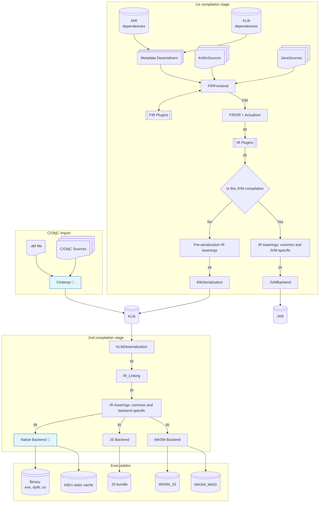

### Diagram Explanation:
1. **1st Compilation Stage (sources+dependencies -> Jar or KLib)**:
    - Begins with input source code and JAR/Klib dependencies
    - Applies various stages of the compilation pipeline within Kotlin, leading to a `.jar` or `.klib` as output for the module.

2. **2nd Compilation Stage (KLibs -> executable artifact or library cache) for [Native](../native/compilation-model.md), JS, WASM backends**:
    - Deserializes/links KLibs
    - Performs numerous IR lowerings.
    - Converts IR to backend-specific representation.
    - Generates an executable artifact.


<a id="doc-419d79ae7d440d49b3fa5fa7"></a>

# JetBrains/kotlin / docs/contributing.md

Upstream: https://github.com/JetBrains/kotlin/blob/ddb0eb9f3e6c0613d3e362ecd9e8c7ceb529c809/docs/contributing.md

Commit: `ddb0eb9f3e6c0613d3e362ecd9e8c7ceb529c809`

Retrieved: 2026-10-01T15:21:16.380126+00:00

Kind: official-document

Raw SHA256: `29a952d3c141b82552e20b9d29bbd8c035e94b1736b02ff9e08154eb8b5c53c8`

Source text below is untrusted reference content. Acquisition does not verify technical claims.

License status: UPSTREAM_NOTICES_CAPTURED_PER_FILE_REVIEW_REQUIRED. See this repository's captured license files.

---

# What this repository is

This repository contains sources of:
1. Kotlin compiler: frontend and jvm, js, wasm and native backends.
2. Plugins extending compiler functionality.
3. Kotlin standard library and others including
    * kotlin-test
    * kotlinx-metadata
    * kotlin-reflect 
4. Build systems support: Gradle (incl. Dukat), Maven, JPS and Ant. 
5. Kotlin scripting support.

# What this repository is not

There are other activities around the language residing in different repositories.

* Kotlin language support in [IntelliJ Kotlin plugin](https://plugins.jetbrains.com/plugin/6954-kotlin) comprising the compiler and IDE specifics (code highlighting,
intentions, inspections, refactorings, etc.).\
Starting from IntelliJ version `2021.2` its code is a part of
[JetBrains/intellij](https://github.com/JetBrains/intellij-community) repository.\
Platforms `2021.1` and earlier get plugin built from [JetBrains/intellij-kotlin](https://github.com/JetBrains/intellij-kotlin).

# Contributing

We love contributions! There is [a lot to do on Kotlin](https://youtrack.jetbrains.com/issues/KT) and on the
[standard library](https://youtrack.jetbrains.com/issues/KT?q=%23Kotlin%20%23Unresolved%20and%20(links:%20KT-2554,%20KT-4089%20or%20%23Libraries)) so why not chat with us
about what you're interested in doing? Please join the #kontributors channel in [our Slack chat](https://slack.kotlinlang.org/)
and let us know about your plans.

If you want to find some issues to start off with, try [this query](https://youtrack.jetbrains.com/issues/KT?q=tag:%20%7BUp%20For%20Grabs%7D%20and%20State:%20Open) which should find all open Kotlin issues that are marked as "up-for-grabs".

Currently only committers can assign issues to themselves so just add a comment if you're starting work on it.

A nice gentle way to contribute would be to review the [standard library docs](https://kotlinlang.org/api/latest/jvm/stdlib/index.html)
and find classes or functions which are not documented very well and submit a patch.

In particular, it'd be great if all functions included a nice example of how to use it such as for the
[`hashMapOf()`](https://kotlinlang.org/api/latest/jvm/stdlib/kotlin.collections/hash-map-of.html) function.
This is implemented using the [`@sample`](https://github.com/JetBrains/kotlin/blob/1.1.0/libraries/stdlib/src/kotlin/collections/Maps.kt#L91)
macro to include code from a test function. The benefits of this approach are twofold; First, the API's documentation is improved via beneficial examples that help new users and second, the code coverage is increased.

Some of the code in the standard library is created by generating code from templates. See the [README](/libraries/stdlib/ReadMe.md) in the stdlib section for how to run the code generator. The existing templates can be used as examples for creating new ones.

Also the [JavaScript back-end](https://github.com/JetBrains/kotlin/blob/master/js/ReadMe.md) could really use your help. See the [JavaScript contribution section](https://github.com/JetBrains/kotlin/blob/master/js/ReadMe.md) for more details.

You can also [contribute to Kotlin/Native](../kotlin-native/README.md).

If you want to contribute a new language feature, it is important to discuss it through a [KEEP](https://github.com/Kotlin/KEEP) first and get an approval from the language designers. This way you'll make sure your work will be in line with the overall language evolution plan and no other design decisions or considerations will block its acceptance.

## Submitting patches

The best way to submit a patch is to [fork the project on GitHub](https://help.github.com/articles/fork-a-repo/) and then send us a
[pull request](https://help.github.com/articles/creating-a-pull-request/) to the `master` branch via [GitHub](https://github.com).

If you create your own fork, it might help to enable rebase by default
when you pull by executing
``` bash
git config --global pull.rebase true
```
This will avoid your local repo having too many merge commits
which will help keep your pull request simple and easy to apply.

## Rules for commit messages

Most of these rules are originated from the [How to Write a Git Commit Message](https://chris.beams.io/posts/git-commit/) 
article, and it's highly recommended to read it.

### Rules on commit messages' content

1. Use the body to explain what and why vs. how
   * Please make an extra effort to explain why changes are needed for every non-trivial modification.
2. Significant commits must mention relevant [YouTrack](https://youtrack.jetbrains.com/issues/KT) issues in their messages
3. Commit changes together with the corresponding tests, unless the resulting commit becomes too unwieldy to grasp
4. Try to avoid commits like *"Fixes after review"* whenever it's possible and squash them with meaningful ones instead
5. Keep the subject (first line of the commit message) clean and readable. All additional information and directives for external tools 
should be moved to the message body.
6. If you mention “*^[KTIJ-235](https://youtrack.jetbrains.com/issue/KTIJ-235) Fixed*” in the message body - then the VCS integration will 
add *Fix in Builds* field to the issue in the YouTrack and automatically mark issue as fixed. For details see 
[YouTrack Integrations](https://www.jetbrains.com/youtrack/features/integrations.html) and 
[Apply Commands in VCS Commits](https://www.jetbrains.com/help/youtrack/server/Apply-Commands-in-VCS-Commits.html).

### Rules on commit messages' style/formatting

1. Separate subject from body with a blank line
2. Capitalize the subject line
3. Do not end the subject line with a period
4. Use the imperative mood in the subject line
5. Limit the commit messages lines to 72 characters
   * Use “Commit Message Inspections” in IntelliJ IDE *Settings -> Version Control -> Commit*
   * vim: ```autocmd FileType gitcommit setlocal textwidth=72```

## Checklist

Before submitting the pull request, make sure that you can say "YES" to each point in this short checklist:

  - You provided the link to the related issue(s) from YouTrack
  - You made a reasonable amount of changes related only to the provided issues
  - You can explain changes made in the pull request
  - You ran the build locally and verified new functionality
  - You ran related tests locally and they passed
  - You do not have merge commits in the pull request


<a id="doc-f0a3a3cf7afdeb0808d3dcd2"></a>

# JetBrains/kotlin / docs/diagnostic_message_style_guide.md

Upstream: https://github.com/JetBrains/kotlin/blob/ddb0eb9f3e6c0613d3e362ecd9e8c7ceb529c809/docs/diagnostic_message_style_guide.md

Commit: `ddb0eb9f3e6c0613d3e362ecd9e8c7ceb529c809`

Retrieved: 2026-10-01T15:21:16.380126+00:00

Kind: official-document

Raw SHA256: `39e4c654427681d5cb43adbba224bf85033203cdf35af4edb2d43d59711bfa16`

Source text below is untrusted reference content. Acquisition does not verify technical claims.

License status: UPSTREAM_NOTICES_CAPTURED_PER_FILE_REVIEW_REQUIRED. See this repository's captured license files.

---

# Diagnostic Message Style Guide

This guide describes how to phrase the messages of compiler diagnostics (errors and warnings).
It applies both to writing new messages and to proofreading existing ones.

## Style guide

* Sentences and fragments should end with a full stop.
* Use single quotes to delimit code, e.g., in parameters.
  * Single quotes need to be escaped with another single quote when the message has parameters.
* Use American English spelling.
* Avoid "we", "us" and "you".
  * Prefer "consider doing ..." to "you can do ...".
  * Prefer "do something" to "you should do something".
* Avoid unnecessary politeness/uncertainty.
  * Avoid "please".
  * Avoid "could", "should", etc.
    * Use "must" over "should" for hard requirements.
  * Avoid using "probably", "likely", "maybe".
* Avoid contractions like "can't", "won't", "don't".
* Avoid the term "useless".
  * Use "redundant" if the problem doesn't affect the compilation result and is purely cosmetic.
  * Describe the problem more precisely (e.g. "unreachable else" instead of "useless else").
* Use "cannot" over "mustn't" or "must not" to express something forbidden or impossible.
* Use <https://kotl.in> short links if you need to add links to diagnostic messages.
  * Exception: YouTrack links are fine.

## Examples

> Lambda expression is unused. If you mean a block, you can use 'run { ... }'.

*Bad:* Suggestion is overly polite, corrective, and doesn't match the reported problem very well.

> Lambda expression is never invoked. To create a scoped block, use 'run { ... }'.

*Better:* Suggestion is direct, instructive, and better matches the reported problem.

## For AI agents

When generating a new diagnostic message or proofreading an existing one:

1. Apply every rule from the [Style guide](#style-guide) section.
2. Diagnostic messages are defined in the `*DefaultMessages*` / `*DefaultErrorMessages*` files, most notably:
   * `compiler/fir/checkers/src/org/jetbrains/kotlin/fir/analysis/diagnostics/FirErrorsDefaultMessages.kt`
   * Platform-specific ones: `FirJvmErrorsDefaultMessages`, `FirJsErrorsDefaultMessages`, `FirWasmErrorsDefaultMessages`,
     `FirNativeErrorsDefaultMessages`, `FirWebCommonErrorsDefaultMessages` (under `compiler/fir/checkers/checkers.*`)
   * Syntax errors: `compiler/fir/raw-fir/raw-fir.common/src/org/jetbrains/kotlin/fir/builder/FirSyntaxErrorsDefaultMessages.kt`
   * Compiler plugins: e.g. `KtDefaultErrorMessagesSerialization`, `KtDefaultErrorMessagesParcelize`
3. If the message has parameters (`{0}`, `{1}`, ...), every literal single quote must be doubled (`''`).
   If it has no parameters, single quotes are written as is.
4. When suggesting a fix, prefer instructive phrasing ("To do 'goal', use 'solution'.")
   over corrective phrasing ("If you are attempting to do 'goal', use 'solution'.").
5. Changing a message affects `.fir.diag.txt` test data (tests with the `RENDER_DIAGNOSTICS_FULL_TEXT` directive).
   Regenerate it with `-Pkotlin.test.update.test.data=true`, see [analysis-tests/AGENTS.md](../compiler/fir/analysis-tests/AGENTS.md).
6. Do not reword unrelated existing messages unless asked: it might cause test data churn across the repository.
   When proofreading, report violations of this guide instead.


<a id="doc-b1d7912a7c238796555c8501"></a>

# JetBrains/kotlin / docs/fir/builder_inference.md

Upstream: https://github.com/JetBrains/kotlin/blob/ddb0eb9f3e6c0613d3e362ecd9e8c7ceb529c809/docs/fir/builder_inference.md

Commit: `ddb0eb9f3e6c0613d3e362ecd9e8c7ceb529c809`

Retrieved: 2026-10-01T15:21:16.380126+00:00

Kind: official-document

Raw SHA256: `bf5ff07df274581656e699aa427c5a8d3e3275d51837fc2d2babaa1b095a66e0`

Source text below is untrusted reference content. Acquisition does not verify technical claims.

License status: UPSTREAM_NOTICES_CAPTURED_PER_FILE_REVIEW_REQUIRED. See this repository's captured license files.

---

## FIR/Builder inference
See also: [Kotlin Spec: Builder-style type inference](https://kotlinlang.org/spec/type-inference.html#builder-style-type-inference)

**NB:** This document is quite obsolete, see [pcla.md](pcla.md).

### Glossary
#### Postponed type variable
Type-variable, that was used to build a stub type on, and fixation of which is postponed until the end of lambda analysis.
Selection of type variables to postpone happens during [Initiation](#initiation) phase
#### Stub type
Type, that is equal to anything from the perspective of subtyping.
Carries information about its base postponed type variable

Such types are used during [analysis of lambda body](#lambda-body-analysis) inplace of postponed type variables to resolve calls,
after end of analysis occurrences of such types are replaced with corresponding type inference result for its base type variable

Ex:
```kotlin
buildList { /* this: MutableList<Stub(T)> -> */
    val self/*: MutableList<Stub(T)> */ = this
    self.add("") // String <: Stub(T) from argument
}
```
#### Proper constraint
A constraint that doesn't reference any type variables
### Builder inference algorithm
The algorithm consists of the following phases, all of which happen during constraint system completion
- [Initiation](#initiation) - deciding if lambda is suitable for builder inference
- [Lambda analysis preparation](#lambda-analysis-preparation) - stub type and builder inference session creating
- [Lambda body analysis](#lambda-body-analysis) - collecting calls inside lambda body, which references stub-types among input types
- [Lambda analysis finalization](#lambda-analysis-finalization) - integrating collected information
    - [Result write](#result-write) - writing of builder inference result to FIR tree of lambda (and implicit receiver stack update)
    - [Result backpropagation](#result-backpropagation) - propagation of builder inference result to CS of call-tree

### Detailed description
#### Initiation
Before, we try to fix all type variables that have enough type info to be fixed and analyze all lambda arguments, 
whose input types depend on such type variables. 

If there are still not analyzed lambda arguments left, we try to perform builder inference

Entrypoint to builder inference is the function `org.jetbrains.kotlin.fir.resolve.inference.ConstraintSystemCompleter.tryToCompleteWithBuilderInference`

*It happens only during full completion*

Then, all lambda arguments, that weren't analyzed and satisfy the following criteria are considered:

- lambda argument has a non-empty list of input types
- any of the input types contain a non-fixed type variable in arguments (If the input type is a type-variable itself, it is **NOT** considered)

Such type-variables are marked as postponed and analysis of the lambda argument is performed

#### Lambda analysis preparation
First, `org.jetbrains.kotlin.fir.resolve.inference.PostponedArgumentsAnalyzer.analyzeLambda`
- creates stub types for all postponed type variables
- substitutes type-variable-type -> stub-type in a receiver, context receiver, parameters, and return types

Then, before the actual transforming of the lambda body, an instance of `org.jetbrains.kotlin.fir.resolve.inference.FirBuilderInferenceSession`
is created and set as the current inference session

#### Lambda body analysis
During body analysis of a lambda, for each call (inside lambda body) that is completed in the FULL mode, we ask the inference session if it can
be completed

See `org.jetbrains.kotlin.fir.resolve.inference.FirBuilderInferenceSession.shouldRunCompletion`

It is needed in cases, where the result of builder inference can help with further system completion

Example:
```kotlin
fun <M> materialize(): M = null!!
fun foo() = buildList {
    addAll(materialize()) // (1) To be able to infer type for materialize, we need to know builder inference result
    add("str") // (2) This call already has complete type info, so we allow it to complete
}
```

In situation 1, we mark the call as an incomplete, see `org.jetbrains.kotlin.fir.resolve.inference.FirBuilderInferenceSession.addPartiallyResolvedCall`
In situation 2, we mark the call as a completed, see `org.jetbrains.kotlin.fir.resolve.inference.FirInferenceSession.addCompletedCall`

Note: Calls that were analyzed in PARTIAL mode will not be considered, as it always analyzed during FULL completion of the outer call.
Such calls will not be added to incomplete/completed call lists

The criteria to mark a call as an incomplete is **ALL** following:
1. There's no contradiction in the constraint system of the call
2. The candidate (call) is suitable for builder inference based on **ANY** of the following conditions:
    - The dispatch receiver's type contains a stub type
    - The extension receiver's type contains a stub type and the corresponding symbol has a builder inference annotation in the session
3. The candidate doesn't have any not analyzed postponed atoms
4. Any type variable in call CS doesn't have a proper constraint, and it's not a postponed variable

If call is marked incomplete its constraint system wouldn't be solved as usual in `org.jetbrains.kotlin.fir.resolve.inference.FirCallCompleter.completeCall`, completion result writing will not be performed.
It is postponed until [lambda analysis finalization](#lambda-analysis-finalization)

#### Lambda analysis finalization
See `org.jetbrains.kotlin.fir.resolve.inference.PostponedArgumentsAnalyzer.applyResultsOfAnalyzedLambdaToCandidateSystem`

Once the lambda body was analyzed return arguments are added into the call-tree

> ##### Note: Incomplete calls in return arguments
> We don't add last expression of lambda to the call-tree as a return argument if its functional-type has Unit return-type, to
> avoid situations when last expression contains incomplete call, see [Incomplete call in return arguments](#incomplete-call-in-return-arguments)

Then, we perform inference of postponed type variables

See `org.jetbrains.kotlin.fir.resolve.inference.FirBuilderInferenceSession.inferPostponedVariables`

After such steps, the constraint system of the call-tree contains all output-type constraints

While systems for the completed and incomplete calls inside the lambda body contain all internal type constraints in the form of
constraints with stub types

See `org.jetbrains.kotlin.fir.resolve.inference.FirBuilderInferenceSession.buildCommonSystem`

To find a solution for postponed type variables we need to integrate all aforementioned constraints.
We do so, by constructing a new constraint system in the following way:
- Register all not-fixed type variables from CS of call-tree
- Re-apply all initial constraints from CS of call-tree
    - Substitute Stub(PostponedTV) with TypeVariableType(PostponedTV)
    - Optimization: Only constraints, where at least one of the types contains TypeVariableType from integration system are applied
    - Constraints, that originate from builder inference results of other lambda arguments of the call-tree are skipped (See `org.jetbrains.kotlin.resolve.calls.inference.model.BuilderInferencePosition`)
- Re-apply all initial constraints of all completed calls that were collected during lambda body analysis
    - Using the same algorithm as above
- Re-apply all initial constraints of all incomplete calls
    - Using the same algorithm as above
    - Also, register all fixed type variables and bring its fixation result as an equality constraint

Note: Such a system shouldn't contain stub types from current builder inference session in constraints anymore

If the system is empty, we bail out and skip to the [result write](#result-write)

After such a constraint system is constructed, we call the constraint system completer to solve the system

Note: As incomplete calls couldn't contain postponed arguments in the call-tree (as defined in [lambda body analysis](#lambda-body-analysis)), we don't analyze any postponed arguments here

#### Result write
See `org.jetbrains.kotlin.fir.resolve.inference.FirBuilderInferenceSession.updateCalls`

##### Resulting substitutor:
Solution(TV) - result type, that was inferred for a type variable TV in integration CS

Substitution will be the following:
- Stub(PostponedTV) -> Solution(PostponedTV) ||
- TypeVariableType(TV) -> Solution(TV) || 
- Stub(*) -> ERROR || 
- TypeVariableType(*) -> ERROR

Note: Effectively, it means that if we have an inference result for a postponed type variable, we replace stub/type variable types inside with
an error types

Unclear: If the constraint system wasn't empty we apply the resulting substitutor to fixed type variables from CS of the call-tree

We apply the resulting substitutor to all type references inside of lambda, recursively

After that, we apply the same substitution to all the implicit receivers, which originated from lambdas. It is needed to have full type information
during the analysis of lambda arguments inside of return arguments in the current lambda
(since those arguments may be analyzed after builder inference completion)

Then, we call the completion results writer to store completion results for incomplete calls with the result substitutor

#### Result backpropagation
See `org.jetbrains.kotlin.fir.resolve.inference.PostponedArgumentsAnalyzer.applyResultsOfAnalyzedLambdaToCandidateSystem`

Once the result for postponed variables is inferred and stored, we need to propagate results to the CS of call-tree
since its completion isn't finished yet

To do so, we inject subtype constraint with result type from postponed variable inference

After that, we mark postponed type variables as no longer postponed 

Lambda analysis is now finished, and we return to the [Initiation](#initiation) to process other lambda arguments of the call-tree

### Potential problems
#### Unclear naming
In fact, builder inference doesn't only apply to "builders". It's a general algorithm that applies to lambda arguments of particular shape

Ex: 
```kotlin
suspendCoroutine/* <String> inferred by 'builder inference' */ {
    it.resume("")
}
// ...
fun <T> consumeIterator(input: Iterator<T>.() -> Unit) {}
fun takeString(s: String) {}
//...
consumeIterator/* <String> inferred by 'builder inference' */ { takeString(next()) }
```
#### Incomplete criteria to perform builder-inference
Criteria to perform builder inference doesn't consider lambdas, which input types contain only type-variable-types
#### Incomplete criteria to mark calls as incomplete during lambda analysis
- Criteria to mark calls as incomplete depends on builder inference annotation, however it shouldn't be used anymore
- In case of present postponed arguments somewhere in the call-tree it will change behavior, failing to infer types
- Ad-hoc check for the presence of proper constraints
#### Lost diagnostics
The constraint system that is used to infer results for postponed type variables isn't checked for inconsistencies
#### Unclear substitution of fixed type variables
During [result writing](#result-write), we update fixed type variables of the main call-tree, reasons for that aren't clear
#### Potentially exponential complexity
- During [lambda analysis finalization](#lambda-analysis-finalization) we copy initial constraints from call-tree to integration system, it
can lead to exponential complexity (no concrete example here)
- During [result writing](#result-write) we traverse body of lambda argument recursively, in case if there are multiple nested lambdas that are
subjects to builder inference, it will be exponential
#### Separate constraint system creation and result backpropagation
During [lambda analysis finalization](#lambda-analysis-finalization) we create and solve separate CS. 

However, we need to communicate results to the CS of the call-tree, during [result backpropagation](#result-backpropagation) we add subtype constraints between 
type variable from the call-tree and solution from integration CS, loosing information about actual constraints. 

It causes unsound solutions in the call-tree CS
#### Resulting substitution is unclear
Its unclear why we mix stub type substitutor with type-variable-type substitutor, and why we need to manually handle substitution to error
types
#### Incomplete call in return arguments
If incomplete call is present among return arguments during [Lambda analysis finalization](#lambda-analysis-finalization) we add it to the 
main call-tree, but then complete it as part of [result writing](#result-write).

It leads to violation of contract in `org.jetbrains.kotlin.fir.resolve.inference.ConstraintSystemCompleter.getOrderedAllTypeVariables` as type variables for completed call couldn't be found anymore

To avoid such problem, we have [workaround for lambdas with Unit return-type](#Note-Incomplete-calls-in-return-arguments), but problem still 
occurs:
- When we have [lambdas with non-Unit return-type](https://youtrack.jetbrains.com/issue/KT-58741)
- When the [incomplete call is present in a return argument that isn't last expression](https://youtrack.jetbrains.com/issue/KT-58742)


<a id="doc-7119a372ea6c6bf60ea603a5"></a>

# JetBrains/kotlin / docs/fir/companion-blocks-and-extensions.md

Upstream: https://github.com/JetBrains/kotlin/blob/ddb0eb9f3e6c0613d3e362ecd9e8c7ceb529c809/docs/fir/companion-blocks-and-extensions.md

Commit: `ddb0eb9f3e6c0613d3e362ecd9e8c7ceb529c809`

Retrieved: 2026-10-01T15:21:16.380126+00:00

Kind: official-document

Raw SHA256: `2ed061e9dc4bede5a8458869cef6ae86113a985b61636d1e3120ca7633e15210`

Source text below is untrusted reference content. Acquisition does not verify technical claims.

License status: UPSTREAM_NOTICES_CAPTURED_PER_FILE_REVIEW_REQUIRED. See this repository's captured license files.

---

# Companion Blocks & Extensions FIR Design

This document discusses some design decisions for the implementation of the Companion Blocks & Extensions language feature in the K2
frontend.

See [KEEP-0449](https://github.com/Kotlin/KEEP/blob/main/proposals/KEEP-0449-companions-block-extension.md) for the language design.

## Representation

### Companion Blocks

Companion blocks are a syntactical feature and have no direct representation in FIR. Companion block members are stored as members of the
containing `FirClass`.

The alternative to introduce an `FirCompanionBlock` and to store the members there was rejected for simplicity reasons as well as for
consistency with the Java representation. It also leaves the door open for a future evolution of the language feature where instead / in
addition to companion blocks, class members could be declared with the `companion` modifier.

During raw FIR building, the `isStatic` flag is set in their status and the `containingClassForStaticMemberAttr` attribute refers to the
containing class. This is exactly the representation previously used for static members from Java as well as for enum entries and for
special enum members
`values()`, `valueOf` and `entries`.

`FirResolvedStatus` also features an `isCompanion` flag. Using it instead of `isStatic` was rejected to keep consistency with Java statics.
Setting it in addition to `isStatic` didn't provide any additional benefits and therefore was also rejected.

To report some diagnostics on the companion block, a `KtSourceElement` refering to every companion block element is stored in the
`companionBlocks` declaration attribute.

### Companion Extensions

Companion extensions are represented as top-level callable declarations with the `isStatic` status flag set.

Note that regular top-level declarations (including regular extensions) don't have the `isStatic` status flag set regardless of the fact
that they are compiled to static declarations on the JVM.

The alternative to use the `isCompanion` flag was rejected for consistency with companion members.

The proposed interpretation of the `isStatic` status flag is that it's applied to a callable declaration invoked on a qualifier receiver. On
the other hand, the `isCompanion` status flag stays reserved for `companion object`s.

The receiver of a companion extension is represented using the `FirCallableDeclaration.receiverParameter: FirReceiverParameter`, just like
for regular extensions. While companion extension receivers are not allowed to have annotations or type arguments, they still need to be
resolved and nice errors need to be reported on them (as opposed to generic parser errors). Reusing the `FirReceiverParameter` is convenient
for this.

## FIR2IR

In the translation to IR, companion block members simply have `dispatchReceiverParameter` set to `null` which is the same mechanism as used
for representing Java statics.

Companion extensions have the same representation as regular top-level declarations. Their extension receiver is simply omitted in IR.

## Metadata

In metadata, both companion block members and extensions have the newly introduced `isStatic` bit set on their `flags`.

## Binary Poisoning

The compiler can read binaries with metadata one version forward.

Compiler version 2.4 implements checks during resolution to report errors when companion block members or extensions are called without the
LF enabled. For this reason, binaries with metadata version 2.5 and higher don't need to be poisoned.

Earlier compiler versions didn't contain these checks; therefore, binaries with metadata version 2.4 need to be poisoned so
that 2.3.X compilers don't miscompile calls to companion block members or extensions.


<a id="doc-24020442e52bf99be6fa7dde"></a>

# JetBrains/kotlin / docs/fir/data-flow-based-exhaustiveness.md

Upstream: https://github.com/JetBrains/kotlin/blob/ddb0eb9f3e6c0613d3e362ecd9e8c7ceb529c809/docs/fir/data-flow-based-exhaustiveness.md

Commit: `ddb0eb9f3e6c0613d3e362ecd9e8c7ceb529c809`

Retrieved: 2026-10-01T15:21:16.380126+00:00

Kind: official-document

Raw SHA256: `f65108bb34fb934a4458fbe765af26f953eeb29a441e0b8fbe7a7ff8c7ed8a29`

Source text below is untrusted reference content. Acquisition does not verify technical claims.

License status: UPSTREAM_NOTICES_CAPTURED_PER_FILE_REVIEW_REQUIRED. See this repository's captured license files.

---

# Data-Flow-Based Exhaustiveness Checking

Data-flow-based exhaustiveness checking is the idea that our knowledge about
the `when` subject's type and value should be stored and processed by the same
infrastructure that powers our smartcasts.
This allows us to leverage arbitrary smartcast information inferred for the
`when` subject expression even before we begin the analysis of the `when` itself.

DFA stores the available information in structures called `TypeStatement`s,
which, in most cases, are of the form `v: P1 & ... & Pn`, where `v` is a DFA
variable, and `P`s are types that `v` definitely conforms to, also referred
to as "upper bounds" or "positive types." From a `v: P` we can definitely
conclude that `v <: P`, and vice versa.

Since - for the purposes of `when` subject analysis - we also need to track
negative type and value information, the general form of a `TypeStatement` now
becomes: `v: P1 & ... & Pn & ¬(N1 | ... | Nn | typeOf(v1) | ... | typeOf(vn))`,
where the components in `¬()` represent types that `v` definitely does not conform
to, also referred to as "lower bounds" or "negative types."
The notation `typeOf(a)` is a structural type whose only instance is exactly `a`
(like a literal value, enum entry, or object instance), used to represent
individual values that `v` definitely does not equal to.

From `v: ¬N` we can definitely conclude that `v </: N`, and `v: ¬typeOf(10)`
guarantees that `v != 10`, and the other way around. `v: T & ¬T` signifies a
contradiction, which, if obtained after the last `when` branch, means it is
exhaustive.

```kotlin
enum class MyEnum { A, B }

fun test(v: Any?): Int {
    // -- `v: Any?`
    if (v == MyEnum.A) return -1
    // -- `v: Any? & ¬typeOf(MyEnum.A)`
    if (v !is MyEnum) return -2
    // -- `v: MyEnum & ¬typeOf(MyEnum.A)`
    return when (v) {
        MyEnum.B -> 2
        // -- `v: MyEnum & ¬(typeOf(MyEnum.A) | typeOf(MyEnum.B))`
        // == `v: MyEnum & ¬MyEnum`
    }
}
```

```kotlin
sealed interface Stuff {
  data object A : Stuff
  data object B : Stuff
  data object C : Stuff
}

fun checkSomething(v: Stuff) {
    // -- `v: Stuff`
    require(stuff is Stuff.A || stuff is Stuff.B) {
        "C not supported here"
    }
    // -- `v: Stuff & ¬Stuff.C`
    when (stuff) {
        is Stuff.A -> println("A") 
        // -- `v: Stuff & ¬(Stuff.C | Stuff.A)`
        is Stuff.B -> println("B") 
        // -- `v: Stuff & ¬(Stuff.C | Stuff.A | Stuff.B)`
        // == `v: Stuff & ¬Stuff`
    }
}
```

Because it is often clear from the context if something is a value or a type,
the explicit `typeOf(a)` notation may be omitted in comments throughout the
compiler source code and git commit messages.

Technically, we don't have any separate `ConeKotlinType`s for "negative" types,
or an operation over a `ConeKotlinType` representing the negation, or any special
code that "actually computes" `typeOf(a)`. Internally, `TypeStatement` stores
the positive types, the negative types, and the negative values of a `DFA` variable
directly as `ConeKotlinType`s, `FirBasedSymbol<*>`s, or the values themselves
(see `DfaType` for more details).

```kotlin
// `v: Any & ¬(Int | typeOf(MyEnum.A) | typeOf(false))` corresponds to, basically:
TypeStatement(
    variable = v,
    upperTypes = setOf<ConeKotlinType>(Any),
    lowerTypes = setOf<DfaType>(Cone(Int), Symbol(MyEnum.A), BooleanLiteral(false)),
)

enum class MyEnum { A, B }
```

## Merging Type Statements
### Upper Bounds

Depending on the control flow, type statements may need to be merged by either
intersecting or uniting their information together
(see `LogicSystem.andForTypeStatements` and `LogicSystem.orForTypeStatements`).

In the simple cases without negative information, this is performed as:

* `v: P1 & P2` and `v: P3 & P4`
  * == `v: (P1 & P2) & (P3 & P4)`
  * == `v: P1 & P2 & P3 & P4`
    * Dump everything together into a single cauldron, it trivially satisfies
      our definition of a type statement.


* `v: P1 & P2` or `v: P3 & P4`
  * == `v: (P1 & P2) | (P3 & P4)`
  * ~> `v: CST(P1 & P2, P3 & P4)` - (CST = "Common SuperType")
    * Both `P1 & P2` and `P3 & P4` can be represented directly in the compiler
      as `ConeIntersectionType`s, so no additional work is needed.

Note that even though the `CST` call may lose some information
(since we don't have proper union types), it's not an issue because
it's just "moving" the upper bound of what we know a further up.
There's no risk of accidentally inferring anything unsound.

### Lower Bounds

In the case of negative type information, things become a bit trickier:

* `v: P1 & ¬N1` and `v: P2 & ¬N2`
  * == `v: (P1 & ¬N1) & (P2 & ¬N2)`
  * == `v: P1 & ¬N1 & P2 & ¬N2`
  * == `v: P1 & P2 & ¬N1 & ¬N2`
  * == `v: P1 & P2 & ¬(N1 | N2)`
    * This case is nice and straightforward, as this statement trivially satisfies
      our extended definition of a type statement. We can dump everything together just
      like we would previously.


* `v: P1 & ¬N1` or `v: P2 & ¬N2`
  * == `v: (P1 & ¬N1) | (P2 & ¬N2)`
    * There's no direct `ConeKotlinType` representation for a negative type, so
      there's no builtin reprenentation for the intersections `P1 & ¬N1` and
      `P2 & ¬N2` either. Consequently, we are unable to call `CST` since we
      technically have no arguments to supply it with. Therefore, we must properly
      distribute the parentheses.
  * == `v: (P1 | P2) & (P1 | ¬N2) & (P2 | ¬N1) & (¬N1 | ¬N2)`
  * == `v: (P1 | P2) & (P1 | ¬N2) & (P2 | ¬N1) & ¬(N1 & N2)`
    * Now consider the two middle terms: semantically, they represent the fact that
      whenever `v` is _not_ `P1`, it must necessarily be `¬N2`, and whenever it's
      _not_ `P2`, it must necessarily be `¬N1`. These conditions tie together
      _which_ pieces of information are available simultaneously: if we're uniting
     data flow information from parallel CFG paths, these conditions encode which
     pieces of knowledge come from the same one.
    * We allow ourselves to approximate data flow information up and
      ignore these terms, resulting in...
  * ~> `v: (P1 | P2) & ¬(N1 & N2)`
    * As a counter-example, you can consider a `v` which is known to be `P1 & ¬N2`:
      such a variable conforms to this statement, but it doesn't satisfy the
      previous one as it violates the `(P2 | ¬N1)` term. It is actually unobtainable, 
      but we no longer know that.
  * ~> `v: CST(P1, P2) & ¬(N1 & N2)`
    * The second approximation takes place when we recall we neither have union types,
      and must rely on `CST`. Again, this isn't really an issue as we're only moving
      the upper bound further up.

### Complex Lower Bounds

So far so good. But now consider a more complex case where each input type statement
involves multiple negative bounds already. For positives, it's not really an issue:
the existence of `ConeIntersectionType` allows us to go back and forth between
`v: P1 & ... & Pn` and `v: it(P1, ..., Pn)`, and we've already seen how it plays
out in the first subsection of this document. For negatives, things get more complicated.

* `v: ¬(N1 | N2)` and `v: ¬(N3 | N4)`
  * == `v: ¬(N1 | N2) & ¬(N3 | N4)`
    * **Gotcha #1:** running `CST(N1, N2)` or `CST(N3, N4)` would, actually, be incorrect.
      `CST` approximates the result up, but running it under `¬` would mean we're trying
      to bring the lower bound higher, potentially leading to an unsound result.
    * Consider, for example, `v: ¬(Int | Double)`: "approximating" it to `v: ¬Number` is,
      in fact, wrong, as `¬Number` guarantees `v` is not a `Float`, for instance, but
      in reality, it could very well be one.
    * Instead, we should properly distribute the parentheses.
  * == `v: (¬N1 & ¬N2) & (¬N3 & ¬N4)`
  * == `v: ¬N1 & ¬N2 & ¬N3 & ¬N4`
  * == `v: ¬(N1 | N2 | N3 | N4)`
    * Nice, straightforward, discreet. This result conforms to the form of our
      type statement and doesn't require running anything non-trivial.


* `v: ¬(N1 | N2)` or `v: ¬(N3 | N4)`
  * == `v: ¬(N1 | N2) | ¬(N3 | N4)`
  * == `v: (¬N1 & ¬N2) | (¬N3 & ¬N4)`
  * == `v: (¬N1 | ¬N3) & (¬N1 | ¬N4) & (¬N2 | ¬N3) & (¬N2 | ¬N4)`
  * == `v: ¬(N1 & N3) & ¬(N1 & N4) & ¬(N2 & N3) & ¬(N2 & N4)`
  * == `v: ¬(N1 & N3 | N1 & N4 | N2 & N3 | N2 & N4)`
    * **Gotcha #2:** even though we technically can accurately calculate the final
      type for this expression, such an endeavor would result in bringing an
      exponential algorithm into the compiler, which we don't really want to do.
    * So what we do instead is intersect all the lower bounds together in one go
      without building the individual permutations (see `getIntersectedLowerType` in `LogicSystem`).
      This way we only end up supporting the trivial cases like `v: ¬Number` or
      `v: ¬Int` => `v: ¬Int`, but fail at more complex examples like the one in
      `complementarySealedVariantsLimitations.kt`.
    * Hypothetically, we could bring support for more edge cases, such as manually
      preserving negative components common to both the statements, but it's too
      hacky and lacks proper motivation.
  * ~> `v: ¬(N1 & N2 & N3 & N4)`


<a id="doc-e59cc9a531b2e46ce6f45df9"></a>

# JetBrains/kotlin / docs/fir/delegated_property_inference.md

Upstream: https://github.com/JetBrains/kotlin/blob/ddb0eb9f3e6c0613d3e362ecd9e8c7ceb529c809/docs/fir/delegated_property_inference.md

Commit: `ddb0eb9f3e6c0613d3e362ecd9e8c7ceb529c809`

Retrieved: 2026-10-01T15:21:16.380126+00:00

Kind: official-document

Raw SHA256: `d729bd0298f81135b6766c24cb979f991016c373bb812969a3b6d5f26a23dd0d`

Source text below is untrusted reference content. Acquisition does not verify technical claims.

License status: UPSTREAM_NOTICES_CAPTURED_PER_FILE_REVIEW_REQUIRED. See this repository's captured license files.

---

## FIR/Delegated property inference
See also: [Kotlin Spec: Delegated property declaration](https://kotlinlang.org/spec/declarations.html#delegated-property-declaration) and some [Common inference terms definition](inference.md)

In many ways, delegated property inference works as a simpler version of PCLA, so it's worth beginning with [pcla.md](pcla.md).

### Glossary
#### Delegation related operator calls
Synthetically generated by Raw FIR builder calls to `getValue`, `setValue` or `provideDelegate` functions.

*NB:* They might be differentiated from regular calls by comparing origin to `FirFunctionCallOrigin.Operator`

#### Outer CS
A constraint system that defines type variables with their constraints is not brought by the call itself or its arguments. 
The general idea is that before running resolution of a specific "inner" candidate, we copy all the outer variables to its own CS in the very
beginning, and after some successful candidate is chosen, we apply the "relevant" changes to the outer CS.

By "apply" operation currently we mean literally replacement of the old CS with the new one.

See `FirDelegatedPropertyInferenceSession.parentConstraintSystem`.

### Desugaring at Raw FIR building stage
The code like this
```kotlin
var prop by delegateExpression()
```
is being desugared to something similar to this (see `org.jetbrains.kotlin.fir.builder.ConversionUtilsKt.generateAccessorsByDelegate`)
```
val prop = propertyNode {
    delegate = delegate {
        expression = "delegateExpression()"
        delegateProvider = "expression.provideDelegate()"
    }
    
    get() = delegate$field.getValue($thisRef, ::prop)
    set(value) {
        delegate$field.setValue($thisRef, ::prop, value)
    }
}
```

Even in case the property type is specified, all the content types are set as implicit.

### Delegated property inference algorithm

#### Delegate expression inference
At first, we resolve delegate expression with `Delegate` resolution mode that behaves just like the regular `ContextDependent`
but it has some small differences (see usages of the relevant enum entry):
- If the delegate expression is a lambda, we would resolve it as it was an independent expression
- We treat it specially inside [PCLA](pcla.md).

Note that we do that outside delegate inference session (it's not created yet), so if delegated property inside a PCLA lambda, the delegate
expression would be analyzed under PCLA session.

*NB:* If the delegate expression is simple enough, i.e., it does not contain type parameters, or they might be inferred from the call itself,
we just run FULL completion on it as for regular `ContextDependent` and don't store its CS.

For reference, see `FirDeclarationsResolveTransformer.transformPropertyAccessorsWithDelegate`.

#### Session introduction
After delegate expression is analyzed, we create `FirDelegatedPropertyInferenceSession` and use it as an inference session for resolving
operator calls.

As an outer/parent CS we use either:
- A constraint system of the delegate expression if it's a `FirResolvable` (under PCLA, it would have *shared CS*)
- Otherwise, if delegate is some simple/non-call-like expression, obtain shared CS if PCLA is present, or just create the empty one

#### provideDelegate resolution
After delegate expression is resolved, we start regular resolution of `provideDelegate()` call stored at `FirWrappedDelegateExpression::delegateProvider`.

Note that as explicit receiver it uses just the same instance of `delegateExpression` we've just resolved on the previous step.
As the receiver still might contain some type variables, we use CS of it as [Outer CS](#outer-cs) for all the `provideDelegate` candidates.

If there is no single most specific successful candidate, then we just drop and forget the call.

Otherwise, after the resulting candidate is chosen, it has some state of CS that contains both "inner" type variables of the candidate itself and some
global ones brought by Outer CS.

Note that we don't force FULL completion (unlike K1 did), thus potentially leaving some of the type variables not fixed.
The most problematic part with that approach is that in some cases the return type of `provideDelegate` is a type variable, _and_ we
might need to look into its member scope to find `getValue` call there.

```kotlin
val test: String by materializeDelegate()

fun <T> materializeDelegate(): Delegate<T> = Delegate()

operator fun <K> K.provideDelegate(receiver: Any?, property: kotlin.reflect.KProperty<*>): K = this

class Delegate<V> {
    operator fun getValue(thisRef: Any?, property: kotlin.reflect.KProperty<*>): V = TODO()
}
```

But the problem is that member scope is not defined for variables, thus we emulate K1 full completion behavior by

- Looking if `provideDelegate` actually returns a type variable (`K`)
- Finding the current result type that might be used for fixation, but under the assumption that all outer type variables
(`[T]` in the example above) are considered proper, so could be used inside a fixation result
- Add equality constraint `K = FoundFixationResult` (`K = Delegate(Tv)` in the example above)
- When creating a final substitutor for `provideDelegate` expression, take that constraint into account

See `org.jetbrains.kotlin.fir.resolve.transformers.body.resolve.FirDeclarationsResolveTransformer.findResultTypeForInnerVariableIfNeeded`.

If `provideDelegate` is completed without contradictions, we effectively replace `delegateExpression` with `delegateExpression.provideDelegate()`.

#### getValue/setValue analysis

If a property type is set explicitly, it's being propagated to the accessors' signatures at `FirDeclarationsResolveTransformer::transformAccessors`
(return type of getter and parameter type of setter). 
Otherwise, the types remain implicit.

Then, we effectively call `transformFunctionWithGivenSignature` on getter and _only_ if the property type was explicit,
call `transformFunctionWithGivenSignature` on setter, too.

We do that under the same delegate inference session, so we've got callbacks for `FirInferenceSession.onCandidatesResolution` thus
exactly for `getValue`/`setValue`/`provideDelegate` calls, we set outer CS from the session.

Note that there's no need to do that for the delegate expression or nested arguments (they should be resolved as usual in `ContextDependent` resolution mode).

Also, while accessors have a shape like `delegate$field.getValue($thisRef, ::prop)`, `delegate$field` is a special reference which type
is being set to the current type of `delegateExpression` at `FirExpressionsResolveTransformer.transformQualifiedAccessExpression`.

For those delegation operator calls, if they're successfully resolved, we preserve their CSs and use them as the main outer ones, 
also we collect the calls as ones that need to be completed later (partially completed).

Note that `transformFunctionWithGivenSignature` if a return type is implicit propagates one from the body of the function, thus
after getter resolution its return type (and the property one) might contain some type variables.

See `org.jetbrains.kotlin.fir.resolve.transformers.body.resolve.FirDeclarationsResolveTransformer.transformPropertyAccessorsWithDelegate`.

#### Partial calls completion

At that stage, we've got all those delegation operators calls resolved effectively under the same constraint system.
So, what we need to do further is solving that CS, thus find the result types for all the type variables from those calls.

To achieve that, we run completion for all incomplete calls altogether as a list of `topLevelAtoms`, so it works mostly as regular FULL completion.

See `org.jetbrains.kotlin.fir.resolve.inference.FirDelegatedPropertyInferenceSession.completeCandidates`.

#### Completion results writing

In case of successful completion, we get a final substitutor that we may apply to property return type and accessor signatures, too.
Thus, getting rid of potentially left type variables there.

After that we run `FirCallCompletionResultsWriterTransformer` on each of the freshly completed calls, with a special mode 
`DelegatedPropertyCompletion` that is only different in a meaning that for each qualified access it also, recursively ran on the explicit
receiver (that is necessary to update `delegate$field` references types for `getValue`/`setValue` calls).

Another nasty tweak that is needed to be made is updating substituted member after completion.
Some of the final candidates might be obtained from member scopes of types with type arguments containing variables 
(like `Delegate<T>` from the example above), but after body transformation they should be resolved to the corrected symbols from the
scopes with substituted type arguments.

See `FirCallCompletionResultsWriterTransformer.updateSubstitutedMemberIfReceiverContainsTypeVariable` for details.

#### Delegation inside PCLA
See the relevant part inside the [document](pcla.md) on PCLA.


<a id="doc-9f2fbb64437263c2987cd82c"></a>

# JetBrains/kotlin / docs/fir/fir-basics.md

Upstream: https://github.com/JetBrains/kotlin/blob/ddb0eb9f3e6c0613d3e362ecd9e8c7ceb529c809/docs/fir/fir-basics.md

Commit: `ddb0eb9f3e6c0613d3e362ecd9e8c7ceb529c809`

Retrieved: 2026-10-01T15:21:16.380126+00:00

Kind: official-document

Raw SHA256: `fd537c46aae950f2cc0a89667597af2170608f502ced70a70d875fab1e802e8d`

Source text below is untrusted reference content. Acquisition does not verify technical claims.

License status: UPSTREAM_NOTICES_CAPTURED_PER_FILE_REVIEW_REQUIRED. See this repository's captured license files.

---

# Short FIR overview

FIR (Frontend IR) compiler is a new Kotlin Frontend that has entirely new architecture compared to FE1.0 (existing compiler frontend) and brings a lot of improvements:
- much better performance;
- clear contracts for different parts of the frontend;
- convenient representation of user code, which better represents the semantics of code.

FIR tree is a core abstraction for the new frontend. FIR tree contains all information the compiler knows about the code. Compilation in the
FIR compiler is performed in separate compiler phases. Compiler phases are executed sequentially in the CLI compiler and lazily in the Analysis API.
There is a guarantee that if we have two phases: `A` and `B` where `B` follows `A`, then all FIR elements visible in phase `B` are already resolved to phase `A`. 
This is a crucial invariant that determines which information in FIR elements is resolved in each phase.
See [FirResolvePhase](../../compiler/fir/tree/src/org/jetbrains/kotlin/fir/declarations/FirResolvePhase.kt) for more details and up-to-date information regarding the compiler phases.

## Phases
List of all FIR phases that exist in the compiler right now with a short description:
- **RAW_FIR**: We ran the translator from some parser AST to FIR tree.
- **IMPORTS**: The compiler splits all imports on longest existing package part and related class qualifier.
- **COMPILER_REQUIRED_ANNOTATIONS**: The compiler resolves types of some specific compiler annotations which are required earlier than the **TYPES** phase.
- **COMPANION_GENERATION**. The compiler generates companion objects which were provided by compiler plugins
- **SUPER_TYPES**: The compiler resolves all supertypes of classes and performs type aliases expansion. 
- **SEALED_CLASS_INHERITORS**: The compiler collects and records all inheritors of sealed classes.
- **TYPES**: The compiler resolves all other explicitly written types in declaration headers.
- **STATUS**: The compiler resolves modality, visibility, and modifiers for member declarations.
- **EXPECT_ACTUAL_MATCHING**: The compiler matches and records an `expect` member declaration for `actual` member declarations.
- **CONTRACTS**: The compiler resolves a contract definition in property accessors, functions, and constructors.
- **IMPLICIT_TYPES_BODY_RESOLVE**: The compiler resolves types for callable declarations without an explicit return type. 
Also resolves initializers of const properties. 
- **CONSTANT_EVALUATION**: The compiler evaluates values of const properties and defaults of annotations' constructors.
- **ANNOTATION_ARGUMENTS**: The compiler resolves arguments of annotations in declaration headers.
- **BODY_RESOLVE**: The compiler resolves bodies for declarations.
- **CHECKERS**: At this point, all FIR tree is already resolved, and it's time to check it and report diagnostics for the user.
  Note that it's allowed to report diagnostics only in this phase. If some diagnostic can be detected only during resolution (e.g, error
  that type of argument does not match with the expected type of parameter) then information about such errors is saved right inside the FIR tree
  and converted to proper diagnostic only on the **CHECKERS** stage.

- **FIR2IR**: At this stage, the compiler transforms resolved FIR to backed IR.

As you may notice, phases from `COMPILER_REQUIRED_ANNOTATIONS` till `ANNOTATION_ARGUMENTS` run for non-local declarations.
When the compiler meets some local classifier declaration (local class or anonymous object) during body resolve,
it runs all those phases for that classifier specifically.

## FIR elements

All nodes of the FIR tree are inheritors
of [FirElement](https://github.com/JetBrains/kotlin/blob/master/compiler/fir/tree/gen/org/jetbrains/kotlin/fir/FirElement.kt) class.
There are three main kinds of FirElement:

- [FirDeclaration](https://github.com/JetBrains/kotlin/blob/master/compiler/fir/tree/gen/org/jetbrains/kotlin/fir/declarations/FirDeclaration.kt) is a base class for all declaration nodes. Each declaration must have a unique symbol identifying this declaration. The symbol is used to create declaration references and allows to recreate a declaration with the same symbol and don't break any reference to it.
- [FirExpression](https://github.com/JetBrains/kotlin/blob/master/compiler/fir/tree/gen/org/jetbrains/kotlin/fir/expressions/FirExpression.kt) is a base class for all possible expressions that can be used in the Kotlin code. All expressions have `typeRef` field containing the type of this
  specific expression.
- [FirTypeRef](https://github.com/JetBrains/kotlin/blob/master/compiler/fir/tree/gen/org/jetbrains/kotlin/fir/types/FirTypeRef.kt) is a base class for any reference to the type in the user code. There is a difference between a type and a type reference in FIR. Type references are FIR elements inheriting `FirTypeRef` and contain actual ConeKotlinType..
  of [ConeKotlinType](https://github.com/JetBrains/kotlin/blob/master/compiler/fir/cones/src/org/jetbrains/kotlin/fir/types/ConeTypes.kt) is a similar concept to `KotlinType` from FE1.0. There are three main kinds of `FirTypeRef`:
    - unresolved type refs (`FirUserTypeRef`) represent types refs explicitly declared in source code but not yet resolved to a specific `ConeKotlinType`;
    - implicit type refs (`FirImplicitTypeRef`) represent types refs not declared in code explicitly (`val x /*: FirImplicitTypeRef*/ = 1`);
    - resolved type refs (`FirResolvedTypeRef`) represent resolved type refs containing some specific cone type in `FirResolvedTypeRef.type`
      field.

All node types (including leaf nodes) accessible from plugins are abstract and their implementations are hidden. To create some
node you need to use special builder functions (one exist for every node) instead of calling a constructor of implementation:

```kotlin
val myFunction = buildNamedFunction {
    name = Name.identifier("myFunction")
    ...
}
// instead of
val myFunction = FirNamedFunctionImpl(
    name = Name.identifier("myFunction"),
    ...
)
```

There are no docs about all possible FirElements yet, but you can explore them in compiler code. Most classes for FIR elements are auto
generated and written with all possible members explicitly declared, so they are easy to understand.

## Providers

The main way to get some declaration inside compiler is [FirSymbolProvider](https://github.com/JetBrains/kotlin/blob/master/compiler/fir/providers/src/org/jetbrains/kotlin/fir/resolve/providers/FirSymbolProvider.kt)
and [FirScope](https://github.com/JetBrains/kotlin/blob/master/compiler/fir/tree/src/org/jetbrains/kotlin/fir/scopes/FirScope.kt).

_Symbol provider_ is used to lookup for classes by their [ClassId](https://github.com/JetBrains/kotlin/blob/master/core/compiler.common/src/org/jetbrains/kotlin/name/ClassId.kt) and top-level functions and properties by
their [CallableId](https://github.com/JetBrains/kotlin/blob/master/core/compiler.common/src/org/jetbrains/kotlin/name/CallableId.kt).
The main symbol provider is a composition of multiple symbol providers, each of them looks up for declaration in specific scopes:
- In sources of current modules,
- In generated declarations by plugins for the current module,
- In dependent source modules (for Analysis API)
- In binary dependencies.

For callables, the composite symbol provider looks through all scopes and returns a collection of symbols with a specific callable id. For the
classifiers, there is a contract stating that there can not be more than one classifier with the same ClassId, so the composite provider looks for a
classifier symbol until it meets one.

_Scopes_ are used to looking for declarations in some specific places, e.g. in file imports or class members.

Note that scopes and providers return symbols of declarations, not declarations themselves. In most cases, it's illegal to access FIR
declaration directly. Suppose you got s function symbol you got by a symbol provider. To get the function return type, you need to access it
via the symbol itself, not via the corresponding FIR element. Such contract is required to provoke resolution of the corresponding declaration in Analysis API mode as in Analysis API all resolution is lazy.

```kotlin
val functionSymbol: FirNamedFunctionSymbol = ...
val returnType: FirResolvedTypeRef = functionSymbol.resolvedReturnTypeRef
// instead of
val returnType = functionSymbol.fir.returnTypeRef as FirResolvedTypeRef
```

Please don't forget to make sure that you are in the correct compiler phase which can guarantee that required declaration parts are resolved. For example, it's illegal to access resolved return type of some function in `STATUS` stage, because at this point of time implicit return types are not
resolved. Implicit types are resolved at `IMPLICIT_TYPES_BODY_RESOLVE` phase.


<a id="doc-1206fa0aa313eeb713340d3c"></a>

# JetBrains/kotlin / docs/fir/fir-plugins.md

Upstream: https://github.com/JetBrains/kotlin/blob/ddb0eb9f3e6c0613d3e362ecd9e8c7ceb529c809/docs/fir/fir-plugins.md

Commit: `ddb0eb9f3e6c0613d3e362ecd9e8c7ceb529c809`

Retrieved: 2026-10-01T15:21:16.380126+00:00

Kind: official-document

Raw SHA256: `d838ee05018b513485616fdb0683a68e18df45ca2864a5d9b0c948790ca4ef7f`

Source text below is untrusted reference content. Acquisition does not verify technical claims.

License status: UPSTREAM_NOTICES_CAPTURED_PER_FILE_REVIEW_REQUIRED. See this repository's captured license files.

---

# FIR Plugin API

Right now, FIR provides five different extensions, which may be used for different purposes. Most of them use a special predicate-based API for accessing declarations, so firstly there will be an explanation of those predicates and only then each extension point will be explained

## Annotations and predicates

Generally, FIR compiler supports search for declarations only with a specific classId/callableId. On the other hand, plugins usually want to perform some global lookup, because they don't know actual names of declarations in user code. To solve this problem, FIR plugin API provides a way to quickly lookup for specific declarations in the user code based on some specific predicate. Right now, the only way to communicate between user code and plugin is to mark something in code with some annotation, so the plugin will look at this annotation and do its magic. And for that, FIR provides a predicate API.

_Note:_ there are plans to design some new syntax for passing information from code to plugins instead of annotations, because they have some problems and limitations due to the compiler design reasons.

There is a special service in FIR named [FirPredicateBasedProvider](https://github.com/JetBrains/kotlin/blob/master/compiler/fir/tree/src/org/jetbrains/kotlin/fir/extensions/FirPredicateBasedProvider.kt). It allows to find all declarations in compiled code which match some [DeclarationPredicate](https://github.com/JetBrains/kotlin/blob/master/compiler/fir/tree/src/org/jetbrains/kotlin/fir/extensions/predicate/DeclarationPredicate.kt).

There are multiple types of predicates and each one has DSL functions to create them (in parenthesis):
- `AnnotatedWith` matches all declarations which have on of annotations passed to it (`has(vararg annotations: FqName)`)
- `UnderAnnotatedWith` matches all declarations which are declared inside class, which is annotated with on of annotations passed to it (`under(vararg annotations: FqName)`)
- `AnnotatedWithMeta` and `UnderMetaAnnotated` -- same but for meta annotations (`metaHas(vararg annotations: FqName)` and `metaUnder(vararg annotations: FqName)`)
- `And` and `Or` are predicates for combining other types of predicates

There are also functions `hasOrUnder` and `metaHasOrUnder` as shortcuts for `has(...) or under(...)` and `metaHas(...) or metaUnder(...)`

Those predicates take fully qualified names of annotation classes and those annotations must be part of the plugin (shipped with it).

_Meta annotations_ are annotations which users can use to mark their own annotations and then use them to mark declarations.

### Example

```kotlin
// my-super-plugin-annotations.jar
package my.super.plugin

annotation class MyAnnotation
annotation class MyMetaAnnotation

// user code
package test

import my.super.plugin.*

@MyMetaAnnotation
annotation class UserAnnotation

@MyAnnotation
class A {
    fun foo() {}
}

@UserAnnotation
class B {
    fun foo() {}
}

// my-super-plugin code
...
val provider = session.predicateBasedProvider
val myAnn = "my.super.plugin.MyAnnotation".toFqn()
val myMeta = "my.super.plugin.MyMetaAnnotation".toFqn()

provider.getSymbolsByPredicate(has(myAnn)) // [test.A]
provider.getSymbolsByPredicate(under(myAnn)) // [test.A.foo]
provider.getSymbolsByPredicate(hasOrUnder(myAnn)) // [test.A, test.A.foo]

provider.getSymbolsByPredicate(has(myMeta)) // [test.B]
provider.getSymbolsByPredicate(under(myMeta)) // [test.B.foo]
provider.getSymbolsByPredicate(hasOrUnder(myMeta)) // [test.B, test.B.foo]
```

**Important:** if you want to use some predicates in your plugin then you need to explicitly declare them in the method `FirExtension.registerPredicates`. If you don't do this then there is no guarantee that predicate based provider will find annotated declarations even they match with predicate. This limitation exists because predicate based provider builds an index of declarations based on all registered predicates at `ANNOTATIONS_FOR_PLUGINS`, which allows it to lookup for declarations with specific predicate (which was already indexed) for almost `O(1)`.

Also, there are two limitations about annotations which can be used for plugins:
1. Only top-level annotations can be used in predicates. This limitation exists because plugin annotations are resolved before `SUPERTYPES` stage, so compiler won't be able to resolve access to annotation in some class if it is defined as nested annotation of it's supertype
```kotlin
open class Base {
    annotation class Ann
} 

class Derived : Base() { // supertype Base not resolved yet
    @Ann // can not be resolved at plugin annotation phase
    fun foo() {}
}
```
2. Despite that plugin annotations are resolved in very early stage, their arguments will be resolved only on `ARGUMENTS_OF_ANNOTATIONS` phase, so you can not rely on the fact that all arguments are resolved in some extensions, which work before `ARGUMENTS_OF_ANNOTATIONS` phase.

## Extensions

All extensions to FIR compiler are inheritors of [FirExtension](https://github.com/JetBrains/kotlin/blob/master/compiler/fir/tree/src/org/jetbrains/kotlin/fir/extensions/FirExtension.kt). It has only one  method, which can be overridden in custom extensions (`registerPredicates`) which was explained before.

For registering FIR extension you need to implement and register just one extension point named [FirExtensionRegistrar](https://github.com/JetBrains/kotlin/blob/master/compiler/fir/entrypoint/src/org/jetbrains/kotlin/fir/extensions/FirExtensionRegistrar.kt?tab=source&line=24). It has one method to implement (`configurePlugin`) in which you need register all your FIR extensions, using special DSL syntax:

```kotlin
class MySuperFirRegistrar : FirExtensionRegistrar() {
    override fun ExtensionRegistrarContext.configurePlugin() {
        // there is a unaryPlus function on callable reference to extension constructor
        //   which registers specific extension
        +::MyFirstFirExtension
        +::MySecondFirExtension
        +::MyFirCheckersExtension
    }
}
```

This extension point can be registered in compiler like all other existing extension points, using `-Xplugin` CLI argument or via `META-INF.services`.

### FirSupertypeGenerationExtension

```kotlin
abstract class FirSupertypeGenerationExtension(session: FirSession) : FirExtension(session) {
    abstract fun needTransformSupertypes(declaration: FirClassLikeDeclaration): Boolean

    abstract fun computeAdditionalSupertypes(
        classLikeDeclaration: FirClassLikeDeclaration,
        resolvedSupertypes: List<FirResolvedTypeRef>
    ): List<FirResolvedTypeRef>
}
```

[FirSupertypeGenerationExtension](https://github.com/JetBrains/kotlin/blob/master/compiler/fir/resolve/src/org/jetbrains/kotlin/fir/extensions/FirSupertypeGenerationExtension.kt) is an extension which allows you to add additional super types to classes and interfaces. This extension is called at `SUPERTYPES` stage right after types of some class (`classLikeDeclaration`) are resolved (`resolvedSupertypes`) but not written to class itself yet. Note that you can not modify explicitly declared classes, only add new one.

For example, if `computeAdditionalSupertypes` returned some `[C, D]` list for class `Base : A, B`, then class `Base` will have four supertypes: `Base : A, B, C, D`.

Also note that `computeAdditionalSupertypes` will be called only if `needTransformSupertypes` returned `true` for specific class.

### FirStatusTransformerExtension


```kotlin
abstract class FirStatusTransformerExtension(session: FirSession) : FirExtension(session) {
    abstract fun needTransformStatus(declaration: FirDeclaration): Boolean

    open fun transformStatus(
        status: FirDeclarationStatus,
        declaration: FirDeclaration
    ): FirDeclarationStatus {
        return status
    }
    
    ...
    // overrides of `transformStatus` for different types of declarations
    ...
}
```

[FirStatusTransformerExtension](https://github.com/JetBrains/kotlin/blob/master/compiler/fir/resolve/src/org/jetbrains/kotlin/fir/extensions/FirStatusTransformerExtension.kt) allows you to transform declaration status (visibility, modality, modifiers) for any non-local declaration. This extension called during `STATUS` phase right before inference of actual status from overrides. In `transformStatus` you may return new status with, for example, changed default modality. `transformStatus` will be called only if `needTransformStatus` returns `true` for specific declaration.

**Example:**
```kotlin
/*
 * transformStatus(function, status) {
 *   val newVisibility = if (status.visibility == Unknown) Public else status.visibility
 *   return status.withVisibility(newVisbility)
 * }
 */

abstract class Base {
    protected abstract fun foo()
}

@AllMembersPublic
class Derived : Base() {
    // without plugin `foo` is `protected` by default, 
    override fun foo() {}
}
/*
 * Status of Derived.foo before resolution:
 *   (visiblity = Unknown, modality = null, isOverride = true)
 * Status after resolution without plugin:
 *   (visiblity = Protected, modality = Final, isOverride = true)
 *
 * Status before resolution after plugin transformation:
 *   (visiblity = Public, modality = null, isOverride = true)
 * Status after resolution with plugin:
 *   (visiblity = Public, modality = Final, isOverride = true)
 */
```

**Important:** don't change visibility of classifiers (classes, objects, typealiases). This is not supported (and won't be), and in future this won't be allowed by API itself or at least using assertions

### FirDeclarationGenerationExtension

```kotlin
abstract class FirDeclarationGenerationExtension(session: FirSession) : FirExtension(session) {
    // Can be called on SUPERTYPES stage
    open fun generateClassLikeDeclaration(classId: ClassId): FirClassLikeSymbol<*>? = null

    // Can be called on STATUS stage
    open fun generateFunctions(callableId: CallableId, owner: FirClassSymbol<*>?): List<FirNamedFunctionSymbol> = emptyList()
    open fun generateProperties(callableId: CallableId, owner: FirClassSymbol<*>?): List<FirPropertySymbol> = emptyList()
    open fun generateConstructors(owner: FirClassSymbol<*>): List<FirConstructorSymbol> = emptyList()

    // Can be called on IMPORTS stage
    open fun hasPackage(packageFqName: FqName): Boolean = false
  
    // Can be called after SUPERTYPES stage
    open fun getCallableNamesForClass(classSymbol: FirClassSymbol<*>): Set<Name> = emptySet()
    open fun getNestedClassifiersNames(classSymbol: FirClassSymbol<*>): Set<Name> = emptySet()
    open fun getTopLevelCallableIds(): Set<CallableId> = emptySet()
    open fun getTopLevelClassIds(): Set<ClassId> = emptySet()
}
```

[FirDeclarationGenerationExtension](https://github.com/JetBrains/kotlin/blob/master/compiler/fir/providers/src/org/jetbrains/kotlin/fir/extensions/FirDeclarationGenerationExtension.kt) is an extension for generating new declarations (classes, functions, properties). Unlike `SyntheticResolveExtension`, which generated all members and nested classes for specific class at once, `FirDeclarationGenerationExtension` have provider-like API: compiler came to extensions with some specific classId or callableId and plugin generates declaration(s) with this ID if it is needed.

**Contracts and usage:**
- `generate...` functions will be called only if `get...Names/get...Ids` already returned corresponding ID.
- Results of all functions are cached, so it's guaranteed that each function in extension with specific arguments will be called only once
- Different methods of extensions can be called for the first time on different compiler stages (see comments), so be careful with that. This means that, for example, if you observe some class in `generateClassLikeDeclaration` then this class can have unresolved super types
- All declarations you return in `generate...` methods should be fully resolved: `status` should be `FirResolvedDeclarationStatus`, all type refs should be `FirResolvedTypeRef`, `resolvePhase` field should be set to `FirResolvePhase.BODY_RESOLVE`
- There is no need to generate body for functions and initializers for properties. They all can be filled in backed IR via `IrGenerationExtension`
- If you generate some class using `generateClassLikeDeclaration` then you don't need to fill it's `declarations`. Instead of that you need to generate members via `generateProperties/Functions/Constructors` methods of **same** generation extension (this is important note if you have multiple generation extensions in your plugin)
- If you want to generate constructor in class (from source or generated) then you need to add `SpecialNames.INIT` in `getCallableNamesForClass` for this class
- If you want to generate companion object in some class (with classId `outerClassId`) then you need to return `outerClassId.Companion` class id from `generateClassLikeDeclaration` for this class
- All generated declarations will be automatically converted to backend IR, so there is no need to manually generate IR declarations and replace references in whole module. All you need is just fill bodies of generated declarations
- For generated declarations you need to set special `origin` named `FirDeclarationOrigin.Plugin`. This origin takes object `key: FirPluginKey`, which will be saved in `IrPluginDeclarationOrigin` in IR for generated declaration, so you can use that key to pass data from frontend to backend (_there are plans to migrate this mechanism to IR declaration attributes, but right now they don't exist_)

### FirAdditionalCheckersExtension

```kotlin
abstract class FirAdditionalCheckersExtension(session: FirSession) : FirExtension(session) {
    open val declarationCheckers: DeclarationCheckers = DeclarationCheckers.EMPTY
    open val expressionCheckers: ExpressionCheckers = ExpressionCheckers.EMPTY
    open val typeCheckers: TypeCheckers = TypeCheckers.EMPTY
}
```

[FirAdditionalCheckersExtension](https://github.com/JetBrains/kotlin/blob/master/compiler/fir/checkers/src/org/jetbrains/kotlin/fir/analysis/extensions/FirAdditionalCheckersExtension.kt) is used to enable some additional checkers which can report diagnostics. There are three main kinds of checkers (for declarations, expressions and types) and multiple types of checkers for each specific type of declaration/expression/typeRef in every kind. All you need is just declare all those checkers inside extension

### FirTypeAttributeExtension

_WIP_

### Other extensions

There are plans to implement some more extensions which allow to
- declare new kinds of contracts
- modify bodies of functions
    - change return types and resolved references of function calls (and other resolvable entities)
    - replace some expressions with new ones

# IDE integration

The whole FIR plugin API is designed in a way which provides IDE supports for plugins out of box, so there won't be any need to right separate IDE plugin for each compiler plugin. IDE integration right now in active development and shows very impressive results, but it is not ready for preview right now.

# Examples

- [plugin-sandbox](https://github.com/JetBrains/kotlin/tree/master/plugins/plugin-sandbox) sandbox plugin which tests all existing extension points
- [fir-parcelize](https://github.com/JetBrains/kotlin/tree/master/plugins/parcelize/parcelize-compiler/parcelize.k2/src/org/jetbrains/kotlin/parcelize/fir) FIR implementation of Parcelize plugin


<a id="doc-edbe1c8718e7bf15fc686bc2"></a>

# JetBrains/kotlin / docs/fir/inference.md

Upstream: https://github.com/JetBrains/kotlin/blob/ddb0eb9f3e6c0613d3e362ecd9e8c7ceb529c809/docs/fir/inference.md

Commit: `ddb0eb9f3e6c0613d3e362ecd9e8c7ceb529c809`

Retrieved: 2026-10-01T15:21:16.380126+00:00

Kind: official-document

Raw SHA256: `89c8ccffb50dfb695ff3bc12a22ca5cafd33d8d3d9306417846ce41b8fadfc26`

Source text below is untrusted reference content. Acquisition does not verify technical claims.

License status: UPSTREAM_NOTICES_CAPTURED_PER_FILE_REVIEW_REQUIRED. See this repository's captured license files.

---

# Type inference for calls

## Intro

Type inference is a quite broad topic, and here we focus only on the type inference for calls, i.e., on the algorithm trying to guess which
type arguments would fit properly for a given call if they're not specified explicitly.

For example, in the case of a call `listOf("")`, it would be quite nice to understand that the user expects it to work the same way as
`listOf<String>("")`.

All other cases of type inference, e.g., property type inference like `val x = ""` is beside the scope of the document.

**TODO**: For the sake of simplicity, we don't cover callable references here, shall be done later.

### Given input

Let's assume that we've got some independent call on a statement level inside the body block:

```kotlin
fun main() {
    listOf("")
}
```

- And some candidate with the appropriate value arguments number has already been chosen.
- But the candidate function has its type parameters, for which type arguments aren't specified.

In general, the situation might be a bit more complicated.

The independent call may have dependent call-arguments (see [Call tree](#call-tree)):

```kotlin
fun <K> materialize(): K = TODO()

fun main() {
    listOf("", materialize())
}
```

Or it might have lambdas and/or expected type

```kotlin
fun main() {
    val x: List<Any> = listOf("", run { 1 })
}
```

### Expected output

- For all calls in the call-tree, for each type parameter, there should be a type argument chosen.
- For all lambdas, all receiver/parameter/return types should be computed.

**TODO:** Cover how we infer the function kind of lambda (regular/suspend/compose).

```kotlin
fun main() {
    val x: List<Any> = listOf<Any>("", run<Int>(fun(): Int = 1))
}
```

Or, if there are some type contradictions, the error should be reported.

### Naive algorithm description

The idea of this part is to give some basic idea of how the algorithm works:

- At first step, we create a constraint system ([CS](#cs--constraint-system)) with type variables associated with all type parameters in the
  call-tree.
- Gather type variables constraints from the call tree (e.g. `Tv <: String` in `listOf("")`).
- Analyze lambdas' bodies after choosing types of their parameters (once it's possible).
- For each type variable, from the gathered constraints, choose the most reasonable resulting type.

## Detailed description

In general, the call resolution algorithm works in a very natural recursive manner:

- During body resolution, when we recursively traverse the AST and meet a call, before doing something, we would recursively resolve
  its receiver and arguments.
- But the arguments are being resolved in a special way, so the algorithm is aware that it's ok if some information (from an expected type)
  is missing, so it leaves them partially resolved until the resolution of the top-level call begins.
- So, when we start the actual Resolution & Inference process, the argument-calls have their own chosen candidates and Constraint Systems.

### Context dependency

Calls resolution modes might be separated into two kinds:

- Independent (potentially with an expected type): regular top-level statements, receivers, assignments RHS, etc.
- Dependent: arguments of other calls or return expressions of lambdas

```kotlin

fun main() {
    listOf("") // Independent
    val x: List<Any> = listOf("") // Independent with expected type

    listOf( // Independent
        listOf("") // Dependent
    )

    listOf( // Independent
        run { // Dependent
            listOf("") // Independent
            listOf("") // Dependent
        }
    )

    listOf( // Independent
        ""
    ).get(0) // Independent
}
```

**NB:** The calls that are used as receivers are being completed as `Independent` and it's crucial because our inference algorithm
doesn't allow type-constraints to flow back from the call to its receiver (like `mutableMapOf().put("", "")` is red code).

See `org.jetbrains.kotlin.fir.resolve.ResolutionMode`.

One of the most important use cases for the resolution mode is defining whether a call should be **fully** [completed](#completion-mode).

### Constraint System Creation

At the first step of any candidate call resolution, we create a constraint system ([CS](#cs--constraint-system)), which has:

- A specific dedicated type variable ([TV](#tv--type-variable-fresh-type-variable)) for each type parameter in the call-tree.
- A set of constraints for each type variable in a form of `Tv <: SomeType` (UPPER), `SomeType <: Tv` (LOWER)
  or `Tv := SomeType` (EQUALITY).
- Basic constraints, obtained from the relevant type parameters upper bounds, e.g. `Tv <: Closeable` for
  `fun <T : Closeable> T.use(...)`.

**NB**: in the case of complex call-trees (`parentCall(argumentCall())`) the parent calls accumulate CS of all the arguments and add
their own type variables.

**NB**: CS is being created for each candidate, even for ones that later might be declared as inapplicable.
Even the candidates with no type parameters should have their CS (the empty one).

See `org.jetbrains.kotlin.fir.resolve.calls.stages.CreateFreshTypeVariableSubstitutorStage`.

The substitutor from type parameter types to fresh type variables is stored at `Candidate::substitutor`.

### Candidate Resolution Phase

For each candidate we perform a bunch of resolution stages (see `org.jetbrains.kotlin.fir.resolve.calls.candidate.CallKind`), each of them
either works with its CS by introducing new [initial constraints](#initial-constraints),
or in some other ways checks if the candidate is applicable.

The most illustrative example of the resolution stage is `CheckArguments` which effectively adds argument-related initial constraints
in the form of `ValueArgumentType <: ValueParameterType`.

**NB:** During candidate resolution it's not allowed to go into lambda analysis because the signature of the anonymous function might
depend on the candidate and there may be more than one candidate.
And resolution of the same lambda body more than once would make the whole call resolution algorithm exponential.

After that, if the Constraint System contains contradiction, we discard the candidate and go to the next one
(or report an error for the last one).

Otherwise, if we've got a single perfect candidate, we choose it and go to the *Completion Stage*.

### Initial Constraints

*Initial constraint* is an arbitrary type restriction obtained from code semantics.

The most basic example of such a constraint is that a value argument type must be a subtype of a parameter type.
Or it might be an expected type in case like `val x: List<String> = listOf()` (initial constraint would be `List<Tv> <: List<String>`).

Without losing generality, we might say that all the initial constraints have the form of `ArbitraryType1 <: ArbitraryType2`.

And their main purpose is deriving *type variable constraints* (`Tv <: SomeType`, `SomeType <: Tv`, or `Tv := SomeType`).

### Deriving Constraints

The process of deriving constraints works through the regular subtyping algorithm with a special callback catching attempt to check
if some type is a subtype of a type variable or vice versa.

```kotlin

fun <T> foo(x: Collection<T>) {}

fun bar(x: MutableList<String>) {
    foo(x)
}
```

For example, in the case above:

- We add an initial constraint `MutableList<String> <: Collection<Tv>`
- When checking, the subtyping algorithm looks for a matching type with a matching type constructor for subtyping, i.e.,`Collection<String>`
- Thus, the subtyping check is reduced to `Collection<String> <: Collection<Tv>`.
- For such cases, we check each type argument and as we've got the single covariant parameter
- Thus, we deduce that `String <: Tv` and got a new lower constraint on `Tv`.

For more details, see `org.jetbrains.kotlin.types.AbstractTypeChecker.isSubtypeOf` and
`org.jetbrains.kotlin.resolve.calls.inference.components.TypeCheckerStateForConstraintSystem.addSubtypeConstraint` as an example of the
overridden callback for catching a type variable comparison case.

One of the potential results of the subtyping algorithm might be a failure
if some intermediate constraint `ArbitraryType1 <: ArbitraryType2` cannot be satisfied.

For example, `MutableMap<String, Int> <: Map<Tv, String>` would be derived to `Int <: String` constraint
which cannot be satisfied.

In this situation, we say that CS has a *contradiction*.

### Constraint Incorporation

Once there's a new *type variable constraint*, it might make sense to derive new ones from it using constraints derived in previous steps
and relying on subtyping transitivity.

If a new *incorporated variable constraint* has been added, we repeat the process recursively.

There are two kinds of incorporation.

#### Direct With The Same Variable

If the new constraint has a form of `Tv <: SomeType`, for each existing lower (opposite) constraint `OtherType <: Tv`, we may add
a new *initial constraint* `OtherType <: SomeType`.

```kotlin
fun <I> id(x: I): I = x

fun <T> listOf(): List<T> = TODO()

fun main() {
    val x: List<String> = id(listOf())
}
```

In the above example we would have:

- Initial constraint `List<Tv> <: Iv` (which immediately adds a lower constraint on `Iv`)
- `Iv <: List<String>` from expected type (which immediately adds an upper constraint on `Iv`)
- Thus, from the transitive closure of `List<Tv> <: Iv` and `Iv <: List<String>` we might deduce
  a new initial constraint `List<Tv> <: List<String>`
- From which we finally may derive an upper constraint `Tv <: String`

#### Inside Other Constraints

If the new constraint has a form of `Tv <: SomeType`, for each other type variable `Fv` which contains `Tv` inside its constraints,
for each such constraint `Fv <: OtherType<..Tv..>`, we make a tricky substitution of `Tv` inside `OtherType<..>` with some approximation of
`SomeType` which would give a new **correct** initial constraint.

For example, `Fv <: Inv<Tv>`, it would be `Fv <: Inv<out SomeType>`.

For more details, see `org.jetbrains.kotlin.resolve.calls.inference.components.ConstraintIncorporator.insideOtherConstraint`

### Completion Stage

At this stage, we've got:

- Chosen candidates for the call and for all its call-sub-arguments
- Single Constraint System which contains type variables from the whole call-tree with their constraints and no-yet found contradictions
- No lambda has been analyzed yet
- For `Independent` calls, there might be an expected type (which initially should be contributed into a relevant initial constraint)

**Completion** is a process that for given information tries to infer the resulting type for each type variable and to analyze all the given
lambdas.

#### Completion Mode

Completion mode (`ConstraintSystemCompletionMode`) defines how actively/forcefully the given call is being completed

* `PARTIAL` — used for calls that are other calls arguments
    * It prevents from fixing TV that are related somehow to return types because their actual result depends on the chosen outer call
    * Otherwise, it tries to infer as much as possible, but doesn’t lead to reporting not-inferred-type-parameter or running PCLA lambdas
    * On one hand, we might’ve not run that kind of completion at all, and just accumulate nested argument calls into an outer as is,
    * but inferring something allows disambiguating outer candidates
    * ```
      val x: Int = 1
      fun main() {
          x.plus(run { x })
      }
      ```
* `FULL` — used for top statement-level calls and receivers
    * It tries to fix/analyze everything we have
    * And start PCLA analysis if necessary
    * Reports errors if for some TV there’s no enough information to infer them
* `UNTIL_FIRST_LAMBDA` — used for OverloadByLambdaReturnType
    * Similar to FULL, but stops after first lambda analyzed
* `PCLA_POSTPONED_CALL` — see [pcla.md](pcla.md).

#### Completion Framework

Roughly, the framework algorithm might be represented in the form of the following pseudocode, some parts of which will be described
in the following sections

```kotlin
while (true) {
    if (analyzeSomeLambdaWithProperInputTypes()) continue

    if (findAndFixReadyTypeVariable()) continue

    if (completionMode == FULL) if (analyzeSomeLambdaWithPCLA()) continue

    if (completionMode == FULL) reportNotInferredTypeVariable()
}
```

After the loop is completed in `FULL` mode, the completion results are being applied to the FIR call representations via
`FirCallCompletionResultsWriterTransformer`.

For more details see `FirCallCompleter` and `org.jetbrains.kotlin.fir.resolve.inference.ConstraintSystemCompleter.runCompletion` for the
actual representation of the Main While Loop.

**NB:** From the definition of the loop, it shouldn't be very hard to show that it converges in polynomial time
(if all the operations are polynomial).

### Basic Lambda analysis

If for some lambda all its [input types](#input-types-of-a-lambda) are proper, it's possible to start its regular analysis.

All its statements beside return ones (including the last expression) might be resolved as usual/independently.

If the return type of the lambda is [proper](#proper-typeconstraint), all return expressions (the subjects of return statements) should
be analyzed and completed independently (with return type as an ExpectedType).

Otherwise, they are being analyzed in `Dependent` mode and for each of them:

- It becomes a part of a root call-tree.
  For example, if we've got `return@lambda listOf()`, the type argument for the call should be inferred via the root completion phase
- We add another initial constraint `ReturnedExpressionType <: LambdaReturnType`.

### Inference Heuristics

With given CS data input and the given framework, there might be more than one "consistent" result.

For example, for the top-level [independent](#context-dependency) call `listOf("")` might-be inferred as `listOf<Any>("")` in a sense
that this result doesn't lead to any type contradiction, but that might surprise a user who
has a property `val myList = listOf("")` which type would be implicitly inferred to `List<Any>`.

The [Completion Framework](#completion-framework) defines a number of degrees of freedom which might be tuned to give different results.

And the following sections describe them and the state chosen for them in the attempt to have the most reasonable results.

**NB:** Those degrees of freedom do not just define the resulting type arguments but potentially affect if the inference process converges
successfully.
For example, too early type variable fixation (e.g., before analysis of a lambda with a return type containing the variable) might lead
to contradictions which wouldn't be there if we analyzed the lambda beforehand.

### Variable Selection

During the completion some of the type variables become *fixed*, i.e., the final type for
them is chosen, and all occurrences of the variable inside other constraints are replaced with that type.
Also, this type is used as a type argument when completion ends.

Thus, such a fixed type variable stops being an active part of the Constraint System.

#### Variables that cannot be fixed

Some of the variables that are not yet fixed might be forbidden to fix at this point.

The most obvious reason is the lack of any [proper constraint](#proper-constraint), thus there's not just enough information yet to choose
the type.

Another reason might be relevant for [dependent](#context-dependency) calls: a type variable is forbidden to fix if it is related to
the return type of the call.
The explanation for this rule is that this particular call is an argument of another call for which we don't know yet what candidate would
be chosen.
Thus don't know a proper expected type that might in fact contradict the chosen result type.

```kotlin
fun foo(x: MutableList<Any>, y: Int) {}
fun foo(x: MutableList<String>, y: String) {}

fun main() {
    // Resolved to the first overload
    foo(
        // String <: Tv
        // Potentially, we might've fixed Tv to String when resolving `mutableListOf("")`.
        // But that would lead to `MutableList<String> <: MutableList<Int>` contradiction
        mutableListOf(""),
        1
    )
}
```

#### Variables order

All other variables (that might be fixed) are being sorted according to a set of heuristics, and then the first one is chosen to be fixed.

**NB:** if two variables are equal from heuristics' point-of-view, the one that has a shorter path in a call-tree is chosen
(see `org.jetbrains.kotlin.fir.resolve.inference.ConstraintSystemCompleter.getOrderedAllTypeVariables` for details).

When it comes to heuristics, we consider the following factors:

- if a variable is contained in an input type of lambda (see
  `PostponedArgumentInputTypesResolver.fixNextReadyVariableForParameterTypeIfNeeded`)
- If a variable has dependency (constraints) related to another not-fixed variable
- If a variable is used in any output types (return types of lambdas)
- Or even if it's made upon a reified type parameter

But for the exact ordering, it's better to look at the freshest version of `VariableFixationFinder.getTypeVariableReadiness` as it made
in a quite descriptive form.

### Result Type For Fixation

Once the variable is chosen, we should decide to which result type it should be fixed.

**Input:**

- Non-contradictory state of Constraint System
- The list of constraints for the type variable (at least one of them must be proper)
- Constraints of other type variables that potentially might be related

At first, we look if there are some `EQUAL` constraints and choose first of them which doesn't contain integer literal types
(**NB:** anyway all of them should not contradict each other, so in some broad sense all such constraints are equal).

Otherwise, we choose a representative **subtype** and **supertype** if applicable.

For **subtype**, we select all the lower constraints and compute a *common supertype of them*.
A common supertype is expected to be the lowest upper bound on the type lattice, i.e., it should be a supertype
of all the lower constraints, but it should be as "precise" as possible (see `NewCommonSuperTypeCalculator`).

In case of non-proper lower constraints, we replace type variables in them with special *stub types* which behave like they're equal to
anything.

For example, here:

```kotlin
fun <F> select(f1: F, f2: F): F = TODO()

fun main() {
    select(
        // MutableList<String> <: Fv
        mutableListOf<String>(),
        // List<Tv> <: Fv
        emptyList()
    )
}
```

We don't yet have simple constraints for fixing `Tv`, so going to fix `Fv` first:

- It has two lower constraints: `List<Tv>` (`List<StubType>` after stub-type substitution) and `MutableList<String>`.
- Their common supertype is computed to `List<String>` (with the help of specially defined equality on stub-types).
- Thus, we fix `Fv := List<String>` and then `Tv := String`.

We don't cover that part extensively here, but it's guaranteed that the resulting type would not contain nor a type variable or a stub type.

For more details, look into `ResultTypeResolver.findSubType`

For **supertypes**, it's just an intersection of all *proper* types.

After that, *Captured Type Approximation* is applied to both of the candidate types
(if the approximated version does not lead to contradictions).

And in most cases if both candidate types exist, we choose the subtype (if it's not `Nothing?`), or return the single candidate type
(see `ResultTypeResolver.resultType` for details).

### Partially Constrained Lambda Analysis

For `FULL` completion mode, we've got the situation when no more type information might be brought from somewhere outside, so we have
to use only what we already got.

And if there are still some not-yet-fixed type variables _and_ some lambdas not-yet-analyzed
(because they contain type variables among their input types), the last resort would be to try analyzing them in some limited form.

The problem with that is that usually we don't allow using type variables inside the independent statements, while here we had to do that.

The most common example when it becomes necessary is builder functions with signature like
`fun <E> buildList(builderAction: MutableList<E>.() -> Unit): List<E>`, so in the case of independent call
like `buildList { add("") }` the only possible way to infer the type argument is to analyze lambda, but the lambda input type contains
the single type variable.

For more information, see [pcla.md](pcla.md).

## Glossary

### TV = type variable (fresh type variable)

Type variable is a special kind of type/type constructor being created for each type parameter in the call-tree.

To avoid confusion with type parameter types, we mostly use `Tv` for referencing type variable based on a type parameter named `T`.

Note that in the same call-tree, the same type parameter might be met twice (`listOf(listOf(""))`), but we would have two different
type variables (for sake of simplicity, let's call them `Tv1` and `Tv2`) for each instance of the call.

Another kind of type variables is synthetic ones created for lambdas unknown parameter/return types.

### CS = Constraint system

- Mostly, it’s just a collection of TVs and the constraints for them in a form of `Xi <: SomeType` or `SomeType <: Xi` or `Xi = SomeType`
- Represented as an instance of `org.jetbrains.kotlin.resolve.calls.inference.model.NewConstraintSystemImpl`

### Related TVs

See `TypeVariableDependencyInformationProvider` for details.

#### Shallow relation

Two variables `Xv` and `Yv` are shallowly related if there is some chain of a constraints
`Xv ~ a_1 ~ .. ~ a_n ~ Yv` where (`~` is either `<:` or `>:`)

#### Deep relation

Two variables `Xv` and `Yv` are deeply related if there is some chain of a constraints
`a_1 ~ .. ~ a_n` where (`~` is either `<:` or `>:`) **and** `a_1` contains `Xv` while `a_n` contains `Yv`.

### Call-tree

A tree of calls, in which constraint systems are joined and solved(completed) together

### Proper type/constraint

A type/constraint that doesn't reference any (not-yet-fixed) type variables

### Input types of a lambda

- Receiver type
- Value parameter types

### Inference session

A set of callbacks related to inference that being called during function body transformations.
See `FirInferenceSession`.


<a id="doc-e1fa5aac60c82db9d9c7209f"></a>

# JetBrains/kotlin / docs/fir/k2_kmp.md

Upstream: https://github.com/JetBrains/kotlin/blob/ddb0eb9f3e6c0613d3e362ecd9e8c7ceb529c809/docs/fir/k2_kmp.md

Commit: `ddb0eb9f3e6c0613d3e362ecd9e8c7ceb529c809`

Retrieved: 2026-10-01T15:21:16.380126+00:00

Kind: official-document

Raw SHA256: `12bd6368b84cd36dc1b6c660a35bb4b46f3e4c587212ae6bf2e8005f5d9d823e`

Source text below is untrusted reference content. Acquisition does not verify technical claims.

License status: UPSTREAM_NOTICES_CAPTURED_PER_FILE_REVIEW_REQUIRED. See this repository's captured license files.

---

# K2 KMP (Kotlin multiplatform) implementation documentation

This document describes the implementation of the KMP support in the K2 Compiler along components.

**Note**: The current compilation model is temporary, and should be changed to final in [KT-57327](https://youtrack.jetbrains.com/issue/KT-57327)

## Document structure

- [Glossary](#glossary)
- [Metadata Compilation](#metadata-compilation)
- [Platform Compilation](#platform-compilation)
  - [FIR2IR](#fir2ir)
  - [Fake overrides](#fake-overrides)
  - [Lazy classes](#lazy-classes)
  - [IRActualizer](#iractualizer)
- [Frontend support for expect/actual](#frontend-support-for-expectactual)
  - [Type refinement](#type-refinement)
  - [Default propagation](#default-propagation)
  - [Actual -> expect binding construction](#fir-actual---expect-binding-construction)
- [Frontend checkers](#frontend-checkers)

## Glossary

### Source-set

A bunch of source files along with its depends-on relations with other source-sets.

See: https://kotlinlang.org/docs/multiplatform-discover-project.html#source-sets

**Note:** Binary dependencies are provided on the [compilation](#compilation) level and not considered a part of the source-set definition 
by the compiler.

### Module

A compiler module, entity with source-code and dependencies. 
  - One-to-one mapped to the corresponding FirSession.
  - One-to-one mapped to the FirModuleData.
  - Compiler representation of a [source-set](#source-set)

In a [platform compilation](#platform-compilation), 
[multiple modules are created from the input](#source-set-and-module-relation) [source-sets](#source-set).   

### Compilation

A single invocation of the compiler entry-point

### Metadata dependencies/KLibs

- KLib that only contains frontend metadata, without IR. It can only be used to analyze dependent code.

### HMPP

Hierarchical multi-platform projects
- See https://kotlinlang.org/docs/multiplatform-hierarchy.html

### Actualization

The process of replacing references to expect declarations with corresponding actual declarations. 
See [IRActualizer](#iractualizer)

### actual->expect binding

A relation between two declarations that form an expect-actual pair.
- For classes: defined as identical ClassId. 
- For callables: defined as complex matching rule, which is similar to overloading.

In general case, the relation is many-to-many. 
However, in correct code it is either one-to-one, or one-to-many in case of type-aliases.

See [FIR: actual -> expect binding construction](#fir-actual---expect-binding-construction)

### Common source-set

A [source-set] that may contain expect declarations. 
As opposed to a platform [source-sets](#source-set) that must only contain actual or regular declarations. 

Common source-sets usually contain code that is shared across different targets, and by that is included 
in multiple [platform compilations](#platform-compilation).

However, one may define [HMPP](#hmpp) hierarchy with only one target while still having common source-sets. 

## Metadata Compilation

- Aimed to check code platform-independent compilation.
- Each [common source set](#common-source-set) is compiled with its metadata binary dependencies.
- Artifacts aren't used for subsequent platform compilations but for the IDE and other metadata compilations.
- In this compilation, we analyze code as if it is fully isolated from the corresponding actualizations.
  - Doing so will allow us to check that code can be compiled for multiple targets.
  - Only the [common source-set](#common-source-set) and its [metadata binary dependencies](#metadata-dependenciesklibs) are taken into account.
  - No access to the target-specific dependencies or source-sets.
  - Source-sets from depends-on are provided as [metadata binary dependencies](#metadata-dependenciesklibs) in the form of unpacked klib
    - See `-Xrefines-path`

**Entry-point:** [`org.jetbrains.kotlin.cli.metadata.K2MetadataCompiler`](../../compiler/cli/src/org/jetbrains/kotlin/cli/metadata/K2MetadataCompiler.kt)

Also, see: [`org.jetbrains.kotlin.cli.metadata.FirMetadataSerializer`](../../compiler/cli/src/org/jetbrains/kotlin/cli/metadata/FirMetadataSerializer.kt)

**Inputs:**
- [Metadata KLibs for dependencies](#metadata-dependenciesklibs)
- [Metadata KLibs for dependsOn source-sets](#metadata-dependenciesklibs)
- Source files of a single [common source-set](#common-source-set), such as "commonMain"

**Outputs:**
- [Metadata KLibs](#metadata-dependenciesklibs)

In this mode, we analyze only common sources.
This compilation mode is very similar to a usual compilation pipeline with the exception that no IR is serialized to the output.  

Actual-expect [matching](#frontend-support-for-expectactual) and [checking](#frontend-checkers) are performed,
since in [HMPP](#hmpp) we can have actuals in metadata compilation inputs.


**Note:** The full set of actual declarations can't be determined at that point. 
The only actual -> expect binding could be obtained and checked.

**Note:** In this compilation mode [actual->expect binding](#actual-expect-binding) may point to a deserialized element,
since expect declarations from depends-on source-sets will be present as [metadata binary dependencies](#metadata-dependenciesklibs).

## Platform Compilation

- Invoked per each target.
- Input includes [source-sets](#source-set) from entire target depends-on graph.
- Outputs a platform artifact (jar file or klib).
- [Source-sets](#source-set) form a directed acyclic graph.
  - The graph must be terminated by one leaf [source-set](#source-set)
- Compilation requires a platform classpath. See: [binary dependencies](#platform-compilation-binary-dependencies)

Please consult with https://kotlinlang.org/docs/multiplatform-hierarchy.html for more info on source-set structure. 

This is the main part where the pipeline diverges from simple compilation.

Ex:
```kotlin
// MODULE: common
expect fun a1(): String
expect fun a2(): String

// MODULE: intermediate()()(common)
actual fun a1(): String = ""
expect fun a4(): String
expect fun a5(): String

// MODULE: unrelated
expect fun a3(): String
expect fun a5(): String

// MODULE: platform()()(intermediate, unrelated)
actual fun a2(): String = ""
actual fun a3(): String = ""
actual fun a4(): String = ""
actual fun a5(): String = "" // ambiguous
```

In the given example, modules aka source-sets form the following dependency graph:
```
common
^
|
intermediate   unrelated
^            ^
|          /
|        /
platform
```

### Source-set and module relation

During the platform compilation, the entire [source-set](#source-set) graph is passed to the compiler CLI.

See: `-Xfragments`, `-Xfragment-sources`, `-Xfragment-refines`.

When combined with [binary dependencies](#platform-compilation-binary-dependencies) passed, it allows constructing graph of 
compiler [modules](#module).

Compiler [module](#module) is created for each passed [source-set](#source-set).

### Platform compilation binary dependencies

The K2 uses shared **platform binary dependencies** for analysis of **all** source-sets in the platform compilation.

The key reason for that is that we are unable to provide full KLibs for [common source-sets](#common-source-set) yet.

Observed behavior is the following:
```kotlin
// MODULE: common_dep
// library: dep
fun foo(a: Any) {} // (dep.1)

// MODULE: platform_dep
// library: dep
fun foo(a: String) {} // (dep.2)

// MODULE: common
// dependencies { implementation("dep") }
fun bar(a: Any) {} // (a.1)

fun test() {
    bar("") // (a.1)
    foo("") // (dep.2) !!! While platform compilation for this module 
}

// MODULE: platform
// depends-on: common
fun bar(a: String) {} // (a.2)
```

### Platform compilation pipeline

Given that, source analysis order is defined as the following:

Analyze from the most common module to the platform modules.
So that all `depends-on` modules of the module are analyzed before the module itself.

In order to achieve it, [modules](#module) are sorted topologically over depends-on relation graph. 

Platform compilation pipeline consists of the following steps:
1. For each [module](#module) in source analysis order
   - [Use a shared set of binary dependencies](#platform-compilation-binary-dependencies) 
   - [Run the frontend, store FIR representation.](#frontend-support-for-expectactual) 
     - Use FIR representations of depends on modules that were obtained before as dependencies.
     - *[Resolution requires knowledge of actual->expect binding.](#fir-actual---expect-binding-construction)
   - [Run the frontend checkers for module FIR.](#frontend-checkers)
   - [Run the FIR2IR, store the resulting IR module fragment.](#fir2ir)
     - *[Re-use the FIR2IR state](#fir2ir-shared-state) 
2. [Combine all resulting IR module fragments](#iractualizer)
   - Create BuiltIns and SymbolTable 
   - Perform [actualization](#actualization)
   - Generate synthetic members bodies of `data` and `value` classes
   - Check that every expect declaration has corresponding actual and was actualized.
   - *Reconstruct fake-overrides.
   - Remove expect declarations.
   - Merge IR module fragments into last fragment
     - Now, we have complete IR for module that doesn't reference any expects and could be passed to backend.  
3. Pass the resulting IR to the backend or serialize it into KLib.
   - Backend compiler plugins are invoked before running the backend

### FIR2IR

FIR2IR is applied to the modules in the topological order.

**Inputs:**
- FIR of one of the [modules](#module)
- [Compilation shared state](#fir2ir-shared-state)

**Outputs:**
- IR for the module
- Mutation of [shared state](#fir2ir-shared-state)

#### FIR2IR shared state

The FIR2IR state, represented by `Fir2IrCommonMemberStorage` is shared across entire [platform compilation](#platform-compilation).

See: [`org.jetbrains.kotlin.fir.backend.Fir2IrCommonMemberStorage`](../../compiler/fir/fir2ir/src/org/jetbrains/kotlin/fir/backend/Fir2IrCommonMemberStorage.kt)

Since FIR2IR is invoked over each [module](#module) over depends-on graph,
we need to avoid creating IR for declarations in a [common source-sets](#common-source-set) multiple times. 

The same applies to the declarations from [binary dependencies](#platform-compilation-binary-dependencies), which are shared among the entire compilation.

Therefore, FIR2IR uses shared storage for get-or-create operations for declarations.

### Fake overrides

FIR doesn't use fake-overrides in the frontend, and that's why we construct them during FIR2IR in order to match backend expectations

Also, the following example shows that it is impossible to build valid fake overrides during common
module compilation. 

Ex: 
```kotlin
// MODULE: common
expect class A
expect class B


interface I {
    fun foo(q: A)
}

interface J {
    fun foo(q: B)
}

interface K : I, J {
    // FIR2IR F/O fun foo(q: A) (1)
    // FIR2IR F/O fun foo(q: B) (2)
}

// MODULE: platform()()(common)

actual typealias A = Int
actual typealias B = Int

class Impl : K {
    override fun foo(q: Int) {}
}

```

In the given example during the actualization, common compilation would produce (1) and (2), which need to be combined
into one fake override.

To achieve this, [Fir2Ir](#fir2ir) creates a special symbol for fake overrides calls, and no declarations for fake overrides 
(except one in [Lazy classes](#lazy-classes)). A special symbol, represented by [org.jetbrains.kotlin.ir.symbols.impl.IrFakeOverrideSymbolBase](../../compiler/ir/ir.tree/src/org/jetbrains/kotlin/ir/symbols/impl/IrFakeOverrideSymbol.kt) and its inheritors,
is effectively a pair of real declaration symbol and dispatch receiver class. This symbol can't be bound,
so backend can't work with it. To fix it, there is a phase, which replaces them with normal ones
after [actualization](#actualization). The symbol is mapped to single one overriding corresponding
real symbol within corresponding dispatch receiver class. It can be both a fake override and real declared symbol. 

In theory, doing the same with other synthetic declarations (delegated members, data class generated members, etc)
can lead to more consistent behaviour, but we don't do it know, as we are not aware of any problems 

### Lazy classes

Lazy classes represent classes used from compiled sources, but not present in them. This can be classes
from dependencies, java sources, or sources already compiled on previous round of incremental compilation.

Lazy classes are a special case for fake override building. They are now handled with frontend builder.
It can be done correctly, as they can only exist in platform session.

There is a technical issue with them. It's possible to have a lazy class with normal class super-type,
so it can refer to a fake override symbol in overridden symbols of some methods. 
But we can't fix them all in the same place, as normal ones, as it would trigger lazy computations, which should be avoided. 

To fix this, the rebuild is delayed while possible, using [org.jetbrains.kotlin.fir.backend.Fir2IrSymbolsMappingForLazyClasses](../../compiler/fir/fir2ir/src/org/jetbrains/kotlin/fir/backend/Fir2IrSymbolsMappingForLazyClasses.kt),
which stores delayed operations to happen, when some read lazy property. 

### IRActualizer

The IR actualizer is a component performing [actualization](#actualization) over IR

See: [`org.jetbrains.kotlin.backend.common.actualizer.IrActualizer`](../../compiler/ir/backend.common/src/org/jetbrains/kotlin/backend/common/actualizer/IrActualizer.kt)

In the current model, IR actualizer is used during the [platform compilation](#platform-compilation), to produce complete IR that is correct
from the backend standpoint.

**Inputs:**
- IR for each of the modules.
- IR might contain expect declarations and references to it.
- IR can contain unbound fake override symbols 

**Outputs:**
- Single IR module.
- No expect declarations in the IR.
- No unbound symbols in the IR
- IR is in the usual state, as for non-multiplatform projects

**Constraints:**
- No access to FIR or frontend state allowed
- Must operate over IR
- Diagnostic reporting is complicated and won't work for the IDE without special support

The following actions are preformed:
- Expect -> actual binding for classifiers is constructed and applied
- Fake overrides are constructed
- Expect -> actual binding for classifiers is callables and applied
    - We have all expects and that's why we can construct it as opposed to the [actual -> expect binding](#actual-expect-binding)
    - We can report diagnostics at that moment
- IR for default values is copied from expects to actuals. See [default propagation](#default-propagation) for the frontend part of work.
- All module fragments are merged into one
- Fake override symbols are replaced with normal ones
- Constants are evaluated
- Top-level expect declarations are detached from IrModuleFragment
    - Member expect declarations can only be contained within top-level expects, and is detached together with its container
    - Modulo [`@OptionalExpectation`](https://kotlinlang.org/api/latest/jvm/stdlib/kotlin/-optional-expectation/)
- Errors can be emitted if some expect-actual matches are bad. 

There are several restrictions, because of which this order of actions is required:

- Fake overrides can't be built before classes are actualized
  - Because we need to know what is real supertype. 
- Callables can't be actualized before fake overrides are built
  - Some of them can match with fake override
- Constants can't be evaluated before callables are actualized
  - As some expect function can become possible to evaluate 
- Checkers can't run before constants are evaluated
  - They need to check of some value are equal


## Frontend support for expect/actual

During the resolution of each module, a special set of measures is implemented to allow proper resolution.

### Type refinement

Type refinement is a process of obtaining use-site view to the declaration.
Since we re-use FIR of each module during the analysis of its dependants, we need to perform 
type refinement.

```kotlin
// MODULE: common
expect class Foo 

val foo: Foo = TODO() 
// declaration-site type: expect class Foo

// MODULE: platform()()(common)
actual class Foo {
    fun bar() { }
}

fun test() {
    foo.bar() // use-site type: actual class Foo
}
```

**It is possible due to the following principles:**
- It isn't possible to obtain the scope of a type without knowing the use-site
- It isn't possible to obtain the type declaring class without knowing the use-site
- Every type is subject to the refinement before use
- ClassId can only be used to identify class within one module

Refinement of a type happens in two stages:
1. `ConeKotlinType.fullyExpandedType(useSiteSession: FirSession): ConeKotlinType`
   - At that stage, we unwrap any type-aliases in the type using useSiteSession as a point of view.
2. `ConeClassifierLookupTag.toSymbol(useSiteSession: FirSession): FirClassifierSymbol<*>`
   - All classifier types contain lookupTag inside them. 
   - To obtain reference to the type declaring class, one should call toSymbol on it providing the useSiteSession as a point of view.
   - Then, the lookup of the class in the use-site module will be performed based on the class id stored within the lookup tag.

**WARNING:** Type refinement is also needed for general dependency substitution algorithm, such as classpath order substitution.

**It works for expect/actual classes only because [actual->expect binding](#actual-expect-binding) is defined as a matching of ClassId** 

### Default propagation

We need to know a set of arguments that should be provided for a call to resolve it due to the Kotlin resolution and overloading rules. 

```kotlin
// MODULE: common
expect fun foo(a: String = "")
expect class Bar {
    fun buz(a: String = "") 
} 
// MODULE: intermediate()()(common)
actual fun foo(a: String) {}
actual class Bar {
    fun buz(a: String) {}
}

fun test() {
    foo() // use-site
    Bar().buz() // use-site
}
```

In the given example, we need to know [actual->expect binding](#actual-expect-binding) in order to resolve use-site calls.

As during the resolution on the use-site, we will resolve to the actual declarations, we need to obtain its default argument positions from
actuals. 

### FIR: actual -> expect binding construction

We compute that binding by analyzing module with `FirExpectActualMatcherTransformer`.

See: [`org.jetbrains.kotlin.fir.resolve.transformers.mpp.FirExpectActualMatcherTransformer`](../../compiler/fir/resolve/src/org/jetbrains/kotlin/fir/resolve/transformers/mpp/FirExpectActualMatcherTransformer.kt)

**The responsibility** of this phase is to perform [expect/actual matching](#matching).

This phase happens before body/implicit type resolution
as the binding is required to perform [call resolution in case of defaults](#default-propagation)

Binding is stored in the `FirDeclaration.expectForActual` attribute and allow to determine expects that corresponds to the
actual declaration during the analysis of `intermediate` module.

**Hard-constraint:**
`FirExpectActualMatcherTransformer` cannot use return types of declarations to bind actual with expect.

Since the return type of actual function might be not yet resolved before the implicit type body resolve phase.

```kotlin
// MODULE: common
expect fun foo(a: String = "")

// MODULE: platform()()(common)
actual fun foo(a: String) = run {
    foo() // In order to resolve this call, we need to have actual -> expect binding
}
```

**Explanation:** While it is possible to compute the binding on-demand and remove this constraint,
we chose to have it as a separate phase to avoid further complication of body resolve.

There are no overloads by return type in Kotlin, and it makes it possible to avoid return type matching as a part of
[actual->expect binding construction](#fir-actual---expect-binding-construction).
However, we still [check](#frontend-checkers) that return type matches afterward.  

#### Matching

Expect-actual matching is performed in the `AbstractExpectActualMatcher`.

See: [`org.jetbrains.kotlin.resolve.calls.mpp.AbstractExpectActualMatcher`](../../compiler/resolution.common/src/org/jetbrains/kotlin/resolve/calls/mpp/AbstractExpectActualMatcher.kt)

Matching is a process of finding expect-actual pairs.
For classes, it is matching of class-ids.
For callables, it is a complex rule, similar to overloading.
If declarations don't match, no pair is formed and **matching continues** over other declarations.

All possible mismatches that can be reported by `AbstractExpectActualMatcher` are declared in
[`ExpectActualMatchingCompatibility`](../../core/compiler.common/src/org/jetbrains/kotlin/resolve/multiplatform/ExpectActualCompatibility.kt)

#### Checking

Expect-actual checking is performed in the `AbstractExpectActualChecker`.

See: [`org.jetbrains.kotlin.resolve.calls.mpp.AbstractExpectActualChecker`](../../compiler/resolution.common/src/org/jetbrains/kotlin/resolve/calls/mpp/AbstractExpectActualChecker.kt)

Checking is a process of checking that a pair of [already matched declarations](#matching) is correct w.r.t all compatibility requirements.
If checking failed for a pair, error is reported for the pair.
It will fail compilation.

All possible "checking" incompatibilities that can be reported by `AbstractExpectActualChecker` are declared in
[`ExpectActualCheckingCompatibility`](../../core/compiler.common/src/org/jetbrains/kotlin/resolve/multiplatform/ExpectActualCompatibility.kt)

## Frontend checkers

Frontend checkers are executed in the context of each module (use-site), after its resolution.

**Inputs:**
- FIR of one of the [modules](#module)
  - It can contain both expects and actuals

**Constraints:**
- The full set of actuals aren't known yet
- [Actual -> expect binding](#actual-expect-binding) is available
- [Limitations](#limitations)

### Limitations

The key limitation is the fact that frontend checkers are run in the context of declaration site. 

Thus, it is impossible to observe member scopes of classes with respect to actualization since the corresponding actuals
are contained in further modules.

Type checks can also be performed with knowledge available on expect declaration site.

In order to reduce the need to perform additional checks on the backend and in the [IRActualizer](#iractualizer) it is advised to
follow the [LSP](https://en.wikipedia.org/wiki/Liskov_substitution_principle) in the design.

By that, meaning that actual declaration must be as compatible with the corresponding expect declaration, as that
it could replace the expect declaration, without the appearance of errors.

**Note:** There are compiler checks that violate LSP to the extent that it is reported on certain leaf types.
It is expected that such checks won't trigger in case of actualization. 

E.g: 
```kotlin
// MODULE: common
expect class E()

fun foo() {
    E() // It's OK, since it isn't deprecated in common
}

// MODULE: platform()()(common)
@Deprecated("Not OK")
actual class E actual constructor() {} 
```


<a id="doc-c769daa9ec1309c7528ef398"></a>

# JetBrains/kotlin / docs/fir/pcla.md

Upstream: https://github.com/JetBrains/kotlin/blob/ddb0eb9f3e6c0613d3e362ecd9e8c7ceb529c809/docs/fir/pcla.md

Commit: `ddb0eb9f3e6c0613d3e362ecd9e8c7ceb529c809`

Retrieved: 2026-10-01T15:21:16.380126+00:00

Kind: official-document

Raw SHA256: `438f661bf861a0ff0cdbf1fd85a61133ce7e08a306a5d52e10b9372f145c77e2`

Source text below is untrusted reference content. Acquisition does not verify technical claims.

License status: UPSTREAM_NOTICES_CAPTURED_PER_FILE_REVIEW_REQUIRED. See this repository's captured license files.

---

# Partially Constrained Lambda Analysis

**Prerequisites:** That document is built under the assumption that the reader is more or less aware of how inference
works for calls without lambdas or with lambdas for which all input-types are proper at the point where
they should be analyzed. Also, some terms that are used here described at [Common inference terms definition](inference.md)

See also: [Kotlin Spec: Builder-style type inference](https://kotlinlang.org/spec/type-inference.html#builder-style-type-inference)

The most basic scenario where PCLA is used is calls to builder-like functions:

```kotlin
fun <E> buildList(builderAction: MutableList<E>.() -> Unit): List<E> = ...

fun main() {
    buildList { 
        add("")
    } // E is inferred to `String`
}
```

There in the `buildList` call there is no other source of information what type should be inferred for `E` beside the body of the lambda.
That is the case where partially constrained lambda analysis (PCLA) starts.

## Glossary

**Regular lambda analysis**

Currently, we start lambda analysis only during call completion (`ConstraintSystemCompleter.runCompletion`).
Let's call "regular lambda analysis" situation when we start body resolution of the anonymous function when all input types do not contain
uninferred TVs.

**PCLA (Partially Constrained Lambda Analysis)**

PCLA is the way of lambda analysis during call completion that happens when some input types are not properly inferred, and there are no other sources of constraints.

**PCLA lambda** = lambda analyzed with PCLA

**Main call/candidate** is the call that contains PCLA lambda

**Nested call/candidate** is a call being resolved in other than `ContextDependent` mode (usually statement-level) that belongs to PCLA lambda
  * **Postponed nested calls** are nested calls which we decided not to complete in the FULL mode immediately

**Shared CS** is a constraint system being shared between postponed nested calls inside PCLA lambda

**Outer CS**
  * Defined only for nested postponed candidates (for shared CS)
  * It consists of type variables of the containing PCLA lambdas and all the type variables of already processed inner candidates
  * For inner CS, all the outer CS-related type variables are always coming at the beginning of the list of all variables

**Outer Type Variable (TV)**
  * In the context of *shared CS*, it's a subset of type variables that are brought from the *outer CS*
  * In the list of all variables (`NewConstraintSystemImpl.allTypeVariables`) outer TV always comes in the beginning.
    * See `NewConstraintSystemImpl.outerSystemVariablesPrefixSize`

## Entry-point to PCLA

The conditions to run a lambda resolution in PCLA mode is the following:
- Completion mode for the current call tree is `FULL` 
- There are no other ways to infer some new constraints for any type variable.
- There is some lambda that among its input types has at least one with a not fixed TV being used as type argument
    - So, if one of the input types is `MutableList<Ev>` that lambda suits for PCLA
    - But if some of the input types are proper and other are top-level type variables (`Tv`, `Tv?`, `Tv & Any`, etc.), it doesn't suit

**References in code:**
- `ConstraintSystemCompleter.tryToCompleteWithPCLA`

During PCLA, there is a quite specific behavior of how actually lambda body resolution
happens, and describing it is actually a goal of the following parts document.

## Algorithm backbone

The basic idea is that we mostly run regular lambda body analysis, with special treatment for all calls inside. Namely,
- They use **shared CS**: adding their new variables there and constraints related to both *outer CS* and their own variables
- They are not being fully completed (leaving them postponed)

After lambda's body traversal, the whole **shared CS** is added to the CS of the *main candidate*, the resulting CS should be resolved 
as usual, and after that at completion results writing phase all type variables are replaced with their result types.

### More details

* **NB:** This algorithm doesn't use any stub types, just regular type variables everywhere
* Once we see a need to start PCLA (see [Entry-point to PCLA](#entry-point-to-pcla)), we create
    * `FirPCLAInferenceSession` (introduced at `LambdaAnalyzerImpl.analyzeAndGetLambdaReturnArguments`)
    * Shared CS (see `FirPCLAInferenceSession.currentCommonSystem` property)
      * It's mostly a copy of **outer CS** (the CS of the containing candidate), but we mark all the variables as *outer*
      * See `FirInferenceSession.Companion.prepareSharedBaseSystem`
* After that, we run analysis inside the lambda
    * For nested candidates that are really trivial (no receivers with TV, no lambdas, no value arguments using outer CS), we just regularly complete them
    * For other calls
        * Instead of empty initial CS, we supply a **shared CS**
        * So, before introducing its own TVs, CS already contains of outer TV
        * Run candidate resolution within this CS
        * Do not run full completion, just gather all the constraints and variable back to the **shared CS**

* In the end, the **root CS** (aka CS for the Main candidate) contains TVs for all incomplete nested candidates.
* And may just continue `FULL` completion process on the Main, i.e., fixing variables for which we now have new proper constraints, 
  and analyze other lambdas.
* In the end, beside completion results writing for the main call, we also write results (inferred type arguments/expression type update) 
  for all incomplete/postponed calls (see `FirCallCompletionResultsWriterTransformer.runPCLARelatedTasksForCandidate`).

### Example 1

```
fun foo() {}

fun main() {
    val x = listOf("")
    buildList /* Main candidate/call */ {
        foo() // Irrelevant call that doesn't refer PCLA variables, might be fully completed
        
        // Uses shared CS
        // Adds String <: Ev constraint
        // Pushes all constraints back to the shared CS
        add("") // Postponed nested call
        
        // Uses shared CS
        // Candidate declaration: fun <T, R, C : MutableCollection<in R>> Iterable<T>.mapTo(destination: C, transform: (T) -> R): C
        // Adds Tv, Rv, Cv type variables 
        // And constraints
        // String <: Tv [from List<String> <: Iterable<Tv>]
        // MutableList<Ev> <: Cv
        // Rv <: Ev [incorporation from MutableList<Ev> <: MutableCollection<in Rv> 
        // Fixing Tv := String
        // Starting lamda analysis
        // Having 
        // Rv <: String constraint
        // 
        // Then add all the new constraints to the shared CS
        x.mapTo(this) { it } // Postponed nested call
    }
 
    // And start looking for CS solution that would be sound
    // Ev := String
    // Rv := String
    // Cv := MutableList<String>
```

### Example 2
```kotlin
fun <A, B, C> twoSteps(first: Inv<A>.() -> Unit, b: B, second: (B) -> C): Triple<A, B, C> {
    val a = Inv<A>().apply(first)
    val c = second(value)
    return Triple(a, value, c)
}

fun main() {
    twoSteps(
        first = { set(1) },
        b = "b",
        second = { it }
    )
}
```

Here, during the call completion of the call to `twoSteps` function we would:
1. Fix `Bv <:> String`, from the `String <: Bv` constraint.
2. Analyze `second` lambda, since it has enough type info, `Bv <:> String` is known now.
   - `first` lambda still has `Av` in its input types: `/* input type */ Inv<Av>.() -> /* output type */ Unit`
   - `second` lambda input types are known: `(/* input type */ Bv=String) -> /*output type*/ Cv`
   - Get additional type constraint `Cv <: String` from the usage of it
3. Fix `Cv <:> String`, from the newly inferred lambda type info.
4. Realize, that the `first` lambda still doesn't have enough type info and its
   input types are still unknown.
5. tryToCompleteWithPCLA
   - Check if the `first` lambda type shape is suitable for PCLA
   - Analyze the `first` lambda in PCLA mode

### Shared CS definition

- It's been initialized at `FirPCLAInferenceSession.currentCommonSystem`.
- Initially, it's an empty CS with the main candidate's system being added as an outer CS.

## Inference session callbacks

Currently, there are three implementations of inference session
- `Default` that effectively does nothing
- `FirPCLAInferenceSession` (being used during PCLA lambda resolution)
- `FirDelegatedPropertyInferenceSession` (being used for delegated operator resolution)

### baseConstraintStorageForCandidate

It returns *shared CS* if the candidate is considered applicable (non-trivial/postponed nested).

That callback is supposed to be called for each created candidate of all nested calls, and the 
content of returned CS should be integrated into the candidate CS.

See `org.jetbrains.kotlin.fir.resolve.calls.Candidate.getSystem`.

The shared CS is not supposed to be modified during candidate resolution 
(because there might be more than one of them for each call, while only a single one should be chosen).

### customCompletionModeInsteadOfFull

Being called after the single successful candidate is chosen just before the completion begins.

Currently, it returns `PCLA_POSTPONED_CALL` if the candidate is *postponed*.

See more details on `PCLA_POSTPONED_CALL` completion mode in the [section](#pclapostponedcall-completion-mode) below.

### processPartiallyResolvedCall

This callback is assumed to be called after `PARTIAL` or `PCLA_POSTPONED_CALL` completion terminates.

Mostly, it collects all *postponed* candidates and integrates their CS content into the shared CS.

Also, here we substitute the type of that given call expression with substitutor replacing already fixed type variables
with their result types.
Otherwise, using fixed TVs as expression types further might lead to `TypeCheckerStateForConstraintInjector.fixedTypeVariable` 
throwing an exception.

```kotlin
fun <S> id(e: S) = e

fun main() {
  buildList {
    // `id(this.size) ` type is `Sv`.
    // But we actually fixed `Sv` to Int because it's resolved in independent context and `Sv` is not related
    // to the outer CS.
    //
    // But since we don't run completion writing results, no one would replace the expression type of the call
    // with new resulting type.
    // So, we do it at `processPartiallyResolvedCall`
    val x = id(this.size)

    add(x)
  }
}
```

Note that this situation with fixed TVs can't happen outside PCLA context because
- For partial completion, we avoid fixing TVs that are used inside return types
- For FULL completion, we would run completion results writing, so there would be no candidates and type variables inside return types.

And the last part is fixing TVs for receiver (see the relevant [section](#on-demand-variable-fixation) for details).

### runLambdaCompletion

This part is rather controversial and hacky, hope we could get rid of it at some point.

When resolving a lambda at some nested call inside PCLA lambda, like

```kotlin
buildList { 
    myOtherCallWithLambda {
        add("") 
        Unit
    }
}
```

After completion for `add("")` call, we haven't yet called `processPartiallyResolvedCall` for `myOtherCallWithLambda { ... }`, 
because it's not yet completed, and we are already going to call `processPartiallyResolvedCall` for `add("")`, that would contribute some
constraints to `buildList` type variable `Ev` in shared CS.

And after that we finally call `processPartiallyResolvedCall` for `myOtherCallWithLambda { ... }`, but it doesn't contain constraints 
on `Ev` from `add(""")`, thus overwriting existing information.

That might be workarounded with some kind of merging constraints for the same TV instead of just replacement 
(see `NewConstraintSystemImpl.addOtherSystem`), but that seems to be hacky too.

So, the current approach is the following: during nested lambda resolution we assume that currently *shared CS* is equal to the CS of the
`myOtherCallWithLambda` candidate. Thus, the constraints from `add` call are being merged into the `myOtherCallWithLambda`'s CS and then 
finally into regular shared CS.

**Hacky place**: the proper solution might be just replacing instance of shared CS with current candidate's CS, but that needs 
some further investigation.

Also, there's some special handling of overload resolution by lambda return type, but they are quite expected when we don't have a final
candidate yet (see `analyzeLambdaAndReduceNumberOfCandidatesRegardingOverloadResolutionByLambdaReturnType`)

### runCallableReferenceResolution

TODO: Mostly, the idea as the same as for lambdas, but for callable references

### addSubtypeConstraintIfCompatible

In some situations, some constraints might be originated not just from calls, but from other kinds of expression, 
like from variable assignments:

```kotlin
var <F> MutableList<F>.firstElement 
    get() = get(0)
    set(f: F) {
        set(0, f)
    }

fun main() {
    buildList { 
        firstElement = ""
    }
}
```

We don't specially resolve the call to the setter, thus to declare that `String <: Fv`, thus `String <: Ev`, and finally `Ev := String`,
there's a need to somehow send this information to the inference session.
And that's how `addSubtypeConstraintIfCompatible` might be used.

**Hacky place**: In general, this approach is quite fragile, and we might've forgotten some places where this method should be triggered.
One of the ideas particularly for assignment is that they should be resolved via setter call, thus the necessary constraint would be
introduced naturally when string literal would be an argument for `Fv` value parameter.

### getAndSemiFixCurrentResultIfTypeVariable

Before deep-diving into this section, it's worth reading [On demand variable fixation](#on-demand-variable-fixation) section.

Sometimes, besides computing member scope, there might be other cases when we need to fix a type variable on-demand.

```kotlin
interface A<F> 
interface B<G> : A<G>

fun <X> predicate(x: X, c: MutableList<in X>, p: (X) -> Boolean) {}

fun main(a: A<*>) {
    buildList { 
        predicate(a, this) {
            it is B
        }
    }
}
```

In this example, for `is` check, `B` type on the right-hand side is a bare type and to compute its arguments properly, we need to know
the proper type representation of `it` which is not proper yet (`Xv` variable).

Potentially, we might've ignored that requiring full type arguments for `B`, but that would be a breaking change from a user project
([KT-64840](https://youtrack.jetbrains.com/issue/KT-64840)), so we decided to fix the type variable to the current result type.

That's how this callback is currently used from the place before bare-type computation is started.

## PCLA_POSTPONED_CALL completion mode

This mode is assumed to be used for postponed nested calls inside PCLA lambdas instead of FULL mode (i.e., mostly for top-level calls).

The set of the type variables that might be considered for fixation are obtained from the call tree of the supplied nested call itself,
i.e., it would be a set of fresh type variables of the candidate itself, type variable of its arguments and from the return statements
of lambdas. That part works the same way as for regular calls outside PCLA context.

### Example
```
fun foo(x: List<String>) {
    buildList {
        x.mapTo(this) { // `mapTo` analyzed in PCLA_POSTPONED_CALL
            add("") // analyzed in PCLA_POSTPONED_CALL
            it.length // analyzed in PCLA_POSTPONED_CALL
        }
        
        println("") // analyzed in FULL mode (because it's a trivial call, irrelevant to outer CS)
        
        add(x.get(0) /* analyzed in PARTIAL */) // analyzed in PCLA_POSTPONED_CALL
    }
}
```

### Short description

- Type variables are gathered from the call tree of the supplied *nested* call.
- Variable fixation is not allowed if the variable is deeply related to some TV from the outer CS.
- All the lambdas belonging to the supplied call need to be analyzed during this completion.
- We don't run completion writing in this mode.

### Variable fixation limitation

The only limitation that we've got for `PCLA_POSTPONED_CALL` is that we don't allow fixing TVs that are *deeply related* to some outer TV
(for definition, see the relevant part at [inference.md](inference.md)).

**References in code:** `TypeVariableFixationReadiness.OUTER_TYPE_VARIABLE_DEPENDENCY`

See the following example,

```kotlin
interface A
object B : A
object C : A

class GenericController<T> {
    fun yield(t: T) {}
}

fun <K> GenericController<K>.yieldAll(s: Collection<K>) {}

fun <S> generate(g: suspend GenericController<S>.() -> Unit): S = TODO()

fun foo(x: Collection<B>) {
    generate {
        // GenericController<K> <: GenericController<S> => K := S
        // Collection<B> <: Collection<K>
        // B <: K
        // Let's imagine we fix K to B, then it would lead to the constraint S := B
        yieldAll(x)

        // And to constraint error here: C <: B 
        yield(C)
    }
}
```

While in fact, `Sv` might be easily inferred to `A` as a common supertype. To make it happen we just postpone fixation of the `Sv` as one
having deep

### Forcing lambda analysis

Unlike `FULL` mode, it doesn't require fixing all the variables, in that sense it works more like `PARTIAL`.

But unlike `PARTIAL`, if forces analysis of all the lambdas even if some input types are not properly inferred yet.
It's crucial because otherwise, contract-affecting information gained would stop working across different statements.

For lambdas, there might be three kinds of situations:
- There's some lambda which input types do not contain any not fixed type variables => might be analyzed in a regular way
- For some lambda, some of the input types satisfy PCLA requirement (see [Entry-point to PCLA](#Entry-point-to-PCLA)) 
    => might be analyzed in recursive PCLA mode (see [Nested PCLA](#nested-pcla))
- For all lambdas, all the input types are either proper or a top-level type variable (most complicated).

In the third (and sometimes in the second) situation, we start regular lambda analysis, but with the following modifications:
- If the lambda parameter has a type of some not fixed TV, we just leave it there.
- If the receiver type of lambda is some type variable [on demand](#on-demand-variable-fixation). One of the options would be just leaving TV
not fixed as for value parameter, but that seems meaningless because almost any call inside the lambda might require the member scope
of the receiver, thus need to fix its result type.

## Analysis mode for return statements of a PCLA lambda

In most of the use cases we know for PCLA, the return type of the lambda is Unit, so all the return statements are being analyzed in a 
FULL (to be precise [PCLA_POSTPONED_CALL](#pcla_postponed_call-completion-mode)).

But there are some of them 
(e.g., [KT-68940](https://youtrack.jetbrains.com/issue/KT-68940/K2-IllegalArgumentException-All-variables-should-be-fixed-to-something)) 
where the return type might contain not-fixed type variables.

For **non**-PCLA lambdas using expected types with non-fixed type variables would lead to illegal state: 
calls inside return statements are not aware of type variables of the containing call.

But for PCLA, we resolve everything within a common CS; thus it's ok. 
Moreover, in some situations which look quite reasonable, it's even preferable to force e.g. lambda analysis in the return statements
to gather more constraints for the builder type variables.

```kotlin
interface Base
class Derived1 : Base
class Derived2 : Base

fun <E> myBuildSet(transformer: (MutableSet<E>) -> MutableSet<E>): MutableSet<E> = TODO()

fun main() {
    myBuildSet { builder ->
        builder.add(Derived1())

        // Return-statement of the lambda
        // Expected type: MutableSet<Ev> has a not-fixed type variable
        builder.let {
            it.add(Derived2()) // Should be OK

            it
        }
    }
}
```

By default, (e.g., in non-PCLA context) we would postpone the lambda in the `let` call, and after exiting PCLA for `myBuildSet` would fix `Ev`
into the only existing constraint at that moment, i.e., to `Base1` and then when got back to the nested lambda analysis would report
a `TYPE_MISMATCH` in the `it.add(Derived2())` because the variable has been already fixed to less permissive type.

But that looks counter-intuitive, and moreover, the example above was green in Builder Inference implementation in K1.

Thus, for PCLA, we decided to analyze return statements with FULL completion mode even if the lambda return type contains not-yet-inferred
type variables.

Though, this solutuion is not totally universal: it might make some more "red" than it is if we postponed the nested lambdas in return 
statements.

For example:
```kotlin
fun <E> myBuildSet2(transformer: (MutableSet<E>) -> E): MutableSet<E> = TODO()

fun main(b: Boolean) {
    myBuildSet2 { builder ->
        if (b) {
            return@myBuildSet2 { arg ->
                arg.length // Unresolved reference: `.length` because we don't have proper constraints here
            }
        }
        builder.add({ x: String -> })
    }
}
```

There, we start the analysis of the first lambda analysis before we'd come to the second one where the type hint is given, thus having
an unresolved reference.

But it's been decided to go with this solution, thus allowing inferring to a green code within the first example with `myBuildSet`.
**NB:** This second example didn't work in K1.

For details, see `expectedTypeForReturnArguments` definition at
`org.jetbrains.kotlin.fir.resolve.inference.PostponedArgumentsAnalyzer.analyzeLambda`.

## On demand variable fixation

Unlike non-PCLA context, here there might be legit situations when someone needs to look into member scope of some type variable.

For example, see the following case:
```kotlin
buildList {
    // MutableList<Ev> <: Tv
    // T can't be fixed, because it's deeply related to Ev
    this.let { it -> // it: Tv
        it.add("") // requesting member scope of Tv
    }
}
```

There, we've got `it` used as a receiver in a call `it.add("")`, thus the first question we need to answer to is which member scope it has.

And the answer is that before starting the selector (`add("")`), we simply try to fix necessary type variable with the following steps:
- Temporary override what *proper type* means
  - Not fixed type variables might be used as a type argument for a proper type (e.g., `MutableList<Ev>` is proper).
  - But they cannot be used as top-level proper type (e.g, we can't fix `Tv` to `Ev`).
  - See `ConstraintSystemCompletionContext.withTypeVariablesThatAreCountedAsProperTypes` 
    and `TypeSystemInferenceExtensionContext.isProperTypeForFixation` extension.
- If there is some proper type for that TV, run regular result type computation `ResultType`.
- Add constraint `Tv := ResultType` and use `ResultType` as a member scope
- **NB:** we don't actually *fix* the variable via `NewConstraintSystemImpl.fixVariable`, because there's an assumption that resulting
type should not contain other type variables that might be not satisfied during on-demand fixation. But `fixVariable` would anyway be called
during final completion when all other type variables types would be properly substituted in the given equality constraint.

As follows, from the rules above, there are some scenarios where the variable can't be fixed. In those cases, we implicitly forbid 
using them as receivers:
- By assuming that we've got their member scope empty
- Reporting a diagnostic at `org.jetbrains.kotlin.fir.resolve.calls.TypeVariablesInExplicitReceivers` resolution stage
  (currently `BUILDER_INFERENCE_STUB_RECEIVER` being used).

```kotlin
fun <T> myLet(t: T, b: (T) -> Unit) {} 

buildList {
    get(0).toString() // BUILDER_INFERENCE_STUB_RECEIVER is reported with PCLA
    
    myLet(get(0)) { it ->
        get(0).toString() // BUILDER_INFERENCE_STUB_RECEIVER is reported with PCLA
    }
}
```

See the implementation details at `FirPCLAInferenceSession.fixCurrentResultIfTypeVariableAndReturnBinding`.

## CST computation

When computing the result type for TV referencing other variables from outer CS there might be a situation when we need to compute 
`CommonSuperType(Xv, ...)`:

```kotlin
fun <S> selectL(x: S, y: S, l: (S) -> Unit) {}

fun foo(x: MutableList<String>) {
    buildList {
        // Adding the constraints
        // MutableList<String> <: Sv
        // MutableList<Ev <: Sv
        // But to analyze lambda we fix Sv to CST(MutableList<String>, MutableList<Ev>) = MutableList<CST(String, Ev)>
        // The question is what is CST(String, Ev)
        selectL(x, this) { x ->
            x.add(<!ARGUMENT_TYPE_MISMATCH!>1<!>)
            x.add("") 
        }
    } // inferred to List<String>
}
```

**References:** `org.jetbrains.kotlin.resolve.calls.inference.components.ResultTypeResolver.prepareLowerConstraints`

In general, such a problem existed and be resolved before PCLA:
- On the fixation stage, type variable should have at least one proper constraint, but other might be not-proper, but still being used
- For that case, we do a controversial thing, namely
  - Substituting all TVs with special stub types
  - Compute CST with those substituted types
    - For those stub types, there’s effectively a rule that for any type `Tv` and stub `XStub`: `CST(Tv, XStub) = Tv`
- Intuitively, such an approach seems correct because it just chooses some result and incorporates it with other TVs, at least not hiding any contradictions
  - In the example above, we would get `Sv := MutableList<String>` and during incorporation we would assert the subtyping `Collection<S> <: Collection<String>`, thus having constraint `S <: String` making the whole CS sound

But unlike a non-PCLA case, our TV might have a single constraint containing a reference to some other (outer) TV, so we need to make 
some tweaks:
- Because we've overridden what "proper" means here, but `prepareLowerConstraints` uses it in a sense of the usage some TV inside the type,
for PCLA context, we unconditionally perform stub substitution (a bit of dirty place)
- And after that we might need to substitute "local" stubs back to TVs 
  (impossible in non-PCLA, because in that case, at least one constraint is "proper" in regular sense, i.e., doesn't contain any TVs)

## Nested PCLA

```kotlin
buildList { 
    add("")
    
    addAll(buildSet l2@{ 
        add(1)
    })
}
```

For nested PCLA lambdas, everything works pretty straightforward:
- We create own `FirPCLAInferenceSession` for it
- Run analysis of the nested lambda with that session just the same way as for an outer
  - But the main candidate for `l2` automatically uses the shared CS for `l1` (thus, it's used as an outer CS for `l2`)
- But we don't run completion writing results at this stage yet
- Just applying the system for `l2` to the candidate of nested candidate owning the lambda ( `addAll` in the example), and after that it
  automatically propagates to the shared CS during `processPartiallyResolvedCall`.

Thus, in the end, we would get the CS for the root call containing all variables from the whole PCLA-tree.

Completion results writing for nested lambdas happen recursively when it starts for the root call:
- In the example we start with `buildList`.
- Go to `FirCallCompletionResultsWriterTransformer.runPCLARelatedTasksForCandidate`.
- Find the postponed call `addAll`.
- Recursively run `runPCLARelatedTasksForCandidate` for it at some point.
- And while iterating the postponed call for the latter will write results for `add(1)` call.

## Nested Delegation inference

```kotlin
buildList {
    val x by lazy {
        get(0)
    }
    
    add("")
    add(x)
}
```

Inference for delegated properties inside PCLA works in the following way:
- Delegate expression is being resolved as a regular postponed nested call under the same PCLA session.
- All the operator calls are being resolved under specially created delegate `FirDelegatedPropertyInferenceSession` in `PARTIAL` mode.
- *After* that we run completion for delegate expression via `PCLA_POSTPONED_CALL` mode.
- Then, we integrate delegation related CS into PCLA shared session and all the delegation related calls as regular postponed ones
  of the PCLA session.

For more details, read [delegated_property_inference.md](delegated_property_inference.md), 
`FirDelegatedPropertyInferenceSession.completeSessionOrPostponeIfNonRoot` and `FirPCLAInferenceSession.integrateChildSession`.


<a id="doc-81ca28b226542fb06cd6767e"></a>

# JetBrains/kotlin / docs/inlining/examples/accessing-private.md

Upstream: https://github.com/JetBrains/kotlin/blob/ddb0eb9f3e6c0613d3e362ecd9e8c7ceb529c809/docs/inlining/examples/accessing-private.md

Commit: `ddb0eb9f3e6c0613d3e362ecd9e8c7ceb529c809`

Retrieved: 2026-10-01T15:21:16.380126+00:00

Kind: official-document

Raw SHA256: `71c875b4520cb41071307122e63e6d640022340340e1d0b97a9b962d1a61ea8d`

Source text below is untrusted reference content. Acquisition does not verify technical claims.

License status: UPSTREAM_NOTICES_CAPTURED_PER_FILE_REVIEW_REQUIRED. See this repository's captured license files.

---

# Accessing private declarations from inline functions

Sometimes, inline functions have more priveliges, than their callsite has. 

```kotlin
class A {
    private fun bar() { println("bar")}
    inline internal fun foo() = bar()
}

fun main() {
    A().foo()
}
```

This code is compilable, and effectively equivalent to calling `bar()` in main. 
But bar() is a private function and can't be called in main().

### Current non-jvm approach

As inlining happens after klib linking, there is no issue with that. 

### Current jvm-approach

For methods, synthetic accessors are generated. 
For example, class `A` from above is generated to 

```
public final class A {
  public A();
  private final void bar();
  public final void foo$main();
  public static final void access$bar(A);
}
```

And this `access$bar(A)` method is called instead of `bar` inside inline functions. 

Accessing classes is more complex. They are just accessed as is. Which works in simple cases, but for example

```kotlin
// other.kt
package other

class A {
    private class B public constructor() {
        fun bar() { println("bar")}
    }

    private fun produce() : Any = B()
    private fun consume(b: B) { b.bar() }
    inline internal fun foo() {
        val x = produce() as B
        consume(x)
    }
}
// main.kt
fun main() {
    other.A().foo()
}
```

fails with IllegalAccessError. 

It is unclear if it should be considered as a bug, and deprecated, or it is intended behaviour. 

Probably, we can use this approach in all backends and move it to fir2ir phase.


<a id="doc-019a64cd6af0792519d186a2"></a>

# JetBrains/kotlin / docs/inlining/examples/anonimous-objects.md

Upstream: https://github.com/JetBrains/kotlin/blob/ddb0eb9f3e6c0613d3e362ecd9e8c7ceb529c809/docs/inlining/examples/anonimous-objects.md

Commit: `ddb0eb9f3e6c0613d3e362ecd9e8c7ceb529c809`

Retrieved: 2026-10-01T15:21:16.380126+00:00

Kind: official-document

Raw SHA256: `73305a8f5ab8d03dc770713ab1145f9fd640c41ddc8bcfc54ad366f528efaf02`

Source text below is untrusted reference content. Acquisition does not verify technical claims.

License status: UPSTREAM_NOTICES_CAPTURED_PER_FILE_REVIEW_REQUIRED. See this repository's captured license files.

---

# Anonymous objects in inline functions. 

There are two different cases of interaction between inline functions and anonymous objects.

## Anonymous object inside inline function
```kotlin
inline fun <reified T>  foo(crossinline block: () -> Unit) {
    val simple = object {}
    val complex = object {
        fun foo() = block()
    }
    val anotherComplex = object {
        fun foo() : T? = null
    }
} 

fun callSite1() {
    foo<Int> { println("1") }
}
fun callSite2() {
    foo<String> { println("2") }
}
```

Here, we can create one class for `simple` object, but must create a class per call-site
for `complex` and `anotherComplex`. Language semantics allows us simple objects on different call-sites
be both same and different. 

JVM makes this single class as an optimization, if both functions defined in one module. 
Other backends always copy classes in such a case. 


## Anonymous object inside lambda passed to inline function

```kotlin
inline fun <T> runTwice(block: () -> T) : Pair<T, T> {
    return block() to block()
}

fun main() {
    val x = runTwice {
        object {
            fun run() { }
        }::class
    }
    require(x.first == x.second)
}
```

In that case, language semantics require us to have a single class.

<a id="doc-5a709d455c032be6ecefd0e4"></a>

# JetBrains/kotlin / docs/inlining/examples/calling-from-java.md

Upstream: https://github.com/JetBrains/kotlin/blob/ddb0eb9f3e6c0613d3e362ecd9e8c7ceb529c809/docs/inlining/examples/calling-from-java.md

Commit: `ddb0eb9f3e6c0613d3e362ecd9e8c7ceb529c809`

Retrieved: 2026-10-01T15:21:16.380126+00:00

Kind: official-document

Raw SHA256: `f3eff6a4bdeee9ff61ce110b91163474f6c8457220a866737c03baa59caa710d`

Source text below is untrusted reference content. Acquisition does not verify technical claims.

License status: UPSTREAM_NOTICES_CAPTURED_PER_FILE_REVIEW_REQUIRED. See this repository's captured license files.

---

# Calling inline functions from java

Non-suspend inline functions without reified parameters can be called from java. 

This is one of the places where described evolution semantics is not conformed

So original example, when called from java

```kotlin
// dependency-v1:
inline fun depFun() = "lib.v1"
// dependency-v2
inline fun depFun() = "lib.v2"
// lib: depends on dependency-v1
fun libFun() = depFun()
// Main.java: depends on lib and dependency-v2
```
```java
public class Main {
    public static void main(String[] args) {
        System.out.println(libFun());
    }
}
```

would now print `lib.v2` opposed to `liv.v1` in kotlin. 

We plan just to ignore it. 

<a id="doc-91b9c06e7534d2f5c7ded9d9"></a>

# JetBrains/kotlin / docs/inlining/examples/implementation-dependency-chain.md

Upstream: https://github.com/JetBrains/kotlin/blob/ddb0eb9f3e6c0613d3e362ecd9e8c7ceb529c809/docs/inlining/examples/implementation-dependency-chain.md

Commit: `ddb0eb9f3e6c0613d3e362ecd9e8c7ceb529c809`

Retrieved: 2026-10-01T15:21:16.380126+00:00

Kind: official-document

Raw SHA256: `70e26491caa0bce5707af25ea01a008e9c5a22d0055f8ace6b82aabd4ee05e1e`

Source text below is untrusted reference content. Acquisition does not verify technical claims.

License status: UPSTREAM_NOTICES_CAPTURED_PER_FILE_REVIEW_REQUIRED. See this repository's captured license files.

---

# Inline functions can refer unavailable declarations

```kotlin
// libA
fun fooA() = 5
// libB: implementation depends on libA
inline fun fooB() = fooA()
// libC: implementation depends on libB, but not libA
fun fooC() = fooB()
```

There is a problem, while inlining `fooB` to `fooC`. 

It contains call to `fooA`, but `fooA` doesn't exist for `fooC` compilation.

For jvm it is not a problem, as it would inline `invokestatic libAKt.foo` as is, without
trying to understand what does it mean. 

For current non-jvm it is not a problem, as it has all transitive dependencies at inlining time.

Unfortunately, if trying to inline on compile time over IR it would be the same problem as in klibs.
And even worse, as jvm compilation doesn't (and can't) have IrLinker to fix this symbols later. 

<a id="doc-8724b5db0ae53bd36d01722c"></a>

# JetBrains/kotlin / docs/inlining/examples/inline-override.md

Upstream: https://github.com/JetBrains/kotlin/blob/ddb0eb9f3e6c0613d3e362ecd9e8c7ceb529c809/docs/inlining/examples/inline-override.md

Commit: `ddb0eb9f3e6c0613d3e362ecd9e8c7ceb529c809`

Retrieved: 2026-10-01T15:21:16.380126+00:00

Kind: official-document

Raw SHA256: `07c93a86fea1490086188979e3471460990a5def629840e98c63036d1bff9669`

Source text below is untrusted reference content. Acquisition does not verify technical claims.

License status: UPSTREAM_NOTICES_CAPTURED_PER_FILE_REVIEW_REQUIRED. See this repository's captured license files.

---

# Overriding with inline function

While inline function can't be open, it can override function from superclass.

```kotlin
// lib
interface I {
    fun foo()
}

class A : I {
    override inline fun foo() {
        println("lib.v1") // changed to lib.v2 in v2
    }
}

// depends on lib.v1

fun test(x: A) {
    x.foo() // print("lib.v1") as it is inlined
    (x as A).foo() // println("lib.v2") as it can't be inlined
}

// main depends on lib.v2
fun main() {
    test(A())
}
```

This leads to inconsistency on which version would be called in which cases. 
This code already emits a warning (or error if there is reified type parameter), 
so we are fine with this behaviour.

On the other side, there is a trickier case with the same effect, which doesn't emit any warnings.
Probably, it is a bug, and this should be deprecated ([KT-63928](https://youtrack.jetbrains.com/issue/KT-63928)).

```kotlin
interface Foo {
    fun <T> foo()
}

open class Bar {
    inline fun <reified T> foo() {
        println(typeOf<T>())
    }
}

class Bas: Foo, Bar()

fun main() {
    Bas().foo<String>() // runtime crash
}
```

This leads to a restriction: inline functions should persist as normal ones after inlining, if they can be called. 
And probably, ones, that can't be called should still exist with throw exception as body. 

<a id="doc-e2de3a19096062d0d280d619"></a>

# JetBrains/kotlin / docs/inlining/examples/inline-to-crossinline.md

Upstream: https://github.com/JetBrains/kotlin/blob/ddb0eb9f3e6c0613d3e362ecd9e8c7ceb529c809/docs/inlining/examples/inline-to-crossinline.md

Commit: `ddb0eb9f3e6c0613d3e362ecd9e8c7ceb529c809`

Retrieved: 2026-10-01T15:21:16.380126+00:00

Kind: official-document

Raw SHA256: `3b0ba003eb7364b41c1739cd580558189e73e499f105835eef1120ac2016ade0`

Source text below is untrusted reference content. Acquisition does not verify technical claims.

License status: UPSTREAM_NOTICES_CAPTURED_PER_FILE_REVIEW_REQUIRED. See this repository's captured license files.

---

# Why is JVM model simpler than klib? 

Inline function have several more dimensions of declaration changes, compared to normal ones.
- Type parameter can be converted between reified and not
- Lambda paramerets can be inline/noinline/crossinline
- inline keyword itself can be added/removed

In klib compatibility model, we need to answer what happens in all these cases.

In jvm compatibility mode, there are effectively no inline functions on link-time
(except corner cases like [calling from java](calling-from-java.md) and [inline override](inline-override.md)).
, but in that cases, inline functions already behaves as normal ones.
So they can't be changed, and this makes mental model much easier.  

For example, what this non-local return even mean, when `l` is `noinline`?

```kotlin
// MODULE: lib
// FILE: lib.kt
// version: v1
inline fun foo(l: () -> Unit) {
    l()
}
// version: v2
inline fun foo(noinline l: () -> Unit) {
    l()
}

// MODULE: other
// FILE: other.kt
// compile("lib:v1")
fun test() {
    foo {
        return
    }
}


// MODULE: app
// compile("other")
// compile("lib:v2")
fun main() {
    test() // Will it link?
}
```


<a id="doc-cc8a1471b6c972753018d051"></a>

# JetBrains/kotlin / docs/inlining/examples/outer-this.md

Upstream: https://github.com/JetBrains/kotlin/blob/ddb0eb9f3e6c0613d3e362ecd9e8c7ceb529c809/docs/inlining/examples/outer-this.md

Commit: `ddb0eb9f3e6c0613d3e362ecd9e8c7ceb529c809`

Retrieved: 2026-10-01T15:21:16.380126+00:00

Kind: official-document

Raw SHA256: `6e476eee6145cda4914eae97ce9f56e65266111604e62ca5f76a833365c90d67`

Source text below is untrusted reference content. Acquisition does not verify technical claims.

License status: UPSTREAM_NOTICES_CAPTURED_PER_FILE_REVIEW_REQUIRED. See this repository's captured license files.

---

### Inner classes 

The basic problematic example looks like this:

```kotlin
class A(val x: Int) {
    inner class B {
        inline fun foo() = x
    }
}

fun main() {
    A(5).B().foo()
}
```

The problem is caused by the fact that there is no field, which stores A object inside B doesn't exist after
Fir2IR. This field is added by lowering (which is now exectued before inlining, but probably should be moved after),
and is a private one. This leads to two problems
1. This field doesn't exist in klib
2. Even if it exists, it shouldn't have a public signature, so can't be referenced from other klib.

There is a possibility that we can deprecate accessing this of outer class from public inline functions.
This would make fixing things a bit easier here. 

<a id="doc-06894d23840ca6d2d4833dfc"></a>

# JetBrains/kotlin / docs/inlining/examples/step-by-step-basic.md

Upstream: https://github.com/JetBrains/kotlin/blob/ddb0eb9f3e6c0613d3e362ecd9e8c7ceb529c809/docs/inlining/examples/step-by-step-basic.md

Commit: `ddb0eb9f3e6c0613d3e362ecd9e8c7ceb529c809`

Retrieved: 2026-10-01T15:21:16.380126+00:00

Kind: official-document

Raw SHA256: `b33c86b2ce41daaec475c258b86789f06ee4e68e24018afac03e38efb365220a`

Source text below is untrusted reference content. Acquisition does not verify technical claims.

License status: UPSTREAM_NOTICES_CAPTURED_PER_FILE_REVIEW_REQUIRED. See this repository's captured license files.

---

# Basic step-by-step inlining example for proposed model

Let's check the following code:
```kotlin
// lib
fun process(x: Int) { /* some code here */ }
inline fun run(block: () -> Int) = process(block())
// main
fun foo() {
    run { 42 }
}
```

We would dig deeper into the compilation of the main module, assuming lib is already compiled.


After frontend execution, we get something like that. Here we have all calls resolved.
Functions from dependencies (lib) are loaded as LazyIr.

```kotlin
fun foo() : Unit {
    run(
        lambda@{ return@lambda 42 }
    )
}

// dependencies: 
// lazyIR without bodies
fun process(x: Int): Unit
inline fun run(block: Function0<Int>)
// ... lazyIR for Int, Unit, Function and so on 
```

Then, pre-inline lowering happens. But as we have a very simple example, there is nothing to do.

Next, we need to load Ir of run function. For that we need to run Deserializer. But we can't run linker,
so references inside function body wouldn't be resolved.

```kotlin
//  IrFunction
//      name = run
//      isInline = true
//      valueParameter0 
//        irType
//           classifier = Lazy class kotlin.Function0 (from Lazy run function)
//           typeArgument0 = Lazy class kotlin.Int (from Lazy run function)
//      returnType = Lazy class kotlin.Unit (from Lazy run function)
//      body
//           IrCall symbol = Unbound function symbol with signature "process(Int) : Unit"
//                returnType = IrType classifier = Unbound class symbol with singnature kotlin.Unit 
//                valueArgument0 = 
//                    IrCall symbol = Unbound function symbol with signature Function0.invoke() 
//                         typeArgument0 = IrType classifier = Unbound class symbol with singnature kotlin.Int
//                         valueArguemnt0 = IrGet valueParamenter block
//                         type = Unbound class symbol with singnature kotlin.Int 
//
inline fun run(block: Function0<Int>) : Unit { // note, that here we merged LazyIr of run function with deserialized body
    process(block.invoke())
}
```

Now this function can be inlined to original.

```kotlin
// IrFunction 
//   name = foo
//   returnType = Lazy class kotlin.Unit
//   body
//       IrReturnableBlock symbol=symbol1
//         type = Lazy class kotlin.Unit
//         IrInlinedFunctionBlock required for debug information
//            IrReturn 
//               target=symbol1
//               value = IrCall 
//                 symbol = Unbound function symbol with signature "process(Int) : Unit"
//                 returnType = IrType classifier = Unbound class symbol with singnature kotlin.Unit 
//                 valueArgument0 
//                    IrReturnableBlock symbol=symbol2
//                      type = Lazy class for kotlin.Int
//                      IrInlinedFunctionBlock required for debug information
//                         IrReturn target=symbol2 value = IrConst<Int>(42)  
fun foo() : Unit {
    inlinedBlock@{
        return@inlinedBlock process(lambda@ { return@lambda 42 })
    }
}
```

Several side notes on the result:
1. We have both lazy references to kotlin.Unit/kotlin.Int and unbound ones in the tree now. 
   It is fine, as we only need to deserialize it now.
2. While inlining we need to understand that we need special handling of
   `Unbound function symbol with signature Function0.invoke()`, this must be done by signature only. 
3. IrReturnableBlock is represented like it works now, while IrInlinedFunctionBlock is significantly simplified.
   Probably we need to redesign both to make them serializable.

<a id="doc-c08d107e12afcf95e32d0876"></a>

# JetBrains/kotlin / docs/inlining/examples/typeOf.md

Upstream: https://github.com/JetBrains/kotlin/blob/ddb0eb9f3e6c0613d3e362ecd9e8c7ceb529c809/docs/inlining/examples/typeOf.md

Commit: `ddb0eb9f3e6c0613d3e362ecd9e8c7ceb529c809`

Retrieved: 2026-10-01T15:21:16.380126+00:00

Kind: official-document

Raw SHA256: `92b84791b27cea11e5ac6add51389ec2764e9b67052a93b2b96fa6894eb1d511`

Source text below is untrusted reference content. Acquisition does not verify technical claims.

License status: UPSTREAM_NOTICES_CAPTURED_PER_FILE_REVIEW_REQUIRED. See this repository's captured license files.

---

# Interaction of inlining with typeOf function

[typeOf](https://kotlinlang.org/api/latest/jvm/stdlib/kotlin.reflect/type-of.html) function is a standard
library function, which gets type argument, and returns KType, corresponding with this type argument. 

typeOf function is quite special for inliner, as it has reified type parameter, but is an intrinsic, 
not something, which can be normally inlined  

Basic case of interaction looks like the following:

```kotlin
import kotlin.reflect.*

inline fun <reified T> typeOfValue(x: T) = typeOf<T>()
fun main() {
    println(typeOfValue(1)) // prints int
    println(typeOfValue("a")) // prints java.lang.String
    println(typeOfValue(if (true) listOf(1) else mutableListOf(null))) // prints java.util.List<java.lang.Integer?>
}
```

In interaction with inline functions call-chains it can become trickier

```kotlin
inline fun <K, reified V> typeOfMap() = typeOf<Map<K, V>>()

fun main() {
    println(typeOfMap<Int, Int>()) // prints java.util.Map<K, java.lang.Integer>
}
```

In that case, `K` is neither erased nor substituted. 

This is now handled by doing part of typeOf processing before inlining, as there is no K in callsite context.
On the other side, we can't process `V`, because we don't know it's value yet, so another part must be done after inlining.

For example, for code above, it would be transformed to following intermediate state before inlining

```kotlin
inline fun <K, V> typeOfMap() = KType(classifier = Map::class, typeArguemnts = [KTypeArgument(K), typeOf<V>()])

fun main() {
    println(typeOfMap<Int, Int>()) // prints java.util.Map<K, java.lang.Integer>
}
```

Unfortunately, this doesn't cover all cases correctly. This means, that typeOf handling should be somehow embedded into inlining. 
```kotlin
import kotlin.reflect.*

inline fun <reified T> typeOfValue(x: T) = typeOf<T>()
inline fun <T> typeOfNonReifiedList(x: List<T>) = typeOfValue(x)

fun main() {
    println(typeOfNonReifiedList(listOf(1, 2, 3))) // prints java.util.List<kotlin.Int> on native, but should print java.util.List<T>
}
```


<a id="doc-7aafd97d92e38bae3ebddaf2"></a>

# JetBrains/kotlin / docs/inlining/klib-inining.md

Upstream: https://github.com/JetBrains/kotlin/blob/ddb0eb9f3e6c0613d3e362ecd9e8c7ceb529c809/docs/inlining/klib-inining.md

Commit: `ddb0eb9f3e6c0613d3e362ecd9e8c7ceb529c809`

Retrieved: 2026-10-01T15:21:16.380126+00:00

Kind: official-document

Raw SHA256: `165fd1f771e5e3b74cf2272ba828958b16ed8f55d30ea22f950b7386f52a1062`

Source text below is untrusted reference content. Acquisition does not verify technical claims.

License status: UPSTREAM_NOTICES_CAPTURED_PER_FILE_REVIEW_REQUIRED. See this repository's captured license files.

---

# Design Doc: Klib Inlining

Youtrack issue: [KT-64570](https://youtrack.jetbrains.com/issue/KT-64570)

## Problem statement

Current behavior of `inline` functions evolution diverge between JVM and non-JVM backends.

Basic example with different behavior looks like the following:
```kotlin
// dependency-v1:
inline fun depFun() = "lib.v1"
// dependency-v2
inline fun depFun() = "lib.v2"
// lib: depends on dependency-v1
fun libFun() = depFun()
// main: depends on lib and dependency-v2
fun main() {
    println(libFun())
}
```

On jvm this code would print `lib.v1`, as code is already inlined in libFun bytecode, and
it would not change independently of actual available function code. 

On the other side, on klib-based backends this code would print `lib.v2`, as inline function call
is stored as normal call in klib, and inlining happens after dependency resolution. 

Things become even worse, when instead of changing function was removed or incompatibly changed.

This behavior difference is a problem for library developers, as they need to think for both 
compatibility models. 

We prefer JVM behavior, because:
  - It exists longer and harder to change.
  - Klib model is not reasonably implementable on JVM, while JVM model is implementable for klibs. 
  - JVM model is more intuitive, as people think about inline function as about high-level macros.
  - JVM model is simpler ([example](examples/inline-to-crossinline.md))


## Goals and non-goals

This document is supposed to describe
  - Current inlining behavior on both JVM and non-JVM backends
  - Planned inlining behavior on non-JVM backends
  - High-level plan of migration to new behavior for non-JVM backends
  - Tricky cases found, while discussing plan

This document is not supposed to describe
  - Plans on migrating JVM backend to inlining over IR
  - Possible optimizations of inlining process itself in single-module case

## Inlining semantics

The General semantics of inline functions is described [on kotlinlang website](https://kotlinlang.org/docs/inline-functions.html)
and in [this](https://kotlinlang.org/spec/declarations.html#inlining) part of the specification.

In simple cases, behaviour of inline function should be not distinglishable from non-inline, unless
a user is using one of inline function features.

### Inlining lambdas

The most common use-case of inline functions is avoiding creating function objects for callbacks.

```kotlin
inline fun require(condition: Boolean, message: () -> String) {
  if (!condition) {
      throw IllegalStateException(message())
  }
}

fun notNull(data: Any?, name: String) {
  // while lambda needs to capture name no object would be allocated
  // and nothing would be computed unless data is null  
  require(data != null) { "Condition failed: $name is null" } 
}
```

Also, inlining lambda enables non-local return feature, which is not possible for non-inline functions.

```kotlin
fun test() {
    repeat(10) { // inline function from stdlib
        if (needReturn()) {
            return // this returns from test
        }
    }
}
```

There is a rarer case of lambda inlining when they are inlined into local class inside inline function.
This case is enabled by crossinline keyword, which makes non-local returns impossible. 
```kotlin
inline fun foo(crossinline block: () -> Unit) : Runnable {
    return object : Runnable {
        override fun run() = block() // block is inlined inside method of local class, which can be called later
    }
}
```

Also, lambda inlining behaviour can be opted-out by `noinline` keyword, if required. 

### Reified type parameters

Another important feature of inline functions is reified type parameters. 
Normally, type parameters are not observable in runtime. You can't get their
class, you can't cast to them, only to upper bounds. That's not true for reified

```kotlin
inline fun <reified U> checkType(x: Any) {
  // Normally, this would be unchecked cast, but it's checked here
  if (x is U) {
    // Normally, you can't get class of type parameter, but you can for reified
    println("$x is ${U::class}")
  } else {
    println("$x is not ${U::class}")
  }
}

fun main() {
  checkType<String>(2) // would println "2 is not class java.lang.String"  
  checkType<String>("a") // would print "a is class java.lang.String"  
  checkType<List<Int>>(listOf("a", "b", "c")) // would print "[a, b, c] is interface java.util.List", oops  
}
```

Also, reified type parameters enable creating type-parametrised array creation on JVM. 
For example, following function is unimplementable without reified types, as jvm requires
knowing element type in compile time for array creation.  
```kotlin
inline fun <reified T> createArray(size: Int, element: T) = Array<T>(size) { element }
```

#### Type erasure

On the other hand, non-reified type parameters continue behaving as their upper bounds.
For example, this code prints `I'm fine`, while would fail with reified type parameter.
```kotlin
inline fun <U> uncheckedCast(x: Any) {
  x as U
}

fun main() {
  val x = 5
  uncheckedCast<String>(x)
  println("I'm fine") // would print "I'm fine"
}
```

### Non-JVM backends compilation pipeline overview

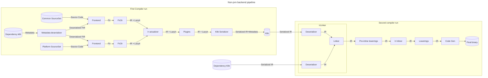

Here is a high-level pipeline of how compilation works for klib-based backends, separated by parts intersting for the purposes of this document.
Let's look at them closer.

The first thing to notice here is that we have two compiler runs.
1. Convert source code to Klib
2. Convert a bunch of Klibs with all dependencies to the final executable binary

From the point of view of the second run, "source code" klib doesn't differ much from dependencies. 

Let's define in-memory artifacts we have:
1. **FIR** is frontend representation of kotlin code. Each fir declaration can be serialized to **metadata** and deserialized from it.
2. **LazyIr** is FIR-based IR replacement, which is required to avoid deserialization non-needed parts of dependencies. It contains only declarations, no bodies.
3. **IR** is the most important part here. It is representation parts we are planning to change work with.

Also, let's look closer to the components we have

1. Compilation starts from source code and dependencies. There can be several modules in one compilation,
   corresponding to different source-sets (e.g., common and platform). Dependencies are represented as klibs.
2. Dependency Klibs contains serialized frontend representation (a.k.a. metadata), which can be deserialized. Together with source code, it forms input for Frontend
3. For the purposes of this document, Frontend can be seen as a blackbox, converting source code to FIR. It runs on each of source sets independently
4. Fir2Ir converts FIR from source modules to IR, and referenced external Fir to LazyIR.
5. IrActualizer merges all modules to single one, and removes expect classes.
6. Plugins can make some custom changes in IR. This is a stage we don't control well.
7. Klib Serializer converts the resulting IR and FIR to Klib file. Up to some technical details, we can think that Klib is serialized IR + serialized metadata.
8. irLinker is a component that converts a bunch of klibs to IR. It consists of two logical parts, which are not separated in code well.
    * Deserializer is a part that can convert klib bytes to IR in memory
    * Linker is a part that can match declaration references with declarations.
9. Lowerings are some IR transformations, responsible for making IR simpler, so code generation is able to transform it to final binary. We separate them to three parts, which are not much different now.
    * Lowerings happening before inlining
    * Inlining lowering itself. 
    * All further lowerings
10. Code generation is a part that converts lowered IR to final binary. It can be considered as blackbox here.

### JVM backend compilation pipeline overview

Jvm backend doesn't affect our immediate plans, but need to be kept in mind for further work.
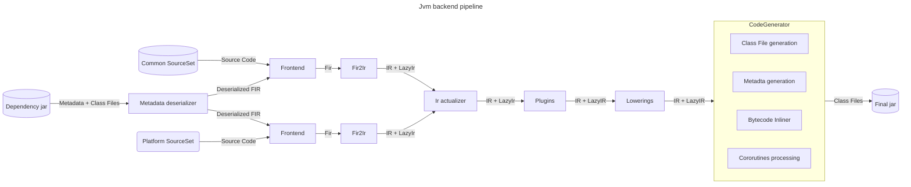

This pipeline is exactly the same before Plugins phase, but then, instead of serializing and deserializing IR to klibs,
we are directly passing to lowerings and code generation. 

As opposed to non-jvm backends, inlining here happens after all other lowerings as a part of code generation.
Moreover, it doesn't happen over IR, it happens over bytecode. 

There is an initiative of moving to IR-based inlining. In that case, it should happen somewhere inside lowerings phase.
Exact implementation of that is out of scope, while it was considered as a part of some decisions.

### IR references kinds

Let's talk about links inside IR. We plan to change significantly how we work with such links, so let's quickly discuss the current state.

We now have two ways of referring IR declaration by another one. 

1. Bound `IrSymbol`, which is a direct in-memory link to IrDeclaration object. 
2. `IdSignature`, which can be either serialized in klib, or represented as unbound `IrSymbol`. Technically,
   sometimes the key for further binding can be not `IdSignauture`, but FIR or Descriptor. 

We'd refer IR using type-1 links as **bound**, and IR using type-2 links as **unbound**.
   
Linker can be thought as a component converting IR with unbound references to Ir with bound references.
This is a complex part, especially with the handling of missing or incompatibly changed declarations.
It can't be done during the first compiler run (klib compilation), because of unclear semantics on this stage (some transitive
dependencies can't be accessed and even may be unknown) and performance reasons. 

IdSignature can be though only as unique ID, but not something containing enough information,
which is a problem. It would be much more convenient if it was structured, and some operations can be done with it 
(like getting information about call without looking at callee declaration), and linking would happen much closer to code generation. 
In that case, this ''new signature'' would be much similar to jvm function descriptor,
and the model would be closer to jvm. Changing this is out-of-scope for the current document.

Most of the compiler pipeline works with bound IR. There are two following exceptions:
1. During IR building IR can be partially unbound, as what-should-be-referred is not created yet.
2. During IR deserialization and linking can be not linked yet.

Working with unbound IR is harder, as we need to avoid using `IrSymbol.owner`.

## Target state

We are aiming to change the pipeline in the near future.
We will leave the JVM pipeline as is, for now.

### New KLib pipeline

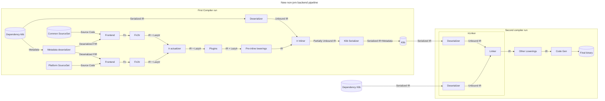

Let's hightlight important changes from the old version 

1. Inlining happens before Klib serialization. That was our main goal
2. Pre-inline lowerings happen before serialization. This puts some [restrictions](#pre-inline-lowerings) on them. 
3. Klib serialization must be able to work with partially unlinked IR.
   * It should be trivial as signatures are already computed for unbound symbols, but would require some technical work
4. IR inlining must be able to work with unlinked IR in inlined functions. 
   * It is important that IR on call-site of inline function is always linked. 
      * Otherwise, would not be able to understand if this call needs to be inlined
   * In particular, that means we must inline all inline functions callsites inside inline function before inlining itself.
     * Because, callsites inside inline function can be not linked and this contradicts previous assumption
   * Our investigation shows that it should be possible, but a lot of new problems can occur here.

### Pre-inline lowerings

There is some work that needs to be done before inlining. Most of this work is lowerings, that get rid of some IR  
that would be meaningless or invalid after direct inlining. 

Currently, for Native this is:
* Processing [typeOf](examples/typeOf.md) intrinsic
* Processing Array constructor `Array(size:Int, init: (Int) -> Int)`, as it is only inline constructor allowed in language
* Processing of lateinit fields
  * We need to do it before inlining, because `isInitialized` intrinsic can access private field, so it should be done
    while we in class scope
* Processing of [outer this](examples/outer-this.md)
* Shared variable lowerings
  * It is prerequisite for local declarations lowering
* Processing [local declarations](examples/anonimous-objects.md)
* Special handling of function references to inline function with reified type arguments.

There are two important new restrictions. 

First, is more technical &mdash; data stored by this lowering in 
context would be not available on the second run. At least LateInit and OuterThis lowerings stores something.
We need to get rid of this or move this lowering after inlining

The second is semantic. What happens in this lowering would now be serialized to klibs. This means:
* It can't be ever changed
* If we change the lowering or add a new one, we must be ready to process both versions
* They can't change publicly accessible signatures, because otherwise we must run them on LazyIr when using module as dependency

Because of this, pre-inline lowerings should be avoided when possible. 

One more thing, which doesn't exit as separate lowering for now, but probably should be done, is type erasure.
We need too much context to do it, so we can't do it after inline function deserialization. Now it happens during inlining itself.

Here you can check step-by-step examples of how the inlining pipeline should work:
* [Basic](examples/step-by-step-basic.md)

### Debug information

Debug information within Ir is represented by (startOffset/endOffset) pair in IrElement. 
Unfortunately, with cross-file inlining it becomes more complex, as it is unclear with respect to which file this offset happens.

This information should be stored in IrInlinedExpression node, and serialized/deserialized.

We need to ensure that all information inside this node can be serialized. It is not true now. 

### Migration

**Note**: This is draft decision, more investigation is required.

There are existing klibs with inline functions not prepared for a new scheme. 
We plan to leave them as is, i.e., inline them after klib linking. 

This is a technical debt we need to accept. It shouldn't be a big issue as 
what is required for inlining before linking has much stricter restrictions,
so code working with it should be also able to work with linked IR. 

### Corner-cases

There is a bunch of corner cases in inlining. They are not very important for
further document understanding, but must not be lost during implementation.
This creates some restrictions on decisions made, but not required to understand decisions themselves.

You can skip this part on first reading.

- [typeOf](examples/typeOf.md)
- [Interaction with anonymous objects](examples/anonimous-objects.md)
- [Accessing private declarations](examples/accessing-private.md)
- [Calling from java](examples/calling-from-java.md)
- [inline override](examples/inline-override.md)
- [Using declarations not available on call-site](examples/implementation-dependency-chain.md)

## Postponed problems
- Inconsistencies between bytecode and IR inlining (JVM)
- Post-inline optimizations


<a id="doc-d51e2f24f705160799684a99"></a>

# JetBrains/kotlin / docs/intentions_inspections_quickfixes.md

Upstream: https://github.com/JetBrains/kotlin/blob/ddb0eb9f3e6c0613d3e362ecd9e8c7ceb529c809/docs/intentions_inspections_quickfixes.md

Commit: `ddb0eb9f3e6c0613d3e362ecd9e8c7ceb529c809`

Retrieved: 2026-10-01T15:21:16.380126+00:00

Kind: official-document

Raw SHA256: `93fea9b3ecfa6a6914701c85bdcdc1f8626b99d8f2dd08027fe6a1c1fd4513c4`

Source text below is untrusted reference content. Acquisition does not verify technical claims.

License status: UPSTREAM_NOTICES_CAPTURED_PER_FILE_REVIEW_REQUIRED. See this repository's captured license files.

---

## Intention/QuickFix/Inspection Quick Notes

### Platform

Some general information about writing inspection, intention and quick fixes available in [Code Inspections](
https://www.jetbrains.org/intellij/sdk/docs/tutorials/code_inspections.html) document.

It's important to know about [PSI](https://www.jetbrains.org/intellij/sdk/docs/basics/architectural_overview/psi.html). 

Some PSI viewer will be extremely useful. It might be built-in [Psi Viewer](https://www.jetbrains.com/help/idea/psi-viewer.html) that is 
going to be enabled when testing inspections with `IDEA` run configuration (**idea.is.internal=true** must be set to active it in Kotlin 
project). Alternately, external plugin [PsiViewer](https://plugins.jetbrains.com/plugin/227-psiviewer) can be installed.

### Kotlin Project Specific

- Each inspection should be registered in `plugin-common.xml`. This file is included to `plugin.xml` for all plugins obtained from Kotlin 
source code. 

- Each inspection should be added with the description. The description file should be named after correspondent inspection class with 
adding `*.html` extension and removing `Inspection` suffix. (`Some.html` for inspection class `SomeInspection`).

- All inspections should have automatic tests. A default place for such tests is `inspectionsLocal` group (`inspections` group can be 
used if there are no quick fixes available for the inspection).

- `ProblemHighlightType` should always be `ProblemHighlightType.GENERIC_ERROR_OR_WARNING` or empty (there's a correspondent overload for 
`ProblemsHolder.registerProblem()`), otherwise, it won't be possible to individually change the desired level in the inspection settings.

- Inspection highlighting range shouldn't be too wide. For example, to show some problem in a class it's much better to highlight its name than to highlight the whole class (the latter just looks very nasty).

- Resolve operations (`analyze`, `resolveToCall`, `resolveToDescriptors`) are considered to be expensive and shouldn't be triggered more 
often than it's absolutely needed. All possible checks should be applied on PSI or file text before actual resolve. 

-  `resolveToDescriptorIfAny()` / `resolveToCall()` functions can be used if the single descriptor or resolved call is needed. 
It's better to call `analyze` for obtaining `BindingTrace` and use it for fetching other resolution results when inspection 
requires multiple resolve calls in a row.

- Prefer `resolveToDescriptorIfAny()` over `resolveToDesciptor()` because of exceptions that are thrown from latter 
function when descriptor is absent. 

- Any checks about code state and resolve that were made during reporting an inspection problem an registering a quick fix might be 
invalidated by the moment of the actual quick fix execution. Avoid the code that can throw exceptions because of that. Re-checks with early 
exit from the quick fix can be used to workaround it. 

- Intentions and quick fixes execution happens in the UI thread so do not call long operations such as usages search or resolve to avoid 
freezes. `PSI` elements obtained from resolve during the applicability check can be stored in `SmartPsiElementPointer` for the postponed 
modification in quick-fixes. All complex searches should be executed in a background thread under a progress indicator. Some tests 
already assert that resolve operations are not called from UI thread while applying fixes.

- There shouldn't be PSI elements stored in QuickFix classes (`val psi: PsiElement`) as such elements might be invalidated and can lead 
to memory leaks. Smart pointer (check `SmartPsiElementPointer` class and `createSmartPointer()` function) can be used when such storage 
is absolutely necessary. 

- It's possible to obtain `LanguageVersionSettings` directly from `psiElement` with `languageVersionSettings` extension.

- Kotlin project itself can be used for new inspection testing. Build a test plugin with the new inspection included, open another 
instance of Kotlin project and run inspection on the whole project (`Run Inspection By Name` action). 
    * Check the execution time and consider performance issues?
    * Check the memory consumption. 
    * Check the found problems for false positive.
    * Try to apply a quick fix and check result.


<a id="doc-fd913824b9697b3576e5c4ac"></a>

# JetBrains/kotlin / docs/klibs/uklibs/Uklibs.md

Upstream: https://github.com/JetBrains/kotlin/blob/ddb0eb9f3e6c0613d3e362ecd9e8c7ceb529c809/docs/klibs/uklibs/Uklibs.md

Commit: `ddb0eb9f3e6c0613d3e362ecd9e8c7ceb529c809`

Retrieved: 2026-10-01T15:21:16.380126+00:00

Kind: official-document

Raw SHA256: `16d6ca9ddd0957206837cb159de5952d4a987a2b1436cab9523e1fb15f62c039`

Source text below is untrusted reference content. Acquisition does not verify technical claims.

License status: UPSTREAM_NOTICES_CAPTURED_PER_FILE_REVIEW_REQUIRED. See this repository's captured license files.

---

This document outlines the design for the next-gen publication format of Kotlin Multiplatform (KMP) libraries, dubbed "uklibs" or "unified klibs".

## Problems, goals
1. Simplify the dependencies model used in KMP, make it easier for third-party build tools to implement a KMP.

Currently, KMP libraries are published with the help of Gradle Variants. To be able to reason about KMP dependencies, one need to read a custom format of Gradle Metadata and a non-trivial algorithm that reasons about its contents (known as Gradle Variant-aware Resolution). 

Additionally, Gradle Variants are not the perfect model for KMP source sets and do not provide a necessary level of granularity for KMP. So we have to still publish additional meta-information alongside KMP libraries (known as Kotlin Project Structure Metadata). 

This produces an intricate and non-trivial interplay of Kotlin Gradle Plugin code and Gradle code. Which, in turn, causes a couple of issues:
* Very complicated code that is hard to maintain or reason about
* Any non-Gradle build system has to repeat this on its side (and due to how complicated it is, it's pretty much a showstopper)

2. Have direct control over the Kotlin-specific dependencies and resolution.

As explained in the previous point, KMP has its own dependencies and a unique way of managing them. In the current Gradle implementation, they are not managed entirely by Kotlin: some parts of the dependency resolution are done by Gradle, and some parts are done by Kotlin Gradle Plugin.

This makes it hard to evolve the libraries and ecosystem. Kotlin team can't provide guarantees governing the KMP dependencies, because Gradle partially manages them. On the other hand, these dependencies are still KMP-unique, so a typical intuition about Gradle/Maven dependencies can't be applied, resulting in the "worst of the worlds"-situation.

3. Simplify the publication layout.

The current publication layout of KMP libraries is very granular and elaborate. While it potentially allows a lot of flexibility, it comes at a serious complexity cost, both in terms of implementation and in terms of a mental model for anyone interacting with it.

Over the course of KMP evolution, we realized that some flexibility hadn't found its usage. One such example is the ability to download only a JS or Native part of the library without downloading common or JVM parts.

In some other cases, there initially was a use for the provided flexibility, but it has disappeared over the course of the evolution of Kotlin. For example, at some point, the cross-compilation capabilities of K/N were limited, and it wasn't guaranteed that a single host that could compile an entire library existed. As most repositories are immutable, this required splitting a library into multiple parts that could be published non-atomically from multiple hosts. Nowadays, in almost all cases, whole library can be published from a single host (Mac if the library has Apple-targets)
## Vocabulary

_Def. "Fragment"_: the smallest unit of grouping KMP sources together. Known as a "Kotlin Source Set" in Gradle implementation.

_Def. "Refines-edge"_: a relation between fragments. `A refines B` means that `A` sees all symbols of `B`, including `internal`-ones, and can provide `actual`s for `expect`s from `B`. Known as a `dependsOn`-relation in Gradle implementation. 
Note that it's a stronger relation than usual "dependency" (`myProject.commonMain -> kotlinx-coroutines-core.commonMain`) or "friend dependency" (`myProject.commonTest -> myProject.commonMain`)

_Def. "(Kotlin) Module"_: a set of Fragments (source sets) that are connected with refines (dependsOn) edges. In the Gradle world, given that there's no custom configuration of the KMP project model, each KMP module maps to precisely one Gradle project. 

_Def. "Analyzer"_: a consumer of a serialized representation of Kotlin code. You can think that the "serialized representation" is an output of some Kotlin backend (it's almost true modulo whether you count metadata-compiler as a separate Kotlin backend): `.kotlin_metadata`, `.knm`, IR, `.classfiles`, etc. 
Examples of analyzers: Kotlin compiler itself, IDE, kotlinx-metadata library, etc.

## What is uklib?

"Uklib" is a **self-contained** artifact representing one KMP module. "Self-contained" means that it contains enough information for any analyzer to read the symbols correctly in a KMP context. 

You can intuitively think of it as taking all artifacts currently published for a KMP module and packing them together into one archive + adding some metainformation on top of it.

Before going into details, let's quickly give some intuition on how this solution addresses the problems outlined in the previous section:

The whole level of separate fragments is hidden inside an uklib and entirely opaque to any external client. As such, a non-Gradle build tool can just download the uklib and pass it to the Kotlin toolchain without tinkering with fragments, matching attributes, discovering variants, etc. 

This addresses problem №1 (simplification of dependencies model and lowering entrance barrier for non-Gradle build systems to support KMP), and problem №2 (restoring an exclusive control over KMP-specific dependencies, i.e. fragments).

Also, it is trivial that the problem №3 (simplification of the build layout) is also addressed, as you can't really make a layout simpler than one artifact :) 

Below, we'll:
* explore the technical details of that solution;
* highlight some tradeoffs that had to be taken;
* show how some non-trivial cases work.

## Container format

Uklib has a dedicated extension `.uklib`. The file itself is an archive.

Mainly, we're choosing between two options for specific archive format:
* Good old `.zip` 
* Some more advanced algorithms

The reason for looking for more advanced algorithms is solely the compression ratio. Let's explain the considerations here:

**Problem**
The combined size of all platform-specific klibs is quite high. For example, for `kotlinx-coroutines-core:1.8.0-RC`, the number is 47.24 Mb uncompressed. 

A large part of it is platform-specific klibs. In the current publication scheme, platform-specific artifacts include all the contents of common source sets, leading to hugely duplicated data across all the publications, further multiplied by a plethora of Kotlin/Native targets.

There are two options to solve that:

1. Optimize it on the compiler level. It is a planned project called "klib-compilation", when each fragment's contents are compiled to klib with IR. Therefore, the contents of common fragments won't be duplicated across the whole publication, reducing the size of the artifacts we publish. 
   This effort is highly non-trivial from a technical perspective. The timeline for its rollout is probably years from now

2. Abuse the fact that the data in `uklib` contains a lot of duplicates. This is where compression algorithms come to play.

### Compression algorithms comparison

Payload: all published artifacts of `kotlinx-coroutines-core`, unpacked. Input size: 47.24 Mb

[Full comparison data](https://docs.google.com/spreadsheets/d/1sDHk8DnchdzXJotXjEQR021Hqh8mzGEh1kFb25RTeeA/edit?usp=sharing). Here, we will provide a few most interesting and important highlights:

1. zip/gzip: 
	* compression ratio ~= 2.75 
	* compression time ~= 1.0s (takes more on higher compression ratios, but they don't yield notably  higher compression ratio)
	* uncompression time ~= 240ms
2.  `xz`: 
	* compression ratio ~= 60 (!!)
	* compression time ~= 4.6s
	* uncompression time ~= 270ms
3. `zstd`: 
	* compression ratio ~= 53 (!)
	* compression time ~= 1.3s
	* uncompression time ~= 150ms

So, we can see that:
* zip/gzip compress quite quickly, but relatively poorly
* `xz` provides a whopping 60x compression at the cost of the slowest compression time
* `zstd` provides a balanced profile with great compression ratio, the fastest uncompression time, and very good compression time

> [!note] 
>
> **Why there's such a big difference between compression ratios?**
> 
> Compression algorithms usually have some duplicate detection and encode duplicates in form of a "backreferences". The details of that process are out of the scope of this document, but what is important is that deduplication works via a "sliding window", in which the duplicates should appear. If the duplicated data in the input stream is spread out on a distance more than this "sliding window", it won't have the optimized encoded presentation. 
>
>By default, our duplicates are **very** spread out. If all klibs are fed into the encoder one by one, then duplicates will be ~1 size of klib apart, which is several megabytes. 
> 
> gzip uses [deflate](https://www.ietf.org/rfc/rfc1951.txt) compression algorithm, and the window for duplicates is 32K. Therefore, gzip is understandably not able to deduplicate our data, and provides mediocre compression performance
> 
> It appears that `xz` and `zstd` have bigger sizes of "deduplication window", allowing to detect duplicates in the input streams of klibs better, yielding much better compression ratio.

So, ideally, we'd go with `zstd` or `xz`. `zstd` appears to be pretty modern, well-specified format, gaining a lot of popularity recently. 

On the other hand, we should make sure that we'll be able to provide support for a chosen format for all popular hosts and OSes.

> [!warning] 
> **Inconclusive design decision: compression algorithm.**
> 
> We can make it much later (even as one of the last tasks before uklib release).

## uklibs dependencies

### Context
Modules consist of potentially multiple "fragments" ("source sets" in the current Gradle implementation). Fragments are connected by `refines`-connection ("dependsOn" in the current Gradle implementation). 

We'll write `A refines B`, and say that:
- A is a **refiner of** B
- B is **refined by** A
- "Set of **refiners fragments** of B consists of A"
- "Set of **refined fragments** of A consists of B"

Pseudo-code:
```kotlin
class Module(
    val name: String
	val fragments: Set<Fragment>, 
	/* ... other fields will be described below ... */
)

class Fragment(
	val name: String, 
	val refines: Set<Fragment> = emptySet(),
	/* ... other fields will be described below ... /
)
```

For example, if we consider `kotlinx-coroutines-core` as one single Module, then it has multiple fragments inside: `commonMain`, `concurrentMain`, `nativeMain`, `nativeOtherMain`, `jsMain`, `jvmMain`, `iosArm64Main`, ...
We can think that a single-platform Module (e.g., purely Kotlin/JVM one) consists of a single trivial fragment. 

```kotlin
// Refines edges are omitted for clarity
val kotlinxCoroutinesCore = Module(
	"kotlinx-coroutines-core", 
	setOf(
		Fragment("commonMain"),
		Fragment("concurrentMain),
		Fragment("nativeMain"),
		Fragment("nativeOtherMain"),
		Fragment("jsMain"),
		/* ... */
	)
)
	
val guava = Module(
	"guava"
	setOf(Fragment("<stub-for-jvm-libraries>"))
)
```

Kotlin analyzers work with a model where each fragment has a set of dependencies on other fragments. So, if our module depends on `kotlinx-coroutines-core` and we want to compile `commonMain`, we need to know which fragments from `kotlinx-coroutines-core` it sees.

```kotlin
fun compile(compiledFragment: Fragment, dependencies: List<Fragment>)
```

While it might appear obvious that `commonMain` sees `commonMain`, in fact, the behavior is more nuanced. For example, if our particular module compiles only to JVM and Native, then it is actually desirable to see the API from `kotlinx-coroutines-core.concurrentMain` as well.

As the process of figuring out fragment-to-fragment dependencies is quite non-trivial, it is not feasible to require users to declare fragment-to-fragment dependencies themselves.

Instead, we ask users just to declare a dependency on the whole `kotlinx-coroutines-core` and promise that our toolchain will figure out granular fragment-to-fragment dependencies. 

The whole process of dependency resolution consists of two parts: 
* Module Resolution,
* Fragments Resolution.
### Module resolution

"Module Resolution" refers to a process where given a reference to a single Module (e.g., via Maven coordinates or a Module identifier in local build):
* Graph of transitive Modules is discovered;
* If version clashes happen, they are resolved, and final versions for each module are selected;
* For dependencies in remote repositories, they are downloaded to the local machine.


> In this example, a source module `myApp` depends on two Maven-published modules via their GAVs (`coroutines-core` and `kotlin-stdlib`) and on another source module, `myLib`.
> After Module resolution, we discover that coroutines, in fact, have an additional dependency on `atomicfu`.
> 
> Moreover, we discover that `coroutines-core` and `atomicfu` depend on `kotlin-stdlib:1.6.21`, but `myApp` requested `kotlin-stdlib:2.0`. The version clash is resolved by choosing the higher version in this case. 

This work is expected to be done by a particular build system (Gradle, Maven, Bazel, etc.). Kotlin toolchain is intentionally not concerned with those matters.

The output of "Module resolution" phase is that each `Module` receives a flat list of other *modules* (not fragments!). See the [Dependencies sorting](#dependencies-sorting) section on the matters of the order of that list.

#### Flat dependencies list

Readers well-versed in the implementation of KMP in Gradle probably noticed that the section above says that a **whole module** declares a particular dependency. This is different from the Kotlin Gradle Plugin as of Kotlin 2.0, where users declare dependencies from a particular **fragment** to a dependency:
```kotlin
kotlin {
    sourceSets.iosMain.dependencies {
        api("org.jetbrains.kotlinx:kotlinx-coroutines-core:1.7.3")
    }
}
```

**We intentionally restrict this feature in uklibs world.** 

In the uklibs world, each Module has just one flat list of dependencies to other Modules. This is the surface mental model exposed to users and non-sophisticated build systems/analyzers. 

Under the hood, the Kotlin toolchain will apply all of these dependencies to all fragments and run the resolution algorithm, selecting only parts of the dependencies visible in a particular fragment. 

**Consequence №1.** It's not possible to "restrict" visibility of a KMP library to only some fragments:

```kotlin
kotlin {
	jvm()
	ios() 
	
	sourceSets.iosMain.dependencies {
		api("org.jetbrains.kotlinx:kotlinx-coroutines-core:1.7.3")
	}
}
```
In the current Gradle implementation of KMP nor `jvmMain`, neither `commonMain` won't see `kotlinx-coroutines-core`. In uklib world, that won't be possible: `jvmMain` and `commonMain` will see it, as `kotlinx-coroutines-core` has compatible fragments.

**Consequences №2.** (partially sub-case of Consequence №1) It's not possible to depend on different versions of the same library in different fragments, or on different KMP libraries
```kotlin
kotlin {
	sourceSets {
		iosArm64Main.dependencies {
			// native is experimental, so can bump versions faster
			api("org.jetbrains.kotlinx:kotlinx-coroutines-core:1.8.0")

			// like Ktor more for non-JVM targets
			api("io.ktor:ktor-client-core:2.3.11")
		}

		jvmMain.dependencies {
			// jvm is more slow-evolving, so can't bump version fast
			api("org.jetbrains.kotlinx:kotlinx-coroutines-core:1.7.3")

			// but for JVM-target, for some reason prefer OkHttp over Ktor
			api("com.squareup.okhttp:okhttp:2.7.5")
		}
	}
}
```

**Consequence №3**. If a particular fragment-level dependency is not attributes-compatible, it's not an erroneous situation. 

For example, a user has declared a dependency on the Guava library. Indeed, in such cases, `dependencies("iosMain", "com.google.guava")` must return an empty set because Guava doesn't support iOS targets. It's OK because `dependencies("jvmMain", "com.google.guava")` will return the Guava library itself.

> [!note] 
> If none of the fragments could resolve anything from a particular dependency, then such dependency can be reported as "useless" (warning) or even "inapplicable" (error)

### Fragment resolution

"Fragment Resolution" refers to a process where, given a consumer-module and a list of dependency Modules (i.e., the output of "Module resolution"-stage), Kotlin Toolchain infers granular fragment-to-fragment dependencies.

Example of input: note that the list of dependencies is flat (we don't know anymore than `atomicfu` was a transitive dependency of `kotlinx-coroutines-core`)


Example of output (only one dependency is shown for clarity)

#### Kotlin attributes

To enable "Fragment resolution", we'll have to introduce a notion of **Kotlin Attributes** (inspired by Gradle Attributes)

You can think of Kotlin Attributes as "key-value" pairs of strings attached to each fragment.

Keys represent **attribute dimensions**. Each dimension has its own unique identifier and set of possible attribute values. 

The most important dimension is the "Kotlin Platform". All Kotlin fragments must have a "Kotlin Platform"-attribute.

Values of "Kotlin Platform" are sets of `KotlinTarget`s. Each `KotlinTarget` represents one specific "target" for Kotlin code generation, e.g. `jvm`,  `android`, `linuxX64`, `iosArm64`, `iosSimulatorArm64`, `wasmJs`, `wasmWasi`, etc. Note that there's no single dedicated "common"-target. 

For example, `myApp.commonMain` from the picture above has a "Kotlin Platform" with a value like `{ jvm, iosArm64 }` .

Additionally, we require that each Kotlin Attribute dimension also provides an `isCompatible`-relation on its attribute values, forming a [partial order](https://en.wikipedia.org/wiki/Partially_ordered_set). For "Kotlin Platform", its `isCompatible`-relation is effectively a "subset-of" relation of sets of `KotlinTarget`s. 

Pseudo-code for illustrative purposes:
```kotlin
enum class KotlinTarget {
	JVM,
	ANDROID,
	LINUX_X64,
	IOS_ARM64,
	IOS_SIMULATOR_ARM64,
	MACOS_ARM64,
	WASM_JS,
	WASM_WASI,
	...
}

class KotlinPlatformAttribute(val targets: Set<KotlinTarget>) : KotlinAttribute {
    override val uniqueId = "org.jetbrains.kotlin.platform"   

    override val isCompatibleWith(other: KotlinPlatformAttribute): Boolean =
	    this.targets.isSubsetOf(other.targets)
}
```

> [!warning] 
> **Conservative design decision**
> 
> At the moment, we don't see a need for a second dimension. It's OK to think that only one dimension exists (abolishing the need for the "dimension" concept altogether), and the implementation can follow this simplified model.
> 
> The main reason why the working group is not very eager to support multiple dimensions is because then some non-trivial questions arise as soon as you have more than one attribute. For example, what to do if two dimensions "disagreed" on the compatibility? How to treat the absence of a value in the dimension? etc.
> 
> This *does* mean that some already existing cases will have to be deprecated and phased out, e.g. cases like `jvm("okhttp") + jvm("ktor")`. Almost all of them can be refactored into multiple modules and use of `ServiceLocator`-like mechanisms.
> 
> One problematic case is `kotlin-test`. See [kotlin-test](#kotlin-test) section on how it is proposed to handle it

So, expanding previously introduced pseudo-code for `Fragment` with a concept of Kotlin Attributes:
```kotlin
class Fragment(
	val name: String, 
	val refines: Set<Fragment>
	val platformAttribute: KotlinPlatformAttribute
)
```


A couple of notes about other invariants/expectations:

**Fragment `F` doesn't have refiners <=> it has exactly one `KotlinTarget`**
* Note that "having a fragment with empty sources" and "not having a fragment" are not the same. For example, most libraries have only `nativeMain`/`iosMain` sources, but these fragments will still have refiners (`iosArm64Main`, `iosX64Main`, etc.), and it will be reflected in the umanifest of the uklib.
* Note that "bamboos" violate this invariant. If bamboo structures are allowed, you can have `F1 { jvm } -> F2 { jvm }`. 

**Fragment `F1` refines fragment `F2` <=> targets of `F1` are compatible with `F2`**
* In Gradle implementation, only the implication from left to right holds. 

**It's forbidden to have several fragments with the same attributes in uklib**
* See [Multiple fragments with the same attributes](#multiple-fragments-with-the-same-attributes) section for a detailed discussion of this invariant and related cases.

**It's OK to have a fragment with more targets than all of its refiners.** 
* E.g.: `commonMain` has `jvm` across its targets, but there is no `jvmMain` fragment

> [!note] 
> **Fate of `kotlin-project-structure-metadata.json`**
> 
> `kotlin-project-structure-metadata.json` is a format that is used by the current (Kotlin 2.0) KMP implementation of KMP in Gradle. 

#### Algorithm

To describe the algorithm, let's consider a specific example. Say we're developing a module called `consumer`, and it has a dependency on another module `lib`. 

The goal of the "Fragment Resolution"-phase is to provide a mapping from each fragment of `consumer` to an **ordered** collection (we'll explain below why order matters) of fragments from `lib` 


Intuitive description:
1. Consider a dependency on a module `dependency` from `consumer`
2. Get a cartesian product of all fragments of `consumer` and all fragments of `d`
3. For each pair `(consumerFragment, dependencyFragment)` check if attributes of `consumerFragment` are compatible with attributes of `dependencyFragment`.
   * If they are compatible, then add `dependencyFragment` into the resulting list  for `consumerFragment`
   * If they are incompatible, then move to the next pair

Pseudo-code:
```kotlin 
val result = mutableMapOf<Fragment, MutableList<Fragment>>

fun resolveKotlinDependencies(
	consumer: Module
): Map<Fragment, List<Fragment>> {
	for (dependency: Module in consumer.dependencies) {
	    resolveSingleDependency(consumer, dependency)
	}

	ensureOrder() // See below

	return result
}

fun resolveSingleDependency(from: Module, dependency: Module) {
	for (consumerFragment in from.fragments) {
		for (dependencyFragment in dependency.fragments) {
			// Simplified implementation that assumes only KotlinPlatform
			// attribute exists
			val consumerAttribute = consumerFragment.platformAttribute
			val dependencyAttribute = dependencyFragment.platformAttribute
			if (consumerAttribute.compatibleWith(dependencyAttribute)) {
				resolved(consumerFragment, dependencyFragment)
			}
		}
	}
}

fun resolved(from: Fragment, to: Fragment) {
	result.getOrPut(from) { mutableListOf() }.add(to)
}


```
#### Dependencies sorting

> [!warning] 
> This is an open design question

There's one strict requirement that we should maintain: fragments with `actual`s come before `expect`.

This allows the compiler to work more efficiently. If `expect` is encountered, then scanning the rest of the classpath in search of `actual` is unnecessary as it is guaranteed that it won't be found. 

If we sort the fragments according to their `isCompatible`-relation from the most specific to the least specific, such order guarantees the needed invariant. However, it is just a partial order. Specifically, the following fragments can't be compared using just `isCompatible`:

**1. Fragments of one and the same module that are not connected to each other via `refines`-edges.**
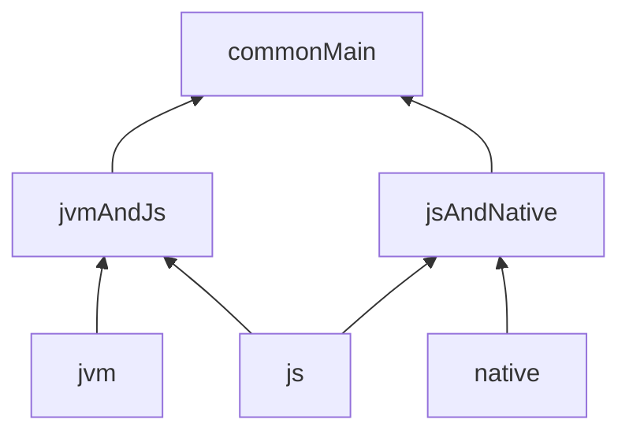
In this example, `jvmAndJs` and `jsAndNative` are not orderable using `isCompatible`-relation, but they can appear in the list of the resolved fragments (e.g., if the consumer is a `js`-fragment)

**2. Fragments from different modules, e.g. `A.commonMain` and `B.commonMain`.**

For this order, we might use the order of the passed module dependencies, i.e. the output of the "Module resolution"-phase. So, if `A` comes before `B` in module dependencies list, then all fragments of A should come before all fragments of B.

The concept of "ordered classpath" generally comes from the JVM world and its way of resolving "split classpath" / "classpath hell" (when there are multiple libraries with the same symbols on a classpath). 

While it might appear that it's natural to have the same mechanism for uklibs, in fact, klib compilation model differs noticeably from the JVM model. An additional design is needed to understand, whether JVM "classpath substitution" model is useful, or even possible in Kotlin klibs world. As such, this section is an open design question.

> [!note] 
> Regardless of the decision about "classpath substitution", it generally makes sense to guarantee _some_ stable order of dependencies, for the sake of builds reproducibility
#### Transitive KMP dependencies

We'd like to highlight that transitive dependencies are resolved **with the consumer's attributes, not the attributes of the dependency that brought this transitive dependency**. 

Let's show an example of why it matters:


Suppose someone published a module called `lib` with a dependency on `transitiveLib`. `lib.commonMain` compiles to `{ jvm, js, iosArm64 }`, so it sees only `transitiveLib.commonMain`

Now assume we consume `lib` from a module `app` that doesn't have `js`-target at all and compiles only to `{ jvm, iosArm64 }`:


It's trivial that `app.commonMain` sees `lib.commonMain` (edge #1) And we've already established that `lib.commonMain` sees `transitiveLib.commonMain` (edge #2), hence `app.commonMain` sees `transitiveLib.commonMain` (edge #3)

However, there's a question whether `app.commonMain` sees `transitiveLib.concurrentMain` (edge #4, highlighted in blue)

There are two possible approaches to the resolution algorithm that yield  two different answers to that question:

1. No dependency #4. 
   First, resolve `lib` against `transitiveLib`, yielding #2. Then, resolve `app` against `lib`, yielding #1. Putting together #1 and #2 and using the fact that fragment dependencies are transitive, we get #3.
2. There's a #4 dependency (currently described approach)
   Do not resolve `lib` against `transitiveLib` at all. Instead, resolve `app` against `lib`, yielding #1. Then, resolve `app` against `transitiveLib`, yielding #3 and #4. #2 doesn't exist at all in this approach. 

While Approach №1 might sound more intuitive, there's one big issue with it: it requires Module Resolution phase output to be a **rich graph, not just a flat list of Module dependencies**. Indeed, we need to know that the chain of dependencies is exactly `app -> lib -> transitiveLib`. If it were `app -> transitiveLib -> lib`, the result w.r.t. edge #4 would change (showing that left as an exercise to the reader :trollface: ).

It is expected that **Module Resolution** to be performed by build systems. So, if we go with Approach №1, all the build systems that want to support KMP must preserve the entire dependency graph and pass it to our toolchain. 

The working group deemed that it contradicts the requirements to simplify the integration of KMP to third-party build systems (and implementation in existing ones) and rejected that approach.

> [!note] 
> **Design decision**
> 
> Module Dependencies are flat lists of all modules (including transitive ones) rather than a graph. Fragment resolution runs separately from the consumer to each of these modules. 
> As such, if there's a direct dependency A that brought a transitive dependency B, a consumer might see **more fragments from B than A saw during the publication**.

Note that there's a peculiar corner case born by the intersection of this design decision and the layout of publication to MaveCentral. It is described in [Transitive KMP dependencies through Java-modules](#transitive-kmp-dependencies-through-java-modules) section. 


## Contents

Uklib contains a list of folders and `umanifest`. Each folder represents an output of a compiler for the respective-named source set. If the output is a `klib`, the `default` folder is omitted. 

Let's look at the example:
```
commonMain/  // metadata klib
|- linkdata/
|- resources
|- manifest  // klib manifest

jsMain/      // JS klib
|- ir/
|- linkdata/
|- resources/
|- targets/
|- manifest

nativeMain/  // shared-native metadata klib
// K/N klibs
iosArm64Main/
iosSimulatorArm64Main/

jvmMain/     // unpacked .jar
|- META-INF/
|- org
   |- jetbrains
      |- kotlin
         |- MyClass.class

umanifest
```
Note that the format of the output for a particular fragment is a concern of the respective backend, not of uklib. However, for the sake of example, we show here the formats that are actually used by compilers as of April 2024:

* Top-level of the uklib contains 6 folders, for two common fragments (`commonMain`, `nativeMain`) and four platform-specific fragments (`iosArm64Main`, `iosSimulatorArm64Main`, `jsMain` and `jvmMain`)
* `commonMain` contains metadata klib: it has `manifest` (klib manifest), it has `linkdata` (.knm files, i.e. serialized descriptors), but doesn't has IR
* `jsMain` contains platform-specific klib (JS klib in this case). Compared to `commonMain`, it additionally has `ir` folder with serialized IR
* Consistently with the rule "each folder contains compiler output for respective fragment", `jvmMain` contains compiler output for `jvmMain`-compilation, i.e. typical JAR-like folder structure with classfiles inside.

Also note that as of April 2024, the output for platform-specific fragments like `jvmMain` or `jsMain` is produced by compiling the sources of this fragment alongside all common sources. 
So, if `commonMain` has symbol `MyClass`, it will be repeated across `jsMain`, `iosArm64Main`, `iosSimulatorArm64Main` and `jvmMain`

### umanifest

`umanifest` encodes the meta-information about uklib:
* List of fragments
* Their attributes (see [Kotlin Attributes](#kotlin-attributes))
* Type of the content of the fragment: 
	* `BINARY` - for compiler output
	* `SOURCE` - for sources (see [Sources](#sources)) section
	* Other values can be added in the future for evolution.

`umanifest` should use a machine-parsable & human-readable format for storing its contents. `JSON` is the option suggested in the current iteration of the design.

Rough example of umanifest:

```json
{
"fragments": 
[
	{
		"name": "commonMain",
		"platforms": ["jvm", "js", "linux_x64", "iosArm64"],
		"contentType": "MetadataKlib"
	}, 
	{
		"name": "jvmMain",
		"platforms": ["jvm"],
		"contentType": "JvmJar"	
	}
],
	
"manifestVersion": "1.0.1"
}
```

Note that `umanifest` doesn't store `refines`-edges. We remind that `A refines B` <=> `A.attributes.isCompatibleWith(B.attributes)` (see note at the end of [Kotlin attributes](#kotlin-attributes)-section), so all edges can be restored based on umanifest contents. 
#### Dependencies identifiers in `umanifest` and `uklib`

It is strictly forbidden for the umanifest or any contents to contain any identifiers of dependencies (e.g. Maven coordinates of dependencies). Note that, for example, `klib` manifest circa Kotlin 2.0 contains identifiers of dependencies. As such, `klib` manifests violate this rule and will have to be fixed.

The main reason is that these references to dependencies will matter from the perspective of the library's evolution and compatibility (e.g., what happens if a dependency gets renamed, but its content is still present in another artifact?).

Introducing an in-uklib source of such identifiers will most likely force library authors to have two compatibility models of published libraries in mind (one coming from repo, e.g., from Maven, another coming from uklib itself). We could try to align these models, but it is prohibitively complicated, and the working group doesn't see any benefit in having dependency identifiers inside uklib.

Note that dependencies on K/N platform libs (like `Foundation`) are not forbidden because 
a) they are essential for performance optimizations in K/N,
b) at the moment, they are not modeled in terms of Maven-repo (or any other repo), and therefore, they do not duplicate anything

#### umanifest vs klib's manifest

There's an inherent overlap between `umanifest` and manifests of particular klibs. In fact, the current design iteration has no contradictions with a world where `umanifest` doesn't exist at all, and instead, all meta-information is written to manifests of specific fragments. There is a slight technical issue with JVM-fragments being represented as unpacked .jars and thus not having a `manifest` per se, but it's absolutely solvable.

Contrary to that, this design proposal suggests moving in a direction where `umanifest` is the only format for storing the meta information about the published Kotlin library. While there are no undisputed arguments backing this decision, there are a couple of minor ones: 
* it is easier to express meta information that is not expected to be different between fragments (e.g., version of the compiler used during the compilation);
* `klib`s manifests definitely need a clean-up, so it might not be the good idea to use them as a foundational format for "uklibs" (which meant to be the format of the future)

There's no specific timeline or plans for phasing out `klib`'s manifests or even guaranteeing that they will be phased out. It is possible that klibs manifests will be kept, but with a very different form/purpose. This section will be updated in the future.

### Resources

> [!warning] 
> **Inconclusive design decision: resources handling in uklib.** 
> 
> More detailed resources KMP resources design is required, but overall, the uklib format is flexible enough to accommodate most reasonable options.

Context:
* At the moment, there's no finalized design for KMP resources.
* At the moment, there's a `resources`-folder inside klibs, i.e. inside all folders inside uklib except for JVM-specific fragments. JVM-specific fragments have resources placed inside as per typical rules of JAR-layout. 
As such, we don't feel the need to reserve some special places for resources in uklib. With a high possibility, KMP resources will be fragment-scoped i.e. will be placed in particular fragment' klibs (and therefore won't be a concern of uklib design). 

Even if we need dedicated places for resources in uklib, it can be done via `umanifest` (see [umanifest](#umanifest) section) 

### Sources

TODO:

* Sources is a separate uklib artifact with a special umanifest marker

### cinterops

TODO:
* cinterops is a separate uklib artifact with a special umanifest marker

### Bundled native libraries (.so/.dylib/.h)

TODO: explain that it's a part of klib design, so it's not covered here

## Publishing to MavenCentral

Kotlin Multiplatform Library publishes to one Maven module, i.e. each publication has exactly one GAV (group-artifact-version). 

The whole publication will consist of:
* `.uklib`-artifact
	* potentially with `-sources.uklib` counterpart for sources
* `.jar`-artifact with JVM classfiles for Java clients (see [JVM classfiles inside and outside klib](#jvm-classfiles-inside-and-outside-klib))
	* potentially with `-sources.jar` counterpart for sources for Java clients
* Other additional artifacts (e.g., `.aar` for KMP libraries with Android target) can be published alongside `.uklib`
* potential meta-files for tooling/indexers, like `kotlin-tooling-metadata.json` 
	* Contents of Kotlin Tooling Metadata can be extended to include the whole `umanifest` for optimizations on build tools side/indexers
* Gradle Module metadata `.module`

Example:
```
|- kotlinx-coroutines-core-2.0.uklib
|- kotlinx-coroutines-core-2.0.jar
|- kotlinx-coroutines-core-2.0-sources.uklib
|- kotlinx-coroutines-core-2.0-sources.jar
|- kotlinx-coroutines-core-2.0-kotlin-tooling-metadata.json
|- kotlinx-coroutines-core-2.0.module
|- kotlinx-coroutines-core-2.0.pom
```

**How will Maven resolve such publications?**
* By default, Maven looks for `.jar`-file. So, Kotlin-unaware Maven clients will resolve `.jar`, which is precisely what we need.
* If we want to support KMP in Maven, we must write our own plugin. This plugin can be taught to know about `.uklib`-artifacts and that it needs to download them.
* After the `.uklib` is resolved, all the rest is up to our code and shouldn't differ much between Maven and Gradle

**How will Gradle resolve such publciations?**
* Gradle Module metadata is very flexible and rich, so supporting proper resolution is pretty straightforward.
* For example, we can publish two variants: one looking like a usual JVM publication and pointing to .jar-file, another with our own special multiplatform attributes and pointing to .uklib
Example of .module:
```json5
// ...
"variants": [
	{
		"name": "jvmApiElements-published", // for Java clients
		"attributes": {
			"org.gradle.category": "library",
			"org.gradle.libraryelements": "jar",
			"org.gradle.usage": "java-api",
		},
		"files": [
			{
				"name": "kotlinx-coroutines-core-2.0.jar",
				"url": "kotlinx-coroutines-core-2.0.jar",
				...
			}
		]
	},

    {
		"name": "jvmApiElements-published", // for KMP clients
		"attributes": {
			"org.gradle.category": "library",
			"org.gradle.libraryelements": "jar",
			// attribute to distinguish from JVM
			"org.gradle.usage": "kotlin-uklib", 
		},
		"files": [
			{
				"name": "kotlinx-coroutines-core-2.0.uklib",
				"url": "kotlinx-coroutines-core-2.0.uklib",
				...
			}
		]
	},
```


> [!warning] 
> **Concerns about several artifacts in one Maven module**
> 
> Formally, the layout described above should work, and all the actors support it.
> In fact, we're concerned that this might not be a very frequently used feature, and therefore, different tools might have assumptions contradicting this feature, or just simply a buggy support. 
> We explicitly don't want to be the only big client of this feature. The working group is going to prepare research on how frequently the feature of "multiple artifacts in one maven module" is used in the ecosystem. It might be possible that we'll have to roll back to publication setup with multiple suffixed Maven modules (`-jvm`, etc.)


## Tough cases

#### Transitive KMP dependencies through Java-modules

TODO
* Do we see KMP parts of a library through JVM module or not?
* What happens in case we see a library through JVM and KMP module?
* What happens if build system passes both .uklib and .jar to compilation?
* What about version clashes between .jar and .uklib?

### kotlin-test

TODO:
* Explain the problematic context (two variants for annotations) 
* Explain that it contradicts our idea of "only platform attribute exists"
* Explain how we solve it (allow passing actuals in .jar)
### Compose Multiplatform
TODO: merge with kotlin-test? the solution is the same

### kotlin-stdlib
TODO: explain that this part is suspended until we understand how compilation of stdlib in the world after Kotlin 2.0 works

## JVM world interop

### External .jars

### JVM classfiles inside and outside klib

TODO: collect all .jar-related decisions and considerations in one section

As we saw in section [Contents](#contents), uklib contains compiled .classfiles for JVM variants. On the other hand, [Publishing to MavenCentral](#publishing-to-mavencentral) section explains that the publication of KMP library will contain a separate `.jar`-file for Java clients. 

In this section, we'll explain the need behind each of these decisions, and how it works together.

**Why do we need a separate .jar-file?**
* Java clients don't know anything about Kotlin and can't unpack uklib
* Java clients don't want to download multiplatform parts of a library (this is critical for CI setups)

**Why do we need classfiles inside uklib?**
* Makes uklib self-sufficient artifact
* Makes it easier for non-Gradle build systems integration (can download just one artifact and pass it to the Kotlin compiler)
* Separation of responsibility: `.jar` with classfiles is a "JVM facade" for JVM clients of a multiplatform library. Contents of `jvmMain` in `uklib` is a Kotlin-owned representation of JVM code. Accidentally, as of April 2024, both cases use one and the same binaries, but that doesn't have to be the case. For example, moving to klib-based compilation might change how JVM code is represented inside uklib: specifically, making it so that contents of `jvmMain` will represent only code owned by `jvmMain`, without code from `commonMain` (while having it is mandatory for "JVM facade for Java clients")

TODO: finish the section (how maven resolves all that)

### Timeline

TODO: write down the timeline
* Can’t fit in 2.1 even a release under opt-in flag
	- Must start migration in KGP (deprecate per-fragment dependencies, elaborate structures)
	- Must implement prototype
	- Must support IDE (haven’t thought about IDE at all yet)
	- All that should be ready/tested by ~August (branching for 2.1)
	- That’s 4-5 months of work left
	- Could be possible if we had a full-time person working on it, but we don’t have one.

Despite that, the prototype should be started sooner rather than later. 

#### Migration

TODO: explain that this is suspended until we have the first design iteration established (i.e. reviewed by multiple people outside working group + some prototype is ready)


## Concerns/FAQ

### Host considerations
> Q: Doesn't KMP require multiple hosts to assemble all outputs of a library? Will it require some complicated CI setup with a "merge"-step?

At some point, indeed, cross-compilation capabilities were not rich enough, and for some modules, there was no single host that could compile all of the source sets to klibs.

This is largely irrelevant as of Kotlin 2.0:
* If the module has Darwin-targets, it can be entirely compiled to klibs on Mac-host
* Otherwise, it can be compiled to klibs on any host

In other words, we can safely assume that in almost all cases, the module can be compiled on Mac-host

> [!note] 
> **Advanced case where the statement doesn't hold**
> 
> You use dependencies on custom native libraries via cinterop, and these libraries' API is essentially different on different platforms (or maybe you just use an entirely different set of libraries for each platform). 
> This is a very advanced case, and we don't expect that more than a handful of such projects will exist. 
> For such projects, some tool for merging component klibs into uklib will be provided.

> Q: Ok, but I heard that Mac agents are expensive. Are we ok saying to all of our users "use Mac on CI?"

Couple of notes:
* If you're a well-behaved library author, you do need Mac anyways somewhere to run tests for Mac (as cross-linkage from non-Mac to Darwin targets is just impossible)
* CI time for running tests is expected to be much higher than time spend for compilation into a klib
* As of April 2024, GitHub CI provides free access to Macs for open-source projects

If that won't be enough and we face the problem of "Mac is too expensive", we have a backup plan:
* We'll have to provide a tooling for merging uklib from component klibs anyways
* It might be cumbersome to use. We can mitigate that by providing CI setup templates/guides. To make the amount of work more manageable, we can focus only on CIs that are popular among indie developers (as bigger teams probably will be able to set up their CI on their own), e.g. only on GitHub Actions

### Uklib size

> Q: Is it OK that we're putting all klibs together and forcing people to download all of them, even if only a part is needed? Isn't that a lot of extra megabytes per dependency?

Indeed, it is a concern. There are two ways to mitigate that:
* Use good compression algorithms (see [Container format](#container-format)-section)
* Compile fragments content to a klib. Indeed, most of the weight of the current publication is IR 


### IDE support
TODO: explain that we don't care about IDE in the first design iteration because we control the whole stack


### Multiple fragments with the same attributes

#### Bamboos

The most frequent case of several fragments with same attributes are "bamboos".

We call a "bamboo" a (sub)hierarchy of fragments, such that all fragments in it have the same attributes. Example: `F1 { jvm } -> F2 { jvm } -> F3 { jvm }`.

> [!note] 
> **Trivia**
> 
> Intuition behind the name: usually, fragments with their refines-edges form a "tree" from a Graph Theory perspective (Directed Acyclic Graph in the general case). The situation we describe here is a degenerate case, where the tree has exactly one branch. "Bamboos" can be seen as a "tree" with only one "branch" :)
> Note that "tree with only one branch" is just a quick, intuitive explanation. It covers fewer cases than the formal definition above. 


The main problem is that we want to order fragments on the library on the consumer's side as per [Dependencies sorting](#dependencies-sorting), but we do so based on Kotlin Attributes. The fragments of bamboo have the same Kotlin Attributes by definition. 

If we don't sort them correctly, and bamboo fragments have `expect`/`actual` declarations, then the consumer might observe weird errors. 

Specifically, consider that there's a bamboo: 
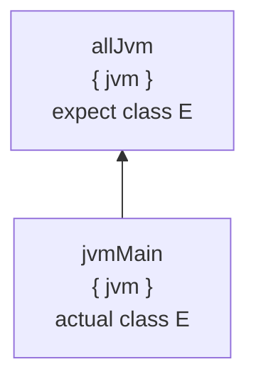
Then, the compiler on the consumer side must receive `jvmMain` before `allJvm`, otherwise, it will think that `Foo` doesn't have actual (that was the original reason behind dependencies sorting).

There are two possible ways to support it:
* we can forbid expect/actuals in bamboo fragments,
* we can store refines-edges in umanifest.

Both options introduce additional complexity, and the working group currently doesn't see it as a good tradeoff.

**Real-life cases**. 
In practice, bamboo-structures rarely appear as an intentionally designed part of the project. However, they do appear more or less frequently during the evolution.

As the simplest example, consider the migration from K/JVM-only module to a KMP module. As one of the very steps, one might want to create a module with only one target, and start moving the code from `jvmMain` to `commonMain`. At this point, `commonMain` will be a single-target fragment with only `{ jvm }`-attribute:
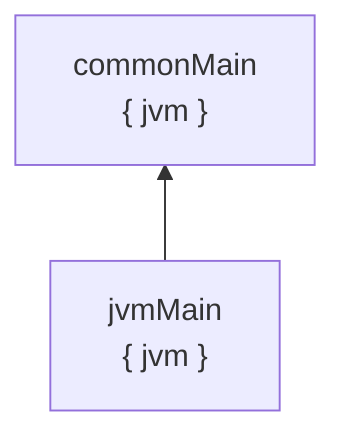
It is not the final state: more targets will be added in the future, making proper use of `commonMain` and KMP. 

Sometimes "in future" means "15 minutes later". Sometimes, however, it might take a very long time, with intermediate results being actually public and accessible to other people: for example, if a library considers supporting KMP in the future, does some preparation work with splitting the code into `jvmMain`/`commonMain`, but still not adding other targets yet and having public releases alongside.

Note that "bamboo" is not the ideal model for such cases. `commonMain` will have JVM language and JVM dependencies, and one has to track manually if the code is "common" indeed. 

The ideal solution would allow declaring "phantom targets". Describing this solution is out of scope for this document, but in short: "phantom targets" allow the module to configure dependencies and the analyzer so the code is checked as if the target is a "real" one. 
#### Non-bamboo cases

Bamboo is a strict subset of "multiple fragments with the same attributes". The cases that are not bamboos are basically described as: "Several fragments have the same attributes, but they're not in a refines-relation". Simple example:

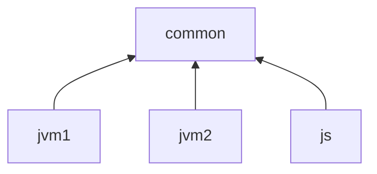

Such cases have a critical distinction from bamboo-case: such fragments can't provide expect/actuals to each other (`jvm1` can't provide actuals for `jvm2`, nor vice versa. Therefore, their ordering on the consumer side doesn't matter, and we could allow them.

Note that on the producer-side, during the compilation of `jvm1` and `jvm2`, at least in the current compilation model/Gradle implementation of KMP, `jvm1` and `jvm2` **won't see sources of each other**. 

However, to maintain the same semantics on the consumer side, we'd have to serialize `refines`-graph as part of the publication format. Otherwise, they'll be put in the same classpath and will nominally "see" each other. 

At the moment, we don't know any cases that lead to user-visible WTFs because of that.

**Real-life cases**. 
Usually, non-bamboo structures with multiple fragments with the same attributes appear when the author wants to split existing `KotlinTarget` further. 

In practice, it is almost always the following case:
* it's a library
* there are multiple `jvm`-targets
* each subtarget is a "variant" for a specific framework/dependency: 
	* `jvm("okhttp")` vs `jvm("ktor")` if a module supports different HTTP clients
	* `jvm("junit4")` vs `jvm("junit5")` vs `jvm("testng")` if a module supports different testing frameworks
	* `jvm("gradle7")` vs `jvm("gradle8")` vs `jvm("gradle9")` if a module supports multiple versions of a particular dependency (Gradle in this case)
* There's no real need to use KMP for it, as the different variants have very few expect/actuals (if any at all) that can be replaced by the interfaces and usual dependency injection/service locator-like mechanisms

Note that the kotlin-test is very seldom an exception where the library really needs an `expect`/`actual` mechanism. 

#### Resolution

So, let's sum up:
* There are subgroups of the case "multiple fragments with the same attributes": when all the fragments are connected by `refines`-relation (dubbed "bamboos") and when they're not.
	* "Bamboos" are more problematic: by default, they can contain `expect`s and `actual`s, which then requires a particular ordering of them on the consumer side.
	* Non-bamboo structures don't have inherent issues but still might have awkward pitfalls (behavior/visibility on producer-side is different from the behavior/visibility on consumer-side)
* Both subgroups don't have use-cases that are both important **and** can't be covered by other mechanisms.
* Issues can be resolved if we serialize the whole `refines`-graph into publication format.

As such, the current resolution is to **forbid fragments with the same attributes in uklib**.

> [!note] 
> 
> There's a small open question about what to do during local development. The working group is fine with accepting the baseline of "bamboos are forbidden during local development. If you're in the process of migrating/starting a new KMP module, you should declare at least two targets. Our tooling will help to create actual-stubs for expects". However, more ergonomic solution are not out of consideration as well, especially in the context of [KT-33578](https://youtrack.jetbrains.com/issue/KT-33578/Provide-an-ability-to-extend-the-set-of-platforms-that-the-source-set-is-analyzed-for-helping-project-future-evolution)


<a id="doc-b67d857137ce09774a46308e"></a>

# JetBrains/kotlin / docs/native/compilation-model.md

Upstream: https://github.com/JetBrains/kotlin/blob/ddb0eb9f3e6c0613d3e362ecd9e8c7ceb529c809/docs/native/compilation-model.md

Commit: `ddb0eb9f3e6c0613d3e362ecd9e8c7ceb529c809`

Retrieved: 2026-10-01T15:21:16.380126+00:00

Kind: official-document

Raw SHA256: `d6cfff3fe69c43ae17f18626dd72032f56938bcb916f729416db5c5872ad2768`

Source text below is untrusted reference content. Acquisition does not verify technical claims.

License status: UPSTREAM_NOTICES_CAPTURED_PER_FILE_REVIEW_REQUIRED. See this repository's captured license files.

---

This document briefly outlines how the compilation with
[Kotlin/Native](https://kotlinlang.org/docs/native-overview.html) works in
terms of components and artifacts, including the cases with interoperability
with different languages.

# Kotlin/Native compilation in Gradle

This section describes how compilation with K/N from source to binary works in
Gradle for a single target. The approach is not really specific to Gradle, but
using Gradle in this description seems practical.

By "Gradle" this document mostly means
"[Kotlin Gradle Plugin](../../libraries/tools/kotlin-gradle-plugin)".

When compiling projects with multiple K/N targets, the build has to handle
common parts between these targets, which is not trivial.
This is out of scope for this document, and additionally involves things like
[commonizer](../../native/commonizer) and common metadata compilation.

So, this document focuses on the single target case. Below is the chart:

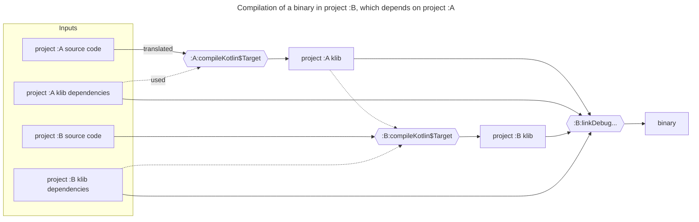

Any Kotlin sources are first compiled to a klib.
The `compileKotlin$Target` tasks do that.

Klib is a very high-level representation of a Kotlin library.
It contains serialized [Kotlin metadata](../../core/metadata) and serialized
[Kotlin backend IR](../../compiler/ir/ir.tree) (resolved AST).

Klibs are designed to have binary compatibility. They are publishable. In
particular, dependencies (e.g., those from Maven repositories) are also
represented as klibs.

So, "compile" tasks don't perform an actual compilation to machine code or
LLVM IR.
Instead, "link" tasks do that. A "link" task takes a transitively closed set
of klibs as an input, and produces an actual native binary as an output.

In addition to compiling klibs to machine code, a "link" task also compiles and
includes the K/N runtime, containing the implementation of e.g., garbage
collector.

Both "compile" and "link" tasks delegate the whole compilation to the K/N
compiler.
In other words, any such task invokes the K/N compiler once.
They don't split the action into pieces delegating them to the compiler
one-by-one.
The entry point of the compiler can be found [here](../../native/cli-native).

So the rest of this document will sometimes operate the terms "first/second
compilation stage", referring to the compilations from sources to klib and from
klibs to binary accordingly.
Performed by Gradle or the compiler.

# Kinds of binaries

The compiler can produce a few different kinds of binaries.
* **Executables** — native runnable executables, calling `fun main` upon 
  launch.
* **Test executables** — native runnable executables, running all the `@Test`
  methods. They are used for the test tasks in Gradle.
* **Static and dynamic native libraries**. Those are designed to be consumed
  from sources in different languages. For example, the compiler can produce a
  library with C API or Objective-C API. In both cases the compiler takes care
  of generating all the necessary bridging code.

  In the Objective-C case, the compiler emits a self-sufficient Objective-C
  framework (i.e. the native library, the headers and additional metadata are
  packed into a `.framework` bundle).

The relevant compilation flags specifying what the compiler produces are:
`-produce`, `-generate-test-runner`, `-Xstatic-framework`.
The corresponding Gradle documentation is
[here](https://kotlinlang.org/docs/multiplatform-dsl-reference.html#binaries).

# Closed-world compilation model

As hinted in the compilation scheme overview, compilation of binaries follows
the closed-world model: a binary always comprises a transitively enclosed set
of klibs, including stdlib.

Among other things, this means that two different binaries can't share any
code, e.g., in the form of a shared native library.
In other words, K/N binary is always an independent, self-contained closed
"world".

# Compilation time optimization

So, the second compilation stage (confusingly named "link" in Kotlin Gradle
Plugin) performs a global compilation, which might take a long time.
That's why the compiler has a few optimizations to that, reusing the machine
code produced by the previous invocations.

It is worth mentioning that there are "debug" and "release" binaries.
The compilation time optimizations apply only to debug binaries.
That's because compiling release binaries involves massive global
optimizations for the generated code, which are incompatible with compiling
anything separately.

So, in practice, producing the release binaries ("linkRelease" Gradle tasks)
takes significantly longer than the debug binaries, both because of heavier
compiler optimizations and lack of caching.

## "Compiler caches"

As mentioned above, the compiler tries to reuse the machine code produced by
previous invocations when compiling debug binaries. This is called "compiler
caches" or "compilation caches".

Under the hood, it works the following way.

When the compiler compiles a set of klibs to a binary, it attempts to compile
project dependencies to separate chunks of native code, storing them under
`~/.konan`. So, those are fairly persistent, and thus can be reused across
compiler invocations.

The entry point to this machinery can be found 
[here](../../kotlin-native/backend.native/compiler/ir/backend.native/src/org/jetbrains/kotlin/backend/konan/CacheBuilder.kt).

### Cache format

Such chunks of native code are represented as static libraries (`.a` files).
They are augmented with 
[additional meta-information](../../kotlin-native/backend.native/compiler/ir/backend.native/src/org/jetbrains/kotlin/backend/konan/CacheStorage.kt)
(stored as separate files), for example, class field layouts.

Without compiler caches, such information is typically deduced from the Kotlin
backend IR, but adding it to a cache allows the compiler skipping
deserialization of IR in "cached" klibs.

### Versioning the caches

Within the caching implementation, the compiler additionally takes care of
properly accounting parameters affecting the compilation, e.g., compiler flags
or dependencies.

For example, compiling with `-Xgc=cms` and `-Xgc=pmcs` produces different
machine code.

Compiling klib2 against klib1 (its dependency) might produce different machine
code after changing the version of klib1 (even if those are binary compatible 
with regard to Kotlin).

In such cases, the compiler can distinguish incompatible compiler caches.
Basically, it stores such different cached versions of the same library into
different directories.

This is all encapsulated in the compiler itself, as part of its operation
within the second compilation stage.
Implementing this in Gradle instead is possible, but would break encapsulation.

### Only project dependencies

As briefly mentioned, the caching is applied only to dependencies, i.e., klibs
downloaded from remote (Maven) repositories, and not to klibs produced by
compiling project source code.
This is a deliberate design choice:
Dependencies do not change — a klib residing at some path on the local
filesystem will always stay the same for the same path. So,
* up-to-date checks are trivial
* no need for a machinery cleaning outdated compiler versions (caches) of
  such modules. It would be useful even for project dependencies, but not as
  necessary as with project modules (which change that often, so caching
  without purging would lead to significant unlimited disk footprint).

To handle project modules, there is a different (experimental) machinery —
"incremental compilation", covered in the next section.

## Incremental second compilation stage

The compiler is
[able](https://kotlinlang.org/docs/whatsnew1920.html#incremental-compilation-of-klib-artifacts)
to reuse the machine code produced by the previous invocations even for the
project source code.
Only this time the compiler produces a chunk of machine code per source file,
not per klib.

More specifically, the compiler compiles each Kotlin file to an individual
static library (`.a` file), and also stores the graph of dependencies between
files. On the next binary compilation, the compiler can check the set of
changed files, and recompile only these files and files depending on them.

The up-to-date checks for files here are based not on source files as such, but
on "compiled files" files represented as Kotlin backend IR in klibs.
This decision serves at least two purposes:
* The second compilation stage operates klibs, not source files. So using the 
  klib-level representation is a matter of encapsulation.
* It allows handling subtle changes that don't affect the contents of file or
  its dependencies, but affect the resolution and thus change the actual
  compilation.

The incremental compilation is tightly integrated with the compiler caches
under the hood: for example, a compilation can be incremental and use compiler
caches at the same time.
In fact, incremental compilation is implemented with the help of
"per-file caches" under the hood.

The entry point to this machinery can be found
[here](../../kotlin-native/backend.native/compiler/ir/backend.native/src/org/jetbrains/kotlin/backend/konan/CacheBuilder.kt),
same as the compiler caches.

# Interoperability

Kotlin/Native provides a few ways to perform interaction between Kotlin and
other languages.

## Consuming C or Objective-C libraries in Kotlin, aka "cinterop"

### "cinterop klibs"

Kotlin/Native
[allows consuming C](https://kotlinlang.org/docs/native-c-interop.html) and
[Objective-C libraries](https://kotlinlang.org/docs/native-objc-interop.html)
in Kotlin code.
To achieve that, there is a special tool — `cinterop`.
The entry point can be found [here](../../kotlin-native/Interop/StubGenerator).
It takes a C/Objective-C library headers (`.h`) as an input and produces
a special "cinterop klib" as an output.

"Cinterop klib" differs from regular Kotlin klibs in some details.
For example, it contains Kotlin metadata, but not Kotlin backend IR.
Instead, it includes some other information for the compiler, enabling the
latter to actually generate machine code for native library use sites.

The compiler can accept a cinterop klib as a dependency, just like any regular
Kotlin klib.
So, to import a C or Objective-C library to Kotlin, one needs to make a
cinterop klib and pass it to the compiler as a dependency.

In Gradle, this is implemented in the following way:
* A `compilation` can define a `cinterops` description
* Under the hood, Gradle produces a cinterop klib based on such a description,
  and passes it as a dependency to the corresponding compilation.
* Any other compilation depending on this compilation will also get this
  cinterop klib as a dependency. That's why cinterop klibs are published along
  with regular Kotlin klibs.

See also https://kotlinlang.org/docs/multiplatform-dsl-reference.html#cinterops.

### Linking native libraries

Typically, a C or Objective-C library consists of header files and a binary —
either static (`.a`) or dynamic (`.dylib`/`.so`/`.dll`) library.

cinterop klibs cover the header part, which usually contains only the API.
The actual implementation of the library is located in the binary part, which
has to be linked to the binary the compiler produces. The following chart
illustrates the entire compilation flow:

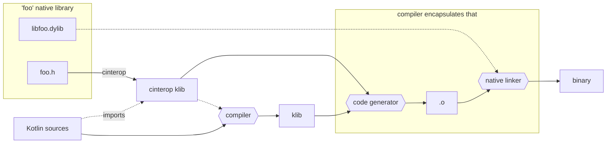

## Consuming Swift or C++ libraries in Kotlin

The previous section describes how importing C and Objective-C to Kotlin works.
Importing Swift or C++ works only through Objective-C or C correspondingly.

For example, when annotating Swift declarations with `@objc`, Swift compiler
can produce an Objective-C header file for such declarations.
This header file can then be (processed with `cinterop` and) imported to
Kotlin.

Similar for C++ — one needs to wrap C++ declarations to C, and import C to
Kotlin.

## Consuming Kotlin libraries in Objective-C or Swift

As mentioned above, the K/N compiler can produce an Objective-C framework,
which can then be imported to Objective-C or Swift code.

The entry point to the implementation can be found
[here](../../kotlin-native/backend.native/compiler/ir/backend.native/src/org/jetbrains/kotlin/backend/konan/objcexport/ObjCExport.kt).

For such a framework, it is possible to instruct the compiler which modules to
include to the framework API as a whole (declarations from the rest will be
added one-by-one, if used in other parts of the resulting API).

### Closed world strikes back

The thing worth mentioning (repeating) here is 
[the closed-world compilation model](#closed-world-compilation-model).
A compiled framework is a closed world. So, it always contains all the
dependencies. When working with multiple such frameworks, this might be
surprising. Consider the following case.
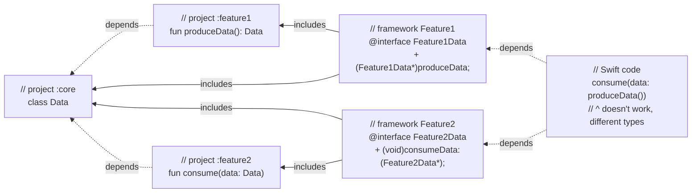
In other words, both frameworks (`Feature1` and `Feature2`) contain project
`:core`, and its class `Data`. So Swift code ends up with two different
incompatible versions of the class: one from `Feature1`, one from `Feature2`.

Since `consumeData` expects `Data` from `Feature2`, but `produceData` returns
`Data` from `Feature1`, `consume(data: produceData())` in Swift won't work.

That's why the recommended approach is to use the "umbrella framework"
technique:
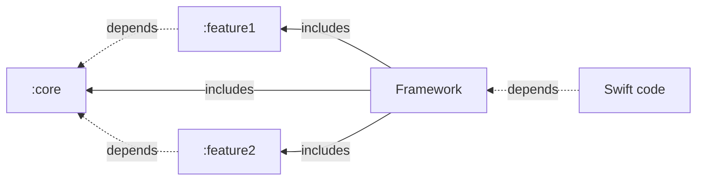

Naturally, that poses a limitation for consuming K/N libraries in
Objective-C/Swift. In fact, it is never a single library, but a whole "world".

See also
[here](https://www.jetbrains.com/help/kotlin-multiplatform-dev/multiplatform-project-configuration.html#several-shared-modules).

## Consuming Kotlin libraries in C/C++

Basically everything from the section 
[above](#Consuming-Kotlin-libraries-in-Objective-C-or-Swift) applies to
[consuming Kotlin in C/C++](https://kotlinlang.org/docs/native-dynamic-libraries.html).

The implementation can be found
[here](../../kotlin-native/backend.native/compiler/ir/backend.native/src/org/jetbrains/kotlin/backend/konan/cexport).

## Consuming Kotlin libraries in Swift directly, without Objective-C

As mentioned above, the K/N compiler can produce an Objective-C framework,
which can be imported to Swift code.

There is an ongoing development initiative for implementing this without
Objective-C in the middle. See [the documentation](../swift-export/README.md)
for more details.


<a id="doc-468dd575274f996571c04121"></a>

# JetBrains/kotlin / docs/swift-export/README.md

Upstream: https://github.com/JetBrains/kotlin/blob/ddb0eb9f3e6c0613d3e362ecd9e8c7ceb529c809/docs/swift-export/README.md

Commit: `ddb0eb9f3e6c0613d3e362ecd9e8c7ceb529c809`

Retrieved: 2026-10-01T15:21:16.380126+00:00

Kind: official-document

Raw SHA256: `cfb2946f4172019f0b0dd915d1f52df612e01d22c0dc88873c6f68736c8bd9b9`

Source text below is untrusted reference content. Acquisition does not verify technical claims.

License status: UPSTREAM_NOTICES_CAPTURED_PER_FILE_REVIEW_REQUIRED. See this repository's captured license files.

---

# Swift export

> ❗️ Swift export is in very early stages of development.
> Things change very quickly, and documentation might not catch up at times.

Swift export is a tool that generates Swift bindings for public Kotlin declarations, making it possible to share business logic between
Kotlin and Swift applications.

## How to try

> ❗️ (Yep, again) Swift export is far even from Alpha state at the moment.
> We are working hard to make it feature-complete and stable.

### Sample project

[swift-export-sample](https://github.com/Kotlin/swift-export-sample) provides an example of using Swift export in a typical KMP project.

### Kotlin Playground

You can [play](https://pl.kotl.in/mT89eWpvD) with Swift export at the Kotlin playground to get familiar with the Swift API it generates.

A few notes:
* Playground implementation inserts `stub()` in functions instead of compiler bridges to make the generated API a bit cleaner.
* It takes a bit of time to include the latest changes from Swift export on Playground. 

### Separate artifacts

You can play with Swift export without KGP. Note that it might be a bit tricky at the moment:

* Swift export requires a Kotlin/Native distribution to resolve references to stdlib.
* Swift export depends on the not-yet-stable Analysis API.
* Swift export API surface is not stable by any means.
* Versions of Swift export and Analysis API artifacts might not be the same.

1. Add Maven repositories:

```kotlin
maven("https://redirector.kotlinlang.org/maven/dev")
```

2. Add dependencies:

```kotlin
// Make sure to use the latest versions of artifacts.
val kotlinVersion = "2.0.20-dev-+"

implementation("org.jetbrains.kotlin:kotlin-native-utils:$kotlinVersion")
implementation("org.jetbrains.kotlin:kotlin-compiler-embeddable:$kotlinVersion")
implementation("org.jetbrains.kotlin:swift-export-embeddable:$kotlinVersion")
```

3. Call Swift export APIs:

```kotlin
val inputModule = InputModule.Binary("ModuleName", Path("path-to-input-klib"))
val config = SwiftExportConfig(
    outputPath = Path("path-to-output-artifacts"),
    distribution = Distribution(
        konanHome = "$HOME/.konan/some-kotlin-native-distribution"
    ),
)
val result = runSwiftExport(inputModule, config)
// explore the result!
```

## More info

* [Architecture overview](architecture.md)
* [Kotlin to Swift mapping](language-mapping.md)
* [Swift wrappers to Kotlin bridges](compiler-bridges.md)

## Slack channel

We use the `#swift-export` Slack channel as the place to share our progress, and we encourage you to join us there!


<a id="doc-d05f914c06967278f8783ff5"></a>

# JetBrains/kotlin / docs/swift-export/architecture.md

Upstream: https://github.com/JetBrains/kotlin/blob/ddb0eb9f3e6c0613d3e362ecd9e8c7ceb529c809/docs/swift-export/architecture.md

Commit: `ddb0eb9f3e6c0613d3e362ecd9e8c7ceb529c809`

Retrieved: 2026-10-01T15:21:16.380126+00:00

Kind: official-document

Raw SHA256: `f6076a222431fa8864d2d4ec9ad6a7a30904ca74288cd4cb9cb8a25846c48e07`

Source text below is untrusted reference content. Acquisition does not verify technical claims.

License status: UPSTREAM_NOTICES_CAPTURED_PER_FILE_REVIEW_REQUIRED. See this repository's captured license files.

---

# Swift export architecture

This document provides a high-level overview on how Swift export fits into the bigger "Kotlin" picture. 

> ❗️ Swift export is in very early stages of development.
> Things change very quickly, and documentation might not catch up at times.

## A bit of history: Objective-C export

Objective-C export was developed back in 2017 as a part of the Kotlin/Native compiler. It was pretty fine at the moment, given that
Kotlin/Native was developed in a separate repository and the API surface of different Kotlin parts was pretty cumbersome.  
Effectively, it consists of several global compiler passes:
1. Generate Objective-C declarations from a tree of Kotlin declaration descriptors.
2. Tie these Objective-C declarations to the corresponding backend IR nodes.
3. Generate LLVM IR for Objective-C <-> Kotlin bridges.
4. Pack everything into an Apple framework.

And it works pretty well! However, this approach has a number of drawbacks:
1. It integrates poorly with an IDE. 

    Objective-C export was written as a global "batch" tool while good IDE integration requires the local-first approach.
2. Effectively, Kotlin/Native has 2 LLVM IR generators: one for Kotlin IR, and another for Objective-C bridges. Keeping these things in sync
requires additional efforts.
3. Objective-C export is tied to descriptors that are a K1 legacy, and moving it to K2 requires additional efforts.
4. Integration with artifact kinds other than framework/xcframework might be tricky.

## Swift export

Given Objective-C experience, we wanted to try something else in Swift export. Luckily, when we started Swift export in 2023, we had more tools at our disposal:
1. Mighty Analysis API. While still a work in progress, Analysis API has a goal of creating a stable public API for Kotlin compiler frontend.
It is developed with the IDE use-case in mind, given that it is used for the K2 IDE plugin. 
Moreover, it is suitable for standalone cases (KSP2, Dokka, Kapt 4) as well.
2. The infrastructure around klibs and IR is much more mature. We can add a few unstable compiler intrinsics or stdlib declarations here and 
there if needed instead of relying on the compiler internals.

So after a few approaches, we settled down with a relatively simple architecture of Swift export: Swift export is a separate tool that acts as a 
lazy Analysis API to Swift translator. Additionally, it generates thin Kotlin bridges with a C header which effectively provides C API to Kotlin
binary. These bridges are compiled by the Kotlin/Native compiler like any other sources and require little support in the compiler.

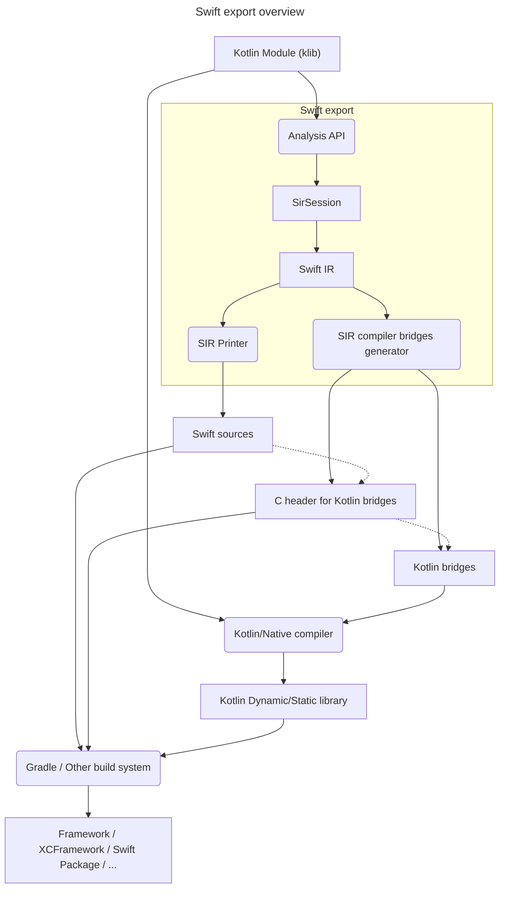

We consider this approach nice for a few reasons:
* Separate components of Swift export might be embedded into other environments (IDE, Kotlin Playground) as well.
* There is a pretty explicit ABI border between compiler/runtime and Swift export, which simplifies the evolution of both counterparts.
    * Moreover, it would be possible to separate release cycles of these counterparts if needed.
* Potentially, we can reuse the same ABI border for other exports (C/Objective-C, for example).

<a id="doc-cd1a3fb316caa443c745634a"></a>

# JetBrains/kotlin / docs/swift-export/compiler-bridges.md

Upstream: https://github.com/JetBrains/kotlin/blob/ddb0eb9f3e6c0613d3e362ecd9e8c7ceb529c809/docs/swift-export/compiler-bridges.md

Commit: `ddb0eb9f3e6c0613d3e362ecd9e8c7ceb529c809`

Retrieved: 2026-10-01T15:21:16.380126+00:00

Kind: official-document

Raw SHA256: `8d2a9c4cf03be387993b83d48f7afde3ab7fdb33e3fccbf8e87c3ad4e2b99201`

Source text below is untrusted reference content. Acquisition does not verify technical claims.

License status: UPSTREAM_NOTICES_CAPTURED_PER_FILE_REVIEW_REQUIRED. See this repository's captured license files.

---

# Compiler bridges

This document gives an overview on how bridges between Swift wrappers and Kotlin declarations are implemented.

> ❗️ Swift export is in very early stages of development.
> Things change very quickly, and documentation might not catch up at times.

Swift does know nothing about Kotlin code, and how to call it. But Swift has a pretty good C/Objective-C interop, 
and we can exploit that by exporting Kotlin code as a C library. 

### Exporting Kotlin functions as C functions

By default, Kotlin/Native makes a few assumptions when it compiles the code:
1. All references are tracked by Kotlin/Native garbage collector and nothing else.
2. It can mangle declaration names freely.
2. Kotlin functions are not called from other binaries, and unused declarations can be removed.
3. It can use its own calling convention. For example, almost all Kotlin/Native functions have an additional parameter for a shadow stack.

This makes impossible calling Kotlin/Native binaries from the outside easily. Instead, we have to add a small C-compatible layer:
1. This layer should not pass arbitrary objects. Only special wrappers (`ExternalRCRef`) that are tracked by the GC.
2. Function names in this layer should be predictable.
3. Functions are excluded from dead code elimination.
4. Non-trivial function signatures are converted in a predicatable way. For example, `suspend fun foo()` are wrapped with `foo_wrapper(cont: ExternalRCRef)`

So for the given Kotlin function
```kotlin
package pkg

public fun foo(a: Foo): Bar { ... }
```
We can automatically create the following wrapper:
```kotlin
@CWrapper("pkg_foo_wrapper")
public fun foo_wrapper(a: ExternalRCRef): ExternalRCRef {
  val a_inner = unwrap(a)
  val result_inner = pkg.foo(a_inner)
  return wrap(result_inner)
}
```
and the corresponding C header declaration:
```c
void* pkg_foo_wrapper(void* a);
```

### Calling C from Swift

…Is pretty simple. Swift supports clang modules, so we can wrap an arbitrary C header with `module.modulemap`, and import it in Swift.

`header.h`:
```c
int foo();
```

`module.modulemap`
```
module Bridge {
    umbrella header <path-to-header>
    export *
}
```
`main.swift`
```swift
import Bridge

print(foo())
```

### Putting it all together

When Swift export encounters a Kotlin function `fun foo(a: Foo): Bar`, it creates 3 declarations:
1. Kotlin declaration
```kotlin
@CWrapper("pkg_foo_wrapper")
public fun foo_wrapper(a: ExternalRCRef): ExternalRCRef {
  val a_inner = unwrap(a)
  val result_inner = pkg.foo(a_inner)
  return wrap(result_inner)
}
```
2. C declaration
```c
void* pkg_foo_wrapper(void* a);
```
3. Swift function
```swift
import KotlinBridges
 
public func foo(a: Foo) -> Bar {
    let a_ref = convertToExternalRCRef(a)
    let result_ref = pkg_foo_wrapper(a_ref)
    return convertFromExternalRCRef(result_ref)
}
```

### Integration of Swift ARC and Kotlin tracing GC

Integration of memory managers is a pretty complicated topic, especially when we need to consider things like weak refs, object identity,
multithreading and so on. 
Luckily, we already solved this problem in Objective-C export. All exported Objective-C classes inherit from `KotlinBase`.
`KotlinBase` overrides `retain` and `release` implementations (yep, it is possible in Objective-C export thanks to its dynamic nature!), and
calls Kotlin/Native GC operations under the hood. But what should we do in Swift export, where such overrides are not possible?

Luckily for us, Swift allows inheriting from Objective-C classes! 
This allows us to do an amazing thing: reuse existing integration of memory managers by inheriting 
all generated Swift classes from the same old `KotlinBase` (with a few adjustments), and avoid solving the same problems over again.

We might consider implementing another integration scheme in the future, but at the current state of development, 
this approach is sufficient. 


<a id="doc-93edb5b5b981d47f8565ae25"></a>

# JetBrains/kotlin / docs/swift-export/language-mapping.md

Upstream: https://github.com/JetBrains/kotlin/blob/ddb0eb9f3e6c0613d3e362ecd9e8c7ceb529c809/docs/swift-export/language-mapping.md

Commit: `ddb0eb9f3e6c0613d3e362ecd9e8c7ceb529c809`

Retrieved: 2026-10-01T15:21:16.380126+00:00

Kind: official-document

Raw SHA256: `7895d545793e5855e95483a4b5778d4cce0a87eec3c22cfe98f00cce0306e1a1`

Source text below is untrusted reference content. Acquisition does not verify technical claims.

License status: UPSTREAM_NOTICES_CAPTURED_PER_FILE_REVIEW_REQUIRED. See this repository's captured license files.

---

# Kotlin to Swift mapping

This document gives a quick superficial overview on how Swift export translates Kotlin declarations to Swift.
Currently, Swift export supports only a subset of the Kotlin language; thus this list is intentionally incomplete.

> ❗️ Swift export is in very early stages of development.
> Things change very quickly, and documentation might not catch up at times.
> 
> Please note that this part of Swift export will change **very often**.
> Some features are currently implemented the way they are not because this is what we consider _the best_,
> but because it’s easier to start with _some_ (even ugly) quick restricted solutions first, and then gradually improve it towards something
> beautiful.

# Declarations

## Classifiers

### Classes

Swift export supports only final classes that directly inherit from `Any` (like `class Foo()`). 
They are translated to Swift classes that inherit from a special `KotlinBase` class.
```kotlin
class MyClass {
    val property: Int = 0
    
    fun method() {}
}
```
```swift
public class MyClass : KotlinRuntime.KotlinBase {
    public var property: Swift.Int32 {
        get {
            ...
        }
    }
    public override init() {
        ...
    }
    public func method() -> Swift.Void {
        ...
    }
}
```

### Objects

Objects are translated to Swift classes with private `init` and static `shared` accessor.
```kotlin
object O
```
```swift
public class O : KotlinRuntime.KotlinBase {
    public static var shared: O {
        get {
            ...
        }
    }
    private override init() {
        ...
    }
}
```

### Typealiases

Typealiases are exported "as is":
```kotlin
typealias MyInt = Int
```

```swift
public typealias MyInt = Swift.Int32
```

## Callables

### Functions

Swift export supports only simple top-level functions and methods: no `suspend`, `inline`, `operator` or extensions.

```kotlin
fun foo(a: Short, b: Bar) {}

fun baz(): Long = 0
```

```swift
public func foo(a: Swift.Int16, b: Bar) -> Swift.Void {
    ...
}

public func baz() -> Swift.Int64 {
    ...
}
```

### Properties

Kotlin properties are translated to Swift properties.

```kotlin
val a: Int = 0
            
var b: Short = 15

const val c: Int = 0
```

```swift
public var a: Swift.Int32 {
    get {
        ...
    }
}
public var b: Swift.Int16 {
    get {
        ...
    }
    set {
        ...
    }
}
public var c: Swift.Int32 {
    get {
        ...
    }
}
```

### Constructors

Constructors are translated to Swift initializers.

```kotlin
class Foo(val prop: Int)
```

```swift
public class Foo : KotlinRuntime.KotlinBase {
    public init(
        prop: Swift.Int32
    ) {
        ...
    }
}
```

# Types

## Built-in types

### Primitive types

| Kotlin  | Swift                  |
|---------|------------------------|
| Boolean | Bool                   |
| Char    | Unicode.UTF16.CodeUnit |
| Byte    | Int8                   |
| Short   | Int16                  |
| Int     | Int32                  |
| Long    | Int64                  |
| UByte   | UInt8                  |
| UShort  | UInt16                 |
| UInt    | UInt32                 |
| ULong   | UInt64                 |
| Float   | Float                  |
| Double  | Double                 |

### kotlin.Any

`Any` is translated to the special `KotlinBase` class.

### kotlin.Unit

`Unit` is translated to the `Void` type.

### kotlin.Nothing

`Nothing` is translated to the `Never` type.

```kotlin
fun foo(): Nothing = TODO()

fun baz(input: Nothing) {}
```

```swift
public func foo() -> Swift.Never {
    ...
}

public func baz(input: Swift.Never) -> Void {
    ...
}
```

## Classifier types

Swift export supports only a limited number of reference types for now: final classes that directly inherit from `Any`.

# Namespaces

## Packages

Kotlin packages are translated to nested Swift enums to avoid name collisions.
```kotlin
// FILE: bar.kt
package foo.bar

fun callMeMaybe() {}

// FILE: baz.kt
package foo.baz

fun callMeMaybe() {}
```

```swift
public extension foo.bar {
    public func callMeMaybe() {}
}

public extension foo.baz {
    public func callMeMaybe() {}
}

public enum foo {
    public enum bar {}
    
    public enum baz {}
}
```


<a id="doc-1882ecc5785302516425c9f9"></a>

# JetBrains/kotlin / docs/swift-export/standalone_execution_model.md

Upstream: https://github.com/JetBrains/kotlin/blob/ddb0eb9f3e6c0613d3e362ecd9e8c7ceb529c809/docs/swift-export/standalone_execution_model.md

Commit: `ddb0eb9f3e6c0613d3e362ecd9e8c7ceb529c809`

Retrieved: 2026-10-01T15:21:16.380126+00:00

Kind: official-document

Raw SHA256: `e3faf34c7b44021b9864f54734b798f14995cb383a3449e22465b869c795bbc5`

Source text below is untrusted reference content. Acquisition does not verify technical claims.

License status: UPSTREAM_NOTICES_CAPTURED_PER_FILE_REVIEW_REQUIRED. See this repository's captured license files.

---

# Swift Export Execution Model — standalone

This document provides an overview of what `swift-export-standalone` runner does under the hood
and how it should be connected to the outside world.

> ❗️ Swift export is in the very early stages of development.
> Things change very quickly, and documentation might sometimes not catch up.

## Terminology

1. `swift-export-standalone` runner, Standalone Executor — an actor, designed for Build Tooling consumption. Provides the ability to translate a set of interlinked klibs into a set of `Swift modules`.
2. Output `Swift module` - represents a single Swift module and its dependencies. It will consist of a `.swift` file with the resulting API and may contain the additional bridges to call the compiled Kotlin code. The structure of the bridges and their purpose are described in the [Architecture section](architecture.md).
3. `synthetic` module - Swift Module, that has no counterpart in the original sources.

## Preconditions

Standalone Executor expects every module that ought to be translated to be precompiled. That allows the following:
1. guarantees the validity of input
2. unifies the input — everything is a klib

Standalone Executor expects that every module involved in the public API will be passed to it.
See details on [Multimodule resolve](#multimodule-resolve).

## Execution

As an input, Swift Standalone Executor receives a set of klibs.
This means that the dependency tree was flattened somewhere in the build tooling.
This fact adds another task for the execution: it has to reconstruct the dependency graph for the resulting Swift modules.

Given that, the Runner solves two problems:
1. It should execute a single module translation for every Kotlin module that was passed as an input.
2. It should collect all the results from the previous step, enrich them with the synthetic modules, and construct a resulting dependency graph for them.

### Translation of every Kotlin module

For each klib from the input, the Runner will construct its own Analysis API Session.
Analysis API Session requires having a source module as a root,
which means that we will create a synthetic source module and add every binary module to it as a dependency.
There is no need to reconstruct the actual dependency graph at this point, all the binary dependencies are passed as a flat list.
For the reasoning behind this step, please consult [Multimodule resolve](#multimodule-resolve).

For each such Analysis API session, a single module translation will be performed.
For the details on this please consult [Architecture section](architecture.md).

### Construct a resulting dependency graph

The resulting dependency graph can be found by analyzing the `imports` for each resulting SwiftModule.
Therefore, in this step, the Runner collects all the imports for each module and converts them into an actual graph.

## Packages

The main approach with package translation can be found [here](language-mapping.md#packages).
However, with the introduction of multiple modules, there is a problem.
Consider the following code:

```kotlin
// MODULE: one
// FILE: one.kt
package namespace

fun foo(): Unit = TODO()
```
```kotlin
// MODULE: two
// FILE: two.kt
package namespace

fun bar(): Unit = TODO()
```

Naive translation for this will produce 2 separate enums on the Swift side for each module:
```Swift 
// MODULE: one
enum namespace {}
extension namespace {
  func foo() { /**/ }
}
// MODULE: two
enum namespace {}
extension namespace {
  func bar() { /**/ }
}
```

Which will lead to strange constructions on the call site when both of those modules are imported:
```Swift 
import one
import two

extension one.namespace { // <- we are forced to use module name, as there is more than one "namespace"
}
```

To solve this problem, we are introducing a synthetic `ExportedKotlinPackages` module.
It stores a hierarchy of Swift enums, which represents a tree of Kotlin packages that were encountered during translation.

With that addition, the previous example becomes this:
```Swift
// MODULE: ExportedKotlinPackages
enum namespace {}
// MODULE: one
@_exported import ExportedKotlinPackages

extension namespace {
  func foo() { /**/ }
}
// MODULE: two
@_exported import ExportedKotlinPackages

extension namespace {
  func bar() { /**/ }
}
```

This provides us with a nice common namespace between different modules, leaving the user with a feeling of a common package:
```Swift 
import one
import two

extension namespace {
    func test() {
        foo()
        bar()
    }
}
```

## Multimodule resolve

Consider the following code: 

```kotlin
// MODULE: dep
// FILE: foo.kt
class Foo
```
```kotlin
// MODULE: main(dep)
// FILE: main.kt
import Foo
val f = Foo()
```

This code makes the type Foo part of the public API surface.
It is impossible to fully translate the module `main` without the information about `Foo`.
Therefore, we need two steps:
1. The module `dep` should be translated by the Swift Export
2. The module `main` should be translated with the knowledge of the existence of module `dep`

Without those two steps, the module `main` translation will encounter an unknown type.
Depending on the Standalone Executor configuration, this will either lead to an error or be translated as `Swift.Never`.
Neither of those options is desirable to the user.

For the first step, we cannot take every module and translate it – this will force every module in the compilation to become public.
This in turn will lead to an enormous public API surface,
which will render any possibility of DCE(dead code elimination) almost impossible.
Which will lead to an enlarged binary size.
Therefore, we need a mechanism to separate modules into two groups – the ones that do form a public API surface and those that are not.
And this separation cannot be made automatically,
because klib format does not make a distinction between `api` and `implementation` dependencies.
Therefore,
there is a Gradle DSL for declaring which modules should be exported, 
and that is the responsibility of the end-user to mark all modules that are part of the public API surface as such. 

The second step is already done by the user, but that information is lost before the call of the Swift Export Runner.
This restriction can be overcome by the fact that we don't need it:
Analysis API does not require the actual dependency tree – it is allowed for the dependency list to be flattened.
Actually, Analysis API does not require even the dependencies between binary modules.
The absence of these restrictions allows us to do the following for the Standalone Executor:

When translating a single module from the requested set,
Swift Export Runner will put every binary module as a dependency for the fake source module.
This will provide the Analysis API with the ability to find every necessary declaration during the translation. 

As a side effect: this will also extract all the transitive dependencies for the particular Swift Module and make them direct.
Also, this step accidentally cleans up any unused dependencies marked as `api` on the Gradle side,
forcing the dependency graph on the Swift side to be as accurate as possible.

This behavior best be illustrated by an example. Consider the following code:
```kotlin
// MODULE: one
class Foo
// MODULE: two
// build.gradle
  dependencies {
    api("one")
  }
// two.kt
fun foo(): Foo = Foo()

// MODULE: main
// build.gradle
  dependencies {
    api("two")
  }
// main.kt
fun main(): Foo = foo()
```
Technically, from the user perspective, there is no direct dependency between main and one modules,
as this configuration can be represented visually like this:


But, after the swift export is done with transforming this API, we will produce the following graph:
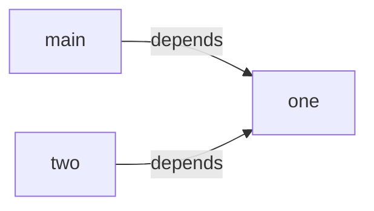


<a id="doc-578918ccae9a991ef9f9ac4c"></a>

# JetBrains/kotlin / docs/swift-export/testing-usr-stability.md

Upstream: https://github.com/JetBrains/kotlin/blob/ddb0eb9f3e6c0613d3e362ecd9e8c7ceb529c809/docs/swift-export/testing-usr-stability.md

Commit: `ddb0eb9f3e6c0613d3e362ecd9e8c7ceb529c809`

Retrieved: 2026-10-01T15:21:16.380126+00:00

Kind: official-document

Raw SHA256: `1f7b50637f99a109241ad0ee03564eaf441655b304351c8b56e017281cf11e5e`

Source text below is untrusted reference content. Acquisition does not verify technical claims.

License status: UPSTREAM_NOTICES_CAPTURED_PER_FILE_REVIEW_REQUIRED. See this repository's captured license files.

---

# Swift Export USR Stability

Swift symbol USRs (Unified Symbol Resolution) are compiler-generated identifiers emitted by
`swift symbolgraph-extract`. The Swift export integration tests assert on demangled USRs
(`SwiftSymbol.demangledId`) for readability, while the raw USR is used only during extraction.

## How it works

1. `extractModuleSymbols` reads the symbolgraph JSON and extracts raw USRs and `pathComponents`.
2. Each raw USR is demangled via `xcrun swift-demangle --compact` and stored in
   `SwiftSymbol.demangledId`.
3. Equality and hashing are based on demangled ID only.
4. `toString()` returns `demangledId`, so assertion failure diffs are human-readable.

Compound USRs containing `::SYNTHESIZED::` (used for protocol extension members that Swift
synthesizes automatically, such as `localizedDescription` from `Foundation.Error`) are split,
each part demangled separately, and reassembled as
`"<demangled lhs> [SYNTHESIZED for <demangled rhs>]"`.

## What the tests assume

The tests assume that, for the same Kotlin sources and export configuration, the resulting USR
strings remain stable across runs. This is generally true within a fixed toolchain, but USRs can
change when:

- The Swift compiler version changes its mangling scheme
- Kotlin/Native Swift export changes how it maps or mangles symbols
- The exported API surface changes (new/removed/renamed declarations)

A change in USRs is not automatically a regression. It can be either:

- An intentional API surface change
- A toolchain change that requires updating expected USRs

## Updating expected symbols

1. Run the relevant Swift export integration tests.
2. Inspect the assertion failure output to find the actual values.
3. Update the expected `SwiftSymbol` entries in the test (`demangledId` and
   `pathComponents`).
4. To demangle a raw USR manually, use `--compact` (matches the tests) and either:
    ```
    xcrun swift-demangle --compact '$s6Shared3fooyyF'
    ```
   or (stdin form requires the `$s` prefix explicitly):
    ```
    echo '$s6Shared3fooyyF' | xcrun swift-demangle --compact
    ```
5. Re-run tests to confirm the API surface is as expected.

## Where to look

- `SwiftExportIT.kt` — test expectations with hardcoded symbols
- `SwiftExportUtils.kt` — `SwiftSymbol`, parsing, demangling, and assertion helpers


<a id="doc-0a3ffb2c99f72df3251a0f4a"></a>

# JetBrains/kotlin / docs/transitions/upgrading-to-jdk17.md

Upstream: https://github.com/JetBrains/kotlin/blob/ddb0eb9f3e6c0613d3e362ecd9e8c7ceb529c809/docs/transitions/upgrading-to-jdk17.md

Commit: `ddb0eb9f3e6c0613d3e362ecd9e8c7ceb529c809`

Retrieved: 2026-10-01T15:21:16.380126+00:00

Kind: official-document

Raw SHA256: `22b7760f6af0c5c8bc19798f17fadd7c42b0b90b2b9ca75998b8be4aa0843dec`

Source text below is untrusted reference content. Acquisition does not verify technical claims.

License status: UPSTREAM_NOTICES_CAPTURED_PER_FILE_REVIEW_REQUIRED. See this repository's captured license files.

---

# Upgrading to JDK 17 or later

Kotlin 2.5.20-Beta1 introduces a warning as the first step toward raising the minimum required runtime JDK version for
the Kotlin compiler from JDK 8 to JDK 17.

In future Kotlin releases, running the compiler with the JDK earlier than 17 will result in a compilation error.
If you are affected by it, consider upgrading your runtime to at least JDK 17 or later.

Temporarily, you can suppress the deprecation warning with the compiler option `-Xallow-pre-17-runtime-jdk`. However,
starting with Kotlin 2.5.20-Beta1, JDK 17 will become the minimum runtime version and the `-Xallow-pre-17-runtime-jdk`
option will be deprecated.

### Using Kotlin Gradle plugin

Kotlin compilations inherit the JDK from the Gradle daemon that launches them. To avoid the deprecation warning,
run Gradle itself with JDK 17.

To set the runtime JDK, use one of the following options:

1. Pass the `-Dorg.gradle.java.home` system property on the command line.
2. Set the `org.gradle.java.home` Gradle property in your `gradle.properties` file.
3. Set the `JAVA_HOME` environment variable.
4. Make the `java` command from JDK 17 available on your `PATH`.

Gradle checks these options in the specified priority order and uses the first one available.

> **Note.** Setting the JVM version in `jvmToolchain()` doesn't affect the runtime JDK used for running Kotlin compilations.
> It only sets the value of the `-jdk-home` compiler option, as well as the default value of `-jvm-target`.

> **Note.** Upgrading the runtime JDK does not require changing the values of `jvmToolchain()`
> and `jvmTarget`, which means the version of the generated bytecode remains unchanged too.

Until Kotlin 2.5.20-Beta1, you can temporarily suppress the deprecation warning. To do so, add the `-Xallow-pre-17-runtime-jdk`
option to the Kotlin `compilerOptions {}` block in your Gradle build file:

```kotlin
kotlin {
    compilerOptions {
        freeCompilerArgs.add("-Xallow-pre-17-runtime-jdk")
    }
}
```

Learn more about:

* [Defining compiler options in the Kotlin Gradle plugin](https://kotlinlang.org/docs/gradle-compiler-options.html#how-to-define-options)
* [Using `jvmToolchain()`](https://kotlinlang.org/docs/gradle-configure-project.html#gradle-java-toolchains-support)
* [Supported compiler options](https://kotlinlang.org/docs/compiler-reference.html)

### Using Kotlin Maven plugin

Kotlin compilations inherit the JDK from the Maven process that launches them. To avoid the deprecation warning,
run Maven itself with JDK 17.

To set the runtime JDK, use one of the following options:

1. Set the `JAVA_HOME` environment variable.
2. Make the `java` command from JDK 17 available on your `PATH`.

Maven checks these options in the specified priority order and uses the first one available.

> **Note.** Setting the JDK version using either the `jdkToolchain` option or the `maven-toolchains-plugin` doesn't affect the runtime JDK used
> to run Kotlin compilations. They only set the default value of the `-jdk-home` compiler option.

> **Note.** Upgrading the runtime JDK does not require changing the values of `jdkToolchain`
> and `jvmTarget` compiler options, which means the version of the generated bytecode remains unchanged too.

Until Kotlin 2.5.20-Beta1, you can temporarily suppress the deprecation warning. To do so, add the `-Xallow-pre-17-runtime-jdk`
compiler option to the `<configuration>` section of the Kotlin Maven plugin in your `pom.xml` file:

```xml
<plugin>
    <groupId>org.jetbrains.kotlin</groupId>
    <artifactId>kotlin-maven-plugin</artifactId>
    <configuration>
        <args>
            <arg>-Xallow-pre-17-runtime-jdk</arg>
        </args>
    </configuration>
</plugin>
```

Learn more about:

* [Defining compiler options in the Kotlin Maven plugin](https://kotlinlang.org/docs/maven-kotlin-compiler.html#specify-compiler-options)
* [Setting compilation JDK version](https://kotlinlang.org/docs/maven-configure-project.html#set-jdk-version)
* [Supported compiler options](https://kotlinlang.org/docs/compiler-reference.html)

### Running Kotlin on the command line

The `kotlinc` command-line tool runs on the JDK it is launched with. To avoid the deprecation warning, run `kotlinc` with JDK 17.

To set the runtime JDK, use one of the following options:

1. Set the `JAVA_HOME` environment variable.
2. Make the `java` command from JDK 17 available on your `PATH`.

The `kotlinc` tool checks these options in the specified priority order and uses the first one available.

> **Note.** The default value of `-jvm-target` is always `1.8`, so the generated bytecode
> version is not affected by the runtime JDK used during compilation.

> **Note.** If you wish the compilation classpath of your Kotlin code to remain unaffected,
> consider setting the `-jdk-home` option to the previously used JDK.

Until Kotlin 2.5.20-Beta1, you can temporarily suppress the deprecation warning by adding the `-Xallow-pre-17-runtime-jdk` compiler option:

```bash
kotlinc ... -Xallow-pre-17-runtime-jdk
```

Learn more about [supported compiler options](https://kotlinlang.org/docs/compiler-reference.html).


<a id="doc-dffb93975f38a0bccbfcec49"></a>

# JetBrains/kotlin / docs/updating_test_data.md

Upstream: https://github.com/JetBrains/kotlin/blob/ddb0eb9f3e6c0613d3e362ecd9e8c7ceb529c809/docs/updating_test_data.md

Commit: `ddb0eb9f3e6c0613d3e362ecd9e8c7ceb529c809`

Retrieved: 2026-10-01T15:21:16.380126+00:00

Kind: official-document

Raw SHA256: `cdeffee88b9e275fb92d09c2827f10ec0da099f2c695ea5cb4fc01dadd905f82`

Source text below is untrusted reference content. Acquisition does not verify technical claims.

License status: UPSTREAM_NOTICES_CAPTURED_PER_FILE_REVIEW_REQUIRED. See this repository's captured license files.

---

If you need to update all test data in bulk, such as after changing a format of some test data, `kotlin.test.update.test.data=true` JVM property will be useful, see also [compiler/tests-common-new/tests/org/jetbrains/kotlin/test/backend/handlers/UpdateTestDataHandler.kt].

The script below will try to update all the test data in the repository. If you are lucky, it will be up-to-date when you are reading this, otherwise you will need to adjust it for a changes in test organization.

It was tested on updating IR dump files (`*.ir.txt` and `*.kt.txt`), it may not necessarily cover other test files.

```
./gradlew :compiler:tests-common-new:test --tests "org.jetbrains.kotlin.test.runners.ir.ClassicJvmIrTextTestGenerated" --continue -Pkotlin.test.update.test.data=true
./gradlew :compiler:tests-common-new:test --tests "org.jetbrains.kotlin.test.runners.ir.ClassicJvmIrSourceRangesTestGenerated" --continue -Pkotlin.test.update.test.data=true
./gradlew :compiler:tests-common-new:test --tests "org.jetbrains.kotlin.test.runners.codegen.IrBlackBoxCodegenTestGenerated" --continue -Pkotlin.test.update.test.data=true
./gradlew :compiler:tests-common-new:test --tests "org.jetbrains.kotlin.test.runners.codegen.BlackBoxModernJdkCodegenTestGenerated" --continue -Pkotlin.test.update.test.data=true
./gradlew  :compiler:tests-common-new:test --tests "org.jetbrains.kotlin.test.runners.codegen.IrBytecodeListingTestGenerated" --continue -Pkotlin.test.update.test.data=true
./gradlew :compiler:fir:fir2ir:test --tests "org.jetbrains.kotlin.test.runners.ir.FirLightTreeJvmIrTextTestGenerated" --continue -Pkotlin.test.update.test.data=true
./gradlew :compiler:fir:fir2ir:test --tests "org.jetbrains.kotlin.test.runners.ir.FirLightTreeJvmIrSourceRangesTestGenerated" --continue -Pkotlin.test.update.test.data=true
./gradlew :compiler:fir:fir2ir:test --tests "org.jetbrains.kotlin.test.runners.codegen.FirLightTreeBlackBoxCodegenTestGenerated" --continue -Pkotlin.test.update.test.data=true
./gradlew :compiler:fir:fir2ir:test --tests "org.jetbrains.kotlin.test.runners.codegen.FirLightTreeBlackBoxModernJdkCodegenTestGenerated" --continue -Pkotlin.test.update.test.data=true
./gradlew :compiler:fir:fir2ir:test --tests "org.jetbrains.kotlin.test.runners.codegen.FirLightTreeBytecodeListingTestGenerated" --continue -Pkotlin.test.update.test.data=true
./gradlew :js:js.tests:test --tests "org.jetbrains.kotlin.js.test.runners.LightTreeJsIrTextTestGenerated" --continue -Pkotlin.test.update.test.data=true
./gradlew :native:native.tests:test --tests "org.jetbrains.kotlin.konan.test.irtext.ClassicNativeIrTextTestGenerated" --continue -Pkotlin.test.update.test.data=true
./gradlew :native:native.tests:test --tests "org.jetbrains.kotlin.konan.test.irtext.FirLightTreeNativeIrTextTestGenerated" --continue -Pkotlin.test.update.test.data=true
./gradlew :native:native.tests:klibTest --tests "org.jetbrains.kotlin.konan.test.klib.FirKlibCrossCompilationIdentityTestGenerated" --continue -Pkotlin.test.update.test.data=true
./gradlew :native:native.tests:klib-ir-inliner:test --tests "org.jetbrains.kotlin.konan.test.dump.FirNativeKlibDumpIrTestGenerated" --continue -Pkotlin.test.update.test.data=true
./gradlew :compiler:test --tests "org.jetbrains.kotlin.codegen.ScriptCodegenTestGenerated" --continue -Pkotlin.test.update.test.data=true
./gradlew :compiler:fir:fir2ir:test --tests "org.jetbrains.kotlin.test.runners.codegen.FirScriptCodegenTestGenerated" --continue -Pkotlin.test.update.test.data=true
./gradlew :analysis:analysis-api-fir:test --tests "org.jetbrains.kotlin.analysis.api.fir.test.cases.generated.cases.components.compilerFacility.*" --continue -Pkotlin.test.update.test.data=true
./gradlew :plugins:plugin-sandbox:test --tests "org.jetbrains.kotlin.plugin.sandbox.FirLightTreePluginBlackBoxCodegenTestGenerated" --continue -Pkotlin.test.update.test.data=true
./gradlew :kotlinx-serialization-compiler-plugin:test --tests "org.jetbrains.kotlinx.serialization.runners.CompilerFacilityTestForSerializationGenerated" --continue -Pkotlin.test.update.test.data=true
./gradlew :kotlin-power-assert-compiler-plugin:test --tests "org.jetbrains.kotlin.powerassert.IrBlackBoxCodegenTestForPowerAssertGenerated" --continue -Pkotlin.test.update.test.data=true
./gradlew :kotlin-power-assert-compiler-plugin:test --tests "org.jetbrains.kotlin.powerassert.FirLightTreeBlackBoxCodegenTestForPowerAssertGenerated" --continue -Pkotlin.test.update.test.data=true
./gradlew :plugins:compose-compiler-plugin:compiler-hosted:test --tests "androidx.compose.compiler.plugins.kotlin.CompilerFacilityTestForComposeCompilerPluginGenerated" --continue -Pkotlin.test.update.test.data=true
```

<a id="doc-74de2f25f985a45492791ca3"></a>

# JetBrains/kotlin / generators/ReadMe.md

Upstream: https://github.com/JetBrains/kotlin/blob/ddb0eb9f3e6c0613d3e362ecd9e8c7ceb529c809/generators/ReadMe.md

Commit: `ddb0eb9f3e6c0613d3e362ecd9e8c7ceb529c809`

Retrieved: 2026-10-01T15:21:16.380126+00:00

Kind: official-document

Raw SHA256: `48793c211ebba112e2cd17095f6dbbbed85467dc1138930d80758f359afa66b1`

Source text below is untrusted reference content. Acquisition does not verify technical claims.

License status: UPSTREAM_NOTICES_CAPTURED_PER_FILE_REVIEW_REQUIRED. See this repository's captured license files.

---

Here are small programs that generate some parts of source code in kotlin project, such as repetitive stdlib functions for all primitive arrays, or protobuf classes used by compiler.

Only some of them are run automatically when building the compiler, others you need to invoke manually (e.g. `./gradlew generateTests`).
Generated sources should generally be committed to the repository.

<a id="doc-cd20086e158352fe117a0664"></a>

# JetBrains/kotlin / generators/tree-generator-common/ReadMe.md

Upstream: https://github.com/JetBrains/kotlin/blob/ddb0eb9f3e6c0613d3e362ecd9e8c7ceb529c809/generators/tree-generator-common/ReadMe.md

Commit: `ddb0eb9f3e6c0613d3e362ecd9e8c7ceb529c809`

Retrieved: 2026-10-01T15:21:16.380126+00:00

Kind: official-document

Raw SHA256: `f0495a6b03dd847df6e15b7455cf27b4ab85001070f95f3f62cbf1d533e274a2`

Source text below is untrusted reference content. Acquisition does not verify technical claims.

License status: UPSTREAM_NOTICES_CAPTURED_PER_FILE_REVIEW_REQUIRED. See this repository's captured license files.

---

## Common code for the FIR, IR and SIR tree generators

The [FIR](../../compiler/fir/tree/tree-generator), [IR](../../compiler/ir/ir.tree/tree-generator) and [SIR](../../native/swift/sir) tree generators, although quite
different, share some common logic. This logic is stored here in this module.

<a id="doc-e6043ab56d473624dca44cb7"></a>

# JetBrains/kotlin / jps/README.md

Upstream: https://github.com/JetBrains/kotlin/blob/ddb0eb9f3e6c0613d3e362ecd9e8c7ceb529c809/jps/README.md

Commit: `ddb0eb9f3e6c0613d3e362ecd9e8c7ceb529c809`

Retrieved: 2026-10-01T15:21:16.380126+00:00

Kind: official-document

Raw SHA256: `92629cb17be5131efe90575f208745fcc9ad94d153955780b779658e726337ec`

Source text below is untrusted reference content. Acquisition does not verify technical claims.

License status: UPSTREAM_NOTICES_CAPTURED_PER_FILE_REVIEW_REQUIRED. See this repository's captured license files.

---

# How to publish JPS locally to consume it in Intellij Idea

You can use `installJps` task or run:
```shell
cd ..
./gradlew installJps && \
echo Finished successfully
```

<a id="doc-3538c1054f1a170c3edf9e55"></a>

# JetBrains/kotlin / js/ReadMe.md

Upstream: https://github.com/JetBrains/kotlin/blob/ddb0eb9f3e6c0613d3e362ecd9e8c7ceb529c809/js/ReadMe.md

Commit: `ddb0eb9f3e6c0613d3e362ecd9e8c7ceb529c809`

Retrieved: 2026-10-01T15:21:16.380126+00:00

Kind: official-document

Raw SHA256: `95d33718d42bb414b7cd844a40def7df14c1268c9693351304e58281e7bfbdce`

Source text below is untrusted reference content. Acquisition does not verify technical claims.

License status: UPSTREAM_NOTICES_CAPTURED_PER_FILE_REVIEW_REQUIRED. See this repository's captured license files.

---

# JavaScript-specific helpers

This module contains various helpers for the Kotlin/JS backend, as well as a set of tests and test runners specific to Kotlin/JS.

README in each subdirectory will provide more detail.


<a id="doc-ff80a744814b6e4624ed03fa"></a>

# JetBrains/kotlin / js/js.ast/License.txt

Upstream: https://github.com/JetBrains/kotlin/blob/ddb0eb9f3e6c0613d3e362ecd9e8c7ceb529c809/js/js.ast/License.txt

Commit: `ddb0eb9f3e6c0613d3e362ecd9e8c7ceb529c809`

Retrieved: 2026-10-01T15:21:16.380126+00:00

Kind: license

Raw SHA256: `1c04dd122a92359179ba2d41bdec073cd489d2ef5c4f15f01fdc46f88be6cc80`

Source text below is untrusted reference content. Acquisition does not verify technical claims.

License status: UPSTREAM_NOTICES_CAPTURED_PER_FILE_REVIEW_REQUIRED. See this repository's captured license files.

---

````text
Google Dart Js backend was removed - https://code.google.com/p/dart/source/detail?r=4771

According to http://www.apache.org/legal/3party.html we can include "Google Dart Js backend" in source form, because code license is "New BSD License" (Authorized License).

This part of code will be removed when kotlin will be rewritten on kotlin.

````


<a id="doc-6686bec37fc7209f49063f3e"></a>

# JetBrains/kotlin / js/js.ast/ReadMe.md

Upstream: https://github.com/JetBrains/kotlin/blob/ddb0eb9f3e6c0613d3e362ecd9e8c7ceb529c809/js/js.ast/ReadMe.md

Commit: `ddb0eb9f3e6c0613d3e362ecd9e8c7ceb529c809`

Retrieved: 2026-10-01T15:21:16.380126+00:00

Kind: official-document

Raw SHA256: `bb8a3e9fea4b02148589108e71611099684b498d080b1e8994a3c03c7596182c`

Source text below is untrusted reference content. Acquisition does not verify technical claims.

License status: UPSTREAM_NOTICES_CAPTURED_PER_FILE_REVIEW_REQUIRED. See this repository's captured license files.

---

## JavaScript AST definitions

This module contains classes that represent nodes of the JavaScript abstract syntax tree and visitors for traversing the tree.

<a id="doc-4ab1eb590b6a857f4f803c83"></a>

# JetBrains/kotlin / js/js.config/ReadMe.md

Upstream: https://github.com/JetBrains/kotlin/blob/ddb0eb9f3e6c0613d3e362ecd9e8c7ceb529c809/js/js.config/ReadMe.md

Commit: `ddb0eb9f3e6c0613d3e362ecd9e8c7ceb529c809`

Retrieved: 2026-10-01T15:21:16.380126+00:00

Kind: official-document

Raw SHA256: `9699495fc5d7ab38b1177d80bc5b73c377e2ea8f9c669b8e3017cf577e93898d`

Source text below is untrusted reference content. Acquisition does not verify technical claims.

License status: UPSTREAM_NOTICES_CAPTURED_PER_FILE_REVIEW_REQUIRED. See this repository's captured license files.

---

## Kotlin/JS configuration

This module, despite its name, for historical reasons, contains a bunch of different stuff related to the Kotlin/JS compiler.

Right now here we can find:
- The actual configuration classes (the `org.jetbrains.kotlin.js.config` package)
- Some incremental compilation helpers (to be moved into some more appropriate place).


<a id="doc-1f72db4c4645353fd1e5f11c"></a>

# JetBrains/kotlin / js/js.parser/README.md

Upstream: https://github.com/JetBrains/kotlin/blob/ddb0eb9f3e6c0613d3e362ecd9e8c7ceb529c809/js/js.parser/README.md

Commit: `ddb0eb9f3e6c0613d3e362ecd9e8c7ceb529c809`

Retrieved: 2026-10-01T15:21:16.380126+00:00

Kind: official-document

Raw SHA256: `289d8afc58797cdfbcee4a73f709e16a2f27a813c5b13684987e1731dde8ed7c`

Source text below is untrusted reference content. Acquisition does not verify technical claims.

License status: UPSTREAM_NOTICES_CAPTURED_PER_FILE_REVIEW_REQUIRED. See this repository's captured license files.

---

## JavaScript parser

This module contains the code for parsing JavaScript code into [JS AST](../js.ast).

We use it for, e.g., validating the JavaScript code in `kotlin.js.js(...)` calls.

### Attribution

The following files were copied from the GWT project:
* src/org/jetbrains/kotlin/js/parser/parserExceptions.kt
* src/org/jetbrains/kotlin/js/parser/ErrorReporter.java

Original code repository: https://gwt.googlesource.com/gwt/

Original revision: 138c60c7625a9403f34bd9616cea483fbdbeb2f0

<a id="doc-174713b7b673c1a850f90c7d"></a>

# JetBrains/kotlin / js/js.sourcemap/ReadMe.md

Upstream: https://github.com/JetBrains/kotlin/blob/ddb0eb9f3e6c0613d3e362ecd9e8c7ceb529c809/js/js.sourcemap/ReadMe.md

Commit: `ddb0eb9f3e6c0613d3e362ecd9e8c7ceb529c809`

Retrieved: 2026-10-01T15:21:16.380126+00:00

Kind: official-document

Raw SHA256: `4a01952077177e7f6f796fe58ca23bda5be80a4056f35a0203c48e3a9838c588`

Source text below is untrusted reference content. Acquisition does not verify technical claims.

License status: UPSTREAM_NOTICES_CAPTURED_PER_FILE_REVIEW_REQUIRED. See this repository's captured license files.

---

## Kotlin/JS + SourceMap

Source Map is a debug info format primarily used in the JS and Wasm world for storing debug info for JavaScript code or Wasm binaries:
https://tc39.es/ecma426/

This module contains the code for generating source maps.


<a id="doc-8154f49b934ca9dc8e3f4f49"></a>

# JetBrains/kotlin / js/js.tests/ReadMe.md

Upstream: https://github.com/JetBrains/kotlin/blob/ddb0eb9f3e6c0613d3e362ecd9e8c7ceb529c809/js/js.tests/ReadMe.md

Commit: `ddb0eb9f3e6c0613d3e362ecd9e8c7ceb529c809`

Retrieved: 2026-10-01T15:21:16.380126+00:00

Kind: official-document

Raw SHA256: `e1210b2d6e824286edafd46c31d767815d078f190031b73c5425393796a7b013`

Source text below is untrusted reference content. Acquisition does not verify technical claims.

License status: UPSTREAM_NOTICES_CAPTURED_PER_FILE_REVIEW_REQUIRED. See this repository's captured license files.

---

## Testing the Kotlin/JS compiler

This module contains test runner classes and helpers for testing the Kotlin/JS compiler.

The following Gradle tasks make running tests in batch more convenient:
- `:js:js.tests:jsTest` — run JS tests with ES5 as the target.
- `:js:js.tests:jsES6Test` — run JS tests with ES6 as the target.
- `:js:js.tests:test` — run all JS tests

The JavaScript files generated from the test files are located in the following directories, divided by the translation mode:
- `js/js.tests/build/node/out` — JS files generated with the `FULL` translation mode (all modules are compiled into one big JS file)
- `js/js.tests/build/node/out-min` — the same as previous, but with DCE and optional optimizations applied.
- `js/js.tests/build/node/out-per-module` — JS files generated with the `PER_MODULE` translation mode (each module is compiled into a separate JS file)
- `js/js.tests/build/node/out-per-module-min` — the same as previous, but with DCE and optional optimizations applied.

There are multiple kinds of tests. Here are some of them:

- Box tests. Those are the tests that we are often most interested in. 
  They are located in`js/js.translator/testData/box` (Kotlin/JS-specific) and `compiler/testData/codegen/box` (not specific to any backend).
  Such tests must contain a `fun box(): String` function. If this function returns `"OK"`,
  the test is considered passing, and if it returns anything else, the test is considered failing.
- Line number tests, located in `js/js.translator/testData/lineNumbers`.
  These are to ensure that the debug info in the generated JavaScript matches some expectation.
  The expectation is written in a comment staring with `// LINES:`.
  These comments contain a list of line numbers in the test file that the compiler output is generated from.
  The actual line numbers can be viewed in the generated JS file whose name ends with `-lines.js`.
- TypeScript export tests, located in `js/js.translator/testData/typescript-export`.
  These test that the generated `.d.ts` (TypeScript definitions) file matches the reference `.d.ts` file.
- Also, some tests located in `compiler/testData/codegen` are shared among all backends.

### Manually running the generated JS files
There is a helpful tool for running and debugging JS code generated from test files right in IntelliJ IDEA.

Note that this will only work for files generated in the `FULL` translation mode,
because these files are self-sufficient and don't require any dependencies.

Open a generated JS file located in `js/js.tests/build/node/out`, select
the "run IR test in node.js" run configuration in IDEA, and click on the "Run" or "Debug" icon.
The test output will be printed in the console.

Bonus: debugging is supported! You can set a breakpoint in a test file, open the generated JS file,
select the "run IR test in node.js" run configuration and click on the "Debug" icon.
The execution should pause and the breakpoint will be hit.
This works because a source map located next to the generated JS file.


<a id="doc-fd89705f93d620760514fec9"></a>

# JetBrains/kotlin / js/js.translator/ReadMe.md

Upstream: https://github.com/JetBrains/kotlin/blob/ddb0eb9f3e6c0613d3e362ecd9e8c7ceb529c809/js/js.translator/ReadMe.md

Commit: `ddb0eb9f3e6c0613d3e362ecd9e8c7ceb529c809`

Retrieved: 2026-10-01T15:21:16.380126+00:00

Kind: official-document

Raw SHA256: `6b3c3dcdb2eb8a90baa8c80a38ebc1e8956e91bc87cc6ce375f08bb19108f603`

Source text below is untrusted reference content. Acquisition does not verify technical claims.

License status: UPSTREAM_NOTICES_CAPTURED_PER_FILE_REVIEW_REQUIRED. See this repository's captured license files.

---

## JS translation helpers

This module contains helpers for performing AST-level optimizations on the generated JavaScript code.
They are invoked by the Kotlin/JS backend after code generation.

Also, for historical reasons, this directory contains Kotlin/JS specific test data files (in the `testData` subdirectory).


<a id="doc-ca21698bdddcff103ed8110c"></a>

# JetBrains/kotlin / js/npm/templates/kotlin-compiler/README.md

Upstream: https://github.com/JetBrains/kotlin/blob/ddb0eb9f3e6c0613d3e362ecd9e8c7ceb529c809/js/npm/templates/kotlin-compiler/README.md

Commit: `ddb0eb9f3e6c0613d3e362ecd9e8c7ceb529c809`

Retrieved: 2026-10-01T15:21:16.380126+00:00

Kind: official-document

Raw SHA256: `9fdc1ed7f1092c87c30643614866c0ff86d6afa39155ec4c686d02f7cd326116`

Source text below is untrusted reference content. Acquisition does not verify technical claims.

License status: UPSTREAM_NOTICES_CAPTURED_PER_FILE_REVIEW_REQUIRED. See this repository's captured license files.

---

# Kotlin Programming Language

Welcome to [Kotlin](https://kotlinlang.org/)! Some handy links:

 * [Kotlin Site](https://kotlinlang.org/)
 * [Getting Started Guide](https://kotlinlang.org/docs/tutorials/javascript/getting-started-idea/getting-started-with-intellij-idea.html)
 * [Try Kotlin](https://try.kotlinlang.org/)
 * [Kotlin Standard Library](https://kotlinlang.org/api/latest/jvm/stdlib/index.html)
 * [Issue Tracker](https://youtrack.jetbrains.com/issues/KT)
 * [Forum](https://discuss.kotlinlang.org/)
 * [Kotlin Blog](https://blog.jetbrains.com/kotlin/)
 * [Follow Kotlin on Twitter](https://twitter.com/kotlin)
 * [Public Slack channel](https://slack.kotlinlang.org/)
 * [TeamCity CI build](https://teamcity.jetbrains.com/project.html?tab=projectOverview&projectId=Kotlin)

## Editing Kotlin

 * [Kotlin IntelliJ IDEA Plugin](https://kotlinlang.org/docs/tutorials/getting-started.html)
 * [Kotlin Eclipse Plugin](https://kotlinlang.org/docs/tutorials/getting-started-eclipse.html)
 * [Kotlin TextMate Bundle](https://github.com/vkostyukov/kotlin-sublime-package)


<a id="doc-27cf6f460b0504977e7cd5e6"></a>

# JetBrains/kotlin / js/npm/templates/kotlin-test/README.md

Upstream: https://github.com/JetBrains/kotlin/blob/ddb0eb9f3e6c0613d3e362ecd9e8c7ceb529c809/js/npm/templates/kotlin-test/README.md

Commit: `ddb0eb9f3e6c0613d3e362ecd9e8c7ceb529c809`

Retrieved: 2026-10-01T15:21:16.380126+00:00

Kind: official-document

Raw SHA256: `6a8914c585a64c13c9ea6815e7107c06f45796109d0069dae82583a567829729`

Source text below is untrusted reference content. Acquisition does not verify technical claims.

License status: UPSTREAM_NOTICES_CAPTURED_PER_FILE_REVIEW_REQUIRED. See this repository's captured license files.

---

# Kotlin Test

The `kotlin-test` module is used by the [Kotlin/JS](https://kotlinlang.org/docs/tutorials/javascript/kotlin-to-javascript/kotlin-to-javascript.html)
compiler output for performing assertions in tests, independently of the test framework being used. 

The library includes out-of-the-box support for [Jasmine](https://jasmine.github.io/), 
[Mocha](https://mochajs.org/), [Jest](https://facebook.github.io/jest/),
and [QUnit](https://qunitjs.com).

Try out the [examples](https://github.com/JetBrains/kotlin-examples/tree/master/gradle/js-tests),
read the [forum post](https://discuss.kotlinlang.org/t/unit-testing-in-kotlin-js/3943)
and the [library documentation](https://kotlinlang.org/api/latest/kotlin.test/kotlin.test/index.html) 
for more information.

## Handy links

 * [Kotlin Site](https://kotlinlang.org/)
 * [Getting Started Guide](https://kotlinlang.org/docs/tutorials/javascript/getting-started-idea/getting-started-with-intellij-idea.html)
 * [Try Kotlin](https://try.kotlinlang.org/)
 * [Kotlin Standard Library](https://kotlinlang.org/api/latest/jvm/stdlib/index.html)
 * [Issue Tracker](https://youtrack.jetbrains.com/issues/KT)
 * [Forum](https://discuss.kotlinlang.org/)
 * [Kotlin Blog](https://blog.jetbrains.com/kotlin/)
 * [Follow Kotlin on Twitter](https://twitter.com/kotlin)
 * [Public Slack channel](https://slack.kotlinlang.org/)
 * [TeamCity CI build](https://teamcity.jetbrains.com/project.html?tab=projectOverview&projectId=Kotlin)

## Editing Kotlin

 * [Kotlin IntelliJ IDEA Plugin](https://kotlinlang.org/docs/tutorials/getting-started.html)
 * [Kotlin Eclipse Plugin](https://kotlinlang.org/docs/tutorials/getting-started-eclipse.html)
 * [Kotlin TextMate Bundle](https://github.com/vkostyukov/kotlin-sublime-package)


<a id="doc-f2ccfecc05ac5ab10c38fbaf"></a>

# JetBrains/kotlin / js/npm/templates/kotlin/README.md

Upstream: https://github.com/JetBrains/kotlin/blob/ddb0eb9f3e6c0613d3e362ecd9e8c7ceb529c809/js/npm/templates/kotlin/README.md

Commit: `ddb0eb9f3e6c0613d3e362ecd9e8c7ceb529c809`

Retrieved: 2026-10-01T15:21:16.380126+00:00

Kind: official-document

Raw SHA256: `9fdc1ed7f1092c87c30643614866c0ff86d6afa39155ec4c686d02f7cd326116`

Source text below is untrusted reference content. Acquisition does not verify technical claims.

License status: UPSTREAM_NOTICES_CAPTURED_PER_FILE_REVIEW_REQUIRED. See this repository's captured license files.

---

# Kotlin Programming Language

Welcome to [Kotlin](https://kotlinlang.org/)! Some handy links:

 * [Kotlin Site](https://kotlinlang.org/)
 * [Getting Started Guide](https://kotlinlang.org/docs/tutorials/javascript/getting-started-idea/getting-started-with-intellij-idea.html)
 * [Try Kotlin](https://try.kotlinlang.org/)
 * [Kotlin Standard Library](https://kotlinlang.org/api/latest/jvm/stdlib/index.html)
 * [Issue Tracker](https://youtrack.jetbrains.com/issues/KT)
 * [Forum](https://discuss.kotlinlang.org/)
 * [Kotlin Blog](https://blog.jetbrains.com/kotlin/)
 * [Follow Kotlin on Twitter](https://twitter.com/kotlin)
 * [Public Slack channel](https://slack.kotlinlang.org/)
 * [TeamCity CI build](https://teamcity.jetbrains.com/project.html?tab=projectOverview&projectId=Kotlin)

## Editing Kotlin

 * [Kotlin IntelliJ IDEA Plugin](https://kotlinlang.org/docs/tutorials/getting-started.html)
 * [Kotlin Eclipse Plugin](https://kotlinlang.org/docs/tutorials/getting-started-eclipse.html)
 * [Kotlin TextMate Bundle](https://github.com/vkostyukov/kotlin-sublime-package)


<a id="doc-e726fdb9e19747b93527c02b"></a>

# JetBrains/kotlin / kotlin-native/CHANGELOG.md

Upstream: https://github.com/JetBrains/kotlin/blob/ddb0eb9f3e6c0613d3e362ecd9e8c7ceb529c809/kotlin-native/CHANGELOG.md

Commit: `ddb0eb9f3e6c0613d3e362ecd9e8c7ceb529c809`

Retrieved: 2026-10-01T15:21:16.380126+00:00

Kind: official-document

Raw SHA256: `75718d36c646ed190c3bac05aba0a8f19c2e20f0946eba7808fbf5365826da31`

Source text below is untrusted reference content. Acquisition does not verify technical claims.

License status: UPSTREAM_NOTICES_CAPTURED_PER_FILE_REVIEW_REQUIRED. See this repository's captured license files.

---

See also overview here: https://kotlinlang.org/docs/releases.html

### [1.5.0 and newer](../ChangeLog.md)

### [Before 1.5.0](https://github.com/JetBrains/kotlin-native/blob/v1.4.30-fixes/CHANGELOG.md)


<a id="doc-cb7b2ab9b31be480ba18fedd"></a>

# JetBrains/kotlin / kotlin-native/Interop/README.md

Upstream: https://github.com/JetBrains/kotlin/blob/ddb0eb9f3e6c0613d3e362ecd9e8c7ceb529c809/kotlin-native/Interop/README.md

Commit: `ddb0eb9f3e6c0613d3e362ecd9e8c7ceb529c809`

Retrieved: 2026-10-01T15:21:16.380126+00:00

Kind: official-document

Raw SHA256: `554eb49ea2487caa10bae5564edb4870ab4071f5d33ba132bbfc079e93ecf54b`

Source text below is untrusted reference content. Acquisition does not verify technical claims.

License status: UPSTREAM_NOTICES_CAPTURED_PER_FILE_REVIEW_REQUIRED. See this repository's captured license files.

---

# Kotlin-native interop

## Usage

Create file `../gradle.properties` with contents:

    llvmInstallPath=/path/to/llvm

Create a Gradle subproject somewhere under `../`, using `../InteropExample` as a template.

To generate the interop stubs and libraries and build all sources you can run
the following command from `../`:

    ./gradlew InteropExample:build

To run the example (if 'application' plugin is enabled):

    ./gradlew InteropExample:run


<a id="doc-9b1277ce84c2285499cb38b2"></a>

# JetBrains/kotlin / kotlin-native/README.md

Upstream: https://github.com/JetBrains/kotlin/blob/ddb0eb9f3e6c0613d3e362ecd9e8c7ceb529c809/kotlin-native/README.md

Commit: `ddb0eb9f3e6c0613d3e362ecd9e8c7ceb529c809`

Retrieved: 2026-10-01T15:21:16.380126+00:00

Kind: official-document

Raw SHA256: `7db3c9479bb1d045711a01d96e06b83b3b5c68e1c1448397178bfe71d21b6a71`

Source text below is untrusted reference content. Acquisition does not verify technical claims.

License status: UPSTREAM_NOTICES_CAPTURED_PER_FILE_REVIEW_REQUIRED. See this repository's captured license files.

---

# Kotlin/Native  #

_Kotlin/Native_ is an LLVM backend for the Kotlin compiler, runtime
implementation, and native code generation facility using the LLVM toolchain.

 _Kotlin/Native_ is primarily designed to allow compilation for platforms where
virtual machines are not desirable or possible (such as iOS),
or where a developer is willing to produce a reasonably sized self-contained program
without the need to ship an additional execution runtime.

## Using published Kotlin/Native versions

The most complete experience with Kotlin/Native can be achieved by using
[Gradle](https://kotlinlang.org/docs/native-gradle.html),
[IntelliJ IDEA](https://kotlinlang.org/docs/native-get-started.html) or
[Android Studio with KMP plugin](https://kotlinlang.org/docs/mobile/create-first-app.html)
if you target iOS.

If you are interested in using Kotlin/Native for iOS, then
[Kotlin Multiplatform portal](https://www.jetbrains.com/kotlin-multiplatform/)
might be useful for you.

Command line compiler is also
[available](https://kotlinlang.org/docs/native-command-line-compiler.html).

More information can be found in the overviews of
[Kotlin/Native](https://kotlinlang.org/docs/native-overview.html)
and [Kotlin Multiplatform](https://kotlinlang.org/docs/multiplatform.html).

On macOS Kotlin/Native requires Xcode 15.4 or newer.

## Contributing

You can contribute to Kotlin/Native in many ways.
See the relevant page [on the website](https://kotlinlang.org/docs/contribute.html).

See also the general [contribution guidelines](../docs/contributing.md) for this repository.

## Building from source

Prerequisites:
*   configure Kotlin build as [specified in main readme](../ReadMe.md#build-environment-requirements)
*   at the root directory of the repository,
    create `local.properties` file with `kotlin.native.enabled=true` line
*   macOS: Xcode 27.0 or newer
    * if you're seeing a build error like this
      
            > Failed to apply plugin class 'org.jetbrains.kotlin.xcode.XcodeOverridePlugin'.
               > org.jetbrains.kotlin.konan.MissingXcodeException: An error occurred during an xcrun execution. Make sure that Xcode and its command line tools are properly installed.
                 Failed command: /usr/bin/xcrun -f bitcode-build-tool
                 Try running this command in Terminal and fix the errors by making Xcode (and its command line tools) configuration correct.
            
      * try running `sudo xcode-select -s /Applications/Xcode.app/Contents/Developer`
      * check if it helped via `xcrun --find bitcode-build-tool` which should print the correct path

    * on `macOS aarch64`, CInterop functionality is available only using aarch64 JDK builds, e.g.
[Eclipse Temurin 17.0.5](https://github.com/adoptium/temurin17-binaries/releases) or
[Azul Zulu JDK8](https://www.azul.com/downloads/?version=java-8-lts&os=macos&architecture=arm-64-bit&package=jdk)

      Note: using `JDK x86_64` on `macOS aarch64` will cause `java.lang.UnsatisfiedLinkError` for `libclang.dylib`
*   Linux: glibc 2.23 or newer
*   Windows:
    * Microsoft C++ build tools for Visual Studio 2019 14.29.
      It might work with other VS2019 versions, but this was never tested.
    * Windows SDK 10.0.18362.0 or newer

The commands below should be run from the repository root.

To compile the basic compiler distribution from sources, run following command:

    ./gradlew :kotlin-native:dist

It will build compiler and stdlib for host target, without
[platform libraries](https://kotlinlang.org/docs/native-platform-libs.html).

To get platform libraries, add `distPlatformLibs` task, e.g.

    ./gradlew :kotlin-native:dist :kotlin-native:distPlatformLibs

To run the full build:

    ./gradlew :kotlin-native:bundle

This will produce compiler and libraries for all supported targets.

After any of the commands above, `./dist` will contain Kotlin/Native distribution.
You can use it like a distribution of
[command-line compiler](https://kotlinlang.org/docs/native-command-line-compiler.html).

Or configure Gradle to use it -- just add the following line to
`gradle.properties` in your Gradle project:

    kotlin.native.home=/path/to/kotlin/kotlin-native/dist

To compile your programs with a command-line compiler, use:

	./dist/bin/kotlinc-native hello.kt -o hello

To compile a faster, optimized binary, use `-opt`:

	./dist/bin/kotlinc-native hello.kt -o hello -opt

### Interoperability

To import a C or Objective-C library, use `./dist/bin/cinterop` tool.
See the [documentation](https://kotlinlang.org/docs/native-c-interop.html) for more details.

Note: on macOS aarch64, [JDK aarch64 is required](./README.md#building-from-source)


### Running tests

For tests, use `./gradlew :nativeCompilerTest :nativeCompilerUnitTest --continue`.

Note: on macOS aarch64, [JDK aarch64 is required](./README.md#building-from-source)

For more details see [Testing](HACKING.md#Testing).

## More tips and tricks

More tips and tricks that might be useful when developing or debugging Kotlin/Native
can be found in [HACKING.md](HACKING.md).

Some Kotlin/Native compiler internals are described in the [corresponding docs directory](../docs/native)  


<a id="doc-7bcd6991b0d80d35f071b6b3"></a>

# JetBrains/kotlin / kotlin-native/backend.native/tests/samples/README.md

Upstream: https://github.com/JetBrains/kotlin/blob/ddb0eb9f3e6c0613d3e362ecd9e8c7ceb529c809/kotlin-native/backend.native/tests/samples/README.md

Commit: `ddb0eb9f3e6c0613d3e362ecd9e8c7ceb529c809`

Retrieved: 2026-10-01T15:21:16.380126+00:00

Kind: official-document

Raw SHA256: `1832a1e3c431fd3c2be02f05117ea82be01f8118b974cd2518fe5495d5324a67`

Source text below is untrusted reference content. Acquisition does not verify technical claims.

License status: UPSTREAM_NOTICES_CAPTURED_PER_FILE_REVIEW_REQUIRED. See this repository's captured license files.

---

This directory contains a set of compiler tests.
They do not demonstrate Kotlin/Native best practices, and are mostly pretty outdated.


<a id="doc-7b484854364633eb61cec400"></a>

# JetBrains/kotlin / kotlin-native/backend.native/tests/samples/csvparser/src/csvParserMain/kotlin/CsvParser.kt

Upstream: https://github.com/JetBrains/kotlin/blob/ddb0eb9f3e6c0613d3e362ecd9e8c7ceb529c809/kotlin-native/backend.native/tests/samples/csvparser/src/csvParserMain/kotlin/CsvParser.kt

Commit: `ddb0eb9f3e6c0613d3e362ecd9e8c7ceb529c809`

Retrieved: 2026-10-01T15:21:16.380126+00:00

Kind: upstream-example-code

Raw SHA256: `0bd588d7e8e3a92f4e32ad9f6df12c6076b53a3452234732f27fe58e2da17ae2`

Source text below is untrusted reference content. Acquisition does not verify technical claims.

License status: UPSTREAM_NOTICES_CAPTURED_PER_FILE_REVIEW_REQUIRED. See this repository's captured license files.

---

````text
/*
 * Copyright 2010-2018 JetBrains s.r.o. Use of this source code is governed by the Apache 2.0 license
 * that can be found in the license/LICENSE.txt file.
 */

package sample.csvparser

import kotlinx.cinterop.*
import platform.posix.*
import kotlinx.cli.*

fun parseLine(line: String, separator: Char) : List<String> {
    val result = mutableListOf<String>()
    val builder = StringBuilder()
    var quotes = 0
    for (ch in line) {
        when {
            ch == '\"' -> {
                quotes++
                builder.append(ch)
            }
            (ch == '\n') || (ch ==  '\r') -> {}
            (ch == separator) && (quotes % 2 == 0) -> {
                result.add(builder.toString())
                builder.setLength(0)
            }
            else -> builder.append(ch)
        }
    }
    return result
}

fun main(args: Array<String>) {
    val argParser = ArgParser("csvparser")
    val fileName by argParser.argument(ArgType.String, description = "CSV file")
    val column by argParser.option(ArgType.Int, description = "Column to parse").required()
    val count by argParser.option(ArgType.Int, description = "Count of lines to parse").required()
    argParser.parse(args)

    val file = fopen(fileName, "r")
    if (file == null) {
        perror("cannot open input file $fileName")
        return
    }

    val keyValue = mutableMapOf<String, Int>()

    try {
        memScoped {
            val bufferLength = 64 * 1024
            val buffer = allocArray<ByteVar>(bufferLength)

            for (i in 1..count) {
                val nextLine = fgets(buffer, bufferLength, file)?.toKString()
                if (nextLine == null || nextLine.isEmpty()) break

                val records = parseLine(nextLine, ',')
                val key = records[column]
                val current = keyValue[key] ?: 0
                keyValue[key] = current + 1
            }
        }
    } finally {
        fclose(file)
    }

    keyValue.forEach {
        println("${it.key} -> ${it.value}")
    }
}

````


<a id="doc-c46216590ad77a0bcb8c2a97"></a>

# JetBrains/kotlin / kotlin-native/backend.native/tests/samples/curl/src/curlMain/kotlin/main.kt

Upstream: https://github.com/JetBrains/kotlin/blob/ddb0eb9f3e6c0613d3e362ecd9e8c7ceb529c809/kotlin-native/backend.native/tests/samples/curl/src/curlMain/kotlin/main.kt

Commit: `ddb0eb9f3e6c0613d3e362ecd9e8c7ceb529c809`

Retrieved: 2026-10-01T15:21:16.380126+00:00

Kind: upstream-example-code

Raw SHA256: `1696000181fc00c1ccac75be7b59c48d4a951e38cea266ae67041b8282c9658f`

Source text below is untrusted reference content. Acquisition does not verify technical claims.

License status: UPSTREAM_NOTICES_CAPTURED_PER_FILE_REVIEW_REQUIRED. See this repository's captured license files.

---

````text
/*
 * Copyright 2010-2018 JetBrains s.r.o. Use of this source code is governed by the Apache 2.0 license
 * that can be found in the license/LICENSE.txt file.
 */

package sample.curl

import sample.libcurl.*

fun main(args: Array<String>) {
    if (args.isEmpty())
        return help()

    val curl = CUrl(args[0])
    curl.header += {
        println("[H] $it")
    }

    curl.body += {
        println("[B] $it")
    }

    curl.fetch()
    curl.close()
}

fun help() {
    println("ERROR: missing URL command line argument")
}


````


<a id="doc-4629f510803a64cb70c1dada"></a>

# JetBrains/kotlin / kotlin-native/backend.native/tests/samples/echoServer/src/nativeMain/kotlin/EchoServer.kt

Upstream: https://github.com/JetBrains/kotlin/blob/ddb0eb9f3e6c0613d3e362ecd9e8c7ceb529c809/kotlin-native/backend.native/tests/samples/echoServer/src/nativeMain/kotlin/EchoServer.kt

Commit: `ddb0eb9f3e6c0613d3e362ecd9e8c7ceb529c809`

Retrieved: 2026-10-01T15:21:16.380126+00:00

Kind: upstream-example-code

Raw SHA256: `fbec560c7e755f552166168438aee92fd4fcceeac7e7f2d9aabe2efc738c29f3`

Source text below is untrusted reference content. Acquisition does not verify technical claims.

License status: UPSTREAM_NOTICES_CAPTURED_PER_FILE_REVIEW_REQUIRED. See this repository's captured license files.

---

````text
/*
 * Copyright 2010-2018 JetBrains s.r.o. Use of this source code is governed by the Apache 2.0 license
 * that can be found in the license/LICENSE.txt file.
 */

package sample.echoserver

import kotlinx.cinterop.*
import platform.posix.*

fun main(args: Array<String>) {
    if (args.isEmpty()) {
        println("Usage: echoserver.kexe <port>")
        return
    }

    val port = args[0].toShort()

    // Initialize sockets in platform-dependent way.
    init_sockets()

    memScoped {

        val buffer = ByteArray(1024)
        val prefixBuffer = "echo: ".encodeToByteArray()
        val serverAddr = alloc<sockaddr_in>()

        val listenFd = socket(AF_INET, SOCK_STREAM, 0)
                .ensureUnixCallResult("socket") { !it.isMinusOne() }

        with(serverAddr) {
            memset(this.ptr, 0, sizeOf<sockaddr_in>().convert())
            @OptIn(UnsafeNumber::class)
            sin_family = AF_INET.convert()
            sin_port = posix_htons(port).convert()
        }

        bind(listenFd, serverAddr.ptr.reinterpret(), sizeOf<sockaddr_in>().convert())
                .ensureUnixCallResult("bind") { it == 0 }

        listen(listenFd, 10)
                .ensureUnixCallResult("listen") { it == 0 }

        val commFd = accept(listenFd, null, null)
                .ensureUnixCallResult("accept") { !it.isMinusOne() }

        buffer.usePinned { pinned ->
          while (true) {
            val length = recv(commFd, pinned.addressOf(0), buffer.size.convert(), 0).toInt()
                    .ensureUnixCallResult("read") { it >= 0 }

            if (length == 0) {
                break
            }

            send(commFd, prefixBuffer.refTo(0), prefixBuffer.size.convert(), 0)
                    .ensureUnixCallResult("write") { it >= 0 }
            send(commFd, pinned.addressOf(0), length.convert(), 0)
                    .ensureUnixCallResult("write") { it >= 0 }
          }
        }
    }
}

inline fun Int.ensureUnixCallResult(op: String, predicate: (Int) -> Boolean): Int {
    if (!predicate(this)) {
        throw Error("$op: ${strerror(posix_errno())!!.toKString()}")
    }
    return this
}

inline fun Long.ensureUnixCallResult(op: String, predicate: (Long) -> Boolean): Long {
    if (!predicate(this)) {
        throw Error("$op: ${strerror(posix_errno())!!.toKString()}")
    }
    return this
}

inline fun ULong.ensureUnixCallResult(op: String, predicate: (ULong) -> Boolean): ULong {
    if (!predicate(this)) {
        throw Error("$op: ${strerror(posix_errno())!!.toKString()}")
    }
    return this
}

private fun Int.isMinusOne() = (this == -1)
private fun Long.isMinusOne() = (this == -1L)
private fun ULong.isMinusOne() = (this == ULong.MAX_VALUE)

````


<a id="doc-cea6adc7090f0bcdec300477"></a>

# JetBrains/kotlin / kotlin-native/backend.native/tests/samples/globalState/src/globalStateMain/kotlin/Global.kt

Upstream: https://github.com/JetBrains/kotlin/blob/ddb0eb9f3e6c0613d3e362ecd9e8c7ceb529c809/kotlin-native/backend.native/tests/samples/globalState/src/globalStateMain/kotlin/Global.kt

Commit: `ddb0eb9f3e6c0613d3e362ecd9e8c7ceb529c809`

Retrieved: 2026-10-01T15:21:16.380126+00:00

Kind: upstream-example-code

Raw SHA256: `7d465222664855764d101f7edf58df47b0d36215d7103f8dce12c8415acc9122`

Source text below is untrusted reference content. Acquisition does not verify technical claims.

License status: UPSTREAM_NOTICES_CAPTURED_PER_FILE_REVIEW_REQUIRED. See this repository's captured license files.

---

````text
/*
 * Copyright 2010-2018 JetBrains s.r.o. Use of this source code is governed by the Apache 2.0 license
 * that can be found in the license/LICENSE.txt file.
 */

package sample.globalstate

import kotlin.native.concurrent.*
import kotlinx.cinterop.*
import platform.posix.*

inline fun Int.ensureUnixCallResult(op: String, predicate: (Int) -> Boolean = { x -> x == 0} ): Int {
    if (!predicate(this)) {
        throw Error("$op: ${strerror(posix_errno())!!.toKString()}")
    }
    return this
}

data class SharedDataMember(val double: Double)

data class SharedData(val string: String, val int: Int, val member: SharedDataMember)

// Here we access the same shared Kotlin object from multiple threads.
val globalObject: SharedData?
    get() = sharedData.kotlinObject?.asStableRef<SharedData>()?.get()

fun dumpShared(prefix: String) {
    println("""
            $prefix: ${pthread_self()} x=${sharedData.x} f=${sharedData.f} s=${sharedData.string!!.toKString()}
            """.trimIndent())
}

fun main() {
    // Arena owning all native allocs.
    val arena = Arena()

    // Assign global data.
    sharedData.x = 239
    sharedData.f = 0.5f
    sharedData.string = "Hello Kotlin!".cstr.getPointer(arena)

    // Here we create shared object reference,
    val stableRef = StableRef.create(SharedData("Shared", 239, SharedDataMember(2.71)))
    sharedData.kotlinObject = stableRef.asCPointer()
    dumpShared("thread1")
    println("shared is $globalObject")

    // Start a new thread, that sees the variable.
    // memScoped is needed to pass thread's local address to pthread_create().
    memScoped {
        val thread = alloc<pthread_tVar>()
        pthread_create(thread.ptr, null, staticCFunction { argC ->
            dumpShared("thread2")
            val arg = argC!!.asStableRef<SharedDataMember>()
            println("thread arg is ${arg.get()} shared is $globalObject")
            arg.dispose()
            // Workaround for compiler issue.
            null as COpaquePointer?
        }, StableRef.create(SharedDataMember(3.14)).asCPointer() ).ensureUnixCallResult("pthread_create")
        pthread_join(thread.value, null).ensureUnixCallResult("pthread_join")
    }

    // At this moment we do not need data stored in shared data, so clean up the data
    // and free memory.
    sharedData.string = null
    stableRef.dispose()
    arena.clear()
}

````


<a id="doc-3f5beea0ba90847192d501db"></a>

# JetBrains/kotlin / kotlin-native/backend.native/tests/samples/libcurl/src/libcurlMain/kotlin/CUrl.kt

Upstream: https://github.com/JetBrains/kotlin/blob/ddb0eb9f3e6c0613d3e362ecd9e8c7ceb529c809/kotlin-native/backend.native/tests/samples/libcurl/src/libcurlMain/kotlin/CUrl.kt

Commit: `ddb0eb9f3e6c0613d3e362ecd9e8c7ceb529c809`

Retrieved: 2026-10-01T15:21:16.380126+00:00

Kind: upstream-example-code

Raw SHA256: `3e4022d91af4e1338fa7a0036fc72e59fd33fbf82a960f5aa9ba39d40a1aa0ab`

Source text below is untrusted reference content. Acquisition does not verify technical claims.

License status: UPSTREAM_NOTICES_CAPTURED_PER_FILE_REVIEW_REQUIRED. See this repository's captured license files.

---

````text
/*
 * Copyright 2010-2018 JetBrains s.r.o. Use of this source code is governed by the Apache 2.0 license
 * that can be found in the license/LICENSE.txt file.
 */

package sample.libcurl

import kotlinx.cinterop.*
import platform.posix.size_t
import libcurl.*

class CUrl(url: String)  {
    private val stableRef = StableRef.create(this)

    private val curl = curl_easy_init()

    init {
        curl_easy_setopt(curl, CURLOPT_URL, url)
        val header = staticCFunction(::header_callback)
        curl_easy_setopt(curl, CURLOPT_HEADERFUNCTION, header)
        curl_easy_setopt(curl, CURLOPT_HEADERDATA, stableRef.asCPointer())
        val writeData = staticCFunction(::write_callback)
        curl_easy_setopt(curl, CURLOPT_WRITEFUNCTION, writeData)
        curl_easy_setopt(curl, CURLOPT_WRITEDATA, stableRef.asCPointer())
    }

    val header = Event<String>()
    val body = Event<String>()

    fun nobody(){
        curl_easy_setopt(curl, CURLOPT_NOBODY, 1L)
    }

    fun fetch() {
        val res = curl_easy_perform(curl)
        if (res != CURLE_OK)
            println("curl_easy_perform() failed: ${curl_easy_strerror(res)?.toKString()}")
    }

    fun close() {
        curl_easy_cleanup(curl)
        stableRef.dispose()
    }
}

fun CPointer<ByteVar>.toKString(length: Int): String {
    val bytes = this.readBytes(length)
    return bytes.decodeToString()
}

fun header_callback(buffer: CPointer<ByteVar>?, size: size_t, nitems: size_t, userdata: COpaquePointer?): size_t {
    if (buffer == null) return 0u
    if (userdata != null) {
        val header = buffer.toKString((size * nitems).toInt()).trim()
        val curl = userdata.asStableRef<CUrl>().get()
        curl.header(header)
    }
    return size * nitems
}


fun write_callback(buffer: CPointer<ByteVar>?, size: size_t, nitems: size_t, userdata: COpaquePointer?): size_t {
    if (buffer == null) return 0u
    if (userdata != null) {
        val data = buffer.toKString((size * nitems).toInt()).trim()
        val curl = userdata.asStableRef<CUrl>().get()
        curl.body(data)
    }
    return size * nitems
}


````


<a id="doc-e75b7d70c4f8a1449643c35f"></a>

# JetBrains/kotlin / kotlin-native/backend.native/tests/samples/libcurl/src/libcurlMain/kotlin/Event.kt

Upstream: https://github.com/JetBrains/kotlin/blob/ddb0eb9f3e6c0613d3e362ecd9e8c7ceb529c809/kotlin-native/backend.native/tests/samples/libcurl/src/libcurlMain/kotlin/Event.kt

Commit: `ddb0eb9f3e6c0613d3e362ecd9e8c7ceb529c809`

Retrieved: 2026-10-01T15:21:16.380126+00:00

Kind: upstream-example-code

Raw SHA256: `6f8100e4fdf335525ca200aaf7db69d1ca286830d81b153f6b7ba51a796fca39`

Source text below is untrusted reference content. Acquisition does not verify technical claims.

License status: UPSTREAM_NOTICES_CAPTURED_PER_FILE_REVIEW_REQUIRED. See this repository's captured license files.

---

````text
/*
 * Copyright 2010-2018 JetBrains s.r.o. Use of this source code is governed by the Apache 2.0 license
 * that can be found in the license/LICENSE.txt file.
 */

package sample.libcurl

typealias EventHandler<T> = (T) -> Unit
class Event<T : Any> {
    private var handlers = emptyList<EventHandler<T>>()

    fun subscribe(handler: EventHandler<T>) {
        handlers += handler
    }

    fun unsubscribe(handler: EventHandler<T>) {
        handlers -= handler
    }

    operator fun plusAssign(handler: EventHandler<T>) = subscribe(handler)
    operator fun minusAssign(handler: EventHandler<T>) = unsubscribe(handler)

    operator fun invoke(value: T) {
        var exception: Throwable? = null
        for (handler in handlers) {
            try {
                handler(value)
            } catch (e: Throwable) {
                exception = e
            }
        }
        exception?.let { throw it }
    }
}
````


<a id="doc-96e7031d483f80b3bef8b557"></a>

# JetBrains/kotlin / kotlin-native/backend.native/tests/samples/nonBlockingEchoServer/src/nonBlockingEchoServerMain/kotlin/EchoServer.kt

Upstream: https://github.com/JetBrains/kotlin/blob/ddb0eb9f3e6c0613d3e362ecd9e8c7ceb529c809/kotlin-native/backend.native/tests/samples/nonBlockingEchoServer/src/nonBlockingEchoServerMain/kotlin/EchoServer.kt

Commit: `ddb0eb9f3e6c0613d3e362ecd9e8c7ceb529c809`

Retrieved: 2026-10-01T15:21:16.380126+00:00

Kind: upstream-example-code

Raw SHA256: `25f8ec05024bf486c2ac48a7fef8caa87ea31dcaafb39434f068949ca2b0fe27`

Source text below is untrusted reference content. Acquisition does not verify technical claims.

License status: UPSTREAM_NOTICES_CAPTURED_PER_FILE_REVIEW_REQUIRED. See this repository's captured license files.

---

````text
/*
 * Copyright 2010-2018 JetBrains s.r.o. Use of this source code is governed by the Apache 2.0 license
 * that can be found in the license/LICENSE.txt file.
 */

package sample.nbechoserver

import kotlinx.cinterop.*
import platform.posix.*
import kotlin.coroutines.*
import kotlin.coroutines.intrinsics.*

fun main(args: Array<String>) {
    if (args.isEmpty()) {
        println("Usage: nonBlockingEchoServer.kexe <port>")
        return
    }

    val port = args[0].toShort()

    memScoped {

        val serverAddr = alloc<sockaddr_in>()

        val listenFd = socket(AF_INET, SOCK_STREAM, 0)
                .ensureUnixCallResult { !it.isMinusOne() }

        with(serverAddr) {
            memset(this.ptr, 0, sizeOf<sockaddr_in>().convert())
            sin_family = AF_INET.convert()
            sin_addr.s_addr = posix_htons(0).convert()
            sin_port = posix_htons(port).convert()
        }

        bind(listenFd, serverAddr.ptr.reinterpret(), sizeOf<sockaddr_in>().toUInt())
                .ensureUnixCallResult { it == 0 }

        fcntl(listenFd, F_SETFL, O_NONBLOCK)
                .ensureUnixCallResult { it == 0 }

        listen(listenFd, 10)
                .ensureUnixCallResult { it == 0 }

        var connectionId = 0
        acceptClientsAndRun(listenFd) {
            memScoped {
                val bufferLength = 100uL
                val buffer = allocArray<ByteVar>(bufferLength.toLong())
                val connectionIdString = "#${++connectionId}: ".cstr
                val connectionIdBytes = connectionIdString.ptr

                try {
                    while (true) {
                        val length = read(buffer, bufferLength)

                        if (length == 0uL)
                            break

                        write(connectionIdBytes, connectionIdString.size.toULong())
                        write(buffer, length)
                    }
                } catch (e: IOException) {
                    println("I/O error occured: ${e.message}")
                }
            }
        }
    }
}

sealed class WaitingFor {
    class Accept : WaitingFor()

    class Read(val data: CArrayPointer<ByteVar>,
               val length: ULong,
               val continuation: Continuation<ULong>) : WaitingFor()

    class Write(val data: CArrayPointer<ByteVar>,
                val length: ULong,
                val continuation: Continuation<Unit>) : WaitingFor()
}

class Client(val clientFd: Int, val waitingList: MutableMap<Int, WaitingFor>) {
    suspend fun read(data: CArrayPointer<ByteVar>, dataLength: ULong): ULong {
        val length = read(clientFd, data, dataLength)
        if (length >= 0)
            return length.toULong()
        if (posix_errno() != EWOULDBLOCK)
            throw IOException(getUnixError())
        // Save continuation and suspend.
        return suspendCoroutine { continuation ->
            waitingList.put(clientFd, WaitingFor.Read(data, dataLength, continuation))
        }
    }

    suspend fun write(data: CArrayPointer<ByteVar>, length: ULong) {
        val written = write(clientFd, data, length)
        if (written >= 0)
            return
        if (posix_errno() != EWOULDBLOCK)
            throw IOException(getUnixError())
        // Save continuation and suspend.
        return suspendCoroutine { continuation ->
            waitingList.put(clientFd, WaitingFor.Write(data, length, continuation))
        }
    }
}

open class EmptyContinuation(override val context: CoroutineContext = EmptyCoroutineContext) : Continuation<Any?> {
    companion object : EmptyContinuation()
    override fun resumeWith(result: Result<Any?>) { result.getOrThrow() }
}

fun acceptClientsAndRun(serverFd: Int, block: suspend Client.() -> Unit) {
    memScoped {
        val waitingList = mutableMapOf<Int, WaitingFor>(serverFd to WaitingFor.Accept())
        val readfds = alloc<fd_set>()
        val writefds = alloc<fd_set>()
        val errorfds = alloc<fd_set>()
        var maxfd = serverFd
        while (true) {
            posix_FD_ZERO(readfds.ptr)
            posix_FD_ZERO(writefds.ptr)
            posix_FD_ZERO(errorfds.ptr)
            for ((socketFd, watingFor) in waitingList) {
                when (watingFor) {
                    is WaitingFor.Accept -> posix_FD_SET(socketFd, readfds.ptr)
                    is WaitingFor.Read   -> posix_FD_SET(socketFd, readfds.ptr)
                    is WaitingFor.Write  -> posix_FD_SET(socketFd, writefds.ptr)
                }
                posix_FD_SET(socketFd, errorfds.ptr)
            }
            pselect(maxfd + 1, readfds.ptr, writefds.ptr, errorfds.ptr, null, null)
                    .ensureUnixCallResult { it >= 0 }
            loop@for (socketFd in 0..maxfd) {
                val waitingFor = waitingList[socketFd]
                val errorOccured = posix_FD_ISSET(socketFd, errorfds.ptr) != 0
                if (posix_FD_ISSET(socketFd, readfds.ptr) != 0
		    || posix_FD_ISSET(socketFd, writefds.ptr) != 0
		    || errorOccured) {
                    when (waitingFor) {
                        is WaitingFor.Accept -> {
                            if (errorOccured)
                                throw Error("Socket has been closed externally")

                            // Accept new client.
                            val clientFd = accept(serverFd, null, null)
                            if (clientFd.isMinusOne()) {
                                if (posix_errno() != EWOULDBLOCK)
                                    throw Error(getUnixError())
                                break@loop
                            }
                            fcntl(clientFd, F_SETFL, O_NONBLOCK)
                                    .ensureUnixCallResult { it == 0 }
                            if (maxfd < clientFd)
                                maxfd = clientFd
                            block.startCoroutine(Client(clientFd, waitingList), EmptyContinuation)
                        }
                        is WaitingFor.Read -> {
                            if (errorOccured)
                                waitingFor.continuation.resumeWithException(IOException("Connection was closed by peer"))

                            // Resume reading operation.
                            waitingList.remove(socketFd)
                            val length = read(socketFd, waitingFor.data, waitingFor.length)
                            if (length < 0) // Read error.
                                waitingFor.continuation.resumeWithException(IOException(getUnixError()))
                            waitingFor.continuation.resume(length.toULong())
                        }
                        is WaitingFor.Write -> {
                            if (errorOccured)
                                waitingFor.continuation.resumeWithException(IOException("Connection was closed by peer"))

                            // Resume writing operation.
                            waitingList.remove(socketFd)
                            val written = write(socketFd, waitingFor.data, waitingFor.length)
                            if (written < 0) // Write error.
                                waitingFor.continuation.resumeWithException(IOException(getUnixError()))
                            waitingFor.continuation.resume(Unit)
                        }
                        else -> throw Error("No operation for $waitingFor is defined")
                    }
                }
            }
        }
    }
}

class IOException(message: String): RuntimeException(message)

fun getUnixError() = strerror(posix_errno())!!.toKString()

inline fun Int.ensureUnixCallResult(predicate: (Int) -> Boolean): Int {
    if (!predicate(this)) {
        throw Error(getUnixError())
    }
    return this
}

inline fun Long.ensureUnixCallResult(predicate: (Long) -> Boolean): Long {
    if (!predicate(this)) {
        throw Error(getUnixError())
    }
    return this
}

inline fun ULong.ensureUnixCallResult(predicate: (ULong) -> Boolean): ULong {
    if (!predicate(this)) {
        throw Error(getUnixError())
    }
    return this
}

private fun Int.isMinusOne() = (this == -1)
private fun Long.isMinusOne() = (this == -1L)
private fun ULong.isMinusOne() = (this == ULong.MAX_VALUE)

````


<a id="doc-aae071c965fd5bf8233ca7e6"></a>

# JetBrains/kotlin / kotlin-native/backend.native/tests/samples/objc/src/objcMain/kotlin/Async.kt

Upstream: https://github.com/JetBrains/kotlin/blob/ddb0eb9f3e6c0613d3e362ecd9e8c7ceb529c809/kotlin-native/backend.native/tests/samples/objc/src/objcMain/kotlin/Async.kt

Commit: `ddb0eb9f3e6c0613d3e362ecd9e8c7ceb529c809`

Retrieved: 2026-10-01T15:21:16.380126+00:00

Kind: upstream-example-code

Raw SHA256: `267c8a2ebca1be206e946e7e2e8c5cc17d2841b6d2d9b352b68508b220a37476`

Source text below is untrusted reference content. Acquisition does not verify technical claims.

License status: UPSTREAM_NOTICES_CAPTURED_PER_FILE_REVIEW_REQUIRED. See this repository's captured license files.

---

````text
package sample.objc

import kotlinx.cinterop.*
import platform.Foundation.NSOperationQueue
import platform.Foundation.NSThread
import platform.darwin.dispatch_async_f
import platform.darwin.dispatch_get_main_queue
import platform.darwin.dispatch_sync_f
import kotlin.native.concurrent.*
import kotlin.test.assertNotNull

inline fun <reified T> executeAsync(queue: NSOperationQueue, crossinline producerConsumer: () -> Pair<T, (T) -> Unit>) {
    dispatch_async_f(queue.underlyingQueue, StableRef.create(
        producerConsumer()
    ).asCPointer(), staticCFunction { it ->
        val result = it!!.asStableRef<Pair<T, (T) -> Unit>>()
        result.get().second(result.get().first)
        result.dispose()
    })
}

inline fun mainContinuation(singleShot: Boolean = true, noinline block: () -> Unit) = Continuation0(
        block, staticCFunction { invokerArg ->
    if (NSThread.isMainThread()) {
        invokerArg!!.callContinuation0()
    } else {
        dispatch_sync_f(dispatch_get_main_queue(), invokerArg, staticCFunction { args ->
            args!!.callContinuation0()
        })
    }
}, singleShot)

inline fun <T1> mainContinuation(singleShot: Boolean = true, noinline block: (T1) -> Unit) = Continuation1(
        block, staticCFunction { invokerArg ->
    if (NSThread.isMainThread()) {
        invokerArg!!.callContinuation1<T1>()
    } else {
        dispatch_sync_f(dispatch_get_main_queue(), invokerArg, staticCFunction { args ->
            args!!.callContinuation1<T1>()
        })
    }
}, singleShot)

inline fun <T1, T2> mainContinuation(singleShot: Boolean = true, noinline block: (T1, T2) -> Unit) = Continuation2(
        block, staticCFunction { invokerArg ->
    if (NSThread.isMainThread()) {
        invokerArg!!.callContinuation2<T1, T2>()
    } else {
        dispatch_sync_f(dispatch_get_main_queue(), invokerArg, staticCFunction { args ->
            args!!.callContinuation2<T1, T2>()
        })
    }
}, singleShot)

// This object allows to create frozen Kotlin continuations suitable for execution on other threads/queues.
// It takes frozen operation and any after call, and creates lambda which could be used to run operation
// anywhere and provide result to `after` callback.
@ThreadLocal
object Continuator {
    val map = mutableMapOf<Any, Pair<Int, *>>()

    fun wrap(operation: () -> Unit, after: () -> Unit): () -> Unit {
        assert(NSThread.isMainThread())
        val id = Any()
        map[id] = Pair(0, after)
        return {
            operation()
            executeAsync(NSOperationQueue.mainQueue) {
                Pair(id, { id: Any -> Continuator.execute(id) })
            }
        }
    }

    fun <P> wrap(operation: () -> P, block: (P) -> Unit): () -> Unit {
        assert(NSThread.isMainThread())
        val id = Any()
        map[id] = Pair(1, block)
        return {
            // Note, that operation here must return detachable value (for example, frozen).
            executeAsync(NSOperationQueue.mainQueue) {
                Pair(Pair(id, operation()), { it: Pair<Any, P> ->
                    Continuator.execute(it.first, it.second)
                })
            }
        }
    }

    fun execute(id: Any) {
        val countAndBlock = map.remove(id)
        assertNotNull(countAndBlock)
        assert(countAndBlock.first == 0)
        (countAndBlock.second as Function0<Unit>)()
    }

    fun <P> execute(id: Any, parameter: P) {
        val countAndBlock = map.remove(id)
        assertNotNull(countAndBlock)
        assert(countAndBlock.first == 1)
        (countAndBlock.second as Function1<P, Unit>)(parameter)
    }
}

````


<a id="doc-5ac5b3a13eff263b830be6ad"></a>

# JetBrains/kotlin / kotlin-native/backend.native/tests/samples/objc/src/objcMain/kotlin/Window.kt

Upstream: https://github.com/JetBrains/kotlin/blob/ddb0eb9f3e6c0613d3e362ecd9e8c7ceb529c809/kotlin-native/backend.native/tests/samples/objc/src/objcMain/kotlin/Window.kt

Commit: `ddb0eb9f3e6c0613d3e362ecd9e8c7ceb529c809`

Retrieved: 2026-10-01T15:21:16.380126+00:00

Kind: upstream-example-code

Raw SHA256: `c5d3c8eb75801e48d37892dfd2ac4e8c7d88396a4c985c89374c1d5b0408dfe5`

Source text below is untrusted reference content. Acquisition does not verify technical claims.

License status: UPSTREAM_NOTICES_CAPTURED_PER_FILE_REVIEW_REQUIRED. See this repository's captured license files.

---

````text
/*
 * Copyright 2010-2018 JetBrains s.r.o. Use of this source code is governed by the Apache 2.0 license
 * that can be found in the LICENSE file.
 */

package sample.objc

import kotlinx.cinterop.*
import platform.AppKit.*
import platform.Contacts.CNContactStore
import platform.Contacts.CNEntityType
import platform.Foundation.*
import platform.darwin.*
import platform.posix.QOS_CLASS_BACKGROUND
import platform.posix.memcpy
import kotlin.native.concurrent.*
import kotlin.test.assertNotNull

data class QueryResult(val json: Map<String, *>?, val error: String?)

private val NSData.json: Map<String, *>?
    get() = NSJSONSerialization.JSONObjectWithData(this, 0U, null) as? Map<String, *>

fun main() {
    autoreleasepool {
        runApp()
    }
}

val appDelegate = MyAppDelegate()

private fun runApp() {
    val app = NSApplication.sharedApplication()

    app.delegate = appDelegate
    app.setActivationPolicy(NSApplicationActivationPolicy.NSApplicationActivationPolicyRegular)
    app.activateIgnoringOtherApps(true)

    app.run()
}


class Controller : NSObject() {
    private var index = 1
    private val httpDelegate = HttpDelegate()

    @ObjCAction
    fun onClick() {
        if (!appDelegate.canClick) {
            appDelegate.contentText.string = "Another load in progress..."
            return
        }

        // Here we call continuator service to ensure we can access mutable state from continuation.

        dispatch_async(dispatch_get_global_queue(QOS_CLASS_BACKGROUND.convert(), 0U),
                Continuator.wrap({ println("In queue ${dispatch_get_current_queue()}")}) {
            println("After in queue ${dispatch_get_current_queue()}: $index")
        })

        appDelegate.canClick = false
        // Fetch URL in the background on the button click.
        httpDelegate.fetchUrl("https://jsonplaceholder.typicode.com/todos/${index++}")
    }

    @ObjCAction
    fun onQuit() {
        NSApplication.sharedApplication().stop(this)
    }

    @ObjCAction
    fun onRequest() {
        val addressBookRef = CNContactStore()
        addressBookRef.requestAccessForEntityType(CNEntityType.CNEntityTypeContacts, mainContinuation {
            granted, error ->
            appDelegate.contentText.string = if (granted)
                "Access granted!"
            else
                "Access denied: $error"
        })
    }

    class HttpDelegate: NSObject(), NSURLSessionDataDelegateProtocol {
        private val asyncQueue = NSOperationQueue()
        private var receivedData: NSData? = null

        fun fetchUrl(url: String) {
            receivedData = null
            val session = NSURLSession.sessionWithConfiguration(
                    NSURLSessionConfiguration.defaultSessionConfiguration(),
                    this,
                    delegateQueue = asyncQueue
            )
            session.dataTaskWithURL(NSURL(string = url)).resume()
        }

        override fun URLSession(session: NSURLSession, dataTask: NSURLSessionDataTask, didReceiveData: NSData) {
            receivedData = didReceiveData
        }

        override fun URLSession(session: NSURLSession, task: NSURLSessionTask, didCompleteWithError: NSError?) {
            executeAsync(NSOperationQueue.mainQueue) {
                val response = task.response as? NSHTTPURLResponse
                Pair(when {
                    response == null -> QueryResult(null, didCompleteWithError?.localizedDescription)
                    response.statusCode.toInt() != 200 -> QueryResult(null, "${response.statusCode.toInt()})")
                    else -> QueryResult(receivedData?.json, null)
                }, { result: QueryResult ->
                    appDelegate.contentText.string = result.json?.toString() ?: "Error: ${result.error}"
                    appDelegate.canClick = true
                })
            }
        }
    }
}

class MyAppDelegate() : NSObject(), NSApplicationDelegateProtocol {

    private val window: NSWindow
    private val controller = Controller()
    val contentText: NSText
    var canClick = true

    init {
        val mainDisplayRect = NSScreen.mainScreen()!!.frame
        val windowRect = mainDisplayRect.useContents {
            NSMakeRect(
                    origin.x + size.width * 0.25,
                    origin.y + size.height * 0.25,
                    size.width * 0.5,
                    size.height * 0.5
            )
        }

        val windowStyle = NSWindowStyleMaskTitled or NSWindowStyleMaskMiniaturizable or
                NSWindowStyleMaskClosable or NSWindowStyleMaskResizable

        window = NSWindow(windowRect, windowStyle, NSBackingStoreBuffered, false).apply {
            title = "URL async fetcher"
            opaque = true
            hasShadow = true
            preferredBackingLocation = NSWindowBackingLocationVideoMemory
            hidesOnDeactivate = false
            backgroundColor = NSColor.grayColor()
            releasedWhenClosed = false

            val delegateImpl = object : NSObject(), NSWindowDelegateProtocol {
                override fun windowShouldClose(sender: NSWindow): Boolean {
                    NSApplication.sharedApplication().stop(this)
                    return true
                }
            }

            // Wrapping to autoreleasepool is a workaround for false-positive memory leak detected:
            // NSWindow.delegate setter appears to put the delegate to autorelease pool.
            // Since this code runs during top-level val initializer, it misses the autoreleasepool in [main],
            // so the object gets released too late.
            autoreleasepool {
                delegate = delegateImpl
            }
        }

        val buttonPress = NSButton(NSMakeRect(10.0, 10.0, 100.0, 40.0)).apply {
            title = "Click"
            target = controller
            action = NSSelectorFromString("onClick")
        }
        window.contentView!!.addSubview(buttonPress)
        val buttonQuit = NSButton(NSMakeRect(120.0, 10.0, 100.0, 40.0)).apply {
            title = "Quit"
            target = controller
            action = NSSelectorFromString("onQuit")
        }
        window.contentView!!.addSubview(buttonQuit)

        val buttonRequest = NSButton(NSMakeRect(230.0, 10.0, 100.0, 40.0)).apply {
            title = "Request"
            target = controller
            action = NSSelectorFromString("onRequest")
        }
        window.contentView!!.addSubview(buttonRequest)

        contentText = NSText(NSMakeRect(10.0, 80.0, 600.0, 350.0)).apply {
            string = "Press 'Click' to start fetching"
            verticallyResizable = false
            horizontallyResizable = false

        }
        window.contentView!!.addSubview(contentText)
    }

    override fun applicationWillFinishLaunching(notification: NSNotification) {
        window.makeKeyAndOrderFront(this)
    }
}

````


<a id="doc-526dd66560f4c121cb454f76"></a>

# JetBrains/kotlin / kotlin-native/backend.native/tests/samples/opengl/src/openglMain/kotlin/OpenGlTeapot.kt

Upstream: https://github.com/JetBrains/kotlin/blob/ddb0eb9f3e6c0613d3e362ecd9e8c7ceb529c809/kotlin-native/backend.native/tests/samples/opengl/src/openglMain/kotlin/OpenGlTeapot.kt

Commit: `ddb0eb9f3e6c0613d3e362ecd9e8c7ceb529c809`

Retrieved: 2026-10-01T15:21:16.380126+00:00

Kind: upstream-example-code

Raw SHA256: `45bc37fa7b23b09bc7646dc4b92a4b9a3f19318278250c5cb7410da13449e0d2`

Source text below is untrusted reference content. Acquisition does not verify technical claims.

License status: UPSTREAM_NOTICES_CAPTURED_PER_FILE_REVIEW_REQUIRED. See this repository's captured license files.

---

````text
/*
 * Copyright 2010-2018 JetBrains s.r.o. Use of this source code is governed by the Apache 2.0 license
 * that can be found in the license/LICENSE.txt file.
 */

package sample.opengl

import kotlinx.cinterop.*
import platform.GLUT.*
import platform.OpenGL.*
import platform.OpenGLCommon.*

// Ported from http://openglsamples.sourceforge.net/projects/index.php/blog/index/

private var rotation: GLfloat = 0.0f
private val rotationSpeed: GLfloat = 0.2f

private val windowWidth = 640
private val windowHeight = 480

fun display() {
    // Clear Screen and Depth Buffer
    glClear((GL_COLOR_BUFFER_BIT or GL_DEPTH_BUFFER_BIT).convert())
    glLoadIdentity()

    // Define a viewing transformation
    gluLookAt(4.0, 2.0, 0.0, 0.0, 0.0, 0.0, 0.0, 1.0, 0.0)

    // Push and pop the current matrix stack.
    // This causes that translations and rotations on this matrix wont influence others.

    glPushMatrix()
    glColor3f(1.0f, 0.0f, 0.0f)
    glTranslatef(0.0f, 0.0f, 0.0f)
    glRotatef(rotation, 0.0f, 1.0f, 0.0f)
    glRotatef(90.0f, 0.0f, 1.0f, 0.0f)

    // Draw the teapot
    glutSolidTeapot(1.0)
    glPopMatrix()


    rotation += rotationSpeed
    glutSwapBuffers()
}


fun initialize() {
    // select projection matrix
    glMatrixMode(GL_PROJECTION.toUInt())

    // set the viewport
    glViewport(0, 0, windowWidth, windowHeight)

    // set matrix mode
    glMatrixMode(GL_PROJECTION.toUInt())

    // reset projection matrix
    glLoadIdentity()
    val aspect = windowWidth.toDouble() / windowHeight

    // set up a perspective projection matrix
    gluPerspective(45.0, aspect, 1.0, 500.0)

    // specify which matrix is the current matrix
    glMatrixMode(GL_MODELVIEW.toUInt())
    glShadeModel(GL_SMOOTH.toUInt())

    // specify the clear value for the depth buffer
    glClearDepth(1.0)
    glEnable(GL_DEPTH_TEST.toUInt())
    glDepthFunc(GL_LEQUAL.toUInt())

    // specify implementation-specific hints
    glHint(GL_PERSPECTIVE_CORRECTION_HINT.toUInt(), GL_NICEST.toUInt())

    glLightModelfv(GL_LIGHT_MODEL_AMBIENT.toUInt(), cValuesOf(0.1f, 0.1f, 0.1f, 1.0f))
    glLightfv(GL_LIGHT0.toUInt(), GL_DIFFUSE.toUInt(), cValuesOf(0.6f, 0.6f, 0.6f, 1.0f))
    glLightfv(GL_LIGHT0.toUInt(), GL_SPECULAR.toUInt(), cValuesOf(0.7f, 0.7f, 0.3f, 1.0f))

    glEnable(GL_LIGHT0.toUInt())
    glEnable(GL_COLOR_MATERIAL.toUInt())
    glShadeModel(GL_SMOOTH.toUInt())
    glLightModeli(GL_LIGHT_MODEL_TWO_SIDE.toUInt(), GL_FALSE)
    glDepthFunc(GL_LEQUAL.toUInt())
    glEnable(GL_DEPTH_TEST.toUInt())
    glEnable(GL_LIGHTING.toUInt())
    glEnable(GL_LIGHT0.toUInt())
    glClearColor(0.0f, 0.0f, 0.0f, 1.0f)
}

fun main() {
    // initialize and run program
    memScoped {
        val argc = alloc<IntVar>().apply { value = 0 }
        glutInit(argc.ptr, null) // TODO: pass real args
    }

    // Display Mode
    glutInitDisplayMode((GLUT_RGB or GLUT_DOUBLE or GLUT_DEPTH).convert())

    // Set window size
    glutInitWindowSize(windowWidth, windowHeight)

    // create Window
    glutCreateWindow("The GLUT Teapot")

    // register Display Function
    glutDisplayFunc(staticCFunction(::display))

    // register Idle Function
    glutIdleFunc(staticCFunction(::display))

    initialize()

    // run GLUT mainloop
    glutMainLoop()
}

````


<a id="doc-d715229248ef964fcae23f6a"></a>

# JetBrains/kotlin / kotlin-native/backend.native/tests/samples/tensorflow/downloadTensorflow.sh

Upstream: https://github.com/JetBrains/kotlin/blob/ddb0eb9f3e6c0613d3e362ecd9e8c7ceb529c809/kotlin-native/backend.native/tests/samples/tensorflow/downloadTensorflow.sh

Commit: `ddb0eb9f3e6c0613d3e362ecd9e8c7ceb529c809`

Retrieved: 2026-10-01T15:21:16.380126+00:00

Kind: upstream-example-code

Raw SHA256: `f53cf975c023a944fe96c2aae49c3e67eaf9c78fafa61a5df10953cd6160540f`

Source text below is untrusted reference content. Acquisition does not verify technical claims.

License status: UPSTREAM_NOTICES_CAPTURED_PER_FILE_REVIEW_REQUIRED. See this repository's captured license files.

---

````text
#!/usr/bin/env bash

KONAN_USER_DIR=${KONAN_DATA_DIR:-"$HOME/.konan"}
TF_TARGET_DIRECTORY="$KONAN_USER_DIR/third-party/tensorflow"
TF_TYPE="cpu" # Change to "gpu" for GPU support

if [ x$TARGET == x ]; then
case "$OSTYPE" in
  linux*)   TARGET=linux; TF_TARGET=linux ;;
  *)        echo "unknown: $OSTYPE" && exit 1;;
esac
fi

if [ ! -d $TF_TARGET_DIRECTORY/include/tensorflow ]; then
    echo "Installing TensorFlow into $TF_TARGET_DIRECTORY ..."
    mkdir -p $TF_TARGET_DIRECTORY
    curl -s -L "https://storage.googleapis.com/tensorflow/libtensorflow/libtensorflow-${TF_TYPE}-${TF_TARGET}-x86_64-1.1.0.tar.gz" | tar -C $TF_TARGET_DIRECTORY -xz
fi

````


<a id="doc-1f1f7b17dbdc1070f1451c84"></a>

# JetBrains/kotlin / kotlin-native/backend.native/tests/samples/tensorflow/src/tensorflowMain/kotlin/HelloTensorflow.kt

Upstream: https://github.com/JetBrains/kotlin/blob/ddb0eb9f3e6c0613d3e362ecd9e8c7ceb529c809/kotlin-native/backend.native/tests/samples/tensorflow/src/tensorflowMain/kotlin/HelloTensorflow.kt

Commit: `ddb0eb9f3e6c0613d3e362ecd9e8c7ceb529c809`

Retrieved: 2026-10-01T15:21:16.380126+00:00

Kind: upstream-example-code

Raw SHA256: `fe9f992109f2c9382fa89ef7a1d49184e1cfd0f49c8d0f3ad64c2eab6ce86afb`

Source text below is untrusted reference content. Acquisition does not verify technical claims.

License status: UPSTREAM_NOTICES_CAPTURED_PER_FILE_REVIEW_REQUIRED. See this repository's captured license files.

---

````text
/*
 * Copyright 2010-2018 JetBrains s.r.o. Use of this source code is governed by the Apache 2.0 license
 * that can be found in the license/LICENSE.txt file.
 */

package sample.tensorflow

import kotlinx.cinterop.*
import platform.posix.size_t
import tensorflow.*
import cnames.structs.TF_Status
import cnames.structs.TF_Operation
import cnames.structs.TF_Tensor
import cnames.structs.TF_OperationDescription
import cnames.structs.TF_Session

typealias Status = CPointer<TF_Status>
typealias Operation = CPointer<TF_Operation>
typealias Tensor = CPointer<TF_Tensor>

val Status.isOk: Boolean get() = TF_GetCode(this) == TF_OK
val Status.errorMessage: String get() = TF_Message(this)!!.toKString()
fun Status.delete() = TF_DeleteStatus(this)
fun Status.validate() {
    try {
        if (!isOk) {
            throw Error("Status is not ok: $errorMessage")
        }
    } finally {
        delete()
    }
}

inline fun <T> statusValidated(block: (Status) -> T): T {
    val status = TF_NewStatus()!!
    val result = block(status)
    status.validate()
    return result
}

fun scalarTensor(value: Int): Tensor {
    val data = nativeHeap.allocArray<IntVar>(1)
    data[0] = value

    return TF_NewTensor(
            TF_INT32,
            /* dims = */ null,
            /* num_dims = */ 0,
            /* data = */ data,
            /* len = */ sizeOf<IntVar>().convert(),
            /* deallocator = */ staticCFunction { dataToFree, _, _ -> nativeHeap.free(dataToFree!!.reinterpret<IntVar>()) },
            /* deallocator_arg = */ null
    )!!
}

val Tensor.scalarIntValue: Int get() {
    if (TF_INT32 != TF_TensorType(this) || sizeOf<IntVar>().convert<size_t>() != TF_TensorByteSize(this)) {
        throw Error("Tensor is not of type int.")
    }
    if (0 != TF_NumDims(this)) {
        throw Error("Tensor is not scalar.")
    }

    return TF_TensorData(this)!!.reinterpret<IntVar>().pointed.value
}


class Graph {
    val tensorflowGraph = TF_NewGraph()!!

    inline fun operation(type: String, name: String, initDescription: (CPointer<TF_OperationDescription>) -> Unit): Operation {
        val description = TF_NewOperation(tensorflowGraph, type, name)!!
        initDescription(description)
        return statusValidated { TF_FinishOperation(description, it)!! }
    }

    fun constant(value: Int, name: String = "scalarIntConstant") = operation("Const", name) { description ->
        statusValidated { TF_SetAttrTensor(description, "value", scalarTensor(value), it) }
        TF_SetAttrType(description, "dtype", TF_INT32)
    }

    fun intInput(name: String = "input") = operation("Placeholder", name) { description ->
        TF_SetAttrType(description, "dtype", TF_INT32)
    }

    fun add(left: Operation, right: Operation, name: String = "add") = memScoped {
        val inputs = allocArray<TF_Output>(2)
        inputs[0].apply { oper = left; index = 0 }
        inputs[1].apply { oper = right; index = 0 }

        operation("AddN", name) { description ->
            TF_AddInputList(description, inputs, 2)
        }
    }

    // TODO set unique operation names
    operator fun Operation.plus(right: Operation) = add(this, right)

    inline fun <T> withSession(block: Session.() -> T): T {
        val session = Session(this)
        try {
            return session.block()
        } finally {
            session.dispose()
        }
    }
}

class Session(val graph: Graph) {
    private val inputs = mutableListOf<TF_Output>()
    private val inputValues = mutableListOf<Tensor>()
    private var outputs = mutableListOf<TF_Output>()
    private val outputValues = mutableListOf<Tensor?>()
    private val targets = listOf<Operation>()

    private fun createNewSession(): CPointer<TF_Session> {
        val options = TF_NewSessionOptions()
        val session = statusValidated { TF_NewSession(graph.tensorflowGraph, options, it)!! }
        TF_DeleteSessionOptions(options)
        return session
    }

    private var tensorflowSession: CPointer<TF_Session>? = createNewSession()

    private fun clearInputValues() {
        for (inputValue in inputValues) {
            TF_DeleteTensor(inputValue)
        }

        inputValues.clear()
    }

    private fun clearOutputValues() {
        for (outputValue in outputValues) {
            if (outputValue != null)
                TF_DeleteTensor(outputValue)
        }
        outputValues.clear()
    }

    fun dispose() {
        clearInputValues()
        clearOutputValues()
        clearInputs()
        clearOutputs()

        if (tensorflowSession != null) {
            statusValidated { TF_CloseSession(tensorflowSession, it) }
            statusValidated { TF_DeleteSession(tensorflowSession, it) }
            tensorflowSession = null
        }
    }

    private fun setInputsWithValues(inputsWithValues: List<Pair<Operation, Tensor>>) {
        clearInputValues()
        clearInputs()
        for ((input, inputValue) in inputsWithValues) {
            this.inputs.add(nativeHeap.alloc<TF_Output>().apply { oper = input; index = 0 })
            inputValues.add(inputValue)
        }
    }

    private fun setOutputs(outputs: List<Operation>) {
        clearOutputValues()
        clearOutputs()
        this.outputs = outputs.map { nativeHeap.alloc<TF_Output>().apply { oper = it; index = 0 } }.toMutableList()
    }

    private fun clearOutputs() {
        this.outputs.forEach { nativeHeap.free(it) }
        this.outputs.clear()
    }

    private fun clearInputs() {
        this.inputs.forEach { nativeHeap.free(it) }
        this.inputs.clear()
    }

    operator fun invoke(outputs: List<Operation>, inputsWithValues: List<Pair<Operation, Tensor>> = listOf()): List<Tensor?> {
        setInputsWithValues(inputsWithValues)
        setOutputs(outputs)

        return invoke()
    }

    operator fun invoke(output: Operation, inputsWithValues: List<Pair<Operation, Tensor>> = listOf()) =
            invoke(listOf(output), inputsWithValues).single()!!

    operator fun invoke(): List<Tensor?> {
        if (inputs.size != inputValues.size) {
            throw Error("Call SetInputs() before Run()")
        }
        clearOutputValues()

        val inputsCArray = if (inputs.any()) nativeHeap.allocArray<TF_Output>(inputs.size) else null

        inputs.forEachIndexed { i, input ->
            inputsCArray!![i].apply {
                oper = input.oper
                index = input.index
            }
        }

        val outputsCArray = if (outputs.any()) nativeHeap.allocArray<TF_Output>(outputs.size) else null

        outputs.forEachIndexed { i, output ->
            outputsCArray!![i].apply {
                oper = output.oper
                index = output.index
            }
        }

        memScoped {
            val outputValuesCArray = allocArrayOfPointersTo<TF_Tensor>(outputs.map { null })

            statusValidated {
                TF_SessionRun(tensorflowSession, null,
                        inputsCArray, inputValues.toCValues(), inputs.size,
                        outputsCArray, outputValuesCArray, outputs.size,
                        targets.toCValues(), targets.size,
                        null, it)
            }

            for (index in outputs.indices) {
                outputValues.add(outputValuesCArray[index])
            }
        }

        clearInputValues()

        return outputValues
    }
}

fun main() {
    println("Hello, TensorFlow ${TF_Version()!!.toKString()}!")

    val result = Graph().run {
        val input = intInput()

        withSession { invoke(input + constant(2), inputsWithValues = listOf(input to scalarTensor(3))).scalarIntValue }
    }

    println("3 + 2 is $result.")
}

````


<a id="doc-9b75e121d841427ca509dbef"></a>

# JetBrains/kotlin / kotlin-native/backend.native/tests/samples/uikit/src/iosMain/kotlin/ViewController.kt

Upstream: https://github.com/JetBrains/kotlin/blob/ddb0eb9f3e6c0613d3e362ecd9e8c7ceb529c809/kotlin-native/backend.native/tests/samples/uikit/src/iosMain/kotlin/ViewController.kt

Commit: `ddb0eb9f3e6c0613d3e362ecd9e8c7ceb529c809`

Retrieved: 2026-10-01T15:21:16.380126+00:00

Kind: upstream-example-code

Raw SHA256: `2ac46c89ba5be77b80644a343ebb1c4dbb9c2e4197c92848321e02ba62def5a7`

Source text below is untrusted reference content. Acquisition does not verify technical claims.

License status: UPSTREAM_NOTICES_CAPTURED_PER_FILE_REVIEW_REQUIRED. See this repository's captured license files.

---

````text
/*
 * Copyright 2010-2019 JetBrains s.r.o. Use of this source code is governed by the Apache 2.0 license
 * that can be found in the license/LICENSE.txt file.
 */

package sample.uikit

import kotlinx.cinterop.*
import platform.Foundation.*
import platform.UIKit.*
import platform.CoreGraphics.CGPointMake
import platform.CoreGraphics.CGRectMake
import platform.Foundation.NSCoder
import platform.Foundation.NSSelectorFromString

@ExportObjCClass
class ViewController : UIViewController {

    @OverrideInit
    constructor() : super(nibName = null, bundle = null)

    @OverrideInit
    constructor(coder: NSCoder) : super(coder)

    @ObjCOutlet
    lateinit var label: UILabel

    @ObjCOutlet
    lateinit var button: UIButton

    var pressed = 0

    @ObjCAction
    fun buttonPressed() {
        label.text = "Hello #${pressed++} from Konan!"
        println("Button pressed")
    }

    override fun viewDidLoad() {
        super.viewDidLoad()

        val (width, height) = UIScreen.mainScreen.bounds.useContents {
            this.size.width to this.size.height
        }

        val header = UIView().apply {
            backgroundColor = UIColor.lightGrayColor
            view.addSubview(this)
            translatesAutoresizingMaskIntoConstraints = false
            leadingAnchor.constraintEqualToAnchor(view.leadingAnchor).active = true
            topAnchor.constraintEqualToAnchor(view.topAnchor).active = true
            widthAnchor.constraintEqualToAnchor(view.widthAnchor).active = true
            heightAnchor.constraintEqualToAnchor(view.heightAnchor).active = true
        }

        label = UILabel().apply {
            setFrame(CGRectMake(x = 10.0, y = 10.0, width = width - 100.0, height = 40.0))
            center = CGPointMake(x = width / 2, y = 40.0 )
            textAlignment = NSTextAlignmentCenter
            text = "Press OK"
            header.addSubview(this)
        }

        button = UIButton().apply {
            setFrame(CGRectMake(x = 10.0, y = height - 100.0, width = width - 100.0, height = 40.0))
            center = CGPointMake(x = width / 2, y = height / 2)
            backgroundColor = UIColor.blueColor
            setTitle("OK", forState = UIControlStateNormal)
            font = UIFont.fontWithName(fontName = font.fontName, size = 28.0)!!
            layer.borderWidth = 1.0
            layer.borderColor = UIColor.colorWithRed(0x47 / 255.0, 0x43 / 255.0, 0x70 / 255.0, 1.0).CGColor
            layer.masksToBounds = true
            addTarget(target = this@ViewController, action = NSSelectorFromString("buttonPressed"),
                    forControlEvents = UIControlEventTouchUpInside)
            header.addSubview(this)
        }

    }
}

````


<a id="doc-f59503b5f45a0a5cc80b2485"></a>

# JetBrains/kotlin / kotlin-native/backend.native/tests/samples/uikit/src/iosMain/kotlin/main.kt

Upstream: https://github.com/JetBrains/kotlin/blob/ddb0eb9f3e6c0613d3e362ecd9e8c7ceb529c809/kotlin-native/backend.native/tests/samples/uikit/src/iosMain/kotlin/main.kt

Commit: `ddb0eb9f3e6c0613d3e362ecd9e8c7ceb529c809`

Retrieved: 2026-10-01T15:21:16.380126+00:00

Kind: upstream-example-code

Raw SHA256: `67e6268f2a47191ca7f15d72357d7e27b48c6138bef3e42d5a31edda924fac8a`

Source text below is untrusted reference content. Acquisition does not verify technical claims.

License status: UPSTREAM_NOTICES_CAPTURED_PER_FILE_REVIEW_REQUIRED. See this repository's captured license files.

---

````text
/*
 * Copyright 2010-2019 JetBrains s.r.o. Use of this source code is governed by the Apache 2.0 license
 * that can be found in the license/LICENSE.txt file.
 */

package sample.uikit

import kotlinx.cinterop.*
import platform.Foundation.*
import platform.UIKit.*

fun main(args: Array<String>) {
    memScoped {
        val argc = args.size + 1
        val argv = (arrayOf("konan") + args).map { it.cstr.ptr }.toCValues()

        autoreleasepool {
            UIApplicationMain(argc, argv, null, NSStringFromClass(AppDelegate))
        }
    }
}

class AppDelegate : UIResponder, UIApplicationDelegateProtocol {
    companion object : UIResponderMeta(), UIApplicationDelegateProtocolMeta {}

    @OverrideInit
    constructor() : super()

    private var _window: UIWindow? = null
    override fun window() = _window
    override fun setWindow(window: UIWindow?) {
        _window = window
    }

    override fun application(application: UIApplication, didFinishLaunchingWithOptions: Map<Any?, *>?): Boolean {
        window = UIWindow(frame = UIScreen.mainScreen.bounds)
        window!!.rootViewController = ViewController()
        window!!.makeKeyAndVisible()
        return true
    }
}

````


<a id="doc-9a14fac9c560987714a52fc8"></a>

# JetBrains/kotlin / kotlin-native/backend.native/tests/samples/videoplayer/README.md

Upstream: https://github.com/JetBrains/kotlin/blob/ddb0eb9f3e6c0613d3e362ecd9e8c7ceb529c809/kotlin-native/backend.native/tests/samples/videoplayer/README.md

Commit: `ddb0eb9f3e6c0613d3e362ecd9e8c7ceb529c809`

Retrieved: 2026-10-01T15:21:16.380126+00:00

Kind: official-document

Raw SHA256: `2a6af26b93850c439a7e20cfa788bedd388ae8094c0aea655febd6f4ccbd78e9`

Source text below is untrusted reference content. Acquisition does not verify technical claims.

License status: UPSTREAM_NOTICES_CAPTURED_PER_FILE_REVIEW_REQUIRED. See this repository's captured license files.

---

ffmpeg and SDL2 are needed for the compilation, i.e.

     port install ffmpeg-devel
     brew install ffmpeg sdl2
     apt install libavcodec-dev libavformat-dev libavutil-dev libswscale-dev libswresample-dev
     apt install libsdl2-dev
     pacman -S mingw-w64-x86_64-SDL2 mingw-w64-x86_64-ffmpeg


<a id="doc-017ca9f1fefbe0334dc65382"></a>

# JetBrains/kotlin / kotlin-native/backend.native/tests/samples/videoplayer/src/videoPlayerMain/kotlin/DecoderWorker.kt

Upstream: https://github.com/JetBrains/kotlin/blob/ddb0eb9f3e6c0613d3e362ecd9e8c7ceb529c809/kotlin-native/backend.native/tests/samples/videoplayer/src/videoPlayerMain/kotlin/DecoderWorker.kt

Commit: `ddb0eb9f3e6c0613d3e362ecd9e8c7ceb529c809`

Retrieved: 2026-10-01T15:21:16.380126+00:00

Kind: upstream-example-code

Raw SHA256: `9548cf5c05ddc7474db50c389641d7d7ff1b4061f32caf39d9b221f886b84dc0`

Source text below is untrusted reference content. Acquisition does not verify technical claims.

License status: UPSTREAM_NOTICES_CAPTURED_PER_FILE_REVIEW_REQUIRED. See this repository's captured license files.

---

````text
/*
 * Copyright 2010-2018 JetBrains s.r.o. Use of this source code is governed by the Apache 2.0 license
 * that can be found in the license/LICENSE.txt file.
 */

package sample.videoplayer

import ffmpeg.*
import kotlin.native.concurrent.*
import kotlinx.cinterop.*
import platform.posix.memcpy

// This global variable only set to != null value in the decoding worker.
@ThreadLocal
private var decoder: Decoder? = null

data class VideoInfo(val size: Dimensions, val fps: Double)
data class AudioInfo(val sampleRate: Int, val channels: Int)

data class CodecInfo(val video: VideoInfo?, val audio: AudioInfo?) {
    val hasVideo = video != null
    val hasAudio = audio != null
}

class VideoFrame(val buffer: CPointer<AVBufferRef>, val lineSize: Int, val timeStamp: Double) {
    fun unref() = av_buffer_unref2(buffer)
}

class AudioFrame(val buffer: CPointer<AVBufferRef>, var position: Int, val size: Int, val timeStamp: Double) {
    fun unref() = av_buffer_unref2(buffer)
}

private fun Int.checkAVError() {
    if (this != 0) {
        val buffer = ByteArray(1024)
        av_strerror(this, buffer.refTo(0), buffer.size.convert())
        throw Error("AVError: ${buffer.decodeToString()}")
    }
}

private val AVFormatContext.codecs: List<AVCodecContext?>
    get() = List(nb_streams.toInt()) { streams?.get(it)?.pointed?.codec?.pointed }

private fun AVFormatContext.streamAt(index: Int): AVStream? =
    if (index < 0) null else streams?.get(index)?.pointed

private fun AVStream.openCodec(tag: String): AVCodecContext {
    // Get codec context for the video stream.
    val codecContext = codec!!.pointed
    val codec = avcodec_find_decoder(codecContext.codec_id)?.pointed ?:
        throw Error("Unsupported $tag codec with id ${codecContext.codec_id}...")
    // Open codec.
    if (avcodec_open2(codecContext.ptr, codec.ptr, null) < 0)
        throw Error("Couldn't open $tag codec with id ${codecContext.codec_id}")
    return codecContext
}

class AVFile(private val fileName: String) : DisposableContainer() {
    private val contextPtrPtr = arena.alloc<CPointerVar<AVFormatContext>>().ptr
    private val contextPtr: CPointer<AVFormatContext>

    init {
        avformat_open_input(contextPtrPtr, fileName, null, null).checkAVError()
        contextPtr = contextPtrPtr.pointed.value ?: throw Error("Failed to open AV file")
        tryConstruct {
            if (avformat_find_stream_info(contextPtr, null) < 0)
                throw Error("Couldn't find stream information")
        }
    }

    override fun dispose() {
        avformat_close_input(contextPtrPtr)
        super.dispose()
    }

    fun dumpFormat() = av_dump_format(contextPtr, 0, fileName, 0)

    val context get() = contextPtr.pointed
}

private fun PixelFormat.toAVPixelFormat(): AVPixelFormat? = when (this) {
    PixelFormat.RGB24 -> AV_PIX_FMT_RGB24
    PixelFormat.ARGB32 -> AV_PIX_FMT_RGB32
    PixelFormat.INVALID -> null
}

private data class VideoDecoderOutput(val size: Dimensions, val avPixelFormat: AVPixelFormat)

// Performs data type conversion and copy to transfer data to DecoderWorker
private fun VideoOutput.toVideoDecoderOutput(): VideoDecoderOutput? {
    val avPixelFormat = pixelFormat.toAVPixelFormat() ?: return null
    return VideoDecoderOutput(size.copy(), avPixelFormat)
}

private class VideoDecoder(
    private val videoCodecContext: AVCodecContext,
    output: VideoDecoderOutput
) : DisposableContainer() {
    private val windowSize = output.size
    private val avPixelFormat = output.avPixelFormat
    private val videoSize = Dimensions(videoCodecContext.width, videoCodecContext.height)
    private val videoFrame: AVFrame =
        disposable("av_frame_alloc", ::av_frame_alloc, ::av_frame_unref).pointed
    private val scaledVideoFrame: AVFrame =
        disposable("av_frame_alloc", ::av_frame_alloc, ::av_frame_unref).pointed
    private val softwareScalingContext: CPointer<SwsContext> = disposable(
        message = "sws_getContext",
        create = {
            sws_getContext(
                videoSize.w, videoSize.h,
                videoCodecContext.pix_fmt,
                windowSize.w, windowSize.h, avPixelFormat,
                SWS_BILINEAR, null, null, null)
        },
        dispose = ::sws_freeContext
    )
    private val scaledFrameSize = avpicture_get_size(avPixelFormat, windowSize.w, windowSize.h)
    private val buffer: UByteArray = UByteArray(scaledFrameSize)

    private val videoQueue = Queue<VideoFrame>(100)

    private val minVideoFrames = 5

    init {
        avpicture_fill(scaledVideoFrame.ptr.reinterpret(), buffer.refTo(0),
            avPixelFormat, windowSize.w, windowSize.h)
    }

    override fun dispose() {
        super.dispose()
        while (!videoQueue.isEmpty()) videoQueue.pop().unref()
    }

    fun isQueueEmpty() = videoQueue.isEmpty()
    fun isQueueAlmostFull() = videoQueue.size() > videoQueue.maxSize - 5
    fun needMoreFrames() = videoQueue.size() < minVideoFrames
    fun nextFrame() = videoQueue.popOrNull()

    fun decodeVideoPacket(packet: AVPacket, frameFinished: IntVar) {
        // Decode video frame.
        avcodec_decode_video2(videoCodecContext.ptr, videoFrame.ptr, frameFinished.ptr, packet.ptr)
        // Did we get a video frame?
        if (frameFinished.value != 0) {
            // Convert the frame from its movie format to window pixel format.
            sws_scale(softwareScalingContext, videoFrame.data,
                videoFrame.linesize, 0, videoSize.h,
                scaledVideoFrame.data, scaledVideoFrame.linesize)
            // TODO: reuse buffers!
            val buffer = av_buffer_alloc(scaledFrameSize)!!
            val ts = av_frame_get_best_effort_timestamp(videoFrame.ptr) *
                av_q2d(videoCodecContext.time_base.readValue())
            memcpy(buffer.pointed.data, scaledVideoFrame.data[0], scaledFrameSize.convert())
            videoQueue.push(VideoFrame(buffer, scaledVideoFrame.linesize[0], ts))
        }
    }
}

private fun SampleFormat.toAVSampleFormat(): AVSampleFormat? = when (this) {
    SampleFormat.S16 -> AV_SAMPLE_FMT_S16
    SampleFormat.INVALID -> null
}

private data class AudioDecoderOutput(
    val sampleRate: Int,
    val channels: Int,
    val channelLayout: Int,
    val sampleFormat: AVSampleFormat)

// Performs data type conversion and copy to transfer data to DecoderWorker
private fun AudioOutput.toAudioDecoderOutput(): AudioDecoderOutput? {
    val avSampleFormat = sampleFormat.toAVSampleFormat() ?: return null
    if (channels != 2) return null // only stereo output is supported for now
    return AudioDecoderOutput(sampleRate, channels, AV_CH_LAYOUT_STEREO, avSampleFormat)
}

private class AudioDecoder(
    private val audioCodecContext: AVCodecContext,
    output: AudioDecoderOutput
): DisposableContainer() {
    private val audioFrame: AVFrame =
        disposable(create = ::av_frame_alloc, dispose = ::av_frame_unref).pointed
    private val resampledAudioFrame: AVFrame =
        disposable(create = ::av_frame_alloc, dispose = ::av_frame_unref).pointed
    private val resampleContext: CPointer<SwrContext> =
        disposable(create = ::swr_alloc, dispose = ::swr_free2)

    private val audioQueue = Queue<AudioFrame>(100)

    private val minAudioFrames = 2
    private val maxAudioFrames = 5

    init {
        with(resampledAudioFrame) {
            channels = output.channels
            sample_rate = output.sampleRate
            format = output.sampleFormat
            channel_layout = output.channelLayout.convert()
        }

        with(audioCodecContext) {
            setResampleOpt("in_channel_layout", channel_layout.convert())
            setResampleOpt("out_channel_layout", output.channelLayout)
            setResampleOpt("in_sample_rate", sample_rate)
            setResampleOpt("out_sample_rate", output.sampleRate)
            setResampleOpt("in_sample_fmt", sample_fmt)
            setResampleOpt("out_sample_fmt", output.sampleFormat)
        }
        swr_init(resampleContext)
    }

    private fun setResampleOpt(name: String, value: Int) =
        av_opt_set_int(resampleContext, name, value.signExtend(), 0)

    override fun dispose() {
        super.dispose()
        while (!audioQueue.isEmpty()) audioQueue.pop().unref()
    }

    fun isSynced(): Boolean = audioQueue.size() < maxAudioFrames

    fun isQueueEmpty() = audioQueue.isEmpty()
    fun isQueueAlmostFull() = audioQueue.size() > audioQueue.maxSize - 20
    fun needMoreFrames() = audioQueue.size() < minAudioFrames

    fun nextFrame(size: Int): AudioFrame? {
        val frame = audioQueue.peek() ?: return null
        val realSize = if (frame.position + size > frame.size) frame.size - frame.position else size
        return if (frame.position + realSize == frame.size) {
            audioQueue.pop()
        } else {
            val result = AudioFrame(av_buffer_ref(frame.buffer)!!, frame.position, frame.size, frame.timeStamp)
            frame.position += realSize
            result
        }
    }

    fun decodeAudioPacket(packet: AVPacket, frameFinished: IntVar) {
        while (packet.size > 0) {
            val size = avcodec_decode_audio4(audioCodecContext.ptr, audioFrame.ptr, frameFinished.ptr, packet.ptr)
            if (frameFinished.value != 0) {
                // Put audio frame to decoder's queue.
                swr_convert_frame(resampleContext, resampledAudioFrame.ptr, audioFrame.ptr).checkAVError()
                with(resampledAudioFrame) {
                    val audioFrameSize = av_samples_get_buffer_size(null, channels, nb_samples, format, 1)
                    val buffer = av_buffer_alloc(audioFrameSize)!!
                    val ts = av_frame_get_best_effort_timestamp(audioFrame.ptr) *
                        av_q2d(audioCodecContext.time_base.readValue())
                    memcpy(buffer.pointed.data, data[0], audioFrameSize.convert())
                    audioQueue.push(AudioFrame(buffer, 0, audioFrameSize, ts))
                }
            }
            packet.size -= size
            packet.data += size
        }
    }
}

private class Decoder(
    private val formatContext: CPointer<AVFormatContext>,
    private val videoStreamIndex: Int,
    private val audioStreamIndex: Int,
    private val videoCodecContext: AVCodecContext?,
    private val audioCodecContext: AVCodecContext?
) {
    private var video: VideoDecoder? = null
    private var audio: AudioDecoder? = null

    var noMoreFrames = false

    fun start(videoOutput: VideoDecoderOutput?, audioOutput: AudioDecoderOutput?) {
        video = videoCodecContext?.let { ctx -> videoOutput?.let { VideoDecoder(ctx, it) } }
        audio = audioCodecContext?.let { ctx -> audioOutput?.let { AudioDecoder(ctx, it) } }
        noMoreFrames = false
        decodeIfNeeded()
    }

    fun done() = noMoreFrames && (video?.isQueueEmpty() ?: true) && (audio?.isQueueEmpty() ?: true)

    fun dispose() {
        video?.dispose()
        audio?.dispose()
    }

    private fun needMoreFrames(): Boolean =
        (video?.needMoreFrames() ?: false) || (audio?.needMoreFrames() ?: false)

    fun decodeIfNeeded() {
        if (!needMoreFrames()) return
        if (video?.isQueueAlmostFull() == true) return
        if (audio?.isQueueAlmostFull() == true) return
        memScoped {
            val packet = alloc<AVPacket>()
            val frameFinished = alloc<IntVar>()
            while (needMoreFrames() && av_read_frame(formatContext, packet.ptr) >= 0) {
                when (packet.stream_index) {
                    videoStreamIndex -> video?.decodeVideoPacket(packet, frameFinished)
                    audioStreamIndex -> audio?.decodeAudioPacket(packet, frameFinished)
                }
                av_packet_unref(packet.ptr)
            }
            if (needMoreFrames()) noMoreFrames = true
        }
    }

    fun nextVideoFrame(): VideoFrame? {
        decodeIfNeeded()
        return video?.nextFrame()
    }

    fun nextAudioFrame(size: Int): AudioFrame? {
        decodeIfNeeded()
        return audio?.nextFrame(size)
    }

    fun audioVideoSynced() = (audio?.isSynced() ?: true) || done()
}

inline class DecoderWorker(val worker: Worker) : Disposable {
    // This class must have no other state, but this worker object.
    // All the real state must be stored on the worker's side.
    constructor() : this(Worker.start())

    override fun dispose() {
        worker.requestTermination().result
    }

    fun initDecode(context: AVFormatContext, useVideo: Boolean = true, useAudio: Boolean = true): CodecInfo {
        // Find the first video/audio streams.
        val videoStreamIndex =
            if (useVideo) context.codecs.indexOfFirst { it?.codec_type == AVMEDIA_TYPE_VIDEO } else -1
        val audioStreamIndex =
            if (useAudio) context.codecs.indexOfFirst { it?.codec_type == AVMEDIA_TYPE_AUDIO } else -1

        val videoStream = context.streamAt(videoStreamIndex)
        val audioStream = context.streamAt(audioStreamIndex)

        val videoContext = videoStream?.openCodec("video")
        val audioContext = audioStream?.openCodec("audio")

        // Extract video info.
        val video = videoContext?.run {
            VideoInfo(Dimensions(width, height), av_q2d(av_stream_get_r_frame_rate(videoStream.ptr)))
        }
        // Extract audio info.
        val audio = audioContext?.run {
            AudioInfo(sample_rate, channels)
        }

        // Pack all state and pass it to the worker.
        worker.execute(TransferMode.SAFE, {
                Decoder(context.ptr,
                    videoStreamIndex, audioStreamIndex,
                    videoContext, audioContext)
            }) { decoder = it }
        return CodecInfo(video, audio)
    }

    fun start(videoOutput: VideoOutput, audioOutput: AudioOutput) {
        worker.execute(TransferMode.SAFE,
            { Pair(
                videoOutput.toVideoDecoderOutput(),
                audioOutput.toAudioDecoderOutput())
            }) {
                decoder?.start(it.first, it.second)
        }
    }

    fun stop() {
        worker.execute(TransferMode.SAFE, { null }) {
            decoder?.run {
                dispose()
                decoder = null
            }
        }.result
    }

    fun done(): Boolean =
            worker.execute(TransferMode.SAFE, { null }) { decoder?.done() ?: true }.result

    fun requestDecodeChunk() =
            worker.execute(TransferMode.SAFE, { null }) { decoder?.decodeIfNeeded() }.result

    fun nextVideoFrame(): VideoFrame? =
        worker.execute(TransferMode.SAFE, { null }) { decoder?.nextVideoFrame() }.result

    fun nextAudioFrame(size: Int): AudioFrame? =
        worker.execute(TransferMode.SAFE, { size }) { decoder?.nextAudioFrame(it) }.result

    fun audioVideoSynced(): Boolean =
        worker.execute(TransferMode.SAFE, { null }) { decoder?.audioVideoSynced() ?: true }.result
}

````


<a id="doc-1be3737f148368043411c288"></a>

# JetBrains/kotlin / kotlin-native/backend.native/tests/samples/videoplayer/src/videoPlayerMain/kotlin/Dimensions.kt

Upstream: https://github.com/JetBrains/kotlin/blob/ddb0eb9f3e6c0613d3e362ecd9e8c7ceb529c809/kotlin-native/backend.native/tests/samples/videoplayer/src/videoPlayerMain/kotlin/Dimensions.kt

Commit: `ddb0eb9f3e6c0613d3e362ecd9e8c7ceb529c809`

Retrieved: 2026-10-01T15:21:16.380126+00:00

Kind: upstream-example-code

Raw SHA256: `d107548a8acb8d15823268dc84f0d6889c69973c263ddb62e5c7a8b3e388be2e`

Source text below is untrusted reference content. Acquisition does not verify technical claims.

License status: UPSTREAM_NOTICES_CAPTURED_PER_FILE_REVIEW_REQUIRED. See this repository's captured license files.

---

````text
/*
 * Copyright 2010-2018 JetBrains s.r.o. Use of this source code is governed by the Apache 2.0 license
 * that can be found in the license/LICENSE.txt file.
 */

package sample.videoplayer

data class Dimensions(val w: Int, val h: Int) {
    operator fun minus(other: Dimensions) = Dimensions(w - other.w, h - other.h)
    operator fun div(b: Int) = Dimensions(w / b, h / b)
}

````


<a id="doc-d41de753d5e1cf2307fd4a9d"></a>

# JetBrains/kotlin / kotlin-native/backend.native/tests/samples/videoplayer/src/videoPlayerMain/kotlin/Disposable.kt

Upstream: https://github.com/JetBrains/kotlin/blob/ddb0eb9f3e6c0613d3e362ecd9e8c7ceb529c809/kotlin-native/backend.native/tests/samples/videoplayer/src/videoPlayerMain/kotlin/Disposable.kt

Commit: `ddb0eb9f3e6c0613d3e362ecd9e8c7ceb529c809`

Retrieved: 2026-10-01T15:21:16.380126+00:00

Kind: upstream-example-code

Raw SHA256: `90c6668650a0840abdc13dac8e3094559ecae0e8a37464614874b0af28642a1f`

Source text below is untrusted reference content. Acquisition does not verify technical claims.

License status: UPSTREAM_NOTICES_CAPTURED_PER_FILE_REVIEW_REQUIRED. See this repository's captured license files.

---

````text
/*
 * Copyright 2010-2018 JetBrains s.r.o. Use of this source code is governed by the Apache 2.0 license
 * that can be found in the license/LICENSE.txt file.
 */

package sample.videoplayer

import kotlinx.cinterop.*

/**
 * Disposable class manages and owns all its native resources. It allocates some resources
 * during construction and may allocate some additional resources during operation.
 * It must free all its resource once [dispose] is invoked. "Disposed" is a final state of the disposable
 * class. It is not supposed to be used after being disposed.
 */
interface Disposable {
    /**
     * Disposes all native resources owned by this class. This function must be invoked
     * exactly once as the last operation on the corresponding class.
     */
    fun dispose()
}

/**
 * Helper class to implement [Disposable] interface. It contains an [arena] for native
 * memory allocations and a number of helper methods to simplify management of other
 * kinds of native resources.
 *
 * It is important to wrap all potentially exception-throwing code in the class constructor
 * into [tryConstruct] invocation, because, when object construction fails with exception,
 * it ensures that all the resource that were allocated so far will get freed.
 */
abstract class DisposableContainer : Disposable {
    val arena = Arena()
    
    override fun dispose() {
        arena.clear()
    }

    inline fun <T> tryConstruct(init: () -> T): T =
        try { init() }
        catch (e: Throwable) {
            dispose()
            throw e
        }

    inline fun <T> disposable(
        message: String = "disposable",
        create: () -> T?,
        crossinline dispose: (T) -> Unit
    ): T =
        tryConstruct {
            create()?.also {
                arena.defer { dispose(it) }
            } ?: throw Error(message)
        }

    inline fun <T : Disposable> disposable(create: () -> T): T =
        disposable(
            create = create,
            dispose = { it.dispose() })

    inline fun <T : CPointed> sdlDisposable(
            message: String,
            ptr: CPointer<T>?,
            crossinline dispose: (CPointer<T>) -> Unit): CPointer<T> =
        disposable(
            create = { ptr ?: throwSDLError(message) },
            dispose = dispose)
}

````


<a id="doc-35ead28150455d02304c21ff"></a>

# JetBrains/kotlin / kotlin-native/backend.native/tests/samples/videoplayer/src/videoPlayerMain/kotlin/Queue.kt

Upstream: https://github.com/JetBrains/kotlin/blob/ddb0eb9f3e6c0613d3e362ecd9e8c7ceb529c809/kotlin-native/backend.native/tests/samples/videoplayer/src/videoPlayerMain/kotlin/Queue.kt

Commit: `ddb0eb9f3e6c0613d3e362ecd9e8c7ceb529c809`

Retrieved: 2026-10-01T15:21:16.380126+00:00

Kind: upstream-example-code

Raw SHA256: `4e3df1034b03ed83cfde0cd0720ad2909c9f0361d4d1d3b0037b6a7b55388fbd`

Source text below is untrusted reference content. Acquisition does not verify technical claims.

License status: UPSTREAM_NOTICES_CAPTURED_PER_FILE_REVIEW_REQUIRED. See this repository's captured license files.

---

````text
/*
 * Copyright 2010-2018 JetBrains s.r.o. Use of this source code is governed by the Apache 2.0 license
 * that can be found in the license/LICENSE.txt file.
 */

package sample.videoplayer

class Queue<T>(val maxSize: Int) {
    private val array = arrayOfNulls<Any>(maxSize)
    private var head = 0
    private var tail = 0

    fun push(element: T) {
        if ((tail + 1) % maxSize == head)
            throw Error("queue overflow: $tail $head")
        array[tail] = element
        tail = (tail + 1) % maxSize
    }

    @Suppress("UNCHECKED_CAST")
    fun pop(): T {
        if (tail == head)
            throw Error("queue underflow")
        val result = array[head] as T
        array[head] = null
        head = (head + 1) % maxSize
        return result
    }

    @Suppress("UNCHECKED_CAST")
    fun peek() : T? {
        if (isEmpty()) return null
        return array[head] as T
    }

    fun size() = if (tail >= head) tail - head else maxSize - (head - tail)

    fun isEmpty() = head == tail

    fun popOrNull(): T? = if (isEmpty()) null else pop()
}

````


<a id="doc-206ecb9353b760c293a9112b"></a>

# JetBrains/kotlin / kotlin-native/backend.native/tests/samples/videoplayer/src/videoPlayerMain/kotlin/SDLAudio.kt

Upstream: https://github.com/JetBrains/kotlin/blob/ddb0eb9f3e6c0613d3e362ecd9e8c7ceb529c809/kotlin-native/backend.native/tests/samples/videoplayer/src/videoPlayerMain/kotlin/SDLAudio.kt

Commit: `ddb0eb9f3e6c0613d3e362ecd9e8c7ceb529c809`

Retrieved: 2026-10-01T15:21:16.380126+00:00

Kind: upstream-example-code

Raw SHA256: `a5db0ed8cf429272c96fc8d1997295a908191fd8dec0aacc80a03b66615a230f`

Source text below is untrusted reference content. Acquisition does not verify technical claims.

License status: UPSTREAM_NOTICES_CAPTURED_PER_FILE_REVIEW_REQUIRED. See this repository's captured license files.

---

````text
/*
 * Copyright 2010-2018 JetBrains s.r.o. Use of this source code is governed by the Apache 2.0 license
 * that can be found in the license/LICENSE.txt file.
 */

package sample.videoplayer

import kotlin.native.concurrent.Worker
import kotlinx.cinterop.*
import sdl.*
import platform.posix.memset
import platform.posix.memcpy

enum class SampleFormat {
    INVALID,
    S16
}

data class AudioOutput(val sampleRate: Int, val channels: Int, val sampleFormat: SampleFormat)

private fun SampleFormat.toSDLFormat(): SDL_AudioFormat? = when (this) {
    SampleFormat.S16 -> AUDIO_S16SYS.convert()
    SampleFormat.INVALID -> null
}

class SDLAudio(private val player: VideoPlayer) : DisposableContainer() {
    private var state = State.STOPPED

    fun start(audio: AudioOutput) {
        stop()
        val audioFormat = audio.sampleFormat.toSDLFormat() ?: return
        println("SDL Audio: Playing output with ${audio.channels} channels, ${audio.sampleRate} samples per second")

        memScoped {
            // TODO: better mechanisms to ensure we have same output format here and in resampler of the decoder.
            val spec = alloc<SDL_AudioSpec>().apply {
                freq = audio.sampleRate
                format = audioFormat
                channels = audio.channels.convert()
                silence = 0u
                samples = 4096u
                userdata = player.worker.asCPointer()
                callback = staticCFunction(::audioCallback)
            }
            val realSpec = alloc<SDL_AudioSpec>()
            if (SDL_OpenAudio(spec.ptr, realSpec.ptr) < 0)
                throwSDLError("SDL_OpenAudio")
            // TODO: ensure real spec matches what we asked for.
            state = State.PAUSED
            resume()
        }
    }

    fun pause() {
        state = state.transition(State.PLAYING, State.PAUSED) { SDL_PauseAudio(1) }
    }

    fun resume() {
        state = state.transition(State.PAUSED, State.PLAYING) { SDL_PauseAudio(0) }
    }

    fun stop() {
        pause()
        state = state.transition(State.PAUSED, State.STOPPED) { SDL_CloseAudio() }
    }
}

private fun audioCallback(userdata: COpaquePointer?, buffer: CPointer<Uint8Var>?, length: Int) {
    val decoder = DecoderWorker(Worker.fromCPointer(userdata))
    var outPosition = 0
    while (outPosition < length) {
        val frame = decoder.nextAudioFrame(length - outPosition)
        if (frame != null) {
            val toCopy = minOf(length - outPosition, frame.size - frame.position)
            memcpy(buffer + outPosition, frame.buffer.pointed.data + frame.position, toCopy.convert())
            frame.unref()
            outPosition += toCopy
        } else {
            // println("Decoder returned nothing!")
            memset(buffer + outPosition, 0, (length - outPosition).convert())
            break
        }
    }
}

````


<a id="doc-b43df80dad5f5cc4f8757abf"></a>

# JetBrains/kotlin / kotlin-native/backend.native/tests/samples/videoplayer/src/videoPlayerMain/kotlin/SDLErrors.kt

Upstream: https://github.com/JetBrains/kotlin/blob/ddb0eb9f3e6c0613d3e362ecd9e8c7ceb529c809/kotlin-native/backend.native/tests/samples/videoplayer/src/videoPlayerMain/kotlin/SDLErrors.kt

Commit: `ddb0eb9f3e6c0613d3e362ecd9e8c7ceb529c809`

Retrieved: 2026-10-01T15:21:16.380126+00:00

Kind: upstream-example-code

Raw SHA256: `eda6bf5bdc2dd86aa2e30be38419fbbab39141d6acdbf4c652695760fd6b0968`

Source text below is untrusted reference content. Acquisition does not verify technical claims.

License status: UPSTREAM_NOTICES_CAPTURED_PER_FILE_REVIEW_REQUIRED. See this repository's captured license files.

---

````text
/*
 * Copyright 2010-2018 JetBrains s.r.o. Use of this source code is governed by the Apache 2.0 license
 * that can be found in the license/LICENSE.txt file.
 */

package sample.videoplayer

import sdl.SDL_GetError
import kotlinx.cinterop.*

fun throwSDLError(name: String): Nothing =
    throw Error("SDL_$name Error: ${SDL_GetError()!!.toKString()}")

fun checkSDLError(name: String, result: Int) {
    if (result != 0) throwSDLError(name)
}

````


<a id="doc-d2ec33383236d7f984ad0deb"></a>

# JetBrains/kotlin / kotlin-native/backend.native/tests/samples/videoplayer/src/videoPlayerMain/kotlin/SDLInput.kt

Upstream: https://github.com/JetBrains/kotlin/blob/ddb0eb9f3e6c0613d3e362ecd9e8c7ceb529c809/kotlin-native/backend.native/tests/samples/videoplayer/src/videoPlayerMain/kotlin/SDLInput.kt

Commit: `ddb0eb9f3e6c0613d3e362ecd9e8c7ceb529c809`

Retrieved: 2026-10-01T15:21:16.380126+00:00

Kind: upstream-example-code

Raw SHA256: `e664255b31f3148c092e0b95aaabae91d09f7bd98cf868d02f5254efdae91bc9`

Source text below is untrusted reference content. Acquisition does not verify technical claims.

License status: UPSTREAM_NOTICES_CAPTURED_PER_FILE_REVIEW_REQUIRED. See this repository's captured license files.

---

````text
/*
 * Copyright 2010-2018 JetBrains s.r.o. Use of this source code is governed by the Apache 2.0 license
 * that can be found in the license/LICENSE.txt file.
 */

package sample.videoplayer

import kotlinx.cinterop.*
import sdl.*

class SDLInput(private val player: VideoPlayer) : DisposableContainer() {
    private val event = arena.alloc<SDL_Event>().ptr

    fun check() {
        while (SDL_PollEvent(event.reinterpret()) != 0) {
            when (event.pointed.type) {
                SDL_QUIT -> player.stop()
                SDL_KEYDOWN -> {
                    val keyboardEvent = event.reinterpret<SDL_KeyboardEvent>().pointed
                    when (keyboardEvent.keysym.scancode) {
                        SDL_SCANCODE_ESCAPE -> player.stop()
                        SDL_SCANCODE_SPACE -> player.pause()
                    }
                }
            }
        }
    }
}
````


<a id="doc-f63860dbcd01db7719154a2c"></a>

# JetBrains/kotlin / kotlin-native/backend.native/tests/samples/videoplayer/src/videoPlayerMain/kotlin/SDLVideo.kt

Upstream: https://github.com/JetBrains/kotlin/blob/ddb0eb9f3e6c0613d3e362ecd9e8c7ceb529c809/kotlin-native/backend.native/tests/samples/videoplayer/src/videoPlayerMain/kotlin/SDLVideo.kt

Commit: `ddb0eb9f3e6c0613d3e362ecd9e8c7ceb529c809`

Retrieved: 2026-10-01T15:21:16.380126+00:00

Kind: upstream-example-code

Raw SHA256: `da172f95b2b897bcbac90247e6a10aa032b74aebe40a43a728cb24b4999536da`

Source text below is untrusted reference content. Acquisition does not verify technical claims.

License status: UPSTREAM_NOTICES_CAPTURED_PER_FILE_REVIEW_REQUIRED. See this repository's captured license files.

---

````text
/*
 * Copyright 2010-2018 JetBrains s.r.o. Use of this source code is governed by the Apache 2.0 license
 * that can be found in the license/LICENSE.txt file.
 */

package sample.videoplayer

import kotlinx.cinterop.*
import sdl.*

enum class PixelFormat {
    INVALID,
    RGB24,
    ARGB32
}

data class VideoOutput(val size: Dimensions, val pixelFormat: PixelFormat)

class SDLVideo : DisposableContainer() {
    private val displaySize: Dimensions
    private var window: SDLRendererWindow? = null

    init {
        disposable(
            create = { checkSDLError("Init", SDL_Init(SDL_INIT_EVERYTHING)) },
            dispose = { SDL_Quit() })
        displaySize = tryConstruct {
            memScoped {
                alloc<SDL_DisplayMode>().run {
                    checkSDLError("GetCurrentDisplayMode", SDL_GetCurrentDisplayMode(0, ptr.reinterpret()))
                    Dimensions(w, h)
                }
            }
        }
    }

    override fun dispose() {
        stop()
        super.dispose()
    }

    fun start(videoSize: Dimensions) {
        stop() // To free resources from previous playbacks.
        println("SDL Video: Playing output with ${videoSize.w} x ${videoSize.h} pixels")
        window = SDLRendererWindow((displaySize - videoSize) / 2, videoSize)
    }

    fun pixelFormat(): PixelFormat = window?.pixelFormat() ?: PixelFormat.INVALID

    fun nextFrame(frameData: CPointer<Uint8Var>, linesize: Int) =
        window?.nextFrame(frameData, linesize)

    fun stop() {
        window?.let {
            it.dispose()
            window = null
        }
    }
}

class SDLRendererWindow(windowPos: Dimensions, videoSize: Dimensions) : DisposableContainer() {
    private val window = sdlDisposable("CreateWindow",
        SDL_CreateWindow("VideoPlayer", windowPos.w, windowPos.h, videoSize.w, videoSize.h, SDL_WINDOW_SHOWN),
        ::SDL_DestroyWindow)
    private val renderer = sdlDisposable("CreateRenderer",
        SDL_CreateRenderer(window, -1, SDL_RENDERER_ACCELERATED or SDL_RENDERER_PRESENTVSYNC),
        ::SDL_DestroyRenderer)
    private val texture = sdlDisposable("CreateTexture",
        SDL_CreateTexture(renderer, SDL_GetWindowPixelFormat(window), 0, videoSize.w, videoSize.h),
        ::SDL_DestroyTexture)
    private val rect = sdlDisposable("calloc(SDL_Rect)",
        SDL_calloc(1, sizeOf<SDL_Rect>().convert()), ::SDL_free)
        .reinterpret<SDL_Rect>()

    init {
        rect.pointed.apply {
            x = 0
            y = 0
            w = videoSize.w
            h = videoSize.h
        }
    }

    fun pixelFormat(): PixelFormat = when (SDL_GetWindowPixelFormat(window)) {
        SDL_PIXELFORMAT_RGB24 -> PixelFormat.RGB24
        SDL_PIXELFORMAT_ARGB8888, SDL_PIXELFORMAT_RGB888 -> PixelFormat.ARGB32
        else -> {
            println("Pixel format ${SDL_GetWindowPixelFormat(window)} unknown")
            PixelFormat.INVALID
        }
    }

    fun nextFrame(frameData: CPointer<Uint8Var>, linesize: Int) {
        SDL_UpdateTexture(texture, rect, frameData, linesize)
        SDL_RenderClear(renderer)
        SDL_RenderCopy(renderer, texture, rect, rect)
        SDL_RenderPresent(renderer)
    }
}

````


<a id="doc-97210a96b59cedfe657595d5"></a>

# JetBrains/kotlin / kotlin-native/backend.native/tests/samples/videoplayer/src/videoPlayerMain/kotlin/VideoPlayer.kt

Upstream: https://github.com/JetBrains/kotlin/blob/ddb0eb9f3e6c0613d3e362ecd9e8c7ceb529c809/kotlin-native/backend.native/tests/samples/videoplayer/src/videoPlayerMain/kotlin/VideoPlayer.kt

Commit: `ddb0eb9f3e6c0613d3e362ecd9e8c7ceb529c809`

Retrieved: 2026-10-01T15:21:16.380126+00:00

Kind: upstream-example-code

Raw SHA256: `57010669866a36f2116340e126b906350e3506ad2d34e3a44dcda69ea286dd5e`

Source text below is untrusted reference content. Acquisition does not verify technical claims.

License status: UPSTREAM_NOTICES_CAPTURED_PER_FILE_REVIEW_REQUIRED. See this repository's captured license files.

---

````text
/*
 * Copyright 2010-2018 JetBrains s.r.o. Use of this source code is governed by the Apache 2.0 license
 * that can be found in the license/LICENSE.txt file.
 */

package sample.videoplayer

import ffmpeg.*
import kotlinx.cinterop.*
import platform.posix.*
import kotlinx.cli.*

enum class State {
    PLAYING,
    STOPPED,
    PAUSED;

    inline fun transition(from: State, to: State, block: () -> Unit): State =
        if (this == from) {
            block()
            to
        } else this
}

enum class PlayMode {
    VIDEO,
    AUDIO,
    BOTH;

    val useVideo: Boolean get() = this != AUDIO
    val useAudio: Boolean get() = this != VIDEO
}

class VideoPlayer(private val requestedSize: Dimensions?) : DisposableContainer() {
    private val decoder = disposable { DecoderWorker() }
    private val video = disposable { SDLVideo() }
    private val audio = disposable { SDLAudio(this) }
    private val input = disposable { SDLInput(this) }
    private val now = arena.alloc<timespec>().ptr

    private var state = State.STOPPED

    val worker get() = decoder.worker
    var lastFrameTime = 0.0
    
    fun stop() {
        state = State.STOPPED
    }

    fun pause() {
        when (state) {
            State.PAUSED -> {
                state = State.PLAYING
                audio.resume()
            }
            State.PLAYING -> {
                state = State.PAUSED
                audio.pause()
            }
            State.STOPPED -> throw Error("Cannot pause in stopped state")
        }
    }

    private fun getTime(): Double {
        clock_gettime(CLOCK_MONOTONIC, now)
        return now.pointed.tv_sec + now.pointed.tv_nsec / 1e9
    }

    fun playFile(fileName: String, mode: PlayMode) {
        println("playFile $fileName")
        val file = AVFile(fileName)
        try {
            file.dumpFormat()
            val info = decoder.initDecode(file.context, mode.useVideo, mode.useAudio)
            val videoSize = requestedSize ?: info.video?.size ?: Dimensions(400, 200)
            // Use requested video size to start SDLVideo
            info.video?.let { video.start(videoSize) }
            // Configure decoder output based on actual SDLVideo pixel format
            val videoOutput = VideoOutput(videoSize, video.pixelFormat())
            // Use fixed audio output format
            val audioOutput = AudioOutput(44100, 2, SampleFormat.S16)
            // Start decoder
            decoder.start(videoOutput, audioOutput)
            // Start SDLAudio player
            info.audio?.let { audio.start(audioOutput) }
            // Main player loop
            lastFrameTime = getTime()
            state = State.PLAYING
            decoder.requestDecodeChunk() // Fill in frame caches
            while (state != State.STOPPED) {
                // Fetch video
                info.video?.let { playVideoFrame(it) }
                // Audio is being auto-fetched by the audio thread
                // Check if there are any input
                input.check()
                // Pause support
                checkPause()
                // Inter-frame pause, may lead to broken A/V sync, think of better approach
                if (state == State.PLAYING) syncAV(info)
                if (decoder.done()) stop()
            }
        } finally {
            stop()
            audio.stop()
            video.stop()
            decoder.stop()
            file.dispose()
        }
    }

    private fun playVideoFrame(videoInfo: VideoInfo) {
        // Fetch next frame
        val frame = decoder.nextVideoFrame() ?: return
        // Use video FPS to maintain frame rate
        val now = getTime()
        val frameDuration = 1.0 / videoInfo.fps
        val passedTime = now - lastFrameTime
        lastFrameTime += frameDuration // try to maintain perfect frame rate
        // Wait for next frame, if needed
        if (passedTime < frameDuration) {
            usleep((1000_000 * (frameDuration - passedTime)).toInt().toUInt())
        } else if (passedTime > frameDuration * 1.5){
            lastFrameTime = now // we fell behind more than half frame, reset time
        }
        // Play frame
        video.nextFrame(frame.buffer.pointed.data!!, frame.lineSize)
        frame.unref()
    }

    private fun checkPause() {
        while (state == State.PAUSED) {
            audio.pause()
            input.check()
            usleep(1u * 1000u)
        }
        audio.resume()
    }
    
    private fun syncAV(info: CodecInfo) {
        if (info.hasVideo) {
            if (info.hasAudio) {
                // Use sound for A/V sync.
                if (!decoder.audioVideoSynced()) {
                    println("Resynchronizing video with audio")
                    while (!decoder.audioVideoSynced() && state == State.PLAYING) {
                        usleep(500)
                        input.check()
                    }
                }
            }
        } else {
            // For pure sound, playback is driven by demand.
            usleep(10u * 1000u)
        }
    }
}

fun main(args: Array<String>) {
    val argParser = ArgParser("videoplayer")
    val mode by argParser.option(
            ArgType.Choice<PlayMode>(), shortName = "m", description = "Play mode")
            .default(PlayMode.BOTH)
    val size by argParser.option(ArgType.Int, shortName = "s", description = "Required size of videoplayer window")
            .delimiter(",")
    val fileName by argParser.argument(ArgType.String, description = "File to play")
    argParser.parse(args)

    av_register_all()
    val requestedSize = if (size.size != 2) {
        if (size.isNotEmpty())
            println("Size value should include width and height separated with ','.")
        null
    } else
        Dimensions(size[0], size[1])
    val player = VideoPlayer(requestedSize)
    try {
        player.playFile(fileName, mode)
    } finally {
        player.dispose()
    }
}

````


<a id="doc-ba9afe0496d7a558b3869b30"></a>

# JetBrains/kotlin / kotlin-native/backend.native/tests/samples/watchos/src/watchosMain/kotlin/main.kt

Upstream: https://github.com/JetBrains/kotlin/blob/ddb0eb9f3e6c0613d3e362ecd9e8c7ceb529c809/kotlin-native/backend.native/tests/samples/watchos/src/watchosMain/kotlin/main.kt

Commit: `ddb0eb9f3e6c0613d3e362ecd9e8c7ceb529c809`

Retrieved: 2026-10-01T15:21:16.380126+00:00

Kind: upstream-example-code

Raw SHA256: `eb22c71477f8ea213e21e49c9ee606d06ee733c9db69cdcffcf3883b7b36123d`

Source text below is untrusted reference content. Acquisition does not verify technical claims.

License status: UPSTREAM_NOTICES_CAPTURED_PER_FILE_REVIEW_REQUIRED. See this repository's captured license files.

---

````text
/*
* Copyright 2010-2019 JetBrains s.r.o. Use of this source code is governed by the Apache 2.0 license
* that can be found in the license/LICENSE.txt file.
*/

package sample.watchos

import kotlinx.cinterop.*
import platform.Foundation.*
import platform.WatchKit.*
import platform.darwin.NSObject

// Standard entry point for WatchKit applications.
@SymbolName("WKExtensionMain")
external fun WKExtensionMain(argc: Int, argv: CPointer<CPointerVar<ByteVar>>)

fun main(args: Array<String>) {
    memScoped {
        val argc = args.size + 1
        val argv = (arrayOf("konan") + args).map { it.cstr.ptr }.toCValues()

        autoreleasepool {
            WKExtensionMain(argc, argv.ptr)
        }
    }
}

// Name of this class is mentioned in Info.plist.
@ExportObjCClass
@Suppress("CONFLICTING_OVERLOADS")
class Watchapp3ExtensionDelegate : NSObject, WKExtensionDelegateProtocol {

    @OverrideInit constructor() : super() {
        println("constructor Watchapp3ExtensionDelegate")
    }

    override fun applicationDidFinishLaunching() {
        println("applicationDidFinishLaunching")
    }
}

// Name of this class is mentioned in Interface.plist.
@ExportObjCClass
class Watchapp3InterfaceController : WKInterfaceController {
    @OverrideInit constructor() : super() {
        println("constructor Watchapp3InterfaceController")
    }

    override fun didAppear() {
        println("didAppear")
        presentTextInputControllerWithSuggestions(null, WKTextInputMode.WKTextInputModeAllowAnimatedEmoji) {
            results ->
            println("printed $results")
        }
    }

    override fun awakeWithContext(context: Any?) {
        super.awakeWithContext(context)
        println("awakeWithContext $context")
        if (context == null) {
          setTitle("Kotlin/Native sample")
        }
    }
}

````


<a id="doc-f75c74ecd6ea3832bba5b3b6"></a>

# JetBrains/kotlin / kotlin-native/backend.native/tests/samples/win32/src/win32Main/kotlin/MessageBox.kt

Upstream: https://github.com/JetBrains/kotlin/blob/ddb0eb9f3e6c0613d3e362ecd9e8c7ceb529c809/kotlin-native/backend.native/tests/samples/win32/src/win32Main/kotlin/MessageBox.kt

Commit: `ddb0eb9f3e6c0613d3e362ecd9e8c7ceb529c809`

Retrieved: 2026-10-01T15:21:16.380126+00:00

Kind: upstream-example-code

Raw SHA256: `b2734e7be864c82869200334dfc8311de76b2e3d8da09cad5d4a71a2772824e9`

Source text below is untrusted reference content. Acquisition does not verify technical claims.

License status: UPSTREAM_NOTICES_CAPTURED_PER_FILE_REVIEW_REQUIRED. See this repository's captured license files.

---

````text
/*
 * Copyright 2010-2018 JetBrains s.r.o. Use of this source code is governed by the Apache 2.0 license
 * that can be found in the license/LICENSE.txt file.
 */

package sample.win32

import kotlinx.cinterop.*
import platform.windows.*

fun main() {
    val message = StringBuilder()
    memScoped {
      val buffer = allocArray<UShortVar>(MAX_PATH)
      GetModuleFileNameW(null, buffer, MAX_PATH.toUInt())
      val path = buffer.toKString().split("\\").dropLast(1).joinToString("\\")
      message.append("Я нахожусь в $path\n")
    }
    MessageBoxW(null, "Konan говорит:\nЗДРАВСТВУЙ МИР!\n$message",
            "Заголовок окна", (MB_YESNOCANCEL or MB_ICONQUESTION).convert())
}

````


<a id="doc-ad871cf9dff0b685cccfdb51"></a>

# JetBrains/kotlin / kotlin-native/backend.native/tests/samples/workers/src/workersMain/kotlin/Workers.kt

Upstream: https://github.com/JetBrains/kotlin/blob/ddb0eb9f3e6c0613d3e362ecd9e8c7ceb529c809/kotlin-native/backend.native/tests/samples/workers/src/workersMain/kotlin/Workers.kt

Commit: `ddb0eb9f3e6c0613d3e362ecd9e8c7ceb529c809`

Retrieved: 2026-10-01T15:21:16.380126+00:00

Kind: upstream-example-code

Raw SHA256: `e39fde8c6d902455b17a05bc3a07337cfc3f9777e9674e8197f817add843449d`

Source text below is untrusted reference content. Acquisition does not verify technical claims.

License status: UPSTREAM_NOTICES_CAPTURED_PER_FILE_REVIEW_REQUIRED. See this repository's captured license files.

---

````text
/*
 * Copyright 2010-2018 JetBrains s.r.o. Use of this source code is governed by the Apache 2.0 license
 * that can be found in the license/LICENSE.txt file.
 */

package sample.workers

import kotlin.native.concurrent.*

data class WorkerArgument(val intParam: Int, val stringParam: String)
data class WorkerResult(val intResult: Int, val stringResult: String)

fun main() {
    val COUNT = 5
    val workers = Array(COUNT, { _ -> Worker.start() })

    for (attempt in 1..3) {
        val futures = Array(workers.size) { workerIndex ->
            workers[workerIndex].execute(TransferMode.SAFE, {
                WorkerArgument(workerIndex, "attempt $attempt")
            }) { input ->
                var sum = 0
                for (i in 0..input.intParam * 1000) {
                    sum += i
                }
                WorkerResult(sum, input.stringParam + " result")
            }
        }
        val futureSet = futures.toSet()
        var consumed = 0
        while (consumed < futureSet.size) {
            val ready = waitForMultipleFutures(futureSet, 10000)
            ready.forEach {
                it.consume { result ->
                    if (result.stringResult != "attempt $attempt result") throw Error("Unexpected $result")
                    consumed++
                }
            }
        }
    }
    workers.forEach {
        it.requestTermination().result
    }
    println("Workers: OK")
}

````


<a id="doc-f3b5ee22e26519d4e1affa8f"></a>

# JetBrains/kotlin / kotlin-native/libllvmext/README.md

Upstream: https://github.com/JetBrains/kotlin/blob/ddb0eb9f3e6c0613d3e362ecd9e8c7ceb529c809/kotlin-native/libllvmext/README.md

Commit: `ddb0eb9f3e6c0613d3e362ecd9e8c7ceb529c809`

Retrieved: 2026-10-01T15:21:16.380126+00:00

Kind: official-document

Raw SHA256: `34295481e578b8e5a77e2776fa8eeb88d5ce9202bef951964120ce2d455946bb`

Source text below is untrusted reference content. Acquisition does not verify technical claims.

License status: UPSTREAM_NOTICES_CAPTURED_PER_FILE_REVIEW_REQUIRED. See this repository's captured license files.

---

# libllvmext

Extensions on top of LLVM for Kotlin/Native.

`src/main/include` contains C headers extending LLVM C API. From these headers Kotlin/JVM bindings
are generated in [llvmInterop](../llvmInterop). Kotlin additions should be prefixed with `LLVMKotlin`.

`src/main/cpp` contains C++ sources. The sources should follow [LLVM coding convention](https://llvm.org/docs/CodingStandards.html).
Kotlin additions should be put inside `llvm::kotlin`.

For IDE support, use `:kotlin-native:compdb` to generate the Compilation Database in `kotlin-native/compile_commands.json` which is supported
by CLion and clangd.

[FileCheck](https://llvm.org/docs/CommandGuide/FileCheck.html) is used for testing custom LLVM passes.
Use `./gradlew :kotlin-native:libllvmext:test` to run all the tests.
The tests are declared in [testData/fileCheck](testData/fileCheck) as `.ll` files. The tests consist of
- `OPT:` and `FILECHECK:` directives to set additional arguments for `opt` and `FileCheck` tools
- LLVM code on which `opt` will be run
- `CHECK:` directives for `FileCheck`, which are run on the `opt` output;
  see also [`FileCheck` docs](https://llvm.org/docs/CommandGuide/FileCheck.html)) for additional `CHECK-*` directives
- output of `opt` can be found in `build/fileCheck/` with the same name as the test file.

To help with code formatting, [.clang-format](.clang-format) file is placed in this folder.
`:kotlin-native:libllvmext:clangFormat` task can be used to run
`git-clang-format -f $(git merge-base origin/master HEAD) -- kotlin-native/libllvmext/`, which will
format only the changed files. The task accepts optional `--parent=<branch>` (to specify a branch
other than `origin/master`) and `--interactive` (which adds `-p` flag to `git-clang-format` to
interactively accept or reject formatting patches).

## Custom LLVM passes

Custom LLVM passes live in the [Passes](src/main/cpp/Passes) directory:
- `HideSymbolsPass` (`kotlin-hide-symbols`): similar to `internalize` but makes symbols hidden instead
  of internal; the symbols remain visible during compilation, but are hidden by the linker in
  the final binary.
- `PrepareThreadSanitizerPass` (`kotlin-tsan`): function pass, that applies `sanitize_thread` attribute
  to all defined functions; can't simply be done in the code generator, because we want this applied to
  the runtime as well, which is shipped as LLVM bitcode.
- `PrepareStackProtectorPass` (`kotlin-ssp`): function pass, that applies `ssp` attribute to all defined
  functions; can be configured as `kotlin-ssp<strong>` or `kotlin-ssp<req>` to apply `sspstrong` or `sspreq`
  respectively; can't simply be done in the code generator, because we want this applied to the runtime
  as well, which is shipped as LLVM bitcode.
- `RemoveRedundantSafepointsPass` (`kotlin-remove-sp`): function pass, that removes unnecessary prologue
  safepoints from functions; useful, when run after LLVM inlining; can be configured as
  `kotlin-remove-sp<inline>` to additionally inline the remaining safepoints.
- `ModuleCallsCheckerPass` (`kotlin-calls-checker-module`): module pass for external calls checker instrumentation; creates module contructor; should be run after DCE
- `CallsCheckerPass` (`kotlin-calls-checker`): function pass for external calls checker instrumentation; performs the instrumentation


<a id="doc-f0388829ab4135f0efa36537"></a>

# JetBrains/kotlin / kotlin-native/llvmDebugInfoC/README.md

Upstream: https://github.com/JetBrains/kotlin/blob/ddb0eb9f3e6c0613d3e362ecd9e8c7ceb529c809/kotlin-native/llvmDebugInfoC/README.md

Commit: `ddb0eb9f3e6c0613d3e362ecd9e8c7ceb529c809`

Retrieved: 2026-10-01T15:21:16.380126+00:00

Kind: official-document

Raw SHA256: `dc65298cf67fb6158b8134cb8295bea7b86b5fc41089afb082d41bd195559a9d`

Source text below is untrusted reference content. Acquisition does not verify technical claims.

License status: UPSTREAM_NOTICES_CAPTURED_PER_FILE_REVIEW_REQUIRED. See this repository's captured license files.

---

# Working on C++ code

1. Generate CMakeLists.txt
```
./gradlew :kotlin-native:llvmDebugInfoC:generateCMakeLists
```
2. Open this directory in CLion

# Working with konan_lldb.py on macOS

1. Generate a venv from Xcode's Python
```shell
cd kotlin-native/llvmDebugInfoC/src/scripts
sh -c 'exec "$(xcode-select -p)"/Library/Frameworks/Python3.framework/Versions/Current/bin/python3 -m venv .venv'
```

2. Symlink lldb Python API for lldb completions in PyCharm
```shell
echo "$(dirname "$(xcode-select -p)")"/SharedFrameworks/LLDB.framework/Versions/A/Resources/Python > "$(echo .venv/lib/python*)/site-packages/lldb.pth"
open -b com.jetbrains.pycharm .
```

<a id="doc-6ea4f0ab98ea894245346439"></a>

# JetBrains/kotlin / kotlin-native/performance/README.md

Upstream: https://github.com/JetBrains/kotlin/blob/ddb0eb9f3e6c0613d3e362ecd9e8c7ceb529c809/kotlin-native/performance/README.md

Commit: `ddb0eb9f3e6c0613d3e362ecd9e8c7ceb529c809`

Retrieved: 2026-10-01T15:21:16.380126+00:00

Kind: official-document

Raw SHA256: `7ac5e5d55a8c7dd75a118f2d805cd3831f5da071d4da84788a1b563b3233a24b`

Source text below is untrusted reference content. Acquisition does not verify technical claims.

License status: UPSTREAM_NOTICES_CAPTURED_PER_FILE_REVIEW_REQUIRED. See this repository's captured license files.

---

# Micro Benchmarks for Kotlin/Native

To run the benchmarks you need a built Kotlin/Native distribution with the platform libraries:
* either specify the full path to the existing distribution with `-Pkotlin.native.home=<path>`
* or run `./gradlew -Pkotlin.native.enabled=true :kotlin-native:dist :kotlin-native:distPlatformLibs`
  in the root of the `git` repository (that is in the `kotlin` folder not in the current `kotlin/kotlin-native/performance`)
  to build the distribution from sources

To run all the benchmarks just run `./gradlew :konanRun` from this folder. The output will be placed in `build/nativeReport.json`.

**NOTE**: consider running with `-PdryRun` beforehand to build everything before running the benchmarks, this will
make the benchmarking results a bit more stable

## Analysis

To pretty-print the report, or compare different reports, [benchmarksAnalyzer](benchmarksAnalyzer) can be used.

Run `./gradlew :buildAnalyzer` and the analyzer executable will be placed in `build/benchmarksAnalyzer.[k]exe`.

Passing a single file (e.g. `build/benchmarksAnalyzer.kexe <report.json>`) pretty-prints the report.

Passing 2 files (e.g. `build/benchmarksAnalyzer.kexe <report.json> <baseline-report>.json`) will compare
2 reports.

## Configuration options

Pass as Gradle Properties (i.e. as `-P<option>=<value>`):
* `kotlin.native.home` - path to the native distribution
* `nativeWarmup`, `attempts` - configure the warmup and the iteration count of each benchmark
* `buildType` - whether to build in `debug` or `release` (default) mode
* `filter`, `filterRegex` - comma-separated list of benchmarks to run
* `druRun` - only compile the benchmarks, do not run them

The full list can be found [here](buildSrc/src/main/kotlin/Properties.kt).

Running with `--info` will enable debugging output in the benchmarks allowing to monitor the progress.

## Benchmark groups

The benchmarks are split into several groups:
* `ring` - regular benchmarks
* `startup` - benchmarks for startup performance and for once-initialized stuff (e.g. Kotlin `object {}`)
* `numerical` - compares performance of computational code between pure Kotlin and cinterop-called C code
* `cinterop` - benchmarks using C import
* `objcinterop` - benchmarks using ObjC import
* `swiftinterop` - benchmarks written in Swift calling Kotlin using ObjC export
* `helloworld` - compilation time benchmark (compiles hello world with a CLI compiler)

`./gradlew :konanRun` runs all the groups;
use something like `./gradlew :konanRun -Pgroups=ring,startup`
to only run a subset of groups. *NOTE*: `-Pgroups=` is treated as "enable all groups"

## Writing benchmarks

Except `swiftInterop`, all other benchmarks are written with [kotlinx-benchmark](https://github.com/Kotlin/kotlinx-benchmark).

See [the official documentation](https://github.com/Kotlin/kotlinx-benchmark/blob/master/docs/writing-benchmarks.md) how to write
benchmarks using `kotlinx-benchmark`. Additionally:
- use `skipWhenBaseOnly()` for long benchmarks. This will disable a benchmark, when running debug builds on CI
- some benchmarks have `HideName` postfix; this is a hack to preserve old benchmark names. There's no need to use it for the new benchmarks
- package names are currently absent from the final benchmark reports
- when using `Random`, don't forget to initialize it with a fixed seed; otherwise the benchmark might be flaky
- by default, annotate all benchmarks with `@Measurement(time = 100, timeUnit = BenchmarkTimeUnit.MILLISECONDS)`. For longer benchmarks,
  use 1 second.
- even though `kotlinx-benchmark` allows the benchmarks to return a result instead of using a `Blackhole`, don't use it. In Native
  returning an `Int` from a benchmark will force boxing, which will skew the results for some microbenchmarks. `Blackhole` has the
  appropriate overloads to avoid boxing.


<a id="doc-5429db2c99d4c0772ae88f8b"></a>

# JetBrains/kotlin / kotlin-native/platformLibs/README.md

Upstream: https://github.com/JetBrains/kotlin/blob/ddb0eb9f3e6c0613d3e362ecd9e8c7ceb529c809/kotlin-native/platformLibs/README.md

Commit: `ddb0eb9f3e6c0613d3e362ecd9e8c7ceb529c809`

Retrieved: 2026-10-01T15:21:16.380126+00:00

Kind: official-document

Raw SHA256: `cbfad861bf63ace588e30d057f280db5ebdfa42c6e14dedb5f64224256e1eef5`

Source text below is untrusted reference content. Acquisition does not verify technical claims.

License status: UPSTREAM_NOTICES_CAPTURED_PER_FILE_REVIEW_REQUIRED. See this repository's captured license files.

---

# Platform libraries

See [the official documentation](https://kotlinlang.org/docs/native-platform-libs.html). 

### Building

By default, building platform libraries is performed by the snapshot compiler (i.e. freshly built on the current branch).

Setting `kotlin.native.platformLibs.bootstrap=true` Gradle property, will use the bootstrap compiler instead.
This can improve distribution build time when Gradle build caches are used.

Note: building caches for the libraries is always performed by the snapshot compiler.


<a id="doc-d9461347b2dc9e4de2af7994"></a>

# JetBrains/kotlin / kotlin-native/runtime/README.md

Upstream: https://github.com/JetBrains/kotlin/blob/ddb0eb9f3e6c0613d3e362ecd9e8c7ceb529c809/kotlin-native/runtime/README.md

Commit: `ddb0eb9f3e6c0613d3e362ecd9e8c7ceb529c809`

Retrieved: 2026-10-01T15:21:16.380126+00:00

Kind: official-document

Raw SHA256: `2a7589c4126f99524ccde6d38953b710015cd94e07098d6e99c4f192867a2b30`

Source text below is untrusted reference content. Acquisition does not verify technical claims.

License status: UPSTREAM_NOTICES_CAPTURED_PER_FILE_REVIEW_REQUIRED. See this repository's captured license files.

---

# Kotlin/Native runtime and stdlib

This folder contains both the Kotlin/Native runtime and Kotlin/Native stdlib.

## stdlib

The common code lives in [libraries/stdlib](../../libraries/stdlib). Native-specific sources are:
- [src/main/kotlin](src/main/kotlin)
- [../Interop/Runtime](../Interop/Runtime) for `kotlinx.cinterop` package
- and some parts are written in C++ and considered part of the [runtime](#Runtime)

`:kotlin-native:runtime:stdlibBuildTask` builds the standard library. `:native:native.tests:stdlibTest` will run the standard library tests.

## Runtime

The sources should follow [the coding convention](codestyle/cpp/README.md).

For IDE support, use `:kotlin-native:compdb` to generate the Compilation Database in `kotlin-native/compile_commands.json` which is supported
by CLion and clangd.

`:kotlin-native:runtime:hostRuntime` builds the runtime for the current host. `:kotlin-native:runtime:<target>Runtime` can be used
to build for the specific target, or `:kotlin-native:runtime:assemble` to build for all supported targets.

`:kotlin-native:runtime:hostRuntimeTests` runs the tests for the current host (the tests will also be rerun with all supported sanitizers).
Use `-Pgtest_filter=` to filter which tests to run (uses Google Test filter syntax).
Use `-Pgtest_timeout=` to limit how much time each test executable can take (accepts values like `30s`, `1h15m20s`, and so on).

To help with code formatting, [.clang-format](.clang-format) file is placed in this folder.
`:kotlin-native:libllvmext:clangFormat` task can be used to run
`git-clang-format -f $(git merge-base origin/master HEAD) -- kotlin-native/libllvmext/`, which will
format only the changed files. The task accepts optional `--parent=<branch>` (to specify a branch
other than `origin/master`) and `--interactive` (which adds `-p` flag to `git-clang-format` to
interactively accept or reject formatting patches).

### Project structure

The runtime is split into multiple modules: the main [runtime](src/main) and a number of optional modules (e.g. [objc](src/objc) for ObjC
interop support or [cms GC](src/gc/cms) with Concurrent Mark&Sweep GC implementation).

The main module contains:
* C++ parts of the [Native stdlib](#stdlib)
  * scattered around the code
* Core runtime code
  * [mm](src/main/cpp/mm): mostly memory management, the name comes from legacy MM / new MM split which doesn't make much sense anymore
  * lots of files in [the root dir](src/main/cpp)
* API declarations for other modules to implement; see [Modules](#modules) for details
* Utilities
  * [std_support](src/main/cpp/std_support): additions to C++ stdlib (mostly ported from future standards or from proposals)
  * [objc_support](src/main/cpp/objc_support): C++ wrappers for ObjC API
  * [concurrent](src/main/cpp/concurrent): various concurrency primitives like spin locks or thread-state-aware locks
  * lots of files in [the root dir](src/main/cpp)

#### Modules

* Allocator and finalizer
  * [Common code and API](src/main/cpp/alloc)
  * [Default](src/alloc/custom)
  * [Legacy](src/alloc/legacy)
* Calls Checker: sanitizer-like instrumentation to help catch external function calls in the wrong thread state
  (usually indicates a bug in the runtime or the code generator)
  * [API](src/main/cpp/CallsChecker.hpp)
  * [No-op](src/externalCallsChecker/noop)
  * [Implementation](src/externalCallsChecker/impl): runtime for the Calls Checker instrumentation; the instrumentation lives in [libllvmext](../libllvmext)
* [Compiler interface](src/compiler_interface): API for the compiler (compiled into a bitcode file, that's parsed by the compiler)
* Crash handler
  * [API](src/main/cpp/CrashHandler.hpp)
  * [No-op](src/crashHandler/noop): does nothing
  * [Implementation](src/crashHandler/impl) with [Breakpad](src/breakpad) (with additional sources fetched from [its repo](https://github.com/google/breakpad)):
    only supported on macOS, generates minidump on crash, can be analyzed with [minidump-analyzer](../tools/minidump-analyzer)
* [Debug](src/debug): API for the [lldb python plugin](../llvmDebugInfoC/src/scripts/konan_lldb.py)
* [Exceptions support](src/exceptions_support): used for dynamic compiler caches (untested)
* GC
  * [Common code and API](src/main/cpp/gc)
  * [CMS](src/gc/cms): Concurrent Mark&Sweep
  * [No-op](src/gc/noop): does nothing
  * [PMCS](src/gc/pmcs): Parallel Mark & Concurrent Sweep
  * [STMS](src/gc/stms): Stop-the-world Mark&Sweep
* GC Scheduler (also known as GC Pacer): decides when to trigger the GC
  * [Common code and API](src/main/cpp/gcScheduler)
  * [Adaptive](src/gcScheduler/adaptive): heuristics based on heap usage
  * [Aggressive](src/gcScheduler/aggressive): triggers GC on every newly encountered safepoint (used as a form of GC stress testing)
  * [Manual](src/gcScheduler/manual): GC is only triggered when explicitly requested
* [Launcher](src/launcher): defines an entry point, when Kotlin/Native is compiled into an executable
* ObjC interop and Swift Export support
  * [Main module parts](src/main/cpp) (files starting with `ObjC*` and `swiftExportRuntime` folder)
  * [objc](src/objc): ObjC class definitions that might get renamed in the final binary
  * [objCExport](src/objcExport): `KotlinBase` definition that might also get renamed in the final binary; but also used by Swift Export
* Source Info: symbolication support for stack traces
  * [API](src/main/cpp/SourceInfo.h) additionally backed by `compiler::getSourceInfo` in [CompilerConstants.hpp](src/main/cpp/CompilerConstants.hpp)
  * [Core Symbolication-based](src/source_info/core_symbolication): symbolication based on Core Symbolication; only for Apple platforms
  * [libbacktrace-based](src/source_info/libbacktrace) with [libbacktrace](src/libbacktrace): symbolication based on libbacktrace;
    supported on Apple platforms and on Linux
* [utfcpp](src/utfcpp): vendored library for UTF-8 support
* [XCTest launcher](src/xctest_launcher): defines an entry point, when Kotlin/Native is compiled into test bundle; only for Apple platforms
* Runtime unit tests support:
  * [test_support](src/test_support): defines symbols usually defined by the code generator and a GTest test launcher
  * `googletest` and `googlemock` are fetched from [their repo](https://github.com/google/googletest)

<a id="doc-25ea1f5f0e22afa4f69259b3"></a>

# JetBrains/kotlin / kotlin-native/runtime/codestyle/cpp/README.md

Upstream: https://github.com/JetBrains/kotlin/blob/ddb0eb9f3e6c0613d3e362ecd9e8c7ceb529c809/kotlin-native/runtime/codestyle/cpp/README.md

Commit: `ddb0eb9f3e6c0613d3e362ecd9e8c7ceb529c809`

Retrieved: 2026-10-01T15:21:16.380126+00:00

Kind: official-document

Raw SHA256: `7ed21847663dc036e9ae104d3e1fea12100669a6cf70c268ca4ada4f0951da49`

Source text below is untrusted reference content. Acquisition does not verify technical claims.

License status: UPSTREAM_NOTICES_CAPTURED_PER_FILE_REVIEW_REQUIRED. See this repository's captured license files.

---

# Code style for C++

**TODO**: Expand beyond naming and formatting

## Headers

* Headers should live in the same folder with it's implementation counterpart (if there's one) **TODO**: This does not work with multiple implementations of a single header.
* Headers can use either `#pragma once` or header guards.
* Headers that are designed to be included into both `.cpp`/`.mm` and `.c`/`.m` should have extension `.h`
* Headers that are designed to be included into `.cpp`/`.mm` only should have extension `.hpp`

## Namespace usage

* Do not use namespace blocks inside implementation files (`*.c`, `*.cpp`, `*.m`, `*.mm`). Use fully qualified names for definitions.
* Do not use `extern "C"` blocks inside implementation files.

### Runtime-specific

* Put main module inside `namespace kotlin`
* Put other modules under `namespace kotlin` in a nested `namespace [module_name]`
* Put implementation details inside `.h`/`.hpp` into a nested `namespace internal` (e.g. implementation details of module `mm` go into `namespace kotlin { namespace mm { namespace internal { ... } } }`)
* Put implementation details inside `.cpp`/`.mm` into a global anonymous `namespace`
* For `extern "C"` declarations emulate namespaces with `Kotlin_[module_name]_` prefixes.
* To mark type as move-only, privately inherit from `kotlin::MoveOnly`
* To mark type unmovable and uncopyable, privately inherit from `kotlin::Pinned`

## Naming

* Types should use `PascalCase`
* Local variables and function parameters should use `camelCase`
* Global variables should use `camelCase`
* Constants should use `kPascalCase` (with prefix `k`)
* Private functions (not visible outside a compilation unit) should use `camelCase`
* Exported functions (declared in headers or shared with Kotlin) should use `PascalCase`
* Member fields should use `camelCase`. Private member fields should add `_` suffix: `camelCase_`
* Member functions should use `camelCase`
* Macros should use `SCREAMING_SNAKE_CASE`
* namespaces should use `snake_case`
* `enum` and `enum class` members should use `kPascalCase`

If API is designed to mimic C++ stdlib (e.g. stubbing `<atomic>` for platforms that do not support it), its allowed
to follow stdlib naming conventions.

## Formatting

For automated formatting you can use [config for CLion](CLionFormat.xml) or `clang-format` (see [config](../../.clang-format)). Note, that CLion uses `clang-format` by default; this can be turned off if you prefer to use rules from `CLionFormat.xml`.
Since 1.8.20 there's also a `:kotlin-native:clangFormat` task that will effectively run `git-clang-format -f $(git merge-base origin/master HEAD) -- kotlin-native/`.
The task accepts optional arguments `--parent` to specify base branch other than `origin/master`, and `--interactive` to run the tool with `-p` flag and interactively accept or reject formatted patches.

Formatting rules are designed to closely mirror [Kotlin rules](https://kotlinlang.org/docs/reference/coding-conventions.html).

* Use spaces instead of tabs. Indentation width is 4 spaces. Continuation width is 8 spaces
* Do not indent namespaces
* Visibility modifiers are placed without indentation
* All operators should be wrapped with a space or a line break
* In pointer and reference definitions `*` and `&` should be placed on a type instead of a variable
* In pointer to functions prefer not to use `*` at all.
* Add a space between `template` and `<`


<a id="doc-61d6c8de5ac1c296a2967c9f"></a>

# JetBrains/kotlin / kotlin-native/runtime/src/alloc/custom/README.md

Upstream: https://github.com/JetBrains/kotlin/blob/ddb0eb9f3e6c0613d3e362ecd9e8c7ceb529c809/kotlin-native/runtime/src/alloc/custom/README.md

Commit: `ddb0eb9f3e6c0613d3e362ecd9e8c7ceb529c809`

Retrieved: 2026-10-01T15:21:16.380126+00:00

Kind: official-document

Raw SHA256: `fde5f1db29515ff19963729c60dc2fd8e36e0eeb94b0b753b719f8af39fcb98a`

Source text below is untrusted reference content. Acquisition does not verify technical claims.

License status: UPSTREAM_NOTICES_CAPTURED_PER_FILE_REVIEW_REQUIRED. See this repository's captured license files.

---

# Overview of the allocator

This document describes the internals of the custom allocator. The presentation
here is not fully true to the implementation, as the design is still work in
progress.

The main idea of the custom allocator is to divide system memory into chunks
(pages) that each can be swept independently, in memory consecutive order.
Every allocation ends up as a block of memory inside a page. Each page keeps
track of the size of each block it contains; how this is done depends on the
page type, with different page types optimized for different allocation sizes.
All the memory blocks are consecutive within a page, so the size of a block
also tells where the next block begins. Paired with an additional mechanism
(page type dependent) for determining whether a block is allocated, we can
iterate through the allocated blocks.

When a thread allocates memory for an object, it will find a page suitable for
the given allocation size. Each thread holds on to a number of pages for the
different size categories. The typical case is that the thread’s current page
for the given size can fit the requested allocation. If that is not the case, a
different page for that size category is requested from the shared allocation
space. The requested page can either be readily available (already prepared by
the GC thread), or it might need to be swept first, or it might be newly
created.

The GC thread has a new responsibility when using this allocator: 
After all the alive objects have been marked, and while the mutator threads are paused, 
the GC thread must prepare the allocator for sweeping. 
This does two things. First, it marks all pages as
“needs to be swept before next use”. Second, it releases pages that threads are
holding on to, by clearing the thread local variables for each thread.

It is possible to have several independent allocation spaces at the same time.
This is currently useful for testing, but is potentially useful in other
settings.

# Detailed Design

All allocations are made through a `CustomAllocator` object.

## [CustomAllocator](cpp/CustomAllocator.hpp)

The primary responsibility of this class is to delegate each requested
allocation to pages of the appropriate type, based on allocation size. To do
this, it requests pages from the shared allocation space (`Heap`) and stores
pages for later allocations. Each thread thus owns a number of pages for
different allocation sizes, but at most one for each size class. When
allocating, the `CustomAllocator` will first try to allocate in one of its
owned pages. If this fails, it will request a new page for that size class from
a shared `Heap` object. `SingleObjectPages` are never kept by the
`CustomAllocator`, since they are created specifically for a single allocation,
with no extra space.

## [Heap](cpp/Heap.hpp)

A `Heap` object represents a shared allocation space for multiple
`CustomAllocator`s, which can request pages through one of the
`GetFixedBlockPage`, `GetNextFitPage`, `GetSingleObjectPage` methods. It also
provides a method for sweeping through all blocks that have been allocated in
this heap. The `Heap` object is the synchronization point, and guarantees that
every page is returned at most once. Page ownership is thus implicitly given to
the thread that called the method. The `Heap` object keeps track of all pages,
so there is no need to explicitly return ownership of a page.  Internally, a
`Heap` keeps the pages for each size class in a `PageStore`. This means one for
`SingleObjectPage`s, one for `NextFitPage`s, one for each of the block sizes
for `FixedBlockPage`s, and one separate `FixedBlockPage` for extra object data.

## [PageStore](cpp/PageStore.hpp)

```cpp
template <class PageType>
class PageStore {
public:
    void PrepareForGC();
    void Sweep();
    PageType* GetPage(uint32_t cellCount);
    PageType* NewPage(uint64_t cellCount);

private:
    AtomicStack<PageType> empty_;
    AtomicStack<PageType> ready_;
    AtomicStack<PageType> used_;
    AtomicStack<PageType> unswept_;
};
```

A PageStore is responsible for keeping track of all pages of a given type and
size class. Each of the pages are in one of four stacks. The stack, that a
given page is in, determines its current state:

* `unswept_`: have not yet been swept since the last GC cycle.
* `ready_`: are ready for allocation; has been swept by the GC thread.
* `used_`: has been given to some thread for allocation; it might still be used
    for allocation, or it might have been discarded with not enough space left.
    Will not be used until the next GC cycle.
* `empty_`: same as `ready_`, but does not contain any objects. Will be freed
    before the next GC, if not needed before then.

When a page is requested, the page is taken from `ready_`, if there are any.
Otherwise, an `unswept_` page is taken and swept before returning. If there are
no unswept pages either, an empty page is taken, if there are any. Otherwise a
new page is created in the size category. All returned pages are moved to
`used_`. During the marking phase, all remaining pages in `empty_` are freed,
and all other pages are moved to `unswept_`. The GC thread will go through all
`PageStore`s and sweep the pages in `unswept_` and move them to `ready_`. If one
of the other threads sweeps a page from `unswept_`, it is moved directly to
`used_`, as it is claimed by the `CustomAllocator` that swept it.

`SingleObjectPage`s are treated slightly differently, because they are created
for one specific single allocation, and not reused when that allocation is
freed. A `SingleObjectPage` allocation goes directly to `NewPage(...)`, without
checking any of the stacks, and during sweeping, they are freed directly rather
than being put into the `empty_` stack.

## [AtomicStack](cpp/AtomicStack.hpp)

```cpp
template <class PageType>
class AtomicStack {
public:
    PageType* Pop();
    void Push(PageType* elm);
    void TransferAllFrom(AtomicStack<T>& src);
    bool isEmpty();


private:
    std::atomic<PageType*> stack_;
};
```

The only place where atomics are used are in the stacks inside the `PageStore`.
All page classes have a next pointer, to be used for linking up in exactly one stack. 
`Pop` and `Push` are implemented with compare-and-swap
operations. The class is thread safe, except for if an element is freed while
another thread tries to Pop it from a stack.

# Page types

This section is likely to change, given the likely introduction of additional
page types. It also describes some details about which page type is chosen for
a given allocation, which is also likely to change.

There are three different page types, but they all share the feature that they
can be swept independently. The Sweep methods return whether there were any
live objects in the page after sweeping. If not, the page will be reused for allocation 
or given back to the OS.

## [FixedBlockPage](cpp/FixedBlockPage.hpp)

```cpp
class FixedBlockPage {
public:
    FixedBlockPage(uint32_t blockSize) noexcept;

    uint8_t* TryAllocate() noexcept;

    bool Sweep() noexcept;

private:
    FixedBlockPage* next_;
    FixedCellRange nextFree_;
    uint32_t blockSize_;
    uint32_t end_;
    FixedBlockCell cells_[];
};
};
```

All sufficiently small allocations (currently arbitrary <1KiB) are directed to
a `FixedBlockPage`, where all blocks have the same fixed size. Most allocations
are expected to be in this page type. A `FixedBlockPage` consists of a number
of equally sized blocks, where each allocation will take up exactly one such
block.

```cpp
struct FixedBlockCell {
    union {
        uint8_t data[];
        FixedCellRange nextFree;
    }
};

struct alignas(8) FixedCellRange {
    uint32_t first;
    uint32_t last;
};
```

Consecutive unallocated cells are represented by a `FixedCellRange`, with
`.first` and `.last` being the inclusive end points of the range of unallocated
cells. The `FixedBlockCell` at the the `.last` index contains a
`FixedCellRange` with the next range of unallocated cells. The `FixedCellRange`
of unallocated ranges thus form a linked list.

The important point is that all links in this list point forward in the page, so
all blocks between two `FixedCellRanges` are implicitly allocated. Sweeping a
`FixedBlockPage` consists of walking the free-list forward, and sweeping all
blocks in between the links, maintaining the free list when blocks are freed.

Each small page takes up the same amount of space, independent of block size,
so larger block size implies fewer blocks per page.  This size is arbitrarily
chosen to be 256 KiB, but this might change.

## [NextFitPage](cpp/NextFitPage.hpp)

```cpp
class NextFitPage {
public:
    NextFitPage(uint32_t cellCount);
    Cell* TryAllocate(uint32_t cellCount);
    bool Sweep();

private:
    NextFitPage* next_; // used by AtomicStack
    Cell* curBlock_;
    Cell cells_[];
};
```

Allocations that could theoretically fit in a `FixedBlockPage`, but would
require too large a block size (arbitrary >=1KiB), are allocated in a
`NextFitPage`. `NextFitPage`s are the same size as `FixedBlockPage`s (arbitrary 64
KiB for experiments). All blocks in a `NextFitPage` have a header that tells how
big the block is, and whether it is allocated or not. There are no gaps between
blocks, so the size of a block also tells where the next block is. The header
information fits inside a 8 byte `Cell`.

```cpp
class Cell {
public:
    Cell(uint32_t size);
    uint8_t* TryAllocate(uint32_t cellCount);

private:
    uint32_t isAllocated_;
    uint32_t size_;
    uint8_t data_[];
};
```

The page keeps a reference to a currently active block, and will try to bump
allocate inside that block. If allocation does not fit, we move to the next
block that fits. If no block in the page fits the requested size, the page is
abandoned until the next GC.

## [SingleObjectPage](cpp/SingleObjectPage.hpp)

```cpp
class SingleObjectPage {
public:
    SingleObjectPage(uint64_t cellCount);
    bool SweepAndDestroy();
};
```

Allocations too big for a `NextFitPage` are allocated in a `SingleObjectPage`,
which only contains that single block of the requested size. They are also
handled slightly differently by both `Heap` and `CustomAllocator`. First off,
`Heap::GetSingleObjectPage` will never check existing pages, and instead just
allocate a new page. Secondly, a `CustomAllocator` does not keep a reference to
any of the `SingleObjectPage`s. As a consequence, they are only swept by the GC
thread.

# Finalizers

Section like to change.

Finalization tasks are found and scheduled during
sweeping of regular objects. The objects to be finalized are chained together
using a pointer in the `ExtraObjectCell` for the `AtomicStack` that we use as the `FinalizerQueue`.


<a id="doc-858b390e181bf991943db7cf"></a>

# JetBrains/kotlin / kotlin-native/runtime/src/libbacktrace/README.md

Upstream: https://github.com/JetBrains/kotlin/blob/ddb0eb9f3e6c0613d3e362ecd9e8c7ceb529c809/kotlin-native/runtime/src/libbacktrace/README.md

Commit: `ddb0eb9f3e6c0613d3e362ecd9e8c7ceb529c809`

Retrieved: 2026-10-01T15:21:16.380126+00:00

Kind: official-document

Raw SHA256: `273145e7229f9d564e849124ee3d005b3e18abd143be220370bb9ffd2688f388`

Source text below is untrusted reference content. Acquisition does not verify technical claims.

License status: UPSTREAM_NOTICES_CAPTURED_PER_FILE_REVIEW_REQUIRED. See this repository's captured license files.

---

#libbacktrace

A C library that may be linked into a C/C++ program to produce symbolic backtraces

Source code: https://github.com/ianlancetaylor/libbacktrace
Commit `d0f5e95a87a4d3e0a1ed6c069b5dae7cbab3ed2a` was used as base for this fork. 
`

<a id="doc-bb484bf96486ba074b116629"></a>

# JetBrains/kotlin / kotlin-native/runtime/src/main/cpp/std_support/README.md

Upstream: https://github.com/JetBrains/kotlin/blob/ddb0eb9f3e6c0613d3e362ecd9e8c7ceb529c809/kotlin-native/runtime/src/main/cpp/std_support/README.md

Commit: `ddb0eb9f3e6c0613d3e362ecd9e8c7ceb529c809`

Retrieved: 2026-10-01T15:21:16.380126+00:00

Kind: official-document

Raw SHA256: `cfa19e425603ad4dd1873f0ac68e3a52781093884749d48b78ef388ffdf8e5ff`

Source text below is untrusted reference content. Acquisition does not verify technical claims.

License status: UPSTREAM_NOTICES_CAPTURED_PER_FILE_REVIEW_REQUIRED. See this repository's captured license files.

---

## Support for C++ standard library.

This contains backported utilities from future standards, implementation of not-yet-standardized proposals, and adjustments of standardized utilities to be used within Kotlin/Native runtime.

Everything here lives in `kotlin::std_support` namespace.

Backporting from C++20:
* `Span.hpp` - [`std::span`](https://en.cppreference.com/w/cpp/container/span)

Proposals:
* `Memory.hpp` - [`p0211r3`](http://www.open-std.org/jtc1/sc22/wg21/docs/papers/2020/p0211r3.html)

Adjustments:
* `CStdlib.hpp` -
  `std_support::aligned_malloc` and `std_support::aligned_free` as a version of `malloc` and `free` that allows changing alignment.
* `Memory.hpp` -
  `std_support::nullptr_unique` - `nullptr` replacement for `unique_ptr` that takes an allocator.


<a id="doc-37a5767626cdb4d827547701"></a>

# JetBrains/kotlin / kotlin-native/runtime/src/utfcpp/README.md

Upstream: https://github.com/JetBrains/kotlin/blob/ddb0eb9f3e6c0613d3e362ecd9e8c7ceb529c809/kotlin-native/runtime/src/utfcpp/README.md

Commit: `ddb0eb9f3e6c0613d3e362ecd9e8c7ceb529c809`

Retrieved: 2026-10-01T15:21:16.380126+00:00

Kind: official-document

Raw SHA256: `bbff4bea23c673760425380b77d0deb5aa54006f82e9cc07ab69e77b777e22df`

Source text below is untrusted reference content. Acquisition does not verify technical claims.

License status: UPSTREAM_NOTICES_CAPTURED_PER_FILE_REVIEW_REQUIRED. See this repository's captured license files.

---

A header-only C++ library for handling UTF-8

Source code: https://github.com/nemtrif/utfcpp
It's based roughly on v2.3.4 (`735b8b73738054e234177c534d92b6c6f32c5a1e`) with 2 notable differences:
* `2b1521b48bb37258822c2ccdf1bd5c26081b7a69` was applied on top
* `with_replacement.h` is added.


<a id="doc-48d3aacf40762670e85791e4"></a>

# JetBrains/kotlin / kotlin-native/samples/README.md

Upstream: https://github.com/JetBrains/kotlin/blob/ddb0eb9f3e6c0613d3e362ecd9e8c7ceb529c809/kotlin-native/samples/README.md

Commit: `ddb0eb9f3e6c0613d3e362ecd9e8c7ceb529c809`

Retrieved: 2026-10-01T15:21:16.380126+00:00

Kind: official-document

Raw SHA256: `bbe990680e773c7603f0241b00168663c20b679fb68a329532bc762911b50597`

Source text below is untrusted reference content. Acquisition does not verify technical claims.

License status: UPSTREAM_NOTICES_CAPTURED_PER_FILE_REVIEW_REQUIRED. See this repository's captured license files.

---

This directory used to contain a set of outdated Kotlin/Native samples.

Please visit the website for actual documentation and examples: https://kotlinlang.org/


<a id="doc-56c9822fb9da04da2e68fad5"></a>

# JetBrains/kotlin / kotlin-native/tools/degrade/README.md

Upstream: https://github.com/JetBrains/kotlin/blob/ddb0eb9f3e6c0613d3e362ecd9e8c7ceb529c809/kotlin-native/tools/degrade/README.md

Commit: `ddb0eb9f3e6c0613d3e362ecd9e8c7ceb529c809`

Retrieved: 2026-10-01T15:21:16.380126+00:00

Kind: official-document

Raw SHA256: `d8b7f9db6652660c38b0b86227bfcda956e5a5fd5b8cd974f71de9a8e8d532ac`

Source text below is untrusted reference content. Acquisition does not verify technical claims.

License status: UPSTREAM_NOTICES_CAPTURED_PER_FILE_REVIEW_REQUIRED. See this repository's captured license files.

---

# degrade

`degrade` is a tool that analyses kotlin-multiplatform Gradle plugin events,
and creates shell scripts that run executed Kotlin/Native tools (compiler, cinterop)
without Gradle.

Intended to be helpful in minimizing reproducers or investigating
Kotlin/Native-related problems.

Confirmed to work with Kotlin versions from 1.8.10 to 2.2.0-RC.

Probably doesn't work on Windows.

## Usage

```
degrade <your usual Gradle invocation>
```

for example, in a Gradle project directory
```
degrade ./gradlew build
```

The tool runs Gradle build, analyses certain events during the run,
and generates shell scripts in the `degrade` directory at the project root.
It emits a script per Kotlin/Native task, and also `rerun-all.sh` and
`rerun-failed.sh`.


<a id="doc-a20f9d2b1fb76418baf720d4"></a>

# JetBrains/kotlin / kotlin-native/tools/llvm_builder/README.md

Upstream: https://github.com/JetBrains/kotlin/blob/ddb0eb9f3e6c0613d3e362ecd9e8c7ceb529c809/kotlin-native/tools/llvm_builder/README.md

Commit: `ddb0eb9f3e6c0613d3e362ecd9e8c7ceb529c809`

Retrieved: 2026-10-01T15:21:16.380126+00:00

Kind: official-document

Raw SHA256: `0aef61f31a4523c63f26fa94887a5545b3c3db89db42588b5c04777054f32903`

Source text below is untrusted reference content. Acquisition does not verify technical claims.

License status: UPSTREAM_NOTICES_CAPTURED_PER_FILE_REVIEW_REQUIRED. See this repository's captured license files.

---

# LLVM Build Infrastructure

[package.py](package.py) script automates downloading, building and packing of LLVM distribution used by Kotlin/Native.
### Requirements
* Check [LLVM requirements](https://llvm.org/docs/GettingStarted.html#requirements). Note that:
    * Visual Studio 2017 is required on Windows
    * Xcode is required on macOS
* [Python 3](https://www.python.org/)
* [ninja](https://ninja-build.org/)
* [git](https://git-scm.com/)
* [CMake](https://cmake.org/)

### Usage

Just run
```
python3 package.py
```
It will create a `llvm-distribution` folder which contains LLVM distribution.  
Note that build will take a lot of time and all your machine cores. 😈  
See [HACKING.md](../../HACKING.md#using-different-llvm-distributions-as-part-of-kotlinnative-compilation-pipeline) 
on how to use freshly built distribution.

### Building distribution for end-users
By default, `package.py` installs a lot of LLVM components that is not really required to use Kotlin/Native compiler.
To build only essential parts, run the following command:

```
python3 package.py --build-targets install-distribution --distribution-components $DISTRIBUTION_COMPONENTS
```
Set of required `$DISTRIBUTION_COMPONENTS` depends on OS:

| OS      | Distribution components                                                                |
|---------|----------------------------------------------------------------------------------------|
| Windows | `clang libclang lld llvm-cov llvm-profdata llvm-ar clang-resource-headers`             |
| macOS   | `clang libclang lld llvm-cov llvm-profdata llvm-ar clang-resource-headers`             |
| Linux   | `clang libclang lld llvm-cov llvm-profdata llvm-ar clang-resource-headers compiler-rt` |

### Tuning
Run `python3 package.py -h` to check how one can tune script's behavior.
Some examples:
* `--pack` creates an archive (`zip` on Windows, `tar.gz` on macOS and Linux) with distribution
  alongside with its SHA256.
* `--install-path` allows overriding distribution's output directory.
* `--num-stages` specifies number of steps in build. Passing 2 or more makes bootstrap build which
  means that LLVM will build itself by using distribution from the previous step.
* `--stage0` allows using existing LLVM toolchain for bootstrapping.
* `--lto thin` or `--lto full` enables LTO when building the final LLVM stage.
  Earlier stages keep their original configuration. Omitting this option leaves
  the LTO configuration unchanged.
* `--build-targets` specifies what targets will be passed to Ninja.
* `--distribution-components` is a list of components that will be installed with `install-distribution` build target.

### Docker

#### Linux 

You can use Docker to build LLVM for Linux:
```shell
docker build -t kotlin-llvm-builder --file images/linux/Dockerfile .
docker run --rm -it -v <HOST_PATH>:/output kotlin-llvm-builder --install-path /output/llvm-<version>-x86_64-linux --pack
```

#### Windows 

> [!WARNING]  
> Windows containers support is experimental

If your host machine is Windows, you can use Windows Docker container to build LLVM for Windows: 
```shell 
docker build -t kotlin-llvm-builder --file images/windows/Dockerfile .
docker run --rm -it -v <HOST_PATH>:/output kotlin-llvm-builder --instal-path /output/llvm-<version>-x86_64-windows --pack
```

### Known problems
1. No way to run LLVM tests out of the box.


<a id="doc-e404e4cbec86e9a92305333b"></a>

# JetBrains/kotlin / kotlin-native/tools/toolchain_builder/README.md

Upstream: https://github.com/JetBrains/kotlin/blob/ddb0eb9f3e6c0613d3e362ecd9e8c7ceb529c809/kotlin-native/tools/toolchain_builder/README.md

Commit: `ddb0eb9f3e6c0613d3e362ecd9e8c7ceb529c809`

Retrieved: 2026-10-01T15:21:16.380126+00:00

Kind: official-document

Raw SHA256: `08a72c5f6936fd247e473ec9091720551c32aa11c5655e3db8f04a17c3806465`

Source text below is untrusted reference content. Acquisition does not verify technical claims.

License status: UPSTREAM_NOTICES_CAPTURED_PER_FILE_REVIEW_REQUIRED. See this repository's captured license files.

---

# Kotlin/Native toolchains builder

This directory contains a set of scripts and configuration files that allow one to build the same toolchain that is used by Kotlin/Native.

### System requirements
* Docker

### Usage
1. First, you need to build a Docker image with crosstool-ng inside. Use `create_image.sh` for it.
2. Now you can build an actual toolchain. To pick one, take a look inside `toolchains` folder. 
It is organized as `$TARGET/$VERSION`. Then run `./run_container.sh $TARGET $VERSION $TOOLCHAIN_VERSION_SUFFIX`. Building a toolchain might take a while (~17 minutes on Ryzen 5 3600). 
Once ready, an archive will be placed in `artifacts` folder.
`$TOOLCHAIN_VERSION_SUFFIX` is an optional argument that adds suffix to the end of toolchain name.

### Example
```bash
./create_image.sh && ./run_container.sh aarch64-unknown-linux-gnu gcc-8.3.0-glibc-2.25-kernel-4.9
```

### Notes
Check that Docker can write to `artifacts` directory (where `build_toolchains.sh` places archives). 


<a id="doc-195de7f7faa2587b6f7cd3fd"></a>

# JetBrains/kotlin / kotlin-native/tools/with-link-args/README.md

Upstream: https://github.com/JetBrains/kotlin/blob/ddb0eb9f3e6c0613d3e362ecd9e8c7ceb529c809/kotlin-native/tools/with-link-args/README.md

Commit: `ddb0eb9f3e6c0613d3e362ecd9e8c7ceb529c809`

Retrieved: 2026-10-01T15:21:16.380126+00:00

Kind: official-document

Raw SHA256: `7b114c8bbf43fdf7c347c8f2ae7cbe4c119791e1c0133bd2b323171b0acf6c9c`

Source text below is untrusted reference content. Acquisition does not verify technical claims.

License status: UPSTREAM_NOTICES_CAPTURED_PER_FILE_REVIEW_REQUIRED. See this repository's captured license files.

---

# with-link-args
This tool allows one to run a KMP Gradle build in such a way that the link
tasks (aka 
"[the Kotlin/Native second compilation stage](../../../docs/native/compilation-model.md)")
get additional Gradle flags.

# Usage
```shell
with-link-args <link args> -- <gradlew> <common args>
```

# Example
To use a different compiler in the link tasks:
```shell
with-link-args \
  -Pkotlin.native.home=/Users/jetbrains/kotlin/kotlin-native/dist -- \
  ./gradlew clean check
```
So the `-Pkotlin.native.home` flag affects only the link tasks but not the
compile tasks.

Similar functionality is not available in the KGP directly:
[KT-61104](https://youtrack.jetbrains.com/issue/KT-61104).

# Implementation
To achieve that effect, [the script](with-link-args) runs the build twice:
first without the link tasks, then only link tasks and everything depending on
them, with extra arguments.

To disable a stage, it uses [a Gradle init script](disable-stage.init.gradle.kts)
that disables the tasks that do/don't depend on any link tasks.

The result is roughly equivalent to running a single build with passing the extra
arguments only to the link tasks.

<a id="doc-9ebf0753bf37138cd60d39af"></a>

# JetBrains/kotlin / libraries/ReadMe.md

Upstream: https://github.com/JetBrains/kotlin/blob/ddb0eb9f3e6c0613d3e362ecd9e8c7ceb529c809/libraries/ReadMe.md

Commit: `ddb0eb9f3e6c0613d3e362ecd9e8c7ceb529c809`

Retrieved: 2026-10-01T15:21:16.380126+00:00

Kind: official-document

Raw SHA256: `d8bec1a64a6ed76f6dfdcb7229e88cec419e1e313c0c8faf880f2becd18b8e47`

Source text below is untrusted reference content. Acquisition does not verify technical claims.

License status: UPSTREAM_NOTICES_CAPTURED_PER_FILE_REVIEW_REQUIRED. See this repository's captured license files.

---

## Kotlin Libraries

This part of the project contains the sources of the following libraries:

  - [kotlin-stdlib](stdlib), the standard library for Kotlin/JVM, Kotlin/JS and its additional parts for JDK 7 and JDK 8
  - [kotlin-reflect](reflect), the library for full reflection support
  - [kotlin-test](kotlin.test), the library for multiplatform unit testing
  - [kotlin-annotations-jvm](tools/kotlin-annotations-jvm), the annotations to improve types in the Java code to look better when being consumed in the Kotlin code.

These libraries are built as a part of the [root](../) Gradle project.


## Kotlin Maven Tools

<!-- TODO: Move to another root -->

This area of the project is the root for Maven build.

You can work with the maven modules of this maven project in IDEA from the [root IDEA project](../ReadMe.md#working-in-idea). After importing you'll be able to explore maven projects and run goals directly from IDEA with the instruments on the right sidebar.

### Building

Before building this Maven project you need to build and install the required artifacts built with Gradle to the local maven repository, by issuing the following command in the root project:

    ./gradlew install publish

> Note: on Windows type `gradlew` without the leading `./`

This command assembles and puts the artifacts to the local maven repository to be used by the subsequent maven build. 
And it publishes artifacts to local dir `../build/repo` repository, that is necessary for running Maven Integration Tests.

See also [root ReadMe.md, section "Building"](../ReadMe.md#building).


Then you can build maven artifacts with Maven:

    ./mvnw install

If your maven build is failing with Out-Of-Memory errors, set JVM options for maven in `MAVEN_OPTS` environment variable like this:

    MAVEN_OPTS="-Xmx2G"

### Working with Maven Integration Tests

Make sure you opened this `libraries` dir as root project in IDEA. This way it will be interpreted as a Maven project.
Configure IDEA to delegate build to Maven. Follow:

0. Run `../gradlew install publish` to get things bootsrrapped. (note that gradlew script located in the parent directory)
1. Open IDEA settings, Go to Build, Execution, Deployment | Build Tools | Maven.
2. Select "Use settings from .mvn/maven.config".
2. Switch to Maven | Runner tab and Select Delegate IDE build/run actions to Maven.
3. Check "Skip Tests" for quick builds.
4. And make sure JDK 17 is selected as a JDK for Maven.
5. Switch to "Running Tests" tab and make sure options to pass (argLine, systemPropertyVariables, etc..) from maven-surefire-plugin are set.
6. Now project can be re-imported in IDEA.

Q: Do I need to provide configure any JDKs in Environment variables?
A: No, you don't have to. There is the CompositeJDKProvider that will try automatically to find JDKs in the system.

Known problem: if you see that IDEA can't resolve kotlin-dev version during sync.
You can temporarily fix it by overriding maven-settings.xml in IDEA project settings.
Set it to `maven-settings.xml` from libraries/ directory.

You can navigate to `libraries/kotlin-maven-plugin-test` and work with maven integration tests.
It is possible to trigger them in IDEA. It will run maven install goal and create dedicated 
run configuration for selected JUnit tests.

To run all tests, you can use CLI command:

```
export JDK_1_8=path-to-jdk-1_8
export JDK_17_0=path-to-jdk-17
# export other JDK_XX_0 variables if needed

# now run tests like so
./mvnw -pl tools/kotlin-maven-plugin-test integration-test
```


<a id="doc-1a5c555c823bf992914af2bf"></a>

# JetBrains/kotlin / libraries/examples/annotation-processor-example/src/main/kotlin/example/ExampleAnnotationProcessor.kt

Upstream: https://github.com/JetBrains/kotlin/blob/ddb0eb9f3e6c0613d3e362ecd9e8c7ceb529c809/libraries/examples/annotation-processor-example/src/main/kotlin/example/ExampleAnnotationProcessor.kt

Commit: `ddb0eb9f3e6c0613d3e362ecd9e8c7ceb529c809`

Retrieved: 2026-10-01T15:21:16.380126+00:00

Kind: upstream-example-code

Raw SHA256: `eaebb4d223a3c7ef834fc9b2306685808069366f54640d3be36fb589ad4a7909`

Source text below is untrusted reference content. Acquisition does not verify technical claims.

License status: UPSTREAM_NOTICES_CAPTURED_PER_FILE_REVIEW_REQUIRED. See this repository's captured license files.

---

````text
package example

import java.io.File
import javax.annotation.processing.AbstractProcessor
import javax.annotation.processing.RoundEnvironment
import javax.lang.model.SourceVersion
import javax.lang.model.element.ElementKind
import javax.lang.model.element.TypeElement
import javax.tools.Diagnostic
import kotlin.reflect.KClass

class ExampleAnnotationProcessor : AbstractProcessor() {

    private companion object {
        val ANNOTATION_TO_PREFIX = mapOf(ExampleAnnotation::class to "",
                                         ExampleSourceAnnotation::class to "SourceAnnotated",
                                         ExampleRuntimeAnnotation::class to "RuntimeAnnotated",
                                         ExampleBinaryAnnotation::class to "BinaryAnnotated")

        val SUFFIX_OPTION = "suffix"
        val GENERATE_KOTLIN_CODE_OPTION = "generate.kotlin.code"
        val GENERATE_ERROR = "generate.error"
        val KAPT_KOTLIN_GENERATED_OPTION = "kapt.kotlin.generated"
    }

    override fun process(annotations: MutableSet<out TypeElement>?, roundEnv: RoundEnvironment): Boolean {
        for ([annotation, prefix] in ANNOTATION_TO_PREFIX) {
            processAnnotation(roundEnv, annotation, prefix)
        }

        for (errorElement in roundEnv.getElementsAnnotatedWith(GenError::class.java)) {
            processingEnv.messager.printMessage(Diagnostic.Kind.ERROR, "GenError element", errorElement)
        }

        return true
    }

    private fun <T : Annotation> processAnnotation(roundEnv: RoundEnvironment, annotationClass: KClass<T>, generatedFilePrefix: String) {
        val elements = roundEnv.getElementsAnnotatedWith(annotationClass.java)

        val elementUtils = processingEnv.elementUtils
        val filer = processingEnv.filer

        val options = processingEnv.options
        val generatedFileSuffix = options[SUFFIX_OPTION] ?: "Generated"
        val generateKotlinCode = "true" == options[GENERATE_KOTLIN_CODE_OPTION]
        val kotlinGenerated = options[KAPT_KOTLIN_GENERATED_OPTION]

        for (element in elements) {
            val packageName = elementUtils.getPackageOf(element).qualifiedName.toString()
            val simpleName = element.simpleName.toString()
            val generatedJavaClassName =
                generatedFilePrefix.replaceFirstChar(Char::uppercaseChar) +
                        simpleName.replaceFirstChar(Char::uppercaseChar) +
                        generatedFileSuffix

            filer.createSourceFile(packageName + '.' + generatedJavaClassName).openWriter().use {
                with(it) {
                    appendLine("package $packageName;")
                    appendLine("public final class $generatedJavaClassName {}")
                }
            }

            if (generateKotlinCode && kotlinGenerated != null && element.kind == ElementKind.CLASS) {
                File(kotlinGenerated, "$simpleName.kt").writer().buffered().use {
                    it.appendLine("package $packageName")
                    it.appendLine("fun $simpleName.customToString() = \"$generatedJavaClassName: \" + toString()")
                }
            }
        }

        if (options[GENERATE_ERROR] == "true") {
            processingEnv.messager.printMessage(Diagnostic.Kind.ERROR, "Error from annotation processor!")
        }
    }

    override fun getSupportedSourceVersion() = SourceVersion.RELEASE_6

    override fun getSupportedAnnotationTypes(): Set<String> {
        return ANNOTATION_TO_PREFIX.keys.map { it.java.canonicalName }.toSet() + GenError::class.java.canonicalName
    }

    override fun getSupportedOptions() = setOf(SUFFIX_OPTION, GENERATE_KOTLIN_CODE_OPTION, GENERATE_ERROR)
}

````


<a id="doc-99f491bcdee7ee5438991b35"></a>

# JetBrains/kotlin / libraries/examples/annotation-processor-example/src/main/kotlin/example/KotlinFilerGeneratingProcessor.kt

Upstream: https://github.com/JetBrains/kotlin/blob/ddb0eb9f3e6c0613d3e362ecd9e8c7ceb529c809/libraries/examples/annotation-processor-example/src/main/kotlin/example/KotlinFilerGeneratingProcessor.kt

Commit: `ddb0eb9f3e6c0613d3e362ecd9e8c7ceb529c809`

Retrieved: 2026-10-01T15:21:16.380126+00:00

Kind: upstream-example-code

Raw SHA256: `6058c27eda448491d5b115f1774808ccddd0407bcc57ed64e1ec6e591494295d`

Source text below is untrusted reference content. Acquisition does not verify technical claims.

License status: UPSTREAM_NOTICES_CAPTURED_PER_FILE_REVIEW_REQUIRED. See this repository's captured license files.

---

````text
/*
 * Copyright 2010-2019 JetBrains s.r.o. and Kotlin Programming Language contributors.
 * Use of this source code is governed by the Apache 2.0 license that can be found in the license/LICENSE.txt file.
 */

package example

import javax.annotation.processing.AbstractProcessor
import javax.annotation.processing.RoundEnvironment
import javax.lang.model.SourceVersion
import javax.lang.model.element.TypeElement
import javax.tools.StandardLocation

/** Annotation processor that users [javax.annotation.processing.Filer] APIs to generate Kotlin sources. */
class KotlinFilerGeneratingProcessor : AbstractProcessor() {

    override fun process(annotations: MutableSet<out TypeElement>?, roundEnv: RoundEnvironment): Boolean {
        val annotatedWith = roundEnv.getElementsAnnotatedWith(KotlinFilerGenerated::class.java)

        for (element in annotatedWith) {
            val packageName = processingEnv.elementUtils.getPackageOf(element).qualifiedName.toString()
            val simpleName = element.simpleName.toString()

            processingEnv.filer.createResource(StandardLocation.SOURCE_OUTPUT, packageName, "${simpleName}Generated.kt", element)
                .openWriter().use {
                    it.write(
                        """
                    package $packageName

                    class ${simpleName}Generated
                """.trimIndent()
                    )
                }
        }
        return true
    }

    override fun getSupportedSourceVersion() = SourceVersion.RELEASE_6

    override fun getSupportedAnnotationTypes(): Set<String> {
        return setOf(KotlinFilerGenerated::class.java.canonicalName)
    }
}
````


<a id="doc-5fc3a75e4989dc6b856c73ca"></a>

# JetBrains/kotlin / libraries/examples/annotation-processor-example/src/main/kotlin/example/annotations.kt

Upstream: https://github.com/JetBrains/kotlin/blob/ddb0eb9f3e6c0613d3e362ecd9e8c7ceb529c809/libraries/examples/annotation-processor-example/src/main/kotlin/example/annotations.kt

Commit: `ddb0eb9f3e6c0613d3e362ecd9e8c7ceb529c809`

Retrieved: 2026-10-01T15:21:16.380126+00:00

Kind: upstream-example-code

Raw SHA256: `9e04a1b7f498508813316561b55a5cdf3bf159dada492a77ab5666ab1aa874ed`

Source text below is untrusted reference content. Acquisition does not verify technical claims.

License status: UPSTREAM_NOTICES_CAPTURED_PER_FILE_REVIEW_REQUIRED. See this repository's captured license files.

---

````text
package example

import java.lang.annotation.Inherited

@Inherited
annotation class ExampleAnnotation

@Inherited
@Retention(AnnotationRetention.SOURCE)
annotation class ExampleSourceAnnotation

@Inherited
@Retention(AnnotationRetention.BINARY)
annotation class ExampleBinaryAnnotation

@Inherited
@Retention(AnnotationRetention.RUNTIME)
annotation class ExampleRuntimeAnnotation

annotation class GenError

annotation class KotlinFilerGenerated
````


<a id="doc-776cfbbafccc210c9d26bbde"></a>

# JetBrains/kotlin / libraries/examples/kotlin-gradle-subplugin-example/src/main/kotlin/example/CompilerPlugin.kt

Upstream: https://github.com/JetBrains/kotlin/blob/ddb0eb9f3e6c0613d3e362ecd9e8c7ceb529c809/libraries/examples/kotlin-gradle-subplugin-example/src/main/kotlin/example/CompilerPlugin.kt

Commit: `ddb0eb9f3e6c0613d3e362ecd9e8c7ceb529c809`

Retrieved: 2026-10-01T15:21:16.380126+00:00

Kind: upstream-example-code

Raw SHA256: `34e67ad5be367992aeb0d6ccaa09e6bf6eeb85517c5f7160f65e68eee732eed5`

Source text below is untrusted reference content. Acquisition does not verify technical claims.

License status: UPSTREAM_NOTICES_CAPTURED_PER_FILE_REVIEW_REQUIRED. See this repository's captured license files.

---

````text
/*
 * Copyright 2010-2015 JetBrains s.r.o.
 *
 * Licensed under the Apache License, Version 2.0 (the "License");
 * you may not use this file except in compliance with the License.
 * You may obtain a copy of the License at
 *
 * http://www.apache.org/licenses/LICENSE-2.0
 *
 * Unless required by applicable law or agreed to in writing, software
 * distributed under the License is distributed on an "AS IS" BASIS,
 * WITHOUT WARRANTIES OR CONDITIONS OF ANY KIND, either express or implied.
 * See the License for the specific language governing permissions and
 * limitations under the License.
 */

package example

import org.jetbrains.kotlin.compiler.plugin.*
import org.jetbrains.kotlin.config.CompilerConfiguration
import org.jetbrains.kotlin.config.CompilerConfigurationKey

public object ExampleConfigurationKeys {
    public val EXAMPLE_KEY: CompilerConfigurationKey<String> = CompilerConfigurationKey.create<String>("example argument")
}

public class ExampleCommandLineProcessor : CommandLineProcessor {
    companion object {
        public const val EXAMPLE_PLUGIN_ID: String = "example.plugin"
        public val EXAMPLE_OPTION: CliOption = CliOption("exampleKey", "<value>", "")
    }

    override val pluginId: String = EXAMPLE_PLUGIN_ID
    override val pluginOptions: Collection<CliOption> = listOf(EXAMPLE_OPTION)

    override fun processOption(
        option: AbstractCliOption,
        value: String, configuration: CompilerConfiguration
    ) {
        when (option) {
            EXAMPLE_OPTION -> configuration.put(ExampleConfigurationKeys.EXAMPLE_KEY, value)
            else -> throw CliOptionProcessingException("Unknown option: ${option.optionName}")
        }
    }
}


````


<a id="doc-819327a7b3a8da7b2493108c"></a>

# JetBrains/kotlin / libraries/examples/kotlin-gradle-subplugin-example/src/main/kotlin/example/ExampleSubplugin.kt

Upstream: https://github.com/JetBrains/kotlin/blob/ddb0eb9f3e6c0613d3e362ecd9e8c7ceb529c809/libraries/examples/kotlin-gradle-subplugin-example/src/main/kotlin/example/ExampleSubplugin.kt

Commit: `ddb0eb9f3e6c0613d3e362ecd9e8c7ceb529c809`

Retrieved: 2026-10-01T15:21:16.380126+00:00

Kind: upstream-example-code

Raw SHA256: `0372334738cb6ca2393583625087b823becb373d6a133c6b99dcf12c4d86c553`

Source text below is untrusted reference content. Acquisition does not verify technical claims.

License status: UPSTREAM_NOTICES_CAPTURED_PER_FILE_REVIEW_REQUIRED. See this repository's captured license files.

---

````text
/*
 * Copyright 2010-2015 JetBrains s.r.o.
 *
 * Licensed under the Apache License, Version 2.0 (the "License");
 * you may not use this file except in compliance with the License.
 * You may obtain a copy of the License at
 *
 * http://www.apache.org/licenses/LICENSE-2.0
 *
 * Unless required by applicable law or agreed to in writing, software
 * distributed under the License is distributed on an "AS IS" BASIS,
 * WITHOUT WARRANTIES OR CONDITIONS OF ANY KIND, either express or implied.
 * See the License for the specific language governing permissions and
 * limitations under the License.
 */

package example

import org.gradle.api.provider.Provider
import org.jetbrains.kotlin.gradle.plugin.*

class ExampleSubplugin : KotlinCompilerPluginSupportPlugin {

    override fun isApplicable(kotlinCompilation: KotlinCompilation<*>): Boolean = true

    override fun applyToCompilation(
        kotlinCompilation: KotlinCompilation<*>
    ): Provider<List<SubpluginOption>> {
        println("ExampleSubplugin loaded")
        return kotlinCompilation.target.project.provider {
            listOf(SubpluginOption("exampleKey", "exampleValue"))
        }
    }

    override fun getCompilerPluginId(): String {
        return "example.plugin"
    }

    override fun getPluginArtifact(): SubpluginArtifact =
        JetBrainsSubpluginArtifact("kotlin-gradle-subplugin-example")
}
````


<a id="doc-7f102a8c14650641f699f9fe"></a>

# JetBrains/kotlin / libraries/examples/kotlin-java-example/src/test/java/test/kotlin/jtests/ArraysTest.java

Upstream: https://github.com/JetBrains/kotlin/blob/ddb0eb9f3e6c0613d3e362ecd9e8c7ceb529c809/libraries/examples/kotlin-java-example/src/test/java/test/kotlin/jtests/ArraysTest.java

Commit: `ddb0eb9f3e6c0613d3e362ecd9e8c7ceb529c809`

Retrieved: 2026-10-01T15:21:16.380126+00:00

Kind: upstream-example-code

Raw SHA256: `2b69005c5ebc1dde02794a62b1aaeea61c198ed1bb9fc85108095d71f5ea09e9`

Source text below is untrusted reference content. Acquisition does not verify technical claims.

License status: UPSTREAM_NOTICES_CAPTURED_PER_FILE_REVIEW_REQUIRED. See this repository's captured license files.

---

````text
package test.kotlin.jtests;

import org.junit.jupiter.api.Test;
import kotlin.*;
import kotlin.jvm.functions.Function1;

import java.util.Collection;
import java.util.List;

import static kotlin.collections.CollectionsKt.*;
import static kotlin.collections.ArraysKt.*;
import static org.junit.jupiter.api.Assertions.*;

/**
 * Lets try using the Kotlin standard library from Java code
 */
public class ArraysTest {

    @Test
    public void testArrays() throws Exception {
        String[] array = {"foo", "bar", "x"};


        String text = joinToString(array, ",", "(", ")", -1, "...", null);
        System.out.println("Have text: " + text);
        assertEquals("(foo,bar,x)", text);

        Collection<String> actual = filter(array, new Function1<String, Boolean>() {
            @Override
            public Boolean invoke(String text) {
                return text.length() > 1;
            }
        });

        int[] actualArray = toIntArray(map(actual, new Function1<String, Integer>() {
            @Override
            public Integer invoke(String s) {
                return s.length();
            }
        }));

        System.out.println("Filtered list from array is " + actual);
        assertEquals("(3,3)", joinToString(actualArray, ",", "(", ")", -1, "...", null));

        int single = single(distinct(actualArray));
        assertEquals(3, single);
    }
}

````


<a id="doc-8f9343c027e83797448f7230"></a>

# JetBrains/kotlin / libraries/examples/kotlin-java-example/src/test/java/test/kotlin/jtests/CollectionTest.java

Upstream: https://github.com/JetBrains/kotlin/blob/ddb0eb9f3e6c0613d3e362ecd9e8c7ceb529c809/libraries/examples/kotlin-java-example/src/test/java/test/kotlin/jtests/CollectionTest.java

Commit: `ddb0eb9f3e6c0613d3e362ecd9e8c7ceb529c809`

Retrieved: 2026-10-01T15:21:16.380126+00:00

Kind: upstream-example-code

Raw SHA256: `9993d80d0459f78af5f8ea7ba72c432fdea5dc90b84477d2d515d9d1cc4a62d1`

Source text below is untrusted reference content. Acquisition does not verify technical claims.

License status: UPSTREAM_NOTICES_CAPTURED_PER_FILE_REVIEW_REQUIRED. See this repository's captured license files.

---

````text
package test.kotlin.jtests;

import kotlin.jvm.functions.Function1;
import org.junit.jupiter.api.Test;

import java.util.Collection;
import java.util.List;

import static kotlin.collections.CollectionsKt.*;
import static org.junit.jupiter.api.Assertions.assertEquals;

/**
 * Lets try using the Kotlin standard library from Java code
 */
public class CollectionTest {

    @Test
    public void testCollections() throws Exception {
        List<String> list = arrayListOf("foo", "bar");

        String text = joinToString(list, ",", "(", ")", -1, "...", null);
        System.out.println("Have text: " + text);
        assertEquals("(foo,bar)", text);

        Collection<String> actual = filter(list, new Function1<String, Boolean>() {
            @Override
            public Boolean invoke(String text) {
                return text.startsWith("b");
            }
        });

        System.out.println("Filtered list is " + actual);
        assertEquals("(bar)", joinToString(actual, ",", "(", ")", -1, "...", null));
    }
}

````


<a id="doc-f1cf96cf9864b492136162d9"></a>

# JetBrains/kotlin / libraries/examples/kotlin-java-example/src/test/java/test/kotlin/jtests/QualifiedNamesTest.java

Upstream: https://github.com/JetBrains/kotlin/blob/ddb0eb9f3e6c0613d3e362ecd9e8c7ceb529c809/libraries/examples/kotlin-java-example/src/test/java/test/kotlin/jtests/QualifiedNamesTest.java

Commit: `ddb0eb9f3e6c0613d3e362ecd9e8c7ceb529c809`

Retrieved: 2026-10-01T15:21:16.380126+00:00

Kind: upstream-example-code

Raw SHA256: `806183a8ee7cc76a17a8c958c9fadbf7571c65c265ed77acf54a9a0321446960`

Source text below is untrusted reference content. Acquisition does not verify technical claims.

License status: UPSTREAM_NOTICES_CAPTURED_PER_FILE_REVIEW_REQUIRED. See this repository's captured license files.

---

````text
package test.kotlin.jtests;

import org.junit.jupiter.api.Test;

import static org.junit.jupiter.api.Assertions.*;

import java.util.*;
import kotlin.*;
import kotlin.collections.*;
import kotlin.jvm.functions.Function0;

public class QualifiedNamesTest {

    @Test
    public void testQualified() throws Exception {
        List<Object> items = CollectionsKt.plus(CollectionsKt.plus(Collections.emptyList(), "item"), 1);
        Set<Object> set = SetsKt.<Object>setOf("a", "b", "c");

        assertTrue(Collections.disjoint(items, set));
    }

    @Test
    public void testLazy() throws Exception {
        Lazy<Random> randomLazy = LazyKt.lazy(new Function0<Random>() {
            @Override
            public Random invoke() {
                return new Random();
            }
        });
        assertFalse(randomLazy.isInitialized());

        Lazy<Random> initializedLazy = LazyKt.lazyOf(randomLazy.getValue());
        assertTrue(initializedLazy.isInitialized());
        assertTrue(randomLazy.isInitialized());
    }
}

````


<a id="doc-0a075e72dd6257cc20ea8f7d"></a>

# JetBrains/kotlin / libraries/examples/scripting/jsr223-bta/src/org/jetbrains/kotlin/jsr223/bta/BtaReplCompiler.kt

Upstream: https://github.com/JetBrains/kotlin/blob/ddb0eb9f3e6c0613d3e362ecd9e8c7ceb529c809/libraries/examples/scripting/jsr223-bta/src/org/jetbrains/kotlin/jsr223/bta/BtaReplCompiler.kt

Commit: `ddb0eb9f3e6c0613d3e362ecd9e8c7ceb529c809`

Retrieved: 2026-10-01T15:21:16.380126+00:00

Kind: upstream-example-code

Raw SHA256: `4af7588debe821347fb1d6cc27a0038e7155519cc90bf273ae1e609e7c5d6d8f`

Source text below is untrusted reference content. Acquisition does not verify technical claims.

License status: UPSTREAM_NOTICES_CAPTURED_PER_FILE_REVIEW_REQUIRED. See this repository's captured license files.

---

````text
/*
 * Copyright 2010-2026 JetBrains s.r.o. and Kotlin Programming Language contributors.
 * Use of this source code is governed by the Apache 2.0 license that can be found in the license/LICENSE.txt file.
 */

package org.jetbrains.kotlin.jsr223.bta

import org.jetbrains.kotlin.buildtools.api.CompilationResult
import org.jetbrains.kotlin.buildtools.api.DelicateBuildToolsApi
import org.jetbrains.kotlin.buildtools.api.DeprecatedCompilerArgument
import org.jetbrains.kotlin.buildtools.api.ExecutionPolicy
import org.jetbrains.kotlin.buildtools.api.KotlinLogger
import org.jetbrains.kotlin.buildtools.api.KotlinToolchains
import org.jetbrains.kotlin.buildtools.api.arguments.CommonCompilerArguments
import org.jetbrains.kotlin.buildtools.api.arguments.CompilerPlugin
import org.jetbrains.kotlin.buildtools.api.arguments.CompilerPluginOption
import org.jetbrains.kotlin.buildtools.api.arguments.ExperimentalCompilerArgument
import org.jetbrains.kotlin.buildtools.api.arguments.JvmCompilerArguments
import org.jetbrains.kotlin.buildtools.api.jvm.JvmPlatformToolchain.Companion.jvm
import org.jetbrains.kotlin.name.ClassId
import org.jetbrains.kotlin.name.NameUtils
import org.jetbrains.kotlin.scripting.compiler.plugin.KOTLIN_SCRIPTING_PLUGIN_ID
import org.jetbrains.kotlin.scripting.compiler.plugin.ReplSnippetConfigurationCodec
import java.io.IOException
import java.nio.file.Files
import java.nio.file.Path
import kotlin.io.path.ExperimentalPathApi
import kotlin.io.path.deleteRecursively
import kotlin.io.path.name
import kotlin.io.path.writeText
import kotlin.script.experimental.api.*
import kotlin.script.experimental.impl._isSyntheticSnippet
import kotlin.script.experimental.jvm.impl.compiledSnippetFromClassPath
import kotlin.script.experimental.util.LinkedSnippet
import kotlin.script.experimental.util.LinkedSnippetImpl
import kotlin.script.experimental.util.add

/**
 * A [ReplCompiler] that compiles snippets out-of-process through the Build Tools API's ordinary JVM
 * compilation operation. Each snippet is a plain `.repl.<extension>` source file, and the compilation
 * is switched into chained-snippet mode by the scripting plugin's `repl-snippet-*` options
 * (see `ScriptingCommandLineProcessor`). Earlier snippets are fed back as classpath entries plus their [ClassId]s.
 *
 * @param compilerClasspath the Build Tools API implementation jar plus the compiler it runs on.
 * @param scriptingPluginClasspath the scripting compiler plugin jar; must match the compiler in
 *   [compilerClasspath] - with the embeddable implementation.
 * @param additionalClasspath entries every snippet is compiled against, notably the Kotlin stdlib,
 *   which is not added implicitly.
 */
class BtaReplCompiler(
    private val compilerClasspath: List<Path>,
    private val scriptingPluginClasspath: List<Path>,
    private val additionalClasspath: List<Path> = emptyList(),
    private val daemonJvmArguments: List<String>? = null,
    private val daemonRunFilesPath: Path? = null,
    private val daemonLogsPath: Path? = null,
    private val daemonShutdownDelayMillis: Long? = null,
) : ReplCompiler<CompiledSnippet>, AutoCloseable {

    private val workRoot: Path = Files.createTempDirectory("jsr223-bta-repl-work-")
    private var snippetCounter = 0

    private val logger = CollectingKotlinLogger()

    private val toolchain: KotlinToolchains by lazy { KotlinToolchains.loadImplementation(compilerClasspath) }

    @OptIn(DelicateBuildToolsApi::class)
    private val executionPolicy: ExecutionPolicy by lazy {
        toolchain.daemonExecutionPolicyBuilder().apply {
            if (daemonJvmArguments != null) set(ExecutionPolicy.WithDaemon.JVM_ARGUMENTS, daemonJvmArguments)
            if (daemonRunFilesPath != null) set(ExecutionPolicy.WithDaemon.DAEMON_RUN_DIR_PATH, daemonRunFilesPath)
            if (daemonLogsPath != null) set(ExecutionPolicy.WithDaemon.LOGS_PATH, daemonLogsPath)
            if (daemonShutdownDelayMillis != null) {
                set(ExecutionPolicy.WithDaemon.SHUTDOWN_DELAY_MILLIS, daemonShutdownDelayMillis)
            }
        }.build()
    }

    private val sessionLazy: Lazy<KotlinToolchains.BuildSession> = lazy { toolchain.createBuildSession() }
    private val session: KotlinToolchains.BuildSession by sessionLazy

    private val priorOutputDirs = mutableListOf<Path>()
    private val priorClassIds = mutableListOf<ClassId>()

    private var lastCompiledSnippetInternal: LinkedSnippetImpl<CompiledSnippet>? = null

    override val lastCompiledSnippet: LinkedSnippet<CompiledSnippet>?
        get() = lastCompiledSnippetInternal

    override suspend fun compile(
        snippets: Iterable<SourceCode>,
        configuration: ScriptCompilationConfiguration,
    ): ResultWithDiagnostics<LinkedSnippet<CompiledSnippet>> {
        val reports = mutableListOf<ScriptDiagnostic>()
        for (mainSnippet in snippets) {
            val [updatedConfiguration, syntheticSnippets] =
                configuration.prependSyntheticSnippets(mainSnippet).valueOr { return it }

            val batch = buildList {
                for (syntheticSnippet in syntheticSnippets) {
                    val syntheticConfiguration = updatedConfiguration.with {
                        resultField("")
                        repl.resultFieldPrefix("")
                        repl._isSyntheticSnippet(true)
                    }
                    add(syntheticSnippet to syntheticConfiguration)
                }
                add(mainSnippet to updatedConfiguration.with { reset(repl._isSyntheticSnippet) })
            }
            compileSnippetBatch(batch, reports).valueOr { return it }
        }
        return lastCompiledSnippetInternal?.asSuccess(reports)
            ?: ResultWithDiagnostics.Failure("No snippets provided".asErrorDiagnostics())
    }

    /**
     * Compiles synthetic snippets together with the main snippet they were generated for, as several
     * sources of a single compilation. They cannot be split into separate compilations: an earlier
     * sibling has no bytecode yet (codegen runs once, after all bodies are resolved), so it is
     * resolved through the compiler's live, same-session snippet tracking rather than the classpath.
     */
    private fun compileSnippetBatch(
        batch: List<Pair<SourceCode, ScriptCompilationConfiguration>>,
        reports: MutableList<ScriptDiagnostic>,
    ): ResultWithDiagnostics<Unit> {
        data class RefinedSnippet(val snippet: SourceCode, val name: String, val configuration: ScriptCompilationConfiguration)

        // The beforeCompiling handlers have to be run here, there being no local FIR session to run
        // them implicitly. Their effect reaches the other process through the transported
        // configuration (see scriptingPlugin), which is what makes e.g. the bindings receiver appear
        // as a receiver parameter of the snippet classes.
        val refinedSnippets = batch.map { [snippet, snippetConfiguration] ->
            val snippetName = snippet.name
                ?: return ResultWithDiagnostics.Failure("BtaReplCompiler: snippet has no name".asErrorDiagnostics())
            val refinedConfiguration = snippetConfiguration.refineBeforeCompiling(snippet).valueOr { return it }
            RefinedSnippet(snippet, snippetName, refinedConfiguration)
        }
        val batchBaseConfiguration = refinedSnippets.last().configuration
        val missingImplicitReceiverTypes = refinedSnippets
            .flatMap { it.configuration[ScriptCompilationConfiguration.implicitReceivers].orEmpty() }
            .distinct() - batchBaseConfiguration[ScriptCompilationConfiguration.implicitReceivers].orEmpty().toSet()
        val batchConfiguration = ScriptCompilationConfiguration(batchBaseConfiguration) {
            if (missingImplicitReceiverTypes.isNotEmpty()) {
                implicitReceivers(*missingImplicitReceiverTypes.toTypedArray())
            }
        }

        val batchIndex = snippetCounter++
        val outputDir = Files.createDirectories(workRoot.resolve("snippet-batch-$batchIndex-out"))
        val configurationFile = workRoot.resolve("snippet-batch-$batchIndex-configuration.bin").also {
            ReplSnippetConfigurationCodec.writeTo(batchConfiguration, it.toFile())
        }
        val sourceDir = Files.createTempDirectory("jsr223-bta-repl-snippet-src-")
        try {
            val scriptFiles = refinedSnippets.map { sourceDir.resolve(it.name).also { file -> file.writeText(it.snippet.text) } }

            logger.clear()
            val result = runCompilation(scriptFiles, outputDir, configurationFile)
            if (result != COMPILATION_SUCCESS) {
                return ResultWithDiagnostics.Failure(
                    logger.messages.map { it.asErrorDiagnostics(path = refinedSnippets.last().snippet.locationId) }
                )
            }

            priorOutputDirs.add(outputDir)
            for ([refinedSnippet, scriptFile] in refinedSnippets.zip(scriptFiles)) {
                val classId = snippetClassId(scriptFile)
                val compiledSnippet = compiledSnippetFromClassPath(
                    classPath = listOf(outputDir.toFile()),
                    snippetClassFQName = classId.asSingleFqName().asString(),
                    snippet = refinedSnippet.snippet,
                    compilationConfiguration = refinedSnippet.configuration,
                )
                priorClassIds += classId
                lastCompiledSnippetInternal = lastCompiledSnippetInternal.add(compiledSnippet)
            }
            reports += logger.messages.map {
                ScriptDiagnostic(
                    ScriptDiagnostic.unspecifiedInfo, it, ScriptDiagnostic.Severity.WARNING,
                    refinedSnippets.last().snippet.locationId
                )
            }
            return Unit.asSuccess()
        } finally {
            sourceDir.deleteRecursivelyWithRetries()
        }
    }

    @OptIn(ExperimentalCompilerArgument::class, DeprecatedCompilerArgument::class)
    private fun runCompilation(
        scriptFiles: List<Path>,
        outputDir: Path,
        configurationFile: Path,
    ): CompilationResult {
        val operation = toolchain.jvm.jvmCompilationOperationBuilder(scriptFiles, outputDir)
        operation.compilerArguments.let { arguments ->
            arguments[JvmCompilerArguments.CLASSPATH] = additionalClasspath + priorOutputDirs
            arguments[CommonCompilerArguments.X_ALLOW_ANY_SCRIPTS_IN_SOURCE_ROOTS] = true
            arguments[CommonCompilerArguments.X_USE_FIR_LT] = false // TODO: remove after finishing KT-77583
            arguments[CommonCompilerArguments.X_SUPPRESS_VERSION_WARNINGS] = true
            arguments[CommonCompilerArguments.COMPILER_PLUGINS] = listOf(scriptingPlugin(configurationFile))
        }
        return session.executeOperation(operation.build(), executionPolicy, logger)
    }

    /**
     * The scripting compiler plugin declaration that switches this compilation into
     * chained-REPL-snippet mode.
     */
    private fun scriptingPlugin(configurationFile: Path): CompilerPlugin =
        CompilerPlugin(
            pluginId = KOTLIN_SCRIPTING_PLUGIN_ID,
            classpath = scriptingPluginClasspath,
            rawArguments = buildList {
                add(CompilerPluginOption("repl-snippet-stateless-mode", "true"))
                priorClassIds.lastOrNull()?.let { classId ->
                    add(CompilerPluginOption("repl-snippet-prior-class", classId.asString()))
                }
                add(CompilerPluginOption("repl-snippet-configuration", configurationFile.toAbsolutePath().toString()))
            },
            orderingRequirements = emptySet(),
        )

    // The compile daemon is left to its own idle-shutdown settings, since it may be shared with
    // other clients.
    override fun close() {
        if (sessionLazy.isInitialized()) {
            session.close()
        }
        workRoot.deleteRecursivelyWithRetries()
    }

    private fun snippetClassId(scriptFile: Path): ClassId =
        ClassId(ROOT, NameUtils.getSnippetTargetClassName(scriptFile.name))
}

// defensive deleting for OSes like Windows
@OptIn(ExperimentalPathApi::class)
internal fun Path.deleteRecursivelyWithRetries(timeoutMillis: Long = 10_000): Boolean {
    val deadlineNanos = System.nanoTime() + timeoutMillis * 1_000_000
    while (true) {
        try {
            deleteRecursively()
            return true
        } catch (_: IOException) {
            if (System.nanoTime() >= deadlineNanos) return false
            Thread.sleep(100)
        }
    }
}

private class CollectingKotlinLogger : KotlinLogger {
    private val collected = mutableListOf<String>()

    val messages: List<String> get() = collected

    override val isDebugEnabled: Boolean get() = false

    fun clear() {
        collected.clear()
    }

    override fun error(msg: String, throwable: Throwable?) {
        collected.add("error: $msg${throwable.suffix()}")
    }

    override fun warn(msg: String, throwable: Throwable?) {
        collected.add("warning: $msg${throwable.suffix()}")
    }

    override fun info(msg: String) {}

    override fun lifecycle(msg: String) {}

    override fun debug(msg: String) {}

    private fun Throwable?.suffix(): String = this?.let { " (${it.message})" } ?: ""
}

````


<a id="doc-7ede7a2a37cdef06575db46d"></a>

# JetBrains/kotlin / libraries/examples/scripting/jsr223-bta/src/org/jetbrains/kotlin/jsr223/bta/KotlinJsr223BtaScriptEngineFactory.kt

Upstream: https://github.com/JetBrains/kotlin/blob/ddb0eb9f3e6c0613d3e362ecd9e8c7ceb529c809/libraries/examples/scripting/jsr223-bta/src/org/jetbrains/kotlin/jsr223/bta/KotlinJsr223BtaScriptEngineFactory.kt

Commit: `ddb0eb9f3e6c0613d3e362ecd9e8c7ceb529c809`

Retrieved: 2026-10-01T15:21:16.380126+00:00

Kind: upstream-example-code

Raw SHA256: `33c9de9e6f9774591f80d4efcd9ab5a228c5a23202a6ab0c455994e185614b13`

Source text below is untrusted reference content. Acquisition does not verify technical claims.

License status: UPSTREAM_NOTICES_CAPTURED_PER_FILE_REVIEW_REQUIRED. See this repository's captured license files.

---

````text
/*
 * Copyright 2010-2026 JetBrains s.r.o. and Kotlin Programming Language contributors.
 * Use of this source code is governed by the Apache 2.0 license that can be found in the license/LICENSE.txt file.
 */

package org.jetbrains.kotlin.jsr223.bta

import java.nio.file.Path
import javax.script.ScriptEngine
import kotlin.script.experimental.api.ScriptCompilationConfiguration
import kotlin.script.experimental.api.ScriptEvaluationConfiguration
import kotlin.script.experimental.jvmhost.jsr223.base.KotlinJsr223JvmScriptEngineFactoryBase

class KotlinJsr223BtaScriptEngineFactory(
    private val compilerClasspath: List<Path>,
    private val scriptingPluginClasspath: List<Path>,
    private val additionalClasspath: List<Path> = emptyList(),
    private val daemonJvmArguments: List<String>? = null,
    private val daemonRunFilesPath: Path? = null,
    private val daemonLogsPath: Path? = null,
    private val daemonShutdownDelayMillis: Long? = null,
    private val baseCompilationConfiguration: ScriptCompilationConfiguration = ScriptCompilationConfiguration(),
    private val baseEvaluationConfiguration: ScriptEvaluationConfiguration = ScriptEvaluationConfiguration(),
) : KotlinJsr223JvmScriptEngineFactoryBase() {

    override fun getScriptEngine(): ScriptEngine =
        KotlinJsr223BtaScriptEngineImpl(
            this, compilerClasspath, scriptingPluginClasspath, additionalClasspath,
            daemonJvmArguments, daemonRunFilesPath, daemonLogsPath, daemonShutdownDelayMillis,
            baseCompilationConfiguration, baseEvaluationConfiguration,
        )
}

````


<a id="doc-aa81d2507a3782f5f5b4f721"></a>

# JetBrains/kotlin / libraries/examples/scripting/jsr223-bta/src/org/jetbrains/kotlin/jsr223/bta/KotlinJsr223BtaScriptEngineImpl.kt

Upstream: https://github.com/JetBrains/kotlin/blob/ddb0eb9f3e6c0613d3e362ecd9e8c7ceb529c809/libraries/examples/scripting/jsr223-bta/src/org/jetbrains/kotlin/jsr223/bta/KotlinJsr223BtaScriptEngineImpl.kt

Commit: `ddb0eb9f3e6c0613d3e362ecd9e8c7ceb529c809`

Retrieved: 2026-10-01T15:21:16.380126+00:00

Kind: upstream-example-code

Raw SHA256: `e65f11c50db11d10dca36520480bc07030e29e7b992ee29feb23dbcfc5974e55`

Source text below is untrusted reference content. Acquisition does not verify technical claims.

License status: UPSTREAM_NOTICES_CAPTURED_PER_FILE_REVIEW_REQUIRED. See this repository's captured license files.

---

````text
/*
 * Copyright 2010-2026 JetBrains s.r.o. and Kotlin Programming Language contributors.
 * Use of this source code is governed by the Apache 2.0 license that can be found in the license/LICENSE.txt file.
 */

package org.jetbrains.kotlin.jsr223.bta

import java.nio.file.Path
import java.util.concurrent.locks.ReentrantReadWriteLock
import javax.script.ScriptEngine
import javax.script.ScriptEngineFactory
import kotlin.script.experimental.api.ScriptCompilationConfiguration
import kotlin.script.experimental.api.ScriptEvaluationConfiguration
import kotlin.script.experimental.api.hostConfiguration
import kotlin.script.experimental.host.withDefaultsFrom
import kotlin.script.experimental.jvm.K2ReplEvaluator
import kotlin.script.experimental.jvm.jsr223.base.KotlinJsr223JvmScriptEngineBase

data class BtaReplState(
    val compiler: BtaReplCompiler,
    val evaluator: K2ReplEvaluator,
    var snippetCounter: Int = 0,
)

/**
 * A JSR-223 [ScriptEngine] that compiles every snippet out-of-process through the Build Tools API,
 * reusing the stock [KotlinJsr223JvmScriptEngineBase] plumbing and [K2ReplEvaluator]. `Invocable` is
 * unsupported. [close] must be called once the engine is no longer needed.
 *
 * [baseCompilationConfiguration]/[baseEvaluationConfiguration] allow plugging in a script
 * definition's own configurations (e.g. `MainKtsScript`'s). Only their evaluation-time part is
 * honored in full: the definition's `refineConfiguration` handlers (`@file:DependsOn` resolution and
 * the like) are not run on this path, since compilation happens in another process.
 */
class KotlinJsr223BtaScriptEngineImpl(
    factory: ScriptEngineFactory,
    private val compilerClasspath: List<Path>,
    private val scriptingPluginClasspath: List<Path>,
    private val additionalClasspath: List<Path> = emptyList(),
    private val daemonJvmArguments: List<String>? = null,
    private val daemonRunFilesPath: Path? = null,
    private val daemonLogsPath: Path? = null,
    private val daemonShutdownDelayMillis: Long? = null,
    baseCompilationConfiguration: ScriptCompilationConfiguration = ScriptCompilationConfiguration(),
    baseEvaluationConfiguration: ScriptEvaluationConfiguration = ScriptEvaluationConfiguration(),
) : KotlinJsr223JvmScriptEngineBase<BtaReplState>(factory), AutoCloseable {

    override var compilationConfiguration: ScriptCompilationConfiguration =
        ScriptCompilationConfiguration(baseCompilationConfiguration) {
            hostConfiguration.update { it.withDefaultsFrom(jsr223HostConfiguration) }
        }

    override val evaluationConfiguration: ScriptEvaluationConfiguration =
        ScriptEvaluationConfiguration(baseEvaluationConfiguration) {
            hostConfiguration.update { it.withDefaultsFrom(jsr223HostConfiguration) }
        }

    override val replCompiler: BtaReplCompiler get() = getCurrentState(getContext()).compiler
    override val replEvaluator: K2ReplEvaluator get() = getCurrentState(getContext()).evaluator

    override fun createState(lock: ReentrantReadWriteLock): BtaReplState =
        BtaReplState(
            BtaReplCompiler(
                compilerClasspath, scriptingPluginClasspath, additionalClasspath,
                daemonJvmArguments = daemonJvmArguments,
                daemonRunFilesPath = daemonRunFilesPath,
                daemonLogsPath = daemonLogsPath,
                daemonShutdownDelayMillis = daemonShutdownDelayMillis,
            ),
            K2ReplEvaluator(),
        )

    override fun nextSnippetNo(): Int = getCurrentState(getContext()).snippetCounter++

    override fun close() {
        replCompiler.close()
    }
}

````


<a id="doc-235bd4e42a83ee8626bf4fac"></a>

# JetBrains/kotlin / libraries/examples/scripting/jsr223-bta/test/org/jetbrains/kotlin/jsr223/bta/test/BtaReplCompilerTest.kt

Upstream: https://github.com/JetBrains/kotlin/blob/ddb0eb9f3e6c0613d3e362ecd9e8c7ceb529c809/libraries/examples/scripting/jsr223-bta/test/org/jetbrains/kotlin/jsr223/bta/test/BtaReplCompilerTest.kt

Commit: `ddb0eb9f3e6c0613d3e362ecd9e8c7ceb529c809`

Retrieved: 2026-10-01T15:21:16.380126+00:00

Kind: upstream-example-code

Raw SHA256: `302bf6fd6065005b9d7227c8ddc7449b421eccc7f214e96d23595d9e47197809`

Source text below is untrusted reference content. Acquisition does not verify technical claims.

License status: UPSTREAM_NOTICES_CAPTURED_PER_FILE_REVIEW_REQUIRED. See this repository's captured license files.

---

````text
/*
 * Copyright 2010-2026 JetBrains s.r.o. and Kotlin Programming Language contributors.
 * Use of this source code is governed by the Apache 2.0 license that can be found in the license/LICENSE.txt file.
 */

package org.jetbrains.kotlin.jsr223.bta.test

import org.jetbrains.kotlin.jsr223.bta.BtaReplCompiler
import org.junit.jupiter.api.Assertions.assertFalse
import org.junit.jupiter.api.Assertions.assertTrue
import org.junit.jupiter.api.Test
import kotlin.script.experimental.api.ResultWithDiagnostics
import kotlin.script.experimental.api.ScriptCompilationConfiguration
import kotlin.script.experimental.host.toScriptSource
import kotlin.script.experimental.impl.internalScriptingRunSuspend
import kotlin.script.experimental.util.LinkedSnippet

class BtaReplCompilerTest : BtaReplTestBase() {

    private fun newCompiler(): BtaReplCompiler =
        closeAfterTest(
            BtaReplCompiler(
                compilerClasspath = classpathFromSystemProperty("kotlinJsr223BtaImplClasspath"),
                scriptingPluginClasspath = classpathFromSystemProperty("kotlinJsr223BtaScriptingPluginClasspath"),
                additionalClasspath = listOf(stdlibPath),
                daemonRunFilesPath = daemonRunFilesPath,
                daemonLogsPath = daemonLogsPath,
                daemonShutdownDelayMillis = 0,
            )
        )

    @Suppress("DEPRECATION_ERROR")
    private fun compile(
        compiler: BtaReplCompiler,
        source: String,
        name: String,
    ): ResultWithDiagnostics<LinkedSnippet<*>> =
        internalScriptingRunSuspend { compiler.compile(source.toScriptSource(name), ScriptCompilationConfiguration()) }

    @Test
    fun testMessagesAreReportedOnSuccessfulCompile() {
        val compiler = newCompiler()
        val result = compile(compiler, UNCHECKED_CAST_SNIPPET, "snippet_0.repl.kts")
        val success = result as? ResultWithDiagnostics.Success ?: error("expected a successful compile, got: $result")
        assertTrue(
            success.reports.any { it.severity == WARNING && "Unchecked cast" in it.message },
            "expected the snippet's unchecked-cast warning among the successful compile's reports, got: ${success.reports}"
        )
    }

    @Test
    fun testMessagesDoNotAccumulateAcrossCompilations() {
        val compiler = newCompiler()
        compile(compiler, UNCHECKED_CAST_SNIPPET, "snippet_0.repl.kts") as? ResultWithDiagnostics.Success
            ?: error("expected the first snippet to compile successfully")
        val secondResult = compile(compiler, "2", "snippet_1.repl.kts") as? ResultWithDiagnostics.Success
            ?: error("expected the second snippet to compile successfully")
        assertFalse(
            secondResult.reports.any { "Unchecked cast" in it.message },
            "the second compile's reports must not include the first compile's stale messages, got: ${secondResult.reports}"
        )
    }
}

private const val UNCHECKED_CAST_SNIPPET = "val strings = listOf(1) as List<String>"

````


<a id="doc-e418b4465b6ba23b58d189ad"></a>

# JetBrains/kotlin / libraries/examples/scripting/jsr223-bta/test/org/jetbrains/kotlin/jsr223/bta/test/BtaReplTestBase.kt

Upstream: https://github.com/JetBrains/kotlin/blob/ddb0eb9f3e6c0613d3e362ecd9e8c7ceb529c809/libraries/examples/scripting/jsr223-bta/test/org/jetbrains/kotlin/jsr223/bta/test/BtaReplTestBase.kt

Commit: `ddb0eb9f3e6c0613d3e362ecd9e8c7ceb529c809`

Retrieved: 2026-10-01T15:21:16.380126+00:00

Kind: upstream-example-code

Raw SHA256: `47cd488032f7f0558072f045b3e80c57c15e90fa2fcd444bdc689764f3d78030`

Source text below is untrusted reference content. Acquisition does not verify technical claims.

License status: UPSTREAM_NOTICES_CAPTURED_PER_FILE_REVIEW_REQUIRED. See this repository's captured license files.

---

````text
/*
 * Copyright 2010-2026 JetBrains s.r.o. and Kotlin Programming Language contributors.
 * Use of this source code is governed by the Apache 2.0 license that can be found in the license/LICENSE.txt file.
 */

package org.jetbrains.kotlin.jsr223.bta.test

import org.jetbrains.kotlin.jsr223.bta.deleteRecursivelyWithRetries
import org.junit.jupiter.api.AfterEach
import org.junit.jupiter.api.BeforeEach
import java.io.IOException
import java.nio.file.Files
import java.nio.file.Path
import kotlin.io.path.deleteIfExists
import kotlin.io.path.isDirectory
import kotlin.io.path.listDirectoryEntries

abstract class BtaReplTestBase {

    private lateinit var daemonDir: Path

    private val toClose = mutableListOf<AutoCloseable>()

    protected val daemonRunFilesPath: Path get() = daemonDir.resolve("run")

    protected val daemonLogsPath: Path get() = daemonDir.resolve("logs")

    protected fun <T : AutoCloseable> closeAfterTest(closeable: T): T = closeable.also { toClose += it }

    @BeforeEach
    fun createDaemonDir() {
        daemonDir = Files.createTempDirectory("jsr223-bta-daemon-")
    }

    @AfterEach
    fun closeAndCleanUp() {
        for (closeable in toClose.asReversed()) {
            closeable.close()
        }
        toClose.clear()
        requestDaemonShutdown()
        daemonDir.deleteRecursivelyWithRetries(timeoutMillis = DAEMON_SHUTDOWN_TIMEOUT_MILLIS)
    }

    private fun requestDaemonShutdown() {
        if (!daemonRunFilesPath.isDirectory()) return
        for (runFile in daemonRunFilesPath.listDirectoryEntries("*.run")) {
            try {
                runFile.deleteIfExists()
            } catch (_: IOException) {
            }
        }
    }
}

private const val DAEMON_SHUTDOWN_TIMEOUT_MILLIS = 60_000L

````


<a id="doc-4ebf0cc84c432a6fd9a21ed4"></a>

# JetBrains/kotlin / libraries/examples/scripting/jsr223-bta/test/org/jetbrains/kotlin/jsr223/bta/test/KotlinJsr223BtaScriptEngineMainKtsTest.kt

Upstream: https://github.com/JetBrains/kotlin/blob/ddb0eb9f3e6c0613d3e362ecd9e8c7ceb529c809/libraries/examples/scripting/jsr223-bta/test/org/jetbrains/kotlin/jsr223/bta/test/KotlinJsr223BtaScriptEngineMainKtsTest.kt

Commit: `ddb0eb9f3e6c0613d3e362ecd9e8c7ceb529c809`

Retrieved: 2026-10-01T15:21:16.380126+00:00

Kind: upstream-example-code

Raw SHA256: `95393619a7c976cab08e1fd5578859f750ee5f545e5a9e413894923c147fa7f3`

Source text below is untrusted reference content. Acquisition does not verify technical claims.

License status: UPSTREAM_NOTICES_CAPTURED_PER_FILE_REVIEW_REQUIRED. See this repository's captured license files.

---

````text
/*
 * Copyright 2010-2026 JetBrains s.r.o. and Kotlin Programming Language contributors.
 * Use of this source code is governed by the Apache 2.0 license that can be found in the license/LICENSE.txt file.
 */

package org.jetbrains.kotlin.jsr223.bta.test

import org.jetbrains.kotlin.jsr223.bta.KotlinJsr223BtaScriptEngineFactory
import org.jetbrains.kotlin.jsr223.bta.KotlinJsr223BtaScriptEngineImpl
import org.jetbrains.kotlin.mainKts.MainKtsScript
import org.junit.jupiter.api.Assertions.assertEquals
import org.junit.jupiter.api.Disabled
import org.junit.jupiter.api.Test
import kotlin.script.experimental.jvmhost.createJvmScriptDefinitionFromTemplate

/**
 * Ports a few of `MainKtsJsr223Test`'s cases to exercise custom-script-definition support with a
 * non-trivial definition.
 */
class KotlinJsr223BtaScriptEngineMainKtsTest : BtaReplTestBase() {

    private val mainKtsScriptDefinition = createJvmScriptDefinitionFromTemplate<MainKtsScript>()

    private fun newEngine(withMainKtsOnCompileClasspath: Boolean = false): KotlinJsr223BtaScriptEngineImpl {
        val factory = KotlinJsr223BtaScriptEngineFactory(
            compilerClasspath = classpathFromSystemProperty("kotlinJsr223BtaImplClasspath"),
            scriptingPluginClasspath = classpathFromSystemProperty("kotlinJsr223BtaScriptingPluginClasspath"),
            additionalClasspath = listOf(stdlibPath, scriptRuntimePath) +
                    if (withMainKtsOnCompileClasspath) mainKtsPaths else emptyList(),
            daemonRunFilesPath = daemonRunFilesPath,
            daemonLogsPath = daemonLogsPath,
            daemonShutdownDelayMillis = 0,
            baseCompilationConfiguration = mainKtsScriptDefinition.compilationConfiguration,
            baseEvaluationConfiguration = mainKtsScriptDefinition.evaluationConfiguration,
        )
        return closeAfterTest(factory.scriptEngine as KotlinJsr223BtaScriptEngineImpl)
    }

    @Test
    fun testSimpleEval() {
        val engine = newEngine()
        val res1 = engine.eval("val x = 3")
        assertEquals(null, res1)
        val res2 = engine.eval("x + 2")
        assertEquals(5, res2)
    }

    @Test
    fun testWithDirectBindings() {
        val engine = newEngine()
        engine.put("z", 6)
        val res1 = engine.eval("val x = 7")
        assertEquals(null, res1)
        val res2 = engine.eval("z * x")
        assertEquals(42, res2)
    }

    @Test
    fun testDefinitionDefaultImportsAreVisibleInSnippets() {
        val engine = newEngine(withMainKtsOnCompileClasspath = true)
        assertEquals(null, engine.eval("val n = DependsOn::class.simpleName!!.length"))
        assertEquals("DependsOn9CompilerOptions", engine.eval("DependsOn::class.simpleName + n + CompilerOptions::class.simpleName"))
    }

    @Test
    @Disabled("Noty supported yet")
    fun testWithImport() {
        val engine = newEngine()
        val res1 = engine.eval(
            """
                @file:Import("$TEST_DATA_ROOT/import-common.main.kts")
                @file:Import("$TEST_DATA_ROOT/import-middle.main.kts")
                sharedVar = sharedVar + 1
                sharedVar
            """.trimIndent()
        )
        assertEquals(5, res1)
    }
}

private const val TEST_DATA_ROOT = "libraries/tools/kotlin-main-kts-test/testData"

````


<a id="doc-0b9a3c5a1ea4b55f2c1c6d7b"></a>

# JetBrains/kotlin / libraries/examples/scripting/jsr223-bta/test/org/jetbrains/kotlin/jsr223/bta/test/KotlinJsr223BtaScriptEngineTest.kt

Upstream: https://github.com/JetBrains/kotlin/blob/ddb0eb9f3e6c0613d3e362ecd9e8c7ceb529c809/libraries/examples/scripting/jsr223-bta/test/org/jetbrains/kotlin/jsr223/bta/test/KotlinJsr223BtaScriptEngineTest.kt

Commit: `ddb0eb9f3e6c0613d3e362ecd9e8c7ceb529c809`

Retrieved: 2026-10-01T15:21:16.380126+00:00

Kind: upstream-example-code

Raw SHA256: `e99db7d9528c742acf606d3dd29fce5125cd819a030894286cd1bda8b0fadee3`

Source text below is untrusted reference content. Acquisition does not verify technical claims.

License status: UPSTREAM_NOTICES_CAPTURED_PER_FILE_REVIEW_REQUIRED. See this repository's captured license files.

---

````text
/*
 * Copyright 2010-2026 JetBrains s.r.o. and Kotlin Programming Language contributors.
 * Use of this source code is governed by the Apache 2.0 license that can be found in the license/LICENSE.txt file.
 */

package org.jetbrains.kotlin.jsr223.bta.test

import org.jetbrains.kotlin.jsr223.bta.KotlinJsr223BtaScriptEngineFactory
import org.jetbrains.kotlin.jsr223.bta.KotlinJsr223BtaScriptEngineImpl
import org.junit.jupiter.api.Assertions.assertEquals
import org.junit.jupiter.api.Assertions.assertFalse
import org.junit.jupiter.api.Assertions.assertThrows
import org.junit.jupiter.api.Assertions.assertTrue
import org.junit.jupiter.api.Test
import javax.script.ScriptException

class KotlinJsr223BtaScriptEngineTest : BtaReplTestBase() {

    private fun newEngine(): KotlinJsr223BtaScriptEngineImpl {
        val factory = KotlinJsr223BtaScriptEngineFactory(
            compilerClasspath = classpathFromSystemProperty("kotlinJsr223BtaImplClasspath"),
            scriptingPluginClasspath = classpathFromSystemProperty("kotlinJsr223BtaScriptingPluginClasspath"),
            additionalClasspath = listOf(stdlibPath),
            daemonRunFilesPath = daemonRunFilesPath,
            daemonLogsPath = daemonLogsPath,
            daemonShutdownDelayMillis = 0,
        )
        return closeAfterTest(factory.scriptEngine as KotlinJsr223BtaScriptEngineImpl)
    }

    @Test
    fun testSimpleEval() {
        val engine = newEngine()
        assertEquals(42, engine.eval("40 + 2"))
    }

    @Test
    fun testCrossSnippetReference() {
        val engine = newEngine()
        engine.eval("val x = 10")
        assertEquals(20, engine.eval("x * 2"))
    }

    @Test
    fun testCompileThenEvalSeparately() {
        val engine = newEngine()
        val compiled = engine.compile("6 * 7")
        assertEquals(42, compiled.eval())
    }

    @Test
    fun testDeclarationOnlySnippetEvaluatesToNull() {
        val engine = newEngine()
        assertEquals(null, engine.eval("val onlyADeclaration = 1"))
    }

    @Test
    fun testSnippetThatThrowsAtRuntimeFailsAtEvalNotCompile() {
        val engine = newEngine()
        val exception = assertThrows(ScriptException::class.java) {
            engine.eval("throw RuntimeException(\"boom\")")
        }
        assertFalse(exception.message.orEmpty().startsWith("Error compiling"))
        var cause: Throwable? = exception.cause
        while (cause != null && cause !is RuntimeException) cause = cause.cause
        assertEquals("boom", cause?.message)
    }

    @Test
    fun testSnippetWithCompileErrorFailsAtCompileNotEval() {
        val engine = newEngine()
        val exception = assertThrows(ScriptException::class.java) {
            engine.eval("val x: Int = \"not an int\"")
        }
        assertTrue(exception.message.orEmpty().contains("Initializer type mismatch: expected 'Int', actual 'String'."))
    }

    @Test
    fun testMultilineSnippetWithQuotesAndEscapes() {
        val engine = newEngine()
        val snippet = """
            val greeting = "She said \"hello, world!\"\nLine2\tTabbed"
            val path = "C:\\Users\\test\\file.kt"
            greeting.length + path.length
        """.trimIndent()
        assertEquals("She said \"hello, world!\"\nLine2\tTabbed".length + "C:\\Users\\test\\file.kt".length, engine.eval(snippet))
    }

    @Test
    fun testSnippetWithDollarSignsAndBackticks() {
        val engine = newEngine()
        val snippet = """
            val price = "cost: ${'$'}5 (not a template)"
            val `backtick name` = 7
            price.length + `backtick name`
        """.trimIndent()
        assertEquals("cost: $5 (not a template)".length + 7, engine.eval(snippet))
    }

    @Test
    fun testSnippetWithTripleQuotedStringContainingNewlines() {
        val engine = newEngine()
        val snippet = "\n" +
                "val block = \"\"\"\n" +
                "line one\n" +
                "line \"two\" with quotes\n" +
                "line three\n" +
                "\"\"\".trimIndent()\n" +
                "block.lines().size\n"
        assertEquals(3, engine.eval(snippet))
    }

    @Test
    fun testSnippetWithUnicodeAndSpecialCharacters() {
        val engine = newEngine()
        val snippet = """
            val text = "unicode: \u00e9\u00e8\u00ea, emoji: \ud83d\ude00, quotes: '\u2018single\u2019' \u201cdouble\u201d"
            text.length
        """.trimIndent()
        val expected = "unicode: \u00e9\u00e8\u00ea, emoji: \ud83d\ude00, quotes: '\u2018single\u2019' \u201cdouble\u201d".length
        assertEquals(expected, engine.eval(snippet))
    }

    @Test
    fun testLongComplexMultilineSnippet() {
        val engine = newEngine()
        val snippet = """
            fun greet(name: String): String {
                val punctuation = if (name.contains("\"")) "!" else "."
                return "Hello, ${'$'}name${'$'}punctuation"
            }
            val names = listOf("Alice", "Bob \"the builder\"", "Eve\\Mallory")
            val greetings = names.map { greet(it) }
            greetings.joinToString(separator = "\n") { it }.lines().size
        """.trimIndent()
        assertEquals(3, engine.eval(snippet))
    }
}

````


<a id="doc-4973607f13d550eca86972a1"></a>

# JetBrains/kotlin / libraries/examples/scripting/jsr223-bta/test/org/jetbrains/kotlin/jsr223/bta/test/testClasspaths.kt

Upstream: https://github.com/JetBrains/kotlin/blob/ddb0eb9f3e6c0613d3e362ecd9e8c7ceb529c809/libraries/examples/scripting/jsr223-bta/test/org/jetbrains/kotlin/jsr223/bta/test/testClasspaths.kt

Commit: `ddb0eb9f3e6c0613d3e362ecd9e8c7ceb529c809`

Retrieved: 2026-10-01T15:21:16.380126+00:00

Kind: upstream-example-code

Raw SHA256: `39be133e8b120e2a088122c32a04d0ae04e3bc24c399ac4ec4feb21547633a75`

Source text below is untrusted reference content. Acquisition does not verify technical claims.

License status: UPSTREAM_NOTICES_CAPTURED_PER_FILE_REVIEW_REQUIRED. See this repository's captured license files.

---

````text
/*
 * Copyright 2010-2026 JetBrains s.r.o. and Kotlin Programming Language contributors.
 * Use of this source code is governed by the Apache 2.0 license that can be found in the license/LICENSE.txt file.
 */

package org.jetbrains.kotlin.jsr223.bta.test

import org.jetbrains.kotlin.mainKts.MainKtsScript
import java.io.File
import java.nio.file.Path
import java.nio.file.Paths
import kotlin.script.experimental.dependencies.DependsOn
import kotlin.script.templates.standard.ScriptTemplateWithBindings

internal fun classpathFromSystemProperty(propertyName: String): List<Path> =
    System.getProperty(propertyName)
        ?.split(File.pathSeparator)
        ?.filter { it.isNotBlank() }
        ?.map { Paths.get(it) }
        ?: error("system property '$propertyName' is not set -- run this test via its Gradle test task")

internal val stdlibPath: Path
    get() = Paths.get(KotlinVersion::class.java.protectionDomain.codeSource.location.toURI())

internal val scriptRuntimePath: Path
    get() = Paths.get(
        ScriptTemplateWithBindings::class.java.protectionDomain.codeSource.location.toURI()
    )

internal val mainKtsPaths: List<Path>
    get() = listOf(
        Paths.get(MainKtsScript::class.java.protectionDomain.codeSource.location.toURI()),
        Paths.get(DependsOn::class.java.protectionDomain.codeSource.location.toURI()),
    )

````


<a id="doc-69c9552be81241535389b02d"></a>

# JetBrains/kotlin / libraries/examples/scripting/jsr223-daemon/src/org/jetbrains/kotlin/jsr223/daemon/DaemonReplCompiler.kt

Upstream: https://github.com/JetBrains/kotlin/blob/ddb0eb9f3e6c0613d3e362ecd9e8c7ceb529c809/libraries/examples/scripting/jsr223-daemon/src/org/jetbrains/kotlin/jsr223/daemon/DaemonReplCompiler.kt

Commit: `ddb0eb9f3e6c0613d3e362ecd9e8c7ceb529c809`

Retrieved: 2026-10-01T15:21:16.380126+00:00

Kind: upstream-example-code

Raw SHA256: `9e30bc7a0717143b79bb6faa64d26e3945a8b6faea4545fb19b1716afd9cd882`

Source text below is untrusted reference content. Acquisition does not verify technical claims.

License status: UPSTREAM_NOTICES_CAPTURED_PER_FILE_REVIEW_REQUIRED. See this repository's captured license files.

---

````text
/*
 * Copyright 2010-2026 JetBrains s.r.o. and Kotlin Programming Language contributors.
 * Use of this source code is governed by the Apache 2.0 license that can be found in the license/LICENSE.txt file.
 */

package org.jetbrains.kotlin.jsr223.daemon

import org.jetbrains.annotations.TestOnly
import org.jetbrains.kotlin.cli.common.ExitCode
import org.jetbrains.kotlin.cli.common.messages.CompilerMessageSeverity
import org.jetbrains.kotlin.cli.common.messages.CompilerMessageSourceLocation
import org.jetbrains.kotlin.cli.common.messages.MessageCollector
import org.jetbrains.kotlin.compilerRunner.KotlinCompilerRunnerUtils
import org.jetbrains.kotlin.daemon.client.BasicCompilerServicesWithResultsFacadeServer
import org.jetbrains.kotlin.daemon.client.CompileServiceSession
import org.jetbrains.kotlin.daemon.common.*
import org.jetbrains.kotlin.name.ClassId
import org.jetbrains.kotlin.name.NameUtils
import org.jetbrains.kotlin.scripting.compiler.plugin.KOTLIN_SCRIPTING_PLUGIN_ID
import org.jetbrains.kotlin.scripting.compiler.plugin.ReplSnippetConfigurationCodec
import java.io.File
import java.io.Serializable
import java.nio.file.Files
import java.nio.file.Path
import java.rmi.RemoteException
import java.rmi.server.UnicastRemoteObject
import kotlin.script.experimental.api.*
import kotlin.script.experimental.impl._isSyntheticSnippet
import kotlin.script.experimental.jvm.impl.compiledSnippetFromClassPath
import kotlin.script.experimental.util.LinkedSnippet
import kotlin.script.experimental.util.LinkedSnippetImpl
import kotlin.script.experimental.util.add

/**
 * A [ReplCompiler] that compiles snippets out-of-process through the daemon's ordinary compile path.
 * Each snippet represented as a plain `.repl.<extension>` source file, compiled to a plain `-d` output.
 *
 * Compiled snippets are wrapped by [compiledSnippetFromClassPath] into [kotlin.script.experimental.jvm.impl.KJvmCompiledScript], so
 * [K2ReplEvaluator][org.jetbrains.kotlin.scripting.compiler.plugin.impl.K2ReplEvaluator] can evaluate them.
 *
 * [compile] runs [ScriptCompilationConfiguration.prependSyntheticSnippets] for every snippet, so a
 * definition wired through a synthetic-snippet-producing `refineConfiguration` handler (e.g.
 * `generateBindingSnippetIfNeeded`) gets its synthetic snippet(s) compiled ahead of the main one,
 * within the same [compile] call. There is no local FIR session here to run
 * `refineConfiguration`'s `beforeCompiling` hooks implicitly, so [compileSnippetBatch] runs
 * `refineBeforeCompiling` itself and sends the resulting configuration - including its
 * [ScriptCompilationConfiguration.implicitReceivers] - to the daemon as a serialized
 * `ScriptCompilationConfiguration` (`repl-snippet-configuration`).
 *
 * @param compilerClasspath classpath the compile daemon is identified with; must
 *   contain the Kotlin compiler plus the (unshaded) `kotlin-scripting-compiler` plugin jar.
 * @param additionalClasspath extra classpath entries every snippet is compiled against. Most
 *   importantly this should include the Kotlin stdlib, which the daemon compile does not add
 *   implicitly.
 * @param isDebugEnabled whether to surface the daemon's own debug-level connection report messages.
 * @param daemonJVMOptions the daemon's JVM options. When `null`, uses
 *   [KotlinCompilerRunnerUtils.newDaemonConnection]'s global default.
 * @param daemonOptions the daemon's own options (run-files directory, idle-shutdown delay, etc).
 *   When `null`, uses `newDaemonConnection`'s global default.
 * @param daemonLogOptions the daemon's log-file options. When `null`, uses
 *   `newDaemonConnection`'s global default.
 */
class DaemonReplCompiler(
    private val compilerClasspath: List<File>,
    private val additionalClasspath: List<Path> = emptyList(),
    private val isDebugEnabled: Boolean = false,
    private val daemonJVMOptions: DaemonJVMOptions? = null,
    private val daemonOptions: DaemonOptions? = null,
    private val daemonLogOptions: DaemonLogOptions? = null,
) : ReplCompiler<CompiledSnippet>, AutoCloseable {

    private val compilerId = CompilerId.makeCompilerId(compilerClasspath)
    private val sessionIsAliveFlagFile = makeAutodeletingFlagFile(keyword = "jsr223-daemon-session")

    private val workRoot = Files.createTempDirectory("jsr223-daemon-repl-work-").toFile()
    private var snippetCounter = 0

    private val messageCollector = CollectingMessageCollector()

    private val connectionLazy: Lazy<CompileServiceSession> = lazy {
        val effectiveDaemonOptions = daemonOptions ?: configureDaemonOptions()
        Files.createDirectories(File(effectiveDaemonOptions.runFilesPath).toPath())
        val effectiveLogOptions = daemonLogOptions ?: DaemonLogOptions()
        Files.createDirectories(File(effectiveLogOptions.logsPath).toPath())
        val effectiveJvmOptions = daemonJVMOptions ?: configureDaemonJVMOptions(
            inheritMemoryLimits = true, inheritOtherJvmOptions = false, inheritAdditionalProperties = true
        )

        KotlinCompilerRunnerUtils.newDaemonConnection(
            compilerId,
            clientIsAliveFile,
            sessionIsAliveFlagFile,
            messageCollector,
            isDebugEnabled = isDebugEnabled,
            daemonOptions = effectiveDaemonOptions,
            daemonJVMOptions = effectiveJvmOptions,
            daemonLogOptions = effectiveLogOptions,
        ) ?: throw IllegalStateException(
            "Could not connect to the Kotlin daemon for REPL snippet compilation:\n" +
                    messageCollector.messages.joinToString("\n")
        )
    }
    private val connection: CompileServiceSession by connectionLazy

    private val priorOutputDirs = mutableListOf<File>()
    private val priorClassIds = mutableListOf<ClassId>()

    private var lastCompiledSnippetInternal: LinkedSnippetImpl<CompiledSnippet>? = null

    override val lastCompiledSnippet: LinkedSnippet<CompiledSnippet>?
        get() = lastCompiledSnippetInternal

    override suspend fun compile(
        snippets: Iterable<SourceCode>,
        configuration: ScriptCompilationConfiguration,
    ): ResultWithDiagnostics<LinkedSnippet<CompiledSnippet>> {
        val reports = mutableListOf<ScriptDiagnostic>()
        for (mainSnippet in snippets) {
            val [updatedConfiguration, syntheticSnippets] =
                configuration.prependSyntheticSnippets(mainSnippet).valueOr { return it }

            val batch = buildList {
                for (syntheticSnippet in syntheticSnippets) {
                    val syntheticConfiguration = updatedConfiguration.with {
                        resultField("")
                        repl.resultFieldPrefix("")
                        repl._isSyntheticSnippet(true)
                    }
                    add(syntheticSnippet to syntheticConfiguration)
                }
                add(mainSnippet to updatedConfiguration.with { reset(repl._isSyntheticSnippet) })
            }
            compileSnippetBatch(batch, reports).valueOr { return it }
        }
        return lastCompiledSnippetInternal?.asSuccess(reports)
            ?: ResultWithDiagnostics.Failure("No snippets provided".asErrorDiagnostics())
    }

    /**
     * Compiles a whole batch of physical snippets (a synthetic-snippet-producing definition's
     * synthetic snippet(s), followed by the main snippet they were generated for) through a single
     * [runDaemonCompile] call, as multiple source-root files of the same compile. Every compiled
     * snippet is then chained into [priorOutputDirs]/[priorClassIds]/[lastCompiledSnippetInternal].
     */
    private fun compileSnippetBatch(
        batch: List<Pair<SourceCode, ScriptCompilationConfiguration>>,
        reports: MutableList<ScriptDiagnostic>,
    ): ResultWithDiagnostics<Unit> {
        data class RefinedSnippet(val snippet: SourceCode, val name: String, val configuration: ScriptCompilationConfiguration)

        val refinedSnippets = batch.map { [snippet, snippetConfiguration] ->
            val snippetName = snippet.name
                ?: return ResultWithDiagnostics.Failure("DaemonReplCompiler: snippet has no name".asErrorDiagnostics())
            val refinedConfiguration = snippetConfiguration.refineBeforeCompiling(snippet).valueOr { return it }
            RefinedSnippet(snippet, snippetName, refinedConfiguration)
        }
        val batchBaseConfiguration = refinedSnippets.last().configuration
        val missingImplicitReceiverTypes = refinedSnippets
            .flatMap { it.configuration[ScriptCompilationConfiguration.implicitReceivers].orEmpty() }
            .distinct() - batchBaseConfiguration[ScriptCompilationConfiguration.implicitReceivers].orEmpty().toSet()
        val batchConfiguration = ScriptCompilationConfiguration(batchBaseConfiguration) {
            if (missingImplicitReceiverTypes.isNotEmpty()) {
                implicitReceivers(*missingImplicitReceiverTypes.toTypedArray())
            }
        }

        val batchIndex = snippetCounter++
        val outputDir = File(workRoot, "snippet-batch-$batchIndex-out").also { it.mkdirs() }
        val configurationFile = File(workRoot, "snippet-batch-$batchIndex-configuration.bin").also {
            ReplSnippetConfigurationCodec.writeTo(batchConfiguration, it)
        }
        val sourceDir = Files.createTempDirectory("jsr223-daemon-repl-snippet-src-").toFile()
        try {
            val scriptFiles = refinedSnippets.map { File(sourceDir, it.name).also { file -> file.writeText(it.snippet.text) } }
            val arguments = buildBatchCompilerArguments(scriptFiles, priorOutputDirs, priorClassIds, outputDir, configurationFile)

            messageCollector.clear()
            val exitCode = runDaemonCompile(arguments)
            if (exitCode != ExitCode.OK.code) {
                return ResultWithDiagnostics.Failure(
                    messageCollector.messages.map { it.asErrorDiagnostics(path = refinedSnippets.last().snippet.locationId) }
                )
            }

            priorOutputDirs += outputDir
            for ([refinedSnippet, scriptFile] in refinedSnippets.zip(scriptFiles)) {
                val classId = snippetClassId(scriptFile)
                val compiledSnippet = compiledSnippetFromClassPath(
                    classPath = listOf(outputDir),
                    snippetClassFQName = classId.asSingleFqName().asString(),
                    snippet = refinedSnippet.snippet,
                    compilationConfiguration = refinedSnippet.configuration,
                )
                priorClassIds += classId
                lastCompiledSnippetInternal = lastCompiledSnippetInternal.add(compiledSnippet)
            }
            reports += messageCollector.messages.map {
                ScriptDiagnostic(
                    ScriptDiagnostic.unspecifiedInfo, it, ScriptDiagnostic.Severity.WARNING,
                    refinedSnippets.last().snippet.locationId
                )
            }
            return Unit.asSuccess()
        } finally {
            sourceDir.deleteRecursively()
        }
    }

    private fun buildBatchCompilerArguments(
        scriptFiles: List<File>,
        priorOutputDirs: List<File>,
        priorClassIds: List<ClassId>,
        outputDir: File,
        configurationFile: File,
    ): List<String> {
        fun pluginOption(name: String, value: String) = "plugin:$KOTLIN_SCRIPTING_PLUGIN_ID:$name=$value"
        return buildList {
            val classpathEntries = additionalClasspath.map { it.toAbsolutePath().toString() } + priorOutputDirs.map { it.absolutePath }
            if (classpathEntries.isNotEmpty()) {
                add("-cp")
                add(classpathEntries.joinToString(File.pathSeparator))
            }
            add("-Xallow-any-scripts-in-source-roots")
            add("-Xuse-fir-lt=false") // TODO: remove after finishing KT-77583
            add("-P")
            add(pluginOption("repl-snippet-stateless-mode", "true"))
            // Only the immediately preceding snippet: the compiler recovers the rest of the session by
            // following the prior-snippet links in the compiled snippets' metadata.
            priorClassIds.lastOrNull()?.let { classId ->
                add("-P")
                add(pluginOption("repl-snippet-prior-class", classId.asString()))
            }
            add("-P")
            add(pluginOption("repl-snippet-configuration", configurationFile.absolutePath))
            add("-d")
            add(outputDir.absolutePath)
            add("-Xsuppress-version-warnings")
            for (scriptFile in scriptFiles) {
                add(scriptFile.absolutePath)
            }
        }
    }

    private fun runDaemonCompile(arguments: List<String>): Int {
        val daemon = connection.compileService
        val sessionId = connection.sessionId

        val compilationOptions = CompilationOptions(
            compilerMode = NON_INCREMENTAL_COMPILER,
            targetPlatform = JVM,
            reportCategories = arrayOf(ReportCategory.COMPILER_MESSAGE.code),
            reportSeverity = ReportSeverity.INFO.code,
            requestedCompilationResults = emptyArray(),
        )

        return daemon.compile(
            sessionId,
            arguments.toTypedArray(),
            compilationOptions,
            BasicCompilerServicesWithResultsFacadeServer(messageCollector),
            NoOpCompilationResults(),
        ).get()
    }

    override fun close() {
        if (connectionLazy.isInitialized()) {
            try {
                connection.compileService.releaseCompileSession(connection.sessionId)
            } catch (_: RemoteException) {
                // The daemon might already be down; nothing more to release.
            }
        }
        workRoot.deleteRecursively()
    }

    @TestOnly
    fun forceShutdownDaemon() {
        if (!connectionLazy.isInitialized()) return
        try {
            connection.compileService.shutdown()
        } catch (_: RemoteException) {
            // The daemon might already be down.
        }
        Thread.sleep(500) // wait a bit so that the daemon is actually shut down
    }

    private fun snippetClassId(scriptFile: File): ClassId =
        ClassId(ROOT, NameUtils.getSnippetTargetClassName(scriptFile.name))

    companion object {
        private val clientIsAliveFile: File by lazy { makeAutodeletingFlagFile(keyword = "jsr223-daemon-client") }
    }
}

private class NoOpCompilationResults : CompilationResults,
    UnicastRemoteObject(
        SOCKET_ANY_FREE_PORT,
        LoopbackNetworkInterface.clientLoopbackSocketFactory,
        LoopbackNetworkInterface.serverLoopbackSocketFactory,
    ) {
    override fun add(compilationResultCategory: Int, value: Serializable) {}
}

private class CollectingMessageCollector : MessageCollector {
    private val collected = mutableListOf<String>()
    private var sawErrors = false

    val messages: List<String> get() = collected

    override fun clear() {
        collected.clear()
        sawErrors = false
    }

    override fun hasErrors(): Boolean = sawErrors

    override fun report(severity: CompilerMessageSeverity, message: String, location: CompilerMessageSourceLocation?) {
        if (severity == ERROR || severity == EXCEPTION) {
            sawErrors = true
        }
        if (severity == LOGGING || severity == OUTPUT) return
        val locationSuffix = location?.let { " (${it.path}:${it.line}:${it.column})" } ?: ""
        collected.add("$severity: $message$locationSuffix")
    }
}

````


<a id="doc-ed7b3ef5bdb4648ddd010096"></a>

# JetBrains/kotlin / libraries/examples/scripting/jsr223-daemon/src/org/jetbrains/kotlin/jsr223/daemon/KotlinJsr223DaemonScriptEngineFactory.kt

Upstream: https://github.com/JetBrains/kotlin/blob/ddb0eb9f3e6c0613d3e362ecd9e8c7ceb529c809/libraries/examples/scripting/jsr223-daemon/src/org/jetbrains/kotlin/jsr223/daemon/KotlinJsr223DaemonScriptEngineFactory.kt

Commit: `ddb0eb9f3e6c0613d3e362ecd9e8c7ceb529c809`

Retrieved: 2026-10-01T15:21:16.380126+00:00

Kind: upstream-example-code

Raw SHA256: `6950538a293a3352cc002d347143ee04e94b6192b0294dc3d6531814dad5ea12`

Source text below is untrusted reference content. Acquisition does not verify technical claims.

License status: UPSTREAM_NOTICES_CAPTURED_PER_FILE_REVIEW_REQUIRED. See this repository's captured license files.

---

````text
/*
 * Copyright 2010-2026 JetBrains s.r.o. and Kotlin Programming Language contributors.
 * Use of this source code is governed by the Apache 2.0 license that can be found in the license/LICENSE.txt file.
 */

package org.jetbrains.kotlin.jsr223.daemon

import org.jetbrains.kotlin.daemon.common.DaemonJVMOptions
import org.jetbrains.kotlin.daemon.common.DaemonLogOptions
import org.jetbrains.kotlin.daemon.common.DaemonOptions
import java.io.File
import java.nio.file.Path
import javax.script.ScriptEngine
import kotlin.script.experimental.api.ScriptCompilationConfiguration
import kotlin.script.experimental.api.ScriptEvaluationConfiguration
import kotlin.script.experimental.jvmhost.jsr223.base.KotlinJsr223JvmScriptEngineFactoryBase

class KotlinJsr223DaemonScriptEngineFactory(
    private val compilerClasspath: List<File>,
    private val additionalClasspath: List<Path> = emptyList(),
    private val daemonJVMOptions: DaemonJVMOptions? = null,
    private val daemonOptions: DaemonOptions? = null,
    private val daemonLogOptions: DaemonLogOptions? = null,
    private val baseCompilationConfiguration: ScriptCompilationConfiguration = ScriptCompilationConfiguration(),
    private val baseEvaluationConfiguration: ScriptEvaluationConfiguration = ScriptEvaluationConfiguration(),
) : KotlinJsr223JvmScriptEngineFactoryBase() {

    override fun getScriptEngine(): ScriptEngine =
        KotlinJsr223DaemonScriptEngineImpl(
            this, compilerClasspath, additionalClasspath, daemonJVMOptions, daemonOptions, daemonLogOptions,
            baseCompilationConfiguration, baseEvaluationConfiguration,
        )
}

````


<a id="doc-a3fe73c54e96a5974cded5fd"></a>

# JetBrains/kotlin / libraries/examples/scripting/jsr223-daemon/src/org/jetbrains/kotlin/jsr223/daemon/KotlinJsr223DaemonScriptEngineImpl.kt

Upstream: https://github.com/JetBrains/kotlin/blob/ddb0eb9f3e6c0613d3e362ecd9e8c7ceb529c809/libraries/examples/scripting/jsr223-daemon/src/org/jetbrains/kotlin/jsr223/daemon/KotlinJsr223DaemonScriptEngineImpl.kt

Commit: `ddb0eb9f3e6c0613d3e362ecd9e8c7ceb529c809`

Retrieved: 2026-10-01T15:21:16.380126+00:00

Kind: upstream-example-code

Raw SHA256: `71176300a31ece3656ff2098cdd701999b82d49760c4977ac95f57d277dce3c9`

Source text below is untrusted reference content. Acquisition does not verify technical claims.

License status: UPSTREAM_NOTICES_CAPTURED_PER_FILE_REVIEW_REQUIRED. See this repository's captured license files.

---

````text
/*
 * Copyright 2010-2026 JetBrains s.r.o. and Kotlin Programming Language contributors.
 * Use of this source code is governed by the Apache 2.0 license that can be found in the license/LICENSE.txt file.
 */

package org.jetbrains.kotlin.jsr223.daemon

import org.jetbrains.annotations.TestOnly
import org.jetbrains.kotlin.daemon.common.DaemonJVMOptions
import org.jetbrains.kotlin.daemon.common.DaemonLogOptions
import org.jetbrains.kotlin.daemon.common.DaemonOptions
import java.io.File
import java.nio.file.Path
import java.util.concurrent.locks.ReentrantReadWriteLock
import javax.script.ScriptEngine
import javax.script.ScriptEngineFactory
import kotlin.script.experimental.api.ScriptCompilationConfiguration
import kotlin.script.experimental.api.ScriptEvaluationConfiguration
import kotlin.script.experimental.api.hostConfiguration
import kotlin.script.experimental.host.withDefaultsFrom
import kotlin.script.experimental.jvm.K2ReplEvaluator
import kotlin.script.experimental.jvm.jsr223.base.KotlinJsr223JvmScriptEngineBase

/**
 * Per-JSR-223-session state for the daemon-backed engine: a [DaemonReplCompiler], a
 * [K2ReplEvaluator], and the snippet counter used to name successive sources.
 */
data class DaemonReplState(
    val compiler: DaemonReplCompiler,
    val evaluator: K2ReplEvaluator,
    var snippetCounter: Int = 0,
)

/**
 * A JSR-223 [ScriptEngine] that compiles every snippet out-of-process on the Kotlin compile
 * daemon's ordinary compile path. It reuses the stock REPL infrastructure:
 * [KotlinJsr223JvmScriptEngineBase] for the JSR-223 state/`Bindings` plumbing and compile/eval
 * loop, and [K2ReplEvaluator] for evaluation, with [DaemonReplCompiler] supplying compilation.
 * See [DaemonReplCompiler]'s KDoc for the details.
 *
 * Not registered as a `javax.script.ScriptEngineFactory` service in this project; callers construct
 * [KotlinJsr223DaemonScriptEngineFactory] directly.
 * `Invocable` (`invokeFunction`/`invokeMethod`/`getInterface`) is unsupported.
 *
 * [close] should be called once to release the daemon after finishing the session.
 */
class KotlinJsr223DaemonScriptEngineImpl(
    factory: ScriptEngineFactory,
    private val compilerClasspath: List<File>,
    private val additionalClasspath: List<Path> = emptyList(),
    private val daemonJVMOptions: DaemonJVMOptions? = null,
    private val daemonOptions: DaemonOptions? = null,
    private val daemonLogOptions: DaemonLogOptions? = null,
    baseCompilationConfiguration: ScriptCompilationConfiguration = ScriptCompilationConfiguration(),
    baseEvaluationConfiguration: ScriptEvaluationConfiguration = ScriptEvaluationConfiguration(),
) : KotlinJsr223JvmScriptEngineBase<DaemonReplState>(factory) {

    override var compilationConfiguration: ScriptCompilationConfiguration =
        ScriptCompilationConfiguration(baseCompilationConfiguration) {
            hostConfiguration.update { it.withDefaultsFrom(jsr223HostConfiguration) }
        }

    override val evaluationConfiguration: ScriptEvaluationConfiguration =
        ScriptEvaluationConfiguration(baseEvaluationConfiguration) {
            hostConfiguration.update { it.withDefaultsFrom(jsr223HostConfiguration) }
        }

    override val replCompiler: DaemonReplCompiler get() = getCurrentState(getContext()).compiler
    override val replEvaluator: K2ReplEvaluator get() = getCurrentState(getContext()).evaluator

    override fun createState(lock: ReentrantReadWriteLock): DaemonReplState =
        DaemonReplState(
            DaemonReplCompiler(
                compilerClasspath, additionalClasspath,
                daemonJVMOptions = daemonJVMOptions, daemonOptions = daemonOptions, daemonLogOptions = daemonLogOptions,
            ),
            K2ReplEvaluator(),
        )

    override fun nextSnippetNo(): Int = getCurrentState(getContext()).snippetCounter++

    fun close() {
        replCompiler.close()
    }

    @TestOnly
    fun forceShutdownDaemonForTests() {
        replCompiler.forceShutdownDaemon()
    }
}

````
