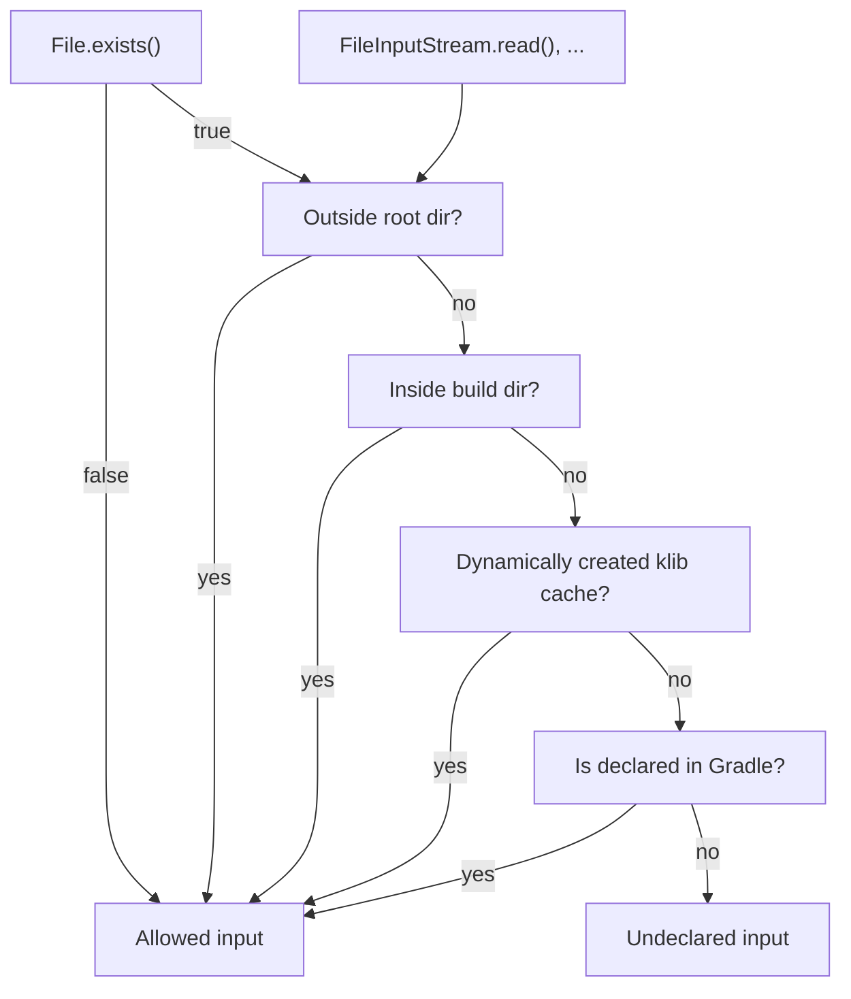
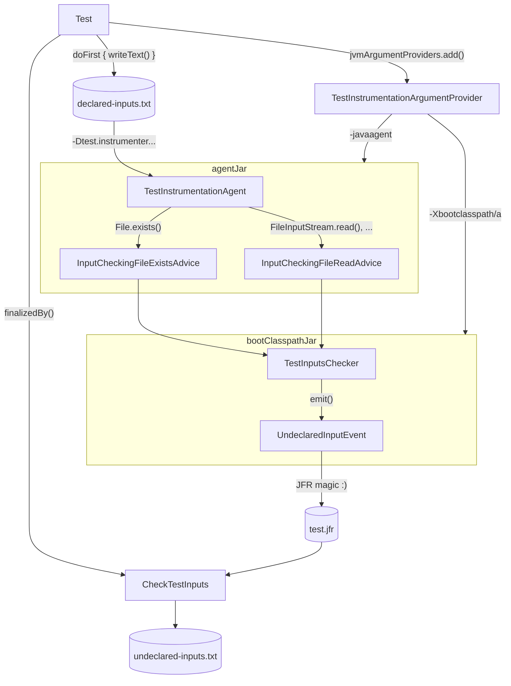

<a id="doc-fd16ed6956ec7f2f3e660a1e"></a>

# JetBrains/kotlin / libraries/examples/scripting/jsr223-daemon/test/org/jetbrains/kotlin/jsr223/daemon/test/DaemonReplCompilerTest.kt

Upstream: https://github.com/JetBrains/kotlin/blob/ddb0eb9f3e6c0613d3e362ecd9e8c7ceb529c809/libraries/examples/scripting/jsr223-daemon/test/org/jetbrains/kotlin/jsr223/daemon/test/DaemonReplCompilerTest.kt

Commit: `ddb0eb9f3e6c0613d3e362ecd9e8c7ceb529c809`

Retrieved: 2026-10-01T15:21:16.380126+00:00

Kind: upstream-example-code

Raw SHA256: `2554f06f11625656e3ee88b6bf0643c1bae1090247ff5a538dbcdfaaff283759`

Source text below is untrusted reference content. Acquisition does not verify technical claims.

License status: UPSTREAM_NOTICES_CAPTURED_PER_FILE_REVIEW_REQUIRED. See this repository's captured license files.

---

````text
/*
 * Copyright 2010-2026 JetBrains s.r.o. and Kotlin Programming Language contributors.
 * Use of this source code is governed by the Apache 2.0 license that can be found in the license/LICENSE.txt file.
 */

package org.jetbrains.kotlin.jsr223.daemon.test

import org.jetbrains.kotlin.jsr223.daemon.DaemonReplCompiler
import org.jetbrains.kotlin.daemon.common.DaemonLogOptions
import org.jetbrains.kotlin.daemon.common.DaemonOptions
import org.junit.jupiter.api.AfterEach
import org.junit.jupiter.api.Assertions.assertEquals
import org.junit.jupiter.api.Assertions.assertTrue
import org.junit.jupiter.api.Test
import org.junit.jupiter.api.io.TempDir
import java.io.File
import java.nio.file.Path
import kotlin.script.experimental.api.ResultWithDiagnostics
import kotlin.script.experimental.api.ScriptCompilationConfiguration
import kotlin.script.experimental.host.toScriptSource
import kotlin.script.experimental.impl.internalScriptingRunSuspend
import kotlin.script.experimental.util.LinkedSnippet

class DaemonReplCompilerTest {

    @TempDir
    lateinit var daemonRunDir: Path

    private val compilerClasspath: List<File> = classpathFromSystemProperty("kotlinJsr223DaemonCompilerClasspath")

    private val stdlib: File by lazy {
        File(KotlinVersion::class.java.protectionDomain.codeSource.location.toURI())
    }

    private val compilersToShutDown = mutableListOf<DaemonReplCompiler>()

    private fun newCompiler(): DaemonReplCompiler =
        DaemonReplCompiler(
            compilerClasspath = compilerClasspath,
            additionalClasspath = listOf(stdlib.toPath()),
            daemonOptions = DaemonOptions(
                runFilesPath = daemonRunDir.resolve("run").toString(),
                shutdownDelayMilliseconds = 0,
            ),
            daemonLogOptions = DaemonLogOptions(logsPath = daemonRunDir.resolve("logs").toString()),
        ).also { compilersToShutDown += it }

    @AfterEach
    fun tearDown() {
        for (compiler in compilersToShutDown) {
            compiler.forceShutdownDaemon()
        }
        compilersToShutDown.clear()
    }

    @Suppress("DEPRECATION_ERROR")
    private fun compile(
        compiler: DaemonReplCompiler,
        source: String,
        name: String,
    ): ResultWithDiagnostics<LinkedSnippet<*>> =
        internalScriptingRunSuspend { compiler.compile(source.toScriptSource(name), ScriptCompilationConfiguration()) }

    @Test
    fun testMessagesAreReportedOnSuccessfulCompile() {
        val compiler = newCompiler()
        val result = compile(compiler, "1", "snippet_0.repl.kts")
        val success = result as? ResultWithDiagnostics.Success ?: error("expected a successful compile, got: $result")
        assertTrue(
            success.reports.isNotEmpty() && success.reports.all { it.severity == WARNING },
            "expected the daemon's fixed warnings among the successful compile's reports, got: ${success.reports}"
        )
    }

    @Test
    fun testMessagesDoNotAccumulateAcrossCompilations() {
        val compiler = newCompiler()
        val firstResult = compile(compiler, "1", "snippet_0.repl.kts") as? ResultWithDiagnostics.Success
            ?: error("expected the first snippet to compile successfully")
        val secondResult = compile(compiler, "2", "snippet_1.repl.kts") as? ResultWithDiagnostics.Success
            ?: error("expected the second snippet to compile successfully")
        assertTrue(firstResult.reports.isNotEmpty(), "expected the first compile to report the daemon's fixed warnings")
        assertEquals(
            firstResult.reports.size, secondResult.reports.size,
            "the second compile's reports must not include the first compile's stale messages on top of its own;" +
                    " first=${firstResult.reports}, second=${secondResult.reports}"
        )
    }
}

private fun classpathFromSystemProperty(propertyName: String): List<File> =
    System.getProperty(propertyName)
        ?.split(File.pathSeparator)
        ?.filter { it.isNotBlank() }
        ?.map { File(it) }
        ?: error("system property '$propertyName' is not set -- run this test via its Gradle test task")

````


<a id="doc-d811dbdaa3623cf908a893c7"></a>

# JetBrains/kotlin / libraries/examples/scripting/jsr223-daemon/test/org/jetbrains/kotlin/jsr223/daemon/test/KotlinJsr223DaemonScriptEngineMainKtsTest.kt

Upstream: https://github.com/JetBrains/kotlin/blob/ddb0eb9f3e6c0613d3e362ecd9e8c7ceb529c809/libraries/examples/scripting/jsr223-daemon/test/org/jetbrains/kotlin/jsr223/daemon/test/KotlinJsr223DaemonScriptEngineMainKtsTest.kt

Commit: `ddb0eb9f3e6c0613d3e362ecd9e8c7ceb529c809`

Retrieved: 2026-10-01T15:21:16.380126+00:00

Kind: upstream-example-code

Raw SHA256: `a4327e54d73afe88e374ead8c2f5a1fa97d1c499fb4b4d84a76c01d76ba49bc5`

Source text below is untrusted reference content. Acquisition does not verify technical claims.

License status: UPSTREAM_NOTICES_CAPTURED_PER_FILE_REVIEW_REQUIRED. See this repository's captured license files.

---

````text
/*
 * Copyright 2010-2026 JetBrains s.r.o. and Kotlin Programming Language contributors.
 * Use of this source code is governed by the Apache 2.0 license that can be found in the license/LICENSE.txt file.
 */

package org.jetbrains.kotlin.jsr223.daemon.test

import org.jetbrains.kotlin.jsr223.daemon.KotlinJsr223DaemonScriptEngineFactory
import org.jetbrains.kotlin.jsr223.daemon.KotlinJsr223DaemonScriptEngineImpl
import org.jetbrains.kotlin.daemon.common.DaemonLogOptions
import org.jetbrains.kotlin.daemon.common.DaemonOptions
import org.jetbrains.kotlin.mainKts.MainKtsScript
import org.junit.jupiter.api.AfterEach
import org.junit.jupiter.api.Assertions.assertEquals
import org.junit.jupiter.api.Disabled
import org.junit.jupiter.api.Test
import org.junit.jupiter.api.io.TempDir
import java.io.File
import java.nio.file.Path
import kotlin.script.experimental.dependencies.DependsOn
import kotlin.script.experimental.jvmhost.createJvmScriptDefinitionFromTemplate
import kotlin.script.templates.standard.ScriptTemplateWithBindings

/**
 * Ports a few jsr223-specific main-kts tests (see `MainKtsJsr223Test` in `kotlin-main-kts-test`) to
 * test [KotlinJsr223DaemonScriptEngineFactory]'s custom-script-definition support with a
 * non-trivial script definition.
 */
class KotlinJsr223DaemonScriptEngineMainKtsTest {

    @TempDir
    lateinit var daemonRunDir: Path

    private val compilerClasspath: List<File> = classpathFromSystemProperty("kotlinJsr223DaemonCompilerClasspath")

    private val stdlib: File by lazy {
        File(KotlinVersion::class.java.protectionDomain.codeSource.location.toURI())
    }

    private val scriptRuntime: File by lazy {
        File(ScriptTemplateWithBindings::class.java.protectionDomain.codeSource.location.toURI())
    }

    private val mainKtsJar: File by lazy {
        File(MainKtsScript::class.java.protectionDomain.codeSource.location.toURI())
    }

    private val scriptingDependenciesJar: File by lazy {
        File(DependsOn::class.java.protectionDomain.codeSource.location.toURI())
    }

    private val mainKtsScriptDefinition = createJvmScriptDefinitionFromTemplate<MainKtsScript>()

    private val enginesToShutDown = mutableListOf<KotlinJsr223DaemonScriptEngineImpl>()

    private fun newEngine(withMainKtsOnCompileClasspath: Boolean = false): KotlinJsr223DaemonScriptEngineImpl {
        val factory = KotlinJsr223DaemonScriptEngineFactory(
            compilerClasspath = compilerClasspath,
            additionalClasspath = buildList {
                add(stdlib.toPath())
                add(scriptRuntime.toPath())
                if (withMainKtsOnCompileClasspath) {
                    add(mainKtsJar.toPath())
                    add(scriptingDependenciesJar.toPath())
                }
            },
            daemonOptions = DaemonOptions(
                runFilesPath = daemonRunDir.resolve("run").toString(),
                shutdownDelayMilliseconds = 0,
            ),
            daemonLogOptions = DaemonLogOptions(logsPath = daemonRunDir.resolve("logs").toString()),
            baseCompilationConfiguration = mainKtsScriptDefinition.compilationConfiguration,
            baseEvaluationConfiguration = mainKtsScriptDefinition.evaluationConfiguration,
        )
        return (factory.scriptEngine as KotlinJsr223DaemonScriptEngineImpl).also { enginesToShutDown += it }
    }

    @AfterEach
    fun tearDown() {
        for (engine in enginesToShutDown) {
            engine.forceShutdownDaemonForTests()
        }
        enginesToShutDown.clear()
    }

    @Test
    fun testSimpleEval() {
        val engine = newEngine()
        val res1 = engine.eval("val x = 3")
        assertEquals(null, res1)
        val res2 = engine.eval("x + 2")
        assertEquals(5, res2)
    }

    @Test
    fun testWithDirectBindings() {
        val engine = newEngine()
        engine.put("z", 6)
        val res1 = engine.eval("val x = 7")
        assertEquals(null, res1)
        val res2 = engine.eval("z * x")
        assertEquals(42, res2)
    }

    @Test
    fun testDefinitionDefaultImportsAreVisibleInSnippets() {
        val engine = newEngine(withMainKtsOnCompileClasspath = true)
        assertEquals(null, engine.eval("val n = DependsOn::class.simpleName!!.length"))
        assertEquals("DependsOn9CompilerOptions", engine.eval("DependsOn::class.simpleName + n + CompilerOptions::class.simpleName"))
    }

    @Test
    @Disabled("Not supported yet")
    fun testWithImport() {
        val engine = newEngine()
        val res1 = engine.eval(
            """
                @file:Import("$TEST_DATA_ROOT/import-common.main.kts")
                @file:Import("$TEST_DATA_ROOT/import-middle.main.kts")
                sharedVar = sharedVar + 1
                sharedVar
            """.trimIndent()
        )
        assertEquals(5, res1)
    }
}

private const val TEST_DATA_ROOT = "libraries/tools/kotlin-main-kts-test/testData"

private fun classpathFromSystemProperty(propertyName: String): List<File> =
    System.getProperty(propertyName)
        ?.split(File.pathSeparator)
        ?.filter { it.isNotBlank() }
        ?.map { File(it) }
        ?: error("system property '$propertyName' is not set -- run this test via its Gradle test task")

````


<a id="doc-309f366031e5c21ff8be37c5"></a>

# JetBrains/kotlin / libraries/examples/scripting/jsr223-daemon/test/org/jetbrains/kotlin/jsr223/daemon/test/KotlinJsr223DaemonScriptEngineTest.kt

Upstream: https://github.com/JetBrains/kotlin/blob/ddb0eb9f3e6c0613d3e362ecd9e8c7ceb529c809/libraries/examples/scripting/jsr223-daemon/test/org/jetbrains/kotlin/jsr223/daemon/test/KotlinJsr223DaemonScriptEngineTest.kt

Commit: `ddb0eb9f3e6c0613d3e362ecd9e8c7ceb529c809`

Retrieved: 2026-10-01T15:21:16.380126+00:00

Kind: upstream-example-code

Raw SHA256: `d148f61033405098abb64243eda9c64f673bb04a159446cd0a606cd21969efaf`

Source text below is untrusted reference content. Acquisition does not verify technical claims.

License status: UPSTREAM_NOTICES_CAPTURED_PER_FILE_REVIEW_REQUIRED. See this repository's captured license files.

---

````text
/*
 * Copyright 2010-2026 JetBrains s.r.o. and Kotlin Programming Language contributors.
 * Use of this source code is governed by the Apache 2.0 license that can be found in the license/LICENSE.txt file.
 */

package org.jetbrains.kotlin.jsr223.daemon.test

import org.jetbrains.kotlin.jsr223.daemon.KotlinJsr223DaemonScriptEngineFactory
import org.jetbrains.kotlin.jsr223.daemon.KotlinJsr223DaemonScriptEngineImpl
import org.jetbrains.kotlin.daemon.common.DaemonLogOptions
import org.jetbrains.kotlin.daemon.common.DaemonOptions
import org.junit.jupiter.api.AfterEach
import org.junit.jupiter.api.Assertions.assertEquals
import org.junit.jupiter.api.Assertions.assertFalse
import org.junit.jupiter.api.Assertions.assertThrows
import org.junit.jupiter.api.Assertions.assertTrue
import org.junit.jupiter.api.Test
import org.junit.jupiter.api.io.TempDir
import java.io.File
import java.nio.file.Path
import javax.script.ScriptException

class KotlinJsr223DaemonScriptEngineTest {

    @TempDir
    lateinit var daemonRunDir: Path

    private val compilerClasspath: List<File> = classpathFromSystemProperty("kotlinJsr223DaemonCompilerClasspath")

    // The compiler needs the stdlib on the snippet compile classpath. Resolved from the test own classpath.
    private val stdlib: File by lazy {
        File(KotlinVersion::class.java.protectionDomain.codeSource.location.toURI())
    }

    private val enginesToShutDown = mutableListOf<KotlinJsr223DaemonScriptEngineImpl>()

    private fun newEngine(): KotlinJsr223DaemonScriptEngineImpl {
        val factory = KotlinJsr223DaemonScriptEngineFactory(
            compilerClasspath = compilerClasspath,
            additionalClasspath = listOf(stdlib.toPath()),
            daemonOptions = DaemonOptions(
                runFilesPath = daemonRunDir.resolve("run").toString(),
                shutdownDelayMilliseconds = 0,
            ),
            daemonLogOptions = DaemonLogOptions(logsPath = daemonRunDir.resolve("logs").toString()),
        )
        return (factory.scriptEngine as KotlinJsr223DaemonScriptEngineImpl).also { enginesToShutDown += it }
    }

    @AfterEach
    fun tearDown() {
        for (engine in enginesToShutDown) {
            engine.forceShutdownDaemonForTests()
        }
        enginesToShutDown.clear()
    }

    @Test
    fun testSimpleEval() {
        val engine = newEngine()
        assertEquals(42, engine.eval("40 + 2"))
    }

    @Test
    fun testCrossSnippetReference() {
        val engine = newEngine()
        engine.eval("val x = 10")
        assertEquals(20, engine.eval("x * 2"))
    }

    @Test
    fun testCompileThenEvalSeparately() {
        val engine = newEngine()
        val compiled = engine.compile("6 * 7")
        assertEquals(42, compiled.eval())
    }

    @Test
    fun testDeclarationOnlySnippetEvaluatesToNull() {
        val engine = newEngine()
        assertEquals(null, engine.eval("val onlyADeclaration = 1"))
    }

    @Test
    fun testSnippetThatThrowsAtRuntimeFailsAtEvalNotCompile() {
        val engine = newEngine()
        val exception = assertThrows(ScriptException::class.java) {
            engine.eval("throw RuntimeException(\"boom\")")
        }
        assertFalse(exception.message.orEmpty().startsWith("Error compiling"))
        var cause: Throwable? = exception.cause
        while (cause != null && cause !is RuntimeException) cause = cause.cause
        assertEquals("boom", cause?.message)
    }

    @Test
    fun testSnippetWithCompileErrorFailsAtCompileNotEval() {
        val engine = newEngine()
        val exception = assertThrows(ScriptException::class.java) {
            engine.eval("val x: Int = \"not an int\"")
        }
        assertTrue(exception.message.orEmpty().contains("Initializer type mismatch: expected 'Int', actual 'String'."))
    }

    @Test
    fun testMultilineSnippetWithQuotesAndEscapes() {
        val engine = newEngine()
        val snippet = """
            val greeting = "She said \"hello, world!\"\nLine2\tTabbed"
            val path = "C:\\Users\\test\\file.kt"
            greeting.length + path.length
        """.trimIndent()
        assertEquals("She said \"hello, world!\"\nLine2\tTabbed".length + "C:\\Users\\test\\file.kt".length, engine.eval(snippet))
    }

    @Test
    fun testSnippetWithDollarSignsAndBackticks() {
        val engine = newEngine()
        val snippet = """
            val price = "cost: ${'$'}5 (not a template)"
            val `backtick name` = 7
            price.length + `backtick name`
        """.trimIndent()
        assertEquals("cost: $5 (not a template)".length + 7, engine.eval(snippet))
    }

    @Test
    fun testSnippetWithTripleQuotedStringContainingNewlines() {
        val engine = newEngine()
        val snippet = "\n" +
                "val block = \"\"\"\n" +
                "line one\n" +
                "line \"two\" with quotes\n" +
                "line three\n" +
                "\"\"\".trimIndent()\n" +
                "block.lines().size\n"
        assertEquals(3, engine.eval(snippet))
    }

    @Test
    fun testSnippetWithUnicodeAndSpecialCharacters() {
        val engine = newEngine()
        val snippet = """
            val text = "unicode: \u00e9\u00e8\u00ea, emoji: \ud83d\ude00, quotes: '\u2018single\u2019' \u201cdouble\u201d"
            text.length
        """.trimIndent()
        val expected = "unicode: \u00e9\u00e8\u00ea, emoji: \ud83d\ude00, quotes: '\u2018single\u2019' \u201cdouble\u201d".length
        assertEquals(expected, engine.eval(snippet))
    }

    @Test
    fun testLongComplexMultilineSnippet() {
        val engine = newEngine()
        val snippet = """
            fun greet(name: String): String {
                val punctuation = if (name.contains("\"")) "!" else "."
                return "Hello, ${'$'}name${'$'}punctuation"
            }
            val names = listOf("Alice", "Bob \"the builder\"", "Eve\\Mallory")
            val greetings = names.map { greet(it) }
            greetings.joinToString(separator = "\n") { it }.lines().size
        """.trimIndent()
        assertEquals(3, engine.eval(snippet))
    }
}

private fun classpathFromSystemProperty(propertyName: String): List<File> =
    System.getProperty(propertyName)
        ?.split(File.pathSeparator)
        ?.filter { it.isNotBlank() }
        ?.map { File(it) }
        ?: error("system property '$propertyName' is not set -- run this test via its Gradle test task")

````


<a id="doc-dbd06330def44d0c26231174"></a>

# JetBrains/kotlin / libraries/examples/scripting/jvm-embeddable-host/src/org/jetbrains/kotlin/script/examples/jvm/embeddable/host/host.kt

Upstream: https://github.com/JetBrains/kotlin/blob/ddb0eb9f3e6c0613d3e362ecd9e8c7ceb529c809/libraries/examples/scripting/jvm-embeddable-host/src/org/jetbrains/kotlin/script/examples/jvm/embeddable/host/host.kt

Commit: `ddb0eb9f3e6c0613d3e362ecd9e8c7ceb529c809`

Retrieved: 2026-10-01T15:21:16.380126+00:00

Kind: upstream-example-code

Raw SHA256: `9dfb475e8a37ec176c938b680d461f6a6d183176a7ff71cdbcc87cb56d308dfd`

Source text below is untrusted reference content. Acquisition does not verify technical claims.

License status: UPSTREAM_NOTICES_CAPTURED_PER_FILE_REVIEW_REQUIRED. See this repository's captured license files.

---

````text
/*
 * Copyright 2010-2018 JetBrains s.r.o. and Kotlin Programming Language contributors.
 * Use of this source code is governed by the Apache 2.0 license that can be found in the license/LICENSE.txt file.
 */
package org.jetbrains.kotlin.script.examples.jvm.embeddable.host

import org.jetbrains.kotlin.script.examples.jvm.simple.SimpleScript
import java.io.File
import kotlin.script.experimental.api.EvaluationResult
import kotlin.script.experimental.api.ResultWithDiagnostics
import kotlin.script.experimental.host.toScriptSource
import kotlin.script.experimental.jvm.dependenciesFromCurrentContext
import kotlin.script.experimental.jvm.jvm
import kotlin.script.experimental.jvmhost.BasicJvmScriptingHost
import kotlin.script.experimental.jvmhost.createJvmCompilationConfigurationFromTemplate

fun evalFile(scriptFile: File): ResultWithDiagnostics<EvaluationResult> {
    val compilationConfiguration = createJvmCompilationConfigurationFromTemplate<SimpleScript> {
        jvm {
            dependenciesFromCurrentContext(
                "scripting-jvm-simple-script", /* script library jar name */
                "guava",
                wholeClasspath = true
            )
        }
    }

    return BasicJvmScriptingHost().eval(scriptFile.toScriptSource(), compilationConfiguration, null)
}

fun main(vararg args: String) {
    if (args.size != 1) {
        println("usage: <app> <script file>")
    } else {
        val scriptFile = File(args[0])
        println("Executing script $scriptFile")

        val res = evalFile(scriptFile)

        res.reports.forEach {
            println(" : ${it.message}" + if (it.exception == null) "" else ": ${it.exception}")
        }
    }
}

````


<a id="doc-313b9396d6bb85d66769347d"></a>

# JetBrains/kotlin / libraries/examples/scripting/jvm-embeddable-host/test/org/jetbrains/kotlin/script/examples/jvm/embeddable/test/embeddableTest.kt

Upstream: https://github.com/JetBrains/kotlin/blob/ddb0eb9f3e6c0613d3e362ecd9e8c7ceb529c809/libraries/examples/scripting/jvm-embeddable-host/test/org/jetbrains/kotlin/script/examples/jvm/embeddable/test/embeddableTest.kt

Commit: `ddb0eb9f3e6c0613d3e362ecd9e8c7ceb529c809`

Retrieved: 2026-10-01T15:21:16.380126+00:00

Kind: upstream-example-code

Raw SHA256: `090db86feb98f15e583266d55f740bfca16fb89ed6ee08fd47469b4db66d3cd4`

Source text below is untrusted reference content. Acquisition does not verify technical claims.

License status: UPSTREAM_NOTICES_CAPTURED_PER_FILE_REVIEW_REQUIRED. See this repository's captured license files.

---

````text
/*
 * Copyright 2010-2018 JetBrains s.r.o. and Kotlin Programming Language contributors.
 * Use of this source code is governed by the Apache 2.0 license that can be found in the license/LICENSE.txt file.
 */

package org.jetbrains.kotlin.script.examples.jvm.embeddable.test

import org.jetbrains.kotlin.script.examples.jvm.embeddable.host.evalFile
import org.junit.jupiter.api.Assertions
import org.junit.jupiter.api.Test
import java.io.File
import kotlin.script.experimental.api.ResultWithDiagnostics

class SimpleTest {

    @Test
    fun testSimple() {
        // see comments in the script file
        val res = evalFile(File("testData/useGuava.simplescript.kts"))

        Assertions.assertTrue(
            res is ResultWithDiagnostics.Success,
            "test failed:\n  ${res.reports.joinToString("\n  ") { it.message + if (it.exception == null) "" else ": ${it.exception}" }}"
        )
    }
}

````


<a id="doc-da0f5d610ab84da436b34c73"></a>

# JetBrains/kotlin / libraries/examples/scripting/jvm-maven-deps/host/src/org/jetbrains/kotlin/script/examples/jvm/resolve/maven/host/host.kt

Upstream: https://github.com/JetBrains/kotlin/blob/ddb0eb9f3e6c0613d3e362ecd9e8c7ceb529c809/libraries/examples/scripting/jvm-maven-deps/host/src/org/jetbrains/kotlin/script/examples/jvm/resolve/maven/host/host.kt

Commit: `ddb0eb9f3e6c0613d3e362ecd9e8c7ceb529c809`

Retrieved: 2026-10-01T15:21:16.380126+00:00

Kind: upstream-example-code

Raw SHA256: `d56c6a3064c8db112fa562b697f021341ba8435b9fd38f031298f92212524ec4`

Source text below is untrusted reference content. Acquisition does not verify technical claims.

License status: UPSTREAM_NOTICES_CAPTURED_PER_FILE_REVIEW_REQUIRED. See this repository's captured license files.

---

````text
/*
 * Copyright 2000-2018 JetBrains s.r.o. and Kotlin Programming Language contributors.
 * Use of this source code is governed by the Apache 2.0 license that can be found in the license/LICENSE.txt file.
 */

package org.jetbrains.kotlin.script.examples.jvm.resolve.maven.host

import org.jetbrains.kotlin.script.examples.jvm.resolve.maven.ScriptWithMavenDeps
import java.io.File
import kotlin.script.experimental.api.EvaluationResult
import kotlin.script.experimental.api.ResultWithDiagnostics
import kotlin.script.experimental.host.toScriptSource
import kotlin.script.experimental.jvmhost.BasicJvmScriptingHost
import kotlin.script.experimental.jvmhost.createJvmCompilationConfigurationFromTemplate

fun evalFile(scriptFile: File): ResultWithDiagnostics<EvaluationResult> {

    val compilationConfiguration = createJvmCompilationConfigurationFromTemplate<ScriptWithMavenDeps>()

    return BasicJvmScriptingHost().eval(scriptFile.toScriptSource(), compilationConfiguration, null)
}

fun main(vararg args: String) {
    if (args.size != 1) {
        println("usage: <app> <script file>")
    } else {
        val scriptFile = File(args[0])
        println("Executing script $scriptFile")

        val res = evalFile(scriptFile)

        res.reports.forEach {
            println(" : ${it.message}" + if (it.exception == null) "" else ": ${it.exception}")
        }
    }
}

````


<a id="doc-9c94df733964adcbe180c584"></a>

# JetBrains/kotlin / libraries/examples/scripting/jvm-maven-deps/host/test/org/jetbrains/kotlin/script/examples/jvm/resolve/maven/test/resolveTest.kt

Upstream: https://github.com/JetBrains/kotlin/blob/ddb0eb9f3e6c0613d3e362ecd9e8c7ceb529c809/libraries/examples/scripting/jvm-maven-deps/host/test/org/jetbrains/kotlin/script/examples/jvm/resolve/maven/test/resolveTest.kt

Commit: `ddb0eb9f3e6c0613d3e362ecd9e8c7ceb529c809`

Retrieved: 2026-10-01T15:21:16.380126+00:00

Kind: upstream-example-code

Raw SHA256: `8f52ffcc2d73d1a3b2b7fcfdb7d50813da40b6888d5f5a9840bdc0f640ecda08`

Source text below is untrusted reference content. Acquisition does not verify technical claims.

License status: UPSTREAM_NOTICES_CAPTURED_PER_FILE_REVIEW_REQUIRED. See this repository's captured license files.

---

````text
/*
 * Copyright 2000-2018 JetBrains s.r.o. and Kotlin Programming Language contributors.
 * Use of this source code is governed by the Apache 2.0 license that can be found in the license/LICENSE.txt file.
 */

package org.jetbrains.kotlin.script.examples.jvm.resolve.maven.test

import org.jetbrains.kotlin.script.examples.jvm.resolve.maven.host.evalFile
import org.junit.jupiter.api.Assertions
import org.junit.jupiter.api.Test
import java.io.File
import kotlin.script.experimental.api.ResultWithDiagnostics

class ResolveTest {

    @Test
    fun testNoDeps() {
        val res = evalFile(File("testData/hello-no-deps.scriptwithdeps.kts"))

        Assertions.assertTrue(
            res is ResultWithDiagnostics.Success,
            "test failed:\n  ${res.reports.joinToString("\n  ") { it.message + if (it.exception == null) "" else ": ${it.exception}" }}"
        )
    }

    @Test
    fun testResolveJunit() {
        val res = evalFile(File("testData/hello-maven-resolve-junit.scriptwithdeps.kts"))

        Assertions.assertTrue(
            res is ResultWithDiagnostics.Success,
            "test failed:\n  ${res.reports.joinToString("\n  ") { it.message + if (it.exception == null) "" else ": ${it.exception}" }}"
        )
    }

    @Test
    fun testUnresolvedJunit() {
        val res = evalFile(File("testData/hello-unresolved-junit.scriptwithdeps.kts"))

        Assertions.assertTrue(
            res is ResultWithDiagnostics.Failure && res.reports.any { it.message.contains("Unresolved reference 'junit'.") },
            "test failed - expecting a failure with the message \"Unresolved reference 'junit'\" but received " +
                    (if (res is ResultWithDiagnostics.Failure) "failure" else "success") +
                    ":\n  ${res.reports.joinToString("\n  ") { it.message + if (it.exception == null) "" else ": ${it.exception}" }}"
        )
    }

    @Test
    fun testResolveError() {
        val res = evalFile(File("testData/hello-maven-resolve-error.scriptwithdeps.kts"))

        Assertions.assertTrue(
            res is ResultWithDiagnostics.Failure && res.reports.any { it.message.contains("File 'abracadabra' not found") },
            "test failed - expecting a failure with the message \"Unknown set of arguments to maven resolver: abracadabra\" but received " +
                    (if (res is ResultWithDiagnostics.Failure) "failure" else "success") +
                    ":\n  ${res.reports.joinToString("\n  ") { it.message + if (it.exception == null) "" else ": ${it.exception}" }}"
        )
    }
}

````


<a id="doc-7380cfdd6a0d1e7ee56166a7"></a>

# JetBrains/kotlin / libraries/examples/scripting/jvm-maven-deps/script/src/org/jetbrains/kotlin/script/examples/jvm/resolve/maven/scriptDef.kt

Upstream: https://github.com/JetBrains/kotlin/blob/ddb0eb9f3e6c0613d3e362ecd9e8c7ceb529c809/libraries/examples/scripting/jvm-maven-deps/script/src/org/jetbrains/kotlin/script/examples/jvm/resolve/maven/scriptDef.kt

Commit: `ddb0eb9f3e6c0613d3e362ecd9e8c7ceb529c809`

Retrieved: 2026-10-01T15:21:16.380126+00:00

Kind: upstream-example-code

Raw SHA256: `83bb224bae307b2d75f207cd9e570122a80b90ab91fbb1c97e6a2a3bca09901b`

Source text below is untrusted reference content. Acquisition does not verify technical claims.

License status: UPSTREAM_NOTICES_CAPTURED_PER_FILE_REVIEW_REQUIRED. See this repository's captured license files.

---

````text
/*
 * Copyright 2010-2018 JetBrains s.r.o. and Kotlin Programming Language contributors.
 * Use of this source code is governed by the Apache 2.0 license that can be found in the license/LICENSE.txt file.
 */

package org.jetbrains.kotlin.script.examples.jvm.resolve.maven

import kotlinx.coroutines.runBlocking
import kotlin.script.experimental.annotations.KotlinScript
import kotlin.script.experimental.api.*
import kotlin.script.experimental.dependencies.*
import kotlin.script.experimental.dependencies.maven.MavenDependenciesResolver
import kotlin.script.experimental.jvm.JvmDependency
import kotlin.script.experimental.jvm.dependenciesFromCurrentContext
import kotlin.script.experimental.jvm.jvm

@KotlinScript(
    fileExtension = "scriptwithdeps.kts",
    compilationConfiguration = ScriptWithMavenDepsConfiguration::class
)
abstract class ScriptWithMavenDeps

object ScriptWithMavenDepsConfiguration : ScriptCompilationConfiguration(
    {
        defaultImports(DependsOn::class, Repository::class)
        jvm {
            dependenciesFromCurrentContext(
                "scripting-jvm-maven-deps", // script library jar name
                "kotlin-scripting-dependencies" // DependsOn annotation is taken from it
            )
        }
        refineConfiguration {
            @Suppress("DEPRECATION")
            onAnnotations(DependsOn::class, Repository::class, handler = ::configureMavenDepsOnAnnotations)
        }
    }
) {
    @Suppress("unused")
    private fun readResolve(): Any = ScriptWithMavenDepsConfiguration
}

private val resolver = CompoundDependenciesResolver(FileSystemDependenciesResolver(), MavenDependenciesResolver())

fun configureMavenDepsOnAnnotations(context: ScriptConfigurationRefinementContext): ResultWithDiagnostics<ScriptCompilationConfiguration> {
    val annotations = context.collectedData?.get(ScriptCollectedData.collectedAnnotations)?.takeIf { it.isNotEmpty() }
        ?: return context.compilationConfiguration.asSuccess()
    return runBlocking {
        resolver.resolveFromScriptSourceAnnotations(annotations)
    }.onSuccess {
        context.compilationConfiguration.with {
            dependencies.append(JvmDependency(it))
        }.asSuccess()
    }
}

````


<a id="doc-dba5ff61daa5941bf51777ea"></a>

# JetBrains/kotlin / libraries/examples/scripting/jvm-simple-script/host/src/org/jetbrains/kotlin/script/examples/jvm/simple/host/host.kt

Upstream: https://github.com/JetBrains/kotlin/blob/ddb0eb9f3e6c0613d3e362ecd9e8c7ceb529c809/libraries/examples/scripting/jvm-simple-script/host/src/org/jetbrains/kotlin/script/examples/jvm/simple/host/host.kt

Commit: `ddb0eb9f3e6c0613d3e362ecd9e8c7ceb529c809`

Retrieved: 2026-10-01T15:21:16.380126+00:00

Kind: upstream-example-code

Raw SHA256: `3ffddcd5ed1cf27fe1d7cdc3847dbf57af05fbb66b10bcc30ee8d27922447934`

Source text below is untrusted reference content. Acquisition does not verify technical claims.

License status: UPSTREAM_NOTICES_CAPTURED_PER_FILE_REVIEW_REQUIRED. See this repository's captured license files.

---

````text
/*
 * Copyright 2010-2018 JetBrains s.r.o. and Kotlin Programming Language contributors.
 * Use of this source code is governed by the Apache 2.0 license that can be found in the license/LICENSE.txt file.
 */

package org.jetbrains.kotlin.script.examples.jvm.simple.host

import org.jetbrains.kotlin.script.examples.jvm.simple.SimpleScript
import java.io.File
import kotlin.script.experimental.api.EvaluationResult
import kotlin.script.experimental.api.ResultWithDiagnostics
import kotlin.script.experimental.host.toScriptSource
import kotlin.script.experimental.jvm.dependenciesFromCurrentContext
import kotlin.script.experimental.jvm.jvm
import kotlin.script.experimental.jvmhost.BasicJvmScriptingHost
import kotlin.script.experimental.jvmhost.createJvmCompilationConfigurationFromTemplate

fun evalFile(scriptFile: File): ResultWithDiagnostics<EvaluationResult> {
    val compilationConfiguration = createJvmCompilationConfigurationFromTemplate<SimpleScript> {
        jvm {
            dependenciesFromCurrentContext(
                "scripting-jvm-simple-script" /* script library jar name */
            )
        }
    }

    return BasicJvmScriptingHost().eval(scriptFile.toScriptSource(), compilationConfiguration, null)
}

fun main(vararg args: String) {
    if (args.size != 1) {
        println("usage: <app> <script file>")
    } else {
        val scriptFile = File(args[0])
        println("Executing script $scriptFile")

        val res = evalFile(scriptFile)

        res.reports.forEach {
            println(" : ${it.message}" + if (it.exception == null) "" else ": ${it.exception}")
        }
    }
}

````


<a id="doc-da4bb19f1ac734c6891a5966"></a>

# JetBrains/kotlin / libraries/examples/scripting/jvm-simple-script/host/test/org/jetbrains/kotlin/script/examples/jvm/simple/test/simpleTest.kt

Upstream: https://github.com/JetBrains/kotlin/blob/ddb0eb9f3e6c0613d3e362ecd9e8c7ceb529c809/libraries/examples/scripting/jvm-simple-script/host/test/org/jetbrains/kotlin/script/examples/jvm/simple/test/simpleTest.kt

Commit: `ddb0eb9f3e6c0613d3e362ecd9e8c7ceb529c809`

Retrieved: 2026-10-01T15:21:16.380126+00:00

Kind: upstream-example-code

Raw SHA256: `82576badce74a454701775bf8d63534fb95d5c34f79b5644e702408fb21fd386`

Source text below is untrusted reference content. Acquisition does not verify technical claims.

License status: UPSTREAM_NOTICES_CAPTURED_PER_FILE_REVIEW_REQUIRED. See this repository's captured license files.

---

````text
/*
 * Copyright 2000-2018 JetBrains s.r.o. and Kotlin Programming Language contributors.
 * Use of this source code is governed by the Apache 2.0 license that can be found in the license/LICENSE.txt file.
 */

package org.jetbrains.kotlin.script.examples.jvm.simple.test

import org.jetbrains.kotlin.script.examples.jvm.simple.host.evalFile
import org.junit.jupiter.api.Assertions
import org.junit.jupiter.api.Test
import java.io.File
import kotlin.script.experimental.api.ResultWithDiagnostics

class SimpleTest {

    @Test
    fun testSimple() {
        val res = evalFile(File("testData/hello.simplescript.kts"))

        Assertions.assertTrue(
            res is ResultWithDiagnostics.Success,
            "test failed:\n  ${res.reports.joinToString("\n  ") { it.message + if (it.exception == null) "" else ": ${it.exception}" }}"
        )
    }

    @Test
    fun testError() {
        val res = evalFile(File("testData/error.simplescript.kts"))

        Assertions.assertTrue(
            res is ResultWithDiagnostics.Failure && res.reports.any { it.message.contains("Unresolved reference 'abracadabra'.") },
            "test failed - expecting a failure with the message \"Unresolved reference 'abracadabra'.\" but received " +
                    (if (res is ResultWithDiagnostics.Failure) "failure" else "success") +
                    ":\n  ${res.reports.joinToString("\n  ") { it.message + if (it.exception == null) "" else ": ${it.exception}" }}"
        )
    }
}

````


<a id="doc-931687ea7fc74edea66833ca"></a>

# JetBrains/kotlin / libraries/examples/scripting/jvm-simple-script/script/src/org/jetbrains/kotlin/script/examples/jvm/simple/scriptDef.kt

Upstream: https://github.com/JetBrains/kotlin/blob/ddb0eb9f3e6c0613d3e362ecd9e8c7ceb529c809/libraries/examples/scripting/jvm-simple-script/script/src/org/jetbrains/kotlin/script/examples/jvm/simple/scriptDef.kt

Commit: `ddb0eb9f3e6c0613d3e362ecd9e8c7ceb529c809`

Retrieved: 2026-10-01T15:21:16.380126+00:00

Kind: upstream-example-code

Raw SHA256: `81970e0e2a5fb98aafbcc9e95a7f4dba5034bf6cc16a5a625313218f76c363c1`

Source text below is untrusted reference content. Acquisition does not verify technical claims.

License status: UPSTREAM_NOTICES_CAPTURED_PER_FILE_REVIEW_REQUIRED. See this repository's captured license files.

---

````text
/*
 * Copyright 2000-2018 JetBrains s.r.o. and Kotlin Programming Language contributors.
 * Use of this source code is governed by the Apache 2.0 license that can be found in the license/LICENSE.txt file.
 */

package org.jetbrains.kotlin.script.examples.jvm.simple

import kotlin.script.experimental.annotations.KotlinScript

@KotlinScript(fileExtension = "simplescript.kts")
abstract class SimpleScript

````


<a id="doc-8e7c4fb9dd9a49d44e309afc"></a>

# JetBrains/kotlin / libraries/kotlinx-metadata/ReadMe.md

Upstream: https://github.com/JetBrains/kotlin/blob/ddb0eb9f3e6c0613d3e362ecd9e8c7ceb529c809/libraries/kotlinx-metadata/ReadMe.md

Commit: `ddb0eb9f3e6c0613d3e362ecd9e8c7ceb529c809`

Retrieved: 2026-10-01T15:21:16.380126+00:00

Kind: official-document

Raw SHA256: `9198ad353d1253d819f67ca14c944636089570c94dbe409a9723d5b5607d6567`

Source text below is untrusted reference content. Acquisition does not verify technical claims.

License status: UPSTREAM_NOTICES_CAPTURED_PER_FILE_REVIEW_REQUIRED. See this repository's captured license files.

---

## kotlinx-metadata

This is the platform-agnostic part of the Kotlin Metadata library, intended to provide the possibility to read and modify metadata of Kotlin declarations in the binary (`.class`, `.js`) files emitted by the Kotlin compiler. This part of the library is currently not released on its own. Please refer to [kotlinx-metadata-jvm](jvm/ReadMe.md) for instructions on how to load and modify Kotlin Metadata in JVM binaries (`.class` and `.kotlin_module` files).


<a id="doc-fc26ba8b75deefc3a22ef209"></a>

# JetBrains/kotlin / libraries/kotlinx-metadata/jvm/ChangeLog.md

Upstream: https://github.com/JetBrains/kotlin/blob/ddb0eb9f3e6c0613d3e362ecd9e8c7ceb529c809/libraries/kotlinx-metadata/jvm/ChangeLog.md

Commit: `ddb0eb9f3e6c0613d3e362ecd9e8c7ceb529c809`

Retrieved: 2026-10-01T15:21:16.380126+00:00

Kind: official-document

Raw SHA256: `48a9a0db59a49c0a37c296dbb2d234835feafd4b3e8d5892381675f9687099f6`

Source text below is untrusted reference content. Acquisition does not verify technical claims.

License status: UPSTREAM_NOTICES_CAPTURED_PER_FILE_REVIEW_REQUIRED. See this repository's captured license files.

---

# kotlinx-metadata-jvm

## 2.0.0 and higher

Starting with Kotlin 2.0, kotlin-metadata-jvm library is promoted to stable, and is a part of Kotlin distribution now. 
It means that it has the same versioning as Kotlin compiler and Kotlin standard library, and the same release cycle.
To achieve this, coordinates of the library were changed: it is now in `org.jetbrains.kotlin` group with `kotlin-metadata-jvm` id (notice
the drop of `X` from the coordinates).
This also means that the root package was changed from `kotlinx.metadata` to `kotlin.metadata`.

Among other noticeable changes, all previously deprecated declarations were removed from the library.
In case you need to perform a migration with aid, migrate your project to 0.9.0 version first using [migration guide](Migration.md).

This is the last entry of this changelog. General changelog for Kotlin's `Libraries` subsystem is available in the `ChangeLog.md` at the repository root.

## 0.9.0

The main purpose of this release is to promote all previous deprecations to ERROR level if they were not already.
Please refer to the [migration guide](Migration.md) if you are using deprecated functions.
Also, this release includes several bugfixes. It still uses Kotlin 1.9, but is able to read or write metadata of version 2.0.

- Add missing documentation to `KmVersionRequirement.toString`
- Raise all deprecations in kotlinx-metadata-jvm to ERROR ([KT-63157](https://youtrack.jetbrains.com/issue/KT-63157))
- Do not allow writing metadata versions that are too high ([KT-64230](https://youtrack.jetbrains.com/issue/KT-64230))
- Add `KmVersionRequirementKind.UNKNOWN` ([KT-60870](https://youtrack.jetbrains.com/issue/KT-60870))

## 0.8.0

This release concludes our API overhaul: it features last significant API changes, as well as raised deprecations to ERROR level almost everywhere.
To help with migration, we've prepared a special [guide](Migration.md#migrating-from-070-to-080). 
It still uses Kotlin 1.9, but is able to read or write metadata of version 2.0.

- Provide a separate class for representing metadata version in kotlinx-metadata: `JvmMetadataVersion`
- Unify write() method and make it a member of `KotlinClassMetadata` (also `KotlinModuleMetadata`)
- Split `KotlinClassMetadata.read` into `readStrict` and `readLenient`
- Promote most deprecations in kotlinx-metadata-jvm to ERROR, including Flags API and Visitors API.
- Deprecate `KmProperty.hasGetter(hasSetter)` in favor of `KmProperty.getter(setter)`
- Add missing delegation in `KmDeclarationContainerVisitor.visitExtensions` for consistency

## 0.7.0

This release features several significant API changes. To help with migration, we've prepared a special [guide](Migration.md#migrating-from-06x-to-070).

- Update to Kotlin 1.9 with metadata version 1.9, support reading/writing metadata of version 2.0 which will be used in Kotlin 2.0
- Rework flags API (see [migration from Flags API to Attributes API](Migration.md#migration-from-flags-api-to-attributes-api)).
- Restructure `KotlinClass(Module)Metadata.write/read` (see [changes in reading and writing API](Migration.md#changes-in-reading-and-writing-api)).
- Add `@JvmStatic` + `@JvmOverloads` to writing functions in `KotlinClassMetadata`
- Deprecate `KmModule.annotations` for removal because it is always empty and should not be used.
- Move `KmModuleFragment` to an `kotlinx.metadata.internal.common` package. This class is intended for internal use only. If you have use-cases for it, please report an issue to YouTrack.
- Improve `toString()` for `KmAnnotationArgument`
- Add missing deprecation for `KmExtensionType` and experimentality for `KmConstantValue`.
- Enhance kotlinx-metadata-jvm KDoc and set up Dokka.

## 0.6.2

This release uses Kotlin 1.8.20 with metadata version 1.8, and as a special case, is able to read metadata of version 2.0. 
This is done as an incentive to test K2 compiler and 2.0 language version. 
No other changes were made and no migration is needed.
Note: 0.6.1 was released with an incorrect fix for this problem. Do not use 0.6.1.

## 0.6.0

This release features several significant API changes. To help with migration, we've prepared a special [guide](Migration.md#migrating-from-050-to-06x).

- Update to Kotlin 1.8 with metadata version 1.8, support reading/writing metadata of version 1.9 which will be used in Kotlin 1.9
- Deprecate Visitors API
- Replace usages of `KotlinClassHeader` with direct usage of `kotlin.Metadata` annotation. Former reserved exclusively for use from Java clients.
- `impl` package renamed to `internal`
- Writers are deprecated. Special function family `KotlinClassMetadata.write` is introduced instead.

## 0.5.0

- Update to Kotlin 1.7 with metadata version 1.7, support reading/writing metadata of version 1.8 which will be used in Kotlin 1.8.
- kotlinx-metadata-jvm can no longer be used on JVM 1.6, and now requires JVM 1.8 or later.
- Add `Flag.Type.IS_DEFINITELY_NON_NULL`.
- Add `KmClass.contextReceiverTypes`, `KmFunction.contextReceiverTypes`, `KmProperty.contextReceiverTypes`
  - The API is experimental and requires `@ExperimentalContextReceivers` on the usages.

## 0.4.2

- Add experimental internal API to read metadata of `.kotlin_builtins`/`.kotlin_metadata` files.

## 0.4.1

- Add `KmProperty.syntheticMethodForDelegate` for optimized delegated properties (KT-39055).

## 0.4.0

- Update to Kotlin 1.6 with metadata version 1.6, support reading/writing metadata of version 1.7 which will be used in Kotlin 1.7.
- Add `JvmPropertyExtensionVisitor.visitSyntheticMethodForDelegate` for optimized delegated properties (KT-39055).
- Add JVM-specific class flags:
  - `JvmClassExtensionVisitor.visitJvmFlags`
  - `JvmFlag.Class.HAS_METHOD_BODIES_IN_INTERFACE`
  - `JvmFlag.Class.IS_COMPILED_IN_COMPATIBILITY_MODE`
- [`KT-48965`](https://youtrack.jetbrains.com/issue/KT-48965) Make the type of `KmValueParameter.type` non-null `KmType`
- Remove unused `JvmTypeAliasExtensionVisitor` and `JvmValueParameterExtensionVisitor`
- Fix type flags (suspend, definitely non-null) on underlying type of inline class available via `KmClass.inlineClassUnderlyingType`

## 0.3.0

- Update to Kotlin 1.5 with metadata version 1.5.
  Note: metadata of version 1.5 is readable by Kotlin compiler/reflection of versions 1.4 and later.
- Breaking change: improve API of annotation arguments.
  `KmAnnotationArgument` doesn't have `val value: T` anymore, it was moved to a subclass named `KmAnnotationArgument.LiteralValue<T>`.
  The property `value` is:
  - renamed to `annotation` in `AnnotationValue`
  - renamed to `elements` in `ArrayValue`
  - removed in favor of `enumClassName`/`enumEntryName` in `EnumValue`
  - removed in favor of `className`/`arrayDimensionCount` in `KClassValue`
  - changed type from signed to unsigned integer types in `UByteValue`, `UShortValue`, `UIntValue`, `ULongValue`
- [`KT-44783`](https://youtrack.jetbrains.com/issue/KT-44783) Add Flag.IS_VALUE for value classes
  - Breaking change: `Flag.IS_INLINE` is deprecated, use `Flag.IS_VALUE` instead
- Breaking change: deprecate `KotlinClassHeader.bytecodeVersion` and `KotlinClassHeader`'s constructor that takes a bytecode version array.
  Related to ['KT-41758`](https://youtrack.jetbrains.com/issue/KT-41758).
- [`KT-45594`](https://youtrack.jetbrains.com/issue/KT-45594) KClass annotation argument containing array of classes is not read/written correctly
- [`KT-45635`](https://youtrack.jetbrains.com/issue/KT-45635) Add underlying property name & type for inline classes

## 0.2.0

- ['KT-41011`](https://youtrack.jetbrains.com/issue/KT-41011) Using KotlinClassMetadata.Class.Writer with metadata version < 1.4 will write incorrect version requirement table
    - Breaking change: `KotlinClassMetadata.*.Writer.write` throws exception on `metadataVersion` earlier than 1.4.0.
      Note: metadata of version 1.4 is readable by Kotlin compiler/reflection of versions 1.3 and later.
- Breaking change: `KotlinClassMetadata.*.Writer.write` no longer accept `bytecodeVersion`.
- [`KT-42429`](https://youtrack.jetbrains.com/issue/KT-42429) Wrong interpretation of Flag.Constructor.IS_PRIMARY
    - Breaking change: `Flag.Constructor.IS_PRIMARY` is deprecated, use `Flag.Constructor.IS_SECONDARY` instead
- [`KT-37421`](https://youtrack.jetbrains.com/issue/KT-37421) Add Flag.Class.IS_FUN for functional interfaces
- Add `KmModule.optionalAnnotationClasses` for the new scheme of compilation of OptionalExpectation annotations in multiplatform projects ([KT-38652](https://youtrack.jetbrains.com/issue/KT-38652))

## 0.1.0

- [`KT-26602`](https://youtrack.jetbrains.com/issue/KT-26602) Provide a value-based API

## 0.0.6

- [`KT-31308`](https://youtrack.jetbrains.com/issue/KT-31308) Add module name extensions to kotlinx-metadata-jvm
- [`KT-31338`](https://youtrack.jetbrains.com/issue/KT-31338) Retain "is moved from interface companion" property flag in kotlinx-metadata-jvm
    - Breaking change: JvmPropertyExtensionVisitor.visit has a new parameter `jvmFlags: Flags`
- Correctly write "null" constant value in effect expression of a contract
- Rename `desc` parameters to `signature` in JvmFunctionExtensionVisitor, JvmPropertyExtensionVisitor, JvmConstructorExtensionVisitor
- Do not expose KmExtensionType internals
- Add KmExtensionVisitor.type to get dynamic type of an extension visitor

## 0.0.5

- [`KT-25371`](https://youtrack.jetbrains.com/issue/KT-25371) Support unsigned integers in kotlinx-metadata-jvm
- [`KT-28682`](https://youtrack.jetbrains.com/issue/KT-28682) Wrong character replacement in ClassName.jvmInternalName of kotlinx-metadata-jvm

## 0.0.4

- [`KT-25920`](https://youtrack.jetbrains.com/issue/KT-25920) Compile kotlinx-metadata-jvm with JVM target bytecode version 1.6 instead of 1.8
- [`KT-25223`](https://youtrack.jetbrains.com/issue/KT-25223) Add JvmFunctionExtensionVisitor.visitEnd
- [`KT-26188`](https://youtrack.jetbrains.com/issue/KT-26188) Do not pass field signature for accessor-only properties

## 0.0.3

- Support metadata of local delegated properties (see `JvmDeclarationContainerExtensionVisitor.visitLocalDelegatedProperty`)
- [`KT-24881`](https://youtrack.jetbrains.com/issue/KT-24881) Use correct class loader in kotlinx-metadata to load MetadataExtensions implementations
- [`KT-24945`](https://youtrack.jetbrains.com/issue/KT-24945) Relocate package org.jetbrains.kotlin to fix IllegalAccessError in annotation processing

## 0.0.2

- Change group ID from `org.jetbrains.kotlin` to `org.jetbrains.kotlinx`
- Depend on a specific version of kotlin-stdlib from Maven Central instead of snapshot from Sonatype Nexus
- Use `JvmMethodSignature` and `JvmFieldSignature` to represent JVM signatures instead of plain strings

## 0.0.1

- Initial release


<a id="doc-cedad5d30e1728821d37d1c7"></a>

# JetBrains/kotlin / libraries/kotlinx-metadata/jvm/Migration.md

Upstream: https://github.com/JetBrains/kotlin/blob/ddb0eb9f3e6c0613d3e362ecd9e8c7ceb529c809/libraries/kotlinx-metadata/jvm/Migration.md

Commit: `ddb0eb9f3e6c0613d3e362ecd9e8c7ceb529c809`

Retrieved: 2026-10-01T15:21:16.380126+00:00

Kind: official-document

Raw SHA256: `6cfead1dfab6e44af444f312b39cf20cc574874486b9396ac0423d39b93ef6ff`

Source text below is untrusted reference content. Acquisition does not verify technical claims.

License status: UPSTREAM_NOTICES_CAPTURED_PER_FILE_REVIEW_REQUIRED. See this repository's captured license files.

---

# Kotlinx-metadata migration guide

Starting with 0.6.0 release, Kotlin team is focused on revisiting and improving kotlinx-metadata-jvm API, with an aim to provide a stable release
in the near future. As a result, the API was reshaped, with cuts here and there, so we've provided a migration guide to help you with updates.

Starting with the 2.0 release, the library is considered stable and will be evolving in a backwards compatible way.

## Migrating from 0.9.0 to stable (2.x.x)

Starting with Kotlin 2.0, kotlin-metadata-jvm library is promoted to stable, and is a part of Kotlin distribution now.
Therefore, library coordinates and package were changed.

To migrate, one needs to perform three simple steps:

1. Make sure that you do not use any deprecated APIs, as they were removed completely in the stable version. 
To migrate from deprecated APIs, study the migration guide for previous versions.
If you used version lower than 0.9.0 before, we advise you to perform two step migration: first, upgrade to 0.9.0, and after
resolving all deprecation errors, upgrade to stable 2.x.
2. Change coordinates of the library in your dependency declarations. The new coordinates are `org.jetbrains.kotlin:kotlin-metadata-jvm`.
For example: `implementation("org.jetbrains.kotlin:kotlin-metadata-jvm:2.0.0-RC")`
3. Update imports in your code so they are pointing to correct package. 
Change `import kotlinx.metadata` to `import kotlin.metadata`, `import kotlinx.metadata.jvm` to `import kotlin.metadata.jvm`, and so on.
As declarations themselves were not changed, this should be straightforward.

## Migrating from 0.8.0 to 0.9.0

There are no new deprecated or removed APIs in 0.9.0. The main difference with 0.8.0 is that deprecations that were warnings
report errors in 0.9.0. Study the migration guide for previous versions to learn how to get rid of usages of deprecated APIs.

## Migrating from 0.7.0 to 0.8.0

### Choosing between read methods

In 0.8.0, a standard entry point, `KotlinClassMetadata.read()`, is deprecated. Instead, we offer two new methods that take same instance
of `Metadata`: `KotlinClassMetadata.readLenient()` and `KotlinClassMetadata.readStrict()`.
You have to choose which method better suites your application needs.
In short, `readStrict()` is fully equivalent to old `read()`. `readLenient()` allows you to read potentially incompatible metadata, but
doesn't allow you to write anything afterward.
You can read more about the differences in the [readme](ReadMe.md#working-with-different-versions).
Detailed description of the problem being solved is presented [in this ticket](https://youtrack.jetbrains.com/issue/KT-59441).

### Replacement for IntArray as a metadata version

Historically, a metadata version in kotlinx-metadata-jvm API was represented as `IntArray` (because this is how it is stored in the `Metadata` annotation).
However, having a general-purpose array for storing versions is not very handy: making comparisons or simply converting to string is notoriously inconvenient for arrays.
Therefore, we decided to replace `IntArray` with a new specialized type, `JvmMetadataVersion`.
It carries the same three components: `major`, `minor`, and `patch` (with possibility to add new in the future) and provides convenient `equals`, `compareTo`, `toString`, and other methods.
`KotlinClassMetadata.version` (described below) is exposed as a value of this type.
Main migration path here is to replace `KotlinClassMetadata.COMPATIBLE_METADATA_VERSION` with new value with the same meaning: `JvmMetadataVersion.LATEST_STABLE_SUPPORTED`.

### Write is now a member method

Previously, the way to write some metadata were companion methods like `KotlinClassMetadata.writeClass()`, etc.
It was not very convenient:
- Function names are different and don't look nice if you use them in e.g., `when`.
- It is easy to forget `metadataVersion` or `flags` parameter since they are not present in `KmClass` and have default values.

To mitigate these problems, we have changed the API in a way that version and flags are always stored in the corresponding `KotlinClassMetadata` instance.
You can access and change them with `kotlinClassMetadata.version` and `kotlinClassMetadata.flag` properties.
Consequently, there is no need for companion object methods anymore, as we have all information required in the instance.
To write the metadata and get `Metadata` annotation, simply call `kotlinClassMetadata.write()` without arguments.

Note: we strongly recommend doing it at the same instance you received from `KotlinClassMetadata.read()` instead of creating a new one.
It would be easier not to forget the correct version that way.
See usage example in [this readme section](ReadMe.md#transforming-metadata).
 
## Migrating from 0.6.x to 0.7.0

### Migration from Flags API to Attributes API

There are a lot of various modifiers that can be applied to various Kotlin declarations: `public`, `sealed`, `data`, `inline`, and so on.
Introspecting them is one of the major use cases for the kotlinx-metadata library.
In previous versions, they were represented as a bit mask and a `Flag.invoke` function:

```kotlin
fun nameOfPublicDataClass(kmClass: KmClass): ClassName? {
    return if (Flag.Common.IS_PUBLIC(kmClass.flags) && Flag.Class.IS_DATA(kmClass.flags)) kmClass.name else null
}
```

Such an API is based on implementation details and has problems, such as:

* Discoverability; it is hard to stumble across this API while looking into autocompletion pop-up for `kmClass.`.
* Non-OOP style and counterintuitivity; naturally, one wants to call something like `function.isPublic()`, and not `isPublic(function)`.
* Applicability and soundness; it is not a compiler error to call `Flag.IS_PUBLIC(kmType.flags)`, while `KmType` obviously does not have a notion of visibility.

To solve these problems, Flags API **is deprecated completely** for replacement with the new Attributes API.
Attributes API is fairly simple and essentially is a broad set of extensions on Km nodes,
such as `KmClass.visibility`, `KmClass.isData`, `KmFunction.isInline`, and so on.

For almost every deprecated `Flag` instance, there is a corresponding mutable extension property.
There are some exceptions to this rule, notably visibility and modality.
For them, all flags are replaced with a single extension that returns an enum value.
For example, `Flag.IS_PUBLIC(): Boolean` and `Flag.IS_PRIVATE(): Boolean`
are both replaced by `KmClass.visibility: Visibility` or `KmFunction.visibility: Visibility`.

For migration, replace `Flag` usages with access to corresponding extension properties.
Deprecation message for a particular `Flag` instance should help you identify a correct extension.

The function above can now be rewritten in a more clear and idiomatic way:

```kotlin
fun nameOfPublicDataClass(kmClass: KmClass): ClassName? {
    return if (kmClass.visibility == Visibility.PUBLIC && kmClass.isData) kmClass.name else null
}
```

### Changes in reading and writing API

After collecting some feedback from our users, we have decided to implement the following changes:

#### `KotlinClassMetadata.read()` now has a non-nullable return type of `KotlinClassMetadata`

Previously, `null` value was returned in case a metadata version was not compatible.
It was not very convenient, as `null` value does not state the exact version of the metadata and why it is incompatible (is it too old or too new).
Now, an `IllegalStateException` with appropriate message is thrown in this case.
To migrate, simply remove null-checks around `KotlinClassMetadata.read()`. In case you need special logic for the incompatible version case, add a try-catch block.

The same is applicable to `KotlinModuleMetadata.read()`.

#### Metadata validation moved from `toKmClass()` methods to `KotlinClassMetadata.read()`

Checks related to validation of metadata encoding that used to happen in conversion methods
(like `KotlinClassMetadata.Class.toKmClass()`, `KotlinClassMetadata.FileFacade.toKmPackage()`, etc)
are moved to the `KotlinClassMetadata.read()`.
As a result, these conversion methods are deprecated and replaced by the similarly named properties because they are no longer throw exceptions and simply return a cached result,
while actual conversion is moved to `KotlinClassMetadata.read()`.
To migrate, use provided replacements:

**Before:**
```kotlin
when (val metadata = KotlinClassMetadata.read(header)) {
    is KotlinClassMetadata.Class -> handleClass(metadata.toKmClass())
    is KotlinClassMetadata.FileFacade -> handleFileFacade(metadata.toKmPackage())
    is KotlinClassMetadata.MultiFileClassPart -> handleMFClassPart(metadata.facadeClassName, metadata.toKmPackage())
    ...
}
```

**After:**
```kotlin
when (val metadata = KotlinClassMetadata.read(header)) {
    is KotlinClassMetadata.Class -> handleClass(metadata.kmClass)
    is KotlinClassMetadata.FileFacade -> handleFileFacade(metadata.kmPackage)
    is KotlinClassMetadata.MultiFileClassPart -> handleMFClassPart(metadata.facadeClassName, metadata.kmPackage)
    ...
}
```

The same is applicable to `KotlinModuleMetadata.toKmModule()`.

#### Writing API returns the encoded result directly

`KotlinClassMetadata.writeClass` and other similar functions now return a `Metadata` instance directly
instead of returning a new `KotlinClassMetadata` instance.
Previous behavior caused confusion because it was not clear what operations are valid on a returned instance and 
how exactly it is supposed to be used.

As a result, `KotlinClassMetadata.annotationData: Metadata` property has been made private because there is no longer need for it to be exposed.
To migrate, simply remove `.annotationData` access from your writing logic:

**Before:**
```kotlin
fun save(kmClass: KmClass) {
    val metadata: Metadata = KotlinClassMetadata.writeClass(kmClass).annotationData
    writeToClassFile(metadata)
}
```

**After:**
```kotlin
fun save(kmClass: KmClass) {
    val metadata: Metadata = KotlinClassMetadata.writeClass(kmClass)
    writeToClassFile(metadata)
}
```

The same is applicable to `KotlinModuleMetadata.write`: it returns `ByteArray` directly.

## Migrating from 0.5.0 to 0.6.x

There are several significant changes between 0.5.0 and 0.6.0:

### Visitors are deprecated

There are two major APIs that allow introspecting Kotlin metadata: Visitor API (`KmClassVisitor`, `KmFunctionVisitor`, etc) and Nodes API
(`KmClass`, `KmFunction`, etc). After careful consideration, we've decided to deprecate Visitor API completely.
It is a more verbose and hard-to-use API that does not have any significant advantages. Everything that can be done using visitors can also be achieved with Nodes, usually with shorter and more idiomatic code.

As these APIs represent different paradigms, migration can't be automated and requires some manual work. In short, replace every `visitXxx` with access to corresponding property, e.g.
`KmClassVisitor.visitFunction(flags, name)` with `KmClass.functions`:

**Before:**
```kotlin
/**
 * Visitor that gets names of all public functions which start with 'test'
 */
class TestFunctionFinder : KmClassVisitor() {
    val result = mutableListOf<String>()

    override fun visitFunction(flags: Flags, name: String): KmFunctionVisitor? {
        if (Flag.Common.IS_PUBLIC(flags) && name.startsWith("test")) result.add(name)
        return null
    }
}

// Helper function to invoke visitor
fun KmClass.testFunctions(): List<String> = TestFunctionFinder().also { this.accept(it) }.result.toList()
```
**After:**
```kotlin
/**
 * Extension function that gets names of all public functions which start with 'test'
 */
fun KmClass.testFunctions(): List<String> = this.functions.mapNotNull { f ->
    if (Flag.Common.IS_PUBLIC(f.flags) && f.name.startsWith("test")) f.name else null
}
```

As a result, complexity and line count are significantly reduced.
For a more sophisticated example, take a look at [this commit](https://github.com/JetBrains/kotlin/commit/c4d409608cf6b246a24f095bc7b30ff8d2efc373) that refactors an internal utility `kotlinp` which renders Kotlin metadata to text.

Note that for now, Km nodes still implement visitors (e.g. `KmClass` implements `KmClassVisitor`). This relation will be removed in the future.

### Metadata annotation class can be used directly

Parameter type of `KotlinClassMetadata.read` function was changed to `kotlin.Metadata` from `kotlinx.metadata.jvm.KotlinClassHeader`. 
It allows writing less boilerplate code as there's no need to copy parameters `d1`, `d2`, etc.

If you have obtained `Metadata` instance reflectively, you
can use it right away. In case you are reading binary metadata, you can create `Metadata` instance using
a [helper function](https://github.com/JetBrains/kotlin/blob/3d679b76bce04a9bfbb7c0a2f769d5838d2c3bf9/libraries/kotlinx-metadata/jvm/src/kotlinx/metadata/jvm/jvmMetadataUtil.kt#L27)
or by [directly calling the annotation constructor](https://kotlinlang.org/docs/annotations.html#instantiation).

> Note: as annotation instantiation is not available for Java clients, `KotlinClassHeader` is still present and reserved for construction from Java.
> It implements `kotlin.Metadata` annotation interface, so they can be used interchangeably.

Additionally, the property `KotlinClassMetadata.header: KotlinClassHeader` was changed into `KotlinClassMetadata.annotationData: Metadata`, so it is 
also possible to use `Metadata` directly to write metadata back (see example in the section below).

### Writers are streamlined

To ease metadata manipulation, writing API was simplified. `KotlinClassMetadata.Class.Writer()` and other writers are deprecated;
Appropriate writer functions (e.g. `KotlinClassMetadata.writeClass`) should be used instead.

To migrate, simply replace calls to writers with new functions:

**Before:**
```kotlin
fun saveClass(kmClass: KmClass) {
    val writer = KotlinClassMetadata.Class.Writer()
    kmClass.accept(writer)
    val classMetadata: KotlinClassMetadata.Class = writer.write()
    val kotlinClassHeader: KotlinClassHeader = classMetadata.header
    
    // Write kotlinClassHeader.data1, data2, etc using ASM
}
```

**After:**
```kotlin
fun saveClass(kmClass: KmClass) {
    val classMetadata: KotlinClassMetadata.Class = KotlinClassMetadata.writeClass(kmClass)
    val metadata: Metadata = classMetadata.annotationData

    // Write Metadata.data1, data2, etc using ASM
}
```


<a id="doc-269613b11c2682540b228952"></a>

# JetBrains/kotlin / libraries/kotlinx-metadata/jvm/ReadMe.md

Upstream: https://github.com/JetBrains/kotlin/blob/ddb0eb9f3e6c0613d3e362ecd9e8c7ceb529c809/libraries/kotlinx-metadata/jvm/ReadMe.md

Commit: `ddb0eb9f3e6c0613d3e362ecd9e8c7ceb529c809`

Retrieved: 2026-10-01T15:21:16.380126+00:00

Kind: official-document

Raw SHA256: `de80d12ff8867cec0a24b62b3c7b4577f03035d3874b653738d7be3280635112`

Source text below is untrusted reference content. Acquisition does not verify technical claims.

License status: UPSTREAM_NOTICES_CAPTURED_PER_FILE_REVIEW_REQUIRED. See this repository's captured license files.

---

# kotlin-metadata-jvm

This library provides an API to read and modify binary metadata in files generated by the Kotlin/JVM compiler, namely `.class` (in a form of `@kotlin.Metadata` annotation) and `.kotlin_module` files.

## Adding the library to a project

Starting with Kotlin 2.0, the kotlin-metadata-jvm library is promoted to stable and is a part of the Kotlin distribution now.
Therefore, it has the same version as Kotlin compiler and standard library, and has `org.jetbrains.kotlin` coordinates.

To use this library in your project, add a dependency on `org.jetbrains.kotlin:kotlin-metadata-jvm:$kotlin_version`.

Example usage in Gradle:

```gradle
repositories {
    mavenCentral()
}

dependencies {
    implementation("org.jetbrains.kotlin:kotlin-metadata-jvm:$kotlin_version")
}
```

Example usage in Maven:

```xml
<project>
    <dependencies>
        <dependency>
            <groupId>org.jetbrains.kotlin</groupId>
            <artifactId>kotlin-metadata-jvm</artifactId>
            <version>${kotlin_version}</version>
        </dependency>
    </dependencies>
    ...
</project>
```

> To use older pre-1.0 versions of the library, use `org.jetbrains.kotlinx:kotlinx-metadata-jvm` coordinates.
> Migration guide to stable versions is available [here](Migration.md).

## Reading and introspecting

The entry point for reading the Kotlin metadata of a `.class` file is [`KotlinClassMetadata.readStrict`](src/kotlinx/metadata/jvm/KotlinClassMetadata.kt).
The data it takes is the [`kotlin.Metadata`](../../stdlib/jvm/runtime/kotlin/Metadata.kt) annotation on the class file generated by the Kotlin compiler.
Obtain the `kotlin.Metadata` annotation reflectively or construct it from binary representation (e.g. by reading classfile with `org.objectweb.asm.ClassReader`),
and then use `KotlinClassMetadata.readStrict` to obtain the correct instance of the class metadata.

```kotlin
val metadataAnnotation = Metadata(
    // pass arguments here
)
val metadata = KotlinClassMetadata.readStrict(metadataAnnotation)
```

> There are other methods of reading metadata, but `readStrict` is a preferred one. See the differences in [working with different versions section](#working-with-different-versions).

`KotlinClassMetadata` is a sealed class, with subclasses representing all the different kinds of classes generated by the Kotlin compiler.
Unless you are sure that you are reading a class of a specific kind and can do a simple cast, a `when` is a good choice to handle all the possibilities:

```kotlin
when (metadata) {
    is KotlinClassMetadata.Class -> ...
    is KotlinClassMetadata.FileFacade -> ...
    is KotlinClassMetadata.SyntheticClass -> ...
    is KotlinClassMetadata.MultiFileClassFacade -> ...
    is KotlinClassMetadata.MultiFileClassPart -> ...
    is KotlinClassMetadata.Unknown -> ...
}
```

Let us assume we have obtained an instance of `KotlinClassMetadata.Class`; other kinds of classes are handled similarly, except some of them have metadata in a slightly different form.
The main way to make sense of the underlying metadata is to access the `kmClass` property, which returns an instance of `KmClass` (`Km` is a shorthand for “Kotlin metadata”):

```kotlin
val klass = metadata.kmClass
println(klass.functions.map { it.name })
println(klass.properties.map { it.name })
```

Please refer to [`MetadataSmokeTest.listInlineFunctions`](test/kotlinx/metadata/test/MetadataSmokeTest.kt) for an example where all inline functions are read from the class metadata along with their JVM signatures.

## Attributes

Most of the Km nodes (`KmClass`, `KmFunction`, `KmType`, and so on) have a set of extension properties that allow to get and set various attributes.
Most of these attributes are boolean values, but some of them, such as visibility, are represented by enum classes.
For example, you can check function visibility and presence of `suspend` modifier with corresponding extension properties:

```kotlin
val function: KmFunction = ...
if (function.visibility == Visibility.PUBLIC) {
    println("function ${function.name} is public")
}
if (function.isSuspend) {
    println("function ${function.name} has the 'suspend' modifier")
}
```

## Transforming metadata

If you transform some classes produced by Kotlin compiler (e.g., change visibilities or strip methods), then you will likely need to transform Kotlin metadata as well.
Process of doing that is relatively simple due to the fact that every property inside `KotlinClassMetadata` and Km nodes is mutable; you can rewrite/edit desired parts in-place.
After doing desired changes, the `KotlinClassMetadata.write` member method can give you the new `kotlin.Metadata` instance to put into transformed classfiles:

```kotlin
val classMetadata: KotlinClassMetadata.Class = KotlinClassMetadata.readStrict(oldAnnotation) as KotlinClassMetadata.Class
classMetadata.kmClass.functions.removeIf { it.visibility == Visibility.PRIVATE }
val newAnnotation: Metadata = classMetadata.write()
// store newAnnotation with ASM, etc.
```

It is recommended to retain the original instance of `KotlinClassMetadata.*` because it preserves `version` and `flags` from the original metadata.

To simplify the transformation process even more, there is an utility method `KotlinClassMetadata.transform` that performs reading and writing for you:

```kotlin
val oldAnnotation: Metadata = ...
val newAnnotation: Metadata = KotlinClassMetadata.transform(oldAnnotation) { metadata ->
    when(metadata) {
        is KotlinClassMetadata.Class -> metadata.kmClass.functions.removeIf { it.visibility == Visibility.PRIVATE }
        is KotlinClassMetadata.FileFacade -> metadata.kmPackage.functions.removeIf { it.visibility == Visibility.PRIVATE }
        else -> { /* no-op */ }
    }
    // at the end of the lambda, metadata is written automatically.
}
```

## Creating metadata from scratch

To create metadata of a Kotlin class file from scratch, first, construct an instance of `KmClass`/`KmPackage`/`KmLambda`, and fill it with the data.
When using metadata writers from Kotlin source code, it is very convenient to use Kotlin scoping functions such as `apply` to reduce boilerplate:

```kotlin
// Writing metadata of a class
val klass = KmClass().apply {
    // Setting the name and the modifiers of the class.
    name = "MyClass"
    visibility = Visibility.PUBLIC

    // Adding one public primary constructor
    constructors += KmConstructor().apply {
        visibility = Visibility.PUBLIC
        isSecondary = false
        // Setting the JVM signature (for example, to be used by kotlin-reflect)
        signature = JvmMethodSignature("<init>", "()V")
    }

    ...
}
```

Then, you can put a resulting `KmClass`/`KmPackage`/`KmLambda` into an appropriate container and write it.
Pay attention to the metadata version. Usually, `JvmMetadataVersion.LATEST_STABLE_SUPPORTED` is a good choice, but you may want to write a specific version you obtained from existing Kotlin classfiles in your project.
You also have to set up the `flags`. For description of all the available flags, see [Metadata.extraInt](https://kotlinlang.org/api/latest/jvm/stdlib/kotlin/-metadata/extra-int.html).
`0` (no flags) may be a good choice, but in case you already have some ground truth files in your project, you may want to copy flags from them.

```kotlin
val classMetadata = KotlinClassMetadata.Class(klass, JvmMetadataVersion.LATEST_STABLE_SUPPORTED, 0)
val newAnnotation: Metadata = classMetadata.write()
// Write annotation directly or use annotation.kind, annotation.data1, annotation.data2, etc.
```

Please refer to [`MetadataSmokeTest.produceKotlinClassFile`](test/kotlinx/metadata/test/MetadataSmokeTest.kt) for an example where metadata of a simple Kotlin class is created,
and then the class file is produced with ASM and loaded by Kotlin reflection.

## Working with different versions

### Short guide

There are two methods to read metadata:

`readStrict()`: This method allows you to read the metadata strictly, meaning it will throw an exception if the metadata version is greater than what kotlin-metadata-jvm understands.
It's suitable when your tooling can't tolerate reading potentially incomplete or incorrect information due to version differences.
It's also the only method that allows metadata transformation and `KotlinClassMetadata.write` subsequent calls.

`readLenient()`: This method allows you to read the metadata leniently. 
If the metadata version is higher than what kotlin-metadata-jvm can interpret, it may ignore parts of the metadata it doesn't understand.
It’s more suitable when your tooling needs to read metadata of possibly newer Kotlin versions and can handle incomplete data, because it is interested only in part of it (e.g. visibility of declarations).
Keep in mind that this method will still throw an exception if metadata is changed in an unpredictable way.
**Metadata read in lenient mode can not be written back.**

### Detailed explanation

Kotlin compiler and its features evolve over time, and so does its metadata format. Metadata format version is equal to the Kotlin compiler version.
Naturally, evolving the metadata format may result in various changes, from adding new information to changing metadata format entirely for the new Kotlin language features.
Therefore, some problems may occur when you're reading new metadata with an older version of Kotlin compiler or kotlin-metadata-jvm library.

By default, the Kotlin/JVM compiler (and similar, kotlin-metadata-jvm library) has [forward compatibility](https://kotlinlang.org/docs/kotlin-evolution.html#evolving-the-binary-format) for versions not higher than current + 1.
It means that Kotlin compiler 2.1 can read metadata from Kotlin compiler 2.2, but not 2.3. The same is true for `KotlinClassMetadata.readStrict()`
method: it will throw an exception if you try to read metadata with version higher than `JvmMetadataVersion.LATEST_STABLE_SUPPORTED` + 1.
Such restriction comes from the fact that higher metadata versions (e.g. 2.3) might have some unexpected format that can be read incorrectly; therefore, if we write 
transformed metadata back, this can result in corrupted metadata that is no longer valid for version 2.3.

However, there are a lot of use cases for metadata introspection alone, without further transformations — for example, [binary-compatibility-validator](https://github.com/Kotlin/binary-compatibility-validator) which is interested only in visibility and modality of declarations.
For such use cases it seems overly restrictive to prohibit reading newer metadata versions (and therefore, requiring authors to do frequent updates of kotlin-metadata-jvm dependency),
so there is a relaxed version of the reading method: `KotlinClassMetadata.readLenient()`. It is a best-effort reading method that will try to build metadata based on the format we currently know,
and provide some access to it. Keep in mind that this method has limitations:

1. Metadata returned by this method can not be written back, because we are not sure if it is still valid format for newer versions. It is intended for introspection alone.
2. We cannot guarantee that metadata is not changed in the other unpredictable ways in the future. `readLenient()` tries its best, but still can throw a decoding exception or even return incorrect result.

## Module metadata

Similarly to how `KotlinClassMetadata` is used to read/write metadata of Kotlin `.class` files, [`KotlinModuleMetadata`](src/kotlinx/metadata/jvm/KotlinModuleMetadata.kt)
is the entry point for reading/writing `.kotlin_module` files. Use `KotlinModuleMetadata.read` or `KotlinModuleMetadata.write` in very much the same fashion as with the class files.
The only difference is that the source for the reader (and the result of the writer) is a simple byte array, not the structured data loaded from `kotlin.Metadata`:

```kotlin
// Read the module metadata
val bytes = File("META-INF/main.kotlin_module").readBytes()
val moduleMetadata = KotlinModuleMetadata.read(bytes)
val module = moduleMetadata.kmModule
...

// Write the module metadata
val bytes = moduleMetadata.write()
File("META-INF/main.kotlin_module").writeBytes(bytes)
```


<a id="doc-42c044a5a7f180025b724fc1"></a>

# JetBrains/kotlin / libraries/kotlinx-metadata/jvm/dokka-templates/README.md

Upstream: https://github.com/JetBrains/kotlin/blob/ddb0eb9f3e6c0613d3e362ecd9e8c7ceb529c809/libraries/kotlinx-metadata/jvm/dokka-templates/README.md

Commit: `ddb0eb9f3e6c0613d3e362ecd9e8c7ceb529c809`

Retrieved: 2026-10-01T15:21:16.380126+00:00

Kind: official-document

Raw SHA256: `f759ae7e1e526387541974fcbbddf08816c77882ebb0cd1414102a7cdff3be52`

Source text below is untrusted reference content. Acquisition does not verify technical claims.

License status: UPSTREAM_NOTICES_CAPTURED_PER_FILE_REVIEW_REQUIRED. See this repository's captured license files.

---

# Dokka's template customization

To provide unified navigation for all parts of [kotlinlang.org](https://kotlinlang.org/),
the Kotlin Website Team uses this directory to place custom templates in this folder
during the website build time on TeamCity.

It is not practical to place these templates in the Kotlin repository because they change from time to time
and aren't related to the library's release cycle.

The folder is defined as a source for custom templates by the templatesDir property through Dokka's plugin configuration.

[Here](https://kotlinlang.org/docs/dokka-html.html#templates), you can
find more about the customization of Dokka's HTML output.


<a id="doc-b84bbfb10af37f2d274df581"></a>

# JetBrains/kotlin / libraries/stdlib/ReadMe.md

Upstream: https://github.com/JetBrains/kotlin/blob/ddb0eb9f3e6c0613d3e362ecd9e8c7ceb529c809/libraries/stdlib/ReadMe.md

Commit: `ddb0eb9f3e6c0613d3e362ecd9e8c7ceb529c809`

Retrieved: 2026-10-01T15:21:16.380126+00:00

Kind: official-document

Raw SHA256: `def243957d8d0e1defd575a14d3e47c3d068d1bd6a3fdaf0462eb5fa41ee1bbc`

Source text below is untrusted reference content. Acquisition does not verify technical claims.

License status: UPSTREAM_NOTICES_CAPTURED_PER_FILE_REVIEW_REQUIRED. See this repository's captured license files.

---

## The Kotlin Standard Library

This module creates the [standard library for Kotlin](https://kotlinlang.org/api/latest/jvm/stdlib/index.html).

### Code generation

We use code generation to generate some repetitive utility extension functions, e.g. for collection-like types: arrays, strings, `Collection<T>`, `Sequence<T>`, `Map<K, V>` etc.
Those are defined in [templates](../tools/kotlin-stdlib-gen/src/templates) written in a special Kotlin-based DSL.

Generated sources are placed into the `generated` folder and their names are prefixed with an underscore, for example, `generated/_Collections.kt`

To run the code generator, use the following task:

`./gradlew :tools:kotlin-stdlib-gen:run`

### Usage samples

If you want to author samples for the standard library, please head to [the samples readme](samples/ReadMe.md).


<a id="doc-fae13703b94f3a17a831c463"></a>

# JetBrains/kotlin / libraries/stdlib/js/ReadMe.md

Upstream: https://github.com/JetBrains/kotlin/blob/ddb0eb9f3e6c0613d3e362ecd9e8c7ceb529c809/libraries/stdlib/js/ReadMe.md

Commit: `ddb0eb9f3e6c0613d3e362ecd9e8c7ceb529c809`

Retrieved: 2026-10-01T15:21:16.380126+00:00

Kind: official-document

Raw SHA256: `1b7de2a3156cdbd3fa0726e3649110c2c49d63d644ba88652d19bb8ad05d3f0d`

Source text below is untrusted reference content. Acquisition does not verify technical claims.

License status: UPSTREAM_NOTICES_CAPTURED_PER_FILE_REVIEW_REQUIRED. See this repository's captured license files.

---

## Kotlin Standard Library for JS

This directory contains Kotlin/JS specific sources of Kotlin standard library
that are used together common sources to produce the `kotlin-stdlib-js` artifact.

Additional sources are copied during the build from `/libraries/stdlib/jvm/builtins/` except those builtins that 
have a more specific version for K/JS (see `builtins` subdirectory).

<a id="doc-55d5b46a16a4e54e71a3c72b"></a>

# JetBrains/kotlin / libraries/stdlib/native-wasm/src/kotlin/internal/dtoa/README.md

Upstream: https://github.com/JetBrains/kotlin/blob/ddb0eb9f3e6c0613d3e362ecd9e8c7ceb529c809/libraries/stdlib/native-wasm/src/kotlin/internal/dtoa/README.md

Commit: `ddb0eb9f3e6c0613d3e362ecd9e8c7ceb529c809`

Retrieved: 2026-10-01T15:21:16.380126+00:00

Kind: official-document

Raw SHA256: `6736a80f8fcfbc1fa46196eeeb2af9e10ea3a97980860137bead7a9c70b1cc5c`

Source text below is untrusted reference content. Acquisition does not verify technical claims.

License status: UPSTREAM_NOTICES_CAPTURED_PER_FILE_REVIEW_REQUIRED. See this repository's captured license files.

---

This is code for handling conversions between floating point and strings.
Adapted from Apache Harmony.
The code is rewritten from C++ to Kotlin. Implemented little-endian order.
We only have little-endian targets in Native and Wasm for now, so shouldn't be a problem.

Original source code: https://github.com/apache/harmony/tree/trunk/classlib/modules/luni/src/main/native/luni/shared


<a id="doc-9e6aed914b077c711d7cf457"></a>

# JetBrains/kotlin / libraries/stdlib/samples/ReadMe.md

Upstream: https://github.com/JetBrains/kotlin/blob/ddb0eb9f3e6c0613d3e362ecd9e8c7ceb529c809/libraries/stdlib/samples/ReadMe.md

Commit: `ddb0eb9f3e6c0613d3e362ecd9e8c7ceb529c809`

Retrieved: 2026-10-01T15:21:16.380126+00:00

Kind: official-document

Raw SHA256: `9e362221ed421de600533a1a2467b885e1e69504d0e1a2413d282a69c65dbc25`

Source text below is untrusted reference content. Acquisition does not verify technical claims.

License status: UPSTREAM_NOTICES_CAPTURED_PER_FILE_REVIEW_REQUIRED. See this repository's captured license files.

---

## Samples for the Standard Library

This project contains samples for the standard library functions. 
They are located in the [test](test) source root and each sample is written like a small unit test.
These samples are referenced in the documentation of the standard library functions 
with the [`@sample`](https://kotlinlang.org/docs/reference/kotlin-doc.html#block-tags) tag and embedded in the generated documentation as runnable samples.


### Guides for sample authoring

Note that samples, although written as unit tests, are conceptually different from them. 
While a unit test usually explores corner cases of a function being tested, 
the goal of a sample is to show a common use case of a function.

Please see the existing samples for an inspiration on authoring new ones.

- Do not add `Test` postfix or prefix to the name of a sample container class or sample method.

- There's no hard restriction that each function should get its own sample. Several closely related functions can be illustrated with one sample, 
for example one sample can show the usage of `nullsFirst` and `nullsLast` comparators.
  
- For the functions that are generated from a template (usually they are placed in the `generated` directory) the sample reference should be placed
in the template, and then all specializations should be regenerated. See [the standard library generator](https://github.com/JetBrains/kotlin/tree/master/libraries/tools/kotlin-stdlib-gen) for details.
 
- It's possible to provide a single sample for all primitive specializations of a function in case if its usage doesn't change significantly
depending on the specialization. 

- Each sample should be self contained, but you can introduce local classes and functions in it.
Do not use external references other than the Standard Library itself and JDK.

- Use only the following subset of assertions:

    - `assertPrints` to show any printable value,
    - `assertTrue`/`assertFalse` to show a boolean value,
    - `assertFails` / `assertFailsWith` to show that some invocation will fail.
  
  When a sample is compiled and run during the build, these assertions work as usual test assertions.
  When the sample is transformed to be embedded in docs, these assertions are either replaced with `println` with the comment showing its 
  expected output, or commented out with `//` — this is used for `assertFails` / `assertFailsWith` to prevent execution of its failing block 
  of code. 


<a id="doc-cf247eb0685bbac170744cd0"></a>

# JetBrains/kotlin / libraries/stdlib/samples/test/samples/_sampleUtils.kt

Upstream: https://github.com/JetBrains/kotlin/blob/ddb0eb9f3e6c0613d3e362ecd9e8c7ceb529c809/libraries/stdlib/samples/test/samples/_sampleUtils.kt

Commit: `ddb0eb9f3e6c0613d3e362ecd9e8c7ceb529c809`

Retrieved: 2026-10-01T15:21:16.380126+00:00

Kind: upstream-example-code

Raw SHA256: `8f10a301814b0c669c0a5e8d38787eb1b958e57250c9867910771dcde83b8201`

Source text below is untrusted reference content. Acquisition does not verify technical claims.

License status: UPSTREAM_NOTICES_CAPTURED_PER_FILE_REVIEW_REQUIRED. See this repository's captured license files.

---

````text
/*
 * Copyright 2010-2016 JetBrains s.r.o.
 *
 * Licensed under the Apache License, Version 2.0 (the "License");
 * you may not use this file except in compliance with the License.
 * You may obtain a copy of the License at
 *
 * http://www.apache.org/licenses/LICENSE-2.0
 *
 * Unless required by applicable law or agreed to in writing, software
 * distributed under the License is distributed on an "AS IS" BASIS,
 * WITHOUT WARRANTIES OR CONDITIONS OF ANY KIND, either express or implied.
 * See the License for the specific language governing permissions and
 * limitations under the License.
 */

package samples

import kotlin.test.assertEquals

typealias Sample = org.junit.jupiter.api.Test
typealias Nested = org.junit.jupiter.api.Nested

fun assertPrints(expression: Any?, expectedOutput: String) = assertEquals(expectedOutput, expression.toString())

````


<a id="doc-98b73ff879f744db1b2b5420"></a>

# JetBrains/kotlin / libraries/stdlib/samples/test/samples/collections/arrays.kt

Upstream: https://github.com/JetBrains/kotlin/blob/ddb0eb9f3e6c0613d3e362ecd9e8c7ceb529c809/libraries/stdlib/samples/test/samples/collections/arrays.kt

Commit: `ddb0eb9f3e6c0613d3e362ecd9e8c7ceb529c809`

Retrieved: 2026-10-01T15:21:16.380126+00:00

Kind: upstream-example-code

Raw SHA256: `bfc693ad6747eea154722b84a409d592ff9f17693ddfb39771e9bb5e01e60e8b`

Source text below is untrusted reference content. Acquisition does not verify technical claims.

License status: UPSTREAM_NOTICES_CAPTURED_PER_FILE_REVIEW_REQUIRED. See this repository's captured license files.

---

````text
/*
 * Copyright 2010-2017 JetBrains s.r.o.
 *
 * Licensed under the Apache License, Version 2.0 (the "License");
 * you may not use this file except in compliance with the License.
 * You may obtain a copy of the License at
 *
 * http://www.apache.org/licenses/LICENSE-2.0
 *
 * Unless required by applicable law or agreed to in writing, software
 * distributed under the License is distributed on an "AS IS" BASIS,
 * WITHOUT WARRANTIES OR CONDITIONS OF ANY KIND, either express or implied.
 * See the License for the specific language governing permissions and
 * limitations under the License.
 */

package samples.collections

import samples.*
import kotlin.test.*


class Arrays {

    @Nested
    inner class Usage {

        @Sample
        fun arrayOrEmpty() {
            val nullArray: Array<Any>? = null
            assertPrints(nullArray.orEmpty().contentToString(), "[]")

            val array: Array<Char>? = arrayOf('a', 'b', 'c')
            assertPrints(array.orEmpty().contentToString(), "[a, b, c]")
        }

        @Sample
        fun arrayIsNullOrEmpty() {
            val nullArray: Array<Any>? = null
            assertTrue(nullArray.isNullOrEmpty())

            val emptyArray: Array<Any>? = emptyArray<Any>()
            assertTrue(emptyArray.isNullOrEmpty())

            val array: Array<Char>? = arrayOf('a', 'b', 'c')
            assertFalse(array.isNullOrEmpty())
        }

        @Sample
        fun arrayIfEmpty() {
            val emptyArray: Array<Any> = emptyArray()

            val emptyOrNull: Array<Any>? = emptyArray.ifEmpty { null }
            assertPrints(emptyOrNull, "null")

            val emptyOrDefault: Array<Any> = emptyArray.ifEmpty { arrayOf("default") }
            assertPrints(emptyOrDefault.contentToString(), "[default]")

            val nonEmptyArray = arrayOf(1)
            val sameArray = nonEmptyArray.ifEmpty { arrayOf(2) }
            assertTrue(nonEmptyArray === sameArray)
        }

        @Sample
        fun getOrElse() {
            val emptyArray: Array<Any> = emptyArray()
            assertPrints(emptyArray.getOrElse(0) { "default" }, "default")

            val array = arrayOf(1)
            assertPrints(array.getOrElse(0) { 0 }, "1")
            assertPrints(array.getOrElse(-1) { 0 }, "0")
            assertPrints(array.getOrElse(0) { "default" }, "1")
            assertPrints(array.getOrElse(-1) { "default" }, "default")

            // arrays of primitive types
            val intArray = intArrayOf(1, 2, 3)
            assertPrints(intArray.getOrElse(0) { 0 }, "1")
            assertPrints(intArray.getOrElse(-1) { 0 }, "0")

            val booleanArray = booleanArrayOf(true, false)
            assertPrints(booleanArray.getOrElse(0) { false }, "true")
            assertPrints(booleanArray.getOrElse(-1) { false }, "false")

            val charArray = charArrayOf('a', 'b', 'c')
            assertPrints(charArray.getOrElse(0) { 'z' }, "a")
            assertPrints(charArray.getOrElse(-1) { 'z' }, "z")

            // arrays of unsigned types
            val uIntArray = uintArrayOf(1u, 2u, 3u)
            assertPrints(uIntArray.getOrElse(0) { 10u }, "1")
            assertPrints(uIntArray.getOrElse(-1) { 10u }, "10")
        }
    }

    @Nested
    inner class Transformations {

        @Sample
        fun associateArrayOfPrimitives() {
            val charCodes = intArrayOf(72, 69, 76, 76, 79)

            val byCharCode = charCodes.associate { it to Char(it) }

            // 76=L only occurs once because only the last pair with the same key gets added
            assertPrints(byCharCode, "{72=H, 69=E, 76=L, 79=O}")
        }


        @Sample
        fun associateArrayOfPrimitivesBy() {
            val charCodes = intArrayOf(72, 69, 76, 76, 79)

            val byChar = charCodes.associateBy { Char(it) }

            // L=76 only occurs once because only the last pair with the same key gets added
            assertPrints(byChar, "{H=72, E=69, L=76, O=79}")
        }

        @Sample
        fun associateArrayOfPrimitivesByWithValueTransform() {
            val charCodes = intArrayOf(65, 65, 66, 67, 68, 69)

            val byUpperCase = charCodes.associateBy({ Char(it) }, { Char(it + 32) })

            // A=a only occurs once because only the last pair with the same key gets added
            assertPrints(byUpperCase, "{A=a, B=b, C=c, D=d, E=e}")
        }

        @Sample
        fun associateArrayOfPrimitivesByTo() {
            val charCodes = intArrayOf(72, 69, 76, 76, 79)
            val byChar = mutableMapOf<Char, Int>()

            assertTrue(byChar.isEmpty())
            charCodes.associateByTo(byChar) { Char(it) }

            assertTrue(byChar.isNotEmpty())
            // L=76 only occurs once because only the last pair with the same key gets added
            assertPrints(byChar, "{H=72, E=69, L=76, O=79}")
        }

        @Sample
        fun associateArrayOfPrimitivesByToWithValueTransform() {
            val charCodes = intArrayOf(65, 65, 66, 67, 68, 69)

            val byUpperCase = mutableMapOf<Char, Char>()
            charCodes.associateByTo(byUpperCase, { Char(it) }, { Char(it + 32) })

            // A=a only occurs once because only the last pair with the same key gets added
            assertPrints(byUpperCase, "{A=a, B=b, C=c, D=d, E=e}")
        }

        @Sample
        fun associateArrayOfPrimitivesTo() {
            val charCodes = intArrayOf(72, 69, 76, 76, 79)

            val byChar = mutableMapOf<Int, Char>()
            charCodes.associateTo(byChar) { it to Char(it) }

            // 76=L only occurs once because only the last pair with the same key gets added
            assertPrints(byChar, "{72=H, 69=E, 76=L, 79=O}")
        }

        @Sample
        fun flattenArray() {
            val deepArray = arrayOf(
                arrayOf(1),
                arrayOf(2, 3),
                arrayOf(4, 5, 6)
            )

            assertPrints(deepArray.flatten(), "[1, 2, 3, 4, 5, 6]")
        }

        @Sample
        fun unzipArray() {
            val array = arrayOf(1 to 'a', 2 to 'b', 3 to 'c')
            assertPrints(array.unzip(), "([1, 2, 3], [a, b, c])")
        }

        @Sample
        fun partitionArrayOfPrimitives() {
            val array = intArrayOf(1, 2, 3, 4, 5)
            val [even, odd] = array.partition { it % 2 == 0 }
            assertPrints(even, "[2, 4]")
            assertPrints(odd, "[1, 3, 5]")
        }
    }

    @Nested
    inner class ContentOperations {

        @Sample
        fun contentToString() {
            val array = arrayOf("apples", "oranges", "lime")

            assertPrints(array.contentToString(), "[apples, oranges, lime]")
        }

        @Sample
        fun contentDeepToString() {
            val matrix = arrayOf(
                intArrayOf(3, 7, 9),
                intArrayOf(0, 1, 0),
                intArrayOf(2, 4, 8)
            )

            assertPrints(matrix.contentDeepToString(), "[[3, 7, 9], [0, 1, 0], [2, 4, 8]]")
        }

        @Sample
        fun arrayContentEquals() {
            val array = arrayOf("apples", "oranges", "lime")

            // the same size and equal elements
            assertPrints(array.contentEquals(arrayOf("apples", "oranges", "lime")), "true")

            // different size
            assertPrints(array.contentEquals(arrayOf("apples", "oranges")), "false")

            // the elements at index 1 are not equal
            assertPrints(array.contentEquals(arrayOf("apples", "lime", "oranges")), "false")
        }

        @Sample
        fun charArrayContentEquals() {
            val array = charArrayOf('a', 'b', 'c')

            // the same size and equal elements
            assertPrints(array.contentEquals(charArrayOf('a', 'b', 'c')), "true")

            // different size
            assertPrints(array.contentEquals(charArrayOf('a', 'b')), "false")

            // the elements at index 1 are not equal
            assertPrints(array.contentEquals(charArrayOf('a', 'c', 'b')), "false")
        }

        @Sample
        fun booleanArrayContentEquals() {
            val array = booleanArrayOf(true, false, true)

            // the same size and equal elements
            assertPrints(array.contentEquals(booleanArrayOf(true, false, true)), "true")

            // different size
            assertPrints(array.contentEquals(booleanArrayOf(true, false)), "false")

            // the elements at index 1 are not equal
            assertPrints(array.contentEquals(booleanArrayOf(true, true, false)), "false")
        }

        @Sample
        fun intArrayContentEquals() {
            val array = intArrayOf(1, 2, 3)

            // the same size and equal elements
            assertPrints(array.contentEquals(intArrayOf(1, 2, 3)), "true")

            // different size
            assertPrints(array.contentEquals(intArrayOf(1, 2)), "false")

            // the elements at index 1 are not equal
            assertPrints(array.contentEquals(intArrayOf(1, 3, 2)), "false")
        }

        @Sample
        fun doubleArrayContentEquals() {
            val array = doubleArrayOf(1.0, Double.NaN, 0.0)

            // the same size and equal elements, NaN is equal to NaN
            assertPrints(array.contentEquals(doubleArrayOf(1.0, Double.NaN, 0.0)), "true")

            // different size
            assertPrints(array.contentEquals(doubleArrayOf(1.0, Double.NaN)), "false")

            // the elements at index 2 are not equal, 0.0 is not equal to -0.0
            assertPrints(array.contentEquals(doubleArrayOf(1.0, Double.NaN, -0.0)), "false")

            // the elements at index 1 are not equal
            assertPrints(array.contentEquals(doubleArrayOf(1.0, 0.0, Double.NaN)), "false")
        }

        @Sample
        fun contentDeepEquals() {
            val identityMatrix = arrayOf(
                intArrayOf(1, 0),
                intArrayOf(0, 1)
            )
            val reflectionMatrix = arrayOf(
                intArrayOf(1, 0),
                intArrayOf(0, -1)
            )

            // the elements at index [1][1] are not equal
            assertPrints(identityMatrix.contentDeepEquals(reflectionMatrix), "false")

            reflectionMatrix[1][1] = 1
            assertPrints(identityMatrix.contentDeepEquals(reflectionMatrix), "true")
        }
    }

    @Nested
    inner class CopyOfOperations {

        @Sample
        fun copyOf() {
            val array = arrayOf("apples", "oranges", "limes")
            val arrayCopy = array.copyOf()
            assertPrints(arrayCopy.contentToString(), "[apples, oranges, limes]")
        }

        @Sample
        fun resizingCopyOf() {
            val array = arrayOf("apples", "oranges", "limes")
            val arrayCopyPadded = array.copyOf(5)
            assertPrints(arrayCopyPadded.contentToString(), "[apples, oranges, limes, null, null]")
            val arrayCopyTruncated = array.copyOf(2)
            assertPrints(arrayCopyTruncated.contentToString(), "[apples, oranges]")
        }

        @Sample
        fun resizedPrimitiveCopyOf() {
            val array = intArrayOf(1, 2, 3)
            val arrayCopyPadded = array.copyOf(5)
            assertPrints(arrayCopyPadded.contentToString(), "[1, 2, 3, 0, 0]")
            val arrayCopyTruncated = array.copyOf(2)
            assertPrints(arrayCopyTruncated.contentToString(), "[1, 2]")
        }

        @Sample
        fun copyOfBooleanArrayWithInitializer() {
            val array = booleanArrayOf(true, false, true)
            val truncatedCopy = array.copyOf(2)
            assertPrints(truncatedCopy.contentToString(), "[true, false]")
            val paddedCopy = array.copyOf(5) { it % 2 == 0 }
            assertPrints(paddedCopy.contentToString(), "[true, false, true, false, true]")
        }

        @Sample
        fun copyOfCharArrayWithInitializer() {
            val array = charArrayOf('a', 'b', 'c')
            val truncatedCopy = array.copyOf(2)
            assertPrints(truncatedCopy.contentToString(), "[a, b]")
            val paddedCopy = array.copyOf(5) { '?' }
            assertPrints(paddedCopy.contentToString(), "[a, b, c, ?, ?]")
        }

        @Sample
        fun copyOfByteArrayWithInitializer() {
            val array = byteArrayOf(1, 2, 3)
            val truncatedCopy = array.copyOf(2)
            assertPrints(truncatedCopy.contentToString(), "[1, 2]")
            val paddedCopy = array.copyOf(5) { -1 }
            assertPrints(paddedCopy.contentToString(), "[1, 2, 3, -1, -1]")
            val paddedCopyWithIndex = array.copyOf(6) { it.toByte() }
            assertPrints(paddedCopyWithIndex.contentToString(), "[1, 2, 3, 3, 4, 5]")
        }

        @Sample
        fun copyOfShortArrayWithInitializer() {
            val array = shortArrayOf(1, 2, 3)
            val truncatedCopy = array.copyOf(2)
            assertPrints(truncatedCopy.contentToString(), "[1, 2]")
            val paddedCopy = array.copyOf(5) { -1 }
            assertPrints(paddedCopy.contentToString(), "[1, 2, 3, -1, -1]")
            val paddedCopyWithIndex = array.copyOf(6) { it.toShort() }
            assertPrints(paddedCopyWithIndex.contentToString(), "[1, 2, 3, 3, 4, 5]")
        }

        @Sample
        fun copyOfIntArrayWithInitializer() {
            val array = intArrayOf(1, 2, 3)
            val truncatedCopy = array.copyOf(2)
            assertPrints(truncatedCopy.contentToString(), "[1, 2]")
            val paddedCopy = array.copyOf(5) { -1 }
            assertPrints(paddedCopy.contentToString(), "[1, 2, 3, -1, -1]")
            val paddedCopyWithIndex = array.copyOf(6) { it }
            assertPrints(paddedCopyWithIndex.contentToString(), "[1, 2, 3, 3, 4, 5]")
        }

        @Sample
        fun copyOfLongArrayWithInitializer() {
            val array = longArrayOf(1, 2, 3)
            val truncatedCopy = array.copyOf(2)
            assertPrints(truncatedCopy.contentToString(), "[1, 2]")
            val paddedCopy = array.copyOf(5) { -1 }
            assertPrints(paddedCopy.contentToString(), "[1, 2, 3, -1, -1]")
            val paddedCopyWithIndex = array.copyOf(6) { it.toLong() }
            assertPrints(paddedCopyWithIndex.contentToString(), "[1, 2, 3, 3, 4, 5]")
        }

        @Sample
        fun copyOfFloatArrayWithInitializer() {
            val array = floatArrayOf(1.0f, 2.0f, 3.0f)
            val truncatedCopy = array.copyOf(2)
            assertPrints(truncatedCopy.contentToString(), "[1.0, 2.0]")
            val paddedCopy = array.copyOf(5) { -1.0f }
            assertPrints(paddedCopy.contentToString(), "[1.0, 2.0, 3.0, -1.0, -1.0]")
        }

        @Sample
        fun copyOfDoubleArrayWithInitializer() {
            val array = doubleArrayOf(1.0, 2.0, 3.0)
            val truncatedCopy = array.copyOf(2)
            assertPrints(truncatedCopy.contentToString(), "[1.0, 2.0]")
            val paddedCopy = array.copyOf(5) { -1.0 }
            assertPrints(paddedCopy.contentToString(), "[1.0, 2.0, 3.0, -1.0, -1.0]")
        }

        @Sample
        fun copyOfArrayWithInitializer() {
            val array = arrayOf("foo", "bar", "baz")
            val truncatedCopy = array.copyOf(2)
            assertPrints(truncatedCopy.contentToString(), "[foo, bar]")
            val paddedCopy = array.copyOf(5) { "qux" }
            assertPrints(paddedCopy.contentToString(), "[foo, bar, baz, qux, qux]")
        }

        @Sample
        fun copyOfUByteArrayWithInitializer() {
            val array = ubyteArrayOf(1u, 2u, 3u)
            val truncatedCopy = array.copyOf(2)
            assertPrints(truncatedCopy.contentToString(), "[1, 2]")
            val paddedCopy = array.copyOf(5) { 0xffu }
            assertPrints(paddedCopy.contentToString(), "[1, 2, 3, 255, 255]")
            val paddedCopyWithIndex = array.copyOf(6) { it.toUByte() }
            assertPrints(paddedCopyWithIndex.contentToString(), "[1, 2, 3, 3, 4, 5]")
        }

        @Sample
        fun copyOfUShortArrayWithInitializer() {
            val array = ushortArrayOf(1u, 2u, 3u)
            val truncatedCopy = array.copyOf(2)
            assertPrints(truncatedCopy.contentToString(), "[1, 2]")
            val paddedCopy = array.copyOf(5) { 0xffu }
            assertPrints(paddedCopy.contentToString(), "[1, 2, 3, 255, 255]")
            val paddedCopyWithIndex = array.copyOf(6) { it.toUShort() }
            assertPrints(paddedCopyWithIndex.contentToString(), "[1, 2, 3, 3, 4, 5]")
        }

        @Sample
        fun copyOfUIntArrayWithInitializer() {
            val array = uintArrayOf(1u, 2u, 3u)
            val truncatedCopy = array.copyOf(2)
            assertPrints(truncatedCopy.contentToString(), "[1, 2]")
            val paddedCopy = array.copyOf(5) { 0xffu }
            assertPrints(paddedCopy.contentToString(), "[1, 2, 3, 255, 255]")
            val paddedCopyWithIndex = array.copyOf(6) { it.toUInt() }
            assertPrints(paddedCopyWithIndex.contentToString(), "[1, 2, 3, 3, 4, 5]")
        }

        @Sample
        fun copyOfULongArrayWithInitializer() {
            val array = ulongArrayOf(1u, 2u, 3u)
            val truncatedCopy = array.copyOf(2)
            assertPrints(truncatedCopy.contentToString(), "[1, 2]")
            val paddedCopy = array.copyOf(5) { 0xffu }
            assertPrints(paddedCopy.contentToString(), "[1, 2, 3, 255, 255]")
            val paddedCopyWithIndex = array.copyOf(6) { it.toULong() }
            assertPrints(paddedCopyWithIndex.contentToString(), "[1, 2, 3, 3, 4, 5]")
        }
    }

    @Nested
    inner class Sorting {

        @Sample
        fun sortArray() {
            val intArray = intArrayOf(4, 3, 2, 1)

            // before sorting
            assertPrints(intArray.joinToString(), "4, 3, 2, 1")

            intArray.sort()

            // after sorting
            assertPrints(intArray.joinToString(), "1, 2, 3, 4")
        }

        @Sample
        fun sortArrayOfComparable() {
            class Person(val firstName: String, val lastName: String) : Comparable<Person> {
                override fun compareTo(other: Person): Int = this.lastName.compareTo(other.lastName)
                override fun toString(): String = "$firstName $lastName"
            }

            val people = arrayOf(
                Person("Ragnar", "Lodbrok"),
                Person("Bjorn", "Ironside"),
                Person("Sweyn", "Forkbeard")
            )

            // before sorting
            assertPrints(people.joinToString(), "Ragnar Lodbrok, Bjorn Ironside, Sweyn Forkbeard")

            people.sort()

            // after sorting
            assertPrints(people.joinToString(), "Sweyn Forkbeard, Bjorn Ironside, Ragnar Lodbrok")

        }

        @Sample
        fun sortRangeOfArray() {
            val intArray = intArrayOf(4, 3, 2, 1)

            // before sorting
            assertPrints(intArray.joinToString(), "4, 3, 2, 1")

            intArray.sort(0, 3)

            // after sorting
            assertPrints(intArray.joinToString(), "2, 3, 4, 1")
        }

        @Sample
        fun sortRangeOfArrayOfComparable() {
            class Person(val firstName: String, val lastName: String) : Comparable<Person> {
                override fun compareTo(other: Person): Int = this.lastName.compareTo(other.lastName)
                override fun toString(): String = "$firstName $lastName"
            }

            val people = arrayOf(
                Person("Ragnar", "Lodbrok"),
                Person("Bjorn", "Ironside"),
                Person("Sweyn", "Forkbeard")
            )

            // before sorting
            assertPrints(people.joinToString(), "Ragnar Lodbrok, Bjorn Ironside, Sweyn Forkbeard")

            people.sort(0, 2)

            // after sorting
            assertPrints(people.joinToString(), "Bjorn Ironside, Ragnar Lodbrok, Sweyn Forkbeard")
        }

    }

    @Nested
    inner class Constructors {
        @Sample
        fun arrayOfSample() {
            val emptyArray = arrayOf<Any>()
            assertPrints(emptyArray.contentToString(), "[]")

            val strings = arrayOf("Hello", "world")
            assertPrints(strings.contentToString(), "[Hello, world]")

            val numbers: Array<Number> = arrayOf(3.14, 42L, 0.123f)
            assertPrints(numbers.contentToString(), "[3.14, 42, 0.123]")
        }

        @Sample
        fun doubleArrayOfSample() {
            val emptyDoubleArray = doubleArrayOf()
            assertPrints(emptyDoubleArray.contentToString(), "[]")

            val doubleArray = doubleArrayOf(1.0, 2.5, 3.14)
            assertPrints(doubleArray.contentToString(), "[1.0, 2.5, 3.14]")
        }

        @Sample
        fun floatArrayOfSample() {
            val emptyFloatArray = floatArrayOf()
            assertPrints(emptyFloatArray.contentToString(), "[]")

            val floatArray = floatArrayOf(1.0f, 2.5f, 3.14f)
            assertPrints(floatArray.contentToString(), "[1.0, 2.5, 3.14]")
        }

        @Sample
        fun longArrayOfSample() {
            val emptyLongArray = longArrayOf()
            assertPrints(emptyLongArray.contentToString(), "[]")

            val longArray = longArrayOf(1L, 2L, 3L)
            assertPrints(longArray.contentToString(), "[1, 2, 3]")
        }

        @Sample
        fun intArrayOfSample() {
            val emptyIntArray = intArrayOf()
            assertPrints(emptyIntArray.contentToString(), "[]")

            val intArray = intArrayOf(1, 2, 3)
            assertPrints(intArray.contentToString(), "[1, 2, 3]")
        }

        @Sample
        fun charArrayOfSample() {
            val emptyCharArray = charArrayOf()
            assertPrints(emptyCharArray.contentToString(), "[]")

            val charArray = charArrayOf('a', 'b', 'c')
            assertPrints(charArray.contentToString(), "[a, b, c]")
        }

        @Sample
        fun shortArrayOfSample() {
            val emptyShortArray = shortArrayOf()
            assertPrints(emptyShortArray.contentToString(), "[]")

            val shortArray = shortArrayOf(1, 2, 3)
            assertPrints(shortArray.contentToString(), "[1, 2, 3]")
        }

        @Sample
        fun byteArrayOfSample() {
            val emptyByteArray = byteArrayOf()
            assertPrints(emptyByteArray.contentToString(), "[]")

            val byteArray = byteArrayOf(1, 2, 3)
            assertPrints(byteArray.contentToString(), "[1, 2, 3]")
        }

        @Sample
        fun booleanArrayOfSample() {
            val emptyBooleanArray = booleanArrayOf()
            assertPrints(emptyBooleanArray.contentToString(), "[]")

            val booleanArray = booleanArrayOf(true, false, true)
            assertPrints(booleanArray.contentToString(), "[true, false, true]")
        }
    }

}

````


<a id="doc-7865b02f1551deb09b47d941"></a>

# JetBrains/kotlin / libraries/stdlib/samples/test/samples/collections/builders.kt

Upstream: https://github.com/JetBrains/kotlin/blob/ddb0eb9f3e6c0613d3e362ecd9e8c7ceb529c809/libraries/stdlib/samples/test/samples/collections/builders.kt

Commit: `ddb0eb9f3e6c0613d3e362ecd9e8c7ceb529c809`

Retrieved: 2026-10-01T15:21:16.380126+00:00

Kind: upstream-example-code

Raw SHA256: `d1f8692413751f53c9b271eaa3ba23989e99f2609c1c22ed48a3c7a1b3887447`

Source text below is untrusted reference content. Acquisition does not verify technical claims.

License status: UPSTREAM_NOTICES_CAPTURED_PER_FILE_REVIEW_REQUIRED. See this repository's captured license files.

---

````text
package samples.collections

import samples.*

class Builders {
    @Nested
    inner class Lists {
        @Sample
        fun buildListSample() {
            val x = listOf('b', 'c')

            val y = buildList {
                add('a')
                addAll(x)
                add('d')
            }

            assertPrints(y, "[a, b, c, d]")
        }

        @Sample
        fun buildListSampleWithCapacity() {
            val x = listOf('b', 'c')

            val y = buildList(x.size + 2) {
                add('a')
                addAll(x)
                add('d')
            }

            assertPrints(y, "[a, b, c, d]")
        }
    }

    @Nested
    inner class Sets {
        @Sample
        fun buildSetSample() {
            val x = setOf('a', 'b')

            val y = buildSet {
                add('b')
                addAll(x)
                add('c')
            }

            assertPrints(y, "[b, a, c]")
        }

        @Sample
        fun buildSetSampleWithCapacity() {
            val x = setOf('a', 'b')

            val y = buildSet(x.size + 2) {
                add('b')
                addAll(x)
                add('c')
            }

            assertPrints(y, "[b, a, c]")
        }
    }

    @Nested
    inner class Maps {
        @Sample
        fun buildMapSample() {
            val x = mapOf('b' to 2, 'c' to 3)

            val y = buildMap<Char, Int> {
                put('a', 1)
                put('c', 0)
                putAll(x)
                put('d', 4)
            }

            assertPrints(y, "{a=1, c=3, b=2, d=4}")
        }

        @Sample
        fun buildMapSampleWithCapacity() {
            val x = mapOf('b' to 2, 'c' to 3)

            val y = buildMap<Char, Int>(x.size + 2) {
                put('a', 1)
                put('c', 0)
                putAll(x)
                put('d', 4)
            }

            assertPrints(y, "{a=1, c=3, b=2, d=4}")
        }
    }
}

````


<a id="doc-0233ceaedd31c28c5eeb89f8"></a>

# JetBrains/kotlin / libraries/stdlib/samples/test/samples/collections/collections.kt

Upstream: https://github.com/JetBrains/kotlin/blob/ddb0eb9f3e6c0613d3e362ecd9e8c7ceb529c809/libraries/stdlib/samples/test/samples/collections/collections.kt

Commit: `ddb0eb9f3e6c0613d3e362ecd9e8c7ceb529c809`

Retrieved: 2026-10-01T15:21:16.380126+00:00

Kind: upstream-example-code

Raw SHA256: `bbfaaa599c102c74116e555bb0ac0ea918e6d865a826da17ce2f6f67e4ec4446`

Source text below is untrusted reference content. Acquisition does not verify technical claims.

License status: UPSTREAM_NOTICES_CAPTURED_PER_FILE_REVIEW_REQUIRED. See this repository's captured license files.

---

````text
/*
 * Copyright 2010-2025 JetBrains s.r.o. and Kotlin Programming Language contributors.
 * Use of this source code is governed by the Apache 2.0 license that can be found in the license/LICENSE.txt file.
 */

package samples.collections

import samples.*
import kotlin.math.*
import kotlin.test.*


class Collections {

    @Nested
    inner class Collections {

        @Sample
        fun indicesOfCollection() {
            val empty = emptyList<Any>()
            assertTrue(empty.indices.isEmpty())
            val collection = listOf('a', 'b', 'c')
            assertPrints(collection.indices, "0..2")
        }

        @Sample
        fun collectionIsNotEmpty() {
            val empty = emptyList<Any>()
            assertFalse(empty.isNotEmpty())

            val collection = listOf('a', 'b', 'c')
            assertTrue(collection.isNotEmpty())
        }

        @Sample
        fun collectionOrEmpty() {
            val nullCollection: Collection<Any>? = null
            assertPrints(nullCollection.orEmpty(), "[]")

            val collection: Collection<Char>? = listOf('a', 'b', 'c')
            assertPrints(collection.orEmpty(), "[a, b, c]")
        }

        @Sample
        fun collectionIsNullOrEmpty() {
            val nullList: List<Any>? = null
            assertTrue(nullList.isNullOrEmpty())

            val empty: List<Any>? = emptyList<Any>()
            assertTrue(empty.isNullOrEmpty())

            val collection: List<Char>? = listOf('a', 'b', 'c')
            assertFalse(collection.isNullOrEmpty())
        }

        @Sample
        fun collectionIfEmpty() {
            val empty: List<Int> = emptyList()

            val emptyOrNull: List<Int>? = empty.ifEmpty { null }
            assertPrints(emptyOrNull, "null")

            val emptyOrDefault: List<Any> = empty.ifEmpty { listOf("default") }
            assertPrints(emptyOrDefault, "[default]")

            val nonEmpty = listOf("x")
            val sameList: List<String> = nonEmpty.ifEmpty { listOf("empty") }
            assertTrue(nonEmpty === sameList)
        }

        @Sample
        fun collectionContainsAll() {
            val collection = mutableListOf('a', 'b')
            val test = listOf('a', 'b', 'c')
            assertFalse(collection.containsAll(test))

            collection.add('c')
            assertTrue(collection.containsAll(test))
        }

        @Sample
        fun collectionToTypedArray() {
            val collection = listOf(1, 2, 3)
            val array = collection.toTypedArray()
            assertPrints(array.contentToString(), "[1, 2, 3]")
        }

        @Sample
        fun collectionSize() {
            assertPrints(listOf(1, 2, 3).size, "3")
            assertPrints(emptySet<Int>().size, "0")
            assertPrints(mapOf(1 to "one", 2 to "two").size, "2")
        }

        @Sample
        fun collectionIsEmpty() {
            val collection: MutableCollection<Int> = mutableListOf(1, 2, 3)

            assertPrints(collection.size, "3")
            assertFalse(collection.isEmpty())

            collection.clear()
            assertPrints(collection.size, "0")
            assertTrue(collection.isEmpty())
        }

        @Sample
        fun collectionContains() {
            val collection: Collection<Int> = listOf(1, 2, 3)

            assertTrue(1 in collection)
            assertFalse(4 in collection)

            // Ref does not override equals, so instances compared by reference
            class Ref<T>(val value: T)

            val r0 = Ref(42)
            val refCollection: Collection<Ref<Int>> = listOf(r0)

            assertTrue(r0 in refCollection)
            // Ref(42) is a new instance
            assertFalse(Ref(42) in refCollection)
        }

        @Sample
        fun retainAll() {
            val collection: MutableCollection<Char> = mutableSetOf('a', 'b', 'c')

            // Nothing was removed
            assertFalse(collection.retainAll(listOf('a', 'b', 'c')))
            assertPrints(collection, "[a, b, c]")

            assertTrue(collection.retainAll(listOf('a', 'e', 'i', 'o')))
            assertPrints(collection, "[a]")
        }

        @Sample
        fun clear() {
            val collection: MutableCollection<Char> = mutableSetOf('a', 'b', 'c')
            assertPrints(collection, "[a, b, c]")

            collection.clear()
            assertPrints(collection, "[]")
        }
    }

    @Nested
    inner class Lists {

        @Sample
        fun emptyReadOnlyList() {
            val list = listOf<String>()
            assertTrue(list.isEmpty())

            // another way to create an empty list,
            // type parameter is inferred from the expected type
            val other: List<Int> = emptyList()

            assertTrue(list == other, "Empty lists are equal")
            assertPrints(list, "[]")
            assertFails { list[0] }
        }

        @Sample
        fun readOnlyList() {
            val list = listOf('a', 'b', 'c')
            assertPrints(list.size, "3")
            assertTrue(list.contains('a'))
            assertPrints(list.indexOf('b'), "1")
            assertPrints(list[2], "c")
        }

        @Sample
        fun singletonReadOnlyList() {
            val list = listOf('a')
            assertPrints(list, "[a]")
            assertPrints(list.size, "1")
        }

        @Sample
        fun emptyMutableList() {
            val list = mutableListOf<Int>()
            assertTrue(list.isEmpty())

            list.addAll(listOf(1, 2, 3))
            assertPrints(list, "[1, 2, 3]")
        }

        @Sample
        fun emptyArrayList() {
            val list = arrayListOf<Int>()
            assertTrue(list.isEmpty())

            list.addAll(listOf(1, 2, 3))
            assertPrints(list, "[1, 2, 3]")
        }

        @Sample
        fun mutableList() {
            val list = mutableListOf(1, 2, 3)
            assertPrints(list, "[1, 2, 3]")

            list += listOf(4, 5)
            assertPrints(list, "[1, 2, 3, 4, 5]")
        }

        @Sample
        fun arrayList() {
            val list = arrayListOf(1, 2, 3)
            assertPrints(list, "[1, 2, 3]")

            list += listOf(4, 5)
            assertPrints(list, "[1, 2, 3, 4, 5]")
        }

        @Sample
        fun listOfNotNull() {
            val empty = listOfNotNull<Any>(null)
            assertPrints(empty, "[]")

            val singleton = listOfNotNull(42)
            assertPrints(singleton, "[42]")

            val list = listOfNotNull(1, null, 2, null, 3)
            assertPrints(list, "[1, 2, 3]")
        }

        @Sample
        fun readOnlyListFromInitializer() {
            val squares = List(5) { (it + 1) * (it + 1) }
            assertPrints(squares, "[1, 4, 9, 16, 25]")
        }

        @Sample
        fun mutableListFromInitializer() {
            val list = MutableList(3) { index -> 'A' + index }
            assertPrints(list, "[A, B, C]")

            list.clear()
            assertPrints(list, "[]")
        }

        @Sample
        fun lastIndexOfList() {
            assertPrints(emptyList<Any>().lastIndex, "-1")
            val list = listOf("a", "x", "y")
            assertPrints(list.lastIndex, "2")
            assertPrints(list[list.lastIndex], "y")
        }

        @Sample
        fun listOrEmpty() {
            val nullList: List<Any>? = null
            assertPrints(nullList.orEmpty(), "[]")

            val list: List<Char>? = listOf('a', 'b', 'c')
            assertPrints(list.orEmpty(), "[a, b, c]")
        }

        @Sample
        fun listFromEnumeration() {
            val numbers = java.util.Hashtable<String, Int>()
            numbers.put("one", 1)
            numbers.put("two", 2)
            numbers.put("three", 3)

            // when you have an Enumeration from some old code
            val enumeration: java.util.Enumeration<Int> = numbers.elements()

            // you can convert it to list and transform further with list operations
            val list = enumeration.toList().sorted()
            assertPrints(list, "[1, 2, 3]")
        }

        @Sample
        fun binarySearchFoundNotFound() {
            val list = mutableListOf('a', 'b', 'c', 'd', 'e')
            assertPrints(list.binarySearch('d') >= 0, "true") // found
            assertPrints(list.binarySearch('f') >= 0, "false") // not found
        }

        @Sample
        fun binarySearchFindOrInsert() {
            /**
             * If the element is found, returns its index.
             * Otherwise, inserts the element at the correct position and returns its index.
             */
            fun findOrInsert(list: MutableList<Char>, element: Char): Int {
                val index = list.binarySearch(element)
                if (index < 0) { // element not found
                    val insertionIndex = index.inv() // same as -(index + 1)
                    list.add(insertionIndex, element)
                    return insertionIndex
                }
                return index
            }

            val index1 = findOrInsert(mutableListOf('a', 'b', 'c', 'd', 'e'), 'd')
            assertPrints(index1, "3")
            val index2 = findOrInsert(mutableListOf('a', 'b', 'c', 'e'), 'd')
            assertPrints(index2, "3")
        }

        @Sample
        fun binarySearchOnComparable() {
            val list = mutableListOf('a', 'b', 'c', 'd', 'e')
            assertPrints(list.binarySearch('d'), "3")

            list.remove('d')

            val invertedInsertionIndex = list.binarySearch('d')
            val actualInsertionIndex = invertedInsertionIndex.inv() // same as -(invertedInsertionIndex + 1)
            assertPrints(actualInsertionIndex, "3")

            list.add(actualInsertionIndex, 'd')
            assertPrints(list, "[a, b, c, d, e]")
        }

        @Sample
        fun binarySearchRepeatingElements() {
            // If multiple equal elements are present, binarySearch could return any one of them.
            val list1 = mutableListOf('a', 'b', 'b')
            assertPrints(list1.binarySearch('b'), "1") // could be either 1 or 2
            val list2 = mutableListOf('a', 'b', 'b', 'c', 'd')
            assertPrints(list2.binarySearch('b'), "2") // could be either 1 or 2
        }

        @Sample
        fun binarySearchWithBoundaries() {
            val list = listOf('a', 'b', 'c', 'd', 'e')
            assertPrints(list.binarySearch('d'), "3")

            // element is out of range from the left
            assertTrue(list.binarySearch('b', fromIndex = 2) < 0)

            // element is out of range from the right
            assertTrue(list.binarySearch('d', toIndex = 2) < 0)
        }

        @Sample
        fun binarySearchWithComparator() {
            val colors = listOf("Blue", "green", "ORANGE", "Red", "yellow")
            assertPrints(colors.binarySearch("RED", String.CASE_INSENSITIVE_ORDER), "3")
        }

        @Sample
        fun binarySearchByKey() {
            data class Box(val value: Int)

            val numbers = listOf(1, 3, 7, 10, 12)
            val boxes = numbers.map { Box(it) }
            assertPrints(boxes.binarySearchBy(10) { it.value }, "3")
        }

        @Sample
        fun binarySearchWithComparisonFunction() {
            data class Box(val value: String)

            val values = listOf("A", "ant", "binding", "Box", "cell")
            val boxes = values.map { Box(it) }

            val valueToFind = "box"
            // `boxes` list is sorted according to the following comparison function
            val index = boxes.binarySearch { String.CASE_INSENSITIVE_ORDER.compare(it.value, valueToFind) }

            if (index >= 0) {
                assertPrints("Value at $index is ${boxes[index]}", "Value at 3 is Box(value=Box)")
            } else {
                println("Box with value=$valueToFind was not found")
            }
        }

        @Sample
        fun binarySearchWithComparisonFunctionLowerBoundUpperBound() {
            // first index such that list[index] >= element, or list.size() if such index doesn't exist
            fun <T : Comparable<T>> List<T?>.lowerBound(element: T?): Int =
                binarySearch { if (it != null && element != null && it < element) -1 else 1 }.inv()

            // first index such that list[index] > element, or list.size() if such index doesn't exist
            fun <T : Comparable<T>> List<T?>.upperBound(element: T?): Int =
                binarySearch { if (it == null || (element != null && it <= element)) -1 else 1 }.inv()

            // [lowerBound, upperBound) is a semi-interval of all the entries of the element in the list

            val lst1 = mutableListOf('a', 'b', 'b', 'c', 'd', 'e')
            val lst2 = mutableListOf('a',           'c', 'd', 'e')
            val lst3 = mutableListOf('a', 'b', 'c')
            val lst4 = mutableListOf(null, null, 'a', 'b', 'c')

            assertPrints(lst1.lowerBound('b'), "1")
            assertPrints(lst1.upperBound('b'), "3")
            assertPrints(lst2.lowerBound('b'), "1")
            assertPrints(lst2.upperBound('b'), "1")
            assertPrints(lst3.lowerBound(null), "0")
            assertPrints(lst3.upperBound(null), "0")
            assertPrints(lst4.lowerBound(null), "0")
            assertPrints(lst4.upperBound(null), "2")
            assertPrints(lst4.lowerBound('d'), "5")
            assertPrints(lst4.upperBound('d'), "5")
        }

        @Sample
        fun add() {
            val list = mutableListOf('a', 'b', 'c')
            assertTrue(list.add('c'))
            assertPrints(list, "[a, b, c, c]")
        }

        @Sample
        fun addAt() {
            val list = mutableListOf('a', 'b', 'c')

            list.add(1, 'c')
            assertPrints(list, "[a, c, b, c]")

            list.add(4, 'a')
            assertPrints(list, "[a, c, b, c, a]")

            assertFailsWith<IndexOutOfBoundsException> { list.add(100500, 'a') }
        }

        @Sample
        fun addAll() {
            val list = mutableListOf('a', 'b', 'c')
            assertTrue(list.addAll(listOf('a', 'b', 'c')))
            assertPrints(list, "[a, b, c, a, b, c]")
        }

        @Sample
        fun addAllAt() {
            val list = mutableListOf('a', 'b', 'c')

            list.addAll(1, listOf('x', 'y', 'z'))
            assertPrints(list, "[a, x, y, z, b, c]")

            list.addAll(6, listOf('h', 'i'))
            assertPrints(list, "[a, x, y, z, b, c, h, i]")

            assertFailsWith<IndexOutOfBoundsException> { list.addAll(100500, listOf('z')) }
        }

        @Sample
        fun remove() {
            val list = mutableListOf('a', 'b', 'c')

            assertTrue(list.remove('a'))
            assertPrints(list, "[b, c]")

            // There are no more 'a's to remove
            assertFalse(list.remove('a'))
            assertPrints(list, "[b, c]")
        }

        @Sample
        fun removeAll() {
            val list = mutableListOf('a', 'b', 'c')

            assertTrue(list.removeAll(listOf('a', 'c')))
            assertPrints(list, "[b]")

            // There are no more 'a's and 'c's to remove
            assertFalse(list.removeAll(listOf('a', 'c')))
            assertPrints(list, "[b]")
        }

        @Sample
        fun removeAt() {
            val list = mutableListOf('a', 'b', 'c')

            list.removeAt(1)
            assertPrints(list, "[a, c]")

            list.removeAt(0)
            assertPrints(list, "[c]")

            assertFailsWith<IndexOutOfBoundsException> { list.removeAt(1) }
        }

        @Sample
        fun get() {
            val list = listOf(1, 2, 3)

            assertPrints(list[0], "1")
            assertPrints(list[2], "3")
            assertFailsWith<IndexOutOfBoundsException> { list[3] }
        }

        @Sample
        fun set() {
            val list = mutableListOf(1, 2, 3)

            list[1] = 42
            assertPrints(list, "[1, 42, 3]")

            assertFailsWith<IndexOutOfBoundsException> { list[4] = 4 }
        }

        @Sample
        fun subList() {
            val list = listOf(1, 2, 3, 4, 5)
            assertPrints(list.subList(2, 4), "[3, 4]")

            val mutableList = mutableListOf(1, 2, 3, 4, 5)
            val subList = mutableList.subList(2, 4)
            assertPrints(subList, "[3, 4]")

            mutableList[3] = -1
            assertPrints(subList, "[3, -1]")

            assertFailsWith<IndexOutOfBoundsException> { list.subList(0, 100) }
        }

        @Sample
        fun indexOf() {
            val list = listOf('a', 'b', 'c', 'a')
            assertPrints(list.indexOf('a'), "0")
            assertPrints(list.indexOf('b'), "1")
            assertPrints(list.indexOf('e'), "-1")
        }

        @Sample
        fun lastIndexOf() {
            val list = listOf('a', 'b', 'c', 'a')
            assertPrints(list.lastIndexOf('a'), "3")
            assertPrints(list.lastIndexOf('b'), "1")
            assertPrints(list.lastIndexOf('e'), "-1")
        }

        @Sample
        fun listIterator() {
            val list = listOf('a', 'b')
            val iterator = list.listIterator()

            // "Cursor" is at the beginning of the list,
            // so there is no previous element, only a next one
            assertFalse(iterator.hasPrevious())
            assertTrue(iterator.hasNext())

            // Let's scan the list in a forward direction
            assertPrints(iterator.next(), "a")
            assertPrints(iterator.next(), "b")

            // Cursor is past the end of the list,
            // so there is no next element, only a previous one
            assertTrue(iterator.hasPrevious())
            assertFalse(iterator.hasNext())

            // Let's scan the list backwards, starting from the end
            assertPrints(iterator.previous(), "b")
            assertPrints(iterator.previous(), "a")

            // We ran out of elements
            assertFailsWith<NoSuchElementException> { iterator.previous() }

            // Empty list has an empty iterator
            val emptyListIterator = emptyList<String>().listIterator()
            assertFalse(emptyListIterator.hasNext())
            assertFalse(emptyListIterator.hasPrevious())
        }

        @Sample
        fun listIteratorWithIndex() {
            val list = listOf('a', 'b', 'c')

            // The iterator will scan elements starting from 'c' (the element at the index = 2)
            val sublistIterator = list.listIterator(index = 2)
            // However, previous elements are also accessible
            assertTrue(sublistIterator.hasPrevious())
            // One step forward
            assertPrints(sublistIterator.next(), "c")
            // Two steps backward
            assertPrints(sublistIterator.previous(), "c")
            assertPrints(sublistIterator.previous(), "b")

            // If the index is equal to the length of the list,
            // the iterator's "cursor" will point past the last element and only previous elements
            // will be accessible
            val pastLastIterator = list.listIterator(index = 3)
            assertTrue(pastLastIterator.hasPrevious())
            assertFalse(pastLastIterator.hasNext())
            assertPrints(pastLastIterator.previous(), "c")
            assertPrints(pastLastIterator.previous(), "b")

            // It's an error to use indices outside of list bounds
            assertFailsWith<IndexOutOfBoundsException> { list.listIterator(-1) }
            assertFailsWith<IndexOutOfBoundsException> { list.listIterator(list.size + 1) }
        }

        @Nested
        inner class ArrayList {

            @Sample
            fun trimToSize() {
                val list = ArrayList<Int>(1000)
                // Add only a few elements
                list.addAll(listOf(1, 2, 3))
                assertPrints(list, "[1, 2, 3]")

                // The list has capacity for 1000 elements, but only 3 are used.
                // trimToSize() can help reduce memory usage by resizing the backing storage
                // to fit the actual number of elements.
                list.trimToSize()

                // The list content remains the same
                assertPrints(list, "[1, 2, 3]")
                assertPrints(list.size, "3")
            }

            @Sample
            fun ensureCapacity() {
                // Suppose we have an existing list with unknown current capacity
                val list = arrayListOf(1, 2, 3, 4, 5)

                // When we know in advance that we'll add many elements,
                // we can pre-allocate capacity to avoid multiple reallocations
                val elementsToAdd = 1000
                list.ensureCapacity(list.size + elementsToAdd)

                // Now adding elements won't trigger internal array resizing
                // until we exceed the ensured capacity
                for (i in 1..elementsToAdd) {
                    list.add(i)
                }

                assertPrints(list.size, "1005")
                assertPrints(list.first(), "1")
                assertPrints(list.last(), "1000")
            }
        }
    }

    @Nested
    inner class Sets {

        @Sample
        fun emptyReadOnlySet() {
            val set = setOf<String>()
            assertTrue(set.isEmpty())

            // another way to create an empty set,
            // type parameter is inferred from the expected type
            val other: Set<Int> = emptySet()

            assertTrue(set == other, "Empty sets are equal")
            assertPrints(set, "[]")
        }

        @Sample
        fun readOnlySet() {
            val set1 = setOf(1, 2, 3)
            val set2 = setOf(3, 2, 1)

            // setOf preserves the iteration order of elements
            assertPrints(set1, "[1, 2, 3]")
            assertPrints(set2, "[3, 2, 1]")

            // but the sets with the same elements are equal no matter of order
            assertTrue(set1 == set2)
        }

        @Sample
        fun singletonReadOnlySet() {
            val set = setOf('a')
            assertPrints(set, "[a]")
            assertPrints(set.size, "1")
        }

        @Sample
        fun emptyMutableSet() {
            val set = mutableSetOf<Int>()
            assertTrue(set.isEmpty())

            set.add(1)
            set.add(2)
            set.add(1)

            assertPrints(set, "[1, 2]")
        }

        @Sample
        fun setOrEmpty() {
            val nullSet: Set<Any>? = null
            assertPrints(nullSet.orEmpty(), "[]")

            val set: Set<Char>? = setOf('a', 'b', 'c')
            assertPrints(set.orEmpty(), "[a, b, c]")
        }

        @Sample
        fun mutableSet() {
            val set = mutableSetOf(1, 2, 3)
            assertPrints(set, "[1, 2, 3]")

            set.remove(3)
            set += listOf(4, 5)
            assertPrints(set, "[1, 2, 4, 5]")
        }

        @Sample
        fun setOfNotNull() {
            val empty = setOfNotNull<Any>(null)
            assertPrints(empty, "[]")

            val singleton = setOfNotNull(42)
            assertPrints(singleton, "[42]")

            val set = setOfNotNull(1, null, 2, null, 3)
            assertPrints(set, "[1, 2, 3]")
        }

        @Sample
        fun emptyLinkedHashSet() {
            val set: LinkedHashSet<Int> = linkedSetOf<Int>()

            set.add(1)
            set.add(3)
            set.add(2)

            assertPrints(set, "[1, 3, 2]")
        }

        @Sample
        fun linkedHashSet() {
            val set: LinkedHashSet<Int> = linkedSetOf(1, 3, 2)

            assertPrints(set, "[1, 3, 2]")

            set.remove(3)
            set += listOf(5, 4)
            assertPrints(set, "[1, 2, 5, 4]")
        }

        @Sample
        fun add() {
            val set = mutableSetOf('a', 'b', 'c')
            // Sets do not support duplicates, so there is no way to add yet another 'c'
            assertFalse(set.add('c'))
            assertPrints(set, "[a, b, c]")

            data class User(val name: String)

            val alice = User("Alice")
            val users = mutableSetOf(alice)
            val anotherAlice = User("Alice")
            assertPrints(users.add(anotherAlice), "false")
            // the original instance of User("Alice") remains in the set after trying to add a duplicate
            assertPrints(users.single() === alice, "true")
        }

        @Sample
        fun addAll() {
            val set = mutableSetOf('a', 'b', 'c')
            // All three elements are in set, nothing will be added
            assertFalse(set.addAll(listOf('a', 'b', 'c')))
            // At least one element will be added, 'd'
            assertTrue(set.addAll(listOf('a', 'b', 'c', 'd')))
            assertPrints(set, "[a, b, c, d]")
        }

        @Sample
        fun remove() {
            val set = mutableSetOf('a', 'b', 'c')

            assertTrue(set.remove('a'))
            assertPrints(set, "[b, c]")

            // There are no more 'a's to remove
            assertFalse(set.remove('a'))
            assertPrints(set, "[b, c]")
        }

        @Sample
        fun removeAll() {
            val set = mutableSetOf('a', 'b', 'c')

            assertTrue(set.removeAll(listOf('a', 'c')))
            assertPrints(set, "[b]")

            // There are no more 'a's and 'c's to remove
            assertFalse(set.removeAll(listOf('a', 'c')))
            assertPrints(set, "[b]")
        }
    }

    @Nested
    inner class Transformations {

        @Sample
        fun associate() {
            val names = listOf("Grace Hopper", "Jacob Bernoulli", "Johann Bernoulli")

            val byLastName = names.associate { it.split(" ").let { [firstName, lastName] -> lastName to firstName } }

            // Jacob Bernoulli does not occur in the map because only the last pair with the same key gets added
            assertPrints(byLastName, "{Hopper=Grace, Bernoulli=Johann}")
        }

        @Sample
        fun associateBy() {
            data class Person(val firstName: String, val lastName: String) {
                override fun toString(): String = "$firstName $lastName"
            }

            val scientists = listOf(Person("Grace", "Hopper"), Person("Jacob", "Bernoulli"), Person("Johann", "Bernoulli"))

            val byLastName = scientists.associateBy { it.lastName }

            // Jacob Bernoulli does not occur in the map because only the last pair with the same key gets added
            assertPrints(byLastName, "{Hopper=Grace Hopper, Bernoulli=Johann Bernoulli}")
        }

        @Sample
        fun associateByWithValueTransform() {
            data class Person(val firstName: String, val lastName: String)

            val scientists = listOf(Person("Grace", "Hopper"), Person("Jacob", "Bernoulli"), Person("Johann", "Bernoulli"))

            val byLastName = scientists.associateBy({ it.lastName }, { it.firstName })

            // Jacob Bernoulli does not occur in the map because only the last pair with the same key gets added
            assertPrints(byLastName, "{Hopper=Grace, Bernoulli=Johann}")
        }

        @Sample
        fun associateByTo() {
            data class Person(val firstName: String, val lastName: String) {
                override fun toString(): String = "$firstName $lastName"
            }

            val scientists = listOf(Person("Grace", "Hopper"), Person("Jacob", "Bernoulli"), Person("Johann", "Bernoulli"))

            val byLastName = mutableMapOf<String, Person>()
            assertTrue(byLastName.isEmpty())

            scientists.associateByTo(byLastName) { it.lastName }

            assertTrue(byLastName.isNotEmpty())
            // Jacob Bernoulli does not occur in the map because only the last pair with the same key gets added
            assertPrints(byLastName, "{Hopper=Grace Hopper, Bernoulli=Johann Bernoulli}")
        }

        @Sample
        fun associateByToWithValueTransform() {
            data class Person(val firstName: String, val lastName: String)

            val scientists = listOf(Person("Grace", "Hopper"), Person("Jacob", "Bernoulli"), Person("Johann", "Bernoulli"))

            val byLastName = mutableMapOf<String, String>()
            assertTrue(byLastName.isEmpty())

            scientists.associateByTo(byLastName, { it.lastName }, { it.firstName} )

            assertTrue(byLastName.isNotEmpty())
            // Jacob Bernoulli does not occur in the map because only the last pair with the same key gets added
            assertPrints(byLastName, "{Hopper=Grace, Bernoulli=Johann}")
        }

        @Sample
        fun associateTo() {
            data class Person(val firstName: String, val lastName: String)

            val scientists = listOf(Person("Grace", "Hopper"), Person("Jacob", "Bernoulli"), Person("Johann", "Bernoulli"))

            val byLastName = mutableMapOf<String, String>()
            assertTrue(byLastName.isEmpty())

            scientists.associateTo(byLastName) { it.lastName to it.firstName }

            assertTrue(byLastName.isNotEmpty())
            // Jacob Bernoulli does not occur in the map because only the last pair with the same key gets added
            assertPrints(byLastName, "{Hopper=Grace, Bernoulli=Johann}")
        }

        @Sample
        fun associateWith() {
            val words = listOf("a", "abc", "ab", "def", "abcd")
            val withLength = words.associateWith { it.length }
            assertPrints(withLength.keys, "[a, abc, ab, def, abcd]")
            assertPrints(withLength.values, "[1, 3, 2, 3, 4]")
        }

        @Sample
        fun associateWithTo() {
            data class Person(val firstName: String, val lastName: String) {
                override fun toString(): String = "$firstName $lastName"
            }

            val scientists = listOf(Person("Grace", "Hopper"), Person("Jacob", "Bernoulli"), Person("Jacob", "Bernoulli"))
            val withLengthOfNames = mutableMapOf<Person, Int>()
            assertTrue(withLengthOfNames.isEmpty())

            scientists.associateWithTo(withLengthOfNames) { it.firstName.length + it.lastName.length }

            assertTrue(withLengthOfNames.isNotEmpty())
            // Jacob Bernoulli only occurs once in the map because only the last pair with the same key gets added
            assertPrints(withLengthOfNames, "{Grace Hopper=11, Jacob Bernoulli=14}")
        }

        @Sample
        fun distinctAndDistinctBy() {
            val list = listOf('a', 'A', 'b', 'B', 'A', 'a')
            assertPrints(list.distinct(), "[a, A, b, B]")
            assertPrints(list.distinctBy { it.uppercaseChar() }, "[a, b]")
        }

        @Sample
        fun groupBy() {
            val words = listOf("a", "abc", "ab", "def", "abcd")
            val byLength = words.groupBy { it.length }

            assertPrints(byLength.keys, "[1, 3, 2, 4]")
            assertPrints(byLength.values, "[[a], [abc, def], [ab], [abcd]]")

            val mutableByLength: MutableMap<Int, MutableList<String>> = words.groupByTo(mutableMapOf()) { it.length }
            // same content as in byLength map, but the map is mutable
            assertTrue(mutableByLength == byLength)
        }

        @Sample
        fun groupByKeysAndValues() {
            val nameToTeam = listOf("Alice" to "Marketing", "Bob" to "Sales", "Carol" to "Marketing")
            val namesByTeam = nameToTeam.groupBy({ it.second }, { it.first })
            assertPrints(namesByTeam, "{Marketing=[Alice, Carol], Sales=[Bob]}")

            val mutableNamesByTeam = nameToTeam.groupByTo(HashMap(), { it.second }, { it.first })
            // same content as in namesByTeam map, but the map is mutable
            assertTrue(mutableNamesByTeam == namesByTeam)
        }


        @Sample
        fun joinTo() {
            val sb = StringBuilder("An existing string and a list: ")
            val numbers = listOf(1, 2, 3)
            assertPrints(numbers.joinTo(sb, prefix = "[", postfix = "]").toString(), "An existing string and a list: [1, 2, 3]")

            val lotOfNumbers: Iterable<Int> = 1..100
            val firstNumbers = StringBuilder("First five numbers: ")
            assertPrints(lotOfNumbers.joinTo(firstNumbers, limit = 5).toString(), "First five numbers: 1, 2, 3, 4, 5, ...")

            // If the receiver is empty, the result only contains prefix and postfix
            assertTrue(emptyList<Int>().joinTo(StringBuilder()).toString().isEmpty())
            assertPrints(emptyList<Int>().joinTo(StringBuilder(), prefix = "[", postfix = "]").toString(), "[]")
        }

        @Sample
        fun joinToString() {
            val numbers = listOf(1, 2, 3, 4, 5, 6)
            assertPrints(numbers.joinToString(), "1, 2, 3, 4, 5, 6")
            assertPrints(numbers.joinToString(prefix = "[", postfix = "]"), "[1, 2, 3, 4, 5, 6]")
            assertPrints(numbers.joinToString(prefix = "<", postfix = ">", separator = "•"), "<1•2•3•4•5•6>")

            val chars = charArrayOf('a', 'b', 'c', 'd', 'e', 'f', 'g', 'h', 'i', 'j', 'k', 'l', 'm', 'n', 'o', 'p', 'q')
            assertPrints(chars.joinToString(limit = 5, truncated = "...!") { it.uppercaseChar().toString() }, "A, B, C, D, E, ...!")

            // If the receiver is empty, the result only contains prefix and postfix
            assertTrue(emptyList<Int>().joinToString().isEmpty())
            assertPrints(emptyList<Int>().joinToString(prefix = "[", postfix = "]"), "[]")
        }

        @Sample
        fun map() {
            val numbers = listOf(1, 2, 3)
            assertPrints(numbers.map { it * it }, "[1, 4, 9]")
        }

        @Sample
        fun mapNotNull() {
            val strings: List<String> = listOf("12a", "45", "", "3")
            val ints: List<Int> = strings.mapNotNull { it.toIntOrNull() }

            assertPrints(ints, "[45, 3]")
            assertPrints(ints.sum(), "48")
        }

        @Sample
        fun flatMap() {
            val list = listOf("123", "45")
            assertPrints(list.flatMap { it.toList() }, "[1, 2, 3, 4, 5]")
        }

        @Sample
        fun flatMapIndexed() {
            val data: List<String> = listOf("Abcd", "efgh", "Klmn")
            val selected: List<Boolean> = data.map { it.any { c -> c.isUpperCase() } }
            val result = data.flatMapIndexed { index, s -> if (selected[index]) s.toList() else emptyList() }
            assertPrints(result, "[A, b, c, d, K, l, m, n]")
        }

        @Sample
        fun take() {
            val chars = ('a'..'z').toList()
            assertPrints(chars.take(3), "[a, b, c]")
            assertPrints(chars.takeWhile { it < 'f' }, "[a, b, c, d, e]")
            assertPrints(chars.takeLast(2), "[y, z]")
            assertPrints(chars.takeLastWhile { it > 'w' }, "[x, y, z]")
        }

        @Sample
        fun drop() {
            val chars = ('a'..'z').toList()
            assertPrints(chars.drop(23), "[x, y, z]")
            assertPrints(chars.dropLast(23), "[a, b, c]")
            assertPrints(chars.dropWhile { it < 'x' }, "[x, y, z]")
            assertPrints(chars.dropLastWhile { it > 'c' }, "[a, b, c]")
        }

        @Sample
        fun chunked() {
            val words = "one two three four five six seven eight nine ten".split(' ')
            val chunks = words.chunked(3)

            assertPrints(chunks, "[[one, two, three], [four, five, six], [seven, eight, nine], [ten]]")
        }

        @Sample
        fun zipWithNext() {
            val letters = ('a'..'f').toList()
            val pairs = letters.zipWithNext()

            assertPrints(letters, "[a, b, c, d, e, f]")
            assertPrints(pairs, "[(a, b), (b, c), (c, d), (d, e), (e, f)]")
        }

        @Sample
        fun zipWithNextToFindDeltas() {
            val values = listOf(1, 4, 9, 16, 25, 36)
            val deltas = values.zipWithNext { a, b -> b - a }

            assertPrints(deltas, "[3, 5, 7, 9, 11]")
        }

        @Sample
        @Suppress("UNUSED_VARIABLE")
        fun firstNotNullOf() {
            data class Rectangle(val height: Int, val width: Int) {
                val area: Int get() = height * width
            }

            val rectangles = listOf(
                Rectangle(3, 4),
                Rectangle(1, 8),
                Rectangle(6, 3),
                Rectangle(4, 3),
                Rectangle(5, 7)
            )

            val largeArea = rectangles.firstNotNullOf { it.area.takeIf { area -> area >= 15 } }
            val largeAreaOrNull = rectangles.firstNotNullOfOrNull { it.area.takeIf { area -> area >= 15 } }

            assertPrints(largeArea, "18")
            assertPrints(largeAreaOrNull, "18")

            assertFailsWith<NoSuchElementException> { val evenLargerArea = rectangles.firstNotNullOf { it.area.takeIf { area -> area >= 50 } } }
            val evenLargerAreaOrNull = rectangles.firstNotNullOfOrNull { it.area.takeIf { area -> area >= 50 } }

            assertPrints(evenLargerAreaOrNull, "null")
        }
    }

    @Nested
    inner class Aggregates {
        @Sample
        fun all() {
            val isEven: (Int) -> Boolean = { it % 2 == 0 }
            val zeroToTen = 0..10
            assertFalse(zeroToTen.all { isEven(it) })
            assertFalse(zeroToTen.all(isEven))

            val evens = zeroToTen.map { it * 2 }
            assertTrue(evens.all { isEven(it) })

            val emptyList = emptyList<Int>()
            assertTrue(emptyList.all { false })
        }

        @Sample
        fun none() {
            val emptyList = emptyList<Int>()
            assertTrue(emptyList.none())

            val nonEmptyList = listOf("one", "two", "three")
            assertFalse(nonEmptyList.none())
        }

        @Sample
        fun noneWithPredicate() {
            val isEven: (Int) -> Boolean = { it % 2 == 0 }
            val zeroToTen = 0..10
            assertFalse(zeroToTen.none { isEven(it) })
            assertFalse(zeroToTen.none(isEven))

            val odds = zeroToTen.map { it * 2 + 1 }
            assertTrue(odds.none { isEven(it) })

            val emptyList = emptyList<Int>()
            assertTrue(emptyList.none { true })
        }

        @Sample
        fun any() {
            val emptyList = emptyList<Int>()
            assertFalse(emptyList.any())

            val nonEmptyList = listOf(1, 2, 3)
            assertTrue(nonEmptyList.any())
        }

        @Sample
        fun anyWithPredicate() {
            val isEven: (Int) -> Boolean = { it % 2 == 0 }
            val zeroToTen = 0..10
            assertTrue(zeroToTen.any { isEven(it) })
            assertTrue(zeroToTen.any(isEven))

            val odds = zeroToTen.map { it * 2 + 1 }
            assertFalse(odds.any { isEven(it) })

            val emptyList = emptyList<Int>()
            assertFalse(emptyList.any { true })
        }

        @Sample
        fun maxMinPrimitive() {
            // The largest and smallest elements in the array
            val numbers = intArrayOf(3, 7, 2, 6)
            assertPrints(numbers.max(), "7")
            assertPrints(numbers.min(), "2")

            val emptyArray = intArrayOf()

            // max() and min() throw if the array is empty
            assertFailsWith<NoSuchElementException> { emptyArray.max() }
            assertFailsWith<NoSuchElementException> { emptyArray.min() }

            // maxOrNull() and minOrNull() return null if the array is empty
            assertPrints(emptyArray.maxOrNull(), "null")
            assertPrints(emptyArray.minOrNull(), "null")
        }

        @Sample
        fun maxMinFloating() {
            // The largest and smallest elements in the array
            val numbers = doubleArrayOf(3.0, 7.2, 2.4, 6.5)
            assertPrints(numbers.max(), "7.2")
            assertPrints(numbers.min(), "2.4")

            // max() and min() return `NaN` if any of elements is `NaN`
            val numbersWithNaN = doubleArrayOf(3.0, Double.NaN, 7.2, 2.4, 6.5)
            assertPrints(numbersWithNaN.max(), "NaN")
            assertPrints(numbersWithNaN.min(), "NaN")

            val emptyArray = doubleArrayOf()

            // max() and min() throw if the array is empty
            assertFailsWith<NoSuchElementException> { emptyArray.max() }
            assertFailsWith<NoSuchElementException> { emptyArray.min() }

            // maxOrNull() and minOrNull() return null if the array is empty
            assertPrints(emptyArray.maxOrNull(), "null")
            assertPrints(emptyArray.minOrNull(), "null")
        }

        @Sample
        fun maxMinGeneric() {
            // The largest and smallest elements according to String.compareTo
            val names = listOf("Alice", "Bob", "Carol")
            assertPrints(names.max(), "Carol")
            assertPrints(names.min(), "Alice")

            val emptyList = emptyList<Int>()

            // max() and min() throw if the collection is empty
            assertFailsWith<NoSuchElementException> { emptyList.max() }
            assertFailsWith<NoSuchElementException> { emptyList.min() }

            // maxOrNull() and minOrNull() return null if the collection is empty
            assertPrints(emptyList.maxOrNull(), "null")
            assertPrints(emptyList.minOrNull(), "null")
        }

        @Sample
        fun maxOfMinOfPrimitive() {
            // The largest and smallest last digits in the array
            val numbers = intArrayOf(13, 7, 22, 64)
            assertPrints(numbers.maxOf { it % 10 }, "7")
            assertPrints(numbers.minOf { it % 10 }, "2")

            val emptyArray = intArrayOf()

            // maxOf() and minOf() throw if the array is empty
            assertFailsWith<NoSuchElementException> { emptyArray.maxOf { it % 10 } }
            assertFailsWith<NoSuchElementException> { emptyArray.minOf { it % 10 } }

            // maxOfOrNull() and minOfOrNull() return null if the array is empty
            assertPrints(emptyArray.maxOfOrNull { it % 10 }, "null")
            assertPrints(emptyArray.minOfOrNull { it % 10 }, "null")
        }

        @Sample
        fun maxOfMinOfGeneric() {
            // The length of the longest and shortest names
            val names = listOf("Alice", "Bob", "Carol")
            assertPrints(names.maxOf { it.length }, "5")
            assertPrints(names.minOf { it.length }, "3")

            val emptyList = emptyList<String>()

            // maxOf() and minOf() throw if the collection is empty
            assertFailsWith<NoSuchElementException> { emptyList.maxOf { it.length } }
            assertFailsWith<NoSuchElementException> { emptyList.minOf { it.length } }

            // maxOfOrNull() and minOfOrNull() return null if the collection is empty
            assertPrints(emptyList.maxOfOrNull { it.length }, "null")
            assertPrints(emptyList.minOfOrNull { it.length }, "null")
        }

        @Sample
        fun maxOfMinOfFloatingResult() {
            data class Rectangle(val width: Double, val height: Double) {
                val aspectRatio: Double get() = if (height != 0.0) width / height else Double.NaN
            }

            // The largest and smallest width-to-height ratios
            val rectangles = listOf(
                Rectangle(15.0, 10.0),
                Rectangle(25.0, 20.0),
                Rectangle(40.0, 30.0),
            )
            assertPrints(rectangles.maxOf { it.aspectRatio }, "1.5")
            assertPrints(rectangles.minOf { it.aspectRatio }, "1.25")

            // Aspect ratio of a point (0.0 by 0.0) is NaN, hence the result is NaN
            val rectanglesAndPoint = rectangles + Rectangle(0.0, 0.0)
            assertPrints(rectanglesAndPoint.maxOf { it.aspectRatio }, "NaN")
            assertPrints(rectanglesAndPoint.minOf { it.aspectRatio }, "NaN")

            val emptyList = emptyList<Rectangle>()

            // maxOf() and minOf() throw if the collection is empty
            assertFailsWith<NoSuchElementException> { emptyList.maxOf { it.aspectRatio } }
            assertFailsWith<NoSuchElementException> { emptyList.minOf { it.aspectRatio } }

            // maxOfOrNull() and minOfOrNull() return null if the collection is empty
            assertPrints(emptyList.maxOfOrNull { it.aspectRatio }, "null")
            assertPrints(emptyList.minOfOrNull { it.aspectRatio }, "null")
        }

        @Sample
        fun maxOfWithMinOfWithPrimitive() {
            // A custom Comparator that orders numbers by their absolute values
            val absComparator = compareBy<Int> { it.absoluteValue }

            // The largest and smallest cubic values when compared by absolute value
            val numbers = intArrayOf(-2, 3, -4, 1)
            assertPrints(numbers.maxOfWith(absComparator) { it * it * it }, "-64")
            assertPrints(numbers.minOfWith(absComparator) { it * it * it }, "1")

            val emptyArray = intArrayOf()

            // maxOfWith() and minOfWith() throw if the array is empty
            assertFailsWith<NoSuchElementException> { emptyArray.maxOfWith(absComparator) { it * it * it } }
            assertFailsWith<NoSuchElementException> { emptyArray.minOfWith(absComparator) { it * it * it } }

            // maxOfWithOrNull() and minOfWithOrNull() return null if the array is empty
            assertPrints(emptyArray.maxOfWithOrNull(absComparator) { it * it * it }, "null")
            assertPrints(emptyArray.minOfWithOrNull(absComparator) { it * it * it }, "null")
        }

        @Sample
        fun maxOfWithMinOfWithGeneric() {
            data class Book(val title: String, val publishYear: Int, val rating: Double)

            // A custom Comparator that orders strings by their length
            val lengthComparator = compareBy<String> { it.length }

            // The longest and shortest book titles
            val books = listOf(
                Book("Red Sand", 2004, 3.5),
                Book("Silver Bullet", 2009, 4.4),
                Book("Clear Water", 2018, 4.1),
                Book("Night Sky", 2023, 3.8)
            )
            assertPrints(books.maxOfWith(lengthComparator) { it.title }, "Silver Bullet")
            assertPrints(books.minOfWith(lengthComparator) { it.title }, "Red Sand")

            val emptyList = listOf<Book>()

            // maxOfWith() and minOfWith() throw if the collection is empty
            assertFailsWith<NoSuchElementException> { emptyList.maxOfWith(lengthComparator) { it.title } }
            assertFailsWith<NoSuchElementException> { emptyList.minOfWith(lengthComparator) { it.title } }

            // maxOfWithOrNull() and minOfWithOrNull() return null if the collection is empty
            assertPrints(emptyList.maxOfWithOrNull(lengthComparator) { it.title }, "null")
            assertPrints(emptyList.minOfWithOrNull(lengthComparator) { it.title }, "null")
        }

        @Sample
        fun minMaxByOrNull() {
            val strings = listOf("abcd", "abc", "ab", "de", "abcde")

            val longestString = strings.maxBy { it.length }
            assertPrints(longestString, "abcde")

            val shortestString = strings.minBy { it.length }
            assertPrints(shortestString, "ab")

            val emptyList = emptyList<String>()
            // maxBy() and minBy() throw if the collection is empty
            assertFailsWith<NoSuchElementException> { emptyList.maxBy { it.length } }
            assertFailsWith<NoSuchElementException> { emptyList.minBy { it.length } }
            // maxByOrNull() and minByOrNull() return null if the collection is empty
            assertPrints(emptyList.maxByOrNull { it.length }, "null")
            assertPrints(emptyList.minByOrNull { it.length }, "null")
        }

        @Sample
        fun reduce() {
            val strings = listOf("a", "b", "c", "d")
            assertPrints(strings.reduce { acc, string -> acc + string }, "abcd")
            assertPrints(strings.reduceIndexed { index, acc, string -> acc + string + index }, "ab1c2d3")

            assertFails { emptyList<Int>().reduce { _, _ -> 0 } }
        }

        @Sample
        fun reduceRight() {
            val strings = listOf("a", "b", "c", "d")
            assertPrints(strings.reduceRight { string, acc -> acc + string }, "dcba")
            assertPrints(strings.reduceRightIndexed { index, string, acc -> acc + string + index }, "dc2b1a0")

            assertFails { emptyList<Int>().reduceRight { _, _ -> 0 } }
        }

        @Sample
        fun reduceOrNull() {
            val strings = listOf("a", "b", "c", "d")
            assertPrints(strings.reduceOrNull { acc, string -> acc + string }, "abcd")
            assertPrints(strings.reduceIndexedOrNull { index, acc, string -> acc + string + index }, "ab1c2d3")

            assertPrints(emptyList<String>().reduceOrNull { _, _ -> "" }, "null")
        }

        @Sample
        fun reduceRightOrNull() {
            val strings = listOf("a", "b", "c", "d")
            assertPrints(strings.reduceRightOrNull { string, acc -> acc + string }, "dcba")
            assertPrints(strings.reduceRightIndexedOrNull { index, string, acc -> acc + string + index }, "dc2b1a0")

            assertPrints(emptyList<String>().reduceRightOrNull { _, _ -> "" }, "null")
        }

        @Sample
        fun scan() {
            val strings = listOf("a", "b", "c", "d")
            assertPrints(strings.scan("s") { acc, string -> acc + string }, "[s, sa, sab, sabc, sabcd]")
            assertPrints(strings.scanIndexed("s") { index, acc, string -> acc + string + index }, "[s, sa0, sa0b1, sa0b1c2, sa0b1c2d3]")

            assertPrints(emptyList<String>().scan("s") { _, _ -> "X" }, "[s]")
        }

        @Sample
        fun runningFold() {
            val strings = listOf("a", "b", "c", "d")
            assertPrints(strings.runningFold("s") { acc, string -> acc + string }, "[s, sa, sab, sabc, sabcd]")
            assertPrints(strings.runningFoldIndexed("s") { index, acc, string -> acc + string + index }, "[s, sa0, sa0b1, sa0b1c2, sa0b1c2d3]")

            assertPrints(emptyList<String>().runningFold("s") { _, _ -> "X" }, "[s]")
        }

        @Sample
        fun runningReduce() {
            val strings = listOf("a", "b", "c", "d")
            assertPrints(strings.runningReduce { acc, string -> acc + string }, "[a, ab, abc, abcd]")
            assertPrints(strings.runningReduceIndexed { index, acc, string -> acc + string + index }, "[a, ab1, ab1c2, ab1c2d3]")

            assertPrints(emptyList<String>().runningReduce { _, _ -> "X" }, "[]")
        }
    }

    @Nested
    inner class Elements {
        @Sample
        fun elementAt() {
            val list = listOf(1, 2, 3)
            assertPrints(list.elementAt(0), "1")
            assertPrints(list.elementAt(2), "3")
            assertFailsWith<IndexOutOfBoundsException> { list.elementAt(3) }

            val emptyList = emptyList<Int>()
            assertFailsWith<IndexOutOfBoundsException> { emptyList.elementAt(0) }
        }

        @Sample
        fun elementAtOrNull() {
            val list = listOf(1, 2, 3)
            assertPrints(list.elementAtOrNull(0), "1")
            assertPrints(list.elementAtOrNull(2), "3")
            assertPrints(list.elementAtOrNull(3), "null")

            val emptyList = emptyList<Int>()
            assertPrints(emptyList.elementAtOrNull(0), "null")
        }

        @Sample
        fun elementAtOrElse() {
            val list = listOf(1, 2, 3)
            assertPrints(list.elementAtOrElse(0) { 42 }, "1")
            assertPrints(list.elementAtOrElse(2) { 42 }, "3")
            assertPrints(list.elementAtOrElse(3) { 42 }, "42")

            val emptyList = emptyList<Int>()
            assertPrints(emptyList.elementAtOrElse(0) { "no int" }, "no int")
        }

        @Sample
        fun find() {
            val numbers = listOf(1, 2, 3, 4, 5, 6, 7)
            val firstOdd = numbers.find { it % 2 != 0 }
            val lastEven = numbers.findLast { it % 2 == 0 }

            assertPrints(firstOdd, "1")
            assertPrints(lastEven, "6")
        }

        @Sample
        fun getOrElse() {
            val list = listOf(1, 2, 3)
            assertPrints(list.getOrElse(0) { 42 }, "1")
            assertPrints(list.getOrElse(2) { 42 }, "3")
            assertPrints(list.getOrElse(3) { 42 }, "42")
            assertPrints(list.getOrElse(-1) { 42 }, "42")

            val emptyList = emptyList<Int>()
            assertPrints(emptyList.getOrElse(0) { "no int" }, "no int")
        }

        @Sample
        fun getOrNull() {
            val list = listOf(1, 2, 3)
            assertPrints(list.getOrNull(0), "1")
            assertPrints(list.getOrNull(2), "3")
            assertPrints(list.getOrNull(3), "null")

            val emptyList = emptyList<Int>()
            assertPrints(emptyList.getOrNull(0), "null")
        }

        @Sample
        fun last() {
            val list = listOf(1, 2, 3, 4)
            assertPrints(list.last(), "4")
            assertPrints(list.last { it % 2 == 1 }, "3")
            assertPrints(list.lastOrNull { it < 0 }, "null")
            assertFails { list.last { it < 0 } }

            val emptyList = emptyList<Int>()
            assertPrints(emptyList.lastOrNull(), "null")
            assertFails { emptyList.last() }
        }
    }

    @Nested
    inner class Sorting {

        @Sample
        fun sortMutableList() {
            val mutableList = mutableListOf(4, 3, 2, 1)

            // before sorting
            assertPrints(mutableList.joinToString(), "4, 3, 2, 1")

            mutableList.sort()

            // after sorting
            assertPrints(mutableList.joinToString(), "1, 2, 3, 4")
        }

        @Sample
        fun sortMutableListWith() {
            // non-comparable class
            class Person(val firstName: String, val lastName: String) {
                override fun toString(): String = "$firstName $lastName"
            }

            val people = mutableListOf(
                Person("Ragnar", "Lodbrok"),
                Person("Bjorn", "Ironside"),
                Person("Sweyn", "Forkbeard")
            )

            people.sortWith(compareByDescending { it.firstName })

            // after sorting
            assertPrints(people.joinToString(), "Sweyn Forkbeard, Ragnar Lodbrok, Bjorn Ironside")
        }

        @Sample
        fun sortBy() {
            class Dish(val name: String, val calories: Int, val tasteRate: Float) {
                override fun toString(): String = "Dish($name: $calories cal, taste $tasteRate/5)"
            }

            val fridgeContent = mutableListOf(
                Dish("🍨", 207, 4.7f),
                Dish("🥦", 34, 2.3f),
                Dish("🧃", 34, 4.9f)
            )

            // original order
            assertPrints(fridgeContent, "[Dish(🍨: 207 cal, taste 4.7/5), Dish(🥦: 34 cal, taste 2.3/5), Dish(🧃: 34 cal, taste 4.9/5)]")

            // sort by taste rate (ascending)
            fridgeContent.sortBy { it.tasteRate }
            assertPrints(fridgeContent, "[Dish(🥦: 34 cal, taste 2.3/5), Dish(🍨: 207 cal, taste 4.7/5), Dish(🧃: 34 cal, taste 4.9/5)]")

            val breadBoxContent = mutableListOf(
                Dish("🥯", 245, 4.8f),
                Dish("🥨", 100, 5.0f),
                Dish("🥐", 245, 4.9f)
            )

            // original order
            assertPrints(breadBoxContent, "[Dish(🥯: 245 cal, taste 4.8/5), Dish(🥨: 100 cal, taste 5.0/5), Dish(🥐: 245 cal, taste 4.9/5)]")

            // sort by calories (ascending)
            breadBoxContent.sortBy { it.calories }
            // note that the sorting is stable, so the 🥯 is before the 🥐
            assertPrints(breadBoxContent, "[Dish(🥨: 100 cal, taste 5.0/5), Dish(🥯: 245 cal, taste 4.8/5), Dish(🥐: 245 cal, taste 4.9/5)]")
        }

        @Sample
        fun sortByDescending() {
            class Dish(val name: String, val calories: Int, val tasteRate: Float) {
                override fun toString(): String = "Dish($name: $calories cal, taste $tasteRate/5)"
            }

            val fridgeContent = mutableListOf(
                Dish("🍨", 207, 4.7f),
                Dish("🥦", 34, 2.3f),
                Dish("🧃", 34, 4.9f)
            )

            // original order
            assertPrints(fridgeContent, "[Dish(🍨: 207 cal, taste 4.7/5), Dish(🥦: 34 cal, taste 2.3/5), Dish(🧃: 34 cal, taste 4.9/5)]")

            // sort by taste rate (descending)
            fridgeContent.sortByDescending { it.tasteRate }
            assertPrints(fridgeContent, "[Dish(🧃: 34 cal, taste 4.9/5), Dish(🍨: 207 cal, taste 4.7/5), Dish(🥦: 34 cal, taste 2.3/5)]")

            val breadBoxContent = mutableListOf(
                Dish("🥯", 245, 4.8f),
                Dish("🥨", 100, 5.0f),
                Dish("🥐", 245, 4.9f)
            )

            // original order
            assertPrints(breadBoxContent, "[Dish(🥯: 245 cal, taste 4.8/5), Dish(🥨: 100 cal, taste 5.0/5), Dish(🥐: 245 cal, taste 4.9/5)]")

            // sort by calories (descending)
            breadBoxContent.sortByDescending { it.calories }
            // note that the sorting is stable, so the 🥯 is before the 🥐
            assertPrints(breadBoxContent, "[Dish(🥯: 245 cal, taste 4.8/5), Dish(🥐: 245 cal, taste 4.9/5), Dish(🥨: 100 cal, taste 5.0/5)]")
        }

        @Sample
        fun sortedBy() {
            class Dish(val name: String, val calories: Int, val tasteRate: Float) {
                override fun toString(): String = "Dish($name: $calories cal, taste $tasteRate/5)"
            }

            val fridgeContent = listOf(Dish("🍨", 207, 4.7f), Dish("🥦", 34, 2.3f), Dish("🧃", 34, 4.9f))

            val dullDishes = fridgeContent.sortedBy { it.tasteRate }
            assertPrints(dullDishes, "[Dish(🥦: 34 cal, taste 2.3/5), Dish(🍨: 207 cal, taste 4.7/5), Dish(🧃: 34 cal, taste 4.9/5)]")

            val lightDishes = fridgeContent.sortedBy { it.calories }
            // note that the sorting is stable, so the 🥦 is before the 🧃
            assertPrints(lightDishes, "[Dish(🥦: 34 cal, taste 2.3/5), Dish(🧃: 34 cal, taste 4.9/5), Dish(🍨: 207 cal, taste 4.7/5)]")

            // the original collection remains unchanged
            assertPrints(fridgeContent, "[Dish(🍨: 207 cal, taste 4.7/5), Dish(🥦: 34 cal, taste 2.3/5), Dish(🧃: 34 cal, taste 4.9/5)]")
        }

        @Sample
        fun sortedPrimitiveArrayBy() {
            val unsorted = intArrayOf(3, 1, 2, 4)

            val sortedByRemainder = unsorted.sortedBy { it % 3 }
            // the sorting is stable: the order of 1 (1 % 3 == 1) and 4 (4 % 3 == 1) was preserved
            assertPrints(sortedByRemainder, "[3, 1, 4, 2]")

            val mapping = mapOf(1 to "one", 2 to "two", 3 to "three", 4 to "four")
            val sortedByPronunciation = unsorted.sortedBy {
                // take a key to sort by from the mapping
                mapping.getOrDefault(it, "unknown")
            }
            // four < one < three < two, lexicographically
            assertPrints(sortedByPronunciation, "[4, 1, 3, 2]")

            // the original array remains unchanged
            assertPrints(unsorted.toList(), "[3, 1, 2, 4]")
        }

        @Sample
        fun sortedByDescending() {
            class Dish(val name: String, val calories: Int, val tasteRate: Float) {
                override fun toString(): String = "Dish($name: $calories cal, taste $tasteRate/5)"
            }

            val fridgeContent = listOf(Dish("🥦", 34, 2.3f), Dish("🧃", 34, 4.9f), Dish("🍨", 207, 4.7f))

            val tastyDishes = fridgeContent.sortedByDescending { it.tasteRate }
            assertPrints(tastyDishes,"[Dish(🧃: 34 cal, taste 4.9/5), Dish(🍨: 207 cal, taste 4.7/5), Dish(🥦: 34 cal, taste 2.3/5)]")

            val energeticDishes = fridgeContent.sortedByDescending { it.calories }
            // note that the sorting is stable, so the 🥦 is before the 🧃
            assertPrints(energeticDishes,"[Dish(🍨: 207 cal, taste 4.7/5), Dish(🥦: 34 cal, taste 2.3/5), Dish(🧃: 34 cal, taste 4.9/5)]")

            // the original collection remains unchanged
            assertPrints(fridgeContent, "[Dish(🥦: 34 cal, taste 2.3/5), Dish(🧃: 34 cal, taste 4.9/5), Dish(🍨: 207 cal, taste 4.7/5)]")
        }

        @Sample
        fun sortedPrimitiveArrayByDescending() {
            val unsorted = intArrayOf(3, 1, 2, 4)

            val sortedByValue = unsorted.sortedByDescending { it % 3 }
            // the sorting is stable: the order of 1 (1 % 3 == 1) and 4 (4 % 3 == 1) was preserved
            assertPrints(sortedByValue, "[2, 1, 4, 3]")

            val mapping = mapOf(1 to "one", 2 to "two", 3 to "three", 4 to "four")
            val sortedByPronunciation = unsorted.sortedByDescending {
                // take a key to sort by from the mapping
                mapping.getOrDefault(it, "unknown")
            }
            // two > three > one > four, lexicographically
            assertPrints(sortedByPronunciation, "[2, 3, 1, 4]")

            // the original array remains unchanged
            assertPrints(unsorted.toList(), "[3, 1, 2, 4]")
        }
    }

    @Nested
    inner class Filtering {

        @Sample
        fun filter() {
            val numbers: List<Int> = listOf(1, 2, 3, 4, 5, 6, 7)
            val evenNumbers = numbers.filter { it % 2 == 0 }
            val notMultiplesOf3 = numbers.filterNot { number -> number % 3 == 0 }

            assertPrints(evenNumbers, "[2, 4, 6]")
            assertPrints(notMultiplesOf3, "[1, 2, 4, 5, 7]")
        }

        @Sample
        fun filterTo() {
            val numbers: List<Int> = listOf(1, 2, 3, 4, 5, 6, 7)
            val evenNumbers = mutableListOf<Int>()
            val notMultiplesOf3 = mutableListOf<Int>()

            assertPrints(evenNumbers, "[]")

            numbers.filterTo(evenNumbers) { it % 2 == 0 }
            numbers.filterNotTo(notMultiplesOf3) { number -> number % 3 == 0 }

            assertPrints(evenNumbers, "[2, 4, 6]")
            assertPrints(notMultiplesOf3, "[1, 2, 4, 5, 7]")
        }

        @Sample
        fun filterNotNull() {
            val numbers: List<Int?> = listOf(1, 2, null, 4)
            val nonNullNumbers = numbers.filterNotNull()

            assertPrints(nonNullNumbers, "[1, 2, 4]")
        }

        @Sample
        fun filterNotNullTo() {
            val numbers: List<Int?> = listOf(1, 2, null, 4)
            val nonNullNumbers = mutableListOf<Int>()

            assertPrints(nonNullNumbers, "[]")

            numbers.filterNotNullTo(nonNullNumbers)

            assertPrints(nonNullNumbers, "[1, 2, 4]")
        }

        @Sample
        fun filterIndexed() {
            val numbers: List<Int> = listOf(0, 1, 2, 3, 4, 8, 6)
            val numbersOnSameIndexAsValue = numbers.filterIndexed { index, i -> index == i }

            assertPrints(numbersOnSameIndexAsValue, "[0, 1, 2, 3, 4, 6]")
        }

        @Sample
        fun filterIndexedTo() {
            val numbers: List<Int> = listOf(0, 1, 2, 3, 4, 8, 6)
            val numbersOnSameIndexAsValue = mutableListOf<Int>()

            assertPrints(numbersOnSameIndexAsValue, "[]")

            numbers.filterIndexedTo(numbersOnSameIndexAsValue) { index, i -> index == i }

            assertPrints(numbersOnSameIndexAsValue, "[0, 1, 2, 3, 4, 6]")
        }

        @Sample
        fun filterIsInstance() {
            open class Animal(val name: String) {
                override fun toString(): String {
                    return name
                }
            }
            class Dog(name: String): Animal(name)
            class Cat(name: String): Animal(name)

            val animals: List<Animal> = listOf(Cat("Scratchy"), Dog("Poochie"))
            val cats = animals.filterIsInstance<Cat>()

            assertPrints(cats, "[Scratchy]")
        }

        @Sample
        fun filterIsInstanceJVM() {
            open class Animal(val name: String) {
                override fun toString(): String {
                    return name
                }
            }
            class Dog(name: String): Animal(name)
            class Cat(name: String): Animal(name)

            val animals: List<Animal> = listOf(Cat("Scratchy"), Dog("Poochie"))
            val cats = animals.filterIsInstance(Cat::class.java)

            assertPrints(cats, "[Scratchy]")
        }

        @Sample
        fun filterIsInstanceTo() {
            open class Animal(val name: String) {
                override fun toString(): String {
                    return name
                }
            }
            class Dog(name: String): Animal(name)
            class Cat(name: String): Animal(name)

            val animals: List<Animal> = listOf(Cat("Scratchy"), Dog("Poochie"))
            val cats = mutableListOf<Cat>()

            assertPrints(cats, "[]")

            animals.filterIsInstanceTo<Cat, MutableList<Cat>>(cats)

            assertPrints(cats, "[Scratchy]")
        }

        @Sample
        fun filterIsInstanceToJVM() {
            open class Animal(val name: String) {
                override fun toString(): String {
                    return name
                }
            }
            class Dog(name: String): Animal(name)
            class Cat(name: String): Animal(name)

            val animals: List<Animal> = listOf(Cat("Scratchy"), Dog("Poochie"))
            val cats = mutableListOf<Cat>()

            assertPrints(cats, "[]")

            animals.filterIsInstanceTo(cats, Cat::class.java)

            assertPrints(cats, "[Scratchy]")
        }

    }
}

````


<a id="doc-13fedb6a9625d18ccc500636"></a>

# JetBrains/kotlin / libraries/stdlib/samples/test/samples/collections/grouping.kt

Upstream: https://github.com/JetBrains/kotlin/blob/ddb0eb9f3e6c0613d3e362ecd9e8c7ceb529c809/libraries/stdlib/samples/test/samples/collections/grouping.kt

Commit: `ddb0eb9f3e6c0613d3e362ecd9e8c7ceb529c809`

Retrieved: 2026-10-01T15:21:16.380126+00:00

Kind: upstream-example-code

Raw SHA256: `a11f0fc54ca4eaa02a63c6221bbb502fa37fcc035fa05959a5f5ac0096cf1da3`

Source text below is untrusted reference content. Acquisition does not verify technical claims.

License status: UPSTREAM_NOTICES_CAPTURED_PER_FILE_REVIEW_REQUIRED. See this repository's captured license files.

---

````text
/*
 * Copyright 2000-2018 JetBrains s.r.o. and Kotlin Programming Language contributors.
 * Use of this source code is governed by the Apache 2.0 license that can be found in the license/LICENSE.txt file.
 */

package samples.collections

import samples.*

class Grouping {

    @Sample
    fun groupingByEachCount() {
        val words = "one two three four five six seven eight nine ten".split(' ')
        val frequenciesByFirstChar = words.groupingBy { it.first() }.eachCount()
        println("Counting first letters:")
        assertPrints(frequenciesByFirstChar, "{o=1, t=3, f=2, s=2, e=1, n=1}")

        val moreWords = "eleven twelve".split(' ')
        val moreFrequencies = moreWords.groupingBy { it.first() }.eachCountTo(frequenciesByFirstChar.toMutableMap())
        assertPrints(moreFrequencies, "{o=1, t=4, f=2, s=2, e=2, n=1}")
    }


    @Sample
    fun aggregateByRadix() {
        val numbers = listOf(3, 4, 5, 6, 7, 8, 9)

        val aggregated = numbers.groupingBy { it % 3 }.aggregate { key, accumulator: StringBuilder?, element, first ->
            if (first) // first element
                StringBuilder().append(key).append(":").append(element)
            else
                accumulator!!.append("-").append(element)
        }

        assertPrints(aggregated.values, "[0:3-6-9, 1:4-7, 2:5-8]")
    }

    @Sample
    fun aggregateByRadixTo() {
        val numbers = listOf(3, 4, 5, 6, 7, 8, 9)

        val aggregated = numbers.groupingBy { it % 3 }.aggregateTo(mutableMapOf()) { key, accumulator: StringBuilder?, element, first ->
            if (first) // first element
                StringBuilder().append(key).append(":").append(element)
            else
                accumulator!!.append("-").append(element)
        }

        assertPrints(aggregated.values, "[0:3-6-9, 1:4-7, 2:5-8]")

        // aggregated is a mutable map
        aggregated.clear()
    }

    @Sample
    fun foldByEvenLengthWithComputedInitialValue() {
        val fruits = listOf("cherry", "blueberry", "citrus", "apple", "apricot", "banana", "coconut")

        val evenFruits = fruits.groupingBy { it.first() }
            .fold({ key, _ -> key to mutableListOf<String>() },
                  { _, accumulator, element ->
                      accumulator.also { [_, list] -> if (element.length % 2 == 0) list.add(element) }
                  })

        val sorted = evenFruits.values.sortedBy { it.first }
        assertPrints(sorted, "[(a, []), (b, [banana]), (c, [cherry, citrus])]")
    }

    @Sample
    fun foldByEvenLengthWithComputedInitialValueTo() {
        val fruits = listOf("cherry", "blueberry", "citrus", "apple", "apricot", "banana", "coconut")

        val evenFruits = fruits.groupingBy { it.first() }
            .foldTo(mutableMapOf(), { key, _: String -> key to mutableListOf<String>() },
                    { _, accumulator, element ->
                        if (element.length % 2 == 0) accumulator.second.add(element)
                        accumulator
                    })

        val sorted = evenFruits.values.sortedBy { it.first }
        assertPrints(sorted, "[(a, []), (b, [banana]), (c, [cherry, citrus])]")

        evenFruits.clear() // evenFruits is a mutable map
    }

    @Sample
    fun foldByEvenLengthWithConstantInitialValue() {
        val fruits = listOf("apple", "apricot", "banana", "blueberry", "cherry", "coconut")

        // collect only even length Strings
        val evenFruits = fruits.groupingBy { it.first() }
            .fold(listOf<String>()) { acc, e -> if (e.length % 2 == 0) acc + e else acc }

        assertPrints(evenFruits, "{a=[], b=[banana], c=[cherry]}")
    }

    @Sample
    fun foldByEvenLengthWithConstantInitialValueTo() {
        val fruits = listOf("apple", "apricot", "banana", "blueberry", "cherry", "coconut")

        // collect only even length Strings
        val evenFruits = fruits.groupingBy { it.first() }
            .foldTo(mutableMapOf(), emptyList<String>()) { acc, e -> if (e.length % 2 == 0) acc + e else acc }

        assertPrints(evenFruits, "{a=[], b=[banana], c=[cherry]}")

        evenFruits.clear() // evenFruits is a mutable map
    }

    @Sample
    fun reduceByMaxVowels() {
        val animals = listOf("raccoon", "reindeer", "cow", "camel", "giraffe", "goat")

        // grouping by first char and collect only max of contains vowels
        val compareByVowelCount = compareBy { s: String -> s.count { it in "aeiou" } }

        val maxVowels = animals.groupingBy { it.first() }.reduce { _, a, b -> maxOf(a, b, compareByVowelCount) }

        assertPrints(maxVowels, "{r=reindeer, c=camel, g=giraffe}")
    }

    @Sample
    fun reduceByMaxVowelsTo() {
        val animals = listOf("raccoon", "reindeer", "cow", "camel", "giraffe", "goat")
        val maxVowels = mutableMapOf<Char, String>()

        // grouping by first char and collect only max of contains vowels
        val compareByVowelCount = compareBy { s: String -> s.count { it in "aeiou" } }

        animals.groupingBy { it.first() }.reduceTo(maxVowels) { _, a, b -> maxOf(a, b, compareByVowelCount) }

        assertPrints(maxVowels, "{r=reindeer, c=camel, g=giraffe}")

        val moreAnimals = listOf("capybara", "rat")
        moreAnimals.groupingBy { it.first() }.reduceTo(maxVowels) { _, a, b -> maxOf(a, b, compareByVowelCount) }

        assertPrints(maxVowels, "{r=reindeer, c=capybara, g=giraffe}")
    }
}

````


<a id="doc-5dc632bd168645f5cb454548"></a>

# JetBrains/kotlin / libraries/stdlib/samples/test/samples/collections/iterables.kt

Upstream: https://github.com/JetBrains/kotlin/blob/ddb0eb9f3e6c0613d3e362ecd9e8c7ceb529c809/libraries/stdlib/samples/test/samples/collections/iterables.kt

Commit: `ddb0eb9f3e6c0613d3e362ecd9e8c7ceb529c809`

Retrieved: 2026-10-01T15:21:16.380126+00:00

Kind: upstream-example-code

Raw SHA256: `98ffd28f3a64473bb762258beeec36344e6bd5fd8cb473a63fd35f242764e7d0`

Source text below is untrusted reference content. Acquisition does not verify technical claims.

License status: UPSTREAM_NOTICES_CAPTURED_PER_FILE_REVIEW_REQUIRED. See this repository's captured license files.

---

````text
/*
 * Copyright 2010-2017 JetBrains s.r.o.
 *
 * Licensed under the Apache License, Version 2.0 (the "License");
 * you may not use this file except in compliance with the License.
 * You may obtain a copy of the License at
 *
 * http://www.apache.org/licenses/LICENSE-2.0
 *
 * Unless required by applicable law or agreed to in writing, software
 * distributed under the License is distributed on an "AS IS" BASIS,
 * WITHOUT WARRANTIES OR CONDITIONS OF ANY KIND, either express or implied.
 * See the License for the specific language governing permissions and
 * limitations under the License.
 */

package samples.collections

import samples.*

class Iterables {

    @Nested
    inner class Building {

        @Sample
        fun iterable() {
            val iterable = Iterable {
                iterator {
                    yield(42)
                    yieldAll(1..5 step 2)
                }
            }
            val result = iterable.mapIndexed { index, value -> "$index: $value" }
            assertPrints(result, "[0: 42, 1: 1, 2: 3, 3: 5]")

            // can be iterated many times
            repeat(2) {
                val sum = iterable.sum()
                assertPrints(sum, "51")
            }
        }

    }

    @Nested
    inner class Operations {

        @Sample
        fun flattenIterable() {
            val deepList = listOf(listOf(1), listOf(2, 3), listOf(4, 5, 6))
            assertPrints(deepList.flatten(), "[1, 2, 3, 4, 5, 6]")
        }

        @Sample
        fun unzipIterable() {
            val list = listOf(1 to 'a', 2 to 'b', 3 to 'c')
            assertPrints(list.unzip(), "([1, 2, 3], [a, b, c])")
        }

        @Sample
        fun zipIterable() {
            val listA = listOf("a", "b", "c")
            val listB = listOf(1, 2, 3, 4)
            assertPrints(listA zip listB, "[(a, 1), (b, 2), (c, 3)]")
        }

        @Sample
        fun zipIterableWithTransform() {
            val listA = listOf("a", "b", "c")
            val listB = listOf(1, 2, 3, 4)
            val result = listA.zip(listB) { a, b -> "$a$b" }
            assertPrints(result, "[a1, b2, c3]")
        }

        @Sample
        fun partition() {
            data class Person(val name: String, val age: Int) {
                override fun toString(): String {
                    return "$name - $age"
                }
            }

            val list = listOf(Person("Tom", 18), Person("Andy", 32), Person("Sarah", 22))
            val result = list.partition { it.age < 30 }
            assertPrints(result, "([Tom - 18, Sarah - 22], [Andy - 32])")
        }
    }
}
````


<a id="doc-0107a07fc45ac2ddd9af7290"></a>

# JetBrains/kotlin / libraries/stdlib/samples/test/samples/collections/iterators.kt

Upstream: https://github.com/JetBrains/kotlin/blob/ddb0eb9f3e6c0613d3e362ecd9e8c7ceb529c809/libraries/stdlib/samples/test/samples/collections/iterators.kt

Commit: `ddb0eb9f3e6c0613d3e362ecd9e8c7ceb529c809`

Retrieved: 2026-10-01T15:21:16.380126+00:00

Kind: upstream-example-code

Raw SHA256: `63af291ebd40a8913d3bec6380dfe971b0a452a4d7ec8b5e3b42bce770b57029`

Source text below is untrusted reference content. Acquisition does not verify technical claims.

License status: UPSTREAM_NOTICES_CAPTURED_PER_FILE_REVIEW_REQUIRED. See this repository's captured license files.

---

````text
/*
 * Copyright 2010-2017 JetBrains s.r.o.
 *
 * Licensed under the Apache License, Version 2.0 (the "License");
 * you may not use this file except in compliance with the License.
 * You may obtain a copy of the License at
 *
 * http://www.apache.org/licenses/LICENSE-2.0
 *
 * Unless required by applicable law or agreed to in writing, software
 * distributed under the License is distributed on an "AS IS" BASIS,
 * WITHOUT WARRANTIES OR CONDITIONS OF ANY KIND, either express or implied.
 * See the License for the specific language governing permissions and
 * limitations under the License.
 */

package samples.collections

import samples.*
import java.util.*

class Iterators {

    @Sample
    fun iteratorForEnumeration() {
        val vector = Vector<String>().apply {
            add("RED")
            add("GREEN")
            add("BLUE")
        }

        // iterator() extension is called here
        for (e in vector.elements()) {
            println("The element is $e")
        }
    }

    @Sample
    fun iterator() {
        val mutableList = mutableListOf(1, 2, 3)
        val mutableIterator = mutableList.iterator()

        // iterator() extension is called here
        for (e in mutableIterator) {
            if (e % 2 == 0) {
                // we can remove items from the iterator without getting ConcurrentModificationException
                // because it's the same iterator that is iterated with for loop
                mutableIterator.remove()
            }

            println("The element is $e")
        }
    }

    @Sample
    fun withIndexIterator() {
        val iterator = ('a'..'c').iterator()

        for ((index, value) in iterator.withIndex()) {
            println("The element at $index is $value")
        }
    }

    @Sample
    fun forEachIterator() {
        val iterator = (1..3).iterator()
        // skip an element
        if (iterator.hasNext()) {
            val _ = iterator.next()
        }

        // do something with the rest of elements
        iterator.forEach {
            println("The element is $it")
        }
    }
}
````


<a id="doc-580fe3fbd12f1dbe38668b44"></a>

# JetBrains/kotlin / libraries/stdlib/samples/test/samples/collections/maps.kt

Upstream: https://github.com/JetBrains/kotlin/blob/ddb0eb9f3e6c0613d3e362ecd9e8c7ceb529c809/libraries/stdlib/samples/test/samples/collections/maps.kt

Commit: `ddb0eb9f3e6c0613d3e362ecd9e8c7ceb529c809`

Retrieved: 2026-10-01T15:21:16.380126+00:00

Kind: upstream-example-code

Raw SHA256: `e863796d30bf7cea0ddce79a4211a383797a31074c36127b2cbd841f0008cba7`

Source text below is untrusted reference content. Acquisition does not verify technical claims.

License status: UPSTREAM_NOTICES_CAPTURED_PER_FILE_REVIEW_REQUIRED. See this repository's captured license files.

---

````text
package samples.collections

import samples.*
import kotlin.test.*
import java.util.*

class Maps {

    @Nested
    inner class Instantiation {

        @Sample
        fun mapFromPairs() {
            val map = mapOf(1 to "x", 2 to "y", -1 to "zz")
            assertPrints(map, "{1=x, 2=y, -1=zz}")
        }

        @Sample
        fun mutableMapFromPairs() {
            val map = mutableMapOf(1 to "x", 2 to "y", -1 to "zz")
            assertPrints(map, "{1=x, 2=y, -1=zz}")

            map[1] = "a"
            assertPrints(map, "{1=a, 2=y, -1=zz}")
        }

        @Sample
        fun hashMapFromPairs() {
            val map: HashMap<Int, String> = hashMapOf(1 to "x", 2 to "y", -1 to "zz")
            assertPrints(map, "{-1=zz, 1=x, 2=y}")
        }

        @Sample
        fun linkedMapFromPairs() {
            val map: LinkedHashMap<Int, String> = linkedMapOf(1 to "x", 2 to "y", -1 to "zz")
            assertPrints(map, "{1=x, 2=y, -1=zz}")
        }

        @Sample
        fun sortedMapFromPairs() {
            val map = sortedMapOf(Pair("c", 3), Pair("b", 2), Pair("d", 1))
            assertPrints(map.keys, "[b, c, d]")
            assertPrints(map.values, "[2, 3, 1]")
        }

        @Sample
        fun sortedMapWithComparatorFromPairs() {
            val map = sortedMapOf(compareBy<String> { it.length }.thenBy { it }, Pair("abc", 1), Pair("c", 3), Pair("bd", 4), Pair("bc", 2))
            assertPrints(map.keys, "[c, bc, bd, abc]")
            assertPrints(map.values, "[3, 2, 4, 1]")
        }

        @Sample
        fun emptyReadOnlyMap() {
            val map = emptyMap<String, Int>()
            assertTrue(map.isEmpty())

            val anotherMap = mapOf<String, Int>()
            assertTrue(map == anotherMap, "Empty maps are equal")
        }

        @Sample
        fun emptyMutableMap() {
            val map = mutableMapOf<Int, Any?>()
            assertTrue(map.isEmpty())

            map[1] = "x"
            map[2] = 1.05
            // Now map contains something:
            assertPrints(map, "{1=x, 2=1.05}")
        }

        @Sample
        fun emptyHashMap() {
            val map = hashMapOf<Int, Any?>()
            assertTrue(map.isEmpty())

            map[1] = "x"
            map[2] = 1.05
            // Now map contains something:
            assertPrints(map, "{1=x, 2=1.05}")
        }

    }


    @Nested
    inner class Usage {

        @Sample
        fun getOrElse() {
            val map = mutableMapOf<String, Int?>()
            assertPrints(map.getOrElse("x") { 1 }, "1")

            map["x"] = 3
            assertPrints(map.getOrElse("x") { 1 }, "3")

            map["x"] = null
            assertPrints(map.getOrElse("x") { 1 }, "1")
        }

        @Sample
        fun getOrElseIfNull() {
            val map = mutableMapOf<String, Int?>()
            assertPrints(map.getOrElseIfNull("x") { 1 }, "1")

            map["x"] = 3
            assertPrints(map.getOrElseIfNull("x") { 1 }, "3")

            map["x"] = null
            assertPrints(map.getOrElseIfNull("x") { 1 }, "1")
        }

        @Sample
        fun getOrElseIfMissing() {
            val map = mutableMapOf<String, Int?>()
            assertPrints(map.getOrElseIfMissing("x") { 1 }, "1")

            map["x"] = 3
            assertPrints(map.getOrElseIfMissing("x") { 1 }, "3")

            map["x"] = null
            assertPrints(map.getOrElseIfMissing("x") { 1 }, "null")
        }

        @Sample
        fun getOrPut() {
            val map = mutableMapOf<String, Int?>()

            assertPrints(map.getOrPut("x") { 2 }, "2")
            // subsequent calls to getOrPut do not evaluate the default value
            // since the first getOrPut has already stored value 2 in the map
            assertPrints(map.getOrPut("x") { 3 }, "2")

            // however, null value mapped to a key is treated the same as the missing value
            assertPrints(map.getOrPut("y") { null }, "null")
            // so in that case the default value is evaluated
            assertPrints(map.getOrPut("y") { 42 }, "42")
        }

        @Sample
        fun getOrPutIfNull() {
            val map = mutableMapOf<String, Int?>()

            assertPrints(map.getOrPutIfNull("x") { 2 }, "2")
            // subsequent calls to getOrPutIfNull do not evaluate the default value
            // since the first getOrPutIfNull has already stored value 2 in the map
            assertPrints(map.getOrPutIfNull("x") { 3 }, "2")

            // however, null value mapped to a key is treated the same as the missing value
            assertPrints(map.getOrPutIfNull("y") { null }, "null")
            // so in that case the default value is evaluated
            assertPrints(map.getOrPutIfNull("y") { 42 }, "42")
        }

        @Sample
        fun getOrPutIfMissing() {
            val map = mutableMapOf<String, Int?>()

            assertPrints(map.getOrPutIfMissing("x") { 2 }, "2")
            // subsequent calls to getOrPutIfMissing do not evaluate the default value
            // since the first getOrPutIfMissing has already stored value 2 in the map
            assertPrints(map.getOrPutIfMissing("x") { 3 }, "2")

            map["x"] = null
            // if a key is mapped to null value, getOrPutIfMissing does not overwrite it
            assertPrints(map.getOrPutIfMissing("x") { 4 }, "null")
        }

        @Sample
        fun forOverEntries() {
            val map = mapOf("beverage" to 2.7, "meal" to 12.4, "dessert" to 5.8)

            for ([key, value] in map) {
                println("$key - $value") // prints: beverage - 2.7
                                         // prints: meal - 12.4
                                         // prints: dessert - 5.8
            }
        }


        @Sample
        fun mapIsNullOrEmpty() {
            val nullMap: Map<String, Any>? = null
            assertTrue(nullMap.isNullOrEmpty())

            val emptyMap: Map<String, Any>? = emptyMap<String, Any>()
            assertTrue(emptyMap.isNullOrEmpty())

            val map: Map<Char, Int>? = mapOf('a' to 1, 'b' to 2, 'c' to 3)
            assertFalse(map.isNullOrEmpty())
        }

        @Sample
        fun mapOrEmpty() {
            val nullMap: Map<String, Any>? = null
            assertPrints(nullMap.orEmpty(), "{}")

            val map: Map<Char, Int>? = mapOf('a' to 1, 'b' to 2, 'c' to 3)
            assertPrints(map.orEmpty(), "{a=1, b=2, c=3}")
        }

        @Sample
        fun mapIfEmpty() {
            val emptyMap: Map<String, Int> = emptyMap()

            val emptyOrNull = emptyMap.ifEmpty { null }
            assertPrints(emptyOrNull, "null")

            val emptyOrDefault: Map<String, Any> = emptyMap.ifEmpty { mapOf("s" to "a") }
            assertPrints(emptyOrDefault, "{s=a}")

            val nonEmptyMap = mapOf("x" to 1)
            val sameMap = nonEmptyMap.ifEmpty { null }
            assertTrue(nonEmptyMap === sameMap)
        }

        @Sample
        fun containsValue() {
            val map: Map<String, Int> = mapOf("x" to 1, "y" to 2)

            // member containsValue is used
            assertTrue(map.containsValue(1))

            // extension containsValue is used when the argument type is a supertype of the map value type
            assertTrue(map.containsValue(1 as Number))
            assertTrue(map.containsValue(2 as Any))

            assertFalse(map.containsValue("string" as Any))

            // map.containsValue("string") // cannot call extension when the argument type and the map value type are unrelated at all
        }

        @Sample
        fun containsKey() {
            val map: Map<String, Int> = mapOf("x" to 1)

            assertTrue(map.contains("x"))
            assertTrue("x" in map)

            assertFalse(map.contains("y"))
            assertFalse("y" in map)
        }

        @Sample
        fun mapIsNotEmpty() {
            fun totalValue(statisticsMap: Map<String, Int>): String =
                when {
                    statisticsMap.isNotEmpty() -> {
                        val total = statisticsMap.values.sum()
                        "Total: [$total]"
                    }
                    else -> "<No values>"
                }

            val emptyStats: Map<String, Int> = mapOf()
            assertPrints(totalValue(emptyStats), "<No values>")

            val stats: Map<String, Int> = mapOf("Store #1" to 1247, "Store #2" to 540)
            assertPrints(totalValue(stats), "Total: [1787]")
        }

        @Sample
        fun getValueWithoutDefault() {
            val map = mapOf(1 to "One", 2 to "Two")
            assertFailsWith<NoSuchElementException> { map.getValue(3) }
            assertPrints(map.getValue(1), "One")
        }

        @Sample
        fun getValueWithDefault() {
            val mapWithDefault = mapOf(1 to "One", 2 to "Two").withDefault { key ->
                when {
                    key == 0 -> "Zero"
                    key > 0 -> "Positive"
                    else -> "Negative"
                }
            }
            val actual = (-1..3).associateWith { mapWithDefault.getValue(it) }
            assertPrints(actual, "{-1=Negative, 0=Zero, 1=One, 2=Two, 3=Positive}")
        }

        @Sample
        fun getValueWithReplacedDefault() {
            val mapWithDefault = mapOf(1 to "One", 2 to "Two").withDefault { _ -> "Other" }
            assertPrints(mapWithDefault.getValue(0), "Other")
            val mapWithReplacedDefault = mapWithDefault.withDefault { _ -> "Unknown" }
            assertPrints(mapWithReplacedDefault.getValue(0), "Unknown")
        }

        @Sample
        fun changesToMutableMapWithDefaultPropagateToUnderlyingMap() {
            val mutableMap = mutableMapOf(1 to "One", 2 to "Two")
            val mutableMapWithDefault = mutableMap.withDefault { _ -> "Other" }
            assertPrints(mutableMapWithDefault.getValue(0), "Other")
            mutableMapWithDefault[0] = "Zero"
            assertPrints(mutableMapWithDefault.getValue(0), "Zero")
            assertPrints(mutableMap.getValue(0), "Zero")
        }

    }

    @Nested
    inner class Filtering {

        @Sample
        fun filterKeys() {
            val originalMap = mapOf("key1" to 1, "key2" to 2, "something_else" to 3)

            val filteredMap = originalMap.filterKeys { it.contains("key") }
            assertPrints(filteredMap, "{key1=1, key2=2}")
            // original map has not changed
            assertPrints(originalMap, "{key1=1, key2=2, something_else=3}")

            val nonMatchingPredicate: (String) -> Boolean = { it == "key3" }
            val emptyMap = originalMap.filterKeys(nonMatchingPredicate)
            assertPrints(emptyMap, "{}")
        }

        @Sample
        fun filterValues() {
            val originalMap = mapOf("key1" to 1, "key2" to 2, "key3" to 3)

            val filteredMap = originalMap.filterValues { it >= 2 }
            assertPrints(filteredMap, "{key2=2, key3=3}")
            // original map has not changed
            assertPrints(originalMap, "{key1=1, key2=2, key3=3}")

            val nonMatchingPredicate: (Int) -> Boolean = { it == 0 }
            val emptyMap = originalMap.filterValues(nonMatchingPredicate)
            assertPrints(emptyMap, "{}")
        }

        @Sample
        fun filterTo() {
            val originalMap = mapOf("key1" to 1, "key2" to 2, "key3" to 3)
            val destinationMap = mutableMapOf("key40" to 40, "key50" to 50)

            val filteredMap = originalMap.filterTo(destinationMap) { it.value < 3 }

            //destination map is updated with filtered items from the original map
            assertTrue(destinationMap === filteredMap)
            assertPrints(destinationMap, "{key40=40, key50=50, key1=1, key2=2}")
            // original map has not changed
            assertPrints(originalMap, "{key1=1, key2=2, key3=3}")

            val nonMatchingPredicate: ((Map.Entry<String, Int>)) -> Boolean = { it.value == 0 }
            val anotherDestinationMap = mutableMapOf("key40" to 40, "key50" to 50)
            val filteredMapWithNothingMatched = originalMap.filterTo(anotherDestinationMap, nonMatchingPredicate)
            assertPrints(filteredMapWithNothingMatched, "{key40=40, key50=50}")
        }

        @Sample
        fun filter() {
            val originalMap = mapOf("key1" to 1, "key2" to 2, "key3" to 3)

            val filteredMap = originalMap.filter { it.value < 2 }

            assertPrints(filteredMap, "{key1=1}")
            // original map has not changed
            assertPrints(originalMap, "{key1=1, key2=2, key3=3}")

            val nonMatchingPredicate: ((Map.Entry<String, Int>)) -> Boolean = { it.value == 0 }
            val emptyMap = originalMap.filter(nonMatchingPredicate)
            assertPrints(emptyMap, "{}")
        }

        @Sample
        fun filterNotTo() {
            val originalMap = mapOf("key1" to 1, "key2" to 2, "key3" to 3)
            val destinationMap = mutableMapOf("key40" to 40, "key50" to 50)

            val filteredMap = originalMap.filterNotTo(destinationMap) { it.value < 3 }
            //destination map instance has been updated
            assertTrue(destinationMap === filteredMap)
            assertPrints(destinationMap, "{key40=40, key50=50, key3=3}")
            // original map has not changed
            assertPrints(originalMap, "{key1=1, key2=2, key3=3}")

            val anotherDestinationMap = mutableMapOf("key40" to 40, "key50" to 50)
            val matchAllPredicate: ((Map.Entry<String, Int>)) -> Boolean = { it.value > 0 }
            val filteredMapWithEverythingMatched = originalMap.filterNotTo(anotherDestinationMap, matchAllPredicate)
            assertPrints(filteredMapWithEverythingMatched, "{key40=40, key50=50}")
        }

        @Sample
        fun filterNot() {
            val originalMap = mapOf("key1" to 1, "key2" to 2, "key3" to 3)

            val filteredMap = originalMap.filterNot { it.value < 3 }
            assertPrints(filteredMap, "{key3=3}")
            // original map has not changed
            assertPrints(originalMap, "{key1=1, key2=2, key3=3}")

            val matchAllPredicate: ((Map.Entry<String, Int>)) -> Boolean = { it.value > 0 }
            val emptyMap = originalMap.filterNot(matchAllPredicate)
            assertPrints(emptyMap, "{}")
        }
    }

    @Nested
    inner class Transformations {

        @Sample
        fun mapKeys() {
            val map1 = mapOf("beer" to 2.7, "bisquit" to 5.8)
            val map2 = map1.mapKeys { it.key.length }
            assertPrints(map2, "{4=2.7, 7=5.8}")

            val map3 = map1.mapKeys { it.key.take(1) }
            assertPrints(map3, "{b=5.8}")
        }

        @Sample
        fun mapValues() {
            val map1 = mapOf("beverage" to 2.7, "meal" to 12.4)
            val map2 = map1.mapValues { it.value.toString() + "$" }

            assertPrints(map2, "{beverage=2.7$, meal=12.4$}")
        }

        @Sample
        fun mapNotNull() {
            val map = mapOf("Alice" to 20, "Tom" to 13, "Bob" to 18)
            val adults = map.mapNotNull { [name, age] -> name.takeIf { age >= 18 } }

            assertPrints(adults, "[Alice, Bob]")
        }

        @Sample
        fun mapToSortedMap() {
            val map = mapOf(Pair("c", 3), Pair("b", 2), Pair("d", 1))
            val sorted = map.toSortedMap()
            assertPrints(sorted.keys, "[b, c, d]")
            assertPrints(sorted.values, "[2, 3, 1]")
        }

        @Sample
        fun mapToSortedMapWithComparator() {
            val map = mapOf(Pair("abc", 1), Pair("c", 3), Pair("bd", 4), Pair("bc", 2))
            val sorted = map.toSortedMap(compareBy<String> { it.length }.thenBy { it })
            assertPrints(sorted.keys, "[c, bc, bd, abc]")
        }

        @Sample
        fun mapToProperties() {
            val map = mapOf("x" to "value A", "y" to "value B")
            val props = map.toProperties()

            assertPrints(props.getProperty("x"), "value A")
            assertPrints(props.getProperty("y", "fail"), "value B")
            assertPrints(props.getProperty("z", "fail"), "fail")
        }

        @Sample
        fun mapToList() {
            val peopleToAge = mapOf("Alice" to 20, "Bob" to 21)
            assertPrints(
                peopleToAge.map { [name, age] -> "$name is $age years old" },
                "[Alice is 20 years old, Bob is 21 years old]"
            )
            assertPrints(peopleToAge.map { it.value }, "[20, 21]")
        }

        @Sample
        fun flatMap() {
            val map = mapOf("122" to 2, "3455" to 3)
            assertPrints(map.flatMap { [key, value] -> key.take(value).toList() }, "[1, 2, 3, 4, 5]")
        }
    }

    @Nested
    inner class CoreApi {
        @Sample
        fun size() {
            assertPrints(emptyMap<Int, Int>().size, "0")

            val mutableMap = mutableMapOf(1 to "one", 2 to "two")
            assertPrints(mutableMap.size, "2")

            mutableMap[3] = "three"
            assertPrints(mutableMap.size, "3")
        }

        @Sample
        fun isEmpty() {
            assertTrue(emptyMap<Int, Int>().isEmpty())
            assertFalse(mapOf(1 to 2).isEmpty())
        }

        @Sample
        fun get() {
            val map = mapOf(1 to "one", 2 to "two")

            assertPrints(map[2], "two")
            assertTrue(map[3] == null)
        }

        @Sample
        fun put() {
            val map = mutableMapOf(1 to "one", 2 to "two")
            map[1] = "*ONE*"
            assertPrints(map, "{1=*ONE*, 2=two}")

            map[3] = "tree"
            assertPrints(map, "{1=*ONE*, 2=two, 3=tree}")

            assertPrints(map.put(3, "three"), "tree")
            assertPrints(map.put(4, "four"), "null")
        }

        @Sample
        fun putAll() {
            val map = mutableMapOf(1 to "one", 2 to "two")
            map.putAll(mapOf(3 to "three", 4 to "four", 1 to "_ONE_"))

            assertPrints(map, "{1=_ONE_, 2=two, 3=three, 4=four}")
        }

        @Sample
        fun clear() {
            val map = mutableMapOf(1 to "one", 2 to "two")
            assertPrints(map, "{1=one, 2=two}")

            map.clear()
            assertPrints(map, "{}")
        }

        @Sample
        fun remove() {
            val map = mutableMapOf(1 to "one", 2 to "two")

            assertPrints(map.remove(1), "one")
            assertPrints(map, "{2=two}")

            // There's no value for key=1 anymore
            assertTrue(map.remove(1) == null)
        }

        @Sample
        fun containsKey() {
            val map = mapOf(1 to "one", 2 to "two")
            assertTrue(map.containsKey(1))
            assertFalse(map.containsKey(-1))
        }

        @Sample
        fun containsValue() {
            val map = mapOf(1 to "one", 2 to "two")
            assertTrue(map.containsValue("one"))
            assertFalse(map.containsValue("1"))
        }

        @Sample
        fun keySet() {
            val map = mapOf(1 to "one", 2 to "two")
            assertPrints(map.keys, "[1, 2]")
        }

        @Sample
        fun keySetMutable() {
            val map = mutableMapOf(1 to "one", 2 to "two")
            val keys = map.keys
            assertPrints(keys, "[1, 2]")

            keys.remove(1)
            assertPrints(keys, "[2]")
            assertPrints(map, "{2=two}")

            assertFailsWith<UnsupportedOperationException> { keys.add(3) }
        }

        @Sample
        fun valueSet() {
            val map = mapOf(1 to "one", 2 to "two", -2 to "two")
            val values = map.values
            assertPrints(values, "[one, two, two]")
        }

        @Sample
        fun valueSetMutable() {
            val map = mutableMapOf(1 to "one", 2 to "two", -2 to "two")
            val values = map.values
            assertPrints(values, "[one, two, two]")

            values.removeAll { it == "two" }
            assertPrints(values, "[one]")
            assertPrints(map, "{1=one}")

            assertFailsWith<UnsupportedOperationException> { values.add("v") }
        }

        @Sample
        fun entrySet() {
            val map = mapOf(1 to "one", 2 to "two")
            assertPrints(map.entries, "[1=one, 2=two]")
        }

        @Sample
        fun entrySetMutable() {
            val map = mutableMapOf(1 to "one", 2 to "two")
            val entries = map.entries
            assertPrints(entries, "[1=one, 2=two]")

            entries.first().setValue("*ONE*")
            assertPrints(entries, "[1=*ONE*, 2=two]")

            entries.clear()
            assertTrue(map.isEmpty())
        }

        @Sample
        fun entryCopy() {
            val map = mutableMapOf(1 to "a", 2 to "b", 3 to "c", 4 to "d")
            val selectedEntries = map.entries.filter { it.key % 2 == 0 }
            assertPrints(selectedEntries, "[2=b, 4=d]")
            // This may throw: "The backing map has been modified after this entry was obtained."
            // because the map is structurally modified as soon as the first one entry is removed
            // map.entries.removeAll(selectedEntries)

            val selectedEntriesCopy = selectedEntries.map { it.copy() }
            map.entries.removeAll(selectedEntriesCopy)
            assertPrints(map, "{1=a, 3=c}")

            // Copied entries continue to be valid even after the original map is cleared
            map.clear()
            assertPrints(selectedEntriesCopy, "[2=b, 4=d]")
        }
    }
}


````


<a id="doc-6965ad55b1fcaf06983ed464"></a>

# JetBrains/kotlin / libraries/stdlib/samples/test/samples/collections/reversedViews.kt

Upstream: https://github.com/JetBrains/kotlin/blob/ddb0eb9f3e6c0613d3e362ecd9e8c7ceb529c809/libraries/stdlib/samples/test/samples/collections/reversedViews.kt

Commit: `ddb0eb9f3e6c0613d3e362ecd9e8c7ceb529c809`

Retrieved: 2026-10-01T15:21:16.380126+00:00

Kind: upstream-example-code

Raw SHA256: `fb9a2bc0f8c9eb2bbcefc0a1671e05c5ab1c90da9d658f9a6849a7dbd1446181`

Source text below is untrusted reference content. Acquisition does not verify technical claims.

License status: UPSTREAM_NOTICES_CAPTURED_PER_FILE_REVIEW_REQUIRED. See this repository's captured license files.

---

````text
/*
 * Copyright 2010-2017 JetBrains s.r.o.
 *
 * Licensed under the Apache License, Version 2.0 (the "License");
 * you may not use this file except in compliance with the License.
 * You may obtain a copy of the License at
 *
 * http://www.apache.org/licenses/LICENSE-2.0
 *
 * Unless required by applicable law or agreed to in writing, software
 * distributed under the License is distributed on an "AS IS" BASIS,
 * WITHOUT WARRANTIES OR CONDITIONS OF ANY KIND, either express or implied.
 * See the License for the specific language governing permissions and
 * limitations under the License.
 */

package samples.collections

import samples.*

class ReversedViews {
    @Sample
    fun asReversedList() {
        val original = mutableListOf('a', 'b', 'c', 'd', 'e')
        val originalReadOnly = original as List<Char>
        val reversed = originalReadOnly.asReversed()

        assertPrints(original, "[a, b, c, d, e]")
        assertPrints(reversed, "[e, d, c, b, a]")

        // changing the original list affects its reversed view
        original.add('f')
        assertPrints(original, "[a, b, c, d, e, f]")
        assertPrints(reversed, "[f, e, d, c, b, a]")

        original[original.lastIndex] = 'z'
        assertPrints(original, "[a, b, c, d, e, z]")
        assertPrints(reversed, "[z, e, d, c, b, a]")
    }

    @Sample
    fun asReversedMutableList() {
        val original = mutableListOf(1, 2, 3, 4, 5)
        val reversed = original.asReversed()

        assertPrints(original, "[1, 2, 3, 4, 5]")
        assertPrints(reversed, "[5, 4, 3, 2, 1]")

        // changing the reversed view affects the original list
        reversed.add(0)
        assertPrints(original, "[0, 1, 2, 3, 4, 5]")
        assertPrints(reversed, "[5, 4, 3, 2, 1, 0]")

        // changing the original list affects its reversed view
        original[2] = -original[2]
        assertPrints(original, "[0, 1, -2, 3, 4, 5]")
        assertPrints(reversed, "[5, 4, 3, -2, 1, 0]")
    }
}
````


<a id="doc-1c04ce662da60ce4d4603239"></a>

# JetBrains/kotlin / libraries/stdlib/samples/test/samples/collections/sequences.kt

Upstream: https://github.com/JetBrains/kotlin/blob/ddb0eb9f3e6c0613d3e362ecd9e8c7ceb529c809/libraries/stdlib/samples/test/samples/collections/sequences.kt

Commit: `ddb0eb9f3e6c0613d3e362ecd9e8c7ceb529c809`

Retrieved: 2026-10-01T15:21:16.380126+00:00

Kind: upstream-example-code

Raw SHA256: `d580342dca2b5f1f289cbe7e3c427a004d972d28ee19bd752c38da527f914130`

Source text below is untrusted reference content. Acquisition does not verify technical claims.

License status: UPSTREAM_NOTICES_CAPTURED_PER_FILE_REVIEW_REQUIRED. See this repository's captured license files.

---

````text
package samples.collections

import samples.*
import kotlin.test.*

class Sequences {

    @Nested
    inner class Building {

        @Sample
        fun generateSequence() {
            var count = 3

            val sequence = generateSequence {
                (count--).takeIf { it > 0 } // will return null, when value becomes non-positive,
                                            // and that will terminate the sequence
            }

            assertPrints(sequence.toList(), "[3, 2, 1]")

            // sequence.forEach {  }  // <- iterating that sequence second time will fail
        }

        @Sample
        fun generateSequenceWithSeed() {

            fun fibonacci(): Sequence<Int> {
                // fibonacci terms
                // 0, 1, 1, 2, 3, 5, 8, 13, 21, 34, 55, 89, 144, 233, 377, 610, 987, 1597, 2584, 4181, 6765, 10946, ...
                return generateSequence(Pair(0, 1), { Pair(it.second, it.first + it.second) }).map { it.first }
            }

            assertPrints(fibonacci().take(10).toList(), "[0, 1, 1, 2, 3, 5, 8, 13, 21, 34]")
        }

        @Sample
        fun generateSequenceWithLazySeed() {
            class LinkedValue<T>(val value: T, val next: LinkedValue<T>? = null)

            fun <T> LinkedValue<T>?.asSequence(): Sequence<LinkedValue<T>> = generateSequence(
                seedFunction = { this },
                nextFunction = { it.next }
            )

            fun <T> LinkedValue<T>?.valueSequence(): Sequence<T> = asSequence().map { it.value }

            val singleItem = LinkedValue(42)
            val twoItems = LinkedValue(24, singleItem)

            assertPrints(twoItems.valueSequence().toList(), "[24, 42]")
            assertPrints(singleItem.valueSequence().toList(), "[42]")
            assertPrints(singleItem.next.valueSequence().toList(), "[]")
        }

        @Sample
        fun sequenceOfValues() {
            val sequence = sequenceOf("first", "second", "last")
            sequence.forEach(::println)
        }

        @Sample
        fun sequenceOfSingleValue() {
            val sequence = sequenceOf("single")
            assertPrints(sequence.toList(), "[single]")
        }

        @Sample
        fun sequenceOfEmpty() {
            val sequence = sequenceOf<String>()
            assertPrints(sequence.toList(), "[]")
        }

        @Sample
        fun sequenceFromCollection() {
            val collection = listOf('a', 'b', 'c')
            val sequence = collection.asSequence()

            assertPrints(sequence.joinToString(), "a, b, c")
        }

        @Sample
        fun sequenceFromArray() {
            val array = arrayOf('a', 'b', 'c')
            val sequence = array.asSequence()

            assertPrints(sequence.joinToString(), "a, b, c")
        }

        @Sample
        fun sequenceFromMap() {
            val map = mapOf(1 to "x", 2 to "y", -1 to "zz")
            val sequence = map.asSequence()

            assertPrints(sequence.joinToString(), "1=x, 2=y, -1=zz")
        }

        @Sample
        fun sequenceFromIterator() {
            val array = arrayOf(1, 2, 3)

            // create a sequence with a function, returning an iterator
            val sequence1 = Sequence { array.iterator() }
            assertPrints(sequence1.joinToString(), "1, 2, 3")
            assertPrints(sequence1.drop(1).joinToString(), "2, 3")

            // create a sequence from an existing iterator
            // can be iterated only once
            val sequence2 = array.iterator().asSequence()
            assertPrints(sequence2.joinToString(), "1, 2, 3")
            // sequence2.drop(1).joinToString() // <- iterating sequence second time will fail
        }

        @Sample
        fun sequenceFromEnumeration() {
            val numbers = java.util.Hashtable<String, Int>()
            numbers.put("one", 1)
            numbers.put("two", 2)
            numbers.put("three", 3)

            // when you have an Enumeration from some old code
            val enumeration: java.util.Enumeration<String> = numbers.keys()

            // you can wrap it in a sequence and transform further with sequence operations
            val sequence = enumeration.asSequence().sorted()
            assertPrints(sequence.toList(), "[one, three, two]")

            // the resulting sequence is one-shot
            assertFails { sequence.toList() }
        }

        @Sample
        fun buildFibonacciSequence() {
            fun fibonacci() = sequence {
                var terms = Pair(0, 1)

                // this sequence is infinite
                while (true) {
                    yield(terms.first)
                    terms = Pair(terms.second, terms.first + terms.second)
                }
            }

            assertPrints(fibonacci().take(10).toList(), "[0, 1, 1, 2, 3, 5, 8, 13, 21, 34]")
        }

        @Sample
        fun buildSequenceYieldAll() {
            val sequence = sequence {
                val start = 0
                // yielding a single value
                yield(start)
                // yielding an iterable
                yieldAll(1..5 step 2)
                // yielding an infinite sequence
                yieldAll(generateSequence(8) { it * 3 })
            }

            assertPrints(sequence.take(7).toList(), "[0, 1, 3, 5, 8, 24, 72]")
        }

        @Sample
        fun buildIterator() {
            val collection = listOf(1, 2, 3)
            val wrappedCollection = object : AbstractCollection<Any>() {
                override val size: Int = collection.size + 2

                override fun iterator(): Iterator<Any> = iterator {
                    yield("first")
                    yieldAll(collection)
                    yield("last")
                }
            }

            assertPrints(wrappedCollection, "[first, 1, 2, 3, last]")
        }

    }

    @Nested
    inner class Usage {

        @Sample
        fun sequenceOrEmpty() {
            val nullSequence: Sequence<Int>? = null
            assertPrints(nullSequence.orEmpty().toList(), "[]")

            val sequence: Sequence<Int>? = sequenceOf(1, 2, 3)
            assertPrints(sequence.orEmpty().toList(), "[1, 2, 3]")
        }

        @Sample
        fun sequenceIfEmpty() {
            val empty = emptySequence<Int>()

            val emptyOrDefault = empty.ifEmpty { sequenceOf("default") }
            assertPrints(emptyOrDefault.toList(), "[default]")

            val nonEmpty = sequenceOf("value")

            val nonEmptyOrDefault = nonEmpty.ifEmpty { sequenceOf("default") }
            assertPrints(nonEmptyOrDefault.toList(), "[value]")
        }
    }

    @Nested
    inner class Transformations {

        @Sample
        fun takeWindows() {
            val sequence = generateSequence(1) { it + 1 }

            val windows = sequence.windowed(size = 5, step = 1)
            assertPrints(windows.take(4).toList(), "[[1, 2, 3, 4, 5], [2, 3, 4, 5, 6], [3, 4, 5, 6, 7], [4, 5, 6, 7, 8]]")

            val moreSparseWindows = sequence.windowed(size = 5, step = 3)
            assertPrints(moreSparseWindows.take(4).toList(), "[[1, 2, 3, 4, 5], [4, 5, 6, 7, 8], [7, 8, 9, 10, 11], [10, 11, 12, 13, 14]]")

            val fullWindows = sequence.take(10).windowed(size = 5, step = 3)
            assertPrints(fullWindows.toList(), "[[1, 2, 3, 4, 5], [4, 5, 6, 7, 8]]")

            val partialWindows = sequence.take(10).windowed(size = 5, step = 3, partialWindows = true)
            assertPrints(partialWindows.toList(), "[[1, 2, 3, 4, 5], [4, 5, 6, 7, 8], [7, 8, 9, 10], [10]]")
        }

        @Sample
        fun averageWindows() {
            val dataPoints = sequenceOf(10, 15, 18, 25, 19, 21, 14, 8, 5)

            val averaged = dataPoints.windowed(size = 4, step = 1, partialWindows = true) { window -> window.average() }
            assertPrints(averaged.toList(), "[17.0, 19.25, 20.75, 19.75, 15.5, 12.0, 9.0, 6.5, 5.0]")

            val averagedNoPartialWindows = dataPoints.windowed(size = 4, step = 1).map { it.average() }
            assertPrints(averagedNoPartialWindows.toList(), "[17.0, 19.25, 20.75, 19.75, 15.5, 12.0]")
        }

        @Sample
        fun zip() {
            val sequenceA = ('a'..'z').asSequence()
            val sequenceB = generateSequence(1) { it * 2 + 1 }

            assertPrints((sequenceA zip sequenceB).take(4).toList(), "[(a, 1), (b, 3), (c, 7), (d, 15)]")
        }

        @Sample
        fun zipWithTransform() {
            val sequenceA = ('a'..'z').asSequence()
            val sequenceB = generateSequence(1) { it * 2 + 1 }

            val result = sequenceA.zip(sequenceB) { a, b -> "$a/$b" }
            assertPrints(result.take(4).toList(), "[a/1, b/3, c/7, d/15]")
        }

        @Sample
        fun partition() {
            fun fibonacci(): Sequence<Int> {
                // fibonacci terms
                // 0, 1, 1, 2, 3, 5, 8, 13, 21, 34, 55, 89, 144, 233, 377, 610, 987, 1597, 2584, 4181, 6765, 10946, ...
                return generateSequence(Pair(0, 1), { Pair(it.second, it.first + it.second) }).map { it.first }
            }

            val [even, odd] = fibonacci().take(10).partition { it % 2 == 0 }

            assertPrints(even, "[0, 2, 8, 34]")
            assertPrints(odd, "[1, 1, 3, 5, 13, 21]")
        }

        @Sample
        fun flattenSequenceOfSequences() {
            val sequence: Sequence<Int> = generateSequence(1) { it + 1 }
            val sequenceOfSequences: Sequence<Sequence<Int>> = sequence.map { number ->
                generateSequence { number }.take(number)
            }

            assertPrints(sequenceOfSequences.flatten().take(10).toList(), "[1, 2, 2, 3, 3, 3, 4, 4, 4, 4]")
        }

        @Sample
        fun flattenSequenceOfLists() {
            val sequence: Sequence<String> = sequenceOf("123", "45")
            val sequenceOfLists: Sequence<List<Char>> = sequence.map { it.toList() }

            assertPrints(sequenceOfLists.flatten().toList(), "[1, 2, 3, 4, 5]")
        }

        @Sample
        fun unzip() {
            val result = generateSequence(0 to 1) { it.first + 1 to it.second * 2 }.take(8).unzip()

            assertPrints(result.first.toList(), "[0, 1, 2, 3, 4, 5, 6, 7]")
            assertPrints(result.second.toList(), "[1, 2, 4, 8, 16, 32, 64, 128]")
        }
    }

    @Nested
    inner class Sorting {
        @Sample
        fun sortedBy() {
            class Dish(val name: String, val calories: Int, val tasteRate: Float) {
                override fun toString(): String = "Dish($name: $calories cal, taste $tasteRate/5)"
            }

            val fridgeContent = sequenceOf(Dish("🍨", 207, 4.7f), Dish("🥦", 34, 2.3f), Dish("🧃", 34, 4.9f))

            val dullDishes = fridgeContent.sortedBy { it.tasteRate }
            assertPrints(dullDishes.toList(), "[Dish(🥦: 34 cal, taste 2.3/5), Dish(🍨: 207 cal, taste 4.7/5), Dish(🧃: 34 cal, taste 4.9/5)]")

            val lightDishes = fridgeContent.sortedBy { it.calories }
            // note that the sorting is stable, so the 🥦 is before the 🧃
            assertPrints(lightDishes.toList(), "[Dish(🥦: 34 cal, taste 2.3/5), Dish(🧃: 34 cal, taste 4.9/5), Dish(🍨: 207 cal, taste 4.7/5)]")

            // the original sequence's state remains unchanged
            assertPrints(fridgeContent.toList(), "[Dish(🍨: 207 cal, taste 4.7/5), Dish(🥦: 34 cal, taste 2.3/5), Dish(🧃: 34 cal, taste 4.9/5)]")
        }

        @Sample
        fun sortedByDescending() {
            class Dish(val name: String, val calories: Int, val tasteRate: Float) {
                override fun toString(): String = "Dish($name: $calories cal, taste $tasteRate/5)"
            }

            val fridgeContent = sequenceOf(Dish("🥦", 34, 2.3f), Dish("🧃", 34, 4.9f), Dish("🍨", 207, 4.7f))

            val tastyDishes = fridgeContent.sortedByDescending { it.tasteRate }
            assertPrints(tastyDishes.toList(),"[Dish(🧃: 34 cal, taste 4.9/5), Dish(🍨: 207 cal, taste 4.7/5), Dish(🥦: 34 cal, taste 2.3/5)]")

            val energeticDishes = fridgeContent.sortedByDescending { it.calories }
            // note that the sorting is stable, so the 🥦 is before the 🧃
            assertPrints(energeticDishes.toList(),"[Dish(🍨: 207 cal, taste 4.7/5), Dish(🥦: 34 cal, taste 2.3/5), Dish(🧃: 34 cal, taste 4.9/5)]")

            // the original sequence's state remains unchanged
            assertPrints(fridgeContent.toList(), "[Dish(🥦: 34 cal, taste 2.3/5), Dish(🧃: 34 cal, taste 4.9/5), Dish(🍨: 207 cal, taste 4.7/5)]")
        }

    }
}

````


<a id="doc-4a9d79257d31912b842883de"></a>

# JetBrains/kotlin / libraries/stdlib/samples/test/samples/comparisons/comparableOps.kt

Upstream: https://github.com/JetBrains/kotlin/blob/ddb0eb9f3e6c0613d3e362ecd9e8c7ceb529c809/libraries/stdlib/samples/test/samples/comparisons/comparableOps.kt

Commit: `ddb0eb9f3e6c0613d3e362ecd9e8c7ceb529c809`

Retrieved: 2026-10-01T15:21:16.380126+00:00

Kind: upstream-example-code

Raw SHA256: `80bafe34d924fcd98eae3118154d0502322f9ed8e5c9642d93f91a56a10e4092`

Source text below is untrusted reference content. Acquisition does not verify technical claims.

License status: UPSTREAM_NOTICES_CAPTURED_PER_FILE_REVIEW_REQUIRED. See this repository's captured license files.

---

````text
/*
 * Copyright 2010-2018 JetBrains s.r.o.
 *
 * Licensed under the Apache License, Version 2.0 (the "License");
 * you may not use this file except in compliance with the License.
 * You may obtain a copy of the License at
 *
 * http://www.apache.org/licenses/LICENSE-2.0
 *
 * Unless required by applicable law or agreed to in writing, software
 * distributed under the License is distributed on an "AS IS" BASIS,
 * WITHOUT WARRANTIES OR CONDITIONS OF ANY KIND, either express or implied.
 * See the License for the specific language governing permissions and
 * limitations under the License.
 */

package samples.comparisons

import samples.*
import java.time.DayOfWeek
import kotlin.test.assertFailsWith

class ComparableOps {

    @Sample
    fun coerceAtLeast() {
        assertPrints(10.coerceAtLeast(5), "10")
        assertPrints(10.coerceAtLeast(20), "20")
    }

    @Sample
    fun coerceAtLeastUnsigned() {
        assertPrints(10u.coerceAtLeast(5u), "10")
        assertPrints(10u.coerceAtLeast(20u), "20")
    }

    @Sample
    fun coerceAtLeastComparable() {
        assertPrints(DayOfWeek.WEDNESDAY.coerceAtLeast(DayOfWeek.MONDAY), "WEDNESDAY")
        assertPrints(DayOfWeek.WEDNESDAY.coerceAtLeast(DayOfWeek.FRIDAY), "FRIDAY")
    }

    @Sample
    fun coerceAtMost() {
        assertPrints(10.coerceAtMost(5), "5")
        assertPrints(10.coerceAtMost(20), "10")
    }

    @Sample
    fun coerceAtMostUnsigned() {
        assertPrints(10u.coerceAtMost(5u), "5")
        assertPrints(10u.coerceAtMost(20u), "10")
    }

    @Sample
    fun coerceAtMostComparable() {
        assertPrints(DayOfWeek.FRIDAY.coerceAtMost(DayOfWeek.SATURDAY), "FRIDAY")
        assertPrints(DayOfWeek.FRIDAY.coerceAtMost(DayOfWeek.WEDNESDAY), "WEDNESDAY")
    }

    @Sample
    fun coerceIn() {
        assertPrints(10.coerceIn(1, 100), "10")
        assertPrints(10.coerceIn(1..100), "10")
        assertPrints(0.coerceIn(1, 100), "1")
        assertPrints(500.coerceIn(1, 100), "100")
        assertFailsWith<IllegalArgumentException> {
            10.coerceIn(100, 0)
        }
    }

    @Sample
    fun coerceInUnsigned() {
        assertPrints(10u.coerceIn(1u, 100u), "10")
        assertPrints(10u.coerceIn(1u..100u), "10")
        assertPrints(0u.coerceIn(1u, 100u), "1")
        assertPrints(500u.coerceIn(1u, 100u), "100")
        assertFailsWith<IllegalArgumentException> {
            10u.coerceIn(100u, 0u)
        }
    }

    @Sample
    fun coerceInComparable() {
        val workingDays = DayOfWeek.MONDAY..DayOfWeek.FRIDAY
        assertPrints(DayOfWeek.WEDNESDAY.coerceIn(workingDays), "WEDNESDAY")
        assertPrints(DayOfWeek.SATURDAY.coerceIn(workingDays), "FRIDAY")

        assertPrints(DayOfWeek.FRIDAY.coerceIn(DayOfWeek.SATURDAY, DayOfWeek.SUNDAY), "SATURDAY")
    }

    @Sample
    fun coerceInFloatingPointRange() {
        assertPrints(10.1.coerceIn(1.0..10.0), "10.0")
        assertPrints(9.9.coerceIn(1.0..10.0), "9.9")

        assertFailsWith<IllegalArgumentException> { 9.9.coerceIn(1.0..Double.NaN) }
    }
}
````


<a id="doc-b437747a65329a26326ac5bd"></a>

# JetBrains/kotlin / libraries/stdlib/samples/test/samples/comparisons/comparisons.kt

Upstream: https://github.com/JetBrains/kotlin/blob/ddb0eb9f3e6c0613d3e362ecd9e8c7ceb529c809/libraries/stdlib/samples/test/samples/comparisons/comparisons.kt

Commit: `ddb0eb9f3e6c0613d3e362ecd9e8c7ceb529c809`

Retrieved: 2026-10-01T15:21:16.380126+00:00

Kind: upstream-example-code

Raw SHA256: `e8669543b5542c0c8072a0c6a42961931ab998ab3ba479206f4335a51cc60bb8`

Source text below is untrusted reference content. Acquisition does not verify technical claims.

License status: UPSTREAM_NOTICES_CAPTURED_PER_FILE_REVIEW_REQUIRED. See this repository's captured license files.

---

````text
/*
 * Copyright 2010-2017 JetBrains s.r.o.
 *
 * Licensed under the Apache License, Version 2.0 (the "License");
 * you may not use this file except in compliance with the License.
 * You may obtain a copy of the License at
 *
 * http://www.apache.org/licenses/LICENSE-2.0
 *
 * Unless required by applicable law or agreed to in writing, software
 * distributed under the License is distributed on an "AS IS" BASIS,
 * WITHOUT WARRANTIES OR CONDITIONS OF ANY KIND, either express or implied.
 * See the License for the specific language governing permissions and
 * limitations under the License.
 */

package samples.comparisons

import samples.*
import kotlin.test.*

class Comparisons {
    @Sample
    fun compareValuesByWithSingleSelector() {
        fun compareLength(a: String, b: String): Int =
            compareValuesBy(a, b) { it.length }

        assertTrue(compareLength("a", "b") == 0)
        assertTrue(compareLength("bb", "a") > 0)
        assertTrue(compareLength("a", "bb") < 0)
    }

    @Sample
    fun compareValuesByWithSelectors() {
        fun compareLengthThenString(a: String, b: String): Int =
            compareValuesBy(a, b, { it.length }, { it })

        assertTrue(compareLengthThenString("b", "aa") < 0)

        assertTrue(compareLengthThenString("a", "b") < 0)
        assertTrue(compareLengthThenString("b", "a") > 0)
        assertTrue(compareLengthThenString("a", "a") == 0)
    }

    @Sample
    fun compareValuesByWithComparator() {
        fun compareInsensitiveOrder(a: Char, b: Char): Int =
            compareValuesBy(a, b, String.CASE_INSENSITIVE_ORDER, { c -> c.toString() })

        assertTrue(compareInsensitiveOrder('a', 'a') == 0)
        assertTrue(compareInsensitiveOrder('a', 'A') == 0)

        assertTrue(compareInsensitiveOrder('a', 'b') < 0)
        assertTrue(compareInsensitiveOrder('A', 'b') < 0)
        assertTrue(compareInsensitiveOrder('b', 'a') > 0)
    }

    @Sample
    fun compareValues() {
        assertTrue(compareValues(null, 1) < 0)
        assertTrue(compareValues(1, 2) < 0)
        assertTrue(compareValues(2, 1) > 0)
        assertTrue(compareValues(1, 1) == 0)
    }

    @Sample
    fun compareByWithSingleSelector() {
        val list = listOf("aa", "b", "bb", "a")

        val sorted = list.sortedWith(compareBy { it.length })

        assertPrints(sorted, "[b, a, aa, bb]")
    }

    @Sample
    fun compareByWithSelectors() {
        val list = listOf("aa", "b", "bb", "a")

        val sorted = list.sortedWith(compareBy(
            { it.length },
            { it }
        ))

        assertPrints(sorted, "[a, b, aa, bb]")
    }

    @Sample
    fun compareByWithComparator() {
        val list = listOf('B', 'a', 'A', 'b')

        val sorted = list.sortedWith(
            compareBy(String.CASE_INSENSITIVE_ORDER) { v -> v.toString() }
        )

        assertPrints(sorted, "[a, A, B, b]")
    }

    @Sample
    fun compareByDescendingWithSingleSelector() {
        val list = listOf("aa", "b", "bb", "a")

        val sorted = list.sortedWith(compareByDescending { it.length })

        assertPrints(sorted, "[aa, bb, b, a]")
    }

    @Sample
    fun compareByDescendingWithComparator() {
        val list = listOf('B', 'a', 'A', 'b')

        val sorted = list.sortedWith(
            compareByDescending(String.CASE_INSENSITIVE_ORDER) { v -> v.toString() }
        )

        assertPrints(sorted, "[B, b, a, A]")
    }

    @Sample
    fun thenBy() {
        val list = listOf("aa", "b", "bb", "a")

        val lengthComparator = compareBy<String> { it.length }
        assertPrints(list.sortedWith(lengthComparator), "[b, a, aa, bb]")

        val lengthThenString = lengthComparator.thenBy { it }
        assertPrints(list.sortedWith(lengthThenString), "[a, b, aa, bb]")
    }

    @Sample
    fun thenByWithComparator() {
        val list = listOf("A", "aa", "b", "bb", "a")

        val lengthComparator = compareBy<String> { it.length }
        assertPrints(list.sortedWith(lengthComparator), "[A, b, a, aa, bb]")

        val lengthThenCaseInsensitive = lengthComparator
            .thenBy(String.CASE_INSENSITIVE_ORDER) { it }
        assertPrints(list.sortedWith(lengthThenCaseInsensitive), "[A, a, b, aa, bb]")
    }

    @Sample
    fun thenByDescending() {
        val list = listOf("aa", "b", "bb", "a")

        val lengthComparator = compareBy<String> { it.length }
        assertPrints(list.sortedWith(lengthComparator), "[b, a, aa, bb]")

        val lengthThenStringDesc = lengthComparator.thenByDescending { it }
        assertPrints(list.sortedWith(lengthThenStringDesc), "[b, a, bb, aa]")
    }

    @Sample
    fun thenByDescendingWithComparator() {
        val list = listOf("A", "aa", "b", "bb", "a")

        val lengthComparator = compareBy<String> { it.length }
        assertPrints(list.sortedWith(lengthComparator), "[A, b, a, aa, bb]")

        val lengthThenCaseInsensitive = lengthComparator
            .thenByDescending(String.CASE_INSENSITIVE_ORDER) { it }
        assertPrints(list.sortedWith(lengthThenCaseInsensitive), "[b, A, a, bb, aa]")
    }

    @Sample
    fun thenComparator() {
        val list = listOf("c" to 1, "b" to 2, "a" to 1, "d" to 0, null to 0)

        val valueComparator = compareBy<Pair<String?, Int>> { it.second }
        val map1 = list.sortedWith(valueComparator).toMap()
        assertPrints(map1, "{d=0, null=0, c=1, a=1, b=2}")

        val valueThenKeyComparator = valueComparator
            .thenComparator({ a, b -> compareValues(a.first, b.first) })
        val map2 = list.sortedWith(valueThenKeyComparator).toMap()
        assertPrints(map2, "{null=0, d=0, a=1, c=1, b=2}")
    }

    @Sample
    fun then() {
        val list = listOf("A", "aa", "b", "bb", "a")

        val lengthThenCaseInsensitive = compareBy<String> { it.length }
            .then(String.CASE_INSENSITIVE_ORDER)

        val sorted = list.sortedWith(lengthThenCaseInsensitive)

        assertPrints(sorted, "[A, a, b, aa, bb]")
    }

    @Sample
    fun thenDescending() {
        val list = listOf("A", "aa", "b", "bb", "a")

        val lengthThenCaseInsensitive = compareBy<String> { it.length }
            .thenDescending(String.CASE_INSENSITIVE_ORDER)

        val sorted = list.sortedWith(lengthThenCaseInsensitive)

        assertPrints(sorted, "[b, A, a, bb, aa]")
    }

    @Sample
    fun nullsFirstLastComparator() {
        val list = listOf(4, null, -1, 1)

        val nullsFirstList = list.sortedWith(nullsFirst())
        assertPrints(nullsFirstList, "[null, -1, 1, 4]")

        val nullsLastList = list.sortedWith(nullsLast())
        assertPrints(nullsLastList, "[-1, 1, 4, null]")
    }

    @Sample
    fun nullsFirstLastWithComparator() {
        val list = listOf(4, null, 1, -2, 3)

        val nullsFirstList = list.sortedWith(nullsFirst(reverseOrder()))
        assertPrints(nullsFirstList, "[null, 4, 3, 1, -2]")

        val nullsLastList = list.sortedWith(nullsLast(reverseOrder()))
        assertPrints(nullsLastList, "[4, 3, 1, -2, null]")
    }

    @Sample
    fun naturalOrderComparator() {
        val list = listOf("aa", "b", "bb", "a")

        val lengthThenNatural = compareBy<String> { it.length }
            .then(naturalOrder())

        val sorted = list.sortedWith(lengthThenNatural)

        assertPrints(sorted, "[a, b, aa, bb]")
    }

    @Sample
    fun reversed() {
        val list = listOf("aa", "b", "bb", "a")

        val lengthThenString = compareBy<String> { it.length }.thenBy { it }

        val sorted = list.sortedWith(lengthThenString)
        assertPrints(sorted, "[a, b, aa, bb]")

        val sortedReversed = list.sortedWith(lengthThenString.reversed())
        assertPrints(sortedReversed, "[bb, aa, b, a]")
    }
}
````


<a id="doc-ed7eba1446b45d6e7295f017"></a>

# JetBrains/kotlin / libraries/stdlib/samples/test/samples/concurrent/atomics/atomicArrays.kt

Upstream: https://github.com/JetBrains/kotlin/blob/ddb0eb9f3e6c0613d3e362ecd9e8c7ceb529c809/libraries/stdlib/samples/test/samples/concurrent/atomics/atomicArrays.kt

Commit: `ddb0eb9f3e6c0613d3e362ecd9e8c7ceb529c809`

Retrieved: 2026-10-01T15:21:16.380126+00:00

Kind: upstream-example-code

Raw SHA256: `73fa9cbd238637d46ce2fdf89194b5073f696320cbaae77e41b897282abe5e69`

Source text below is untrusted reference content. Acquisition does not verify technical claims.

License status: UPSTREAM_NOTICES_CAPTURED_PER_FILE_REVIEW_REQUIRED. See this repository's captured license files.

---

````text
/*
 * Copyright 2010-2025 JetBrains s.r.o. and Kotlin Programming Language contributors.
 * Use of this source code is governed by the Apache 2.0 license that can be found in the license/LICENSE.txt file.
 */

package samples.concurrent.atomics

import kotlin.concurrent.atomics.*
import samples.*
import kotlin.concurrent.atomics.AtomicArray
import kotlin.test.assertFailsWith

@OptIn(ExperimentalAtomicApi::class)
class AtomicIntArray {
    @Sample
    fun sizeCons() {
        val a = AtomicIntArray(5)
        assertPrints(a.toString(), "[0, 0, 0, 0, 0]")
    }

    @Sample
    fun intArrCons() {
        val a = AtomicIntArray(intArrayOf(1, 2, 3))
        assertPrints(a.toString(), "[1, 2, 3]")
    }

    @Sample
    fun initCons() {
        val a = AtomicIntArray(3) { it * 10 }
        assertPrints(a.toString(), "[0, 10, 20]")
    }

    @Sample
    fun size() {
        val a = AtomicIntArray(intArrayOf(1, 2, 3, 4, 5))
        assertPrints(a.size, "5")
    }

    @Sample
    fun loadAt() {
        val a = AtomicIntArray(intArrayOf(0, 10, 20))
        assertPrints(a.loadAt(1), "10")
    }

    @Sample
    fun storeAt() {
        val a = AtomicIntArray(3)
        a.storeAt(1, 7)
        assertPrints(a.loadAt(1), "7")
        assertPrints(a.toString(), "[0, 7, 0]")
    }

    @Sample
    fun exchangeAt() {
        val a = AtomicIntArray(intArrayOf(1, 2, 3))
        assertPrints(a.exchangeAt(1, 7), "2")
        assertPrints(a.loadAt(1), "7")
        assertPrints(a.toString(), "[1, 7, 3]")
    }

    @Sample
    fun compareAndSetAt() {
        val a = AtomicIntArray(intArrayOf(1, 2, 3))
        // Current value of a[1] is 2, it is equal to the expected value 2 -> compareAndSetAt succeeds.
        assertPrints(a.compareAndSetAt(index = 1, expectedValue = 2, newValue = 7), "true")
        assertPrints(a.loadAt(1), "7")
        assertPrints(a.toString(), "[1, 7, 3]")

        // Current value of a[2] is 3, it is not equal to the expected value 4 -> compareAndSetAt fails.
        assertPrints(a.compareAndSetAt(index = 2, expectedValue = 4, newValue = 25), "false")
        assertPrints(a.loadAt(2), "3")
        assertPrints(a.toString(), "[1, 7, 3]")
    }

    @Sample
    fun compareAndExchangeAt() {
        val a = AtomicIntArray(intArrayOf(1, 2, 3))
        // Current value of a[1] is 2, it is equal to the expected value 2 ->
        // compareAndExchangeAt succeeds, stores the new value 7 to a[1] and returns the old value 2.
        assertPrints(a.compareAndExchangeAt(index = 1, expectedValue = 2, newValue = 7), "2")
        assertPrints(a.loadAt(1), "7")
        assertPrints(a.toString(), "[1, 7, 3]")

        // Current value of a[2] is 3, it is not equal to the expected value 4 ->
        // compareAndExchangeAt fails, does not store the new value to a[2] and returns the current value 3.
        assertPrints(a.compareAndExchangeAt(index = 2, expectedValue = 4, newValue = 25), "3")
        assertPrints(a.loadAt(2), "3")
        assertPrints(a.toString(), "[1, 7, 3]")
    }

    @Sample
    fun fetchAndAddAt() {
        val a = AtomicIntArray(intArrayOf(1, 2, 3))
        // Returns the old value before the addition.
        assertPrints(a.fetchAndAddAt(1, 10), "2")
        assertPrints(a.loadAt(1), "12")
        assertPrints(a.toString(), "[1, 12, 3]")
    }

    @Sample
    fun addAndFetchAt() {
        val a = AtomicIntArray(intArrayOf(1, 2, 3))
        // Returns the new value after the addition.
        assertPrints(a.addAndFetchAt(1, 10), "12")
        assertPrints(a.loadAt(1), "12")
        assertPrints(a.toString(), "[1, 12, 3]")
    }

    @Sample
    fun fetchAndIncrementAt() {
        val a = AtomicIntArray(intArrayOf(1, 2, 3))
        assertPrints(a.fetchAndIncrementAt(1), "2")
        assertPrints(a.loadAt(1), "3")
        assertPrints(a.toString(), "[1, 3, 3]")
    }

    @Sample
    fun incrementAndFetchAt() {
        val a = AtomicIntArray(intArrayOf(1, 2, 3))
        assertPrints(a.incrementAndFetchAt(1), "3")
        assertPrints(a.loadAt(1), "3")
        assertPrints(a.toString(), "[1, 3, 3]")
    }

    @Sample
    fun fetchAndDecrementAt() {
        val a = AtomicIntArray(intArrayOf(1, 2, 3))
        assertPrints(a.fetchAndDecrementAt(1), "2")
        assertPrints(a.loadAt(1), "1")
        assertPrints(a.toString(), "[1, 1, 3]")
    }

    @Sample
    fun decrementAndFetchAt() {
        val a = AtomicIntArray(intArrayOf(1, 2, 3))
        assertPrints(a.decrementAndFetchAt(1), "1")
        assertPrints(a.loadAt(1), "1")
        assertPrints(a.toString(), "[1, 1, 3]")
    }

    @Sample
    fun updateAt() {
        val a = AtomicIntArray(intArrayOf(1, 2, 3))
        a.updateAt(1) { currentValue -> currentValue * 10 }
        assertPrints(a.toString(), "[1, 20, 3]")

        // The index is out of array bounds
        assertFailsWith<IndexOutOfBoundsException> { a.updateAt(10) { it } }
    }

    @Sample
    fun updateAndFetchAt() {
        val a = AtomicIntArray(intArrayOf(1, 2, 3))
        val updatedValue = a.updateAndFetchAt(1) { currentValue -> currentValue * 10 }
        assertPrints(updatedValue, "20")
        assertPrints(a.toString(), "[1, 20, 3]")

        // The index is out of array bounds
        assertFailsWith<IndexOutOfBoundsException> { a.updateAndFetchAt(10) { it } }
    }

    @Sample
    fun fetchAndUpdateAt() {
        val a = AtomicIntArray(intArrayOf(1, 2, 3))
        val oldValue = a.fetchAndUpdateAt(1) { currentValue -> currentValue * 10 }
        assertPrints(oldValue, "2")
        assertPrints(a.toString(), "[1, 20, 3]")

        // The index is out of array bounds
        assertFailsWith<IndexOutOfBoundsException> { a.fetchAndUpdateAt(10) { it } }
    }
}

@OptIn(ExperimentalAtomicApi::class)
class AtomicLongArray {
    @Sample
    fun sizeCons() {
        val a = AtomicLongArray(5)
        assertPrints(a.toString(), "[0, 0, 0, 0, 0]")
    }

    @Sample
    fun longArrCons() {
        val a = AtomicLongArray(longArrayOf(1, 2, 3))
        assertPrints(a.toString(), "[1, 2, 3]")
    }

    @Sample
    fun initCons() {
        val a = AtomicLongArray(3) { it * 10L }
        assertPrints(a.toString(), "[0, 10, 20]")
    }

    @Sample
    fun size() {
        val a = AtomicLongArray(longArrayOf(1, 2, 3, 4, 5))
        assertPrints(a.size, "5")
    }

    @Sample
    fun loadAt() {
        val a = AtomicLongArray(longArrayOf(0, 10, 20))
        assertPrints(a.loadAt(1), "10")
        assertPrints(a.toString(), "[0, 10, 20]")
    }

    @Sample
    fun storeAt() {
        val a = AtomicLongArray(3)
        a.storeAt(1, 7)
        assertPrints(a.loadAt(1), "7")
        assertPrints(a.toString(), "[0, 7, 0]")
    }

    @Sample
    fun exchangeAt() {
        val a = AtomicLongArray(longArrayOf(1, 2, 3))
        assertPrints(a.exchangeAt(1, 7), "2")
        assertPrints(a.loadAt(1), "7")
        assertPrints(a.toString(), "[1, 7, 3]")
    }

    @Sample
    fun compareAndSetAt() {
        val a = AtomicLongArray(longArrayOf(1, 2, 3))
        // Current value of a[1] is 2, it is equal to the expected value 2 -> compareAndSetAt succeeds.
        assertPrints(a.compareAndSetAt(index = 1, expectedValue = 2, newValue = 7), "true")
        assertPrints(a.loadAt(1), "7")
        assertPrints(a.toString(), "[1, 7, 3]")

        // Current value of a[2] is 3, it is not equal to the expected value 4 -> compareAndSetAt fails.
        assertPrints(a.compareAndSetAt(index = 2, expectedValue = 4, newValue = 25), "false")
        assertPrints(a.loadAt(2), "3")
        assertPrints(a.toString(), "[1, 7, 3]")
    }

    @Sample
    fun compareAndExchangeAt() {
        val a = AtomicLongArray(longArrayOf(1, 2, 3))
        // Current value of a[1] is 2, it is equal to the expected value 2 ->
        // compareAndExchangeAt succeeds, stores the new value 7 to a[1] and returns the old value 2.
        assertPrints(a.compareAndExchangeAt(index = 1, expectedValue = 2, newValue = 7), "2")
        assertPrints(a.loadAt(1), "7")
        assertPrints(a.toString(), "[1, 7, 3]")

        // Current value of a[2] is 3, it is not equal to the expected value 4 ->
        // compareAndExchangeAt fails, does not store the new value to a[2] and returns the current value 3.
        assertPrints(a.compareAndExchangeAt(index = 2, expectedValue = 4, newValue = 25), "3")
        assertPrints(a.loadAt(2), "3")
        assertPrints(a.toString(), "[1, 7, 3]")
    }

    @Sample
    fun fetchAndAddAt() {
        val a = AtomicLongArray(longArrayOf(1, 2, 3))
        // Returns the old value before the addition.
        assertPrints(a.fetchAndAddAt(1, 10), "2")
        assertPrints(a.loadAt(1), "12")
        assertPrints(a.toString(), "[1, 12, 3]")
    }

    @Sample
    fun addAndFetchAt() {
        val a = AtomicLongArray(longArrayOf(1, 2, 3))
        // Returns the new value after the addition.
        assertPrints(a.addAndFetchAt(1, 10), "12")
        assertPrints(a.loadAt(1), "12")
        assertPrints(a.toString(), "[1, 12, 3]")
    }

    @Sample
    fun fetchAndIncrementAt() {
        val a = AtomicLongArray(longArrayOf(1, 2, 3))
        assertPrints(a.fetchAndIncrementAt(1), "2")
        assertPrints(a.loadAt(1), "3")
        assertPrints(a.toString(), "[1, 3, 3]")
    }

    @Sample
    fun incrementAndFetchAt() {
        val a = AtomicLongArray(longArrayOf(1, 2, 3))
        assertPrints(a.incrementAndFetchAt(1), "3")
        assertPrints(a.loadAt(1), "3")
        assertPrints(a.toString(), "[1, 3, 3]")
    }

    @Sample
    fun fetchAndDecrementAt() {
        val a = AtomicLongArray(longArrayOf(1, 2, 3))
        assertPrints(a.fetchAndDecrementAt(1), "2")
        assertPrints(a.loadAt(1), "1")
        assertPrints(a.toString(), "[1, 1, 3]")
    }

    @Sample
    fun decrementAndFetchAt() {
        val a = AtomicLongArray(longArrayOf(1, 2, 3))
        assertPrints(a.decrementAndFetchAt(1), "1")
        assertPrints(a.loadAt(1), "1")
        assertPrints(a.toString(), "[1, 1, 3]")
    }

    @Sample
    fun updateAt() {
        val a = AtomicLongArray(longArrayOf(1L, 2L, 3L))
        a.updateAt(1) { currentValue -> currentValue * 10L }
        assertPrints(a.toString(), "[1, 20, 3]")

        // The index is out of array bounds
        assertFailsWith<IndexOutOfBoundsException> { a.updateAt(10) { it } }
    }

    @Sample
    fun updateAndFetchAt() {
        val a = AtomicLongArray(longArrayOf(1L, 2L, 3L))
        val updatedValue = a.updateAndFetchAt(1) { currentValue -> currentValue * 10L }
        assertPrints(updatedValue, "20")
        assertPrints(a.toString(), "[1, 20, 3]")

        // The index is out of array bounds
        assertFailsWith<IndexOutOfBoundsException> { a.updateAndFetchAt(10) { it } }
    }

    @Sample
    fun fetchAndUpdateAt() {
        val a = AtomicLongArray(longArrayOf(1L, 2L, 3L))
        val oldValue = a.fetchAndUpdateAt(1) { currentValue -> currentValue * 10L }
        assertPrints(oldValue, "2")
        assertPrints(a.toString(), "[1, 20, 3]")

        // The index is out of array bounds
        assertFailsWith<IndexOutOfBoundsException> { a.fetchAndUpdateAt(10) { it } }
    }
}

@OptIn(ExperimentalAtomicApi::class)
class AtomicArray {
    @Sample
    fun arrCons() {
        val a = AtomicArray(arrayOf("aaa", "bbb", "ccc"))
        assertPrints(a.toString(), "[aaa, bbb, ccc]")
    }

    @Sample
    fun initCons() {
        val a = AtomicArray(3) { "a$it" }
        assertPrints(a.toString(), "[a0, a1, a2]")

        // Size should be non-negative
        assertFailsWith<RuntimeException> { AtomicArray(-1) { "$it" } }
    }

    @Sample
    fun nullFactory() {
        val array = atomicArrayOfNulls<String>(3)
        assertPrints(array.toString(), "[null, null, null]")

        assertPrints(atomicArrayOfNulls<String>(0).toString(), "[]")

        // Size should be non-negative
        assertFailsWith<RuntimeException> { atomicArrayOfNulls<String>(-1) }
    }

    @Sample
    fun size() {
        val a = AtomicArray(arrayOf("a", "b", "c", "d", "e"))
        assertPrints(a.size, "5")
    }

    @Sample
    fun loadAt() {
        val a = AtomicArray(arrayOf("aaa", "bbb", "ccc"))
        assertPrints(a.loadAt(1), "bbb")
        assertPrints(a.toString(), "[aaa, bbb, ccc]")
    }

    @Sample
    fun storeAt() {
        val a = AtomicArray(arrayOf("aaa", "bbb", "ccc"))
        a.storeAt(1, "kkk")
        assertPrints(a.loadAt(1), "kkk")
        assertPrints(a.toString(), "[aaa, kkk, ccc]")
    }

    @Sample
    fun exchangeAt() {
        val a = AtomicArray(arrayOf("aaa", "bbb", "ccc"))
        assertPrints(a.exchangeAt(1, "kkk"), "bbb")
        assertPrints(a.loadAt(1), "kkk")
        assertPrints(a.toString(), "[aaa, kkk, ccc]")
    }

    @Sample
    fun compareAndSetAt() {
        val a = AtomicArray(arrayOf("aaa", "bbb", "ccc"))
        // Current value of a[1] is "bbb", it is equal to the expected value "bbb" -> compareAndSetAt succeeds.
        assertPrints(a.compareAndSetAt(index = 1, expectedValue = "bbb", newValue = "kkk"), "true")
        assertPrints(a.loadAt(1), "kkk")
        assertPrints(a.toString(), "[aaa, kkk, ccc]")

        // Current value of a[2] is "ccc", it is not equal to the expected value "aaa" -> compareAndSetAt fails.
        assertPrints(a.compareAndSetAt(index = 2, expectedValue = "aaa", newValue = "jjj"), "false")
        assertPrints(a.loadAt(2), "ccc")
        assertPrints(a.toString(), "[aaa, kkk, ccc]")
    }

    @Sample
    fun compareAndExchangeAt() {
        val a = AtomicArray(arrayOf("aaa", "bbb", "ccc"))
        // Current value of a[1] is "bbb, it is equal to the expected value "bbb" ->
        // compareAndExchangeAt succeeds, stores the new value "kkk" to a[1] and returns the old value "bbb".
        assertPrints(a.compareAndExchangeAt(index = 1, expectedValue = "bbb", newValue = "kkk"), "bbb")
        assertPrints(a.loadAt(1), "kkk")
        assertPrints(a.toString(), "[aaa, kkk, ccc]")

        // Current value of a[2] is "ccc", it is not equal to the expected value "aaa" ->
        // compareAndExchangeAt fails, does not store the new value to a[2] and returns the current value "ccc".
        assertPrints(a.compareAndExchangeAt(index = 2, expectedValue = "aaa", newValue = "jjj"), "ccc")
        assertPrints(a.loadAt(2), "ccc")
        assertPrints(a.toString(), "[aaa, kkk, ccc]")
    }

    @Sample
    fun updateAt() {
        val a = AtomicArray(arrayOf("hello", "concurrent", "world"))
        a.updateAt(1) { currentValue -> currentValue.uppercase() }
        assertPrints(a.toString(), "[hello, CONCURRENT, world]")

        // The index is out of array bounds
        assertFailsWith<IndexOutOfBoundsException> { a.updateAt(10) { it } }
    }

    @Sample
    fun updateAndFetchAt() {
        val a = AtomicArray(arrayOf("hello", "concurrent", "world"))
        val updatedValue = a.updateAndFetchAt(1) { currentValue -> currentValue.uppercase() }
        assertPrints(updatedValue, "CONCURRENT")
        assertPrints(a.toString(), "[hello, CONCURRENT, world]")

        // The index is out of array bounds
        assertFailsWith<IndexOutOfBoundsException> { a.updateAndFetchAt(10) { it } }
    }

    @Sample
    fun fetchAndUpdateAt() {
        val a = AtomicArray(arrayOf("hello", "concurrent", "world"))
        val oldValue = a.fetchAndUpdateAt(1) { currentValue -> currentValue.uppercase() }
        assertPrints(oldValue, "concurrent")
        assertPrints(a.toString(), "[hello, CONCURRENT, world]")

        // The index is out of array bounds
        assertFailsWith<IndexOutOfBoundsException> { a.fetchAndUpdateAt(10) { it } }
    }
}

````


<a id="doc-5864eb67a361eaae654ae129"></a>

# JetBrains/kotlin / libraries/stdlib/samples/test/samples/concurrent/atomics/atomics.kt

Upstream: https://github.com/JetBrains/kotlin/blob/ddb0eb9f3e6c0613d3e362ecd9e8c7ceb529c809/libraries/stdlib/samples/test/samples/concurrent/atomics/atomics.kt

Commit: `ddb0eb9f3e6c0613d3e362ecd9e8c7ceb529c809`

Retrieved: 2026-10-01T15:21:16.380126+00:00

Kind: upstream-example-code

Raw SHA256: `0db907e70f640e207a5c077e69113c8ce9679e2636b8be5662ac2af5a6b1b9ea`

Source text below is untrusted reference content. Acquisition does not verify technical claims.

License status: UPSTREAM_NOTICES_CAPTURED_PER_FILE_REVIEW_REQUIRED. See this repository's captured license files.

---

````text
/*
 * Copyright 2010-2025 JetBrains s.r.o. and Kotlin Programming Language contributors.
 * Use of this source code is governed by the Apache 2.0 license that can be found in the license/LICENSE.txt file.
 */

package samples.concurrent.atomics

import samples.Sample
import samples.assertPrints
import kotlin.concurrent.atomics.*
import kotlin.concurrent.thread

@OptIn(ExperimentalAtomicApi::class)
class AtomicInt {
    @Sample
    fun load() {
        val a = AtomicInt(7)
        assertPrints(a.load(), "7")
    }

    @Sample
    fun store() {
        val a = AtomicInt(7)
        a.store(10)
        assertPrints(a.load(), "10")
    }

    @Sample
    fun exchange() {
        val a = AtomicInt(7)
        assertPrints(a.exchange(10), "7")
        assertPrints(a.load(), "10")
    }

    @Sample
    fun compareAndSet() {
        val a = AtomicInt(7)
        // Current value 7 is equal to the expected value 7 -> compareAndSet succeeds.
        assertPrints(a.compareAndSet(7, 10), "true")
        assertPrints(a.load(), "10")

        // Current value 10 is not equal to the expected value 2 -> compareAndSet fails.
        assertPrints(a.compareAndSet(2, 12), "false")
        assertPrints(a.load(), "10")
    }

    @Sample
    fun compareAndExchange() {
        val a = AtomicInt(7)
        // Current value 7 is equal to the expected value 7 ->
        // compareAndExchange succeeds, stores the new value 10 and returns the old value 7.
        assertPrints(a.compareAndExchange(7, 10), "7")
        assertPrints(a.load(), "10")

        // Current value 10 is not equal to the expected value 2 ->
        // compareAndExchange fails, does not store the new value and returns the current value 10.
        assertPrints(a.compareAndExchange(2, 12), "10")
        assertPrints(a.load(), "10")
    }

    @Sample
    fun fetchAndAdd() {
        val a = AtomicInt(7)
        // Returns the old value before the addition.
        assertPrints(a.fetchAndAdd(10), "7")
        assertPrints(a.load(), "17")
    }

    @Sample
    fun addAndFetch() {
        val a = AtomicInt(7)
        // Returns the new value after the addition.
        assertPrints(a.addAndFetch(10), "17")
        assertPrints(a.load(), "17")
    }

    @Sample
    fun plusAssign() {
        val counter = AtomicInt(7)
        counter += 10
        assertPrints(counter.load(), "17")
    }

    @Sample
    fun minusAssign() {
        val counter = AtomicInt(7)
        counter -= 10
        assertPrints(counter.load(), "-3")
    }

    @Sample
    fun fetchAndIncrement() {
        val a = AtomicInt(7)
        assertPrints(a.fetchAndIncrement(), "7")
        assertPrints(a.load(), "8")
    }

    @Sample
    fun incrementAndFetch() {
        val a = AtomicInt(7)
        assertPrints(a.incrementAndFetch(), "8")
        assertPrints(a.load(), "8")
    }

    @Sample
    fun fetchAndDecrement() {
        val a = AtomicInt(7)
        assertPrints(a.fetchAndDecrement(), "7")
        assertPrints(a.load(), "6")
    }

    @Sample
    fun decrementAndFetch() {
        val a = AtomicInt(7)
        assertPrints(a.decrementAndFetch(), "6")
        assertPrints(a.load(), "6")
    }

    @Sample
    fun update() {
        val a = AtomicInt(7)
        a.update { currentValue ->
            when (currentValue % 2) {
                0 -> currentValue / 2
                else -> 3 * currentValue + 1
            }
        }
        assertPrints(a.load(), "22")
    }

    @Sample
    fun updateAndFetch() {
        val a = AtomicInt(7)
        val updatedValue = a.updateAndFetch { currentValue ->
            when (currentValue % 2) {
                0 -> currentValue / 2
                else -> 3 * currentValue + 1
            }
        }
        assertPrints(updatedValue, "22")
        assertPrints(a.load(), "22")
    }

    @Sample
    fun fetchAndUpdate() {
        val a = AtomicInt(7)
        val oldValue = a.fetchAndUpdate { currentValue ->
            when (currentValue % 2) {
                0 -> currentValue / 2
                else -> 3 * currentValue + 1
            }
        }
        assertPrints(oldValue, "7")
        assertPrints(a.load(), "22")
    }
}

@OptIn(ExperimentalAtomicApi::class)
class AtomicLong {
    @Sample
    fun load() {
        val a = AtomicLong(7)
        assertPrints(a.load(), "7")
    }

    @Sample
    fun store() {
        val a = AtomicLong(7)
        a.store(10)
        assertPrints(a.load(), "10")
    }

    @Sample
    fun exchange() {
        val a = AtomicLong(7)
        assertPrints(a.exchange(10), "7")
        assertPrints(a.load(), "10")
    }

    @Sample
    fun compareAndSet() {
        val a = AtomicLong(7)
        // Current value 7 is equal to the expected value 7 -> compareAndSet succeeds.
        assertPrints(a.compareAndSet(7, 10), "true")
        assertPrints(a.load(), "10")

        // Current value 10 is not equal to the expected value 2 -> compareAndSet fails.
        assertPrints(a.compareAndSet(2, 12), "false")
        assertPrints(a.load(), "10")
    }

    @Sample
    fun compareAndExchange() {
        val a = AtomicLong(7)
        // Current value 7 is equal to the expected value 7 ->
        // compareAndExchange succeeds, stores the new value 10 and returns the old value 7.
        assertPrints(a.compareAndExchange(7, 10), "7")
        assertPrints(a.load(), "10")

        // Current value 10 is not equal to the expected value 2 ->
        // compareAndExchange fails, does not store the new value and returns the current value 10.
        assertPrints(a.compareAndExchange(2, 12), "10")
        assertPrints(a.load(), "10")
    }

    @Sample
    fun fetchAndAdd() {
        val a = AtomicLong(7)
        // Returns the old value before the addition.
        assertPrints(a.fetchAndAdd(10), "7")
        assertPrints(a.load(), "17")
    }

    @Sample
    fun addAndFetch() {
        val a = AtomicLong(7)
        // Returns the new value after the addition.
        assertPrints(a.addAndFetch(10), "17")
        assertPrints(a.load(), "17")
    }

    @Sample
    fun plusAssign() {
        val counter = AtomicLong(7)
        counter += 10
        assertPrints(counter.load(), "17")
    }

    @Sample
    fun minusAssign() {
        val counter = AtomicLong(7)
        counter -= 10
        assertPrints(counter.load(), "-3")
    }

    @Sample
    fun fetchAndIncrement() {
        val a = AtomicLong(7)
        assertPrints(a.fetchAndIncrement(), "7")
        assertPrints(a.load(), "8")
    }

    @Sample
    fun incrementAndFetch() {
        val a = AtomicLong(7)
        assertPrints(a.incrementAndFetch(), "8")
        assertPrints(a.load(), "8")
    }

    @Sample
    fun fetchAndDecrement() {
        val a = AtomicLong(7)
        assertPrints(a.fetchAndDecrement(), "7")
        assertPrints(a.load(), "6")
    }

    @Sample
    fun decrementAndFetch() {
        val a = AtomicLong(7)
        assertPrints(a.decrementAndFetch(), "6")
        assertPrints(a.load(), "6")
    }


    @Sample
    fun update() {
        val a = AtomicLong(7L)
        a.update { currentValue ->
            when (currentValue % 2) {
                0L -> currentValue / 2L
                else -> 3 * currentValue + 1
            }
        }
        assertPrints(a.load(), "22")
    }

    @Sample
    fun updateAndFetch() {
        val a = AtomicLong(7L)
        val updatedValue = a.updateAndFetch { currentValue ->
            when (currentValue % 2) {
                0L -> currentValue / 2
                else -> 3 * currentValue + 1
            }
        }
        assertPrints(updatedValue, "22")
        assertPrints(a.load(), "22")
    }

    @Sample
    fun fetchAndUpdate() {
        val a = AtomicLong(7L)
        val oldValue = a.fetchAndUpdate { currentValue ->
            when (currentValue % 2) {
                0L -> currentValue / 2
                else -> 3 * currentValue + 1
            }
        }
        assertPrints(oldValue, "7")
        assertPrints(a.load(), "22")
    }
}

@OptIn(ExperimentalAtomicApi::class)
class AtomicBoolean {
    @Sample
    fun load() {
        val a = AtomicBoolean(true)
        assertPrints(a.load(), "true")
    }

    @Sample
    fun store() {
        val a = AtomicBoolean(true)
        a.store(false)
        assertPrints(a.load(), "false")
    }

    @Sample
    fun exchange() {
        val a = AtomicBoolean(true)
        assertPrints(a.exchange(false), "true")
        assertPrints(a.load(), "false")
    }

    @Sample
    fun compareAndSet() {
        val a = AtomicBoolean(true)
        // Current value true is equal to the expected value true -> compareAndSet succeeds.
        assertPrints(a.compareAndSet(true, false), "true")
        assertPrints(a.load(), "false")

        // Current value false is not equal to the expected value true -> compareAndSet fails.
        assertPrints(a.compareAndSet(true, false), "false")
        assertPrints(a.load(), "false")
    }

    @Sample
    fun compareAndExchange() {
        val a = AtomicBoolean(true)
        // Current value true is equal to the expected value true ->
        // compareAndExchange succeeds, stores the new value false and returns the old value true.
        assertPrints(a.compareAndExchange(true, false), "true")
        assertPrints(a.load(), "false")

        // Current value false is not equal to the expected value true ->
        // compareAndExchange fails, does not store the new value and returns the current value false.
        assertPrints(a.compareAndExchange(true, false), "false")
        assertPrints(a.load(), "false")
    }
}

@OptIn(ExperimentalAtomicApi::class)
class AtomicReference {
    @Sample
    fun load() {
        val a = AtomicReference("aaa")
        assertPrints(a.load(), "aaa")
    }

    @Sample
    fun store() {
        val a = AtomicReference("aaa")
        a.store("bbb")
        assertPrints(a.load(), "bbb")
    }

    @Sample
    fun exchange() {
        val a = AtomicReference("aaa")
        assertPrints(a.exchange("bbb"), "aaa")
        assertPrints(a.load(), "bbb")
    }

    @Sample
    fun compareAndSet() {
        val a = AtomicReference("aaa")
        // Current value "aaa" is equal to the expected value "aaa" -> compareAndSet succeeds.
        assertPrints(a.compareAndSet("aaa", "bbb"), "true")
        assertPrints(a.load(), "bbb")

        // Current value "bbb" is not equal to the expected value "aaa" -> compareAndSet fails.
        assertPrints(a.compareAndSet("aaa", "kkk"), "false")
        assertPrints(a.load(), "bbb")
    }

    @Sample
    fun compareAndExchange() {
        val a = AtomicReference("aaa")
        // Current value "aaa" is equal to the expected value "aaa" ->
        // compareAndExchange succeeds, stores the new value "bbb" and returns the old value "aaa".
        assertPrints(a.compareAndExchange("aaa", "bbb"), "aaa")
        assertPrints(a.load(), "bbb")

        // Current value "bbb" is not equal to the expected value "aaa" ->
        // compareAndExchange fails, does not store the new value and returns the current value "bbb".
        assertPrints(a.compareAndExchange("aaa", "kkk"), "bbb")
        assertPrints(a.load(), "bbb")
    }

    @Sample
    fun update() {
        data class Wallet(val owner: String, val balance: Long)

        val a = AtomicReference(Wallet("Kodee", 100_00L))
        a.update { wallet ->
            wallet.copy(balance = wallet.balance + 1_00) // Kodee got a buck!
        }
        assertPrints(a.load(), "Wallet(owner=Kodee, balance=10100)")
    }

    @Sample
    fun updateAndFetch() {
        data class Wallet(val owner: String, val balance: Long)

        val a = AtomicReference(Wallet("Kodee", 100_00L))
        val updatedWallet = a.updateAndFetch { wallet ->
            wallet.copy(balance = wallet.balance + 1_00) // Kodee got a buck!
        }
        assertPrints(updatedWallet, "Wallet(owner=Kodee, balance=10100)")
        assertPrints(a.load(), "Wallet(owner=Kodee, balance=10100)")
    }

    @Sample
    fun fetchAndUpdate() {
        data class Wallet(val owner: String, val balance: Long)

        val a = AtomicReference(Wallet("Kodee", 100_00L))
        val oldWallet = a.fetchAndUpdate { wallet ->
            wallet.copy(balance = wallet.balance + 1_00) // Kodee got a buck!
        }
        assertPrints(oldWallet, "Wallet(owner=Kodee, balance=10000)")
        assertPrints(a.load(), "Wallet(owner=Kodee, balance=10100)")
    }
}

@OptIn(ExperimentalAtomicApi::class)
class AtomicJvmSamples {
    @Sample
    fun processItems() {
        // The atomic counter of processed items
        val processedItems = AtomicInt(0)
        val totalItems = 100
        val items = List(totalItems) { "item$it" }
        // Split the items into chunks for processing by multiple threads
        val chunkSize = 20
        val itemChunks = items.chunked(chunkSize)
        val threads = itemChunks.map { chunk ->
            thread {
                for (item in chunk) {
                    println("Processing $item in thread ${Thread.currentThread()}")
                    // Increment the counter atomically
                    processedItems += 1
                }
            }
        }
        threads.forEach { it.join() }
        // The total number of processed items
        assertPrints(processedItems.load(), totalItems.toString())
    }
}

````


<a id="doc-97ab2cda72cf2c7b90ee5fae"></a>

# JetBrains/kotlin / libraries/stdlib/samples/test/samples/contracts/contracts.kt

Upstream: https://github.com/JetBrains/kotlin/blob/ddb0eb9f3e6c0613d3e362ecd9e8c7ceb529c809/libraries/stdlib/samples/test/samples/contracts/contracts.kt

Commit: `ddb0eb9f3e6c0613d3e362ecd9e8c7ceb529c809`

Retrieved: 2026-10-01T15:21:16.380126+00:00

Kind: upstream-example-code

Raw SHA256: `6500d91d37fe063f9c703379286896424a24e4a90748831d93e3f9c6d639f16f`

Source text below is untrusted reference content. Acquisition does not verify technical claims.

License status: UPSTREAM_NOTICES_CAPTURED_PER_FILE_REVIEW_REQUIRED. See this repository's captured license files.

---

````text
/*
 * Copyright 2010-2018 JetBrains s.r.o. and Kotlin Programming Language contributors.
 * Use of this source code is governed by the Apache 2.0 license that can be found in the license/LICENSE.txt file.
 */

package samples.contracts

import samples.*
import kotlin.test.*
import kotlin.contracts.*

@kotlin.contracts.ExperimentalContracts
fun returnsContract(condition: Boolean) {
    contract {
        returns() implies (condition)
    }
    if (!condition) throw IllegalArgumentException()
}

@kotlin.contracts.ExperimentalContracts
fun returnsTrueContract(condition: Boolean): Boolean {
    contract {
        returns(true) implies (condition)
    }
    return condition
}

@kotlin.contracts.ExperimentalContracts
fun returnsFalseContract(condition: Boolean): Boolean {
    contract {
        returns(false) implies (condition)
    }
    return !condition
}

@kotlin.contracts.ExperimentalContracts
fun returnsNullContract(condition: Boolean): Boolean? {
    contract {
        returns(null) implies (condition)
    }
    return if (condition) null else false
}

@kotlin.contracts.ExperimentalContracts
fun returnsNotNullContract(condition: Boolean): Boolean? {
    contract {
        returnsNotNull() implies (condition)
    }
    return if (condition) true else null
}

@kotlin.contracts.ExperimentalContracts
inline fun callsInPlaceAtMostOnceContract(block: () -> Unit) {
    contract {
        callsInPlace(block, InvocationKind.AT_MOST_ONCE)
    }
}

@kotlin.contracts.ExperimentalContracts
inline fun callsInPlaceAtLeastOnceContract(block: () -> Unit) {
    contract {
        callsInPlace(block, InvocationKind.AT_LEAST_ONCE)
    }
    block()
    block()
}

@kotlin.contracts.ExperimentalContracts
inline fun <T> callsInPlaceExactlyOnceContract(block: () -> T): T {
    contract {
        callsInPlace(block, InvocationKind.EXACTLY_ONCE)
    }
    return block()
}

@kotlin.contracts.ExperimentalContracts
inline fun callsInPlaceUnknownContract(block: () -> Unit) {
    contract {
        callsInPlace(block, InvocationKind.UNKNOWN)
    }
    block()
    block()
    block()
}

class Contracts {

    @Nested
    inner class Initialization {

        @Sample
        @kotlin.contracts.ExperimentalContracts
        fun valPossibleInitialization() {
            val x: Int

            callsInPlaceAtMostOnceContract {
                x = 10
                assertEquals(10, x)
            }
        }

        @Sample
        @kotlin.contracts.ExperimentalContracts
        fun varInitializationOrReassignment() {
            var x: Int

            callsInPlaceAtLeastOnceContract {
                x = 10
            }

            assertEquals(10, x)
        }

        @Sample
        @kotlin.contracts.ExperimentalContracts
        fun valInitialization() {
            val x: Int

            callsInPlaceExactlyOnceContract {
                x = 10
            }

            assertEquals(10, x)
        }

        @Sample
        @kotlin.contracts.ExperimentalContracts
        fun varPossibleInitialization() {
            var x: Int

            callsInPlaceUnknownContract {
                x = 10
                assertEquals(10, x)
            }
        }
    }

    @Nested
    inner class Smartcasts {
        @Sample
        @kotlin.contracts.ExperimentalContracts
        fun continueWithNotNull() {
            fun run(x: Any?) {
                returnsContract(x != null)
                assertNotNull(x)
            }

            try {
                run("Hello, Kotlin!")
                run(10)
                run(null)
            } catch (e: IllegalArgumentException) {

            }
        }

        @Sample
        @kotlin.contracts.ExperimentalContracts
        fun continueWithInt() {
            fun run(x: Number) {
                if (returnsTrueContract(x is Int)) {
                    @Suppress("USELESS_IS_CHECK")
                    assertTrue(x is Int)
                }
            }

            run(10)
            run(-.9)
            run(0L)
        }

        @Sample
        @kotlin.contracts.ExperimentalContracts
        fun continueWithNotNullString() {
            fun run(x: Any?) {
                if (!returnsFalseContract(x is String)) {
                    assertNotNull(x)
                    @Suppress("USELESS_IS_CHECK")
                    assertTrue(x is String)
                }
            }

            run("Hello, Kotlin!")
            run(10)
            run(null)
        }

        @Sample
        @kotlin.contracts.ExperimentalContracts
        fun continueWithNotNullInt() {
            fun run(x: Int?) {
                if (returnsNullContract(x != null) == null) {
                    assertNotNull(x)
                }
            }

            run(10)
            run(null)
        }

        @Sample
        @kotlin.contracts.ExperimentalContracts
        fun continueWithNull() {
            fun run(x: Any?) {
                if (returnsNotNullContract(x == null) != null) {
                    assertNull(x)
                }
            }

            run(10)
            run(null)
        }
    }
}

````


<a id="doc-a6fe9969131b0f2da1a51488"></a>

# JetBrains/kotlin / libraries/stdlib/samples/test/samples/io/encoding/base64.kt

Upstream: https://github.com/JetBrains/kotlin/blob/ddb0eb9f3e6c0613d3e362ecd9e8c7ceb529c809/libraries/stdlib/samples/test/samples/io/encoding/base64.kt

Commit: `ddb0eb9f3e6c0613d3e362ecd9e8c7ceb529c809`

Retrieved: 2026-10-01T15:21:16.380126+00:00

Kind: upstream-example-code

Raw SHA256: `f4bec14e956e7069c4a41edd4aa163c58cb3ccb2064cbe2b334cab86219021ff`

Source text below is untrusted reference content. Acquisition does not verify technical claims.

License status: UPSTREAM_NOTICES_CAPTURED_PER_FILE_REVIEW_REQUIRED. See this repository's captured license files.

---

````text
/*
 * Copyright 2010-2024 JetBrains s.r.o. and Kotlin Programming Language contributors.
 * Use of this source code is governed by the Apache 2.0 license that can be found in the license/LICENSE.txt file.
 */

package samples.io.encoding

import samples.*
import kotlin.io.encoding.*
import kotlin.test.*

@OptIn(ExperimentalEncodingApi::class)
class Base64Samples {
    @Sample
    fun encodeAndDecode() {
        val encoded = Base64.Default.encode("Hello, World!".encodeToByteArray())
        assertPrints(encoded, "SGVsbG8sIFdvcmxkIQ==")

        val decoded = Base64.Default.decode(encoded)
        assertPrints(decoded.decodeToString(), "Hello, World!")
    }

    @Sample
    fun padding() {
        // "base".length == 4, which is not multiple of 3;
        // base64-encoded data padded with 4 bits
        assertPrints(Base64.Default.encode("base".encodeToByteArray()), "YmFzZQ==")
        // "base6".length == 5, which is not multiple of 3;
        // base64-encoded data padded with 2 bits
        assertPrints(Base64.Default.encode("base6".encodeToByteArray()), "YmFzZTY=")
        // "base64".length == 6, which is the multiple of 3, so no padding is required
        assertPrints(Base64.Default.encode("base64".encodeToByteArray()), "YmFzZTY0")
    }

    @Sample
    fun encodingDifferences() {
        // Default encoding uses '/' and '+' as the last two characters of the Base64 alphabet
        assertPrints(Base64.Default.encode(byteArrayOf(-1, 0, -2, 0)), "/wD+AA==")
        // Mime's alphabet is the same as Default's
        assertPrints(Base64.Mime.encode(byteArrayOf(-1, 0, -2, 0)), "/wD+AA==")
        // UrlSafe encoding uses '_' and '-' as the last two Base64 alphabet characters
        assertPrints(Base64.UrlSafe.encode(byteArrayOf(-1, 0, -2, 0)), "_wD-AA==")

        // UrlSafe uses `-` and `_`, so the following string could not be decoded
        assertFailsWith<IllegalArgumentException> {
            Base64.UrlSafe.decode("/wD+AA==")
        }
    }

    @Sample
    fun paddingOptionSample() {
        val format = HexFormat {
            upperCase = true
            bytes.byteSeparator = " "
        }

        val bytes = byteArrayOf(0xDE.toByte(), 0x2D, 0x02, 0xC0.toByte())

        // The Base64.Default instance is configured with PaddingOption.PRESENT
        assertPrints(Base64.Default.encode(bytes), "3i0CwA==")
        assertPrints(Base64.Default.decode("3i0CwA==").toHexString(format), "DE 2D 02 C0")
        // PaddingOption.PRESENT requires the decode input to be properly padded
        assertFailsWith<IllegalArgumentException> {
            Base64.Default.decode("3i0CwA")
        }

        // Create a new instance with PaddingOption.ABSENT that uses the Base64.Default alphabet
        val base64AbsentPadding = Base64.Default.withPadding(Base64.PaddingOption.ABSENT)

        assertPrints(base64AbsentPadding.encode(bytes), "3i0CwA")
        assertPrints(base64AbsentPadding.decode("3i0CwA").toHexString(format), "DE 2D 02 C0")
        // PaddingOption.ABSENT requires the decode input not to be padded
        assertFailsWith<IllegalArgumentException> {
            base64AbsentPadding.decode("3i0CwA==")
        }

        // Create a new instance with PaddingOption.PRESENT_OPTIONAL that uses the Base64.Default alphabet
        val base64PresentOptionalPadding = Base64.Default.withPadding(Base64.PaddingOption.PRESENT_OPTIONAL)

        assertPrints(base64PresentOptionalPadding.encode(bytes), "3i0CwA==")
        // PaddingOption.PRESENT_OPTIONAL allows both padded and unpadded decode inputs
        assertPrints(base64PresentOptionalPadding.decode("3i0CwA==").toHexString(format), "DE 2D 02 C0")
        assertPrints(base64PresentOptionalPadding.decode("3i0CwA").toHexString(format), "DE 2D 02 C0")
        // However, partially padded input is prohibited
        assertFailsWith<IllegalArgumentException> {
            base64PresentOptionalPadding.decode("3i0CwA=")
        }

        // Create a new instance with PaddingOption.ABSENT_OPTIONAL that uses the Base64.Default alphabet
        val base64AbsentOptionalPadding = Base64.Default.withPadding(Base64.PaddingOption.ABSENT_OPTIONAL)

        assertPrints(base64AbsentOptionalPadding.encode(bytes), "3i0CwA")
        // PaddingOption.ABSENT_OPTIONAL allows both padded and unpadded decode inputs
        assertPrints(base64AbsentOptionalPadding.decode("3i0CwA").toHexString(format), "DE 2D 02 C0")
        assertPrints(base64AbsentOptionalPadding.decode("3i0CwA==").toHexString(format), "DE 2D 02 C0")
        // However, partially padded input is prohibited
        assertFailsWith<IllegalArgumentException> {
            base64AbsentOptionalPadding.decode("3i0CwA=")
        }
    }

    @Sample
    fun withPaddingSample() {
        // The predefined Base64.UrlSafe instance uses PaddingOption.PRESENT.
        // Create a new instance with PaddingOption.ABSENT_OPTIONAL from the Base64.UrlSafe instance.
        val base64UrlSafeCustomPadding = Base64.UrlSafe.withPadding(Base64.PaddingOption.ABSENT_OPTIONAL)

        // The new instance continues using the same UrlSafe alphabet but omits padding when encoding
        assertPrints(base64UrlSafeCustomPadding.encode(byteArrayOf(-1, 0, -2, 0)), "_wD-AA")
        // It allows decoding both padded and unpadded inputs
        assertPrints(base64UrlSafeCustomPadding.decode("_wD-AA").contentToString(), "[-1, 0, -2, 0]")
        assertPrints(base64UrlSafeCustomPadding.decode("_wD-AA==").contentToString(), "[-1, 0, -2, 0]")
    }

    @Sample
    fun paddingOptionPresentSample() {
        val format = HexFormat { upperCase = true; bytes.byteSeparator = " " }
        val bytes = byteArrayOf(0xDE.toByte(), 0x2D, 0x02, 0xC0.toByte())

        // The predefined Base64 instances are configured with PaddingOption.PRESENT.
        // Hence, the same instance is returned.
        val isSameInstance = Base64.Default.withPadding(Base64.PaddingOption.PRESENT) === Base64.Default
        assertTrue(isSameInstance)

        // PaddingOption.PRESENT pads on encode, and requires padded input on decode
        assertPrints(Base64.Default.encode(bytes), "3i0CwA==")
        assertPrints(Base64.Default.decode("3i0CwA==").toHexString(format), "DE 2D 02 C0")
        // PaddingOption.PRESENT requires the decode input to be properly padded
        assertFailsWith<IllegalArgumentException> {
            Base64.Default.decode("3i0CwA")
        }
    }

    @Sample
    fun paddingOptionAbsentSample() {
        val format = HexFormat { upperCase = true; bytes.byteSeparator = " " }
        val bytes = byteArrayOf(0xDE.toByte(), 0x2D, 0x02, 0xC0.toByte())

        val base64AbsentPadding = Base64.Default.withPadding(Base64.PaddingOption.ABSENT)

        // PaddingOption.ABSENT does not pad on encode, and requires unpadded input on decode
        assertPrints(base64AbsentPadding.encode(bytes), "3i0CwA")
        assertPrints(base64AbsentPadding.decode("3i0CwA").toHexString(format), "DE 2D 02 C0")
        // PaddingOption.ABSENT requires the decode input not to be padded
        assertFailsWith<IllegalArgumentException> {
            base64AbsentPadding.decode("3i0CwA==")
        }
    }

    @Sample
    fun paddingOptionPresentOptionalSample() {
        val format = HexFormat { upperCase = true; bytes.byteSeparator = " " }
        val bytes = byteArrayOf(0xDE.toByte(), 0x2D, 0x02, 0xC0.toByte())

        val base64PresentOptionalPadding = Base64.Default.withPadding(Base64.PaddingOption.PRESENT_OPTIONAL)

        // PaddingOption.PRESENT_OPTIONAL pads on encode
        assertPrints(base64PresentOptionalPadding.encode(bytes), "3i0CwA==")
        // It allows both padded and unpadded decode inputs
        assertPrints(base64PresentOptionalPadding.decode("3i0CwA==").toHexString(format), "DE 2D 02 C0")
        assertPrints(base64PresentOptionalPadding.decode("3i0CwA").toHexString(format), "DE 2D 02 C0")
        // However, partially padded input is prohibited
        assertFailsWith<IllegalArgumentException> {
            base64PresentOptionalPadding.decode("3i0CwA=")
        }
    }

    @Sample
    fun paddingOptionAbsentOptionalSample() {
        val format = HexFormat { upperCase = true; bytes.byteSeparator = " " }
        val bytes = byteArrayOf(0xDE.toByte(), 0x2D, 0x02, 0xC0.toByte())

        val base64AbsentOptionalPadding = Base64.Default.withPadding(Base64.PaddingOption.ABSENT_OPTIONAL)

        // PaddingOption.ABSENT_OPTIONAL does not pad on encode
        assertPrints(base64AbsentOptionalPadding.encode(bytes), "3i0CwA")
        // It allows both padded and unpadded decode inputs
        assertPrints(base64AbsentOptionalPadding.decode("3i0CwA").toHexString(format), "DE 2D 02 C0")
        assertPrints(base64AbsentOptionalPadding.decode("3i0CwA==").toHexString(format), "DE 2D 02 C0")
        // However, partially padded input is prohibited
        assertFailsWith<IllegalArgumentException> {
            base64AbsentOptionalPadding.decode("3i0CwA=")
        }
    }

    @Sample
    fun defaultEncodingSample() {
        val encoded = Base64.Default.encode("Hello? :> ".encodeToByteArray())
        assertPrints(encoded, "SGVsbG8/IDo+IA==")
    }

    @Sample
    fun mimeEncodingSample() {
        val encoded = Base64.Mime.encode("Hello? :> ".encodeToByteArray())
        assertPrints(encoded, "SGVsbG8/IDo+IA==")

        // Mime encoding ignores all characters not belonging to its alphabet
        val decoded = Base64.Mime.decode("Y@{mFz!Z!TY}0")
        assertPrints(decoded.decodeToString(), "base64")

        // let's encode some long text
        val sourceText = "Lorem ipsum dolor sit amet, consectetur adipiscing elit, " +
                "sed do eiusmod tempor incididunt ut labore et dolore magna aliqua. " +
                "Ut enim ad minim veniam, quis nostrud exercitation ullamco laboris " +
                "nisi ut aliquip ex ea commodo consequat. Duis aute irure dolor in " +
                "reprehenderit in voluptate velit esse cillum dolore eu fugiat nulla " +
                "pariatur. Excepteur sint occaecat cupidatat non proident, sunt in culpa" +
                " qui officia deserunt mollit anim id est laborum."

        val encodedText = Base64.Mime.encode(sourceText.encodeToByteArray())
        println(encodedText)

        val encodedLines = encodedText.lines()
        assertPrints("${encodedLines.count()} lines, at most ${encodedLines.maxOf { it.length }} characters each", "8 lines, at most 76 characters each")

        assertTrue(sourceText == Base64.Mime.decode(encodedText).decodeToString())
    }

    @Sample
    fun pemEncodingSample() {
        val encoded = Base64.Pem.encode("Hello? :> ".encodeToByteArray())
        assertPrints(encoded, "SGVsbG8/IDo+IA==")

        // Mime encoding ignores all characters not belonging to its alphabet
        val decoded = Base64.Pem.decode("Y@{mFz!Z!TY}0")
        assertPrints(decoded.decodeToString(), "base64")

        // let's encode some long text
        val sourceText = "Lorem ipsum dolor sit amet, consectetur adipiscing elit, " +
                "sed do eiusmod tempor incididunt ut labore et dolore magna aliqua. " +
                "Ut enim ad minim veniam, quis nostrud exercitation ullamco laboris " +
                "nisi ut aliquip ex ea commodo consequat. Duis aute irure dolor in " +
                "reprehenderit in voluptate velit esse cillum dolore eu fugiat nulla " +
                "pariatur. Excepteur sint occaecat cupidatat non proident, sunt in culpa" +
                " qui officia deserunt mollit anim id est laborum."

        val encodedText = Base64.Pem.encode(sourceText.encodeToByteArray())
        println(encodedText)

        val encodedLines = encodedText.lines()
        assertPrints("${encodedLines.count()} lines, at most ${encodedLines.maxOf { it.length }} characters each", "10 lines, at most 64 characters each")

        assertTrue(sourceText == Base64.Pem.decode(encodedText).decodeToString())
    }

    @Sample
    fun urlSafeEncodingSample() {
        val encoded = Base64.UrlSafe.encode("Hello? :> ".encodeToByteArray())
        assertPrints(encoded, "SGVsbG8_IDo-IA==")
    }

    @Sample
    fun encodeToByteArraySample() {
        val data = byteArrayOf(-1, 0, -2, 0, -3)

        val encoded = Base64.encodeToByteArray(data)
        assertTrue(encoded.contentEquals("/wD+AP0=".encodeToByteArray()))

        val encodedFromSubRange = Base64.encodeToByteArray(data, startIndex = 1, endIndex = 3)
        assertTrue(encodedFromSubRange.contentEquals("AP4=".encodeToByteArray()))
    }

    @Sample
    fun encodeIntoByteArraySample() {
        val data = byteArrayOf(-1, 0, -2, 0, -3)
        val outputBuffer = ByteArray(1024)

        var bufferPosition = 0
        // encode data into buffer using Base64 encoding
        // and keep track of the number of bytes written
        bufferPosition += Base64.encodeIntoByteArray(data, outputBuffer)
        assertPrints(outputBuffer.decodeToString(endIndex = bufferPosition), "/wD+AP0=")

        outputBuffer[bufferPosition++] = '|'.code.toByte()

        // encode data subrange to the buffer, writing it from the given offset
        bufferPosition += Base64.encodeIntoByteArray(
            data,
            destination = outputBuffer,
            destinationOffset = bufferPosition,
            startIndex = 1,
            endIndex = 3
        )
        assertPrints(outputBuffer.decodeToString(endIndex = bufferPosition), "/wD+AP0=|AP4=")
    }

    @Sample
    fun encodeToStringSample() {
        val data = byteArrayOf(-1, 0, -2, 0, -3)

        val encoded = Base64.encode(data)
        assertPrints(encoded, "/wD+AP0=")

        val encodedFromSubRange = Base64.encode(data, startIndex = 1, endIndex = 3)
        assertPrints(encodedFromSubRange, "AP4=")
    }

    @Sample
    fun encodeToAppendableSample() {
        val data = byteArrayOf(-1, 0, -2, 0, -3)

        val encoded = buildString {
            append("{ \"data\": \"")
            Base64.encodeToAppendable(data, destination = this)
            append("\" }")
        }
        assertPrints(encoded, "{ \"data\": \"/wD+AP0=\" }")

        val encodedFromSubRange = buildString {
            append("{ \"data\": \"")
            Base64.encodeToAppendable(data, destination = this, startIndex = 1, endIndex = 3)
            append("\" }")
        }
        assertPrints(encodedFromSubRange, "{ \"data\": \"AP4=\" }")
    }

    @Sample
    fun decodeFromByteArraySample() {
        // get a byte array filled with data, for instance, by reading it from a network
        val data = byteArrayOf(0x61, 0x47, 0x56, 0x73, 0x62, 0x47, 0x38, 0x3d)
        // decode data from the array
        assertTrue(Base64.decode(data).contentEquals("hello".encodeToByteArray()))

        val dataInTheMiddle = byteArrayOf(0x00, 0x00, 0x61, 0x47, 0x56, 0x73, 0x62, 0x47, 0x38, 0x3d, 0x00, 0x00)
        // decode base64-encoded data from the middle of a buffer
        val decoded = Base64.decode(dataInTheMiddle, startIndex = 2, endIndex = 10)
        assertTrue(decoded.contentEquals("hello".encodeToByteArray()))
    }

    @Sample
    fun decodeFromStringSample() {
        assertTrue(Base64.decode("/wD+AP0=").contentEquals(byteArrayOf(-1, 0, -2, 0, -3)))

        val embeddedB64 = "Data is: \"/wD+AP0=\""
        // find '"' indices and extract base64-encoded data in between
        val decoded = Base64.decode(
            embeddedB64,
            startIndex = embeddedB64.indexOf('"') + 1,
            endIndex = embeddedB64.lastIndexOf('"')
        )
        assertTrue(decoded.contentEquals(byteArrayOf(-1, 0, -2, 0, -3)))
    }

    @Sample
    fun decodeIntoByteArraySample() {
        val outputBuffer = ByteArray(1024)
        val inputChunks = listOf("Q2h1bmsx", "U2Vjb25kQ2h1bms=", "Y2h1bmsjMw==")

        var bufferPosition = 0
        val chunkIterator = inputChunks.iterator()
        while (bufferPosition < outputBuffer.size && chunkIterator.hasNext()) {
            val chunk = chunkIterator.next()
            // fill buffer with data decoded from base64-encoded chunks
            // and increment current position by the number of decoded bytes
            bufferPosition += Base64.decodeIntoByteArray(
                chunk,
                destination = outputBuffer,
                destinationOffset = bufferPosition
            )
        }
        // consume outputBuffer
        assertPrints(outputBuffer.decodeToString(endIndex = bufferPosition), "Chunk1SecondChunkchunk#3")
    }

    @Sample
    fun decodeIntoByteArrayFromByteArraySample() {
        val outputBuffer = ByteArray(1024)
        // {data:\"ZW5jb2RlZA==\"}
        val data = byteArrayOf(
            123, 100, 97, 116, 97,
            58, 34, 90, 87, 53, 106,
            98, 50, 82, 108, 90, 65,
            61, 61, 34, 125
        )
        val from = data.indexOf('"'.code.toByte()) + 1
        val until = data.lastIndexOf('"'.code.toByte())

        // decode subrange of input data into buffer and remember how many bytes were written
        val bytesWritten = Base64.decodeIntoByteArray(data, destination = outputBuffer, startIndex = from, endIndex = until)
        assertPrints(outputBuffer.decodeToString(endIndex = bytesWritten), "encoded")
    }
}

````


<a id="doc-dc377b8c7b15c8dc5b65eef0"></a>

# JetBrains/kotlin / libraries/stdlib/samples/test/samples/io/encoding/base64Streams.kt

Upstream: https://github.com/JetBrains/kotlin/blob/ddb0eb9f3e6c0613d3e362ecd9e8c7ceb529c809/libraries/stdlib/samples/test/samples/io/encoding/base64Streams.kt

Commit: `ddb0eb9f3e6c0613d3e362ecd9e8c7ceb529c809`

Retrieved: 2026-10-01T15:21:16.380126+00:00

Kind: upstream-example-code

Raw SHA256: `a15e834a5ff870fd8eac0c392b292fa34afe9e7b82076e7816cd04416a89c517`

Source text below is untrusted reference content. Acquisition does not verify technical claims.

License status: UPSTREAM_NOTICES_CAPTURED_PER_FILE_REVIEW_REQUIRED. See this repository's captured license files.

---

````text
/*
 * Copyright 2010-2024 JetBrains s.r.o. and Kotlin Programming Language contributors.
 * Use of this source code is governed by the Apache 2.0 license that can be found in the license/LICENSE.txt file.
 */

package samples.io.encoding

import samples.*
import java.io.*
import kotlin.io.encoding.*

@OptIn(ExperimentalEncodingApi::class)
class Base64StreamsSample {
    @Sample
    fun base64InputStream() {
        ByteArrayInputStream("SGVsbG8gV29ybGQh".toByteArray()).decodingWith(Base64.Default).use {
            assertPrints(it.readBytes().decodeToString(), "Hello World!")
        }

        ByteArrayInputStream("UGFkOg==... and everything else".toByteArray()).use { input ->
            input.decodingWith(Base64.Default).also {
                // Reads only Base64-encoded part, including padding
                assertPrints(it.readBytes().decodeToString(), "Pad:")
            }
            // The original stream will only contain remaining bytes
            assertPrints(input.readBytes().decodeToString(), "... and everything else")
        }
    }

    @Sample
    fun base64OutputStream() {
        ByteArrayOutputStream().also { out ->
            out.encodingWith(Base64.Default).use {
                it.write("Hello World!!".encodeToByteArray())
            }
            assertPrints(out.toString(), "SGVsbG8gV29ybGQhIQ==")
        }
    }
}

````


<a id="doc-58dabd4a4540dd73cc672e31"></a>

# JetBrains/kotlin / libraries/stdlib/samples/test/samples/lazy/LazySamples.kt

Upstream: https://github.com/JetBrains/kotlin/blob/ddb0eb9f3e6c0613d3e362ecd9e8c7ceb529c809/libraries/stdlib/samples/test/samples/lazy/LazySamples.kt

Commit: `ddb0eb9f3e6c0613d3e362ecd9e8c7ceb529c809`

Retrieved: 2026-10-01T15:21:16.380126+00:00

Kind: upstream-example-code

Raw SHA256: `ddbf9df49eec9f81c6a19b044991d4d57f1ef1c8e4292e3d725ae005a2d8a02c`

Source text below is untrusted reference content. Acquisition does not verify technical claims.

License status: UPSTREAM_NOTICES_CAPTURED_PER_FILE_REVIEW_REQUIRED. See this repository's captured license files.

---

````text
/*
 * Copyright 2010-2024 JetBrains s.r.o. and Kotlin Programming Language contributors.
 * Use of this source code is governed by the Apache 2.0 license that can be found in the license/LICENSE.txt file.
 */

package samples.lazy

import samples.*
import kotlin.concurrent.thread

@Suppress("unused")
class LazySamples {

    @Sample
    fun lazySample() {
        val answer: Int by lazy {
            println("Computing the answer to the Ultimate Question of Life, the Universe, and Everything")
            42
        }

        println("What is the answer?")
        // Will print 'Computing...' and then 42
        assertPrints(answer, "42")
        println("Come again?")
        // Will just print 42
        assertPrints(answer, "42")
    }

    @Sample
    fun lazyExplicitSample() {
        val answer: Lazy<Int> = lazy {
            println("Computing the answer to the Ultimate Question of Life, the Universe, and Everything")
            42
        }

        println("What is the answer?")
        assertPrints(answer, "Lazy value not initialized yet.")
        println("Oh, now compute it please")
        // Will print 'Computing...' and then 42
        assertPrints(answer.value, "42")
        println("Come again?")
        // Will print 42
        assertPrints(answer.value, "42")

    }

    fun lazySynchronizedSample() {
        val answer: Int by lazy(LazyThreadSafetyMode.SYNCHRONIZED) {
            println("Computing the answer to the Ultimate Question of Life, the Universe, and Everything")
            42
        }

        val t1 = thread {
            println("Thread 1: $answer")
        }

        val t2 = thread {
            println("Thread 2: $answer")
        }

        // It is guaranteed that 'Computing' message will be printed once, and both threads will see 42 as an answer
        t1.join()
        t2.join()
    }

    fun lazySafePublicationSample() {
        class Answer(val value: Int, val computedBy: Thread = Thread.currentThread()) {
            override fun toString() = "Answer: $value, computed by: $computedBy"
        }

        val answer: Answer by lazy(LazyThreadSafetyMode.PUBLICATION) {
            println("Computing the answer to the Ultimate Question of Life, the Universe, and Everything")
            Answer(42)
        }

        val t1 = thread(name = "#1") {
            println("Thread 1: $answer")
        }

        val t2 = thread(name = "#2") {
            println("Thread 2: $answer")
        }

        // It is **not** guaranteed that 'Computing' message will be printed once,
        // but guaranteed that both threads will see 42 computed by *the same* thread as an answer
        t1.join()
        t2.join()
    }

    fun explicitLockLazySample() {
        val lock = Any()
        val answer: Int by lazy(lock) {
            println("Computing the answer to the Ultimate Question of Life, the Universe, and Everything")
            42
        }

        // Lock is acquired first, so thread cannot compute the answer
        val thread: Thread
        synchronized(lock) {
            thread = thread(name = "#1") {
                println("Thread is asking for an answer")
                println("$answer")
            }
            println("Let's hold the thread #1 for a while with a lock")
            Thread.sleep(100) // Let it wait
        }
        // Lock is unlocked, the thread will print an answer
        thread.join()
    }
}

````


<a id="doc-1fce3ede1a13dfe4f4f96890"></a>

# JetBrains/kotlin / libraries/stdlib/samples/test/samples/math/MathSamples.kt

Upstream: https://github.com/JetBrains/kotlin/blob/ddb0eb9f3e6c0613d3e362ecd9e8c7ceb529c809/libraries/stdlib/samples/test/samples/math/MathSamples.kt

Commit: `ddb0eb9f3e6c0613d3e362ecd9e8c7ceb529c809`

Retrieved: 2026-10-01T15:21:16.380126+00:00

Kind: upstream-example-code

Raw SHA256: `8c26b2a2f85cb4743a1ba06d0b55b21d9b9d1098efae19c8394d48263e45e5a5`

Source text below is untrusted reference content. Acquisition does not verify technical claims.

License status: UPSTREAM_NOTICES_CAPTURED_PER_FILE_REVIEW_REQUIRED. See this repository's captured license files.

---

````text
/*
 * Copyright 2010-2025 JetBrains s.r.o. and Kotlin Programming Language contributors.
 * Use of this source code is governed by the Apache 2.0 license that can be found in the license/LICENSE.txt file.
 */

package samples.math

import samples.*
import kotlin.math.*
import kotlin.test.*

class MathSamples {
    @Nested
    inner class Doubles {
        @Sample
        fun floor() {
            assertPrints(floor(3.14159), "3.0")
            assertPrints(floor(-1.1), "-2.0")
            // 10.0 is already an "integer", so no rounding will take place
            assertPrints(floor(10.0), "10.0")
            // Special cases
            assertPrints(floor(Double.NaN), "NaN")
            assertPrints(floor(Double.POSITIVE_INFINITY), "Infinity")
            assertPrints(floor(Double.NEGATIVE_INFINITY), "-Infinity")
        }

        @Sample
        fun ceil() {
            assertPrints(ceil(3.14159), "4.0")
            assertPrints(ceil(-1.1), "-1.0")
            // 10.0 is already an "integer", so no rounding will take place
            assertPrints(ceil(10.0), "10.0")
            // Special cases
            assertPrints(ceil(Double.NaN), "NaN")
            assertPrints(ceil(Double.POSITIVE_INFINITY), "Infinity")
            assertPrints(ceil(Double.NEGATIVE_INFINITY), "-Infinity")
        }

        @Sample
        fun truncate() {
            assertPrints(truncate(3.14159), "3.0")
            assertPrints(truncate(-1.1), "-1.0")
            // 10.0 is already an "integer", so no rounding will take place
            assertPrints(truncate(10.0), "10.0")
            // Special cases
            assertPrints(truncate(Double.NaN), "NaN")
            assertPrints(truncate(Double.POSITIVE_INFINITY), "Infinity")
            assertPrints(truncate(Double.NEGATIVE_INFINITY), "-Infinity")
        }

        @Sample
        fun round() {
            assertPrints(round(3.49), "3.0")
            assertPrints(round(3.51), "4.0")
            // 3.5 is between 3.0 and 4.0, so it is rounded towards an even number 4.0
            assertPrints(round(3.5), "4.0")
            // 2.5 is between 2.0 and 3.0, so it is rounded towards an even number 2.0
            assertPrints(round(2.5), "2.0")
            // -10.0 is already an "integer", so no rounding will take place
            assertPrints(truncate(-10.0), "-10.0")
            // Special cases
            assertPrints(round(Double.NaN), "NaN")
            assertPrints(round(Double.POSITIVE_INFINITY), "Infinity")
            assertPrints(round(Double.NEGATIVE_INFINITY), "-Infinity")
        }

        @Sample
        fun roundingModes() {
            assertPrints(floor(3.5), "3.0")
            assertPrints(ceil(3.5), "4.0")
            assertPrints(truncate(3.5), "3.0")
            assertPrints(round(3.5), "4.0")
            assertPrints(round(3.49), "3.0")

            assertPrints(floor(-3.5), "-4.0")
            assertPrints(ceil(-3.5), "-3.0")
            assertPrints(truncate(-3.5), "-3.0")
            assertPrints(round(-3.5), "-4.0")
            assertPrints(round(-3.49), "-3.0")
        }

        @Sample
        fun roundToInt() {
            assertPrints(3.14159.roundToInt(), "3")
            assertPrints((-10.0).roundToInt(), "-10")
            // Values greater than Int.MAX_VALUE are rounded to Int.MAX_VALUE
            assertTrue((Int.MAX_VALUE.toDouble() + 1.0).roundToInt() == Int.MAX_VALUE)
            assertTrue(Double.POSITIVE_INFINITY.roundToInt() == Int.MAX_VALUE)
            // Values smaller than Int.MIN_VALUE are rounded to Int.MIN_VALUE
            assertTrue((Int.MIN_VALUE.toDouble() - 1.0).roundToInt() == Int.MIN_VALUE)
            assertTrue(Double.NEGATIVE_INFINITY.roundToInt() == Int.MIN_VALUE)
            // NaN could not be rounded to Int
            assertFailsWith<IllegalArgumentException> { Double.NaN.roundToInt() }
        }

        @Sample
        fun roundToLong() {
            assertPrints(3.14159.roundToLong(), "3")
            assertPrints((-10.0).roundToLong(), "-10")
            // Values greater than Long.MAX_VALUE are rounded to Long.MAX_VALUE
            assertTrue((Long.MAX_VALUE.toDouble() * 2.0).roundToLong() == Long.MAX_VALUE)
            assertTrue(Double.POSITIVE_INFINITY.roundToLong() == Long.MAX_VALUE)
            // Values smaller than Long.MIN_VALUE are rounded to Long.MIN_VALUE
            assertTrue((Long.MIN_VALUE.toDouble() * 2.0).roundToLong() == Long.MIN_VALUE)
            assertTrue(Double.NEGATIVE_INFINITY.roundToLong() == Long.MIN_VALUE)
            // NaN could not be rounded to Long
            assertFailsWith<IllegalArgumentException> { Double.NaN.roundToLong() }
        }

        @Sample
        fun sign() {
            assertPrints(3.14.sign, "1.0")
            assertPrints((-3.14).sign, "-1.0")
            assertPrints(0.0.sign, "0.0")
            assertPrints(Double.POSITIVE_INFINITY.sign, "1.0")
            assertPrints(Double.NEGATIVE_INFINITY.sign, "-1.0")

            // Special cases
            assertPrints(Double.NaN.sign, "NaN")
            assertPrints((-0.0).sign, "-0.0")
        }

        @Sample
        fun signFun() {
            assertPrints(sign(3.14), "1.0")
            assertPrints(sign(-3.14), "-1.0")
            assertPrints(sign(0.0), "0.0")
            assertPrints(sign(Double.POSITIVE_INFINITY), "1.0")
            assertPrints(sign(Double.NEGATIVE_INFINITY), "-1.0")

            // Special cases
            assertPrints(sign(Double.NaN), "NaN")
            assertPrints(sign(-0.0), "-0.0")
        }

        @Sample
        fun naturalLogarithm() {
            assertPrints(ln(E), "1.0")
            assertPrints(ln(1.0), "0.0")
            assertPrints(ln(E * E), "2.0")

            // Special cases
            assertPrints(ln(Double.NaN), "NaN")
            assertPrints(ln(-1.0), "NaN")
            assertPrints(ln(0.0), "-Infinity")
            assertPrints(ln(Double.POSITIVE_INFINITY), "Infinity")
        }

        @Sample
        fun logBase2() {
            assertPrints(log2(2.0), "1.0")
            assertPrints(log2(1.0), "0.0")
            assertPrints(log2(8.0), "3.0")

            // Special cases
            assertPrints(log2(Double.NaN), "NaN")
            assertPrints(log2(-1.0), "NaN")
            assertPrints(log2(0.0), "-Infinity")
            assertPrints(log2(Double.POSITIVE_INFINITY), "Infinity")
        }

        @Sample
        fun logBase10() {
            assertPrints(log10(10.0), "1.0")
            assertPrints(log10(1.0), "0.0")
            assertPrints(log10(1000.0), "3.0")

            // Special cases
            assertPrints(log10(Double.NaN), "NaN")
            assertPrints(log10(-1.0), "NaN")
            assertPrints(log10(0.0), "-Infinity")
            assertPrints(log10(Double.POSITIVE_INFINITY), "Infinity")
        }

        @Sample
        fun logarithm() {
            assertPrints(log(64.0, 4.0), "3.0")
            assertPrints(log(100.0, 10.0), "2.0")
            // √4 = 2 -> log₄2 = ½
            assertPrints(log(2.0, 4.0), "0.5")

            // Special cases
            assertPrints(log(Double.NaN, 2.0), "NaN")
            assertPrints(log(-1.0, 2.0), "NaN")
            assertPrints(log(1.0, 1.0), "NaN")
            assertPrints(log(Double.POSITIVE_INFINITY, 0.5), "-Infinity")
            assertPrints(log(0.0, 0.5), "Infinity")
        }

        @Sample
        fun naturalLogarithmPlusOne() {
            // ln1p has better precision for arguments close to zero
            assertTrue(ln1p(1e-20) > 0.0)
            println(ln1p(1e-20))
            // compared to adding 1.0 to a value and passing it to ln
            assertPrints(ln(1e-20 + 1.0), "0.0")

            // Special cases
            assertPrints(ln1p(Double.NaN), "NaN")
            assertPrints(ln1p(-2.0), "NaN")
            assertPrints(ln1p(-1.0), "-Infinity")
            assertPrints(ln1p(Double.POSITIVE_INFINITY), "Infinity")
        }

        @Sample
        fun abs() {
            assertPrints(abs(3.14), "3.14")
            assertPrints(abs(-3.14), "3.14")
            assertPrints(abs(-0.0), "0.0")
            assertPrints(abs(Double.NEGATIVE_INFINITY), "Infinity")
            assertPrints(abs(Double.NaN), "NaN")
        }

        @Sample
        fun absoluteValue() {
            assertPrints(3.14.absoluteValue, "3.14")
            assertPrints((-3.14).absoluteValue, "3.14")
            assertPrints((-0.0).absoluteValue, "0.0")
            assertPrints(Double.NEGATIVE_INFINITY.absoluteValue, "Infinity")
            assertPrints(Double.NaN.absoluteValue, "NaN")
        }

        @Sample
        fun withSignDouble() {
            assertPrints(3.14.withSign(3.14), "3.14")
            assertPrints(3.14.withSign(-3.14), "-3.14")
            assertPrints((-3.14).withSign(-3.14), "-3.14")
            assertPrints((-3.14).withSign(0.0), "3.14")
            assertPrints(Double.NaN.withSign(-1.0), "NaN")
        }

        @Sample
        fun withSignInt() {
            assertPrints(3.14.withSign(100), "3.14")
            assertPrints(3.14.withSign(-100), "-3.14")
            assertPrints((-3.14).withSign(-100), "-3.14")
            assertPrints((-3.14).withSign(0), "3.14")
            assertPrints(Double.NaN.withSign(-1), "NaN")
        }

        @Sample
        fun cbrt() {
            assertPrints(cbrt(8.0), "2.0")
            assertPrints(cbrt(-8.0), "-2.0")

            // special cases
            assertPrints(cbrt(Double.NaN), "NaN")
            assertPrints(cbrt(Double.POSITIVE_INFINITY), "Infinity")
            assertPrints(cbrt(Double.NEGATIVE_INFINITY), "-Infinity")
            assertPrints(cbrt(-0.0), "-0.0")
        }

        @Sample
        fun sqrt() {
            assertPrints(sqrt(9.0), "3.0")
            assertPrints(sqrt(5.76), "2.4")
            // special cases
            assertPrints(sqrt(-0.0), "-0.0")
            assertPrints(sqrt(-4.0), "NaN")
            assertPrints(sqrt(Double.NaN), "NaN")
            assertPrints(sqrt(Double.POSITIVE_INFINITY), "Infinity")
        }

        @Sample
        fun hypot() {
            // sqrt(6 * 6 + 8 * 8) = sqrt(36 + 64) = sqrt(100) = 10
            assertPrints(hypot(6.0, 8.0), "10.0")

            // special cases
            assertPrints(hypot(Double.NaN, 2.0), "NaN")
            assertPrints(hypot(1.0, Double.NaN), "NaN")
            assertPrints(hypot(Double.POSITIVE_INFINITY, 2.0), "Infinity")
            assertPrints(hypot(1.0, Double.NEGATIVE_INFINITY), "Infinity")
        }

        @Sample
        fun powDouble() {
            assertPrints(2.0.pow(2.0), "4.0")
            assertPrints(3.0.pow(1.0), "3.0")
            assertPrints(4.0.pow(0.0), "1.0")
            assertPrints(2.0.pow(-2.0), "0.25")
            assertPrints(4.0.pow(0.5), "2.0")
            assertPrints((-2.0).pow(2.0), "4.0")

            // special cases
            assertPrints(Double.NaN.pow(42.0), "NaN")
            assertPrints(Double.NaN.pow(0.0), "1.0")
            assertPrints(3.0.pow(Double.NaN), "NaN")
            assertPrints((-2.0).pow(0.75), "NaN")
            assertPrints(1.0.pow(Double.POSITIVE_INFINITY), "NaN")
            assertPrints(1.0.pow(Double.NEGATIVE_INFINITY), "NaN")
            assertPrints(2.0.pow(Double.POSITIVE_INFINITY), "Infinity")
            assertPrints(2.0.pow(Double.NEGATIVE_INFINITY), "0.0")
        }

        @Sample
        fun powInt() {
            assertPrints(2.0.pow(2), "4.0")
            assertPrints(3.0.pow(1), "3.0")
            assertPrints(4.0.pow(0), "1.0")
            assertPrints(2.0.pow(-2), "0.25")
            assertPrints((-2.0).pow(2), "4.0")

            // special cases
            assertPrints(Double.NaN.pow(42), "NaN")
            assertPrints(Double.NaN.pow(0), "1.0")
        }

        @Sample
        fun exp() {
            fun Double.firstFiveDigits(): String = toString().substring(0, 7)

            assertPrints(exp(1.0).firstFiveDigits(), "2.71828")
            assertPrints(exp(2.0).firstFiveDigits(), "7.38905")
            assertPrints(exp(-1.0).firstFiveDigits(), "0.36787")

            // special cases
            assertPrints(exp(Double.NaN), "NaN")
            assertPrints(exp(Double.POSITIVE_INFINITY), "Infinity")
            assertPrints(exp(Double.NEGATIVE_INFINITY), "0.0")
        }

        @Sample
        fun expm1() {
            fun Double.firstFiveDigits(): String = toString().substring(0, 7)

            assertPrints(expm1(1.0).firstFiveDigits(), "1.71828")
            // While it does not really matter for relatively large x values (like 1.0),
            // the difference is getting more pronounced when x is getting closer to 0.0
            assertPrints(exp(1e-17) - 1.0, "0.0")
            assertPrints(expm1(1e-17), 1e-17.toString())

            // special cases
            assertPrints(expm1(Double.NaN), "NaN")
            assertPrints(expm1(Double.POSITIVE_INFINITY), "Infinity")
            assertPrints(expm1(Double.NEGATIVE_INFINITY), "-1.0")
        }

        @Sample
        fun sin() {
            val epsilon = 1e-10

            assertPrints(sin(0.0), "0.0")
            // Results may not be exact, so we're only checking that they are within epsilon from the expected value
            // sin(π/2) = 1.0
            assertTrue((sin(PI / 2) - 1.0).absoluteValue < epsilon)
            // sin(-π/2) = -1.0
            assertTrue((sin(-PI / 2) - -1.0).absoluteValue < epsilon)

            // special cases
            assertPrints(sin(Double.NaN), "NaN")
            assertPrints(sin(Double.POSITIVE_INFINITY), "NaN")
            assertPrints(sin(Double.NEGATIVE_INFINITY), "NaN")
        }

        @Sample
        fun cos() {
            val epsilon = 1e-10

            assertPrints(cos(0.0), "1.0")
            // Results may not be exact, so we're only checking that they are within epsilon from the expected value
            // cos(π/2) = 0
            assertTrue(cos(PI / 2).absoluteValue < epsilon)
            assertPrints(cos(PI), "-1.0")

            // special cases
            assertPrints(cos(Double.NaN), "NaN")
            assertPrints(cos(Double.POSITIVE_INFINITY), "NaN")
            assertPrints(cos(Double.NEGATIVE_INFINITY), "NaN")
        }

        @Sample
        fun tan() {
            val epsilon = 1e-10

            assertPrints(tan(0.0), "0.0")
            // Results may not be exact, so we're only checking that they are within epsilon from the expected value
            // tan(π/4) = 1.0
            assertTrue((tan(PI / 4) - 1.0).absoluteValue < epsilon)
            // tan(-π/4) = -1.0
            assertTrue((tan(-PI / 4) - -1.0).absoluteValue < epsilon)

            // special cases
            assertPrints(tan(Double.NaN), "NaN")
            assertPrints(tan(Double.POSITIVE_INFINITY), "NaN")
            assertPrints(tan(Double.NEGATIVE_INFINITY), "NaN")
        }

        @Sample
        fun asin() {
            val epsilon = 1e-10

            assertPrints(asin(0.0), "0.0")
            // Results may not be exact, so we're only checking that they are within epsilon from the expected value
            // asin(1.0) = π/2
            assertTrue((asin(1.0) - PI / 2).absoluteValue < epsilon)
            // asin(-1.0) = -π/2
            assertTrue((asin(-1.0) - (-PI / 2)).absoluteValue < epsilon)
            // asin(sin(x)) = x
            assertTrue((asin(sin(0.123)) - 0.123).absoluteValue < epsilon)

            // special cases
            assertPrints(asin(Double.NaN), "NaN")
            assertPrints(asin(1.1), "NaN")
            assertPrints(asin(-2.0), "NaN")
        }

        @Sample
        fun acos() {
            val epsilon = 1e-10

            assertPrints(acos(1.0), "0.0")
            // Results may not be exact, so we're only checking that they are within epsilon from the expected value
            // acos(0.0) = π/2
            assertTrue((acos(0.0) - PI / 2).absoluteValue < epsilon)
            // acos(-1.0) = π
            assertTrue((acos(-1.0) - PI).absoluteValue < epsilon)
            // acos(cos(x)) = x
            assertTrue((acos(cos(0.123)) - 0.123).absoluteValue < epsilon)

            // special cases
            assertPrints(acos(Double.NaN), "NaN")
            assertPrints(acos(1.1), "NaN")
            assertPrints(acos(-2.0), "NaN")
        }

        @Sample
        fun atan() {
            val epsilon = 1e-10

            assertPrints(atan(0.0), "0.0")
            // Results may not be exact, so we're only checking that they are within epsilon from the expected value
            // atan(1.0) = π/4
            assertTrue((atan(1.0) - PI / 4).absoluteValue < epsilon)
            // atan(-1.0) = -π/4
            assertTrue((atan(-1.0) - (-PI / 4)).absoluteValue < epsilon)
            // atan(tan(x)) = x
            assertTrue((atan(tan(0.123)) - 0.123).absoluteValue < epsilon)

            // special cases
            assertPrints(atan(Double.NaN), "NaN")
        }

        @Sample
        fun atan2() {
            val epsilon = 1e-10
            fun Double.toDegrees(): Double = this * 180.0 / PI

            assertPrints(atan2(y = 0.0, x = 0.0), "0.0")

            // Results may not be exact, so we're only checking that they are within epsilon from the expected value
            assertTrue((atan2(y = 1.0, x = 0.0) - PI / 2).absoluteValue < epsilon)
            assertPrints(atan2(y = 1.0, x = 0.0).toDegrees(), "90.0")

            assertTrue((atan2(y = 0.0, x = -1.0) - PI).absoluteValue < epsilon)
            assertPrints(atan2(y = 0.0, x = -1.0).toDegrees(), "180.0")

            assertTrue((atan2(y = -1.0, x = 0.0) - (-PI / 2)).absoluteValue < epsilon)
            assertPrints(atan2(y = -1.0, x = 0.0).toDegrees(), "-90.0")

            // special cases (some of them)
            assertPrints(atan2(y = Double.NaN, x = 0.5), "NaN")
            assertPrints(atan2(y = 0.5, x = Double.NaN), "NaN")
            assertPrints(atan2(y = -0.0, x = 100500.0), "-0.0")
            assertPrints(atan2(y = 0.0, x = Double.POSITIVE_INFINITY), "0.0")
            assertPrints(atan2(y = Double.POSITIVE_INFINITY, x = 100500.0).toDegrees(), "90.0")
        }

        @Sample
        fun min() {
            assertPrints(min(-1.0, 1.0), "-1.0")
            assertPrints(min(1.0, -1.0), "-1.0")
            assertPrints(min(-3.0, -1.0), "-3.0")
            assertPrints(min(-0.0, 0.0), "-0.0")

            // special cases
            assertPrints(min(Double.NaN, 0.0), "NaN")
            assertPrints(min(-9000.0, Double.NaN), "NaN")
            // Note that MIN_VALUE has a different meaning compared to Long.MIN_VALUE or Int.MIN_VALUE
            assertPrints(min(Double.MIN_VALUE, 0.0), "0.0")
            assertTrue(min(Double.POSITIVE_INFINITY, Double.MAX_VALUE) == Double.MAX_VALUE)
        }

        @Sample
        fun max() {
            assertPrints(max(-1.0, 1.0), "1.0")
            assertPrints(max(1.0, -1.0), "1.0")
            assertPrints(max(-3.0, -1.0), "-1.0")
            assertPrints(max(-0.0, 0.0), "0.0")

            // special cases
            assertPrints(max(Double.NaN, 0.0), "NaN")
            assertPrints(max(-9000.0, Double.NaN), "NaN")
            // Note that MIN_VALUE has a different meaning compared to Long.MIN_VALUE or Int.MIN_VALUE
            assertTrue(max(Double.MIN_VALUE, 0.0) == Double.MIN_VALUE)
            assertPrints(max(Double.POSITIVE_INFINITY, Double.MAX_VALUE), "Infinity")
        }

        @Sample
        fun discreteValues() {
            // Unlike true real numbers, Double can only represent a fixed set of discrete values.
            // According to IEEE-754, Double uses a single bit for a sign, 11 bits for the exponent, and 52 for the fraction.
            // The bigger the integer part of the floating point value, the less space remains for "fitting" fractional part.
            // As a result, starting from 2⁵² and until 2⁵³-1 Double values are incremented by 1.0
            // (meaning that there are no in-between values), values from 2⁵³ until 2⁵⁴-1 are incremented by 2.0,
            // but values in between 2⁵¹ and 2⁵²-1 are incremented by 0.5.
            //
            // The "distance" between a current value and the next one (the "increment" mentioned above) is dynamic,
            // it depends on the magnitude of the current value, and it could be checked using Double.ulp.
            val v2_52_53 = 4503599627370498.0 // value in range [2⁵², 2⁵³-1]
            assertPrints(v2_52_53.ulp, "1.0")

            val v2_53_54 = 9007199254740998.0 // value in range [2⁵³, 2⁵⁴-1]
            assertPrints(v2_53_54.ulp, "2.0")

            val v2_51_52 = 4503599627370490.0 // value in range [2⁵¹, 2⁵²-1]
            assertPrints(v2_51_52.ulp, "0.5")

            // Instead of using ulp, you can also check the next and previous values representable with a Double
            // using Double.nextUp and Double.nextDown correspondingly.
            assertPrints(9007199254740998.0.nextUp() - 9007199254740998.0, "2.0")
            assertPrints(9007199254740998.0 - 9007199254740998.0.nextDown(), "2.0")

            // As a more flexible alternative to nextUp/nextDown, one may use nextTowards, which accepts a value
            // that works as a direction to increase/decrease a given value towards.
            assertPrints(4503599627370496.0.nextTowards(Double.POSITIVE_INFINITY) - 4503599627370496.0, "1.0")
            assertPrints(4503599627370496.0 - 4503599627370496.0.nextTowards(Double.NEGATIVE_INFINITY), "0.5")
        }

        @Sample
        fun nextUp() {
            // Floating point numbers have discrete representation,
            // so depending on the value's magnitude, the step towards
            // the next representable value will be different
            assertPrints(10000.0.nextUp(), "10000.000000000002")
            assertPrints(100000.0.nextUp(), "100000.00000000001")

            // -Infinity is any value large enough to no longer fit Double,
            // so the next value after it towards 0.0 is -Double.MAX_VALUE
            assertTrue(Double.NEGATIVE_INFINITY.nextUp() == -Double.MAX_VALUE)

            // For 0.0, the next value is the Double.MIN_VALUE, the smallest representable Double value
            assertTrue(0.0.nextUp() == Double.MIN_VALUE)

            // special cases
            assertPrints(Double.NaN.nextUp(), "NaN")
            assertPrints(Double.POSITIVE_INFINITY.nextUp(), "Infinity")
        }

        @Sample
        fun nextDown() {
            // Floating point numbers have discrete representation,
            // so depending on the value's magnitude, the step towards
            // the previous representable value will be different
            assertPrints(10000.0.nextDown(), "9999.999999999998")
            assertPrints(100000.0.nextDown(), "99999.99999999999")

            // Infinity is any value large enough to no longer fit Double,
            // so the previous value towards 0.0 is Double.MAX_VALUE
            assertTrue(Double.POSITIVE_INFINITY.nextDown() == Double.MAX_VALUE)

            // For 0.0, the previous value is the -Double.MIN_VALUE, the smallest representable Double value
            assertTrue(0.0.nextDown() == -Double.MIN_VALUE)

            // special cases
            assertPrints(Double.NaN.nextDown(), "NaN")
            assertPrints(Double.NEGATIVE_INFINITY.nextDown(), "-Infinity")
        }

        @Sample
        fun nextTowards() {
            // Floating point numbers have discrete representation,
            // so depending on the value's magnitude, the step towards
            // the previous representable value will be different
            assertPrints(10000.0.nextTowards(Double.POSITIVE_INFINITY), "10000.000000000002")
            assertPrints(100000.0.nextTowards(Double.POSITIVE_INFINITY), "100000.00000000001")
            assertPrints(10000.0.nextTowards(0.0), "9999.999999999998")
            assertPrints(100000.0.nextTowards(0.0), "99999.99999999999")

            // nextTowards is in fact a more flexible alternative to nextUp/nextDown
            assertTrue(100.0.nextTowards(1000.0) == 100.0.nextUp())
            assertTrue(100.0.nextTowards(-1000.0) == 100.0.nextDown())

            // special cases
            assertPrints(1.0.nextTowards(1.0), "1.0")
            assertPrints(Double.POSITIVE_INFINITY.nextTowards(Double.POSITIVE_INFINITY), "Infinity")
            assertPrints(Double.NEGATIVE_INFINITY.nextTowards(Double.NEGATIVE_INFINITY), "-Infinity")
            assertPrints(Double.NaN.nextTowards(0.0), "NaN")
            assertPrints(0.0.nextTowards(Double.NaN), "NaN")
        }

        @Sample
        fun ulp() {
            // the "distance" between two Double values 2ⁿ and 2ⁿ+1 is 2ⁿ⁻⁵²
            // 2⁴⁹ = 562949953421312, 2⁴⁹⁻⁵² = 1/8 = 0.125
            assertPrints(562949953421312.0.ulp, "0.125")
            // 2⁴⁵ = 35184372088832, 2⁴⁹⁻⁵² = 1/128 = 0.0078125
            assertPrints(35184372088832.0.ulp, "0.0078125")

            // special cases
            assertPrints(Double.NaN.ulp, "NaN")
            assertPrints(Double.POSITIVE_INFINITY.ulp, "Infinity")
            assertPrints(Double.NEGATIVE_INFINITY.ulp, "Infinity")
            assertTrue(0.0.ulp == Double.MIN_VALUE)
        }
    }

    @Nested
    inner class Floats {
        @Sample
        fun floor() {
            assertPrints(floor(3.14159f), "3.0")
            assertPrints(floor(-1.1f), "-2.0")
            // 10.0 is already an "integer", so no rounding will take place
            assertPrints(floor(10.0f), "10.0")
            // Special cases
            assertPrints(floor(Float.NaN), "NaN")
            assertPrints(floor(Float.POSITIVE_INFINITY), "Infinity")
            assertPrints(floor(Float.NEGATIVE_INFINITY), "-Infinity")
        }

        @Sample
        fun ceil() {
            assertPrints(ceil(3.14159f), "4.0")
            assertPrints(ceil(-1.1f), "-1.0")
            // 10.0 is already an "integer", so no rounding will take place
            assertPrints(ceil(10.0f), "10.0")
            // Special cases
            assertPrints(ceil(Float.NaN), "NaN")
            assertPrints(ceil(Float.POSITIVE_INFINITY), "Infinity")
            assertPrints(ceil(Float.NEGATIVE_INFINITY), "-Infinity")
        }

        @Sample
        fun truncate() {
            assertPrints(truncate(3.14159f), "3.0")
            assertPrints(truncate(-1.1f), "-1.0")
            // 10.0 is already an "integer", so no rounding will take place
            assertPrints(truncate(10.0f), "10.0")
            // Special cases
            assertPrints(truncate(Float.NaN), "NaN")
            assertPrints(truncate(Float.POSITIVE_INFINITY), "Infinity")
            assertPrints(truncate(Float.NEGATIVE_INFINITY), "-Infinity")
        }

        @Sample
        fun round() {
            assertPrints(round(3.49f), "3.0")
            assertPrints(round(3.51f), "4.0")
            // 3.5 is between 3.0 and 4.0, so it is rounded towards an even number 4.0
            assertPrints(round(3.5f), "4.0")
            // 2.5 is between 2.0 and 3.0, so it is rounded towards an even number 2.0
            assertPrints(round(2.5f), "2.0")
            // -10.0 is already an "integer", so no rounding will take place
            assertPrints(truncate(-10.0f), "-10.0")
            // Special cases
            assertPrints(round(Float.NaN), "NaN")
            assertPrints(round(Float.POSITIVE_INFINITY), "Infinity")
            assertPrints(round(Float.NEGATIVE_INFINITY), "-Infinity")
        }

        @Sample
        fun roundingModes() {
            assertPrints(floor(3.5f), "3.0")
            assertPrints(ceil(3.5f), "4.0")
            assertPrints(truncate(3.5f), "3.0")
            assertPrints(round(3.5f), "4.0")
            assertPrints(round(3.49f), "3.0")

            assertPrints(floor(-3.5f), "-4.0")
            assertPrints(ceil(-3.5f), "-3.0")
            assertPrints(truncate(-3.5f), "-3.0")
            assertPrints(round(-3.5f), "-4.0")
            assertPrints(round(-3.49f), "-3.0")
        }

        @Sample
        fun roundToInt() {
            assertPrints(3.14159f.roundToInt(), "3")
            assertPrints((-10.0f).roundToInt(), "-10")
            // Values greater than Int.MAX_VALUE are rounded to Int.MAX_VALUE
            assertTrue((Int.MAX_VALUE.toFloat() * 2.0f).roundToInt() == Int.MAX_VALUE)
            assertTrue(Float.POSITIVE_INFINITY.roundToInt() == Int.MAX_VALUE)
            // Values smaller than Int.MIN_VALUE are rounded to Int.MIN_VALUE
            assertTrue((Int.MIN_VALUE.toFloat() * 2.0f).roundToInt() == Int.MIN_VALUE)
            assertTrue(Float.NEGATIVE_INFINITY.roundToInt() == Int.MIN_VALUE)
            // NaN could not be rounded to Int
            assertFailsWith<IllegalArgumentException> { Float.NaN.roundToInt() }
        }

        @Sample
        fun roundToLong() {
            assertPrints(3.14159f.roundToLong(), "3")
            assertPrints((-10.0f).roundToLong(), "-10")
            // Values greater than Long.MAX_VALUE are rounded to Long.MAX_VALUE
            assertTrue((Long.MAX_VALUE.toFloat() * 2.0f).roundToLong() == Long.MAX_VALUE)
            assertTrue(Float.POSITIVE_INFINITY.roundToLong() == Long.MAX_VALUE)
            // Values smaller than Long.MIN_VALUE are rounded to Long.MIN_VALUE
            assertTrue((Long.MIN_VALUE.toFloat() * 2.0f).roundToLong() == Long.MIN_VALUE)
            assertTrue(Float.NEGATIVE_INFINITY.roundToLong() == Long.MIN_VALUE)
            // NaN could not be rounded to Long
            assertFailsWith<IllegalArgumentException> { Float.NaN.roundToLong() }
        }

        @Sample
        fun sign() {
            assertPrints(3.14f.sign, "1.0")
            assertPrints((-3.14f).sign, "-1.0")
            assertPrints(0.0f.sign, "0.0")
            assertPrints(Float.POSITIVE_INFINITY.sign, "1.0")
            assertPrints(Float.NEGATIVE_INFINITY.sign, "-1.0")

            // Special cases
            assertPrints(Float.NaN.sign, "NaN")
            assertPrints((-0.0f).sign, "-0.0")
        }

        @Sample
        fun signFun() {
            assertPrints(sign(3.14f), "1.0")
            assertPrints(sign(-3.14f), "-1.0")
            assertPrints(sign(0.0f), "0.0")
            assertPrints(sign(Float.POSITIVE_INFINITY), "1.0")
            assertPrints(sign(Float.NEGATIVE_INFINITY), "-1.0")

            // Special cases
            assertPrints(sign(Float.NaN), "NaN")
            assertPrints(sign(-0.0f), "-0.0")
        }

        @Sample
        fun naturalLogarithm() {
            assertTrue(abs(ln(E.toFloat()) - 1.0f) < 1e7f)
            assertPrints(ln(1.0f), "0.0")
            assertPrints(ln(E.toFloat() * E.toFloat()), "2.0")

            // Special cases
            assertPrints(ln(Float.NaN), "NaN")
            assertPrints(ln(-1.0f), "NaN")
            assertPrints(ln(0.0f), "-Infinity")
            assertPrints(ln(Float.POSITIVE_INFINITY), "Infinity")
        }

        @Sample
        fun logBase2() {
            assertPrints(log2(2.0f), "1.0")
            assertPrints(log2(1.0f), "0.0")
            assertPrints(log2(8.0f), "3.0")

            // Special cases
            assertPrints(log2(Float.NaN), "NaN")
            assertPrints(log2(-1.0f), "NaN")
            assertPrints(log2(0.0f), "-Infinity")
            assertPrints(log2(Float.POSITIVE_INFINITY), "Infinity")
        }

        @Sample
        fun logBase10() {
            assertPrints(log10(10.0f), "1.0")
            assertPrints(log10(1.0f), "0.0")
            assertPrints(log10(1000.0f), "3.0")

            // Special cases
            assertPrints(log10(Float.NaN), "NaN")
            assertPrints(log10(-1.0f), "NaN")
            assertPrints(log10(0.0f), "-Infinity")
            assertPrints(log10(Float.POSITIVE_INFINITY), "Infinity")
        }

        @Sample
        fun logarithm() {
            assertPrints(log(9.0f, 3.0f), "2.0")
            assertPrints(log(1000.0f, 10.0f), "3.0")
            // √4 = 2 -> log₄2 = ½
            assertPrints(log(2.0f, 4.0f), "0.5")

            // Special cases
            assertPrints(log(Float.NaN, 2.0f), "NaN")
            assertPrints(log(-1.0f, 2.0f), "NaN")
            assertPrints(log(1.0f, 1.0f), "NaN")
            assertPrints(log(Float.POSITIVE_INFINITY, 0.5f), "-Infinity")
            assertPrints(log(0.0f, 0.5f), "Infinity")
        }

        @Sample
        fun naturalLogarithmPlusOne() {
            // ln1p has better precision for arguments close to zero
            assertTrue(ln1p(1e-20f) > 0.0f)
            println(ln1p(1e-20f))
            // compared to adding 1.0 to a value and passing it to ln
            assertPrints(ln(1e-20f + 1.0f), "0.0")

            // Special cases
            assertPrints(ln1p(Float.NaN), "NaN")
            assertPrints(ln1p(-2.0f), "NaN")
            assertPrints(ln1p(-1.0f), "-Infinity")
            assertPrints(ln1p(Float.POSITIVE_INFINITY), "Infinity")
        }

        @Sample
        fun abs() {
            assertPrints(abs(3.14f), "3.14")
            assertPrints(abs(-3.14f), "3.14")
            assertPrints(abs(-0.0f), "0.0")
            assertPrints(abs(Float.NEGATIVE_INFINITY), "Infinity")
            assertPrints(abs(Float.NaN), "NaN")
        }

        @Sample
        fun absoluteValue() {
            assertPrints(3.14f.absoluteValue, "3.14")
            assertPrints((-3.14f).absoluteValue, "3.14")
            assertPrints((-0.0f).absoluteValue, "0.0")
            assertPrints(Float.NEGATIVE_INFINITY.absoluteValue, "Infinity")
            assertPrints(Float.NaN.absoluteValue, "NaN")
        }

        @Sample
        fun withSignFloat() {
            assertPrints(3.14f.withSign(3.14f), "3.14")
            assertPrints(3.14f.withSign(-3.14f), "-3.14")
            assertPrints((-3.14f).withSign(-3.14f), "-3.14")
            assertPrints((-3.14f).withSign(0.0f), "3.14")
            assertPrints(Float.NaN.withSign(-1.0f), "NaN")
        }

        @Sample
        fun withSignInt() {
            assertPrints(3.14f.withSign(100), "3.14")
            assertPrints(3.14f.withSign(-100), "-3.14")
            assertPrints((-3.14f).withSign(-100), "-3.14")
            assertPrints((-3.14f).withSign(0), "3.14")
            assertPrints(Float.NaN.withSign(-1), "NaN")
        }

        @Sample
        fun cbrt() {
            assertPrints(cbrt(8.0f), "2.0")
            assertPrints(cbrt(-8.0f), "-2.0")

            // special cases
            assertPrints(cbrt(Float.NaN), "NaN")
            assertPrints(cbrt(Float.POSITIVE_INFINITY), "Infinity")
            assertPrints(cbrt(Float.NEGATIVE_INFINITY), "-Infinity")
            assertPrints(cbrt(-0.0f), "-0.0")
        }

        @Sample
        fun sqrt() {
            assertPrints(sqrt(9.0f), "3.0")
            assertPrints(sqrt(5.76f), "2.4")

            // special cases
            assertPrints(sqrt(-0.0f), "-0.0")
            assertPrints(sqrt(-4.0f), "NaN")
            assertPrints(sqrt(Float.NaN), "NaN")
            assertPrints(sqrt(Float.POSITIVE_INFINITY), "Infinity")
        }

        @Sample
        fun hypot() {
            // sqrt(6 * 6 + 8 * 8) = sqrt(36 + 64) = sqrt(100) = 10
            assertPrints(hypot(6.0f, 8.0f), "10.0")

            // special cases
            assertPrints(hypot(Float.NaN, 2.0f), "NaN")
            assertPrints(hypot(1.0f, Float.NaN), "NaN")
            assertPrints(hypot(Float.POSITIVE_INFINITY, 2.0f), "Infinity")
            assertPrints(hypot(1.0f, Float.NEGATIVE_INFINITY), "Infinity")
        }

        @Sample
        fun powFloat() {
            assertPrints(2.0f.pow(2.0f), "4.0")
            assertPrints(3.0f.pow(1.0f), "3.0")
            assertPrints(4.0f.pow(0.0f), "1.0")
            assertPrints(2.0f.pow(-2.0f), "0.25")
            assertPrints(4.0f.pow(0.5f), "2.0")
            assertPrints((-2.0f).pow(2.0f), "4.0")

            // special cases
            assertPrints(Float.NaN.pow(42.0f), "NaN")
            assertPrints(Float.NaN.pow(0.0f), "1.0")
            assertPrints(3.0f.pow(Float.NaN), "NaN")
            assertPrints((-2.0f).pow(0.75f), "NaN")
            assertPrints(1.0f.pow(Float.POSITIVE_INFINITY), "NaN")
            assertPrints(1.0f.pow(Float.NEGATIVE_INFINITY), "NaN")
            assertPrints(2.0f.pow(Float.POSITIVE_INFINITY), "Infinity")
            assertPrints(2.0f.pow(Float.NEGATIVE_INFINITY), "0.0")
        }

        @Sample
        fun powInt() {
            assertPrints(2.0f.pow(2), "4.0")
            assertPrints(3.0f.pow(1), "3.0")
            assertPrints(4.0f.pow(0), "1.0")
            assertPrints(2.0f.pow(-2), "0.25")
            assertPrints((-2.0f).pow(2), "4.0")

            // special cases
            assertPrints(Float.NaN.pow(42), "NaN")
            assertPrints(Float.NaN.pow(0), "1.0")
        }

        @Sample
        fun exp() {
            fun Float.firstFiveDigits(): String = toString().substring(0, 7)

            assertPrints(exp(1.0f).firstFiveDigits(), "2.71828")
            assertPrints(exp(2.0f).firstFiveDigits(), "7.38905")
            assertPrints(exp(-1.0f).firstFiveDigits(), "0.36787")

            // special cases
            assertPrints(exp(Float.NaN), "NaN")
            assertPrints(exp(Float.POSITIVE_INFINITY), "Infinity")
            assertPrints(exp(Float.NEGATIVE_INFINITY), "0.0")
        }

        @Sample
        fun expm1() {
            fun Float.firstFiveDigits(): String = toString().substring(0, 7)

            assertPrints(expm1(1.0f).firstFiveDigits(), "1.71828")
            // While it does not really matter for relatively large x values (like 1.0),
            // the difference is getting more pronounced when x is getting closer to 0.0
            assertPrints(exp(1e-17f) - 1.0f, "0.0")
            assertPrints(expm1(1e-17f), 1e-17f.toString())

            // special cases
            assertPrints(expm1(Float.NaN), "NaN")
            assertPrints(expm1(Float.POSITIVE_INFINITY), "Infinity")
            assertPrints(expm1(Float.NEGATIVE_INFINITY), "-1.0")
        }

        @Sample
        fun sin() {
            val epsilon = 1e-6f

            assertPrints(sin(0.0f), "0.0")
            // Results may not be exact, so we're only checking that they are within epsilon from the expected value
            // sin(π/2) = 1.0
            assertTrue((sin(PI.toFloat() / 2) - 1.0f).absoluteValue < epsilon)
            // sin(-π/2) = -1.0
            assertTrue((sin(-PI.toFloat() / 2) - -1.0f).absoluteValue < epsilon)

            // special cases
            assertPrints(sin(Float.NaN), "NaN")
            assertPrints(sin(Float.POSITIVE_INFINITY), "NaN")
            assertPrints(sin(Float.NEGATIVE_INFINITY), "NaN")
        }

        @Sample
        fun cos() {
            val epsilon = 1e-6f

            assertPrints(cos(0.0f), "1.0")
            // Results may not be exact, so we're only checking that they are within epsilon from the expected value
            // cos(π/2) = 0
            assertTrue(cos(PI.toFloat() / 2).absoluteValue < epsilon)
            assertPrints(cos(PI.toFloat()), "-1.0")

            // special cases
            assertPrints(cos(Float.NaN), "NaN")
            assertPrints(cos(Float.POSITIVE_INFINITY), "NaN")
            assertPrints(cos(Float.NEGATIVE_INFINITY), "NaN")
        }

        @Sample
        fun tan() {
            val epsilon = 1e-6f

            assertPrints(tan(0.0f), "0.0")
            // Results may not be exact, so we're only checking that they are within epsilon from the expected value
            // tan(π/4) = 1.0
            assertTrue((tan(PI.toFloat() / 4) - 1.0f).absoluteValue < epsilon)
            // tan(-π/4) = -1.0
            assertTrue((tan(-PI.toFloat() / 4) - -1.0f).absoluteValue < epsilon)

            // special cases
            assertPrints(tan(Float.NaN), "NaN")
            assertPrints(tan(Float.POSITIVE_INFINITY), "NaN")
            assertPrints(tan(Float.NEGATIVE_INFINITY), "NaN")
        }

        @Sample
        fun asin() {
            val epsilon = 1e-6f

            assertPrints(asin(0.0f), "0.0")
            // Results may not be exact, so we're only checking that they are within epsilon from the expected value
            // asin(1.0) = π/2
            assertTrue((asin(1.0f) - PI.toFloat() / 2).absoluteValue < epsilon)
            // asin(-1.0) = -π/2
            assertTrue((asin(-1.0f) - (-PI.toFloat() / 2)).absoluteValue < epsilon)
            // asin(sin(x)) = x
            assertTrue((asin(sin(0.25f)) - 0.25f).absoluteValue < epsilon)

            // special cases
            assertPrints(asin(Float.NaN), "NaN")
            assertPrints(asin(1.1f), "NaN")
            assertPrints(asin(-2.0f), "NaN")
        }

        @Sample
        fun acos() {
            val epsilon = 1e-6f

            assertPrints(acos(1.0f), "0.0")
            // Results may not be exact, so we're only checking that they are within epsilon from the expected value
            // acos(0.0) = π/2
            assertTrue((acos(0.0f) - PI.toFloat() / 2).absoluteValue < epsilon)
            // acos(-1.0) = π
            assertTrue((acos(-1.0f) - PI.toFloat()).absoluteValue < epsilon)
            // acos(cos(x)) = x
            assertTrue((acos(cos(0.25f)) - 0.25f).absoluteValue < epsilon)

            // special cases
            assertPrints(acos(Float.NaN), "NaN")
            assertPrints(acos(1.1f), "NaN")
            assertPrints(acos(-2.0f), "NaN")
        }

        @Sample
        fun atan() {
            val epsilon = 1e-6f

            assertPrints(atan(0.0f), "0.0")
            // Results may not be exact, so we're only checking that they are within epsilon from the expected value
            // atan(1.0) = π/4
            assertTrue((atan(1.0f) - PI.toFloat() / 4).absoluteValue < epsilon)
            // atan(-1.0) = -π/4
            assertTrue((atan(-1.0f) - (-PI.toFloat() / 4)).absoluteValue < epsilon)
            // atan(tan(x)) = x
            assertTrue((atan(tan(0.25f)) - 0.25f).absoluteValue < epsilon)

            // special cases
            assertPrints(atan(Float.NaN), "NaN")
        }

        @Sample
        fun atan2() {
            val epsilon = 1e-6f
            fun Float.toDegrees(): Float = this * 180.0f / PI.toFloat()

            assertPrints(atan2(y = 0.0f, x = 0.0f), "0.0")

            // Results may not be exact, so we're only checking that they are within epsilon from the expected value
            assertTrue((atan2(y = 1.0f, x = 0.0f) - PI.toFloat() / 2).absoluteValue < epsilon)
            assertPrints(atan2(y = 1.0f, x = 0.0f).toDegrees(), "90.0")

            assertTrue((atan2(y = 0.0f, x = -1.0f) - PI.toFloat()).absoluteValue < epsilon)
            assertPrints(atan2(y = 0.0f, x = -1.0f).toDegrees(), "180.0")

            assertTrue((atan2(y = -1.0f, x = 0.0f) - (-PI.toFloat() / 2)).absoluteValue < epsilon)
            assertPrints(atan2(y = -1.0f, x = 0.0f).toDegrees(), "-90.0")

            // special cases (some of them)
            assertPrints(atan2(y = Float.NaN, x = 0.5f), "NaN")
            assertPrints(atan2(y = 0.5f, x = Float.NaN), "NaN")
            assertPrints(atan2(y = -0.0f, x = 100500.0f), "-0.0")
            assertPrints(atan2(y = 0.0f, x = Float.POSITIVE_INFINITY), "0.0")
            assertPrints(atan2(y = Float.POSITIVE_INFINITY, x = 100500.0f).toDegrees(), "90.0")
        }

        @Sample
        fun min() {
            assertPrints(min(-1.0f, 1.0f), "-1.0")
            assertPrints(min(1.0f, -1.0f), "-1.0")
            assertPrints(min(-3.0f, -1.0f), "-3.0")
            assertPrints(min(-0.0f, 0.0f), "-0.0")

            // special cases
            assertPrints(min(Float.NaN, 0.0f), "NaN")
            assertPrints(min(-9000.0f, Float.NaN), "NaN")
            // Note that MIN_VALUE has a different meaning compared to Long.MIN_VALUE or Int.MIN_VALUE
            assertPrints(min(Float.MIN_VALUE, 0.0f), "0.0")
            assertTrue(min(Float.POSITIVE_INFINITY, Float.MAX_VALUE) == Float.MAX_VALUE)
        }

        @Sample
        fun max() {
            assertPrints(max(-1.0f, 1.0f), "1.0")
            assertPrints(max(1.0f, -1.0f), "1.0")
            assertPrints(max(-3.0f, -1.0f), "-1.0")
            assertPrints(max(-0.0f, 0.0f), "0.0")

            // special cases
            assertPrints(max(Float.NaN, 0.0f), "NaN")
            assertPrints(max(-9000.0f, Float.NaN), "NaN")
            // Note that MIN_VALUE has a different meaning compared to Long.MIN_VALUE or Int.MIN_VALUE
            assertTrue(max(Float.MIN_VALUE, 0.0f) == Float.MIN_VALUE)
            assertPrints(max(Float.POSITIVE_INFINITY, Float.MAX_VALUE), "Infinity")
        }

        @Sample
        fun discreteValues() {
            // Unlike true real numbers, Float can only represent a fixed set of discrete values.
            // According to IEEE-754, Double uses a single bit for a sign, 8 bits for the exponent, and 23 for the fraction.
            // The bigger the integer part of the floating point value, the less space remains for "fitting" fractional part.
            // As a result, starting from 2²³ and until 2²⁴-1 Float values are incremented by 1.0
            // (meaning that there are no in-between values), values from 2²³ until 2²⁵-1 are incremented by 2.0,
            // but values in between 2²² and 2²³-1 are incremented by 0.5.
            //
            // The "distance" between a current value and the next one (the "increment" mentioned above) is dynamic,
            // it depends on the magnitude of the current value, and it could be checked using Double.ulp.
            val v2_23_24 = 8388618.0f // value in range [2²³, 2²⁴-1]
            assertPrints(v2_23_24.ulp, "1.0")

            val v2_24_25 = 16777226.0f // value in range [2²⁴, 2²⁵-1]
            assertPrints(v2_24_25.ulp, "2.0")

            val v2_22_23 = 4194306.0f // value in range [2²², 2²³-1]
            assertPrints(v2_22_23.ulp, "0.5")

            // Instead of using ulp, you can also check the next and previous values representable with a Double
            // using Double.nextUp and Double.nextDown correspondingly.
            assertPrints(16777226.0f.nextUp() - 16777226.0f, "2.0")
            assertPrints(16777226.0f - 16777226.0f.nextDown(), "2.0")

            // As a more flexible alternative to nextUp/nextDown, one may use nextTowards, which accepts a value
            // that works as a direction to increase/decrease a given value towards.
            assertPrints(8388608.0f.nextTowards(Float.POSITIVE_INFINITY) - 8388608.0f, "1.0")
            assertPrints(8388608.0f - 8388608.0f.nextTowards(Float.NEGATIVE_INFINITY), "0.5")
        }

        @Sample
        fun nextUp() {
            // Floating point numbers have discrete representation,
            // so depending on the value's magnitude, the step towards
            // the next representable value will be different
            assertPrints(10000.0f.nextUp(), "10000.001")
            assertPrints(100000.0f.nextUp(), "100000.01")

            // -Infinity is any value large enough to no longer fit Float,
            // so the next value after it towards 0.0 is -Float.MAX_VALUE
            assertTrue(Float.NEGATIVE_INFINITY.nextUp() == -Float.MAX_VALUE)

            // For 0.0, the next value is the Float.MIN_VALUE, the smallest representable Float value
            assertTrue(0.0f.nextUp() == Float.MIN_VALUE)

            // special cases
            assertPrints(Float.NaN.nextUp(), "NaN")
            assertPrints(Float.POSITIVE_INFINITY.nextUp(), "Infinity")
        }

        @Sample
        fun nextDown() {
            // Floating point numbers have discrete representation,
            // so depending on the value's magnitude, the step towards
            // the previous representable value will be different
            assertPrints(10000.0f.nextDown(), "9999.999")
            assertPrints(100000.0f.nextDown(), "99999.99")

            // Infinity is any value large enough to no longer fit Float,
            // so the previous value towards 0.0 is Float.MAX_VALUE
            assertTrue(Float.POSITIVE_INFINITY.nextDown() == Float.MAX_VALUE)

            // For 0.0, the previous value is the -Float.MIN_VALUE, the smallest representable Double value
            assertTrue(0.0f.nextDown() == -Float.MIN_VALUE)

            // special cases
            assertPrints(Float.NaN.nextDown(), "NaN")
            assertPrints(Float.NEGATIVE_INFINITY.nextDown(), "-Infinity")
        }

        @Sample
        fun nextTowards() {
            // Floating point numbers have discrete representation,
            // so depending on the value's magnitude, the step towards
            // the previous representable value will be different
            assertPrints(10000.0f.nextTowards(Float.POSITIVE_INFINITY), "10000.001")
            assertPrints(100000.0f.nextTowards(Float.POSITIVE_INFINITY), "100000.01")
            assertPrints(10000.0f.nextTowards(0.0f), "9999.999")
            assertPrints(100000.0f.nextTowards(0.0f), "99999.99")

            // nextTowards is in fact a more flexible alternative to nextUp/nextDown
            assertTrue(100.0f.nextTowards(1000.0f) == 100.0f.nextUp())
            assertTrue(100.0f.nextTowards(-1000.0f) == 100.0f.nextDown())

            // special cases
            assertPrints(1.0f.nextTowards(1.0f), "1.0")
            assertPrints(Float.POSITIVE_INFINITY.nextTowards(Float.POSITIVE_INFINITY), "Infinity")
            assertPrints(Float.NEGATIVE_INFINITY.nextTowards(Float.NEGATIVE_INFINITY), "-Infinity")
            assertPrints(Float.NaN.nextTowards(0.0f), "NaN")
            assertPrints(0.0f.nextTowards(Float.NaN), "NaN")
        }

        @Sample
        fun ulp() {
            // the "distance" between two Float values 2ⁿ and 2ⁿ+1 is 2ⁿ⁻²⁴
            // 2²⁰ = 1048576, 2²⁰⁻²⁴ = 1/8 = 0.125
            assertPrints(1048576.0f.ulp, "0.125")
            // 2¹⁶ = 65536, 2¹⁶⁻²⁴ = 1/128 = 0.0078125
            assertPrints(65536.0f.ulp, "0.0078125")

            // special cases
            assertPrints(Float.NaN.ulp, "NaN")
            assertPrints(Float.POSITIVE_INFINITY.ulp, "Infinity")
            assertPrints(Float.NEGATIVE_INFINITY.ulp, "Infinity")
            assertTrue(0.0f.ulp == Float.MIN_VALUE)
        }
    }

    @Nested
    inner class Longs {
        @Sample
        fun abs() {
            assertPrints(abs(42L), "42")
            assertPrints(abs(-42L), "42")
            // Special case: can't get the absolute value due to an overflow
            assertTrue(abs(Long.MIN_VALUE) == Long.MIN_VALUE)
        }

        @Sample
        fun absoluteValue() {
            assertPrints(42L.absoluteValue, "42")
            assertPrints((-42L).absoluteValue, "42")
            // Special case: can't get the absolute value due to an overflow
            assertTrue(Long.MIN_VALUE.absoluteValue == Long.MIN_VALUE)
        }

        @Sample
        fun sign() {
            assertPrints(0L.sign, "0")
            assertPrints(9000L.sign, "1")
            assertPrints((-9000L).sign, "-1")
            assertPrints(Long.MAX_VALUE.sign, "1")
            assertPrints(Long.MIN_VALUE.sign, "-1")
        }

        @Sample
        fun min() {
            assertPrints(min(-1L, 1L), "-1")
            assertPrints(min(1L, -1L), "-1")
            assertPrints(min(-3L, -1L), "-3")
        }

        @Sample
        fun max() {
            assertPrints(max(-1L, 1L), "1")
            assertPrints(max(1L, -1L), "1")
            assertPrints(max(-3L, -1L), "-1")
        }
    }

    @Nested
    inner class Ints {
        @Sample
        fun abs() {
            assertPrints(abs(42), "42")
            assertPrints(abs(-42), "42")
            // Special case: can't get the absolute value due to an overflow
            assertTrue(abs(Int.MIN_VALUE) == Int.MIN_VALUE)
        }

        @Sample
        fun absoluteValue() {
            assertPrints(42.absoluteValue, "42")
            assertPrints((-42).absoluteValue, "42")
            // Special case: can't get the absolute value due to an overflow
            assertTrue(Int.MIN_VALUE.absoluteValue == Int.MIN_VALUE)
        }

        @Sample
        fun sign() {
            assertPrints(0.sign, "0")
            assertPrints(9000.sign, "1")
            assertPrints((-9000).sign, "-1")
            assertPrints(Int.MAX_VALUE.sign, "1")
            assertPrints(Int.MIN_VALUE.sign, "-1")
        }

        @Sample
        fun min() {
            assertPrints(min(-1, 1), "-1")
            assertPrints(min(1, -1), "-1")
            assertPrints(min(-3, -1), "-3")
        }

        @Sample
        fun max() {
            assertPrints(max(-1, 1), "1")
            assertPrints(max(1, -1), "1")
            assertPrints(max(-3, -1), "-1")
        }
    }
}

````


<a id="doc-194acf50ab9522db6e558a9a"></a>

# JetBrains/kotlin / libraries/stdlib/samples/test/samples/misc/AutoCloseables.kt

Upstream: https://github.com/JetBrains/kotlin/blob/ddb0eb9f3e6c0613d3e362ecd9e8c7ceb529c809/libraries/stdlib/samples/test/samples/misc/AutoCloseables.kt

Commit: `ddb0eb9f3e6c0613d3e362ecd9e8c7ceb529c809`

Retrieved: 2026-10-01T15:21:16.380126+00:00

Kind: upstream-example-code

Raw SHA256: `52e966a93c259d4920f588c7f72c2f656ae1ca1a99a08e915934d98d5dcdea89`

Source text below is untrusted reference content. Acquisition does not verify technical claims.

License status: UPSTREAM_NOTICES_CAPTURED_PER_FILE_REVIEW_REQUIRED. See this repository's captured license files.

---

````text
/*
 * Copyright 2010-2026 JetBrains s.r.o. and Kotlin Programming Language contributors.
 * Use of this source code is governed by the Apache 2.0 license that can be found in the license/LICENSE.txt file.
 */

package samples.misc

import samples.*
import kotlin.test.*

class AutoCloseables {
    @Sample
    fun naive() {
        class Resource {
            var isReleased = false
                private set

            fun release() = if (!isReleased) isReleased = true else throw IllegalStateException("Already released")
        }

        class NaiveCloseable(private val resource: Resource) : AutoCloseable {
            override fun close() {
                resource.release()
            }
        }

        val resource = Resource()
        val closeable = NaiveCloseable(resource)

        closeable.use { /* do something */ }
        assertTrue(resource.isReleased)

        // close again explicitly
        assertFailsWith<IllegalStateException> { closeable.close() }
    }

    @Sample
    fun idempotent() {
        class Resource {
            var isReleased = false
                private set

            fun release() = if (!isReleased) isReleased = true else throw IllegalStateException("Already released")
        }

        class IdempotentCloseable(private val resource: Resource) : AutoCloseable {
            private var isClosed = false

            override fun close() {
                if (isClosed) return
                isClosed = true
                resource.release()
            }
        }

        val resource = Resource()
        val closeable = IdempotentCloseable(resource)

        closeable.use { /* do something */ }
        assertTrue(resource.isReleased)

        closeable.close() // close again explicitly
    }
}

````


<a id="doc-b61c2aeae8d37488ecb122e6"></a>

# JetBrains/kotlin / libraries/stdlib/samples/test/samples/misc/BigIntegers.kt

Upstream: https://github.com/JetBrains/kotlin/blob/ddb0eb9f3e6c0613d3e362ecd9e8c7ceb529c809/libraries/stdlib/samples/test/samples/misc/BigIntegers.kt

Commit: `ddb0eb9f3e6c0613d3e362ecd9e8c7ceb529c809`

Retrieved: 2026-10-01T15:21:16.380126+00:00

Kind: upstream-example-code

Raw SHA256: `3e70a921a97c03c6d3a1cfde22873954e4a3e253548455234939ed5f8fcb600f`

Source text below is untrusted reference content. Acquisition does not verify technical claims.

License status: UPSTREAM_NOTICES_CAPTURED_PER_FILE_REVIEW_REQUIRED. See this repository's captured license files.

---

````text
/*
 * Copyright 2010-2026 JetBrains s.r.o. and Kotlin Programming Language contributors.
 * Use of this source code is governed by the Apache 2.0 license that can be found in the license/LICENSE.txt file.
 */

package samples.misc

import samples.*

class BigIntegers {

    @Sample
    fun intToBigInteger() {
        assertPrints(42.toBigInteger(), "42")
        assertPrints(Int.MAX_VALUE.toBigInteger(), "2147483647")
        assertPrints(Int.MIN_VALUE.toBigInteger(), "-2147483648")
        // BigInteger can hold values beyond Int range
        assertPrints(Int.MAX_VALUE.toBigInteger() * 10.toBigInteger(), "21474836470")
    }

    @Sample
    fun longToBigInteger() {
        assertPrints(42L.toBigInteger(), "42")
        assertPrints(Long.MAX_VALUE.toBigInteger(), "9223372036854775807")
        assertPrints(Long.MIN_VALUE.toBigInteger(), "-9223372036854775808")
        // BigInteger can hold values beyond Long range
        assertPrints(Long.MAX_VALUE.toBigInteger() * 10.toBigInteger(), "92233720368547758070")
    }

    @Sample
    fun uintToBigInteger() {
        assertPrints(42u.toBigInteger(), "42")
        assertPrints(UInt.MAX_VALUE.toBigInteger(), "4294967295")
        // BigInteger can hold values beyond UInt range
        assertPrints(UInt.MAX_VALUE.toBigInteger() * 10.toBigInteger(), "42949672950")
    }

    @Sample
    fun ulongToBigInteger() {
        assertPrints(42uL.toBigInteger(), "42")
        assertPrints(ULong.MAX_VALUE.toBigInteger(), "18446744073709551615")
        // BigInteger can hold values beyond ULong range
        assertPrints(ULong.MAX_VALUE.toBigInteger() * 10.toBigInteger(), "184467440737095516150")
    }
}

````


<a id="doc-870ae02c96c9a499fc531693"></a>

# JetBrains/kotlin / libraries/stdlib/samples/test/samples/misc/BooleanSamples.kt

Upstream: https://github.com/JetBrains/kotlin/blob/ddb0eb9f3e6c0613d3e362ecd9e8c7ceb529c809/libraries/stdlib/samples/test/samples/misc/BooleanSamples.kt

Commit: `ddb0eb9f3e6c0613d3e362ecd9e8c7ceb529c809`

Retrieved: 2026-10-01T15:21:16.380126+00:00

Kind: upstream-example-code

Raw SHA256: `653a798f6c91deda16f9f2c2f8f8bbc9246a3cdaaa2dd6d3413c99b513ae8e24`

Source text below is untrusted reference content. Acquisition does not verify technical claims.

License status: UPSTREAM_NOTICES_CAPTURED_PER_FILE_REVIEW_REQUIRED. See this repository's captured license files.

---

````text
/*
 * Copyright 2010-2025 JetBrains s.r.o. and Kotlin Programming Language contributors.
 * Use of this source code is governed by the Apache 2.0 license that can be found in the license/LICENSE.txt file.
 */

package samples.misc

import samples.*
import kotlin.test.assertTrue

class BooleanSamples {
    @Sample
    fun compareTo() {
        // false is equal to false, and true is equal to true
        assertPrints(false.compareTo(false), "0")
        assertPrints(true.compareTo(true), "0")

        // But false is less than true, and true is greater than false
        assertPrints(false.compareTo(true) < 0, "true")
        assertPrints(true.compareTo(false) > 0, "true")
    }
}

````


<a id="doc-642d1b8b5f96da3d75fe0794"></a>

# JetBrains/kotlin / libraries/stdlib/samples/test/samples/misc/builtins.kt

Upstream: https://github.com/JetBrains/kotlin/blob/ddb0eb9f3e6c0613d3e362ecd9e8c7ceb529c809/libraries/stdlib/samples/test/samples/misc/builtins.kt

Commit: `ddb0eb9f3e6c0613d3e362ecd9e8c7ceb529c809`

Retrieved: 2026-10-01T15:21:16.380126+00:00

Kind: upstream-example-code

Raw SHA256: `23a91f379333a6d6c28da291f84a4b3081790fdba4aa04cf7a8233daa436811f`

Source text below is untrusted reference content. Acquisition does not verify technical claims.

License status: UPSTREAM_NOTICES_CAPTURED_PER_FILE_REVIEW_REQUIRED. See this repository's captured license files.

---

````text
/*
 * Copyright 2010-2021 JetBrains s.r.o. and Kotlin Programming Language contributors.
 * Use of this source code is governed by the Apache 2.0 license that can be found in the license/LICENSE.txt file.
 */

package samples.misc

import samples.*
import kotlin.test.assertFailsWith

class Builtins {

    @Sample
    fun inc() {
        val a = 3
        val b = a.inc()
        assertPrints(a, "3")
        assertPrints(b, "4")

        var x = 3
        val y = x++
        assertPrints(x, "4")
        assertPrints(y, "3")

        val z = ++x
        assertPrints(x, "5")
        assertPrints(z, "5")
    }

    @Sample
    fun dec() {
        val a = 3
        val b = a.dec()
        assertPrints(a, "3")
        assertPrints(b, "2")

        var x = 3
        val y = x--
        assertPrints(x, "2")
        assertPrints(y, "3")

        val z = --x
        assertPrints(x, "1")
        assertPrints(z, "1")
    }

    @Sample
    fun floorDiv() {
        // Regular integer division (/) truncates toward zero
        assertPrints((-7) / 3, "-2")
        // floorDiv rounds toward negative infinity
        assertPrints((-7).floorDiv(3), "-3")
        assertPrints(7.floorDiv(3), "2")
        assertPrints(7.floorDiv(-3), "-3")

        // Dividing by zero throws, just like the / operator
        @Suppress("DIVISION_BY_ZERO")
        assertFailsWith<ArithmeticException> { 1.floorDiv(0) }
    }

    @Sample
    fun mod() {
        // Regular remainder (%) takes the sign of the dividend
        assertPrints((-7) % 3, "-1")
        // mod takes the sign of the divisor
        assertPrints((-7).mod(3), "2")
        assertPrints(7.mod(3), "1")
        assertPrints(7.mod(-3), "-2")

        // A zero divisor throws, just like the % operator
        @Suppress("DIVISION_BY_ZERO")
        assertFailsWith<ArithmeticException> { 1.mod(0) }
    }

    @Sample
    fun modFloat() {
        // For finite arguments, the result has the same sign as the divisor
        assertPrints((-7.5).mod(3.0), "1.5")
        assertPrints(7.5.mod(-3.0), "-1.5")

        // The divisor is not required to be an integer
        assertPrints(5.0.mod(1.1), "0.5999999999999996")

        // A negative-zero dividend keeps its sign
        assertPrints((-0.0).mod(3.0), "-0.0")

        // Unlike integer mod, a zero divisor produces NaN instead of throwing
        @Suppress("DIVISION_BY_ZERO")
        assertPrints(5.0.mod(0.0), "NaN")

        // If either argument is NaN, or the dividend is infinite, the result is NaN
        assertPrints(Double.NaN.mod(3.0), "NaN")
        assertPrints(Double.POSITIVE_INFINITY.mod(3.0), "NaN")

        // If only the divisor is infinite, the result is the dividend when the
        // signs agree, and the infinite divisor otherwise
        assertPrints(3.0.mod(Double.POSITIVE_INFINITY), "3.0")
        assertPrints((-3.0).mod(Double.POSITIVE_INFINITY), "Infinity")
    }

    @Sample
    fun floorDivUnsigned() {
        // Unsigned types have no negative values, so floorDiv produces the
        // same result as the / operator
        assertPrints(7u.floorDiv(3u), "2")
        assertPrints(7u / 3u, "2")

        // Dividing by zero throws
        @Suppress("DIVISION_BY_ZERO")
        assertFailsWith<ArithmeticException> { 1u.floorDiv(0u) }
    }

    @Sample
    fun modUnsigned() {
        // Unsigned types have no negative values, so mod produces the
        // same result as the % operator
        assertPrints(7u.mod(3u), "1")
        assertPrints(7u % 3u, "1")

        // A zero divisor throws
        @Suppress("DIVISION_BY_ZERO")
        assertFailsWith<ArithmeticException> { 1u.mod(0u) }
    }
}


````


<a id="doc-5ca1808d86b8d94d6b9e706f"></a>

# JetBrains/kotlin / libraries/stdlib/samples/test/samples/misc/contextParameters.kt

Upstream: https://github.com/JetBrains/kotlin/blob/ddb0eb9f3e6c0613d3e362ecd9e8c7ceb529c809/libraries/stdlib/samples/test/samples/misc/contextParameters.kt

Commit: `ddb0eb9f3e6c0613d3e362ecd9e8c7ceb529c809`

Retrieved: 2026-10-01T15:21:16.380126+00:00

Kind: upstream-example-code

Raw SHA256: `ccc7d570e1683c32149f5e3d37b79b23c5b1448d06fd59ffa10cd272fdc4dae2`

Source text below is untrusted reference content. Acquisition does not verify technical claims.

License status: UPSTREAM_NOTICES_CAPTURED_PER_FILE_REVIEW_REQUIRED. See this repository's captured license files.

---

````text
/*
 * Copyright 2010-2025 JetBrains s.r.o. and Kotlin Programming Language contributors.
 * Use of this source code is governed by the Apache 2.0 license that can be found in the license/LICENSE.txt file.
 */

package samples.misc

import samples.*

class ContextParameters {

    @Sample
    fun useContext() {
        abstract class Logger { abstract fun log(message: String) }
        class ConsoleLogger : Logger() { override fun log(message: String) = println(message) }

        context(logger: Logger) fun doSomething() {
            logger.log("hello")
            // do something
            logger.log("bye")
        }

        fun example() {
            context(ConsoleLogger()) {
                doSomething()
            }
        }
    }

    @Sample
    fun contextOfWithContextParameter() {
        abstract class Logger { abstract fun log(message: String) }
        class ConsoleLogger : Logger() { override fun log(message: String) = println(message) }

        fun <A> withConsoleLogger(block: context(Logger) () -> A): A =
            context(ConsoleLogger()) { block() }

        withConsoleLogger {
            contextOf<Logger>().log("start")
            println("work")
            contextOf<Logger>().log("end")
        }
    }

    @Sample
    fun contextOfWithReceiver() {
        abstract class Logger { abstract fun log(message: String) }
        class ConsoleLogger : Logger() { override fun log(message: String) = println(message) }

        fun <A> withConsoleLogger(block: Logger.() -> A): A =
            with(ConsoleLogger()) { block() }

        withConsoleLogger {
            contextOf<Logger>().log("start")
            println("work")
            contextOf<Logger>().log("end")
        }
    }

}


````


<a id="doc-e8c8e69f72cb4711d1210998"></a>

# JetBrains/kotlin / libraries/stdlib/samples/test/samples/misc/controlFlow.kt

Upstream: https://github.com/JetBrains/kotlin/blob/ddb0eb9f3e6c0613d3e362ecd9e8c7ceb529c809/libraries/stdlib/samples/test/samples/misc/controlFlow.kt

Commit: `ddb0eb9f3e6c0613d3e362ecd9e8c7ceb529c809`

Retrieved: 2026-10-01T15:21:16.380126+00:00

Kind: upstream-example-code

Raw SHA256: `0f814e56537c799dee4f43c329014efcb2e5931ab4808ec523051e0b00465817`

Source text below is untrusted reference content. Acquisition does not verify technical claims.

License status: UPSTREAM_NOTICES_CAPTURED_PER_FILE_REVIEW_REQUIRED. See this repository's captured license files.

---

````text
/*
 * Copyright 2010-2018 JetBrains s.r.o. and Kotlin Programming Language contributors.
 * Use of this source code is governed by the Apache 2.0 license that can be found in the license/LICENSE.txt file.
 */

package samples.misc

import samples.*

class ControlFlow {

    @Sample
    fun repeat() {
        // greets three times
        repeat(3) {
            println("Hello")
        }
        
        // greets with an index
        repeat(3) { index ->
            println("Hello with index $index")
        }

        repeat(0) {
            error("We should not get here!")
        }
    }
}

````


<a id="doc-0a6d7a138a7383df7be65429"></a>

# JetBrains/kotlin / libraries/stdlib/samples/test/samples/misc/enums.kt

Upstream: https://github.com/JetBrains/kotlin/blob/ddb0eb9f3e6c0613d3e362ecd9e8c7ceb529c809/libraries/stdlib/samples/test/samples/misc/enums.kt

Commit: `ddb0eb9f3e6c0613d3e362ecd9e8c7ceb529c809`

Retrieved: 2026-10-01T15:21:16.380126+00:00

Kind: upstream-example-code

Raw SHA256: `fe3656aaa7978fd3a7480d57ba0f70f831203bcc3ecc662af3fa1e89fb4319e7`

Source text below is untrusted reference content. Acquisition does not verify technical claims.

License status: UPSTREAM_NOTICES_CAPTURED_PER_FILE_REVIEW_REQUIRED. See this repository's captured license files.

---

````text
/*
 * Copyright 2010-2026 JetBrains s.r.o. and Kotlin Programming Language contributors.
 * Use of this source code is governed by the Apache 2.0 license that can be found in the license/LICENSE.txt file.
 */

package samples.misc

import samples.*
import kotlin.enums.enumEntries
import kotlin.test.*

class Enums {
    enum class Direction { NORTH, SOUTH, EAST, WEST }

    @Sample
    fun enumValueOfSample() {
        // enum class Direction { NORTH, SOUTH, EAST, WEST }

        val east = enumValueOf<Direction>("EAST")
        assertPrints(east, "EAST")

        // The lookup fails if a string does not correspond to any of the enum entries
        assertFailsWith<IllegalArgumentException> { enumValueOf<Direction>("UP") }
        assertFailsWith<IllegalArgumentException> { enumValueOf<Direction>("") }

        // The lookup is case-sensitive and fails if the name doesn't match any constant
        assertFailsWith<IllegalArgumentException> { enumValueOf<Direction>("east") }
    }

    enum class Empty

    @Sample
    fun enumEntriesSample() {
        // enum class Direction { NORTH, SOUTH, EAST, WEST }
        val entries = enumEntries<Direction>()
        assertPrints(entries, "[NORTH, SOUTH, EAST, WEST]")
        assertPrints(entries.indexOf(Direction.EAST), "2")
        assertPrints(entries[1], "SOUTH")

        // enum class Empty {}
        assertPrints(enumEntries<Empty>(), "[]")
    }
}

````


<a id="doc-7548cb053b2f194d9f948b28"></a>

# JetBrains/kotlin / libraries/stdlib/samples/test/samples/misc/preconditions.kt

Upstream: https://github.com/JetBrains/kotlin/blob/ddb0eb9f3e6c0613d3e362ecd9e8c7ceb529c809/libraries/stdlib/samples/test/samples/misc/preconditions.kt

Commit: `ddb0eb9f3e6c0613d3e362ecd9e8c7ceb529c809`

Retrieved: 2026-10-01T15:21:16.380126+00:00

Kind: upstream-example-code

Raw SHA256: `f1c5bd7c35042e4a255101bc34b0e961e0b3e64bc1816f52ad4e29e485d75818`

Source text below is untrusted reference content. Acquisition does not verify technical claims.

License status: UPSTREAM_NOTICES_CAPTURED_PER_FILE_REVIEW_REQUIRED. See this repository's captured license files.

---

````text
package samples.misc

import samples.*
import kotlin.test.*

class Preconditions {

    @Sample
    @Suppress("UNUSED_VARIABLE")
    fun failWithError() {
        val name: String? = null

        assertFailsWith<IllegalStateException> { val nonNullName = name ?: error("Name is missing") }
    }

    @Sample
    fun failRequireWithLazyMessage() {

        fun getIndices(count: Int): List<Int> {
            require(count >= 0) { "Count must be non-negative, was $count" }
            // ...
            return List(count) { it + 1 }
        }

        try {
            getIndices(-1)
        } catch (e: IllegalArgumentException) {
            assertPrints(e.message!!, "Count must be non-negative, was -1")
        }

        assertPrints(getIndices(3), "[1, 2, 3]")
    }

    @Sample
    fun failRequireWithoutLazyMessage() {

        fun getIndices(count: Int): List<Int> {
            require(count >= 0)
            // ...
            return List(count) { it + 1 }
        }

        try {
            getIndices(-1)
        } catch (e: IllegalArgumentException) {
            assertPrints(e.message!!, "Failed requirement.")
        }

        assertPrints(getIndices(3), "[1, 2, 3]")
    }

    @Sample
    fun failRequireNotNullWithLazyMessage() {

        fun printRequiredParam(params: Map<String, String?>) {
            val required: String = requireNotNull(params["required"]) { "Required value must be non-null" } // returns a non-null value
            println(required)
            // ...
        }

        fun printRequiredParamByUpperCase(params: Map<String, String?>) {
            val requiredParam: String? = params["required"]
            requireNotNull(requiredParam) { "Required value must be non-null" }
            // now requiredParam is smartcast to String so that it is unnecessary to use the safe call(?.)
            println(requiredParam.uppercase())
        }

        val params: MutableMap<String, String?> = mutableMapOf("required" to null)
        assertFailsWith<IllegalArgumentException> { printRequiredParam(params) }
        assertFailsWith<IllegalArgumentException> { printRequiredParamByUpperCase(params) }

        params["required"] = "non-empty-param"
        printRequiredParam(params) // prints "non-empty-param"
        printRequiredParamByUpperCase(params) // prints "NON-EMPTY-PARAM"
    }

    @Sample
    fun failCheckWithLazyMessage() {

        var someState: String? = null
        fun getStateValue(): String {
            val state = checkNotNull(someState) { "State must be set beforehand" }
            check(state.isNotEmpty()) { "State must be non-empty" }
            // ...
            return state
        }

        assertFailsWith<IllegalStateException> { getStateValue() }

        someState = ""
        assertFailsWith<IllegalStateException> { getStateValue() }

        someState = "non-empty-state"
        assertPrints(getStateValue(), "non-empty-state")
    }
}

````


<a id="doc-2a5e1b87eb0ca80f5d85b99e"></a>

# JetBrains/kotlin / libraries/stdlib/samples/test/samples/misc/tuples.kt

Upstream: https://github.com/JetBrains/kotlin/blob/ddb0eb9f3e6c0613d3e362ecd9e8c7ceb529c809/libraries/stdlib/samples/test/samples/misc/tuples.kt

Commit: `ddb0eb9f3e6c0613d3e362ecd9e8c7ceb529c809`

Retrieved: 2026-10-01T15:21:16.380126+00:00

Kind: upstream-example-code

Raw SHA256: `c4f543903f70ea22a7d011ba9ba2aa3abff3f893e225e57c327bc03d160d2857`

Source text below is untrusted reference content. Acquisition does not verify technical claims.

License status: UPSTREAM_NOTICES_CAPTURED_PER_FILE_REVIEW_REQUIRED. See this repository's captured license files.

---

````text
package samples.misc

import samples.*
import kotlin.test.*

class Tuples {

    @Sample
    fun pairDestructuring() {
        val [a, b] = Pair(1, "x")
        assertPrints(a, "1")
        assertPrints(b, "x")
    }

    @Sample
    fun tripleDestructuring() {
        val [a, b, c] = Triple(2, "x", listOf(null))
        assertPrints(a, "2")
        assertPrints(b, "x")
        assertPrints(c, "[null]")
    }

    @Sample
    fun pairToList() {
        val mixedList: List<Any> = Pair(1, "a").toList()
        assertPrints(mixedList, "[1, a]")
        assertTrue(mixedList[0] is Int)
        assertTrue(mixedList[1] is String)

        val intList: List<Int> = Pair(0, 1).toList()
        assertPrints(intList, "[0, 1]")
    }

    @Sample
    fun tripleToList() {
        val mixedList: List<Any> = Triple(1, "a", 0.5).toList()
        assertPrints(mixedList, "[1, a, 0.5]")
        assertTrue(mixedList[0] is Int)
        assertTrue(mixedList[1] is String)
        assertTrue(mixedList[2] is Double)

        val intList: List<Int> = Triple(0, 1, 2).toList()
        assertPrints(intList, "[0, 1, 2]")
    }

}

````


<a id="doc-f4267d534111fa9266e2dd5c"></a>

# JetBrains/kotlin / libraries/stdlib/samples/test/samples/optionals/Optionals.kt

Upstream: https://github.com/JetBrains/kotlin/blob/ddb0eb9f3e6c0613d3e362ecd9e8c7ceb529c809/libraries/stdlib/samples/test/samples/optionals/Optionals.kt

Commit: `ddb0eb9f3e6c0613d3e362ecd9e8c7ceb529c809`

Retrieved: 2026-10-01T15:21:16.380126+00:00

Kind: upstream-example-code

Raw SHA256: `9b980c7d0f5562c8ca9b30ea57d7ae354b5b70b4de5040d1d7046feb2d3c2b19`

Source text below is untrusted reference content. Acquisition does not verify technical claims.

License status: UPSTREAM_NOTICES_CAPTURED_PER_FILE_REVIEW_REQUIRED. See this repository's captured license files.

---

````text
/*
 * Copyright 2010-2024 JetBrains s.r.o. and Kotlin Programming Language contributors.
 * Use of this source code is governed by the Apache 2.0 license that can be found in the license/LICENSE.txt file.
 */

package samples.optionals

import samples.*
import java.util.Optional
import kotlin.jvm.optionals.*

class Optionals {

    @Sample
    fun getOrNull() {
        val optional = Optional.of("Hello there")
        assertPrints(optional.getOrNull(), "Hello there")

        val absent = Optional.empty<String>()
        assertPrints(absent.getOrNull(), "null")
    }

    @Sample
    fun getOrDefault() {
        fun parsePortFromConfig(value: String): Optional<Int> = Optional.ofNullable(value.toIntOrNull())

        val port = parsePortFromConfig("8081")
        assertPrints(port.getOrDefault(8080), "8081")

        val otherPort = parsePortFromConfig("invalid")
        assertPrints(otherPort.getOrDefault(8080), "8080")
    }

    @Sample
    fun getOrElse() {
        val user = Optional.of("Vlad Tepes")
        val stranger = Optional.empty<String>()
        val username = user.getOrElse {
            println("This block is never called, optional has some value")
            "Anonymous"
        }
        assertPrints(username, "Vlad Tepes")
        val anonymousUsername = stranger.getOrElse {
            println("Computing anonymous username")
            "Anonymous"
        }
        assertPrints(anonymousUsername, "Anonymous")
    }

    @Sample
    fun toCollection() {
        val maybeItsAnAnimal = Optional.of("Anonymous Capybara")
        val maybeItsAnAnimalAsWell = Optional.empty<String>()
        val animals = arrayListOf("Hilarious Honey Badger")
        // Add to the collection if present
        maybeItsAnAnimal.toCollection(animals)
        maybeItsAnAnimalAsWell.toCollection(animals)

        assertPrints(animals, "[Hilarious Honey Badger, Anonymous Capybara]")
    }

    @Sample
    fun toList() {
        val maybeItsAnAnimal = Optional.of("Anonymous Capybara")
        val animals = maybeItsAnAnimal.toList()
        assertPrints(animals, "[Anonymous Capybara]")

        val maybeItIsNot = Optional.empty<String>()
        assertPrints(maybeItIsNot.toList(), "[]")
    }

    @Sample
    fun toSet() {
        val maybeItsAnAnimal = Optional.of("Anonymous Capybara")
        val animals = maybeItsAnAnimal.toSet()
        assertPrints(animals, "[Anonymous Capybara]")

        val maybeItIsNot = Optional.empty<String>()
        assertPrints(maybeItIsNot.toSet(), "[]")
    }

    @Sample
    fun asSequence() {
        val maybeItsAnAnimal = Optional.of("Anonymous Capybara")
        val animals = maybeItsAnAnimal.asSequence()
        assertPrints(animals.joinToString(), "Anonymous Capybara")

        val maybeItIsNot = Optional.empty<String>()
        assertPrints(maybeItIsNot.asSequence().joinToString(), "")
    }
}

````


<a id="doc-2ade027c3a33054ccd6121b2"></a>

# JetBrains/kotlin / libraries/stdlib/samples/test/samples/properties/delegates.kt

Upstream: https://github.com/JetBrains/kotlin/blob/ddb0eb9f3e6c0613d3e362ecd9e8c7ceb529c809/libraries/stdlib/samples/test/samples/properties/delegates.kt

Commit: `ddb0eb9f3e6c0613d3e362ecd9e8c7ceb529c809`

Retrieved: 2026-10-01T15:21:16.380126+00:00

Kind: upstream-example-code

Raw SHA256: `b7d2d560bcaf2e5cd2c0ad5087110e28f876e54afd1cc0cb4572a9eaf1273230`

Source text below is untrusted reference content. Acquisition does not verify technical claims.

License status: UPSTREAM_NOTICES_CAPTURED_PER_FILE_REVIEW_REQUIRED. See this repository's captured license files.

---

````text
/*
 * Copyright 2010-2017 JetBrains s.r.o.
 *
 * Licensed under the Apache License, Version 2.0 (the "License");
 * you may not use this file except in compliance with the License.
 * You may obtain a copy of the License at
 *
 * http://www.apache.org/licenses/LICENSE-2.0
 *
 * Unless required by applicable law or agreed to in writing, software
 * distributed under the License is distributed on an "AS IS" BASIS,
 * WITHOUT WARRANTIES OR CONDITIONS OF ANY KIND, either express or implied.
 * See the License for the specific language governing permissions and
 * limitations under the License.
 */

@file:Suppress("UNUSED_ANONYMOUS_PARAMETER")

package samples.properties

import kotlin.properties.Delegates
import samples.*
import kotlin.test.*

class Delegates {
    @Sample
    fun vetoableDelegate() {
        var max: Int by Delegates.vetoable(0) { property, oldValue, newValue ->
            newValue > oldValue
        }

        assertPrints(max, "0")

        max = 10
        assertPrints(max, "10")

        max = 5
        assertPrints(max, "10")
    }

    @Sample
    fun throwVetoableDelegate() {
        var max: Int by Delegates.vetoable(0) { property, oldValue, newValue ->
            if (newValue > oldValue) true else throw IllegalArgumentException("New value must be larger than old value.")
        }

        assertPrints(max, "0")

        max = 10
        assertPrints(max, "10")

        assertFailsWith<IllegalArgumentException> { max = 5 }
    }

    @Sample
    fun notNullDelegate() {
        var max: Int by Delegates.notNull()

        assertFailsWith<IllegalStateException> { println(max) }

        max = 10
        assertPrints(max, "10")
    }

    @Sample
    fun observableDelegate() {
        var observed = false
        var max: Int by Delegates.observable(0) { property, oldValue, newValue ->
            observed = true
        }

        assertPrints(max, "0")
        assertFalse(observed)

        max = 10
        assertPrints(max, "10")
        assertTrue(observed)
    }
}
````


<a id="doc-9ba39704f03ac22622296e91"></a>

# JetBrains/kotlin / libraries/stdlib/samples/test/samples/random/randoms.kt

Upstream: https://github.com/JetBrains/kotlin/blob/ddb0eb9f3e6c0613d3e362ecd9e8c7ceb529c809/libraries/stdlib/samples/test/samples/random/randoms.kt

Commit: `ddb0eb9f3e6c0613d3e362ecd9e8c7ceb529c809`

Retrieved: 2026-10-01T15:21:16.380126+00:00

Kind: upstream-example-code

Raw SHA256: `2ee4af590fec98da7f76bcf26d100b0b7a1ebe49ebc7454b12702eded85a1e11`

Source text below is untrusted reference content. Acquisition does not verify technical claims.

License status: UPSTREAM_NOTICES_CAPTURED_PER_FILE_REVIEW_REQUIRED. See this repository's captured license files.

---

````text
/*
 * Copyright 2010-2018 JetBrains s.r.o. and Kotlin Programming Language contributors.
 * Use of this source code is governed by the Apache 2.0 license that can be found in the license/LICENSE.txt file.
 */

package samples.random

import samples.*
import kotlin.math.sin
import kotlin.random.Random
import kotlin.test.assertTrue

class Randoms {
    @Sample
    fun defaultRandom() {
        val randomValues = List(10) { Random.nextInt(0, 100) }
        // prints new sequence every time
        println(randomValues)

        val nextValues = List(10) { Random.nextInt(0, 100) }
        println(nextValues)
        assertTrue(randomValues != nextValues)
    }

    @Sample
    fun seededRandom() {
        fun getRandomList(random: Random): List<Int> =
            List(10) { random.nextInt(0, 100) }

        val randomValues1 = getRandomList(Random(42))
        // prints the same sequence every time
        assertPrints(randomValues1, "[33, 40, 41, 2, 41, 32, 21, 40, 69, 87]")

        val randomValues2 = getRandomList(Random(42))
        // random with the same seed produce the same sequence
        assertTrue(randomValues1 == randomValues2)

        val randomValues3 = getRandomList(Random(0))
        // random with another seed produce another sequence
        assertPrints(randomValues3, "[14, 48, 57, 67, 82, 7, 61, 27, 14, 59]")
    }

    @Sample
    fun nextBits() {
        // always generates a 0
        println(Random.nextBits(0))
        // randomly generates a 0 or 1
        println(Random.nextBits(1))
        // generates a random non-negative Int value less than 256
        println(Random.nextBits(8))
        // generates a random Int value, may generate a negative value as well
        println(Random.nextBits(32))
    }

    @Sample
    fun nextBoolean() {
        val presents = listOf("Candy", "Balloon", "Ball")
        // a random partition, the result may be different every time
        val [alicePresents, bobPresents] = presents.partition { Random.nextBoolean() }

        println("Alice receives $alicePresents")
        println("Bob receives $bobPresents")
    }

    @Sample
    fun nextBytes() {
        val bytes = ByteArray(4)
        assertPrints(bytes.contentToString(), "[0, 0, 0, 0]")

        Random.nextBytes(bytes, 1, 3)
        // second and third bytes are generated, rest unchanged
        println(bytes.contentToString())

        Random.nextBytes(bytes)
        // all bytes are newly generated
        println(bytes.contentToString())

        val newBytes = Random.nextBytes(5)
        // a new byte array filled with random values
        println(newBytes.contentToString())
    }

    @Sample
    fun nextDouble() {
        if (Random.nextDouble() <= 0.3) {
            println("There was 30% possibility of rainy weather today and it is raining.")
        } else {
            println("There was 70% possibility of sunny weather today and the sun is shining.")
        }
    }

    @Sample
    fun nextDoubleFromUntil() {
        val firstAngle = Random.nextDouble(until = Math.PI / 6);
        assertTrue(sin(firstAngle) < 0.5)

        val secondAngle = Random.nextDouble(from = Math.PI / 6, until = Math.PI / 2)
        val sinValue = sin(secondAngle)
        assertTrue(sinValue >= 0.5 && sinValue < 1.0)
    }

    @Sample
    fun nextFloat() {
        if (Random.nextFloat() <= 0.3) {
            println("There was 30% possibility of rainy weather today and it is raining.")
        } else {
            println("There was 70% possibility of sunny weather today and the sun is shining.")
        }
    }

    @Sample
    fun nextInt() {
        val randomInts = List(5) { Random.nextInt() }
        println(randomInts)
        val sortedRandomInts = randomInts.sorted()
        println(sortedRandomInts)
    }

    @Sample
    fun nextIntFromUntil() {
        val menu = listOf("Omelette", "Porridge", "Cereal", "Chicken", "Pizza", "Pasta")
        val forBreakfast = Random.nextInt(until = 3).let { menu[it] }
        val forLunch = Random.nextInt(from = 3, until = 6).let { menu[it] }
        // new meals every time
        println("Today I want $forBreakfast for breakfast, and $forLunch for lunch.")
    }

    @Sample
    fun nextLong() {
        val randomLongs = List(5) { Random.nextLong() }
        println(randomLongs)
        val sortedRandomLongs = randomLongs.sorted()
        println(sortedRandomLongs)
    }

    @Sample
    fun nextLongFromUntil() {
        val fileSize = Random.nextLong(until = 1_099_511_627_776)
        println("A file of $fileSize bytes fits on a 1TB storage.")
        val long = Random.nextLong(Int.MAX_VALUE + 1L, Long.MAX_VALUE)
        println("Number $long doesn't fit in an Int.")
    }
}

````


<a id="doc-63739524a9007bbc023eaa15"></a>

# JetBrains/kotlin / libraries/stdlib/samples/test/samples/ranges/ranges.kt

Upstream: https://github.com/JetBrains/kotlin/blob/ddb0eb9f3e6c0613d3e362ecd9e8c7ceb529c809/libraries/stdlib/samples/test/samples/ranges/ranges.kt

Commit: `ddb0eb9f3e6c0613d3e362ecd9e8c7ceb529c809`

Retrieved: 2026-10-01T15:21:16.380126+00:00

Kind: upstream-example-code

Raw SHA256: `7f2686170f5f986dafb707d759f2dc75e2ff19ec17ace7dc12cb24348a67ab47`

Source text below is untrusted reference content. Acquisition does not verify technical claims.

License status: UPSTREAM_NOTICES_CAPTURED_PER_FILE_REVIEW_REQUIRED. See this repository's captured license files.

---

````text
/*
 * Copyright 2010-2017 JetBrains s.r.o.
 *
 * Licensed under the Apache License, Version 2.0 (the "License");
 * you may not use this file except in compliance with the License.
 * You may obtain a copy of the License at
 *
 * http://www.apache.org/licenses/LICENSE-2.0
 *
 * Unless required by applicable law or agreed to in writing, software
 * distributed under the License is distributed on an "AS IS" BASIS,
 * WITHOUT WARRANTIES OR CONDITIONS OF ANY KIND, either express or implied.
 * See the License for the specific language governing permissions and
 * limitations under the License.
 */

package samples.ranges

import samples.*
import java.sql.Date
import kotlin.test.assertFalse
import kotlin.test.assertTrue

class Ranges {

    @Sample
    fun rangeToComparable() {
        val start = Date.valueOf("2017-01-01")
        val end = Date.valueOf("2017-12-31")
        val range = start..end
        assertPrints(range, "2017-01-01..2017-12-31")

        assertTrue(Date.valueOf("2017-05-27") in range)
        assertFalse(Date.valueOf("2018-01-01") in range)
        assertTrue(Date.valueOf("2018-01-01") !in range)
    }

    @Sample
    fun rangeUntilComparable() {
        val start = Date.valueOf("2017-01-01")
        val end = Date.valueOf("2017-12-31")
        val range = start..<end
        assertPrints(range, "2017-01-01..<2017-12-31")

        assertTrue(Date.valueOf("2017-05-27") in range)
        assertFalse(Date.valueOf("2017-12-31") in range)
        assertTrue(Date.valueOf("2017-12-31") !in range)
    }

    @Sample
    fun rangeToDouble() {
        val range = 1.0..100.0
        assertPrints(range, "1.0..100.0")

        assertTrue(3.14 in range)
        assertFalse(100.1 in range)
    }

    @Sample
    fun rangeUntilDouble() {
        val range = 1.0..<100.0
        assertPrints(range, "1.0..<100.0")

        assertTrue(3.14 in range)
        assertFalse(100.0 in range)
    }

    @Sample
    fun rangeToFloat() {
        val range = 1f..100f
        assertPrints(range, "1.0..100.0")

        assertTrue(3.14f in range)
        assertFalse(100.1f in range)
    }

    @Sample
    fun rangeUntilFloat() {
        val range = 1f..<100f
        assertPrints(range, "1.0..<100.0")

        assertTrue(3.14f in range)
        assertFalse(100f in range)
    }

    @Sample
    fun stepInt() {
        val ascendingProgression = 1..6 step 2
        val descendingProgression = 6 downTo 1 step 2
        assertPrints(ascendingProgression.toList(), "[1, 3, 5]")
        assertPrints(descendingProgression.toList(), "[6, 4, 2]")
    }

    @Sample
    fun stepUInt() {
        val ascendingProgression = 1u..6u step 2
        val descendingProgression = 6u downTo 1u step 2
        assertPrints(ascendingProgression.toList(), "[1, 3, 5]")
        assertPrints(descendingProgression.toList(), "[6, 4, 2]")
    }

    @Sample
    fun stepLong() {
        val ascendingProgression = 1L..6L step 2L
        val descendingProgression = 6L downTo 1L step 2L
        assertPrints(ascendingProgression.toList(), "[1, 3, 5]")
        assertPrints(descendingProgression.toList(), "[6, 4, 2]")
    }

    @Sample
    fun stepULong() {
        val ascendingProgression = 1UL..6UL step 2L
        val descendingProgression = 6UL downTo 1UL step 2L
        assertPrints(ascendingProgression.toList(), "[1, 3, 5]")
        assertPrints(descendingProgression.toList(), "[6, 4, 2]")
    }

    @Sample
    fun stepChar() {
        val ascendingProgression = 'a'..'f' step 2
        val descendingProgression = 'f' downTo 'a' step 2
        assertPrints(ascendingProgression.toList(), "[a, c, e]")
        assertPrints(descendingProgression.toList(), "[f, d, b]")
    }

    @Sample
    fun downTo() {
        val descendingProgression = 5 downTo 1
        assertPrints(descendingProgression.toList(), "[5, 4, 3, 2, 1]")
        val singleElementProgression = 5 downTo 5
        assertPrints(singleElementProgression.toList(), "[5]")
        val emptyProgression = 5 downTo 7
        assertPrints(emptyProgression.toList(), "[]")

        for (i in 3 downTo 0) {
            if (i > 0) println("$i...") else println("Launch!")
        }
    }

    @Sample
    fun closedRangeContains() {
        val range = 1..10
        assertTrue(5 in range)
        // Both lower and upper bounds are contained within the range
        assertTrue(1 in range)
        assertTrue(10 in range)
        // Values lying outside bounds are not contained within the range
        assertFalse(0 in range)
        assertFalse(11 in range)

        val stringRange = "AA".."ZZ"
        assertTrue("AA" in stringRange)
        assertTrue("AB" in stringRange)
        assertTrue("ZZ" in stringRange)
        // Note that "contains" relies on "compareTo" implementation, so in some cases results may not be intuitive.
        // Here, "AAA" is lexicographically greater than "AA", but lower than "ZZ", thus the range contains it.
        assertTrue("AAA" in stringRange)
    }

    @Sample
    fun openEndRangeContains() {
        val range = 1..<10
        assertTrue(5 in range)
        // The range includes the lower bound, but the upper bound is excluded
        assertTrue(1 in range)
        assertFalse(10 in range)
        assertTrue(9 in range)
        // Values lying outside bounds are not contained within the range
        assertFalse(0 in range)
        assertFalse(11 in range)

        val stringRange = "AA"..<"ZZ"
        assertTrue("AA" in stringRange)
        assertTrue("AB" in stringRange)
        assertFalse("ZZ" in stringRange)
        // Note that "contains" relies on "compareTo" implementation, so in some cases results may not be intuitive.
        // Here, "ZYX" is lexicographically greater than "AA", but lower than "ZZ", thus the range contains it.
        assertTrue("ZYX" in stringRange)
    }
}

````


<a id="doc-4d16458ac316725bf41b6c6a"></a>

# JetBrains/kotlin / libraries/stdlib/samples/test/samples/streams/streams.kt

Upstream: https://github.com/JetBrains/kotlin/blob/ddb0eb9f3e6c0613d3e362ecd9e8c7ceb529c809/libraries/stdlib/samples/test/samples/streams/streams.kt

Commit: `ddb0eb9f3e6c0613d3e362ecd9e8c7ceb529c809`

Retrieved: 2026-10-01T15:21:16.380126+00:00

Kind: upstream-example-code

Raw SHA256: `b0d989c8dd854e87a6eb1ea57292987dede1d54a04c810ff2721617062d64f76`

Source text below is untrusted reference content. Acquisition does not verify technical claims.

License status: UPSTREAM_NOTICES_CAPTURED_PER_FILE_REVIEW_REQUIRED. See this repository's captured license files.

---

````text
/*
 * Copyright 2010-2018 JetBrains s.r.o. and Kotlin Programming Language contributors.
 * Use of this source code is governed by the Apache 2.0 license that can be found in the license/LICENSE.txt file.
 */

package samples.streams

import samples.*
import java.util.stream.*
import kotlin.streams.*

class Streams {

    @Sample
    fun streamAsSequence() {
        val stringStream: Stream<String> = Stream.of("Never", "gonna", "give", "you", "up")
        val stringSequence: Sequence<String> = stringStream.asSequence()
        assertPrints(stringSequence.joinToString(" "), "Never gonna give you up")
    }

    @Sample
    fun intStreamAsSequence() {
        val intStream: IntStream = IntStream.of(5, 6, 7)
        val intSequence: Sequence<Int> = intStream.asSequence()
        assertPrints(intSequence.joinToString(", "), "5, 6, 7")
    }

    @Sample
    fun longStreamAsSequence() {
        val longStream: LongStream = LongStream.of(5_000_000_000, 6_000_000_000, 7_000_000_000)
        val longSequence: Sequence<Long> = longStream.asSequence()
        assertPrints(longSequence.joinToString(", "), "5000000000, 6000000000, 7000000000")
    }

    @Sample
    fun doubleStreamAsSequence() {
        val doubleStream: DoubleStream = DoubleStream.of(1e2, 1e3, 1e4)
        val doubleSequence: Sequence<Double> = doubleStream.asSequence()
        assertPrints(doubleSequence.joinToString(", "), "100.0, 1000.0, 10000.0")
    }

    @Sample
    fun sequenceAsStream() {
        val evenNumbersSequence: Sequence<Int> = generateSequence(2, { it + 2 }).take(5)
        val evenNumberStream: Stream<Int> = evenNumbersSequence.asStream()
        assertPrints(evenNumberStream.toList(), "[2, 4, 6, 8, 10]")
    }

    @Sample
    fun streamToList() {
        val stringStream: Stream<String> = Stream.of("Lion", "Leopard", "Jaguar", "Tiger")
        val stringList: List<String> = stringStream.toList()
        assertPrints(stringList, "[Lion, Leopard, Jaguar, Tiger]")
    }

    @Sample
    fun intStreamToList() {
        val intStream: IntStream = IntStream.of(10, 20, 30)
        val intList: List<Int> = intStream.toList()
        assertPrints(intList, "[10, 20, 30]")
    }

    @Sample
    fun longStreamToList() {
        val longStream: LongStream = LongStream.of(3_000_000_000, 4_000_000_000, 5_000_000_000)
        val longList: List<Long> = longStream.toList()
        assertPrints(longList, "[3000000000, 4000000000, 5000000000]")
    }

    @Sample
    fun doubleStreamToList() {
        val doubleStream: DoubleStream = DoubleStream.of(1e2, 1e3, 1e4)
        val doubleList: List<Double> = doubleStream.toList()
        assertPrints(doubleList, "[100.0, 1000.0, 10000.0]")
    }
}
````


<a id="doc-df1f90857659b78febbcc522"></a>

# JetBrains/kotlin / libraries/stdlib/samples/test/samples/system/timing.kt

Upstream: https://github.com/JetBrains/kotlin/blob/ddb0eb9f3e6c0613d3e362ecd9e8c7ceb529c809/libraries/stdlib/samples/test/samples/system/timing.kt

Commit: `ddb0eb9f3e6c0613d3e362ecd9e8c7ceb529c809`

Retrieved: 2026-10-01T15:21:16.380126+00:00

Kind: upstream-example-code

Raw SHA256: `4fd081f444aa5e475210cbd61f0cdf2514710dcc143c4d0cf1f675a327ed298e`

Source text below is untrusted reference content. Acquisition does not verify technical claims.

License status: UPSTREAM_NOTICES_CAPTURED_PER_FILE_REVIEW_REQUIRED. See this repository's captured license files.

---

````text
/*
 * Copyright 2010-2020 JetBrains s.r.o. and Kotlin Programming Language contributors.
 * Use of this source code is governed by the Apache 2.0 license that can be found in the license/LICENSE.txt file.
 */

package samples.system

import samples.*
import kotlin.system.*

class Timing {

    @Sample
    fun measureBlockTimeMillis() {
        val numbers: List<Int>
        val timeInMillis = measureTimeMillis {
            numbers = buildList {
                addAll(0..100)
                shuffle()
                sortDescending()
            }
        }
        // here numbers are initialized and sorted
        assertPrints(numbers.first(), "100")

        println("(The operation took $timeInMillis ms)")
    }

    @Sample
    fun measureBlockNanoTime() {
        var sqrt = 0
        val number = 1000
        val timeInNanos = measureNanoTime {
            while (sqrt * sqrt < number) sqrt++
        }
        println("(The operation took $timeInNanos ns)")
        println("The approximate square root of $number is between ${sqrt - 1} and $sqrt")
    }
}

````


<a id="doc-bacc414c696847ab145570c9"></a>

# JetBrains/kotlin / libraries/stdlib/samples/test/samples/text/CharSequences.kt

Upstream: https://github.com/JetBrains/kotlin/blob/ddb0eb9f3e6c0613d3e362ecd9e8c7ceb529c809/libraries/stdlib/samples/test/samples/text/CharSequences.kt

Commit: `ddb0eb9f3e6c0613d3e362ecd9e8c7ceb529c809`

Retrieved: 2026-10-01T15:21:16.380126+00:00

Kind: upstream-example-code

Raw SHA256: `af8ad18afd1de8c06d4eb5c1bb3154702d95832054cef7e45e5b2173bb48f3f1`

Source text below is untrusted reference content. Acquisition does not verify technical claims.

License status: UPSTREAM_NOTICES_CAPTURED_PER_FILE_REVIEW_REQUIRED. See this repository's captured license files.

---

````text
/*
 * Copyright 2010-2025 JetBrains s.r.o. and Kotlin Programming Language contributors.
 * Use of this source code is governed by the Apache 2.0 license that can be found in the license/LICENSE.txt file.
 */

package samples.text

import samples.*
import kotlin.test.*

class CharSequences {
    @Sample
    fun charSequenceLength() {
        assertPrints("".length, "0")
        assertPrints("Kotlin".length, "6")
        // 🥦 is represented by a pair of UTF-16 characters, thus the string's length is 2, not 1
        assertPrints("🥦".length, "2")
    }
}

````


<a id="doc-c31d245feac431cdfd1d35a3"></a>

# JetBrains/kotlin / libraries/stdlib/samples/test/samples/text/Numbers.kt

Upstream: https://github.com/JetBrains/kotlin/blob/ddb0eb9f3e6c0613d3e362ecd9e8c7ceb529c809/libraries/stdlib/samples/test/samples/text/Numbers.kt

Commit: `ddb0eb9f3e6c0613d3e362ecd9e8c7ceb529c809`

Retrieved: 2026-10-01T15:21:16.380126+00:00

Kind: upstream-example-code

Raw SHA256: `abd3fd32cf3bbe2f7abb771a1895bccf460fcd31c026f93787fe8a100420a30e`

Source text below is untrusted reference content. Acquisition does not verify technical claims.

License status: UPSTREAM_NOTICES_CAPTURED_PER_FILE_REVIEW_REQUIRED. See this repository's captured license files.

---

````text
/*
 * Copyright 2010-2024 JetBrains s.r.o. and Kotlin Programming Language contributors.
 * Use of this source code is governed by the Apache 2.0 license that can be found in the license/LICENSE.txt file.
 */

package samples.text

import samples.*
import kotlin.test.assertFailsWith

class Numbers {

    @Sample
    fun toByte() {
        assertPrints("0".toByte(), "0")
        assertPrints("42".toByte(), "42")
        assertPrints("042".toByte(), "42")
        assertPrints("-42".toByte(), "-42")
        // Byte.MAX_VALUE
        assertPrints("127".toByte(), "127")
        // Byte overflow
        assertFailsWith<NumberFormatException> { "128".toByte() }
        // 'a' is not a digit
        assertFailsWith<NumberFormatException> { "-1a".toByte() }
        // underscore
        assertFailsWith<NumberFormatException> { "1_00".toByte() }
        // whitespaces
        assertFailsWith<NumberFormatException> { " 22 ".toByte() }
    }

    @Sample
    fun toByteOrNull() {
        assertPrints("0".toByteOrNull(), "0")
        assertPrints("42".toByteOrNull(), "42")
        assertPrints("042".toByteOrNull(), "42")
        assertPrints("-42".toByteOrNull(), "-42")
        // Byte.MAX_VALUE
        assertPrints("127".toByteOrNull(), "127")
        // Byte overflow
        assertPrints("128".toByteOrNull(), "null")
        // 'a' is not a digit
        assertPrints("-1a".toByteOrNull(), "null")
        // underscore
        assertPrints("1_00".toByteOrNull(), "null")
        // whitespaces
        assertPrints(" 22 ".toByteOrNull(), "null")
    }

    @Sample
    fun toShort() {
        assertPrints("0".toShort(), "0")
        assertPrints("42".toShort(), "42")
        assertPrints("042".toShort(), "42")
        assertPrints("-42".toShort(), "-42")
        // Short.MAX_VALUE
        assertPrints("32767".toShort(), "32767")
        // Short overflow
        assertFailsWith<NumberFormatException> { "32768".toShort() }
        // 'a' is not a digit
        assertFailsWith<NumberFormatException> { "-1a".toShort() }
        // underscore
        assertFailsWith<NumberFormatException> { "1_000".toShort() }
        // whitespaces
        assertFailsWith<NumberFormatException> { " 1000 ".toShort() }
    }

    @Sample
    fun toShortOrNull() {
        assertPrints("0".toShortOrNull(), "0")
        assertPrints("42".toShortOrNull(), "42")
        assertPrints("042".toShortOrNull(), "42")
        assertPrints("-42".toShortOrNull(), "-42")
        // Short.MAX_VALUE
        assertPrints("32767".toShortOrNull(), "32767")
        // Short overflow
        assertPrints("32768".toShortOrNull(), "null")
        // 'a' is not a digit
        assertPrints("-1a".toShortOrNull(), "null")
        // underscore
        assertPrints("1_00".toShortOrNull(), "null")
        // whitespaces
        assertPrints(" 22 ".toShortOrNull(), "null")
    }

    @Sample
    fun toInt() {
        assertPrints("0".toInt(), "0")
        assertPrints("42".toInt(), "42")
        assertPrints("042".toInt(), "42")
        assertPrints("-42".toInt(), "-42")
        // Int.MAX_VALUE
        assertPrints("2147483647".toInt(), "2147483647")
        // Int overflow
        assertFailsWith<NumberFormatException> { "2147483648".toInt() }
        // 'a' is not a digit
        assertFailsWith<NumberFormatException> { "-1a".toInt() }
        // underscore
        assertFailsWith<NumberFormatException> { "1_000".toInt() }
        // whitespaces
        assertFailsWith<NumberFormatException> { " 1000 ".toInt() }
    }

    @Sample
    fun toIntOrNull() {
        assertPrints("0".toIntOrNull(), "0")
        assertPrints("42".toIntOrNull(), "42")
        assertPrints("042".toIntOrNull(), "42")
        assertPrints("-42".toIntOrNull(), "-42")
        // Int.MAX_VALUE
        assertPrints("2147483647".toIntOrNull(), "2147483647")
        // Int overflow
        assertPrints("2147483648".toIntOrNull(), "null")
        // 'a' is not a digit
        assertPrints("-1a".toIntOrNull(), "null")
        // underscore
        assertPrints("1_00".toIntOrNull(), "null")
        // whitespaces
        assertPrints(" 22 ".toIntOrNull(), "null")
    }

    @Sample
    fun toLong() {
        assertPrints("0".toLong(), "0")
        assertPrints("42".toLong(), "42")
        assertPrints("042".toLong(), "42")
        assertPrints("-42".toLong(), "-42")
        // Long.MAX_VALUE
        assertPrints("9223372036854775807".toLong(), "9223372036854775807")
        // Long overflow
        assertFailsWith<NumberFormatException> { "9223372036854775808".toLong() }
        // 'a' is not a digit
        assertFailsWith<NumberFormatException> { "-1a".toLong() }
        // underscore
        assertFailsWith<NumberFormatException> { "1_000".toLong() }
        // whitespaces
        assertFailsWith<NumberFormatException> { " 1000 ".toLong() }
    }

    @Sample
    fun toLongOrNull() {
        assertPrints("0".toLongOrNull(), "0")
        assertPrints("42".toLongOrNull(), "42")
        assertPrints("042".toLongOrNull(), "42")
        assertPrints("-42".toLongOrNull(), "-42")
        // Long.MAX_VALUE
        assertPrints("9223372036854775807".toLongOrNull(), "9223372036854775807")
        // Long overflow
        assertPrints("9223372036854775808".toLongOrNull(), "null")
        // 'a' is not a digit
        assertPrints("-1a".toLongOrNull(), "null")
        // underscore
        assertPrints("1_00".toLongOrNull(), "null")
        // whitespaces
        assertPrints(" 22 ".toLongOrNull(), "null")
    }
}

````


<a id="doc-5bfaa822c28a407452760696"></a>

# JetBrains/kotlin / libraries/stdlib/samples/test/samples/text/StringsJvmSpecific.kt

Upstream: https://github.com/JetBrains/kotlin/blob/ddb0eb9f3e6c0613d3e362ecd9e8c7ceb529c809/libraries/stdlib/samples/test/samples/text/StringsJvmSpecific.kt

Commit: `ddb0eb9f3e6c0613d3e362ecd9e8c7ceb529c809`

Retrieved: 2026-10-01T15:21:16.380126+00:00

Kind: upstream-example-code

Raw SHA256: `dfbf2e1b4cab77f67f5827c265c04032b35f0af7b4fca56d656e48fac393f45e`

Source text below is untrusted reference content. Acquisition does not verify technical claims.

License status: UPSTREAM_NOTICES_CAPTURED_PER_FILE_REVIEW_REQUIRED. See this repository's captured license files.

---

````text
/*
 * Copyright 2010-2025 JetBrains s.r.o. and Kotlin Programming Language contributors.
 * Use of this source code is governed by the Apache 2.0 license that can be found in the license/LICENSE.txt file.
 */

package samples.text

import samples.*
import kotlin.test.*
import java.util.*
import java.util.regex.*

class StringsJvmSpecific {
    @Sample
    fun lowercaseLocale() {
        assertPrints("KOTLIN".lowercase(), "kotlin")
        val turkishLocale = Locale.forLanguageTag("tr")
        assertPrints("KOTLIN".lowercase(turkishLocale), "kotlın")
    }

    @Sample
    fun uppercaseLocale() {
        assertPrints("Kotlin".uppercase(), "KOTLIN")
        val turkishLocale = Locale.forLanguageTag("tr")
        assertPrints("Kotlin".uppercase(turkishLocale), "KOTLİN")
    }

    @Sample
    fun toPattern() {
        val string = "Kotlin [1-9]+\\.[0-9]\\.[0-9]+"
        val pattern = string.toPattern(Pattern.CASE_INSENSITIVE)
        assertPrints(pattern.pattern(), string)
        assertTrue(pattern.flags() == Pattern.CASE_INSENSITIVE)
        assertTrue(pattern.matcher("Kotlin 2.1.255").matches())
        assertTrue(pattern.matcher("kOtLiN 21.0.1").matches())
        assertFalse(pattern.matcher("Java 21.0.1").matches())
        assertFalse(pattern.matcher("Kotlin 2.0").matches())

        // the given regex is malformed
        assertFails { "[0-9".toPattern(Pattern.CASE_INSENSITIVE) }
    }

    @Sample
    fun formatWithLocaleExtension() {
        // format with German conventions
        val withGermanThousandsSeparator = "%,d".format(Locale.GERMANY, 12345)
        assertPrints(withGermanThousandsSeparator, "12.345")
        // 12.345

        // format with US conventions
        val withUSThousandsSeparator = "%,d".format(Locale.US, 12345)
        assertPrints(withUSThousandsSeparator, "12,345")
    }

    @Sample
    fun formatWithLocaleStatic() {
        // format with German conventions
        val withGermanThousandsSeparator = String.format(Locale.GERMANY, "%,d", 12345)
        assertPrints(withGermanThousandsSeparator, "12.345")

        // format with US conventions
        val withUSThousandsSeparator = String.format(Locale.US, "%,d", 12345)
        assertPrints(withUSThousandsSeparator, "12,345")
    }

    @Sample
    fun formatStatic() {
        // format negative number in parentheses
        val negativeNumberInParentheses = String.format("%(d means %1\$d", -31416)
        assertPrints(negativeNumberInParentheses, "(31416) means -31416")
    }

    @Sample
    fun formatExtension() {
        // format negative number in parentheses
        val negativeNumberInParentheses = "%(d means %1\$d".format(-31416)
        assertPrints(negativeNumberInParentheses, "(31416) means -31416")
    }

    @Sample
    fun codePointAt() {
        val str = "abc"
        // 'a'.code == 97
        assertPrints(str.codePointAt(0).toString(), "97")
        // 'b'.code == 98
        assertPrints(str.codePointAt(1).toString(), "98")
        // 'c'.code == 99
        assertPrints(str.codePointAt(2).toString(), "99")
        // 3 is out of the str bounds
        assertFailsWith<IndexOutOfBoundsException> { str.codePointAt(3) }
        // index is negative
        assertFailsWith<IndexOutOfBoundsException> { str.codePointAt(-1) }

        val broccoli = "🥦"
        // 🥦 has a code point value 0x1F966 (129382 in decimal), and it is represented as a UTF-16 surrogate pair 0xD83E, 0xDD66 (or 55358, 56678 in decimal)
        // Returns a code point value corresponding to the surrogate pair with a high surrogate at index 0
        assertPrints(broccoli.codePointAt(0), "129382")
        // Returns a code point value corresponding to the low surrogate
        assertPrints(broccoli.codePointAt(1), "56678")
    }

    @Sample
    fun codePointBefore() {
        val str = "abc"
        // 'a'.code == 97
        assertPrints(str.codePointBefore(1).toString(), "97")
        // 'b'.code == 98
        assertPrints(str.codePointBefore(2).toString(), "98")
        // 'c'.code == 99
        assertPrints(str.codePointBefore(3).toString(), "99")
        // There are no code points prior to index 0
        assertFailsWith<IndexOutOfBoundsException> { str.codePointBefore(0) }
        // The index is negative
        assertFailsWith<IndexOutOfBoundsException> { str.codePointBefore(-1) }
        // The index exceeds the length of the string
        assertFailsWith<IndexOutOfBoundsException> { str.codePointBefore(str.length + 1) }

        val broccoli = "🥦"
        // 🥦 has a code point value 0x1F966 (129382 in decimal), and it is represented as a UTF-16 surrogate pair 0xD83E, 0xDD66 (or 55358, 56678 in decimal)
        // Returns a code point value corresponding to the high surrogate
        assertPrints(broccoli.codePointBefore(1), "55358")
        // Returns a code point value corresponding to the whole surrogate pair
        assertPrints(broccoli.codePointBefore(2), "129382")
    }

    @Sample
    fun codePointCount() {
        val str = "abc"
        // The string contains three code points: 97, 98 and 99
        assertPrints(str.codePointCount(0, 3).toString(), "3")
        // There are two code points in between characters with code points 1 (inclusive) and 3 (exclusive)
        assertPrints(str.codePointCount(1, 3).toString(), "2")
        // There are no code points for an empty range
        assertPrints(str.codePointCount(2, 2).toString(), "0")
        // The begin index cannot exceed the end index
        assertFailsWith<IndexOutOfBoundsException> { str.codePointCount(3, 2) }
        // Indices cannot be negative
        assertFailsWith<IndexOutOfBoundsException> { str.codePointCount(-1, 2) }
        // The end index cannot exceed the length of the string
        assertFailsWith<IndexOutOfBoundsException> { str.codePointCount(0, str.length + 1) }

        val broccoli = "🥦"
        // 🥦 has a code point value 0x1F966, and it is represented as a UTF-16 surrogate pair 0xD83E, 0xDD66
        // The surrogate pair is counted as a single code point
        assertPrints(broccoli.codePointCount(0, broccoli.length /* = 2 */), "1")
        // The high-surrogate char is counted as a single code point as well
        assertPrints(broccoli.codePointCount(0, broccoli.length - 1 /* = 1 */), "1")
    }

    @Sample
    fun splitWithPattern() {
        val digitSplit = "apple123banana456cherry".split(Pattern.compile("\\d+"))
        assertPrints(digitSplit, "[apple, banana, cherry]")

        val wordBoundarySplit = "The quick brown fox".split(Pattern.compile("\\s+"))
        assertPrints(wordBoundarySplit, "[The, quick, brown, fox]")

        val limitSplit = "a,b,c,d,e".split(Pattern.compile(","), limit = 3)
        assertPrints(limitSplit, "[a, b, c,d,e]")

        val patternGroups = "abc-123def_456ghi".split(Pattern.compile("[\\-_]\\d+"))
        assertPrints(patternGroups, "[abc, def, ghi]")

        val caseInsensitiveSplit = "Apple123Banana45CHERRY".split(Pattern.compile("[a-z]+", Pattern.CASE_INSENSITIVE))
        assertPrints(caseInsensitiveSplit, "[, 123, 45, ]")

        val emptyInputResult = "".split(Pattern.compile("sep"))
        assertTrue(emptyInputResult == listOf(""))

        val emptyDelimiterSplit = "abc".split(Pattern.compile(""))
        assertPrints(emptyDelimiterSplit, "[a, b, c, ]")

        val splitByMultipleSpaces = "a  b    c".split(Pattern.compile("\\s+"))
        assertPrints(splitByMultipleSpaces, "[a, b, c]")

        val splitBySingleSpace = "a  b    c".split(Pattern.compile("\\s"))
        assertPrints(splitBySingleSpace, "[a, , b, , , , c]")
    }
}

````


<a id="doc-5c74f23c90b30f8598752d1e"></a>

# JetBrains/kotlin / libraries/stdlib/samples/test/samples/text/char.kt

Upstream: https://github.com/JetBrains/kotlin/blob/ddb0eb9f3e6c0613d3e362ecd9e8c7ceb529c809/libraries/stdlib/samples/test/samples/text/char.kt

Commit: `ddb0eb9f3e6c0613d3e362ecd9e8c7ceb529c809`

Retrieved: 2026-10-01T15:21:16.380126+00:00

Kind: upstream-example-code

Raw SHA256: `09a86347df7ef743e93c094773249382ce05a712790d6d4dc710e5d207567043`

Source text below is untrusted reference content. Acquisition does not verify technical claims.

License status: UPSTREAM_NOTICES_CAPTURED_PER_FILE_REVIEW_REQUIRED. See this repository's captured license files.

---

````text
package samples.text

import samples.*
import java.util.*
import kotlin.test.*

class Chars {

    @Sample
    fun isLetter() {
        val chars = listOf('a', 'β', '+', '1')
        val [letters, notLetters] = chars.partition { it.isLetter() }
        assertPrints(letters, "[a, β]")
        assertPrints(notLetters, "[+, 1]")
    }

    @Sample
    fun isLetterOrDigit() {
        val chars = listOf('a', '1', '+')
        val [letterOrDigitList, notLetterOrDigitList] = chars.partition { it.isLetterOrDigit() }
        assertPrints(letterOrDigitList, "[a, 1]")
        assertPrints(notLetterOrDigitList, "[+]")
    }

    @Sample
    fun isDigit() {
        val chars = listOf('a', '+', '1')
        val [digits, notDigits] = chars.partition { it.isDigit() }
        assertPrints(digits, "[1]")
        assertPrints(notDigits, "[a, +]")
    }

    @Sample
    fun isISOControl() {
        val chars = listOf('\u0000', '\u000E', '\u0009', '1', 'a')
        val [isoControls, notIsoControls] = chars.partition { it.isISOControl() }
        // some ISO-control char codes
        assertPrints(isoControls.map(Char::code), "[0, 14, 9]")
        // non-ISO-control chars
        assertPrints(notIsoControls, "[1, a]")
    }

    @Sample
    fun isJavaIdentifierPart() {
        val chars = listOf('a', '_', '1', 'β', '$', '+', ';')
        val [javaIdentifierParts, notJavaIdentifierParts] = chars.partition { it.isJavaIdentifierPart() }
        assertPrints(javaIdentifierParts, "[a, _, 1, β, $]")
        assertPrints(notJavaIdentifierParts, "[+, ;]")
    }

    @Sample
    fun isJavaIdentifierStart() {
        val chars = listOf('a', '_', 'β', '$', '1', '+', ';')
        val [javaIdentifierStarts, notJavaIdentifierStarts] = chars.partition { it.isJavaIdentifierStart() }
        assertPrints(javaIdentifierStarts, "[a, _, β, $]")
        assertPrints(notJavaIdentifierStarts, "[1, +, ;]")
    }

    @Sample
    fun isWhitespace() {
        val chars = listOf(' ', '\t', '\n', '1', 'a', '\u00A0')
        val [whitespaces, notWhitespaces] = chars.partition { it.isWhitespace() }
        // whitespace char codes
        assertPrints(whitespaces.map(Char::code), "[32, 9, 10, 160]")
        // non-whitespace chars
        assertPrints(notWhitespaces, "[1, a]")
    }

    @Sample
    fun isUpperCase() {
        val chars = listOf('A', 'Ψ', 'a', '1', '+')
        val [upperCases, notUpperCases] = chars.partition { it.isUpperCase() }
        assertPrints(upperCases, "[A, Ψ]")
        assertPrints(notUpperCases, "[a, 1, +]")
    }

    @Sample
    fun isLowerCase() {
        val chars = listOf('a', 'λ', 'A', '1', '+')
        val [lowerCases, notLowerCases] = chars.partition { it.isLowerCase() }
        assertPrints(lowerCases, "[a, λ]")
        assertPrints(notLowerCases, "[A, 1, +]")
    }

    @Sample
    fun uppercase() {
        val chars = listOf('a', 'ω', '1', 'ʼn', 'A', '+', 'ß')
        val uppercaseChar = chars.map { it.uppercaseChar() }
        val uppercase = chars.map { it.uppercase() }
        assertPrints(uppercaseChar, "[A, Ω, 1, ʼn, A, +, ß]")
        assertPrints(uppercase, "[A, Ω, 1, ʼN, A, +, SS]")
    }

    @Sample
    fun uppercaseLocale() {
        val chars = listOf('a', '1', 'ʼn', 'A', '+', 'i')
        val uppercase = chars.map { it.uppercase() }
        val turkishLocale = Locale.forLanguageTag("tr")
        val uppercaseTurkish = chars.map { it.uppercase(turkishLocale) }
        assertPrints(uppercase, "[A, 1, ʼN, A, +, I]")
        assertPrints(uppercaseTurkish, "[A, 1, ʼN, A, +, İ]")
    }

    @Sample
    fun lowercase() {
        val chars = listOf('A', 'Ω', '1', 'a', '+', 'İ')
        val lowercaseChar = chars.map { it.lowercaseChar() }
        val lowercase = chars.map { it.lowercase() }
        assertPrints(lowercaseChar, "[a, ω, 1, a, +, i]")
        assertPrints(lowercase, "[a, ω, 1, a, +, \u0069\u0307]")
    }

    @Sample
    fun lowercaseLocale() {
        val chars = listOf('A', 'Ω', '1', 'a', '+', 'İ')
        val lowercase = chars.map { it.lowercase() }
        val turkishLocale = Locale.forLanguageTag("tr")
        val lowercaseTurkish = chars.map { it.lowercase(turkishLocale) }
        assertPrints(lowercase, "[a, ω, 1, a, +, \u0069\u0307]")
        assertPrints(lowercaseTurkish, "[a, ω, 1, a, +, i]")
    }

    @Sample
    fun isTitleCase() {
        val chars = listOf('Dž', 'Lj', 'Nj', 'Dz', '1', 'A', 'a', '+')
        val [titleCases, notTitleCases] = chars.partition { it.isTitleCase() }
        assertPrints(titleCases, "[Dž, Lj, Nj, Dz]")
        assertPrints(notTitleCases, "[1, A, a, +]")
    }

    @Sample
    fun titlecase() {
        val chars = listOf('a', 'Dž', 'ʼn', '+', 'ß')
        val titlecaseChar = chars.map { it.titlecaseChar() }
        val titlecase = chars.map { it.titlecase() }
        assertPrints(titlecaseChar, "[A, Dž, ʼn, +, ß]")
        assertPrints(titlecase, "[A, Dž, ʼN, +, Ss]")
    }

    @Sample
    fun titlecaseLocale() {
        val chars = listOf('a', 'Dž', 'ʼn', '+', 'ß', 'i')
        val titlecase = chars.map { it.titlecase() }
        val turkishLocale = Locale.forLanguageTag("tr")
        val titlecaseTurkish = chars.map { it.titlecase(turkishLocale) }
        assertPrints(titlecase, "[A, Dž, ʼN, +, Ss, I]")
        assertPrints(titlecaseTurkish, "[A, Dž, ʼN, +, Ss, İ]")
    }

    @Sample
    fun plus() {
        val value = 'a' + "bcd"
        assertPrints(value, "abcd")
    }

    @Sample
    fun equals() {
        assertTrue('a'.equals('a', false))
        assertFalse('a'.equals('A', false))
        assertTrue('a'.equals('A', true))
    }

    @Sample
    fun charFromCode() {
        val codes = listOf(48, 65, 122, 946)
        assertPrints(codes.map { Char(it) }, "[0, A, z, β]")
        assertPrints(codes.map { Char(it.toUShort()) }, "[0, A, z, β]")

        assertFails { Char(-1) }
        assertPrints(Char(UShort.MIN_VALUE), "\u0000")
        assertFails { Char(1_000_000) }
        assertPrints(Char(UShort.MAX_VALUE), "\uFFFF")
    }

    @Sample
    fun code() {
        val string = "0Azβ"
        assertPrints(string.map { it.code }, "[48, 65, 122, 946]")
    }

    @Sample
    fun digitToInt() {
        assertPrints('5'.digitToInt(), "5")
        assertPrints('3'.digitToInt(radix = 8), "3")
        assertPrints('A'.digitToInt(radix = 16), "10")
        assertPrints('k'.digitToInt(radix = 36), "20")

        // radix argument should be in 2..36
        assertFails { '0'.digitToInt(radix = 1) }
        assertFails { '1'.digitToInt(radix = 100) }
        // only 0 and 1 digits are valid for binary numbers
        assertFails { '5'.digitToInt(radix = 2) }
        // radix = 10 is used by default
        assertFails { 'A'.digitToInt() }
        // symbol '+' is not a digit in any radix
        assertFails { '+'.digitToInt() }
        // Only Latin letters are valid for digits greater than 9.
        assertFails { 'β'.digitToInt(radix = 36) }
    }

    @Sample
    fun digitToIntOrNull() {
        assertPrints('5'.digitToIntOrNull(), "5")
        assertPrints('3'.digitToIntOrNull(radix = 8), "3")
        assertPrints('A'.digitToIntOrNull(radix = 16), "10")
        assertPrints('K'.digitToIntOrNull(radix = 36), "20")

        // radix argument should be in 2..36
        assertFails { '0'.digitToIntOrNull(radix = 1) }
        assertFails { '1'.digitToIntOrNull(radix = 100) }
        // only 0 and 1 digits are valid for binary numbers
        assertPrints('5'.digitToIntOrNull(radix = 2), "null")
        // radix = 10 is used by default
        assertPrints('A'.digitToIntOrNull(), "null")
        // symbol '+' is not a digit in any radix
        assertPrints('+'.digitToIntOrNull(), "null")
        // Only Latin letters are valid for digits greater than 9.
        assertPrints('β'.digitToIntOrNull(radix = 36), "null")
    }

    @Sample
    fun digitToChar() {
        assertPrints(5.digitToChar(), "5")
        assertPrints(3.digitToChar(radix = 8), "3")
        assertPrints(10.digitToChar(radix = 16), "A")
        assertPrints(20.digitToChar(radix = 36), "K")

        // radix argument should be in 2..36
        assertFails { 0.digitToChar(radix = 1) }
        assertFails { 1.digitToChar(radix = 100) }
        // only 0 and 1 digits are valid for binary numbers
        assertFails { 5.digitToChar(radix = 2) }
        // radix = 10 is used by default
        assertFails { 10.digitToChar() }
        // a negative integer is not a digit in any radix
        assertFails { (-1).digitToChar() }
    }
}

````


<a id="doc-32ce6f19cfe66c9abf180a81"></a>

# JetBrains/kotlin / libraries/stdlib/samples/test/samples/text/hexFormat.kt

Upstream: https://github.com/JetBrains/kotlin/blob/ddb0eb9f3e6c0613d3e362ecd9e8c7ceb529c809/libraries/stdlib/samples/test/samples/text/hexFormat.kt

Commit: `ddb0eb9f3e6c0613d3e362ecd9e8c7ceb529c809`

Retrieved: 2026-10-01T15:21:16.380126+00:00

Kind: upstream-example-code

Raw SHA256: `5600b672ecfe3e3d2eaa7939dcb7f56e1df484915c87aa1835abb3df8cf1c518`

Source text below is untrusted reference content. Acquisition does not verify technical claims.

License status: UPSTREAM_NOTICES_CAPTURED_PER_FILE_REVIEW_REQUIRED. See this repository's captured license files.

---

````text
/*
 * Copyright 2010-2024 JetBrains s.r.o. and Kotlin Programming Language contributors.
 * Use of this source code is governed by the Apache 2.0 license that can be found in the license/LICENSE.txt file.
 */

package samples.text

import samples.*
import kotlin.test.*

class HexFormats {

    @Nested
    inner class HexFormatClass {
        @Sample
        fun hexFormatBuilderFunction() {
            // Specifying format options for numeric values.
            assertPrints(58.toHexString(HexFormat { number.removeLeadingZeros = true }), "3a")
            assertPrints("0x3a".hexToInt(HexFormat { number.prefix = "0x" }), "58")

            // Specifying format options for byte arrays.
            val macAddressFormat = HexFormat {
                upperCase = true
                bytes {
                    bytesPerGroup = 2
                    groupSeparator = "."
                }
            }
            val macAddressBytes = byteArrayOf(0x00, 0x1b, 0x63, 0x84.toByte(), 0x45, 0xe6.toByte())
            assertPrints(macAddressBytes.toHexString(macAddressFormat), "001B.6384.45E6")
            assertTrue("001B.6384.45E6".hexToByteArray(macAddressFormat).contentEquals(macAddressBytes))

            // Creating a format that defines options for both byte arrays and numeric values.
            val customHexFormat = HexFormat {
                upperCase = true
                number {
                    removeLeadingZeros = true
                    prefix = "0x"
                }
                bytes {
                    bytesPerGroup = 2
                    groupSeparator = "."
                }
            }
            // Formatting numeric values utilizes the `upperCase` and `number` options.
            assertPrints(58.toHexString(customHexFormat), "0x3A")
            // Formatting byte arrays utilizes the `upperCase` and `bytes` options.
            assertPrints(macAddressBytes.toHexString(customHexFormat), "001B.6384.45E6")
        }

        @Sample
        fun upperCase() {
            // By default, upperCase is set to false, so lower-case hexadecimal digits are used when formatting.
            assertPrints(58.toHexString(), "0000003a")
            assertPrints(58.toHexString(HexFormat.Default), "0000003a")

            // Setting upperCase to true changes the hexadecimal digits to upper-case.
            assertPrints(58.toHexString(HexFormat { upperCase = true }), "0000003A")
            assertPrints(58.toHexString(HexFormat.UpperCase), "0000003A")

            // The upperCase option affects only the case of hexadecimal digits.
            val format = HexFormat {
                upperCase = true
                number.prefix = "0x"
            }
            assertPrints(58.toHexString(format), "0x0000003A")

            // The upperCase option also affects how byte arrays are formatted.
            assertPrints(byteArrayOf(0x1b, 0xe6.toByte()).toHexString(format), "1BE6")

            // The upperCase option does not affect parsing; parsing is always case-insensitive.
            assertPrints("0x0000003a".hexToInt(format), "58")
            assertTrue("1BE6".hexToByteArray(format).contentEquals(byteArrayOf(0x1b, 0xe6.toByte())))
        }
    }

    @Nested
    inner class ByteArrays {
        @Sample
        fun bytesPerLine() {
            val data = ByteArray(7) { it.toByte() }

            // By default, bytesPerLine is set to Int.MAX_VALUE, which exceeds data.size.
            // Therefore, all bytes are formatted as a single line without any line breaks.
            assertPrints(data.toHexString(), "00010203040506")
            assertTrue("00010203040506".hexToByteArray().contentEquals(data))

            // Setting bytesPerLine to 3 splits the output into 3 lines with 3, 3, and 1 bytes, respectively.
            // Each line is separated by a line feed (LF) character.
            val threePerLineFormat = HexFormat {
                bytes.bytesPerLine = 3
            }
            assertPrints(data.toHexString(threePerLineFormat), "000102\n030405\n06")

            // When parsing, any of the line separators CRLF, LF, and CR are accepted.
            assertTrue("000102\n030405\r\n06".hexToByteArray(threePerLineFormat).contentEquals(data))

            // Parsing fails if the input string does not conform to specified format.
            // In this case, lines do not consist of the expected number of bytes.
            assertFailsWith<IllegalArgumentException> {
                "0001\n0203\n0405\n06".hexToByteArray(threePerLineFormat)
            }
        }

        @Sample
        fun bytesPerGroup() {
            val data = ByteArray(7) { it.toByte() }

            // By default, both bytesPerLine and bytesPerGroup are set to Int.MAX_VALUE, which exceeds data.size.
            // Hence, all bytes are formatted as a single line and a single group.
            assertPrints(data.toHexString(), "00010203040506")
            assertTrue("00010203040506".hexToByteArray().contentEquals(data))

            // Setting bytesPerGroup to 2 with the default group separator, which is two spaces.
            val twoPerGroupFormat = HexFormat {
                bytes.bytesPerGroup = 2
            }
            assertPrints(data.toHexString(twoPerGroupFormat), "0001  0203  0405  06")
            assertTrue("0001  0203  0405  06".hexToByteArray(twoPerGroupFormat).contentEquals(data))

            // Specifying a custom group separator, a dot in this case.
            val dotGroupSeparatorFormat = HexFormat {
                bytes {
                    bytesPerGroup = 2
                    groupSeparator = "."
                }
            }
            assertPrints(data.toHexString(dotGroupSeparatorFormat), "0001.0203.0405.06")
            assertTrue("0001.0203.0405.06".hexToByteArray(dotGroupSeparatorFormat).contentEquals(data))

            // If bytesPerLine is less than or equal to bytesPerGroup, each line is treated as a single group,
            // hence no group separator is used.
            val lessBytesPerLineFormat = HexFormat {
                bytes {
                    bytesPerLine = 3
                    bytesPerGroup = 4
                    groupSeparator = "|"
                }
            }
            assertPrints(data.toHexString(lessBytesPerLineFormat), "000102\n030405\n06")
            assertTrue("000102\n030405\n06".hexToByteArray(lessBytesPerLineFormat).contentEquals(data))

            // When bytesPerLine is greater than bytesPerGroup, each line is split into multiple groups.
            val moreBytesPerLineFormat = HexFormat {
                bytes {
                    bytesPerLine = 5
                    bytesPerGroup = 2
                    groupSeparator = "."
                }
            }
            assertPrints(data.toHexString(moreBytesPerLineFormat), "0001.0203.04\n0506")
            assertTrue("0001.0203.04\n0506".hexToByteArray(moreBytesPerLineFormat).contentEquals(data))

            // Parsing fails due to incorrect group separator.
            assertFailsWith<IllegalArgumentException> {
                "0001  0203  04\n0506".hexToByteArray(moreBytesPerLineFormat)
            }
        }

        @Sample
        fun byteSeparator() {
            val data = ByteArray(7) { it.toByte() }

            // By default, the byteSeparator is an empty string, hence all bytes are concatenated without any separator.
            assertPrints(data.toHexString(), "00010203040506")
            assertTrue("00010203040506".hexToByteArray().contentEquals(data))

            // Specifying a custom byte separator, a colon in this case.
            val colonByteSeparatorFormat = HexFormat { bytes.byteSeparator = ":" }
            assertPrints(data.toHexString(colonByteSeparatorFormat), "00:01:02:03:04:05:06")
            assertTrue("00:01:02:03:04:05:06".hexToByteArray(colonByteSeparatorFormat).contentEquals(data))

            // Only adjacent bytes within a group are separated by the byteSeparator.
            val groupFormat = HexFormat {
                bytes.bytesPerGroup = 3
                bytes.byteSeparator = ":"
            }
            assertPrints(data.toHexString(groupFormat), "00:01:02  03:04:05  06")
            assertTrue("00:01:02  03:04:05  06".hexToByteArray(groupFormat).contentEquals(data))

            // Parsing fails due to incorrect byte separator.
            // In this case, the input string is lacking the necessary byte separators within groups.
            assertFailsWith<IllegalArgumentException> {
                "000102  030405  06".hexToByteArray(groupFormat)
            }
        }

        @Sample
        fun bytePrefix() {
            val data = ByteArray(4) { it.toByte() }

            // By default, the bytePrefix is an empty string, so bytes are formatted without any prefix.
            assertPrints(data.toHexString(), "00010203")
            assertTrue("00010203".hexToByteArray().contentEquals(data))

            // Specifying a custom byte prefix, "0x" in this case, to precede each byte.
            // A space is used as a byte separator for clarity in the output.
            val bytePrefixFormat = HexFormat {
                bytes.bytePrefix = "0x"
                bytes.byteSeparator = " "
            }
            assertPrints(data.toHexString(bytePrefixFormat), "0x00 0x01 0x02 0x03")
            assertTrue("0x00 0x01 0x02 0x03".hexToByteArray(bytePrefixFormat).contentEquals(data))

            // Parsing fails due to incorrect byte prefix.
            // In this case, the input string is lacking the necessary byte prefixes.
            assertFailsWith<IllegalArgumentException> {
                "00 01 02 03".hexToByteArray(bytePrefixFormat)
            }

        }

        @Sample
        fun byteSuffix() {
            val data = ByteArray(4) { it.toByte() }

            // By default, the byteSuffix is an empty string, so bytes are formatted without any suffix.
            assertPrints(data.toHexString(), "00010203")
            assertTrue("00010203".hexToByteArray().contentEquals(data))

            // Specifying a custom byte suffix, a semicolon in this case, to follow each byte.
            val byteSuffixFormat = HexFormat {
                bytes.byteSuffix = ";"
            }
            assertPrints(data.toHexString(byteSuffixFormat), "00;01;02;03;")
            assertTrue("00;01;02;03;".hexToByteArray(byteSuffixFormat).contentEquals(data))

            // Parsing fails due to incorrect byte suffix.
            // In this case, the input string is lacking the necessary byte suffixes.
            assertFailsWith<IllegalArgumentException> {
                "00010203".hexToByteArray(byteSuffixFormat)
            }
        }
    }

    @Nested
    inner class Numbers {
        @Sample
        fun numberHexFormat() {
            val numberHexFormat = HexFormat {
                upperCase = true
                number {
                    removeLeadingZeros = true
                    minLength = 4
                    prefix = "0x"
                }
            }

            assertPrints(0x3a.toHexString(numberHexFormat), "0x003A")
            assertPrints("0x003A".hexToInt(numberHexFormat), "58")
            // Parsing is case-insensitive
            assertPrints("0X003a".hexToInt(numberHexFormat), "58")
        }

        @Sample
        fun prefix() {
            // By default, `prefix` is an empty string.
            assertPrints(0x3a.toHexString(), "0000003a")
            assertPrints("0000003a".hexToInt(), "58")

            val prefixFormat = HexFormat { number.prefix = "0x" }

            // `prefix` is placed before the hex representation.
            assertPrints(0x3a.toHexString(prefixFormat), "0x0000003a")
            assertPrints("0x0000003a".hexToInt(prefixFormat), "58")

            // Parsing `prefix` is conducted in a case-insensitive manner.
            assertPrints("0X0000003a".hexToInt(prefixFormat), "58")

            // Parsing fails if the input string does not start with the specified prefix.
            assertFailsWith<IllegalArgumentException> {
                "0000003a".hexToInt(prefixFormat)
            }
        }

        @Sample
        fun suffix() {
            // By default, `suffix` is an empty string
            assertPrints(0x3a.toHexString(), "0000003a")
            assertPrints("0000003a".hexToInt(), "58")

            val suffixFormat = HexFormat { number.suffix = "h" }

            // `suffix` is placed after the hex representation
            assertPrints(0x3a.toHexString(suffixFormat), "0000003ah")
            assertPrints("0000003ah".hexToByte(suffixFormat), "58")

            // Parsing `suffix` is conducted in a case-insensitive manner
            assertPrints("0000003aH".hexToInt(suffixFormat), "58")

            // Parsing fails if the input string does not end with the specified suffix.
            assertFailsWith<IllegalArgumentException> {
                "0000003a".hexToInt(suffixFormat)
            }
        }

        @Sample
        fun removeLeadingZeros() {
            // By default, removeLeadingZeroes is `false`
            assertPrints(0x3a.toHexString(), "0000003a")

            val removeLeadingZerosFormat = HexFormat { number.removeLeadingZeros = true }

            // If there are no leading zeros, removeLeadingZeroes has no effect
            assertPrints(0x3a.toByte().toHexString(removeLeadingZerosFormat), "3a")

            // The leading zeros in the hex representation are removed until minLength is reached.
            // By default, minLength is 1.
            assertPrints(0x3a.toHexString(removeLeadingZerosFormat), "3a")
            assertPrints(0.toHexString(removeLeadingZerosFormat), "0")

            // Here minLength is set to 6.
            val shorterLengthFormat = HexFormat {
                number.removeLeadingZeros = true
                number.minLength = 6
            }
            assertPrints(0x3a.toHexString(shorterLengthFormat), "00003a")

            // When minLength is longer than the hex representation, the hex representation is padded with zeros.
            // removeLeadingZeros is ignored in this case.
            val longerLengthFormat = HexFormat {
                number.removeLeadingZeros = true
                number.minLength = 12
            }
            assertPrints(0x3a.toHexString(longerLengthFormat), "00000000003a")

            // When parsing, removeLeadingZeros is ignored
            assertPrints("0000003a".hexToInt(removeLeadingZerosFormat), "58")
        }

        @Sample
        fun minLength() {
            // By default, minLength is 1 and removeLeadingZeros is false.
            assertPrints(0x3a.toHexString(), "0000003a")

            // Specifying a minLength shorter than the hex representation with removeLeadingZeros set to false.
            assertPrints(0x3a.toHexString(HexFormat { number.minLength = 4 }), "0000003a")

            // Specifying a minLength shorter than the hex representation with removeLeadingZeros set to true.
            val shorterLengthFormat = HexFormat {
                number.removeLeadingZeros = true
                number.minLength = 4
            }
            assertPrints(0x3a.toHexString(shorterLengthFormat), "003a")
            assertPrints(0xff80ed.toHexString(shorterLengthFormat), "ff80ed")

            // Specifying a minLength longer than the hex representation.
            // removeLeadingZeros is ignored in this case.
            val longerLengthFormat = HexFormat {
                number.removeLeadingZeros = true
                number.minLength = 12
            }
            assertPrints(0x3a.toHexString(longerLengthFormat), "00000000003a")

            // When parsing, minLength is ignored.
            assertPrints("3a".hexToInt(longerLengthFormat), "58")

            // The number of hex digits can be greater than what can fit into the type.
            assertPrints("00000000003a".hexToInt(), "58")
            assertPrints("0000ffffffff".hexToInt(), "-1")
            // But excess leading digits must be zeros.
            assertFailsWith<IllegalArgumentException> { "000100000000".hexToInt() }
        }
    }

    @Nested
    inner class Extensions {
        @Sample
        fun byteArrayToHexString() {
            val data = byteArrayOf(0xDE.toByte(), 0x2D, 0x02, 0xC0.toByte(), 0x5C, 0x0E)

            // Using the default format
            assertPrints(data.toHexString(), "de2d02c05c0e")

            // Using a custom format
            val format = HexFormat {
                upperCase = true
                bytes {
                    bytesPerLine = 4
                    byteSeparator = " " // One space
                    bytePrefix = "0x"
                }
            }
            assertPrints(data.toHexString(format), "0xDE 0x2D 0x02 0xC0\n0x5C 0x0E")

            // Formatting a segment of the byte array
            assertPrints(data.toHexString(startIndex = 2, endIndex = 5, format), "0x02 0xC0 0x5C")

            // Formatting unsigned bytes with the same binary representations yields the same string
            val unsignedData = data.toUByteArray()
            assertPrints(unsignedData.toHexString(format), "0xDE 0x2D 0x02 0xC0\n0x5C 0x0E")
        }

        @Sample
        fun hexToByteArray() {
            val expectedData = byteArrayOf(0xDE.toByte(), 0x2D, 0x02, 0xC0.toByte(), 0x5C, 0x0E)

            // Using the default format
            assertPrints("de2d02c05c0e".hexToByteArray().contentEquals(expectedData), "true")

            // Parsing is case-insensitive
            assertPrints("DE2D02C05C0E".hexToByteArray().contentEquals(expectedData), "true")

            // Using a custom format
            val format = HexFormat {
                bytes {
                    bytesPerLine = 4
                    byteSeparator = " " // One space
                    bytePrefix = "0x"
                }
            }
            assertPrints("0xDE 0x2D 0x02 0xC0\n0x5C 0x0E".hexToByteArray(format).contentEquals(expectedData), "true")

            // Parsing unsigned bytes results in the unsigned versions of the same bytes
            val expectedUnsignedData = expectedData.toUByteArray()
            assertPrints("de2d02c05c0e".hexToUByteArray().contentEquals(expectedUnsignedData), "true")

            // Parsing fails if the input string does not conform to the specified format.
            // In this case, there is no line separator after the fourth formatted byte.
            assertFailsWith<IllegalArgumentException> {
                "0xDE 0x2D 0x02 0xC0 0x5C 0x0E".hexToByteArray(format)
            }
        }

        @Sample
        fun byteToHexString() {
            // Using the default format
            val value: Byte = 58
            assertPrints(value.toHexString(), "3a")

            // Converts the Byte to an unsigned hexadecimal representation
            assertPrints((-1).toByte().toHexString(), "ff")

            // Using a custom format
            val format = HexFormat {
                upperCase = true
                number {
                    prefix = "\\u" // A Unicode escape prefix
                    minLength = 4
                }
            }
            assertPrints(value.toHexString(format), "\\u003A")

            // Formatting an unsigned value with the same binary representations yields the same string
            val uValue: UByte = 58u
            assertPrints(uValue.toHexString(format), "\\u003A")
        }

        @Sample
        fun hexToByte() {
            // Using the default format
            assertPrints("3a".hexToByte(), "58")

            // Parsing is case-insensitive
            assertPrints("3A".hexToByte(), "58")

            // Up to 2 hexadecimal digits can fit into a Byte
            assertPrints("ff".hexToByte(), "-1")

            // Excess leading hexadecimal digits must be zeros
            assertPrints("00ff".hexToByte(), "-1")
            assertFailsWith<IllegalArgumentException> { "0100".hexToByte() }

            // Parsing an UByte results in the unsigned version of the same value
            // In this case, (-1).toUByte() = UByte.MAX_VALUE
            assertPrints("ff".hexToULong(), "255")

            // Using a custom format
            val format = HexFormat { number.prefix = "0x" }
            assertPrints("0x3A".hexToByte(format), "58")

            // Parsing fails if the input string does not conform to the specified format.
            // In this case, the prefix is not present.
            assertFailsWith<IllegalArgumentException> { "3A".hexToByte(format) }
        }

        @Sample
        fun shortToHexString() {
            // Using the default format
            val value: Short = 58
            assertPrints(value.toHexString(), "003a")

            // Converts the Short to an unsigned hexadecimal representation
            assertPrints((-1).toShort().toHexString(), "ffff")

            // Using a custom format
            val format = HexFormat {
                upperCase = true
                number {
                    prefix = "0x"
                    removeLeadingZeros = true
                }
            }
            assertPrints(value.toHexString(format), "0x3A")

            // Formatting an unsigned value with the same binary representations yields the same string
            val uValue: UShort = 58u
            assertPrints(uValue.toHexString(format), "0x3A")
        }

        @Sample
        fun hexToShort() {
            // Using the default format
            assertPrints("3a".hexToShort(), "58")

            // Parsing is case-insensitive
            assertPrints("3A".hexToShort(), "58")

            // Up to 4 hexadecimal digits can fit into a Short
            assertPrints("ffff".hexToShort(), "-1")

            // Excess leading hexadecimal digits must be zeros
            assertPrints("00ffff".hexToShort(), "-1")
            assertFailsWith<IllegalArgumentException> { "010000".hexToShort() }

            // Parsing an UShort results in the unsigned version of the same value
            // In this case, (-1).toUShort() = UShort.MAX_VALUE
            assertPrints("ffff".hexToULong(), "65535")

            // Using a custom format
            val format = HexFormat { number.prefix = "0x" }
            assertPrints("0x3A".hexToShort(format), "58")

            // Parsing fails if the input string does not conform to the specified format.
            // In this case, the prefix is not present.
            assertFailsWith<IllegalArgumentException> { "3A".hexToShort(format) }
        }

        @Sample
        fun intToHexString() {
            // Using the default format
            val value = 58
            assertPrints(value.toHexString(), "0000003a")

            // Converts the Int to an unsigned hexadecimal representation
            assertPrints((-1).toHexString(), "ffffffff")

            // Using a custom format
            val format = HexFormat {
                upperCase = true
                number {
                    prefix = "#"
                    removeLeadingZeros = true
                    minLength = 6
                }
            }
            assertPrints(value.toHexString(format), "#00003A")

            // Formatting an unsigned value with the same binary representations yields the same string
            val uValue = 58u
            assertPrints(uValue.toHexString(format), "#00003A")
        }

        @Sample
        fun hexToInt() {
            // Using the default format
            assertPrints("3a".hexToInt(), "58")

            // Parsing is case-insensitive
            assertPrints("3A".hexToInt(), "58")

            // Up to 8 hexadecimal digits can fit into an Int
            assertPrints("ffffffff".hexToInt(), "-1")

            // Excess leading hexadecimal digits must be zeros
            assertPrints("00ffffffff".hexToInt(), "-1")
            assertFailsWith<IllegalArgumentException> { "0100000000".hexToInt() }

            // Parsing an UInt results in the unsigned version of the same value
            // In this case, (-1).toUInt() = UInt.MAX_VALUE
            assertPrints("ffffffff".hexToULong(), "4294967295")

            // Using a custom format
            val format = HexFormat { number.prefix = "0x" }
            assertPrints("0x3A".hexToInt(format), "58")

            // Parsing fails if the input string does not conform to the specified format.
            // In this case, the prefix is not present.
            assertFailsWith<IllegalArgumentException> { "3A".hexToInt(format) }
        }

        @Sample
        fun longToHexString() {
            // Using the default format
            val value = 58L
            assertPrints(value.toHexString(), "000000000000003a")

            // Converts the Long to an unsigned hexadecimal representation
            assertPrints((-1L).toHexString(), "ffffffffffffffff")

            // Using a custom format
            val format = HexFormat {
                upperCase = true
                number.removeLeadingZeros = true
            }
            assertPrints(value.toHexString(format), "3A")

            // Formatting an unsigned value with the same binary representations yields the same string
            val uValue = 58uL
            assertPrints(uValue.toHexString(format), "3A")
        }

        @Sample
        fun hexToLong() {
            // Using the default format
            assertPrints("3a".hexToLong(), "58")

            // Parsing is case-insensitive
            assertPrints("3A".hexToLong(), "58")

            // Up to 16 hexadecimal digits can fit into a Long
            assertPrints("ffffffffffffffff".hexToLong(), "-1")

            // Excess leading hexadecimal digits must be zeros
            assertPrints("00ffffffffffffffff".hexToLong(), "-1")
            assertFailsWith<IllegalArgumentException> { "010000000000000000".hexToLong() }

            // Parsing an ULong results in the unsigned version of the same value
            // In this case, (-1L).toULong() = ULong.MAX_VALUE
            assertPrints("ffffffffffffffff".hexToULong(), "18446744073709551615")

            // Using a custom format
            val format = HexFormat { number.prefix = "0x" }
            assertPrints("0x3A".hexToLong(format), "58")

            // Parsing fails if the input string does not conform to the specified format.
            // In this case, the prefix is not present.
            assertFailsWith<IllegalArgumentException> { "3A".hexToLong(format) }
        }
    }
}
````


<a id="doc-cbea827b9d28b2c18d381f78"></a>

# JetBrains/kotlin / libraries/stdlib/samples/test/samples/text/regex.kt

Upstream: https://github.com/JetBrains/kotlin/blob/ddb0eb9f3e6c0613d3e362ecd9e8c7ceb529c809/libraries/stdlib/samples/test/samples/text/regex.kt

Commit: `ddb0eb9f3e6c0613d3e362ecd9e8c7ceb529c809`

Retrieved: 2026-10-01T15:21:16.380126+00:00

Kind: upstream-example-code

Raw SHA256: `c64f9f99e5cabb8959123bce23b3dc70a70df278e9f64f85fd41442976fc5b76`

Source text below is untrusted reference content. Acquisition does not verify technical claims.

License status: UPSTREAM_NOTICES_CAPTURED_PER_FILE_REVIEW_REQUIRED. See this repository's captured license files.

---

````text
package samples.text

import samples.*
import kotlin.test.*

class Regexps {

    @Sample
    fun matchDestructuringToGroupValues() {
        val inputString = "John 9731879"
        val match = Regex("(\\w+) (\\d+)").find(inputString)!!
        val [name, phone] = match.destructured

        assertPrints(name, "John")     // value of the first group matched by \w+
        assertPrints(phone, "9731879") // value of the second group matched by \d+

        // group with the zero index is the whole substring matched by the regular expression
        assertPrints(match.groupValues, "[John 9731879, John, 9731879]")

        val numberedGroupValues = match.destructured.toList()
        // destructured group values only contain values of the groups, excluding the zeroth group.
        assertPrints(numberedGroupValues, "[John, 9731879]")
    }

    @Sample
    fun find() {
        val inputString = "to be or not to be"
        val regex = "to \\w{2}".toRegex()
        // If there is matching string, then find method returns non-null MatchResult
        val match = regex.find(inputString)!!
        assertPrints(match.value, "to be")
        assertPrints(match.range, "0..4")

        val nextMatch = match.next()!!
        assertPrints(nextMatch.range, "13..17")

        val regex2 = "this".toRegex()
        // If there is no matching string, then find method returns null
        assertPrints(regex2.find(inputString), "null")

        val regex3 = regex
        // to be or not to be
        //              ^^^^^
        // Because the search starts from the index 2, it finds the last "to be".
        assertPrints(regex3.find(inputString, 2)!!.range, "13..17")
    }

    @Sample
    fun findAll() {
        val text = "Hello Alice. Hello Bob. Hello Eve."
        val regex = Regex("Hello (.*?)[.]")
        val matches = regex.findAll(text)
        val names = matches.map { it.groupValues[1] }.joinToString()
        assertPrints(names, "Alice, Bob, Eve")
    }

    @Sample
    fun split() {
        val colors = "green, red , brown&blue, orange, pink&green"
        val regex = "[,\\s]+".toRegex()

        val mixedColor = regex.split(colors)
            .onEach { println(it) }
            .firstOrNull { it.contains('&') }

        assertPrints(mixedColor, "brown&blue")

        val splitNonMatchingInput = regex.split("Split_me_if_you_can")
        assertPrints(splitNonMatchingInput, "[Split_me_if_you_can]")

        val splitSurroundedByMatches = regex.split(",(-.-),")
        assertPrints(splitSurroundedByMatches, "[, (-.-), ]")

        assertTrue(regex.split("") == listOf(""))
    }

    @Sample
    fun splitToSequence() {
        fun Sequence<String>.toPrettyString() = joinToString(", ", "[", "]")

        val colors = "green, red , brown&blue, orange, pink&green"
        val regex = "[,\\s]+".toRegex()

        val mixedColor = regex.splitToSequence(colors)
            .onEach { println(it) }
            .firstOrNull { it.contains('&') }

        assertPrints(mixedColor, "brown&blue")

        val splitNonMatchingInput = regex.splitToSequence("Split_me_if_you_can").toPrettyString()
        assertPrints(splitNonMatchingInput, "[Split_me_if_you_can]")

        val splitSurroundedByMatches = regex.splitToSequence(",(-.-),").toPrettyString()
        assertPrints(splitSurroundedByMatches, "[, (-.-), ]")

        assertTrue(regex.splitToSequence("").toList() == listOf(""))

    }

    @Sample
    fun matchesAt() {
        val releaseText = "Kotlin 1.5.30 is released!"
        val versionRegex = "\\d[.]\\d[.]\\d+".toRegex()
        assertPrints(versionRegex.matchesAt(releaseText, 0), "false")
        assertPrints(versionRegex.matchesAt(releaseText, 7), "true")
    }

    @Sample
    fun matchAt() {
        val releaseText = "Kotlin 1.5.30 is released!"
        val versionRegex = "\\d[.]\\d[.]\\d+".toRegex()
        assertPrints(versionRegex.matchAt(releaseText, 0), "null")
        assertPrints(versionRegex.matchAt(releaseText, 7)?.value, "1.5.30")
    }

    @Sample
    fun replaceWithExpression() {
        val text = "The events are on 15-09-2024 and 16-10-2024."
        // Regex to match dates in dd-mm-yyyy format
        val dateRegex = "(?<day>\\d{2})-(?<month>\\d{2})-(?<year>\\d{4})".toRegex()
        // Replacement expression that puts day, month and year values in the ISO 8601 recommended yyyy-mm-dd format
        val replacement = "\${year}-\${month}-\${day}"

        // Replacing all occurrences of dates from dd-mm-yyyy to yyyy-mm-dd format
        assertPrints(dateRegex.replace(text, replacement), "The events are on 2024-09-15 and 2024-10-16.")

        // One can also reference the matched groups by index
        assertPrints(dateRegex.replace(text, "$3-$2-$1"), "The events are on 2024-09-15 and 2024-10-16.")

        // Using a backslash to include the special character '$' as a literal in the result
        assertPrints(dateRegex.replace(text, "$3-\\$2-$1"), "The events are on 2024-\$2-15 and 2024-\$2-16.")
    }

    @Sample
    fun replaceFirstWithExpression() {
        val text = "The events are on 15-09-2024 and 16-10-2024."
        // Regex to match dates in dd-mm-yyyy format
        val dateRegex = "(?<day>\\d{2})-(?<month>\\d{2})-(?<year>\\d{4})".toRegex()
        // Replacement expression that puts day, month and year values in the ISO 8601 recommended yyyy-mm-dd format
        val replacement = "\${year}-\${month}-\${day}"

        // Replacing the first occurrence of a date from dd-mm-yyyy to yyyy-mm-dd format
        assertPrints(dateRegex.replaceFirst(text, replacement), "The events are on 2024-09-15 and 16-10-2024.")

        // One can also reference the matched groups by index
        assertPrints(dateRegex.replaceFirst(text, "$3-$2-$1"), "The events are on 2024-09-15 and 16-10-2024.")

        // Using a backslash to include the special character '$' as a literal in the result
        assertPrints(dateRegex.replaceFirst(text, "$3-\\$2-$1"), "The events are on 2024-\$2-15 and 16-10-2024.")
    }
}

````


<a id="doc-07525f2ed3b880aee061409d"></a>

# JetBrains/kotlin / libraries/stdlib/samples/test/samples/text/strings.kt

Upstream: https://github.com/JetBrains/kotlin/blob/ddb0eb9f3e6c0613d3e362ecd9e8c7ceb529c809/libraries/stdlib/samples/test/samples/text/strings.kt

Commit: `ddb0eb9f3e6c0613d3e362ecd9e8c7ceb529c809`

Retrieved: 2026-10-01T15:21:16.380126+00:00

Kind: upstream-example-code

Raw SHA256: `0a6a73f145505542ad0791152bbdd88c12657665b3b29ac73a0ac1f3758cbda6`

Source text below is untrusted reference content. Acquisition does not verify technical claims.

License status: UPSTREAM_NOTICES_CAPTURED_PER_FILE_REVIEW_REQUIRED. See this repository's captured license files.

---

````text
package samples.text

import samples.*
import kotlin.test.*

class Strings {

    @Suppress("DEPRECATION")
    @Sample
    fun capitalize() {
        assertPrints("abcd".capitalize(), "Abcd")
        assertPrints("Abcd".capitalize(), "Abcd")
    }

    @Suppress("DEPRECATION")
    @Sample
    fun decapitalize() {
        assertPrints("abcd".decapitalize(), "abcd")
        assertPrints("Abcd".decapitalize(), "abcd")
    }

    @Sample
    fun replaceFirstChar() {
        assertPrints("kotlin".replaceFirstChar { it.uppercase() }, "Kotlin")

        val sentence = "Welcome to Kotlin!"
        val words = sentence.split(' ');
        assertPrints(words.joinToString(separator = "_") { word -> word.replaceFirstChar { it.lowercase() } }, "welcome_to_kotlin!")
    }

    @Sample
    fun repeat() {
        assertPrints("Word".repeat(4), "WordWordWordWord")
        assertPrints("Word".repeat(0), "")
    }

    @Sample
    fun trimIndent() {
        val withoutIndent =
                """
                    ABC
                    123
                    456
                """.trimIndent()
        assertPrints(withoutIndent, "ABC\n123\n456")
    }

    @Sample
    fun trimMargin() {
        val withoutMargin1 = """ABC
                        |123
                        |456""".trimMargin()
        assertPrints(withoutMargin1, "ABC\n123\n456")

        val withoutMargin2 = """
            #XYZ
            #foo
            #bar
        """.trimMargin("#")
        assertPrints(withoutMargin2, "XYZ\nfoo\nbar")
    }

    @Sample
    fun chunked() {
        val dnaFragment = "ATTCGCGGCCGCCAA"

        val codons = dnaFragment.chunked(3)

        assertPrints(codons, "[ATT, CGC, GGC, CGC, CAA]")
    }

    @Sample
    fun chunkedSequence() {
        val dnaFragment = "ATTCGCCAAXXX"
        val knownAcids = setOf("ATT", "CGC", "CAA") // XXX would cause error if processed
        val codons = dnaFragment.chunkedSequence(3).onEach { check(it in knownAcids) }
        val firstTwo = codons.take(2).toList()

        assertPrints(firstTwo, "[ATT, CGC]")
    }

    @Sample
    fun chunkedTransform() {
        val codonTable = mapOf("ATT" to "Isoleucine", "CAA" to "Glutamine", "CGC" to "Arginine", "GGC" to "Glycine")
        val dnaFragment = "ATTCGCGGCCGCCAA"

        val proteins = dnaFragment.chunked(3) { codon: CharSequence -> codonTable[codon.toString()] ?: error("Unknown codon") }

        assertPrints(proteins, "[Isoleucine, Arginine, Glycine, Arginine, Glutamine]")
    }

    @Sample
    fun chunkedTransformToSequence() {
        val codonTable = mapOf("ATT" to "Isoleucine", "CAA" to "Glutamine", "CGC" to "Arginine", "GGC" to "Glycine")
        val dnaFragment = "ATTCGCGGCCGCCAACGG"

        val proteins = dnaFragment.chunkedSequence(3) { codon: CharSequence -> codonTable[codon.toString()] ?: error("Unknown codon") }

        // sequence is evaluated lazily, so that unknown codon is not reached
        assertPrints(proteins.take(5).toList(), "[Isoleucine, Arginine, Glycine, Arginine, Glutamine]")
    }

    @Sample
    fun elementAt() {
        val string = "kotlin"
        assertPrints(string.elementAt(0), "k")
        assertPrints(string.elementAt(5), "n")
        assertFailsWith<IndexOutOfBoundsException> { string.elementAt(-1) }
        assertFailsWith<IndexOutOfBoundsException> { string.elementAt(6) }

        val empty = ""
        assertFailsWith<IndexOutOfBoundsException> { empty.elementAt(0) }
    }

    @Sample
    fun elementAtOrElse() {
        val phone = "+263783"

        // in-bounds indices return the character at that position
        assertPrints(phone.elementAtOrElse(0) { 'X' }, "+")
        assertPrints(phone.elementAtOrElse(phone.lastIndex) { 'X' }, "3")

        // an out-of-bounds index evaluates the fallback lambda
        assertPrints(phone.elementAtOrElse(-1) { if (it < 0) '<' else '>' }, "<")
        assertPrints(phone.elementAtOrElse(8) { if (it < 0) '<' else '>' }, ">")

        // empty string always evaluates the fallback lambda
        assertPrints("".elementAtOrElse(0) { 'X' }, "X")
    }

    @Sample
    fun elementAtOrNull() {
        val lion = "Lion"

        // safe access returns char at the given index
        assertPrints(lion.elementAtOrNull(0), "L")
        assertPrints(lion.elementAtOrNull(lion.lastIndex), "n")

        // index out of bounds returns null
        assertPrints(lion.elementAtOrNull(-1), "null")
        assertPrints(lion.elementAtOrNull(20), "null")

        // empty string always returns null
        assertPrints("".elementAtOrNull(0), "null")
    }

    @Sample
    fun filter() {
        val text = "a1b2c3d4e5"

        val textWithOnlyDigits = text.filter { it.isDigit() }

        assertPrints(textWithOnlyDigits, "12345")
    }

    @Sample
    fun filterNot() {
        val text = "a1b2c3d4e5"

        val textWithoutDigits = text.filterNot { it.isDigit() }

        assertPrints(textWithoutDigits, "abcde")
    }

    @Sample
    fun findLast() {
        val text = "a1b2c3d4e5"

        assertPrints(text.findLast { it.isLetter() }, "e")
        assertPrints(text.findLast { it.isUpperCase() }, "null")
        assertPrints("".findLast { it.isLowerCase() }, "null")
    }

    @Sample
    fun zip() {
        val stringA = "abcd"
        val stringB = "zyx"
        assertPrints(stringA zip stringB, "[(a, z), (b, y), (c, x)]")
    }

    @Sample
    fun zipWithTransform() {
        val stringA = "abcd"
        val stringB = "zyx"
        val result = stringA.zip(stringB) { a, b -> "$a$b" }
        assertPrints(result, "[az, by, cx]")
    }

    @Sample
    fun associate() {
        val string = "bonne journée"
        // associate each character with its code
        val result = string.associate { char -> char to char.code }
        // notice each letter occurs only once
        assertPrints(result, "{b=98, o=111, n=110, e=101,  =32, j=106, u=117, r=114, é=233}")
    }

    @Sample
    fun associateBy() {
        val string = "bonne journée"
        // associate each character by its code
        val result = string.associateBy { char -> char.code }
        // notice each char code occurs only once
        assertPrints(result, "{98=b, 111=o, 110=n, 101=e, 32= , 106=j, 117=u, 114=r, 233=é}")
    }

    @Sample
    fun associateByWithValueTransform() {
        val string = "bonne journée"
        // associate each character by the code of its upper case equivalent and transform the character to upper case
        val result = string.associateBy({ char -> char.uppercaseChar().code }, { char -> char.uppercaseChar() })
        // notice each char code occurs only once
        assertPrints(result, "{66=B, 79=O, 78=N, 69=E, 32= , 74=J, 85=U, 82=R, 201=É}")
    }

    @Sample
    fun associateByTo() {
        val string = "bonne journée"
        // associate each character by its code
        val result = mutableMapOf<Int, Char>()
        string.associateByTo(result) { char -> char.code }
        // notice each char code occurs only once
        assertPrints(result, "{98=b, 111=o, 110=n, 101=e, 32= , 106=j, 117=u, 114=r, 233=é}")
    }

    @Sample
    fun associateByToWithValueTransform() {
        val string = "bonne journée"
        // associate each character by the code of its upper case equivalent and transform the character to upper case
        val result = mutableMapOf<Int, Char>()
        string.associateByTo(result, { char -> char.uppercaseChar().code }, { char -> char.uppercaseChar() })
        // notice each char code occurs only once
        assertPrints(result, "{66=B, 79=O, 78=N, 69=E, 32= , 74=J, 85=U, 82=R, 201=É}")
    }

    @Sample
    fun associateTo() {
        val string = "bonne journée"
        // associate each character with its code
        val result = mutableMapOf<Char, Int>()
        string.associateTo(result) { char -> char to char.code }
        // notice each letter occurs only once
        assertPrints(result, "{b=98, o=111, n=110, e=101,  =32, j=106, u=117, r=114, é=233}")
    }

    @Sample
    fun associateWith() {
        val string = "bonne journée"
        // associate each character with its code
        val result = string.associateWith { char -> char.code }
        // notice each letter occurs only once
        assertPrints(result, "{b=98, o=111, n=110, e=101,  =32, j=106, u=117, r=114, é=233}")
    }

    @Sample
    fun associateWithTo() {
        val string = "bonne journée"
        // associate each character with its code
        val result = mutableMapOf<Char, Int>()
        string.associateWithTo(result) { char -> char.code }
        // notice each letter occurs only once
        assertPrints(result, "{b=98, o=111, n=110, e=101,  =32, j=106, u=117, r=114, é=233}")
    }

    @Sample
    fun partition() {
        fun isVowel(c: Char) = "aeuio".contains(c, ignoreCase = true)
        val string = "Discussion"
        val result = string.partition(::isVowel)
        assertPrints(result, "(iuio, Dscssn)")
    }

    @Sample
    fun stringToByteArray() {
        val charset = Charsets.UTF_8
        val byteArray = "Hello".toByteArray(charset)
        assertPrints(byteArray.contentToString(), "[72, 101, 108, 108, 111]")
        assertPrints(byteArray.toString(charset), "Hello")
    }

    @Sample
    fun lowercase() {
        assertPrints("Iced frappé!".lowercase(), "iced frappé!")
    }

    @Sample
    fun uppercase() {
        assertPrints("Iced frappé!".uppercase(), "ICED FRAPPÉ!")
    }

    @Sample
    fun padStart() {
        val padWithSpace = "125".padStart(5)
        assertPrints("'$padWithSpace'", "'  125'")

        val padWithChar = "a".padStart(5, '.')
        assertPrints("'$padWithChar'", "'....a'")

        // string is returned as is, when its length is greater than the specified
        val noPadding = "abcde".padStart(3)
        assertPrints("'$noPadding'", "'abcde'")
    }

    @Sample
    fun padEnd() {
        val padWithSpace = "125".padEnd(5)
        assertPrints("'$padWithSpace'", "'125  '")

        val padWithChar = "a".padEnd(5, '.')
        assertPrints("'$padWithChar'", "'a....'")

        // string is returned as is, when its length is greater than the specified
        val noPadding = "abcde".padEnd(3)
        assertPrints("'$noPadding'", "'abcde'")
    }

    @Sample
    fun clearStringBuilder() {
        val builder = StringBuilder()
        builder.append("content").append(1)
        assertPrints(builder, "content1")

        builder.clear()
        assertPrints(builder, "")
    }

    @Sample
    fun stringIfEmpty() {
        val empty = ""

        val emptyOrNull: String? = empty.ifEmpty { null }
        assertPrints(emptyOrNull, "null")

        val emptyOrDefault = empty.ifEmpty { "default" }
        assertPrints(emptyOrDefault, "default")

        val nonEmpty = "abc"
        val sameString = nonEmpty.ifEmpty { "def" }
        assertTrue(nonEmpty === sameString)
    }

    @Sample
    fun stringIfBlank() {
        val blank = "    "

        val blankOrNull: String? = blank.ifBlank { null }
        assertPrints(blankOrNull, "null")

        val blankOrDefault = blank.ifBlank { "default" }
        assertPrints(blankOrDefault, "default")

        val nonBlank = "abc"
        val sameString = nonBlank.ifBlank { "def" }
        assertTrue(nonBlank === sameString)
    }

    @Sample
    fun stringIsBlank() {
        fun validateName(name: String): String {
            if (name.isBlank()) throw IllegalArgumentException("Name cannot be blank")
            return name
        }

        assertPrints(validateName("Adam"), "Adam")
        assertFails { validateName("") }
        assertFails { validateName("  \t\n") }
    }

    @Sample
    fun stringIsNotBlank() {
        fun validateName(name: String): String {
            require(name.isNotBlank()) { "Name cannot be blank" }
            return name
        }

        assertPrints(validateName("Adam"), "Adam")
        assertFails { validateName("") }
        assertFails { validateName("  \t\n") }
    }

    @Sample
    fun stringIsNullOrBlank() {
        fun validateName(name: String?): String {
            if (name.isNullOrBlank()) throw IllegalArgumentException("Name cannot be blank")
            // name is not nullable here anymore due to a smart cast after calling isNullOrBlank
            return name
        }

        assertPrints(validateName("Adam"), "Adam")
        assertFails { validateName(null) }
        assertFails { validateName("") }
        assertFails { validateName("  \t\n") }
    }

    @Sample
    fun stringIsEmpty() {
        fun markdownLink(title: String, url: String) =
            if (title.isEmpty()) url else "[$title]($url)"

        // plain link
        assertPrints(markdownLink(title = "", url = "https://kotlinlang.org"), "https://kotlinlang.org")

        // link with custom title
        assertPrints(markdownLink(title = "Kotlin Language", url = "https://kotlinlang.org"), "[Kotlin Language](https://kotlinlang.org)")
    }

    @Sample
    fun stringIsNotEmpty() {
        fun markdownLink(title: String, url: String) =
            if (title.isNotEmpty()) "[$title]($url)" else url

        // plain link
        assertPrints(markdownLink(title = "", url = "https://kotlinlang.org"), "https://kotlinlang.org")

        // link with custom title
        assertPrints(markdownLink(title = "Kotlin Language", url = "https://kotlinlang.org"), "[Kotlin Language](https://kotlinlang.org)")
    }


    @Sample
    fun stringIsNullOrEmpty() {
        fun markdownLink(title: String?, url: String) =
            if (title.isNullOrEmpty()) url else "[$title]($url)"

        // plain link
        assertPrints(markdownLink(title = null, url = "https://kotlinlang.org"), "https://kotlinlang.org")

        // link with custom title
        assertPrints(markdownLink(title = "Kotlin Language", url = "https://kotlinlang.org"), "[Kotlin Language](https://kotlinlang.org)")
    }

    @Sample
    fun commonPrefixWith() {
        assertPrints("Hot_Coffee".commonPrefixWith("Hot_cocoa"), "Hot_")
        assertPrints("Hot_Coffee".commonPrefixWith("Hot_cocoa", true), "Hot_Co")
        assertPrints("Hot_Coffee".commonPrefixWith("Iced_Coffee"), "")
    }

    @Sample
    fun commonSuffixWith() {
        assertPrints("Hot_Tea".commonSuffixWith("iced_tea"), "ea")
        assertPrints("Hot_Tea".commonSuffixWith("iced_tea", true), "_Tea")
        assertPrints("Hot_Tea".commonSuffixWith("Hot_Coffee"), "")
    }

    @Sample
    fun take() {
        val string = "<<<First Grade>>>"
        assertPrints(string.take(8), "<<<First")
        assertPrints(string.takeLast(8), "Grade>>>")
        assertPrints(string.takeWhile { !it.isLetter() }, "<<<")
        assertPrints(string.takeLastWhile { !it.isLetter() }, ">>>")
    }

    @Sample
    fun drop() {
        val string = "<<<First Grade>>>"
        assertPrints(string.drop(6), "st Grade>>>")
        assertPrints(string.dropLast(6), "<<<First Gr")
        assertPrints(string.dropWhile { !it.isLetter() }, "First Grade>>>")
        assertPrints(string.dropLastWhile { !it.isLetter() }, "<<<First Grade")
    }

    @Sample
    fun map() {
        val string = "kotlin"
        assertPrints(string.map { it.uppercaseChar() }, "[K, O, T, L, I, N]")
    }

    @Sample
    fun allWithPredicate() {
        val string = "Kotlin"
        // All characters are letters
        assertTrue(string.all { it.isLetter() })
        // Not all of them are lowercase, though
        assertFalse(string.all { it.isLowerCase() })
        // And there are definitely no digits
        assertFalse(string.all { it.isDigit() })

        // For an empty string `all` always return `true`
        assertTrue("".all { true })
        assertTrue("".all { false })
    }

    @Sample
    fun anyWithPredicate() {
        val string = "Kotlin"
        // All characters are letters
        assertTrue(string.any { it.isLetter() })
        // Some of them are lowercase letters
        assertTrue(string.any { it.isLowerCase() })
        // But there are no digits among them
        assertFalse(string.any { it.isDigit() })

        // For an empty string `any` always return `false`
        assertFalse("".any { true })
        assertFalse("".any { false })
    }

    @Sample
    fun noneWithPredicate() {
        val string = "Kotlin"
        // All characters are letters
        assertFalse(string.none { it.isLetter() })
        // Some of them are lowercase letters
        assertFalse(string.none { it.isLowerCase() })
        // But there are no digits among them, thus none returns true only for this predicate
        assertTrue(string.none { it.isDigit() })

        // For an empty string `none` always return `true`
        assertTrue("".none { true })
        assertTrue("".none { false })
    }

    @Sample
    fun any() {
        // any is synonymous to !isEmpty()
        assertTrue("str".any())
        assertFalse("".any())
    }

    @Sample
    fun none() {
        // none is synonymous to isEmpty()
        assertFalse("str".none())
        assertTrue("".none())
    }

    @Sample
    fun indexOf() {
        fun matchDetails(inputString: String, whatToFind: String, startIndex: Int = 0): String {
            val matchIndex = inputString.indexOf(whatToFind, startIndex)
            return "Searching for '$whatToFind' in '$inputString' starting at position $startIndex: " +
                    if (matchIndex >= 0) "Found at $matchIndex" else "Not found"
        }

        val inputString = "Never ever give up"
        val toFind = "ever"

        assertPrints(matchDetails(inputString, toFind), "Searching for 'ever' in 'Never ever give up' starting at position 0: Found at 1")
        assertPrints(matchDetails(inputString, toFind, 2), "Searching for 'ever' in 'Never ever give up' starting at position 2: Found at 6")
        assertPrints(matchDetails(inputString, toFind, 10), "Searching for 'ever' in 'Never ever give up' starting at position 10: Not found")
    }

    @Sample
    fun lastIndexOf() {
        fun matchDetails(inputString: String, whatToFind: String, startIndex: Int = inputString.length - 1): String {
            val matchIndex = inputString.lastIndexOf(whatToFind, startIndex)
            return "Searching for the last '$whatToFind' in '$inputString' starting at position $startIndex: " +
                    if (matchIndex >= 0) "Found at $matchIndex" else "Not found"
        }

        val inputString = "Never ever give up"
        val toFind = "ever"

        assertPrints(matchDetails(inputString, toFind), "Searching for the last 'ever' in 'Never ever give up' starting at position 17: Found at 6")
        assertPrints(matchDetails(inputString, toFind, 0), "Searching for the last 'ever' in 'Never ever give up' starting at position 0: Not found")
        assertPrints(matchDetails(inputString, toFind, 5), "Searching for the last 'ever' in 'Never ever give up' starting at position 5: Found at 1")
    }

    @Sample
    fun contains() {
        val string = "Kotlin 2.2.0"
        assertTrue("K" in string)

        // The string only contains capital K
        assertFalse("k" in string)
        // However, it will be located if the case is ignored
        assertTrue(string.contains("k", ignoreCase = true))

        // Every string contains an empty string
        assertTrue("" in string)
        // The string contains itself ...
        assertTrue(string in string)
        // ... even if it is empty
        assertTrue("" in "")

        // String's prefix is shorter than a string, so it can't contain it
        assertFalse(string in "Kotlin")
    }

    @Sample
    fun containsChar() {
        val text = "kotlin"

        // The string contains lowercase 'k'
        assertTrue('k' in text)

        // The string does not contain uppercase 'K' (case-sensitive check)
        assertFalse('K' in text)

        // However, it will be located if the case is ignored
        assertTrue(text.contains('K', ignoreCase = true))

        // The string does not contain 'z'
        assertFalse('z' in text)
    }
    
    @Sample
    fun last() {
        val string = "Kotlin 1.4.0"
        assertPrints(string.last(), "0")
        assertPrints(string.last { it.isLetter() }, "n")
        assertPrints(string.lastOrNull { it > 'z' }, "null")
        assertFails { string.last { it > 'z' } }

        val emptyString = ""
        assertPrints(emptyString.lastOrNull(), "null")
        assertFails { emptyString.last() }
    }

    @Sample
    fun replace() {
        val inputString0 = "Mississippi"
        val inputString1 = "Insufficient data for meaningful answer."

        assertPrints(inputString0.replace('s', 'z'), "Mizzizzippi")
        assertPrints(inputString1.replace("data", "information"), "Insufficient information for meaningful answer.")
    }

    @Sample
    fun contentEquals() {
        val stringBuilder = StringBuilder()
        stringBuilder.append("Kot").append("lin")
        assertPrints(stringBuilder, "Kotlin")
        assertTrue(stringBuilder contentEquals "Kotlin")

        stringBuilder.setCharAt(0, 'k')
        assertPrints(stringBuilder, "kotlin")
        assertFalse("Kotlin".contentEquals(stringBuilder))
        assertTrue("Kotlin".contentEquals(stringBuilder, ignoreCase = true))
    }

    @Sample
    fun toBooleanStrict() {
        assertPrints("true".toBooleanStrict(), "true")
        assertFails { "True".toBooleanStrict() }
        assertFails { "TRUE".toBooleanStrict() }

        assertPrints("false".toBooleanStrict(), "false")
        assertFails { "False".toBooleanStrict() }
        assertFails { "FALSE".toBooleanStrict() }

        assertFails { "abc".toBooleanStrict() }
    }

    @Sample
    fun toBooleanStrictOrNull() {
        assertPrints("true".toBooleanStrictOrNull(), "true")
        assertPrints("True".toBooleanStrictOrNull(), "null")
        assertPrints("TRUE".toBooleanStrictOrNull(), "null")

        assertPrints("false".toBooleanStrictOrNull(), "false")
        assertPrints("False".toBooleanStrictOrNull(), "null")
        assertPrints("FALSE".toBooleanStrictOrNull(), "null")

        assertPrints("abc".toBooleanStrictOrNull(), "null")
    }

    @Sample
    fun splitToSequence() {
        val colors = "green, red , brown&blue, orange, pink&green"
        val regex = "[,\\s]+".toRegex()

        val mixedColor = colors.splitToSequence(regex)
            .onEach { println(it) }
            .firstOrNull { it.contains('&') }

        assertPrints(mixedColor, "brown&blue")
    }

    @Sample
    fun splitWithStringDelimiters() {
        val multiCharDelimiter = "apple--banana--cherry".split("--")
        assertPrints(multiCharDelimiter, "[apple, banana, cherry]")

        val multipleSplit = "apple->banana;;cherry:::orange".split("->", ";;", ":::")
        assertPrints(multipleSplit, "[apple, banana, cherry, orange]")

        val longerDelimiterFirst = "apple<-banana<--cherry".split("<--", "<-")
        assertPrints(longerDelimiterFirst, "[apple, banana, cherry]")

        val shorterDelimiterFirst = "apple<-banana<--cherry".split("<-", "<--")
        assertPrints(shorterDelimiterFirst, "[apple, banana, -cherry]")

        val limitSplit = "a->b->c->d->e".split("->", limit = 3)
        assertPrints(limitSplit, "[a, b, c->d->e]")

        val emptyInputResult = "".split("sep")
        assertTrue(emptyInputResult == listOf(""))

        val emptyDelimiterSplit = "abc".split("")
        assertPrints(emptyDelimiterSplit, "[, a, b, c, ]")

        val mixedCase = "abcXYZdef".split("xyz")
        assertPrints(mixedCase, "[abcXYZdef]")  // No match with case sensitivity

        val mixedCaseIgnored = "abcXYZdef".split("xyz", ignoreCase = true)
        assertPrints(mixedCaseIgnored, "[abc, def]")  // Matches with case insensitivity

        val emptyResults = "##a##b##c##".split("##")
        assertPrints(emptyResults, "[, a, b, c, ]")

        val consecutiveSeparators = "a--b------c".split("--")
        assertPrints(consecutiveSeparators, "[a, b, , , c]")
    }

    @Sample
    fun splitToSequenceWithStringDelimiters() {
        fun Sequence<String>.toPrettyString() = joinToString(", ", "[", "]")

        val multiCharDelimiter = "apple--banana--cherry".splitToSequence("--").toPrettyString()
        assertPrints(multiCharDelimiter, "[apple, banana, cherry]")

        val multipleSplit = "apple->banana;;cherry:::orange".splitToSequence("->", ";;", ":::").toPrettyString()
        assertPrints(multipleSplit, "[apple, banana, cherry, orange]")

        val longerDelimiterFirst = "apple<-banana<--cherry".splitToSequence("<--", "<-").toPrettyString()
        assertPrints(longerDelimiterFirst, "[apple, banana, cherry]")

        val shorterDelimiterFirst = "apple<-banana<--cherry".splitToSequence("<-", "<--").toPrettyString()
        assertPrints(shorterDelimiterFirst, "[apple, banana, -cherry]")

        val limitSplit = "a->b->c->d->e".splitToSequence("->", limit = 3).toPrettyString()
        assertPrints(limitSplit, "[a, b, c->d->e]")

        val emptyInputResult = "".splitToSequence("sep").toList()
        assertTrue(emptyInputResult == listOf(""))

        val emptyDelimiterSplit = "abc".splitToSequence("").toPrettyString()
        assertPrints(emptyDelimiterSplit, "[, a, b, c, ]")

        val mixedCase = "abcXYZdef".splitToSequence("xyz").toPrettyString()
        assertPrints(mixedCase, "[abcXYZdef]")  // No match with case sensitivity

        val mixedCaseIgnored = "abcXYZdef".splitToSequence("xyz", ignoreCase = true).toPrettyString()
        assertPrints(mixedCaseIgnored, "[abc, def]")  // Matches with case insensitivity

        val emptyResults = "##a##b##c##".splitToSequence("##").toPrettyString()
        assertPrints(emptyResults, "[, a, b, c, ]")

        val consecutiveSeparators = "a--b------c".splitToSequence("--").toPrettyString()
        assertPrints(consecutiveSeparators, "[a, b, , , c]")
    }

    @Sample
    fun splitWithCharDelimiters() {
        val commaSplit = "apple,banana,cherry".split(',')
        assertPrints(commaSplit, "[apple, banana, cherry]")

        val charSplit = "apple,banana;cherry".split(',', ';')
        assertPrints(charSplit, "[apple, banana, cherry]")

        val limitSplit = "a,b,c,d,e".split(',', limit = 3)
        assertPrints(limitSplit, "[a, b, c,d,e]")

        val emptyInputResult = "".split('|')
        assertTrue(emptyInputResult == listOf(""))

        val mixedCase = "abcXdef".split('x')
        assertPrints(mixedCase, "[abcXdef]")  // No match with case sensitivity

        val mixedCaseIgnored = "abcXdef".split('x', ignoreCase = true)
        assertPrints(mixedCaseIgnored, "[abc, def]")  // Matches with case insensitivity

        val emptyResults = ",a,b,c,".split(',')
        assertPrints(emptyResults, "[, a, b, c, ]")

        val consecutiveSeparators = "a,,b,,,c".split(',')
        assertPrints(consecutiveSeparators, "[a, , b, , , c]")
    }

    @Sample
    fun splitToSequenceWithCharDelimiters() {
        fun Sequence<String>.toPrettyString() = joinToString(", ", "[", "]")

        val commaSplit = "apple,banana,cherry".splitToSequence(',').toPrettyString()
        assertPrints(commaSplit, "[apple, banana, cherry]")

        val charSplit = "apple,banana;cherry".splitToSequence(',', ';').toPrettyString()
        assertPrints(charSplit, "[apple, banana, cherry]")

        val limitSplit = "a,b,c,d,e".splitToSequence(',', limit = 3).toPrettyString()
        assertPrints(limitSplit, "[a, b, c,d,e]")

        val emptyInputResult = "".splitToSequence('|').toList()
        assertTrue(emptyInputResult == listOf(""))

        val mixedCase = "abcXdef".splitToSequence('x').toPrettyString()
        assertPrints(mixedCase, "[abcXdef]")  // No match with case sensitivity

        val mixedCaseIgnored = "abcXdef".splitToSequence('x', ignoreCase = true).toPrettyString()
        assertPrints(mixedCaseIgnored, "[abc, def]")  // Matches with case insensitivity

        val emptyResults = ",a,b,c,".splitToSequence(',').toPrettyString()
        assertPrints(emptyResults, "[, a, b, c, ]")

        val consecutiveSeparators = "a,,b,,,c".splitToSequence(',').toPrettyString()
        assertPrints(consecutiveSeparators, "[a, , b, , , c]")
    }

    @Sample
    fun splitWithRegex() {
        val digitSplit = "apple123banana456cherry".split(Regex("\\d+"))
        assertPrints(digitSplit, "[apple, banana, cherry]")

        val wordBoundarySplit = "The quick brown fox".split(Regex("\\s+"))
        assertPrints(wordBoundarySplit, "[The, quick, brown, fox]")

        val limitSplit = "a,b,c,d,e".split(Regex(","), limit = 3)
        assertPrints(limitSplit, "[a, b, c,d,e]")

        val patternGroups = "abc-123def_456ghi".split(Regex("[\\-_]\\d+"))
        assertPrints(patternGroups, "[abc, def, ghi]")

        val caseInsensitiveSplit = "Apple123Banana45CHERRY".split(Regex("[a-z]+", RegexOption.IGNORE_CASE))
        assertPrints(caseInsensitiveSplit, "[, 123, 45, ]")

        val emptyInputResult = "".split(Regex("sep"))
        assertTrue(emptyInputResult == listOf(""))

        val emptyDelimiterSplit = "abc".split(Regex(""))
        assertPrints(emptyDelimiterSplit, "[, a, b, c, ]")

        val splitByMultipleSpaces = "a  b    c".split(Regex("\\s+"))
        assertPrints(splitByMultipleSpaces, "[a, b, c]")

        val splitBySingleSpace = "a  b    c".split(Regex("\\s"))
        assertPrints(splitBySingleSpace, "[a, , b, , , , c]")
    }

    @Sample
    fun encodeToByteArray() {
        val format = HexFormat { bytes { groupSeparator = " "; bytesPerGroup = 1 } }

        // \u00a0 is a non-breaking space
        val str = "Kòtlin\u00a02.1.255"

        // The original string contains 14 characters, but some of them are represented with multiple UTF-8 code units
        val byteArray = str.encodeToByteArray()
        assertPrints(byteArray.toHexString(format), "4b c3 b2 74 6c 69 6e c2 a0 32 2e 31 2e 32 35 35")

        // Replacing all "wide" characters with some ASCII ones results in a byte sequence matching the length of the string
        val byteArrayWithAsciiCharacters = str.replace("\u00a0", " ").replace("ò", "o").encodeToByteArray()
        assertPrints(byteArrayWithAsciiCharacters.toHexString(format), "4b 6f 74 6c 69 6e 20 32 2e 31 2e 32 35 35")

        val byteArrayWithVersion = str.encodeToByteArray(startIndex = 7)
        assertPrints(byteArrayWithVersion.toHexString(format), "32 2e 31 2e 32 35 35")

        val byteArrayWithoutTheVersion = str.encodeToByteArray(startIndex = 0, endIndex = 6)
        assertPrints(byteArrayWithoutTheVersion.toHexString(format), "4b c3 b2 74 6c 69 6e")
    }

    @Sample
    fun substringFromStartIndex() {
        val str = "abcde"
        assertPrints(str.substring(0), "abcde")
        assertPrints(str.substring(1), "bcde")
        // startIndex exceeds the string length
        assertFailsWith<IndexOutOfBoundsException> { str.substring(6) }
    }

    @Sample
    fun substringByStartAndEndIndices() {
        val str = "abcde"
        assertPrints(str.substring(0, 0), "")
        assertPrints(str.substring(0, 1), "a")
        assertPrints(str.substring(5, 5), "")
        // endIndex exceeds string length
        assertFailsWith<IndexOutOfBoundsException> { str.substring(0, 6) }
        // endIndex is smaller than the startIndex
        assertFailsWith<IndexOutOfBoundsException> { str.substring(1, 0) }
    }

    @Sample
    fun startsWithPrefixCaseSensitive() {
        val str = "abcde"
        assertTrue(str.startsWith("abc"))
        assertFalse(str.startsWith("ABC"))
        assertFalse(str.startsWith("bcd"))
        assertFalse(str.startsWith("abcdef"))
    }

    @Sample
    fun startsWithPrefixCaseInsensitive() {
        val str = "abcde"
        assertTrue(str.startsWith("abc", ignoreCase = true))
        assertTrue(str.startsWith("ABC", ignoreCase = true))
        assertFalse(str.startsWith("bcd", ignoreCase = true))
    }

    @Sample
    fun startsWithPrefixAtPositionCaseSensitive() {
        val str = "abcde"
        assertFalse(str.startsWith("abc", startIndex = 1))
        assertFalse(str.startsWith("BCD", startIndex = 1))
        assertTrue(str.startsWith("bcd", startIndex = 1))
    }

    @Sample
    fun startsWithPrefixAtPositionCaseInsensitive() {
        val str = "abcde"
        assertFalse(str.startsWith("abc", startIndex = 1, ignoreCase = true))
        assertTrue(str.startsWith("bcd", startIndex = 1, ignoreCase = true))
        assertTrue(str.startsWith("BCD", startIndex = 1, ignoreCase = true))
    }

    @Sample
    fun endsWithSuffixCaseSensitive() {
        val str = "abcde"
        assertTrue(str.endsWith("cde"))
        assertFalse(str.endsWith("CDE"))
        assertFalse(str.endsWith("bcd"))
        assertFalse(str.endsWith("_abcde"))
    }

    @Sample
    fun endsWithSuffixCaseInsensitive() {
        val str = "abcde"
        assertTrue(str.endsWith("cde", ignoreCase = true))
        assertTrue(str.endsWith("CDE", ignoreCase = true))
        assertFalse(str.endsWith("bcd", ignoreCase = true))
    }

    @Sample
    fun replaceWithExpression() {
        val text = "The events are on 15-09-2024 and 16-10-2024."
        // Regex to match dates in dd-mm-yyyy format
        val dateRegex = "(?<day>\\d{2})-(?<month>\\d{2})-(?<year>\\d{4})".toRegex()
        // Replacement expression that puts day, month and year values in the ISO 8601 recommended yyyy-mm-dd format
        val replacement = "\${year}-\${month}-\${day}"

        // Replacing all occurrences of dates from dd-mm-yyyy to yyyy-mm-dd format
        assertPrints(text.replace(dateRegex, replacement), "The events are on 2024-09-15 and 2024-10-16.")

        // One can also reference the matched groups by index
        assertPrints(text.replace(dateRegex, "$3-$2-$1"), "The events are on 2024-09-15 and 2024-10-16.")

        // Using a backslash to include the special character '$' as a literal in the result
        assertPrints(text.replace(dateRegex, "$3-\\$2-$1"), "The events are on 2024-\$2-15 and 2024-\$2-16.")
    }

    @Sample
    fun replaceFirstWithExpression() {
        val text = "The events are on 15-09-2024 and 16-10-2024."
        // Regex to match dates in dd-mm-yyyy format
        val dateRegex = "(?<day>\\d{2})-(?<month>\\d{2})-(?<year>\\d{4})".toRegex()
        // Replacement expression that puts day, month and year values in the ISO 8601 recommended yyyy-mm-dd format
        val replacement = "\${year}-\${month}-\${day}"

        // Replacing the first occurrence of a date from dd-mm-yyyy to yyyy-mm-dd format
        assertPrints(text.replaceFirst(dateRegex, replacement), "The events are on 2024-09-15 and 16-10-2024.")

        // One can also reference the matched groups by index
        assertPrints(text.replaceFirst(dateRegex, "$3-$2-$1"), "The events are on 2024-09-15 and 16-10-2024.")

        // Using a backslash to include the special character '$' as a literal in the result
        assertPrints(text.replaceFirst(dateRegex, "$3-\\$2-$1"), "The events are on 2024-\$2-15 and 16-10-2024.")
    }

    @Sample
    fun removeRangeString() {
        val text = "Hello, world!"

        // Removing the range that correspond to the "world" substring
        assertPrints(text.removeRange(startIndex = 7, endIndex = 12), "Hello, !")

        // Also possible to remove using a Range
        assertPrints(text.removeRange(7..11), "Hello, !")

        // The original string is not changed
        assertPrints(text, "Hello, world!")

        // Throws if startIndex is greater than endIndex
        assertFails { text.removeRange(startIndex = 7, endIndex = 4) }
        // Throws if startIndex or endIndex is out of range of the string indices
        assertFails { text.removeRange(startIndex = 7, endIndex = 20) }
    }

    @Sample
    fun removeRangeCharSequence() {
        val text = StringBuilder("Hello, world!")

        // Removing the range that correspond to the "world" subsequence
        assertPrints(text.removeRange(startIndex = 7, endIndex = 12), "Hello, !")

        // Also possible to remove using a Range
        assertPrints(text.removeRange(7..11), "Hello, !")

        // The original char sequence is not changed
        assertPrints(text, "Hello, world!")

        // Throws if startIndex is greater than endIndex
        assertFails { text.removeRange(startIndex = 7, endIndex = 4) }
        // Throws if startIndex or endIndex is out of range of the char sequence indices
        assertFails { text.removeRange(startIndex = 7, endIndex = 20) }
    }

    @Suppress("KotlinConstantConditions")
    @Sample
    fun stringEquals() {
        assertTrue("" == "")
        assertTrue("abc" == "abc")

        assertFalse("abc" == "abcd")
        assertFalse("abc" == "Abc")
        // If a character's case doesn't matter, strings could be compared in a case-insensitive manner
        assertTrue("abc".equals("Abc", ignoreCase = true))

        val builder = StringBuilder("abc")
        assertPrints(builder, "abc")
        // Although the builder holds the same character sequence, it is not a String
        assertFalse("abc".equals(builder))
    }

    @Sample
    fun stringPlus() {
        assertPrints("Ko" + "dee", "Kodee")
        // 2 is not a string, but plus concatenates its string representation with the "Kotlin " string
        assertPrints("Kotlin " + 2, "Kotlin 2")
        // list is converted to a String first and then concatenated with the "Numbers: " string
        assertPrints("Numbers: " + listOf(1, 2, 3), "Numbers: [1, 2, 3]")
    }

    @Sample
    fun replaceRange() {
        val text = "Hello, world!"

        // Replacing the range that corresponds to the "world" substring with "Kotlin"
        assertPrints(text.replaceRange(startIndex = 7, endIndex = 12, replacement = "Kotlin"), "Hello, Kotlin!")

        // Also possible to replace using a Range
        assertPrints(text.replaceRange(7..11, replacement = "Kotlin"), "Hello, Kotlin!")

        // Empty replacement effectively removes the range
        assertPrints(text.replaceRange(7..11, ""), "Hello, !")

        // Replacing at the end of the string: endIndex is exclusive
        assertPrints(text.replaceRange(0, 5, "Hey"), "Hey, world!")

        // But for the overload accepting the range, range's end is inclusive (thus the comma is also replaced)
        assertPrints(text.replaceRange(0..5, "Hey"), "Hey world!")

        // Throws if startIndex is greater than endIndex
        assertFails { text.replaceRange(startIndex = 7, endIndex = 4, replacement = "Kotlin") }
        // Throws if startIndex or endIndex is out of the string indices range
        assertFails { text.replaceRange(startIndex = 7, endIndex = 20, replacement = "Kotlin") }
        // For ranges, the end is inclusive, so it has to be lower than the length of a char sequence
        assertFails { text.replaceRange(7..text.length, replacement = "Kotlin") }
    }

    @Sample
    fun removeSurroundingPrefixSuffixString() {
        val textString = "[content]"
        assertPrints(textString.removeSurrounding("[", "]"), "content")
        // Does not start with prefix
        assertPrints("content]".removeSurrounding("[", "]"), "content]")
        // Does not end with suffix
        assertPrints("[content".removeSurrounding("[", "]"), "[content")
        // Does not start or end with prefix/suffix
        assertPrints("content".removeSurrounding("[", "]"), "content")
        // Empty content
        assertPrints("[]".removeSurrounding("[", "]"), "")
        // Different delimiters
        assertPrints("<content>".removeSurrounding("[", "]"), "<content>")
    }

    @Sample
    fun removeSurroundingPrefixSuffixCharSequence() {
        val textCharSequence: CharSequence = StringBuilder("[content]")
        assertPrints(textCharSequence.removeSurrounding("[", "]"), "content")
        // Does not start with prefix
        assertPrints(StringBuilder("content]").removeSurrounding("[", "]"), "content]")
        // Does not end with suffix
        assertPrints(StringBuilder("[content").removeSurrounding("[", "]"), "[content")
        // Does not start or end with prefix/suffix
        assertPrints(StringBuilder("content").removeSurrounding("[", "]"), "content")
        // Empty content
        assertPrints(StringBuilder("[]").removeSurrounding("[", "]"), "")
        // Different delimiters
        assertPrints(StringBuilder("<content>").removeSurrounding("[", "]"), "<content>")
    }

    @Sample
    fun removeSurroundingDelimiterString() {
        val textString = "***content***"
        assertPrints(textString.removeSurrounding("***"), "content")
        // Does not end with delimiter
        assertPrints("##content".removeSurrounding("##"), "##content")
        // Does not start with delimiter
        assertPrints("content##".removeSurrounding("##"), "content##")
        // No delimiters
        assertPrints("content".removeSurrounding("##"), "content")
        // Empty content
        assertPrints("****".removeSurrounding("**"), "")
        // Delimiter is single char, removes only one pair
        assertPrints("!!!content!!!".removeSurrounding("!"), "!!content!!")
    }

    @Sample
    fun removeSurroundingDelimiterCharSequence() {
        val textCharSequence: CharSequence = StringBuilder("***content***")
        assertPrints(textCharSequence.removeSurrounding("***"), "content")
        // Does not end with delimiter
        assertPrints(StringBuilder("##content").removeSurrounding("##"), "##content")
        // Does not start with delimiter
        assertPrints(StringBuilder("content##").removeSurrounding("##"), "content##")
        // No delimiters
        assertPrints(StringBuilder("content").removeSurrounding("##"), "content")
        // Empty content
        assertPrints(StringBuilder("****").removeSurrounding("**"), "")
        // Delimiter is single char, removes only one pair
        assertPrints(StringBuilder("!!!content!!!").removeSurrounding("!"), "!!content!!")
    }

    @Sample
    fun indexOfFirst() {
        val string = "Kotlin knowledge"

        assertPrints(string.indexOfFirst { it == 'K' }, "0")
        assertPrints(string.indexOfFirst { it == 'k' }, "7")
        assertPrints(string.indexOfFirst { it == 'n' }, "5")
        assertPrints(string.indexOfFirst { it == ' ' }, "6")
        assertPrints(string.indexOfFirst { it == 'z' }, "-1")

        val emptyString = "";
        assertPrints(emptyString.indexOfFirst { it == 'z' }, "-1")
    }

    @Sample
    fun indexOfLast() {
        val string = "Kotlin knowledge"

        assertPrints(string.indexOfLast { it == 'K' }, "0")
        assertPrints(string.indexOfLast { it == 'k' }, "7")
        assertPrints(string.indexOfLast { it == 'n' }, "8")
        assertPrints(string.indexOfLast { it == ' ' }, "6")
        assertPrints(string.indexOfLast { it == 'z' }, "-1")

        val emptyString = "";
        assertPrints(emptyString.indexOfLast { it == 'z' }, "-1")
    }

}

````


<a id="doc-88d5cd653a5808648986e05c"></a>

# JetBrains/kotlin / libraries/stdlib/samples/test/samples/time/MeasureTime.kt

Upstream: https://github.com/JetBrains/kotlin/blob/ddb0eb9f3e6c0613d3e362ecd9e8c7ceb529c809/libraries/stdlib/samples/test/samples/time/MeasureTime.kt

Commit: `ddb0eb9f3e6c0613d3e362ecd9e8c7ceb529c809`

Retrieved: 2026-10-01T15:21:16.380126+00:00

Kind: upstream-example-code

Raw SHA256: `55a92e3f14c336f09d7cb04f75bb040d6e39558218d1f7c631827585c1d01d9b`

Source text below is untrusted reference content. Acquisition does not verify technical claims.

License status: UPSTREAM_NOTICES_CAPTURED_PER_FILE_REVIEW_REQUIRED. See this repository's captured license files.

---

````text
/*
 * Copyright 2010-2024 JetBrains s.r.o. and Kotlin Programming Language contributors.
 * Use of this source code is governed by the Apache 2.0 license that can be found in the license/LICENSE.txt file.
 */

package samples.time

import kotlin.test.Test
import kotlin.time.Duration.Companion.seconds
import kotlin.time.*

// Note: samples are timing-heavy and do not assert anything, thus they are not run as test, only compiled
@Suppress("unused")
class MeasureTime {

    fun measureTimeSample() {
        fun slowFunction(): Unit = Thread.sleep(1000L)
        val elapsed = measureTime {
            slowFunction()
        }
        println("Time elapsed: ${elapsed.inWholeMilliseconds} milliseconds ($elapsed)")
    }

    fun measureTimedValueSample() {
        fun slowFunction(): Unit = Thread.sleep(1000L)
        val result = measureTimedValue {
            slowFunction()
            42
        }
        println("Computed result: ${result.value}, time elapsed: ${result.duration}")
    }

    fun explicitMeasureTimeSample() {
        val testSource = TestTimeSource()
        val elapsed = testSource.measureTime {
            println("Pretending this function executes 10 seconds")
            testSource += 10.seconds
        }
        println("Time elapsed: ${elapsed.inWholeMilliseconds} milliseconds ($elapsed)")
    }

    fun explicitMeasureTimedValueSample() {
        val testSource = TestTimeSource()
        val result = testSource.measureTimedValue {
            println("Pretending this function executes 10 seconds")
            testSource += 10.seconds
            42
        }
        println("Computed result: ${result.value}, time elapsed: ${result.duration}")
    }

    fun monotonicMeasureTimeSample() {
        fun slowFunction(): Unit = Thread.sleep(1000L)
        val elapsed = TimeSource.Monotonic.measureTime {
            slowFunction()
        }
        println("Time elapsed: ${elapsed.inWholeMilliseconds} milliseconds ($elapsed)")
    }

    fun monotonicMeasureTimedValueSample() {
        fun slowFunction(): Unit = Thread.sleep(1000L)
        val result = TimeSource.Monotonic.measureTimedValue() {
            slowFunction()
            42
        }
        println("Computed result: ${result.value}, time elapsed: ${result.duration}")
    }
}
````


<a id="doc-16236b1b17ea4778ddf5b79d"></a>

# JetBrains/kotlin / libraries/stdlib/samples/test/samples/time/clocks.kt

Upstream: https://github.com/JetBrains/kotlin/blob/ddb0eb9f3e6c0613d3e362ecd9e8c7ceb529c809/libraries/stdlib/samples/test/samples/time/clocks.kt

Commit: `ddb0eb9f3e6c0613d3e362ecd9e8c7ceb529c809`

Retrieved: 2026-10-01T15:21:16.380126+00:00

Kind: upstream-example-code

Raw SHA256: `4c0a7bcf7bc62a489020b15023b5e4fb78c5acf3722c5be5b6205eca7d0d5c72`

Source text below is untrusted reference content. Acquisition does not verify technical claims.

License status: UPSTREAM_NOTICES_CAPTURED_PER_FILE_REVIEW_REQUIRED. See this repository's captured license files.

---

````text
/*
 * Copyright 2010-2024 JetBrains s.r.o. and Kotlin Programming Language contributors.
 * Use of this source code is governed by the Apache 2.0 license that can be found in the license/LICENSE.txt file.
 */

package samples.time

import samples.*
import kotlin.time.*
import kotlin.time.Duration.Companion.seconds

class Clocks {
    @Sample
    fun system() {
        // The current instant according to the system clock.
        val currentInstant = Clock.System.now()
        // The number of whole milliseconds that have passed since the Unix epoch.
        println(currentInstant.toEpochMilliseconds())
    }

    @Sample
    fun dependencyInjection() {
        fun formatCurrentTime(clock: Clock): String =
            clock.now().toString()

        // In the production code:
        val currentTimeInProduction = formatCurrentTime(Clock.System)
        // Testing this value is tricky because it changes all the time.
        println(currentTimeInProduction)

        // In the test code:
        val testClock = object : Clock {
            override fun now(): Instant = Instant.parse("2023-01-02T22:35:01Z")
        }
        // Then, one can write a completely deterministic test:
        val currentTimeForTests = formatCurrentTime(testClock)
        assertPrints(currentTimeForTests, "2023-01-02T22:35:01Z")
    }

    @Sample
    fun timeSourceAsClock() {
        // Creating a TimeSource
        // When testing a Clock in combination of kotlinx-coroutines-test, use the testTimeSource of the TestDispatcher.
        val timeSource = TestTimeSource()
        // Creating a clock by setting the specified origin
        val clock = timeSource.asClock(origin = Instant.parse("2023-01-02T22:00:00Z"))

        assertPrints(clock.now(), "2023-01-02T22:00:00Z")

        // Advancing time in the timeSource
        timeSource += 10.seconds

        assertPrints(clock.now(), "2023-01-02T22:00:10Z")
    }
}

````


<a id="doc-fde4316f4da5426863d9e54f"></a>

# JetBrains/kotlin / libraries/stdlib/samples/test/samples/time/durations.kt

Upstream: https://github.com/JetBrains/kotlin/blob/ddb0eb9f3e6c0613d3e362ecd9e8c7ceb529c809/libraries/stdlib/samples/test/samples/time/durations.kt

Commit: `ddb0eb9f3e6c0613d3e362ecd9e8c7ceb529c809`

Retrieved: 2026-10-01T15:21:16.380126+00:00

Kind: upstream-example-code

Raw SHA256: `1e50dbc908dbd835645b284883452c43286ee26a64fb7b8e9c1df33651386da1`

Source text below is untrusted reference content. Acquisition does not verify technical claims.

License status: UPSTREAM_NOTICES_CAPTURED_PER_FILE_REVIEW_REQUIRED. See this repository's captured license files.

---

````text
/*
 * Copyright 2010-2021 JetBrains s.r.o. and Kotlin Programming Language contributors.
 * Use of this source code is governed by the Apache 2.0 license that can be found in the license/LICENSE.txt file.
 */

package samples.time

import samples.*
import kotlin.test.*

import kotlin.time.*
import kotlin.time.Duration.Companion.days
import kotlin.time.Duration.Companion.hours
import kotlin.time.Duration.Companion.microseconds
import kotlin.time.Duration.Companion.milliseconds
import kotlin.time.Duration.Companion.minutes
import kotlin.time.Duration.Companion.nanoseconds
import kotlin.time.Duration.Companion.seconds

class Durations {

    @Sample
    fun toIsoString() {
        assertPrints(25.nanoseconds.toIsoString(), "PT0.000000025S")
        assertPrints(120.3.milliseconds.toIsoString(), "PT0.120300S")
        assertPrints(30.5.seconds.toIsoString(), "PT30.500S")
        assertPrints(30.5.minutes.toIsoString(), "PT30M30S")
        assertPrints(86420.seconds.toIsoString(), "PT24H0M20S")
        assertPrints(2.days.toIsoString(), "PT48H")
        assertPrints(Duration.ZERO.toIsoString(), "PT0S")
        assertPrints(Duration.INFINITE.toIsoString(), "PT9999999999999H")
    }

    @Sample
    fun toStringDefault() {
        assertPrints(45.days, "45d")
        assertPrints(1.5.days, "1d 12h")
        assertPrints(1230.minutes, "20h 30m")
        assertPrints(920.minutes, "15h 20m")
        assertPrints(1.546.seconds, "1.546s")
        assertPrints(25.12.milliseconds, "25.12ms")
    }

    @Sample
    fun toStringDecimals() {
        assertPrints(1230.minutes.toString(DurationUnit.DAYS, 2), "0.85d")
        assertPrints(1230.minutes.toString(DurationUnit.HOURS, 2), "20.50h")
        assertPrints(1230.minutes.toString(DurationUnit.MINUTES), "1230m")
        assertPrints(1230.minutes.toString(DurationUnit.SECONDS), "73800s")
    }

    @Sample
    fun parse() {
        val isoFormatString = "PT1H30M"
        val defaultFormatString = "1h 30m"
        val singleUnitFormatString = "1.5h"
        val invalidFormatString = "1 hour 30 minutes"

        assertPrints(Duration.parse(isoFormatString), "1h 30m")
        assertPrints(Duration.parse(defaultFormatString), "1h 30m")
        assertPrints(Duration.parse(singleUnitFormatString), "1h 30m")
        assertFails { Duration.parse(invalidFormatString) }
        assertPrints(Duration.parseOrNull(invalidFormatString), "null")
    }

    @Sample
    fun parseIsoString() {
        val isoFormatString = "PT1H30M"
        val defaultFormatString = "1h 30m"

        assertPrints(Duration.parseIsoString(isoFormatString), "1h 30m")
        assertFails { Duration.parseIsoString(defaultFormatString) }
        assertPrints(Duration.parseIsoStringOrNull(defaultFormatString), "null")
    }

    @Sample
    fun fromNanoseconds() {
        assertPrints(15.nanoseconds, "15ns")

        // Large values can be accurately represented only with millisecond precision
        assertPrints(9000000000_054_775_807.nanoseconds, "104166d 16h 0m 0.054s")

        // Fractional part is rounded to the nearest integer nanosecond value
        assertPrints(999.4.nanoseconds, "999ns")
        assertPrints(999.9.nanoseconds, "1us")

        assertFailsWith<IllegalArgumentException> { Double.NaN.nanoseconds }
    }

    @Sample
    fun fromMicroseconds() {
        assertPrints(15.microseconds, "15us")

        // Large values can be accurately represented only with millisecond precision
        assertPrints(9000000000000_775_807.microseconds, "104166666d 16h 0m 0.775s")

        // Fractional part is rounded to the nearest integer nanosecond value
        assertPrints(999.0004.microseconds, "999us")
        assertPrints(999.0009.microseconds, "999.001us")

        assertFailsWith<IllegalArgumentException> { Double.NaN.microseconds }
    }


    @Sample
    fun fromMilliseconds() {
        assertPrints(1500.milliseconds, "1.5s")

        // Large values can be converted to an infinite duration
        assertPrints(9_000_000_000_000_000_807.milliseconds, "Infinity")

        // Fractional part is rounded to the nearest integer nanosecond value
        assertPrints(2.000_000_4.milliseconds, "2ms")
        assertPrints(2.000_000_9.milliseconds, "2.000001ms")
        // Or to the nearest integer millisecond value
        assertPrints(9_000_000_000_000_807.5.milliseconds, "104166666d 16h 0m 0.808s")

        assertFailsWith<IllegalArgumentException> { Double.NaN.milliseconds }
    }


    @Sample
    fun fromSeconds() {
        assertPrints(61.seconds, "1m 1s")
        assertPrints(0.5.seconds, "500ms")

        // Large values can be converted to an infinite duration
        assertPrints(9_000_000_000_000_000.seconds, "Infinity")

        // Fractional part is rounded to the nearest integer nanosecond value
        assertPrints(2.000_000_000_4.seconds, "2s")
        assertPrints(2.000_000_000_9.seconds, "2.000000001s")
        // Or to the nearest integer millisecond value
        assertPrints(9_000_000_000_000.001_5.seconds, "104166666d 16h 0m 0.002s")

        assertFailsWith<IllegalArgumentException> { Double.NaN.seconds }
    }

    @Sample
    fun fromMinutes() {
        assertPrints(61.minutes, "1h 1m")
        assertPrints(0.5.minutes, "30s")

        // Large values can be converted to an infinite duration
        assertPrints(90_000_000_000_000.minutes, "Infinity")

        assertFailsWith<IllegalArgumentException> { Double.NaN.minutes }
    }

    @Sample
    fun fromHours() {
        assertPrints(26.hours, "1d 2h")
        assertPrints(0.5.hours, "30m")

        // Large values can be converted to an infinite duration
        assertPrints(10_000_000_000_000.hours, "Infinity")

        assertFailsWith<IllegalArgumentException> { Double.NaN.hours }
    }

    @Sample
    fun fromDays() {
        assertPrints(366.days, "366d")
        assertPrints(0.5.days, "12h")

        // Large values can be converted to an infinite duration
        assertPrints(100_000_000_000.days, "Infinity")

        assertFailsWith<IllegalArgumentException> { Double.NaN.days }
    }

    @Sample
    fun inWholeNanoseconds() {
        assertPrints(3.milliseconds.inWholeNanoseconds, "3000000")

        assertTrue(1_000_000_000.days.inWholeNanoseconds == Long.MAX_VALUE)
        assertTrue((-Duration.INFINITE).inWholeNanoseconds == Long.MIN_VALUE)
    }

    @Sample
    fun inWholeMicroseconds() {
        assertPrints(25_900.nanoseconds.inWholeMicroseconds, "25")

        assertTrue(1_000_000_000.days.inWholeMicroseconds == Long.MAX_VALUE)
        assertTrue((-Duration.INFINITE).inWholeMicroseconds == Long.MIN_VALUE)
    }

    @Sample
    fun inWholeMilliseconds() {
        assertPrints(25_999_999.nanoseconds.inWholeMilliseconds, "25")

        assertTrue((-Duration.INFINITE).inWholeMilliseconds == Long.MIN_VALUE)
    }

    @Sample
    fun inWholeSeconds() {
        assertPrints(25_900.milliseconds.inWholeSeconds, "25")

        assertTrue((-Duration.INFINITE).inWholeSeconds == Long.MIN_VALUE)
    }

    @Sample
    fun inWholeMinutes() {
        assertPrints(59.seconds.inWholeMinutes, "0")
        assertPrints(120.seconds.inWholeMinutes, "2")

        assertTrue((-Duration.INFINITE).inWholeMinutes == Long.MIN_VALUE)
    }

    @Sample
    fun inWholeHours() {
        assertPrints(59.minutes.inWholeHours, "0")
        assertPrints(120.minutes.inWholeHours, "2")

        assertTrue((-Duration.INFINITE).inWholeHours == Long.MIN_VALUE)
    }


    @Sample
    fun inWholeDays() {
        assertPrints(23.5.hours.inWholeDays, "0")
        assertPrints(48.hours.inWholeDays, "2")

        assertTrue((-Duration.INFINITE).inWholeDays == Long.MIN_VALUE)
    }

    @Sample
    fun toIntUnits() {
        assertPrints(2900.milliseconds.toInt(DurationUnit.SECONDS), "2")
        assertPrints(3.hours.toInt(DurationUnit.MINUTES), "180")

        assertTrue(1.minutes.toInt(DurationUnit.NANOSECONDS) == Int.MAX_VALUE)
        assertTrue((-Duration.INFINITE).toInt(DurationUnit.DAYS) == Int.MIN_VALUE)
    }


    @Sample
    fun toLongUnits() {
        assertPrints(2900.milliseconds.toLong(DurationUnit.SECONDS), "2")
        assertPrints(3.hours.toLong(DurationUnit.MINUTES), "180")
        assertPrints(1.minutes.toLong(DurationUnit.NANOSECONDS), "60000000000")

        assertTrue((365 * 300).days.toLong(DurationUnit.NANOSECONDS) == Long.MAX_VALUE)
        assertTrue((-Duration.INFINITE).toLong(DurationUnit.DAYS) == Long.MIN_VALUE)
    }

    @Sample
    fun toDoubleUnits() {
        assertPrints(2900.milliseconds.toDouble(DurationUnit.SECONDS), "2.9")
        assertPrints(1.seconds.toDouble(DurationUnit.MINUTES), "0.016666666666666666")

        assertPrints(Duration.INFINITE.toDouble(DurationUnit.SECONDS), "Infinity")
    }

    @Sample
    fun toDurationInt() {
        assertPrints(100.toDuration(DurationUnit.MILLISECONDS), "100ms")
        assertPrints(60.toDuration(DurationUnit.SECONDS), "1m")
    }

    @Sample
    fun toDurationLong() {
        assertPrints(1_000_000_000L.toDuration(DurationUnit.NANOSECONDS), "1s")
        assertPrints(Long.MAX_VALUE.toDuration(DurationUnit.DAYS), "Infinity")
    }

    @Sample
    fun toDurationDouble() {
        assertPrints(1.5.toDuration(DurationUnit.HOURS), "1h 30m")
        assertPrints(0.001.toDuration(DurationUnit.SECONDS), "1ms")
    }

    @Sample
    fun timesOperatorInt() {
        val thirtyMinutes = 30.minutes

        assertPrints(2 * thirtyMinutes, "1h")
        assertPrints(3 * 10.seconds, "30s")
    }

    @Sample
    fun timesOperatorDouble() {
        val thirtyMinutes = 30.minutes

        assertPrints(1.5 * thirtyMinutes, "45m")
        assertPrints(0.5 * 1.hours, "30m")
    }

    @Sample
    fun durationUnitToTimeUnitConversion() {
        val timeUnit: java.util.concurrent.TimeUnit = DurationUnit.SECONDS.toTimeUnit()
        assertPrints(timeUnit, "SECONDS")
    }

    @Sample
    fun timeUnitToDurationUnitConversion() {
        val durationUnit: DurationUnit = java.util.concurrent.TimeUnit.MILLISECONDS.toDurationUnit()
        assertPrints(durationUnit, "MILLISECONDS")
    }

    @Sample
    fun toJavaDurationConversion() {
        val kotlinDuration = 5.5.seconds
        val javaDuration: java.time.Duration = kotlinDuration.toJavaDuration()
        assertPrints(javaDuration.toMillis(), "5500")
    }

    @Sample
    fun toKotlinDurationConversion() {
        val javaMinutes = java.time.Duration.ofMinutes(30)
        val kotlinMinutes: Duration = javaMinutes.toKotlinDuration()
        assertPrints(kotlinMinutes, "30m")
    }
}

````


<a id="doc-a9111ce0563af6e206e29039"></a>

# JetBrains/kotlin / libraries/stdlib/samples/test/samples/time/instants.kt

Upstream: https://github.com/JetBrains/kotlin/blob/ddb0eb9f3e6c0613d3e362ecd9e8c7ceb529c809/libraries/stdlib/samples/test/samples/time/instants.kt

Commit: `ddb0eb9f3e6c0613d3e362ecd9e8c7ceb529c809`

Retrieved: 2026-10-01T15:21:16.380126+00:00

Kind: upstream-example-code

Raw SHA256: `53311b279bdb723a89afee72d5c01950e71411bf35341dcb6a193bfbfd9140de`

Source text below is untrusted reference content. Acquisition does not verify technical claims.

License status: UPSTREAM_NOTICES_CAPTURED_PER_FILE_REVIEW_REQUIRED. See this repository's captured license files.

---

````text
/*
 * Copyright 2010-2024 JetBrains s.r.o. and Kotlin Programming Language contributors.
 * Use of this source code is governed by the Apache 2.0 license that can be found in the license/LICENSE.txt file.
 */

package samples.time

import samples.*
import kotlin.test.*
import kotlin.time.*
import kotlin.time.Duration.Companion.hours
import kotlin.time.Duration.Companion.nanoseconds
import kotlin.time.Duration.Companion.seconds

class Instants {

    @Sample
    fun epochSecondsAndNanosecondsOfSecond() {
        val currentInstant = Clock.System.now()
        // The number of whole seconds that have passed since the Unix epoch.
        println(currentInstant.epochSeconds)
        // The number of nanoseconds that passed since the start of the second.
        println(currentInstant.nanosecondsOfSecond)
    }

    @Sample
    fun fromEpochSecondsProperties() {
        // When nanosecondAdjustment is within the range `0..999_999_999`,
        // epochSeconds and nanosecondsOfSecond hold the exact values provided.
        val instant1 = Instant.fromEpochSeconds(999_999, nanosecondAdjustment = 123_456_789)
        assertPrints(instant1.epochSeconds, "999999")
        assertPrints(instant1.nanosecondsOfSecond, "123456789")

        // When nanosecondAdjustment exceeds `999_999_999`, the excess contributes to whole seconds,
        // increasing epochSeconds. The remainder forms the new value of nanosecondsOfSecond.
        val instant2 = Instant.fromEpochSeconds(1_000_000, nanosecondAdjustment = 100_123_456_789)
        assertPrints(instant2.epochSeconds, "1000100")
        assertPrints(instant2.nanosecondsOfSecond, "123456789")

        // When nanosecondAdjustment is negative, epochSeconds is decreased
        // to offset the negative nanoseconds and ensure nanosecondsOfSecond remains non-negative.
        val instant3 = Instant.fromEpochSeconds(1_000_000, nanosecondAdjustment = -100_876_543_211)
        assertPrints(instant3.epochSeconds, "999899")
        assertPrints(instant3.nanosecondsOfSecond, "123456789")
    }

    @Sample
    fun toEpochMilliseconds() {
        val currentInstant = Clock.System.now()
        // The number of whole milliseconds that have passed since the Unix epoch.
        println(currentInstant.toEpochMilliseconds())

        // When an Instant is created with fromEpochMilliseconds,
        // toEpochMilliseconds will return the exact value provided.
        val instant1 = Instant.fromEpochMilliseconds(0)
        assertPrints(instant1.toEpochMilliseconds(), "0")
        val instant2 = Instant.fromEpochMilliseconds(1_000_000_000_123)
        assertPrints(instant2.toEpochMilliseconds(), "1000000000123")

        // Any fractional part of a millisecond is rounded toward zero to the whole number of milliseconds.
        val instant3 = Instant.fromEpochSeconds(1_000_000_000, nanosecondAdjustment = 123_999_999)
        assertPrints(instant3.toEpochMilliseconds(), "1000000000123")
    }

    @Sample
    fun plusDuration() {
        // Finding a moment that's later than the starting point by the given amount of real time
        val instant = Instant.fromEpochSeconds(7 * 60 * 60, nanosecondAdjustment = 123_456_789)
        val fiveHoursLater = instant + 5.hours
        assertPrints(fiveHoursLater.epochSeconds == 12 * 60 * 60L, "true")
        assertPrints(fiveHoursLater.nanosecondsOfSecond == 123_456_789, "true")
    }

    @Sample
    fun minusDuration() {
        // Finding a moment that's earlier than the starting point by the given amount of real time
        val instant = Instant.fromEpochSeconds(7 * 60 * 60, nanosecondAdjustment = 123_456_789)
        val fiveHoursEarlier = instant - 5.hours
        assertPrints(fiveHoursEarlier.epochSeconds == 2 * 60 * 60L, "true")
        assertPrints(fiveHoursEarlier.nanosecondsOfSecond == 123_456_789, "true")
    }

    @Sample
    fun minusInstant() {
        // Finding the difference between two instants in terms of elapsed time
        val instant1 = Instant.fromEpochSeconds(0) // The Unix epoch start.
        val instant2 = Instant.fromEpochSeconds(7 * 60 * 60) // 7 hours since the Unix epoch.
        val elapsedTime = instant1 - instant2 // The duration between instant1 and instant2.
        assertPrints(elapsedTime == (-7).hours, "true")
    }

    @Sample
    fun compareToSample() {
        val instant1 = Instant.parse("1970-01-01T00:00:00Z") // The Unix epoch.
        val instant2 = Instant.parse("2025-01-06T13:36:44Z")
        val instant3 = Instant.fromEpochSeconds(0) // The Unix epoch.

        assertTrue(instant1 < instant2)
        assertFalse(instant3 > instant1)
        assertTrue(instant3 == instant1)
    }

    @Sample
    fun toStringSample() {
        // The string representation of the current instant in ISO 8601 format.
        val currentInstant = Clock.System.now()
        println(currentInstant.toString())
        // The string representation of the Unix epoch.
        val unixEpochInstant = Instant.fromEpochSeconds(0)
        assertPrints(unixEpochInstant.toString(), "1970-01-01T00:00:00Z")
        // The string representation of an instant.
        val instant = Instant.fromEpochMilliseconds(1_000_000_000_123)
        assertPrints(instant.toString(), "2001-09-09T01:46:40.123Z")
    }

    @Sample
    fun fromEpochMilliseconds() {
        // Creating an Instant representing the Unix epoch.
        val instant1 = Instant.fromEpochMilliseconds(0)
        // Creating an Instant from a specific number of milliseconds since the Unix epoch.
        val instant2 = Instant.fromEpochMilliseconds(1_000_000_000_123)

        // toEpochMilliseconds returns the exact millisecond value provided during construction.
        assertPrints(instant1.toEpochMilliseconds(), "0")
        assertPrints(instant2.toEpochMilliseconds(), "1000000000123")

        // The string representation of the constructed instants.
        assertPrints(instant1, "1970-01-01T00:00:00Z")
        assertPrints(instant2, "2001-09-09T01:46:40.123Z")
    }

    @Sample
    fun fromEpochSeconds() {
        // Creating an Instant representing the Unix epoch.
        val unixEpochInstant = Instant.fromEpochSeconds(0)
        // Creating an Instant from a specific number of milliseconds and nanoseconds since the Unix epoch.
        val instant = Instant.fromEpochSeconds(999_999_999, nanosecondAdjustment = 999_999_999)

        // The string representation of the constructed instants.
        assertPrints(unixEpochInstant, "1970-01-01T00:00:00Z")
        assertPrints(instant, "2001-09-09T01:46:39.999999999Z")

        // Creating an Instant with negative nanosecondAdjustment
        val earlierInstant = Instant.fromEpochSeconds(999_999_999, nanosecondAdjustment = -999_999_999)
        assertPrints(earlierInstant, "2001-09-09T01:46:38.000000001Z")
        assertTrue(earlierInstant < instant)

        // Creating an Instant with nanosecondAdjustment > 1s
        val laterInstant = Instant.fromEpochSeconds(999_999_999, nanosecondAdjustment = 1_999_999_999)
        assertPrints(laterInstant, "2001-09-09T01:46:40.999999999Z")
        assertTrue(laterInstant > instant)
    }

    @Sample
    fun parsing() {
        // Parsing a string that represents the Unix epoch.
        val unixEpochInstant = Instant.parse("1970-01-01T00:00:00Z")
        assertPrints(unixEpochInstant.epochSeconds, "0")

        // Parsing an ISO 8601 string with a time zone offset.
        val instant = Instant.parse("2020-08-30T18:40:00+03:00")
        // Instants are presented in the UTC time zone when converted to string.
        assertPrints(instant.toString(), "2020-08-30T15:40:00Z")
    }

    @Sample
    fun parseOrNull() {
        // Parsing a string that represents the Unix epoch.
        val unixEpochInstant = Instant.parseOrNull("1970-01-01T00:00:00Z")
        assertPrints(unixEpochInstant?.epochSeconds, "0")

        // Parsing an ISO 8601 string with a time zone offset.
        val instant = Instant.parseOrNull("2020-08-30T18:40:00+03:00")
        // Instants are presented in the UTC time zone when converted to string.
        assertPrints(instant.toString(), "2020-08-30T15:40:00Z")

        // Failing to parse an invalid string returns null.
        assertPrints(Instant.parseOrNull("Ten o'clock today"), "null")
        assertPrints(Instant.parseOrNull("2020-08-32T15:40:00Z"), "null")
        assertPrints(Instant.parseOrNull("+10000000000000-08-01T15:40:00Z"), "null")
    }

    @Sample
    fun isDistantPast() {
        // Checking if an instant is so far in the past that it's probably irrelevant.
        val tenThousandYearsBC = Instant.parse("-10000-01-01T00:00:00Z")
        assertPrints(tenThousandYearsBC.isDistantPast, "false")

        // Instant.DISTANT_PAST is the latest instant that is considered far in the past.
        assertPrints(Instant.DISTANT_PAST, "-100001-12-31T23:59:59.999999999Z")
        assertPrints(Instant.DISTANT_PAST.isDistantPast, "true")

        // All instants earlier than Instant.DISTANT_PAST are considered to be far in the past.
        val earlierThanDistantPast = Instant.DISTANT_PAST - 1.nanoseconds
        assertPrints(earlierThanDistantPast, "-100001-12-31T23:59:59.999999998Z")
        assertPrints(earlierThanDistantPast.isDistantPast, "true")

        // All instants later than Instant.DISTANT_PAST are not considered to be far in the past.
        val laterThanDistantPast = Instant.DISTANT_PAST + 1.nanoseconds
        assertPrints(laterThanDistantPast, "-100000-01-01T00:00:00Z")
        assertPrints(laterThanDistantPast.isDistantPast, "false")
    }

    @Sample
    fun isDistantFuture() {
        // Checking if an instant is so far in the future that it's probably irrelevant.
        val yearTenThousand = Instant.parse("+10000-01-01T00:00:00Z")
        assertPrints(yearTenThousand.isDistantFuture, "false")

        // Instant.DISTANT_FUTURE is the earliest instant that is considered far in the future.
        assertPrints(Instant.DISTANT_FUTURE, "+100000-01-01T00:00:00Z")
        assertPrints(Instant.DISTANT_FUTURE.isDistantFuture, "true")

        // All instants later than Instant.DISTANT_FUTURE are considered to be far in the future.
        val laterThanDistantFuture = Instant.DISTANT_FUTURE + 1.nanoseconds
        assertPrints(laterThanDistantFuture, "+100000-01-01T00:00:00.000000001Z")
        assertPrints(laterThanDistantFuture.isDistantFuture, "true")

        // All instants earlier than Instant.DISTANT_FUTURE are not considered to be far in the future.
        val earlierThanDistantFuture = Instant.DISTANT_FUTURE - 1.nanoseconds
        assertPrints(earlierThanDistantFuture, "+99999-12-31T23:59:59.999999999Z")
        assertPrints(earlierThanDistantFuture.isDistantFuture, "false")
    }

    @Sample
    fun toJavaInstant() {
        // Given a Kotlin Instant.
        val kotlinInstant = Instant.fromEpochMilliseconds(10)
        // It can be converted to a corresponding Java Instant.
        val javaInstant = kotlinInstant.toJavaInstant()

        // The Java Instant will represent the same moment in time,
        // and can be passed to APIs that expect a Java Instant.
        assertPrints(javaInstant.toEpochMilli(), "10")
    }

    @Sample
    fun toKotlinInstant() {
        // Given a Java Instant.
        val javaInstant = java.time.Instant.ofEpochMilli(10)
        // It can be converted to a corresponding Kotlin Instant.
        val kotlinInstant = javaInstant.toKotlinInstant()

        // The Kotlin Instant will represent the same moment in time,
        // and can be passed to APIs that expect a Kotlin Instant.
        assertPrints(kotlinInstant.toEpochMilliseconds(), "10")
    }
}

````


<a id="doc-c6185f27c796ac1cd651326a"></a>

# JetBrains/kotlin / libraries/stdlib/samples/test/samples/uuid/uuid.kt

Upstream: https://github.com/JetBrains/kotlin/blob/ddb0eb9f3e6c0613d3e362ecd9e8c7ceb529c809/libraries/stdlib/samples/test/samples/uuid/uuid.kt

Commit: `ddb0eb9f3e6c0613d3e362ecd9e8c7ceb529c809`

Retrieved: 2026-10-01T15:21:16.380126+00:00

Kind: upstream-example-code

Raw SHA256: `6f38a362bcd29170a41c87226cb159e9c024d51be80d3b0f1af054b12e9b3508`

Source text below is untrusted reference content. Acquisition does not verify technical claims.

License status: UPSTREAM_NOTICES_CAPTURED_PER_FILE_REVIEW_REQUIRED. See this repository's captured license files.

---

````text
/*
 * Copyright 2010-2024 JetBrains s.r.o. and Kotlin Programming Language contributors.
 * Use of this source code is governed by the Apache 2.0 license that can be found in the license/LICENSE.txt file.
 */

package samples.uuid

import samples.*
import kotlin.test.*
import kotlin.time.Instant
import kotlin.uuid.*

@OptIn(ExperimentalUuidApi::class)
class Uuids {

    @Sample
    fun toKotlinUuid() {
        val urlNamespace = Uuid.parse("6ba7b811-9dad-11d1-80b4-00c04fd430c8").toByteArray()
        val url = "https://kotlinlang.org/api/core/kotlin-stdlib/".encodeToByteArray()
        val javaUuid = java.util.UUID.nameUUIDFromBytes(urlNamespace + url)

        assertPrints(javaUuid, "49953a09-8fa4-3071-bcd4-d9d3bc84e5b2")
        assertPrints(javaUuid.toKotlinUuid().toHexString(), "49953a098fa43071bcd4d9d3bc84e5b2")
    }

    @Sample
    fun toJavaUuid() {
        val hexString = "550e8400e29b41d4a716446655440000"
        val kotlinUuid = Uuid.parse(hexString)
        val javaUuid = kotlinUuid.toJavaUuid()

        assertPrints(javaUuid, "550e8400-e29b-41d4-a716-446655440000")
        assertPrints(javaUuid.version(), "4")
    }

    @Sample
    fun byteBufferPut() {
        val uuid = Uuid.parse("550e8400-e29b-41d4-a716-446655440000")
        val bytes = ByteArray(16)
        val buffer = java.nio.ByteBuffer.wrap(bytes)
        buffer.putUuid(uuid)

        // The written 16 bytes are exactly equal to the uuid bytes
        assertPrints(bytes.contentEquals(uuid.toByteArray()), "true")
    }

    @Sample
    fun byteBufferPutAtIndex() {
        val uuid = Uuid.parse("550e8400-e29b-41d4-a716-446655440000")
        val bytes = ByteArray(20)
        val buffer = java.nio.ByteBuffer.wrap(bytes)
        buffer.putUuid(index = 2, uuid)

        // The written 16 bytes are exactly equal to the uuid bytes
        val writtenBytes = bytes.sliceArray(2..<18)
        assertPrints(writtenBytes.contentEquals(uuid.toByteArray()), "true")
    }

    @Sample
    fun byteBufferGet() {
        val uuidBytes = byteArrayOf(
            0x55, 0x0e, 0x84.toByte(), 0x00, 0xe2.toByte(), 0x9b.toByte(), 0x41, 0xd4.toByte(),
            0xa7.toByte(), 0x16, 0x44, 0x66, 0x55, 0x44, 0x00, 0x00
        )
        val buffer = java.nio.ByteBuffer.wrap(uuidBytes)
        val uuid = buffer.getUuid()

        // The uuid has exactly the same 16 bytes
        assertPrints(uuid.toByteArray().contentEquals(uuidBytes), "true")
        assertPrints(uuid, "550e8400-e29b-41d4-a716-446655440000")
    }

    @Sample
    fun byteBufferGetByIndex() {
        val bytes = byteArrayOf(
            0x00, 0x00, 0x55, 0x0e, 0x84.toByte(), 0x00, 0xe2.toByte(), 0x9b.toByte(),
            0x41, 0xd4.toByte(), 0xa7.toByte(), 0x16, 0x44, 0x66, 0x55, 0x44, 0x00, 0x00
        )
        val buffer = java.nio.ByteBuffer.wrap(bytes)
        val uuid = buffer.getUuid(index = 2)

        // The uuid has exactly the same 16 bytes
        val uuidBytes = bytes.sliceArray(2..<18)
        assertPrints(uuid.toByteArray().contentEquals(uuidBytes), "true")
        assertPrints(uuid, "550e8400-e29b-41d4-a716-446655440000")
    }

    @Sample
    fun toStringSample() {
        val uuid = Uuid.fromULongs(0x550E8400E29B41D4uL, 0xA716446655440000uL)
        assertPrints(uuid.toString(), "550e8400-e29b-41d4-a716-446655440000")
    }

    @Sample
    fun toHexDashString() {
        val uuid = Uuid.fromULongs(0x550E8400E29B41D4uL, 0xA716446655440000uL)
        assertPrints(uuid.toHexDashString(), "550e8400-e29b-41d4-a716-446655440000")
    }

    @Sample
    fun toHexString() {
        val uuid = Uuid.fromULongs(0x550E8400E29B41D4uL, 0xA716446655440000uL)
        assertPrints(uuid.toHexString(), "550e8400e29b41d4a716446655440000")
    }

    @Sample
    fun toByteArray() {
        val uuid = Uuid.fromULongs(0x550E8400E29B41D4uL, 0xA716446655440000uL)
        assertPrints(
            uuid.toByteArray().joinToString { it.toHexString() },
            "55, 0e, 84, 00, e2, 9b, 41, d4, a7, 16, 44, 66, 55, 44, 00, 00"
        )
    }

    @Sample
    fun toUByteArray() {
        val uuid = Uuid.fromULongs(0x550E8400E29B41D4uL, 0xA716446655440000uL)
        assertPrints(
            uuid.toUByteArray().joinToString { it.toHexString() },
            "55, 0e, 84, 00, e2, 9b, 41, d4, a7, 16, 44, 66, 55, 44, 00, 00"
        )
    }

    @Sample
    fun uuidEquals() {
        val uuid1 = Uuid.fromULongs(0x550E8400E29B41D4uL, 0xA716446655440000uL)
        val uuid2 = Uuid.parse("550e8400-e29b-41d4-a716-446655440000")
        val uuid3 = Uuid.parse("550e8400-e29b-41d4-a716-446655440001") // the last bit is one

        assertPrints(uuid1 == uuid2, "true")
        assertPrints(uuid1 == uuid3, "false")
    }

    @Sample
    fun fromLongs() {
        val uuid = Uuid.fromLongs(6128981282234515924, -6406858213580079104)
        assertPrints(uuid, "550e8400-e29b-41d4-a716-446655440000")
    }

    @Sample
    fun fromULongs() {
        val uuid = Uuid.fromULongs(0x550E8400E29B41D4uL, 0xA716446655440000uL)
        assertPrints(uuid, "550e8400-e29b-41d4-a716-446655440000")
    }

    @Sample
    fun fromByteArray() {
        val byteArray = byteArrayOf(
            0x55, 0x0e, 0x84.toByte(), 0x00, 0xe2.toByte(), 0x9b.toByte(), 0x41, 0xd4.toByte(),
            0xa7.toByte(), 0x16, 0x44, 0x66, 0x55, 0x44, 0x00, 0x00
        )
        val uuid = Uuid.fromByteArray(byteArray)
        assertPrints(uuid, "550e8400-e29b-41d4-a716-446655440000")
    }

    @Sample
    fun fromUByteArray() {
        val ubyteArray = ubyteArrayOf(
            0x55u, 0x0Eu, 0x84u, 0x00u, 0xE2u, 0x9Bu, 0x41u, 0xD4u,
            0xA7u, 0x16u, 0x44u, 0x66u, 0x55u, 0x44u, 0x00u, 0x00u
        )
        val uuid = Uuid.fromUByteArray(ubyteArray)
        assertPrints(uuid, "550e8400-e29b-41d4-a716-446655440000")
    }

    @Sample
    fun parse() {
        // Parsing is case-insensitive
        val uuid1 = Uuid.parse("550E8400-e29b-41d4-A716-446655440000") // hex-and-dash
        val uuid2 = Uuid.parse("550e8400E29b41D4a716446655440000") // hexadecimal

        assertTrue(uuid1 == uuid2)
        assertPrints(uuid1, "550e8400-e29b-41d4-a716-446655440000")
        assertPrints(uuid2, "550e8400-e29b-41d4-a716-446655440000")

        assertFailsWith<IllegalArgumentException> { Uuid.parse("I'm not a UUID, sorry") }
    }

    @Sample
    fun parseOrNull() {
        // Parsing is case-insensitive
        val uuid1 = Uuid.parseOrNull("550E8400-e29b-41d4-A716-446655440000") // hex-and-dash
        val uuid2 = Uuid.parseOrNull("550e8400E29b41D4a716446655440000") // hexadecimal

        assertTrue(uuid1 == uuid2)
        assertPrints(uuid1, "550e8400-e29b-41d4-a716-446655440000")
        assertPrints(uuid2, "550e8400-e29b-41d4-a716-446655440000")

        assertNull(Uuid.parseOrNull("I'm not a UUID, sorry"))
    }

    @Sample
    fun parseHexDash() {
        val uuid = Uuid.parseHexDash("550E8400-e29b-41d4-A716-446655440000") // case insensitive
        assertPrints(uuid, "550e8400-e29b-41d4-a716-446655440000")

        assertFailsWith<IllegalArgumentException> { Uuid.parseHexDash("550E8400/e29b/41d4/A716/446655440000") }
    }

    @Sample
    fun parseHexDashOrNull() {
        val uuid = Uuid.parseHexDashOrNull("550E8400-e29b-41d4-A716-446655440000") // case insensitive
        assertPrints(uuid, "550e8400-e29b-41d4-a716-446655440000")

        assertNull(Uuid.parseHexDashOrNull("550E8400/e29b/41d4/A716/446655440000"))
    }

    @Sample
    fun parseHex() {
        val uuid = Uuid.parseHex("550E8400e29b41d4A716446655440000") // case insensitive
        assertPrints(uuid, "550e8400-e29b-41d4-a716-446655440000")

        assertFailsWith<IllegalArgumentException> { Uuid.parseHex("~550E8400e29b41d4A716446655440000~") }
    }

    @Sample
    fun parseHexOrNull() {
        val uuid = Uuid.parseHexOrNull("550E8400e29b41d4A716446655440000") // case insensitive
        assertPrints(uuid, "550e8400-e29b-41d4-a716-446655440000")

        assertNull(Uuid.parseHexOrNull("~550E8400e29b41d4A716446655440000~"))
    }

    @Sample
    fun random() {
        // Generates a random and unique uuid each time
        val uuid1 = Uuid.random()
        val uuid2 = Uuid.random()
        val uuid3 = Uuid.random()

        assertPrints(uuid1 == uuid2, "false")
        assertPrints(uuid1 == uuid3, "false")
        assertPrints(uuid2 == uuid3, "false")
    }

    @Sample
    fun v4() {
        // Generates a random and unique uuid each time
        val uuid1 = Uuid.generateV4()
        val uuid2 = Uuid.generateV4()
        val uuid3 = Uuid.generateV4()

        assertPrints(uuid1 == uuid2, "false")
        assertPrints(uuid1 == uuid3, "false")
        assertPrints(uuid2 == uuid3, "false")
    }

    @Sample
    fun v7() {
        // Generates a random, unique and strictly ordered uuids each time
        val uuid1 = Uuid.generateV7()
        val uuid2 = Uuid.generateV7()
        val uuid3 = Uuid.generateV7()

        assertPrints(uuid1 < uuid2, "true")
        assertPrints(uuid1 < uuid3, "true")
        assertPrints(uuid2 < uuid3, "true")
    }

    @Sample
    fun v7NonMonotonicAt() {
        val timestamp = Instant.fromEpochMilliseconds(1757440583000L)

        val uuid1 = Uuid.generateV7NonMonotonicAt(timestamp)
        val uuid2 = Uuid.generateV7NonMonotonicAt(timestamp)

        // Uuids have the same timestamp prefix (01992f9f-2558-, which corresponds to 1757440583000 in hex),
        // but other bytes are different.
        assertTrue(uuid1.toHexDashString().startsWith("01992f9f-2558-"))
        println(uuid1.toHexDashString())

        assertTrue(uuid2.toHexDashString().startsWith("01992f9f-2558-"))
        println(uuid2.toHexDashString())

        assertNotEquals(uuid1, uuid2)
    }

    @Sample
    fun v7ForTimestampSorted() {
        val timestamp = Instant.fromEpochMilliseconds(1757440583000L)

        // Generate 5 uuids for the same timestamp, and them explicitly sort them to ensure monotonicity
        val uuids = List(5) { Uuid.generateV7NonMonotonicAt(timestamp) }.sorted()

        for (idx in 1..<uuids.size) {
            assertTrue(uuids[idx - 1] < uuids[idx])
        }
    }

    @Sample
    fun compareTo() {
        val uuid1 = Uuid.parse("49d6d991-c780-4eb5-8585-5169c25af912")
        val uuid2 = Uuid.parse("c0bac692-7208-4448-a8fe-3e3eb128db2a")
        val uuid3 = Uuid.parse("49d6d991-aa92-4da0-917e-527c69621cb7")

        assertTrue(uuid1 < uuid2)
        assertTrue(uuid1 > uuid3)

        val sortedUuids = listOf(uuid1, uuid2, uuid3).sorted()

        assertPrints(sortedUuids[0], "49d6d991-aa92-4da0-917e-527c69621cb7")
        assertPrints(sortedUuids[1], "49d6d991-c780-4eb5-8585-5169c25af912")
        assertPrints(sortedUuids[2], "c0bac692-7208-4448-a8fe-3e3eb128db2a")
    }
}

````


<a id="doc-9a58c5315971e7d708f69c32"></a>

# JetBrains/kotlin / libraries/tools/abi-validation/kgp-integration-tests/README.md

Upstream: https://github.com/JetBrains/kotlin/blob/ddb0eb9f3e6c0613d3e362ecd9e8c7ceb529c809/libraries/tools/abi-validation/kgp-integration-tests/README.md

Commit: `ddb0eb9f3e6c0613d3e362ecd9e8c7ceb529c809`

Retrieved: 2026-10-01T15:21:16.380126+00:00

Kind: official-document

Raw SHA256: `b5278a385a87d38a5e1c9109bf02d88c76837cd9b4edcb208fc8d28279a0fb0a`

Source text below is untrusted reference content. Acquisition does not verify technical claims.

License status: UPSTREAM_NOTICES_CAPTURED_PER_FILE_REVIEW_REQUIRED. See this repository's captured license files.

---

Integration tests are migrated from old separate Binary Compatibility Validator 
without changing of test infrastructure.

These tests should be reworked for using Kotlin Gradle Plugin test infrastructure 
when it will be implemented as separate module, see https://youtrack.jetbrains.com/issue/KT-69209.


<a id="doc-e26d31d0435f7c3db4533bfa"></a>

# JetBrains/kotlin / libraries/tools/abi-validation/kgp-integration-tests/src/test/resources/examples/classes/AnotherBuildConfig.kt

Upstream: https://github.com/JetBrains/kotlin/blob/ddb0eb9f3e6c0613d3e362ecd9e8c7ceb529c809/libraries/tools/abi-validation/kgp-integration-tests/src/test/resources/examples/classes/AnotherBuildConfig.kt

Commit: `ddb0eb9f3e6c0613d3e362ecd9e8c7ceb529c809`

Retrieved: 2026-10-01T15:21:16.380126+00:00

Kind: upstream-example-code

Raw SHA256: `ae7347969a913eef3734a9f0ccd4781cf480574b6a9042752fffcb3874aed099`

Source text below is untrusted reference content. Acquisition does not verify technical claims.

License status: UPSTREAM_NOTICES_CAPTURED_PER_FILE_REVIEW_REQUIRED. See this repository's captured license files.

---

````text
/*
 * Copyright 2016-2020 JetBrains s.r.o.
 * Use of this source code is governed by the Apache 2.0 License that can be found in the LICENSE.txt file.
 */

package org.different.pack

public class BuildConfig {
    public val p1 = 1

    public fun f1() = p1
}
````


<a id="doc-669fb983b05924f839260be9"></a>

# JetBrains/kotlin / libraries/tools/abi-validation/kgp-integration-tests/src/test/resources/examples/classes/AnotherBuildConfigLinuxArm64.kt

Upstream: https://github.com/JetBrains/kotlin/blob/ddb0eb9f3e6c0613d3e362ecd9e8c7ceb529c809/libraries/tools/abi-validation/kgp-integration-tests/src/test/resources/examples/classes/AnotherBuildConfigLinuxArm64.kt

Commit: `ddb0eb9f3e6c0613d3e362ecd9e8c7ceb529c809`

Retrieved: 2026-10-01T15:21:16.380126+00:00

Kind: upstream-example-code

Raw SHA256: `819b0d27e7d6df4374b8886cbeb7ebeb872ff675f06f59b6675a50c34c91880f`

Source text below is untrusted reference content. Acquisition does not verify technical claims.

License status: UPSTREAM_NOTICES_CAPTURED_PER_FILE_REVIEW_REQUIRED. See this repository's captured license files.

---

````text
/*
 * Copyright 2016-2023 JetBrains s.r.o.
 * Use of this source code is governed by the Apache 2.0 License that can be found in the LICENSE.txt file.
 */

package org.different.pack

fun BuildConfig.linuxArm64Specific(): Int = 42

````


<a id="doc-ac819211a500349f047fe6e5"></a>

# JetBrains/kotlin / libraries/tools/abi-validation/kgp-integration-tests/src/test/resources/examples/classes/AnotherBuildConfigModified.kt

Upstream: https://github.com/JetBrains/kotlin/blob/ddb0eb9f3e6c0613d3e362ecd9e8c7ceb529c809/libraries/tools/abi-validation/kgp-integration-tests/src/test/resources/examples/classes/AnotherBuildConfigModified.kt

Commit: `ddb0eb9f3e6c0613d3e362ecd9e8c7ceb529c809`

Retrieved: 2026-10-01T15:21:16.380126+00:00

Kind: upstream-example-code

Raw SHA256: `e4c58d1dbb699a5dbb48cb3faa704114fe3d32578ab4c31e36a5ced518c99e5d`

Source text below is untrusted reference content. Acquisition does not verify technical claims.

License status: UPSTREAM_NOTICES_CAPTURED_PER_FILE_REVIEW_REQUIRED. See this repository's captured license files.

---

````text
/*
 * Copyright 2016-2020 JetBrains s.r.o.
 * Use of this source code is governed by the Apache 2.0 License that can be found in the LICENSE.txt file.
 */

package org.different.pack

public class BuildConfig {
    public val p1 = 1

    public fun f1() = p1

    public fun f2() = p1
}

````


<a id="doc-8ea854ea751ff82847916b78"></a>

# JetBrains/kotlin / libraries/tools/abi-validation/kgp-integration-tests/src/test/resources/examples/classes/BuildCon.kt

Upstream: https://github.com/JetBrains/kotlin/blob/ddb0eb9f3e6c0613d3e362ecd9e8c7ceb529c809/libraries/tools/abi-validation/kgp-integration-tests/src/test/resources/examples/classes/BuildCon.kt

Commit: `ddb0eb9f3e6c0613d3e362ecd9e8c7ceb529c809`

Retrieved: 2026-10-01T15:21:16.380126+00:00

Kind: upstream-example-code

Raw SHA256: `a08bbe5b15601e50346a33ad301ca7edd811f0f7e47c99eda54a40b1f358af2b`

Source text below is untrusted reference content. Acquisition does not verify technical claims.

License status: UPSTREAM_NOTICES_CAPTURED_PER_FILE_REVIEW_REQUIRED. See this repository's captured license files.

---

````text
/*
 * Copyright 2016-2020 JetBrains s.r.o.
 * Use of this source code is governed by the Apache 2.0 License that can be found in the LICENSE.txt file.
 */

package com.company

public class BuildCon {
    public val p1 = 1

    public fun f1() = p1
}
````


<a id="doc-52ba479980333172a08c1435"></a>

# JetBrains/kotlin / libraries/tools/abi-validation/kgp-integration-tests/src/test/resources/examples/classes/BuildConfig.kt

Upstream: https://github.com/JetBrains/kotlin/blob/ddb0eb9f3e6c0613d3e362ecd9e8c7ceb529c809/libraries/tools/abi-validation/kgp-integration-tests/src/test/resources/examples/classes/BuildConfig.kt

Commit: `ddb0eb9f3e6c0613d3e362ecd9e8c7ceb529c809`

Retrieved: 2026-10-01T15:21:16.380126+00:00

Kind: upstream-example-code

Raw SHA256: `c8b63b68b38f35d4d08b48c5343fcf9d6e06a5cf66d0a2b0390644c61727f694`

Source text below is untrusted reference content. Acquisition does not verify technical claims.

License status: UPSTREAM_NOTICES_CAPTURED_PER_FILE_REVIEW_REQUIRED. See this repository's captured license files.

---

````text
/*
 * Copyright 2016-2020 JetBrains s.r.o.
 * Use of this source code is governed by the Apache 2.0 License that can be found in the LICENSE.txt file.
 */

package com.company

public class BuildConfig {
    public val property = 1

    public fun function() = property
}
````


<a id="doc-0fcc10dda54e77cae019375b"></a>

# JetBrains/kotlin / libraries/tools/abi-validation/kgp-integration-tests/src/test/resources/examples/classes/ClassFromAnnotatedPackage.kt

Upstream: https://github.com/JetBrains/kotlin/blob/ddb0eb9f3e6c0613d3e362ecd9e8c7ceb529c809/libraries/tools/abi-validation/kgp-integration-tests/src/test/resources/examples/classes/ClassFromAnnotatedPackage.kt

Commit: `ddb0eb9f3e6c0613d3e362ecd9e8c7ceb529c809`

Retrieved: 2026-10-01T15:21:16.380126+00:00

Kind: upstream-example-code

Raw SHA256: `c03ad09fda26d102069893565c4f51b07ddeb6546ab8cc3536bb04590a92daf3`

Source text below is untrusted reference content. Acquisition does not verify technical claims.

License status: UPSTREAM_NOTICES_CAPTURED_PER_FILE_REVIEW_REQUIRED. See this repository's captured license files.

---

````text
/*
 * Copyright 2016-2024 JetBrains s.r.o.
 * Use of this source code is governed by the Apache 2.0 License that can be found in the LICENSE.txt file.
 */

package annotated

class ClassFromAnnotatedPackage {
}

````


<a id="doc-a16b57a4a630863238bc101b"></a>

# JetBrains/kotlin / libraries/tools/abi-validation/kgp-integration-tests/src/test/resources/examples/classes/ClassInPublicPackage.kt

Upstream: https://github.com/JetBrains/kotlin/blob/ddb0eb9f3e6c0613d3e362ecd9e8c7ceb529c809/libraries/tools/abi-validation/kgp-integration-tests/src/test/resources/examples/classes/ClassInPublicPackage.kt

Commit: `ddb0eb9f3e6c0613d3e362ecd9e8c7ceb529c809`

Retrieved: 2026-10-01T15:21:16.380126+00:00

Kind: upstream-example-code

Raw SHA256: `782cf42aae939c1fdb6c74f1f3f081d1f608b30157b07062abaed92cbe06bfc1`

Source text below is untrusted reference content. Acquisition does not verify technical claims.

License status: UPSTREAM_NOTICES_CAPTURED_PER_FILE_REVIEW_REQUIRED. See this repository's captured license files.

---

````text
/*
 * Copyright 2016-2022 JetBrains s.r.o.
 * Use of this source code is governed by the Apache 2.0 License that can be found in the LICENSE.txt file.
 */

package foo.api

class ClassInPublicPackage {
    class Inner
}

````


<a id="doc-78ef72e7792ebe17414762f4"></a>

# JetBrains/kotlin / libraries/tools/abi-validation/kgp-integration-tests/src/test/resources/examples/classes/ClassWithPublicMarkers.kt

Upstream: https://github.com/JetBrains/kotlin/blob/ddb0eb9f3e6c0613d3e362ecd9e8c7ceb529c809/libraries/tools/abi-validation/kgp-integration-tests/src/test/resources/examples/classes/ClassWithPublicMarkers.kt

Commit: `ddb0eb9f3e6c0613d3e362ecd9e8c7ceb529c809`

Retrieved: 2026-10-01T15:21:16.380126+00:00

Kind: upstream-example-code

Raw SHA256: `ba5d6a7b1493b52429a62ee2c7760a4d2830aff77e4b55f4ebea7e43abee5c7d`

Source text below is untrusted reference content. Acquisition does not verify technical claims.

License status: UPSTREAM_NOTICES_CAPTURED_PER_FILE_REVIEW_REQUIRED. See this repository's captured license files.

---

````text
/*
 * Copyright 2016-2022 JetBrains s.r.o.
 * Use of this source code is governed by the Apache 2.0 License that can be found in the LICENSE.txt file.
 */

package foo

@Target(AnnotationTarget.CLASS)
annotation class PublicClass

@Target(AnnotationTarget.FIELD)
annotation class PublicField

@Target(AnnotationTarget.PROPERTY)
annotation class PublicProperty

public class ClassWithPublicMarkers {
    @PublicField
    var bar1 = 42

    @PublicProperty
    var bar2 = 42

    @PublicClass
    class MarkedClass {
        val bar1 = 41
    }

    var notMarkedPublic = 42

    class NotMarkedClass
}

````


<a id="doc-dd7a6a1b760e51f302fb3cb3"></a>

# JetBrains/kotlin / libraries/tools/abi-validation/kgp-integration-tests/src/test/resources/examples/classes/ConstProperty.kt

Upstream: https://github.com/JetBrains/kotlin/blob/ddb0eb9f3e6c0613d3e362ecd9e8c7ceb529c809/libraries/tools/abi-validation/kgp-integration-tests/src/test/resources/examples/classes/ConstProperty.kt

Commit: `ddb0eb9f3e6c0613d3e362ecd9e8c7ceb529c809`

Retrieved: 2026-10-01T15:21:16.380126+00:00

Kind: upstream-example-code

Raw SHA256: `91c017438a9ece36737ef552f48595e0bccea7fea8b42d0e4c1d2b8375af1573`

Source text below is untrusted reference content. Acquisition does not verify technical claims.

License status: UPSTREAM_NOTICES_CAPTURED_PER_FILE_REVIEW_REQUIRED. See this repository's captured license files.

---

````text
/*
 * Copyright 2016-2022 JetBrains s.r.o.
 * Use of this source code is governed by the Apache 2.0 License that can be found in the LICENSE.txt file.
 */
package foo

@Target(AnnotationTarget.PROPERTY)
annotation class HiddenProperty

public class Foo {
    companion object {
        @HiddenProperty
        const val bar = "barValue"
    }
}
````


<a id="doc-3a6d171fb6789a7aa1c23de6"></a>

# JetBrains/kotlin / libraries/tools/abi-validation/kgp-integration-tests/src/test/resources/examples/classes/HiddenDeclarations.kt

Upstream: https://github.com/JetBrains/kotlin/blob/ddb0eb9f3e6c0613d3e362ecd9e8c7ceb529c809/libraries/tools/abi-validation/kgp-integration-tests/src/test/resources/examples/classes/HiddenDeclarations.kt

Commit: `ddb0eb9f3e6c0613d3e362ecd9e8c7ceb529c809`

Retrieved: 2026-10-01T15:21:16.380126+00:00

Kind: upstream-example-code

Raw SHA256: `8eb77c5a03a763db3b56b183743d23b54321111e8ff6d445c65d69bc53595cd1`

Source text below is untrusted reference content. Acquisition does not verify technical claims.

License status: UPSTREAM_NOTICES_CAPTURED_PER_FILE_REVIEW_REQUIRED. See this repository's captured license files.

---

````text
/*
 * Copyright 2016-2023 JetBrains s.r.o.
 * Use of this source code is governed by the Apache 2.0 License that can be found in the LICENSE.txt file.
 */

package examples.classes

import annotations.*

@HiddenFunction
public fun hidden() = Unit

@HiddenProperty
public val v: Int = 42

@HiddenClass
public class HC

public class VC @HiddenCtor constructor() {
    @HiddenProperty
    public val v: Int = 42

    public var prop: Int = 0
        @HiddenGetter
        get() = field
        @HiddenSetter
        set(value) {
            field = value
        }

    @HiddenProperty
    public var fullyHiddenProp: Int = 0

    @HiddenFunction
    public fun m() = Unit
}

@HiddenClass
public class HiddenOuterClass {
    public class HiddenInnerClass {

    }
}

````


<a id="doc-f7ef8d651977b9e529ee7902"></a>

# JetBrains/kotlin / libraries/tools/abi-validation/kgp-integration-tests/src/test/resources/examples/classes/JavaLib.java

Upstream: https://github.com/JetBrains/kotlin/blob/ddb0eb9f3e6c0613d3e362ecd9e8c7ceb529c809/libraries/tools/abi-validation/kgp-integration-tests/src/test/resources/examples/classes/JavaLib.java

Commit: `ddb0eb9f3e6c0613d3e362ecd9e8c7ceb529c809`

Retrieved: 2026-10-01T15:21:16.380126+00:00

Kind: upstream-example-code

Raw SHA256: `7eefb34b1e1fd2097ed97578b588a1951670ec9bd31cae350de01d13a9a33074`

Source text below is untrusted reference content. Acquisition does not verify technical claims.

License status: UPSTREAM_NOTICES_CAPTURED_PER_FILE_REVIEW_REQUIRED. See this repository's captured license files.

---

````text
/*
 * Copyright 2016-2022 JetBrains s.r.o.
 * Use of this source code is governed by the Apache 2.0 License that can be found in the LICENSE.txt file.
 */

package examples.classes;

public final class JavaLib {

  public String foo() {
    return "foo";
  }

  private String bar() {
    return "bar";
  }

}

````


<a id="doc-7360939362be8b0bdc0e8d91"></a>

# JetBrains/kotlin / libraries/tools/abi-validation/kgp-integration-tests/src/test/resources/examples/classes/KotlinLib.kt

Upstream: https://github.com/JetBrains/kotlin/blob/ddb0eb9f3e6c0613d3e362ecd9e8c7ceb529c809/libraries/tools/abi-validation/kgp-integration-tests/src/test/resources/examples/classes/KotlinLib.kt

Commit: `ddb0eb9f3e6c0613d3e362ecd9e8c7ceb529c809`

Retrieved: 2026-10-01T15:21:16.380126+00:00

Kind: upstream-example-code

Raw SHA256: `29e79c1aee894c596af826645eb6d24b58848b2a9780d9292fde8b9281261c54`

Source text below is untrusted reference content. Acquisition does not verify technical claims.

License status: UPSTREAM_NOTICES_CAPTURED_PER_FILE_REVIEW_REQUIRED. See this repository's captured license files.

---

````text
/*
 * Copyright 2016-2022 JetBrains s.r.o.
 * Use of this source code is governed by the Apache 2.0 License that can be found in the LICENSE.txt file.
 */

package examples.classes

class KotlinLib {

    fun foo(): String = "foo"
    internal fun bar(): String = "bar"

}

````


<a id="doc-5fe6c0d079a6b662d68240cc"></a>

# JetBrains/kotlin / libraries/tools/abi-validation/kgp-integration-tests/src/test/resources/examples/classes/MixedAnnotations.kt

Upstream: https://github.com/JetBrains/kotlin/blob/ddb0eb9f3e6c0613d3e362ecd9e8c7ceb529c809/libraries/tools/abi-validation/kgp-integration-tests/src/test/resources/examples/classes/MixedAnnotations.kt

Commit: `ddb0eb9f3e6c0613d3e362ecd9e8c7ceb529c809`

Retrieved: 2026-10-01T15:21:16.380126+00:00

Kind: upstream-example-code

Raw SHA256: `082c2c79144053517f1001626682f62b72aef1cb6baa8c509483f8b4ae4413cd`

Source text below is untrusted reference content. Acquisition does not verify technical claims.

License status: UPSTREAM_NOTICES_CAPTURED_PER_FILE_REVIEW_REQUIRED. See this repository's captured license files.

---

````text
/*
 * Copyright 2016-2022 JetBrains s.r.o.
 * Use of this source code is governed by the Apache 2.0 License that can be found in the LICENSE.txt file.
 */

package mixed

@Target(AnnotationTarget.CLASS, AnnotationTarget.PROPERTY, AnnotationTarget.FIELD, AnnotationTarget.FUNCTION)
annotation class PublicApi

@Target(AnnotationTarget.CLASS, AnnotationTarget.PROPERTY, AnnotationTarget.FIELD, AnnotationTarget.FUNCTION)
annotation class PrivateApi

@PublicApi
class MarkedPublicWithPrivateMembers {
    @PrivateApi
    var private1 = 42

    @field:PrivateApi
    var private2 = 15

    @PrivateApi
    fun privateFun() = Unit

    @PublicApi
    @PrivateApi
    fun privateFun2() = Unit

    fun otherFun() = Unit
}

// Member annotations should be ignored in explicitly private classes
@PrivateApi
class MarkedPrivateWithPublicMembers {
    @PublicApi
    var public1 = 42

    @field:PublicApi
    var public2 = 15

    @PublicApi
    fun publicFun() = Unit

    fun otherFun() = Unit
}

@PrivateApi
@PublicApi
class PublicAndPrivateFilteredOut

````


<a id="doc-793144b5bad2e910ee87e3cb"></a>

# JetBrains/kotlin / libraries/tools/abi-validation/kgp-integration-tests/src/test/resources/examples/classes/NonPublicMarkers.kt

Upstream: https://github.com/JetBrains/kotlin/blob/ddb0eb9f3e6c0613d3e362ecd9e8c7ceb529c809/libraries/tools/abi-validation/kgp-integration-tests/src/test/resources/examples/classes/NonPublicMarkers.kt

Commit: `ddb0eb9f3e6c0613d3e362ecd9e8c7ceb529c809`

Retrieved: 2026-10-01T15:21:16.380126+00:00

Kind: upstream-example-code

Raw SHA256: `2f59644cde97d1d05c3543dc060bf61e396abc8cec44fc3a77162ec6867591c4`

Source text below is untrusted reference content. Acquisition does not verify technical claims.

License status: UPSTREAM_NOTICES_CAPTURED_PER_FILE_REVIEW_REQUIRED. See this repository's captured license files.

---

````text
/*
 * Copyright 2016-2023 JetBrains s.r.o.
 * Use of this source code is governed by the Apache 2.0 License that can be found in the LICENSE.txt file.
 */

package annotations

@HiddenClass
@Target(AnnotationTarget.CLASS)
annotation class HiddenClass

@HiddenClass
@Target(AnnotationTarget.FUNCTION)
annotation class HiddenFunction

@HiddenClass
@Target(AnnotationTarget.CONSTRUCTOR)
annotation class HiddenCtor

@HiddenClass
@Target(AnnotationTarget.PROPERTY)
annotation class HiddenProperty

@HiddenClass
@Target(AnnotationTarget.FIELD)
annotation class HiddenField

@HiddenClass
@Target(AnnotationTarget.PROPERTY_GETTER)
annotation class HiddenGetter

@HiddenClass
@Target(AnnotationTarget.PROPERTY_SETTER)
annotation class HiddenSetter

````


<a id="doc-9fe25de60c1d13b35ed6934e"></a>

# JetBrains/kotlin / libraries/tools/abi-validation/kgp-integration-tests/src/test/resources/examples/classes/PackageAnnotation.java

Upstream: https://github.com/JetBrains/kotlin/blob/ddb0eb9f3e6c0613d3e362ecd9e8c7ceb529c809/libraries/tools/abi-validation/kgp-integration-tests/src/test/resources/examples/classes/PackageAnnotation.java

Commit: `ddb0eb9f3e6c0613d3e362ecd9e8c7ceb529c809`

Retrieved: 2026-10-01T15:21:16.380126+00:00

Kind: upstream-example-code

Raw SHA256: `7d50568d3a878668f5213dc7a8753c5cea70356e2ff8c7df6bedc00ff6d9f98e`

Source text below is untrusted reference content. Acquisition does not verify technical claims.

License status: UPSTREAM_NOTICES_CAPTURED_PER_FILE_REVIEW_REQUIRED. See this repository's captured license files.

---

````text
package annotated;

import java.lang.annotation.ElementType;
import java.lang.annotation.Retention;
import java.lang.annotation.RetentionPolicy;
import java.lang.annotation.Target;

@Retention(RetentionPolicy.RUNTIME)
@Target(ElementType.PACKAGE)
public @interface PackageAnnotation {
}

````


<a id="doc-40e1d9932537fa3537954121"></a>

# JetBrains/kotlin / libraries/tools/abi-validation/kgp-integration-tests/src/test/resources/examples/classes/Properties.kt

Upstream: https://github.com/JetBrains/kotlin/blob/ddb0eb9f3e6c0613d3e362ecd9e8c7ceb529c809/libraries/tools/abi-validation/kgp-integration-tests/src/test/resources/examples/classes/Properties.kt

Commit: `ddb0eb9f3e6c0613d3e362ecd9e8c7ceb529c809`

Retrieved: 2026-10-01T15:21:16.380126+00:00

Kind: upstream-example-code

Raw SHA256: `bf4b1c3cfd4975cb8bc4f450372744cbbcf1493978f729069be5fea6f55e408d`

Source text below is untrusted reference content. Acquisition does not verify technical claims.

License status: UPSTREAM_NOTICES_CAPTURED_PER_FILE_REVIEW_REQUIRED. See this repository's captured license files.

---

````text
/*
 * Copyright 2016-2022 JetBrains s.r.o.
 * Use of this source code is governed by the Apache 2.0 License that can be found in the LICENSE.txt file.
 */
package foo

@Target(AnnotationTarget.FIELD)
annotation class HiddenField

@Target(AnnotationTarget.PROPERTY)
annotation class HiddenProperty

public class ClassWithProperties {
    @HiddenField
    var bar1 = 42

    @HiddenProperty
    var bar2 = 42
}


````


<a id="doc-3dceaab357e6db95e5f96321"></a>

# JetBrains/kotlin / libraries/tools/abi-validation/kgp-integration-tests/src/test/resources/examples/classes/SubPackage.kt

Upstream: https://github.com/JetBrains/kotlin/blob/ddb0eb9f3e6c0613d3e362ecd9e8c7ceb529c809/libraries/tools/abi-validation/kgp-integration-tests/src/test/resources/examples/classes/SubPackage.kt

Commit: `ddb0eb9f3e6c0613d3e362ecd9e8c7ceb529c809`

Retrieved: 2026-10-01T15:21:16.380126+00:00

Kind: upstream-example-code

Raw SHA256: `98f1c565e494d9e1f59a6aa7791996b9ad6056dcac8576789c3e2b7bf8167901`

Source text below is untrusted reference content. Acquisition does not verify technical claims.

License status: UPSTREAM_NOTICES_CAPTURED_PER_FILE_REVIEW_REQUIRED. See this repository's captured license files.

---

````text
/*
 * Copyright 2016-2023 JetBrains s.r.o.
 * Use of this source code is governed by the Apache 2.0 License that can be found in the LICENSE.txt file.
 */

package com.company.division

public class ClassWithinSubPackage {
}


````


<a id="doc-149dd78cf7c4753b9a1bf50a"></a>

# JetBrains/kotlin / libraries/tools/abi-validation/kgp-integration-tests/src/test/resources/examples/classes/Subclasses.kt

Upstream: https://github.com/JetBrains/kotlin/blob/ddb0eb9f3e6c0613d3e362ecd9e8c7ceb529c809/libraries/tools/abi-validation/kgp-integration-tests/src/test/resources/examples/classes/Subclasses.kt

Commit: `ddb0eb9f3e6c0613d3e362ecd9e8c7ceb529c809`

Retrieved: 2026-10-01T15:21:16.380126+00:00

Kind: upstream-example-code

Raw SHA256: `48b263926d1c3e3703fd18e7ebe032e6cf11c9543dd7f9dc03f9d8e3fa473315`

Source text below is untrusted reference content. Acquisition does not verify technical claims.

License status: UPSTREAM_NOTICES_CAPTURED_PER_FILE_REVIEW_REQUIRED. See this repository's captured license files.

---

````text
/*
 * Copyright 2016-2023 JetBrains s.r.o.
 * Use of this source code is governed by the Apache 2.0 License that can be found in the LICENSE.txt file.
 */

package subclasses

public class A {
    public class B {
        public class C
    }

    public class D {

    }
}

````


<a id="doc-16cce46672526969710b9954"></a>

# JetBrains/kotlin / libraries/tools/abi-validation/kgp-integration-tests/src/test/resources/examples/classes/Subsub1Class.kt

Upstream: https://github.com/JetBrains/kotlin/blob/ddb0eb9f3e6c0613d3e362ecd9e8c7ceb529c809/libraries/tools/abi-validation/kgp-integration-tests/src/test/resources/examples/classes/Subsub1Class.kt

Commit: `ddb0eb9f3e6c0613d3e362ecd9e8c7ceb529c809`

Retrieved: 2026-10-01T15:21:16.380126+00:00

Kind: upstream-example-code

Raw SHA256: `fb39b68046f74c5fc6bb0e016ae98c52ee5eaa44ff43ff9dfd772e6d49179c7a`

Source text below is untrusted reference content. Acquisition does not verify technical claims.

License status: UPSTREAM_NOTICES_CAPTURED_PER_FILE_REVIEW_REQUIRED. See this repository's captured license files.

---

````text
/*
 * Copyright 2016-2021 JetBrains s.r.o.
 * Use of this source code is governed by the Apache 2.0 License that can be found in the LICENSE.txt file.
 */

package com.company.subsub1

class Subsub1Class {
    val prop = 42
}
````


<a id="doc-321460d66c8ba7f2a4975045"></a>

# JetBrains/kotlin / libraries/tools/abi-validation/kgp-integration-tests/src/test/resources/examples/classes/Subsub2Class.kt

Upstream: https://github.com/JetBrains/kotlin/blob/ddb0eb9f3e6c0613d3e362ecd9e8c7ceb529c809/libraries/tools/abi-validation/kgp-integration-tests/src/test/resources/examples/classes/Subsub2Class.kt

Commit: `ddb0eb9f3e6c0613d3e362ecd9e8c7ceb529c809`

Retrieved: 2026-10-01T15:21:16.380126+00:00

Kind: upstream-example-code

Raw SHA256: `46ef22842948096511f13b8d0b436500bdd0129baeb2c75309c531dd0094d027`

Source text below is untrusted reference content. Acquisition does not verify technical claims.

License status: UPSTREAM_NOTICES_CAPTURED_PER_FILE_REVIEW_REQUIRED. See this repository's captured license files.

---

````text
/*
 * Copyright 2016-2021 JetBrains s.r.o.
 * Use of this source code is governed by the Apache 2.0 License that can be found in the LICENSE.txt file.
 */

package com.company.subsub2

class Subsub2Class {
    val prop = 23
}
````


<a id="doc-14df95ee8c0b4b0d650efd7e"></a>

# JetBrains/kotlin / libraries/tools/abi-validation/kgp-integration-tests/src/test/resources/examples/classes/TopLevelDeclarations.kt

Upstream: https://github.com/JetBrains/kotlin/blob/ddb0eb9f3e6c0613d3e362ecd9e8c7ceb529c809/libraries/tools/abi-validation/kgp-integration-tests/src/test/resources/examples/classes/TopLevelDeclarations.kt

Commit: `ddb0eb9f3e6c0613d3e362ecd9e8c7ceb529c809`

Retrieved: 2026-10-01T15:21:16.380126+00:00

Kind: upstream-example-code

Raw SHA256: `e390d9455db8149ad79cd99e981c1e717a32ae9042541c87c12b1ef9b3158a7d`

Source text below is untrusted reference content. Acquisition does not verify technical claims.

License status: UPSTREAM_NOTICES_CAPTURED_PER_FILE_REVIEW_REQUIRED. See this repository's captured license files.

---

````text
/*
 * Copyright 2016-2024 JetBrains s.r.o.
 * Use of this source code is governed by the Apache 2.0 License that can be found in the LICENSE.txt file.
 */

package examples.classes

public fun testFun(): Int = 42
public fun <T> consume(arg: T) = Unit
public inline fun testInlineFun() = Unit
public const val con: String = "I'm a constant!"
public const val intCon: Int = 42
public val l: Long = 0xc001
public val i: Int = 0xc002
public var r: Float = 3.14f
public var d: Double = 3.14
public val a = Any()

public annotation class A
public annotation class AA
public annotation class AAA

public interface I
public interface II
public fun interface FI {
    fun a(): Unit
}

public data class D(val x: Int)
public class C(public val v: Any) {
    public fun m() = Unit
}

public class IC : II

public object O
public object OO

public enum class E { A, B, C }
public enum class EE { AA, BB, CC }

public abstract class AC {
    public abstract fun a()
    public fun b() = Unit
}

public open class OC {
    constructor(i: Int)
    constructor(l: Long)
    constructor(s: String)

    public var x: Int = 1
    public var y: Int = 2
    public var z: Int = 3
    public val ix: Int = 4
    public val iy: Long = 5L
    public val iz: String = ""
    public open fun o(): Int = 42
    public fun c() = Unit
}

public class Outer {
    public class Nested {
        public inner class Inner {

        }

        public inner class YetAnotherInner {

        }

        enum class NE { A, B, C }
    }
}

````


<a id="doc-a165ef538aa27f32cd82a943"></a>

# JetBrains/kotlin / libraries/tools/abi-validation/kgp-integration-tests/src/test/resources/examples/classes/TopLevelDeclarationsAndroidOnly.kt

Upstream: https://github.com/JetBrains/kotlin/blob/ddb0eb9f3e6c0613d3e362ecd9e8c7ceb529c809/libraries/tools/abi-validation/kgp-integration-tests/src/test/resources/examples/classes/TopLevelDeclarationsAndroidOnly.kt

Commit: `ddb0eb9f3e6c0613d3e362ecd9e8c7ceb529c809`

Retrieved: 2026-10-01T15:21:16.380126+00:00

Kind: upstream-example-code

Raw SHA256: `6a71a1a2ccae0c8c1dae72476bafbbdd1a4a1fa88e05a6a440b63088f9f0c035`

Source text below is untrusted reference content. Acquisition does not verify technical claims.

License status: UPSTREAM_NOTICES_CAPTURED_PER_FILE_REVIEW_REQUIRED. See this repository's captured license files.

---

````text
/*
 * Copyright 2016-2024 JetBrains s.r.o.
 * Use of this source code is governed by the Apache 2.0 License that can be found in the LICENSE.txt file.
 */

package examples.classes

public actual class Exp {
    constructor(a: Int, b: Int) {

    }

    actual fun a(): Int = 1
    actual fun b(): Int = 2
    actual fun c(): Int = 3

    actual var v1: Int = 1
    actual var v2: Int = 2
    actual var v3: Int = 3

    actual val vi1: Int = 4
    actual val vi2: Int = 5
    actual val vi3: Int = 6
}

val androidAndLinuxVal: Int = 0

class AndroidAndLinuxClass

````


<a id="doc-09054957149a349d687622b4"></a>

# JetBrains/kotlin / libraries/tools/abi-validation/kgp-integration-tests/src/test/resources/examples/classes/TopLevelDeclarationsExp.kt

Upstream: https://github.com/JetBrains/kotlin/blob/ddb0eb9f3e6c0613d3e362ecd9e8c7ceb529c809/libraries/tools/abi-validation/kgp-integration-tests/src/test/resources/examples/classes/TopLevelDeclarationsExp.kt

Commit: `ddb0eb9f3e6c0613d3e362ecd9e8c7ceb529c809`

Retrieved: 2026-10-01T15:21:16.380126+00:00

Kind: upstream-example-code

Raw SHA256: `b1638e88e746efb6bff8eb9f610057bf6b4ae64c5d15d5f1f4dd9aaacc34efe8`

Source text below is untrusted reference content. Acquisition does not verify technical claims.

License status: UPSTREAM_NOTICES_CAPTURED_PER_FILE_REVIEW_REQUIRED. See this repository's captured license files.

---

````text
/*
 * Copyright 2016-2024 JetBrains s.r.o.
 * Use of this source code is governed by the Apache 2.0 License that can be found in the LICENSE.txt file.
 */

package examples.classes

public expect class Exp {
    fun a(): Int
    fun b(): Int
    fun c(): Int

    var v1: Int
    var v2: Int
    var v3: Int

    val vi1: Int
    val vi2: Int
    val vi3: Int
}

````


<a id="doc-2613d164a85d1f6fd5a8c62e"></a>

# JetBrains/kotlin / libraries/tools/abi-validation/kgp-integration-tests/src/test/resources/examples/classes/TopLevelDeclarationsLinuxOnly.kt

Upstream: https://github.com/JetBrains/kotlin/blob/ddb0eb9f3e6c0613d3e362ecd9e8c7ceb529c809/libraries/tools/abi-validation/kgp-integration-tests/src/test/resources/examples/classes/TopLevelDeclarationsLinuxOnly.kt

Commit: `ddb0eb9f3e6c0613d3e362ecd9e8c7ceb529c809`

Retrieved: 2026-10-01T15:21:16.380126+00:00

Kind: upstream-example-code

Raw SHA256: `e5cb5837abcc6c1d6cd7f140ac453ab8c0dd29b3a1288990223770a44e73b5a3`

Source text below is untrusted reference content. Acquisition does not verify technical claims.

License status: UPSTREAM_NOTICES_CAPTURED_PER_FILE_REVIEW_REQUIRED. See this repository's captured license files.

---

````text
/*
 * Copyright 2016-2024 JetBrains s.r.o.
 * Use of this source code is governed by the Apache 2.0 License that can be found in the LICENSE.txt file.
 */

package examples.classes

public fun linuxFun(): String = "123"
public fun anotherLinuxFun(): Int = 42

public class LinuxClass

public actual class Exp {
    constructor(a: Int, b: Int) {

    }

    actual fun a(): Int = 1
    actual fun b(): Int = 2
    actual fun c(): Int = 3
    fun d(): Int = 4
    fun e(): Int = 5

    actual var v1: Int = 1
    actual var v2: Int = 2
    actual var v3: Int = 3
    var v4: Int = 4

    actual val vi1: Int = 4
    actual val vi2: Int = 5
    actual val vi3: Int = 6
    val vi4: Int = 7
}

val androidAndLinuxVal: Int = 0
val linuxVal: Int = 0

class AndroidAndLinuxClass

````


<a id="doc-5edba6486ee256c0ee6eb2c2"></a>

# JetBrains/kotlin / libraries/tools/abi-validation/kgp-integration-tests/src/test/resources/examples/classes/TopLevelDeclarationsMingwOnly.kt

Upstream: https://github.com/JetBrains/kotlin/blob/ddb0eb9f3e6c0613d3e362ecd9e8c7ceb529c809/libraries/tools/abi-validation/kgp-integration-tests/src/test/resources/examples/classes/TopLevelDeclarationsMingwOnly.kt

Commit: `ddb0eb9f3e6c0613d3e362ecd9e8c7ceb529c809`

Retrieved: 2026-10-01T15:21:16.380126+00:00

Kind: upstream-example-code

Raw SHA256: `1a37f51052318f1fa5d4ccf6ccc1f192d6436ad550345583ce53ac2db11b7339`

Source text below is untrusted reference content. Acquisition does not verify technical claims.

License status: UPSTREAM_NOTICES_CAPTURED_PER_FILE_REVIEW_REQUIRED. See this repository's captured license files.

---

````text
/*
 * Copyright 2016-2024 JetBrains s.r.o.
 * Use of this source code is governed by the Apache 2.0 License that can be found in the LICENSE.txt file.
 */

package examples.classes

public actual class Exp {
    constructor(a: Int, b: Int) {

    }

    actual fun a(): Int = 1
    actual fun b(): Int = 2
    actual fun c(): Int = 3
    fun e(): Int = 5
    fun f(): Int = 6

    actual var v1: Int = 1
    actual var v2: Int = 2
    actual var v3: Int = 3

    actual val vi1: Int = 4
    actual val vi2: Int = 5
    actual val vi3: Int = 6
    val vi5: Int = 7
}

````


<a id="doc-7168eb831b404dc86d47a4c7"></a>

# JetBrains/kotlin / libraries/tools/abi-validation/kgp-integration-tests/src/test/resources/examples/classes/package-info.java

Upstream: https://github.com/JetBrains/kotlin/blob/ddb0eb9f3e6c0613d3e362ecd9e8c7ceb529c809/libraries/tools/abi-validation/kgp-integration-tests/src/test/resources/examples/classes/package-info.java

Commit: `ddb0eb9f3e6c0613d3e362ecd9e8c7ceb529c809`

Retrieved: 2026-10-01T15:21:16.380126+00:00

Kind: upstream-example-code

Raw SHA256: `22ec6dad2581b8128d6eb0a556d2491a01af8c84034d58b6e28b400ad915e434`

Source text below is untrusted reference content. Acquisition does not verify technical claims.

License status: UPSTREAM_NOTICES_CAPTURED_PER_FILE_REVIEW_REQUIRED. See this repository's captured license files.

---

````text
@PackageAnnotation
package annotated;

````


<a id="doc-d846962c5b9a96ff11cda55b"></a>

# JetBrains/kotlin / libraries/tools/analysis-api-based-klib-reader/ReadMe.md

Upstream: https://github.com/JetBrains/kotlin/blob/ddb0eb9f3e6c0613d3e362ecd9e8c7ceb529c809/libraries/tools/analysis-api-based-klib-reader/ReadMe.md

Commit: `ddb0eb9f3e6c0613d3e362ecd9e8c7ceb529c809`

Retrieved: 2026-10-01T15:21:16.380126+00:00

Kind: official-document

Raw SHA256: `c6d0557362ee7e87181dc29b6e2b6e498a9e60ff9d9323941407bd6f6f818813`

Source text below is untrusted reference content. Acquisition does not verify technical claims.

License status: UPSTREAM_NOTICES_CAPTURED_PER_FILE_REVIEW_REQUIRED. See this repository's captured license files.

---

# Analysis API-based KLIB reader

## Tasks

**Run Tests**

``` 
./gradlew :libraries:tools:analysis-api-based-klib-reader:check
```

## Usage: Reading symbols from a given klib module

A set of top level `KlibDeclarationAddress` can be read from `KtLibraryModule` by

```kotlin
fun example(module: KtLibraryModule) {
    val addresses = module.readKlibDeclarationAddresses()
}
```

Such addresses can be resolved to `KtSymbol`s by

```kotlin
addresses.flatMap { address -> address.getSymbols() }
```

Note: `getSymbols` returns a sequence as multiple symbols can live under the same address.

## Usage: Getting all library modules in a Standalone Analysis API session. 

Example of creating a session
```kotin
 val session = buildStandaloneAnalysisAPISession {
     buildKtModuleProvider {
         // ... 
         addModule(buildKtLibraryModule {
             addBinaryRoot(pathToKlib)
             // ..
         })
     }
  }
```

Example analyzing libraries within the session
```kotlin
session.getAllLibraryModules().forEach { module -> 
    analyze(module) { 
        module.readKlibDeclarationAddresses()
            .flatMap { address -> address.getSymbols() }
    }
}
```

## Test Strategy

### Black Box Test:

We are building a klib from the `testProject`.
This klib will be used to read the addresses. Those addresses will be rendered and compared to
[!testProject.addresses](testData%2F%21testProject.addresses)


<a id="doc-13b09d9402c5f4af06c9cba1"></a>

# JetBrains/kotlin / libraries/tools/binary-compatibility-validator/ReadMe.md

Upstream: https://github.com/JetBrains/kotlin/blob/ddb0eb9f3e6c0613d3e362ecd9e8c7ceb529c809/libraries/tools/binary-compatibility-validator/ReadMe.md

Commit: `ddb0eb9f3e6c0613d3e362ecd9e8c7ceb529c809`

Retrieved: 2026-10-01T15:21:16.380126+00:00

Kind: official-document

Raw SHA256: `53d4c5911da5a4c7c0542e2073550e54b35d2c55d9a18c099eca01d82c406377`

Source text below is untrusted reference content. Acquisition does not verify technical claims.

License status: UPSTREAM_NOTICES_CAPTURED_PER_FILE_REVIEW_REQUIRED. See this repository's captured license files.

---

# Kotlin Public API binary compatibility validation tool

This tool allows to dump binary API of a Kotlin library that is public in sense of Kotlin visibilities
and ensure that the public binary API wasn't changed in a way that make this change binary incompatible.

## How to run

Compile and run tests. `CasesPublicAPITest` verifies the tool itself, 
and `RuntimePublicAPITest` dumps the public API of `kotlin-stdlib`, 
`kotlin-stdlib-jdk7/8`, `kotlin-reflect` and `kotlin-gradle-plugin-idea` jars,
which must be built beforehand with gradle. Use `clean assemble` tasks,
since the incremental compilation currently doesn't produce all the required output.

When substantial changes are made to the public API, it may be convenient to overwrite 
the entire dump and compare changes later before committing: pass `-Doverwrite.output=true` 
property to the test to do so. 

Also you can use shared run configuration `Test: public API binary compatibility validator[ w/Native], overwrite results`, which also 
overwrites the results when they differ.

## What constitutes the public API

### Classes

A class is considered to be effectively public if all of the following conditions are met:

 - it has public or protected JVM access (`ACC_PUBLIC` or `ACC_PROTECTED`)
 - it has one of the following visibilities in Kotlin:
    - no visibility (means no Kotlin declaration corresponds to this compiled class)
    - *public*
    - *protected*
    - *internal*, only in case if the class is annotated with `PublishedApi`
 - it isn't a local class
 - it isn't a synthetic class with mappings for `when` tableswitches (`$WhenMappings`)
 - it contains at least one effectively public member, in case if the class corresponds
   to a kotlin *file* with top-level members or a *multifile facade*
 - in case if the class is a member in another class, it is contained in the *effectively public* class
 - in case if the class is a protected member in another class, it is contained in the *non-final* class

### Members

A member of the class (i.e. a field or a method) is considered to be effectively public
if all of the following conditions are met:

 - it has public or protected JVM access (`ACC_PUBLIC` or `ACC_PROTECTED`)
 - it has one of the following visibilities in Kotlin:
    - no visibility (means no Kotlin declaration corresponds to this class member)
    - *public*
    - *protected*
    - *internal*, only in case if the class is annotated with `PublishedApi`

    > Note that Kotlin visibility of a field exposed by `lateinit` property is the visibility of its setter.
 - in case if the member is protected, it is contained in *non-final* class
 - it isn't a synthetic access method for a private field

## What makes an incompatible change to the public binary API

### Class changes

For a class a binary incompatible change is:

 - changing the full class name (including package and containing classes)
 - changing the superclass, so that the class no longer has the previous superclass in
   the inheritance chain
 - changing the set of implemented interfaces so that the class
   no longer implements interfaces it had implemented before
 - changing one of the following access flags:
    - `ACC_PUBLIC`, `ACC_PROTECTED`, `ACC_PRIVATE` — lessening the class visibility
    - `ACC_FINAL` — making non-final class final
    - `ACC_ABSTRACT` — making non-abstract class abstract
    - `ACC_INTERFACE` — changing class to interface and vice versa
    - `ACC_ANNOTATION` — changing annotation to interface and vice versa

### Class member changes

For a class member a binary incompatible change is:

 - changing its name
 - changing its descriptor (erased return type and parameter types for methods);
   this includes changing field to method and vice versa
 - changing one of the following access flags:
    - `ACC_PUBLIC`, `ACC_PROTECTED`, `ACC_PRIVATE` — lessening the member visibility
    - `ACC_FINAL` — making non-final field or method final
    - `ACC_ABSTRACT` — making non-abstract method abstract
    - `ACC_STATIC` — changing instance member to static and vice versa


<a id="doc-8f4a285f30fd8da759f162fe"></a>

# JetBrains/kotlin / libraries/tools/gradle/android-test-fixes/Readme.md

Upstream: https://github.com/JetBrains/kotlin/blob/ddb0eb9f3e6c0613d3e362ecd9e8c7ceb529c809/libraries/tools/gradle/android-test-fixes/Readme.md

Commit: `ddb0eb9f3e6c0613d3e362ecd9e8c7ceb529c809`

Retrieved: 2026-10-01T15:21:16.380126+00:00

Kind: official-document

Raw SHA256: `6dda2e6c6033164d44f22a838c007cc4b53d1c2a33912991659461713841151d`

Source text below is untrusted reference content. Acquisition does not verify technical claims.

License status: UPSTREAM_NOTICES_CAPTURED_PER_FILE_REVIEW_REQUIRED. See this repository's captured license files.

---

## Description

Contains a plugin for Gradle integration tests applying different fixes
for test that are using Android Gradle plugin.

<a id="doc-5743b819c7533e84783dac45"></a>

# JetBrains/kotlin / libraries/tools/gradle/documentation/Readme.md

Upstream: https://github.com/JetBrains/kotlin/blob/ddb0eb9f3e6c0613d3e362ecd9e8c7ceb529c809/libraries/tools/gradle/documentation/Readme.md

Commit: `ddb0eb9f3e6c0613d3e362ecd9e8c7ceb529c809`

Retrieved: 2026-10-01T15:21:16.380126+00:00

Kind: official-document

Raw SHA256: `36ca9aa0091fc866dfa4c3f5b0dbe7787c28ba39a3a36d8ebd88b4e13651a29b`

Source text below is untrusted reference content. Acquisition does not verify technical claims.

License status: UPSTREAM_NOTICES_CAPTURED_PER_FILE_REVIEW_REQUIRED. See this repository's captured license files.

---

## Kotlinlang Gradle API reference

This project assembles API reference for Kotlin Gradle plugins to publish it to https://kotlinlang.org.

### Configuration

- `<root_dir>/build/api-reference/templates/` dir is used for Kotlinlang website templates. Currently, they should be put there manually.
- `build/documentation/kotlinlangOld` directory is used for previously generated documentation.
  Inside the structure of subdirectories 
should follow [this specification](https://github.com/Kotlin/dokka/tree/1.9.20/dokka-subprojects/plugin-versioning#directory-structure).

### Generating

To generate the API reference, run:
```shell
$ ./gradlew :gradle:documentation:dokkaGenerate -Pteamcity=true
```

Once build is finished - API reference is available in `build/documentation/kotlinlang` directory.


<a id="doc-a7c8b00d6b05b86007fea456"></a>

# JetBrains/kotlin / libraries/tools/gradle/documentation/module-description.md

Upstream: https://github.com/JetBrains/kotlin/blob/ddb0eb9f3e6c0613d3e362ecd9e8c7ceb529c809/libraries/tools/gradle/documentation/module-description.md

Commit: `ddb0eb9f3e6c0613d3e362ecd9e8c7ceb529c809`

Retrieved: 2026-10-01T15:21:16.380126+00:00

Kind: official-document

Raw SHA256: `0f72de1f1d76e20636731fd52c44932716ec045f4618a536933e1b6082cf1a2e`

Source text below is untrusted reference content. Acquisition does not verify technical claims.

License status: UPSTREAM_NOTICES_CAPTURED_PER_FILE_REVIEW_REQUIRED. See this repository's captured license files.

---

# Kotlin Gradle plugins API reference

The Kotlin Gradle plugins for compiling, testing, and packaging Kotlin code. These plugins simplify JVM and multiplatform builds, manage dependencies, and integrate with IDEs and CI systems.


<a id="doc-ad3d84a3d8289b2f3513ad0c"></a>

# JetBrains/kotlin / libraries/tools/gradle/fus-statistics-gradle-plugin/ReadMe.md

Upstream: https://github.com/JetBrains/kotlin/blob/ddb0eb9f3e6c0613d3e362ecd9e8c7ceb529c809/libraries/tools/gradle/fus-statistics-gradle-plugin/ReadMe.md

Commit: `ddb0eb9f3e6c0613d3e362ecd9e8c7ceb529c809`

Retrieved: 2026-10-01T15:21:16.380126+00:00

Kind: official-document

Raw SHA256: `d7ad553ebe76708dffaa7886aa6afcbe6021f1f1288270df9be9fbc840804379`

Source text below is untrusted reference content. Acquisition does not verify technical claims.

License status: UPSTREAM_NOTICES_CAPTURED_PER_FILE_REVIEW_REQUIRED. See this repository's captured license files.

---

## Description

Contains a plugin for Feature Usage Statistics(FUS). fus-statistics-gradle-plugin can be used by other Gradle plugins to
collect additional metrics for FUS.  

Statistics will be gathered in **kotlin-fus/<build_uid>** file. It is located in ${GRADLE_USER_HOME} directory by default. 
You can modify default directory by using the **kotlin.session.logger.root.path** property (for test purpose only). 
Created file will contain **key=value** rows fowled by **BUILD FINISHED** 

Collection statistics in a file is enabled by default. Further step is to collect data only after approval - KT-59629. 
In any case, collected data will be sent only after user's agreement.  

### Collect own data

**org.jetbrains.kotlin.fus-statistics-gradle-plugin** plugin should be applied and a new **UsesGradleBuildFusStatisticsService** task
should be created to be able to collect additional data. 
In this case, the task will access **GradleBuildFusStatistics** and be able to report new metrics via **reportMetric**.

Analytics teams' approve is required for any collected data.


<a id="doc-c36a7b4b12ec32088cf29b53"></a>

# JetBrains/kotlin / libraries/tools/gradle/gradle-warnings-detector/Readme.md

Upstream: https://github.com/JetBrains/kotlin/blob/ddb0eb9f3e6c0613d3e362ecd9e8c7ceb529c809/libraries/tools/gradle/gradle-warnings-detector/Readme.md

Commit: `ddb0eb9f3e6c0613d3e362ecd9e8c7ceb529c809`

Retrieved: 2026-10-01T15:21:16.380126+00:00

Kind: official-document

Raw SHA256: `ac7ae3e82f90eb38395250ad14529b1282cfb144f5d3175864c8df7af7a0be0b`

Source text below is untrusted reference content. Acquisition does not verify technical claims.

License status: UPSTREAM_NOTICES_CAPTURED_PER_FILE_REVIEW_REQUIRED. See this repository's captured license files.

---

## Description

Contains a plugin for Gradle integration tests 
that helps us to detect deprecation warnings presence regardless of the configured warning mode

Please don't use this module in real projects and don't rely on it as an example. It uses undocumented internal Gradle API.

<a id="doc-37cf80a8fd08749373852993"></a>

# JetBrains/kotlin / libraries/tools/gradle/kotlin-compiler-args-properties/Readme.md

Upstream: https://github.com/JetBrains/kotlin/blob/ddb0eb9f3e6c0613d3e362ecd9e8c7ceb529c809/libraries/tools/gradle/kotlin-compiler-args-properties/Readme.md

Commit: `ddb0eb9f3e6c0613d3e362ecd9e8c7ceb529c809`

Retrieved: 2026-10-01T15:21:16.380126+00:00

Kind: official-document

Raw SHA256: `1e1abb8f9ae431198787dd3e65b97f37976b439c812abd4a06baa8214cbcc8ae`

Source text below is untrusted reference content. Acquisition does not verify technical claims.

License status: UPSTREAM_NOTICES_CAPTURED_PER_FILE_REVIEW_REQUIRED. See this repository's captured license files.

---

## Description

Contains a plugin for Gradle tests to set Kotlin arguments (api and language version) via 'gradle.properties'
or via `-P` command line flag.

### Available properties

- `kotlin.test.languageVersion` - sets `-language-version` to the given value
- `kotlin.test.apiVersion` - sets '-api-version' to the given value
- `kotlin.test.overrideUserValue` - make the best effort to override values set explicitly by the user in the build script

### Plugin usage in the external projects

Plugin is also possible to use not only in the tests, but on the external projects. 
To do this follow these steps:
- Run `./gradlew :gradle:kotlin-compiler-args-properties:install` (short variant `./gradlew :gr:k-c-a-p:i`)
- In the external project modify `settings.gradle.kts` following way:
```kotlin
pluginManagement {
    repositories {
        mavenLocal()
        // other repos defined by the project
    }
    
    plugins {
        id("org.jetbrains.kotlin.test.kotlin-compiler-args-properties") version "1.9.255-SNAPSHOT"
        // other plugin declarations by the project
    }
}
```
- In the external project modify root `build.gradle.kts` following way:
```kotlin
plugins {
    id("org.jetbrains.kotlin.test.kotlin-compiler-args-properties")
    // Other plugin declarations by the project
}

allprojects {
    apply(plugin = "org.jetbrains.kotlin.test.kotlin-compiler-args-properties")
    repositories {
        mavenLocal()
    }
}
```

This plugin should be also added similar way into any included build.

**NOTE**: Build logic (for example `buildSrc`) and projects building Gradle plugins written in Kotlin should not apply this plugin,
as Gradle Kotlin runtime most probably will not be compatible with values under-the-test (for example language version '2.0').

<a id="doc-f51afb73d4cae53cc6832dd6"></a>

# JetBrains/kotlin / libraries/tools/gradle/kotlin-gradle-ecosystem-plugin/Readme.md

Upstream: https://github.com/JetBrains/kotlin/blob/ddb0eb9f3e6c0613d3e362ecd9e8c7ceb529c809/libraries/tools/gradle/kotlin-gradle-ecosystem-plugin/Readme.md

Commit: `ddb0eb9f3e6c0613d3e362ecd9e8c7ceb529c809`

Retrieved: 2026-10-01T15:21:16.380126+00:00

Kind: official-document

Raw SHA256: `a1bbe550c226eb951cb947970d2091d589f12b30a36936cbae31049d7cb2ab04`

Source text below is untrusted reference content. Acquisition does not verify technical claims.

License status: UPSTREAM_NOTICES_CAPTURED_PER_FILE_REVIEW_REQUIRED. See this repository's captured license files.

---

# Description

Contains 'org.jetbrains.kotlin.ecosystem' Gradle settings plugin. This plugin provides project-wide 
Kotlin configuration.


<a id="doc-f8363651a051d4b6013896d0"></a>

# JetBrains/kotlin / libraries/tools/gradle/regression-benchmark-templates/Readme.md

Upstream: https://github.com/JetBrains/kotlin/blob/ddb0eb9f3e6c0613d3e362ecd9e8c7ceb529c809/libraries/tools/gradle/regression-benchmark-templates/Readme.md

Commit: `ddb0eb9f3e6c0613d3e362ecd9e8c7ceb529c809`

Retrieved: 2026-10-01T15:21:16.380126+00:00

Kind: official-document

Raw SHA256: `2c1b39cb13854a1c1724681ae01cd1435ed6b935f7ddd9aa5c2dccd53cf92157`

Source text below is untrusted reference content. Acquisition does not verify technical claims.

License status: UPSTREAM_NOTICES_CAPTURED_PER_FILE_REVIEW_REQUIRED. See this repository's captured license files.

---

## Description

Provides Kotlin script template to define and run [gradle-profiler](https://github.com/gradle/gradle-profiler) benchmarks.

### Writing benchmark script

This template is automatically applied to all script files with `.benchmark.kts` file extension.

The script itself should have following:
- A `@file:BenchmarkProject` annotation providing name of the project-under-benchmark,
git url to the project repo and git commit sha which should be used to run benchmarks.
- definition of gradle-profiler scenarios is written in `suite { .. }` DSL.
- provide optional git patch files that will be applied to the project before running benchmarks.

To run the actual benchmarks script either could call specific steps or just call `runAllBenchmarks()` function. 
This function calls required steps in order, runs provided benchmarks and then shows aggregated result.

Aggregated results are available in form of CSV or HTML files.


<a id="doc-9f778b27e026db58825e2457"></a>

# JetBrains/kotlin / libraries/tools/gradle/regression-benchmarks/Readme.md

Upstream: https://github.com/JetBrains/kotlin/blob/ddb0eb9f3e6c0613d3e362ecd9e8c7ceb529c809/libraries/tools/gradle/regression-benchmarks/Readme.md

Commit: `ddb0eb9f3e6c0613d3e362ecd9e8c7ceb529c809`

Retrieved: 2026-10-01T15:21:16.380126+00:00

Kind: official-document

Raw SHA256: `97407a5e0f84ae92457485978585156f2c4a328bbf6ec1cb061270fe72e04250`

Source text below is untrusted reference content. Acquisition does not verify technical claims.

License status: UPSTREAM_NOTICES_CAPTURED_PER_FILE_REVIEW_REQUIRED. See this repository's captured license files.

---

## Description

Contains build regression benchmark scripts for different Kotlin projects.  

Such benchmarks comparing different build scenarios between last stable Kotlin release and current-in-progress release helping 
to identify build speed regressions with minimal user-project modifications.

All scripts should run via related Gradle task which could be found in "Gradle Regression Benchmark tasks" task group.

### Adding benchmark for new user-project

_**Before adding a new project, consider checking existing one** - they possibly may cover the case you want to check. New project
should provide unique build setup/codebase that is not covered by existing projects._

All scripts are using infrastructure provided by [template](../regression-benchmark-templates/Readme.md).

- Add new script file in `benchmarkScripts/` directory
- Add new Gradle task to run the script
- Add required `@file:BenchmarkProject` annotation and few steps that will download profiler plus project itself
- Inspect user-project and create required git patches to change Kotlin version in the project - add changes, test it 
and use `git diff --no-color > name.patch` command. Put created patches into `benchmarkScripts/files` directory.
- Update current Kotlin version patch to use Kotlin version passed as argument to script and available as `currentKotlinVersion`
- Write benchmark scenarios and run benchmark with `dryRun = true` flag
- Add final changes to script, probably convert it to use `runAllBenchmarks()` function


<a id="doc-b80be792b5d59c5dab1225af"></a>

# JetBrains/kotlin / libraries/tools/ide-plugin-dependencies-validator/README.md

Upstream: https://github.com/JetBrains/kotlin/blob/ddb0eb9f3e6c0613d3e362ecd9e8c7ceb529c809/libraries/tools/ide-plugin-dependencies-validator/README.md

Commit: `ddb0eb9f3e6c0613d3e362ecd9e8c7ceb529c809`

Retrieved: 2026-10-01T15:21:16.380126+00:00

Kind: official-document

Raw SHA256: `a59cca680c1d967414524851ec155471691df7dbea9389fb535003b7b4ecc05e`

Source text below is untrusted reference content. Acquisition does not verify technical claims.

License status: UPSTREAM_NOTICES_CAPTURED_PER_FILE_REVIEW_REQUIRED. See this repository's captured license files.

---

# IDE Plugin Dependencies Validator

Some projects inside the Kotlin repository are used inside the IntelliJ Kotlin plugin. Those projects have special restrictions forbidding
experimental Kotlin stdlib API use in them. The `:tools:ide-plugin-dependencies-validator` project is a tool to check that those
restrictions are not violated.

See [KTIJ-20529](https://youtrack.jetbrains.com/issue/KTIJ-20529).

## Details

IntelliJ IDEA has its own bundled Kotlin stdlib, which is used across the IntelliJ repository. This stdlib is usually the latest available
stable Kotlin stdlib. Kotlin repository is compiled against a snapshot Kotlin stdlib. So, the projects from the Kotlin repository,
which bundle to IntelliJ, are compiled against snapshot stdlib, but on the runtime in IntelliJ, there is a fixed and stable version of
Kotlin stdlib. To avoid binary compatibility problems that may arise at runtime in IntelliJ, experimental stdlib declarations for which
binary compatibility is not guaranteed are not allowed to be used inside Kotlin projects used in IntelliJ.

The list of such projects used inside IntelliJ Kotlin Plugin can be found at `projectsDependingOnStableStdlib` property
inside [the root build.gradle.kts](build.gradle.kts)

## Checks

The tool checks on all projects defined in `projectsDependingOnStableStdlib`.

* No opt-ins for experimental stdlib annotations are used inside the source code. The check works by syntax only, and no code resolution is
  performed. This is not a hundred percent reliable, but it usually works unless there is a name conflict with experimental opt-in
  annotations
  from stdlib. The code for those checks can be found at `org.jetbrains.Kotlin.ide.plugin.dependencies.validator` package.
* Here’s a revised version for clarity and grammatical correctness:
* A check ensures that the list of experimental annotations from
  `libraries/tools/ide-plugin-dependencies-validator/ExperimentalAnnotations.txt` is up to date.
  When an experimental annotation is added to or removed from the stdlib, the `ExperimentalAnnotations.txt` file should be updated
  accordingly.
* The Kotlin API version used is the same as the version of Kotlin stdlib used inside the IntelliJ Platform. This is defined
  by `kotlinApiVersionForProjectsDependingOnStableStdlib` property.
* No opt-ins for experimental stdlib annotations are used inside the build definition files. The check works by
  checking that no `-opt-in` arguments with experimental stdlib annotations are defined
  in `KotlinJvmCompile.KotlinOptions.freeCompilerArgs`.

## Running Checks

`gradle :tools:ide-plugin-dependencies-validator:checkIdeDependenciesConfiguration` task runs the check. It consists of two subtasks:

* `gradle :tools:ide-plugin-dependencies-validator:checkIdeDependenciesConfiguration` task checks the build configuration of projects.
* `gradle :tools:ide-plugin-dependencies-validator:run` task checks Kotlin source files inside the project for experimental annotations
  usages.


<a id="doc-900045144d874f9751467771"></a>

# JetBrains/kotlin / libraries/tools/jdk-api-validator/ReadMe.md

Upstream: https://github.com/JetBrains/kotlin/blob/ddb0eb9f3e6c0613d3e362ecd9e8c7ceb529c809/libraries/tools/jdk-api-validator/ReadMe.md

Commit: `ddb0eb9f3e6c0613d3e362ecd9e8c7ceb529c809`

Retrieved: 2026-10-01T15:21:16.380126+00:00

Kind: official-document

Raw SHA256: `158ad4bc7e154c871ea9baf85381337ef35eadf1cac5169362233f5b6c167345`

Source text below is untrusted reference content. Acquisition does not verify technical claims.

License status: UPSTREAM_NOTICES_CAPTURED_PER_FILE_REVIEW_REQUIRED. See this repository's captured license files.

---

# Verifies that a library compiled with a newer JDK is compatible with older JDK API

Currently, the project only checks `kotlin-reflect` for JDK 1.6 compatibility.
The check is necessary to make sure applications using `kotlin-reflect` can run on older Android devices.

## How to run

Run from the root directory of the kotlin project:

`./gradlew :tools:jdk-api-validator:test`

## How to interpret the result

Successful completion of the `test` task means the checked libraries are compatible with JDK 1.6 API.
In case of failure, the exact location and name of the violating API references are logged as error.

An example of validation error:

`[ERROR] /kotlin/libraries/reflect/build/libs/kotlin-reflect-1.9.255-SNAPSHOT.jar:kotlin/reflect/jvm/internal/ComputableClassValue.class:47: Undefined reference: void ClassValue.<init>()`

## How to fix a failure

If the violating reference can be desugared by R8 or its execution is prevented on Android platform,
the error can be suppressed. See `suppressAnnotations` and `undefinedReferencesToIgnore` in `JdkApiUsageTest.kt`.
Otherwise, the API should be avoided.

To check if an API can be desugared by R8:
1. Identify the earliest R8 version that supports current Kotlin version [here](https://developer.android.com/build/kotlin-support).
2. Download the R8 version jar artifact from Google's maven repository [here](https://maven.google.com/web/index.html#com.android.tools:r8).
3. Run it using the `BackportedMethodList` entry point, e.g., `java -cp r8-8.0.40.jar com.android.tools.r8.BackportedMethodList`.
4. Check if the violating API reference is in the printed list of methods.

Also, you can get the list of backported methods the downloaded version supports for a given Android API level:
```shell
$ java -cp r8-8.0.40.jar com.android.tools.r8.BackportedMethodList --help
Usage: BackportedMethodList [options]
 Options are:
  --output <file>         # Output result in <file>.
  --min-api <number>      # Minimum Android API level for the application
  --desugared-lib <file>  # Desugared library configuration (JSON from the
                          # configuration)
  --lib <file>            # The compilation SDK library (android.jar)
  --version               # Print the version of BackportedMethodList.
  --help                  # Print this message.
```


<a id="doc-90fdf31ebb973d32c9b70b3f"></a>

# JetBrains/kotlin / libraries/tools/kotlin-build-tools-enum-compat/Readme.md

Upstream: https://github.com/JetBrains/kotlin/blob/ddb0eb9f3e6c0613d3e362ecd9e8c7ceb529c809/libraries/tools/kotlin-build-tools-enum-compat/Readme.md

Commit: `ddb0eb9f3e6c0613d3e362ecd9e8c7ceb529c809`

Retrieved: 2026-10-01T15:21:16.380126+00:00

Kind: official-document

Raw SHA256: `8611037c50a8269d53f1723347a5a99e2e2e48a441f7e3400c23464fea7d7ff5`

Source text below is untrusted reference content. Acquisition does not verify technical claims.

License status: UPSTREAM_NOTICES_CAPTURED_PER_FILE_REVIEW_REQUIRED. See this repository's captured license files.

---

## Description

Backport of `EnumEntries` runtime support API ([KT-48872](https://youtrack.jetbrains.com/issue/KT-48872))

This should help with the case when code was compiled using newer `kotlin-stdlib` version as a `compileOnly` dependency, but at a runtime
older version of `kotlin-stdlib` is provided ([KT-57317](https://youtrack.jetbrains.com/issue/KT-57317)). Mostly it is needed for Kotlin
build tools artifacts.

<a id="doc-e29e1c20a86340294f520d7c"></a>

# JetBrains/kotlin / libraries/tools/kotlin-documentation-model/analyzer/src/test/resources/jars/README.md

Upstream: https://github.com/JetBrains/kotlin/blob/ddb0eb9f3e6c0613d3e362ecd9e8c7ceb529c809/libraries/tools/kotlin-documentation-model/analyzer/src/test/resources/jars/README.md

Commit: `ddb0eb9f3e6c0613d3e362ecd9e8c7ceb529c809`

Retrieved: 2026-10-01T15:21:16.380126+00:00

Kind: official-document

Raw SHA256: `0244daf5915c498e6fbf9741f589b2c52551c0d038f5bd09acc24af2ff67085c`

Source text below is untrusted reference content. Acquisition does not verify technical claims.

License status: UPSTREAM_NOTICES_CAPTURED_PER_FILE_REVIEW_REQUIRED. See this repository's captured license files.

---

The JARs in this directory can be used as external dependencies for testing purposes.


<a id="doc-204e78065766653c5257971e"></a>

# JetBrains/kotlin / libraries/tools/kotlin-documentation-model/analyzer/src/test/resources/linkable/samples/jsMain/kotlin/JsClass.kt

Upstream: https://github.com/JetBrains/kotlin/blob/ddb0eb9f3e6c0613d3e362ecd9e8c7ceb529c809/libraries/tools/kotlin-documentation-model/analyzer/src/test/resources/linkable/samples/jsMain/kotlin/JsClass.kt

Commit: `ddb0eb9f3e6c0613d3e362ecd9e8c7ceb529c809`

Retrieved: 2026-10-01T15:21:16.380126+00:00

Kind: upstream-example-code

Raw SHA256: `ce760eae2c6386b51eee658902f6e5fc5383a6bf39b4bd4323fb00fdd378a929`

Source text below is untrusted reference content. Acquisition does not verify technical claims.

License status: UPSTREAM_NOTICES_CAPTURED_PER_FILE_REVIEW_REQUIRED. See this repository's captured license files.

---

````text
/*
 * Copyright 2014-2024 JetBrains s.r.o. Use of this source code is governed by the Apache 2.0 license.
 */

package p2

class JsClass {

    /**
     * @sample samples.SamplesJs.exampleUsage
     */
    fun printWithExclamation(msg: String) = println("$msg!")
}

````


<a id="doc-20f0f21120f323a81f91265b"></a>

# JetBrains/kotlin / libraries/tools/kotlin-documentation-model/analyzer/src/test/resources/linkable/samples/jsMain/resources/Samples.kt

Upstream: https://github.com/JetBrains/kotlin/blob/ddb0eb9f3e6c0613d3e362ecd9e8c7ceb529c809/libraries/tools/kotlin-documentation-model/analyzer/src/test/resources/linkable/samples/jsMain/resources/Samples.kt

Commit: `ddb0eb9f3e6c0613d3e362ecd9e8c7ceb529c809`

Retrieved: 2026-10-01T15:21:16.380126+00:00

Kind: upstream-example-code

Raw SHA256: `53695d690c25e6bb4493ef20caeb7a79ba83ccfee3d9abe75336b6e5d9def69a`

Source text below is untrusted reference content. Acquisition does not verify technical claims.

License status: UPSTREAM_NOTICES_CAPTURED_PER_FILE_REVIEW_REQUIRED. See this repository's captured license files.

---

````text
/*
 * Copyright 2014-2024 JetBrains s.r.o. Use of this source code is governed by the Apache 2.0 license.
 */

package samples

import p2.JsClass
import kotlin.collections.List
import kotlin.collections.Map

class SamplesJs {

    fun exampleUsage() {
        JsClass().printWithExclamation("Hi, Js")
    }
}

````


<a id="doc-a3b73152edf95cb04fe0bf9f"></a>

# JetBrains/kotlin / libraries/tools/kotlin-documentation-model/analyzer/src/test/resources/linkable/samples/jvmMain/kotlin/JvmClass.kt

Upstream: https://github.com/JetBrains/kotlin/blob/ddb0eb9f3e6c0613d3e362ecd9e8c7ceb529c809/libraries/tools/kotlin-documentation-model/analyzer/src/test/resources/linkable/samples/jvmMain/kotlin/JvmClass.kt

Commit: `ddb0eb9f3e6c0613d3e362ecd9e8c7ceb529c809`

Retrieved: 2026-10-01T15:21:16.380126+00:00

Kind: upstream-example-code

Raw SHA256: `776913121d7f8ab6a40f4435deea37cbd9177e63e3e09311c4ce3869dbd8b412`

Source text below is untrusted reference content. Acquisition does not verify technical claims.

License status: UPSTREAM_NOTICES_CAPTURED_PER_FILE_REVIEW_REQUIRED. See this repository's captured license files.

---

````text
/*
 * Copyright 2014-2024 JetBrains s.r.o. Use of this source code is governed by the Apache 2.0 license.
 */

package p2

class JvmClass {

    /**
     * @sample samples.SamplesJvm.exampleUsage
     */
    fun printWithExclamation(msg: String) = println("$msg!")
}

````


<a id="doc-c4353b12fc49878f94ac258b"></a>

# JetBrains/kotlin / libraries/tools/kotlin-documentation-model/analyzer/src/test/resources/linkable/samples/jvmMain/resources/Samples.kt

Upstream: https://github.com/JetBrains/kotlin/blob/ddb0eb9f3e6c0613d3e362ecd9e8c7ceb529c809/libraries/tools/kotlin-documentation-model/analyzer/src/test/resources/linkable/samples/jvmMain/resources/Samples.kt

Commit: `ddb0eb9f3e6c0613d3e362ecd9e8c7ceb529c809`

Retrieved: 2026-10-01T15:21:16.380126+00:00

Kind: upstream-example-code

Raw SHA256: `5b1170ed394fec6302af149a93403c0c8c6773a04121c6aab3ef9f9776df726d`

Source text below is untrusted reference content. Acquisition does not verify technical claims.

License status: UPSTREAM_NOTICES_CAPTURED_PER_FILE_REVIEW_REQUIRED. See this repository's captured license files.

---

````text
/*
 * Copyright 2014-2024 JetBrains s.r.o. Use of this source code is governed by the Apache 2.0 license.
 */

package samples

import p2.JvmClass
import kotlin.collections.List
import kotlin.collections.Map

class SamplesJvm {

    fun exampleUsage() {
        JvmClass().printWithExclamation("Hi, Jvm")
    }
}

````


<a id="doc-68d4923d7e4104f48a99e984"></a>

# JetBrains/kotlin / libraries/tools/kotlin-documentation-model/analyzer/src/test/resources/multiplatform/basicMultiplatformTest/jvmMain/kotlin/example/Clock.kt

Upstream: https://github.com/JetBrains/kotlin/blob/ddb0eb9f3e6c0613d3e362ecd9e8c7ceb529c809/libraries/tools/kotlin-documentation-model/analyzer/src/test/resources/multiplatform/basicMultiplatformTest/jvmMain/kotlin/example/Clock.kt

Commit: `ddb0eb9f3e6c0613d3e362ecd9e8c7ceb529c809`

Retrieved: 2026-10-01T15:21:16.380126+00:00

Kind: upstream-example-code

Raw SHA256: `3447ca7b2923e9cb34b6e7c0f26897ad104a807cb3ee81418cb0a16ca8fc6ffd`

Source text below is untrusted reference content. Acquisition does not verify technical claims.

License status: UPSTREAM_NOTICES_CAPTURED_PER_FILE_REVIEW_REQUIRED. See this repository's captured license files.

---

````text
/*
 * Copyright 2014-2024 JetBrains s.r.o. Use of this source code is governed by the Apache 2.0 license.
 */

package example

import greeteer.Greeter

/**
 * Documentation for actual class Clock in JVM
 */
actual open class Clock {
    actual fun getTime(): String = System.currentTimeMillis().toString()

    /**
     * Time in minis
     */
    actual fun getTimesInMillis(): String = System.currentTimeMillis().toString()

    /**
     * Documentation for onlyJVMFunction on...
     * wait for it...
     * ...JVM!
     */
    fun onlyJVMFunction(): Double = 2.5

    open fun getDayOfTheWeek(): String {
        TODO("not implemented")
    }

    /**
     * JVM custom kdoc
     */
    actual fun getYear(): String {
        TODO("not implemented")
    }
}

fun clockList() = listOf(Clock())

fun main() {
    Greeter().greet().also { println(it) }
}

````


<a id="doc-e3ebc19cd0293e91b872b0de"></a>

# JetBrains/kotlin / libraries/tools/kotlin-documentation-model/analyzer/src/test/resources/multiplatform/basicMultiplatformTest/jvmMain/kotlin/example/ClockDays.kt

Upstream: https://github.com/JetBrains/kotlin/blob/ddb0eb9f3e6c0613d3e362ecd9e8c7ceb529c809/libraries/tools/kotlin-documentation-model/analyzer/src/test/resources/multiplatform/basicMultiplatformTest/jvmMain/kotlin/example/ClockDays.kt

Commit: `ddb0eb9f3e6c0613d3e362ecd9e8c7ceb529c809`

Retrieved: 2026-10-01T15:21:16.380126+00:00

Kind: upstream-example-code

Raw SHA256: `37be60c1c566232a14cc44ab8d9cc1bf3af22aad976abdfd2e70a379f54ca34e`

Source text below is untrusted reference content. Acquisition does not verify technical claims.

License status: UPSTREAM_NOTICES_CAPTURED_PER_FILE_REVIEW_REQUIRED. See this repository's captured license files.

---

````text
/*
 * Copyright 2014-2024 JetBrains s.r.o. Use of this source code is governed by the Apache 2.0 license.
 */

package example

/**
 * frgergergrthe
 * */
enum class ClockDays {
    /**
     * dfsdfsdfds
     * */
    FIRST,
    SECOND, // test2
    THIRD,  // test3
    FOURTH,  // test4
    FIFTH // test5
}

````


<a id="doc-dfe8949991a7455206c283da"></a>

# JetBrains/kotlin / libraries/tools/kotlin-documentation-model/analyzer/src/test/resources/multiplatform/basicMultiplatformTest/jvmMain/kotlin/example/HtmlTest.kt

Upstream: https://github.com/JetBrains/kotlin/blob/ddb0eb9f3e6c0613d3e362ecd9e8c7ceb529c809/libraries/tools/kotlin-documentation-model/analyzer/src/test/resources/multiplatform/basicMultiplatformTest/jvmMain/kotlin/example/HtmlTest.kt

Commit: `ddb0eb9f3e6c0613d3e362ecd9e8c7ceb529c809`

Retrieved: 2026-10-01T15:21:16.380126+00:00

Kind: upstream-example-code

Raw SHA256: `971b778bfa99db32139e73a07ce00d8611b9b2b69b8313f493cbfff82a56e68e`

Source text below is untrusted reference content. Acquisition does not verify technical claims.

License status: UPSTREAM_NOTICES_CAPTURED_PER_FILE_REVIEW_REQUIRED. See this repository's captured license files.

---

````text
/*
 * Copyright 2014-2024 JetBrains s.r.o. Use of this source code is governed by the Apache 2.0 license.
 */

package example

/**
 * <!-- this shouldn't be visible -->
 */
class HtmlTest {
    /**
     * This is an example <!-- not visible --> of html
     */
    fun test(){

    }

    /**
     * This is an <b> documentation </b>
     */
    fun testP(){

    }
}

````


<a id="doc-e55b39f72b81dbf2cd6892f0"></a>

# JetBrains/kotlin / libraries/tools/kotlin-documentation-model/analyzer/src/test/resources/multiplatform/basicMultiplatformTest/jvmMain/kotlin/example/ParticularClock.kt

Upstream: https://github.com/JetBrains/kotlin/blob/ddb0eb9f3e6c0613d3e362ecd9e8c7ceb529c809/libraries/tools/kotlin-documentation-model/analyzer/src/test/resources/multiplatform/basicMultiplatformTest/jvmMain/kotlin/example/ParticularClock.kt

Commit: `ddb0eb9f3e6c0613d3e362ecd9e8c7ceb529c809`

Retrieved: 2026-10-01T15:21:16.380126+00:00

Kind: upstream-example-code

Raw SHA256: `9de0c41a4b63e1838b71e2210e1a23e6455966e59867766ce124760fa7ecb28e`

Source text below is untrusted reference content. Acquisition does not verify technical claims.

License status: UPSTREAM_NOTICES_CAPTURED_PER_FILE_REVIEW_REQUIRED. See this repository's captured license files.

---

````text
/*
 * Copyright 2014-2024 JetBrains s.r.o. Use of this source code is governed by the Apache 2.0 license.
 */

package example

import greeteer.Greeter

class ParticularClock(private val clockDay: ClockDays) : Clock() {

    /**
     * Rings bell [times]
     */
    fun ringBell(times: Int) {}

    /**
     * Uses provider [greeter]
     */
    fun useGreeter(greeter: Greeter) {

    }

    /**
     * Day of the week
     */
    override fun getDayOfTheWeek() = clockDay.name
}

/**
 * A sample extension function
 * When $a \ne 0$, there are two solutions to \(ax^2 + bx + c = 0\) and they are $$x = {-b \pm \sqrt{b^2-4ac} \over 2a}.$$
 * @usesMathJax
 */
fun Clock.extensionFun() {

}

````


<a id="doc-9883fa0691dd8ba065093e0c"></a>

# JetBrains/kotlin / libraries/tools/kotlin-gradle-plugin-annotations/ReadMe.md

Upstream: https://github.com/JetBrains/kotlin/blob/ddb0eb9f3e6c0613d3e362ecd9e8c7ceb529c809/libraries/tools/kotlin-gradle-plugin-annotations/ReadMe.md

Commit: `ddb0eb9f3e6c0613d3e362ecd9e8c7ceb529c809`

Retrieved: 2026-10-01T15:21:16.380126+00:00

Kind: official-document

Raw SHA256: `0db2b03bb2d8810721ad019a360b3019a3483c56c576cc09098e155b3d244653`

Source text below is untrusted reference content. Acquisition does not verify technical claims.

License status: UPSTREAM_NOTICES_CAPTURED_PER_FILE_REVIEW_REQUIRED. See this repository's captured license files.

---

## Gradle Plugin Annotations

Contains all necessary annotations related to the Kotlin Gradle Plugin and modules around it. 
This module has no dependencies and can therefore be considered very lightweight. 

### API Surface Control Annotations

#### InternalKotlinGradlePluginApi
Can be used to mark APIs as 'internal' where an 'internal' modifier cannot be used
(e.g. when entities need to be re-used across several modules within kotlin.git)


#### ExperimentalKotlinGradlePluginApi
Can be used to mark APIs as 'experimental'. No stability guarantees can be provided
for APIs marked with this annotation

<a id="doc-1a7f39cdfff78ec9a4867d48"></a>

# JetBrains/kotlin / libraries/tools/kotlin-gradle-plugin-api/ReadMe.md

Upstream: https://github.com/JetBrains/kotlin/blob/ddb0eb9f3e6c0613d3e362ecd9e8c7ceb529c809/libraries/tools/kotlin-gradle-plugin-api/ReadMe.md

Commit: `ddb0eb9f3e6c0613d3e362ecd9e8c7ceb529c809`

Retrieved: 2026-10-01T15:21:16.380126+00:00

Kind: official-document

Raw SHA256: `373b3bf0455f8af3f0799999430f1563bc170872d3b687e663b3d425e6a5b7f5`

Source text below is untrusted reference content. Acquisition does not verify technical claims.

License status: UPSTREAM_NOTICES_CAPTURED_PER_FILE_REVIEW_REQUIRED. See this repository's captured license files.

---

## Gradle Plugin Api

Lightweight module defining the API surface of the Kotlin Gradle Plugin. 

### Binary Compatibility Validation

The public API surface of this module is checked for stability
using the [binary compatibility validator](https://github.com/Kotlin/binary-compatibility-validator/) plugin
to prevent accidental public API changes.

You can execute public API validation by running `apiCheck` task (also executed when `check` task runs).

In order to overwrite the reference API snapshot, you can launch `apiDump` task. 

# Generated files

This module generates the `DisableCacheInKotlinVersion.kt` file. This file provides a type-safe sealed class with object constants for all Kotlin versions defined in `native-cache-kotlin-versions.txt`, allowing for unforgeable, compile-time version checks.

The generator task (`:kotlin-gradle-plugin-api:generateKotlinVersionConstant`) updates the `native-cache-kotlin-versions.txt` file based on the current project version and regenerates the `DisableCacheInKotlinVersion.kt` file.

When updating the project to a new Kotlin version (e.g., `2.4.0`), you must run the generator and commit the resulting changes: `./gradlew :kotlin-gradle-plugin-api:generateKotlinVersionConstant`

Please also remember to regenerate the `./gradlew :kotlin-gradle-plugin-api:apiDump`


<a id="doc-f6e0e4894aec4e7b74c9cc08"></a>

# JetBrains/kotlin / libraries/tools/kotlin-gradle-plugin-api/dokka-template/ReadMe.md

Upstream: https://github.com/JetBrains/kotlin/blob/ddb0eb9f3e6c0613d3e362ecd9e8c7ceb529c809/libraries/tools/kotlin-gradle-plugin-api/dokka-template/ReadMe.md

Commit: `ddb0eb9f3e6c0613d3e362ecd9e8c7ceb529c809`

Retrieved: 2026-10-01T15:21:16.380126+00:00

Kind: official-document

Raw SHA256: `64da2537d6db2a5b7007e4d641f4c1a7ed342608f9f2219210902aac9aef736a`

Source text below is untrusted reference content. Acquisition does not verify technical claims.

License status: UPSTREAM_NOTICES_CAPTURED_PER_FILE_REVIEW_REQUIRED. See this repository's captured license files.

---

# Dokka's template customization

To provide unified navigation for all parts of [kotlinlang.org](https://kotlinlang.org/),
the Kotlin Website Team uses this directory to place custom templates in this folder
during the website build time on TeamCity.

It is not practical to place these templates in the Kotlin repository because they change from time to time
and aren't related to the plugin's release cycle.

The folder is defined as a source for custom templates by the templatesDir property through Dokka's plugin configuration.

[Here](https://kotlinlang.org/docs/dokka-html.html#templates), you can
find more about the customization of Dokka's HTML output.


<a id="doc-4234da7180962a068a05e2b2"></a>

# JetBrains/kotlin / libraries/tools/kotlin-gradle-plugin-idea-browser-debug/ReadMe.md

Upstream: https://github.com/JetBrains/kotlin/blob/ddb0eb9f3e6c0613d3e362ecd9e8c7ceb529c809/libraries/tools/kotlin-gradle-plugin-idea-browser-debug/ReadMe.md

Commit: `ddb0eb9f3e6c0613d3e362ecd9e8c7ceb529c809`

Retrieved: 2026-10-01T15:21:16.380126+00:00

Kind: official-document

Raw SHA256: `9e0e0ae3c796c3c97bbfbf1a54ac370f3c82a73134e13aff22dbd79cc8f55b3b`

Source text below is untrusted reference content. Acquisition does not verify technical claims.

License status: UPSTREAM_NOTICES_CAPTURED_PER_FILE_REVIEW_REQUIRED. See this repository's captured license files.

---

# Communication Library to coordinate debug session between IDEA and Kotlin Gradle Plugin

IDEA launches test task in debug mode, KGP configures the browser, prepares tests and allows IDEA to attach to the running browser.


<a id="doc-12c1cc9db6e403db5c2ccddb"></a>

# JetBrains/kotlin / libraries/tools/kotlin-gradle-plugin-idea/ReadMe.md

Upstream: https://github.com/JetBrains/kotlin/blob/ddb0eb9f3e6c0613d3e362ecd9e8c7ceb529c809/libraries/tools/kotlin-gradle-plugin-idea/ReadMe.md

Commit: `ddb0eb9f3e6c0613d3e362ecd9e8c7ceb529c809`

Retrieved: 2026-10-01T15:21:16.380126+00:00

Kind: official-document

Raw SHA256: `9201f776c432dbbb2c6202059fdf63558e797ce17bf398a09c4d37320770b933`

Source text below is untrusted reference content. Acquisition does not verify technical claims.

License status: UPSTREAM_NOTICES_CAPTURED_PER_FILE_REVIEW_REQUIRED. See this repository's captured license files.

---

# Kotlin Gradle Plugin Models shared between IDEA import and KGP

The classes defined in this module will be available inside the Kotlin Gradle Plugin (KGP)
as well as in the IDE import (GradleProject).

## Binary Compatibility

The public API surface of this module is checked for stability
using the [binary compatibility validator](https://github.com/Kotlin/binary-compatibility-validator/) plugin
to prevent accidental public API changes.

You can execute public API validation by running `apiCheck` task (also executed when `check` task runs).

In order to overwrite the reference API snapshot, you can launch `apiDump` task.

Binary incompatible changes have to go through a proper deprecation cycle after releases

### Unstable APIs / InternalKotlinGradlePluginApi

Some APIs are marked with 'InternalKotlinGradlePluginApi' which means, that those are not kept binary compatible and are considered 'unstable' from
the IDEA perspective.


<a id="doc-5f3053d16b1c39cfc3681f06"></a>

# JetBrains/kotlin / libraries/tools/kotlin-gradle-plugin-integration-tests/Readme.md

Upstream: https://github.com/JetBrains/kotlin/blob/ddb0eb9f3e6c0613d3e362ecd9e8c7ceb529c809/libraries/tools/kotlin-gradle-plugin-integration-tests/Readme.md

Commit: `ddb0eb9f3e6c0613d3e362ecd9e8c7ceb529c809`

Retrieved: 2026-10-01T15:21:16.380126+00:00

Kind: official-document

Raw SHA256: `8b7cf8592b9e43c34565fbf45e4b7add5b88a79bc3f13f5bafa09c55dcae924a`

Source text below is untrusted reference content. Acquisition does not verify technical claims.

License status: UPSTREAM_NOTICES_CAPTURED_PER_FILE_REVIEW_REQUIRED. See this repository's captured license files.

---

### Gradle Plugin Integration Tests

This module contains integration tests for main [`libraries/tools/kotlin-gradle-plugin`](../kotlin-gradle-plugin/ReadMe.md) plugin 
and other Gradle subplugins ('kapt', 'allopen', etc...).

#### How to run

To run all tests for all Gradle plugins use `check` task.

More fine-grained test tasks exist covering different parts of Gradle plugins:
- `kgpJvmTests` - runs all tests for Kotlin Gradle Plugin/Jvm platform (parallel execution)
- `kgpJsTests` - runs all tests for Kotlin Gradle Plugin/Js platform (parallel execution)
- `kgpJsBrowserTests` - runs tests for Kotlin Gradle Plugin/Js platform that require running browser
- `kgpAndroidTests` - runs all tests for Kotlin Gradle Plugin/Android platform (parallel execution)
- `kgpMppTests` - run all tests for Kotlin Gradle Multiplatform plugin (parallel execution)
- `kgpNativeTests` - run all tests for Kotlin Gradle Plugin with K/N (parallel execution)
- `kgpDaemonTests` - runs all tests for Gradle and Kotlin daemons (sequential execution)
- `kgpOtherTests` - run all tests for support Gradle plugins, such as kapt, allopen, etc (parallel execution)
- `kgpAllParallelTests` - run all tests for all platforms except daemons tests (parallel execution)

If you want to run only one test class, you need to append `--tests` flag with value of test class, which you want to run
```shell
./gradlew :kotlin-gradle-plugin-integration-tests:kgpAllParallelTests --tests <class-name-with-package>
```

#### How to Run Using Kotlin Native from Master

Currently, Kotlin Native from master involves three configurations: `kgpMppTests`, `kgpNativeTests`, and `kgpOtherTests`. 
Depending on your development environment, there are a few different ways you can run this.
* **On Local Environment** In the case of Local Environment builds, you have two options, which you can add in your `local.properties` file:  
  * `kotlin.native.enabled=true` - this property adds building Kotlin Native full bundle step before Integration Tests, then this bundle will be used in the Integration Tests.
* **On TeamCity** In the case of TeamCity builds, no extra setting is necessary. The mentioned configurations depend on the `full bundle`, which stores its artifacts in the `-DkonanDataDirForIntegrationTests` directory.
Also, you can specify the konan directory for test by providing `-DkonanDataDirForIntegrationTests`, for example:
```bash
 ./gradlew :kotlin-gradle-plugin-integration-tests:kgpNativeTests -DkonanDataDirForIntegrationTests=/tmp/.konan
```

#### How to work with the tests

Few rules you should follow while writing tests:
- All tests should be written using [JUnit 5 platform](https://junit.org/junit5/docs/current/user-guide/#overview).
- Consider writing tests for specific supported platform in plugin rather than for specific supported Gradle feature.  For example, 
if you want to add some tests for Gradle build cache, add them in the related test suites for Kotlin/Jvm, Kotlin/Js, etc...
- Don't create one big test suite (class). Consider splitting tests into smaller suites. All tests are running in parallel (except daemon tests)
and having small tests suites should improve overall tests running time.
- In tests consider using more specific tasks over general one. For example, use `assemble` instead of `build` when test does not need to also
compile tests and run them. This should reduce test execution time.
- By default, tests are running with `LogLevel.INFO` log level. Don't set `LogLevel.DEBUG` unless it is really required. Debug log level produces
a lot of output, that slows down test execution.
- Add `@DisplayName(...)` with meaningful description both for test class and methods inside. This will allow developers easier 
to understand what test is about.
- Add to test related Kotlin tag. For example for Kotlin/Jvm tests - `@JvmGradlePluginTests`. Other available tags are located nearby 
`@JvmGradlePluginTests` - check yourself what suites best for the test. You could add tag onto test suite once, but then all tests 
in test suite should be for the related tag. Preferably add tag for each test.
- Consider using [Gradle Plugin DSL](https://docs.gradle.org/current/userguide/plugins.html#sec:plugins_block) while adding new/modifying existing test projects.
- <a name="autodebug"></a> When debugging tests in IDE, Gradle will also stream daemon logs and runs target project 
build in-process. This is especially useful for [build script injections](#injections) since you will be able to break 
transparently in the injection. You can opt out of this behavior using `kotlin.gradle.autoDebugIT=false` 
in `local.properties`.

Tests run using [Gradle TestKit](https://docs.gradle.org/current/userguide/test_kit.html) and may reuse already active Gradle TestKit daemon.
Shared TestKit caches are located in [./.testKitDir](.testKitDir) directory. It is cleared on CI after test run is finished, but not locally.
You could clean it locally by running `cleanTestKitCache` task.

#### How to debug Kotlin daemon

1. Create `Remote JVM debug` configuration in IDEA. 
   1. Modify debug port to be `5005`. 
   2. In `Debugger mode` floating menu select `Listen to remote JVM`. 
   3. (Optional) You can check `Auto restart` to automatically restart configuration after each debug session.
2. Specify correct debug port in `build` call arguments `kotlinDaemonDebugPort = 5005`.
3. Run newly created configuration in `Debug` mode and after that run test in simple `Run` mode.

##### Adding new test suite

Select appropriate tag [annotation](src/test/kotlin/org/jetbrains/kotlin/gradle/testbase/testTags.kt) and add it to the test class, 
so it will be assigned to the related test task. Extend test class from [KGPBaseTest](src/test/kotlin/org/jetbrains/kotlin/gradle/testbase/KGPBaseTest.kt).

For each test method add `@GradleTest` annotation and `gradleVersion: GradleVersion` method parameter.
All tests annotated with `@GradleTest` are [parameterized tests](https://junit.org/junit5/docs/current/user-guide/#writing-tests-parameterized-tests),
where provided parameter is Gradle version. By default, test will receive minimal and latest supported Gradle versions. It is possible 
to modify/add additional Gradle versions by adding `@GradleTestVersions` annotation either to the whole suite or to the specific test method.
Prefer using [TestVersions](src/test/kotlin/org/jetbrains/kotlin/gradle/testbase/TestVersions.kt) to define required versions instead of
writing them directly as String.

Use test DSL defined [here](src/test/kotlin/org/jetbrains/kotlin/gradle/testbase/testDsl.kt) to write actual test case:
```kotlin
project("someProject", gradleVersion) {
    build("assemble") {
        assertTasksExecuted(":compileKotlin")
    }
}
```

All test projects are located in [resources/testProject](src/test/resources/testProject) directory. You could use existing test projects
or add a new one. Test setup, on running the test, will automatically add [new](src/test/kotlin/org/jetbrains/kotlin/gradle/testbase/projectSetupDefaults.kt)
`settings.gradle` file or missing `pluginsManagement { ... }` block into existing file, so you could just use plugins without version
in build scripts:
```groovy
plugins {
    id "org.jetbrains.kotlin.jvm"
}
```

A bunch of additional useful assertions available to use, such as file assertions, output assertions and task assertions. If you want to
add a new assertion, add as a reviewer someone from Kotlin build tools team.

##### Additional test helpers

- Whenever you need to test combinations of different JDKs and Gradle versions - you could use `@GradleWithJdkTest` instead of `@GradleTest`. 
Then test method will receive requires JDKs as a second parameter:
```kotlin
@JdkVersions(version = [JavaVersion.VERSION_11, JavaVersion.VERSION_21])
@GradleWithJdkTest
fun someTest(
    gradleVersion: GradleVersion, 
    providedJdk: JdkVersions.ProvidedJdk
) {
    project("simple", gradleVersion, buildJdk = providedJdk.location) {
        build("assemble")
    }
}
```

- Whenever Android Gradle plugin different versions should be checked in the tests - it is possible to use `@GradleAndroidTest` annotation 
instead of `@GradleTest`. Test will receive additionally to Gradle version AGP version and required JDK version:
```kotlin
@AndroidTestVersions(additionalVersions = [TestVersions.AGP.AGP_42])
@GradleAndroidTest
fun someTest(
    gradleVersion: GradleVersion,
    agpVersion: String,
    jdkVersion: JdkVersions.ProvidedJdk
) {
    project(
        "simpleAndroid",
        gradleVersion,
        buildOptions = defaultBuildOptions.copy(androidVersion = agpVersion),
        buildJdk = jdkVersion.location
    ) {
        build("assembleDebug")
    }
}
```

- If you want to copy current state of the test project and play with it separately - you could use `makeSnapshotTo(destinationPath)` function.

##### Common test fixes

Test infrastructure adds following common fixes to all test projects:
- applies 'org.jetbrains.kotlin.test.fixes.android' [plugin](../gradle/android-test-fixes/Readme.md). If you are using custom `settings.gradle`
or `settings.gradle.kts` content in the test project, you need to add this plugin into `pluginManagement`:
<details open>
<summary>Kotlin script</summary>

```kotlin
pluginManagement {
    repositories {
        mavenLocal()
    }

    val test_fixes_version: String = providers.gradleProperty("test_fixes_version").get()
    plugins {
       id("org.jetbrains.kotlin.test.fixes.android") version test_fixes_version
    }
}
```
</details>
<details>
<summary>Groovy</summary>

```groovy
pluginManagement {
    repositories {
        mavenLocal()
    }
    
    plugins {
       id "org.jetbrains.kotlin.test.fixes.android" version $test_fixes_version
    }
}
```
</details>

## <a name="injections"></a> build.gradle.kts injections from main test code

It is possible to inject code from IT test directly into the build files of the test project. 

See [BuildScriptInjectionIT.kt](src/test/kotlin/org/jetbrains/kotlin/gradle/BuildScriptInjectionIT.kt) for examples of how to write a test 
with injections including:
* Generating a multiplatform project with sources from scratch
* Building a multi-project and composite build setups
* Publishing a project in a Maven repository and consuming it in another project as a dependency
* Catching execution and configuration time exceptions

With [implicit debugging](#autodebug) you can break transparently in the test, the injection and in KGP.

To inject a test use `buildScriptInjection` DSL function as follows:

```kotlin
@GradleTest
fun test(version: GradleVersion) {
    // Any project can be injected; "empty" can be used as a bare template
    project("empty", version) {
        // Bare template doesn't have KGP in classpath, so it needs to be explicitly added before plugin application 
        plugins {
            kotlin("multiplatform")
        }
        buildScriptInjection {
            // This code will be executed inside build.gradle(.kts) during project evaluation
            project.applyMultiplatform {
                linuxArm64()
                sourceSets.commonMain.get().compileSource("class Common")
            }
        }
        build("assemble") {
            assertTasksExecuted(":compileKotlinLinuxArm64")
        }
    }
}
```

Injections can capture `java.io.Serializable` variables from the test:

```kotlin
data class PassMe(val foo: String) : java.io.Serializable

project("empty", version) {
    // Instantiate Serializable types as variables in test
    val loveInjectionsTask = "loveInjections"
    val passMe = PassMe("Injections 🥰")
    buildScriptInjection {
        project.tasks.register(loveInjectionsTask) {
            it.doLast {
                // Use them during configuration or at execution
                println(passMe)
            }
        }
    }
    build(loveInjectionsTask) {
        assertOutputContains(passMe.foo)
    }
}
```

Injections can also return `Serializable` value from the build script back to the test using `buildScriptReturn` injections:

```kotlin
project("empty", version) {
    plugins {
        kotlin("multiplatform")
    }
    buildScriptInjection {
        project.applyMultiplatform {
            linuxArm64()
            linuxX64()
            sourceSets.commonMain.get().compileSource("class Common")
        }
    }

    // Use assertions on this path or capture it in another injection!
    val commonMainMetadataKlibPath: File = buildScriptReturn {
        kotlinMultiplatform.metadata().compilations.getByName("commonMain").output.classesDirs.singleFile
    }.buildAndReturn()
}
```

Use injections to capture execution and configuration time failures:

```kotlin
data class A(val name: String = "A") : Exception()
val a1 = A("1")

project("empty", version) {
    buildScriptInjection {
        project.tasks.register("throwA") {
            it.doLast { throw a1 }
        }
    }
    assertEquals(
        CaughtBuildFailure.Expected(setOf(a1)),
        catchBuildFailures<A>().buildAndReturn(
            "throwA",
        )
    )
}
```

Settings build scripts are also injectable:

```kotlin
project("empty", version) {
    settingsBuildScriptInjection {
        settings.dependencyResolutionManagement {
            // ...
        }
    }
}
```

Injections also have access to KGP's internal APIs (IDE currently colors this code red due to KTIJ-31881, but it will compile):

```kotlin
import org.jetbrains.kotlin.gradle.plugin.mpp.*

project("empty", version) {
    plugins {
        kotlin("multiplatform")
    }
    buildScriptInjection {
        project.applyMultiplatform {
            linuxArm64()
        }
    }

    buildScriptReturn {
        // Any internal KGP APIs are accessible in the injections
        kotlinMultiplatform.linuxArm64().compilations.getByName("main").internal as InternalKotlinCompilation
    }
}
```

It is also possible to apply plugins in a `TestProject.plugins {}` block:
```kotlin
project("empty", version) {
    settingsBuildScriptInjection {
        // Plugin repository can be added through the usual
        settings.pluginManagement.repositories.maven(pluginRepository)
    }
    plugins {
        id("org.example.customPlugin") version "1.0" apply true
        // KGP and AGP don't need explicit version specification
        kotlin("multiplatform")
        // Bundled Gradle plugins can also be applied in this block
        `maven-publish`
    }
    buildScriptInjection {
        project.extensions.getByName("customPluginExtension")
    }
}
```

Finally, it is possible to inject the `buildscript` block using injections. Using this type of injections you can manipulate build script classpath directly:

```kotlin
project("empty", version) {
    buildScriptBuildscriptBlockInjection {
        buildscript.repositories.add(repositoryWithKgp)
        buildscript.configurations.getByName("classpath").dependencies.add(
            buildscript.dependencies.create("org.jetbrains.kotlin:kotlin-gradle-plugin:${kotlinVersion}")
        )
    }

    buildScriptInjection {
        // Now KGP plugins will apply
        project.applyMultiplatform {
            linuxArm64()
        }
    }
}
```


<a id="doc-454d81e0a104880a07954507"></a>

# JetBrains/kotlin / libraries/tools/kotlin-gradle-plugin-integration-tests/src/test/resources/testProject/AndroidDaggerProject/app/src/main/java/com/example/dagger/kotlin/AndroidModule.kt

Upstream: https://github.com/JetBrains/kotlin/blob/ddb0eb9f3e6c0613d3e362ecd9e8c7ceb529c809/libraries/tools/kotlin-gradle-plugin-integration-tests/src/test/resources/testProject/AndroidDaggerProject/app/src/main/java/com/example/dagger/kotlin/AndroidModule.kt

Commit: `ddb0eb9f3e6c0613d3e362ecd9e8c7ceb529c809`

Retrieved: 2026-10-01T15:21:16.380126+00:00

Kind: upstream-example-code

Raw SHA256: `cdb7b2f58d591569fbea017fc102adcd42dc67d69c5148f9ef04693975434036`

Source text below is untrusted reference content. Acquisition does not verify technical claims.

License status: UPSTREAM_NOTICES_CAPTURED_PER_FILE_REVIEW_REQUIRED. See this repository's captured license files.

---

````text
/*
 * Copyright (C) 2013 Square, Inc.
 *
 * Licensed under the Apache License, Version 2.0 (the "License");
 * you may not use this file except in compliance with the License.
 * You may obtain a copy of the License at
 *
 * http://www.apache.org/licenses/LICENSE-2.0
 *
 * Unless required by applicable law or agreed to in writing, software
 * distributed under the License is distributed on an "AS IS" BASIS,
 * WITHOUT WARRANTIES OR CONDITIONS OF ANY KIND, either express or implied.
 * See the License for the specific language governing permissions and
 * limitations under the License.
 */
package com.example.dagger.kotlin

import android.content.Context
import android.content.Context.LOCATION_SERVICE
import android.location.LocationManager
import dagger.Module
import dagger.Provides
import javax.inject.Singleton

/**
 * A module for Android-specific dependencies which require a [Context] or
 * [android.app.Application] to create.
 */
@Module class AndroidModule(private val application: BaseApplication) {

    /**
     * Allow the application context to be injected but require that it be annotated with
     * [@Annotation][ForApplication] to explicitly differentiate it from an activity context.
     */
    @Provides @Singleton @ForApplication
    fun provideApplicationContext(): Context {
        return application
    }

    @Provides @Singleton
    fun provideLocationManager(): LocationManager {
        return application.getSystemService(LOCATION_SERVICE) as LocationManager
    }
}

````


<a id="doc-32882f2733bd8f0b865ecc24"></a>

# JetBrains/kotlin / libraries/tools/kotlin-gradle-plugin-integration-tests/src/test/resources/testProject/AndroidDaggerProject/app/src/main/java/com/example/dagger/kotlin/ApplicationComponent.kt

Upstream: https://github.com/JetBrains/kotlin/blob/ddb0eb9f3e6c0613d3e362ecd9e8c7ceb529c809/libraries/tools/kotlin-gradle-plugin-integration-tests/src/test/resources/testProject/AndroidDaggerProject/app/src/main/java/com/example/dagger/kotlin/ApplicationComponent.kt

Commit: `ddb0eb9f3e6c0613d3e362ecd9e8c7ceb529c809`

Retrieved: 2026-10-01T15:21:16.380126+00:00

Kind: upstream-example-code

Raw SHA256: `aa81fffc4c3abdafb473e781f9340eee9bccb46978084d0a54347ea38cf2c330`

Source text below is untrusted reference content. Acquisition does not verify technical claims.

License status: UPSTREAM_NOTICES_CAPTURED_PER_FILE_REVIEW_REQUIRED. See this repository's captured license files.

---

````text
package com.example.dagger.kotlin

import com.example.dagger.kotlin.ui.HomeActivity
import dagger.Component
import javax.inject.Singleton

@Singleton
@Component(modules = arrayOf(AndroidModule::class))
interface ApplicationComponent {
    fun inject(application: BaseApplication)
    fun inject(homeActivity: HomeActivity)
    fun inject(demoActivity: DemoActivity)
}
````


<a id="doc-cd498cde7834e9a480e14b0d"></a>

# JetBrains/kotlin / libraries/tools/kotlin-gradle-plugin-integration-tests/src/test/resources/testProject/AndroidDaggerProject/app/src/main/java/com/example/dagger/kotlin/BaseApplication.kt

Upstream: https://github.com/JetBrains/kotlin/blob/ddb0eb9f3e6c0613d3e362ecd9e8c7ceb529c809/libraries/tools/kotlin-gradle-plugin-integration-tests/src/test/resources/testProject/AndroidDaggerProject/app/src/main/java/com/example/dagger/kotlin/BaseApplication.kt

Commit: `ddb0eb9f3e6c0613d3e362ecd9e8c7ceb529c809`

Retrieved: 2026-10-01T15:21:16.380126+00:00

Kind: upstream-example-code

Raw SHA256: `843af6fa6b5a9fa1066f7bb929f5484c3237fa7c66daa22582d0d5889286ff8e`

Source text below is untrusted reference content. Acquisition does not verify technical claims.

License status: UPSTREAM_NOTICES_CAPTURED_PER_FILE_REVIEW_REQUIRED. See this repository's captured license files.

---

````text
package com.example.dagger.kotlin

import android.app.Application

abstract class BaseApplication : Application() {

    protected fun initDaggerComponent(): ApplicationComponent {
        return DaggerApplicationComponent.builder().androidModule(AndroidModule(this)).build()
    }

}

````


<a id="doc-eeb5affca2face6325c105b6"></a>

# JetBrains/kotlin / libraries/tools/kotlin-gradle-plugin-integration-tests/src/test/resources/testProject/AndroidDaggerProject/app/src/main/java/com/example/dagger/kotlin/DemoActivity.kt

Upstream: https://github.com/JetBrains/kotlin/blob/ddb0eb9f3e6c0613d3e362ecd9e8c7ceb529c809/libraries/tools/kotlin-gradle-plugin-integration-tests/src/test/resources/testProject/AndroidDaggerProject/app/src/main/java/com/example/dagger/kotlin/DemoActivity.kt

Commit: `ddb0eb9f3e6c0613d3e362ecd9e8c7ceb529c809`

Retrieved: 2026-10-01T15:21:16.380126+00:00

Kind: upstream-example-code

Raw SHA256: `99fd785594494783ff30b8ffa75fcf4cf2b99edea5edb4e42af2b821c2cbb43e`

Source text below is untrusted reference content. Acquisition does not verify technical claims.

License status: UPSTREAM_NOTICES_CAPTURED_PER_FILE_REVIEW_REQUIRED. See this repository's captured license files.

---

````text
package com.example.dagger.kotlin

import android.app.Activity
import android.os.Bundle

abstract class DemoActivity : Activity() {
    override fun onCreate(savedInstanceState: Bundle?) {
        super.onCreate(savedInstanceState)
        // Perform injection so that when this call returns all dependencies will be available for use.
        (application as DemoApplication).component.inject(this)
    }
}

````


<a id="doc-358136bebae57178ec15b945"></a>

# JetBrains/kotlin / libraries/tools/kotlin-gradle-plugin-integration-tests/src/test/resources/testProject/AndroidDaggerProject/app/src/main/java/com/example/dagger/kotlin/DemoApplication.kt

Upstream: https://github.com/JetBrains/kotlin/blob/ddb0eb9f3e6c0613d3e362ecd9e8c7ceb529c809/libraries/tools/kotlin-gradle-plugin-integration-tests/src/test/resources/testProject/AndroidDaggerProject/app/src/main/java/com/example/dagger/kotlin/DemoApplication.kt

Commit: `ddb0eb9f3e6c0613d3e362ecd9e8c7ceb529c809`

Retrieved: 2026-10-01T15:21:16.380126+00:00

Kind: upstream-example-code

Raw SHA256: `bae0770e1fb83d74c3eee12545c135386585c94f5222e8199a601572c3ec5398`

Source text below is untrusted reference content. Acquisition does not verify technical claims.

License status: UPSTREAM_NOTICES_CAPTURED_PER_FILE_REVIEW_REQUIRED. See this repository's captured license files.

---

````text
package com.example.dagger.kotlin

class DemoApplication : BaseApplication() {
    lateinit var component: ApplicationComponent

    override fun onCreate() {
        super.onCreate()
        val component = initDaggerComponent()
        component.inject(this) // As of now, LocationManager should be injected into this.
        this.component = component
    }

}
````


<a id="doc-343b8bb8a21bfd194fbf8817"></a>

# JetBrains/kotlin / libraries/tools/kotlin-gradle-plugin-integration-tests/src/test/resources/testProject/AndroidDaggerProject/app/src/main/java/com/example/dagger/kotlin/ForApplication.kt

Upstream: https://github.com/JetBrains/kotlin/blob/ddb0eb9f3e6c0613d3e362ecd9e8c7ceb529c809/libraries/tools/kotlin-gradle-plugin-integration-tests/src/test/resources/testProject/AndroidDaggerProject/app/src/main/java/com/example/dagger/kotlin/ForApplication.kt

Commit: `ddb0eb9f3e6c0613d3e362ecd9e8c7ceb529c809`

Retrieved: 2026-10-01T15:21:16.380126+00:00

Kind: upstream-example-code

Raw SHA256: `8ade93c2cace8b20fd6d042cdd357d135f7f53e0e91589642756e8b216591fd6`

Source text below is untrusted reference content. Acquisition does not verify technical claims.

License status: UPSTREAM_NOTICES_CAPTURED_PER_FILE_REVIEW_REQUIRED. See this repository's captured license files.

---

````text
package com.example.dagger.kotlin

import javax.inject.Qualifier

@Qualifier
annotation class ForApplication

````


<a id="doc-7444a6372623f12c3fc5be97"></a>

# JetBrains/kotlin / libraries/tools/kotlin-gradle-plugin-integration-tests/src/test/resources/testProject/AndroidDaggerProject/app/src/main/java/com/example/dagger/kotlin/UseRJavaActivity.kt

Upstream: https://github.com/JetBrains/kotlin/blob/ddb0eb9f3e6c0613d3e362ecd9e8c7ceb529c809/libraries/tools/kotlin-gradle-plugin-integration-tests/src/test/resources/testProject/AndroidDaggerProject/app/src/main/java/com/example/dagger/kotlin/UseRJavaActivity.kt

Commit: `ddb0eb9f3e6c0613d3e362ecd9e8c7ceb529c809`

Retrieved: 2026-10-01T15:21:16.380126+00:00

Kind: upstream-example-code

Raw SHA256: `c6e8fcc5c0a07c6c24232fa30e9e19468988e7e7f728ad6bf6175949ee3a2a86`

Source text below is untrusted reference content. Acquisition does not verify technical claims.

License status: UPSTREAM_NOTICES_CAPTURED_PER_FILE_REVIEW_REQUIRED. See this repository's captured license files.

---

````text
package com.example.dagger.kotlin

import android.app.Activity

class UseRJavaActivity : Activity() {
    fun useRJava() {
        val app_name = getResources().getString(R.string.app_name)
    }
}

````


<a id="doc-095351a8b6e1b4e8a9bf7a65"></a>

# JetBrains/kotlin / libraries/tools/kotlin-gradle-plugin-integration-tests/src/test/resources/testProject/AndroidDaggerProject/app/src/main/java/com/example/dagger/kotlin/ui/HomeActivity.kt

Upstream: https://github.com/JetBrains/kotlin/blob/ddb0eb9f3e6c0613d3e362ecd9e8c7ceb529c809/libraries/tools/kotlin-gradle-plugin-integration-tests/src/test/resources/testProject/AndroidDaggerProject/app/src/main/java/com/example/dagger/kotlin/ui/HomeActivity.kt

Commit: `ddb0eb9f3e6c0613d3e362ecd9e8c7ceb529c809`

Retrieved: 2026-10-01T15:21:16.380126+00:00

Kind: upstream-example-code

Raw SHA256: `1b6af7c0af2a0a972eec275244d8f91a2836836b7208191a00eca8a8f9aac493`

Source text below is untrusted reference content. Acquisition does not verify technical claims.

License status: UPSTREAM_NOTICES_CAPTURED_PER_FILE_REVIEW_REQUIRED. See this repository's captured license files.

---

````text
/*
 * Copyright (C) 2013 Square, Inc.
 *
 * Licensed under the Apache License, Version 2.0 (the "License");
 * you may not use this file except in compliance with the License.
 * You may obtain a copy of the License at
 *
 * http://www.apache.org/licenses/LICENSE-2.0
 *
 * Unless required by applicable law or agreed to in writing, software
 * distributed under the License is distributed on an "AS IS" BASIS,
 * WITHOUT WARRANTIES OR CONDITIONS OF ANY KIND, either express or implied.
 * See the License for the specific language governing permissions and
 * limitations under the License.
 */
package com.example.dagger.kotlin.ui

import android.content.Context
import android.content.Intent
import android.location.LocationManager
import android.os.Bundle
import android.os.Parcelable
import android.widget.TextView
import com.example.dagger.kotlin.DemoActivity
import com.example.dagger.kotlin.DemoApplication
import com.example.dagger.kotlin.R
import kotlinx.parcelize.Parcelize
import javax.inject.Inject

class HomeActivity : DemoActivity() {
    @Inject
    lateinit var locationManager: LocationManager

    override fun onCreate(savedInstanceState: Bundle?) {
        super.onCreate(savedInstanceState)
        setContentView(R.layout.activity_main)
        (application as DemoApplication).component.inject(this)

        // TODO do something with the injected dependencies here!
        (findViewById(R.id.locationInfo) as TextView).text = "Injected LocationManager:\n$locationManager"
    }
}

class Foo {
    @Inject
    lateinit var c: Context

    private lateinit var bars: List<Bar>

    @Parcelize
    data class Bar(val intent: Intent): Parcelable
}
````


<a id="doc-8915d82521953a515dfc5ff4"></a>

# JetBrains/kotlin / libraries/tools/kotlin-gradle-plugin-integration-tests/src/test/resources/testProject/AndroidDaggerProject/app/src/main/java/com/example/dagger/kotlin/useBuildConfigJava.kt

Upstream: https://github.com/JetBrains/kotlin/blob/ddb0eb9f3e6c0613d3e362ecd9e8c7ceb529c809/libraries/tools/kotlin-gradle-plugin-integration-tests/src/test/resources/testProject/AndroidDaggerProject/app/src/main/java/com/example/dagger/kotlin/useBuildConfigJava.kt

Commit: `ddb0eb9f3e6c0613d3e362ecd9e8c7ceb529c809`

Retrieved: 2026-10-01T15:21:16.380126+00:00

Kind: upstream-example-code

Raw SHA256: `a5142c1d31283ec32fdddfa7b727701cc72ef5b368ee7bbd0b7ed246fbd017b4`

Source text below is untrusted reference content. Acquisition does not verify technical claims.

License status: UPSTREAM_NOTICES_CAPTURED_PER_FILE_REVIEW_REQUIRED. See this repository's captured license files.

---

````text
package com.example.dagger.kotlin

fun useBuildConfigJava() {
    if (BuildConfig.APPLICATION_ID != "com.example.dagger.kotlin") throw AssertionError()
}
````


<a id="doc-88a4c0d6fad47f1b4a7c9402"></a>

# JetBrains/kotlin / libraries/tools/kotlin-gradle-plugin-integration-tests/src/test/resources/testProject/AndroidExtraSourceDirsApp/src/androidTest/java/com/example/android_many_source_dirs_app/ExampleInstrumentedTest.kt

Upstream: https://github.com/JetBrains/kotlin/blob/ddb0eb9f3e6c0613d3e362ecd9e8c7ceb529c809/libraries/tools/kotlin-gradle-plugin-integration-tests/src/test/resources/testProject/AndroidExtraSourceDirsApp/src/androidTest/java/com/example/android_many_source_dirs_app/ExampleInstrumentedTest.kt

Commit: `ddb0eb9f3e6c0613d3e362ecd9e8c7ceb529c809`

Retrieved: 2026-10-01T15:21:16.380126+00:00

Kind: upstream-example-code

Raw SHA256: `cb5421259c90388fd839d938c3f376ab58615ed4931d2b1db18f5127e4f38f8b`

Source text below is untrusted reference content. Acquisition does not verify technical claims.

License status: UPSTREAM_NOTICES_CAPTURED_PER_FILE_REVIEW_REQUIRED. See this repository's captured license files.

---

````text
package com.example.android_many_source_dirs_app

import android_many_source_dirs_app.BaseInstrumentedTest
import androidx.test.platform.app.InstrumentationRegistry
import androidx.test.ext.junit.runners.AndroidJUnit4

import org.junit.Test
import org.junit.runner.RunWith

import org.junit.Assert.*

/**
 * Instrumented test, which will execute on an Android device.
 *
 * See [testing documentation](http://d.android.com/tools/testing).
 */
@RunWith(AndroidJUnit4::class)
class ExampleInstrumentedTest : BaseInstrumentedTest() {
    @Test
    fun useAppContext() {
        // Context of the app under test.
        val appContext = InstrumentationRegistry.getInstrumentation().targetContext
        assertEquals("com.example.android_many_source_dirs_app", appContext.packageName)
    }
}
````


<a id="doc-c93d8e1625336e944b62351b"></a>

# JetBrains/kotlin / libraries/tools/kotlin-gradle-plugin-integration-tests/src/test/resources/testProject/AndroidExtraSourceDirsApp/src/main/java/com/example/android_many_source_dirs_app/MainActivity.kt

Upstream: https://github.com/JetBrains/kotlin/blob/ddb0eb9f3e6c0613d3e362ecd9e8c7ceb529c809/libraries/tools/kotlin-gradle-plugin-integration-tests/src/test/resources/testProject/AndroidExtraSourceDirsApp/src/main/java/com/example/android_many_source_dirs_app/MainActivity.kt

Commit: `ddb0eb9f3e6c0613d3e362ecd9e8c7ceb529c809`

Retrieved: 2026-10-01T15:21:16.380126+00:00

Kind: upstream-example-code

Raw SHA256: `d7a235b0639ea5533d189ae506a2a4598577189962473dc8c2a2be5bff0df17e`

Source text below is untrusted reference content. Acquisition does not verify technical claims.

License status: UPSTREAM_NOTICES_CAPTURED_PER_FILE_REVIEW_REQUIRED. See this repository's captured license files.

---

````text
package com.example.android_many_source_dirs_app

import androidx.appcompat.app.AppCompatActivity
import android.os.Bundle
import android_many_source_dirs_app.NotesApplication

public class MainActivity : AppCompatActivity() {

    private lateinit var notesApp: NotesApplication

    override fun onCreate(savedInstanceState: Bundle?) {
        super.onCreate(savedInstanceState)
        setContentView(R.layout.activity_main)
    }
}
````


<a id="doc-d6e7514f2393472faf3e90dd"></a>

# JetBrains/kotlin / libraries/tools/kotlin-gradle-plugin-integration-tests/src/test/resources/testProject/AndroidExtraSourceDirsApp/src/test/java/com/example/android_many_source_dirs_app/ExampleUnitTest.kt

Upstream: https://github.com/JetBrains/kotlin/blob/ddb0eb9f3e6c0613d3e362ecd9e8c7ceb529c809/libraries/tools/kotlin-gradle-plugin-integration-tests/src/test/resources/testProject/AndroidExtraSourceDirsApp/src/test/java/com/example/android_many_source_dirs_app/ExampleUnitTest.kt

Commit: `ddb0eb9f3e6c0613d3e362ecd9e8c7ceb529c809`

Retrieved: 2026-10-01T15:21:16.380126+00:00

Kind: upstream-example-code

Raw SHA256: `2f8d0c0a893b3edfecf648bddbb623626757976a1dc06d5e10c4abc676d0a3a3`

Source text below is untrusted reference content. Acquisition does not verify technical claims.

License status: UPSTREAM_NOTICES_CAPTURED_PER_FILE_REVIEW_REQUIRED. See this repository's captured license files.

---

````text
package com.example.android_many_source_dirs_app

import android_many_source_dirs_app.BaseUnitTest
import org.junit.Test

import org.junit.Assert.*

/**
 * Example local unit test, which will execute on the development machine (host).
 *
 * See [testing documentation](http://d.android.com/tools/testing).
 */
class ExampleUnitTest : BaseUnitTest() {
    @Test
    fun addition_isCorrect() {
        assertEquals(4, 2 + 2)
    }
}
````


<a id="doc-3ebbb19bbf8351b8dffb8d76"></a>

# JetBrains/kotlin / libraries/tools/kotlin-gradle-plugin-integration-tests/src/test/resources/testProject/AndroidIncrementalMultiModule/app/src/main/kotlin/com/example/AppDummy.kt

Upstream: https://github.com/JetBrains/kotlin/blob/ddb0eb9f3e6c0613d3e362ecd9e8c7ceb529c809/libraries/tools/kotlin-gradle-plugin-integration-tests/src/test/resources/testProject/AndroidIncrementalMultiModule/app/src/main/kotlin/com/example/AppDummy.kt

Commit: `ddb0eb9f3e6c0613d3e362ecd9e8c7ceb529c809`

Retrieved: 2026-10-01T15:21:16.380126+00:00

Kind: upstream-example-code

Raw SHA256: `fab1ec1733ceb1100a794145fe23faa70e5266c0d614cab0f88dedf29a598dfc`

Source text below is untrusted reference content. Acquisition does not verify technical claims.

License status: UPSTREAM_NOTICES_CAPTURED_PER_FILE_REVIEW_REQUIRED. See this repository's captured license files.

---

````text
/*
 * Copyright 2010-2018 JetBrains s.r.o. and Kotlin Programming Language contributors.
 * Use of this source code is governed by the Apache 2.0 license that can be found in the license/LICENSE.txt file.
 */

package com.example

class AppDummy
````


<a id="doc-7afc405ae370b64ec2167f9a"></a>

# JetBrains/kotlin / libraries/tools/kotlin-gradle-plugin-integration-tests/src/test/resources/testProject/AndroidIncrementalMultiModule/app/src/main/kotlin/com/example/KotlinActivity.kt

Upstream: https://github.com/JetBrains/kotlin/blob/ddb0eb9f3e6c0613d3e362ecd9e8c7ceb529c809/libraries/tools/kotlin-gradle-plugin-integration-tests/src/test/resources/testProject/AndroidIncrementalMultiModule/app/src/main/kotlin/com/example/KotlinActivity.kt

Commit: `ddb0eb9f3e6c0613d3e362ecd9e8c7ceb529c809`

Retrieved: 2026-10-01T15:21:16.380126+00:00

Kind: upstream-example-code

Raw SHA256: `77b4a716a2638a8ebe9a31aeb0562302c5852132924116246aa4d1f4072e75f0`

Source text below is untrusted reference content. Acquisition does not verify technical claims.

License status: UPSTREAM_NOTICES_CAPTURED_PER_FILE_REVIEW_REQUIRED. See this repository's captured license files.

---

````text
/*
 * Copyright 2010-2018 JetBrains s.r.o. and Kotlin Programming Language contributors.
 * Use of this source code is governed by the Apache 2.0 license that can be found in the license/LICENSE.txt file.
 */

package com.example

import android.app.Activity

open class KotlinActivity : Activity()
````


<a id="doc-cf3ec711e639128094b83629"></a>

# JetBrains/kotlin / libraries/tools/kotlin-gradle-plugin-integration-tests/src/test/resources/testProject/AndroidIncrementalMultiModule/app/src/main/kotlin/com/example/useLibAndroidClassesOnlyUtil.kt

Upstream: https://github.com/JetBrains/kotlin/blob/ddb0eb9f3e6c0613d3e362ecd9e8c7ceb529c809/libraries/tools/kotlin-gradle-plugin-integration-tests/src/test/resources/testProject/AndroidIncrementalMultiModule/app/src/main/kotlin/com/example/useLibAndroidClassesOnlyUtil.kt

Commit: `ddb0eb9f3e6c0613d3e362ecd9e8c7ceb529c809`

Retrieved: 2026-10-01T15:21:16.380126+00:00

Kind: upstream-example-code

Raw SHA256: `9271fab2877ae2f3e67521045459fff4e2c989d4ccd6cf021f2863a2eb1481aa`

Source text below is untrusted reference content. Acquisition does not verify technical claims.

License status: UPSTREAM_NOTICES_CAPTURED_PER_FILE_REVIEW_REQUIRED. See this repository's captured license files.

---

````text
/*
 * Copyright 2010-2018 JetBrains s.r.o. and Kotlin Programming Language contributors.
 * Use of this source code is governed by the Apache 2.0 license that can be found in the license/LICENSE.txt file.
 */

package com.example

fun useLibAndroidClassesOnlyUtil() =
    LibAndroidClassesOnlyUtil().libAndroidClassesOnlyUtil()
````


<a id="doc-41157315325335cb82308f9f"></a>

# JetBrains/kotlin / libraries/tools/kotlin-gradle-plugin-integration-tests/src/test/resources/testProject/AndroidIncrementalMultiModule/app/src/main/kotlin/com/example/useLibAndroidUtil.kt

Upstream: https://github.com/JetBrains/kotlin/blob/ddb0eb9f3e6c0613d3e362ecd9e8c7ceb529c809/libraries/tools/kotlin-gradle-plugin-integration-tests/src/test/resources/testProject/AndroidIncrementalMultiModule/app/src/main/kotlin/com/example/useLibAndroidUtil.kt

Commit: `ddb0eb9f3e6c0613d3e362ecd9e8c7ceb529c809`

Retrieved: 2026-10-01T15:21:16.380126+00:00

Kind: upstream-example-code

Raw SHA256: `201c898674a4ec8c16ee10cb54f1525fe6a567e40eab5ece3d5e760a2da46693`

Source text below is untrusted reference content. Acquisition does not verify technical claims.

License status: UPSTREAM_NOTICES_CAPTURED_PER_FILE_REVIEW_REQUIRED. See this repository's captured license files.

---

````text
/*
 * Copyright 2010-2018 JetBrains s.r.o. and Kotlin Programming Language contributors.
 * Use of this source code is governed by the Apache 2.0 license that can be found in the license/LICENSE.txt file.
 */

package com.example

fun useLibAndroidUtil() =
    libAndroidUtil()
````


<a id="doc-289e19431b121782644e37d3"></a>

# JetBrains/kotlin / libraries/tools/kotlin-gradle-plugin-integration-tests/src/test/resources/testProject/AndroidIncrementalMultiModule/app/src/main/kotlin/com/example/useLibJvmUtil.kt

Upstream: https://github.com/JetBrains/kotlin/blob/ddb0eb9f3e6c0613d3e362ecd9e8c7ceb529c809/libraries/tools/kotlin-gradle-plugin-integration-tests/src/test/resources/testProject/AndroidIncrementalMultiModule/app/src/main/kotlin/com/example/useLibJvmUtil.kt

Commit: `ddb0eb9f3e6c0613d3e362ecd9e8c7ceb529c809`

Retrieved: 2026-10-01T15:21:16.380126+00:00

Kind: upstream-example-code

Raw SHA256: `93b636940f1a3588c546e7ca726b769f65b25b8afd85ac82a86a8c32a707095a`

Source text below is untrusted reference content. Acquisition does not verify technical claims.

License status: UPSTREAM_NOTICES_CAPTURED_PER_FILE_REVIEW_REQUIRED. See this repository's captured license files.

---

````text
/*
 * Copyright 2010-2018 JetBrains s.r.o. and Kotlin Programming Language contributors.
 * Use of this source code is governed by the Apache 2.0 license that can be found in the license/LICENSE.txt file.
 */

package com.example

fun useLibJvmUtil() =
    LibJvmUtil.libJvmUtil()
````


<a id="doc-fb06d1f9410e4f489b9aca59"></a>

# JetBrains/kotlin / libraries/tools/kotlin-gradle-plugin-integration-tests/src/test/resources/testProject/AndroidIncrementalMultiModule/app/src/test/kotlin/com/example/UnitTest.kt

Upstream: https://github.com/JetBrains/kotlin/blob/ddb0eb9f3e6c0613d3e362ecd9e8c7ceb529c809/libraries/tools/kotlin-gradle-plugin-integration-tests/src/test/resources/testProject/AndroidIncrementalMultiModule/app/src/test/kotlin/com/example/UnitTest.kt

Commit: `ddb0eb9f3e6c0613d3e362ecd9e8c7ceb529c809`

Retrieved: 2026-10-01T15:21:16.380126+00:00

Kind: upstream-example-code

Raw SHA256: `8aafac4610b6a853e9d5a73532691ce1d6229dad4beb3422c07c0a4bd1e29072`

Source text below is untrusted reference content. Acquisition does not verify technical claims.

License status: UPSTREAM_NOTICES_CAPTURED_PER_FILE_REVIEW_REQUIRED. See this repository's captured license files.

---

````text
package com.example

import org.junit.Test
import org.junit.Assert.*
/*
 * Copyright 2010-2022 JetBrains s.r.o. and Kotlin Programming Language contributors.
 * Use of this source code is governed by the Apache 2.0 license that can be found in the license/LICENSE.txt file.
 */

class UnitTest {
    @Test
    fun isCorrect() {
        assertEquals(4, 2 + 2)
    }
}
````


<a id="doc-54be2d9e74cd80625fa3cad7"></a>

# JetBrains/kotlin / libraries/tools/kotlin-gradle-plugin-integration-tests/src/test/resources/testProject/AndroidIncrementalMultiModule/libAndroid/src/main/kotlin/com/example/LibAndroidDummy.kt

Upstream: https://github.com/JetBrains/kotlin/blob/ddb0eb9f3e6c0613d3e362ecd9e8c7ceb529c809/libraries/tools/kotlin-gradle-plugin-integration-tests/src/test/resources/testProject/AndroidIncrementalMultiModule/libAndroid/src/main/kotlin/com/example/LibAndroidDummy.kt

Commit: `ddb0eb9f3e6c0613d3e362ecd9e8c7ceb529c809`

Retrieved: 2026-10-01T15:21:16.380126+00:00

Kind: upstream-example-code

Raw SHA256: `e973c4d367bb63004c750db49f993192695aee7e6abc3d75e277d639da85007c`

Source text below is untrusted reference content. Acquisition does not verify technical claims.

License status: UPSTREAM_NOTICES_CAPTURED_PER_FILE_REVIEW_REQUIRED. See this repository's captured license files.

---

````text
/*
 * Copyright 2010-2018 JetBrains s.r.o. and Kotlin Programming Language contributors.
 * Use of this source code is governed by the Apache 2.0 license that can be found in the license/LICENSE.txt file.
 */

package com.example

class LibAndroidDummy
````


<a id="doc-a08a3f3a0a16682f8287f87e"></a>

# JetBrains/kotlin / libraries/tools/kotlin-gradle-plugin-integration-tests/src/test/resources/testProject/AndroidIncrementalMultiModule/libAndroid/src/main/kotlin/com/example/libAndroidUtil.kt

Upstream: https://github.com/JetBrains/kotlin/blob/ddb0eb9f3e6c0613d3e362ecd9e8c7ceb529c809/libraries/tools/kotlin-gradle-plugin-integration-tests/src/test/resources/testProject/AndroidIncrementalMultiModule/libAndroid/src/main/kotlin/com/example/libAndroidUtil.kt

Commit: `ddb0eb9f3e6c0613d3e362ecd9e8c7ceb529c809`

Retrieved: 2026-10-01T15:21:16.380126+00:00

Kind: upstream-example-code

Raw SHA256: `57536a394001019be0c8201db0d2614358bafcbc5e91500dbc808f067683e703`

Source text below is untrusted reference content. Acquisition does not verify technical claims.

License status: UPSTREAM_NOTICES_CAPTURED_PER_FILE_REVIEW_REQUIRED. See this repository's captured license files.

---

````text
/*
 * Copyright 2010-2018 JetBrains s.r.o. and Kotlin Programming Language contributors.
 * Use of this source code is governed by the Apache 2.0 license that can be found in the license/LICENSE.txt file.
 */

package com.example

fun libAndroidUtil(): String =
    "Hello, World"
````


<a id="doc-eb15341a4a8fdda81cb69fb3"></a>

# JetBrains/kotlin / libraries/tools/kotlin-gradle-plugin-integration-tests/src/test/resources/testProject/AndroidIncrementalMultiModule/libAndroidClassesOnly/src/main/kotlin/com/example/LibAndroidClassesOnlyDummy.kt

Upstream: https://github.com/JetBrains/kotlin/blob/ddb0eb9f3e6c0613d3e362ecd9e8c7ceb529c809/libraries/tools/kotlin-gradle-plugin-integration-tests/src/test/resources/testProject/AndroidIncrementalMultiModule/libAndroidClassesOnly/src/main/kotlin/com/example/LibAndroidClassesOnlyDummy.kt

Commit: `ddb0eb9f3e6c0613d3e362ecd9e8c7ceb529c809`

Retrieved: 2026-10-01T15:21:16.380126+00:00

Kind: upstream-example-code

Raw SHA256: `9fe1fabc197fc4cba0a1a3c51beea2ae75dd3aa138b1a111f12d2879f931ca17`

Source text below is untrusted reference content. Acquisition does not verify technical claims.

License status: UPSTREAM_NOTICES_CAPTURED_PER_FILE_REVIEW_REQUIRED. See this repository's captured license files.

---

````text
/*
 * Copyright 2010-2018 JetBrains s.r.o. and Kotlin Programming Language contributors.
 * Use of this source code is governed by the Apache 2.0 license that can be found in the license/LICENSE.txt file.
 */

package com.example

class LibAndroidClassesOnlyDummy
````


<a id="doc-03603d472e5a41cfd4aef6c5"></a>

# JetBrains/kotlin / libraries/tools/kotlin-gradle-plugin-integration-tests/src/test/resources/testProject/AndroidIncrementalMultiModule/libAndroidClassesOnly/src/main/kotlin/com/example/LibAndroidClassesOnlyUtil.kt

Upstream: https://github.com/JetBrains/kotlin/blob/ddb0eb9f3e6c0613d3e362ecd9e8c7ceb529c809/libraries/tools/kotlin-gradle-plugin-integration-tests/src/test/resources/testProject/AndroidIncrementalMultiModule/libAndroidClassesOnly/src/main/kotlin/com/example/LibAndroidClassesOnlyUtil.kt

Commit: `ddb0eb9f3e6c0613d3e362ecd9e8c7ceb529c809`

Retrieved: 2026-10-01T15:21:16.380126+00:00

Kind: upstream-example-code

Raw SHA256: `77f5d60ad20f7a054619394a0ece617882a61274dad7f8e35111e55ba76b8648`

Source text below is untrusted reference content. Acquisition does not verify technical claims.

License status: UPSTREAM_NOTICES_CAPTURED_PER_FILE_REVIEW_REQUIRED. See this repository's captured license files.

---

````text
/*
 * Copyright 2010-2018 JetBrains s.r.o. and Kotlin Programming Language contributors.
 * Use of this source code is governed by the Apache 2.0 license that can be found in the license/LICENSE.txt file.
 */

package com.example

class LibAndroidClassesOnlyUtil {
    fun libAndroidClassesOnlyUtil(): String =
        "Hello, World"
}

````


<a id="doc-ccb7bef08035380b7573c62b"></a>

# JetBrains/kotlin / libraries/tools/kotlin-gradle-plugin-integration-tests/src/test/resources/testProject/AndroidIncrementalMultiModule/libJvmClassesOnly/readme.md

Upstream: https://github.com/JetBrains/kotlin/blob/ddb0eb9f3e6c0613d3e362ecd9e8c7ceb529c809/libraries/tools/kotlin-gradle-plugin-integration-tests/src/test/resources/testProject/AndroidIncrementalMultiModule/libJvmClassesOnly/readme.md

Commit: `ddb0eb9f3e6c0613d3e362ecd9e8c7ceb529c809`

Retrieved: 2026-10-01T15:21:16.380126+00:00

Kind: official-document

Raw SHA256: `14e90d927f2cb4c9664114e8a62494a629dc2f6f4b8ca20781cbcc8665e0f6d5`

Source text below is untrusted reference content. Acquisition does not verify technical claims.

License status: UPSTREAM_NOTICES_CAPTURED_PER_FILE_REVIEW_REQUIRED. See this repository's captured license files.

---

Currently it is important that this project does not contain any package parts (classes only),
because kotlin_module is not generated in this case.

<a id="doc-a4d9014de3777dd243e27e7d"></a>

# JetBrains/kotlin / libraries/tools/kotlin-gradle-plugin-integration-tests/src/test/resources/testProject/AndroidIncrementalMultiModule/libJvmClassesOnly/src/main/kotlin/com/example/LibJvmDummy.kt

Upstream: https://github.com/JetBrains/kotlin/blob/ddb0eb9f3e6c0613d3e362ecd9e8c7ceb529c809/libraries/tools/kotlin-gradle-plugin-integration-tests/src/test/resources/testProject/AndroidIncrementalMultiModule/libJvmClassesOnly/src/main/kotlin/com/example/LibJvmDummy.kt

Commit: `ddb0eb9f3e6c0613d3e362ecd9e8c7ceb529c809`

Retrieved: 2026-10-01T15:21:16.380126+00:00

Kind: upstream-example-code

Raw SHA256: `2b207cff148a148c4e7ada9a4e2fc0dc418b5a005fbd2d3643776ee4ac725cb2`

Source text below is untrusted reference content. Acquisition does not verify technical claims.

License status: UPSTREAM_NOTICES_CAPTURED_PER_FILE_REVIEW_REQUIRED. See this repository's captured license files.

---

````text
/*
 * Copyright 2010-2018 JetBrains s.r.o. and Kotlin Programming Language contributors.
 * Use of this source code is governed by the Apache 2.0 license that can be found in the license/LICENSE.txt file.
 */

package com.example

class LibJvmDummy
````


<a id="doc-18e98aaec6857bc63e2e9a43"></a>

# JetBrains/kotlin / libraries/tools/kotlin-gradle-plugin-integration-tests/src/test/resources/testProject/AndroidIncrementalMultiModule/libJvmClassesOnly/src/main/kotlin/com/example/LibJvmUtil.kt

Upstream: https://github.com/JetBrains/kotlin/blob/ddb0eb9f3e6c0613d3e362ecd9e8c7ceb529c809/libraries/tools/kotlin-gradle-plugin-integration-tests/src/test/resources/testProject/AndroidIncrementalMultiModule/libJvmClassesOnly/src/main/kotlin/com/example/LibJvmUtil.kt

Commit: `ddb0eb9f3e6c0613d3e362ecd9e8c7ceb529c809`

Retrieved: 2026-10-01T15:21:16.380126+00:00

Kind: upstream-example-code

Raw SHA256: `f11fff985b0ef394b7d7a862805f77f585466464f42b8b22b5ec5fd7e4fdfb15`

Source text below is untrusted reference content. Acquisition does not verify technical claims.

License status: UPSTREAM_NOTICES_CAPTURED_PER_FILE_REVIEW_REQUIRED. See this repository's captured license files.

---

````text
/*
 * Copyright 2010-2018 JetBrains s.r.o. and Kotlin Programming Language contributors.
 * Use of this source code is governed by the Apache 2.0 license that can be found in the license/LICENSE.txt file.
 */

package com.example

class LibJvmUtil {
    companion object {
        fun libJvmUtil(): String =
            "Hello, World"
    }
}
````


<a id="doc-d8d3beabd1a3e485ec605ca2"></a>

# JetBrains/kotlin / libraries/tools/kotlin-gradle-plugin-integration-tests/src/test/resources/testProject/AndroidIncrementalSingleModuleProject/app/src/main/java/com/example/JavaActivity.java

Upstream: https://github.com/JetBrains/kotlin/blob/ddb0eb9f3e6c0613d3e362ecd9e8c7ceb529c809/libraries/tools/kotlin-gradle-plugin-integration-tests/src/test/resources/testProject/AndroidIncrementalSingleModuleProject/app/src/main/java/com/example/JavaActivity.java

Commit: `ddb0eb9f3e6c0613d3e362ecd9e8c7ceb529c809`

Retrieved: 2026-10-01T15:21:16.380126+00:00

Kind: upstream-example-code

Raw SHA256: `b0aa0a145ba3125df73f17f6e853d37d837bba43768b92bb0d786bf311b04dd5`

Source text below is untrusted reference content. Acquisition does not verify technical claims.

License status: UPSTREAM_NOTICES_CAPTURED_PER_FILE_REVIEW_REQUIRED. See this repository's captured license files.

---

````text
/*
 * Copyright 2010-2018 JetBrains s.r.o. and Kotlin Programming Language contributors.
 * Use of this source code is governed by the Apache 2.0 license that can be found in the license/LICENSE.txt file.
 */

package com.example;

import android.app.Activity;

public class JavaActivity extends Activity {
    void f() {
        GetSomethingKt.getSomething();
    }
}

````


<a id="doc-2f9b90559e71a71c4caae703"></a>

# JetBrains/kotlin / libraries/tools/kotlin-gradle-plugin-integration-tests/src/test/resources/testProject/AndroidIncrementalSingleModuleProject/app/src/main/kotlin/com/example/KotlinActivity1.kt

Upstream: https://github.com/JetBrains/kotlin/blob/ddb0eb9f3e6c0613d3e362ecd9e8c7ceb529c809/libraries/tools/kotlin-gradle-plugin-integration-tests/src/test/resources/testProject/AndroidIncrementalSingleModuleProject/app/src/main/kotlin/com/example/KotlinActivity1.kt

Commit: `ddb0eb9f3e6c0613d3e362ecd9e8c7ceb529c809`

Retrieved: 2026-10-01T15:21:16.380126+00:00

Kind: upstream-example-code

Raw SHA256: `fd4bb6ad1886c0fcde680cce00225f0effc734fa63f6eb65499fc838800445df`

Source text below is untrusted reference content. Acquisition does not verify technical claims.

License status: UPSTREAM_NOTICES_CAPTURED_PER_FILE_REVIEW_REQUIRED. See this repository's captured license files.

---

````text
/*
 * Copyright 2010-2018 JetBrains s.r.o. and Kotlin Programming Language contributors.
 * Use of this source code is governed by the Apache 2.0 license that can be found in the license/LICENSE.txt file.
 */

package com.example

import android.app.Activity

open class KotlinActivity1 : Activity() {
    val usage = getSomething()
}


````


<a id="doc-b4ba17d90b520250d315fe6c"></a>

# JetBrains/kotlin / libraries/tools/kotlin-gradle-plugin-integration-tests/src/test/resources/testProject/AndroidIncrementalSingleModuleProject/app/src/main/kotlin/com/example/KotlinActivity2.kt

Upstream: https://github.com/JetBrains/kotlin/blob/ddb0eb9f3e6c0613d3e362ecd9e8c7ceb529c809/libraries/tools/kotlin-gradle-plugin-integration-tests/src/test/resources/testProject/AndroidIncrementalSingleModuleProject/app/src/main/kotlin/com/example/KotlinActivity2.kt

Commit: `ddb0eb9f3e6c0613d3e362ecd9e8c7ceb529c809`

Retrieved: 2026-10-01T15:21:16.380126+00:00

Kind: upstream-example-code

Raw SHA256: `b8764b222327c0547196e06afe381bea632856d37358e809453d1073a6c6b9a8`

Source text below is untrusted reference content. Acquisition does not verify technical claims.

License status: UPSTREAM_NOTICES_CAPTURED_PER_FILE_REVIEW_REQUIRED. See this repository's captured license files.

---

````text
/*
 * Copyright 2010-2018 JetBrains s.r.o. and Kotlin Programming Language contributors.
 * Use of this source code is governed by the Apache 2.0 license that can be found in the license/LICENSE.txt file.
 */

package com.example

import android.app.Activity

open class KotlinActivity2 : Activity()
````


<a id="doc-f5332492c788c4883abc4028"></a>

# JetBrains/kotlin / libraries/tools/kotlin-gradle-plugin-integration-tests/src/test/resources/testProject/AndroidIncrementalSingleModuleProject/app/src/main/kotlin/com/example/getSomething.kt

Upstream: https://github.com/JetBrains/kotlin/blob/ddb0eb9f3e6c0613d3e362ecd9e8c7ceb529c809/libraries/tools/kotlin-gradle-plugin-integration-tests/src/test/resources/testProject/AndroidIncrementalSingleModuleProject/app/src/main/kotlin/com/example/getSomething.kt

Commit: `ddb0eb9f3e6c0613d3e362ecd9e8c7ceb529c809`

Retrieved: 2026-10-01T15:21:16.380126+00:00

Kind: upstream-example-code

Raw SHA256: `dab87d01e38cc2a74bfb55a4812a729ef9bf73334322f2454b6737c6a6e9e6ec`

Source text below is untrusted reference content. Acquisition does not verify technical claims.

License status: UPSTREAM_NOTICES_CAPTURED_PER_FILE_REVIEW_REQUIRED. See this repository's captured license files.

---

````text
/*
 * Copyright 2010-2018 JetBrains s.r.o. and Kotlin Programming Language contributors.
 * Use of this source code is governed by the Apache 2.0 license that can be found in the license/LICENSE.txt file.
 */

package com.example

fun getSomething() = "Hello, world!"

````


<a id="doc-c9a6acd98a641bde15ffd84d"></a>

# JetBrains/kotlin / libraries/tools/kotlin-gradle-plugin-integration-tests/src/test/resources/testProject/AndroidParcelizeProject/app/src/main/java/com/example/parcelize/MyActivity.kt

Upstream: https://github.com/JetBrains/kotlin/blob/ddb0eb9f3e6c0613d3e362ecd9e8c7ceb529c809/libraries/tools/kotlin-gradle-plugin-integration-tests/src/test/resources/testProject/AndroidParcelizeProject/app/src/main/java/com/example/parcelize/MyActivity.kt

Commit: `ddb0eb9f3e6c0613d3e362ecd9e8c7ceb529c809`

Retrieved: 2026-10-01T15:21:16.380126+00:00

Kind: upstream-example-code

Raw SHA256: `4c8bb9f23c7ed07c4d0a2831db60161e07a993a5057a2d53ec6e29cc6cd8848a`

Source text below is untrusted reference content. Acquisition does not verify technical claims.

License status: UPSTREAM_NOTICES_CAPTURED_PER_FILE_REVIEW_REQUIRED. See this repository's captured license files.

---

````text
/*
 * Copyright 2010-2016 JetBrains s.r.o.
 *
 * Licensed under the Apache License, Version 2.0 (the "License");
 * you may not use this file except in compliance with the License.
 * You may obtain a copy of the License at
 *
 * http://www.apache.org/licenses/LICENSE-2.0
 *
 * Unless required by applicable law or agreed to in writing, software
 * distributed under the License is distributed on an "AS IS" BASIS,
 * WITHOUT WARRANTIES OR CONDITIONS OF ANY KIND, either express or implied.
 * See the License for the specific language governing permissions and
 * limitations under the License.
 */

package com.example.parcelize

import android.os.Bundle
import android.os.Parcelable
import android.app.Activity
import kotlinx.parcelize.*

class HomeActivity : Activity() {
    override fun onCreate(savedInstanceState: Bundle?) {
        super.onCreate(savedInstanceState)
        setContentView(R.layout.activity_main)
    }

    override fun onSaveInstanceState(outState: Bundle) {
        super.onSaveInstanceState(outState)

        val user = User("John", 18)
        outState.putParcelable("foo", user)
    }
}

@Parcelize
class User(val name: String, val age: Int): Parcelable
````


<a id="doc-893ed5e2356fe4a1bafc4662"></a>

# JetBrains/kotlin / libraries/tools/kotlin-gradle-plugin-integration-tests/src/test/resources/testProject/AndroidSimpleApp/src/main/kotlin/com/example/AppDummy.kt

Upstream: https://github.com/JetBrains/kotlin/blob/ddb0eb9f3e6c0613d3e362ecd9e8c7ceb529c809/libraries/tools/kotlin-gradle-plugin-integration-tests/src/test/resources/testProject/AndroidSimpleApp/src/main/kotlin/com/example/AppDummy.kt

Commit: `ddb0eb9f3e6c0613d3e362ecd9e8c7ceb529c809`

Retrieved: 2026-10-01T15:21:16.380126+00:00

Kind: upstream-example-code

Raw SHA256: `fab1ec1733ceb1100a794145fe23faa70e5266c0d614cab0f88dedf29a598dfc`

Source text below is untrusted reference content. Acquisition does not verify technical claims.

License status: UPSTREAM_NOTICES_CAPTURED_PER_FILE_REVIEW_REQUIRED. See this repository's captured license files.

---

````text
/*
 * Copyright 2010-2018 JetBrains s.r.o. and Kotlin Programming Language contributors.
 * Use of this source code is governed by the Apache 2.0 license that can be found in the license/LICENSE.txt file.
 */

package com.example

class AppDummy
````


<a id="doc-8fbb1e5b4ae9f3922e1ccb8f"></a>

# JetBrains/kotlin / libraries/tools/kotlin-gradle-plugin-integration-tests/src/test/resources/testProject/AndroidSimpleApp/src/main/kotlin/com/example/KotlinActivity.kt

Upstream: https://github.com/JetBrains/kotlin/blob/ddb0eb9f3e6c0613d3e362ecd9e8c7ceb529c809/libraries/tools/kotlin-gradle-plugin-integration-tests/src/test/resources/testProject/AndroidSimpleApp/src/main/kotlin/com/example/KotlinActivity.kt

Commit: `ddb0eb9f3e6c0613d3e362ecd9e8c7ceb529c809`

Retrieved: 2026-10-01T15:21:16.380126+00:00

Kind: upstream-example-code

Raw SHA256: `77b4a716a2638a8ebe9a31aeb0562302c5852132924116246aa4d1f4072e75f0`

Source text below is untrusted reference content. Acquisition does not verify technical claims.

License status: UPSTREAM_NOTICES_CAPTURED_PER_FILE_REVIEW_REQUIRED. See this repository's captured license files.

---

````text
/*
 * Copyright 2010-2018 JetBrains s.r.o. and Kotlin Programming Language contributors.
 * Use of this source code is governed by the Apache 2.0 license that can be found in the license/LICENSE.txt file.
 */

package com.example

import android.app.Activity

open class KotlinActivity : Activity()
````


<a id="doc-556cd4e0ec80e173daa58a7e"></a>

# JetBrains/kotlin / libraries/tools/kotlin-gradle-plugin-integration-tests/src/test/resources/testProject/AndroidSimpleApp/src/test/kotlin/com/example/UnitTest.kt

Upstream: https://github.com/JetBrains/kotlin/blob/ddb0eb9f3e6c0613d3e362ecd9e8c7ceb529c809/libraries/tools/kotlin-gradle-plugin-integration-tests/src/test/resources/testProject/AndroidSimpleApp/src/test/kotlin/com/example/UnitTest.kt

Commit: `ddb0eb9f3e6c0613d3e362ecd9e8c7ceb529c809`

Retrieved: 2026-10-01T15:21:16.380126+00:00

Kind: upstream-example-code

Raw SHA256: `8aafac4610b6a853e9d5a73532691ce1d6229dad4beb3422c07c0a4bd1e29072`

Source text below is untrusted reference content. Acquisition does not verify technical claims.

License status: UPSTREAM_NOTICES_CAPTURED_PER_FILE_REVIEW_REQUIRED. See this repository's captured license files.

---

````text
package com.example

import org.junit.Test
import org.junit.Assert.*
/*
 * Copyright 2010-2022 JetBrains s.r.o. and Kotlin Programming Language contributors.
 * Use of this source code is governed by the Apache 2.0 license that can be found in the license/LICENSE.txt file.
 */

class UnitTest {
    @Test
    fun isCorrect() {
        assertEquals(4, 2 + 2)
    }
}
````


<a id="doc-9ba9bc98ab77663e5813c92e"></a>

# JetBrains/kotlin / libraries/tools/kotlin-gradle-plugin-integration-tests/src/test/resources/testProject/AndroidSimpleComposeApp/src/androidTest/java/org/jetbrains/kotlin/android/example/ExampleInstrumentedTest.kt

Upstream: https://github.com/JetBrains/kotlin/blob/ddb0eb9f3e6c0613d3e362ecd9e8c7ceb529c809/libraries/tools/kotlin-gradle-plugin-integration-tests/src/test/resources/testProject/AndroidSimpleComposeApp/src/androidTest/java/org/jetbrains/kotlin/android/example/ExampleInstrumentedTest.kt

Commit: `ddb0eb9f3e6c0613d3e362ecd9e8c7ceb529c809`

Retrieved: 2026-10-01T15:21:16.380126+00:00

Kind: upstream-example-code

Raw SHA256: `96c80983c231fbba114d8b9df964df30b0af837a73cbc97f196ee783edaa3187`

Source text below is untrusted reference content. Acquisition does not verify technical claims.

License status: UPSTREAM_NOTICES_CAPTURED_PER_FILE_REVIEW_REQUIRED. See this repository's captured license files.

---

````text
package org.jetbrains.kotlin.android.example

import androidx.test.platform.app.InstrumentationRegistry
import androidx.test.ext.junit.runners.AndroidJUnit4

import org.junit.Test
import org.junit.runner.RunWith

import org.junit.Assert.*

/**
 * Instrumented test, which will execute on an Android device.
 *
 * See [testing documentation](http://d.android.com/tools/testing).
 */
@RunWith(AndroidJUnit4::class)
class ExampleInstrumentedTest {
    @Test
    fun useAppContext() {
        // Context of the app under test.
        val appContext = InstrumentationRegistry.getInstrumentation().targetContext
        assertEquals("org.jetbrains.kotlin.android.example", appContext.packageName)
    }
}
````


<a id="doc-6ece46ad680ed4beb3bbe515"></a>

# JetBrains/kotlin / libraries/tools/kotlin-gradle-plugin-integration-tests/src/test/resources/testProject/AndroidSimpleComposeApp/src/main/java/org/jetbrains/kotlin/android/example/MainActivity.kt

Upstream: https://github.com/JetBrains/kotlin/blob/ddb0eb9f3e6c0613d3e362ecd9e8c7ceb529c809/libraries/tools/kotlin-gradle-plugin-integration-tests/src/test/resources/testProject/AndroidSimpleComposeApp/src/main/java/org/jetbrains/kotlin/android/example/MainActivity.kt

Commit: `ddb0eb9f3e6c0613d3e362ecd9e8c7ceb529c809`

Retrieved: 2026-10-01T15:21:16.380126+00:00

Kind: upstream-example-code

Raw SHA256: `0195bebef6450fcdbbba681bf2c4e79de4be0e522b14534b3a03784d4f5b8e71`

Source text below is untrusted reference content. Acquisition does not verify technical claims.

License status: UPSTREAM_NOTICES_CAPTURED_PER_FILE_REVIEW_REQUIRED. See this repository's captured license files.

---

````text
package org.jetbrains.kotlin.android.example

import android.os.Bundle
import androidx.activity.ComponentActivity
import androidx.activity.compose.setContent
import androidx.compose.foundation.layout.fillMaxSize
import androidx.compose.material3.MaterialTheme
import androidx.compose.material3.Surface
import androidx.compose.material3.Text
import androidx.compose.runtime.Composable
import androidx.compose.ui.Modifier
import androidx.compose.ui.tooling.preview.Preview
import org.jetbrains.kotlin.android.example.ui.theme.MyApplicationTheme

class MainActivity : ComponentActivity() {
    override fun onCreate(savedInstanceState: Bundle?) {
        super.onCreate(savedInstanceState)
        setContent {
            MyApplicationTheme {
                // A surface container using the 'background' color from the theme
                Surface(modifier = Modifier.fillMaxSize(), color = MaterialTheme.colorScheme.background) {
                    Greeting("Android")
                }
            }
        }
    }
}

@Composable
fun Greeting(name: String, modifier: Modifier = Modifier) {
    Text(
        text = "Hello $name!",
        modifier = modifier
    )
}

@Preview(showBackground = true)
@Composable
fun GreetingPreview() {
    MyApplicationTheme {
        Greeting("Android")
    }
}
````


<a id="doc-7b5d097ae3937a9e57f3d9e0"></a>

# JetBrains/kotlin / libraries/tools/kotlin-gradle-plugin-integration-tests/src/test/resources/testProject/AndroidSimpleComposeApp/src/main/java/org/jetbrains/kotlin/android/example/ui/theme/Color.kt

Upstream: https://github.com/JetBrains/kotlin/blob/ddb0eb9f3e6c0613d3e362ecd9e8c7ceb529c809/libraries/tools/kotlin-gradle-plugin-integration-tests/src/test/resources/testProject/AndroidSimpleComposeApp/src/main/java/org/jetbrains/kotlin/android/example/ui/theme/Color.kt

Commit: `ddb0eb9f3e6c0613d3e362ecd9e8c7ceb529c809`

Retrieved: 2026-10-01T15:21:16.380126+00:00

Kind: upstream-example-code

Raw SHA256: `0f94d1a757a2923e34718c08ca9b421409678cc477ffb9aba938cc9c986e60be`

Source text below is untrusted reference content. Acquisition does not verify technical claims.

License status: UPSTREAM_NOTICES_CAPTURED_PER_FILE_REVIEW_REQUIRED. See this repository's captured license files.

---

````text
package org.jetbrains.kotlin.android.example.ui.theme

import androidx.compose.ui.graphics.Color

val Purple80 = Color(0xFFD0BCFF)
val PurpleGrey80 = Color(0xFFCCC2DC)
val Pink80 = Color(0xFFEFB8C8)

val Purple40 = Color(0xFF6650a4)
val PurpleGrey40 = Color(0xFF625b71)
val Pink40 = Color(0xFF7D5260)
````


<a id="doc-1c27d3bf79a56a471021c4d3"></a>

# JetBrains/kotlin / libraries/tools/kotlin-gradle-plugin-integration-tests/src/test/resources/testProject/AndroidSimpleComposeApp/src/main/java/org/jetbrains/kotlin/android/example/ui/theme/Theme.kt

Upstream: https://github.com/JetBrains/kotlin/blob/ddb0eb9f3e6c0613d3e362ecd9e8c7ceb529c809/libraries/tools/kotlin-gradle-plugin-integration-tests/src/test/resources/testProject/AndroidSimpleComposeApp/src/main/java/org/jetbrains/kotlin/android/example/ui/theme/Theme.kt

Commit: `ddb0eb9f3e6c0613d3e362ecd9e8c7ceb529c809`

Retrieved: 2026-10-01T15:21:16.380126+00:00

Kind: upstream-example-code

Raw SHA256: `7688c6ecf5ba17d8177ee2620900db72e3b4d37da2b107756351e26fe40bd0c3`

Source text below is untrusted reference content. Acquisition does not verify technical claims.

License status: UPSTREAM_NOTICES_CAPTURED_PER_FILE_REVIEW_REQUIRED. See this repository's captured license files.

---

````text
package org.jetbrains.kotlin.android.example.ui.theme

import android.app.Activity
import android.os.Build
import androidx.compose.foundation.isSystemInDarkTheme
import androidx.compose.material3.MaterialTheme
import androidx.compose.material3.darkColorScheme
import androidx.compose.material3.dynamicDarkColorScheme
import androidx.compose.material3.dynamicLightColorScheme
import androidx.compose.material3.lightColorScheme
import androidx.compose.runtime.Composable
import androidx.compose.runtime.SideEffect
import androidx.compose.ui.graphics.toArgb
import androidx.compose.ui.platform.LocalContext
import androidx.compose.ui.platform.LocalView
import androidx.core.view.WindowCompat

private val DarkColorScheme = darkColorScheme(
    primary = Purple80,
    secondary = PurpleGrey80,
    tertiary = Pink80
)

private val LightColorScheme = lightColorScheme(
    primary = Purple40,
    secondary = PurpleGrey40,
    tertiary = Pink40

    /* Other default colors to override
    background = Color(0xFFFFFBFE),
    surface = Color(0xFFFFFBFE),
    onPrimary = Color.White,
    onSecondary = Color.White,
    onTertiary = Color.White,
    onBackground = Color(0xFF1C1B1F),
    onSurface = Color(0xFF1C1B1F),
    */
)

@Composable
fun MyApplicationTheme(
    darkTheme: Boolean = isSystemInDarkTheme(),
    // Dynamic color is available on Android 12+
    dynamicColor: Boolean = true,
    content: @Composable () -> Unit
) {
    val colorScheme = when {
        dynamicColor && Build.VERSION.SDK_INT >= Build.VERSION_CODES.S -> {
            val context = LocalContext.current
            if (darkTheme) dynamicDarkColorScheme(context) else dynamicLightColorScheme(context)
        }

        darkTheme -> DarkColorScheme
        else -> LightColorScheme
    }
    val view = LocalView.current
    if (!view.isInEditMode) {
        SideEffect {
            val window = (view.context as Activity).window
            window.statusBarColor = colorScheme.primary.toArgb()
            WindowCompat.getInsetsController(window, view).isAppearanceLightStatusBars = darkTheme
        }
    }

    MaterialTheme(
        colorScheme = colorScheme,
        typography = Typography,
        content = content
    )
}
````


<a id="doc-1bea310d50204fcc8137d287"></a>

# JetBrains/kotlin / libraries/tools/kotlin-gradle-plugin-integration-tests/src/test/resources/testProject/AndroidSimpleComposeApp/src/main/java/org/jetbrains/kotlin/android/example/ui/theme/Type.kt

Upstream: https://github.com/JetBrains/kotlin/blob/ddb0eb9f3e6c0613d3e362ecd9e8c7ceb529c809/libraries/tools/kotlin-gradle-plugin-integration-tests/src/test/resources/testProject/AndroidSimpleComposeApp/src/main/java/org/jetbrains/kotlin/android/example/ui/theme/Type.kt

Commit: `ddb0eb9f3e6c0613d3e362ecd9e8c7ceb529c809`

Retrieved: 2026-10-01T15:21:16.380126+00:00

Kind: upstream-example-code

Raw SHA256: `93d1ec60f1f025f6fa5dfc916b4dcd6018d77acb3423e4437618f9827c104976`

Source text below is untrusted reference content. Acquisition does not verify technical claims.

License status: UPSTREAM_NOTICES_CAPTURED_PER_FILE_REVIEW_REQUIRED. See this repository's captured license files.

---

````text
package org.jetbrains.kotlin.android.example.ui.theme

import androidx.compose.material3.Typography
import androidx.compose.ui.text.TextStyle
import androidx.compose.ui.text.font.FontFamily
import androidx.compose.ui.text.font.FontWeight
import androidx.compose.ui.unit.sp

// Set of Material typography styles to start with
val Typography = Typography(
    bodyLarge = TextStyle(
        fontFamily = FontFamily.Default,
        fontWeight = FontWeight.Normal,
        fontSize = 16.sp,
        lineHeight = 24.sp,
        letterSpacing = 0.5.sp
    )
    /* Other default text styles to override
    titleLarge = TextStyle(
        fontFamily = FontFamily.Default,
        fontWeight = FontWeight.Normal,
        fontSize = 22.sp,
        lineHeight = 28.sp,
        letterSpacing = 0.sp
    ),
    labelSmall = TextStyle(
        fontFamily = FontFamily.Default,
        fontWeight = FontWeight.Medium,
        fontSize = 11.sp,
        lineHeight = 16.sp,
        letterSpacing = 0.5.sp
    )
    */
)
````


<a id="doc-0df4b084b4cfedad4614d6c6"></a>

# JetBrains/kotlin / libraries/tools/kotlin-gradle-plugin-integration-tests/src/test/resources/testProject/AndroidSimpleComposeApp/src/test/java/org/jetbrains/kotlin/android/example/ExampleUnitTest.kt

Upstream: https://github.com/JetBrains/kotlin/blob/ddb0eb9f3e6c0613d3e362ecd9e8c7ceb529c809/libraries/tools/kotlin-gradle-plugin-integration-tests/src/test/resources/testProject/AndroidSimpleComposeApp/src/test/java/org/jetbrains/kotlin/android/example/ExampleUnitTest.kt

Commit: `ddb0eb9f3e6c0613d3e362ecd9e8c7ceb529c809`

Retrieved: 2026-10-01T15:21:16.380126+00:00

Kind: upstream-example-code

Raw SHA256: `817cf89172c1fc4891437475db1dd741b2da64938cd62128854c1dcd4dd9c66f`

Source text below is untrusted reference content. Acquisition does not verify technical claims.

License status: UPSTREAM_NOTICES_CAPTURED_PER_FILE_REVIEW_REQUIRED. See this repository's captured license files.

---

````text
package org.jetbrains.kotlin.android.example

import org.junit.Test

import org.junit.Assert.*

/**
 * Example local unit test, which will execute on the development machine (host).
 *
 * See [testing documentation](http://d.android.com/tools/testing).
 */
class ExampleUnitTest {
    @Test
    fun addition_isCorrect() {
        assertEquals(4, 2 + 2)
    }
}
````


<a id="doc-2d6b7d6fb26ad5206df5b238"></a>

# JetBrains/kotlin / libraries/tools/kotlin-gradle-plugin-integration-tests/src/test/resources/testProject/JBComposeApp/composeApp/src/androidMain/kotlin/org/example/project/MainActivity.kt

Upstream: https://github.com/JetBrains/kotlin/blob/ddb0eb9f3e6c0613d3e362ecd9e8c7ceb529c809/libraries/tools/kotlin-gradle-plugin-integration-tests/src/test/resources/testProject/JBComposeApp/composeApp/src/androidMain/kotlin/org/example/project/MainActivity.kt

Commit: `ddb0eb9f3e6c0613d3e362ecd9e8c7ceb529c809`

Retrieved: 2026-10-01T15:21:16.380126+00:00

Kind: upstream-example-code

Raw SHA256: `0cf5cd067022465f9b69afe09b81ea5fc9ad4f879f9f62f55de0a10d96d26004`

Source text below is untrusted reference content. Acquisition does not verify technical claims.

License status: UPSTREAM_NOTICES_CAPTURED_PER_FILE_REVIEW_REQUIRED. See this repository's captured license files.

---

````text
package org.example.project

import App
import android.os.Bundle
import androidx.activity.ComponentActivity
import androidx.activity.compose.setContent
import androidx.compose.runtime.Composable
import androidx.compose.ui.tooling.preview.Preview

class MainActivity : ComponentActivity() {
    override fun onCreate(savedInstanceState: Bundle?) {
        super.onCreate(savedInstanceState)

        setContent {
            App()
        }
    }
}

@Preview
@Composable
fun AppAndroidPreview() {
    App()
}
````


<a id="doc-08e24f27e317bfc59f5d7565"></a>

# JetBrains/kotlin / libraries/tools/kotlin-gradle-plugin-integration-tests/src/test/resources/testProject/android-multiplatorm-library-with-parcelize/src/androidMain/kotlin/com/example/shared/Parcel.android.kt

Upstream: https://github.com/JetBrains/kotlin/blob/ddb0eb9f3e6c0613d3e362ecd9e8c7ceb529c809/libraries/tools/kotlin-gradle-plugin-integration-tests/src/test/resources/testProject/android-multiplatorm-library-with-parcelize/src/androidMain/kotlin/com/example/shared/Parcel.android.kt

Commit: `ddb0eb9f3e6c0613d3e362ecd9e8c7ceb529c809`

Retrieved: 2026-10-01T15:21:16.380126+00:00

Kind: upstream-example-code

Raw SHA256: `465e99f8c55ace7061b38ef8173d4abe301cb6562ea0b3fca2f2a2925dea9016`

Source text below is untrusted reference content. Acquisition does not verify technical claims.

License status: UPSTREAM_NOTICES_CAPTURED_PER_FILE_REVIEW_REQUIRED. See this repository's captured license files.

---

````text
package com.example.shared


actual typealias Parcel = android.os.Parcel
actual typealias Parcelable = android.os.Parcelable

````


<a id="doc-ba962d221e38dc67e4ef0892"></a>

# JetBrains/kotlin / libraries/tools/kotlin-gradle-plugin-integration-tests/src/test/resources/testProject/android-multiplatorm-library-with-parcelize/src/androidMain/kotlin/com/example/shared/Parcelize.android.kt

Upstream: https://github.com/JetBrains/kotlin/blob/ddb0eb9f3e6c0613d3e362ecd9e8c7ceb529c809/libraries/tools/kotlin-gradle-plugin-integration-tests/src/test/resources/testProject/android-multiplatorm-library-with-parcelize/src/androidMain/kotlin/com/example/shared/Parcelize.android.kt

Commit: `ddb0eb9f3e6c0613d3e362ecd9e8c7ceb529c809`

Retrieved: 2026-10-01T15:21:16.380126+00:00

Kind: upstream-example-code

Raw SHA256: `00cc8c2ab457a7cc37c45c22c3d0eda5bb1de9906e6c5c3563f0816534f725ce`

Source text below is untrusted reference content. Acquisition does not verify technical claims.

License status: UPSTREAM_NOTICES_CAPTURED_PER_FILE_REVIEW_REQUIRED. See this repository's captured license files.

---

````text
package com.example.shared

actual typealias Parcelize = kotlinx.parcelize.Parcelize
actual typealias TypeParceler<T, P> = kotlinx.parcelize.TypeParceler<T, P>
actual typealias Parceler<T> = kotlinx.parcelize.Parceler<T>
actual typealias IgnoredOnParcel = kotlinx.parcelize.IgnoredOnParcel

````


<a id="doc-a8608a4603e174d636b54272"></a>

# JetBrains/kotlin / libraries/tools/kotlin-gradle-plugin-integration-tests/src/test/resources/testProject/android-multiplatorm-library-with-parcelize/src/commonMain/kotlin/com/example/shared/Parcel.kt

Upstream: https://github.com/JetBrains/kotlin/blob/ddb0eb9f3e6c0613d3e362ecd9e8c7ceb529c809/libraries/tools/kotlin-gradle-plugin-integration-tests/src/test/resources/testProject/android-multiplatorm-library-with-parcelize/src/commonMain/kotlin/com/example/shared/Parcel.kt

Commit: `ddb0eb9f3e6c0613d3e362ecd9e8c7ceb529c809`

Retrieved: 2026-10-01T15:21:16.380126+00:00

Kind: upstream-example-code

Raw SHA256: `73a44cfbc7e5c2dda144428c4e5626bd088c15a74bc59b0d50ed49bf50900423`

Source text below is untrusted reference content. Acquisition does not verify technical claims.

License status: UPSTREAM_NOTICES_CAPTURED_PER_FILE_REVIEW_REQUIRED. See this repository's captured license files.

---

````text
package com.example.shared

expect class Parcel {
    fun writeLong(long: Long)
    fun readLong(): Long
}

expect interface Parcelable

````


<a id="doc-92cd5ae9262fd86d8bc1cee1"></a>

# JetBrains/kotlin / libraries/tools/kotlin-gradle-plugin-integration-tests/src/test/resources/testProject/android-multiplatorm-library-with-parcelize/src/commonMain/kotlin/com/example/shared/Parcelize.kt

Upstream: https://github.com/JetBrains/kotlin/blob/ddb0eb9f3e6c0613d3e362ecd9e8c7ceb529c809/libraries/tools/kotlin-gradle-plugin-integration-tests/src/test/resources/testProject/android-multiplatorm-library-with-parcelize/src/commonMain/kotlin/com/example/shared/Parcelize.kt

Commit: `ddb0eb9f3e6c0613d3e362ecd9e8c7ceb529c809`

Retrieved: 2026-10-01T15:21:16.380126+00:00

Kind: upstream-example-code

Raw SHA256: `ec7309caa56db867550145f690e1ab68d264f3553bed56e2e56458b95f622534`

Source text below is untrusted reference content. Acquisition does not verify technical claims.

License status: UPSTREAM_NOTICES_CAPTURED_PER_FILE_REVIEW_REQUIRED. See this repository's captured license files.

---

````text
package com.example.shared

@OptIn(ExperimentalMultiplatform::class)
@OptionalExpectation
@Target(AnnotationTarget.CLASS)
@Retention(AnnotationRetention.BINARY)
expect annotation class Parcelize()

@OptIn(ExperimentalMultiplatform::class)
@OptionalExpectation
@Repeatable
@Target(AnnotationTarget.CLASS, AnnotationTarget.PROPERTY)
expect annotation class TypeParceler<T, P : Parceler<in T>>()

expect interface Parceler<T> {
    fun create(parcel: Parcel): T
    fun T.write(parcel: Parcel, flags: Int)
}

@OptIn(ExperimentalMultiplatform::class)
@OptionalExpectation
@Target(AnnotationTarget.PROPERTY)
@Retention(AnnotationRetention.BINARY)
expect annotation class IgnoredOnParcel()

````


<a id="doc-2e1ff086dd1712c9f86d2423"></a>

# JetBrains/kotlin / libraries/tools/kotlin-gradle-plugin-integration-tests/src/test/resources/testProject/android-multiplatorm-library-with-parcelize/src/commonMain/kotlin/com/example/shared/model/Price.kt

Upstream: https://github.com/JetBrains/kotlin/blob/ddb0eb9f3e6c0613d3e362ecd9e8c7ceb529c809/libraries/tools/kotlin-gradle-plugin-integration-tests/src/test/resources/testProject/android-multiplatorm-library-with-parcelize/src/commonMain/kotlin/com/example/shared/model/Price.kt

Commit: `ddb0eb9f3e6c0613d3e362ecd9e8c7ceb529c809`

Retrieved: 2026-10-01T15:21:16.380126+00:00

Kind: upstream-example-code

Raw SHA256: `bc37a2b27bb43de593bba41ad23ffcfef24c8eb7dfa5ed6fbae8030577417cca`

Source text below is untrusted reference content. Acquisition does not verify technical claims.

License status: UPSTREAM_NOTICES_CAPTURED_PER_FILE_REVIEW_REQUIRED. See this repository's captured license files.

---

````text
package com.example.shared.model

import com.example.shared.Parcelable
import com.example.shared.Parcelize
import com.example.shared.IgnoredOnParcel
import java.text.NumberFormat
import java.util.Locale
import kotlin.math.roundToLong

@Parcelize
data class Price(
    /** 12.34 ¤ → 1234L */
    val cents: Long = 0L,
) : Parcelable {

    /** 12.34 ¤ → 12L */
    @IgnoredOnParcel
    val units: Long
        get() = cents / 100

    /** 12.34 ¤ → 12.34D */
    @IgnoredOnParcel
    val floating: Double
        get() = cents / 100.0

    operator fun plus(other: Price?): Price = copy(cents = cents + (other?.cents ?: 0))
    operator fun minus(other: Price?): Price = copy(cents = cents - (other?.cents ?: 0))
    operator fun times(n: Int): Price = copy(cents = cents * n)
    operator fun times(n: Long): Price = copy(cents = cents * n)
    operator fun times(n: Float): Price = copy(cents = (cents * n).roundToLong())
    operator fun times(n: Double): Price = copy(cents = (cents * n).roundToLong())
    operator fun div(n: Int): Price = copy(cents = cents / n)
    operator fun div(n: Float): Price = copy(cents = (cents / n).roundToLong())
    operator fun div(other: Price): Double = cents.toDouble() / other.cents.toDouble()

}

````


<a id="doc-113df3d9ffc38b673aba6cd8"></a>

# JetBrains/kotlin / libraries/tools/kotlin-gradle-plugin-integration-tests/src/test/resources/testProject/android-multiplatorm-library-with-parcelize/src/jvmMain/kotlin/com/example/shared/Parcel.jvm.kt

Upstream: https://github.com/JetBrains/kotlin/blob/ddb0eb9f3e6c0613d3e362ecd9e8c7ceb529c809/libraries/tools/kotlin-gradle-plugin-integration-tests/src/test/resources/testProject/android-multiplatorm-library-with-parcelize/src/jvmMain/kotlin/com/example/shared/Parcel.jvm.kt

Commit: `ddb0eb9f3e6c0613d3e362ecd9e8c7ceb529c809`

Retrieved: 2026-10-01T15:21:16.380126+00:00

Kind: upstream-example-code

Raw SHA256: `13a83b938e3c0071e5ef609946b3598c426b09a4f1b5d55ac3524cbbc8be8c64`

Source text below is untrusted reference content. Acquisition does not verify technical claims.

License status: UPSTREAM_NOTICES_CAPTURED_PER_FILE_REVIEW_REQUIRED. See this repository's captured license files.

---

````text
package com.example.shared

actual class Parcel {
    actual fun writeLong(long: Long): Unit = TODO()
    actual fun readLong(): Long = TODO()
}
actual interface Parcelable

````


<a id="doc-beb5f4332339893796ad9fa1"></a>

# JetBrains/kotlin / libraries/tools/kotlin-gradle-plugin-integration-tests/src/test/resources/testProject/android-multiplatorm-library-with-parcelize/src/jvmMain/kotlin/com/example/shared/Parcelize.jvm.kt

Upstream: https://github.com/JetBrains/kotlin/blob/ddb0eb9f3e6c0613d3e362ecd9e8c7ceb529c809/libraries/tools/kotlin-gradle-plugin-integration-tests/src/test/resources/testProject/android-multiplatorm-library-with-parcelize/src/jvmMain/kotlin/com/example/shared/Parcelize.jvm.kt

Commit: `ddb0eb9f3e6c0613d3e362ecd9e8c7ceb529c809`

Retrieved: 2026-10-01T15:21:16.380126+00:00

Kind: upstream-example-code

Raw SHA256: `3884c619bc79dbe7b3f25c76a01642d4d531d8c5d2b77668787c7aeee2ae2086`

Source text below is untrusted reference content. Acquisition does not verify technical claims.

License status: UPSTREAM_NOTICES_CAPTURED_PER_FILE_REVIEW_REQUIRED. See this repository's captured license files.

---

````text
package com.example.shared

actual annotation class Parcelize
actual annotation class TypeParceler<T, P : Parceler<in T>>
actual interface Parceler<T> {
    actual fun create(parcel: Parcel): T
    actual fun T.write(parcel: Parcel, flags: Int)
}
actual annotation class IgnoredOnParcel

````


<a id="doc-9fd89728847ba99b2426c86d"></a>

# JetBrains/kotlin / libraries/tools/kotlin-gradle-plugin-integration-tests/src/test/resources/testProject/base-kotlin-android-library/src/main/kotlin/com/example/AppDummy.kt

Upstream: https://github.com/JetBrains/kotlin/blob/ddb0eb9f3e6c0613d3e362ecd9e8c7ceb529c809/libraries/tools/kotlin-gradle-plugin-integration-tests/src/test/resources/testProject/base-kotlin-android-library/src/main/kotlin/com/example/AppDummy.kt

Commit: `ddb0eb9f3e6c0613d3e362ecd9e8c7ceb529c809`

Retrieved: 2026-10-01T15:21:16.380126+00:00

Kind: upstream-example-code

Raw SHA256: `fab1ec1733ceb1100a794145fe23faa70e5266c0d614cab0f88dedf29a598dfc`

Source text below is untrusted reference content. Acquisition does not verify technical claims.

License status: UPSTREAM_NOTICES_CAPTURED_PER_FILE_REVIEW_REQUIRED. See this repository's captured license files.

---

````text
/*
 * Copyright 2010-2018 JetBrains s.r.o. and Kotlin Programming Language contributors.
 * Use of this source code is governed by the Apache 2.0 license that can be found in the license/LICENSE.txt file.
 */

package com.example

class AppDummy
````


<a id="doc-261e96872180bf8cf4fc2782"></a>

# JetBrains/kotlin / libraries/tools/kotlin-gradle-plugin-integration-tests/src/test/resources/testProject/base-kotlin-android-library/src/main/kotlin/com/example/KotlinActivity.kt

Upstream: https://github.com/JetBrains/kotlin/blob/ddb0eb9f3e6c0613d3e362ecd9e8c7ceb529c809/libraries/tools/kotlin-gradle-plugin-integration-tests/src/test/resources/testProject/base-kotlin-android-library/src/main/kotlin/com/example/KotlinActivity.kt

Commit: `ddb0eb9f3e6c0613d3e362ecd9e8c7ceb529c809`

Retrieved: 2026-10-01T15:21:16.380126+00:00

Kind: upstream-example-code

Raw SHA256: `77b4a716a2638a8ebe9a31aeb0562302c5852132924116246aa4d1f4072e75f0`

Source text below is untrusted reference content. Acquisition does not verify technical claims.

License status: UPSTREAM_NOTICES_CAPTURED_PER_FILE_REVIEW_REQUIRED. See this repository's captured license files.

---

````text
/*
 * Copyright 2010-2018 JetBrains s.r.o. and Kotlin Programming Language contributors.
 * Use of this source code is governed by the Apache 2.0 license that can be found in the license/LICENSE.txt file.
 */

package com.example

import android.app.Activity

open class KotlinActivity : Activity()
````


<a id="doc-cacf4308829fa98d922f5ce4"></a>

# JetBrains/kotlin / libraries/tools/kotlin-gradle-plugin-integration-tests/src/test/resources/testProject/commonizeCurlInterop/libs/include/curl/COPYING

Upstream: https://github.com/JetBrains/kotlin/blob/ddb0eb9f3e6c0613d3e362ecd9e8c7ceb529c809/libraries/tools/kotlin-gradle-plugin-integration-tests/src/test/resources/testProject/commonizeCurlInterop/libs/include/curl/COPYING

Commit: `ddb0eb9f3e6c0613d3e362ecd9e8c7ceb529c809`

Retrieved: 2026-10-01T15:21:16.380126+00:00

Kind: license

Raw SHA256: `6fd1a1c008b5ef4c4741dd188c3f8af6944c14c25afa881eb064f98fb98358e7`

Source text below is untrusted reference content. Acquisition does not verify technical claims.

License status: UPSTREAM_NOTICES_CAPTURED_PER_FILE_REVIEW_REQUIRED. See this repository's captured license files.

---

````text
COPYRIGHT AND PERMISSION NOTICE

Copyright (c) 1996 - 2021, Daniel Stenberg, <daniel@haxx.se>, and many
contributors, see the THANKS file.

All rights reserved.

Permission to use, copy, modify, and distribute this software for any purpose
with or without fee is hereby granted, provided that the above copyright
notice and this permission notice appear in all copies.

THE SOFTWARE IS PROVIDED "AS IS", WITHOUT WARRANTY OF ANY KIND, EXPRESS OR
IMPLIED, INCLUDING BUT NOT LIMITED TO THE WARRANTIES OF MERCHANTABILITY,
FITNESS FOR A PARTICULAR PURPOSE AND NONINFRINGEMENT OF THIRD PARTY RIGHTS. IN
NO EVENT SHALL THE AUTHORS OR COPYRIGHT HOLDERS BE LIABLE FOR ANY CLAIM,
DAMAGES OR OTHER LIABILITY, WHETHER IN AN ACTION OF CONTRACT, TORT OR
OTHERWISE, ARISING FROM, OUT OF OR IN CONNECTION WITH THE SOFTWARE OR THE USE
OR OTHER DEALINGS IN THE SOFTWARE.

Except as contained in this notice, the name of a copyright holder shall not
be used in advertising or otherwise to promote the sale, use or other dealings
in this Software without prior written authorization of the copyright holder.

````


<a id="doc-e10f4a83454c811e9fc126bf"></a>

# JetBrains/kotlin / libraries/tools/kotlin-gradle-plugin-integration-tests/src/test/resources/testProject/commonizeSQLiteAndCurlInterop/libs/include/curl/COPYING

Upstream: https://github.com/JetBrains/kotlin/blob/ddb0eb9f3e6c0613d3e362ecd9e8c7ceb529c809/libraries/tools/kotlin-gradle-plugin-integration-tests/src/test/resources/testProject/commonizeSQLiteAndCurlInterop/libs/include/curl/COPYING

Commit: `ddb0eb9f3e6c0613d3e362ecd9e8c7ceb529c809`

Retrieved: 2026-10-01T15:21:16.380126+00:00

Kind: license

Raw SHA256: `6fd1a1c008b5ef4c4741dd188c3f8af6944c14c25afa881eb064f98fb98358e7`

Source text below is untrusted reference content. Acquisition does not verify technical claims.

License status: UPSTREAM_NOTICES_CAPTURED_PER_FILE_REVIEW_REQUIRED. See this repository's captured license files.

---

````text
COPYRIGHT AND PERMISSION NOTICE

Copyright (c) 1996 - 2021, Daniel Stenberg, <daniel@haxx.se>, and many
contributors, see the THANKS file.

All rights reserved.

Permission to use, copy, modify, and distribute this software for any purpose
with or without fee is hereby granted, provided that the above copyright
notice and this permission notice appear in all copies.

THE SOFTWARE IS PROVIDED "AS IS", WITHOUT WARRANTY OF ANY KIND, EXPRESS OR
IMPLIED, INCLUDING BUT NOT LIMITED TO THE WARRANTIES OF MERCHANTABILITY,
FITNESS FOR A PARTICULAR PURPOSE AND NONINFRINGEMENT OF THIRD PARTY RIGHTS. IN
NO EVENT SHALL THE AUTHORS OR COPYRIGHT HOLDERS BE LIABLE FOR ANY CLAIM,
DAMAGES OR OTHER LIABILITY, WHETHER IN AN ACTION OF CONTRACT, TORT OR
OTHERWISE, ARISING FROM, OUT OF OR IN CONNECTION WITH THE SOFTWARE OR THE USE
OR OTHER DEALINGS IN THE SOFTWARE.

Except as contained in this notice, the name of a copyright holder shall not
be used in advertising or otherwise to promote the sale, use or other dealings
in this Software without prior written authorization of the copyright holder.

````


<a id="doc-33e37201c454928294ccc17d"></a>

# JetBrains/kotlin / libraries/tools/kotlin-gradle-plugin-integration-tests/src/test/resources/testProject/composeMultiModule/dep/src/main/kotlin/com/example/compose/Empty.kt

Upstream: https://github.com/JetBrains/kotlin/blob/ddb0eb9f3e6c0613d3e362ecd9e8c7ceb529c809/libraries/tools/kotlin-gradle-plugin-integration-tests/src/test/resources/testProject/composeMultiModule/dep/src/main/kotlin/com/example/compose/Empty.kt

Commit: `ddb0eb9f3e6c0613d3e362ecd9e8c7ceb529c809`

Retrieved: 2026-10-01T15:21:16.380126+00:00

Kind: upstream-example-code

Raw SHA256: `e2e9ccd90e92e7314565dfbdf2e8d955ea224ad404ea89c1f4f115c3e39c779b`

Source text below is untrusted reference content. Acquisition does not verify technical claims.

License status: UPSTREAM_NOTICES_CAPTURED_PER_FILE_REVIEW_REQUIRED. See this repository's captured license files.

---

````text
// Here to append test code and preserve directory structure
````


<a id="doc-90d8251f546ae417fbff59f9"></a>

# JetBrains/kotlin / libraries/tools/kotlin-gradle-plugin-integration-tests/src/test/resources/testProject/composeMultiModule/src/main/kotlin/com/example/compose/Dummy.kt

Upstream: https://github.com/JetBrains/kotlin/blob/ddb0eb9f3e6c0613d3e362ecd9e8c7ceb529c809/libraries/tools/kotlin-gradle-plugin-integration-tests/src/test/resources/testProject/composeMultiModule/src/main/kotlin/com/example/compose/Dummy.kt

Commit: `ddb0eb9f3e6c0613d3e362ecd9e8c7ceb529c809`

Retrieved: 2026-10-01T15:21:16.380126+00:00

Kind: upstream-example-code

Raw SHA256: `e3b0c44298fc1c149afbf4c8996fb92427ae41e4649b934ca495991b7852b855`

Source text below is untrusted reference content. Acquisition does not verify technical claims.

License status: UPSTREAM_NOTICES_CAPTURED_PER_FILE_REVIEW_REQUIRED. See this repository's captured license files.

---

````text

````


<a id="doc-acedf5303cda0a0ab5b65cfc"></a>

# JetBrains/kotlin / libraries/tools/kotlin-gradle-plugin-integration-tests/src/test/resources/testProject/composeMultiModule/src/test/kotlin/com/example/ComposeTest.kt

Upstream: https://github.com/JetBrains/kotlin/blob/ddb0eb9f3e6c0613d3e362ecd9e8c7ceb529c809/libraries/tools/kotlin-gradle-plugin-integration-tests/src/test/resources/testProject/composeMultiModule/src/test/kotlin/com/example/ComposeTest.kt

Commit: `ddb0eb9f3e6c0613d3e362ecd9e8c7ceb529c809`

Retrieved: 2026-10-01T15:21:16.380126+00:00

Kind: upstream-example-code

Raw SHA256: `e3b0c44298fc1c149afbf4c8996fb92427ae41e4649b934ca495991b7852b855`

Source text below is untrusted reference content. Acquisition does not verify technical claims.

License status: UPSTREAM_NOTICES_CAPTURED_PER_FILE_REVIEW_REQUIRED. See this repository's captured license files.

---

````text

````


<a id="doc-47ada07ef6294c77a08aaa01"></a>

# JetBrains/kotlin / libraries/tools/kotlin-gradle-plugin-integration-tests/src/test/resources/testProject/jvm-with-common/src/commonMain/kotlin/org/example/Lib.kt

Upstream: https://github.com/JetBrains/kotlin/blob/ddb0eb9f3e6c0613d3e362ecd9e8c7ceb529c809/libraries/tools/kotlin-gradle-plugin-integration-tests/src/test/resources/testProject/jvm-with-common/src/commonMain/kotlin/org/example/Lib.kt

Commit: `ddb0eb9f3e6c0613d3e362ecd9e8c7ceb529c809`

Retrieved: 2026-10-01T15:21:16.380126+00:00

Kind: upstream-example-code

Raw SHA256: `4e4370e37ae00ba842a19950936db0efe7adaeb1531afc2e480ba1b62cd31634`

Source text below is untrusted reference content. Acquisition does not verify technical claims.

License status: UPSTREAM_NOTICES_CAPTURED_PER_FILE_REVIEW_REQUIRED. See this repository's captured license files.

---

````text
package org.example

class Lib {
    val hello = "Hello from lib"
}
````


<a id="doc-4e378a7a4c35cdf3067c5ceb"></a>

# JetBrains/kotlin / libraries/tools/kotlin-gradle-plugin-integration-tests/src/test/resources/testProject/kapt/android-dagger/app/src/androidTest/java/com/example/dagger/kotlin/TestClass.kt

Upstream: https://github.com/JetBrains/kotlin/blob/ddb0eb9f3e6c0613d3e362ecd9e8c7ceb529c809/libraries/tools/kotlin-gradle-plugin-integration-tests/src/test/resources/testProject/kapt/android-dagger/app/src/androidTest/java/com/example/dagger/kotlin/TestClass.kt

Commit: `ddb0eb9f3e6c0613d3e362ecd9e8c7ceb529c809`

Retrieved: 2026-10-01T15:21:16.380126+00:00

Kind: upstream-example-code

Raw SHA256: `e6f03df8d81490ac1aa48b5162f65566dbf296ca0f5e8a3a834799581fc2aa30`

Source text below is untrusted reference content. Acquisition does not verify technical claims.

License status: UPSTREAM_NOTICES_CAPTURED_PER_FILE_REVIEW_REQUIRED. See this repository's captured license files.

---

````text
/*
 * Copyright 2010-2022 JetBrains s.r.o. and Kotlin Programming Language contributors.
 * Use of this source code is governed by the Apache 2.0 license that can be found in the license/LICENSE.txt file.
 */

package com.example.dagger.kotlin

class TestClass {
    internal fun bar() {

    }
}

````


<a id="doc-9b2a2d148fe068d6200a0bd9"></a>

# JetBrains/kotlin / libraries/tools/kotlin-gradle-plugin-integration-tests/src/test/resources/testProject/kapt/android-dagger/app/src/androidTest/java/com/example/dagger/kotlin/TestComponent.kt

Upstream: https://github.com/JetBrains/kotlin/blob/ddb0eb9f3e6c0613d3e362ecd9e8c7ceb529c809/libraries/tools/kotlin-gradle-plugin-integration-tests/src/test/resources/testProject/kapt/android-dagger/app/src/androidTest/java/com/example/dagger/kotlin/TestComponent.kt

Commit: `ddb0eb9f3e6c0613d3e362ecd9e8c7ceb529c809`

Retrieved: 2026-10-01T15:21:16.380126+00:00

Kind: upstream-example-code

Raw SHA256: `dfb253812cb5d5a41b36d6048ae10a14e2a2b65f897ae5df09112d03ca3db480`

Source text below is untrusted reference content. Acquisition does not verify technical claims.

License status: UPSTREAM_NOTICES_CAPTURED_PER_FILE_REVIEW_REQUIRED. See this repository's captured license files.

---

````text
/*
 * Copyright 2010-2022 JetBrains s.r.o. and Kotlin Programming Language contributors.
 * Use of this source code is governed by the Apache 2.0 license that can be found in the license/LICENSE.txt file.
 */

package com.example.dagger.kotlin

import com.example.dagger.kotlin.ui.HomeActivity
import dagger.Component
import javax.inject.Singleton

@Singleton
@Component
interface TestComponent {
    fun inject(application: BaseApplication)
}

````


<a id="doc-76e7dfcdeee169254947df7c"></a>

# JetBrains/kotlin / libraries/tools/kotlin-gradle-plugin-integration-tests/src/test/resources/testProject/kapt/android-dagger/app/src/main/java/com/example/dagger/kotlin/AndroidModule.kt

Upstream: https://github.com/JetBrains/kotlin/blob/ddb0eb9f3e6c0613d3e362ecd9e8c7ceb529c809/libraries/tools/kotlin-gradle-plugin-integration-tests/src/test/resources/testProject/kapt/android-dagger/app/src/main/java/com/example/dagger/kotlin/AndroidModule.kt

Commit: `ddb0eb9f3e6c0613d3e362ecd9e8c7ceb529c809`

Retrieved: 2026-10-01T15:21:16.380126+00:00

Kind: upstream-example-code

Raw SHA256: `cdb7b2f58d591569fbea017fc102adcd42dc67d69c5148f9ef04693975434036`

Source text below is untrusted reference content. Acquisition does not verify technical claims.

License status: UPSTREAM_NOTICES_CAPTURED_PER_FILE_REVIEW_REQUIRED. See this repository's captured license files.

---

````text
/*
 * Copyright (C) 2013 Square, Inc.
 *
 * Licensed under the Apache License, Version 2.0 (the "License");
 * you may not use this file except in compliance with the License.
 * You may obtain a copy of the License at
 *
 * http://www.apache.org/licenses/LICENSE-2.0
 *
 * Unless required by applicable law or agreed to in writing, software
 * distributed under the License is distributed on an "AS IS" BASIS,
 * WITHOUT WARRANTIES OR CONDITIONS OF ANY KIND, either express or implied.
 * See the License for the specific language governing permissions and
 * limitations under the License.
 */
package com.example.dagger.kotlin

import android.content.Context
import android.content.Context.LOCATION_SERVICE
import android.location.LocationManager
import dagger.Module
import dagger.Provides
import javax.inject.Singleton

/**
 * A module for Android-specific dependencies which require a [Context] or
 * [android.app.Application] to create.
 */
@Module class AndroidModule(private val application: BaseApplication) {

    /**
     * Allow the application context to be injected but require that it be annotated with
     * [@Annotation][ForApplication] to explicitly differentiate it from an activity context.
     */
    @Provides @Singleton @ForApplication
    fun provideApplicationContext(): Context {
        return application
    }

    @Provides @Singleton
    fun provideLocationManager(): LocationManager {
        return application.getSystemService(LOCATION_SERVICE) as LocationManager
    }
}

````


<a id="doc-a091429e1096a042844accf2"></a>

# JetBrains/kotlin / libraries/tools/kotlin-gradle-plugin-integration-tests/src/test/resources/testProject/kapt/android-dagger/app/src/main/java/com/example/dagger/kotlin/ApplicationComponent.kt

Upstream: https://github.com/JetBrains/kotlin/blob/ddb0eb9f3e6c0613d3e362ecd9e8c7ceb529c809/libraries/tools/kotlin-gradle-plugin-integration-tests/src/test/resources/testProject/kapt/android-dagger/app/src/main/java/com/example/dagger/kotlin/ApplicationComponent.kt

Commit: `ddb0eb9f3e6c0613d3e362ecd9e8c7ceb529c809`

Retrieved: 2026-10-01T15:21:16.380126+00:00

Kind: upstream-example-code

Raw SHA256: `aa81fffc4c3abdafb473e781f9340eee9bccb46978084d0a54347ea38cf2c330`

Source text below is untrusted reference content. Acquisition does not verify technical claims.

License status: UPSTREAM_NOTICES_CAPTURED_PER_FILE_REVIEW_REQUIRED. See this repository's captured license files.

---

````text
package com.example.dagger.kotlin

import com.example.dagger.kotlin.ui.HomeActivity
import dagger.Component
import javax.inject.Singleton

@Singleton
@Component(modules = arrayOf(AndroidModule::class))
interface ApplicationComponent {
    fun inject(application: BaseApplication)
    fun inject(homeActivity: HomeActivity)
    fun inject(demoActivity: DemoActivity)
}
````


<a id="doc-0a29c5d7bb21c69d97b512a7"></a>

# JetBrains/kotlin / libraries/tools/kotlin-gradle-plugin-integration-tests/src/test/resources/testProject/kapt/android-dagger/app/src/main/java/com/example/dagger/kotlin/BaseApplication.kt

Upstream: https://github.com/JetBrains/kotlin/blob/ddb0eb9f3e6c0613d3e362ecd9e8c7ceb529c809/libraries/tools/kotlin-gradle-plugin-integration-tests/src/test/resources/testProject/kapt/android-dagger/app/src/main/java/com/example/dagger/kotlin/BaseApplication.kt

Commit: `ddb0eb9f3e6c0613d3e362ecd9e8c7ceb529c809`

Retrieved: 2026-10-01T15:21:16.380126+00:00

Kind: upstream-example-code

Raw SHA256: `843af6fa6b5a9fa1066f7bb929f5484c3237fa7c66daa22582d0d5889286ff8e`

Source text below is untrusted reference content. Acquisition does not verify technical claims.

License status: UPSTREAM_NOTICES_CAPTURED_PER_FILE_REVIEW_REQUIRED. See this repository's captured license files.

---

````text
package com.example.dagger.kotlin

import android.app.Application

abstract class BaseApplication : Application() {

    protected fun initDaggerComponent(): ApplicationComponent {
        return DaggerApplicationComponent.builder().androidModule(AndroidModule(this)).build()
    }

}

````


<a id="doc-a6864f156bde23204f49259c"></a>

# JetBrains/kotlin / libraries/tools/kotlin-gradle-plugin-integration-tests/src/test/resources/testProject/kapt/android-dagger/app/src/main/java/com/example/dagger/kotlin/DemoActivity.kt

Upstream: https://github.com/JetBrains/kotlin/blob/ddb0eb9f3e6c0613d3e362ecd9e8c7ceb529c809/libraries/tools/kotlin-gradle-plugin-integration-tests/src/test/resources/testProject/kapt/android-dagger/app/src/main/java/com/example/dagger/kotlin/DemoActivity.kt

Commit: `ddb0eb9f3e6c0613d3e362ecd9e8c7ceb529c809`

Retrieved: 2026-10-01T15:21:16.380126+00:00

Kind: upstream-example-code

Raw SHA256: `99fd785594494783ff30b8ffa75fcf4cf2b99edea5edb4e42af2b821c2cbb43e`

Source text below is untrusted reference content. Acquisition does not verify technical claims.

License status: UPSTREAM_NOTICES_CAPTURED_PER_FILE_REVIEW_REQUIRED. See this repository's captured license files.

---

````text
package com.example.dagger.kotlin

import android.app.Activity
import android.os.Bundle

abstract class DemoActivity : Activity() {
    override fun onCreate(savedInstanceState: Bundle?) {
        super.onCreate(savedInstanceState)
        // Perform injection so that when this call returns all dependencies will be available for use.
        (application as DemoApplication).component.inject(this)
    }
}

````


<a id="doc-13cd04a92ec4f87e6fca8080"></a>

# JetBrains/kotlin / libraries/tools/kotlin-gradle-plugin-integration-tests/src/test/resources/testProject/kapt/android-dagger/app/src/main/java/com/example/dagger/kotlin/DemoApplication.kt

Upstream: https://github.com/JetBrains/kotlin/blob/ddb0eb9f3e6c0613d3e362ecd9e8c7ceb529c809/libraries/tools/kotlin-gradle-plugin-integration-tests/src/test/resources/testProject/kapt/android-dagger/app/src/main/java/com/example/dagger/kotlin/DemoApplication.kt

Commit: `ddb0eb9f3e6c0613d3e362ecd9e8c7ceb529c809`

Retrieved: 2026-10-01T15:21:16.380126+00:00

Kind: upstream-example-code

Raw SHA256: `bae0770e1fb83d74c3eee12545c135386585c94f5222e8199a601572c3ec5398`

Source text below is untrusted reference content. Acquisition does not verify technical claims.

License status: UPSTREAM_NOTICES_CAPTURED_PER_FILE_REVIEW_REQUIRED. See this repository's captured license files.

---

````text
package com.example.dagger.kotlin

class DemoApplication : BaseApplication() {
    lateinit var component: ApplicationComponent

    override fun onCreate() {
        super.onCreate()
        val component = initDaggerComponent()
        component.inject(this) // As of now, LocationManager should be injected into this.
        this.component = component
    }

}
````


<a id="doc-a952bd13018c50707e5ddd6d"></a>

# JetBrains/kotlin / libraries/tools/kotlin-gradle-plugin-integration-tests/src/test/resources/testProject/kapt/android-dagger/app/src/main/java/com/example/dagger/kotlin/ForApplication.kt

Upstream: https://github.com/JetBrains/kotlin/blob/ddb0eb9f3e6c0613d3e362ecd9e8c7ceb529c809/libraries/tools/kotlin-gradle-plugin-integration-tests/src/test/resources/testProject/kapt/android-dagger/app/src/main/java/com/example/dagger/kotlin/ForApplication.kt

Commit: `ddb0eb9f3e6c0613d3e362ecd9e8c7ceb529c809`

Retrieved: 2026-10-01T15:21:16.380126+00:00

Kind: upstream-example-code

Raw SHA256: `8ade93c2cace8b20fd6d042cdd357d135f7f53e0e91589642756e8b216591fd6`

Source text below is untrusted reference content. Acquisition does not verify technical claims.

License status: UPSTREAM_NOTICES_CAPTURED_PER_FILE_REVIEW_REQUIRED. See this repository's captured license files.

---

````text
package com.example.dagger.kotlin

import javax.inject.Qualifier

@Qualifier
annotation class ForApplication

````


<a id="doc-5451e8ab31a52d1cf57d0f5d"></a>

# JetBrains/kotlin / libraries/tools/kotlin-gradle-plugin-integration-tests/src/test/resources/testProject/kapt/android-dagger/app/src/main/java/com/example/dagger/kotlin/ui/HomeActivity.kt

Upstream: https://github.com/JetBrains/kotlin/blob/ddb0eb9f3e6c0613d3e362ecd9e8c7ceb529c809/libraries/tools/kotlin-gradle-plugin-integration-tests/src/test/resources/testProject/kapt/android-dagger/app/src/main/java/com/example/dagger/kotlin/ui/HomeActivity.kt

Commit: `ddb0eb9f3e6c0613d3e362ecd9e8c7ceb529c809`

Retrieved: 2026-10-01T15:21:16.380126+00:00

Kind: upstream-example-code

Raw SHA256: `c555670754af8cf2ceb4182fa1ef30f52d62faefd19fe78384ac7bfbe8758bbb`

Source text below is untrusted reference content. Acquisition does not verify technical claims.

License status: UPSTREAM_NOTICES_CAPTURED_PER_FILE_REVIEW_REQUIRED. See this repository's captured license files.

---

````text
/*
 * Copyright (C) 2013 Square, Inc.
 *
 * Licensed under the Apache License, Version 2.0 (the "License");
 * you may not use this file except in compliance with the License.
 * You may obtain a copy of the License at
 *
 * http://www.apache.org/licenses/LICENSE-2.0
 *
 * Unless required by applicable law or agreed to in writing, software
 * distributed under the License is distributed on an "AS IS" BASIS,
 * WITHOUT WARRANTIES OR CONDITIONS OF ANY KIND, either express or implied.
 * See the License for the specific language governing permissions and
 * limitations under the License.
 */
package com.example.dagger.kotlin.ui

import android.location.LocationManager
import android.os.Bundle
import android.widget.TextView
import com.example.dagger.kotlin.DemoActivity
import com.example.dagger.kotlin.DemoApplication
import com.example.dagger.kotlin.R
import javax.inject.Inject

class HomeActivity : DemoActivity() {
    @Inject
    lateinit var locationManager: LocationManager

    override fun onCreate(savedInstanceState: Bundle?) {
        super.onCreate(savedInstanceState)
        setContentView(R.layout.activity_main)
        (application as DemoApplication).component.inject(this)

        // TODO do something with the injected dependencies here!
        (findViewById(R.id.locationInfo) as TextView).text = "Injected LocationManager:\n$locationManager"
    }

    inner class InnerClass
}

````


<a id="doc-4c45e384e358edf892800ae7"></a>

# JetBrains/kotlin / libraries/tools/kotlin-gradle-plugin-integration-tests/src/test/resources/testProject/kapt/android-databinding-androidX/app/src/main/java/com/example/databinding/MyBindingMethods.kt

Upstream: https://github.com/JetBrains/kotlin/blob/ddb0eb9f3e6c0613d3e362ecd9e8c7ceb529c809/libraries/tools/kotlin-gradle-plugin-integration-tests/src/test/resources/testProject/kapt/android-databinding-androidX/app/src/main/java/com/example/databinding/MyBindingMethods.kt

Commit: `ddb0eb9f3e6c0613d3e362ecd9e8c7ceb529c809`

Retrieved: 2026-10-01T15:21:16.380126+00:00

Kind: upstream-example-code

Raw SHA256: `4b3ef51b97f4cdc3a4ca71b0be05a4fd3133c8c662eee998939568f75419264f`

Source text below is untrusted reference content. Acquisition does not verify technical claims.

License status: UPSTREAM_NOTICES_CAPTURED_PER_FILE_REVIEW_REQUIRED. See this repository's captured license files.

---

````text
package com.example.databinding

import androidx.databinding.BindingMethod
import androidx.databinding.BindingMethods
import android.widget.ImageView


@BindingMethods(
    BindingMethod(
        type = ImageView::class,
        attribute = "app:srcCompat",
        method = "setImageResource"
    )
)
class MyBindingMethods

````


<a id="doc-ad3390fc00e50b4be10e79ea"></a>

# JetBrains/kotlin / libraries/tools/kotlin-gradle-plugin-integration-tests/src/test/resources/testProject/kapt/android-databinding/app/src/main/java/com/example/databinding/EnumAdapter.kt

Upstream: https://github.com/JetBrains/kotlin/blob/ddb0eb9f3e6c0613d3e362ecd9e8c7ceb529c809/libraries/tools/kotlin-gradle-plugin-integration-tests/src/test/resources/testProject/kapt/android-databinding/app/src/main/java/com/example/databinding/EnumAdapter.kt

Commit: `ddb0eb9f3e6c0613d3e362ecd9e8c7ceb529c809`

Retrieved: 2026-10-01T15:21:16.380126+00:00

Kind: upstream-example-code

Raw SHA256: `a2dd0ed5932c0dfb66c56f6db9fce32f245218fa1e583c0da28b6342dbf2181a`

Source text below is untrusted reference content. Acquisition does not verify technical claims.

License status: UPSTREAM_NOTICES_CAPTURED_PER_FILE_REVIEW_REQUIRED. See this repository's captured license files.

---

````text
package com.example.databinding

import android.content.Context
import android.content.res.Resources
import androidx.databinding.*
import androidx.databinding.adapters.AdapterViewBindingAdapter
import androidx.annotation.IntegerRes
import android.util.Log
import android.view.*
import android.widget.*


interface Displayable {
    fun displayString(res: Resources): String
}


@InverseBindingMethods(
        InverseBindingMethod(type = Spinner::class, attribute = "selectionEnum", method = "getSelectedItem", event = "app:selectionAttrChanged")
)
open class EnumAdapter<DispEnum>(val context: Context,
                                 enumClass: Class<DispEnum>,
                                 @IntegerRes var resource: Int = android.R.layout.simple_spinner_item,
                                 @IntegerRes var dropDownResource: Int = android.R.layout.simple_spinner_dropdown_item,
                                 val isOptional: Boolean = false) :
        BaseAdapter() where DispEnum : Displayable, DispEnum : Enum<DispEnum>
{
    val inflater: LayoutInflater = LayoutInflater.from(context)
    val konstants: Array<DispEnum> = enumClass.enumConstants

    override fun getItem(position: Int): DispEnum? {
        if (isOptional) {
            return if (position == 0) null else konstants[position - 1]
        }
        return konstants[position]
    }

    override fun getItemId(position: Int): Long = position + 0L

    override fun getCount(): Int = konstants.size + if (isOptional) 1 else 0

    override fun getView(position: Int, convertView: View?, parent: ViewGroup): View {
        return createViewFromResource(position, convertView, parent, resource)
    }

    override fun getDropDownView(position: Int, convertView: View?, parent: ViewGroup): View {
        return createViewFromResource(position, convertView, parent, dropDownResource)
    }

    private fun createViewFromResource(position: Int, convertView: View?, parent: ViewGroup, resource: Int): View {
        val view = convertView ?: inflater.inflate(resource, parent, false)
        val textView: TextView
        try {
            textView = view as TextView
        } catch (e: ClassCastException) {
            Log.e("EnumAdapter", "You must supply a resource ID for a TextView")
            return view
        }

        val enum = getItem(position)
        textView.text = enum?.displayString(context.resources) ?: "-----"
        return view
    }

    companion object {
        @JvmStatic fun optionalPosition(e: Enum<*>?): Int {
            e?.let { return it.ordinal + 1}
            return 0
        }
    }
}

@BindingAdapter("app:selectionEnum", "app:selectionChanged", "app:selectionAttrChanged", requireAll = false)
fun bindSpinnerEnum(spinner: Spinner, newValue: Enum<*>?,
                    itemSelectedListener: AdapterViewBindingAdapter.OnItemSelected?,
                    changeListener: InverseBindingListener?) {
    val spinnerAdapter = spinner.adapter
    if (spinnerAdapter !is EnumAdapter<*>) {
        throw UnsupportedOperationException("app:selectionEnum attribute on Spinner requires EnumAdapter")
    }
    if (changeListener == null && itemSelectedListener == null)
        spinner.onItemSelectedListener = null
    else
        spinner.onItemSelectedListener = AdapterViewBindingAdapter.OnItemSelectedComponentListener(itemSelectedListener, nothingingSelectedListener, changeListener)

    val isOptional = spinnerAdapter.isOptional
    if (!isOptional && newValue == null) {
        throw IllegalStateException("Can't set a null value for app:selectionEnum, adapter.isOptional is false")
    }
    if (spinner.selectedItem != newValue) {
        val sel = if (isOptional) EnumAdapter.optionalPosition(newValue) else newValue!!.ordinal
        spinner.setSelection(sel)
    }
}

val nothingingSelectedListener = object : AdapterViewBindingAdapter.OnNothingSelected {
    override fun onNothingSelected(parent: AdapterView<*>?) {
    }
}
````


<a id="doc-f12bb8d38193435cf1f293f0"></a>

# JetBrains/kotlin / libraries/tools/kotlin-gradle-plugin-integration-tests/src/test/resources/testProject/kapt/android-databinding/app/src/main/java/com/example/databinding/MainActivity.kt

Upstream: https://github.com/JetBrains/kotlin/blob/ddb0eb9f3e6c0613d3e362ecd9e8c7ceb529c809/libraries/tools/kotlin-gradle-plugin-integration-tests/src/test/resources/testProject/kapt/android-databinding/app/src/main/java/com/example/databinding/MainActivity.kt

Commit: `ddb0eb9f3e6c0613d3e362ecd9e8c7ceb529c809`

Retrieved: 2026-10-01T15:21:16.380126+00:00

Kind: upstream-example-code

Raw SHA256: `028e2ccc975838cc8166098101f21dccbb28c3b2d35e1ccc49f13134261335f3`

Source text below is untrusted reference content. Acquisition does not verify technical claims.

License status: UPSTREAM_NOTICES_CAPTURED_PER_FILE_REVIEW_REQUIRED. See this repository's captured license files.

---

````text
package com.example.databinding

import android.app.Activity
import androidx.databinding.DataBindingUtil
import android.os.Bundle
import android.view.MotionEvent
import android.widget.Toast
import com.example.databinding.databinding.ActivityTestBinding

class MainActivity : Activity() {
    override fun onCreate(savedInstanceState: Bundle?) {
        super.onCreate(savedInstanceState)
        val binding: ActivityTestBinding = DataBindingUtil.setContentView(this, R.layout.activity_test)
        val uprof = UserProfile()
        binding.userProfile = uprof
        binding.context = this
        binding.genderPicker.adapter = EnumAdapter(this, Gender::class.java)
        binding.genderPicker.setOnTouchListener { v, event ->
            if (event.actionMasked == MotionEvent.ACTION_DOWN)
                spinnerClicked = true
            false
        }
    }

    var spinnerClicked = false
    fun spinnerClicked() {
        spinnerClicked = true
    }
    fun selectionChanged() {
        if (spinnerClicked)
            Toast.makeText(this, "sdds", Toast.LENGTH_LONG).show()
        spinnerClicked = false
    }

    fun clickHandler(uprof: UserProfile): Boolean = true

    fun longClickHandler(uprof: UserProfile): Boolean = true
}
````


<a id="doc-ed5f66e5476a61b7deec87cc"></a>

# JetBrains/kotlin / libraries/tools/kotlin-gradle-plugin-integration-tests/src/test/resources/testProject/kapt/android-databinding/app/src/main/java/com/example/databinding/UserProfile.kt

Upstream: https://github.com/JetBrains/kotlin/blob/ddb0eb9f3e6c0613d3e362ecd9e8c7ceb529c809/libraries/tools/kotlin-gradle-plugin-integration-tests/src/test/resources/testProject/kapt/android-databinding/app/src/main/java/com/example/databinding/UserProfile.kt

Commit: `ddb0eb9f3e6c0613d3e362ecd9e8c7ceb529c809`

Retrieved: 2026-10-01T15:21:16.380126+00:00

Kind: upstream-example-code

Raw SHA256: `2bdad6f4df955d22c08a3ec336b74f4f5d5af39260cf10986f7b341eaed284a8`

Source text below is untrusted reference content. Acquisition does not verify technical claims.

License status: UPSTREAM_NOTICES_CAPTURED_PER_FILE_REVIEW_REQUIRED. See this repository's captured license files.

---

````text
package com.example.databinding

import android.content.res.Resources
import androidx.databinding.BaseObservable

class UserProfile : BaseObservable() {
    open var gender: Gender = Gender.Female
}

enum class Gender(val display: String): Displayable {
    Male("male"), Female("female");
    override fun displayString(res: Resources): String = display
}
````


<a id="doc-8d7dff5868e7442d219ce3c8"></a>

# JetBrains/kotlin / libraries/tools/kotlin-gradle-plugin-integration-tests/src/test/resources/testProject/kapt/android-realm/src/main/java/io/realm/examples/kotlin/KotlinExampleActivity.kt

Upstream: https://github.com/JetBrains/kotlin/blob/ddb0eb9f3e6c0613d3e362ecd9e8c7ceb529c809/libraries/tools/kotlin-gradle-plugin-integration-tests/src/test/resources/testProject/kapt/android-realm/src/main/java/io/realm/examples/kotlin/KotlinExampleActivity.kt

Commit: `ddb0eb9f3e6c0613d3e362ecd9e8c7ceb529c809`

Retrieved: 2026-10-01T15:21:16.380126+00:00

Kind: upstream-example-code

Raw SHA256: `5e0d56ac14a3c2090520f32791659c3f606c064707bac277d2346b8ab9ed9c34`

Source text below is untrusted reference content. Acquisition does not verify technical claims.

License status: UPSTREAM_NOTICES_CAPTURED_PER_FILE_REVIEW_REQUIRED. See this repository's captured license files.

---

````text
/*
 * Copyright 2015 Realm Inc.
 *
 * Licensed under the Apache License, Version 2.0 (the "License");
 * you may not use this file except in compliance with the License.
 * You may obtain a copy of the License at
 *
 * http://www.apache.org/licenses/LICENSE-2.0
 *
 * Unless required by applicable law or agreed to in writing, software
 * distributed under the License is distributed on an "AS IS" BASIS,
 * WITHOUT WARRANTIES OR CONDITIONS OF ANY KIND, either express or implied.
 * See the License for the specific language governing permissions and
 * limitations under the License.
 */

package io.realm.examples.kotlin

import android.app.Activity
import android.os.Bundle
import android.util.Log
import android.widget.LinearLayout
import android.widget.TextView
import io.realm.Realm
import io.realm.RealmConfiguration
import io.realm.Sort
import io.realm.examples.kotlin.model.Cat
import io.realm.examples.kotlin.model.Dog
import io.realm.examples.kotlin.model.Person
import kotlin.properties.Delegates


class KotlinExampleActivity : Activity() {

    companion object {
        val TAG: String = KotlinExampleActivity::class.qualifiedName as String
    }

    private var rootLayout: LinearLayout by Delegates.notNull()
    private var realm: Realm by Delegates.notNull()
    private var realmConfig: RealmConfiguration by Delegates.notNull()

    override fun onCreate(savedInstanceState: Bundle?) {
        super.onCreate(savedInstanceState)
        setContentView(R.layout.activity_realm_basic_example)
        rootLayout = findViewById(R.id.container) as LinearLayout
        rootLayout.removeAllViews()

        // These operations are small enough that
        // we can generally safely run them on the UI thread.

        // Create configuration and reset Realm.
        realmConfig = RealmConfiguration.Builder().build()
        Realm.deleteRealm(realmConfig)

        // Open the realm for the UI thread.
        realm = Realm.getInstance(realmConfig)

        basicCRUD(realm)
        basicQuery(realm)
        basicLinkQuery(realm)

        // Delete all persons
        // Using executeTransaction with a lambda reduces code size and makes it impossible
        // to forget to commit the transaction.
        realm.executeTransaction {
            realm.delete(Person::class.java)
        }

        var info: String
        info = complexReadWrite()
        info += complexQuery()

        showStatus(info)
    }

    override fun onDestroy() {
        super.onDestroy()
        realm.close() // Remember to close Realm when done.
    }

    private fun showStatus(txt: String) {
        Log.i(TAG, txt)
        val tv = TextView(this)
        tv.text = txt
        rootLayout.addView(tv)
    }

    private fun basicCRUD(realm: Realm) {
        showStatus("Perform basic Create/Read/Update/Delete (CRUD) operations...")

        // All writes must be wrapped in a transaction to facilitate safe multi threading
        realm.executeTransaction {
            // Add a person
            var person = realm.createObject(Person::class.java)
            person.id = 1
            person.name = "Young Person"
            person.age = 14
        }

        // Find the first person (no query conditions) and read a field
        var person = realm.where(Person::class.java).findFirst() ?: error("No person")
        showStatus(person.name + ": " + person.age)

        // Update person in a transaction
        realm.executeTransaction {
            person.name = "Senior Person"
            person.age = 99
            showStatus(person.name + " got older: " + person.age)
        }
    }

    private fun basicQuery(realm: Realm) {
        showStatus("\nPerforming basic Query operation...")
        showStatus("Number of persons: ${realm.where(Person::class.java).count()}")

        val age = 99
        val results = realm.where(Person::class.java).equalTo("age", age).findAll()

        showStatus("Size of result set: " + results.size)
    }

    private fun basicLinkQuery(realm: Realm) {
        showStatus("\nPerforming basic Link Query operation...")
        showStatus("Number of persons: ${realm.where(Person::class.java).count()}")

        val results = realm.where(Person::class.java).equalTo("cats.name", "Tiger").findAll()

        showStatus("Size of result set: ${results.size}")
    }

    private fun complexReadWrite(): String {
        var status = "\nPerforming complex Read/Write operation..."

        // Open the default realm. All threads must use it's own reference to the realm.
        // Those can not be transferred across threads.
        val realm = Realm.getInstance(realmConfig)

        // Add ten persons in one transaction
        realm.executeTransaction {
            val fido = realm.createObject(Dog::class.java)
            fido.name = "fido"
            for (i in 0..9) {
                val person = realm.createObject(Person::class.java)
                person.id = i.toLong()
                person.name = "Person no. $i"
                person.age = i
                person.dog = fido

                // The field tempReference is annotated with @Ignore.
                // This means setTempReference sets the Person tempReference
                // field directly. The tempReference is NOT saved as part of
                // the RealmObject:
                person.tempReference = 42

                for (j in 0..i - 1) {
                    val cat = realm.createObject(Cat::class.java)
                    cat.name = "Cat_$j"
                    person.cats.add(cat)
                }
            }
        }

        // Implicit read transactions allow you to access your objects
        status += "\nNumber of persons: ${realm.where(Person::class.java).count()}"

        // Iterate over all objects
        for (person in realm.where(Person::class.java).findAll()) {
            val dogName: String = person?.dog?.name ?: "None"

            status += "\n${person.name}: ${person.age} : $dogName : ${person.cats.size}"

            // The field tempReference is annotated with @Ignore
            // Though we initially set its value to 42, it has
            // not been saved as part of the Person RealmObject:
            check(person.tempReference == 0)
        }

        // Sorting
        val sortedPersons = realm.where(Person::class.java).sort("age", Sort.DESCENDING).findAll()
        check(realm.where(Person::class.java).findAll().last()!!.name == sortedPersons.first()!!.name)
        status += "\nSorting ${sortedPersons.last()!!.name} == ${realm.where(Person::class.java).findAll().first()!!.name}"

        realm.close()
        return status
    }

    private fun complexQuery(): String {
        var status = "\n\nPerforming complex Query operation..."

        // Realm implements the Closable interface, therefore we can make use of Kotlin's built-in
        // extension method 'use' (pun intended).
        Realm.getInstance(realmConfig).use {
            // 'it' is the implicit lambda parameter of type Realm
            status += "\nNumber of persons: ${it.where(Person::class.java).count()}"

            // Find all persons where age between 7 and 9 and name begins with "Person".
            val results = it
                .where(Person::class.java)
                .between("age", 7, 9)       // Notice implicit "and" operation
                .beginsWith("name", "Person")
                .findAll()

            status += "\nSize of result set: ${results.size}"

        }

        return status
    }


}

````


<a id="doc-5414e3aab07c3e5e59925d2e"></a>

# JetBrains/kotlin / libraries/tools/kotlin-gradle-plugin-integration-tests/src/test/resources/testProject/kapt/android-realm/src/main/java/io/realm/examples/kotlin/model/Cat.kt

Upstream: https://github.com/JetBrains/kotlin/blob/ddb0eb9f3e6c0613d3e362ecd9e8c7ceb529c809/libraries/tools/kotlin-gradle-plugin-integration-tests/src/test/resources/testProject/kapt/android-realm/src/main/java/io/realm/examples/kotlin/model/Cat.kt

Commit: `ddb0eb9f3e6c0613d3e362ecd9e8c7ceb529c809`

Retrieved: 2026-10-01T15:21:16.380126+00:00

Kind: upstream-example-code

Raw SHA256: `d03182334b691aae86c5d3cd82e60d601c0a359b2047a6daf6157a713559d7b0`

Source text below is untrusted reference content. Acquisition does not verify technical claims.

License status: UPSTREAM_NOTICES_CAPTURED_PER_FILE_REVIEW_REQUIRED. See this repository's captured license files.

---

````text
/*
 * Copyright 2015 Realm Inc.
 *
 * Licensed under the Apache License, Version 2.0 (the "License");
 * you may not use this file except in compliance with the License.
 * You may obtain a copy of the License at
 *
 * http://www.apache.org/licenses/LICENSE-2.0
 *
 * Unless required by applicable law or agreed to in writing, software
 * distributed under the License is distributed on an "AS IS" BASIS,
 * WITHOUT WARRANTIES OR CONDITIONS OF ANY KIND, either express or implied.
 * See the License for the specific language governing permissions and
 * limitations under the License.
 */

package io.realm.examples.kotlin.model

import io.realm.RealmObject

open class Cat : RealmObject() {
    open var name: String? = null
}

````


<a id="doc-05d6459a2e877dc9575019c5"></a>

# JetBrains/kotlin / libraries/tools/kotlin-gradle-plugin-integration-tests/src/test/resources/testProject/kapt/android-realm/src/main/java/io/realm/examples/kotlin/model/Dog.kt

Upstream: https://github.com/JetBrains/kotlin/blob/ddb0eb9f3e6c0613d3e362ecd9e8c7ceb529c809/libraries/tools/kotlin-gradle-plugin-integration-tests/src/test/resources/testProject/kapt/android-realm/src/main/java/io/realm/examples/kotlin/model/Dog.kt

Commit: `ddb0eb9f3e6c0613d3e362ecd9e8c7ceb529c809`

Retrieved: 2026-10-01T15:21:16.380126+00:00

Kind: upstream-example-code

Raw SHA256: `82133e6efbe8cc8f2dc147ec33b3f52118373e7765ec27606718372a147d2b24`

Source text below is untrusted reference content. Acquisition does not verify technical claims.

License status: UPSTREAM_NOTICES_CAPTURED_PER_FILE_REVIEW_REQUIRED. See this repository's captured license files.

---

````text
/*
 * Copyright 2015 Realm Inc.
 *
 * Licensed under the Apache License, Version 2.0 (the "License");
 * you may not use this file except in compliance with the License.
 * You may obtain a copy of the License at
 *
 * http://www.apache.org/licenses/LICENSE-2.0
 *
 * Unless required by applicable law or agreed to in writing, software
 * distributed under the License is distributed on an "AS IS" BASIS,
 * WITHOUT WARRANTIES OR CONDITIONS OF ANY KIND, either express or implied.
 * See the License for the specific language governing permissions and
 * limitations under the License.
 */

package io.realm.examples.kotlin.model

import io.realm.RealmObject

open class Dog : RealmObject() {
    open var name: String? = null
}

````


<a id="doc-2bbdc2074e3f6fc5b2b6dfe5"></a>

# JetBrains/kotlin / libraries/tools/kotlin-gradle-plugin-integration-tests/src/test/resources/testProject/kapt/android-realm/src/main/java/io/realm/examples/kotlin/model/Person.kt

Upstream: https://github.com/JetBrains/kotlin/blob/ddb0eb9f3e6c0613d3e362ecd9e8c7ceb529c809/libraries/tools/kotlin-gradle-plugin-integration-tests/src/test/resources/testProject/kapt/android-realm/src/main/java/io/realm/examples/kotlin/model/Person.kt

Commit: `ddb0eb9f3e6c0613d3e362ecd9e8c7ceb529c809`

Retrieved: 2026-10-01T15:21:16.380126+00:00

Kind: upstream-example-code

Raw SHA256: `15180b7e577055bd058f1a68fddb4743ee31d559ba0ca2c0a77def16632053de`

Source text below is untrusted reference content. Acquisition does not verify technical claims.

License status: UPSTREAM_NOTICES_CAPTURED_PER_FILE_REVIEW_REQUIRED. See this repository's captured license files.

---

````text
/*
 * Copyright 2015 Realm Inc.
 *
 * Licensed under the Apache License, Version 2.0 (the "License");
 * you may not use this file except in compliance with the License.
 * You may obtain a copy of the License at
 *
 * http://www.apache.org/licenses/LICENSE-2.0
 *
 * Unless required by applicable law or agreed to in writing, software
 * distributed under the License is distributed on an "AS IS" BASIS,
 * WITHOUT WARRANTIES OR CONDITIONS OF ANY KIND, either express or implied.
 * See the License for the specific language governing permissions and
 * limitations under the License.
 */

package io.realm.examples.kotlin.model

import io.realm.RealmList
import io.realm.RealmObject
import io.realm.annotations.Ignore
import io.realm.annotations.PrimaryKey

// Your model has to extend RealmObject. Furthermore, the class and all of the
// properties must be annotated with open (Kotlin classes and methods are final
// by default).
open class Person(
        // You can put properties in the constructor as long as all of them are initialized with
        // default values. This ensures that an empty constructor is generated.
        // All properties are by default persisted.
        // Properties can be annotated with PrimaryKey or Index.
        // If you use non-nullable types, properties must be initialized with non-null values.
        @PrimaryKey open var name: String = "",

        open var age: Int = 0,

        // Other objects in a one-to-one relation must also subclass RealmObject
        open var dog: Dog? = null,

        // One-to-many relations is simply a RealmList of the objects which also subclass RealmObject
        open var cats: RealmList<Cat> = RealmList(),

        // You can instruct Realm to ignore a field and not persist it.
        @Ignore open var tempReference: Int = 0,

        open var id: Long = 0
) : RealmObject() {
    // The Kotlin compiler generates standard getters and setters.
    // Realm will overload them and code inside them is ignored.
    // So if you prefer you can also just have empty abstract methods.
}

````


<a id="doc-49e60bac2c35df8181df397d"></a>

# JetBrains/kotlin / libraries/tools/kotlin-gradle-plugin-integration-tests/src/test/resources/testProject/kapt/localAnnotationProcessor/example/src/main/java/Example.kt

Upstream: https://github.com/JetBrains/kotlin/blob/ddb0eb9f3e6c0613d3e362ecd9e8c7ceb529c809/libraries/tools/kotlin-gradle-plugin-integration-tests/src/test/resources/testProject/kapt/localAnnotationProcessor/example/src/main/java/Example.kt

Commit: `ddb0eb9f3e6c0613d3e362ecd9e8c7ceb529c809`

Retrieved: 2026-10-01T15:21:16.380126+00:00

Kind: upstream-example-code

Raw SHA256: `c7b25fa88bbe501cf9e8d342fc0abde809cfb31b37b3b5083c46502fcf19ae64`

Source text below is untrusted reference content. Acquisition does not verify technical claims.

License status: UPSTREAM_NOTICES_CAPTURED_PER_FILE_REVIEW_REQUIRED. See this repository's captured license files.

---

````text
package org.kotlin.test

import org.kotlin.annotationProcessor.TestAnnotation
import java.awt.Color

@TestAnnotation
class SimpleClass

class Test(val a: String) {
    companion object {
        val a = Color.PINK
    }
}
````


<a id="doc-8917db6f607dad02033f8e75"></a>

# JetBrains/kotlin / libraries/tools/kotlin-gradle-plugin-integration-tests/src/test/resources/testProject/kapt/localAnnotationProcessor/example/src/test/java/test.kt

Upstream: https://github.com/JetBrains/kotlin/blob/ddb0eb9f3e6c0613d3e362ecd9e8c7ceb529c809/libraries/tools/kotlin-gradle-plugin-integration-tests/src/test/resources/testProject/kapt/localAnnotationProcessor/example/src/test/java/test.kt

Commit: `ddb0eb9f3e6c0613d3e362ecd9e8c7ceb529c809`

Retrieved: 2026-10-01T15:21:16.380126+00:00

Kind: upstream-example-code

Raw SHA256: `6ce48809c7c67ba8c72fddba5f6a484fb78156660d90cb566c09a65cc83cd309`

Source text below is untrusted reference content. Acquisition does not verify technical claims.

License status: UPSTREAM_NOTICES_CAPTURED_PER_FILE_REVIEW_REQUIRED. See this repository's captured license files.

---

````text
package org.kotlin.test

import org.junit.Test
import org.junit.Assert.*
import test.generated.simpleClassName

class AnnotationTest {
    @Test fun testSimple() {
        assertEquals("SimpleClass", SimpleClass().simpleClassName)
    }
}
````


<a id="doc-3c868177dc16bad22cfb1118"></a>

# JetBrains/kotlin / libraries/tools/kotlin-gradle-plugin-integration-tests/src/test/resources/testProject/kapt/multipass/example/src/main/kotlin/TestClass.kt

Upstream: https://github.com/JetBrains/kotlin/blob/ddb0eb9f3e6c0613d3e362ecd9e8c7ceb529c809/libraries/tools/kotlin-gradle-plugin-integration-tests/src/test/resources/testProject/kapt/multipass/example/src/main/kotlin/TestClass.kt

Commit: `ddb0eb9f3e6c0613d3e362ecd9e8c7ceb529c809`

Retrieved: 2026-10-01T15:21:16.380126+00:00

Kind: upstream-example-code

Raw SHA256: `cdd2a969592a87f68aab02c414ed6264db89115f388a1f3ada1ed4f86d5d1c5c`

Source text below is untrusted reference content. Acquisition does not verify technical claims.

License status: UPSTREAM_NOTICES_CAPTURED_PER_FILE_REVIEW_REQUIRED. See this repository's captured license files.

---

````text
package example

import processors.Annotation1

@Annotation1
class TestClass

````


<a id="doc-6c3e7a49623b1cc84389c739"></a>

# JetBrains/kotlin / libraries/tools/kotlin-gradle-plugin-integration-tests/src/test/resources/testProject/kapt/multipass/example/src/test/kotlin/test.kt

Upstream: https://github.com/JetBrains/kotlin/blob/ddb0eb9f3e6c0613d3e362ecd9e8c7ceb529c809/libraries/tools/kotlin-gradle-plugin-integration-tests/src/test/resources/testProject/kapt/multipass/example/src/test/kotlin/test.kt

Commit: `ddb0eb9f3e6c0613d3e362ecd9e8c7ceb529c809`

Retrieved: 2026-10-01T15:21:16.380126+00:00

Kind: upstream-example-code

Raw SHA256: `d3c2c67d3865b95f265774510ad342761af3b83ebe234c08c68fd3c29faaf26c`

Source text below is untrusted reference content. Acquisition does not verify technical claims.

License status: UPSTREAM_NOTICES_CAPTURED_PER_FILE_REVIEW_REQUIRED. See this repository's captured license files.

---

````text
package example

import org.junit.Test
import org.junit.Assert.*
import generated.TestClass123

class AnnotationTest {
    @Test fun testSimple() {
        assertEquals("TestClass123", TestClass123::class.java.simpleName)
    }
}
````


<a id="doc-c5742cdc0b1926891fb9e83c"></a>

# JetBrains/kotlin / libraries/tools/kotlin-gradle-plugin-integration-tests/src/test/resources/testProject/kapt/simple/src/test/java/example/JavaTest.java

Upstream: https://github.com/JetBrains/kotlin/blob/ddb0eb9f3e6c0613d3e362ecd9e8c7ceb529c809/libraries/tools/kotlin-gradle-plugin-integration-tests/src/test/resources/testProject/kapt/simple/src/test/java/example/JavaTest.java

Commit: `ddb0eb9f3e6c0613d3e362ecd9e8c7ceb529c809`

Retrieved: 2026-10-01T15:21:16.380126+00:00

Kind: upstream-example-code

Raw SHA256: `cc315a61d6d7c01059b0c9dc56cec17608bdf01dc69715461c5b26a6bd4d6892`

Source text below is untrusted reference content. Acquisition does not verify technical claims.

License status: UPSTREAM_NOTICES_CAPTURED_PER_FILE_REVIEW_REQUIRED. See this repository's captured license files.

---

````text
package example;

import org.junit.Assert;
import org.junit.Test;

public class JavaTest {
    @Test
    public void test() {
        TestClass testClass = new TestClass();
        Assert.assertEquals("text", testClass.getTestVal());
    }
}
````


<a id="doc-437aa3841a448090b47044f2"></a>

# JetBrains/kotlin / libraries/tools/kotlin-gradle-plugin-integration-tests/src/test/resources/testProject/kaptIncrementalWithParceler/baseLibrary/src/main/java/com/example/lib2/basemodule/BaseClassParcel.java

Upstream: https://github.com/JetBrains/kotlin/blob/ddb0eb9f3e6c0613d3e362ecd9e8c7ceb529c809/libraries/tools/kotlin-gradle-plugin-integration-tests/src/test/resources/testProject/kaptIncrementalWithParceler/baseLibrary/src/main/java/com/example/lib2/basemodule/BaseClassParcel.java

Commit: `ddb0eb9f3e6c0613d3e362ecd9e8c7ceb529c809`

Retrieved: 2026-10-01T15:21:16.380126+00:00

Kind: upstream-example-code

Raw SHA256: `c3524225a0580fd7e3c9335ebedeaef4e239454a0fa013bd9b19bd5b053828ce`

Source text below is untrusted reference content. Acquisition does not verify technical claims.

License status: UPSTREAM_NOTICES_CAPTURED_PER_FILE_REVIEW_REQUIRED. See this repository's captured license files.

---

````text
package com.example.lib2.basemodule;

import org.parceler.Parcel;

@Parcel
public class BaseClassParcel {
    protected FieldClassParcel testField;
}

````


<a id="doc-d9e1d6db560799985e054ee3"></a>

# JetBrains/kotlin / libraries/tools/kotlin-gradle-plugin-integration-tests/src/test/resources/testProject/kaptIncrementalWithParceler/baseLibrary/src/main/java/com/example/lib2/basemodule/FieldClassParcel.java

Upstream: https://github.com/JetBrains/kotlin/blob/ddb0eb9f3e6c0613d3e362ecd9e8c7ceb529c809/libraries/tools/kotlin-gradle-plugin-integration-tests/src/test/resources/testProject/kaptIncrementalWithParceler/baseLibrary/src/main/java/com/example/lib2/basemodule/FieldClassParcel.java

Commit: `ddb0eb9f3e6c0613d3e362ecd9e8c7ceb529c809`

Retrieved: 2026-10-01T15:21:16.380126+00:00

Kind: upstream-example-code

Raw SHA256: `e468cfca1087944c0e0d1181dc6a84cf9dd3ba53f0f87fa6dbe350ef0282bb47`

Source text below is untrusted reference content. Acquisition does not verify technical claims.

License status: UPSTREAM_NOTICES_CAPTURED_PER_FILE_REVIEW_REQUIRED. See this repository's captured license files.

---

````text
package com.example.lib2.basemodule;

import org.parceler.Parcel;

@Parcel
public class FieldClassParcel {
}

````


<a id="doc-1c6113bc612443bbb6ec56b1"></a>

# JetBrains/kotlin / libraries/tools/kotlin-gradle-plugin-integration-tests/src/test/resources/testProject/kaptIncrementalWithParceler/mylibrary/src/main/java/com/example/lib/ExampleParcel.java

Upstream: https://github.com/JetBrains/kotlin/blob/ddb0eb9f3e6c0613d3e362ecd9e8c7ceb529c809/libraries/tools/kotlin-gradle-plugin-integration-tests/src/test/resources/testProject/kaptIncrementalWithParceler/mylibrary/src/main/java/com/example/lib/ExampleParcel.java

Commit: `ddb0eb9f3e6c0613d3e362ecd9e8c7ceb529c809`

Retrieved: 2026-10-01T15:21:16.380126+00:00

Kind: upstream-example-code

Raw SHA256: `ca1d9189a62e7f7cbf78fdad3efd223dde06733c97601d15d7db33530143faf7`

Source text below is untrusted reference content. Acquisition does not verify technical claims.

License status: UPSTREAM_NOTICES_CAPTURED_PER_FILE_REVIEW_REQUIRED. See this repository's captured license files.

---

````text
// Sample project obtained from https://youtrack.jetbrains.com/issue/KT-34340,
// originally obtained from https://github.com/johncarl81/parceler.
package com.example.lib;


import com.example.lib2.basemodule.BaseClassParcel;

import org.parceler.Parcel;
import org.parceler.ParcelFactory;

/**
 * Intentionally in a different package to make sure we don't accidentally match it with org.parceler Proguard matchers.
 */
@Parcel
public class ExampleParcel extends BaseClassParcel {

    private final String message;

    @ParcelFactory
    public static ExampleParcel create(String message) {
        return new ExampleParcel(message);
    }

    public ExampleParcel(String message) {
        this.message = message;
    }

    public String getMessage(){
        return message;
    }
}
````


<a id="doc-25f94cb5c14a4a445c8dc4bc"></a>

# JetBrains/kotlin / libraries/tools/kotlin-gradle-plugin-integration-tests/src/test/resources/testProject/kotlin-java-toolchain/android/src/main/java/example/App.java

Upstream: https://github.com/JetBrains/kotlin/blob/ddb0eb9f3e6c0613d3e362ecd9e8c7ceb529c809/libraries/tools/kotlin-gradle-plugin-integration-tests/src/test/resources/testProject/kotlin-java-toolchain/android/src/main/java/example/App.java

Commit: `ddb0eb9f3e6c0613d3e362ecd9e8c7ceb529c809`

Retrieved: 2026-10-01T15:21:16.380126+00:00

Kind: upstream-example-code

Raw SHA256: `f1a8b9892d3daa760cbff8ca4f6d1d38a8ec5ff59eee840dd1d587a55ece23f7`

Source text below is untrusted reference content. Acquisition does not verify technical claims.

License status: UPSTREAM_NOTICES_CAPTURED_PER_FILE_REVIEW_REQUIRED. See this repository's captured license files.

---

````text
package example;

import android.app.Application;

class App extends Application {
    public App() {
        super();
    }
}

````


<a id="doc-9a873c477dd25a9994494bfa"></a>

# JetBrains/kotlin / libraries/tools/kotlin-gradle-plugin-integration-tests/src/test/resources/testProject/kotlin-java-toolchain/android/src/main/java/example/MainActivity.kt

Upstream: https://github.com/JetBrains/kotlin/blob/ddb0eb9f3e6c0613d3e362ecd9e8c7ceb529c809/libraries/tools/kotlin-gradle-plugin-integration-tests/src/test/resources/testProject/kotlin-java-toolchain/android/src/main/java/example/MainActivity.kt

Commit: `ddb0eb9f3e6c0613d3e362ecd9e8c7ceb529c809`

Retrieved: 2026-10-01T15:21:16.380126+00:00

Kind: upstream-example-code

Raw SHA256: `9c37d3579fb10e5ab9594f61594b962afacdc8753bddd17258f68dec2fde2a61`

Source text below is untrusted reference content. Acquisition does not verify technical claims.

License status: UPSTREAM_NOTICES_CAPTURED_PER_FILE_REVIEW_REQUIRED. See this repository's captured license files.

---

````text
package example

import android.app.Activity

class MainActivity : Activity() {

}

````


<a id="doc-79bc37a85ea819df5587a1b2"></a>

# JetBrains/kotlin / libraries/tools/kotlin-gradle-plugin-integration-tests/src/test/resources/testProject/kotlin-java-toolchain/simpleWithKapt/src/test/java/example/JavaTest.java

Upstream: https://github.com/JetBrains/kotlin/blob/ddb0eb9f3e6c0613d3e362ecd9e8c7ceb529c809/libraries/tools/kotlin-gradle-plugin-integration-tests/src/test/resources/testProject/kotlin-java-toolchain/simpleWithKapt/src/test/java/example/JavaTest.java

Commit: `ddb0eb9f3e6c0613d3e362ecd9e8c7ceb529c809`

Retrieved: 2026-10-01T15:21:16.380126+00:00

Kind: upstream-example-code

Raw SHA256: `cc315a61d6d7c01059b0c9dc56cec17608bdf01dc69715461c5b26a6bd4d6892`

Source text below is untrusted reference content. Acquisition does not verify technical claims.

License status: UPSTREAM_NOTICES_CAPTURED_PER_FILE_REVIEW_REQUIRED. See this repository's captured license files.

---

````text
package example;

import org.junit.Assert;
import org.junit.Test;

public class JavaTest {
    @Test
    public void test() {
        TestClass testClass = new TestClass();
        Assert.assertEquals("text", testClass.getTestVal());
    }
}
````


<a id="doc-e93ea534ed19dd297a6801ae"></a>

# JetBrains/kotlin / libraries/tools/kotlin-gradle-plugin-integration-tests/src/test/resources/testProject/legacyConfigurationConsumer/kotlin-module/src/main/java/com/example/utilities/StringUtils.java

Upstream: https://github.com/JetBrains/kotlin/blob/ddb0eb9f3e6c0613d3e362ecd9e8c7ceb529c809/libraries/tools/kotlin-gradle-plugin-integration-tests/src/test/resources/testProject/legacyConfigurationConsumer/kotlin-module/src/main/java/com/example/utilities/StringUtils.java

Commit: `ddb0eb9f3e6c0613d3e362ecd9e8c7ceb529c809`

Retrieved: 2026-10-01T15:21:16.380126+00:00

Kind: upstream-example-code

Raw SHA256: `8912ae53185d9383518a607de23143547d25c7898fe1a7e0d268505cdc41ca16`

Source text below is untrusted reference content. Acquisition does not verify technical claims.

License status: UPSTREAM_NOTICES_CAPTURED_PER_FILE_REVIEW_REQUIRED. See this repository's captured license files.

---

````text
package com.example.utilities;

public class StringUtils {

}

````


<a id="doc-62ea37bd2d3f7180f720a2a2"></a>

# JetBrains/kotlin / libraries/tools/kotlin-gradle-plugin-integration-tests/src/test/resources/testProject/mpp-composite-build/sample1/src/commonMain/kotlin/com/example/Main.kt

Upstream: https://github.com/JetBrains/kotlin/blob/ddb0eb9f3e6c0613d3e362ecd9e8c7ceb529c809/libraries/tools/kotlin-gradle-plugin-integration-tests/src/test/resources/testProject/mpp-composite-build/sample1/src/commonMain/kotlin/com/example/Main.kt

Commit: `ddb0eb9f3e6c0613d3e362ecd9e8c7ceb529c809`

Retrieved: 2026-10-01T15:21:16.380126+00:00

Kind: upstream-example-code

Raw SHA256: `4fce5b558304c51105bc5d55dbcf075c52344b924977825c2be602ab152bb55f`

Source text below is untrusted reference content. Acquisition does not verify technical claims.

License status: UPSTREAM_NOTICES_CAPTURED_PER_FILE_REVIEW_REQUIRED. See this repository's captured license files.

---

````text
package com.example

import included.greet

fun main(args: Array<String>) {
    greet()
}
````


<a id="doc-2e7a8de0e1e7df940725415b"></a>

# JetBrains/kotlin / libraries/tools/kotlin-gradle-plugin-integration-tests/src/test/resources/testProject/mpp-composite-build/sample1/src/commonTest/kotlin/com/example/MainTest.kt

Upstream: https://github.com/JetBrains/kotlin/blob/ddb0eb9f3e6c0613d3e362ecd9e8c7ceb529c809/libraries/tools/kotlin-gradle-plugin-integration-tests/src/test/resources/testProject/mpp-composite-build/sample1/src/commonTest/kotlin/com/example/MainTest.kt

Commit: `ddb0eb9f3e6c0613d3e362ecd9e8c7ceb529c809`

Retrieved: 2026-10-01T15:21:16.380126+00:00

Kind: upstream-example-code

Raw SHA256: `51098301b50bcbf72ea299099973959ba8e2180478e21999de6a1ec8fe15d27b`

Source text below is untrusted reference content. Acquisition does not verify technical claims.

License status: UPSTREAM_NOTICES_CAPTURED_PER_FILE_REVIEW_REQUIRED. See this repository's captured license files.

---

````text
package com.example

import included.greet
import kotlin.test.Test

class MainTest {
    @Test
    fun test() {
        greet()
    }
}
````


<a id="doc-10e601737c1eff51fbd9be7a"></a>

# JetBrains/kotlin / libraries/tools/kotlin-gradle-plugin-integration-tests/src/test/resources/testProject/new-mpp-android/app/src/androidTest/java/app/example/com/app_sample/ExampleInstrumentedTest.java

Upstream: https://github.com/JetBrains/kotlin/blob/ddb0eb9f3e6c0613d3e362ecd9e8c7ceb529c809/libraries/tools/kotlin-gradle-plugin-integration-tests/src/test/resources/testProject/new-mpp-android/app/src/androidTest/java/app/example/com/app_sample/ExampleInstrumentedTest.java

Commit: `ddb0eb9f3e6c0613d3e362ecd9e8c7ceb529c809`

Retrieved: 2026-10-01T15:21:16.380126+00:00

Kind: upstream-example-code

Raw SHA256: `e228c842a8aacace4be268025aee04be26b3553263ed9676ed7edc1076d8d6a5`

Source text below is untrusted reference content. Acquisition does not verify technical claims.

License status: UPSTREAM_NOTICES_CAPTURED_PER_FILE_REVIEW_REQUIRED. See this repository's captured license files.

---

````text
package app.example.com.app_sample;

import android.content.Context;
import android.support.test.InstrumentationRegistry;
import android.support.test.runner.AndroidJUnit4;

import org.junit.Test;
import org.junit.runner.RunWith;

import static org.junit.Assert.*;

/**
 * Instrumented test, which will execute on an Android device.
 *
 * @see <a href="http://d.android.com/tools/testing">Testing documentation</a>
 */
@RunWith(AndroidJUnit4.class)
public class ExampleInstrumentedTest {
    @Test
    public void useAppContext() {
        // Context of the app under test.
        Context appContext = InstrumentationRegistry.getTargetContext();

        assertEquals("app.example.com.app_sample", appContext.getPackageName());
    }
}

````


<a id="doc-5ac614a4409bac8859efbdb8"></a>

# JetBrains/kotlin / libraries/tools/kotlin-gradle-plugin-integration-tests/src/test/resources/testProject/new-mpp-android/app/src/main/java/app/example/com/app_sample/KtUsage.kt

Upstream: https://github.com/JetBrains/kotlin/blob/ddb0eb9f3e6c0613d3e362ecd9e8c7ceb529c809/libraries/tools/kotlin-gradle-plugin-integration-tests/src/test/resources/testProject/new-mpp-android/app/src/main/java/app/example/com/app_sample/KtUsage.kt

Commit: `ddb0eb9f3e6c0613d3e362ecd9e8c7ceb529c809`

Retrieved: 2026-10-01T15:21:16.380126+00:00

Kind: upstream-example-code

Raw SHA256: `d20ede83c844be465f5d958ce022516cf359ce5c5e4dc0fe67e4ddc563fa18cf`

Source text below is untrusted reference content. Acquisition does not verify technical claims.

License status: UPSTREAM_NOTICES_CAPTURED_PER_FILE_REVIEW_REQUIRED. See this repository's captured license files.

---

````text
package com.example.app

import com.example.lib.*

actual fun f() { }

fun main(args: Array<String>) {
    f()
    g()
    ExpectedLibClass()
    AndroidLibClass()
}
````


<a id="doc-8368dc38680a885820c8ef6c"></a>

# JetBrains/kotlin / libraries/tools/kotlin-gradle-plugin-integration-tests/src/test/resources/testProject/new-mpp-android/app/src/main/java/app/example/com/app_sample/MainActivity.java

Upstream: https://github.com/JetBrains/kotlin/blob/ddb0eb9f3e6c0613d3e362ecd9e8c7ceb529c809/libraries/tools/kotlin-gradle-plugin-integration-tests/src/test/resources/testProject/new-mpp-android/app/src/main/java/app/example/com/app_sample/MainActivity.java

Commit: `ddb0eb9f3e6c0613d3e362ecd9e8c7ceb529c809`

Retrieved: 2026-10-01T15:21:16.380126+00:00

Kind: upstream-example-code

Raw SHA256: `c66354bd55602eb2a350f762cd9287c18c51b5f50a460297e7231eb26004ead0`

Source text below is untrusted reference content. Acquisition does not verify technical claims.

License status: UPSTREAM_NOTICES_CAPTURED_PER_FILE_REVIEW_REQUIRED. See this repository's captured license files.

---

````text
package app.example.com.app_sample;

import android.support.v7.app.AppCompatActivity;
import android.os.Bundle;

import com.example.app.KtUsageKt;

public class MainActivity extends AppCompatActivity {

    @Override
    protected void onCreate(Bundle savedInstanceState) {
        super.onCreate(savedInstanceState);
        setContentView(R.layout.activity_main);

        KtUsageKt.f();
    }
}

````


<a id="doc-3559717c04e19ff81c1da5ef"></a>

# JetBrains/kotlin / libraries/tools/kotlin-gradle-plugin-integration-tests/src/test/resources/testProject/new-mpp-android/app/src/test/java/app/example/com/app_sample/ExampleUnitTest.java

Upstream: https://github.com/JetBrains/kotlin/blob/ddb0eb9f3e6c0613d3e362ecd9e8c7ceb529c809/libraries/tools/kotlin-gradle-plugin-integration-tests/src/test/resources/testProject/new-mpp-android/app/src/test/java/app/example/com/app_sample/ExampleUnitTest.java

Commit: `ddb0eb9f3e6c0613d3e362ecd9e8c7ceb529c809`

Retrieved: 2026-10-01T15:21:16.380126+00:00

Kind: upstream-example-code

Raw SHA256: `58a87a590a70dce464588249c401ca592221a7d1325aefafed00042a0c9d580d`

Source text below is untrusted reference content. Acquisition does not verify technical claims.

License status: UPSTREAM_NOTICES_CAPTURED_PER_FILE_REVIEW_REQUIRED. See this repository's captured license files.

---

````text
package app.example.com.app_sample;

import org.junit.Test;

import com.example.app.KtUsageKt;

import static org.junit.Assert.*;

/**
 * Example local unit test, which will execute on the development machine (host).
 *
 * @see <a href="http://d.android.com/tools/testing">Testing documentation</a>
 */
public class ExampleUnitTest {
    @Test
    public void addition_isCorrect() {
        assertEquals(4, 2 + 2);

        KtUsageKt.f();
    }
}
````


<a id="doc-141adea1f3c84dc09bfd83ee"></a>

# JetBrains/kotlin / libraries/tools/kotlin-gradle-plugin-integration-tests/src/test/resources/testProject/new-mpp-android/lib/src/androidTest/java/app/example/com/lib/ExampleInstrumentedTest.java

Upstream: https://github.com/JetBrains/kotlin/blob/ddb0eb9f3e6c0613d3e362ecd9e8c7ceb529c809/libraries/tools/kotlin-gradle-plugin-integration-tests/src/test/resources/testProject/new-mpp-android/lib/src/androidTest/java/app/example/com/lib/ExampleInstrumentedTest.java

Commit: `ddb0eb9f3e6c0613d3e362ecd9e8c7ceb529c809`

Retrieved: 2026-10-01T15:21:16.380126+00:00

Kind: upstream-example-code

Raw SHA256: `2aaf54756623076208d529589cc1243cede5a8d27fe9ed41c51f5b8bcc4b9000`

Source text below is untrusted reference content. Acquisition does not verify technical claims.

License status: UPSTREAM_NOTICES_CAPTURED_PER_FILE_REVIEW_REQUIRED. See this repository's captured license files.

---

````text
package app.example.com.lib;

import android.content.Context;
import android.support.test.InstrumentationRegistry;
import android.support.test.runner.AndroidJUnit4;

import org.junit.Test;
import org.junit.runner.RunWith;

import static org.junit.Assert.*;

/**
 * Instrumented test, which will execute on an Android device.
 *
 * @see <a href="http://d.android.com/tools/testing">Testing documentation</a>
 */
@RunWith(AndroidJUnit4.class)
public class ExampleInstrumentedTest {
    @Test
    public void useAppContext() {
        // Context of the app under test.
        Context appContext = InstrumentationRegistry.getTargetContext();

        assertEquals("app.example.com.lib.test", appContext.getPackageName());
    }
}

````


<a id="doc-eedac0eaa88c5e3ebba55e99"></a>

# JetBrains/kotlin / libraries/tools/kotlin-gradle-plugin-integration-tests/src/test/resources/testProject/new-mpp-android/lib/src/test/java/app/example/com/lib/ExampleUnitTest.java

Upstream: https://github.com/JetBrains/kotlin/blob/ddb0eb9f3e6c0613d3e362ecd9e8c7ceb529c809/libraries/tools/kotlin-gradle-plugin-integration-tests/src/test/resources/testProject/new-mpp-android/lib/src/test/java/app/example/com/lib/ExampleUnitTest.java

Commit: `ddb0eb9f3e6c0613d3e362ecd9e8c7ceb529c809`

Retrieved: 2026-10-01T15:21:16.380126+00:00

Kind: upstream-example-code

Raw SHA256: `9256f4e2f97a5477b8eb0a9b6b1d2804f29233f7fe3b3ab4fba3773274f2fb62`

Source text below is untrusted reference content. Acquisition does not verify technical claims.

License status: UPSTREAM_NOTICES_CAPTURED_PER_FILE_REVIEW_REQUIRED. See this repository's captured license files.

---

````text
package app.example.com.lib;

import org.junit.Test;

import static org.junit.Assert.*;

/**
 * Example local unit test, which will execute on the development machine (host).
 *
 * @see <a href="http://d.android.com/tools/testing">Testing documentation</a>
 */
public class ExampleUnitTest {
    @Test
    public void addition_isCorrect() {
        assertEquals(4, 2 + 2);
    }
}
````


<a id="doc-4794fa8ddc8a7ae2601a8667"></a>

# JetBrains/kotlin / libraries/tools/kotlin-gradle-plugin-integration-tests/src/test/resources/testProject/xcodeDirectIntegration/shared/src/commonMain/kotlin/com/example/Greeting.kt

Upstream: https://github.com/JetBrains/kotlin/blob/ddb0eb9f3e6c0613d3e362ecd9e8c7ceb529c809/libraries/tools/kotlin-gradle-plugin-integration-tests/src/test/resources/testProject/xcodeDirectIntegration/shared/src/commonMain/kotlin/com/example/Greeting.kt

Commit: `ddb0eb9f3e6c0613d3e362ecd9e8c7ceb529c809`

Retrieved: 2026-10-01T15:21:16.380126+00:00

Kind: upstream-example-code

Raw SHA256: `17dcce19eb800265dd4b10a3e0510920f0732a7c6064f559b661832f3c2578aa`

Source text below is untrusted reference content. Acquisition does not verify technical claims.

License status: UPSTREAM_NOTICES_CAPTURED_PER_FILE_REVIEW_REQUIRED. See this repository's captured license files.

---

````text
package com.example

class Greeting {
    private val platform: Platform = getPlatform()

    fun greet(): String {
        return "Hello, ${platform.name}!"
    }
}
````


<a id="doc-95aa020eac4cc70ef3857f16"></a>

# JetBrains/kotlin / libraries/tools/kotlin-gradle-plugin-integration-tests/src/test/resources/testProject/xcodeDirectIntegration/shared/src/commonMain/kotlin/com/example/Platform.kt

Upstream: https://github.com/JetBrains/kotlin/blob/ddb0eb9f3e6c0613d3e362ecd9e8c7ceb529c809/libraries/tools/kotlin-gradle-plugin-integration-tests/src/test/resources/testProject/xcodeDirectIntegration/shared/src/commonMain/kotlin/com/example/Platform.kt

Commit: `ddb0eb9f3e6c0613d3e362ecd9e8c7ceb529c809`

Retrieved: 2026-10-01T15:21:16.380126+00:00

Kind: upstream-example-code

Raw SHA256: `5db9468ee77ae04714a98a5b532fd1c8f1282e1d80b14017c8edbe351548431d`

Source text below is untrusted reference content. Acquisition does not verify technical claims.

License status: UPSTREAM_NOTICES_CAPTURED_PER_FILE_REVIEW_REQUIRED. See this repository's captured license files.

---

````text
package com.example

interface Platform {
    val name: String
}

expect fun getPlatform(): Platform
````


<a id="doc-891e8a69910d680e7dc88a5a"></a>

# JetBrains/kotlin / libraries/tools/kotlin-gradle-plugin-integration-tests/src/test/resources/testProject/xcodeDirectIntegration/shared/src/iosMain/kotlin/com/example/Platform.ios.kt

Upstream: https://github.com/JetBrains/kotlin/blob/ddb0eb9f3e6c0613d3e362ecd9e8c7ceb529c809/libraries/tools/kotlin-gradle-plugin-integration-tests/src/test/resources/testProject/xcodeDirectIntegration/shared/src/iosMain/kotlin/com/example/Platform.ios.kt

Commit: `ddb0eb9f3e6c0613d3e362ecd9e8c7ceb529c809`

Retrieved: 2026-10-01T15:21:16.380126+00:00

Kind: upstream-example-code

Raw SHA256: `646920abb4b3397c23a18cf3bf688ee30765c6e3f6a88851aab6dd044b81875b`

Source text below is untrusted reference content. Acquisition does not verify technical claims.

License status: UPSTREAM_NOTICES_CAPTURED_PER_FILE_REVIEW_REQUIRED. See this repository's captured license files.

---

````text
package com.example

import platform.UIKit.UIDevice

class IOSPlatform: Platform {
    override val name: String = UIDevice.currentDevice.systemName() + " " + UIDevice.currentDevice.systemVersion
}

actual fun getPlatform(): Platform = IOSPlatform()
````


<a id="doc-e8f1c5a0d5db178d438715ba"></a>

# JetBrains/kotlin / libraries/tools/kotlin-gradle-plugin-integration-tests/src/test/resources/testProject/xcodeDirectIntegration/shared/src/jvmMain/kotlin/com/example/Platform.jvm.kt

Upstream: https://github.com/JetBrains/kotlin/blob/ddb0eb9f3e6c0613d3e362ecd9e8c7ceb529c809/libraries/tools/kotlin-gradle-plugin-integration-tests/src/test/resources/testProject/xcodeDirectIntegration/shared/src/jvmMain/kotlin/com/example/Platform.jvm.kt

Commit: `ddb0eb9f3e6c0613d3e362ecd9e8c7ceb529c809`

Retrieved: 2026-10-01T15:21:16.380126+00:00

Kind: upstream-example-code

Raw SHA256: `3639a4ea967493abb1447993d68209d6ffa08ba53e103b8b370a2c79c511f0d2`

Source text below is untrusted reference content. Acquisition does not verify technical claims.

License status: UPSTREAM_NOTICES_CAPTURED_PER_FILE_REVIEW_REQUIRED. See this repository's captured license files.

---

````text
package com.example

class JvmPlatform : Platform {
    override val name: String = "JVM ${ System.getProperty("java.version")}"
}

actual fun getPlatform(): Platform = JvmPlatform()
````


<a id="doc-9fdbb7574653ff525ac0fcd0"></a>

# JetBrains/kotlin / libraries/tools/kotlin-gradle-plugin-test-coverage/README.md

Upstream: https://github.com/JetBrains/kotlin/blob/ddb0eb9f3e6c0613d3e362ecd9e8c7ceb529c809/libraries/tools/kotlin-gradle-plugin-test-coverage/README.md

Commit: `ddb0eb9f3e6c0613d3e362ecd9e8c7ceb529c809`

Retrieved: 2026-10-01T15:21:16.380126+00:00

Kind: official-document

Raw SHA256: `86c6a4f08f455e2adc9d1fbb2b9e04151dad7bed3cefbc9bbb4c89fb2952f45f`

Source text below is untrusted reference content. Acquisition does not verify technical claims.

License status: UPSTREAM_NOTICES_CAPTURED_PER_FILE_REVIEW_REQUIRED. See this repository's captured license files.

---

# Test coverage collection in Kotlin Build Tools

To collect test coverage in Kotlin Build Tools, we use [JaCoCo](https://www.jacoco.org/jacoco/). To measure coverage we replace the
`kotlin-gradle-plugin` and `kotlin-gradle-plugin-api` JAR file with its instrumented version and run tests against it. For integration
tests the JaCoCo agent is passed to the Gradle TestKit build JVMs; for functional tests the standard Gradle `jacoco` plugin attaches the
agent to the test JVM, and the pre-instrumented classes report their coverage through it.

Reports are aggregated using Gradle's
[`jacoco-report-aggregation`](https://docs.gradle.org/current/userguide/jacoco_report_aggregation_plugin.html)
plugin: the producer projects (`:kotlin-gradle-plugin`, `:kotlin-gradle-plugin-api`,
`:kotlin-gradle-plugin-integration-tests`) expose coverage data, class dirs, and source dirs via outgoing configurations; the aggregator
consumes them through `jacocoAggregation(project(...))`
dependencies. No project reads another project's build directory directly, so this is compatible with Gradle Project Isolation and respects
normal task-dependency and up-to-date semantics.

In `:kotlin-gradle-plugin` the coverage-data variant (`coverageDataElementsForFunctionalTest`) is created automatically by the `jacoco` +
`jvm-test-suite` plugin combination, since `functionalTest` is a `JvmTestSuite` there. `:kotlin-gradle-plugin-integration-tests` cannot
model its tests as a single suite (one umbrella task spans several `Test` tasks sharing an exec file), so it registers an equivalent
variant manually via `registerKgpTestCoverageDataVariant`.

## How to collect coverage

Test coverage collection is disabled by default. The reasons are performance and unnecessary instrumentation that could affect some tests. 
To run tests with coverage, pass `kgp.jacoco.enabled=true`:

```bash
./gradlew :kotlin-gradle-plugin:functionalTest -Pkgp.jacoco.enabled=true
```

or

```bash
./gradlew :kotlin-gradle-plugin-integration-tests:kgpAllParallelTests -Pkgp.jacoco.enabled=true
```

Coverage data is written to `build/jacoco/` in each project with tests.

> Note: when `kgp.jacoco.enabled=true`, the test tasks are configured with `ignoreFailures = true`,
> so failing tests do not abort the build. This lets the dependent coverage report run on the
> partial `.exec` data. The failures are still printed in the test output.

## How to open coverage data locally

You can open generated `.exec` coverage data with IntelliJ IDEA. It requires plugin *Code Coverage for Java*. IDEA shows coverage for all loaded modules in the Coverage Tool Window and
renders per-file coverage percent in the Project view.

## How to generate HTML/XML reports

By default each report task auto-triggers the relevant tests via Gradle's dependency graph — running the report alone is enough:

```bash
./gradlew :kotlin-gradle-plugin-test-coverage:functionalCoverageReport -Pkgp.jacoco.enabled=true
# triggers :kotlin-gradle-plugin:functionalTest

./gradlew :kotlin-gradle-plugin-test-coverage:integrationCoverageReport -Pkgp.jacoco.enabled=true
# triggers :kotlin-gradle-plugin-integration-tests:kgpAllParallelTests

./gradlew :kotlin-gradle-plugin-test-coverage:combinedCoverageReport -Pkgp.jacoco.enabled=true
# merges both
```


<a id="doc-45bd5a0b93f3fbf8a940b265"></a>

# JetBrains/kotlin / libraries/tools/kotlin-gradle-plugin/ReadMe.md

Upstream: https://github.com/JetBrains/kotlin/blob/ddb0eb9f3e6c0613d3e362ecd9e8c7ceb529c809/libraries/tools/kotlin-gradle-plugin/ReadMe.md

Commit: `ddb0eb9f3e6c0613d3e362ecd9e8c7ceb529c809`

Retrieved: 2026-10-01T15:21:16.380126+00:00

Kind: official-document

Raw SHA256: `a0b1d0ad1bc58befa3da40a1b52fdcd0644b014e79b0d71d2086e9f78a842057`

Source text below is untrusted reference content. Acquisition does not verify technical claims.

License status: UPSTREAM_NOTICES_CAPTURED_PER_FILE_REVIEW_REQUIRED. See this repository's captured license files.

---

## Gradle Plugin

The Gradle plugin sources can be found in this ([kotlin-gradle-plugin](./)) module.

To install the Gradle plugin into the local Maven repository, run this command from the root of Kotlin project:

    ./gradlew :kotlin-gradle-plugin:install
    
The subplugin modules are `:kotlin-allopen`, `:kotlin-noarg`, `:kotlin-sam-with-receiver`. To install them, run:

    ./gradlew :kotlin-allopen:install :kotlin-noarg:install :kotlin-sam-with-receiver:install

### Gradle Plugin Integration Tests

All Gradle plugins tests are located inside [`libraries/tools/kotlin-gradle-plugin-integration-tests`](../kotlin-gradle-plugin-integration-tests/Readme.md)
module.

## Documentation

Documentation and guidelines can be found in [docs/build-tools/gradle](../../../docs/build-tools/gradle) directory.


<a id="doc-6cfbbe80983eba67bccd41a7"></a>

# JetBrains/kotlin / libraries/tools/kotlin-gradle-plugin/kotlin-npm-tooling/README.md

Upstream: https://github.com/JetBrains/kotlin/blob/ddb0eb9f3e6c0613d3e362ecd9e8c7ceb529c809/libraries/tools/kotlin-gradle-plugin/kotlin-npm-tooling/README.md

Commit: `ddb0eb9f3e6c0613d3e362ecd9e8c7ceb529c809`

Retrieved: 2026-10-01T15:21:16.380126+00:00

Kind: official-document

Raw SHA256: `9b280f8079d5925581005aac99afa705ae319a3f43982c6e32b608d574fb712b`

Source text below is untrusted reference content. Acquisition does not verify technical claims.

License status: UPSTREAM_NOTICES_CAPTURED_PER_FILE_REVIEW_REQUIRED. See this repository's captured license files.

---

# kotlin-npm-tooling

This directory is used to manage npm dependencies required by Kotlin Gradle plugin
for building, testing, and running Kotlin JS and WasmJS projects.

The `package.json` file in this directory is used as the single-source-of-truth
for KGP's npm tooling dependencies.
A single directory is used to help tools (like Dependabot) upgrade the dependencies.

npm dependencies are not installed directly here.
Instead, Gradle tasks use `package.json` to generate lockfiles (which are bundled into KGP)
and Kotlin files for accessing the dependencies.

### Maintenance

The versions must be kept up to date periodically, or in case of security issues.

The versions can be modified manually.

After updating the dependencies, make sure to regenerate the lockfiles.
To regenerate the lockfiles, run

```shell
./gradlew :kotlin-gradle-plugin:updateKgpNpmToolingDependencies
```

#### Upgrade all versions

All versions can be updated to the latest compatible version:

```shell
./gradlew :kotlin-gradle-plugin:updateKgpNpmToolingDependencies --update-versions
```

Note: this uses `npm update`, which will respect any version ranges.
The main benefit is it's easier to use npm version ranges to ensure KGP uses a fixed version
(e.g. fix Webpack to 5.101.x because of
[KT-67435](https://youtrack.jetbrains.com/issue/KT-67435/K-Wasm-import.meta.url-transforming-into-absolute-local-path-in-webpack)
).
The downside is major versions must be updated manually.
See https://docs.npmjs.com/cli/v11/commands/npm-update#example for more details.


<a id="doc-d1dd7ad723624225ee6f7c2f"></a>

# JetBrains/kotlin / libraries/tools/kotlin-gradle-statistics/ReadMe.md

Upstream: https://github.com/JetBrains/kotlin/blob/ddb0eb9f3e6c0613d3e362ecd9e8c7ceb529c809/libraries/tools/kotlin-gradle-statistics/ReadMe.md

Commit: `ddb0eb9f3e6c0613d3e362ecd9e8c7ceb529c809`

Retrieved: 2026-10-01T15:21:16.380126+00:00

Kind: official-document

Raw SHA256: `21d8b851a4f9af916c99c07bd93ff756d989652a2f553765a837854449262fbf`

Source text below is untrusted reference content. Acquisition does not verify technical claims.

License status: UPSTREAM_NOTICES_CAPTURED_PER_FILE_REVIEW_REQUIRED. See this repository's captured license files.

---

# Kotlin gradle statistic

### Changes
After any change in this module, please increase VERSION in of one of the enums: 
* [BooleanMetrics.kt](src%2Fmain%2Fkotlin%2Forg%2Fjetbrains%2Fkotlin%2Fstatistics%2Fmetrics%2FBooleanMetrics.kt)
* [NumericalMetrics.kt](src%2Fmain%2Fkotlin%2Forg%2Fjetbrains%2Fkotlin%2Fstatistics%2Fmetrics%2FNumericalMetrics.kt)
* [StringMetrics.kt](src%2Fmain%2Fkotlin%2Forg%2Fjetbrains%2Fkotlin%2Fstatistics%2Fmetrics%2FStringMetrics.kt)
* [StringListMetrics.kt](src%2Fmain%2Fkotlin%2Forg%2Fjetbrains%2Fkotlin%2Fstatistics%2Fmetrics%2FStringListMetrics.kt)

The increasing of this value is necessary for auto increasing version in [KotlinGradleFUSCollector.kt](https://jetbrains.team/p/ij/repositories/intellij/files/community/plugins/kotlin/gradle/gradle/src/org/jetbrains/kotlin/idea/gradle/statistics/KotlinGradleFUSCollector.kt)


<a id="doc-fb398e9016961a39aa53bd7a"></a>

# JetBrains/kotlin / libraries/tools/kotlin-maven-plugin-test/src/it/test-kapt-toolchains/annotation-processor/src/main/kotlin/example/Jdk21RuntimeProcessor.kt

Upstream: https://github.com/JetBrains/kotlin/blob/ddb0eb9f3e6c0613d3e362ecd9e8c7ceb529c809/libraries/tools/kotlin-maven-plugin-test/src/it/test-kapt-toolchains/annotation-processor/src/main/kotlin/example/Jdk21RuntimeProcessor.kt

Commit: `ddb0eb9f3e6c0613d3e362ecd9e8c7ceb529c809`

Retrieved: 2026-10-01T15:21:16.380126+00:00

Kind: upstream-example-code

Raw SHA256: `a714ee2f07d06e7a77895952b8ad0c2817dcbd38f0658fe81adce243b1a009a6`

Source text below is untrusted reference content. Acquisition does not verify technical claims.

License status: UPSTREAM_NOTICES_CAPTURED_PER_FILE_REVIEW_REQUIRED. See this repository's captured license files.

---

````text
/*
 * Copyright 2010-2026 JetBrains s.r.o. and Kotlin Programming Language contributors.
 * Use of this source code is governed by the Apache 2.0 license that can be found in the license/LICENSE.txt file.
 */
package example

import javax.annotation.processing.AbstractProcessor
import javax.annotation.processing.RoundEnvironment
import javax.annotation.processing.SupportedAnnotationTypes
import javax.lang.model.SourceVersion
import javax.lang.model.element.ElementKind
import javax.lang.model.element.TypeElement

annotation class RequiresJdk21Runtime

/**
 * Annotation processor that uses [java.util.SequencedCollection] (JDK 21+) at runtime.
 * If loaded on JDK 17, [process] will throw [NoClassDefFoundError].
 * Used to verify that kapt runs the processor on the toolchain JDK, not JAVA_HOME.
 */
@SupportedAnnotationTypes("example.RequiresJdk21Runtime")
class Jdk21RuntimeProcessor : AbstractProcessor() {
    override fun process(annotations: MutableSet<out TypeElement>?, roundEnv: RoundEnvironment): Boolean {
        for (element in roundEnv.getElementsAnnotatedWith(RequiresJdk21Runtime::class.java)) {
            if (element.kind != ElementKind.CLASS) continue

            // This call requires JDK 21+ at runtime — SequencedCollection is absent in JDK 17
            val reversed = java.util.LinkedHashSet<String>().reversed()

            val packageName = processingEnv.elementUtils.getPackageOf(element).qualifiedName.toString()
            val simpleName = element.simpleName.toString()

            val javaFile = processingEnv.filer.createSourceFile("$packageName.${simpleName}Jdk21Generated")
            javaFile.openWriter().buffered().use { writer ->
                if (packageName.isNotEmpty()) writer.appendLine("package $packageName;")
                writer.appendLine("public class ${simpleName}Jdk21Generated {")
                writer.appendLine("    public static String info() { return \"Processed by Jdk21RuntimeProcessor\"; }")
                writer.appendLine("}")
            }
        }
        return true
    }

    override fun getSupportedSourceVersion(): SourceVersion = SourceVersion.latestSupported()
}

````


<a id="doc-c972514f5f1e3b7e4d758ff5"></a>

# JetBrains/kotlin / libraries/tools/kotlin-maven-plugin-test/src/it/test-kapt-toolchains/annotation-processor/src/main/kotlin/example/Jdk9CodeGeneratingProcessor.kt

Upstream: https://github.com/JetBrains/kotlin/blob/ddb0eb9f3e6c0613d3e362ecd9e8c7ceb529c809/libraries/tools/kotlin-maven-plugin-test/src/it/test-kapt-toolchains/annotation-processor/src/main/kotlin/example/Jdk9CodeGeneratingProcessor.kt

Commit: `ddb0eb9f3e6c0613d3e362ecd9e8c7ceb529c809`

Retrieved: 2026-10-01T15:21:16.380126+00:00

Kind: upstream-example-code

Raw SHA256: `d96dc208b79278a435013ef24bbe623429d4d7c334e53ab97b26401db80f664d`

Source text below is untrusted reference content. Acquisition does not verify technical claims.

License status: UPSTREAM_NOTICES_CAPTURED_PER_FILE_REVIEW_REQUIRED. See this repository's captured license files.

---

````text
/*
 * Copyright 2010-2026 JetBrains s.r.o. and Kotlin Programming Language contributors.
 * Use of this source code is governed by the Apache 2.0 license that can be found in the license/LICENSE.txt file.
 */
package example

import javax.annotation.processing.AbstractProcessor
import javax.annotation.processing.RoundEnvironment
import javax.lang.model.SourceVersion
import javax.lang.model.element.ElementKind
import javax.lang.model.element.TypeElement

annotation class GenerateWithStackWalker

/**
 * Generates Java code that references [java.lang.StackWalker] (JDK 9+).
 * Used to verify that kapt's javac respects the toolchain JDK classpath:
 * with JDK 8 toolchain, the generated code should fail to compile.
 */
class Jdk9CodeGeneratingProcessor : AbstractProcessor() {
    override fun process(annotations: MutableSet<out TypeElement>?, roundEnv: RoundEnvironment): Boolean {
        for (element in roundEnv.getElementsAnnotatedWith(GenerateWithStackWalker::class.java)) {
            if (element.kind != ElementKind.CLASS) continue

            val packageName = processingEnv.elementUtils.getPackageOf(element).qualifiedName.toString()
            val simpleName = element.simpleName.toString()

            val javaFile = processingEnv.filer.createSourceFile("$packageName.${simpleName}Walker")
            javaFile.openWriter().buffered().use { writer ->
                if (packageName.isNotEmpty()) writer.appendLine("package $packageName;")
                writer.appendLine("/** Generated by Jdk9CodeGeneratingProcessor — references StackWalker (JDK 9+). */")
                writer.appendLine("public class ${simpleName}Walker {")
                writer.appendLine("    public static StackWalker getWalker() { return StackWalker.getInstance(); }")
                writer.appendLine("}")
            }
        }
        return true
    }

    override fun getSupportedSourceVersion(): SourceVersion = SourceVersion.latestSupported()
    override fun getSupportedAnnotationTypes(): Set<String> = setOf(GenerateWithStackWalker::class.java.name)
}

````


<a id="doc-2de278d6d618acfdaf478d32"></a>

# JetBrains/kotlin / libraries/tools/kotlin-maven-plugin-test/src/it/test-kapt-toolchains/annotation-processor/src/main/kotlin/example/Jdk9RuntimeProcessor.kt

Upstream: https://github.com/JetBrains/kotlin/blob/ddb0eb9f3e6c0613d3e362ecd9e8c7ceb529c809/libraries/tools/kotlin-maven-plugin-test/src/it/test-kapt-toolchains/annotation-processor/src/main/kotlin/example/Jdk9RuntimeProcessor.kt

Commit: `ddb0eb9f3e6c0613d3e362ecd9e8c7ceb529c809`

Retrieved: 2026-10-01T15:21:16.380126+00:00

Kind: upstream-example-code

Raw SHA256: `6ee144a789780834feeda9571bf5b77446bded1717f13a7ebb4ca9da2b0600a9`

Source text below is untrusted reference content. Acquisition does not verify technical claims.

License status: UPSTREAM_NOTICES_CAPTURED_PER_FILE_REVIEW_REQUIRED. See this repository's captured license files.

---

````text
/*
 * Copyright 2010-2026 JetBrains s.r.o. and Kotlin Programming Language contributors.
 * Use of this source code is governed by the Apache 2.0 license that can be found in the license/LICENSE.txt file.
 */
package example

import javax.annotation.processing.AbstractProcessor
import javax.annotation.processing.RoundEnvironment
import javax.annotation.processing.SupportedAnnotationTypes
import javax.lang.model.SourceVersion
import javax.lang.model.element.ElementKind
import javax.lang.model.element.TypeElement

annotation class RequiresJdk9Runtime

/**
 * Annotation processor that uses [java.lang.StackWalker] (JDK 9+) at runtime.
 * If loaded on JDK 8, [process] will throw [NoClassDefFoundError].
 * Used to verify that kapt runs the processor on the toolchain JDK, not JAVA_HOME.
 */
@SupportedAnnotationTypes("example.RequiresJdk9Runtime")
class Jdk9RuntimeProcessor : AbstractProcessor() {
    override fun process(annotations: MutableSet<out TypeElement>?, roundEnv: RoundEnvironment): Boolean {
        for (element in roundEnv.getElementsAnnotatedWith(RequiresJdk9Runtime::class.java)) {
            if (element.kind != ElementKind.CLASS) continue

            // This call requires JDK 9+ at runtime
            val caller = StackWalker.getInstance().callerClass

            val packageName = processingEnv.elementUtils.getPackageOf(element).qualifiedName.toString()
            val simpleName = element.simpleName.toString()

            val javaFile = processingEnv.filer.createSourceFile("$packageName.${simpleName}Jdk9Generated")
            javaFile.openWriter().buffered().use { writer ->
                if (packageName.isNotEmpty()) writer.appendLine("package $packageName;")
                writer.appendLine("public class ${simpleName}Jdk9Generated {")
                writer.appendLine("    public static String info() { return \"Processed by Jdk9RuntimeProcessor\"; }")
                writer.appendLine("}")
            }
        }
        return true
    }

    override fun getSupportedSourceVersion(): SourceVersion = SourceVersion.latestSupported()
}

````


<a id="doc-ff0703441ca780f9374bde5b"></a>

# JetBrains/kotlin / libraries/tools/kotlin-maven-plugin-test/src/it/test-kapt-toolchains/annotation-processor/src/main/kotlin/example/SpellBookProcessor.kt

Upstream: https://github.com/JetBrains/kotlin/blob/ddb0eb9f3e6c0613d3e362ecd9e8c7ceb529c809/libraries/tools/kotlin-maven-plugin-test/src/it/test-kapt-toolchains/annotation-processor/src/main/kotlin/example/SpellBookProcessor.kt

Commit: `ddb0eb9f3e6c0613d3e362ecd9e8c7ceb529c809`

Retrieved: 2026-10-01T15:21:16.380126+00:00

Kind: upstream-example-code

Raw SHA256: `50e568a69b616fc849c65dfb45e58c546c6e0294dea0016fa5ec30b4840bd032`

Source text below is untrusted reference content. Acquisition does not verify technical claims.

License status: UPSTREAM_NOTICES_CAPTURED_PER_FILE_REVIEW_REQUIRED. See this repository's captured license files.

---

````text
/*
 * Copyright 2010-2026 JetBrains s.r.o. and Kotlin Programming Language contributors.
 * Use of this source code is governed by the Apache 2.0 license that can be found in the license/LICENSE.txt file.
 */
package example

import java.io.File
import javax.annotation.processing.AbstractProcessor
import javax.annotation.processing.RoundEnvironment
import javax.lang.model.SourceVersion
import javax.lang.model.element.ElementKind
import javax.lang.model.element.TypeElement

annotation class SpellCaster

class SpellBookProcessor : AbstractProcessor() {
    private companion object {
        const val KAPT_KOTLIN_GENERATED_OPTION = "kapt.kotlin.generated"
    }

    override fun process(annotations: MutableSet<out TypeElement>?, roundEnv: RoundEnvironment): Boolean {
        for (element in roundEnv.getElementsAnnotatedWith(SpellCaster::class.java)) {
            if (element.kind != ElementKind.CLASS) continue

            val packageName = processingEnv.elementUtils.getPackageOf(element).qualifiedName.toString()
            val simpleName = element.simpleName.toString()

            val javaFile = processingEnv.filer.createSourceFile("$packageName.${simpleName}SpellBook")
            javaFile.openWriter().buffered().use { writer ->
                if (packageName.isNotEmpty()) writer.appendLine("package $packageName;")
                writer.appendLine("public class ${simpleName}SpellBook {")
                writer.appendLine("    public static String favoriteSpell() { return \"Expelliarmus from $simpleName\"; }")
                writer.appendLine("}")
            }

            val kotlinGenerated = processingEnv.options[KAPT_KOTLIN_GENERATED_OPTION]
            if (kotlinGenerated != null) {
                File(kotlinGenerated, "${simpleName}Extensions.kt").writer().buffered().use { writer ->
                    if (packageName.isNotEmpty()) writer.appendLine("package $packageName")
                    writer.appendLine("fun $simpleName.castSpell(): String = \"$simpleName casts!\"")
                }
            }
        }
        return true
    }

    override fun getSupportedSourceVersion(): SourceVersion = SourceVersion.latestSupported()
    override fun getSupportedAnnotationTypes(): Set<String> = setOf(SpellCaster::class.java.name)
}

````


<a id="doc-3bd0777551220da5dabb085c"></a>

# JetBrains/kotlin / libraries/tools/kotlin-maven-plugin-test/src/it/test-smart-defaults-kapt/annotation-processor/src/main/kotlin/example/ExampleAnnotationProcessor.kt

Upstream: https://github.com/JetBrains/kotlin/blob/ddb0eb9f3e6c0613d3e362ecd9e8c7ceb529c809/libraries/tools/kotlin-maven-plugin-test/src/it/test-smart-defaults-kapt/annotation-processor/src/main/kotlin/example/ExampleAnnotationProcessor.kt

Commit: `ddb0eb9f3e6c0613d3e362ecd9e8c7ceb529c809`

Retrieved: 2026-10-01T15:21:16.380126+00:00

Kind: upstream-example-code

Raw SHA256: `3b10e15d20184625db273f00150b1a5ed9a54beacfa888916a8c9fab6d109cac`

Source text below is untrusted reference content. Acquisition does not verify technical claims.

License status: UPSTREAM_NOTICES_CAPTURED_PER_FILE_REVIEW_REQUIRED. See this repository's captured license files.

---

````text
/*
 * Copyright 2010-2026 JetBrains s.r.o. and Kotlin Programming Language contributors.
 * Use of this source code is governed by the Apache 2.0 license that can be found in the license/LICENSE.txt file.
 */
package example

import java.io.File
import javax.annotation.processing.AbstractProcessor
import javax.annotation.processing.RoundEnvironment
import javax.lang.model.SourceVersion
import javax.lang.model.element.ElementKind
import javax.lang.model.element.TypeElement

annotation class Anno

class ExampleAnnotationProcessor : AbstractProcessor() {
    private companion object {
        const val KAPT_KOTLIN_GENERATED_OPTION = "kapt.kotlin.generated"
    }

    override fun process(annotations: MutableSet<out TypeElement>?, roundEnv: RoundEnvironment): Boolean {
        val elements = roundEnv.getElementsAnnotatedWith(Anno::class.java)
        val kotlinGenerated = processingEnv.options[KAPT_KOTLIN_GENERATED_OPTION]

        for (element in elements) {
            if (element.kind != ElementKind.CLASS) continue

            val packageName = processingEnv.elementUtils.getPackageOf(element).qualifiedName.toString()
            val simpleName = element.simpleName.toString()

            // generate a Java helper
            val javaFile = processingEnv.filer.createSourceFile("$packageName.${simpleName}Generated")
            javaFile.openWriter().buffered().use { writer ->
                if (packageName.isNotEmpty()) writer.appendLine("package $packageName;")
                writer.appendLine("public class ${simpleName}Generated {")
                writer.appendLine("    public static String getGeneratedMessage() {")
                writer.appendLine("        return \"Generated for $simpleName\";")
                writer.appendLine("    }")
                writer.appendLine("}")
            }

            // generate a Kotlin helper as an extension function
            if (kotlinGenerated != null) {
                File(kotlinGenerated, "${simpleName}Extensions.kt").writer().buffered().use { writer ->
                    if (packageName.isNotEmpty()) writer.appendLine("package $packageName")
                    writer.appendLine("fun $simpleName.generatedExtension(): String = \"${simpleName}: \" + toString()")
                }
            }
        }
        return true
    }

    override fun getSupportedSourceVersion(): SourceVersion = SourceVersion.RELEASE_8
    override fun getSupportedAnnotationTypes(): Set<String> = setOf(Anno::class.java.name)
    override fun getSupportedOptions(): Set<String> = emptySet<String>()
}

````


<a id="doc-08d5a16ba7dd984c220f0cec"></a>

# JetBrains/kotlin / libraries/tools/kotlin-stdlib-docs/README.md

Upstream: https://github.com/JetBrains/kotlin/blob/ddb0eb9f3e6c0613d3e362ecd9e8c7ceb529c809/libraries/tools/kotlin-stdlib-docs/README.md

Commit: `ddb0eb9f3e6c0613d3e362ecd9e8c7ceb529c809`

Retrieved: 2026-10-01T15:21:16.380126+00:00

Kind: official-document

Raw SHA256: `7c3c5276ed94ab565b0f5d994e1a7cf8b1227a49e037f12224463bf1f63c9bce`

Source text below is untrusted reference content. Acquisition does not verify technical claims.

License status: UPSTREAM_NOTICES_CAPTURED_PER_FILE_REVIEW_REQUIRED. See this repository's captured license files.

---

kotlin-stdlib-docs
===================

API documentation build for kotlin-stdlib, kotlin-reflect, and kotlin-test libraries for
kotlinlang.org web-site. 


<a id="doc-f7da3542703aa82677ba4e69"></a>

# JetBrains/kotlin / libraries/tools/kotlin-stdlib-docs/templates/README.md

Upstream: https://github.com/JetBrains/kotlin/blob/ddb0eb9f3e6c0613d3e362ecd9e8c7ceb529c809/libraries/tools/kotlin-stdlib-docs/templates/README.md

Commit: `ddb0eb9f3e6c0613d3e362ecd9e8c7ceb529c809`

Retrieved: 2026-10-01T15:21:16.380126+00:00

Kind: official-document

Raw SHA256: `6af45fe45fb396b7d54ced32a7090940f4abe69ad4b49adcd4b0bf2e3f7c1f71`

Source text below is untrusted reference content. Acquisition does not verify technical claims.

License status: UPSTREAM_NOTICES_CAPTURED_PER_FILE_REVIEW_REQUIRED. See this repository's captured license files.

---

# Dokka's template customization

To provide unified navigation for all parts of [kotlinlang.org](https://kotlinlang.org/),
the Kotlin Website Team uses this directory to place custom templates in this folder
during the website build time on TeamCity.

It is not practical to place these templates here because they change from time to time and aren't related to the release cycle.

The folder is defined as a source for custom templates by the templatesDir property through Dokka's plugin configuration.

[Here](https://kotlinlang.org/docs/dokka-html.html#templates), you can
find more about the customization of Dokka's HTML output.


<a id="doc-63f6e3d5c2266b0032e197a5"></a>

# JetBrains/kotlin / libraries/tools/kotlin-stdlib-gen/ReadMe.md

Upstream: https://github.com/JetBrains/kotlin/blob/ddb0eb9f3e6c0613d3e362ecd9e8c7ceb529c809/libraries/tools/kotlin-stdlib-gen/ReadMe.md

Commit: `ddb0eb9f3e6c0613d3e362ecd9e8c7ceb529c809`

Retrieved: 2026-10-01T15:21:16.380126+00:00

Kind: official-document

Raw SHA256: `21112c22248ed04cf663ff44b23d7b890d53b22f3166fbaea18bfdd45421ad70`

Source text below is untrusted reference content. Acquisition does not verify technical claims.

License status: UPSTREAM_NOTICES_CAPTURED_PER_FILE_REVIEW_REQUIRED. See this repository's captured license files.

---

## Code Generation for Standard Library

Some of the code in the standard library is created by code generation based on templates.
For example, many `Array` methods need to be implemented separately for `Array<T>`, `ByteArray`, `ShortArray`, `IntArray`, etc.

To run the code generator use the following command in the root directory of the project:

    ./gradlew :tools:kotlin-stdlib-gen:run

> Note: on Windows type `gradlew` without the leading `./`

This then runs the script which generates a significant part of stdlib sources from the [templates](src/templates) authored with a special kotlin based DSL.


<a id="doc-aaaab84834c3802ad386879e"></a>

# JetBrains/kotlin / libraries/tools/stats-analyser/README.md

Upstream: https://github.com/JetBrains/kotlin/blob/ddb0eb9f3e6c0613d3e362ecd9e8c7ceb529c809/libraries/tools/stats-analyser/README.md

Commit: `ddb0eb9f3e6c0613d3e362ecd9e8c7ceb529c809`

Retrieved: 2026-10-01T15:21:16.380126+00:00

Kind: official-document

Raw SHA256: `e3b1708a896b2f768db5a3d519e9ecfb8e212d9a5d437be7a879045ccd579384`

Source text below is untrusted reference content. Acquisition does not verify technical claims.

License status: UPSTREAM_NOTICES_CAPTURED_PER_FILE_REVIEW_REQUIRED. See this repository's captured license files.

---

# Kotlin Stats Analyser

The light-weight console tool that allows analysis JSON performance reports obtained by running `kotlinc` with passed `-Xdump-perf=<path-to-reports-directory>/*.json` or `Xdump-perf=<path-to-reports-directory>`.

Currently, it doesn't depend on the superior build system.
The only thing is needed to collect reports: pass `-Xdump-perf` argument to kotlin compiler somehow.

The tool scans all JSON files, calculates aggregated info, and prints different metrics into the console in Markdown format.
It has two modes: `module` and `timestamp`.
In both modes the fool prints aggregated info for all found modules: total time, analysis time, lines per second, and so on.
Other metrics can be easily added if necessary.

## Module mode

In this mode the tool collects all info on a per-module basis. If it encounters a report with an already existing module name,
the oldest report is filtered out.

### Example output

```
# Stats for 2025-06-16T15:21:09

...

# Slowest modules

## By total time

| Module   |            Value |
| -------- | ---------------: |
| module-1 | 41.12% (5371 ms) |
| module-0 | 30.06% (3927 ms) |
| module-2 | 28.82% (3764 ms) |
```

It prints the latest timestamps over all reports in the title.

## Timestamp mode

In this mode the tool collects all reports for the provided module name.
It's useful when you want to test performance on a single module but with different compiler or user-code optimizations.
For instance, when you are trying to figure out, if replacing star imports with explicit ones affects performance.
To run the tool in timestamp mode, put the module name that you want to analyze as a second argument:

```
stats-analyser <path-to-directory-with-json-reports> <your-module-name>
```

### Example output

```
Stats for my-module

...

# Slowest runs

## By total time

| Time Stamp          |            Value |
| ------------------- | ---------------: |
| 2025-06-16T15:21:09 | 41.12% (5371 ms) |
| 2025-06-13T22:26:25 | 30.06% (3927 ms) |
| 2025-06-13T22:27:09 | 28.82% (3764 ms) |
```

## Prospects

If necessary, the tool can be extended by implementing the following features:

* Different output formats (HTML, JSON)
* Sending reports to a remote server (integrating with FUS)
* Support for more extended build system reports (JPS, Gradle) that include, for example, info about Java compilation
* One tool to analyze them all: integrate the functionality of **modularized-tests** module into with this tool


<a id="doc-78b827cbcc0c0155efd6cd12"></a>

# JetBrains/kotlin / license/COPYRIGHT.txt

Upstream: https://github.com/JetBrains/kotlin/blob/ddb0eb9f3e6c0613d3e362ecd9e8c7ceb529c809/license/COPYRIGHT.txt

Commit: `ddb0eb9f3e6c0613d3e362ecd9e8c7ceb529c809`

Retrieved: 2026-10-01T15:21:16.380126+00:00

Kind: license

Raw SHA256: `8f1a1700adb5490604c6094fb137bf73f6c28d3ee554b58f3ff8ef975a79672d`

Source text below is untrusted reference content. Acquisition does not verify technical claims.

License status: UPSTREAM_NOTICES_CAPTURED_PER_FILE_REVIEW_REQUIRED. See this repository's captured license files.

---

````text
/*
 * Copyright 2010-2024 JetBrains s.r.o. and Kotlin Programming Language contributors.
 *
 * Licensed under the Apache License, Version 2.0 (the "License");
 * you may not use this file except in compliance with the License.
 * You may obtain a copy of the License at
 *
 * http://www.apache.org/licenses/LICENSE-2.0
 *
 * Unless required by applicable law or agreed to in writing, software
 * distributed under the License is distributed on an "AS IS" BASIS,
 * WITHOUT WARRANTIES OR CONDITIONS OF ANY KIND, either express or implied.
 * See the License for the specific language governing permissions and
 * limitations under the License.
 */

````


<a id="doc-0f373b25c19ec5d6af9e4419"></a>

# JetBrains/kotlin / license/COPYRIGHT_HEADER.txt

Upstream: https://github.com/JetBrains/kotlin/blob/ddb0eb9f3e6c0613d3e362ecd9e8c7ceb529c809/license/COPYRIGHT_HEADER.txt

Commit: `ddb0eb9f3e6c0613d3e362ecd9e8c7ceb529c809`

Retrieved: 2026-10-01T15:21:16.380126+00:00

Kind: license

Raw SHA256: `e2047ed7177b71a0e09d4bfbd8f812a2d1567a36d8c5778d8d31ddda9a440dda`

Source text below is untrusted reference content. Acquisition does not verify technical claims.

License status: UPSTREAM_NOTICES_CAPTURED_PER_FILE_REVIEW_REQUIRED. See this repository's captured license files.

---

````text
/*
 * Copyright 2010-2024 JetBrains s.r.o. and Kotlin Programming Language contributors.
 * Use of this source code is governed by the Apache 2.0 license that can be found in the license/LICENSE.txt file.
 */
````


<a id="doc-feba291297ed78503f668ab4"></a>

# JetBrains/kotlin / license/LICENSE.txt

Upstream: https://github.com/JetBrains/kotlin/blob/ddb0eb9f3e6c0613d3e362ecd9e8c7ceb529c809/license/LICENSE.txt

Commit: `ddb0eb9f3e6c0613d3e362ecd9e8c7ceb529c809`

Retrieved: 2026-10-01T15:21:16.380126+00:00

Kind: license

Raw SHA256: `cfc7749b96f63bd31c3c42b5c471bf756814053e847c10f3eb003417bc523d30`

Source text below is untrusted reference content. Acquisition does not verify technical claims.

License status: UPSTREAM_NOTICES_CAPTURED_PER_FILE_REVIEW_REQUIRED. See this repository's captured license files.

---

````text

                                 Apache License
                           Version 2.0, January 2004
                        http://www.apache.org/licenses/

   TERMS AND CONDITIONS FOR USE, REPRODUCTION, AND DISTRIBUTION

   1. Definitions.

      "License" shall mean the terms and conditions for use, reproduction,
      and distribution as defined by Sections 1 through 9 of this document.

      "Licensor" shall mean the copyright owner or entity authorized by
      the copyright owner that is granting the License.

      "Legal Entity" shall mean the union of the acting entity and all
      other entities that control, are controlled by, or are under common
      control with that entity. For the purposes of this definition,
      "control" means (i) the power, direct or indirect, to cause the
      direction or management of such entity, whether by contract or
      otherwise, or (ii) ownership of fifty percent (50%) or more of the
      outstanding shares, or (iii) beneficial ownership of such entity.

      "You" (or "Your") shall mean an individual or Legal Entity
      exercising permissions granted by this License.

      "Source" form shall mean the preferred form for making modifications,
      including but not limited to software source code, documentation
      source, and configuration files.

      "Object" form shall mean any form resulting from mechanical
      transformation or translation of a Source form, including but
      not limited to compiled object code, generated documentation,
      and conversions to other media types.

      "Work" shall mean the work of authorship, whether in Source or
      Object form, made available under the License, as indicated by a
      copyright notice that is included in or attached to the work
      (an example is provided in the Appendix below).

      "Derivative Works" shall mean any work, whether in Source or Object
      form, that is based on (or derived from) the Work and for which the
      editorial revisions, annotations, elaborations, or other modifications
      represent, as a whole, an original work of authorship. For the purposes
      of this License, Derivative Works shall not include works that remain
      separable from, or merely link (or bind by name) to the interfaces of,
      the Work and Derivative Works thereof.

      "Contribution" shall mean any work of authorship, including
      the original version of the Work and any modifications or additions
      to that Work or Derivative Works thereof, that is intentionally
      submitted to Licensor for inclusion in the Work by the copyright owner
      or by an individual or Legal Entity authorized to submit on behalf of
      the copyright owner. For the purposes of this definition, "submitted"
      means any form of electronic, verbal, or written communication sent
      to the Licensor or its representatives, including but not limited to
      communication on electronic mailing lists, source code control systems,
      and issue tracking systems that are managed by, or on behalf of, the
      Licensor for the purpose of discussing and improving the Work, but
      excluding communication that is conspicuously marked or otherwise
      designated in writing by the copyright owner as "Not a Contribution."

      "Contributor" shall mean Licensor and any individual or Legal Entity
      on behalf of whom a Contribution has been received by Licensor and
      subsequently incorporated within the Work.

   2. Grant of Copyright License. Subject to the terms and conditions of
      this License, each Contributor hereby grants to You a perpetual,
      worldwide, non-exclusive, no-charge, royalty-free, irrevocable
      copyright license to reproduce, prepare Derivative Works of,
      publicly display, publicly perform, sublicense, and distribute the
      Work and such Derivative Works in Source or Object form.

   3. Grant of Patent License. Subject to the terms and conditions of
      this License, each Contributor hereby grants to You a perpetual,
      worldwide, non-exclusive, no-charge, royalty-free, irrevocable
      (except as stated in this section) patent license to make, have made,
      use, offer to sell, sell, import, and otherwise transfer the Work,
      where such license applies only to those patent claims licensable
      by such Contributor that are necessarily infringed by their
      Contribution(s) alone or by combination of their Contribution(s)
      with the Work to which such Contribution(s) was submitted. If You
      institute patent litigation against any entity (including a
      cross-claim or counterclaim in a lawsuit) alleging that the Work
      or a Contribution incorporated within the Work constitutes direct
      or contributory patent infringement, then any patent licenses
      granted to You under this License for that Work shall terminate
      as of the date such litigation is filed.

   4. Redistribution. You may reproduce and distribute copies of the
      Work or Derivative Works thereof in any medium, with or without
      modifications, and in Source or Object form, provided that You
      meet the following conditions:

      (a) You must give any other recipients of the Work or
          Derivative Works a copy of this License; and

      (b) You must cause any modified files to carry prominent notices
          stating that You changed the files; and

      (c) You must retain, in the Source form of any Derivative Works
          that You distribute, all copyright, patent, trademark, and
          attribution notices from the Source form of the Work,
          excluding those notices that do not pertain to any part of
          the Derivative Works; and

      (d) If the Work includes a "NOTICE" text file as part of its
          distribution, then any Derivative Works that You distribute must
          include a readable copy of the attribution notices contained
          within such NOTICE file, excluding those notices that do not
          pertain to any part of the Derivative Works, in at least one
          of the following places: within a NOTICE text file distributed
          as part of the Derivative Works; within the Source form or
          documentation, if provided along with the Derivative Works; or,
          within a display generated by the Derivative Works, if and
          wherever such third-party notices normally appear. The contents
          of the NOTICE file are for informational purposes only and
          do not modify the License. You may add Your own attribution
          notices within Derivative Works that You distribute, alongside
          or as an addendum to the NOTICE text from the Work, provided
          that such additional attribution notices cannot be construed
          as modifying the License.

      You may add Your own copyright statement to Your modifications and
      may provide additional or different license terms and conditions
      for use, reproduction, or distribution of Your modifications, or
      for any such Derivative Works as a whole, provided Your use,
      reproduction, and distribution of the Work otherwise complies with
      the conditions stated in this License.

   5. Submission of Contributions. Unless You explicitly state otherwise,
      any Contribution intentionally submitted for inclusion in the Work
      by You to the Licensor shall be under the terms and conditions of
      this License, without any additional terms or conditions.
      Notwithstanding the above, nothing herein shall supersede or modify
      the terms of any separate license agreement you may have executed
      with Licensor regarding such Contributions.

   6. Trademarks. This License does not grant permission to use the trade
      names, trademarks, service marks, or product names of the Licensor,
      except as required for reasonable and customary use in describing the
      origin of the Work and reproducing the content of the NOTICE file.

   7. Disclaimer of Warranty. Unless required by applicable law or
      agreed to in writing, Licensor provides the Work (and each
      Contributor provides its Contributions) on an "AS IS" BASIS,
      WITHOUT WARRANTIES OR CONDITIONS OF ANY KIND, either express or
      implied, including, without limitation, any warranties or conditions
      of TITLE, NON-INFRINGEMENT, MERCHANTABILITY, or FITNESS FOR A
      PARTICULAR PURPOSE. You are solely responsible for determining the
      appropriateness of using or redistributing the Work and assume any
      risks associated with Your exercise of permissions under this License.

   8. Limitation of Liability. In no event and under no legal theory,
      whether in tort (including negligence), contract, or otherwise,
      unless required by applicable law (such as deliberate and grossly
      negligent acts) or agreed to in writing, shall any Contributor be
      liable to You for damages, including any direct, indirect, special,
      incidental, or consequential damages of any character arising as a
      result of this License or out of the use or inability to use the
      Work (including but not limited to damages for loss of goodwill,
      work stoppage, computer failure or malfunction, or any and all
      other commercial damages or losses), even if such Contributor
      has been advised of the possibility of such damages.

   9. Accepting Warranty or Additional Liability. While redistributing
      the Work or Derivative Works thereof, You may choose to offer,
      and charge a fee for, acceptance of support, warranty, indemnity,
      or other liability obligations and/or rights consistent with this
      License. However, in accepting such obligations, You may act only
      on Your own behalf and on Your sole responsibility, not on behalf
      of any other Contributor, and only if You agree to indemnify,
      defend, and hold each Contributor harmless for any liability
      incurred by, or claims asserted against, such Contributor by reason
      of your accepting any such warranty or additional liability.

   END OF TERMS AND CONDITIONS

   APPENDIX: How to apply the Apache License to your work.

      To apply the Apache License to your work, attach the following
      boilerplate notice, with the fields enclosed by brackets "[]"
      replaced with your own identifying information. (Don't include
      the brackets!)  The text should be enclosed in the appropriate
      comment syntax for the file format. We also recommend that a
      file or class name and description of purpose be included on the
      same "printed page" as the copyright notice for easier
      identification within third-party archives.

   Copyright [yyyy] [name of copyright owner]

   Licensed under the Apache License, Version 2.0 (the "License");
   you may not use this file except in compliance with the License.
   You may obtain a copy of the License at

       http://www.apache.org/licenses/LICENSE-2.0

   Unless required by applicable law or agreed to in writing, software
   distributed under the License is distributed on an "AS IS" BASIS,
   WITHOUT WARRANTIES OR CONDITIONS OF ANY KIND, either express or implied.
   See the License for the specific language governing permissions and
   limitations under the License.

````


<a id="doc-29768d30d5677af0428042d8"></a>

# JetBrains/kotlin / license/NOTICE.txt

Upstream: https://github.com/JetBrains/kotlin/blob/ddb0eb9f3e6c0613d3e362ecd9e8c7ceb529c809/license/NOTICE.txt

Commit: `ddb0eb9f3e6c0613d3e362ecd9e8c7ceb529c809`

Retrieved: 2026-10-01T15:21:16.380126+00:00

Kind: license

Raw SHA256: `0b09a83d3ef7795c7dec65e815866597c066c53898f2852a76599b8f5552941a`

Source text below is untrusted reference content. Acquisition does not verify technical claims.

License status: UPSTREAM_NOTICES_CAPTURED_PER_FILE_REVIEW_REQUIRED. See this repository's captured license files.

---

````text
   =========================================================================
   ==  NOTICE file corresponding to the section 4 d of                    ==
   ==  the Apache License, Version 2.0,                                   ==
   ==  in this case for the Kotlin Compiler distribution.                 ==
   =========================================================================

   Kotlin Compiler
   Copyright 2010-2024 JetBrains s.r.o and respective authors and developers

````


<a id="doc-1d3d95a4d1a66097e9d66173"></a>

# JetBrains/kotlin / license/README.md

Upstream: https://github.com/JetBrains/kotlin/blob/ddb0eb9f3e6c0613d3e362ecd9e8c7ceb529c809/license/README.md

Commit: `ddb0eb9f3e6c0613d3e362ecd9e8c7ceb529c809`

Retrieved: 2026-10-01T15:21:16.380126+00:00

Kind: official-document

Raw SHA256: `8151a1cb9279430cfb75178097337ff1d50b57933c411c37933bcbdf50079d07`

Source text below is untrusted reference content. Acquisition does not verify technical claims.

License status: UPSTREAM_NOTICES_CAPTURED_PER_FILE_REVIEW_REQUIRED. See this repository's captured license files.

---

The Apache 2 license (given in full in [LICENSE.txt](LICENSE.txt)) applies to all code in this repository which is copyright
by JetBrains. The following sections of the repository contain third-party code, to which different licenses
may apply:

## Kotlin Compiler

The following modules contain third-party code and are incorporated into the Kotlin compiler and/or
the Kotlin IntelliJ IDEA plugin:

 - Path: compiler/backend/src/org/jetbrains/kotlin/codegen/inline/MaxStackFrameSizeAndLocalsCalculator.kt
     - License: BSD ([license/third_party/asm_license.txt][asm])
     - Origin: Derived from ASM: a very small and fast Java bytecode manipulation framework, Copyright (c) 2000-2011 INRIA, France Telecom
   
 - Path: compiler/backend/src/org/jetbrains/kotlin/codegen/inline/MaxLocalsCalculator.java
     - License: BSD ([license/third_party/asm_license.txt][asm])
     - Origin: Derived from ASM: a very small and fast Java bytecode manipulation framework, Copyright (c) 2000-2011 INRIA, France Telecom

 - Path: compiler/backend/src/org/jetbrains/kotlin/codegen/optimization/common/FastMethodAnalyzer.kt
     - License: BSD ([license/third_party/asm_license.txt][asm])
     - Origin: Derived from ASM: a very small and fast Java bytecode manipulation framework, Copyright (c) 2000-2011 INRIA, France Telecom

 - Path: compiler/backend/src/org/jetbrains/kotlin/codegen/optimization/common/InstructionLivenessAnalyzer.kt
     - License: BSD ([license/third_party/asm_license.txt][asm])
     - Origin: Derived from ASM: a very small and fast Java bytecode manipulation framework, Copyright (c) 2000-2011 INRIA, France Telecom 

 - Path: compiler/backend/src/org/jetbrains/kotlin/codegen/optimization/common/ControlFlowGraph.kt
     - License: BSD ([license/third_party/asm_license.txt][asm])
     - Origin: Derived from ASM: a very small and fast Java bytecode manipulation framework, Copyright (c) 2000-2011 INRIA, France Telecom

 - Path: compiler/backend/src/org/jetbrains/kotlin/codegen/optimization/fixStack/FastStackAnalyzer.kt
     - License: BSD ([license/third_party/asm_license.txt][asm])
     - Origin: Derived from ASM: a very small and fast Java bytecode manipulation framework, Copyright (c) 2000-2011 INRIA, France Telecom

 - Path: compiler/backend/src/org/jetbrains/kotlin/codegen/optimization/temporaryVals/FastStoreLoadAnalyzer.kt
     - License: BSD ([license/third_party/asm_license.txt][asm])
     - Origin: Derived from ASM: a very small and fast Java bytecode manipulation framework, Copyright (c) 2000-2011 INRIA, France Telecom

 - Path: eval4j/src/org/jetbrains/eval4j/interpreterLoop.kt
     - License: BSD ([license/third_party/asm_license.txt][asm])
     - Origin: Derived from ASM: a very small and fast Java bytecode manipulation framework, Copyright (c) 2000-2011 INRIA, France Telecom

 - Path: compiler/backend/src/org/jetbrains/kotlin/codegen/optimization/common/OptimizationBasicInterpreter.java
     - License: BSD ([license/third_party/asm_license.txt][asm])
     - Origin: Derived from ASM: a very small and fast Java bytecode manipulation framework, Copyright (c) 2000-2011 INRIA, France Telecom

 - Path: dependencies/protobuf/protobuf-patches/src/main/java/com/google/protobuf/CodedInputStream.java
     - License: BSD ([license/third_party/protobuf_license.txt][protobuf])
     - Origin: Derived from Protocol Buffers, Copyright 2008, Google Inc.

 - Path: js/js.ast
     - License: BSD ([license/third_party/dart_LICENSE.txt][dart])
     - Origin: Originally part of the Dart compiler, (c) 2011 the Dart Project Authors,

 - Path: js/js.parser/src/org/jetbrains/kotlin/js/parser/ErrorReporter.java
      - License: Netscape Public License 1.1 ([license/third_party/rhino_LICENSE.txt][rhino])
      - Origin: Originally part of GWT, (C) 2007-08 Google Inc., distributed under the Apache 2 license. The code
        is derived from Rhino, (C) 1997-1999 Netscape Communications Corporation, distributed under the
        Netscape Public License.

 - Path: js/js.parser/src/org/jetbrains/kotlin/js/parser/parserExceptions.kt
      - License: Netscape Public License 1.1 ([license/third_party/rhino_LICENSE.txt][rhino])
      - Origin: Originally part of GWT, (C) 2007-08 Google Inc., distributed under the Apache 2 license. The code
        is derived from Rhino, (C) 1997-1999 Netscape Communications Corporation, distributed under the
        Netscape Public License.

 - Path: js/js.parser/src/main/antlr
      - License: MIT ([license/third_party/antlr_js_grammar_license.txt][antlr_js_grammar])
      - Origin: Derived from ANTLR grammars examples repository, Copyright (c) 2014 Bart Kiers, Alexandre Vitorelli,
        Copyright (c) 2017-2020 Ivan Kochurkin, Copyright (c) 2018 Juan Alvarez, Copyright (c) 2019 Student Main.

 - Path: js/js.parser/src/org/jetbrains/kotlin/js/parser/antlr/JavaScriptLexerBase.kt
      - License: MIT ([license/third_party/antlr_js_grammar_license.txt][antlr_js_grammar])
      - Origin: Derived from ANTLR grammars examples repository, Copyright (c) 2014 Bart Kiers, Alexandre Vitorelli,
        Copyright (c) 2017-2020 Ivan Kochurkin, Copyright (c) 2018 Juan Alvarez, Copyright (c) 2019 Student Main.

 - Path: js/js.parser/src/org/jetbrains/kotlin/js/parser/antlr/JavaScriptParserBase.kt
      - License: MIT ([license/third_party/antlr_js_grammar_license.txt][antlr_js_grammar])
      - Origin: Derived from ANTLR grammars examples repository, Copyright (c) 2014 Bart Kiers, Alexandre Vitorelli,
        Copyright (c) 2017-2020 Ivan Kochurkin, Copyright (c) 2018 Juan Alvarez, Copyright (c) 2019 Student Main.

 - Path: libraries/stdlib/src/kotlin/collections
      - License: Apache 2 ([license/third_party/gwt_license.txt][gwt])
      - Origin: Derived from GWT, (C) 2007-08 Google Inc.

 - Path: libraries/stdlib/src/kotlin/time
      - License: 3-clause BSD license ([license/third_party/threetenbp_license.txt][threetenbp])
      - Origin: Copyright (c) 2007-present, Stephen Colebourne & Michael Nascimento Santos

 - Path: libraries/stdlib/js/src/kotlin/UnsignedJs.kt
      - License: Apache 2 ([license/third_party/guava_license.txt][guava])
      - Origin: Derived from Guava's UnsignedLongs, (C) 2011 The Guava Authors

 - Path: libraries/stdlib/jvm/src/kotlin/util/UnsignedJVM.kt
      - License: Apache 2 ([license/third_party/guava_license.txt][guava])
      - Origin: Derived from Guava's UnsignedLongs, (C) 2011 The Guava Authors

 - Path: kotlin-native/runtime/src/main/kotlin/kotlin/Unsigned.kt
      - License: Apache 2 ([license/third_party/guava_license.txt][guava])
      - Origin: Derived from Guava's UnsignedLongs, (C) 2011 The Guava Authors

 - Path: libraries/stdlib/jvm/src/kotlin/util/MathJVM.kt
      - License: Boost Software License 1.0 ([license/third_party/boost_LICENSE.txt][boost])
      - Origin: Derived from boost special math functions, Copyright Eric Ford & Hubert Holin 2001.

 - Path: libraries/stdlib/js/src/kotlin/collections
      - License: Apache 2 ([license/third_party/gwt_license.txt][gwt])
      - Origin: Derived from GWT, (C) 2007-08 Google Inc.

 - Path: libraries/stdlib/native-wasm/src/kotlin/collections
      - License: Apache 2 ([license/third_party/gwt_license.txt][gwt])
      - Origin: Derived from GWT, (C) 2007-08 Google Inc.

 - Path: libraries/stdlib/js/runtime/boxedLong.kt
      - License: Apache 2 ([license/third_party/closure-compiler_LICENSE.txt][closure-compiler])
      - Origin: Google Closure Library, Copyright 2009 The Closure Library Authors

 - Path: libraries/stdlib/js/src/kotlin/js/math.polyfills.kt
      - License: Boost Software License 1.0 ([license/third_party/boost_LICENSE.txt][boost])
      - Origin: Derived from boost special math functions, Copyright Eric Ford & Hubert Holin 2001.

 - Path: libraries/tools/kotlin-power-assert
      - License: Apache 2 ([license/third_party/power_assert_license.txt][power-assert])
      - Origin: Copyright (C) 2020-2023 Brian Norman

 - Path: plugins/compose
      - License: Apache 2 ([license/third_party/compose_license.txt][compose])
      - Origin: Copyright 2019-2024 The Android Open Source Project

 - Path: plugins/lint/android-annotations
      - License: Apache 2 ([license/third_party/aosp_license.txt][aosp])
      - Origin: Copyright (C) 2011-15 The Android Open Source Project

 - Path: plugins/lint/lint-api
      - License: Apache 2 ([license/third_party/aosp_license.txt][aosp])
      - Origin: Copyright (C) 2011-15 The Android Open Source Project

 - Path: plugins/lint/lint-checks
      - License: Apache 2 ([license/third_party/aosp_license.txt][aosp])
      - Origin: Copyright (C) 2011-15 The Android Open Source Project

 - Path: plugins/lint/lint-idea
      - License: Apache 2 ([license/third_party/aosp_license.txt][aosp])
      - Origin: Copyright (C) 2011-15 The Android Open Source Project

 - Path: plugins/power-assert
      - License: Apache 2 ([license/third_party/power_assert_license.txt][power-assert])
      - Origin: Copyright (C) 2020-2023 Brian Norman

 - Path: wasm/ir/src/org/jetbrains/kotlin/wasm/ir/convertors
      - License: MIT ([license/third_party/asmble_license.txt][asmble])
      - Origin: Copyright (C) 2018 Chad Retz

 - Path: compiler/tests-common/tests/org/jetbrains/kotlin/codegen/ir/ComposeLikeGenerationExtension.kt
      - License: Apache 2 ([license/third_party/aosp_license.txt][aosp])
      - Origin: Derived from JetPack Compose compiler plugin code, Copyright 2019 The Android Open Source Project

 - Path: libraries/stdlib/wasm/src/kotlin/math/fdlibm/
   - License: SUN ([license/third_party/sun_license.txt][sun])
   - Origin: Copyright (C) 1993 by Sun Microsystems, Inc.

 - Path: kotlin-native/runtime/src/main/cpp/Utils.cpp
   - License: Boost Software License 1.0 ([license/third_party/boost_LICENSE.txt][boost])
   - Origin: Derived from boost hash functions, Copyright 2005-2014 Daniel James

 - Path: kotlin-native/libclangext/src/main/cpp/ClangExt.cpp
   - License: Boost Software License 1.0 ([license/third_party/boost_LICENSE.txt][boost])
   - Origin: Derived from boost hash functions, Copyright 2005-2014 Daniel James

 - Path: prepare/compiler/
    - License: Apache 2 ([license/third_party/opentelemetry_license.txt][opentelemetry])
    - Origin: Copyright The OpenTelemetry Authors

 - Path: compiler/util-klib-abi/src/org/jetbrains/kotlin/library/abi/parser
    - License: Apache 2 ([license/third_party/aosp_license.txt][aosp])
    - Origin: Copyright (C) 2024 The Android Open Source Project

 - Path: libraries/stdlib/native-wasm/src/kotlin/internal/dtoa
    - License: Apache 2 ([license/third_party/aosp_license.txt][aosp])
    - Origin: Copyright (C) 2024 Apache Harmony - Open Source Java SE

 - Path: libraries/stdlib/native-wasm/src/kotlin/text/HexStringParser.kt
    - License: Apache 2 ([license/third_party/aosp_license.txt][aosp])
    - Origin: Copyright (C) 2024 Apache Harmony - Open Source Java SE

 - Path: libraries/stdlib/native-wasm/src/kotlin/text/FloatingPointParser.kt
    - License: Apache 2 ([license/third_party/aosp_license.txt][aosp])
    - Origin: Copyright (C) 2024 Apache Harmony - Open Source Java SE

 - Path: libraries/stdlib/native-wasm/src/kotlin/internal/NumberConverter.kt
    - License: Apache 2 ([license/third_party/aosp_license.txt][aosp])
    - Origin: Copyright (C) 2024 Apache Harmony - Open Source Java SE

## Kotlin Test Data

The following source code is used for testing the Kotlin compiler and/or plugin and is not incorporated into
any distributions of the compiler, libraries or plugin:

 - Path: third-party/annotations/android
      - License: Apache 2 ([license/third_party/aosp_license.txt][aosp])
      - Origin: Copyright (C) 2011-15 The Android Open Source Project

 - Path: third-party/annotations/com/android
      - License: Apache 2 ([license/third_party/aosp_license.txt][aosp])
      - Origin: Copyright (C) 2011-15 The Android Open Source Project

 - Path: third-party/annotations/org/eclipse
      - License: Eclipse Public License v1.0 ([license/third_party/testdata/eclipse_license.txt][eclipse])
      - Origin: Eclipse JDT, Copyright (c) 2011, 2013 Stephan Herrmann and others.

 - Path: third-party/annotations/androidx
      - License: Apache 2 ([license/third_party/aosp_license.txt][aosp])
      - Origin: Copyright (C) 2011-15 The Android Open Source Project

 - Path: third-party/annotations/edu/umd/cs/findbugs
      - License: LGPL 2.1 ([license/third_party/testdata/findbugs_license.txt][findbugs])
      - Origin: Bytecode Analysis Framework, Copyright (C) 2005 University of Maryland

 - Path: third-party/java8-annotations/org/chromium
      - License: BSD ([license/third_party/testdata/chromium_license.txt][chromium])
      - Origin: Chromium, Copyright 2015 The Chromium Authors

 - Path: third-party/java8-annotations/org/eclipse
      - License: Eclipse Public License v1.0 ([license/third_party/testdata/eclipse_license.txt][eclipse])
      - Origin: Eclipse JDT, Copyright (c) 2011, 2013 Stephan Herrmann and others.

 - Path: third-party/annotations/io/reactivex
      - License: Apache 2 ([license/third_party/testdata/rxjava_license.txt][rxjava])
      - Origin: RxJava, Copyright (c) 2016-present, RxJava Contributors

 - Path: third-party/java8-annotations/org/jspecify
      - License: Apache 2 ([license/third_party/testdata/jspecify_license.txt][jspecify])
      - Origin: JSpecify, Copyright (C) 2020 The JSpecify Authors

 - Path: third-party/java9-annotations/org/jspecify
      - License: Apache 2 ([license/third_party/testdata/jspecify_license.txt][jspecify])
      - Origin: JSpecify, Copyright (C) 2020 The JSpecify Authors

 - Path: third-party/annotations/lombok
      - License: MIT ([license/third_party/testdata/lombok_license.txt][lombok])
      - Origin: Project Lombok, Copyright (C) 2009-2013 The Project Lombok Authors

 - Path: plugins/lombok/lombok.k2/src/org/jetbrains/kotlin/lombok/generators
      - License: MIT ([license/third_party/testdata/lombok_license.txt][lombok])
      - Origin: Project Lombok, Copyright (C) 2015 The Project Lombok Authors

 - Path: idea/idea-android/tests/org/jetbrains/kotlin/android/AndroidTestBase.java
      - License: Apache 2 ([license/third_party/aosp_license.txt][aosp])
      - Origin: Copyright (C) 2011-15 The Android Open Source Project

 - Path: idea/testData/android/lintQuickfix/requiresApi/RequiresApi.java
      - License: Apache 2 ([license/third_party/aosp_license.txt][aosp])
      - Origin: Copyright (C) 2011-15 The Android Open Source Project

 - Path: idea/testData/android/lint/IntRange.java
      - License: Apache 2 ([license/third_party/aosp_license.txt][aosp])
      - Origin: Copyright (C) 2011-15 The Android Open Source Project

 - Path: idea/testData/android/lint/RequiresPermission.java
      - License: Apache 2 ([license/third_party/aosp_license.txt][aosp])
      - Origin: Copyright (C) 2011-15 The Android Open Source Project

 - Path: libraries/tools/kotlin-gradle-plugin-integration-tests/src/test/resources/testProject/allOpenSpring/src/org/springframework/stereotype/Component.java
      - License: Apache 2 ([license/third_party/testdata/spring_license.txt][spring])
      - Origin: Spring Framework, Copyright 2002-2007 the original author or authors.

 - Path: libraries/tools/kotlin-gradle-plugin-integration-tests/src/test/resources/testProject/AndroidDaggerProject
      - License: Apache 2 ([license/third_party/testdata/dagger_license.txt][dagger])
      - Origin: Dagger, Copyright (C) 2013 Square, Inc.

 - Path: libraries/tools/kotlin-gradle-plugin-integration-tests/src/test/resources/testProject/kapt
      - License: Apache 2 ([license/third_party/testdata/dagger_license.txt][dagger])
      - Origin: Dagger, Copyright (C) 2013 Square, Inc.

 - Path: libraries/tools/kotlin-maven-plugin-test/src/it/test-allopen-spring/src/main/java/org/springframework/stereotype/Component.java
      - License: Apache 2 ([license/third_party/testdata/spring_license.txt][spring])
      - Origin: Spring Framework, Copyright 2002-2007 the original author or authors.

 - Path: compiler/util-klib-abi/test/org/jetbrains/kotlin/library/abi/parser
      - License: Apache 2 ([license/third_party/aosp_license.txt][aosp])
      - Origin: Copyright (C) 2024 The Android Open Source Project

 - Path: compiler/util-io/src/org/jetbrains/kotlin/util/Leb128.kt
      - License: Apache 2 ([license/third_party/aosp_license.txt][aosp])
      - Origin: Copyright (C) 2008 The Android Open Source Project

 - Path: js/js.parser/test/org/jetbrains/kotlin/sourcemaps/JsSourcemapScopesDecoderErrorsTest.kt
      - License: BSD-3-Clause ([license/third_party/testdata/chromedevtools_license.txt][chromedevtools])
      - Origin: Copyright 2025 The Chromium Authors

## Kotlin Tools and Libraries Tests

The following source code is used for testing the Kotlin tools and/or libraries and is not incorporated into
any distributions of the tools or libraries:

 - Path: libraries/stdlib/test/time
      - License: 3-clause BSD license ([license/third_party/threetenbp_license.txt][threetenbp])
      - Origin: Copyright (c) 2007-present, Stephen Colebourne & Michael Nascimento Santos

 - Path: libraries/tools/kotlin-gradle-plugin-integration-tests/src/test/kotlin/org/jetbrains/kotlin/gradle/PluginsDslIT.kt
      - License: Apache 2 ([license/third_party/gradle_license.txt][gradle])
      - Origin: Gradle, Copyright 2002-2017 Gradle, Inc.

 - Path: libraries/tools/kotlin-gradle-plugin-integration-tests/target/test-classes/testProject/noArgJpa/src/javax/persistence/Entity.java
      - License: Eclipse Public License v1.0 ([license/third_party/testdata/eclipse_license.txt][eclipse])
             and Eclipse Distribution License - v1.0 ([license/third_party/testdata/eclipse_distribution_license.txt][eclipse-distribution])
      - Origin: javax.persistence, Copyright (c) 2008, 2017 Sun Microsystems, Oracle Corporation.

 - Path: libraries/tools/kotlin-gradle-plugin-integration-tests/src/test/resources/testProject/noArgJpa/src/javax/persistence/Entity.java
      - License: Eclipse Public License v1.0 ([license/third_party/testdata/eclipse_license.txt][eclipse])
             and Eclipse Distribution License - v1.0 ([license/third_party/testdata/eclipse_distribution_license.txt][eclipse-distribution])
      - Origin: javax.persistence, Copyright (c) 2008, 2017 Sun Microsystems, Oracle Corporation.

 - Path: libraries/tools/kotlin-gradle-plugin-integration-tests/src/test/resources/testProject/noArgJpa/src/javax/persistence/Embeddable.java
      - License: Eclipse Public License v1.0 ([license/third_party/testdata/eclipse_license.txt][eclipse])
             and Eclipse Distribution License - v1.0 ([license/third_party/testdata/eclipse_distribution_license.txt][eclipse-distribution])
      - Origin: javax.persistence, Copyright (c) 2008, 2017 Sun Microsystems, Oracle Corporation.

 - Path: libraries/tools/kotlin-gradle-plugin-integration-tests/src/test/resources/testProject/powerAssertSimple
      - License: Apache 2 ([license/third_party/power_assert_license.txt][power-assert])
      - Origin: Copyright (C) 2020-2023 Brian Norman

 - Path: libraries/tools/kotlin-gradle-plugin/src/common/kotlin/org/jetbrains/kotlin/gradle/targets/js/nodejs/Platform.kt
      - License: Apache License 2.0 ([license/third_party/gradle-node-plugin_LICENSE.txt](third_party/gradle-node-plugin_LICENSE.txt))
      - Origin: Copyright (c) 2013 node-gradle/gradle-node-plugin

 - Path: libraries/tools/gradle/fus-statistics-gradle-plugin/src/common/kotlin/org/jetbrains/kotlin/gradle/fus/internal/ciUtil.kt
      - License: Apache 2 ([license/third_party/gradle_custom_user_plugin_license.txt](third_party/gradle_custom_user_plugin_license.txt))
      - Origin: Gradle, Copyright 2002-2025 Gradle, Inc.
 
 - Path: libraries/tools/kotlin-gradle-plugin/src/common/kotlin/org/jetbrains/kotlin/gradle/targets/js/testing/playwright/PlaywrightTestExecutor.kt
      - License: Apache 2 ([license/third_party/playwright_license.txt](third_party/playwright_license.txt))
      - Origin: Playwright, Copyright (c) Microsoft Corporation.

## Example Code

The following code is provided as examples and is not incorporated into
any distributions of the compiler, libraries or plugin:

 - Path: libraries/examples/browser-example/src/js/jquery.js
      - License: MIT ([license/third_party/jquery_license.txt][jquery])
      - Origin: jQuery JavaScript Library v1.6.2, Copyright 2011, John Resig

 - Path: libraries/examples/browser-example-with-library/src/js/jquery.js
      - License: MIT ([license/third_party/jquery_license.txt][jquery])
      - Origin: jQuery JavaScript Library v1.6.2, Copyright 2011, John Resig

[aosp]: third_party/aosp_license.txt
[asm]: third_party/asm_license.txt
[asmble]: third_party/asmble_license.txt
[antlr_js_grammar]: third_party/antlr_js_grammar_license.txt
[boost]: third_party/boost_LICENSE.txt
[chromedevtools]: third_party/testdata/chromedevtools_license.txt
[chromium]: third_party/testdata/chromium_license.txt
[closure-compiler]: third_party/closure-compiler_LICENSE.txt
[compose]: third_party/compose_license.txt
[dagger]: third_party/testdata/dagger_license.txt
[dart]: third_party/dart_LICENSE.txt
[eclipse]: third_party/testdata/eclipse_license.txt
[eclipse-distribution]: third_party/testdata/eclipse_distribution_license.txt
[findbugs]: third_party/testdata/findbugs_license.txt
[gradle]: third_party/gradle_license.txt
[guava]: third_party/guava_license.txt
[gwt]: third_party/gwt_license.txt
[jquery]: third_party/jquery_license.txt
[jspecify]: third_party/testdata/jspecify_license.txt
[lombok]: third_party/testdata/lombok_license.txt
[power-assert]: third_party/power_assert_license.txt
[protobuf]: third_party/protobuf_license.txt
[rhino]: third_party/rhino_LICENSE.txt
[rxjava]: third_party/testdata/rxjava_license.txt
[spring]: third_party/testdata/spring_license.txt
[sun]: third_party/sun_license.txt
[threetenbp]: third_party/threetenbp_license.txt
[opentelemetry]: third_party/opentelemetry_license.txt


<a id="doc-13ba06eacc07d71e0a455812"></a>

# JetBrains/kotlin / native/analysis-api-based-export-common/README.md

Upstream: https://github.com/JetBrains/kotlin/blob/ddb0eb9f3e6c0613d3e362ecd9e8c7ceb529c809/native/analysis-api-based-export-common/README.md

Commit: `ddb0eb9f3e6c0613d3e362ecd9e8c7ceb529c809`

Retrieved: 2026-10-01T15:21:16.380126+00:00

Kind: official-document

Raw SHA256: `6c6b44643d2a5b08ffbd572d5da33fb20bdc9274953feafe9c264d6e2c8fcfaa`

Source text below is untrusted reference content. Acquisition does not verify technical claims.

License status: UPSTREAM_NOTICES_CAPTURED_PER_FILE_REVIEW_REQUIRED. See this repository's captured license files.

---

Common part of Swift and Objective-C exports.


<a id="doc-2df9ada2a69438e6e4224b42"></a>

# JetBrains/kotlin / native/analysis-api-based-test-utils/README.md

Upstream: https://github.com/JetBrains/kotlin/blob/ddb0eb9f3e6c0613d3e362ecd9e8c7ceb529c809/native/analysis-api-based-test-utils/README.md

Commit: `ddb0eb9f3e6c0613d3e362ecd9e8c7ceb529c809`

Retrieved: 2026-10-01T15:21:16.380126+00:00

Kind: official-document

Raw SHA256: `89a28f65f889dbceb784e9a18b71a35f3a454ff08a8ed7dd476cd307df621e95`

Source text below is untrusted reference content. Acquisition does not verify technical claims.

License status: UPSTREAM_NOTICES_CAPTURED_PER_FILE_REVIEW_REQUIRED. See this repository's captured license files.

---

A set of test utilities which are shared between Swift export and Analysis API-based Objective-C export.

<a id="doc-a0558c635ad5a5d8f4dead51"></a>

# JetBrains/kotlin / native/commonizer/README.md

Upstream: https://github.com/JetBrains/kotlin/blob/ddb0eb9f3e6c0613d3e362ecd9e8c7ceb529c809/native/commonizer/README.md

Commit: `ddb0eb9f3e6c0613d3e362ecd9e8c7ceb529c809`

Retrieved: 2026-10-01T15:21:16.380126+00:00

Kind: official-document

Raw SHA256: `2c0e8c02805a158739469f0908fcc967b25a65a3f0d6aa3ec13decbbcce85f2b`

Source text below is untrusted reference content. Acquisition does not verify technical claims.

License status: UPSTREAM_NOTICES_CAPTURED_PER_FILE_REVIEW_REQUIRED. See this repository's captured license files.

---

# KLIB Commonizer

You can use platform-dependent libraries, such as `Foundation`, `UIKit`, `posix`, in source sets shared among several native targets. For
each project that has native source sets that depend on a shared _native_ source set, the special tool KLIB Commonizer automatically
produces:

* One library in the KLIB format (`*.klib`) with the common API of the library that includes declarations that are identical among all
  platforms and `expect` declarations for the APIs that differ from platform to platform.
* One KLIB for each platform-specific source set that contains the `actual` declarations and the declarations that are available only on
  this particular platform.

```
                    commonMain
                        |
                        |
                     iosMain ----------▶ Foundation (common)
                      /   \              ┌──────────────────┐
                     /     \             │ expect class ... │
         iosArm64Main      iosX64Main    │ expect fun ...   │
                |             |          └──────────────────┘
                |             |
                ▼             ▼
Foundation (ios_arm64)     Foundation (ios_x64)
┌────────────────────┐     ┌──────────────────┐
│ actual class ...   │     │ actual class ... │
│ actual fun ...     │     │ actual fun ...   │
└────────────────────┘     └──────────────────┘
```

The resulting KLIBs are automatically added to the dependencies of the corresponding shared native and platform-specific source sets.

There are few limitations in the current version of KLIB Commonizer:

* It supports only interop libraries shipped with Kotlin/Native. It doesn't support KLIBs that are produced from C-interop or Kotlin code.
* It works only for a native source set that is shared among platform-specific source sets and these source sets themselves. It doesn't work
  for native source sets shared at higher levels of the source set hierarchy. For example, if you have `nativeDarwinMain` that
  includes `iosMain` with `iosArm64Main` and `iosX64Main`, and `watchosDeviceMain` with `watchosArm64Main` and `watchosArm32Main`, the KLIB
  Commonizer will work separately for `iosMain` and `watchosDeviceMain` and won't work for `nativeDarwinMain`.
   ```
                     commonMain
                         |
                         |
                  nativeDarwinMain    <--- Commonizer is NOT applied
                     /       \
                    /         \
             iosMain         watchosDeviceMain  <--- Commonizer is applied
              /   \                /  \
             /     \              ..  ..
   iosArm64Main   iosX64Main 
   ```

* It does not process targets that are not available at the current host machine. For example, if you have a project with `nativeMain`
  source set that includes `macosX64Main`, `linuxX64Main` and `mingwX64Main`, and you run the KLIB Commonizer for this project on MacOS
  machine, then `mingwX64Main` source set will not be processed as far as `mingw_x64` target is absent in Kotlin/Native distribution for
  MacOS. The KLIB Commonizer will print the appropriate warning message and will work only for `macosX64Main` and `linuxX64Main` source
  sets. You can find the list of targets supported on various hosts here: https://kotlinlang.org/docs/reference/mpp-supported-platforms.html
   ```
   Kotlin KLIB commonizer: Please wait while preparing libraries.
   [Step 1 of 1] Preparing commonized Kotlin/Native libraries for targets [macos_x64, linux_x64, mingw_x64] (137 items)
     Warning: No platform libraries found for target [mingw_x64]. This target will be excluded from commonization.
     ...
   ```
  In the degenerate case when all but one targets are not available at the host machine, the KLIB Commonizer is not launched.


<a id="doc-2aac6d325bcb5ebbaa55838b"></a>

# JetBrains/kotlin / native/external-projects-test-utils/README.md

Upstream: https://github.com/JetBrains/kotlin/blob/ddb0eb9f3e6c0613d3e362ecd9e8c7ceb529c809/native/external-projects-test-utils/README.md

Commit: `ddb0eb9f3e6c0613d3e362ecd9e8c7ceb529c809`

Retrieved: 2026-10-01T15:21:16.380126+00:00

Kind: official-document

Raw SHA256: `4bbe085738c3218f742492220e54fc01a9ce90db3604f001ff43bbb81876cbe8`

Source text below is untrusted reference content. Acquisition does not verify technical claims.

License status: UPSTREAM_NOTICES_CAPTURED_PER_FILE_REVIEW_REQUIRED. See this repository's captured license files.

---

This module contains an infrastructure for using real-world libraries in tests.

<a id="doc-fb0dea8a7a0e066563080f17"></a>

# JetBrains/kotlin / native/external-projects-test-utils/testDependencies/ReadMe.md

Upstream: https://github.com/JetBrains/kotlin/blob/ddb0eb9f3e6c0613d3e362ecd9e8c7ceb529c809/native/external-projects-test-utils/testDependencies/ReadMe.md

Commit: `ddb0eb9f3e6c0613d3e362ecd9e8c7ceb529c809`

Retrieved: 2026-10-01T15:21:16.380126+00:00

Kind: official-document

Raw SHA256: `f9febd678518e8748c5c9d35923ce5f48a19dbb401e0a57cf1388424a432fa55`

Source text below is untrusted reference content. Acquisition does not verify technical claims.

License status: UPSTREAM_NOTICES_CAPTURED_PER_FILE_REVIEW_REQUIRED. See this repository's captured license files.

---

# Test Dependencies for ObjC Export tests:
Those dependencies will be built and the klibs can be used for the header generator to run tests against. 
This should emulate the situation of having 'real life' dependencies in your project.

<a id="doc-1d14f2f810b7c30baebdfeba"></a>

# JetBrains/kotlin / native/native.tests/README.md

Upstream: https://github.com/JetBrains/kotlin/blob/ddb0eb9f3e6c0613d3e362ecd9e8c7ceb529c809/native/native.tests/README.md

Commit: `ddb0eb9f3e6c0613d3e362ecd9e8c7ceb529c809`

Retrieved: 2026-10-01T15:21:16.380126+00:00

Kind: official-document

Raw SHA256: `58fcc82a05d0f5225262c617bed86e00c6822333d34158ed78ecf3126fd7237b`

Source text below is untrusted reference content. Acquisition does not verify technical claims.

License status: UPSTREAM_NOTICES_CAPTURED_PER_FILE_REVIEW_REQUIRED. See this repository's captured license files.

---

## Running tests

To re-generate tests, use `./gradlew :native:native.tests:generateTests`

For details on running the tests, see [Testing](../../kotlin-native/HACKING.md#Testing).


<a id="doc-282d5ff2adfdb0dd448b9650"></a>

# JetBrains/kotlin / native/native.tests/gc-fuzzing-tests/README.md

Upstream: https://github.com/JetBrains/kotlin/blob/ddb0eb9f3e6c0613d3e362ecd9e8c7ceb529c809/native/native.tests/gc-fuzzing-tests/README.md

Commit: `ddb0eb9f3e6c0613d3e362ecd9e8c7ceb529c809`

Retrieved: 2026-10-01T15:21:16.380126+00:00

Kind: official-document

Raw SHA256: `47dda87559a5d9a8d27082b361a22886b697c7855e0967338204e39b8046b64e`

Source text below is untrusted reference content. Acquisition does not verify technical claims.

License status: UPSTREAM_NOTICES_CAPTURED_PER_FILE_REVIEW_REQUIRED. See this repository's captured license files.

---

# Infrastructure for Native GC fuzz testing

_**NOTE**: This is a work-in-progress._

## Quick look

The language which the fuzzer generates is defined in [DSL.kt](./engine/testFixtures/org/jetbrains/kotlin/konan/test/gcfuzzing/dsl/DSL.kt).

Examples of the programs in that language are in [GCFuzzingDSLTest.kt](./engine/tests/org/jetbrains/kotlin/konan/test/gcfuzzing/GCFuzzingDSLTest.kt) and the
expected Kotlin+ObjC sources are [here](./engine/testData/gcFuzzingDSLTest).

## DSL

The fuzzer generates programs in a special language. The language is designed to produce programs
that always compile and successfully run, so any failures can be directly attributed to bugs in GC.

At a glance:
- One can define the following entities:
  - classes (contains only a sequence of fields)
  - globals
  - functions
- Each of these entities is set to target a language. Currently:
  - ObjC to generate a header for cinterop
  - Kotlin to import cinterop module and generate ObjC Export framework
  - ObjC again to implement stuff defined in the header and consume the framework
- Addressing any entity is performed not by name, but by an integer
  - this integer is then interpreted as an index among matching declarations, wrapping around on overflow
  - for example: trying to access field `5` of an object with `3` fields will lead to accessing field `5 mod 3 = 2`
- In function bodies there are the following operations:
  - allocate an object
  - create a new local variable
  - update a global/local variable, optionally traversing through their fields
  - call a function
  - spawn a new thread (immediately starting to execute a function)
- The main goal is to run some code that modifies heap, not make sense, and so:
  - the only failure condition is a crash (or a runtime assertion)
  - timeouts are okay: as long as the program didn't crash, it's okay if we didn't finish it
  - stack overflow (e.g. from infinite recursion) is avoided by tracking the stack size and immediately returning from functions that allocate more
  - in the same way, the maximum amount of concurrently working threads is limited; when the limit is reached, spawn thread instructions are ignored
  - we can get data races by concurrently updating global objects, the GC should survive this
  - these races are not handled by ObjC, so every field and every global is atomically updated (automatically by using `@property`)
  - OOM is avoided by refusing to do new allocations when memory pressure is high

Future directions:
- more entities and operations
  - thread locals
  - primitive types
  - weak references
  - immutable fields/variables
- more execution environments
  - Swift Export
  - C Export
- non-fuzzable parts of DSL with internal intrinsics to replace tests currently written in C++
- fuzzing GC configuration (e.g. the scheduler constants), not just the code

<a id="doc-d1f276f74f06202cd1b246b4"></a>

# JetBrains/kotlin / native/objcexport-header-generator/ReadMe.md

Upstream: https://github.com/JetBrains/kotlin/blob/ddb0eb9f3e6c0613d3e362ecd9e8c7ceb529c809/native/objcexport-header-generator/ReadMe.md

Commit: `ddb0eb9f3e6c0613d3e362ecd9e8c7ceb529c809`

Retrieved: 2026-10-01T15:21:16.380126+00:00

Kind: official-document

Raw SHA256: `4ffa97946d5f258a2f24582f7193f4bc83680354f75970d6badb37929f5c6511`

Source text below is untrusted reference content. Acquisition does not verify technical claims.

License status: UPSTREAM_NOTICES_CAPTURED_PER_FILE_REVIEW_REQUIRED. See this repository's captured license files.

---

# ObjC Export Header generator
This tool is used for 'translating' Kotlin code into ObjC 'stubs' and ultimately rendering ObjC header files.

## Usage

### CLI: Building .framework files
The CLI will use this module for building the corresponding .framework binaries from Kotlin. This method will operate on previously
built .klib binaries (with fully validated frontend). The 'klibs' will be deserialized and headers and bridges between
Kotlin and ObjC will be built. This mode currently operates on K1 based descriptors

### IDE: Providing Kotlin <-> ObjC/Swift cross language support
In order for Fleet to provide tooling that is capable of refactoring symbols between Kotlin and ObjC, this tool is used. 

Example:

given the following Kotlin code

```kotlin
@ObjCName("FooObjC")
class Foo
```

and the following Swift usage

```swift
func bar() {
    FooObjC()
}
```
refactoring inside either Kotlin or Swift will be consistent across Kotlin and Swift.


## Two Implementations (K1, Analysis Api)

There are currently two implementations for this tool

### K1
This is the K1 (descriptor based) implementation that is currently used by the CLI and K1 based IDEs. 

### Analysis Api (WiP)
This implementation is currently 'work in progress' and shall replace the K1 usage in the IDE later. 
This implementation _could_ theoretically also replace the K1 implementation if necessary.


## Testing

### Run all tests
```
./gradlew :native:objcexport-header-generator:check --continue
```

The most important test is [ObjCExportHeaderGeneratorTest.kt](test%2Forg%2Fjetbrains%2Fkotlin%2Fbackend%2Fkonan%2Ftests%2FObjCExportHeaderGeneratorTest.kt)
as this test defines the contract of how a header shall be generated from a given Kotlin input. This test can run against 
both implementations. 

```
./gradlew :native:objcexport-header-generator:testK1 --continue
./gradlew :native:objcexport-header-generator:testAnalysisApi --continue
```

Note: Since the Analysis Api implementation is WIP yet, this test can be used for debugging, but is not fully implemented yet.

### How tests work on TC

On TC all tests are called by `./gradlew check`. ObjCExport module has 2 groups of tests:
- K1
- K2
  They use different classpaths to include different header generators:
```kotlin
objCExportHeaderGeneratorTest("testK1", testDisplayNameTag = "K1") {
    classpath += k1TestRuntimeClasspath
    exclude("**/ObjCExportIntegrationTest.class")
}

objCExportHeaderGeneratorTest("testAnalysisApi", testDisplayNameTag = "AA") {
    classpath += analysisApiRuntimeClasspath
    exclude("**/ObjCExportIntegrationTest.class")
}
```
Also we configure order of execution:
```kotlin
objCExportHeaderGeneratorTest("testIntegration") {
    mustRunAfter("testK1", "testAnalysisApi")
}
```
So, when TC calls `./gradlew check` this happens:
1. `GenerateObjCExportIntegrationTestData` called with K1 classpath and generated K1 header is stored `build` directory
2. `GenerateObjCExportIntegrationTestData` called with K2 classpath and generated K2 header is stored `build` directory
3.  `testIntegration` calls `ObjCExportIntegrationTest` which builds K1 and K2 indexes and compares them.

### CI setup and 'TodoAnalysisApi'
As explained previously, tests in :native:objcexport-header-generator will be able to run against K1 and the AA implementation. 
The CI will now run both cases. However, some tests are not yet expected to pass for the newer AA based implementation. 
In this case the test can be marked as 'todo' using the `@TodoAnalysisApi` annotation. 

Example 
```kotlin
@Test
@TodoAnalysisApi
fun myTest() {
    
}
```

This annotation will
- Ignore test the test failure for the AA based implementation on the CI
- Mark the displayName of the test with 'TODO' (e.g. `[AA] myTest // TODO`)

Note:
- If the annotation is still present, but the test is successful, then an error is emitted that reminds you about removing the annotation
- To make the tests execute normally (for more convenient local development), Gradle property `kif.local` can be used:
```text
./gradlew :native:objcexport-header-generator:check -Pkif.local
                                                  //  ^
```

## Integration tests

Currently K1 and K2 versions of ObjCExport are used together in IDE, so it's important to keep eye on structural equality of generated
headers by both versions. Here is an example of how headers might be valid, but cause issues in IDE:

```kotlin
interface ValueStorage {
    fun storeValue(value: Boolean)
    fun storeValue(value: String)
}
```

```c
@protocol ValueStorage
- (void)storeValue:(BOOL)value __attribute__((swift_name("storeValue(value:)")));
- (void)storeValue_:(NSString)value __attribute__((swift_name("storeValue(value_:)")));
@end
```

```c
@protocol ValueStorage
- (void)storeValue:(BOOL)value __attribute__((swift_name("storeValue(value:)")));
- (void)storeValue__:(NSString)value __attribute__((swift_name("storeValue(value__:)")));
@end
```

Both headers are valid, but because of mangling bug `swift_name` attributes are different. So user can pass parameter
with name `value_` in Swift and code is going to be green, but at compile time there will be error about absence of parameter `value_`.

### Running integration test

Run test [ObjCExportIntegrationTest](test/org/jetbrains/kotlin/backend/konan/tests/integration/ObjCExportIntegrationTest.kt)

### Umbrella issue

[ObjCExport-K1-K2-integration-umbrella-issue](https://youtrack.jetbrains.com/issue/KT-83503/ObjCExport-K1-K2-integration-umbrella-issue)

<a id="doc-e335d6fa574541041b4a5bd7"></a>

# JetBrains/kotlin / native/objcexport-header-generator/impl/analysis-api/src/org/jetbrains/kotlin/objcexport/mangling/readme.md

Upstream: https://github.com/JetBrains/kotlin/blob/ddb0eb9f3e6c0613d3e362ecd9e8c7ceb529c809/native/objcexport-header-generator/impl/analysis-api/src/org/jetbrains/kotlin/objcexport/mangling/readme.md

Commit: `ddb0eb9f3e6c0613d3e362ecd9e8c7ceb529c809`

Retrieved: 2026-10-01T15:21:16.380126+00:00

Kind: official-document

Raw SHA256: `0fbf019ed82b492409a4ebac265140167e2eaf623a7dc799297eec791d5cc679`

Source text below is untrusted reference content. Acquisition does not verify technical claims.

License status: UPSTREAM_NOTICES_CAPTURED_PER_FILE_REVIEW_REQUIRED. See this repository's captured license files.

---

# ObjC Export mangling
After stubs are generated we mangle classifiers and members at [mangleObjCStubs](mangleObjCStubs.kt)

- [Protocols and interfaces](#protocols-and-interfaces)
- [Properties](#properties)
- [Methods](#methods)
- [Generics](#generics)
- [Extensions](#extensions)
## Protocols and interfaces
Since we merge all interfaces and protocols into single header we needs to rename interfaces and classes with similar names from different packages. See implementation at [mangleObjCInterface](mangleObjCInterface.kt) and [mangleObjCProtocol](mangleObjCProtocol.kt) 
```kotlin
package a
class Foo

package b
class Foo
```
```c
@interface Foo
@interface Foo_
```
## Properties
There is only one case when property needs to be mangled: when classifier has method with the same name. See implementation at [mangleObjCProperties](mangleObjCProperties.kt)
```kotlin
interface Foo {
    fun bar()
    val bar: Int
    val uniqProp: Int
}
```
```c
@protocol
    (void) bar
    @property (readonly, getter=bar_) bar
    @property (readonly) uniqProp
@end
```
## Methods
ObjC method has multiple selectors, parameters and `swift_name` attribute. Depending on amount of parameters we mangle methods differently. See implementation at [mangleObjCMethods](mangleObjCMethods.kt)
### 1 parameter: combine method name with parameter add `_`
```kotlin
class Foo {
    fun bar(value: Int)
    fun bar(value: String)
    fun bar(value: Boolean)
}
```
```c
@interface Foo
    (void) barValue:(Int) value __attribute__((swift_name("bar(value:)")));
    (void) barValue_:(String) value __attribute__((swift_name("bar(value_:)")));
    (void) barValue__:(Boolean) value __attribute__((swift_name("bar(value__:)")));
@end
```
### More than 1 parameter: add `_` to the last parameter
```kotlin
class Foo {
    fun bar(value1: Int, value2: String, value3: Boolean)
    fun bar(value1: Boolean, value2: Int, value3: String)
    fun bar(value1: String, value2: Boolean, value3: Int)
}
```
```c
@interface Foo
    (void) barValue:(Int) value1 (String) value2 (Boolean) value3 __attribute__((swift_name("bar(value1:value2:value3:)")));
    (void) barValue:(Boolean) value1 (Int) value2 (String) value3_ __attribute__((swift_name("bar(value1:value2:value3_:)")));
    (void) barValue:(String) value1 (Boolean) value2 (Int) value3__ __attribute__((swift_name("bar(value1:value2:value3__:)")));
@end
```

## Generics

Two groups of type parameters needs to be mangled:

- Predefined Kotlin types: `MutableSet`, `MutableMap`, `Base`
- Predefined Objective-C types: `id`, `NSObject`, `int16_t` and others. See [isReservedTypeParameterName.kt](isReservedTypeParameterName.kt)

```kotlin
class Foo<Base>
```

```chatinput
@interface Foo<Base_>
@end
```

## Extensions

Unique extension function/property signature is guaranteed by kotlin compiler, so extensions don't need to be mangled, but K1 does mangling.
And since CLI uses K1 we need to be aligned with K1 extensions mangling.

- K1 implements global extensions mangling, so method or property must has unique signature across all extensions, even though they split
  into different facades.
- K1 also implements mangling differently compared to mangling of regular properties and functions:
    - properties are not mangled with additional attribute, but by adding `_` to property name and swift_name attribute
    - functions with no parameters mangled unlike regular functions

### No parameters functions

```kotlin
class Foo
class Bar

fun Foo.funcName() = Unit
fun Bar.funcName() = Unit
```

```c
@interface Foo
- funcName __attribute__((swift_name("funcName()")));
@end
@interface Bar
- funcName_ __attribute__((swift_name("funcName_()")));
@end
```

### Properties

```kotlin
class Foo
class Bar

val Foo.prop: Int = 42
val Bar.prop: Int = 42
```

```c
@interface Foo
@property prop int __attribute__((swift_name("prop")));
@end
@interface Bar
@property prop_ int __attribute__((swift_name("prop_")));
@end
```

<a id="doc-ad1f92e48c3e5b2647c18cdb"></a>

# JetBrains/kotlin / native/swift/README.md

Upstream: https://github.com/JetBrains/kotlin/blob/ddb0eb9f3e6c0613d3e362ecd9e8c7ceb529c809/native/swift/README.md

Commit: `ddb0eb9f3e6c0613d3e362ecd9e8c7ceb529c809`

Retrieved: 2026-10-01T15:21:16.380126+00:00

Kind: official-document

Raw SHA256: `c7d644be5c9b0cce11d9d91854aa786a1b6e7d1622c8db6f47fa3f6ce79a1206`

Source text below is untrusted reference content. Acquisition does not verify technical claims.

License status: UPSTREAM_NOTICES_CAPTURED_PER_FILE_REVIEW_REQUIRED. See this repository's captured license files.

---

# Swift export

This directory contains Swift export modules which are responsible for translation of Kotlin declarations to Swift, and building function
bridges between them.
See [docs](../../docs/swift-export/README.md) for a high-level overview.

<a id="doc-44b07b9b07d5a9e483444eb2"></a>

# JetBrains/kotlin / native/swift/sir-light-classes/README.md

Upstream: https://github.com/JetBrains/kotlin/blob/ddb0eb9f3e6c0613d3e362ecd9e8c7ceb529c809/native/swift/sir-light-classes/README.md

Commit: `ddb0eb9f3e6c0613d3e362ecd9e8c7ceb529c809`

Retrieved: 2026-10-01T15:21:16.380126+00:00

Kind: official-document

Raw SHA256: `653c31adde903bc21d589cb4a7fbb02ac1266d8239aafa8e5f1550572363a0d4`

Source text below is untrusted reference content. Acquisition does not verify technical claims.

License status: UPSTREAM_NOTICES_CAPTURED_PER_FILE_REVIEW_REQUIRED. See this repository's captured license files.

---

# SIR Light Classes

Lazy implementation of SIR nodes, heavily inspired by Kotlin/JVM light classes. Laziness is a great thing for intermediate representations
when it comes to IDE use-cases. It forces a so-called pull-based approach when computations like "what children nodes contain this declaration container" 
performed only when needed, keeping CPU and memory usage low.

Of course, this approach comes with a price in terms of usability. For example, Swift and Kotlin have different rules about what container
can contain what like it is possible to declare classes inside protocols in Kotlin 2.0, but it is not possible to nest class inside protocol
in Swift 5.10. Thus, when translating such Kotlin constructs to Swift, we have to pull class declaration to the parent scope, which means that
parent SIR scope has to be changed after the first traversal.

<a id="doc-9026577ff838259e1ba53adc"></a>

# JetBrains/kotlin / native/swift/sir-printer/README.md

Upstream: https://github.com/JetBrains/kotlin/blob/ddb0eb9f3e6c0613d3e362ecd9e8c7ceb529c809/native/swift/sir-printer/README.md

Commit: `ddb0eb9f3e6c0613d3e362ecd9e8c7ceb529c809`

Retrieved: 2026-10-01T15:21:16.380126+00:00

Kind: official-document

Raw SHA256: `2f24c8f20ec9321b12ac216d271fb602e744ace21cd59dacc6424ec710085b6a`

Source text below is untrusted reference content. Acquisition does not verify technical claims.

License status: UPSTREAM_NOTICES_CAPTURED_PER_FILE_REVIEW_REQUIRED. See this repository's captured license files.

---

# SIR Printer

Print SIR nodes as Swift sources. Yep, this module is indeed relatively simple and boring.

<a id="doc-b2508f40e7e6134e6935dcf1"></a>

# JetBrains/kotlin / native/swift/sir-providers/README.md

Upstream: https://github.com/JetBrains/kotlin/blob/ddb0eb9f3e6c0613d3e362ecd9e8c7ceb529c809/native/swift/sir-providers/README.md

Commit: `ddb0eb9f3e6c0613d3e362ecd9e8c7ceb529c809`

Retrieved: 2026-10-01T15:21:16.380126+00:00

Kind: official-document

Raw SHA256: `f5412e7010a4842478afc2a48cadb8310d5db13ca8dbba3b352e9ce6b0b2c83d`

Source text below is untrusted reference content. Acquisition does not verify technical claims.

License status: UPSTREAM_NOTICES_CAPTURED_PER_FILE_REVIEW_REQUIRED. See this repository's captured license files.

---

# SIR Providers

The core of Swift export is a [`SirSession`](src/org/jetbrains/kotlin/sir/providers/SirSession.kt) interface which is decomposed into 
several components: providers. Each provider contains a small piece of `Analysis API` -> `SIR` logic which in turn might call other providers.

Such decomposition allows Swift export to be adapted to different use cases: standalone tools, IDE, etc. 

This architecture is inspired by `FirSession` from FIR and `KtAnalysisSession` from Analysis API.

<a id="doc-d6d2e1761ade8fde8bc20278"></a>

# JetBrains/kotlin / native/swift/sir/README.md

Upstream: https://github.com/JetBrains/kotlin/blob/ddb0eb9f3e6c0613d3e362ecd9e8c7ceb529c809/native/swift/sir/README.md

Commit: `ddb0eb9f3e6c0613d3e362ecd9e8c7ceb529c809`

Retrieved: 2026-10-01T15:21:16.380126+00:00

Kind: official-document

Raw SHA256: `692adb448758e0966ff171babeeb1309dae29b76a9e80d617dd54cd92aee8a2c`

Source text below is untrusted reference content. Acquisition does not verify technical claims.

License status: UPSTREAM_NOTICES_CAPTURED_PER_FILE_REVIEW_REQUIRED. See this repository's captured license files.

---

# SIR: Swift Intermediate Representation

Swift IR or SIR is an intermediate representation that we use in Swift Export to represent the structure of Swift declarations.

SIR:
* Represents only Swift declarations. It knows nothing about function bodies.
* Does not represent all possible Swift declarations at the moment. We add new nodes when we need them.
* Is not intended to be a source-accurate representation of Swift sources like `swift-syntax`. 
  * First and foremost, it is a tool for Kotlin -> Swift translation, and designed in a most suitable way for it. 
  * We don't develop it as a general-purpose tool.

## Adding new nodes

New declaration interfaces and classes are generated automatically from DSL. See [`tree-generator`](tree-generator) for more.


<a id="doc-0af8c6322f8973c9b666c579"></a>

# JetBrains/kotlin / native/swift/sir/tree-generator/Readme.md

Upstream: https://github.com/JetBrains/kotlin/blob/ddb0eb9f3e6c0613d3e362ecd9e8c7ceb529c809/native/swift/sir/tree-generator/Readme.md

Commit: `ddb0eb9f3e6c0613d3e362ecd9e8c7ceb529c809`

Retrieved: 2026-10-01T15:21:16.380126+00:00

Kind: official-document

Raw SHA256: `fd8c430e067bd994cda04bd382de864c2cd91cf899fa66e1d110382866954a35`

Source text below is untrusted reference content. Acquisition does not verify technical claims.

License status: UPSTREAM_NOTICES_CAPTURED_PER_FILE_REVIEW_REQUIRED. See this repository's captured license files.

---

# Swift IR tree generator

This directory contains a code generator for generating Swift IR classes.
We reuse the infrastructure for tree generators that is also used for generating [IR](../../../../compiler/ir/ir.tree/tree-generator) and
[FIR](../../../../compiler/fir/tree/tree-generator) trees.

- All tree elements are declared in [`SwiftIrTree.kt`](src/org/jetbrains/kotlin/sir/tree/generator/SwiftIrTree.kt)
- Types commonly used in configuration are listed in [`Types.kt`](src/org/jetbrains/kotlin/sir/tree/generator/Types.kt)
- If an element has no inheritors, then it will have a default implementation.
  Otherwise, you should declare an implementation that you want in
  [`ImplementationConfigurator.kt`](src/org/jetbrains/kotlin/sir/tree/generator/ImplementationConfigurator.kt).
- The same is true for builders. For each leaf element in the hierarchy, there is a corresponding builder class.
- Builders are configured in [`BuilderConfigurator.kt`](src/org/jetbrains/kotlin/sir/tree/generator/BuilderConfigurator.kt).


<a id="doc-4910da7c521ff0e4ad163952"></a>

# JetBrains/kotlin / native/swift/swift-export-standalone-integration-tests/README.md

Upstream: https://github.com/JetBrains/kotlin/blob/ddb0eb9f3e6c0613d3e362ecd9e8c7ceb529c809/native/swift/swift-export-standalone-integration-tests/README.md

Commit: `ddb0eb9f3e6c0613d3e362ecd9e8c7ceb529c809`

Retrieved: 2026-10-01T15:21:16.380126+00:00

Kind: official-document

Raw SHA256: `4237dd4714b0382b815ed8073e889ddf1329e6787bc4502ad177fd243a9aee9f`

Source text below is untrusted reference content. Acquisition does not verify technical claims.

License status: UPSTREAM_NOTICES_CAPTURED_PER_FILE_REVIEW_REQUIRED. See this repository's captured license files.

---

## Swift export standalone integration tests

This directory contains infrastructure and test cases for `swift-export-standalone` module. There are two kinds of tests:
* generation: compare `swift-export-standalone` artifacts against the golden data. 
* execution: run Swift tests against the generated API. 

And two groups:
* `simple`: synthetic tests to test specific features of Swift export.
* `external`: test behavior of Swift export against "real-world" libraries.

### Updating test data

These tests tend to be large, and manual test data for generation tests update might be challenging. 
To update test data in bulk, use the following command:
```
./gradlew :native:swift:swift-export-standalone-integration-tests:external:test --tests "org.jetbrains.kotlin.swiftexport.standalone.test.ExternalProjectGenerationTests" -Pkotlin.test.update.test.data=true
./gradlew :native:swift:swift-export-standalone-integration-tests:simple:test --tests "org.jetbrains.kotlin.swiftexport.standalone.test.SwiftExportWithResultValidationTest" -Pkotlin.test.update.test.data=true
./gradlew :native:swift:swift-export-standalone-integration-tests:coroutines:test --tests "org.jetbrains.kotlin.swiftexport.standalone.test.SwiftExportCoroutinesWithResultValidationTest" -Pkotlin.test.update.test.data=true
```

<a id="doc-683c82899d1bdd9ac7e5e125"></a>

# JetBrains/kotlin / native/swift/swift-export-standalone/README.md

Upstream: https://github.com/JetBrains/kotlin/blob/ddb0eb9f3e6c0613d3e362ecd9e8c7ceb529c809/native/swift/swift-export-standalone/README.md

Commit: `ddb0eb9f3e6c0613d3e362ecd9e8c7ceb529c809`

Retrieved: 2026-10-01T15:21:16.380126+00:00

Kind: official-document

Raw SHA256: `43850214ea669dac3b38b606ab75acd1a654c2434550ebe18273d3988c4682d1`

Source text below is untrusted reference content. Acquisition does not verify technical claims.

License status: UPSTREAM_NOTICES_CAPTURED_PER_FILE_REVIEW_REQUIRED. See this repository's captured license files.

---

# Swift Export Standalone

`swift-export-standalone` module is a high-level entry point for running Swift export against given Kotlin module.
It encapsulates all implementation details like Analysis API, SIR, and others under a simple "take files return files" API, and is intended
to be used in standalone scenarios like Kotlin Gradle Plugin. 

Note that this module does not embed its dependencies. 
If you would like to use fully self-contained artifact please refer to [`swift-export-embeddable`](../swift-export-embeddable) module.

## Testing

### How to generate tests

The test data is stored under [`testData`](../swift-export-standalone-integration-tests/simple/testData) directory.
When adding a new test case, don't forget to update the generated unit tests by running

```bash
gradle :native:swift:swift-export-standalone-integration-tests:simple:generateTests
```

### How to run the tests

```bash
gradle :native:swift:swift-export-standalone:check
```


<a id="doc-34b8dd58afae268fc4cfd297"></a>

# JetBrains/kotlin / plugins/compose/README.md

Upstream: https://github.com/JetBrains/kotlin/blob/ddb0eb9f3e6c0613d3e362ecd9e8c7ceb529c809/plugins/compose/README.md

Commit: `ddb0eb9f3e6c0613d3e362ecd9e8c7ceb529c809`

Retrieved: 2026-10-01T15:21:16.380126+00:00

Kind: official-document

Raw SHA256: `267508a20a60e7002de604ef3091ba1388fc98ad673934b2f691221e63f29cf2`

Source text below is untrusted reference content. Acquisition does not verify technical claims.

License status: UPSTREAM_NOTICES_CAPTURED_PER_FILE_REVIEW_REQUIRED. See this repository's captured license files.

---

# Compose compiler plugin

Refer to the [Compose documentation](https://developer.android.com/develop/ui/compose/documentation) to get started with Compose.

See [design/](./design) folder for more information on compiler implementation details.

## Feedback
To provide feedback or report bugs, please refer to the main contribution guide and report your bugs [to the Compose issue tracker](https://issuetracker.google.com/issues/new?component=612128).


<a id="doc-d3085cd2cca0f0567d5f53a3"></a>

# JetBrains/kotlin / plugins/js-plain-objects/README.md

Upstream: https://github.com/JetBrains/kotlin/blob/ddb0eb9f3e6c0613d3e362ecd9e8c7ceb529c809/plugins/js-plain-objects/README.md

Commit: `ddb0eb9f3e6c0613d3e362ecd9e8c7ceb529c809`

Retrieved: 2026-10-01T15:21:16.380126+00:00

Kind: official-document

Raw SHA256: `379f7f58c0f64f1bd0f1590f576016f437651670c3e26a7ca31da11e59484ed0`

Source text below is untrusted reference content. Acquisition does not verify technical claims.

License status: UPSTREAM_NOTICES_CAPTURED_PER_FILE_REVIEW_REQUIRED. See this repository's captured license files.

---

# JavaScript Plain Objects compiler plugin

This directory contains the runtime and the compiler plugin of the `js-plain-objects` plugin.
The Gradle and Maven plugins are located in the `libraries/tools` directory.

> :warning: **The `js-plain-objects` compiler plugin only works with the K2 compiler.**

## Plugin overview

The `js-plain-objects` plugin helps you to create type-safe plain JavaScript objects. To create a plain JavaScript object, declare an [external interface](https://kotlinlang.org/docs/wasm-js-interop.html#external-interfaces) and annotate it with `@JsPlainObject`.
For example:
```kotlin
@JsPlainObject
external interface User {
    val name: String
    val age: Int
    val email: String?
}
```

The plugin adds a few extra declarations to create and copy the object with such a structure easily:
```kotlin
@JsPlainObject
external interface User {
    val name: String
    val age: Int
    val email: String?

    // Created by the plugin declarations
    @JsExport.Ignore
    companion object {
        inline operator fun invoke(name: String, age: Int, email: String? = NOTHING): User =
            js("({ name: name, age: age, email: email })")

        inline fun copy(source: User, name: String = NOTHING, age: Int = NOTHING, email: String? = NOTHING): User =
            js("Object.assign({}, source, { name: name, age: age, email: email })")
    }
}

```

To create an object with the defined structure, call `User` as a constructor:
```kotlin
fun main() {
    val user = User(name = "Name", age = 10)
    val copy = User.copy(user, age = 11, email = "some@user.com")

    println(JSON.stringify(user)) 
    // { "name": "Name", "age": 10 }
    println(JSON.stringify(copy)) 
    // { "name": "Name", "age": 11, "email": "some@user.com" }
}
```

The Kotlin code will be compiled into the following JavaScript code:
```javascript
function main() {
    var user = { name: "Name", age: 10 };
    var copy = Object.assign({}, user, { age: 11, email: "some@user.com" });

    println(JSON.stringify(user));
    // { "name": "Name", "age": 10 }
    println(JSON.stringify(copy));
    // { "name": "Name", "age": 11, "email": "some@user.com" }
}
```

Any JavaScript objects created with this approach are safer because you will have a compile-time error if you use the wrong property name or value type.

## Plugin structure

The plugin consists of the following parts:

1. `backend` — responsible for IR code generation.
2. `k2` — code resolution and diagnostics for the new K2 Kotlin compiler.
3. `cli` — extension points that allow the plugin to be loaded with `-Xplugin` Kotlin CLI compiler argument.
4. `common` — common declarations for other parts.

Tests and test data are common for all parts and located directly in this module. (See `testData` and `tests-gen` folders).

## Building and contributing

### Prerequisites

Before you begin, it is recommended to read the root `README.md` file and ensure that you have all the necessary tools installed.

> Note: You don't need JDK6 installed to work with this plugin.

### Install locally

Run `./gradlew dist install` to get a fresh version of the Kotlin compiler and the `js-plain-objects` plugin in your Maven local directory with the latest `2.x.255-SNAPSHOT` versions.

### Work with tests

Like most Kotlin project modules, tests are generated based on test data.
Tests are located in the `test-gen` folder and can be run using the green arrow in the IDE gutter or with the standard
`./gradlew :plugins:js-plain-objects:compiler-plugin:test` task.
To add a new test, add an appropriate file to the `testData` folder and then re-generate tests with `./gradlew :plugins:js-plain-objects:compiler-plugin:generateTests`.

### Contribute

Follow [Kotlin's contribution guidelines](../../docs/contributing.md).
If you want to report an issue, request a feature or ask for help, create an issue in our [issue tracker](https://youtrack.jetbrains.com/issues/KT). 


<a id="doc-3c9fca2ed524f0107047f2b2"></a>

# JetBrains/kotlin / plugins/kotlin-dataframe/README.md

Upstream: https://github.com/JetBrains/kotlin/blob/ddb0eb9f3e6c0613d3e362ecd9e8c7ceb529c809/plugins/kotlin-dataframe/README.md

Commit: `ddb0eb9f3e6c0613d3e362ecd9e8c7ceb529c809`

Retrieved: 2026-10-01T15:21:16.380126+00:00

Kind: official-document

Raw SHA256: `b7caf497f5de0f729e294b11925ecec77be690a1c9d3d431dc5b04df5d035988`

Source text below is untrusted reference content. Acquisition does not verify technical claims.

License status: UPSTREAM_NOTICES_CAPTURED_PER_FILE_REVIEW_REQUIRED. See this repository's captured license files.

---

## Kotlin DataFrame compiler plugin

Compiler plugin for the [Kotlin DataFrame](https://github.com/Kotlin/dataframe) library. 
Provides resolution of typed column accessors based on expressions analysis, code generation, additional checkers.

<a id="doc-dad7f16fbdc532d575b99885"></a>

# JetBrains/kotlin / plugins/kotlinx-serialization/README.md

Upstream: https://github.com/JetBrains/kotlin/blob/ddb0eb9f3e6c0613d3e362ecd9e8c7ceb529c809/plugins/kotlinx-serialization/README.md

Commit: `ddb0eb9f3e6c0613d3e362ecd9e8c7ceb529c809`

Retrieved: 2026-10-01T15:21:16.380126+00:00

Kind: official-document

Raw SHA256: `89ba78aca559ac59d15b6b456c543200f06e9222ee53bc01f56a6521c762d918`

Source text below is untrusted reference content. Acquisition does not verify technical claims.

License status: UPSTREAM_NOTICES_CAPTURED_PER_FILE_REVIEW_REQUIRED. See this repository's captured license files.

---

# Kotlinx serialization compiler plugin

This folder contains compiler plugin counterpart to [kotlinx.serialization](https://github.com/Kotlin/kotlinx.serialization) library:
source code for all compiler-related plugin parts, including code resolution, code generation, diagnostics, and tests.
Gradle and Maven plugins can be found in the `libraries` folder.
The IntelliJ IDEA part (which contains only specific inspections and quickfixes) is located
[inside the IntelliJ IDEA Kotlin plugin in the IntelliJ Community monorepo](https://github.com/JetBrains/intellij-community/tree/master/plugins/kotlin/compiler-plugins/kotlinx-serialization).

## Brief overview

Plugin consists of five parts:

1.`backend` — responsible for IR code generation as well as old JVM & JS compiler backends (to be removed in the future).
2. `k1` — Code resolution and diagnostics for the Kotlin frontend.
3. `k2` — Code resolution and diagnostics for the new K2 Kotlin compiler.
4. `cli` — extension points that allow the plugin to be loaded with `-Xplugin` Kotlin CLI compiler argument.
5. `common` — common declarations for other parts.

Tests and test data are common for all parts and located directly in this module (see `testData` and `tests-gen` folders).

## Building and contributing

### Prerequisites

Before all, it is recommended to read root `README.md` and ensure you have all the necessary things installed (you don't need JDK6 to work with this plugin).

### Installing locally

Just run `./gradlew dist install` to get a fresh Kotlin compiler and kotlinx.serialization plugin in your Maven local with `1.x.255-SNAPSHOT` versions.
Installing the serialization plugin alone is not recommended, as it may not be binary compatible with the latest published version of Kotlin.

### Working with tests

As in most Kotlin project modules, tests are generated based on test data.
Tests are located in `test-gen` folder and can be run using the green arrow on the IDE gutter or with standard
`./gradlew :kotlinx-serialization-compiler-plugin:test` task.
To add a new test, add an appropriate file to `testData` folder and then re-generate tests with `./gradlew :kotlinx-serialization-compiler-plugin:generateTests`.

### Building maven plugin

A Gradle plugin is installed during project-wide `./gradlew dist install`. In rare cases when you need a snapshot Maven plugin, follow these steps:
Make all prerequisites from `$kotlin_root/libraries/README.md` for Maven projects. Go to `$kotlin_root/libraries/tools/kotlin-maven-serialization`. Run `mvn install`.

### Contributing

Follow the common [Kotlin's contribution guidelines](../../docs/contributing.md).
In general, create an issue in Kotlin's YouTrack or [kotlinx.serialization's GitHub](https://github.com/Kotlin/kotlinx.serialization/issues/new/choose) to discuss suggested changes beforehand. 


<a id="doc-12f25d731d800a6e51548ea6"></a>

# JetBrains/kotlin / plugins/lombok/README.md

Upstream: https://github.com/JetBrains/kotlin/blob/ddb0eb9f3e6c0613d3e362ecd9e8c7ceb529c809/plugins/lombok/README.md

Commit: `ddb0eb9f3e6c0613d3e362ecd9e8c7ceb529c809`

Retrieved: 2026-10-01T15:21:16.380126+00:00

Kind: official-document

Raw SHA256: `fdd5ad11b438d92813a53f45f4cba1c2128851a91cf3a2c8942cf715c81d3173`

Source text below is untrusted reference content. Acquisition does not verify technical claims.

License status: UPSTREAM_NOTICES_CAPTURED_PER_FILE_REVIEW_REQUIRED. See this repository's captured license files.

---

Experimental Kotlin plugin to support Lombok annotations in the same compilation unit with kotlin

### Features support:

See https://kotlinlang.org/docs/lombok.html 


<a id="doc-0695f5c17f011e1ae1c3fe6d"></a>

# JetBrains/kotlin / plugins/parcelize/README.md

Upstream: https://github.com/JetBrains/kotlin/blob/ddb0eb9f3e6c0613d3e362ecd9e8c7ceb529c809/plugins/parcelize/README.md

Commit: `ddb0eb9f3e6c0613d3e362ecd9e8c7ceb529c809`

Retrieved: 2026-10-01T15:21:16.380126+00:00

Kind: official-document

Raw SHA256: `0e3412c442696020ac79665a1e684597ef3a286fad5bb50735707163c11d0bc6`

Source text below is untrusted reference content. Acquisition does not verify technical claims.

License status: UPSTREAM_NOTICES_CAPTURED_PER_FILE_REVIEW_REQUIRED. See this repository's captured license files.

---

The `kotlin-parcelize` Gradle plugin is maintained by Google. If you encounter any issues, you can [submit a report](https://issuetracker.google.com/issues/new?component=971607)
to Google’s issue tracker. 


<a id="doc-db38916472b9457b8229f209"></a>

# JetBrains/kotlin / plugins/scripting/scripting-ide-common/README.md

Upstream: https://github.com/JetBrains/kotlin/blob/ddb0eb9f3e6c0613d3e362ecd9e8c7ceb529c809/plugins/scripting/scripting-ide-common/README.md

Commit: `ddb0eb9f3e6c0613d3e362ecd9e8c7ceb529c809`

Retrieved: 2026-10-01T15:21:16.380126+00:00

Kind: official-document

Raw SHA256: `821a3d0ebb70449b7f21b2381c94530d0d7ed890466b2a2553f5629d80b1fbde`

Source text below is untrusted reference content. Acquisition does not verify technical claims.

License status: UPSTREAM_NOTICES_CAPTURED_PER_FILE_REVIEW_REQUIRED. See this repository's captured license files.

---

Source code of this module is copy-pasted from https://github.com/JetBrains/intellij-community/tree/master/plugins/kotlin/common
(not the whole module is copy-pasted but only parts which are required for scripting)

Copy-paste can be avoided by using artifact from https://redirector.kotlinlang.org/maven/kotlin-ide/org/jetbrains/kotlin/common/
but we decided that copy-pasting is more appropriate in this situation


<a id="doc-2fd8a96f1ac3034aeed66be5"></a>

# JetBrains/kotlin / plugins/scripting/scripting-tests/tests/org/jetbrains/kotlin/scripting/test/repl/example/exampleRepl.kt

Upstream: https://github.com/JetBrains/kotlin/blob/ddb0eb9f3e6c0613d3e362ecd9e8c7ceb529c809/plugins/scripting/scripting-tests/tests/org/jetbrains/kotlin/scripting/test/repl/example/exampleRepl.kt

Commit: `ddb0eb9f3e6c0613d3e362ecd9e8c7ceb529c809`

Retrieved: 2026-10-01T15:21:16.380126+00:00

Kind: upstream-example-code

Raw SHA256: `cf410467d2e3b2092b2d71430b66e5c53c493ac074dbc8ad1407a29518d538b3`

Source text below is untrusted reference content. Acquisition does not verify technical claims.

License status: UPSTREAM_NOTICES_CAPTURED_PER_FILE_REVIEW_REQUIRED. See this repository's captured license files.

---

````text
/*
 * Copyright 2010-2024 JetBrains s.r.o. and Kotlin Programming Language contributors.
 * Use of this source code is governed by the Apache 2.0 license that can be found in the license/LICENSE.txt file.
 */

package org.jetbrains.kotlin.scripting.test.repl.example

import com.intellij.openapi.Disposable
import com.intellij.openapi.util.Disposer
import org.jetbrains.kotlin.cli.common.messages.CompilerMessageSeverity
import org.jetbrains.kotlin.cli.common.messages.CompilerMessageSourceLocation
import org.jetbrains.kotlin.cli.common.messages.MessageCollector
import org.jetbrains.kotlin.cli.common.messages.MessageRenderer
import org.jetbrains.kotlin.cli.common.repl.LineId
import org.jetbrains.kotlin.cli.common.repl.ReplEvalResult
import org.jetbrains.kotlin.cli.common.repl.replUnescapeLineBreaks
import org.jetbrains.kotlin.compiler.plugin.ExperimentalCompilerApi
import org.jetbrains.kotlin.config.KotlinCompilerVersion
import org.jetbrains.kotlin.scripting.compiler.plugin.impl.K2ReplCompiler
import org.jetbrains.kotlin.scripting.compiler.plugin.impl.ScriptDiagnosticsMessageCollector
import org.jetbrains.kotlin.scripting.compiler.plugin.impl.currentLineId
import org.jetbrains.kotlin.scripting.compiler.plugin.repl.ReplFromTerminal.WhatNextAfterOneLine
import org.jetbrains.kotlin.scripting.compiler.plugin.repl.configuration.ConsoleReplConfiguration
import org.jetbrains.kotlin.scripting.compiler.plugin.repl.configuration.ReplConfiguration
import org.jetbrains.kotlin.scripting.test.definitions.testScriptDefinitionClasspath
import org.jetbrains.kotlin.test.services.StandardLibrariesPathProviderForKotlinProject
import java.io.File
import kotlin.script.experimental.api.*
import kotlin.script.experimental.host.toScriptSource
import kotlin.script.experimental.impl.internalScriptingRunSuspend
import kotlin.script.experimental.jvm.K2ReplEvaluator
import kotlin.script.experimental.jvm.baseClassLoader
import kotlin.script.experimental.jvm.jvm
import kotlin.script.experimental.jvm.updateClasspath
import kotlin.script.experimental.jvm.util.isIncomplete
import kotlin.script.experimental.jvm.withUpdatedClasspath
import kotlin.script.experimental.util.LinkedSnippet

// Add annotation
@Target(AnnotationTarget.FILE)
@Repeatable
@Retention(AnnotationRetention.SOURCE)
annotation class DependsOn(val value: String = "")

fun onAnnotationsHandler(context: ScriptConfigurationRefinementContext): ResultWithDiagnostics<ScriptCompilationConfiguration> {
    // Simplistic way of finding the value of @DependsOn annotations (to keep line-count down in this file)
    val files = context.script.text.lines().filter {
        it.startsWith("@file:DependsOn")
    }.map {
        it.removePrefix("@file:DependsOn(\"").removeSuffix("\")")
    }
    return context.compilationConfiguration.withUpdatedClasspath(
        files.map { File(it) }
    ).asSuccess()
}

/**
 * Test K2 REPL implementation. Very Experimental! Do not use! May break at any moment!
 */
fun main() {
    val disposable = Disposer.newDisposable("Disposable example REPL")
    try {
        val replWrapper = ExampleRepl(ConsoleReplConfiguration(), disposable)
        @Suppress("DEPRECATION_ERROR")
        internalScriptingRunSuspend {
            replWrapper.repl()
        }
    } finally {
        Disposer.dispose(disposable)
    }
}

@OptIn(ExperimentalCompilerApi::class)
private class ExampleRepl(val replConfiguration: ReplConfiguration, rootDisposable: Disposable) {

    private val writer = replConfiguration.writer
    private val messageCollector = ScriptDiagnosticsMessageCollector(ReplMessageCollector(replConfiguration))
    private var lineCounter = 0

    private val initialScriptCompilationConfiguration = ScriptCompilationConfiguration {
        jvm {
            updateClasspath(
                buildList {
                    add(StandardLibrariesPathProviderForKotlinProject.runtimeJarForTests())
                    addAll(testScriptDefinitionClasspath)
                }
            )
        }
        defaultImports(
            listOf("org.jetbrains.kotlin.scripting.test.repl.example.DependsOn")
        )
        refineConfiguration {
            onAnnotations(DependsOn::class, handler = ::onAnnotationsHandler)
        }
    }

    private var scriptCompilationConfiguration = initialScriptCompilationConfiguration

    private val replCompiler =
        K2ReplCompiler(
            K2ReplCompiler.createCompilationState(
                messageCollector,
                rootDisposable,
                scriptCompilationConfiguration
            )
        )

    var evaluationConfiguration =
        ScriptEvaluationConfiguration {
            jvm {
                baseClassLoader( ExampleRepl::class.java.classLoader)
            }
        }

    val replEvaluator = K2ReplEvaluator()

    suspend fun repl() {
        try {
            with(writer) {
                printlnWelcomeMessage("Welcome to Kotlin Test Repl")
                printlnWelcomeMessage("version ${KotlinCompilerVersion.VERSION} (JRE ${System.getProperty("java.runtime.version")})")
                printlnWelcomeMessage("Type :help for help, :quit for quit")
            }
            var next = WhatNextAfterOneLine.READ_LINE
            while (true) {
                next = one(next)
                if (next == WhatNextAfterOneLine.QUIT) {
                    break
                }
            }
        } catch (e: Exception) {
            replConfiguration.exceptionReporter.report(e)
            throw e
        } finally {
            try {
                replConfiguration.commandReader.flushHistory()
            } catch (e: Exception) {
                replConfiguration.exceptionReporter.report(e)
                throw e
            }
        }
    }

    private suspend fun one(next: WhatNextAfterOneLine): WhatNextAfterOneLine {
        var line = replConfiguration.commandReader.readLine(next) ?: return WhatNextAfterOneLine.QUIT

        line = line.replUnescapeLineBreaks()

        if (line.startsWith(":") && (line.length == 1 || line[1] != ':')) {
            val notQuit = oneCommand(line.substring(1))
            return if (notQuit) WhatNextAfterOneLine.READ_LINE else WhatNextAfterOneLine.QUIT
        }

        val lineResult = compileAndEval(line, ++lineCounter)
        when (lineResult) {
            is ReplEvalResult.Error.Runtime -> {
                writer.sendInternalErrorReport(lineResult.message)
            }
            is ReplEvalResult.Error.CompileTime -> {
                writer.outputCompileError(lineResult.message)
            }
            is ReplEvalResult.ValueResult -> {
                writer.outputCommandResult("-> ${lineResult.value} : ${lineResult.type ?: "kotlin.Any?"}")
            }
            else -> {}
        }
        return if (lineResult is ReplEvalResult.Incomplete) {
            WhatNextAfterOneLine.INCOMPLETE
        } else {
            WhatNextAfterOneLine.READ_LINE
        }
    }

    private fun oneCommand(command: String): Boolean =
        when (command) {
            "help", "h", "?" -> {
                writer.printlnHelpMessage("Available commands:")
                writer.printlnHelpMessage(":help(:h,:?)        - display this help")
                writer.printlnHelpMessage(":quit(:q)           - exit the interpreter")
                true
            }
            "quit", "q" -> {
                false
            }
            else -> {
                writer.outputCompileError("Unknown command :$command")
                true
            }
        }

    private suspend fun compile(line: String, lineNo: Int): ResultWithDiagnostics<LinkedSnippet<CompiledSnippet>> {
        val lineId = LineId(lineNo, 0, line.hashCode())
        val snippet = line.toScriptSource("snippet_$lineNo.repl.kts")

        return replCompiler.compile(
            snippet,
            scriptCompilationConfiguration.with {
                repl {
                    currentLineId(lineId)
                }
            }
        ).also {
            if (it is ResultWithDiagnostics.Success) {
                scriptCompilationConfiguration = it.value.get().compilationConfiguration
            }
        }
    }

    private suspend fun compileAndEval(line: String, lineNo: Int): ReplEvalResult {
        val compileAndEvalResult = compile(line, lineNo).onSuccess {
            replEvaluator.eval(it, evaluationConfiguration)
        }
        return when (compileAndEvalResult) {
            is ResultWithDiagnostics.Success -> {
                when (val evaluationResult = compileAndEvalResult.value.get().result) {
                    is ResultValue.Value ->
                        ReplEvalResult.ValueResult(
                            evaluationResult.name, evaluationResult.value, evaluationResult.type, evaluationResult.scriptClass
                        )
                    is ResultValue.Unit -> ReplEvalResult.UnitResult()
                    is ResultValue.Error -> ReplEvalResult.Error.Runtime(compileAndEvalResult.reports.joinToString("\n"))
                    ResultValue.NotEvaluated -> ReplEvalResult.Error.Runtime("Not evaluated")
                }
            }
            is ResultWithDiagnostics.Failure -> {
                when {
                    compileAndEvalResult.isIncomplete() -> ReplEvalResult.Incomplete(compileAndEvalResult.reports.joinToString("\n"))
                    else -> ReplEvalResult.Error.CompileTime(compileAndEvalResult.reports.joinToString("\n"))
                }
            }
        }
    }
}

private class ReplMessageCollector(val replConfiguration: ReplConfiguration) : MessageCollector {
    private var hasErrors = false
    private val messageRenderer = MessageRenderer.WITHOUT_PATHS

    override fun clear() {
        hasErrors = false
    }

    override fun report(severity: CompilerMessageSeverity, message: String, location: CompilerMessageSourceLocation?) {
        val msg = messageRenderer.render(severity, message, location).trimEnd()
        with(replConfiguration.writer) {
            when (severity) {
                CompilerMessageSeverity.EXCEPTION -> sendInternalErrorReport(msg)
                CompilerMessageSeverity.ERROR -> outputCompileError(msg)
                CompilerMessageSeverity.STRONG_WARNING -> {
                } // TODO consider reporting this and two below
                CompilerMessageSeverity.WARNING -> {
                }
                CompilerMessageSeverity.INFO -> {
                }
                else -> {
                }
            }
        }
    }

    override fun hasErrors(): Boolean = hasErrors
}

````


<a id="doc-1da7fbfe3c6a440d9939d8b1"></a>

# JetBrains/kotlin / prepare/compiler-native-image/README.md

Upstream: https://github.com/JetBrains/kotlin/blob/ddb0eb9f3e6c0613d3e362ecd9e8c7ceb529c809/prepare/compiler-native-image/README.md

Commit: `ddb0eb9f3e6c0613d3e362ecd9e8c7ceb529c809`

Retrieved: 2026-10-01T15:21:16.380126+00:00

Kind: official-document

Raw SHA256: `94599f7f5102710a9616287bccf06fde8ac4b05ecf9968ae805a2ee678e7c2dc`

Source text below is untrusted reference content. Acquisition does not verify technical claims.

License status: UPSTREAM_NOTICES_CAPTURED_PER_FILE_REVIEW_REQUIRED. See this repository's captured license files.

---

# Kotlin Compiler Embeddable Native Image distribution

A GraalVM-compiled native image of `kotlin-compiler-embeddable` that runs as a
standalone executable. Behaves like the regular `kotlinc` but with some limitations &mdash;
mainly, a limited list of supported compiler plugins (see [Plugins](#Plugins)). Produces a native image distribution which is
similar in its structure to the standard `kotlinc` distribution.

## Distribution layout

The distribution is produced in [prepare/compiler-native-image/build/dist](build/dist) directory and
has the following structure:

* `bin/kotlinc-native-image[.exe]` &mdash; native binary;
* `bin/kotlinc-native-image.[sh|bat]` &mdash; launcher wrappers;
* `lib/` &mdash; runtime classpath jars;
* `license/` &mdash; license information.

## Building

Produce a native image binary:
```
./gradlew :kotlin-compiler-native-image:kotlincNativeImage
```

The task requires a GraalVM JDK version 25.1.3+ toolchain, which is automatically resolved via Gradle.

Produce a native image distribution:
```
./gradlew :kotlin-compiler-native-image:kotlincNativeImageDist
```

You can also produce native image distribution release artifacts in
[prepare/compiler-native-image/build/artifacts](build/artifacts) via:
```
./gradlew :kotlin-compiler-native-image:kotlincNativeImageArtifacts
```

## Running

Similar to JVM `kotlinc`, the native image binary requires some configuration. To simplify
the user experience, the distribution also provides `kotlinc-native-image.[sh|bat]` wrapper scripts
that do all the necessary configuration of the binary. Namely, they configure:

* `-Djava.home` &mdash; resolved to the `JAVA_HOME` environment variable;
* `-Dkotlin.home` &mdash; resolved to the location of the distribution root.

These wrapper scripts may be used as a drop-in replacement for the JVM `kotlinc`:

```bash
dist/kotlinc-native-image/bin/kotlinc-native-image.sh path/to/Foo.kt -d out/
```

## Tests

For a quick sanity check, use:
```
./gradlew :kotlin-compiler-native-image:nativeImageSmokeTest
```
It compiles a "Hello World" with the native image compiler and verifies that the compilation succeeds.

For the full suite, run:
```
./gradlew :kotlin-compiler-native-image:nativeImageBoxTest
```

The test suite mirrors the compiler's JVM box-codegen tests: it is
generated from the same test data under [compiler/testData/codegen/box](../../compiler/testData/codegen/box)
and behaves similarly to the JVM tests. The goal is to ensure that the behavior of the native image
compiler is the same as its JVM counterpart.

The current setup is quite ad-hoc:

* tests are excluded from the default `compilerTest` aggregate and run only via
  the dedicated `nativeImageBoxTest` task; the main goal is to not intervene with
  pre-existing workflows while still ensuring that the native image works correctly;
* test setup manually performs the source code preprocessing and directives handling;
* `JVM_IR` is treated as the target backend, so a test is skipped if it contains 
  `// IGNORE_BACKEND: JVM_IR` directive (or its equivalent);
* multifile tests are not supported;
* tests that use helper functions (`helpers.*`) are skipped.


## Reachability metadata

GraalVM reachability metadata is stored in [prepare/compiler-native-image/resources/META-INF/native-image](resources/META-INF/native-image).

Initial metadata was collected by running the Kotlin Compiler Embeddable JAR with the [GraalVM Tracing Agent](https://www.graalvm.org/latest/reference-manual/native-image/metadata/AutomaticMetadataCollection/)
on the same set of compiler box tests [compiler/testData/codegen/box](../../compiler/testData/codegen/box).

Metadata can be regenerated when necessary. For a quick update, use:
```
./gradlew :kotlin-compiler-native-image:generateReachabilityMetadataSmoke
```
It will run the reachability metadata collection on the sample "Hello World" program.

For a full regeneration over all the box test data, use (takes ~3&ndash;4 hours):
```
./gradlew :kotlin-compiler-native-image:generateReachabilityMetadataBox
```

## IDE

IDE run configurations are available both for running native image tests and 
collecting reachability metadata. You can find them in the "Compiler Native Image" run configuration folder.

## Plugins

Kotlin Compiler Native Image by default only supports a limited list of built-in compiler plugins:
* allopen
* assignment
* Compose
* lombok
* noarg
* power-assert
* sam-with-receiver
* kotlinx-serialization

Attempting to use other plugins will result in a runtime error on the compiler startup.

It is possible, however, to enable (experimental) support for dynamic compiler plugin loading
thanks to GraalVM's [Project Crema](https://github.com/oracle/graal/issues/11327). To enable it,
set `kotlin.build.native-image.dynamic-plugins` Gradle property to `true` in CLI when building the executable
or in `gradle.properties` file:
```bash
./gradlew -Pkotlin.build.native-image.dynamic-plugins=true :kotlin-compiler-native-image:kotlincNativeImageDist
```

### Technical limitations of the dynamic plugin loading

* According to our experiments, dynamically loaded compiler plugins suffer 5--15% performance overhead. At the same time, native image with
dynamic plugin loading still preforms better than JVM compiler
* To enable runtime class loading, we preserve additional metadata about the classes that are accessed dynamically. This results in the significant increase
of the native image size.
* All preserved packages are currently listed in the [preserved-packages.txt](preserved-packages.txt) file. This list was compiled manually by
dynamically loading currently bundled compiler plugins. This list may not be complete, meaning that attmpting to load other compiler plugins
may result in a runtime error. In that case, you may need to add the missing packages to the file and rebuild the native image.


<a id="doc-95f8722a755f3789ce36d26c"></a>

# JetBrains/kotlin / repo/artifacts-tests/README.md

Upstream: https://github.com/JetBrains/kotlin/blob/ddb0eb9f3e6c0613d3e362ecd9e8c7ceb529c809/repo/artifacts-tests/README.md

Commit: `ddb0eb9f3e6c0613d3e362ecd9e8c7ceb529c809`

Retrieved: 2026-10-01T15:21:16.380126+00:00

Kind: official-document

Raw SHA256: `481afdd3bb7520c3171bcd4f6954f8936fe48a1cb2a2a6f900d5f17a772a2026`

Source text below is untrusted reference content. Acquisition does not verify technical claims.

License status: UPSTREAM_NOTICES_CAPTURED_PER_FILE_REVIEW_REQUIRED. See this repository's captured license files.

---

# Artifacts Tests

This module contains tests for changes in Maven and Gradle metadata for all maven artifacts we publish, 
as well as verifies the contents of the Kotlin distribution

To reproduce locally, first run:

```shell
./gradlew clean install publish mvnPublish dist -Pteamcity=true
```

`-Pteamcity=true` is needed for Gradle metadata tests because the tests expect artifacts to contain metadata for Javadoc elements, 
which are only generated on CI.


<a id="doc-01198e4334ca2279c7809432"></a>

# JetBrains/kotlin / repo/auto-code-review/README.md

Upstream: https://github.com/JetBrains/kotlin/blob/ddb0eb9f3e6c0613d3e362ecd9e8c7ceb529c809/repo/auto-code-review/README.md

Commit: `ddb0eb9f3e6c0613d3e362ecd9e8c7ceb529c809`

Retrieved: 2026-10-01T15:21:16.380126+00:00

Kind: official-document

Raw SHA256: `a7866b565f4ee54d47cbc7b91af6768afbf74be096824c9e4d56149980eb1aaf`

Source text below is untrusted reference content. Acquisition does not verify technical claims.

License status: UPSTREAM_NOTICES_CAPTURED_PER_FILE_REVIEW_REQUIRED. See this repository's captured license files.

---

# Auto Code Review

This module implements a tool that automatically reviews code changes by running Claude Code
and instructing it to check the changed files against rules defined in `code-rules.md` files.

## Requirements for running locally

Install Claude Code CLI: https://code.claude.com/docs/en/quickstart.

The tool runs Claude Code in [bare mode](#operation), which supports only API authentication.
Logging in with a Claude subscription is not supported.
The authentication can be provided in one of the following ways.

### JetBrains Central CLI

[JetBrains Central CLI](https://www.jetbrains.com/help/central-cli/quickstart.html) provides access to Claude
with a JetBrains AI subscription. Install it and log in with `central login`.
Then choose one of the two ways to [use it with Claude Code](https://www.jetbrains.com/help/central-cli/cli-agents.html):

* Connect Claude Code to JetBrains Central permanently with `central add claude`.
  This sets `apiKeyHelper` and `ANTHROPIC_BASE_URL` in `~/.claude/settings.json`, which the tool picks up,
  so no additional configuration is needed.
* Make the tool run Claude Code through JetBrains Central, like `central run claude -- ...`.
  This doesn't change the Claude Code configuration, so it is preferable when you want to keep using Claude Code
  in a different way otherwise, e.g. with a Claude subscription.
  To enable it, set the `kotlin.autoCodeReview.useJetBrainsCentralCLI` Gradle property to the `central` binary
  in `local.properties` in the repository root or in `~/.gradle/gradle.properties`:

  ```properties
  kotlin.autoCodeReview.useJetBrainsCentralCLI=central
  ```

  Use the full path to the binary if it isn't in `PATH`.

### API key

To use this authentication method, make sure that one of the following is defined:

* `ANTHROPIC_API_KEY` or `ANTHROPIC_AUTH_TOKEN`, as an environment variable
  or in the `env` section of `~/.claude/settings.json`;
* `apiKeyHelper` in `~/.claude/settings.json`.

## Run locally

```shell
../../gradlew -q reviewCode
```

You can also use a run configuration named `Review diff with master` in IntelliJ IDEA.

It reviews the diff between the current working tree (including uncommitted changes in tracked files)
and the revision in `origin/master` it is branched from.

If you need to define a different base branch, pass `--base $branch`.
`--base HEAD~5` also works, to review the last five commits.

Upon completion, the tool generates a Markdown-formatted report and prints a link to it.
The report includes rule violations (if any) and some meta-information.

If you run the tool from IntelliJ IDEA, the printed report link is clickable and opens the report in the IDE.
Viewing the report in IntelliJ IDEA with Markdown preview enabled is the intended way of reading it:
all the links to code and code rules are clickable and open the destinations in the IDE.

## Run for a GitHub PR

JetBrains employees can run the tool for a GitHub pull request
by posting a comment with the text `/review` in the pull request.
At the moment this is only supported for pull requests authored by JetBrains employees.

If the requirements are met and the review is started, the comment gets a 🚀 reaction,
and the response is posted to the PR after the review is finished.

> [!NOTE]
> The review might take 15 minutes or more.
> If the response doesn't arrive, you can check the status manually in
> [the build configuration](https://kotlinlang.teamcity.com/buildConfiguration/Kotlin_KotlinCloud_Dev_AutoCodeReview).
> Look for builds for the PR branch — `refs/pull/<number>/head`.

## Run on CI

JetBrains employees can also run the tool on the CI.

1. Go to [the build configuration](https://kotlinlang.teamcity.com/buildConfiguration/Kotlin_KotlinCloud_Dev_AutoCodeReview).
2. Select the branch to review in the "Branch" area.
3. Press "Run".
4. In the opened dialog, make sure to enter the proper base branch name ("master" by default).
5. Press "Run Build" in the dialog and navigate to the scheduled build.
6. Wait until the build is finished, and read the review report in the "Review" tab of the build.

## Operation

The review tool runs Claude Code in [bare mode](https://code.claude.com/docs/en/headless#start-faster-with-bare-mode),
passing the rule and the diff of the affected files as input.
It runs invocations in parallel.

While having a separate session per each rule probably doesn't scale perfectly, it is the easiest way to start with
this rule-based AI code review.
It also makes sure that each invocation is focused on a single rule and receives only the relevant diff.

As a side effect, this approach also allows estimating the API costs for each rule separately
(this information is included in the report).

## Rule files

Rules are organized in special Markdown files named `code-rules.md`.

Some sanity checks for all the `code-rules.md` files in the repository are implemented as tests in
[RepoCodeRulesTests](test/org/jetbrains/kotlin/code/review/RepoCodeRulesTests.kt).
For example, those tests check that all rule files can be parsed successfully, all includes refer to existing files,
and every rule applies to at least one file.

When updating rule files, it is reasonable to run those tests. The tests are also included to Aggregate.

### code-rules.md format

`code-rules.md` files work akin to `.gitignore` files: each `code-rules.md` covers files inside its directory.

Here is an example of the file:
````markdown
@../foo/code-rules.md

@/bar/baz.md

# Rule 1 Name

Applies to:
```
*.kt
!test
```

Rule 1 description

# Rule 2 Name

Applies to: `test`

Rule 2 Description
````

### Include directives

So, at the beginning of the file, there are optional include directives that start with `@`.

* `@../foo/code-rules.md` uses relative path, so the path is resolved as a relative path from the directory the current file is in.
* `@/bar/baz.md` uses "absolute" path, which is in fact resolved as relative from the root of the repository.

The include directive includes the rules defined in the included file,
as if they were defined in the including file:
the rules apply to files in the including file directory (and its subdirectories),
and their patterns are relative to that directory (see [File patterns](#file-patterns)).
Note that the file name in the include directive is not required to be `code-rules.md`.

Only the included file itself is included, the rule files in its enclosing directories aren't included automatically.
For example, including `@/foo/bar/code-rules.md` doesn't include `/foo/code-rules.md`.

The includes are transitive.

### File patterns

Apart from name and description, each rule must have file patterns.
Only files matching those patterns will be checked.

The patterns are defined with the mandatory `Applies to:` directive right after the rule name.
A single pattern can be put on the same line, in backticks:

```markdown
Applies to: `test`
```

Any number of patterns can be put into a code block right after the directive, one pattern per line:

````markdown
Applies to:
```
*.kt
!test
```
````

The pattern syntax follows [`.gitignore` syntax](https://git-scm.com/docs/gitignore),
and the patterns are relative to the directory of the `code-rules.md` file.
But don't be confused: the patterns in code rules files list which files are checked and not which files are ignored.

There are two kinds of patterns:

| Kind       | Examples                                  | Matches                                                |
|------------|-------------------------------------------|--------------------------------------------------------|
| Unanchored | `*.kt`, `test`, `test/`, `**/src/**/*.kt` | Paths at any depth                                     |
| Anchored   | `/build.gradle.kts`, `src/main`, `src/**` | Paths relative to the directory of the `code-rules.md` |

A pattern is unanchored if it has no `/` except a trailing one, or if it starts with `**/`.
A pattern matching a directory also matches all files inside it.

An exclusion pattern can be defined using `!`.
Exclusion patterns must go after all other patterns.
A rule applies to a file if the file matches at least one of the regular patterns and none of the exclusion patterns.
For example, the patterns 

````markdown
Applies to:
```
*.kt
!test
```
````

mean that the rule applies to all Kotlin files except those inside directories named `test`.

To make a rule apply to all files, use ``Applies to: `*` ``.

### Patterns in included rules

The patterns of included rules are relative to the directory of the including file, not of the included one.
So, if a rule is included from another directory, its anchored patterns would have a different meaning there.
To avoid confusion, such rules can have only unanchored patterns, and the tool reports anchored patterns as errors.

For example, if `/foo/code-rules.md` includes `@/bar/code-rules.md`, which has a rule that applies to `src`,
the rule applies to files inside `src` directories in both `/bar` and `/foo`.

As the includes are transitive, the same holds for the rules included indirectly:
their patterns are relative to the directory of the `code-rules.md` that includes them, directly or not.
So, if `/bar/code-rules.md` also includes `@/baz/shared.md`, the rules from `/baz/shared.md` apply to files in `/foo`,
with the patterns relative to `/foo`, and to files in `/bar`, with the patterns relative to `/bar`.

Including a rule file located in the same directory as the `code-rules.md` (e.g. with `@more-rules.md`)
doesn't prohibit anchored patterns in the included file (`more-rules.md`).


<a id="doc-f75ed89b8c1ad49c671195f2"></a>

# JetBrains/kotlin / repo/gradle-build-conventions/Readme.md

Upstream: https://github.com/JetBrains/kotlin/blob/ddb0eb9f3e6c0613d3e362ecd9e8c7ceb529c809/repo/gradle-build-conventions/Readme.md

Commit: `ddb0eb9f3e6c0613d3e362ecd9e8c7ceb529c809`

Retrieved: 2026-10-01T15:21:16.380126+00:00

Kind: official-document

Raw SHA256: `04b6945aabfd1c37c573572d62251b68b1730eecf6d554ee1634ccb7ed7728ba`

Source text below is untrusted reference content. Acquisition does not verify technical claims.

License status: UPSTREAM_NOTICES_CAPTURED_PER_FILE_REVIEW_REQUIRED. See this repository's captured license files.

---

## Description

Provides common build convention plugins for the repo.

### List of plugins

- "buildsrc-compat" — migrated 'buildSrc' project. Will exist until it will be separated into different convention plugins.


<a id="doc-bcca863c0be88d8c39ce7c69"></a>

# JetBrains/kotlin / repo/gradle-build-conventions/asm-deprecating-transformer/README.md

Upstream: https://github.com/JetBrains/kotlin/blob/ddb0eb9f3e6c0613d3e362ecd9e8c7ceb529c809/repo/gradle-build-conventions/asm-deprecating-transformer/README.md

Commit: `ddb0eb9f3e6c0613d3e362ecd9e8c7ceb529c809`

Retrieved: 2026-10-01T15:21:16.380126+00:00

Kind: official-document

Raw SHA256: `05f1e727d073251f4f67ab23bf2c1e971df68c06e3acc74a1f4b5116435fd370`

Source text below is untrusted reference content. Acquisition does not verify technical claims.

License status: UPSTREAM_NOTICES_CAPTURED_PER_FILE_REVIEW_REQUIRED. See this repository's captured license files.

---

# asm-deprecating-transformer

## Description

This plugin allows you to deprecate symbols bundled into a fat JAR based on specified filters. This can be particularly useful for hiding bundled dependencies that cannot be relocated for certain reasons.

* Use with caution and include migration guides in the deprecation message if possible.
* Be mindful of potential Fully Qualified Name (FQN) clashes in the classpath and issues related to classpath ordering.
* This transformer was initially designed to solve a particular problem (KT-70251) and may not fit general needs yet.

## Usage

Here is an example of how to transform a configuration before using it as an input of the `shadowJar` task:

```kotlin
plugins {
    id("asm-deprecating-transformer")
}

// ...

val embedded by configurations.creating

asmDeprecation {
    deprecateClassesByPattern(
        inputConfigurations = listOf(embedded),
        pattern = "org.example.**",
        deprecationMessage = "Deprecated by asm-deprecating-transformer",
        exclusions = listOf("org.example.api.**"),
    )
}

tasks.named<ShadowJar>("shadowJar") {
    from(embedded.map { zipTree(it) })
}
```

Given an original shadow JAR with the following structure:

```
com/example/App
org/example/Tree
org/example/api/Fruit
org/example/fruit/Apple
org/example/fruit/Banana
```

These classes will be marked as deprecated:

```
com/example/App
org/example/Tree <-
org/example/api/Fruit
org/example/fruit/Apple <-
org/example/fruit/Banana <-
```

In addition to deprecating classes, you can dump a list of packages containing deprecated classes and verify it against the actually deprecated ones:

```kotlin
asmDeprecation {
    registerDumpDeprecationsTask(
        shadowJarTaskName = "shadowJar", 
        suffix = "Jar", // the task name is "dumpDeprecationsFor" + suffix
    )
    val checkTask = registerCheckDeprecationsTask(
        shadowJarTaskName = "shadowJar", 
        suffix = "Jar", // the task name is "checkDeprecationsFor" + suffix
        expectedFileDoesNotExistMessage = "Run dumpDeprecationsForJar to create initial dump",
        checkFailureMessage = "Actually deprecated classes do not match expected ones. Please take a look.",
    )
    named("check") {
        dependsOn(checkTask)
    }
}
```

<a id="doc-dcb67d941ba9c3e14c8252b4"></a>

# JetBrains/kotlin / repo/gradle-build-conventions/binary-compatibility-extended/README.md

Upstream: https://github.com/JetBrains/kotlin/blob/ddb0eb9f3e6c0613d3e362ecd9e8c7ceb529c809/repo/gradle-build-conventions/binary-compatibility-extended/README.md

Commit: `ddb0eb9f3e6c0613d3e362ecd9e8c7ceb529c809`

Retrieved: 2026-10-01T15:21:16.380126+00:00

Kind: official-document

Raw SHA256: `3a8a3476e21338cead3cf034d56dd7fcde29bbc34c03da401355ad965b80bde0`

Source text below is untrusted reference content. Acquisition does not verify technical claims.

License status: UPSTREAM_NOTICES_CAPTURED_PER_FILE_REVIEW_REQUIRED. See this repository's captured license files.

---

# binary-compatibility-extended

This project is a re-implementation of https://github.com/Kotlin/binary-compatibility-validator,
based on https://github.com/adamko-dev/kotlin-binary-compatibility-validator-mu.

binary-compatibility-extended supports generating multiple ABI dumps inside a single project,
which is useful for separately tracking 'public' API and 'internal' API. 


<a id="doc-84143360bbc7f7ce74f6ffd8"></a>

# JetBrains/kotlin / repo/gradle-build-conventions/file-leak-detector-downloader/README.md

Upstream: https://github.com/JetBrains/kotlin/blob/ddb0eb9f3e6c0613d3e362ecd9e8c7ceb529c809/repo/gradle-build-conventions/file-leak-detector-downloader/README.md

Commit: `ddb0eb9f3e6c0613d3e362ecd9e8c7ceb529c809`

Retrieved: 2026-10-01T15:21:16.380126+00:00

Kind: official-document

Raw SHA256: `0f4877b6d3bbe37d843495aafa3cbb66f92cc38388a396fd57730ec8f5f2d4f1`

Source text below is untrusted reference content. Acquisition does not verify technical claims.

License status: UPSTREAM_NOTICES_CAPTURED_PER_FILE_REVIEW_REQUIRED. See this repository's captured license files.

---

# kgp-npm-tooling-helper

A Gradle plugin for downloading
https://github.com/jenkinsci/lib-file-leak-detector


<a id="doc-9eefd1c0d5ee271100c214a1"></a>

# JetBrains/kotlin / repo/gradle-build-conventions/foreign-class-usage-checker/README.md

Upstream: https://github.com/JetBrains/kotlin/blob/ddb0eb9f3e6c0613d3e362ecd9e8c7ceb529c809/repo/gradle-build-conventions/foreign-class-usage-checker/README.md

Commit: `ddb0eb9f3e6c0613d3e362ecd9e8c7ceb529c809`

Retrieved: 2026-10-01T15:21:16.380126+00:00

Kind: official-document

Raw SHA256: `cb39ec0bc53b8f0737fe930d2941ec64e9ede433d107a2e532e0be35b18ee1ce`

Source text below is untrusted reference content. Acquisition does not verify technical claims.

License status: UPSTREAM_NOTICES_CAPTURED_PER_FILE_REVIEW_REQUIRED. See this repository's captured license files.

---

# Foreign Class Usage Checker

A Gradle plugin that tracks and validates the usage of external classes (from dependencies and other modules) in the public API surface of a
project.

## Motivation

This plugin was created to support the separation of the Kotlin Analysis API and PSI API into distinct API and implementation layers. By
tracking which external classes appear in the public API surface, it helps ensure that compiler internals remain hidden from the classpath
exposed to users.

The plugin serves as a safeguard against unintended API exposure: when the set of foreign classes changes, the build fails, prompting
developers to review whether the change is intentional and acceptable.

The plugin respects visibility modifiers and can exclude API elements marked with specific annotations (e.g., `@KaImplementationDetail`,
`@KtImplementationDetail`).

## Usage

### 1. Apply the Plugin

Add the plugin to your `build.gradle.kts`:

```kotlin
plugins {
    id("kotlin-git.gradle-build-conventions.foreign-class-usage-checker")
}
```

### 2. Register the Tasks

Declare a dump and its configuration once; the helper registers a pair of tasks that share it:

```kotlin
import org.jetbrains.kotlin.build.foreign.registerForeignClassUsageTasks

registerForeignClassUsageTasks {
    outputFile = file("api/my-module-api.foreign")
    nonPublicMarkers.addAll(
        listOf(
            "com.example.InternalApi",
            "com.example.ExperimentalApi"
        )
    )
}
```

`checkForeignClassUsage` reports a difference without touching the dump, and `updateForeignClassUsage` rewrites it. Pass `nameSuffix` to
declare more than one dump in a module, as `:analysis:analysis-api` does for its unstable API.

### 3. Run the Tasks

The verifying task is added to the `check` and `checkApiSurface` lifecycle tasks, so it runs during:

```bash
./gradlew check
```

The rewriting task is added to `updateApiSurface`. You can also run either separately:

```bash
./gradlew checkForeignClassUsage
./gradlew updateForeignClassUsage
```

Do not ask for both in one build: verifying a dump that the same build rewrites is contradictory, and Gradle fails on it.

## Configuration Options

`ForeignClassUsageTask` supports the following configuration properties:

### `outputFile` (required)

Type: `RegularFileProperty`

The file holding the foreign class names. `updateForeignClassUsage` creates it if it is missing, rewrites it if the content differs, and
fails the build either way, so that the change gets reviewed. `checkForeignClassUsage` only reports what differs.

### `nonPublicMarkers`

Type: `SetProperty<String>`
Default: empty set

Fully qualified names of annotations that mark API elements as non-public. Elements annotated with these markers are excluded from analysis.

Example:

```kotlin
nonPublicMarkers.addAll(
    listOf(
        "org.jetbrains.kotlin.psi.KtImplementationDetail",
        "org.jetbrains.kotlin.analysis.api.KaImplementationDetail"
    )
)
```

### `ignoredPackages`

Type: `SetProperty<String>`
Default: `["java", "kotlin", "org.jetbrains.annotations"]`

Packages whose classes should be excluded from the output. Classes from these packages are not considered "foreign" for tracking purposes.

### `collectUsages`

Type: `Property<Boolean>`
Default: `false`

When enabled, the output file includes not only foreign class names but also lists which classes in your module reference each foreign
class. `collectUsages` is useful for tracking down unexpected usages of foreign classes in your module's public API surface.

## Output Format

The output file contains one class name per line in JVM internal format:

```
com/google/common/collect/ImmutableBiMap
com/google/common/collect/ImmutableSet
com/intellij/psi/PsiElement
com/intellij/psi/PsiFile
org/jetbrains/kotlin/name/Name
org/jetbrains/kotlin/psi/KtElement
org/jetbrains/kotlin/psi/KtFile
```

Nested classes are excluded if their outer class is already in the list (e.g., if `com/foo/Bar` is present, `com/foo/Bar$Inner` is omitted).

When `collectUsages` is enabled, the format includes the referencing classes:

```
com/intellij/psi/PsiElement
    com/example/MyClass
    com/example/AnotherClass

com/intellij/psi/PsiFile
    com/example/MyClass
```

## Workflow

1. Make changes to your module's public API
2. Run `./gradlew check` (or specifically `./gradlew checkForeignClassUsage`)
3. If the foreign class usage changed:
    - The build fails, listing what the dump no longer expects and what is newly used
    - Run `./gradlew updateForeignClassUsage` to rewrite the `.foreign` file
    - Review the changes in the `.foreign` file
    - If the changes are acceptable, commit the updated file
    - Re-run the build (it will now pass)

This workflow ensures that changes to the API surface are explicit and intentional.


<a id="doc-97fdc8cc2f2acfceb2f980cb"></a>

# JetBrains/kotlin / repo/gradle-build-conventions/java-flight-recorder/README.md

Upstream: https://github.com/JetBrains/kotlin/blob/ddb0eb9f3e6c0613d3e362ecd9e8c7ceb529c809/repo/gradle-build-conventions/java-flight-recorder/README.md

Commit: `ddb0eb9f3e6c0613d3e362ecd9e8c7ceb529c809`

Retrieved: 2026-10-01T15:21:16.380126+00:00

Kind: official-document

Raw SHA256: `859d4bbf9e53c9af776745f4ccf453aea4075326be269de298cf26e371897e38`

Source text below is untrusted reference content. Acquisition does not verify technical claims.

License status: UPSTREAM_NOTICES_CAPTURED_PER_FILE_REVIEW_REQUIRED. See this repository's captured license files.

---

# java-flight-recorder

This convention plugin enables JFR recording for test execution.

It's mainly used in `test-inputs-check`, but since JFR is also a profiler, it may be useful without the undeclared inputs check. Because
of that, it's implemented as a separate convention.

## Usage

```kotlin
plugins {
    id("java-flight-recorder")
}
```

With the default settings, it will use `tests/jfr/local.jfc` or `tests/jfr/teamcity.jfc`, depending on where the tests are executed.

It will also produce `<projectDir>/build/jfr/<testTaskName>.jfr` file that you may open in IntelliJ IDEA and explore the results.

## Configuration

You customize the default settings via `javaFlightRecorder` extension, that is added to every `Test` task:

```kotlin
plugins {
    id("java-flight-recorder")
    id("project-tests-conventions")
}

projectTests {
    testTask {
        javaFlightRecorder {
            jfcFile.set(layout.projectDirectory.file("custom-settings.jfc"))
            jfrFile.setFrom(layout.buildDirectory.file("custom-snapshot.jfr"))
        }
    }
}
```

## Default config files

You can find the default config files in the `tests/jfr` directory.

`local.jfc`:
  - applied when tests are executed locally
  - enables stacktrace capturing for easier debugging
  - enables execution sampling; without it, IDEA won't be able to open the JFR snapshot!

`teamcity.jfc`
  - applied when tests are executed on TeamCity
  - disables stacktrace capturing for better performance


<a id="doc-483e197f879aaf77db894f80"></a>

# JetBrains/kotlin / repo/gradle-build-conventions/kgp-jacoco-plugins/README.md

Upstream: https://github.com/JetBrains/kotlin/blob/ddb0eb9f3e6c0613d3e362ecd9e8c7ceb529c809/repo/gradle-build-conventions/kgp-jacoco-plugins/README.md

Commit: `ddb0eb9f3e6c0613d3e362ecd9e8c7ceb529c809`

Retrieved: 2026-10-01T15:21:16.380126+00:00

Kind: official-document

Raw SHA256: `aeaccbb4bff61744a92a61385092182104da9eb133ce4192f0002b6f3092d3a1`

Source text below is untrusted reference content. Acquisition does not verify technical claims.

License status: UPSTREAM_NOTICES_CAPTURED_PER_FILE_REVIEW_REQUIRED. See this repository's captured license files.

---

# kgp-jacoco-plugins

Build conventions for collecting KGP test coverage with JaCoCo.
See also [`kotlin-gradle-plugin-test-coverage/README.md`](../../../libraries/tools/kotlin-gradle-plugin-test-coverage/README.md)

## `kgp-jacoco-instrumenter`

Replaces the output of the `jar`/`embeddableJar` tasks with an offline-instrumented version produced by the JaCoCo CLI,
so tests running against these jars collect coverage data

## `kgp-jacoco-on-the-fly`

Required for projects with sources where you want to measure test coverage,
tests that can be handled by JaCoCo on the fly (basically without TestKit) or both.
The plugin sets up `jacoco` gradle plugin, adds the `common` source set to `mainSourceElements` so its sources appear in aggregated reports.
You may also need to apply `kgp-jacoco-instrumenter` plugin if the coverage for the project is measured by tests with TestKit.

## `kgp-jacoco-offline`

Required for projects with tests where Gradle TestKit is used. So far, there is only KGP Integration Tests.
Passes the location of the JaCoCo agent runtime jar and the coverage output file (`build/jacoco/coverage.exec`)
to test JVMs via the `jacocoRuntimeJar`/`jacocoDestFile` system properties.


<a id="doc-414297699e453c23ea510b25"></a>

# JetBrains/kotlin / repo/gradle-build-conventions/kgp-npm-tooling-helper/README.md

Upstream: https://github.com/JetBrains/kotlin/blob/ddb0eb9f3e6c0613d3e362ecd9e8c7ceb529c809/repo/gradle-build-conventions/kgp-npm-tooling-helper/README.md

Commit: `ddb0eb9f3e6c0613d3e362ecd9e8c7ceb529c809`

Retrieved: 2026-10-01T15:21:16.380126+00:00

Kind: official-document

Raw SHA256: `136e1e1041b613c5c4bad7fcf9762dc36f1cda0bedf627dca012c2845f6c8ff7`

Source text below is untrusted reference content. Acquisition does not verify technical claims.

License status: UPSTREAM_NOTICES_CAPTURED_PER_FILE_REVIEW_REQUIRED. See this repository's captured license files.

---

# kgp-npm-tooling-helper

A Gradle plugin for helping managing KGP's npm tooling dependencies.


<a id="doc-c483bd8851d0a58d5735f542"></a>

# JetBrains/kotlin / repo/gradle-build-conventions/project-tests-convention/Readme.md

Upstream: https://github.com/JetBrains/kotlin/blob/ddb0eb9f3e6c0613d3e362ecd9e8c7ceb529c809/repo/gradle-build-conventions/project-tests-convention/Readme.md

Commit: `ddb0eb9f3e6c0613d3e362ecd9e8c7ceb529c809`

Retrieved: 2026-10-01T15:21:16.380126+00:00

Kind: official-document

Raw SHA256: `16d645584d7e5fcafd78a73efc75658ca221e9584899f214c7268476aa6d8466`

Source text below is untrusted reference content. Acquisition does not verify technical claims.

License status: UPSTREAM_NOTICES_CAPTURED_PER_FILE_REVIEW_REQUIRED. See this repository's captured license files.

---

# proejct-test-convention

## Description

This plugin adds dependencies to the test tasks, building the required jars and tracking them as inputs, but it passes the absolute paths to the test as systemProperties. 

This plugin is key for:
- make tests cacheable, avoiding execution if no input changed
- allow Gradle Predictive Test Selection to understand the code changes and have an accurate prediction

## Usage

Apply it: 
```kotlin
plugins {
    id("project-tests-convention")
}
```

Add dependencies to the test classpath:
```kotlin
projectTests {
    withJvmStdlibAndReflect()
    withStdlibCommon()
    withTestJar()
    withAnnotations()
    ...
}
```


<a id="doc-6b0f8f5f6756f26aa47021e6"></a>

# JetBrains/kotlin / repo/gradle-build-conventions/test-data-manager-convention/README.md

Upstream: https://github.com/JetBrains/kotlin/blob/ddb0eb9f3e6c0613d3e362ecd9e8c7ceb529c809/repo/gradle-build-conventions/test-data-manager-convention/README.md

Commit: `ddb0eb9f3e6c0613d3e362ecd9e8c7ceb529c809`

Retrieved: 2026-10-01T15:21:16.380126+00:00

Kind: official-document

Raw SHA256: `c0ecf5a9365501d6281dd74c776a0bb9c85a31420ed1a8c85456a19da7b534f8`

Source text below is untrusted reference content. Acquisition does not verify technical claims.

License status: UPSTREAM_NOTICES_CAPTURED_PER_FILE_REVIEW_REQUIRED. See this repository's captured license files.

---

# Test Data Manager Convention Plugin

Gradle convention plugin for managing test data files in the Kotlin project.

## Overview

The test data manager provides automated checking and updating of test data files. It runs tests in a special mode that compares actual
output against expected files and can update them when differences are found.

## Plugin

### `test-data-manager`

Apply to modules that have managed test data:

```kotlin
plugins {
    id("test-data-manager")
}
```

This registers two tasks in the module:

- **`checkTestData`** ([CheckTestDataModuleTask]) — runs tests and **fails** on mismatches without modifying anything. Use for verification
  (e.g., CI, or sanity-checking generated files).
- **`updateTestData`** ([UpdateTestDataModuleTask]) — runs tests and **updates** files on mismatches.

Both accept their options only via `-P` Gradle properties (not `--option` CLI flags); see
[Configuration Cache](#configuration-cache) for why. There is no global orchestrator task — Gradle's task-name matching runs the task in every
applicable module.

## Usage

### Per-Module Execution

Run on a single module:

```bash
# Check mode - fails if test data doesn't match, writes nothing
./gradlew :analysis:analysis-api-fir:checkTestData

# Update mode - updates test data files
./gradlew :analysis:analysis-api-fir:updateTestData

# Filter by test data path
./gradlew :analysis:analysis-api-fir:updateTestData \
    -Porg.jetbrains.kotlin.testDataManager.options.testDataPath=testData/myTest.kt

# Filter by test class pattern
./gradlew :analysis:analysis-api-fir:updateTestData \
    -Porg.jetbrains.kotlin.testDataManager.options.testClassPattern=.*Fir.*
```

### Across All Modules

Gradle's task-name matching runs the task in every module with the plugin:

```bash
# Check all test data
./gradlew checkTestData

# Update all test data
./gradlew updateTestData

# Filter by path or pattern (applies to all modules)
./gradlew updateTestData -Porg.jetbrains.kotlin.testDataManager.options.testDataPath=testData/myTest.kt

# Run only golden tests (skip variant-specific tests)
./gradlew updateTestData -Porg.jetbrains.kotlin.testDataManager.options.goldenOnly=true

# Incremental update — only run variant tests for changed golden paths
./gradlew updateTestData -Porg.jetbrains.kotlin.testDataManager.options.incremental=true
```

### Module Filtering

To limit the run to a subset of modules, supply explicit task paths:

```bash
# Single module
./gradlew :analysis:analysis-api-fir:updateTestData

# Multiple modules
./gradlew :analysis:analysis-api-fir:updateTestData :analysis:stubs:updateTestData
```

## Available Options

All options are passed as `-P` Gradle properties under the
`org.jetbrains.kotlin.testDataManager.options.*` namespace and forwarded to the test runner as `-D`
system properties at execution time.

| Gradle property                                                 | Effect                                                                     |
|-----------------------------------------------------------------|----------------------------------------------------------------------------|
| `org.jetbrains.kotlin.testDataManager.options.testDataPath`     | Comma-separated test data paths (dir or file)                              |
| `org.jetbrains.kotlin.testDataManager.options.testClassPattern` | Regex pattern for test class names                                         |
| `org.jetbrains.kotlin.testDataManager.options.goldenOnly`       | Run only golden tests (empty variant chain)                                |
| `org.jetbrains.kotlin.testDataManager.options.incremental`      | Only run variant tests for changed golden paths (effective in update mode) |

## Configuration Cache

With `--configuration-cache` enabled, two consecutive runs of the same task that differ only in the values of the `-P` options listed above
will reuse the same CC entry — Gradle prints
`Reusing configuration cache.` and skips reconfiguration entirely. Only values **consumed during the configuration phase** affect the CC
key. `@Option` CLI flags are applied while the task is configured, so iterating on `--test-data-path` via `--option` would force a full
reconfiguration (often 1–2 minutes) on every value change. The options here are `@Input` properties fed from `-P` Gradle properties and
resolved **lazily at execution time**, which is not a configuration input, so the CC entry stays stable across option values. On CC reuse
the provider is re-evaluated, so the current `-P` value takes effect rather than a stale cached one.

### Trade-off: never UP-TO-DATE, not build-cacheable

The options are tracked `@Input`s, but these tasks declare **no outputs**. Gradle needs declared outputs both for UP-TO-DATE checks and for
the build cache, so both tasks always re-run: the test runner is invoked on every invocation regardless of input values. This is intentional
— they are `JavaExec` tasks that always execute their tests anyway. Making them cacheable would require modeling the managed test data files
as task outputs, which is out of scope here.

## Execution Order

Module ordering is determined by `mustRunAfter` dependencies inherited from each module's
`test` task. This ensures that golden modules (which establish baseline `.txt` files) run before dependent modules (which may create
prefixed variants like `.descriptors.txt`).

To configure ordering, set up `mustRunAfter` on your module's test task in `build.gradle.kts`:

```kotlin
tasks.named<Test>("test") {
    mustRunAfter(":analysis:analysis-api-fir:test")
}
```

Both tasks automatically inherit this ordering (with `:test` references rewritten to the corresponding manager task).

## See Also

- [analysis/test-data-manager](../../../analysis/test-data-manager/README.md) — Implementation module with `ManagedTest` interface and
  `assertEqualsToTestDataFile()` assertions


<a id="doc-bcbd007c1119b6053401e875"></a>

# JetBrains/kotlin / repo/gradle-build-conventions/test-inputs-check/README.md

Upstream: https://github.com/JetBrains/kotlin/blob/ddb0eb9f3e6c0613d3e362ecd9e8c7ceb529c809/repo/gradle-build-conventions/test-inputs-check/README.md

Commit: `ddb0eb9f3e6c0613d3e362ecd9e8c7ceb529c809`

Retrieved: 2026-10-01T15:21:16.380126+00:00

Kind: official-document

Raw SHA256: `fa088eae6b34fa6d3ea7496e97ecfce35ea178c1f59037ab42e241f382f94a31`

Source text below is untrusted reference content. Acquisition does not verify technical claims.

License status: UPSTREAM_NOTICES_CAPTURED_PER_FILE_REVIEW_REQUIRED. See this repository's captured license files.

---

# test-inputs-check

This convention plugin verifies that your tests don't read files which are not declared as Gradle inputs.

It must be applied to make the tests cacheable.

Under the hood, it applies `java-flight-recorder` convention to configure Java Flight Recorder for test execution.
See [java-flight-recorder/README.md](../java-flight-recorder/README.md) for available configuration options.

## Usage

```kotlin
plugins {
    id("test-inputs-check")
}

// all config options with their default values
testInputsCheck {
    enabled = true
    failFast = false
}
```

Run your tests, for example:

```bash
./gradlew :native:kotlin-klib-commonizer:test
```

If there are any undeclared inputs detected, the build will fail, and the error message will point you to the JFR snapshot file:


Open it in IDEA, then go to: `Events | Uncategorized | jetbrains.UndeclaredInput`:


Now you can explore the stacktrace to identify where exactly the undeclared input has been accessed.

## Which files are considered inputs?

(install [Mermaid Visualizer IntelliJ Plugin](https://plugins.jetbrains.com/plugin/30432-mermaid-visualizer) if the diagram is not
automatically rendered)



### Allowing files outside the root project directory

We allow reading files outside the root project directory (like `~/IdeaProjects/kotlin`).

Why? Because these files are not produced by our build. They are either useless to cache or be tracked by other Gradle mechanisms.

Some examples:

1. `GRADLE_USER_HOME` / `GRADLE_RO_DEP_CACHE` — a jar at `~/.gradle/caches/.../foo-1.0.0.jar` cannot silently change; if a dependency
   version changes, Gradle's own input tracking already invalidates the task.
2. JDK toolchain directory — already captured by `javaLauncher.metadata.languageVersion`. The JDK's individual files don't need to be
   declared one by one; the Java version is the input.
3. System temp dir — by definition transient, test-local space to be thrown away.
4. System binaries (`/bin/sh`, `/usr/bin/tar`) — these are environment, not inputs. Tracking them as inputs would either be useless (they
   almost never change) or catastrophic (every OS update busts every cache). The correct model is "this test requires tool X to be present",
   not "this test's output depends on the bytes of `/bin/tar`".
5. Konan — mostly we read `kotlin-native/dist`. We only read `~/.konan` in case the bootstrap version of K/N is required (for that we use
   `NativeCompilerDownloader` and pass the path via system property). In both cases, the Konan dist is declared as a Gradle input (in the
   second case it's not strictly necessary because `konanVersion == kotlinBootstrapVersion`, which is already tracked as an input).
6. Xcode — we track the Xcode toolchain version via `XcodeValueSource`; no need to add particular binaries like `clang`, `ld`, or `libtool`
   as inputs
7. `/dev/random`, `/dev/urandom` — these cannot be inputs in any meaningful sense.

### Allowing files inside the current project's build directory

Most of the files in the project's build directory are already tracked as inputs, but sometimes it happens that test code writes some files
to that directory and then reads them back.

To support such cases, we simply allow all reads from the build directory.

### Allowing files from dynamically created klib cache

The files in `kotlin-native/dist/klib/cache` are written dynamically during test execution and then read back. We don't consider them 
inputs, thus we allow reading them in `TestInputsGuard`.

There is only one exception: the stdlib cache. It is produced by `:kotlin-native:distStdlibCache` and written into 
`.../klib/cache/{target}-gSTATIC-system/stdlib-per-file-cache`. Files inside this directory are not unconditionally 
allowed to read because they are not dynamically created.

### Allowing non-existent files

We allow files for which `File.exists()` returned `false`.

Why?

#### Reason 1: Reduce the noise of false positives

If we didn't allow `File.exists() == false`, it would produce a ton of false positives.

The majority of cases is like this:

```kotlin
if (file.exists()) {
    // do something with this file
} else {
    // fall back to some default strategy or config
}
```

Most often the fallback strategy is what the test author expects. If the test runs fine with the defaults, there is no point in declaring
the optional file as an input.

Or a different case:

```kotlin
val syntheticClass = generateSyntheticClass()
assertThat(syntheticClass.sourceFile).doesNotExist()
```

In that case, the only way to fix the false positive would be to either:

- explicitly tell `test-inputs-check` to allow it
    - that would require maintaining a hand-crafted whitelist that can grow huge (as it was the case for `test-inputs-check` v1)
- modify the code
    - but the code is perfectly valid, it generates a synthetic class and asserts that its source file does not exist

If a test actually needed that file, it would just fail in case it doesn't exist.

#### Reason 2: Observation of a file absence can't be an input

When a file does not exist, it's not possible to add it as an input. We can try to do it like this:

```kotlin
tasks.test {
    inputs.file("foo.txt").optional(true)
}
```

but Gradle will fail with the following error:

```
An input file was expected to be present but it doesn't exist
```

Ultimately, Gradle's input system can't express the "observation of a file absence" as a task input.

#### The trade-off

Ignoring non-existent files gives us many benefits, but it also comes at a cost.

Let's say we have a test that asserts that a file is absent. When we create that missing file, the test is supposed to fail, but instead it
will be taken from the cache.

We accept this risk as a trade-off, because:

- it's a theoretical situation
- even if it occurs, the over-cached test will self-heal as soon as any other input is changed
- we still execute all the tests on `master`, so we have a safety net to catch this kind of issues

## How does it work?

Every `Test` task created via `project-tests-convention` is instrumented as shown on the following diagram:

(install [Mermaid Visualizer IntelliJ Plugin](https://plugins.jetbrains.com/plugin/30432-mermaid-visualizer) if the diagram is not
automatically rendered)



### How is the Java Agent registered?

That's the job of `TestInstrumentationArgumentProvider`.

It provides the following JVM options:

- `javaagent:/path/to/test-instrumenter.jar` (agentJar)
    - points to the main agent jar
    - that jar contains the premain function and advice classes
- `-Xbootclasspath/a:/path/to/test-instrumenter-boot-classpath.jar` (bootClasspathJar)
    - appends the given jar to the Boot Classpath
    - it is necessary, because we instrument classes that are loaded by the Bootstrap Class Loader (like `java.io.FileInputStream`), which
      doesn't have access to the main agent jar
    - note that the bytecode from our advice classes is injected directly to the instrumented classes, so any class accessed from a method
      annotated with `@Advice.OnMethodExit` must be placed in the boot classpath jar

### How are the undeclared inputs collected?

- As its first action, `Test` task writes its input paths to `declared-inputs.txt`
- A path to that file is passed via system property to `TestInstrumentationAgent`
- The `TestInstrumentationAgent` uses ByteBuddy to register advices: `InputCheckingFileExistsAdvice` and `InputCheckingFileReadAdvice`
- The bytecode from advices is injected at the end of instrumented methods
- Both of the advices delegate execution to `TestInputsChecker`
- The `TestInputsChecker` takes a file path as argument and checks whether it's not found in `declared-inputs.txt` (among other checks)
- In that case, it emits `UndeclaredInputEvent` (visible to JFR as `jetbrains.UndeclaredInput`)
- At the end of test execution, all JFR events are dumped to `test.jfr` (the name of this file depends on the test task, so for
  `functionalTest` it would be `functionalTest.jfr`)

### How is the user informed about verification results?

Every `Test` task is finalized by its `CheckTestInputs` counterpart.

For example:

- `test` -> `checkInputsForTest`
- `functionalTest` -> `checkInputsForFunctionalTest`
- etc.

The `CheckTestInputs` task takes `test.jfr` snapshot, reads its contents via built-in Java API, and throws an error if there is at
least one undeclared input.

In any case, it produces the `undeclared-inputs-for-{taskName}.txt` file (can be empty), so the `CheckTestInputs` task  can be cached.


<a id="doc-ff57ffec25b9055017ee2f8c"></a>

# JetBrains/kotlin / repo/gradle-settings-conventions/README.md

Upstream: https://github.com/JetBrains/kotlin/blob/ddb0eb9f3e6c0613d3e362ecd9e8c7ceb529c809/repo/gradle-settings-conventions/README.md

Commit: `ddb0eb9f3e6c0613d3e362ecd9e8c7ceb529c809`

Retrieved: 2026-10-01T15:21:16.380126+00:00

Kind: official-document

Raw SHA256: `b44d515541e09ebf4354509e89346709a4653c8be91fb81ad9c524f71972522e`

Source text below is untrusted reference content. Acquisition does not verify technical claims.

License status: UPSTREAM_NOTICES_CAPTURED_PER_FILE_REVIEW_REQUIRED. See this repository's captured license files.

---

## Description

Provides common settings convention plugins for the repo.

### List of plugins

- `cache-redirector` - configures all repositories in `pluginManagement`, `dependencyResolutionManagement` and `buildscript` to use the proxy caching service
- `develocity` - configures build scans upload
- `internal-gradle-setup` - fetches internal Develocity configs for developers using VPN / internal network 
- `jvm-toolchain-provisioning` - configures JVM toolchain to download project JDKs via Disco API
- `kotlin-bootstrap` - applies the currently configured Kotlin bootstrap version to the project


<a id="doc-26533783bd65790451c7222a"></a>

# JetBrains/kotlin / repo/scripts/Readme.md

Upstream: https://github.com/JetBrains/kotlin/blob/ddb0eb9f3e6c0613d3e362ecd9e8c7ceb529c809/repo/scripts/Readme.md

Commit: `ddb0eb9f3e6c0613d3e362ecd9e8c7ceb529c809`

Retrieved: 2026-10-01T15:21:16.380126+00:00

Kind: official-document

Raw SHA256: `68ec2d98f26314340c5bca67f3a5eff775f6920c5a6853655ee94351ba79d6fe`

Source text below is untrusted reference content. Acquisition does not verify technical claims.

License status: UPSTREAM_NOTICES_CAPTURED_PER_FILE_REVIEW_REQUIRED. See this repository's captured license files.

---

## Description

This directory contains additional useful scripts.


<a id="doc-eb60e08cb5c95798e689d16a"></a>

# JetBrains/kotlin / repo/test-runtime/ReadMe.md

Upstream: https://github.com/JetBrains/kotlin/blob/ddb0eb9f3e6c0613d3e362ecd9e8c7ceb529c809/repo/test-runtime/ReadMe.md

Commit: `ddb0eb9f3e6c0613d3e362ecd9e8c7ceb529c809`

Retrieved: 2026-10-01T15:21:16.380126+00:00

Kind: official-document

Raw SHA256: `2d1cdda754b7b077fbeb8f9511435bb0304834c412c7ea57885bcfb538ec02d9`

Source text below is untrusted reference content. Acquisition does not verify technical claims.

License status: UPSTREAM_NOTICES_CAPTURED_PER_FILE_REVIEW_REQUIRED. See this repository's captured license files.

---

# Test Runtime Module

This module contains classes which shall always be available on the classpath when running tests. 
The test configuration is expected to be done by the 'project-tests-convention' which enables auto-detection of JUnit extensions. 
This module may offer fundamental APIs to our repository (e.g. Test Federation APIs), but also JUnit extensions that are
universally necessary for our builds.


<a id="doc-8bcb27cb579f5a0e88038da5"></a>

# JetBrains/kotlin / spec-docs/ReadMe.md

Upstream: https://github.com/JetBrains/kotlin/blob/ddb0eb9f3e6c0613d3e362ecd9e8c7ceb529c809/spec-docs/ReadMe.md

Commit: `ddb0eb9f3e6c0613d3e362ecd9e8c7ceb529c809`

Retrieved: 2026-10-01T15:21:16.380126+00:00

Kind: official-document

Raw SHA256: `dc51cf65e91fd4b02c5dafa0a3ed1923edc5609e594db7a6404ca2537f5a6e69`

Source text below is untrusted reference content. Acquisition does not verify technical claims.

License status: UPSTREAM_NOTICES_CAPTURED_PER_FILE_REVIEW_REQUIRED. See this repository's captured license files.

---

# Spec docs

This directory contains old language design documents, most of which **no longer correspond to the current state of Kotlin**.
These documents are left here temporarily, until we update and merge them into the official Kotlin specification.

Until then, please see [the official Kotlin documentation](https://kotlinlang.org/docs/reference) and [Kotlin Evolution and Enhancement Process](https://github.com/Kotlin/KEEP/) for up-to-date documentation on topics highlighted here.


<a id="doc-a610bdb0d1709b8be7185b84"></a>

# JetBrains/kotlin / test-instrumenter/README.md

Upstream: https://github.com/JetBrains/kotlin/blob/ddb0eb9f3e6c0613d3e362ecd9e8c7ceb529c809/test-instrumenter/README.md

Commit: `ddb0eb9f3e6c0613d3e362ecd9e8c7ceb529c809`

Retrieved: 2026-10-01T15:21:16.380126+00:00

Kind: official-document

Raw SHA256: `528ffd8e9f3f7d73ad6665fd48a5d9b733f086f3b8971e0fc062d0448104d77b`

Source text below is untrusted reference content. Acquisition does not verify technical claims.

License status: UPSTREAM_NOTICES_CAPTURED_PER_FILE_REVIEW_REQUIRED. See this repository's captured license files.

---

# test-instrumenter

A Java Agent for instrumenting tests, mainly used for undeclared inputs checking (see `test-inputs-check`).

## Debugging

If you want to see debug logs and stack traces from the JVM, add this line to your `local.properties`:

```
test.instrumenter.debug=true
```

## System properties

The following system properties are recognized:

| System property                          | Description                                       | Source                 |
|------------------------------------------|---------------------------------------------------|------------------------|
| `test.instrumenter.debug`                | Enable/disable debug logging and JVM stack traces | `local.properties`     |
| `test.instrumenter.inputs.check.enabled` | Enable/disable inputs checking instrumentation    | `test-inputs-check` |
| `test.instrumenter.root.dir`             | Root dir of kotlin.git                            | `test-inputs-check` |
| `test.instrumenter.build.dir`            | Build dir of the project executing tests          | `test-inputs-check` |
| `test.instrumenter.declared.inputs.file` | Path to file containg list of declared inputs     | `test-inputs-check` |

## Benchmarking

The performance of the `TestInputsChecker` is measured by the JMH microbenchmark `TestInputsCheckerBenchmark`.

To run the benchmark:
```bash
./gradlew :test-instrumenter:jmh
```

After it completes, the `benchmark-baseline.txt` file will be updated.

The number of milliseconds in `Score` column should be interpreted as how much overhead 
the input checking instrumentation adds per 100k files accessed.

> [!TIP]
> Run the benchmark before and after modifying `TestInputsChecker` to compare the performance
