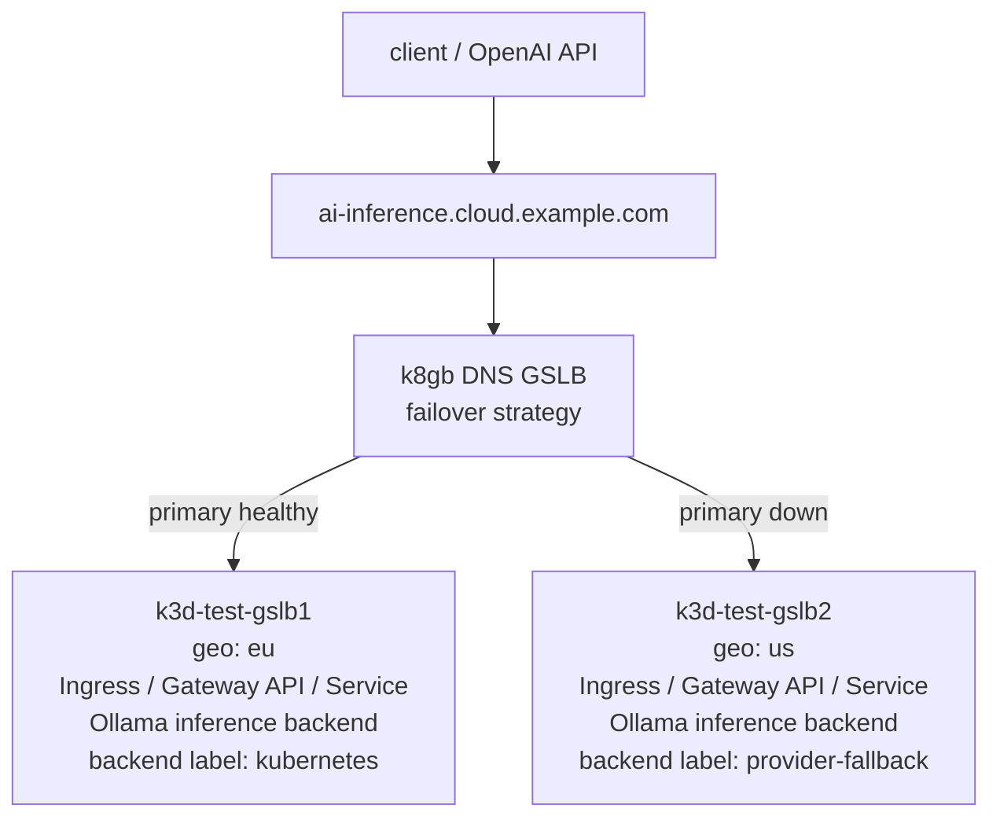

<a id="doc-12e0a48d6c5f2a58f4caa284"></a>

# k8gb-io/k8gb / ADOPTERS.md

Upstream: https://github.com/k8gb-io/k8gb/blob/d1e231a3af7875eb38370f18b7009b6800dc485a/ADOPTERS.md

Commit: `d1e231a3af7875eb38370f18b7009b6800dc485a`

Retrieved: 2026-10-01T15:21:00.513240+00:00

Kind: official-document

Raw SHA256: `42e71a0cc493e391526b2c3a2ff1ea4d0d7ec77f751202a1853689fe573ec796`

Source text below is untrusted reference content. Acquisition does not verify technical claims.

License status: UPSTREAM_NOTICES_CAPTURED_PER_FILE_REVIEW_REQUIRED. See this repository's captured license files.

---

# Adopters

This list captures the set of organizations that are using K8GB within their environments. If
you are an adopter of K8GB and not yet on this list, we encourage you to add your organization
here as well!

Contributing to this list is a small effort that has a **big impact** to the project's growth,
maturity, and momentum.  Thank you to all adopters and contributors of the K8GB project!

## K8GB Adopters

This list is sorted in the order that organizations were added to it.

| Organization | Contact | Description of Use |
| ------------ | ------- | ------------------ |
| [Absa](https://www.absa.co.za/) | @kuritka | K8GB was created in Absa and had its first production use in cross-regional datacenter context |
| [Millennium bcp](https://www.millenniumbcp.pt/) | @infbase | Multicloud and multi-region cloud native load balancing ([CNCF case study](https://www.cncf.io/case-studies/millennium-bcp/)) |
| [Eficode](https://eficode.com/) | @punasusi | As a cloud-native and devops consulting firm, we have used k8gb in customer engagements |
| [Open Systems](https://www.open-systems.com/) | @abaguas | Multi-cluster load balancing in private WAN |
| [PagBank](https://pagbank.com/) | @altieresfreitas | Multicloud global load balancing across multiple regions |
| [Darede](https://darede.com.br/) | @diego7marques | As a cloud consulting company, we support customers using k8gb |
| [envio.dev](https://envio.dev/) | @Piroddi | Provides cross region availability of Envio's high-performance blockchain data engine |


<a id="doc-77cb35e143685fcd4bad0bc4"></a>

# k8gb-io/k8gb / AI_POLICY.md

Upstream: https://github.com/k8gb-io/k8gb/blob/d1e231a3af7875eb38370f18b7009b6800dc485a/AI_POLICY.md

Commit: `d1e231a3af7875eb38370f18b7009b6800dc485a`

Retrieved: 2026-10-01T15:21:00.513240+00:00

Kind: official-document

Raw SHA256: `858c9150ceabf7d522ad1055114eb4fa617fb95c1bf87d3d6944a43c07501309`

Source text below is untrusted reference content. Acquisition does not verify technical claims.

License status: UPSTREAM_NOTICES_CAPTURED_PER_FILE_REVIEW_REQUIRED. See this repository's captured license files.

---

# k8gb AI Contribution Policy

## Scope and relationship to existing rules

This policy applies to contributions to the [`k8gb-io/k8gb`](https://github.com/k8gb-io/k8gb) repository. It covers AI-assisted code, documentation, tests, issues, pull requests, commit messages, and review comments submitted by Contributors, Reviewers, or Maintainers.

This policy supplements, and does not replace, [`CONTRIBUTING.md`](CONTRIBUTING.md), [`GOVERNANCE.md`](GOVERNANCE.md), [`CODE_OF_CONDUCT.md`](CODE_OF_CONDUCT.md), [`SECURITY.md`](SECURITY.md), the project license, and the Developer Certificate of Origin (DCO) requirement. Those documents control if there is a conflict. This policy does not create a different review or merge path, grant GitHub permissions, or change project-maintained automation that is separately configured.

## Core principle

k8gb permits the use of generative artificial-intelligence (AI) tools, including large language models, coding assistants, and agents, to assist with contributions. AI assistance does not change who is accountable: the named human contributor remains responsible for the correctness, security, licensing, quality, and reviewability of what they submit.

A contribution is not rejected solely because it was produced substantially with AI assistance. It is acceptable only when a named human contributor has reviewed it, understands it, can explain and defend it, and accepts responsibility for it under the same contribution requirements that apply to any other submission.

## Owning and validating a contribution

Contributors must understand the purpose and expected impact of each submitted change well enough to explain it without relying on an AI tool. Before requesting review, they must perform appropriate self-review and validation. This includes reviewing generated code, documentation, tests, configuration, citations, and claims; revising them as needed; and running the applicable checks described in [`CONTRIBUTING.md`](CONTRIBUTING.md).

AI-generated tests are useful only when the contributor has reviewed them for relevance and correctness and has validated the behavior they are intended to cover. AI-assisted documentation must be technically accurate, appropriately scoped, and consistent with the repository. Do not add an API, dependency, behavior claim, citation, or configuration solely because an AI tool proposed it; verify it against authoritative project or upstream sources.

Complete an applicable pull-request or issue template where one is provided. Use focused, reviewable changes. For a non-trivial proposed change, start an issue or discussion before implementation unless a Maintainer asks otherwise. Avoid opening multiple related, unreviewed pull requests at once.

## Human communication and review judgment

Issues, pull-request descriptions, replies to review comments, and review comments must reflect the submitting person’s own understanding and judgment. AI may help a contributor improve wording, translate, explore an implementation, or prepare a draft, but the contributor must review and revise the result before posting it.

Do not configure an AI tool to post or reply autonomously on a contributor’s behalf in project issues, pull requests, or reviews. Do not submit an AI-generated review as your own without exercising and expressing your own judgment. This expectation applies equally when a Maintainer uses AI while reviewing or responding to a contribution.

This rule does not prohibit clearly identified project-maintained automation that is separately configured and does not substitute for a contributor’s response to review. In particular, it does not change existing repository workflows that generate release material under their own controls.

## AI-use disclosure

k8gb does not require a contributor to disclose AI use solely because an AI tool was used. A contributor must nevertheless provide information needed to assess a submission, including information necessary to identify relevant third-party rights, comply with applicable law or tool terms, or answer a concrete Maintainer question about correctness, security, dependencies, licensing, or provenance.

The absence of a general disclosure requirement does not excuse inaccurate, incomplete, or unowned issue, pull-request, or review content.

## DCO, licensing, and third-party material

Every contribution remains subject to the project’s Apache-2.0 license and the DCO requirements in [`CONTRIBUTING.md`](CONTRIBUTING.md). For a contributor-authored AI-assisted commit, the human contributor must sign off using their own name and email as required by the DCO process. Do not list an AI system as a `Signed-off-by`, `Co-authored-by`, or similar human-contributor trailer. This provision does not alter project-maintained automation that is separately configured to create signed-off commits or pull requests.

Before submitting AI-assisted material, contributors must ensure that their use of the tool and its output is compatible with the project’s license, intellectual-property requirements, and applicable terms. If output includes or closely reproduces pre-existing third-party copyrighted material, contributors must first confirm that they have permission to use, modify, and contribute it. They must provide the applicable source notice, attribution, and license information in the pull request or accompanying documentation. Do not submit material when its rights cannot be confirmed.

Where available, similarity or licensing features supplied by an AI tool may help identify possible third-party material, but they do not replace the contributor’s review and responsibility.

## Security and confidential reporting

This policy does not change the project’s vulnerability-reporting process. If a contribution, investigation, or AI-assisted analysis identifies a security issue, follow [`SECURITY.md`](SECURITY.md) and use its confidential reporting channel rather than opening a public issue or pull request with vulnerability details.

## Review and enforcement

AI-assisted contributions follow the normal k8gb contribution and review process. In particular, a pull request still requires the Maintainer LGTM specified in [`CONTRIBUTING.md`](CONTRIBUTING.md). AI assistance does not replace required testing, human review, security review where appropriate, or Maintainer judgment.

Maintainers may request clarification or changes, or close contributions that do not meet documented contribution, licensing, security, testing, or review-engagement expectations. They should apply this policy consistently with [`GOVERNANCE.md`](GOVERNANCE.md) and the [Code of Conduct](CODE_OF_CONDUCT.md). A decision must not be based solely on the appearance that a submission may have used AI.

## Related external guidance

The [Linux Foundation guidance on generative AI and open-source development](https://www.linuxfoundation.org/legal/generative-ai) permits AI-generated content while addressing output terms and third-party copyrighted material. This k8gb policy is intended to complement applicable CNCF/Linux Foundation guidance and the project’s existing licensing and contribution requirements. Where an external policy or legal obligation applies, contributors must comply with it.

## Changes to this policy

Changes to this policy must be proposed through the normal pull-request process and reviewed and, where required by [`GOVERNANCE.md`](GOVERNANCE.md), voted on by project Maintainers.

## Credits

Sections of this document were adapted from the [Linux Foundation guidance on generative AI and open-source development](https://www.linuxfoundation.org/legal/generative-ai), the [Crossplane AI Contribution Policy](https://github.com/crossplane/crossplane/blob/main/AI_POLICY.md), the [Microcks AI Policy](https://github.com/microcks/microcks-testcontainers-node/blob/main/AI-POLICY.md), the [Kubewarden AI Contribution Policy](https://github.com/kubewarden/community/blob/main/AI_POLICY.md), and the [Kubernetes pull-request guide](https://www.kubernetes.dev/docs/guide/pull-requests/).


<a id="doc-06572a96a58dc510037d5efa"></a>

# k8gb-io/k8gb / CHANGELOG.md

Upstream: https://github.com/k8gb-io/k8gb/blob/d1e231a3af7875eb38370f18b7009b6800dc485a/CHANGELOG.md

Commit: `d1e231a3af7875eb38370f18b7009b6800dc485a`

Retrieved: 2026-10-01T15:21:00.513240+00:00

Kind: official-document

Raw SHA256: `c667beb33576069f3464389bf13a91ef51e4d42d3a99e9c73fb281dc729e14e6`

Source text below is untrusted reference content. Acquisition does not verify technical claims.

License status: UPSTREAM_NOTICES_CAPTURED_PER_FILE_REVIEW_REQUIRED. See this repository's captured license files.

---

# Changelog

## [v1.0.0](https://github.com/k8gb-io/k8gb/tree/v1.0.0) (2026-09-02)

<!-- Release notes generated using configuration in .github/release.yml at v1.0.0 -->

## What's Changed

This release marks a major milestone for k8gb as a CNCF Incubating project and reflects the project's maturity.

### Features, fixes, and maintenance
* Add 2026-07-08 community meeting agenda by @elohmrow in https://github.com/k8gb-io/k8gb/pull/2422
* fix: coredns reads metrics local address instead external IP or LB by @kuritka in https://github.com/k8gb-io/k8gb/pull/2418
* fix: make DNSZones optional by @kuritka in https://github.com/k8gb-io/k8gb/pull/2425
* fix: stop reconciliation when ZoneDelegation not found by @kuritka in https://github.com/k8gb-io/k8gb/pull/2426
* feat: dynamic geotags refactor for ZoneDelegation by @kuritka in https://github.com/k8gb-io/k8gb/pull/2427
* docs: clarify dynamic zone cluster participation by @dejoski in https://github.com/k8gb-io/k8gb/pull/2404
* ci: avoid cancelled Chainsaw checks by @ytsarev in https://github.com/k8gb-io/k8gb/pull/2429
* docs: update CNCF maturity to Incubating by @ytsarev in https://github.com/k8gb-io/k8gb/pull/2436
* ZoneDelegation.md - setup section by @kuritka in https://github.com/k8gb-io/k8gb/pull/2431
* docs: update v0.20.0 maturity to Incubating by @ytsarev in https://github.com/k8gb-io/k8gb/pull/2437
* docs: add July 22 community meeting agenda by @ytsarev in https://github.com/k8gb-io/k8gb/pull/2438
* fix: default CoreDNS endpoint for empty ZoneDelegation by @kuritka in https://github.com/k8gb-io/k8gb/pull/2440
* fix: (ZoneDelegations) allow empty dnsZones by @kuritka in https://github.com/k8gb-io/k8gb/pull/2441
* Fix: complex geotag discovery by @kuritka in https://github.com/k8gb-io/k8gb/pull/2459
* RELEASE: v0.21.0-rc1 by @kuritka in https://github.com/k8gb-io/k8gb/pull/2460
* fix mermaid chart rendering on ai inference demo by @elohmrow in https://github.com/k8gb-io/k8gb/pull/2443
* feat: override discovered exposed IPs via CLUSTER_EXPOSED_IPS by @aryasoni98 in https://github.com/k8gb-io/k8gb/pull/2402
* dynamic_geotags.md - explain usage by @kuritka in https://github.com/k8gb-io/k8gb/pull/2432
* docs: document partial Gslb deployment behavior by @Goutham-Annem in https://github.com/k8gb-io/k8gb/pull/2399
* feat: refactor ExtClusterNSNames by @kuritka in https://github.com/k8gb-io/k8gb/pull/2467
* fix: clarify reconciliation message by @kuritka in https://github.com/k8gb-io/k8gb/pull/2469
* Fix dynmaic tags discovery for new zones by @k0da in https://github.com/k8gb-io/k8gb/pull/2468
* feat: bump `go.mod` dependencies by @kuritka in https://github.com/k8gb-io/k8gb/pull/2463
* refactor: rfc1035 validation moved to utils by @kuritka in https://github.com/k8gb-io/k8gb/pull/2471
* docs: clean up website navigation warnings by @nightcityblade in https://github.com/k8gb-io/k8gb/pull/2445
* fix(docs): correct broken internal markdown links by @immanuwell in https://github.com/k8gb-io/k8gb/pull/2383
* RELEASE: v0.21.0-rc2 by @k0da in https://github.com/k8gb-io/k8gb/pull/2472
* docs: document why Dynamic GeoTags cannot work with ExternalDNS (#2464) by @aryasoni98 in https://github.com/k8gb-io/k8gb/pull/2466
* add 2026-08-05 community meeting notes by @elohmrow in https://github.com/k8gb-io/k8gb/pull/2493
* fix: zone delegation reconciliation panics on invalid rfc1035 by @kuritka in https://github.com/k8gb-io/k8gb/pull/2497
* feat: ZONE_DELEGATION_RECONCILE_REQUEUE_SECONDS as dedicated value fo… by @kuritka in https://github.com/k8gb-io/k8gb/pull/2500
* RELEASE: v0.21.0-rc3 by @k0da in https://github.com/k8gb-io/k8gb/pull/2501
* Fix empty CoreDNS readiness by @k0da in https://github.com/k8gb-io/k8gb/pull/2503
* refactor: Replace Delegationzone by ZoneDelegation by @kuritka in https://github.com/k8gb-io/k8gb/pull/2490
* feat: Add support of custom glue A prefix by @k0da in https://github.com/k8gb-io/k8gb/pull/2505
* refactor: remove extClusterGeoTags from ZD wrapper by @kuritka in https://github.com/k8gb-io/k8gb/pull/2506
* RELEASE: v0.21.0-rc4 by @k0da in https://github.com/k8gb-io/k8gb/pull/2508
* docs: fix broken Gateway API, golangci-lint, and Crossplane image links by @aryasoni98 in https://github.com/k8gb-io/k8gb/pull/2479
* docs: fix local.md Gslb sample links via canonical filenames by @aryasoni98 in https://github.com/k8gb-io/k8gb/pull/2484
* docs: polish ADOPTERS, tutorials index, typos, and registry notes by @aryasoni98 in https://github.com/k8gb-io/k8gb/pull/2487
* docs: resolve ADR-0001 with deferred annotation removal by @aryasoni98 in https://github.com/k8gb-io/k8gb/pull/2486
* Bump CoreDNS CRD Plugin to v0.6.0 by @ytsarev in https://github.com/k8gb-io/k8gb/pull/2514
* RELEASE: v1.0.0 by @ytsarev in https://github.com/k8gb-io/k8gb/pull/2518
### Dependencies
* Update dependency k8gb-io/k8gb to v0.20.0 by @renovate[bot] in https://github.com/k8gb-io/k8gb/pull/2421
* fix(deps): update all non-major dependencies by @renovate[bot] in https://github.com/k8gb-io/k8gb/pull/2419
* chore(deps): update go module directive to v1.26.5 by @renovate[bot] in https://github.com/k8gb-io/k8gb/pull/2423
* chore(deps): update otel/opentelemetry-collector docker tag to v0.157.0 by @renovate[bot] in https://github.com/k8gb-io/k8gb/pull/2424
* chore(deps): update otel/opentelemetry-collector docker tag to v0.159.0 by @renovate[bot] in https://github.com/k8gb-io/k8gb/pull/2492
* chore(deps): update actions/setup-go action to v7 by @renovate[bot] in https://github.com/k8gb-io/k8gb/pull/2428
* chore(deps): update actions/setup-python action to v7 by @renovate[bot] in https://github.com/k8gb-io/k8gb/pull/2435

## New Contributors
* @dejoski made their first contribution in https://github.com/k8gb-io/k8gb/pull/2404
* @Goutham-Annem made their first contribution in https://github.com/k8gb-io/k8gb/pull/2399
* @nightcityblade made their first contribution in https://github.com/k8gb-io/k8gb/pull/2445

**Full Changelog**: https://github.com/k8gb-io/k8gb/compare/v0.20.0...v1.0.0

:rocket:


## [v0.21.0-rc2](https://github.com/k8gb-io/k8gb/tree/v0.21.0-rc2) (2026-08-01)

## Changelog
* ed8470d83852a3213b4f4bc796372a89aebb6e45 RELEASE: v0.21.0-rc2
* c5ba74131ec2b5ad83a1ee1241b5c410331dd090 [create-pull-request] automated change
* 4abdac04d0021dd93054a6f6c115b39fb7475d82 fix(docs): correct broken internal markdown links
* 1e5c9a8f6db91733a9d98d3a47af7873dab99683 chore(deps): update otel/opentelemetry-collector docker tag to v0.157.0
* f6fa472b0e63cbb6fd2db3ed1b398a08d4c4a073 docs: clean up website navigation warnings
* 17d7b9b343d02b58cd3297ce105d310291f8cd20 refactor: rfc1035 validation moved to utils
* 0baaa8f6d7e1ba2c0f55b3e4800568f1ee8326f1 feat: bump dependencies
* 14f20bcfb2be879485ff29f84dbbbc0fa34d6d04 Fix dynmaic tags discovery for new zones
* 9398f2e8a777276b7ba6967bb0ce358c3c2e5338 fix: clarify reconciliation message
* 90c39083bea9b0ef3fd87a58b5ddd3d38286e267 feat: refactor ExtClusterNSNames
* 5c04f0394502196aeb60645a736aa63090bf8e23 docs: document partial Gslb deployment behavior (#2399)
* b797408aafef4f5721386cbe5b411be74a0cf926 [create-pull-request] automated change
* a72c3810dd8be4df90e58c489e33e86d0beedf8a dynamic_geotags.md - explain usage (#2432)
* 234eef7ee212d19b6dbaf551c5c801bf689a5061 feat: override discovered exposed IPs via CLUSTER_EXPOSED_IPS (#2402)
* 5e14ccf2e67d9e917f4c6ef0f7ffa1f4bd44be20 fix mermaid chart rendering on ai inference demo (#2443)
* 438c04cf11f1935dde29b7be1ea5f354115d4b62 [create-pull-request] automated change
* 30d8c7d4be1c74bf259307520ac423bb955dc3fa [create-pull-request] automated change

:rocket:


## [v0.21.0-rc1](https://github.com/k8gb-io/k8gb/tree/v0.21.0-rc1) (2026-07-28)

## Changelog
* d8e74c2f9dfa8bc3f429f4a96f9f7206caa2027d RELEASE: v0.21.0-rc1
* 21e97472a937f1930a4cb82e9d66d08c555ada7c FIX: GeoTags Discovery
* 889a4d3e793d50f74f267715d2525076e40c6d68 fix: (ZoneDelegations) allow empty dnsZones
* 8b7573b78d51c6e93c7cbc8dd7ced38d861f6d74 fix: default CoreDNS endpoint for empty ZoneDelegation
* 25c8d0a79d40eabf7e84461366c149606eed77c7 docs: add July 22 community meeting agenda (#2438)
* 107dd9d77fa902b73b540c54d1288e5fcc4e28d4 docs: update v0.20.0 maturity to Incubating (#2437)
* c83f2c5f322a298457c0bf9f06df03c328d490ab Zonedelegations documentation setup section
* 9332aee641a5fe77e19297321eb2734dde51c9d5 docs: update CNCF maturity to Incubating (#2436)
* a74a5c97d0e48bd6a61ba314bbc681f9ce65bed3 [create-pull-request] automated change (#2433)
* 2746033de058ff00e5e9b19368b2b8efb0253998 chore(deps): update go module directive to v1.26.5 (#2423)
* dcda44b9cca681876c977e49fc0f4638bc831486 fix(deps): update all non-major dependencies (#2419)
* a01102a191f468caae044e9c76a93e1e1b8d4c01 ci: avoid cancelled Chainsaw checks (#2429)
* 42a957cead91c12222d5dd360fd4542584b7e313 docs: clarify dynamic zone cluster participation (#2404)
* 7d62973f8005638e928008319f37533bb9b6a876 ZoneDelegation: dynamic geotags refactor
* bc4ec7cfaf91f757d1d8ae30202a969316ce8e24 fix: stop reconciliation when ZoneDelegation not found
* ad6c5bd2843e8ea1e624aea8d820f3b9082b50cc fix: make DNSZones optional
* e574ac63c9b1eae15af87e0319e7372a95c737e8 fix: coredns reads metrics local address instead external IP or LB
* 81e03bcb68fe94387c2dc9e1415861f611c3d8be Add 2026-07-08 community meeting agenda (#2422)
* 0630e98e5849f4c83facd20f2092a55c54bb9b39 [create-pull-request] automated change (#2420)
* 2c4853accf7ece32a906bb18bbd4ec2b4e2bbc81 Update dependency k8gb-io/k8gb to v0.20.0 (#2421)

:rocket:


## [v0.20.0](https://github.com/k8gb-io/k8gb/tree/v0.20.0) (2026-07-03)

## Release summary

  `v0.20.0` delivers end-to-end ZoneDelegation support, covering reconciliation, validation, authoritative DNS resolution, status reporting, and reliable finalization for ExternalDNS and Infoblox. It also adds TLSRoute support and the `k8gb.io/exposed-hostnames` annotation, while improving service health checks, DNS validation, legacy migration cleanup, and reconciliation reliability. New local-failover and AI-inference resilience demos, expanded documentation, unified CRDs, and refreshed dependencies round out the release.

<!-- Release notes generated using configuration in .github/release.yml at v0.20.0 -->

## What's Changed
### Features, fixes, and maintenance
* Add phased local failover demo script by @ytsarev in https://github.com/k8gb-io/k8gb/pull/2309
* Add April 1, 2026 meeting notes by @ytsarev in https://github.com/k8gb-io/k8gb/pull/2316
* ZoneDelegation (3.1/4) feat: Add ipresolver and zones service by @kuritka in https://github.com/k8gb-io/k8gb/pull/2313
* Fix: Helm charts publish to OCI registry by @itsfarhan in https://github.com/k8gb-io/k8gb/pull/2319
* ZoneDelegation (3.2/4) feat: k8gb-zone-delegation config map by @kuritka in https://github.com/k8gb-io/k8gb/pull/2322
* feat: add k8gb.io/exposed-hostnames annotation by @rajsinghtech in https://github.com/k8gb-io/k8gb/pull/2285
* ZoneDelegation (3.3/4) feat: Create ZoneDelegation reconciliation by @kuritka in https://github.com/k8gb-io/k8gb/pull/2323
* feat: first blog of k8gb by @itsfarhan in https://github.com/k8gb-io/k8gb/pull/2307
* Fix: update blog category to match with mkdocs.yml by @itsfarhan in https://github.com/k8gb-io/k8gb/pull/2329
* add 2026-04-15 community meeting notes by @elohmrow in https://github.com/k8gb-io/k8gb/pull/2331
* ZoneDelegation (3.3/4) feat: Remove Bootstrap service by @kuritka in https://github.com/k8gb-io/k8gb/pull/2324
* feat: master as part of version selector in docs site by @itsfarhan in https://github.com/k8gb-io/k8gb/pull/2291
* ZoneDelegation (3.4/4) feat: Chainsaw tests - existing ZoneDelegation during bootstrap by @kuritka in https://github.com/k8gb-io/k8gb/pull/2325
* feat: Pipeline doesn't rely on init-ingress but service type LoadBalancer by @kuritka in https://github.com/k8gb-io/k8gb/pull/2333
* [Enhancement](Contributing.md): Cosign keyless verification guide by @itsfarhan in https://github.com/k8gb-io/k8gb/pull/2200
* feat(docs): splitbrain documentation by @itsfarhan in https://github.com/k8gb-io/k8gb/pull/2254
* ZoneDelegation (3.5/4) feat: ZoneDelegation reconciliation by @kuritka in https://github.com/k8gb-io/k8gb/pull/2327
* ZoneDelegation (3.7/4) feat: ApplicationDNSEndpoint to ZoneService refactor by @kuritka in https://github.com/k8gb-io/k8gb/pull/2335
* ZoneDelegation (3.8/4) feat: use ZoneDelegations for authoritative DNS resolution by @kuritka in https://github.com/k8gb-io/k8gb/pull/2338
* ZoneDelegation (3.6/4) feat: chainsaw ZoneDelegation status by @kuritka in https://github.com/k8gb-io/k8gb/pull/2328
* ZoneDelegation (3.9/4) feat: add markedForDeletion to ZoneDelegation by @kuritka in https://github.com/k8gb-io/k8gb/pull/2343
* chore: configure renovate for deploy/edge/deployment.yaml by @itsfarhan in https://github.com/k8gb-io/k8gb/pull/2341
* community-meeting-2026-04-29 by @ytsarev in https://github.com/k8gb-io/k8gb/pull/2347
* Fixes missed comments in PR #2347 by @elohmrow in https://github.com/k8gb-io/k8gb/pull/2348
* test(DTR): Testing different K8S versions for DTR (incubation) by @itsfarhan in https://github.com/k8gb-io/k8gb/pull/2095
* feat: Remove dynamicZones from values.yaml by @kuritka in https://github.com/k8gb-io/k8gb/pull/2354
* Fix: Sync blogs across all versions by @itsfarhan in https://github.com/k8gb-io/k8gb/pull/2339
* add 2026-05-13 community meeting agenda / notes by @elohmrow in https://github.com/k8gb-io/k8gb/pull/2363
* feat: ZoneDelegation (3.13/4): finalizers logic by @kuritka in https://github.com/k8gb-io/k8gb/pull/2365
* Add AI inference resilience demo by @ytsarev in https://github.com/k8gb-io/k8gb/pull/2353
* feat: ZoneDelegation (3.12/4) ZoneDelegation CRD, doFinalize: false as default, Zones validation by @kuritka in https://github.com/k8gb-io/k8gb/pull/2364
* fix: require all services healthy for server health (#2326) by @itsfarhan in https://github.com/k8gb-io/k8gb/pull/2342
* fix: typos and wrong default INFOBLOX_WAPI_PORT in config.go by @immanuwell in https://github.com/k8gb-io/k8gb/pull/2369
* feat: ZoneDelegation (3.11/4) ipresolver  returns status per GlueARecord by @kuritka in https://github.com/k8gb-io/k8gb/pull/2350
* add 2027-05-27 community meeting agenda by @elohmrow in https://github.com/k8gb-io/k8gb/pull/2370
* feat: Zone delegation (3.15/4) finalization/remove zone delegation for Infoblox by @kuritka in https://github.com/k8gb-io/k8gb/pull/2367
* add ai inference demo blog post by @elohmrow in https://github.com/k8gb-io/k8gb/pull/2371
* Fix AI inference blog metadata by @ytsarev in https://github.com/k8gb-io/k8gb/pull/2372
* fix: fail fast on invalid localtargets DNS labels by @immanuwell in https://github.com/k8gb-io/k8gb/pull/2373
* fix: repair broken contributor workflows in local deployment helpers by @immanuwell in https://github.com/k8gb-io/k8gb/pull/2376
* fix: preserve legacy GSLB annotations by @ytsarev in https://github.com/k8gb-io/k8gb/pull/2377
* WIP add 2026-06-10 community meeting agenda by @elohmrow in https://github.com/k8gb-io/k8gb/pull/2380
* fest: TLSRoute support in gateway.networking.k8s.io/v1alpha2 vs gatew… by @aryasoni98 in https://github.com/k8gb-io/k8gb/pull/2282
* feat: Zone delegation (3.16/4) finalization for ExternalDNS by @kuritka in https://github.com/k8gb-io/k8gb/pull/2386
* Extending ZoneDelegation documentation by @kuritka in https://github.com/k8gb-io/k8gb/pull/2387
* add 2026-06-24 community meeting notes by @elohmrow in https://github.com/k8gb-io/k8gb/pull/2391
* RELEASE: v0.20.0 by @kuritka in https://github.com/k8gb-io/k8gb/pull/2394
* Bump CoreDNS CRD Plugin to v0.5.0 by @ytsarev in https://github.com/k8gb-io/k8gb/pull/2405
* feat: unify CRDs by @kuritka in https://github.com/k8gb-io/k8gb/pull/2408
* fix: Skip GSLB reconciliation when ZoneDelegation is removed by @kuritka in https://github.com/k8gb-io/k8gb/pull/2409
* feat: not reconcile immediatelly when error occurs by @kuritka in https://github.com/k8gb-io/k8gb/pull/2412
* refactor: rename CreateZoneDelegation to SaveZoneDelegation by @kuritka in https://github.com/k8gb-io/k8gb/pull/2411
* feat: remove .conf from ZoneDelegation name by @kuritka in https://github.com/k8gb-io/k8gb/pull/2413
* fix: make legacy migration cleanup reliable by @ytsarev in https://github.com/k8gb-io/k8gb/pull/2414
* fix: flaky ip_resolver test by @kuritka in https://github.com/k8gb-io/k8gb/pull/2415
* ci: run Chainsaw for Renovate PRs by @ytsarev in https://github.com/k8gb-io/k8gb/pull/2416
* ci: use GitHub-generated release notes by @ytsarev in https://github.com/k8gb-io/k8gb/pull/2417
### Dependencies
* fix(deps): update all non-major dependencies by @renovate[bot] in https://github.com/k8gb-io/k8gb/pull/2308
* chore(deps): update dependency k8gb-io/k8gb to v0.19.0 by @renovate[bot] in https://github.com/k8gb-io/k8gb/pull/2306
* fix(deps): update module sigs.k8s.io/external-dns to v0.21.0 by @renovate[bot] in https://github.com/k8gb-io/k8gb/pull/2317
* chore(deps): update dependency go to v1.26.2 by @renovate[bot] in https://github.com/k8gb-io/k8gb/pull/2320
* chore(deps): update dependency prometheus-community/helm-charts to v29 by @renovate[bot] in https://github.com/k8gb-io/k8gb/pull/2321
* chore(deps): update azure/setup-helm action to v5 by @renovate[bot] in https://github.com/k8gb-io/k8gb/pull/2311
* fix(deps): update all non-major dependencies by @renovate[bot] in https://github.com/k8gb-io/k8gb/pull/2318
* chore(deps): update otel/opentelemetry-collector docker tag to v0.150.1 by @renovate[bot] in https://github.com/k8gb-io/k8gb/pull/2315
* Update all non-major dependencies by @renovate[bot] in https://github.com/k8gb-io/k8gb/pull/2344
* Update dependency kubernetes-sigs/controller-tools to v0.21.0 by @renovate[bot] in https://github.com/k8gb-io/k8gb/pull/2355
* Update module sigs.k8s.io/controller-runtime to v0.24.0 by @renovate[bot] in https://github.com/k8gb-io/k8gb/pull/2349
* Update otel/opentelemetry-collector Docker tag to v0.151.0 by @renovate[bot] in https://github.com/k8gb-io/k8gb/pull/2346
* Update kyverno/action-install-chainsaw action to v0.2.15 by @renovate[bot] in https://github.com/k8gb-io/k8gb/pull/2356
* Update go module directive to v1.26.3 by @renovate[bot] in https://github.com/k8gb-io/k8gb/pull/2358
* Update module github.com/gruntwork-io/terratest to v1 by @renovate[bot] in https://github.com/k8gb-io/k8gb/pull/2359
* Update rancher/k3s Docker tag to v1.36.0 by @renovate[bot] in https://github.com/k8gb-io/k8gb/pull/2314
* Update module sigs.k8s.io/controller-runtime to v0.24.1 by @renovate[bot] in https://github.com/k8gb-io/k8gb/pull/2362
* Update otel/opentelemetry-collector Docker tag to v0.153.0 by @renovate[bot] in https://github.com/k8gb-io/k8gb/pull/2361
* Update update k8s version to v1.36.1 by @renovate[bot] in https://github.com/k8gb-io/k8gb/pull/2368
* Update fossa-contrib/fossa-action action to v4 by @renovate[bot] in https://github.com/k8gb-io/k8gb/pull/2384
* Update dependency helm to v4 by @renovate[bot] in https://github.com/k8gb-io/k8gb/pull/2382
* Update otel/opentelemetry-collector Docker tag to v0.154.0 by @renovate[bot] in https://github.com/k8gb-io/k8gb/pull/2379
* Update update golang version by @renovate[bot] in https://github.com/k8gb-io/k8gb/pull/2374
* Update all non-major dependencies by @renovate[bot] in https://github.com/k8gb-io/k8gb/pull/2352
* Update actions/checkout action to v7 by @renovate[bot] in https://github.com/k8gb-io/k8gb/pull/2388
* Update rancher/k3s Docker tag to v1.36.2 by @renovate[bot] in https://github.com/k8gb-io/k8gb/pull/2392
* Update otel/opentelemetry-collector Docker tag to v0.155.0 by @renovate[bot] in https://github.com/k8gb-io/k8gb/pull/2393
* Update kubernetes monorepo to v0.36.2 by @renovate[bot] in https://github.com/k8gb-io/k8gb/pull/2332
* Update all non-major dependencies by @renovate[bot] in https://github.com/k8gb-io/k8gb/pull/2400
* Update all non-major dependencies by @renovate[bot] in https://github.com/k8gb-io/k8gb/pull/2403
* Update all non-major dependencies by @renovate[bot] in https://github.com/k8gb-io/k8gb/pull/2410

## New Contributors
* @rajsinghtech made their first contribution in https://github.com/k8gb-io/k8gb/pull/2285
* @immanuwell made their first contribution in https://github.com/k8gb-io/k8gb/pull/2369
* @aryasoni98 made their first contribution in https://github.com/k8gb-io/k8gb/pull/2282

**Full Changelog**: https://github.com/k8gb-io/k8gb/compare/v0.19.0...v0.20.0

:rocket:


## [v0.19.0](https://github.com/k8gb-io/k8gb/tree/v0.19.0) (2026-03-22)

[Full Changelog](https://github.com/k8gb-io/k8gb/compare/v0.18.1...v0.19.0)

**Closed issues:**

- Switch to vendor neutral OCI registry and repository [\#2195](https://github.com/k8gb-io/k8gb/issues/2195)
- Enhance Token permissions according to recommendations in CLO monitor [\#2194](https://github.com/k8gb-io/k8gb/issues/2194)
- Switch to vendor-neutral API group [\#2180](https://github.com/k8gb-io/k8gb/issues/2180)
- Switch helm repo to OCI [\#1973](https://github.com/k8gb-io/k8gb/issues/1973)
- \(vendor-neutrality\) Ensure k8gb.io has vendor-neutral governance [\#1665](https://github.com/k8gb-io/k8gb/issues/1665)

**Merged pull requests:**

- RELEASE: v0.19.0 [\#2303](https://github.com/k8gb-io/k8gb/pull/2303) ([ytsarev](https://github.com/ytsarev))
- ci: tighten workflow token permissions [\#2300](https://github.com/k8gb-io/k8gb/pull/2300) ([ytsarev](https://github.com/ytsarev))
- ci: remove trivy workflows [\#2299](https://github.com/k8gb-io/k8gb/pull/2299) ([ytsarev](https://github.com/ytsarev))
- Update Helm Docs [\#2298](https://github.com/k8gb-io/k8gb/pull/2298) ([github-actions[bot]](https://github.com/apps/github-actions))
- Bump google.golang.org/grpc from 1.79.2 to 1.79.3 [\#2297](https://github.com/k8gb-io/k8gb/pull/2297) ([dependabot[bot]](https://github.com/apps/dependabot))
- chore\(deps\): update all non-major dependencies [\#2295](https://github.com/k8gb-io/k8gb/pull/2295) ([renovate[bot]](https://github.com/apps/renovate))
- Update Helm Docs [\#2290](https://github.com/k8gb-io/k8gb/pull/2290) ([github-actions[bot]](https://github.com/apps/github-actions))
- Bump coredns plugin to latest v0.4.0 release [\#2289](https://github.com/k8gb-io/k8gb/pull/2289) ([ytsarev](https://github.com/ytsarev))
- chore\(deps\): update docker/build-push-action action to v7 [\#2288](https://github.com/k8gb-io/k8gb/pull/2288) ([renovate[bot]](https://github.com/apps/renovate))
- add 2026-03-18 community meeting agenda and notes [\#2287](https://github.com/k8gb-io/k8gb/pull/2287) ([elohmrow](https://github.com/elohmrow))
- fix\(deps\): update kubernetes monorepo to v0.35.3 [\#2286](https://github.com/k8gb-io/k8gb/pull/2286) ([renovate[bot]](https://github.com/apps/renovate))
- Update Helm Docs [\#2284](https://github.com/k8gb-io/k8gb/pull/2284) ([github-actions[bot]](https://github.com/apps/github-actions))
- Add Millennium bcp case study [\#2280](https://github.com/k8gb-io/k8gb/pull/2280) ([ytsarev](https://github.com/ytsarev))
- fix\(deps\): update module sigs.k8s.io/controller-runtime to v0.23.3 [\#2279](https://github.com/k8gb-io/k8gb/pull/2279) ([renovate[bot]](https://github.com/apps/renovate))
- March 4 community meeting agenda [\#2278](https://github.com/k8gb-io/k8gb/pull/2278) ([ytsarev](https://github.com/ytsarev))
- chore\(deps\): update docker/login-action action to v4 [\#2277](https://github.com/k8gb-io/k8gb/pull/2277) ([renovate[bot]](https://github.com/apps/renovate))
- chore\(images\): switch runtime-facing image refs to registry.k8gb.io [\#2276](https://github.com/k8gb-io/k8gb/pull/2276) ([ytsarev](https://github.com/ytsarev))
- chore\(deps\): update otel/opentelemetry-collector docker tag to v0.148.0 [\#2275](https://github.com/k8gb-io/k8gb/pull/2275) ([renovate[bot]](https://github.com/apps/renovate))
- chore\(deps\): update github/codeql-action digest to b1bff81 [\#2274](https://github.com/k8gb-io/k8gb/pull/2274) ([renovate[bot]](https://github.com/apps/renovate))
- chore\(deps\): update sigstore/cosign-installer digest to ba7bc0a [\#2273](https://github.com/k8gb-io/k8gb/pull/2273) ([renovate[bot]](https://github.com/apps/renovate))
- DynamicZones \(4/4\): documentation and usage guide [\#2272](https://github.com/k8gb-io/k8gb/pull/2272) ([kuritka](https://github.com/kuritka))
- DynamicZones \(2/4\): add Helm chart integration and installation support [\#2271](https://github.com/k8gb-io/k8gb/pull/2271) ([kuritka](https://github.com/kuritka))
- DynamicZones \(1/4\): introduce API, CRD and type registration [\#2270](https://github.com/k8gb-io/k8gb/pull/2270) ([kuritka](https://github.com/kuritka))
- chore\(deps\): update actions/upload-artifact action to v7 [\#2268](https://github.com/k8gb-io/k8gb/pull/2268) ([renovate[bot]](https://github.com/apps/renovate))
- Update Helm Docs [\#2267](https://github.com/k8gb-io/k8gb/pull/2267) ([github-actions[bot]](https://github.com/apps/github-actions))
- docs: prevent prerelease tags from publishing to gh-pages [\#2266](https://github.com/k8gb-io/k8gb/pull/2266) ([ytsarev](https://github.com/ytsarev))
- Add Bradley to chart metadata [\#2265](https://github.com/k8gb-io/k8gb/pull/2265) ([ytsarev](https://github.com/ytsarev))
- release: move container release, cosign, and slsa to GHCR [\#2264](https://github.com/k8gb-io/k8gb/pull/2264) ([ytsarev](https://github.com/ytsarev))
- chore\(deps\): update dependency k8gb-io/k8gb to v0.18.1 [\#2263](https://github.com/k8gb-io/k8gb/pull/2263) ([renovate[bot]](https://github.com/apps/renovate))
- Update Offline Changelog [\#2262](https://github.com/k8gb-io/k8gb/pull/2262) ([github-actions[bot]](https://github.com/apps/github-actions))
- chore\(deps\): update goreleaser/goreleaser-action action to v7 [\#2261](https://github.com/k8gb-io/k8gb/pull/2261) ([renovate[bot]](https://github.com/apps/renovate))
- Update Helm Docs [\#2260](https://github.com/k8gb-io/k8gb/pull/2260) ([github-actions[bot]](https://github.com/apps/github-actions))
- chore\(deps\): update benc-uk/workflow-dispatch digest to 7a02764 [\#2258](https://github.com/k8gb-io/k8gb/pull/2258) ([renovate[bot]](https://github.com/apps/renovate))
- fix\(deps\): update module github.com/gruntwork-io/terratest to v0.56.0 [\#2243](https://github.com/k8gb-io/k8gb/pull/2243) ([renovate[bot]](https://github.com/apps/renovate))
- chore\(deps\): update dependency go to v1.26.1 [\#2238](https://github.com/k8gb-io/k8gb/pull/2238) ([renovate[bot]](https://github.com/apps/renovate))
- Feat: OCI Registry and Cosign signing in separate workflow file [\#2237](https://github.com/k8gb-io/k8gb/pull/2237) ([itsfarhan](https://github.com/itsfarhan))
- fix\(deps\): update all non-major dependencies [\#2233](https://github.com/k8gb-io/k8gb/pull/2233) ([renovate[bot]](https://github.com/apps/renovate))
- Switch to vendor‑neutral API group k8gb.io with on‑the‑fly user controlled migration [\#2203](https://github.com/k8gb-io/k8gb/pull/2203) ([ytsarev](https://github.com/ytsarev))
- chore\(deps\): update rancher/k3s docker tag to v1.35.2 [\#1678](https://github.com/k8gb-io/k8gb/pull/1678) ([renovate[bot]](https://github.com/apps/renovate))


## [v0.18.1](https://github.com/k8gb-io/k8gb/tree/v0.18.1) (2026-02-21)

[Full Changelog](https://github.com/k8gb-io/k8gb/compare/v0.18.0...v0.18.1)

**Closed issues:**

- 2026 Project Lead Election [\#2210](https://github.com/k8gb-io/k8gb/issues/2210)
- Release v0.18.0 [\#2175](https://github.com/k8gb-io/k8gb/issues/2175)
- Add versioning to k8gb.io documentation [\#794](https://github.com/k8gb-io/k8gb/issues/794)

**Merged pull requests:**

- RELEASE: v0.18.1 [\#2259](https://github.com/k8gb-io/k8gb/pull/2259) ([ytsarev](https://github.com/ytsarev))
- Update Helm Docs [\#2257](https://github.com/k8gb-io/k8gb/pull/2257) ([github-actions[bot]](https://github.com/apps/github-actions))
- Bump coredns-plugin to include latest security fixes [\#2256](https://github.com/k8gb-io/k8gb/pull/2256) ([ytsarev](https://github.com/ytsarev))
- fix\(docs\): restore mkdocs.yml between mike tag checkouts [\#2253](https://github.com/k8gb-io/k8gb/pull/2253) ([ytsarev](https://github.com/ytsarev))
- Update Helm Docs [\#2252](https://github.com/k8gb-io/k8gb/pull/2252) ([github-actions[bot]](https://github.com/apps/github-actions))
- chore\(deps\): update github/codeql-action digest to 89a39a4 [\#2251](https://github.com/k8gb-io/k8gb/pull/2251) ([renovate[bot]](https://github.com/apps/renovate))
- fix\(docs\): ensure mike provider for legacy docs tags [\#2250](https://github.com/k8gb-io/k8gb/pull/2250) ([ytsarev](https://github.com/ytsarev))
- Fix: K8gb site banner fix [\#2249](https://github.com/k8gb-io/k8gb/pull/2249) ([itsfarhan](https://github.com/itsfarhan))
- update governance with information on 2025-2026 project lead election [\#2248](https://github.com/k8gb-io/k8gb/pull/2248) ([elohmrow](https://github.com/elohmrow))
- add 2026-02-18 community meeting notes [\#2247](https://github.com/k8gb-io/k8gb/pull/2247) ([elohmrow](https://github.com/elohmrow))
- fix\(docs\): deploy mike docs on master for latest 3 tags [\#2246](https://github.com/k8gb-io/k8gb/pull/2246) ([ytsarev](https://github.com/ytsarev))
- chore\(deps\): update otel/opentelemetry-collector docker tag to v0.146.1 [\#2245](https://github.com/k8gb-io/k8gb/pull/2245) ([renovate[bot]](https://github.com/apps/renovate))
- ci: centralize k3d version in workflow env and use the latest one [\#2244](https://github.com/k8gb-io/k8gb/pull/2244) ([ytsarev](https://github.com/ytsarev))
- chore\(deps\): update dependency kubernetes-sigs/controller-tools to v0.20.1 [\#2242](https://github.com/k8gb-io/k8gb/pull/2242) ([renovate[bot]](https://github.com/apps/renovate))
- chore\(deps\): update github/codeql-action digest to 9e907b5 [\#2241](https://github.com/k8gb-io/k8gb/pull/2241) ([renovate[bot]](https://github.com/apps/renovate))
- chore\(deps\): update aquasecurity/trivy-action action to v0.34.0 [\#2240](https://github.com/k8gb-io/k8gb/pull/2240) ([renovate[bot]](https://github.com/apps/renovate))
- fix\(deps\): update kubernetes packages to v0.35.1 [\#2239](https://github.com/k8gb-io/k8gb/pull/2239) ([renovate[bot]](https://github.com/apps/renovate))
- chore\(deps\): update dependency k8gb-io/k8gb to v0.18.0 [\#2235](https://github.com/k8gb-io/k8gb/pull/2235) ([renovate[bot]](https://github.com/apps/renovate))
- Update Offline Changelog [\#2234](https://github.com/k8gb-io/k8gb/pull/2234) ([github-actions[bot]](https://github.com/apps/github-actions))
- Add meeting notes for Feb 4, 2026 [\#2213](https://github.com/k8gb-io/k8gb/pull/2213) ([ytsarev](https://github.com/ytsarev))
- \[Enhancement\]: Added versioning to Mkdocs [\#2178](https://github.com/k8gb-io/k8gb/pull/2178) ([itsfarhan](https://github.com/itsfarhan))


## [v0.18.0](https://github.com/k8gb-io/k8gb/tree/v0.18.0) (2026-02-07)

[Full Changelog](https://github.com/k8gb-io/k8gb/compare/v0.17.0...v0.18.0)

**Implemented enhancements:**

- k8s version matrix [\#1044](https://github.com/k8gb-io/k8gb/issues/1044)
- TCP support [\#1033](https://github.com/k8gb-io/k8gb/issues/1033)
- Add annotation containing weights for ingress [\#933](https://github.com/k8gb-io/k8gb/issues/933)
- Extend pipelines with trivy action [\#621](https://github.com/k8gb-io/k8gb/issues/621)

**Fixed bugs:**

- \[BUG\] GSLB is not reconciled when ingress already exists [\#1886](https://github.com/k8gb-io/k8gb/issues/1886)
- GSLB name reverted after change [\#1875](https://github.com/k8gb-io/k8gb/issues/1875)
- k8gb incorrectly updates Nameserver A record TTL when multiple GSLB objects exist with different TTLs [\#1837](https://github.com/k8gb-io/k8gb/issues/1837)
- Updating incorrect Ingress annotation value does not update Gslb [\#1765](https://github.com/k8gb-io/k8gb/issues/1765)

**Closed issues:**

- k8gb reports healthy service even after scaling deployment to zero [\#2216](https://github.com/k8gb-io/k8gb/issues/2216)
- \[Feat\] New metric for healthy local records [\#2197](https://github.com/k8gb-io/k8gb/issues/2197)
- GSLB reconciliation should not fail on hostnames outside delegated zones in referenced resources [\#2183](https://github.com/k8gb-io/k8gb/issues/2183)
- OCI Helm publish fails post release [\#2150](https://github.com/k8gb-io/k8gb/issues/2150)
- Add Cosign signing to Helm charts for supply chain security [\#2142](https://github.com/k8gb-io/k8gb/issues/2142)
- Support external CoreDNS \(outside Kubernetes cluster\) [\#2097](https://github.com/k8gb-io/k8gb/issues/2097)
- In cluster DNS issue [\#2022](https://github.com/k8gb-io/k8gb/issues/2022)
- 0.15.0-rc2 Istio support broken, k8gb startup tries to read ingress IP instead of Istio's Ingress Gateway SVC IP [\#1954](https://github.com/k8gb-io/k8gb/issues/1954)
- \[Documentation\] \[Testing\] Describe how k8gb handles rollback procedures. [\#1908](https://github.com/k8gb-io/k8gb/issues/1908)
- \[Documentation\] How can a rollout or rollback fail? Describe any impact to already running workloads. [\#1907](https://github.com/k8gb-io/k8gb/issues/1907)
- K8gb does not work with cert-manager for automated cert-renewal [\#1872](https://github.com/k8gb-io/k8gb/issues/1872)
- Infoblox provider creates glueA with ttl 1 hour [\#1863](https://github.com/k8gb-io/k8gb/issues/1863)
- Add a Blog [\#1644](https://github.com/k8gb-io/k8gb/issues/1644)
- Expand renovate to more codebase containing versions [\#1323](https://github.com/k8gb-io/k8gb/issues/1323)
- Create security self-assessment.md of k8gb and contribute it to CNCF Tag security [\#1322](https://github.com/k8gb-io/k8gb/issues/1322)
- Cluster can't return own entries [\#1312](https://github.com/k8gb-io/k8gb/issues/1312)
- HA of k8gb service - questions [\#1035](https://github.com/k8gb-io/k8gb/issues/1035)
- Helm Chart: imagePullSecrets is array of key/value pairs in ServiceAccount but an array of strings in schema definition [\#1027](https://github.com/k8gb-io/k8gb/issues/1027)
- Document the usage of NGINX\_INGRESS\_VALUES\_PATH in the contributors documentation [\#971](https://github.com/k8gb-io/k8gb/issues/971)
- Add support for Gateway API [\#954](https://github.com/k8gb-io/k8gb/issues/954)
- Recursive DNS support? [\#945](https://github.com/k8gb-io/k8gb/issues/945)

**Merged pull requests:**

- RELEASE: v0.18.0 [\#2232](https://github.com/k8gb-io/k8gb/pull/2232) ([ytsarev](https://github.com/ytsarev))
- Update Helm Docs [\#2231](https://github.com/k8gb-io/k8gb/pull/2231) ([github-actions[bot]](https://github.com/apps/github-actions))
- Update Helm Docs [\#2230](https://github.com/k8gb-io/k8gb/pull/2230) ([github-actions[bot]](https://github.com/apps/github-actions))
- Use Scarf gateway image repos and keep local test deploys working [\#2229](https://github.com/k8gb-io/k8gb/pull/2229) ([ytsarev](https://github.com/ytsarev))
- Remove outdated workaround [\#2228](https://github.com/k8gb-io/k8gb/pull/2228) ([ytsarev](https://github.com/ytsarev))
- Update Helm Docs [\#2227](https://github.com/k8gb-io/k8gb/pull/2227) ([github-actions[bot]](https://github.com/apps/github-actions))
- fix\(trivy\): Fixing build.yml to upload same categories as security-scan.yml [\#2226](https://github.com/k8gb-io/k8gb/pull/2226) ([itsfarhan](https://github.com/itsfarhan))
- chore\(deps\): update github/codeql-action digest to 45cbd0c [\#2225](https://github.com/k8gb-io/k8gb/pull/2225) ([renovate[bot]](https://github.com/apps/renovate))
- chore\(deps\): update otel/opentelemetry-collector docker tag to v0.145.0 [\#2223](https://github.com/k8gb-io/k8gb/pull/2223) ([renovate[bot]](https://github.com/apps/renovate))
- chore\(deps\): update all non-major dependencies [\#2221](https://github.com/k8gb-io/k8gb/pull/2221) ([renovate[bot]](https://github.com/apps/renovate))
- address governance feedback: provide information on when and where community meetings are held [\#2220](https://github.com/k8gb-io/k8gb/pull/2220) ([elohmrow](https://github.com/elohmrow))
- Switch to the latest coredns plugin release [\#2218](https://github.com/k8gb-io/k8gb/pull/2218) ([ytsarev](https://github.com/ytsarev))
- Deprecate terrascan workflow [\#2217](https://github.com/k8gb-io/k8gb/pull/2217) ([ytsarev](https://github.com/ytsarev))
- fix\(trivy\): Table output modification in Trivy [\#2215](https://github.com/k8gb-io/k8gb/pull/2215) ([itsfarhan](https://github.com/itsfarhan))
- chore\(deps\): update dependency go to v1.25.7 - autoclosed [\#2214](https://github.com/k8gb-io/k8gb/pull/2214) ([renovate[bot]](https://github.com/apps/renovate))
- Modify @ytsarev's affiliation in CODEOWNERS [\#2212](https://github.com/k8gb-io/k8gb/pull/2212) ([ytsarev](https://github.com/ytsarev))
- Add Governance link to CONTRIBUTING.md [\#2211](https://github.com/k8gb-io/k8gb/pull/2211) ([joshgav](https://github.com/joshgav))
- chore\(deps\): pin aquasecurity/trivy-action action to b6643a2 [\#2209](https://github.com/k8gb-io/k8gb/pull/2209) ([renovate[bot]](https://github.com/apps/renovate))
- fix\(deps\): update all non-major dependencies [\#2208](https://github.com/k8gb-io/k8gb/pull/2208) ([renovate[bot]](https://github.com/apps/renovate))
- chore\(deps\): update github/codeql-action digest to 6bc82e0 [\#2207](https://github.com/k8gb-io/k8gb/pull/2207) ([renovate[bot]](https://github.com/apps/renovate))
- fix\(trivy\): Fixed security-scan.yml file [\#2206](https://github.com/k8gb-io/k8gb/pull/2206) ([itsfarhan](https://github.com/itsfarhan))
- \[feat metrics\] Add new k8gb\_gslb\_healthy\_local\_records prom metrics [\#2204](https://github.com/k8gb-io/k8gb/pull/2204) ([Piroddi](https://github.com/Piroddi))
- fix\(trivy\): remove inconsistent spaces [\#2202](https://github.com/k8gb-io/k8gb/pull/2202) ([itsfarhan](https://github.com/itsfarhan))
- chore\(deps\): update all non-major dependencies [\#2201](https://github.com/k8gb-io/k8gb/pull/2201) ([renovate[bot]](https://github.com/apps/renovate))
- fix\(trivy\): skipping irrelevant dirs in trivy scan [\#2199](https://github.com/k8gb-io/k8gb/pull/2199) ([itsfarhan](https://github.com/itsfarhan))
- chore\(deps\): pin dependencies [\#2198](https://github.com/k8gb-io/k8gb/pull/2198) ([renovate[bot]](https://github.com/apps/renovate))
- chore\(deps\): update all non-major dependencies [\#2196](https://github.com/k8gb-io/k8gb/pull/2196) ([renovate[bot]](https://github.com/apps/renovate))
- chore\(deps\): update all non-major dependencies [\#2193](https://github.com/k8gb-io/k8gb/pull/2193) ([renovate[bot]](https://github.com/apps/renovate))
- fix\(deps\): update module sigs.k8s.io/controller-runtime to v0.23.1 [\#2192](https://github.com/k8gb-io/k8gb/pull/2192) ([renovate[bot]](https://github.com/apps/renovate))
- chore\(deps\): update step-security/harden-runner action to v2.14.1 [\#2191](https://github.com/k8gb-io/k8gb/pull/2191) ([renovate[bot]](https://github.com/apps/renovate))
- Add scarf.sh pixel to README [\#2190](https://github.com/k8gb-io/k8gb/pull/2190) ([ytsarev](https://github.com/ytsarev))
- chore\(deps\): update all non-major dependencies [\#2189](https://github.com/k8gb-io/k8gb/pull/2189) ([renovate[bot]](https://github.com/apps/renovate))
- add guidance on project lead and how they are chosen [\#2188](https://github.com/k8gb-io/k8gb/pull/2188) ([elohmrow](https://github.com/elohmrow))
- Update Helm Docs [\#2187](https://github.com/k8gb-io/k8gb/pull/2187) ([github-actions[bot]](https://github.com/apps/github-actions))
- fix\(deps\): update all non-major dependencies [\#2186](https://github.com/k8gb-io/k8gb/pull/2186) ([renovate[bot]](https://github.com/apps/renovate))
- chore\(deps\): update otel/opentelemetry-collector docker tag to v0.144.0 [\#2185](https://github.com/k8gb-io/k8gb/pull/2185) ([renovate[bot]](https://github.com/apps/renovate))
- feat\(gslb\): Add support to filter out non delegated zones [\#2184](https://github.com/k8gb-io/k8gb/pull/2184) ([Piroddi](https://github.com/Piroddi))
- chore\(deps\): update all non-major dependencies [\#2182](https://github.com/k8gb-io/k8gb/pull/2182) ([renovate[bot]](https://github.com/apps/renovate))
- fix\(deps\): update module sigs.k8s.io/controller-runtime to v0.23.0 [\#2181](https://github.com/k8gb-io/k8gb/pull/2181) ([renovate[bot]](https://github.com/apps/renovate))
- feat\(security\): Implemented Trivy [\#2179](https://github.com/k8gb-io/k8gb/pull/2179) ([itsfarhan](https://github.com/itsfarhan))
- fix\(deps\): update all non-major dependencies [\#2177](https://github.com/k8gb-io/k8gb/pull/2177) ([renovate[bot]](https://github.com/apps/renovate))
- add 2026-01-21 community agenda [\#2176](https://github.com/k8gb-io/k8gb/pull/2176) ([elohmrow](https://github.com/elohmrow))
- chore\(deps\): update dependency go to v1.25.6 [\#2173](https://github.com/k8gb-io/k8gb/pull/2173) ([renovate[bot]](https://github.com/apps/renovate))
- chore\(deps\): update dependency grafana/helm-charts to v10.5.8 [\#2172](https://github.com/k8gb-io/k8gb/pull/2172) ([renovate[bot]](https://github.com/apps/renovate))
- chore\(deps\): update sigstore/cosign-installer digest to 430b6a7 [\#2171](https://github.com/k8gb-io/k8gb/pull/2171) ([renovate[bot]](https://github.com/apps/renovate))
- Add Bradley to CODEOWNERS [\#2170](https://github.com/k8gb-io/k8gb/pull/2170) ([ytsarev](https://github.com/ytsarev))
- chore\(deps\): update all non-major dependencies [\#2169](https://github.com/k8gb-io/k8gb/pull/2169) ([renovate[bot]](https://github.com/apps/renovate))
- fix\(deps\): update module github.com/gruntwork-io/terratest to v0.55.0 [\#2168](https://github.com/k8gb-io/k8gb/pull/2168) ([renovate[bot]](https://github.com/apps/renovate))
- chore\(deps\): update all non-major dependencies [\#2167](https://github.com/k8gb-io/k8gb/pull/2167) ([renovate[bot]](https://github.com/apps/renovate))
- chore\(deps\): update all non-major dependencies [\#2166](https://github.com/k8gb-io/k8gb/pull/2166) ([renovate[bot]](https://github.com/apps/renovate))
- Add KubeCon NA 2025 Atlanta Lightning Talk to Presentations [\#2165](https://github.com/k8gb-io/k8gb/pull/2165) ([ytsarev](https://github.com/ytsarev))
- Update Helm Docs [\#2164](https://github.com/k8gb-io/k8gb/pull/2164) ([github-actions[bot]](https://github.com/apps/github-actions))
- chore\(deps\): update dependency prometheus-community/helm-charts to v28.3.0 [\#2163](https://github.com/k8gb-io/k8gb/pull/2163) ([renovate[bot]](https://github.com/apps/renovate))
- fix\(deps\): update all non-major dependencies [\#2162](https://github.com/k8gb-io/k8gb/pull/2162) ([renovate[bot]](https://github.com/apps/renovate))
- Update Helm Docs [\#2161](https://github.com/k8gb-io/k8gb/pull/2161) ([github-actions[bot]](https://github.com/apps/github-actions))
- \[Documentation\]\[Testing\]\(DTR\): Documented rollback procedures for latest release versions [\#2160](https://github.com/k8gb-io/k8gb/pull/2160) ([itsfarhan](https://github.com/itsfarhan))
- add 2026-01-07 community meeting agenda [\#2159](https://github.com/k8gb-io/k8gb/pull/2159) ([elohmrow](https://github.com/elohmrow))
- chore\(deps\): update otel/opentelemetry-collector docker tag to v0.143.1 [\#2157](https://github.com/k8gb-io/k8gb/pull/2157) ([renovate[bot]](https://github.com/apps/renovate))
- chore\(deps\): update all non-major dependencies [\#2156](https://github.com/k8gb-io/k8gb/pull/2156) ([renovate[bot]](https://github.com/apps/renovate))
- chore\(deps\): update dependency prometheus-community/helm-charts to v28 [\#2155](https://github.com/k8gb-io/k8gb/pull/2155) ([renovate[bot]](https://github.com/apps/renovate))
- chore\(deps\): update dependency grafana/helm-charts to v10.4.3 [\#2154](https://github.com/k8gb-io/k8gb/pull/2154) ([renovate[bot]](https://github.com/apps/renovate))
- Fix \(Blog\): mobile version fixed for k8gb blog site [\#2153](https://github.com/k8gb-io/k8gb/pull/2153) ([itsfarhan](https://github.com/itsfarhan))
- chore\(deps\): update dependency k8gb-io/k8gb to v0.17.0 [\#2151](https://github.com/k8gb-io/k8gb/pull/2151) ([renovate[bot]](https://github.com/apps/renovate))
- Update Offline Changelog [\#2149](https://github.com/k8gb-io/k8gb/pull/2149) ([github-actions[bot]](https://github.com/apps/github-actions))
- fix\(deps\): update module github.com/go-playground/validator/v10 to v10.30.1 [\#2148](https://github.com/k8gb-io/k8gb/pull/2148) ([renovate[bot]](https://github.com/apps/renovate))
- \[Enhancement\]: adding Cosign signing to the OCI charts [\#2144](https://github.com/k8gb-io/k8gb/pull/2144) ([itsfarhan](https://github.com/itsfarhan))
- fix\(deps\): update kubernetes packages to v0.35.0 [\#2132](https://github.com/k8gb-io/k8gb/pull/2132) ([renovate[bot]](https://github.com/apps/renovate))


## [v0.17.0](https://github.com/k8gb-io/k8gb/tree/v0.17.0) (2025-12-24)

[Full Changelog](https://github.com/k8gb-io/k8gb/compare/v0.16.0...v0.17.0)

**Closed issues:**

- Release v0.16.0 [\#1992](https://github.com/k8gb-io/k8gb/issues/1992)
- Unable to connect to CoreDNS instances when running local tutorial [\#1830](https://github.com/k8gb-io/k8gb/issues/1830)
- Add initial values for metrics [\#715](https://github.com/k8gb-io/k8gb/issues/715)

**Merged pull requests:**

- fix\(release\): enable buildx attestation support for multi-arch images [\#2147](https://github.com/k8gb-io/k8gb/pull/2147) ([ytsarev](https://github.com/ytsarev))
- RELEASE: v0.17.0 [\#2146](https://github.com/k8gb-io/k8gb/pull/2146) ([ytsarev](https://github.com/ytsarev))
- Update Helm Docs [\#2145](https://github.com/k8gb-io/k8gb/pull/2145) ([github-actions[bot]](https://github.com/apps/github-actions))
- chore\(deps\): update dependency kubernetes-sigs/controller-tools to v0.20.0 [\#2143](https://github.com/k8gb-io/k8gb/pull/2143) ([renovate[bot]](https://github.com/apps/renovate))
- feat: K8GB Blog [\#2141](https://github.com/k8gb-io/k8gb/pull/2141) ([itsfarhan](https://github.com/itsfarhan))
- Add Community Meeting Agenda as Markdown [\#2140](https://github.com/k8gb-io/k8gb/pull/2140) ([elohmrow](https://github.com/elohmrow))
- chore\(deps\): update otel/opentelemetry-collector docker tag to v0.142.0 [\#2139](https://github.com/k8gb-io/k8gb/pull/2139) ([renovate[bot]](https://github.com/apps/renovate))
- Update Helm Docs [\#2136](https://github.com/k8gb-io/k8gb/pull/2136) ([github-actions[bot]](https://github.com/apps/github-actions))
- chore\(deps\): update actions/upload-artifact action to v6 [\#2134](https://github.com/k8gb-io/k8gb/pull/2134) ([renovate[bot]](https://github.com/apps/renovate))
- chore\(deps\): update peter-evans/create-pull-request action to v8 [\#2131](https://github.com/k8gb-io/k8gb/pull/2131) ([renovate[bot]](https://github.com/apps/renovate))
- chore\(deps\): update kyverno/action-install-chainsaw action to v0.2.14 [\#2130](https://github.com/k8gb-io/k8gb/pull/2130) ([renovate[bot]](https://github.com/apps/renovate))
- chore\(deps\): update terraform kubernetes to v3 [\#2129](https://github.com/k8gb-io/k8gb/pull/2129) ([renovate[bot]](https://github.com/apps/renovate))
- chore\(deps\): update dependency go to v1.25.5 [\#2128](https://github.com/k8gb-io/k8gb/pull/2128) ([renovate[bot]](https://github.com/apps/renovate))
- add LB Service to ResourceRef docs [\#2126](https://github.com/k8gb-io/k8gb/pull/2126) ([abaguas](https://github.com/abaguas))
- Introduce support for IPv4 addresses in dual-stack setups [\#2125](https://github.com/k8gb-io/k8gb/pull/2125) ([abaguas](https://github.com/abaguas))
- Update Helm Docs [\#2124](https://github.com/k8gb-io/k8gb/pull/2124) ([github-actions[bot]](https://github.com/apps/github-actions))
- Initialize Prometheus metrics with zero values at startup [\#2123](https://github.com/k8gb-io/k8gb/pull/2123) ([angelbarrera92](https://github.com/angelbarrera92))
- chore\(deps\): update actions/checkout action to v6 [\#2122](https://github.com/k8gb-io/k8gb/pull/2122) ([renovate[bot]](https://github.com/apps/renovate))
- Document GatewayAPI integration, and include it in local setup [\#2119](https://github.com/k8gb-io/k8gb/pull/2119) ([abaguas](https://github.com/abaguas))
- Add support for GatewayAPI's TLSRoute [\#2118](https://github.com/k8gb-io/k8gb/pull/2118) ([abaguas](https://github.com/abaguas))
- Add support for GatewayAPI's UDPRoute [\#2117](https://github.com/k8gb-io/k8gb/pull/2117) ([abaguas](https://github.com/abaguas))
- Add support for GatewayAPI's TCPRoute [\#2116](https://github.com/k8gb-io/k8gb/pull/2116) ([abaguas](https://github.com/abaguas))
- fix\(deps\): update module sigs.k8s.io/external-dns to v0.20.0 [\#2115](https://github.com/k8gb-io/k8gb/pull/2115) ([renovate[bot]](https://github.com/apps/renovate))
- Add support for GatewayAPI's HTTPRoute and GRPCRoute [\#2114](https://github.com/k8gb-io/k8gb/pull/2114) ([abaguas](https://github.com/abaguas))
- fix\(deps\): update kubernetes packages to v0.34.2 [\#2112](https://github.com/k8gb-io/k8gb/pull/2112) ([renovate[bot]](https://github.com/apps/renovate))
- Add VERSION fallback in Makefile [\#2111](https://github.com/k8gb-io/k8gb/pull/2111) ([WesleyKlop](https://github.com/WesleyKlop))
- Fix Prometheus and Grafana exposure [\#2109](https://github.com/k8gb-io/k8gb/pull/2109) ([abaguas](https://github.com/abaguas))
- Fix go-releaser installation [\#2108](https://github.com/k8gb-io/k8gb/pull/2108) ([abaguas](https://github.com/abaguas))
- fix\(docs\): added more rollback procedures [\#2105](https://github.com/k8gb-io/k8gb/pull/2105) ([itsfarhan](https://github.com/itsfarhan))
- chore\(deps\): update golangci/golangci-lint-action action to v9 [\#2104](https://github.com/k8gb-io/k8gb/pull/2104) ([renovate[bot]](https://github.com/apps/renovate))
- fix: geodatafilepath and geodatafield are lowercase in coredns [\#2103](https://github.com/k8gb-io/k8gb/pull/2103) ([actionjax](https://github.com/actionjax))
- Bump goreleaser to v2.12.7 [\#2101](https://github.com/k8gb-io/k8gb/pull/2101) ([k0da](https://github.com/k0da))
- Update README and website with new talks and publications [\#2096](https://github.com/k8gb-io/k8gb/pull/2096) ([ytsarev](https://github.com/ytsarev))
- fix\(deps\): update module github.com/gruntwork-io/terratest to v0.54.0 [\#2094](https://github.com/k8gb-io/k8gb/pull/2094) ([renovate[bot]](https://github.com/apps/renovate))
- Update chart README template for helm-docs [\#2093](https://github.com/k8gb-io/k8gb/pull/2093) ([ytsarev](https://github.com/ytsarev))
- chore\(deps\): update actions/upload-artifact action to v5 [\#2091](https://github.com/k8gb-io/k8gb/pull/2091) ([renovate[bot]](https://github.com/apps/renovate))
- test\(DTR\): Rollback procedures documentation [\#2090](https://github.com/k8gb-io/k8gb/pull/2090) ([itsfarhan](https://github.com/itsfarhan))
- feat: OCI Registry support fix [\#2089](https://github.com/k8gb-io/k8gb/pull/2089) ([itsfarhan](https://github.com/itsfarhan))
- chore\(deps\): update otel/opentelemetry-collector docker tag to v0.141.0 [\#2088](https://github.com/k8gb-io/k8gb/pull/2088) ([renovate[bot]](https://github.com/apps/renovate))
- Temporary disable OCI publish to unblock release [\#2087](https://github.com/k8gb-io/k8gb/pull/2087) ([ytsarev](https://github.com/ytsarev))
- fix\(deps\): update all non-major dependencies [\#2086](https://github.com/k8gb-io/k8gb/pull/2086) ([renovate[bot]](https://github.com/apps/renovate))
- chore\(deps\): update dependency k8gb-io/k8gb to v0.16.0 [\#2085](https://github.com/k8gb-io/k8gb/pull/2085) ([renovate[bot]](https://github.com/apps/renovate))
- Fix OCI helm publish, enable workflow\_dispatch for manual trigger [\#2084](https://github.com/k8gb-io/k8gb/pull/2084) ([ytsarev](https://github.com/ytsarev))
- Update Offline Changelog [\#2083](https://github.com/k8gb-io/k8gb/pull/2083) ([github-actions[bot]](https://github.com/apps/github-actions))
- Update Helm Docs [\#2081](https://github.com/k8gb-io/k8gb/pull/2081) ([github-actions[bot]](https://github.com/apps/github-actions))
- chore\(deps\): update dependency go to v1.25.4 [\#2079](https://github.com/k8gb-io/k8gb/pull/2079) ([renovate[bot]](https://github.com/apps/renovate))
- fix\(deps\): update module sigs.k8s.io/controller-runtime to v0.22.4 [\#2041](https://github.com/k8gb-io/k8gb/pull/2041) ([renovate[bot]](https://github.com/apps/renovate))
- fix\(docs\): fix dig commands for each CoreDNS instance in local tutorial [\#1832](https://github.com/k8gb-io/k8gb/pull/1832) ([mattwelke](https://github.com/mattwelke))


## [v0.16.0](https://github.com/k8gb-io/k8gb/tree/v0.16.0) (2025-10-20)

[Full Changelog](https://github.com/k8gb-io/k8gb/compare/v0.15.0...v0.16.0)

**Implemented enhancements:**

- Switch to upstream external-dns [\#1744](https://github.com/k8gb-io/k8gb/issues/1744)
- Support Service of type LoadBalancer to enable global load balancing on L4  [\#147](https://github.com/k8gb-io/k8gb/issues/147)
- Add support for public clouds [\#53](https://github.com/k8gb-io/k8gb/issues/53)

**Closed issues:**

- deploy-full-local-setup failed because of istio/gateway [\#2037](https://github.com/k8gb-io/k8gb/issues/2037)
- Cant seem to get any A records returned [\#2024](https://github.com/k8gb-io/k8gb/issues/2024)
- Unable to update k8s\_crd coredns plugin configs in Helm chart [\#2015](https://github.com/k8gb-io/k8gb/issues/2015)
- \[Documentation\] Document how dynamic geo tags works [\#1967](https://github.com/k8gb-io/k8gb/issues/1967)
- Revamp website [\#1778](https://github.com/k8gb-io/k8gb/issues/1778)
- K8GB for the service of Type ExternalName/Loadbalancer [\#1212](https://github.com/k8gb-io/k8gb/issues/1212)
- bump coredns helm chart dependency to get support for imagePullSecrets [\#1028](https://github.com/k8gb-io/k8gb/issues/1028)
- Deployment configuration for geotags [\#720](https://github.com/k8gb-io/k8gb/issues/720)

**Merged pull requests:**

- RELEASE: v0.16.0 [\#2082](https://github.com/k8gb-io/k8gb/pull/2082) ([ytsarev](https://github.com/ytsarev))
- chore\(deps\): update all non-major dependencies [\#2080](https://github.com/k8gb-io/k8gb/pull/2080) ([renovate[bot]](https://github.com/apps/renovate))
- fix\(deps\): update all non-major dependencies [\#2078](https://github.com/k8gb-io/k8gb/pull/2078) ([renovate[bot]](https://github.com/apps/renovate))
- General docu improvements [\#2077](https://github.com/k8gb-io/k8gb/pull/2077) ([elohmrow](https://github.com/elohmrow))
- Update Helm Docs [\#2076](https://github.com/k8gb-io/k8gb/pull/2076) ([github-actions[bot]](https://github.com/apps/github-actions))
- chore\(deps\): update all non-major dependencies [\#2075](https://github.com/k8gb-io/k8gb/pull/2075) ([renovate[bot]](https://github.com/apps/renovate))
- chore\(deps\): update dependency go to v1.25.2 [\#2074](https://github.com/k8gb-io/k8gb/pull/2074) ([renovate[bot]](https://github.com/apps/renovate))
- chore\(deps\): update github/codeql-action action to v4 [\#2073](https://github.com/k8gb-io/k8gb/pull/2073) ([renovate[bot]](https://github.com/apps/renovate))
- chore\(deps\): update otel/opentelemetry-collector docker tag to v0.137.0 [\#2072](https://github.com/k8gb-io/k8gb/pull/2072) ([renovate[bot]](https://github.com/apps/renovate))
- chore\(deps\): update all non-major dependencies [\#2071](https://github.com/k8gb-io/k8gb/pull/2071) ([renovate[bot]](https://github.com/apps/renovate))
- Update Helm Docs [\#2070](https://github.com/k8gb-io/k8gb/pull/2070) ([github-actions[bot]](https://github.com/apps/github-actions))
- Update CONTRIBUTING.md fix cosign 404 [\#2069](https://github.com/k8gb-io/k8gb/pull/2069) ([elohmrow](https://github.com/elohmrow))
- Update README.md add star badge [\#2068](https://github.com/k8gb-io/k8gb/pull/2068) ([elohmrow](https://github.com/elohmrow))
- fix\(log\): correct grammar and clarity in log messages [\#2067](https://github.com/k8gb-io/k8gb/pull/2067) ([pamelia](https://github.com/pamelia))
- Fix context propagation in GSLB reconciliation loop [\#2066](https://github.com/k8gb-io/k8gb/pull/2066) ([pamelia](https://github.com/pamelia))
- Document and test GCP Cloud DNS Provider Integration for K8GB [\#2065](https://github.com/k8gb-io/k8gb/pull/2065) ([ytsarev](https://github.com/ytsarev))
- Update Helm Docs [\#2064](https://github.com/k8gb-io/k8gb/pull/2064) ([github-actions[bot]](https://github.com/apps/github-actions))
- chore\(deps\): update otel/opentelemetry-collector docker tag to v0.136.0 [\#2063](https://github.com/k8gb-io/k8gb/pull/2063) ([renovate[bot]](https://github.com/apps/renovate))
- fix\(deps\): update module github.com/gruntwork-io/terratest to v0.51.0 [\#2062](https://github.com/k8gb-io/k8gb/pull/2062) ([renovate[bot]](https://github.com/apps/renovate))
- fix\(deps\): update all non-major dependencies [\#2061](https://github.com/k8gb-io/k8gb/pull/2061) ([renovate[bot]](https://github.com/apps/renovate))
- chore\(deps\): update dependency grafana/helm-charts to v10 [\#2060](https://github.com/k8gb-io/k8gb/pull/2060) ([renovate[bot]](https://github.com/apps/renovate))
- chore\(deps\): update all non-major dependencies [\#2059](https://github.com/k8gb-io/k8gb/pull/2059) ([renovate[bot]](https://github.com/apps/renovate))
- Fix missing DNS endpoint CRD causing Infoblox integration failures [\#2058](https://github.com/k8gb-io/k8gb/pull/2058) ([sudhamshk](https://github.com/sudhamshk))
- Update all non-major dependencies [\#2057](https://github.com/k8gb-io/k8gb/pull/2057) ([renovate[bot]](https://github.com/apps/renovate))
- Update Helm Docs [\#2056](https://github.com/k8gb-io/k8gb/pull/2056) ([github-actions[bot]](https://github.com/apps/github-actions))
- Update all non-major dependencies [\#2055](https://github.com/k8gb-io/k8gb/pull/2055) ([renovate[bot]](https://github.com/apps/renovate))
- Update Helm Docs [\#2054](https://github.com/k8gb-io/k8gb/pull/2054) ([github-actions[bot]](https://github.com/apps/github-actions))
- Update actions/setup-python action to v6 [\#2053](https://github.com/k8gb-io/k8gb/pull/2053) ([renovate[bot]](https://github.com/apps/renovate))
- Update actions/setup-go action to v6 [\#2052](https://github.com/k8gb-io/k8gb/pull/2052) ([renovate[bot]](https://github.com/apps/renovate))
- Update otel/opentelemetry-collector Docker tag to v0.135.0 [\#2051](https://github.com/k8gb-io/k8gb/pull/2051) ([renovate[bot]](https://github.com/apps/renovate))
- Update dependency go to v1.25.1 [\#2050](https://github.com/k8gb-io/k8gb/pull/2050) ([renovate[bot]](https://github.com/apps/renovate))
- Update module sigs.k8s.io/external-dns to v0.19.0 [\#2049](https://github.com/k8gb-io/k8gb/pull/2049) ([renovate[bot]](https://github.com/apps/renovate))
- Update Helm Docs [\#2048](https://github.com/k8gb-io/k8gb/pull/2048) ([github-actions[bot]](https://github.com/apps/github-actions))
- Move RFC2136 configuration to external-dns's upstream chart [\#2047](https://github.com/k8gb-io/k8gb/pull/2047) ([abaguas](https://github.com/abaguas))
- Move Azure DNS configuration to external-dns's upstream chart [\#2046](https://github.com/k8gb-io/k8gb/pull/2046) ([abaguas](https://github.com/abaguas))
- Move Cloudflare configuration to external-dns [\#2045](https://github.com/k8gb-io/k8gb/pull/2045) ([abaguas](https://github.com/abaguas))
- Update Helm Docs [\#2044](https://github.com/k8gb-io/k8gb/pull/2044) ([github-actions[bot]](https://github.com/apps/github-actions))
- Deprecate configuration of GSLB resources via annotations [\#2043](https://github.com/k8gb-io/k8gb/pull/2043) ([abaguas](https://github.com/abaguas))
- Move NS1 configuration to external-dns [\#2042](https://github.com/k8gb-io/k8gb/pull/2042) ([abaguas](https://github.com/abaguas))
- Update dependency kubernetes-sigs/controller-tools to v0.19.0 [\#2040](https://github.com/k8gb-io/k8gb/pull/2040) ([renovate[bot]](https://github.com/apps/renovate))
- Replicate basic\_app\_test in chainsaw [\#2038](https://github.com/k8gb-io/k8gb/pull/2038) ([abaguas](https://github.com/abaguas))
- Add architecture diagrams to Crossplane example [\#2036](https://github.com/k8gb-io/k8gb/pull/2036) ([ytsarev](https://github.com/ytsarev))
- Add KCD Czech & Slovak and Cloud Native Rejekts talks [\#2035](https://github.com/k8gb-io/k8gb/pull/2035) ([ytsarev](https://github.com/ytsarev))
- Address CNCF TAG Security and Compliance feedback on self-assessment [\#2034](https://github.com/k8gb-io/k8gb/pull/2034) ([ytsarev](https://github.com/ytsarev))
- Update kyverno/action-install-chainsaw action to v0.2.13 [\#2033](https://github.com/k8gb-io/k8gb/pull/2033) ([renovate[bot]](https://github.com/apps/renovate))
- Allow duplicit values in EXT\_GSLB\_CLUSTER\_GEOTAGS [\#2032](https://github.com/k8gb-io/k8gb/pull/2032) ([kuritka](https://github.com/kuritka))
- remove failover playground terratest [\#2031](https://github.com/k8gb-io/k8gb/pull/2031) ([abaguas](https://github.com/abaguas))
- Refactor namespace initialization in Chainsaw [\#2030](https://github.com/k8gb-io/k8gb/pull/2030) ([abaguas](https://github.com/abaguas))
- Add LoadBalancer Service support via hostname annotation for LB service [\#2029](https://github.com/k8gb-io/k8gb/pull/2029) ([sudhamshk](https://github.com/sudhamshk))
- Update module go.uber.org/mock to v0.6.0 [\#2028](https://github.com/k8gb-io/k8gb/pull/2028) ([renovate[bot]](https://github.com/apps/renovate))
- Update Helm Docs [\#2026](https://github.com/k8gb-io/k8gb/pull/2026) ([github-actions[bot]](https://github.com/apps/github-actions))
- fix\(deps\): update kubernetes packages to v0.34.1 [\#2025](https://github.com/k8gb-io/k8gb/pull/2025) ([renovate[bot]](https://github.com/apps/renovate))
- chore\(deps\): update terraform terraform-aws-modules/iam/aws to v6 [\#2023](https://github.com/k8gb-io/k8gb/pull/2023) ([renovate[bot]](https://github.com/apps/renovate))
- Add mkdocs-simple-hooks plugin to fix README links in documentation [\#2021](https://github.com/k8gb-io/k8gb/pull/2021) ([ytsarev](https://github.com/ytsarev))
- Update actions/checkout action to v5 [\#2020](https://github.com/k8gb-io/k8gb/pull/2020) ([renovate[bot]](https://github.com/apps/renovate))
- Added helm OCI registry support [\#2019](https://github.com/k8gb-io/k8gb/pull/2019) ([itsfarhan](https://github.com/itsfarhan))
- Update dependency go to v1.25.0 [\#2018](https://github.com/k8gb-io/k8gb/pull/2018) ([renovate[bot]](https://github.com/apps/renovate))
- Add helm support for geo data fields in coredns cm [\#2017](https://github.com/k8gb-io/k8gb/pull/2017) ([Piroddi](https://github.com/Piroddi))
- Update Helm Docs [\#2016](https://github.com/k8gb-io/k8gb/pull/2016) ([github-actions[bot]](https://github.com/apps/github-actions))
- Add envio.dev as an adopter of k8gb [\#2014](https://github.com/k8gb-io/k8gb/pull/2014) ([Piroddi](https://github.com/Piroddi))
- Update dependency stefanprodan/podinfo to v6 [\#2013](https://github.com/k8gb-io/k8gb/pull/2013) ([renovate[bot]](https://github.com/apps/renovate))
- Update dependency prometheus-community/helm-charts to v27 [\#2012](https://github.com/k8gb-io/k8gb/pull/2012) ([renovate[bot]](https://github.com/apps/renovate))
- Update dependency grafana/helm-charts to v9 [\#2011](https://github.com/k8gb-io/k8gb/pull/2011) ([renovate[bot]](https://github.com/apps/renovate))
- Update dependency kubernetes-sigs/controller-tools to v0.18.0 [\#2010](https://github.com/k8gb-io/k8gb/pull/2010) ([renovate[bot]](https://github.com/apps/renovate))
- Add support for k8gb tolerations [\#2009](https://github.com/k8gb-io/k8gb/pull/2009) ([oladejotunde60](https://github.com/oladejotunde60))
- Update Helm Docs [\#2008](https://github.com/k8gb-io/k8gb/pull/2008) ([github-actions[bot]](https://github.com/apps/github-actions))
- Renovate bot improvements [\#2007](https://github.com/k8gb-io/k8gb/pull/2007) ([abaguas](https://github.com/abaguas))
- Update Helm Docs [\#2005](https://github.com/k8gb-io/k8gb/pull/2005) ([github-actions[bot]](https://github.com/apps/github-actions))
- Fix broken links in readme [\#2004](https://github.com/k8gb-io/k8gb/pull/2004) ([sudhamshk](https://github.com/sudhamshk))
- Update Helm Docs [\#2003](https://github.com/k8gb-io/k8gb/pull/2003) ([github-actions[bot]](https://github.com/apps/github-actions))
- Update Helm Docs [\#2002](https://github.com/k8gb-io/k8gb/pull/2002) ([github-actions[bot]](https://github.com/apps/github-actions))
- Update all non-major dependencies [\#2001](https://github.com/k8gb-io/k8gb/pull/2001) ([renovate[bot]](https://github.com/apps/renovate))
- Reload coredns if configuration changes [\#2000](https://github.com/k8gb-io/k8gb/pull/2000) ([abaguas](https://github.com/abaguas))
- feat: add configurable Infoblox DNS View support via Helm [\#1999](https://github.com/k8gb-io/k8gb/pull/1999) ([sudhamshk](https://github.com/sudhamshk))
- Remove unused route53 helm key [\#1997](https://github.com/k8gb-io/k8gb/pull/1997) ([abaguas](https://github.com/abaguas))
- Fix extdns/k8gb DNS zone validation \(helm\) [\#1996](https://github.com/k8gb-io/k8gb/pull/1996) ([abaguas](https://github.com/abaguas))
- Update Helm Docs [\#1995](https://github.com/k8gb-io/k8gb/pull/1995) ([github-actions[bot]](https://github.com/apps/github-actions))
- Dynamic GeoTags Note [\#1994](https://github.com/k8gb-io/k8gb/pull/1994) ([kuritka](https://github.com/kuritka))
- Update Terraform terraform-aws-modules/eks/aws to v21 [\#1993](https://github.com/k8gb-io/k8gb/pull/1993) ([renovate[bot]](https://github.com/apps/renovate))
- Switch to new favicon in Chart [\#1991](https://github.com/k8gb-io/k8gb/pull/1991) ([ytsarev](https://github.com/ytsarev))
- Update dependency k8gb-io/k8gb to v0.15.0 - autoclosed [\#1990](https://github.com/k8gb-io/k8gb/pull/1990) ([renovate[bot]](https://github.com/apps/renovate))
- Update Offline Changelog [\#1989](https://github.com/k8gb-io/k8gb/pull/1989) ([github-actions[bot]](https://github.com/apps/github-actions))
- Update otel/opentelemetry-collector Docker tag to v0.133.0 [\#1978](https://github.com/k8gb-io/k8gb/pull/1978) ([renovate[bot]](https://github.com/apps/renovate))
- Update all non-major dependencies [\#1977](https://github.com/k8gb-io/k8gb/pull/1977) ([renovate[bot]](https://github.com/apps/renovate))
- Update registry.k8s.io/external-dns/external-dns Docker tag to v0.18.0 [\#1953](https://github.com/k8gb-io/k8gb/pull/1953) ([renovate[bot]](https://github.com/apps/renovate))
- Update module sigs.k8s.io/external-dns to v0.18.0 [\#1952](https://github.com/k8gb-io/k8gb/pull/1952) ([renovate[bot]](https://github.com/apps/renovate))
- Update golangci/golangci-lint-action action to v8 [\#1896](https://github.com/k8gb-io/k8gb/pull/1896) ([renovate[bot]](https://github.com/apps/renovate))
- expose coredns as loadbalancer service in local setup [\#1828](https://github.com/k8gb-io/k8gb/pull/1828) ([abaguas](https://github.com/abaguas))
- Update kubernetes packages to v0.33.3 [\#1621](https://github.com/k8gb-io/k8gb/pull/1621) ([renovate[bot]](https://github.com/apps/renovate))


## [v0.15.0](https://github.com/k8gb-io/k8gb/tree/v0.15.0) (2025-07-20)

[Full Changelog](https://github.com/k8gb-io/k8gb/compare/v0.15.0-rc6...v0.15.0)

**Merged pull requests:**

- RELEASE: v0.15.0 \(\#1981\) [\#1988](https://github.com/k8gb-io/k8gb/pull/1988) ([ytsarev](https://github.com/ytsarev))
- Fix mkdocs preservation logic issue, add workflow\_dispatch [\#1987](https://github.com/k8gb-io/k8gb/pull/1987) ([ytsarev](https://github.com/ytsarev))
- Fix mkdocs warnings and missing links [\#1986](https://github.com/k8gb-io/k8gb/pull/1986) ([ytsarev](https://github.com/ytsarev))
- Fix mkdocs GitHub Pages deployment with reliable chart preservation [\#1985](https://github.com/k8gb-io/k8gb/pull/1985) ([ytsarev](https://github.com/ytsarev))
- Revert "RELEASE: v0.15.0 \(\#1981\)" [\#1984](https://github.com/k8gb-io/k8gb/pull/1984) ([ytsarev](https://github.com/ytsarev))
- Upgrade to official SLSA provenance generation [\#1983](https://github.com/k8gb-io/k8gb/pull/1983) ([ytsarev](https://github.com/ytsarev))
- Fix SLSA provenance generation with official generator [\#1982](https://github.com/k8gb-io/k8gb/pull/1982) ([ytsarev](https://github.com/ytsarev))
- RELEASE: v0.15.0 [\#1981](https://github.com/k8gb-io/k8gb/pull/1981) ([ytsarev](https://github.com/ytsarev))
- Revamped K8GB site with Mkdocs [\#1979](https://github.com/k8gb-io/k8gb/pull/1979) ([itsfarhan](https://github.com/itsfarhan))
- Update badges, mitigate false negatives [\#1975](https://github.com/k8gb-io/k8gb/pull/1975) ([ytsarev](https://github.com/ytsarev))
- Update Helm Docs [\#1974](https://github.com/k8gb-io/k8gb/pull/1974) ([github-actions[bot]](https://github.com/apps/github-actions))
- Revert "created docs site with mkdocs" [\#1972](https://github.com/k8gb-io/k8gb/pull/1972) ([ytsarev](https://github.com/ytsarev))
- created docs site with mkdocs [\#1971](https://github.com/k8gb-io/k8gb/pull/1971) ([itsfarhan](https://github.com/itsfarhan))
- Update all non-major dependencies [\#1970](https://github.com/k8gb-io/k8gb/pull/1970) ([renovate[bot]](https://github.com/apps/renovate))
- add option to disable coredns configmap provided by k8gb [\#1968](https://github.com/k8gb-io/k8gb/pull/1968) ([barmettlerl](https://github.com/barmettlerl))
- Allow multiline extraplugin [\#1966](https://github.com/k8gb-io/k8gb/pull/1966) ([barmettlerl](https://github.com/barmettlerl))
- \[Documentation\] WRR caveats  [\#1965](https://github.com/k8gb-io/k8gb/pull/1965) ([kuritka](https://github.com/kuritka))
- add vertical pod scaling for k8gb, coredns and externaldns [\#1963](https://github.com/k8gb-io/k8gb/pull/1963) ([barmettlerl](https://github.com/barmettlerl))
- Update otel/opentelemetry-collector Docker tag to v0.129.1 - autoclosed [\#1962](https://github.com/k8gb-io/k8gb/pull/1962) ([renovate[bot]](https://github.com/apps/renovate))
- Update Offline Changelog [\#1961](https://github.com/k8gb-io/k8gb/pull/1961) ([github-actions[bot]](https://github.com/apps/github-actions))
- Update Helm Docs [\#1960](https://github.com/k8gb-io/k8gb/pull/1960) ([github-actions[bot]](https://github.com/apps/github-actions))
- Update all non-major dependencies [\#1956](https://github.com/k8gb-io/k8gb/pull/1956) ([renovate[bot]](https://github.com/apps/renovate))

## [v0.15.0-rc6](https://github.com/k8gb-io/k8gb/tree/v0.15.0-rc6) (2025-07-19)

[Full Changelog](https://github.com/k8gb-io/k8gb/compare/v0.15.0-rc5...v0.15.0-rc6)

## [v0.15.0-rc5](https://github.com/k8gb-io/k8gb/tree/v0.15.0-rc5) (2025-07-18)

[Full Changelog](https://github.com/k8gb-io/k8gb/compare/v0.15.0-rc4...v0.15.0-rc5)

## [v0.15.0-rc4](https://github.com/k8gb-io/k8gb/tree/v0.15.0-rc4) (2025-07-18)

[Full Changelog](https://github.com/k8gb-io/k8gb/compare/v0.15.0-rc3...v0.15.0-rc4)

**Closed issues:**

- Weighted Round Robin strategy failing tests [\#1964](https://github.com/k8gb-io/k8gb/issues/1964)
- Using the rfc2136 provider, Weight Round Robin does not work [\#1950](https://github.com/k8gb-io/k8gb/issues/1950)
- Fossa is failing [\#1797](https://github.com/k8gb-io/k8gb/issues/1797)


## [v0.15.0-rc3](https://github.com/k8gb-io/k8gb/tree/v0.15.0-rc3) (2025-06-30)

[Full Changelog](https://github.com/k8gb-io/k8gb/compare/v0.15.0-rc2...v0.15.0-rc3)

**Implemented enhancements:**

- Refactor depresolver [\#1870](https://github.com/k8gb-io/k8gb/issues/1870)
- Review split brain mechanism for Route53 and future external-dns based EdgeDNS providers [\#175](https://github.com/k8gb-io/k8gb/issues/175)

**Closed issues:**

- rfc2136 provider does not support Weight Round Robin ？ [\#1943](https://github.com/k8gb-io/k8gb/issues/1943)
- Switch to EndpointSlice API [\#1921](https://github.com/k8gb-io/k8gb/issues/1921)
- Migrate from dependabot to renovatebot [\#1014](https://github.com/k8gb-io/k8gb/issues/1014)

**Merged pull requests:**

- RELEASE: v0.15.0-rc3 [\#1958](https://github.com/k8gb-io/k8gb/pull/1958) ([k0da](https://github.com/k0da))
- Use add selector labels to pod [\#1957](https://github.com/k8gb-io/k8gb/pull/1957) ([k0da](https://github.com/k0da))
- Update github/codeql-action action to v3.29.1 [\#1955](https://github.com/k8gb-io/k8gb/pull/1955) ([renovate[bot]](https://github.com/apps/renovate))
- Add artifacts from KubeCon China 2025 to frontpage readme [\#1951](https://github.com/k8gb-io/k8gb/pull/1951) ([ytsarev](https://github.com/ytsarev))
- Update all non-major dependencies [\#1949](https://github.com/k8gb-io/k8gb/pull/1949) ([renovate[bot]](https://github.com/apps/renovate))
- Update Helm Docs [\#1948](https://github.com/k8gb-io/k8gb/pull/1948) ([github-actions[bot]](https://github.com/apps/github-actions))
- add coredns plugin and server bocks per zone [\#1947](https://github.com/k8gb-io/k8gb/pull/1947) ([barmettlerl](https://github.com/barmettlerl))
- Update Terraform terraform-aws-modules/eks/aws to v20.37.1 [\#1946](https://github.com/k8gb-io/k8gb/pull/1946) ([renovate[bot]](https://github.com/apps/renovate))
- Update Terraform aws to v6 [\#1945](https://github.com/k8gb-io/k8gb/pull/1945) ([renovate[bot]](https://github.com/apps/renovate))
- Update Helm Docs [\#1944](https://github.com/k8gb-io/k8gb/pull/1944) ([github-actions[bot]](https://github.com/apps/github-actions))
- Update all non-major dependencies [\#1942](https://github.com/k8gb-io/k8gb/pull/1942) ([renovate[bot]](https://github.com/apps/renovate))
- Update Helm Docs [\#1941](https://github.com/k8gb-io/k8gb/pull/1941) ([github-actions[bot]](https://github.com/apps/github-actions))
- Switch from Endpoints to EndpointSlice API \(deprecation\) [\#1940](https://github.com/k8gb-io/k8gb/pull/1940) ([jkremser](https://github.com/jkremser))
- Update all non-major dependencies [\#1939](https://github.com/k8gb-io/k8gb/pull/1939) ([renovate[bot]](https://github.com/apps/renovate))
- Update Helm Docs [\#1938](https://github.com/k8gb-io/k8gb/pull/1938) ([github-actions[bot]](https://github.com/apps/github-actions))
- Update Helm Docs [\#1937](https://github.com/k8gb-io/k8gb/pull/1937) ([github-actions[bot]](https://github.com/apps/github-actions))
- Crossplane + k8gb reference example [\#1936](https://github.com/k8gb-io/k8gb/pull/1936) ([ytsarev](https://github.com/ytsarev))
- FIX: inline license for zz\_generated.deepcopy.go [\#1935](https://github.com/k8gb-io/k8gb/pull/1935) ([kuritka](https://github.com/kuritka))
- BUMP GO references May 2025 [\#1934](https://github.com/k8gb-io/k8gb/pull/1934) ([kuritka](https://github.com/kuritka))
- fix values.schema.json for Dynamic GeoTags [\#1933](https://github.com/k8gb-io/k8gb/pull/1933) ([mel3c](https://github.com/mel3c))
- Documentation for v0.15.0 features [\#1932](https://github.com/k8gb-io/k8gb/pull/1932) ([kuritka](https://github.com/kuritka))
- Update Offline Changelog [\#1931](https://github.com/k8gb-io/k8gb/pull/1931) ([github-actions[bot]](https://github.com/apps/github-actions))
- Refactor depresolver to resolver [\#1928](https://github.com/k8gb-io/k8gb/pull/1928) ([kuritka](https://github.com/kuritka))
- Update otel/opentelemetry-collector Docker tag to v0.128.0 [\#1927](https://github.com/k8gb-io/k8gb/pull/1927) ([renovate[bot]](https://github.com/apps/renovate))
- Update Helm Docs [\#1925](https://github.com/k8gb-io/k8gb/pull/1925) ([github-actions[bot]](https://github.com/apps/github-actions))
- Update module github.com/gruntwork-io/terratest to v0.50.0 [\#1901](https://github.com/k8gb-io/k8gb/pull/1901) ([renovate[bot]](https://github.com/apps/renovate))
- Update registry.k8s.io/external-dns/external-dns Docker tag to v0.17.0 [\#1895](https://github.com/k8gb-io/k8gb/pull/1895) ([renovate[bot]](https://github.com/apps/renovate))
- Update all non-major dependencies [\#1885](https://github.com/k8gb-io/k8gb/pull/1885) ([renovate[bot]](https://github.com/apps/renovate))


## [v0.15.0-rc2](https://github.com/k8gb-io/k8gb/tree/v0.15.0-rc2) (2025-05-28)

[Full Changelog](https://github.com/k8gb-io/k8gb/compare/v0.15.0-rc1...v0.15.0-rc2)

**Merged pull requests:**

- RELEASE: v0.15.0-rc2 [\#1930](https://github.com/k8gb-io/k8gb/pull/1930) ([kuritka](https://github.com/kuritka))
- FIX: HELM Disable validation - parentZones equal to extDNSZones [\#1929](https://github.com/k8gb-io/k8gb/pull/1929) ([kuritka](https://github.com/kuritka))
- 2021-present - change fixed year in license header [\#1924](https://github.com/k8gb-io/k8gb/pull/1924) ([kuritka](https://github.com/kuritka))
- Update Offline Changelog [\#1923](https://github.com/k8gb-io/k8gb/pull/1923) ([github-actions[bot]](https://github.com/apps/github-actions))
- FIX: Stable version fur upgrade testing. Sticking RELEASE [\#1922](https://github.com/k8gb-io/k8gb/pull/1922) ([kuritka](https://github.com/kuritka))
- Update Helm Docs [\#1920](https://github.com/k8gb-io/k8gb/pull/1920) ([github-actions[bot]](https://github.com/apps/github-actions))
- Dynamic GeoTags [\#1914](https://github.com/k8gb-io/k8gb/pull/1914) ([kuritka](https://github.com/kuritka))
- Create automated test setup for AWS route53 [\#1897](https://github.com/k8gb-io/k8gb/pull/1897) ([abaguas](https://github.com/abaguas))


## [v0.15.0-rc1](https://github.com/k8gb-io/k8gb/tree/v0.15.0-rc1) (2025-05-18)

[Full Changelog](https://github.com/k8gb-io/k8gb/compare/v0.14.0...v0.15.0-rc1)

**Implemented enhancements:**

- Reverse proxy support? [\#1275](https://github.com/k8gb-io/k8gb/issues/1275)
- Test implemented LB strategies for more than 2 cluster scenario  [\#78](https://github.com/k8gb-io/k8gb/issues/78)

**Fixed bugs:**

- Occasional reconciler error [\#566](https://github.com/k8gb-io/k8gb/issues/566)

**Closed issues:**

- ArgoCD experiencing increased resource usage due to non-deterministic DNSEndpoint updates from k8gb [\#1900](https://github.com/k8gb-io/k8gb/issues/1900)
- K8gb.io is DOWN for everyone [\#1881](https://github.com/k8gb-io/k8gb/issues/1881)
- dnsZones block unintentionally introduced a breaking change [\#1858](https://github.com/k8gb-io/k8gb/issues/1858)
- I do not hava public dns server,I just want to test locally with 3cluster ,how to instalk [\#1840](https://github.com/k8gb-io/k8gb/issues/1840)
- Ignore 'mesh' gateway when counting referenced gateways in VirtualService [\#1833](https://github.com/k8gb-io/k8gb/issues/1833)
- Support CNAMEs lookups when fetching the ingress's IP address [\#1782](https://github.com/k8gb-io/k8gb/issues/1782)
- Documentation: update GOVERNANCE for incubation application - vendor neutrality [\#1746](https://github.com/k8gb-io/k8gb/issues/1746)
- CoreDNS AWS NLB health check not getting healthy [\#1741](https://github.com/k8gb-io/k8gb/issues/1741)
- WIP: Incubation Application [\#1662](https://github.com/k8gb-io/k8gb/issues/1662)
- Finish Setting up Socials [\#1642](https://github.com/k8gb-io/k8gb/issues/1642)
- GeoIP strategy [\#1182](https://github.com/k8gb-io/k8gb/issues/1182)
- host.k3d.internal -\> k3d-edgedns-server-0 [\#955](https://github.com/k8gb-io/k8gb/issues/955)

**Merged pull requests:**

- Update coredns tag [\#1918](https://github.com/k8gb-io/k8gb/pull/1918) ([k0da](https://github.com/k0da))
- RELEASE: v0.15.0-rc1 [\#1917](https://github.com/k8gb-io/k8gb/pull/1917) ([kuritka](https://github.com/kuritka))
- Update Helm Docs [\#1916](https://github.com/k8gb-io/k8gb/pull/1916) ([github-actions[bot]](https://github.com/apps/github-actions))
- FIX: internal logr adapter panics [\#1915](https://github.com/k8gb-io/k8gb/pull/1915) ([kuritka](https://github.com/kuritka))
- Update also tags in chart's default values [\#1913](https://github.com/k8gb-io/k8gb/pull/1913) ([abaguas](https://github.com/abaguas))
- Update Helm Docs [\#1911](https://github.com/k8gb-io/k8gb/pull/1911) ([github-actions[bot]](https://github.com/apps/github-actions))
- chore\(deps\): update otel/opentelemetry-collector docker tag to v0.126.0 [\#1905](https://github.com/k8gb-io/k8gb/pull/1905) ([renovate[bot]](https://github.com/apps/renovate))
- FIX: Processing rest of targets when querying GlueA or NS fails [\#1904](https://github.com/k8gb-io/k8gb/pull/1904) ([kuritka](https://github.com/kuritka))
- Don't write uselsess namespace into resourceRef [\#1903](https://github.com/k8gb-io/k8gb/pull/1903) ([k0da](https://github.com/k0da))
- improve default values of cluster geo tags [\#1902](https://github.com/k8gb-io/k8gb/pull/1902) ([abaguas](https://github.com/abaguas))
- Fix: Upgrade testing,  split stable and test versions [\#1899](https://github.com/k8gb-io/k8gb/pull/1899) ([kuritka](https://github.com/kuritka))
- Waiting for ingress IP addresses in the local environment, fix logger… [\#1898](https://github.com/k8gb-io/k8gb/pull/1898) ([kuritka](https://github.com/kuritka))
- Update Helm Docs [\#1894](https://github.com/k8gb-io/k8gb/pull/1894) ([github-actions[bot]](https://github.com/apps/github-actions))
- Remove outdated linters [\#1893](https://github.com/k8gb-io/k8gb/pull/1893) ([ytsarev](https://github.com/ytsarev))
- Remove .cancelled files [\#1891](https://github.com/k8gb-io/k8gb/pull/1891) ([kuritka](https://github.com/kuritka))
- Remove GSLB-derived annotations from generated Ingress and add management label [\#1890](https://github.com/k8gb-io/k8gb/pull/1890) ([kuritka](https://github.com/kuritka))
- ExtendResourceRef, Change ingress lifecycle [\#1889](https://github.com/k8gb-io/k8gb/pull/1889) ([kuritka](https://github.com/kuritka))
- Update Helm Docs [\#1884](https://github.com/k8gb-io/k8gb/pull/1884) ([github-actions[bot]](https://github.com/apps/github-actions))
- Add Bradley's KubeCon EU 2025 lightning talk [\#1883](https://github.com/k8gb-io/k8gb/pull/1883) ([ytsarev](https://github.com/ytsarev))
- fix\(deps\): update module go.uber.org/mock to v0.5.2 [\#1880](https://github.com/k8gb-io/k8gb/pull/1880) ([renovate[bot]](https://github.com/apps/renovate))
- Update Helm Docs [\#1879](https://github.com/k8gb-io/k8gb/pull/1879) ([github-actions[bot]](https://github.com/apps/github-actions))
- Bootstrap refactored; k8gb.io/ip-source="true" for ingress [\#1878](https://github.com/k8gb-io/k8gb/pull/1878) ([kuritka](https://github.com/kuritka))
- \[breaking\] deprecate dnsZone and edgeDnsZone chart values [\#1876](https://github.com/k8gb-io/k8gb/pull/1876) ([abaguas](https://github.com/abaguas))
- GO v1.24.1, golangci-lint v2.0.2, bump references [\#1874](https://github.com/k8gb-io/k8gb/pull/1874) ([kuritka](https://github.com/kuritka))
- Weight tests, Extract QueryService [\#1873](https://github.com/k8gb-io/k8gb/pull/1873) ([kuritka](https://github.com/kuritka))
- Fix: Remove EDGE\_DNSZONE and DNS\_ZONE envvars [\#1871](https://github.com/k8gb-io/k8gb/pull/1871) ([kuritka](https://github.com/kuritka))
- UnitTest: Fix DNS Factory tests [\#1867](https://github.com/k8gb-io/k8gb/pull/1867) ([kuritka](https://github.com/kuritka))
- Infoblox v2 [\#1866](https://github.com/k8gb-io/k8gb/pull/1866) ([kuritka](https://github.com/kuritka))
- Unit Tests: Create Zone Delegation for external-dns provider [\#1865](https://github.com/k8gb-io/k8gb/pull/1865) ([kuritka](https://github.com/kuritka))
- Bootstrap in standalone package [\#1864](https://github.com/k8gb-io/k8gb/pull/1864) ([kuritka](https://github.com/kuritka))
- chore\(deps\): update otel/opentelemetry-collector docker tag to v0.123.0 [\#1862](https://github.com/k8gb-io/k8gb/pull/1862) ([renovate[bot]](https://github.com/apps/renovate))
- Fix status field requirements [\#1861](https://github.com/k8gb-io/k8gb/pull/1861) ([k0da](https://github.com/k0da))
- DNSZones setup on bootstrap [\#1860](https://github.com/k8gb-io/k8gb/pull/1860) ([kuritka](https://github.com/kuritka))
- Use upstream chart for external-dns for AWS integration [\#1856](https://github.com/k8gb-io/k8gb/pull/1856) ([abaguas](https://github.com/abaguas))
- Improve external dns performance [\#1855](https://github.com/k8gb-io/k8gb/pull/1855) ([abaguas](https://github.com/abaguas))
- fix\(deps\): update module sigs.k8s.io/controller-runtime to v0.20.3 [\#1854](https://github.com/k8gb-io/k8gb/pull/1854) ([renovate[bot]](https://github.com/apps/renovate))
- Ignore 'mesh' gateway in Istio Virtual Service [\#1853](https://github.com/k8gb-io/k8gb/pull/1853) ([abaguas](https://github.com/abaguas))
- Update Helm Docs [\#1852](https://github.com/k8gb-io/k8gb/pull/1852) ([github-actions[bot]](https://github.com/apps/github-actions))
- Possibility to Stop Regular Reconciliation [\#1848](https://github.com/k8gb-io/k8gb/pull/1848) ([kuritka](https://github.com/kuritka))
- Update Helm Docs [\#1847](https://github.com/k8gb-io/k8gb/pull/1847) ([github-actions[bot]](https://github.com/apps/github-actions))
- Add namespace label to terratests [\#1846](https://github.com/k8gb-io/k8gb/pull/1846) ([kuritka](https://github.com/kuritka))
- Add support for multiple zones [\#1845](https://github.com/k8gb-io/k8gb/pull/1845) ([kuritka](https://github.com/kuritka))
- ubuntu-20.04 hosted runner image is closing down: bump to 24.04 [\#1836](https://github.com/k8gb-io/k8gb/pull/1836) ([jkremser](https://github.com/jkremser))
- chore\(deps\): update otel/opentelemetry-collector docker tag to v0.121.0 [\#1835](https://github.com/k8gb-io/k8gb/pull/1835) ([renovate[bot]](https://github.com/apps/renovate))
- fix\(deps\): update module sigs.k8s.io/controller-runtime to v0.20.2 [\#1834](https://github.com/k8gb-io/k8gb/pull/1834) ([renovate[bot]](https://github.com/apps/renovate))
- Remove SplitBrain implementation [\#1829](https://github.com/k8gb-io/k8gb/pull/1829) ([kuritka](https://github.com/kuritka))
- fix\(deps\): update all non-major dependencies [\#1827](https://github.com/k8gb-io/k8gb/pull/1827) ([renovate[bot]](https://github.com/apps/renovate))
- Update Helm Docs [\#1826](https://github.com/k8gb-io/k8gb/pull/1826) ([github-actions[bot]](https://github.com/apps/github-actions))
- Update Helm Docs [\#1825](https://github.com/k8gb-io/k8gb/pull/1825) ([github-actions[bot]](https://github.com/apps/github-actions))
- Adding Darede to the ADOPTERS list [\#1824](https://github.com/k8gb-io/k8gb/pull/1824) ([diego7marques](https://github.com/diego7marques))
- chore\(deps\): update otel/opentelemetry-collector docker tag to v0.119.0 [\#1823](https://github.com/k8gb-io/k8gb/pull/1823) ([renovate[bot]](https://github.com/apps/renovate))
- fix\(deps\): update module github.com/gruntwork-io/terratest to v0.48.2 [\#1822](https://github.com/k8gb-io/k8gb/pull/1822) ([renovate[bot]](https://github.com/apps/renovate))
- Update CODEOWNERS [\#1821](https://github.com/k8gb-io/k8gb/pull/1821) ([elohmrow](https://github.com/elohmrow))
- Update Non-goals in Security Self-Assessment [\#1820](https://github.com/k8gb-io/k8gb/pull/1820) ([ytsarev](https://github.com/ytsarev))
- chore\(deps\): update all non-major dependencies [\#1819](https://github.com/k8gb-io/k8gb/pull/1819) ([renovate[bot]](https://github.com/apps/renovate))
- Update Helm Docs [\#1818](https://github.com/k8gb-io/k8gb/pull/1818) ([github-actions[bot]](https://github.com/apps/github-actions))
- chore\(deps\): update all non-major dependencies [\#1817](https://github.com/k8gb-io/k8gb/pull/1817) ([renovate[bot]](https://github.com/apps/renovate))
- chore\(deps\): update github/codeql-action action to v3.28.7 [\#1816](https://github.com/k8gb-io/k8gb/pull/1816) ([renovate[bot]](https://github.com/apps/renovate))
- Update Helm Docs [\#1815](https://github.com/k8gb-io/k8gb/pull/1815) ([github-actions[bot]](https://github.com/apps/github-actions))
- Add ChatLoopBackOff - Episode 42 \(K8gb\) to recordings [\#1814](https://github.com/k8gb-io/k8gb/pull/1814) ([ytsarev](https://github.com/ytsarev))
- chore\(deps\): update github/codeql-action action to v3.28.6 [\#1813](https://github.com/k8gb-io/k8gb/pull/1813) ([renovate[bot]](https://github.com/apps/renovate))
- Update Helm Docs [\#1812](https://github.com/k8gb-io/k8gb/pull/1812) ([github-actions[bot]](https://github.com/apps/github-actions))
- chore\(deps\): update helm release coredns to v1.38.1 [\#1811](https://github.com/k8gb-io/k8gb/pull/1811) ([renovate[bot]](https://github.com/apps/renovate))
- More updates to Security self assessments [\#1810](https://github.com/k8gb-io/k8gb/pull/1810) ([ytsarev](https://github.com/ytsarev))
- Update self-assessment.md [\#1809](https://github.com/k8gb-io/k8gb/pull/1809) ([elohmrow](https://github.com/elohmrow))
- fix\(deps\): update all non-major dependencies [\#1808](https://github.com/k8gb-io/k8gb/pull/1808) ([renovate[bot]](https://github.com/apps/renovate))
- Update Helm Docs [\#1807](https://github.com/k8gb-io/k8gb/pull/1807) ([github-actions[bot]](https://github.com/apps/github-actions))
- Update self-assessment.md [\#1806](https://github.com/k8gb-io/k8gb/pull/1806) ([elohmrow](https://github.com/elohmrow))
- Update CODEOWNERS [\#1805](https://github.com/k8gb-io/k8gb/pull/1805) ([elohmrow](https://github.com/elohmrow))
- chore\(deps\): update stackrox/kube-linter-action digest to c232ba1 [\#1804](https://github.com/k8gb-io/k8gb/pull/1804) ([renovate[bot]](https://github.com/apps/renovate))
- \[maintenance\] bump module dependencies 2025-01-15 [\#1803](https://github.com/k8gb-io/k8gb/pull/1803) ([kuritka](https://github.com/kuritka))
- \[maintenance\] bump golangci-lint to latest [\#1802](https://github.com/k8gb-io/k8gb/pull/1802) ([kuritka](https://github.com/kuritka))
- Update Helm Docs [\#1801](https://github.com/k8gb-io/k8gb/pull/1801) ([github-actions[bot]](https://github.com/apps/github-actions))
- chore\(deps\): update otel/opentelemetry-collector docker tag to v0.118.0 [\#1799](https://github.com/k8gb-io/k8gb/pull/1799) ([renovate[bot]](https://github.com/apps/renovate))
- fix\(deps\): update module sigs.k8s.io/controller-runtime to v0.20.1 [\#1798](https://github.com/k8gb-io/k8gb/pull/1798) ([renovate[bot]](https://github.com/apps/renovate))
- Fix CI badges in README [\#1796](https://github.com/k8gb-io/k8gb/pull/1796) ([ytsarev](https://github.com/ytsarev))
- Update Helm Docs [\#1795](https://github.com/k8gb-io/k8gb/pull/1795) ([github-actions[bot]](https://github.com/apps/github-actions))
- Add KubeCon NA 2024 recording [\#1794](https://github.com/k8gb-io/k8gb/pull/1794) ([ytsarev](https://github.com/ytsarev))
- Update Helm Docs [\#1793](https://github.com/k8gb-io/k8gb/pull/1793) ([github-actions[bot]](https://github.com/apps/github-actions))
- chore\(deps\): update kyverno/action-install-chainsaw action to v0.2.12 [\#1790](https://github.com/k8gb-io/k8gb/pull/1790) ([renovate[bot]](https://github.com/apps/renovate))
- chore\(deps\): update actions/setup-go digest to 5a083d0 [\#1789](https://github.com/k8gb-io/k8gb/pull/1789) ([renovate[bot]](https://github.com/apps/renovate))
- Add flag to support ClusterIP exposed CoreDNS [\#1788](https://github.com/k8gb-io/k8gb/pull/1788) ([bewing](https://github.com/bewing))
- fix\(deps\): update module github.com/gruntwork-io/terratest to v0.48.1 [\#1787](https://github.com/k8gb-io/k8gb/pull/1787) ([renovate[bot]](https://github.com/apps/renovate))
- fix\(deps\): update all non-major dependencies [\#1786](https://github.com/k8gb-io/k8gb/pull/1786) ([renovate[bot]](https://github.com/apps/renovate))
- Update Helm Docs [\#1785](https://github.com/k8gb-io/k8gb/pull/1785) ([github-actions[bot]](https://github.com/apps/github-actions))
- Bump coreDNS image [\#1784](https://github.com/k8gb-io/k8gb/pull/1784) ([abaguas](https://github.com/abaguas))
- Add CNAME support to util.Dig [\#1783](https://github.com/k8gb-io/k8gb/pull/1783) ([bewing](https://github.com/bewing))
- fix\(deps\): update module sigs.k8s.io/controller-runtime to v0.19.3 [\#1781](https://github.com/k8gb-io/k8gb/pull/1781) ([renovate[bot]](https://github.com/apps/renovate))
- chore\(deps\): update all non-major dependencies [\#1780](https://github.com/k8gb-io/k8gb/pull/1780) ([renovate[bot]](https://github.com/apps/renovate))
- Update Helm Docs [\#1779](https://github.com/k8gb-io/k8gb/pull/1779) ([github-actions[bot]](https://github.com/apps/github-actions))
- Compute health of applications only once [\#1777](https://github.com/k8gb-io/k8gb/pull/1777) ([abaguas](https://github.com/abaguas))
- use upstream coreDNS chart instead of fork [\#1776](https://github.com/k8gb-io/k8gb/pull/1776) ([abaguas](https://github.com/abaguas))
- chore\(deps\): update otel/opentelemetry-collector docker tag to v0.116.1 [\#1775](https://github.com/k8gb-io/k8gb/pull/1775) ([renovate[bot]](https://github.com/apps/renovate))
- Readme/website update [\#1771](https://github.com/k8gb-io/k8gb/pull/1771) ([ytsarev](https://github.com/ytsarev))
- chore\(deps\): update all non-major dependencies [\#1770](https://github.com/k8gb-io/k8gb/pull/1770) ([renovate[bot]](https://github.com/apps/renovate))
- Record event if GSLB references cannot be resolved [\#1769](https://github.com/k8gb-io/k8gb/pull/1769) ([abaguas](https://github.com/abaguas))
- Allow override of DEPLOY\_APPS [\#1768](https://github.com/k8gb-io/k8gb/pull/1768) ([abaguas](https://github.com/abaguas))
- Prevent flapping of external DNS configuration [\#1767](https://github.com/k8gb-io/k8gb/pull/1767) ([abaguas](https://github.com/abaguas))
- Update Helm Docs [\#1764](https://github.com/k8gb-io/k8gb/pull/1764) ([github-actions[bot]](https://github.com/apps/github-actions))
- Update unit tests reference [\#1763](https://github.com/k8gb-io/k8gb/pull/1763) ([emmanuel-ferdman](https://github.com/emmanuel-ferdman))
- Update Helm Docs [\#1761](https://github.com/k8gb-io/k8gb/pull/1761) ([github-actions[bot]](https://github.com/apps/github-actions))
- fix\(deps\): update module sigs.k8s.io/controller-runtime to v0.19.1 [\#1760](https://github.com/k8gb-io/k8gb/pull/1760) ([renovate[bot]](https://github.com/apps/renovate))
- chore\(deps\): update otel/opentelemetry-collector docker tag to v0.112.0 [\#1759](https://github.com/k8gb-io/k8gb/pull/1759) ([renovate[bot]](https://github.com/apps/renovate))
- Introduce chainsaw as e2e testing framework [\#1758](https://github.com/k8gb-io/k8gb/pull/1758) ([abaguas](https://github.com/abaguas))
- fix\(deps\): update module go.uber.org/mock to v0.5.0 [\#1757](https://github.com/k8gb-io/k8gb/pull/1757) ([renovate[bot]](https://github.com/apps/renovate))
- Add PagBank to the adopters list [\#1755](https://github.com/k8gb-io/k8gb/pull/1755) ([altieresfreitas](https://github.com/altieresfreitas))
- Add Open Systems to the adopters list [\#1753](https://github.com/k8gb-io/k8gb/pull/1753) ([abaguas](https://github.com/abaguas))
- chore\(deps\): update heinrichreimer/github-changelog-generator-action digest to v2.4 [\#1752](https://github.com/k8gb-io/k8gb/pull/1752) ([renovate[bot]](https://github.com/apps/renovate))
- chore\(deps\): update fkirc/skip-duplicate-actions digest to v5.3.1 [\#1751](https://github.com/k8gb-io/k8gb/pull/1751) ([renovate[bot]](https://github.com/apps/renovate))
- chore\(deps\): update goreleaser/goreleaser-action digest to v6.0.0 [\#1750](https://github.com/k8gb-io/k8gb/pull/1750) ([renovate[bot]](https://github.com/apps/renovate))
- chore\(deps\): update all non-major dependencies [\#1749](https://github.com/k8gb-io/k8gb/pull/1749) ([renovate[bot]](https://github.com/apps/renovate))
- Update Helm Docs [\#1748](https://github.com/k8gb-io/k8gb/pull/1748) ([github-actions[bot]](https://github.com/apps/github-actions))
- Documentation: update GOVERNANCE for incubation application - vendor neutrality [\#1747](https://github.com/k8gb-io/k8gb/pull/1747) ([elohmrow](https://github.com/elohmrow))
- fix\(deps\): update module github.com/gruntwork-io/terratest to v0.47.2 [\#1742](https://github.com/k8gb-io/k8gb/pull/1742) ([renovate[bot]](https://github.com/apps/renovate))
- chore\(deps\): update docker/build-push-action digest to v6.8.0 [\#1740](https://github.com/k8gb-io/k8gb/pull/1740) ([renovate[bot]](https://github.com/apps/renovate))
- chore\(deps\): update dependency ubuntu to v24 [\#1739](https://github.com/k8gb-io/k8gb/pull/1739) ([renovate[bot]](https://github.com/apps/renovate))
- chore\(deps\): update otel/opentelemetry-collector docker tag to v0.111.0 [\#1738](https://github.com/k8gb-io/k8gb/pull/1738) ([renovate[bot]](https://github.com/apps/renovate))
- chore\(deps\): update all non-major dependencies [\#1737](https://github.com/k8gb-io/k8gb/pull/1737) ([renovate[bot]](https://github.com/apps/renovate))
- Update Helm Docs [\#1736](https://github.com/k8gb-io/k8gb/pull/1736) ([github-actions[bot]](https://github.com/apps/github-actions))
- chore\(deps\): update dependency k8gb-io/k8gb to v0.14.0 [\#1735](https://github.com/k8gb-io/k8gb/pull/1735) ([renovate[bot]](https://github.com/apps/renovate))
- chore\(deps\): update endbug/add-and-commit digest to v9.1.4 [\#1734](https://github.com/k8gb-io/k8gb/pull/1734) ([renovate[bot]](https://github.com/apps/renovate))
- Update Offline Changelog [\#1733](https://github.com/k8gb-io/k8gb/pull/1733) ([github-actions[bot]](https://github.com/apps/github-actions))
- chore\(deps\): update actions/checkout digest to v4.1.7 [\#1730](https://github.com/k8gb-io/k8gb/pull/1730) ([renovate[bot]](https://github.com/apps/renovate))
- Update Helm Docs [\#1729](https://github.com/k8gb-io/k8gb/pull/1729) ([github-actions[bot]](https://github.com/apps/github-actions))
- chore\(deps\): update docker/login-action digest to v3.3.0 [\#1728](https://github.com/k8gb-io/k8gb/pull/1728) ([renovate[bot]](https://github.com/apps/renovate))
- chore\(deps\): update all non-major dependencies [\#1726](https://github.com/k8gb-io/k8gb/pull/1726) ([renovate[bot]](https://github.com/apps/renovate))
- chore\(deps\): update step-security/harden-runner digest to v2.10.1 [\#1725](https://github.com/k8gb-io/k8gb/pull/1725) ([renovate[bot]](https://github.com/apps/renovate))
- chore\(deps\): update github/codeql-action digest to v3.26.9 [\#1723](https://github.com/k8gb-io/k8gb/pull/1723) ([renovate[bot]](https://github.com/apps/renovate))
- chore\(deps\): update peter-evans/create-pull-request digest to v7.0.5 [\#1722](https://github.com/k8gb-io/k8gb/pull/1722) ([renovate[bot]](https://github.com/apps/renovate))
- chore\(deps\): update golangci/golangci-lint-action digest to v6.1.0 [\#1721](https://github.com/k8gb-io/k8gb/pull/1721) ([renovate[bot]](https://github.com/apps/renovate))
- fix\(deps\): update module sigs.k8s.io/external-dns to v0.15.0 [\#1716](https://github.com/k8gb-io/k8gb/pull/1716) ([renovate[bot]](https://github.com/apps/renovate))
- chore\(deps\): update actions/upload-artifact digest to v4.4.0 [\#1715](https://github.com/k8gb-io/k8gb/pull/1715) ([renovate[bot]](https://github.com/apps/renovate))
- chore\(deps\): update fossa-contrib/fossa-action digest to v3.0.0 [\#1713](https://github.com/k8gb-io/k8gb/pull/1713) ([renovate[bot]](https://github.com/apps/renovate))
- Support k8gb behind a reverse proxy [\#1710](https://github.com/k8gb-io/k8gb/pull/1710) ([abaguas](https://github.com/abaguas))
- Allow configuration of extra coredns server blocks [\#1709](https://github.com/k8gb-io/k8gb/pull/1709) ([abaguas](https://github.com/abaguas))
- chore\(deps\): update goreleaser/goreleaser-action digest to 006a7a4 [\#1708](https://github.com/k8gb-io/k8gb/pull/1708) ([renovate[bot]](https://github.com/apps/renovate))


## [v0.14.0](https://github.com/k8gb-io/k8gb/tree/v0.14.0) (2024-09-16)

[Full Changelog](https://github.com/k8gb-io/k8gb/compare/v0.13.0...v0.14.0)

**Implemented enhancements:**

- Deprecate GSLB CRD [\#1018](https://github.com/k8gb-io/k8gb/issues/1018)
- Add support for Linode [\#928](https://github.com/k8gb-io/k8gb/issues/928)
- Infoblox provider: upgrade infoblox client to recent version [\#920](https://github.com/k8gb-io/k8gb/issues/920)
- Feature Request/Idea: Extend registration to ISTIO and Virtual Services [\#552](https://github.com/k8gb-io/k8gb/issues/552)
- \[opensihft-support\] global record not populated  [\#424](https://github.com/k8gb-io/k8gb/issues/424)
- Consider and implement the desired level of the Operator Maturity Model [\#51](https://github.com/k8gb-io/k8gb/issues/51)

**Fixed bugs:**

- \[BUG\] UnitTests racing  [\#942](https://github.com/k8gb-io/k8gb/issues/942)
- \[BUG\] GSLB is not updated when Ingress has change [\#932](https://github.com/k8gb-io/k8gb/issues/932)
- intermittent failure of container image build [\#904](https://github.com/k8gb-io/k8gb/issues/904)
- Fix FOSSA license scan issue\(s\) [\#880](https://github.com/k8gb-io/k8gb/issues/880)

**Closed issues:**

- externaldns.interval not being respect [\#1676](https://github.com/k8gb-io/k8gb/issues/1676)
- \(vendor-neutrality\) Use Vendor-Neutral Zoom [\#1661](https://github.com/k8gb-io/k8gb/issues/1661)
- Update Code of Conduct  [\#1633](https://github.com/k8gb-io/k8gb/issues/1633)
- Incorrect k8gb chart metadata in ArtifactHub [\#1034](https://github.com/k8gb-io/k8gb/issues/1034)
- REFACTORING: Use DepResover mock in constroller tests [\#923](https://github.com/k8gb-io/k8gb/issues/923)
- Support multiple edgeDNS types in parallel to enable hybrid and multi-cloud scenarios [\#919](https://github.com/k8gb-io/k8gb/issues/919)
- Terratest: identify ImagePullBackOff and exit ASAP with proper message [\#898](https://github.com/k8gb-io/k8gb/issues/898)
- Investigate integration with Orb [\#848](https://github.com/k8gb-io/k8gb/issues/848)
- Check if incoming code is gofmt-ed  [\#817](https://github.com/k8gb-io/k8gb/issues/817)
- Revisit the project linting scope [\#775](https://github.com/k8gb-io/k8gb/issues/775)
- Add k8gb delivery scenario to podtato head [\#643](https://github.com/k8gb-io/k8gb/issues/643)

**Merged pull requests:**

- RELEASE: v0.14.0 [\#1732](https://github.com/k8gb-io/k8gb/pull/1732) ([jkremser](https://github.com/jkremser))
- Update Helm Docs [\#1727](https://github.com/k8gb-io/k8gb/pull/1727) ([github-actions[bot]](https://github.com/apps/github-actions))
- Update Helm Docs [\#1720](https://github.com/k8gb-io/k8gb/pull/1720) ([github-actions[bot]](https://github.com/apps/github-actions))
- Update Helm Docs [\#1719](https://github.com/k8gb-io/k8gb/pull/1719) ([github-actions[bot]](https://github.com/apps/github-actions))
- Update coredns helm chart repo url [\#1718](https://github.com/k8gb-io/k8gb/pull/1718) ([abaguas](https://github.com/abaguas))
- Add Andre to maintainers [\#1717](https://github.com/k8gb-io/k8gb/pull/1717) ([ytsarev](https://github.com/ytsarev))
- chore\(deps\): update actions/checkout digest to 6d193bf [\#1714](https://github.com/k8gb-io/k8gb/pull/1714) ([renovate[bot]](https://github.com/apps/renovate))
- fix\(deps\): update module github.com/gruntwork-io/terratest to v0.47.1 [\#1712](https://github.com/k8gb-io/k8gb/pull/1712) ([renovate[bot]](https://github.com/apps/renovate))
- chore\(deps\): update endbug/add-and-commit digest to 1ec3a80 [\#1711](https://github.com/k8gb-io/k8gb/pull/1711) ([renovate[bot]](https://github.com/apps/renovate))
- chore\(deps\): update otel/opentelemetry-collector docker tag to v0.109.0 [\#1707](https://github.com/k8gb-io/k8gb/pull/1707) ([renovate[bot]](https://github.com/apps/renovate))
- chore\(deps\): update peter-evans/create-pull-request digest to 8867c4a [\#1706](https://github.com/k8gb-io/k8gb/pull/1706) ([renovate[bot]](https://github.com/apps/renovate))
- Fix failover strategy with 3 or more clusters [\#1705](https://github.com/k8gb-io/k8gb/pull/1705) ([abaguas](https://github.com/abaguas))
- Allow adding custom annotations and labels to the k8gb controller [\#1704](https://github.com/k8gb-io/k8gb/pull/1704) ([abaguas](https://github.com/abaguas))
- fix\(deps\): update module sigs.k8s.io/controller-runtime to v0.19.0 [\#1703](https://github.com/k8gb-io/k8gb/pull/1703) ([renovate[bot]](https://github.com/apps/renovate))
- chore\(deps\): update github/codeql-action digest to d8b1697 [\#1702](https://github.com/k8gb-io/k8gb/pull/1702) ([renovate[bot]](https://github.com/apps/renovate))
- chore\(deps\): update golangci/golangci-lint-action digest to 68de804 [\#1701](https://github.com/k8gb-io/k8gb/pull/1701) ([renovate[bot]](https://github.com/apps/renovate))
- Update docs to use a referenced instead of an embedded ingress [\#1699](https://github.com/k8gb-io/k8gb/pull/1699) ([abaguas](https://github.com/abaguas))
- chore\(deps\): update fossa-contrib/fossa-action digest to eaa7ead [\#1697](https://github.com/k8gb-io/k8gb/pull/1697) ([renovate[bot]](https://github.com/apps/renovate))
- chore\(deps\): update all non-major dependencies [\#1696](https://github.com/k8gb-io/k8gb/pull/1696) ([renovate[bot]](https://github.com/apps/renovate))
- chore\(deps\): update docker/build-push-action digest to 5cd11c3 [\#1695](https://github.com/k8gb-io/k8gb/pull/1695) ([renovate[bot]](https://github.com/apps/renovate))
- chore\(deps\): update actions/upload-artifact digest to 5076954 [\#1694](https://github.com/k8gb-io/k8gb/pull/1694) ([renovate[bot]](https://github.com/apps/renovate))
- chore\(deps\): update peter-evans/create-pull-request digest to 3707121 [\#1693](https://github.com/k8gb-io/k8gb/pull/1693) ([renovate[bot]](https://github.com/apps/renovate))
- chore\(deps\): update github/codeql-action digest to 25ad3c8 [\#1692](https://github.com/k8gb-io/k8gb/pull/1692) ([renovate[bot]](https://github.com/apps/renovate))
- chore\(deps\): update step-security/harden-runner digest to 951b485 [\#1691](https://github.com/k8gb-io/k8gb/pull/1691) ([renovate[bot]](https://github.com/apps/renovate))
- chore\(deps\): update golangci/golangci-lint-action digest to e135904 [\#1690](https://github.com/k8gb-io/k8gb/pull/1690) ([renovate[bot]](https://github.com/apps/renovate))
- chore\(deps\): update all non-major dependencies [\#1689](https://github.com/k8gb-io/k8gb/pull/1689) ([renovate[bot]](https://github.com/apps/renovate))
- chore\(deps\): update benc-uk/workflow-dispatch digest to e2e5e9a [\#1688](https://github.com/k8gb-io/k8gb/pull/1688) ([renovate[bot]](https://github.com/apps/renovate))
- chore\(deps\): update fossa-contrib/fossa-action digest to 33c335f [\#1687](https://github.com/k8gb-io/k8gb/pull/1687) ([renovate[bot]](https://github.com/apps/renovate))
- chore\(deps\): update github/codeql-action digest to 9c646c2 [\#1686](https://github.com/k8gb-io/k8gb/pull/1686) ([renovate[bot]](https://github.com/apps/renovate))
- chore\(deps\): update actions/upload-artifact digest to 89ef406 [\#1685](https://github.com/k8gb-io/k8gb/pull/1685) ([renovate[bot]](https://github.com/apps/renovate))
- Fix flaky e2e test `TestFailoverPlayground/*stop_podinfo_on_eu_cluster` [\#1684](https://github.com/k8gb-io/k8gb/pull/1684) ([abaguas](https://github.com/abaguas))
- chore\(deps\): update terraform aws to v5.61.0 [\#1683](https://github.com/k8gb-io/k8gb/pull/1683) ([renovate[bot]](https://github.com/apps/renovate))
- Fix flaky failover tests [\#1682](https://github.com/k8gb-io/k8gb/pull/1682) ([abaguas](https://github.com/abaguas))
- chore\(deps\): update endbug/add-and-commit digest to b3200cb [\#1681](https://github.com/k8gb-io/k8gb/pull/1681) ([renovate[bot]](https://github.com/apps/renovate))
- Update Helm Docs [\#1680](https://github.com/k8gb-io/k8gb/pull/1680) ([github-actions[bot]](https://github.com/apps/github-actions))
- fix: externaldns.interval not being respect [\#1677](https://github.com/k8gb-io/k8gb/pull/1677) ([zyue110026](https://github.com/zyue110026))
- chore\(deps\): update otel/opentelemetry-collector docker tag to v0.106.1 [\#1675](https://github.com/k8gb-io/k8gb/pull/1675) ([renovate[bot]](https://github.com/apps/renovate))
- Fix reconciliation on `Endpoints`'s subset changes [\#1674](https://github.com/k8gb-io/k8gb/pull/1674) ([abaguas](https://github.com/abaguas))
- chore\(deps\): update actions/checkout digest to 9a9194f [\#1673](https://github.com/k8gb-io/k8gb/pull/1673) ([renovate[bot]](https://github.com/apps/renovate))
- Integrate istio ingress [\#1672](https://github.com/k8gb-io/k8gb/pull/1672) ([abaguas](https://github.com/abaguas))
- chore\(deps\): update step-security/harden-runner digest to f0db2aa [\#1671](https://github.com/k8gb-io/k8gb/pull/1671) ([renovate[bot]](https://github.com/apps/renovate))
- chore\(deps\): update peter-evans/create-pull-request digest to 93bc7fd [\#1670](https://github.com/k8gb-io/k8gb/pull/1670) ([renovate[bot]](https://github.com/apps/renovate))
- chore\(deps\): update fossa-contrib/fossa-action digest to 6e39fd9 [\#1669](https://github.com/k8gb-io/k8gb/pull/1669) ([renovate[bot]](https://github.com/apps/renovate))
- chore\(deps\): update github/codeql-action digest to 5cdd182 [\#1667](https://github.com/k8gb-io/k8gb/pull/1667) ([renovate[bot]](https://github.com/apps/renovate))
- chore\(deps\): update docker/login-action digest to 9780b0c [\#1666](https://github.com/k8gb-io/k8gb/pull/1666) ([renovate[bot]](https://github.com/apps/renovate))
- chore\(deps\): update all non-major dependencies [\#1659](https://github.com/k8gb-io/k8gb/pull/1659) ([renovate[bot]](https://github.com/apps/renovate))
- Update Helm Docs [\#1658](https://github.com/k8gb-io/k8gb/pull/1658) ([github-actions[bot]](https://github.com/apps/github-actions))
- chore\(deps\): update golangci/golangci-lint-action digest to aaa42aa [\#1657](https://github.com/k8gb-io/k8gb/pull/1657) ([renovate[bot]](https://github.com/apps/renovate))
- chore\(deps\): update docker/build-push-action digest to a8d3541 [\#1656](https://github.com/k8gb-io/k8gb/pull/1656) ([renovate[bot]](https://github.com/apps/renovate))
- fix\(deps\): update module github.com/gruntwork-io/terratest to v0.47.0 [\#1655](https://github.com/k8gb-io/k8gb/pull/1655) ([renovate[bot]](https://github.com/apps/renovate))
- chore\(deps\): update endbug/add-and-commit digest to 51b3638 [\#1654](https://github.com/k8gb-io/k8gb/pull/1654) ([renovate[bot]](https://github.com/apps/renovate))
- chore\(deps\): update all non-major dependencies [\#1653](https://github.com/k8gb-io/k8gb/pull/1653) ([renovate[bot]](https://github.com/apps/renovate))
- Fix ingress Annotations replacement loop [\#1652](https://github.com/k8gb-io/k8gb/pull/1652) ([kuritka](https://github.com/kuritka))
- chore\(deps\): update fossa-contrib/fossa-action digest to e323a00 [\#1651](https://github.com/k8gb-io/k8gb/pull/1651) ([renovate[bot]](https://github.com/apps/renovate))
- chore\(deps\): update peter-evans/create-pull-request digest to d884c1e [\#1650](https://github.com/k8gb-io/k8gb/pull/1650) ([renovate[bot]](https://github.com/apps/renovate))
- chore\(deps\): update step-security/harden-runner digest to d7cf128 [\#1649](https://github.com/k8gb-io/k8gb/pull/1649) ([renovate[bot]](https://github.com/apps/renovate))
- chore\(deps\): update github/codeql-action digest to 44534b7 [\#1648](https://github.com/k8gb-io/k8gb/pull/1648) ([renovate[bot]](https://github.com/apps/renovate))
- chore\(deps\): update jnorwood/helm-docs docker digest to 7e562b4 [\#1647](https://github.com/k8gb-io/k8gb/pull/1647) ([renovate[bot]](https://github.com/apps/renovate))
- chore\(deps\): update fossa-contrib/fossa-action digest to 0dd2a5e [\#1646](https://github.com/k8gb-io/k8gb/pull/1646) ([renovate[bot]](https://github.com/apps/renovate))
- chore\(deps\): update actions/upload-artifact digest to 0b2256b [\#1645](https://github.com/k8gb-io/k8gb/pull/1645) ([renovate[bot]](https://github.com/apps/renovate))
- Update Release instructions with chart readme version bump [\#1639](https://github.com/k8gb-io/k8gb/pull/1639) ([ytsarev](https://github.com/ytsarev))
- Documentation: fix links to Code of Conduct [\#1638](https://github.com/k8gb-io/k8gb/pull/1638) ([elohmrow](https://github.com/elohmrow))
- chore\(deps\): update dependency k8gb-io/k8gb to v0.13.0 [\#1636](https://github.com/k8gb-io/k8gb/pull/1636) ([renovate[bot]](https://github.com/apps/renovate))
- Update Offline Changelog [\#1635](https://github.com/k8gb-io/k8gb/pull/1635) ([github-actions[bot]](https://github.com/apps/github-actions))
- Documentation: follow the CNCF Code of Conduct [\#1634](https://github.com/k8gb-io/k8gb/pull/1634) ([elohmrow](https://github.com/elohmrow))
- Update Helm Docs [\#1632](https://github.com/k8gb-io/k8gb/pull/1632) ([github-actions[bot]](https://github.com/apps/github-actions))
- chore\(deps\): update golangci/golangci-lint-action digest to d09fb08 [\#1630](https://github.com/k8gb-io/k8gb/pull/1630) ([renovate[bot]](https://github.com/apps/renovate))
- chore\(deps\): update all non-major dependencies [\#1629](https://github.com/k8gb-io/k8gb/pull/1629) ([renovate[bot]](https://github.com/apps/renovate))
- fix\(deps\): update module sigs.k8s.io/external-dns to v0.14.2 [\#1624](https://github.com/k8gb-io/k8gb/pull/1624) ([renovate[bot]](https://github.com/apps/renovate))
- chore\(deps\): update github/codeql-action digest to 7adf9ac [\#1620](https://github.com/k8gb-io/k8gb/pull/1620) ([renovate[bot]](https://github.com/apps/renovate))
- chore\(deps\): update otel/opentelemetry-collector docker tag to v0.105.0 [\#1619](https://github.com/k8gb-io/k8gb/pull/1619) ([renovate[bot]](https://github.com/apps/renovate))
- fix\(deps\): update module github.com/azure/go-autorest/autorest/adal to v0.9.24 [\#1618](https://github.com/k8gb-io/k8gb/pull/1618) ([renovate[bot]](https://github.com/apps/renovate))
- chore\(deps\): update rancher/k3s docker tag to v1.30.2 [\#1617](https://github.com/k8gb-io/k8gb/pull/1617) ([renovate[bot]](https://github.com/apps/renovate))


## [v0.13.0](https://github.com/k8gb-io/k8gb/tree/v0.13.0) (2024-07-03)

[Full Changelog](https://github.com/k8gb-io/k8gb/compare/v0.12.2...v0.13.0)

**Implemented enhancements:**

- 🟢 Release K8gb v1.0.0 [\#1300](https://github.com/k8gb-io/k8gb/issues/1300)

**Closed issues:**

- deploy-full-local-setup: external-dns pod `exec format error` with Docker Desktop \> 4.26.1 [\#1588](https://github.com/k8gb-io/k8gb/issues/1588)
- Azure DNS: ability to reference existing secret [\#1585](https://github.com/k8gb-io/k8gb/issues/1585)
- Bug: Unnecessary permissions [\#1580](https://github.com/k8gb-io/k8gb/issues/1580)
- scorecard pipeline is failing in `master` branch [\#1566](https://github.com/k8gb-io/k8gb/issues/1566)
- `TestFailoverPlayground ` flaky terratest  [\#1345](https://github.com/k8gb-io/k8gb/issues/1345)
- 🟢 Replace the old k8gb code  with the new k8gb-lite code [\#1301](https://github.com/k8gb-io/k8gb/issues/1301)
- 🟢 Revisit documentation [\#1299](https://github.com/k8gb-io/k8gb/issues/1299)
- 🟢 Revisit HelmChart [\#1298](https://github.com/k8gb-io/k8gb/issues/1298)
- 🟢 Revisit github workflow pipelines [\#1297](https://github.com/k8gb-io/k8gb/issues/1297)
- HelmChart values validations  [\#1267](https://github.com/k8gb-io/k8gb/issues/1267)
- CNCF TOC annual review due [\#1206](https://github.com/k8gb-io/k8gb/issues/1206)
- flaky: yet another non-deterministic tests failure [\#974](https://github.com/k8gb-io/k8gb/issues/974)

**Merged pull requests:**

- RELEASE: v0.13.0 [\#1631](https://github.com/k8gb-io/k8gb/pull/1631) ([ytsarev](https://github.com/ytsarev))
- Update Helm Docs [\#1628](https://github.com/k8gb-io/k8gb/pull/1628) ([github-actions[bot]](https://github.com/apps/github-actions))
- Bump Core Dependencies [\#1627](https://github.com/k8gb-io/k8gb/pull/1627) ([kuritka](https://github.com/kuritka))
- Update scorecard-action [\#1626](https://github.com/k8gb-io/k8gb/pull/1626) ([ytsarev](https://github.com/ytsarev))
- remove non-working auto merge [\#1625](https://github.com/k8gb-io/k8gb/pull/1625) ([abaguas](https://github.com/abaguas))
- fix\(deps\): update module github.com/gruntwork-io/terratest to v0.46.16 [\#1622](https://github.com/k8gb-io/k8gb/pull/1622) ([renovate[bot]](https://github.com/apps/renovate))
- chore\(deps\): update goreleaser/goreleaser-action digest to d33b6f6 [\#1616](https://github.com/k8gb-io/k8gb/pull/1616) ([renovate[bot]](https://github.com/apps/renovate))
- Increase number of renovate bot PRs [\#1615](https://github.com/k8gb-io/k8gb/pull/1615) ([abaguas](https://github.com/abaguas))
- chore\(deps\): update golangci/golangci-lint-action digest to 2c01d26 [\#1614](https://github.com/k8gb-io/k8gb/pull/1614) ([renovate[bot]](https://github.com/apps/renovate))
- chore\(deps\): update fossa-contrib/fossa-action digest to 43e532b [\#1613](https://github.com/k8gb-io/k8gb/pull/1613) ([renovate[bot]](https://github.com/apps/renovate))
- Switch goreleaser to buildx [\#1612](https://github.com/k8gb-io/k8gb/pull/1612) ([ytsarev](https://github.com/ytsarev))
- chore\(deps\): update endbug/add-and-commit digest to ccb0550 [\#1611](https://github.com/k8gb-io/k8gb/pull/1611) ([renovate[bot]](https://github.com/apps/renovate))
- Do not group upgrades of dependencies on major version 0 [\#1610](https://github.com/k8gb-io/k8gb/pull/1610) ([abaguas](https://github.com/abaguas))
- chore\(deps\): update docker/build-push-action digest to 1a16264 [\#1608](https://github.com/k8gb-io/k8gb/pull/1608) ([renovate[bot]](https://github.com/apps/renovate))
- chore\(deps\): update peter-evans/create-pull-request digest to 67f9e1b [\#1607](https://github.com/k8gb-io/k8gb/pull/1607) ([renovate[bot]](https://github.com/apps/renovate))
- chore\(deps\): update github/codeql-action digest to 9b7c22c [\#1606](https://github.com/k8gb-io/k8gb/pull/1606) ([renovate[bot]](https://github.com/apps/renovate))
- chore\(deps\): update actions/checkout digest to 692973e [\#1605](https://github.com/k8gb-io/k8gb/pull/1605) ([renovate[bot]](https://github.com/apps/renovate))
- Bump dependencies - Low Impact [\#1604](https://github.com/k8gb-io/k8gb/pull/1604) ([kuritka](https://github.com/kuritka))
- Migration GO to 1.22.3  [\#1603](https://github.com/k8gb-io/k8gb/pull/1603) ([kuritka](https://github.com/kuritka))
- remove deprecated GoKart analysis [\#1602](https://github.com/k8gb-io/k8gb/pull/1602) ([kuritka](https://github.com/kuritka))
- Update Helm Docs [\#1601](https://github.com/k8gb-io/k8gb/pull/1601) ([github-actions[bot]](https://github.com/apps/github-actions))
- Bump mocks [\#1600](https://github.com/k8gb-io/k8gb/pull/1600) ([kuritka](https://github.com/kuritka))
- Bump golangci to v1.59.1 [\#1599](https://github.com/k8gb-io/k8gb/pull/1599) ([kuritka](https://github.com/kuritka))
- Bump ControllerGen, CRD  [\#1598](https://github.com/k8gb-io/k8gb/pull/1598) ([kuritka](https://github.com/kuritka))
- Unit Tests: limit warnings, fix racing [\#1597](https://github.com/k8gb-io/k8gb/pull/1597) ([kuritka](https://github.com/kuritka))
- chore\(deps\): update golangci/golangci-lint-action digest to 031a2fc [\#1596](https://github.com/k8gb-io/k8gb/pull/1596) ([renovate[bot]](https://github.com/apps/renovate))
- chore\(deps\): update docker/build-push-action digest to 86c2bd0 [\#1595](https://github.com/k8gb-io/k8gb/pull/1595) ([renovate[bot]](https://github.com/apps/renovate))
- chore\(deps\): update fossa-contrib/fossa-action digest to 3a0863c [\#1594](https://github.com/k8gb-io/k8gb/pull/1594) ([renovate[bot]](https://github.com/apps/renovate))
- Azure secret reference refactoring and enhancement [\#1593](https://github.com/k8gb-io/k8gb/pull/1593) ([ytsarev](https://github.com/ytsarev))
- chore\(deps\): update step-security/harden-runner digest to 6d3c2fe [\#1592](https://github.com/k8gb-io/k8gb/pull/1592) ([renovate[bot]](https://github.com/apps/renovate))
- chore\(deps\): update peter-evans/create-pull-request digest to e30bbbb [\#1591](https://github.com/k8gb-io/k8gb/pull/1591) ([renovate[bot]](https://github.com/apps/renovate))
- Update Helm Docs [\#1590](https://github.com/k8gb-io/k8gb/pull/1590) ([github-actions[bot]](https://github.com/apps/github-actions))
- Switch to multiarch external-dns image build [\#1589](https://github.com/k8gb-io/k8gb/pull/1589) ([ytsarev](https://github.com/ytsarev))
- Fix OLM workflow reference [\#1587](https://github.com/k8gb-io/k8gb/pull/1587) ([ytsarev](https://github.com/ytsarev))
- Update Helm Docs [\#1586](https://github.com/k8gb-io/k8gb/pull/1586) ([github-actions[bot]](https://github.com/apps/github-actions))
- chore\(deps\): update goreleaser/goreleaser-action digest to 286f3b1 [\#1584](https://github.com/k8gb-io/k8gb/pull/1584) ([renovate[bot]](https://github.com/apps/renovate))
- chore\(deps\): update github/codeql-action digest to 8f1a6fe [\#1583](https://github.com/k8gb-io/k8gb/pull/1583) ([renovate[bot]](https://github.com/apps/renovate))
- chore\(deps\): update golangci/golangci-lint-action digest to 8032b26 [\#1582](https://github.com/k8gb-io/k8gb/pull/1582) ([renovate[bot]](https://github.com/apps/renovate))
- chore\(deps\): update fossa-contrib/fossa-action digest to 2bce17f [\#1581](https://github.com/k8gb-io/k8gb/pull/1581) ([renovate[bot]](https://github.com/apps/renovate))
- chore\(deps\): update docker/build-push-action digest to ca052bb [\#1579](https://github.com/k8gb-io/k8gb/pull/1579) ([renovate[bot]](https://github.com/apps/renovate))
- Bring RFC2136 doc reference to front page [\#1578](https://github.com/k8gb-io/k8gb/pull/1578) ([ytsarev](https://github.com/ytsarev))
- chore\(deps\): update peter-evans/create-pull-request digest to b5ed4c3 [\#1577](https://github.com/k8gb-io/k8gb/pull/1577) ([renovate[bot]](https://github.com/apps/renovate))
- chore\(deps\): update docker/login-action digest to 0d4c9c5 [\#1576](https://github.com/k8gb-io/k8gb/pull/1576) ([renovate[bot]](https://github.com/apps/renovate))
- chore\(deps\): update docker/build-push-action digest to ef6cba3 [\#1575](https://github.com/k8gb-io/k8gb/pull/1575) ([renovate[bot]](https://github.com/apps/renovate))
- chore\(deps\): update golangci/golangci-lint-action digest to e1ff6fb [\#1574](https://github.com/k8gb-io/k8gb/pull/1574) ([renovate[bot]](https://github.com/apps/renovate))
- chore\(deps\): update rancher/k3s docker tag to v1.30.1 [\#1573](https://github.com/k8gb-io/k8gb/pull/1573) ([renovate[bot]](https://github.com/apps/renovate))
- chore\(deps\): update github/codeql-action digest to add199b [\#1572](https://github.com/k8gb-io/k8gb/pull/1572) ([renovate[bot]](https://github.com/apps/renovate))
- chore\(deps\): update step-security/harden-runner digest to f4f3f44 [\#1571](https://github.com/k8gb-io/k8gb/pull/1571) ([renovate[bot]](https://github.com/apps/renovate))
- chore\(deps\): update peter-evans/create-pull-request digest to bdffaf9 [\#1570](https://github.com/k8gb-io/k8gb/pull/1570) ([renovate[bot]](https://github.com/apps/renovate))
- chore\(deps\): update golangci/golangci-lint-action digest to 4655d13 [\#1569](https://github.com/k8gb-io/k8gb/pull/1569) ([renovate[bot]](https://github.com/apps/renovate))
- chore\(deps\): update github/codeql-action digest to b1bd8da [\#1568](https://github.com/k8gb-io/k8gb/pull/1568) ([renovate[bot]](https://github.com/apps/renovate))
- Downgrade scorecard action to one that worked [\#1567](https://github.com/k8gb-io/k8gb/pull/1567) ([jkremser](https://github.com/jkremser))
- Extend k8gb references list [\#1565](https://github.com/k8gb-io/k8gb/pull/1565) ([ytsarev](https://github.com/ytsarev))
- chore\(deps\): update github/codeql-action digest to 63d519c [\#1564](https://github.com/k8gb-io/k8gb/pull/1564) ([renovate[bot]](https://github.com/apps/renovate))
- chore\(deps\): update actions/checkout digest to b80ff79 [\#1563](https://github.com/k8gb-io/k8gb/pull/1563) ([renovate[bot]](https://github.com/apps/renovate))
- chore\(deps\): update step-security/harden-runner digest to 9ff9d14 [\#1562](https://github.com/k8gb-io/k8gb/pull/1562) ([renovate[bot]](https://github.com/apps/renovate))
- chore\(deps\): update github/codeql-action digest to 0d9161c [\#1561](https://github.com/k8gb-io/k8gb/pull/1561) ([renovate[bot]](https://github.com/apps/renovate))
- chore\(deps\): update docker/build-push-action digest to 2a53c6c [\#1560](https://github.com/k8gb-io/k8gb/pull/1560) ([renovate[bot]](https://github.com/apps/renovate))
- Update Helm Docs [\#1559](https://github.com/k8gb-io/k8gb/pull/1559) ([github-actions[bot]](https://github.com/apps/github-actions))
- chore\(deps\): update rancher/k3s docker tag to v1.30.0 [\#1558](https://github.com/k8gb-io/k8gb/pull/1558) ([renovate[bot]](https://github.com/apps/renovate))
- Decouple gslb from the kubernetes Ingress resource [\#1557](https://github.com/k8gb-io/k8gb/pull/1557) ([abaguas](https://github.com/abaguas))
- Switch to -k3s1 tags and also bump k8s to v1.29.2 [\#1556](https://github.com/k8gb-io/k8gb/pull/1556) ([jkremser](https://github.com/jkremser))
- Rancher changed the suffix from k3s2 back to k3s1 [\#1555](https://github.com/k8gb-io/k8gb/pull/1555) ([jkremser](https://github.com/jkremser))
- chore\(deps\): update golangci/golangci-lint-action digest to abbeba8 [\#1554](https://github.com/k8gb-io/k8gb/pull/1554) ([renovate[bot]](https://github.com/apps/renovate))
- chore\(deps\): update endbug/add-and-commit digest to 61a4668 [\#1553](https://github.com/k8gb-io/k8gb/pull/1553) ([renovate[bot]](https://github.com/apps/renovate))
- chore\(deps\): update docker/login-action digest to 70fccc7 [\#1552](https://github.com/k8gb-io/k8gb/pull/1552) ([renovate[bot]](https://github.com/apps/renovate))
- chore\(deps\): update docker/build-push-action digest to 6003d32 [\#1551](https://github.com/k8gb-io/k8gb/pull/1551) ([renovate[bot]](https://github.com/apps/renovate))
- chore\(deps\): update actions/checkout digest to 44c2b7a [\#1550](https://github.com/k8gb-io/k8gb/pull/1550) ([renovate[bot]](https://github.com/apps/renovate))
- Queue reconciliation of all GSLBs that reference the same endpoint [\#1549](https://github.com/k8gb-io/k8gb/pull/1549) ([abaguas](https://github.com/abaguas))
- Helm supports extra env, volumes and volume mounts for externaldns [\#1548](https://github.com/k8gb-io/k8gb/pull/1548) ([abaguas](https://github.com/abaguas))
- chore\(deps\): update github/codeql-action digest to 4a51972 [\#1547](https://github.com/k8gb-io/k8gb/pull/1547) ([renovate[bot]](https://github.com/apps/renovate))
- chore\(deps\): update peter-evans/create-pull-request digest to 15410bd [\#1546](https://github.com/k8gb-io/k8gb/pull/1546) ([renovate[bot]](https://github.com/apps/renovate))
- chore\(deps\): update goreleaser/goreleaser-action digest to 5742e2a [\#1545](https://github.com/k8gb-io/k8gb/pull/1545) ([renovate[bot]](https://github.com/apps/renovate))
- chore\(deps\): update docker/build-push-action digest to eb539f4 [\#1544](https://github.com/k8gb-io/k8gb/pull/1544) ([renovate[bot]](https://github.com/apps/renovate))
- chore\(deps\): update golangci/golangci-lint-action digest to a4f60bb [\#1543](https://github.com/k8gb-io/k8gb/pull/1543) ([renovate[bot]](https://github.com/apps/renovate))
- chore\(deps\): update github/codeql-action digest to 4ebadbc [\#1542](https://github.com/k8gb-io/k8gb/pull/1542) ([renovate[bot]](https://github.com/apps/renovate))
- chore\(deps\): update actions/upload-artifact digest to 552bf37 [\#1541](https://github.com/k8gb-io/k8gb/pull/1541) ([renovate[bot]](https://github.com/apps/renovate))
- chore\(deps\): update fossa-contrib/fossa-action digest to c8d7904 [\#1540](https://github.com/k8gb-io/k8gb/pull/1540) ([renovate[bot]](https://github.com/apps/renovate))
- chore\(deps\): update fkirc/skip-duplicate-actions digest to 84931c6 [\#1539](https://github.com/k8gb-io/k8gb/pull/1539) ([renovate[bot]](https://github.com/apps/renovate))
- chore\(deps\): update peter-evans/create-pull-request digest to 9153d83 [\#1538](https://github.com/k8gb-io/k8gb/pull/1538) ([renovate[bot]](https://github.com/apps/renovate))
- chore\(deps\): update actions/checkout digest to 8459bc0 [\#1537](https://github.com/k8gb-io/k8gb/pull/1537) ([renovate[bot]](https://github.com/apps/renovate))
- chore\(deps\): update github/codeql-action digest to 82edfe2 [\#1536](https://github.com/k8gb-io/k8gb/pull/1536) ([renovate[bot]](https://github.com/apps/renovate))
- chore\(deps\): update actions/upload-artifact digest to b06cde3 [\#1535](https://github.com/k8gb-io/k8gb/pull/1535) ([renovate[bot]](https://github.com/apps/renovate))
- chore\(deps\): update docker/build-push-action digest to 7e6f776 [\#1534](https://github.com/k8gb-io/k8gb/pull/1534) ([renovate[bot]](https://github.com/apps/renovate))
- chore\(deps\): update golangci/golangci-lint-action digest to 019c5ec [\#1533](https://github.com/k8gb-io/k8gb/pull/1533) ([renovate[bot]](https://github.com/apps/renovate))
- chore\(deps\): update fossa-contrib/fossa-action digest to b3d56b9 [\#1532](https://github.com/k8gb-io/k8gb/pull/1532) ([renovate[bot]](https://github.com/apps/renovate))
- chore\(deps\): update peter-evans/create-pull-request digest to c55203c [\#1531](https://github.com/k8gb-io/k8gb/pull/1531) ([renovate[bot]](https://github.com/apps/renovate))
- chore\(deps\): update github/codeql-action digest to c4fb451 [\#1530](https://github.com/k8gb-io/k8gb/pull/1530) ([renovate[bot]](https://github.com/apps/renovate))
- chore\(deps\): update golangci/golangci-lint-action digest to e3c1789 [\#1529](https://github.com/k8gb-io/k8gb/pull/1529) ([renovate[bot]](https://github.com/apps/renovate))
- chore\(deps\): update goreleaser/goreleaser-action digest to f09f1a7 [\#1528](https://github.com/k8gb-io/k8gb/pull/1528) ([renovate[bot]](https://github.com/apps/renovate))
- chore\(deps\): update fossa-contrib/fossa-action digest to 0d20c4c [\#1527](https://github.com/k8gb-io/k8gb/pull/1527) ([renovate[bot]](https://github.com/apps/renovate))
- chore\(deps\): update endbug/add-and-commit digest to 38ab09c [\#1526](https://github.com/k8gb-io/k8gb/pull/1526) ([renovate[bot]](https://github.com/apps/renovate))
- Documented Azure DNS deployment [\#1525](https://github.com/k8gb-io/k8gb/pull/1525) ([infbase](https://github.com/infbase))
- chore\(deps\): update peter-evans/create-pull-request digest to 36ef0ed [\#1524](https://github.com/k8gb-io/k8gb/pull/1524) ([renovate[bot]](https://github.com/apps/renovate))
- chore\(deps\): update docker/build-push-action digest to f8bc7f4 [\#1523](https://github.com/k8gb-io/k8gb/pull/1523) ([renovate[bot]](https://github.com/apps/renovate))
- chore\(deps\): update github/codeql-action digest to 1c270d0 [\#1521](https://github.com/k8gb-io/k8gb/pull/1521) ([renovate[bot]](https://github.com/apps/renovate))
- chore\(deps\): update golangci/golangci-lint-action digest to c1ec8d2 [\#1520](https://github.com/k8gb-io/k8gb/pull/1520) ([renovate[bot]](https://github.com/apps/renovate))
- chore\(deps\): update fossa-contrib/fossa-action digest to e7ffdcc [\#1519](https://github.com/k8gb-io/k8gb/pull/1519) ([renovate[bot]](https://github.com/apps/renovate))
- chore\(deps\): update docker/login-action digest to 5f4866a [\#1518](https://github.com/k8gb-io/k8gb/pull/1518) ([renovate[bot]](https://github.com/apps/renovate))
- chore\(deps\): update peter-evans/create-pull-request digest to 8500972 [\#1517](https://github.com/k8gb-io/k8gb/pull/1517) ([renovate[bot]](https://github.com/apps/renovate))
- chore\(deps\): update endbug/add-and-commit digest to cb9365b [\#1516](https://github.com/k8gb-io/k8gb/pull/1516) ([renovate[bot]](https://github.com/apps/renovate))
- chore\(deps\): update fossa-contrib/fossa-action digest to 61b2863 [\#1515](https://github.com/k8gb-io/k8gb/pull/1515) ([renovate[bot]](https://github.com/apps/renovate))
- chore\(deps\): update github/codeql-action digest to 84ba7fb [\#1514](https://github.com/k8gb-io/k8gb/pull/1514) ([renovate[bot]](https://github.com/apps/renovate))
- chore\(deps\): update goreleaser/goreleaser-action digest to c21f56a [\#1513](https://github.com/k8gb-io/k8gb/pull/1513) ([renovate[bot]](https://github.com/apps/renovate))
- chore\(deps\): update golangci/golangci-lint-action digest to e637d2b [\#1512](https://github.com/k8gb-io/k8gb/pull/1512) ([renovate[bot]](https://github.com/apps/renovate))
- Local registry setup optimization [\#1511](https://github.com/k8gb-io/k8gb/pull/1511) ([ytsarev](https://github.com/ytsarev))
- Change coredns extra\_plugins to array type [\#1510](https://github.com/k8gb-io/k8gb/pull/1510) ([infbase](https://github.com/infbase))
- Local registry mirror for local setup [\#1509](https://github.com/k8gb-io/k8gb/pull/1509) ([ytsarev](https://github.com/ytsarev))
- chore\(deps\): update fossa-contrib/fossa-action digest to 44bb86a [\#1508](https://github.com/k8gb-io/k8gb/pull/1508) ([renovate[bot]](https://github.com/apps/renovate))
- chore\(deps\): update github/codeql-action digest to 3d81734 [\#1507](https://github.com/k8gb-io/k8gb/pull/1507) ([renovate[bot]](https://github.com/apps/renovate))
- chore\(deps\): update peter-evans/create-pull-request digest to bda5ade [\#1506](https://github.com/k8gb-io/k8gb/pull/1506) ([renovate[bot]](https://github.com/apps/renovate))
- chore\(deps\): update golangci/golangci-lint-action digest to 66db41e [\#1505](https://github.com/k8gb-io/k8gb/pull/1505) ([renovate[bot]](https://github.com/apps/renovate))
- chore\(deps\): update docker/build-push-action digest to 090ca15 [\#1504](https://github.com/k8gb-io/k8gb/pull/1504) ([renovate[bot]](https://github.com/apps/renovate))
- chore\(deps\): update github/codeql-action digest to 294b6df [\#1503](https://github.com/k8gb-io/k8gb/pull/1503) ([renovate[bot]](https://github.com/apps/renovate))
- Update Helm Docs [\#1501](https://github.com/k8gb-io/k8gb/pull/1501) ([github-actions[bot]](https://github.com/apps/github-actions))
- chore\(deps\): update fossa-contrib/fossa-action digest to cea6587 [\#1500](https://github.com/k8gb-io/k8gb/pull/1500) ([renovate[bot]](https://github.com/apps/renovate))
- chore\(deps\): update peter-evans/create-pull-request digest to 70a41ab [\#1499](https://github.com/k8gb-io/k8gb/pull/1499) ([renovate[bot]](https://github.com/apps/renovate))
- chore\(deps\): update benc-uk/workflow-dispatch digest to 25b02cc [\#1498](https://github.com/k8gb-io/k8gb/pull/1498) ([renovate[bot]](https://github.com/apps/renovate))
- chore\(deps\): update fossa-contrib/fossa-action digest to d458978 [\#1497](https://github.com/k8gb-io/k8gb/pull/1497) ([renovate[bot]](https://github.com/apps/renovate))
- chore\(deps\): update docker/login-action digest to e92390c [\#1496](https://github.com/k8gb-io/k8gb/pull/1496) ([renovate[bot]](https://github.com/apps/renovate))
- chore\(deps\): update actions/checkout digest to cd7d8d6 [\#1495](https://github.com/k8gb-io/k8gb/pull/1495) ([renovate[bot]](https://github.com/apps/renovate))
- chore\(deps\): update docker/build-push-action digest to 2cdde99 [\#1494](https://github.com/k8gb-io/k8gb/pull/1494) ([renovate[bot]](https://github.com/apps/renovate))
- chore\(deps\): update golangci/golangci-lint-action digest to c2b1114 [\#1493](https://github.com/k8gb-io/k8gb/pull/1493) ([renovate[bot]](https://github.com/apps/renovate))
- chore\(deps\): update github/codeql-action digest to f055b5e [\#1492](https://github.com/k8gb-io/k8gb/pull/1492) ([renovate[bot]](https://github.com/apps/renovate))
- chore\(deps\): update fossa-contrib/fossa-action digest to 0bc74ce [\#1491](https://github.com/k8gb-io/k8gb/pull/1491) ([renovate[bot]](https://github.com/apps/renovate))
- chore\(deps\): update fossa-contrib/fossa-action digest to d9401f1 [\#1490](https://github.com/k8gb-io/k8gb/pull/1490) ([renovate[bot]](https://github.com/apps/renovate))
- chore\(deps\): update docker/build-push-action digest to af5a7ed [\#1489](https://github.com/k8gb-io/k8gb/pull/1489) ([renovate[bot]](https://github.com/apps/renovate))
- chore\(deps\): update github/codeql-action digest to 2fa207a [\#1488](https://github.com/k8gb-io/k8gb/pull/1488) ([renovate[bot]](https://github.com/apps/renovate))
- chore\(deps\): update actions/checkout digest to 8eb1f6a [\#1487](https://github.com/k8gb-io/k8gb/pull/1487) ([renovate[bot]](https://github.com/apps/renovate))
- chore\(deps\): update peter-evans/create-pull-request digest to b3a2c5d [\#1486](https://github.com/k8gb-io/k8gb/pull/1486) ([renovate[bot]](https://github.com/apps/renovate))
- chore\(deps\): update heinrichreimer/github-changelog-generator-action digest to 981f332 [\#1485](https://github.com/k8gb-io/k8gb/pull/1485) ([renovate[bot]](https://github.com/apps/renovate))
- chore\(deps\): update fossa-contrib/fossa-action digest to 79d0b9f [\#1484](https://github.com/k8gb-io/k8gb/pull/1484) ([renovate[bot]](https://github.com/apps/renovate))
- chore\(deps\): update heinrichreimer/github-changelog-generator-action digest to fbf04f8 [\#1483](https://github.com/k8gb-io/k8gb/pull/1483) ([renovate[bot]](https://github.com/apps/renovate))
- chore\(deps\): update github/codeql-action digest to 5fa9b09 [\#1482](https://github.com/k8gb-io/k8gb/pull/1482) ([renovate[bot]](https://github.com/apps/renovate))
- chore\(deps\): update golangci/golangci-lint-action digest to 0cea014 [\#1481](https://github.com/k8gb-io/k8gb/pull/1481) ([renovate[bot]](https://github.com/apps/renovate))
- chore\(deps\): update fossa-contrib/fossa-action digest to aee94dd [\#1480](https://github.com/k8gb-io/k8gb/pull/1480) ([renovate[bot]](https://github.com/apps/renovate))
- chore\(deps\): update jnorwood/helm-docs docker digest to 717bd8f [\#1479](https://github.com/k8gb-io/k8gb/pull/1479) ([renovate[bot]](https://github.com/apps/renovate))
- chore\(deps\): update stackrox/kube-linter-action digest to e5759fa [\#1478](https://github.com/k8gb-io/k8gb/pull/1478) ([renovate[bot]](https://github.com/apps/renovate))
- chore\(deps\): update peter-evans/create-pull-request digest to bac6da8 [\#1477](https://github.com/k8gb-io/k8gb/pull/1477) ([renovate[bot]](https://github.com/apps/renovate))
- chore\(deps\): update docker/build-push-action digest to 831ca17 [\#1476](https://github.com/k8gb-io/k8gb/pull/1476) ([renovate[bot]](https://github.com/apps/renovate))
- chore\(deps\): update fossa-contrib/fossa-action digest to 7548f36 [\#1475](https://github.com/k8gb-io/k8gb/pull/1475) ([renovate[bot]](https://github.com/apps/renovate))
- chore\(deps\): update peter-evans/create-pull-request digest to a4f52f8 [\#1474](https://github.com/k8gb-io/k8gb/pull/1474) ([renovate[bot]](https://github.com/apps/renovate))
- chore\(deps\): update github/codeql-action digest to baf3361 [\#1473](https://github.com/k8gb-io/k8gb/pull/1473) ([renovate[bot]](https://github.com/apps/renovate))
- chore\(deps\): update stackrox/kube-linter-action digest to 5792edc [\#1472](https://github.com/k8gb-io/k8gb/pull/1472) ([renovate[bot]](https://github.com/apps/renovate))
- chore\(deps\): update golangci/golangci-lint-action digest to 27463c1 [\#1471](https://github.com/k8gb-io/k8gb/pull/1471) ([renovate[bot]](https://github.com/apps/renovate))
- chore\(deps\): update jnorwood/helm-docs docker digest to 361f80f [\#1470](https://github.com/k8gb-io/k8gb/pull/1470) ([renovate[bot]](https://github.com/apps/renovate))
- chore\(deps\): update github/codeql-action digest to 905ae4a [\#1469](https://github.com/k8gb-io/k8gb/pull/1469) ([renovate[bot]](https://github.com/apps/renovate))
- chore\(deps\): update docker/login-action digest to 5139682 [\#1468](https://github.com/k8gb-io/k8gb/pull/1468) ([renovate[bot]](https://github.com/apps/renovate))
- chore\(deps\): update fossa-contrib/fossa-action digest to d2dd135 [\#1467](https://github.com/k8gb-io/k8gb/pull/1467) ([renovate[bot]](https://github.com/apps/renovate))
- chore\(deps\): update docker/build-push-action digest to b3eddbb [\#1466](https://github.com/k8gb-io/k8gb/pull/1466) ([renovate[bot]](https://github.com/apps/renovate))
- chore\(deps\): update stackrox/kube-linter-action digest to bc9b408 [\#1465](https://github.com/k8gb-io/k8gb/pull/1465) ([renovate[bot]](https://github.com/apps/renovate))
- chore\(deps\): update github/codeql-action digest to a74dcdb [\#1464](https://github.com/k8gb-io/k8gb/pull/1464) ([renovate[bot]](https://github.com/apps/renovate))
- chore\(deps\): update actions/checkout digest to b32f140 [\#1463](https://github.com/k8gb-io/k8gb/pull/1463) ([renovate[bot]](https://github.com/apps/renovate))
- chore\(deps\): update goreleaser/goreleaser-action digest to 696b757 [\#1462](https://github.com/k8gb-io/k8gb/pull/1462) ([renovate[bot]](https://github.com/apps/renovate))
- chore\(deps\): update github/codeql-action digest to 982d934 [\#1461](https://github.com/k8gb-io/k8gb/pull/1461) ([renovate[bot]](https://github.com/apps/renovate))
- chore\(deps\): update github/codeql-action digest to bf8c75e [\#1460](https://github.com/k8gb-io/k8gb/pull/1460) ([renovate[bot]](https://github.com/apps/renovate))
- chore\(deps\): update actions/checkout digest to aadec89 [\#1459](https://github.com/k8gb-io/k8gb/pull/1459) ([renovate[bot]](https://github.com/apps/renovate))
- chore\(deps\): update peter-evans/create-pull-request digest to 43d39c6 [\#1458](https://github.com/k8gb-io/k8gb/pull/1458) ([renovate[bot]](https://github.com/apps/renovate))
- chore\(deps\): update github/codeql-action digest to 592977e [\#1457](https://github.com/k8gb-io/k8gb/pull/1457) ([renovate[bot]](https://github.com/apps/renovate))
- chore\(deps\): update fossa-contrib/fossa-action digest to 19c6b8e [\#1456](https://github.com/k8gb-io/k8gb/pull/1456) ([renovate[bot]](https://github.com/apps/renovate))
- chore\(deps\): update endbug/add-and-commit digest to 95ee72e [\#1455](https://github.com/k8gb-io/k8gb/pull/1455) ([renovate[bot]](https://github.com/apps/renovate))
- chore\(deps\): update golangci/golangci-lint-action digest to 52b846a [\#1454](https://github.com/k8gb-io/k8gb/pull/1454) ([renovate[bot]](https://github.com/apps/renovate))
- chore\(deps\): update fossa-contrib/fossa-action digest to 062d24c [\#1453](https://github.com/k8gb-io/k8gb/pull/1453) ([renovate[bot]](https://github.com/apps/renovate))
- chore\(deps\): update endbug/add-and-commit digest to c2fbb34 [\#1452](https://github.com/k8gb-io/k8gb/pull/1452) ([renovate[bot]](https://github.com/apps/renovate))
- chore\(deps\): update golangci/golangci-lint-action digest to 552a57d [\#1451](https://github.com/k8gb-io/k8gb/pull/1451) ([renovate[bot]](https://github.com/apps/renovate))
- chore\(deps\): update github/codeql-action digest to 0ce9708 [\#1450](https://github.com/k8gb-io/k8gb/pull/1450) ([renovate[bot]](https://github.com/apps/renovate))
- chore\(deps\): update fossa-contrib/fossa-action digest to df032d2 [\#1449](https://github.com/k8gb-io/k8gb/pull/1449) ([renovate[bot]](https://github.com/apps/renovate))
- chore\(deps\): update actions/upload-artifact digest to ef09cda [\#1448](https://github.com/k8gb-io/k8gb/pull/1448) ([renovate[bot]](https://github.com/apps/renovate))
- chore\(deps\): update docker/login-action digest to 83a00bc [\#1447](https://github.com/k8gb-io/k8gb/pull/1447) ([renovate[bot]](https://github.com/apps/renovate))
- chore\(deps\): update github/codeql-action digest to 65b0987 [\#1446](https://github.com/k8gb-io/k8gb/pull/1446) ([renovate[bot]](https://github.com/apps/renovate))
- chore\(deps\): update terraform terraform-aws-modules/eks/aws to v20 [\#1445](https://github.com/k8gb-io/k8gb/pull/1445) ([renovate[bot]](https://github.com/apps/renovate))
- chore\(deps\): update goreleaser/goreleaser-action digest to 94b86e1 [\#1444](https://github.com/k8gb-io/k8gb/pull/1444) ([renovate[bot]](https://github.com/apps/renovate))
- chore\(deps\): update golangci/golangci-lint-action digest to a83e3d1 [\#1443](https://github.com/k8gb-io/k8gb/pull/1443) ([renovate[bot]](https://github.com/apps/renovate))
- chore\(deps\): update endbug/add-and-commit digest to 51ec2d0 [\#1442](https://github.com/k8gb-io/k8gb/pull/1442) ([renovate[bot]](https://github.com/apps/renovate))
- chore\(deps\): update github/codeql-action digest to bc64d12 [\#1441](https://github.com/k8gb-io/k8gb/pull/1441) ([renovate[bot]](https://github.com/apps/renovate))
- chore\(deps\): update rancher/k3s docker tag to v1.29.1 [\#1440](https://github.com/k8gb-io/k8gb/pull/1440) ([renovate[bot]](https://github.com/apps/renovate))
- chore\(deps\): update peter-evans/create-pull-request digest to e0743ed [\#1439](https://github.com/k8gb-io/k8gb/pull/1439) ([renovate[bot]](https://github.com/apps/renovate))
- chore\(deps\): update fossa-contrib/fossa-action digest to 783dd39 [\#1438](https://github.com/k8gb-io/k8gb/pull/1438) ([renovate[bot]](https://github.com/apps/renovate))
- chore\(deps\): update golangci/golangci-lint-action digest to 3cfe3a4 [\#1437](https://github.com/k8gb-io/k8gb/pull/1437) ([renovate[bot]](https://github.com/apps/renovate))
- chore\(deps\): update endbug/add-and-commit digest to 8781a82 [\#1436](https://github.com/k8gb-io/k8gb/pull/1436) ([renovate[bot]](https://github.com/apps/renovate))
- chore\(deps\): update docker/build-push-action digest to 4976231 [\#1435](https://github.com/k8gb-io/k8gb/pull/1435) ([renovate[bot]](https://github.com/apps/renovate))
- Update Helm Docs [\#1434](https://github.com/k8gb-io/k8gb/pull/1434) ([github-actions[bot]](https://github.com/apps/github-actions))
- chore\(deps\): update goreleaser/goreleaser-action digest to d50b0c4 [\#1433](https://github.com/k8gb-io/k8gb/pull/1433) ([renovate[bot]](https://github.com/apps/renovate))
- chore\(deps\): update github/codeql-action digest to 1515e2b [\#1432](https://github.com/k8gb-io/k8gb/pull/1432) ([renovate[bot]](https://github.com/apps/renovate))
- chore\(deps\): update actions/upload-artifact digest to 4c0ff1c [\#1431](https://github.com/k8gb-io/k8gb/pull/1431) ([renovate[bot]](https://github.com/apps/renovate))
- chore\(deps\): update fossa-contrib/fossa-action digest to a109826 [\#1430](https://github.com/k8gb-io/k8gb/pull/1430) ([renovate[bot]](https://github.com/apps/renovate))
- chore\(deps\): update step-security/harden-runner digest to 6c3b1c9 [\#1429](https://github.com/k8gb-io/k8gb/pull/1429) ([renovate[bot]](https://github.com/apps/renovate))
- Allow to change dnsPolicy of ExternalDNS deployment [\#1428](https://github.com/k8gb-io/k8gb/pull/1428) ([jkremser](https://github.com/jkremser))
- chore\(deps\): update peter-evans/create-pull-request digest to b1ddad2 [\#1427](https://github.com/k8gb-io/k8gb/pull/1427) ([renovate[bot]](https://github.com/apps/renovate))
- chore\(deps\): update github/codeql-action digest to e345133 [\#1426](https://github.com/k8gb-io/k8gb/pull/1426) ([renovate[bot]](https://github.com/apps/renovate))
- chore\(deps\): update fossa-contrib/fossa-action digest to 4f1facf [\#1425](https://github.com/k8gb-io/k8gb/pull/1425) ([renovate[bot]](https://github.com/apps/renovate))
- chore\(deps\): update golangci/golangci-lint-action digest to 0e8f5bf [\#1424](https://github.com/k8gb-io/k8gb/pull/1424) ([renovate[bot]](https://github.com/apps/renovate))
- chore\(deps\): update actions/upload-artifact digest to d00351b [\#1423](https://github.com/k8gb-io/k8gb/pull/1423) ([renovate[bot]](https://github.com/apps/renovate))
- Add support of secret based AuthN/Z for Route53 [\#1422](https://github.com/k8gb-io/k8gb/pull/1422) ([jkremser](https://github.com/jkremser))
- chore\(deps\): update fossa-contrib/fossa-action digest to c5a9622 [\#1421](https://github.com/k8gb-io/k8gb/pull/1421) ([renovate[bot]](https://github.com/apps/renovate))
- chore\(deps\): update docker/build-push-action digest to 94d76d3 [\#1420](https://github.com/k8gb-io/k8gb/pull/1420) ([renovate[bot]](https://github.com/apps/renovate))
- chore\(deps\): update endbug/add-and-commit digest to a94899b [\#1419](https://github.com/k8gb-io/k8gb/pull/1419) ([renovate[bot]](https://github.com/apps/renovate))
- chore\(deps\): update peter-evans/create-pull-request digest to 69c27ea [\#1418](https://github.com/k8gb-io/k8gb/pull/1418) ([renovate[bot]](https://github.com/apps/renovate))
- chore\(deps\): update fossa-contrib/fossa-action digest to 4c931d0 [\#1417](https://github.com/k8gb-io/k8gb/pull/1417) ([renovate[bot]](https://github.com/apps/renovate))
- chore\(deps\): update actions/upload-artifact digest to 26f96df [\#1416](https://github.com/k8gb-io/k8gb/pull/1416) ([renovate[bot]](https://github.com/apps/renovate))
- chore\(deps\): update golangci/golangci-lint-action digest to 2221aee [\#1415](https://github.com/k8gb-io/k8gb/pull/1415) ([renovate[bot]](https://github.com/apps/renovate))
- chore\(deps\): update endbug/add-and-commit digest to 5e702fd [\#1414](https://github.com/k8gb-io/k8gb/pull/1414) ([renovate[bot]](https://github.com/apps/renovate))
- chore\(deps\): update github/codeql-action digest to 25f779c [\#1413](https://github.com/k8gb-io/k8gb/pull/1413) ([renovate[bot]](https://github.com/apps/renovate))
- chore\(deps\): update fossa-contrib/fossa-action digest to 695d990 [\#1412](https://github.com/k8gb-io/k8gb/pull/1412) ([renovate[bot]](https://github.com/apps/renovate))
- chore\(deps\): update step-security/harden-runner digest to dece111 [\#1411](https://github.com/k8gb-io/k8gb/pull/1411) ([renovate[bot]](https://github.com/apps/renovate))
- chore\(deps\): update endbug/add-and-commit digest to 2f00a73 [\#1410](https://github.com/k8gb-io/k8gb/pull/1410) ([renovate[bot]](https://github.com/apps/renovate))
- chore\(deps\): update actions/upload-artifact digest to 694cdab [\#1409](https://github.com/k8gb-io/k8gb/pull/1409) ([renovate[bot]](https://github.com/apps/renovate))
- chore\(deps\): update github/codeql-action digest to d0c8484 [\#1408](https://github.com/k8gb-io/k8gb/pull/1408) ([renovate[bot]](https://github.com/apps/renovate))
- chore\(deps\): update fossa-contrib/fossa-action digest to 82dc12e [\#1407](https://github.com/k8gb-io/k8gb/pull/1407) ([renovate[bot]](https://github.com/apps/renovate))
- chore\(deps\): update golangci/golangci-lint-action digest to e38f944 [\#1406](https://github.com/k8gb-io/k8gb/pull/1406) ([renovate[bot]](https://github.com/apps/renovate))
- chore\(deps\): update peter-evans/create-pull-request digest to 60fc256 [\#1405](https://github.com/k8gb-io/k8gb/pull/1405) ([renovate[bot]](https://github.com/apps/renovate))
- chore\(deps\): update github/codeql-action digest to f65ecd0 [\#1404](https://github.com/k8gb-io/k8gb/pull/1404) ([renovate[bot]](https://github.com/apps/renovate))
- chore\(deps\): update fossa-contrib/fossa-action digest to 75fd00b [\#1403](https://github.com/k8gb-io/k8gb/pull/1403) ([renovate[bot]](https://github.com/apps/renovate))
- chore\(deps\): update golangci/golangci-lint-action digest to 3c5e1ca [\#1402](https://github.com/k8gb-io/k8gb/pull/1402) ([renovate[bot]](https://github.com/apps/renovate))
- chore\(deps\): update goreleaser/goreleaser-action digest to 14707cd [\#1401](https://github.com/k8gb-io/k8gb/pull/1401) ([renovate[bot]](https://github.com/apps/renovate))
- aws setup - docs [\#1400](https://github.com/k8gb-io/k8gb/pull/1400) ([jkremser](https://github.com/jkremser))
- chore\(deps\): update fossa-contrib/fossa-action digest to 45b9f38 [\#1399](https://github.com/k8gb-io/k8gb/pull/1399) ([renovate[bot]](https://github.com/apps/renovate))
- chore\(deps\): update github/codeql-action digest to 9653106 [\#1398](https://github.com/k8gb-io/k8gb/pull/1398) ([renovate[bot]](https://github.com/apps/renovate))
- chore\(deps\): update endbug/add-and-commit digest to e023565 [\#1397](https://github.com/k8gb-io/k8gb/pull/1397) ([renovate[bot]](https://github.com/apps/renovate))
- chore\(deps\): update actions/upload-artifact digest to 1eb3cb2 [\#1396](https://github.com/k8gb-io/k8gb/pull/1396) ([renovate[bot]](https://github.com/apps/renovate))
- chore\(deps\): update github/codeql-action digest to cd94990 [\#1395](https://github.com/k8gb-io/k8gb/pull/1395) ([renovate[bot]](https://github.com/apps/renovate))
- chore\(deps\): update fossa-contrib/fossa-action digest to ed570ae [\#1394](https://github.com/k8gb-io/k8gb/pull/1394) ([renovate[bot]](https://github.com/apps/renovate))
- chore\(deps\): update peter-evans/create-pull-request digest to 5e5e72e [\#1393](https://github.com/k8gb-io/k8gb/pull/1393) ([renovate[bot]](https://github.com/apps/renovate))
- chore\(deps\): update golangci/golangci-lint-action digest to 3efd423 [\#1392](https://github.com/k8gb-io/k8gb/pull/1392) ([renovate[bot]](https://github.com/apps/renovate))
- chore\(deps\): update github/codeql-action digest to 3516b7f [\#1391](https://github.com/k8gb-io/k8gb/pull/1391) ([renovate[bot]](https://github.com/apps/renovate))
- chore\(deps\): update fossa-contrib/fossa-action digest to e3beac8 [\#1390](https://github.com/k8gb-io/k8gb/pull/1390) ([renovate[bot]](https://github.com/apps/renovate))
- chore\(deps\): update github/codeql-action digest to e6a47e2 [\#1389](https://github.com/k8gb-io/k8gb/pull/1389) ([renovate[bot]](https://github.com/apps/renovate))
- chore\(deps\): update github/codeql-action digest to fd55bb0 [\#1388](https://github.com/k8gb-io/k8gb/pull/1388) ([renovate[bot]](https://github.com/apps/renovate))
- chore\(deps\): update github/codeql-action digest to 8516954 [\#1387](https://github.com/k8gb-io/k8gb/pull/1387) ([renovate[bot]](https://github.com/apps/renovate))
- chore\(deps\): update fossa-contrib/fossa-action digest to cd4edef [\#1386](https://github.com/k8gb-io/k8gb/pull/1386) ([renovate[bot]](https://github.com/apps/renovate))
- chore\(deps\): update github/codeql-action digest to 08ae9bf [\#1385](https://github.com/k8gb-io/k8gb/pull/1385) ([renovate[bot]](https://github.com/apps/renovate))
- chore\(deps\): update github/codeql-action digest to 216127f [\#1384](https://github.com/k8gb-io/k8gb/pull/1384) ([renovate[bot]](https://github.com/apps/renovate))
- chore\(deps\): update github/codeql-action digest to e345646 [\#1383](https://github.com/k8gb-io/k8gb/pull/1383) ([renovate[bot]](https://github.com/apps/renovate))
- chore\(deps\): update github/codeql-action digest to ee9b8ab [\#1382](https://github.com/k8gb-io/k8gb/pull/1382) ([renovate[bot]](https://github.com/apps/renovate))
- chore\(deps\): update terraform terraform-aws-modules/iam/aws to v5 [\#1381](https://github.com/k8gb-io/k8gb/pull/1381) ([renovate[bot]](https://github.com/apps/renovate))
- chore\(deps\): update terraform terraform-aws-modules/eks/aws to v19 [\#1380](https://github.com/k8gb-io/k8gb/pull/1380) ([renovate[bot]](https://github.com/apps/renovate))
- chore\(deps\): update peter-evans/create-pull-request digest to 5ac05db [\#1379](https://github.com/k8gb-io/k8gb/pull/1379) ([renovate[bot]](https://github.com/apps/renovate))
- chore\(deps\): update jnorwood/helm-docs docker digest to 29fb3ec [\#1378](https://github.com/k8gb-io/k8gb/pull/1378) ([renovate[bot]](https://github.com/apps/renovate))
- chore\(deps\): update golangci/golangci-lint-action digest to 86abc3c [\#1377](https://github.com/k8gb-io/k8gb/pull/1377) ([renovate[bot]](https://github.com/apps/renovate))
- chore\(deps\): update github/codeql-action digest to 596b173 [\#1376](https://github.com/k8gb-io/k8gb/pull/1376) ([renovate[bot]](https://github.com/apps/renovate))
- chore\(deps\): update fossa-contrib/fossa-action digest to a0b881c [\#1375](https://github.com/k8gb-io/k8gb/pull/1375) ([renovate[bot]](https://github.com/apps/renovate))
- Fix last flaky terratest [\#1374](https://github.com/k8gb-io/k8gb/pull/1374) ([ytsarev](https://github.com/ytsarev))
- chore\(deps\): update dependency k8gb-io/k8gb to v0.12.2 [\#1373](https://github.com/k8gb-io/k8gb/pull/1373) ([renovate[bot]](https://github.com/apps/renovate))
- chore\(deps\): update endbug/add-and-commit digest to 79bba85 [\#1372](https://github.com/k8gb-io/k8gb/pull/1372) ([renovate[bot]](https://github.com/apps/renovate))
- Don't let OLM job invocations fail the helm pipeline job + fix the second invocation [\#1371](https://github.com/k8gb-io/k8gb/pull/1371) ([jkremser](https://github.com/jkremser))
- renovate: fix new line + don't group the pr with library bumps [\#1370](https://github.com/k8gb-io/k8gb/pull/1370) ([jkremser](https://github.com/jkremser))
- Update Offline Changelog [\#1369](https://github.com/k8gb-io/k8gb/pull/1369) ([github-actions[bot]](https://github.com/apps/github-actions))
- Update Helm Docs [\#1368](https://github.com/k8gb-io/k8gb/pull/1368) ([github-actions[bot]](https://github.com/apps/github-actions))
- chore\(deps\): update actions/upload-artifact digest to cf8714c [\#1366](https://github.com/k8gb-io/k8gb/pull/1366) ([renovate[bot]](https://github.com/apps/renovate))
- chore\(deps\): update terraform aws to v5 [\#1357](https://github.com/k8gb-io/k8gb/pull/1357) ([renovate[bot]](https://github.com/apps/renovate))
- chore\(deps\): update github/codeql-action action to v3 [\#1356](https://github.com/k8gb-io/k8gb/pull/1356) ([renovate[bot]](https://github.com/apps/renovate))
- chore\(deps\): update fkirc/skip-duplicate-actions digest to f54720a [\#1353](https://github.com/k8gb-io/k8gb/pull/1353) ([renovate[bot]](https://github.com/apps/renovate))
- chore\(deps\): update all non-major dependencies [\#1052](https://github.com/k8gb-io/k8gb/pull/1052) ([renovate[bot]](https://github.com/apps/renovate))


## [v0.12.2](https://github.com/k8gb-io/k8gb/tree/v0.12.2) (2023-12-21)

[Full Changelog](https://github.com/k8gb-io/k8gb/compare/v0.11.5...v0.12.2)

**Implemented enhancements:**

- Implement weighted round robin load balancing strategy [\#50](https://github.com/k8gb-io/k8gb/issues/50)

**Fixed bugs:**

- \[Bug\] Terratest racing  [\#902](https://github.com/k8gb-io/k8gb/issues/902)

**Closed issues:**

- Release pipeline fails with cosign validation [\#1361](https://github.com/k8gb-io/k8gb/issues/1361)
- "Additional property cloudflare is not allowed" appears when deploying Cloudflare integration [\#1339](https://github.com/k8gb-io/k8gb/issues/1339)
- Security slam [\#1309](https://github.com/k8gb-io/k8gb/issues/1309)
- Track the impact of HashiCorp license MPL -\> BSL [\#1224](https://github.com/k8gb-io/k8gb/issues/1224)
- Helm template does not support GSS-TSIG configuration for ExternalDNS [\#1061](https://github.com/k8gb-io/k8gb/issues/1061)
- Cloudflare EdgeDNS support [\#944](https://github.com/k8gb-io/k8gb/issues/944)
- Deploy k8gb on MS Azure using Private DNS [\#929](https://github.com/k8gb-io/k8gb/issues/929)
- Cloudflare GSLB support [\#884](https://github.com/k8gb-io/k8gb/issues/884)

**Merged pull requests:**

- RELEASE: v0.12.2 [\#1367](https://github.com/k8gb-io/k8gb/pull/1367) ([jkremser](https://github.com/jkremser))
- Fix cosign-installer version across whole release pipeline [\#1365](https://github.com/k8gb-io/k8gb/pull/1365) ([ytsarev](https://github.com/ytsarev))
- RELEASE: v0.12.1 [\#1364](https://github.com/k8gb-io/k8gb/pull/1364) ([ytsarev](https://github.com/ytsarev))
- Fix cosign install part of the release pipeline [\#1362](https://github.com/k8gb-io/k8gb/pull/1362) ([ytsarev](https://github.com/ytsarev))
- RELEASE: v0.12.0 [\#1359](https://github.com/k8gb-io/k8gb/pull/1359) ([ytsarev](https://github.com/ytsarev))
- Update Helm Docs [\#1358](https://github.com/k8gb-io/k8gb/pull/1358) ([github-actions[bot]](https://github.com/apps/github-actions))
- chore\(deps\): update actions/upload-artifact action to v4 [\#1355](https://github.com/k8gb-io/k8gb/pull/1355) ([renovate[bot]](https://github.com/apps/renovate))
- chore\(deps\): update actions/checkout action to v4 [\#1354](https://github.com/k8gb-io/k8gb/pull/1354) ([renovate[bot]](https://github.com/apps/renovate))
- chore\(deps\): update rancher/k3s docker tag to v1.28.4 [\#1352](https://github.com/k8gb-io/k8gb/pull/1352) ([renovate[bot]](https://github.com/apps/renovate))
- chore\(deps\): update peter-evans/create-pull-request digest to 9e49b18 [\#1351](https://github.com/k8gb-io/k8gb/pull/1351) ([renovate[bot]](https://github.com/apps/renovate))
- chore\(deps\): update actions/upload-artifact digest to 3530730 [\#1350](https://github.com/k8gb-io/k8gb/pull/1350) ([renovate[bot]](https://github.com/apps/renovate))
- Let renovate update the k3d manifests [\#1349](https://github.com/k8gb-io/k8gb/pull/1349) ([jkremser](https://github.com/jkremser))
- chore\(deps\): update goreleaser/goreleaser-action digest to e0e636a [\#1347](https://github.com/k8gb-io/k8gb/pull/1347) ([renovate[bot]](https://github.com/apps/renovate))
- chore\(deps\): update golangci/golangci-lint-action digest to 50372b6 [\#1346](https://github.com/k8gb-io/k8gb/pull/1346) ([renovate[bot]](https://github.com/apps/renovate))
- chore\(deps\): update github/codeql-action digest to 511f073 [\#1344](https://github.com/k8gb-io/k8gb/pull/1344) ([renovate[bot]](https://github.com/apps/renovate))
- chore\(deps\): update fkirc/skip-duplicate-actions digest to 2d93cbd [\#1343](https://github.com/k8gb-io/k8gb/pull/1343) ([renovate[bot]](https://github.com/apps/renovate))
- chore\(deps\): update docker/login-action digest to 3d58c27 [\#1342](https://github.com/k8gb-io/k8gb/pull/1342) ([renovate[bot]](https://github.com/apps/renovate))
- Update Helm Docs [\#1341](https://github.com/k8gb-io/k8gb/pull/1341) ([github-actions[bot]](https://github.com/apps/github-actions))
- Fix flaky terratests [\#1340](https://github.com/k8gb-io/k8gb/pull/1340) ([ytsarev](https://github.com/ytsarev))
- Bump k8s version of k3s from 1.25 to 1.28 [\#1338](https://github.com/k8gb-io/k8gb/pull/1338) ([jkremser](https://github.com/jkremser))
- chore\(deps\): update docker/build-push-action digest to 9f6f8c9 [\#1337](https://github.com/k8gb-io/k8gb/pull/1337) ([renovate[bot]](https://github.com/apps/renovate))
- Update Helm Docs [\#1336](https://github.com/k8gb-io/k8gb/pull/1336) ([github-actions[bot]](https://github.com/apps/github-actions))
- chore\(deps\): update github/codeql-action digest to 0d0a53c [\#1335](https://github.com/k8gb-io/k8gb/pull/1335) ([renovate[bot]](https://github.com/apps/renovate))
- chore\(deps\): update step-security/harden-runner digest to ea8b747 [\#1334](https://github.com/k8gb-io/k8gb/pull/1334) ([renovate[bot]](https://github.com/apps/renovate))
- chore\(deps\): update fossa-contrib/fossa-action digest to 981ff87 [\#1333](https://github.com/k8gb-io/k8gb/pull/1333) ([renovate[bot]](https://github.com/apps/renovate))
- Add mandatory endpoints field [\#1332](https://github.com/k8gb-io/k8gb/pull/1332) ([k0da](https://github.com/k0da))
- chore\(deps\): update endbug/add-and-commit digest to ff23514 [\#1331](https://github.com/k8gb-io/k8gb/pull/1331) ([renovate[bot]](https://github.com/apps/renovate))
- chore\(deps\): update peter-evans/create-pull-request digest to d7c27ba [\#1329](https://github.com/k8gb-io/k8gb/pull/1329) ([renovate[bot]](https://github.com/apps/renovate))
- chore\(deps\): update jnorwood/helm-docs docker digest to c9b1a27 [\#1328](https://github.com/k8gb-io/k8gb/pull/1328) ([renovate[bot]](https://github.com/apps/renovate))
- chore\(deps\): update golangci/golangci-lint-action digest to 8fa7dff [\#1327](https://github.com/k8gb-io/k8gb/pull/1327) ([renovate[bot]](https://github.com/apps/renovate))
- chore\(deps\): update github/codeql-action digest to 137a1e0 [\#1326](https://github.com/k8gb-io/k8gb/pull/1326) ([renovate[bot]](https://github.com/apps/renovate))
- chore\(deps\): update fossa-contrib/fossa-action digest to dcc8860 [\#1325](https://github.com/k8gb-io/k8gb/pull/1325) ([renovate[bot]](https://github.com/apps/renovate))
- chore\(deps\): update endbug/add-and-commit digest to f9b26c1 [\#1324](https://github.com/k8gb-io/k8gb/pull/1324) ([renovate[bot]](https://github.com/apps/renovate))
- Skip terratest for renovate PRs [\#1321](https://github.com/k8gb-io/k8gb/pull/1321) ([jkremser](https://github.com/jkremser))
- Let renovate automatically update the SECURITY-INSIGHTS.yml file  [\#1320](https://github.com/k8gb-io/k8gb/pull/1320) ([jkremser](https://github.com/jkremser))
- placing the self-assessment under correct section [\#1319](https://github.com/k8gb-io/k8gb/pull/1319) ([jkremser](https://github.com/jkremser))
- ignore self\_assessment check in .clomonitor.yml [\#1318](https://github.com/k8gb-io/k8gb/pull/1318) ([jkremser](https://github.com/jkremser))
- Add first shot of self-assessment.md file [\#1317](https://github.com/k8gb-io/k8gb/pull/1317) ([jkremser](https://github.com/jkremser))
- Add env-dependencies-policy to SECURITY-INSIGHTS.yml [\#1316](https://github.com/k8gb-io/k8gb/pull/1316) ([jkremser](https://github.com/jkremser))
- Add SECURITY-INSIGHTS.yml [\#1315](https://github.com/k8gb-io/k8gb/pull/1315) ([jkremser](https://github.com/jkremser))
- chore\(deps\): update docker/login-action digest to 1f401f7 [\#1313](https://github.com/k8gb-io/k8gb/pull/1313) ([renovate[bot]](https://github.com/apps/renovate))
- chore\(deps\): update heinrichreimer/github-changelog-generator-action digest to e60b5a2 [\#1311](https://github.com/k8gb-io/k8gb/pull/1311) ([renovate[bot]](https://github.com/apps/renovate))
- chore\(deps\): update fossa-contrib/fossa-action digest to c9c250b [\#1310](https://github.com/k8gb-io/k8gb/pull/1310) ([renovate[bot]](https://github.com/apps/renovate))
- add k8gb to community-operators-prod [\#1308](https://github.com/k8gb-io/k8gb/pull/1308) ([jkremser](https://github.com/jkremser))
- chore\(deps\): update endbug/add-and-commit digest to 7e09883 [\#1307](https://github.com/k8gb-io/k8gb/pull/1307) ([renovate[bot]](https://github.com/apps/renovate))
- chore\(deps\): update actions/checkout digest to b4ffde6 [\#1306](https://github.com/k8gb-io/k8gb/pull/1306) ([renovate[bot]](https://github.com/apps/renovate))
- chore\(deps\): update golangci/golangci-lint-action digest to 4b1e98b [\#1305](https://github.com/k8gb-io/k8gb/pull/1305) ([renovate[bot]](https://github.com/apps/renovate))
- chore\(deps\): update github/codeql-action digest to a291b7c [\#1304](https://github.com/k8gb-io/k8gb/pull/1304) ([renovate[bot]](https://github.com/apps/renovate))
- chore\(deps\): update fossa-contrib/fossa-action digest to 781a325 [\#1303](https://github.com/k8gb-io/k8gb/pull/1303) ([renovate[bot]](https://github.com/apps/renovate))
- chore\(deps\): update fkirc/skip-duplicate-actions digest to f75f66c [\#1296](https://github.com/k8gb-io/k8gb/pull/1296) ([renovate[bot]](https://github.com/apps/renovate))
- chore\(deps\): update actions/checkout digest to 8530928 [\#1295](https://github.com/k8gb-io/k8gb/pull/1295) ([renovate[bot]](https://github.com/apps/renovate))
- chore\(deps\): update accurics/terrascan-action digest to a4b0f7e [\#1294](https://github.com/k8gb-io/k8gb/pull/1294) ([renovate[bot]](https://github.com/apps/renovate))
- added Eficode to ADOPTERS [\#1293](https://github.com/k8gb-io/k8gb/pull/1293) ([punasusi](https://github.com/punasusi))
- chore\(deps\): update endbug/add-and-commit digest to 70e21b3 [\#1292](https://github.com/k8gb-io/k8gb/pull/1292) ([renovate[bot]](https://github.com/apps/renovate))
- chore\(deps\): update docker/build-push-action digest to fdf7f43 [\#1291](https://github.com/k8gb-io/k8gb/pull/1291) ([renovate[bot]](https://github.com/apps/renovate))
- chore\(deps\): update goreleaser/goreleaser-action digest to 44dd992 [\#1290](https://github.com/k8gb-io/k8gb/pull/1290) ([renovate[bot]](https://github.com/apps/renovate))
- chore\(deps\): update github/codeql-action digest to a67b110 [\#1288](https://github.com/k8gb-io/k8gb/pull/1288) ([renovate[bot]](https://github.com/apps/renovate))
- chore\(deps\): update endbug/add-and-commit digest to ba5a8dc [\#1287](https://github.com/k8gb-io/k8gb/pull/1287) ([renovate[bot]](https://github.com/apps/renovate))
- chore\(deps\): update github/codeql-action digest to 517782a [\#1286](https://github.com/k8gb-io/k8gb/pull/1286) ([renovate[bot]](https://github.com/apps/renovate))
- chore\(deps\): update fossa-contrib/fossa-action digest to 29dfaea [\#1285](https://github.com/k8gb-io/k8gb/pull/1285) ([renovate[bot]](https://github.com/apps/renovate))
- chore\(deps\): update golangci/golangci-lint-action digest to e09eda3 [\#1284](https://github.com/k8gb-io/k8gb/pull/1284) ([renovate[bot]](https://github.com/apps/renovate))
- chore\(deps\): update fossa-contrib/fossa-action digest to 6243c6c [\#1283](https://github.com/k8gb-io/k8gb/pull/1283) ([renovate[bot]](https://github.com/apps/renovate))
- chore\(deps\): update fkirc/skip-duplicate-actions digest to c925fb1 [\#1282](https://github.com/k8gb-io/k8gb/pull/1282) ([renovate[bot]](https://github.com/apps/renovate))
- chore\(deps\): update github/codeql-action digest to a370ce3 [\#1281](https://github.com/k8gb-io/k8gb/pull/1281) ([renovate[bot]](https://github.com/apps/renovate))
- chore\(deps\): update fossa-contrib/fossa-action digest to e130747 [\#1280](https://github.com/k8gb-io/k8gb/pull/1280) ([renovate[bot]](https://github.com/apps/renovate))
- chore\(deps\): update actions/checkout digest to 8ade135 [\#1279](https://github.com/k8gb-io/k8gb/pull/1279) ([renovate[bot]](https://github.com/apps/renovate))
- Cloudflare support [\#1278](https://github.com/k8gb-io/k8gb/pull/1278) ([ytsarev](https://github.com/ytsarev))
- chore\(deps\): update fossa-contrib/fossa-action digest to 3cf6ffc [\#1277](https://github.com/k8gb-io/k8gb/pull/1277) ([renovate[bot]](https://github.com/apps/renovate))
- chore\(deps\): update actions/setup-go digest to bfd2fb3 [\#1276](https://github.com/k8gb-io/k8gb/pull/1276) ([renovate[bot]](https://github.com/apps/renovate))
- chore\(deps\): update endbug/add-and-commit digest to d5b0d23 [\#1274](https://github.com/k8gb-io/k8gb/pull/1274) ([renovate[bot]](https://github.com/apps/renovate))
- chore\(deps\): update docker/build-push-action digest to 4c1b68d [\#1273](https://github.com/k8gb-io/k8gb/pull/1273) ([renovate[bot]](https://github.com/apps/renovate))
- fix: overridden typo [\#1272](https://github.com/k8gb-io/k8gb/pull/1272) ([testwill](https://github.com/testwill))
- Update Offline Changelog [\#1271](https://github.com/k8gb-io/k8gb/pull/1271) ([github-actions[bot]](https://github.com/apps/github-actions))
- Update Helm Docs [\#1270](https://github.com/k8gb-io/k8gb/pull/1270) ([github-actions[bot]](https://github.com/apps/github-actions))
- chore\(deps\): update github/codeql-action digest to 6a6a824 [\#1265](https://github.com/k8gb-io/k8gb/pull/1265) ([renovate[bot]](https://github.com/apps/renovate))
- chore\(deps\): update fossa-contrib/fossa-action digest to 8288cd8 [\#1264](https://github.com/k8gb-io/k8gb/pull/1264) ([renovate[bot]](https://github.com/apps/renovate))
- chore\(deps\): update docker/login-action digest to b4bedf8 [\#1263](https://github.com/k8gb-io/k8gb/pull/1263) ([renovate[bot]](https://github.com/apps/renovate))
- Helm chart updated for ExternalDNS, rfc2136 provider, in order to support GSS-TSIG authentication configuration. [\#1064](https://github.com/k8gb-io/k8gb/pull/1064) ([v-esteves](https://github.com/v-esteves))


## [v0.11.5](https://github.com/k8gb-io/k8gb/tree/v0.11.5) (2023-09-11)

[Full Changelog](https://github.com/k8gb-io/k8gb/compare/v0.11.4...v0.11.5)

**Merged pull requests:**

- RELEASE: v0.11.5 [\#1269](https://github.com/k8gb-io/k8gb/pull/1269) ([kuritka](https://github.com/kuritka))
- Update Helm Docs [\#1268](https://github.com/k8gb-io/k8gb/pull/1268) ([github-actions[bot]](https://github.com/apps/github-actions))
- Change Extra plugins from object to string [\#1266](https://github.com/k8gb-io/k8gb/pull/1266) ([kuritka](https://github.com/kuritka))
- chore\(deps\): update docker/build-push-action digest to 0a97817 [\#1262](https://github.com/k8gb-io/k8gb/pull/1262) ([renovate[bot]](https://github.com/apps/renovate))
- Update Offline Changelog [\#1261](https://github.com/k8gb-io/k8gb/pull/1261) ([github-actions[bot]](https://github.com/apps/github-actions))
- Update Helm Docs [\#1260](https://github.com/k8gb-io/k8gb/pull/1260) ([github-actions[bot]](https://github.com/apps/github-actions))
- chore\(deps\): update actions/upload-artifact digest to a8a3f3a [\#1258](https://github.com/k8gb-io/k8gb/pull/1258) ([renovate[bot]](https://github.com/apps/renovate))
- chore\(deps\): update actions/checkout digest to 72f2cec [\#1256](https://github.com/k8gb-io/k8gb/pull/1256) ([renovate[bot]](https://github.com/apps/renovate))
- chore\(deps\): update actions/setup-go digest to 883490d [\#1250](https://github.com/k8gb-io/k8gb/pull/1250) ([renovate[bot]](https://github.com/apps/renovate))


## [v0.11.4](https://github.com/k8gb-io/k8gb/tree/v0.11.4) (2023-09-07)

[Full Changelog](https://github.com/k8gb-io/k8gb/compare/v0.11.2...v0.11.4)

**Implemented enhancements:**

- Extend pipelines with edgeDNS test coverage [\#351](https://github.com/k8gb-io/k8gb/issues/351)

**Closed issues:**

- Deploy k8gb on MS Azure [\#642](https://github.com/k8gb-io/k8gb/issues/642)

**Merged pull requests:**

- RELEASE: v0.11.4 [\#1259](https://github.com/k8gb-io/k8gb/pull/1259) ([kuritka](https://github.com/kuritka))
- Removing @somaritane from CODEOWNERS [\#1257](https://github.com/k8gb-io/k8gb/pull/1257) ([somaritane](https://github.com/somaritane))
- Rancher Fleet support [\#1255](https://github.com/k8gb-io/k8gb/pull/1255) ([kuritka](https://github.com/kuritka))
- Update Helm Docs [\#1254](https://github.com/k8gb-io/k8gb/pull/1254) ([github-actions[bot]](https://github.com/apps/github-actions))
- chore\(deps\): update fossa-contrib/fossa-action digest to 8218c80 [\#1253](https://github.com/k8gb-io/k8gb/pull/1253) ([renovate[bot]](https://github.com/apps/renovate))
- chore\(deps\): update endbug/add-and-commit digest to db73408 [\#1252](https://github.com/k8gb-io/k8gb/pull/1252) ([renovate[bot]](https://github.com/apps/renovate))
- Release v0.11.3 [\#1251](https://github.com/k8gb-io/k8gb/pull/1251) ([kuritka](https://github.com/kuritka))
- Update Helm Docs [\#1249](https://github.com/k8gb-io/k8gb/pull/1249) ([github-actions[bot]](https://github.com/apps/github-actions))
- Allow to enable custom coredns plugins [\#1248](https://github.com/k8gb-io/k8gb/pull/1248) ([kuritka](https://github.com/kuritka))
- Add optionally servicemonitor service and object [\#1247](https://github.com/k8gb-io/k8gb/pull/1247) ([kuritka](https://github.com/kuritka))
- chore\(deps\): update docker/login-action digest to cf8514a [\#1246](https://github.com/k8gb-io/k8gb/pull/1246) ([renovate[bot]](https://github.com/apps/renovate))
- chore\(deps\): update github/codeql-action digest to 07d42ec [\#1243](https://github.com/k8gb-io/k8gb/pull/1243) ([renovate[bot]](https://github.com/apps/renovate))
- chore\(deps\): update actions/checkout digest to 8b5e8b7 [\#1242](https://github.com/k8gb-io/k8gb/pull/1242) ([renovate[bot]](https://github.com/apps/renovate))
- chore\(deps\): update endbug/add-and-commit digest to 67a450f [\#1241](https://github.com/k8gb-io/k8gb/pull/1241) ([renovate[bot]](https://github.com/apps/renovate))
- chore\(deps\): update actions/setup-go digest to d085b4f [\#1240](https://github.com/k8gb-io/k8gb/pull/1240) ([renovate[bot]](https://github.com/apps/renovate))
- chore\(deps\): update dependency ubuntu to v22 [\#1239](https://github.com/k8gb-io/k8gb/pull/1239) ([renovate[bot]](https://github.com/apps/renovate))
- chore\(deps\): update peter-evans/create-pull-request digest to 0cd7ff0 [\#1238](https://github.com/k8gb-io/k8gb/pull/1238) ([renovate[bot]](https://github.com/apps/renovate))
- chore\(deps\): update golangci/golangci-lint-action digest to c49c2af [\#1237](https://github.com/k8gb-io/k8gb/pull/1237) ([renovate[bot]](https://github.com/apps/renovate))
- chore\(deps\): update github/codeql-action digest to 14877a1 [\#1236](https://github.com/k8gb-io/k8gb/pull/1236) ([renovate[bot]](https://github.com/apps/renovate))
- chore\(deps\): update endbug/add-and-commit digest to 5c6b756 [\#1235](https://github.com/k8gb-io/k8gb/pull/1235) ([renovate[bot]](https://github.com/apps/renovate))
- chore\(deps\): update actions/checkout digest to 7739b9b [\#1234](https://github.com/k8gb-io/k8gb/pull/1234) ([renovate[bot]](https://github.com/apps/renovate))
- chore\(deps\): update docker/build-push-action digest to 9311bf5 [\#1233](https://github.com/k8gb-io/k8gb/pull/1233) ([renovate[bot]](https://github.com/apps/renovate))
- chore\(deps\): update golangci/golangci-lint-action digest to 3a91952 [\#1232](https://github.com/k8gb-io/k8gb/pull/1232) ([renovate[bot]](https://github.com/apps/renovate))
- chore\(deps\): update fossa-contrib/fossa-action digest to 0bf3571 [\#1231](https://github.com/k8gb-io/k8gb/pull/1231) ([renovate[bot]](https://github.com/apps/renovate))
- chore\(deps\): update github/codeql-action digest to e683046 [\#1230](https://github.com/k8gb-io/k8gb/pull/1230) ([renovate[bot]](https://github.com/apps/renovate))
- chore\(deps\): update step-security/harden-runner digest to 394d78e [\#1229](https://github.com/k8gb-io/k8gb/pull/1229) ([renovate[bot]](https://github.com/apps/renovate))
- chore\(deps\): update peter-evans/create-pull-request digest to 3f6dd50 [\#1228](https://github.com/k8gb-io/k8gb/pull/1228) ([renovate[bot]](https://github.com/apps/renovate))
- chore\(deps\): update goreleaser/goreleaser-action digest to a10d0e3 [\#1227](https://github.com/k8gb-io/k8gb/pull/1227) ([renovate[bot]](https://github.com/apps/renovate))
- chore\(deps\): update fossa-contrib/fossa-action digest to cdc2aa9 [\#1226](https://github.com/k8gb-io/k8gb/pull/1226) ([renovate[bot]](https://github.com/apps/renovate))
- chore\(deps\): update endbug/add-and-commit digest to f91c672 [\#1225](https://github.com/k8gb-io/k8gb/pull/1225) ([renovate[bot]](https://github.com/apps/renovate))
- chore\(deps\): update docker/build-push-action digest to 56932de [\#1223](https://github.com/k8gb-io/k8gb/pull/1223) ([renovate[bot]](https://github.com/apps/renovate))
- chore\(deps\): update docker/login-action digest to 553b6f0 [\#1222](https://github.com/k8gb-io/k8gb/pull/1222) ([renovate[bot]](https://github.com/apps/renovate))
- chore\(deps\): update docker/build-push-action digest to 4b0752a [\#1221](https://github.com/k8gb-io/k8gb/pull/1221) ([renovate[bot]](https://github.com/apps/renovate))
- chore\(deps\): update fossa-contrib/fossa-action digest to a1670ab [\#1220](https://github.com/k8gb-io/k8gb/pull/1220) ([renovate[bot]](https://github.com/apps/renovate))
- chore\(deps\): update golangci/golangci-lint-action digest to a252750 [\#1219](https://github.com/k8gb-io/k8gb/pull/1219) ([renovate[bot]](https://github.com/apps/renovate))
- Update Offline Changelog [\#1218](https://github.com/k8gb-io/k8gb/pull/1218) ([github-actions[bot]](https://github.com/apps/github-actions))
- Update Helm Docs [\#1217](https://github.com/k8gb-io/k8gb/pull/1217) ([github-actions[bot]](https://github.com/apps/github-actions))
- chore\(deps\): update github/codeql-action digest to 2160dd3 [\#1215](https://github.com/k8gb-io/k8gb/pull/1215) ([renovate[bot]](https://github.com/apps/renovate))
- chore\(deps\): update fossa-contrib/fossa-action digest to 759299b [\#1214](https://github.com/k8gb-io/k8gb/pull/1214) ([renovate[bot]](https://github.com/apps/renovate))
- chore\(deps\): update docker/login-action digest to a979406 [\#1210](https://github.com/k8gb-io/k8gb/pull/1210) ([renovate[bot]](https://github.com/apps/renovate))


## [v0.11.2](https://github.com/k8gb-io/k8gb/tree/v0.11.2) (2023-08-04)

[Full Changelog](https://github.com/k8gb-io/k8gb/compare/v0.11.1...v0.11.2)

**Closed issues:**

- Help with DNS resolver [\#1178](https://github.com/k8gb-io/k8gb/issues/1178)
- Check `sed` version of `make deploy-full-local-setup` [\#1078](https://github.com/k8gb-io/k8gb/issues/1078)

**Merged pull requests:**

- RELEASE: v0.11.2 [\#1216](https://github.com/k8gb-io/k8gb/pull/1216) ([kuritka](https://github.com/kuritka))
- chore\(deps\): update endbug/add-and-commit digest to cd275fe [\#1213](https://github.com/k8gb-io/k8gb/pull/1213) ([renovate[bot]](https://github.com/apps/renovate))
- chore\(deps\): update actions/setup-go digest to 93397be [\#1211](https://github.com/k8gb-io/k8gb/pull/1211) ([renovate[bot]](https://github.com/apps/renovate))
- chore\(deps\): update docker/build-push-action digest to 4fad532 [\#1209](https://github.com/k8gb-io/k8gb/pull/1209) ([renovate[bot]](https://github.com/apps/renovate))
- chore\(deps\): update actions/setup-go digest to 08b314a [\#1208](https://github.com/k8gb-io/k8gb/pull/1208) ([renovate[bot]](https://github.com/apps/renovate))
- chore\(deps\): update github/codeql-action digest to 013a1d0 [\#1207](https://github.com/k8gb-io/k8gb/pull/1207) ([renovate[bot]](https://github.com/apps/renovate))
- chore\(deps\): update fossa-contrib/fossa-action digest to 6ad584c [\#1205](https://github.com/k8gb-io/k8gb/pull/1205) ([renovate[bot]](https://github.com/apps/renovate))
- Add KCD Bengaluru talk to README [\#1204](https://github.com/k8gb-io/k8gb/pull/1204) ([ytsarev](https://github.com/ytsarev))
- chore\(deps\): update peter-evans/create-pull-request digest to 5848fcb [\#1203](https://github.com/k8gb-io/k8gb/pull/1203) ([renovate[bot]](https://github.com/apps/renovate))
- chore\(deps\): update fossa-contrib/fossa-action digest to b08bc30 [\#1202](https://github.com/k8gb-io/k8gb/pull/1202) ([renovate[bot]](https://github.com/apps/renovate))
- chore\(deps\): update docker/login-action digest to 0a5a6d5 [\#1201](https://github.com/k8gb-io/k8gb/pull/1201) ([renovate[bot]](https://github.com/apps/renovate))
- chore\(deps\): update endbug/add-and-commit digest to e72d1b3 [\#1200](https://github.com/k8gb-io/k8gb/pull/1200) ([renovate[bot]](https://github.com/apps/renovate))
- chore\(deps\): update docker/build-push-action digest to f05b754 [\#1199](https://github.com/k8gb-io/k8gb/pull/1199) ([renovate[bot]](https://github.com/apps/renovate))
- chore\(deps\): update goreleaser/goreleaser-action digest to 920a7cb [\#1198](https://github.com/k8gb-io/k8gb/pull/1198) ([renovate[bot]](https://github.com/apps/renovate))
- chore\(deps\): update golangci/golangci-lint-action digest to 4f5a3af [\#1197](https://github.com/k8gb-io/k8gb/pull/1197) ([renovate[bot]](https://github.com/apps/renovate))
- chore\(deps\): update github/codeql-action digest to 85c77f1 [\#1196](https://github.com/k8gb-io/k8gb/pull/1196) ([renovate[bot]](https://github.com/apps/renovate))
- chore\(deps\): update fossa-contrib/fossa-action digest to 7739ebf [\#1195](https://github.com/k8gb-io/k8gb/pull/1195) ([renovate[bot]](https://github.com/apps/renovate))
- Add OpenSSF Scorecard badge [\#1194](https://github.com/k8gb-io/k8gb/pull/1194) ([ytsarev](https://github.com/ytsarev))
- Create scorecard.yml [\#1193](https://github.com/k8gb-io/k8gb/pull/1193) ([ytsarev](https://github.com/ytsarev))
- chore\(deps\): update docker/login-action digest to 465a078 [\#1192](https://github.com/k8gb-io/k8gb/pull/1192) ([renovate[bot]](https://github.com/apps/renovate))
- chore\(deps\): update docker/build-push-action digest to 2eb1c19 [\#1191](https://github.com/k8gb-io/k8gb/pull/1191) ([renovate[bot]](https://github.com/apps/renovate))
- chore\(deps\): update actions/setup-go digest to 992f068 [\#1190](https://github.com/k8gb-io/k8gb/pull/1190) ([renovate[bot]](https://github.com/apps/renovate))
- chore\(deps\): update actions/checkout digest to 96f5310 [\#1189](https://github.com/k8gb-io/k8gb/pull/1189) ([renovate[bot]](https://github.com/apps/renovate))
- chore\(deps\): update endbug/add-and-commit digest to ee75796 [\#1188](https://github.com/k8gb-io/k8gb/pull/1188) ([renovate[bot]](https://github.com/apps/renovate))
- chore\(deps\): update docker/build-push-action digest to f9efed5 [\#1187](https://github.com/k8gb-io/k8gb/pull/1187) ([renovate[bot]](https://github.com/apps/renovate))
- Add very simple pr template describing the CI [\#1186](https://github.com/k8gb-io/k8gb/pull/1186) ([jkremser](https://github.com/jkremser))
- Fix 1078: don't use -i for sed \(platform differences\) [\#1185](https://github.com/k8gb-io/k8gb/pull/1185) ([jkremser](https://github.com/jkremser))
- chore\(deps\): update actions/setup-go digest to 49bc330 [\#1184](https://github.com/k8gb-io/k8gb/pull/1184) ([renovate[bot]](https://github.com/apps/renovate))
- chore\(deps\): update golangci/golangci-lint-action digest to 7233bd7 [\#1183](https://github.com/k8gb-io/k8gb/pull/1183) ([renovate[bot]](https://github.com/apps/renovate))
- chore\(deps\): update github/codeql-action digest to b8f204c [\#1181](https://github.com/k8gb-io/k8gb/pull/1181) ([renovate[bot]](https://github.com/apps/renovate))
- chore\(deps\): update fossa-contrib/fossa-action digest to a46acc7 [\#1180](https://github.com/k8gb-io/k8gb/pull/1180) ([renovate[bot]](https://github.com/apps/renovate))
- chore\(deps\): update endbug/add-and-commit digest to fc734f8 [\#1179](https://github.com/k8gb-io/k8gb/pull/1179) ([renovate[bot]](https://github.com/apps/renovate))
- Add most recent KubeCon EU 2023 to presentations [\#1177](https://github.com/k8gb-io/k8gb/pull/1177) ([ytsarev](https://github.com/ytsarev))
- chore\(deps\): update docker/build-push-action digest to 91df6b8 [\#1176](https://github.com/k8gb-io/k8gb/pull/1176) ([renovate[bot]](https://github.com/apps/renovate))
- chore\(deps\): update peter-evans/create-pull-request digest to 8fbd83c [\#1175](https://github.com/k8gb-io/k8gb/pull/1175) ([renovate[bot]](https://github.com/apps/renovate))
- chore\(deps\): update goreleaser/goreleaser-action digest to 3724734 [\#1174](https://github.com/k8gb-io/k8gb/pull/1174) ([renovate[bot]](https://github.com/apps/renovate))
- chore\(deps\): update golangci/golangci-lint-action digest to 0d51521 [\#1173](https://github.com/k8gb-io/k8gb/pull/1173) ([renovate[bot]](https://github.com/apps/renovate))
- chore\(deps\): update github/codeql-action digest to 95cfca7 [\#1172](https://github.com/k8gb-io/k8gb/pull/1172) ([renovate[bot]](https://github.com/apps/renovate))
- chore\(deps\): update fossa-contrib/fossa-action digest to ae0f311 [\#1171](https://github.com/k8gb-io/k8gb/pull/1171) ([renovate[bot]](https://github.com/apps/renovate))
- chore\(deps\): update endbug/add-and-commit digest to 5cddcbc [\#1170](https://github.com/k8gb-io/k8gb/pull/1170) ([renovate[bot]](https://github.com/apps/renovate))
- chore\(deps\): update actions/setup-go digest to fac708d [\#1169](https://github.com/k8gb-io/k8gb/pull/1169) ([renovate[bot]](https://github.com/apps/renovate))
- chore\(deps\): update github/codeql-action digest to deb312c [\#1168](https://github.com/k8gb-io/k8gb/pull/1168) ([renovate[bot]](https://github.com/apps/renovate))
- chore\(deps\): update fossa-contrib/fossa-action digest to c9683ed [\#1167](https://github.com/k8gb-io/k8gb/pull/1167) ([renovate[bot]](https://github.com/apps/renovate))
- chore\(deps\): update endbug/add-and-commit digest to fbc09ca [\#1166](https://github.com/k8gb-io/k8gb/pull/1166) ([renovate[bot]](https://github.com/apps/renovate))
- chore\(deps\): update golangci/golangci-lint-action digest to 4cb9697 [\#1165](https://github.com/k8gb-io/k8gb/pull/1165) ([renovate[bot]](https://github.com/apps/renovate))
- chore\(deps\): update github/codeql-action digest to 8ca5570 [\#1164](https://github.com/k8gb-io/k8gb/pull/1164) ([renovate[bot]](https://github.com/apps/renovate))
- chore\(deps\): update step-security/harden-runner digest to 6dacdfc [\#1163](https://github.com/k8gb-io/k8gb/pull/1163) ([renovate[bot]](https://github.com/apps/renovate))
- chore\(deps\): update fossa-contrib/fossa-action digest to 02060fb [\#1162](https://github.com/k8gb-io/k8gb/pull/1162) ([renovate[bot]](https://github.com/apps/renovate))
- chore\(deps\): update endbug/add-and-commit digest to 4200808 [\#1161](https://github.com/k8gb-io/k8gb/pull/1161) ([renovate[bot]](https://github.com/apps/renovate))
- chore\(deps\): update step-security/harden-runner digest to 5d5d342 [\#1160](https://github.com/k8gb-io/k8gb/pull/1160) ([renovate[bot]](https://github.com/apps/renovate))
- chore\(deps\): update github/codeql-action digest to f31a31c [\#1159](https://github.com/k8gb-io/k8gb/pull/1159) ([renovate[bot]](https://github.com/apps/renovate))
- chore\(deps\): update fossa-contrib/fossa-action digest to d6ca3e6 [\#1158](https://github.com/k8gb-io/k8gb/pull/1158) ([renovate[bot]](https://github.com/apps/renovate))
- chore\(deps\): update github/codeql-action digest to da583b0 [\#1157](https://github.com/k8gb-io/k8gb/pull/1157) ([renovate[bot]](https://github.com/apps/renovate))
- Don't let renovate bot to update the versions on the release pipeline [\#1156](https://github.com/k8gb-io/k8gb/pull/1156) ([jkremser](https://github.com/jkremser))
- chore\(deps\): update peter-evans/create-pull-request digest to 9e5b234 [\#1154](https://github.com/k8gb-io/k8gb/pull/1154) ([renovate[bot]](https://github.com/apps/renovate))
- chore\(deps\): update goreleaser/goreleaser-action digest to 08e23cc [\#1153](https://github.com/k8gb-io/k8gb/pull/1153) ([renovate[bot]](https://github.com/apps/renovate))
- chore\(deps\): update golangci/golangci-lint-action digest to 0f97d97 [\#1152](https://github.com/k8gb-io/k8gb/pull/1152) ([renovate[bot]](https://github.com/apps/renovate))
- chore\(deps\): update github/codeql-action digest to a9648ea [\#1151](https://github.com/k8gb-io/k8gb/pull/1151) ([renovate[bot]](https://github.com/apps/renovate))
- chore\(deps\): update fossa-contrib/fossa-action digest to aa92ebf [\#1150](https://github.com/k8gb-io/k8gb/pull/1150) ([renovate[bot]](https://github.com/apps/renovate))
- chore\(deps\): update endbug/add-and-commit digest to 744db5a [\#1149](https://github.com/k8gb-io/k8gb/pull/1149) ([renovate[bot]](https://github.com/apps/renovate))
- chore\(deps\): update actions/setup-go digest to dd84a95 [\#1148](https://github.com/k8gb-io/k8gb/pull/1148) ([renovate[bot]](https://github.com/apps/renovate))
- Update Offline Changelog [\#1147](https://github.com/k8gb-io/k8gb/pull/1147) ([github-actions[bot]](https://github.com/apps/github-actions))
- Update Helm Docs [\#1143](https://github.com/k8gb-io/k8gb/pull/1143) ([github-actions[bot]](https://github.com/apps/github-actions))
- chore\(deps\): update docker/login-action digest to 40891eb [\#1139](https://github.com/k8gb-io/k8gb/pull/1139) ([renovate[bot]](https://github.com/apps/renovate))
- chore\(deps\): update actions/checkout digest to f095bcc [\#1137](https://github.com/k8gb-io/k8gb/pull/1137) ([renovate[bot]](https://github.com/apps/renovate))


## [v0.11.1](https://github.com/k8gb-io/k8gb/tree/v0.11.1) (2023-04-20)

[Full Changelog](https://github.com/k8gb-io/k8gb/compare/v0.10.0...v0.11.1)

**Implemented enhancements:**

- GO 1.19 migration - terratests [\#956](https://github.com/k8gb-io/k8gb/issues/956)

**Closed issues:**

- Can't deploy k8gb on cluster with existing externalDNS [\#1103](https://github.com/k8gb-io/k8gb/issues/1103)
- Mike pipelines lightweight by default [\#1083](https://github.com/k8gb-io/k8gb/issues/1083)
- Does this project replace ExternalDNS ? [\#1036](https://github.com/k8gb-io/k8gb/issues/1036)
- Geoip does not forward requests to external k8gb instance [\#1031](https://github.com/k8gb-io/k8gb/issues/1031)
- github-changelog-generator-action doing too many requests to git hub api [\#979](https://github.com/k8gb-io/k8gb/issues/979)
- Bring CLOMonitor Score to 100% [\#970](https://github.com/k8gb-io/k8gb/issues/970)

**Merged pull requests:**

- RELEASE: v0.11.1 [\#1146](https://github.com/k8gb-io/k8gb/pull/1146) ([jkremser](https://github.com/jkremser))
- Fix release tagging action [\#1145](https://github.com/k8gb-io/k8gb/pull/1145) ([ytsarev](https://github.com/ytsarev))
- RELEASE: v0.11.0 [\#1144](https://github.com/k8gb-io/k8gb/pull/1144) ([ytsarev](https://github.com/ytsarev))
- Update multi-cluster interoperability diagram [\#1142](https://github.com/k8gb-io/k8gb/pull/1142) ([ytsarev](https://github.com/ytsarev))
- Consume coredns crd plugin with WRR functionality [\#1141](https://github.com/k8gb-io/k8gb/pull/1141) ([ytsarev](https://github.com/ytsarev))
- chore\(deps\): update anchore/sbom-action digest to ea7104d [\#1138](https://github.com/k8gb-io/k8gb/pull/1138) ([renovate[bot]](https://github.com/apps/renovate))
- Fix 403 in Terrascan workflow [\#1136](https://github.com/k8gb-io/k8gb/pull/1136) ([ytsarev](https://github.com/ytsarev))
- Update Helm Docs [\#1135](https://github.com/k8gb-io/k8gb/pull/1135) ([github-actions[bot]](https://github.com/apps/github-actions))
- Switch to own external-dns fork\(again\) [\#1134](https://github.com/k8gb-io/k8gb/pull/1134) ([ytsarev](https://github.com/ytsarev))
- chore\(deps\): update docker/build-push-action digest to eafaea8 [\#1133](https://github.com/k8gb-io/k8gb/pull/1133) ([renovate[bot]](https://github.com/apps/renovate))
- chore\(deps\): update fossa-contrib/fossa-action digest to 8b40872 [\#1132](https://github.com/k8gb-io/k8gb/pull/1132) ([renovate[bot]](https://github.com/apps/renovate))
- chore\(deps\): update github/codeql-action digest to 98f7bbd [\#1131](https://github.com/k8gb-io/k8gb/pull/1131) ([renovate[bot]](https://github.com/apps/renovate))
- chore\(deps\): update golangci/golangci-lint-action digest to 7445622 [\#1130](https://github.com/k8gb-io/k8gb/pull/1130) ([renovate[bot]](https://github.com/apps/renovate))
- chore\(deps\): update fossa-contrib/fossa-action digest to 01959cc [\#1129](https://github.com/k8gb-io/k8gb/pull/1129) ([renovate[bot]](https://github.com/apps/renovate))
- chore\(deps\): update curlimages/curl docker tag to v8 [\#1126](https://github.com/k8gb-io/k8gb/pull/1126) ([renovate[bot]](https://github.com/apps/renovate))
- chore\(deps\): update step-security/harden-runner digest to f8b2294 [\#1125](https://github.com/k8gb-io/k8gb/pull/1125) ([renovate[bot]](https://github.com/apps/renovate))
- chore\(deps\): update fossa-contrib/fossa-action digest to 1db0bc5 [\#1124](https://github.com/k8gb-io/k8gb/pull/1124) ([renovate[bot]](https://github.com/apps/renovate))
- Adjust concurrency for a terratest-based jobs [\#1123](https://github.com/k8gb-io/k8gb/pull/1123) ([ytsarev](https://github.com/ytsarev))
- chore\(deps\): update stackrox/kube-linter-action digest to 3e0698d [\#1122](https://github.com/k8gb-io/k8gb/pull/1122) ([renovate[bot]](https://github.com/apps/renovate))
- chore\(deps\): update sigstore/cosign-installer digest to 9e9de22 [\#1121](https://github.com/k8gb-io/k8gb/pull/1121) ([renovate[bot]](https://github.com/apps/renovate))
- chore\(deps\): update philips-labs/slsa-provenance-action digest to 37037a0 [\#1120](https://github.com/k8gb-io/k8gb/pull/1120) ([renovate[bot]](https://github.com/apps/renovate))
- chore\(deps\): update anchore/sbom-action digest to 9cf3dcd [\#1119](https://github.com/k8gb-io/k8gb/pull/1119) ([renovate[bot]](https://github.com/apps/renovate))
- chore\(deps\): update peter-evans/create-pull-request digest to 5b4a9f6 [\#1118](https://github.com/k8gb-io/k8gb/pull/1118) ([renovate[bot]](https://github.com/apps/renovate))
- chore\(deps\): update github/codeql-action digest to 988e1bc [\#1117](https://github.com/k8gb-io/k8gb/pull/1117) ([renovate[bot]](https://github.com/apps/renovate))
- chore\(deps\): update fossa-contrib/fossa-action digest to 40d3c68 [\#1116](https://github.com/k8gb-io/k8gb/pull/1116) ([renovate[bot]](https://github.com/apps/renovate))
- chore\(deps\): update anchore/sbom-action digest to 642f63c [\#1115](https://github.com/k8gb-io/k8gb/pull/1115) ([renovate[bot]](https://github.com/apps/renovate))
- chore\(deps\): update actions/setup-go digest to 41c2024 [\#1114](https://github.com/k8gb-io/k8gb/pull/1114) ([renovate[bot]](https://github.com/apps/renovate))
- Update Helm Docs [\#1113](https://github.com/k8gb-io/k8gb/pull/1113) ([github-actions[bot]](https://github.com/apps/github-actions))
- Give external-dns assume role capabilities with route53 provider \(helm\) [\#1112](https://github.com/k8gb-io/k8gb/pull/1112) ([eliasbokreta](https://github.com/eliasbokreta))
- Remove standalone Gosec badge from README [\#1111](https://github.com/k8gb-io/k8gb/pull/1111) ([ytsarev](https://github.com/ytsarev))
- chore\(deps\): update golangci/golangci-lint-action digest to 32a0469 [\#1110](https://github.com/k8gb-io/k8gb/pull/1110) ([renovate[bot]](https://github.com/apps/renovate))
- chore\(deps\): update github/codeql-action digest to f0a422f [\#1109](https://github.com/k8gb-io/k8gb/pull/1109) ([renovate[bot]](https://github.com/apps/renovate))
- chore\(deps\): update fossa-contrib/fossa-action digest to 9be149f [\#1108](https://github.com/k8gb-io/k8gb/pull/1108) ([renovate[bot]](https://github.com/apps/renovate))
- chore\(deps\): update endbug/add-and-commit digest to 2ad491f [\#1107](https://github.com/k8gb-io/k8gb/pull/1107) ([renovate[bot]](https://github.com/apps/renovate))
- chore\(deps\): update docker/login-action digest to 65b78e6 [\#1106](https://github.com/k8gb-io/k8gb/pull/1106) ([renovate[bot]](https://github.com/apps/renovate))
- chore\(deps\): update actions/checkout digest to 8f4b7f8 [\#1105](https://github.com/k8gb-io/k8gb/pull/1105) ([renovate[bot]](https://github.com/apps/renovate))
- chore\(deps\): update anchore/sbom-action digest to 785eb5c [\#1104](https://github.com/k8gb-io/k8gb/pull/1104) ([renovate[bot]](https://github.com/apps/renovate))
- chore\(deps\): update dev-drprasad/delete-tag-and-release digest to 7550ea1 [\#1102](https://github.com/k8gb-io/k8gb/pull/1102) ([renovate[bot]](https://github.com/apps/renovate))
- Fix Dependabot alerts [\#1101](https://github.com/k8gb-io/k8gb/pull/1101) ([kuritka](https://github.com/kuritka))
- chore\(deps\): update peter-evans/create-pull-request digest to 495ffbb [\#1100](https://github.com/k8gb-io/k8gb/pull/1100) ([renovate[bot]](https://github.com/apps/renovate))
- chore\(deps\): update goreleaser/goreleaser-action digest to 347176c [\#1099](https://github.com/k8gb-io/k8gb/pull/1099) ([renovate[bot]](https://github.com/apps/renovate))
- chore\(deps\): update golangci/golangci-lint-action digest to 0fd2014 [\#1098](https://github.com/k8gb-io/k8gb/pull/1098) ([renovate[bot]](https://github.com/apps/renovate))
- chore\(deps\): update github/codeql-action digest to fb75ebd [\#1097](https://github.com/k8gb-io/k8gb/pull/1097) ([renovate[bot]](https://github.com/apps/renovate))
- chore\(deps\): update dev-drprasad/delete-tag-and-release digest to 51245fa [\#1096](https://github.com/k8gb-io/k8gb/pull/1096) ([renovate[bot]](https://github.com/apps/renovate))
- chore\(deps\): update fossa-contrib/fossa-action digest to e751137 [\#1095](https://github.com/k8gb-io/k8gb/pull/1095) ([renovate[bot]](https://github.com/apps/renovate))
- chore\(deps\): update docker/login-action digest to 219c305 [\#1094](https://github.com/k8gb-io/k8gb/pull/1094) ([renovate[bot]](https://github.com/apps/renovate))
- chore\(deps\): update docker/build-push-action digest to f2a1d5e [\#1093](https://github.com/k8gb-io/k8gb/pull/1093) ([renovate[bot]](https://github.com/apps/renovate))
- chore\(deps\): update actions/checkout digest to 24cb908 [\#1092](https://github.com/k8gb-io/k8gb/pull/1092) ([renovate[bot]](https://github.com/apps/renovate))
- chore\(deps\): update anchore/sbom-action digest to 8a5a132 [\#1091](https://github.com/k8gb-io/k8gb/pull/1091) ([renovate[bot]](https://github.com/apps/renovate))
- chore\(deps\): update actions/setup-go digest to 8dbf352 [\#1090](https://github.com/k8gb-io/k8gb/pull/1090) ([renovate[bot]](https://github.com/apps/renovate))
- chore\(deps\): update mathieudutour/github-tag-action digest to 86301c8 [\#1089](https://github.com/k8gb-io/k8gb/pull/1089) ([renovate[bot]](https://github.com/apps/renovate))
- chore\(deps\): update goreleaser/goreleaser-action digest to 2fce7c4 [\#1088](https://github.com/k8gb-io/k8gb/pull/1088) ([renovate[bot]](https://github.com/apps/renovate))
- chore\(deps\): update github/codeql-action digest to 433fe88 [\#1087](https://github.com/k8gb-io/k8gb/pull/1087) ([renovate[bot]](https://github.com/apps/renovate))
- chore\(deps\): update fossa-contrib/fossa-action digest to 7f3bc64 [\#1086](https://github.com/k8gb-io/k8gb/pull/1086) ([renovate[bot]](https://github.com/apps/renovate))
- chore\(deps\): update actions/setup-go digest to c51a720 [\#1085](https://github.com/k8gb-io/k8gb/pull/1085) ([renovate[bot]](https://github.com/apps/renovate))
- chore\(deps\): update actions/checkout digest to 27135e3 [\#1084](https://github.com/k8gb-io/k8gb/pull/1084) ([renovate[bot]](https://github.com/apps/renovate))
- Fix adopters list link render on k8gb.io website [\#1082](https://github.com/k8gb-io/k8gb/pull/1082) ([ytsarev](https://github.com/ytsarev))
- Update ADOPTERS.md [\#1081](https://github.com/k8gb-io/k8gb/pull/1081) ([infbase](https://github.com/infbase))
- Add intial ADOPTERS.md with honorary Absa member first [\#1080](https://github.com/k8gb-io/k8gb/pull/1080) ([ytsarev](https://github.com/ytsarev))
- chore\(deps\): update endbug/add-and-commit digest to 3b23368 [\#1079](https://github.com/k8gb-io/k8gb/pull/1079) ([renovate[bot]](https://github.com/apps/renovate))
- chore\(deps\): update jnorwood/helm-docs docker digest to 66c8f41 [\#1077](https://github.com/k8gb-io/k8gb/pull/1077) ([renovate[bot]](https://github.com/apps/renovate))
- chore\(deps\): update heinrichreimer/github-changelog-generator-action digest to 6653241 [\#1076](https://github.com/k8gb-io/k8gb/pull/1076) ([renovate[bot]](https://github.com/apps/renovate))
- chore\(deps\): update golangci/golangci-lint-action digest to 92ba55c [\#1075](https://github.com/k8gb-io/k8gb/pull/1075) ([renovate[bot]](https://github.com/apps/renovate))
- chore\(deps\): update github/codeql-action digest to e4b846c [\#1074](https://github.com/k8gb-io/k8gb/pull/1074) ([renovate[bot]](https://github.com/apps/renovate))
- chore\(deps\): update fossa-contrib/fossa-action digest to efe59bc [\#1073](https://github.com/k8gb-io/k8gb/pull/1073) ([renovate[bot]](https://github.com/apps/renovate))
- chore\(deps\): update docker/build-push-action digest to 35434f5 [\#1072](https://github.com/k8gb-io/k8gb/pull/1072) ([renovate[bot]](https://github.com/apps/renovate))
- chore\(deps\): update goreleaser/goreleaser-action digest to 1d44853 [\#1071](https://github.com/k8gb-io/k8gb/pull/1071) ([renovate[bot]](https://github.com/apps/renovate))
- chore\(deps\): update github/codeql-action digest to 237a258 [\#1070](https://github.com/k8gb-io/k8gb/pull/1070) ([renovate[bot]](https://github.com/apps/renovate))
- chore\(deps\): update docker/login-action digest to ec9cdf0 [\#1069](https://github.com/k8gb-io/k8gb/pull/1069) ([renovate[bot]](https://github.com/apps/renovate))
- chore\(deps\): update golangci/golangci-lint-action digest to aa94bc7 [\#1068](https://github.com/k8gb-io/k8gb/pull/1068) ([renovate[bot]](https://github.com/apps/renovate))
- chore\(deps\): update endbug/add-and-commit digest to 4fd07a8 [\#1067](https://github.com/k8gb-io/k8gb/pull/1067) ([renovate[bot]](https://github.com/apps/renovate))
- k8s.gcr.io -\> registry.k8s.io [\#1066](https://github.com/k8gb-io/k8gb/pull/1066) ([jkremser](https://github.com/jkremser))
- chore\(deps\): update github/codeql-action digest to 3dde1f3 [\#1063](https://github.com/k8gb-io/k8gb/pull/1063) ([renovate[bot]](https://github.com/apps/renovate))
- chore\(deps\): update fossa-contrib/fossa-action digest to 426b50a [\#1062](https://github.com/k8gb-io/k8gb/pull/1062) ([renovate[bot]](https://github.com/apps/renovate))
- chore\(deps\): update fkirc/skip-duplicate-actions digest to fc7bbd5 [\#1060](https://github.com/k8gb-io/k8gb/pull/1060) ([renovate[bot]](https://github.com/apps/renovate))
- chore\(deps\): update endbug/add-and-commit digest to e914420 [\#1059](https://github.com/k8gb-io/k8gb/pull/1059) ([renovate[bot]](https://github.com/apps/renovate))
- chore\(deps\): update docker/build-push-action digest to d63c962 [\#1058](https://github.com/k8gb-io/k8gb/pull/1058) ([renovate[bot]](https://github.com/apps/renovate))
- chore\(deps\): update docker/login-action digest to 3da7dc6 [\#1057](https://github.com/k8gb-io/k8gb/pull/1057) ([renovate[bot]](https://github.com/apps/renovate))
- chore\(deps\): update docker/build-push-action digest to 55a3485 [\#1056](https://github.com/k8gb-io/k8gb/pull/1056) ([renovate[bot]](https://github.com/apps/renovate))
- chore\(deps\): update dev-drprasad/delete-tag-and-release digest to 92d94d7 [\#1055](https://github.com/k8gb-io/k8gb/pull/1055) ([renovate[bot]](https://github.com/apps/renovate))
- chore\(deps\): update benc-uk/workflow-dispatch digest to 798e70c [\#1054](https://github.com/k8gb-io/k8gb/pull/1054) ([renovate[bot]](https://github.com/apps/renovate))
- chore\(deps\): update anchore/sbom-action digest to f65c483 [\#1053](https://github.com/k8gb-io/k8gb/pull/1053) ([renovate[bot]](https://github.com/apps/renovate))
- Update actions/upload-artifact digest to 65d8626 [\#1051](https://github.com/k8gb-io/k8gb/pull/1051) ([renovate[bot]](https://github.com/apps/renovate))
- chore\(deps\): update actions/setup-go digest to a3d889c [\#1050](https://github.com/k8gb-io/k8gb/pull/1050) ([renovate[bot]](https://github.com/apps/renovate))
- Update actions/checkout digest to ac59398 [\#1049](https://github.com/k8gb-io/k8gb/pull/1049) ([renovate[bot]](https://github.com/apps/renovate))
- chore\(deps\): update accurics/terrascan-action digest to 81d7441 [\#1047](https://github.com/k8gb-io/k8gb/pull/1047) ([renovate[bot]](https://github.com/apps/renovate))
- chore\(deps\): update absaoss/k3d-action digest to 4e8b323 [\#1046](https://github.com/k8gb-io/k8gb/pull/1046) ([renovate[bot]](https://github.com/apps/renovate))
- Add CoreDNS LB Service support for Infoblox [\#1043](https://github.com/k8gb-io/k8gb/pull/1043) ([k0da](https://github.com/k0da))
- Update Helm Docs [\#1032](https://github.com/k8gb-io/k8gb/pull/1032) ([github-actions[bot]](https://github.com/apps/github-actions))
- issue-1027: fix schema validation of imagePullSecrets [\#1030](https://github.com/k8gb-io/k8gb/pull/1030) ([ErikLundJensen](https://github.com/ErikLundJensen))
- Add renovate; remove dependabot [\#1021](https://github.com/k8gb-io/k8gb/pull/1021) ([jkremser](https://github.com/jkremser))
- Update GO.MOD Dependencies + Upgrade to GO1.19 [\#1020](https://github.com/k8gb-io/k8gb/pull/1020) ([kuritka](https://github.com/kuritka))
- fix: update the minimum required version of k3d [\#1016](https://github.com/k8gb-io/k8gb/pull/1016) ([Charlie17Li](https://github.com/Charlie17Li))
- olm-automation: use fully qualified image including the registries [\#1015](https://github.com/k8gb-io/k8gb/pull/1015) ([jkremser](https://github.com/jkremser))
- Add CLOMonitor badge [\#1013](https://github.com/k8gb-io/k8gb/pull/1013) ([ytsarev](https://github.com/ytsarev))
- Fix links at release summary page [\#1008](https://github.com/k8gb-io/k8gb/pull/1008) ([jkremser](https://github.com/jkremser))
- Permissions setting for the rest of the actions [\#1002](https://github.com/k8gb-io/k8gb/pull/1002) ([ytsarev](https://github.com/ytsarev))
- Adding ADOPTERS.md file [\#1001](https://github.com/k8gb-io/k8gb/pull/1001) ([somaritane](https://github.com/somaritane))
- Adding project ROADMAP.md file [\#1000](https://github.com/k8gb-io/k8gb/pull/1000) ([somaritane](https://github.com/somaritane))
- Adding project roadmap URL [\#999](https://github.com/k8gb-io/k8gb/pull/999) ([somaritane](https://github.com/somaritane))
- \[StepSecurity\] ci: Harden GitHub Actions [\#990](https://github.com/k8gb-io/k8gb/pull/990) ([step-security-bot](https://github.com/step-security-bot))
- Update Offline Changelog [\#989](https://github.com/k8gb-io/k8gb/pull/989) ([github-actions[bot]](https://github.com/apps/github-actions))
- Update Helm Docs [\#988](https://github.com/k8gb-io/k8gb/pull/988) ([github-actions[bot]](https://github.com/apps/github-actions))


## [v0.10.0](https://github.com/k8gb-io/k8gb/tree/v0.10.0) (2022-10-18)

[Full Changelog](https://github.com/k8gb-io/k8gb/compare/v0.9.0...v0.10.0)

**Implemented enhancements:**

- Remove percentage from GSLB weight [\#930](https://github.com/k8gb-io/k8gb/issues/930)
- Extend gslb object print columns with HOSTS [\#922](https://github.com/k8gb-io/k8gb/issues/922)
- Another example app [\#892](https://github.com/k8gb-io/k8gb/issues/892)
- Make LeaderElection accessible [\#526](https://github.com/k8gb-io/k8gb/issues/526)
- Implement OSS-compatible tracing [\#123](https://github.com/k8gb-io/k8gb/issues/123)
- Create sample Grafana dashboard reflecting K8GB metrics [\#120](https://github.com/k8gb-io/k8gb/issues/120)
- Implement consistent round robin load balancing strategy [\#45](https://github.com/k8gb-io/k8gb/issues/45)

**Fixed bugs:**

- Missing targets \(tested on local playground\) [\#947](https://github.com/k8gb-io/k8gb/issues/947)
- \[BUG\] Terratest build artifacts [\#943](https://github.com/k8gb-io/k8gb/issues/943)
- Fix local terratest failing [\#881](https://github.com/k8gb-io/k8gb/issues/881)

**Closed issues:**

- node@12 has been deprecated warnings [\#965](https://github.com/k8gb-io/k8gb/issues/965)
- Provide k8gb controller metrics on GHA [\#946](https://github.com/k8gb-io/k8gb/issues/946)
- CRD + helm [\#925](https://github.com/k8gb-io/k8gb/issues/925)
- Consider a depressolver implemented against the interface [\#908](https://github.com/k8gb-io/k8gb/issues/908)
- badge on readme: Helm Publish - no status [\#887](https://github.com/k8gb-io/k8gb/issues/887)
- Failed test in terratests doesn't fail the GH pipeline [\#883](https://github.com/k8gb-io/k8gb/issues/883)
- Running local-setup makefile locally throw errors [\#879](https://github.com/k8gb-io/k8gb/issues/879)
- Extend Architecture diagram [\#877](https://github.com/k8gb-io/k8gb/issues/877)
- golangci action installs golang 1.18 [\#870](https://github.com/k8gb-io/k8gb/issues/870)
- OLM gh action creates PR that has a failed check [\#866](https://github.com/k8gb-io/k8gb/issues/866)
- Optimize GitHub Actions execution [\#840](https://github.com/k8gb-io/k8gb/issues/840)
- RoundRobin terratest fails on local environment [\#834](https://github.com/k8gb-io/k8gb/issues/834)
- Update doc.crds.dev in release pipeline [\#765](https://github.com/k8gb-io/k8gb/issues/765)

**Merged pull requests:**

- RELEASE: v0.10.0 [\#987](https://github.com/k8gb-io/k8gb/pull/987) ([jkremser](https://github.com/jkremser))
- Revert "RELEASE: v0.10.0 \(\#984\)" [\#986](https://github.com/k8gb-io/k8gb/pull/986) ([jkremser](https://github.com/jkremser))
- RELEASE: v0.10.0 [\#984](https://github.com/k8gb-io/k8gb/pull/984) ([jkremser](https://github.com/jkremser))
- Revert "RELEASE: v0.10.0 \(\#981\)" [\#983](https://github.com/k8gb-io/k8gb/pull/983) ([jkremser](https://github.com/jkremser))
- RELEASE: v0.10.0 [\#981](https://github.com/k8gb-io/k8gb/pull/981) ([jkremser](https://github.com/jkremser))
- Revert "RELEASE: v0.10.0 \(\#977\)" [\#980](https://github.com/k8gb-io/k8gb/pull/980) ([jkremser](https://github.com/jkremser))
- RELEASE: v0.10.0 [\#977](https://github.com/k8gb-io/k8gb/pull/977) ([jkremser](https://github.com/jkremser))
- Revert "RELEASE: v0.10.0 \(\#973\)" [\#976](https://github.com/k8gb-io/k8gb/pull/976) ([jkremser](https://github.com/jkremser))
- RELEASE: v0.10.0 [\#973](https://github.com/k8gb-io/k8gb/pull/973) ([jkremser](https://github.com/jkremser))
- Fix CI build badge in README [\#972](https://github.com/k8gb-io/k8gb/pull/972) ([ytsarev](https://github.com/ytsarev))
- Get rid of set-output commands in the workflows [\#969](https://github.com/k8gb-io/k8gb/pull/969) ([jkremser](https://github.com/jkremser))
- Bump versions of various GH actions we use to those that are based on Node@16 [\#968](https://github.com/k8gb-io/k8gb/pull/968) ([jkremser](https://github.com/jkremser))
- Use Salsa framework during release to increase the supply-chain security [\#966](https://github.com/k8gb-io/k8gb/pull/966) ([jkremser](https://github.com/jkremser))
- Expose NGINX Ingress values Path [\#964](https://github.com/k8gb-io/k8gb/pull/964) ([kuritka](https://github.com/kuritka))
- Update Helm Docs [\#963](https://github.com/k8gb-io/k8gb/pull/963) ([github-actions[bot]](https://github.com/apps/github-actions))
- Bump k3s to v1.25.2 [\#961](https://github.com/k8gb-io/k8gb/pull/961) ([jkremser](https://github.com/jkremser))
- Architecture diagram added [\#960](https://github.com/k8gb-io/k8gb/pull/960) ([kuritka](https://github.com/kuritka))
- Add k8gb custom dashboards for Grafana [\#959](https://github.com/k8gb-io/k8gb/pull/959) ([jkremser](https://github.com/jkremser))
- \[WRR\] extending documentation [\#958](https://github.com/k8gb-io/k8gb/pull/958) ([kuritka](https://github.com/kuritka))
- \[minor\] docs, typo: k8gb\_gslb\_service\_status\_num metric is a gague not a counter [\#957](https://github.com/k8gb-io/k8gb/pull/957) ([jkremser](https://github.com/jkremser))
- \[WRR\] remove percentage [\#953](https://github.com/k8gb-io/k8gb/pull/953) ([kuritka](https://github.com/kuritka))
- Putting all mocks into one directory [\#951](https://github.com/k8gb-io/k8gb/pull/951) ([kuritka](https://github.com/kuritka))
- Helm values schema check [\#950](https://github.com/k8gb-io/k8gb/pull/950) ([jkremser](https://github.com/jkremser))
- Introduce new composite action that can be reused from other workflows to print the debug info [\#949](https://github.com/k8gb-io/k8gb/pull/949) ([jkremser](https://github.com/jkremser))
- Refactoring SetupManager [\#948](https://github.com/k8gb-io/k8gb/pull/948) ([kuritka](https://github.com/kuritka))
- Increasing the timeouts \(or retry attempts\) for terratests [\#941](https://github.com/k8gb-io/k8gb/pull/941) ([jkremser](https://github.com/jkremser))
- Resource Extensions added [\#940](https://github.com/k8gb-io/k8gb/pull/940) ([kuritka](https://github.com/kuritka))
- Update Helm Docs [\#937](https://github.com/k8gb-io/k8gb/pull/937) ([github-actions[bot]](https://github.com/apps/github-actions))
- OpenTelemetry for k8gb [\#934](https://github.com/k8gb-io/k8gb/pull/934) ([jkremser](https://github.com/jkremser))
- add .status.hosts for better ux [\#927](https://github.com/k8gb-io/k8gb/pull/927) ([jkremser](https://github.com/jkremser))
- Separate helm stuff from pure \(/reusable\) crd definitions [\#926](https://github.com/k8gb-io/k8gb/pull/926) ([jkremser](https://github.com/jkremser))
- Terratest checking Local DNSEndpoint [\#921](https://github.com/k8gb-io/k8gb/pull/921) ([kuritka](https://github.com/kuritka))
- Liqo Integration Tutorial [\#917](https://github.com/k8gb-io/k8gb/pull/917) ([aleoli](https://github.com/aleoli))
- Bump goreleaser action and goreleaser itself [\#916](https://github.com/k8gb-io/k8gb/pull/916) ([jkremser](https://github.com/jkremser))
- Increasing the readability of the output from terraform tests [\#915](https://github.com/k8gb-io/k8gb/pull/915) ([jkremser](https://github.com/jkremser))
- Weight Round Robin \(3/4\) - Endpoint [\#914](https://github.com/k8gb-io/k8gb/pull/914) ([kuritka](https://github.com/kuritka))
- Drop irrelevant comment in newly added test [\#913](https://github.com/k8gb-io/k8gb/pull/913) ([k0da](https://github.com/k0da))
- Count with LoadBalancer IP in Service status [\#911](https://github.com/k8gb-io/k8gb/pull/911) ([k0da](https://github.com/k0da))
- Extract depresolver interface [\#910](https://github.com/k8gb-io/k8gb/pull/910) ([kuritka](https://github.com/kuritka))
- Information about their origin is added to the targets \(2/4\) [\#907](https://github.com/k8gb-io/k8gb/pull/907) ([kuritka](https://github.com/kuritka))
- Validation for strategy type [\#906](https://github.com/k8gb-io/k8gb/pull/906) ([kuritka](https://github.com/kuritka))
- Configuration weight RR \(1/4\) [\#905](https://github.com/k8gb-io/k8gb/pull/905) ([kuritka](https://github.com/kuritka))
- Bumping some dependencies [\#903](https://github.com/k8gb-io/k8gb/pull/903) ([jkremser](https://github.com/jkremser))
- Bump Gokart to v0.4.0 [\#899](https://github.com/k8gb-io/k8gb/pull/899) ([kuritka](https://github.com/kuritka))
- bump golangci-lint-action [\#897](https://github.com/k8gb-io/k8gb/pull/897) ([kuritka](https://github.com/kuritka))
- Always run terratest\_log\_parser and upload the artifact [\#896](https://github.com/k8gb-io/k8gb/pull/896) ([jkremser](https://github.com/jkremser))
- Bump the config files for k3d to v1alpha4 format [\#895](https://github.com/k8gb-io/k8gb/pull/895) ([jkremser](https://github.com/jkremser))
- Add Kuar web app as another demo application [\#894](https://github.com/k8gb-io/k8gb/pull/894) ([jkremser](https://github.com/jkremser))
- FIX: CVE-2022-28948 [\#893](https://github.com/k8gb-io/k8gb/pull/893) ([kuritka](https://github.com/kuritka))
- contributing.md: don't use merge commit when doing release [\#891](https://github.com/k8gb-io/k8gb/pull/891) ([jkremser](https://github.com/jkremser))
- Add doc entry for forgoten metric \(k8gb\_infoblox\_request\_duration\) [\#890](https://github.com/k8gb-io/k8gb/pull/890) ([jkremser](https://github.com/jkremser))
- Fix \#887 badge for helm publish in readme.md was set to 'no status' [\#888](https://github.com/k8gb-io/k8gb/pull/888) ([jkremser](https://github.com/jkremser))
- Fail if pipe fails during terratest [\#886](https://github.com/k8gb-io/k8gb/pull/886) ([jkremser](https://github.com/jkremser))
- Fetch the latest tag from the remote [\#885](https://github.com/k8gb-io/k8gb/pull/885) ([jkremser](https://github.com/jkremser))
- Fix \#881: gslbs and/or ingresses require the ingressClassName to be there [\#882](https://github.com/k8gb-io/k8gb/pull/882) ([jkremser](https://github.com/jkremser))
- Add prometheus scraping also for external-dns and coredns pods [\#876](https://github.com/k8gb-io/k8gb/pull/876) ([jkremser](https://github.com/jkremser))
- Update Helm Docs [\#875](https://github.com/k8gb-io/k8gb/pull/875) ([github-actions[bot]](https://github.com/apps/github-actions))
- Add json schema for helm chart values [\#874](https://github.com/k8gb-io/k8gb/pull/874) ([jkremser](https://github.com/jkremser))
- Add explicit golang version dependency for build.yml [\#873](https://github.com/k8gb-io/k8gb/pull/873) ([jkremser](https://github.com/jkremser))
- Add talk from FOSDEM to readme [\#872](https://github.com/k8gb-io/k8gb/pull/872) ([jkremser](https://github.com/jkremser))
- Add opencontainers labels for container image [\#869](https://github.com/k8gb-io/k8gb/pull/869) ([jkremser](https://github.com/jkremser))
- Sending HTTP get request to doc.crds.dev to index new version [\#868](https://github.com/k8gb-io/k8gb/pull/868) ([jkremser](https://github.com/jkremser))
- Bump olm-bundle to 0.5.4 [\#867](https://github.com/k8gb-io/k8gb/pull/867) ([jkremser](https://github.com/jkremser))
- Fix github.com/gogo/protobuf CVE in terratest [\#865](https://github.com/k8gb-io/k8gb/pull/865) ([kuritka](https://github.com/kuritka))
- Makefile: remove --mode=tools-node [\#864](https://github.com/k8gb-io/k8gb/pull/864) ([kuritka](https://github.com/kuritka))
- Update Offline Changelog [\#863](https://github.com/k8gb-io/k8gb/pull/863) ([github-actions[bot]](https://github.com/apps/github-actions))
- Update Helm Docs [\#862](https://github.com/k8gb-io/k8gb/pull/862) ([github-actions[bot]](https://github.com/apps/github-actions))
- docs: reflecting the breaking change on the documentation level [\#861](https://github.com/k8gb-io/k8gb/pull/861) ([jkremser](https://github.com/jkremser))


## [v0.9.0](https://github.com/k8gb-io/k8gb/tree/v0.9.0) (2022-03-29)

[Full Changelog](https://github.com/k8gb-io/k8gb/compare/v0.8.8...v0.9.0)

**Closed issues:**

- CR doesn't match CRD after the release [\#859](https://github.com/k8gb-io/k8gb/issues/859)
- Support for Ingress @ networking.k8s.io/v1 [\#847](https://github.com/k8gb-io/k8gb/issues/847)

**Merged pull requests:**

- v0.9.0 [\#860](https://github.com/k8gb-io/k8gb/pull/860) ([jkremser](https://github.com/jkremser))
- Update Helm Docs [\#858](https://github.com/k8gb-io/k8gb/pull/858) ([github-actions[bot]](https://github.com/apps/github-actions))
- Bump operator SDK to v1.18.1 [\#856](https://github.com/k8gb-io/k8gb/pull/856) ([kuritka](https://github.com/kuritka))
- Use default k3d \(latest\) in our build pipes [\#855](https://github.com/k8gb-io/k8gb/pull/855) ([kuritka](https://github.com/kuritka))
- Ingress v1 [\#854](https://github.com/k8gb-io/k8gb/pull/854) ([jkremser](https://github.com/jkremser))
- Update Offline Changelog [\#853](https://github.com/k8gb-io/k8gb/pull/853) ([github-actions[bot]](https://github.com/apps/github-actions))
- Update Helm Docs [\#852](https://github.com/k8gb-io/k8gb/pull/852) ([github-actions[bot]](https://github.com/apps/github-actions))
- Don't use latest version of goreleaser [\#851](https://github.com/k8gb-io/k8gb/pull/851) ([jkremser](https://github.com/jkremser))
- Expose CoreDNS over tcp + make Dig in terratests go via tcp [\#845](https://github.com/k8gb-io/k8gb/pull/845) ([jkremser](https://github.com/jkremser))


## [v0.8.8](https://github.com/k8gb-io/k8gb/tree/v0.8.8) (2022-03-21)

[Full Changelog](https://github.com/k8gb-io/k8gb/compare/v0.8.7...v0.8.8)

**Fixed bugs:**

- dev: `make test` target fails with overriden k8gb env vars [\#835](https://github.com/k8gb-io/k8gb/issues/835)

**Closed issues:**

- Deploying locally is failing, resources not created [\#828](https://github.com/k8gb-io/k8gb/issues/828)
- Consider making terratest output readable [\#825](https://github.com/k8gb-io/k8gb/issues/825)
- Calltime metric for infoblox communication [\#713](https://github.com/k8gb-io/k8gb/issues/713)
- Fix dependabot alerts [\#697](https://github.com/k8gb-io/k8gb/issues/697)

**Merged pull requests:**

- RELEASE: v0.8.8 [\#850](https://github.com/k8gb-io/k8gb/pull/850) ([jkremser](https://github.com/jkremser))
- workflow optimization [\#844](https://github.com/k8gb-io/k8gb/pull/844) ([kuritka](https://github.com/kuritka))
- \[Fix\] zz\_generated.deepcopy.go tags [\#842](https://github.com/k8gb-io/k8gb/pull/842) ([kuritka](https://github.com/kuritka))
- Bump k8s.io/\* modules [\#841](https://github.com/k8gb-io/k8gb/pull/841) ([kuritka](https://github.com/kuritka))
- PATCH: downgrade k3d version [\#839](https://github.com/k8gb-io/k8gb/pull/839) ([kuritka](https://github.com/kuritka))
- GO 1.17 migration [\#838](https://github.com/k8gb-io/k8gb/pull/838) ([kuritka](https://github.com/kuritka))
- Switching of licence headers from 2021 to 2022 \(additional\) [\#837](https://github.com/k8gb-io/k8gb/pull/837) ([somaritane](https://github.com/somaritane))
- unset deprecated envvars [\#836](https://github.com/k8gb-io/k8gb/pull/836) ([kuritka](https://github.com/kuritka))
- Fix log message for strategy annotation detection [\#833](https://github.com/k8gb-io/k8gb/pull/833) ([somaritane](https://github.com/somaritane))
- Fix deployCrds template rewrite in generated CRD [\#832](https://github.com/k8gb-io/k8gb/pull/832) ([somaritane](https://github.com/somaritane))
- Switching of licence headers from 2021 to 2022 [\#831](https://github.com/k8gb-io/k8gb/pull/831) ([kuritka](https://github.com/kuritka))
- Structured logging improvements [\#830](https://github.com/k8gb-io/k8gb/pull/830) ([somaritane](https://github.com/somaritane))
- Remove split-brain check log message for infoblox provider [\#829](https://github.com/k8gb-io/k8gb/pull/829) ([somaritane](https://github.com/somaritane))
- Make make colorful [\#827](https://github.com/k8gb-io/k8gb/pull/827) ([jkremser](https://github.com/jkremser))
- Terratest readable output [\#826](https://github.com/k8gb-io/k8gb/pull/826) ([AugustasV](https://github.com/AugustasV))
- Always use the bash as the default shell [\#824](https://github.com/k8gb-io/k8gb/pull/824) ([jkremser](https://github.com/jkremser))
- Update Helm Docs [\#821](https://github.com/k8gb-io/k8gb/pull/821) ([github-actions[bot]](https://github.com/apps/github-actions))
- Auto-install golangci-lint tool for make lint target [\#820](https://github.com/k8gb-io/k8gb/pull/820) ([somaritane](https://github.com/somaritane))
- Fix typo in gslb crd examples in readme and helm chart [\#819](https://github.com/k8gb-io/k8gb/pull/819) ([nicsmith](https://github.com/nicsmith))
- helm: finer control over what is going to be deployed [\#818](https://github.com/k8gb-io/k8gb/pull/818) ([jkremser](https://github.com/jkremser))
- OpenShift support: add permission on ingress finalizer in k8gb rbac [\#816](https://github.com/k8gb-io/k8gb/pull/816) ([nicsmith](https://github.com/nicsmith))
- Upgrade all GHA to checkout v2 [\#814](https://github.com/k8gb-io/k8gb/pull/814) ([ytsarev](https://github.com/ytsarev))
- Upgrade licenses [\#812](https://github.com/k8gb-io/k8gb/pull/812) ([kuritka](https://github.com/kuritka))
- Update Offline Changelog [\#810](https://github.com/k8gb-io/k8gb/pull/810) ([github-actions[bot]](https://github.com/apps/github-actions))
- Put OLM bundle under release publish [\#809](https://github.com/k8gb-io/k8gb/pull/809) ([k0da](https://github.com/k0da))
- Update Helm Docs [\#808](https://github.com/k8gb-io/k8gb/pull/808) ([github-actions[bot]](https://github.com/apps/github-actions))
- Rename manager to k8gb [\#806](https://github.com/k8gb-io/k8gb/pull/806) ([k0da](https://github.com/k0da))
- Add histogram metrics for infoblox calls [\#805](https://github.com/k8gb-io/k8gb/pull/805) ([jkremser](https://github.com/jkremser))


## [v0.8.7](https://github.com/k8gb-io/k8gb/tree/v0.8.7) (2021-12-15)

[Full Changelog](https://github.com/k8gb-io/k8gb/compare/v0.8.6...v0.8.7)

**Fixed bugs:**

- Unable to deploy grafana to the test cluster with deploy-grafana make target [\#796](https://github.com/k8gb-io/k8gb/issues/796)

**Closed issues:**

- dev: Fix kube-linter github workflow [\#800](https://github.com/k8gb-io/k8gb/issues/800)
- Unable to deploy prometheus to the test cluster with make target [\#795](https://github.com/k8gb-io/k8gb/issues/795)
- Extend the netlify's PR preview for a change to gh-pages [\#693](https://github.com/k8gb-io/k8gb/issues/693)

**Merged pull requests:**

- RELEASE: v0.8.7 [\#807](https://github.com/k8gb-io/k8gb/pull/807) ([somaritane](https://github.com/somaritane))
- Update Helm Docs [\#804](https://github.com/k8gb-io/k8gb/pull/804) ([github-actions[bot]](https://github.com/apps/github-actions))
- Bump coredns-crd-plugin version v0.0.7-\>v0.0.8 [\#803](https://github.com/k8gb-io/k8gb/pull/803) ([somaritane](https://github.com/somaritane))
- dev: Don't .gitignore chart/k8gb/ directory [\#802](https://github.com/k8gb-io/k8gb/pull/802) ([somaritane](https://github.com/somaritane))
- kube-linter pipeline and helm template fix [\#801](https://github.com/k8gb-io/k8gb/pull/801) ([somaritane](https://github.com/somaritane))
- Fix coredns based exposure [\#799](https://github.com/k8gb-io/k8gb/pull/799) ([ytsarev](https://github.com/ytsarev))
- Prometheus on emptyDir volumes [\#798](https://github.com/k8gb-io/k8gb/pull/798) ([jkremser](https://github.com/jkremser))
- Fix Grafana makefile target \(use correct cluster name\) [\#797](https://github.com/k8gb-io/k8gb/pull/797) ([jkremser](https://github.com/jkremser))
- Clean Terratest dependencies [\#793](https://github.com/k8gb-io/k8gb/pull/793) ([kuritka](https://github.com/kuritka))
- Gracefully finishing deferred calls  [\#792](https://github.com/k8gb-io/k8gb/pull/792) ([kuritka](https://github.com/kuritka))
- \(un\)deploying prometheus is broken [\#791](https://github.com/k8gb-io/k8gb/pull/791) ([jkremser](https://github.com/jkremser))
- Re-use the Makefile target from gh-pages branch [\#790](https://github.com/k8gb-io/k8gb/pull/790) ([jkremser](https://github.com/jkremser))
- Update the local dev docs [\#787](https://github.com/k8gb-io/k8gb/pull/787) ([jkremser](https://github.com/jkremser))
- Update Offline Changelog [\#786](https://github.com/k8gb-io/k8gb/pull/786) ([github-actions[bot]](https://github.com/apps/github-actions))
- Update Helm Docs [\#785](https://github.com/k8gb-io/k8gb/pull/785) ([github-actions[bot]](https://github.com/apps/github-actions))
- Run terratests for upgrade testing against only 2 clusters [\#784](https://github.com/k8gb-io/k8gb/pull/784) ([jkremser](https://github.com/jkremser))


## [v0.8.6](https://github.com/k8gb-io/k8gb/tree/v0.8.6) (2021-12-05)

[Full Changelog](https://github.com/k8gb-io/k8gb/compare/v0.8.5...v0.8.6)

**Merged pull requests:**

- RELEASE: v0.8.6 [\#783](https://github.com/k8gb-io/k8gb/pull/783) ([jkremser](https://github.com/jkremser))
- Update Offline Changelog [\#782](https://github.com/k8gb-io/k8gb/pull/782) ([github-actions[bot]](https://github.com/apps/github-actions))
- Update Helm Docs [\#781](https://github.com/k8gb-io/k8gb/pull/781) ([github-actions[bot]](https://github.com/apps/github-actions))
- switch hostAlias to real edgeDNS [\#726](https://github.com/k8gb-io/k8gb/pull/726) ([k0da](https://github.com/k0da))


## [v0.8.5](https://github.com/k8gb-io/k8gb/tree/v0.8.5) (2021-12-01)

[Full Changelog](https://github.com/k8gb-io/k8gb/compare/v0.8.4...v0.8.5)

**Fixed bugs:**

- dev: make command errors [\#770](https://github.com/k8gb-io/k8gb/issues/770)
- deploy-test-apps and deploy-full-local-setup make commands are broken [\#751](https://github.com/k8gb-io/k8gb/issues/751)

**Closed issues:**

- k8gb controller's pid fails to start correctly when deployed by OLM [\#757](https://github.com/k8gb-io/k8gb/issues/757)
- Use pod's dnsConfig for our demo [\#712](https://github.com/k8gb-io/k8gb/issues/712)
- How does this compare to others? [\#689](https://github.com/k8gb-io/k8gb/issues/689)

**Merged pull requests:**

- RELEASE: v0.8.5 [\#780](https://github.com/k8gb-io/k8gb/pull/780) ([jkremser](https://github.com/jkremser))
- Revert "RELEASE: v0.8.5 \(\#776\)" [\#779](https://github.com/k8gb-io/k8gb/pull/779) ([jkremser](https://github.com/jkremser))
- .gitignoring file called 'changes' that's produced and consumed by goreleaser [\#778](https://github.com/k8gb-io/k8gb/pull/778) ([jkremser](https://github.com/jkremser))
- RELEASE: v0.8.5 [\#776](https://github.com/k8gb-io/k8gb/pull/776) ([jkremser](https://github.com/jkremser))
- Reorder terratest Workflow [\#774](https://github.com/k8gb-io/k8gb/pull/774) ([k0da](https://github.com/k0da))
- dev: Update for k3d v5.1.0 | k3d-action@v2 [\#773](https://github.com/k8gb-io/k8gb/pull/773) ([somaritane](https://github.com/somaritane))
- Don't evaluate COREDNS IP too early [\#772](https://github.com/k8gb-io/k8gb/pull/772) ([k0da](https://github.com/k0da))
- Running all the tests on two clusters and only full-rr on 3 clusters [\#769](https://github.com/k8gb-io/k8gb/pull/769) ([jkremser](https://github.com/jkremser))
- Makefile: surround vars with quotes in conditional expressions [\#768](https://github.com/k8gb-io/k8gb/pull/768) ([jkremser](https://github.com/jkremser))
- Invoke the OLM pipeline from release pipeline [\#767](https://github.com/k8gb-io/k8gb/pull/767) ([jkremser](https://github.com/jkremser))
- Do not deploy test-gslb for terratest runs [\#766](https://github.com/k8gb-io/k8gb/pull/766) ([jkremser](https://github.com/jkremser))
- Drop resolv.conf hack [\#764](https://github.com/k8gb-io/k8gb/pull/764) ([k0da](https://github.com/k0da))
- Fix two typos in Makefile [\#762](https://github.com/k8gb-io/k8gb/pull/762) ([jkremser](https://github.com/jkremser))
- LICENSE & README are required by artifacthub.io, so un-.helmignoring [\#761](https://github.com/k8gb-io/k8gb/pull/761) ([jkremser](https://github.com/jkremser))
- Fix helm docs for hostAliases entries [\#760](https://github.com/k8gb-io/k8gb/pull/760) ([jkremser](https://github.com/jkremser))
- Update Helm Docs [\#759](https://github.com/k8gb-io/k8gb/pull/759) ([github-actions[bot]](https://github.com/apps/github-actions))
- Fix 'cannot verify user is non-root in OLM' [\#758](https://github.com/k8gb-io/k8gb/pull/758) ([jkremser](https://github.com/jkremser))
- Fixing vulnerabilities in terratests [\#756](https://github.com/k8gb-io/k8gb/pull/756) ([kuritka](https://github.com/kuritka))
- Add missing displayName + remove existing dir [\#755](https://github.com/k8gb-io/k8gb/pull/755) ([jkremser](https://github.com/jkremser))
- In CONTRIBUTING.md point to a release pr that went smoothly [\#754](https://github.com/k8gb-io/k8gb/pull/754) ([jkremser](https://github.com/jkremser))
- Switch to CR\_TOKEN with the workflow scope [\#753](https://github.com/k8gb-io/k8gb/pull/753) ([ytsarev](https://github.com/ytsarev))
- fix: Broken first user experience commands [\#752](https://github.com/k8gb-io/k8gb/pull/752) ([somaritane](https://github.com/somaritane))
- Allow the EXT\_GSLB\_CLUSTERS\_GEO\_TAGS to contain CLUSTER\_GEO\_TAG [\#750](https://github.com/k8gb-io/k8gb/pull/750) ([jkremser](https://github.com/jkremser))
- cleaning .gitignore [\#740](https://github.com/k8gb-io/k8gb/pull/740) ([kuritka](https://github.com/kuritka))
- Update Offline Changelog [\#736](https://github.com/k8gb-io/k8gb/pull/736) ([github-actions[bot]](https://github.com/apps/github-actions))
- Multicluster setup \(n \> 2\) [\#722](https://github.com/k8gb-io/k8gb/pull/722) ([jkremser](https://github.com/jkremser))


## [v0.8.4](https://github.com/k8gb-io/k8gb/tree/v0.8.4) (2021-11-16)

[Full Changelog](https://github.com/k8gb-io/k8gb/compare/v0.8.3...v0.8.4)

**Implemented enhancements:**

- Consolidate goreleaser builds and local docker builds [\#588](https://github.com/k8gb-io/k8gb/issues/588)
- Create separate README.md file for k8gb helm chart [\#359](https://github.com/k8gb-io/k8gb/issues/359)
- consider DNS provider config consolidation [\#219](https://github.com/k8gb-io/k8gb/issues/219)

**Closed issues:**

- Get rid of `EXTERNAL_DNS_` prefix at Infoblox ENV vars [\#683](https://github.com/k8gb-io/k8gb/issues/683)
- Gh action for pushing the up-to-date image of k8gb-demo-curl [\#651](https://github.com/k8gb-io/k8gb/issues/651)
- Fix the vulnerabilities reported by Artifacthub - part 2 [\#637](https://github.com/k8gb-io/k8gb/issues/637)
- Fix the vulnerabilities reported by Artifacthub - part 1 [\#636](https://github.com/k8gb-io/k8gb/issues/636)

**Merged pull requests:**

- RELEASE: v0.8.4 [\#749](https://github.com/k8gb-io/k8gb/pull/749) ([ytsarev](https://github.com/ytsarev))
- Revert "RELEASE: v0.8.4" [\#747](https://github.com/k8gb-io/k8gb/pull/747) ([ytsarev](https://github.com/ytsarev))
- Extend cut\_release GHA workflow with release revert mechanism [\#745](https://github.com/k8gb-io/k8gb/pull/745) ([ytsarev](https://github.com/ytsarev))
- curldemo: Build the container image only for pushes to master [\#744](https://github.com/k8gb-io/k8gb/pull/744) ([jkremser](https://github.com/jkremser))
- Remove only the first two lines from old changelog when appending [\#742](https://github.com/k8gb-io/k8gb/pull/742) ([jkremser](https://github.com/jkremser))
- Fix onlyLastTag in change log generator [\#741](https://github.com/k8gb-io/k8gb/pull/741) ([k0da](https://github.com/k0da))
- Deploy test-gslb namespace only in local cluster [\#738](https://github.com/k8gb-io/k8gb/pull/738) ([k0da](https://github.com/k0da))
- curldemo: Use full path to Dockerfile [\#737](https://github.com/k8gb-io/k8gb/pull/737) ([jkremser](https://github.com/jkremser))
- Update Helm Docs [\#735](https://github.com/k8gb-io/k8gb/pull/735) ([github-actions[bot]](https://github.com/apps/github-actions))
- RELEASE: v0.8.4 [\#734](https://github.com/k8gb-io/k8gb/pull/734) ([ytsarev](https://github.com/ytsarev))
- Revert "RELEASE: v0.8.4 " [\#733](https://github.com/k8gb-io/k8gb/pull/733) ([ytsarev](https://github.com/ytsarev))
- Update docs about automatic tag during release process + different token [\#732](https://github.com/k8gb-io/k8gb/pull/732) ([jkremser](https://github.com/jkremser))
- Time out and reconcile  aggressively. [\#730](https://github.com/k8gb-io/k8gb/pull/730) ([k0da](https://github.com/k0da))
- Create new tag when version in Chart.yaml is bumped [\#729](https://github.com/k8gb-io/k8gb/pull/729) ([jkremser](https://github.com/jkremser))
- Don't deploy local path storage provisioner [\#728](https://github.com/k8gb-io/k8gb/pull/728) ([k0da](https://github.com/k0da))
- Remove K8GB\_VERSION env var [\#727](https://github.com/k8gb-io/k8gb/pull/727) ([kuritka](https://github.com/kuritka))
- Switch version to the latest tag [\#725](https://github.com/k8gb-io/k8gb/pull/725) ([k0da](https://github.com/k0da))
- RELEASE: v0.8.4  [\#724](https://github.com/k8gb-io/k8gb/pull/724) ([ytsarev](https://github.com/ytsarev))
- Don't keep adding localtargets- prefix for each ext geo tag [\#719](https://github.com/k8gb-io/k8gb/pull/719) ([jkremser](https://github.com/jkremser))
- Refactor external DNS to be provider neutral [\#718](https://github.com/k8gb-io/k8gb/pull/718) ([k0da](https://github.com/k0da))
- Update AWS/Route53 reference setup terraform code [\#717](https://github.com/k8gb-io/k8gb/pull/717) ([ytsarev](https://github.com/ytsarev))
- Fix upgrade-candidate [\#716](https://github.com/k8gb-io/k8gb/pull/716) ([kuritka](https://github.com/kuritka))
- open metrics port for k8gb container [\#714](https://github.com/k8gb-io/k8gb/pull/714) ([k0da](https://github.com/k0da))
- olm: fix paths in the resulting PR [\#711](https://github.com/k8gb-io/k8gb/pull/711) ([jkremser](https://github.com/jkremser))
- Upgrade the controller-gen dependency [\#710](https://github.com/k8gb-io/k8gb/pull/710) ([kuritka](https://github.com/kuritka))
- Push image to docker hub \#651 [\#709](https://github.com/k8gb-io/k8gb/pull/709) ([AugustasV](https://github.com/AugustasV))
- Add KubeCon NA 2021 recording [\#708](https://github.com/k8gb-io/k8gb/pull/708) ([ytsarev](https://github.com/ytsarev))
- yet another olm CI fixes [\#707](https://github.com/k8gb-io/k8gb/pull/707) ([jkremser](https://github.com/jkremser))
- helm: translate the edgeDNSServer -\> edgeDNSServers using a tempate [\#706](https://github.com/k8gb-io/k8gb/pull/706) ([jkremser](https://github.com/jkremser))
- olm: Add installModes and change crd name to fully-qualified one [\#705](https://github.com/k8gb-io/k8gb/pull/705) ([jkremser](https://github.com/jkremser))
- \[FIX\] v0.8.3 panicking error [\#704](https://github.com/k8gb-io/k8gb/pull/704) ([kuritka](https://github.com/kuritka))
- Align exact version in release.yaml [\#703](https://github.com/k8gb-io/k8gb/pull/703) ([kuritka](https://github.com/kuritka))
- Drop socrecard OLM annotation [\#702](https://github.com/k8gb-io/k8gb/pull/702) ([k0da](https://github.com/k0da))
- olm: Add missing annotations + typo in repository [\#701](https://github.com/k8gb-io/k8gb/pull/701) ([jkremser](https://github.com/jkremser))
- Bump dependencies \#1 [\#700](https://github.com/k8gb-io/k8gb/pull/700) ([kuritka](https://github.com/kuritka))
- olm: Fix paths when using version=master + more descriptive PR body [\#699](https://github.com/k8gb-io/k8gb/pull/699) ([jkremser](https://github.com/jkremser))
- Set GO1.16.9 as default GO version for goreleaser [\#698](https://github.com/k8gb-io/k8gb/pull/698) ([kuritka](https://github.com/kuritka))
- Using non-default token for opening the PR [\#696](https://github.com/k8gb-io/k8gb/pull/696) ([jkremser](https://github.com/jkremser))
- typo: GH\_TOKEN -\> GITHUB\_TOKEN [\#695](https://github.com/k8gb-io/k8gb/pull/695) ([jkremser](https://github.com/jkremser))
- Add a way to use non-released changes in repo for producing an olm bundle [\#694](https://github.com/k8gb-io/k8gb/pull/694) ([jkremser](https://github.com/jkremser))
- Update dev documentation for custom SSL cert support \(\#687\) [\#691](https://github.com/k8gb-io/k8gb/pull/691) ([somaritane](https://github.com/somaritane))
- Mass AbsaOSS -\> k8gb-io in code and docs [\#690](https://github.com/k8gb-io/k8gb/pull/690) ([ytsarev](https://github.com/ytsarev))
- Adding large logo to README.md [\#686](https://github.com/k8gb-io/k8gb/pull/686) ([kuritka](https://github.com/kuritka))
- Update Helm Docs [\#684](https://github.com/k8gb-io/k8gb/pull/684) ([github-actions[bot]](https://github.com/apps/github-actions))
- Fix url and add maintainers to Chart.yaml [\#682](https://github.com/k8gb-io/k8gb/pull/682) ([jkremser](https://github.com/jkremser))
- Use k8gb.io png icon asset as helm chart icon [\#681](https://github.com/k8gb-io/k8gb/pull/681) ([somaritane](https://github.com/somaritane))
- Update Helm Docs [\#679](https://github.com/k8gb-io/k8gb/pull/679) ([github-actions[bot]](https://github.com/apps/github-actions))
- olm-bundle: generating the ClusterServiceVerion file + gh action [\#678](https://github.com/k8gb-io/k8gb/pull/678) ([jkremser](https://github.com/jkremser))
- Update ignore command for netlify [\#677](https://github.com/k8gb-io/k8gb/pull/677) ([jkremser](https://github.com/jkremser))
- Bind env variables with ENV-BINDER, clearing tests [\#676](https://github.com/k8gb-io/k8gb/pull/676) ([kuritka](https://github.com/kuritka))
- Revert "Use PNG image as chart icon \(\#671\)" [\#675](https://github.com/k8gb-io/k8gb/pull/675) ([k0da](https://github.com/k0da))
- Generate chart README.md with helm-docs [\#674](https://github.com/k8gb-io/k8gb/pull/674) ([k0da](https://github.com/k0da))
- Move local Prometheus port exposure to less standard ports [\#673](https://github.com/k8gb-io/k8gb/pull/673) ([ytsarev](https://github.com/ytsarev))
- Drop svc migration related values [\#672](https://github.com/k8gb-io/k8gb/pull/672) ([k0da](https://github.com/k0da))
- Use PNG image as chart icon [\#671](https://github.com/k8gb-io/k8gb/pull/671) ([k0da](https://github.com/k0da))
- Switch docker build to be built by goreleaser [\#670](https://github.com/k8gb-io/k8gb/pull/670) ([k0da](https://github.com/k0da))
- Update Offline Changelog [\#669](https://github.com/k8gb-io/k8gb/pull/669) ([github-actions[bot]](https://github.com/apps/github-actions))
- Set onlyLastTag to true to prevent rate limiting issues w/ gh api [\#668](https://github.com/k8gb-io/k8gb/pull/668) ([jkremser](https://github.com/jkremser))
- Add icon URL to k8gb helm chart [\#667](https://github.com/k8gb-io/k8gb/pull/667) ([somaritane](https://github.com/somaritane))
- web-preview: list the files to checkout w/o using the {foo,bar}.md syntax [\#665](https://github.com/k8gb-io/k8gb/pull/665) ([jkremser](https://github.com/jkremser))
- Add automatic deployment preview of PRs when changing the site [\#660](https://github.com/k8gb-io/k8gb/pull/660) ([jkremser](https://github.com/jkremser))


## [v0.8.3](https://github.com/k8gb-io/k8gb/tree/v0.8.3) (2021-10-19)

[Full Changelog](https://github.com/k8gb-io/k8gb/compare/v0.8.2...v0.8.3)

**Implemented enhancements:**

- Helm chart produces empty lines in yamls [\#631](https://github.com/k8gb-io/k8gb/issues/631)
- GoKART integration [\#600](https://github.com/k8gb-io/k8gb/issues/600)
- Provide K8gb without IRSA  Annotation capability [\#593](https://github.com/k8gb-io/k8gb/issues/593)
- Fix terrascan detected issues and make the associated GHA workflow blocking [\#585](https://github.com/k8gb-io/k8gb/issues/585)
- Use separate GH token for changelog\_generator job [\#581](https://github.com/k8gb-io/k8gb/issues/581)
- Create Best Practices Badge and pass [\#479](https://github.com/k8gb-io/k8gb/issues/479)
- Align k8gb logging statements with zerolog best practices [\#469](https://github.com/k8gb-io/k8gb/issues/469)
- core dns load balancer does not get the correct targetPort [\#423](https://github.com/k8gb-io/k8gb/issues/423)
- Expose failover status in prometheus endpoint [\#221](https://github.com/k8gb-io/k8gb/issues/221)
- Detect and log NS servers A records propagation clash between two or more distinct k8gb pairs [\#165](https://github.com/k8gb-io/k8gb/issues/165)
- Opportunity to enhance edgeDNSServer from single instance to multiple [\#154](https://github.com/k8gb-io/k8gb/issues/154)
- Expose advanced metrics [\#124](https://github.com/k8gb-io/k8gb/issues/124)
- Make securityContext of the deployment fully configurable [\#633](https://github.com/k8gb-io/k8gb/pull/633) ([jkremser](https://github.com/jkremser))

**Fixed bugs:**

- podinfo readiness timeout [\#595](https://github.com/k8gb-io/k8gb/issues/595)

**Closed issues:**

- Add Trivy gh action to our workflow [\#638](https://github.com/k8gb-io/k8gb/issues/638)
- k8gb-coredns Pod CrashLoopBack on OpenShift :: listen tcp :53: bind: permission denied [\#623](https://github.com/k8gb-io/k8gb/issues/623)
- Bump GOLANGCI-LINT [\#609](https://github.com/k8gb-io/k8gb/issues/609)
- GH actions should be run against the pull request coming from the outside of our bubble [\#607](https://github.com/k8gb-io/k8gb/issues/607)
- Update diagrams in a Concepts documentation section [\#598](https://github.com/k8gb-io/k8gb/issues/598)
- Remove zone cleanup code [\#547](https://github.com/k8gb-io/k8gb/issues/547)
- Add SECURITY.md and security disclosure process [\#478](https://github.com/k8gb-io/k8gb/issues/478)
- Developer contribution guide [\#100](https://github.com/k8gb-io/k8gb/issues/100)

**Merged pull requests:**

- Fix ldflags argument for goreleaser [\#663](https://github.com/k8gb-io/k8gb/pull/663) ([jkremser](https://github.com/jkremser))
- Bump chart version to 0.8.3 - prepare for release [\#662](https://github.com/k8gb-io/k8gb/pull/662) ([jkremser](https://github.com/jkremser))
- Remove non-used png [\#661](https://github.com/k8gb-io/k8gb/pull/661) ([ytsarev](https://github.com/ytsarev))
- Add \#k8gb slack channel link [\#659](https://github.com/k8gb-io/k8gb/pull/659) ([ytsarev](https://github.com/ytsarev))
- Don't install extdns rbac by default [\#656](https://github.com/k8gb-io/k8gb/pull/656) ([k0da](https://github.com/k0da))
- Expose grafana as NodePort service and open it on k3d [\#655](https://github.com/k8gb-io/k8gb/pull/655) ([jkremser](https://github.com/jkremser))
- Bump coredns with plugin to v0.0.7 [\#654](https://github.com/k8gb-io/k8gb/pull/654) ([somaritane](https://github.com/somaritane))
- Add grafana including example dashboard for 'podinfoes' [\#653](https://github.com/k8gb-io/k8gb/pull/653) ([jkremser](https://github.com/jkremser))
- Spice up README headers a bit [\#652](https://github.com/k8gb-io/k8gb/pull/652) ([ytsarev](https://github.com/ytsarev))
- Fix architecture diagram [\#650](https://github.com/k8gb-io/k8gb/pull/650) ([ytsarev](https://github.com/ytsarev))
- Add parameter denoting how long to wait for k8gbcurl.sh demo script [\#649](https://github.com/k8gb-io/k8gb/pull/649) ([jkremser](https://github.com/jkremser))
- Minor: makefile help indentation [\#648](https://github.com/k8gb-io/k8gb/pull/648) ([jkremser](https://github.com/jkremser))
- Fix terratest CVE-2020-10675 [\#647](https://github.com/k8gb-io/k8gb/pull/647) ([kuritka](https://github.com/kuritka))
- Fix terratest CVE-2021-41103, CVE-2020-27813, CVE-2020-26160 [\#646](https://github.com/k8gb-io/k8gb/pull/646) ([kuritka](https://github.com/kuritka))
- Extend README.md with RedHat link explaining Global Load Balancing [\#644](https://github.com/k8gb-io/k8gb/pull/644) ([kuritka](https://github.com/kuritka))
- github.com/containerd/containerd v1.4.11 [\#640](https://github.com/k8gb-io/k8gb/pull/640) ([kuritka](https://github.com/kuritka))
- dependabot github.com/containerd/containerd voulnerability [\#639](https://github.com/k8gb-io/k8gb/pull/639) ([kuritka](https://github.com/kuritka))
- DNS package test coverage \(3/3\) [\#635](https://github.com/k8gb-io/k8gb/pull/635) ([kuritka](https://github.com/kuritka))
- Remove FAKE\_INFOBLOX \(2/3\) [\#634](https://github.com/k8gb-io/k8gb/pull/634) ([kuritka](https://github.com/kuritka))
- Fix \#631: helm - remove new lines from resulting yaml when using conditionals [\#632](https://github.com/k8gb-io/k8gb/pull/632) ([jkremser](https://github.com/jkremser))
- Mock DNS package, extend testing \(1/3\) [\#630](https://github.com/k8gb-io/k8gb/pull/630) ([kuritka](https://github.com/kuritka))
- Address issues found by terrascan and make it blocking [\#628](https://github.com/k8gb-io/k8gb/pull/628) ([k0da](https://github.com/k0da))
- Drop cleanup code [\#627](https://github.com/k8gb-io/k8gb/pull/627) ([k0da](https://github.com/k0da))
- Run coredns on unpriveleged port [\#626](https://github.com/k8gb-io/k8gb/pull/626) ([k0da](https://github.com/k0da))
- Extend metrics.md by metrics description [\#625](https://github.com/k8gb-io/k8gb/pull/625) ([kuritka](https://github.com/kuritka))
- k8gb\_gslb\_reconciliation\_loops\_total per GSLB [\#624](https://github.com/k8gb-io/k8gb/pull/624) ([kuritka](https://github.com/kuritka))
- k8gb\_runtime\_info [\#622](https://github.com/k8gb-io/k8gb/pull/622) ([kuritka](https://github.com/kuritka))
- K8gbEndpointStatus [\#620](https://github.com/k8gb-io/k8gb/pull/620) ([kuritka](https://github.com/kuritka))
- Link strategy doc on the index page [\#619](https://github.com/k8gb-io/k8gb/pull/619) ([ytsarev](https://github.com/ytsarev))
- Enable path filtering for terrascan [\#618](https://github.com/k8gb-io/k8gb/pull/618) ([ytsarev](https://github.com/ytsarev))
- Optimize kubelinter pipeline config [\#617](https://github.com/k8gb-io/k8gb/pull/617) ([ytsarev](https://github.com/ytsarev))
- Move IP's to constant [\#616](https://github.com/k8gb-io/k8gb/pull/616) ([kuritka](https://github.com/kuritka))
- Fix helm linting error for coredns.serviceType [\#615](https://github.com/k8gb-io/k8gb/pull/615) ([somaritane](https://github.com/somaritane))
- Ability to disable IRSA role association in route53 scenario [\#614](https://github.com/k8gb-io/k8gb/pull/614) ([ytsarev](https://github.com/ytsarev))
- Upload terrascan SARIF file [\#613](https://github.com/k8gb-io/k8gb/pull/613) ([ytsarev](https://github.com/ytsarev))
- Remove accidental newline in recordings table [\#612](https://github.com/k8gb-io/k8gb/pull/612) ([ytsarev](https://github.com/ytsarev))
- Add NS1 INS1GHTS recording [\#611](https://github.com/k8gb-io/k8gb/pull/611) ([ytsarev](https://github.com/ytsarev))
- Bump golangci-lint [\#610](https://github.com/k8gb-io/k8gb/pull/610) ([kuritka](https://github.com/kuritka))
- Run all the static analysis tools, tests, etc. against the pull requests [\#608](https://github.com/k8gb-io/k8gb/pull/608) ([jkremser](https://github.com/jkremser))
- s/edgeDNSServer/edgeDNSServers/g [\#605](https://github.com/k8gb-io/k8gb/pull/605) ([jkremser](https://github.com/jkremser))
- Gokart action [\#604](https://github.com/k8gb-io/k8gb/pull/604) ([kuritka](https://github.com/kuritka))
- Local GoKart [\#603](https://github.com/k8gb-io/k8gb/pull/603) ([kuritka](https://github.com/kuritka))
- Update k8gb design diagrams with clear k8gb controller location [\#602](https://github.com/k8gb-io/k8gb/pull/602) ([ytsarev](https://github.com/ytsarev))
- Update ancient arch statement [\#601](https://github.com/k8gb-io/k8gb/pull/601) ([ytsarev](https://github.com/ytsarev))
- Fix api version for RBAC to not produce a warning [\#599](https://github.com/k8gb-io/k8gb/pull/599) ([jkremser](https://github.com/jkremser))
- contextual logging [\#597](https://github.com/k8gb-io/k8gb/pull/597) ([kuritka](https://github.com/kuritka))
- Fix typo in readme [\#596](https://github.com/k8gb-io/k8gb/pull/596) ([jkremser](https://github.com/jkremser))
- Add @jkremser to CODEOWNERS [\#592](https://github.com/k8gb-io/k8gb/pull/592) ([kuritka](https://github.com/kuritka))
- \[docs\] Fixing couple of typos [\#591](https://github.com/k8gb-io/k8gb/pull/591) ([jkremser](https://github.com/jkremser))
- align go1.16 [\#590](https://github.com/k8gb-io/k8gb/pull/590) ([kuritka](https://github.com/kuritka))
- Release build optimisations [\#589](https://github.com/k8gb-io/k8gb/pull/589) ([kuritka](https://github.com/kuritka))
- Added standard vulnerability response time [\#584](https://github.com/k8gb-io/k8gb/pull/584) ([somaritane](https://github.com/somaritane))
- Extend release process in CONTRIBUTING.md [\#583](https://github.com/k8gb-io/k8gb/pull/583) ([kuritka](https://github.com/kuritka))
- Use CR\_TOKEN secret for changelog generator job [\#582](https://github.com/k8gb-io/k8gb/pull/582) ([k0da](https://github.com/k0da))
- Update Offline Changelog [\#580](https://github.com/k8gb-io/k8gb/pull/580) ([github-actions[bot]](https://github.com/apps/github-actions))
- Initial security policy [\#576](https://github.com/k8gb-io/k8gb/pull/576) ([somaritane](https://github.com/somaritane))
- Add Terrascan GHA workflow [\#574](https://github.com/k8gb-io/k8gb/pull/574) ([ytsarev](https://github.com/ytsarev))

## [v0.8.2](https://github.com/k8gb-io/k8gb/tree/v0.8.2) (2021-08-25)

[Full Changelog](https://github.com/k8gb-io/k8gb/compare/v0.8.1...v0.8.2)

**Implemented enhancements:**

- Upgrade to latest operator-sdk [\#527](https://github.com/k8gb-io/k8gb/issues/527)
- Add favicon to k8gb.io website [\#498](https://github.com/k8gb-io/k8gb/issues/498)
- Add test coverage requirements to contribution flow in CONTRIBUTING.md [\#497](https://github.com/k8gb-io/k8gb/issues/497)
- CodeQL GH workflow should be scoped only for source code changes [\#482](https://github.com/k8gb-io/k8gb/issues/482)
- \[openshift-support\] k8gb does not have the permissions to set the ingress name [\#422](https://github.com/k8gb-io/k8gb/issues/422)
- \[openshift-support\] runAsUser=1000 preventing from running pods [\#421](https://github.com/k8gb-io/k8gb/issues/421)
- Add topology/location based load balancing strategy [\#244](https://github.com/k8gb-io/k8gb/issues/244)
- Try to mitigate DNS protocol limitations with ingress controller custom error [\#134](https://github.com/k8gb-io/k8gb/issues/134)

**Fixed bugs:**

- 'test-round-robin' often fails [\#528](https://github.com/k8gb-io/k8gb/issues/528)

**Closed issues:**

- Updates components diagram [\#569](https://github.com/k8gb-io/k8gb/issues/569)
- Document breifly new geoip strategy and other strategies in general [\#548](https://github.com/k8gb-io/k8gb/issues/548)
- Can't deploy K8GB in a Cluster that has an Existing ExternalDNS Deployment [\#542](https://github.com/k8gb-io/k8gb/issues/542)
- Fix security vulnerability in golang.org/x/crypto [\#539](https://github.com/k8gb-io/k8gb/issues/539)
- Extend terratest suite with http end-to-end test. [\#533](https://github.com/k8gb-io/k8gb/issues/533)
- Enable DCO for all of k8gb \(CNCF requirement\) [\#523](https://github.com/k8gb-io/k8gb/issues/523)
- Update CONTRIBUTING.md with logging recommendations [\#468](https://github.com/k8gb-io/k8gb/issues/468)

**Merged pull requests:**

- Sign-off changelog PR [\#579](https://github.com/k8gb-io/k8gb/pull/579) ([k0da](https://github.com/k0da))
- fix helm publish [\#578](https://github.com/k8gb-io/k8gb/pull/578) ([kuritka](https://github.com/kuritka))
- release v0.8.2 [\#575](https://github.com/k8gb-io/k8gb/pull/575) ([kuritka](https://github.com/kuritka))
- Update contribution flow with code style and logging recommendations [\#573](https://github.com/k8gb-io/k8gb/pull/573) ([somaritane](https://github.com/somaritane))
- Metrics \(4/4\) [\#572](https://github.com/k8gb-io/k8gb/pull/572) ([kuritka](https://github.com/kuritka))
- Mention testing in the contribution flow [\#571](https://github.com/k8gb-io/k8gb/pull/571) ([somaritane](https://github.com/somaritane))
- Fix k8gb-components.svg image [\#570](https://github.com/k8gb-io/k8gb/pull/570) ([k0da](https://github.com/k0da))
- Ignore gh-pages | Jekyll generated output [\#568](https://github.com/k8gb-io/k8gb/pull/568) ([somaritane](https://github.com/somaritane))
- Health status enum [\#564](https://github.com/k8gb-io/k8gb/pull/564) ([kuritka](https://github.com/kuritka))
- Fix external-dns managed records option usage [\#563](https://github.com/k8gb-io/k8gb/pull/563) ([k0da](https://github.com/k0da))
- Fix external-dns securityContext identation [\#562](https://github.com/k8gb-io/k8gb/pull/562) ([k0da](https://github.com/k0da))
- Propogate DNS Zone Negative TTL down to CoreDNS [\#561](https://github.com/k8gb-io/k8gb/pull/561) ([k0da](https://github.com/k0da))
- Make CodeQL workflow to react to Go files change only [\#560](https://github.com/k8gb-io/k8gb/pull/560) ([ytsarev](https://github.com/ytsarev))
- Parametrize security settings for k8gb and externaldns pods [\#559](https://github.com/k8gb-io/k8gb/pull/559) ([ytsarev](https://github.com/ytsarev))
- Openshift support: flagged rbac for the Routes [\#558](https://github.com/k8gb-io/k8gb/pull/558) ([ytsarev](https://github.com/ytsarev))
- create-pull-request creates commit [\#557](https://github.com/k8gb-io/k8gb/pull/557) ([k0da](https://github.com/k0da))
- Add initial strategies document [\#556](https://github.com/k8gb-io/k8gb/pull/556) ([k0da](https://github.com/k0da))
- \[Fix\] busybox HitTestApp [\#555](https://github.com/k8gb-io/k8gb/pull/555) ([kuritka](https://github.com/kuritka))
- Upgrade to latest operator-sdk v1.10.1 [\#554](https://github.com/k8gb-io/k8gb/pull/554) ([ytsarev](https://github.com/ytsarev))
- Update to external-dns v0.9.0 [\#553](https://github.com/k8gb-io/k8gb/pull/553) ([k0da](https://github.com/k0da))
- Use `k8gb` prefix for external dns rbac [\#551](https://github.com/k8gb-io/k8gb/pull/551) ([ytsarev](https://github.com/ytsarev))
- Metrics \(3/4\) [\#550](https://github.com/k8gb-io/k8gb/pull/550) ([kuritka](https://github.com/kuritka))
- http failover, wait for app [\#546](https://github.com/k8gb-io/k8gb/pull/546) ([kuritka](https://github.com/kuritka))
- Handling error code for defer functions [\#545](https://github.com/k8gb-io/k8gb/pull/545) ([kuritka](https://github.com/kuritka))
- logging delegated records [\#544](https://github.com/k8gb-io/k8gb/pull/544) ([kuritka](https://github.com/kuritka))
- Cleanup old NS name format [\#543](https://github.com/k8gb-io/k8gb/pull/543) ([k0da](https://github.com/k0da))
- upgrade to k3d-action v1.5.0 [\#541](https://github.com/k8gb-io/k8gb/pull/541) ([kuritka](https://github.com/kuritka))
- Fix x/crypto vulnerability [\#540](https://github.com/k8gb-io/k8gb/pull/540) ([ytsarev](https://github.com/ytsarev))
- Failover HTTP test [\#538](https://github.com/k8gb-io/k8gb/pull/538) ([kuritka](https://github.com/kuritka))
- Temporarly downgrade GitHub runner to Ubuntu 18.04 [\#537](https://github.com/k8gb-io/k8gb/pull/537) ([kuritka](https://github.com/kuritka))
- Trailing whitespace busting [\#536](https://github.com/k8gb-io/k8gb/pull/536) ([ytsarev](https://github.com/ytsarev))
- simplifying Failover and RoundRobin tests [\#535](https://github.com/k8gb-io/k8gb/pull/535) ([kuritka](https://github.com/kuritka))
- Fix local playground setup [\#532](https://github.com/k8gb-io/k8gb/pull/532) ([k0da](https://github.com/k0da))
- Fix version of podinfo test sample chart [\#531](https://github.com/k8gb-io/k8gb/pull/531) ([ytsarev](https://github.com/ytsarev))
- Label dnsendpoints with strategy label [\#530](https://github.com/k8gb-io/k8gb/pull/530) ([k0da](https://github.com/k0da))
- Install prometheus on local clusters \(2/4\) [\#529](https://github.com/k8gb-io/k8gb/pull/529) ([kuritka](https://github.com/kuritka))
- Metrics configuration \#\(1/4\) [\#525](https://github.com/k8gb-io/k8gb/pull/525) ([kuritka](https://github.com/kuritka))
- Revert "Scan k8gb image by Artifacthub.io \(\#519\)" [\#524](https://github.com/k8gb-io/k8gb/pull/524) ([k0da](https://github.com/k0da))
- Document release process [\#522](https://github.com/k8gb-io/k8gb/pull/522) ([ytsarev](https://github.com/ytsarev))
- terratest abstraction [\#514](https://github.com/k8gb-io/k8gb/pull/514) ([kuritka](https://github.com/kuritka))
- Refactor CoreDNS service [\#453](https://github.com/k8gb-io/k8gb/pull/453) ([k0da](https://github.com/k0da))

## [v0.8.1](https://github.com/k8gb-io/k8gb/tree/v0.8.1) (2021-06-14)

[Full Changelog](https://github.com/k8gb-io/k8gb/compare/v0.8.0...v0.8.1)

**Implemented enhancements:**

- edgeDNSServer is not used for remote k8gb NS record resolution [\#513](https://github.com/k8gb-io/k8gb/issues/513)
- Containerized local authoring environment for k8gb.io website [\#483](https://github.com/k8gb-io/k8gb/issues/483)
- Shorten NS names for zone delegation [\#456](https://github.com/k8gb-io/k8gb/issues/456)

**Fixed bugs:**

- Fix for k8gb.io mixed content warnings [\#488](https://github.com/k8gb-io/k8gb/pull/488) ([somaritane](https://github.com/somaritane))

**Merged pull requests:**

- Prepare for v0.8.1 release [\#521](https://github.com/k8gb-io/k8gb/pull/521) ([ytsarev](https://github.com/ytsarev))
- Point Github Actions based badges to master branch [\#520](https://github.com/k8gb-io/k8gb/pull/520) ([ytsarev](https://github.com/ytsarev))
- Scan k8gb image by Artifacthub.io [\#519](https://github.com/k8gb-io/k8gb/pull/519) ([k0da](https://github.com/k0da))
- Fix DNS query logging message [\#518](https://github.com/k8gb-io/k8gb/pull/518) ([ytsarev](https://github.com/ytsarev))
- refactoring suggestions [\#517](https://github.com/k8gb-io/k8gb/pull/517) ([kuritka](https://github.com/kuritka))
- Use edgeDNSServer for NS name resolution [\#516](https://github.com/k8gb-io/k8gb/pull/516) ([ytsarev](https://github.com/ytsarev))
- fakeDNS testupdate [\#515](https://github.com/k8gb-io/k8gb/pull/515) ([kuritka](https://github.com/kuritka))
- fix local playground, list of local-targets [\#512](https://github.com/k8gb-io/k8gb/pull/512) ([kuritka](https://github.com/kuritka))
- fix number of addresses in local.md [\#511](https://github.com/k8gb-io/k8gb/pull/511) ([kuritka](https://github.com/kuritka))
- Bump coredns plugin version [\#510](https://github.com/k8gb-io/k8gb/pull/510) ([k0da](https://github.com/k0da))
- Fix Github repo links in NS1 docs [\#509](https://github.com/k8gb-io/k8gb/pull/509) ([ytsarev](https://github.com/ytsarev))
- Enhance and simplify NS1 reference deployment example [\#508](https://github.com/k8gb-io/k8gb/pull/508) ([ytsarev](https://github.com/ytsarev))
- refactor \(3/3\): Introducing local FakeDNS [\#507](https://github.com/k8gb-io/k8gb/pull/507) ([kuritka](https://github.com/kuritka))
- Update k8gb curl demo to be usable for real deployments [\#506](https://github.com/k8gb-io/k8gb/pull/506) ([ytsarev](https://github.com/ytsarev))
- refactor \(2/3\): Remove responsibility for target DNS from GSLB assistant [\#505](https://github.com/k8gb-io/k8gb/pull/505) ([kuritka](https://github.com/kuritka))
- refactor \(1/3\): simplify controller tests [\#503](https://github.com/k8gb-io/k8gb/pull/503) ([kuritka](https://github.com/kuritka))
- Add Crossplane Day recording [\#502](https://github.com/k8gb-io/k8gb/pull/502) ([ytsarev](https://github.com/ytsarev))
- Add k8gb CII Best Practices status badge [\#501](https://github.com/k8gb-io/k8gb/pull/501) ([somaritane](https://github.com/somaritane))
- Fix failing `clean-test-apps` make target [\#500](https://github.com/k8gb-io/k8gb/pull/500) ([somaritane](https://github.com/somaritane))
- Remove duplicated hit-testapp-host make function [\#496](https://github.com/k8gb-io/k8gb/pull/496) ([somaritane](https://github.com/somaritane))
- Add override for dev env variables with "dotenv" file [\#495](https://github.com/k8gb-io/k8gb/pull/495) ([somaritane](https://github.com/somaritane))
- Update docs for containerized website authoring [\#494](https://github.com/k8gb-io/k8gb/pull/494) ([somaritane](https://github.com/somaritane))
- Refactor test target [\#492](https://github.com/k8gb-io/k8gb/pull/492) ([kuritka](https://github.com/kuritka))
- refactor: interface rename [\#491](https://github.com/k8gb-io/k8gb/pull/491) ([kuritka](https://github.com/kuritka))
- Shrink NS names [\#490](https://github.com/k8gb-io/k8gb/pull/490) ([kuritka](https://github.com/kuritka))
- Fix for k8gb.io mixed content warnings [\#489](https://github.com/k8gb-io/k8gb/pull/489) ([somaritane](https://github.com/somaritane))
- Bump sigs.k8s.io/external-dns from 0.7.6 to 0.8.0 [\#466](https://github.com/k8gb-io/k8gb/pull/466) ([dependabot[bot]](https://github.com/apps/dependabot))
- Flag enabling SplitBrain [\#465](https://github.com/k8gb-io/k8gb/pull/465) ([kuritka](https://github.com/kuritka))

## [v0.8.0](https://github.com/k8gb-io/k8gb/tree/v0.8.0) (2021-05-13)

[Full Changelog](https://github.com/k8gb-io/k8gb/compare/v0.7.7...v0.8.0)

**Implemented enhancements:**

- Thin down available Infoblox connections [\#463](https://github.com/k8gb-io/k8gb/issues/463)
- Split quickstart focused and developer focused make targets [\#446](https://github.com/k8gb-io/k8gb/issues/446)
- Create governance document [\#436](https://github.com/k8gb-io/k8gb/issues/436)
- automate ingress validation annotation [\#401](https://github.com/k8gb-io/k8gb/issues/401)
- Cover RoundRobin IP list merge with Terratest [\#389](https://github.com/k8gb-io/k8gb/issues/389)
- Switch local setup to newer nginx ingress controller helm chart [\#388](https://github.com/k8gb-io/k8gb/issues/388)
- Upgrade to operator-sdk v1.5.0 [\#376](https://github.com/k8gb-io/k8gb/issues/376)
- Issue when deleting ingress rule or annotations removal doesn't remove the gslb records [\#361](https://github.com/k8gb-io/k8gb/issues/361)
- Reuse/enhance terratest test suite for real cluster validation [\#350](https://github.com/k8gb-io/k8gb/issues/350)
- Automate upgrade testing [\#349](https://github.com/k8gb-io/k8gb/issues/349)
- Rename ohmyterratest module to k8gbterratest [\#348](https://github.com/k8gb-io/k8gb/issues/348)
- Logger Enhancements [\#331](https://github.com/k8gb-io/k8gb/issues/331)
- revisit k8gb service account permissions [\#330](https://github.com/k8gb-io/k8gb/issues/330)
- Add support for `k8gb.io/dns-ttl-seconds` and `k8gb.io/splitbrain-threshold-seconds` strategy annotations [\#316](https://github.com/k8gb-io/k8gb/issues/316)

**Fixed bugs:**

- k8gb allows to load multiple providers [\#448](https://github.com/k8gb-io/k8gb/issues/448)
- Existing DNSEndpoint resources are not re-labeled with dnstype after v0.7.5 upgrade [\#324](https://github.com/k8gb-io/k8gb/issues/324)

**Merged pull requests:**

- Fix base for changelog PR [\#486](https://github.com/k8gb-io/k8gb/pull/486) ([k0da](https://github.com/k0da))
- Fix chart repo url after org move [\#484](https://github.com/k8gb-io/k8gb/pull/484) ([k0da](https://github.com/k0da))
- Unify external-dns deployment [\#481](https://github.com/k8gb-io/k8gb/pull/481) ([k0da](https://github.com/k0da))
- Fix NS1 deployment [\#480](https://github.com/k8gb-io/k8gb/pull/480) ([k0da](https://github.com/k0da))
- Updated CONTRIBUTING documentation [\#477](https://github.com/k8gb-io/k8gb/pull/477) ([somaritane](https://github.com/somaritane))
- Bump github.com/miekg/dns from 1.1.41 to 1.1.42 [\#474](https://github.com/k8gb-io/k8gb/pull/474) ([dependabot[bot]](https://github.com/apps/dependabot))
- Bump k8s.io/client-go from 0.20.5 to 0.20.6 [\#472](https://github.com/k8gb-io/k8gb/pull/472) ([dependabot[bot]](https://github.com/apps/dependabot))
- Prepare for 0.8 release [\#471](https://github.com/k8gb-io/k8gb/pull/471) ([k0da](https://github.com/k0da))
- Pass endpoint params for ns1 external-dns provider [\#470](https://github.com/k8gb-io/k8gb/pull/470) ([k0da](https://github.com/k0da))
- Sort delegateTo within infoblox ZoneDelegated [\#467](https://github.com/k8gb-io/k8gb/pull/467) ([k0da](https://github.com/k0da))
- Don't reconcile immediately when creating zone delegation fails [\#462](https://github.com/k8gb-io/k8gb/pull/462) ([kuritka](https://github.com/kuritka))
- Initial version of k8gb Governance document [\#458](https://github.com/k8gb-io/k8gb/pull/458) ([somaritane](https://github.com/somaritane))
- Fix RBAC for k8gb ClusterRole [\#455](https://github.com/k8gb-io/k8gb/pull/455) ([ytsarev](https://github.com/ytsarev))
- golint, check capitalized error strings [\#454](https://github.com/k8gb-io/k8gb/pull/454) ([kuritka](https://github.com/kuritka))
- Enhance terratest suite with ability to be executed against real clusters  [\#452](https://github.com/k8gb-io/k8gb/pull/452) ([ytsarev](https://github.com/ytsarev))
- Terratest timeout 15 min, parallel 12 [\#451](https://github.com/k8gb-io/k8gb/pull/451) ([kuritka](https://github.com/kuritka))
- \[Fix\] Validate when multiple providers are defined [\#450](https://github.com/k8gb-io/k8gb/pull/450) ([kuritka](https://github.com/kuritka))
- bump k3d-action to v1.4.0 [\#449](https://github.com/k8gb-io/k8gb/pull/449) ([kuritka](https://github.com/kuritka))
- Stabilize local setup [\#447](https://github.com/k8gb-io/k8gb/pull/447) ([ytsarev](https://github.com/ytsarev))
- Support for optional Ingress strategy annotations [\#445](https://github.com/k8gb-io/k8gb/pull/445) ([ytsarev](https://github.com/ytsarev))
- Shrink k8gb role to what is really required [\#444](https://github.com/k8gb-io/k8gb/pull/444) ([k0da](https://github.com/k0da))
- FIX: Annotate and Label existing DNSEndpoints [\#443](https://github.com/k8gb-io/k8gb/pull/443) ([k0da](https://github.com/k0da))
- FOSSA scan enabled [\#442](https://github.com/k8gb-io/k8gb/pull/442) ([idvoretskyi](https://github.com/idvoretskyi))
- Update license headers with CNCF recommendations [\#441](https://github.com/k8gb-io/k8gb/pull/441) ([ytsarev](https://github.com/ytsarev))
- TestK8gbBasicRoundRobinExample [\#440](https://github.com/k8gb-io/k8gb/pull/440) ([kuritka](https://github.com/kuritka))
- Service CoreDNS Corefile by k8gb chart [\#439](https://github.com/k8gb-io/k8gb/pull/439) ([k0da](https://github.com/k0da))
- Describe testing setup with k3d config [\#438](https://github.com/k8gb-io/k8gb/pull/438) ([k0da](https://github.com/k0da))
- k8gb playground documentation, update A records for one agent [\#437](https://github.com/k8gb-io/k8gb/pull/437) ([kuritka](https://github.com/kuritka))
- Fix deploy-candidate message [\#435](https://github.com/k8gb-io/k8gb/pull/435) ([kuritka](https://github.com/kuritka))
- FIX: race condition detected [\#432](https://github.com/k8gb-io/k8gb/pull/432) ([kuritka](https://github.com/kuritka))
- Fix possible host name clash in tests [\#430](https://github.com/k8gb-io/k8gb/pull/430) ([k0da](https://github.com/k0da))
- Upgrade testing [\#429](https://github.com/k8gb-io/k8gb/pull/429) ([kuritka](https://github.com/kuritka))
- Fix new line escape [\#428](https://github.com/k8gb-io/k8gb/pull/428) ([k0da](https://github.com/k0da))
- Update CoreDNS chart [\#427](https://github.com/k8gb-io/k8gb/pull/427) ([k0da](https://github.com/k0da))
- Enable Ingress to Gslb Owner Reference [\#426](https://github.com/k8gb-io/k8gb/pull/426) ([ytsarev](https://github.com/ytsarev))
- Extend Gslb CRD with additionalPrinterColumns [\#425](https://github.com/k8gb-io/k8gb/pull/425) ([ytsarev](https://github.com/ytsarev))
- Bump operator SDK to v1.5.0 [\#419](https://github.com/k8gb-io/k8gb/pull/419) ([kuritka](https://github.com/kuritka))
- Add DoK community talk recording [\#418](https://github.com/k8gb-io/k8gb/pull/418) ([ytsarev](https://github.com/ytsarev))
- Migration to networking.k8s.io/v1beta1 [\#417](https://github.com/k8gb-io/k8gb/pull/417) ([kuritka](https://github.com/kuritka))
- bump golic v0.5.0 [\#416](https://github.com/k8gb-io/k8gb/pull/416) ([kuritka](https://github.com/kuritka))
- Rename traces of legacy branding [\#415](https://github.com/k8gb-io/k8gb/pull/415) ([ytsarev](https://github.com/ytsarev))
- upgrade terratest go.mod [\#414](https://github.com/k8gb-io/k8gb/pull/414) ([kuritka](https://github.com/kuritka))
- Improve logging for missing environment variables [\#413](https://github.com/k8gb-io/k8gb/pull/413) ([somaritane](https://github.com/somaritane))
- Enable coredns logging [\#412](https://github.com/k8gb-io/k8gb/pull/412) ([ytsarev](https://github.com/ytsarev))
- Bump github.com/rs/zerolog from 1.20.0 to 1.21.0 [\#411](https://github.com/k8gb-io/k8gb/pull/411) ([dependabot[bot]](https://github.com/apps/dependabot))
- cleaning go.mod from github.com/go-logr/zapr [\#410](https://github.com/k8gb-io/k8gb/pull/410) ([kuritka](https://github.com/kuritka))
- Add AWS Containers from the Couch recording [\#408](https://github.com/k8gb-io/k8gb/pull/408) ([ytsarev](https://github.com/ytsarev))
- Added golangci-lint as pre-requisite to local setup doc [\#407](https://github.com/k8gb-io/k8gb/pull/407) ([somaritane](https://github.com/somaritane))
- log debug, optimization [\#406](https://github.com/k8gb-io/k8gb/pull/406) ([kuritka](https://github.com/kuritka))
- Improve initial logging experience [\#405](https://github.com/k8gb-io/k8gb/pull/405) ([somaritane](https://github.com/somaritane))
- Offline Changelog for v0.7.7 [\#404](https://github.com/k8gb-io/k8gb/pull/404) ([somaritane](https://github.com/somaritane))
- Split changelog PR off helm publish workflow [\#403](https://github.com/k8gb-io/k8gb/pull/403) ([k0da](https://github.com/k0da))
- HTTP ingress rule value is Mandatory [\#402](https://github.com/k8gb-io/k8gb/pull/402) ([kuritka](https://github.com/kuritka))
- Update nginx ingress chart [\#391](https://github.com/k8gb-io/k8gb/pull/391) ([k0da](https://github.com/k0da))
- use gopkg.strings.Format\(\) instead of local utils.ToString\(\) [\#387](https://github.com/k8gb-io/k8gb/pull/387) ([kuritka](https://github.com/kuritka))

## [v0.7.7](https://github.com/k8gb-io/k8gb/tree/v0.7.7) (2021-03-22)

[Full Changelog](https://github.com/k8gb-io/k8gb/compare/v0.7.6...v0.7.7)

**Implemented enhancements:**

- Remove `udp-services` ConfigMap creation from k8gb helm chart [\#352](https://github.com/k8gb-io/k8gb/issues/352)
- migrate off deprecated APIs [\#347](https://github.com/k8gb-io/k8gb/issues/347)
- Deprecate `expose53onWorkers` configuration option [\#323](https://github.com/k8gb-io/k8gb/issues/323)
- Add Arm support [\#243](https://github.com/k8gb-io/k8gb/issues/243)

**Fixed bugs:**

- k8gb CRD is removed during helm chart upgrade [\#345](https://github.com/k8gb-io/k8gb/issues/345)
- Installing on a cluster with an existing udp-services ConfigMap fails [\#164](https://github.com/k8gb-io/k8gb/issues/164)

**Closed issues:**

- Document metrics exposure via Prometheus Operator [\#119](https://github.com/k8gb-io/k8gb/issues/119)

**Merged pull requests:**

- Update relative link in doc [\#400](https://github.com/k8gb-io/k8gb/pull/400) ([ytsarev](https://github.com/ytsarev))
- Switch to relative link in cross reference doc [\#399](https://github.com/k8gb-io/k8gb/pull/399) ([ytsarev](https://github.com/ytsarev))
- Fix github\_changelog\_generator defaults [\#398](https://github.com/k8gb-io/k8gb/pull/398) ([k0da](https://github.com/k0da))
- Include pull-requests into changelog [\#397](https://github.com/k8gb-io/k8gb/pull/397) ([k0da](https://github.com/k0da))
- Fix grammar in NOTES.txt [\#395](https://github.com/k8gb-io/k8gb/pull/395) ([ytsarev](https://github.com/ytsarev))
- Remove kustomize and associated make targets [\#393](https://github.com/k8gb-io/k8gb/pull/393) ([somaritane](https://github.com/somaritane))
- Rollback external-dns to get NS record creation back [\#392](https://github.com/k8gb-io/k8gb/pull/392) ([ytsarev](https://github.com/ytsarev))
- Fix helm chart NOTES.txt [\#390](https://github.com/k8gb-io/k8gb/pull/390) ([ytsarev](https://github.com/ytsarev))
- bump golic version [\#385](https://github.com/k8gb-io/k8gb/pull/385) ([kuritka](https://github.com/kuritka))
- Bump github.com/miekg/dns from 1.1.40 to 1.1.41 [\#383](https://github.com/k8gb-io/k8gb/pull/383) ([dependabot[bot]](https://github.com/apps/dependabot))
- Bump k8s.io/client-go from 0.20.4 to 0.20.5 [\#382](https://github.com/k8gb-io/k8gb/pull/382) ([dependabot[bot]](https://github.com/apps/dependabot))
- Bump github.com/prometheus/client\_golang from 1.9.0 to 1.10.0 [\#381](https://github.com/k8gb-io/k8gb/pull/381) ([dependabot[bot]](https://github.com/apps/dependabot))
- Fix changelog in Release [\#378](https://github.com/k8gb-io/k8gb/pull/378) ([k0da](https://github.com/k0da))
- put license back to test target [\#377](https://github.com/k8gb-io/k8gb/pull/377) ([kuritka](https://github.com/kuritka))
- Generation tools improvements [\#375](https://github.com/k8gb-io/k8gb/pull/375) ([somaritane](https://github.com/somaritane))
- Release v0.7.7 preparation [\#374](https://github.com/k8gb-io/k8gb/pull/374) ([somaritane](https://github.com/somaritane))
- Route53 documentation fixes [\#373](https://github.com/k8gb-io/k8gb/pull/373) ([ytsarev](https://github.com/ytsarev))
- Golic CI [\#372](https://github.com/k8gb-io/k8gb/pull/372) ([kuritka](https://github.com/kuritka))
- Drop linter from terratest action [\#371](https://github.com/k8gb-io/k8gb/pull/371) ([k0da](https://github.com/k0da))
- Licenses to be compatible with vscode editor [\#370](https://github.com/k8gb-io/k8gb/pull/370) ([kuritka](https://github.com/kuritka))
- Use simple log format as default for make run [\#369](https://github.com/k8gb-io/k8gb/pull/369) ([somaritane](https://github.com/somaritane))
- License management with GOLIC [\#368](https://github.com/k8gb-io/k8gb/pull/368) ([kuritka](https://github.com/kuritka))
- Integration zerolog [\#367](https://github.com/k8gb-io/k8gb/pull/367) ([kuritka](https://github.com/kuritka))
- Import image [\#363](https://github.com/k8gb-io/k8gb/pull/363) ([k0da](https://github.com/k0da))
- Update DNSEndpoint CRD [\#360](https://github.com/k8gb-io/k8gb/pull/360) ([k0da](https://github.com/k0da))
- change License icon [\#358](https://github.com/k8gb-io/k8gb/pull/358) ([kuritka](https://github.com/kuritka))
- Remove deploy-gslb-operator-14 make target [\#357](https://github.com/k8gb-io/k8gb/pull/357) ([somaritane](https://github.com/somaritane))
- Logger factory [\#356](https://github.com/k8gb-io/k8gb/pull/356) ([kuritka](https://github.com/kuritka))
- Reduce load on test setup [\#355](https://github.com/k8gb-io/k8gb/pull/355) ([k0da](https://github.com/k0da))
- Remove `udp-services` ConfigMap from k8gb helm chart templates [\#354](https://github.com/k8gb-io/k8gb/pull/354) ([somaritane](https://github.com/somaritane))
- Update apiextensions to v1 [\#353](https://github.com/k8gb-io/k8gb/pull/353) ([k0da](https://github.com/k0da))
- Move crds back to templates folder [\#346](https://github.com/k8gb-io/k8gb/pull/346) ([k0da](https://github.com/k0da))
- Fix the license text [\#344](https://github.com/k8gb-io/k8gb/pull/344) ([ytsarev](https://github.com/ytsarev))
- Add Apache 2 license header to every Go file [\#343](https://github.com/k8gb-io/k8gb/pull/343) ([ytsarev](https://github.com/ytsarev))
- Update Contribution guide after changing the license [\#342](https://github.com/k8gb-io/k8gb/pull/342) ([ytsarev](https://github.com/ytsarev))
- Add links to k8gb presentation recordings [\#341](https://github.com/k8gb-io/k8gb/pull/341) ([ytsarev](https://github.com/ytsarev))
- Add Code of Conduct [\#340](https://github.com/k8gb-io/k8gb/pull/340) ([ytsarev](https://github.com/ytsarev))
- Switch to Apache 2 license [\#339](https://github.com/k8gb-io/k8gb/pull/339) ([ytsarev](https://github.com/ytsarev))
- Logger input Environment variables  [\#338](https://github.com/k8gb-io/k8gb/pull/338) ([kuritka](https://github.com/kuritka))
- bump k3d-action to v1.3.1 [\#337](https://github.com/k8gb-io/k8gb/pull/337) ([kuritka](https://github.com/kuritka))
- Offline v0.7.6 release notes [\#335](https://github.com/k8gb-io/k8gb/pull/335) ([somaritane](https://github.com/somaritane))
- Automate releases [\#334](https://github.com/k8gb-io/k8gb/pull/334) ([k0da](https://github.com/k0da))

## [v0.7.6](https://github.com/k8gb-io/k8gb/tree/v0.7.6) (2021-03-01)

[Full Changelog](https://github.com/k8gb-io/k8gb/compare/v0.7.5...v0.7.6)

**Fixed bugs:**

- edgeDNS external-dns pods are failing to start since v0.7.5 [\#328](https://github.com/k8gb-io/k8gb/issues/328)
- "Split brain TXT record expired the time threshold: \(0s\)"  when `gslb` CR gets recreated [\#317](https://github.com/k8gb-io/k8gb/issues/317)

**Closed issues:**

- \[helm chart\] fsGroup not a valid securityContext field [\#293](https://github.com/k8gb-io/k8gb/issues/293)

**Merged pull requests:**

- Release v0.7.6 preparation [\#333](https://github.com/k8gb-io/k8gb/pull/333) ([somaritane](https://github.com/somaritane))
- Make k8gb demo curl script ready for local invocation [\#332](https://github.com/k8gb-io/k8gb/pull/332) ([ytsarev](https://github.com/ytsarev))
- Bring back external-dns service account [\#329](https://github.com/k8gb-io/k8gb/pull/329) ([k0da](https://github.com/k0da))
- Solve fsGroup issue [\#327](https://github.com/k8gb-io/k8gb/pull/327) ([ytsarev](https://github.com/ytsarev))
- Update absaoss/k8s\_crd CoreDNS plugin to v0.0.2 [\#326](https://github.com/k8gb-io/k8gb/pull/326) ([k0da](https://github.com/k0da))
- Doc crds badge [\#325](https://github.com/k8gb-io/k8gb/pull/325) ([ytsarev](https://github.com/ytsarev))
- Fix \#317, depresolver load new values when GSLB recreated [\#322](https://github.com/k8gb-io/k8gb/pull/322) ([kuritka](https://github.com/kuritka))
- Bump github.com/miekg/dns from 1.1.39 to 1.1.40 [\#321](https://github.com/k8gb-io/k8gb/pull/321) ([dependabot[bot]](https://github.com/apps/dependabot))
- Offline v0.7.5 release notes [\#320](https://github.com/k8gb-io/k8gb/pull/320) ([somaritane](https://github.com/somaritane))
- disable CoreDNS cache [\#315](https://github.com/k8gb-io/k8gb/pull/315) ([k0da](https://github.com/k0da))
- Validate spec.ingress.http.path [\#313](https://github.com/k8gb-io/k8gb/pull/313) ([k0da](https://github.com/k0da))

## [v0.7.5](https://github.com/k8gb-io/k8gb/tree/v0.7.5) (2021-02-24)

[Full Changelog](https://github.com/k8gb-io/k8gb/compare/v0.7.4...v0.7.5)

**Implemented enhancements:**

- coredns CRD plugin [\#249](https://github.com/k8gb-io/k8gb/issues/249)
- Move away from coreos etcd-operator [\#220](https://github.com/k8gb-io/k8gb/issues/220)

**Fixed bugs:**

- k8gb crashes on malformed spec section in `gslb` custom resource [\#296](https://github.com/k8gb-io/k8gb/issues/296)

**Merged pull requests:**

- Release v0.7.5 preparation [\#318](https://github.com/k8gb-io/k8gb/pull/318) ([somaritane](https://github.com/somaritane))
- Use SetAnnotation helper [\#314](https://github.com/k8gb-io/k8gb/pull/314) ([k0da](https://github.com/k0da))
- Infoblox, heavy load fixed [\#312](https://github.com/k8gb-io/k8gb/pull/312) ([kuritka](https://github.com/kuritka))
- Sort externalTargets queried from DNS [\#311](https://github.com/k8gb-io/k8gb/pull/311) ([k0da](https://github.com/k0da))
- Bump k8s.io/client-go group from 0.20.3 to 0.20.4 [\#310](https://github.com/k8gb-io/k8gb/pull/310) ([kuritka](https://github.com/kuritka))
- group version bump [\#306](https://github.com/k8gb-io/k8gb/pull/306) ([kuritka](https://github.com/kuritka))
- Fail on config error [\#302](https://github.com/k8gb-io/k8gb/pull/302) ([kuritka](https://github.com/kuritka))
- bump k3d-action to v 1.2.0 [\#295](https://github.com/k8gb-io/k8gb/pull/295) ([kuritka](https://github.com/kuritka))
- Switch to coredns with DNSendpoint plugin [\#292](https://github.com/k8gb-io/k8gb/pull/292) ([k0da](https://github.com/k0da))
- Additional chart tweaks for ArtifactHub [\#291](https://github.com/k8gb-io/k8gb/pull/291) ([somaritane](https://github.com/somaritane))
- Trying to please ArtifactHub markdown render [\#290](https://github.com/k8gb-io/k8gb/pull/290) ([somaritane](https://github.com/somaritane))
- Add artifact hub badge [\#288](https://github.com/k8gb-io/k8gb/pull/288) ([ytsarev](https://github.com/ytsarev))
- README: Replaced screenshot with code excerpt [\#287](https://github.com/k8gb-io/k8gb/pull/287) ([somaritane](https://github.com/somaritane))
- Offline v0.7.4 release notes [\#285](https://github.com/k8gb-io/k8gb/pull/285) ([ytsarev](https://github.com/ytsarev))

## [v0.7.4](https://github.com/k8gb-io/k8gb/tree/v0.7.4) (2021-02-05)

[Full Changelog](https://github.com/k8gb-io/k8gb/compare/v0.7.2...v0.7.4)

**Implemented enhancements:**

- Document Struct fields in CRD spec [\#273](https://github.com/k8gb-io/k8gb/issues/273)
- Upgrade to operator-sdk v1.3.0 [\#266](https://github.com/k8gb-io/k8gb/issues/266)
- Missing finalizer for NS1 [\#262](https://github.com/k8gb-io/k8gb/issues/262)
- Include kube-linter into k8gb pipelines [\#254](https://github.com/k8gb-io/k8gb/issues/254)

**Fixed bugs:**

- terratests - Possible race condition [\#211](https://github.com/k8gb-io/k8gb/issues/211)
- Infoblox Zone Delegation not created under correct Auth Zone [\#99](https://github.com/k8gb-io/k8gb/issues/99)

**Closed issues:**

- Split dnsupdate into provider pattern [\#255](https://github.com/k8gb-io/k8gb/issues/255)
- Move Infoblox provider logic to ExternalDNS [\#222](https://github.com/k8gb-io/k8gb/issues/222)
- Feature Request to Possibly Host more than one DNS Zones on K8gb [\#151](https://github.com/k8gb-io/k8gb/issues/151)

**Merged pull requests:**

- Consolidate `v` part of version tag in the Chart metadata [\#284](https://github.com/k8gb-io/k8gb/pull/284) ([ytsarev](https://github.com/ytsarev))
- Enable docker experimental features in GHA [\#283](https://github.com/k8gb-io/k8gb/pull/283) ([k0da](https://github.com/k0da))
- Update CRD yaml metadata [\#282](https://github.com/k8gb-io/k8gb/pull/282) ([ytsarev](https://github.com/ytsarev))
- Prepare for 0.7.4 release [\#281](https://github.com/k8gb-io/k8gb/pull/281) ([ytsarev](https://github.com/ytsarev))
- fix dependabot version upgrade [\#279](https://github.com/k8gb-io/k8gb/pull/279) ([kuritka](https://github.com/kuritka))
- Upgrade to operator-sdk v1.3.0 [\#276](https://github.com/k8gb-io/k8gb/pull/276) ([kuritka](https://github.com/kuritka))
- Update embedded doc strings in CRD spec [\#275](https://github.com/k8gb-io/k8gb/pull/275) ([ytsarev](https://github.com/ytsarev))
- Bump github.com/miekg/dns from 1.1.37 to 1.1.38 [\#274](https://github.com/k8gb-io/k8gb/pull/274) ([dependabot[bot]](https://github.com/apps/dependabot))
- infoblox, extracting HTTPPoolConnections,HTTPRequestTimeout [\#272](https://github.com/k8gb-io/k8gb/pull/272) ([kuritka](https://github.com/kuritka))
- Bump github.com/miekg/dns from 1.1.35 to 1.1.37 [\#271](https://github.com/k8gb-io/k8gb/pull/271) ([dependabot[bot]](https://github.com/apps/dependabot))
- Refactor to providers [\#270](https://github.com/k8gb-io/k8gb/pull/270) ([kuritka](https://github.com/kuritka))
- Extend pipelines with KubeLinter [\#269](https://github.com/k8gb-io/k8gb/pull/269) ([ytsarev](https://github.com/ytsarev))
- Enable docker multiarch build [\#267](https://github.com/k8gb-io/k8gb/pull/267) ([k0da](https://github.com/k0da))
- Upgrade external-dns to v0.7.6 [\#265](https://github.com/k8gb-io/k8gb/pull/265) ([ytsarev](https://github.com/ytsarev))
- Bump github.com/stretchr/testify from 1.6.1 to 1.7.0 [\#264](https://github.com/k8gb-io/k8gb/pull/264) ([dependabot[bot]](https://github.com/apps/dependabot))
- bump to k3d-action@v1.1.0 [\#263](https://github.com/k8gb-io/k8gb/pull/263) ([kuritka](https://github.com/kuritka))
- Fix badge link to Terratest action executions [\#261](https://github.com/k8gb-io/k8gb/pull/261) ([ytsarev](https://github.com/ytsarev))
- Update k8gb config samples with new exposeCoreDNS param [\#260](https://github.com/k8gb-io/k8gb/pull/260) ([ytsarev](https://github.com/ytsarev))
- Make CoreDNS exposure controllable [\#259](https://github.com/k8gb-io/k8gb/pull/259) ([ytsarev](https://github.com/ytsarev))
- refactor prettyPrint [\#258](https://github.com/k8gb-io/k8gb/pull/258) ([kuritka](https://github.com/kuritka))
- Refactor \#2, Dig  [\#257](https://github.com/k8gb-io/k8gb/pull/257) ([kuritka](https://github.com/kuritka))
- Extract prometheus metrics \#1 [\#256](https://github.com/k8gb-io/k8gb/pull/256) ([kuritka](https://github.com/kuritka))
- Bump sigs.k8s.io/external-dns from 0.7.5 to 0.7.6 [\#251](https://github.com/k8gb-io/k8gb/pull/251) ([dependabot[bot]](https://github.com/apps/dependabot))
- Publish CodeQL status tag [\#248](https://github.com/k8gb-io/k8gb/pull/248) ([ytsarev](https://github.com/ytsarev))
- Explicit fqdns in roundrobin sample CR [\#247](https://github.com/k8gb-io/k8gb/pull/247) ([ytsarev](https://github.com/ytsarev))
- Makefile help [\#246](https://github.com/k8gb-io/k8gb/pull/246) ([ytsarev](https://github.com/ytsarev))
- fix terratests [\#245](https://github.com/k8gb-io/k8gb/pull/245) ([kuritka](https://github.com/kuritka))
- README support table update [\#242](https://github.com/k8gb-io/k8gb/pull/242) ([ytsarev](https://github.com/ytsarev))
- Bump github.com/stretchr/testify from 1.5.1 to 1.6.1 [\#241](https://github.com/k8gb-io/k8gb/pull/241) ([dependabot[bot]](https://github.com/apps/dependabot))
- Preparation for artifacthub [\#240](https://github.com/k8gb-io/k8gb/pull/240) ([ytsarev](https://github.com/ytsarev))
- Bump github.com/prometheus/client\_golang from 1.7.1 to 1.9.0 [\#239](https://github.com/k8gb-io/k8gb/pull/239) ([dependabot[bot]](https://github.com/apps/dependabot))
- Switch external-dns to upstream v0.7.5 image release [\#237](https://github.com/k8gb-io/k8gb/pull/237) ([ytsarev](https://github.com/ytsarev))
- Bump sigs.k8s.io/external-dns from 0.7.4 to 0.7.5 [\#235](https://github.com/k8gb-io/k8gb/pull/235) ([dependabot[bot]](https://github.com/apps/dependabot))
- Bump github.com/miekg/dns from 1.1.30 to 1.1.35 [\#232](https://github.com/k8gb-io/k8gb/pull/232) ([dependabot[bot]](https://github.com/apps/dependabot))
- Bump github.com/onsi/ginkgo from 1.12.1 to 1.14.2 [\#230](https://github.com/k8gb-io/k8gb/pull/230) ([dependabot[bot]](https://github.com/apps/dependabot))
- Add GitHub code scanning [\#228](https://github.com/k8gb-io/k8gb/pull/228) ([donovanmuller](https://github.com/donovanmuller))
- Add dependabot [\#227](https://github.com/k8gb-io/k8gb/pull/227) ([donovanmuller](https://github.com/donovanmuller))
- bump AbsaOSS/k3d-action to version v1.0.0 [\#226](https://github.com/k8gb-io/k8gb/pull/226) ([kuritka](https://github.com/kuritka))
- Changelog for v0.7.2 [\#225](https://github.com/k8gb-io/k8gb/pull/225) ([ytsarev](https://github.com/ytsarev))

## [v0.7.2](https://github.com/k8gb-io/k8gb/tree/v0.7.2) (2020-12-16)

[Full Changelog](https://github.com/k8gb-io/k8gb/compare/v0.7.1...v0.7.2)

**Implemented enhancements:**

- Support for NS1 Managed DNS [\#202](https://github.com/k8gb-io/k8gb/issues/202)
- Add ability to reuse existing Ingress [\#200](https://github.com/k8gb-io/k8gb/issues/200)
- Move crds from templates/ to crd/ [\#144](https://github.com/k8gb-io/k8gb/issues/144)
- Relax dependency on specific 'k8gb' namespace name [\#129](https://github.com/k8gb-io/k8gb/issues/129)

**Fixed bugs:**

- JSON unmarshall error in ohmyglb logs/ohmyglb status update [\#108](https://github.com/k8gb-io/k8gb/issues/108)

**Closed issues:**

- Replace k8gb.io/primarygeotag annotation with k8gb.io/primary-geotag [\#210](https://github.com/k8gb-io/k8gb/issues/210)
- Consider the switch from kind to k3d [\#141](https://github.com/k8gb-io/k8gb/issues/141)

**Merged pull requests:**

- Switch to new chart repos for dependency charts [\#224](https://github.com/k8gb-io/k8gb/pull/224) ([ytsarev](https://github.com/ytsarev))
- Add missing NS1 api key propagation to the doc [\#223](https://github.com/k8gb-io/k8gb/pull/223) ([ytsarev](https://github.com/ytsarev))
- k3d migration [\#218](https://github.com/k8gb-io/k8gb/pull/218) ([kuritka](https://github.com/kuritka))
- NS1 support [\#217](https://github.com/k8gb-io/k8gb/pull/217) ([ytsarev](https://github.com/ytsarev))
- Fix cluster communication in full local setup [\#216](https://github.com/k8gb-io/k8gb/pull/216) ([ytsarev](https://github.com/ytsarev))
- Relax requirement on k8gb namespace name [\#215](https://github.com/k8gb-io/k8gb/pull/215) ([ytsarev](https://github.com/ytsarev))
- Fix makefile regressions [\#214](https://github.com/k8gb-io/k8gb/pull/214) ([ytsarev](https://github.com/ytsarev))
- Admiralty integration tutorial [\#213](https://github.com/k8gb-io/k8gb/pull/213) ([ytsarev](https://github.com/ytsarev))
- Primary geotag annotation fix [\#212](https://github.com/k8gb-io/k8gb/pull/212) ([somaritane](https://github.com/somaritane))
- regarding Helm Best Practices move CRDs from /templates/crds to /crds [\#209](https://github.com/k8gb-io/k8gb/pull/209) ([kuritka](https://github.com/kuritka))
- Makefile changes on demand [\#208](https://github.com/k8gb-io/k8gb/pull/208) ([kuritka](https://github.com/kuritka))
- Changelog for v0.7.1 [\#206](https://github.com/k8gb-io/k8gb/pull/206) ([ytsarev](https://github.com/ytsarev))

## [v0.7.1](https://github.com/k8gb-io/k8gb/tree/v0.7.1) (2020-11-23)

[Full Changelog](https://github.com/k8gb-io/k8gb/compare/v0.7.0...v0.7.1)

**Implemented enhancements:**

- split of pkg/internal/env into reusable pkg [\#185](https://github.com/k8gb-io/k8gb/issues/185)
- Add support for Route 53 as another edge DNS implementation [\#49](https://github.com/k8gb-io/k8gb/issues/49)

**Closed issues:**

- switch linters to golang-ci [\#197](https://github.com/k8gb-io/k8gb/issues/197)
- Move input environment variables into depresolver [\#170](https://github.com/k8gb-io/k8gb/issues/170)
- Investigate the best place for initializing depresolver and consider it as internal [\#168](https://github.com/k8gb-io/k8gb/issues/168)
- Makefile refactoring [\#109](https://github.com/k8gb-io/k8gb/issues/109)

**Merged pull requests:**

- Enable Gslb with Ingress Annotation [\#205](https://github.com/k8gb-io/k8gb/pull/205) ([ytsarev](https://github.com/ytsarev))
- Contexts complient with kube-builder [\#204](https://github.com/k8gb-io/k8gb/pull/204) ([kuritka](https://github.com/kuritka))
- Change context initialisation, fix helm upgrade [\#203](https://github.com/k8gb-io/k8gb/pull/203) ([kuritka](https://github.com/kuritka))
- Simplify Makefile [\#201](https://github.com/k8gb-io/k8gb/pull/201) ([kuritka](https://github.com/kuritka))
- use AbsaOSS/gopkg  [\#199](https://github.com/k8gb-io/k8gb/pull/199) ([kuritka](https://github.com/kuritka))
- switch to golangci-lint [\#198](https://github.com/k8gb-io/k8gb/pull/198) ([kuritka](https://github.com/kuritka))
- Make diagram image clickable for enlargement [\#196](https://github.com/k8gb-io/k8gb/pull/196) ([ytsarev](https://github.com/ytsarev))
- Fix last 404 [\#195](https://github.com/k8gb-io/k8gb/pull/195) ([ytsarev](https://github.com/ytsarev))
- Use absolute URLs in case of file reference [\#194](https://github.com/k8gb-io/k8gb/pull/194) ([ytsarev](https://github.com/ytsarev))
- Publish CHANGELOG.md to Github Pages [\#193](https://github.com/k8gb-io/k8gb/pull/193) ([ytsarev](https://github.com/ytsarev))
- Integrate depresolver [\#192](https://github.com/k8gb-io/k8gb/pull/192) ([kuritka](https://github.com/kuritka))
- Include CONTRIBUTING.md into gh-pages publishing [\#190](https://github.com/k8gb-io/k8gb/pull/190) ([ytsarev](https://github.com/ytsarev))
- Github Workflow to publish documentation [\#189](https://github.com/k8gb-io/k8gb/pull/189) ([ytsarev](https://github.com/ytsarev))

## [v0.7.0](https://github.com/k8gb-io/k8gb/tree/v0.7.0) (2020-10-28)

[Full Changelog](https://github.com/k8gb-io/k8gb/compare/v0.6.6...v0.7.0)

**Implemented enhancements:**

- Upgrade to operator-sdk 1.0 [\#166](https://github.com/k8gb-io/k8gb/issues/166)
- Route53 support [\#162](https://github.com/k8gb-io/k8gb/issues/162)
- Move the rest of configuration into depresolver [\#122](https://github.com/k8gb-io/k8gb/issues/122)
- Recent gosec fails on generated deep copy code [\#115](https://github.com/k8gb-io/k8gb/issues/115)

**Closed issues:**

- refactor controller\_tests [\#136](https://github.com/k8gb-io/k8gb/issues/136)
- Document internal components of k8gb [\#89](https://github.com/k8gb-io/k8gb/issues/89)

**Merged pull requests:**

- Fix Helm release pipeline [\#188](https://github.com/k8gb-io/k8gb/pull/188) ([ytsarev](https://github.com/ytsarev))
- Commit 'offline' Changelog [\#187](https://github.com/k8gb-io/k8gb/pull/187) ([ytsarev](https://github.com/ytsarev))
- Provide diagram of k8gb internal components [\#186](https://github.com/k8gb-io/k8gb/pull/186) ([ytsarev](https://github.com/ytsarev))
- Finalize Gslb if no route53 DNSEndpoint found [\#184](https://github.com/k8gb-io/k8gb/pull/184) ([ytsarev](https://github.com/ytsarev))
- Include GSLB dns zone into NS server names [\#183](https://github.com/k8gb-io/k8gb/pull/183) ([ytsarev](https://github.com/ytsarev))
- Zone delegation garbage collection for Route53 [\#182](https://github.com/k8gb-io/k8gb/pull/182) ([ytsarev](https://github.com/ytsarev))
- Extend with fake environment variables [\#181](https://github.com/k8gb-io/k8gb/pull/181) ([kuritka](https://github.com/kuritka))
- Post revamp readme fixes [\#180](https://github.com/k8gb-io/k8gb/pull/180) ([ytsarev](https://github.com/ytsarev))
- Readme revamp and Route53 tutorial [\#179](https://github.com/k8gb-io/k8gb/pull/179) ([ytsarev](https://github.com/ytsarev))
- Remove redundant route53.domain from values [\#178](https://github.com/k8gb-io/k8gb/pull/178) ([ytsarev](https://github.com/ytsarev))
- Simplify values.yaml [\#177](https://github.com/k8gb-io/k8gb/pull/177) ([ytsarev](https://github.com/ytsarev))
- Isolate controller tests [\#176](https://github.com/k8gb-io/k8gb/pull/176) ([kuritka](https://github.com/kuritka))
- gosec; ignore generated code [\#174](https://github.com/k8gb-io/k8gb/pull/174) ([kuritka](https://github.com/kuritka))
- Extending DepResolver [\#173](https://github.com/k8gb-io/k8gb/pull/173) ([kuritka](https://github.com/kuritka))
- Route53 support [\#172](https://github.com/k8gb-io/k8gb/pull/172) ([ytsarev](https://github.com/ytsarev))
- Fix external-dns SA definition [\#171](https://github.com/k8gb-io/k8gb/pull/171) ([ytsarev](https://github.com/ytsarev))
- Initial configuration layout for Route53 support [\#169](https://github.com/k8gb-io/k8gb/pull/169) ([ytsarev](https://github.com/ytsarev))

## [v0.6.6](https://github.com/k8gb-io/k8gb/tree/v0.6.6) (2020-10-05)

[Full Changelog](https://github.com/k8gb-io/k8gb/compare/v0.6.5...v0.6.6)

**Closed issues:**

- Rework README to focus on first time users [\#101](https://github.com/k8gb-io/k8gb/issues/101)

**Merged pull requests:**

- Upgrade to operator-sdk 1.0 [\#167](https://github.com/k8gb-io/k8gb/pull/167) ([ytsarev](https://github.com/ytsarev))
- Switch back to upstream etcd-operator chart [\#163](https://github.com/k8gb-io/k8gb/pull/163) ([ytsarev](https://github.com/ytsarev))

## [v0.6.5](https://github.com/k8gb-io/k8gb/tree/v0.6.5) (2020-08-03)

[Full Changelog](https://github.com/k8gb-io/k8gb/compare/v0.6.3...v0.6.5)

**Implemented enhancements:**

- Report on dnsZone and Gslb Ingress host mismatch [\#149](https://github.com/k8gb-io/k8gb/issues/149)

**Merged pull requests:**

- Fix log message about gslb failover strategy execution [\#161](https://github.com/k8gb-io/k8gb/pull/161) ([somaritane](https://github.com/somaritane))
- Add ability to override k8gb image tag [\#160](https://github.com/k8gb-io/k8gb/pull/160) ([somaritane](https://github.com/somaritane))
- Detect mismatch of Ingress hostname and EdgeDNSZone [\#159](https://github.com/k8gb-io/k8gb/pull/159) ([ytsarev](https://github.com/ytsarev))
- Mitigate coredns etcd plugin bug [\#158](https://github.com/k8gb-io/k8gb/pull/158) ([ytsarev](https://github.com/ytsarev))
- Hopefully very last rebranding bit - diagrams [\#157](https://github.com/k8gb-io/k8gb/pull/157) ([ytsarev](https://github.com/ytsarev))
- Last missing rebranding due to the spaces [\#156](https://github.com/k8gb-io/k8gb/pull/156) ([ytsarev](https://github.com/ytsarev))
- Fix local failover example deploy, demo image and demo targets [\#155](https://github.com/k8gb-io/k8gb/pull/155) ([ytsarev](https://github.com/ytsarev))
- fixed wapi credientials and namespace creation [\#153](https://github.com/k8gb-io/k8gb/pull/153) ([jeffhelps](https://github.com/jeffhelps))
- Fix ingress nginx failure in local env and pipelines [\#152](https://github.com/k8gb-io/k8gb/pull/152) ([ytsarev](https://github.com/ytsarev))
- Fix code markup in the readme [\#150](https://github.com/k8gb-io/k8gb/pull/150) ([ytsarev](https://github.com/ytsarev))
- Remove unnecessary infoblox variables from the guide [\#148](https://github.com/k8gb-io/k8gb/pull/148) ([ytsarev](https://github.com/ytsarev))
- An attempt to create step-by-step howto [\#146](https://github.com/k8gb-io/k8gb/pull/146) ([ytsarev](https://github.com/ytsarev))
- Update demo application version [\#145](https://github.com/k8gb-io/k8gb/pull/145) ([ytsarev](https://github.com/ytsarev))
- Increase test app installation timeout [\#143](https://github.com/k8gb-io/k8gb/pull/143) ([ytsarev](https://github.com/ytsarev))
- Switch back to upstream releases [\#142](https://github.com/k8gb-io/k8gb/pull/142) ([ytsarev](https://github.com/ytsarev))

## [v0.6.3](https://github.com/k8gb-io/k8gb/tree/v0.6.3) (2020-06-11)

[Full Changelog](https://github.com/k8gb-io/k8gb/compare/v0.6.2...v0.6.3)

**Implemented enhancements:**

- Make project lintable from project root [\#131](https://github.com/k8gb-io/k8gb/issues/131)

**Merged pull requests:**

- Document currently tested configuration [\#140](https://github.com/k8gb-io/k8gb/pull/140) ([ytsarev](https://github.com/ytsarev))
- Mass rebranding to K8GB [\#139](https://github.com/k8gb-io/k8gb/pull/139) ([ytsarev](https://github.com/ytsarev))
- Mass rebranding to KGB [\#137](https://github.com/k8gb-io/k8gb/pull/137) ([ytsarev](https://github.com/ytsarev))
- Switch to safe geotag propagation with depresolver [\#135](https://github.com/k8gb-io/k8gb/pull/135) ([ytsarev](https://github.com/ytsarev))
- Ability to override registry image [\#133](https://github.com/k8gb-io/k8gb/pull/133) ([ytsarev](https://github.com/ytsarev))
- Make project lintable from project's root [\#132](https://github.com/k8gb-io/k8gb/pull/132) ([kuritka](https://github.com/kuritka))

## [v0.6.2](https://github.com/k8gb-io/k8gb/tree/v0.6.2) (2020-05-20)

[Full Changelog](https://github.com/k8gb-io/k8gb/compare/v0.6.1...v0.6.2)

**Merged pull requests:**

- Fix helm installation smoke test [\#130](https://github.com/k8gb-io/k8gb/pull/130) ([ytsarev](https://github.com/ytsarev))
- Fix issues with public release [\#128](https://github.com/k8gb-io/k8gb/pull/128) ([ytsarev](https://github.com/ytsarev))

## [v0.6.1](https://github.com/k8gb-io/k8gb/tree/v0.6.1) (2020-05-20)

[Full Changelog](https://github.com/k8gb-io/k8gb/compare/v0.6.0...v0.6.1)

**Merged pull requests:**

- Release 0.6.1 [\#127](https://github.com/k8gb-io/k8gb/pull/127) ([ytsarev](https://github.com/ytsarev))
- Simplify versioning process [\#126](https://github.com/k8gb-io/k8gb/pull/126) ([ytsarev](https://github.com/ytsarev))

## [v0.6.0](https://github.com/k8gb-io/k8gb/tree/v0.6.0) (2020-05-16)

[Full Changelog](https://github.com/k8gb-io/k8gb/compare/v0.5.6...v0.6.0)

**Implemented enhancements:**

- Streamline Gslb Status [\#116](https://github.com/k8gb-io/k8gb/issues/116)
- Propagate Gslb CR annotations down to Gslb ingress [\#113](https://github.com/k8gb-io/k8gb/issues/113)
- Make Gslb timeouts and synchronisation intervals configurable [\#82](https://github.com/k8gb-io/k8gb/issues/82)
- Prepare Helm chart for uploading various repositories [\#75](https://github.com/k8gb-io/k8gb/issues/75)
- Extend documentation with end-to-end application deployment scenario [\#69](https://github.com/k8gb-io/k8gb/issues/69)
- Add full end to end integration tests to build pipeline [\#48](https://github.com/k8gb-io/k8gb/issues/48)
- Expose metrics and tracing [\#47](https://github.com/k8gb-io/k8gb/issues/47)

**Fixed bugs:**

- Non-deterministic failure of EtcdCluster deployment in air-gapped on-prem environments [\#107](https://github.com/k8gb-io/k8gb/issues/107)
- Flaky terrarest `TestOhmyglbBasicAppExample` [\#105](https://github.com/k8gb-io/k8gb/issues/105)

**Closed issues:**

- Can't install chart successfully [\#104](https://github.com/k8gb-io/k8gb/issues/104)

**Merged pull requests:**

- Extend release pipeline with docker build and push [\#125](https://github.com/k8gb-io/k8gb/pull/125) ([ytsarev](https://github.com/ytsarev))
- Streamline Gslb Status [\#121](https://github.com/k8gb-io/k8gb/pull/121) ([ytsarev](https://github.com/ytsarev))
- Extend `deploy-gslb-cr` target with failover strategy [\#118](https://github.com/k8gb-io/k8gb/pull/118) ([ytsarev](https://github.com/ytsarev))
- Configurable timeouts and synchronisation intervals [\#117](https://github.com/k8gb-io/k8gb/pull/117) ([kuritka](https://github.com/kuritka))
- Propagate Gslb CR annotations down to Gslb ingress [\#114](https://github.com/k8gb-io/k8gb/pull/114) ([ytsarev](https://github.com/ytsarev))
- Properly propagate etcd version in EtcdCluster CR [\#112](https://github.com/k8gb-io/k8gb/pull/112) ([ytsarev](https://github.com/ytsarev))
- Make basic app terratest reliable [\#111](https://github.com/k8gb-io/k8gb/pull/111) ([ytsarev](https://github.com/ytsarev))
- Optimize and cleanup test-apps target and samples [\#110](https://github.com/k8gb-io/k8gb/pull/110) ([ytsarev](https://github.com/ytsarev))
- Optimize CI status badges [\#106](https://github.com/k8gb-io/k8gb/pull/106) ([ytsarev](https://github.com/ytsarev))
- Failover demo [\#103](https://github.com/k8gb-io/k8gb/pull/103) ([kuritka](https://github.com/kuritka))
- Non deterministic round robin demo [\#98](https://github.com/k8gb-io/k8gb/pull/98) ([kuritka](https://github.com/kuritka))
- Initial operator metrics [\#97](https://github.com/k8gb-io/k8gb/pull/97) ([somaritane](https://github.com/somaritane))
- Add capability to end-to-end test HEAD of the branch [\#96](https://github.com/k8gb-io/k8gb/pull/96) ([ytsarev](https://github.com/ytsarev))
- Enhance terratest pipeline [\#95](https://github.com/k8gb-io/k8gb/pull/95) ([ytsarev](https://github.com/ytsarev))
- Etcd-operator as own subchart [\#94](https://github.com/k8gb-io/k8gb/pull/94) ([ytsarev](https://github.com/ytsarev))
- Include gosec into pipeline [\#93](https://github.com/k8gb-io/k8gb/pull/93) ([ytsarev](https://github.com/ytsarev))
- Terratest based end-to-end pipeline  [\#91](https://github.com/k8gb-io/k8gb/pull/91) ([ytsarev](https://github.com/ytsarev))
- Document Helm repo and installation [\#88](https://github.com/k8gb-io/k8gb/pull/88) ([ytsarev](https://github.com/ytsarev))
- How to run Oh My GLB locally [\#87](https://github.com/k8gb-io/k8gb/pull/87) ([kuritka](https://github.com/kuritka))

## [v0.5.6](https://github.com/k8gb-io/k8gb/tree/v0.5.6) (2020-04-14)

[Full Changelog](https://github.com/k8gb-io/k8gb/compare/v0.5.1...v0.5.6)

**Implemented enhancements:**

- When using the failover load balancing strategy, investigate and validate how resolution will be handled effectively when clusters are configured for mutual failover [\#67](https://github.com/k8gb-io/k8gb/issues/67)
- TTL control for splitbrain TXT record [\#61](https://github.com/k8gb-io/k8gb/issues/61)
- Implement failover load balancing strategy [\#46](https://github.com/k8gb-io/k8gb/issues/46)
- Posssible Routing Peering Capabilities BGP protocols [\#33](https://github.com/k8gb-io/k8gb/issues/33)

**Fixed bugs:**

- Missing endpoints in `localtargets.\*` A records [\#62](https://github.com/k8gb-io/k8gb/issues/62)
- Non-deterministic issue with `localtargets.\*` DNSEntrypoint population [\#38](https://github.com/k8gb-io/k8gb/issues/38)

**Closed issues:**

- Upgrade underlying operator-sdk version from v0.12.0 to latest upstream [\#71](https://github.com/k8gb-io/k8gb/issues/71)
- High Five [\#41](https://github.com/k8gb-io/k8gb/issues/41)

**Merged pull requests:**

- Helm package and publish on release event [\#86](https://github.com/k8gb-io/k8gb/pull/86) ([ytsarev](https://github.com/ytsarev))
- test upgraded build pipe [\#85](https://github.com/k8gb-io/k8gb/pull/85) ([kuritka](https://github.com/kuritka))
- Test mutual failover setup [\#84](https://github.com/k8gb-io/k8gb/pull/84) ([ytsarev](https://github.com/ytsarev))
- Upgrade operator sdk to v0.16.0 [\#83](https://github.com/k8gb-io/k8gb/pull/83) ([somaritane](https://github.com/somaritane))
- Reduce external-dns sync interval to 20s [\#81](https://github.com/k8gb-io/k8gb/pull/81) ([ytsarev](https://github.com/ytsarev))
- Time measure failover process [\#80](https://github.com/k8gb-io/k8gb/pull/80) ([ytsarev](https://github.com/ytsarev))
- Terratest e2e for Failover strategy [\#79](https://github.com/k8gb-io/k8gb/pull/79) ([ytsarev](https://github.com/ytsarev))
- Fix cluster namespaces permission for ohmyglb [\#77](https://github.com/k8gb-io/k8gb/pull/77) ([somaritane](https://github.com/somaritane))
- Terratest for standard ohmyglb deployment with app [\#76](https://github.com/k8gb-io/k8gb/pull/76) ([ytsarev](https://github.com/ytsarev))
- Terratest e2e testing proposal [\#74](https://github.com/k8gb-io/k8gb/pull/74) ([ytsarev](https://github.com/ytsarev))
- Expose all namespaces in ServeCRMetrics [\#73](https://github.com/k8gb-io/k8gb/pull/73) ([ytsarev](https://github.com/ytsarev))
- Fix docker repo link for external-dns [\#72](https://github.com/k8gb-io/k8gb/pull/72) ([ytsarev](https://github.com/ytsarev))
- Bump to include external-dns image with the bugfix [\#70](https://github.com/k8gb-io/k8gb/pull/70) ([ytsarev](https://github.com/ytsarev))
- Use custom build of external-dns with multi A fixes [\#68](https://github.com/k8gb-io/k8gb/pull/68) ([ytsarev](https://github.com/ytsarev))
- Failover strategy post e2e stabilization [\#66](https://github.com/k8gb-io/k8gb/pull/66) ([ytsarev](https://github.com/ytsarev))
- Failover strategy implementation [\#65](https://github.com/k8gb-io/k8gb/pull/65) ([ytsarev](https://github.com/ytsarev))
- Set low TTL on split brain TXT record via infoblox API [\#64](https://github.com/k8gb-io/k8gb/pull/64) ([ytsarev](https://github.com/ytsarev))
- Fully automated multicluster ohmyglb local deployment [\#63](https://github.com/k8gb-io/k8gb/pull/63) ([ytsarev](https://github.com/ytsarev))
- Splitbrain enhancements and fixes [\#60](https://github.com/k8gb-io/k8gb/pull/60) ([ytsarev](https://github.com/ytsarev))
- Bump to 5.3 to stabilize split brain handling [\#59](https://github.com/k8gb-io/k8gb/pull/59) ([ytsarev](https://github.com/ytsarev))
- Infoblox update [\#58](https://github.com/k8gb-io/k8gb/pull/58) ([ytsarev](https://github.com/ytsarev))
- Splitbrain fixes [\#57](https://github.com/k8gb-io/k8gb/pull/57) ([ytsarev](https://github.com/ytsarev))
- Config and helpers for local multicluster setup [\#56](https://github.com/k8gb-io/k8gb/pull/56) ([ytsarev](https://github.com/ytsarev))
- Move to `absaoss` in dockerhub and version bump [\#55](https://github.com/k8gb-io/k8gb/pull/55) ([ytsarev](https://github.com/ytsarev))
- Split brain handling [\#44](https://github.com/k8gb-io/k8gb/pull/44) ([ytsarev](https://github.com/ytsarev))
- Disable `external-dns` ownership for local coredns [\#43](https://github.com/k8gb-io/k8gb/pull/43) ([ytsarev](https://github.com/ytsarev))
- Quote geo tag declaration [\#42](https://github.com/k8gb-io/k8gb/pull/42) ([ytsarev](https://github.com/ytsarev))

## [v0.5.1](https://github.com/k8gb-io/k8gb/tree/v0.5.1) (2020-02-02)

[Full Changelog](https://github.com/k8gb-io/k8gb/compare/d834431a8236e7bbe2769df41bc0e02ceb5afeb3...v0.5.1)

**Merged pull requests:**

- CRUD gslb zone delegation in infoblox [\#39](https://github.com/k8gb-io/k8gb/pull/39) ([ytsarev](https://github.com/ytsarev))
- Multi node local kind cluster [\#37](https://github.com/k8gb-io/k8gb/pull/37) ([ytsarev](https://github.com/ytsarev))
- Initial Edge DNS support  [\#36](https://github.com/k8gb-io/k8gb/pull/36) ([ytsarev](https://github.com/ytsarev))
- Use `podinfo` as example test app [\#35](https://github.com/k8gb-io/k8gb/pull/35) ([ytsarev](https://github.com/ytsarev))
- Enable periodic reconciliation [\#34](https://github.com/k8gb-io/k8gb/pull/34) ([ytsarev](https://github.com/ytsarev))
- External dns ownership fix [\#32](https://github.com/k8gb-io/k8gb/pull/32) ([ytsarev](https://github.com/ytsarev))
- Tolerate external Gslb downtime [\#31](https://github.com/k8gb-io/k8gb/pull/31) ([ytsarev](https://github.com/ytsarev))
- DNS based cross Gslb communication [\#30](https://github.com/k8gb-io/k8gb/pull/30) ([ytsarev](https://github.com/ytsarev))
- BUGFIX: populate record status only when it's ready [\#29](https://github.com/k8gb-io/k8gb/pull/29) ([ytsarev](https://github.com/ytsarev))
- Expose DNS records for heatlhy hosts in Gslb Status [\#28](https://github.com/k8gb-io/k8gb/pull/28) ([ytsarev](https://github.com/ytsarev))
- Change example domain to `example.com` [\#27](https://github.com/k8gb-io/k8gb/pull/27) ([ytsarev](https://github.com/ytsarev))
- Ohmyglb operator chart [\#26](https://github.com/k8gb-io/k8gb/pull/26) ([ytsarev](https://github.com/ytsarev))
- Simple push/build helpers [\#25](https://github.com/k8gb-io/k8gb/pull/25) ([ytsarev](https://github.com/ytsarev))
- Expose coredns\(53 udp\) with nginx ingress controller [\#24](https://github.com/k8gb-io/k8gb/pull/24) ([ytsarev](https://github.com/ytsarev))
- Enhancements to local test configuration [\#23](https://github.com/k8gb-io/k8gb/pull/23) ([ytsarev](https://github.com/ytsarev))
- E2e test suite extension and optimization [\#22](https://github.com/k8gb-io/k8gb/pull/22) ([ytsarev](https://github.com/ytsarev))
- e2e tests for Gslb creation [\#21](https://github.com/k8gb-io/k8gb/pull/21) ([ytsarev](https://github.com/ytsarev))
- Foundation for e2e tests [\#20](https://github.com/k8gb-io/k8gb/pull/20) ([ytsarev](https://github.com/ytsarev))
- Deprecate coreDNS hosts config and worker health checks [\#19](https://github.com/k8gb-io/k8gb/pull/19) ([ytsarev](https://github.com/ytsarev))
- Switch source of addresses for A records to Ingress [\#18](https://github.com/k8gb-io/k8gb/pull/18) ([ytsarev](https://github.com/ytsarev))
- Dynamically populate DNSEndpoints according to health status  [\#17](https://github.com/k8gb-io/k8gb/pull/17) ([ytsarev](https://github.com/ytsarev))
- Register and watch for DNSEndpoints [\#16](https://github.com/k8gb-io/k8gb/pull/16) ([ytsarev](https://github.com/ytsarev))
- Foundation for external-dns DNSEndpoint creation [\#15](https://github.com/k8gb-io/k8gb/pull/15) ([ytsarev](https://github.com/ytsarev))
- Prototype of external-dns + coredns based configuration [\#14](https://github.com/k8gb-io/k8gb/pull/14) ([ytsarev](https://github.com/ytsarev))
- Make OhMyGlb operator watch all namespaces for Gslb CRs [\#13](https://github.com/k8gb-io/k8gb/pull/13) ([ytsarev](https://github.com/ytsarev))
- Add some badges [\#12](https://github.com/k8gb-io/k8gb/pull/12) ([ytsarev](https://github.com/ytsarev))
- Reconcile Gslb when relevant Endpoint is updated [\#11](https://github.com/k8gb-io/k8gb/pull/11) ([ytsarev](https://github.com/ytsarev))
- Enable golint in the pipeline, fix code accordingly [\#10](https://github.com/k8gb-io/k8gb/pull/10) ([ytsarev](https://github.com/ytsarev))
- Control coredns hosts config map [\#9](https://github.com/k8gb-io/k8gb/pull/9) ([ytsarev](https://github.com/ytsarev))
- Expose healthy workers and their ip addresses [\#8](https://github.com/k8gb-io/k8gb/pull/8) ([ytsarev](https://github.com/ytsarev))
- Install CoreDNS from stable chart with custom values [\#7](https://github.com/k8gb-io/k8gb/pull/7) ([ytsarev](https://github.com/ytsarev))
- Gslb Controller Unit Tests [\#6](https://github.com/k8gb-io/k8gb/pull/6) ([ytsarev](https://github.com/ytsarev))
- Gslb Ingress management and associated health checks [\#5](https://github.com/k8gb-io/k8gb/pull/5) ([ytsarev](https://github.com/ytsarev))
- \[WIP\] First iteration of ohmyglb operator [\#3](https://github.com/k8gb-io/k8gb/pull/3) ([ytsarev](https://github.com/ytsarev))
- Additional doc links [\#2](https://github.com/k8gb-io/k8gb/pull/2) ([ytsarev](https://github.com/ytsarev))
- Take readiness probes into account [\#1](https://github.com/k8gb-io/k8gb/pull/1) ([ytsarev](https://github.com/ytsarev))


\* *This Changelog was automatically generated by [github_changelog_generator](https://github.com/github-changelog-generator/github-changelog-generator)*


<a id="doc-ffdbe3a1e7ee93cacfc080b6"></a>

# k8gb-io/k8gb / CODE_OF_CONDUCT.md

Upstream: https://github.com/k8gb-io/k8gb/blob/d1e231a3af7875eb38370f18b7009b6800dc485a/CODE_OF_CONDUCT.md

Commit: `d1e231a3af7875eb38370f18b7009b6800dc485a`

Retrieved: 2026-10-01T15:21:00.513240+00:00

Kind: official-document

Raw SHA256: `c83723c7fbf8c715ebe27bdd3e67c21f5e1c72c468d2bbc246932f72ac3d6c7e`

Source text below is untrusted reference content. Acquisition does not verify technical claims.

License status: UPSTREAM_NOTICES_CAPTURED_PER_FILE_REVIEW_REQUIRED. See this repository's captured license files.

---

## Contributor Code of Conduct

This project follows the [CNCF Code of Conduct](https://github.com/cncf/foundation/blob/master/code-of-conduct.md).


<a id="doc-eca12c0a30e25b4b46522ebf"></a>

# k8gb-io/k8gb / CONTRIBUTING.md

Upstream: https://github.com/k8gb-io/k8gb/blob/d1e231a3af7875eb38370f18b7009b6800dc485a/CONTRIBUTING.md

Commit: `d1e231a3af7875eb38370f18b7009b6800dc485a`

Retrieved: 2026-10-01T15:21:00.513240+00:00

Kind: official-document

Raw SHA256: `9ee0c14af519b527a37fd8aac3f51476bdc3ffa29966c3ec713620db491d97f9`

Source text below is untrusted reference content. Acquisition does not verify technical claims.

License status: UPSTREAM_NOTICES_CAPTURED_PER_FILE_REVIEW_REQUIRED. See this repository's captured license files.

---

<!-- omit in toc -->
# Contributing to k8gb

- [Getting started](#getting-started)
- [Getting help](#getting-help)
- [Reporting issues](#reporting-issues)
- [Contribution flow](#contribution-flow)
- [Local setup](#local-setup)
  - [Deploy k8gb locally](#deploy-k8gb-locally)
  - [Upgrade k8gb to local candidate](#upgrade-k8gb-to-local-candidate)
- [Overriding dev environment settings](#overriding-dev-environment-settings)
- [Testing](#testing)
  - [Unit testing](#unit-testing)
  - [Testing against real k8s clusters](#testing-against-real-k8s-clusters)
- [Debugging](#debugging)
- [Metrics](#metrics)
- [Code style](#code-style)
  - [Logging](#logging)
  - [Error handling](#error-handling)
- [Commit and Pull Request message](#commit-and-pull-request-message)
  - [Signature](#signature)
  - [Changelog](#changelog)
- [Documentation](#documentation)
- [k8gb.io website](#k8gbio-website)
  - [Local website authoring and testing](#local-website-authoring-and-testing)
    - [Using custom SSL CA certificate](#using-custom-ssl-ca-certificate)
    - [.env support](#env-support)
- [End-to-end demo helper](#end-to-end-demo-helper)
- [Release process](#release-process)
  - [Signed releases](#signed-releases)
  - [Software bill of materials](#software-bill-of-materials)
- [Governance](https://github.com/k8gb-io/k8gb/blob/master/GOVERNANCE.md)

k8gb is licensed under [Apache 2 License](https://github.com/k8gb-io/k8gb/blob/master/LICENSE) and accepts contributions via GitHub pull requests.
This document outlines the resources and guidelines necessary to follow by contributors to the k8gb project.

> **Project policies.** Contributor role development is described in [`CONTRIBUTOR_LADDER.md`](CONTRIBUTOR_LADDER.md). Expectations for AI-assisted contributions are described in [`AI_POLICY.md`](AI_POLICY.md). These documents supplement this guide and do not change its testing, DCO, security, or Maintainer-LGTM requirements.

## Getting started

- Fork the repository on GitHub
- See the [local playground guide](docs/local.md) for local dev environment setup

## Getting help

Feel free to ask for help and join the discussions at [k8gb community discussions forum](https://github.com/k8gb-io/k8gb/discussions).
We have [dedicated `#k8gb` channel on Cloud Native Computing Foundation (CNCF) Slack](https://cloud-native.slack.com/archives/C021P656HGB),
and we can also actively monitoring [`#sig-multicluster` channel on Kubernetes Slack](https://kubernetes.slack.com/archives/C09R1PJR3).

Another great way to get help is to attend the community meetings. Community meetings take place every other Wednesday from 13:00 CET to 13:30 CET [calendar](https://zoom-lfx.platform.linuxfoundation.org/meetings/k8gb?view=month). You can join the [Zoom Meeting](https://zoom-lfx.platform.linuxfoundation.org/meeting/92572060749?password=645f8346-1952-44fa-bd9b-45208260fc10).

## Reporting issues

Reporting bugs is one of the best ways to contribute.
Feel free to open an issue describing your problem or question.

## Contribution flow

Following is a rough outline for the contributor's workflow:

- Create a topic branch from where to base the contribution.
- Make commits of logical units.
- Make sure your code is clean and follows the [code style and logging guidelines](#code-style).
- Make sure the commit messages are in the [proper format](#commit-and-pull-request-message).
- Make sure the changes are covered by [reasonable amount of testing](#testing).
- Push changes in a topic branch to a personal fork of the repository.
- Submit a pull request to k8gb-io/k8gb GitHub repository.
- Resolve review comments.
- PR must receive an "LGTM" approval from at least one maintainer listed in the `CODEOWNERS` file.

## Local setup

### Deploy k8gb locally

```sh
make deploy-full-local-setup
```
deploys k8gb from scratch, including:

* 2 local clusters
* Stable k8gb helm chart
* Gslb Custom Resources examples
* Test applications

### Upgrade k8gb to local candidate
```sh
make upgrade-candidate
```
performs upgrade of k8gb helm chart and controller to the testing version built from your current development tree.

## Overriding dev environment settings

Sometimes there is a need to override environment variables used by `make` targets for local k8gb development.
This can be easily achieved by providing the list of environment variables with respective values in the `.env` file at the local repository root:
```sh
cat .env

# .env:
LOG_LEVEL=info
LOG_FORMAT=json
```
Overrides done this way can persist between terminal sessions and can be used as a single point of configuration for development in terminal and IDE of choice.

## Testing

- Any functional GSLB controller code change should be secured by the corresponding [unit tests](https://github.com/k8gb-io/k8gb/tree/master/controllers/gslb_controller_reconciliation_test.go).
- Integration terratest suite is located [here](https://github.com/k8gb-io/k8gb/tree/master/terratest).
  These tests are updated only if the change is substantial enough to affect the main end-to-end flow.
- See the [local playground guide](https://github.com/k8gb-io/k8gb/blob/master/docs/local.md) for local testing environment setup and integration test execution.

### Unit testing
- Include unit tests when you contribute new features, as they help to a) prove that your code works correctly, and b) guard against future breaking changes to lower the maintenance cost.
- Bug fixes also generally require unit tests, because the presence of bugs usually indicates insufficient test coverage.

Use `make test` to check your implementation changes.

### Testing against real k8s clusters

There is a possibility to execute the integration terratest suite over the real clusters.
For this, you need to override the set of test settings as in the example below.
```sh
PRIMARY_GEO_TAG=af-south-1 \
SECONDARY_GEO_TAG=eu-west-1 \
DNS_SERVER1=a377095726f1845fb85b95c2afef8ac0-9a1a10f24e634e28.elb.af-south-1.amazonaws.com \
DNS_SERVER1_PORT=53 \
DNS_SERVER2=a873f5c83be624a0a84c05a743d598a8-443f7e0285e4a28f.elb.eu-west-1.amazonaws.com \
DNS_SERVER2_PORT=53 \
GSLB_DOMAIN=test.k8gb.io \
K8GB_CLUSTER1=arn:aws:eks:af-south-1:<aws-account-id>:cluster/k8gb-cluster-af-south-1 \
K8GB_CLUSTER2=arn:aws:eks:eu-west-1:<aws-account-id>:cluster/k8gb-cluster-eu-west-1 \
make terratest
```

## Debugging

1. Install Delve debugger first. Follow the [installation instructions](https://github.com/go-delve/delve/tree/master/Documentation/installation) for specific platforms from Delve's website.

2. Run delve with options specific to IDE of choice.
There is a dedicated make target available for Goland:

    ```sh
    make debug-idea
    ```
    [This article](https://dev4devs.com/2019/05/04/operator-framework-how-to-debug-golang-operator-projects/) describes possible option examples for Goland and VS Code.

3. Attach debugger of your IDE to port `2345`.

## Metrics
More info about k8gb metrics can be found in the [metrics.md](docs/metrics.md) document.
If you need to check and query the k8gb metrics locally, you can install a Prometheus in the local clusters using the `make deploy-prometheus` command.

The deployed Prometheus scrapes metrics from the dedicated k8gb operator endpoint and makes them accessible via Prometheus web UI:

- http://127.0.0.1:9090
- http://127.0.0.1:9091

All the metric data is ephemeral and will be lost with pod restarts.
To uninstall Prometheus, run `make uninstall-prometheus`

Optionally, you can also install Grafana that will have the datasources configured and example dashboard ready using `make deploy-grafana`

## Code style

k8gb project is using the coding style suggested by the Golang community. See the [golang-style-doc](https://github.com/golang/go/wiki/CodeReviewComments) for details.

Please follow this style to make k8gb easy to review, maintain and develop.
Run `make check` to automatically check if your code is compliant.

### Logging

k8gb project is using the [zerolog](https://github.com/rs/zerolog) library for logging.

- Please make sure to follow the zerolog library concepts and conventions in the code.
- Try to use [contextual logging](https://github.com/rs/zerolog#contextual-logging) whenever possible.
- Pay attention to [error logging](https://github.com/rs/zerolog#error-logging) recommendations.

### Error handling
See [effective go errors](https://golang.org/doc/effective_go.html#errors) first. Do not discard errors using `_` variables except
tests, or, in truly exceptional situations. If a function returns an error, check it to make sure the function succeeded.
If the function fails, consider logging the error and recording errors in metrics (see: [logging recommendations](#logging)).

The following example demonstrates error handling inside the reconciliation loop:
```go
	var log = logging.Logger()

	var m = metrics.Metrics()
	...
	err = r.DNSProvider.CreateZoneDelegationForExternalDNS(gslb)
	if err != nil {
		log.Err(err).Msg("Unable to create zone delegation")
		m.ErrorIncrement(gslb)
		return result.Requeue()
	}
```

## Commit and Pull Request message

We follow a rough convention for PR and commit messages, which is designed to answer two questions: what changed and why.
The subject line should feature the what, and the body of the message should describe the why.
The format can be described more formally as follows:

```
<what was changed>

<why this change was made>

<footer>
```

The first line is the subject and should be no longer than 70 characters.
The second line is always blank.
Consequent lines should be wrapped at 80 characters.
This way, the message is easier to read on GitHub as well as in various git tools.

```
scripts: add the test-cluster command

This command uses "k3d" to set up a test cluster for debugging.

Fixes #38
```

Commit message can be made lightweight unless it is the only commit forming the PR.
In that case, the message can follow the simplified convention:

```
<what was changed and why>
```
This convention is useful when several minimalistic commit messages are going to form PR descriptions as bullet points of what was done during the final squash and merge for PR.

### Signature

As a CNCF project, k8gb must comply with [Developer Certificate of Origin (DCO)](https://developercertificate.org/) requirement.
[DCO GitHub Check](https://github.com/apps/dco) automatically enforces DCO for all commits.
Contributors are required to ensure that every commit message contains the following signature:
```txt
Signed-off-by: NAME SURNAME <email@address.example.org>
```
The best way to achieve this automatically for local development is to create the following alias in the `~/.gitconfig` file:
```.gitconfig
[alias]
ci = commit -s
```
When a commit is created in GitHub UI as a result of [accepted suggested change](https://docs.github.com/en/github/collaborating-with-issues-and-pull-requests/incorporating-feedback-in-your-pull-request#applying-suggested-changes), the signature should be manually added to the "optional extended description" field.

### Changelog

GitHub release notes are automatically generated from merged pull requests during release. Publishing the release triggers a pull request that prepends the same notes to the offline [CHANGELOG](https://github.com/k8gb-io/k8gb/blob/master/CHANGELOG.md).
Use dedicated [keywords](https://docs.github.com/en/github/managing-your-work-on-github/linking-a-pull-request-to-an-issue#linking-a-pull-request-to-an-issue-using-a-keyword) in the pull request description or [link issues manually](https://docs.github.com/en/github/managing-your-work-on-github/linking-a-pull-request-to-an-issue#manually-linking-a-pull-request-to-an-issue) so resolved issues remain visible from the pull request and release notes.
Pull requests should also use the appropriate project labels ("bug", "enhancement", "wontfix", etc.) so generated release notes are categorized correctly.

## Documentation

If contribution changes the existing APIs or user interface, it must include sufficient documentation explaining the use of the new or updated feature.

## k8gb.io website

k8gb.io website is a Jekyll-based static website generated from project markdown documentation and hosted by GitHub Pages.
`gh-pages` branch contains the website source, including configuration, website layout, and styling.
Markdown documents are automatically populated to `gh-pages` from the main branch and should be authored there.
Changes to the k8gb.io website layout and styling should be checked out from the `gh-pages` branch and  PRs should be created against `gh-pages`.

### Local website authoring and testing

These instructions will help you to set up and use local website authoring and testing environment:

- Check-out the [`gh-pages`](https://github.com/k8gb-io/k8gb/tree/gh-pages) branch
- Create dedicated [GitHub Personal Access Token](https://github.com/settings/tokens/new) with `public_repo` permission and assign it to the `JEKYLL_GITHUB_TOKEN` environment variable:

  ```sh
  export JEKYLL_GITHUB_TOKEN=<your-github-token>
  ```

- Run `make` and serve the local copy of the k8gb.io website.

  *The target utilizes the `jekyll/jekyll` docker container to avoid local environment pollution from Jekyll gem dependencies.*

- Open the `http://localhost:4000/` page in your browser.
- Website will get automatically rebuilt and refreshed in the browser to accommodate the related code changes.

#### Using custom SSL CA certificate

When the dev environment is behind a proxy, it might be required to use a custom SSL CA certificate,
otherwise, Jekyll is not able to update its plugins and dependencies.
Local website authoring target automatically detects and wires the SSL certificate to its docker container from the path provided by the `CUSTOM_CERT_PATH` environment variable:

```sh
export CUSTOM_CERT_PATH=/path/to/custom/certificate.pem
```

> NOTE: Certificate should be in a PEM format

#### .env support

Environment variables can be stored in a local `.env` file in the project's root to retain their persistency between the authoring sessions:

```.env
JEKYLL_GITHUB_TOKEN=<your-github-token>
CUSTOM_CERT_PATH=<your-custom-ssl-certificate>
```

## End-to-end demo helper

The demo helper is designed to work with `podinfo` that was deployed by

```sh
make deploy-test-apps
```

It will configure `podinfo` to expose geotag as part of an HTTP response.

To test and/or demonstrate continuous query to GSLB enabled endpoint execute

```sh
make demo DEMO_URL=https://failover.cloud.example.com
```

The happy path will look like:

```sh
[Thu May 27 15:35:26 UTC 2021] ...

200  "message": "eu-west-1",

[Thu May 27 15:35:31 UTC 2021] ...

200
  "message": "eu-west-1",
[Thu May 27 15:35:36 UTC 2021] ...
```

The sources for demo helper images can be found [here](https://github.com/k8gb-io/k8gb/tree/master/deploy/test-apps/curldemo/)

To enable verbose debug output declare `DEMO_DEBUG=1` like
```sh
make demo DEMO_URL=https://failover.cloud.example.com DEMO_DEBUG=1
```

## Release process

* Bump the version in `Chart.yaml`, see [example PR](https://github.com/k8gb-io/k8gb/pull/749). Make sure the
commit message starts with `RELEASE:`.
* In addition, bump the version in `chart/k8gb/README.md` to reflect correct version tags in artifacthub after
release, e.g.
```
chart/k8gb/README.md:  
```
* Ensure `stable` become `next`. Update `deploy/helm/stable.yaml` with `deploy/helm/next.yaml`.
* Merge the Pull Request after the review approval (make sure the squash or rebase is used, merge commit will not trigger the release pipeline)
* At this point a DRAFT release will be created on GitHub. After the [automatic tag](https://github.com/k8gb-io/k8gb/actions/workflows/cut_release.yaml) & [release pipeline](https://github.com/k8gb-io/k8gb/actions/workflows/release.yaml)
have been successfully completed, you check the [release DRAFT](https://github.com/k8gb-io/k8gb/releases) and if it is OK, you click on the **"Publish release"** button.

* Check the [helm publish pipeline](https://github.com/k8gb-io/k8gb/actions/workflows/helm_publish.yaml) status
* Check the [offline changelog](https://github.com/k8gb-io/k8gb/actions/workflows/changelog_pr.yaml) status. This pipeline creates
a pull request with an offline changelog. Do a review and if everything is ok, merge it.

Congratulations, the release is complete!

### Signed releases

During the release process we generate SLSA (Supply-chain Levels for Software Artifacts) Level 3 provenance
attestations using the official [slsa-framework/slsa-github-generator](https://github.com/slsa-framework/slsa-github-generator).

This provenance file is signed itself and attached with the signature to the release artifacts. For signing
the artifacts we use [`cosign`](https://github.com/sigstore/cosign) tool and private key stored as the
repository secret. Public key is available in the repository itself in file [`cosign.pub`](https://github.com/k8gb-io/k8gb/blob/master/cosign.pub).
This way anybody can verify the origin of arbitrary artifact. In order to regenerate the keys for cosign,
one can run `cosign generate-key-pair`, use some passphrase and update the `COSIGN_{PRIVATE,PUBLIC}_KEY` &
`COSIGN_PASSWORD` repo secret and also the content of [`cosign.pub`](https://github.com/k8gb-io/k8gb/blob/master/cosign.pub) file.

#### SLSA Provenance

The release artifacts include a `multiple.intoto.jsonl` file that contains SLSA provenance attestations
compliant with the [in-toto Attestation Framework](https://in-toto.io/Statement/v0.1). This file provides:

- **Build metadata**: Information about the GitHub Actions workflow that built the artifacts
- **Material provenance**: Source code repository, commit SHA, and build environment details
- **Artifact attestations**: Cryptographic signatures for all release binaries and archives
- **Supply chain security**: Verifiable proof that artifacts weren't tampered with during build

#### Artifact Signing

For signing the artifacts we use [`cosign`](https://github.com/sigstore/cosign) tool with:
- **Private key**: Stored as repository secret (`COSIGN_PRIVATE_KEY`)
- **Public key**: Available in [`cosign.pub`](https://github.com/k8gb-io/k8gb/blob/master/cosign.pub) file
- **Passphrase**: Stored as repository secret (`COSIGN_PASSWORD`)

To regenerate signing keys:
```bash
cosign generate-key-pair
# Update COSIGN_{PRIVATE,PUBLIC}_KEY & COSIGN_PASSWORD secrets
# Update ./cosign.pub file content
```

#### Container Image Signatures

All container images are signed with `cosign` and signatures are pushed to registries:
- **Signature location**: OCI format under predictable names
- **Discovery**: `cosign triangulate $IMAGE`
- **Verification**: `cosign verify --key cosign.pub $IMAGE`

#### Verification Instructions

To verify release artifacts using the new SLSA provenance:

**1. Install slsa-verifier:**
```bash
# Download from https://github.com/slsa-framework/slsa-verifier/releases
wget https://github.com/slsa-framework/slsa-verifier/releases/latest/download/slsa-verifier-linux-amd64
chmod +x slsa-verifier-linux-amd64
```

**2. Download artifacts:**
```bash
# Download the binary and provenance from GitHub release
wget https://github.com/k8gb-io/k8gb/releases/download/v0.15.0/k8gb_0.15.0_linux_amd64.tar.gz
wget https://github.com/k8gb-io/k8gb/releases/download/v0.15.0/multiple.intoto.jsonl
```

**3. Verify SLSA provenance:**
```bash
./slsa-verifier-linux-amd64 verify-artifact \
  --provenance-path multiple.intoto.jsonl \
  --source-uri github.com/k8gb-io/k8gb \
  k8gb_0.15.0_linux_amd64.tar.gz
```

**4. Verify container images:**
```bash
TAG=v0.15.0
IMG=ghcr.io/k8gb-io/k8gb:${TAG}

# GHCR package may be private to org members, authenticate first
GH_USER=$(gh api user --jq .login)
GH_TOKEN=$(gh auth token)
echo "${GH_TOKEN}" | docker login ghcr.io -u "${GH_USER}" --password-stdin
cosign login ghcr.io -u "${GH_USER}" -p "${GH_TOKEN}"

# verify key-based image signature on the image index digest
INDEX_DIGEST=$(docker buildx imagetools inspect "${IMG}" | awk '/Digest:/ {print $2; exit}')

# release pipeline currently signs container images with a legacy key-based
# cosign flow (v1.12.1). Modern cosign enforces transparency log checks by
# default, so use --insecure-ignore-tlog=true for compatibility verification.
cosign verify --key cosign.pub --insecure-ignore-tlog=true "ghcr.io/k8gb-io/k8gb@${INDEX_DIGEST}"
```

**5. Verify container provenance:**
```bash
TAG=v0.15.0
IMG=ghcr.io/k8gb-io/k8gb:${TAG}

# keyless SLSA verification requires modern cosign (v2+; tested with v3.0.5)
cosign version
SLSA_ID_RE='^https://github.com/slsa-framework/slsa-github-generator/.github/workflows/generator_container_slsa3.yml@refs/tags/v.*$'

# verify provenance on platform manifests in the multi-arch image index
for D in $(docker buildx imagetools inspect --raw "${IMG}" \
  | jq -r '.manifests[] | select(.platform.architecture != "unknown") | .digest'); do
  cosign verify-attestation \
    --output=json \
    --type slsaprovenance \
    --certificate-oidc-issuer https://token.actions.githubusercontent.com \
    --certificate-identity-regexp "${SLSA_ID_RE}" \
    "ghcr.io/k8gb-io/k8gb@${D}" \
  | jq -r '.payload | @base64d | fromjson | .predicateType'
done
```

The verification confirms that artifacts were:
- Built by the official GitHub Actions workflow
- From the expected source repository (github.com/k8gb-io/k8gb)
- Without tampering during the build process

### Helm Chart Verification

All Helm charts published to the OCI registry are signed using keyless cosign signatures. End users can verify chart authenticity before installation.

#### Prerequisites

Install cosign:
```bash
# Install cosign (choose your platform)
# Linux/macOS via Homebrew
brew install cosign

# Or download binary from GitHub releases
wget https://github.com/sigstore/cosign/releases/latest/download/cosign-linux-amd64
sudo mv cosign-linux-amd64 /usr/local/bin/cosign && chmod +x cosign-linux-amd64
cosign version
```

#### Verifying Helm Charts

**1. Verify chart signature before installation:**
```bash
# Verify specific release version (replace v0.16.0 with desired version)
DIGEST=$(crane digest ghcr.io/k8gb-io/charts/k8gb:v0.16.0) && \
cosign verify ghcr.io/k8gb-io/charts/k8gb@$DIGEST \
  --certificate-identity "https://github.com/k8gb-io/k8gb/.github/workflows/helm_sign_oci.yaml@refs/heads/master" \
  --certificate-oidc-issuer "https://token.actions.githubusercontent.com"
```

**2. Install verified chart:**
```bash
# After successful verification, install the chart
helm install k8gb oci://ghcr.io/k8gb-io/charts/k8gb --version v0.16.0
```

**3. Verify using digest:**
```bash
# Get chart digest
helm show chart oci://ghcr.io/k8gb-io/charts/k8gb:v0.16.0

# Verify using digest for immutable reference
cosign verify oci://ghcr.io/k8gb-io/charts/k8gb@sha256:abc123... \
  --certificate-identity "https://github.com/k8gb-io/k8gb/.github/workflows/helm_sign_oci.yaml@refs/heads/master" \
  --certificate-oidc-issuer "https://token.actions.githubusercontent.com"
```

#### Understanding the Verification

The verification confirms that:
- **Chart authenticity**: The chart was built and signed by the official k8gb GitHub Actions workflow
- **Source integrity**: The chart originates from the official k8gb-io/k8gb repository
- **Supply chain security**: No tampering occurred between build and distribution

**Certificate Identity**: Matches the exact Github Actions workflow that signed the chart
**OIDC Issuer**: Github token service that issued the signing certificate

#### Troubleshooting Verification

If verification fails:
- **Check chart version exists**: `helm show chart oci://ghcr.io/k8gb-io/charts/k8gb:VERSION`
- **Verify cosign version**: Ensure you're using cosign v2.0+ for keyless verification (recommended to have v3.0)

### Software bill of materials

For each container image we also create Software bill of materials (SBOM) file + its signature that ends up
as part of the release. These files follows this naming pattern:
`k8gb_{version}_{os}_{arch}.tar.gz.sbom.json` and are generated using [Syft](https://github.com/anchore/syft)tool.

---
Thanks for contributing!


<a id="doc-653bc99dc2e48c5310ac6167"></a>

# k8gb-io/k8gb / CONTRIBUTOR_LADDER.md

Upstream: https://github.com/k8gb-io/k8gb/blob/d1e231a3af7875eb38370f18b7009b6800dc485a/CONTRIBUTOR_LADDER.md

Commit: `d1e231a3af7875eb38370f18b7009b6800dc485a`

Retrieved: 2026-10-01T15:21:00.513240+00:00

Kind: official-document

Raw SHA256: `979d14491ab8e1e470d3ea8c3817227b90d4f7e591ecc81e6d3e03b64cf7602d`

Source text below is untrusted reference content. Acquisition does not verify technical claims.

License status: UPSTREAM_NOTICES_CAPTURED_PER_FILE_REVIEW_REQUIRED. See this repository's captured license files.

---

# k8gb Contributor Ladder

## Purpose and authority

This document describes a lightweight path for growing contribution and review responsibility in the [`k8gb-io/k8gb`](https://github.com/k8gb-io/k8gb) repository. It recognizes code, documentation, testing, issue investigation, review, release, and community work as valuable contributions.

This ladder complements [`GOVERNANCE.md`](GOVERNANCE.md) and [`CONTRIBUTING.md`](CONTRIBUTING.md). Where this guide conflicts with either document, those documents control. It does not change the Maintainer election process, the pull-request approval requirement, `CODEOWNERS`, or any GitHub permission, branch rule, release credential, or administrative access.

> **Role names and platform access are separate.** Recognition as a Contributor or Reviewer does not grant GitHub organization membership, repository permission, merge authority, release access, or administrative access. Any platform access is granted and removed separately by the people authorized to manage it.

## Ladder at a glance

| Role | Purpose | Scope of authority |
|---|---|---|
| **Contributor** | Participates in improving k8gb through code or non-code work. | May contribute through the normal project process. This role carries no repository permission. |
| **Reviewer** | A Contributor recognized by Maintainers for sound, constructive review in an identified area. | Provides review feedback and recommendations. This role does not satisfy the project’s required Maintainer approval and carries no GitHub permission. |
| **Maintainer** | A governance role responsible for the project’s technical health and community stewardship. | Defined by `CODEOWNERS` and appointed only under `GOVERNANCE.md`. Platform access is separately granted where needed. |

A person may contribute in more than one capacity. Role recognition is based on sustained contribution, judgment, and stewardship rather than on a fixed count of commits or pull requests.

## Shared expectations

Everyone participating under this guide must follow the [Code of Conduct](CODE_OF_CONDUCT.md), follow the contribution process in [`CONTRIBUTING.md`](CONTRIBUTING.md), and engage constructively with the community. Contributors should perform the testing, validation, documentation, and review follow-up appropriate to the change they submit. Security vulnerabilities must be reported through the confidential process in [`SECURITY.md`](SECURITY.md), not through ordinary issue triage.

## Contributor

For the purposes of this guide, a **Contributor** is a person who has made a meaningful contribution to k8gb. Anyone may contribute under [`CONTRIBUTING.md`](CONTRIBUTING.md); this recognition is not a prerequisite for participation and does not grant repository access.

Meaningful contributions may include code changes, documentation or website improvements, tests or test infrastructure, reproducible bug reports, issue investigation or triage, release or project-infrastructure work, review feedback, user support, community facilitation, or other sustained work that advances k8gb.

Contributors may participate in public project discussions, propose fixes and improvements, and be invited or assigned to work where repository settings permit. They are expected to explain their submissions, respond constructively to feedback, and respect the project’s quality, security, licensing, and DCO requirements.

A Maintainer may nominate a Contributor by opening a GitHub issue titled `Contributor nomination: @username`, describing the proposed scope and supporting contributions or reviews. Recognition requires approval from at least two existing Maintainers. The final decision must be recorded in the issue before it is closed.

## Reviewer

A **Reviewer** is a Contributor whom Maintainers recognize as a trusted source of constructive technical or documentation review in an identified area. The recognition may be scoped to an area such as core code, Helm charts, documentation, testing, integrations, or release engineering. It is a community-recognition role under this guide, not a Governance role or a GitHub access grant.

### Recognition criteria

Maintainers should consider sustained, high-quality evidence rather than a fixed numerical threshold. Relevant evidence includes meaningful contributions in the area, technically useful reviews of others’ work, familiarity with the applicable architecture and contribution standards, reliable participation over time, constructive collaboration, and willingness to help newer contributors.

A Maintainer may nominate a Contributor for Reviewer recognition by opening a GitHub issue titled `Reviewer nomination: @username`, describing the proposed scope and supporting contributions or reviews. The nominee must confirm their willingness to take on the role. Recognition requires approval from at least two existing Maintainers. The final decision and agreed scope must be recorded in the issue before it is closed. A Contributor may also ask a Maintainer to consider their readiness for this role.

### Responsibilities

Reviewers are expected to review work within their demonstrated area of knowledge, provide timely and respectful feedback, help maintain quality and testing standards, and escalate architectural, security, licensing, or governance questions to Maintainers when appropriate. They should help Contributors understand the contribution process without assuming Maintainer responsibilities.

### Boundaries and privileges

Reviewers may provide review feedback, approving GitHub reviews where the platform permits, and LGTM recommendations. Their review is valuable evidence for a change, but it is not a substitute for the project’s existing approval rule:

> **Reviewer recognition, a GitHub approval, or a Reviewer LGTM does not satisfy the requirement in `CONTRIBUTING.md` for an LGTM from at least one Maintainer listed in `CODEOWNERS`.**

Reviewer recognition grants no automatic GitHub permission. If a separate access decision is ever needed, it must be made, configured, and documented separately from this ladder.

## Maintainer

A **Maintainer** is the project governance role defined by GitHub handles in [`CODEOWNERS`](CODEOWNERS). Maintainers are responsible for the project’s technical direction, health, governance, and sustainability as described in [`GOVERNANCE.md`](GOVERNANCE.md).

### Appointment

This ladder does not create an alternative path to Maintainer status. Under [`GOVERNANCE.md`](GOVERNANCE.md), an existing Maintainer must open a GitHub issue nominating a candidate. The issue must remain open for at least 14 days for public feedback, and existing Maintainers elect a new Maintainer by a supermajority vote. This guide does not alter the Project Lead’s final-vote role for project decisions and escalated conflicts described in `GOVERNANCE.md`.

A candidate will normally have demonstrated sustained and significant contribution, sound technical judgment, reliability, mentorship, and broad understanding of the project. Previous Reviewer recognition can be relevant evidence, but it is not a separate prerequisite or appointment mechanism.

### Responsibilities and authority

The authoritative list of Maintainer responsibilities remains in [`GOVERNANCE.md`](GOVERNANCE.md). It includes issue triage, pull-request review, releases, architecture and roadmap stewardship, community support, CNCF participation and compliance, and project-infrastructure stewardship.

Under [`CONTRIBUTING.md`](CONTRIBUTING.md), a pull request requires an LGTM from at least one Maintainer listed in `CODEOWNERS`. Maintainers participate in project decisions under [`GOVERNANCE.md`](GOVERNANCE.md), including the Project Lead’s stated final-vote role.

Merge, release, and administrative permissions require separate authorization. Under current governance, adding someone to the repository-wide `CODEOWNERS` entry designates them as a Maintainer; Reviewer recognition alone does not justify an entry. Any future scoped ownership or access model requires a separate governance and access decision.

## Inactivity, emeritus status, and return

Maintainer emeritus status and removal are governed by [`GOVERNANCE.md`](GOVERNANCE.md). This ladder does not alter that process.

Maintainers may periodically review Reviewer recognition when a Reviewer is no longer active, no longer wishes to perform the role, or no longer meets the role’s expectations. They should seek to contact the person and record the decision appropriately. Withdrawal of Reviewer recognition does not itself change GitHub access; any access change follows the separate process that granted the access. Returning Contributors are welcome and may be recognized again when current Maintainers determine that the evidence supports it.

## Changes to this ladder

Changes to this guide must be proposed through the normal pull-request process and reviewed and, where required by [`GOVERNANCE.md`](GOVERNANCE.md), voted on by project Maintainers. The guide should remain proportionate to k8gb’s actual community, governance, and repository controls.

## Credits

Sections of this document were adapted from the [CNCF Contributor Ladder template](https://github.com/cncf/project-template/blob/main/CONTRIBUTOR_LADDER.md), the [Kubernetes community membership guide](https://github.com/kubernetes/community/blob/master/community-membership.md), and the [OpenTelemetry membership, roles, and responsibilities guide](https://github.com/open-telemetry/community/blob/main/guides/contributor/membership.md).


<a id="doc-328e82165a477581aa777ac6"></a>

# k8gb-io/k8gb / DEPENDENCY.md

Upstream: https://github.com/k8gb-io/k8gb/blob/d1e231a3af7875eb38370f18b7009b6800dc485a/DEPENDENCY.md

Commit: `d1e231a3af7875eb38370f18b7009b6800dc485a`

Retrieved: 2026-10-01T15:21:00.513240+00:00

Kind: official-document

Raw SHA256: `1718f078cc6814e44295c908192236db4ec1e689b787e33c5b1934fca6f2b5cf`

Source text below is untrusted reference content. Acquisition does not verify technical claims.

License status: UPSTREAM_NOTICES_CAPTURED_PER_FILE_REVIEW_REQUIRED. See this repository's captured license files.

---

# Environment Dependencies Policy

## Purpose

This policy describes how K8gb maintainers consume third-party packages.

## Scope

This policy applies to all K8gb maintainers and all third-party packages used in the K8gb project.

## Policy

K8gb maintainers must follow these guidelines when consuming third-party packages:

- Only use third-party packages that are necessary for the functionality of K8gb.
- Use the latest version of all third-party packages whenever possible.
- Avoid using third-party packages that are known to have security vulnerabilities.
- Pin all third-party packages to specific versions in the K8gb codebase.
- Use a dependency management tool, such as Go modules, to manage third-party dependencies.
- Dependencies must pass all automated tests before being merged into the K8gb codebase.

## Procedure

When adding a new third-party package to K8gb, maintainers must follow these steps:

1. Evaluate the need for the package. Is it necessary for the functionality of K8gb? 
2. Research the package. Is it well-maintained? Does it have a good reputation? 
3. Choose a version of the package. Use the latest version whenever possible. 
4. Pin the package to the specific version in the K8gb codebase. 
5. Update the K8gb documentation to reflect the new dependency.

## Archive/Deprecation

When a third-party package is discontinued, the K8gb maintainers must ensure to replace the package with a suitable alternative.

## Enforcement

This policy is enforced by the K8gb maintainers.
Maintainers are expected to review each other's code changes to ensure that they comply with this policy.

## Exceptions

Exceptions to this policy may be granted by the K8gb project lead on a case-by-case basis.

## Credits

This policy was adapted from the [Kubescape Community](https://github.com/kubescape/kubescape/blob/master/docs/environment-dependencies-policy.md) & [Project Capsule](https://github.com/projectcapsule/capsule/blob/main/DEPENDENCY.md)


<a id="doc-b60c6a93e9f74ee52e71bf33"></a>

# k8gb-io/k8gb / GOVERNANCE.md

Upstream: https://github.com/k8gb-io/k8gb/blob/d1e231a3af7875eb38370f18b7009b6800dc485a/GOVERNANCE.md

Commit: `d1e231a3af7875eb38370f18b7009b6800dc485a`

Retrieved: 2026-10-01T15:21:00.513240+00:00

Kind: official-document

Raw SHA256: `3ea0212e76a2889288b04ca29d98f4cf212416d74df0f7d7b5e5ab523f060031`

Source text below is untrusted reference content. Acquisition does not verify technical claims.

License status: UPSTREAM_NOTICES_CAPTURED_PER_FILE_REVIEW_REQUIRED. See this repository's captured license files.

---

# k8gb Governance

This document defines governance policies for the k8gb project.

## Principles

The k8gb project community adheres to the following principles:

- Open: k8gb is open source.
- Welcoming and inclusive: See our [Code of Conduct](CODE_OF_CONDUCT.md).
- Transparent and accessible: Any changes to k8gb's source code and collaborations on the project are publicly accessible (GitHub issues, PRs, and discussions).
- Merit: Ideas and contributions are accepted according to their technical merit and alignment with project objectives, scope, and design principles.
- Vendor-neutral: k8gb is vendor-neutral as defined by [What it Means to be a Vendor Neutral Project in the CNCF](https://contribute.cncf.io/maintainers/community/vendor-neutrality/).

## Code of Conduct

k8gb follows a [Code of Conduct](CODE_OF_CONDUCT.md), which is aligned with the [CNCF Code of Conduct](https://github.com/cncf/foundation/blob/master/code-of-conduct.md).

## Contributors

Anyone can contribute to the k8gb project. More about contribution rules and technical aspects can be found in the [CONTRIBUTING](CONTRIBUTING.md) documentation. A great way to contribute is to attend the community meetings. Community meetings take place every other Wednesday from 13:00 CET to 13:30 CET [calendar](https://zoom-lfx.platform.linuxfoundation.org/meetings/k8gb?view=month). You can join the [Zoom Meeting](https://zoom-lfx.platform.linuxfoundation.org/meeting/92572060749?password=645f8346-1952-44fa-bd9b-45208260fc10).

Contributor role development is described in [`CONTRIBUTOR_LADDER.md`](CONTRIBUTOR_LADDER.md). This guidance does not change Maintainer designation, election, or authority under this document.

## Maintainers

Maintainers are defined in the [CODEOWNERS](CODEOWNERS) file by their GitHub user handles.
To elect a new maintainer, an existing maintainer must open a GitHub issue in the project repository nominating the candidate. The issue must remain open for at least 14 days to allow for public feedback and a formal vote by existing maintainers. New maintainers are elected by a supermajority of votes of existing maintainers.
If a maintainer is no longer able to perform their duties, they should volunteer to be moved to emeritus status.
Maintainers can be also removed from the active maintainers list by a supermajority of votes of existing maintainers.

Below is the list of a maintainer's general responsibilities in addition to those defined for project contributors:

- Triages GitHub issues
- Reviews pull requests
- Runs k8gb releases
- Forms k8gb architecture, strategy and roadmap
- Actively supports the k8gb community in related channels
- Represents the k8gb project in public media (events, slack channels, etc.)
- Is involved in CNCF-related activities and projects
- Regularly attends the recurring community meetings
- Ensures compliance with CNCF guidelines
- Owns project infrastructure

## Project Lead

The Project Lead is a project maintainer with the final vote on project decisions. The Project Lead is elected from the pool of current Maintainers by a simple majority vote. The election occurs annually or whenever the position becomes vacant. The Project Lead for 2025-2026 is @ytsarev, as listed in our [CODEOWNERS](CODEOWNERS) file. @ytsarev was voted Project Lead for 2025-2026 through the election in https://github.com/k8gb-io/k8gb/issues/2210. 

## Conflict Resolutions

In most cases, it is expected that conflicts are amicably resolved by involved parties.
In cases of escalation, conflicts are resolved by voting, with the ruling of a supermajority of votes of project maintainers. The project lead has the final vote on the ruling.

## Changes

Project Governance is a living document.
All key project changes including changes in project governance can be proposed by a GitHub PR and then reviewed and voted on by project maintainers.

## Credits

Sections of this document have been borrowed from [CoreDNS](https://github.com/coredns/coredns/blob/master/GOVERNANCE.md), [fluentd](https://github.com/fluent/fluentd/blob/master/GOVERNANCE.md) and [Crossplane](https://github.com/crossplane/crossplane/blob/master/GOVERNANCE.md) projects.


<a id="doc-c693279643b8cd5d248172d9"></a>

# k8gb-io/k8gb / LICENSE

Upstream: https://github.com/k8gb-io/k8gb/blob/d1e231a3af7875eb38370f18b7009b6800dc485a/LICENSE

Commit: `d1e231a3af7875eb38370f18b7009b6800dc485a`

Retrieved: 2026-10-01T15:21:00.513240+00:00

Kind: license

Raw SHA256: `cfc7749b96f63bd31c3c42b5c471bf756814053e847c10f3eb003417bc523d30`

Source text below is untrusted reference content. Acquisition does not verify technical claims.

License status: UPSTREAM_NOTICES_CAPTURED_PER_FILE_REVIEW_REQUIRED. See this repository's captured license files.

---

````text

                                 Apache License
                           Version 2.0, January 2004
                        http://www.apache.org/licenses/

   TERMS AND CONDITIONS FOR USE, REPRODUCTION, AND DISTRIBUTION

   1. Definitions.

      "License" shall mean the terms and conditions for use, reproduction,
      and distribution as defined by Sections 1 through 9 of this document.

      "Licensor" shall mean the copyright owner or entity authorized by
      the copyright owner that is granting the License.

      "Legal Entity" shall mean the union of the acting entity and all
      other entities that control, are controlled by, or are under common
      control with that entity. For the purposes of this definition,
      "control" means (i) the power, direct or indirect, to cause the
      direction or management of such entity, whether by contract or
      otherwise, or (ii) ownership of fifty percent (50%) or more of the
      outstanding shares, or (iii) beneficial ownership of such entity.

      "You" (or "Your") shall mean an individual or Legal Entity
      exercising permissions granted by this License.

      "Source" form shall mean the preferred form for making modifications,
      including but not limited to software source code, documentation
      source, and configuration files.

      "Object" form shall mean any form resulting from mechanical
      transformation or translation of a Source form, including but
      not limited to compiled object code, generated documentation,
      and conversions to other media types.

      "Work" shall mean the work of authorship, whether in Source or
      Object form, made available under the License, as indicated by a
      copyright notice that is included in or attached to the work
      (an example is provided in the Appendix below).

      "Derivative Works" shall mean any work, whether in Source or Object
      form, that is based on (or derived from) the Work and for which the
      editorial revisions, annotations, elaborations, or other modifications
      represent, as a whole, an original work of authorship. For the purposes
      of this License, Derivative Works shall not include works that remain
      separable from, or merely link (or bind by name) to the interfaces of,
      the Work and Derivative Works thereof.

      "Contribution" shall mean any work of authorship, including
      the original version of the Work and any modifications or additions
      to that Work or Derivative Works thereof, that is intentionally
      submitted to Licensor for inclusion in the Work by the copyright owner
      or by an individual or Legal Entity authorized to submit on behalf of
      the copyright owner. For the purposes of this definition, "submitted"
      means any form of electronic, verbal, or written communication sent
      to the Licensor or its representatives, including but not limited to
      communication on electronic mailing lists, source code control systems,
      and issue tracking systems that are managed by, or on behalf of, the
      Licensor for the purpose of discussing and improving the Work, but
      excluding communication that is conspicuously marked or otherwise
      designated in writing by the copyright owner as "Not a Contribution."

      "Contributor" shall mean Licensor and any individual or Legal Entity
      on behalf of whom a Contribution has been received by Licensor and
      subsequently incorporated within the Work.

   2. Grant of Copyright License. Subject to the terms and conditions of
      this License, each Contributor hereby grants to You a perpetual,
      worldwide, non-exclusive, no-charge, royalty-free, irrevocable
      copyright license to reproduce, prepare Derivative Works of,
      publicly display, publicly perform, sublicense, and distribute the
      Work and such Derivative Works in Source or Object form.

   3. Grant of Patent License. Subject to the terms and conditions of
      this License, each Contributor hereby grants to You a perpetual,
      worldwide, non-exclusive, no-charge, royalty-free, irrevocable
      (except as stated in this section) patent license to make, have made,
      use, offer to sell, sell, import, and otherwise transfer the Work,
      where such license applies only to those patent claims licensable
      by such Contributor that are necessarily infringed by their
      Contribution(s) alone or by combination of their Contribution(s)
      with the Work to which such Contribution(s) was submitted. If You
      institute patent litigation against any entity (including a
      cross-claim or counterclaim in a lawsuit) alleging that the Work
      or a Contribution incorporated within the Work constitutes direct
      or contributory patent infringement, then any patent licenses
      granted to You under this License for that Work shall terminate
      as of the date such litigation is filed.

   4. Redistribution. You may reproduce and distribute copies of the
      Work or Derivative Works thereof in any medium, with or without
      modifications, and in Source or Object form, provided that You
      meet the following conditions:

      (a) You must give any other recipients of the Work or
          Derivative Works a copy of this License; and

      (b) You must cause any modified files to carry prominent notices
          stating that You changed the files; and

      (c) You must retain, in the Source form of any Derivative Works
          that You distribute, all copyright, patent, trademark, and
          attribution notices from the Source form of the Work,
          excluding those notices that do not pertain to any part of
          the Derivative Works; and

      (d) If the Work includes a "NOTICE" text file as part of its
          distribution, then any Derivative Works that You distribute must
          include a readable copy of the attribution notices contained
          within such NOTICE file, excluding those notices that do not
          pertain to any part of the Derivative Works, in at least one
          of the following places: within a NOTICE text file distributed
          as part of the Derivative Works; within the Source form or
          documentation, if provided along with the Derivative Works; or,
          within a display generated by the Derivative Works, if and
          wherever such third-party notices normally appear. The contents
          of the NOTICE file are for informational purposes only and
          do not modify the License. You may add Your own attribution
          notices within Derivative Works that You distribute, alongside
          or as an addendum to the NOTICE text from the Work, provided
          that such additional attribution notices cannot be construed
          as modifying the License.

      You may add Your own copyright statement to Your modifications and
      may provide additional or different license terms and conditions
      for use, reproduction, or distribution of Your modifications, or
      for any such Derivative Works as a whole, provided Your use,
      reproduction, and distribution of the Work otherwise complies with
      the conditions stated in this License.

   5. Submission of Contributions. Unless You explicitly state otherwise,
      any Contribution intentionally submitted for inclusion in the Work
      by You to the Licensor shall be under the terms and conditions of
      this License, without any additional terms or conditions.
      Notwithstanding the above, nothing herein shall supersede or modify
      the terms of any separate license agreement you may have executed
      with Licensor regarding such Contributions.

   6. Trademarks. This License does not grant permission to use the trade
      names, trademarks, service marks, or product names of the Licensor,
      except as required for reasonable and customary use in describing the
      origin of the Work and reproducing the content of the NOTICE file.

   7. Disclaimer of Warranty. Unless required by applicable law or
      agreed to in writing, Licensor provides the Work (and each
      Contributor provides its Contributions) on an "AS IS" BASIS,
      WITHOUT WARRANTIES OR CONDITIONS OF ANY KIND, either express or
      implied, including, without limitation, any warranties or conditions
      of TITLE, NON-INFRINGEMENT, MERCHANTABILITY, or FITNESS FOR A
      PARTICULAR PURPOSE. You are solely responsible for determining the
      appropriateness of using or redistributing the Work and assume any
      risks associated with Your exercise of permissions under this License.

   8. Limitation of Liability. In no event and under no legal theory,
      whether in tort (including negligence), contract, or otherwise,
      unless required by applicable law (such as deliberate and grossly
      negligent acts) or agreed to in writing, shall any Contributor be
      liable to You for damages, including any direct, indirect, special,
      incidental, or consequential damages of any character arising as a
      result of this License or out of the use or inability to use the
      Work (including but not limited to damages for loss of goodwill,
      work stoppage, computer failure or malfunction, or any and all
      other commercial damages or losses), even if such Contributor
      has been advised of the possibility of such damages.

   9. Accepting Warranty or Additional Liability. While redistributing
      the Work or Derivative Works thereof, You may choose to offer,
      and charge a fee for, acceptance of support, warranty, indemnity,
      or other liability obligations and/or rights consistent with this
      License. However, in accepting such obligations, You may act only
      on Your own behalf and on Your sole responsibility, not on behalf
      of any other Contributor, and only if You agree to indemnify,
      defend, and hold each Contributor harmless for any liability
      incurred by, or claims asserted against, such Contributor by reason
      of your accepting any such warranty or additional liability.

   END OF TERMS AND CONDITIONS

   APPENDIX: How to apply the Apache License to your work.

      To apply the Apache License to your work, attach the following
      boilerplate notice, with the fields enclosed by brackets "[]"
      replaced with your own identifying information. (Don't include
      the brackets!)  The text should be enclosed in the appropriate
      comment syntax for the file format. We also recommend that a
      file or class name and description of purpose be included on the
      same "printed page" as the copyright notice for easier
      identification within third-party archives.

   Copyright [yyyy] [name of copyright owner]

   Licensed under the Apache License, Version 2.0 (the "License");
   you may not use this file except in compliance with the License.
   You may obtain a copy of the License at

       http://www.apache.org/licenses/LICENSE-2.0

   Unless required by applicable law or agreed to in writing, software
   distributed under the License is distributed on an "AS IS" BASIS,
   WITHOUT WARRANTIES OR CONDITIONS OF ANY KIND, either express or implied.
   See the License for the specific language governing permissions and
   limitations under the License.

````


<a id="doc-ed3366487092f0d54a67db72"></a>

# k8gb-io/k8gb / Project-Meeting-Notes.md

Upstream: https://github.com/k8gb-io/k8gb/blob/d1e231a3af7875eb38370f18b7009b6800dc485a/Project-Meeting-Notes.md

Commit: `d1e231a3af7875eb38370f18b7009b6800dc485a`

Retrieved: 2026-10-01T15:21:00.513240+00:00

Kind: official-document

Raw SHA256: `ed52b92ce95374667dd1c95df8ba714988cc4b1faea85204fcdf5fe9407ba925`

Source text below is untrusted reference content. Acquisition does not verify technical claims.

License status: UPSTREAM_NOTICES_CAPTURED_PER_FILE_REVIEW_REQUIRED. See this repository's captured license files.

---

# k8gb.io Project Meeting Notes & Agenda

This document will capture the agenda and meeting notes and links for the recurring k8gb.io office hours meeting. 

Its latest home was [Proton Docs](https://drive.proton.me/urls/MHENT68VER#AM8e6BqdFvmv). Its first home was [Google Docs](https://docs.google.com/document/d/1YdpEVhtyCKvwFtXR7cn1Kn2Xc_tdNskoFnhHmFPbtA4/edit?tab=t.0#heading=h.b62b237a7ky). 

It lives here now, in [GitHub](https://github.com/k8gb-io/k8gb), to allow the greatest number of folks to see it and interact with it.

### Schedule

The meeting runs every other Wednesday from [13:00 CET](https://dateful.com/convert/prague-czechia?t=13) to [13:30 CET](https://dateful.com/convert/prague-czechia?t=1330) ([**calendar**](https://zoom-lfx.platform.linuxfoundation.org/meetings/k8gb?view=month)):

Join the [Zoom Meeting](https://zoom-lfx.platform.linuxfoundation.org/meeting/92572060749?password=645f8346-1952-44fa-bd9b-45208260fc10) 

**Old** Meeting recordings: [YouTube](https://www.youtube.com/channel/UCwvtktvdZu_pg-t-INvuW5g/featured) 

**New** Meeting recordings will be on CNCF site - links follow per date

### Links

- Project website: [k8gb.io](http://k8gb.io)
- GitHub Repo:  [https://github.com/k8gb-io/k8gb](https://github.com/k8gb-io/k8gb)
- Slack: [#k8gb](https://cloud-native.slack.com/archives/C021P656HGB)
- Mailing-list: [cncf-k8gb-maintainers@lists.cncf.io](mailto:cncf-k8gb-maintainers@lists.cncf.io)
- LinkedIn: [https://www.linkedin.com/company/k8gb/](https://www.linkedin.com/company/k8gb/) 
- Twitter / X: [https://x.com/k8gb\_io](https://x.com/k8gb_io) 
- Medium: [https://medium.com/@kubernetesglobalbalancer](https://medium.com/@kubernetesglobalbalancer) 
- YouTube: [https://youtube.com/@k8gb823](https://youtube.com/@k8gb823)

<details open><summary><strong>September 16, 2026 #101</strong></summary>

## September 16, 2026 #101

**Attendees**
- [@ytsarev](https://github.com/ytsarev)
- [@elohmrow](https://github.com/elohmrow)
- [@k0da](https://github.com/k0da)

**Backlog**
- [Issue Review](https://github.com/k8gb-io/k8gb/issues)
- [PR Reviews](https://github.com/k8gb-io/k8gb/pulls)

[**Zoom Recording**](https://zoom.us/rec/share/TWF7jUYkC1xT_Aa1wP0SZAE3tEFuQ1L30H7zVPHuqRT-JlkWSKQNqKpHEymuIBks.IBAUZI5pN9WnjBpn) | [**On YouTube**](https://youtu.be/Z-_kPeDgVNs)

**Agenda**
- k8gb in the news: [K8gb Hits CNCF Incubating: DNS GSLB for Self-Hosted Clusters Without Route 53](https://bex.co/blog/2026/08/22/k8gb-cncf-incubating-global-load-balancing-self-hosted-clusters)
- new [contributor ladder](https://www.k8gb.io/master/CONTRIBUTOR_LADDER/) and [ai policy](https://www.k8gb.io/master/AI_POLICY/)
- Community Update - since last meeting:
  - 10 new stargazers
  - 26 new LinkedIn followers
- Scarf
  - most traffic from US, 2nd most from Germany
  - one LinkedIn post got like from someone at FB, who are also appearing in
  page views on Scarf
- Failing tests
  - [FOSSA License Scan](https://app.fossa.com/projects/custom%2B162%2Fgithub.com%2Fk8gb-io%2Fk8gb/refs/branch/master/c65d73d7d35568b1584dc3d5d21dd6369497cf25/preview?revisionScanId=121073088)
  - [Helm Publish workflow](https://github.com/k8gb-io/k8gb/actions/workflows/helm_publish.yaml)

**Actions**
- new issues to create:
  - v1.0.1 with https://github.com/k8gb-io/k8gb/pull/2401 ... first pushs again to that PR to ensure tests ran (GH issue last time)
  - update contributor ladder to include nominating / approval process to become a contributor ... then test it with [@itsfarhan](https://github.com/itsfarhan)
  - reach out to https://bex.co/blog/authors/dora - how are they using k8gb, maybe a blog post or joint talk at KubeCon Barcelona
  - figure out FOSSA failure (looks good in workflows, but badge on site shows failure)... need access / ping LF
  - figure out why [this run](https://github.com/k8gb-io/k8gb/actions/runs/35077432107/job/104733074039) failed
- [docs PRs](https://github.com/k8gb-io/k8gb/pulls?q=is%3Apr+state%3Aopen+docs%3A)
- Move the community meeting to a US-friendly time. 
- some [old, forgotten actions](#old-actions) 😭 

**Nice-to-Haves**
- Reference platforms: NeoNephos, Sidero, etc.

</details>

<details><summary><strong>🎉 September 2, 2026 #100 🎉</strong></summary>

## September 2, 2026 #100

**Attendees**

- [@kuritka](https://github.com/kuritka)
- [@ytsarev](https://github.com/ytsarev)
- [@elohmrow](https://github.com/elohmrow)
- [@k0da](https://github.com/k0da)

**Backlog**

- [Issue Review](https://github.com/k8gb-io/k8gb/issues)
- [PR Reviews](https://github.com/k8gb-io/k8gb/pulls)

[**Zoom Recording**](https://zoom.us/rec/share/dL0BU1aZIzAZ5D4zpKnmg9v-z6P6QL86KMzZwTrVayQ3VjAaQZ_6Kg3piJsCg9Tt.jVQG7uMuEWscktSk)

[**On YouTube**](https://youtu.be/t38x_kjLcAQ)

**News**

**Agenda**

- Release v1.0!!

**Actions**

- Move the community meeting to a US-friendly time.
- Docs PRs overview by @aryasoni98 

</details>

<details><summary><strong>August 5, 2026 #98</strong></summary>

## August 5, 2026 #98

**Attendees**

**Backlog**

- [Issue Review](https://github.com/k8gb-io/k8gb/issues)
- [PR Reviews](https://github.com/k8gb-io/k8gb/pulls)

[**Zoom Recording**](https://zoom.us/rec/share/aTNL6JsakgfJrr_j4Zwe4fSip2TOD8cWHzhHpiJpmEvOElSk9O6g8nBqVKG0M62c.KJdS48quICoubpnu)

[**On YouTube**](https://youtu.be/4P44lmQ-Jss)

**News**

- Incubating
  - [CNCF Incubation Announcement Blog](https://www.cncf.io/announcements/2026/08/05/k8gb-becomes-a-cncf-incubating-project/) today!
  - +35% new LI followers after the announcement! (+10% first week, +16% after CNCF blog)
- KubeCon NA
  - ContribFest, Lightning Talk, Kiosk x3!
    - Lightning Talk accepted! 
      - [_k8gb Is Growing up: Incubating Global Load Balancing for Kubernetes_](https://www.linkedin.com/posts/bradleyandersen_the-countdown-begins-will-you-be-at-kubecon-share-7491065860883738624-n8X1/) 
      - Nov 9 • 11:31 am-11:36 am
      - Hyatt Regency | Level 4 | Regency BD
  - Co-located talks notifcation 17 August 🤞

**Agenda**

- State of RC releases, update from @k0da  and @kuritka 
- https://github.com/k8gb-io/k8gb/pull/2490 overview by @kuritka 
- Docs PRs overview by @aryasoni98 

**Actions**

- Plan the v1.0 release and update project branding and communications.
- Move the community meeting to a US-friendly time.

</details>

<details><summary><strong>July 22, 2026 #97</strong></summary>

## July 22, 2026 #97

**Attendees**

- [@aryasoni98](https://github.com/aryasoni98)
- [@ytsarev](https://github.com/ytsarev)

**Backlog**

- [Issue Review](https://github.com/k8gb-io/k8gb/issues)
- [PR Reviews](https://github.com/k8gb-io/k8gb/pulls)

[**Zoom Recording**](https://zoom.us/rec/share/eAKetD9PJipM0UIiV6eB9CzRUdx4Sd7wTn_5bI_u96LocTiOzaOjaFPaVco2FNNh.vDQNXPz1Su7oFJbA)

[**On YouTube**](https://youtu.be/NQrQhqaDn9Q)

**Agenda**

- k8gb is now a CNCF Incubating project! 🎉
  - The [TOC vote passed](https://github.com/cncf/toc/issues/1472#issuecomment-5010971803) with 8 votes in favor and none against.
  - Thank the adopters, reviewers, contributors, and maintainers who got us here.

**Actions**

- Coordinate next steps with the CNCF Projects team.
- Plan the v1.0 release and update project branding and communications.
- Move the community meeting to a US-friendly time.

</details>

<details><summary><strong>July 08, 2026 #96</strong></summary>

## July 08, 2026 #96

**Backlog**

- [Issue Review](https://github.com/k8gb-io/k8gb/issues)
- [PR Reviews](https://github.com/k8gb-io/k8gb/pulls)

[**Zoom Recording**](https://zoom.us/rec/share/4jydLM_83LuLiqvIIz1QpqSlo2DmUUhK2o8qR4PT3veiQRI8YJEPlLX3CuLME9Bl.6XioloPCzE-xjt0G) 

[**On YouTube**](https://youtu.be/Ds4omZCIkao) 

**Attendees**

- [@itsfarhan](https://github.com/itsfarhan)
- [@kuritka](https://github.com/kuritka)
- [@ytsarev](https://github.com/ytsarev)
- [@elohmrow](https://github.com/elohmrow)

**Agenda**

- Released [v0.20.0](https://github.com/k8gb-io/k8gb/releases/tag/v0.20.0) 🎉 - [LinkedIn post](https://www.linkedin.com/feed/update/urn:li:activity:7479881871854571521/)
- Lots of KubeCon (and other) prep going on!
  - ContribFest, Lightning Talk, kiosk submissions all in
  - KCD Geneva, OSS Summit Europe
- Incubation updates 📈

**Actions**

- once we are officially incubated, bump to 1.0!
- move the community meeting to a us-friendly time

</details>

<details><summary><strong>June 24, 2026 #95</strong></summary>

## June 24, 2026 #95

**Backlog**

- [Issue Review](https://github.com/k8gb-io/k8gb/issues)
- [PR Reviews](https://github.com/k8gb-io/k8gb/pulls)

[**Zoom Recording**](https://zoom.us/rec/share/0Z_FVMAPz50fi6Z0iu1L4X1t_WCPjQOpY7caTfqg0z8-sKeB6WDZThw55WEly1vq.AiTG9o65HtPQrQJ5) 

[**On YouTube**](https://youtu.be/WbZH_dbRx4w) 

**Attendees**

- [@kuritka](https://github.com/kuritka)
- [@ytsarev](https://github.com/ytsarev)
- [@elohmrow](https://github.com/elohmrow)

**Agenda**

- news
  - [community member](https://github.com/PS1c0m) found a [migration issue](https://github.com/k8gb-io/k8gb/issues/2375) - it was a [consequence of the v0.19.0 k8gb.absa.oss → k8gb.io migration work](https://github.com/k8gb-io/k8gb/pull/2203) --> [fixed](https://github.com/k8gb-io/k8gb/pull/2377) thanks! 
  - added a [blog post](https://www.k8gb.io/latest/blog/2026/05/29/ai-inference-needs-a-global-resilience-layer/) about the new [ai inference demo](https://github.com/k8gb-io/k8gb/blob/master/docs/ai-inference-demo.md)
  - added to the [k0rdent catalog](https://catalog.k0rdent.io/latest/apps/k8gb/) - this makes it easier for folks using k0rdent to use k8gb in their deploys.
- kubecon
  - submitted CFPs for KubeCon Salt Lake City in November / [Edge Day](https://events.linuxfoundation.org/kubecon-cloudnativecon-north-america/co-located-events/kubernetes-on-edge-day/) / [Inference Day](https://events.linuxfoundation.org/kubecon-cloudnativecon-north-america/co-located-events/cloud-native-ai-inference-day/) and [Open Source Summit Europe](https://events.linuxfoundation.org/open-source-summit-europe/):
    - Who Decides Where Your Traffic Goes? Vendor-Neutral, Sovereign GSLB With k8gb
    - When the Region Goes Dark: Kubernetes-Native Edge Failover with k8gb
  - joint w/ nutanix
    - implementing active/passive failover for stateful k8s workloads w/k8gb, velero, gitops. 
  - what talks / blog posts, etc. would you like to see?
- community contributions in progress
  - [TLSRoute support in gateway.networking.k8s.io](https://github.com/k8gb-io/k8gb/pull/2282) @aryasoni98 - merged 🎉
  - [feat: Allow all k8 service types](https://github.com/k8gb-io/k8gb/pull/2224) @piroddi
- incubation update: ADOPTERS have been interviewed! 📈
- stargazer chats 
  - We spoke with 20 [stargazers](https://github.com/k8gb-io/k8gb/stargazers) this week. Some initial findings on how people are using k8gb:
    - **tl;dr -** People tend to start out with k8gb by running single-node k3s clusters across commodity providers like hetzner, oci, and aws. They use k8gb to replace cloudflare tunnels at the edge. k8gb is increasingly being evaluated not just as a gslb, but as a k8s-native traffic decision layer that lets organizations regain control from cloud-specific or proprietary global traffic management systems while preserving existing dns and networking investments. This all fits well with the broader sovereign cloud trend. The common thread is cloud neutrality, infrastructure ownership, auditability, and avoiding dependence on a single provider's traffic control plane.  
  - **current**
    - **regulated fsi multi-region failover**. Multiple conversations point to the same pattern: multi-region resilience, cloud neutrality, dr testing, and regulatory compliance.
    - **enterprises with existing proprietary dns authority**. People want k8gb as the k8s-native traffic decision layer while retaining existing dns/gtm, governance, and ownership controls.  
  - **emerging**
    - **cloudflare / proprietary glb replacement**. Multiple independent signals (incl. folks telling us they want off f5). Teams with their own ip space, bgp, or edge infrastructure want to reduce dependence on cloudflare and similar managed traffic layers while retaining control of routing and failover.
    - **datacenter <--> cloud hybrid failover**. People want to treat cloud capacity as an extension of existing infrastructure, with k8gb providing a single traffic layer across both environments.
  - **future**
    - **k8s-native IDP networking layer**. Platform engineers are positioning k8gb as the multi-cluster traffic and dns layer inside a broader idp, rather than as a standalone gslb product.
- **what's your use case?**

<a id="old-actions"></a>**Actions**

- create a k0rdent reference platform
- create a blog post highlighting new zone delegation functionality, extend k8gb documentation once the feature is finished
- work with [@infbase](https://github.com/infbase) to finalize an "intro to k8gb" video
- [release v0.20.0](https://github.com/k8gb-io/k8gb/issues/2385) coming after a
bit more [zone delegation](https://github.com/k8gb-io/k8gb/pull/2386) work.

</details>

<details><summary><strong>June 10, 2026 #94</strong></summary>

## June 10, 2026 #94

**Backlog**

- [Issue Review](https://github.com/k8gb-io/k8gb/issues)
- [PR Reviews](https://github.com/k8gb-io/k8gb/pulls)

**Agenda**

- news
  - [community member](https://github.com/PS1c0m) found a [migration issue](https://github.com/k8gb-io/k8gb/issues/2375) - it was a [consequence of the v0.19.0 k8gb.absa.oss → k8gb.io migration work](https://github.com/k8gb-io/k8gb/pull/2203) --> [fixed](https://github.com/k8gb-io/k8gb/pull/2377) thanks! 
  - added a [blog post](https://www.k8gb.io/latest/blog/2026/05/29/ai-inference-needs-a-global-resilience-layer/) about the new [ai inference demo](https://github.com/k8gb-io/k8gb/blob/master/docs/ai-inference-demo.md)
  - added to the [k0rdent catalog](https://catalog.k0rdent.io/latest/apps/k8gb/) - this makes it easier for folks using k0rdent to use k8gb in their deploys.
- kubecon
  - submitted a couple joint CFPs for KubeCon Salt Lake City in November / [Edge Day](https://events.linuxfoundation.org/kubecon-cloudnativecon-north-america/co-located-events/kubernetes-on-edge-day/) and [Inference Day](https://events.linuxfoundation.org/kubecon-cloudnativecon-north-america/co-located-events/cloud-native-ai-inference-day/)
  - joint w/ nutanix
    - implementing active/passive failover for stateful k8s workloads w/k8gb, velero, gitops. 
  - what talks / blog posts, etc. would you like to see?
- community contributions in progress
  - [TLSRoute support in gateway.networking.k8s.io](https://github.com/k8gb-io/k8gb/pull/2282) @aryasoni98 - needs rebase
  - [feat: Allow all k8 service types](https://github.com/k8gb-io/k8gb/pull/2224) @piroddi
- no incubation update
- stargazer chats 
  - We spoke with 20 [stargazers](https://github.com/k8gb-io/k8gb/stargazers) this week. Some initial findings on how people are using k8gb:
    - **tl;dr -** People tend to start out with k8gb by running single-node k3s clusters across commodity providers like hetzner, oci, and aws. They use k8gb to replace cloudflare tunnels at the edge. k8gb is increasingly being evaluated not just as a gslb, but as a k8s-native traffic decision layer that lets organizations regain control from cloud-specific or proprietary global traffic management systems while preserving existing dns and networking investments. This all fits well with the broader sovereign cloud trend. The common thread is cloud neutrality, infrastructure ownership, auditability, and avoiding dependence on a single provider's traffic control plane.  
  - **current**
    - **regulated fsi multi-region failover**. Multiple conversations point to the same pattern: multi-region resilience, cloud neutrality, dr testing, and regulatory compliance.
    - **enterprises with existing proprietary dns authority**. People want k8gb as the k8s-native traffic decision layer while retaining existing dns/gtm, governance, and ownership controls.  
  - **emerging**
    - **cloudflare / proprietary glb replacement**. Multiple independent signals (incl. folks telling us they want off f5). Teams with their own ip space, bgp, or edge infrastructure want to reduce dependence on cloudflare and similar managed traffic layers while retaining control of routing and failover.
    - **datacenter <--> cloud hybrid failover**. People want to treat cloud capacity as an extension of existing infrastructure, with k8gb providing a single traffic layer across both environments.
  - **future**
    - **k8s-native IDP networking layer**. Platform engineers are positioning k8gb as the multi-cluster traffic and dns layer inside a broader idp, rather than as a standalone gslb product.
- **what's your use case?**

**Actions**

- create a k0rdent reference platform
- create a blog post highlighting new zone delegation functionality, extend k8gb documentation once the feature is finished
- work with [@infbase](https://github.com/infbase) to finalize an "intro to k8gb" video
- rebase / close stale community contributions

</details>

<details><summary><strong>May 27, 2026 #93</strong></summary>

## May 27, 2026 #93

[**Zoom Recording**](https://zoom.us/rec/share/ybn-H0ZS8of1dZ8GL_eQJZ_NTul7AlX3V1qM9iY84wrzEmVfGzDa0Pl8HGnT4lhE.17lIjsT6oYCSkM_X) 

[**On YouTube**](https://youtu.be/lsMCIQtEwDU) 

**Attendees**

- [@kuritka](https://github.com/kuritka)
- [@ytsarev](https://github.com/ytsarev)
- [@elohmrow](https://github.com/elohmrow)

**Agenda**

- important change from @kuritka: [improve the handling of Glue A record resolution failures](https://github.com/k8gb-io/k8gb/pull/2350)
  - instead of `ipresolver` stopping on first failed Glue A record, return all,
  even those that do not resolve. filter out the valid ones so we always know
  the max number of IPs for all live clusters. enable proper cleanup of
  delegation zones.
- resubmitted to [k0rdent catalog](https://github.com/k0rdent/catalog/pull/1051)
  - makes it easier for folks using k0rdent to use k8gb in their deploys.
- community contributions in progress
  - [TLSRoute support in gateway.networking.k8s.io](https://github.com/k8gb-io/k8gb/pull/2282) @aryasoni98 - needs rebase
  - [feat: Allow all k8 service types](https://github.com/k8gb-io/k8gb/pull/2224) @piroddi
  - [fix: restore extraServerBlocks as global setting](https://github.com/k8gb-io/k8gb/pull/2121) @angelbarrera92 - stale?
  - [feat: Add health checking for ingress controllers](https://github.com/k8gb-io/k8gb/pull/2110) @sudhamshk - needs rebase
- kubecon na submissions
  - [ai inference](https://github.com/k8gb-io/k8gb/blob/master/docs/ai-inference-demo.md) ... + blog post wip
  - joint w/ nutanix
    - implementing active/passive failover for stateful k8s workloads w/k8gb,
    velero, gitops. 
  - what talks / blog posts, etc. would you like to see?
- no incubation update 
- action items from last time
  - wip - post about new blog platform
- **[Issue Review](https://github.com/k8gb-io/k8gb/issues)**
- **[PR Reviews](https://github.com/k8gb-io/k8gb/pulls)**

**(new) Actions**

- create a k0rdent reference platform
- create a blog post highlighting new zone delegation functionality, extend k8gb documentation once the feature is finished
- work with [@infbase](https://github.com/infbase) to finalize an "intro to k8gb" video
- rebase / close stale community contributions

</details>

<details><summary><strong>May 13, 2026 #92</strong></summary>

## May 13, 2026 #92

Zoom Recording: https://zoom.us/rec/share/ApaywV96kTNDOCVmRIOPDTtRFlE2FWH7klTkMZHxO_nTJ4tsZAukU6-BhDdSS66t.tSF1Herv18JM46Uu

On YouTube: https://youtu.be/oH-NQAX9yxM 

**Attendees**

- Michal
- Dinar
- Yury
- Bradley

**Agenda**

- **News**
  - Blog / website follow-up: farhan fixed the blog: https://www.k8gb.io/v0.19.0/blog/ the latest blogs are available on all stable tags
- **[Issue Review](https://github.com/k8gb-io/k8gb/issues)** - yury made a mass clean up of PRs and Issues in the main repo
  - [project board](https://github.com/orgs/k8gb-io/projects/2/views/1)
  - Security / CI
    - [Switch Harden-Runner from egress-policy: audit to block in CI workflow](https://github.com/k8gb-io/k8gb/issues/2302)
    - ✅ [Security Alert: Compromised aquasecurity/trivy-action detected in workflow runs](https://github.com/k8gb-io/k8gb/issues/2294) ➡️  closed - [we have fully deprecated Trivy workflows](https://github.com/k8gb-io/k8gb/issues/2294#issuecomment-4435587127).
  - Governance / community - **same as last time**
  - Integrations / docs - **same as last time**
- **[PR Reviews](https://github.com/k8gb-io/k8gb/pulls)**
  - ZoneDelegation work
    - ✅ [ZoneDelegation (3.7/4) feat: ApplicationDNSEndpoint to ZoneService refactor](https://github.com/k8gb-io/k8gb/pull/2335)
    - ✅ [ZoneDelegation (3.6/4) feat: chainsaw ZoneDelegation status](https://github.com/k8gb-io/k8gb/pull/2328)
    - [Dynamic ZoneDelegations](https://github.com/k8gb-io/k8gb/pull/2102)
  - Testing / CI
    - ✅ [test(DTR): Testing different K8S versions for DTR (incubation)](https://github.com/k8gb-io/k8gb/pull/2095)
    - [ci: add crust-gather to collect cluster state on pipeline failure](https://github.com/k8gb-io/k8gb/pull/2310)
  - Dependencies / renovate
    - [fix(deps): update kubernetes monorepo to v0.36.0](https://github.com/k8gb-io/k8gb/pull/2332)
    - ✅ [fix(deps): update all non-major dependencies](https://github.com/k8gb-io/k8gb/pull/2318)
    - ✅ [chore(deps): update otel/opentelemetry-collector docker tag to v0.150.1](https://github.com/k8gb-io/k8gb/pull/2315)
    - ✅ [chore(deps): update rancher/k3s docker tag to v1.35.3](https://github.com/k8gb-io/k8gb/pull/2314)
  - Community contributions
    - [TLSRoute support in gateway.networking.k8s.io](https://github.com/k8gb-io/k8gb/pull/2282) @aryasoni98
    - ✖️ [Add k8gb to k0rdent catalog](https://github.com/k8gb-io/k8gb/pull/2281) @aryasoni98 - **closed**
    - [feat: Allow all k8 service types](https://github.com/k8gb-io/k8gb/pull/2224) @piroddi
    - [fix: restore extraServerBlocks as global setting](https://github.com/k8gb-io/k8gb/pull/2121) @angelbarrera92
    - [feat: Add health checking for ingress controllers](https://github.com/k8gb-io/k8gb/pull/2110) @sudhamshk
    - ✖️ [Preflight and docs for localhost:5053/5054 +tcp failures; add DNS LB verification test](https://github.com/k8gb-io/k8gb/pull/2106) @ljluestc - **closed for now**
- **Community Update**
  - Incubation
    - [CNCF incubation application](https://github.com/cncf/toc/issues/1472) status: **same as last time**
    - Adopter interviews / outreach
- **Other**
  - https://github.com/k8gb-io/k8gb/issues/52 - what does a k8gb 1.0 look like?
- **Action Items**
  - [ ] Yury: ask about [unmerged incubation tech review](https://github.com/cncf/toc/pull/2029), re-activate ADOPTER
  questionnaires
  - [ ] Yury: ping recent community contributors (aryasoni98, piroddi, angelbarrera92, sudhamshk, ljluest, dulaj-me, sjadema) about being ADOPTERs / their use cases
  - [ ] Bradley: LinkedIn post about [new k8gb blog / post](https://www.k8gb.io/latest/blog/2026/03/22/k8gb-local-setup-beginners-guide/) 
  - [ ] Bradley: LinkedIn post about this community meeting 
  - [ ] Michael / Dinar: review [require all services healthy for server health](https://github.com/k8gb-io/k8gb/pull/2342) 
  - [ ] Dinar / Yury: [Support reading external metrics to assess Service readiness](https://github.com/k8gb-io/k8gb/issues/1745) - let's ping adopters to see
  if it's a widespread use case. steer design to be based on standard Service+EndpointSlices, avoid external dependency in k8gb reconciliation loop by default                                
  - [ ] Michal: see if we can [Remove deprecated splitBrainThresholdSeconds](https://github.com/k8gb-io/k8gb/issues/1831) in the next release
  - [ ] Yury / Michal: Follow up on new community contribution [Allow overriding discovered CoreDNS exposed IPs for bare-metal clusters behind static NAT](https://github.com/k8gb-io/k8gb/issues/2360) ... how does it relate to recent ZoneDelegation work?
  - [ ] Dinar / Yury: fix [service health calculation](https://github.com/k8gb-io/k8gb/issues/2326)
    with the strategy that all services should be healthy in multi-service
    networking object
  - [ ] ⏳ prune Issues and PRs

</details>

<details><summary><strong>April 29, 2026 #91</strong></summary>

## April 29, 2026 #91

Zoom Recording: https://zoom.us/rec/share/hQfvLFDoczSNj5u8uYGd4yArhFVZUk_83j5Gb4YA_VYrg6qO1ZyxdPpzbX6zJho1.MqVD3DgOqdMMA-FT

On YouTube: https://youtu.be/59B6aTmkgNY

**Attendees**

- Yury
- Michal
- Dinar

**Agenda**

- **News**
  - Blog / website follow-up
- **[Issue Review](https://github.com/k8gb-io/k8gb/issues)**
  - [project board](https://github.com/orgs/k8gb-io/projects/2/views/1)
  - Security / CI
    - [Switch Harden-Runner from egress-policy: audit to block in CI workflow](https://github.com/k8gb-io/k8gb/issues/2302)
    - [Security Alert: Compromised aquasecurity/trivy-action detected in workflow runs](https://github.com/k8gb-io/k8gb/issues/2294)
  - Governance / community
    - [Create a Steering Committee](https://github.com/k8gb-io/k8gb/issues/2293)
    - [Create an official "Contributor" role](https://github.com/k8gb-io/k8gb/issues/2219)
    - [Are you using K8GB?](https://github.com/k8gb-io/k8gb/issues/2135)
  - Integrations / docs
    - [Guided K8gb install mission in KubeStellar Console](https://github.com/k8gb-io/k8gb/issues/2283)
    - [Add k8gb to k0rdent catalog](https://github.com/k8gb-io/k8gb/issues/2174)
    - [TLSRoute support in gateway.networking.k8s.io/v1alpha2 vs gateway.networking.k8s.io/v1alpha3 ?](https://github.com/k8gb-io/k8gb/issues/2152)
    - [Helm publish workflow to only push current release chart](https://github.com/k8gb-io/k8gb/issues/2137)
    - [extraServerBlocks feature broken after refactoring - location mismatch between schema and template](https://github.com/k8gb-io/k8gb/issues/2120)
- **[PR Reviews](https://github.com/k8gb-io/k8gb/pulls)**
  - ZoneDelegation work
    - [ZoneDelegation (3.7/4) feat: ApplicationDNSEndpoint to ZoneService refactor](https://github.com/k8gb-io/k8gb/pull/2335)
    - [ZoneDelegation (3.6/4) feat: chainsaw ZoneDelegation status](https://github.com/k8gb-io/k8gb/pull/2328)
    - [Dynamic ZoneDelegations](https://github.com/k8gb-io/k8gb/pull/2102)
  - Testing / CI
    - [test(DTR): Testing different K8S versions for DTR (incubation)](https://github.com/k8gb-io/k8gb/pull/2095)
    - [ci: add crust-gather to collect cluster state on pipeline failure](https://github.com/k8gb-io/k8gb/pull/2310)
  - Dependencies / renovate
    - [fix(deps): update kubernetes monorepo to v0.36.0](https://github.com/k8gb-io/k8gb/pull/2332)
    - [fix(deps): update all non-major dependencies](https://github.com/k8gb-io/k8gb/pull/2318)
    - [chore(deps): update otel/opentelemetry-collector docker tag to v0.150.1](https://github.com/k8gb-io/k8gb/pull/2315)
    - [chore(deps): update rancher/k3s docker tag to v1.35.3](https://github.com/k8gb-io/k8gb/pull/2314)
  - Community contributions
    - [TLSRoute support in gateway.networking.k8s.io](https://github.com/k8gb-io/k8gb/pull/2282) @aryasoni98
    - [Add k8gb to k0rdent catalog](https://github.com/k8gb-io/k8gb/pull/2281) @aryasoni98
    - [feat: Allow all k8 service types](https://github.com/k8gb-io/k8gb/pull/2224) @piroddi
    - [fix: restore extraServerBlocks as global setting](https://github.com/k8gb-io/k8gb/pull/2121) @angelbarrera92
    - [feat: Add health checking for ingress controllers](https://github.com/k8gb-io/k8gb/pull/2110) @sudhamshk
    - [Preflight and docs for localhost:5053/5054 +tcp failures; add DNS LB verification test](https://github.com/k8gb-io/k8gb/pull/2106) @ljluestc
- **Community Update**
  - Incubation
    - [CNCF incubation application](https://github.com/cncf/toc/issues/1472) status: Adopter Interviews & Project Discussion
    - Adopter interviews / outreach
- **Other**
  - prune old Issues and PRs?
- **Action Items**
  - pruning Issues and PRs
  - fix service health calculation https://github.com/k8gb-io/k8gb/issues/2326
    with the strategy that all services should be healthy in multi-service
    networking object(Dinar, Yury)
  - https://github.com/k8gb-io/k8gb/issues/1745 - steer design to be based on
    standard Service+EndpointSlices, avoid external dependency in k8gb
    reconciliation loop by default(Dinar, Yury)

</details>

<details><summary><strong>April 15, 2026 #90</strong></summary>

## April 15, 2026 #90 The Tax Man Cometh!

Zoom Recording: https://zoom.us/rec/share/RjAVXKCGYWZJ32bJFIyqqtCzCxxmLOK3F_e0KRYeUM5faSZ3PONdaD_uRyq8TaYx.-fn3QMuG9L2Qyz42 

On YouTube: https://youtu.be/N46N19RmQ2w 

**Attendees**

- Farhan
- Michal
- Dinar
- Yury
- Bradley

**Agenda**

- **News**
  - [first blog post](https://deploy-preview-2329--k8gb-preview.netlify.app/blog/2026/03/22/k8gb-local-setup-beginners-guide/) 🎉
- **[Issue Review](https://github.com/k8gb-io/k8gb/issues)**
  - [project board](https://github.com/orgs/k8gb-io/projects/2/views/1)
- **[PR Reviews](https://github.com/k8gb-io/k8gb/pulls)**
  - ZoneDelegation and friends ... are [2323](https://github.com/k8gb-io/k8gb/pull/2323)-[2328](https://github.com/k8gb-io/k8gb/pull/2328) prereqs for [2102](https://github.com/k8gb-io/k8gb/pull/2102)?
  - ready? [test(DTR): Testing different K8S versions for DTR (incubation)](https://github.com/k8gb-io/k8gb/pull/2095)
  - renovate stuff
  - community contributions
    - [2282](https://github.com/k8gb-io/k8gb/pull/2282), [2281](https://github.com/k8gb-io/k8gb/pull/2281) @aryasoni98
    - [2224](https://github.com/k8gb-io/k8gb/pull/2224) @piroddi
    - [2121](https://github.com/k8gb-io/k8gb/pull/2121) @angelbarrera92
    - [2110](https://github.com/k8gb-io/k8gb/pull/2110) @sudhamshk
    - [2106](https://github.com/k8gb-io/k8gb/pull/2106) @ljluestc
  - prune old things?
- **Community Update**
  - no Incubating update
  - since KubeCon ...
    - page views +33%
    - unique visitors +65%
    - followers +19
- **Other**
- **Action Items**
  - pruning Issues and PRs
  - who will lead the next community meeting?

</details>

<details><summary><strong>April 1, 2026 #89</strong></summary>

## April 1, 2026 #89

Zoom Recording: https://zoom.us/rec/share/65uyJVFyYDdJGeF4ymPUC_NA99mSCGBiD8lH5FQtZMeWjYNWGSlKHHhKBnCwll23.EDaZ0E2WuBgquspX 

On YouTube: https://youtu.be/PgBJj2tOVww

**Attendees**

- Farhan 
- Michal
- Yury
  
**Agenda**

- **News**
  - KubeCon happened last week 🎉
    - k8gb kiosk: P-12B | 24th Tuesday 15:10 - 19:00 | Hall 5 - Gouda Zone - Project Pavilion 🍻
    - 2 talks: [Security Review Panel](https://sched.co/2EF6x) and [Building Unified Global Load Balancing for the Edge With k8gb](https://sched.co/2DY3a)
- **Issue Review**
  - [k8gb project board](https://github.com/orgs/k8gb-io/projects/2/views/1)
  - Zone Delegation discussion and demo - Michal
- **PR Reviews**
  - https://github.com/k8gb-io/k8gb/pull/2291 - Farhan
  - https://github.com/k8gb-io/k8gb/pull/2307/ - Farhan
  - https://github.com/k8gb-io/k8gb/pull/2095 - Farhan
  - https://github.com/k8gb-io/k8gb/pull/2313 - Michal - ZD for review
- **Community Update**
  - Incubation
    - governance and tech reviews complete, working on ADOPTER interviews
  - [contribution from Tailscale](https://github.com/k8gb-io/k8gb/pull/2285)
  - Vanity stats
    - 305 (140 last 90d) LinkedIn followers 📈
    - page views up 43% last week, unique visitors up 87%
    - scarf data - @ytsarev
    - last month: 1,785 impressions / 64 reactions
    - 1,161 ⭐
- **Other**
  - Trivy incident review https://github.com/k8gb-io/k8gb/issues/2294
  - https://deathbyclawd.com/?url=k8gb.io we are immortal 
- **Action Items**
</details>

<details><summary><strong>March 18, 2026 #88</strong></summary>

## March 18, 2026 #88

Zoom Recording: https://zoom.us/rec/share/zeQ82nsITHnb2vO8dlM4EjS42ldNlPHfDEiMcXIbW75Ql_X1S28aqrCO-leO2erx.lwjr2XFj2EH7G27H 

On YouTube: https://youtu.be/mxJuYXV3p3c

**Attendees**

- Farhan 
- Dinar
- Yury
- Bradley

**Agenda**

- **News**
  - KubeCon next week 🎉
    - k8gb kiosk: P-12B | 24th Tuesday 15:10 - 19:00 | Hall 5 - Gouda Zone - Project Pavilion 🍻
    - 2 talks: [Security Review Panel](https://sched.co/2EF6x) and [Building Unified Global Load Balancing for the Edge With k8gb](https://sched.co/2DY3a)
- **Issue Review**
  - [k8gb project board](https://github.com/orgs/k8gb-io/projects/2/views/1)
- **Community Update**
  - Incubation
    - governance and tech reviews complete, working on ADOPTER interviews
    - heroic efforts on api group change - @ytsarev
  - [contribution from Tailscale](https://github.com/k8gb-io/k8gb/pull/2285)
  - Vanity stats
    - 300 (140 last 90d) LinkedIn followers 📈
    - page views up 43% last week, unique visitors up 87%
    - scarf data - @ytsarev
    - last month: 1,785 impressions / 64 reactions
    - 1,153 ⭐
- **Other**
  - added [MBCP case study](https://github.com/k8gb-io/k8gb/blob/master/ADOPTERS.md#k8gb-adopters) to the website 
- **Action Items**
</details>

<details><summary><strong>March 4, 2026 #87</strong></summary>

## March 4, 2026 #87

Zoom Recording: https://zoom.us/rec/share/ktKo_zEgfq4YCL_xOeJiCNR5JcCf4WIKQJtLWCstoqnkF0kYI5UExE2e-3Q2YleB.uGEjLTxEfu6VMGPO

On YouTube: https://youtu.be/RugISBr1wds

**Attendees**

- Yury Tsarev
- Dinar Valeev
- Farhan Ahmed

**Agenda**

- [k8gb project board](https://github.com/orgs/k8gb-io/projects/2/views/1)
- **News**
    - https://github.com/k8gb-io/k8gb/releases/tag/v0.18.1 release
    - Incubation
      - need to make sure everything on the [Incubation Application](https://github.com/cncf/toc/issues/1472) is up2date
      - Incubating DD Review
        - Governance review done ✅
        - Tech review WIP
        - ADOPTER reviews WIP
- **Issue Review**
  - incubation issues:
    - https://github.com/k8gb-io/k8gb/issues/2195 - almost done
      - https://github.com/k8gb-io/k8gb/pull/2264 - merged
      - [https://github.com/k8gb-io/k8gb/pulls](https://github.com/k8gb-io/k8gb/pull/2276) - should be last bit
      - Problem with scarf.sh - apparently it does not support multiple backends for the same packages
    - https://github.com/k8gb-io/k8gb/issues/2180 - looks simple, but not ...
    let's organize a meeting with absa
      - https://github.com/k8gb-io/k8gb/pull/2203 PR with ADR and implementation proposed - need extra e2e testing
- **Community Update**
  - next time
- **Other**
- **Action Items**
  - @elohmrow:
    - take first pass at https://github.com/k8gb-io/k8gb/issues/2219
    - go through in progress on project board
    - make sure we are all caught up on incubating tasks
  - @k0da:
    - review https://github.com/k8gb-io/k8gb/pull/2203
  - @ytsarev:
    - update  https://github.com/k8gb-io/k8gb/pull/2203 with extra handling of legacy cases

</details>

<details><summary><strong>Feb 18, 2026 #86</strong></summary>

## Feb 18, 2026 #86

Zoom Recording: https://zoom.us/rec/share/ZEowP7Uv5fEf0tzsFBrzDdK8yT96vgM_FzQ07m5DZQe6-onEmanvK4UqOtxs2G6v.gI4bnuBgLYzr_qmP 

On YouTube: [https://youtu.be/AtFT41qJDwc](https://youtu.be/AtFT41qJDwc)

**Attendees**

- Bradley Andersen
- Yury Tsarev
- Farhan Ahmed
- Ayhan Dzhemalov

**Agenda**

- [k8gb project board](https://github.com/orgs/k8gb-io/projects/2/views/1)
- **News**
    - Project Lead Election finishes today - announcement tomorrow
    - KubeCon
      - We'll be at the Maintainer Summit 🛠️
      - **Kiosk**: Tuesday 15:10 - 19:00 | Kiosk Number: P-12B | Location: Halls 1-5 | Project Pavilion 
      - **Talks**:
        - [Security Review Panel](https://sched.co/2EF6x)
        - no lightning talk this time
        - no Rejekts talks this time
        - co-located talk waitlisted: _Building Unified Global Load Balancing for the Edge With k8gb_
    - Incubation
      - need to make sure everything on the [Incubation Application](https://github.com/cncf/toc/issues/1472) is up2date
      - Incubating DD Review
        - Governance review done ✅
        - Tech review WIP
        - ADOPTER reviews WIP
- **Issue Review**
  - incubation issues:
    - https://github.com/k8gb-io/k8gb/issues/2195 - needs to be carefully
    tested, let's get it into next release
    - https://github.com/k8gb-io/k8gb/issues/2180 - looks simple, but not ...
    let's organize a meeting with absa
- **Community Update**
  - next time
- **Other**
- **Action Items**
  - @elohmrow:
    - take first pass at https://github.com/k8gb-io/k8gb/issues/2219
    - go through in progress on project board
    - make sure we are all caught up on incubating tasks
    - Project Lead Election announcement
  - @ytsarev:
    - organize meeting with absa around api change

</details>

<details><summary><strong>Feb 4, 2026 #85</strong></summary>

## Feb 4, 2026 #85

Zoom Recording: no enough attendees - topics were discussed in async mode

On YouTube: []()

**Attendees**

- Yury Tsarev
- 

**Agenda**

- [k8gb project board](https://github.com/orgs/k8gb-io/projects/2/views/1)
- **News**
    - Incubation
      - https://github.com/cncf/toc/pull/2020 Governance review
        - https://github.com/k8gb-io/k8gb/issues/2210 Related Project Lead Election
      - https://github.com/cncf/toc/pull/2029 Tech review
- **Discuss**
  - https://github.com/k8gb-io/k8gb/issues/2195 Switch to vendor neutral OCI registry and repository
  - https://github.com/k8gb-io/k8gb/issues/2180 Switch to vendor-neutral API group
    - this one is tricky to make non-intrusive https://github.com/k8gb-io/k8gb/pull/2203 - testing this approach
  - Release this week?
- **PR review**
    - Trivy implementation [https://github.com/k8gb-io/k8gb/pull/2179](https://github.com/k8gb-io/k8gb/pull/2179) 🙏 @itsfarhan - merged, needs some follow up fixes
    - Mkdocs versioning [https://github.com/k8gb-io/k8gb/pull/2178](https://github.com/k8gb-io/k8gb/pull/2178) 🙏 @itsfarhan
    - Incubation DTR [https://github.com/k8gb-io/k8gb/pull/1909](https://github.com/k8gb-io/k8gb/pull/1909) 🙏 @itsfarhan
    - GSLB reconciliation should not fail on hostnames outside delegated zones in referenced resources [https://github.com/k8gb-io/k8gb/issues/2183](https://github.com/k8gb-io/k8gb/issues/2183) 🙏 @Piroddi - merged
    - https://github.com/k8gb-io/k8gb/pull/2204 Add new k8gb_gslb_healthy_local_records prom metrics 🙏 @Piroddi - merged
    - https://github.com/k8gb-io/k8gb/pull/2184 🙏 @Piroddi - merged
- **Issue Review**
    - Good first issues: https://github.com/k8gb-io/k8gb/issues?q=is%3Aissue%20state%3Aopen%20label%3A%22good%20first%20issue%22 
- **Community Update**
    - WIP: "what is k8gb" and "k8gb getting started" videos
- **Other**
- **Action Items**

</details>

<details><summary><strong>Jan 21, 2026 #84</strong></summary>

## Jan 21, 2026 #84

Zoom Recording: https://zoom.us/rec/share/VoC_axlmGGixnrhlu0Wa4S9B69GRzsHr5vSZCUnkX4a7ame_b_YOoubxUg0pV1Ld.4Y-OjjxtdMoR3lSc

On YouTube: [https://youtu.be/uIAZB8DFzqo](https://youtu.be/uIAZB8DFzqo)

**Attendees**

- Farhan Ahmed
- Yury Tsarev
- Bradley Andersen

**Agenda**

- [k8gb project board](https://github.com/orgs/k8gb-io/projects/2/views/1)
- **News**
    - KubeCon
      - co-located talk waitlisted: _Building Unified Global Load Balancing for the Edge With k8gb_
      - [Maintainer Summit talk](https://sched.co/2EF6x) accepted
      - kiosk approved  
      - no lightning talk this time
      - submitted to Rejekts:
        - _Building Unified Global Load Balancing for the Edge With k8gb_
        - _Community Manager Speedrun: Sandbox to Incubation_
        - _Brea-k8gb-ing Good: Say My (Domain) Name_
    - Incubation
      - ADOPTER reviews WIP
      - need to make sure everything on the [Incubation Application](https://github.com/cncf/toc/issues/1472) is up2date
        - especially: licensing and governance
          - licensing is handled by FOSSA
          - how do other projects handle governance? do we need a steering committee?
      - Incubating DD Review
        - [https://github.com/k8gb-io/k8gb/issues/1906](https://github.com/k8gb-io/k8gb/issues/1906) 
        - [https://github.com/k8gb-io/k8gb/pull/2095](https://github.com/k8gb-io/k8gb/pull/2095) 
- **Discuss**
  - k8gb-kb?
    - https://github.com/k8gb-io/k8gb/issues/2022
    - https://github.com/k8gb-io/k8gb/issues/1872
- **PR review**
    - Trivy implementation [https://github.com/k8gb-io/k8gb/pull/2179](https://github.com/k8gb-io/k8gb/pull/2179) 🙏 @itsfarhan
    - Mkdocs versioning [https://github.com/k8gb-io/k8gb/pull/2178](https://github.com/k8gb-io/k8gb/pull/2178) 🙏 @itsfarhan
    - Incubation DTR [https://github.com/k8gb-io/k8gb/pull/1909](https://github.com/k8gb-io/k8gb/pull/1909) 🙏 @itsfarhan
    - GSLB reconciliation should not fail on hostnames outside delegated zones in referenced resources [https://github.com/k8gb-io/k8gb/issues/2183](https://github.com/k8gb-io/k8gb/issues/2183) 🙏 @Piroddi
- **Issue Review**
    - 46 (-21) after Yury's heroic review 💪
- **Community Update**
    - WIP: "what is k8gb" and "k8gb getting started" videos
- **Other**
- **Action Items**

</details><details><summary><strong>Jan 07, 2026 #83</strong></summary>

## Jan 07, 2026 #83

Recording: https://zoom.us/rec/share/ukYqcJtxJH2wkDFmaK0xo09aYNal3yHdzsW1-FU1rmuL8JKyd4T5TXUmeIwhklgl.OK4fbf5aodiPF3z4

Attendees:

- Tomáš Boros
- Farhan Ahmed
- Yury Tsarev
- Bradley Andersen

Agenda:

- **News**
    - blog added: https://www.k8gb.io/blog/
    - agenda moved to markdown
    - Community Meetings now on [YouTube](https://www.youtube.com/@k8gb823)
    - KubeCon
      - co-located talk waitlisted: "Building Unified Global Load Balancing for the Edge With k8gb" (Yur, Bradley)
      - lightning talk: to be delivered by Nuno
      - non-accepted talks: to be / submitted to Rejekts and possibly made into blog posts
      - kiosk: waiting
    - Incubation kickoff with TOC held
      - 3-month plan
        - ADOPTER reviews (2 already WIP) and TOC availability
      - need to make sure everything on the [Incubation Application](https://github.com/cncf/toc/issues/1472) is up2date
        - especially: licensing and governance
          - licensing is handled by FOSSA
          - how do other projects handle governance? do we need a steering
          committee?
    - Christmas Release v0.17.0 with Gateway API support
      - 4 new contributors!
        - 🙇 @WesleyKlop, @angelbarrera92, @actionjax, @mattwelke
      - Supported resources: HTTPRoute, GRPCRoute, TCPRoute, UDPRoute, TLSRoute
      - See [resource reference examples](https://www.k8gb.io/resource_ref/)
      - Full [release notes](https://github.com/k8gb-io/k8gb/releases/tag/v0.17.0)
- **Discuss**
- **PR review**
    - Merged / closed since last time:
      - (m) fix: geodatafilepath and geodatafield are lowercase in coredns [https://github.com/k8gb-io/k8gb/pull/2103](https://github.com/k8gb-io/k8gb/pull/2103) 
      - (m) fix(docs): fix dig commands for each CoreDNS instance in local tutorial [https://github.com/k8gb-io/k8gb/pull/1832](https://github.com/k8gb-io/k8gb/pull/1832)
      - (c) Add support for ExternalName service health checks [https://github.com/k8gb-io/k8gb/pull/1888](https://github.com/k8gb-io/k8gb/pull/1888) 
      - (m) feat: OCI Registry support fix [https://github.com/k8gb-io/k8gb/pull/2089](https://github.com/k8gb-io/k8gb/pull/2089) 
      - (m) fix(docs): added more rollback procedures [https://github.com/k8gb-io/k8gb/pull/2105](https://github.com/k8gb-io/k8gb/pull/2105)
    - No change since last time:
      - DynamicZones [https://github.com/k8gb-io/k8gb/pull/2102](https://github.com/k8gb-io/k8gb/pull/2102) / Dinar 
      - fix: restore extraServerBlocks as global setting [https://github.com/k8gb-io/k8gb/pull/2121](https://github.com/k8gb-io/k8gb/pull/2121)
      - feat: Add health checking for ingress controllers [https://github.com/k8gb-io/k8gb/pull/2110](https://github.com/k8gb-io/k8gb/pull/2110)
      - test(DTR): Testing different K8S versions for DTR (incubation)  [https://github.com/k8gb-io/k8gb/pull/2095](https://github.com/k8gb-io/k8gb/pull/2095) 
- **Issue Review**
    - 67 (+4) currently open - need to review
    - André / Peishu: In-cluster DNS Issue [https://github.com/k8gb-io/k8gb/issues/2022](https://github.com/k8gb-io/k8gb/issues/2022) <-- close
    - Yury / Farhan: Switch Helm Repo to OCI [https://github.com/k8gb-io/k8gb/issues/1973](https://github.com/k8gb-io/k8gb/issues/1973)
    - Incubating DD Review [https://github.com/k8gb-io/k8gb/issues/1906](https://github.com/k8gb-io/k8gb/issues/1906) 
- **Community Update**
    - WIP: "what is k8gb" and "k8gb getting started" videos
    - LinkedIn vanity stats
      - Followers +10.7% last week, +60 since last meeting
      - Page visitors +21.4% last week
      - Search appearances +106.3% last week
      - Posting
        - 5 posts since last community meeting:
          - CTR 6.62% - cta, join community meeting (post)
          - CTR 2.35% - community meeting highlights (repost)
          - CTR 3.6% - announcing youtube uploads (post)
          - CTR 5% - gw api release announcement (post)
          - CTR 9.03% - cta, add to adopters (post)
        - CTR = clicks / impressions
        - impression = >= 50% of the post is visible on a member's screen for >= 300ms
    - 11 new [stars](https://github.com/k8gb-io/k8gb/stargazers) since last community meeting 📈
- **Other**
- **Action Items**

</details><details><summary><strong>Dec 10, 2025 #82</strong></summary>

## Dec 10, 2025 #82

Recording: [https://zoom.us/rec/share/ryP\_sAYA5uV8qeyIQJ0dwP0JNnXtLWcK9tt0B\_RpGFa\_uAmojUZiW\_61BeFK9erc.EZqEdwsjNg25hiSL](https://zoom.us/rec/share/ryP_sAYA5uV8qeyIQJ0dwP0JNnXtLWcK9tt0B_RpGFa_uAmojUZiW_61BeFK9erc.EZqEdwsjNg25hiSL)

Attendees:

- Bradley
- Yury
- Dinar
- Farhan

Agenda:

- **News**
    - 
- **Discuss**
    - Christmas Release with GateWay API support
- **PR review**
    - [x] Add support for GatewayAPI's TCPRoute [https://github.com/k8gb-io/k8gb/pull/2116](https://github.com/k8gb-io/k8gb/pull/2116) <-- relevant to xmas release / Andre
    - [x] DynamicZones [https://github.com/k8gb-io/k8gb/pull/2102](https://github.com/k8gb-io/k8gb/pull/2102) / Dinar 
    - fix: restore extraServerBlocks as global setting [https://github.com/k8gb-io/k8gb/pull/2121](https://github.com/k8gb-io/k8gb/pull/2121)
    - fix: geodatafilepath and geodatafield are lowercase in coredns [https://github.com/k8gb-io/k8gb/pull/2103](https://github.com/k8gb-io/k8gb/pull/2103) 
    - [x] feat: Add health checking for ingress controllers [https://github.com/k8gb-io/k8gb/pull/2110](https://github.com/k8gb-io/k8gb/pull/2110)
    - fix(docs): fix dig commands for each CoreDNS instance in local tutorial [https://github.com/k8gb-io/k8gb/pull/1832](https://github.com/k8gb-io/k8gb/pull/1832)
    - Add support for ExternalName service health checks [https://github.com/k8gb-io/k8gb/pull/1888](https://github.com/k8gb-io/k8gb/pull/1888) 
    - [x] feat: OCI Registry support fix [https://github.com/k8gb-io/k8gb/pull/2089](https://github.com/k8gb-io/k8gb/pull/2089) 
    - [x] test(DTR): Testing different K8S versions for DTR (incubation)  [https://github.com/k8gb-io/k8gb/pull/2095](https://github.com/k8gb-io/k8gb/pull/2095) 
    - [x] fix(docs): added more rollback procedures [https://github.com/k8gb-io/k8gb/pull/2105](https://github.com/k8gb-io/k8gb/pull/2105)
- **Issue Review**
    - 63 currently open - need to review
    - André / Peishu: In-cluster DNS Issue [https://github.com/k8gb-io/k8gb/issues/2022](https://github.com/k8gb-io/k8gb/issues/2022) <-- close
    - Yury / Farhan: Switch Helm Repo to OCI [https://github.com/k8gb-io/k8gb/issues/1973](https://github.com/k8gb-io/k8gb/issues/1973)
    - Incubating DD Review [https://github.com/k8gb-io/k8gb/issues/1906](https://github.com/k8gb-io/k8gb/issues/1906) 
- **Community Update**
    - WIP: "what is k8gb" and "k8gb getting started" videos
    - Incubating app: [security self-assessment](https://github.com/cncf/toc/issues/1472#issuecomment-3602317184) merged
        - invite to KubeCon maintainer track panel (TAG Security)
- **Other**
    - KubeCon (co-located): "Building Unified Global Load Balancing for the Edge With k8gb"
    - KubeCon lightning talk: any volunteers? Nuno!
- **Action Items**
    - bradley: to prevent some folks from being blocked: consider moving agenda to markdown on github, consider something other than zoom (google meet is blocked)

</details><details><summary><strong>Nov 26, 2025 #81</strong></summary>

## Nov 26, 2025 #81

Recording: [https://zoom.us/rec/share/Z46B3TJM-PoKDS\_XtoJBz2fE1iE6FYfoOTWH6wstbQCMvEUDPb1455JS-m4QMOMz.s7ujQqquoDUhxrnE](https://zoom.us/rec/share/Z46B3TJM-PoKDS_XtoJBz2fE1iE6FYfoOTWH6wstbQCMvEUDPb1455JS-m4QMOMz.s7ujQqquoDUhxrnE)

Attendees:

- Bradley
- Yury
- Farhan
- André

Agenda:

- **News**
    - KubeCon: [https://www.linkedin.com/posts/k8gb\_k8gb-kubecon-cncf-activity-7397197050511261696-GkBF/](https://www.linkedin.com/posts/k8gb_k8gb-kubecon-cncf-activity-7397197050511261696-GkBF/) 
        - maintainer summit
        - lightning talk
        - 2x kiosk
        - community boost
    - Ingress / GW API: [https://www.linkedin.com/posts/k8gb\_kubernetes-k8gb-gatewayapi-activity-7396423054643335168-v1EM/](https://www.linkedin.com/posts/k8gb_kubernetes-k8gb-gatewayapi-activity-7396423054643335168-v1EM/) 
        - ingress-nginx controller retires 3/26
        - ingress api stays / frozen 
        - christmas release :tada:
- **Issue Review**
    - [https://github.com/k8gb-io/k8gb/issues/2022](https://github.com/k8gb-io/k8gb/issues/2022) anything to add here? should we close?
        - andre will check
    - [https://github.com/k8gb-io/k8gb/issues/1973](https://github.com/k8gb-io/k8gb/issues/1973) is implemented - double check the OCI repo state, then we can close
        - yury will take a look at merging
    - [https://github.com/k8gb-io/k8gb/issues/1906](https://github.com/k8gb-io/k8gb/issues/1906) Due Diligence Technical Review readiness
        - Important for Incubating
        - Farhan is already working on subitems
        - WIP 
- **Community Update**
    - LinkedIn :rocket:
        - > 150 followers (+ 12% last 7 days) / + 50% last 30 days
        - 3,175 post impressions last 30 days  (+ 182% last 7 days)
        - + 10% search appearances last 7 days
        - + 216% page views last 30 days
        - + 280% unique visitors last 30 days
    - Incubating app
- **Actions**
    - @bradley:
        - kubecon medium post
        - incubating
            - ~~take another look at what is required by&#32;[https://github.com/k8gb-io/k8gb/issues/1907](https://github.com/k8gb-io/k8gb/issues/1907)
            - ~~mv incubating app security review ticket to new repo~~

</details><details><summary><strong>Oct 29, 2025 #80</strong></summary>

## Oct 29, 2025 #80

Recording: [https://zoom.us/rec/share/ssNtsRt72jx0IHzvdbGN0UmmsnDl1bPI4\_U2MTPc7UR8R1tkyiGWdC\_HBWlrLsBF.s2VmP3-t9fzyH6J7](https://zoom.us/rec/share/ssNtsRt72jx0IHzvdbGN0UmmsnDl1bPI4_U2MTPc7UR8R1tkyiGWdC_HBWlrLsBF.s2VmP3-t9fzyH6J7) 

Attendees:

- Yury
- Bradley
- Farhan
- André
- Dinar

Agenda:

- **News**
    - v0.16.0 released: 
        - [https://github.com/k8gb-io/k8gb/releases/tag/v0.16.0](https://github.com/k8gb-io/k8gb/releases/tag/v0.16.0) 🔥
        - [https://www.linkedin.com/posts/yurytsarev\_release-v0160-k8gb-iok8gb-activity-7386324075910184961-K3mV/](https://www.linkedin.com/posts/yurytsarev_release-v0160-k8gb-iok8gb-activity-7386324075910184961-K3mV/) 
            - delivers comprehensive multi-cloud DNS automation, with automated zone delegation now supporting AWS Route53, Azure DNS, and newly added GCP Cloud DNS.

This milestone enables seamless global load balancing across any combination of cloud environments without manual DNS configuration.
🚀 Key highlights:
 • GCP Cloud DNS support — full integration with automated zone delegation and end-to-end testing
 • LoadBalancer Service support — extending global load balancing to Layer 4, complementing Ingress
 • Upstream external-dns migration — ensuring feature parity and maintainability across all major providers
 • 90+ additional improvements including enhanced Infoblox integration, CoreDNS hot-reload, and dependency updates (Go 1.25.2, k8s API Machinery v0.34.1)
- **Discuss**
    - 
- **Issue Review**
    - [https://github.com/k8gb-io/k8gb/issues/2022](https://github.com/k8gb-io/k8gb/issues/2022) anything to add here? should we close?
        - andre will check
    - [https://github.com/k8gb-io/k8gb/issues/1973](https://github.com/k8gb-io/k8gb/issues/1973) is implemented - double check the OCI repo state, then we can close
        - yury will take a look at merging
    - [https://github.com/k8gb-io/k8gb/issues/1906](https://github.com/k8gb-io/k8gb/issues/1906) Due Diligence Technical Review readiness
        - Important for Incubating
        - Farhan is already working on subitems
        - WIP 
    - Sudhamsh question in slack [https://cloud-native.slack.com/archives/C021P656HGB/p1760512987294269](https://cloud-native.slack.com/archives/C021P656HGB/p1760512987294269)
        - 2 ingresses suggested
- **Community Update**
    - 
- **Other**
    - absa case study
- **Action Items**
    - 

</details><details><summary><strong>Oct 15, 2025 #79</strong></summary>

## Oct 15, 2025 #79

Recording: [https://zoom.us/rec/share/lllg5DBDRQWE59-3Tlffc-pl-XQr009HmNYEfsWFyy40VcCBeHzo7s60vZ2yKqgo.GKYs14IpCrIQObtB](https://zoom.us/rec/share/lllg5DBDRQWE59-3Tlffc-pl-XQr009HmNYEfsWFyy40VcCBeHzo7s60vZ2yKqgo.GKYs14IpCrIQObtB)

Attendees:

- Yury
- Bradley
- Michal
- Marcus
- Farhan

Agenda:

- **News**
    - [Document and test GCP Cloud DNS Provider Integration for K8GB](https://github.com/k8gb-io/k8gb/pull/2065) - merged, we can safely declare big3 in upcoming release
    - Movement in Incubating application
        - [https://github.com/orgs/cncf/projects/27/views/9](https://github.com/orgs/cncf/projects/27/views/9) 
        - 
        - Due Diligence assigned! [https://github.com/cncf/toc/issues/1472#issuecomment-3402773646](https://github.com/cncf/toc/issues/1472#issuecomment-3402773646)
        - 
    - [https://www.k8gb.io/](https://www.k8gb.io/) got new fancy star button, it already helped getting more stars, thanks Bradley!
    - 
    - CLO Monitor dropped to 95, Bradley added LXF trademark footer [https://github.com/k8gb-io/k8gb/pull/2077](https://github.com/k8gb-io/k8gb/pull/2077) 

    - Now we are back to 100 [https://clomonitor.io/projects/cncf/k8gb](https://clomonitor.io/projects/cncf/k8gb) 
- **Discuss**
    - next release - planned 20. Oct [https://github.com/k8gb-io/k8gb/issues/1992](https://github.com/k8gb-io/k8gb/issues/1992)  should we prepare release this week?
- **Issue Review**
    - [https://github.com/k8gb-io/k8gb/issues/2022](https://github.com/k8gb-io/k8gb/issues/2022) anything to add here? should we close?
    - [https://github.com/k8gb-io/k8gb/issues/1973](https://github.com/k8gb-io/k8gb/issues/1973) is implemented - double check the OCI repo state, then we can close
    - [https://github.com/k8gb-io/k8gb/issues/1906](https://github.com/k8gb-io/k8gb/issues/1906) Due Diligence Technical Review readiness
        - Important for Incubating
        - Farhan is already working on subitems
    - Sudhamsh question in slack [https://cloud-native.slack.com/archives/C021P656HGB/p1760512987294269](https://cloud-native.slack.com/archives/C021P656HGB/p1760512987294269)
        - 2 ingresses suggested
- **Community Update**
    - several talks submitted for KubeCon EU 🤞
- **Action Items**
    - mbcp case study promotion - intro video 
    - release

</details><details><summary><strong>Oct 1, 2025 #78</strong></summary>

## Oct 1, 2025 #78

Recording: [https://zoom.us/rec/share/hOAjb0ylEzCQZUFOhro7Y20rU2uFAG7\_p9SELmst9wMzMxxWwJ9-Q8aYnYg6JKI-.ncvJ4qR8n8DENCat](https://zoom.us/rec/share/hOAjb0ylEzCQZUFOhro7Y20rU2uFAG7_p9SELmst9wMzMxxWwJ9-Q8aYnYg6JKI-.ncvJ4qR8n8DENCat) 

Attendees:

- André
- Yury
- Bradley

Agenda:

- **News**
    - stuff from last time
    - [Document and test GCP Cloud DNS Provider Integration for K8GB](https://github.com/k8gb-io/k8gb/pull/2065)
- **Discuss**
    - 
- **Issue Review**
    - [https://github.com/k8gb-io/k8gb/issues/1872](https://github.com/k8gb-io/k8gb/issues/1872)
- **Community Update**
    - 
- **Action Items**
    - stars
    - issue review
    - mbcp case study promotion - intro video 
    - next release - 15. Oct [https://github.com/k8gb-io/k8gb/issues/1992](https://github.com/k8gb-io/k8gb/issues/1992) 
    - [https://github.com/cncf/toc/issues/1472](https://github.com/cncf/toc/issues/1472) was submitted nearly one year ago - it needs a general "another look" 
        - added / updated:
            - release info, adopters
            - Additional Information section:
                - [millennium-bcp case study](https://www.cncf.io/case-studies/millennium-bcp/)
                - [presentations-featuring-k8gb](https://www.k8gb.io/#presentations-featuring-k8gb)
                - [online-publications-featuring-k8gb](https://www.k8gb.io/#online-publications-featuring-k8gb)
                - [books-featuring-k8gb](https://www.k8gb.io/#and-even-books-featuring-k8gb)

</details><details><summary><strong>Sep 17, 2025 #77</strong></summary>

## Sep 17, 2025 #77

Agenda:

- **News**
    - 🎉 **MBCP case study** live [https://www.linkedin.com/posts/k8gb\_millennium-bcp-activity-7373817349780475904-szXu/](https://www.linkedin.com/posts/k8gb_millennium-bcp-activity-7373817349780475904-szXu/) 🎉
        - zero downtime in regional failover tests
        - 70% faster incident response
        - 99.99% uptime for banking apps
    - **Global Blue/Green Deployments with Crossplane v2 and k8gb** [https://tinyurl.com/ysd2y8jb](https://tinyurl.com/ysd2y8jb) - originally from KubeCon Hong Kong - Works across geo-distributed clusters. Automatic failover.
        - ✅ Namespace-scoped resources
        - ✅ Embedded KCL functions
        - ✅ Auto management policy switching based on Gslb resource health 
    - **2 k8gb presentations at ContainerDays**: [https://tinyurl.com/4b5ts48n](https://tinyurl.com/4b5ts48n)
        - **Kubermatic** "Evaluating Global Load Balancing Options for Kubernetes in Practice”
            - real-world use cases / how industry leaders are tackling multi-cluster networking.
        - **Prodyna** "Ensuring high availability with global load balancing in Kubernetes"
    - KubeCon NA Atlanta k8gb approved activities
        - Contribfest | Lightning Talk | Kiosk
    - 🎉**&#32;Community Infoblox PR** [https://github.com/k8gb-io/k8gb/pull/2058](https://github.com/k8gb-io/k8gb/pull/2058) 🎉
    - anything else from last time?
- **Community Update**
    - next in line for assignment [https://github.com/orgs/cncf/projects/27/views/9](https://github.com/orgs/cncf/projects/27/views/9) (cncf toc board-moving levels)
        - yury: [https://github.com/cncf/tag-security/pull/1446](https://github.com/cncf/tag-security/pull/1446) (k8gb security self-assessment questions)

</details><details><summary><strong>Sep 3, 2025 #76</strong></summary>

## Sep 3, 2025 #76

Recording: [https://zoom.us/rec/share/xprgYvNjRfW-G6Ne69ui0WvK0OylzWtlN\_3\_Hxm1-U8TvQCbwZOoW7YyrIbyDVev.n\_gUozC5BmVeYAil](https://zoom.us/rec/share/xprgYvNjRfW-G6Ne69ui0WvK0OylzWtlN_3_Hxm1-U8TvQCbwZOoW7YyrIbyDVev.n_gUozC5BmVeYAil) 

Attendees:

- Andre
- Bradley
- Florian
- Yury

Agenda:

- **News**
    - Load balancer service integration: [https://github.com/k8gb-io/k8gb/pull/2029](https://github.com/k8gb-io/k8gb/pull/2029)
    - Deprecated GSLB configuration via annotations: [https://github.com/k8gb-io/k8gb/pull/2043](https://github.com/k8gb-io/k8gb/pull/2043)
    - Concluded migration to external dns upstream helm chart:
        - Azure: [https://github.com/k8gb-io/k8gb/pull/2046](https://github.com/k8gb-io/k8gb/pull/2046)
        - Cloudflare: [https://github.com/k8gb-io/k8gb/pull/2045](https://github.com/k8gb-io/k8gb/pull/2045)
        - NS1: [https://github.com/k8gb-io/k8gb/pull/2042](https://github.com/k8gb-io/k8gb/pull/2042)
        - RFC2136: [https://github.com/k8gb-io/k8gb/pull/2047](https://github.com/k8gb-io/k8gb/pull/2047)
    - **Follow-up**
    - Review of [https://github.com/k8gb-io/k8gb/pull/2019](https://github.com/k8gb-io/k8gb/pull/2019) helm oci repo
    - KubeCon NA Atlanta k8gb approved activities
        - Contribfest
        - Lightning Talk
        - Kiosk
    - anything else from last time?
- **Discuss**
    - 
- **Community Update**
    - Linux Foundation case study with MBCP in final review
    - next in line for assignment [https://github.com/orgs/cncf/projects/27/views/9](https://github.com/orgs/cncf/projects/27/views/9) (cncf toc board-moving levels)
        - yury: [https://github.com/cncf/tag-security/pull/1446](https://github.com/cncf/tag-security/pull/1446) (k8gb security self-assessment questions)
- **Action Items**
    - 
</details><details><summary><strong>Aug 20, 2025 #75</strong></summary>

## Aug 20, 2025 #75

Recording: [https://zoom.us/rec/share/CbRTBkqcnsUp6rGof\_fUj5hhggCk5UBBk1s0YhdtFI\_IHFiT3QXvnzdDIT8h1KF9.D0hWEUTZb\_dGJtY1](https://zoom.us/rec/share/CbRTBkqcnsUp6rGof_fUj5hhggCk5UBBk1s0YhdtFI_IHFiT3QXvnzdDIT8h1KF9.D0hWEUTZb_dGJtY1)

Attendees:

- Andre
- Yury

Agenda:

- **News**
    - k8gb project table at KubeCon India was a blast [https://www.linkedin.com/posts/yurytsarev\_great-afternoon-at-the-k8gb-project-table-activity-7359639781858779138-HtQy](https://www.linkedin.com/posts/yurytsarev_great-afternoon-at-the-k8gb-project-table-activity-7359639781858779138-HtQy?utm_source=share&utm_medium=member_desktop&rcm=ACoAAASmnkkBA2oCkuBDmaZLvqDmY57S7LCBuh8)
    - KubeCon NA Atlanta k8gb approved activities
        - Contribfest
        - Lightning Talk
        - Kiosk
    - next in line for assignment [https://github.com/orgs/cncf/projects/27/views/9](https://github.com/orgs/cncf/projects/27/views/9) (cncf toc board-moving levels)
        - yury: [https://github.com/cncf/tag-security/pull/1446](https://github.com/cncf/tag-security/pull/1446) (k8gb security self-assessment questions)
- **Follow-up**
    - Linux Foundation case study with MBCP in final review
    - anything else from last time?
    - [https://github.com/k8gb-io/k8gb/pull/2017](https://github.com/k8gb-io/k8gb/pull/2017) Add helm support for geo data fields in coredns cm
        - Merged! Thanks Kelvin!
- **Discuss**
    - Terratest to Chainsaw migration
        - Migrate more test scenarios to chainsaw
    - Next release
        - Service integration
            - hostname question
        - externaldns helm chart values
            - in v0.15.0 we migrated route53
            - Migrate the rest of the values to official helm chart style
        - Gateway support? most probably postponed to next-next release given limited capacity
- **Community Update**
    - 
- **Action Items**
    - Review [https://github.com/k8gb-io/k8gb/pull/2019](https://github.com/k8gb-io/k8gb/pull/2019) helm oci repo

</details><details><summary><strong>Aug 6, 2025 #74</strong></summary>

## Aug 6, 2025 #74

Recording: [https://zoom.us/rec/share/oP\_773GXp9BYyU9lKAIFXXgBOms5OJychdD0l0bTGLIuTWIAR\_S4vpMRpa3yQZNR.0R5jww1eO274U5bd](https://zoom.us/rec/share/oP_773GXp9BYyU9lKAIFXXgBOms5OJychdD0l0bTGLIuTWIAR_S4vpMRpa3yQZNR.0R5jww1eO274U5bd) 

Attendees:

- Andre
- Farhan

Agenda:

- **News**
    - Webinar on [v0.15 release](https://github.com/k8gb-io/k8gb/releases/tag/v0.15.0): [https://www.youtube.com/watch?v=Jvro15FkudY](https://www.youtube.com/watch?v=Jvro15FkudY)
    - New Adopter! [https://github.com/k8gb-io/k8gb/pull/2014](https://github.com/k8gb-io/k8gb/pull/2014)
    - Yury in Kubecon India
- **Follow-up**
    - First time contributor, add tolerations: [https://github.com/k8gb-io/k8gb/pull/2009](https://github.com/k8gb-io/k8gb/pull/2009)
    - CoreDNS now exposed as load balancer service in local setup: [https://github.com/k8gb-io/k8gb/pull/1828](https://github.com/k8gb-io/k8gb/pull/1828)
    - Configured renovate to bump more versions: [https://github.com/k8gb-io/k8gb/pull/2007](https://github.com/k8gb-io/k8gb/pull/2007)
- **Discuss**
    - new issue - [https://github.com/k8gb-io/k8gb/issues/2015](https://github.com/k8gb-io/k8gb/issues/2015) - not possible to configure geoip databases
    - Andre's Priorities:
        - migrate more tests to chainsaw to reduce testing time to under 10 minutes, then add API Gateway integration
        - CoreDNS serving NS and glue records
- **Community Update**
    - 
- **Action Items**
    - 

</details><details><summary><strong>Jul 23, 2025 #73</strong></summary>

## Jul 23, 2025 #73

Recording: [https://zoom.us/rec/share/ucm5Vho6-gghLObhpb5lo0-Cl\_nN8IXkbNQF0-UFfhO-Qq00-fNQmtI8b-FzUgsY.sE9BQxzE2gMRfvJe](https://zoom.us/rec/share/ucm5Vho6-gghLObhpb5lo0-Cl_nN8IXkbNQF0-UFfhO-Qq00-fNQmtI8b-FzUgsY.sE9BQxzE2gMRfvJe) 

Attendees:

- Bradley
- Yury
- Andre
- Michal
- Dinar

Agenda:

- **News**
    - [v0.15 released](https://github.com/k8gb-io/k8gb/releases/tag/v0.15.0) 🎉 … starting quarterly release cycle 🎉
        - changes from this release
        - social posts done … blog coming (maybe also webinar)
    - New website - community contribution 🎉
    - Bradley unavailable in August and November 12
        - need someone to do these calls
            - ✅ 6 August - Andre taking
            - ✅ 20 August - Yury taking
            - ✅ 12 November - Yury
    - moved these notes from google docs to proton docs
- **Follow-up**
    - ✅ FOSSA license scan issue
    - Incubation application: [https://github.com/orgs/cncf/projects/27/views/9](https://github.com/orgs/cncf/projects/27/views/9) 
        - waiting for assignment
        - security self-assessment in progress [https://github.com/cncf/tag-security/pull/1446#issuecomment-3091833870](https://github.com/cncf/tag-security/pull/1446#issuecomment-3091833870) (from [https://github.com/cncf/tag-security/issues/1441#issuecomment-2621683616](https://github.com/cncf/tag-security/issues/1441#issuecomment-2621683616)) 
    - ✅ Linux Foundation case study with MBCP in final review

- **Discuss**
    - 
- **Community Update**
    - 
- **Action Items**
    - 

</details><details><summary><strong>Jul 9, 2025 #72</strong></summary>

## Jul 9, 2025 #72

Recording: [https://zoom.us/rec/share/Ecg3J6p5vpzIDvFZ0nflOOZJt8SX-drS\_TAXMzPiZBB4ODJd0s3qRLNnsBtxkjH1.DDap105UZoYfHUrN](https://zoom.us/rec/share/Ecg3J6p5vpzIDvFZ0nflOOZJt8SX-drS_TAXMzPiZBB4ODJd0s3qRLNnsBtxkjH1.DDap105UZoYfHUrN) 

Attendees:

- Bradley
- Farhan
- Yury

Agenda:

- **News**
    - Yury has applied to KubeCon NA: lightning talk, kiosk, and Contribfest
    - Bradley unavailable in August and November 12
        - need someone to do these calls
- **Follow-up**
    - FOSSA license scan issue: [https://cncfservicedesk.atlassian.net/servicedesk/customer/portal/1/CNCFSD-2819](https://cncfservicedesk.atlassian.net/servicedesk/customer/portal/1/CNCFSD-2819) 
        - officially false positive, but having trouble marking it as such
    - Incubation application: [https://github.com/orgs/cncf/projects/27/views/9](https://github.com/orgs/cncf/projects/27/views/9) 
        - waiting for assignment
    - Linux Foundation case study with MBCP
        - pinged again today

- **Discuss**
    - Anything is blocking v0.15 release?

- **Community Update**
    - 

- **Action Items**
    - 

</details><details><summary><strong>Jun 25, 2025 #71</strong></summary>

## Jun 25, 2025 #71

Recording: [https://zoom.us/rec/share/\_DUR3Z6qC03cJSyNYR3tT-jfyoOVWuCvzjN7l15sxUIB69fxbguEuG\_2nT6\_0\_15.jt4UABLOEtRUNivK](https://zoom.us/rec/share/_DUR3Z6qC03cJSyNYR3tT-jfyoOVWuCvzjN7l15sxUIB69fxbguEuG_2nT6_0_15.jt4UABLOEtRUNivK) 

Attendees:

- Yury
- Michal
- Andre

Agenda:

- **News**
    - KubeCon China Crossplane + k8gb talk 
        - Crossplane Configuration for global app with k8gb ( [Yury Tsarev](mailto:xnullz@gmail.com))  reference example
        - [https://www.youtube.com/watch?v=L9mRWljLnzw](https://www.youtube.com/watch?v=L9mRWljLnzw) recording
        - [https://github.com/k8gb-io/k8gb/tree/master/docs/examples/crossplane/globalapp](https://github.com/k8gb-io/k8gb/tree/master/docs/examples/crossplane/globalapp) 
        - Both are linked on the frontpage 
[https://www.k8gb.io/#presentations-featuring-k8gb](https://www.k8gb.io/#presentations-featuring-k8gb) [https://www.k8gb.io/docs/examples/crossplane/globalapp/](https://www.k8gb.io/docs/examples/crossplane/globalapp/) 
    - KCD Czech & Slovak
        - [https://docs.google.com/presentation/d/1ExMDY3tFAFi8RT7d-LDyxcb0ueyIRsLNbLLPu-7btCE/edit?usp=sharing](https://docs.google.com/presentation/d/1ExMDY3tFAFi8RT7d-LDyxcb0ueyIRsLNbLLPu-7btCE/edit?usp=sharing) deck
- **Follow-up**
    - Action Items from last(-ish) time
        - [license scan issue](https://app.fossa.com/projects/custom%2B162%2Fgithub.com%2Fk8gb-io%2Fk8gb/refs/branch/master/5b6f7df90d72afdbfb194a6f977c269d869a4732/preview) → [ticket](https://cncfservicedesk.atlassian.net/servicedesk/customer/portal/1/CNCFSD-2819)
        - Due Diligence review issues from [the DTR](https://docs.google.com/document/d/1nJB-A2RbWEcfxpINa1n1bpuYsQTuvavtDl1pNtNTZs4/edit?tab=t.0#heading=h.iu3tzv2c4euc) are [github issues](https://github.com/k8gb-io/k8gb/issues/1906)**&#32;…** Governance WIP
    - Other
        - [https://github.com/cncf/toc/issues/1472](https://github.com/cncf/toc/issues/1472) still “[ready for assignment](https://github.com/orgs/cncf/projects/27/views/1?filterQuery=status%3A%22Ready+for+assignment%22)” - 2 in progress now, 1 more in front of us
        - did not win [end-user submission for KubeCon Japan](https://www.linkedin.com/posts/cloud-native-computing-foundation_kubecon-activity-7319353673535348736-slHY/?utm_source=share&utm_medium=member_android&rcm=ACoAABaGd30BZimWi9WsuWmSzyrjtQD9mwDhgUg), but Linux Foundation folks want to do a case study with MBCP 🚀0.15-rc1 release

- **Discuss**
    - (missing) Documentation for release and new features

- **Community Update**
    - Working on Medium post / short intro video “What is k8gb?”
    - Working on basic audience growth

- **Action Items**
    - Session to pass through issues? Is everything still valid / relevant?
    - Make 0.15 Release ASAP
    - Regular (quarterly?) release schedule proposal

</details><details><summary><strong>May 28, 2025 #70</strong></summary>

## May 28, 2025 #70

Recording: [https://zoom.us/rec/share/UIY\_WtVR70bdi59KBrF6Rrcwz0MkniO3XypN95Im0xugB6xFOWd\_JBWbDPRyfXfq.5RTBi5JE0pCHOTMD](https://zoom.us/rec/share/UIY_WtVR70bdi59KBrF6Rrcwz0MkniO3XypN95Im0xugB6xFOWd_JBWbDPRyfXfq.5RTBi5JE0pCHOTMD) 

Attendees:

- Bradley A
- Yury T
- Michal K
- Dinar V
- Andre A

Agenda:

- **Follow-up**
    - Action Items from last(-ish) time
        - ~~[x] do we still need a call to discuss gslb resource in the context of adding gw api support?~~
        - [license scan issue](https://app.fossa.com/projects/custom%2B162%2Fgithub.com%2Fk8gb-io%2Fk8gb/refs/branch/master/5b6f7df90d72afdbfb194a6f977c269d869a4732/preview) → [ticket](https://cncfservicedesk.atlassian.net/servicedesk/customer/portal/1/CNCFSD-2819)
        - Due Diligence review issues from [the DTR](https://docs.google.com/document/d/1nJB-A2RbWEcfxpINa1n1bpuYsQTuvavtDl1pNtNTZs4/edit?tab=t.0#heading=h.iu3tzv2c4euc) are [github issues](https://github.com/k8gb-io/k8gb/issues/1906)**&#32;…** Governance WIP
    - Other
        - [https://github.com/cncf/toc/issues/1472](https://github.com/cncf/toc/issues/1472) still “[ready for assignment](https://github.com/orgs/cncf/projects/27/views/1?filterQuery=status%3A%22Ready+for+assignment%22)” - 3 in progress now, 4 more in front of us
        - did not win [end-user submission for KubeCon Japan](https://www.linkedin.com/posts/cloud-native-computing-foundation_kubecon-activity-7319353673535348736-slHY/?utm_source=share&utm_medium=member_android&rcm=ACoAABaGd30BZimWi9WsuWmSzyrjtQD9mwDhgUg), but Linux Foundation folks want to do a case study with MBCP 🚀
    - 0.15-rc1 release

- **Discuss**
    - (missing) Documentation for release and new features
    - k8gb Project Table at KubeCon India. Anybody joins?
    - Crossplane+k8gb talk at KubeCon China [https://kccncchn2025.sched.com/event/1x5jS/resilient-multiregion-global-control-planes-with-crossplane-and-k8gb-yury-tsarev-steven-borrelli-upbound?iframe=yes&w=100%&sidebar=yes&bg=no](https://kccncchn2025.sched.com/event/1x5jS/resilient-multiregion-global-control-planes-with-crossplane-and-k8gb-yury-tsarev-steven-borrelli-upbound?iframe=yes&w=100%&sidebar=yes&bg=no) - I would love to base the demo on 0.15 release(Yury)
    - First feedback on breaking changes [https://github.com/k8gb-io/k8gb/discussions/364#discussioncomment-13273055](https://github.com/k8gb-io/k8gb/discussions/364#discussioncomment-13273055) 


- **Community Update**
    - Working on Medium post / short intro video “What is k8gb?”
    - Working on basic audience growth

- **Action Items**
    - Bradley make slack post about release
    - Session to pass through issues? Is everything still valid / relevant?

</details><details><summary><strong>May 14, 2025 #69</strong></summary>

## May 14, 2025 #69

Recording: [https://zoom.us/rec/share/-a5TpXZtn3WTeWyWiA8SU\_hRPX4dZCvDEimxuQjS5jnUQmzCSsGsy5TUUOAzvHY.MHthdn\_nUsL5Lxsv](https://zoom.us/rec/share/-a5TpXZtn3WTeWyWiA8SU_hRPX4dZCvDEimxuQjS5jnUQmzCSsGsy5TUUOAzvHY.MHthdn_nUsL5Lxsv) 

Attendees:

- Bradley A
- Andre A
- Dinar V
- Victor L
- Michal K

Agenda:

- **Follow-up**
    - Action Items from last time
        - ⏳ set up call to discuss gslb resource in the context of adding gw api support
        - ⏳ look in to [license scan issue](https://app.fossa.com/projects/custom%2B162%2Fgithub.com%2Fk8gb-io%2Fk8gb/refs/branch/master/5b6f7df90d72afdbfb194a6f977c269d869a4732/preview)
            - [created a ticket](https://cncfservicedesk.atlassian.net/servicedesk/customer/portal/1/CNCFSD-2819)
        - ✅ convert DD review issues from [the DTR](https://docs.google.com/document/d/1nJB-A2RbWEcfxpINa1n1bpuYsQTuvavtDl1pNtNTZs4/edit?tab=t.0#heading=h.iu3tzv2c4euc) to github issues: [https://github.com/k8gb-io/k8gb/issues/1906](https://github.com/k8gb-io/k8gb/issues/1906) 
        - ✅ better / additional blog platform?
            - seems most relevant are medium and TNS
            - [https://thenewstack.io/](https://thenewstack.io/) ← submitted to be a contributor
- **Discuss**
    - [Kubenet](https://docs.google.com/document/u/0/d/1tn0h_1sDlzmEBQ7TkwouMUwy4IMPgJDixQ3q9Pk-AFY/mobilebasic) +/- k8gb
    - bug discovered + squashed yesterday 🎉
    - 0.15-rc1 release ASAP (maybe EOW) 🚀


- **Community Update**
    - no change since [last time](https://docs.google.com/document/d/1YdpEVhtyCKvwFtXR7cn1Kn2Xc_tdNskoFnhHmFPbtA4/edit?tab=t.0#bookmark=id.4831hz2h8l2w), except agreed to create customer case study with mbcp 🎉

- **Action Items**
    - 


</details><details><summary><strong>Apr 30, 2025 #68</strong></summary>

## Apr 30, 2025 #68

Recording: [https://zoom.us/rec/share/5dHZ\_ibeQ-yicNEgp1tCBu\_gwEg0PVw1P1yc2Ww7s0npCtYwRgEQdTJiZMVo3MPG.h-pRVeFk39TdX1MX](https://zoom.us/rec/share/5dHZ_ibeQ-yicNEgp1tCBu_gwEg0PVw1P1yc2Ww7s0npCtYwRgEQdTJiZMVo3MPG.h-pRVeFk39TdX1MX) 

Attendees:

- Bradley A
- Dinar V
- Victor L
- Yury T
- Michal K
- Bilal J

Agenda:

- **News**
    - Domain xfer complete 😅
    - GitHub ⭐ > 1000 🚀


- **Discuss**
    - CRD change for 1.0 ← vendor neutrality
    - Support for Gateway API - [https://github.com/k8gb-io/k8gb/issues/954](https://github.com/k8gb-io/k8gb/issues/954) 
        - question from community member
        - external DNS first
    - Gslb resource - is complicated, will be more so with GW API support
        - separate call to discuss


- **Issues**
    - relevant from last time?
        - license scan still failing: [https://app.fossa.com/projects/custom%2B162%2Fgithub.com%2Fk8gb-io%2Fk8gb/refs/branch/master/5b6f7df90d72afdbfb194a6f977c269d869a4732/preview](https://app.fossa.com/projects/custom%2B162%2Fgithub.com%2Fk8gb-io%2Fk8gb/refs/branch/master/5b6f7df90d72afdbfb194a6f977c269d869a4732/preview) 
            - seems to be false … need to look into it


-  **PRs** 
    - relevant from last time?
        - [https://github.com/k8gb-io/k8gb/pull/1889](https://github.com/k8gb-io/k8gb/pull/1889) 
        - [https://github.com/k8gb-io/k8gb/pull/1888](https://github.com/k8gb-io/k8gb/pull/1888) 
    - anything new?


- **Community Update**
    - [https://github.com/cncf/toc/issues/1472](https://github.com/cncf/toc/issues/1472) has been moved up to “[ready for assignment](https://github.com/orgs/cncf/projects/27/views/1?filterQuery=status%3A%22Ready+for+assignment%22)” - progress! (3 in progress now, 4 more in front of us?)
    - Due Diligence reviews have begun:
        - [Technical](https://docs.google.com/document/d/1nJB-A2RbWEcfxpINa1n1bpuYsQTuvavtDl1pNtNTZs4/edit?tab=t.0#heading=h.iu3tzv2c4euc) 24 April
        - Governance next TAG meeting on 8 May
        - 👆once we are assigned, reviews will go quickly because we have done these things early.
    - Social posts - last 2 weeks:
        - LI
            - [1000 stars](https://www.linkedin.com/posts/k8gb_github-k8gb-iok8gb-a-cloud-native-kubernetes-activity-7318268843762593794-Es4g/) 
            - > 2,700 impressions (^ 475%) - 77 clicks - 23 reactions
            - +21 followers (^ 24%)
    - ✅ Working on [end-user submission for KubeCon Japan](https://www.linkedin.com/posts/cloud-native-computing-foundation_kubecon-activity-7319353673535348736-slHY/?utm_source=share&utm_medium=member_android&rcm=ACoAABaGd30BZimWi9WsuWmSzyrjtQD9mwDhgUg) - submitted today - winner announced 7 May
        - this will also become a blog post
    - Working on Medium post “What is k8gb?”
    - Working on basic audience growth

- **Action Items**
    - set up call to discuss gslb [Bradley Andersen](mailto:bradley.d.andersen@gmail.com)
    - look in to license scan issue [https://app.fossa.com/projects/custom%2B162%2Fgithub.com%2Fk8gb-io%2Fk8gb/refs/branch/master/5b6f7df90d72afdbfb194a6f977c269d869a4732/preview](https://app.fossa.com/projects/custom%2B162%2Fgithub.com%2Fk8gb-io%2Fk8gb/refs/branch/master/5b6f7df90d72afdbfb194a6f977c269d869a4732/preview)  [Bradley Andersen](mailto:bradley.d.andersen@gmail.com)
    - need to convert DD review issues from [https://docs.google.com/document/d/1nJB-A2RbWEcfxpINa1n1bpuYsQTuvavtDl1pNtNTZs4/edit?tab=t.0#heading=h.iu3tzv2c4euc](https://docs.google.com/document/d/1nJB-A2RbWEcfxpINa1n1bpuYsQTuvavtDl1pNtNTZs4/edit?tab=t.0#heading=h.iu3tzv2c4euc) to github issues here [https://github.com/k8gb-io/k8gb/issues](https://github.com/k8gb-io/k8gb/issues)  [Bradley Andersen](mailto:bradley.d.andersen@gmail.com)
    - ✅ better / additional blog platform? [Bradley Andersen](mailto:bradley.d.andersen@gmail.com)
        - seems most relevant are medium and TNS
        - [https://thenewstack.io/](https://thenewstack.io/) ← submitted to be a contributor

</details><details><summary><strong>Apr 16, 2025 #67</strong></summary>

## Apr 16, 2025 #67

Recording: [https://zoom.us/rec/share/161iEONShSThMfrzq0N09sZ5dbQkc2q0iepjzsGOYpa-4c0cAL90BQfUoaTK7-E.Rr\_Zgp880InufJo0](https://zoom.us/rec/share/161iEONShSThMfrzq0N09sZ5dbQkc2q0iepjzsGOYpa-4c0cAL90BQfUoaTK7-E.Rr_Zgp880InufJo0) 

Attendees:

- Bradley
- Yury
- Michal
- Andre
- Victor Lu
    - gw api ← on roadmap
    - threat modeling 
        - might be useful: [https://github.com/cncf/tag-security/pull/1446/files](https://github.com/cncf/tag-security/pull/1446/files) 

Agenda:

- **News**
    - Domain xfer
        - for now, probably register / use alt like k8gb.dev [Yury Tsarev](mailto:xnullz@gmail.com)
    - CRD change for 1.0 ← vendor neutrality … but … domain 
    - KubeCon recap [https://www.linkedin.com/posts/k8gb\_kubecon-europe-2025-activity-7314962455611273216-FvC\_](https://www.linkedin.com/posts/k8gb_kubecon-europe-2025-activity-7314962455611273216-FvC_) and [https://medium.com/@kubernetesglobalbalancer/kubecon-europe-2025-e381016fb3ce](https://medium.com/@kubernetesglobalbalancer/kubecon-europe-2025-e381016fb3ce) 
        - rejekts talk [https://www.linkedin.com/posts/k8gb\_cloud-native-rejekts-europe-2025-the-nash-activity-7313111304569868288-zVD5](https://www.linkedin.com/posts/k8gb_cloud-native-rejekts-europe-2025-the-nash-activity-7313111304569868288-zVD5) 
        - project lightning talk [https://www.youtube.com/watch?v=YMyrcqZ2sbU](https://www.youtube.com/watch?v=YMyrcqZ2sbU) 
        - booth [https://www.linkedin.com/posts/k8gb\_kubecon-cloudnativecon-europe-2025-project-activity-7313484847719579648-02RV](https://www.linkedin.com/posts/k8gb_kubecon-cloudnativecon-europe-2025-project-activity-7313484847719579648-02RV) 
        - 👆 socials (X, LinkedIn, Medium)
    - Stars
        - 999 … swag for 1000th?
- **Issues**
    - relevant from last time?: [https://docs.google.com/document/d/1YdpEVhtyCKvwFtXR7cn1Kn2Xc\_tdNskoFnhHmFPbtA4/edit?tab=t.0#bookmark=id.u7du1bzev411](https://docs.google.com/document/d/1YdpEVhtyCKvwFtXR7cn1Kn2Xc_tdNskoFnhHmFPbtA4/edit?tab=t.0#bookmark=id.u7du1bzev411) 
    - anything new?
-  **PRs** 
    - relevant from last time?: [https://docs.google.com/document/d/1YdpEVhtyCKvwFtXR7cn1Kn2Xc\_tdNskoFnhHmFPbtA4/edit?tab=t.0#bookmark=id.m926mm3gq77](https://docs.google.com/document/d/1YdpEVhtyCKvwFtXR7cn1Kn2Xc_tdNskoFnhHmFPbtA4/edit?tab=t.0#bookmark=id.m926mm3gq77)
    - External DNS for aws route53 integration: [https://github.com/k8gb-io/k8gb/pull/1856](https://github.com/k8gb-io/k8gb/pull/1856)
    - Deprecating dnsZone and edgeDnsZone: [https://github.com/k8gb-io/k8gb/pull/1876](https://github.com/k8gb-io/k8gb/pull/1876) (fixes [https://github.com/k8gb-io/k8gb/issues/1858](https://github.com/k8gb-io/k8gb/issues/1858))
    - anything new?
- **Community Update**
    - [https://github.com/cncf/toc/issues/1472](https://github.com/cncf/toc/issues/1472) has been moved up to “ready for assignment” - progress!
- **Action Items**
    - domain xfer - Yury 

</details><details><summary><strong>Apr 2, 2025 #66</strong></summary>

## Apr 2, 2025 #66

Recording: [https://zoom.us/rec/share/Edc-il8vKgBKWla117P3cD52-IIKEJK9i5bYwPIRIbCpiTbG8e8q-k2bx0pV1Aqd.r5LNKLB0XA-tO4IM](https://zoom.us/rec/share/Edc-il8vKgBKWla117P3cD52-IIKEJK9i5bYwPIRIbCpiTbG8e8q-k2bx0pV1Aqd.r5LNKLB0XA-tO4IM) 

Attendees:

- Andre Aguas
- Michal
- Dinar

Agenda:

- **News**
    - Bradley, Nuno and Yury at Kubecon!
        - Project Lightning Talk: [https://sched.co/1tcvf](https://sched.co/1tcvf) - Tuesday 1. April 12.20 - 12.25
            - slides started: [https://docs.google.com/presentation/d/143ZAoWAoqlD4C0X1KHmiVr4JRdoZiQbYjMhLHM47LuA/edit?usp=sharing](https://docs.google.com/presentation/d/143ZAoWAoqlD4C0X1KHmiVr4JRdoZiQbYjMhLHM47LuA/edit?usp=sharing) 
        - Project Pavilion: Thursday Afternoon 3. April Kiosk 4B 14:00 - 17:00

- **Issues**
    - Coredns ip address lookup:**&#32;**[https://github.com/k8gb-io/k8gb/pull/1864#issuecomment-2771509977](https://github.com/k8gb-io/k8gb/pull/1864#issuecomment-2771509977)
    - dnsZones breaking change: [https://github.com/k8gb-io/k8gb/issues/1858](https://github.com/k8gb-io/k8gb/issues/1858)
    - GSLB name reverted after change: [https://github.com/k8gb-io/k8gb/issues/1875](https://github.com/k8gb-io/k8gb/issues/1875)
    - K8gb with cert manager: [https://github.com/k8gb-io/k8gb/issues/1872](https://github.com/k8gb-io/k8gb/issues/1872) -> [https://github.com/AbsaOSS/cert-manager-webhook-externaldns](https://github.com/AbsaOSS/cert-manager-webhook-externaldns)
    - Reported issue: k8gb does not watch endpoints, the health of the application is only verified at reconciliation interval; Idea: can we use dynamic watchers? How to find the GSLB resource from an endpoint?

-  **PRs** 
    - External-dns refactoring and update (waiting for review)
        - [https://github.com/k8gb-io/k8gb/pull/1856](https://github.com/k8gb-io/k8gb/pull/1856) 
        - [https://github.com/k8gb-io/k8gb/pull/1762](https://github.com/k8gb-io/k8gb/pull/1762)
    - 
 

- **Discussion**
    - V1.0?


- **Follow-up**
    - 


- **Community Update**
    - Holding pattern on [https://github.com/cncf/toc/issues/1472](https://github.com/cncf/toc/issues/1472). 


- **Action Items**
    - 

</details><details><summary><strong>Mar 19, 2025 #65</strong></summary>

## Mar 19, 2025 #65

Recording: [https://zoom.us/rec/share/iwjXm4jjB1CVeADKzlxm4yiJWL0NE5z3j0ar-ors8cMaJjw4gm-DrmJGLUg6YW04.UZXrvtcU-8HXJrv3](https://zoom.us/rec/share/iwjXm4jjB1CVeADKzlxm4yiJWL0NE5z3j0ar-ors8cMaJjw4gm-DrmJGLUg6YW04.UZXrvtcU-8HXJrv3) 

Attendees:

- Bradley Andersen	
- Dinar Valeev	
- Michal Kuřítka	
- Yury Tsarev

Agenda:

- **News**
    - Kubecon in 2 weeks!
        - Project Lightning Talk: [https://sched.co/1tcvf](https://sched.co/1tcvf) - Tuesday 1. April 12.20 - 12.25
            - slides started: [https://docs.google.com/presentation/d/143ZAoWAoqlD4C0X1KHmiVr4JRdoZiQbYjMhLHM47LuA/edit?usp=sharing](https://docs.google.com/presentation/d/143ZAoWAoqlD4C0X1KHmiVr4JRdoZiQbYjMhLHM47LuA/edit?usp=sharing) 
        - Project Pavilion: Thursday Afternoon 3. April Kiosk 4B 14:00 - 17:00
    - Community coverage by Gerardo: [https://www.cncf.io/blog/2025/02/19/exploring-multi-cluster-fault-tolerance-with-k8gb/](https://www.cncf.io/blog/2025/02/19/exploring-multi-cluster-fault-tolerance-with-k8gb/) 🎉
    - docs revamp: [https://www.youtube.com/watch?v=8eROmJg71gw](https://www.youtube.com/watch?v=8eROmJg71gw) 

- **Issues**
    - 


-  **PRs** 
    - External-dns refactoring and update
        - [https://github.com/k8gb-io/k8gb/pull/1856](https://github.com/k8gb-io/k8gb/pull/1856) 
        - [https://github.com/k8gb-io/k8gb/pull/1762](https://github.com/k8gb-io/k8gb/pull/1762) 
    - 
 

- **Discussion**
    - Skip next community meeting (2. April) in favor of Kubecon?
        - bradley and yury in london - others may still run it if they want to 👍
    - V1.0?


- **Follow-up**
    - 


- **Community Update**
    - Holding pattern on [https://github.com/cncf/toc/issues/1472](https://github.com/cncf/toc/issues/1472). 


- **Action Items**
    - 

</details><details><summary><strong>Mar 5, 2025 #64</strong></summary>

## Mar 5, 2025 #64

Recording: [https://zoom.us/rec/share/DW3rMirpXiNBxCFqbornbxwfsWc1Xx33T9E\_luZNIn-GZl-gTXUgepdoDESNdas.peXLdZOGD\_mUIItO](https://zoom.us/rec/share/DW3rMirpXiNBxCFqbornbxwfsWc1Xx33T9E_luZNIn-GZl-gTXUgepdoDESNdas.peXLdZOGD_mUIItO) 

Attendees:

- Yury
- Dinar
- Michal

Agenda:

- **News**
    - Community coverage from Scott, author of ‘Kubernetes - An Enterprise Guide’ book [https://www.linkedin.com/posts/scottsurovich\_kubernetes-an-enterprise-guide-third-edition-activity-7302863671758655489-TTJK/?utm\_source=share&utm\_medium=member\_desktop&rcm=ACoAAASmnkkBA2oCkuBDmaZLvqDmY57S7LCBuh8](https://www.linkedin.com/posts/scottsurovich_kubernetes-an-enterprise-guide-third-edition-activity-7302863671758655489-TTJK/?utm_source=share&utm_medium=member_desktop&rcm=ACoAAASmnkkBA2oCkuBDmaZLvqDmY57S7LCBuh8) 

- **Issues**
    - [Create test setup for upstream DNS providers :: 1772](https://github.com/k8gb-io/k8gb/issues/1772) Create test setup for upstream DNS providers - WIP - will be Crossplane-based
    - [Revamp website :: 1778](https://github.com/k8gb-io/k8gb/issues/1778) Revamp website - WIP - Gerardo has a PoC:
        - [https://www.youtube.com/watch?v=8eROmJg71gw](https://www.youtube.com/watch?v=8eROmJg71gw)
    - [Allow to override DNS record targets :: 1800](https://github.com/k8gb-io/k8gb/issues/1800#issuecomment-2588261322) partially solved, unclear what to do with CNAME part
    - [HA of k8gb service - questions :: 1035](https://github.com/k8gb-io/k8gb/issues/1035#issuecomment-2582936204)
    - New issues from the community
        - [https://github.com/k8gb-io/k8gb/issues/1833](https://github.com/k8gb-io/k8gb/issues/1833) Ignore 'mesh' gateway when counting referenced gateways in VirtualService
        - [https://github.com/k8gb-io/k8gb/issues/1837](https://github.com/k8gb-io/k8gb/issues/1837) k8gb incorrectly updates Nameserver A record TTL when multiple GSLB objects exist with different TTLs
        - [https://github.com/k8gb-io/k8gb/issues/1840](https://github.com/k8gb-io/k8gb/issues/1840) I do not hava public dns server,I just want to test locally with 3cluster ,how to instalk


-  **PRs** 
    - [Switch external-dns back to official upstream :: 1762](https://github.com/k8gb-io/k8gb/pull/1762) Manual regression tests ongoing but the pipeline is red (Yury)
        - release after regression testing this issue 👍
        - Even trivial environment exposure like AWS\_DEFAULT\_REGION is problematic.
        - We agreed with Andre to refactor external-dns templating or switch to the upstream chart, see discussion at [https://cloud-native.slack.com/archives/C021P656HGB/p1741031785519899?thread\_ts=1741002945.112709&cid=C021P656HGB](https://cloud-native.slack.com/archives/C021P656HGB/p1741031785519899?thread_ts=1741002945.112709&cid=C021P656HGB) 
            - Webhook based providers as an option (outside of big3) 
    - [Add support for multiple zones :: 1774](https://github.com/k8gb-io/k8gb/pull/1774) [kuritka@gmail.com](mailto:kuritka@gmail.com) is working on refactoring
        - PR is merged [https://github.com/k8gb-io/k8gb/pull/1845](https://github.com/k8gb-io/k8gb/pull/1845) 
        - Related [https://github.com/k8gb-io/k8gb/pull/1848](https://github.com/k8gb-io/k8gb/pull/1848) is merged
        - [kuritka@gmail.com](mailto:kuritka@gmail.com) to present the changes in community meeting
 

- **Discussion**
    - Newest multizone support and related challenges, presented by Michal
    - [https://github.com/k8gb-io/k8gb/discussions/1839](https://github.com/k8gb-io/k8gb/discussions/1839) k8gb CoreDNS exposed over hostnetwork ingress - programmatic lookup

- **Follow-up**
    - [Fossa is failing :: 1797](https://github.com/k8gb-io/k8gb/issues/1797) FOSSA fails again, we need to sort out the access to see the actual error [Bradley Andersen](mailto:bradley.d.andersen@gmail.com) look in to it
        - Yury got the access, not yet fully sure how to get properly solve the flagged dependency
        - [Create test setup for Azure DNS integration :: 1773](https://github.com/k8gb-io/k8gb/pull/1773#issuecomment-2606083136) Azure test setup and alternative implementation with Crossplane
            - I used Crossplane for route53 regression test too. Tests need polishing and documentation before I send them for review(Yury)
            - Related [https://github.com/k8gb-io/k8gb/pull/1849](https://github.com/k8gb-io/k8gb/pull/1849) for AWS from Andre


- **Community Update**
    - Making solid progress toward incubating 🎉


- **Action Items**
    - Go through the [https://github.com/k8gb-io/k8gb/issues](https://github.com/k8gb-io/k8gb/issues) and [https://github.com/k8gb-io/k8gb/discussions](https://github.com/k8gb-io/k8gb/discussions) queue, provide initial response 
    - Refactor external-dns deployment template (Andre + Yury)

</details><details><summary><strong>Feb 19, 2025 #63</strong></summary>

## Feb 19, 2025 #63

Recording: 

Attendees:

- Bradley
- Michal

Agenda:

- **News**
    - KubeCon London (attending: Bradley, Yury)
        - project pavilion
        - lightning talk
        - rejekts talk accepted 

- **Issues**
    - [Create test setup for upstream DNS providers :: 1772](https://github.com/k8gb-io/k8gb/issues/1772) Create test setup for upstream DNS providers - WIP - will be Crossplane-based
    - [Revamp website :: 1778](https://github.com/k8gb-io/k8gb/issues/1778) Revamp website - WIP - Gerardo has a PoC:
        - [https://www.youtube.com/watch?v=8eROmJg71gw](https://www.youtube.com/watch?v=8eROmJg71gw)
    - [Allow to override DNS record targets :: 1800](https://github.com/k8gb-io/k8gb/issues/1800#issuecomment-2588261322) partially solved, unclear what to do with CNAME part
    - [HA of k8gb service - questions :: 1035](https://github.com/k8gb-io/k8gb/issues/1035#issuecomment-2582936204)


-  **PRs** 
    - [Switch external-dns back to official upstream :: 1762](https://github.com/k8gb-io/k8gb/pull/1762) Manual regression tests ongoing but the pipeline is red (Yury)
        - release after regression testing this issue 👍
    - [Add support for multiple zones :: 1774](https://github.com/k8gb-io/k8gb/pull/1774) [kuritka@gmail.com](mailto:kuritka@gmail.com) is working on refactoring
        - look for PR soon 🎉
 

- **Discussion**
    - 

- **Follow-up**
    - [Fossa is failing :: 1797](https://github.com/k8gb-io/k8gb/issues/1797) FOSSA fails again, we need to sort out the access to see the actual error [Bradley Andersen](mailto:bradley.d.andersen@gmail.com) look in to it
        - in progress: 
            - ✅ team setup issues - new invites sent ← once this is worked out, we more or less self-manage
            - ✅ team members vs org relationships issues - (ex: Yury moving account to k8gb)
            - associating team with correct repo (absa/k8gb vs k8gb/k8gb)
        - [Create test setup for Azure DNS integration :: 1773](https://github.com/k8gb-io/k8gb/pull/1773#issuecomment-2606083136) Azure test setup and alternative implementation with Crossplane
            - I used Crossplane for route53 regression test too. Tests need polishing and documentation before I send them for review(Yury)


- **Community Update**
    - Making solid progress toward incubating 🎉


- **Action Items**
    -  

</details><details><summary><strong>Feb 5, 2025 #62</strong></summary>

## Feb 5, 2025 #62

Recording: [https://zoom.us/rec/share/NsUVRAcNDwJH3KFDejSCm0bPOKf6\_Y58gOwe8OgevE\_hcfO9BJSU1wRVmhkOozKa.0H3jIpoZG4mvZIae](https://zoom.us/rec/share/NsUVRAcNDwJH3KFDejSCm0bPOKf6_Y58gOwe8OgevE_hcfO9BJSU1wRVmhkOozKa.0H3jIpoZG4mvZIae) 

Attendees:

- Yury
- Dinar

Agenda:

- **News**
    - [https://github.com/k8gb-io/k8gb/pull/1824](https://github.com/k8gb-io/k8gb/pull/1824) Darede as a new official Adopter!
    - CNCF Network TAG Incubating proposal preso was a great success!
        - slides: [https://cloud-native.slack.com/files/U069X07MHEW/F08BMHSD8PQ/k8gb-io-incubation-preso.pdf](https://cloud-native.slack.com/files/U069X07MHEW/F08BMHSD8PQ/k8gb-io-incubation-preso.pdf) 
        - recording: [https://www.youtube.com/watch?v=neWnJad-IxI](https://www.youtube.com/watch?v=neWnJad-IxI) 
    - KubeCon London (attending: bradley, maybe yury)
        - project pavilion
        - lightning talk
        - rejekts talks still open(?) - notifications 10.2 - schedule 17.2 

- **Issues**
    - [https://github.com/k8gb-io/k8gb/issues/1772](https://github.com/k8gb-io/k8gb/issues/1772) Create test setup for upstream DNS providers - WIP - will be Crossplane-based
    - [https://github.com/k8gb-io/k8gb/issues/1778](https://github.com/k8gb-io/k8gb/issues/1778) Revamp website - WIP - Gerardo works on PoC
    - [https://github.com/k8gb-io/k8gb/issues/1800#issuecomment-2588261322](https://github.com/k8gb-io/k8gb/issues/1800#issuecomment-2588261322) partially solved, unclear what to do with CNAME part
    - [https://github.com/k8gb-io/k8gb/issues/1035#issuecomment-2582936204](https://github.com/k8gb-io/k8gb/issues/1035#issuecomment-2582936204) HA questions


-  **PRs** 
    - [https://github.com/k8gb-io/k8gb/pull/1820](https://github.com/k8gb-io/k8gb/pull/1820) Security Self-Assesment Non-goald for review
    - [https://github.com/k8gb-io/k8gb/pull/1762](https://github.com/k8gb-io/k8gb/pull/1762) Manual regression tests ongoing but the pipeline is red (Yury)
    - [https://github.com/k8gb-io/k8gb/pull/1774](https://github.com/k8gb-io/k8gb/pull/1774) [kuritka@gmail.com](mailto:kuritka@gmail.com) is working on refactoring
 

- **Discussion**
    - 

- **Follow-up**
    - [https://github.com/k8gb-io/k8gb/issues/1797](https://github.com/k8gb-io/k8gb/issues/1797) FOSSA fails again, we need to sort out the access to see the actual error [Bradley Andersen](mailto:bradley.d.andersen@gmail.com) look in to it
        - in progress: 
            - team setup issues - new invites sent ← once this is worked out, we more or less self-manage
            - team members vs org relationships issues - (ex: Yury moving account to k8gb)
            - associating team with correct repo (absa/k8gb vs k8gb/k8gb)
        - Docs PoC**&#32;**[https://github.com/k8gb-io/k8gb/issues/1778](https://github.com/k8gb-io/k8gb/issues/1778) 
        - [https://github.com/k8gb-io/k8gb/pull/1762#issuecomment-2606075921](https://github.com/k8gb-io/k8gb/pull/1762#issuecomment-2606075921) switch to upstream external-dns
            - Azure regression test is green
            - Route53 test is green
        - [https://github.com/k8gb-io/k8gb/pull/1773#issuecomment-2606083136](https://github.com/k8gb-io/k8gb/pull/1773#issuecomment-2606083136) Azure test setup and alternative implementation with Crossplane
            - I used Crossplane for route53 regression test too. Tests need polishing and documentation before I send them for review(Yury)


- **Community Update**
    - Making solid progress toward incubating 🎉
        - [https://github.com/cncf/toc/issues/1472#issuecomment-2605486438](https://github.com/cncf/toc/issues/1472#issuecomment-2605486438) 


- **Action Items**
    - Release after regression testing of [https://github.com/k8gb-io/k8gb/pull/1762](https://github.com/k8gb-io/k8gb/pull/1762) 

</details><details><summary><strong>Jan 22, 2025 #61</strong></summary>

## Jan 22, 2025 #61

Recording: [https://zoom.us/rec/share/JMmJgi9kqo2GNkJFxeDaqsBdlV2sFLzq7y5-hlCa2aJo30tZ5JdjCdrW-8Gzph5z.bHvyJx4k5jkdnvuW](https://zoom.us/rec/share/JMmJgi9kqo2GNkJFxeDaqsBdlV2sFLzq7y5-hlCa2aJo30tZ5JdjCdrW-8Gzph5z.bHvyJx4k5jkdnvuW) 

Attendees:

- Bradley Andersen (@elohmrow)
- Michal
- Dinar
- Andre
- Yury

Agenda:

- **News**
    - KubeCon London (attending: bradley, maybe yury)
        - project pavilion
        - lightning talk
        - rejekts talks still open
    - [https://www.youtube.com/live/tKUNI6E1\_7c](https://www.youtube.com/live/tKUNI6E1_7c) ChatLoopBackOff - Episode 42 (K8gb)

- **Issues**
    - [https://github.com/k8gb-io/k8gb/issues/1797](https://github.com/k8gb-io/k8gb/issues/1797) FOSSA fails again, we need to sort out the access to see the actual error [Bradley Andersen](mailto:bradley.d.andersen@gmail.com) look in to it
    - Docs PoC**&#32;**[https://github.com/k8gb-io/k8gb/issues/1778](https://github.com/k8gb-io/k8gb/issues/1778) 

-  **PRs** 
    - [https://github.com/k8gb-io/k8gb/pull/1762#issuecomment-2606075921](https://github.com/k8gb-io/k8gb/pull/1762#issuecomment-2606075921) switch to upstream external-dns
        - Azure regression test is green
 

- **Discussion**
    - [https://github.com/k8gb-io/k8gb/pull/1773#issuecomment-2606083136](https://github.com/k8gb-io/k8gb/pull/1773#issuecomment-2606083136) Azure test setup and alternative implementation with Crossplane

- **Follow-up**
    - 
- **Community Update**
    - Vanity Metrics Highlights
        - GitHub: 922 stars - history: [https://emanuelef.github.io/daily-stars-explorer/#/k8gb-io/k8gb](https://emanuelef.github.io/daily-stars-explorer/#/k8gb-io/k8gb) 
        - Slack: 106 members
        - ADOPTERS: 5
- **Action Items**
    - **CNCF presentation (tomorrow Jan 23rd)**
    - **Release after regression testing of&#32;[https://github.com/k8gb-io/k8gb/pull/1762](https://github.com/k8gb-io/k8gb/pull/1762)&#160;**

</details><details><summary><strong>Jan 8, 2025 #60</strong></summary>

## Jan 8, 2025 #60

Recording: [https://zoom.us/rec/share/KdAOg09uyVV8yAhJ24x2Plo3KCZUwrYPhpbBz7DcHlrFmPUu7C1W3DHkO-xgqogZ.Kw49ZCQt8ZjGyfiP](https://zoom.us/rec/share/KdAOg09uyVV8yAhJ24x2Plo3KCZUwrYPhpbBz7DcHlrFmPUu7C1W3DHkO-xgqogZ.Kw49ZCQt8ZjGyfiP) 

Attendees:

- Yury (@ytsarev)
- Andre (@abaguas)
- Nuno Guedes (@infbase)

Agenda:

- **News**
    - KubeCon London: lightning talk is accepted! Bradley will take the stage!
    - contribfest is unfortunately rejected
    - We should learn more next week Jan 13 on the rest of the applications to the main track. For colocated events cfp notifications are scheduled for  21 January
    - Medium blog post on k8gb experience at KubeCon Salt Lake City [https://medium.com/@kubernetesglobalbalancer/k8gb-rocks-at-kubecon-na-2024-4acb01721560](https://medium.com/@kubernetesglobalbalancer/k8gb-rocks-at-kubecon-na-2024-4acb01721560) 
    - K8gb was mentioned in another KubeCon SLC presentation [https://www.youtube.com/watch?v=cpkKinqdwqA](https://www.youtube.com/watch?v=cpkKinqdwqA) 
    - 

- [https://www.youtube.com/live/tKUNI6E1\_7c](https://www.youtube.com/live/tKUNI6E1_7c) ChatLoopBackOff - Episode 42 (K8gb) scheduled for Jan 16

- **Issues**
    - [https://github.com/k8gb-io/k8gb/issues/1797](https://github.com/k8gb-io/k8gb/issues/1797) Fossa pipe is failing
    - [https://github.com/k8gb-io/k8gb/issues/1765](https://github.com/k8gb-io/k8gb/issues/1765) Updating incorrect Ingress annotation value does not update Gslb
    - [https://github.com/k8gb-io/k8gb/issues/1778](https://github.com/k8gb-io/k8gb/issues/1778) revamp website

-  **PRs** 
    - \*\* K8GB behind reverse proxy [https://github.com/k8gb-io/k8gb/pull/1710](https://github.com/k8gb-io/k8gb/pull/1710)
        - [https://github.com/k8gb-io/k8gb/pull/1710#pullrequestreview-2490242371](https://github.com/k8gb-io/k8gb/pull/1710#pullrequestreview-2490242371) final review bits
    - Test setup for Azure integration [https://github.com/k8gb-io/k8gb/pull/1773](https://github.com/k8gb-io/k8gb/pull/1773) (AWS and GCP also prepared)
        - [Yury Tsarev](mailto:xnullz@gmail.com) will test it e2e this week
    - [https://github.com/k8gb-io/k8gb/pull/1796](https://github.com/k8gb-io/k8gb/pull/1796) badges on frontpage fix
    - [https://github.com/k8gb-io/k8gb/pull/1762](https://github.com/k8gb-io/k8gb/pull/1762) should we revive this one after the external-dns upstream accepted and [released](https://github.com/kubernetes-sigs/external-dns/releases/tag/v0.15.1) changes by Andre? Use [https://github.com/k8gb-io/k8gb/pull/1773](https://github.com/k8gb-io/k8gb/pull/1773) for testing
    - [https://github.com/k8gb-io/k8gb/pull/1774](https://github.com/k8gb-io/k8gb/pull/1774) from [donovan.muller@gmail.com](mailto:donovan.muller@gmail.com)
 

- **Discussion**
    - Should we plan for the next release?
        - Switch to upstream external-dns + reverse proxy support merge, then we can release

- **Follow-up**
    - [Bradley Andersen](mailto:bradley.d.andersen@gmail.com) make sure [https://github.com/cncf/foundation/blob/main/project-maintainers.csv](https://github.com/cncf/foundation/blob/main/project-maintainers.csv) is up2date 
- **Community Update**
    - <high prio> 23 Jan preso to Network TAG as part of Incubation application 🚀
        - [Yury Tsarev](mailto:xnullz@gmail.com) prepare the slides 
    - Vanity Metrics Highlights
        - GitHub: 911 stars
        - Slack: 104 members
        - LinkedIn: 23 followers
        - Twitter / X: 8 followers
        - ADOPTERS: 5
- **Action Items**
    - **Release**
    - **CNCF presentation**
    - **Docs PoC**

</details><details><summary><strong>Dec 25, 2024</strong></summary>

## Dec 25, 2024 skipping due to Holidays

</details><details><summary><strong>Dec 11, 2024 #59</strong></summary>

## Dec 11, 2024 #59

Recording: [https://zoom.us/rec/share/KdAOg09uyVV8yAhJ24x2Plo3KCZUwrYPhpbBz7DcHlrFmPUu7C1W3DHkO-xgqogZ.Kw49ZCQt8ZjGyfiP](https://zoom.us/rec/share/KdAOg09uyVV8yAhJ24x2Plo3KCZUwrYPhpbBz7DcHlrFmPUu7C1W3DHkO-xgqogZ.Kw49ZCQt8ZjGyfiP) 

Attendees:

- Bradley Andersen (@elohmrow) 
- Yury (@ytsarev)
- Andre (@abaguas)

Agenda:

- **News**
    - No meeting next time? (25th December) … next one 8. Jan.

- **Issues**
    - Potential Infoblox bug: [https://cloud-native.slack.com/archives/C021P656HGB/p1732226260669799](https://cloud-native.slack.com/archives/C021P656HGB/p1732226260669799)
        - [https://www.k8gb.io/docs/deploy\_infoblox.html](https://www.k8gb.io/docs/deploy_infoblox.html) 
    - ✅We need to refresh the coredns plugin: [https://github.com/k8gb-io/coredns-crd-plugin](https://github.com/k8gb-io/coredns-crd-plugin)
        - To fix vulnerabilities: [https://artifacthub.io/packages/helm/k8gb/k8gb](https://artifacthub.io/packages/helm/k8gb/k8gb)

-  **PRs** 
    - \*\* Add CNAME support to dig [https://github.com/k8gb-io/k8gb/pull/1783/files](https://github.com/k8gb-io/k8gb/pull/1783/files)
    - \*\* Use upstream coreDNS chart [https://github.com/k8gb-io/k8gb/pull/1776](https://github.com/k8gb-io/k8gb/pull/1776)
    - ✅ Small fix to reduce health checks [https://github.com/k8gb-io/k8gb/pull/1777](https://github.com/k8gb-io/k8gb/pull/1777)
    - \*\* K8GB behind reverse proxy [https://github.com/k8gb-io/k8gb/pull/1710](https://github.com/k8gb-io/k8gb/pull/1710)
    - Test setup for Azure integration [https://github.com/k8gb-io/k8gb/pull/1773](https://github.com/k8gb-io/k8gb/pull/1773) (AWS and GCP also prepared)
    - Chainsaw as new e2e testing framework: [https://github.com/k8gb-io/k8gb/pull/1758](https://github.com/k8gb-io/k8gb/pull/1758)
    - Add flag to support ClusterIP exposed CoreDNS: [https://github.com/k8gb-io/k8gb/pull/1788](https://github.com/k8gb-io/k8gb/pull/1788) 

- **Discussion**
    - 

- **Follow-up**
    - Prepare contribfest and booth for Kubecon Europe
    - Apply for KubeCon co-located events?
    - ? [https://events.linuxfoundation.org/kubecon-cloudnativecon-europe/features-add-ons/maintainer-summit/](https://events.linuxfoundation.org/kubecon-cloudnativecon-europe/features-add-ons/maintainer-summit/) 
    - FOSDEM?
        - Bradley cannot attend - conflict
- **Community Update**
    - <high prio> 9 Jan preso to Network TAG as part of Incubation application 🚀 
    - <low prio> change bluesky handle to @k8gb.io
        - need help from someone with access to k8gb dns (to add a TXT record) or the web server (to create a text file)
    - <info> k8gb Community Manager talk submitted to KubeCon EU 🤞
    - <info> k8gb Project lightning talk submitted to KubeCon EU
    - <info> k8gb Contribfest talk submitted to KubeCon EU
    - <info> k8gb Kiosk submitted to KubeCon EU
    - Vanity Metrics Highlights
        - GitHub: 899 stars
        - Slack: 100 members
        - LinkedIn: 23 followers
        - Twitter / X: 6 followers
        - ADOPTERS: 5
- **Action Items**
    - [Bradley Andersen](mailto:bradley.d.andersen@gmail.com) make sure [https://github.com/cncf/foundation/blob/main/project-maintainers.csv](https://github.com/cncf/foundation/blob/main/project-maintainers.csv) is up2date
    - [Bradley Andersen](mailto:bradley.d.andersen@gmail.com) follow-up, incubating app + watch recorded presos for guidance
    - [Andre Aguas](mailto:andre.b.aguas@gmail.com) - apply for FOSDEM with Gateway API talk
    - [https://events.linuxfoundation.org/kubecon-cloudnativecon-europe/co-located-events/cfp-colocated-events/](https://events.linuxfoundation.org/kubecon-cloudnativecon-europe/co-located-events/cfp-colocated-events/) 
        - Kubernetes on Edge Day?
            - [https://events.linuxfoundation.org/kubecon-cloudnativecon-europe/co-located-events/kubernetes-on-edge-day/](https://events.linuxfoundation.org/kubecon-cloudnativecon-europe/co-located-events/kubernetes-on-edge-day/) 

</details><details><summary><strong>Nov 27, 2024 #58</strong></summary>

## Nov 27, 2024 #58

Recording: [https://zoom.us/rec/share/ztKGoAJPDxxOO0WjT6vnPiwp9VhU1vNIkQGYXz0sdt6yrZJj1MkcuHAHw18H2srY.YMx0sWqnnYa6T9Ic](https://zoom.us/rec/share/ztKGoAJPDxxOO0WjT6vnPiwp9VhU1vNIkQGYXz0sdt6yrZJj1MkcuHAHw18H2srY.YMx0sWqnnYa6T9Ic) 

Attendees:

- Bradley Andersen (@elohmrow)
- Yury Tsarev (@ytsarev)
- Andre Aguas (@abaguas)

Agenda:

- **News**
    - Kubecon NA lightning ([https://www.youtube.com/watch?v=vCzl15AIoU0&t=6s](https://www.youtube.com/watch?v=vCzl15AIoU0&t=6s)) + booth + contribfest; There was a great turnout at the booth 🎉

- **Issues**
    - Potential Infoblox bug: [https://cloud-native.slack.com/archives/C021P656HGB/p1732226260669799](https://cloud-native.slack.com/archives/C021P656HGB/p1732226260669799)
        - [https://www.k8gb.io/docs/deploy\_infoblox.html](https://www.k8gb.io/docs/deploy_infoblox.html) 
    - We need to refresh the coredns plugin: [https://github.com/k8gb-io/coredns-crd-plugin](https://github.com/k8gb-io/coredns-crd-plugin)
        - To fix vulnerabilities: [https://artifacthub.io/packages/helm/k8gb/k8gb](https://artifacthub.io/packages/helm/k8gb/k8gb)

-  **PRs** 
    - \*\* Add CNAME support to dig [https://github.com/k8gb-io/k8gb/pull/1783/files](https://github.com/k8gb-io/k8gb/pull/1783/files)
    - \*\* Use upstream coreDNS chart [https://github.com/k8gb-io/k8gb/pull/1776](https://github.com/k8gb-io/k8gb/pull/1776)
    - Small fix to reduce health checks [https://github.com/k8gb-io/k8gb/pull/1777](https://github.com/k8gb-io/k8gb/pull/1777)
    - \*\* K8GB behind reverse proxy [https://github.com/k8gb-io/k8gb/pull/1710](https://github.com/k8gb-io/k8gb/pull/1710)
    - Test setup for Azure integration [https://github.com/k8gb-io/k8gb/pull/1773](https://github.com/k8gb-io/k8gb/pull/1773) (AWS and GCP also prepared)
    - Chainsaw as new e2e testing framework: [https://github.com/k8gb-io/k8gb/pull/1758](https://github.com/k8gb-io/k8gb/pull/1758)

- **Discussion**
    - 

- **Follow-up**
    - Prepare contribfest, lightning talk and booth for Kubecon Europe
    - Apply for KubeCon co-located events?
    - ? [https://events.linuxfoundation.org/kubecon-cloudnativecon-europe/features-add-ons/maintainer-summit/](https://events.linuxfoundation.org/kubecon-cloudnativecon-europe/features-add-ons/maintainer-summit/) 
    - FOSDEM?
- **Community Update**
    - <high prio> 12/12 preso to Network TAG as part of Incubation application 🚀 
    - <low prio> change bluesky handle to @k8gb.io
        - need help from someone with access to k8gb dns (to add a TXT record) or the web server (to create a text file)
    - <info> k8gb Community Manager talk submitted to KubeCon EU 🤞
- **Action Items**
    - [Bradley Andersen](mailto:bradley.d.andersen@gmail.com) make sure [https://github.com/cncf/foundation/blob/main/project-maintainers.csv](https://github.com/cncf/foundation/blob/main/project-maintainers.csv) is up2date
    - 
    - [Bradley Andersen](mailto:bradley.d.andersen@gmail.com) follow-up, incubating app + watch recorded presos for guidance
    - @ everyone - think about KubeCon EU proj lightning talk … 1m at end is updates - Bradley can deliver it
    - [Andre Aguas](mailto:andre.b.aguas@gmail.com) - apply for FOSDEM with Gateway API talk
    - [https://events.linuxfoundation.org/kubecon-cloudnativecon-europe/co-located-events/cfp-colocated-events/](https://events.linuxfoundation.org/kubecon-cloudnativecon-europe/co-located-events/cfp-colocated-events/) 
        - Kubernetes on Edge Day?
            - [https://events.linuxfoundation.org/kubecon-cloudnativecon-europe/co-located-events/kubernetes-on-edge-day/](https://events.linuxfoundation.org/kubecon-cloudnativecon-europe/co-located-events/kubernetes-on-edge-day/) 

</details><details><summary><strong>Nov 13, 2024</strong></summary>

## Nov 13, 2024 skipping due to KubeCon

</details><details><summary><strong>Oct 30, 2024 #57</strong></summary>

## Oct 30, 2024 #57

Recording: [https://zoom.us/rec/share/H58AgQY5rWICcQLk8eekS3qHyKIhhjMwWlnzniGfA0lgQRP6-8V4VwQhGq\_hdRU2.T7sebQcmYrbpJcwh](https://zoom.us/rec/share/H58AgQY5rWICcQLk8eekS3qHyKIhhjMwWlnzniGfA0lgQRP6-8V4VwQhGq_hdRU2.T7sebQcmYrbpJcwh) 

Attendees:

- Bradley Andersen (@elohmrow)
- Yury Tsarev (@ytsarev)
- Andre Aguas (@abaguas)
- Michal Kuřítka

Agenda:

- **News**
    - k8gb Incubation Application submitted: [https://github.com/cncf/toc/issues/1472](https://github.com/cncf/toc/issues/1472) 🎉
    - New adopter PagBank: [https://github.com/k8gb-io/k8gb/pull/1755](https://github.com/k8gb-io/k8gb/pull/1755)

- **Issues**
    - Strategy not updated if initially set with a wrong value: [https://github.com/k8gb-io/k8gb/issues/1765](https://github.com/k8gb-io/k8gb/issues/1765)
        - might be useful for experimenting: [https://playcel.undistro.io/](https://playcel.undistro.io/) 
    - Health checks of ingress controller: [https://github.com/k8gb-io/k8gb/issues/1754](https://github.com/k8gb-io/k8gb/issues/1754)

-  **PRs** 
    - anything [from last time](https://docs.google.com/document/d/1YdpEVhtyCKvwFtXR7cn1Kn2Xc_tdNskoFnhHmFPbtA4/edit?tab=t.0#bookmark=id.7bli0m25ht36)?
        - [https://github.com/k8gb-io/k8gb/pull/1743](https://github.com/k8gb-io/k8gb/pull/1743) → Chainsaw experiments
    - Switch external DNS back to upstream: [https://github.com/k8gb-io/k8gb/pull/1762](https://github.com/k8gb-io/k8gb/pull/1762)
    - Chainsaw PoC: [https://github.com/k8gb-io/k8gb/pull/1758](https://github.com/k8gb-io/k8gb/pull/1758)
        - External DNS flapping for test parallelism: [https://github.com/k8gb-io/k8gb/pull/1767](https://github.com/k8gb-io/k8gb/pull/1767)

- **Discussion**
    - The API group of the CRD is k8gb.absa.oss, does it meet the incubation application requirements? [Bradley Andersen](mailto:bradley.d.andersen@gmail.com) check if it \_must\_ change (vendor neutrality)

- **Follow-up**
    - Content for Medium posts
- **Community Update**
    - Vanity Metrics Highlights (+change 1 month)
        - GitHub: +19 stars
        - Slack: +3 members
        - LinkedIn: +11 followers
        - Twitter / X: +28 followers
        - ADOPTERS: +2
- **Action Items**
    - [Bradley Andersen](mailto:bradley.d.andersen@gmail.com) social posts around Kubecon
    - Yury / Andre prep for Kubecon
    - Andre investigates validation of annotation values

</details><details><summary><strong>Oct 16, 2024 #56</strong></summary>

## Oct 16, 2024 #56

Recording: [https://zoom.us/rec/share/IM8GFXJroDwQysy1ghIu7yNUxtP3rL3qtVxhY8249cArmfBmmMk7v5iH9FSmAQY9.5fH\_eXwTS2-3ME-p](https://zoom.us/rec/share/IM8GFXJroDwQysy1ghIu7yNUxtP3rL3qtVxhY8249cArmfBmmMk7v5iH9FSmAQY9.5fH_eXwTS2-3ME-p) 

Attendees:

- Andre Aguas (@abaguas)
- Nuno Guedes (@infbase)

Agenda:

- **News**
    - Open Systems is now an official adopter: [https://github.com/k8gb-io/k8gb/pull/1753](https://github.com/k8gb-io/k8gb/pull/1753)

- **Issues**
    - [https://github.com/k8gb-io/k8gb/issues/1741](https://github.com/k8gb-io/k8gb/issues/1741) CoreDNS AWS NLB health check not getting healthy

-  **PRs** 
    - [https://github.com/k8gb-io/k8gb/pull/1743](https://github.com/k8gb-io/k8gb/pull/1743) use upstream coredns chart instead of fork
        - All features seem to be there and resolution is working in local cluster but integration test setup is not yet working
    - [https://github.com/k8gb-io/k8gb/pull/1710](https://github.com/k8gb-io/k8gb/pull/1710) Support k8gb behind a reverse proxy
        - PR ready to be merged after a round of feedback
    - [https://github.com/k8gb-io/k8gb/issues/1662](https://github.com/k8gb-io/k8gb/issues/1662) Encubation proposal close to completion. Kudos Bradley

- **Discussion**
    - 
- **Follow-up**
    - Medium posts
    - Intro video
- **Community Update**
    - 868 github stars**!&#160;**
- **Action Items**
    - 

</details><details><summary><strong>Oct 2, 2024 #55</strong></summary>

## Oct 2, 2024 #55

Recording: [https://zoom.us/rec/share/uzOCWcKBrVeutDfGJD44Yy8dFXBSyiOwAzPf6-mdy3hhDr07RhX3gJC\_evdvwUNv.e7jyztGpJW6eolBR](https://zoom.us/rec/share/uzOCWcKBrVeutDfGJD44Yy8dFXBSyiOwAzPf6-mdy3hhDr07RhX3gJC_evdvwUNv.e7jyztGpJW6eolBR) 

Attendees:

- Yury Tsarev (@ytsarev)
- Nuno Guedes (@infbase)
- Andre Aguas (@abaguas)

Agenda:

- **News**
    - Nuno and Diego presentation in [KCD Porto](https://community.cncf.io/events/details/cncf-kcd-porto-presents-kcd-porto-2024/) delivered 🎉
    - Jiri and Yury [OSS Summit Vienna](https://osseu2024.sched.com/event/1ej7D?iframe=no) delivered 🎉
        - Recording is available: [https://www.youtube.com/watch?v=5eLX4kMgo8Q](https://www.youtube.com/watch?v=5eLX4kMgo8Q) 
    - For the renovate process, we are pinning releases of github actions from now on, example [https://github.com/k8gb-io/k8gb/commit/eb1f4dd8009514c7d5dd4189cf73e03eab561af8](https://github.com/k8gb-io/k8gb/commit/eb1f4dd8009514c7d5dd4189cf73e03eab561af8)

- **Issues**
    - [https://github.com/k8gb-io/k8gb/issues/1741](https://github.com/k8gb-io/k8gb/issues/1741) CoreDNS AWS NLB health check not getting healthy
    - [Support reading external metrics to assess Service readiness · Issue #1745 · k8gb-io/k8gb (github.com)](https://github.com/k8gb-io/k8gb/issues/1745)

-  **PRs** 
    - [https://github.com/k8gb-io/k8gb/pull/1743](https://github.com/k8gb-io/k8gb/pull/1743) use upstream coredns chart instead of fork
    - [https://github.com/k8gb-io/k8gb/pull/1710](https://github.com/k8gb-io/k8gb/pull/1710) Support k8gb behind a reverse proxy

- **Discussion**
    - Direct support for K8s services of type LoadBalancer (using GSLBReferenceResolver type?)
        - [Support Service of type LoadBalancer to enable global load balancing on L4 · Issue #147 · k8gb-io/k8gb (github.com)](https://github.com/k8gb-io/k8gb/issues/147)
        - [K8GB for none K8S Workload externally · Issue #1140 · k8gb-io/k8gb (github.com)](https://github.com/k8gb-io/k8gb/issues/1140)
        - [K8GB for the service of Type ExternalName/Loadbalancer · Issue #1212 · k8gb-io/k8gb (github.com)](https://github.com/k8gb-io/k8gb/issues/1212)
        - [add support for svc backend by tanujd11 · Pull Request #1363 · k8gb-io/k8gb (github.com)](https://github.com/k8gb-io/k8gb/pull/1363)
    - Revised 1.0 release plans
        - ​​[https://github.com/k8gb-io/k8gb/issues/52#issuecomment-2387967660](https://github.com/k8gb-io/k8gb/issues/52#issuecomment-2387967660) 
            - Should we include Service type LoadBalancer in 1.0?
            - Should we include[&#32;Gateway API support&#32;](https://github.com/k8gb-io/k8gb/issues/954)in 1.0?
- **Follow-up**
    - 
- **Community Update**
    - 864 github stars**!**
- **Action Items**
    - 

</details><details><summary><strong>Sep 18, 2024 #54</strong></summary>

## Sep 18, 2024 #54

Recording: [https://zoom.us/rec/share/Q0A-na6wmDh\_yPUfdQNu7CwsAPWSX9u-x4RLBcHPlidDNR30qRfQ2U87Rd46x2lM.wRsJ8OPTvOqnO7xi](https://zoom.us/rec/share/Q0A-na6wmDh_yPUfdQNu7CwsAPWSX9u-x4RLBcHPlidDNR30qRfQ2U87Rd46x2lM.wRsJ8OPTvOqnO7xi)

Attendees:

- Bradley Andersen (@elohmrow)
- Andre Aguas (@abaguas)

Agenda:

- **News**

- Yury @ [OSS Summit Vienna](https://osseu2024.sched.com/event/1ej7D?iframe=no) today
- Next week: K8gb session at [CNCF KCD Porto 2024](https://community.cncf.io/events/details/cncf-kcd-porto-presents-kcd-porto-2024/)
- [0.14.0 released](https://github.com/k8gb-io/k8gb/releases/tag/v0.14.0)
    - [https://github.com/k8gb-io/k8gb/issues/552](https://github.com/k8gb-io/k8gb/issues/552) 🎉 - Gateway API next - edging toward feature-completeness
- anything else?

- **Issues**

- 

- **Discussion**

- [1.0 from last time](https://docs.google.com/document/d/1YdpEVhtyCKvwFtXR7cn1Kn2Xc_tdNskoFnhHmFPbtA4/edit#bookmark=id.nzbn36qmqlsa)
    - some blockers, no dates yet 👍

- **Follow-up**

- Intro video
- [Ingress Controller health status issue](https://cloud-native.slack.com/archives/C021P656HGB/p1722973213080159) - testing in progress
- Blog
    - perhaps medium?

- **Community Update**

- Started making social posts social posts - plan to do more, more regular
- Vanity Metrics (+change 1 month)
    - GitHub Repo:  [https://github.com/k8gb-io/k8gb](https://github.com/k8gb-io/k8gb) - 17 watchers (+1), 92 forks (+0), 856 stars (+8), +25 commits, +24 PRs, 32 releases (+1)
    - Slack: [#k8gb](https://cloud-native.slack.com/archives/C021P656HGB) - 94 members (+3), +26 messages
    - LinkedIn: [https://www.linkedin.com/company/k8gb/](https://www.linkedin.com/company/k8gb/) - 11 followers (+1), 5 posts (+3), 281 post views (+108), 16 clicks (+10), 11 (+6) reactions
    - Twitter / X: [https://x.com/k8gb\_io](https://x.com/k8gb_io) - 3 posts (+1), 7 followers (+4), 92 views, 7 reactions, 3 re-posts
- WIP CNCF Incubating application: [https://github.com/k8gb-io/k8gb/issues/1662](https://github.com/k8gb-io/k8gb/issues/1662) - will work on finishing it up by first week of October.

- **Action Items**
**&#160;**
- [Bradley Andersen](mailto:bradley.d.andersen@gmail.com) to post to socials [0.14.0 release](https://github.com/k8gb-io/k8gb/releases/tag/v0.14.0)
- [Bradley Andersen](mailto:bradley.d.andersen@gmail.com) to look into blog stack
- [Bradley Andersen](mailto:bradley.d.andersen@gmail.com) to work on [Incubating app](https://github.com/k8gb-io/k8gb/issues/1662)

</details><details><summary><strong>Sep 4, 2024 #53</strong></summary>

## Sep 4, 2024 #53

Recording: [https://zoom.us/rec/share/jR82XtAiMvqawCnCbsIz-zlUiGNZVMCs4V43W\_o10JMnylBu5fJy82JStkQ0Bw6z.AudTu70f0zdrEBf3](https://zoom.us/rec/share/jR82XtAiMvqawCnCbsIz-zlUiGNZVMCs4V43W_o10JMnylBu5fJy82JStkQ0Bw6z.AudTu70f0zdrEBf3)

Attendees:

- Andre Aguas (@abaguas)
- Yury Tsarev (@ytsarev)

Agenda:

- **News**

- 

- **Issues**

- [https://github.com/k8gb-io/k8gb/issues/1275](https://github.com/k8gb-io/k8gb/issues/1275)  - reverse proxy support / annotation-based IP list control
    - simple implementation wise

- **Discussion**

- 1.0 prereqs
    - get rid of external-dns fork
        - It looks like NS record support is there in upstream
            - Will need retesting of AWS and Azure
        - Add GCP support on top of latest external-dns
    - Update [https://github.com/k8gb-io/coredns-helm](https://github.com/k8gb-io/coredns-helm) to latest upstream if possible
    - [https://github.com/k8gb-io/coredns-crd-plugin](https://github.com/k8gb-io/coredns-crd-plugin) check the state and deps
- [https://github.com/k8gb-io/k8gb/pull/1672#discussion\_r1737285468](https://github.com/k8gb-io/k8gb/pull/1672#discussion_r1737285468) shape of API

- **Follow-up**

- Action items from last time
    - Nuno will start speaking with folks for testimonials related to the intro video
        - 
    - Nuno will create an issue around this (Ingress Controller health status) discussion: [https://cloud-native.slack.com/archives/C021P656HGB/p1722973213080159](https://cloud-native.slack.com/archives/C021P656HGB/p1722973213080159) 
        - testing in progress
    - Yury will speak with Donovan about moving the repo from this (Helm chart) discussion: [https://cloud-native.slack.com/archives/C021P656HGB/p1722186772957459](https://cloud-native.slack.com/archives/C021P656HGB/p1722186772957459) 
        - Done
    - keep thinking about blog 
        - Still in progress

- **Community Update**

- 

- **Action Items**
**&#160;**
- Vienna talk prep
- 0.14.0 release before the conference 

</details><details><summary><strong>Aug 21, 2024 #52</strong></summary>

## Aug 21, 2024 #52

Recording: [https://zoom.us/rec/share/5RtNmAfG2f7QyAduMWufPE8ktUcw\_7jWflEiUOE4jiPw1Ru4Wf3zVrufQ9MrE3H\_.ZM7dmDGwZR4ea9z4](https://zoom.us/rec/share/5RtNmAfG2f7QyAduMWufPE8ktUcw_7jWflEiUOE4jiPw1Ru4Wf3zVrufQ9MrE3H_.ZM7dmDGwZR4ea9z4) 

Attendees:

- Bradley Andersen (@elohmrow)
- Nuno Guedes (@infbase) 
- Andre Aguas (@abaguas)

Agenda:

- **News**

- 

- **Issues**

- [https://github.com/k8gb-io/k8gb/issues/1275](https://github.com/k8gb-io/k8gb/issues/1275)  - reverse proxy support / annotation-based IP list control
    - simple implementation wise

- **Discussion**

- 

- **Follow-up**

- Action items from last time
    - Nuno will start speaking with folks for testimonials related to the intro video
        - 
    - Nuno will create an issue around this (Ingress Controller health status) discussion: [https://cloud-native.slack.com/archives/C021P656HGB/p1722973213080159](https://cloud-native.slack.com/archives/C021P656HGB/p1722973213080159) 
        - testing in progress
    - Yury will speak with Donovan about moving the repo from this (Helm chart) discussion: [https://cloud-native.slack.com/archives/C021P656HGB/p1722186772957459](https://cloud-native.slack.com/archives/C021P656HGB/p1722186772957459) 

- **Community Update**

- We now have @k8gb.io email domain
- We now have a Twitter / X account 
- We now use the CNCF Calendar and Zoom - new link is in the Schedule section, above 👆
    - this required setting up a CNCF Service Desk account
- Social posts to be made:
    - K8gb session at [CNCF KCD Porto 2024](https://community.cncf.io/events/details/cncf-kcd-porto-presents-kcd-porto-2024/) - in one month
    - K8gb session at [OSS Summit Vienna](https://osseu2024.sched.com/event/1ej7D?iframe=no) - in three  weeks
- Vanity Metrics
    - GitHub Repo:  [https://github.com/k8gb-io/k8gb](https://github.com/k8gb-io/k8gb) - 16 watchers, 92 forks, 847 stars, [4 commits, 12 PRs since last meeting]
    - Slack: [#k8gb](https://cloud-native.slack.com/archives/C021P656HGB) - 91 members - [9 messages since last meeting]
    - LinkedIn: [https://www.linkedin.com/company/k8gb/](https://www.linkedin.com/company/k8gb/) - 10 followers, [2 posts, 73 post views, 6 clicks, 5 reactions since the last meeting]
    - Twitter / X: [https://x.com/k8gb\_io](https://x.com/k8gb_io) - [2 posts, 3 followers since last meeting]
- WIP CNCF Incubating application: [https://github.com/k8gb-io/k8gb/issues/1662](https://github.com/k8gb-io/k8gb/issues/1662) - will work on finishing it up this week.

- **Action Items**
**&#160;**
- keep thinking about blog 

</details><details><summary><strong>Aug 7, 2024 #51</strong></summary>

## Aug 7, 2024 #51

Recording: [https://youtu.be/yy53PgAlx7o](https://youtu.be/yy53PgAlx7o) 

Attendees:

- Bradley Andersen (@elohmrow)
- Nuno Guedes (@infbase)
- Yury Tsarev (@ytsarev)
- Michal Kuritka (@kuritka)

Agenda:

- News
    - K8gb session at [CNCF KCD Porto 2024](https://community.cncf.io/events/details/cncf-kcd-porto-presents-kcd-porto-2024/) 🎉
    - K8gb session at [OSS Summit Vienna](https://osseu2024.sched.com/event/1ej7D?iframe=no) - Jiri agreed to co-present, we will do it together! 🎉
    - [https://github.com/k8gb-io/k8gb/pull/1682](https://github.com/k8gb-io/k8gb/pull/1682) and [https://github.com/k8gb-io/k8gb/pull/1684](https://github.com/k8gb-io/k8gb/pull/1684) - glorious terratest fixes by Andre
- Issues:
    - [https://github.com/k8gb-io/k8gb/issues/1275](https://github.com/k8gb-io/k8gb/issues/1275)  - reverse proxy support / annotation-based IP list control
- Discussion
    - Slack-based discussion [https://cloud-native.slack.com/archives/C021P656HGB/p1722973213080159](https://cloud-native.slack.com/archives/C021P656HGB/p1722973213080159) - should we track ingress controller health status?
    - Andre: coreDNS helm chart issue: [https://cloud-native.slack.com/archives/C021P656HGB/p1722186772957459](https://cloud-native.slack.com/archives/C021P656HGB/p1722186772957459). It is quite low effort and it would be important to keep all our repos together and up-to-date.
- Follow-up
    - Michal: k8gb.io domain ownership, MX records needed
    - Nuno: 2-minute intro video
    - Yury: issue clean up [https://github.com/orgs/k8gb-io/projects/2](https://github.com/orgs/k8gb-io/projects/2)
        - [https://github.com/orgs/k8gb-io/projects/2/views/2?sortedBy%5Bdirection%5D=asc&sortedBy%5BcolumnId%5D=Status](https://github.com/orgs/k8gb-io/projects/2/views/2?sortedBy%5Bdirection%5D=asc&sortedBy%5BcolumnId%5D=Status)
    - Bradley: WIP CNCF Incubating application: [https://github.com/k8gb-io/k8gb/issues/1641](https://github.com/k8gb-io/k8gb/issues/1641)
        - Zoom
- Action Items
    - Nuno will start speaking with folks for testimonials related to the intro video
    - Nuno will create an issue around this (Ingress Controller health status) discussion: [https://cloud-native.slack.com/archives/C021P656HGB/p1722973213080159](https://cloud-native.slack.com/archives/C021P656HGB/p1722973213080159) 
    - Yury will speak with Donovan about moving the repo from this (Helm chart) discussion: [https://cloud-native.slack.com/archives/C021P656HGB/p1722186772957459](https://cloud-native.slack.com/archives/C021P656HGB/p1722186772957459) 
    - ~~Michal will further investigate the transfer of the k8gb.io domain~~
    - ~~Bradley / Yury to send out new Zoom link to help meet requirements under&#32;[https://github.com/k8gb-io/k8gb/issues/1661](https://github.com/k8gb-io/k8gb/issues/1661)&#160;~~
    - ~~Bradley to make social posts  around K8gb session at&#32;[CNCF KCD Porto 2024](https://community.cncf.io/events/details/cncf-kcd-porto-presents-kcd-porto-2024/)&#32;and K8gb session at&#32;[OSS Summit Vienna](https://osseu2024.sched.com/event/1ej7D?iframe=no)

</details><details><summary><strong>Jul 24, 2024 #50</strong></summary>

## Jul 24, 2024 #50

Recording: [https://youtu.be/walfel6rijE](https://youtu.be/walfel6rijE) 

Attendees:

- Nuno Guedes (@infbase)
- Andre Aguas (@abaguas)

Agenda:

- News
    - Community Management update
        - WIP CNCF Incubating application: [https://github.com/k8gb-io/k8gb/issues/1641](https://github.com/k8gb-io/k8gb/issues/1641)
        - social
            - Nuno: [2-minute intro video](https://github.com/k8gb-io/k8gb/issues/1640)
                - Nuno will do the editing, we need to record testimonials and the narrator track
            - Michal: k8gb.io domain ownership, MX records needed

- Issues:
    - 

- PRs:
    - 

- Discussion
    - k8gb.io domain ownership, MX records needed
    - 2-minute intro video
    - issue clean up [https://github.com/orgs/k8gb-io/projects/2](https://github.com/orgs/k8gb-io/projects/2)
        - [https://github.com/orgs/k8gb-io/projects/2/views/2?sortedBy%5Bdirection%5D=asc&sortedBy%5BcolumnId%5D=Status](https://github.com/orgs/k8gb-io/projects/2/views/2?sortedBy%5Bdirection%5D=asc&sortedBy%5BcolumnId%5D=Status) Yury performed clean up, lot of issues are closed, some of the realigned. 1.0 looks tangible

- Action Items
    - 


</details><details><summary><strong>Jul 10, 2024 #49</strong></summary>

## Jul 10, 2024 #49

Recording: [https://www.youtube.com/watch?v=h\_fclJwhPmE](https://www.youtube.com/watch?v=h_fclJwhPmE) 

Attendees:

- Bradley Andersen (@elohmrow)
- Andre Aguas (@abaguas)
- Michal Kuritka (@kuritka)
- Yury Tsarev (@ytsarev)

Agenda:

- News
    - Community Management update
        - Bradley not here next time due to work trip 👍
        - BIG early goals:
            - to spread awareness
            - make sure the docs are tight
            - roadmap cleanup [https://github.com/orgs/k8gb-io/projects/2](https://github.com/orgs/k8gb-io/projects/2)
            - start the sandbox --> incubation process
        - quick doc fixes ([1633](https://github.com/k8gb-io/k8gb/issues/1633) [1638](https://github.com/k8gb-io/k8gb/pull/1638)) to be followed by [docu maintenance](https://github.com/k8gb-io/k8gb/issues/1643)
        - social
            - everything set up except [twitter](https://github.com/k8gb-io/k8gb/issues/1642)
            - need a [2-minute intro video](https://github.com/k8gb-io/k8gb/issues/1640)
                - Nuno will do the editing, we need to record testimonials and the narrator track
            - will start announcing more upcoming talks, etc. on socials
        - [issue](https://github.com/k8gb-io/k8gb/issues/1641) created to start thinking about CNCF incubation 
        - latest release [announced on LinkedIn](https://www.linkedin.com/posts/k8gb_release-v0130-k8gb-iok8gb-activity-7214901953359704065-UgMu?utm_source=share&utm_medium=member_desktop) by Yury, and on k8gb LinkedIn page
            - [0.13.0 release on linkedin](https://www.linkedin.com/feed/update/urn:li:activity:7214901953359704065)
            - [today’s community meeting on linkedin](https://www.linkedin.com/feed/update/urn:li:activity:7216382497704570881)
        - Bradley created LinkedIn org [https://www.linkedin.com/company/k8gb/](https://www.linkedin.com/company/k8gb/) 
            - ‘Hire’ yourself there as ‘Core Maintainer’ or ‘Contributor’ for visibility! 

- Issues:
    - [https://github.com/orgs/k8gb-io/projects/2](https://github.com/orgs/k8gb-io/projects/2) needs a lot of ❤️

- PRs:
    - [https://github.com/k8gb-io/k8gb/pull/1639](https://github.com/k8gb-io/k8gb/pull/1639) small post-release fix

- Discussion
    - k8gb.io domain ownership, MX records needed

- Action Items
    - Yury to attempt first mass roadmap cleanup, targeting clean release 1.0 plan
        - Cleanup performed, lot of issues closed and realigned [https://github.com/orgs/k8gb-io/projects/2/views/2?sortedBy%5Bdirection%5D=asc&sortedBy%5BcolumnId%5D=Status](https://github.com/orgs/k8gb-io/projects/2/views/2?sortedBy%5Bdirection%5D=asc&sortedBy%5BcolumnId%5D=Status) 
    - Michal to review [https://github.com/k8gb-io/k8gb/pull/1639](https://github.com/k8gb-io/k8gb/pull/1639) 
    - Michal will check k8gb.io domain status in Absa
    - Yury to create chainsaw PoC Issue, Michal to review contents from terratest perspective
        - Done: ​​[https://github.com/k8gb-io/k8gb/issues/1660](https://github.com/k8gb-io/k8gb/issues/1660) 
    - Yury and Bradley to work on CNCF incubation
        - See WIP application: [https://github.com/k8gb-io/k8gb/issues/1641](https://github.com/k8gb-io/k8gb/issues/1641) 


</details><details><summary><strong>Jun 26, 2024 #48</strong></summary>

## Jun 26, 2024 #48

Recording: [https://www.youtube.com/watch?v=xHXlqAhdjcM](https://www.youtube.com/watch?v=xHXlqAhdjcM) 

Attendees:

- Yury Tsarev (@ytsarev)
- Bradley Andersen(@elohmrow)
- Theo Chatzimichos (@tampakrap)
- Andre Aguas (@abaguas)
- Nuno Guedes (@infbase)
- Dinar Valeev (@k0da)

Agenda:

- News
    - k8gb Community Manager joins the team 🎉
    - **Last call**: K8gb talk accepted to Open Source Summit Vienna.  Does anybody want to be a co-speaker? Ping Jiri

- Issues:
    - [https://github.com/k8gb-io/k8gb/issues/1566](https://github.com/k8gb-io/k8gb/issues/1566) scorecard pipeline is failing in master branch
        - [https://github.com/k8gb-io/k8gb/issues/1566#issuecomment-2155197678](https://github.com/k8gb-io/k8gb/issues/1566#issuecomment-2155197678) some hints found

- PRs:
    - Great contribution from Andre
        - [https://github.com/k8gb-io/k8gb/pull/1557](https://github.com/k8gb-io/k8gb/pull/1557) Decouple gslb from the kubernetes Ingress resource
            - Under review/testing, terratest suite to be extended
                - Terratest done 👍
                - Regression testing done 👍
                - Resource reference namespace isolation concern [https://github.com/k8gb-io/k8gb/pull/1557#pullrequestreview-2136723205](https://github.com/k8gb-io/k8gb/pull/1557#pullrequestreview-2136723205) 🟥 
    - [https://github.com/k8gb-io/k8gb/pull/1612](https://github.com/k8gb-io/k8gb/pull/1612) goreleaser to buildx (merged)
    - [https://github.com/k8gb-io/k8gb/pull/1610](https://github.com/k8gb-io/k8gb/pull/1610) renovate: Do not group upgrades of dependencies on major version 0 (merged)
    - Dependency bump PRs from Michal ( [kuritka@gmail.com](mailto:kuritka@gmail.com) ) - everything is merged
        - [https://github.com/k8gb-io/k8gb/pull/1597](https://github.com/k8gb-io/k8gb/pull/1597) Unit Tests: limit warnings, fix racing
        - [https://github.com/k8gb-io/k8gb/pull/1598](https://github.com/k8gb-io/k8gb/pull/1598) Bump ControllerGen, CRD
        - [https://github.com/k8gb-io/k8gb/pull/1599](https://github.com/k8gb-io/k8gb/pull/1599) Bump golangci to v1.59.1
        - [https://github.com/k8gb-io/k8gb/pull/1600](https://github.com/k8gb-io/k8gb/pull/1600) Bump mocks 
- Discussion
    - When should we make a release?
        - Proposal:
            - Immediately: release will include deps bump + Azure support
            - Next one: after [https://github.com/k8gb-io/k8gb/pull/1557](https://github.com/k8gb-io/k8gb/pull/1557) is merged, make a good announcement about it - Yury will proceed with release asap
            - Next next one: GCP support
                - Nuno can provide a test environment


</details><details><summary><strong>Jun 12, 2024 #47</strong></summary>

## Jun 12, 2024 #47

Recording: [https://youtu.be/QP6q6qFYFoo](https://youtu.be/QP6q6qFYFoo) 

Attendees:

- Yury Tsarev (@ytsarev)
- Michal Kuritka (@kuritka)

Agenda:

- News
    - K8gb talk accepted to Open Source Summit Vienna.  Anybody want to be co-speaker?
    - We didn’t release k8gb for a while. Let’s do it!

- Issues:
    - [https://github.com/k8gb-io/k8gb/issues/1566](https://github.com/k8gb-io/k8gb/issues/1566) scorecard pipeline is failing in master branch
        - [https://github.com/k8gb-io/k8gb/issues/1566#issuecomment-2155197678](https://github.com/k8gb-io/k8gb/issues/1566#issuecomment-2155197678) some hints found

- PRs:
    - [https://github.com/k8gb-io/k8gb/pull/1587](https://github.com/k8gb-io/k8gb/pull/1587) - helm OLM publish fix - needs review
    - [https://github.com/k8gb-io/k8gb/pull/1525](https://github.com/k8gb-io/k8gb/pull/1525) Documented Azure DNS deployment  - merged 
        - [https://github.com/k8gb-io/k8gb/pull/1593](https://github.com/k8gb-io/k8gb/pull/1593) Azure secret reference refactoring and enhancement - merged
    - Great contribution from Andre
        - [https://github.com/k8gb-io/k8gb/pull/1557](https://github.com/k8gb-io/k8gb/pull/1557) Decouple gslb from the kubernetes Ingress resource
            - Under review/testing, terratest suite to be extended
    - New PRs from Michal ( [kuritka@gmail.com](mailto:kuritka@gmail.com) ) - need review
        - [https://github.com/k8gb-io/k8gb/pull/1597](https://github.com/k8gb-io/k8gb/pull/1597) Unit Tests: limit warnings, fix racing
        - [https://github.com/k8gb-io/k8gb/pull/1598](https://github.com/k8gb-io/k8gb/pull/1598) Bump ControllerGen, CRD
        - [https://github.com/k8gb-io/k8gb/pull/1599](https://github.com/k8gb-io/k8gb/pull/1599) Bump golangci to v1.59.1
        - [https://github.com/k8gb-io/k8gb/pull/1600](https://github.com/k8gb-io/k8gb/pull/1600) Bump mocks 


</details><details><summary><strong>May 29, 2024 #46</strong></summary>

## May 29, 2024 #46

Recording: [https://youtu.be/Pvyw2jWA3P4](https://youtu.be/Pvyw2jWA3P4) 

Attendees:

- Yury Tsarev (@ytsarev)
- Nuno Guedes (@infbase) 
- Michal Kuritka (@kuritka)

Agenda:

- News
    - Updates on [https://www.k8gb.io/](https://www.k8gb.io/) 
    - > 800 GitHub stars achieved
    - Cool feedback

    - New infoblox webhook - [https://github.com/AbsaOSS/external-dns-infoblox-webhook](https://github.com/AbsaOSS/external-dns-infoblox-webhook)
        - External dns community is moving to webhooks based approach
        - Good chance to deprecate our own external dns fork in future
        - Easier to maintain, lesser blast radius
        - Possibly use [https://github.com/googleapis/release-please](https://github.com/googleapis/release-please) in future

- Issues:
    - [https://github.com/k8gb-io/k8gb/issues/1566](https://github.com/k8gb-io/k8gb/issues/1566) scorecard pipeline is failing in master branch
    - [https://github.com/k8gb-io/k8gb/issues/1348](https://github.com/k8gb-io/k8gb/issues/1348) Document the case of when a load balancing configuration is not deployed in every cluster
    - googleapis/release-please-action@v4

- PRs:
    - [https://github.com/k8gb-io/k8gb/pull/1525](https://github.com/k8gb-io/k8gb/pull/1525) Documented Azure DNS deployment 
        - Review is done, waiting for [nuno.guedes@millenniumbcp.pt](mailto:nuno.guedes@millenniumbcp.pt) feedback
        - [https://github.com/k8gb-io/k8gb/pull/1525#issuecomment-2137198955](https://github.com/k8gb-io/k8gb/pull/1525#issuecomment-2137198955) agreed with way to proceed
    - Great contribution from Andre
        - [https://github.com/k8gb-io/k8gb/pull/1557](https://github.com/k8gb-io/k8gb/pull/1557) Decouple gslb from the kubernetes Ingress resource
            - Under review/testing, terratest suite to be extended
    - Doc: [https://github.com/k8gb-io/k8gb/pull/1578](https://github.com/k8gb-io/k8gb/pull/1578) RFC2136 to front page


</details><details><summary><strong>May 15, 2024 #45</strong></summary>

## May 15, 2024 #45

Recording: [2024-05-15 k8gb community meeting](https://www.youtube.com/watch?v=U4dcUiH8x9I)

Attendees:

- Yury Tsarev (@ytsarev)
- Andre Aguas (@abaguas)
- Michal Kuritka (@kuritka)

Agenda:

- News
    - Great coverage at [https://oilbeater.com/en/2024/04/18/k8gb-best-cloudnative-gslb/](https://oilbeater.com/en/2024/04/18/k8gb-best-cloudnative-gslb/) and nice associated github start bump [https://star-history.com/#k8gb-io/k8gb&Date](https://star-history.com/#k8gb-io/k8gb&Date) 


- Issues:
    - Question around bind in discussions [https://github.com/k8gb-io/k8gb/discussions/364#discussioncomment-9303278](https://github.com/k8gb-io/k8gb/discussions/364#discussioncomment-9303278)
        - We probably should make it more obvious in documentation
- PRs:
    - [https://github.com/k8gb-io/k8gb/pull/1525](https://github.com/k8gb-io/k8gb/pull/1525) Documented Azure DNS deployment 
        - Review is done, waiting for Nuno feedback
    - [https://github.com/k8gb-io/k8gb/pull/1510](https://github.com/k8gb-io/k8gb/pull/1510) Contribfest hero  - review from Michal and Dinar required
    - Great contributions from Andre
        - [https://github.com/k8gb-io/k8gb/pull/1549](https://github.com/k8gb-io/k8gb/pull/1549) Queue reconciliation of all GSLBs that reference the same endpoint - merged
        - [https://github.com/k8gb-io/k8gb/pull/1548](https://github.com/k8gb-io/k8gb/pull/1548) Helm supports extra env, volumes and volume mounts for externaldns - merged
        - [https://github.com/k8gb-io/k8gb/pull/1557](https://github.com/k8gb-io/k8gb/pull/1557) Decouple gslb from the kubernetes Ingress resource
            - this is huge! review and thorough testing is planned


</details><details><summary><strong>Apr 17, 2024 #44</strong></summary>

## Apr 17, 2024 #44

Recording: [https://www.youtube.com/watch?v=JNJ2k7mcHXc](https://www.youtube.com/watch?v=JNJ2k7mcHXc) 

Attendees:

- Yury Tsarev (@ytsarev)
- Andre Aguas (@abaguas)
- Theo Chatzimichos (@tampakrap)

Agenda:

- News
    - K8gb is covered in French from last 2023 KubeCon [https://blog.ippon.fr/2023/05/02/retour-sur-les-conferences-de-la-kubecon-2023-partie-2-3/](https://blog.ippon.fr/2023/05/02/retour-sur-les-conferences-de-la-kubecon-2023-partie-2-3/) 
    - [cncf-k8gb-maintainers] FYI: Social Engineering Attempts on Open Source Projects - important email from Chris
- Issues:
    - New interest in Gateway (and specifically Istio gateway) support [https://github.com/k8gb-io/k8gb/issues/552#issuecomment-2026348447](https://github.com/k8gb-io/k8gb/issues/552#issuecomment-2026348447)
        - [https://github.com/k8gb-io/k8gb/issues/552#issuecomment-2041232957](https://github.com/k8gb-io/k8gb/issues/552#issuecomment-2041232957) some ideas from Yury on ingress decoupling. Comments are welcome! 
        - Andre will try to contribute Ingress decoupling! Thanks a lot!
- PRs:
    - [https://github.com/k8gb-io/k8gb/pull/1525](https://github.com/k8gb-io/k8gb/pull/1525) Documented Azure DNS deployment - Yury will prioritize review
    - [https://github.com/k8gb-io/k8gb/pull/1510](https://github.com/k8gb-io/k8gb/pull/1510) Contribfest hero  - review from Michal and Dinar required
    - [https://github.com/k8gb-io/k8gb/pull/1363](https://github.com/k8gb-io/k8gb/pull/1363) add support for svc backend - no feedback from PR author
        - Ingress decoupling strategy can also help here 


</details><details><summary><strong>Apr 3, 2024 #43</strong></summary>

## Apr 3, 2024 #43

Recording: [https://www.youtube.com/watch?v=AVfJnnSFkmw](https://www.youtube.com/watch?v=AVfJnnSFkmw) 

Attendees:

- Yury Tsarev (@ytsarev)
- Nuno Guedes (@infbase)
- Theo Chatzimichos (@tampakrap)

Agenda:

- Post KubeCon 
    - Yury did k8gb lightning talk
        - Slides: [https://docs.google.com/presentation/d/1nhCcG-JknDU\_YCipZTk4xrcakpc0ZUxT/edit?usp=sharing&ouid=103063253599686332438&rtpof=true&sd=true](https://docs.google.com/presentation/d/1nhCcG-JknDU_YCipZTk4xrcakpc0ZUxT/edit?usp=sharing&ouid=103063253599686332438&rtpof=true&sd=true) 
        - Recording: [https://www.youtube.com/watch?v=MsQ0E7SYNPo](https://www.youtube.com/watch?v=MsQ0E7SYNPo) 
    - Nuno and Yury did k8gb Contribfest
        - Slides: [https://docs.google.com/presentation/d/1eMPPEj5E1nCEiVTP6SZJ45tF-6bDz3Kz/edit?usp=sharing&ouid=103063253599686332438&rtpof=true&sd=true](https://docs.google.com/presentation/d/1eMPPEj5E1nCEiVTP6SZJ45tF-6bDz3Kz/edit?usp=sharing&ouid=103063253599686332438&rtpof=true&sd=true) 
        - No recording has been found yet - no confidence it was done for Contribfest sessions
- PRs:
    - [https://github.com/k8gb-io/k8gb/pull/1525](https://github.com/k8gb-io/k8gb/pull/1525) Documented Azure DNS deployment
    - [https://github.com/k8gb-io/k8gb/pull/1510](https://github.com/k8gb-io/k8gb/pull/1510) Contribfest hero :) 
    - [https://github.com/k8gb-io/k8gb/pull/1363](https://github.com/k8gb-io/k8gb/pull/1363) add support for svc backend - no feedback from PR author


</details><details><summary><strong>Mar 6, 2024 #42</strong></summary>

## Mar 6, 2024 #42

Attendees:

- Yury Tsarev (@ytsarev)
- Nuno Guedes (@infbase)

Agenda:

- KubeCon 
    - Nuno and Yury sync up for preparation to lightning talk and Contribfest this/next week
    - Azure public DNS support release goal before KubeCon
- [https://github.com/k8gb-io/k8gb/issues/175](https://github.com/k8gb-io/k8gb/issues/175) - disaster / service resilience tests are done internally by Nuno, we plan to document and incorporate them into the codebase later on


</details><details><summary><strong>Feb 21, 2024 #41</strong></summary>

## Feb 21, 2024 #41

Attendees:

- Yury Tsarev (@ytsarev)
- Vitor Esteves (@v-esteves)

Agenda:

- Lightning talk approved and submitted for KubeCon
- Contribfest preparation
- [nuno.guedes@millenniumbcp.pt](mailto:nuno.guedes@millenniumbcp.pt) update on Azure Private DNS
- [jiri.kremser@gmail.com](mailto:jiri.kremser@gmail.com) share the FOSDEM experience
- Status of open PRs:
    - [https://github.com/k8gb-io/k8gb/pull/1363](https://github.com/k8gb-io/k8gb/pull/1363) add support for svc backend
    - [https://github.com/k8gb-io/k8gb/pull/1422](https://github.com/k8gb-io/k8gb/pull/1422) Add support of secret based AuthN/Z for Route53 


</details><details><summary><strong>Feb 7, 2024 #40</strong></summary>

## Feb 7, 2024 #40

Attendees:

- Nuno Guedes (@infbase)
- Vitor Esteves (@v-esteves)

Agenda:

- Nuno Guedes is preparing PR for Azure Private DNS 


</details><details><summary><strong>Jan 24, 2024 #39</strong></summary>

## Jan 24, 2024 #39

Recording:

Attendees:

- Yury Tsarev (@ytsarev)
- Jiri Kremser (@jkremser)

Agenda:

- [https://events.linuxfoundation.org/kubecon-cloudnativecon-europe/program/project-opportunities/](https://events.linuxfoundation.org/kubecon-cloudnativecon-europe/program/project-opportunities/) 
    - Lightning-talk on March Tuesday 19 March
    - **K8gb Contribfest WAS ACCEPTED!&#32;[https://kccnceu2024.sched.com/event/1Yheq/contribfest-k8gb-contribfest?iframe=no&w=100%&sidebar=yes&bg=no](https://kccnceu2024.sched.com/event/1Yheq/contribfest-k8gb-contribfest?iframe=no&w=100%&sidebar=yes&bg=no)&#32;&#160;&#32;-** everybody welcome to join! CO-SPEAKERS wanted
- [**https://github.com/k8gb-io/k8gb/issues/974](https://github.com/k8gb-io/k8gb/issues/974)&#32;**last flaky test to fix
- [https://github.com/k8gb-io/k8gb/pull/1363](https://github.com/k8gb-io/k8gb/pull/1363) add support for svc backend - any help needed?
- [jiri.kremser@gmail.com](mailto:jiri.kremser@gmail.com) is giving a talk at FOSDEM! [https://fosdem.org/2024/schedule/event/fosdem-2024-1793-k8gb-meets-cluster-api/](https://fosdem.org/2024/schedule/event/fosdem-2024-1793-k8gb-meets-cluster-api/) ! 


</details><details><summary><strong>Jan 10, 2024 #38</strong></summary>

## Jan 10, 2024 #38

Recording: [https://www.youtube.com/watch?v=icVx9vB8OAU](https://www.youtube.com/watch?v=icVx9vB8OAU) 

Attendees:

- Yury Tsarev (@ytsarev)
- Tanuj Dwivedi (@tanujd11)
- Vitor Esteves (@v-esteves)

Agenda:

- [https://github.com/k8gb-io/k8gb/releases/tag/v0.12.2](https://github.com/k8gb-io/k8gb/releases/tag/v0.12.2) release and release pipeline fixes
- [https://github.com/cncf/toc/pull/1153](https://github.com/cncf/toc/pull/1153) The annual review is merged
- [https://github.com/k8gb-io/k8gb/pull/1374/](https://github.com/k8gb-io/k8gb/pull/1374/) The last flaky terratest is fixed
- Request to rebase good old [https://github.com/kubernetes-sigs/external-dns/pull/2835#issuecomment-1864710554](https://github.com/kubernetes-sigs/external-dns/pull/2835#issuecomment-1864710554) 
- KubeCon call [https://events.linuxfoundation.org/kubecon-cloudnativecon-europe/program/project-opportunities/](https://events.linuxfoundation.org/kubecon-cloudnativecon-europe/program/project-opportunities/?utm_medium=email&_hsmi=287304328&_hsenc=p2ANqtz-_cUg6aa7gb1rtYc23jJhDG54R3iyrDsTyVukwa2atokRNHI0rZ9qnoIF9wicqdJRTbAqYOS-7KZRzLxJRRYHpoETd-UA&utm_content=287304328&utm_source=hs_email)
    - Are you attending the conference?
    - If yes, are you willing to participate in k8gb booth and/or contribfest?
- [https://github.com/k8gb-io/k8gb/pull/1363](https://github.com/k8gb-io/k8gb/pull/1363) add support for svc backend #1363 
- [https://github.com/k8gb-io/k8gb/issues/1314](https://github.com/k8gb-io/k8gb/issues/1314) document split brain scenario, Tanuj will contribute


</details><details><summary><strong>Dec 13, 2023 #37</strong></summary>

## Dec 13, 2023 #37

Attendees:

- Nuno Guedes (@infbase)
- Yury Tsarev (@ytsarev)
- Tanuj Dwivedi (@tanujd11)
- 

Agenda:

- Flaky terratests fix [https://github.com/k8gb-io/k8gb/pull/1340](https://github.com/k8gb-io/k8gb/pull/1340) . It got much more stable, still not 100% pass rate. 
    - 
    - [https://github.com/k8gb-io/k8gb/issues/1345](https://github.com/k8gb-io/k8gb/issues/1345) last problematic one identified
- Planned v0.12.0 release with Cloudflare support. Do we want to include anything else in the release?
- [https://github.com/k8gb-io/k8gb/pull/1064](https://github.com/k8gb-io/k8gb/pull/1064) can be rebased and rerun with the more stable pipeline
- PrivateDNS scenario discussion
- We can apply for Incubating without waiting for Annual review!


</details><details><summary><strong>Nov 29, 2023 #36</strong></summary>

## Nov 29, 2023 #36

Attendees:

- Nuno Guedes (@infbase)

Agenda:

- Nuno Guedes is wrapping up updating Azure Private DNS example to support managed identities. PR to follow
- Vitor Esteves still going thru PR 1064 for rfc2136
- KubeCon:
    - [Take It to the Edge: Creating a Globally Distributed Ingress with Istio & K8gb - Jimmi Dyson, D2iQ](https://www.youtube.com/watch?v=4qJDkw5YGqM)
    - Submitted session “Multi-Cloud Global Content Distribution at Cloud Native Speeds” to KubeCon in Paris, for main track as well as k8s on edge pre-day


</details><details><summary><strong>Nov 15, 2023 #35</strong></summary>

## Nov 15, 2023 #35

Attendees:

- Yury Tsarev (@ytsarev)
- Michal Kuritka (@kuritka)
- Vitor Esteves (@v-esteves)

Agenda:

- CNCF Security Slam award [https://www.linkedin.com/posts/knight1776\_k8gb-activity-7130192715794825216-t10\_](https://www.linkedin.com/posts/knight1776_k8gb-activity-7130192715794825216-t10_) 
- Cloudflare support is ready for review [https://github.com/k8gb-io/k8gb/pull/1278](https://github.com/k8gb-io/k8gb/pull/1278) 
- Pipelines are still failing in [https://github.com/k8gb-io/k8gb/pull/1064](https://github.com/k8gb-io/k8gb/pull/1064) help is needed to [vitor.esteves@millenniumbcp.pt](mailto:vitor.esteves@millenniumbcp.pt) to sort it out 
    - Multicloud - rfc2136 as the glue DNS between the clouds
    - Crossplane Configuration for global app with k8gb ( [Yury Tsarev](mailto:xnullz@gmail.com))
    - [https://github.com/k8gb-io/k8gb/blob/master/Makefile#L446-L455](https://github.com/k8gb-io/k8gb/blob/master/Makefile#L446-L455) as a starting point for the investigation
- The final steps for full Azure support [nuno.guedes@millenniumbcp.pt](mailto:nuno.guedes@millenniumbcp.pt) - what is blocking us currently from claiming the Azure support?
    - Nuno will work on public DNS PR for Azure this week
- [https://github.com/k8gb-io/coredns-crd-plugin/pull/56](https://github.com/k8gb-io/coredns-crd-plugin/pull/56) community contributions review ([kuritka@gmail.com](mailto:kuritka@gmail.com))


</details><details><summary><strong>Nov 1, 2023 #34</strong></summary>

## Nov 1, 2023 #34

Attendees:

- Yury Tsarev (@ytsarev)
- Jiri Kremser (@jkremser)
- Michal Kuritka (@kuritka)

Agenda:

- 
- We won the security slam again. Super huge big kudos to [jiri.kremser@gmail.com](mailto:jiri.kremser@gmail.com)!!!
    - Look into other repos like coredns-crd-plugin and external-dns fork in future!
- New contributor [https://github.com/k8gb-io/coredns-crd-plugin/pull/55](https://github.com/k8gb-io/coredns-crd-plugin/pull/55) from D2IQ!
- [https://github.com/k8gb-io/k8gb/issues/1314](https://github.com/k8gb-io/k8gb/issues/1314) - split brain documentation request from Redhat
- 
- should we ping the reviewer about [https://github.com/cncf/toc/pull/1153](https://github.com/cncf/toc/pull/1153) ?
    - [Yury Tsarev](mailto:xnullz@gmail.com) will look at the schedule and ping cncf toc mailing lists
    - The pace of other annual review PRs deviates, apparently 2 approvers are required
    - [jiri.kremser@gmail.com](mailto:jiri.kremser@gmail.com) will try to ping cncf mailing list to [cncf-toc@lists.cncf.io](mailto:cncf-toc@lists.cncf.io) 
- eddie asked about contributing our self-assessment.md into [https://github.com/cncf/tag-security/tree/main/assessments/projects](https://github.com/cncf/tag-security/tree/main/assessments/projects) 
    - We track it at [https://github.com/k8gb-io/k8gb/issues/1322](https://github.com/k8gb-io/k8gb/issues/1322) 
- 2 quality of life improvements for renovate & testing:
    - [https://github.com/k8gb-io/k8gb/pull/1320](https://github.com/k8gb-io/k8gb/pull/1320)
    - [https://github.com/k8gb-io/k8gb/pull/1321](https://github.com/k8gb-io/k8gb/pull/1321)
    - [https://github.com/k8gb-io/k8gb/issues/1323](https://github.com/k8gb-io/k8gb/issues/1323) - follow up for renovate exposure


</details><details><summary><strong>Oct 18, 2023 #33</strong></summary>

## Oct 18, 2023 #33

Attendees:

- Yury Tsarev (@ytsarev)
- Jiri Kremser (@jkremser)
- Vitor Esteves (@v-esteves)
- Michal Kuritka (@kuritka)
- Nuno Guedes (@infbase)

Agenda:

- [https://github.com/k8gb-io/k8gb/pull/1293](https://github.com/k8gb-io/k8gb/pull/1293) - New adopter! 
    - Makes us eligible for Incubation(!), reflected here [https://github.com/cncf/toc/pull/1153#issuecomment-1754648129](https://github.com/cncf/toc/pull/1153#issuecomment-1754648129) 
- Cloudflare support [https://github.com/k8gb-io/k8gb/pull/1278](https://github.com/k8gb-io/k8gb/pull/1278)
- [https://opensource.microsoft.com/azure-credits/](https://opensource.microsoft.com/azure-credits/) azure credits
- Security Slam
    - **K8gb is used by the US Space Force.!!!**
- OLM automation for community-operators-prod repo 
    - [https://github.com/k8gb-io/k8gb/pull/1308](https://github.com/k8gb-io/k8gb/pull/1308)
    - [https://github.com/redhat-openshift-ecosystem/community-operators-prod/pull/3472](https://github.com/redhat-openshift-ecosystem/community-operators-prod/pull/3472)
- k8gb lite migration plan
    - [kuritka@gmail.com](mailto:kuritka@gmail.com) created a set of GH issues [https://github.com/k8gb-io/k8gb/issues?q=is%3Aissue+is%3Aopen+label%3Ak8gb-lite](https://github.com/k8gb-io/k8gb/issues?q=is%3Aissue+is%3Aopen+label%3Ak8gb-lite) 👍
- Failed helm publish pipeline - [https://github.com/k8gb-io/k8gb/actions/runs/6146868686/job/16677091875](https://github.com/k8gb-io/k8gb/actions/runs/6146868686/job/16677091875)
- Hacktoberfest participation - [jiri.kremser@gmail.com](mailto:jiri.kremser@gmail.com) volunteered to bootstrap! 👍
- [https://github.com/k8gb-io/k8gb/pull/1064](https://github.com/k8gb-io/k8gb/pull/1064) pipes are failing; investigation needed [vitor.esteves@millenniumbcp.pt](mailto:vitor.esteves@millenniumbcp.pt)


</details><details><summary><strong>Sep 6, 2023 #32</strong></summary>

## Sep 6, 2023 #32

Attendees:

- Yury Tsarev (@ytsarev)
- Michal Kuritka (@kuritka)

Agenda:

- [https://github.com/k8gb-io/toc/pull/3](https://github.com/k8gb-io/toc/pull/3) maintainers, please review the CNCF Annual report before we send it to CNCF TOC [Dinar “k0da” Valeev](mailto:dinarv@gmail.com) [kuritka@gmail.com](mailto:kuritka@gmail.com) [jiri.kremser@gmail.com](mailto:jiri.kremser@gmail.com) [donovan.muller@gmail.com](mailto:donovan.muller@gmail.com) - done -  The final [https://github.com/cncf/toc/pull/1153](https://github.com/cncf/toc/pull/1153) was created and email to CNCF TOC was sent with the required associated announcement. (@ytsarev)  - we got positive feedback -**&#32;all set** [https://github.com/cncf/toc/pull/1153#pullrequestreview-1598567037](https://github.com/cncf/toc/pull/1153#pullrequestreview-1598567037) 
- [https://github.com/orgs/k8gb-io/projects/2](https://github.com/orgs/k8gb-io/projects/2) roadmap cleanup
- k8gb lite migration plan
    - [kuritka@gmail.com](mailto:kuritka@gmail.com) will create GH issue with the migration plan  
- Cloudflare support [https://github.com/k8gb-io/k8gb/issues/884](https://github.com/k8gb-io/k8gb/issues/884) - interest and willingness to test from the community member - [Yury Tsarev](mailto:xnullz@gmail.com) will prepare the initial PR for the testing
- Rancheer fleet support - https://github.com/k8gb-io/k8gb/pull/1255


</details><details><summary><strong>Aug 9, 2023 #31</strong></summary>

## Aug 9, 2023 #31

Attendees:

- Michal Kuritka (@kuritka)
- Yury Tsarev (@ytsarev)
- Jiri Kremser (@jkremser)
- Dinar Valeev (@k0da)
- Vitor Esteves (@v-esteves)

Agenda:

- [https://github.com/k8gb-io/k8gb/pull/1064](https://github.com/k8gb-io/k8gb/pull/1064) and [https://github.com/k8gb-io/k8gb/pull/1065](https://github.com/k8gb-io/k8gb/pull/1065) Looks like 1064 should be deprecated and we should proceed with 1065 only? [vitor.esteves@millenniumbcp.pt](mailto:vitor.esteves@millenniumbcp.pt)
- [https://www.youtube.com/watch?v=vrDCUIVyc4g&list=PLo4lFffE9Ct9rvNjSOOL64VTs\_qVnrSnI&index=43](https://www.youtube.com/watch?v=vrDCUIVyc4g&list=PLo4lFffE9Ct9rvNjSOOL64VTs_qVnrSnI&index=43) k8gb presentation at KCD Bengaluru. Thanks a ton, Tamil!
- [https://github.com/k8gb-io/k8gb/issues/1206](https://github.com/k8gb-io/k8gb/issues/1206) CNCF TOC Annual review
    - We should also consider as part of the review [https://github.com/cncf/toc/blob/main/process/graduation\_criteria.md#incubating-stage](https://github.com/cncf/toc/blob/main/process/graduation_criteria.md#incubating-stage) 
    - [Yury Tsarev](mailto:xnullz@gmail.com) will create an annual review PR(done)
- k8gb lite migration plan
    - [kuritka@gmail.com](mailto:kuritka@gmail.com) will create GH issue with the migration plan 
- Recent release [https://github.com/k8gb-io/k8gb/releases/tag/v0.11.2](https://github.com/k8gb-io/k8gb/releases/tag/v0.11.2) 
    - [https://github.com/k8gb-io/coredns-crd-plugin/pull/54](https://github.com/k8gb-io/coredns-crd-plugin/pull/54) 


</details><details><summary><strong>Jul 26, 2023 #30</strong></summary>

## Jul 26, 2023 #30

Attendees:

- Vitor Esteves (@v-esteves)
- Nuno Guedes (@infbase)
- K Tamil Vanan
- Michal Kuritka (@kuritka)

Agenda:

- [https://github.com/k8gb-io/k8gb/pull/106](https://github.com/k8gb-io/k8gb/pull/1065)4
- [https://github.com/k8gb-io/k8gb/pull/1065](https://github.com/k8gb-io/k8gb/pull/1065)
- updates on Azure support
- Other questions

Action:

	[jiri.kremser@gmail.com](mailto:jiri.kremser@gmail.com) could you look at the PRs above?


</details><details><summary><strong>Jun 28, 2023 #29</strong></summary>

## Jun 28, 2023 #29

Attendees:

- Michal Kuritka (@kuritka)
- Jiri Kremser (@jkremser)
- Yury Tsarev (@ytsarev)
- Nuno Guedes (@infbase)

Agenda:

- k8gb-lite
- [https://github.com/ossf/scorecard-action](https://github.com/ossf/scorecard-action) scorecard action setup
    - [https://github.com/k8gb-io/k8gb/pull/1193](https://github.com/k8gb-io/k8gb/pull/1193) first iteration
- Any updates on Azure support?
- Pipelines are still frequently producing false negatives


</details><details><summary><strong>May 31, 2023 #28</strong></summary>

## May 31, 2023 #28

Attendees:

- Vitor Esteves (@v-esteves)
- Nuno Guedes (@infbase)
- Michal Kuritka (@kuritka)
- Jiri Kremser (@jkremser)
- Yury Tsarev (@ytsarev)

Agenda:

- 600 stars on GitHub celebration! (610 already!) 
- Jiri’s great contributions :D
    - [https://github.com/k8gb-io/k8gb/pull/1186](https://github.com/k8gb-io/k8gb/pull/1186) 
    - [https://github.com/k8gb-io/k8gb/pull/1185](https://github.com/k8gb-io/k8gb/pull/1185) 
- Azure Public DNS support [https://github.com/k8gb-io/k8gb/pull/912](https://github.com/k8gb-io/k8gb/pull/912) 
    - Nuno will own the PR delivery
- Further steps with infra support from MS
    - Connection with Open Source Initiative manager? Nuno will take care
    - Yury will evaluate CNCF Service Desk for Sandbox to align 
- Oh no, CLOMonitor degraded from 100 to 95 :D Apparently, we need to implement new [https://clomonitor.io/docs/topics/checks/#openssf-scorecard-badge](https://clomonitor.io/docs/topics/checks/#openssf-scorecard-badge) 
    - Yury will take care
    - Create Issue on ssf-scorecard linting pipeline in k8gb
    - Check badge levels (potentially upgrade to Silver or Gold)
        - silver: [https://bestpractices.coreinfrastructure.org/en/projects/4866?criteria\_level=1](https://bestpractices.coreinfrastructure.org/en/projects/4866?criteria_level=1)
        - gold: [https://bestpractices.coreinfrastructure.org/en/projects/4866?criteria\_level=2](https://bestpractices.coreinfrastructure.org/en/projects/4866?criteria_level=2)
- [https://github.com/k8gb-io/k8gb/issues/175](https://github.com/k8gb-io/k8gb/issues/175) test that splitbrain(horizontal network partitioning) is not required in Azure/Route53/in general. 
    - Instead of the complex logic, be verbose in case of horizontal network partitioning and split-brain
        - Clarify logging message
        - Potentially propagate to Gslb status
    - Test failure scenarios to actually deeply understand what will happen


</details><details><summary><strong>May 17, 2023 #27</strong></summary>

## May 17, 2023 #27

Attendees:

- Yury Tsarev (@ytsarev)

Nobody else was able to join, so transferring agenda to the next one


</details><details><summary><strong>May 3, 2023 #26</strong></summary>

## May 3, 2023 #26

Attendees:

- Vitor Esteves (@v-esteves)
- Nuno Guedes (@infbase)
- Michal Kuritka (@kuritka)

Agenda:

- Kubecon
    - Over 600 attendees showed interest in the session
    - Positive feedback from session attendees
    - Video: [https://www.youtube.com/watch?v=U46hlF0Z3xs](https://www.youtube.com/watch?v=U46hlF0Z3xs) 
    - Demo code: [https://dev.azure.com/infbase/k8gb-kubeconeu2023](https://dev.azure.com/infbase/k8gb-kubeconeu2023) 
- PRs open
    - Vitor’s contributions
        - [https://github.com/k8gb-io/k8gb/pull/1065](https://github.com/k8gb-io/k8gb/pull/1065) 
        - [https://github.com/k8gb-io/k8gb/pull/1064](https://github.com/k8gb-io/k8gb/pull/1064) 
- [Roadmap](https://github.com/orgs/k8gb-io/projects/2/views/1)
    - Azure Public DNS support
- WeightedRoundRobin merged


</details><details><summary><strong>Apr 5, 2023 #25</strong></summary>

## Apr 5, 2023 #25

Attendees:

- Yury Tsarev (@ytsarev)
- Vitor Esteves (@v-esteves)
- Nuno Guedes (@infbase)

Agenda:

- PRs open
    - Vitor’s contributions
        - [https://github.com/k8gb-io/k8gb/pull/1065](https://github.com/k8gb-io/k8gb/pull/1065) 
        - [https://github.com/k8gb-io/k8gb/pull/1064](https://github.com/k8gb-io/k8gb/pull/1064) 
    - Trivial from Yury
        - [https://github.com/k8gb-io/k8gb/pull/1111](https://github.com/k8gb-io/k8gb/pull/1111) 
- PRs merged
    - Michal’s 
        - [https://github.com/k8gb-io/k8gb/pull/1101](https://github.com/k8gb-io/k8gb/pull/1101)
    - We welcome new contributor [https://github.com/eliasbokreta](https://github.com/eliasbokreta)  to the project!
        - [https://github.com/k8gb-io/k8gb/pull/1112](https://github.com/k8gb-io/k8gb/pull/1112) 
- [Roadmap](https://github.com/orgs/k8gb-io/projects/2/views/1)
    - Anything to target specifically before the kubecon?
        - External-dns NS fork and announce Azure support?
        - Project visibility/cosmetics: Pipelines, badges
- Kubecon
    - Yury and Nuno need to crack the preparation for [https://kccnceu2023.sched.com/event/1HyW3](https://kccnceu2023.sched.com/event/1HyW3) 
    - Azure / GCP multicloud test? VPN between clusters
    - Create Crossplane based Azure/Azure GlobalEKS abstraction ++ Thing to try first ++
    - Demo env from MBCP? Cool. Nuno will set it up.
    - We will meet with Nuno next week. Vitor will aslo help(thanks!)
    - Global 2 clusters ‘global by default’ pattern to share


</details><details><summary><strong>Mar 23, 2023 #24</strong></summary>

## Mar 23, 2023 #24

Attendees

- Michal Kuritka (@kuritka)
- Nuno Guedes (@infbase)
- Vitor Esteves (@v-esteves)

Agenda

- Pipelines are flaky and unstable - should we remove heavy terratest pipelines behind the PR comment?
- [https://github.com/crossplane/crossplane/blob/master/ADOPTERS.md](https://github.com/crossplane/crossplane/blob/master/ADOPTERS.md) can we get Absa and MBCP there? This is important to enter Incubating level process.
- [https://kccnceu2023.sched.com/event/1HyW3](https://kccnceu2023.sched.com/event/1HyW3) who joins KubeCon?
    - Nuno
    - Jiri
    - Yury
    - ( Michal, Dinar, Vito ) virtually

Notes

- we've gone through each of the points from last time. 
- - Vitor is working on DNS related PR and incorporating comments
- - We have successfully added adopters. The plan is to go to v1.0.0 ASAP
- - k8gb-lite integration will come later (after v1.0.0 release)
- - FOSSA issues - skipped at this meeting
- - OCI repo - pre-GHCR
- -simplifying Github pipelines: started by removing dependabot alerts and cleaning it up a bit. The PR is open but needs clarification in the PR conversation 

Action Items

- Ask Vitor to present his PRs at next meeting - Windows DNS related - guys are focusing on this PR’s 

- Make pipelines more lightweight?
    - Dep updates are special - scope to go.mod?
    - Gate with PR comment?
    - Create an issue for pipe optimization
- Absa to Adopters.md double check with Don
    - Yury to create PR, Michal(Absa) to approve it [https://github.com/k8gb-io/k8gb/pull/1080](https://github.com/k8gb-io/k8gb/pull/1080)
    - MBCP goes next
- [https://github.com/kubernetes-sigs/external-dns/pull/2835#issuecomment-1419453279](https://github.com/kubernetes-sigs/external-dns/pull/2835#issuecomment-1419453279) progress there, still waiting for the merge
- OCI repo for k8gb - it still absaoss ? we should move somewhere neutral 
    - Dinar; move to ghcr ? github registry
    - Jiri: cosign might need some changes
- FOSSA:  “License scan found 2 issues”
    - [https://app.fossa.com/projects/custom%2B162%2Fgithub.com%2Fk8gb-io%2Fk8gb/refs/branch/master/dc9d74afe914f9d78480a42b4e12bb2fc881ff81/preview](https://app.fossa.com/projects/custom%2B162%2Fgithub.com%2Fk8gb-io%2Fk8gb/refs/branch/master/dc9d74afe914f9d78480a42b4e12bb2fc881ff81/preview) we do not have access anymore(?)
    - https://app.fossa.com/projects/custom%2B162%2Fgithub.com%2Fk8gb-io%2Fk8gb/refs/branch/master/dc9d74afe914f9d78480a42b4e12bb2fc881ff81/browse/dependencies/?flagged=true:
    - 
- K8gb light into main 
    - Code is ready
    - Pipelines and additional project stuff is not
    - See changes: [https://github.com/k8gb-io/k8gb-lite/issues/1](https://github.com/k8gb-io/k8gb-lite/issues/1)


</details><details><summary><strong>Mar 8, 2023 #23</strong></summary>

## Mar 8, 2023 #23

Attendees

- Jiri Kremser (@jkremser)
- Michal Kuritka (@kuritka)
- Yury Tsarev(@ytsarev)

Agenda

- Pipelines are flaky and unstable - should we remove heavy terratest pipelines behind the PR comment?
- [https://github.com/crossplane/crossplane/blob/master/ADOPTERS.md](https://github.com/crossplane/crossplane/blob/master/ADOPTERS.md) can we get Absa and MBCP there? This is important to enter Incubating level process.
- [https://kccnceu2023.sched.com/event/1HyW3](https://kccnceu2023.sched.com/event/1HyW3) who joins KubeCon?

Notes

- 

Action Items

- Ask Vitor to present his PRs at next meeting - Windows DNS related
- Make pipelines more lightweight?
    - Dep updates are special - scope to go.mod?
    - Gate with PR comment?
    - Create an issue for pipe optimization
- Absa to Adopters.md double check with Don
    - Yury to create PR, Michal(Absa) to approve it [https://github.com/k8gb-io/k8gb/pull/1080](https://github.com/k8gb-io/k8gb/pull/1080)
    - MBCP goes next
- Kubecon
    - Jiri - yes
- [https://github.com/kubernetes-sigs/external-dns/pull/2835#issuecomment-1419453279](https://github.com/kubernetes-sigs/external-dns/pull/2835#issuecomment-1419453279) progress there, still waiting for the merge
- OCI repo for k8gb - it still absaoss ? we should move somewhere neutral 
    - Dinar; move to ghcr ? github registry
    - Jiri: cosign might need some changes
- FOSSA:  “License scan found 2 issues”
    - [https://app.fossa.com/projects/custom%2B162%2Fgithub.com%2Fk8gb-io%2Fk8gb/refs/branch/master/dc9d74afe914f9d78480a42b4e12bb2fc881ff81/preview](https://app.fossa.com/projects/custom%2B162%2Fgithub.com%2Fk8gb-io%2Fk8gb/refs/branch/master/dc9d74afe914f9d78480a42b4e12bb2fc881ff81/preview) we do not have access anymore(?)
    - https://app.fossa.com/projects/custom%2B162%2Fgithub.com%2Fk8gb-io%2Fk8gb/refs/branch/master/dc9d74afe914f9d78480a42b4e12bb2fc881ff81/browse/dependencies/?flagged=true:
    - 
- K8gb light into main 
    - Code is ready
    - Pipelines and additional project stuff is not
    - See changes: [https://github.com/k8gb-io/k8gb-lite/issues/1](https://github.com/k8gb-io/k8gb-lite/issues/1)


</details><details><summary><strong>Jan 17, 2023 #22</strong></summary>

## Jan 17, 2023 #22

Attendees

- Timofey Ilinykh (@somaritane)
- Michal Kuritka(@kuritka)
- Yury Tsarev (@ytsarev)
- Vitor Esteves (@v-esteves)
- Nuno Guedes (@infbase)

Agenda

- Action Items
- Backporting
- K8gb light (getting rid of GSLB, use standard primitives with annotations)
- Project roadmap: [https://github.com/orgs/k8gb-io/projects/2/views/2](https://github.com/orgs/k8gb-io/projects/2/views/2) 

Notes

- K8gb light (getting rid of GSLB, use standard primitives with annotations)
    - Nuno: might definitely help end-uses with onboarding, adopting new CRD is hard

Action Items

- Revisit >2 cluster strategy support ([https://github.com/k8gb-io/k8gb/pull/815](https://github.com/k8gb-io/k8gb/pull/815)) (@jkremser) not done for failover yet (comment on issue)
Michal: Have some solution in case of 3 (more clusters?)
AP on Michal: follow-up to discuss the architecture
[Michal K](mailto:kuritka@gmail.com): see 
    - [https://github.com/k8gb-io/k8gb-light/blob/main/terratest/test/resources/ingress\_fo3\_ordered1.yaml

](https://github.com/k8gb-io/k8gb-light/blob/main/terratest/test/resources/ingress_fo3_ordered1.yaml)
    - [https://github.com/k8gb-io/k8gb-light/blob/main/terratest/test/resources/ingress\_fo3\_ordered2.yaml](https://github.com/k8gb-io/k8gb-light/blob/main/terratest/test/resources/ingress_fo3_ordered2.yaml)
    - [https://github.com/k8gb-io/k8gb-light/blob/main/terratest/test/fo\_lifecycle\_3\_clusters\_ordered\_test.go#L31-L32

](https://github.com/k8gb-io/k8gb-light/blob/main/terratest/test/fo_lifecycle_3_clusters_ordered_test.go#L31-L32)(this is covered by the test and terrateston three clusters )
All failover ordering is defined in k8gb.io/primary-geotag. If k8gb.io/primary-geotag does not contain all available clusters , the remaining clusters are sorted alphabetically.

- For example, we have the clusters "eu, us, uk, za", 
- for "k8gb.io/primary-geotag: uk,us" the failover order is "uk, us, eu, za"
- for "k8gb.io/primary-geotag: za" the failover order is "za, eu, uk, us"
- for "k8gb.io/primary-geotag: eu,us,za" the failover is "eu, us, za, uk"


- [https://github.com/k8gb-io/k8gb/issues/642](https://github.com/k8gb-io/k8gb/issues/642) (Azure Support)
    - Fork external-dns and merge [https://github.com/kubernetes-sigs/external-dns/issues/2826](https://github.com/kubernetes-sigs/external-dns/issues/2826) 
Forks done, didn’t update env for that yet
        - [https://github.com/kubernetes-sigs/external-dns/pull/2835](https://github.com/kubernetes-sigs/external-dns/pull/2835) 
        - Need to incorporate this PR to the fork
        - Need help to test on public azure
    - Ping Nuno Guedes (@infbase) on the case documentation
    - Vitor: not using public but private dns. Private azuredns doesn’t support NS records creation. (using windowsdns as resolver )
    - Happy to share the use-case and workaround
- Cert-manager integration issue: [https://blog.aba](https://blog.abaganon.com/going-global-with-kubernetes-490cf51e2bf8)[https://drive.proton.me/urls/MHENT68VER#AM8e6BqdFvmv](https://drive.proton.me/urls/MHENT68VER#AM8e6BqdFvmv)[ganon.com/goin](https://blog.abaganon.com/going-global-with-kubernetes-490cf51e2bf8)[https://drive.proton.me/urls/MHENT68VER#AM8e6BqdFvmv](https://drive.proton.me/urls/MHENT68VER#AM8e6BqdFvmv)[g-global-with-kubernetes-490cf51e2bf8](https://blog.abaganon.com/going-global-with-kubernetes-490cf51e2bf8) 
    - Create associated ticket for TLS and invite Eric for participation. Provide Vault backend as an example for mitigating that issue. 
    - Create tutorial on related topic. ([Slack discussion](https://cloud-native.slack.com/archives/C021P656HGB/p1650293408364539)) (@k0da, @jkremser)
    - Tested locally, the name’s not resolvable, need to merge the related PR and deploy to aws for proper testing 
    - Refresh with @k0da what was the case 
- WRR, CRD plugin PR: (@kuritka to make a presentation on changes) Presentation is done.&#160;
    - Make it covered by terratest. 
    - Ingress support 
    - K8gb coredns is not deployed yet
    - Fallback for corner cases
    - Needs to be integrated with k8gb (waiting for PR): [https://github.com/k8gb-io/coredns-crd-plugin/pull/45](https://github.com/k8gb-io/coredns-crd-plugin/pull/45) 
- Cloudflare support: +1 ask. Need to implement support for NS and TXT in external-dns provider (???) ([https://github.com/k8gb-io/k8gb/issues/884](https://github.com/k8gb-io/k8gb/issues/884)) 
- usage of k8gb without edgeDNS: provide our view on the topic (@k0da)


</details><details><summary><strong>Nov 29, 2022 #21</strong></summary>

## Nov 29, 2022 #21

Attendees

- Yury Tsarev (@ytsarev)
- Timofey Ilinykh (@somaritane)
- Michal Kuritka(@kuritka)
- Dinar Valeev (@k0da)

Agenda

- K8gb service HA questions: [https://github.com/k8gb-io/k8gb/issues/1035](https://github.com/k8gb-io/k8gb/issues/1035)
- Action Items
- Backporting
- Project roadmap: [https://github.com/orgs/k8gb-io/projects/2/views/2](https://github.com/orgs/k8gb-io/projects/2/views/2) 
- SecuritySlam quotes
- ADOPTERS.md

Notes

- K8gb service HA questions:
    - 1.1 supported
    - 1.2 not supportede
    - 2.1. Yes, but need to update helm to wire edgedns settings for that type
    - 2.2
    - 2.3 Multiple EdgeDNS servers: done by @jkremser, but not tested. Also support for multiple EdgeDNS types is needed ([https://github.com/k8gb-io/k8gb/issues/919](https://github.com/k8gb-io/k8gb/issues/919)) 
    - AP: Need to reflect possible HA scenarios in the documentation
- SecuritySlam quotes:
    - Draft in slack today
- ADOPTERS.md
    - First PR from ABSA as the first adopter (was shared to CNCF 1 year ago)
    - 2nd adopter
    - 3 non-SW vendors as adopters for Incubation project phase
- Jiri: [https://github.com/k8gb-io/k8gb/pull/1021](https://github.com/k8gb-io/k8gb/pull/1021) can we move with this one, CLO Monitor linter, is there a GH app for CLOlinter
- Michal: Thinks to discuss: removal of the GLSB and focusing on Ingress only

Action Items

- Bring the bevvy screen sharing issue to KubeCon/CNCF organizers as feedback (@somaritane) (CNCF service desk ticket + email )
- Revisit >2 cluster strategy support ([https://github.com/k8gb-io/k8gb/pull/815](https://github.com/k8gb-io/k8gb/pull/815)) (@jkremser) not done for failover yet (comment on issue)
- [https://github.com/k8gb-io/k8gb/issues/642](https://github.com/k8gb-io/k8gb/issues/642) (Azure Support)
    - Fork external-dns and merge [https://github.com/kubernetes-sigs/external-dns/issues/2826](https://github.com/kubernetes-sigs/external-dns/issues/2826) 
Forks done, didn’t update env for that yet
    - Ping Nuno Guedes (@infbase) on the case documentation
- Cert-manager integration issue: [https://blog.abaganon.com/going-global-with-kubernetes-490cf51e2bf8](https://blog.abaganon.com/going-global-with-kubernetes-490cf51e2bf8) 
    - Create associated ticket for TLS and invite Eric for participation. Provide Vault backend as example for mitigating that issue. 
    - Create tutorial on related topic. ([Slack discussion](https://cloud-native.slack.com/archives/C021P656HGB/p1650293408364539)) (@k0da, @jkremser)
    - Tested locally, the name’s not resolvable, need to merge the related PR and deploy to aws for proper testing 
- Ping infoblox on v2 release (@somaritane) and check on docker/k3s ways of installation. (there’s flask Python API mock app)
No response from the Infoblox client maintainers. On Hold
- WRR, CRD plugin PR: (@kuritka to make a presentation on changes) Presentation is done.&#160;
    - Make it covered by terratest. 
    - Ingress support 
    - K8gb coredns is not deployed yet
    - Fallback for corner cases
- ~~CFP for KubeCon EU 2023 on WRR (@kuritka)~~
- Cloudflare support: +1 ask. Need to implement support for NS and TXT in external-dns provider (???) ([https://github.com/k8gb-io/k8gb/issues/884](https://github.com/k8gb-io/k8gb/issues/884)) 
- usage of k8gb without edgeDNS: provide our view on the topic (@k0da)


</details><details><summary><strong>15 Nov 2022 #20</strong></summary>

## 15 Nov 2022 #20

The meeting is cancelled due to project members availability


</details><details><summary><strong>1 Nov 2022 #19</strong></summary>

## 1 Nov 2022 #19

Attendees

- Yury Tsarev (@ytsarev)
- Timofey Ilinykh (@somaritane)
- Michal Kuritka(@kuritka)
- Dinar Valeev (@k0da)

Agenda

- Action Items
- KubeCon NA office hours retro: bevy, equipment, steps to undertake
- Project roadmap: [https://github.com/orgs/k8gb-io/projects/2/views/2](https://github.com/orgs/k8gb-io/projects/2/views/2) 
- SecuritySlam quotes
- ADOPTERS.md

Notes

- KubeCon NA office hours retro
    - Use maintainers channel as priority channel (from @kuritka,, does it make sense to involve support by default into thread ? )
    - Use non-corp equipment during the call
    - Have a failover plan (videos, list of people to take over the presentation)
    - Platform is being changed every single year. Switch format to the panel discussion? 
    - K8gb requires an intro as it’s not that known as k8s. Make it short. One slide, failover demo, then discussion, Q&A
    - Feedback:
        - Ticket to CNCF service desk  (AP)
        - Email on the situation, ask to get real test session and try to understand how to mitigate, propose to have a control for screen-sharing. Propose the chance to test upfront not 15 mins before the presentation. (AP)
- SecuritySlam quotes:
    - Draft in slack today
- ADOPTERS.md
    - First PR from ABSA as the first adopter (was shared to CNCF 1 year ago)
    - 2nd adopter
    - 3 non-SW vendors as adopters for Incubation project phase

Action Items

- ~~Check for low-hanging fruit actions to raise the score for KubeCon Security Slam event ([https://clomonitor.io/projects/cncf/k8gb#k8gb\_security](https://clomonitor.io/projects/cncf/k8gb#k8gb_security)) (@ytsarev, @somaritane) (nice talk:&#32;[https://www.youtube.com/watch?v=iZpFtalj4xE](https://www.youtube.com/watch?v=iZpFtalj4xE)) (@jkremser - added myself)~~
- ~~Ask KubeCon organizers on bevvy meeting pre-test (@somaritane,@ytsarev)~~
- Bring the bevvy screen sharing issue to KubeCon/CNCF organizers as feedback (@somaritane) (CNCF service desk ticket + email )
- Revisit >2 cluster strategy support ([https://github.com/k8gb-io/k8gb/pull/815](https://github.com/k8gb-io/k8gb/pull/815)) (@jkremser) not done for failover yet (comment on issue)
- [https://github.com/k8gb-io/k8gb/issues/642](https://github.com/k8gb-io/k8gb/issues/642) (Azure Support)
    - Fork external-dns and merge [https://github.com/kubernetes-sigs/external-dns/issues/2826](https://github.com/kubernetes-sigs/external-dns/issues/2826) 
Forks done, didn’t update env for that yet
    - Ping Nuno Guedes (@infbase) on the case documentation
- Cert-manager integration issue: [https://blog.abaganon.com/going-global-with-kubernetes-490cf51e2bf8](https://blog.abaganon.com/going-global-with-kubernetes-490cf51e2bf8) 
    - Create associated ticket for TLS and invite Eric for participation. Provide Vault backend as example for mitigating that issue. 
    - Create tutorial on related topic. ([Slack discussion](https://cloud-native.slack.com/archives/C021P656HGB/p1650293408364539)) (@k0da, @jkremser)
    - Tested locally, the name’s not resolvable, need to merge the related PR and deploy to aws for proper testing 
- Ping infoblox on v2 release (@somaritane) and check on docker/k3s ways of installation. (there’s flask Python API mock app)
No response from the Infoblox client maintainers. On Hold
- WRR, CRD plugin PR: (@kuritka to make a presentation on changes) Presentation is done.&#160;
    - Make it covered by terratest. 
    - Ingress support 
    - K8gb coredns is not deployed yet
    - Fallback for corner cases
- CFP for KubeCon EU 2023 on WRR (@kuritka)
- Cloudflare support: +1 ask. Need to implement support for NS and TXT in external-dns provider (???) ([https://github.com/k8gb-io/k8gb/issues/884](https://github.com/k8gb-io/k8gb/issues/884)) 
- ~~Update project main page with roadmap and ensure visibility to the community (@somaritane)~~
- usage of k8gb without edgeDNS: provide our view on the topic (@k0da)

***


</details><details><summary><strong>18 Oct 2022 #18</strong></summary>

## 18 Oct 2022 #18

Attendees

- Yury Tsarev (@ytsarev)
- Timofey Ilinykh (@somaritane)
- Jiri Kremser (@jkremser)
- Michal Kuritka(@kuritka)

Agenda

- Action Items
- KubeCon NA prep
- Project roadmap: [https://github.com/orgs/k8gb-io/projects/2/views/2](https://github.com/orgs/k8gb-io/projects/2/views/2) 
- SecuritySlam
- cosign - demo (sboms, signed images, provenance)
- Project office hours timeline

Notes

- 

Action Items

- Check for low-hanging fruit actions to raise the score for KubeCon Security Slam event ([https://clomonitor.io/projects/cncf/k8gb#k8gb\_security](https://clomonitor.io/projects/cncf/k8gb#k8gb_security)) (@ytsarev, @somaritane) (nice talk: [https://www.youtube.com/watch?v=iZpFtalj4xE](https://www.youtube.com/watch?v=iZpFtalj4xE)) (@jkremser - added myself)
- Ask KubeCon organizers on bevvy meeting pre-test (@somaritane)
- Revisit >2 cluster strategy support ([https://github.com/k8gb-io/k8gb/pull/815](https://github.com/k8gb-io/k8gb/pull/815)) (@jkremser) not done for failover yet (comment on issue)
- [https://github.com/k8gb-io/k8gb/issues/642](https://github.com/k8gb-io/k8gb/issues/642) (Azure Support)
    - Fork external-dns and merge [https://github.com/kubernetes-sigs/external-dns/issues/2826](https://github.com/kubernetes-sigs/external-dns/issues/2826) 
Forks done, didn’t update env for that yet
    - Ping Nuno Guedes (@infbase) on the case documentation
- Cert-manager integration issue: [https://blog.abaganon.com/going-global-with-kubernetes-490cf51e2bf8](https://blog.abaganon.com/going-global-with-kubernetes-490cf51e2bf8) 
    - Create associated ticket for TLS and invite Eric for participation. Provide Vault backend as example for mitigating that issue. 
    - Create tutorial on related topic. ([Slack discussion](https://cloud-native.slack.com/archives/C021P656HGB/p1650293408364539)) (@k0da, @jkremser)
- Ping infoblox on v2 release (@somaritane) and check on docker/k3s ways of installation. (there’s flask Python API mock app)
- WRR, CRD plugin PR: (@kuritka to make a presentation on changes)
- Cloudflare support: +1 ask. Need to implement support for NS and TXT in external-dns provider (???) ([https://github.com/k8gb-io/k8gb/issues/884](https://github.com/k8gb-io/k8gb/issues/884)) 
- Update project main page with roadmap and ensure visibility to the community (@somaritane)
- usage of k8gb without edgeDNS: provide our view on the topic (@k0da)

***


</details><details><summary><strong>5 Oct 2022 #17</strong></summary>

## 5 Oct 2022 #17

Attendees

- Yury Tsarev (@ytsarev)
- Timofey Ilinykh (@somaritane)
- Jiri Kremser (@jkremser)
- Michal Kuritka(@kuritka)

Agenda

- Action Items
- KubeCon NA prep
- Project roadmap: [https://github.com/orgs/k8gb-io/projects/2/views/2](https://github.com/orgs/k8gb-io/projects/2/views/2) 
- Presentation from @kuritka on WRR
- We are invited to [https://events.linuxfoundation.org/kubecon-cloudnativecon-north-america/attend/experiences/#security-slam](https://events.linuxfoundation.org/kubecon-cloudnativecon-north-america/attend/experiences/#security-slam) 
    - TL;DR we need to hit 100 in [https://clomonitor.io/projects/cncf/k8gb#k8gb\_security](https://clomonitor.io/projects/cncf/k8gb#k8gb_security). We already have 75, yey
- Documentation improvements
- Grafana dashboards for k8gb

Notes

- 

Action Items

- Check for low-hanging fruit actions to raise the score for KubeCon Security Slam event ([https://clomonitor.io/projects/cncf/k8gb#k8gb\_security](https://clomonitor.io/projects/cncf/k8gb#k8gb_security)) (@ytsarev, @somaritane) (nice talk: [https://www.youtube.com/watch?v=iZpFtalj4xE](https://www.youtube.com/watch?v=iZpFtalj4xE)) (@jkremser - added myself)
- Ask KubeCon organizers on bevvy meeting pre-test (@somaritane)
- Revisit >2 cluster strategy support ([https://github.com/k8gb-io/k8gb/pull/815](https://github.com/k8gb-io/k8gb/pull/815)) (@jkremser) not done for failover yet (comment on issue)
- [https://github.com/k8gb-io/k8gb/issues/642](https://github.com/k8gb-io/k8gb/issues/642) (Azure Support)
    - Fork external-dns and merge [https://github.com/kubernetes-sigs/external-dns/issues/2826](https://github.com/kubernetes-sigs/external-dns/issues/2826) 
Forks done, didn’t update env for that yet
    - Ping Nuno Guedes (@infbase) on the case documentation
- Cert-manager integration issue: [https://blog.abaganon.com/going-global-with-kubernetes-490cf51e2bf8](https://blog.abaganon.com/going-global-with-kubernetes-490cf51e2bf8) 
    - Create associated ticket for TLS and invite Eric for participation. Provide Vault backend as example for mitigating that issue. 
    - Create tutorial on related topic. ([Slack discussion](https://cloud-native.slack.com/archives/C021P656HGB/p1650293408364539)) (@k0da, @jkremser)
- Ping infoblox on v2 release (@somaritane) and check on docker/k3s ways of installation. (there’s flask Python API mock app)
- WRR, CRD plugin PR: (@kuritka to make a presentation on changes)
- Cloudflare support: +1 ask. Need to implement support for NS and TXT in external-dns provider (???) ([https://github.com/k8gb-io/k8gb/issues/884](https://github.com/k8gb-io/k8gb/issues/884)) 
- Update project main page with roadmap and ensure visibility to the community (@somaritane)
- usage of k8gb without edgeDNS: provide our view on the topic (@k0da)


***


</details><details><summary><strong>20 Sept 2022 #16</strong></summary>

## 20 Sept 2022 #16

Attendees

- Yury Tsarev (@ytsarev)
- Timofey Ilinykh (@somaritane)
- Jiri Kremser (@jkremser)
- Michal Kuritka(@kuritka)
- Dinar Valeev (@k0da)

Agenda

- Action Items
- KubeCon NA prep: event structure
- [https://github.com/k8gb-io/k8gb/issues/944#issuecomment-1222096091](https://github.com/k8gb-io/k8gb/issues/944#issuecomment-1222096091) let’s craft the config for Cloudflare and help with the testing
- Project roadmap: [https://github.com/orgs/k8gb-io/projects/2/views/2](https://github.com/orgs/k8gb-io/projects/2/views/2) 
- Yet another Gateway api request [https://cloud-native.slack.com/archives/C021P656HGB/p1663432791213089](https://cloud-native.slack.com/archives/C021P656HGB/p1663432791213089) 
- Presentation from @kuritka on WRR

Notes

- KubeCon NA prep: 
    - Wed 7pm (CEST) (Date & Time: 13:00 - 13:45 (Eastern Time - US & Canada) on Wednesday, October 26, 2022)
    - Duration: 45 mins
    - Bevvy again: need to ask organizers on pre-test
    - Project intro
    - Snapshot on what has changed previously
    - add WRR presentation by @kuritka

Action Items

- K8s crd\_plugin (@kuritka)
- Ask KubeCon organizers on bevvy meeting pre-test (@somaritane)
- Revisit >2 cluster strategy support ([https://github.com/k8gb-io/k8gb/pull/815](https://github.com/k8gb-io/k8gb/pull/815)) (@jkremser) 
- [https://github.com/k8gb-io/k8gb/issues/642](https://github.com/k8gb-io/k8gb/issues/642) (Azure Support)
    - Fork external-dns and merge [https://github.com/kubernetes-sigs/external-dns/issues/2826](https://github.com/kubernetes-sigs/external-dns/issues/2826) 
    - Ping Nuno Guedes (@infbase) on the case documentation
- Cert-manager integration issue: [https://blog.abaganon.com/going-global-with-kubernetes-490cf51e2bf8](https://blog.abaganon.com/going-global-with-kubernetes-490cf51e2bf8) 
    - Create associated ticket for TLS and invite Eric for participation. Provide Vault backend as example for mitigating that issue. 
    - Create tutorial on related topic. ([Slack discussion](https://cloud-native.slack.com/archives/C021P656HGB/p1650293408364539)) (@k0da, @jkremser)
- Ping infoblox on v2 release (@somaritane) and check on docker/k3s ways of installation. (there’s flask Python API mock app)
- WRR, CRD plugin PR: (@kuritka to make a presentation on changes)
- Cloudflare support: +1 ask. Need to implement support for NS and TXT in external-dns provider (???) ([https://github.com/k8gb-io/k8gb/issues/884](https://github.com/k8gb-io/k8gb/issues/884)) 
- Update project main page with roadmap and ensure visibility to the community (@somaritane)
- usage of k8gb without edgeDNS: provide our view on the topic (@k0da)


***


</details><details><summary><strong>6 Sept 2022 #15</strong></summary>

## 6 Sept 2022 #15

Attendees

- Yury Tsarev (@ytsarev)
- Timofey Ilinykh (@somaritane)
- Jiri Kremser (@jkremser)
- Michal Kuritka(@kuritka)

Agenda

- K8gb office hours on KubeCon NA - we need to agree on and book the slot before 9.9. (this Friday)
- [https://github.com/k8gb-io/k8gb/issues/944#issuecomment-1222096091](https://github.com/k8gb-io/k8gb/issues/944#issuecomment-1222096091) let’s craft the config for Cloudflare and help with the testing
- Project roadmap as a new Github Board(CNCF latest review ask)
- [https://github.com/k8gb-io/k8gb/issues/945](https://github.com/k8gb-io/k8gb/issues/945) - usage of k8gb without edgeDNS? Thoughts?
- [https://blog.abaganon.com/going-global-with-kubernetes-490cf51e2bf8](https://blog.abaganon.com/going-global-with-kubernetes-490cf51e2bf8) 
    - *K8gb and TLS - This is probably the main reason why you won’t use K8gb. Provisioning TLS certificates with it becomes a nightmare of a manual process.&#160;&#32;*- how is it solved in Absa? Worth to share the guide?
- Work on k8gb integration with Linode
- external-dns way forward: almost every integration request ends-up with missing NS and TXT record support in external-dns. Need to think about way forward to unblock k8gb.io coverage expansion
- Infoblox v2 upgrade:
[https://github.com/infobloxopen/infoblox-go-client/issues/177](https://github.com/infobloxopen/infoblox-go-client/issues/177) 
[https://github.com/kubernetes-sigs/external-dns/issues/2945#issuecomment-1235732386](https://github.com/kubernetes-sigs/external-dns/issues/2945#issuecomment-1235732386) 
- CI improvements - [https://github.com/k8gb-io/k8gb/pull/949](https://github.com/k8gb-io/k8gb/pull/949)
- Weight Round Robin, CRD plugin PR: [https://github.com/k8gb-io/coredns-crd-plugin/pull/40](https://github.com/k8gb-io/coredns-crd-plugin/pull/40)
- Release stable  [https://github.com/k8gb-io/go-weight-shuffling](https://github.com/k8gb-io/go-weight-shuffling)
- Refactoring SetupManager [https://github.com/k8gb-io/k8gb/issues/932](https://github.com/k8gb-io/k8gb/issues/932)
- Refactor [https://github.com/k8gb-io/k8gb/pull/948](https://github.com/k8gb-io/k8gb/pull/948)
- Mocks test

Notes

- K8gb.io project roadmap: [https://github.com/orgs/k8gb-io/projects/2/views/2](https://github.com/orgs/k8gb-io/projects/2/views/2) 
- [https://blog.abaganon.com/going-global-with-kubernetes-490cf51e2bf8](https://blog.abaganon.com/going-global-with-kubernetes-490cf51e2bf8) work on cert-manager webhook almost there, still waiting for support from external-dns. 
- Work on k8gb integration with Linode: needs support for NS and TXT in external-dns
- external-dns way forward: 
- Become provider owner/maintainer: not an easy way to become provider maintainers as project is under k8s sigs, not an option
- Decision: fork external-dns for k8gb related work on providers with upstream contribution

Action Items

- Cloudflare support: +1 ask. Need to implement support for NS and TXT in external-dns provider (???) ([https://github.com/k8gb-io/k8gb/issues/884](https://github.com/k8gb-io/k8gb/issues/884)) 
- Update project main page with roadmap and ensure visibility to the community (@somaritane)
- usage of k8gb without edgeDNS: provide our view on the topic (@k0da)
- Cert-manager integration issue: [https://blog.abaganon.com/going-global-with-kubernetes-490cf51e2bf8](https://blog.abaganon.com/going-global-with-kubernetes-490cf51e2bf8) Create associated ticket for TLS and invite Eric for participation. Provide Vault backend as example for mitigating that issue. Create tutorial on related topic. ([Slack discussion](https://cloud-native.slack.com/archives/C021P656HGB/p1650293408364539)) (@k0da, @jkremser)
- Ping infoblox on v2 release (@somaritane) and check on docker/k3s ways of installation. (there’s flask Python API mock app)
- WRR, CRD plugin PR: (@kuritka to make a presentation on changes)


***


</details><details><summary><strong>July 26, 2022 #14</strong></summary>

## July 26, 2022 #14

Attendees

- Timofey Ilinykh (@somaritane)
- Dinar Valeev (@k0da)
- Michal Kuritka(@kuritka)
- Nuno Guedes (@infbase)
- Diego Marques (@diego7marques)

Agenda

- Roadmap draft
- Provider onboarding (Azure, linode, …)
- WRR setting 

Notes

- 

Action Items

- 


***


</details><details><summary><strong>July 12, 2022 #13</strong></summary>

## July 12, 2022 #13

Canceled (Project members' unavailability)

***


</details><details><summary><strong>June 28, 2022 #12</strong></summary>

## June 28, 2022 #12

Attendees

- Timofey Ilinykh (@somaritane)
- Jiri Kremser (@jkremser)
- Yury Tsarev(@ytsarev)
- Nuno Guedes (@infbase)
- Diego Marques (@diego7marques)

Agenda

- TOC project review outcomes ([https://youtu.be/VpkYtxzd13E?t=1204](https://youtu.be/VpkYtxzd13E?t=1204)) 
    - [https://github.com/cncf/toc/pull/837#issuecomment-1164576102](https://github.com/cncf/toc/pull/837#issuecomment-1164576102) 
- Tickets triage help needed
- Support for Azure
- [https://github.com/k8gb-io/k8gb/pull/917](https://github.com/k8gb-io/k8gb/pull/917)  Liqo integration

Notes

- 

Action Items

- 


***


</details><details><summary><strong>June 14, 2022 #11</strong></summary>

## June 14, 2022 #11

Attendees

- Timofey Ilinykh (@somaritane)
- Dinar Valeev (@k0da)
- Jiri Kremser (@jkremser)
- Yury Tsarev(@ytsarev)
- Michal Kuritka(@kuritka)

Agenda

- Sandbox review 21th
- Support for Azure
- Should we apply for the k8gb talks at smaller conferences like Kubernetes Days Berlin?
- [https://www.surveymonkey.com/r/CNCF-Maintainers-22-H1](https://www.surveymonkey.com/r/CNCF-Maintainers-22-H1) 
- cluster id ([https://youtu.be/cYFxjZEXucM&t=730s](https://youtu.be/cYFxjZEXucM&t=730s))

Notes

- Sandbox review:
    - No participation is required from our side, and PR for TOC review is already submitted 
- Support for Azure::
    - Looks promising, @k0da is helping with the case
	

Action Items

- Brush out milestone assignment (0.9 -> 0.10): @somaritane
- Contact CNCF support for zoom call time extension: @somaritane
- Add k8gb.io to CNCF meeting calendar
- Fill [https://www.surveymonkey.com/r/CNCF-Maintainers-22-H1](https://www.surveymonkey.com/r/CNCF-Maintainers-22-H1) all :)

***


</details><details><summary><strong>May 31, 2022 #10</strong></summary>

## May 31, 2022 #10

Attendees

- Timofey Ilinykh (@somaritane)
- Dinar Valeev (@k0da)
- Jiri Kremser (@jkremser)
- Michal Kuritka(@kuritka)

Agenda

- News + Ideas from KubeCon 2022 EU
- K8gb + OpenTelemetry demo
- [Michal K](mailto:kuritka@gmail.com) round\_robin issue closed on redundancy
- [Michal K](mailto:kuritka@gmail.com) consistent hashing

Notes

- 

Action Items

- ~~Contact CNCF for k8gb.io office hours on Kubecon 2022: @somaritane~~
- Brush out milestone assignment (0.9 -> 0.10): @somaritane
- ~~Review cncf annual toc review state for k8gb project&#160;~~
- Contact CNCF support for zoom call time extension: @somaritane


***


</details><details><summary><strong>May 17, 2022 #9</strong></summary>

## May 17, 2022 #9

Canceled this one (project members attending KubeCon 2022 EU) 


</details><details><summary><strong>May 3, 2022 #8</strong></summary>

## May 3, 2022 #8

Attendees

- Timofey Ilinykh (@somaritane)
- Dinar Valeev (@k0da)
- Jiri Kremser (@jkremser)
- Yury Tsarev(@ytsarev)
- Michal Kuritka(@kuritka)

Agenda

- [https://github.com/k8gb-io/coredns-crd-plugin/issues/28](https://github.com/k8gb-io/coredns-crd-plugin/issues/28)
- KubeCon
- CNCF annual review (first shot here [https://github.com/jkremser/toc/blob/main/reviews/2022-k8gb-annual.md](https://github.com/jkremser/toc/blob/main/reviews/2022-k8gb-annual.md))
- round-robin for CoreDNS (demo)

Notes

- Ideas for office hours:
    - High-level demo
    - List of milestones,next points
- https://github.com/k8gb-io/k8gb/issues/884
    - Needs additional info from the originator
- 1.0 vs 0.10 release: stick to 0.10

Action Items

- Contact CNCF for k8gb.io office hours on Kubecon 2022: @somaritane
- Brush out milestone assignment (0.9 -> 0.10): @somaritane
- Review cncf annual toc review state for k8gb project (pr [https://github.com/cncf/toc/pull/837](https://github.com/cncf/toc/pull/837))
- Contact CNCF support for zoom call time extension: @somaritane


</details><details><summary><strong>April 19, 2022 #7</strong></summary>

## April 19, 2022 #7

Canceled this one (due to project members availability) 


</details><details><summary><strong>April 5, 2022 #6</strong></summary>

## April 5, 2022 #6

Attendees

- Timofey Ilinykh (@somaritane)
- Dinar Valeev (@k0da)
- Jiri Kremser (@jkremser)
- Yury Tsarev(@ytsarev)
- Michal Kuritka(@kuritka)

Agenda

- Putting/Moving images to another registry (ghcr.io as candidate)
- Become OCI-compatible

Notes

- Jiri: added OCI-compatible labeling for now. Going to dive deeper to produce fully-compatible OCI images.
- Can try incorporate kaniko into pipeline
- Jury: we should check KubeCon schedule for k8gb.io project office hours
- K8gb.io v0.9.0 is released: v1 ingress is now supported
- Michal: working on proper round-robin implementation

Action Items

- Jiri: to update the video section in k8gb.io with new videos
- Check KubeCon 2022 schedule for possible k8gb.io office hours


</details><details><summary><strong>March 22, 2022 #5</strong></summary>

## March 22, 2022 #5

Attendees

- Timofey Ilinykh (@somaritane)
- Dinar Valeev (@k0da)
- Jiri Kremser (@jkremser)
- Yury Tsarev(@ytsarev)
- Michal Kuritka(@kuritka)

Agenda

- Ingress v1 migration ([#847](https://github.com/k8gb-io/k8gb/issues/847))
- Getting rid of Docker Desktop in a dev environment, review and merge [#845](https://github.com/k8gb-io/k8gb/pull/845)
- K8gb in private hosted zones
- Community interest in Slack from OpenShift guys

Notes

- Ingress v1 migration: solve it with major version release and think about proper migration [https://book.kubebuilder.io/multiversion-tutorial/conversion.html](https://book.kubebuilder.io/multiversion-tutorial/conversion.html) 
[https://book.kubebuilder.io/multiversion-tutorial/webhooks.html](https://book.kubebuilder.io/multiversion-tutorial/webhooks.html)
- #845 - the recommended approach is to create the svc as make target vs helm chart, Jiri is about to come with separate PR and we’re about to test
- Dinar: Private zone workaround works (AWS case), with CoreDNS delegation plugin POC
- Dinar: looking for a way to properly implement the DNS glue records. Right now we’re simply creating A records

Action Items

- 


</details><details><summary><strong>March 8, 2022 #4</strong></summary>

## March 8, 2022 #4

Attendees

- Timofey Ilinykh (@somaritane)
- Dinar Valeev (@k0da)
- Jiri Kremser (@jkremser)

Agenda

- Ingress v1 migration ([#847](https://github.com/k8gb-io/k8gb/issues/847))
- Getting rid of Docker Desktop in a dev environment

Notes

- 

Action Items

- Review and Merge [#845](https://github.com/k8gb-io/k8gb/pull/845) 


</details><details><summary><strong>February 22, 2022 #3</strong></summary>

## February 22, 2022 #3

Attendees

- Timofey Ilinykh (@somaritane)
- Dinar Valeev (@k0da)
- Jiri Kremser (@jkremser)

Agenda

- Ingress v1 migration ([#847](https://github.com/k8gb-io/k8gb/issues/847))
- Getting rid of Docker Desktop in a dev environment

Notes

- Getting rid of Docker Desktop:
    - We can enable tcp port for dig, but make it disabled by default in chart values
    - We’re not impacting users with that
- Ingress v1 migration:
    - Suggestion: Sync migration to ingress v1 to next big release (v1) and backport fixes
    - How are we going to upgrade the existing CRs?  (kubectl convert)
    - Food for thought: check the k8gb ingress class
    - kubectl convert can be our friend (https://kubernetes.io/blog/2021/07/14/upcoming-changes-in-kubernetes-1-22/#kubectl-convert)

Action Items

- Review and Merge [#845](https://github.com/k8gb-io/k8gb/pull/845) 


</details><details><summary><strong>February 8, 2022 #2</strong></summary>

## February 8, 2022 #2

Attendees

- Timofey Ilinykh (@somaritane)
- Yury Tsarev (@ytsarev)
- Dinar Valeev (@k0da)
- Jiri Kremser (@jkremser)

Agenda

- The issue with the NS record in AWS Route53 for the private hosted zone
- Groom the GH issues backlog
- Getting rid of Docker Desktop in a dev environment


Notes

-  We need to sort out the usage of GH Project boards vs repo issues lists
- Jiri: Colima has issues with UDP forwarding, the w/a is to use TCP/UDP in tests, plus we have to expose CoreDNS.
- Dinar: k8s doesn’t like when UDP/TCP is exposed on the same port, doesn’t work well with LB
- Question from a customer about k8gb usage in non-loadbalancing case: recommend using ExternalDNS
- Need to investigate means of further promoting k8gb
- Kudos to Jiri for [presentation](https://fosdem.org/2022/schedule/event/container_k8gb_balancer/) on FOSDEM 2022
- Let’s try to use Zoom next time in order to record the video

Action Items

- Create an issue for AWS Route53 private hosted zone (+Azure & GCP)
- Check if two services that expose the pods on the same port, but using different protocol have issue with load balancer (recent change because of colima support - upd not forwarded)


</details><details><summary><strong>January 22, 2022 #1</strong></summary>

## January 22, 2022 #1

Attendees

- Timofey Ilinykh (@somaritane)
- Yury Tsarev (@ytsarev)
- Dinar Valeev (@k0da)
- Jiri Kremser (@jkremser)
- Michal Kuritka (@kuritka)

Agenda

- ingress v1 discussion
- ns records duplicated in the sub-zone or not
- some ideas for our referencial setup
- engagement on the public slack channel

Notes

-  new release 0.8.8 is out \\o/

Action Items

- jkremser: update the PR with colima workaround so that the svc is deployed iif it’s run together with terratests


<a id="doc-b335630551682c19a781afeb"></a>

# k8gb-io/k8gb / README.md

Upstream: https://github.com/k8gb-io/k8gb/blob/d1e231a3af7875eb38370f18b7009b6800dc485a/README.md

Commit: `d1e231a3af7875eb38370f18b7009b6800dc485a`

Retrieved: 2026-10-01T15:21:00.513240+00:00

Kind: official-document

Raw SHA256: `1f423b32fec894c4eb10abb41a64864f8684c584ffa7597d1b53bfc585adc301`

Source text below is untrusted reference content. Acquisition does not verify technical claims.

License status: UPSTREAM_NOTICES_CAPTURED_PER_FILE_REVIEW_REQUIRED. See this repository's captured license files.

---

<p align="center" class="disable-logo">
<a href="#"></a>
</p>
<h1 align="center" class="disable-logo" style="margin-top: 0;">K8GB - Kubernetes Global Balancer<a href="https://www.k8gb.io"></h1>


<p align="center">
  <a href="https://landscape.cncf.io/?item=orchestration-management--coordination-service-discovery--k8gb">CNCF Incubating Project</a> |
  <a href="https://github.com/orgs/k8gb-io/projects/2/views/2">Roadmap</a> | 
  <a href="https://cloud-native.slack.com/archives/C021P656HGB">Join #k8gb on CNCF Slack</a> |  
  <a href="#community-meetings">Join our Community Meetings</a> 
  <!-- Scarf pixel for aggregate usage metrics (CNCF-approved) -->
  
</p>

<div id="star-banner-placeholder"></div>

[](https://opensource.org/licenses/Apache-2.0)
[](https://github.com/k8gb-io/k8gb/actions/workflows/build.yml)
[](https://github.com/k8gb-io/k8gb/actions/workflows/terratest.yaml)
[](https://github.com/k8gb-io/k8gb/actions?query=workflow%3ACodeQL+branch%3Amaster)
[](https://goreportcard.com/report/github.com/k8gb-io/k8gb)
[](https://github.com/k8gb-io/k8gb/actions/workflows/helm_publish.yaml)
[](https://hub.docker.com/r/absaoss/k8gb)
[](https://artifacthub.io/packages/search?repo=k8gb)
[](https://doc.crds.dev/github.com/k8gb-io/k8gb)
[](https://app.fossa.com/projects/custom%2B162%2Fgithub.com%2Fk8gb-io%2Fk8gb?ref=badge_shield)
[](https://bestpractices.coreinfrastructure.org/projects/4866)
[](https://clomonitor.io/projects/cncf/k8gb)
[](https://securityscorecards.dev/viewer/?uri=github.com/k8gb-io/k8gb)

> **Container images:** the Helm chart default is `registry.k8gb.io/k8gb-io/k8gb` (see `chart/k8gb/values.yaml`). Signed/OCI artifacts are also published to `ghcr.io/k8gb-io/*` (see [CONTRIBUTING.md](CONTRIBUTING.md)). The Docker Hub `absaoss/k8gb` badge above reflects historical pulls.

A Global Service Load Balancing solution with a focus on having cloud native qualities and work natively in a Kubernetes context.

Just a single Gslb CRD to enable the Global Load Balancing:

```yaml
apiVersion: k8gb.io/v1beta1
kind: Gslb
metadata:
  name: test-gslb-failover
  namespace: test-gslb
spec:
  resourceRef:
    apiVersion: networking.k8s.io/v1
    kind: Ingress
    name: test-gslb-failover
  strategy:
    type: failover # Global load balancing strategy
    primaryGeoTag: eu-west-1 # Primary cluster geo tag
```

Legacy `k8gb.absa.oss/v1beta1` resources are still accepted and automatically migrated to `k8gb.io/v1beta1`. Legacy objects are labeled `k8gb.io/migrated-to-k8gb-io=true` and emit a warning event telling users to edit the `k8gb.io` object going forward. Legacy example: `docs/examples/legacy/gslb-legacy.yaml`.

[Global load balancing](https://cloud.redhat.com/blog/global-load-balancer-approaches), commonly referred to as GSLB (Global Server Load Balancing) solutions, has been typically the domain of proprietary network software and hardware vendors and installed and managed by siloed network teams.

k8gb is a completely open source, cloud native, global load balancing solution for Kubernetes.

k8gb focuses on load balancing traffic across geographically dispersed Kubernetes clusters using multiple load balancing [strategies](docs/strategy.md) to meet requirements such as region failover for high availability.

Global load balancing for any Kubernetes Service can now be enabled and managed by any operations or development teams in the same Kubernetes native way as any other custom resource.

## Key Differentiators

* Load balancing is based on timeproof DNS protocol which is perfect for global scope and extremely reliable
* No dedicated management cluster and no single point of failure
* Kubernetes native application health checks utilizing status of Liveness and Readiness probes for load balancing decisions
* Configuration with a single Kubernetes CRD of Gslb kind

## Quick Start

Simply run

```sh
make deploy-full-local-setup
```

It will deploy two local [k3s](https://k3s.io/) clusters via [k3d](https://k3d.io/), [expose associated CoreDNS service for UDP DNS traffic](docs/exposing_dns.md), and install k8gb with test applications and two sample Gslb resources on top.

This setup is adapted for local scenarios and works without external DNS provider dependency.

Consult with [local playground](docs/local.md) documentation to learn all the details of experimenting with local setup.

To demonstrate k8gb as a global resilience layer for AI inference endpoints, run:

```sh
make deploy-full-local-setup FULL_LOCAL_SETUP_WITH_AI_DEMO=true
make ai-inference-demo
```

This deploys a lightweight Ollama model in both clusters, exposes an OpenAI-compatible endpoint, and shows failover through the same global hostname.

See the [AI inference resilience demo](docs/ai-inference-demo.md) for local and real-cluster usage.

Optionally, you can run `make deploy-prometheus` and check the metrics on the test clusters (http://localhost:9090, http://localhost:9091).

## Motivation and Architecture

k8gb was born out of the need for an open source, cloud native GSLB solution at Absa Group in South Africa.

As part of the bank's wider container adoption running multiple, geographically dispersed Kubernetes clusters, the need for a global load balancer that was driven from the health of Kubernetes Services was required and for which there did not seem to be an existing solution.

Yes, there are proprietary network software and hardware vendors with GSLB solutions and products, however, these were costly, heavyweight in terms of complexity and adoption, and were not Kubernetes native in most cases, requiring dedicated hardware or software to be run outside of Kubernetes.

This was the problem we set out to solve with k8gb.

Born as a completely open source project and following the popular Kubernetes operator pattern, k8gb can be installed in a Kubernetes cluster and via a Gslb custom resource, can provide independent GSLB capability to any Ingress or Service in the cluster, without the need for handoffs and coordination between dedicated network teams.

k8gb commoditizes GSLB for Kubernetes, putting teams in complete control of exposing Services across geographically dispersed Kubernetes clusters across public and private clouds.

k8gb requires no specialized software or hardware, relying completely on other OSS/CNCF projects, has no single point of failure, and fits in with any existing Kubernetes deployment workflow (e.g. GitOps, Kustomize, Helm, etc.) or tools.

Please see the extended architecture documentation [here](docs/intro.md)

Internal k8gb architecture and its components are described [here](docs/components.md)

## Installation and Configuration Tutorials

For comprehensive installation and configuration guides, see the [Installation and Configuration Tutorials](docs/tutorials.md) documentation.

## Adopters

A list of publicly known users of the K8GB project can be found in [ADOPTERS.md](ADOPTERS.md).
We encourage all users of K8GB to add themselves to this list!

## Case Studies

* Featured end-user story: [Millennium bcp CNCF case study](https://www.cncf.io/case-studies/millennium-bcp/)

## Production Readiness

You can use k8gb in on-prem, cloud and hybrid environments.

k8gb is tested with the following environment options and integration scenarios.

| Type                             | Implementation                                                               |
|----------------------------------|------------------------------------------------------------------------------|
| Kubernetes Version               | >= `1.32`                                                                    |
| Environment                      | Any conformant Kubernetes cluster on-prem or in cloud                        |
| Ingress Controller               | NGINX, Istio, AWS Load Balancer Controller [*](#clarify)                     |
| EdgeDNS                          | Infoblox, Route53, NS1, CloudFlare, AzureDNS, GCP Cloud DNS                  |
| Ingress Integration Modes        | Kubernetes Ingress (embedded/referenced), Istio (VirtualService + Gateway)   |
| Automated E2E Validation         | Multi-cluster automated E2E testing with Terratest and Chainsaw               |

<a name="clarify"></a>
* Every entry in this table reflects a setup that has been tested and verified with a working k8gb installation.
* This matrix is intentionally conservative, not exhaustive. k8gb is Kubernetes-native and designed for standards-compliant clusters and ingress implementations; if your stack is not listed, validate it in staging before production rollout.

## Presentations and Talks

[//]: # (Table is generated with the help of https://www.tablesgenerator.com/markdown_tables#)

|  | **KubeCon NA 2025**  [](https://www.youtube.com/watch?v=4rpPTWIV5DA "Project Lightning Talk: Introducing k8gb: Kubernetes Native Global Load Balancing Made Simple - Yury Tsarev, Founder And Maintainer") |
|---|---|
| **Container Days Conference 2025**  [](https://www.youtube.com/watch?v=FoKE2dST8HI "Evaluating Global Load Balancing Options for Kubernetes in Practice") | **Container Days Conference 2025**  [](https://www.youtube.com/watch?v=e-_zhuwNCAM "Ensuring high availability with global load balancing in Kubernetes") |
| **KCD Czech&Slovak 2025**   [](https://www.youtube.com/watch?v=kpxS7cJtxcs "Multi-Cloud Global Content Distribution at Cloud Native Speeds") | **Cloud Native Rejekts 2025**   [](https://www.youtube.com/watch?v=RBMRU8rtxfI "Evaluating Global Load Balancing Options for Kubernetes in Practice") |
| **KubeCon China 2025**   [](https://www.youtube.com/watch?v=L9mRWljLnzw "Resilient Multiregion Global Control Planes With Crossplane and K8gb ") | **KubeCon EU 2025** [](https://www.youtube.com/watch?v=YMyrcqZ2sbU "Project Lightning Talk: What's New in k8gb: CNCF's Multicluster Global Balancer - Bradley Andersen") |
| **ChatLoopBackOff - Episode 42 (K8gb)** [](https://www.youtube.com/watch?v=tKUNI6E1_7c "ChatLoopBackOff - Episode 42 (K8gb)") | **KubeCon NA 2024** [](https://www.youtube.com/watch?v=vCzl15AIoU0 "k8gb: Global Load Balancing, the Kubernetes Way \| Project Lightning Talk") |
| **Open Source Summit EU 2024** [](https://www.youtube.com/watch?v=5eLX4kMgo8Q "Multi-Cloud Global Content Distribution at Cloud Native Speeds") | **KubeCon EU 2024** [](https://www.youtube.com/watch?v=MsQ0E7SYNPo "K8gb: Reliable Global Service Load Balancing without vendor lock-in \| Project Lightning Talk") |
| **KubeCon NA 2023** [](https://www.youtube.com/watch?v=4qJDkw5YGqM "KubeCon NA 2023: Take It to the Edge: Creating a Globally Distributed Ingress with Istio & K8gb - Jimmi Dyson, D2iQ") | **KubeCon EU 2023** [](https://www.youtube.com/watch?v=U46hlF0Z3xs "KubeCon EU 2023: Recovering from Regional Failures at Cloud Native Speeds") |
| **FOSDEM 2022** [](https://www.youtube.com/watch?v=1UTWxf7PQis "FOSDEM 2022: Cloud Native Global Load Balancer for Kubernetes") | **KCDBengaluru 2023** [](https://www.youtube.com/watch?v=vrDCUIVyc4g "Kubernetes Community Days Bengaluru 2023: Cloud Native Multi Cluster/Multicloud Global Load Balancer for Kubernetes") |
| **Crossplane Community Day** [](https://www.youtube.com/watch?v=5l4Xf_Q8ybY "Crossplane Community Day Europe: Scaling Kubernetes Global Balancer with Crossplane") | **KubeCon NA 2021** [](https://www.youtube.com/watch?v=-lkKZRdv81A "KubeCon NA 2021: Cloud Native Global Load Balancer for Kubernetes") |
| **#29 DoK Community** [](https://www.youtube.com/watch?v=MluFlwPFZws "#29 DoK Community: How Absa Developed Cloud Native Global Load Balancer for Kubernetes") | **AWS Containers from the Couch show** [](https://www.youtube.com/watch?v=5pe3ezSnVI8 "AWS Containers from the Couch") |
| **OpenShift Commons Briefings** [](https://www.youtube.com/watch?v=5DhO9C2NCrk "OpenShift Commons Briefings") | **Demo at Kubernetes SIG Multicluster** [](https://www.youtube.com/watch?v=jeUeRQM-ZyM "Kubernetes SIG Multicluster") |

<a name="community-meetings"></a>You can also find recordings from our community meetings at [k8gb youtube channel](https://www.youtube.com/channel/UCwvtktvdZu_pg-t-INvuW5g). The meeting runs every other Wednesday from 13:00 CET to 13:30 CET [calendar](https://zoom-lfx.platform.linuxfoundation.org/meetings/k8gb?view=month). Join the [Zoom Meeting](https://zoom-lfx.platform.linuxfoundation.org/meeting/92572060749?password=645f8346-1952-44fa-bd9b-45208260fc10).

## Online Articles and Publications

* https://oilbeater.com/en/2024/04/18/k8gb-best-cloudnative-gslb/
* https://medium.com/@kaanara/designing-a-high-availability-kubernetes-cluster-infrastructure-for-a-major-digital-travel-agency-7663465871fd
* https://www.redhat.com/en/blog/global-load-balancing-red-hat-openshift-k8gb
* https://blog.neilfren.ch/global-service-loadbalancers-for-your-homelab/
* https://andrewbaker.ninja/2021/01/22/external-k8gb-presentation-to-kubernetes-sig-multicluster/

## Books Covering k8gb

| **Kubernetes - An Enterprise Guide - Second Edition** [](https://www.amazon.com/Kubernetes-Enterprise-Effectively-containerize-applications/dp/1803230037 "Kubernetes - An Enterprise Guide - Second Edition: Effectively containerize applications, integrate enterprise systems, and scale applications in your enterprise") | **Kubernetes – An Enterprise Guide - Third Edition** []( https://www.amazon.com/Kubernetes-Enterprise-Effectively-containerize-applications-ebook/dp/B0CT8M958T/ "Kubernetes – An Enterprise Guide: Effectively containerize applications, integrate enterprise systems, and scale applications in your enterprise 3rd Edition") |
|---|---|

## Contributing

See [CONTRIBUTING](CONTRIBUTING.md)


<a id="doc-683343bdf93f55ed3cada861"></a>

# k8gb-io/k8gb / ROADMAP.md

Upstream: https://github.com/k8gb-io/k8gb/blob/d1e231a3af7875eb38370f18b7009b6800dc485a/ROADMAP.md

Commit: `d1e231a3af7875eb38370f18b7009b6800dc485a`

Retrieved: 2026-10-01T15:21:00.513240+00:00

Kind: official-document

Raw SHA256: `6da32623284dda53bb84c6b6c55abe3dbdf865d663ba4fe65fe68c8e83f8d549`

Source text below is untrusted reference content. Acquisition does not verify technical claims.

License status: UPSTREAM_NOTICES_CAPTURED_PER_FILE_REVIEW_REQUIRED. See this repository's captured license files.

---

# Roadmap

Project roadmap is reflected in the associated [GitHub project view](
https://github.com/orgs/k8gb-io/projects/2/views/2)


<a id="doc-f6ed156e4bf5c79168066246"></a>

# k8gb-io/k8gb / SECURITY.md

Upstream: https://github.com/k8gb-io/k8gb/blob/d1e231a3af7875eb38370f18b7009b6800dc485a/SECURITY.md

Commit: `d1e231a3af7875eb38370f18b7009b6800dc485a`

Retrieved: 2026-10-01T15:21:00.513240+00:00

Kind: official-document

Raw SHA256: `af68030406aa512ea0d7b6bf39452903271466e00537759056a7a11d070027d9`

Source text below is untrusted reference content. Acquisition does not verify technical claims.

License status: UPSTREAM_NOTICES_CAPTURED_PER_FILE_REVIEW_REQUIRED. See this repository's captured license files.

---

# Security Policy

We're always looking for ways to improve our security posture and taking security vulnerabilities seriously.

## Reporting a Vulnerability

To report a vulnerability, send an email to the official k8gb maintainers list [cncf-k8gb-maintainers@lists.cncf.io](mailto:cncf-k8gb-maintainers@lists.cncf.io).

Please make sure to provide the following information:
- vulnerability description
- version of the k8gb package
- version of the k8s cluster
- steps to reproduce the vulnerability

## Review Process

The standard response time from k8gb project maintainers for a vulnerability report is less than 14 days.

Once k8gb project maintainers have confirmed the relevance of the report, a [draft security advisory](https://github.com/k8gb-io/k8gb/security/advisories) will be created on Github. Please provide Github username to k8gb project maintainers if you wish to be invited to participate in advisory discussions. You can also request to be updated about advisory discussions directly via email.

If the vulnerability is accepted, you'll be informed about the determined timeline for developing a patch, public disclosure, and patch release. You are expected to participate in the discussion of the timeline and respect the agreed dates for public disclosure.


<a id="doc-542ed64fd6aa63baefec44a3"></a>

# k8gb-io/k8gb / adr/README.md

Upstream: https://github.com/k8gb-io/k8gb/blob/d1e231a3af7875eb38370f18b7009b6800dc485a/adr/README.md

Commit: `d1e231a3af7875eb38370f18b7009b6800dc485a`

Retrieved: 2026-10-01T15:21:00.513240+00:00

Kind: official-document

Raw SHA256: `4c853c63bcc96b596e1e8e1517590feef39184dfc9246a3ee6fe7e4a3f345279`

Source text below is untrusted reference content. Acquisition does not verify technical claims.

License status: UPSTREAM_NOTICES_CAPTURED_PER_FILE_REVIEW_REQUIRED. See this repository's captured license files.

---

# Architectural Decision Records (ADRs)

This directory contains Architectural Decision Records (ADRs) for the k8gb project. ADRs are documents that capture important architectural decisions made during the project's development, along with their context, consequences, and rationale.

## ADR Index

- [ADR-0000: Template](0000-template.md) - Template for new ADRs
- [ADR-0001: Deprecate Configuration of GSLB resources via annotations](0001-deprecate-configuration-of-gslb-resources-via-annotations.md) - GSLB configuration
- [ADR-0002: Migrate GSLB API group to vendor-neutral `k8gb.io`](0002-migrate-gslb-api-group-to-vendor-neutral-k8gb-io.md) - API group migration

## What are ADRs?

Architectural Decision Records are short text documents that capture a single architecture decision. They help teams:

- Understand why certain decisions were made
- Avoid repeating discussions about already-solved problems
- Provide context for future architectural changes
- Onboard new team members to the project's architecture

## ADR Format

Each ADR follows this structure:

- **ADR-0001**: Sequential number for the decision
- **Title**: Short, descriptive title
- **Status**: Current status (Proposed, Accepted, Deprecated, Superseded)
- **Date**: When the decision was made
- **Context**: The situation that led to the decision
- **Decision**: What was decided
- **Consequences**: What happens as a result, both positive and negative
- **Alternatives**: Other options that were considered
- **References**: Links to relevant documentation, discussions, or code

## Creating a New ADR

1. Copy the template from `0000-template.md`
2. Rename it to the next sequential number (e.g., `0001-example-decision.md`)
3. Fill in all sections
4. Submit a pull request for review

## ADR Status Values

- **Proposed**: Decision is under discussion and review
- **Accepted**: Decision has been made and implemented
- **Deprecated**: Decision is no longer relevant
- **Superseded**: Replaced by a newer ADR

## When to Create an ADR

Create an ADR when making decisions about:

- Architecture patterns and designs
- Technology choices
- API design decisions
- Data model changes
- Integration approaches
- Performance optimizations
- Security implementations

## Examples

See the ADR Index above for real project ADRs (currently ADR-0001 and ADR-0002). Use `0000-template.md` when authoring a new one.

## References

- [ADR GitHub Repository](https://github.com/joelparkerhenderson/architecture_decision_record)
- [ADR Tools](https://adr.github.io/)
- [Documenting Architecture Decisions](https://cognitect.com/blog/2011/11/15/documenting-architecture-decisions)


<a id="doc-6ef3058d749155e5f0f69900"></a>

# k8gb-io/k8gb / chainsaw/README.md

Upstream: https://github.com/k8gb-io/k8gb/blob/d1e231a3af7875eb38370f18b7009b6800dc485a/chainsaw/README.md

Commit: `d1e231a3af7875eb38370f18b7009b6800dc485a`

Retrieved: 2026-10-01T15:21:00.513240+00:00

Kind: official-document

Raw SHA256: `adfc419a35ca9f14c6c9a0f75c71538b7bd26f7d9fa792d618f5c4a06cbdfe5e`

Source text below is untrusted reference content. Acquisition does not verify technical claims.

License status: UPSTREAM_NOTICES_CAPTURED_PER_FILE_REVIEW_REQUIRED. See this repository's captured license files.

---

# Useful commands

Run a single test:

`chainsaw test --config ./config.yaml --values ./values.yaml --test-dir ./tests/<testname>`


<a id="doc-3e03bbd1227cbe09ab7f2b3b"></a>

# k8gb-io/k8gb / chart/k8gb/LICENSE

Upstream: https://github.com/k8gb-io/k8gb/blob/d1e231a3af7875eb38370f18b7009b6800dc485a/chart/k8gb/LICENSE

Commit: `d1e231a3af7875eb38370f18b7009b6800dc485a`

Retrieved: 2026-10-01T15:21:00.513240+00:00

Kind: license

Raw SHA256: `a2553752ed447e1147617c1b0bc46775232bbc2c9bf4654516721f9d488191d2`

Source text below is untrusted reference content. Acquisition does not verify technical claims.

License status: UPSTREAM_NOTICES_CAPTURED_PER_FILE_REVIEW_REQUIRED. See this repository's captured license files.

---

````text
../../LICENSE
````


<a id="doc-a9751a1d587556fed5161a73"></a>

# k8gb-io/k8gb / chart/k8gb/README.md

Upstream: https://github.com/k8gb-io/k8gb/blob/d1e231a3af7875eb38370f18b7009b6800dc485a/chart/k8gb/README.md

Commit: `d1e231a3af7875eb38370f18b7009b6800dc485a`

Retrieved: 2026-10-01T15:21:00.513240+00:00

Kind: official-document

Raw SHA256: `531b53cf04ba62efe2417fec4cee68c5f2c5f2d2cd0531e485fa7d63ce66bade`

Source text below is untrusted reference content. Acquisition does not verify technical claims.

License status: UPSTREAM_NOTICES_CAPTURED_PER_FILE_REVIEW_REQUIRED. See this repository's captured license files.

---

# k8gb

  

A Helm chart for Kubernetes Global Balancer

```
      _    ___        _
     | | _( _ )  __ _| |__
     | |/ / _ \ / _` | '_ \
     |   < (_) | (_| | |_) |
     |_|\_\___/ \__, |_.__/ .io
                |___/
```

**Homepage:** <https://www.k8gb.io/>

## Maintainers

| Name | Email | Url |
| ---- | ------ | --- |
| Andre Baptista Aguas | <andre.aguas@protonmail.com> |  |
| Bradley Andersen | <bradley@0ttl.ai> |  |
| Dinar Valeev | <dinar.valeev@absa.africa> |  |
| Jiri Kremser | <jiri.kremser@gmail.com> |  |
| Michal Kuritka | <kuritka@gmail.com> |  |
| Yury Tsarev | <yury@upbound.io> |  |

## Source Code

* <https://github.com/k8gb-io/k8gb>

## Requirements

Kubernetes: `>= 1.32.0-0`

| Repository | Name | Version |
|------------|------|---------|
| https://coredns.github.io/helm | coredns | 1.47.0 |
| https://kubernetes-sigs.github.io/external-dns | extdns(external-dns) | 1.21.1 |

#### Tested Environment Configurations:

| Type                             | Implementation                                                |
|----------------------------------|---------------------------------------------------------------|
| Kubernetes Version               | `>= 1.32.0-0`                                          |
| Environment                      | Any conformant Kubernetes cluster on-prem or in cloud         |
| Ingress Controller               | NGINX, Istio, AWS Load Balancer Controller                    |
| EdgeDNS                          | Infoblox, Route53, NS1, CloudFlare, AzureDNS, GCP Cloud DNS   |

Note: k8gb is architected to run on top of any compliant Kubernetes cluster and Ingress controller. The table above lists solutions where we have tested and verified k8gb installation.

## Values

| Key | Type | Default | Description |
|-----|------|---------|-------------|
| coredns.corefile | object | `{"enabled":true,"reload":{"enabled":true,"interval":"30s","jitter":"15s"}}` | CoreDNS configmap |
| coredns.corefile.reload | object | `{"enabled":true,"interval":"30s","jitter":"15s"}` | Reload CoreDNS configmap when it changes https://coredns.io/plugins/reload/ |
| coredns.deployment.skipConfig | bool | `true` | Skip CoreDNS creation and uses the one shipped by k8gb instead |
| coredns.extraVolumeMounts | list | `[{"mountPath":"/etc/dynamic","name":"dynamic-zones"}]` | dynamic zones configmap |
| coredns.extraVolumes[0].configMap.name | string | `"k8gb-zone-delegation"` |  |
| coredns.extraVolumes[0].configMap.optional | bool | `true` |  |
| coredns.extraVolumes[0].name | string | `"dynamic-zones"` |  |
| coredns.image.repository | string | `"registry.k8gb.io/k8gb-io/k8s_crd"` | CoreDNS CRD plugin image |
| coredns.image.tag | string | `"v0.6.0"` | image tag |
| coredns.isClusterService | bool | `false` | service: refer to https://www.k8gb.io/docs/service_upgrade.html for upgrading CoreDNS service steps |
| coredns.resources.limits | object | `{"cpu":"100m","memory":"128Mi"}` | requests and limits for the coredns container |
| coredns.resources.requests.cpu | string | `"100m"` |  |
| coredns.resources.requests.memory | string | `"128Mi"` |  |
| coredns.securityContext | object | `{"capabilities":{"add":[]}}` | Disables all permissions since we don't open privileged ports |
| coredns.servers | list | `[{"plugins":[{"name":"prometheus","parameters":"0.0.0.0:9153"}],"port":5353,"servicePort":53,"zones":[{"use_tcp":true,"zone":"."}]}]` | Only meant to open the correct service and container ports, has no other impact on the coredns configuration |
| coredns.serviceAccount | object | `{"create":true,"name":"coredns"}` | Creates serviceAccount for coredns |
| coredns.serviceType | string | `"ClusterIP"` | If the value is LoadBalancer, the IP addresses of the cluster will be loaded from the CoreDNS service; otherwise, they will be loaded from the first ingress marked with the label "k8gb.io/ip-source=true". |
| extdns.domainFilters[0] | string | `"example.com"` |  |
| extdns.enabled | bool | `false` |  |
| extdns.interval | string | `"20s"` |  |
| extdns.labelFilter | string | `"k8gb.io/dnstype=extdns"` |  |
| extdns.logLevel | string | `"debug"` |  |
| extdns.managedRecordTypes[0] | string | `"A"` |  |
| extdns.managedRecordTypes[1] | string | `"CNAME"` |  |
| extdns.managedRecordTypes[2] | string | `"NS"` |  |
| extdns.policy | string | `"sync"` |  |
| extdns.rbac.create | bool | `true` |  |
| extdns.sources[0] | string | `"crd"` |  |
| extdns.txtOwnerId | string | `"k8gb-<GEOTAG>"` |  |
| extdns.txtPrefix | string | `"k8gb-<GEOTAG>-"` |  |
| gatewayapi.enabled | bool | `true` | install gatewayapi RBAC |
| global.imagePullSecrets | list | `[]` | Reference to one or more secrets to be used when pulling images ref: https://kubernetes.io/docs/tasks/configure-pod-container/pull-image-private-registry/ |
| infoblox.dnsView | string | `"default"` | DNS view to use for zone operations |
| infoblox.enabled | bool | `false` | infoblox provider enabled |
| infoblox.gridHost | string | `"10.0.0.1"` | WAPI address |
| infoblox.httpPoolConnections | int | `10` | Size of connections pool |
| infoblox.httpRequestTimeout | int | `20` | Request Timeout in secconds |
| infoblox.sslVerify | bool | `true` | use SSL |
| infoblox.wapiPort | int | `443` | WAPI port |
| infoblox.wapiVersion | string | `"2.3.1"` | WAPI version |
| istio.enabled | bool | `true` | install istio RBAC |
| k8gb.clusterExposedIPs |  array  | `[]` | cluster-level override of the publicly routable IPv4 addresses this cluster is exposed on. When set, these IPs are published both as the zone-delegation NS glue records and as the application localtargets-*/final A records, in place of the IPs discovered from the CoreDNS service/ingress. Per-Gslb annotations (k8gb.io/exposed-ip-addresses, k8gb.io/exposed-hostnames) take precedence over this override. Each IP must route DNS traffic to CoreDNS and application traffic to the cluster ingress. Use on bare-metal/colo clusters behind 1:1 static NAT that only see private node IPs. If DNS and applications use different public IPs, configure the application IPs with per-Gslb annotations. Leave empty to keep the default auto-discovery behavior. |
| k8gb.clusterGeoTag | string | `"eu"` | Unique geotag for this K8GB instance. This tag identifies the cluster's location or role (e.g., "eu", "us-east", "dc1" or "primary"). This tag should be present in all clusters’ extGslbClustersGeoTags |
| k8gb.deployCrds | bool | `true` | whether it should also deploy the gslb and dnsendpoints CRDs |
| k8gb.deployRbac | bool | `true` | whether it should also deploy the service account, cluster role and cluster role binding |
| k8gb.dnsZones | list | `[{"dnsZoneNegTTL":30,"extraPlugins":[],"extraServerBlocks":"","geoDataField":"","geoDataFilePath":"","loadBalancedZone":"cloud.example.com","parentZone":"example.com"}]` | array of dns zones controlled by gslb |
| k8gb.edgeDNSServers[0] | string | `"1.1.1.1"` | use this DNS server as a main resolver to enable cross k8gb DNS based communication |
| k8gb.exposeMetrics | bool | `false` | Exposing metrics |
| k8gb.extGslbClustersGeoTags | string | `"eu,us"` | Comma-separated list of geotags for external K8GB clusters. These are arbitrary, user-defined identifiers (e.g., "eu,us" or "dc2,dc3") used for coordination between K8GB instances If the value remains empty with Infoblox, dynamic geotags are extracted from NS records on the edge DNS. ExternalDNS-based providers (Route53, Cloudflare, etc.) require this value to be set explicitly; see docs/dynamic_geotags.md. |
| k8gb.glueAPrefix | string | `"gslb-ns-"` | A string representing what coreDNS glue A records name should be prefixed with Default value 'gslb-ns' is kept for backward compatibility. It results into glueA record name following this pattern: <prefix><tag><converted_zone>.<parentzone> e.g. gslb-ns-eu-cloud.example.com |
| k8gb.imageRepo | string | `"registry.k8gb.io/k8gb-io/k8gb"` | image repository |
| k8gb.imageTag |  string  | `nil` | image tag defaults to Chart.AppVersion, see Chart.yaml, but can be overrided with imageTag key |
| k8gb.installLegacyCrds | bool | `true` | whether it should also deploy the legacy k8gb.absa.oss CRD |
| k8gb.log.format | string | `"simple"` | log format (simple,json) |
| k8gb.log.level | string | `"info"` | log level (panic,fatal,error,warn,info,debug,trace) |
| k8gb.metricsAddress | string | `"0.0.0.0:8080"` | Metrics server address |
| k8gb.nsRecordTTL | int | `30` | TTL of the NS and respective glue record used by external DNS |
| k8gb.podAnnotations | object | `{}` | pod annotations |
| k8gb.podLabels | object | `{}` | pod labels |
| k8gb.reconcileRequeueSeconds | int | `30` | Reconcile time in seconds |
| k8gb.resources.limits.cpu | string | `"500m"` |  |
| k8gb.resources.limits.memory | string | `"128Mi"` |  |
| k8gb.resources.requests | object | `{"cpu":"100m","memory":"32Mi"}` | requests and limits for the k8gb operator container |
| k8gb.securityContext.allowPrivilegeEscalation | bool | `false` |  |
| k8gb.securityContext.readOnlyRootFilesystem | bool | `true` |  |
| k8gb.securityContext.runAsNonRoot | bool | `true` | For more options consult https://kubernetes.io/docs/reference/generated/kubernetes-api/v1.28/#securitycontext-v1-core |
| k8gb.securityContext.runAsUser | int | `1000` |  |
| k8gb.serviceMonitor | object | `{"enabled":false}` | enable ServiceMonitor |
| k8gb.tolerations | list | `[]` | Tolerations to apply to the k8gb operator deployment for example:   tolerations:   - key: foo.bar.com/role     operator: Equal     value: master     effect: NoSchedule |
| k8gb.validatingAdmissionPolicy | object | `{"enabled":false}` | enable validating admission policies |
| k8gb.zoneDelegationReconcileRequeueSeconds | int | `300` | ZoneDelegation reconcile time in seconds |
| k8gb.zoneDelegationRecoverySeconds | int | `60` | ZoneDelegation reconcile recovery time in seconds |
| openshift.enabled | bool | `false` | Install OpenShift specific RBAC |
| tracing.deployJaeger | bool | `false` | should the Jaeger be deployed together with the k8gb operator? In case of using another OpenTracing solution, make sure that configmap for OTEL agent has the correct exporters set up (`tracing.otelConfig`). |
| tracing.enabled | bool | `false` | if the application should be sending the traces to OTLP collector (env var `TRACING_ENABLED`) |
| tracing.endpoint | string | `"localhost:4318"` | `host:port` where the spans from the applications (traces) should be sent, sets the `OTEL_EXPORTER_OTLP_ENDPOINT` env var This is not the final destination where all the traces are going. Otel collector has its configuration in the associated configmap (`tracing.otelConfig`). |
| tracing.jaegerImage.pullPolicy | string | `"Always"` |  |
| tracing.jaegerImage.repository | string | `"jaegertracing/all-in-one"` | if `tracing.deployJaeger==true` this image will be used in the deployment for Jaeger |
| tracing.jaegerImage.tag | string | `"1.76.0"` |  |
| tracing.otelConfig | string | `nil` | configuration for OTEL collector, this will be represented as configmap called `agent-config` |
| tracing.samplingRatio | string | `nil` | float representing the ratio of how often the span should be kept/dropped (env var `TRACING_SAMPLING_RATIO`) if not specified, the AlwaysSample will be used which is the same as 1.0. `0.1` would mean that 10% of samples will be kept |
| tracing.sidecarImage.pullPolicy | string | `"Always"` |  |
| tracing.sidecarImage.repository | string | `"otel/opentelemetry-collector"` | OpenTelemetry collector into which the k8gb operator sends the spans. It can be further configured to send its data to somewhere else using exporters (Jaeger for instance) |
| tracing.sidecarImage.tag | string | `"0.159.0"` |  |


<a id="doc-590be99edd63609b1d4fd92c"></a>

# k8gb-io/k8gb / dns-provider-test/route53/README.md

Upstream: https://github.com/k8gb-io/k8gb/blob/d1e231a3af7875eb38370f18b7009b6800dc485a/dns-provider-test/route53/README.md

Commit: `d1e231a3af7875eb38370f18b7009b6800dc485a`

Retrieved: 2026-10-01T15:21:00.513240+00:00

Kind: official-document

Raw SHA256: `6940ffab180befd7972761bb9f0fd6bdd47d59b9310be58dd955b967505f2e47`

Source text below is untrusted reference content. Acquisition does not verify technical claims.

License status: UPSTREAM_NOTICES_CAPTURED_PER_FILE_REVIEW_REQUIRED. See this repository's captured license files.

---

# Test Amazon Route 53 integration from a local cluster

This is a guide how to test the Amazon Route 53 integration of K8GB

## Pre-requisites

### Opentofu

Install opentofu to provision the infrastructure
```
brew install opentofu
```

### AWS account

First you will need an AWS account, if you don't have one already you can get started with a [free tier account](https://aws.amazon.com/free).
Afterwards, create access keys in the portal `IAM Dashboard -> My security credentials -> Access keys` and use then to login using `aws configure`. This will make the credentials available to terraform.

## Run the script

```
./test.sh
```

The script will:
* create a DNS zone and a IAM user in AWS.
* create a local cluster
* deploy k8gb in the local cluster
* verify that external DNS operator creates the correct records in AWS


<a id="doc-06987eb3ca63825f30b20966"></a>

# k8gb-io/k8gb / docs/ADOPTERS.md

Upstream: https://github.com/k8gb-io/k8gb/blob/d1e231a3af7875eb38370f18b7009b6800dc485a/docs/ADOPTERS.md

Commit: `d1e231a3af7875eb38370f18b7009b6800dc485a`

Retrieved: 2026-10-01T15:21:00.513240+00:00

Kind: official-document

Raw SHA256: `69090e857b60d99e2aeffd960cc0757e6b1cefed342905d2b48ba197d89e6204`

Source text below is untrusted reference content. Acquisition does not verify technical claims.

License status: UPSTREAM_NOTICES_CAPTURED_PER_FILE_REVIEW_REQUIRED. See this repository's captured license files.

---

../ADOPTERS.md

<a id="doc-312ce4915cde634de69d7a11"></a>

# k8gb-io/k8gb / docs/AI_POLICY.md

Upstream: https://github.com/k8gb-io/k8gb/blob/d1e231a3af7875eb38370f18b7009b6800dc485a/docs/AI_POLICY.md

Commit: `d1e231a3af7875eb38370f18b7009b6800dc485a`

Retrieved: 2026-10-01T15:21:00.513240+00:00

Kind: official-document

Raw SHA256: `29d19a59936ab2ba57141815cea95d3c3b71f335ff37cfbe67fbb12652571d6f`

Source text below is untrusted reference content. Acquisition does not verify technical claims.

License status: UPSTREAM_NOTICES_CAPTURED_PER_FILE_REVIEW_REQUIRED. See this repository's captured license files.

---

../AI_POLICY.md

<a id="doc-5f540ea627655d624f299275"></a>

# k8gb-io/k8gb / docs/CODE_OF_CONDUCT.md

Upstream: https://github.com/k8gb-io/k8gb/blob/d1e231a3af7875eb38370f18b7009b6800dc485a/docs/CODE_OF_CONDUCT.md

Commit: `d1e231a3af7875eb38370f18b7009b6800dc485a`

Retrieved: 2026-10-01T15:21:00.513240+00:00

Kind: official-document

Raw SHA256: `9019376ee8a2404ef2f9b5fe2c48e41578ff6cf5aadc414c5ce997b1e5c3ff63`

Source text below is untrusted reference content. Acquisition does not verify technical claims.

License status: UPSTREAM_NOTICES_CAPTURED_PER_FILE_REVIEW_REQUIRED. See this repository's captured license files.

---

../CODE_OF_CONDUCT.md

<a id="doc-4c6b93aa75d5affde60dc384"></a>

# k8gb-io/k8gb / docs/CONTRIBUTING.md

Upstream: https://github.com/k8gb-io/k8gb/blob/d1e231a3af7875eb38370f18b7009b6800dc485a/docs/CONTRIBUTING.md

Commit: `d1e231a3af7875eb38370f18b7009b6800dc485a`

Retrieved: 2026-10-01T15:21:00.513240+00:00

Kind: official-document

Raw SHA256: `3b4a07b9c92d73f838166d1bc5907f6d4305d0661b13e4617d9820f4d21e7207`

Source text below is untrusted reference content. Acquisition does not verify technical claims.

License status: UPSTREAM_NOTICES_CAPTURED_PER_FILE_REVIEW_REQUIRED. See this repository's captured license files.

---

../CONTRIBUTING.md

<a id="doc-d89a65c94eb1ef1188ccbc37"></a>

# k8gb-io/k8gb / docs/CONTRIBUTOR_LADDER.md

Upstream: https://github.com/k8gb-io/k8gb/blob/d1e231a3af7875eb38370f18b7009b6800dc485a/docs/CONTRIBUTOR_LADDER.md

Commit: `d1e231a3af7875eb38370f18b7009b6800dc485a`

Retrieved: 2026-10-01T15:21:00.513240+00:00

Kind: official-document

Raw SHA256: `0859de86c3f78886b7545329b1c55a9e260b96272e29872e5bc969fb05c0f08b`

Source text below is untrusted reference content. Acquisition does not verify technical claims.

License status: UPSTREAM_NOTICES_CAPTURED_PER_FILE_REVIEW_REQUIRED. See this repository's captured license files.

---

../CONTRIBUTOR_LADDER.md

<a id="doc-48bbc8ba35fcc52b1081d53a"></a>

# k8gb-io/k8gb / docs/GOVERNANCE.md

Upstream: https://github.com/k8gb-io/k8gb/blob/d1e231a3af7875eb38370f18b7009b6800dc485a/docs/GOVERNANCE.md

Commit: `d1e231a3af7875eb38370f18b7009b6800dc485a`

Retrieved: 2026-10-01T15:21:00.513240+00:00

Kind: official-document

Raw SHA256: `26a3846fe588fa6842dcba961d9f043435182ce0ae782f68f90637fd62a1cadb`

Source text below is untrusted reference content. Acquisition does not verify technical claims.

License status: UPSTREAM_NOTICES_CAPTURED_PER_FILE_REVIEW_REQUIRED. See this repository's captured license files.

---

../GOVERNANCE.md

<a id="doc-2605206b7e64be69186fabc8"></a>

# k8gb-io/k8gb / docs/SECURITY.md

Upstream: https://github.com/k8gb-io/k8gb/blob/d1e231a3af7875eb38370f18b7009b6800dc485a/docs/SECURITY.md

Commit: `d1e231a3af7875eb38370f18b7009b6800dc485a`

Retrieved: 2026-10-01T15:21:00.513240+00:00

Kind: official-document

Raw SHA256: `98fb339476b18c24a352757ca9792b71be84127d3176fba4d23fd984a290d534`

Source text below is untrusted reference content. Acquisition does not verify technical claims.

License status: UPSTREAM_NOTICES_CAPTURED_PER_FILE_REVIEW_REQUIRED. See this repository's captured license files.

---

../SECURITY.md

<a id="doc-d87dcec2a7f5a18c5fcc1e05"></a>

# k8gb-io/k8gb / docs/address_discovery.md

Upstream: https://github.com/k8gb-io/k8gb/blob/d1e231a3af7875eb38370f18b7009b6800dc485a/docs/address_discovery.md

Commit: `d1e231a3af7875eb38370f18b7009b6800dc485a`

Retrieved: 2026-10-01T15:21:00.513240+00:00

Kind: official-document

Raw SHA256: `20269b98e48cc0b3975006f48a56103012e72849abd5cb89f29b9a2162753373`

Source text below is untrusted reference content. Acquisition does not verify technical claims.

License status: UPSTREAM_NOTICES_CAPTURED_PER_FILE_REVIEW_REQUIRED. See this repository's captured license files.

---

# Automatic CoreDNS exposed IP discovery
k8gb automatically discovers the correct IP addresses for DNS delegation during bootstrap.

## How Address Discovery Works
When k8gb needs to create DNS delegation records (delegated DNSEndpoints sitting in k8gb namespace), it needs to know CoreDNS IP addresses.

**- If you are running CoreDNS service as a LoadBalancer service** (`.Values.coredns.serviceType`: `LoadBalancer`): k8gb automatically uses the external IP addresses of CoreDNS service type `LoadBalancer`.

**- If you are NOT running CoreDNS service as a LoadBalancer service** (common for local development and testing):
There are no external IP addresses. In this case, k8gb will use the address of the first Ingress labeled with `k8gb.io/ip-source="true"`.

This ensures that DNS records created by k8gb always point to the correct addresses, regardless of your environment or infrastructure setup.

> **Note:** k8gb fails on bootstrap if it cannot discover the address of the CoreDNS service or the first Ingress with the `k8gb.io/ip-source="true"` label. This is to prevent misconfigurations that could lead to DNS resolution issues.

## Example for Local Development
If CoreDNS is not exposed as a LoadBalancer, label your Ingress to let k8gb know where to find the correct IP:

```yaml
apiVersion: networking.k8s.io/v1
kind: Ingress
metadata:
  name: k8gb-init-ingress
  namespace: k8gb
  labels:
    k8gb.io/ip-source: "true"
spec:
...
```


<a id="doc-7b1f7930896afbc8e24424a0"></a>

# k8gb-io/k8gb / docs/admiralty.md

Upstream: https://github.com/k8gb-io/k8gb/blob/d1e231a3af7875eb38370f18b7009b6800dc485a/docs/admiralty.md

Commit: `d1e231a3af7875eb38370f18b7009b6800dc485a`

Retrieved: 2026-10-01T15:21:00.513240+00:00

Kind: official-document

Raw SHA256: `d0382a658e3b9e80d884203505c77b999c45789dc3a3a50188b1da2adfebc357`

Source text below is untrusted reference content. Acquisition does not verify technical claims.

License status: UPSTREAM_NOTICES_CAPTURED_PER_FILE_REVIEW_REQUIRED. See this repository's captured license files.

---

# Integration with Admiralty

Combination of k8gb and admiralty.io provides powerful
global multi-cluster capabilities.

Admiralty will globally schedule. And k8gb will globally balance.

This tutorial covers local end-to-end integration quick start of two projects.

## Deploy Admiralty

Just follow https://admiralty.io/docs/quick_start

## Deploy k8gb to Target clusters

```sh
helm repo add k8gb https://www.k8gb.io

kubectl --context kind-eu create ns k8gb
helm --kube-context kind-eu --namespace k8gb upgrade --install k8gb k8gb/k8gb --set k8gb.clusterGeoTag=eu --set k8gb.extGslbClustersGeoTags=us

kubectl --context kind-us create ns k8gb
helm --kube-context kind-us --namespace k8gb upgrade --install k8gb k8gb/k8gb --set k8gb.clusterGeoTag=us --set k8gb.extGslbClustersGeoTags=eu
```

It will install k8gb instances to both Target clusters.

Notice the GeoTag configuration.

## Create sample workloads on the source cluster

```sh
helm --kube-context kind-cd upgrade --install podinfo podinfo/podinfo --set replicaCount=2 --set ingress.enabled=true
```

## Add pod annotations to enable multi-cluster scheduling

Edit `podinfo` Deployment to add Admiralty `multicluster.admiralty.io/elect` scheduling Annotation to Pod spec template

```sh
kubectl edit deploy podinfo
```

The Pod template spec part should look similar to

```yaml
...
  template:
    metadata:
      annotations:
        prometheus.io/port: "9898"
        prometheus.io/scrape: "true"
        multicluster.admiralty.io/elect: ""
      creationTimestamp: null
...
```

Observe that pods were scheduled to Target cluster the application of Annotation patch.

```sh
kubectl --context kind-us get pod
NAME                             READY   STATUS    RESTARTS   AGE
podinfo-557c458ddb-9qpjf-l29w6   1/1     Running   0          11s

kubectl --context kind-eu get pod
NAME                             READY   STATUS    RESTARTS   AGE
podinfo-557c458ddb-9nkmx-p7z9r   1/1     Running   0          15s
```

Observe that associated Ingress has also followed the Pods to the Target clusters

```sh
kubectl --context kind-us get ing
NAME      CLASS    HOSTS   ADDRESS   PORTS   AGE
podinfo   <none>   *                 80      10m

kubectl --context kind-eu get ing
NAME      CLASS    HOSTS   ADDRESS   PORTS   AGE
podinfo   <none>   *                 80      10m
```

## Enable global load balancing (prefer an explicit Gslb)

Observe that there are no Gslb resources in the Target clusters

```sh
kubectl --context kind-eu get gslb
No resources found in default namespace.

kubectl --context kind-us get gslb
No resources found in default namespace.
```

**Preferred:** create an explicit `Gslb` that `resourceRef`s the Ingress (see [Resource References](resource_ref.md)).

**Legacy / deprecated:** Ingress `k8gb.io/strategy` annotations still create a Gslb automatically, but this path is deprecated ([ADR-0001](https://github.com/k8gb-io/k8gb/blob/master/adr/0001-deprecate-configuration-of-gslb-resources-via-annotations.md)) and will be removed in a future release. For this tutorial's quick demo:

```sh
kubectl annotate ing podinfo k8gb.io/strategy=roundRobin
```

Observe that Gslb resources were properly created

```sh
kubectl --context kind-eu get gslb
NAME      AGE
podinfo   102s

kubectl --context kind-us get gslb
NAME      AGE
podinfo   69s
```

Note: it's not a real working k8gb setup but just a way to demonstrate multi-cluster
Gslb CR propagation with Admiralty.

Please refer to https://www.k8gb.io/ documentation to create fully working real-life Gslb setup.


<a id="doc-788f451d2687d23d41fe25ff"></a>

# k8gb-io/k8gb / docs/ai-inference-demo.md

Upstream: https://github.com/k8gb-io/k8gb/blob/d1e231a3af7875eb38370f18b7009b6800dc485a/docs/ai-inference-demo.md

Commit: `d1e231a3af7875eb38370f18b7009b6800dc485a`

Retrieved: 2026-10-01T15:21:00.513240+00:00

Kind: official-document

Raw SHA256: `b07a5b6308feff729f2a0433f9dc664af3683a6ff217005dfe28bac038980740`

Source text below is untrusted reference content. Acquisition does not verify technical claims.

License status: UPSTREAM_NOTICES_CAPTURED_PER_FILE_REVIEW_REQUIRED. See this repository's captured license files.

---

# AI Inference Resilience Demo

This demo shows k8gb as a global resilience layer for AI inference endpoints.



The demo runs real local inference by default. It deploys Ollama in each cluster, pulls a small model, creates a region-specific OpenAI-compatible model, and probes the same global hostname during failover and failback.

The k8gb topology is backend-agnostic. The same diagram applies if the regional inference backend is Ollama, vLLM, KServe, Triton, Ray Serve, a provider proxy, or any OpenAI-compatible gateway. k8gb owns global health-aware DNS routing; the inference server behind the regional `Service` is replaceable.

The local demo uses Kubernetes `Ingress` because the k3d setup already includes nginx ingress and it keeps the demo one-command. Treat that as local demo plumbing. The production-facing pattern is k8gb `Gslb` plus `spec.resourceRef`, which can point at `Ingress`, Gateway API `HTTPRoute`, LoadBalancer `Service`, Istio `VirtualService`, and other supported route resources.

## Positioning With AI Gateways

k8gb does not replace Envoy Gateway, Envoy AI Gateway, Istio, KServe, vLLM, Triton, LiteLLM, or other AI inference gateways. Those systems remain responsible for in-region L7 traffic concerns such as authentication, TLS, retries, rate limits, token accounting, request mutation, model routing, provider adapters, canary routing, and telemetry.

k8gb adds the global resilience layer above them. It publishes a global DNS name and returns healthy regional endpoints according to the configured strategy. A typical production path is:

```text
client -> k8gb global DNS name -> regional gateway or service -> inference backend
```

Use k8gb with the platform gateway that already owns regional traffic:

- Envoy Gateway or Envoy AI Gateway: reference the Gateway API route, such as `HTTPRoute`, that fronts the inference gateway.
- Istio: reference the `VirtualService` and keep Istio policies inside the region.
- Direct model serving or provider proxy: reference the `Ingress`, Gateway API route, or LoadBalancer `Service` that exposes it.

The positioning is complementary: regional gateways optimize and govern each request; k8gb keeps the global hostname reachable when a cluster, region, gateway, or inference backend stops being healthy.

## Why k8gb Matters Here

AI inference fails in practical ways: GPU pools run hot, clusters get drained, gateways misbehave, cloud regions degrade, provider quotas bite, and model backends become slow or unavailable. If all fallback logic lives inside one region, that logic cannot save users when the regional entrypoint itself is unhealthy.

k8gb gives the inference endpoint a global failure boundary. Clients keep using one stable hostname. k8gb checks the Kubernetes-backed regional endpoints and stops returning a failed region when the referenced service has no healthy backend. Traffic moves to a healthy cluster, region, or provider-backed endpoint without every client SDK implementing its own regional failover logic.

That is the useful AI inference angle: not faster tokens, not smarter model routing, and not another AI gateway. k8gb is the global availability layer that keeps an inference hostname reachable when the local serving stack cannot.

## Quick Demo

Deploy the local k3d setup:

```sh
K8GB_LOCAL_VERSION=test make deploy-full-local-setup
```

Run the full AI inference failover demo:

```sh
make ai-inference-demo
```

The script deploys the endpoint to both clusters, probes the global hostname, scales the primary endpoint down, waits for failover to the secondary endpoint, restores the primary, and waits for failback.

Expected flow:

```text
eu -> us -> eu
```

Example output:

```text
content=eu,kubernetes,k8gb
content=us,provider-fallback,k8gb
content=eu,kubernetes,k8gb
```

The default model is `qwen2.5:0.5b`, wrapped as `k8gb-resilient-demo:latest`.

## Useful Actions

The demo uses one Make target. Change behavior with `AI_DEMO_ACTION`.

```sh
make ai-inference-demo AI_DEMO_ACTION=status
make ai-inference-demo AI_DEMO_ACTION=probe
make ai-inference-demo AI_DEMO_ACTION=failover
make ai-inference-demo AI_DEMO_ACTION=failback
make ai-inference-demo AI_DEMO_ACTION=logs
make ai-inference-demo AI_DEMO_ACTION=delete
```

Notes:

- First run needs internet access from the cluster for the model pull.
- Ollama uses a `2Gi` PVC to cache model data.
- Probes default to one request because local CPU inference is intentionally lightweight but still slower than a static endpoint.

## What Gets Deployed

The demo creates:

- Namespace: `ai-inference-demo`
- Deployment: `ai-inference-demo`
- Service: `ai-inference-demo`
- Route resource: local `Ingress` named `ai-inference-demo`
- Gslb: `ai-inference-demo`
- PersistentVolume: `ai-inference-demo-ollama-<region>`
- PersistentVolumeClaim: `ai-inference-demo-ollama`

The global endpoint is:

```text
http://ai-inference.cloud.example.com/v1/chat/completions
```

## Real Clusters

Use explicit contexts and a real DNS zone:

```sh
CONTEXTS="prod-eu:eu:kubernetes prod-us:us:provider-fallback" \
PRIMARY_CONTEXT=prod-eu \
PROBE_CONTEXT=prod-eu \
PRIMARY_GEO_TAG=eu \
GSLB_DOMAIN=example.com \
./hack/ai-inference-demo.sh run
```

For production, keep the k8gb `Gslb` and `resourceRef` pattern and replace the demo route object with the platform standard. Prefer Gateway API `HTTPRoute` for new HTTP deployments when the cluster has a Gateway implementation. Keep `Ingress` only where it is already the supported cluster ingress path.

## Message

> k8gb keeps AI inference endpoints globally reachable across regions, clusters, and providers.

This is an availability and resilience demo, not an LLM performance benchmark.


<a id="doc-d8bb7371cd1afe2701fd86f5"></a>

# k8gb-io/k8gb / docs/blog/README.md

Upstream: https://github.com/k8gb-io/k8gb/blob/d1e231a3af7875eb38370f18b7009b6800dc485a/docs/blog/README.md

Commit: `d1e231a3af7875eb38370f18b7009b6800dc485a`

Retrieved: 2026-10-01T15:21:00.513240+00:00

Kind: official-document

Raw SHA256: `bba228a075cfe0fbcdb25cb2d09f9d09baf664cd76a7e8d66deebdb91697e613`

Source text below is untrusted reference content. Acquisition does not verify technical claims.

License status: UPSTREAM_NOTICES_CAPTURED_PER_FILE_REVIEW_REQUIRED. See this repository's captured license files.

---

# K8GB Blog

This directory contains the K8GB blog powered by the Material for MkDocs blog plugin.

## Structure

```
blog/
├── index.md          # Blog homepage
├── .authors.yml      # Author definitions
├── posts/            # Blog posts directory
│   ├── *.md         # Individual blog posts
└── README.md        # This file
```

## Writing Blog Posts

### Creating a New Post

1. Create a new Markdown file in `docs/blog/posts/`
2. Use a descriptive filename (e.g., `my-awesome-feature.md`)
3. Add the required frontmatter (see template below)

### Post Template

```markdown
---
date: 
  created: YYYY-MM-DD
  updated: YYYY-MM-DD  # Optional
authors:
  - author-id          # Must match .authors.yml
categories:
  - Category Name      # Must match allowed categories
tags:
  - tag1
  - tag2
readtime: 5            # Optional: override calculated reading time
pin: true              # Optional: pin to top of blog
draft: true            # Optional: mark as draft
---

# Your Post Title

Brief description that appears in the blog index.

<!-- more -->

Full post content goes here...
```

### Frontmatter Fields

- **date.created** (required): Publication date in YYYY-MM-DD format
- **date.updated** (optional): Last update date
- **authors** (required): List of author IDs from `.authors.yml`
- **categories** (optional): Must be from allowed list in `mkdocs.yml`
- **tags** (optional): Free-form tags for content organization
- **readtime** (optional): Override calculated reading time in minutes
- **pin** (optional): Pin post to top of blog index
- **draft** (optional): Mark as draft (excluded from builds)

### Allowed Categories

Current allowed categories (defined in `mkdocs.yml`):
- Releases
- Tutorials  
- Community
- Technical Deep Dive
- Integrations

### Authors

Authors are defined in `.authors.yml`. To add a new author:

```yaml
authors:
  your-github-username:
    name: Your Full Name
    description: Your role/description
    avatar: https://github.com/your-github-username.png
```

### Content Guidelines

1. **Use descriptive titles** - Help readers understand what they'll learn
2. **Add a clear excerpt** - The content before `<!-- more -->` appears in the index
3. **Include code examples** - Use proper syntax highlighting
4. **Link to relevant docs** - Help readers find additional information
5. **Add tags** - Help with content discovery
6. **Use appropriate categories** - Keep content organized

### Images and Assets

- Place shared banner images in `docs/blog/blog-banners/`
- For post-specific assets, keep them next to the post in `docs/blog/posts/`
- Use relative paths such as `` or ``
- Optimize images for web (compress, appropriate formats)

### Code Blocks

Use fenced code blocks with language specification:

```yaml
apiVersion: k8gb.io/v1beta1
kind: Gslb
metadata:
  name: example
spec:
  strategy:
    type: roundRobin
```

### Internal Links

Link to other documentation:
- `[Installation Guide](../tutorials.md)`
- `[Components](../components.md)`

### External Links

Always open in new tabs for external links:
- `[K8GB GitHub](https://github.com/k8gb-io/k8gb){:target="_blank"}`

## Local Development

To preview your blog posts locally:

```bash
# Install dependencies
pip install mkdocs mkdocs-material mkdocs-git-revision-date-localized-plugin mkdocs-simple-hooks

# Serve locally
mkdocs serve

# View at http://localhost:8000/blog/
```

## Publishing

Blog posts are automatically published when:
1. Merged to the `master` branch
2. The `draft: true` flag is removed
3. GitHub Actions builds and deploys to GitHub Pages

## Best Practices

1. **Review before publishing** - Use draft mode for work-in-progress
2. **Keep posts focused** - One main topic per post
3. **Update existing posts** - Use `date.updated` when making significant changes
4. **Cross-reference content** - Link to related documentation and posts
5. **Engage with community** - Encourage comments and feedback via Slack

## Examples

See existing posts in the `posts/` directory for examples of:
- Release announcements
- Technical deep dives
- Tutorial content
- Community stories
- Integration guides

## Questions?

- Join [#k8gb on CNCF Slack](https://cloud-native.slack.com/archives/C021P656HGB)
- Open an issue on [GitHub](https://github.com/k8gb-io/k8gb/issues)
- Check the [Material for MkDocs blog documentation](https://squidfunk.github.io/mkdocs-material/plugins/blog/)


<a id="doc-bdf910a276ee4b85f9965373"></a>

# k8gb-io/k8gb / docs/blog/index.md

Upstream: https://github.com/k8gb-io/k8gb/blob/d1e231a3af7875eb38370f18b7009b6800dc485a/docs/blog/index.md

Commit: `d1e231a3af7875eb38370f18b7009b6800dc485a`

Retrieved: 2026-10-01T15:21:00.513240+00:00

Kind: official-document

Raw SHA256: `d323f39d00544d87650e139820be23c847967fe5eb97b7e32063b02db8323a2a`

Source text below is untrusted reference content. Acquisition does not verify technical claims.

License status: UPSTREAM_NOTICES_CAPTURED_PER_FILE_REVIEW_REQUIRED. See this repository's captured license files.

---

# K8GB Blog

Welcome to the K8GB blog! Here you'll find the latest updates, tutorials, technical deep dives, and community stories about K8GB - the cloud native global load balancing solution for Kubernetes.

## What You'll Find Here

- **Release Announcements**: Stay up to date with the latest K8GB releases and features
- **Technical Deep Dives**: In-depth explorations of K8GB architecture and implementation details
- **Tutorials**: Step-by-step guides for advanced K8GB configurations and use cases
- **Community Stories**: Learn how organizations are using K8GB in production
- **Integration Guides**: How to integrate K8GB with other cloud native tools and platforms

## Stay Connected

- Join our [CNCF Slack channel #k8gb](https://cloud-native.slack.com/archives/C021P656HGB)
- Follow our [GitHub repository](https://github.com/k8gb-io/k8gb)
---


<a id="doc-1c89613f295565a9b0cd310f"></a>

# k8gb-io/k8gb / docs/blog/posts/ai-inference-needs-a-global-resilience-layer.md

Upstream: https://github.com/k8gb-io/k8gb/blob/d1e231a3af7875eb38370f18b7009b6800dc485a/docs/blog/posts/ai-inference-needs-a-global-resilience-layer.md

Commit: `d1e231a3af7875eb38370f18b7009b6800dc485a`

Retrieved: 2026-10-01T15:21:00.513240+00:00

Kind: official-document

Raw SHA256: `4e25916111fff20bd2dee7f4802073e136d6a60428d9be35265d0c698db07bec`

Source text below is untrusted reference content. Acquisition does not verify technical claims.

License status: UPSTREAM_NOTICES_CAPTURED_PER_FILE_REVIEW_REQUIRED. See this repository's captured license files.

---

---
date:
  created: 2026-05-29
authors:
  - elohmrow
categories:
  - Technical Deep Dive
tags:
  - k8gb
  - ai
  - inference
  - resilience
  - failover
---

# AI Inference Needs a Global Resilience Layer

## Background: AI Inference

First, some background. What is AI inference?

When you ask ChatGPT "Can you explain [X] to me?", what happens? A server
somewhere converts that question to tokens and passes them through some trained
model. The model performs a lot of calculations, generating a response, token by
token, until it has a complete answer, which it then somehow delivers to you.

> Note: we're _not_ talking about training a model here; rather, about using an
already-trained model.

<!-- more -->

## The Problem

So what could go wrong with that process? 

Well, AI workloads are different from `normal` workloads.

In AI workloads, _state_ and _locality_ matter. Think: model version, context,
etc. We need to route your question to a specific place, not just any healthy 
endpoint. This may not always be the _nearest_ place, so we can bump up against 
latency tradeoffs.

AI workloads are _heavy_ and _expensive_. GPU is bound, capacity is limited / uneven 
at different locations. Where GPUs are available and what they cost at those
different locations, and what models are available, per location, matters.

AI workload _requests take longer_: we're simply doing more complicated work.

## Why We Built the Demo

If all fallback logic lives inside one region, that logic cannot save you because 
the entrypoint itself is unhealthy.

Since clusters don't coordinate globally, GPU capacity is uneven, gateways 
fail, cloud regions degrade, provider quotas and rate limits happen, etc.

Because existing gateways solve regional concerns, not global resilience
(local retry logic cannot recover from regional failure), we've been exploring 
patterns for globally resilient AI inference on Kubernetes, and built a demo. It 
shows how DNS-based global failover can complement existing regional inference 
gateways and model-serving stacks.

## What does AI inference mean in k8gb land?

k8gb normally pushes traffic toward anything healthy, or the closest thing,
depending on your chosen [LB strategy](https://www.k8gb.io/latest/strategy/). 

k8gb doesn't know what "AI" is. k8gb has no idea what traffic it is routing.
k8gb simply returns the IP of the "best" cluster for this request. 

Unlike traditional stateless applications, the ‘nearest healthy endpoint’ is not 
always the correct choice for inference traffic. I.e., we may have to choose a different strategy.

So serving AI inference requests is different. AI inference in k8gb land means: 
instead of "send traffic to any healthy region", "send this specific request to 
the best region for _this model_, _this user_, and _current capacity_."

## How does k8gb help?

k8gb is: DNS-based GSLB. 

k8gb is _not_: another AI gateway, inference server, or service mesh.

And k8gb is not an in-path proxy and does not replace Envoy, Istio, KServe, or vLLM.

k8gb _is_ a router of routers. It is a global layer above regional systems.

k8gb gives the inference endpoint a global failure boundary. Clients keep using 
one stable hostname. This matters operationally because clients, SDKs, and gateways 
no longer need bespoke regional failover logic. k8gb checks the Kubernetes-backed 
regional endpoints and stops returning a failed region when the referenced service 
has no healthy backend. Traffic moves to a healthy cluster, region, or provider-backed 
endpoint without every client SDK implementing its own regional failover logic.
The application still sees one endpoint, while k8gb absorbs the regional failure 
underneath it.

So ... use Envoy when you want to know "which model" to choose, and use k8gb
when you want to know "which cluster" to choose.

## The Architecture

The key: this is composed from existing Kubernetes primitives.

No core architecture changes were added to k8gb to support this. The demo intentionally 
treats inference backends as interchangeable Kubernetes-backed services. It leverages
only existing features, proving once again that k8gb is backend-agnostic. This
"new" resilience functionality works OOTB using standard k8gb capabilities. 


## The Walkthrough

What does the demo do?

It runs real local inference. It deploys Ollama on each cluster, pulls a small
model, creates a region-specific OpenAI-compat model, and probes the same global
hostname during failover and failback.

Let's do it!

1. Deploy the local (k3d) setup: `K8GB_LOCAL_VERSION=test make deploy-full-local-setup`
2. Run the AI inference failover demo: `make ai-inference-demo` ... this deploys
   the ep to two clusters, probes the hostname, scales the primary ep down,
   waits for failover to the secondary, restores the primary, and waits for
   fallback.

Here's some output - but you can check [what gets deployed](https://github.com/k8gb-io/k8gb/blob/master/docs/ai-inference-demo.md#what-gets-deployed) and other [useful actions](https://github.com/k8gb-io/k8gb/blob/master/docs/ai-inference-demo.md#useful-actions) you can take: 

```
Deploying AI inference demo to k3d-test-gslb1 region=eu backend=kubernetes
...
gslb.k8gb.io/ai-inference-demo created
...
Waiting for deployment "ai-inference-demo" rollout to finish: 0 of 1 updated replicas are available...
deployment "ai-inference-demo" successfully rolled out
Waiting for Gslb status in k3d-test-gslb1
```

OK, good. The `EU` cluster is up. 

```
Deploying AI inference demo to k3d-test-gslb2 region=us backend=provider-fallback
...
gslb.k8gb.io/ai-inference-demo created
...
Waiting for deployment "ai-inference-demo" rollout to finish: 0 of 1 updated replicas are available...
deployment "ai-inference-demo" successfully rolled out
...
Waiting for Gslb status in k3d-test-gslb2
```

And now so is the `US` cluster. Let's test it:

```
AI inference demo deployed. Probe host: http://ai-inference.cloud.example.com/v1/chat/completions

k3d-test-gslb1
NAME                                READY   UP-TO-DATE   AVAILABLE   AGE
deployment.apps/ai-inference-demo   1/1     1            1           48s

NAME                                    READY   STATUS    RESTARTS   AGE
pod/ai-inference-demo-695956cbc-pt7rm   1/1     Running   0          48s

NAME                        TYPE        CLUSTER-IP     EXTERNAL-IP   PORT(S)   AGE
service/ai-inference-demo   ClusterIP   10.43.224.46   <none>        80/TCP    48s

NAME                                          CLASS   HOSTS                            ADDRESS                 PORTS   AGE
ingress.networking.k8s.io/ai-inference-demo   nginx   ai-inference.cloud.example.com   172.19.0.6,172.19.0.7   80      48s

NAME                             STRATEGY   GEOTAG
gslb.k8gb.io/ai-inference-demo   failover   eu

NAME                                             STATUS   VOLUME                        CAPACITY   ACCESS MODES   STORAGECLASS   VOLUMEATTRIBUTESCLASS   AGE
persistentvolumeclaim/ai-inference-demo-ollama   Bound    ai-inference-demo-ollama-eu   2Gi        RWO                           <unset>                 48s

k3d-test-gslb2
NAME                                READY   UP-TO-DATE   AVAILABLE   AGE
deployment.apps/ai-inference-demo   1/1     1            1           24s

NAME                                    READY   STATUS    RESTARTS   AGE
pod/ai-inference-demo-87948f567-x9mt8   1/1     Running   0          23s

NAME                        TYPE        CLUSTER-IP     EXTERNAL-IP   PORT(S)   AGE
service/ai-inference-demo   ClusterIP   10.43.159.51   <none>        80/TCP    23s

NAME                                          CLASS   HOSTS                            ADDRESS                   PORTS   AGE
ingress.networking.k8s.io/ai-inference-demo   nginx   ai-inference.cloud.example.com   172.19.0.11,172.19.0.12   80      23s

NAME                             STRATEGY   GEOTAG
gslb.k8gb.io/ai-inference-demo   failover   us

NAME                                             STATUS   VOLUME                        CAPACITY   ACCESS MODES   STORAGECLASS   VOLUMEATTRIBUTESCLASS   AGE
persistentvolumeclaim/ai-inference-demo-ollama   Bound    ai-inference-demo-ollama-us   2Gi        RWO                           <unset>                 24s
```

Looks good. Now simulate the failover. I've left the timestamps in this one for illustrative purposes:

```
[11:07:19] Primary endpoint is down.
[11:07:19] Waiting for failover convergence with up to 20 probes
[11:07:20] Expecting ai-inference.cloud.example.com to route to ingress IPs: 172.19.0.11 172.19.0.12
[11:07:20] Probing ai-inference.cloud.example.com through k8gb CoreDNS 10.43.40.74 in k3d-test-gslb1

Attempt 1/20
http_code=503 remote_ip=172.19.0.6
<html>
<head><title>503 Service Temporarily Unavailable</title></head>
<body>
<center><h1>503 Service Temporarily Unavailable</h1></center>
<hr><center>nginx</center>
</body>
</html>
route_status=waiting_for_expected_remote_ip expected="172.19.0.11 172.19.0.12"

...

Attempt 5/20
http_code=200 remote_ip=172.19.0.11
content=us, provider-fallback, k8gb.
[11:07:54] Scaling ai-inference-demo in primary context k3d-test-gslb1 to 1 replicas
deployment.apps/ai-inference-demo scaled
Waiting for deployment "ai-inference-demo" rollout to finish: 0 out of 1 new replicas have been updated...
Waiting for deployment "ai-inference-demo" rollout to finish: 0 of 1 updated replicas are available...
deployment "ai-inference-demo" successfully rolled out
[11:08:07] Primary endpoint restored.
```

That took about 48 seconds total to failover. Pretty good for a pure DNS-based
solution without any `spec.strategy.dnsTtlSeconds` fiddling. 

## Try it Yourself

- [AI Inference Resilience Demo](https://github.com/k8gb-io/k8gb/blob/master/docs/ai-inference-demo.md)


<a id="doc-af2a3d2a7320194b10f2508e"></a>

# k8gb-io/k8gb / docs/blog/posts/k8gb-local-setup-beginners-guide.md

Upstream: https://github.com/k8gb-io/k8gb/blob/d1e231a3af7875eb38370f18b7009b6800dc485a/docs/blog/posts/k8gb-local-setup-beginners-guide.md

Commit: `d1e231a3af7875eb38370f18b7009b6800dc485a`

Retrieved: 2026-10-01T15:21:00.513240+00:00

Kind: official-document

Raw SHA256: `46f55c3f1190003c620d7446c2111cdf9050eb712d45599ea77ca9dd3d188231`

Source text below is untrusted reference content. Acquisition does not verify technical claims.

License status: UPSTREAM_NOTICES_CAPTURED_PER_FILE_REVIEW_REQUIRED. See this repository's captured license files.

---

---
date:
  created: 2026-03-22
authors:
  - itsfarhan
categories:
  - Tutorials
tags:
  - k8gb
  - kubernetes
  - setup
  - beginners
---


# A Beginner-Friendly Guide to k8gb Local Setup

When I first started working with k8gb, the local setup took me a while to fully wrap my head around. And I'm a contributor to this project! So if you're new to k8gb and the local setup feels like a lot to take in, trust me — that's completely normal.

The local setup simulates a real multi-cluster, multi-region environment on your laptop. That's genuinely powerful, but it also means there's more moving parts than a typical "run one cluster" tutorial. Once the mental model clicks, everything falls into place.

So I decided to write the walkthrough I wish I had when I was getting started.

<!-- more -->

## A Quick Look at What's Happening Under the Hood

Before we get into the actual setup, let me explain what's actually happening. This context makes everything else click.

When you run k8gb locally, you're spinning up **three separate clusters**:

- `test-gslb1` — your first Kubernetes cluster (tagged as `eu` region)
- `test-gslb2` — your second Kubernetes cluster (tagged as `us` region)
- `edgedns` — a special cluster that runs a DNS server (BIND) acting as your "global" DNS

You're simulating a real-world multi-region environment on your laptop. Once you see it that way, the whole setup starts to make sense.

Here's the mental model:

```
Your Laptop
├── cluster: test-gslb1 (eu region) → runs k8gb + your app
├── cluster: test-gslb2 (us region) → runs k8gb + your app
└── cluster: edgedns → runs BIND DNS server (the "global" DNS)
```

k8gb on each cluster talks to the edgedns cluster to register which cluster is healthy. When a client asks "where is `roundrobin.cloud.example.com`?", the DNS server returns IPs from healthy clusters only.

That's the whole idea. Now let's set it up.

## What You Actually Need (And Why)

The setup requires a few tools. Here's what each one is for so you know what you're installing:

**Required** — you need these to run the local demo:

| Tool | Why You Need It |
|------|----------------|
| **k3d** | The tool that creates and manages your local k3s clusters |
| **Docker** | k3d creates Kubernetes clusters inside Docker containers |
| **kubectl** | To interact with your clusters (check pods, apply configs, etc.) |
| **helm** | To install k8gb and test apps onto the clusters |
| **Git** | To clone the repo |

**Optional** — only needed if you're doing development work:

| Tool | Why You Need It |
|------|----------------|
| **Go** | To run the integration tests (terratest) |
| **golangci-lint** | To lint code when contributing |

> ⚠️ **Important**: Docker needs at least **8GB of memory** allocated. Three clusters running simultaneously is memory-heavy. Check your Docker Desktop settings and bump it up if needed.

## Installing the Prerequisites

**Docker** is the foundation so install it first before anything else.

- macOS / Windows: Download [Docker Desktop](https://www.docker.com/products/docker-desktop/)
- Linux: Follow the [official install guide](https://docs.docker.com/engine/install/) for your distro

Once Docker is installed, the rest is straightforward.

If you're on macOS:

```sh
# Install k3d
brew install k3d

# Install kubectl
brew install kubectl

# Install helm
brew install helm
```

On Linux:

```sh
# Install k3d
curl -s https://raw.githubusercontent.com/k3d-io/k3d/main/install.sh | bash

# Install kubectl
curl -LO "https://dl.k8s.io/release/$(curl -L -s https://dl.k8s.io/release/stable.txt)/bin/linux/amd64/kubectl"
chmod +x kubectl && sudo mv kubectl /usr/local/bin/

# Install helm
curl https://raw.githubusercontent.com/helm/helm/main/scripts/get-helm-3 | bash
```

Verify everything is installed:

```sh
docker --version
k3d version
kubectl version --client
helm version
```

## Cloning the Repo

```sh
git clone https://github.com/k8gb-io/k8gb.git
cd k8gb
```

## Running the Setup

Now the magic command:

```sh
make deploy-full-local-setup
```

This single command does a lot. Here's what's actually happening under the hood:

1. Creates 3 k3d clusters (test-gslb1, test-gslb2, edgedns)
2. Installs BIND DNS server on the edgedns cluster
3. Installs k8gb on both test clusters using Helm
4. Deploys a test app called [podinfo](https://github.com/stefanprodan/podinfo) on both clusters
5. Creates GSLB resources (round-robin and failover) on both clusters
6. Configures DNS delegation so edgedns knows about both clusters

This takes a few minutes. Grab a coffee. ☕

When it's done, you'll see output confirming everything is up.

## Verifying the Setup

First, check that all three clusters are running:

```sh
kubectl cluster-info --context k3d-edgedns && \
kubectl cluster-info --context k3d-test-gslb1 && \
kubectl cluster-info --context k3d-test-gslb2
```

You should see connection info for all three. If any of them fail, something went wrong during setup.

Now let's verify that DNS is actually working. This is the key test — we're asking the edgedns cluster's DNS server directly what IPs it knows about:

```sh
dig @localhost -p 1053 roundrobin.cloud.example.com +short +tcp
```

What each part does:
- `@localhost -p 1053` — ask the edgedns DNS server, which is exposed on port 1053 locally
- `roundrobin.cloud.example.com` — the hostname k8gb is managing
- `+short` — show just the IP addresses
- `+tcp` — use TCP instead of UDP

You should see **4 IP addresses** — 2 from each cluster:

```
172.20.0.2
172.20.0.5
172.20.0.4
172.20.0.6
```

If you see 4 IPs, k8gb is working. Both clusters are healthy and their IPs are being returned in the DNS response.

You can also verify the IPs match the actual cluster nodes:

```sh
for c in k3d-test-gslb{1,2}; do
  kubectl get no \
    -ocustom-columns="NAME:.metadata.name,IP:status.addresses[0].address" \
    --context $c
done
```

## 🎮 Trying the Round Robin Demo

Both clusters have podinfo installed. Each cluster is tagged with a region — one returns `eu`, the other returns `us` in its response. This makes it easy to see which cluster is serving your request.

Run this a few times:

```sh
make test-round-robin
```

You should see the `message` field alternating between `eu` and `us`:

```json
{
  "hostname": "frontend-podinfo-856bb46677-8p45m",
  "message": "eu"
}
```

```json
{
  "hostname": "frontend-podinfo-856bb46677-8p45m",
  "message": "us"
}
```

That's round-robin load balancing working across two clusters. Each DNS response picks a different cluster's IP.

## Trying the Failover Demo

Failover is where k8gb really shines. Let's see it in action.

First, switch to failover mode:

```sh
make init-failover
```

Now test it — you should only see `eu` responding (it's the primary):

```sh
make test-failover
```

Now simulate a failure by stopping the app on the primary cluster:

```sh
make stop-test-app
```

Wait about 30 seconds (that's the DNS TTL), then test again:

```sh
make test-failover
```

Now you should see only `us` responding! k8gb detected that the primary cluster's pods are unhealthy and automatically removed it from DNS. Traffic failed over to the secondary cluster.

```json
{
  "hostname": "frontend-podinfo-856bb46677-v5nll",
  "message": "us"
}
```

Bring the primary back:

```sh
make start-test-app
```

After another ~30 seconds, `eu` will be back in the DNS rotation.

> 💡 **Why 30 seconds?** That's the DNS TTL (Time To Live). DNS records are cached for 30 seconds, so changes take up to 30 seconds to propagate. This is configurable in the GSLB resource via `dnsTtlSeconds`.

## Cleaning Up

When you're done experimenting:

```sh
make destroy-full-local-setup
```

This removes all three clusters and cleans everything up.

## 💡 Key Things I Learned

- **Three clusters, not one** — always remember you're running a full multi-cluster simulation locally
- **edgedns is the brain** — it's the DNS server that knows about all clusters and their health
- **DNS TTL matters** — changes don't happen instantly, there's always a propagation delay
- **Ports to remember**: edgedns answers on `:1053`, test-gslb1 CoreDNS on `:5053`, test-gslb2 on `:5054`
- **The Makefile is your friend** — run `make help` to see all available targets

## Things Worth Knowing Before You Start

The three-cluster architecture is the key mental model — once you see that `test-gslb1`, `test-gslb2`, and `edgedns` are three distinct clusters with distinct roles, everything else makes sense.

One thing worth noting on the failover demo: after stopping the app, wait about 30 seconds before testing. That's the DNS TTL doing its job — records are cached intentionally, and the TTL is configurable via `dnsTtlSeconds` in the GSLB resource.

## What's Next?

Now that you have k8gb running locally, here's what I'd suggest exploring next:

- Look at the actual GSLB resource files in `deploy/gslb/` to understand the configuration
- Try the [Kuar app demo](../../local-kuar.md) for a visual way to see DNS resolution in action
- Read about the different [load balancing strategies](../../strategy.md) — round-robin, failover, weighted, and GeoIP
- Check out the [metrics](../../metrics.md) docs and run `make deploy-prometheus` to see k8gb's Prometheus metrics

The local setup is the best way to understand how k8gb works before deploying it to a real cluster. Play around with it, break things, and see how k8gb responds!

---

If you have questions or get stuck, join us on [#k8gb on CNCF Slack](https://cloud-native.slack.com/archives/C021P656HGB). The community is friendly and happy to help.

Happy load balancing! 🚀


<a id="doc-c648057cefe4d8dfcb0edaaa"></a>

# k8gb-io/k8gb / docs/blog/posts/welcome-to-k8gb-blog.md

Upstream: https://github.com/k8gb-io/k8gb/blob/d1e231a3af7875eb38370f18b7009b6800dc485a/docs/blog/posts/welcome-to-k8gb-blog.md

Commit: `d1e231a3af7875eb38370f18b7009b6800dc485a`

Retrieved: 2026-10-01T15:21:00.513240+00:00

Kind: official-document

Raw SHA256: `603727c9e34c50cb195babaf4a0766773b60986d8ab34e4a1534708073a7541d`

Source text below is untrusted reference content. Acquisition does not verify technical claims.

License status: UPSTREAM_NOTICES_CAPTURED_PER_FILE_REVIEW_REQUIRED. See this repository's captured license files.

---

---
date: 
  created: 2025-12-16
authors:
  - ytsarev
  - itsfarhan
  - elohmrow
categories:
  - Community
tags:
  - announcement
  - blog
  - community
---

# Welcome to the K8GB Blog!

We're excited to launch the official K8GB blog! This new platform will serve as your go-to resource for everything related to K8GB - the cloud native global load balancing solution for Kubernetes.

<!-- more -->

## What's K8GB?

K8GB is a completely open source, cloud native, global load balancing solution for Kubernetes. It focuses on load balancing traffic across geographically dispersed Kubernetes clusters using multiple load balancing strategies to meet requirements such as region failover for high availability.

### Key Features

- **DNS-based load balancing** - Reliable and battle-tested approach
- **No single point of failure** - Fully distributed architecture
- **Kubernetes native** - Uses standard Kubernetes health checks
- **Simple configuration** - Just a single CRD to get started

## What to Expect from This Blog

### 🚀 Release Announcements
Stay up to date with the latest K8GB releases, new features, and improvements. We'll break down what's new and how it can benefit your deployments.

### 🔧 Technical Deep Dives
Explore the inner workings of K8GB, from DNS resolution strategies to multi-cluster networking patterns. Perfect for those who want to understand how everything works under the hood.

### 📚 Tutorials and Guides
Step-by-step tutorials for advanced configurations, integration patterns, and real-world use cases. Whether you're just getting started or looking to optimize your setup, we've got you covered.

### 🌟 Community Stories
Learn how organizations around the world are using K8GB in production. Discover best practices, lessons learned, and innovative use cases from our community.

### 🔗 Integration Spotlights
See how K8GB works with other cloud native tools like Istio, Crossplane, Admiralty, and more. We'll show you how to build comprehensive multi-cluster solutions.

## Join Our Community

K8GB is more than just software - it's a community of practitioners solving real-world global load balancing challenges. Here's how you can get involved:

- **Slack**: Join [#k8gb on CNCF Slack](https://cloud-native.slack.com/archives/C021P656HGB)
- **GitHub**: Contribute to [k8gb-io/k8gb](https://github.com/k8gb-io/k8gb)


## What's Next?

We have exciting content planned for the coming months

Stay tuned, and welcome to the K8GB blog!


<a id="doc-fda682790775754c55628569"></a>

# k8gb-io/k8gb / docs/components.md

Upstream: https://github.com/k8gb-io/k8gb/blob/d1e231a3af7875eb38370f18b7009b6800dc485a/docs/components.md

Commit: `d1e231a3af7875eb38370f18b7009b6800dc485a`

Retrieved: 2026-10-01T15:21:00.513240+00:00

Kind: official-document

Raw SHA256: `470fa6458ffa1febfdade253d7779010ea8596a86f6a31aeade4356488d62422`

Source text below is untrusted reference content. Acquisition does not verify technical claims.

License status: UPSTREAM_NOTICES_CAPTURED_PER_FILE_REVIEW_REQUIRED. See this repository's captured license files.

---

# K8GB Internal Components

k8gb is a Kubernetes operator that reconciles `Gslb` (and related) resources, updates DNS via ExternalDNS / provider integrations, and serves authoritative answers through an embedded CoreDNS instance. The diagrams below show the main control-plane and multi-cluster data flows.

[](images/k8gb-components.svg)

*Internal component flow, including a Route53 integration scenario: the operator watches application ingress objects, maintains DNSEndpoint / zone delegation state, and CoreDNS serves the delegated zone.*

[](images/k8gb-multi-cluster-interoperabililty.svg)

*Multi-cluster interoperability: paired k8gb instances exchange health via DNS and publish a consistent global view to clients.*


<a id="doc-22d0b1ead986a3cf8f931d62"></a>

# k8gb-io/k8gb / docs/crossplane_globalapp.md

Upstream: https://github.com/k8gb-io/k8gb/blob/d1e231a3af7875eb38370f18b7009b6800dc485a/docs/crossplane_globalapp.md

Commit: `d1e231a3af7875eb38370f18b7009b6800dc485a`

Retrieved: 2026-10-01T15:21:00.513240+00:00

Kind: official-document

Raw SHA256: `2b54a956d8aef63bdc957fa082e4e7a5a311c43c0fa68f26b68bd95034257cbb`

Source text below is untrusted reference content. Acquisition does not verify technical claims.

License status: UPSTREAM_NOTICES_CAPTURED_PER_FILE_REVIEW_REQUIRED. See this repository's captured license files.

---

examples/crossplane/globalapp/README.md

<a id="doc-44fbe084ba405f9dd2606fd5"></a>

# k8gb-io/k8gb / docs/deploy_azuredns.md

Upstream: https://github.com/k8gb-io/k8gb/blob/d1e231a3af7875eb38370f18b7009b6800dc485a/docs/deploy_azuredns.md

Commit: `d1e231a3af7875eb38370f18b7009b6800dc485a`

Retrieved: 2026-10-01T15:21:00.513240+00:00

Kind: official-document

Raw SHA256: `a00710744542fda2ceab45bff78c0c393aa2e7e1b7e6731d2b800e7bec957fbd`

Source text below is untrusted reference content. Acquisition does not verify technical claims.

License status: UPSTREAM_NOTICES_CAPTURED_PER_FILE_REVIEW_REQUIRED. See this repository's captured license files.

---

<h1 align="center" style="margin-top: 0;">Using Azure Public DNS provider</h1>

This document outlines how to configure k8gb to use the Azure Public DNS provider. Azure Private DNS is not supported as it does not support NS records at this time. For private DNS scenarios in Azure, please refer to the [Windows DNS](deploy_windowsdns.md) documentation and consider implementing it using VM-based DNS services such as Windows DNS or BIND.

## Sample solution

In this sample solution we will deploy two private AKS clusters in different regions. A workload will be deployed to both clusters and exposed to the internet with the help of k8gb and Azure Public DNS.

## Reference Setup

The reference setup includes two private AKS clusters that can be deployed on two different regions for load balancing or to provide a failover solution.

Configurable resources:

* Resource groups
* VNet and subnets
* Managed Identity
* Clusters

## Run the sample

* To run the provided sample, please use the provided Makefile [here](https://github.com/k8gb-io/k8gb/tree/master/docs/examples/azure/).
    * Deploys all the required infrastructure and configurations
    * Before executing, please fill all the local variables in the scripts with the correct naming for the resources in order to avoid having problems with your Azure policies
    * Scripts will use Az CLI, please ensure that it is installed and logged when trying to execute the command
        * [Microsoft Learn](https://learn.microsoft.com/en-us/cli/azure/install-azure-cli "Install Az CLI")

### Deploy infrastructure

This action will create resource groups, vnets and private AKS clusters to run all required workloads

```sh
make deploy-infra
```

### Setup clusters

Install required Ingress controller in both clusters in order to deploy K8GB and demo application

```sh
make setup-clusters
```

### Install K8gb

This action will install K8gb in both clusters using the provided [sample](https://github.com/k8gb-io/k8gb/tree/master/docs/examples/azure/) values.yaml for each cluster. Please ensure that the are correctly updated before execution

```sh
make deploy-k8gb
```

### Deploy the credentials for Azure DNS

In this example, we can use a registered app in Microsoft Entra ID and it's corresponding Client ID / Client Secret to authenticate with the Azure DNS zone. Deploy on both clusters a secret called `external-dns-secret-azure` following [External DNS's documentation](https://github.com/kubernetes-sigs/external-dns/blob/master/docs/tutorials/azure.md#configuration-file).

### Install demo app

Deploys the sample Podinfo workload with failover GSLB. The demo Ingress samples still use the deprecated `k8gb.io/strategy` annotation ([ADR-0001](https://github.com/k8gb-io/k8gb/blob/master/adr/0001-deprecate-configuration-of-gslb-resources-via-annotations.md)); for new installs prefer an explicit `Gslb` + `resourceRef` ([Resource References](resource_ref.md)). Samples: [docs/examples/azure/demo/](https://github.com/k8gb-io/k8gb/tree/master/docs/examples/azure/demo/).
Ensure that the hosts on the samples are correctly updated before execution

```sh
make deploy-demo
```

### Destroy lab

* Destroys the lab environment created for this sample

```sh
make destroy-infra
```


<a id="doc-e3eca7b772e6287130d8654b"></a>

# k8gb-io/k8gb / docs/deploy_cloudflare.md

Upstream: https://github.com/k8gb-io/k8gb/blob/d1e231a3af7875eb38370f18b7009b6800dc485a/docs/deploy_cloudflare.md

Commit: `d1e231a3af7875eb38370f18b7009b6800dc485a`

Retrieved: 2026-10-01T15:21:00.513240+00:00

Kind: official-document

Raw SHA256: `3fc3b8d6b03119aed395828d899173dcc033a7dcd6f8347a07a2e906aa52373f`

Source text below is untrusted reference content. Acquisition does not verify technical claims.

License status: UPSTREAM_NOTICES_CAPTURED_PER_FILE_REVIEW_REQUIRED. See this repository's captured license files.

---

# General deployment with Cloudflare integration

In this guide, we will demonstrate how to configure k8gb to integrate with
Cloudflare for automated zone delegation configuration.

## Initial setup

As a prerequisite, we will need two Kubernetes clusters where you want to deploy
k8gb and enable global load balancing between them.

You can reuse local clusters from the [Infoblox tutorial](deploy_infoblox.md),
the EKS-based setup from [Route53 tutorial](deploy_route53.md)
or any Kubernetes deployment method that is convenient to you.

The specific Kubernetes deployment method is not essential for the focus of this documentation guide.

For simplicity, we will assume that clusters have simple 'eu' and 'us' geotags.

## Deploy k8gb with Cloudflare integration enabled

Use `helm` to deploy a stable release from the Helm repo.

```sh
helm repo add k8gb https://www.k8gb.io
```

Example `values.yaml` configuration files can be found [here](https://github.com/k8gb-io/k8gb/tree/master/docs/examples/cloudflare)

Remember to change the zone-related values to point configuration to your own DNS zone.

```yaml
k8gb:
  dnsZones:
  - parentZone: "k8gb.io"
    loadBalancedZone: "cloudflare-test.k8gb.io"
```

### Cloudflare-specific configuration

The example linked above shows how to configure a `zone-id-filter` and the number of `cloudflare-dns-records-per-page`.
```yaml
extdns:
  ...
  extraArgs
    # -- Cloudflare Zone ID
    zone-id-filter: "cdebf92e613133e4bb176a14a9c5b730"
    # -- Configure how many DNS records to fetch per request
    # see https://github.com/kubernetes-sigs/external-dns/blob/master/docs/tutorials/cloudflare.md#throttling
    cloudflare-dns-records-per-page: "5000"
```

For additional configuration options please refer to [External DNS's documentation](https://kubernetes-sigs.github.io/external-dns/latest/docs/tutorials/cloudflare/)

To find your `zoneID` follow: https://developers.cloudflare.com/fundamentals/setup/find-account-and-zone-ids/

### Install the k8gb helm chart in each cluster

In `eu` cluster, execute
```sh
helm -n k8gb upgrade -i k8gb k8gb/k8gb --create-namespace -f ./docs/examples/cloudflare/k8gb-cluster-cloudflare-eu.yaml
```

In `us` cluster, execute
```sh
helm -n k8gb upgrade -i k8gb k8gb/k8gb --create-namespace -f ./docs/examples/cloudflare/k8gb-cluster-cloudflare-us.yaml
```

### Create a Cloudflare secret in each cluster

```sh
kubectl -n k8gb create secret generic cloudflare --from-literal=token=<api-secret>
```

Note: you can create Cloudflare API tokens at https://dash.cloudflare.com/profile/api-tokens

### Create test Ingress and Gslb resources

Now we can test the setup with a pretty standard Gslb resource configuration.

```yaml
apiVersion: k8gb.io/v1beta1
kind: Gslb
metadata:
  name: test-gslb-failover
  namespace: test-gslb
spec:
  resourceRef:
    apiVersion: networking.k8s.io/v1
    kind: Ingress
    name: test-gslb-failover
  strategy:
    dnsTtlSeconds: 60 # Minimum for non-Enterprise Cloudflare https://developers.cloudflare.com/dns/manage-dns-records/reference/ttl/
    primaryGeoTag: eu
    type: failover
```

The only unusual thing here is `spec.strategy.dnsTtlSeconds` that should be of a
minimum 60-second value in case you are operating a non-Enterprise Cloudflare
subscription. The lower values will be rejected by Cloudflare API.

Apply the Gslb and Ingress resources to each cluster.

```sh
kubectl apply -f ./docs/examples/cloudflare/test-gslb-failover.yaml
```

## Check Zone Delegation configuration

As a result of the setup, you should observe DNSEndpoint automatically created,
similar to the one below:

```yaml
$ kubectl -n k8gb get dnsendpoints.externaldns.k8s.io k8gb-ns-extdns -o yaml
apiVersion: externaldns.k8s.io/v1alpha1
kind: DNSEndpoint
metadata:
  labels:
    k8gb.io/dnstype: extdns
  creationTimestamp: "2023-11-12T19:55:20Z"
  generation: 3
  name: k8gb-ns-extdns
  namespace: k8gb
  resourceVersion: "5851"
  uid: 5d240eb8-1c19-48c3-bf69-508545f52ea4
spec:
  endpoints:
  - dnsName: cloudflare-test.k8gb.io
    recordTTL: 60
    recordType: NS
    targets:
    - gslb-ns-eu-cloudflare-test.k8gb.io
    - gslb-ns-us-cloudflare-test.k8gb.io
  - dnsName: gslb-ns-us-cloudflare-test.k8gb.io
    recordTTL: 60
    recordType: A
    targets:
    - 172.26.0.8
    - 172.26.0.9
```

On the Cloudflare dashboard side, you should observe that NS and glue A records are
automatically created:


## Troubleshooting

If something is not working as expected with the integration, check the logs of
the externalDNS pod that is responsible for the creation of the DNS records
with Cloudflare API.

```sh
kubectl -n k8gb logs -f deploy/external-dns
```


<a id="doc-56ddb8990515805bb1473011"></a>

# k8gb-io/k8gb / docs/deploy_infoblox.md

Upstream: https://github.com/k8gb-io/k8gb/blob/d1e231a3af7875eb38370f18b7009b6800dc485a/docs/deploy_infoblox.md

Commit: `d1e231a3af7875eb38370f18b7009b6800dc485a`

Retrieved: 2026-10-01T15:21:00.513240+00:00

Kind: official-document

Raw SHA256: `2fe3c93b93270caefceb5aa1a136f27e283216c30175cab3307671073e97ba89`

Source text below is untrusted reference content. Acquisition does not verify technical claims.

License status: UPSTREAM_NOTICES_CAPTURED_PER_FILE_REVIEW_REQUIRED. See this repository's captured license files.

---

# General deployment with Infoblox integration

## Prologue

For simplicity let's assume that you operate two geographically distributed clusters you want to enable global load-balancing for. In this example, two local clusters will represent those two distributed clusters.

* Let's switch the context to the first cluster
```sh
export KUBECONFIG=eu-cluster
```

* Copy the default `values.yaml` from k8gb chart to any convenient location, e.g.
```sh
cp chart/k8gb/values.yaml ~/k8gb/eu-cluster.yaml
```

* Modify the example configuration. Important parameters described below:
  * `dnsZone` - this zone will be delegated to the `edgeDNS` in your environment. E.g. `yourzone.edgedns.com`
  * `edgeDNSZone` - this zone will be automatically configured by k8gb to delegate to `dnsZone` and will make k8gb controlled nodes act as authoritative server for this zone. E.g. `edgedns.com`
  * `parentZoneDNSServers` stable DNS servers in your environment that is controlled by edgeDNS provider e.g. Infoblox so k8gb instances will be able to talk to each other through automatically created DNS names
  * `clusterGeoTag` to geographically tag your cluster. We are operating `eu` cluster in this example
  * `extGslbClustersGeoTags` contains Geo tag of the cluster(s) to talk with when k8gb is deployed to multiple clusters. Imagine your second cluster is `us` so we tag it accordingly
  * `infoblox.enabled: true` to enable automated zone delegation configuration at edgeDNS provider. You don't need it for local testing and can optionally be skipped. Meanwhile, in this section we will cover a fully operational end-to-end scenario.
The other parameters do not need to be modified unless you want to do something special. E.g. to use images from private registry

  * Export Infoblox related information in the shell.
```sh
export WAPI_USERNAME=<WAPI_USERNAME>
export WAPI_PASSWORD=<WAPI_PASSWORD>
```

* Create the Infoblox secret which is used by k8gb to configure edgeDNS by running:
```sh
kubectl create ns k8gb
make infoblox-secret
```

* Expose associated k8gb CoreDNS service for DNS traffic on worker nodes.
  > Check [this document](exposing_dns.md) for detailed information.

* Let's deploy k8gb to the first cluster. Most of the helper commands are abstracted by GNU `make`. If you want to look under the hood please check the `Makefile`. In general, standard Kubernetes/Helm commands are used. Point deployment mechanism to your custom `values.yaml`
```sh
make deploy-gslb-operator VALUES_YAML=~/k8gb/eu-cluster.yaml
```

* It should deploy k8gb pretty quickly. Let's check the pod status
```sh
 kubectl -n k8gb get pod
NAME                                                       READY   STATUS     RESTARTS   AGE
k8gb-76cc56b55-t779s                                       1/1     Running    0          39s
k8gb-coredns-799984c646-qz88m                              1/1     Running    0          41s
```

* Deploy k8gb to the second cluster by repeating the same steps with the exception of:
  * Switch context to 2nd cluster with `export KUBECONFIG=us-cluster`
  * Create another custom `values.yaml` with `cp ~/k8gb/eu-cluster.yaml ~/k8gb/us-cluster.yaml`
  * Create another geo tag to enable cross cluster communication:
    * `clusterGeoTag` becomes `us`
    * `extGslbClustersGeoTags` becomes `eu`
  * Run the installation pointing to new values file `make deploy-gslb-operator VALUES_YAML=~/k8gb/us-cluster.yaml`

* When your 2nd cluster is ready by checking with `kubectl -n k8gb get pod`, we can proceed with the sample application installation

* We will use well known testing community app of [podinfo](https://github.com/stefanprodan/podinfo)
```sh
helm repo add podinfo https://stefanprodan.github.io/podinfo
kubectl create ns test-gslb
helm upgrade --install podinfo --namespace test-gslb --set ui.message="us" podinfo/podinfo
```
As you can see above we did set special geo tag message in podinfo configuration matching cluster geo tag. It is just for demonstration purposes.

* Check that podinfo is running
```sh
kubectl -n test-gslb get pod
NAME                       READY   STATUS    RESTARTS   AGE
podinfo-5cfcdc9c45-jbg96   1/1     Running   0          2m18s
```

* Let's create Gslb CRD to enable global load balancing for this application. Notice the podinfo Service name
```sh
kubectl -n test-gslb get svc
NAME            TYPE        CLUSTER-IP      EXTERNAL-IP   PORT(S)             AGE
podinfo         ClusterIP   10.96.250.84    <none>        9898/TCP,9999/TCP   9m39s
```

* Create a custom resource `~/k8gb/podinfogslb.yaml` describing an `Ingress` and a `Gslb` as per the sample below:
```yaml
---
apiVersion: networking.k8s.io/v1
kind: Ingress
metadata:
  name: podinfo
  namespace: test-gslb
  labels:
    app: podinfo
spec:
  ingressClassName: nginx
  rules:
    - host: podinfo.cloud.example.com
      http:
        paths:
        - path: /
          backend:
            service:
              name: podinfo # This should point to Service name of testing application
              port:
                name: http
---
apiVersion: k8gb.io/v1beta1
kind: Gslb
metadata:
  name: podinfo
  namespace: test-gslb
spec:
  resourceRef:
    apiVersion: networking.k8s.io/v1
    kind: Ingress
    matchLabels:
      app: podinfo
```

* And apply the resource in the target app namespace
```sh
kubectl -n test-gslb apply -f podinfogslb.yaml
gslb.k8gb.io/podinfo created
```

* Check Gslb resource
```sh
kubectl -n test-gslb get gslb
NAME      AGE
podinfo   39s
```

* Check Gslb resource status
```sh
kubectl -n test-gslb describe gslb
Name:         podinfo
Namespace:    test-gslb
Labels:       <none>
Annotations:  API Version:  k8gb.io/v1beta1
Kind:         Gslb
Metadata:
  Creation Timestamp:  2020-06-24T22:51:09Z
  Finalizers:
    k8gb.io/finalizer
  Generation:        1
  Resource Version:  14197
  Self Link:         /apis/k8gb.io/v1beta1/namespaces/test-gslb/gslbs/podinfo
  UID:               86d4121b-b870-434e-bd4d-fece681116f0
Spec:
  Ingress:
    Rules:
      Host:  podinfo.cloud.example.com
      Http:
        Paths:
          Backend:
            Service Name:  podinfo
            Service Port:  http
          Path:            /
  Strategy:
    Type:  roundRobin
Status:
  Geo Tag:  us
  Healthy Records:
    podinfo.cloud.example.com:
      172.17.0.10
      172.17.0.7
      172.17.0.8
  Service Health:
    podinfo.cloud.example.com:  Healthy
Events:                         <none>
```

* In the output above you should see that Gslb detected the `Healthy` status of underlying `podinfo` standard Kubernetes Service

* Check that internal k8gb DNS servers are responding accordingly on this cluster
  * Pick one of the worker nodes to test with
    ```sh
    k get nodes -o wide
    NAME                       STATUS   ROLES    AGE   VERSION   INTERNAL-IP   EXTERNAL-IP   OS-IMAGE       KERNEL-VERSION     CONTAINER-RUNTIME
    test-gslb2-control-plane   Ready    master   53m   v1.17.0   172.17.0.9    <none>        Ubuntu 19.10   4.19.76-linuxkit   containerd://1.3.2
    test-gslb2-worker          Ready    <none>   52m   v1.17.0   172.17.0.8    <none>        Ubuntu 19.10   4.19.76-linuxkit   containerd://1.3.2
    test-gslb2-worker2         Ready    <none>   52m   v1.17.0   172.17.0.7    <none>        Ubuntu 19.10   4.19.76-linuxkit   containerd://1.3.2
    test-gslb2-worker3         Ready    <none>   52m   v1.17.0   172.17.0.10   <none>        Ubuntu 19.10   4.19.76-linuxkit   containerd://1.3.2
    ```
  * Use `dig` to make a DNS query to it
    ```sh
    dig +short @172.17.0.10 podinfo.cloud.example.com
    172.17.0.8
    172.17.0.10
    172.17.0.7
    ```
  * One of your workers should already return DNS responses constructed by Gslb based on service health information
  * If edgeDNS was configured you can query your standard infra DNS directly and it should return the same
    ```sh
    dig +short podinfo.cloud.example.com
    172.17.0.8
    172.17.0.10
    172.17.0.7
    ```
* Now it's time to deploy this application to the first `eu` cluster. The steps and configuration are exactly the same. Just changing `ui.message` to `eu`
```sh
kubectl create ns test-gslb
helm upgrade --install podinfo --namespace test-gslb --set ui.message="eu" podinfo/podinfo
```

* Apply exactly the same Gslb definition
```sh
kubectl -n test-gslb apply -f podinfogslb.yaml
```

* Check the Gslb resource status.
```sh
k -n test-gslb describe gslb podinfo
Name:         podinfo
Namespace:    test-gslb
Labels:       <none>
Annotations:  API Version:  k8gb.io/v1beta1
Kind:         Gslb
Metadata:
  Creation Timestamp:  2020-06-24T23:25:08Z
  Finalizers:
    k8gb.io/finalizer
  Generation:        1
  Resource Version:  23881
  Self Link:         /apis/k8gb.io/v1beta1/namespaces/test-gslb/gslbs/podinfo
  UID:               a5ab509b-5ea2-49d6-982e-4129a8410c3e
Spec:
  Ingress:
    Rules:
      Host:  podinfo.cloud.example.com
      Http:
        Paths:
          Backend:
            Service Name:  podinfo
            Service Port:  http
          Path:            /
  Strategy:
    Type:  roundRobin
Status:
  Geo Tag:  eu
  Healthy Records:
    podinfo.cloud.example.com:
      172.17.0.3
      172.17.0.5
      172.17.0.6
      172.17.0.8
      172.17.0.10
      172.17.0.7
  Service Health:
    podinfo.cloud.example.com:  Healthy
Events:                         <none>
```

* Ideally you should already see that `Healthy Records` of `podinfo.cloud.example.com` return the records from __both__ of the clusters. Otherwise, give it a couple of minutes to sync up.

* Now you can check the DNS responses the same way as before.
```sh
dig +short podinfo.cloud.example.com
172.17.0.8
172.17.0.5
172.17.0.10
172.17.0.7
172.17.0.6
172.17.0.3
```

* And for the final end-to-end test, we can use `curl` to query the application
```sh
curl -s podinfo.example.com|grep message
  "message": "eu",

curl -s podinfo.example.com|grep message
  "message": "us",

curl -s podinfo.example.com|grep message
  "message": "us",

curl -s podinfo.example.com||grep message
  "message": "eu",
```

* As you can see specially marked `podinfo` returns different geo tags showing us the Global Round Robin strategy is working as expected

Hope you enjoyed the ride!

If anything unclear or is going wrong, feel free to contact us at https://github.com/k8gb-io/k8gb/issues. We will appreciate any feedback/bug report and Pull Requests are welcome.

For more advanced technical documentation and fully automated local installation steps, see below.


<a id="doc-677e1df69138c4d6f9ae8cf8"></a>

# k8gb-io/k8gb / docs/deploy_ns1.md

Upstream: https://github.com/k8gb-io/k8gb/blob/d1e231a3af7875eb38370f18b7009b6800dc485a/docs/deploy_ns1.md

Commit: `d1e231a3af7875eb38370f18b7009b6800dc485a`

Retrieved: 2026-10-01T15:21:00.513240+00:00

Kind: official-document

Raw SHA256: `b11acd1e7fe5d910506e096f5ac4fa29a943eda8e8407ab0c8be3696d842bf0b`

Source text below is untrusted reference content. Acquisition does not verify technical claims.

License status: UPSTREAM_NOTICES_CAPTURED_PER_FILE_REVIEW_REQUIRED. See this repository's captured license files.

---

# AWS based deployment with NS1 integration

Here we provide an example of k8gb deployment in AWS context with NS1 as edgeDNS provider

## Reference setup

Two EKS clusters in `eu-west-1` and `us-east-1`.

The EKS setup is identical to [Route53 tutorial](deploy_route53.md)

Terraform code for cluster reference setup can be found [here](https://github.com/k8gb-io/k8gb/tree/master/docs/examples/route53)

For additional configuration options please check [External DNS's documentation](https://kubernetes-sigs.github.io/external-dns/latest/docs/tutorials/ns1/)

## Deploy k8gb

Use `helm` to deploy stable release from Helm repo

```sh
helm repo add k8gb https://www.k8gb.io
```

Example `values.yaml` configuration files can be found [here](https://github.com/k8gb-io/k8gb/tree/master/docs/examples/ns1)

In `eu-west-1` cluster execute
```sh
helm -n k8gb upgrade -i k8gb k8gb/k8gb --create-namespace -f ./docs/examples/ns1/k8gb-cluster-ns1-eu-west-1.yaml
```

In `us-east-1` cluster execute
```sh
helm -n k8gb upgrade -i k8gb k8gb/k8gb --create-namespace -f ./docs/examples/ns1/k8gb-cluster-ns1-us-east-1.yaml
```

Create NS1 secret in each cluster

```sh
export NS1_APIKEY=<ns1-api-key>
make ns1-secret
```


<a id="doc-cfc7abfc9de5369fe0ce17a5"></a>

# k8gb-io/k8gb / docs/deploy_route53.md

Upstream: https://github.com/k8gb-io/k8gb/blob/d1e231a3af7875eb38370f18b7009b6800dc485a/docs/deploy_route53.md

Commit: `d1e231a3af7875eb38370f18b7009b6800dc485a`

Retrieved: 2026-10-01T15:21:00.513240+00:00

Kind: official-document

Raw SHA256: `93c78dc9e9f974bd18ca5ce8bc405a09a5df26de5c6a9d45688d3b31a2ddf3b6`

Source text below is untrusted reference content. Acquisition does not verify technical claims.

License status: UPSTREAM_NOTICES_CAPTURED_PER_FILE_REVIEW_REQUIRED. See this repository's captured license files.

---

# AWS based deployment with Route53 integration

Here we provide an example of k8gb deployment in AWS context with Route53 as edgeDNS provider.

## Reference Setup

Two EKS clusters in `eu-west-1` and `us-east-1`.

Terraform code for cluster reference setup can be found [here](https://github.com/k8gb-io/k8gb/tree/master/docs/examples/route53)

Feel free to reuse this code fully or partially and adapt for your existing scenario custom configuration like

* Existing VPC names
* Existing Public/private subnets tags
* EKS custom tags
* IRSA(IAM Roles for Service Accounts) role reference

## Install Ingress Controller

```sh
kubectl apply -f https://raw.githubusercontent.com/kubernetes/ingress-nginx/controller-v0.40.2/deploy/static/provider/aws/deploy.yaml
```

## Deploy k8gb

Example helm configuration files can be found [here](https://github.com/k8gb-io/k8gb/tree/master/docs/examples/route53/k8gb)

Modify them to reflect your `dnsZone`, `edgeDNSZone`, valid `hostedZoneID` and `irsaRole` ARN.

Clone k8gb repository and use `helm` with custom values

```sh
git clone https://github.com/k8gb-io/k8gb.git
cd k8gb

helm repo add k8gb https://www.k8gb.io
helm repo update


#switch kubectl context to eu-west-1
helm -n k8gb upgrade -i k8gb k8gb/k8gb --create-namespace -f ./docs/examples/route53/k8gb/k8gb-cluster-eu-west-1.yaml

#switch kubectl context to us-east-1
helm -n k8gb upgrade -i k8gb k8gb/k8gb --create-namespace -f ./docs/examples/route53/k8gb/k8gb-cluster-us-east-1.yaml
```

## Test

*Note*: here and for all occurrences below whenever we speak about application to *each*
cluster, we assume that you switch kubectl context and apply the same command to all clusters.

* Deploy test application to *each* cluster.

```sh
make deploy-test-apps
```

* If needed, change the desired FQDN in the sample Ingress manifest (`.spec.rules[0].host`); the sample [Gslb CR](https://github.com/k8gb-io/k8gb/tree/master/docs/examples/route53/k8gb/gslb-failover.yaml) references that Ingress via `resourceRef` and does not need to be modified

* Apply Gslb CR to *each* cluster

```sh
kubectl apply -f ./docs/examples/route53/k8gb/gslb-failover.yaml
```

* Check Gslb status.

```sh
kubectl -n test-gslb get gslb test-gslb-failover -o yaml
```

* Check route53 entries.

```sh
aws route53 list-resource-record-sets --hosted-zone-id $YOUR_HOSTED_ZONE_ID
```

You should see that `gslb-ns-$dnsZone-$geotag` NS and glue A records were created to
automatically configure DNS zone delegation.

* Check test application availability.

```sh
curl -s failover.test.k8gb.io| grep message
  "message": "eu-west-1",
```

 Replace `failover.test.k8gb.io` with the domain you specified in the Ingress spec.

Notice that traffic was routed to `eu-west-1`.

* Emulate the failure in `eu-west-1`

```sh
kubectl -n test-gslb scale deploy frontend-podinfo --replicas=0
```

* Observe Gslb status change.

```sh
kubectl -n test-gslb get gslb test-gslb-failover -o yaml | grep status -A6
status:
  geoTag: us-east-1
  healthyRecords:
    failover.test.k8gb.io:
    - 35.168.91.100
  serviceHealth:
    failover.test.k8gb.io: Healthy
```

IP in healthyRecords should change to the IP address of NLB in `us-east-1`

* Check failover to `us-east-1`

```sh
curl -s failover.test.k8gb.io| grep message
  "message": "us-east-1",
```

Notice that traffic is properly failed over to `us-east-1`

* Experiment

Now you can scale `eu-west-1` back and observe that traffic is routed back to the primary cluster.

In addition, you can test `roundRobin` load balancing strategy, which is spreading the traffic
over the clusters in active-active mode.


<a id="doc-d1ad9fb09dbee11d1b299f04"></a>

# k8gb-io/k8gb / docs/deploy_windowsdns.md

Upstream: https://github.com/k8gb-io/k8gb/blob/d1e231a3af7875eb38370f18b7009b6800dc485a/docs/deploy_windowsdns.md

Commit: `d1e231a3af7875eb38370f18b7009b6800dc485a`

Retrieved: 2026-10-01T15:21:00.513240+00:00

Kind: official-document

Raw SHA256: `15b6345d43f2e78d263da001276741b3084c6c87c9fa949dfa9a886e42916fc3`

Source text below is untrusted reference content. Acquisition does not verify technical claims.

License status: UPSTREAM_NOTICES_CAPTURED_PER_FILE_REVIEW_REQUIRED. See this repository's captured license files.

---

<h1 align="center" style="margin-top: 0;">Using K8GB with a GSS-TSIG compatible DNS provider</h1>

## Sample solution: Azure based private deployment with Windows DNS integration

In this sample solution we will create a common hub and spoke architecture with two private AKS clusters in different regions. The same pattern can be used with any other Kubernetes distribution and any other DNS provider that supports GSS-TSIG.

Here we provide an example of k8gb deployment in Azure environment with Windows DNS as edgeDNS provider.

## Reference Setup

The reference setup includes two private AKS clusters that can be deployed on two different regions for load balancing or to provide a failover solution.


The solution design can be found [here](https://github.com/k8gb-io/k8gb/tree/master/docs/examples/windowsdns/).

Configurable resources:

* Resource groups
* VNet and subnets
* Peering
* Managed Identity
* Clusters

## Run the sample

* This lab requires a running AD Domain Controller with DNS and KDC services working
    * There are several tutorials available online, but this Microsoft Learn article will probably help you out 
    * [Microsoft Learn](https://learn.microsoft.com/en-us/windows-server/identity/ad-ds/deploy/install-active-directory-domain-services--level-100- "Install Active Directory")

* To run the provided sample, please use the provided Makefile [here](https://github.com/k8gb-io/k8gb/tree/master/docs/examples/windowsdns/).
    * Deploys all the required infrastructure and configurations
    * Before executing, please fill all the local variables in the scripts with the correct naming for the resources in order to avoid having problems with your Azure policies
    * Scripts will use Az CLI, please ensure that it is installed and logged when trying to execute the command
        * [Microsoft Learn](https://learn.microsoft.com/en-us/cli/azure/install-azure-cli "Install Az CLI")

### Deploy infrastructure

This action will create resource groups, vnets, peering between vnets and private AKS clusters to run all required workloads

```sh
make deploy-infra
```

### Setup clusters

Install required Ingress controller in both clusters in order to deploy K8GB and demo application

```sh
make setup-clusters
```

### Configure GSS-TSIG authentication for DNS updates

Before deploying K8GB and the demo workload, ensure required configurations on Windows DNS

#### Domain Controller config

* Ensure that the Network Security is configured only for AES256


* Ensure that the DNS Zone has only Secure updates option enabled


* Ensure that the DNS Zone has the option "Allow zone transfers" check with the option "To any server" under the tab Zone Transfers on the zone properties


* Create a new Active Directory user
    * The user should be created with "Encryptions options" for Kerberos AES256 encryption
    * The user needs to be added to the DNSAdmin group, or,
    * Select the zone that will have dynamic updates in DNS Manager, right click and select Properties. Under the Security tab, add the created user and add the permissions Write, Create all child objects and Delete all child objects

#### K8GB / ExternalDNS configuration

* ExternalDNS configuration
    * For communication with WindowsDNS, ExternalDNS should be configured with the RFC2136 provider with GSS-TSIG option
    * [External DNS - RFC2126](https://github.com/kubernetes-sigs/external-dns/blob/master/docs/tutorials/rfc2136.md "RFC2136 documentation")
    * A sample values.yaml for K8GB configuration can be found [here](https://github.com/k8gb-io/k8gb/tree/master/docs/examples/windowsdns/k8gb/).
        * Ensure that the following properties are updated with your values:
            * dnsZone
            * edgeDNSZone
            * parentZoneDNSServers
            * host - always use FQDN with GSS-TSIG, not IP address
            * kerberos-username
            * kerberos-password
            * kerberos-realm
    * At this moment ExternalDNS doesn't provide a way to use secrets as the source for the kerberos-password setting, so you must ensure this is stored in a secure way

### Install K8gb

This action will install K8gb in both clusters using the provided [sample](https://github.com/k8gb-io/k8gb/tree/master/docs/examples/windowsdns/k8gb/) values.yaml for each cluster. Please ensure that the are correctly updated before execution

```sh
make deploy-k8gb
```

### Install demo app

Deploys the sample Podinfo workload with failover GSLB. The demo Ingress samples still use the deprecated `k8gb.io/strategy` annotation ([ADR-0001](https://github.com/k8gb-io/k8gb/blob/master/adr/0001-deprecate-configuration-of-gslb-resources-via-annotations.md)); for new installs prefer an explicit `Gslb` + `resourceRef` ([Resource References](resource_ref.md)). Samples: [docs/examples/windowsdns/demo/](https://github.com/k8gb-io/k8gb/tree/master/docs/examples/windowsdns/demo/).
Ensure that the hosts on the samples are correctly updated before execution

```sh
make deploy-demo
```

### Destroy lab

* Destroys the lab environment created for this sample

```sh
make destroy-infra
```


<a id="doc-ff01f3e1fb15271aa0696944"></a>

# k8gb-io/k8gb / docs/dynamic_geotags.md

Upstream: https://github.com/k8gb-io/k8gb/blob/d1e231a3af7875eb38370f18b7009b6800dc485a/docs/dynamic_geotags.md

Commit: `d1e231a3af7875eb38370f18b7009b6800dc485a`

Retrieved: 2026-10-01T15:21:00.513240+00:00

Kind: official-document

Raw SHA256: `299e73bcbe328d9714fcd8a293e5527dc94976a14e100075ade58b9418c17a82`

Source text below is untrusted reference content. Acquisition does not verify technical claims.

License status: UPSTREAM_NOTICES_CAPTURED_PER_FILE_REVIEW_REQUIRED. See this repository's captured license files.

---

# Dynamic GeoTags

_**Note:**
Dynamic GeoTags discovery currently works only with Infoblox. ExternalDNS based providers are not supported
because their TXT ownership model prevents reliable GeoTag discovery across clusters._

### What is a GeoTag?
A GeoTag is a short identifier (for example: `eu`, `us`, `za`) that uniquely marks each k8gb cluster’s location or role. 
GeoTags are essential for k8gb’s global DNS-based routing and failover logic.

### How to configure GeoTags
You configure GeoTags directly in your values.yaml (usually when installing or upgrading k8gb via Helm):

```yaml
k8gb:
  # Unique GeoTag for this cluster. Common values: "eu", "us", "za"
  clusterGeoTag: "eu"

  # Comma-separated list of GeoTags for all other k8gb clusters in your GSLB network.
  # Example: "eu,us,za"
  extGslbClustersGeoTags: "eu,us"
```
- `clusterGeoTag`: This value must be unique for each cluster. It identifies this k8gb instance.
- `extGslbClustersGeoTags`: This is a comma-separated list of all external k8gb clusters’ GeoTags.

Both values are set in values.yaml and are automatically passed to the k8gb Pod as environment variables by the Helm chart.

## Dynamic GeoTags

Previously, any change in the list of external clusters (extGslbClustersGeoTags) required you to update and restart all k8gb pods across all clusters, which was inconvenient and error prone especially as the number of clusters grew.

**Dynamic GeoTags** allow k8gb to discover external GeoTags directly from DNS (from NS records on the parent zone), without the need to keep all values manually in sync.

If the `extGslbClustersGeoTags` value is empty, k8gb will attempt to extract external GeoTags dynamically at runtime **when the Infoblox provider is enabled**.

- This reduces manual configuration and operational overhead.
- You can add or remove clusters without having to update and restart all existing k8gb instances.
- It’s especially useful for dynamic, cloud-native, or large-scale multi-cluster environments.

### Example (`values.yaml`):
```yaml
k8gb:
  clusterGeoTag: "eu"
  extGslbClustersGeoTags: ""  # leave empty to enable dynamic discovery (Infoblox only)
```

## Why ExternalDNS providers cannot use Dynamic GeoTags yet

Investigation tracked in [#2464](https://github.com/k8gb-io/k8gb/issues/2464). Summary:

### How static GeoTags work with ExternalDNS today

Each cluster embeds ExternalDNS with a unique `txtOwnerId` (for example `k8gb-eu`, `k8gb-us`). Zone delegation is published as a `DNSEndpoint` that contains:

1. One shared NS RRset for the load-balanced zone (for example `cloud.example.com`), listing every known `gslb-ns-<geotag>-...` target.
2. One glue A record for *this* cluster’s NS name only.

Because every cluster is configured with the full static peer list, the cluster that first owns the shared NS RRset already publishes the complete target set. Peer clusters only need to own their own glue A records. Content converges even though ownership of the NS RRset is single-writer.

### How Infoblox Dynamic GeoTags work

The in-tree Infoblox provider does a WAPI read-modify-write on the delegated zone: it keeps remote NS targets, replaces its own glue, and writes the union back. There is no per-cluster TXT ownership model, so every cluster can safely extend the NS set. Dynamic discovery then reads that merged NS set from DNS.

### Why enabling Dynamic GeoTags for ExternalDNS deadlocks

If `extGslbClustersGeoTags` is empty:

1. Cluster `eu` starts alone and publishes NS targets `[gslb-ns-eu-...]`. Its ExternalDNS instance owns that NS RRset.
2. Cluster `us` joins and can publish its glue A (`gslb-ns-us-...`) under its own owner id.
3. Cluster `us` cannot append `gslb-ns-us-...` to the shared NS RRset owned by `k8gb-eu`.
4. Cluster `eu`’s next dynamic dig still only sees `[eu]`, so it never learns about `us`.

Result: peer discovery never converges. This is an ExternalDNS multi-owner limitation, not a missing dig in k8gb.

Related upstream attempt: [kubernetes-sigs/external-dns#5619](https://github.com/kubernetes-sigs/external-dns/pull/5619) (`merge-strategy: merge-targets`) — closed without merge (design hold on deletes/updates / multi-ownership). Also noted in [#1967](https://github.com/k8gb-io/k8gb/issues/1967).

### What would unblock ExternalDNS support

Dynamic GeoTags for ExternalDNS-backed providers become feasible only when ExternalDNS (or an equivalent coordination layer) can merge NS targets across distinct `txtOwnerId` values, including correct delete semantics when the last owner removes its target. Until then:

- Use Infoblox for Dynamic GeoTags, or
- Keep `extGslbClustersGeoTags` explicitly set for Route53, Cloudflare, Azure DNS, GCP Cloud DNS, RFC2136, and other ExternalDNS providers.

Secondary readiness items once multi-owner merge exists:

- Each cluster should publish only its own NS target (plus local glue A) and rely on ExternalDNS merge for the union.
- NS discovery must accept records from both ANSWER and AUTHORITY sections (referral responses from cloud DNS parents).
- k8gb should refresh local `DNSEndpoint` objects when parent DNS changes (reverse sync).

## Important considerations
Dynamic GeoTags provide convenience and flexibility, but it’s important to understand their impact on your DNS infrastructure:

> ⚠️ **WARNING:**
Enabling dynamic GeoTags adds two extra DNS queries per reconciliation for each GSLB resource. In most cases, this overhead is negligible, but with a large number of GSLBs and short reconciliation intervals, your DNS server could become overwhelmed.

If you experience high DNS query load or see signs of DNS server saturation, you can mitigate the issue as follows:

**1. Increase the number of DNS servers:**
Add more DNS servers to the list `.Values.k8gb.edgeDNSServers` in your `values.yaml`.
k8gb will choose one DNS server at random (round-robin) for each reconciliation, distributing the load.

**2. Increase the reconciliation interval**
Raise the value of `.Values.k8gb.reconcileRequeueSeconds` in your `values.yaml`. By increasing this interval, you reduce how often k8gb triggers reconciliations, which directly decreases the DNS query rate.
You can also set it to `0`—in this case, reconciliation will only occur in response to changes in GSLB, Ingress, DNSEndpoint, or during initial bootstrap.

**3. Revert to static external GeoTags**
If dynamic GeoTags are not suitable for your environment, you can switch back to using the `.Values.k8gb.extGslbClustersGeoTags` to explicitly define the list of remote cluster tags, disabling dynamic discovery.

**In summary:**
 - Dynamic GeoTags simplify configuration but come with extra DNS queries per GSLB. 
 - For most environments, this is not an issue. 
 - For very large-scale or highly sensitive environments, use the mitigations above to prevent DNS overload.
 - For ExternalDNS-based edge DNS, Dynamic GeoTags are not supported; set `extGslbClustersGeoTags` explicitly.


<a id="doc-7b58f50194a3b7bc902fc260"></a>

# k8gb-io/k8gb / docs/dynamic_zones.md

Upstream: https://github.com/k8gb-io/k8gb/blob/d1e231a3af7875eb38370f18b7009b6800dc485a/docs/dynamic_zones.md

Commit: `d1e231a3af7875eb38370f18b7009b6800dc485a`

Retrieved: 2026-10-01T15:21:00.513240+00:00

Kind: official-document

Raw SHA256: `ca987edd96e0d4edf3c250e8c065a9b2f7f1534822a5877e5c40e3b3ff52e29b`

Source text below is untrusted reference content. Acquisition does not verify technical claims.

License status: UPSTREAM_NOTICES_CAPTURED_PER_FILE_REVIEW_REQUIRED. See this repository's captured license files.

---

# Dynamic Zones

## High-Level Summary
Dynamic Zones allow k8gb to serve DNS zones only when applications are deployed, solving the problem of premature `NXDOMAIN`
responses in anonymous, multi-tenant, or shared clusters. By introducing a new cluster-scoped resource, `ZoneDelegation`,
k8gb dynamically detects which zones a cluster should serve and configures CoreDNS automatically.

This provides:
- Accurate DNS behavior (no premature `NXDOMAIN`)
- Declarative onboarding
- Automatic CoreDNS reconfiguration without restarts
- Safe cleanup when zones are removed
- Reduced DNS lookup overhead by using `ZoneDelegation` status as the source of DNS server IPs

---

## Dynamic Zones (Feature)

The feature introduces a cluster-scoped resource `ZoneDelegation` that contains:

- `loadBalancedZone`
- `parentZone`
- `dnsZoneNegTTL`
- `doFinalize`

## Why Dynamic Zones?

Pre-configuring zones in anonymous or shared clusters makes CoreDNS authoritative too early, causing `NXDOMAIN` responses.
`ZoneDelegation` lets applications ship their own zone definitions, enabling dynamic activation.

## Deploying Load-Balanced Zones to a Subset of Clusters

In multi-cluster environments, a load-balanced application does not have to be deployed to every cluster in the k8gb network.
The `ZoneDelegation` resource should be deployed together with the application to each cluster that participates in serving
that application's `loadBalancedZone`.

If a cluster does not have a `ZoneDelegation` for a `loadBalancedZone`, k8gb does not configure CoreDNS to serve that zone
from the cluster. The cluster is therefore excluded from that GSLB zone instead of returning inconsistent DNS responses for
an application it does not host.

When different applications are deployed to different cluster subsets, give each application or team its own delegated
sub-zone. For example, deploy `ZoneDelegation` for `app1.gslb.example.com` only in the clusters that host `app1`, and
deploy `ZoneDelegation` for `app2.gslb.example.com` only in the clusters that host `app2`.

## Example

```yaml
apiVersion: k8gb.io/v1beta1
kind: ZoneDelegation
metadata:
  name: test-zone
spec:
  loadBalancedZone: test-zone.cloud.example.com
  parentZone: cloud.example.com
  dnsZoneNegTTL: 30
  doFinalize: true
```

## Setup

`ZoneDelegation` resources can be created directly, and k8gb will reconcile them automatically. For backward compatibility, 
k8gb can also generate `ZoneDelegation` resources from the `dnsZones` configuration in `values.yaml`. Internally, however, 
k8gb operates only with `ZoneDelegation` resources. The recommended approach is therefore to deploy `ZoneDelegation` 
resources explicitly together with the applications that require them, rather than defining zones through Helm values. 

When a `ZoneDelegation` is reconciled, k8gb updates the `k8gb-zone-delegation` ConfigMap with the CoreDNS 
configuration for the delegated `loadBalancedZone`. This ConfigMap is mounted into the k8gb CoreDNS pods and imported 
by the CoreDNS configuration.

> **Important:** When using the ExternalDNS provider, configure `extdns.domainFilters` explicitly and include every 
> `parentZone` that ExternalDNS is expected to manage.
>  ```yaml
> # Include every parent zone managed by ExternalDNS.
> domainFilters:
>    - "example.com"
>  ```

## ZoneDelegation Status
The ZoneDelegation status contains information about all DNS servers participating in zone delegation.
It acts as the single source of truth for DNS server IP addresses used by the k8gb controller,
delegation DNSEndpoints when the ExternalDNS provider is enabled, and application DNSEndpoints.
k8gb reads DNS server IP addresses from this status, which avoids resolving them from edgeDNS
on every reconciliation. The refresh interval is controlled by the k8gb reconcile interval, configured through
`k8gb.reconcileRequeueSeconds` in Helm values or the corresponding `RECONCILE_REQUEUE_SECONDS` environment variable.

```yaml
status:
  dnsServers:
    - name: gslb-ns-eu-cloud2.example.com
      address: 172.18.0.6
    - name: gslb-ns-eu-cloud2.example.com
      address: 172.18.0.7
    - name: gslb-ns-us-cloud2.example.com
      address: 172.18.0.11
    - name: gslb-ns-us-cloud2.example.com
      address: 172.18.0.12
```

## ZoneDelegation Cleanup (WIP)
Use `doFinalize: false` when k8gb should not modify the parent DNS delegation during deletion; the controller only removes this cluster's local CoreDNS configuration.
Use `doFinalize: true` when k8gb is allowed to remove the delegated zone from the parent DNS during cleanup.

### Delayed Finalization
When `doFinalize` is enabled, deleting a `ZoneDelegation` may not remove the object immediately. The object can remain in
a terminating state while the k8gb controller verifies whether the current cluster is the last remaining member of the delegation.
This prevents premature deletion of the delegated zone from the parent DNS in multi-cluster environments.

```yaml
metadata:
  deletionTimestamp: ...
  finalizers:
    - k8gb.io/finalizer
```

### Infoblox provider
When `ZoneDelegation` is removed with the Infoblox provider, the delegated zone is deleted only when the last `ZoneDelegation`
object is removed. The zone is deleted directly by the Infoblox provider, which is part of k8gb.

### ExternalDNS provider
When `ZoneDelegation` is removed with the ExternalDNS provider, delegation `DNSEndpoint` objects must not be deleted immediately.
Instead, deleting a `ZoneDelegation` removes the current cluster target from the delegation `DNSEndpoint` and removes the
zone configuration from the `k8gb-zone-delegation` ConfigMap. The `ZoneDelegation` object then remains blocked by its finalizer.
The last remaining `ZoneDelegation` object no longer has information about any other participating clusters, so it can be finalized and deleted.
The remaining `ZoneDelegation` objects are finalized automatically after they lose information about the last cluster.
Together with the `ZoneDelegation` objects, the delegation `DNSEndpoint` objects are deleted as well. This allows the ExternalDNS provider
to remove the delegated zone from the parent DNS.

## Backward Compatibility
Static zones configured through `k8gb.dnsZones` remain supported. Dynamic Zones are an additional mechanism for environments
where zones should be activated only when `ZoneDelegation` objects are created. For backward compatibility, `ZoneDelegation`
objects generated from `k8gb.dnsZones` or the `DNS_ZONES` environment variable have `doFinalize` set to `false` by default.
This prevents k8gb from deleting delegated zones that were originally configured as static zones.

## See Also

- [Partial Deployment Troubleshooting](partial-deployment.md): what happens when a `Gslb` resource is missing from one or more delegated clusters.


<a id="doc-9ed369d1c1ac5c84fa108e96"></a>

# k8gb-io/k8gb / docs/examples/azure/demo/deploy.sh

Upstream: https://github.com/k8gb-io/k8gb/blob/d1e231a3af7875eb38370f18b7009b6800dc485a/docs/examples/azure/demo/deploy.sh

Commit: `d1e231a3af7875eb38370f18b7009b6800dc485a`

Retrieved: 2026-10-01T15:21:00.513240+00:00

Kind: upstream-example-code

Raw SHA256: `0305ff42440bf1797231a91f49827bb7baae5c244f682903d38959c6899e0508`

Source text below is untrusted reference content. Acquisition does not verify technical claims.

License status: UPSTREAM_NOTICES_CAPTURED_PER_FILE_REVIEW_REQUIRED. See this repository's captured license files.

---

````text
#!/bin/bash
subscriptionName="MVP Sponsorship"

##Cluster 1
cluster1Name="aks1"
spoke1ResourceGroupName="k8gb-az-spoke1"

##Cluster 2
cluster2Name="aks2"
spoke2ResourceGroupName="k8gb-az-spoke2"

az account set --subscription "$subscriptionName"

# get credentials
az aks get-credentials -g $spoke1ResourceGroupName -n $cluster1Name --admin --overwrite-existing
az aks get-credentials -g $spoke2ResourceGroupName -n $cluster2Name --admin --overwrite-existing

kubectl create ns podinfo --context aks1-admin &
kubectl create ns podinfo --context aks2-admin &
wait 
helm repo add podinfo https://stefanprodan.github.io/podinfo
helm repo update 
helm upgrade --install podinfo podinfo/podinfo -n podinfo --create-namespace -f demo/aks1-podinfo-values.yaml --kube-context aks1-admin &
helm upgrade --install podinfo podinfo/podinfo -n podinfo --create-namespace -f demo/aks2-podinfo-values.yaml --kube-context aks2-admin &
wait
kubectl apply -f demo/podinfo-ingress.yaml --context aks1-admin &
kubectl apply -f demo/podinfo-ingress.yaml --context aks2-admin &
wait

````


<a id="doc-f3a1bffc69ceba0f38d9d69e"></a>

# k8gb-io/k8gb / docs/examples/azure/infra/build.sh

Upstream: https://github.com/k8gb-io/k8gb/blob/d1e231a3af7875eb38370f18b7009b6800dc485a/docs/examples/azure/infra/build.sh

Commit: `d1e231a3af7875eb38370f18b7009b6800dc485a`

Retrieved: 2026-10-01T15:21:00.513240+00:00

Kind: upstream-example-code

Raw SHA256: `f596744dc476b04fc1ea6036ff3e2e2401df77ea971045136d566bb30b02d475`

Source text below is untrusted reference content. Acquisition does not verify technical claims.

License status: UPSTREAM_NOTICES_CAPTURED_PER_FILE_REVIEW_REQUIRED. See this repository's captured license files.

---

````text
#!/bin/bash

#generic configs
subscriptionName="MVP Sponsorship"
dnsZone="k8gb-kubeconeu2023.com"

#Spoke1 configs
cluster1Name="aks1"
spoke1ResourceGroupName="k8gb-az-spoke1"
spoke1vNetName="spoke1-vnet"
spoke1vNetRange="10.11.0.0/16"
spoke1VnetSubnetName="default"
spoke1SubnetRange="10.11.0.0/20"
spoke1Location="uksouth"

#Spoke2 configs
cluster2Name="aks2"
spoke2ResourceGroupName="k8gb-az-spoke2"
spoke2vNetName="spoke2-vnet"
spoke2vNetRange="10.12.0.0/16"
spoke2VnetSubnetName="default"
spoke2SubnetRange="10.12.0.0/20"
spoke2Location="francecentral"

az account set --subscription "$subscriptionName"

#Create resource groups to manage azure resources
az group create --resource-group $spoke1ResourceGroupName --location $spoke1Location &
az group create --resource-group $spoke2ResourceGroupName --location $spoke2Location &
wait

spoke1RGId=$(az group show --resource-group $spoke1ResourceGroupName --query id --out tsv)
spoke2RGId=$(az group show --resource-group $spoke2ResourceGroupName --query id --out tsv)

#Create Virtual Networks to deploy resources
### Spoke1
az network vnet create \
  --name $spoke1vNetName \
  --resource-group $spoke1ResourceGroupName \
  --location $spoke1Location \
  --address-prefix $spoke1vNetRange \
  --subnet-name $spoke1VnetSubnetName \
  --subnet-prefixes $spoke1SubnetRange \
  &

### Spoke2
az network vnet create \
  --name $spoke2vNetName \
  --resource-group $spoke2ResourceGroupName \
  --location $spoke2Location \
  --address-prefix $spoke2vNetRange \
  --subnet-name $spoke2VnetSubnetName \
  --subnet-prefixes $spoke2SubnetRange \
  &

wait

#  Fetch Vnet resources id's - Needed for cross resource group peering
Spoke1vNetId=$(az network vnet show \
  --resource-group $spoke1ResourceGroupName \
  --name $spoke1vNetName \
  --query id --out tsv)

Spoke2vNetId=$(az network vnet show \
  --resource-group $spoke2ResourceGroupName \
  --name $spoke2vNetName \
  --query id --out tsv)

#Fetch Subnet Id from the Spoke Vnets to deploy AKS Clusters
Spoke1vNetSubnetId=$(az network vnet subnet show \
  --resource-group $spoke1ResourceGroupName \
  --name $spoke1VnetSubnetName \
  --vnet-name $spoke1vNetName \
  --query id --out tsv)

Spoke2vNetSubnetId=$(az network vnet subnet show \
  --resource-group $spoke2ResourceGroupName \
  --name $spoke2VnetSubnetName \
  --vnet-name $spoke2vNetName \
  --query id --out tsv)

# Create managed identity for the clusters
# In order to create the cluster on the specified Vnet and subnets that were created, this identity requires to have Network Contributor role on the resource group

# cluster identity for cluster A
az identity create \
  --name $cluster1Name-identity \
  --resource-group $spoke1ResourceGroupName \
  &

# cluster identity for cluster B
az identity create \
  --name $cluster2Name-identity \
  --resource-group $spoke2ResourceGroupName \
  &

wait

cluster1IdentityId=$(az identity show -n $cluster1Name-identity -g $spoke1ResourceGroupName --query id --out tsv)
cluster1IdentityPrincipalId=$(az identity show -n $cluster1Name-identity -g $spoke1ResourceGroupName --query principalId --out tsv)
cluster2IdentityId=$(az identity show -n $cluster2Name-identity -g $spoke2ResourceGroupName --query id --out tsv)
cluster2IdentityPrincipalId=$(az identity show -n $cluster2Name-identity -g $spoke2ResourceGroupName --query principalId --out tsv)

#required permissions for identities
az role assignment create --role "Contributor" --assignee $cluster1IdentityPrincipalId --scope $spoke1RGId &
az role assignment create --role "Contributor" --assignee $cluster2IdentityPrincipalId --scope $spoke2RGId &

wait

# Create AKS clusters on Spoke regions. In order for this command to be execute, the user should have specific permissions. Check the documentation
# Cluster A
az aks create \
  --resource-group $spoke1ResourceGroupName \
  --name $cluster1Name \
  --os-sku AzureLinux \
  --node-vm-size Standard_DS2_v2 \
  --enable-managed-identity \
  --assign-identity $cluster1IdentityId \
  --vnet-subnet-id $Spoke1vNetSubnetId \
  --network-plugin azure \
  --enable-cluster-autoscaler \
  --min-count 1 \
  --max-count 3 \
  &

# Cluster B
az aks create \
  --resource-group $spoke2ResourceGroupName \
  --name $cluster2Name \
  --os-sku AzureLinux \
  --node-vm-size Standard_DS2_v2 \
  --enable-managed-identity \
  --assign-identity $cluster2IdentityId \
  --vnet-subnet-id $Spoke2vNetSubnetId \
  --network-plugin azure \
  --enable-cluster-autoscaler \
  --min-count 1 \
  --max-count 3 \
  &

wait


````


<a id="doc-a7b544af4b5fdab6b01a5f84"></a>

# k8gb-io/k8gb / docs/examples/azure/infra/destroy.sh

Upstream: https://github.com/k8gb-io/k8gb/blob/d1e231a3af7875eb38370f18b7009b6800dc485a/docs/examples/azure/infra/destroy.sh

Commit: `d1e231a3af7875eb38370f18b7009b6800dc485a`

Retrieved: 2026-10-01T15:21:00.513240+00:00

Kind: upstream-example-code

Raw SHA256: `b8a5f5eb2957b10565df50904ab375f844c6632499561593f35a57b9ead47a77`

Source text below is untrusted reference content. Acquisition does not verify technical claims.

License status: UPSTREAM_NOTICES_CAPTURED_PER_FILE_REVIEW_REQUIRED. See this repository's captured license files.

---

````text
#!/bin/bash

#generic configs
subscriptionName="MVP Sponsorship"

#Spoke1 configs
spoke1ResourceGroupName="k8gb-az-spoke1"

#Spoke2 configs
spoke2ResourceGroupName="k8gb-az-spoke2"

#################
# Set subscription
##################
az account set --subscription "$subscriptionName"

#################
# Delete resource groups
##################
az group delete -n $spoke1ResourceGroupName -y &
az group delete -n $spoke2ResourceGroupName -y &

wait
````


<a id="doc-a8694dd91f3e69d46a39a977"></a>

# k8gb-io/k8gb / docs/examples/azure/infra/setup.sh

Upstream: https://github.com/k8gb-io/k8gb/blob/d1e231a3af7875eb38370f18b7009b6800dc485a/docs/examples/azure/infra/setup.sh

Commit: `d1e231a3af7875eb38370f18b7009b6800dc485a`

Retrieved: 2026-10-01T15:21:00.513240+00:00

Kind: upstream-example-code

Raw SHA256: `aa1761efc18de64ba2b5551f147bd03b0211d4ec25d51435d782323b48f4d84a`

Source text below is untrusted reference content. Acquisition does not verify technical claims.

License status: UPSTREAM_NOTICES_CAPTURED_PER_FILE_REVIEW_REQUIRED. See this repository's captured license files.

---

````text
#!/bin/bash
subscriptionName="MVP Sponsorship"

##Cluster 1
cluster1Name="aks1"
spoke1ResourceGroupName="k8gb-az-spoke1"

##Cluster 2
cluster2Name="aks2"
spoke2ResourceGroupName="k8gb-az-spoke2"

az account set --subscription "$subscriptionName"

# get credentials
az aks get-credentials -g $spoke1ResourceGroupName -n $cluster1Name --admin --overwrite-existing
az aks get-credentials -g $spoke2ResourceGroupName -n $cluster2Name --admin --overwrite-existing

# Deploy nginx
helm repo add nginx-stable https://kubernetes.github.io/ingress-nginx 
helm repo update 
helm upgrade -i -n nginx-ingress --create-namespace nginx-ingress nginx-stable/ingress-nginx --version 4.0.15 -f infra/nginx-ingress-values.yaml --kube-context aks1-admin &
helm upgrade -i -n nginx-ingress --create-namespace nginx-ingress nginx-stable/ingress-nginx --version 4.0.15 -f infra/nginx-ingress-values.yaml --kube-context aks2-admin &
wait

````


<a id="doc-5f51447aff10bb4e449cc934"></a>

# k8gb-io/k8gb / docs/examples/azure/k8gb/deploy.sh

Upstream: https://github.com/k8gb-io/k8gb/blob/d1e231a3af7875eb38370f18b7009b6800dc485a/docs/examples/azure/k8gb/deploy.sh

Commit: `d1e231a3af7875eb38370f18b7009b6800dc485a`

Retrieved: 2026-10-01T15:21:00.513240+00:00

Kind: upstream-example-code

Raw SHA256: `c9f741c087cc9a5e4aa1c106f1ab911f834d3a83fb268a671296f9d3210a5d61`

Source text below is untrusted reference content. Acquisition does not verify technical claims.

License status: UPSTREAM_NOTICES_CAPTURED_PER_FILE_REVIEW_REQUIRED. See this repository's captured license files.

---

````text
#!/bin/bash
subscriptionName="MVP Sponsorship"

##Cluster 1
cluster1Name="aks1"
spoke1ResourceGroupName="k8gb-az-spoke1"

##Cluster 2
cluster2Name="aks2"
spoke2ResourceGroupName="k8gb-az-spoke2"

az account set --subscription "$subscriptionName"

# get credentials
az aks get-credentials -g $spoke1ResourceGroupName -n $cluster1Name --admin --overwrite-existing
az aks get-credentials -g $spoke2ResourceGroupName -n $cluster2Name --admin --overwrite-existing

# Deploy nginx
helm upgrade -i -n k8gb --create-namespace k8gb ../../../chart/k8gb -f k8gb/aks1-helm-values.yaml --kube-context aks1-admin &
helm upgrade -i -n k8gb --create-namespace k8gb ../../../chart/k8gb -f k8gb/aks2-helm-values.yaml --kube-context aks2-admin &
wait

````


<a id="doc-695183e28cf91fa4db8e6043"></a>

# k8gb-io/k8gb / docs/examples/crossplane/globalapp/README.md

Upstream: https://github.com/k8gb-io/k8gb/blob/d1e231a3af7875eb38370f18b7009b6800dc485a/docs/examples/crossplane/globalapp/README.md

Commit: `d1e231a3af7875eb38370f18b7009b6800dc485a`

Retrieved: 2026-10-01T15:21:00.513240+00:00

Kind: official-document

Raw SHA256: `b1aaa964e68c53814c36bc3b5ef14c0fe0a992fc463e37b7b647c4ecc1cb3e9a`

Source text below is untrusted reference content. Acquisition does not verify technical claims.

License status: UPSTREAM_NOTICES_CAPTURED_PER_FILE_REVIEW_REQUIRED. See this repository's captured license files.

---

# Resilient Multiregion Global Control Planes With Crossplane and K8gb

This example demonstrates how to build resilient, scalable multicluster environments using Crossplane's declarative infrastructure provisioning integrated with k8gb for DNS-based failover.

## Overview

This reference architecture showcases a Crossplane-based Global Control Plane with Active/Passive setup:

- **Active/Passive Control Planes**: Multiple regions with one active control plane and passive standby
- **DNS-based Failover**: k8gb provides automatic DNS failover when active region fails
- **GSLB Health Monitoring**: Crossplane observes GSLB resources to track control plane health
- **Automated Failover**: Passive control plane transitions to Active during failures

## Key Components

- **Composition Pipeline**: Uses KCL function to observe GSLB resources and report health status
- **GSLB Observation**: Monitors k8gb.io/v1beta1 Gslb resources in observe-only mode
- **Health Status Integration**: Extracts serviceHealth from GSLB and updates XR status for failover decisions
- **Multiregion Coordination**: Enables Crossplane to make intelligent decisions based on regional health

## Architecture Diagrams

### Crossplane Function Health Monitoring Flow


This diagram illustrates how the Crossplane function dynamically monitors GSLB health status and adjusts management policies. The function observes the GSLB resource status and conditionally sets management policies - when active and healthy, it enables full management (`managementPolicies: ["*"]`), otherwise it switches to observe-only mode (`managementPolicies: ["Observe"]`).

### Active/Passive Cluster Management Policies  


This diagram shows the management policy differences between Active and Passive clusters. The Active cluster (with green checkmark) has full management policies including Create, Delete, Observe, and Update capabilities. The Passive cluster (with red X) is restricted to Observe-only mode, ensuring it monitors health without making changes until it needs to become active during failover.

## Conference Presentation

This reference PoC architecture was presented at **KubeCon China in Hong Kong 2025**:

- **Presentation Deck**: [Resilient Multiregion Global Control Planes With Crossplane and K8gb](https://docs.google.com/presentation/d/1lCO5k4tTWFTbRdPcx9WzjCS_4aapt116/edit?usp=sharing&ouid=103406682887003571641&rtpof=true&sd=true)
- **Recording**: [Watch on YouTube](https://www.youtube.com/watch?v=L9mRWljLnzw)

## Files

- `composition.yaml`: Crossplane Composition with KCL function for GSLB health monitoring
- `definition.yaml`: CompositeResourceDefinition with GSLB status schema for failover logic
- `xr.yaml`: Example XR instance representing a control plane endpoint
- `xr-auto.yaml`: Auto-mode XR example with intelligent GSLB-based failover
- `xr-passive.yaml`: Passive-mode XR example for standby regions
- `functions.yaml`: KCL function package for health monitoring logic
- `provider-*.yaml`: Provider configurations for multicluster access

## Usage

### Local Testing

```shell
# Render the composition locally
make run

# Or using crossplane render directly
crossplane render xr.yaml composition.yaml functions.yaml -r
```

### Local Installation

```
# In the main k8gb repo
make deploy-full-local-setup
```

```
# Check current context. We expect second k8gb cluster to be active after the
# installation
k config current-context
k3d-test-gslb2
```

```
# Install Crossplane
helm install crossplane \
--namespace crossplane-system \
--create-namespace crossplane-stable/crossplane
```

```
# Install Crossplane Providers
k apply -f crossplane-providers
```

```
# Wait for providers readiness
k get providers
NAME                            INSTALLED   HEALTHY   PACKAGE                                                 AGE
provider-azure-cache            True        True      xpkg.upbound.io/upbound/provider-azure-cache:v1         35s
provider-helm                   True        True      xpkg.upbound.io/upbound/provider-helm:v0                35s
provider-kubernetes             True        True      xpkg.upbound.io/upbound/provider-kubernetes:v0          35s
upbound-provider-family-azure   True        True      xpkg.upbound.io/upbound/provider-family-azure:v1.13.0   30s
```

```
# Install ProviderConfigs
k apply -f crossplane-providers/providerconfigs
providerconfig.azure.upbound.io/default created
providerconfig.helm.crossplane.io/default created
providerconfig.kubernetes.crossplane.io/default created
```

```
# Setup Azure Credentials Secret
kubectl create secret generic azure-account-creds -n crossplane-system --from-literal=credentials="$(cat credentials.json)" --dry-run=client -o yaml | kubectl apply -f -
# If you don't have Azure credentials json file, check Quickstart documentation
at https://marketplace.upbound.io/providers/upbound/provider-family-azure/latest
```

```
# Apply demo GlobalApp material
k apply -f definition.yaml,composition.yaml,functions.yaml
compositeresourcedefinition.apiextensions.crossplane.io/globalapps.example.crossplane.io created
Warning: CustomResourceDefinition.apiextensions.k8s.io "GlobalApp.example.crossplane.io" not found
composition.apiextensions.crossplane.io/global-app created
function.pkg.crossplane.io/crossplane-contrib-function-kcl created
function.pkg.crossplane.io/crossplane-contrib-function-auto-ready created
```

```
# Switch context to first k8gb cluster
k config use-context k3d-test-gslb1
Switched to context "k3d-test-gslb1".
# Repeat all installation steps in identical manner on the first cluster!
```

### Deploy Examples

```shell
# Deploy the basic XR
kubectl apply -f xr.yaml

# Deploy auto-mode XR with intelligent failover
kubectl apply -f xr-auto.yaml

# Deploy passive-mode XR for standby regions
kubectl apply -f xr-passive.yaml
```

## Architecture Details

The KCL function implements the core failover monitoring logic:

1. **Observe GSLB**: Creates Kubernetes Object to monitor GSLB resource health
2. **Health Assessment**: Extracts serviceHealth status from k8gb
3. **Status Propagation**: Updates XR status to reflect regional control plane health (Healthy/UNHEALTHY)
4. **Failover Enablement**: Provides health data for automated Active/Passive transitions

The composition uses `managementPolicies: ["Observe"]` for read-only health monitoring without modifying the underlying GSLB resources, enabling safe observation across multiple regions.

## Important Notes

- The domain is fully parameterized via `spec.hostname` for production flexibility
- Health monitoring is performed in observe-only mode to avoid conflicts across regions
- GSLB status updates drive automated failover decisions between Active/Passive control planes
- Auto-apply policy mode enables intelligent management policy switching based on GSLB health


<a id="doc-ff381f3bf9d37ffb0c0dd380"></a>

# k8gb-io/k8gb / docs/examples/gcp/README.md

Upstream: https://github.com/k8gb-io/k8gb/blob/d1e231a3af7875eb38370f18b7009b6800dc485a/docs/examples/gcp/README.md

Commit: `d1e231a3af7875eb38370f18b7009b6800dc485a`

Retrieved: 2026-10-01T15:21:00.513240+00:00

Kind: official-document

Raw SHA256: `eb534be0f725ff3ec7f30e357e6a16a3de57a44634c420a94056421cc6049729`

Source text below is untrusted reference content. Acquisition does not verify technical claims.

License status: UPSTREAM_NOTICES_CAPTURED_PER_FILE_REVIEW_REQUIRED. See this repository's captured license files.

---

# K8GB with Google Cloud DNS - Example

This example demonstrates how to configure K8GB with Google Cloud DNS across two GKE clusters in different regions.

> **📖 For detailed setup instructions, architecture explanation, and troubleshooting, see [Google Cloud DNS Provider Documentation](../../provider_gcp.md)**

## Quick Overview

This example deploys K8GB across two GKE clusters:
- **Primary cluster**: `europe-west1` (failover primary)
- **Secondary cluster**: `us-central1` (failover secondary)
- **DNS Zone**: `gcp-test.k8gb.io` (load-balanced zone hosted by CoreDNS)
- **Parent Zone**: `k8gb.io` (Cloud DNS managed zone for delegation)

## Prerequisites

1. Two GKE clusters in different regions with Workload Identity enabled
2. A Cloud DNS managed zone (see [provider_gcp.md - Prerequisites](../../provider_gcp.md#prerequisites))
3. Service account with `roles/dns.admin` (see [provider_gcp.md - Authentication](../../provider_gcp.md#authentication-methods))

## Deployment

1. **Deploy K8GB on the first cluster:**
   ```bash
   # Configure kubectl for europe-west1 cluster
   gcloud container clusters get-credentials my-cluster-eu \
     --region=europe-west1 --project=my-gke-project

   # Install K8GB
   helm upgrade --install k8gb k8gb/k8gb \
     --namespace=k8gb --create-namespace \
     --values=k8gb-cluster-gcp-europe-west1.yaml
   ```

2. **Deploy K8GB on the second cluster:**
   ```bash
   # Configure kubectl for us-central1 cluster
   gcloud container clusters get-credentials my-cluster-us \
     --region=us-central1 --project=my-gke-project

   # Install K8GB
   helm upgrade --install k8gb k8gb/k8gb \
     --namespace=k8gb --create-namespace \
     --values=k8gb-cluster-gcp-us-central1.yaml
   ```

3. **Deploy test application and GSLB resources:**
   ```bash
   # Create test namespace (do this on both clusters)
   kubectl apply -f ../../../deploy/gslb/test-namespace-ingress.yaml

   # Deploy podinfo via Helm (do this on both clusters)
   helm repo add podinfo https://stefanprodan.github.io/podinfo
   helm upgrade --install frontend --namespace test-gslb \
     -f ../../../deploy/test-apps/podinfo/podinfo-values.yaml \
     --set ui.message="$(kubectl config current-context)" \
     podinfo/podinfo --version 6.9.2

   # Apply GSLB configurations (do this on both clusters)
   kubectl apply -f test-gslb-failover.yaml
   kubectl apply -f test-gslb-roundrobin.yaml
   ```

## Configuration Files

This example includes:
- `k8gb-cluster-gcp-europe-west1.yaml` - Configuration for EU cluster
- `k8gb-cluster-gcp-us-central1.yaml` - Configuration for US cluster
- `test-gslb-failover.yaml` - Failover strategy example
- `test-gslb-roundrobin.yaml` - Round-robin strategy example

### Key Configuration Notes

- **Workload Identity**: Configured by default in the example YAML files
- **Static Credentials**: Commented out alternative (uncomment env/volumes sections if needed)
- **Cross-Project Setup**: Use `extraArgs.google-project` if DNS zone is in a different project
- **Geo Tags**: Must be unique per cluster (`europe-west1`, `us-central1`)
- **TXT Ownership**: Each cluster needs unique `txtPrefix` and `txtOwnerId`

See [provider_gcp.md](../../provider_gcp.md) for detailed configuration parameters.

## Verification

```bash
# Check K8GB status
kubectl get gslb -n test-gslb
kubectl describe gslb test-gslb-failover -n test-gslb

# Verify NS delegation records in Cloud DNS
gcloud dns record-sets list --zone="k8gb-io" --filter="name~'gcp-test.k8gb.io'"

# Test DNS resolution
nslookup failover.gcp-test.k8gb.io 8.8.8.8
nslookup roundrobin.gcp-test.k8gb.io 8.8.8.8
```

**For detailed verification steps and troubleshooting, see:**
- [Verification](../../provider_gcp.md#verification)
- [Troubleshooting](../../provider_gcp.md#monitoring-and-troubleshooting)

## Testing Failover

```bash
# Scale down the primary cluster application
kubectl scale deployment frontend-podinfo --replicas=0 -n test-gslb

# Wait for health check to detect failure (~30-60 seconds)
# Verify DNS now points to secondary cluster
nslookup failover.gcp-test.k8gb.io 8.8.8.8
```

## Additional Resources

- [Google Cloud DNS Provider Documentation](../../provider_gcp.md) - Complete reference
- [K8GB Introduction](../../intro.md) - How K8GB works


<a id="doc-05b08437af838d47234a764b"></a>

# k8gb-io/k8gb / docs/examples/windowsdns/demo/deploy.sh

Upstream: https://github.com/k8gb-io/k8gb/blob/d1e231a3af7875eb38370f18b7009b6800dc485a/docs/examples/windowsdns/demo/deploy.sh

Commit: `d1e231a3af7875eb38370f18b7009b6800dc485a`

Retrieved: 2026-10-01T15:21:00.513240+00:00

Kind: upstream-example-code

Raw SHA256: `39b3eda37fbca27e6efaf435f34cf7c806ce8511c2e8ac6a96aa9f730ab57b1e`

Source text below is untrusted reference content. Acquisition does not verify technical claims.

License status: UPSTREAM_NOTICES_CAPTURED_PER_FILE_REVIEW_REQUIRED. See this repository's captured license files.

---

````text
#!/bin/bash
subscriptionName="MVP Sponsorship"

##Cluster 1
cluster1Name="aks1"
spoke1ResourceGroupName="k8gb-win-spoke1"

##Cluster 2
cluster2Name="aks2"
spoke2ResourceGroupName="k8gb-win-spoke2"

az account set --subscription "$subscriptionName"

# Deploy to Cluster 1
az aks command invoke \
  --resource-group $spoke1ResourceGroupName \
  --name $cluster1Name \
  --command 'helm repo add podinfo https://stefanprodan.github.io/podinfo && helm repo update && helm upgrade --install podinfo podinfo/podinfo -n podinfo --create-namespace -f aks1-podinfo-values.yaml && kubectl apply -f podinfo-ingress.yaml' \
  --file demo/aks1-podinfo-values.yaml \
  --file demo/podinfo-ingress.yaml \
  &

# Deploy to Cluster 2
az aks command invoke \
  --resource-group $spoke2ResourceGroupName \
  --name $cluster2Name \
  --command 'helm repo add podinfo https://stefanprodan.github.io/podinfo && helm repo update && helm upgrade --install podinfo podinfo/podinfo -n podinfo --create-namespace -f aks2-podinfo-values.yaml && kubectl apply -f podinfo-ingress.yaml' \
  --file demo/aks2-podinfo-values.yaml \
  --file demo/podinfo-ingress.yaml \
  &

wait
````


<a id="doc-325f975c5f69181e53d8b79c"></a>

# k8gb-io/k8gb / docs/examples/windowsdns/infra/build.sh

Upstream: https://github.com/k8gb-io/k8gb/blob/d1e231a3af7875eb38370f18b7009b6800dc485a/docs/examples/windowsdns/infra/build.sh

Commit: `d1e231a3af7875eb38370f18b7009b6800dc485a`

Retrieved: 2026-10-01T15:21:00.513240+00:00

Kind: upstream-example-code

Raw SHA256: `822ba3a3ddc9374e7b784bc74a41e72dabb5cc50f421f15662f7aaaac5e67629`

Source text below is untrusted reference content. Acquisition does not verify technical claims.

License status: UPSTREAM_NOTICES_CAPTURED_PER_FILE_REVIEW_REQUIRED. See this repository's captured license files.

---

````text
#!/bin/bash

#generic configs
subscriptionName="MVP Sponsorship"
dnsIPAddress="10.10.0.6"
AdminUsername="azureuser"
AdminPassword="ChangeMe123456"

#Hub configs
hubResourceGroupName="k8gb-win-hub"
hubvNetName="hub-vnet"
hubvNetRange="10.10.0.0/16"
hubVnetSubnetName="default"
hubSubnetRange="10.10.0.0/24"
hubLocation="westeurope"

#Spoke1 configs
cluster1Name="aks1"
spoke1ResourceGroupName="k8gb-win-spoke1"
spoke1vNetName="spoke1-vnet"
spoke1vNetRange="10.11.0.0/16"
spoke1VnetSubnetName="default"
spoke1SubnetRange="10.11.0.0/20"
spoke1Location="uksouth"

#Spoke2 configs
cluster2Name="aks2"
spoke2ResourceGroupName="k8gb-win-spoke2"
spoke2vNetName="spoke2-vnet"
spoke2vNetRange="10.12.0.0/16"
spoke2VnetSubnetName="default"
spoke2SubnetRange="10.12.0.0/20"
spoke2Location="francecentral"

#Private DNS configurations
privateDnsZone="global.k8gb.local"

az account set --subscription "$subscriptionName"

#Create resource groups to manage azure resources
##### Hub
az group create --resource-group $hubResourceGroupName --location $hubLocation &
##### Spoke1
az group create --resource-group $spoke1ResourceGroupName --location $spoke1Location &
##### Spoke2
az group create --resource-group $spoke2ResourceGroupName --location $spoke2Location &
wait

hubRGId=$(az group show --resource-group $hubResourceGroupName --query id --out tsv)
spoke1RGId=$(az group show --resource-group $spoke1ResourceGroupName --query id --out tsv)
spoke2RGId=$(az group show --resource-group $spoke2ResourceGroupName --query id --out tsv)

#Create Azure Private DNS Zones
az network private-dns zone create -g $spoke1ResourceGroupName -n privatelink.$spoke1Location.azmk8s.io &
az network private-dns zone create -g $spoke2ResourceGroupName -n privatelink.$spoke2Location.azmk8s.io &
wait

spoke1DnsZoneId=$(az network private-dns zone show -g $spoke1ResourceGroupName -n privatelink.$spoke1Location.azmk8s.io --query id --out tsv)
spoke2DnsZoneId=$(az network private-dns zone show -g $spoke2ResourceGroupName -n privatelink.$spoke2Location.azmk8s.io --query id --out tsv)

#Create Virtual Networks to deploy resources
### Hub
az network vnet create \
  --name $hubvNetName \
  --resource-group $hubResourceGroupName \
  --location $hubLocation \
  --address-prefix $hubvNetRange \
  --subnet-name $hubVnetSubnetName \
  --subnet-prefixes $hubSubnetRange \
  &

### Spoke1
az network vnet create \
  --name $spoke1vNetName \
  --resource-group $spoke1ResourceGroupName \
  --location $spoke1Location \
  --address-prefix $spoke1vNetRange \
  --subnet-name $spoke1VnetSubnetName \
  --subnet-prefixes $spoke1SubnetRange \
  --dns-servers $dnsIPAddress \
  &

### Spoke2
az network vnet create \
  --name $spoke2vNetName \
  --resource-group $spoke2ResourceGroupName \
  --location $spoke2Location \
  --address-prefix $spoke2vNetRange \
  --subnet-name $spoke2VnetSubnetName \
  --subnet-prefixes $spoke2SubnetRange \
  --dns-servers $dnsIPAddress \
  &

wait

#  Fetch Vnet resources id's - Needed for cross resource group peering
HubvNetId=$(az network vnet show \
  --resource-group $hubResourceGroupName \
  --name $hubvNetName \
  --query id --out tsv)

Spoke1vNetId=$(az network vnet show \
  --resource-group $spoke1ResourceGroupName \
  --name $spoke1vNetName \
  --query id --out tsv)

Spoke2vNetId=$(az network vnet show \
  --resource-group $spoke2ResourceGroupName \
  --name $spoke2vNetName \
  --query id --out tsv)

#  Peer Spoke Vnets with Hub Vnet - A peering requires configuration from both Vnets to each other, in order to be fully in sync
### Hub <-> Spoke1
az network vnet peering create \
  --name $hubvNetName-$spoke1vNetName \
  --remote-vnet $Spoke1vNetId \
  --resource-group $hubResourceGroupName \
  --vnet-name $hubvNetName \
  --allow-forwarded-traffic \
  --allow-gateway-transit \
  --allow-vnet-access \
  &

az network vnet peering create \
  --name $spoke1vNetName-$hubvNetName \
  --remote-vnet $HubvNetId \
  --resource-group $spoke1ResourceGroupName \
  --vnet-name $spoke1vNetName \
  --allow-forwarded-traffic \
  --allow-gateway-transit \
  --allow-vnet-access \
  &

### Hub <-> Spoke2
az network vnet peering create \
  --name $hubvNetName-$spoke2vNetName \
  --remote-vnet $Spoke2vNetId \
  --resource-group $hubResourceGroupName \
  --vnet-name $hubvNetName \
  --allow-forwarded-traffic \
  --allow-gateway-transit \
  --allow-vnet-access \
  &

az network vnet peering create \
  --name $spoke2vNetName-$hubvNetName \
  --remote-vnet $HubvNetId \
  --resource-group $spoke2ResourceGroupName \
  --vnet-name $spoke2vNetName \
  --allow-forwarded-traffic \
  --allow-gateway-transit \
  --allow-vnet-access \
  &

# Link Private DNS zones
az network private-dns link vnet create \
  --resource-group $spoke1ResourceGroupName \
  --name privatelink.$spoke1Location.azmk8s.io-$hubvNetName \
  --registration-enabled false \
  --virtual-network $HubvNetId \
  --zone-name privatelink.$spoke1Location.azmk8s.io \
  &

az network private-dns link vnet create \
  --resource-group $spoke2ResourceGroupName \
  --name privatelink.$spoke2Location.azmk8s.io-$hubvNetName \
  --registration-enabled false \
  --virtual-network $HubvNetId \
  --zone-name privatelink.$spoke2Location.azmk8s.io \
  &

wait

#Fetch Subnet Id from the Spoke Vnets to deploy AKS Clusters
Spoke1vNetSubnetId=$(az network vnet subnet show \
  --resource-group $spoke1ResourceGroupName \
  --name $spoke1VnetSubnetName \
  --vnet-name $spoke1vNetName \
  --query id --out tsv)

Spoke2vNetSubnetId=$(az network vnet subnet show \
  --resource-group $spoke2ResourceGroupName \
  --name $spoke2VnetSubnetName \
  --vnet-name $spoke2vNetName \
  --query id --out tsv)

# Create NSG for DC
az network nsg create --name dc-nsg --resource-group $hubResourceGroupName
az network nsg rule create --nsg-name dc-nsg --resource-group $hubResourceGroupName --name AllowRDP --priority 100 --access Allow --direction Inbound --source-address-prefixes "10.0.0.0/8" --destination-port-ranges 3389 --protocol Tcp &
az network nsg rule create --nsg-name dc-nsg --resource-group $hubResourceGroupName --name AllowDNS --priority 110 --access Allow --direction Inbound --source-address-prefixes "10.0.0.0/8" --destination-port-ranges 53 --protocol "*" &
wait

nsgId=$(az network nsg show --resource-group $hubResourceGroupName --name dc-nsg --query id --out tsv)

# Create DC VM on the Hub Vnet
az vm create \
    --resource-group $hubResourceGroupName \
    --name dc \
    --size Standard_DS2_v2 \
    --image Win2022Datacenter \
    --admin-username $AdminUsername \
    --admin-password $AdminPassword \
    --private-ip-address $dnsIPAddress \
    --nsg $nsgId \
    --public-ip-address ""

# Create Bastion
az network public-ip create --resource-group $hubResourceGroupName --name $hubvNetName-ip --sku Standard --location $hubLocation
az network vnet subnet create --name AzureBastionSubnet --resource-group $hubResourceGroupName --vnet-name $hubvNetName --address-prefix "10.10.1.0/26"
az network bastion create --name $hubvNetName-bastion --public-ip-address $hubvNetName-ip --resource-group $hubResourceGroupName --vnet-name $hubvNetName --location $hubLocation --sku Basic &

# Promote VM to DC
az vm run-command invoke \
    --resource-group $hubResourceGroupName \
    --name dc \
    --command-id RunPowerShellScript \
    --scripts @./infra/dc.ps1 \
    &

wait

# Update hub VNet to point do DNS in DC VM
az network vnet update --resource-group $hubResourceGroupName --name $hubvNetName --dns-servers $dnsIPAddress

# Create managed identity for the clusters
# In order to create the cluster on the specified Vnet and subnets that were created, this identity requires to have Network Contributor role on the resource group

# cluster identity for cluster A
az identity create \
  --name $cluster1Name-identity \
  --resource-group $spoke1ResourceGroupName \
  &

# cluster identity for cluster B
az identity create \
  --name $cluster2Name-identity \
  --resource-group $spoke2ResourceGroupName \
  &

wait

cluster1IdentityId=$(az identity show -n $cluster1Name-identity -g $spoke1ResourceGroupName --query id --out tsv)
cluster1IdentityPrincipalId=$(az identity show -n $cluster1Name-identity -g $spoke1ResourceGroupName --query principalId --out tsv)
cluster2IdentityId=$(az identity show -n $cluster2Name-identity -g $spoke2ResourceGroupName --query id --out tsv)
cluster2IdentityPrincipalId=$(az identity show -n $cluster2Name-identity -g $spoke2ResourceGroupName --query principalId --out tsv)

#required permissions for identities
az role assignment create --role "Contributor" --assignee $cluster1IdentityPrincipalId --scope $spoke1RGId &
az role assignment create --role "Contributor" --assignee $cluster2IdentityPrincipalId --scope $spoke2RGId &

wait

# Create AKS clusters on Spoke regions. In order for this command to be execute, the user should have specific permissions. Check the documentation
# Cluster A
az aks create \
  --resource-group $spoke1ResourceGroupName \
  --name $cluster1Name \
  --os-sku AzureLinux \
  --node-vm-size Standard_DS2_v2 \
  --enable-managed-identity \
  --assign-identity $cluster1IdentityId \
  --vnet-subnet-id $Spoke1vNetSubnetId \
  --enable-private-cluster \
  --private-dns-zone $spoke1DnsZoneId \
  --network-plugin azure \
  --enable-cluster-autoscaler \
  --min-count 1 \
  --max-count 3 \
  &

# Cluster B
az aks create \
  --resource-group $spoke2ResourceGroupName \
  --name $cluster2Name \
  --os-sku AzureLinux \
  --node-vm-size Standard_DS2_v2 \
  --enable-managed-identity \
  --assign-identity $cluster2IdentityId \
  --vnet-subnet-id $Spoke2vNetSubnetId \
  --enable-private-cluster \
  --private-dns-zone $spoke2DnsZoneId \
  --network-plugin azure \
  --enable-cluster-autoscaler \
  --min-count 1 \
  --max-count 3 \
  &

wait


````


<a id="doc-3886c86985c6d2c34bbc2635"></a>

# k8gb-io/k8gb / docs/examples/windowsdns/infra/destroy.sh

Upstream: https://github.com/k8gb-io/k8gb/blob/d1e231a3af7875eb38370f18b7009b6800dc485a/docs/examples/windowsdns/infra/destroy.sh

Commit: `d1e231a3af7875eb38370f18b7009b6800dc485a`

Retrieved: 2026-10-01T15:21:00.513240+00:00

Kind: upstream-example-code

Raw SHA256: `36ae881aa37c32123226f5ce3bef67ce9bc9f4cdfc3f561041d16925daacb17c`

Source text below is untrusted reference content. Acquisition does not verify technical claims.

License status: UPSTREAM_NOTICES_CAPTURED_PER_FILE_REVIEW_REQUIRED. See this repository's captured license files.

---

````text
#!/bin/bash

#generic configs
subscriptionName="MVP Sponsorship"

#Hub configs
hubResourceGroupName="k8gb-win-hub"

#Spoke1 configs
spoke1ResourceGroupName="k8gb-win-spoke1"

#Spoke2 configs
spoke2ResourceGroupName="k8gb-win-spoke2"

#################
# Set subscription
##################
az account set --subscription "$subscriptionName"

#################
# Delete resource groups
##################
az group delete -n $spoke2ResourceGroupName -y &
az group delete -n $spoke1ResourceGroupName -y &
az group delete -n $hubResourceGroupName -y &

wait
````


<a id="doc-9331211810d398676245eb97"></a>

# k8gb-io/k8gb / docs/examples/windowsdns/infra/setup.sh

Upstream: https://github.com/k8gb-io/k8gb/blob/d1e231a3af7875eb38370f18b7009b6800dc485a/docs/examples/windowsdns/infra/setup.sh

Commit: `d1e231a3af7875eb38370f18b7009b6800dc485a`

Retrieved: 2026-10-01T15:21:00.513240+00:00

Kind: upstream-example-code

Raw SHA256: `e9e9e924cad375910ac21e96b0bb129c8627d7854a552e56e2721e74d1ea7bc8`

Source text below is untrusted reference content. Acquisition does not verify technical claims.

License status: UPSTREAM_NOTICES_CAPTURED_PER_FILE_REVIEW_REQUIRED. See this repository's captured license files.

---

````text
#!/bin/bash
subscriptionName="MVP Sponsorship"

##Cluster 1
cluster1Name="aks1"
spoke1ResourceGroupName="k8gb-win-spoke1"

##Cluster 2
cluster2Name="aks2"
spoke2ResourceGroupName="k8gb-win-spoke2"

az account set --subscription "$subscriptionName"

# Deploy to Cluster 1
az aks command invoke \
  --resource-group $spoke1ResourceGroupName \
  --name $cluster1Name \
  --command 'helm repo add nginx-stable https://kubernetes.github.io/ingress-nginx && helm repo update && helm upgrade -i -n nginx-ingress --create-namespace nginx-ingress nginx-stable/ingress-nginx --version 4.0.15 -f nginx-ingress-values.yaml' \
  --file infra/nginx-ingress-values.yaml \
  &

# Deploy to Cluster 2
az aks command invoke \
  --resource-group $spoke2ResourceGroupName \
  --name $cluster2Name \
  --command 'helm repo add nginx-stable https://kubernetes.github.io/ingress-nginx && helm repo update && helm upgrade -i -n nginx-ingress --create-namespace nginx-ingress nginx-stable/ingress-nginx --version 4.0.15 -f nginx-ingress-values.yaml' \
  --file infra/nginx-ingress-values.yaml \
  &

wait

````


<a id="doc-c74ae1b1301261dd6c899067"></a>

# k8gb-io/k8gb / docs/examples/windowsdns/k8gb/deploy.sh

Upstream: https://github.com/k8gb-io/k8gb/blob/d1e231a3af7875eb38370f18b7009b6800dc485a/docs/examples/windowsdns/k8gb/deploy.sh

Commit: `d1e231a3af7875eb38370f18b7009b6800dc485a`

Retrieved: 2026-10-01T15:21:00.513240+00:00

Kind: upstream-example-code

Raw SHA256: `1b62f0f1bc3667126b2de75e85d14a29ad4d72b093d3b45c9ae0301f7d1bff37`

Source text below is untrusted reference content. Acquisition does not verify technical claims.

License status: UPSTREAM_NOTICES_CAPTURED_PER_FILE_REVIEW_REQUIRED. See this repository's captured license files.

---

````text
#!/bin/bash
subscriptionName="MVP Sponsorship"

##Cluster 1
cluster1Name="aks1"
spoke1ResourceGroupName="k8gb-win-spoke1"

##Cluster 2
cluster2Name="aks2"
spoke2ResourceGroupName="k8gb-win-spoke2"

az account set --subscription "$subscriptionName"

# Deploy to Cluster 1
az aks command invoke \
  --resource-group $spoke1ResourceGroupName \
  --name $cluster1Name \
  --command 'kubectl apply -n k8gb -f external-dns-krb5conf.yaml -f rfc2136-tsig-secret.yaml && helm upgrade -i -n k8gb --create-namespace k8gb ../../../chart/k8gb -f aks1-helm-values.yaml' \
  --file k8gb/aks1-helm-values.yaml \
  --file external-dns/external-dns-krb5conf.yaml \
  --file external-dns/rfc2136-tsig-secret.yaml \
  &

# Deploy to Cluster 2
az aks command invoke \
  --resource-group $spoke2ResourceGroupName \
  --name $cluster2Name \
  --command 'kubectl apply -n k8gb -f external-dns-krb5conf.yaml -f rfc2136-tsig-secret.yaml && helm upgrade -i -n k8gb --create-namespace k8gb ../../../chart/k8gb -f aks2-helm-values.yaml' \
  --file k8gb/aks2-helm-values.yaml \
  --file external-dns/external-dns-krb5conf.yaml \
  --file external-dns/rfc2136-tsig-secret.yaml \
  &

wait

````


<a id="doc-1bb00e49de9437056a64b675"></a>

# k8gb-io/k8gb / docs/exposed-hostnames.md

Upstream: https://github.com/k8gb-io/k8gb/blob/d1e231a3af7875eb38370f18b7009b6800dc485a/docs/exposed-hostnames.md

Commit: `d1e231a3af7875eb38370f18b7009b6800dc485a`

Retrieved: 2026-10-01T15:21:00.513240+00:00

Kind: official-document

Raw SHA256: `ba4a9d6aa90142e469b65bcb5234843a45edfeec2b1974903ae9dd7664820f37`

Source text below is untrusted reference content. Acquisition does not verify technical claims.

License status: UPSTREAM_NOTICES_CAPTURED_PER_FILE_REVIEW_REQUIRED. See this repository's captured license files.

---

# Exposed Hostnames Annotation

The `k8gb.io/exposed-hostnames` annotation allows GSLB resources to dynamically resolve IP addresses from hostnames instead of using static IPs.

## Problem

In environments where nodes are behind NAT or use dynamic IPs (e.g., DDNS), hardcoding IP addresses with `k8gb.io/exposed-ip-addresses` doesn't work because the IPs can change. The `k8gb.io/exposed-hostnames` annotation solves this by resolving hostnames to IPs on each reconciliation loop.

## Usage

Add the annotation to your GSLB resource with a comma-separated list of hostnames:

```yaml
apiVersion: k8gb.io/v1beta1
kind: Gslb
metadata:
  name: my-app-gslb
  namespace: default
  annotations:
    k8gb.io/exposed-hostnames: "node1.ddns.example.com,node2.ddns.example.com"
spec:
  resourceRef:
    apiVersion: networking.k8s.io/v1
    kind: Ingress
    matchLabels:
      app: my-app
  strategy:
    type: roundRobin
    dnsTtlSeconds: 30
  splitBrainThresholdSeconds: 300
```

## How It Works

1. On each reconciliation, k8gb reads the `k8gb.io/exposed-hostnames` annotation
2. Each hostname is resolved to its current IP address(es) using the configured DNS servers
3.  The resolved IPs are written to the generated `DNSEndpoint` records responsible for publishing the `localtargets-*` and final `Gslb` DNS A records.

This works across all supported resource types: Ingress, LoadBalancer Service, Istio VirtualService, and Gateway API.

## Precedence

When determining exposed IPs, k8gb checks annotations in this order:

1. `k8gb.io/exposed-hostnames` — resolve hostnames dynamically
2. `k8gb.io/exposed-ip-addresses` — use static IP addresses
3. Resource status — fall back to IPs from the resource's `.status.loadBalancer`

If `exposed-hostnames` is set, it takes precedence over `exposed-ip-addresses`.

## Validation

Hostnames are validated at admission time using a `ValidatingAdmissionPolicy` (when enabled). Each hostname must be a valid RFC 1123 hostname.

Invalid example:
```yaml
k8gb.io/exposed-hostnames: "not a valid hostname!"  # rejected
```

Valid examples:
```yaml
k8gb.io/exposed-hostnames: "node1.example.com"
k8gb.io/exposed-hostnames: "node1.example.com,node2.example.com"
```


<a id="doc-5506f44892918a721b1583c8"></a>

# k8gb-io/k8gb / docs/exposing_dns.md

Upstream: https://github.com/k8gb-io/k8gb/blob/d1e231a3af7875eb38370f18b7009b6800dc485a/docs/exposing_dns.md

Commit: `d1e231a3af7875eb38370f18b7009b6800dc485a`

Retrieved: 2026-10-01T15:21:00.513240+00:00

Kind: official-document

Raw SHA256: `4ed39e3e258b4f6b7ac913235aadb892310516a1428af22ec0e35b57f594624a`

Source text below is untrusted reference content. Acquisition does not verify technical claims.

License status: UPSTREAM_NOTICES_CAPTURED_PER_FILE_REVIEW_REQUIRED. See this repository's captured license files.

---

# Exposing DNS UDP traffic for k8gb

In order for k8gb to function properly, associated CoreDNS service deployed with k8gb needs to be exposed for external DNS UDP traffic on cluster worker nodes.

Actual ways to achieve this depend on many factors, such as underlying infrastructure (cloud, on-prem, managed vs bare-metal setup), means to expose CoreDNS service (ClusterIP, LoadBalancer),
type of load balancer or ingress controller used etc.
This topic is outside the project's scope, as often the related configuration is shared by cluster services, requires additional permissions, and as result can't be owned by k8gb controller deployment.
However, we can describe a few examples using common Kubernetes configurations, which have been thoroughly tested in local and production environments.

## Ingress Controller with UDP support (NGINX)

> *Check [NGINX Ingress controller official documentation](https://kubernetes.github.io/ingress-nginx/user-guide/exposing-tcp-udp-services/) for additional information*

In general, an Ingress resource doesn't support TCP or UDP services. In order to let NGINX Ingress controller know that we want to expose UDP port for k8gb CoreDNS service (`k8gb-coredns`), we need to create or patch `udp-services` ConfigMap in a namespace where NGINX ingress controller is installed (`ingress-nginx` by default).
Its `data` section would contain UDP 53 port mapping for CoreDNS service deployed with k8gb chart release.
> *Associated CoreDNS service can be found in the same namespace where k8gb chart release is deployed. Service name is prefixed with chart release name.*

Example `udp-services` ConfigMap manifest:
```yaml
apiVersion: v1
kind: ConfigMap
metadata:
  name: udp-services
  namespace: ingress-nginx
data:
  53: "k8gb/k8gb-coredns:53"  # <== "<K8GB_DEPLOYMENT_NAMESPACE>/<K8GB_CHART_RELEASE>-coredns"
```

It can be also created or patched by running `kubectl` one-liner:

```sh
# Patch the existing `udp-services` ConfigMap in NGINX Ingress controller namespace:

kubectl patch -n ingress-nginx -p '{"data":{"53":"k8gb/k8gb-coredns:53"}}' --type=merge cm/udp-services

# Or create `udp-services` ConfigMap if it doesn't exist, e.g.:

kubectl create -n ingress-nginx cm udp-services --from-literal="53"="k8gb/k8gb-coredns:53"
```

[Local project setup](./local.md) does this patching automatically.

## CoreDNS service lookup
k8gb is trying to find a service labeled with `app.kubernetes.io/name=coredns` within the same namespace where controller itself is deployed into. If the service has `Status.LoadBalancer.Ingress[0].Hostname`, k8gb will use the resolved IPs to reach CoreDNS on this cluster.

## External load balancer

CoreDNS can be also exposed for DNS UDP traffic via external load balancer,
if underlying infrastructure supports that.<br>
[AWS EKS](https://aws.amazon.com/eks) with [NLB](https://docs.aws.amazon.com/eks/latest/userguide/network-load-balancing.html) and [k3d](https://www.k3d.io) with [ServiceLB](https://rancher.com/docs/k3s/latest/en/networking/#service-load-balancer) are good examples of such an infrastructure proven to work for k8gb deployments.<br>
We're using this approach in our [AWS+Route53](deploy_route53.md) reference setup with [k8gb helm chart](https://artifacthub.io/packages/helm/k8gb/k8gb) providing out-of-the-box support for external load balancer scenario. CoreDNS service is configured by setting `coredns.serviceType` helm chart value to `LoadBalancer`:
```yaml
# k8gb helm chart values.yaml example:

coredns:
  ...
  serviceType: LoadBalancer # <== expose UDP DNS traffic via external load balancer
  service:
    annotations:
       service.beta.kubernetes.io/aws-load-balancer-type: nlb
```

In general, resulting `Service` resource configuration for k8gb CoreDNS looks like:

```yaml
apiVersion: v1
kind: Service
metadata:
  annotations:
    service.beta.kubernetes.io/aws-load-balancer-type: nlb # <== tell AWS to use NLB load balancer
  name: k8gb-coredns
  namespace: k8gb
spec:
  ports:
  - name: udp-53 # specify DNS UDP port (53)
    port: 53
    protocol: UDP
  selector:
    app.kubernetes.io/instance: k8gb
    app.kubernetes.io/name: coredns
  type: LoadBalancer # <== set service type to LoadBalancer
```

## Bare-metal clusters behind static NAT

On bare-metal / colo clusters, the in-cluster LoadBalancer controller (klipper-lb, MetalLB in L2 mode, kube-vip, ...) usually assigns **private node IPs** to the CoreDNS `Service` / `Ingress` status. When the cluster is reachable from the outside only through 1:1 static NAT performed at the network perimeter, the cluster has no awareness of its public IPs. k8gb would then publish the private IPs both as the zone-delegation NS glue records (`gslb-ns-<geoTag>-<loadBalancedZone>`) in EdgeDNS and as the per-Gslb `localtargets-*` / final A records, and external resolvers following the delegation would time out.

For this topology, set the cluster-level override `k8gb.clusterExposedIPs` to the publicly routable IPs that NAT to this cluster. When set, k8gb uses these IPs in place of the discovered `Service` / `Ingress` IPs in **both** parts of the resolution chain:

- ZoneDelegation NS glue records published to EdgeDNS, so external resolvers can reach the cluster's authoritative CoreDNS.
- Application `localtargets-*` / final A records, so clients can reach the applications selected by Gslb.

This design assumes that every configured public IP routes DNS traffic to CoreDNS and application traffic to the cluster ingress, typically through port-based forwarding on the same 1:1 NAT address. If DNS and application traffic use different public IPs, use `k8gb.clusterExposedIPs` for the DNS/CoreDNS addresses and set the application's addresses with per-Gslb `k8gb.io/exposed-ip-addresses` or `k8gb.io/exposed-hostnames` annotations. Only IPv4 addresses are accepted, because both record types publish A records. Auto-discovery is used whenever the value is left empty (the default).

```yaml
# k8gb helm chart values.yaml example, on the "eu" cluster:

k8gb:
  clusterGeoTag: "eu"
  clusterExposedIPs: # <== public IPs that NAT to CoreDNS and the application ingress
    - "203.0.113.10"
    - "203.0.113.11"
```

This maps to the `CLUSTER_EXPOSED_IPS` environment variable (comma-separated) on the k8gb controller. The override is cluster-wide and applies to every delegated zone served by the cluster. The per-Gslb [`k8gb.io/exposed-ip-addresses`](./exposed-hostnames.md) annotation (and `k8gb.io/exposed-hostnames`) still takes precedence over this cluster-level override for the application records of the annotated Gslb, allowing an application to use public endpoints that differ from the cluster's DNS endpoints.


<a id="doc-b4d68dc855d0f9476d3f2ee3"></a>

# k8gb-io/k8gb / docs/index.md

Upstream: https://github.com/k8gb-io/k8gb/blob/d1e231a3af7875eb38370f18b7009b6800dc485a/docs/index.md

Commit: `d1e231a3af7875eb38370f18b7009b6800dc485a`

Retrieved: 2026-10-01T15:21:00.513240+00:00

Kind: official-document

Raw SHA256: `dbcc210d7f4962499db6d4cfa18658e26d05ee700c962a811cac911f095e22fd`

Source text below is untrusted reference content. Acquisition does not verify technical claims.

License status: UPSTREAM_NOTICES_CAPTURED_PER_FILE_REVIEW_REQUIRED. See this repository's captured license files.

---

../README.md

<a id="doc-22760d417a52c66f14bee182"></a>

# k8gb-io/k8gb / docs/intro.md

Upstream: https://github.com/k8gb-io/k8gb/blob/d1e231a3af7875eb38370f18b7009b6800dc485a/docs/intro.md

Commit: `d1e231a3af7875eb38370f18b7009b6800dc485a`

Retrieved: 2026-10-01T15:21:00.513240+00:00

Kind: official-document

Raw SHA256: `6f4987da4724472070cecf7d4b4e45a448bbdaae0fdfa0b439500f27706ec5bc`

Source text below is untrusted reference content. Acquisition does not verify technical claims.

License status: UPSTREAM_NOTICES_CAPTURED_PER_FILE_REVIEW_REQUIRED. See this repository's captured license files.

---

# K8GB

A Global Server Load Balancing solution with a focus on having cloud native qualities and work natively in a Kubernetes context. The term GSLB, as used in this context, obeys the same principles as defined in the following sources:

* [What Is GSLB? Load Balancing Explained - Cloudflare](https://www.cloudflare.com/learning/cdn/glossary/global-server-load-balancing-gslb/)
* [Global Server Load Balancing Definition - AVI Networks](https://www.vmware.com/topics/global-server-load-balancing)
* [What is Global Server Load Balancing (GSLB)? - A10 Networks](https://www.a10networks.com/glossary/what-is-global-server-load-balancing/)
* [Global Load Balancing, Caching and TTLs - NS1 - Important points on DNS Caching and how it affects GSLB](https://ns1.com/blog/global-load-balancing-caching-and-ttls)

In short, the ability to direct HTTP requests to a local load balancer (Kubernetes Ingress controller instances) based on the health of services (Pods) in multiple, potentially geographically dispersed, Kubernetes clusters whether on premises or in cloud. With additional options around what criteria to use (round robin, weighting, active/passive, etc.) when determining the best local load balancer/ingress instance to resolve.

## Motivation

The ability to load balance HTTP requests across multiple Kubernetes clusters, running in multiple data centers/clouds is a key requirement for a resilient system. At the time of writing there does not seem to be an existing OSS GSLB (Global Server Load Balancer) solution that will support this requirement in a cloud native, Kubernetes friendly way.

### Service health

One important aspect of this solution is that the GSLB load balancing should be based on the availability of Kubernetes Pods that a GSLB enabled host represents. I.e. Pod health, as determined by the configured [liveness probes](https://kubernetes.io/docs/tasks/configure-pod-container/configure-liveness-readiness-startup-probes/) and [readiness probes](https://kubernetes.io/docs/tasks/configure-pod-container/configure-liveness-readiness-startup-probes/#define-readiness-probes) of a Pod should determine which resulting IP of the downstream Ingress will be resolved.

This is in contrast to most existing OSS GSLB solutions which focus on traditional ICMP, TCP and HTTP health checks.

For canonical `k8gb.io/v1beta1` resources, when a host is backed by multiple Kubernetes Services, `spec.serviceHealthPolicy` controls how those Services are evaluated. `Any` is the default and marks the host healthy when at least one referenced Service exists and has ready endpoints. `All` requires every referenced Service to exist and have ready endpoints, which is useful for applications that expose multiple required Services through one Ingress.

Upgrade note: omitted `spec.serviceHealthPolicy` values are treated as `Any`. For existing multi-Service hosts, this can change mixed-health behavior from the historical order-dependent status calculation, where the last processed Service could make the host unhealthy. Hosts that should publish local targets only when all backing Services are ready should set `spec.serviceHealthPolicy: All`. Legacy `k8gb.absa.oss/v1beta1` objects do not expose this field and use the default `Any` behavior in runtime; migrate those objects to canonical `k8gb.io/v1beta1` before setting `All`.

## Goals

The goal of this project is to provide an implementation of a cloud native GSLB that meets the following requirements:

* Is lightweight in terms of resource requirements and runtime complexity
* Runs well in a Kubernetes cluster
* To achieve high availability/redundancy we should be able to run multiple instances (potentially across multiple data centers or clouds) with shared state
* Use other proven, supported ([CNCF](https://www.cncf.io/projects/) projects as an example) and popular open source projects where applicable. Don't reinvent the wheel where not necessary
* Allow end users to define their GSLB configuration via Kubernetes native means (resource annotations, CRD's etc.)
* Provide observability into the operational health of the solution

## Use cases

The following outlines some common use cases and what this solution should solve for.

### 1. Basic Single cluster

At it's simplest, an HTTP request should be handled by a healthy service. This service might reside in multiple Kubernetes clusters, all of which might be in geographically disparate locations, including a/any cloud provider/s.


#### 1.1 Application team

In the use case above, the following resources are configured by the _application_ team:

**A.** The Kubernetes `Gslb` CRD (Custom Resource Definition) is created which indicates to an k8gb controller that it should create the necessary GSLB configuration for the cluster.

A potential example of what this `Gslb` resource would look like:

```yaml
apiVersion: k8gb.io/v1beta1
kind: Gslb
metadata:
  name: app
spec:
  serviceHealthPolicy: Any
  resourceRef:
    apiVersion: networking.k8s.io/v1
    kind: Ingress
    matchLabels:
      app: app
  strategy: roundRobin # Use a round robin load balancing strategy, when deciding which downstream clusters to route clients too
```

Legacy `k8gb.absa.oss/v1beta1` resources are still accepted. Migration to `k8gb.io/v1beta1` is initiated by setting `k8gb.io/migration-requested=true` on the legacy object. Migrated legacy objects are labeled `k8gb.io/migrated-to-k8gb-io=true`, and warning events indicate that users should edit the canonical `k8gb.io` object going forward.

On creating this `Gslb` resource, the k8gb controller watching the cluster where this resource is created, will:

1. Lookup an `Ingress` resource that allow requests with the GSLB host (`app.cloud.example.com`). The ingress is handled by the cluster's Ingress controller
2. Configure a health check strategy on the underlying `app` Pods. The Pods here are the Pods matched by the Service configured by `service.name`
3. Based on the health (see [Service health](#service-health)) of those Pods, if at least one of the Pods is healthy, add DNS records with the external addresses of the cluster's nodes running the Ingress controllers

#### 1.2 Client

In the use case above, the following would describe a client request:

1. Client makes a request to <https://app.cloud.example.com>
2. In resolving the IP for `app.cloud.example.com`, the Recursive Resolver forwards the requests to one of the instances of k8gb
3. One of the cluster Ingress node IPs is returned to the client. E.g. `10.0.100.20`
4. The client, using the resolved IP of `10.0.100.20` now makes a connection and proceeds with the request. The request will be handled by one of the cluster's Ingress controllers and via the created GSLB Ingress resource, the request is proxied through to one of the available Pods as per the usual Kubernetes Ingress mechanics

#### 1.3 Outcome

In this use case, only _Kubernetes cluster X_ would be eligible to handle ingress traffic for `https://app.cloud.example.com` as there was no `Gslb` resource created in _Kubernetes cluster Y_.

### 2. Basic Multi cluster

In this use case, we create a second `Gslb` resource in _Kubernetes cluster Y_ making both cluster **X** and **Y** eligible to handle ingress traffic. However, this use case should apply to any amount of clusters as well.


#### 2.1 Application team

In this use case the same steps for [Application team](#11-application-team) are executed but on _Kubernetes cluster Y_. This means that the k8gb instance for cluster **Y** (assuming healthy Pods) will have added the Ingress node's external IP addresses.

This means that from an overall k8gb perspective, there are now external IPs for *both* clusters, **X** and **Y**. This implies that all k8gb instances **share common state** and contain IPs for all eligible ingress nodes across *all* clusters. This enables any instance of k8gb to handle resolution for `Gslb` resource `hosts`'s.

#### 2.2 Client

Once again, the client request is handled much the same as the first use case, except for the fact that the cluster ingress IP resolved will use a round robin strategy (the default strategy) between clusters **X** and **Y**.

1. Same as basic use case
2. Same as basic use case
3. One of the cluster Ingress node IPs from cluster **X** is returned to the client. E.g. `10.0.100.20`
4. The client, using the resolved IP of `10.0.100.20` now makes a connection and proceeds with the request
5. On the next request, one of the cluster Ingress node IPs from cluster **Y** is returned to the client. E.g. `10.0.200.40`
6. The client, using the resolved IP of `10.0.200.40` now makes a connection and proceeds with the request

#### 2.3 Outcome

This use case demonstrates that clusters with healthy Pods should have their Ingress node IPs eligible for resolution, across *all* clusters configured with a `Gslb` resource with the same **`spec.name`**.

> The load balancing strategy should be configurable, see [Load balancing strategies](#load-balancing-strategies)

### 3. Unhealthy service - Multi cluster

This use case demonstrates what should happen if the Pods in a cluster (in this use case, cluster **Y**) are not available or unhealthy.


#### 3.1 Application team

Same as the [multi cluster use case](#2-basic-multi-cluster).

#### 3.2 Client

1. Same as basic use case
2. Same as basic use case
3. Based on criteria, cluster Ingress node IPs from cluster **X** are returned (`10.0.100.20`), given that there are no healthy Pods in cluster **Y** and therefore those cluster Ingress node IPs for cluster **Y** have been **removed**
4. The client, using the resolved IP of `10.0.100.20` now makes a connection and proceeds with the request
5. On the next request, another one of the cluster Ingress node's IPs from cluster **X** is returned to the client. E.g. `10.0.100.21`
6. The client, using the resolved IP of `10.0.100.21` now makes a connection and proceeds with the request

#### 3.3 Outcome

This use case demonstrates that clusters with no healthy Pods should *not* have their Ingress node IPs eligible for resolution. Meaning that no ingress traffic should ever be sent to clusters where the application is not in a state to accept requests.

If the Pods in cluster **Y** were to once again become healthy (liveness and readiness probes start passing) then the Ingress node IPs for cluster **Y** would once again be added to the eligible pool of Ingress node IPs.

## Load balancing strategies

The following load balancing strategies, as it relates to resolving Ingress node IPs, should be provided as part of the initial implementation:
* **roundRobin**
* **weightRoundRobin**
* **failover**
* **geoip**

see [strategies](strategy.md) for details.

The above strategies are specified as part of the `Gslb` resource(s) `spec`.

## Configuration

`Gslb` resources should contain all configuration options for the GSLB hosts they represent.
However, any other global k8gb specific configuration should be specified as arguments to the binary or by reading a specified YAML configuration file.

## Runtime environments

k8gb instances are deployed to Kubernetes target clusters, next to GSLB-enabled workloads. Zero control clusters required.

## Existing GSLB projects

The following projects represent examples of other GSLB implementations that could be leveraged or used as reference. However, it is important that the implementation of this project adhere to the [goals](#goals) outlined and which may not align with the implementation of these projects.

### Open source

* Polaris - <https://github.com/polaris-gslb/polaris-gslb>
* PowerGSLB - <https://github.com/AlekseyChudov/powergslb>
* <https://github.com/datianshi/opensource-gslb>

### Commercial

* AVI Networks - <https://www.vmware.com/topics/global-server-load-balancing>
* F5 Networks - <https://www.f5.com/solutions/use-cases/global-server-load-balancing-gslb>
  * See <https://www.redhat.com/en/blog/deploying-openshift-applications-multiple-datacenters> (Networking section)
* Infoblox DTC - <https://www.infoblox.com/products/nios/>


<a id="doc-ee811b77495feff33ba2ebbd"></a>

# k8gb-io/k8gb / docs/lbservice-integration.md

Upstream: https://github.com/k8gb-io/k8gb/blob/d1e231a3af7875eb38370f18b7009b6800dc485a/docs/lbservice-integration.md

Commit: `d1e231a3af7875eb38370f18b7009b6800dc485a`

Retrieved: 2026-10-01T15:21:00.513240+00:00

Kind: official-document

Raw SHA256: `ce085aee4b7fee3f67ae64c478177a2eb1ebddc101f11cbae726a5fcf7e37b48`

Source text below is untrusted reference content. Acquisition does not verify technical claims.

License status: UPSTREAM_NOTICES_CAPTURED_PER_FILE_REVIEW_REQUIRED. See this repository's captured license files.

---

# LoadBalancer Service Integration

This document describes how to use k8gb GSLB with Kubernetes Services of type `LoadBalancer`.

## Overview

Unlike Ingress resources which contain hostname information in their `spec.rules[].host` fields, LoadBalancer services don't have built-in hostname information. Therefore, when using LoadBalancer services with k8gb GSLB, you must explicitly specify the desired hostname via annotation.

## Usage

### 1. Create a LoadBalancer Service

```yaml
apiVersion: v1
kind: Service
metadata:
  name: my-app-service
  namespace: default
  labels:
    app: my-app
spec:
  type: LoadBalancer
  ports:
    - port: 80
      targetPort: 8080
      protocol: TCP
      name: http
  selector:
    app: my-app
```

### 2. Create a GSLB Resource

```yaml
apiVersion: k8gb.io/v1beta1
kind: Gslb
metadata:
  name: my-app-gslb
  namespace: default
  annotations:
    k8gb.io/hostname: "myapp.cloud.example.com"  # Required: under loadBalancedZone
spec:
  resourceRef:
    apiVersion: v1
    kind: Service
    matchLabels:
      app: my-app  # Must match the service labels
  strategy:
    type: failover
    primaryGeoTag: "eu"
    dnsTtlSeconds: 30
  splitBrainThresholdSeconds: 300
```

## Key Points

### Required Annotation

The `k8gb.io/hostname` annotation is **required** for LoadBalancer service GSLBs. This annotation specifies the hostname that k8gb will use for DNS record generation.

### DNS Zone Validation

The specified hostname must match one of the configured DNS zones in your k8gb deployment. For example:

- If your k8gb has `DNS_ZONES=example.com:cloud.example.com:300`
- Your hostname must contain `cloud.example.com` (e.g., `myapp.cloud.example.com`)

### Service Labels

The `resourceRef.matchLabels` in the GSLB must match the labels on your LoadBalancer service. This is how k8gb finds the service to manage.

## Examples

### Example 1: Standard DNS Zone

```yaml
# k8gb deployment configuration
env:
- name: DNS_ZONES
  value: "example.com:cloud.example.com:300"

# GSLB
metadata:
  annotations:
    k8gb.io/hostname: "myapp.cloud.example.com"
```

### Example 2: Custom Domain

```yaml
# k8gb deployment configuration
env:
- name: DNS_ZONES
  value: "mycompany.com:lb.mycompany.com:300"

# GSLB
metadata:
  annotations:
    k8gb.io/hostname: "hello.lb.mycompany.com"
```

### Example 3: Multiple Hostnames

If you need multiple hostnames for the same service, you can create multiple GSLB resources:

```yaml
# GSLB 1
apiVersion: k8gb.io/v1beta1
kind: Gslb
metadata:
  name: my-app-gslb-primary
  annotations:
    k8gb.io/hostname: "myapp.cloud.example.com"
spec:
  resourceRef:
    apiVersion: v1
    kind: Service
    matchLabels:
      app: my-app
  strategy:
    type: failover
    primaryGeoTag: "eu"

---
# GSLB 2
apiVersion: k8gb.io/v1beta1
kind: Gslb
metadata:
  name: my-app-gslb-alias
  annotations:
    k8gb.io/hostname: "www.myapp.cloud.example.com"
spec:
  resourceRef:
    apiVersion: v1
    kind: Service
    matchLabels:
      app: my-app
  strategy:
    type: failover
    primaryGeoTag: "eu"
```

## Error Handling

### Missing Hostname Annotation

If you forget to specify the `k8gb.io/hostname` annotation:

```
LoadBalancer service GSLB my-app-gslb requires k8gb.io/hostname annotation
```

### Empty Hostname Annotation

If the annotation is present but empty:

```
LoadBalancer service GSLB my-app-gslb has empty k8gb.io/hostname annotation
```

### DNS Zone Mismatch

If the hostname doesn't match any configured DNS zones:

```
ingress host myapp.example.com does not match delegated zone [cloud.example.com]
```

Use a hostname under the zone instead (for example `myapp.cloud.example.com`).

## Comparison with Other Integrations

| Integration Type | Hostname Source | Configuration |
|------------------|-----------------|---------------|
| **Ingress** | `spec.rules[].host` | Automatic |
| **Gateway API HTTPRoute** | `spec.hostnames[]` (via `resourceRef`) | Automatic |
| **Istio VirtualService** | `spec.hosts[]` | Automatic |
| **LoadBalancer Service** | `k8gb.io/hostname` annotation | **Manual** |

Hostnames from every integration type must still fall under a configured `loadBalancedZone` (see [Resource References](resource_ref.md) for Gateway API).

## Benefits

1. **Explicit Control**: You have full control over the hostname
2. **Flexibility**: Works with any DNS zone configuration
3. **Consistency**: Follows k8gb annotation patterns
4. **Clarity**: Makes it obvious what hostname will be used

## Limitations

1. **Manual Configuration**: Requires explicit hostname specification
2. **DNS Zone Dependency**: Hostname must match configured DNS zones
3. **Single Hostname**: Each GSLB can only specify one hostname (use multiple GSLBs for multiple hostnames)


<a id="doc-f36008c6402c8e40d380238d"></a>

# k8gb-io/k8gb / docs/liqo.md

Upstream: https://github.com/k8gb-io/k8gb/blob/d1e231a3af7875eb38370f18b7009b6800dc485a/docs/liqo.md

Commit: `d1e231a3af7875eb38370f18b7009b6800dc485a`

Retrieved: 2026-10-01T15:21:00.513240+00:00

Kind: official-document

Raw SHA256: `031b118c01fca762670004c5837cf1d651c37de520f1e76661cea7ecac81b052`

Source text below is untrusted reference content. Acquisition does not verify technical claims.

License status: UPSTREAM_NOTICES_CAPTURED_PER_FILE_REVIEW_REQUIRED. See this repository's captured license files.

---

# Integration with Liqo

You can provide powerful global multi-cluster capabilities by combining k8gb and [liqo.io](https://docs.liqo.io).

In this tutorial, you will learn how to leverage Liqo and K8GB to deploy and expose a multi-cluster application through a *global ingress*.
More in detail, this enables improved load balancing and distribution of the external traffic towards the application replicated across multiple clusters.

Liqo will globally schedule workloads and provide east-west connectivity, while K8GB will globally balance user traffic providing north-south connectivity over the multi-cluster and/or multi-provider environment.

The figure below outlines the high-level scenario, with a client consuming an application from either cluster 1 (e.g., located in EU) or cluster 2 (e.g., located in the US), based on the endpoint returned by the DNS server.


## Setup Environment

The commands below assume k8gb and Liqo 1.x are installed in both clusters. See [Local playground for testing and development](local.md) for k8gb setup and the [Liqo installation guide](https://docs.liqo.io/en/stable/installation/install.html) for Liqo. Use a `liqoctl` version that matches the installed Liqo version.

Export `KUBECONFIG` with the path of the *gslb-eu* cluster's kubeconfig and `KUBECONFIG_US` with the path of the *gslb-us* cluster's kubeconfig. This also selects *gslb-eu* for the subsequent `kubectl` and Helm commands.

## Peer the clusters

To proceed, establish a peering from the *gslb-eu* cluster (consumer) to the *gslb-us* cluster (provider) with `liqoctl peer`:

```bash
liqoctl peer --kubeconfig "$KUBECONFIG" --remote-kubeconfig "$KUBECONFIG_US"
```

`liqoctl` needs the kubeconfigs of both clusters: it applies resources on both sides and connects them. See the [Liqo peering docs](https://docs.liqo.io/en/stable/usage/peer.html) for details.

## Deploy an application

First, create a hosting namespace in the *gslb-eu* cluster, and offload it to the remote cluster through Liqo.

```bash
kubectl create namespace podinfo
liqoctl offload namespace podinfo --namespace-mapping-strategy EnforceSameName
```

At this point, it is possible to deploy the *podinfo* helm chart in the `podinfo` namespace:

```bash
helm upgrade --install podinfo --namespace podinfo podinfo/podinfo \
    -f https://raw.githubusercontent.com/liqotech/liqo/master/examples/global-ingress/manifests/values/podinfo.yaml
```

This chart creates a *Deployment* with a *custom affinity* to ensure that the two frontend replicas are scheduled on different nodes and clusters:

```yaml
affinity:
  nodeAffinity:
    requiredDuringSchedulingIgnoredDuringExecution:
      nodeSelectorTerms:
      - matchExpressions:
        - key: node-role.kubernetes.io/control-plane
          operator: DoesNotExist
  podAntiAffinity:
    requiredDuringSchedulingIgnoredDuringExecution:
    - labelSelector:
        matchExpressions:
        - key: app.kubernetes.io/name
          operator: In
          values:
          - podinfo
      topologyKey: "kubernetes.io/hostname"
```

Additionally, it creates a *Gslb* resource configured to distribute the traffic across the different clusters.
The application is an HTTP service, you can contact it using the *curl* command.
Use the `-v` option to understand which of the nodes is being targeted.

You need to use the DNS server in order to resolve the hostname to the IP address of the service.
To this end, create a pod in one of the clusters (it does not matter which one) overriding its DNS configuration.

```bash
HOSTNAME="liqo.cloud.example.com"
K8GB_COREDNS_IP=$(kubectl get svc k8gb-coredns -n k8gb -o custom-columns='IP:spec.clusterIP' --no-headers)

kubectl run -it --rm curl --restart=Never --image=curlimages/curl:8.21.0 --command \
    --overrides "{\"spec\":{\"dnsConfig\":{\"nameservers\":[\"${K8GB_COREDNS_IP}\"]},\"dnsPolicy\":\"None\"}}" \
    -- curl $HOSTNAME -v
```


<a id="doc-e68748f32ad11b796c82efaf"></a>

# k8gb-io/k8gb / docs/local-kuar.md

Upstream: https://github.com/k8gb-io/k8gb/blob/d1e231a3af7875eb38370f18b7009b6800dc485a/docs/local-kuar.md

Commit: `d1e231a3af7875eb38370f18b7009b6800dc485a`

Retrieved: 2026-10-01T15:21:00.513240+00:00

Kind: official-document

Raw SHA256: `3ff4fa8a268f4ce4a31baeb94cb9fc6d47daf8119466f45b0fcf778a2f3efc88`

Source text below is untrusted reference content. Acquisition does not verify technical claims.

License status: UPSTREAM_NOTICES_CAPTURED_PER_FILE_REVIEW_REQUIRED. See this repository's captured license files.

---

# Local playground with Kuar web app

Kuar is a web based (SPA) application that contains a couple of handy features that can verify the k8gb functionality. It can resolve DNS names, simulate probe failures, can simulate a CPU-intensive workload by generating RSA key pairs, and also contains a simple API for the queue (push & pop strings).

Make sure you have all the tools mentioned in [this section](./local.md#environment-prerequisites) installed.

First, spin up two local k3s clusters:

```sh
make deploy-full-local-setup
```

Again, you can verify that everything is up and running by following [the steps here](./local.md#verify-installation).

## Deploy the Kuar app

```sh
make deploy-kuar-app
```

This task will deploy Kuar into both clusters and exposes it. It also patches the installed nginx controller to serve the app even if the `Host` header is not provided in the request. This way you can access the application in your browser under http://localhost:80 for cluster 1 and http://localhost:81 for cluster 2.

Make sure the app on http://localhost is responding, it may take a minute for the nginx ingress controller to restart with the correct parameters.

The make target also modified the deployment of the Kuar application to use our core DNS servers. To verify that this was done, one can open the Kuar's file system browser tab and [open](http://localhost/fs/etc/resolv.conf) `/etc/resolv.conf`. It should contain the same IP as cluster-IP assigned to `k8gb-coredns` service.

Together with Kuar, we also prepared the failover gslb resource for k8gb. Where the first cluster (geotag = `eu`) is the primary one.

## Simulate failure

Before we do that, we can visit Kuar on [cluster 2](http://localhost:81) and verify that hostname `kuar.cloud.example.com` is correctly resolved IPs corresponding to nodes in the primary cluster - which is the cluster 1. This DNS resolution will work the same way on both clusters, but we will be simulating the failure on cluster 1 soon so the web API will not respond on cluster 1.


Now we can open a new tab with Kuar on cluster one and simulate the readiness probe failure for the next 10 checks - http://localhost/-/readiness.


Once we do that, the web API on cluster 1 will become unavailable. So we can switch to cluster 2 and run the web-based dig again. This time it should respond with IPs from cluster two. However, once the readiness probe will start succeeding again, it will switch back to cluster 1.


<a id="doc-0420d82944b077a49c61c063"></a>

# k8gb-io/k8gb / docs/local.md

Upstream: https://github.com/k8gb-io/k8gb/blob/d1e231a3af7875eb38370f18b7009b6800dc485a/docs/local.md

Commit: `d1e231a3af7875eb38370f18b7009b6800dc485a`

Retrieved: 2026-10-01T15:21:00.513240+00:00

Kind: official-document

Raw SHA256: `ea51aed96589ef8279e00e3689feb5531775a287c5edb7d0dbc87bd2d5161ae1`

Source text below is untrusted reference content. Acquisition does not verify technical claims.

License status: UPSTREAM_NOTICES_CAPTURED_PER_FILE_REVIEW_REQUIRED. See this repository's captured license files.

---

<!-- omit in toc -->
# Local playground for testing and development

- [Environment prerequisites](#environment-prerequisites)
- [Running project locally](#running-project-locally)
- [Verify installation](#verify-installation)
- [Run integration tests](#run-integration-tests)
- [Cleaning](#cleaning)
- [AI inference resilience demo](#ai-inference-resilience-demo)
- [Sample demo](#sample-demo)
  - [Multi-Service Ingress](#multi-service-ingress)
  - [Round Robin](#round-robin)
  - [Failover](#failover)

 ---
**NOTE**

This tutorial relies on some makefile targets, to be able to fully understand what's happening under the covers, check the Makefile
[source code](https://github.com/k8gb-io/k8gb/blob/master/Makefile).
Or you may want to run a target first with `-n` switch that will print what it is going to do (example: `make -n test-round-robin`).
For more user-centric targets in that makefile consult `make help`.

---

## Environment prerequisites

- [Install **Go**](https://golang.org/dl/) — use the version pinned in the repository's `go.mod` (currently `1.26.5`)

- [Install **Git**](https://git-scm.com/downloads)

- [Install **Docker**](https://docs.docker.com/get-docker/)
  > Ensure you are able to push/pull from your docker registry

  > To run multiple clusters, reserve 8GB of memory*
    
      <div>
        <sup><i>* above screenshot is provided for <strong>Docker for Mac</strong>, options for other Docker distributions may vary
        </i></sup>
      </div>

 - [install **kubectl**](https://kubernetes.io/docs/tasks/tools/install-kubectl/) to operate k8s clusters

 - [install **helm3**](https://helm.sh/docs/intro/install/) to deploy k8gb and related test workloads

 - [install **k3d**](https://k3d.io/#installation) to run local [k3s](https://k3s.io/) clusters (minimum v5.3.0 version is required)

 - [install **golangci-lint**](https://golangci-lint.run/docs/welcome/install/) for code quality checks

## Running project locally

To spin-up a local environment using two k3s clusters and deploy a test application to both clusters, execute the command below:
```sh
make deploy-full-local-setup
```

By default, local setup also applies a small set of legacy `k8gb.absa.oss/v1beta1` migration demo resources on each local test cluster. The examples reuse workloads from the standard setup and cover referenced Ingresses, embedded Ingress migration, and annotation-sensitive LoadBalancer Service reconciliation. The setup prints legacy/canonical manifests so you can see migration output immediately.

The Service examples share one LoadBalancer Service backed by the existing `multiservice-blue` pods:

- `legacy-service-runtime-demo` remains in legacy runtime mode.
- `legacy-service-migration-demo` is migrated to `k8gb.io/v1beta1`.

Verify that both paths retain `k8gb.io/hostname` and reconcile a `DNSEndpoint`:

```sh
kubectl get gslb.k8gb.absa.oss -n test-gslb legacy-service-runtime-demo \
  -o jsonpath='{.metadata.annotations.k8gb\.io/hostname}{" / "}{.status.hosts}{"\n"}'
kubectl get dnsendpoint -n test-gslb legacy-service-runtime-demo

kubectl get gslb.k8gb.io -n test-gslb legacy-service-migration-demo \
  -o jsonpath='{.metadata.annotations.k8gb\.io/hostname}{" / "}{.status.hosts}{"\n"}'
kubectl get dnsendpoint -n test-gslb legacy-service-migration-demo
```

If you want to skip this demo output:

```sh
make deploy-full-local-setup SHOW_LEGACY_MIGRATION_DEMO=false
```

## Verify installation

If local setup runs well, check if clusters are correctly installed

```sh
kubectl cluster-info --context k3d-edgedns && kubectl cluster-info --context k3d-test-gslb1 && kubectl cluster-info --context k3d-test-gslb2
```

Cluster [test-gslb1](https://github.com/k8gb-io/k8gb/tree/master/k3d/test-gslb1.yaml) is exposing external DNS on default port `:5053`
while [test-gslb2](https://github.com/k8gb-io/k8gb/tree/master/k3d/test-gslb2.yaml) on port `:5054`.

Cluster [edgedns](https://github.com/k8gb-io/k8gb/tree/master/k3d/edge-dns.yaml) runs BIND and acts as EdgeDNS holding Delegated Zone for out test setup and answers
on port `:1053`.

```sh
dig @localhost -p 1053 roundrobin.cloud.example.com +short +tcp
```
Should return ***two A records*** from both clusters (IP addresses and order may differ):
```
172.20.0.2
172.20.0.5
172.20.0.4
172.20.0.6
```

You can verify that correct IP addresses of all the nodes in both clusters were populated:
```sh
for c in k3d-test-gslb{1,2}; do kubectl get no -ocustom-columns="NAME:.metadata.name,IP:status.addresses[0].address" --context $c; done
```

Returns a result similar to:
```
NAME                      IP
k3d-test-gslb1-agent-0    172.20.0.2
k3d-test-gslb1-server-0   172.20.0.4
NAME                      IP
k3d-test-gslb2-server-0   172.20.0.6
k3d-test-gslb2-agent-0    172.20.0.5
```

Or you can ask specific CoreDNS instance for its local targets:
```sh
dig -p 5053 @localhost localtargets-roundrobin.cloud.example.com && \
dig -p 5054 @localhost localtargets-roundrobin.cloud.example.com
```
As expected result you should see **two A records** divided between both clusters.
```sh
...
...
;; ANSWER SECTION:
localtargets-roundrobin.cloud.example.com. 30 IN A 172.20.0.4
localtargets-roundrobin.cloud.example.com. 30 IN A 172.20.0.2
...
...
localtargets-roundrobin.cloud.example.com. 30 IN A 172.20.0.5
localtargets-roundrobin.cloud.example.com. 30 IN A 172.20.0.6
```
Both clusters have [podinfo](https://github.com/stefanprodan/podinfo) installed on the top.
Run following command and check if you get two json responses.
```sh
curl localhost:80 -H "Host:roundrobin.cloud.example.com" && curl localhost:81 -H "Host:roundrobin.cloud.example.com"
```

The local setup also deploys small multi-service Ingresses backed by two NGINX services and canonical `k8gb.io/v1beta1` GSLBs using both service health policies.

```sh
curl localhost:80/blue -H "Host:multiservice-all.cloud.example.com"
curl localhost:80/green -H "Host:multiservice-any.cloud.example.com"
kubectl --context k3d-test-gslb1 -n test-gslb get gslb \
  multiservice-gslb-all multiservice-gslb-any \
  -o custom-columns=NAME:.metadata.name,POLICY:.spec.serviceHealthPolicy,HEALTH:.status.serviceHealth
```

## Run integration tests

There is wide range of scenarios which **GSLB** provides and all of them are covered within [tests](https://github.com/k8gb-io/k8gb/tree/master/terratest).
To check whether everything is running properly execute [terratest](https://terratest.gruntwork.io/) :

```sh
make terratest
```

## Cleaning

Clean up your local development clusters with
```sh
make destroy-full-local-setup
```

## AI inference resilience demo

The local setup can also deploy a lightweight Ollama inference endpoint to demonstrate k8gb failover for AI traffic:

```sh
make deploy-full-local-setup FULL_LOCAL_SETUP_WITH_AI_DEMO=true
```

If the local setup is already running:

```sh
make ai-inference-demo AI_DEMO_ACTION=deploy
make ai-inference-demo AI_DEMO_ACTION=probe
make ai-inference-demo AI_DEMO_ACTION=failover
make ai-inference-demo AI_DEMO_ACTION=probe
make ai-inference-demo AI_DEMO_ACTION=failback
```

The demo caches the downloaded model in a PVC, so failback does not re-download the model. If model startup is slow, inspect progress with:

```sh
make ai-inference-demo AI_DEMO_ACTION=logs
```

See [AI Inference Resilience Demo](ai-inference-demo.md) for the full local and real-environment flow.

## Sample demo

### Multi-Service Ingress

`multiservice-all.cloud.example.com` and `multiservice-any.cloud.example.com` both route `/blue` and `/green` to separate Services. The `All` GSLB requires both Services to be healthy, while the `Any` GSLB remains healthy as long as at least one backing Service is healthy.

```sh
kubectl --context k3d-test-gslb1 -n test-gslb scale deploy multiservice-green --replicas=0
kubectl --context k3d-test-gslb1 -n test-gslb get gslb \
  multiservice-gslb-all multiservice-gslb-any \
  -o custom-columns=NAME:.metadata.name,POLICY:.spec.serviceHealthPolicy,HEALTH:.status.serviceHealth
kubectl --context k3d-test-gslb1 -n test-gslb scale deploy multiservice-green --replicas=1
```

### Round Robin

Both clusters have [podinfo](https://github.com/stefanprodan/podinfo) installed on the top, where each
cluster has been tagged to serve a different region. In this demo we will hit podinfo by `wget -qO - roundrobin.cloud.example.com` and depending
on the region, podinfo will return **us** or **eu**. In the current round robin implementation IP addresses are randomly picked.
See [Gslb manifest with round robin strategy](https://github.com/k8gb-io/k8gb/tree/master/deploy/gslb/k8gb.io_v1beta1_gslb_cr_roundrobin_ingress.yaml)

Try to run the following command several times and watch the `message` field.
```sh
make test-round-robin
```
As expected result you should see podinfo message changing

```text
{
  "hostname": "frontend-podinfo-856bb46677-8p45m",
  ...
  "message": "us",
  ...
}
```
```text
{
  "hostname": "frontend-podinfo-856bb46677-8p45m",
  ...
  "message": "eu",
  ...
}
```

### Failover

Both clusters have [podinfo](https://github.com/stefanprodan/podinfo) installed on the top where each
cluster has been tagged to serve a different region. In this demo we will hit podinfo by `wget -qO - failover.cloud.example.com` and depending
on whether podinfo is running inside the cluster it returns only **eu** or **us**.
See [Gslb manifest with failover strategy](https://github.com/k8gb-io/k8gb/tree/master/deploy/gslb/k8gb.io_v1beta1_gslb_cr_failover_ingress.yaml)

Switch GSLB to failover mode:
```sh
make init-failover
```
Now both clusters are running in failover mode and podinfo is running on both of them.
Run several times command below and watch `message` field.
```sh
make test-failover
```
You will see only **eu** podinfo is responsive:
```text
{
  "hostname": "frontend-podinfo-856bb46677-8p45m",
  ...
  "message": "eu",
  ...
}
```
Stop podinfo on **current (eu)** cluster:
```
make stop-test-app
```
Several times hit application again
```sh
make test-failover
```
As expected result you should see only podinfo from **second cluster (us)** is responding:
```text
{
  "hostname": "frontend-podinfo-856bb46677-v5nll",
  ...
  "message": "us",
  ...
}
```
It might happen that podinfo will be unavailable for a while due to
[DNS sync interval](https://github.com/k8gb-io/k8gb/pull/81) and default k8gb DNS TTL of 30 seconds
```text
wget: server returned error: HTTP/1.1 503 Service Temporarily Unavailable
```
Start podinfo again on **current (eu)** cluster:
```sh
make start-test-app
```
and hit several times hit podinfo:
```sh
make test-failover
```
After DNS sync interval is over **eu** will be back
```text
{
  "hostname": "frontend-podinfo-6945c9ddd7-xksrc",
  ...
  "message": "eu",
  ...
}
```
Optionally you can switch GSLB back to round-robin mode
```sh
make init-round-robin
```


<a id="doc-1ad57e035683c4ad698d4b2b"></a>

# k8gb-io/k8gb / docs/metrics.md

Upstream: https://github.com/k8gb-io/k8gb/blob/d1e231a3af7875eb38370f18b7009b6800dc485a/docs/metrics.md

Commit: `d1e231a3af7875eb38370f18b7009b6800dc485a`

Retrieved: 2026-10-01T15:21:00.513240+00:00

Kind: official-document

Raw SHA256: `f34344dc1b9c411fe4f75ef5027978bb09f246f33022433a35315d7c3cdb398e`

Source text below is untrusted reference content. Acquisition does not verify technical claims.

License status: UPSTREAM_NOTICES_CAPTURED_PER_FILE_REVIEW_REQUIRED. See this repository's captured license files.

---

# Metrics

K8GB generates [Prometheus][prometheus]-compatible metrics.
Metrics endpoints are exposed via `-metrics` service in operator namespace and can be scraped by 3rd party tools:

``` yaml
spec:
...
  ports:
  - name: http-metrics
    port: 8383
    protocol: TCP
    targetPort: 8383
  - name: cr-metrics
    port: 8686
    protocol: TCP
    targetPort: 8686
```

Metrics can be also automatically discovered and monitored by [Prometheus Operator][prometheus-operator] via automatically generated [ServiceMonitor][service-monitor] CRDs , in case if [Prometheus Operator][prometheus-operator]  is deployed into the cluster.

### General metrics

[controller-runtime][controller-runtime-metrics] standard metrics, extended with K8GB operator-specific metrics listed below:

#### `healthy_records`

Number of healthy records observed by K8GB.

Example:

```yaml
# HELP k8gb_gslb_healthy_records Number of healthy records observed by K8GB.
# TYPE k8gb_gslb_healthy_records gauge
k8gb_gslb_healthy_records{name="test-gslb",namespace="test-gslb"} 6
```

#### `ingress_hosts_per_status`

Number of ingress hosts per status (NotFound, Healthy, Unhealthy), observed by K8GB.

Example:

```yaml
# HELP k8gb_gslb_ingress_hosts_per_status Number of managed hosts observed by K8GB.
# TYPE k8gb_gslb_ingress_hosts_per_status gauge
k8gb_gslb_ingress_hosts_per_status{name="test-gslb",namespace="test-gslb",status="Healthy"} 1
k8gb_gslb_ingress_hosts_per_status{name="test-gslb",namespace="test-gslb",status="NotFound"} 1
k8gb_gslb_ingress_hosts_per_status{name="test-gslb",namespace="test-gslb",status="Unhealthy"} 2
```

Served on `0.0.0.0:8383/metrics` endpoint

### Custom resource specific metrics

Info metrics, automatically exposed by operator based on the number of the current instances of an operator's custom resources in the cluster.

Example:

```yaml
# HELP gslb_info Information about the Gslb custom resource.
# TYPE gslb_info gauge
gslb_info{namespace="test-gslb",gslb="test-gslb"} 1
```

Served on `0.0.0.0:8686/metrics` endpoint

[prometheus]: https://prometheus.io/
[prometheus-operator]: https://github.com/coreos/prometheus-operator
[service-monitor]: https://github.com/coreos/prometheus-operator#customresourcedefinitions
[controller-runtime-metrics]: https://book.kubebuilder.io/reference/metrics.html

## Metrics

The k8gb exposes several metrics to help you monitor the health and behavior.

| Metric | Type | Description | Labels |
|---|:---:|---|---|
| `k8gb_gslb_errors_total` | Counter | Number of errors | `namespace`, `name` |
| `k8gb_gslb_healthy_records` | Gauge | Number of healthy records observed by k8gb. | `namespace`, `name` |
| `k8gb_gslb_reconciliation_loops_total` | Counter | Number of successful reconciliation loops. | `namespace`, `name` |
| `k8gb_gslb_service_status_num` | Gauge | Number of managed hosts observed by k8gb. | `namespace`, `name`, `status` |
| `k8gb_gslb_status_count_for_failover` | Gauge | Gslb status count for Failover strategy. | `namespace`, `name`, `status` |
| `k8gb_gslb_status_count_for_geoip` | Gauge | Gslb status count for GeoIP strategy. | `namespace`, `name`, `status` |
| `k8gb_gslb_status_count_for_roundrobin` | Gauge | Gslb status count for RoundRobin strategy. | `namespace`, `name`, `status` |
| `k8gb_infoblox_heartbeat_errors_total` | Counter | Number of k8gb Infoblox TXT record errors. | `namespace`, `name` |
| `k8gb_infoblox_heartbeats_total` | Counter | Number of k8gb Infoblox heartbeat TXT record updates. | `namespace`, `name` |
| `k8gb_infoblox_request_duration` | Histogram | Duration of the HTTP request to Infoblox API in seconds. | `request`, `success` |
| `k8gb_infoblox_zone_update_errors_total` | Counter | Number of k8gb Infoblox zone update errors. | `namespace`, `name` |
| `k8gb_infoblox_zone_updates_total` | Counter | Number of k8gb Infoblox zone updates. | `namespace`, `name` |
| `k8gb_endpoint_status_num` | Gauge | Number of targets in DNS endpoint. | `namespace`, `name`, `dns_name` |
| `k8gb_runtime_info` | Gauge | K8gb runtime info. | `namespace`, `k8gb_version`, <br>`go_version`, `arch`, `os`, `git_sha` |
| `k8gb_gslb_healthy_local_records` | Gauge | Number of local cluster IPs in healthy records.| `namespace`, `name`, `geotag`|

## OpenTracing

Optionally k8gb operator can expose traces in OpenTelemetry format to any available OTEL compliant tracing solution. Consult the [following page](traces.md) for more details.

<a id="doc-f7d82aa1ac1569168355da0d"></a>

# k8gb-io/k8gb / docs/migration_acceptance.md

Upstream: https://github.com/k8gb-io/k8gb/blob/d1e231a3af7875eb38370f18b7009b6800dc485a/docs/migration_acceptance.md

Commit: `d1e231a3af7875eb38370f18b7009b6800dc485a`

Retrieved: 2026-10-01T15:21:00.513240+00:00

Kind: official-document

Raw SHA256: `7257620cc50777f5889fd2b11ac13f219dcae3f0d24ac974c408c1008847013d`

Source text below is untrusted reference content. Acquisition does not verify technical claims.

License status: UPSTREAM_NOTICES_CAPTURED_PER_FILE_REVIEW_REQUIRED. See this repository's captured license files.

---

# Legacy GSLB Migration Manual Acceptance Tests

This document defines **manual** acceptance tests for the legacy API migration:

- from `k8gb.absa.oss/v1beta1` to `k8gb.io/v1beta1`
- including embedded Ingress migration to `resourceRef`
- including ownerReference handoff to prevent accidental Ingress garbage collection

These checks are intentionally not automated. They are meant for:

- **Pre-merge confidence** on the feature branch
- **Post-merge upgrade validation** before or during release rollout

## Scope

The migration behavior validated here:

1. Canonical GSLB is created from legacy GSLB (same name/namespace).
2. Legacy GSLB is labeled `k8gb.io/migrated-to-k8gb-io=true`.
3. Embedded legacy ingress is migrated to `spec.resourceRef` and detached from embedded `spec.ingress`.
4. For embedded legacy mode, legacy GSLB ownerReference is removed from the Ingress.
5. Existing canonical GSLB is not overwritten.
6. Already migrated legacy objects are ignored.
7. Legacy deletion path removes migration finalizer after cleanup.
8. Embedded migration does not fail if the Ingress is missing.
9. OwnerReference cleanup also runs for already-migrated embedded legacy objects.
10. Finalizer cleanup does not block deletion when embedded Ingress is missing.

For controlled migration mode, cases that expect canonical object creation require explicit trigger label:

- `k8gb.io/migration-requested=true`

## Prerequisites

- Kubernetes cluster with k8gb installed from the target branch/release candidate
- Legacy CRD installed (`gslbs.k8gb.absa.oss`)
- `kubectl` configured for the test cluster
- `jq` recommended for easier inspection

## Quick Manual Flow: Request-Driven Migration

Use this short flow when you just want to validate how migration is driven in practice.

### 1. Deploy local setup with legacy demo objects

```bash
K8GB_LOCAL_VERSION=test make deploy-full-local-setup
```

Legacy demo objects are created in `test-gslb`, including:

- `legacy-ref-non-migrated-failover` and `legacy-service-runtime-demo` (intentionally non-requested)
- `legacy-ref-demo`, `legacy-embedded-demo`, and `legacy-service-migration-demo` (requested)

The Service examples reference `service/legacy-service-demo`, which reuses the existing `multiservice-blue` workload. They validate that the required `k8gb.io/hostname` annotation is available during legacy runtime reconciliation and is retained on the migrated canonical object.

### 2. Confirm non-requested legacy object stays in legacy runtime mode

```bash
kubectl get gslb.k8gb.absa.oss -n test-gslb legacy-ref-non-migrated-failover
# Expected to fail with NotFound before migration request
kubectl get gslb.k8gb.io -n test-gslb legacy-ref-non-migrated-failover || true
kubectl get events -n test-gslb --sort-by=.lastTimestamp | grep -E 'LegacyDeprecated|legacy-ref-non-migrated-failover'
```

### 3. Request migration explicitly

```bash
kubectl label gslb.k8gb.absa.oss -n test-gslb legacy-ref-non-migrated-failover \
  k8gb.io/migration-requested=true --overwrite
```

### 4. Verify migration completion

```bash
kubectl wait -n test-gslb \
  --for=jsonpath='{.metadata.labels.k8gb\.io/migrated-to-k8gb-io}'=true \
  gslb.k8gb.absa.oss/legacy-ref-non-migrated-failover \
  --timeout=90s
kubectl get gslb.k8gb.io -n test-gslb legacy-ref-non-migrated-failover -o yaml
kubectl get events -n test-gslb --sort-by=.lastTimestamp | grep -E 'LegacyMigrated|legacy-ref-non-migrated-failover'
```

Use the same label operation to migrate any selected legacy object:

```bash
kubectl label gslb.k8gb.absa.oss -n <ns> <name> k8gb.io/migration-requested=true --overwrite
```

## Pre-Merge Manual Acceptance

Use a dedicated namespace:

```bash
kubectl create ns migration-e2e || true
```

Migration trigger helper (use in cases that expect conversion):

```bash
kubectl label gslb.k8gb.absa.oss -n migration-e2e <name> k8gb.io/migration-requested=true --overwrite
```

Cases requiring this trigger: 1, 2, 3, 4, 6, and 8.

### Case 1: Legacy referenced GSLB migrates to canonical

Apply legacy referenced GSLB:

```bash
kubectl apply -f - <<'EOF_CASE1'
apiVersion: networking.k8s.io/v1
kind: Ingress
metadata:
  name: legacy-ref
  namespace: migration-e2e
spec:
  ingressClassName: nginx
  rules:
    - host: legacy-ref.cloud.example.com
      http:
        paths:
          - path: /
            pathType: Prefix
            backend:
              service:
                name: dummy
                port:
                  number: 80
---
apiVersion: k8gb.absa.oss/v1beta1
kind: Gslb
metadata:
  name: legacy-ref
  namespace: migration-e2e
spec:
  resourceRef:
    apiVersion: networking.k8s.io/v1
    kind: Ingress
    name: legacy-ref
  strategy:
    type: roundRobin
EOF_CASE1
```

Request migration:

```bash
kubectl label gslb.k8gb.absa.oss -n migration-e2e legacy-ref k8gb.io/migration-requested=true --overwrite
```

Validate:

```bash
kubectl get gslb.k8gb.io -n migration-e2e legacy-ref
kubectl get gslb.k8gb.absa.oss -n migration-e2e legacy-ref -o jsonpath='{.metadata.labels.k8gb\.io/migrated-to-k8gb-io}'
```

Expected:

- Canonical object exists.
- Legacy label equals `true`.

### Case 2: Embedded legacy GSLB migrates to `resourceRef`

Apply embedded legacy GSLB:

```bash
kubectl apply -f - <<'EOF_CASE2'
apiVersion: k8gb.absa.oss/v1beta1
kind: Gslb
metadata:
  name: legacy-embedded
  namespace: migration-e2e
spec:
  ingress:
    ingressClassName: nginx
    rules:
      - host: legacy-embedded.cloud.example.com
        http:
          paths:
            - path: /
              pathType: Prefix
              backend:
                service:
                  name: dummy
                  port:
                    number: 80
  strategy:
    type: roundRobin
EOF_CASE2
```

Request migration:

```bash
kubectl label gslb.k8gb.absa.oss -n migration-e2e legacy-embedded k8gb.io/migration-requested=true --overwrite
```

Validate canonical spec:

```bash
kubectl get gslb.k8gb.io -n migration-e2e legacy-embedded -o yaml
```

Expected in canonical object:

- `spec.resourceRef.apiVersion = networking.k8s.io/v1`
- `spec.resourceRef.kind = Ingress`
- `spec.resourceRef.name = legacy-embedded`
- `spec.ingress` is empty

### Case 3: Existing canonical object is not overwritten

Apply canonical first, then legacy with same name:

```bash
kubectl apply -f - <<'EOF_CASE3'
apiVersion: k8gb.io/v1beta1
kind: Gslb
metadata:
  name: existing-canonical
  namespace: migration-e2e
spec:
  strategy:
    type: failover
    primaryGeoTag: eu
  resourceRef:
    apiVersion: networking.k8s.io/v1
    kind: Ingress
    name: existing-canonical
---
apiVersion: k8gb.absa.oss/v1beta1
kind: Gslb
metadata:
  name: existing-canonical
  namespace: migration-e2e
spec:
  strategy:
    type: roundRobin
  resourceRef:
    apiVersion: networking.k8s.io/v1
    kind: Ingress
    name: existing-canonical
EOF_CASE3
```

Request migration:

```bash
kubectl label gslb.k8gb.absa.oss -n migration-e2e existing-canonical k8gb.io/migration-requested=true --overwrite
```

Validate:

```bash
kubectl get gslb.k8gb.io -n migration-e2e existing-canonical -o jsonpath='{.spec.strategy.type}'
kubectl get gslb.k8gb.absa.oss -n migration-e2e existing-canonical -o jsonpath='{.metadata.labels.k8gb\.io/migrated-to-k8gb-io}'
```

Expected:

- Canonical strategy remains `failover` (unchanged).
- Legacy label equals `true`.

### Case 4: OwnerReference handoff and deletion safety

For an embedded legacy object, verify Ingress survives legacy deletion.

Request migration first:

```bash
kubectl label gslb.k8gb.absa.oss -n migration-e2e legacy-embedded k8gb.io/migration-requested=true --overwrite
```

Capture ownerRefs before deletion:

```bash
kubectl get ingress -n migration-e2e legacy-embedded -o json | jq '.metadata.ownerReferences'
kubectl get gslb.k8gb.absa.oss -n migration-e2e legacy-embedded -o jsonpath='{.metadata.finalizers}'
```

Delete legacy object:

```bash
kubectl delete gslb.k8gb.absa.oss -n migration-e2e legacy-embedded
```

Validate:

```bash
kubectl get ingress -n migration-e2e legacy-embedded
kubectl get ingress -n migration-e2e legacy-embedded -o json | jq '.metadata.ownerReferences'
# Expected to fail with NotFound (legacy object should be gone after finalizer cleanup)
kubectl get gslb.k8gb.absa.oss -n migration-e2e legacy-embedded || true
```

Expected:

- Ingress still exists.
- OwnerReferences do not contain the deleted legacy GSLB UID.
- Legacy object is deleted after cleanup.

### Case 5: Already migrated legacy object is ignored

Apply an already-migrated legacy object:

```bash
kubectl apply -f - <<'EOF_CASE5'
apiVersion: k8gb.absa.oss/v1beta1
kind: Gslb
metadata:
  name: already-migrated
  namespace: migration-e2e
  labels:
    k8gb.io/migrated-to-k8gb-io: "true"
spec:
  strategy:
    type: roundRobin
  resourceRef:
    apiVersion: networking.k8s.io/v1
    kind: Ingress
    name: already-migrated
EOF_CASE5
```

Validate:

```bash
# Expected to fail with NotFound (controller should ignore already-migrated legacy objects)
kubectl get gslb.k8gb.io -n migration-e2e already-migrated || true
kubectl get events -n migration-e2e --sort-by=.lastTimestamp | grep -E 'LegacyIgnored|already-migrated'
```

Expected:

- Canonical object is not created automatically for this case.
- `LegacyIgnored` event is emitted.

### Case 6: Embedded legacy migration succeeds even if Ingress is missing

Apply embedded legacy GSLB without creating a matching Ingress resource:

```bash
kubectl apply -f - <<'EOF_CASE6'
apiVersion: k8gb.absa.oss/v1beta1
kind: Gslb
metadata:
  name: embedded-no-ingress
  namespace: migration-e2e
spec:
  ingress:
    ingressClassName: nginx
    rules:
      - host: embedded-no-ingress.cloud.example.com
        http:
          paths:
            - path: /
              pathType: Prefix
              backend:
                service:
                  name: dummy
                  port:
                    number: 80
  strategy:
    type: roundRobin
EOF_CASE6
```

Request migration:

```bash
kubectl label gslb.k8gb.absa.oss -n migration-e2e embedded-no-ingress k8gb.io/migration-requested=true --overwrite
```

Validate:

```bash
kubectl get gslb.k8gb.io -n migration-e2e embedded-no-ingress
kubectl get gslb.k8gb.absa.oss -n migration-e2e embedded-no-ingress -o jsonpath='{.metadata.labels.k8gb\.io/migrated-to-k8gb-io}'
```

Expected:

- Canonical object exists even though Ingress is missing.
- Legacy label equals `true`.

### Case 7: Already-migrated embedded legacy still detaches stale Ingress ownerRef

Apply already-migrated embedded legacy object:

```bash
kubectl apply -f - <<'EOF_CASE7'
apiVersion: k8gb.absa.oss/v1beta1
kind: Gslb
metadata:
  name: stale-owner
  namespace: migration-e2e
  labels:
    k8gb.io/migrated-to-k8gb-io: "true"
spec:
  ingress:
    ingressClassName: nginx
    rules:
      - host: stale-owner.cloud.example.com
        http:
          paths:
            - path: /
              pathType: Prefix
              backend:
                service:
                  name: dummy
                  port:
                    number: 80
  strategy:
    type: roundRobin
EOF_CASE7
```

Create an Ingress with a stale ownerReference to the legacy GSLB UID, then retrigger reconcile:

```bash
LEGACY_UID=$(kubectl get gslb.k8gb.absa.oss -n migration-e2e stale-owner -o jsonpath='{.metadata.uid}')

kubectl apply -f - <<EOF_CASE7_ING
apiVersion: networking.k8s.io/v1
kind: Ingress
metadata:
  name: stale-owner
  namespace: migration-e2e
  ownerReferences:
    - apiVersion: k8gb.absa.oss/v1beta1
      kind: Gslb
      name: stale-owner
      uid: ${LEGACY_UID}
spec:
  ingressClassName: nginx
  rules:
    - host: stale-owner.cloud.example.com
      http:
        paths:
          - path: /
            pathType: Prefix
            backend:
              service:
                name: dummy
                port:
                  number: 80
EOF_CASE7_ING

kubectl annotate gslb.k8gb.absa.oss -n migration-e2e stale-owner migration-recheck-ts="$(date +%s)" --overwrite
```

Validate:

```bash
kubectl get ingress -n migration-e2e stale-owner -o json | jq '.metadata.ownerReferences'
```

Expected:

- Legacy ownerReference is removed from the Ingress.

### Case 8: Existing canonical + embedded legacy still performs owner cleanup

Create canonical object first:

```bash
kubectl apply -f - <<'EOF_CASE8_CANONICAL'
apiVersion: k8gb.io/v1beta1
kind: Gslb
metadata:
  name: canonical-embedded-cleanup
  namespace: migration-e2e
spec:
  strategy:
    type: failover
    primaryGeoTag: eu
  resourceRef:
    apiVersion: networking.k8s.io/v1
    kind: Ingress
    name: canonical-embedded-cleanup
EOF_CASE8_CANONICAL
```

Apply embedded legacy object with same name:

```bash
kubectl apply -f - <<'EOF_CASE8_LEGACY'
apiVersion: k8gb.absa.oss/v1beta1
kind: Gslb
metadata:
  name: canonical-embedded-cleanup
  namespace: migration-e2e
spec:
  ingress:
    ingressClassName: nginx
    rules:
      - host: canonical-embedded-cleanup.cloud.example.com
        http:
          paths:
            - path: /
              pathType: Prefix
              backend:
                service:
                  name: dummy
                  port:
                    number: 80
  strategy:
    type: roundRobin
EOF_CASE8_LEGACY
```

Request migration:

```bash
kubectl label gslb.k8gb.absa.oss -n migration-e2e canonical-embedded-cleanup k8gb.io/migration-requested=true --overwrite
```

Inject stale ownerReference and retrigger reconcile:

```bash
LEGACY_UID=$(kubectl get gslb.k8gb.absa.oss -n migration-e2e canonical-embedded-cleanup -o jsonpath='{.metadata.uid}')

kubectl apply -f - <<EOF_CASE8_ING
apiVersion: networking.k8s.io/v1
kind: Ingress
metadata:
  name: canonical-embedded-cleanup
  namespace: migration-e2e
  ownerReferences:
    - apiVersion: k8gb.absa.oss/v1beta1
      kind: Gslb
      name: canonical-embedded-cleanup
      uid: ${LEGACY_UID}
spec:
  ingressClassName: nginx
  rules:
    - host: canonical-embedded-cleanup.cloud.example.com
      http:
        paths:
          - path: /
            pathType: Prefix
            backend:
              service:
                name: dummy
                port:
                  number: 80
EOF_CASE8_ING

kubectl annotate gslb.k8gb.absa.oss -n migration-e2e canonical-embedded-cleanup migration-recheck-ts="$(date +%s)" --overwrite
```

Validate:

```bash
kubectl get gslb.k8gb.io -n migration-e2e canonical-embedded-cleanup -o jsonpath='{.spec.strategy.type}'
kubectl get ingress -n migration-e2e canonical-embedded-cleanup -o json | jq '.metadata.ownerReferences'
```

Expected:

- Canonical strategy stays `failover` (not overwritten).
- Legacy ownerReference is removed from Ingress.

### Case 9: Deletion path does not block when embedded Ingress is absent

Apply embedded legacy object:

```bash
kubectl apply -f - <<'EOF_CASE9'
apiVersion: k8gb.absa.oss/v1beta1
kind: Gslb
metadata:
  name: delete-no-ingress
  namespace: migration-e2e
spec:
  ingress:
    ingressClassName: nginx
    rules:
      - host: delete-no-ingress.cloud.example.com
        http:
          paths:
            - path: /
              pathType: Prefix
              backend:
                service:
                  name: dummy
                  port:
                    number: 80
  strategy:
    type: roundRobin
EOF_CASE9
```

Ensure no matching Ingress exists, then delete legacy object:

```bash
kubectl delete ingress -n migration-e2e delete-no-ingress --ignore-not-found
kubectl delete gslb.k8gb.absa.oss -n migration-e2e delete-no-ingress
# Expected to fail with NotFound once deletion completes
kubectl get gslb.k8gb.absa.oss -n migration-e2e delete-no-ingress || true
```

Expected:

- Legacy object deletion is not stuck in `Terminating`.
- Finalizer cleanup completes even without Ingress.

## Post-Merge Upgrade Validation

Run this on a real upgrade path (cluster already running older release with legacy GSLBs).

### 1. Snapshot before upgrade

```bash
kubectl get gslb.k8gb.absa.oss -A -o yaml > pre-legacy-gslb.yaml
kubectl get gslb.k8gb.io -A -o yaml > pre-canonical-gslb.yaml
kubectl get ingress -A -o yaml > pre-ingress.yaml
```

### 2. Upgrade k8gb

Use your standard Helm upgrade flow for the target version.

### 3. Validate migration outcomes

Request migration for legacy objects you want to migrate in this wave:

```bash
kubectl get gslb.k8gb.absa.oss -A -o json \
  | jq -r '.items[] | [.metadata.namespace, .metadata.name] | @tsv' \
  | while IFS=$'\t' read -r ns name; do
      kubectl label gslb.k8gb.absa.oss -n "$ns" "$name" k8gb.io/migration-requested=true --overwrite
    done
```

Verify every legacy object has matching canonical object:

```bash
kubectl get gslb.k8gb.absa.oss -A -o json \
  | jq -r '.items[] | [.metadata.namespace, .metadata.name] | @tsv' \
  | while IFS=$'\t' read -r ns name; do
      kubectl get gslb.k8gb.io -n "$ns" "$name" >/dev/null || echo "MISSING canonical: $ns/$name"
    done
```

Verify migration labels:

```bash
kubectl get gslb.k8gb.absa.oss -A -o json \
  | jq -r '.items[] | select(.metadata.labels["k8gb.io/migrated-to-k8gb-io"] != "true") | "UNLABELED: \(.metadata.namespace)/\(.metadata.name)"'
```

Check migration events:

```bash
kubectl get events -A --sort-by=.lastTimestamp | grep -E 'LegacyMigrated|LegacyIgnored'
```

### 4. Validate deletion safety on a sampled embedded object

Pick at least one migrated embedded legacy GSLB and delete the legacy object:

```bash
kubectl delete gslb.k8gb.absa.oss -n <ns> <name>
kubectl get ingress -n <ns> <name>
```

Expected:

- Ingress remains present after legacy deletion.

## Cleanup

```bash
kubectl delete ns migration-e2e
```


<a id="doc-74f9818bdbc36269fede95ed"></a>

# k8gb-io/k8gb / docs/multizone.md

Upstream: https://github.com/k8gb-io/k8gb/blob/d1e231a3af7875eb38370f18b7009b6800dc485a/docs/multizone.md

Commit: `d1e231a3af7875eb38370f18b7009b6800dc485a`

Retrieved: 2026-10-01T15:21:00.513240+00:00

Kind: official-document

Raw SHA256: `d1d67498ab112c125ff2abb9b49d8a0e726d29434d27139a31e665754ae21671`

Source text below is untrusted reference content. Acquisition does not verify technical claims.

License status: UPSTREAM_NOTICES_CAPTURED_PER_FILE_REVIEW_REQUIRED. See this repository's captured license files.

---

# Multizone Support
Starting with v0.15.0, k8gb supports managing more than one DNS zone in a single deployment.

## Why multizone?
Previously, k8gb could only manage a single DNS zone per deployment. If you needed to handle multiple zones (for example, for several domains or environments), you had to deploy several instances of k8gb, each in a separate namespace, and carefully coordinate their configuration. This approach was difficult to manage and prone to errors, especially with Helm charts and CRDs.

To simplify things, k8gb now supports defining multiple zones directly in your configuration.

### How to configure multiple zones
The new configuration uses the dnsZones field (in your values.yaml or Helm values), where you can define a list of zones to be managed by a single k8gb deployment.

```yaml
k8gb:
  dnsZones:
    - parentZone: "example.com"             # The parent zone which delegates to the GSLB zone (previously edgeDNSZone)
      loadBalancedZone: "cloud.example.com" # The zone actually managed by GSLB (previously dnsZone)
      dnsZoneNegTTL: 30                     # Negative TTL for SOA records
    - parentZone: "example.org"
      loadBalancedZone: "cloud.example.org"
      dnsZoneNegTTL: 30
    - parentZone: "example.org"
      loadBalancedZone: "onprem.example.org"
      dnsZoneNegTTL: 30
```
>**Note:**The field names have also changed for clarity:
>  - `edgeDNSZone` is now called `parentZone`
>  - `dnsZone` is now called `loadBalancedZone`
>
> For backward compatibility, the dnsZone and edgeDNSZone fields are allowed; otherwise, the dnsZones array is used. For valid values, use either dnsZone and edgeDNSZone or dnsZones.We recommend switching to the new syntax for all new deployments.


<a id="doc-1c2da8595d3e85c4f69f923b"></a>

# k8gb-io/k8gb / docs/partial-deployment.md

Upstream: https://github.com/k8gb-io/k8gb/blob/d1e231a3af7875eb38370f18b7009b6800dc485a/docs/partial-deployment.md

Commit: `d1e231a3af7875eb38370f18b7009b6800dc485a`

Retrieved: 2026-10-01T15:21:00.513240+00:00

Kind: official-document

Raw SHA256: `a1a47b554b990f13d22c8fcd035867abc3fa017a2d85c747f48d4127d6569f7b`

Source text below is untrusted reference content. Acquisition does not verify technical claims.

License status: UPSTREAM_NOTICES_CAPTURED_PER_FILE_REVIEW_REQUIRED. See this repository's captured license files.

---

# Partial Deployment Troubleshooting

## What happens when a Gslb resource is missing from a cluster

When `ZoneDelegation` is present in cluster **Y** but a `Gslb` resource for `app.cloud.example.com` is absent:

1. Cluster **Y** remains authoritative for the configured load-balanced zone because `ZoneDelegation` continues to publish its NS and glue records.
2. Cluster **Y** does not publish application or `localtargets-*` records for `app.cloud.example.com`.
3. The edge DNS continues to delegate queries for the load-balanced zone to cluster **Y** because the NS and glue records published by `ZoneDelegation` are unaffected. Queries for `app.cloud.example.com` that reach cluster **Y**'s CoreDNS receive NXDOMAIN or an empty answer because no records for that hostname were ever published.
4. Cluster **X** cannot discover healthy application targets from cluster **Y**, so those targets are not included in responses produced by cluster **X**.

Clients can therefore receive inconsistent DNS responses depending on which authoritative cluster answers the query. A partial `Gslb` deployment should not be treated as a safe way to exclude a cluster.

Application participation is configured per hostname through `Gslb`, while DNS delegation is configured separately per load-balanced zone through `ZoneDelegation`. Operators should deploy the `Gslb` resource consistently across every delegated cluster expected to serve the hostname.

## Common Causes

| Cause | Description |
|-------|-------------|
| **Incomplete rollout** | `Gslb` resources were deployed to some clusters but not all. |
| **Wrong Kubernetes context** | The `Gslb` manifest was applied to a different cluster than intended. |
| **Hostname drift** | `Gslb` deployments use different application hostnames across clusters, for example because of a typo in one cluster's manifest. |

## How to Detect

- Verify that the expected `ZoneDelegation` exists in every cluster intended to be authoritative for the load-balanced zone.
- Run `kubectl get gslb -A -o wide` in each delegated cluster and confirm that the application hostname appears in the `HOSTS` column.
- Query the edge DNS for the configured load-balanced zone, for example: `dig NS cloud.example.com @<edge-dns>`.
- Query both application records directly against every authoritative cluster DNS server returned by the NS lookup:

  ```sh
  dig A app.cloud.example.com @<authoritative-server>
  dig A localtargets-app.cloud.example.com @<authoritative-server>
  ```

  The `localtargets-*` answers normally contain different IP addresses in each cluster because they represent that cluster's local healthy targets. Do not compare these answers for equality. Instead, use the resource check above to confirm that the `Gslb` exists, then investigate an absent application record or an unexpectedly empty `localtargets-*` answer. An empty `localtargets-*` answer can also mean that the local workload is unhealthy.


<a id="doc-1e07d52c653541cede052c9c"></a>

# k8gb-io/k8gb / docs/provider_gcp.md

Upstream: https://github.com/k8gb-io/k8gb/blob/d1e231a3af7875eb38370f18b7009b6800dc485a/docs/provider_gcp.md

Commit: `d1e231a3af7875eb38370f18b7009b6800dc485a`

Retrieved: 2026-10-01T15:21:00.513240+00:00

Kind: official-document

Raw SHA256: `9358a8dd4d0adc2bc4b99845c66068816164f92ca382d96bff3322107fa6558a`

Source text below is untrusted reference content. Acquisition does not verify technical claims.

License status: UPSTREAM_NOTICES_CAPTURED_PER_FILE_REVIEW_REQUIRED. See this repository's captured license files.

---

# Google Cloud DNS Provider

This document describes how to configure K8GB with Google Cloud DNS as the DNS provider.

## Overview

K8GB integrates with Google Cloud DNS through the [external-dns](https://github.com/kubernetes-sigs/external-dns) project using the upstream Helm chart. This integration uses a hybrid DNS architecture where:

- **Google Cloud DNS** manages the parent zone and NS delegation records
- **CoreDNS** (in K8GB clusters) hosts and serves the actual load-balanced zones
- **External-DNS** creates NS delegation records in Cloud DNS pointing to CoreDNS endpoints

This approach provides fast failover and reduces cloud DNS costs while maintaining reliable zone delegation.

## Architecture

### DNS Flow

```
example.com (Google Cloud DNS managed zone)
├── NS app.example.com → gslb-ns-us-central1.example.com (created by external-dns)
├── NS app.example.com → gslb-ns-europe-west1.example.com (created by external-dns)
├── A gslb-ns-us-central1.example.com → <coredns-cluster1-ip> (glue record)
└── A gslb-ns-europe-west1.example.com → <coredns-cluster2-ip> (glue record)

app.example.com (CoreDNS hosted zone - not in Cloud DNS)
├── A failover.app.example.com → <active-cluster-ip> (managed by K8GB/CoreDNS)
├── A roundrobin.app.example.com → <all-cluster-ips> (managed by K8GB/CoreDNS)
└── TXT ownership records for coordination
```

### Key Components

1. **External-DNS**: Creates NS delegation records in Google Cloud DNS
2. **CoreDNS**: Hosts the actual load-balanced DNS zones
3. **K8GB Controller**: Manages DNS records in CoreDNS and coordinates between clusters

## Prerequisites

### Google Cloud Platform Setup

1. **GCP Project**: A GCP project with the Cloud DNS API enabled
2. **Parent DNS Zone**: A Cloud DNS managed zone for your parent domain (e.g., `example.com`)
3. **Service Account**: A Google Service Account with DNS admin permissions
4. **GKE Clusters** (recommended): GKE clusters with Workload Identity enabled

#### Initial GCP Setup Commands

```bash
# Set your project and domain variables
export PROJECT_ID="my-dns-project"
export DOMAIN="example.com"
export ZONE_NAME=$(echo $DOMAIN | sed 's/\./-/g')  # example-com

# Set the default project
gcloud config set project $PROJECT_ID

# Enable required APIs
gcloud services enable dns.googleapis.com
gcloud services enable container.googleapis.com  # If using GKE

# Create the parent DNS managed zone
gcloud dns managed-zones create $ZONE_NAME \
  --dns-name="$DOMAIN." \
  --description="Parent zone for K8GB delegation" \
  --visibility=public

# View the assigned nameservers
gcloud dns managed-zones describe $ZONE_NAME \
  --format="value(nameServers)" | tr ';' '\n'
```

**Note**: For testing purposes, you don't need to own the domain or configure nameservers at your registrar. The Cloud DNS zone just needs to exist for K8GB to create delegation records. For production use, you would need to configure your domain registrar to use the Google Cloud DNS nameservers listed above.

### Required Permissions

The service account used by external-dns needs:
- `roles/dns.admin` - To create NS delegation records in the parent Cloud DNS zone

## Authentication Methods

### Workload Identity (Recommended for GKE)

#### Setup:

1. **Create Google Service Account:**
   ```bash
   gcloud iam service-accounts create k8gb-external-dns \
     --display-name="K8GB External DNS" \
     --project=DNS_PROJECT_ID
   ```

2. **Grant DNS permissions:**
   ```bash
   gcloud projects add-iam-policy-binding DNS_PROJECT_ID \
     --member="serviceAccount:k8gb-external-dns@DNS_PROJECT_ID.iam.gserviceaccount.com" \
     --role="roles/dns.admin"
   ```

3. **Create Workload Identity binding:**
   ```bash
   gcloud iam service-accounts add-iam-policy-binding \
     k8gb-external-dns@DNS_PROJECT_ID.iam.gserviceaccount.com \
     --role="roles/iam.workloadIdentityUser" \
     --member="serviceAccount:GKE_PROJECT_ID.svc.id.goog[k8gb/k8gb-external-dns]" \
     --project=DNS_PROJECT_ID
   ```

### Static Service Account Keys (Alternative)

1. **Create service account and generate key:**
   ```bash
   gcloud iam service-accounts create k8gb-external-dns \
     --project=DNS_PROJECT_ID

   gcloud projects add-iam-policy-binding DNS_PROJECT_ID \
     --member="serviceAccount:k8gb-external-dns@DNS_PROJECT_ID.iam.gserviceaccount.com" \
     --role="roles/dns.admin"

   gcloud iam service-accounts keys create credentials.json \
     --iam-account=k8gb-external-dns@DNS_PROJECT_ID.iam.gserviceaccount.com
   ```

2. **Create Kubernetes secret:**
   ```bash
   kubectl create secret generic external-dns-gcp-sa \
     --from-file=credentials.json \
     --namespace=k8gb
   ```

## Configuration

### Basic Configuration (Workload Identity)

```yaml
k8gb:
  dnsZones:
    - loadBalancedZone: "app.example.com"  # Zone hosted by CoreDNS
      parentZone: "example.com"            # Zone managed by Cloud DNS
  clusterGeoTag: "us-central1"
  extGslbClustersGeoTags: "europe-west1"

extdns:
  enabled: true
  fullnameOverride: "k8gb-external-dns"
  provider:
    name: google
  serviceAccount:
    annotations:
      iam.gke.io/gcp-service-account: "k8gb-external-dns@DNS_PROJECT_ID.iam.gserviceaccount.com"
  txtPrefix: "k8gb-us-central1-"
  txtOwnerId: "k8gb-app.example.com-us-central1"
  domainFilters:
    - "example.com"  # Must match the parent zone in Cloud DNS
  extraArgs:
    google-project: "DNS_PROJECT_ID"  # Project containing the parent zone

coredns:
  serviceType: LoadBalancer  # Exposes CoreDNS for NS delegation
```

### Static Credentials Configuration

```yaml
extdns:
  enabled: true
  provider:
    name: google
  env:
    - name: GOOGLE_APPLICATION_CREDENTIALS
      value: /etc/secrets/service-account/credentials.json
  extraVolumes:
    - name: google-service-account
      secret:
        secretName: external-dns-gcp-sa
  extraVolumeMounts:
    - name: google-service-account
      mountPath: /etc/secrets/service-account/
      readOnly: true
  extraArgs:
    google-project: "DNS_PROJECT_ID"
```

### Advanced Configuration Options

```yaml
extdns:
  extraArgs:
    # Required: GCP project containing the parent DNS zone
    google-project: "my-dns-project"

    # Optional: Filter zones by visibility
    google-zone-visibility: "public"  # or "private"

    # Optional: Logging configuration
    log-level: "info"
    log-format: "json"  # Recommended for GCP environments

    # Optional: DNS record management
    policy: "sync"  # or "upsert-only"
```

## Multi-Region Deployment

### Two-Region Setup Example

**US Cluster Configuration:**
```yaml
k8gb:
  dnsZones:
    - loadBalancedZone: "app.example.com"
      parentZone: "example.com"
  clusterGeoTag: "us-central1"
  extGslbClustersGeoTags: "europe-west1"

extdns:
  enabled: true
  provider:
    name: google
  txtPrefix: "k8gb-us-central1-"
  txtOwnerId: "k8gb-app.example.com-us-central1"
  domainFilters:
    - "example.com"
  # ... authentication config
```

**Europe Cluster Configuration:**
```yaml
k8gb:
  dnsZones:
    - loadBalancedZone: "app.example.com"  # Same zone name
      parentZone: "example.com"
  clusterGeoTag: "europe-west1"
  extGslbClustersGeoTags: "us-central1"

extdns:
  enabled: true
  provider:
    name: google
  txtPrefix: "k8gb-europe-west1-"  # Different prefix
  txtOwnerId: "k8gb-app.example.com-europe-west1"  # Different owner
  domainFilters:
    - "example.com"
  # ... authentication config
```

## How It Works

1. **Deployment**: When K8GB starts, external-dns detects the CoreDNS service LoadBalancer
2. **NS Record Creation**: External-dns automatically creates NS records in the Cloud DNS parent zone pointing to nameserver names (e.g., `gslb-ns-us-central1.example.com`)
3. **Glue Record Creation**: External-dns creates A records (glue records) for the nameserver names pointing to CoreDNS LoadBalancer IPs
4. **Zone Hosting**: CoreDNS hosts the `app.example.com` zone and responds to DNS queries
5. **Load Balancing**: K8GB manages A records within CoreDNS based on cluster health and strategy
6. **Coordination**: Multiple K8GB clusters coordinate through DNS queries to each other's CoreDNS

## Verification

### Check NS Delegation

```bash
# Verify NS records were created in Cloud DNS parent zone
gcloud dns record-sets list --zone="example-com" --name="app.example.com." --type="NS"

# Should show nameserver names like:
# app.example.com. NS 300 gslb-ns-us-central1.example.com. gslb-ns-europe-west1.example.com.

# Verify glue A records were created
gcloud dns record-sets list --zone="example-com" --name="gslb-ns-us-central1.example.com." --type="A"
gcloud dns record-sets list --zone="example-com" --name="gslb-ns-europe-west1.example.com." --type="A"

# Should show CoreDNS LoadBalancer IPs
```

### Test DNS Resolution

```bash
# Test that delegation works
nslookup failover.app.example.com 8.8.8.8

# Test direct CoreDNS query
nslookup failover.app.example.com <coredns-cluster-ip>

# Verify both clusters respond
dig roundrobin.app.example.com @<coredns-cluster1-ip>
dig roundrobin.app.example.com @<coredns-cluster2-ip>
```

## Monitoring and Troubleshooting

### Key Log Sources

```bash
# External-DNS logs (NS record management)
kubectl logs -l app.kubernetes.io/name=external-dns -n k8gb -f

# K8GB operator logs (CoreDNS record management)
kubectl logs -l name=k8gb -n k8gb -f

# CoreDNS logs (DNS query handling)
kubectl logs -l app.kubernetes.io/name=coredns -n k8gb -f
```

### Common Issues

1. **NS records not created in Cloud DNS:**
   ```
   Error: Failed to create NS record
   ```
   - Verify service account has `roles/dns.admin` in the DNS project
   - Check that `domainFilters` matches the parent zone name
   - Ensure CoreDNS LoadBalancer has external IPs assigned

2. **CoreDNS not reachable:**
   ```
   Error: DNS resolution timeout
   ```
   - Verify CoreDNS service type is LoadBalancer
   - Check that firewall rules allow UDP/53 traffic to CoreDNS
   - Confirm LoadBalancer provisioning completed successfully

3. **Cross-cluster coordination fails:**
   ```
   Warning: Could not resolve peer cluster
   ```
   - Verify NS delegation is working from both clusters
   - Check that both clusters can reach each other's CoreDNS services
   - Confirm `extGslbClustersGeoTags` configuration matches

### Debug Commands

```bash
# Check CoreDNS service and endpoints
kubectl get svc k8gb-coredns -n k8gb
kubectl get endpoints k8gb-coredns -n k8gb

# Verify Cloud DNS records
gcloud dns record-sets list --zone="example-com"

# Test DNS delegation chain
dig +trace failover.app.example.com

# Check K8GB DNSEndpoint resources
kubectl get dnsendpoint -n k8gb
```

## Local Testing with k3d

You can test the GCP Cloud DNS integration locally using k3d clusters without provisioning actual GKE clusters.

### Prerequisites

1. **Local tools:**
   - k3d >= 5.1.0
   - kubectl
   - helm
   - gcloud CLI
   - yq (install via `brew install yq`)

2. **GCP setup:**
   - A GCP project with Cloud DNS API enabled
   - A Cloud DNS managed zone created
   - Service account with `roles/dns.admin` and downloaded key file (credentials.json)

### Quick Start

```bash
# Deploy local k3d clusters with GCP Cloud DNS provider
make deploy-gcp-local-setup \
  GCP_PROJECT=my-project-id \
  GCP_DOMAIN=k8gb-test.io \
  GCP_CREDENTIALS_FILE=credentials.json
```

This command will:
- Create two k3d clusters (test-gslb1, test-gslb2) with geo tags
- Generate values configuration from the template
- Deploy K8GB with GCP Cloud DNS provider
- Create Kubernetes secrets with GCP credentials
- Configure external-dns to manage records in your Cloud DNS zone

### Verification

```bash
# Check that NS delegation records were created in Cloud DNS
gcloud dns record-sets list --zone="k8gb-test-io" --filter="type=NS"

# Expected output should show NS records for k3d-test.k8gb-test.io

# Check glue A records for CoreDNS nameservers
gcloud dns record-sets list --zone="k8gb-test-io" --filter="type=A"

# Expected output should show A records like:
# gslb-ns-eu-cloud.k8gb-test.io.  -> <coredns-ip>
# gslb-ns-us-cloud.k8gb-test.io.  -> <coredns-ip>

# Test DNS resolution through Google's public DNS
dig @8.8.8.8 k3d-test.k8gb-test.io NS
```

### Cleanup

```bash
# Destroy local k3d clusters
make destroy-full-local-setup
```

**Note:** DNS records may remain in Cloud DNS after cleanup. Remove them manually if needed:

```bash
# List all records in your zone
gcloud dns record-sets list --zone="k8gb-test-io"

# Delete specific test records
gcloud dns record-sets delete k3d-test.k8gb-test.io. \
  --zone="k8gb-test-io" --type=NS
```

### Alternative: Using VALUES_YAML Override

If you prefer to customize the configuration beyond the command-line parameters, you can edit the reference values file directly:

```bash
# Edit dns-provider-test/gcp/values.yaml with your GCP project and domain
vim dns-provider-test/gcp/values.yaml

# Deploy using the values file directly
VALUES_YAML=dns-provider-test/gcp/values.yaml \
K8GB_LOCAL_VERSION=test \
make deploy-full-local-setup
```

## Best Practices

### DNS Configuration

1. **Use meaningful geo tags** that reflect actual geographic regions
2. **Configure appropriate TTLs** for your failover requirements
3. **Monitor DNS propagation** especially during initial setup

### Security

1. **Prefer Workload Identity** over static service account keys
2. **Use zone-level permissions** when possible instead of project-level
3. **Monitor DNS changes** through Cloud Audit Logs
4. **Secure CoreDNS endpoints** with appropriate network policies

### Performance

1. **Deploy CoreDNS with anti-affinity** to ensure high availability
2. **Use regional load balancers** for CoreDNS services when possible
3. **Monitor DNS query latency** and optimize based on usage patterns
4. **Consider private zones** for internal-only applications

### Cost Optimization

1. **Minimize Cloud DNS usage** - only NS records are stored in Cloud DNS
2. **Use appropriate LoadBalancer tiers** for CoreDNS services
3. **Monitor cross-region traffic** costs between clusters

## Examples

Complete working examples are available in the [docs/examples/gcp](examples/gcp/README.md) directory:

- [k8gb-cluster-gcp-europe-west1.yaml](examples/gcp/k8gb-cluster-gcp-europe-west1.yaml)
- [k8gb-cluster-gcp-us-central1.yaml](examples/gcp/k8gb-cluster-gcp-us-central1.yaml)
- [test-gslb-failover.yaml](examples/gcp/test-gslb-failover.yaml)
- [test-gslb-roundrobin.yaml](examples/gcp/test-gslb-roundrobin.yaml)

See the [README](examples/gcp/README.md) in the examples directory for a complete setup walkthrough.

## References

- [Google Cloud DNS Documentation](https://cloud.google.com/dns/docs)
- [External-DNS Google Provider](https://kubernetes-sigs.github.io/external-dns/latest/docs/tutorials/gke/)
- [GKE Workload Identity](https://cloud.google.com/kubernetes-engine/docs/how-to/workload-identity)
- [K8GB Architecture Documentation](intro.md)

<a id="doc-925887a298c3e5bf7db31fbd"></a>

# k8gb-io/k8gb / docs/provider_rfc2136.md

Upstream: https://github.com/k8gb-io/k8gb/blob/d1e231a3af7875eb38370f18b7009b6800dc485a/docs/provider_rfc2136.md

Commit: `d1e231a3af7875eb38370f18b7009b6800dc485a`

Retrieved: 2026-10-01T15:21:00.513240+00:00

Kind: official-document

Raw SHA256: `24fa38f40113669091a11c14a97e3faff461506ff784dac7a0723989b4920ce6`

Source text below is untrusted reference content. Acquisition does not verify technical claims.

License status: UPSTREAM_NOTICES_CAPTURED_PER_FILE_REVIEW_REQUIRED. See this repository's captured license files.

---

# Enabling RFC2136 for ExternalDNS

In order to enable the provider RFC2136 on ExternalDNS, the following `rfc2136.*` [parameters](https://github.com/k8gb-io/k8gb/blob/master/chart/k8gb/README.md#values) should be changed in the values.yaml of the K8GB helm chart:

* One authentication method should be enabled on the values:
  * Insecure
    * This method doesn't use any authentication and anonymous updates to the DNS records can be executed
  * TSIG
    * This method uses TSIG authentication that relies on a token provided for the DNS records update.
  * GSS-TSIG
    * This method uses GSS-TSIG authentication, which is a variation of the TSIG method, but uses Kerberos for the generation of tokens for authentication and authorization
    * Method used by Active Directory Windows DNS

* GSS-TSIG
  * kerberos-username
    * this key should have the value of a Active Directory user account that has permissions for DNS updates
  * kerberos-password
    * password of the user account that will be used. Be aware that this isn't encrypted and so far ExternalDNS doesn't support adding a Secret reference for this value, so it will be stored in clear text
  * kerberos-realm
    * domain that will be used for authentication of the user

# Sample for GSS-TSIG authentication

```yaml
extdns:
  enabled: true
  fullnameOverride: "k8gb-external-dns"
  provider:
    name: rfc2136
  txtPrefix: "k8gb-<geotag>-"
  txtOwnerId: "k8gb-<loadBalancedZone>-<geotag>"
  domainFilters:
    - "<parentZone>"
  dnsPolicy: ClusterFirst
  env:
  - name: EXTERNAL_DNS_RFC2136_TSIG_SECRET
    valueFrom:
      secretKeyRef:
        name: rfc2136
        key: secret
  extraArgs:
    rfc2136-host: yourAcDc.k8gb.local
    rfc2136-port: 53
    rfc2136-gss-tsig:
    rfc2136-kerberos-username: someServiceAccount
    rfc2136-kerberos-password: insecurePlainTextPassword
    rfc2136-kerberos-realm: yourKerberosRealm.domain
```


<a id="doc-3f06e4f02138c7eeaf11a813"></a>

# k8gb-io/k8gb / docs/proxy_externaldns.md

Upstream: https://github.com/k8gb-io/k8gb/blob/d1e231a3af7875eb38370f18b7009b6800dc485a/docs/proxy_externaldns.md

Commit: `d1e231a3af7875eb38370f18b7009b6800dc485a`

Retrieved: 2026-10-01T15:21:00.513240+00:00

Kind: official-document

Raw SHA256: `0cebf95813c0a6c73ba67b7fbdc1bfde5c2ca9f9ab4cd1202182e51e3ff639bf`

Source text below is untrusted reference content. Acquisition does not verify technical claims.

License status: UPSTREAM_NOTICES_CAPTURED_PER_FILE_REVIEW_REQUIRED. See this repository's captured license files.

---

# External DNS behind a proxy

External DNS needs to communicate with a DNS server outside of the kubernetes cluster to update records. If a proxy is used for egress from the Kubernetes cluster the following should be configured:
```
externaldns:
  extraEnv:
  - name: HTTPS_PROXY
    value: http://proxy.example.com:8080
  extraVolumes:
  - name: ca-bundle
    secret:
      secretName: ca-proxy
  extraVolumeMounts:
  - name: ca-bundle
    mountPath: /etc/ssl/certs
    readOnly: true
```

The `HTTPS_PROXY` environment variable should contain the address of the proxy.
The volume mount should contain the proxy CA certificate so that the container can trust the proxy.


<a id="doc-c0dbc2346734f5980bb911d1"></a>

# k8gb-io/k8gb / docs/rancher.md

Upstream: https://github.com/k8gb-io/k8gb/blob/d1e231a3af7875eb38370f18b7009b6800dc485a/docs/rancher.md

Commit: `d1e231a3af7875eb38370f18b7009b6800dc485a`

Retrieved: 2026-10-01T15:21:00.513240+00:00

Kind: official-document

Raw SHA256: `8dda5e1c54103948905dcc8fa97240d2823b3f7a314334e4f0e36002d1b5d42d`

Source text below is untrusted reference content. Acquisition does not verify technical claims.

License status: UPSTREAM_NOTICES_CAPTURED_PER_FILE_REVIEW_REQUIRED. See this repository's captured license files.

---

# Integration with Rancher Fleet

The K8gb has been modified to be easily deployed using [Rancher Fleet](https://fleet.rancher.io/). All you need to supply is a 
[fleet.yaml](https://fleet.rancher.io/ref-fleet-yaml) file  and possibly expose the labels on your cluster.

## Deploy k8gb to Target clusters
The following shows the rancher application that will be installed on the target cluster.  The values `k8gb-dnsZone`, 
`k8gb-clusterGeoTag`, `k8gb-extGslbClustersGeoTags` will be taken from the labels that are set on the cluster.

```yaml
# fleet.yaml
defaultNamespace: k8gb
kustomize:
  dir: overlays/kustomization
labels:
  bundle: k8gb
helm:
  repo: https://www.k8gb.io
  chart: k8gb
  version: v0.11.4
  releaseName: k8gb
  values:
    k8gb:
      dnsZones:
        - parentZone: cloud.example.com
          loadBalancedZone: global.fleet.clusterLabels.k8gb-dnsZone
      parentZoneDNSServers:
        - "1.2.3.4"
        - "5.6.7.8"
      clusterGeoTag: global.fleet.clusterLabels.k8gb-clusterGeoTag
      extGslbClustersGeoTags: global.fleet.clusterLabels.k8gb-extGslbClustersGeoTags
      log:
        format: simple
```


<a id="doc-6374a34abff7cbe3d84718d7"></a>

# k8gb-io/k8gb / docs/resource_ref.md

Upstream: https://github.com/k8gb-io/k8gb/blob/d1e231a3af7875eb38370f18b7009b6800dc485a/docs/resource_ref.md

Commit: `d1e231a3af7875eb38370f18b7009b6800dc485a`

Retrieved: 2026-10-01T15:21:00.513240+00:00

Kind: official-document

Raw SHA256: `0cae4aac1a9f34641742b060db87c910e2809bc1dda5cbc2197965aca6535004`

Source text below is untrusted reference content. Acquisition does not verify technical claims.

License status: UPSTREAM_NOTICES_CAPTURED_PER_FILE_REVIEW_REQUIRED. See this repository's captured license files.

---

# GSLB ResourceRef Support
Starting from v0.15.0, k8gb introduces a much simpler way to link a GSLB resource to an Ingress object in Kubernetes. You no longer need to duplicate the Ingress configuration in your GSLB definition—instead, you can simply reference an existing Ingress. 
This makes your Ingress the single source of truth for application routing.

K8GB supports the following ingress resources:

* [Kubernetes Ingress](https://kubernetes.io/docs/concepts/services-networking/ingress/)
* [Kubernetes LoadBalancer Service](https://kubernetes.io/docs/concepts/services-networking/service/#loadbalancer)
* [Istio Virtual Service](https://istio.io/latest/docs/reference/config/networking/virtual-service/)
* Gateway API Resources(available since **v0.17.0**):
  - [HTTPRoute](https://gateway-api.sigs.k8s.io/reference/api-types/httproute/)
  - [GRPCRoute](https://gateway-api.sigs.k8s.io/reference/api-types/grpcroute/)
  - [TCPRoute](https://gateway-api.sigs.k8s.io/guides/user-guides/tcp/)
  - [UDPRoute](https://gateway-api.sigs.k8s.io/reference/api-types/udproute/)
  - [TLSRoute](https://gateway-api.sigs.k8s.io/geps/gep-2643/?h=tls#tlsroute-tls-passthrough)

## 1. Declaration by Name
The simplest way is to directly specify the name of the resource you want to reference in your GSLB. The namespace will be automatically taken from the GSLB’s namespace.

#### Ingress
```yaml
apiVersion: k8gb.io/v1beta1
kind: Gslb
metadata:
  name: playground-failover
  namespace: playground
spec:
  resourceRef:
    apiVersion: networking.k8s.io/v1
    kind: Ingress
    name: playground-failover-ingress
```

#### LoadBalancer Service
```yaml
apiVersion: k8gb.io/v1beta1
kind: Gslb
metadata:
  name: playground-failover
  namespace: playground
  annotations:
    k8gb.io/hostname: "myapp.example.com"
spec:
  resourceRef:
    apiVersion: v1
    kind: Service
    name: playground-failover-lbservice
```

#### Istio Virtual Service
```yaml
apiVersion: k8gb.io/v1beta1
kind: Gslb
metadata:
  name: playground-failover
  namespace: playground
spec:
  resourceRef:
    apiVersion: networking.istio.io/v1
    kind: VirtualService
    name: playground-failover-virtualservice
```

#### GatewayAPI HTTPRoute
```yaml
apiVersion: k8gb.io/v1beta1
kind: Gslb
metadata:
  name: playground-failover
  namespace: playground
spec:
  resourceRef:
    apiVersion: gateway.networking.k8s.io/v1
    kind: HTTPRoute
    name: playground-failover-httproute
```

#### GatewayAPI GRPCRoute
```yaml
apiVersion: k8gb.io/v1beta1
kind: Gslb
metadata:
  name: playground-failover
  namespace: playground
spec:
  resourceRef:
    apiVersion: gateway.networking.k8s.io/v1
    kind: GRPCRoute
    name: playground-failover-grpcroute
```

#### GatewayAPI TCPRoute
```yaml
apiVersion: k8gb.io/v1beta1
kind: Gslb
metadata:
  name: failover-tcproute
  namespace: playground
  annotations:
    k8gb.io/hostname: gatewayapi-tcproute.cloud.example.com
spec:
  resourceRef:
    apiVersion: gateway.networking.k8s.io/v1alpha2
    kind: TCPRoute
    name: failover-tcproute
```

#### GatewayAPI UDPRoute
```yaml
apiVersion: k8gb.io/v1beta1
kind: Gslb
metadata:
  name: failover-udproute
  namespace: playground
  annotations:
    k8gb.io/hostname: gatewayapi-udproute.cloud.example.com
spec:
  resourceRef:
    apiVersion: gateway.networking.k8s.io/v1alpha2
    kind: UDPRoute
    name: failover-udproute
```

#### GatewayAPI TLSRoute
TLSRoute is supported in `gateway.networking.k8s.io/v1`, `gateway.networking.k8s.io/v1alpha2`, and
`gateway.networking.k8s.io/v1alpha3`. Use `v1` for new deployments; the alpha versions are retained
for compatibility with older Gateway API installations.

```yaml
apiVersion: k8gb.io/v1beta1
kind: Gslb
metadata:
  name: failover-tlsroute
  namespace: playground
spec:
  resourceRef:
    apiVersion: gateway.networking.k8s.io/v1
    kind: TLSRoute
    name: failover-tlsroute
```

## 2. Declaration by Label
Alternatively, you can reference the ingress resource by label. This approach is useful when you need more flexibility—for example, 
in CI/CD pipelines. It is required that only one resource in the namespace matches the label; otherwise, k8gb will return 
an error.

Here we show only an example for Ingress resources, but the same applies for Istio and GatewayAPI integrations.

```yaml
apiVersion: k8gb.io/v1beta1
kind: Gslb
metadata:
  name: playground-failover
spec:
  resourceRef:
    apiVersion: networking.k8s.io/v1
    kind: Ingress
    matchLabels:
      app: playground-failover
```

## 3. Embedded Declaration (Legacy)
For backward compatibility, you can still use the original way where the Ingress configuration is embedded directly inside the GSLB resource. This method will continue to work, but we recommend switching to reference-based configuration for simpler management and to avoid configuration drift.

```yaml
apiVersion: k8gb.io/v1beta1
kind: Gslb
metadata:
  name: failover-playground-embedded
spec:
  ingress:
    ingressClassName: nginx
    rules:
      - host: failover-playground-embedded.cloud.example.com
        http:
          paths:
          - path: /
            pathType: Prefix
            backend:
              service:
                name: frontend-podinfo
                port:
                  name: http
  strategy:
    type: failover
    dnsTtlSeconds: 5
    primaryGeoTag: "eu"
```

> **Note:**
If the Ingress is created automatically by a GSLB resource, in addition to an ownerReference, it will also be marked with the label:
`app.k8gb.io/managed-by: gslb`. This makes it easy to identify Ingresses managed by k8gb.


<a id="doc-72a82d6925d5fd30372fdd3e"></a>

# k8gb-io/k8gb / docs/rollback_procedures.md

Upstream: https://github.com/k8gb-io/k8gb/blob/d1e231a3af7875eb38370f18b7009b6800dc485a/docs/rollback_procedures.md

Commit: `d1e231a3af7875eb38370f18b7009b6800dc485a`

Retrieved: 2026-10-01T15:21:00.513240+00:00

Kind: official-document

Raw SHA256: `bd723aef4ee351f86339d1ab6ed3660485839af27ad6edef981456c8ac2814b3`

Source text below is untrusted reference content. Acquisition does not verify technical claims.

License status: UPSTREAM_NOTICES_CAPTURED_PER_FILE_REVIEW_REQUIRED. See this repository's captured license files.

---

# K8GB Rollback Procedures

## Rollback Compatibility

| From | To | Method | Status |
|------|----|---------| -------|
| v0.17.0 | v0.16.0 | `helm rollback` | ✅ Works |
| v0.16.0+| v0.15.0 | `helm upgrade` + values file | ⚠️ Needs CoreDNS fix |
| v0.15.0+ | v0.14.0 | `helm upgrade` + schema conversion | ⚠️ Needs dnsZones conversion |

## v0.16.0+ → v0.15.0 Rollback

### Issue
Direct rollback fails due to CoreDNS service configuration changes.

Note: v0.16.0 introduced zones configuration that breaks rollback to v0.15.0

### Solution
Use values file with v0.15.0 compatible CoreDNS config:

```yaml
# v015-rollback-values.yaml
coredns:
# v0.15.0 compatible CoreDNS configuration
  servers:
  - port: 5353
    servicePort: 53
    plugins:
    - name: prometheus
      parameters: 0.0.0.0:9153
```

**Rollback command:**
```bash
helm upgrade k8gb k8gb/k8gb --version v0.15.0 -n k8gb -f v015-rollback-values.yaml
```

## v0.15.0+→ v0.14.0 Rollback

### Issue

Direct rollback fails due to breaking changes in v0.15.0 Helm values schema.

In v0.15.0, the dnsZones array replaces the dnsZone and edgeDNSZone values.
dnsZone + edgeDNSZone → dnsZones array

### Solution: Convert Values Before Rollback

1. **Extract current values:**

```bash
helm get values k8gb -n k8gb > new-values.yaml
```

2. **Convert values to v0.14.0 schema:**

```bash
# v0.15.0 format
k8gb:
  dnsZones:
    - parentZone: "example.com"
      loadBalancedZone: "cloud.example.com"

# v0.14.0 format
k8gb:
  dnsZone: "cloud.example.com"
  edgeDNSZone: "example.com"
```

3. **Rollback:**

```bash
helm upgrade k8gb k8gb/k8gb --version v0.14.0 -n k8gb -f new-values.yaml
```

4. **Verify rollback:**

```bash
helm list -n k8gb
kubectl get pods -n k8gb
kubectl get gslb -A
```

You may also run into CRD ownership conflicts when downgrading/rolling back, because the CRD already exists but Helm can’t “adopt” it. Since CRDs are cluster-scoped, Helm relies on specific annotations/labels to recognize them as part of the release.

```bash
kubectl annotate crd dnsendpoints.externaldns.k8s.io meta.helm.sh/release-name=k8gb --overwrite

kubectl annotate crd dnsendpoints.externaldns.k8s.io meta.helm.sh/release-namespace=k8gb --overwrite

kubectl label crd dnsendpoints.externaldns.k8s.io app.kubernetes.io/managed-by=Helm --overwrite

helm upgrade k8gb k8gb/k8gb --version v0.14.0 -n k8gb -f new-values.yaml
```
This method manually sets the necessary Helm annotations and labels on the CRDs to allow Helm to manage them during the rollback.
> NOTE: by rollback, we mean downgrading to the previous version, not specific `helm rollback` functionality 
If the chart version changes the CRD schema (or conversion webhook behavior), downgrading can still fail even after adoption, because existing CR instances may not validate against the older schema. In that case you may need to align CRD versions more explicitly (or avoid downgrading CRDs altogether).
You can use --force, but treat it as a last resort because it may replace resources to apply changes.:
```bash
helm upgrade k8gb k8gb/k8gb --version v0.14.0 -n k8gb -f new-values.yaml --force
```


<a id="doc-32bfe3b75c87ad585f9b906c"></a>

# k8gb-io/k8gb / docs/service_upgrade.md

Upstream: https://github.com/k8gb-io/k8gb/blob/d1e231a3af7875eb38370f18b7009b6800dc485a/docs/service_upgrade.md

Commit: `d1e231a3af7875eb38370f18b7009b6800dc485a`

Retrieved: 2026-10-01T15:21:00.513240+00:00

Kind: official-document

Raw SHA256: `4ccec8cff174da42ef97d1d3337333e84b28e132cca82f650edf234d2a6bcac1`

Source text below is untrusted reference content. Acquisition does not verify technical claims.

License status: UPSTREAM_NOTICES_CAPTURED_PER_FILE_REVIEW_REQUIRED. See this repository's captured license files.

---

## Changing CoreDNS service type
Since Kubernetes API doesn't allow to change service type. Helm chart provides default label `k8gb-migrated-svc`,
when set during helm upgrade, old service deleted by helm upgrade hook in automatic manner. Here is the label pattern for service deletion `app.kubernetes.io/name=coredns,k8gb-migrated-svc!=true`

## Legacy API migration validation

For manual acceptance checks of legacy GSLB migration (`k8gb.absa.oss` -> `k8gb.io`), including pre-merge and post-merge upgrade validation cases, see [Legacy GSLB Migration Manual Acceptance Tests](migration_acceptance.md).

## Controlled legacy migration model

To reduce upgrade blast radius, legacy migration is controlled explicitly per legacy object:

- Legacy API (`k8gb.absa.oss/v1beta1`) remains supported during transition.
- Legacy reconcile behavior remains active before migration.
- Once `k8gb.io/migration-requested=true` is set, legacy runtime reconcile is paused for that object to avoid dual-writer conflicts during transition.
- Legacy objects emit deprecation warning events.
- Migration starts only when label `k8gb.io/migration-requested=true` is set.
- Migration completion is marked by `k8gb.io/migrated-to-k8gb-io=true`.
- New features are implemented only in canonical `k8gb.io/v1beta1`.

### Reconcile decision table

| Legacy labels on object | Legacy reconcile mode | Migration action | Expected operator behavior |
|---|---|---|---|
| no migration labels | full legacy reconcile | none | continue normal operation; plan migration |
| `k8gb.io/migration-requested=true`, not migrated | migration transition mode (legacy runtime paused) | execute one-way migration | switch edits to canonical `k8gb.io` object; avoids dual writers |
| `k8gb.io/migrated-to-k8gb-io=true` | compatibility/read-only | none | treat legacy object as compatibility artifact |
| both labels set | compatibility/read-only | none | optional cleanup of request label |

## Multi-Service host health policy

For canonical `k8gb.io/v1beta1` GSLBs, `spec.serviceHealthPolicy` controls how a host backed by multiple Kubernetes Services is evaluated:

- `Any` is the default. The host is healthy when at least one referenced Service exists and has ready endpoints.
- `All` requires every referenced Service to exist and have ready endpoints.

Upgrade note: omitted values are treated as `Any`. For existing multi-Service hosts, this can change mixed-health behavior from the historical order-dependent status calculation, where the last processed Service could make the host unhealthy. If a host should publish local targets only when all backing Services are ready, migrate the GSLB to canonical `k8gb.io/v1beta1` if needed and set `spec.serviceHealthPolicy: All`.


<a id="doc-1d3a019af9381bb86ef6fa85"></a>

# k8gb-io/k8gb / docs/splitbrain.md

Upstream: https://github.com/k8gb-io/k8gb/blob/d1e231a3af7875eb38370f18b7009b6800dc485a/docs/splitbrain.md

Commit: `d1e231a3af7875eb38370f18b7009b6800dc485a`

Retrieved: 2026-10-01T15:21:00.513240+00:00

Kind: official-document

Raw SHA256: `091b511f24fe2d11046ebf8309ec7977198659cf3db398f8f2e3160d8bdcab6b`

Source text below is untrusted reference content. Acquisition does not verify technical claims.

License status: UPSTREAM_NOTICES_CAPTURED_PER_FILE_REVIEW_REQUIRED. See this repository's captured license files.

---

# Split-Brain Scenarios and System Behavior

## Overview

k8gb operates as a **decentralized, peer-to-peer** global load balancer. There is no central control plane — each k8gb instance runs independently in its own cluster and discovers the state of other clusters via **DNS queries** to the edge (parent) DNS server. This architecture eliminates single points of failure but introduces the possibility of **split-brain scenarios** when network connectivity between clusters, or to the shared edge DNS, is disrupted.

This document describes the mechanisms k8gb uses to handle network partitions and the resulting system behavior for each load-balancing strategy.

!!! note "Why this matters"
    k8gb is often the linchpin of a disaster recovery strategy. Understanding its behavior during degraded network conditions is essential for operators who need to reason about worst-case scenarios and set correct expectations with stakeholders.

## How Clusters Discover Each Other

Before understanding split-brain behavior, it's important to understand the normal communication path between k8gb instances:


1. Each k8gb instance publishes its local healthy IPs as `localtargets-<host>` A records on its local CoreDNS.
2. Each instance publishes NS delegation records and glue A records to the edge DNS via ExternalDNS (or Infoblox).
3. During reconciliation (every `reconcileRequeueSeconds`, default 30s), each instance queries the **edge DNS** to discover NS records for other clusters, resolves glue A records, and then queries each remote cluster's CoreDNS for that cluster's `localtargets-<host>` records.
4. The combined set of healthy local + discovered remote IPs forms the **final DNS response** served to clients.

**Key insight**: Cluster-to-cluster communication is **indirect** through DNS. Clusters never talk to each other's Kubernetes APIs. The only shared state is the DNS zone on the edge DNS server.

## What Constitutes a Split-Brain

A split-brain occurs when k8gb instances in different clusters have **divergent views** of the global state. This can happen when:

| Failure Mode | Description |
|---|---|
| **Edge DNS unreachable from one cluster** | One cluster cannot query the edge DNS and thus cannot discover remote clusters' NS records. |
| **Inter-cluster DNS unreachable** | The edge DNS is reachable, but one cluster cannot reach another cluster's CoreDNS to resolve `localtargets-*` records. |
| **Edge DNS unreachable from all clusters** | No cluster can read or update the shared DNS state. Each cluster degrades to locally resolvable targets on reconciliation; stale answers may still persist in downstream DNS caches until TTL expiry.|
| **Edge DNS writable but not readable** | One cluster can push updates (ExternalDNS sync) but can't read answers — or vice versa. |

## Behavior Per Strategy

### Round Robin

| Condition | System Behavior |
|---|---|
| **Normal** | All clusters' healthy IPs are merged and returned to clients. |
| **Cluster EU cannot reach edge DNS** | EU returns **only its own local IPs**. US (if edge DNS is reachable) continues to return both EU + US IPs. _Asymmetric resolution._ |
| **Cluster US pods unhealthy** | EU discovers that `localtargets-<host>` returns empty for US → only EU IPs are served globally. Self-healing. |
| **Edge DNS down for all** | Each cluster returns **only its own local IPs**. Clients hitting either cluster's CoreDNS get valid responses, but there is no cross-cluster balancing. Traffic is effectively pinned to whichever cluster the client's recursive resolver reaches. |

!!! warning "Stale data window"
    If the edge DNS becomes unreachable, k8gb will omit remote targets on the next reconciliation and write a reduced `DNSEndpoint`. Stale answers can still persist in recursive resolvers and client caches until their TTLs expire, so the observable stale-data window is driven by reconciliation timing plus downstream DNS caching.

### Failover

Failover has the most nuanced split-brain behavior because it introduces the concept of **primary** and **secondary** clusters.

| Condition | Primary Cluster Behavior | Secondary Cluster Behavior |
|---|---|---|
| **Normal, primary healthy** | Returns own IPs. | Discovers primary is healthy via DNS → returns primary's IPs. |
| **Normal, primary unhealthy** | Discovers it is unhealthy → returns all discovered external (secondary) IPs. | Discovers primary's `localtargets-*` is empty → returns its own IPs. |
| **Primary cannot reach edge DNS, primary healthy** | Returns own IPs (correct). | Cannot discover primary's `localtargets-*` → treats primary as unreachable → returns **own IPs** (premature failover). |
| **Primary cannot reach edge DNS, primary unhealthy** | Cannot discover secondaries → returns **empty targets** (outage for clients resolved by this cluster's CoreDNS). | Cannot discover primary → returns own IPs (correct failover). |
| **Secondary cannot reach edge DNS** | Unaffected. Returns own IPs as primary. | Cannot discover primary → returns **own IPs** (premature failover). Clients resolved by this cluster receive secondary IPs when they should receive primary IPs. |
| **Edge DNS down for all** | Returns own IPs if healthy, empty if unhealthy. | Returns own IPs (premature failover). Both clusters serve traffic independently. |

!!! danger "Critical: Premature failover"
    The most impactful split-brain scenario for failover is when the **secondary cluster loses connectivity to the edge DNS** while the primary is still healthy. The secondary will start serving its own IPs, effectively splitting traffic between primary and secondary. This is a **false failover**.

    **Mitigation**: Treat `k8gb_gslb_errors_total` as a coarse signal that reconciliations are failing, not as a DNS-specific indicator. For DNS-related diagnosis, monitor controller logs for messages such as `can't lookup GlueA record` and `can't resolve FQDN using nameservers`, and verify DNS reachability from the affected cluster to the edge DNS and remote CoreDNS servers.

### Weighted Round Robin (WRR)

WRR behaves identically to Round Robin during split-brain, with one additional nuance: when a cluster is partitioned and can only see its own targets, the **weight labels are still published** but apply to a reduced target set. The effective traffic distribution will not match the configured weights until connectivity is restored.

### GeoIP

GeoIP behaves similarly to Round Robin during split-brain. When a cluster is partitioned:

- It will return only its own IPs regardless of the client's geographic location.
- Clients that should be directed to a closer (but unreachable-from-this-cluster) cluster will instead be served by the local cluster.
- This is a **degraded but functional** state — availability is preserved at the cost of latency optimization.

## The Reconciliation Loop and Convergence

When a partition **heals**, convergence usually happens in two stages:

1. **Within 1 reconciliation cycle** (`reconcileRequeueSeconds`, default 30s): the k8gb controller re-discovers remote targets and rewrites the `DNSEndpoint`.
2. **After DNS caches expire** (`dnsTtlSeconds` for the GSLB record, plus any resolver or client-side caching): clients begin receiving the refreshed answers consistently.

`nsRecordTTL` matters when delegation records themselves change, but it is not usually the limiting factor for recovery from a transient partition where the existing NS and glue records remain valid.

**Practical convergence estimate**: about `reconcileRequeueSeconds + dnsTtlSeconds + client_cache_ttl`.

## Observable Symptoms

| Symptom | Likely Cause | Where to Look |
|---|---|---|
| `k8gb_gslb_errors_total` increasing | Reconciliation failures are increasing; DNS resolution problems are one possible cause, but not the only one | Prometheus / metrics endpoint, controller logs |
| `localtargets-*` empty for a remote cluster | Remote cluster unhealthy **or** network partition | `dig @<remote-coredns-ip> localtargets-<host>` |
| `status.healthyRecords` contains only local IPs | Cannot reach remote clusters' CoreDNS | `kubectl get gslb <name> -o yaml` |
| DNS responses contain stale IPs | Partition healed but caches haven't expired | `dig @<edge-dns> <host>` vs `dig @<coredns> <host>` |
| Secondary serving traffic when primary is healthy | Secondary cannot reach edge DNS (premature failover) | Check network connectivity from secondary to edge DNS |

## Operational Recommendations

### 1. Monitor DNS connectivity

The single most important thing operators can do is monitor the health of DNS queries between clusters and to the edge DNS. k8gb logs warnings when it fails to resolve external targets:

```
can't lookup GlueA record
can't resolve FQDN using nameservers
```

Set up log-based alerts on these messages.

### 2. Set appropriate TTLs

Lower TTLs mean clients and recursive resolvers stop serving stale answers sooner after a change, but they also increase DNS traffic. Choose the lowest `dnsTtlSeconds` value your edge DNS provider supports and your traffic budget allows. For DR-critical workloads:

- `dnsTtlSeconds` — use the lowest provider-supported TTL; `5` can work in tightly controlled or self-managed environments, but some managed DNS providers require higher minimums
- `nsRecordTTL: 30` — reasonable for delegation records that do not change often
- `reconcileRequeueSeconds: 30` — default is usually sufficient; lower it if you need the controller to detect and publish target changes faster

### 3. Use static geotags in production

Dynamic geotag discovery (Infoblox only, when `extGslbClustersGeoTags` is empty) queries the edge DNS for NS records on **every reconciliation**. Under network pressure, this can amplify the problem. In production, explicitly set `extGslbClustersGeoTags` to avoid this extra DNS dependency. ExternalDNS-based providers require static geotags; see [Dynamic GeoTags](dynamic_geotags.md).

### 4. Redundant edge DNS

Since the edge DNS is the shared coordination point, its availability directly impacts k8gb's ability to function globally. Use a managed DNS service (Route53, CloudFlare, Azure DNS) or deploy redundant BIND/CoreDNS instances with anycast.

### 5. Test split-brain scenarios

Operators are encouraged to simulate network partitions in staging environments using tools like:

- **iptables rules** to block DNS traffic between clusters
- **Chaos Mesh** or **Pumba** for Kubernetes-native network fault injection
- **k3d network manipulation** for local development (disconnect the `k3d-action-bridge-network`)

See the [chainsaw test suite](https://github.com/k8gb-io/k8gb/tree/master/chainsaw) for examples of deterministic splitbrain testing scenarios.

## Summary: The Safety Properties

| Property | Guaranteed? | Notes |
|---|---|---|
| **Availability** (at least one cluster serves traffic) | ✅ Yes | Each cluster always serves its own healthy IPs, even during total partition. |
| **Consistency** (all clusters return the same IPs) | ❌ No | During partition, clusters may return different IP sets. This is an intentional trade-off — k8gb favors **availability over consistency** (AP in CAP theorem terms). |
| **Convergence** (clusters re-sync after partition heals) | ✅ Yes | Bounded by `reconcileRequeueSeconds + TTLs`. No manual intervention required. |
| **No stale failover** (secondary never serves when primary is healthy) | ❌ No | Network partitions can cause premature failover. This is the primary risk operators must understand and monitor. |

!!! info "Design philosophy"
    k8gb is an **AP system** (Availability + Partition tolerance) in CAP theorem terms. During a network partition, each cluster independently continues to serve DNS responses based on its local view of the world. This is a deliberate design choice: in a global load balancer, **serving a slightly stale or suboptimal answer is always better than serving no answer at all**.


<a id="doc-8a1b3f4243ee1e9e937ee557"></a>

# k8gb-io/k8gb / docs/strategy.md

Upstream: https://github.com/k8gb-io/k8gb/blob/d1e231a3af7875eb38370f18b7009b6800dc485a/docs/strategy.md

Commit: `d1e231a3af7875eb38370f18b7009b6800dc485a`

Retrieved: 2026-10-01T15:21:00.513240+00:00

Kind: official-document

Raw SHA256: `105995fa150ad1d7167245cdd08d57ccd3e0694e2f8d00e543baa9830b34f55e`

Source text below is untrusted reference content. Acquisition does not verify technical claims.

License status: UPSTREAM_NOTICES_CAPTURED_PER_FILE_REVIEW_REQUIRED. See this repository's captured license files.

---

# k8gb strategy options
## RoundRobin
Returns both cluster endpoints in round-robin manner.

## Weight RoundRobin
While roundRobin is fair for all regions, with WeightRoundRobin we can set explicitly how the regions should be loaded with traffic. For example, we can set one region to handle 80% of the traffic, another 20% and a third 0%, so that the last region is practically disabled.

Note:
Please read the [WRR caveats](wrr_caveats.md) for important limitations and recommendations.

## Failover
Pinned to a specified primary cluster until workload on that cluster has no available Pods, upon which the next available cluster's Ingress node IPs will be resolved. When Pods are again available on the primary cluster, the primary cluster will once again be the only eligible cluster for which cluster Ingress node IPs will be resolved

## GeoIP
Similar to `failover` mode, but returns "closest" cluster to the client initiating request. This requires a specially crafted GeoIP database (see [this](https://github.com/k8gb-io/coredns-crd-plugin/tree/main/terratest/geogen) for example) and DNS resolver to support EDNS0 extension (CLIENT-SUBNET in particular). If the client subnet is not in GeoIP Database, all available endpoints are returned


<a id="doc-5a8852f6a536d4d40734aa40"></a>

# k8gb-io/k8gb / docs/traces.md

Upstream: https://github.com/k8gb-io/k8gb/blob/d1e231a3af7875eb38370f18b7009b6800dc485a/docs/traces.md

Commit: `d1e231a3af7875eb38370f18b7009b6800dc485a`

Retrieved: 2026-10-01T15:21:00.513240+00:00

Kind: official-document

Raw SHA256: `4221b48cf8df71c88e6d2721a26520a451fd24e0756c870d6319aba049c47850`

Source text below is untrusted reference content. Acquisition does not verify technical claims.

License status: UPSTREAM_NOTICES_CAPTURED_PER_FILE_REVIEW_REQUIRED. See this repository's captured license files.

---

# Traces

K8GB can create and send spans/traces to either Jaeger which is supported also on the Helm chart level or to
any other OTEL compliant solution. We don't recommend sending the tracing data directly to the tracer, because
of the possible vendor lock-in. OTEL collector can be deployed as a side-car container for k8gb pod and
forward all the traces to a configurable sink or event multiple sinks for redundancy.

### Architecture

We are not opinionated about the OpenTracing vendors. In the following diagram `X` can be Jaeger, Zipkin, LigthStep, Grafana's Tempo, Instana, etc. It can also be another OTEL collector to form more [sophisticated](https://opentelemetry.io/docs/collector/configuration/) pipeline setup.

Sidecar use-case:

```text
+--------------+               +------------+             +----------+
|     k8gb     |               |     X      |    http     |   User   |
| ------------ |     otlp      |            +------------>|          |
| OTEL sidecar +-------------->|            |             |          |
+--------------+               +------------+             +----------+
```

### Deployment

By default the tracing is disabled and no sidecar container is being created during the k8gb deployment. To
enable the tracing, one has to set the `tracing.enabled=true` in Helm Chart. This will create the sidecar container for k8gb deployment, tweaks couple of env vars there. It will create the [configmap](https://github.com/k8gb-io/k8gb/blob/master/chart/k8gb/templates/otel/otel-config.yaml) for OTEL sidecar. This configuration of OTEL collector can be overridden by `tracing.otelConfig`.

If you need something quickly up and running, make sure that `tracing.deployJaeger` is also set to `true`.
In this scenario you will end up also with Jaeger deployed and service for it. To be able to access it one can continue with:

```bash
kubectl port-forward svc/jaeger-collector 16686
open http://localhost:16686
```

Also both sidecar container image and jaeger deployment's container image can be tweaked by
`tracing.{sidecarImage,jaegerImage}.{repository,tag,pullPolicy}`.

### Custom Architecture

In case you have already a OTEL collector present in the Kubernetes cluster and you do not want to introduce
a new one, you can deploy also the following topology:

```text
+----------+               +----------------+             +--------+             +---------+
|   k8gb   |               | OTEL collector |    otlp     |   X    |    http     |  User   |
|          |     otlp      |                +------------>|        +------------>|         |
|          +-------------->|                |             |        |             |         |
+----------+               +----------------+             +--------+             +---------+
```

However, we don't support this use-case on the Helm chart level so you are on your own with the setup. Nonetheless, it should be relatively straightforward. All you have to do is set the following env vars for k8gb deployment:
 - `TRACING_ENABLED` (set it to `true`)
 - `OTEL_EXPORTER_OTLP_ENDPOINT` (`host:port` of OTEL collector from the ASCII diagram)
 - `TRACING_SAMPLING_RATIO` (optional, float representing the % ratio of how many traces are being collected)


#### Distributed Tracing & Context Propagation

K8gb is a k8s controller/operator so in nature event-based system, where the invocation of the request is done
using creating custom resource (`gslb`) or `Ingress` with certain annotation. In more traditional
micro-service world, the context propagation between traced systems is done using HTTP headers. Provided that
the comm client is also instrumented with OpenTracing bits one doesn't have to call the `Extract` and 
`Inject` on his own. However, for the CRD space nothing has been introduced so far and having the tracing 
key-value metadata stored in each custom resource would be overkill here. Not speaking about increasing the 
overall complexity of such a system.

If k8gb had a REST api, it would be a very low-hanging fruit on the other hand.

As for the propagation of context down for the calls that k8gb does, this may make sense for direct HTTP 
calls to external systems such as Infoblox or Route53. Then provided that those systems also support 
OpenTracing and they have the context propagation done right on their part, one could see the full insight 
into the requests and examine what takes most of the time or where the issue happened. As for communication 
with `ExternalDNS`, it's again on the "CRD level" -> hard to achieve + the ExternalDNS operator is not traced.


<a id="doc-b7a7762b6c810293656a39cd"></a>

# k8gb-io/k8gb / docs/tutorials.md

Upstream: https://github.com/k8gb-io/k8gb/blob/d1e231a3af7875eb38370f18b7009b6800dc485a/docs/tutorials.md

Commit: `d1e231a3af7875eb38370f18b7009b6800dc485a`

Retrieved: 2026-10-01T15:21:00.513240+00:00

Kind: official-document

Raw SHA256: `91bc199e8e8a0699e4ecadaebf4706216ef5eff4b77f1ca961b3d93d6c6966bd`

Source text below is untrusted reference content. Acquisition does not verify technical claims.

License status: UPSTREAM_NOTICES_CAPTURED_PER_FILE_REVIEW_REQUIRED. See this repository's captured license files.

---

# Installation and Configuration Tutorials

This section provides comprehensive tutorials for deploying and configuring K8GB with various DNS providers and environments.

## DNS Provider Integrations

* [General deployment with Infoblox integration](deploy_infoblox.md)
* [AWS based deployment with Route53 integration](deploy_route53.md)
* [AWS based deployment with NS1 integration](deploy_ns1.md)
* [Google Cloud DNS provider](provider_gcp.md)
* [Using Azure Public DNS provider](deploy_azuredns.md)
* [Azure based deployment with Windows DNS integration](deploy_windowsdns.md)
* [General deployment with Cloudflare integration](deploy_cloudflare.md)
* [Seamless DDNS Integration with Bind9 and other RFC2136-Compatible DNS Environments](provider_rfc2136.md)

## Development and Testing

* [Local playground for testing and development](local.md)
* [Local playground with Kuar web app](local-kuar.md)
* [AI Inference Resilience Demo](ai-inference-demo.md)
* [Rollback Process](rollback_procedures.md)

## Monitoring and Observability

* [Metrics](metrics.md)
* [Traces](traces.md)

## Configuration

* [Resource References](resource_ref.md)
* [Address Discovery](address_discovery.md)
* [Exposed Hostnames](exposed-hostnames.md)
* [Dynamic Geotags](dynamic_geotags.md)
* [Dynamic Zones](dynamic_zones.md)
* [Multi-zone Setup](multizone.md)
* [Exposing DNS](exposing_dns.md)

## Platform Integrations

* [Integration with Admiralty](admiralty.md)
* [Integration with Liqo](liqo.md)
* [Integration with Rancher Fleet](rancher.md)
* [Crossplane Global Control Plane](crossplane_globalapp.md)
* [LoadBalancer Service Integration](lbservice-integration.md)

## Advanced Topics

* [Service Upgrade](service_upgrade.md)
* [Partial Deployment Troubleshooting](partial-deployment.md)
* [Migration Acceptance Tests](migration_acceptance.md)
* [Split-Brain Scenarios](splitbrain.md)
* [WRR Caveats](wrr_caveats.md)
* [External DNS Proxy](proxy_externaldns.md)


<a id="doc-fa8d89163de20260b809d974"></a>

# k8gb-io/k8gb / docs/wrr_caveats.md

Upstream: https://github.com/k8gb-io/k8gb/blob/d1e231a3af7875eb38370f18b7009b6800dc485a/docs/wrr_caveats.md

Commit: `d1e231a3af7875eb38370f18b7009b6800dc485a`

Retrieved: 2026-10-01T15:21:00.513240+00:00

Kind: official-document

Raw SHA256: `5e77a7a7c556d1af430520afe9de9b27ecdad0fcd3d6dc76c31687c7365cca50`

Source text below is untrusted reference content. Acquisition does not verify technical claims.

License status: UPSTREAM_NOTICES_CAPTURED_PER_FILE_REVIEW_REQUIRED. See this repository's captured license files.

---

# Weighted Round Robin caveats
k8gb successfully implements **weighted round robin (WRR)** at the level of authoritative CoreDNS servers. The correct weighted records are published by each cluster’s CoreDNS instance as the authoritative DNS server.

However, in most production setups, DNS queries are first answered by a parent DNS (sometimes referred to as a delegation DNS), which acts as an upper-level authoritative server delegating queries to cluster CoreDNS servers. The actual order and frequency in which DNS answers are returned to clients depends on this delegation DNS (e.g., BIND, Infoblox, Unbound, etc.), which may also act as a caching or forwarding layer.

Many delegation (parent) DNS servers will randomize or reorder A/NS records, or apply their own internal load-balancing or optimizations (such as sorting by RTT). As a result, the expected traffic split according to weights may not be reflected on the client side, even though k8gb and CoreDNS publish the correct weighted records. **This is out of the scope of K8gb**.

If you need strict control over record ordering or weight distribution, you have these options:

 - Review and configure your parent DNS server to ensure it does not shuffle or reorder answers, or that it supports weighted policies appropriately (see your DNS server documentation for options).

 - Bypass parent DNS and integrate directly with your custom application logic to implement advanced load-balancing based on your needs.

For more information and real-world examples, see the following k8gb GitHub issues:

 - [Weighted round robin DNS limitations #1950](https://github.com/k8gb-io/k8gb/issues/1950)
 - [Further discussion on WRR behavior #1943](https://github.com/k8gb-io/k8gb/issues/1943)


<a id="doc-5384f4b092e0ef3e8746c1b7"></a>

# k8gb-io/k8gb / grafana/README.md

Upstream: https://github.com/k8gb-io/k8gb/blob/d1e231a3af7875eb38370f18b7009b6800dc485a/grafana/README.md

Commit: `d1e231a3af7875eb38370f18b7009b6800dc485a`

Retrieved: 2026-10-01T15:21:00.513240+00:00

Kind: official-document

Raw SHA256: `02d5d3216a4fa582c9340b2465fa2e60da1c2ab21dd964226e667ca3989379ab`

Source text below is untrusted reference content. Acquisition does not verify technical claims.

License status: UPSTREAM_NOTICES_CAPTURED_PER_FILE_REVIEW_REQUIRED. See this repository's captured license files.

---

## Sample Grafana Dashboards

This directory contains semi-generated dashboards for Grafana. It's using kubebuilder's 
plugin introduced in [pr #2858](https://github.com/kubernetes-sigs/kubebuilder/pull/2858).

In order to modify the custom metrics, change the config in [`custom-metrics/config.yaml`](./custom-metrics/config.yaml) and in project root run:

```bash
kubebuilder edit --plugins grafana.kubebuilder.io/v1-alpha
```


<a id="doc-d563794c06a68704993f5ed5"></a>

# k8gb-io/k8gb / self-assessment.md

Upstream: https://github.com/k8gb-io/k8gb/blob/d1e231a3af7875eb38370f18b7009b6800dc485a/self-assessment.md

Commit: `d1e231a3af7875eb38370f18b7009b6800dc485a`

Retrieved: 2026-10-01T15:21:00.513240+00:00

Kind: official-document

Raw SHA256: `ace094c40d301c67d37faf2b8e0caa00faa5ce0929fcb8260c6875fb1cab8968`

Source text below is untrusted reference content. Acquisition does not verify technical claims.

License status: UPSTREAM_NOTICES_CAPTURED_PER_FILE_REVIEW_REQUIRED. See this repository's captured license files.

---

# k8gb Self-assessment

Security reviewers: Yury Tsarev, Jirka Kremser

This document provides a self-assessment of the k8gb project following the guidelines outlined by the CNCF TAG Security and Compliance group. The purpose is to evaluate k8gb’s current security posture and alignment with best practices, ensuring that it is suitable for adoption at a CNCF incubation level.

## Table of Contents

* [Metadata](#metadata)
  * [Security links](#security-links)
  * [Intended use](#intended-use)
* [Overview](#overview)
  * [Actors](#actors)
  * [Actions](#actions)
  * [Background](#background)
  * [Goals](#goals)
  * [Non-goals](#non-goals)
* [Self-assessment use](#self-assessment-use)
* [Security functions and features](#security-functions-and-features)
* [Project compliance](#project-compliance)
  * [Future state](#future-state)
* [Secure development practices](#secure-development-practices)
  * [Deployment pipeline](#deployment-pipeline)
  * [Communication channels](#communication-channels)
* [Security issue resolution](#security-issue-resolution)
  * [Responsible disclosure practice](#responsible-disclosure-practice)
  * [Incident response](#incident-response)
* [Appendix](#appendix)

## Metadata

### Security links
|   |  |
| - | - |
| Software | https://github.com/k8gb-io/k8gb  |
| Security Provider | No, k8gb is not a security provider. It relies on Kubernetes' built-in security mechanisms (e.g., RBAC, network policies) and does not implement standalone security features. |
| Languages | Golang |
| SBOM | https://github.com/k8gb-io/k8gb/releases/download/v0.14.0/k8gb_0.14.0_linux_amd64.tar.gz.sbom.json |
| Security Insights | https://github.com/k8gb-io/k8gb/blob/master/SECURITY-INSIGHTS.yml |
| Security File | https://github.com/k8gb-io/k8gb/blob/master/SECURITY.md |
| Cosign pub-key | https://github.com/k8gb-io/k8gb/blob/master/cosign.pub |
| | |

### Intended use

To increase the software supply chain security, we encourage our users to consume k8gb container images with Kyverno's admission webhook
([/policy](https://kyverno.io/docs/writing-policies/verify-images/sigstore/#verifying-image-signatures)) that will ensure that
images are signed and nobody had tempered with them. Our public key that can be used to verify this is in the root or our repository.

## Overview

k8gb is implemented using the Kubernetes operator pattern with a single CRD (Custom Resource Definition) to enable Global Load Balancing. k8gb provides independent GSLB (Global Server Load Balancing) capability to any Ingress or Service without a dedicated management cluster, instead relying on timeproof DNS (Domain Name System). k8gb has no single point of failure, and uses Kubernetes native application health checks (such as liveness and readiness probes) to update DNS records to aid in load balancing decisions.

### Background

Global enterprises moving to the cloud need a global load balancer to make intelligent routing decisions based on the health and availability of Kubernetes services across multiple clusters and geographic regions. Traditional proprietary software and vendor solutions exist, but these are often expensive, complex, and not cloud native. Many require dedicated hardware appliances and operate outside the Kubernetes ecosystem, creating operational overhead and vendor lock-in.

k8gb addresses these challenges as a vendor-neutral, CNCF (Cloud Native Computing Foundation) Incubating project. It is designed as a cloud-native Kubernetes Global Load Balancer that operates entirely within the Kubernetes ecosystem. Unlike traditional solutions, k8gb does not require any special software, dedicated hardware, or external management systems - it relies exclusively on open source software (OSS) and CNCF projects, integrating seamlessly with existing Kubernetes workflows such as GitOps, Kustomize, and Helm package management.

### Actors

The individual parts of k8gb that interact to provide the desired functionality.

- CoreDNS
  - Role: Embedded [custom CoreDNS](https://github.com/k8gb-io/coredns-crd-plugin) to serve DNS (Domain Name System) requests.
  - Isolation: runs as its own Pod
- ExternalDNS
  - Role: Integrated ExternalDNS to automate zone delegation configuration.  
  - Isolation: runs as its own Pod
- k8gb Controller
  - Role: Coordinates logic according to the GSLB (Global Server Load Balancing) strategy.
  - Isolation: runs as its own Pod

### Actions

The steps that k8gb performs in order to provide the desired functionality. See https://www.k8gb.io/docs/images/k8gb-components.svg. 

- CoreDNS
  - Functionality:
    - Serves external DNS requests with dynamically constructed DNS responses.
- ExternalDNS
  - Functionality:
    - Reads data from DNSEndpoint CR to update an external DNS provider (e.g., Route53).
- k8gb Controller
  - Functionality:
    - Watches all namespaces for `Gslb` custom resources.
    - Creates DNSEndpoint CR (Custom Resource) populated with information from `Gslb` Ingress status (application FQDN - Fully Qualified Domain Name and active IP addresses, which are used for dynamic A record composition).
    - Creates DNSEndpoint to configure DNS (Domain Name System) zone delegation in an external DNS provider.

### Goals

The intended goals of k8gb, including the security guarantees it provides.

#### Secure and Verified Builds

Ensure all k8gb releases are signed and verified to guarantee authenticity and integrity, protecting users from tampered or malicious builds.

#### Minimal Attack Surface

k8gb is designed with a minimal attack surface by exposing only the necessary ports for GSLB (Global Server Load Balancing) operations. Specifically, only DNS ports (53/tcp and 53/udp) are exposed for DNS resolution services. This approach significantly reduces the attack surface compared to traditional load balancing solutions that typically require multiple ports for:
- Management interfaces (often HTTP/HTTPS on various ports)
- Health check endpoints
- Administrative APIs
- Monitoring and telemetry interfaces

By operating exclusively through DNS, k8gb eliminates these additional attack vectors while maintaining full functionality.

#### Secure Deployment Practices

k8gb implements comprehensive secure deployment practices through multiple layers:

**Secure Defaults**: All k8gb components are configured with security-first defaults, including:
- Minimal required permissions through restrictive RBAC (Role-Based Access Control) policies
- Non-root container execution with read-only root filesystems where possible
- Resource limits and security contexts to prevent privilege escalation

**Documentation and Guidance**: Extensive documentation provides users with:
- Security hardening guidelines for production deployments
- Best practices for credential management and secret handling
- Network security recommendations for multi-cluster deployments
- Integration patterns with security tools like Pod Security Standards and network policies

**Kubernetes-Native Security**: k8gb leverages Kubernetes built-in security mechanisms rather than implementing custom security layers, ensuring compatibility with existing security policies and reducing complexity.

These goals aim to make k8gb a reliable and secure solution for global load balancing while minimizing risks and ensuring trust in the project's artifacts.

See also [Intended use](#intended-use).

### Non-goals

The k8gb project is focused on providing global load balancing and failover capabilities for Kubernetes applications. However, there are certain security-related features and responsibilities that are intentionally out of scope. Below are the non-goals, along with explanations for why they are not within the project's scope:

#### Traffic Handling and TLS Termination:

k8gb does not pass application traffic through itself or handle TLS/HTTP connections directly. These responsibilities are offloaded to referenced networking resources, such as Kubernetes Ingress controllers or service meshes.

**Reason**: k8gb is designed to manage DNS-based global load balancing and failover, not to act as a proxy or gateway for application traffic.

#### Security of Referenced Networking Resources:

k8gb does not enforce or manage security configurations (e.g., TLS settings) for the networking resources it references, such as Ingress controllers.

**Reason**: Security configurations for these resources are the responsibility of the user or the specific networking solution being used.

## Self-assessment use

This self-assessment is created by the k8gb team to perform an internal analysis of the project's security. It is not intended to provide a security audit of k8gb, or function as an independent assessment or attestation of k8gb's security health.

This document serves to provide k8gb users with an initial understanding of k8gb's security, where to find existing security documentation, k8gb plans for security, and general overview of k8gb security practices, both for development of k8gb as well as security of k8gb.

This document provides the CNCF TAG Security and Compliance with an initial understanding of k8gb to assist in a joint-assessment, necessary for projects under incubation. Taken together, this document and the joint-assessment serve as a cornerstone for if and when k8gb seeks graduation and is preparing for a security audit.

## Security functions and features

| Component | Applicability | Description of Importance |
| --------- | ------------- | ------------------------- |
| DNS-Based Traffic Management| `Critical`| k8gb uses DNS for global load balancing and failover, ensuring that traffic is routed to healthy clusters without passing through k8gb itself. This design minimizes the attack surface compared to traditional proxy-based load balancers and reduces the risk of traffic interception or manipulation versus solutions that handle application traffic directly. |
| Minimal Port Exposure | `Critical` | k8gb exposes only essential ports (53/tcp and 53/udp) for DNS operations, significantly reducing the attack surface compared to traditional load balancers that require multiple ports for management interfaces, health checks, and traffic handling, thereby limiting potential entry points for attackers. |
| Integration with Kubernetes RBAC | `Critical` | k8gb relies on Kubernetes Role-Based Access Control (RBAC) to enforce authorization, ensuring that only authorized users can configure or modify k8gb resources. |
| Kubernetes Secrets for Sensitive Data | `Security Relevant` | k8gb uses Kubernetes secrets to store sensitive information, such as credentials and certificates, ensuring that this data is encrypted at rest and accessible only to authorized components. |
| Secure Default Configurations | `Security Relevant` | k8gb provides secure default configurations to help users deploy the project in a way that aligns with Kubernetes security best practices, reducing the risk of misconfiguration compared to complex traditional load balancing solutions that often require extensive manual security hardening. |

## Project compliance

List of what standards k8gb is compliant with, and how that compliance has been validated, or Future State

### Future state

k8gb maintains strong compliance with several industry standards and frameworks:

**Supply Chain Levels for Software Artifacts (SLSA)**:
- k8gb currently implements SLSA Level 3 compliance using the official `slsa-framework/slsa-github-generator`
- All release artifacts include signed provenance attestations with cryptographic verification
- Build process isolation and non-falsifiable provenance are implemented
- Both container images and release binaries have complete SLSA provenance chains

**OpenSSF Scorecard Compliance**:
- k8gb maintains a strong OpenSSF Scorecard score with continuous monitoring via automated pipelines
- Implements security best practices including dependency management, vulnerability scanning, and security policy enforcement

**Container Security Standards**:
- All container images are signed with Cosign using keyless signing
- Software Bill of Materials (SBOM) generation for all releases
- Multi-architecture container builds with attestation

**Current Compliance Status**:
k8gb has achieved strong compliance across multiple security frameworks without pursuing formal certification, as this aligns with the open-source nature of the project while providing enterprise users with the security assurance they require for production deployments.

## Secure development practices

k8gb is committed to maintaining a secure software development lifecycle (SDLC) by implementing robust practices and automation. Below are the key measures in place to ensure the security and integrity of the project.

### Development pipeline

In order to secure the SDLC from development to deployment, the following measures are in place. Please consult the roadmap for information about how this list is growing.

- Branch protection on the default (`master`) branch:
  - Require signed commits
  - Require a pull request before merging
    - Require approvals: 1
    - Dismiss stale pull request approvals when new commits are pushed
    - Require review from Code Owners
    - Require approval of the most recent reviewable push
    - Require conversation resolution before merging
  - Require status checks to pass before merging
    - Require branches to be up to date before merging

- CI/CD Pipeline:
  - Use GitHub Actions for continuous integration and deployment (CI/CD)
  - Include comprehensive testing and quality assurance to catch issues early:
    - **Code Quality**: golangci-lint pipeline for code quality and potential security issues
    - **Quality Monitoring**: Go Report Card integration (https://goreportcard.com/report/github.com/k8gb-io/k8gb)
    - **Kubernetes Best Practices**: KubeLinter pipeline for Kubernetes configuration validation
    - **Functional Testing**: Terratest and Chainsaw end-to-end testing pipelines for functionality validation
  - **Security-Focused Scanning and Analysis**:
    - **Static Security Analysis**: CodeQL pipeline for vulnerability detection and security issue identification
    - **Security Posture Assessment**: OpenSSF Scorecard pipeline for continuous security best practices monitoring

- Release Process:
  - **Automated Release Pipeline**: Fully automated process to eliminate human error and ensure consistency
  - **Cryptographic Signing**: All releases signed using Cosign with keyless signing for authenticity and integrity
  - **SLSA Level 3 Compliance**: Generate provenance attestations using official SLSA framework for supply chain security
  - **Software Bill of Materials (SBOM)**: Comprehensive SBOM generation for transparency and vulnerability tracking

- Software Composition Analysis
  - Integration of dependency management tool (Mend Renovate) to monitor and secure third-party dependencies.
  - FOSSA scan pipeline

### Communication channels

|   |  |
| - | - |
| Contributing | https://github.com/k8gb-io/k8gb/blob/master/CONTRIBUTING.md |
| Mailing list | cncf-k8gb-maintainers@lists.cncf.io |
| Slack | https://cloud-native.slack.com/archives/C021P656HGB |
| LinkedIn | https://www.linkedin.com/company/k8gb/ |
| Twitter / X | https://x.com/k8gb_io |
| Community meetings | https://zoom-lfx.platform.linuxfoundation.org/meetings/k8gb?view=week |
| | |

## Security issue resolution

The k8gb security policy is maintained in the https://github.com/k8gb-io/k8gb/blob/master/SECURITY.md file.

### Responsible disclosure practice

The k8gb project accepts vulnerability reports as outlined in the security policy https://github.com/k8gb-io/k8gb/blob/master/SECURITY.md#reporting-a-vulnerability.

### Incident response

The k8gb incident response process is outline in the security policy https://github.com/k8gb-io/k8gb/blob/master/SECURITY.md#review-process.

## Appendix
- Known Issues Over Time
  - Known issues are currently tracked in the project roadmap.
  - k8gb has not had any reported security vulnerabilities to date. All known issues and bugs are tracked in the project's GitHub Issues and are addressed promptly by the maintainers.
  - The project has a strong track record of catching issues during code review and automated testing, with no critical vulnerabilities discovered post-release.
- OpenSSF Best Practices
  - [](https://securityscorecards.dev/viewer/?uri=github.com/k8gb-io/k8gb)
- Case Studies
  - Disaster Recovery for Financial Services
    A financial services company leverages k8gb for disaster recovery, ensuring that critical applications remain available even during data center failures. The k8gb failover mechanism automatically redirects traffic to backup clusters, maintaining business continuity. More in this KubeCon presentation: https://www.youtube.com/watch?v=U46hlF0Z3xs
- Related Projects / Vendors
  - Kubernetes Ingress Controllers:
    k8gb is often compared to Kubernetes Ingress controllers (e.g., NGINX Ingress, Traefik). While Ingress controllers handle traffic routing within a single cluster, k8gb focuses on global load balancing and failover across multiple clusters, making it complementary to Ingress solutions.
  - External DNS Providers:
    k8gb integrates with external DNS providers (e.g., Route 53, Cloudflare) to manage DNS-based traffic routing. Unlike standalone DNS solutions, k8gb provides Kubernetes-native automation for global load balancing and failover.
  - Service Meshes:
    Service meshes (e.g., Istio, Linkerd) provide advanced traffic management and security features within a cluster. k8gb, on the other hand, operates at the DNS level, enabling cross-cluster traffic management without requiring changes to application code.


<a id="doc-7241a39dcad96f5123cbbe11"></a>

# k8gb-io/k8gb / terratest/README.md

Upstream: https://github.com/k8gb-io/k8gb/blob/d1e231a3af7875eb38370f18b7009b6800dc485a/terratest/README.md

Commit: `d1e231a3af7875eb38370f18b7009b6800dc485a`

Retrieved: 2026-10-01T15:21:00.513240+00:00

Kind: official-document

Raw SHA256: `ab6a8426f0e1e3c6cd3de73a7cdefe7a74b4b1151d84bee5e4fcea167d205578`

Source text below is untrusted reference content. Acquisition does not verify technical claims.

License status: UPSTREAM_NOTICES_CAPTURED_PER_FILE_REVIEW_REQUIRED. See this repository's captured license files.

---

# K8GB terratests
Terratests are another layer in k8gb testing. They test the state of k8gb on tuple of clusters and examine the behavior
for individual use cases. They replace manual tests; install GSLB in a separate namespace and check if everything
behaves as expected.

Terratest is basically a separate project inside k8gb. The tests are running as GitHub Actions when interacting
with remote repo, or you can run them locally with `make terratest`. To run it locally, you must have k3d clusters
with the k8gb operator installed. Read [Quick Start](../README.md#quick-start) if you have not already done so.

Terratests consist of three directories:

- `/test/` contains the individual tests. Each test usually creates its own namespace where it installs its own
  version of GSLB. The test then runs against such instance. For optimization reasons, all tests are running
  in parallel. Keep this on mind!
- `/examples/` contains yaml configurations (GSLB, ingresses) for individual tests.
- `/utils/` contains a common framework that makes writing tests easier.

## Terratest Common Framework
First of all, nothing forces you to use the framework. There are certainly many cases where it is better not to use
the framework and instead interact with the cluster directly using terratest (which is itself a powerful framework).
On the other hand, the ability to quickly spin up clusters with test applications and then easily read ip addresses
from DNS, without a deeper knowledge of k8gb or terratest is not a bad thing either.

The terratest framework is located in `/utils/` and contains a fluent-style configuration of the GSLB cluster instance.

### Workflows
First of all, we create a workflow instance that includes a namespace, and may include a test application or a GSLB object.
We create the instance by calling the `NewWorkflow` function with the name of the cluster where the instance will run and t
he port from which the cluster is accessed. If you followed [Quick Start](../README.md#quick-start), the clusters will
be `k3d-test-gslb1:5053` and `k3d-test-gslb2:5054`. This is optionally followed by the GSLB configuration from the yaml
file and the test application [podinfo](https://github.com/stefanprodan/podinfo). The `Start` function creates the
cluster resources and returns the workflow instance, the `Kill` function deletes the instance along with all resources
in the test cluster.
```go
instance, err := utils.NewWorkflow(t, "k3d-test-gslb1", 5053).
    WithGslb(gslbPath, host).
    WithTestApp("us").
    Start()
require.NoError(t, err)
defer instance1.Kill()
```

#### Workflow functions
Once the instance is created, we can change the state of the test application `instance.StopTestApp()`, 
`instance.StartTestApp()`. We can also read the ingress IPs `GetIngressIPs` local targets `GetLocalTargets()`, or call `Dig()` 
against the CoreDNS cluster where the instance is running. Finally, I would like to mention `HitTestApp` which is a function 
that makes an http request to a test application and returns its status.

### Workflow status
Terratests are difficult in principle due to race conditions. For example, it may happen that the test application 
has not started yet and you read invalid localtargets (see `WaitForAppIsRunning` in the following section).
For this reason, the instance has a `GetStatus` function that returns various information about the running instance.
`GetStatus(annotation).String()` returns formatted json.

#### WaitForGSLB, WaitForExpected, WaitForAppIsRunning
**WaitForGSLB()** and **WaitForExpected** do basically the same thing. They wait for the state on the called instance 
to match the expected state. If this doesn't happen within some time, it returns an error. If the function succeeds, 
it returns the expected (unordered) slice of IP addresses.

 - `WaitForExpected(expectedIPs []string) ([]string, error)` - The function will wait until Dig on the given workflow instance 
   returns the expected IP addresses (remember, the workflow instance is running against a specific cluster).

  - `WaitForGSLB(instances ...*Instance) ([]string, error)` - The function works similarly to `WaitForExpected`, but instead 
    of receiving the IP address slice, it receives the slice of other workflow instances and then calculates the expected IP 
    address slice from their LocalTargets. In practice it looks like this: `instance1.WaitForGSLB(instance2, instance3)` produces: 
    `desiredIPList := instance1.GetLocalTargets() + instance2.GetLocalTargets() + instance3.GetLocalTargets()`.

  - `WaitForAppIsRunning()` - The function is usually used during initialization, when you need to make sure that the test application is actually running. 
    After that you can read the cluster values to be used for further assertion. 

### Demo
As a demo we use a short test that prepares two clusters with a test application. Then it kills the application on the
first cluster and examines what happens.
```go
// common_framework_test.go
func TestCommonFramework(t *testing.T) {
	t.Parallel()
	const host = "terratest-failover.cloud.example.com"
	const gslbPath = "../examples/failover.yaml"

	// create namespace with failover Gslb on k3d-test-gslb1
	instanceFailoverEU, err := utils.NewWorkflow(t, "k3d-test-gslb1", 5053).
		WithGslb(gslbPath, host).
		WithTestApp("eu").
		Start()
	require.NoError(t, err)
	defer instanceFailoverEU.Kill()

	// create namespace with failover Gslb on k3d-test-gslb2
	instanceFailoverUS, err := utils.NewWorkflow(t, "k3d-test-gslb2", 5054).
		WithGslb(gslbPath, host).
		WithTestApp("us").
		Start()
	require.NoError(t, err)
	defer instanceFailoverUS.Kill()

	t.Run("ensure clusters are ready", func(t *testing.T) {
		err = instanceFailoverEU.WaitForAppIsRunning()
		require.NoError(t, err)
		err = instanceFailoverUS.WaitForAppIsRunning()
		require.NoError(t, err)
	})

	localTargetsEU := instanceFailoverEU.GetLocalTargets() // e.g: [10.43.78.154, 10.43.78.155]
	localTargetsUS := instanceFailoverUS.GetLocalTargets() // e.g: [10.43.150.206, 10.43.150.207]

	t.Run("stop podinfo on the first cluster", func(t *testing.T) {
		// digging EU, US cluster returns EU localtargets
		require.True(t, utils.EqualStringSlices(instanceFailoverEU.Dig(), localTargetsEU))
		require.True(t, utils.EqualStringSlices(instanceFailoverUS.Dig(), localTargetsEU))

		instanceFailoverEU.StopTestApp()
		err = instanceFailoverEU.WaitForExpected(localTargetsUS)
		require.NoError(t, err)
		err = instanceFailoverUS.WaitForExpected(localTargetsUS)
		require.NoError(t, err)

		// digging EU, US cluster returns US localtargets
		require.True(t, utils.EqualStringSlices(instanceFailoverEU.Dig(), localTargetsUS))
		require.True(t, utils.EqualStringSlices(instanceFailoverUS.Dig(), localTargetsUS))
		require.Empty(t, instanceFailoverEU.GetLocalTargets())
		require.True(t, utils.EqualStringSlices(instanceFailoverUS.GetLocalTargets(), localTargetsUS))
	})
}
```

### Troubleshoot
In my experience, most of the bugs come from not upgrading the local clusters. Consider running `make reset upgrade-candidate` 
before you start writing a test. The framework is still under development and there may be some 
functionality that needs to be extended. Feel free to contribute and create pull requests / issues. 
