<a id="doc-3481f57a9e708fb46842655a"></a>

# kai-scheduler/KAI-Scheduler / .agents/README.md

Upstream: https://github.com/kai-scheduler/KAI-Scheduler/blob/5982e4bf5559120d1fb5650ebec7fe400e85bc95/.agents/README.md

Commit: `5982e4bf5559120d1fb5650ebec7fe400e85bc95`

Retrieved: 2026-10-01T15:21:11.089624+00:00

Kind: official-document

Raw SHA256: `8b225a505e984d32ae58f93cd1cc22d0727e017ab358f72a8a5b1da35242886a`

Source text below is untrusted reference content. Acquisition does not verify technical claims.

License status: UPSTREAM_NOTICES_CAPTURED_PER_FILE_REVIEW_REQUIRED. See this repository's captured license files.

---

# Agent Skills

This repository keeps repo-local agent skills under `.agents/skills/`.

## Consuming Repo Skills

`.agents/skills/` is the canonical repo-local location for shared agent skills in this repository.

### Codex

Codex can consume skills from `.agents/skills/` when working inside this repository.

Example prompts:

```text
Use the snapshots skill to capture a snapshot from the current cluster.
Take a scheduler snapshot and compare it on v0.13.0 and v0.14.0.
```

### Claude Code

Claude Code can use the same repo-owned skill content, but may require exposing the skill through Claude's configured skill directory if the current setup does not scan `.agents/skills/` directly.

Example:

```bash
ln -s /path/to/KAI-Scheduler/.agents/skills/snapshots ~/.claude/skills/snapshots
```

### Other Harnesses

Other agent harnesses should treat `.agents/skills/` as the source of truth and either scan it directly or mirror the needed skills into their own configured skill directory.

## Current Skills

- [`snapshots`](skills/snapshots/SKILL.md): capture KAI Scheduler snapshots, inspect archives, replay them with `snapshot-tool`, and compare behavior across refs.
- [`kai-pending`](skills/kai-pending/SKILL.md): diagnose why a pod or PodGroup is stuck Pending


<a id="doc-12e0a48d6c5f2a58f4caa284"></a>

# kai-scheduler/KAI-Scheduler / ADOPTERS.md

Upstream: https://github.com/kai-scheduler/KAI-Scheduler/blob/5982e4bf5559120d1fb5650ebec7fe400e85bc95/ADOPTERS.md

Commit: `5982e4bf5559120d1fb5650ebec7fe400e85bc95`

Retrieved: 2026-10-01T15:21:11.089624+00:00

Kind: official-document

Raw SHA256: `5a7e672ff91e87d313bc81f21fd158236660051007a3a0251dee79384795fe99`

Source text below is untrusted reference content. Acquisition does not verify technical claims.

License status: UPSTREAM_NOTICES_CAPTURED_PER_FILE_REVIEW_REQUIRED. See this repository's captured license files.

---

# KAI Scheduler Adopters

This document lists organizations that have adopted KAI Scheduler — either to run their own workloads on Kubernetes, or to integrate it into the products and services they offer.

If your organization is using KAI Scheduler, we would love to have you listed here! Check out [Add Your Organization](#add-your-organization) below to get started.

## Adoption Phases

- **Evaluation**: Evaluating KAI Scheduler for fit against infrastructure and feature requirements.
- **Staging**: Adopted; rolling out in pre-production or staging environments.
- **Production**: Running KAI Scheduler in production.

## Organization Types

- **End User**: Uses KAI Scheduler to manage internal workloads or services.
- **Platform / Provider**: Integrates KAI Scheduler into a product, managed service, or platform offered to customers.

## Adopters

Listed alphabetically.

| Organization | Contact (GitHub) | Reference | Phase | Type |
| --- | --- | --- | --- | --- |
| [Cantina](https://cantina.com/) | [@sam-huang1223](https://github.com/sam-huang1223) | [KubeCon EU 2026: GPU Reservations](https://www.youtube.com/watch?v=O-OEqmvCkYg) | Production | End User |
| [Lightning AI](https://lightning.ai/) | [@tchaton](https://github.com/tchaton) | [KubeCon EU 2026: GPU Reservations](https://www.youtube.com/watch?v=O-OEqmvCkYg) | — | Platform / Provider |
| [NVIDIA Run:ai](https://www.nvidia.com/en-us/software/run-ai/) | [@yarongol](https://github.com/yarongol) | KAI was originally developed within the Run:ai platform and continues to be packaged and delivered as part of the [NVIDIA Run:ai platform](https://www.nvidia.com/en-us/software/run-ai/), used in production by enterprises across financial services, education, healthcare, defense and more | Production | Platform / Provider |
| [OSMO](https://github.com/NVIDIA/OSMO/) | [@ecolternv](https://github.com/ecolternv) | A platform for scaling Physical AI workloads across heterogeneous compute — unifying training GPUs, simulation clusters, and edge devices. See [KAI Scheduler configuration](https://nvidia.github.io/OSMO/main/deployment_guide/advanced_config/scheduler.html). | Production | End User & Platform / Provider |

## Integrations

Projects that ship a KAI Scheduler integration. Listed alphabetically.

| Project | Link |
| --- | --- |
| [Elotl](https://www.elotl.co/) | [Integration](https://www.elotl.co/blog/building-an-elastic-gpu-cluster-with-the-kai-scheduler-and-luna-autoscaler) |
| [Kubeflow](https://www.kubeflow.org/) | [Integration](https://www.kubeflow.org/docs/components/trainer/legacy-v1/user-guides/job-scheduling/#kai-scheduler) |
| [KubeRay](https://github.com/ray-project/kuberay) | [Integration](https://docs.ray.io/en/latest/cluster/kubernetes/k8s-ecosystem/kai-scheduler.html) |
| [NVIDIA Cloud Functions (NVCF)](https://github.com/NVIDIA/nvcf) | [NVCF integration](https://docs.nvidia.com/nvcf/kai-scheduler) |
| [NVIDIA Dynamo](https://github.com/ai-dynamo/dynamo) | [Dynamo integration](https://docs.nvidia.com/dynamo/latest/kubernetes-deployment/multinode/multinode-deployments#using-grove-default) |
| [vCluster](https://www.vcluster.com/) | [Integration](https://www.vcluster.com/docs/vcluster/third-party-integrations/scheduler/kai-scheduler) |
| [ZenML](https://www.zenml.io/) | [Integration](https://www.zenml.io/blog/nvidia-kai-scheduler-optimize-gpu-usage-in-zenml-pipelines) |

## Add Your Organization

Are you using KAI Scheduler? We'd love to hear from you. Open a Pull Request against this file ([ADOPTERS.md](#)) adding a row with:

- **Organization name**
- **Contact** — GitHub handle of someone we can reach out to
- **Reference** — link to a blog post, talk, integration, or short description of your use case (optional but appreciated)
- **Phase** — Evaluation, Staging, or Production
- **Type** — End User, Platform / Provider, or both

If you'd prefer not to be listed publicly, we're happy to hear from you privately instead — see [MAINTAINERS](https://github.com/kai-scheduler/KAI-Scheduler/blob/main/MAINTAINERS.md) for contact details.

This list is community-maintained. Entries may be updated or removed if they become stale; if your organization's status changes, please open a PR.


<a id="doc-a54ff182c7e8acf56acfd6e4"></a>

# kai-scheduler/KAI-Scheduler / AGENTS.md

Upstream: https://github.com/kai-scheduler/KAI-Scheduler/blob/5982e4bf5559120d1fb5650ebec7fe400e85bc95/AGENTS.md

Commit: `5982e4bf5559120d1fb5650ebec7fe400e85bc95`

Retrieved: 2026-10-01T15:21:11.089624+00:00

Kind: official-document

Raw SHA256: `51017fc3d967db024c58852b7e469f97f37db0fd61250605c5f98d918757a8e2`

Source text below is untrusted reference content. Acquisition does not verify technical claims.

License status: UPSTREAM_NOTICES_CAPTURED_PER_FILE_REVIEW_REQUIRED. See this repository's captured license files.

---

# KAI Scheduler - Agent Development Guide

KAI Scheduler is a Kubernetes scheduler optimized for GPU resource allocation in AI/ML workloads, built on kube-batch with a modular plugin architecture.

## Build/Lint/Test Commands

### Building
```bash
make build                    # Build all services (Docker-based)
make build-go SERVICE_NAME=scheduler  # Build single service
```

### Linting
```bash
make lint                     # Run all linters (fmt, vet, golangci-lint)
make fmt-go                   # Format Go code
make vet-go                   # Run go vet
```

### Testing
#### unit and integration tests

- Test files MUST ALWAYS be in the same directory as code
- Test files names MUST ALWAYS end in `_test.go`. Example: `resolver_test.go`

```bash
make test                     # Run all tests (unit + helm chart tests)

# Run a single test file
ginkgo -v ./pkg/scheduler/actions/allocate

# Run a specific test function
ginkgo -v --focus "TestHandleAllocation" ./pkg/scheduler/actions/allocate

# Run tests with Ginkgo (for integration tests)
ginkgo -v --focus "test name pattern" ./pkg/binder/controllers/integration_tests

# Run tests with envtest (requires setup-envtest)
make envtest
KUBEBUILDER_ASSETS="$(bin/setup-envtest use 1.34.0 -p path --bin-dir bin)" go test ./pkg/... -timeout 30m
```
#### E2E tests

E2E tests run against a real Kubernetes using [`kind`](https://kind.sigs.k8s.io/) cluster and are located in `test/e2e/suites/`.

```bash
# Run locally with Kind (recommended for development)
./hack/run-e2e-kind.sh                          # Full e2e suite
./hack/run-e2e-kind.sh --preserve-cluster       # Keep cluster after tests
./hack/run-e2e-kind.sh --local-images-build     # Build images locally

# Run specific test suites (requires cluster with KAI installed)
ginkgo -r --randomize-all ./test/e2e/suites/allocate
ginkgo -r --randomize-all --focus "quota" ./test/e2e/suites

# Run with verbose output and trace
ginkgo -r --randomize-all --trace -vv ./test/e2e/suites/preempt
```

### Code Generation
```bash
make generate                 # Generate DeepCopy methods
make manifests                # Generate CRDs and RBAC
make clients                  # Generate client code
make generate-mocks           # Generate mock implementations
make validate                 # Verify generated code is up to date. Also format and vet codebase
```

## Repository Structure

### Core Services (`/cmd/` and `/pkg/`)
- `scheduler` - Core GPU-aware batch scheduler with plugins, actions, and cache
- `binder` - Pod binding execution with GPU sharing support
- `operator` - Lifecycle management of all KAI components
- `podgrouper` - PodGroup creation from workloads (Kubeflow, Spark, Ray, etc.)
- `admission` - Validating/mutating webhooks for KAI resources
- `queuecontroller` - Queue resource management and status updates
- `podgroupcontroller` - PodGroup lifecycle and status management
- `resourcereservation` - GPU resource reservation for pending pods
- `nodescaleadjuster` - Node scaling integration for autoscalers

### Supporting Packages (`/pkg/`)
- `apis` - Custom resource definitions (Queue, PodGroup, BindRequest)
- `common` - Shared utilities and constants

### Tools (`/cmd/`)
- `fairshare-simulator` - Simulate fairshare scheduling decisions
- `time-based-fairshare-simulator` - Time-based scheduling simulation
- `snapshot-tool` - Cluster state snapshot utilities
- `scalingpod` - Helper for scaling pod operations

## Code Style Guidelines

### Import Organization
Organize imports in three groups separated by blank lines:
```go
import (
    // 1. Standard library
    "context"
    "fmt"

    // 2. External dependencies
    v1 "k8s.io/api/core/v1"
    "sigs.k8s.io/controller-runtime/pkg/client"

    // 3. Internal packages
    "github.com/kai-scheduler/KAI-scheduler/pkg/scheduler/api"
)
```

### Naming Conventions
- **Files**: snake_case (`bind_request_controller.go`, `node_info.go`)
- **Types**: PascalCase (`SchedulerCache`, `NodeInfo`)
- **Interfaces**: `-er` suffix or `Interface` (`Plugin`, `SchedulerLogger`)
- **Functions**: PascalCase exported, camelCase unexported
- **Boolean functions**: `is`/`has`/`should` prefix (`IsTaskAllocatable`)
- **Constants**: PascalCase exported, camelCase unexported

### Logging

Follow the [logging practices in CONTRIBUTING.md](CONTRIBUTING.md#logging-practices).

### Comments
- Apache 2.0 + NVIDIA copyright headers on all files
- GoDoc-style for exported functions/types
- kubebuilder RBAC markers: `// +kubebuilder:rbac:groups=core,resources=pods,verbs=get`
- DO NOT wrire obvious comments; explain "why" not "what"
- Keep comments short, concise and to the point.

### General Patterns
- Context as first parameter: `func Foo(ctx context.Context, ...)`
- Pointer receivers for methods that modify state
- Interfaces in `interface.go` files
- Constructor functions return interface types: `func New(...) Cache`
- Use `defer` for cleanup and state restoration

## Linter Configuration

Enabled linters (see `.golangci.yaml`):
- `gofmt` `unused` `goconst` `errcheck` `govet`

Test files (`*_test.go`) have relaxed rules for `goconst`, `errcheck`, `govet`.

## Pull Request Requirements

### PR Title Format (Conventional Commits)
PR titles must follow conventional commit format: `<type>(<scope>): <description>`

**Types**: `feat`, `fix`, `docs`, `style`, `refactor`, `perf`, `test`, `build`, `ci`, `chore`, `revert`

**Scopes** (optional): `scheduler`, `binder`, `podgrouper`, `admission`, `operator`, `queue-controller`, `pod-group-controller`, `resource-reservation`, `chart`, `api`, `node-scale-adjuster`, `ci`, `release`, `docs`, `deps`

### PR Description format

When opening a PR, use the template in .github/pull_request_template.md for the PR description

### Changelog Requirements

Changelog entries are [changie](https://changie.dev) fragments. **Never edit `CHANGELOG.md` directly** — it is the source of truth for released versions and is only written at release time. **Never write fragment files by hand** — always use `make changelog`.

```bash
# Add a fragment (non-interactive — required for agents)
# AUTHOR is the GitHub username to credit; ISSUE is the PR/issue number. Both required.
make changelog KIND=<kind> BODY="short description under 20 words" AUTHOR="<github-user>" ISSUE="<pr-or-issue-number>"

# Valid kinds: Added | Changed | Fixed | Removed
make changelog KIND=Fixed  BODY="Scheduler exits on 401 instead of retrying indefinitely" AUTHOR="SomeUsername" ISSUE="1817"
make changelog KIND=Added  BODY="Helm value to disable resource-reservation namespace creation" AUTHOR="SomeUsername" ISSUE="1820"

# Preview the next release section (optional)
make changelog-preview VERSION=v0.17.0
```

- Add a fragment on every PR that changes behavior (adds functionality, fixes a bug, changes an API, or gives a significant perf win). Skip it for refactors, docs, tests, and CI changes — apply the `skip-changelog` (or `dependencies`) label instead. CI fails a behavior PR that has neither.
- Entries MUST be fewer than 20 words. Keep them clear and concise.
- Always set `AUTHOR` (the PR author's GitHub username) and `ISSUE` (the PR number, or a linked issue number if one exists) — omitting them drops attribution and traceability from `CHANGELOG.md`. If the PR number isn't known yet, use the issue number; update the fragment once the PR is opened.
- Commit the fragment with your code. Fragments never conflict between PRs or backports, so no coordination is needed.

**Humans:** `make changelog` with no args runs the interactive prompts.

**Releasing (maintainers):** don't fold the changelog by hand. Dispatch the **Release — Prepare Changelog** workflow with a version (e.g. `v0.17.0`) from the target branch — `main` for a minor/major, a `v*.*` branch for a patch. It folds the pending fragments into `CHANGELOG.md`, clears them, and opens a PR. Merging that PR auto-tags the version and publishes the GitHub Release.

### CI Checks (on-pr.yaml)
PRs trigger: `make validate` → `make test` → `make build` → E2E tests
- Docs-only changes (`.md` files, `docs/`) skip build/test
- E2E tests run with Ginkgo: `ginkgo -r --randomize-all ./test/e2e/suites`

## General Rules
- Use `git mv` when moving files to preserve history
- DO NOT add obvious comments that duplicate the code.
    - Write comments ONLY when ABSOLUTELY necessary
    - Keep Comments short, explicit and concise
    - DO NOT use `I`, `we` or any other pronoun
- When performing a major change, run `make validate` after changes

## Philosophy & Design

- Documentation can be found in [`docs`](docs/) folder

- Design documents for major features are in [`docs/developer/designs/`](docs/developer/designs/):

- Usage Examples are in [`examples`](/examples/)


<a id="doc-06572a96a58dc510037d5efa"></a>

# kai-scheduler/KAI-Scheduler / CHANGELOG.md

Upstream: https://github.com/kai-scheduler/KAI-Scheduler/blob/5982e4bf5559120d1fb5650ebec7fe400e85bc95/CHANGELOG.md

Commit: `5982e4bf5559120d1fb5650ebec7fe400e85bc95`

Retrieved: 2026-10-01T15:21:11.089624+00:00

Kind: official-document

Raw SHA256: `3ee00b219658175bbfe67a3bb2602219843a3108c78e6beaac28d6bd81ebecc4`

Source text below is untrusted reference content. Acquisition does not verify technical claims.

License status: UPSTREAM_NOTICES_CAPTURED_PER_FILE_REVIEW_REQUIRED. See this repository's captured license files.

---

# Changelog

All notable changes to this project will be documented in this file.

The format is based on [Keep a Changelog](https://keepachangelog.com/en/1.1.0/).

## [v0.18.0] - 2026-09-23

### Added
- Improve simulation performance by caching equivalent node-affinity constraints
- Persist fractional GPU compute mode [#1316](https://github.com/kai-scheduler/KAI-Scheduler/issues/1316) [davidLif](https://github.com/davidLif)
- In-place pod resize accounting (KEP-1287) and queue admission webhook
- Validate NvFractions GPU memory annotations [#1316](https://github.com/kai-scheduler/KAI-Scheduler/issues/1316) [davidLif](https://github.com/davidLif)
- Add gpujoborder plugin for configurable GPU-based JobOrderFn tiebreak on priority ties
- Configurable admission Service name preserves webhook DNS and certificate identity during migrations
- Default memory limits and CPU/memory requests for the operator and chart hook jobs
- Background pods plugin: ignore maintenance pods when scheduling, evict them when displaced
- Semi-preemptible mode (alpha): minimal shape is non-preemptible and in-quota, surplus is elastic; gang staleness now respects minSubGroup
- Schedule NvFractions GPU memory requests [#1316](https://github.com/kai-scheduler/KAI-Scheduler/issues/1316) [davidLif](https://github.com/davidLif)
- Bind NvFractions GPU memory devices [#1316](https://github.com/kai-scheduler/KAI-Scheduler/issues/1316) [davidLif](https://github.com/davidLif)
- Configure NvFractions GPU sharing mode [#1316](https://github.com/kai-scheduler/KAI-Scheduler/issues/1316) [davidLif](https://github.com/davidLif)
- Gate NvFractions on GPU sharing readiness [#1316](https://github.com/kai-scheduler/KAI-Scheduler/issues/1316) [davidLif](https://github.com/davidLif)
- Add typed fractional GPU group API [#1316](https://github.com/kai-scheduler/KAI-Scheduler/issues/1316) [davidLif](https://github.com/davidLif)
- Enforce fractional GPU compute modes [#1316](https://github.com/kai-scheduler/KAI-Scheduler/issues/1316) [davidLif](https://github.com/davidLif)
- Config to group all pods of a deployment under a single podgroup. From now on, this will be the grouping behavior for deployments by default. [#2109](https://github.com/kai-scheduler/KAI-Scheduler/issues/2109) [davidLif](https://github.com/davidLif)
- Install gpu-sharing as an OCI subchart [#1316](https://github.com/kai-scheduler/KAI-Scheduler/issues/1316) [davidLif](https://github.com/davidLif)
- Support kai.scheduler gpu-memory.portion.limit annotation for per-container GPU memory limits [#1316](https://github.com/kai-scheduler/KAI-Scheduler/issues/1316) [davidLif](https://github.com/davidLif)
- Add fipsMode=only to allow the enforcement of GODEBUG=fips140=only at runtime on all KAI containers
- Add queuePriorityInQuotaReclaim strategy for reclaim. If it's enabled (off by default) higher priority queues can reclaim in-quota resources from lower priority queues. This is alpha functionality, and the exact behavior of this feature might change in future releases.
- Publish images.yaml manifest with per-platform image digests as a release asset
- Skill to diagnose why a pod is pending [#1731](https://github.com/kai-scheduler/KAI-Scheduler/issues/1731) [somanythingstodo](https://github.com/somanythingstodo)
- Added support for configuring binder Pod Disruption Budget via Helm values (`binder.podDisruptionBudget`) when running multiple replicas [#1477](https://github.com/kai-scheduler/KAI-Scheduler/issues/1477) [dttung2905](https://github.com/dttung2905)
- Added support for configuring queue-controller Pod Disruption Budget via Helm values (`queuecontroller.podDisruptionBudget`) when running multiple replicas [#1477](https://github.com/kai-scheduler/KAI-Scheduler/issues/1477) [dttung2905](https://github.com/dttung2905)

### Changed
- Images use scratch as base instead of distroless; resource-reservation stays on distroless for NVML
- Renamed Helm value global.fips to global.fipsMode with on/off options [#1906](https://github.com/kai-scheduler/KAI-Scheduler/issues/1906)
- Queue allocated status now includes init-container peak and sidecar requests
- Renamed gpu-compute-sharing-mode annotation to per-container nvidia.com/container.<name>.gpu-compute.mode with validation [#1316](https://github.com/kai-scheduler/KAI-Scheduler/issues/1316) [davidLif](https://github.com/davidLif)
- Hook image crd-upgrader replaced by helm-hooks: a Go binary on distroless, no shell or kubectl

### Fixed
- Allow the post-delete cleanup job to run on OpenShift
- Allow PodGroup minMember and minSubGroup of 0 for workloads with no gang requirement
- Propagate Kubernetes client QPS and burst settings to operator-managed controllers
- Preserve reservation pods during BindRequest cache lag [#1316](https://github.com/kai-scheduler/KAI-Scheduler/issues/1316) [davidLif](https://github.com/davidLif)
- Scheduler and binder now fail fast when Kubernetes API discovery fails at startup, instead of silently disabling dynamic resource allocation and node resource topology for the lifetime of the process. [#2038](https://github.com/kai-scheduler/KAI-Scheduler/issues/2038) [hcnguyen-ai](https://github.com/hcnguyen-ai)
- Podgrouper skips WorkloadRunner wrapper so wrapped workloads keep their gang grouping
- Respect hierarchical gang floors during allocation and stale-gang eviction
- Isolate same-named PodGroups across Kubernetes namespaces
- DRA allocator now honors PartitionableDevices/ConsumableCapacity feature gates instead of hardcoded empty Features
- Add resource-reservation service account to OpenShift SecurityContextConstraints
- Disable TLS ML-KEM hybrid curve so fipsMode=only containers can complete TLS handshakes. See https://github.com/golang/go/issues/78298, https://github.com/kubernetes/kubernetes/issues/133743
- Releasing pods no longer block required inter-pod anti-affinity, so reclaim and preempt can place such pods
- Prevent the scheduler from getting stuck when a pod cannot be marked as pipelined.
- Bug fix: consistent resourceList parsing for resourceInfo and node vector
- Do not grant the GPU-sharing node score to pods that request no GPU [#2154](https://github.com/kai-scheduler/KAI-Scheduler/issues/2154) [universome](https://github.com/universome)
- Binder hamicore plugin fails closed instead of admitting pods uncapped when GPU memory limit calc fails
- Topology migration hook now creates KAI Topologies with the served v1alpha1 API version
- Queue quota validation sums sibling GPU and memory against the parent and treats -1 as unlimited
- Reduce scheduler allocations from disabled verbose logs
- Scheduler status-updater no longer keeps re-applying a cached PodGroup status update after another writer (e.g. pod-group-assigner clearing scheduling conditions) modified the PodGroup. Previously the stale condition was overlaid on every snapshot, so the PodGroup was skipped as "not assigned to current scheduler" until the scheduler restarted.
- Improve greedy GPU matching performance by avoiding repeated scans
- Apply fractional GPU compute-mode compatibility consistently during fit and ordering
- Count a GPU shared by multiple pods through one DRA ResourceClaim once per node, preventing negative idle GPUs. [#1930](https://github.com/kai-scheduler/KAI-Scheduler/issues/1930) [TensorRaya](https://github.com/TensorRaya)
- stalegangeviction no longer evicts remaining pods of a gang whose pods complete successfully [#1968](https://github.com/kai-scheduler/KAI-Scheduler/issues/1968) [Thezone-1](https://github.com/Thezone-1)
- tighten configmap verb for admission, nodescaleadjuster, podgroupcontroller, podgrouper, queuecontroller, scheduler ClusterRole [#2060](https://github.com/kai-scheduler/KAI-Scheduler/issues/2060) [dttung2905](https://github.com/dttung2905)
- Render global.daemonsetsTolerations into kai-config [dttung2905](https://github.com/dttung2905)
- Honor postCleanup.serviceAccountName for the post-delete ServiceAccount and ClusterRoleBinding subject [dttung2905](https://github.com/dttung2905)

## [v0.17.0] - 2026-08-03

### Added
- Added **preemption delay**: a `kai.scheduler/preemption-delay` pod annotation (or `preemptionDelay` PodGroup spec field, `metav1.Duration` format) defines a minimal pending time before a workload may trigger eviction of others via preempt, reclaim or consolidation — giving cluster autoscalers a window to provision nodes first. The window re-arms after each eviction (`kai.scheduler/last-eviction-timestamp` annotation); allocation into free capacity and the workload's own evictability are unaffected ([docs](docs/preemption-delay/README.md), [design](docs/developer/designs/preemption-delay/README.md)). [#1832](https://github.com/kai-scheduler/KAI-Scheduler/issues/1832)
- Added `global.resourceReservation.createServiceAccount` Helm value (default `true`) to allow disabling creation of the resource-reservation ServiceAccount, for embedding KAI in a parent chart that creates the ServiceAccount itself.
- Added `defaultPriorityClasses.enabled` Helm value (default `true`) for installations that manage KAI PriorityClasses externally.
- Added GitOps/ArgoCD install support ([guide](docs/gitops/README.md)): `kaiConfig.render` Helm value (default `false`) renders the `kai-config` Config CR inline as a tracked release resource (mutually exclusive with `kaiConfigDeployer.enabled`), `openshift` value (default `false`) forces OpenShift mode where `lookup` auto-detection is unavailable under offline rendering, and ArgoCD `PostDelete` hook and `Prune=false` annotations (requires ArgoCD >= 2.10). [#1794](https://github.com/kai-scheduler/KAI-Scheduler/issues/1794) [#1751](https://github.com/kai-scheduler/KAI-Scheduler/issues/1751)
- Added **topology level aliases**: a `Topology` level may declare an `alias` (e.g. `rack`), usable in place of the raw node label key in a workload's `requiredTopologyLevel`/`preferredTopologyLevel`. Aliases are one-to-one (unique within the Topology and must not collide with a `nodeLabel`, enforced by a new Topology validating webhook) and may be edited freely (the `levels` immutability rule now freezes only the `nodeLabel` structure). When a level has no alias, behavior is unchanged and raw label keys keep working. [#1498](https://github.com/kai-scheduler/KAI-Scheduler/issues/1498)
- Added a Karta fallback podgrouper plugin that lets workload owners define gang-scheduling behavior declaratively via [Karta](https://github.com/run-ai/karta) definitions, without writing a native KAI plugin. The plugin translates a Karta `gangScheduling.podGroup` instruction into a KAI PodGroup with optional SubGroups and topology constraints; native KAI plugins take precedence, and the alpha `podGroups` instruction format remains supported for compatibility. [#1877](https://github.com/kai-scheduler/KAI-Scheduler/pull/1877) [davidLif](https://github.com/davidLif)
- Publish FIPS-enabled image variants (`<version>-fips`) for every release, built with the Go toolchain's native FIPS 140-3 mode (`GOFIPS140`), and added a `global.fips` Helm value (default `false`) that appends `-fips` to every resolved image tag ([guide](docs/fips/README.md)). [#1867](https://github.com/kai-scheduler/KAI-Scheduler/issues/1867)
- Added `global.resourceReservation.createNamespace` Helm value (default `true`) to allow disabling creation of the resource-reservation namespace, for embedding KAI in a parent chart that creates the namespace itself.
- Reservation pods inherit fractional pod tolerations
- Helm value global.priorityClassName sets a PriorityClass on all KAI control-plane pods
- NUMA-aware node scoring preferring fewest-NUMA-zone placement
- Added support for configuring scheduler Pod Disruption Budget via Helm values (`scheduler.podDisruptionBudget`) when running multiple replicas per scheduling shard. [#1624](https://github.com/kai-scheduler/KAI-Scheduler/issues/1624) [dttung2905](https://github.com/dttung2905)
- override stale gang eviction grace period [#1913](https://github.com/kai-scheduler/KAI-Scheduler/issues/1913) [thebhdn](https://github.com/thebhdn)
- Added support for configuring pod-grouper Pod Disruption Budget via Helm values (`podgrouper.podDisruptionBudget`) when running multiple replicas [#1477](https://github.com/kai-scheduler/KAI-Scheduler/issues/1477) [dttung2905](https://github.com/dttung2905)
- Added support for DRA-backed extended resources (KEP-5004). Pods can request a DeviceClass's extendedResourceName without a ResourceClaim, and the scheduler routes it through DRA. See the design [DRA-backed extended resources](docs/developer/designs/dra-extended-resources/README.md). [#1943](https://github.com/kai-scheduler/KAI-Scheduler/issues/1943) [gshaibi](https://github.com/gshaibi)

### Changed
- Reduced scheduler memory allocations and improved performance on clusters using NUMA topology alignment.
- make changelog accepts KIND and BODY vars for non-interactive use by agents
- Scenario search now skips re-simulating equivalent victim-set candidates that already failed simulation for the same pending job (reclaim, preempt, consolidation). Skipped candidates are recorded as `state="duplicate"` in `scenario_search_scenarios_total`. [#1719](https://github.com/kai-scheduler/KAI-Scheduler/issues/1719)
- Podgrouper now preserves an existing PodGroup's topology constraint when the workload does not specify one, so an externally-assigned topology is not overwritten. Workload topology annotations still take precedence when present.
- Removed unused `queuecontroller.certSecretName` and `admission.certSecretName` Helm values; webhook TLS secrets are created and managed by the operator (`queue-webhook-tls-secret`, `kai-admission-webhook-tls-secret`). [#1791](https://github.com/kai-scheduler/KAI-Scheduler/pull/1791) [dttung2905](https://github.com/dttung2905)

### Fixed
- Scenario search no longer leaks a rejected scenario's victim nodes into the probe's feasible-node set: the solver now rolls back feasible-node additions after validator-rejected and errored simulations, not only after cleanly unsolved ones. [#1719](https://github.com/kai-scheduler/KAI-Scheduler/issues/1719)
- Reduced scheduler memory use during large reclaim operations by removing redundant per-job-pair min-runtime protection caching; effective min-runtime durations remain cached per queue pair. [#1808](https://github.com/kai-scheduler/KAI-Scheduler/issues/1808)
- Podgrouper now rejects negative PyTorch replica indexes and LWS worker indexes, and caps the number of subgroups created for block-level segmentation at 10000 to avoid unbounded PodGroup fan-out. [davidLif](https://github.com/davidLif)
- Fixed extended resources present on only a subset of nodes being reported as unavailable cluster-wide: `ResourceVector.SetMax` now grows the accumulator to the longer vector's length instead of silently dropping resource indices discovered after the first-iterated node, which caused pods requesting such resources to be rejected as unschedulable ("No node in the node-pool has X resources") depending on node map iteration order. [#1851](https://github.com/kai-scheduler/KAI-Scheduler/issues/1851)
- In the fractional admission checks, check that the fractional value can be parsed as a quantity. [#1798](https://github.com/kai-scheduler/KAI-Scheduler/issues/1798) [davidLif](https://github.com/davidLif)
- Scoped the operator's informer cache for Pods, Leases and EndpointSlices to the KAI namespace and stripped managed fields from cached objects. Since v0.15.0 the operator cached every such object in the cluster, so its memory grew with cluster size and exceeded the default 256Mi limit on large clusters. [#1780](https://github.com/kai-scheduler/KAI-Scheduler/issues/1780)
- Reduced transient scheduler allocations during large reclaim operations by comparing proportion queue state and cached resource vectors directly instead of repeatedly materializing resource maps.
- Fixed scheduler panic during reclaim when building eviction messages for jobs in root-level queues (`ParentQueue` empty) that reclaim across hierarchy branches. [#1863](https://github.com/kai-scheduler/KAI-Scheduler/issues/1863)
- Block NaN value for fraction in the pod admission [#1798](https://github.com/kai-scheduler/KAI-Scheduler/issues/1798) [davidLif](https://github.com/davidLif)
- Reduced allocation churn in the scheduler hot path: cached `Schedulable()` result as a package-level singleton and lazily formatted `logNodeSetsPluginResult` node names only when verbose logging is enabled.
- Use the maximum gpu size ine the cluster rather then the minimum when checking a potential overLimit or isNonPreemptebleOverquota for a pod. [#1792](https://github.com/kai-scheduler/KAI-Scheduler/issues/1792) [davidLif](https://github.com/davidLif)
- Fix the MinNodeGPUMemoryMiB calculation in the scheduler. This affected allocations for fractional pod requesting gpu "gpu-memory". [#1792](https://github.com/kai-scheduler/KAI-Scheduler/issues/1792) [davidLif](https://github.com/davidLif)
- Scheduler cache now filters terminal Pods at watch time to reduce memory use, while still watching Pods bound by other schedulers so their resource usage is counted in allocatable calculations. [#1645](https://github.com/kai-scheduler/KAI-Scheduler/issues/1645) [enoodle](https://github.com/enoodle)
- Saturated the DRA GPU device-count accumulation so a ResourceClaim requesting an oversized device count can no longer overflow the queue controller's int64 GPU total to a negative value. [#1873](https://github.com/kai-scheduler/KAI-Scheduler/issues/1873) [thc1006](https://github.com/thc1006)
- Clean deleted Pod status updates
- Prevent some scheduler OOM kills by setting Go's memory limit
- Clear stale PodGroup `UnschedulableOnNodePool` conditions after workloads schedule.
- NUMA plugin no longer counts non-integral container CPU toward NUMA alignment
- NUMA plugin now aligns non-Guaranteed pods that request GPUs, matching the kubelet's device manager (device alignment is QoS-independent).
- Status-updater drops status/patch updates for deleted PodGroups instead of retrying NotFound errors indefinitely, stopping log floods. [#1945](https://github.com/kai-scheduler/KAI-Scheduler/issues/1945)
- Restricted Helm post-delete cleanup to KAI operator-managed Deployments and preserved externally managed `kai-config` resources when `kaiConfigDeployer.enabled=false`.
- Fixed reclaim abandoning valid over-quota victims when an unrelated under-deserved queue appeared earlier in victim ordering. [#1750](https://github.com/kai-scheduler/KAI-Scheduler/issues/1750)
- Fixed GPU-sharing pods with dotted pod names generating invalid ConfigMap-backed volume names. Volume names are now sanitized to valid DNS labels while preserving original ConfigMap references used for shared-GPU injection.
- Scheduler now exits on 401 Unauthorized API responses instead of retrying indefinitely with a stale ServiceAccount token. [#1817](https://github.com/kai-scheduler/KAI-Scheduler/issues/1817)
- Removed unnecessary pod-affinity pre-score allocation churn
- Avoid repeated victim candidate allocations during reclaim, preempt, and unlimited-candidate consolidation searches [#1850](https://github.com/kai-scheduler/KAI-Scheduler/issues/1850)
- Segmented elastic PyTorchJob now respects minReplicas instead of requiring all worker segments
- Upgrade test suite retries queue creation when admission webhook is not yet ready
- Reduce retained scheduler memory with compact fit-error counts and on-demand details. [#1827](https://github.com/kai-scheduler/KAI-Scheduler/issues/1827) [enoodle](https://github.com/enoodle)
- Fixed admission and scheduler PodDisruptionBudget reconciliation, including drift recovery and cleanup when no longer desired. [#1477](https://github.com/kai-scheduler/KAI-Scheduler/issues/1477) [dttung2905](https://github.com/dttung2905)
- Segmented PyTorch and LWS PodGrouper now uses minSubGroup on parent SubGroups, fixing admission webhook rejection. [#1927](https://github.com/kai-scheduler/KAI-Scheduler/issues/1927)

## [v0.16.0] - 2026-06-24

### Added
- Added a bounded scenario generator portfolio for reclaim, preempt, and consolidation search, with `SchedulingShard.spec.scenarioSearchBudgets` time-budget configuration and production scenario-search metrics.
- Added `global.nodePoolLabelKey` Helm value to configure `spec.global.nodePoolLabelKey` in the Config CR for KAI sharding [#1774](https://github.com/kai-scheduler/KAI-Scheduler/issues/1774).
- Added an opt-in `deviceaccess` admission plugin (`--block-nvidia-visible-devices`, config field `admission.blockNvidiaVisibleDevices`, default disabled) that (1) rejects pods overriding the `NVIDIA_VISIBLE_DEVICES` environment variable with values other than `void`/`none` (or via a `valueFrom` reference), and (2) injects `NVIDIA_VISIBLE_DEVICES=void` into containers that do not request a GPU, blocking their access to GPUs on the node.
- Added support for configuring admission Pod Disruption Budget via Helm values (`admission.podDisruptionBudget`) [#1490](https://github.com/kai-scheduler/KAI-Scheduler/pull/1490) [dttung2905](https://github.com/dttung2905)
- Added an opt-in `hamicore` binder plugin (depends on `gpusharing`) to write the HAMI-core GPU memory limit (`CUDA_DEVICE_MEMORY_LIMIT`) for fractional GPU pods.
- Added `global.podSecurityContext`, `global.resourceReservation.namespaceLabels`, `nodescaleadjuster.labels`, `crdupgrader.resources`, `topologyMigration.resources`, and `postCleanup.resources` to the Helm. chart.
- Skill to capture and run snapshots
- Added `kaiConfigDeployer.enabled` Helm value (default `true`) to allow disabling the post-install/post-upgrade hook that applies the kai-config CR, for managing the CR outside of the chart.
- Added `defaultShard.enabled` Helm value (default `true`) to allow installing KAI without deploying the chart-managed default `SchedulingShard` CR.
- Added **NUMA-aware scheduling (v1)**. A new `numa` scheduler plugin predicts the kubelet Topology Manager's admission verdict for the `single-numa-node` and `restricted` policies from `NodeResourceTopology` (NRT) data, to prevent `TopologyAffinityError`s. The plugin is opt-in per shard (enable the `numa` plugin in a `SchedulingShard`). Shipped alongside it is an optional per-node **NUMA placement exporter** DaemonSet that exports the kubelet podresources API to each pod's observed NUMA placement. This is v1 — feasibility filtering and per-zone correctness; node scoring/optimization is future work. See the design for details: [NUMA-Aware Scheduling via NodeResourceTopology](docs/developer/designs/numa-topology/README.md).

### Changed
- Scoped admission `runtimeClassName` injection to GPU fraction pods only; whole-GPU pods are no longer mutated. `admission.gpuPodRuntimeClassName` is deprecated in favor of `admission.gpuFractionRuntimeClassName`. Reservation pod `runtimeClassName` now defaults to empty. [#1543](https://github.com/kai-scheduler/KAI-Scheduler/issues/1543) [davidLif](https://github.com/davidLif)
- Removed redundant `PodDisruptionBudgetImplemented` guard from operator PDB creation helper [#1613](https://github.com/kai-scheduler/KAI-Scheduler/pull/1613) [dttung2905](https://github.com/dttung2905)
- Updated Go toolchain and base build images to v1.26.3.
- **Breaking:** The podgroup produced for JobSet is now produces as a single PodGroup per JobSet with a two-level SubGroup hierarchy (one parent SubGroup per `replicatedJob`, one leaf SubGroup per replica) regardless of `startupPolicyOrder`. The `kai.scheduler/batch-min-member` annotation on the JobSet now overrides the root `minSubGroup`; the same annotation on `replicatedJobs[].template.metadata.annotations` overrides the leaf `minMember` (defaulting to `template.spec.parallelism`). [#1617](https://github.com/kai-scheduler/KAI-Scheduler/pull/1617) [davidLif](https://github.com/davidLif)

### Removed
- Removed the never-populated `status.phase`, `status.running`, `status.succeeded`, `status.failed`, and `status.pending` fields (and the `PodGroupPhase` type) from the `PodGroup` (`scheduling.run.ai/v2alpha2`) schema. No controller ever wrote them; use `status.resourcesStatus` and `status.schedulingConditions` to determine PodGroup liveness. [#1650](https://github.com/kai-scheduler/KAI-Scheduler/issues/1650) [david-gang](https://github.com/david-gang)

### Fixed
- Fixed Helm chart always creating the resource-reservation ServiceAccount and scaling pod namespace even when they already exist in the cluster, causing install/upgrade failures on GitOps or pre-provisioned clusters (now skips creation via `lookup`, matching the reservation namespace template) [#1732](https://github.com/kai-scheduler/KAI-Scheduler/issues/1732) [dttung2905](https://github.com/dttung2905)
- Reduced scheduler heap retention after scheduling cycles by clearing completed session snapshots and callback references, and by releasing the node scoring pool without waiting for finalizers.
- Fixed Helm chart prometheus RBAC always being installed when `prometheus.enabled` is false, and the `kai-prometheus` ClusterRoleBinding referencing the `prometheus` ServiceAccount in hardcoded `kai-scheduler` namespace instead of the Helm release namespace [#1684](https://github.com/kai-scheduler/KAI-Scheduler/pull/1684) [dttung2905](https://github.com/dttung2905)
- Fixed post-delete cleanup hook hardcoding `kai-scheduler` namespace instead of Helm release namespace on `helm uninstall` [#1619](https://github.com/kai-scheduler/KAI-Scheduler/pull/1619) [dttung2905](https://github.com/dttung2905)
- Fixed scheduler pod cache memory growth by transforming cached Pods to retain only scheduler-relevant container fields while stripping large literal env values and managed fields [#1646](https://github.com/kai-scheduler/KAI-Scheduler/issues/1646)
- Improved solver performance in some large reclaim scenarios [#1627](https://github.com/kai-scheduler/KAI-Scheduler/pull/1627) [itsomri](https://github.com/itsomri)
- Grove grouper now sets `minSubGroup` (equal to the number of child SubGroups) instead of `minMember=0` on parent SubGroups generated from `topologyConstraintGroupConfigs` [#1639](https://github.com/kai-scheduler/KAI-Scheduler/issues/1639) [davidLif](https://github.com/davidLif)
- Fixed Helm chart not wiring `podgrouper.queueLabelKey` into `spec.global.queueLabelKey` on the Config CR, so custom queue label keys were ignored at install time [#1655](https://github.com/kai-scheduler/KAI-Scheduler/pull/1655) [dttung2905](https://github.com/dttung2905)
- Fixed scheduler nil-pointer panic in the preempt scenario builder when a (partial) job has no tasks to allocate (`NewIdleGpusFilter` dereferenced a nil scenario); added the missing nil-guard matching the sibling filters [#1664](https://github.com/kai-scheduler/KAI-Scheduler/issues/1664) [sam-huang1223](https://github.com/sam-huang1223)
- Fixed default node-scale-adjuster image name (`node-scale-adjuster` → `nodescaleadjuster`) so it matches the image published to GHCR
- Fixed duplicate GPU reservation pods being created for a single `gpu-group` on a node (each reserving a different physical GPU), which corrupted the scheduler's fractional-GPU accounting and left devices unschedulable. Reservation pods are now named deterministically per (node, gpu-group) and treat AlreadyExists as success, so concurrent or retried binds collide on one object instead of duplicating [#1673](https://github.com/kai-scheduler/KAI-Scheduler/issues/1673)
- Fixed `kai_pod_group_evicted_pods_total` counter being inflated by gang size. The metric was incremented by `EvictionGangSize` (= N) on every per-pod eviction emit, so an N-pod gang eviction wrote N² to the counter instead of N (and a cross-PodGroup batch of size N inflated each PG's counter by `tasks_in_pg × N`). All eviction-emitting actions (preempt, reclaim, consolidation, stalegangeviction) were affected. [#1620](https://github.com/kai-scheduler/KAI-Scheduler/issues/1620)

## [v0.15.0] - 2026-05-20

### Added
- Added `enabled` Helm values for `binder`, `podgrouper`, `podgroupcontroller`, `queuecontroller`, `admission`, and `scheduler` to allow disabling individual components from values.yaml. Previously these were hardcoded to `true` in the kai-config template.
- Added `prometheus.enabled` and `prometheus.externalPrometheusUrl` Helm values to configure Prometheus from values.yaml [#907](https://github.com/NVIDIA/KAI-Scheduler/issues/907)
- Added validation for `subgroup` name in podgroup [faizanexe](https://github.com/faizan-exe)
- Added memory profile and run duration to snapshot tool [#1411](https://github.com/NVIDIA/KAI-Scheduler/issues/1411)
- Added support for configuring pod and container security contexts on resource reservation pods via CLI flags [AdheipSingh](https://github.com/AdheipSingh)
- Added `operator.logLevel` Helm value to configure the operator log level (maps to `--zap-log-level` when set) [#1446](https://github.com/kai-scheduler/KAI-Scheduler/pull/1446) [dttung2905](https://github.com/dttung2905)
- The scheduler now implements elastic PodGroups on both the subgroup level (`minSubGroup`) and pods (`minAvailable`). This allows for elasticity on all of the podgroup tree hierarchy. [#1416](https://github.com/kai-scheduler/KAI-Scheduler/pull/1416) - [davidLif](https://github.com/davidLif)
- Allow the configuration of plugins in the binder service. [#1480](https://github.com/kai-scheduler/KAI-Scheduler/pull/1480) - [davidLif](https://github.com/davidLif)
- Added support for configuring scheduler log level and custom scheduler args via Helm values (`scheduler.args`) [#1452](https://github.com/kai-scheduler/KAI-Scheduler/pull/1452) [dttung2905](https://github.com/dttung2905)
- Added `global.jsonLog` Helm value to enable JSON-formatted logging for use with log aggregation platforms
- Added `crdupgrader.image.registry` Helm value to override `global.registry` for the `crd-upgrader` pre-install/pre-upgrade hook image, allowing the hook image to be served from a separate mirror without redirecting all chart images. [#1404](https://github.com/kai-scheduler/KAI-Scheduler/issues/1404)
- Added `queue_metadata_name` and `queue_display_name` labels to all queue metrics emitted by both the scheduler (`queue_fair_share_*`, `queue_*_usage`) and the queue-controller (`queue_info`, `queue_deserved_gpus`, `queue_quota_*`, `queue_allocated_*`). `queue_metadata_name` always carries the Queue's `metadata.name` and is the recommended join key between scheduler and queue-controller metrics; `queue_display_name` carries `spec.displayName` (empty when unset). The legacy `queue_name` label is preserved unchanged to keep existing dashboards working. [#1566](https://github.com/kai-scheduler/KAI-Scheduler/issues/1566)
- Added support for externally-created PodGroups. Workloads can opt out of podgrouper mutation with `kai.scheduler/skip-podgrouper: "true"` on the pod or owner chain, join an existing PodGroup via `pod-group-name`, and now get a pod condition when they reference a non-existent subgroup. [#1420](https://github.com/kai-scheduler/KAI-Scheduler/issues/1420)
- Added `--stuck-in-releasing-threshold` scheduler flag (default `2m`) controlling how long a Running pod with a `deletionTimestamp` remains classified as `Releasing` before being reclassified as `StuckInReleasing` and excluded from pipelining. Configurable per shard via `SchedulingShard.spec.args.stuck-in-releasing-threshold`.

### Changed
- **Breaking:** JobSet PodGroups no longer auto-calculate `minAvailable` from `parallelism × replicas`. The default is now 1. Use the `kai.scheduler/batch-min-member` annotation to set a custom value.
- Bumped `k8s.io/*` module group from v0.34.x to v0.35.4, `k8s.io/kubernetes` to v1.35.4, and `sigs.k8s.io/controller-runtime` to v0.23.3, enabling KEP-4671 Workload API types. [#1466](https://github.com/kai-scheduler/KAI-Scheduler/issues/1466)
- Rebuilt the `crd-upgrader` hook image on `alpine:3.20` instead of `ubi9/ubi-minimal`. Image size drops from ~165 MB to ~67 MB uncompressed (~60% reduction), shrinking cold-pull latency on ephemeral CI runners. The image is also reused by the `topology-migration` and `post-delete` hook jobs as a generic `kubectl + bash` toolbox, so bash is preserved on the runtime image. [#1404](https://github.com/kai-scheduler/KAI-Scheduler/issues/1404)

### Fixed
- Account for native sidecar containers (initContainers with `restartPolicy: Always`, KEP-753) in pod resource accounting, matching kubelet's `AggregateContainerRequests`. Previously, native sidecar requests were max'd against regular containers instead of summed with them, causing the scheduler to bind pods that kubelet then rejected at admission with `OutOfCpu`/`OutOfGpu`. [#1556](https://github.com/kai-scheduler/KAI-Scheduler/pull/1556)
- Streaming snapshot JSON directly into the zip writer to avoid OOM on large clusters. The `/get-snapshot` endpoint previously buffered the entire JSON payload in memory (~3x the data size); it now streams per-element, reducing peak memory to ~1x. [#1564](https://github.com/kai-scheduler/KAI-Scheduler/pull/1564)
- Fixed `additionalImagePullSecrets` in Config CR rendering as `map[name:...]` instead of plain strings by extracting `.name` from `global.imagePullSecrets` objects. Also propagated `global.imagePullSecrets` to all Helm hook jobs (`crd-upgrader`, `topology-migration`, `post-delete-cleanup`)
- Added `global.nodeSelector`, `global.tolerations`, `global.affinity`, `global.securityContext` support to the post-delete job hook.
- Fixed Helm template writing `imagesPullSecret` (string) instead of `additionalImagePullSecrets` (array) in Config CR, causing image pull secrets to be silently ignored. Added backward-compatible deprecated `imagesPullSecret` field to CRD schema. [#942](https://github.com/kai-scheduler/KAI-Scheduler/issues/942)
- Fixed `windowSize` field in `SchedulingShard` CR to support Prometheus duration format (e.g. `1w`, `7d`). Previously, using `windowSize: 1w` as shown in the documentation caused the kai-operator to crash-loop with `time: unknown unit "w" in duration "1w"`.
- Race condition where `SyncForGpuGroup` could prematurely delete reservation pods when the informer cache had not yet propagated GPU group labels on recently-bound fraction pods. The binder now checks for active BindRequests referencing the GPU group before deleting a reservation pod.
- Fixed non-preemptible multi-device GPU memory jobs being allowed to exceed their queue's deserved GPU quota. The per-node quota check now correctly accounts for all requested GPU devices. [#1369](https://github.com/kai-scheduler/KAI-Scheduler/issues/1369)
- Added `resourceclaims/binding` RBAC permission to the binder ClusterRole for compatibility with Kubernetes v1.36+, where the `DRAResourceClaimGranularStatusAuthorization` feature gate requires explicit permission on the `resourceclaims/binding` subresource to modify `status.allocation` and `status.reservedFor` on ResourceClaims. [#1372](https://github.com/kai-scheduler/KAI-Scheduler/pull/1372) [praveen0raj](https://github.com/praveen0raj)
- Allow users to override minMember for k8s batch Jobs and JobSets using the `kai.scheduler/batch-min-member` annotation [#1308](https://github.com/kai-scheduler/KAI-Scheduler/pull/1308) [itsomri](https://github.com/itsomri)
- Fixed a bug where nil minMember caused subgroups creation to fail in scheduler [#1407](https://github.com/kai-scheduler/KAI-Scheduler/pull/1407) [itsomri](https://github.com/itsomri)
- Improved performance by evaluating SetNode once per session instead of on each predicate evaluation  [#1421](https://github.com/kai-scheduler/KAI-Scheduler/pull/1421) [itsomri](https://github.com/itsomri)
- Added persistent volumes to cluster snapshot [#1424](https://github.com/kai-scheduler/KAI-Scheduler/pull/1424) [itsomri](https://github.com/itsomri)
- Improved scheduling performance for preempt/reclaim/consolidate actions on jobs with many tasks by replacing per-task linear probing with exponential+binary search in the job solver, reducing the number of scenario simulations from O(n) to O(log n) [#1435](https://github.com/kai-scheduler/KAI-Scheduler/pull/1435) [itsomri](https://github.com/itsomri)
- Avoid expensive solver-backed reclaim/preempt/consolidation work for jobs already blocked by victim-invariant pre-solver failures such as missing PVCs, missing required ConfigMaps, or requests larger than the maximum node size. [#1502](https://github.com/kai-scheduler/KAI-Scheduler/issues/1502)
- Fixed `skipTopOwnerGrouper` not propagating per-type defaults (priority class and preemptibility) for skipped owners (e.g. `DynamoGraphDeployment`), causing PodGroup spec to retain stale values after defaults ConfigMap updates.
- Fixed binder DRA detection on clusters where the upstream `DynamicResourceAllocation` feature gate does not reflect server-side DRA availability. The binder now probes the API server during init (matching the scheduler) so the DRA plugin is gated on the same authoritative decision. [#1481](https://github.com/kai-scheduler/KAI-Scheduler/issues/1481)
- Suppressed noisy `Reconciler error` logs and `PodGrouperWarning` events on transient PodGroup update conflicts. The podgrouper now treats `IsConflict` errors as expected and silently requeues the reconcile instead of surfacing the apiserver's "object has been modified" message.
- Stopped recreating the `kai-config` CR on every `helm upgrade`. The CR is now applied by a post-install/post-upgrade hook Job (`kai-config-deployer`) using `kubectl apply --server-side` instead of being a Helm-managed resource, so its UID stays stable across upgrades. Previously, the default `before-hook-creation` policy deleted and recreated `kai-config` on every upgrade, cascading via `ownerReferences` to all operand `ServiceAccounts` (including `scheduler`). When an upgrade did not change the scheduler Deployment pod template, scheduler pods kept their old projected tokens — bound to the now-deleted SA UID — and failed every API call with `401 Unauthorized` until kubelet rotated the token at ~80% TTL. A matching post-delete Job removes the CR on `helm uninstall`. [#1536](https://github.com/kai-scheduler/KAI-Scheduler/issues/1536)
- Fixed kai-operator not reconciling on Prometheus and ServiceMonitor changes. The Config controller now watches owned `Prometheus` and `ServiceMonitor` resources, so deletions and drift trigger reconciliation. CRD presence is checked at startup against the API server (the scheme-only check used previously could not detect missing CRDs), and the watch is registered only when the CRDs are installed. [#877](https://github.com/kai-scheduler/KAI-Scheduler/issues/877)
- Added `before-hook-creation` to the `crd-upgrader` Helm hook delete policy so failed hook Jobs no longer block subsequent `helm upgrade --install` retries. Aligns with the policy already used by the chart's other hook resources. [#1404](https://github.com/kai-scheduler/KAI-Scheduler/issues/1404)
- Fixed kai-operator leader-election event emission by adding RBAC permission for core `events` (`create`, `patch`, `update`) so operators can publish leadership events instead of logging `events is forbidden`. [#1572](https://github.com/kai-scheduler/KAI-Scheduler/pull/1572) [dttung2905](https://github.com/dttung2905)
- The scheduler's per-shard Service is now populated by an operator-managed `EndpointSlice` pointing at the current leader-election Lease holder, which is connected to the service of the shard's scheduler. This allows the service to route all it's incoming request to the lease-holding pod of the scheduler deployment. [#1593](https://github.com/kai-scheduler/KAI-Scheduler/pull/1593) [davidLif](https://github.com/davidLif)
- Fixed `podgroupcontroller` logging spurious errors on every reconcile for completed/failed pods because it tried to fetch DRA `ResourceClaim` objects that the DRA driver had already deleted. Terminal pods now skip the ResourceClaim lookup entirely, mirroring the scheduler-side fix in [#1456](https://github.com/kai-scheduler/KAI-Scheduler/pull/1456). [#1529](https://github.com/kai-scheduler/KAI-Scheduler/issues/1529)

## [v0.14.0] - 2026-03-30

### Added
- Added queue validation webhook to queuecontroller with optional quota validation for parent-child relationships [AdheipSingh](https://github.com/AdheipSingh)
- Added support for VPA configuration for the different components of the KAI Scheduler - [jrosenboimnvidia](https://github.com/NVIDIA/KAI-Scheduler/pull/1119)
- Users that have VPA installed on their cluster can now utilize it for proper vertical autoscaling
- Added FOSSA scanning for the repository context. Scans will also be performed for submitted PRs. The results can be found [here](https://app.fossa.com/projects/custom%2B162%2Fgit%40github.com%3Akai-scheduler%2FKAI-Scheduler.git). [#1178](https://github.com/kai-scheduler/KAI-Scheduler/pull/1178) - [davidLif](https://github.com/davidLif)
- Added support for Ray subgroup topology-aware scheduling by specifying `kai.scheduler/topology`, `kai.scheduler/topology-required-placement`, and `kai.scheduler/topology-preferred-placement` annotations.
- Allow subgroups to have a 0 value for "minAvailable". This means that all pods in this subgroup are "elastic extra pods". [#1216](https://github.com/NVIDIA/KAI-Scheduler/pull/1216) [davidLif](https://github.com/davidLif)
- Added a display web page for Scale test results for public viewing [#1154](https://github.com/kai-scheduler/KAI-Scheduler/pull/1154) [SiorMeir](https://github.com/SiorMeir)
### Changed
- Auto-enable leader election when `operator.replicaCount` > 1 to prevent concurrent reconciliation [#1218](https://github.com/kai-scheduler/KAI-Scheduler/issues/1218)
- Update go version to v1.26.1, With appropriate upgrades to the base docker images, linter, and controller generator. [#1222](https://github.com/kai-scheduler/KAI-Scheduler/pull/1222) - [davidLif](https://github.com/davidLif)

### Fixed
- Updated resource enumeration logic to exclude resources with count of 0. [#1120](https://github.com/NVIDIA/KAI-Scheduler/issues/1120)
- Fixed scheduler on k8s < 1.34 with DRA disabled.
- Fixed pod group controller failing to track DRA GPU resources on Kubernetes 1.32-1.33 clusters. [#1214](https://github.com/kai-scheduler/KAI-Scheduler/issues/1214)
- Fixed scheduling-constraints signature hashing for `Priority` and container `HostPort` by encoding full `int32` values, preventing byte-truncation collisions and flaky signature tests.
- Fixed rollback in scheduling simulations with DRA [#1168](https://github.com/NVIDIA/KAI-Scheduler/pull/1168) [itsomri](https://github.com/itsomri)
- Fixed a potential state corruption in DRA scheduling simulations [#1219](https://github.com/kai-scheduler/KAI-Scheduler/pull/1219) [itsomri](https://github.com/itsomri)
- Fixed operator reconcile loop caused by status-only updates triggering re-reconciliation. #1229 [cypres](https://github.com/cypres)
- Fixed scheduler not starting on k8s clusters with DRA disabled, due to the ResourceSliceTracker not syncing. #1241 [cypres](https://github.com/cypres)
- Fixed webhook reconcile loop on AKS, by retaining the cloud-provider-injected namespaceSelector rules during reconciliation. #1292 [cypres](https://github.com/cypres)

## [v0.13.0] - 2026-03-02
### Added
- Added `minSubGroup` field to PodGroup and SubGroup API to support specifying the minimum number of child SubGroups required for elastic gang scheduling, along with validation to prevent simultaneous use of `minSubGroup` and `minMember` fields (#TBD) by [KAI Dev Agent](https://github.com/run-ai/KAI-Agents)
- Added `global.nodeSelector` propagation from Helm values to Config CR, ensuring operator-created sub-component deployments (admission, binder, scheduler, pod-grouper, etc.) receive the configured nodeSelector [#1102](https://github.com/NVIDIA/KAI-Scheduler/pull/1102) [yuanchen8911](https://github.com/yuanchen8911)
- Added `plugins` and `actions` fields to SchedulingShard spec, allowing per-shard customization of scheduler plugin/action enablement, priority, and arguments [gshaibi](https://github.com/gshaibi)
- Added support for Kubeflow Trainer v2 TrainJob workloads via skipTopOwner grouper pattern
- Added `binder.cdiEnabled` Helm value to allow explicit override of CDI auto-detection for environments without ClusterPolicy
- Added metric for tracking evicted pods in pod groups, including nodepool, eviction action, and gang size
- Block scheduling of pods with shared (non-template) DRA GPU claims that lack a queue label or have a mismatched queue label [gshaibi](https://github.com/gshaibi)
- Added the option to disable prometheus service monitor creation [#810](https://github.com/NVIDIA/KAI-Scheduler/pull/810) [itsomri](https://github.com/itsomri)
- Fixed prometheus instance deprecation - ensure single instance [#779](https://github.com/NVIDIA/KAI-Scheduler/pull/779) [itsomri](https://github.com/itsomri)
- Added clear error messages for jobs referencing missing or orphan queues, reporting via events and conditions [#820](https://github.com/NVIDIA/KAI-Scheduler/pull/820) [gshaibi](https://github.com/gshaibi)
- Added rule selector for resource accounting prometheus [#818](https://github.com/NVIDIA/KAI-Scheduler/pull/818) [itsomri](https://github.com/itsomri)
- Made accounting labels configurable [#818](https://github.com/NVIDIA/KAI-Scheduler/pull/818) [itsomri](https://github.com/itsomri)
- Added support for Grove hierarchical topology constraints in PodGroup subgroups
- Added support for n-level queue hierarchies [#858](https://github.com/NVIDIA/KAI-Scheduler/pull/858) [gshaibi](https://github.com/gshaibi)
- Added labels and annotations propagation from topOwner in SkipTopOwner grouper [#861](https://github.com/NVIDIA/KAI-Scheduler/pull/861) [SiorMeir](https://github.com/siormeir)
- Added scheduler name match conditions to admission webhooks to improve cluster stability
- Add Gpu Dra claims and resource slices accounting for the purpose of resource management and quota guarantees. *** This change doesn't support shared gpu claims or gpu claims with FirstAvailable *** [#900](https://github.com/NVIDIA/KAI-Scheduler/pull/900) [davidLif](https://github.com/davidLif) 
- Added DRA resources recording to snapshot [#830](https://github.com/NVIDIA/KAI-Scheduler/pull/830)
- Temporarily Prevent device-plugin GPU pods on DRA-only nodes - until translation between device-plugin notation and DRA is implemented
- Implemented subgroups for pytorchjobs [#935](https://github.com/NVIDIA/KAI-Scheduler/pull/935) [itsomri](https://github.com/itsomri)
- Made KAI images distroless [#745](https://github.com/NVIDIA/KAI-Scheduler/pull/745) [dttung2905](https://github.com/dttung2905)
- Allow setting empty gpuPodRuntimeClassName during helm install [#972](https://github.com/NVIDIA/KAI-Scheduler/pull/972) [steved](https://github.com/steved)
- Created scale tests scenarios for running scale tests for KAI [#967](https://github.com/NVIDIA/KAI-Scheduler/pull/967)
- Implemented block-level segmentation for pytorchjobs [#938](https://github.com/NVIDIA/KAI-Scheduler/pull/938) [itsomri](https://github.com/itsomri)
- Added scale test environment setup script and updated service monitors for KAI scheduler [#1031](https://github.com/NVIDIA/KAI-Scheduler/pull/1031)
- Implemented subgroups for leaderworkerset [#1046](https://github.com/NVIDIA/KAI-Scheduler/pull/1046) [davidLif](https://github.com/davidLif) 
- Added discovery data to snapshot for more accurate debugging [#1047](https://github.com/NVIDIA/KAI-Scheduler/pull/1047) [itsomri](https://github.com/itsomri)
- Implemented subgroup segmentation (with topology segment definitions) for leaderworkerset [#1058](https://github.com/NVIDIA/KAI-Scheduler/pull/10586) [davidLif](https://github.com/davidLif)

### Fixed
- Fixed operator status conditions to be kstatus-compatible for Helm 4 `--wait` support: added `Ready` condition and fixed `Reconciling` condition to properly transition to false after reconciliation completes [#1060](https://github.com/NVIDIA/KAI-Scheduler/pull/1060)
- Fixed a bug where the node scale adjuster would not check if a pod was unschedulable before creating a scaling pod leading to unnecessary node scaling [#1094](https://github.com/NVIDIA/KAI-Scheduler/pull/1094) [slaupster](https://github.com/slaupster)
- Fixed admission webhook to skip runtimeClassName injection when gpuPodRuntimeClassName is empty [#1035](https://github.com/NVIDIA/KAI-Scheduler/pull/1035)
- Fixed topology-migration helm hook failing on OpenShift due to missing `kai-topology-migration` service account in the `kai-system` SCC [#1050](https://github.com/NVIDIA/KAI-Scheduler/pull/1050)
- Fixed a bug where queue status did not reflect its podgroups resources correctly [#1049](https://github.com/NVIDIA/KAI-Scheduler/pull/1049)
- Fixed helm uninstall does not remove webhooks [#959](https://github.com/NVIDIA/KAI-Scheduler/pull/959) [faizan-exe](https://github.com/faizan-exe)
- Fixed security vulnerability where PodGang could reference pods in other namespaces, preventing cross-namespace manipulation
- Fixed pod controller logging to use request namespace/name instead of empty pod object fields when pod is not found
- Fixed a bug where topology constrains with equal required and preferred levels would cause preferred level not to be found.
- Fixed GPU memory pods Fair Share and Queue Order calculations
- Interpret negative or zero half-life value as disabled [#818](https://github.com/NVIDIA/KAI-Scheduler/pull/818) [itsomri](https://github.com/itsomri)
- Handle invalid CSI StorageCapacities gracefully [#817](https://github.com/NVIDIA/KAI-Scheduler/pull/817) [rich7420](https://github.com/rich7420)
- Embed CRD definitions in binary for env-test and time-aware-simulations to allow binary portability [#818](https://github.com/NVIDIA/KAI-Scheduler/pull/818) [itsomri](https://github.com/itsomri)
- Fixed missing `podGrouper` configuration in Helm template that prevented podgrouper values from being applied [#860](https://github.com/NVIDIA/KAI-Scheduler/pull/860)
- Fixed rollback for failed bind attempts [#847](https://github.com/NVIDIA/KAI-Scheduler/pull/847) [itsomri](https://github.com/itsomri)
- Fixed missing `namespace`, `serviceAccountName`, and `appLabel` fields in `resourceReservation` section of kai-config Helm template [#860](https://github.com/NVIDIA/KAI-Scheduler/pull/891) [dttung2905](https://github.com/dttung2905)
- If a preferred topology constraint is set, do not try to find a lowest common subtree (as a part of the calculations optimizations) which is lower then the preferred level
- Added dedicated `usage-prometheus` service for scheduler Prometheus access with configurable instance name [#896](https://github.com/NVIDIA/KAI-Scheduler/pull/896) [itsomri](https://github.com/itsomri)
- ClusterPolicy CDI parsing for gpu-operator > v25.10.0
- Fixed missing `repository`, `tag`, and `pullPolicy` fields in `resourceReservationImage` section of kai-config Helm template [#895](https://github.com/NVIDIA/KAI-Scheduler/pull/895) [dttung2905](https://github.com/dttung2905)
- Fixed a bug in ray gang scheduling where not all worker groups' minMember would be respected [#924](https://github.com/NVIDIA/KAI-Scheduler/pull/924) [itsomri](https://github.com/itsomri)
- cpu-only nodes calculation in DRA enabled clusters [#944](https://github.com/NVIDIA/KAI-Scheduler/pull/944)
- enable DRA flag override fix in snapshot-tool [#955](https://github.com/NVIDIA/KAI-Scheduler/pull/955)
- Fixed ConfigMap predicate to respect the Optional field and now considers ConfigMaps in projected volumes and ephemeral containers
- Fixed simulations that failed due to pod capacity on node [#969](https://github.com/NVIDIA/KAI-Scheduler/pull/969) [itsomri](https://github.com/itsomri)
- Fixed a bug where some resource claims would remain marked as bound to devices forever

### Changed
- Removed the constraint that prohibited direct nesting of subgroups alongside podsets within the same subgroupset.
- Fixed plugin server (snapshot and job-order endpoints) listening on all interfaces by binding to localhost only.
- Removed redundant `connection` field from `GlobalConfig` in favor of `Prometheus.ExternalPrometheusUrl` for external Prometheus URL configuration

## [v0.12.0] - 2025-12-24

### Added
- Introduced native KAI Topology CRD to replace dependency on Kueue's Topology CRD, improving compatibility and simplifying installation
- Added support for having the default "preemptibility" per top-owner-type read from the default configs configmap in the pod-grouper
- Added option to profile CPU when running the snapshot tool [#726](https://github.com/NVIDIA/KAI-Scheduler/pull/726) [itsomri](https://github.com/itsomri)
- GPU resource bookkeeping for DRA enabled resources
- Add a "tumbling window" usage configuration - calculate a tumbling window size based on a start timne configuration and a duration config field.
- Added an option to disable prometheus persistency [#764](https://github.com/NVIDIA/KAI-Scheduler/pull/764) [itsomri](https://github.com/itsomri)

### Changed
- If enabled, prometheus storage size is not inferred from cluster objects, but defaults to 50Gi unless explicitly set in KAI config [#756](https://github.com/NVIDIA/KAI-Scheduler/pull/756) [itsomri](https://github.com/itsomri)
- When prometheus is disabled, it will remain in the cluster for a grace period equal to it's retention, unless re-enabled [#756](https://github.com/NVIDIA/KAI-Scheduler/pull/756) [itsomri](https://github.com/itsomri)

### Fixed
- Fixed a bug where the snapshot tool would not load topology objects [#720](https://github.com/NVIDIA/KAI-Scheduler/pull/720) [itsomri](https://github.com/itsomri)
- Operator to conditionally watch ClusterPolicy based on its existence, preventing errors in its absence
- Fixed confusing resource division log message [#733](https://github.com/NVIDIA/KAI-Scheduler/pull/733) [itsomri](https://github.com/itsomri)
- Made post-delete-cleanup resources configurable [#737](https://github.com/NVIDIA/KAI-Scheduler/pull/737) [dttung2905](https://github.com/dttung2905)
- GPU Memory pods are not reclaimed or consolidated correctly
- Added missing leases permission for the operator [#753](https://github.com/NVIDIA/KAI-Scheduler/pull/753) [dttung2905](https://github.com/dttung2905)
- Fixed reclaim/preempt/consolidate actions for topology workloads [#739](https://github.com/NVIDIA/KAI-Scheduler/pull/739)  [itsomri](https://github.com/itsomri)
- Fixed a bug where the scheduler would not consider topology constraints when calculating the scheduling constraints signature [#761](https://github.com/NVIDIA/KAI-Scheduler/pull/766) [gshaibi](https://github.com/gshaibi)
- Fixed Dynamo integration by adding Dynamo GVKs to SkipTopOwner table
- Keep creating service monitors for deprecated prometheus instances [#774](https://github.com/NVIDIA/KAI-Scheduler/pull/774) [itsomri](https://github.com/itsomri)
- Fix retention duration parsing for deprecated prometheus instances [#774](https://github.com/NVIDIA/KAI-Scheduler/pull/774) [itsomri](https://github.com/itsomri)

### Changed
- Renamed the previous "tumbling" option for the scheduler usage window type to "cron".

## [v0.10.2] - 2025-11-24

### Fixed
- Removed the requirement to specify container type for init container gpu fractions [#684](https://github.com/NVIDIA/KAI-Scheduler/pull/684) [itsomri](https://github.com/itsomri)
- When a status update for a podGroup in the scheduler is flushed due to update conflict, delete the update payload data as well [#691](https://github.com/NVIDIA/KAI-Scheduler/pull/691) [davidLif](https://github.com/davidLif)

## [v0.10.1] - 2025-11-23

### Fixed
- Fixed scheduler pod group status update conflict [#676](https://github.com/NVIDIA/KAI-Scheduler/pull/676) [davidLif](https://github.com/davidLif) 
- Fixed gpu request validations for pods [#660](https://github.com/NVIDIA/KAI-Scheduler/pull/660) [itsomri](https://github.com/itsomri)

### Changed
- Dependabot configuration to update actions in workflows [#651](https://github.com/NVIDIA/KAI-Scheduler/pull/651) [ScottBrenner](https://github.com/ScottBrenner)
- optimize dependency management by using module cache instead of vendor directory [#645](https://github.com/NVIDIA/KAI-Scheduler/pull/645) [lokielse](https://github.com/lokielse)

## [v0.10.0] - 2025-11-18

### Added
- Added parent reference to SubGroup struct in PodGroup CRD to create a hierarchical SubGroup structure
- Added the option to configure the names of the webhook configuration resources.
- Option to configure reservation pods runtime class.
- Added a tool to run time-aware fairness simulations over multiple cycles (see [Time-Aware Fairness Simulator](cmd/time-aware-simulator/README.md))
- Added enforcement of the `nvidia` runtime class for GPU pods, with the option to enforce a custom runtime class, or disable enforcement entirely.
- Added a preferred podAntiAffinity term by default for all services, can be set to required instead by setting `global.requireDefaultPodAffinityTerm`
- Added support for service-level affinities
- Added [time aware scheduling](docs/timeaware/README.md) capabilities
- Added option to specify container name and type for fraction containers

### Fixed
- (Openshift only) - High CPU usage for the operator pod due to continues reconciles
- Fixed a bug where the scheduler would not re-try updating podgroup status after failure
- Fixed a bug where ray workloads gang scheduling would ignore `minReplicas` if autoscaling was not set
- KAI Config wrong statuses when prometheus operand is enabled
- GPU-Operator v25.10.0 support for CDI enabled environments

## [v0.9.9] - 20250-12-08

### Added
- Option to configure reservation pods runtime class.

### Fixed
- Fixed Helm chart compatibility with Helm 4 wait logic to prevent indefinite hangs during deployment readiness checks

## [v0.9.1] - 20250-09-15

### Added
- Added the option of providing the podgrouper app a scheme object to use

## [v0.9.0] - 20250-09-10

### Added
- config.kai.scheduler CRD that will describe the installation of all KAI-scheduler services for the operator
- Initial KAI-operator implementation for managing components
- PodGroup Controller, Queue Controller, Admission and Scale Adjuster operands to operator lifecycle management
- Deployment of operator in Helm chart alongside pod group controller
- Deploy PodGroup Controller, Queue Controller, Admission and Scale Adjuster via operator for streamlined deployment
- schedulingshrards.kai.scheduler CRD that describes partitioning the cluster nodes for different scheduling options.

### Changed
- Moved the CRDs into the helm chart so that they are also installed by helm and not only by the crd-upgrader, but removed the external kueue clone of topology CRD from being automatically installed.
- Updated queue controller image name to align with current deployment standards

### Fixed
- Removed webhook manager component as part of operator-based refactoring

## [v0.8.5] - 20250-09-04

### Added
- Added configurable plugins hub for podgrouper using interface and RegisterPlugins

## [v0.8.4] - 20250-09-02

### Added
- Added a plugin to reflect joborder in scheduler http endpoint - Contributed by Saurabh Kumar Singh <singh1203.ss@gmail.com>

### Fixed
- Fixed a bug where workload with subgroups would not consider additional tasks above minAvailable

## [v0.8.3] - 20250-08-31

### Removed
- Removed unused code that required gpu-operator as a dependency

## [v0.8.2] - 2025-08-25

### Fixed
- Fixed wrong GPU memory unit conversion from node `nvidia.com/gpu.memory` labels
- Fixed incorrect MIG GPU usage calculation leading to wrong scheduling decision

## [v0.8.1] - 2025-08-20

### Added
- Added a new scheduler flag `--update-pod-eviction-condition`. When enabled, a DisruptionTarget condition is set on the pod before deletion

### Fixed
- Fixed scheduler panic in some elastic reclaim scenarios

## [v0.8.0] - 2025-08-18

### Added
- Added leader election configuration in all deployments and added global helm value that controls it during installation

## [v0.7.13] - 2025-08-12

### Added
- Separated admission webhooks from binder service to a separate `kai-admission` service

### Fixed
- crd-upgrader respects global values for nodeSelector, affinity and tolerations 
- kai-scheduler will not ignore pod spec.overhead field

## [v0.7.12] - 2025-08-04

### Fixed
- Fixed container env var overwrite to cover possible cases where env var with Value is replaced with ValueFrom or the other way

## [v0.7.7] - 2025-07-16

### Fixed
- Fixed a scenario where only GPU resources where checked for job and node, causing it to be bound instead of being pipelined

## [v0.7.6] - 2025-07-11

### Added
- Added GPU_PORTION env var for GPU sharing pods

## [v0.7.5] - 2025-07-10

### Fixed
- Fixed a miscalculation where cpu/memory releasing resources were considered idle when requesting GPU fraction/memory

## [v0.7.4] - 2025-07-09

### Changed
- Changed RUNAI-VISIBLE-DEVICES key in GPU sharing configmap to NVIDIA_VISIBLE_DEVICES

## [v0.7.3] - 2025-07-08

### Removed
- Removed GPU sharing configmap name resolution from env vars and volumes

## [v0.7.2] - 2025-07-07
### Added
- Added LeaderWorkerSet support in the podGrouper. Each replica will be given a separate podGroup.

## [v0.7.1] - 2025-07-07

### Added
- Added kueue topology CRD to kai installations

### Fixed
- Fixed cases where reclaim validation operated on outdated info, allowing invalid reclaim scenarios

## [v0.7.0] - 2025-07-02

### Added
- Added optional pod and namespace label selectors to limit the scope of monitored pods
- Added a plugin extension point for scheduler plugins to add annotations to BindRequests
- Added support for Grove

### Changed
- Changed `run.ai/top-owner-metadata` to `kai.scheduler/top-owner-matadata`

## [v0.6.0] - 2025-06-16

### Changed
- Changed `runai-reservation` namespace to `kai-resource-reservation`. For migration guide, refer to this [doc](docs/migrationguides/README.md)
- Changed `runai/queue` label key to `kai.scheduler/queue`. For migration guide, refer to [doc](docs/migrationguides/README.md)

### Fixed
- Fixed pod status scheduled race condition between the scheduler and the pod binding
- Removed redundant `replicas` key for binder from `values.yaml` as it is not used and not supported

### Removed
- Removed `runai-job-id` and `runai/job-id` annotations from pods and podgroups

### Added
- Added [minruntime](docs/plugins/minruntime.md) plugin, allowing PodGroups to run for a configurable amount of time without being reclaimed/preempted.
- PodGroup Controller that will update podgroups statuses with allocation data.
- Queue Controller that will update queues statuses with allocation data.


## [v0.5.1] - 2025-05-20

### Added
- Added support for [k8s pod scheduling gates](https://kubernetes.io/docs/concepts/scheduling-eviction/pod-scheduling-readiness/)
- nodeSelector, affinity and tolerations configurable with global value definitions
- Added `PreemptMinRuntime` and `ReclaimMinRuntime` properties to queue CRD
- Scheduler now adds a "LastStartTimestamp" to podgroup on allocation

### Changed
- Queue order function now takes into account potential victims, resulting in better reclaim scenarios.

### Fixed
- Fixed preempt/reclaim of elastic workloads only taking one pod.
- Scheduler now doesn't label pods' nodepool when nodepool label value is empty


<a id="doc-4b209274264a92e4c3818b38"></a>

# kai-scheduler/KAI-Scheduler / CLA.md

Upstream: https://github.com/kai-scheduler/KAI-Scheduler/blob/5982e4bf5559120d1fb5650ebec7fe400e85bc95/CLA.md

Commit: `5982e4bf5559120d1fb5650ebec7fe400e85bc95`

Retrieved: 2026-10-01T15:21:11.089624+00:00

Kind: official-document

Raw SHA256: `f7ac75b443f4ca16b503241344b41aeff9503b0c30bedc2b119551d83cb0fa90`

Source text below is untrusted reference content. Acquisition does not verify technical claims.

License status: UPSTREAM_NOTICES_CAPTURED_PER_FILE_REVIEW_REQUIRED. See this repository's captured license files.

---

Developer Certificate of Origin
Version 1.1

Copyright (C) 2004, 2006 The Linux Foundation and its contributors.

Everyone is permitted to copy and distribute verbatim copies of this
license document, but changing it is not allowed.


Developer's Certificate of Origin 1.1

By making a contribution to this project, I certify that:

(a) The contribution was created in whole or in part by me and I
    have the right to submit it under the open source license
    indicated in the file; or

(b) The contribution is based upon previous work that, to the best
    of my knowledge, is covered under an appropriate open source
    license and I have the right under that license to submit that
    work with modifications, whether created in whole or in part
    by me, under the same open source license (unless I am
    permitted to submit under a different license), as indicated
    in the file; or

(c) The contribution was provided directly to me by some other
    person who certified (a), (b) or (c) and I have not modified
    it.

(d) I understand and agree that this project and the contribution
    are public and that a record of the contribution (including all
    personal information I submit with it, including my sign-off) is
    maintained indefinitely and may be redistributed consistent with
    this project or the open source license(s) involved.


<a id="doc-6ebdb617a8104a7756d0cf36"></a>

# kai-scheduler/KAI-Scheduler / CLAUDE.md

Upstream: https://github.com/kai-scheduler/KAI-Scheduler/blob/5982e4bf5559120d1fb5650ebec7fe400e85bc95/CLAUDE.md

Commit: `5982e4bf5559120d1fb5650ebec7fe400e85bc95`

Retrieved: 2026-10-01T15:21:11.089624+00:00

Kind: official-document

Raw SHA256: `a54ff182c7e8acf56acfd6e4b9c3ff41e2c41a31c9b211b2deb9df75d9a478f9`

Source text below is untrusted reference content. Acquisition does not verify technical claims.

License status: UPSTREAM_NOTICES_CAPTURED_PER_FILE_REVIEW_REQUIRED. See this repository's captured license files.

---

AGENTS.md

<a id="doc-eca12c0a30e25b4b46522ebf"></a>

# kai-scheduler/KAI-Scheduler / CONTRIBUTING.md

Upstream: https://github.com/kai-scheduler/KAI-Scheduler/blob/5982e4bf5559120d1fb5650ebec7fe400e85bc95/CONTRIBUTING.md

Commit: `5982e4bf5559120d1fb5650ebec7fe400e85bc95`

Retrieved: 2026-10-01T15:21:11.089624+00:00

Kind: official-document

Raw SHA256: `238fa68b386cf6b9408b6a0ec35eba89c2d9eedac4baadd226d780ba74f504fe`

Source text below is untrusted reference content. Acquisition does not verify technical claims.

License status: UPSTREAM_NOTICES_CAPTURED_PER_FILE_REVIEW_REQUIRED. See this repository's captured license files.

---

# Contributing to KAI Scheduler

Thank you for your interest in contributing to KAI Scheduler! This document provides guidelines and instructions to help you get started with contributing to our project.

Make sure to read our [Contributor License Agreement](CLA.md) and [Code of Conduct](code_of_conduct.md).

## Getting Started
### New Contributors
We're excited to help you make your first contribution! Whether you're looking to file issues, develop features, fix bugs, or improve documentation, we're here to support you through the process.

Browse issues labeled [good first issue] or [help wanted] on GitHub for an easy introduction.

### Developers
The main building blocks of KAI Scheduler are documented in the `docs/developer` folder. Here are the key components:
- [Action Framework](docs/developer/action-framework.md) - Core scheduler logic
- [Plugin Framework](docs/developer/plugin-framework.md) - Extensible plugin system
- [Pod Grouper](docs/developer/pod-grouper.md) - Group scheduling functionality
- [Binder](docs/developer/binder.md) - Binding logic

We recommend reviewing these documents to understand the system architecture before making significant contributions.

## How to Contribute
### Reporting Issues
Open an issue with a clear description, steps to reproduce, and relevant environment details.

### Improving Documentation
Help us keep the docs clear and useful by fixing typos, updating outdated information, or adding examples.

### Contributing Changes
- Fork and Clone – Begin by forking the repository and cloning it to your local machine.
- Create a Branch – Use a descriptive branch name, such as feature/add-cool-feature or bugfix/fix-issue123.
- Make Changes – Keep your commits small, focused, and well-documented. For detailed build and test instructions, refer to [Building from Source](docs/developer/building-from-source.md).
- Log Changes – For behavior-affecting changes (features, fixes, API changes), add a changelog entry by running `make changelog` (powered by [changie](https://changie.dev)). This creates a small fragment file under `.changes/unreleased/` instead of editing `CHANGELOG.md` directly, so entries never conflict between PRs or backports. `CHANGELOG.md` is the source of truth for released versions (following [keepachangelog.com](https://keepachangelog.com/en/1.1.0/)); your fragment stays in `.changes/unreleased/` until a maintainer cuts the next release, which folds the pending fragments into `CHANGELOG.md` and clears them. Skip logging internal changes like refactoring or tests. CI checks for a fragment; add the `skip-changelog` label to your PR to skip if your change doesn't require a changelog entry.
- Submit a PR – Open a pull request and reference any relevant issues or discussions.
- Approval Policy – PRs from external contributors require approval from 2 trusted reviewers (organization members or collaborators) before merging.
- Coverage - Please look at the coverage change details and create unit tests, integration tests or end-to-end tests to cover new functionality or changes.

### Logging Practices

Use `log.InfraLogger` for scheduler actions and phases. V(2-3) logs are operational; V(5+) logs are diagnostic and may run in scheduler hot paths.

Guard V(5+) scheduler logs with `VerboseLogger.Do` so disabled verbosity does not construct arguments or perform formatting:

```go
log.InfraLogger.V(6).Do(func() {
	log.InfraLogger.Infof("Task <%s/%s> allocatable on node <%s>",
		task.Namespace, task.Name, node.Name)
})
```

Create values used only by a V(5+) message inside the callback, including `fmt.Sprintf`, joins, detailed-error rendering, and stringification. Leave operational V(1-4) logs and controller-runtime contextual logs unchanged.

### PR Title Guidelines

PR titles must follow the [Conventional Commits](https://www.conventionalcommits.org/) title specification. The format is:

```
<type>[optional scope]: <description>
```

#### Types

- **feat**: A new feature
- **fix**: A bug fix
- **docs**: Documentation only changes
- **style**: Changes that don't affect code meaning (formatting, whitespace)
- **refactor**: Code changes that neither fix a bug nor add a feature
- **perf**: Performance improvements
- **test**: Adding or updating tests
- **build**: Changes to build system or dependencies
- **ci**: Changes to CI/CD configuration
- **chore**: Other changes that don't modify src or test files
- **revert**: Reverts a previous commit

#### Scopes (Optional)

Common scopes for KAI Scheduler:
- 'scheduler'
- 'binder'
- 'podgrouper'
- 'admission'
- 'operator'
- 'queue-controller'
- 'pod-group-controller'
- 'resource-reservation'
- 'chart'
- 'api'
- 'node-scale-adjuster'
- 'ci'
- 'release'
- 'docs'

#### Breaking Changes

Breaking changes MUST be indicated by adding `!` after the type/scope: `feat(api)!: remove deprecated field`

#### Examples

```
feat(scheduler): add GPU topology-aware scheduling
fix(binder): resolve race condition in pod binding
docs: update installation guide
refactor(api): simplify PodGroup status structure
feat(api)!: remove deprecated field from CRD
```

#### Tips

- Use the imperative mood: "add feature" not "added feature"
- Don't end with a period

### Pull Request Checklist

Before introducing major changes, we strongly recommend opening a PR that outlines your proposed design.
Each pull request should meet the following requirements:
- All tests pass – Run the full test suite locally with: `make build validate test`
- Test coverage – Add or update tests for any affected code.
- Documentation – Update relevant documentation to reflect your changes.
- Changes logged - If your changes warrant logging - like behavior changes (including bugfixes) or new features - run `make changelog` to add a changelog fragment (do not edit `CHANGELOG.md` directly). Use the `skip-changelog` label to opt out if not needed.
- PR description – Fill out the pull request template completely

## Getting Help
Need support or have a question? We're here to help:
- Report issues or ask questions by [opening an issue on GitHub](https://github.com/kai-scheduler/KAI-scheduler/issues).
- Join the conversation in the [#batch-wg](https://cloud-native.slack.com/archives/C02Q5DFF3MM) Slack channel to connect with the community and contributors.

## Developer Certificate of Origin (DCO)

All commits must be signed off to certify you authored the change and agree to the [DCO](https://developercertificate.org/). Add `-s` to your commit command:

```bash
git commit -s -m "feat: my change"
```

This appends a `Signed-off-by: Your Name <your@email.com>` line to the commit message.

**Fixing unsigned commits:**

```bash
# Amend the last commit
git commit --amend -s

# Sign all commits on your branch at once
git rebase --signoff origin/main
```

## License
By contributing, you agree that your contributions will be licensed under the Apache License 2.0.

Thank you for your interest and happy coding!


<a id="doc-b60c6a93e9f74ee52e71bf33"></a>

# kai-scheduler/KAI-Scheduler / GOVERNANCE.md

Upstream: https://github.com/kai-scheduler/KAI-Scheduler/blob/5982e4bf5559120d1fb5650ebec7fe400e85bc95/GOVERNANCE.md

Commit: `5982e4bf5559120d1fb5650ebec7fe400e85bc95`

Retrieved: 2026-10-01T15:21:11.089624+00:00

Kind: official-document

Raw SHA256: `0737ab442e2112d02f9c226052c21222520b9d86c35b775c9af7565e6e3c6e62`

Source text below is untrusted reference content. Acquisition does not verify technical claims.

License status: UPSTREAM_NOTICES_CAPTURED_PER_FILE_REVIEW_REQUIRED. See this repository's captured license files.

---

# Project Governance

This document outlines the governance model for the project, including roles and responsibilities, decision-making processes, and procedures for community participation. 
The goal is to provide a transparent and inclusive framework that supports collaboration, innovation, and accountability.

## Introduction

This governance model applies to the KAI Scheduler project. 
It serves as a guide to ensure clarity and consistency in the way decisions are made, contributors are supported, and the project grows in a sustainable and inclusive manner.

## Roles & Responsibilities

### Maintainers

Maintainers are the individuals responsible for the long-term health and direction of the project. 
They have the final say on key decisions but are expected to collaborate with the community and seek consensus when possible.

- **Responsibilities**:
  - Oversee the technical direction of the project.
  - Make final decisions on contributions and community matters.
  - Ensure code quality and maintainability.
  - Manage project releases and documentation.
  - Resolve conflicts and mediate disputes within the community.
  - Actively participate in community discussions.

### Contributors

Contributors are individuals who actively participate in the project by submitting code, bug reports, documentation, or other contributions. 
Contributors may be individuals, teams, or organizations.

- **Responsibilities**:
  - Follow the project’s guidelines for contributions.
  - Engage in discussions and provide feedback on project decisions.
  - Respect the project's code of conduct.
  - Strive for high-quality contributions that adhere to the project's goals.

### Community

The community consists of all individuals interested in the project, including end users, contributors, and other stakeholders. 
The community is encouraged to contribute ideas, report issues, and engage in discussions.

- **Responsibilities**:
  - Provide feedback on project decisions and contribute to discussions.
  - Participate in community events and initiatives.
  - Respect the project’s code of conduct.

## Decision-Making Process

### Core Decisions

Core decisions, such as changes to the overall direction of the project, architectural shifts, or the approval of major features, are made by the maintainers.

- **Process**:
  - A proposal for a major change will be submitted as a pull request or issue.
  - The maintainers will discuss the proposal and seek feedback from the community.
  - Once the discussion is concluded, maintainers will make the final decision.

### Day-to-Day Decisions

Day-to-day decisions, such as merging pull requests or handling smaller contributions, are made by the [approvers](OWNERS). 
These decisions should be made as quickly as possible to avoid delays in development.

- **Process**:
  - Contributors submit a pull request with their proposed changes.
  - Approvers review and approve the pull request if it meets the project’s standards.
  - Minor changes, such as documentation updates or bug fixes, may be handled without a formal discussion.

### Dispute Resolution

If there is a disagreement or conflict within the community, it will be resolved through discussion and mediation.

- **Process**:
  - Disputes should be addressed privately first through direct communication.
  - If the dispute cannot be resolved, a maintainer will mediate the discussion.
  - As a last resort, the maintainer team may make a final decision to resolve the issue.

## Community Guidelines

### Code of Conduct

All contributors are expected to follow the [Code of Conduct](code_of_conduct.md). 
This ensures a welcoming and respectful environment for all participants.

### Contribution Guidelines

To contribute to the project, follow the guidelines outlined in the [CONTRIBUTING.md](CONTRIBUTING.md). 
This document details the process for submitting issues, pull requests, and providing feedback.

### Communication

- **Channels**: The primary channels for communication within the project are GitHub issues and discussions pages in the repository and [#batch-wg](https://cloud-native.slack.com/archives/C02Q5DFF3MM) Slack channel.
- **Expected Behavior**: Be respectful, professional, and collaborative in all interactions. Discriminatory behavior, harassment, and disruptive actions will not be tolerated.

## Elections

### Maintainer Elections

Maintainers are selected through a transparent and community-driven process. 
When a maintainer position becomes open, the existing maintainers will suggest potential candidates from within the community.

- **Process**:
  - Existing maintainers propose candidates based on their contributions and involvement in the project.
  - The community is invited to provide feedback on the suggested candidates.
  - After considering community feedback, the maintainers make the final decision to invite the selected candidates to join the maintainer team.

## Project Health

### Reporting

The project’s health and progress should be regularly reported to the community. This includes updates on releases, upcoming features, and current issues.

- **Process**:
  - Regular updates will be provided in the form of **release notes**, **roadmap updates**, and **issue tracking**.
  - The maintainer team will host periodic community meetings to discuss the project’s status.

### Code of Conduct Violations

If any member of the community violates the code of conduct, they may be subject to sanctions, including temporary or permanent bans from the project.

- **Process**:
  - Violations should be reported to a maintainer or the community manager.
  - A review will be conducted, and if the violation is confirmed, appropriate actions will be taken, including warning, suspension, or ban.

## Conclusion

This governance model provides a framework for maintaining a healthy, open, and collaborative project. 
It is designed to evolve as the project grows and should be reviewed periodically to ensure it remains relevant and effective.

<a id="doc-c693279643b8cd5d248172d9"></a>

# kai-scheduler/KAI-Scheduler / LICENSE

Upstream: https://github.com/kai-scheduler/KAI-Scheduler/blob/5982e4bf5559120d1fb5650ebec7fe400e85bc95/LICENSE

Commit: `5982e4bf5559120d1fb5650ebec7fe400e85bc95`

Retrieved: 2026-10-01T15:21:11.089624+00:00

Kind: license

Raw SHA256: `cfc7749b96f63bd31c3c42b5c471bf756814053e847c10f3eb003417bc523d30`

Source text below is untrusted reference content. Acquisition does not verify technical claims.

License status: UPSTREAM_NOTICES_CAPTURED_PER_FILE_REVIEW_REQUIRED. See this repository's captured license files.

---

````text

                                 Apache License
                           Version 2.0, January 2004
                        http://www.apache.org/licenses/

   TERMS AND CONDITIONS FOR USE, REPRODUCTION, AND DISTRIBUTION

   1. Definitions.

      "License" shall mean the terms and conditions for use, reproduction,
      and distribution as defined by Sections 1 through 9 of this document.

      "Licensor" shall mean the copyright owner or entity authorized by
      the copyright owner that is granting the License.

      "Legal Entity" shall mean the union of the acting entity and all
      other entities that control, are controlled by, or are under common
      control with that entity. For the purposes of this definition,
      "control" means (i) the power, direct or indirect, to cause the
      direction or management of such entity, whether by contract or
      otherwise, or (ii) ownership of fifty percent (50%) or more of the
      outstanding shares, or (iii) beneficial ownership of such entity.

      "You" (or "Your") shall mean an individual or Legal Entity
      exercising permissions granted by this License.

      "Source" form shall mean the preferred form for making modifications,
      including but not limited to software source code, documentation
      source, and configuration files.

      "Object" form shall mean any form resulting from mechanical
      transformation or translation of a Source form, including but
      not limited to compiled object code, generated documentation,
      and conversions to other media types.

      "Work" shall mean the work of authorship, whether in Source or
      Object form, made available under the License, as indicated by a
      copyright notice that is included in or attached to the work
      (an example is provided in the Appendix below).

      "Derivative Works" shall mean any work, whether in Source or Object
      form, that is based on (or derived from) the Work and for which the
      editorial revisions, annotations, elaborations, or other modifications
      represent, as a whole, an original work of authorship. For the purposes
      of this License, Derivative Works shall not include works that remain
      separable from, or merely link (or bind by name) to the interfaces of,
      the Work and Derivative Works thereof.

      "Contribution" shall mean any work of authorship, including
      the original version of the Work and any modifications or additions
      to that Work or Derivative Works thereof, that is intentionally
      submitted to Licensor for inclusion in the Work by the copyright owner
      or by an individual or Legal Entity authorized to submit on behalf of
      the copyright owner. For the purposes of this definition, "submitted"
      means any form of electronic, verbal, or written communication sent
      to the Licensor or its representatives, including but not limited to
      communication on electronic mailing lists, source code control systems,
      and issue tracking systems that are managed by, or on behalf of, the
      Licensor for the purpose of discussing and improving the Work, but
      excluding communication that is conspicuously marked or otherwise
      designated in writing by the copyright owner as "Not a Contribution."

      "Contributor" shall mean Licensor and any individual or Legal Entity
      on behalf of whom a Contribution has been received by Licensor and
      subsequently incorporated within the Work.

   2. Grant of Copyright License. Subject to the terms and conditions of
      this License, each Contributor hereby grants to You a perpetual,
      worldwide, non-exclusive, no-charge, royalty-free, irrevocable
      copyright license to reproduce, prepare Derivative Works of,
      publicly display, publicly perform, sublicense, and distribute the
      Work and such Derivative Works in Source or Object form.

   3. Grant of Patent License. Subject to the terms and conditions of
      this License, each Contributor hereby grants to You a perpetual,
      worldwide, non-exclusive, no-charge, royalty-free, irrevocable
      (except as stated in this section) patent license to make, have made,
      use, offer to sell, sell, import, and otherwise transfer the Work,
      where such license applies only to those patent claims licensable
      by such Contributor that are necessarily infringed by their
      Contribution(s) alone or by combination of their Contribution(s)
      with the Work to which such Contribution(s) was submitted. If You
      institute patent litigation against any entity (including a
      cross-claim or counterclaim in a lawsuit) alleging that the Work
      or a Contribution incorporated within the Work constitutes direct
      or contributory patent infringement, then any patent licenses
      granted to You under this License for that Work shall terminate
      as of the date such litigation is filed.

   4. Redistribution. You may reproduce and distribute copies of the
      Work or Derivative Works thereof in any medium, with or without
      modifications, and in Source or Object form, provided that You
      meet the following conditions:

      (a) You must give any other recipients of the Work or
          Derivative Works a copy of this License; and

      (b) You must cause any modified files to carry prominent notices
          stating that You changed the files; and

      (c) You must retain, in the Source form of any Derivative Works
          that You distribute, all copyright, patent, trademark, and
          attribution notices from the Source form of the Work,
          excluding those notices that do not pertain to any part of
          the Derivative Works; and

      (d) If the Work includes a "NOTICE" text file as part of its
          distribution, then any Derivative Works that You distribute must
          include a readable copy of the attribution notices contained
          within such NOTICE file, excluding those notices that do not
          pertain to any part of the Derivative Works, in at least one
          of the following places: within a NOTICE text file distributed
          as part of the Derivative Works; within the Source form or
          documentation, if provided along with the Derivative Works; or,
          within a display generated by the Derivative Works, if and
          wherever such third-party notices normally appear. The contents
          of the NOTICE file are for informational purposes only and
          do not modify the License. You may add Your own attribution
          notices within Derivative Works that You distribute, alongside
          or as an addendum to the NOTICE text from the Work, provided
          that such additional attribution notices cannot be construed
          as modifying the License.

      You may add Your own copyright statement to Your modifications and
      may provide additional or different license terms and conditions
      for use, reproduction, or distribution of Your modifications, or
      for any such Derivative Works as a whole, provided Your use,
      reproduction, and distribution of the Work otherwise complies with
      the conditions stated in this License.

   5. Submission of Contributions. Unless You explicitly state otherwise,
      any Contribution intentionally submitted for inclusion in the Work
      by You to the Licensor shall be under the terms and conditions of
      this License, without any additional terms or conditions.
      Notwithstanding the above, nothing herein shall supersede or modify
      the terms of any separate license agreement you may have executed
      with Licensor regarding such Contributions.

   6. Trademarks. This License does not grant permission to use the trade
      names, trademarks, service marks, or product names of the Licensor,
      except as required for reasonable and customary use in describing the
      origin of the Work and reproducing the content of the NOTICE file.

   7. Disclaimer of Warranty. Unless required by applicable law or
      agreed to in writing, Licensor provides the Work (and each
      Contributor provides its Contributions) on an "AS IS" BASIS,
      WITHOUT WARRANTIES OR CONDITIONS OF ANY KIND, either express or
      implied, including, without limitation, any warranties or conditions
      of TITLE, NON-INFRINGEMENT, MERCHANTABILITY, or FITNESS FOR A
      PARTICULAR PURPOSE. You are solely responsible for determining the
      appropriateness of using or redistributing the Work and assume any
      risks associated with Your exercise of permissions under this License.

   8. Limitation of Liability. In no event and under no legal theory,
      whether in tort (including negligence), contract, or otherwise,
      unless required by applicable law (such as deliberate and grossly
      negligent acts) or agreed to in writing, shall any Contributor be
      liable to You for damages, including any direct, indirect, special,
      incidental, or consequential damages of any character arising as a
      result of this License or out of the use or inability to use the
      Work (including but not limited to damages for loss of goodwill,
      work stoppage, computer failure or malfunction, or any and all
      other commercial damages or losses), even if such Contributor
      has been advised of the possibility of such damages.

   9. Accepting Warranty or Additional Liability. While redistributing
      the Work or Derivative Works thereof, You may choose to offer,
      and charge a fee for, acceptance of support, warranty, indemnity,
      or other liability obligations and/or rights consistent with this
      License. However, in accepting such obligations, You may act only
      on Your own behalf and on Your sole responsibility, not on behalf
      of any other Contributor, and only if You agree to indemnify,
      defend, and hold each Contributor harmless for any liability
      incurred by, or claims asserted against, such Contributor by reason
      of your accepting any such warranty or additional liability.

   END OF TERMS AND CONDITIONS

   APPENDIX: How to apply the Apache License to your work.

      To apply the Apache License to your work, attach the following
      boilerplate notice, with the fields enclosed by brackets "[]"
      replaced with your own identifying information. (Don't include
      the brackets!)  The text should be enclosed in the appropriate
      comment syntax for the file format. We also recommend that a
      file or class name and description of purpose be included on the
      same "printed page" as the copyright notice for easier
      identification within third-party archives.

   Copyright [yyyy] [name of copyright owner]

   Licensed under the Apache License, Version 2.0 (the "License");
   you may not use this file except in compliance with the License.
   You may obtain a copy of the License at

       http://www.apache.org/licenses/LICENSE-2.0

   Unless required by applicable law or agreed to in writing, software
   distributed under the License is distributed on an "AS IS" BASIS,
   WITHOUT WARRANTIES OR CONDITIONS OF ANY KIND, either express or implied.
   See the License for the specific language governing permissions and
   limitations under the License.

````


<a id="doc-39da3bd6270d44ea37b6ed50"></a>

# kai-scheduler/KAI-Scheduler / MAINTAINERS.md

Upstream: https://github.com/kai-scheduler/KAI-Scheduler/blob/5982e4bf5559120d1fb5650ebec7fe400e85bc95/MAINTAINERS.md

Commit: `5982e4bf5559120d1fb5650ebec7fe400e85bc95`

Retrieved: 2026-10-01T15:21:11.089624+00:00

Kind: official-document

Raw SHA256: `ffb28ebe6a231231455f161ddd22f25f22ad807bdd83b7015cf6f7da8c05c4e9`

Source text below is untrusted reference content. Acquisition does not verify technical claims.

License status: UPSTREAM_NOTICES_CAPTURED_PER_FILE_REVIEW_REQUIRED. See this repository's captured license files.

---

The current Maintainers Group for KAI Scheduler project consists of:

| Maintainer      | GitHub ID                                             | Affiliation |
|-----------------|-------------------------------------------------------|-------------|
| Roman Baron     | [romanbaron](https://github.com/romanbaron)           | NVIDIA      |
| Omer Dayan      | [omer-dayan](https://github.com/omer-dayan)           | NVIDIA      |
| Omri Cohen      | [itsomri](https://github.com/itsomri)                 | NVIDIA      |
| Erez Freiberger | [enoodle](https://github.com/enoodle)                 | NVIDIA      |
| David Lifshitz  | [davidLif](https://github.com/davidLif)               | NVIDIA      |
| Daniel Keinan   | [keinandaniel](https://github.com/keinandaniel)       | NVIDIA      |
| Ekin Karabulut  | [EkinKarabulut](https://github.com/EkinKarabulut)     | NVIDIA      |
| Hagay Sharon    | [Hagay-RunAI](https://github.com/Hagay-RunAI)         | NVIDIA      |
| Sior Meir       | [siormeir](https://github.com/siormeir)               | NVIDIA      |
| Guy Shaibi      | [gshaibi](https://github.com/gshaibi)                 | NVIDIA      |


<a id="doc-dfb14fbb9e7d095209ec4cfd"></a>

# kai-scheduler/KAI-Scheduler / NOTICE

Upstream: https://github.com/kai-scheduler/KAI-Scheduler/blob/5982e4bf5559120d1fb5650ebec7fe400e85bc95/NOTICE

Commit: `5982e4bf5559120d1fb5650ebec7fe400e85bc95`

Retrieved: 2026-10-01T15:21:11.089624+00:00

Kind: license

Raw SHA256: `1f94b77bc2a28cd464355a7cac55ddbae455edf36270ade41888e8e019af5473`

Source text below is untrusted reference content. Acquisition does not verify technical claims.

License status: UPSTREAM_NOTICES_CAPTURED_PER_FILE_REVIEW_REQUIRED. See this repository's captured license files.

---

````text
# KAI Scheduler
Copyright Copyright 2025 NVIDIA CORPORATION

This project was originally forked from kube-batch in 2019, therefore it includes core components from kube-batch which are licensed under the Apache License, Version 2.0.
Copyright (c) The Kubernetes Authors.
This project includes components derived from kube-batch, originally developed by The Kubernetes Authors.

The `K8sFramework` struct in pkg/common/k8s_utils/framework_handle.go file was originally forked from volcano-sh/volcano, which is licensed under the Apache License, Version 2.0.
Copyright 2020 The Volcano Authors.
This file was originally developed by the Volcano Authors.

This project includes components from kueue, which is licensed under the Apache License, Version 2.0.
Copyright (c) The Kubernetes Authors.
This project includes components derived from kueue, originally developed by The Kubernetes Authors.

The base code for `dco_check.py` was derived from christophebedard/dco-check , which is licensed under the Apache License, Version 2.0.
Copyright (c) The christophebedard/dco-check Authors.
This project includes components derived from christophebedard/dco-check, originally developed by christophebedard/dco-check Authors.

This project also includes software components licensed under various open-source licenses. The following licenses apply to the components used in this project:

## MIT License

- MIT License
- MIT No Attribution

## Apache License

- Apache License 2.0

## BSD Licenses

- BSD 3-clause "New" or "Revised" License
- BSD 2-clause "Simplified" License
- BSD Zero Clause License

## ISC License

- ISC License

## Eclipse Public License (EPL)

- Eclipse Public License 1.0
- Eclipse Public License 2.0

## GNU General Public License (GPL)

- GNU General Public License v2.0 or later
- GNU General Public License v2.0 with Classpath Exception

## GNU Lesser General Public License (LGPL)

- GNU Lesser General Public License v2.1 or later
- GNU Lesser General Public License v2.1 only
- GNU Lesser General Public License v3.0 or later

## GNU Library General Public License

- GNU Library General Public License v2 only

## Eclipse Distribution License (EDL)

- Eclipse Distribution License - v 1.0

## Mozilla Public License (MPL)

- Mozilla Public License 2.0

## Creative Commons Licenses

- Creative Commons Zero v1.0 Universal
- Creative Commons Attribution 4.0
- Creative Commons Attribution Non Commercial 3.0

## Other Licenses

- The Unlicense
- X.Net License
- Python Software Foundation License 2.0
- Expat License
- Academic Free License v2.1
- Common Development and Distribution License 1.1
- Do What The F*ck You Want To Public License
- Universal Permissive License v1.0
- Indiana University Extreme! Lab Software License
- Basic Proprietary Commercial License

These licenses apply to the components used in this project and are in compliance with the corresponding open-source licensing terms. For further information on each specific license, please refer to the official documentation or contact the original authors of the components.

---

This NOTICE file is provided for informational purposes and is added to all components of the **Run.ai** project, including those that do not directly use the above licenses, to ensure compliance and transparency. It does not modify any license agreements or legal obligations associated with the project components.

To obtain source code for software provided under licenses 
that require redistribution of source code, including GPL, LGPL, 
AGPL, MPL, EPL - contact oss-requests@nvidia.com.  
This offer is valid for a period of three (3) years from the 
date of the distribution of this product by NVIDIA CORPORATION.

---

## The following components are included in this product:

aashutoshrathi/word-wrap
Licensed under the MIT License
Copyright (c) 2014-2016, Jon Schlinkert,Copyright © 2017, Jon Schlinkert.

achrinza/node-ipc
Licensed under the MIT License
Copyright (c) 2020 Brandon Nozaki Miller

actions/artifact
Licensed under the MIT License
Copyright 2019 GitHub

actions/cache
Licensed under the MIT License
Copyright 2019 GitHub

actions/core
Licensed under the MIT License
Copyright 2019 GitHub

actions/exec
Licensed under the MIT License
Copyright 2019 GitHub

actions/github
Licensed under the MIT License
Copyright 2019 GitHub

actions/glob
Licensed under the MIT License
Copyright 2019 GitHub

actions/http-client
Licensed under the MIT License
Copyright 2019 GitHub

actions/io
Licensed under the MIT License
Copyright 2019 GitHub

actions/tool-cache
Licensed under the MIT License
Copyright 2019 GitHub

algolia/cache-browser-local-storage
Licensed under the MIT License
Copyright (c) Algolia <support@algolia.com>

algolia/cache-common
Licensed under the MIT License
Copyright (c) Algolia <support@algolia.com>

algolia/cache-in-memory
Licensed under the MIT License
Copyright (c) Algolia <support@algolia.com>

algolia/client-account
Licensed under the MIT License
Copyright (c) Algolia <support@algolia.com>

algolia/client-analytics
Licensed under the MIT License
Copyright (c) Algolia <support@algolia.com>

algolia/client-common
Licensed under the MIT License
Copyright (c) Algolia <support@algolia.com>

algolia/client-personalization
Licensed under the MIT License
Copyright (c) Algolia <support@algolia.com>

algolia/client-search
Licensed under the MIT License
Copyright (c) Algolia <support@algolia.com>

algolia/logger-common
Licensed under the MIT License
Copyright (c) Algolia <support@algolia.com>

algolia/logger-console
Licensed under the MIT License
Copyright (c) Algolia <support@algolia.com>

algolia/requester-browser-xhr
Licensed under the MIT License
Copyright (c) Algolia <support@algolia.com>

algolia/requester-common
Licensed under the MIT License
Copyright (c) Algolia <support@algolia.com>

algolia/requester-node-http
Licensed under the MIT License
Copyright (c) Algolia <support@algolia.com>

algolia/transporter
Licensed under the MIT License
Copyright (c) Algolia <support@algolia.com>

amplitude/analytics-browser
Licensed under the MIT License
Copyright (c) 2022 Amplitude Analytics

amplitude/analytics-client-common
Licensed under the MIT License
Copyright (c) 2022 Amplitude Analytics

amplitude/analytics-connector
Licensed under the MIT License
Copyright (c) 2020 Amplitude Analytics

amplitude/analytics-core
Licensed under the MIT License
Copyright (c) 2022 Amplitude Analytics

amplitude/analytics-remote-config
Licensed under the MIT License
Copyright (c) 2022 Amplitude Analytics

amplitude/analytics-types
Licensed under the MIT License
Copyright (c) 2022 Amplitude Analytics

amplitude/experiment-core
Licensed under the MIT License
Copyright (c) 2020 Amplitude Analytics

amplitude/plugin-autocapture-browser
Licensed under the MIT License
Copyright (c) 2022 Amplitude Analytics

amplitude/plugin-page-view-tracking-browser
Licensed under the MIT License
Copyright (c) 2022 Amplitude Analytics

antfu/utils
Licensed under the MIT License
Copyright (c) 2021 Anthony Fu <https://github.com/antfu>

apidevtools/json-schema-ref-parser
Licensed under the MIT License
Copyright (c) 2015 James Messinger

apidevtools/openapi-schemas
Licensed under the MIT License
Copyright (c) 2019 James Messinger

apidevtools/swagger-methods
Licensed under the MIT License
Copyright (c) 2015 James Messinger

apidevtools/swagger-parser
Licensed under the MIT License
Copyright (c) 2015 James Messinger

azure/abort-controller
Licensed under the MIT License
Copyright (c) 2018 Microsoft

azure/core-asynciterator-polyfill
Licensed under the MIT License
Copyright (c) 2018 Microsoft

azure/core-auth
Licensed under the MIT License
Copyright (c) 2018 Microsoft

azure/core-http
Licensed under the MIT License
Copyright (c) 2018 Microsoft

azure/core-lro
Licensed under the MIT License
Copyright (c) 2018 Microsoft

azure/core-paging
Licensed under the MIT License
Copyright (c) 2018 Microsoft

azure/core-tracing
Licensed under the MIT License
Copyright (c) 2018 Microsoft

azure/core-util
Licensed under the MIT License
Copyright (c) 2018 Microsoft

azure/logger
Licensed under the MIT License
Copyright (c) 2018 Microsoft

azure/ms-rest-js
Licensed under the MIT License
Copyright (c) Microsoft Corporation. All rights reserved.

azure/storage-blob
Licensed under the MIT License
Copyright (c) 2018 Microsoft

babel/code-frame
Licensed under the MIT License
Copyright (c) 2014-present Sebastian McKenzie and other contributors

babel/compat-data
Licensed under the MIT License
Copyright (c) 2014-present Sebastian McKenzie and other contributors

babel/core
Licensed under the MIT License
Copyright (c) 2014-present Sebastian McKenzie and other contributors

babel/eslint-parser
Licensed under the MIT License
Copyright (c) 2014-present Sebastian McKenzie and other contributors

babel/generator
Licensed under the MIT License
Copyright (c) 2014-present Sebastian McKenzie and other contributors

babel/helper-annotate-as-pure
Licensed under the MIT License
Copyright (c) 2014-present Sebastian McKenzie and other contributors

babel/helper-builder-binary-assignment-operator-visitor
Licensed under the MIT License
Copyright (c) 2014-present Sebastian McKenzie and other contributors

babel/helper-compilation-targets
Licensed under the MIT License
Copyright (c) 2014-present Sebastian McKenzie and other contributors

babel/helper-create-class-features-plugin
Licensed under the MIT License
Copyright (c) 2014-present Sebastian McKenzie and other contributors

babel/helper-create-regexp-features-plugin
Licensed under the MIT License
Copyright (c) 2014-present Sebastian McKenzie and other contributors

babel/helper-define-polyfill-provider
Licensed under the MIT License
Copyright (c) 2020-present Nicolò Ribaudo and other contributors

babel/helper-environment-visitor
Licensed under the MIT License
Copyright (c) 2014-present Sebastian McKenzie and other contributors

babel/helper-explode-assignable-expression
Licensed under the MIT License
Copyright (c) 2014-present Sebastian McKenzie and other contributors

babel/helper-function-name
Licensed under the MIT License
Copyright (c) 2014-present Sebastian McKenzie and other contributors

babel/helper-get-function-arity
Licensed under the MIT License
Copyright (c) 2014-present Sebastian McKenzie and other contributors

babel/helper-hoist-variables
Licensed under the MIT License
Copyright (c) 2014-present Sebastian McKenzie and other contributors

babel/helper-member-expression-to-functions
Licensed under the MIT License
Copyright (c) 2014-present Sebastian McKenzie and other contributors

babel/helper-module-imports
Licensed under the MIT License
Copyright (c) 2014-present Sebastian McKenzie and other contributors

babel/helper-module-transforms
Licensed under the MIT License
Copyright (c) 2014-present Sebastian McKenzie and other contributors

babel/helper-optimise-call-expression
Licensed under the MIT License
Copyright (c) 2014-present Sebastian McKenzie and other contributors

babel/helper-plugin-utils
Licensed under the MIT License
Copyright (c) 2014-present Sebastian McKenzie and other contributors

babel/helper-remap-async-to-generator
Licensed under the MIT License
Copyright (c) 2014-present Sebastian McKenzie and other contributors

babel/helper-replace-supers
Licensed under the MIT License
Copyright (c) 2014-present Sebastian McKenzie and other contributors

babel/helper-simple-access
Licensed under the MIT License
Copyright (c) 2014-present Sebastian McKenzie and other contributors

babel/helper-skip-transparent-expression-wrappers
Licensed under the MIT License
Copyright (c) 2014-present Sebastian McKenzie and other contributors

babel/helper-split-export-declaration
Licensed under the MIT License
Copyright (c) 2014-present Sebastian McKenzie and other contributors

babel/helper-string-parser
Licensed under the MIT License
Copyright (c) 2014-present Sebastian McKenzie and other contributors

babel/helper-validator-identifier
Licensed under the MIT License
Copyright (c) 2014-present Sebastian McKenzie and other contributors

babel/helper-validator-option
Licensed under the MIT License
Copyright (c) 2014-present Sebastian McKenzie and other contributors

babel/helper-wrap-function
Licensed under the MIT License
Copyright (c) 2014-present Sebastian McKenzie and other contributors

babel/helpers
Licensed under the MIT License
Copyright (c) 2014-present Sebastian McKenzie and other contributors

babel/highlight
Licensed under the MIT License
Copyright (c) 2014-present Sebastian McKenzie and other contributors

babel/parser
Licensed under the MIT License
Copyright (c) 2014-present Sebastian McKenzie and other contributors

babel/plugin-bugfix-safari-id-destructuring-collision-in-function-expression
Licensed under the MIT License
Copyright (c) 2014-present Sebastian McKenzie and other contributors

babel/plugin-bugfix-v8-spread-parameters-in-optional-chaining
Licensed under the MIT License
Copyright (c) 2014-present Sebastian McKenzie and other contributors

babel/plugin-proposal-async-generator-functions
Licensed under the MIT License
Copyright (c) 2014-present Sebastian McKenzie and other contributors

babel/plugin-proposal-class-properties
Licensed under the MIT License
Copyright (c) 2014-present Sebastian McKenzie and other contributors

babel/plugin-proposal-class-static-block
Licensed under the MIT License
Copyright (c) 2014-present Sebastian McKenzie and other contributors

babel/plugin-proposal-decorators
Licensed under the MIT License
Copyright (c) 2014-present Sebastian McKenzie and other contributors

babel/plugin-proposal-dynamic-import
Licensed under the MIT License
Copyright (c) 2014-present Sebastian McKenzie and other contributors

babel/plugin-proposal-export-default-from
Licensed under the MIT License
Copyright (c) 2014-present Sebastian McKenzie and other contributors

babel/plugin-proposal-export-namespace-from
Licensed under the MIT License
Copyright (c) 2014-present Sebastian McKenzie and other contributors

babel/plugin-proposal-json-strings
Licensed under the MIT License
Copyright (c) 2014-present Sebastian McKenzie and other contributors

babel/plugin-proposal-logical-assignment-operators
Licensed under the MIT License
Copyright (c) 2014-present Sebastian McKenzie and other contributors

babel/plugin-proposal-nullish-coalescing-operator
Licensed under the MIT License
Copyright (c) 2014-present Sebastian McKenzie and other contributors

babel/plugin-proposal-numeric-separator
Licensed under the MIT License
Copyright (c) 2014-present Sebastian McKenzie and other contributors

babel/plugin-proposal-object-rest-spread
Licensed under the MIT License
Copyright (c) 2014-present Sebastian McKenzie and other contributors

babel/plugin-proposal-optional-catch-binding
Licensed under the MIT License
Copyright (c) 2014-present Sebastian McKenzie and other contributors

babel/plugin-proposal-optional-chaining
Licensed under the MIT License
Copyright (c) 2014-present Sebastian McKenzie and other contributors

babel/plugin-proposal-private-methods
Licensed under the MIT License
Copyright (c) 2014-present Sebastian McKenzie and other contributors

babel/plugin-proposal-private-property-in-object
Licensed under the MIT License
Copyright (c) 2014-present Sebastian McKenzie and other contributors

babel/plugin-proposal-unicode-property-regex
Licensed under the MIT License
Copyright (c) 2014-present Sebastian McKenzie and other contributors

babel/plugin-syntax-async-generators
Licensed under the MIT License
Copyright (c) 2014-present Sebastian McKenzie and other contributors

babel/plugin-syntax-class-properties
Licensed under the MIT License
Copyright (c) 2014-present Sebastian McKenzie and other contributors

babel/plugin-syntax-class-static-block
Licensed under the MIT License
Copyright (c) 2014-present Sebastian McKenzie and other contributors

babel/plugin-syntax-decorators
Licensed under the MIT License
Copyright (c) 2014-present Sebastian McKenzie and other contributors

babel/plugin-syntax-dynamic-import
Licensed under the MIT License
Copyright (c) 2014-present Sebastian McKenzie and other contributors

babel/plugin-syntax-export-default-from
Licensed under the MIT License
Copyright (c) 2014-present Sebastian McKenzie and other contributors

babel/plugin-syntax-export-namespace-from
Licensed under the MIT License
Copyright (c) 2014-present Sebastian McKenzie and other contributors

babel/plugin-syntax-flow
Licensed under the MIT License
Copyright (c) 2014-present Sebastian McKenzie and other contributors

babel/plugin-syntax-import-assertions
Licensed under the MIT License
Copyright (c) 2014-present Sebastian McKenzie and other contributors

babel/plugin-syntax-import-attributes
Licensed under the MIT License
Copyright (c) 2014-present Sebastian McKenzie and other contributors

babel/plugin-syntax-import-meta
Licensed under the MIT License
Copyright (c) 2014-present Sebastian McKenzie and other contributors

babel/plugin-syntax-json-strings
Licensed under the MIT License
Copyright (c) 2014-present Sebastian McKenzie and other contributors

babel/plugin-syntax-jsx
Licensed under the MIT License
Copyright (c) 2014-present Sebastian McKenzie and other contributors

babel/plugin-syntax-logical-assignment-operators
Licensed under the MIT License
Copyright (c) 2014-present Sebastian McKenzie and other contributors

babel/plugin-syntax-numeric-separator
Licensed under the MIT License
Copyright (c) 2014-present Sebastian McKenzie and other contributors

babel/plugin-syntax-object-rest-spread
Licensed under the MIT License
Copyright (c) 2014-present Sebastian McKenzie and other contributors

babel/plugin-syntax-optional-catch-binding
Licensed under the MIT License
Copyright (c) 2014-present Sebastian McKenzie and other contributors

babel/plugin-syntax-optional-chaining
Licensed under the MIT License
Copyright (c) 2014-present Sebastian McKenzie and other contributors

babel/plugin-syntax-private-property-in-object
Licensed under the MIT License
Copyright (c) 2014-present Sebastian McKenzie and other contributors

babel/plugin-syntax-top-level-await
Licensed under the MIT License
Copyright (c) 2014-present Sebastian McKenzie and other contributors

babel/plugin-syntax-typescript
Licensed under the MIT License
Copyright (c) 2014-present Sebastian McKenzie and other contributors

babel/plugin-syntax-unicode-sets-regex
Licensed under the MIT License
Copyright (c) 2014-present Sebastian McKenzie and other contributors

babel/plugin-transform-arrow-functions
Licensed under the MIT License
Copyright (c) 2014-present Sebastian McKenzie and other contributors

babel/plugin-transform-async-generator-functions
Licensed under the MIT License
Copyright (c) 2014-present Sebastian McKenzie and other contributors

babel/plugin-transform-async-to-generator
Licensed under the MIT License
Copyright (c) 2014-present Sebastian McKenzie and other contributors

babel/plugin-transform-block-scoped-functions
Licensed under the MIT License
Copyright (c) 2014-present Sebastian McKenzie and other contributors

babel/plugin-transform-block-scoping
Licensed under the MIT License
Copyright (c) 2014-present Sebastian McKenzie and other contributors

babel/plugin-transform-class-properties
Licensed under the MIT License
Copyright (c) 2014-present Sebastian McKenzie and other contributors

babel/plugin-transform-class-static-block
Licensed under the MIT License
Copyright (c) 2014-present Sebastian McKenzie and other contributors

babel/plugin-transform-classes
Licensed under the MIT License
Copyright (c) 2014-present Sebastian McKenzie and other contributors

babel/plugin-transform-computed-properties
Licensed under the MIT License
Copyright (c) 2014-present Sebastian McKenzie and other contributors

babel/plugin-transform-destructuring
Licensed under the MIT License
Copyright (c) 2014-present Sebastian McKenzie and other contributors

babel/plugin-transform-dotall-regex
Licensed under the MIT License
Copyright (c) 2014-present Sebastian McKenzie and other contributors

babel/plugin-transform-duplicate-keys
Licensed under the MIT License
Copyright (c) 2014-present Sebastian McKenzie and other contributors

babel/plugin-transform-dynamic-import
Licensed under the MIT License
Copyright (c) 2014-present Sebastian McKenzie and other contributors

babel/plugin-transform-exponentiation-operator
Licensed under the MIT License
Copyright (c) 2014-present Sebastian McKenzie and other contributors

babel/plugin-transform-export-namespace-from
Licensed under the MIT License
Copyright (c) 2014-present Sebastian McKenzie and other contributors

babel/plugin-transform-flow-strip-types
Licensed under the MIT License
Copyright (c) 2014-present Sebastian McKenzie and other contributors

babel/plugin-transform-for-of
Licensed under the MIT License
Copyright (c) 2014-present Sebastian McKenzie and other contributors

babel/plugin-transform-function-name
Licensed under the MIT License
Copyright (c) 2014-present Sebastian McKenzie and other contributors

babel/plugin-transform-json-strings
Licensed under the MIT License
Copyright (c) 2014-present Sebastian McKenzie and other contributors

babel/plugin-transform-literals
Licensed under the MIT License
Copyright (c) 2014-present Sebastian McKenzie and other contributors

babel/plugin-transform-logical-assignment-operators
Licensed under the MIT License
Copyright (c) 2014-present Sebastian McKenzie and other contributors

babel/plugin-transform-member-expression-literals
Licensed under the MIT License
Copyright (c) 2014-present Sebastian McKenzie and other contributors

babel/plugin-transform-modules-amd
Licensed under the MIT License
Copyright (c) 2014-present Sebastian McKenzie and other contributors

babel/plugin-transform-modules-commonjs
Licensed under the MIT License
Copyright (c) 2014-present Sebastian McKenzie and other contributors

babel/plugin-transform-modules-systemjs
Licensed under the MIT License
Copyright (c) 2014-present Sebastian McKenzie and other contributors

babel/plugin-transform-modules-umd
Licensed under the MIT License
Copyright (c) 2014-present Sebastian McKenzie and other contributors

babel/plugin-transform-named-capturing-groups-regex
Licensed under the MIT License
Copyright (c) 2014-present Sebastian McKenzie and other contributors

babel/plugin-transform-new-target
Licensed under the MIT License
Copyright (c) 2014-present Sebastian McKenzie and other contributors

babel/plugin-transform-nullish-coalescing-operator
Licensed under the MIT License
Copyright (c) 2014-present Sebastian McKenzie and other contributors

babel/plugin-transform-numeric-separator
Licensed under the MIT License
Copyright (c) 2014-present Sebastian McKenzie and other contributors

babel/plugin-transform-object-rest-spread
Licensed under the MIT License
Copyright (c) 2014-present Sebastian McKenzie and other contributors

babel/plugin-transform-object-super
Licensed under the MIT License
Copyright (c) 2014-present Sebastian McKenzie and other contributors

babel/plugin-transform-optional-catch-binding
Licensed under the MIT License
Copyright (c) 2014-present Sebastian McKenzie and other contributors

babel/plugin-transform-optional-chaining
Licensed under the MIT License
Copyright (c) 2014-present Sebastian McKenzie and other contributors

babel/plugin-transform-parameters
Licensed under the MIT License
Copyright (c) 2014-present Sebastian McKenzie and other contributors

babel/plugin-transform-private-methods
Licensed under the MIT License
Copyright (c) 2014-present Sebastian McKenzie and other contributors

babel/plugin-transform-private-property-in-object
Licensed under the MIT License
Copyright (c) 2014-present Sebastian McKenzie and other contributors

babel/plugin-transform-property-literals
Licensed under the MIT License
Copyright (c) 2014-present Sebastian McKenzie and other contributors

babel/plugin-transform-react-display-name
Licensed under the MIT License
Copyright (c) 2014-present Sebastian McKenzie and other contributors

babel/plugin-transform-react-jsx
Licensed under the MIT License
Copyright (c) 2014-present Sebastian McKenzie and other contributors

babel/plugin-transform-react-jsx-development
Licensed under the MIT License
Copyright (c) 2014-present Sebastian McKenzie and other contributors

babel/plugin-transform-react-pure-annotations
Licensed under the MIT License
Copyright (c) 2014-present Sebastian McKenzie and other contributors

babel/plugin-transform-regenerator
Licensed under the MIT License
Copyright (c) 2014-present Sebastian McKenzie and other contributors

babel/plugin-transform-reserved-words
Licensed under the MIT License
Copyright (c) 2014-present Sebastian McKenzie and other contributors

babel/plugin-transform-runtime
Licensed under the MIT License
Copyright (c) 2014-present Sebastian McKenzie and other contributors

babel/plugin-transform-shorthand-properties
Licensed under the MIT License
Copyright (c) 2014-present Sebastian McKenzie and other contributors

babel/plugin-transform-spread
Licensed under the MIT License
Copyright (c) 2014-present Sebastian McKenzie and other contributors

babel/plugin-transform-sticky-regex
Licensed under the MIT License
Copyright (c) 2014-present Sebastian McKenzie and other contributors

babel/plugin-transform-template-literals
Licensed under the MIT License
Copyright (c) 2014-present Sebastian McKenzie and other contributors

babel/plugin-transform-typeof-symbol
Licensed under the MIT License
Copyright (c) 2014-present Sebastian McKenzie and other contributors

babel/plugin-transform-typescript
Licensed under the MIT License
Copyright (c) 2014-present Sebastian McKenzie and other contributors

babel/plugin-transform-unicode-escapes
Licensed under the MIT License
Copyright (c) 2014-present Sebastian McKenzie and other contributors

babel/plugin-transform-unicode-property-regex
Licensed under the MIT License
Copyright (c) 2014-present Sebastian McKenzie and other contributors

babel/plugin-transform-unicode-regex
Licensed under the MIT License
Copyright (c) 2014-present Sebastian McKenzie and other contributors

babel/plugin-transform-unicode-sets-regex
Licensed under the MIT License
Copyright (c) 2014-present Sebastian McKenzie and other contributors

babel/preset-env
Licensed under the MIT License
Copyright (c) 2014-present Sebastian McKenzie and other contributors

babel/preset-modules
Licensed under the MIT License
Copyright (c) 2020 Babel

babel/preset-react
Licensed under the MIT License
Copyright (c) 2014-present Sebastian McKenzie and other contributors

babel/preset-typescript
Licensed under the MIT License
Copyright (c) 2014-present Sebastian McKenzie and other contributors

babel/register
Licensed under the MIT License
Copyright (c) 2014-present Sebastian McKenzie and other contributors

babel/regjsgen
Licensed under the MIT License
Copyright 2014-2020 Benjamin Tan <https://ofcr.se/>

babel/runtime
Licensed under the MIT License
Copyright (c) 2014-present Sebastian McKenzie and other contributors

babel/runtime-corejs3
Licensed under the MIT License
Copyright (c) 2014-present Sebastian McKenzie and other contributors

babel/template
Licensed under the MIT License
Copyright (c) 2014-present Sebastian McKenzie and other contributors

babel/traverse
Licensed under the MIT License
Copyright (c) 2014-present Sebastian McKenzie and other contributors

babel/types
Licensed under the MIT License
Copyright (c) 2014-present Sebastian McKenzie and other contributors

bahmutov/print-env
Licensed under the MIT License
Copyright (c) 2017 Gleb Bahmutov &lt;gleb.bahmutov@gmail.com&gt;

braintree/sanitize-url
Licensed under the MIT License
Copyright (c) 2017 Braintree

commitlint/cli
Licensed under the MIT License
Copyright (c) 2016 - present Mario Nebl

commitlint/config-conventional
Licensed under the MIT License
Copyright (c) 2016 - present Mario Nebl

commitlint/config-validator
Licensed under the MIT License
Copyright (c) 2016 - present Mario Nebl

commitlint/ensure
Licensed under the MIT License
Copyright (c) 2016 - present Mario Nebl

commitlint/execute-rule
Licensed under the MIT License
Copyright (c) 2016 - present Mario Nebl

commitlint/format
Licensed under the MIT License
Copyright (c) 2016 - present Mario Nebl

commitlint/is-ignored
Licensed under the MIT License
Copyright (c) 2016 - present Mario Nebl

commitlint/lint
Licensed under the MIT License
Copyright (c) 2016 - present Mario Nebl

commitlint/load
Licensed under the MIT License
Copyright (c) 2016 - present Mario Nebl

commitlint/message
Licensed under the MIT License
Copyright (c) 2016 - present Mario Nebl

commitlint/parse
Licensed under the MIT License
Copyright (c) 2016 - present Mario Nebl

commitlint/read
Licensed under the MIT License
Copyright (c) 2016 - present Mario Nebl

commitlint/resolve-extends
Licensed under the MIT License
Copyright (c) 2016 - present Mario Nebl

commitlint/rules
Licensed under the MIT License
Copyright (c) 2016 - present Mario Nebl

commitlint/to-lines
Licensed under the MIT License
Copyright (c) 2016 - present Mario Nebl

commitlint/top-level
Licensed under the MIT License
Copyright (c) 2016 - present Mario Nebl

commitlint/types
Licensed under the MIT License
Copyright (c) 2016 - present Mario Nebl

cspotcode/source-map-consumer
Licensed under the BSD-3-Clause License
Copyright (c) 2009-2011, Mozilla Foundation and contributors

cspotcode/source-map-support
Licensed under the MIT License
Copyright (c) 2014 Evan Wallace

dabh/diagnostics
Licensed under the MIT License
Copyright (c) 2015 Arnout Kazemier, Martijn Swaagman, the Contributors.

design-systems/utils
Licensed under the MIT License
Copyright (c) 2020 Intuit

devtools-ds/object-inspector
Licensed under the MIT License
Copyright (c) 2020 Intuit

devtools-ds/object-parser
Licensed under the MIT License
Copyright (c) 2020 Intuit

devtools-ds/themes
Licensed under the MIT License
Copyright (c) 2020 Intuit

devtools-ds/tree
Licensed under the MIT License
Copyright (c) 2020 Intuit

emotion/is-prop-valid
Licensed under the MIT License
Copyright (c) Emotion team and other contributors

emotion/memoize
Licensed under the MIT License
Copyright (c) Emotion team and other contributors

emotion/stylis
Licensed under the MIT License
Copyright (c) Emotion team and other contributors

emotion/unitless
Licensed under the MIT License
Copyright (c) Emotion team and other contributors

esbuild-kit/cjs-loader
Licensed under the MIT License
Copyright (c) Hiroki Osame <hiroki.osame@gmail.com>

esbuild-kit/core-utils
Licensed under the MIT License
Copyright (c) Hiroki Osame <hiroki.osame@gmail.com>

esbuild-kit/esm-loader
Licensed under the MIT License
Copyright (c) Hiroki Osame <hiroki.osame@gmail.com>

esbuild/android-arm
Licensed under the MIT License
Copyright (c) 2020 Evan Wallace

esbuild/android-arm64
Licensed under the MIT License
Copyright (c) 2020 Evan Wallace

esbuild/android-x64
Licensed under the MIT License
Copyright (c) 2020 Evan Wallace

esbuild/darwin-arm64
Licensed under the MIT License
Copyright (c) 2020 Evan Wallace

esbuild/darwin-x64
Licensed under the MIT License
Copyright (c) 2020 Evan Wallace

esbuild/freebsd-arm64
Licensed under the MIT License
Copyright (c) 2020 Evan Wallace

esbuild/freebsd-x64
Licensed under the MIT License
Copyright (c) 2020 Evan Wallace

esbuild/linux-arm
Licensed under the MIT License
Copyright (c) 2020 Evan Wallace

esbuild/linux-arm64
Licensed under the MIT License
Copyright (c) 2020 Evan Wallace

esbuild/linux-ia32
Licensed under the MIT License
Copyright (c) 2020 Evan Wallace

esbuild/linux-loong64
Licensed under the MIT License
Copyright (c) 2020 Evan Wallace

esbuild/linux-mips64el
Licensed under the MIT License
Copyright (c) 2020 Evan Wallace

esbuild/linux-ppc64
Licensed under the MIT License
Copyright (c) 2020 Evan Wallace

esbuild/linux-riscv64
Licensed under the MIT License
Copyright (c) 2020 Evan Wallace

esbuild/linux-s390x
Licensed under the MIT License
Copyright (c) 2020 Evan Wallace

esbuild/linux-x64
Licensed under the MIT License
Copyright (c) 2020 Evan Wallace

esbuild/netbsd-x64
Licensed under the MIT License
Copyright (c) 2020 Evan Wallace

esbuild/openbsd-x64
Licensed under the MIT License
Copyright (c) 2020 Evan Wallace

esbuild/sunos-x64
Licensed under the MIT License
Copyright (c) 2020 Evan Wallace

esbuild/win32-arm64
Licensed under the MIT License
Copyright (c) 2020 Evan Wallace

esbuild/win32-ia32
Licensed under the MIT License
Copyright (c) 2020 Evan Wallace

esbuild/win32-x64
Licensed under the MIT License
Copyright (c) 2020 Evan Wallace

eslint-community/eslint-utils
Licensed under the MIT License
Copyright (c) 2018 Toru Nagashima

eslint-community/regexpp
Licensed under the MIT License
Copyright (c) 2018 Toru Nagashima

eslint/eslintrc
Licensed under the MIT License
Copyright OpenJS Foundation and other contributors, <www.openjsf.org>

eslint/js
Licensed under the MIT License
Copyright OpenJS Foundation and other contributors, <www.openjsf.org>

exodus/schemasafe
Licensed under the MIT License
"Copyright (c) 2014 Mathias Buus
Copyright (c) 2020 Exodus Movement"

fastify/busboy
Licensed under the MIT License
Copyright Brian White. All rights reserved.

fastify/error
Licensed under the MIT License
Copyright (c) 2020 Fastify

fastify/fast-json-stringify-compiler
Licensed under the MIT License
Copyright (c) 2022 Fastify

fortawesome/vue-fontawesome
Licensed under the MIT License
Copyright 2018 Fonticons, Inc.

gar/promisify
Licensed under the MIT License
Copyright © 2020-2022 Michael Garvin

gitbeaker/core
Licensed under the MIT License
Copyright (c)

gitbeaker/requester-utils
Licensed under the MIT License
Copyright (c)

github/browserslist-config
Licensed under the MIT License
Copyright (c) 2022 GitHub

hapi/address
Licensed under the BSD-3-Clause License
Copyright (c) 2019-2022, Sideway, Inc. and Project contributors

hapi/b64
Licensed under the BSD-3-Clause License
"Copyright (c) 2014-2022, Project contributors
Copyright (c) 2014-2020, Sideway Inc
Copyright (c) 2014, Walmart."

hapi/boom
Licensed under the BSD-3-Clause License
"Copyright (c) 2012-2022, Project contributors
Copyright (c) 2012-2020, Sideway Inc
Copyright (c) 2012-2014, Walmart."

hapi/bourne
Licensed under the BSD-3-Clause License
"Copyright (c) 2019-2022, Project contributors
Copyright (c) 2019-2020, Sideway Inc"

hapi/cryptiles
Licensed under the BSD-3-Clause License
"Copyright (c) 2014-2022, Project contributors
Copyright (c) 2014-2020, Sideway Inc"

hapi/hoek
Licensed under the BSD-3-Clause License
"Copyright (c) 2011-2022, Project contributors
Copyright (c) 2011-2020, Sideway Inc
Copyright (c) 2011-2014, Walmart
Copyright (c) 2011, Yahoo Inc."

hapi/iron
Licensed under the BSD-3-Clause License
"Copyright (c) 2012-2022, Project contributors
Copyright (c) 2012-2020, Sideway Inc"

hapi/joi
Licensed under the BSD-3-Clause License
"Copyright (c) 2012-2022, Project contributors.
Copyright (c) 2012-2022, Sideway. Inc.
Copyright (c) 2012-2014, Walmart."

hapi/podium
Licensed under the BSD-3-Clause License
"Copyright (c) 2016-2022, Project contributors
Copyright (c) 2016-2020, Sideway Inc"

hapi/teamwork
Licensed under the BSD-3-Clause License
"Copyright (c) 2015-2022, Project contributors
Copyright (c) 2015-2020, Sideway Inc"

hapi/topo
Licensed under the BSD-3-Clause License
"Copyright (c) 2012-2022, Project contributors
Copyright (c) 2012-2020, Sideway Inc
Copyright (c) 2012-2014, Walmart."

hapi/validate
Licensed under the BSD-3-Clause License
"Copyright (c) 2012-2022, Project contributors
Copyright (c) 2012-2020, Sideway Inc
Copyright (c) 2012-2014, Walmart."

humanwhocodes/object-schema
Licensed under the BSD-3-Clause License
Copyright (c) 2019, Human Who Codes

iarna/toml
Licensed under the ISC License
Copyright (c) 2016, Rebecca Turner <me@re-becca.org>

intervolga/optimize-cssnano-plugin
Licensed under the MIT License
Copyright (c) 2017 INTERVOLGA.RU

isaacs/cliui
Licensed under the ISC License
Copyright (c) 2015, Contributors

isaacs/string-locale-compare
Licensed under the ISC License
Copyright (c) Isaac Z. Schlueter

istanbuljs/load-nyc-config
Licensed under the ISC License
Copyright (c) 2019, Contributors

istanbuljs/schema
Licensed under the MIT License
Copyright (c) 2019 CFWare, LLC

jest/console
Licensed under the MIT License
Copyright (c) Facebook, Inc. and its affiliates.

jest/core
Licensed under the MIT License
Copyright (c) Facebook, Inc. and its affiliates.

jest/environment
Licensed under the MIT License
Copyright (c) Facebook, Inc. and its affiliates.

jest/expect
Licensed under the MIT License
Copyright (c) Meta Platforms, Inc. and affiliates.

jest/expect-utils
Licensed under the MIT License
Copyright (c) Meta Platforms, Inc. and affiliates.

jest/fake-timers
Licensed under the MIT License
Copyright (c) Meta Platforms, Inc. and affiliates.

jest/globals
Licensed under the MIT License
Copyright (c) Meta Platforms, Inc. and affiliates.

jest/reporters
Licensed under the MIT License
Copyright (c) Facebook, Inc. and its affiliates.

jest/schemas
Licensed under the MIT License
Copyright (c) Meta Platforms, Inc. and affiliates.

jest/source-map
Licensed under the MIT License
Copyright (c) Facebook, Inc. and its affiliates.

jest/test-result
Licensed under the MIT License
Copyright (c) Facebook, Inc. and its affiliates.

jest/test-sequencer
Licensed under the MIT License
Copyright (c) Meta Platforms, Inc. and affiliates.

jest/transform
Licensed under the MIT License
Copyright (c) Facebook, Inc. and its affiliates.

jest/types
Licensed under the MIT License
Copyright (c) Meta Platforms, Inc. and affiliates.

joshwooding/vite-plugin-react-docgen-typescript
Licensed under the MIT License
Copyright (c) Josh Wooding

jridgewell/gen-mapping
Licensed under the MIT License
Copyright 2022 Justin Ridgewell <jridgewell@google.com>

jridgewell/resolve-uri
Licensed under the MIT License
Copyright 2019 Justin Ridgewell <jridgewell@google.com>

jridgewell/set-array
Licensed under the MIT License
Copyright 2022 Justin Ridgewell <jridgewell@google.com>

jridgewell/source-map
Licensed under the MIT License
Copyright 2019 Justin Ridgewell <jridgewell@google.com>

jridgewell/sourcemap-codec
Licensed under the MIT License
Copyright (c) 2015 Rich Harris

jridgewell/trace-mapping
Licensed under the MIT License
Copyright 2022 Justin Ridgewell <justin@ridgewell.name>

js-sdsl/ordered-map
Licensed under the MIT License
Copyright (c) 2021 Zilong Yao

jsdevtools/ono
Licensed under the MIT License
Copyright (c) 2015 James Messinger

kwsites/file-exists
Licensed under the MIT License
Copyright (c) 2015 Steve King

kwsites/promise-deferred
Licensed under the MIT License
Copyright (c) 2018 kwsites

material/animation
Licensed under the MIT License
Copyright (c) 2014-2020 Google, Inc.

material/base
Licensed under the MIT License
Copyright (c) 2014-2020 Google, Inc.

material/button
Licensed under the MIT License
Copyright (c) 2014-2020 Google, Inc.

material/density
Licensed under the MIT License
Copyright (c) 2014-2020 Google, Inc.

material/dialog
Licensed under the MIT License
Copyright (c) 2014-2020 Google, Inc.

material/dom
Licensed under the MIT License
Copyright (c) 2014-2020 Google, Inc.

material/elevation
Licensed under the MIT License
Copyright (c) 2014-2020 Google, Inc.

material/feature-targeting
Licensed under the MIT License
Copyright (c) 2014-2020 Google, Inc.

material/focus-ring
Licensed under the MIT License
Copyright (c) 2014-2020 Google, Inc.

material/icon-button
Licensed under the MIT License
Copyright (c) 2014-2020 Google, Inc.

material/ripple
Licensed under the MIT License
Copyright (c) 2014-2020 Google, Inc.

material/rtl
Licensed under the MIT License
Copyright (c) 2014-2020 Google, Inc.

material/shape
Licensed under the MIT License
Copyright (c) 2014-2020 Google, Inc.

material/theme
Licensed under the MIT License
Copyright (c) 2014-2020 Google, Inc.

material/tokens
Licensed under the MIT License
Copyright (c) 2014-2020 Google, Inc.

material/touch-target
Licensed under the MIT License
Copyright (c) 2014-2020 Google, Inc.

material/typography
Licensed under the MIT License
Copyright (c) 2014-2020 Google, Inc.

mdx-js/mdx
Licensed under the MIT License
Copyright (c) 2017 Compositor and Vercel, Inc.

mdx-js/react
Licensed under the MIT License
Copyright (c) 2017 Compositor and Vercel, Inc.

mdx-js/util
Licensed under the MIT License
Copyright (c) 2017 Compositor and Vercel, Inc.

mrmlnc/readdir-enhanced
Licensed under the MIT License
Copyright (c) 2016 James Messinger

node-ipc/js-queue
Licensed under the MIT License
Copyright (c) 2020 Brandon Nozaki Miller

node-redis/client
Licensed under the MIT License
Copyright (c) 2022-2023, Redis, inc.

nodelib/fs.scandir
Licensed under the MIT License
Copyright (c) Denis Malinochkin

nodelib/fs.stat
Licensed under the MIT License
Copyright (c) Denis Malinochkin

nodelib/fs.walk
Licensed under the MIT License
Copyright (c) Denis Malinochkin

npmcli/ci-detect
Licensed under the ISC License
Copyright (c) npm, Inc.

npmcli/config
Licensed under the ISC License
Copyright (c) npm, Inc.

npmcli/disparity-colors
Licensed under the ISC License
Copyright (c) npm Inc.

npmcli/git
Licensed under the ISC License
Copyright (c) npm, Inc.

npmcli/installed-package-contents
Licensed under the ISC License
Copyright (c) npm, Inc.

npmcli/metavuln-calculator
Licensed under the ISC License
Copyright (c) npm, Inc.

npmcli/move-file
Licensed under the MIT License
"Copyright (c) Sindre Sorhus <sindresorhus@gmail.com> (https://sindresorhus.com)
Copyright (c) npm, Inc."

npmcli/name-from-folder
Licensed under the ISC License
Copyright npm, Inc.

npmcli/package-json
Licensed under the ISC License
Copyright GitHub Inc.

npmcli/promise-spawn
Licensed under the ISC License
Copyright (c) npm, Inc.

npmcli/run-script
Licensed under the ISC License
Copyright (c) npm, Inc.

octokit/auth-token
Licensed under the MIT License
Copyright (c) 2019 Octokit contributors

octokit/core
Licensed under the MIT License
Copyright (c) 2019 Octokit contributors

octokit/endpoint
Licensed under the MIT License
Copyright (c) 2018 Octokit contributors

octokit/graphql
Licensed under the MIT License
Copyright (c) 2018 Octokit contributors

octokit/openapi-types
Licensed under the MIT License
Copyright 2020 Gregor Martynus

octokit/openapi-types-ghec
Licensed under the MIT License
Copyright 2020 Gregor Martynus

octokit/plugin-retry
Licensed under the MIT License
Copyright (c) 2018 Octokit contributors

octokit/plugin-throttling
Licensed under the MIT License
Copyright (c) 2018 Octokit contributors

octokit/request
Licensed under the MIT License
Copyright (c) 2018 Octokit contributors

octokit/request-error
Licensed under the MIT License
Copyright (c) 2019 Octokit contributors

octokit/rest
Licensed under the MIT License
"Copyright (c) 2012 Cloud9 IDE, Inc. (Mike de Boer)
Copyright (c) 2017-2018 Octokit contributors"

octokit/webhooks-definitions
Licensed under the MIT License
Copyright (c) 2018 Gregor Martynus

octokit/webhooks-types
Licensed under the MIT License
Copyright (c) 2018 Gregor Martynus

one-ini/wasm
Licensed under the MIT License
Copyright (c) 2019 Jed Mao

pinia/testing
Licensed under the MIT License
Copyright (c) 2019-present Eduardo San Martin Morote

pkgr/core
Licensed under the MIT License
Copyright (c) 2019 JounQin/UnTS

pkgr/utils
Licensed under the MIT License
Copyright (c) 2019 JounQin/UnTS

pnpm/config.env-replace
Licensed under the MIT License
"Copyright (c) 2015-2016 Rico Sta. Cruz and other contributors
Copyright (c) 2016-2022 Zoltan Kochan and other contributors"

pnpm/network.ca-file
Licensed under the MIT License
"Copyright (c) 2015-2016 Rico Sta. Cruz and other contributors
Copyright (c) 2016-2022 Zoltan Kochan and other contributors"

pnpm/npm-conf
Licensed under the MIT License
Copyright (c) Kevin Mårtensson <kevinmartensson@gmail.com> (github.com/kevva)

polka/url
Licensed under the MIT License
Copyright (c) Luke Edwards <luke.edwards05@gmail.com> (https://lukeed.com)

popperjs/core
Licensed under the MIT License
Copyright (c) 2021 Floating UI contributors

quasar/extras
Licensed under the MIT License
Copyright (c) 2015-present Razvan Stoenescu,Copyright (c) 2015-present Razvan Stoenescu

quasar/vite-plugin
Licensed under the MIT License
Copyright (c) 2015-present Razvan Stoenescu,Copyright (c) 2015-present Razvan Stoenescu

redocly/ajv
Licensed under the MIT License
Copyright (c) 2015-2021 Evgeny Poberezkin

redocly/cli
Licensed under the MIT License
Copyright 2019 Redocly LLC

redocly/openapi-core
Licensed under the MIT License
Copyright 2019 Redocly LLC

release-it/conventional-changelog
Licensed under the MIT License
Copyright (c) 2019 release-it

rollup/pluginutils
Licensed under the MIT License
Copyright (c) 2019 RollupJS Plugin Contributors (https://github.com/rollup/plugins/graphs/contributors)

semantic-release/changelog
Licensed under the MIT License
Copyright (c) 2017 Contributors

semantic-release/commit-analyzer
Licensed under the MIT License
Copyright (c) 2017 Pierre-Denis Vanduynslager

semantic-release/error
Licensed under the MIT License
Copyright (c) 2017 Contributors

semantic-release/git
Licensed under the MIT License
Copyright (c) 2017 Pierre-Denis Vanduynslager

semantic-release/github
Licensed under the MIT License
Copyright (c) 2017 Contributors

semantic-release/npm
Licensed under the MIT License
Copyright (c) 2017 Contributors

semantic-release/release-notes-generator
Licensed under the MIT License
Copyright (c) 2017 Pierre-Denis Vanduynslager

sentry-internal/browser-utils
Licensed under the MIT License
Copyright (c) 2012-2024 Functional Software, Inc. dba Sentry

sentry-internal/feedback
Licensed under the MIT License
Copyright (c) 2012-2024 Functional Software, Inc. dba Sentry

sentry-internal/replay
Licensed under the MIT License
Copyright (c) 2012-2024 Functional Software, Inc. dba Sentry

sentry-internal/replay-canvas
Licensed under the MIT License
Copyright (c) 2012-2024 Functional Software, Inc. dba Sentry

sentry/babel-plugin-component-annotate
Licensed under the MIT License
Copyright (c) 2022, Sentry

sentry/browser
Licensed under the MIT License
Copyright (c) 2012-2024 Functional Software, Inc. dba Sentry

sentry/bundler-plugin-core
Licensed under the MIT License
Copyright (c) 2022, Sentry

sentry/cli
Licensed under the BSD-3-Clause License
Copyright (c) 2016 Sentry (https://sentry.io/) and individual contributors.

sentry/cli-darwin
Licensed under the BSD-3-Clause License
Copyright (c) 2016 Sentry (https://sentry.io/) and individual contributors.

sentry/cli-linux-arm
Licensed under the BSD-3-Clause License
Copyright (c) 2016 Sentry (https://sentry.io/) and individual contributors.

sentry/cli-linux-arm64
Licensed under the BSD-3-Clause License
Copyright (c) 2016 Sentry (https://sentry.io/) and individual contributors.

sentry/cli-linux-i686
Licensed under the BSD-3-Clause License
Copyright (c) 2016 Sentry (https://sentry.io/) and individual contributors.

sentry/cli-linux-x64
Licensed under the BSD-3-Clause License
Copyright (c) 2016 Sentry (https://sentry.io/) and individual contributors.

sentry/cli-win32-i686
Licensed under the BSD-3-Clause License
Copyright (c) 2016 Sentry (https://sentry.io/) and individual contributors.

sentry/cli-win32-x64
Licensed under the BSD-3-Clause License
Copyright (c) 2016 Sentry (https://sentry.io/) and individual contributors.

sentry/core
Licensed under the MIT License
Copyright (c) 2012-2024 Functional Software, Inc. dba Sentry

sentry/types
Licensed under the MIT License
Copyright (c) 2012-2024 Functional Software, Inc. dba Sentry

sentry/utils
Licensed under the MIT License
Copyright (c) 2012-2024 Functional Software, Inc. dba Sentry

sentry/vite-plugin
Licensed under the MIT License
Copyright (c) 2022, Sentry

sentry/vue
Licensed under the MIT License
Copyright (c) 2012-2024 Functional Software, Inc. dba Sentry

sideway/address
Licensed under the BSD-3-Clause License
Copyright (c) 2019-2022, Sideway, Inc. and Project contributors

sideway/formula
Licensed under the BSD-3-Clause License
Copyright (c) 2019-2020, Sideway. Inc, and project contributors

sideway/pinpoint
Licensed under the BSD-3-Clause License
Copyright (c) 2019-2020, Sideway. Inc, and project contributors

sindresorhus/is
Licensed under the MIT License
Copyright (c) Sindre Sorhus <sindresorhus@gmail.com> (https://sindresorhus.com)

sindresorhus/merge-streams
Licensed under the MIT License
Copyright (c) Sindre Sorhus <sindresorhus@gmail.com> (https://sindresorhus.com)

sinonjs/commons
Licensed under the BSD-3-Clause License
Copyright (c) 2018, Sinon.JS

sinonjs/fake-timers
Licensed under the BSD-3-Clause License
Copyright (c) 2010-2014, Christian Johansen, christian@cjohansen.no. All rights reserved.

soda/friendly-errors-webpack-plugin
Licensed under the MIT License
Copyright (c) 2016 Geoffroy Warin

soda/get-current-script
Licensed under the MIT License
"Copyright (c) 2020 Haoqun Jiang
Copyright (c) 2015 Adam Miller"

storybook/addon-actions
Licensed under the MIT License
Copyright (c) 2017 Kadira Inc. <hello@kadira.io>

storybook/addon-backgrounds
Licensed under the MIT License
Copyright (c) 2017 Kadira Inc. <hello@kadira.io>

storybook/addon-controls
Licensed under the MIT License
Copyright (c) 2017 Kadira Inc. <hello@kadira.io>

storybook/addon-docs
Licensed under the MIT License
Copyright (c) 2017 Kadira Inc. <hello@kadira.io>

storybook/addon-essentials
Licensed under the MIT License
Copyright (c) 2017 Kadira Inc. <hello@kadira.io>

storybook/addon-interactions
Licensed under the MIT License
Copyright (c) 2017 Kadira Inc. <hello@kadira.io>

storybook/addon-links
Licensed under the MIT License
Copyright (c) 2017 Kadira Inc. <hello@kadira.io>

storybook/addon-measure
Licensed under the MIT License
Copyright (c) 2017 Kadira Inc. <hello@kadira.io>

storybook/addon-outline
Licensed under the MIT License
Copyright (c) 2017 Kadira Inc. <hello@kadira.io>

storybook/addon-toolbars
Licensed under the MIT License
Copyright (c) 2017 Kadira Inc. <hello@kadira.io>

storybook/addon-viewport
Licensed under the MIT License
Copyright (c) 2017 Kadira Inc. <hello@kadira.io>

storybook/addons
Licensed under the MIT License
Copyright (c) 2017 Kadira Inc. <hello@kadira.io>

storybook/api
Licensed under the MIT License
Copyright (c) 2017 Kadira Inc. <hello@kadira.io>

storybook/builder-vite
Licensed under the MIT License
Copyright 2021 Storybook-builder-vite maintainers

storybook/channel-postmessage
Licensed under the MIT License
Copyright (c) 2017 Kadira Inc. <hello@kadira.io>

storybook/channels
Licensed under the MIT License
Copyright (c) 2017 Kadira Inc. <hello@kadira.io>

storybook/client-logger
Licensed under the MIT License
Copyright (c) 2017 Kadira Inc. <hello@kadira.io>

storybook/components
Licensed under the MIT License
Copyright (c) 2017 Kadira Inc. <hello@kadira.io>

storybook/core-client
Licensed under the MIT License
Copyright (c) 2017 Kadira Inc. <hello@kadira.io>

storybook/core-common
Licensed under the MIT License
Copyright (c) 2017 Kadira Inc. <hello@kadira.io>

storybook/core-events
Licensed under the MIT License
Copyright (c) 2017 Kadira Inc. <hello@kadira.io>

storybook/csf
Licensed under the MIT License
Copyright (c) 2022 CSF contributors

storybook/docs-tools
Licensed under the MIT License
Copyright (c) 2017 Kadira Inc. <hello@kadira.io>

storybook/instrumenter
Licensed under the MIT License
Copyright (c) 2017 Kadira Inc. <hello@kadira.io>

storybook/mdx1-csf
Licensed under the MIT License
Copyright (c) 2022 Storybook contributors

storybook/node-logger
Licensed under the MIT License
Copyright (c) 2017 Kadira Inc. <hello@kadira.io>

storybook/postinstall
Licensed under the MIT License
Copyright (c) 2017 Kadira Inc. <hello@kadira.io>

storybook/preview-api
Licensed under the MIT License
Copyright (c) 2017 Kadira Inc. <hello@kadira.io>

storybook/preview-web
Licensed under the MIT License
Copyright (c) 2017 Kadira Inc. <hello@kadira.io>

storybook/router
Licensed under the MIT License
Copyright (c) 2017 Kadira Inc. <hello@kadira.io>

storybook/semver
Licensed under the ISC License
Copyright (c) Isaac Z. Schlueter and Contributors

storybook/source-loader
Licensed under the MIT License
Copyright (c) 2017 Kadira Inc. <hello@kadira.io>

storybook/store
Licensed under the MIT License
Copyright (c) 2017 Kadira Inc. <hello@kadira.io>

storybook/testing-library
Licensed under the MIT License
Copyright (c) 2021 Storybook

storybook/theming
Licensed under the MIT License
Copyright (c) 2017 Kadira Inc. <hello@kadira.io>

storybook/types
Licensed under the MIT License
Copyright (c) 2017 Kadira Inc. <hello@kadira.io>

storybook/vue3
Licensed under the MIT License
Copyright (c) 2024 Storybook

szmarczak/http-timer
Licensed under the MIT License
Copyright (c) 2018 Szymon Marczak

testing-library/dom
Licensed under the MIT License
Copyright (c) 2017 Kent C. Dodds

testing-library/user-event
Licensed under the MIT License
Copyright (c) 2020 Giorgio Polvara

tootallnate/once
Licensed under the MIT License
Copyright (c) 2020 Nathan Rajlich

trysound/sax
Licensed under the ISC License
Copyright (c) Isaac Z. Schlueter and Contributors

tsconfig/node10
Licensed under the MIT License
Copyright (c) Microsoft Corporation.

tsconfig/node12
Licensed under the MIT License
Copyright (c) Microsoft Corporation.

tsconfig/node14
Licensed under the MIT License
Copyright (c) Microsoft Corporation.

tsconfig/node16
Licensed under the MIT License
Copyright (c) Microsoft Corporation.

tufjs/canonical-json
Licensed under the MIT License
Copyright (c) 2022 GitHub and the TUF Contributors

tufjs/models
Licensed under the MIT License
Copyright (c) 2022 GitHub and the TUF Contributors

types/query-string
Licensed under the MIT License
Copyright (c) Sindre Sorhus <sindresorhus@gmail.com> (http://sindresorhus.com)

ungap/promise-all-settled
Licensed under the ISC License
Copyright (c) 2019, Andrea Giammarchi, @WebReflection

ungap/structured-clone
Licensed under the ISC License
Copyright (c) 2021, Andrea Giammarchi, @WebReflection

vercel/ncc
Licensed under the MIT License
Copyright 2018 ZEIT, Inc.

vitejs/plugin-vue
Licensed under the MIT License
Copyright (c) 2019-present, Yuxi (Evan) You and Vite contributors

vitest/expect
Licensed under the MIT License
"Copyright (c) 2021-Present Anthony Fu <https://github.com/antfu>
Copyright (c) 2021-Present Matias Capeletto <https://github.com/patak-dev>"

vitest/runner
Licensed under the MIT License
"Copyright (c) 2021-Present Anthony Fu <https://github.com/antfu>
Copyright (c) 2021-Present Matias Capeletto <https://github.com/patak-dev>"

vitest/snapshot
Licensed under the MIT License
"Copyright (c) 2021-Present Anthony Fu <https://github.com/antfu>
Copyright (c) 2021-Present Matias Capeletto <https://github.com/patak-dev>"

vitest/spy
Licensed under the MIT License
"Copyright (c) 2021-Present Anthony Fu <https://github.com/antfu>
Copyright (c) 2021-Present Matias Capeletto <https://github.com/patak-dev>"

vitest/utils
Licensed under the MIT License
"Copyright (c) 2021-Present Anthony Fu <https://github.com/antfu>
Copyright (c) 2021-Present Matias Capeletto <https://github.com/patak-dev>"

volar/code-gen
Licensed under the MIT License
Copyright (c) 2021-present Johnson Chu

volar/source-map
Licensed under the MIT License
Copyright (c) 2021-present Johnson Chu

volar/vue-code-gen
Licensed under the MIT License
Copyright (c) 2021-present Johnson Chu

volar/vue-typescript
Licensed under the MIT License
Copyright (c) 2021-present Johnson Chu

vue/babel-helper-vue-transform-on
Licensed under the MIT License
Copyright (c) 2020-present vuejs

vue/babel-plugin-jsx
Licensed under the MIT License
Copyright (c) 2020-present vuejs

vue/babel-preset-app
Licensed under the MIT License
Copyright (c) 2017-present, Yuxi (Evan) You

vue/cli-overlay
Licensed under the MIT License
Copyright (c) 2017-present, Yuxi (Evan) You

vue/cli-plugin-babel
Licensed under the MIT License
Copyright (c) 2017-present, Yuxi (Evan) You

vue/cli-plugin-e2e-cypress
Licensed under the MIT License
Copyright (c) 2017-present, Yuxi (Evan) You

vue/cli-plugin-router
Licensed under the MIT License
Copyright (c) 2017-present, Yuxi (Evan) You

vue/cli-plugin-typescript
Licensed under the MIT License
Copyright (c) 2017-present, Yuxi (Evan) You

vue/cli-plugin-unit-jest
Licensed under the MIT License
Copyright (c) 2017-present, Yuxi (Evan) You

vue/cli-plugin-vuex
Licensed under the MIT License
Copyright (c) 2017-present, Yuxi (Evan) You

vue/cli-service
Licensed under the MIT License
Copyright (c) 2017-present, Yuxi (Evan) You

vue/cli-shared-utils
Licensed under the MIT License
Copyright (c) 2017-present, Yuxi (Evan) You

vue/compiler-core
Licensed under the MIT License
Copyright (c) 2018-present, Yuxi (Evan) You,Copyright (c) 2013-present, Yuxi (Evan) You

vue/compiler-dom
Licensed under the MIT License
Copyright (c) 2018-present, Yuxi (Evan) You,Copyright (c) 2013-present, Yuxi (Evan) You

vue/compiler-sfc
Licensed under the MIT License
Copyright (c) 2018-present, Yuxi (Evan) You and Vue contributors,Copyright (c) 2013-present, Yuxi (Evan) You

vue/compiler-ssr
Licensed under the MIT License
Copyright (c) 2018-present, Yuxi (Evan) You,Copyright (c) 2013-present, Yuxi (Evan) You

vue/devtools-api
Licensed under the MIT License
Copyright (c) 2014-present Evan You

vue/eslint-config-prettier
Licensed under the MIT License
Copyright (c) 2018-present Evan You

vue/eslint-config-typescript
Licensed under the MIT License
Copyright (c) 2018-present Evan You

vue/reactivity
Licensed under the MIT License
Copyright (c) 2018-present, Yuxi (Evan) You and Vue contributors,Copyright (c) 2013-present, Yuxi (Evan) You

vue/reactivity-transform
Licensed under the MIT License
Copyright (c) 2018-present, Yuxi (Evan) You,Copyright (c) 2013-present, Yuxi (Evan) You

vue/runtime-core
Licensed under the MIT License
Copyright (c) 2018-present, Yuxi (Evan) You and Vue contributors,Copyright (c) 2013-present, Yuxi (Evan) You

vue/runtime-dom
Licensed under the MIT License
Copyright (c) 2018-present, Yuxi (Evan) You,Copyright (c) 2013-present, Yuxi (Evan) You

vue/server-renderer
Licensed under the MIT License
Copyright (c) 2018-present, Yuxi (Evan) You,Copyright (c) 2013-present, Yuxi (Evan) You

vue/shared
Licensed under the MIT License
Copyright (c) 2018-present, Yuxi (Evan) You and Vue contributors,Copyright (c) 2013-present, Yuxi (Evan) You

vue/test-utils
Licensed under the MIT License
Copyright (c) 2021-present vuejs

vueuse/core
Licensed under the MIT License
Copyright (c) 2019-PRESENT Anthony Fu<https://github.com/antfu>

vueuse/metadata
Licensed under the MIT License
Copyright (c) 2019-PRESENT Anthony Fu<https://github.com/antfu>

vueuse/shared
Licensed under the MIT License
Copyright (c) 2019-PRESENT Anthony Fu<https://github.com/antfu>

webassemblyjs/ast
Licensed under the MIT License
Copyright (c) 2018 Sven Sauleau <sven@sauleau.com>

webassemblyjs/floating-point-hex-parser
Licensed under the MIT License
Copyright (c) 2018 Sven Sauleau <sven@sauleau.com>

webassemblyjs/helper-api-error
Licensed under the MIT License
Copyright (c) 2018 Sven Sauleau <sven@sauleau.com>

webassemblyjs/helper-buffer
Licensed under the MIT License
Copyright (c) 2018 Sven Sauleau <sven@sauleau.com>

webassemblyjs/helper-code-frame
Licensed under the MIT License
Copyright (c) 2018 Sven Sauleau <sven@sauleau.com>

webassemblyjs/helper-module-context
Licensed under the MIT License
Copyright (c) 2018 Sven Sauleau <sven@sauleau.com>

webassemblyjs/helper-numbers
Licensed under the MIT License
Copyright (c) 2018 Sven Sauleau <sven@sauleau.com>

webassemblyjs/helper-wasm-bytecode
Licensed under the MIT License
Copyright (c) 2018 Sven Sauleau <sven@sauleau.com>

webassemblyjs/helper-wasm-section
Licensed under the MIT License
Copyright (c) 2018 Sven Sauleau <sven@sauleau.com>

webassemblyjs/utf8
Licensed under the MIT License
Copyright (c) 2018 Sven Sauleau <sven@sauleau.com>

webassemblyjs/wasm-edit
Licensed under the MIT License
Copyright (c) 2018 Sven Sauleau <sven@sauleau.com>

webassemblyjs/wasm-gen
Licensed under the MIT License
Copyright (c) 2018 Sven Sauleau <sven@sauleau.com>

webassemblyjs/wasm-opt
Licensed under the MIT License
Copyright (c) 2018 Sven Sauleau <sven@sauleau.com>

webassemblyjs/wasm-parser
Licensed under the MIT License
Copyright (c) 2018 Sven Sauleau <sven@sauleau.com>

webassemblyjs/wast-parser
Licensed under the MIT License
Copyright (c) 2018 Sven Sauleau <sven@sauleau.com>

webassemblyjs/wast-printer
Licensed under the MIT License
Copyright (c) 2018 Sven Sauleau <sven@sauleau.com>

xtuc/ieee754
Licensed under the BSD-3-Clause License
Copyright 2008 Fair Oaks Labs, Inc.

zeit/ncc
Licensed under the MIT License
Copyright 2018 ZEIT, Inc.
abort-controller
Licensed under the MIT License
Copyright (c) 2017 Toru Nagashima
accepts
Licensed under the MIT License
"Copyright (c) 2014 Jonathan Ong <me@jongleberry.com>
Copyright (c) 2015 Douglas Christopher Wilson <doug@somethingdoug.com>"
acorn-globals
Licensed under the MIT License
Copyright (c) 2014 Forbes Lindesay
acorn-jsx
Licensed under the MIT License
Copyright (C) 2012-2017 by Ingvar Stepanyan
add-stream
Licensed under the MIT License
Copyright (c) 2017 Majid Burney
agent-base
Licensed under the MIT License
Copyright (c) 2013 Nathan Rajlich &lt;nathan@tootallnate.net&gt;
agentkeepalive
Licensed under the MIT License
"Copyright(c) node-modules and other contributors.
Copyright(c) 2012 - 2015 fengmk2 <fengmk2@gmail.com>"
aggregate-error
Licensed under the MIT License
Copyright (c) Sindre Sorhus <sindresorhus@gmail.com> (https://sindresorhus.com)
ajv
Licensed under the MIT License
Copyright (c) 2015-2021 Evgeny Poberezkin
ajv-errors
Licensed under the MIT License
Copyright (c) 2017 Evgeny Poberezkin
ajv-formats
Licensed under the MIT License
Copyright (c) 2020 Evgeny Poberezkin
ajv-keywords
Licensed under the MIT License
Copyright (c) 2016 Evgeny Poberezkin
algoliasearch
Licensed under the MIT License
Copyright (c) Algolia <support@algolia.com>
alphanum-sort
Licensed under the MIT License
Copyright (c) Bogdan Chadkin <trysound@yandex.ru>
altgraph
Licensed under the MIT License
"Copyright (c) 2004 Istvan Albert unless otherwise noted.
Copyright (c) 2006-2010 Bob Ippolito
Copyright (2) 2010-2020 Ronald Oussoren, et. al."
ansi-align
Licensed under the ISC License
Copyright (c) 2016, Contributors
ansi-colors
Licensed under the MIT License
Copyright (c) 2015-present, Brian Woodward.,Copyright © 2019, Brian Woodward.
ansi-escapes
Licensed under the MIT License
Copyright (c) Sindre Sorhus <sindresorhus@gmail.com> (https://sindresorhus.com)
ansi-regex
Licensed under the MIT License
Copyright (c) Sindre Sorhus <sindresorhus@gmail.com> (https://sindresorhus.com)
ansi-styles
Licensed under the MIT License
Copyright (c) Sindre Sorhus <sindresorhus@gmail.com> (https://sindresorhus.com)
ansi-to-html
Licensed under the MIT License
Copyright (c) 2012 Rob Burns
ansicolors
Licensed under the MIT License
Copyright 2013 Thorsten Lorenz.
any-promise
Licensed under the MIT License
Copyright (C) 2014-2016 Kevin Beaty
anyio
Licensed under the MIT License
Copyright (c) 2018 Alex Grönholm
anymatch
Licensed under the ISC License
Copyright (c) 2019 Elan Shanker, Paul Miller (https://paulmillr.com)
app-root-dir
Licensed under the MIT License
Copyright (c) 2014 Phillip Gates-Idem
append-transform
Licensed under the MIT License
Copyright (c) James Talmage <james@talmage.io> (github.com/jamestalmage)
aproba
Licensed under the ISC License
Copyright (c) 2015, Rebecca Turner <me@re-becca.org>
arch
Licensed under the MIT License
Copyright (c) Feross Aboukhadijeh
archiver
Licensed under the MIT License
Copyright (c) 2012-2014 Chris Talkington, contributors.
archiver-utils
Licensed under the MIT License
Copyright (c) 2015 Chris Talkington.
are-we-there-yet
Licensed under the ISC License
Copyright npm, Inc.
arg
Licensed under the MIT License
Copyright (c) 2021 Vercel, Inc.
argv-formatter
Licensed under the MIT License
Copyright (c) 2014 Ben Drucker
arr-diff
Licensed under the MIT License
Copyright (c) 2014-2017, Jon Schlinkert,Copyright © 2017, Jon Schlinkert.
arr-flatten
Licensed under the MIT License
Copyright (c) 2014-2017, Jon Schlinkert.,Copyright © 2017, Jon Schlinkert.
arr-union
Licensed under the MIT License
Copyright (c) 2014-2016, Jon Schlinkert.,Copyright © 2016 Jon Schlinkert
array-buffer-byte-length
Licensed under the MIT License
Copyright (c) 2023 Inspect JS
array-equal
Licensed under the MIT License
Copyright (c) 2014 Jonathan Ong me@jongleberry.com
array-find-index
Licensed under the MIT License
Copyright (c) Sindre Sorhus <sindresorhus@gmail.com> (sindresorhus.com)
array-flatten
Licensed under the MIT License
Copyright (c) 2014 Blake Embrey (hello@blakeembrey.com)
array-ify
Licensed under the MIT License
Copyright (c) 2015 Steve Mao
array-includes
Licensed under the MIT License
Copyright (C) 2015 Jordan Harband
array-union
Licensed under the MIT License
Copyright (c) Sindre Sorhus <sindresorhus@gmail.com> (https://sindresorhus.com)
array-uniq
Licensed under the MIT License
Copyright (c) Sindre Sorhus <sindresorhus@gmail.com> (https://sindresorhus.com)
array-unique
Licensed under the MIT License
Copyright (c) 2014-2016, Jon Schlinkert,Copyright © 2016, Jon Schlinkert.
array.prototype.findlastindex
Licensed under the MIT License
Copyright (c) 2021 ECMAScript Shims
array.prototype.flat
Licensed under the MIT License
Copyright (c) 2017 ECMAScript Shims
array.prototype.flatmap
Licensed under the MIT License
Copyright (c) 2017 ECMAScript Shims
array.prototype.map
Licensed under the MIT License
Copyright (c) 2019 Jordan Harband
array.prototype.reduce
Licensed under the MIT License
Copyright (c) 2019 Jordan Harband
arraybuffer.prototype.slice
Licensed under the MIT License
Copyright (c) 2023 ECMAScript Shims
arrify
Licensed under the MIT License
Copyright (c) Sindre Sorhus <sindresorhus@gmail.com> (https://sindresorhus.com)
asap
Licensed under the MIT License
Copyright 2009–2014 Contributors. All rights reserved.,Copyright 2009-2014 by Contributors
asn1
Licensed under the MIT License
Copyright (c) 2011 Mark Cavage, All rights reserved.
asn1.js
Licensed under the MIT License
Copyright (c) 2017 Fedor Indutny
assert
Licensed under the MIT License
Copyright Joyent, Inc. and other Node contributors. All rights reserved.
assert-plus
Licensed under the MIT License
Copyright (c) 2018, Joyent, Inc. and assert-plus authors,Copyright (c) 2018, Joyent, Inc. and assert-plus authors
assertion-error
Licensed under the MIT License
Copyright (c) 2013 Jake Luer jake@qualiancy.com (http://qualiancy.com)
assign-symbols
Licensed under the MIT License
Copyright (c) 2015-present, Jon Schlinkert.,Copyright © 2018, Jon Schlinkert.
ast-types
Licensed under the MIT License
Copyright (c) 2013 Ben Newman <bn@cs.stanford.edu>
ast-types-flow
Licensed under the ISC License
Copyright (c) 2018 Kyle Davis
astral-regex
Licensed under the MIT License
Copyright (c) Kevin Mårtensson <kevinmartensson@gmail.com> (github.com/kevva)
async
Licensed under the MIT License
Copyright (c) 2010-2018 Caolan McMahon
async-each
Licensed under the MIT License
Copyright (c) 2016 Paul Miller (paulmillr.com)
async-limiter
Licensed under the MIT License
Copyright (c) 2017 Samuel Reed <samuel.trace.reed@gmail.com>
async-listener
Licensed under the BSD-2-Clause License
Copyright (c) 2013-2017, Forrest L Norvell
async-retry
Licensed under the MIT License
Copyright (c) 2021 Vercel, Inc.
asynciterator.prototype
Licensed under the MIT License
Copyright (c) 2022 Jordan Harband
asynckit
Licensed under the MIT License
Copyright (c) 2016 Alex Indigo
at-least-node
Licensed under the ISC License
Copyright (c) 2020 Ryan Zimmerman <opensrc@ryanzim.com>
atomic-sleep
Licensed under the MIT License
Copyright (c) 2020 David Mark Clements
auth0-js
Licensed under the MIT License
Copyright (c) 2015-current Auth0, Inc. <support@auth0.com> (http://auth0.com)
autolinker
Licensed under the MIT License
Copyright (c) 2014 Gregory Jacobs (http://greg-jacobs.com)
autoprefixer
Licensed under the MIT License
Copyright 2013 Andrey Sitnik <andrey@sitnik.ru>
available-typed-arrays
Licensed under the MIT License
Copyright (c) 2020 Inspect JS
avvio
Licensed under the MIT License
Copyright (c) 2016-2020 Matteo Collina,Copyright Matteo Collina 2016-2020, Licensed under [MIT][].
await-spawn
Licensed under the MIT License
Copyright (c) 2018 Lars-Magnus Skog
aws-sdk-client-mock
Licensed under the MIT License
Copyright (c) 2021 Maciej Radzikowski
aws4
Licensed under the MIT License
Copyright 2013 Michael Hart (michael.hart.au@gmail.com)
axios
Licensed under the MIT License
Copyright (c) 2014-present Matt Zabriskie & Collaborators
babel-code-frame
Licensed under the MIT License
Copyright (c) 2014-present Sebastian McKenzie and other contributors
babel-eslint
Licensed under the MIT License
Copyright (c) 2014-2016 Sebastian McKenzie <sebmck@gmail.com>
babel-jest
Licensed under the MIT License
Copyright (c) Meta Platforms, Inc. and affiliates.
babel-loader
Licensed under the MIT License
Copyright (c) 2014-2019 Luís Couto <hello@luiscouto.pt>
babel-plugin-apply-mdx-type-prop
Licensed under the MIT License
Copyright (c) 2017 Compositor and Vercel, Inc.
babel-plugin-dynamic-import-node
Licensed under the MIT License
Copyright (c) 2016 Airbnb
babel-plugin-extract-import-names
Licensed under the MIT License
Copyright (c) 2017 Compositor and Vercel, Inc.
babel-plugin-istanbul
Licensed under the BSD-3-Clause License
Copyright (c) 2016, Istanbul Code Coverage
babel-plugin-jest-hoist
Licensed under the MIT License
Copyright (c) Meta Platforms, Inc. and affiliates.
babel-plugin-macros
Licensed under the MIT License
Copyright (c) 2020 Kent C. Dodds
babel-plugin-polyfill-corejs2
Licensed under the MIT License
Copyright (c) 2020-present Nicolò Ribaudo and other contributors
babel-plugin-polyfill-corejs3
Licensed under the MIT License
Copyright (c) 2020-present Nicolò Ribaudo and other contributors
babel-plugin-polyfill-regenerator
Licensed under the MIT License
Copyright (c) 2020-present Nicolò Ribaudo and other contributors
babel-plugin-styled-components
Licensed under the MIT License
Copyright (c) 2016-present Vladimir Danchenkov and Maximilian Stoiber
babel-plugin-syntax-jsx
Licensed under the MIT License
Copyright (c) 2014-present Sebastian McKenzie and other contributors
babel-plugin-transform-react-remove-prop-types
Licensed under the MIT License
Copyright (c) 2015 Nikita Gusakov
babel-preset-current-node-syntax
Licensed under the MIT License
Copyright (c) 2020 Nicolò Ribaudo and other contributors
babel-preset-jest
Licensed under the MIT License
Copyright (c) Meta Platforms, Inc. and affiliates.
babel-preset-react-app
Licensed under the MIT License
Copyright (c) 2013-present, Facebook, Inc.
bail
Licensed under the MIT License
Copyright (c) 2015 Titus Wormer <tituswormer@gmail.com>
balanced-match
Licensed under the MIT License
Copyright (c) 2013 Julian Gruber &lt;julian@juliangruber.com&gt;,Copyright (c) 2013 Julian Gruber &lt;julian@juliangruber.com&gt;
base
Licensed under the MIT License
Copyright (c) 2015-2017, Jon Schlinkert.,Copyright © 2018, Jon Schlinkert.
base64-js
Licensed under the MIT License
Copyright (c) 2014 Jameson Little
basic-auth
Licensed under the MIT License
"Copyright (c) 2013 TJ Holowaychuk
Copyright (c) 2014 Jonathan Ong <me@jongleberry.com>
Copyright (c) 2015-2016 Douglas Christopher Wilson <doug@somethingdoug.com>"
basic-ftp
Licensed under the MIT License
Copyright (c) 2019 Patrick Juchli
batch
Licensed under the MIT License
Copyright (c) 2013-2015 TJ Holowaychuk <tj@vision-media.ca>
big.js
Licensed under the MIT License
Copyright © `<2022>` `Michael Mclaughlin`
bignumber.js
Licensed under the MIT License
Copyright © `<2022>` `Michael Mclaughlin`
bin-links
Licensed under the ISC License
Copyright (c) npm, Inc.
binary-extensions
Licensed under the MIT License
Copyright (c) 2019 Sindre Sorhus <sindresorhus@gmail.com> (https://sindresorhus.com), Paul Miller (https://paulmillr.com)
bindings
Licensed under the MIT License
Copyright (c) 2012 Nathan Rajlich &lt;nathan@tootallnate.net&gt;,Copyright (c) 2012 Nathan Rajlich &lt;nathan@tootallnate.net&gt;
bintrees
Licensed under the MIT License
Copyright (C) 2011 by Vadim Graboys
birpc
Licensed under the MIT License
Copyright (c) 2021 Anthony Fu <https://github.com/antfu>
blessed
Licensed under the MIT License
Copyright (c) 2013-2015, Christopher Jeffrey and contributors,Copyright (c) 2013-2015, Christopher Jeffrey. (MIT License)
bluebird
Licensed under the MIT License
Copyright (c) 2013-2018 Petka Antonov,Copyright (c) 2013-2021 Petka Antonov
bn.js
Licensed under the MIT License
Copyright Fedor Indutny, 2015.
bodec
Licensed under the MIT License
Copyright (c) 2014 Tim Caswell
body-parser
Licensed under the MIT License
"Copyright (c) 2014 Jonathan Ong <me@jongleberry.com>
Copyright (c) 2014-2015 Douglas Christopher Wilson <doug@somethingdoug.com>"
bonjour
Licensed under the MIT License
Copyright (c) 2015-2016 Thomas Watson Steen
boolbase
Licensed under the ISC License
Copyright (c) 2014-2015, Felix Boehm <me@feedic.com>
bottleneck
Licensed under the MIT License
Copyright (c) 2014 Simon Grondin
boxen
Licensed under the MIT License
Copyright (c) Sindre Sorhus <sindresorhus@gmail.com> (https://sindresorhus.com)
bplist-parser
Licensed under the MIT License
Copyright (c) 2012 Near Infinity Corporation
brace-expansion
Licensed under the MIT License
Copyright (c) 2013 Julian Gruber <julian@juliangruber.com>,Copyright (c) 2013 Julian Gruber &lt;julian@juliangruber.com&gt;
braces
Licensed under the MIT License
Copyright (c) 2014-2018, Jon Schlinkert.,Copyright © 2019, Jon Schlinkert.
browser-process-hrtime
Licensed under the BSD-2-Clause License
Copyright 2014 kumavis
browser-resolve
Licensed under the MIT License
Copyright (c) 2013-2015 Roman Shtylman <shtylman@gmail.com>
browser-stdout
Licensed under the ISC License
Copyright 2018 kumavis
browserify-cipher
Licensed under the MIT License
Copyright (c) 2014-2017 Calvin Metcalf & contributors
browserify-des
Licensed under the MIT License
Copyright (c) 2014-2017 Calvin Metcalf, Fedor Indutny & contributors
browserify-rsa
Licensed under the MIT License
Copyright (c) 2014-2016 Calvin Metcalf & contributors
browserify-sign
Licensed under the ISC License
Copyright (c) 2014-2015 Calvin Metcalf and browserify-sign contributors
browserslist
Licensed under the MIT License
Copyright 2014 Andrey Sitnik <andrey@sitnik.ru> and other contributors
bs-logger
Licensed under the MIT License
Copyright (c) 2018 Huafu Gandon
bser
Licensed under the Apache-2.0 License
Copyright (c) Meta Platforms, Inc. and its affiliates.
buffer
Licensed under the MIT License
Copyright (c) Feross Aboukhadijeh, and other contributors.
buffer-crc32
Licensed under the MIT License
Copyright (c) 2013 Brian J. Brennan
buffer-equal-constant-time
Licensed under the BSD-3-Clause License
Copyright (c) 2013, GoInstant Inc., a salesforce.com company
buffer-from
Licensed under the MIT License
Copyright (c) 2016, 2018 Linus Unnebäck
buffer-indexof
Licensed under the MIT License
Copyright (c) 2013 Ryan Day
buffer-xor
Licensed under the MIT License
Copyright (c) 2015 Daniel Cousens
buildcheck
Licensed under the MIT License
Copyright Brian White. All rights reserved.
builtin-modules
Licensed under the MIT License
Copyright (c) Sindre Sorhus <sindresorhus@gmail.com> (https://sindresorhus.com)
builtin-status-codes
Licensed under the MIT License
Copyright (c) 2018 Ben Drucker <bvdrucker@gmail.com> (bendrucker.me)
builtins
Licensed under the MIT License
Copyright (c) 2015 Julian Gruber <julian@juliangruber.com>
bundle-name
Licensed under the MIT License
Copyright (c) Sindre Sorhus <sindresorhus@gmail.com> (https://sindresorhus.com)
bytes
Licensed under the MIT License
"Copyright (c) 2012-2014 TJ Holowaychuk <tj@vision-media.ca>
Copyright (c) 2015 Jed Watson <jed.watson@me.com>"
c8
Licensed under the ISC License
Copyright (c) 2017, Contributors
cac
Licensed under the MIT License
Copyright (c) EGOIST <0x142857@gmail.com> (https://github.com/egoist)
cacache
Licensed under the ISC License
Copyright (c) npm, Inc.
cache-base
Licensed under the MIT License
Copyright (c) 2014-2018, Jon Schlinkert.,Copyright © 2018, Jon Schlinkert.
cache-loader
Licensed under the MIT License
Copyright JS Foundation and other contributors
cacheable-lookup
Licensed under the MIT License
Copyright (c) 2019 Szymon Marczak
cacheable-request
Licensed under the MIT License
"Copyright (c) 2017-2021 Luke Childs
Copyright (c) 2022 Jared Wray"
cachedir
Licensed under the MIT License
Copyright (c) 2013-2014, 2016, 2018, 2023 Linus Unnebäck
cachetools
Licensed under the MIT License
Copyright (c) 2014-2022 Thomas Kemmer,Copyright (c) 2014-2023 Thomas Kemmer.
call-bind
Licensed under the MIT License
Copyright (c) 2020 Jordan Harband
call-me-maybe
Licensed under the MIT License
Copyright (c) 2015 Eric McCarthy
caller-callsite
Licensed under the MIT License
Copyright (c) Sindre Sorhus <sindresorhus@gmail.com> (https://sindresorhus.com)
caller-path
Licensed under the MIT License
Copyright (c) Sindre Sorhus <sindresorhus@gmail.com> (https://sindresorhus.com)
callsites
Licensed under the MIT License
Copyright (c) Sindre Sorhus <sindresorhus@gmail.com> (https://sindresorhus.com)
camelcase
Licensed under the MIT License
Copyright (c) Sindre Sorhus <sindresorhus@gmail.com> (https://sindresorhus.com)
camelcase-css
Licensed under the MIT License
Copyright (c) Steven Vachon <contact@svachon.com> (svachon.com)
camelcase-keys
Licensed under the MIT License
Copyright (c) Sindre Sorhus <sindresorhus@gmail.com> (https://sindresorhus.com)
caniuse-api
Licensed under the MIT License
Copyright (c) 2014 Sébastien Balayn
cardinal
Licensed under the MIT License
Copyright 2012 Thorsten Lorenz.
case-sensitive-paths-webpack-plugin
Licensed under the MIT License
Copyright (c) 2018 Michael Pratt
ccount
Licensed under the MIT License
Copyright (c) 2015 Titus Wormer <tituswormer@gmail.com>
centra
Licensed under the MIT License
Copyright (c) 2018 Ethan Davis
chai
Licensed under the MIT License
Copyright (c) 2017 Chai.js Assertion Library
chalk
Licensed under the MIT License
Copyright (c) Sindre Sorhus <sindresorhus@gmail.com> (https://sindresorhus.com)
char-regex
Licensed under the MIT License
Copyright (c) 2020 - 2021 Richie Bendall
character-entities
Licensed under the MIT License
Copyright (c) 2015 Titus Wormer <tituswormer@gmail.com>
character-entities-legacy
Licensed under the MIT License
Copyright (c) 2015 Titus Wormer <tituswormer@gmail.com>
character-reference-invalid
Licensed under the MIT License
Copyright (c) 2015 Titus Wormer <tituswormer@gmail.com>
chardet
Licensed under the MIT License
Copyright (C) 2022 Dmitry Shirokov
charenc
Licensed under the BSD-3-Clause License
"Copyright © 2011, Paul Vorbach. All rights reserved.
Copyright © 2009, Jeff Mott. All rights reserved."
charset-normalizer
Licensed under the MIT License
Copyright (c) 2019 TAHRI Ahmed R.
check-error
Licensed under the MIT License
Copyright (c) 2013 Jake Luer <jake@alogicalparadox.com> (http://alogicalparadox.com)
check-more-types
Licensed under the MIT License
Copyright (c) 2014 Kensho
chokidar
Licensed under the MIT License
Copyright (c) 2012-2019 Paul Miller (https://paulmillr.com), Elan Shanker
chownr
Licensed under the ISC License
Copyright (c) 2012-2022 Isaac Z. Schlueter and Contributors
ci-info
Licensed under the MIT License
Copyright (c) 2016-2021 Thomas Watson Steen
cidr-regex
Licensed under the BSD-2-Clause License
Copyright (c) silverwind
cipher-base
Licensed under the MIT License
Copyright (c) 2017 crypto-browserify contributors
circular-json
Licensed under the MIT License
Copyright (C) 2013-2017 by Andrea Giammarchi - @WebReflection
cjs-module-lexer
Licensed under the MIT License
Copyright (C) 2018-2020 Guy Bedford
class-transformer
Licensed under the MIT License
Copyright (c) 2015-2020 TypeStack
class-utils
Licensed under the MIT License
Copyright (c) 2015, 2017-2018, Jon Schlinkert.,Copyright © 2018, Jon Schlinkert.
class-validator
Licensed under the MIT License
Copyright (c) 2015-2020 TypeStack
classnames
Licensed under the MIT License
Copyright (c) 2018 Jed Watson
clean-css
Licensed under the MIT License
Copyright (C) 2017 JakubPawlowicz.com
clean-stack
Licensed under the MIT License
Copyright (c) Sindre Sorhus <sindresorhus@gmail.com> (https://sindresorhus.com)
cli-boxes
Licensed under the MIT License
Copyright (c) Sindre Sorhus <sindresorhus@gmail.com> (https://sindresorhus.com)
cli-columns
Licensed under the MIT License
Copyright (c) Shannon Moeller <me@shannonmoeller.com> (shannonmoeller.com)
cli-cursor
Licensed under the MIT License
Copyright (c) Sindre Sorhus <sindresorhus@gmail.com> (https://sindresorhus.com)
cli-highlight
Licensed under the ISC License
Copyright (c) 2016, Felix Frederick Becker
cli-spinners
Licensed under the MIT License
Copyright (c) Sindre Sorhus <sindresorhus@gmail.com> (https://sindresorhus.com)
cli-table3
Licensed under the MIT License
Copyright (c) 2014 James Talmage <james.talmage@jrtechnical.com>,Copyright (c) 2014 James Talmage &lt;james.talmage@jrtechnical.com&gt;
cli-tableau
Licensed under the MIT License
"Copyright (c) 2011-2017 Automattic
Copyright (c) 2017 Keymetrics"
cli-truncate
Licensed under the MIT License
Copyright (c) Sindre Sorhus <sindresorhus@gmail.com> (https://sindresorhus.com)
cli-width
Licensed under the ISC License
Copyright (c) 2015, Ilya Radchenko <knownasilya@gmail.com>
clipboardy
Licensed under the MIT License
Copyright (c) Sindre Sorhus <sindresorhus@gmail.com> (https://sindresorhus.com)
cliui
Licensed under the ISC License
Copyright (c) 2015, Contributors
clone
Licensed under the MIT License
Copyright © 2011-2015 Paul Vorbach <paul@vorba.ch>,Copyright © 2011-2016 Paul Vorbach and
clone-deep
Licensed under the MIT License
Copyright (c) 2014-2018, Jon Schlinkert.,Copyright © 2018, Jon Schlinkert.
clone-response
Licensed under the MIT License
"Copyright (c) Sindre Sorhus <sindresorhus@gmail.com> (https://sindresorhus.com)
Copyright (c) Luke Childs <lukechilds123@gmail.com> (https://lukechilds.co.uk)"
clsx
Licensed under the MIT License
Copyright (c) Luke Edwards <luke.edwards05@gmail.com> (lukeed.com)
cmd-shim
Licensed under the ISC License
Copyright (c) npm, Inc. and Contributors
co
Licensed under the MIT License
Copyright (c) 2014 TJ Holowaychuk &lt;tj@vision-media.ca&gt;
coa
Licensed under the MIT License
Copyright (c) 2015-present Sergey Berezhnoy <veged@ya.ru>
code-point-at
Licensed under the MIT License
Copyright (c) Sindre Sorhus <sindresorhus@gmail.com> (sindresorhus.com)
collapse-white-space
Licensed under the MIT License
Copyright (c) 2015 Titus Wormer <tituswormer@gmail.com>
collect-v8-coverage
Licensed under the MIT License
Copyright (c) 2019 Simen Bekkhus
collection-visit
Licensed under the MIT License
Copyright (c) 2015-2016, Jon Schlinkert,Copyright © 2017, Jon Schlinkert.
color
Licensed under the MIT License
Copyright (c) 2012 Heather Arthur
color-convert
Licensed under the MIT License
"Copyright (c) 2011-2016 Heather Arthur <fayearthur@gmail.com>.
Copyright (c) 2016-2021 Josh Junon <josh@junon.me>.,Copyright &copy; 2011-2016, Heather Arthur.
Copyright &copy; 2016-2021, Josh Junon."
color-name
Licensed under the MIT License
Copyright (c) 2015 Dmitry Ivanov
color-string
Licensed under the MIT License
Copyright (c) 2011 Heather Arthur <fayearthur@gmail.com>
color-support
Licensed under the ISC License
Copyright (c) Isaac Z. Schlueter and Contributors
colorama
Licensed under the BSD-3-Clause License
Copyright (c) 2010 Jonathan Hartley,Copyright Jonathan Hartley & Arnon Yaari, 2013-2020. BSD 3-Clause license; see
colorette
Licensed under the MIT License
Copyright © Jorge Bucaran <<https://jorgebucaran.com>>
colornames
Licensed under the MIT License
Copyright (c) 2015 Tim Oxley
colorspace
Licensed under the MIT License
Copyright (c) 2015 Arnout Kazemier, Martijn Swaagman, the Contributors.
columnify
Licensed under the MIT License
Copyright (c) 2013 Tim Oxley
com.sun.activation:jakarta.activation
Licensed under the BSD-3-Clause License
Copyright (c) 2018 Oracle and/or its affiliates. All rights reserved.
combined-stream
Licensed under the MIT License
Copyright (c) 2011 Debuggable Limited <felix@debuggable.com>
comma-separated-tokens
Licensed under the MIT License
Copyright (c) 2016 Titus Wormer <tituswormer@gmail.com>
commander
Licensed under the MIT License
Copyright (c) 2011 TJ Holowaychuk <tj@vision-media.ca>
common-ancestor-path
Licensed under the ISC License
Copyright (c) Isaac Z. Schlueter
compare-func
Licensed under the MIT License
Copyright (c) 2015 Steve Mao
compare-versions
Licensed under the MIT License
Copyright (c) 2015-2021 Ole Michelsen
component-emitter
Licensed under the MIT License
Copyright (c) 2014 Component contributors <dev@component.io>
compress-commons
Licensed under the MIT License
Copyright (c) 2014 Chris Talkington, contributors.
compressible
Licensed under the MIT License
"Copyright (c) 2013 Jonathan Ong <me@jongleberry.com>
Copyright (c) 2014 Jeremiah Senkpiel <fishrock123@rocketmail.com>
Copyright (c) 2015 Douglas Christopher Wilson <doug@somethingdoug.com>"
compression
Licensed under the MIT License
"Copyright (c) 2014 Jonathan Ong <me@jongleberry.com>
Copyright (c) 2014-2015 Douglas Christopher Wilson <doug@somethingdoug.com>"
concat-stream
Licensed under the MIT License
Copyright (c) 2013 Max Ogden
condense-newlines
Licensed under the MIT License
Copyright (c) 2014-2016, Jon Schlinkert.,Copyright © 2016, Jon Schlinkert.
config-chain
Licensed under the MIT License
Copyright (c) 2011 Dominic Tarr
configstore
Licensed under the BSD-2-Clause License
Copyright (c) Google
confusing-browser-globals
Licensed under the MIT License
Copyright (c) 2013-present, Facebook, Inc.
connect-history-api-fallback
Licensed under the MIT License
Copyright (c) 2022 Ben Blackmore and contributors
connect-pg-simple
Licensed under the MIT License
Copyright (c) 2016 Pelle Wessman
consola
Licensed under the MIT License
Copyright (c) 2018
console-browserify
Licensed under the MIT License
Copyright (c) 2012 Raynos.
console-control-strings
Licensed under the ISC License
Copyright (c) 2014, Rebecca Turner <me@re-becca.org>
consolidate
Licensed under the MIT License
Copyright (c) 2011-2016 TJ Holowaychuk &lt;tj@vision-media.ca&gt;
constants-browserify
Licensed under the MIT License
Copyright (c) 2013 Julian Gruber <julian@juliangruber.com>,Copyright (c) 2013 Julian Gruber &lt;julian@juliangruber.com&gt;
contains-path
Licensed under the MIT License
Copyright (c) 2015, 2017, Jon Schlinkert,Copyright © 2017, Jon Schlinkert.
content-disposition
Licensed under the MIT License
Copyright (c) 2014-2017 Douglas Christopher Wilson
content-type
Licensed under the MIT License
Copyright (c) 2015 Douglas Christopher Wilson
continuation-local-storage
Licensed under the BSD-2-Clause License
Copyright (c) 2013-2016, Forrest L Norvell <ogd@aoaioxxysz.net>
contourpy
Licensed under the 0BSD License
Copyright (c) 2021-2023, ContourPy Developers.
conventional-changelog
Licensed under the MIT License
Copyright © conventional-changelog team
conventional-changelog-angular
Licensed under the ISC License
Copyright © conventional-changelog team
conventional-changelog-atom
Licensed under the ISC License
Copyright © conventional-changelog team
conventional-changelog-codemirror
Licensed under the ISC License
Copyright © conventional-changelog team
conventional-changelog-conventionalcommits
Licensed under the ISC License
Copyright © conventional-changelog team
conventional-changelog-core
Licensed under the MIT License
Copyright © conventional-changelog team
conventional-changelog-ember
Licensed under the ISC License
Copyright © conventional-changelog team
conventional-changelog-eslint
Licensed under the ISC License
Copyright © conventional-changelog team
conventional-changelog-express
Licensed under the ISC License
Copyright © conventional-changelog team
conventional-changelog-jquery
Licensed under the ISC License
Copyright © conventional-changelog team
conventional-changelog-jshint
Licensed under the ISC License
Copyright © conventional-changelog team
conventional-changelog-preset-loader
Licensed under the MIT License
Copyright © conventional-changelog team
conventional-changelog-writer
Licensed under the MIT License
Copyright © conventional-changelog team
conventional-commits-filter
Licensed under the MIT License
Copyright © conventional-changelog team
conventional-commits-parser
Licensed under the MIT License
Copyright © conventional-changelog team
conventional-recommended-bump
Licensed under the MIT License
Copyright © conventional-changelog team
convert-hrtime
Licensed under the MIT License
Copyright (c) Sindre Sorhus <sindresorhus@gmail.com> (https://sindresorhus.com)
convert-source-map
Licensed under the MIT License
Copyright 2013 Thorsten Lorenz.
cookie
Licensed under the MIT License
"Copyright (c) 2012-2014 Roman Shtylman <shtylman@gmail.com>
Copyright (c) 2015 Douglas Christopher Wilson <doug@somethingdoug.com>"
cookie-signature
Licensed under the MIT License
Copyright (c) 2012–2022 LearnBoost <tj@learnboost.com> and other contributors;
cookiecutter
Licensed under the 0BSD License
Copyright (c) 2013-2022, Audrey Roy Greenfeld
cookiejar
Licensed under the MIT License
Copyright (c) 2013 Bradley Meck
copy-concurrently
Licensed under the ISC License
Copyright (c) 2017, Rebecca Turner <me@re-becca.org>
copy-descriptor
Licensed under the MIT License
Copyright (c) 2015-2016, Jon Schlinkert,Copyright © 2016, Jon Schlinkert.
copy-to-clipboard
Licensed under the MIT License
Copyright (c) 2017 sudodoki <smd.deluzion@gmail.com>
copy-webpack-plugin
Licensed under the MIT License
Copyright JS Foundation and other contributors
copyfiles
Licensed under the MIT License
Copyright (c) 2014-2018 Calvin Metcalf
core-js
Licensed under the MIT License
Copyright (c) 2014-2022 Denis Pushkarev
core-js-compat
Licensed under the MIT License
Copyright (c) 2014-2022 Denis Pushkarev
core-js-pure
Licensed under the MIT License
Copyright (c) 2014-2022 Denis Pushkarev
core-util-is
Licensed under the MIT License
Copyright Node.js contributors. All rights reserved.
cors
Licensed under the MIT License
Copyright (c) 2013 Troy Goode <troygoode@gmail.com>
cosmiconfig
Licensed under the MIT License
Copyright (c) 2015 David Clark
cosmiconfig-typescript-loader
Licensed under the MIT License
Copyright (c) 2021 Alex Miller <codex.nz@gmail.com>
coverlet.collector
Licensed under the MIT License
Copyright (c) 2018 Toni Solarin-Sodara
cpu-features
Licensed under the MIT License
Copyright Brian White. All rights reserved.
crc32-stream
Licensed under the MIT License
Copyright (c) 2014 Chris Talkington, contributors.
create-ecdh
Licensed under the MIT License
Copyright (c) 2014-2017 createECDH contributors
create-hash
Licensed under the MIT License
Copyright (c) 2017 crypto-browserify contributors
create-hmac
Licensed under the MIT License
Copyright (c) 2017 crypto-browserify contributors
create-jest
Licensed under the MIT License
Copyright (c) Meta Platforms, Inc. and affiliates.
croner
Licensed under the MIT License
Copyright (c) 2015-2021 Hexagon <github.com/Hexagon>
cross-fetch
Licensed under the MIT License
Copyright (c) 2017 Leonardo Quixad√°
cross-spawn
Licensed under the MIT License
Copyright (c) 2018 Made With MOXY Lda <hello@moxy.studio>
crypt
Licensed under the BSD-3-Clause License
"Copyright © 2011, Paul Vorbach. All rights reserved.
Copyright © 2009, Jeff Mott. All rights reserved."
crypto-browserify
Licensed under the MIT License
Copyright (c) 2013 Dominic Tarr
crypto-random-string
Licensed under the MIT License
Copyright (c) Sindre Sorhus <sindresorhus@gmail.com> (https://sindresorhus.com)
css-color-keywords
Licensed under the ISC License
Copyright (c) 2017, Jakob Krigovsky
css-color-names
Licensed under the MIT License
Copyright 2018 Dave Eddy <dave@daveeddy.com>
css-declaration-sorter
Licensed under the MIT License
Copyright (c)
css-loader
Licensed under the MIT License
Copyright JS Foundation and other contributors
css-select
Licensed under the BSD-2-Clause License
Copyright (c) Felix Böhm
css-select-base-adapter
Licensed under the MIT License
Copyright (c) 2018 Nik Coughlin,Copyright (c) 2018 Nik Coughlin
css-to-react-native
Licensed under the MIT License
Copyright (c) 2016 Jacob Parker and Maximilian Stoiber
css-tree
Licensed under the MIT License
Copyright (C) 2016-2022 by Roman Dvornov
css-what
Licensed under the BSD-2-Clause License
Copyright (c) Felix Böhm
css.escape
Licensed under the MIT License
Copyright Mathias Bynens <https://mathiasbynens.be/>
cssesc
Licensed under the MIT License
Copyright Mathias Bynens <https://mathiasbynens.be/>
cssnano
Licensed under the MIT License
Copyright (c) Ben Briggs <beneb.info@gmail.com> (http://beneb.info)
cssnano-preset-default
Licensed under the MIT License
Copyright (c) Ben Briggs <beneb.info@gmail.com> (http://beneb.info)
cssnano-util-get-arguments
Licensed under the MIT License
Copyright (c) Ben Briggs <beneb.info@gmail.com> (http://beneb.info)
cssnano-util-get-match
Licensed under the MIT License
Copyright (c) Ben Briggs <beneb.info@gmail.com> (http://beneb.info)
cssnano-util-raw-cache
Licensed under the MIT License
Copyright (c) Ben Briggs <beneb.info@gmail.com> (http://beneb.info)
cssnano-util-same-parent
Licensed under the MIT License
Copyright (c) Ben Briggs <beneb.info@gmail.com> (http://beneb.info)
csso
Licensed under the MIT License
"Copyright (C) 2015-2021 by Roman Dvornov
Copyright (C) 2011-2015 by Sergey Kryzhanovsky"
cssom
Licensed under the MIT License
Copyright (c) Nikita Vasilyev
cssstyle
Licensed under the MIT License
Copyright (c) Chad Walker
csstype
Licensed under the MIT License
Copyright (c) 2017-2018 Fredrik Nicol
csv-parse
Licensed under the MIT License
Copyright (c) 2010 Adaltas
csvjson
Licensed under the MIT License
Copyright (c) 2014 Pradeep Mishra
culvert
Licensed under the MIT License
Copyright (c) 2014 Tim Caswell
currently-unhandled
Licensed under the MIT License
Copyright (c) James Talmage <james@talmage.io> (github.com/jamestalmage)
cycler
Licensed under the BSD-3-Clause License
Copyright (c) 2015, matplotlib project
cyclist
Licensed under the MIT License
Copyright (c) 2015 Mathias Buus
cypress
Licensed under the MIT License
Copyright (c) 2023 Cypress.io
cypress-multi-reporters
Licensed under the MIT License
"Copyright (c) 2019 Yousaf Nabi
Copyright (c) 2015 Stanley Ng,Copyright(c) 2019 Yousaf Nabi
Copyright(c) 2017 Stanley Ng"
d
Licensed under the ISC License
Copyright (c) 2013-2019, Mariusz Nowak, @medikoo, medikoo.com
damerau-levenshtein
Licensed under the BSD-2-Clause License
Copyright (c) 2018, Tadeusz Łazurski
dargs
Licensed under the MIT License
Copyright (c) Sindre Sorhus <sindresorhus@gmail.com> (https://sindresorhus.com)
dario.cat/mergo
Licensed under the BSD-3-Clause License
"Copyright (c) 2013 Dario Castañé. All rights reserved.
Copyright (c) 2012 The Go Authors. All rights reserved."
data-uri-to-buffer
Licensed under the MIT License
Copyright (c) 2014 Nathan Rajlich &lt;nathan@tootallnate.net&gt;
data-urls
Licensed under the MIT License
Copyright © Domenic Denicola <d@domenic.me>
date-fns
Licensed under the MIT License
Copyright (c) 2021 Sasha Koss and Lesha Koss https://kossnocorp.mit-license.org
dateformat
Licensed under the MIT License
(c) 2007-2009 Steven Levithan <stevenlevithan.com>,(c) 2007-2009 Steven Levithan [stevenlevithan.com][stevenlevithan], MIT license.
dayjs
Licensed under the MIT License
Copyright (c) 2018-present, iamkun
death
Licensed under the MIT License
Copyright (c) 2012, JP Richardson <jprichardson@gmail.com>,Copyright 2012, JP Richardson <jprichardson@gmail.com>
debug
Licensed under the MIT License
"Copyright (c) 2014-2017 TJ Holowaychuk <tj@vision-media.ca>
Copyright (c) 2018-2021 Josh Junon,Copyright (c) 2014-2017 TJ Holowaychuk &lt;tj@vision-media.ca&gt;
Copyright (c) 2018-2021 Josh Junon"
debuglog
Licensed under the MIT License
Copyright Joyent, Inc. and other Node contributors. All rights reserved.
decamelize
Licensed under the MIT License
Copyright (c) Sindre Sorhus <sindresorhus@gmail.com> (https://sindresorhus.com)
decamelize-keys
Licensed under the MIT License
Copyright (c) Sindre Sorhus <sindresorhus@gmail.com> (sindresorhus.com), Dmirty Sobolev <disobolev@icloud.com>
decimal.js
Licensed under the MIT License
Copyright (c) 2022 Michael Mclaughlin
decko
Licensed under the MIT License
Copyright (c) 2017 Jason Miller
decode-uri-component
Licensed under the MIT License
Copyright (c) Sam Verschueren <sam.verschueren@gmail.com> (github.com/SamVerschueren)
decompress-response
Licensed under the MIT License
Copyright (c) Sindre Sorhus <sindresorhus@gmail.com> (https://sindresorhus.com)
dedent
Licensed under the MIT License
Copyright (c) 2015 Desmond Brand (dmnd@desmondbrand.com)
deep-eql
Licensed under the MIT License
Copyright (c) 2013 Jake Luer <jake@alogicalparadox.com> (http://alogicalparadox.com)
deep-equal
Licensed under the MIT License
Copyright (c) 2012, 2013, 2014 James Halliday <mail@substack.net>, 2009 Thomas Robinson <280north.com>
deep-extend
Licensed under the MIT License
Copyright (c) 2013-2018, Viacheslav Lotsmanov
deep-is
Licensed under the MIT License
"Copyright (c) 2012, 2013 Thorsten Lorenz <thlorenz@gmx.de>
Copyright (c) 2012 James Halliday <mail@substack.net>"
deepmerge
Licensed under the MIT License
Copyright (c) 2012 James Halliday, Josh Duff, and other contributors
default-browser
Licensed under the MIT License
Copyright (c) Sindre Sorhus <sindresorhus@gmail.com> (https://sindresorhus.com)
default-browser-id
Licensed under the MIT License
Copyright (c) Sindre Sorhus <sindresorhus@gmail.com> (https://sindresorhus.com)
default-gateway
Licensed under the BSD-2-Clause License
Copyright (c) silverwind
default-require-extensions
Licensed under the MIT License
"Copyright (c) Sindre Sorhus <sindresorhus@gmail.com> (https://sindresorhus.com)
Copyright (c) James Talmage <james@talmage.io> (https://github.com/jamestalmage)
Copyright (c) Node.js contributors"
defaults
Licensed under the MIT License
"Copyright (c) 2022 Sindre Sorhus
Copyright (c) 2015 Elijah Insua"
defer-to-connect
Licensed under the MIT License
Copyright (c) 2018 Szymon Marczak
define-data-property
Licensed under the MIT License
Copyright (c) 2023 Jordan Harband
define-lazy-prop
Licensed under the MIT License
Copyright (c) Sindre Sorhus <sindresorhus@gmail.com> (https://sindresorhus.com)
define-properties
Licensed under the MIT License
Copyright (C) 2015 Jordan Harband
define-property
Licensed under the MIT License
Copyright (c) 2015-2018, Jon Schlinkert.,Copyright © 2018, Jon Schlinkert.
del
Licensed under the MIT License
Copyright (c) Sindre Sorhus <sindresorhus@gmail.com> (https://sindresorhus.com)
del-cli
Licensed under the MIT License
Copyright (c) Sindre Sorhus <sindresorhus@gmail.com> (https://sindresorhus.com)
delayed-stream
Licensed under the MIT License
Copyright (c) 2011 Debuggable Limited <felix@debuggable.com>
delegates
Licensed under the MIT License
Copyright (c) 2015 TJ Holowaychuk <tj@vision-media.ca>
depd
Licensed under the MIT License
Copyright (c) 2014-2018 Douglas Christopher Wilson
deprecation
Licensed under the ISC License
Copyright (c) Gregor Martynus and contributors
dequal
Licensed under the MIT License
Copyright (c) Luke Edwards <luke.edwards05@gmail.com> (lukeed.com)
destroy
Licensed under the MIT License
"Copyright (c) 2014 Jonathan Ong me@jongleberry.com
Copyright (c) 2015-2022 Douglas Christopher Wilson doug@somethingdoug.com"
detab
Licensed under the MIT License
Copyright (c) 2015 Titus Wormer <tituswormer@gmail.com>
detect-file
Licensed under the MIT License
Copyright (c) 2016-2017, Brian Woodward.,Copyright © 2017, Brian Woodward.
detect-indent
Licensed under the MIT License
Copyright (c) Sindre Sorhus <sindresorhus@gmail.com> (https://sindresorhus.com)
detect-newline
Licensed under the MIT License
Copyright (c) Sindre Sorhus <sindresorhus@gmail.com> (https://sindresorhus.com)
detect-node
Licensed under the MIT License
Copyright (c) 2017 Ilya Kantor
devtools-protocol
Licensed under the BSD-3-Clause License
Copyright 2014 The Chromium Authors. All rights reserved.
dezalgo
Licensed under the ISC License
Copyright (c) Isaac Z. Schlueter and Contributors
diagnostics
Licensed under the MIT License
Copyright (c) 2015 Arnout Kazemier, Martijn Swaagman, the Contributors.
diff-sequences
Licensed under the MIT License
Copyright (c) Meta Platforms, Inc. and affiliates.
diffie-hellman
Licensed under the MIT License
Copyright (c) 2017 Calvin Metcalf
dir-glob
Licensed under the MIT License
Copyright (c) Kevin Mårtensson <kevinmartensson@gmail.com> (github.com/kevva)
dns-equal
Licensed under the MIT License
Copyright (c) 2016 Thomas Watson Steen
dns-packet
Licensed under the MIT License
Copyright (c) 2016 Mathias Buus
dns-txt
Licensed under the MIT License
Copyright (c) 2015 Thomas Watson Steen
docker-compose
Licensed under the MIT License
Copyright (c) 2017 - 2021 PDMLab,Copyright (c) 2017 - 2021 PDMLab
dom-accessibility-api
Licensed under the MIT License
Copyright (c) 2020 Sebastian Silbermann
dom-converter
Licensed under the MIT License
Copyright (c) 2013 Aria Minaei
dom-serializer
Licensed under the MIT License
Copyright © 2022 The Cheerio contributors
dom-walk
Licensed under the MIT License
Copyright (c) 2012 Raynos.
domelementtype
Licensed under the BSD-2-Clause License
Copyright (c) Felix Böhm
domexception
Licensed under the MIT License
Copyright © Domenic Denicola
domhandler
Licensed under the BSD-2-Clause License
Copyright (c) Felix Böhm
domready
Licensed under the MIT License
Copyright (c) 2013 Dustin Diaz
domutils
Licensed under the BSD-2-Clause License
Copyright (c) Felix Böhm
dot-object
Licensed under the MIT License
Copyright (c) 2013 Rob Halff
dot-prop
Licensed under the MIT License
Copyright (c) Sindre Sorhus <sindresorhus@gmail.com> (https://sindresorhus.com)
dotenv
Licensed under the BSD-2-Clause License
Copyright (c) 2015, Scott Motte
dotenv-expand
Licensed under the BSD-2-Clause License
Copyright (c) 2016, Scott Motte
dotgitignore
Licensed under the ISC License
Copyright (c) 2018, Contributors
duplexer
Licensed under the MIT License
Copyright (c) 2012 Raynos.
duplexer2
Licensed under the BSD-3-Clause License
Copyright (c) 2013, Deoxxa Development
duplexer3
Licensed under the BSD-3-Clause License
"Copyright (c) 2022, Sindre Sorhus.
Copyright (c) 2020, Vsevolod Strukchinsky.
Copyright (c) 2013, Deoxxa Development."
duplexify
Licensed under the MIT License
Copyright (c) 2014 Mathias Buus
dynamic-dedupe
Licensed under the MIT License
Copyright 2013 Thorsten Lorenz.
easy-stack
Licensed under the MIT License
Copyright (c) 2020 Brandon Nozaki Miller
ecc-jsbn
Licensed under the MIT License
Copyright (c) 2014 Jeremie Miller
editorconfig
Licensed under the MIT License
Copyright © 2012 EditorConfig Team
ee-first
Licensed under the MIT License
Copyright (c) 2014 Jonathan Ong me@jongleberry.com
electron-to-chromium
Licensed under the ISC License
Copyright 2018 Kilian Valkhof
emittery
Licensed under the MIT License
Copyright (c) Sindre Sorhus <sindresorhus@gmail.com> (https://sindresorhus.com)
emoji-regex
Licensed under the MIT License
Copyright Mathias Bynens <https://mathiasbynens.be/>
emojilib
Licensed under the MIT License
Copyright (c) 2014 Mu-An Chiou
emojis-list
Licensed under the MIT License
Copyright © 2015 Kiko Beats
enabled
Licensed under the MIT License
Copyright (c) 2015 Arnout Kazemier, Martijn Swaagman, the Contributors.
encodeurl
Licensed under the MIT License
Copyright (c) 2016 Douglas Christopher Wilson
end-of-stream
Licensed under the MIT License
Copyright (c) 2014 Mathias Buus
enhanced-resolve
Licensed under the MIT License
Copyright JS Foundation and other contributors,Copyright (c) 2012-2019 JS Foundation and other contributors
enquirer
Licensed under the MIT License
Copyright (c) 2016-present, Jon Schlinkert.,Copyright © 2018-present, Jon Schlinkert.
entities
Licensed under the BSD-2-Clause License
Copyright (c) Felix Böhm
env-ci
Licensed under the MIT License
Copyright (c) 2017 Pierre Vanduynslager
env-paths
Licensed under the MIT License
Copyright (c) Sindre Sorhus <sindresorhus@gmail.com> (https://sindresorhus.com)
env-variable
Licensed under the MIT License
Copyright 2014 Arnout Kazemier
error-ex
Licensed under the MIT License
Copyright (c) 2015 JD Ballard
error-stack-parser
Licensed under the MIT License
Copyright (c) 2017 Eric Wendelin and other contributors
error-stack-parser-es
Licensed under the MIT License
"Copyright (c) 2023-PRESENT Anthony Fu <https://github.com/antfu>
Copyright (c) 2017 Eric Wendelin and other contributors"
es-abstract
Licensed under the MIT License
Copyright (C) 2015 Jordan Harband
es-array-method-boxes-properly
Licensed under the MIT License
Copyright (c) 2019 Jordan Harband
es-define-property
Licensed under the MIT License
Copyright (c) 2024 Jordan Harband
es-errors
Licensed under the MIT License
Copyright (c) 2024 Jordan Harband
es-get-iterator
Licensed under the MIT License
Copyright (c) 2019 Jordan Harband
es-iterator-helpers
Licensed under the MIT License
Copyright (c) 2022 ECMAScript Shims
es-module-lexer
Licensed under the MIT License
Copyright (C) 2018-2022 Guy Bedford
es-set-tostringtag
Licensed under the MIT License
Copyright (c) 2022 ECMAScript Shims
es-shim-unscopables
Licensed under the MIT License
Copyright (c) 2022 Jordan Harband
es-to-primitive
Licensed under the MIT License
Copyright (C) 2015 Jordan Harband
es5-ext
Licensed under the ISC License
Copyright (c) 2011-2022, Mariusz Nowak, @medikoo, medikoo.com
es6-iterator
Licensed under the MIT License
Copyright (C) 2013-2017 Mariusz Nowak (www.medikoo.com)
es6-promise
Licensed under the MIT License
Copyright (c) 2014 Yehuda Katz, Tom Dale, Stefan Penner and contributors
es6-symbol
Licensed under the ISC License
Copyright (c) 2013-2019, Mariusz Nowak, @medikoo, medikoo.com
es6-weak-map
Licensed under the ISC License
Copyright (c) 2013-2019, Mariusz Nowak, @medikoo, medikoo.com
esbuild
Licensed under the MIT License
Copyright (c) 2020 Evan Wallace
esbuild-android-64
Licensed under the MIT License
Copyright (c) 2020 Evan Wallace
esbuild-android-arm64
Licensed under the MIT License
Copyright (c) 2020 Evan Wallace
esbuild-darwin-64
Licensed under the MIT License
Copyright (c) 2020 Evan Wallace
esbuild-darwin-arm64
Licensed under the MIT License
Copyright (c) 2020 Evan Wallace
esbuild-freebsd-64
Licensed under the MIT License
Copyright (c) 2020 Evan Wallace
esbuild-freebsd-arm64
Licensed under the MIT License
Copyright (c) 2020 Evan Wallace
esbuild-linux-32
Licensed under the MIT License
Copyright (c) 2020 Evan Wallace
esbuild-linux-64
Licensed under the MIT License
Copyright (c) 2020 Evan Wallace
esbuild-linux-arm
Licensed under the MIT License
Copyright (c) 2020 Evan Wallace
esbuild-linux-arm64
Licensed under the MIT License
Copyright (c) 2020 Evan Wallace
esbuild-linux-mips64le
Licensed under the MIT License
Copyright (c) 2020 Evan Wallace
esbuild-linux-ppc64le
Licensed under the MIT License
Copyright (c) 2020 Evan Wallace
esbuild-linux-riscv64
Licensed under the MIT License
Copyright (c) 2020 Evan Wallace
esbuild-linux-s390x
Licensed under the MIT License
Copyright (c) 2020 Evan Wallace
esbuild-netbsd-64
Licensed under the MIT License
Copyright (c) 2020 Evan Wallace
esbuild-openbsd-64
Licensed under the MIT License
Copyright (c) 2020 Evan Wallace
esbuild-sunos-64
Licensed under the MIT License
Copyright (c) 2020 Evan Wallace
esbuild-windows-32
Licensed under the MIT License
Copyright (c) 2020 Evan Wallace
esbuild-windows-64
Licensed under the MIT License
Copyright (c) 2020 Evan Wallace
esbuild-windows-arm64
Licensed under the MIT License
Copyright (c) 2020 Evan Wallace
escalade
Licensed under the MIT License
Copyright (c) Luke Edwards <luke.edwards05@gmail.com> (lukeed.com)
escape-goat
Licensed under the MIT License
Copyright (c) Sindre Sorhus <sindresorhus@gmail.com> (https://sindresorhus.com)
escape-html
Licensed under the MIT License
"Copyright (c) 2012-2013 TJ Holowaychuk
Copyright (c) 2015 Andreas Lubbe
Copyright (c) 2015 Tiancheng ""Timothy"" Gu"
escape-string-regexp
Licensed under the MIT License
Copyright (c) Sindre Sorhus <sindresorhus@gmail.com> (https://sindresorhus.com)
escodegen
Licensed under the BSD-2-Clause License
Copyright (C) 2012 Yusuke Suzuki (twitter: @Constellation) and other contributors.
eslint
Licensed under the MIT License
Copyright OpenJS Foundation and other contributors, <www.openjsf.org>
eslint-config-airbnb
Licensed under the MIT License
Copyright (c) 2012 Airbnb,Copyright (c) 2012 Airbnb
eslint-config-airbnb-base
Licensed under the MIT License
Copyright (c) 2012 Airbnb,Copyright (c) 2012 Airbnb
eslint-config-prettier
Licensed under the MIT License
Copyright (c) 2017, 2018, 2019, 2020, 2021, 2022 Simon Lydell and contributors
eslint-config-react-app
Licensed under the MIT License
Copyright (c) 2013-present, Facebook, Inc.
eslint-config-standard
Licensed under the MIT License
Copyright (c) Feross Aboukhadijeh
eslint-config-standard-jsx
Licensed under the MIT License
Copyright (c) Feross Aboukhadijeh
eslint-config-standard-react
Licensed under the MIT License
Copyright (c) Feross Aboukhadijeh
eslint-import-resolver-node
Licensed under the MIT License
Copyright (c) 2015 Ben Mosher
eslint-import-resolver-typescript
Licensed under the ISC License
Copyright 2021 Alex Gorbatchev <alex.gorbatchev@gmail.com>
eslint-module-utils
Licensed under the MIT License
Copyright (c) 2015 Ben Mosher
eslint-plugin-cypress
Licensed under the MIT License
Copyright (c) 2019 Cypress.io
eslint-plugin-es
Licensed under the MIT License
Copyright (c) 2018 Toru Nagashima
eslint-plugin-escompat
Licensed under the MIT License
Copyright (c) 2019 Keith Cirkel
eslint-plugin-eslint-comments
Licensed under the MIT License
Copyright (c) 2016 Toru Nagashima
eslint-plugin-flowtype
Licensed under the BSD-3-Clause License
Copyright (c) 2015, Gajus Kuizinas (http://gajus.com/)
eslint-plugin-github
Licensed under the MIT License
Copyright (c) 2016 GitHub, Inc.
eslint-plugin-i18n-text
Licensed under the MIT License
Copyright (c) 2017-2019 David Graham
eslint-plugin-import
Licensed under the MIT License
Copyright (c) 2015 Ben Mosher
eslint-plugin-jest
Licensed under the MIT License
Copyright (c) 2018 Jonathan Kim
eslint-plugin-jsx-a11y
Licensed under the MIT License
Copyright (c) 2016 Ethan Cohen
eslint-plugin-n
Licensed under the MIT License
Copyright (c) 2015 Toru Nagashima
eslint-plugin-no-only-tests
Licensed under the MIT License
Copyright (c) 2016 Levi Buzolic
eslint-plugin-node
Licensed under the MIT License
Copyright (c) 2015 Toru Nagashima
eslint-plugin-prettier
Licensed under the MIT License
Copyright © 2017 Andres Suarez and Teddy Katz
eslint-plugin-promise
Licensed under the ISC License
Copyright (c) 2020, Jamund Ferguson
eslint-plugin-react
Licensed under the MIT License
Copyright (c) 2014 Yannick Croissant
eslint-plugin-react-hooks
Licensed under the MIT License
Copyright (c) Meta Platforms, Inc. and affiliates.
eslint-plugin-relay
Licensed under the MIT License
Copyright (c) Facebook, Inc. and its affiliates.
eslint-plugin-simple-import-sort
Licensed under the MIT License
Copyright (c) 2018, 2019, 2020, 2022 Simon Lydell
eslint-plugin-standard
Licensed under the MIT License
Copyright (c) 2015 Jamund Ferguson
eslint-plugin-testing-library
Licensed under the MIT License
Copyright (c) 2019 Mario Beltrán Alarcón
eslint-plugin-vue
Licensed under the MIT License
Copyright (c) 2017 Toru Nagashima
eslint-restricted-globals
Licensed under the MIT License
Copyright (c) 2017 Siddharth Doshi
eslint-rule-documentation
Licensed under the MIT License
Copyright (c) Jeroen Engels <jfm.engels@gmail.com> (github.com/jfmengels)
eslint-scope
Licensed under the BSD-2-Clause License
"Copyright JS Foundation and other contributors, https://js.foundation
Copyright (C) 2012-2013 Yusuke Suzuki (twitter: @Constellation) and other contributors."
eslint-utils
Licensed under the MIT License
Copyright (c) 2018 Toru Nagashima
esno
Licensed under the MIT License
Copyright (c) 2020-present, Anthony Fu
espree
Licensed under the BSD-2-Clause License
Copyright (c) Open JS Foundation
esprima
Licensed under the BSD-2-Clause License
Copyright JS Foundation and other contributors, https://js.foundation/
esquery
Licensed under the BSD-3-Clause License
Copyright (c) 2013, Joel Feenstra
esrecurse
Licensed under the BSD-2-Clause License
Copyright (C) 2014 Yusuke Suzuki
estraverse
Licensed under the BSD-2-Clause License
Copyright (C) 2012-2016 Yusuke Suzuki
estree-to-babel
Licensed under the MIT License
Copyright (c) coderaiser
estree-walker
Licensed under the MIT License
Copyright (c) 2015-20 these people
esutils
Licensed under the 0BSD License
Copyright (C) 2013 Yusuke Suzuki
etag
Licensed under the MIT License
Copyright (c) 2014-2016 Douglas Christopher Wilson
event-emitter
Licensed under the MIT License
Copyright (C) 2012-2015 Mariusz Nowak (www.medikoo.com)
event-pubsub
Licensed under the Unlicense License
Copyright (c) 2020 Brandon Nozaki Miller
event-stream
Licensed under the MIT License
Copyright (c) 2011 Dominic Tarr
event-target-shim
Licensed under the MIT License
Copyright (c) 2015 Toru Nagashima
eventemitter2
Licensed under the MIT License
Copyright (c) 2016 Paolo Fragomeni <http://www.github.com/0x00a> and Contributors
eventemitter3
Licensed under the MIT License
Copyright (c) 2014 Arnout Kazemier
events
Licensed under the MIT License
Copyright Joyent, Inc. and other Node contributors.
eventsource
Licensed under the MIT License
Copyright (c) EventSource GitHub organisation
evp_bytestokey
Licensed under the MIT License
Copyright (c) 2017 crypto-browserify contributors
exec-sh
Licensed under the MIT License
Copyright (c) 2014 Aleksandr Tsertkov <tsertkov@gmail.com>
execa
Licensed under the MIT License
Copyright (c) Sindre Sorhus <sindresorhus@gmail.com> (https://sindresorhus.com)
executable
Licensed under the MIT License
Copyright (c) Kevin Mårtensson <kevinmartensson@gmail.com>
exit
Licensed under the MIT License
Copyright (c) 2013 "Cowboy" Ben Alman,Copyright (c) 2013 "Cowboy" Ben Alman
expand-brackets
Licensed under the MIT License
Copyright (c) 2015-2018, Jon Schlinkert,Copyright © 2018, Jon Schlinkert.
expand-template
Licensed under the MIT License
Copyright (c) 2018 Lars-Magnus Skog
expand-tilde
Licensed under the MIT License
Copyright (c) 2015-2016, Jon Schlinkert.,Copyright © 2016, Jon Schlinkert.
expect
Licensed under the MIT License
Copyright (c) Meta Platforms, Inc. and affiliates.
express
Licensed under the MIT License
"Copyright (c) 2009-2014 TJ Holowaychuk <tj@vision-media.ca>
Copyright (c) 2013-2014 Roman Shtylman <shtylman+expressjs@gmail.com>
Copyright (c) 2014-2015 Douglas Christopher Wilson <doug@somethingdoug.com>"
express-jwt
Licensed under the MIT License
Copyright (c) 2015 Auth0, Inc. <support@auth0.com> (http://auth0.com)
express-session
Licensed under the MIT License
"Copyright (c) 2010 Sencha Inc.
Copyright (c) 2011 TJ Holowaychuk <tj@vision-media.ca>
Copyright (c) 2014-2015 Douglas Christopher Wilson <doug@somethingdoug.com>"
express-unless
Licensed under the MIT License
Copyright (c) 2014 JoseÃÅ F. Romaniello
express-winston
Licensed under the MIT License
Copyright (c) 2012 Bithavoc.io - http://bithavoc.io
ext
Licensed under the ISC License
Copyright (c) 2011-2022, Mariusz Nowak, @medikoo, medikoo.com
extend
Licensed under the MIT License
Copyright (c) 2014 Stefan Thomas
extend-shallow
Licensed under the MIT License
Copyright (c) 2014-2015, 2017, Jon Schlinkert.,Copyright © 2017, Jon Schlinkert.
external-editor
Licensed under the MIT License
Copyright (c) 2016 Kevin Gravier,Copyright (c) 2016-2018 Kevin Gravier
extglob
Licensed under the MIT License
Copyright (c) 2015-2018, Jon Schlinkert.,Copyright © 2018, Jon Schlinkert.
extract-zip
Licensed under the BSD-2-Clause License
Copyright (c) 2014 Max Ogden and other contributors
extrareqp2
Licensed under the MIT License
Copyright (c) 2014-present Matt Zabriskie
extsprintf
Licensed under the MIT License
Copyright (c) 2012, Joyent, Inc. All rights reserved.
fast-decode-uri-component
Licensed under the MIT License
"Copyright (c) 2018 Tomas Della Vedova
Copyright (c) 2017 Justin Ridgewell
Copyright (c) 2008-2009 Bjoern Hoehrmann <bjoern@hoehrmann.de>"
fast-deep-equal
Licensed under the MIT License
Copyright (c) 2017 Evgeny Poberezkin
fast-fifo
Licensed under the MIT License
Copyright (c) 2019 Mathias Buus
fast-glob
Licensed under the MIT License
Copyright (c) Denis Malinochkin
fast-json-patch
Licensed under the MIT License
Copyright (c) 2013, 2014, 2020 Joachim Wester
fast-json-stringify
Licensed under the MIT License
Copyright (c) 2016-2018 Matteo Collina
fast-levenshtein
Licensed under the MIT License
Copyright (c) 2013 Ramesh Nair
fast-querystring
Licensed under the MIT License
Copyright (c) 2022 Yagiz Nizipli
fast-redact
Licensed under the MIT License
Copyright (c) 2019-2020 David Mark Clements
fast-safe-stringify
Licensed under the MIT License
"Copyright (c) 2016 David Mark Clements
Copyright (c) 2017 David Mark Clements & Matteo Collina
Copyright (c) 2018 David Mark Clements, Matteo Collina & Ruben Bridgewater "
fast-xml-parser
Licensed under the MIT License
Copyright (c) 2017 Amit Kumar Gupta
fastest-levenshtein
Licensed under the MIT License
Copyright (c) 2020 Kasper Unn Weihe
fastq
Licensed under the ISC License
Copyright (c) 2015-2020, Matteo Collina <matteo.collina@gmail.com>
fault
Licensed under the MIT License
Copyright (c) 2015 Titus Wormer <tituswormer@gmail.com>
fb-watchman
Licensed under the Apache-2.0 License
Copyright (c) Meta Platforms, Inc. and its affiliates.
fd-slicer
Licensed under the MIT License
Copyright (c) 2014 Andrew Kelley
fetch-blob
Licensed under the MIT License
Copyright (c) 2019 David Frank
figgy-pudding
Licensed under the ISC License
Copyright (c) npm, Inc.
figures
Licensed under the MIT License
Copyright (c) Sindre Sorhus <sindresorhus@gmail.com> (https://sindresorhus.com)
file-entry-cache
Licensed under the MIT License
Copyright (c) 2015 Roy Riojas
file-loader
Licensed under the MIT License
Copyright JS Foundation and other contributors
file-system-cache
Licensed under the MIT License
Copyright (c) 2015 Phil Cockfield <phil@cockfield.net> (https://github.com/philcockfield)
file-uri-to-path
Licensed under the MIT License
Copyright (c) 2014 Nathan Rajlich <nathan@tootallnate.net>,Copyright (c) 2014 Nathan Rajlich &lt;nathan@tootallnate.net&gt;
fileset
Licensed under the MIT License
Copyright (c) 2012-2016 Mickael Daniel
filesize
Licensed under the BSD-3-Clause License
Copyright (c) 2022, Jason Mulligan
filippo.io/edwards25519
Licensed under the BSD-3-Clause License
Copyright (c) 2009 The Go Authors. All rights reserved.
fill-keys
Licensed under the MIT License
Copyright (c) Ben Drucker <bvdrucker@gmail.com> (bendrucker.me)
fill-range
Licensed under the MIT License
Copyright (c) 2014-present, Jon Schlinkert.,Copyright © 2019, Jon Schlinkert.
filter-obj
Licensed under the MIT License
Copyright (c) Sindre Sorhus <sindresorhus@gmail.com> (https://sindresorhus.com)
finalhandler
Licensed under the MIT License
Copyright (c) 2014-2022 Douglas Christopher Wilson <doug@somethingdoug.com>
find-cache-dir
Licensed under the MIT License
"Copyright (c) Sindre Sorhus <sindresorhus@gmail.com> (https://sindresorhus.com)
Copyright (c) James Talmage <james@talmage.io> (https://github.com/jamestalmage)"
find-my-way
Licensed under the MIT License
Copyright (c) 2017-2019 Tomas Della Vedova
find-up
Licensed under the MIT License
Copyright (c) Sindre Sorhus <sindresorhus@gmail.com> (https://sindresorhus.com)
find-up-simple
Licensed under the MIT License
Copyright (c) Sindre Sorhus <sindresorhus@gmail.com> (https://sindresorhus.com)
find-versions
Licensed under the MIT License
Copyright (c) Sindre Sorhus <sindresorhus@gmail.com> (https://sindresorhus.com)
findup-sync
Licensed under the MIT License
Copyright (c) 2013-2019, 2021 Ben Alman <cowboy@rj3.net>, Blaine Bublitz <blaine.bublitz@gmail.com>, and Eric Schoffstall <yo@contra.io>
fishery
Licensed under the MIT License
Copyright (c) 2019 Stephen Hanson and thoughtbot, inc.
flat
Licensed under the BSD-3-Clause License
Copyright (c) 2014, Hugh Kennedy
flat-cache
Licensed under the MIT License
Copyright (c) 2015 Roy Riojas
flatted
Licensed under the ISC License
Copyright (c) 2018-2020, Andrea Giammarchi, @WebReflection
flush-write-stream
Licensed under the MIT License
Copyright (c) 2015 Mathias Buus
fn.name
Licensed under the MIT License
Copyright (c) 2015 Arnout Kazemier, Martijn Swaagman, the Contributors.
focus-lock
Licensed under the MIT License
Copyright (c) 2017 Anton Korzunov
follow-redirects
Licensed under the MIT License
Copyright 2014–present Olivier Lalonde <olalonde@gmail.com>, James Talmage <james@talmage.io>, Ruben Verborgh
fonttools
Licensed under the MIT License
Copyright (c) 2017 Just van Rossum
for-each
Licensed under the MIT License
Copyright (c) 2012 Raynos.
for-in
Licensed under the MIT License
Copyright (c) 2014-2017, Jon Schlinkert,Copyright © 2017, Jon Schlinkert.
foreach
Licensed under the MIT License
Copyright (c) 2013 Manuel Stofer
foreground-child
Licensed under the ISC License
Copyright (c) 2015-2022 Isaac Z. Schlueter and Contributors
fork-ts-checker-webpack-plugin
Licensed under the MIT License
Copyright (c) 2020 TypeStrong
form-data
Licensed under the MIT License
Copyright (c) 2012 Felix Geisendörfer (felix@debuggable.com) and contributors
form-data-encoder
Licensed under the MIT License
Copyright (c) 2021-present Nick K.
format
Licensed under the MIT License
Copyright 2010 - 2016 Sami Samhuri sami@samhuri.net
formidable
Licensed under the MIT License
Copyright (c) 2011-present Felix Geisendörfer, and contributors.
forwarded
Licensed under the MIT License
Copyright (c) 2014-2017 Douglas Christopher Wilson
fragment-cache
Licensed under the MIT License
Copyright (c) 2016-2017, Jon Schlinkert,Copyright © 2016, Jon Schlinkert.
fresh
Licensed under the MIT License
"Copyright (c) 2012 TJ Holowaychuk <tj@vision-media.ca>
Copyright (c) 2016-2017 Douglas Christopher Wilson <doug@somethingdoug.com>"
from
Licensed under the MIT License
Copyright (c) 2011 Dominic Tarr
from2
Licensed under the MIT License
Copyright (c) 2014 Hugh Kennedy
fs-access
Licensed under the MIT License
Copyright (c) Sindre Sorhus <sindresorhus@gmail.com> (sindresorhus.com)
fs-constants
Licensed under the MIT License
Copyright (c) 2018 Mathias Buus
fs-extra
Licensed under the MIT License
Copyright (c) 2011-2017 JP Richardson
fs-minipass
Licensed under the ISC License
Copyright (c) Isaac Z. Schlueter and Contributors
fs-write-stream-atomic
Licensed under the ISC License
Copyright (c) Isaac Z. Schlueter and Contributors
fsevents
Licensed under the MIT License
Copyright (C) 2010-2020 by Philipp Dunkel, Ben Noordhuis, Elan Shankar, Paul Miller
fsu
Licensed under the MIT License
Copyright (c) Alexey Novikov http://2dubs.com
function-bind
Licensed under the MIT License
Copyright (c) 2013 Raynos.
function-timeout
Licensed under the MIT License
Copyright (c) Sindre Sorhus <sindresorhus@gmail.com> (https://sindresorhus.com)
function.prototype.name
Licensed under the MIT License
Copyright (c) 2016 Jordan Harband
functional-red-black-tree
Licensed under the MIT License
Copyright (c) 2013 Mikola Lysenko
functions-have-names
Licensed under the MIT License
Copyright (c) 2019 Jordan Harband
gauge
Licensed under the ISC License
Copyright (c) 2014, Rebecca Turner <me@re-becca.org>
generic-pool
Licensed under the MIT License
Copyright (c) 2010-2016 James Cooper &lt;james@bitmechanic.com&gt;
get-caller-file
Licensed under the ISC License
Copyright 2018 Stefan Penner
get-east-asian-width
Licensed under the MIT License
Copyright (c) Sindre Sorhus <sindresorhus@gmail.com> (https://sindresorhus.com)
get-func-name
Licensed under the MIT License
Copyright (c) 2013 Jake Luer <jake@alogicalparadox.com> (http://alogicalparadox.com)
get-intrinsic
Licensed under the MIT License
Copyright (c) 2020 Jordan Harband
get-own-enumerable-property-symbols
Licensed under the ISC License
Copyright (c) 2019, Shahar Or
get-package-type
Licensed under the MIT License
Copyright (c) 2020 CFWare, LLC
get-pkg-repo
Licensed under the MIT License
Copyright © Steve Mao
get-port
Licensed under the MIT License
Copyright (c) Sindre Sorhus <sindresorhus@gmail.com> (https://sindresorhus.com)
get-stdin
Licensed under the MIT License
Copyright (c) Sindre Sorhus <sindresorhus@gmail.com> (https://sindresorhus.com)
get-stream
Licensed under the MIT License
Copyright (c) Sindre Sorhus <sindresorhus@gmail.com> (https://sindresorhus.com)
get-symbol-description
Licensed under the MIT License
Copyright (c) 2021 Inspect JS
get-tsconfig
Licensed under the MIT License
Copyright (c) Hiroki Osame <hiroki.osame@gmail.com>
get-value
Licensed under the MIT License
Copyright (c) 2014-2018, Jon Schlinkert.,Copyright © 2018, Jon Schlinkert.
getos
Licensed under the MIT License
Copyright (c) 2016 William Blankenship
getpass
Licensed under the MIT License
Copyright Joyent, Inc. All rights reserved.
git-branch
Licensed under the MIT License
Copyright (c) 2014-2018, Jon Schlinkert.,Copyright © 2018, Jon Schlinkert.
git-log-parser
Licensed under the MIT License
Copyright (c) 2014 Ben Drucker
git-node-fs
Licensed under the MIT License
Copyright (c) 2014 Tim Caswell
git-raw-commits
Licensed under the MIT License
Copyright © conventional-changelog team
git-remote-origin-url
Licensed under the MIT License
Copyright (c) Sindre Sorhus <sindresorhus@gmail.com> (https://sindresorhus.com)
git-semver-tags
Licensed under the MIT License
Copyright © conventional-changelog team
git-sha1
Licensed under the MIT License
Copyright (c) 2013 Tim Caswell
git-up
Licensed under the MIT License
Copyright (c) 2015-22 Ionică Bizău <bizauionica@gmail.com> (https://ionicabizau.net)
git-url-parse
Licensed under the MIT License
Copyright (c) 2015-22 Ionică Bizău <bizauionica@gmail.com> (https://ionicabizau.net)
gitconfiglocal
Licensed under the 0BSD License
Copyright (c) 2016-2018, Ryan Day
github-slugger
Licensed under the ISC License
Copyright (c) 2015, Dan Flettre <fletd01@yahoo.com>
github.com/a8m/envsubst
Licensed under the MIT License
Copyright (c) 2017 envsubst contributors
github.com/acomagu/bufpipe
Licensed under the MIT License
Copyright (c) 2019 acomagu
github.com/adjust/rmq/v5
Licensed under the MIT License
Copyright (c) 2015 adjust
github.com/alecthomas/assert/v2
Licensed under the MIT License
Copyright (C) 2021 Alec Thomas
github.com/alecthomas/kingpin/v2
Licensed under the MIT License
Copyright (C) 2014 Alec Thomas
github.com/alecthomas/participle/v2
Licensed under the MIT License
Copyright (C) 2017-2022 Alec Thomas
github.com/alecthomas/repr
Licensed under the MIT License
Copyright (c) 2016 Alec Thomas
github.com/alicebob/miniredis/v2
Licensed under the MIT License
Copyright (c) 2014 Harmen
github.com/andybalholm/brotli
Licensed under the MIT License
Copyright (c) 2009, 2010, 2013-2016 by the Brotli Authors.
github.com/anmitsu/go-shlex
Licensed under the MIT License
Copyright (c) anmitsu <anmitsu.s@gmail.com>
github.com/antlr/antlr4/runtime/Go/antlr/v4
Licensed under the BSD-3-Clause License
Copyright (c) 2012-2022 The ANTLR Project. All rights reserved.
github.com/antlr4-go/antlr/v4
Licensed under the BSD-3-Clause License
Copyright (c) 2012-2023 The ANTLR Project. All rights reserved.
github.com/armon/circbuf
Licensed under the MIT License
Copyright (c) 2013 Armon Dadgar
github.com/avast/retry-go/v4
Licensed under the MIT License
Copyright (c) 2017 Avast
github.com/aymanbagabas/go-osc52/v2
Licensed under the MIT License
Copyright (c) 2022 Ayman Bagabas
github.com/Azure/go-ansiterm
Licensed under the MIT License
Copyright (c) 2015 Microsoft Corporation
github.com/benbjohnson/clock
Licensed under the MIT License
Copyright (c) 2014 Ben Johnson
github.com/blendle/zapdriver
Licensed under the ISC License
Copyright (c) Blendle
github.com/boombuler/barcode
Licensed under the MIT License
Copyright (c) 2014 Florian Sundermann
github.com/bradleyjkemp/cupaloy/v2
Licensed under the MIT License
Copyright (c) 2017 bradleyjkemp
github.com/bsm/ginkgo/v2
Licensed under the MIT License
Copyright (c) 2013-2014 Onsi Fakhouri
github.com/bsm/gomega
Licensed under the MIT License
Copyright (c) 2013-2014 Onsi Fakhouri
github.com/btnguyen2k/consu/checksum
Licensed under the MIT License
Copyright (c) 2019-2023 Thanh Nguyen
github.com/BurntSushi/toml
Licensed under the MIT License
Copyright (c) 2013 TOML authors
github.com/bwesterb/go-ristretto
Licensed under the MIT License
Copyright (c) 2021 Bas Westerbaan
github.com/cenkalti/backoff/v4
Licensed under the MIT License
Copyright (c) 2014 Cenk Altı
github.com/chai2010/gettext-go
Licensed under the BSD-3-Clause License
Copyright 2013 ChaiShushan <chaishushan{AT}gmail.com>. All rights reserved.
github.com/charmbracelet/bubbles
Licensed under the MIT License
Copyright (c) 2020-2023 Charmbracelet, Inc
github.com/charmbracelet/bubbletea
Licensed under the MIT License
Copyright (c) 2020-2023 Charmbracelet, Inc
github.com/charmbracelet/lipgloss
Licensed under the MIT License
Copyright (c) 2021-2023 Charmbracelet, Inc
github.com/charmbracelet/x/ansi
Licensed under the MIT License
Copyright (c) 2023 Charmbracelet, Inc.
github.com/charmbracelet/x/input
Licensed under the MIT License
Copyright (c) 2023 Charmbracelet, Inc.
github.com/charmbracelet/x/term
Licensed under the MIT License
Copyright (c) 2023 Charmbracelet, Inc.
github.com/charmbracelet/x/windows
Licensed under the MIT License
Copyright (c) 2023 Charmbracelet, Inc.
github.com/chzyer/logex
Licensed under the MIT License
Copyright (c) 2015 Chzyer
github.com/chzyer/readline
Licensed under the MIT License
Copyright (c) 2015 Chzyer
github.com/chzyer/test
Licensed under the MIT License
Copyright (c) 2016 chzyer
github.com/circonus-labs/circonus-gometrics
Licensed under the BSD-3-Clause License
Copyright (c) 2016, Circonus, Inc. All rights reserved.
github.com/cloudflare/cloudflare-go
Licensed under the BSD-3-Clause License
Copyright (c) 2015-2022, Cloudflare. All rights reserved.
github.com/coreos/bbolt
Licensed under the MIT License
Copyright (c) 2013 Ben Johnson
github.com/cpuguy83/dockercfg
Licensed under the MIT License
Copyright (c) 2020 Brian Goff
github.com/creack/pty
Licensed under the MIT License
Copyright (c) 2011 Keith Rarick
github.com/cyphar/filepath-securejoin
Licensed under the BSD-3-Clause License
"Copyright (C) 2014-2015 Docker Inc & Go Authors. All rights reserved.
Copyright (C) 2017 SUSE LLC. All rights reserved."
github.com/DataDog/datadog-go
(blank)
Copyright (c) 2015 Datadog, Inc
github.com/davecgh/go-spew
Licensed under the ISC License
Copyright (c) 2012-2016 Dave Collins <dave@davec.name>
github.com/dennwc/varint
Licensed under the MIT License
Copyright (c) 2019 Denys Smirnov
github.com/dgryski/go-sip13
Licensed under the MIT License
Copyright (c) 2016,2017 Damian Gryski <damian@gryski.com>
github.com/docker/docker-credential-helpers
Licensed under the MIT License
Copyright (c) 2016 David Calavera
github.com/docopt/docopt-go
Licensed under the MIT License
"Copyright (c) 2013 Keith Batten
Copyright (c) 2016 David Irvine"
github.com/dyson/certman
Licensed under the MIT License
Copyright (c) 2017 Dyson Simmons
github.com/emicklei/go-restful/v3
Licensed under the MIT License
Copyright (c) 2012,2013 Ernest Micklei
github.com/erikgeiser/coninput
Licensed under the MIT License
Copyright (c) 2021 Erik G.
github.com/evanphx/json-patch/v5
Licensed under the BSD-3-Clause License
Copyright (c) 2014, Evan Phoenix
github.com/fatih/color
Licensed under the MIT License
Copyright (c) 2013 Fatih Arslan
github.com/forPelevin/gomoji
Licensed under the MIT License
Copyright (c) 2021 Vladislav Gukasov
github.com/frankban/quicktest
Licensed under the MIT License
Copyright (c) 2017 Canonical Ltd.
github.com/fsnotify/fsnotify
Licensed under the BSD-3-Clause License
"Copyright © 2012 The Go Authors. All rights reserved.
Copyright © fsnotify Authors. All rights reserved."
github.com/fvbommel/sortorder
Licensed under the MIT License
Copyright (c) 2015 Frits van Bommel
github.com/fxamacker/cbor/v2
Licensed under the MIT License
Copyright (c) 2019-present Faye Amacker,Copyright © 2019-2024 Faye Amacker.
github.com/gabriel-vasile/mimetype
Licensed under the MIT License
Copyright (c) 2018-2020 Gabriel Vasile
github.com/gammazero/deque
Licensed under the MIT License
Copyright (c) 2018 Andrew J. Gillis
github.com/gertd/go-pluralize
Licensed under the MIT License
"Copyright (c) 2019 Gert Drapers

Copyright (c) 2013 Blake Embrey (hello@blakeembrey.com)"
github.com/gin-gonic/gin
Licensed under the MIT License
Copyright (c) 2014 Manuel Martínez-Almeida
github.com/gliderlabs/ssh
Licensed under the BSD-3-Clause License
Copyright (c) 2016 Glider Labs. All rights reserved.
github.com/go-chi/chi
Licensed under the MIT License
Copyright (c) 2015-present Peter Kieltyka (https://github.com/pkieltyka), Google Inc.,Copyright (c) 2015-present Peter Kieltyka
github.com/go-chi/chi/v5
Licensed under the MIT License
Copyright (c) 2015-present Peter Kieltyka (https://github.com/pkieltyka), Google Inc.,Copyright (c) 2015-present Peter Kieltyka
github.com/go-chi/httprate
Licensed under the MIT License
Copyright (c) 2015-present Peter Kieltyka (https://github.com/pkieltyka).
github.com/go-fonts/dejavu
Licensed under the BSD-3-Clause License
Copyright ©2020 The go-fonts Authors. All rights reserved.
github.com/go-fonts/latin-modern
Licensed under the BSD-3-Clause License
Copyright ©2020 The go-fonts Authors. All rights reserved.
github.com/go-fonts/liberation
Licensed under the BSD-3-Clause License
Copyright ©2020 The go-fonts Authors. All rights reserved.
github.com/go-fonts/stix
Licensed under the BSD-3-Clause License
Copyright ©2020 The go-fonts Authors. All rights reserved.
github.com/go-gl/glfw
Licensed under the BSD-3-Clause License
Copyright (c) 2012 The glfw3-go Authors. All rights reserved.
github.com/go-gl/glfw/v3.3/glfw
Licensed under the BSD-3-Clause License
Copyright (c) 2012 The glfw3-go Authors. All rights reserved.
github.com/go-gorp/gorp/v3
Licensed under the MIT License
Copyright (c) 2012 James Cooper <james@bitmechanic.com>
github.com/go-latex/latex
Licensed under the BSD-3-Clause License
Copyright ©2020 The go-latex Authors. All rights reserved.
github.com/go-ole/go-ole
Licensed under the MIT License
Copyright © 2013-2017 Yasuhiro Matsumoto, <mattn.jp@gmail.com>
github.com/go-pdf/fpdf
Licensed under the MIT License
"Copyright (c) 2020 David Barnes
Copyright (c) 2017 Kurt Jung and contributors acknowledged in the documentation"
github.com/go-playground/universal-translator
Licensed under the MIT License
Copyright (c) 2016 Go Playground
github.com/go-playground/validator/v10
Licensed under the MIT License
Copyright (c) 2015 Dean Karn
github.com/go-resty/resty/v2
Licensed under the MIT License
Copyright (c) 2015-2023 Jeevanandam M., https://myjeeva.com <jeeva@myjeeva.com>
github.com/go-task/slim-sprig
Licensed under the MIT License
Copyright (C) 2013-2020 Masterminds
github.com/go-task/slim-sprig/v3
Licensed under the MIT License
Copyright (C) 2013-2020 Masterminds
github.com/go-viper/mapstructure/v2
Licensed under the MIT License
Copyright (c) 2013 Mitchell Hashimoto
github.com/gocarina/gocsv
Licensed under the MIT License
Copyright (c) 2014 Jonathan Picques
github.com/goccy/go-json
Licensed under the MIT License
Copyright (c) 2020 Masaaki Goshima
github.com/goccy/go-yaml
Licensed under the MIT License
Copyright (c) 2019 Masaaki Goshima
github.com/godbus/dbus/v5
Licensed under the BSD-2-Clause License
Copyright (c) 2013, Georg Reinke (<guelfey at gmail dot com>), Google
github.com/golang-jwt/jwt/v4
Licensed under the MIT License
"Copyright (c) 2012 Dave Grijalva
Copyright (c) 2021 golang-jwt maintainers"
github.com/golang-jwt/jwt/v5
Licensed under the MIT License
"Copyright (c) 2012 Dave Grijalva
Copyright (c) 2021 golang-jwt maintainers"
github.com/golang/protobuf
Licensed under the BSD-3-Clause License
Copyright 2010 The Go Authors. All rights reserved.
github.com/google/go-cmp
Licensed under the BSD-3-Clause License
Copyright (c) 2017 The Go Authors. All rights reserved.
github.com/google/uuid
Licensed under the BSD-3-Clause License
Copyright (c) 2009,2014 Google Inc. All rights reserved.
github.com/gookit/color
Licensed under the MIT License
Copyright (c) 2016 inhere
github.com/gopherjs/gopherjs
Licensed under the BSD-2-Clause License
Copyright (c) 2013 Richard Musiol. All rights reserved.
github.com/gorilla/css
Licensed under the BSD-3-Clause License
Copyright (c) 2023 The Gorilla Authors. All rights reserved.
github.com/gorilla/mux
Licensed under the BSD-3-Clause License
Copyright (c) 2023 The Gorilla Authors. All rights reserved.
github.com/gorilla/websocket
Licensed under the BSD-3-Clause License
Copyright (c) 2013 The Gorilla WebSocket Authors. All rights reserved.
github.com/grafana/regexp
Licensed under the BSD-3-Clause License
Copyright (c) 2009 The Go Authors. All rights reserved.
github.com/grpc-ecosystem/grpc-gateway
Licensed under the BSD-3-Clause License
Copyright (c) 2015, Gengo, Inc.
github.com/grpc-ecosystem/grpc-gateway/v2
Licensed under the BSD-3-Clause License
Copyright (c) 2015, Gengo, Inc.
github.com/h2non/parth
Licensed under the MIT License
Copyright (c) 2018 codemodus
github.com/hashicorp/go-msgpack
Licensed under the BSD-3-Clause License
Copyright (c) 2012, 2013 Ugorji Nwoke.
github.com/hashicorp/go-syslog
Licensed under the MIT License
Copyright (c) 2014 Armon Dadgar
github.com/hashicorp/mdns
Licensed under the MIT License
Copyright (c) 2014 HashiCorp, Inc.
github.com/hpcloud/tail
Licensed under the MIT License
"© Copyright 2015 Hewlett Packard Enterprise Development LP
Copyright (c) 2014 ActiveState"
github.com/huandu/xstrings
Licensed under the MIT License
Copyright (c) 2015 Huan Du
github.com/ianlancetaylor/demangle
Licensed under the BSD-3-Clause License
Copyright (c) 2015 The Go Authors. All rights reserved.
github.com/jackc/pgconn
Licensed under the MIT License
Copyright (c) 2019-2021 Jack Christensen
github.com/jackc/pgproto3/v2
Licensed under the MIT License
Copyright (c) 2019 Jack Christensen
github.com/jackc/pgservicefile
Licensed under the MIT License
Copyright (c) 2020 Jack Christensen
github.com/jackc/pgx/v5
Licensed under the MIT License
Copyright (c) 2013-2021 Jack Christensen
github.com/jackc/puddle/v2
Licensed under the MIT License
Copyright (c) 2018 Jack Christensen
github.com/jarcoal/httpmock
Licensed under the MIT License
Copyright (c) 2014 Jared Morse
github.com/jedib0t/go-pretty/v6
Licensed under the MIT License
Copyright (c) 2018 jedib0t
github.com/jellydator/ttlcache/v3
Licensed under the MIT License
Copyright (c) 2022 Jellydator
github.com/jessevdk/go-flags
Licensed under the BSD-3-Clause License
Copyright (c) 2012 Jesse van den Kieboom. All rights reserved.
github.com/jfrog/archiver/v3
Licensed under the MIT License
Copyright (c) 2016 Matthew Holt
github.com/jinzhu/copier
Licensed under the MIT License
Copyright (c) 2015 Jinzhu
github.com/jordan-wright/email
Licensed under the MIT License
Copyright (c) 2013 Jordan Wright
github.com/jtolds/gls
Licensed under the MIT License
Copyright (c) 2013, Space Monkey, Inc.
github.com/justinas/alice
Licensed under the MIT License
Copyright (c) 2014 Justinas Stankevicius
github.com/kisielk/errcheck
Licensed under the MIT License
Copyright (c) 2013 Kamil Kisiel
github.com/klauspost/asmfmt
Licensed under the MIT License
Copyright (c) 2015 Klaus Post
github.com/klauspost/cpuid
Licensed under the MIT License
Copyright (c) 2015 Klaus Post
github.com/klauspost/cpuid/v2
Licensed under the MIT License
Copyright (c) 2015 Klaus Post
github.com/klauspost/pgzip
Licensed under the MIT License
Copyright (c) 2014 Klaus Post,Copyright (c) 2012 The Go Authors. All rights reserved.
github.com/kr/pty
Licensed under the MIT License
Copyright (c) 2019 Keith Rarick
github.com/kubevirt/device-plugin-manager
Licensed under the MIT License
Copyright (c) 2017-2018 Red Hat, Inc.
github.com/labstack/echo/v4
Licensed under the MIT License
Copyright (c) 2021 LabStack
github.com/labstack/gommon
Licensed under the MIT License
Copyright (c) 2018 labstack
github.com/leodido/go-urn
Licensed under the MIT License
Copyright (c) 2018 Leonardo Di Donato
github.com/lithammer/shortuuid/v3
Licensed under the MIT License
Copyright (c) 2018 Peter Lithammer
github.com/lufia/plan9stats
Licensed under the BSD-3-Clause License
Copyright (c) 2019, KADOTA, Kyohei
github.com/mailru/easyjson
Licensed under the MIT License
Copyright (c) 2016 Mail.Ru Group
github.com/Masterminds/semver/v3
Licensed under the MIT License
Copyright (C) 2014-2019, Matt Butcher and Matt Farina
github.com/Masterminds/sprig/v3
Licensed under the MIT License
Copyright (C) 2013-2020 Masterminds
github.com/mattn/go-isatty
Licensed under the MIT License
Copyright (c) Yasuhiro MATSUMOTO <mattn.jp@gmail.com>
github.com/mattn/go-runewidth
Licensed under the MIT License
Copyright (c) 2016 Yasuhiro Matsumoto
github.com/mattn/go-sqlite3
Licensed under the MIT License
Copyright (c) 2014 Yasuhiro Matsumoto
github.com/microcosm-cc/bluemonday
Licensed under the BSD-3-Clause License
Copyright (c) 2014, David Kitchen <david@buro9.com>
github.com/Microsoft/go-winio
Licensed under the MIT License
Copyright (c) 2015 Microsoft
github.com/Microsoft/hcsshim
Licensed under the MIT License
Copyright (c) 2015 Microsoft
github.com/miekg/dns
Licensed under the BSD-3-Clause License
Copyright (c) 2009, The Go Authors. Extensions copyright (c) 2011, Miek Gieben.
github.com/minio/md5-simd
Licensed under the Apache-2.0 License
Copyright (c) 2009 The Go Authors. All rights reserved.
github.com/mitchellh/colorstring
Licensed under the MIT License
Copyright (c) 2014 Mitchell Hashimoto
github.com/mitchellh/hashstructure/v2
Licensed under the MIT License
Copyright (c) 2016 Mitchell Hashimoto
github.com/mmcloughlin/avo
Licensed under the BSD-3-Clause License
Copyright (c) 2018, Michael McLoughlin
github.com/mstoykov/envconfig
Licensed under the MIT License
Copyright (c) 2013 Kelsey Hightower
github.com/muesli/termenv
Licensed under the MIT License
Copyright (c) 2019 Christian Muehlhaeuser
github.com/natefinch/lumberjack
Licensed under the MIT License
Copyright (c) 2014 Nate Finch
github.com/onsi/ginkgo/v2
Licensed under the MIT License
Copyright (c) 2013-2014 Onsi Fakhouri
github.com/onsi/gomega
Licensed under the MIT License
Copyright (c) 2013-2014 Onsi Fakhouri
github.com/ory/viper
Licensed under the MIT License
Copyright (c) 2014 Steve Francia
github.com/panjf2000/ants/v2
Licensed under the MIT License
Copyright (c) 2018 Andy Pan
github.com/phpdave11/gofpdf
Licensed under the MIT License
"Copyright (c) 2020 David Barnes
Copyright (c) 2017 Kurt Jung and contributors acknowledged in the documentation"
github.com/phpdave11/gofpdi
Licensed under the MIT License
"Copyright (c) 2019-2020 David Barnes
Copyright (c) 2017 Setasign - Jan Slabon, https://www.setasign.com"
github.com/pkg/browser
Licensed under the BSD-2-Clause License
Copyright (c) 2014, Dave Cheney <dave@cheney.net>
github.com/pkg/diff
Licensed under the BSD-3-Clause License
Copyright 2018 Joshua Bleecher Snyder
github.com/pkg/sftp
Licensed under the BSD-2-Clause License
Copyright (c) 2013, Dave Cheney
github.com/pmezard/go-difflib
Licensed under the BSD-3-Clause License
Copyright (c) 2013, Patrick Mezard
github.com/power-devops/perfstat
Licensed under the MIT License
Copyright (c) 2020 Power DevOps
github.com/ProtonMail/go-crypto
(blank)
Copyright (c) 2009 The Go Authors. All rights reserved.
github.com/puzpuzpuz/xsync/v2
Licensed under the MIT License
Copyright (c) 2021 Andrey Pechkurov
github.com/redis/go-redis/extra/rediscmd/v9
Licensed under the BSD-2-Clause License
Copyright (c) 2013 The github.com/redis/go-redis Authors.
github.com/redis/go-redis/extra/redisotel/v9
Licensed under the BSD-2-Clause License
Copyright (c) 2013 The github.com/redis/go-redis Authors.
github.com/redis/go-redis/v9
Licensed under the BSD-2-Clause License
Copyright (c) 2013 The github.com/redis/go-redis Authors.
github.com/remyoudompheng/bigfft
Licensed under the BSD-3-Clause License
Copyright (c) 2012 The Go Authors. All rights reserved.
github.com/Rican7/retry
Licensed under the MIT License
Copyright (C) 2016 Trevor N. Suarez (Rican7)
github.com/rivo/uniseg
Licensed under the MIT License
Copyright (c) 2019 Oliver Kuederle
github.com/rogpeppe/go-internal
Licensed under the BSD-3-Clause License
Copyright (c) 2018 The Go Authors. All rights reserved.
github.com/rs/xid
Licensed under the MIT License
Copyright (c) 2015 Olivier Poitrey <rs@dailymotion.com>
github.com/rs/zerolog
Licensed under the MIT License
Copyright (c) 2017 Olivier Poitrey
github.com/rubenv/sql-migrate
Licensed under the MIT License
Copyright (C) 2014-2021 by Ruben Vermeersch <ruben@rocketeer.be>
github.com/ruudk/golang-pdf417
Licensed under the MIT License
Copyright (c) 2018 Ruud Kamphuis
github.com/ryanuber/columnize
Licensed under the MIT License
Copyright (c) 2016 Ryan Uber
github.com/sagikazarmark/crypt
Licensed under the MIT License
Copyright (c) 2014 XOR Data Exchange, Inc.
github.com/sagikazarmark/locafero
Licensed under the MIT License
Copyright (c) 2023 M√°rk S√°gi-Kaz√°r <mark.sagikazar@gmail.com>
github.com/sagikazarmark/slog-shim
Licensed under the BSD-3-Clause License
Copyright (c) 2009 The Go Authors. All rights reserved.
github.com/samber/lo
Licensed under the MIT License
Copyright (c) 2022 Samuel Berthe
github.com/schollz/progressbar/v3
Licensed under the MIT License
Copyright (c) 2017 Zack
github.com/segmentio/ksuid
Licensed under the MIT License
Copyright (c) 2017 Segment.io
github.com/SemanticallyNull/golandreporter
(blank)
Copyright (c) 2018 Katie Chapman
github.com/sergi/go-diff
Licensed under the MIT/Apache-2.0 Licenses
Copyright (c) 2012-2016 The go-diff Authors. All rights reserved.
github.com/slack-go/slack
Licensed under the BSD-2-Clause License
Copyright (c) 2015, Norberto Lopes
github.com/sony/gobreaker
Licensed under the MIT License
Copyright 2015 Sony Corporation
github.com/sourcegraph/conc
Licensed under the MIT License
Copyright (c) 2023 Sourcegraph
github.com/spaolacci/murmur3
Licensed under the BSD-3-Clause License
Copyright 2013, Sébastien Paolacci.
github.com/spf13/cast
Licensed under the MIT License
Copyright (c) 2014 Steve Francia
github.com/spf13/viper
Licensed under the MIT License
Copyright (c) 2014 Steve Francia
github.com/stoewer/go-strcase
Licensed under the MIT License
Copyright (c) 2017, Adrian Stoewer <adrian.stoewer@rz.ifi.lmu.de>
github.com/stretchr/objx
Licensed under the MIT License
"Copyright (c) 2014 Stretchr, Inc.
Copyright (c) 2017-2018 objx contributors"
github.com/stretchr/testify
Licensed under the MIT License
Copyright (c) 2012-2020 Mat Ryer, Tyler Bunnell and contributors.
github.com/swaggo/http-swagger
Licensed under the MIT License
Copyright (c) 2018 Swaggo
github.com/swaggo/swag
Licensed under the MIT License
Copyright (c) 2017 Eason Lin
github.com/testcontainers/testcontainers-go
Licensed under the MIT License
Copyright (c) 2017-2019 Gianluca Arbezzano
github.com/thoas/go-funk
Licensed under the MIT License
Copyright (c) 2016 Florent Messa
github.com/ThreeDotsLabs/watermill
Licensed under the MIT License
Copyright (c) 2019 Three Dots Labs
github.com/ThreeDotsLabs/watermill-redisstream
Licensed under the MIT License
Copyright (c) 2019 Three Dots Labs
github.com/tklauser/go-sysconf
Licensed under the BSD-3-Clause License
Copyright (c) 2018-2022, Tobias Klauser
github.com/tmc/grpc-websocket-proxy
Licensed under the MIT License
Copyright (C) 2016 Travis Cline
github.com/twitchyliquid64/golang-asm
Licensed under the BSD-3-Clause License
Copyright (c) 2009 The Go Authors. All rights reserved.
github.com/ugorji/go
Licensed under the MIT License
Copyright (c) 2012-2020 Ugorji Nwoke.
github.com/ugorji/go/codec
Licensed under the MIT License
Copyright (c) 2012-2020 Ugorji Nwoke.
github.com/urfave/cli/v2
Licensed under the MIT License
Copyright (c) 2022 urfave/cli maintainers
github.com/x448/float16
Licensed under the MIT License
Copyright (c) 2019-present Montgomery Edwards⁴⁴⁸ and Faye Amacker,Copyright © 2019-present Montgomery Edwards⁴⁴⁸ and Faye Amacker.
github.com/xhit/go-str2duration/v2
Licensed under the BSD-3-Clause License
Copyright (c) 2009 The Go Authors. All rights reserved.
github.com/xiang90/probing
Licensed under the MIT License
Copyright (c) 2015 Xiang Li
github.com/xlab/treeprint
Licensed under the MIT License
Copyright © 2016 Maxim Kupriianov <max@kc.vc>
github.com/xordataexchange/crypt
Licensed under the MIT License
Copyright (c) 2014 XOR Data Exchange, Inc.
github.com/xyproto/jpath
Licensed under the BSD-3-Clause License
Copyright 2022 Alexander F. R√∏dseth
github.com/yuin/goldmark
Licensed under the MIT License
Copyright (c) 2019 Yusuke Inuzuka
github.com/yuin/gopher-lua
Licensed under the MIT License
Copyright (c) 2015 Yusuke Inuzuka
github.com/yusufpapurcu/wmi
Licensed under the MIT License
Copyright (c) 2013 Stack Exchange
github.com/zeebo/xxh3
Licensed under the BSD-2-Clause License
"Copyright (c) 2012-2014, Yann Collet
Copyright (c) 2019, Jeff Wendling"
gitpython
Licensed under the 0BSD License
Copyright (C) 2008, 2009 Michael Trier and contributors
glob
Licensed under the ISC License
Copyright (c) 2009-2023 Isaac Z. Schlueter and Contributors
glob-parent
Licensed under the ISC License
Copyright (c) 2015, 2019 Elan Shanker, 2021 Blaine Bublitz <blaine.bublitz@gmail.com>, Eric Schoffstall <yo@contra.io> and other contributors
glob-promise
Licensed under the ISC License
Copyright (c) 2020 Ahmad Nassri <opensource@ahmadnassri.net>
glob-to-regexp
Licensed under the 0BSD License
Copyright (c) 2013, Nick Fitzgerald
global
Licensed under the MIT License
Copyright (c) 2012 Colingo.
global-directory
Licensed under the MIT License
Copyright (c) Sindre Sorhus <sindresorhus@gmail.com> (https://sindresorhus.com)
global-dirs
Licensed under the MIT License
Copyright (c) Sindre Sorhus <sindresorhus@gmail.com> (https://sindresorhus.com)
global-modules
Licensed under the MIT License
Copyright (c) 2015-present, Jon Schlinkert.,Copyright © 2018, Jon Schlinkert.
global-prefix
Licensed under the MIT License
Copyright (c) 2015-present, Jon Schlinkert.,Copyright © 2018, Jon Schlinkert.
globals
Licensed under the MIT License
Copyright (c) Sindre Sorhus <sindresorhus@gmail.com> (https://sindresorhus.com)
globalthis
Licensed under the MIT License
Copyright (c) 2016 Jordan Harband
globby
Licensed under the MIT License
Copyright (c) Sindre Sorhus <sindresorhus@gmail.com> (https://sindresorhus.com)
globrex
Licensed under the MIT License
Copyright (c) 2018 Terkel Gjervig Nielsen
go.einride.tech/aip
Licensed under the MIT License
Copyright 2020 Einride AB
go.etcd.io/bbolt
Licensed under the MIT License
Copyright (c) 2013 Ben Johnson
go.uber.org/atomic
Licensed under the MIT License
Copyright (c) 2016 Uber Technologies, Inc.
go.uber.org/goleak
Licensed under the MIT License
Copyright (c) 2018 Uber Technologies, Inc.
go.uber.org/zap
Licensed under the MIT License
Copyright (c) 2016-2017 Uber Technologies, Inc.
gonum.org/v1/gonum
Licensed under the BSD-3-Clause License
Copyright ©2013 The Gonum Authors. All rights reserved.
gonum.org/v1/plot
Licensed under the BSD-3-Clause License
Copyright ©2013 The Gonum Authors. All rights reserved.
google-p12-pem
Licensed under the MIT License
Copyright (c) 2014 Ryan Seys
google.golang.org/api
Licensed under the BSD-3-Clause License
Copyright (c) 2011 Google Inc. All rights reserved.
google.golang.org/protobuf
Licensed under the BSD-3-Clause License
Copyright (c) 2018 The Go Authors. All rights reserved.
gopd
Licensed under the MIT License
Copyright (c) 2022 Jordan Harband
gopkg.in/errgo.v2
Licensed under the BSD-3-Clause License
Copyright © 2013, Roger Peppe
gopkg.in/evanphx/json-patch.v4
Licensed under the BSD-3-Clause License
Copyright (c) 2014, Evan Phoenix
gopkg.in/fsnotify.v1
Licensed under the BSD-3-Clause License
"Copyright © 2012 The Go Authors. All rights reserved.
Copyright © fsnotify Authors. All rights reserved."
gopkg.in/h2non/gock.v1
Licensed under the MIT License
Copyright (c) 2016-2019 Tomas Aparicio
gopkg.in/natefinch/lumberjack.v2
Licensed under the MIT License
Copyright (c) 2014 Nate Finch
gopkg.in/resty.v1
Licensed under the MIT License
Copyright (c) 2015-2021 Jeevanandam M., https://myjeeva.com <jeeva@myjeeva.com>
gorm.io/datatypes
Licensed under the MIT License
Copyright (c) 2013-NOW Jinzhu <wosmvp@gmail.com>
gorm.io/driver/mysql
Licensed under the MIT License
Copyright (c) 2013-NOW Jinzhu <wosmvp@gmail.com>
gorm.io/driver/postgres
Licensed under the MIT License
Copyright (c) 2013-NOW Jinzhu <wosmvp@gmail.com>
gorm.io/driver/sqlite
Licensed under the MIT License
Copyright (c) 2013-NOW Jinzhu <wosmvp@gmail.com>
gorm.io/gorm
Licensed under the MIT License
Copyright (c) 2013-NOW Jinzhu <wosmvp@gmail.com>,© Jinzhu, 2013~time.Now
gorm.io/plugin/dbresolver
Licensed under the MIT License
Copyright (c) 2013-NOW Jinzhu <wosmvp@gmail.com>
gorm.io/plugin/opentelemetry
Licensed under the MIT License
Copyright (c) 2022 zstone12
got
Licensed under the MIT License
Copyright (c) Sindre Sorhus <sindresorhus@gmail.com> (sindresorhus.com)
graceful-fs
Licensed under the ISC License
Copyright (c) 2011-2022 Isaac Z. Schlueter, Ben Noordhuis, and Contributors
grafana-api
Licensed under the MIT License
Copyright (c) 2017 Andrew Prokhorenkov
grapheme-splitter
Licensed under the MIT License
Copyright (c) 2015 Orlin Georgiev
graphemer
Licensed under the MIT License
Copyright 2020 Filament (Anomalous Technologies Limited)
graphql
Licensed under the MIT License
Copyright (c) GraphQL Contributors
graphql-config
Licensed under the MIT License
Copyright (c) 2020 Kamil Kisiela
graphql-request
Licensed under the MIT License
Copyright (c) 2017 Graphcool
growl
Licensed under the MIT License
"Copyright (c) 2009 TJ Holowaychuk <tj@vision-media.ca>
Copyright (c) 2016 Joshua Boy Nicolai Appelman <joshua@jbna.nl>"
growly
Licensed under the MIT License
Copyright (C) 2014 Ibrahim Al-Rajhi <abrahamalrajhi@gmail.com>
gtoken
Licensed under the MIT License
Copyright (c) 2014 Ryan Seys
gzip-size
Licensed under the MIT License
Copyright (c) Sindre Sorhus <sindresorhus@gmail.com> (https://sindresorhus.com)
h11
Licensed under the MIT License
Copyright (c) 2016 Nathaniel J. Smith <njs@pobox.com> and other contributors
handlebars
Licensed under the MIT License
Copyright (C) 2011-2019 by Yehuda Katz
har-schema
Licensed under the ISC License
Copyright (c) 2015, Ahmad Nassri <ahmad@ahmadnassri.com>
har-validator
Licensed under the MIT License
Copyright (c) 2018 Ahmad Nassri <ahmad@ahmadnassri.com>
hard-rejection
Licensed under the MIT License
Copyright (c) Sindre Sorhus <sindresorhus@gmail.com> (sindresorhus.com)
has
Licensed under the MIT License
Copyright (c) 2013 Thiago de Arruda
has-bigints
Licensed under the MIT License
Copyright (c) 2019 Jordan Harband
has-flag
Licensed under the MIT License
Copyright (c) Sindre Sorhus <sindresorhus@gmail.com> (https://sindresorhus.com)
has-property-descriptors
Licensed under the MIT License
Copyright (c) 2022 Inspect JS
has-proto
Licensed under the MIT License
Copyright (c) 2022 Inspect JS
has-symbols
Licensed under the MIT License
Copyright (c) 2016 Jordan Harband
has-tostringtag
Licensed under the MIT License
Copyright (c) 2021 Inspect JS
has-unicode
Licensed under the ISC License
Copyright (c) 2014, Rebecca Turner <me@re-becca.org>
has-value
Licensed under the MIT License
Copyright (c) 2014-2018, Jon Schlinkert.,Copyright © 2018, Jon Schlinkert.
has-values
Licensed under the MIT License
Copyright (c) 2014-2018, Jon Schlinkert.,Copyright © 2018, Jon Schlinkert.
has-yarn
Licensed under the MIT License
Copyright (c) Sindre Sorhus <sindresorhus@gmail.com> (https://sindresorhus.com)
hasbin
Licensed under the MIT License
Copyright (c) 2015, Nature Publishing Group
hash-base
Licensed under the MIT License
Copyright (c) 2016 Kirill Fomichev
hash-sum
Licensed under the MIT License
Copyright © 2014 Nicolas Bevacqua
hasha
Licensed under the MIT License
Copyright (c) Sindre Sorhus <sindresorhus@gmail.com> (https://sindresorhus.com)
hasown
Licensed under the MIT License
Copyright (c) Jordan Harband and contributors
hast-to-hyperscript
Licensed under the MIT License
Copyright (c) 2016 Titus Wormer <tituswormer@gmail.com>
hast-util-from-parse5
Licensed under the MIT License
Copyright (c) 2016 Titus Wormer <tituswormer@gmail.com>
hast-util-parse-selector
Licensed under the MIT License
Copyright (c) 2016 Titus Wormer <tituswormer@gmail.com>
hast-util-raw
Licensed under the MIT License
Copyright (c) 2016 Titus Wormer <tituswormer@gmail.com>
hast-util-to-parse5
Licensed under the MIT License
Copyright (c) 2016 Titus Wormer <tituswormer@gmail.com>
hastscript
Licensed under the MIT License
Copyright (c) 2016 Titus Wormer <tituswormer@gmail.com>
he
Licensed under the MIT License
Copyright Mathias Bynens <https://mathiasbynens.be/>
hex-color-regex
Licensed under the MIT License
Copyright (c) 2015 Charlike Make Reagent
highlight.js
Licensed under the BSD-3-Clause License
Copyright (c) 2006, Ivan Sagalaev.
homedir-polyfill
Licensed under the MIT License
Copyright (c) 2016 Brian Woodward,Copyright © 2016 - 2019, Brian Woodward.
hook-std
Licensed under the MIT License
Copyright (c) Sindre Sorhus <sindresorhus@gmail.com> (https://sindresorhus.com)
hosted-git-info
Licensed under the ISC License
Copyright (c) 2015, Rebecca Turner
hsl-regex
Licensed under the MIT License
Copyright (c) 2015 John Otander
hsla-regex
Licensed under the MIT License
Copyright (c) 2015 John Otander
html-encoding-sniffer
Licensed under the MIT License
Copyright © Domenic Denicola <d@domenic.me>
html-entities
Licensed under the MIT License
Copyright (c) 2021 Dulin Marat
html-escaper
Licensed under the MIT License
Copyright (C) 2017-present by Andrea Giammarchi - @WebReflection
html-minifier
Licensed under the MIT License
Copyright (c) 2010-2018 Juriy "kangax" Zaytsev
html-tags
Licensed under the MIT License
Copyright (c) Sindre Sorhus <sindresorhus@gmail.com> (https://sindresorhus.com)
html-void-elements
Licensed under the MIT License
Copyright (c) 2016 Titus Wormer <tituswormer@gmail.com>
html-webpack-plugin
Licensed under the MIT License
Copyright JS Foundation and other contributors
htmlparser2
Licensed under the MIT License
Copyright 2010, 2011, Chris Winberry <chris@winberry.net>. All rights reserved.
htmlparser2-svelte
Licensed under the MIT License
Copyright 2010, 2011, Chris Winberry <chris@winberry.net>. All rights reserved.
http-cache-semantics
Licensed under the BSD-2-Clause License
Copyright 2016-2018 Kornel Lesiński
http-errors
Licensed under the MIT License
"Copyright (c) 2014 Jonathan Ong me@jongleberry.com
Copyright (c) 2016 Douglas Christopher Wilson doug@somethingdoug.com"
http-proxy-agent
Licensed under the MIT License
Copyright (c) 2013 Nathan Rajlich &lt;nathan@tootallnate.net&gt;
http-proxy-middleware
Licensed under the MIT License
Copyright (c) 2015 Steven Chim,Copyright (c) 2015-2022 Steven Chim
http-signature
Licensed under the MIT License
Copyright Joyent, Inc. All rights reserved.
http2-client
Licensed under the MIT License
Copyright (c) 2019 Eyal.D <hisco@googlegroups.com‬>
http2-wrapper
Licensed under the MIT License
Copyright (c) 2018 Szymon Marczak
httpcore
Licensed under the 0BSD License
Copyright © 2020, Encode OSS Ltd.
https-proxy-agent
Licensed under the MIT License
Copyright (c) 2013 Nathan Rajlich &lt;nathan@tootallnate.net&gt;
httpx
Licensed under the 0BSD License
Copyright © 2019, Encode OSS Ltd.
husky
Licensed under the MIT License
Copyright (c) 2021 typicode
iconv-lite
Licensed under the MIT License
Copyright (c) 2011 Alexander Shtuchkin
icss-utils
Licensed under the ISC License
Copyright 2018 Glen Maddern
idna
Licensed under the 0BSD License
Copyright (c) 2013-2024, Kim Davies and contributors.
idtoken-verifier
Licensed under the MIT License
Copyright (c) 2016 Auth0, Inc. <support@auth0.com> (http://auth0.com)
ieee754
Licensed under the BSD-3-Clause License
Copyright 2008 Fair Oaks Labs, Inc.
iferr
Licensed under the MIT License
Copyright (c) 2014 Nadav Ivgi
ignore
Licensed under the MIT License
Copyright (c) 2013 Kael Zhang <i@kael.me>, contributors
ignore-by-default
Licensed under the ISC License
Copyright (c) 2016, Mark Wubben
image-size
Licensed under the MIT License
Copyright © 2017 Aditya Yadav, http://netroy.in
imap
Licensed under the MIT License
Copyright Brian White. All rights reserved.
imap-simple
Licensed under the MIT License
Copyright (c) 2018, Chad McElligott.
immediate
Licensed under the MIT License
Copyright (c) 2012 Barnesandnoble.com, llc, Donavon West, Domenic Denicola, Brian Cavalier
immutable
Licensed under the MIT License
Copyright (c) 2014-present, Lee Byron and other contributors.
import-cwd
Licensed under the MIT License
Copyright (c) Sindre Sorhus <sindresorhus@gmail.com> (sindresorhus.com)
import-fresh
Licensed under the MIT License
Copyright (c) Sindre Sorhus <sindresorhus@gmail.com> (https://sindresorhus.com)
import-from
Licensed under the MIT License
Copyright (c) Sindre Sorhus <sindresorhus@gmail.com> (https://sindresorhus.com)
import-from-esm
Licensed under the MIT License
"Copyright (c) Sindre Sorhus <sindresorhus@gmail.com> (https://sindresorhus.com) - Original work
Copyright (c) 2023 Pierre Cavin <me@sherlox.io> (https://github.com/sheerlox) - Modified work"
import-lazy
Licensed under the MIT License
Copyright (c) Sindre Sorhus <sindresorhus@gmail.com> (sindresorhus.com)
import-local
Licensed under the MIT License
Copyright (c) Sindre Sorhus <sindresorhus@gmail.com> (sindresorhus.com)
imurmurhash
Licensed under the MIT License
Copyright (c) 2013 Gary Court, Jens Taylor
indent-string
Licensed under the MIT License
Copyright (c) Sindre Sorhus <sindresorhus@gmail.com> (https://sindresorhus.com)
index-to-position
Licensed under the MIT License
Copyright (c) Sindre Sorhus <sindresorhus@gmail.com> (https://sindresorhus.com)
infer-owner
Licensed under the ISC License
Copyright (c) npm, Inc. and Contributors
inflight
Licensed under the ISC License
Copyright (c) Isaac Z. Schlueter
influxdb-lite
Licensed under the MIT License
Copyright (c) 2020 Anudeep
inherits
Licensed under the ISC License
Copyright (c) 2011-2022 Isaac Z. Schlueter
ini
Licensed under the ISC License
Copyright (c) Isaac Z. Schlueter and Contributors
iniconfig
Licensed under the MIT License
Copyright (c) 2010 - 2023 Holger Krekel and others
init-package-json
Licensed under the ISC License
Copyright npm, Inc.
inquirer
Licensed under the MIT License
Copyright (c) 2022 Simon Boudrias
internal-ip
Licensed under the MIT License
Copyright (c) Sindre Sorhus <sindresorhus@gmail.com> (https://sindresorhus.com)
internal-slot
Licensed under the MIT License
Copyright (c) 2019 Jordan Harband
interpret
Licensed under the MIT License
Copyright (c) 2014-2018, 2022 Tyler Kellen <tyler@sleekcode.net>, Blaine Bublitz <blaine.bublitz@gmail.com>, and Eric Schoffstall <yo@contra.io>
into-stream
Licensed under the MIT License
Copyright (c) Sindre Sorhus <sindresorhus@gmail.com> (https://sindresorhus.com)
invariant
Licensed under the MIT License
Copyright (c) 2013-present, Facebook, Inc.
invert-kv
Licensed under the MIT License
Copyright (c) Sindre Sorhus <sindresorhus@gmail.com> (https://sindresorhus.com)
ip-address
Licensed under the MIT License
Copyright (C) 2011 by Beau Gunderson
ip-regex
Licensed under the MIT License
Copyright (c) Sindre Sorhus <sindresorhus@gmail.com> (https://sindresorhus.com)
ipaddr.js
Licensed under the MIT License
Copyright (C) 2011-2017 whitequark <whitequark@whitequark.org>
is-absolute-url
Licensed under the MIT License
Copyright (c) Sindre Sorhus <sindresorhus@gmail.com> (https://sindresorhus.com)
is-accessor-descriptor
Licensed under the MIT License
Copyright (c) 2015-present, Jon Schlinkert.,Copyright © 2018, Jon Schlinkert.
is-alphabetical
Licensed under the MIT License
Copyright (c) 2016 Titus Wormer <tituswormer@gmail.com>
is-alphanumerical
Licensed under the MIT License
Copyright (c) 2016 Titus Wormer <tituswormer@gmail.com>
is-arguments
Licensed under the MIT License
Copyright (c) 2014 Jordan Harband
is-array-buffer
Licensed under the MIT License
Copyright (c) 2015 Chen Gengyuan, Inspect JS
is-arrayish
Licensed under the MIT License
Copyright (c) 2015 JD Ballard
is-async-function
Licensed under the MIT License
Copyright (c) 2021 Jordan Harband
is-bigint
Licensed under the MIT License
Copyright (c) 2018 Jordan Harband
is-binary-path
Licensed under the MIT License
Copyright (c) 2019 Sindre Sorhus <sindresorhus@gmail.com> (https://sindresorhus.com), Paul Miller (https://paulmillr.com)
is-boolean-object
Licensed under the MIT License
Copyright (C) 2015 Jordan Harband
is-buffer
Licensed under the MIT License
Copyright (c) Feross Aboukhadijeh
is-callable
Licensed under the MIT License
Copyright (C) 2015 Jordan Harband
is-ci
Licensed under the MIT License
Copyright (c) 2016-2021 Thomas Watson Steen
is-cidr
Licensed under the BSD-2-Clause License
Copyright (c) silverwind
is-color-stop
Licensed under the MIT License
Copyright (c) 2017 pigcan,Copyright (c) 2017 Pigcan
is-core-module
Licensed under the MIT License
Copyright (c) 2014 Dave Justice
is-data-descriptor
Licensed under the MIT License
Copyright (c) 2015-present, Jon Schlinkert.,Copyright © 2017, Jon Schlinkert.
is-date-object
Licensed under the MIT License
Copyright (C) 2015 Jordan Harband
is-decimal
Licensed under the MIT License
Copyright (c) 2016 Titus Wormer <tituswormer@gmail.com>
is-descriptor
Licensed under the MIT License
Copyright (c) 2015-present, Jon Schlinkert.,Copyright © 2018, Jon Schlinkert.
is-directory
Licensed under the MIT License
Copyright (c) 2014-2016, Jon Schlinkert.,Copyright © 2016, Jon Schlinkert.
is-docker
Licensed under the MIT License
Copyright (c) Sindre Sorhus <sindresorhus@gmail.com> (https://sindresorhus.com)
is-dom
Licensed under the MIT License
Copyright (c) 2014
is-extendable
Licensed under the MIT License
Copyright (c) 2015-2017, Jon Schlinkert.,Copyright © 2017, Jon Schlinkert.
is-extglob
Licensed under the MIT License
Copyright (c) 2014-2016, Jon Schlinkert,Copyright © 2016, Jon Schlinkert.
is-finalizationregistry
Licensed under the MIT License
Copyright (c) 2020 Inspect JS
is-finite
Licensed under the MIT License
Copyright (c) Sindre Sorhus <sindresorhus@gmail.com> (sindresorhus.com)
is-fullwidth-code-point
Licensed under the MIT License
Copyright (c) Sindre Sorhus <sindresorhus@gmail.com> (https://sindresorhus.com)
is-function
Licensed under the MIT License
Copyright (c) 2013 Stephen Sugden
is-generator-fn
Licensed under the MIT License
Copyright (c) Sindre Sorhus <sindresorhus@gmail.com> (https://sindresorhus.com)
is-generator-function
Licensed under the MIT License
Copyright (c) 2014 Jordan Harband
is-glob
Licensed under the MIT License
Copyright (c) 2014-2017, Jon Schlinkert.,Copyright © 2019, Jon Schlinkert.
is-hexadecimal
Licensed under the MIT License
Copyright (c) 2016 Titus Wormer <tituswormer@gmail.com>
is-inside-container
Licensed under the MIT License
Copyright (c) Sindre Sorhus <sindresorhus@gmail.com> (https://sindresorhus.com)
is-installed-globally
Licensed under the MIT License
Copyright (c) Sindre Sorhus <sindresorhus@gmail.com> (https://sindresorhus.com)
is-interactive
Licensed under the MIT License
Copyright (c) Sindre Sorhus <sindresorhus@gmail.com> (https://sindresorhus.com)
is-lambda
Licensed under the MIT License
Copyright (c) 2016-2017 Thomas Watson Steen
is-map
Licensed under the MIT License
Copyright (c) 2019 Inspect JS
is-negative-zero
Licensed under the MIT License
Copyright (c) 2014 Jordan Harband
is-npm
Licensed under the MIT License
Copyright (c) Sindre Sorhus <sindresorhus@gmail.com> (https://sindresorhus.com)
is-number
Licensed under the MIT License
Copyright (c) 2014-present, Jon Schlinkert.,Copyright © 2018, Jon Schlinkert.
is-number-object
Licensed under the MIT License
Copyright (C) 2015 Jordan Harband
is-obj
Licensed under the MIT License
Copyright (c) Sindre Sorhus <sindresorhus@gmail.com> (https://sindresorhus.com)
is-object
Licensed under the MIT License
Copyright (c) 2013 Colingo.
is-path-cwd
Licensed under the MIT License
Copyright (c) Sindre Sorhus <sindresorhus@gmail.com> (https://sindresorhus.com)
is-path-in-cwd
Licensed under the MIT License
Copyright (c) Sindre Sorhus <sindresorhus@gmail.com> (https://sindresorhus.com)
is-path-inside
Licensed under the MIT License
Copyright (c) Sindre Sorhus <sindresorhus@gmail.com> (https://sindresorhus.com)
is-plain-obj
Licensed under the MIT License
Copyright (c) Sindre Sorhus <sindresorhus@gmail.com> (https://sindresorhus.com)
is-potential-custom-element-name
Licensed under the MIT License
Copyright Mathias Bynens <https://mathiasbynens.be/>
is-promise
Licensed under the MIT License
Copyright (c) 2014 Forbes Lindesay
is-regex
Licensed under the MIT License
Copyright (c) 2014 Jordan Harband
is-regexp
Licensed under the MIT License
Copyright (c) Sindre Sorhus <sindresorhus@gmail.com> (https://sindresorhus.com)
is-resolvable
Licensed under the ISC License
Copyright 2018 Shinnosuke Watanabe
is-set
Licensed under the MIT License
Copyright (c) 2019 Inspect JS
is-shared-array-buffer
Licensed under the MIT License
Copyright (c) 2021 Inspect JS
is-ssh
Licensed under the MIT License
Copyright (c) 2015-22 Ionică Bizău <bizauionica@gmail.com> (http://ionicabizau.net)
is-stream
Licensed under the MIT License
Copyright (c) Sindre Sorhus <sindresorhus@gmail.com> (https://sindresorhus.com)
is-string
Licensed under the MIT License
Copyright (C) 2015 Jordan Harband
is-symbol
Licensed under the MIT License
Copyright (C) 2015 Jordan Harband
is-text-path
Licensed under the MIT License
Copyright (c) Sindre Sorhus <sindresorhus@gmail.com> (sindresorhus.com)
is-typed-array
Licensed under the MIT License
Copyright (C) 2015 Jordan Harband
is-unicode-supported
Licensed under the MIT License
Copyright (c) Sindre Sorhus <sindresorhus@gmail.com> (https://sindresorhus.com)
is-utf8
Licensed under the MIT License
Copyright (C) 2014 Wei Fanzhe
is-weakmap
Licensed under the MIT License
Copyright (c) 2019 Inspect JS
is-weakref
Licensed under the MIT License
Copyright (c) 2020 Inspect JS
is-weakset
Licensed under the MIT License
Copyright (c) 2019 Inspect JS
is-whitespace
Licensed under the MIT License
Copyright (c) 2014-2015 Jon Schlinkert,Copyright © 2014-2015 Jon Schlinkert
is-whitespace-character
Licensed under the MIT License
Copyright (c) 2016 Titus Wormer <tituswormer@gmail.com>
is-window
Licensed under the MIT License
Copyright (c) 2016 W.Y.
is-windows
Licensed under the MIT License
Copyright (c) 2015-2018, Jon Schlinkert.,Copyright © 2018, Jon Schlinkert.
is-word-character
Licensed under the MIT License
Copyright (c) 2016 Titus Wormer <tituswormer@gmail.com>
is-wsl
Licensed under the MIT License
Copyright (c) Sindre Sorhus <sindresorhus@gmail.com> (sindresorhus.com)
is-yarn-global
Licensed under the MIT License
Copyright (c) 2018 LitoMore
isarray
Licensed under the MIT License
Copyright (c) 2013 Julian Gruber <julian@juliangruber.com>
isexe
Licensed under the ISC License
Copyright (c) 2016-2022 Isaac Z. Schlueter and Contributors
isomorphic-fetch
Licensed under the MIT License
Copyright (c) 2015 Matt Andrews
isomorphic-ws
Licensed under the MIT License
Copyright (c) 2018 Zejin Zhuang <heineiuo@gmail.com>
isstream
Licensed under the MIT License
Copyright (c) 2015 Rod Vagg
issue-parser
Licensed under the MIT License
Copyright (c) 2017 Pierre Vanduynslager
iterall
Licensed under the MIT License
Copyright (c) 2016 Lee Byron
iterate-iterator
Licensed under the MIT License
Copyright (c) 2020 Jordan Harband
iterate-value
Licensed under the MIT License
Copyright (c) 2019 Jordan Harband
iterator.prototype
Licensed under the MIT License
Copyright (c) 2022 Jordan Harband
jakarta.activation:jakarta.activation-api
Licensed under the BSD-3-Clause License
Copyright (c) 2018 Oracle and/or its affiliates. All rights reserved.
jakarta.xml.bind:jakarta.xml.bind-api
Licensed under the BSD-3-Clause License
Copyright (c) 2017, 2018 Oracle and/or its affiliates. All rights reserved.
jakarta.xml.soap:jakarta.xml.soap-api
Licensed under the BSD-3-Clause License
Copyright (c) 2017 Oracle and/or its affiliates. All rights reserved.
java-properties
Licensed under the MIT License
Copyright (c) 2013 Matt Steele
javascript-stringify
Licensed under the MIT License
Copyright (c) 2013 Blake Embrey (hello@blakeembrey.com)
jest
Licensed under the MIT License
Copyright (c) Facebook, Inc. and its affiliates.
jest-chain
Licensed under the MIT License
Copyright (c) 2018-present Matt Phillips <matt@mattphillips.io> (mattphillips.io)
jest-changed-files
Licensed under the MIT License
Copyright (c) Meta Platforms, Inc. and affiliates.
jest-circus
Licensed under the MIT License
Copyright (c) Facebook, Inc. and its affiliates.
jest-cli
Licensed under the MIT License
Copyright (c) Facebook, Inc. and its affiliates.
jest-config
Licensed under the MIT License
Copyright (c) Meta Platforms, Inc. and affiliates.
jest-diff
Licensed under the MIT License
Copyright (c) Meta Platforms, Inc. and affiliates.
jest-docblock
Licensed under the MIT License
Copyright (c) Meta Platforms, Inc. and affiliates.
jest-each
Licensed under the MIT License
Copyright (c) Meta Platforms, Inc. and affiliates.
jest-environment-jsdom
Licensed under the MIT License
Copyright (c) Meta Platforms, Inc. and affiliates.
jest-environment-node
Licensed under the MIT License
Copyright (c) Meta Platforms, Inc. and affiliates.
jest-expect-message
Licensed under the MIT License
Copyright (c) 2018-present Matt Phillips <matt@mattphillips.io> mattphillips.io
jest-get-type
Licensed under the MIT License
Copyright (c) Facebook, Inc. and its affiliates.
jest-haste-map
Licensed under the MIT License
Copyright (c) Meta Platforms, Inc. and affiliates.
jest-jasmine2
Licensed under the MIT License
Copyright (c) Meta Platforms, Inc. and affiliates.
jest-leak-detector
Licensed under the MIT License
Copyright (c) Meta Platforms, Inc. and affiliates.
jest-matcher-utils
Licensed under the MIT License
Copyright (c) Meta Platforms, Inc. and affiliates.
jest-message-util
Licensed under the MIT License
Copyright (c) Meta Platforms, Inc. and affiliates.
jest-mock
Licensed under the MIT License
Copyright (c) Meta Platforms, Inc. and affiliates.
jest-regex-util
Licensed under the MIT License
Copyright (c) Meta Platforms, Inc. and affiliates.
jest-resolve
Licensed under the MIT License
Copyright (c) Meta Platforms, Inc. and affiliates.
jest-resolve-dependencies
Licensed under the MIT License
Copyright (c) Meta Platforms, Inc. and affiliates.
jest-runner
Licensed under the MIT License
Copyright (c) Meta Platforms, Inc. and affiliates.
jest-runtime
Licensed under the MIT License
Copyright (c) Meta Platforms, Inc. and affiliates.
jest-serializer
Licensed under the MIT License
Copyright (c) Meta Platforms, Inc. and affiliates.
jest-serializer-vue
Licensed under the MIT License
Copyright (c) 2017 Edd Yerburgh
jest-snapshot
Licensed under the MIT License
Copyright (c) Meta Platforms, Inc. and affiliates.
jest-sonar-reporter
Licensed under the MIT License
Copyright (c) 2017-2018 Christian Wlatschiha
jest-transform-stub
Licensed under the MIT License
Copyright (c) 2018 Edd Yerburgh
jest-util
Licensed under the MIT License
Copyright (c) Meta Platforms, Inc. and affiliates.
jest-validate
Licensed under the MIT License
Copyright (c) Facebook, Inc. and its affiliates.
jest-watch-typeahead
Licensed under the MIT License
Copyright (c) 2018 Rogelio Guzman
jest-watcher
Licensed under the MIT License
Copyright (c) Meta Platforms, Inc. and affiliates.
jest-when
Licensed under the MIT License
Copyright (c) 2018 Jonas Holtkamp
jest-worker
Licensed under the MIT License
Copyright (c) Meta Platforms, Inc. and affiliates.
jiti
Licensed under the MIT License
Copyright (c) Pooya Parsa <pooya@pi0.io>
joi
Licensed under the BSD-3-Clause License
"Copyright (c) 2012-2022, Project contributors.
Copyright (c) 2012-2022, Sideway. Inc.
Copyright (c) 2012-2014, Walmart."
jose
Licensed under the MIT License
Copyright (c) 2018 Filip Skokan
js-base64
Licensed under the BSD-3-Clause License
Copyright (c) 2014, Dan Kogai
js-beautify
Licensed under the MIT License
Copyright (c) 2007-2018 Einar Lielmanis, Liam Newman, and contributors.
js-cookie
Licensed under the MIT License
Copyright (c) 2018 Copyright 2018 Klaus Hartl, Fagner Brack, GitHub Contributors
js-file-download
Licensed under the MIT License
Copyright 2017 Kenneth Jiang
js-git
Licensed under the MIT License
Copyright (c) 2013-2014 Tim Caswell <tim@creationix.com>
js-levenshtein
Licensed under the MIT License
Copyright (c) 2017 Gustaf Andersson
js-md4
Licensed under the MIT License
Copyright 2015-2017 Yi-Cyuan Chen
js-message
Licensed under the MIT License
Copyright (c) 2020 Brandon Nozaki Miller
js-sdsl
Licensed under the MIT License
Copyright (c) 2021 Zilong Yao
js-sha256
Licensed under the MIT License
Copyright (c) 2014-2017 Chen, Yi-Cyuan
js-string-escape
Licensed under the MIT License
Copyright (c) 2013 Jo Liss
js-tokens
Licensed under the MIT License
Copyright (c) 2014, 2015, 2016, 2017, 2018, 2019, 2020, 2021, 2022 Simon Lydell
js-yaml
Licensed under the MIT License
Copyright (C) 2011-2015 by Vitaly Puzrin
jsdom
Licensed under the MIT License
Copyright (c) 2010 Elijah Insua
jsesc
Licensed under the MIT License
Copyright Mathias Bynens <https://mathiasbynens.be/>
json-bigint
Licensed under the MIT License
Copyright (c) 2013 Andrey Sidorov
json-buffer
Licensed under the MIT License
Copyright (c) 2013 Dominic Tarr
json-fixer
Licensed under the MIT License
Copyright (c) 2019 Maximilian Berkmann
json-parse-better-errors
Licensed under the MIT License
Copyright 2017 Kat March√°n
json-pointer
Licensed under the MIT License
Copyright (c) 2016 Manuel Stofer
json-schema-traverse
Licensed under the MIT License
Copyright (c) 2017 Evgeny Poberezkin
json-stringify-nice
Licensed under the ISC License
Copyright (c) Isaac Z. Schlueter and Contributors
json-stringify-safe
Licensed under the ISC License
Copyright (c) Isaac Z. Schlueter and Contributors
jsonc-parser
Licensed under the MIT License
Copyright (c) Microsoft,Copyright 2018, Microsoft
jsonfile
Licensed under the MIT License
Copyright (c) 2012-2015, JP Richardson <jprichardson@gmail.com>,Copyright 2012-2016, JP Richardson <jprichardson@gmail.com>
jsonparse
Licensed under the MIT License
Copyright (c) 2012 Tim Caswell
jsonpointer
Licensed under the MIT License
Copyright (c) 2011-2015 Jan Lehnardt <jan@apache.org> & Marc Bachmann <https://github.com/marcbachmann>
JSONStream
Licensed under the MIT License
Copyright (c) 2011 Dominic Tarr
jsonwebtoken
Licensed under the MIT License
Copyright (c) 2015 Auth0, Inc. <support@auth0.com> (http://auth0.com)
jsprim
Licensed under the MIT License
Copyright (c) 2012, Joyent, Inc. All rights reserved.
jsx-ast-utils
Licensed under the MIT License
Copyright (c) 2016 Ethan Cohen
just-diff
Licensed under the MIT License
Copyright (c) 2016 Angus Croll
just-diff-apply
Licensed under the MIT License
Copyright (c) 2016 Angus Croll
just-extend
Licensed under the MIT License
Copyright (c) 2016 Angus Croll
jwa
Licensed under the MIT License
Copyright (c) 2013 Brian J. Brennan
jwks-rsa
Licensed under the MIT License
Copyright (c) 2016 Sandrino Di Mattia
jws
Licensed under the MIT License
Copyright (c) 2013 Brian J. Brennan
jwt-decode
Licensed under the MIT License
Copyright (c) 2015 Auth0, Inc. <support@auth0.com> (http://auth0.com)
keyv
Licensed under the MIT License
"Copyright (c) 2017-2021 Luke Childs
Copyright (c) 2021-2022 Jared Wray"
killable
Licensed under the ISC License
Copyright 2014 Marten de Vries
kind-of
Licensed under the MIT License
Copyright (c) 2014-2017, Jon Schlinkert.,Copyright © 2020, Jon Schlinkert.
kleur
Licensed under the MIT License
Copyright (c) Luke Edwards <luke.edwards05@gmail.com> (lukeed.com)
klona
Licensed under the MIT License
Copyright (c) Luke Edwards <luke.edwards05@gmail.com> (lukeed.com)
kolorist
Licensed under the MIT License
Copyright (c) 2020-present Marvin Hagemeister
kuler
Licensed under the MIT License
Copyright 2014 Arnout Kazemier
latest-version
Licensed under the MIT License
Copyright (c) Sindre Sorhus <sindresorhus@gmail.com> (https://sindresorhus.com)
launch-editor
Licensed under the MIT License
Copyright (c) 2017-present, Yuxi (Evan) You
launch-editor-middleware
Licensed under the MIT License
Copyright (c) 2017-present, Yuxi (Evan) You
lazy-ass
Licensed under the MIT License
Copyright (c) 2014 Gleb Bahmutov
lazystream
Licensed under the MIT License
Copyright (c) 2013 J. Pommerening, contributors.
lcid
Licensed under the MIT License
Copyright (c) Sindre Sorhus <sindresorhus@gmail.com> (https://sindresorhus.com)
left-pad
Licensed under the WTFPL License
Copyright (c) 2018 Steve Mao
leven
Licensed under the MIT License
Copyright (c) Sindre Sorhus <sindresorhus@gmail.com> (https://sindresorhus.com)
levn
Licensed under the MIT License
Copyright (c) George Zahariev
lie
Licensed under the MIT License
Copyright (c) 2014-2018 Calvin Metcalf, Jordan Harband
lilconfig
Licensed under the MIT License
Copyright (c) 2022 Anton Kastritskiy
limiter
Licensed under the MIT License
Copyright (C) 2011-2021 by John Hurliman
lines-and-columns
Licensed under the MIT License
Copyright (c) 2015 Brian Donovan
lint-staged
Licensed under the MIT License
Copyright (c) 2016 Andrey Okonetchnikov
listr2
Licensed under the MIT License
Copyright (c) Cenk Kilic <cenk@kilic.dev> (https://srcs.kilic.dev), Sam Verschueren <sam.verschueren@gmail.com> (github.com/SamVerschueren)
load-json-file
Licensed under the MIT License
Copyright (c) Sindre Sorhus <sindresorhus@gmail.com> (https://sindresorhus.com)
loader-runner
Licensed under the MIT License
Copyright (c) Tobias Koppers @sokra
loader-utils
Licensed under the MIT License
Copyright JS Foundation and other contributors
local-pkg
Licensed under the MIT License
Copyright (c) 2021 Anthony Fu <https://github.com/antfu>
locate-path
Licensed under the MIT License
Copyright (c) Sindre Sorhus <sindresorhus@gmail.com> (https://sindresorhus.com)
locust
Licensed under the MIT License
Copyright (c) 2009-2010, Carl Byström, Jonatan Heyman
log-driver
Licensed under the ISC License
Copyright (c) 2014, Gregg Caines, gregg@caines.ca
log-symbols
Licensed under the MIT License
Copyright (c) Sindre Sorhus <sindresorhus@gmail.com> (https://sindresorhus.com)
log-update
Licensed under the MIT License
Copyright (c) Sindre Sorhus <sindresorhus@gmail.com> (https://sindresorhus.com)
logform
Licensed under the MIT License
Copyright (c) 2017 Charlie Robbins & the Contributors.
loglevel
Licensed under the MIT License
Copyright (c) 2013 Tim Perry,Copyright (c) 2013 Tim Perry
lolex
Licensed under the BSD-3-Clause License
Copyright (c) 2010-2014, Christian Johansen, christian@cjohansen.no. All rights reserved.
loose-envify
Licensed under the MIT License
Copyright (c) 2015 Andres Suarez <zertosh@gmail.com>
lottie-web
Licensed under the MIT License
Copyright (c) 2015 Bodymovin
loud-rejection
Licensed under the MIT License
Copyright (c) Sindre Sorhus <sindresorhus@gmail.com> (sindresorhus.com)
loupe
Licensed under the MIT License
Copyright (c) 2011-2013 Jake Luer jake@alogicalparadox.com,Copyright (c) 2011-2013 Jake Luer jake@alogicalparadox.com
lowercase-keys
Licensed under the MIT License
Copyright (c) Sindre Sorhus <sindresorhus@gmail.com> (https://sindresorhus.com)
lowlight
Licensed under the MIT License
Copyright (c) 2016 Titus Wormer <tituswormer@gmail.com>
lru-cache
Licensed under the ISC License
Copyright (c) 2010-2023 Isaac Z. Schlueter and Contributors
lru-memoizer
Licensed under the MIT License
Copyright (c) 2016 JOSE FERNANDO ROMANIELLO <jfromaniello@gmail.com> (http://joseoncode.com)
lru-queue
Licensed under the MIT License
Copyright (c) 2014-2018, Mariusz Nowak, @medikoo, medikoo.com
lukechampine.com/uint128
Licensed under the MIT License
Copyright (c) 2019 Luke Champine
lunr
Licensed under the MIT License
Copyright (C) 2013 by Oliver Nightingale
lz-string
Licensed under the MIT License
Copyright (c) 2013 pieroxy
macholib
Licensed under the MIT License
"Copyright 2006-2010 - Bob Ippolito
Copyright 2010-2020 - Ronald Oussoren"
macos-release
Licensed under the MIT License
Copyright (c) Sindre Sorhus <sindresorhus@gmail.com> (https://sindresorhus.com)
magic-string
Licensed under the MIT License
Copyright 2018 Rich Harris
make-dir
Licensed under the MIT License
Copyright (c) Sindre Sorhus <sindresorhus@gmail.com> (https://sindresorhus.com)
make-error
Licensed under the ISC License
Copyright 2014 Julien Fontanet
make-fetch-happen
Licensed under the ISC License
Copyright 2017-2022 (c) npm, Inc.
map-age-cleaner
Licensed under the MIT License
Copyright (c) Sam Verschueren <sam.verschueren@gmail.com> (github.com/SamVerschueren)
map-cache
Licensed under the MIT License
Copyright (c) 2015-2016, Jon Schlinkert.,Copyright © 2016, Jon Schlinkert.
map-obj
Licensed under the MIT License
Copyright (c) Sindre Sorhus <sindresorhus@gmail.com> (https://sindresorhus.com)
map-or-similar
Licensed under the MIT License
Copyright (c) 2016 Baz
map-stream
Licensed under the MIT License
Copyright (c) 2011 Dominic Tarr
map-visit
Licensed under the MIT License
Copyright (c) 2015-2016, Jon Schlinkert,Copyright © 2016, Jon Schlinkert.
mark.js
Licensed under the MIT License
Copyright (c) 2014–2019 Julian Kühnel
markdown-escapes
Licensed under the MIT License
Copyright (c) 2016 Titus Wormer <tituswormer@gmail.com>
marked-terminal
Licensed under the MIT License
Copyright (c) 2017 Mikael Brevik
md5
Licensed under the BSD-3-Clause License
"Copyright © 2011-2012, Paul Vorbach.
Copyright © 2009, Jeff Mott."
md5.js
Licensed under the MIT License
Copyright (c) 2016 Kirill Fomichev
mdast-squeeze-paragraphs
Licensed under the MIT License
Copyright (c) 2015 Eugene Sharygin
mdast-util-definitions
Licensed under the MIT License
Copyright (c) 2015-2016 Titus Wormer <tituswormer@gmail.com>
mdast-util-to-hast
Licensed under the MIT License
Copyright (c) 2016 Titus Wormer <tituswormer@gmail.com>
mdast-util-to-string
Licensed under the MIT License
Copyright (c) 2015 Titus Wormer <tituswormer@gmail.com>
media-typer
Licensed under the MIT License
Copyright (c) 2014-2017 Douglas Christopher Wilson
mem
Licensed under the MIT License
Copyright (c) Sindre Sorhus <sindresorhus@gmail.com> (https://sindresorhus.com)
memoizee
Licensed under the ISC License
Copyright (c) 2012-2018, Mariusz Nowak, @medikoo, medikoo.com
memoizerific
Licensed under the MIT License
Copyright (c) 2016 Baz
memory-fs
Licensed under the MIT License
Copyright JS Foundation and other contributors,Copyright (c) 2012-2014 Tobias Koppers
memorystream
Licensed under the MIT License
Copyright (C) 2011 Dmitry Nizovtsev
meow
Licensed under the MIT License
Copyright (c) Sindre Sorhus <sindresorhus@gmail.com> (https://sindresorhus.com)
merge-descriptors
Licensed under the MIT License
"Copyright (c) 2013 Jonathan Ong <me@jongleberry.com>
Copyright (c) 2015 Douglas Christopher Wilson <doug@somethingdoug.com>"
merge-options
Licensed under the MIT License
Copyright (c) Michael Mayer <michael@schnittstabil.de>
merge-source-map
Licensed under the MIT License
Copyright (c) keik <k4t0.kei@gmail.com>
merge-stream
Licensed under the MIT License
Copyright (c) 2013 Stephen Sugden <me@stephensugden.com> (stephensugden.com)
merge2
Licensed under the MIT License
Copyright (c) 2014-2022 Teambition
methods
Licensed under the MIT License
"Copyright (c) 2013-2014 TJ Holowaychuk <tj@vision-media.ca>
Copyright (c) 2015-2016 Douglas Christopher Wilson <doug@somethingdoug.com>"
microevent.ts
Licensed under the MIT License
Copyright (c) 2016 Christian Speckner <cnspeckn@googlemail.com>
micromatch
Licensed under the MIT License
Copyright (c) 2014-present, Jon Schlinkert.,Copyright © 2022, Jon Schlinkert.
Microsoft.NET.Test.Sdk
Licensed under the MIT License
Copyright (c) 2020 Microsoft Corporation
mime
Licensed under the MIT License
Copyright (c) 2010 Benjamin Thomas, Robert Kieffer
mime-db
Licensed under the MIT License
"Copyright (c) 2014 Jonathan Ong <me@jongleberry.com>
Copyright (c) 2015-2022 Douglas Christopher Wilson <doug@somethingdoug.com>"
mime-types
Licensed under the MIT License
"Copyright (c) 2014 Jonathan Ong <me@jongleberry.com>
Copyright (c) 2015 Douglas Christopher Wilson <doug@somethingdoug.com>"
mimic-fn
Licensed under the MIT License
Copyright (c) Sindre Sorhus <sindresorhus@gmail.com> (https://sindresorhus.com)
mimic-response
Licensed under the MIT License
Copyright (c) Sindre Sorhus <sindresorhus@gmail.com> (https://sindresorhus.com)
min-document
Licensed under the MIT License
Copyright (c) 2013 Colingo.
min-indent
Licensed under the MIT License
Copyright (c) Sindre Sorhus <sindresorhus@gmail.com> (sindresorhus.com), James Kyle <me@thejameskyle.com> (thejameskyle.com)
mini-css-extract-plugin
Licensed under the MIT License
Copyright JS Foundation and other contributors
minim
Licensed under the MIT License
Copyright (c) 2014 Stephen Mizell
minimalistic-assert
Licensed under the ISC License
Copyright 2015 Calvin Metcalf
minimatch
Licensed under the ISC License
Copyright (c) 2011-2022 Isaac Z. Schlueter and Contributors
minimist-options
Licensed under the MIT License
Copyright (c) Vadim Demedes <vdemedes@gmail.com> (vadimdemedes.com)
minipass
Licensed under the ISC License
Copyright (c) 2017-2022 npm, Inc., Isaac Z. Schlueter, and Contributors
minipass-flush
Licensed under the ISC License
Copyright (c) 2019-2022 Isaac Z. Schlueter and Contributors
minipass-sized
Licensed under the ISC License
Copyright (c) Isaac Z. Schlueter and Contributors
mississippi
Licensed under the BSD-2-Clause License
Copyright (c) 2020 Max Ogden
mitt
Licensed under the MIT License
Copyright (c) 2021 Jason Miller
mixin-deep
Licensed under the MIT License
Copyright (c) 2014-present, Jon Schlinkert.,Copyright © 2019, Jon Schlinkert.
mkdirp-classic
Licensed under the MIT License
Copyright (c) 2020 James Halliday (mail@substack.net) and Mathias Buus
mkdirp-infer-owner
Licensed under the ISC License
Copyright (c) Isaac Z. Schlueter
mlly
Licensed under the MIT License
Copyright (c) Pooya Parsa <pooya@pi0.io>
mobx
Licensed under the MIT License
Copyright (c) 2015 Michel Weststrate
mobx-react
Licensed under the MIT License
Copyright (c) 2015 Michel Weststrate
mobx-react-lite
Licensed under the MIT License
Copyright (c) 2015 Michel Weststrate
mocha
Licensed under the MIT License
Copyright (c) 2011-2022 OpenJS Foundation and contributors, https://openjsf.org,Copyright 2011-2022 OpenJS Foundation and contributors. Licensed MIT.
mocha-junit-reporter
Licensed under the MIT License
Copyright (c) 2015 Michael Allen
mocha-multi-reporters
Licensed under the MIT License
"Copyright (c) 2019 Yousaf Nabi
Copyright (c) 2015 Stanley Ng,Copyright(c) 2019 Yousaf Nabi
Copyright(c) 2017 Stanley Ng"
mochawesome
Licensed under the MIT License
Copyright (c) 2015-2017 Adam Gruber
mochawesome-report-generator
Licensed under the MIT License
Copyright (c) 2015-2018 Adam Gruber
modify-values
Licensed under the MIT License
Copyright (c) Sindre Sorhus <sindresorhus@gmail.com> (https://sindresorhus.com)
module-details-from-path
Licensed under the MIT License
Copyright (c) 2016 Thomas Watson Steen
module-not-found-error
Licensed under the MIT License
Copyright (c) Ben Drucker <bvdrucker@gmail.com> (bendrucker.me)
moment
Licensed under the MIT License
Copyright (c) JS Foundation and other contributors
monaco-editor
Licensed under the MIT License
Copyright (c) 2016 - present Microsoft Corporation
monaco-languageserver-types
Licensed under the MIT License
Copyright © 2023 Remco Haszing
monaco-marker-data-provider
Licensed under the MIT License
Copyright © 2022 Remco Haszing
monaco-types
Licensed under the MIT License
Copyright © 2021 Remco Haszing
monaco-worker-manager
Licensed under the MIT License
Copyright © 2022 Remco Haszing
monaco-yaml
Licensed under the MIT License
Copyright (c) Microsoft Corporation
move-concurrently
Licensed under the ISC License
Copyright (c) 2017, Rebecca Turner <me@re-becca.org>
mri
Licensed under the MIT License
Copyright (c) Luke Edwards <luke.edwards05@gmail.com> (lukeed.com)
mrmime
Licensed under the MIT License
Copyright (c) Luke Edwards <luke.edwards05@gmail.com> (https://lukeed.com)
ms
Licensed under the MIT License
Copyright (c) 2022 Vercel, Inc.
multicast-dns
Licensed under the MIT License
Copyright (c) 2015 Mathias Buus
multicast-dns-service-types
Licensed under the MIT License
Copyright (c) 2015 Mathias Buus
mustache
Licensed under the MIT License
"Copyright (c) 2009 Chris Wanstrath (Ruby)
Copyright (c) 2010-2014 Jan Lehnardt (JavaScript)
Copyright (c) 2010-2015 The mustache.js community"
mute-stream
Licensed under the ISC License
Copyright (c) Isaac Z. Schlueter and Contributors
mylas
Licensed under the MIT License
Copyright (c) 2020 Raoul de Heer
mz
Licensed under the MIT License
Copyright (c) 2014-2016 Jonathan Ong me@jongleberry.com and Contributors
nan
Licensed under the MIT License
Copyright (c) 2018 NAN contributors
nanoid
Licensed under the MIT License
Copyright 2017 Andrey Sitnik <andrey@sitnik.ru>
nanomatch
Licensed under the MIT License
Copyright (c) 2016-2018, Jon Schlinkert.,Copyright © 2018, Jon Schlinkert.
napi-build-utils
Licensed under the MIT License
Copyright (c) 2018 inspiredware
natural-compare
Licensed under the MIT License
Copyright (c) 2012-2022 Lauri Rooden &lt;lauri@rooden.ee&gt;
natural-compare-lite
Licensed under the MIT License
Copyright (c) 2012-2022 Lauri Rooden &lt;lauri@rooden.ee&gt;
nconf
Licensed under the MIT License
Copyright (C) 2011 Charlie Robbins and the Contributors.
needle
Licensed under the MIT License
Copyright (c) Fork, Ltd.
negotiator
Licensed under the MIT License
"Copyright (c) 2012-2014 Federico Romero
Copyright (c) 2012-2014 Isaac Z. Schlueter
Copyright (c) 2014-2015 Douglas Christopher Wilson"
netmask
Licensed under the MIT License
Copyright (c) 2011 Olivier Poitrey rs@rhapsodyk.net,Copyright (c) 2011 Olivier Poitrey <rs@rhapsodyk.net>
new-github-release-url
Licensed under the MIT License
Copyright (c) Sindre Sorhus <sindresorhus@gmail.com> (https://sindresorhus.com)
next-tick
Licensed under the ISC License
Copyright (c) 2012-2020, Mariusz Nowak, @medikoo, medikoo.com
nhooyr.io/websocket
Licensed under the ISC License
Copyright (c) 2023 Anmol Sethi <hi@nhooyr.io>
nice-try
Licensed under the MIT License
Copyright (c) Tobias Reich
nock
Licensed under the MIT License
Copyright (c) 2011-2019 Pedro Teixeira and other contributors,Copyright (c) 2011–2019 Pedro Teixeira and other contributors.
node-abi
Licensed under the MIT License
Copyright (c) 2016 Lukas Geiger
node-abort-controller
Licensed under the MIT License
Copyright (c) 2019 Steve Faulkner
node-cache
Licensed under the MIT License
Copyright (c) 2019 mpneuried
node-dir
Licensed under the MIT License
Copyright (c) 2012 Nathan Cartwright <fshost@yahoo.com>
node-domexception
Licensed under the MIT License
Copyright (c) 2021 Jimmy Wärting
node-emoji
Licensed under the MIT License
Copyright (c) 2014 Daniel Bugl
node-fetch
Licensed under the MIT License
Copyright (c) 2016 - 2020 Node Fetch Team
node-fetch-commonjs
Licensed under the MIT License
Copyright (c) 2016 - 2020 Node Fetch Team
node-fetch-h2
Licensed under the MIT License
Copyright (c) 2016 David Frank
node-gyp
Licensed under the MIT License
Copyright (c) 2012 Nathan Rajlich <nathan@tootallnate.net>
node-int64
Licensed under the MIT License
Copyright (c) 2014 Robert Kieffer
node-libs-browser
Licensed under the MIT License
Copyright (c) 2012 Tobias Koppers
node-modules-regexp
Licensed under the MIT License
Copyright (c) James Talmage <james@talmage.io> (github.com/jamestalmage)
node-notifier
Licensed under the MIT License
Copyright (c) 2017 Mikael Brevik
node-pre-gyp
Licensed under the BSD-3-Clause License
Copyright (c), Mapbox
node-readfiles
Licensed under the MIT License
Copyright (c) 2016 Alejandro Gonzalez <guatedude2@hotmial.com>
node-releases
Licensed under the MIT License
Copyright (c) 2017 Sergey Rubanov (https://github.com/chicoxyzzy)
node-size
Licensed under the MIT License
Copyright (c) 2018 Barbieru Gabriel
nodeify
Licensed under the MIT License
Copyright (c) 2014 Forbes Lindesay
nodemon
Licensed under the MIT License
Copyright (c) 2010 - present, Remy Sharp, https://remysharp.com <remy@remysharp.com>
nopt
Licensed under the MIT License
Copyright (c) Isaac Z. Schlueter and Contributors
normalize-path
Licensed under the MIT License
Copyright (c) 2014-2018, Jon Schlinkert.,Copyright © 2018, Jon Schlinkert.
normalize-range
Licensed under the MIT License
Copyright (c) 2015 James Talmage <james@talmage.io> (github.com/jamestalmage)
normalize-url
Licensed under the MIT License
Copyright (c) Sindre Sorhus <sindresorhus@gmail.com> (https://sindresorhus.com)
npm-audit-report
Licensed under the ISC License
Copyright (c) npm, Inc.
npm-bundled
Licensed under the ISC License
Copyright (c) npm, Inc. and Contributors
npm-install-checks
Licensed under the BSD-2-Clause License
Copyright (c) Robert Kowalski and Isaac Z. Schlueter ("Authors")
npm-normalize-package-bin
Licensed under the ISC License
Copyright (c) npm, Inc.
npm-package-arg
Licensed under the ISC License
Copyright (c) npm, Inc.
npm-packlist
Licensed under the ISC License
Copyright (c) Isaac Z. Schlueter and Contributors
npm-pick-manifest
Licensed under the ISC License
Copyright (c) npm, Inc.
npm-run-all
Licensed under the MIT License
Copyright (c) 2015 Toru Nagashima
npm-run-path
Licensed under the MIT License
Copyright (c) Sindre Sorhus <sindresorhus@gmail.com> (https://sindresorhus.com)
npm-user-validate
Licensed under the BSD-2-Clause License
Copyright (c) Robert Kowalski
nssocket
Licensed under the MIT License
Copyright (C) 2011 Charlie Robbins, Paolo Fragomeni, & the Contributors.
nth-check
Licensed under the BSD-2-Clause License
Copyright (c) Felix Böhm
null-check
Licensed under the MIT License
Copyright (c) Sindre Sorhus <sindresorhus@gmail.com> (https://sindresorhus.com)
num2fraction
Licensed under the MIT License
Copyright (c) 2014 PostCSS
number-is-nan
Licensed under the MIT License
Copyright (c) Sindre Sorhus <sindresorhus@gmail.com> (sindresorhus.com)
numpy
Licensed under the BSD-3-Clause License
Copyright (c) 2005-2022, NumPy Developers.
nwsapi
Licensed under the MIT License
Copyright (c) 2007-2019 Diego Perini (http://www.iport.it/)
oas-kit-common
Licensed under the BSD-3-Clause License
Copyright (c) 2016, Mermade Software
oas-linter
Licensed under the BSD-3-Clause License
Copyright (c) 2016, Mermade Software
oas-resolver
Licensed under the BSD-3-Clause License
Copyright (c) 2016, Mermade Software
oas-schema-walker
Licensed under the BSD-3-Clause License
Copyright (c) 2016, Mermade Software
oas-validator
Licensed under the BSD-3-Clause License
Copyright (c) 2016, Mermade Software
oauthlib
Licensed under the 0BSD License
Copyright (c) 2019 The OAuthlib Community
object-assign
Licensed under the MIT License
Copyright (c) Sindre Sorhus <sindresorhus@gmail.com> (sindresorhus.com)
object-copy
Licensed under the MIT License
Copyright (c) 2016-2017, Jon Schlinkert,Copyright © 2017, Jon Schlinkert.
object-hash
Licensed under the MIT License
Copyright (c) 2014 object-hash contributors
object-inspect
Licensed under the MIT License
Copyright (c) 2013 James Halliday
object-is
Licensed under the MIT License
Copyright (c) 2014 Jordan Harband
object-keys
Licensed under the MIT License
Copyright (C) 2013 Jordan Harband
object-visit
Licensed under the MIT License
Copyright (c) 2015, 2017, Jon Schlinkert,Copyright © 2017, Jon Schlinkert.
object.assign
Licensed under the MIT License
Copyright (c) 2014 Jordan Harband
object.entries
Licensed under the MIT License
Copyright (C) 2015 Jordan Harband
object.fromentries
Licensed under the MIT License
Copyright (c) 2018 Jordan Harband
object.getownpropertydescriptors
Licensed under the MIT License
Copyright (C) 2015 Jordan Harband
object.groupby
Licensed under the MIT License
Copyright (c) 2023 ECMAScript Shims
object.hasown
Licensed under the MIT License
Copyright (c) 2016 Glen Mailer, Jordan Harband, and contributors
object.pick
Licensed under the MIT License
Copyright (c) 2014-2016, Jon Schlinkert.,Copyright © 2016, Jon Schlinkert.
object.values
Licensed under the MIT License
Copyright (C) 2015 Jordan Harband
obuf
Licensed under the MIT License
Copyright Fedor Indutny, 2015.
octokit-pagination-methods
Licensed under the MIT License
"Copyright (c) 2012 Cloud9 IDE, Inc. (Mike de Boer)
Copyright (c) 2017-2018 Octokit contributors"
oidc-token-hash
Licensed under the MIT License
Copyright (c) 2015 Filip Skokan
on-exit-leak-free
Licensed under the MIT License
Copyright (c) 2021 Matteo Collina
on-finished
Licensed under the MIT License
"Copyright (c) 2013 Jonathan Ong <me@jongleberry.com>
Copyright (c) 2014 Douglas Christopher Wilson <doug@somethingdoug.com>"
on-headers
Licensed under the MIT License
Copyright (c) 2014 Douglas Christopher Wilson
once
Licensed under the ISC License
Copyright (c) 2012-2022 Isaac Z. Schlueter and Contributors
one-time
Licensed under the MIT License
Copyright (c) 2015 Unshift.io, Arnout Kazemier, the Contributors.
onetime
Licensed under the MIT License
Copyright (c) Sindre Sorhus <sindresorhus@gmail.com> (https://sindresorhus.com)
open
Licensed under the MIT License
Copyright (c) Sindre Sorhus <sindresorhus@gmail.com> (https://sindresorhus.com)
openapi-merge
Licensed under the MIT License
Copyright (c) 2021 Robert Massaioli
openapi-merge-cli
Licensed under the MIT License
Copyright (c) 2021 Robert Massaioli
openapi-sampler
Licensed under the MIT License
Copyright (c) 2017 Roman Hotsiy <gotsijroman@gmail.com>
opencollective-postinstall
Licensed under the MIT License
Copyright (c) 2018 Open Collective
openid-client
Licensed under the MIT License
Copyright (c) 2016 Filip Skokan
opn
Licensed under the MIT License
Copyright (c) Sindre Sorhus <sindresorhus@gmail.com> (https://sindresorhus.com)
optionator
Licensed under the MIT License
Copyright (c) George Zahariev
ora
Licensed under the MIT License
Copyright (c) Sindre Sorhus <sindresorhus@gmail.com> (https://sindresorhus.com)
org.eclipse.angus:angus-activation
Licensed under the BSD-3-Clause License
Copyright (c) 2018 Oracle and/or its affiliates. All rights reserved.
org.mockito:mockito-core
Licensed under the MIT License
Copyright (c) 2007 Mockito contributors
org.mockito:mockito-junit-jupiter
Licensed under the MIT License
Copyright (c) 2007 Mockito contributors
org.postgresql:postgresql
Licensed under the BSD-2-Clause License
Copyright (c) 1997, PostgreSQL Global Development Group
org.rnorth:tcp-unix-socket-proxy
Licensed under the MIT License
Copyright (c) 2016 Richard North
org.rnorth.duct-tape:duct-tape
Licensed under the MIT License
Copyright (c) 2014 Richard North
org.rnorth.visible-assertions:visible-assertions
Licensed under the MIT License
Copyright (c) 2014 Richard North
org.slf4j:jul-to-slf4j
Licensed under the MIT License
Copyright (c) 2004-2022 QOS.ch Sarl (Switzerland)
org.slf4j:slf4j-api
Licensed under the MIT License
Copyright (c) 2004-2022 QOS.ch Sarl (Switzerland)
org.testcontainers:database-commons
Licensed under the MIT License
Copyright (c) 2015-2019 Richard North
org.testcontainers:jdbc
Licensed under the MIT License
Copyright (c) 2015-2019 Richard North
org.testcontainers:junit-jupiter
Licensed under the MIT License
Copyright (c) 2015-2019 Richard North
org.testcontainers:postgresql
Licensed under the MIT License
Copyright (c) 2015-2019 Richard North
org.testcontainers:testcontainers
Licensed under the MIT License
Copyright (c) 2015-2019 Richard North
os-browserify
Licensed under the MIT License
Copyright (c) 2017 CoderPuppy
os-homedir
Licensed under the MIT License
Copyright (c) Sindre Sorhus <sindresorhus@gmail.com> (sindresorhus.com)
os-locale
Licensed under the MIT License
Copyright (c) Sindre Sorhus <sindresorhus@gmail.com> (https://sindresorhus.com)
os-name
Licensed under the MIT License
Copyright (c) Sindre Sorhus <sindresorhus@gmail.com> (https://sindresorhus.com)
os-shim
Licensed under the MIT License
Copyright 2013 Adesis Netlife S.L and constributors,Copyright (c) 2013 Adesis Netlife S.L and contributors
os-tmpdir
Licensed under the MIT License
Copyright (c) Sindre Sorhus <sindresorhus@gmail.com> (sindresorhus.com)
osenv
Licensed under the ISC License
Copyright (c) Isaac Z. Schlueter and Contributors
p-cancelable
Licensed under the MIT License
Copyright (c) Sindre Sorhus <sindresorhus@gmail.com> (https://sindresorhus.com)
p-defer
Licensed under the MIT License
Copyright (c) Sindre Sorhus <sindresorhus@gmail.com> (https://sindresorhus.com)
p-each-series
Licensed under the MIT License
Copyright (c) Sindre Sorhus <sindresorhus@gmail.com> (https://sindresorhus.com)
p-event
Licensed under the MIT License
Copyright (c) Sindre Sorhus <sindresorhus@gmail.com> (https://sindresorhus.com)
p-filter
Licensed under the MIT License
Copyright (c) Sindre Sorhus <sindresorhus@gmail.com> (https://sindresorhus.com)
p-finally
Licensed under the MIT License
Copyright (c) Sindre Sorhus <sindresorhus@gmail.com> (https://sindresorhus.com)
p-is-promise
Licensed under the MIT License
Copyright (c) Sindre Sorhus <sindresorhus@gmail.com> (https://sindresorhus.com)
p-limit
Licensed under the MIT License
Copyright (c) Sindre Sorhus <sindresorhus@gmail.com> (https://sindresorhus.com)
p-locate
Licensed under the MIT License
Copyright (c) Sindre Sorhus <sindresorhus@gmail.com> (https://sindresorhus.com)
p-map
Licensed under the MIT License
Copyright (c) Sindre Sorhus <sindresorhus@gmail.com> (https://sindresorhus.com)
p-reduce
Licensed under the MIT License
Copyright (c) Sindre Sorhus <sindresorhus@gmail.com> (https://sindresorhus.com)
p-retry
Licensed under the MIT License
Copyright (c) Sindre Sorhus <sindresorhus@gmail.com> (https://sindresorhus.com)
p-timeout
Licensed under the MIT License
Copyright (c) Sindre Sorhus <sindresorhus@gmail.com> (https://sindresorhus.com)
p-try
Licensed under the MIT License
Copyright (c) Sindre Sorhus <sindresorhus@gmail.com> (https://sindresorhus.com)
package-json
Licensed under the MIT License
Copyright (c) Sindre Sorhus <sindresorhus@gmail.com> (https://sindresorhus.com)
packaging
Licensed under the Apache-2.0 License
Copyright (c) Donald Stufft and individual contributors.
packet-reader
Licensed under the MIT License
Copyright 2015 Brian M. Carlson
pacote
Licensed under the ISC License
Copyright (c) Isaac Z. Schlueter, Kat March√°n, npm, Inc., and Contributors
pako
Licensed under the MIT License
Copyright (C) 2014-2017 by Vitaly Puzrin and Andrei Tuputcyn
parallel-transform
Licensed under the MIT License
Copyright 2013 Mathias Buus
parent-module
Licensed under the MIT License
Copyright (c) Sindre Sorhus <sindresorhus@gmail.com> (https://sindresorhus.com)
parse-asn1
Licensed under the ISC License
Copyright (c) 2017, crypto-browserify contributors
parse-entities
Licensed under the MIT License
Copyright (c) 2015 Titus Wormer <mailto:tituswormer@gmail.com>
parse-github-repo-url
Licensed under the MIT License
Copyright (c) 2014 Jonathan Ong me@jongleberry.com
parse-json
Licensed under the MIT License
Copyright (c) Sindre Sorhus <sindresorhus@gmail.com> (https://sindresorhus.com)
parse-ms
Licensed under the MIT License
Copyright (c) Sindre Sorhus <sindresorhus@gmail.com> (https://sindresorhus.com)
parse-passwd
Licensed under the MIT License
Copyright (c) 2016 Brian Woodward,Copyright © 2016, Brian Woodward.
parse-path
Licensed under the MIT License
Copyright (c) 2015-22 Ionică Bizău <bizauionica@gmail.com> (https://ionicabizau.net)
parse-url
Licensed under the MIT License
Copyright (c) 2015-22 Ionică Bizău <bizauionica@gmail.com> (https://ionicabizau.net)
parse5
Licensed under the MIT License
Copyright (c) 2013-2019 Ivan Nikulin (ifaaan@gmail.com, https://github.com/inikulin)
parse5-htmlparser2-tree-adapter
Licensed under the MIT License
Copyright (c) 2013-2019 Ivan Nikulin (ifaaan@gmail.com, https://github.com/inikulin)
parseurl
Licensed under the MIT License
"Copyright (c) 2014 Jonathan Ong <me@jongleberry.com>
Copyright (c) 2014-2017 Douglas Christopher Wilson <doug@somethingdoug.com>"
pascal-case
Licensed under the MIT License
Copyright (c) 2014 Blake Embrey (hello@blakeembrey.com)
pascalcase
Licensed under the MIT License
Copyright (c) Jon Schlinkert <jon.schlinkert@gmail.com> (https://jonschlinkert.com),Copyright © 2021, Jon Schlinkert.
path-browserify
Licensed under the MIT License
Copyright (c) 2013 James Halliday
path-dirname
Licensed under the MIT License
Copyright (c) Elan Shanker and Node.js contributors. All rights reserved.
path-exists
Licensed under the MIT License
Copyright (c) Sindre Sorhus <sindresorhus@gmail.com> (https://sindresorhus.com)
path-is-absolute
Licensed under the MIT License
Copyright (c) Sindre Sorhus <sindresorhus@gmail.com> (sindresorhus.com)
path-key
Licensed under the MIT License
Copyright (c) Sindre Sorhus <sindresorhus@gmail.com> (https://sindresorhus.com)
path-parse
Licensed under the MIT License
Copyright (c) 2015 Javier Blanco
path-to-regexp
Licensed under the MIT License
Copyright (c) 2014 Blake Embrey (hello@blakeembrey.com)
path-type
Licensed under the MIT License
Copyright (c) Sindre Sorhus <sindresorhus@gmail.com> (https://sindresorhus.com)
pathval
Licensed under the MIT License
Copyright (c) 2011-2013 Jake Luer jake@alogicalparadox.com
pbkdf2
Licensed under the MIT License
Copyright (c) 2014 Daniel Cousens
pefile
Licensed under the MIT License
Copyright (c) 2004-2023 Ero Carrera
pegjs
Licensed under the MIT License
"Copyright (c) 2010-2016 David Majda
Copyright (c) 2017+ Futago-za Ryuu"
pend
Licensed under the MIT License
Copyright (c) 2014 Andrew Kelley
perfect-scrollbar
Licensed under the MIT License
Copyright (c) 2012-2019 Hyunje Jun, MDBootstrap.com and other contributors
performance-results-parser
Licensed under the ISC License
Copyright (c) 2022 Test Results Reporter
pg
Licensed under the MIT License
Copyright (c) 2010 - 2021 Brian Carlson,Copyright (c) 2010-2020 Brian Carlson (brian.m.carlson@gmail.com)
pg-connection-string
Licensed under the MIT License
Copyright (c) 2010 - 2021 Brian Carlson,Copyright (c) 2010-2020 Brian Carlson (brian.m.carlson@gmail.com)
pg-int8
Licensed under the ISC License
Copyright © 2017, Charmander <~@charmander.me>
pg-minify
Licensed under the MIT License
Copyright © 2020 Vitaly Tomilov;
pg-pool
Licensed under the MIT License
Copyright (c) 2010 - 2021 Brian Carlson,Copyright (c) 2010-2020 Brian Carlson (brian.m.carlson@gmail.com)
pg-promise
Licensed under the MIT License
Copyright (c) 2015-2018 Vitaly Tomilov
pg-protocol
Licensed under the MIT License
Copyright (c) 2010 - 2021 Brian Carlson,Copyright (c) 2010-2020 Brian Carlson (brian.m.carlson@gmail.com)
pg-types
Licensed under the MIT License
Copyright (c) 2014 Brian M. Carlson
pgpass
Licensed under the MIT License
Copyright (c) 2013-2016 Hannes Hörl
phin
Licensed under the MIT License
Copyright (c) 2018 Ethan Davis
phin-retry
Licensed under the MIT License
Copyright (c) 2020 Anudeep
picocolors
Licensed under the ISC License
Copyright (c) 2021 Alexey Raspopov, Kostiantyn Denysov, Anton Verinov
picomatch
Licensed under the MIT License
Copyright (c) 2017-present, Jon Schlinkert.,Copyright © 2017-present, Jon Schlinkert.
pidtree
Licensed under the MIT License
Copyright (c) 2018 Simone Primarosa
pidusage
Licensed under the MIT License
Copyright (c) 2014 soyuka
pify
Licensed under the MIT License
Copyright (c) Sindre Sorhus <sindresorhus@gmail.com> (https://sindresorhus.com)
pinia
Licensed under the MIT License
Copyright (c) 2019-present Eduardo San Martin Morote
pinkie
Licensed under the MIT License
Copyright (c) Vsevolod Strukchinsky <floatdrop@gmail.com> (github.com/floatdrop)
pinkie-promise
Licensed under the MIT License
Copyright (c) Vsevolod Strukchinsky <floatdrop@gmail.com> (github.com/floatdrop)
pino-abstract-transport
Licensed under the MIT License
Copyright (c) 2021 pino
pino-std-serializers
Licensed under the MIT License
Copyright Mateo Collina, David Mark Clements, James Sumners
pirates
Licensed under the MIT License
Copyright (c) 2016-2018 Ari Porad
pkg-conf
Licensed under the MIT License
Copyright (c) Sindre Sorhus <sindresorhus@gmail.com> (https://sindresorhus.com)
pkg-dir
Licensed under the MIT License
Copyright (c) Sindre Sorhus <sindresorhus@gmail.com> (https://sindresorhus.com)
please-upgrade-node
Licensed under the MIT License
Copyright (c) 2017
plimit-lit
Licensed under the MIT License
Copyright (c) 2021 Joel Voss
pluggy
Licensed under the MIT License
Copyright (c) 2015 holger krekel (rather uses bitbucket/hpk42)
pluralize
Licensed under the MIT License
Copyright (c) 2013 Blake Embrey (hello@blakeembrey.com)
pm2-axon
Licensed under the MIT License
Copyright (c) 2012-2013 TJ Holowaychuk <tj@vision-media.ca>
pm2-axon-rpc
Licensed under the MIT License
Copyright (c) 2014 TJ Holowaychuk &lt;tj@learnboost.com&gt;
pm2-deploy
Licensed under the MIT License
Copyright (c) 2010-2015
polished
Licensed under the MIT License
Copyright (c) 2016-Present Brian Hough and Maximilian Stoiber,Copyright © 2016-2021 Brian Hough, Maximilian Stoiber, & Nik Graf. Licensed under the MIT License, see LICENSE.md for more information!
postcss
Licensed under the MIT License
Copyright 2013 Andrey Sitnik <andrey@sitnik.ru>
postcss-calc
Licensed under the MIT License
Copyright (c) 2014 Maxime Thirouin
postcss-colormin
Licensed under the MIT License
Copyright (c) Ben Briggs <beneb.info@gmail.com> (http://beneb.info)
postcss-convert-values
Licensed under the MIT License
Copyright (c) Ben Briggs <beneb.info@gmail.com> (http://beneb.info)
postcss-discard-comments
Licensed under the MIT License
Copyright (c) Ben Briggs <beneb.info@gmail.com> (http://beneb.info)
postcss-discard-duplicates
Licensed under the MIT License
Copyright (c) Ben Briggs <beneb.info@gmail.com> (http://beneb.info)
postcss-discard-empty
Licensed under the MIT License
Copyright (c) Ben Briggs <beneb.info@gmail.com> (http://beneb.info)
postcss-discard-overridden
Licensed under the MIT License
Copyright (c) Ben Briggs <beneb.info@gmail.com> (http://beneb.info)
postcss-load-config
Licensed under the MIT License
Copyright Michael Ciniawsky <michael.ciniawsky@gmail.com>
postcss-loader
Licensed under the MIT License
Copyright JS Foundation and other contributors
postcss-merge-longhand
Licensed under the MIT License
Copyright (c) Ben Briggs <beneb.info@gmail.com> (http://beneb.info)
postcss-merge-rules
Licensed under the MIT License
Copyright (c) Ben Briggs <beneb.info@gmail.com> (http://beneb.info)
postcss-minify-font-values
Licensed under the MIT License
Copyright (c) Ben Briggs <beneb.info@gmail.com> (http://beneb.info)
postcss-minify-gradients
Licensed under the MIT License
Copyright (c) Ben Briggs <beneb.info@gmail.com> (http://beneb.info)
postcss-minify-params
Licensed under the MIT License
Copyright (c) Ben Briggs <beneb.info@gmail.com> (http://beneb.info)
postcss-minify-selectors
Licensed under the MIT License
Copyright (c) Ben Briggs <beneb.info@gmail.com> (http://beneb.info)
postcss-modules-extract-imports
Licensed under the ISC License
Copyright 2015 Glen Maddern
postcss-modules-local-by-default
Licensed under the MIT License
Copyright 2015 Mark Dalgleish <mark.john.dalgleish@gmail.com>
postcss-modules-scope
Licensed under the ISC License
Copyright (c) 2015, Glen Maddern
postcss-modules-values
Licensed under the ISC License
Copyright (c) 2015, Glen Maddern
postcss-normalize-charset
Licensed under the MIT License
Copyright (c) Ben Briggs <beneb.info@gmail.com> (http://beneb.info)
postcss-normalize-display-values
Licensed under the MIT License
Copyright (c) Ben Briggs <beneb.info@gmail.com> (http://beneb.info)
postcss-normalize-positions
Licensed under the MIT License
Copyright (c) Ben Briggs <beneb.info@gmail.com> (http://beneb.info)
postcss-normalize-repeat-style
Licensed under the MIT License
Copyright (c) Ben Briggs <beneb.info@gmail.com> (http://beneb.info)
postcss-normalize-string
Licensed under the MIT License
Copyright (c) Ben Briggs <beneb.info@gmail.com> (http://beneb.info)
postcss-normalize-timing-functions
Licensed under the MIT License
Copyright (c) Ben Briggs <beneb.info@gmail.com> (http://beneb.info)
postcss-normalize-unicode
Licensed under the MIT License
Copyright (c) Ben Briggs <beneb.info@gmail.com> (http://beneb.info)
postcss-normalize-url
Licensed under the MIT License
Copyright (c) Ben Briggs <beneb.info@gmail.com> (http://beneb.info)
postcss-normalize-whitespace
Licensed under the MIT License
Copyright (c) Ben Briggs <beneb.info@gmail.com> (http://beneb.info)
postcss-ordered-values
Licensed under the MIT License
Copyright (c) Ben Briggs <beneb.info@gmail.com> (http://beneb.info)
postcss-prefix-selector
Licensed under the MIT License
Copyright (c) 2015-2017 Jonathan Ong me@jongleberry.com
postcss-reduce-initial
Licensed under the MIT License
Copyright (c) Ben Briggs <beneb.info@gmail.com> (http://beneb.info)
postcss-reduce-transforms
Licensed under the MIT License
Copyright (c) Ben Briggs <beneb.info@gmail.com> (http://beneb.info)
postcss-selector-parser
Licensed under the MIT License
Copyright (c) Ben Briggs <beneb.info@gmail.com> (http://beneb.info)
postcss-svgo
Licensed under the MIT License
Copyright (c) Ben Briggs <beneb.info@gmail.com> (http://beneb.info)
postcss-unique-selectors
Licensed under the MIT License
Copyright (c) Ben Briggs <beneb.info@gmail.com> (http://beneb.info)
postcss-value-parser
Licensed under the MIT License
Copyright (c) Bogdan Chadkin <trysound@yandex.ru>
postgres-array
Licensed under the MIT License
Copyright (c) Ben Drucker <bvdrucker@gmail.com> (bendrucker.me)
postgres-bytea
Licensed under the MIT License
Copyright (c) Ben Drucker <bvdrucker@gmail.com> (bendrucker.me)
postgres-date
Licensed under the MIT License
Copyright (c) Ben Drucker <bvdrucker@gmail.com> (bendrucker.me)
postgres-interval
Licensed under the MIT License
Copyright (c) Ben Drucker <bvdrucker@gmail.com> (bendrucker.me)
posthtml
Licensed under the MIT License
Copyright (c) 2015 PostHTML
posthtml-parser
Licensed under the MIT License
Copyright (c) 2015 Ivan Voischev <voischev.ivan@ya.ru>
posthtml-rename-id
Licensed under the MIT License
Copyright 2018 JetBrains s.r.o.
posthtml-svg-mode
Licensed under the MIT License
Copyright 2018 JetBrains s.r.o.
pre-commit
Licensed under the MIT License
Copyright (c) 2015 Arnout Kazemier, Martijn Swaagman, the Contributors.
prebuild-install
Licensed under the MIT License
Copyright (c) 2015 Mathias Buus
prelude-ls
Licensed under the MIT License
Copyright (c) George Zahariev
prepend-http
Licensed under the MIT License
Copyright (c) Sindre Sorhus <sindresorhus@gmail.com> (https://sindresorhus.com)
prettier
Licensed under the MIT License
Copyright © James Long and contributors
prettier-linter-helpers
Licensed under the MIT License
Copyright © 2017 Andres Suarez and Teddy Katz
pretty
Licensed under the MIT License
Copyright (c) 2013-2015, 2017, Jon Schlinkert,Copyright © 2017, Jon Schlinkert.
pretty-bytes
Licensed under the MIT License
Copyright (c) Sindre Sorhus <sindresorhus@gmail.com> (https://sindresorhus.com)
pretty-error
Licensed under the MIT License
Copyright (c) 2013 Aria Minaei
pretty-format
Licensed under the MIT License
Copyright (c) Facebook, Inc. and its affiliates.
pretty-hrtime
Licensed under the MIT License
Copyright (c) 2013 Richardson & Sons, LLC,Copyright (c) 2013 Richardson & Sons, LLC
pretty-ms
Licensed under the MIT License
Copyright (c) Sindre Sorhus <sindresorhus@gmail.com> (https://sindresorhus.com)
printf
Licensed under the MIT License
Copyright (c) 2008 Adaltas
prismjs
Licensed under the MIT License
Copyright (c) 2012 Lea Verou
proc-log
Licensed under the ISC License
Copyright (c) GitHub, Inc.
process
Licensed under the MIT License
Copyright (c) 2013 Roman Shtylman <shtylman@gmail.com>
process-nextick-args
Licensed under the MIT License
Copyright (c) 2015 Calvin Metcalf
process-warning
Licensed under the MIT License
Copyright (c) Fastify
progress
Licensed under the MIT License
Copyright (c) 2017 TJ Holowaychuk <tj@vision-media.ca>
promise
Licensed under the MIT License
Copyright (c) 2014 Forbes Lindesay
promise-call-limit
Licensed under the ISC License
Copyright (c) Isaac Z. Schlueter
promise-inflight
Licensed under the ISC License
Copyright (c) 2017, Rebecca Turner <me@re-becca.org>
promise-retry
Licensed under the MIT License
Copyright (c) 2014 IndigoUnited
promise.allsettled
Licensed under the MIT License
Copyright (c) 2019 Jordan Harband
promptly
Licensed under the MIT License
Copyright (c) 2018 Made With MOXY Lda <hello@moxy.studio>
prompts
Licensed under the MIT License
Copyright (c) 2018 Terkel Gjervig Nielsen
promzard
Licensed under the ISC License
Copyright (c) Isaac Z. Schlueter
prop-types
Licensed under the MIT License
Copyright (c) 2013-present, Facebook, Inc.
propagate
Licensed under the MIT License
Copyright (c) 2015-2019 Pedro Teixeira and other contributors
properties
Licensed under the MIT License
Copyright (c) 2014 Gabriel Llamas
property-information
Licensed under the MIT License
Copyright (c) 2015 Titus Wormer <mailto:tituswormer@gmail.com>
proto-list
Licensed under the ISC License
Copyright (c) 2011-2022 Isaac Z. Schlueter and Contributors
protocols
Licensed under the MIT License
Copyright (c) 2015-22 Ionică Bizău <bizauionica@gmail.com> (https://ionicabizau.net)
proxy-addr
Licensed under the MIT License
Copyright (c) 2014-2016 Douglas Christopher Wilson
proxy-from-env
Licensed under the MIT License
Copyright (C) 2016-2018 Rob Wu <rob@robwu.nl>
proxyquire
Licensed under the MIT License
Copyright 2013 Thorsten Lorenz.
prr
Licensed under the MIT License
Copyright (c) 2014 Rod Vagg
ps-tree
Licensed under the MIT License
Copyright (c) 2014 Domenic Tarr, Charlie Robbins & the Contributors
pseudomap
Licensed under the ISC License
Copyright (c) 2015-2022 Isaac Z. Schlueter and Contributors
psl
Licensed under the MIT License
Copyright (c) 2017 Lupo Montero lupomontero@gmail.com,Copyright (c) 2017 Lupo Montero <lupomontero@gmail.com>
pstree.remy
Licensed under the MIT License
Copyright © 2019 Remy Sharp, https://remysharp.com <remy@remysharp.com>
public-encrypt
Licensed under the MIT License
Copyright (c) 2017 Calvin Metcalf
pump
Licensed under the MIT License
Copyright (c) 2014 Mathias Buus
pumpify
Licensed under the MIT License
Copyright (c) 2014 Mathias Buus
punycode
Licensed under the MIT License
Copyright Mathias Bynens <https://mathiasbynens.be/>
pupa
Licensed under the MIT License
Copyright (c) Sindre Sorhus <sindresorhus@gmail.com> (https://sindresorhus.com)
pure-rand
Licensed under the MIT License
Copyright (c) 2018 Nicolas DUBIEN
pyasn1
Licensed under the 0BSD License
Copyright (c) 2005-2020, Ilya Etingof <etingof@gmail.com>
pyasn1-modules
Licensed under the 0BSD License
Copyright (c) 2005-2020, Ilya Etingof <etingof@gmail.com>
pyflakes
Licensed under the MIT License
"Copyright 2005-2011 Divmod, Inc.
Copyright 2013-2014 Florent Xicluna"
pytest
Licensed under the MIT License
Copyright (c) 2004 Holger Krekel and others,Copyright Holger Krekel and others, 2004.
pytest-lazy-fixtures
Licensed under the MIT License
Copyright (c) 2023 Anton Petrov
python-dotenv
Licensed under the 0BSD License
Copyright (c) 2014, Saurabh Kumar (python-dotenv), 2013, Ted Tieken (django-dotenv-rw), 2013, Jacob Kaplan-Moss (django-dotenv)
pyyaml
Licensed under the MIT License
"Copyright (c) 2017-2021 Ingy döt Net
Copyright (c) 2006-2016 Kirill Simonov"
q
Licensed under the MIT License
Copyright 2009–2018 Kristopher Michael Kowal. All rights reserved.,Copyright 2009–2017 Kristopher Michael Kowal and contributors
qs
Licensed under the BSD-3-Clause License
Copyright (c) 2014, Nathan LaFreniere and other contributors
quasar
Licensed under the MIT License
Copyright (c) 2015-present Razvan Stoenescu,Copyright (c) 2015-present Razvan Stoenescu
query-string
Licensed under the MIT License
Copyright (c) Sindre Sorhus <sindresorhus@gmail.com> (http://sindresorhus.com)
querystring
Licensed under the MIT License
Copyright 2012 Irakli Gozalishvili
querystring-es3
Licensed under the MIT License
Copyright 2012 Irakli Gozalishvili. All rights reserved.
querystringify
Licensed under the MIT License
Copyright (c) 2015 Unshift.io, Arnout Kazemier, the Contributors.
queue-lit
Licensed under the MIT License
Copyright (c) 2021 Joel Voss
queue-microtask
Licensed under the MIT License
Copyright (c) Feross Aboukhadijeh
queue-tick
Licensed under the MIT License
Copyright (c) 2021 Mathias Buus
quick-format-unescaped
Licensed under the MIT License
Copyright (c) 2016-2019 David Mark Clements
quick-lru
Licensed under the MIT License
Copyright (c) Sindre Sorhus <sindresorhus@gmail.com> (https://sindresorhus.com)
quote
Licensed under the MIT License
Copyright (c) 2014 Gleb Bahmutov
quoted-printable
Licensed under the MIT License
Copyright Mathias Bynens <https://mathiasbynens.be/>
ramda
Licensed under the MIT License
Copyright (c) 2013-2020 Scott Sauyet and Michael Hurley
ramda-adjunct
Licensed under the BSD-3-Clause License
Copyright 2017-2019 Vladimír Gorej and the Ramda Adjunct contributors
random-bytes
Licensed under the MIT License
Copyright (c) 2016 Douglas Christopher Wilson <doug@somethingdoug.com>
randombytes
Licensed under the MIT License
Copyright (c) 2017 crypto-browserify
randomfill
Licensed under the MIT License
Copyright (c) 2017 crypto-browserify
range-parser
Licensed under the MIT License
"Copyright (c) 2012-2014 TJ Holowaychuk <tj@vision-media.ca>
Copyright (c) 2015-2016 Douglas Christopher Wilson <doug@somethingdoug.com"
raw-body
Licensed under the MIT License
"Copyright (c) 2013-2014 Jonathan Ong <me@jongleberry.com>
Copyright (c) 2014-2022 Douglas Christopher Wilson <doug@somethingdoug.com>"
rc
Licensed under the MIT License
Copyright (c) 2011 Dominic Tarr
react
Licensed under the MIT License
Copyright (c) Meta Platforms, Inc. and affiliates.
react-copy-to-clipboard
Licensed under the MIT License
Copyright (c) 2016 Nik Butenko
react-debounce-input
Licensed under the MIT License
Copyright (c) 2016 Nik Butenko
react-docgen
Licensed under the MIT License
Copyright (c) Facebook, Inc. and its affiliates.
react-docgen-typescript
Licensed under the MIT License
Copyright (c) 2016 Pavel Vasek
react-dom
Licensed under the MIT License
Copyright (c) Meta Platforms, Inc. and affiliates.
react-immutable-proptypes
Licensed under the MIT License
Copyright (c) 2015 James Burnett
react-immutable-pure-component
Licensed under the MIT License
Copyright (c) 2017 Piotr Tomasz Monarski
react-inspector
Licensed under the MIT License
Copyright (c) 2017 Xiaoyi Chen
react-is
Licensed under the MIT License
Copyright (c) Meta Platforms, Inc. and affiliates.
react-merge-refs
Licensed under the MIT License
Copyright (c) 2020 Greg Bergé
react-redux
Licensed under the MIT License
Copyright (c) 2015-present Dan Abramov
react-syntax-highlighter
Licensed under the MIT License
Copyright (c) 2019 Conor Hastings
react-tabs
Licensed under the MIT License
Copyright (c) Matt Zabriskie and Daniel Tschinder
read
Licensed under the ISC License
Copyright (c) Isaac Z. Schlueter and Contributors
read-cmd-shim
Licensed under the ISC License
Copyright (c) 2015, Rebecca Turner <me@re-becca.org>
read-package-json
Licensed under the ISC License
Copyright (c) Isaac Z. Schlueter
read-package-json-fast
Licensed under the ISC License
Copyright (c) npm, Inc. and Contributors
read-package-up
Licensed under the MIT License
Copyright (c) Sindre Sorhus <sindresorhus@gmail.com> (https://sindresorhus.com)
read-pkg
Licensed under the MIT License
Copyright (c) Sindre Sorhus <sindresorhus@gmail.com> (https://sindresorhus.com)
read-pkg-up
Licensed under the MIT License
Copyright (c) Sindre Sorhus <sindresorhus@gmail.com> (https://sindresorhus.com)
readdir-scoped-modules
Licensed under the ISC License
Copyright (c) Isaac Z. Schlueter and Contributors
readdirp
Licensed under the MIT License
Copyright (c) 2012-2019 Thorsten Lorenz, Paul Miller (https://paulmillr.com),Copyright (c) 2012-2019 Thorsten Lorenz, Paul Miller (<https://paulmillr.com>)
real-require
Licensed under the MIT License
Copyright (c) 2021 Paolo Insogna and the real-require contributors
realpath-native
Licensed under the MIT License
Copyright (c) 2017 Simen Bekkhus
rechoir
Licensed under the MIT License
Copyright (c) 2014-2019, 2021 Tyler Kellen <tyler@sleekcode.net>, Blaine Bublitz <blaine.bublitz@gmail.com>, and Eric Schoffstall <yo@contra.io>
redent
Licensed under the MIT License
Copyright (c) Sindre Sorhus <sindresorhus@gmail.com> (https://sindresorhus.com)
redeyed
Licensed under the MIT License
Copyright 2012 Thorsten Lorenz.
redis
Licensed under the MIT License
Copyright (c) 2016-present Node Redis contributors.
redis-errors
Licensed under the MIT License
Copyright (c) 2017 Ruben Bridgewater
redis-parser
Licensed under the MIT License
Copyright (c) 2015 NodeRedis
redoc
Licensed under the MIT License
Copyright (c) 2015-present, Rebilly, Inc.
redux
Licensed under the MIT License
Copyright (c) 2015-present Dan Abramov
redux-immutable
Licensed under the BSD-3-Clause License
Copyright (c) 2016, Gajus Kuizinas (http://gajus.com/)
reflect.getprototypeof
Licensed under the MIT License
Copyright (c) 2021 ECMAScript Shims
refractor
Licensed under the MIT License
Copyright (c) 2017 Titus Wormer <tituswormer@gmail.com>
reftools
Licensed under the BSD-3-Clause License
Copyright (c) 2016, Mermade Software
regenerate
Licensed under the MIT License
Copyright Mathias Bynens <https://mathiasbynens.be/>
regenerate-unicode-properties
Licensed under the MIT License
Copyright Mathias Bynens <https://mathiasbynens.be/>
regenerator-runtime
Licensed under the MIT License
Copyright (c) 2014-present, Facebook, Inc.
regenerator-transform
Licensed under the MIT License
Copyright (c) 2014-present, Facebook, Inc.
regex-not
Licensed under the MIT License
Copyright (c) 2016, 2018, Jon Schlinkert.,Copyright © 2018, Jon Schlinkert.
regexp-tree
Licensed under the MIT License
Copyright (c) 2017 Dmitry Soshnikov
regexp.prototype.flags
Licensed under the MIT License
Copyright (c) 2014 Jordan Harband
regexpp
Licensed under the MIT License
Copyright (c) 2018 Toru Nagashima
regexpu-core
Licensed under the MIT License
Copyright Mathias Bynens <https://mathiasbynens.be/>
registry-auth-token
Licensed under the MIT License
Copyright (c) 2016 Espen Hovlandsdal
registry-url
Licensed under the MIT License
Copyright (c) Sindre Sorhus <sindresorhus@gmail.com> (https://sindresorhus.com)
regjsgen
Licensed under the MIT License
Copyright 2014-2020 Benjamin Tan <https://ofcr.se/>
regjsparser
Licensed under the BSD-2-Clause License
Copyright (c) Julian Viereck and Contributors, All Rights Reserved.
relateurl
Licensed under the MIT License
Copyright (c) 2017 Steven Vachon
release-it
Licensed under the MIT License
Copyright (c) 2018 Lars Kappert
remark-external-links
Licensed under the MIT License
Copyright (c) 2017 Cédric Delpoux <xuopled@gmail.com>
remark-footnotes
Licensed under the MIT License
Copyright (c) 2020 Titus Wormer <tituswormer@gmail.com>
remark-mdx
Licensed under the MIT License
Copyright (c) 2017 Compositor and Vercel, Inc.
remark-parse
Licensed under the MIT License
"Copyright (c) 2014-2020 Titus Wormer <tituswormer@gmail.com>
Copyright (c) 2011-2014, Christopher Jeffrey (https://github.com/chjj/)"
remark-slug
Licensed under the MIT License
Copyright (c) 2015 Titus Wormer <tituswormer@gmail.com>
remark-squeeze-paragraphs
Licensed under the MIT License
Copyright (c) 2015 Eugene Sharygin
remarkable
Licensed under the MIT License
"Copyright (c) 2014-2016, Jon Schlinkert
Copyright (c) 2014 Jon Schlinkert, Vitaly Puzrin."
remote-git-tags
Licensed under the MIT License
Copyright (c) Sindre Sorhus <sindresorhus@gmail.com> (https://sindresorhus.com)
remove-trailing-separator
Licensed under the ISC License
Copyright (c) 2017 Tomas Sardyha <darsain@gmail.com>
renderkid
Licensed under the MIT License
Copyright (c) 2015 Aria Minaei
repeat-element
Licensed under the MIT License
Copyright (c) 2015-present, Jon Schlinkert.,Copyright © 2018, Jon Schlinkert.
repeat-string
Licensed under the MIT License
Copyright (c) 2014-2015, Jon Schlinkert.,Copyright © 2016, Jon Schlinkert.
repeating
Licensed under the MIT License
Copyright (c) Sindre Sorhus <sindresorhus@gmail.com> (https://sindresorhus.com)
replace-in-file
Licensed under the MIT License
Copyright 2015-2020, Adam Reis, Co-founder at Hello Club
request-progress
Licensed under the MIT License
Copyright (c) 2012 IndigoUnited
request-promise
Licensed under the ISC License
Copyright (c) 2020, Nicolai Kamenzky, Ty Abonil, and contributors
request-promise-core
Licensed under the ISC License
Copyright (c) 2020, Nicolai Kamenzky and contributors
request-promise-native
Licensed under the ISC License
Copyright (c) 2020, Nicolai Kamenzky and contributors
requests-oauthlib
Licensed under the ISC License
Copyright (c) 2014 Kenneth Reitz.
require-directory
Licensed under the MIT License
Copyright (c) 2011 Troy Goode <troygoode@gmail.com>
require-from-string
Licensed under the MIT License
Copyright (c) Vsevolod Strukchinsky <floatdrop@gmail.com> (github.com/floatdrop)
require-in-the-middle
Licensed under the MIT License
Copyright (c) 2016-2019 Thomas Watson Steen
require-main-filename
Licensed under the ISC License
Copyright (c) 2016, Contributors
requires-port
Licensed under the MIT License
Copyright (c) 2015 Unshift.io, Arnout Kazemier, the Contributors.
reselect
Licensed under the MIT License
Copyright (c) 2015-2018 Reselect Contributors
resolve
Licensed under the MIT License
Copyright (c) 2012 James Halliday
resolve-alpn
Licensed under the MIT License
Copyright (c) 2018 Szymon Marczak
resolve-cwd
Licensed under the MIT License
Copyright (c) Sindre Sorhus <sindresorhus@gmail.com> (sindresorhus.com)
resolve-from
Licensed under the MIT License
Copyright (c) Sindre Sorhus <sindresorhus@gmail.com> (sindresorhus.com)
resolve-global
Licensed under the MIT License
Copyright (c) Sindre Sorhus <sindresorhus@gmail.com> (sindresorhus.com)
resolve-pkg
Licensed under the MIT License
Copyright (c) Sindre Sorhus <sindresorhus@gmail.com> (sindresorhus.com)
resolve-pkg-maps
Licensed under the MIT License
Copyright (c) Hiroki Osame <hiroki.osame@gmail.com>
resolve-url
Licensed under the MIT License
Copyright (c) 2014 Simon Lydell
resolve.exports
Licensed under the MIT License
Copyright (c) Luke Edwards <luke.edwards05@gmail.com> (lukeed.com)
response-time
Licensed under the MIT License
"Copyright (c) 2014 Jonathan Ong <me@jongleberry.com>
Copyright (c) 2014-2015 Douglas Christopher Wilson <doug@somethingdoug.com>"
responselike
Licensed under the MIT License
"Copyright (c) Sindre Sorhus <sindresorhus@gmail.com> (https://sindresorhus.com)
Copyright (c) Luke Childs <lukechilds123@gmail.com> (https://lukechilds.co.uk)"
restore-cursor
Licensed under the MIT License
Copyright (c) Sindre Sorhus <sindresorhus@gmail.com> (https://sindresorhus.com)
ret
Licensed under the MIT License
Copyright (C) 2011 by fent
retry-request
Licensed under the MIT License
Copyright (c) 2015 Stephen Sawchuk
reusify
Licensed under the MIT License
Copyright (c) 2015 Matteo Collina
rewire
Licensed under the MIT License
Copyright (c) 2012 Johannes Ewald
rfc4648
Licensed under the MIT License
Copyright © 2022 William R Swanson
rfdc
Licensed under the MIT License
Copyright 2019 "David Mark Clements <david.mark.clements@gmail.com>"
rgb-regex
Licensed under the MIT License
Copyright (c) 2015 John Otander
rimraf
Licensed under the ISC License
Copyright (c) 2011-2022 Isaac Z. Schlueter and Contributors
ripemd160
Licensed under the MIT License
Copyright (c) 2016 crypto-browserify
rollup
Licensed under the MIT License
Copyright (c) 2017 these people
rosters
Licensed under the ISC License
Copyright (c) 2022 Test Results Reporter
rsc.io/binaryregexp
Licensed under the BSD-3-Clause License
Copyright (c) 2009 The Go Authors. All rights reserved.
rsc.io/pdf
Licensed under the BSD-3-Clause License
Copyright (c) 2009 The Go Authors. All rights reserved.
rsc.io/quote/v3
Licensed under the BSD-3-Clause License
Copyright (c) 2009 The Go Authors. All rights reserved.
rsvp
Licensed under the MIT License
Copyright (c) 2014 Yehuda Katz, Tom Dale, Stefan Penner and contributors
rtrim
Licensed under the MIT License
Copyright (c) 2014 A Medium Corporation
run-applescript
Licensed under the MIT License
Copyright (c) Sindre Sorhus <sindresorhus@gmail.com> (https://sindresorhus.com)
run-async
Licensed under the MIT License
Copyright (c) 2014 Simon Boudrias,Copyright (c) 2014 Simon Boudrias (twitter: @vaxilart)
run-node
Licensed under the MIT License
Copyright (c) Sindre Sorhus <sindresorhus@gmail.com> (https://sindresorhus.com)
run-parallel
Licensed under the MIT License
Copyright (c) Feross Aboukhadijeh
run-queue
Licensed under the ISC License
Copyright Rebecca Turner
run-series
Licensed under the MIT License
Copyright (c) Feross Aboukhadijeh
sade
Licensed under the MIT License
Copyright (c) Luke Edwards <luke.edwards05@gmail.com> (https://lukeed.com)
safe-array-concat
Licensed under the MIT License
Copyright (c) 2023 Jordan Harband
safe-buffer
Licensed under the MIT License
Copyright (c) Feross Aboukhadijeh
safe-regex-test
Licensed under the MIT License
Copyright (c) 2022 Jordan Harband
safe-stable-stringify
Licensed under the MIT License
Copyright (c) Ruben Bridgewater
safer-buffer
Licensed under the MIT License
Copyright (c) 2018 Nikita Skovoroda <chalkerx@gmail.com>
sass
Licensed under the MIT License
Copyright (c) 2016, Google Inc.
sass-loader
Licensed under the MIT License
Copyright JS Foundation and other contributors
scheduler
Licensed under the MIT License
Copyright (c) Meta Platforms, Inc. and affiliates.
schema-utils
Licensed under the MIT License
Copyright JS Foundation and other contributors
scripty
Licensed under the MIT License
Copyright (c) 2016 Test Double, LLC.
search-query-parser
Licensed under the MIT License
Copyright (c) 2014 retraceio,Copyright (c) 2014
selfsigned
Licensed under the MIT License
Copyright (c) 2013 José F. Romaniello
semantic-release
Licensed under the MIT License
Copyright (c) 2017 Contributors
semver
Licensed under the ISC License
Copyright (c) Isaac Z. Schlueter and Contributors
semver-diff
Licensed under the MIT License
Copyright (c) Sindre Sorhus <sindresorhus@gmail.com> (https://sindresorhus.com)
semver-regex
Licensed under the MIT License
Copyright (c) Sindre Sorhus <sindresorhus@gmail.com> (https://sindresorhus.com)
semver-sort
Licensed under the MIT License
Copyright (c) ragingwind <ragingwind@gmail.com> (ragingwind.me)
send
Licensed under the MIT License
"Copyright (c) 2012 TJ Holowaychuk
Copyright (c) 2014-2022 Douglas Christopher Wilson"
serialize-error
Licensed under the MIT License
Copyright (c) Sindre Sorhus <sindresorhus@gmail.com> (https://sindresorhus.com)
serialize-javascript
Licensed under the BSD-3-Clause License
Copyright 2014 Yahoo! Inc.
serve-index
Licensed under the MIT License
"Copyright (c) 2010 Sencha Inc.
Copyright (c) 2011 LearnBoost
Copyright (c) 2011 TJ Holowaychuk
Copyright (c) 2014-2015 Douglas Christopher Wilson"
serve-static
Licensed under the MIT License
"Copyright (c) 2010 Sencha Inc.
Copyright (c) 2011 LearnBoost
Copyright (c) 2011 TJ Holowaychuk
Copyright (c) 2014-2016 Douglas Christopher Wilson"
set-blocking
Licensed under the ISC License
Copyright (c) 2016, Contributors
set-cookie-parser
Licensed under the MIT License
Copyright (c) 2015 Nathan Friedly <nathan@nfriedly.com> (http://nfriedly.com/)
set-function-length
Licensed under the MIT License
Copyright (c) Jordan Harband and contributors
set-function-name
Licensed under the MIT License
Copyright (c) Jordan Harband and contributors
set-value
Licensed under the MIT License
Copyright (c) 2014-present, Jon Schlinkert.,Copyright © 2021, Jon Schlinkert.
setimmediate
Licensed under the MIT License
Copyright (c) 2012 Barnesandnoble.com, llc, Donavon West, and Domenic Denicola
setprototypeof
Licensed under the ISC License
Copyright (c) 2015, Wes Todd
shallow-clone
Licensed under the MIT License
Copyright (c) 2015-present, Jon Schlinkert.,Copyright © 2019, Jon Schlinkert.
shallowequal
Licensed under the MIT License
Copyright (c) 2017 Alberto Leal <mailforalberto@gmail.com> (github.com/dashed)
shebang-command
Licensed under the MIT License
Copyright (c) Kevin Mårtensson <kevinmartensson@gmail.com> (github.com/kevva)
shebang-regex
Licensed under the MIT License
Copyright (c) Sindre Sorhus <sindresorhus@gmail.com> (https://sindresorhus.com)
shell-quote
Licensed under the MIT License
Copyright (c) 2013 James Halliday (mail@substack.net)
shelljs
Licensed under the BSD-3-Clause License
Copyright (c) 2012, Artur Adib <arturadib@gmail.com>
shellwords
Licensed under the MIT License
Copyright (C) 2011-2022 by Jimmy Cuadra
shimmer
Licensed under the 0BSD License
Copyright (c) 2013-2019, Forrest L Norvell
should
Licensed under the MIT License
"Copyright(c) 2010-2013 TJ Holowaychuk <tj@vision-media.ca>
Copyright(c) 2013-2017 Denis Bardadym <bardadymchik@gmail.com>"
should-equal
Licensed under the MIT License
Copyright (c) 2014
should-format
Licensed under the MIT License
Copyright (c) 2014
should-type
Licensed under the MIT License
Copyright (c) 2014
should-type-adaptors
Licensed under the MIT License
Copyright (c) 2016 Should.js assertion library
should-util
Licensed under the MIT License
Copyright (c) 2016 Should.js assertion library
side-channel
Licensed under the MIT License
Copyright (c) 2019 Jordan Harband
siginfo
Licensed under the ISC License
Copyright (c) 2017, Emil Bay <github@tixz.dk>
signal-exit
Licensed under the ISC License
Copyright (c) 2015-2022 Benjamin Coe, Isaac Z. Schlueter, and Contributors
signale
Licensed under the MIT License
Copyright (c) 2018 - present Klaus Sinani <klaussinani@gmail.com>
simple-concat
Licensed under the MIT License
Copyright (c) Feross Aboukhadijeh
simple-get
Licensed under the MIT License
Copyright (c) Feross Aboukhadijeh
simple-git
Licensed under the MIT License
Copyright (c) 2022 Steve King
simple-swizzle
Licensed under the MIT License
Copyright (c) 2015 Josh Junon
simple-update-notifier
Licensed under the MIT License
Copyright (c) 2022 Alex Brazier
simple-websocket
Licensed under the MIT License
Copyright (c) Feross Aboukhadijeh
sirv
Licensed under the MIT License
Copyright (c) Luke Edwards <luke.edwards05@gmail.com> (https://lukeed.com)
sisteransi
Licensed under the MIT License
Copyright (c) 2018 Terkel Gjervig Nielsen
six
Licensed under the MIT License
Copyright (c) 2010-2020 Benjamin Peterson
skin-tone
Licensed under the MIT License
Copyright (c) Sindre Sorhus <sindresorhus@gmail.com> (https://sindresorhus.com)
slash
Licensed under the MIT License
Copyright (c) Sindre Sorhus <sindresorhus@gmail.com> (https://sindresorhus.com)
slice-ansi
Licensed under the MIT License
"Copyright (c) DC <threedeecee@gmail.com>
Copyright (c) Sindre Sorhus <sindresorhus@gmail.com> (https://sindresorhus.com)"
slugify
Licensed under the MIT License
Copyright (c) Simeon Velichkov <simeonvelichkov@gmail.com>
smart-buffer
Licensed under the MIT License
Copyright (c) 2013-2017 Josh Glazebrook
snapdragon
Licensed under the MIT License
Copyright (c) 2015-2018, Jon Schlinkert.,Copyright © 2018, Jon Schlinkert.
snapdragon-node
Licensed under the MIT License
Copyright (c) 2017-present, Jon Schlinkert.,Copyright © 2018, Jon Schlinkert.
snapdragon-util
Licensed under the MIT License
Copyright (c) 2017-2018, Jon Schlinkert.,Copyright © 2018, Jon Schlinkert.
sockjs
Licensed under the MIT License
Copyright (c) 2011-2019 The sockjs Authors.
sockjs-client
Licensed under the MIT License
Copyright (c) 2011-2018 The sockjs-client Authors.
socks
Licensed under the MIT License
Copyright (c) 2013 Josh Glazebrook
socks-proxy-agent
Licensed under the MIT License
Copyright (c) 2013 Nathan Rajlich &lt;nathan@tootallnate.net&gt;
sonic-boom
Licensed under the MIT License
Copyright (c) 2017 Matteo Collina
sort-keys
Licensed under the MIT License
Copyright (c) Sindre Sorhus <sindresorhus@gmail.com> (https://sindresorhus.com)
source-list-map
Licensed under the MIT License
Copyright 2017 JS Foundation,Copyright (c) 2017 JS Foundation
source-map
Licensed under the BSD-3-Clause License
Copyright (c) 2009-2011, Mozilla Foundation and contributors
source-map-js
Licensed under the BSD-3-Clause License
Copyright (c) 2009-2011, Mozilla Foundation and contributors
source-map-resolve
Licensed under the MIT License
"Copyright (c) 2014, 2015, 2016, 2017, 2018, 2019, 2020 Simon Lydell
Copyright (c) 2019 ZHAO Jinxiang"
source-map-support
Licensed under the MIT License
Copyright (c) 2014 Evan Wallace
source-map-url
Licensed under the MIT License
Copyright (c) 2014 Simon Lydell
sourcemap-codec
Licensed under the MIT License
Copyright (c) 2015 Rich Harris
space-separated-tokens
Licensed under the MIT License
Copyright (c) 2016 Titus Wormer <tituswormer@gmail.com>
spawn-command
Licensed under the MIT License
Copyright (C) 2011 by Maciej Małecki
spawn-error-forwarder
Licensed under the MIT License
Copyright (c) 2014 Ben Drucker
spawn-sync
Licensed under the MIT License
Copyright (c) 2014 Forbes Lindesay
spdx-expression-parse
Licensed under the MIT License
Copyright (c) 2015 Kyle E. Mitchell & other authors listed in AUTHORS
spex
Licensed under the MIT License
Copyright © 2020 Vitaly Tomilov;
split
Licensed under the MIT License
Copyright (c) 2011 Dominic Tarr
split-on-first
Licensed under the MIT License
Copyright (c) Sindre Sorhus <sindresorhus@gmail.com> (https://sindresorhus.com)
split-string
Licensed under the MIT License
Copyright (c) 2015-present, Jon Schlinkert.,Copyright © 2019, Jon Schlinkert.
split2
Licensed under the ISC License
Copyright (c) 2014-2018, Matteo Collina <hello@matteocollina.com>,Copyright (c) 2014-2021, Matteo Collina <hello@matteocollina.com>
splitpanes
Licensed under the MIT License
Copyright (c) 2018 Antoni Andre
sprintf-js
Licensed under the BSD-3-Clause License
Copyright (c) 2007-present, Alexandru Mărășteanu <hello@alexei.ro>
ssh2
Licensed under the MIT License
Copyright Brian White. All rights reserved.
sshpk
Licensed under the MIT License
Copyright Joyent, Inc. All rights reserved.
ssri
Licensed under the ISC License
Copyright 2021 (c) npm, Inc.
stable
Licensed under the MIT License
Copyright (C) 2018 Angry Bytes and contributors.
stack-trace
Licensed under the MIT License
Copyright (c) 2011 Felix Geisendörfer (felix@debuggable.com)
stack-utils
Licensed under the MIT License
Copyright (c) 2016-2022 Isaac Z. Schlueter <i@izs.me>, James Talmage <james@talmage.io> (github.com/jamestalmage), and Contributors
stackframe
Licensed under the MIT License
Copyright (c) 2017 Eric Wendelin and other contributors
stampit
Licensed under the MIT License
Copyright (c) 2013 Eric Elliott.
standard-version
Licensed under the ISC License
Copyright (c) 2016, Contributors
state-toggle
Licensed under the MIT License
Copyright (c) 2016 Titus Wormer <tituswormer@gmail.com>
static-extend
Licensed under the MIT License
Copyright (c) 2016, Jon Schlinkert.,Copyright © 2016, Jon Schlinkert.
statuses
Licensed under the MIT License
"Copyright (c) 2014 Jonathan Ong <me@jongleberry.com>
Copyright (c) 2016 Douglas Christopher Wilson <doug@somethingdoug.com>"
std-env
Licensed under the MIT License
Copyright (c) Pooya Parsa <pooya@pi0.io>
stdin-discarder
Licensed under the MIT License
Copyright (c) Sindre Sorhus <sindresorhus@gmail.com> (https://sindresorhus.com)
stealthy-require
Licensed under the ISC License
Copyright (c) 2019, Nicolai Kamenzky and contributors
stickyfill
Licensed under the MIT License
"Copyright (c) 2014 Oleg Korsunsky
Copyright (c) 2014 Automattic Inc."
stop-iteration-iterator
Licensed under the MIT License
Copyright (c) 2023 Jordan Harband
store2
Licensed under the MIT License
Copyright (c) 2017 Nathan Bubna
stream-browserify
Licensed under the MIT License
Copyright (c) James Halliday
stream-combiner
Licensed under the MIT License
Copyright (c) 2012 'Dominic Tarr'
stream-each
Licensed under the MIT License
Copyright (c) 2015 Mathias Buus
stream-events
Licensed under the MIT License
Copyright (c) 2018 Stephen Sawchuk
stream-http
Licensed under the MIT License
Copyright (c) 2015 John Hiesey
stream-shift
Licensed under the MIT License
Copyright (c) 2016 Mathias Buus
stream-to-array
Licensed under the MIT License
Copyright (c) 2014 Jonathan Ong me@jongleberry.com
streamx
Licensed under the MIT License
Copyright (c) 2019 Mathias Buus
strict-uri-encode
Licensed under the MIT License
Copyright (c) Kevin Mårtensson <kevinmartensson@gmail.com> (github.com/kevva)
string-argv
Licensed under the MIT License
Copyright 2014 Anthony McCormick
string-length
Licensed under the MIT License
Copyright (c) Sindre Sorhus <sindresorhus@gmail.com> (https://sindresorhus.com)
string-natural-compare
Licensed under the MIT License
Copyright (c) 2015-2016 Nathan Woltman
string-width
Licensed under the MIT License
Copyright (c) Sindre Sorhus <sindresorhus@gmail.com> (https://sindresorhus.com)
string.prototype.matchall
Licensed under the MIT License
Copyright (C) 2015 Jordan Harband
string.prototype.padend
Licensed under the MIT License
Copyright (c) 2015 EcmaScript Shims
string.prototype.trim
Licensed under the MIT License
Copyright (C) 2015 Jordan Harband
string.prototype.trimend
Licensed under the MIT License
Copyright (c) 2017 Khaled Al-Ansari
string.prototype.trimleft
Licensed under the MIT License
Copyright (C) 2015 Jordan Harband
string.prototype.trimright
Licensed under the MIT License
Copyright (C) 2015 Jordan Harband
string.prototype.trimstart
Licensed under the MIT License
Copyright (c) 2017 Khaled Al-Ansari
stringify-object
Licensed under the BSD-2-Clause License
Copyright (c) 2015, Yeoman team
stringify-package
Licensed under the ISC License
Copyright npm, Inc
strip-ansi
Licensed under the MIT License
Copyright (c) Sindre Sorhus <sindresorhus@gmail.com> (https://sindresorhus.com)
strip-bom
Licensed under the MIT License
Copyright (c) Sindre Sorhus <sindresorhus@gmail.com> (https://sindresorhus.com)
strip-eof
Licensed under the MIT License
Copyright (c) Sindre Sorhus <sindresorhus@gmail.com> (https://sindresorhus.com)
strip-final-newline
Licensed under the MIT License
Copyright (c) Sindre Sorhus <sindresorhus@gmail.com> (https://sindresorhus.com)
strip-indent
Licensed under the MIT License
Copyright (c) Sindre Sorhus <sindresorhus@gmail.com> (https://sindresorhus.com)
strip-json-comments
Licensed under the MIT License
Copyright (c) Sindre Sorhus <sindresorhus@gmail.com> (https://sindresorhus.com)
strip-literal
Licensed under the MIT License
Copyright (c) 2022 Anthony Fu <https://github.com/antfu>
strnum
Licensed under the MIT License
Copyright (c) 2021 Natural Intelligence
stubs
Licensed under the MIT License
Copyright (c) 2017 Stephen Sawchuk
style-loader
Licensed under the MIT License
Copyright JS Foundation and other contributors
style-to-object
Licensed under the MIT License
Copyright (c) 2017 Menglin "Mark" Xu <mark@remarkablemark.org>
styled-components
Licensed under the MIT License
Copyright (c) 2016-present Glen Maddern and Maximilian Stoiber
stylehacks
Licensed under the MIT License
Copyright (c) Ben Briggs <beneb.info@gmail.com> (http://beneb.info)
super-regex
Licensed under the MIT License
Copyright (c) Sindre Sorhus <sindresorhus@gmail.com> (https://sindresorhus.com)
superagent
Licensed under the MIT License
Copyright (c) 2014-2016 TJ Holowaychuk <tj@vision-media.ca>
supertest
Licensed under the MIT License
Copyright (c) 2014 TJ Holowaychuk <tj@vision-media.ca>
supports-color
Licensed under the MIT License
Copyright (c) Sindre Sorhus <sindresorhus@gmail.com> (https://sindresorhus.com)
supports-hyperlinks
Licensed under the MIT License
Copyright (c) James Talmage <james@talmage.io> (github.com/jamestalmage)
supports-preserve-symlinks-flag
Licensed under the MIT License
Copyright (c) 2022 Inspect JS
sveltedoc-parser
Licensed under the MIT License
Copyright (c) 2020 amulyukin-labs (alexprey)
svg-baker
Licensed under the MIT License
Copyright 2018 JetBrains s.r.o.
svg-baker-runtime
Licensed under the MIT License
Copyright 2018 JetBrains s.r.o.
svg-element-attributes
Licensed under the MIT License
Copyright (c) 2017 Titus Wormer <tituswormer@gmail.com>
svg-sprite-loader
Licensed under the MIT License
Copyright (c) 2017 Stas Kurilov (kisenka)
svg-tags
Licensed under the MIT License
Copyright (c) 2014 Athan Reines.
svgo
Licensed under the MIT License
Copyright (c) Kir Belevich
swagger-jsdoc
Licensed under the MIT License
"Copyright (c) 2013 Fliptoo <fliptoo.studio@gmail.com>
Copyright (c) 2015 devlouisc
Copyright (c) 2015 Surnet"
swagger-parser
Licensed under the MIT License
Copyright (c) 2015 James Messinger
swagger-ui-express
Licensed under the MIT License
Copyright (c) 2018 Scott IT London
swagger2openapi
Licensed under the BSD-3-Clause License
Copyright (c) 2016, Mermade Software
symbol-tree
Licensed under the MIT License
Copyright (c) 2015 Joris van der Wel
synchronous-promise
Licensed under the BSD-3-Clause License
Copyright (c) 2016, Davyd McColl
synckit
Licensed under the MIT License
Copyright (c) 2021 UnTS
systeminformation
Licensed under the MIT License
Copyright (c) 2014-2024 Sebastian Hildebrandt
table
Licensed under the BSD-3-Clause License
Copyright (c) 2018, Gajus Kuizinas (http://gajus.com/)
tapable
Licensed under the MIT License
Copyright JS Foundation and other contributors
tar
Licensed under the ISC License
Copyright (c) Isaac Z. Schlueter and Contributors
tar-fs
Licensed under the MIT License
Copyright (c) 2014 Mathias Buus
tar-stream
Licensed under the MIT License
Copyright (c) 2014 Mathias Buus
tcomb
Licensed under the MIT License
Copyright (c) 2014 Giulio Canti
tcomb-validation
Licensed under the MIT License
Copyright (c) 2014 Giulio Canti
tdigest
Licensed under the MIT License
Copyright (c) 2015 Will Welch
temp-dir
Licensed under the MIT License
Copyright (c) Sindre Sorhus <sindresorhus@gmail.com> (https://sindresorhus.com)
tempy
Licensed under the MIT License
Copyright (c) Sindre Sorhus <sindresorhus@gmail.com> (https://sindresorhus.com)
terminal-link
Licensed under the MIT License
Copyright (c) Sindre Sorhus <sindresorhus@gmail.com> (https://sindresorhus.com)
terser-webpack-plugin
Licensed under the MIT License
Copyright JS Foundation and other contributors
test-results-parser
Licensed under the MIT License
Copyright (c) 2021 test-results-reporter
test-results-reporter
Licensed under the ISC License
Copyright (c) 2021 Anudeep
testcontainers
Licensed under the MIT License
Copyright (c) 2018 - 2023 Cristian Greco
text-extensions
Licensed under the MIT License
Copyright (c) Sindre Sorhus <sindresorhus@gmail.com> (https://sindresorhus.com)
text-hex
Licensed under the MIT License
Copyright (c) 2014-2015 Arnout Kazemier <opensource@3rd-Eden.com>
thenify
Licensed under the MIT License
Copyright (c) 2014-2016 Jonathan Ong me@jongleberry.com and Contributors
thenify-all
Licensed under the MIT License
Copyright (c) 2014 Jonathan Ong me@jongleberry.com
thread-loader
Licensed under the MIT License
Copyright JS Foundation and other contributors
thread-stream
Licensed under the MIT License
Copyright (c) 2021 Matteo Collina
throat
Licensed under the MIT License
Copyright (c) 2013 Forbes Lindesay
through
Licensed under the MIT License
Copyright (c) 2011 Dominic Tarr
through2
Licensed under the MIT License
**Copyright (c) Rod Vagg (the "Original Author") and additional contributors**
thunky
Licensed under the MIT License
Copyright (c) 2018 Mathias Buus
time-span
Licensed under the MIT License
Copyright (c) Sindre Sorhus <sindresorhus@gmail.com> (https://sindresorhus.com)
timeout-decorator
Licensed under the MIT License
Copyright (c) 2012-2014 Patrick Ng
timers-ext
Licensed under the ISC License
Copyright (c) 2013-2018, Mariusz Nowak, @medikoo, medikoo.com
timsort
Licensed under the MIT License
Copyright (c) 2015 Marco Ziccardi
tiny-emitter
Licensed under the MIT License
Copyright (c) 2017 Scott Corgan
tiny-lru
Licensed under the BSD-3-Clause License
Copyright (c) 2022, Jason Mulligan
tiny-relative-date
Licensed under the MIT License
Copyright (c) 2017 Joseph Wynn
tinybench
Licensed under the MIT License
Copyright (c) 2022 Tinylibs
tinyspy
Licensed under the MIT License
Copyright (c) 2022 Tinylibs
tippy.js
Licensed under the MIT License
Copyright (c) 2017-present atomiks
titleize
Licensed under the MIT License
Copyright (c) Sindre Sorhus <sindresorhus@gmail.com> (https://sindresorhus.com)
tmp
Licensed under the MIT License
Copyright (c) 2014 KARASZI Istv√°n
to-arraybuffer
Licensed under the MIT License
Copyright (c) 2016 John Hiesey
to-fast-properties
Licensed under the MIT License
"Copyright (c) Petka Antonov
Copyright (c) Benjamin Gruenbaum
Copyright (c) John-David Dalton
Copyright (c) Sindre Sorhus"
to-object-path
Licensed under the MIT License
Copyright (c) 2015-2016, Jon Schlinkert.,Copyright © 2015 Jon Schlinkert
to-readable-stream
Licensed under the MIT License
Copyright (c) Sindre Sorhus <sindresorhus@gmail.com> (https://sindresorhus.com)
to-regex
Licensed under the MIT License
Copyright (c) 2016-2018, Jon Schlinkert.,Copyright © 2018, Jon Schlinkert.
to-regex-range
Licensed under the MIT License
Copyright (c) 2015-present, Jon Schlinkert.,Copyright © 2019, Jon Schlinkert.
toggle-selection
Licensed under the MIT License
Copyright (c) 2017 sudodoki <smd.deluzion@gmail.com>
toidentifier
Licensed under the MIT License
Copyright (c) 2016 Douglas Christopher Wilson <doug@somethingdoug.com>
totalist
Licensed under the MIT License
Copyright (c) Luke Edwards <luke.edwards05@gmail.com> (lukeed.com)
touch
Licensed under the ISC License
Copyright (c) Isaac Z. Schlueter
tough-cookie
Licensed under the BSD-3-Clause License
Copyright (c) 2015, Salesforce.com, Inc.
tr46
Licensed under the MIT License
Copyright (c) Sebastian Mayr
tree-kill
Licensed under the MIT License
Copyright (c) 2018 Peter Krumins
tree-sitter
Licensed under the MIT License
Copyright (c) 2014 maxbrunsfeld
tree-sitter-yaml
Licensed under the MIT License
Copyright (c) Ika <ikatyang@gmail.com> (https://github.com/ikatyang)
treeverse
Licensed under the ISC License
Copyright (c) npm, Inc. and Contributors
trim
Licensed under the MIT License
Copyright (c) 2012 TJ Holowaychuk &lt;tj@vision-media.ca&gt;
trim-newlines
Licensed under the MIT License
Copyright (c) Sindre Sorhus <sindresorhus@gmail.com> (https://sindresorhus.com)
trim-off-newlines
Licensed under the MIT License
Copyright (c) Steve Mao <maochenyan@gmail.com> (github.com/stevemao)
trim-right
Licensed under the MIT License
Copyright (c) Sindre Sorhus <sindresorhus@gmail.com> (https://sindresorhus.com)
trim-trailing-lines
Licensed under the MIT License
Copyright (c) 2015 Titus Wormer <mailto:tituswormer@gmail.com>
triple-beam
Licensed under the MIT License
Copyright (c) 2017 winstonjs
trough
Licensed under the MIT License
Copyright (c) 2016 Titus Wormer <tituswormer@gmail.com>
ts-dedent
Licensed under the MIT License
Copyright (c) 2018 Tamino Martinius
ts-jest
Licensed under the MIT License
Copyright (c) 2016-2018
ts-loader
Licensed under the MIT License
Copyright (c) 2015-present TypeStrong
ts-mockito
Licensed under the MIT License
Copyright (c) 2016 NagRock
ts-node
Licensed under the MIT License
Copyright (c) 2014 Blake Embrey (hello@blakeembrey.com)
ts-node-dev
Licensed under the MIT License
"Copyright (c) 2014–2015 Felix Gnass
Copyright (c) 2015 Daniel Gasienica"
tsc-alias
Licensed under the MIT License
Copyright (c) 2018 Justkey
tsconfig
Licensed under the MIT License
Copyright (c) 2015 TypeStrong
tsconfig-paths
Licensed under the MIT License
Copyright (c) 2016 Jonas Kello
tslib
Licensed under the Apache-2.0 License
Copyright (c) Microsoft Corporation.
tsutils
Licensed under the MIT License
Copyright (c) 2017 Klaus Meinhardt
tsx
Licensed under the MIT License
Copyright (c) Hiroki Osame <hiroki.osame@gmail.com>
tsyringe
Licensed under the MIT License
Copyright (c) Microsoft Corporation. All rights reserved.
tuf-js
Licensed under the MIT License
Copyright (c) 2022 GitHub and the TUF Contributors
tunnel
Licensed under the MIT License
Copyright (c) 2012 Koichi Kobayashi
type
Licensed under the ISC License
Copyright (c) 2019-2022, Mariusz Nowak, @medikoo, medikoo.com
type-check
Licensed under the MIT License
Copyright (c) George Zahariev
type-detect
Licensed under the MIT License
Copyright (c) 2013 Jake Luer <jake@alogicalparadox.com> (http://alogicalparadox.com)
type-fest
Licensed under the MIT License
Copyright (c) Sindre Sorhus <sindresorhus@gmail.com> (https://sindresorhus.com)
type-is
Licensed under the MIT License
"Copyright (c) 2014 Jonathan Ong <me@jongleberry.com>
Copyright (c) 2014-2015 Douglas Christopher Wilson <doug@somethingdoug.com>"
typed-array-buffer
Licensed under the MIT License
Copyright (c) 2023 Jordan Harband
typed-array-byte-length
Licensed under the MIT License
Copyright (c) 2020 Inspect JS
typed-array-byte-offset
Licensed under the MIT License
Copyright (c) 2020 Inspect JS
typed-array-length
Licensed under the MIT License
Copyright (c) 2020 Inspect JS
typedarray-to-buffer
Licensed under the MIT License
Copyright (c) Feross Aboukhadijeh
ufo
Licensed under the MIT License
Copyright (c) Pooya Parsa <pooya@pi0.io>
uid-safe
Licensed under the MIT License
"Copyright (c) 2014 Jonathan Ong <me@jongleberry.com>
Copyright (c) 2015-2017 Douglas Christopher Wilson <doug@somethingdoug.com>"
unbox-primitive
Licensed under the MIT License
Copyright (c) 2019 Jordan Harband
undefsafe
Licensed under the MIT License
Copyright © 2016 Remy Sharp, http://remysharp.com <remy@remysharp.com>
underscore
Licensed under the MIT License
Copyright (c) 2009-2022 Jeremy Ashkenas, Julian Gonggrijp, and DocumentCloud and Investigative Reporters & Editors
undici
Licensed under the MIT License
Copyright (c) Matteo Collina and Undici contributors
undici-types
Licensed under the MIT License
Copyright (c) Matteo Collina and Undici contributors
unfetch
Licensed under the MIT License
Copyright (c) 2017 Jason Miller
unherit
Licensed under the MIT License
Copyright (c) 2015 Titus Wormer <tituswormer@gmail.com>
unicode-canonical-property-names-ecmascript
Licensed under the MIT License
Copyright Mathias Bynens <https://mathiasbynens.be/>
unicode-emoji-modifier-base
Licensed under the MIT License
Copyright Mathias Bynens <https://mathiasbynens.be/>
unicode-match-property-ecmascript
Licensed under the MIT License
Copyright Mathias Bynens <https://mathiasbynens.be/>
unicode-match-property-value-ecmascript
Licensed under the MIT License
Copyright Mathias Bynens <https://mathiasbynens.be/>
unicode-property-aliases-ecmascript
Licensed under the MIT License
Copyright Mathias Bynens <https://mathiasbynens.be/>
unicorn-magic
Licensed under the MIT License
Copyright (c) Sindre Sorhus <sindresorhus@gmail.com> (https://sindresorhus.com)
unidecode
Licensed under the 0BSD License
Copyright (c) 2013, Francois-Guillaume Ribreau <node@fgribreau.com>
unified
Licensed under the MIT License
Copyright (c) 2015 Titus Wormer <tituswormer@gmail.com>
union-value
Licensed under the MIT License
Copyright (c) 2015-present, Jon Schlinkert.,Copyright © 2019, Jon Schlinkert.
uniqs
Licensed under the MIT License
Copyright 2018 Felix Gnass <fgnass@gmail.com>
unique-filename
Licensed under the ISC License
Copyright npm, Inc
unique-slug
Licensed under the ISC License
Copyright npm, Inc
unique-string
Licensed under the MIT License
Copyright (c) Sindre Sorhus <sindresorhus@gmail.com> (https://sindresorhus.com)
unist-builder
Licensed under the MIT License
Copyright (c) 2015 Eugene Sharygin
unist-util-generated
Licensed under the MIT License
Copyright (c) 2016 Titus Wormer <tituswormer@gmail.com>
unist-util-is
Licensed under the MIT License
Copyright (c) 2015 Titus Wormer <tituswormer@gmail.com>
unist-util-position
Licensed under the MIT License
Copyright (c) 2015 Titus Wormer <tituswormer@gmail.com>
unist-util-remove
Licensed under the MIT License
Copyright (c) 2016 Eugene Sharygin
unist-util-remove-position
Licensed under the MIT License
Copyright (c) 2016 Titus Wormer <tituswormer@gmail.com>
unist-util-stringify-position
Licensed under the MIT License
Copyright (c) 2016 Titus Wormer <tituswormer@gmail.com>
unist-util-visit
Licensed under the MIT License
Copyright (c) 2015 Titus Wormer <tituswormer@gmail.com>
unist-util-visit-parents
Licensed under the MIT License
Copyright (c) 2016 Titus Wormer <tituswormer@gmail.com>
universal-user-agent
Licensed under the ISC License
Copyright (c) 2018-2021, Gregor Martynus (https://github.com/gr2m)
universalify
Licensed under the MIT License
Copyright (c) 2017, Ryan Zimmerman <opensrc@ryanzim.com>
unpipe
Licensed under the MIT License
Copyright (c) 2015 Douglas Christopher Wilson <doug@somethingdoug.com>
unplugin
Licensed under the MIT License
Copyright (c) 2021-PRESENT Nuxt Contrib
unquote
Licensed under the MIT License
Copyright (c) 2017 Cameron Lakenen,Copyright 2017 Cameron Lakenen
unraw
Licensed under the MIT License
Copyright (c) 2019 Ian Sanders
untildify
Licensed under the MIT License
Copyright (c) Sindre Sorhus <sindresorhus@gmail.com> (https://sindresorhus.com)
unzip-stream
Licensed under the MIT License
"Copyright (c) 2017 Michal Hruby
Copyright (c) 2012 - 2013 Near Infinity Corporation"
upath
Licensed under the MIT License
Copyright(c) 2014-2020 Angelos Pikoulas (agelos.pikoulas@gmail.com)
update-browserslist-db
Licensed under the MIT License
Copyright 2022 Andrey Sitnik <andrey@sitnik.ru> and other contributors
update-notifier
Licensed under the BSD-2-Clause License
Copyright Google
urijs
Licensed under the MIT License
Copyright (c) 2011 Rodney Rehm
urix
Licensed under the MIT License
Copyright (c) 2013 Simon Lydell
url
Licensed under the MIT License
Copyright 2014 Joyent, Inc. and other Node contributors.
url-join
Licensed under the MIT License
Copyright (c) 2015 José F. Romaniello
url-loader
Licensed under the MIT License
Copyright JS Foundation and other contributors
url-parse
Licensed under the MIT License
Copyright (c) 2015 Unshift.io, Arnout Kazemier, the Contributors.
url-slug
Licensed under the MIT License
Copyright (c) stldo
url-template
Licensed under the 0BSD License
Copyright (c) 2012-2014, Bram Stein
url-value-parser
Licensed under the MIT-0 License
Copyright (c) 2022 Konstantin Pogorelov
urllib3
Licensed under the MIT License
Copyright (c) 2008-2020 Andrey Petrov and contributors.
urlpattern-polyfill
Licensed under the MIT License
Copyright 2020 Intel Corporation
use
Licensed under the MIT License
Copyright (c) 2015-present, Jon Schlinkert.,Copyright © 2018, Jon Schlinkert.
utf8
Licensed under the MIT License
Copyright Mathias Bynens <https://mathiasbynens.be/>
util
Licensed under the MIT License
Copyright Joyent, Inc. and other Node contributors. All rights reserved.
util-deprecate
Licensed under the MIT License
Copyright (c) 2014 Nathan Rajlich <nathan@tootallnate.net>,Copyright (c) 2014 Nathan Rajlich <nathan@tootallnate.net>
util.promisify
Licensed under the MIT License
Copyright (c) 2017 Jordan Harband
utila
Licensed under the MIT License
Copyright (c) 2014 Aria Minaei
utils-merge
Licensed under the MIT License
Copyright (c) 2013-2017 Jared Hanson,Copyright (c) 2013-2017 Jared Hanson <http://jaredhanson.net/>
uuid
Licensed under the MIT License
Copyright (c) 2010-2020 Robert Kieffer and other contributors
uuid-browser
Licensed under the MIT License
Copyright (c) 2017 Heiko Mathes
v8-compile-cache
Licensed under the MIT License
Copyright (c) 2019 Andres Suarez
v8-compile-cache-lib
Licensed under the MIT License
Copyright (c) 2019 Andres Suarez
v8-to-istanbul
Licensed under the ISC License
Copyright (c) 2017, Contributors
validate-npm-package-name
Licensed under the ISC License
Copyright (c) 2015, npm, Inc
validator
Licensed under the MIT License
Copyright (c) 2018 Chris O'Hara <cohara87@gmail.com>
vary
Licensed under the MIT License
Copyright (c) 2014-2017 Douglas Christopher Wilson
vendors
Licensed under the MIT License
Copyright (c) 2016 Titus Wormer <tituswormer@gmail.com>
verror
Licensed under the MIT License
Copyright (c) 2016, Joyent, Inc. All rights reserved.
vfile
Licensed under the MIT License
Copyright (c) 2015 Titus Wormer <tituswormer@gmail.com>
vfile-location
Licensed under the MIT License
Copyright (c) 2016 Titus Wormer <tituswormer@gmail.com>
vfile-message
Licensed under the MIT License
Copyright (c) 2017 Titus Wormer <tituswormer@gmail.com>
vite
Licensed under the MIT License
Copyright (c) 2019-present, Yuxi (Evan) You and Vite contributors
vite-hot-client
Licensed under the MIT License
Copyright (c) 2021 Anthony Fu <https://github.com/antfu>
vite-node
Licensed under the MIT License
"Copyright (c) 2021-Present Anthony Fu <https://github.com/antfu>
Copyright (c) 2021-Present Matias Capeletto <https://github.com/patak-dev>"
vite-plugin-inspect
Licensed under the MIT License
Copyright (c) 2021-PRESENT Anthony Fu <https://github.com/antfu>
vite-plugin-monaco-editor
Licensed under the MIT License
Copyright (c) 2021 vdesjs
vite-plugin-vue-devtools
Licensed under the MIT License
Copyright (c) 2023 webfansplz
vite-plugin-vue-inspector
Licensed under the MIT License
Copyright (c) 2022 webfansplz
vite-svg-loader
Licensed under the MIT License
Copyright (c) 2021 Jan-Paul Kleemans
vitest
Licensed under the MIT License
"Copyright (c) 2021-Present Anthony Fu <https://github.com/antfu>
Copyright (c) 2021-Present Matias Capeletto <https://github.com/patak-dev>"
vscode-jsonrpc
Licensed under the MIT License
Copyright (c) Microsoft Corporation
vscode-languageserver-protocol
Licensed under the MIT License
Copyright (c) Microsoft Corporation
vscode-languageserver-textdocument
Licensed under the MIT License
Copyright (c) Microsoft Corporation
vscode-languageserver-types
Licensed under the MIT License
Copyright (c) Microsoft Corporation
vscode-uri
Licensed under the MIT License
Copyright (c) Microsoft
vue
Licensed under the MIT License
Copyright (c) 2018-present, Yuxi (Evan) You,Copyright (c) 2013-present, Yuxi (Evan) You
vue-class-component
Licensed under the MIT License
Copyright (c) 2015-present Evan You
vue-component-type-helpers
Licensed under the MIT License
Copyright (c) 2021-present Johnson Chu
vue-demi
Licensed under the MIT License
Copyright (c) 2020-present, Anthony Fu
vue-dompurify-html
Licensed under the MIT License
Copyright (c) 2019-2022 Thomas Gerbet
vue-draggable-next
Licensed under the MIT License
Copyright (c) 2016-2019 Anish George
vue-eslint-parser
Licensed under the MIT License
Copyright (c) 2016 Toru Nagashima
vue-hot-reload-api
Licensed under the MIT License
Copyright (c) 2015-2016 Evan You
vue-loader
Licensed under the MIT License
Copyright (c) 2019-present, Yuxi (Evan) You
vue-loader-v16
Licensed under the MIT License
Copyright (c) 2015-present Yuxi (Evan) You
vue-router
Licensed under the MIT License
Copyright (c) 2019-present Eduardo San Martin Morote
vue-style-loader
Licensed under the MIT License
Copyright JS Foundation and other contributors
vue-toastification
Licensed under the MIT License
Copyright (c) 2019 maronato
vue-tsc
Licensed under the MIT License
Copyright (c) 2021-present Johnson Chu
vue3-lottie
Licensed under the MIT License
Copyright (c) 2022 Sanjay Soundarajan
w3c-xmlserializer
Licensed under the MIT License
Copyright © Sebastian Mayr
wait-on
Licensed under the MIT License
Copyright (c) 2015 Jeff Barczewski
watchpack
Licensed under the MIT License
Copyright JS Foundation and other contributors
watchpack-chokidar2
Licensed under the MIT License
Copyright JS Foundation and other contributors
web-namespaces
Licensed under the MIT License
Copyright (c) 2016 Titus Wormer <tituswormer@gmail.com>
web-streams-polyfill
Licensed under the MIT License
"Copyright (c) 2020 Mattias Buelens
Copyright (c) 2016 Diwank Singh Tomer"
web-tree-sitter
Licensed under the MIT License
Copyright (c) 2018-2023 Max Brunsfeld
webidl-conversions
Licensed under the BSD-2-Clause License
Copyright (c) 2014, Domenic Denicola
webpack
Licensed under the MIT License
Copyright JS Foundation and other contributors
webpack-bundle-analyzer
Licensed under the MIT License
Copyright JS Foundation and other contributors
webpack-cli
Licensed under the MIT License
Copyright JS Foundation and other contributors
webpack-dev-middleware
Licensed under the MIT License
Copyright JS Foundation and other contributors
webpack-dev-server
Licensed under the MIT License
Copyright JS Foundation and other contributors
webpack-log
Licensed under the MIT License
Copyright JS Foundation and other contributors
webpack-merge
Licensed under the MIT License
Copyright (c) 2015 Juho Vepsalainen
webpack-sources
Licensed under the MIT License
Copyright (c) 2017 JS Foundation and other contributors
webpack-virtual-modules
Licensed under the MIT License
Copyright (c) 2017 SysGears,Copyright © 2017 [SysGears INC]. This source code is licensed under the [MIT] license.
whatwg-encoding
Licensed under the MIT License
Copyright © Domenic Denicola <d@domenic.me>
whatwg-fetch
Licensed under the MIT License
Copyright (c) 2014-2016 GitHub, Inc.
whatwg-mimetype
Licensed under the MIT License
Copyright © Domenic Denicola <d@domenic.me>
whatwg-url
Licensed under the MIT License
Copyright (c) Sebastian Mayr
which
Licensed under the ISC License
Copyright (c) Isaac Z. Schlueter and Contributors
which-boxed-primitive
Licensed under the MIT License
Copyright (c) 2019 Jordan Harband
which-builtin-type
Licensed under the MIT License
Copyright (c) 2020 ECMAScript Shims
which-collection
Licensed under the MIT License
Copyright (c) 2019 Inspect JS
which-module
Licensed under the ISC License
Copyright (c) 2016, Contributors
which-pm-runs
Licensed under the MIT License
Copyright (c) 2017-2018 Zoltan Kochan
which-typed-array
Licensed under the MIT License
Copyright (C) 2015 Jordan Harband
why-is-node-running
Licensed under the MIT License
Copyright (c) 2016 Mathias Buus
wide-align
Licensed under the ISC License
Copyright (c) 2015, Rebecca Turner <me@re-becca.org>
widest-line
Licensed under the MIT License
Copyright (c) Sindre Sorhus <sindresorhus@gmail.com> (https://sindresorhus.com)
wildcard-match
Licensed under the ISC License
Copyright (c) 2021 Alex Schneider
winchan
Licensed under the MIT License
"Copyright (c) 2014 Auth0 Inc.
Copyright (c) 2012 Lloyd Hilaiel"
windows-release
Licensed under the MIT License
Copyright (c) Sindre Sorhus <sindresorhus@gmail.com> (https://sindresorhus.com)
winston
Licensed under the MIT License
Copyright (c) 2010 Charlie Robbins
winston-transport
Licensed under the MIT License
Copyright (c) 2015 Charlie Robbins & the contributors.
word-wrap
Licensed under the MIT License
Copyright (c) 2014-2016, Jon Schlinkert,Copyright © 2017, Jon Schlinkert.
worker-rpc
Licensed under the MIT License
Copyright (c) 2016 Christian Speckner <cnspeckn@googlemail.com>
wrap-ansi
Licensed under the MIT License
Copyright (c) Sindre Sorhus <sindresorhus@gmail.com> (https://sindresorhus.com)
wrappy
Licensed under the ISC License
Copyright (c) Isaac Z. Schlueter and Contributors
write
Licensed under the MIT License
Copyright (c) 2014-present, Jon Schlinkert.,Copyright © 2019, Jon Schlinkert.
write-file-atomic
Licensed under the ISC License
Copyright (c) 2015, Rebecca Turner
ws
Licensed under the MIT License
Copyright (c) 2011 Einar Otto Stangvik <einaros@gmail.com>
xcase
Licensed under the MIT License
Copyright (c) 2016 Code Charm,Copyright (c) 2016, Code Charm Ltd
xdg-basedir
Licensed under the MIT License
Copyright (c) Sindre Sorhus <sindresorhus@gmail.com> (https://sindresorhus.com)
xml
Licensed under the MIT License
Copyright (c) 2011-2017 Dylan Greene <dylang@gmail.com>
xml-but-prettier
Licensed under the MIT License
Copyright (c) 2015 Jonathan Persson
xml2js
Licensed under the MIT License
Copyright 2010, 2011, 2012, 2013. All rights reserved.
xmlbuilder
Licensed under the MIT License
Copyright (c) 2013 Ozgur Ozcitak
xmlchars
Licensed under the MIT License
Copyright Louis-Dominique Dubeau and contributors to xmlchars
xtend
Licensed under the MIT License
Copyright (c) 2012-2014 Raynos.
xterm
Licensed under the MIT License
"Copyright (c) 2017-2019, The xterm.js authors (https://github.com/xtermjs/xterm.js)
Copyright (c) 2014-2016, SourceLair Private Company (https://www.sourcelair.com)
Copyright (c) 2012-2013, Christopher Jeffrey (https://github.com/chjj/)"
xterm-addon-fit
Licensed under the MIT License
"Copyright (c) 2017-2019, The xterm.js authors (https://github.com/xtermjs/xterm.js)
Copyright (c) 2014-2016, SourceLair Private Company (https://www.sourcelair.com)
Copyright (c) 2012-2013, Christopher Jeffrey (https://github.com/chjj/)"
y18n
Licensed under the ISC License
Copyright (c) 2015, Contributors
yallist
Licensed under the ISC License
Copyright (c) 2015-2022 Isaac Z. Schlueter and Contributors
yaml
Licensed under the ISC License
Copyright Eemeli Aro <eemeli@gmail.com>
yaml-lint
Licensed under the MIT License
Copyright (c) 2022 Thomas Rasshofer <hello@thomasrasshofer.com>,Copyright (c) 2022 Thomas Rasshofer
yamljs
Licensed under the MIT License
Copyright (c) 2010 Jeremy Faivre
yargs
Licensed under the MIT License
Copyright 2010 James Halliday (mail@substack.net); Modified work Copyright 2014 Contributors (ben@npmjs.com)
yargs-parser
Licensed under the ISC License
Copyright (c) 2016, Contributors
yargs-unparser
Licensed under the MIT License
Copyright (c) 2017 Made With MOXY Lda <hello@moxy.studio>
yauzl
Licensed under the MIT License
Copyright (c) 2014 Josh Wolfe
yn
Licensed under the MIT License
Copyright (c) Sindre Sorhus <sindresorhus@gmail.com> (https://sindresorhus.com)
yocto-queue
Licensed under the MIT License
Copyright (c) Sindre Sorhus <sindresorhus@gmail.com> (https://sindresorhus.com)
yorkie
Licensed under the MIT License
Copyright (c) 2014
zip-stream
Licensed under the MIT License
Copyright (c) 2014 Chris Talkington, contributors.
zod
Licensed under the MIT License
Copyright (c) 2020 Colin McDonnell
zrender
Licensed under the BSD-3-Clause License
Copyright (c) 2017, Baidu Inc.,Copyright (c) 2017, Baidu Inc.
zwitch
Licensed under the MIT License
Copyright (c) 2016 Titus Wormer <tituswormer@gmail.com>
Grand Total


````


<a id="doc-b335630551682c19a781afeb"></a>

# kai-scheduler/KAI-Scheduler / README.md

Upstream: https://github.com/kai-scheduler/KAI-Scheduler/blob/5982e4bf5559120d1fb5650ebec7fe400e85bc95/README.md

Commit: `5982e4bf5559120d1fb5650ebec7fe400e85bc95`

Retrieved: 2026-10-01T15:21:11.089624+00:00

Kind: official-document

Raw SHA256: `7e6bd4da907bc157ac3b689537771dbf5f4020bd448bf3bc954a3a96a54ac0f4`

Source text below is untrusted reference content. Acquisition does not verify technical claims.

License status: UPSTREAM_NOTICES_CAPTURED_PER_FILE_REVIEW_REQUIRED. See this repository's captured license files.

---

[](LICENSE) [](https://github.com/kai-scheduler/KAI-scheduler/blob/main/.github/workflows/update-coverage-badge.yaml)
[](https://deepwiki.com/kai-scheduler/KAI-scheduler)
[](https://www.bestpractices.dev/projects/12064)
[](https://console.kubestellar.io/acmm?repo=kai-scheduler%2FKAI-Scheduler&utm_source=github&utm_medium=badge&utm_campaign=acmm-outreach)

<p align="center">
  <picture>
    <source media="(prefers-color-scheme: dark)" srcset="docs/assets/kai-logo-dark.png">
    <source media="(prefers-color-scheme: light)" srcset="docs/assets/kai-logo-light.png">
    
  </picture>
</p>

KAI Scheduler is a robust, efficient, and scalable [Kubernetes scheduler](https://kubernetes.io/docs/concepts/scheduling-eviction/kube-scheduler/) that optimizes GPU resource allocation for AI and machine learning workloads.

Designed to manage large-scale GPU clusters, including thousands of nodes, and high-throughput of workloads, makes the KAI Scheduler ideal for extensive and demanding environments.
KAI Scheduler allows administrators of Kubernetes clusters to dynamically allocate GPU resources to workloads. 

KAI Scheduler supports the entire AI lifecycle, from small, interactive jobs that require minimal resources to large training and inference, all within the same cluster. 
It ensures optimal resource allocation while maintaining resource fairness between the different consumers.
It can run alongside other schedulers installed on the cluster.

## Latest News 🔥

- [2026/04] **KubeCon EU 2026 Talk:** Watch the recording of the presentation "[GPU Reservations: Maximizing Utilization and Fairness Across Teams](https://www.youtube.com/watch?v=O-OEqmvCkYg)", to explore how KAI Scheduler manages GPU resource reservations to balance utilization and fairness across teams.
- [2025/11] **KubeCon NA 2025 Talk:** Watch the recording of the presentation "[Lightning Talk: Mind the Topology: Smarter Scheduling for AI Workloads on Kubernetes](https://youtu.be/o5i7pTWZjfo?si=su5iTOAS4r4O1TPa)" to learn how KAI's Topology-Aware Scheduling (TAS) optimizes placement for modern disaggregated serving architectures.
- [2025/11] **Integration with [Grove](https://github.com/ai-dynamo/grove) & Dynamo:** KAI's Topology-Aware and Hierarchical Gang Scheduling capabilities are integrated with Grove to orchestrate complex, multi-component workloads like disaggregated serving and agentic pipelines at scale. Read the [blog post](https://developer.nvidia.com/blog/streamline-complex-ai-inference-on-kubernetes-with-nvidia-grove/) for more details.
- [2025/10] **[v0.10.0 Release:](https://github.com/kai-scheduler/KAI-scheduler/releases/tag/v0.10.0)** Major features released, including [Topology-Aware Scheduling (TAS)](https://github.com/kai-scheduler/KAI-scheduler/tree/main/docs/topology), [Hierarchical PodGroups](https://github.com/kai-scheduler/KAI-scheduler/tree/main/docs/developer/designs/hierarchical-podgroup), and [Time-based Fairshare](https://github.com/kai-scheduler/KAI-scheduler/tree/main/docs/time-based-fairshare).
- [2025/10] **KubeRay Integration:** KAI Scheduler is now natively integrated for [Ray workloads on Kubernetes](https://docs.ray.io/en/master/cluster/kubernetes/k8s-ecosystem/kai-scheduler.html).
- [2025/08] **Time-Based Fairshare:** [Proposal for Time-based Fairshare](https://github.com/kai-scheduler/KAI-scheduler/blob/main/docs/developer/designs/time-based-fairshare/time-based-fairshare.md) is discussed at batch-wg. [Watch the recording.](https://zoom.us/rec/play/uW5ex5dmQP8_7UqOv5UjOGq8IqZeIa8AhKILqvDUQ6CnBAIdJjPY-BLfUWnoYblvDP-ZIvAp48p7XJNv.Cx5t7x1DwGqJgIYB?eagerLoadZvaPages=&accessLevel=meeting&canPlayFromShare=true&from=share_recording_detail&startTime=1755010542000&componentName=rec-play&originRequestUrl=https%3A%2F%2Fzoom.us%2Frec%2Fshare%2Frd_j_7ZDpC8lXxGNdQwguK2ZunoM3R93HR1Eo4A9rxD7b5lWSbmojDKc8OZ00ZMK.QxgEeMOxMcuiDkIY%3FstartTime%3D1755010542000)
- [2025/04] **Project Introduction:** Recording of the [KAI Scheduler introduction presented at the batch-wg meeting](https://zoom.us/rec/play/E1weaHroJpuTdXx6s9pjMu6oS78BiA53wsnvV9MWe_rIdwmDLFOG8J4XEPNW8-hIp4-HSFNdsbbP7mcv.YstbxFdS7z7tOfKw?eagerLoadZvaPages=&accessLevel=meeting&canPlayFromShare=true&from=share_recording_detail&startTime=1744124229000&componentName=rec-play&originRequestUrl=https%3A%2F%2Fzoom.us%2Frec%2Fshare%2FwP2WH6bqd7Dj8dupZD3YQTMWgG4AP5361_0h5vicI69LNb25JdQB8wn6fkvtLw2f.rLrRcQTSO1OCyRNu%3FstartTime%3D1744124229000).

## Key Features

- [Batch Scheduling](docs/batch/README.md): Ensure all pods in a group are scheduled simultaneously or not at all.
- Bin Packing & Spread Scheduling: Optimize node usage either by minimizing fragmentation (bin-packing) or increasing resiliency and load balancing (spread scheduling).
- [Workload Priority](docs/priority/README.md): Prioritize workloads effectively within queues.
- [Separation of workload priority and preemptibility](https://github.com/kai-scheduler/KAI-scheduler/tree/main/docs/developer/designs/priority-preemptibility-separation): supports separation of workload priority and workloads preemptibility as two independent policies
- [Hierarchical Queues](docs/queues/README.md): Apply quotas, limits, priorities, and fairness policies across multi-level queue hierarchies for flexible organizational control.
- [Resource distribution](docs/fairness/README.md#resource-division-algorithm): Customize quotas, over-quota weights, limits, and priorities per queue.
- [Fairness Policies](docs/fairness/README.md#reclaim-strategies): Ensure equitable resource distribution using Dominant Resource Fairness (DRF) and resource reclamation across queues.
- [Time-based Fairshare](https://github.com/kai-scheduler/KAI-scheduler/tree/main/docs/time-based-fairshare): Over-time fair usage of resources, considering historical usage, time decay, and other parameters for fine-tuning.
- [Min-guaranteed-runtime](https://github.com/kai-scheduler/KAI-scheduler/tree/main/docs/developer/designs/min-runtime): ensures a time period in which the scheduler must not preempt or reclaim a running workload, even if preemptible.
- Workload Consolidation: Reallocate running workloads intelligently to reduce fragmentation and increase cluster utilization.
- [Elastic Workloads](docs/elastic/README.md): Dynamically scale workloads within defined minimum and maximum pod or SubGroup thresholds.
- [Background Pods](docs/background-pods/README.md): Run maintenance workloads that the scheduler plans around and evicts on demand, so they never hold capacity from users.
- Dynamic Resource Allocation (DRA): Support vendor-specific hardware resources through Kubernetes ResourceClaims (e.g., GPUs from NVIDIA or AMD).
- [Topology-Aware Scheduling (TAS)](https://github.com/kai-scheduler/KAI-scheduler/tree/main/docs/topology): supports optimized placement with [topology aware scheduling](https://github.com/kai-scheduler/KAI-scheduler/tree/main/docs/developer/designs/topology-awareness) and hierarchical topology aware scheduling for [Hierarchical PodGroups](https://github.com/kai-scheduler/KAI-scheduler/tree/main/docs/developer/designs/hierarchical-podgroup).
- [Hierarchical PodGroups](https://github.com/kai-scheduler/KAI-scheduler/tree/main/docs/developer/designs/hierarchical-podgroup): supports gang scheduling with optimized topology aware scheduling of multi-level workloads, such as distributed and disaggregated workloads such as Dynamo/Grove.
- DRA support - supporting DRA for NVIDIA ComputeResources (GB200/GB300)
- Workload signatures: KAI Scheduler provides performance optimization for large  multi-pod submissions using workload signatures. 
- Scheduler explainability: based on K8S Events, every major step of the scheduling process is logged.

- [GPU Sharing](docs/gpu-sharing/README.md): Allow multiple workloads to efficiently share single or multiple GPUs, maximizing resource utilization.
- Cloud & On-premise Support: Fully compatible with dynamic cloud infrastructures (including auto-scalers like Karpenter) as well as static on-premise deployments.

> [!NOTE]
> KAI Scheduler is built based on [kube-batch](https://github.com/kubernetes-sigs/kube-batch).

## Prerequisites

Before installing KAI Scheduler, ensure you have:

- A running Kubernetes cluster
- [Helm](https://helm.sh/docs/intro/install) CLI installed
- [NVIDIA GPU-Operator](https://github.com/NVIDIA/gpu-operator) installed in order to schedule workloads that request GPU resources

## Installation

KAI Scheduler will be installed in `kai-scheduler` namespace.

> ⚠️ When submitting workloads, make sure to use a dedicated namespace. Do not use the `kai-scheduler` namespace for workload submission.

### Installation Methods

KAI Scheduler can be installed:

- **From Production (Recommended)**
- **From Source (Build it Yourself)**
- **With ArgoCD (GitOps)** - see the [GitOps installation guide](docs/gitops/README.md)

#### Install from Production

Locate the latest release version in [releases](https://github.com/kai-scheduler/KAI-scheduler/releases) page.
Run the following command after replacing `<VERSION>` with the desired release version:

```sh
helm upgrade -i kai-scheduler oci://ghcr.io/kai-scheduler/kai-scheduler/kai-scheduler -n kai-scheduler --create-namespace --version <VERSION>
```

#### Build from Source

Follow the instructions [here](docs/developer/building-from-source.md)

## Flavor Specific Instructions

### OpenShift

When `gpu-operator` <v25.10.0 is installed, the following flag should be added to the installation command:

```
--set-string admission.gpuFractionRuntimeClassName=""
```

Do not set this value to `null`; an unset value is defaulted by the operator to `nvidia`.
If CDI is enabled, add `--set binder.cdiEnabled=true` to the installation command.

## Support & Breaking changes

For details on our release lifecycle, LTS versions, and supported releases, see the [Support Policy](SUPPORT.md).

Refer to the [Breaking Changes](https://github.com/kai-scheduler/KAI-scheduler/blob/main/docs/migrationguides/README.md) doc for more info

## Quick Start

To start scheduling workloads with KAI Scheduler, please continue to [Quick Start example](docs/quickstart/README.md)

## Agent Skills

Repo-local agent skills live under [`.agents/`](.agents/README.md). This directory is the shared source of truth for reusable agent workflows in this repository, including Codex and Claude Code integrations.

## Roadmap

You can find the updated KAI Scheduler roadmap (historical, near year and future) [here](roadmap.md).

## Community, Discussion, and Support

We’d love to hear from you! Here are the best ways to connect:

### Contributing

Contributions are encouraged and appreciated! 
Please have a look at KAI-scheduler's [contribution guide](https://github.com/kai-scheduler/KAI-scheduler/blob/main/CONTRIBUTING.md) before submitting PRs.

### Slack

Join the [CNCF Slack](https://communityinviter.com/apps/cloud-native/cncf) first and visit the [#kai-scheduler](https://cloud-native.slack.com/archives/kai-scheduler) channel.

### Bi-weekly Community Call

**When:** Every other Monday at 17:00 CEST  
[Convert to your time zone](https://dateful.com/time-zone-converter?t=17&tz2=Germany) | [Add to your calendar](https://calendar.google.com/calendar/event?action=TEMPLATE&tmeid=N2Q2bjhoNXAzMGc0cWpnZTQ4OGtpdXFhanFfMjAyNTA2MDlUMTUwMDAwWiAxZjQ2OTZiOWVlM2JiMWE1ZWIzMTAwODBkNDZiZmMwMDZjNTUxYWFiZmU1YTM3ZGM2YTc0NTFhYmNhMmE1ODk0QGc&tmsrc=1f4696b9ee3bb1a5eb310080d46bfc006c551aabfe5a37dc6a7451abca2a5894%40group.calendar.google.com&scp=ALL)  | [Meeting notes & agenda](https://docs.google.com/document/d/13K7NGdPebOstlrsif1YLjGz1x-aJafMXeIgqbO7WghI/edit?usp=sharing)

### Mailing List

Join the [kai-scheduler mailing list](https://groups.google.com/g/kai-scheduler) to receive updates on biweekly meetings.

### Technical Issues & Feature Requests  
Please open a [GitHub issue](https://github.com/kai-scheduler/KAI-scheduler/issues/new/choose) for bugs, feature suggestions, or technical help. This helps us keep track of requests and respond effectively.

---

## Performance Dashboards

KAI Scheduler provides public dashboards for monitoring performance and scale testing:

- **[Scale Tests Dashboard](https://kai-scheduler.github.io/KAI-Scheduler/scale-tests/)**: View historical results from scale tests that validate scheduler performance at large cluster sizes (hundreds to thousands of nodes). Tests run every 24 hours on dedicated infrastructure and measure scheduling performance, topology-aware scheduling, resource allocation, and system stability under load. The dashboard displays execution times, pass/fail status, detailed failure logs, and 30-day historical trends. See [scale tests documentation](docs/developer/scale-tests.md) for technical details.

- **[Benchmarks Dashboard](https://kai-scheduler.github.io/KAI-Scheduler/dev/bench/)**: Track scheduler performance benchmarks across commits to the main branch. The dashboard shows per-commit benchmark history for core scheduler operations, with automatic alerts when performance regresses beyond thresholds.

---

<div align="center">
    <picture>
      <source media="(prefers-color-scheme: dark)" srcset="https://raw.githubusercontent.com/cncf/artwork/refs/heads/main/other/cncf/horizontal/color-whitetext/cncf-color-whitetext.svg">
      <source media="(prefers-color-scheme: light)" srcset="https://raw.githubusercontent.com/cncf/artwork/refs/heads/main/other/cncf/horizontal/color/cncf-color.svg">
      
    </picture>
    <p>KAI Scheduler is <a href="https://cncf.io">Cloud Native Computing Foundation</a> sandbox project.</p>
</div>

Copyright Contributors to KAI Scheduler, established as KAI Scheduler a Series of LF Projects, LLC.
For website terms of use, trademark policy and other project policies please see [lfprojects.org/policies](https://lfprojects.org/policies/).


<a id="doc-f6ed156e4bf5c79168066246"></a>

# kai-scheduler/KAI-Scheduler / SECURITY.md

Upstream: https://github.com/kai-scheduler/KAI-Scheduler/blob/5982e4bf5559120d1fb5650ebec7fe400e85bc95/SECURITY.md

Commit: `5982e4bf5559120d1fb5650ebec7fe400e85bc95`

Retrieved: 2026-10-01T15:21:11.089624+00:00

Kind: official-document

Raw SHA256: `4a834416cc57ef4b766074bccdfc4e76155c44dcfea68067069c706aeb78c29f`

Source text below is untrusted reference content. Acquisition does not verify technical claims.

License status: UPSTREAM_NOTICES_CAPTURED_PER_FILE_REVIEW_REQUIRED. See this repository's captured license files.

---

# Security Policy

The KAI Scheduler maintainers take security seriously. We appreciate your efforts to
responsibly disclose any security vulnerabilities you find.

## Supported Versions

For details on which versions currently receive security patches, see [SUPPORT.md](SUPPORT.md).

## Reporting a Vulnerability

**Please do not report security vulnerabilities through public GitHub issues.**

Instead, please report them via
[GitHub Security Advisories](https://github.com/kai-scheduler/KAI-scheduler/security/advisories/new).

Please include a description of the vulnerability, steps to reproduce, affected versions,
and any potential impact.

We kindly ask reporters to allow a reasonable timeframe for a fix before any public disclosure.


<a id="doc-c5fe610b0215b14447410625"></a>

# kai-scheduler/KAI-Scheduler / SUPPORT.md

Upstream: https://github.com/kai-scheduler/KAI-Scheduler/blob/5982e4bf5559120d1fb5650ebec7fe400e85bc95/SUPPORT.md

Commit: `5982e4bf5559120d1fb5650ebec7fe400e85bc95`

Retrieved: 2026-10-01T15:21:11.089624+00:00

Kind: official-document

Raw SHA256: `2315da4eb8468916bfef2d6023cc79dcf7bd72dc2b9a1919f4cb8340fd800429`

Source text below is untrusted reference content. Acquisition does not verify technical claims.

License status: UPSTREAM_NOTICES_CAPTURED_PER_FILE_REVIEW_REQUIRED. See this repository's captured license files.

---

# Support Policy

KAI Scheduler follows a structured release lifecycle to ensure stability for production environments.

## Release Schedule & LTS Policy

Starting with **v0.12**, we adopt the following release cadence:

* **Standard Versions (Odd numbers, e.g., v0.13):** Feature releases supported only until the next version is released.
* **LTS Versions (Even numbers, e.g., v0.12):** Long Term Support versions.

### Support Duration
**LTS Versions** are supported publicly for **1 Year** from their release date. During this window, they receive:
* Security Patches (CVEs)
* Critical Bug Fixes

## Support Matrix

The following versions are currently supported.

| Version | Type | Release Date | End of Support | Status |
| :--- | :--- | :--- | :--- | :--- |
| **v0.18** | **LTS** | Sep 2026 | Sep 2027 | **Active** |
| **v0.17** | Standard | Aug 2026 | *Until v0.18* | **End of Life** |
| **v0.16** | **LTS** | Jun 2026 | Jun 2027 | **Maintenance** |
| **v0.15** | Standard | Jun 2026 | *Until v0.16* | **End of Life** |
| **v0.14** | **LTS** | Mar 2026 | Mar 2027 | **Maintenance** |
| **v0.13** | Standard | Mar 2026 | *Until v0.14* | **End of Life** |
| **v0.12** | **LTS** | Dec 2025 | Dec 2026 | **Maintenance** |
| **v0.10** | Standard | Dec 2025 | *Until v0.12* | **End of Life** |
| **v0.9** | **LTS** | Sep 2025 | **Sep 2026** | **End of Life** |
| **v0.6** | **LTS** | Jun 2025 | **Jun 2026** | **End of Life** |
| **v0.4** | **LTS** | Apr 2025 | **Apr 2026** | **End of Life** |
| **< v0.4** | Legacy | - | - | **End of Life** |

> **Note on Versioning:** The strict "Even numbers are LTS" policy begins with `v0.12`. The versions listed above (`v0.9`, `v0.6`, `v0.4`) are supported as transitional LTS releases.

## Kubernetes Compatibility Matrix

The release workflow matrix below is the current KAI-to-Kubernetes support window.
Historical support additions are listed after the table.

| KAI Release Line | Kubernetes Versions Validated | Notes |
| :--- | :--- | :--- |
| `v0.14.0`–`v0.14.5`, `v0.15.0`–`v0.15.2` | `v1.31.6`, `v1.32.3` (`default`, `dra-enabled`), `v1.33.4` (`default`, `dra-enabled`), `v1.34.0`, `v1.35.0` | This matrix landed in `5f09d6dc`. |
| `v0.14.6`+, `v0.15.3`+ | `v1.28.13`, `v1.29.8`, `v1.30.4`, `v1.31.6`, `v1.32.3` (`default`, `dra-enabled`), `v1.33.4` (`default`, `dra-enabled`), `v1.34.0`, `v1.35.0` | `v1.28`–`v1.30` backported in `1638ca51` (v0.14) and `2fa9bd53` (v0.15). |
| `v0.16.x`, `v0.17.x`, and `v0.18.x` tags | `v1.28.13`, `v1.29.8`, `v1.30.4`, `v1.31.6`, `v1.32.3` (`default`, `dra-enabled`), `v1.33.4` (`default`, `dra-enabled`), `v1.34.0`, `v1.35.0`, `v1.36.1` | Release workflow validation for the v0.16 through v0.18 lines. |
| `main` / next unreleased line | `v1.28.13`, `v1.29.8`, `v1.30.4`, `v1.31.6`, `v1.32.3` (`default`, `dra-enabled`), `v1.33.4` (`default`, `dra-enabled`), `v1.34.0`, `v1.35.0`, `v1.36.1` | Release workflow validation for the main line. |

### Historical Support Notes

* `v0.13.x` added version-aware DRA handling, including the `1.32`/`1.33` runtime-config split and DRA tracker gating (`62391cc4`, `032d7641`, `2f429935`).
* `v0.9.x`, `v0.6.x`, and `v0.4.x` explicitly added `v1.34` DRA support (`281f4269`, `2279b43d`, `95c963e2`).

## Reporting Bugs

If you encounter a bug, please [open an issue](https://github.com/kai-scheduler/KAI-scheduler/issues) on GitHub.


<a id="doc-2e379c88110b33a666fb4ea7"></a>

# kai-scheduler/KAI-Scheduler / cmd/fairshare-simulator/README.md

Upstream: https://github.com/kai-scheduler/KAI-Scheduler/blob/5982e4bf5559120d1fb5650ebec7fe400e85bc95/cmd/fairshare-simulator/README.md

Commit: `5982e4bf5559120d1fb5650ebec7fe400e85bc95`

Retrieved: 2026-10-01T15:21:11.089624+00:00

Kind: official-document

Raw SHA256: `94c9abf181352fe715e7d812a82072a3c3ac1a89efdda98f621854fb0b2d3a83`

Source text below is untrusted reference content. Acquisition does not verify technical claims.

License status: UPSTREAM_NOTICES_CAPTURED_PER_FILE_REVIEW_REQUIRED. See this repository's captured license files.

---

# Fairshare Simulator

This is a simple HTTP server that simulates the fair share resource division algorithm used in the KAI Scheduler's proportion plugin.

## Building and Running

Build the simulator:

```bash
go build .
```

Run it:

```bash
./fairshare-simulator -port=8080
```

The port is configurable with the `-port` flag and defaults to 8080.

## Usage

Send a POST request to `/simulate` with a JSON body containing the simulation parameters.

### Example Request

```http
POST /simulate HTTP/1.1
Content-Type: application/json

{
    "totalResource": {
      "GPU": 100,
      "CPU": 16000,
      "Memory": 32000000
    },
    "queues": [
      {
        "uid": "queue1",
        "name": "test-queue",
        "priority": 0,
        "resourceShare": {
          "gpu": {
            "deserved": 10,
            "request": 100,
            "overQuotaWeight": 3
          }
        }
      },
      {
        "uid": "queue2",
        "name": "test-queue2",
        "priority": 0,
        "resourceShare": {
          "gpu": {
            "deserved": 10,
            "request": 100,
            "overQuotaWeight": 1
          }
        }
      }
    ]
}
```

### Response

The response is a JSON object with fair share values for each queue:

```json
{
  "queue1": {
    "gpu": 70,
    "cpu": 16000,
    "memory": 100000
  },
  "queue2": {
    "gpu": 30,
    "cpu": 16000,
    "memory": 100000
  }
}
```

(Note: Actual values depend on the input parameters and the simulation logic.)

This simulator uses the `SetResourcesShare` function from the proportion plugin to compute the fair shares. 


<a id="doc-05e211e7e8c6f81e2115514f"></a>

# kai-scheduler/KAI-Scheduler / cmd/time-based-fairshare-simulator/README.md

Upstream: https://github.com/kai-scheduler/KAI-Scheduler/blob/5982e4bf5559120d1fb5650ebec7fe400e85bc95/cmd/time-based-fairshare-simulator/README.md

Commit: `5982e4bf5559120d1fb5650ebec7fe400e85bc95`

Retrieved: 2026-10-01T15:21:11.089624+00:00

Kind: official-document

Raw SHA256: `1077ee57c2fec0e367c52452224c57acf6c330f99dd9de6fdc9414293d58d1c6`

Source text below is untrusted reference content. Acquisition does not verify technical claims.

License status: UPSTREAM_NOTICES_CAPTURED_PER_FILE_REVIEW_REQUIRED. See this repository's captured license files.

---

# Time-Based Fairshare Simulator

A standalone tool for running time-based fairshare simulations for the KAI Scheduler. This tool simulates queue allocations over time and generates allocation history data that can be analyzed to understand fairness behavior.

## Further Reading

For more information about time-based fairshare and the underlying concepts:
- [Time-Based Fairshare Design Document](../../docs/developer/designs/time-based-fairshare/time-based-fairshare.md) - Detailed design and mathematical formulation
- [Fairness Documentation](../../docs/fairness/README.md) - Overview of KAI's fair-share scheduling concepts

## Quick Start

```bash
# Build the simulator
cd /path/to/KAI-Scheduler
go build -o bin/time-based-fairshare-simulator ./cmd/time-based-fairshare-simulator

# Run with example configuration
./bin/time-based-fairshare-simulator -input cmd/time-based-fairshare-simulator/examples/example_config.yaml

# Output will be written to simulation_results.csv
# You can then analyze the results with Python, Excel, or other tools
```

## Overview

The Time-Based Fairshare Simulator creates a Kubernetes test environment using `envtest`, sets up the KAI scheduler components, and simulates workload submissions to multiple queues. It tracks how resources are allocated over time and produces CSV output for analysis.

## Prerequisites

- Go 1.21 or later
- `envtest` binaries (automatically downloaded by the setup-envtest tool if not present)
- **The binary must be executed from within the KAI Scheduler repository** - it needs access to the CRD files in `deployments/kai-scheduler/crds/`

## Building

From the project root directory:

```bash
# Option 1: Use make (recommended - builds for all platforms)
make time-based-fairshare-simulator

# Option 2: Build directly with go
go build -o bin/time-based-fairshare-simulator ./cmd/time-based-fairshare-simulator
```

The Makefile will build:
- `bin/time-based-fairshare-simulator-amd64` - Linux AMD64 binary
- `bin/time-based-fairshare-simulator-arm64` - Linux ARM64 binary  
- Docker image: `registry/local/kai-scheduler/time-aware-simulator:0.0.0`

For local development on macOS/Windows, use the direct `go build` command which builds for your native platform.

## Usage

### Basic Usage

Run a simulation using a YAML configuration file:

```bash
./bin/time-based-fairshare-simulator -input examples/example_config.yaml
```

This will:
1. Read the configuration from `examples/example_config.yaml`
2. Set up a test Kubernetes environment
3. Run the simulation
4. Write results to `simulation_results.csv`

See `examples/example_config.yaml` for a well-commented example configuration.

### Command-Line Options

- `-input <file>`: Path to the YAML configuration file (default: `examples/example_config.yaml`)
  - Use `-input -` to read from stdin
- `-output <file>`: Path to the output CSV file (default: `simulation_results.csv`)
  - Use `-output -` to write to stdout
- `-enable-controller-logs <true/false>`: Print the internal controllers' logs to stdout (default: false)

### Examples

**Read from file, write to default output:**
```bash
./bin/time-based-fairshare-simulator -input examples/simulation_config_oscillating.yaml
```

**Read from stdin, write to stdout:**
```bash
cat examples/example_config.yaml | ./bin/time-based-fairshare-simulator -input - -output -
```

**Verbose output with custom output file:**
```bash
./bin/time-based-fairshare-simulator -input config.yaml -output results.csv
```

**Pipe output directly to analysis tool:**
```bash
./bin/time-based-fairshare-simulator -input config.yaml -output - | python analyze.py
```

## Configuration Format

The input configuration is a YAML file with the following structure:

```yaml
# Number of simulation cycles to run (default: 100)
Cycles: 1024

# Window size for usage tracking in cycles (default: 5)
WindowSize: 256

# Half-life period for exponential decay in cycles (default: 0, disabled)
HalfLifePeriod: 128

# K-value for fairness calculation (default: 1.0)
KValue: 1.0

# Node configuration
Nodes:
  - GPUs: 16      # Number of GPUs per node
    Count: 1      # Number of nodes with this configuration

# Queue definitions
Queues:
  - Name: test-department
    Parent: ""                  # Empty for top-level queue
    Priority: 100               # Queue priority (optional, default: 100)
    DeservedGPUs: 0.0          # Base quota (optional, default: 0)
    Weight: 1.0                # Over-quota weight (optional, default: 1.0)
  
  - Name: test-queue1
    Parent: test-department     # Parent queue
    Priority: 100
    DeservedGPUs: 0.0
    Weight: 1.0
  
  - Name: test-queue2
    Parent: test-department
    Priority: 100
    DeservedGPUs: 0.0
    Weight: 1.0

# Job submissions per queue
Jobs:
  test-queue1:
    GPUs: 16        # GPUs per pod
    NumPods: 1      # Pods per job
    NumJobs: 100    # Number of jobs to submit
  
  test-queue2:
    GPUs: 16
    NumPods: 1
    NumJobs: 100
```

### Configuration Parameters

#### Global Parameters

- `Cycles`: Number of simulation cycles (each cycle is ~10ms). More cycles = longer simulation
- `WindowSize`: Time window (in cycles) for tracking usage history. Affects how quickly the fairness algorithm responds to changes
- `HalfLifePeriod`: Half-life for exponential decay (in seconds). If set to 0, decay is disabled
- `KValue`: Fairness sensitivity parameter. Higher values make the algorithm more aggressive in correcting imbalances

#### Queue Parameters

- **Name**: Unique queue identifier
- **Parent**: Name of parent queue (empty string for department/top-level queues)
- **Priority**: Queue priority (higher = more important)
- **DeservedGPUs**: Base quota allocation (guaranteed resources)
- **Weight**: Over-quota weight (relative share of excess resources)

#### Job Parameters

- **GPUs**: Number of GPUs requested per pod
- **NumPods**: Number of pods in each job
- **NumJobs**: Number of jobs to submit to this queue

## Output Format

The output is a CSV file with the following columns:

- **Time**: Simulation cycle number
- **QueueID**: Name of the queue
- **Allocation**: Actual GPU allocation at this time step
- **FairShare**: Calculated fair share for the queue at this time step

Example output:
```csv
Time,QueueID,Allocation,FairShare
0,test-queue1,16.000000,8.000000
0,test-queue2,0.000000,8.000000
1,test-queue1,16.000000,7.800000
1,test-queue2,0.000000,8.200000
...
```

## Analysis

The CSV output can be analyzed using various tools. For example, python can be used to plot the results.

See [`examples/plot_simple.py`](examples/plot_simple.py) for a complete example that plots both allocation and fair share over time.

### Python/Pandas Example

```python
import pandas as pd
import matplotlib.pyplot as plt

df = pd.read_csv('simulation_results.csv')

# Plot allocations over time
for queue in df['QueueID'].unique():
    queue_data = df[df['QueueID'] == queue]
    plt.plot(queue_data['Time'], queue_data['Allocation'], label=queue)

plt.xlabel('Time')
plt.ylabel('GPU Allocation')
plt.legend()
plt.show()
```

## Example Scenarios

### Two-Queue Oscillation

Demonstrates oscillation behavior between two competing queues:

```yaml
Cycles: 1024
WindowSize: 256
HalfLifePeriod: 128
Nodes:
  - GPUs: 16
    Count: 1
Queues:
  - Name: dept
    Parent: ""
  - Name: queue1
    Parent: dept
  - Name: queue2
    Parent: dept
Jobs:
  queue1:
    GPUs: 16
    NumPods: 1
    NumJobs: 100
  queue2:
    GPUs: 16
    NumPods: 1
    NumJobs: 100
```

## License

Copyright 2025 NVIDIA CORPORATION

SPDX-License-Identifier: Apache-2.0


<a id="doc-97ef173f36567a863e82bdff"></a>

# kai-scheduler/KAI-Scheduler / cmd/time-based-fairshare-simulator/examples/plot_simple.py

Upstream: https://github.com/kai-scheduler/KAI-Scheduler/blob/5982e4bf5559120d1fb5650ebec7fe400e85bc95/cmd/time-based-fairshare-simulator/examples/plot_simple.py

Commit: `5982e4bf5559120d1fb5650ebec7fe400e85bc95`

Retrieved: 2026-10-01T15:21:11.089624+00:00

Kind: upstream-example-code

Raw SHA256: `1c595bc9d2ccdf71c33cc5d14d7793cc27d3de98788e4e48c950ee0207d59a7d`

Source text below is untrusted reference content. Acquisition does not verify technical claims.

License status: UPSTREAM_NOTICES_CAPTURED_PER_FILE_REVIEW_REQUIRED. See this repository's captured license files.

---

````text
# Copyright 2025 NVIDIA CORPORATION
# SPDX-License-Identifier: Apache-2.0

import argparse
import pandas as pd
import matplotlib.pyplot as plt

# Parse command line arguments
parser = argparse.ArgumentParser(description='Plot simulation results from CSV file')
parser.add_argument('input', nargs='?', default='simulation_results.csv',
                    help='Path to the CSV file (default: simulation_results.csv)')
parser.add_argument('--output', '-o', type=str, default=None,
                    help='Save plot to PNG file instead of displaying it')
args = parser.parse_args()

df = pd.read_csv(args.input)

# Create subplots for allocation and fair share
fig, (ax1, ax2) = plt.subplots(2, 1, figsize=(10, 8), sharex=True)

# Plot allocations over time
for queue in df['QueueID'].unique():
    queue_data = df[df['QueueID'] == queue]
    ax1.plot(queue_data['Time'], queue_data['Allocation'], label=queue)

ax1.set_ylabel('GPU Allocation')
ax1.legend()
ax1.set_title('GPU Allocation Over Time')
ax1.grid(True, alpha=0.3)

# Plot fair share over time
for queue in df['QueueID'].unique():
    queue_data = df[df['QueueID'] == queue]
    ax2.plot(queue_data['Time'], queue_data['FairShare'], label=queue)

ax2.set_xlabel('Time')
ax2.set_ylabel('Fair Share')
ax2.legend()
ax2.set_title('Fair Share Over Time')
ax2.grid(True, alpha=0.3)

plt.tight_layout()

if args.output:
    plt.savefig(args.output, dpi=300, bbox_inches='tight')
    print(f"Plot saved to {args.output}")
else:
    plt.show()


````


<a id="doc-fa698b8cfb8bf9319712cd78"></a>

# kai-scheduler/KAI-Scheduler / code_of_conduct.md

Upstream: https://github.com/kai-scheduler/KAI-Scheduler/blob/5982e4bf5559120d1fb5650ebec7fe400e85bc95/code_of_conduct.md

Commit: `5982e4bf5559120d1fb5650ebec7fe400e85bc95`

Retrieved: 2026-10-01T15:21:11.089624+00:00

Kind: official-document

Raw SHA256: `a2949294c4cb85e1e8f1dccad529bc6da82a2e39614f30c4988d6c86079542d8`

Source text below is untrusted reference content. Acquisition does not verify technical claims.

License status: UPSTREAM_NOTICES_CAPTURED_PER_FILE_REVIEW_REQUIRED. See this repository's captured license files.

---

# Code of Conduct

## Our Pledge

We are committed to providing a welcoming, inclusive, and harassment-free environment for all participants. 
This includes respecting individuals of all backgrounds, identities, and experiences—regardless of age, disability, ethnicity, gender identity and expression, education level, socio-economic status, nationality, personal appearance, race, religion, or sexual orientation.

## Our Standards

Examples of behavior that contributes to a positive environment include:

- Being respectful and considerate of differing viewpoints and experiences
- Gracefully accepting constructive criticism
- Focusing on what is best for the community
- Showing empathy and kindness toward other community members
- Using welcoming and inclusive language

Examples of unacceptable behavior include:

- Trolling, insulting or derogatory comments, and personal or political attacks
- Public or private harassment
- Publishing others’ private information without explicit permission
- Unwelcome sexual attention or advances
- Disruptive behavior in meetings, communications, or online platforms

## Our Responsibilities

Project maintainers are responsible for:

- Clearly communicating the standards of acceptable behavior
- Enforcing the Code of Conduct fairly and consistently
- Investigating reported violations in a timely and respectful manner
- Taking appropriate corrective action when necessary, including removing or modifying content not aligned with the Code

Maintainers also have the authority to define and clarify what constitutes official representation of the project.

## Scope

This Code of Conduct applies in all project spaces, including:

- Repositories and code contributions
- Issue trackers and pull requests
- Communication channels (e.g., Slack, Email)
- Community meetings and events (virtual or in-person)

## Enforcement

Instances of abusive, harassing, or otherwise unacceptable behavior may be reported by contacting the project maintainers team.
All complaints will be reviewed and investigated promptly and fairly. All maintainers are obligated to respect the privacy and security of the reporter.

## Attribution

This Code of Conduct is adapted from the [CNCF Code of Conduct](https://github.com/cncf/foundation/blob/main/code-of-conduct.md)

<a id="doc-269c1aac158a951d0e4815d1"></a>

# kai-scheduler/KAI-Scheduler / docs/background-pods/README.md

Upstream: https://github.com/kai-scheduler/KAI-Scheduler/blob/5982e4bf5559120d1fb5650ebec7fe400e85bc95/docs/background-pods/README.md

Commit: `5982e4bf5559120d1fb5650ebec7fe400e85bc95`

Retrieved: 2026-10-01T15:21:11.089624+00:00

Kind: official-document

Raw SHA256: `85bf027fad1606a0a6b6736b7c5aead000f63c48eaaab02e0cfc90191dbba0d5`

Source text below is untrusted reference content. Acquisition does not verify technical claims.

License status: UPSTREAM_NOTICES_CAPTURED_PER_FILE_REVIEW_REQUIRED. See this repository's captured license files.

---

# Background Pods

Background pods are maintenance and infrastructure workloads a cluster operator has to run but that should never get in a user's way: node health checks, device diagnostics, monitoring agents, etc.
They occupy real resources, so without special handling the scheduler treats the nodes they sit on as partly full, and that capacity is effectively lost to user workloads.

Marking such a workload as *background* tells KAI to plan as if it were not there.
Its capacity counts as available, and it is evicted on demand when a user workload is placed on top of it.

## When to use it

Use it for pods that should not interfere with real user workloads, usually non-business pods like healthcheck and maintenance pods, that are needed for cluster operations but need to stay out of the way from value-creating pods, such as AI training and inference.
The scheduler will perform its scheduling decisions as if they weren't there, and evict any background pods necessary to perform the allocations.

### When not to use it

Do not use it for anything a user depends on being alive.
It's not recommended for anything whose restart is expensive.
KAI will not try to minimize the number of evictions for background pods, to avoid complex scenario simulations.

## How it works

At the start of every scheduling cycle the scheduler evicts background pods from its in-memory view of the cluster.
Placement decisions, including topology domain selection and bin-packing, are then computed against nodes that look as empty as they would be without the maintenance workloads.
At the end of the cycle each background pod is offered its place back.
Those that still fit stay exactly where they were and are not disturbed.
Those whose capacity was taken are evicted in the cluster.

A user workload that lands on capacity a background pod is holding waits for that eviction to complete, so it binds one scheduling cycle later.
A user workload that fits in capacity that was already free binds immediately and is unaffected.

## Setting up

### 1. Create a queue for the background workloads

Background pods still need a queue, because KAI only manages pods it scheduled.
Give it zero quota and zero over-quota weight so it doesn't claim a share of the cluster.

```yaml
apiVersion: scheduling.run.ai/v2
kind: Queue
metadata:
  name: maintenance
spec:
  resources:
    gpu:
      quota: 0
      overQuotaWeight: 0
      limit: -1
    cpu:
      quota: 0
      overQuotaWeight: 0
      limit: -1
    memory:
      quota: 0
      overQuotaWeight: 0
      limit: -1
```

`limit: -1` leaves the queue unbounded, so background pods are still placed while the cluster has room.

### 2. Mark the workload's pods

Four things go on the pod template.

```yaml
metadata:
  labels:
    kai.scheduler/background: "true"      # tells the scheduler to treat this pod as a background pod
    kai.scheduler/queue: maintenance      # the zero-quota queue
spec:
  schedulerName: kai-scheduler            # KAI must be the one scheduling it
  priorityClassName: train                # must be preemptible, see below
  terminationGracePeriodSeconds: 5        # keep short
```

`kai.scheduler/background: "true"` explicitly tells the plugin to treat this pod as a background pod, and virtually evict it at the beginning of a cycle.

`schedulerName: kai-scheduler` is required.
KAI can only evict a pod it scheduled, so a pod handled by another scheduler is ignored by this feature entirely.

The priority class must be **preemptible**, meaning a value below 100.
`train` (50) is the usual choice.
This matters because a non-preemptible workload may only run inside its queue's quota, and the maintenance queue's quota is zero, so a non-preemptible background pod would be rejected.
Deployments and Knative services default to `inference` (125), which is non-preemptible, so set the priority class explicitly rather than relying on the default.
See [workload priority](../priority/README.md) for the full list.

A short `terminationGracePeriodSeconds` is recommended because a user workload displacing a background pod waits for that pod to actually terminate before it binds.
Every second of grace period is a second the user's workload spends pending.
Make sure the container handles `SIGTERM` promptly.

### 3. Apply it

A node diagnostics agent, eight replicas, each holding one GPU:

```bash
kubectl apply -f maintenance-queue.yaml
kubectl apply -f healthcheck.yaml
```

Both manifests are in this directory.

## What to expect

Background pods do not appear in any queue's fair-share arithmetic while the scheduler is planning, so they cannot push a user's queue over its share or trigger reclaim.

When one is displaced, its PodGroup gets a normal eviction event:

```bash
kubectl get events --field-selector reason=Evict
```

The message is `Evicted to make room for a workload on this node`, and the event carries the action name `backgroundpods`, which distinguishes these evictions from preemption and reclaim.

A controller-owned background pod is recreated immediately after eviction.
It is placed wherever there is room, and stays `Pending` if there is none, since the maintenance queue gets nothing back when the cluster is full.
This is the intended steady state: maintenance work runs on whatever the users are not using.

All else being equal, the scheduler still prefers a node with no background pod on it, so it does not disturb one for no reason.
A stronger signal overrides that preference: a workload with a topology constraint takes the domain it needs and displaces the background pods there.

## Configuring the plugin

The feature is on by default and needs no configuration.
To change which pods it selects, set arguments on the `backgroundpods` plugin in the SchedulingShard:

```yaml
apiVersion: kai.scheduler/v1
kind: SchedulingShard
metadata:
  name: default
spec:
  plugins:
    backgroundpods:
      arguments:
        labelSelector: "workload-type in (healthcheck,diagnostics)"
```

`labelSelector` takes any Kubernetes label selector expression and replaces the default `kai.scheduler/background=true`.
An unparsable selector disables the plugin and logs an error rather than failing the scheduler.

To turn the feature off:

```yaml
spec:
  plugins:
    backgroundpods:
      enabled: false
```

## Limitations

**Dynamic resource allocation.** Deleting a pod does not synchronously free a `ResourceClaim`, so background pods holding DRA resources are not supported yet.

**Pods KAI does not schedule.** Anything without `schedulerName: kai-scheduler`, including most vendor and cloud-provider daemons, cannot be marked background today.

**Critical pods.** Do not label pods with `system-node-critical` or `system-cluster-critical` priority.
They are meant never to be evicted, which is the opposite of what this feature does.

**Anti-affinity between background pods.** Background pods are invisible to each other while the scheduler is planning, so a required pod anti-affinity among them is not enforced during placement and cannot be used to spread them one per node.
Use a DaemonSet when exactly one pod per node is a requirement, and reserve anti-affinity for keeping background pods away from user workloads.

## Verifying

Pick a node holding a background pod and submit a workload that needs the whole node.
The user workload should be scheduled onto that node, the background pod should get an `Evict` event, and its replacement should come back `Pending` or land elsewhere.
Without the feature the same submission leaves the user workload pending, or places it on a worse node.


<a id="doc-0d3ebf22ca3812f34e9397f5"></a>

# kai-scheduler/KAI-Scheduler / docs/batch/README.md

Upstream: https://github.com/kai-scheduler/KAI-Scheduler/blob/5982e4bf5559120d1fb5650ebec7fe400e85bc95/docs/batch/README.md

Commit: `5982e4bf5559120d1fb5650ebec7fe400e85bc95`

Retrieved: 2026-10-01T15:21:11.089624+00:00

Kind: official-document

Raw SHA256: `39c2e618645735154153ee7d4fa999b86e42558e510aff7f7b9cd7f0b17891b0`

Source text below is untrusted reference content. Acquisition does not verify technical claims.

License status: UPSTREAM_NOTICES_CAPTURED_PER_FILE_REVIEW_REQUIRED. See this repository's captured license files.

---

# Batch Scheduling
KAI Scheduler supports scheduling different types of workloads. Some workloads are scheduled as individual pods, while others require gang scheduling, meaning either all pods are scheduled together or none are scheduled until resources become available.

## BatchJob
To run a simple batch job with multiple pods that will be scheduled separately, run the following command:
```
kubectl apply -f batch-job.yaml
```
This will create 2 pods that will be scheduled separately. Both pods will either run at the same time or sequentially, depending on the available resources in the cluster.


## Min Member Override
To require a minimum number of pods to be scheduled together (gang scheduling) for a batch Job or JobSet, use the `kai.scheduler/batch-min-member` annotation on the Job or JobSet resource:
```
kubectl apply -f batch-job-min-member.yaml
```
This will create a job with parallelism of 6, but requires at least 2 pods to be scheduled together before any pod starts running. This is useful for workloads like hyperparameter optimization (HPO) where you want a minimum level of parallelism but don't need all pods running simultaneously.

For JobSets, KAI creates a single PodGroup per JobSet with a parent SubGroup per replicatedJob and a leaf SubGroup per replica. The `kai.scheduler/batch-min-member` annotation behaves at two levels:

- On the **JobSet** resource: overrides the root `minSubGroup` (how many top-level subgroups must be schedulable). If the user didn't set an override, the value will be 1 if the jobset has an "InOrder" policy. Otherwise ("AnyOrder"), the value will be equal to the amount of replicatedJob provided in the jobset. 
- On a **replicatedJob's `template.metadata.annotations`**: overrides the `minMember` of every leaf SubGroup of that replicatedJob. Defaults to `template.spec.parallelism` when absent.

## External PodGroups

KAI also supports PodGroups that are created outside the podgrouper. This is useful when multiple workloads should join the same gang or when an external controller owns the PodGroup lifecycle.

Use the following contract:

- Create the `PodGroup` explicitly.
- Set `pod-group-name` on the pod template metadata to join that PodGroup.
- Set `kai.scheduler/subgroup-name` on the pod template metadata labels when using non-default subgroups.
- Set `kai.scheduler/skip-podgrouper: "true"` on the workload or any readable owner in the owner chain to prevent podgrouper from creating or rewriting PodGroup membership.

Example:

```bash
kubectl apply -f examples/batch/external-podgroup-job.yaml
```

Behavior notes:

- `PodGroup.spec.queue` is authoritative for scheduling.
- If a pod references a PodGroup that does not exist yet, KAI leaves that case unchanged and does not set a new pod condition.
- If a pod references a subgroup that does not exist in the PodGroup, KAI ignores only that pod for scheduling and sets a pod condition explaining the invalid subgroup.

## PyTorchJob
To run in a distributed way across multiple pods, you can use PyTorchJob.

### Prerequisites
This requires the [kubeflow-training-operator-v1](https://www.kubeflow.org/docs/components/trainer/legacy-v1/) to be installed in the cluster.

### Instructions
Apply the following command to create a sample PyTorchJob with a master pod and two worker pods:
```
kubectl apply -f pytorch-job.yaml
```
Since gang scheduling is used, all 3 pods will be scheduled together, or none will be scheduled until resources become available in the cluster. 


<a id="doc-62e416f07317efc7f492c325"></a>

# kai-scheduler/KAI-Scheduler / docs/developer/action-framework.md

Upstream: https://github.com/kai-scheduler/KAI-Scheduler/blob/5982e4bf5559120d1fb5650ebec7fe400e85bc95/docs/developer/action-framework.md

Commit: `5982e4bf5559120d1fb5650ebec7fe400e85bc95`

Retrieved: 2026-10-01T15:21:11.089624+00:00

Kind: official-document

Raw SHA256: `3030fcccf41a0b8fff3e304ac7003622e355afa9a8fcd8393827e500594d3833`

Source text below is untrusted reference content. Acquisition does not verify technical claims.

License status: UPSTREAM_NOTICES_CAPTURED_PER_FILE_REVIEW_REQUIRED. See this repository's captured license files.

---

# Scheduler Actions Framework

## Overview
The scheduler uses an action-based system to make scheduling decisions. At a high level, actions generate [scenarios](#1-scenarios), which are simulated and validated ([simulation](#2-simulation)) before being committed to the cluster using a [statement](#3-statement). This allows for complex scheduling logic while maintaining consistency and allowing rollback of failed operations, without needlessly interrupting pods.

For an overview of how actions fit into the broader scheduler architecture, see [Scheduler Core Concepts](scheduler-concepts.md).

## Scheduling Actions

1. **Allocate**
   - Primary action that attempts to allocate pending pods to available nodes
   - Uses scoring functions to find optimal placement for pods
   - Executed first to handle pods that can be scheduled without interference

2. **Consolidate**
   - Consolidates workloads to minimize resource fragmentation
   - Moves pods from lightly loaded nodes to better utilize cluster resources
   - Improves bin-packing and energy efficiency
   - Executed after basic allocation to optimize existing placements
   - Does not commit scenario unless all evicted pods have somewhere to re-locate to

3. **Reclaim**
   - Reclaims borrowed resources between different queues
   - Strives for fair allocation of resources in the cluster (according to the plugins restrictions)

4. **Preempt**
   - Prioritize jobs in-queues
   - Evicts lower-priority jobs in-queue in favor of higher-priority jobs (according to plugin restrictions)

5. **StaleGangEviction**
   - Evicts jobs which violate their minMember gang requirements
   - Prevents deadlocks in the cluster by enforcing gang-scheduling
   - Allows grace period for jobs to recover their gang requirements

### Action Execution Order

Actions are executed in a specific order designed to minimize disruption:

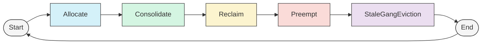

1. **Allocate** - Attempt regular scheduling first with no disruption
2. **Consolidate** - Optimize placements with no permanent evictions
3. **Reclaim** - Recover resource borrowing between queues
4. **Preempt** - Priority-based preemption between jobs of the same queue
5. **StaleGangEviction** - Clean up gang jobs with not enough running pods to prevent deadlocks in the cluster

This sequence ensures that disruptive actions are only performed when necessary, and the least disruptive options are tried first.

## High-Level Concepts

### 1. Scenarios

Scenarios represent hypothetical scheduling states used to model and evaluate potential scheduling decisions.

**Key components:**
- **ByNodeScenario**: A snapshot of potential pod placements across nodes
- **PodAccumulatedScenarioBuilder**: Constructs progressively more complex scenarios
- **Scenario Filters**: Validates scenarios against constraints. Used as an optimization to rule out scenarios early, before performing time consuming simulations

Scenarios allow the scheduler to:
- Model what-if placement situations
- Evaluate resource availability after potential changes
- Test complex scheduling operations before committing them

### 2. Simulation

Simulations are used to check potential scheduling decisions. For example, before evicting some victim jobs to allow another job to be scheduled, we want to make sure that the allocation will succeed according to all scheduling considerations (for example - avaliable resources, pod/node affinity, availability of volumes/dynamic resources on the node, queue fair share, queue limits etc).  
The scheduler can perform virtual scheduling decisions in-memory, such as allocation or eviction of pods, and check the result. Plugins can register callbacks to these operations, to track virtual changes in the cluster's state. If a set of allocation is considered undesirable by the scheduler, it can be rolled back partially or completely.

### 3. Statement

The Statement object represents a transaction-like grouping of scheduling operations that can be committed or rolled back as a unit. Statement is used to simulate scheduling scenarios, without commiting them to the cluster.

**Key capabilities:**
- **Checkpoint/Rollback**: Create points to roll back to if operations fail
- **Operation Tracking**: Maintains an ordered list of operations
- **Resource Consistency**: Manages resource bookkeeping during operations

Important operations:
```go
stmt.Checkpoint()          // Create a rollback point
stmt.Rollback(checkpoint)  // Return to a previous state
stmt.Allocate(pod, node)   // Virtually allocate a pod to a node
stmt.Evict(pod, msg)       // Virtually evict a pod from a node
stmt.Pipeline(pod, node)   // Pipeline a pod to a node (allocate on resources pending eviction)
stmt.Commit()              // Apply all changes to the cluster
stmt.Discard()             // Discard all changes
```

This documentation covers the main concepts of the scheduler's action framework. For more detailed information about specific implementations or advanced features, please refer to the codebase and tests. Requests and suggestions are welcome.


<a id="doc-22b74e91a774e485f4e242f2"></a>

# kai-scheduler/KAI-Scheduler / docs/developer/action-victim-invariant-prefilter.md

Upstream: https://github.com/kai-scheduler/KAI-Scheduler/blob/5982e4bf5559120d1fb5650ebec7fe400e85bc95/docs/developer/action-victim-invariant-prefilter.md

Commit: `5982e4bf5559120d1fb5650ebec7fe400e85bc95`

Retrieved: 2026-10-01T15:21:11.089624+00:00

Kind: official-document

Raw SHA256: `7a33ee4f8f5395af42304b9838c504cce7d204ab36b6965b088a81d42c321087`

Source text below is untrusted reference content. Acquisition does not verify technical claims.

License status: UPSTREAM_NOTICES_CAPTURED_PER_FILE_REVIEW_REQUIRED. See this repository's captured license files.

---

# Action Victim-Invariant Pre-Filter Guard

Date: 2026-04-30

## Summary

Add an action-level guard that skips expensive solver-backed work when a pending
job is already blocked by a known pre-solver failure that victim simulation
cannot fix.

The motivating production case is reclaim spending seconds simulating victims
for jobs whose pods reference a missing PVC. Evicting victims cannot create a
PVC, so the action should record the existing scheduling error and move on.

Initial action users:

- `reclaim`
- `preempt`
- `consolidation`

## Problem

Solver-backed actions are useful when changing the victim set can make a job
schedulable. They are not useful when the job is blocked by a condition that is
independent of victims.

Victim-dependent examples:

- not enough idle CPU, memory, GPU, or pod slots;
- affinity or topology conflicts involving existing pods;
- queue or quota pressure that can change after victims are removed.

Victim-invariant examples:

- a pod references a PVC that does not exist;
- a pod references a required ConfigMap that does not exist;
- one task requests more resources than any node can provide.

Today the scheduler can enter the generic reclaim/preempt/consolidation solver
for these victim-invariant cases and only rediscover the failure during
simulated allocation. This is expensive and does not change the outcome.

## Goals

- Skip solver work before victim simulation when a job has a known
  victim-invariant blocker.
- Keep the API narrow and action-oriented.
- Preserve the existing `PrePredicateFn` allocation path as the canonical
  correctness gate.
- Return the same useful scheduling error users would have seen after
  allocation failed.
- Apply the same guard to reclaim, preempt, and consolidation.
- Avoid adding duplicate pre-filter cost for healthy jobs where the guard finds
  no blocker.

## Non-Goals

- Do not create a broad structured pre-predicate result API.
- Do not classify every pre-predicate failure.
- Do not cache failures across scheduler sessions.
- Do not change normal allocation correctness.

## Core Rule

The guard may skip action solver work only when the failure is known to be
victim-invariant:

```text
known victim-invariant failure -> skip action solver work
victim-dependent failure       -> run existing action flow
unknown failure                -> run existing action flow
```

False negatives are acceptable because the existing allocation path still runs
`ssn.PrePredicateFn` and records the normal failure.

False positives are not acceptable because they can skip an action that might
have found a valid victim set.

## Public Scheduler API

Add a narrow plugin-to-session API for victim-invariant pre-predicate blockers.

Location:

```text
pkg/scheduler/api/types.go
```

Proposed types:

```go
type VictimInvariantPrePredicateFailure struct {
	Err error
}

type VictimInvariantPrePredicateFn func(
	task *pod_info.PodInfo,
) *VictimInvariantPrePredicateFailure
```

This exposes only what actions need:

- the user-visible error to record.

It intentionally does not expose Kubernetes status codes, all pre-predicate
failures, allowed node sets, or a generic failure taxonomy.

## Session Hooks

Add the function slice and registration/evaluation helpers to the session.

Locations:

```text
pkg/scheduler/framework/session.go
pkg/scheduler/framework/session_plugins.go
```

Proposed hooks:

```go
func (ssn *Session) AddVictimInvariantPrePredicateFn(fn api.VictimInvariantPrePredicateFn)

func (ssn *Session) VictimInvariantPrePredicateFailure(
	task *pod_info.PodInfo,
) *api.VictimInvariantPrePredicateFailure
```

The evaluator returns the first non-nil failure from registered plugins. If no
plugin registers a function, or every function returns nil, actions continue
normally.

Registration order is the evaluation order. Other plugins can add their own
victim-invariant blockers later without changing the action code.

## Predicate Plugin Implementation

The predicates plugin registers one `VictimInvariantPrePredicateFn` alongside
its existing `PrePredicateFn`.

Location:

```text
pkg/scheduler/plugins/predicates
```

The new hook checks only the first supported candidate pre-filters:

- `VolumeBinding`
- `ConfigMap`
- `MaxNodePoolResources`

It must not run all pre-filters and then classify their failures. Unknown or
victim-dependent failures should remain invisible to this API.

The hook follows the same status semantics as the existing
`evaluateTaskOnPrePredicate` path:

- `status.IsSkip()` means the predicate is not applicable; it is not a failure;
- skip statuses still update `skipPredicates`;
- `status.AsError() != nil` is the failure signal;
- nil, success, and skip statuses return nil for this optimization.

The normal `PrePredicateFn` path remains unchanged and continues to be used by
`allocateTask`.

For this action guard, a candidate predicate must opt in by returning
`UnschedulableAndUnresolvable` for the specific victim-invariant failure. The
guard should not treat every `UnschedulableAndUnresolvable` from every predicate
as actionable; the predicate still has to be one of the explicitly supported
candidate predicates.

## Session-Scoped Pre-Filter Cache

The guard adds an early pre-filter read before the solver path. Without caching,
healthy jobs can run the same candidate pre-filters twice:

1. once in the action guard;
2. again later when `allocateTask` calls `ssn.PrePredicateFn`.

That duplicate work is unacceptable for the no-blocker path at scale. The
predicates plugin should therefore cache the actual pre-filter result it reads
for this guard and let the normal `PrePredicateFn` path reuse it.

This should be a plugin-owned, session-scoped cache, not a new global framework
cache. The current session lifecycle supports this pattern: `OpenSession` calls
the configured plugin builder for each session, stores the returned plugin
instance in `ssn.plugins`, and `CloseSession` calls `OnSessionClose` before the
session clears its plugin map. In production, a plugin instance and its fields
are therefore session-local.

Each plugin that adds a cache is responsible for its own consistency rules:

- initialize or reset the cache in `OnSessionOpen`;
- cache only results whose inputs are stable for the intended cache lifetime;
- delete entries after read if the cached result depends on state that can be
  consumed or changed;
- avoid caching results that depend on simulated victim changes unless the cache
  key includes that state.

For this feature, the predicates plugin cache should store results produced by
real `predicate.PreFilter(task.Pod)` calls for the supported candidate
predicates. It should not cache results computed by custom direct checks that
bypass the real `PreFilter` implementation, because Kubernetes pre-filters may
populate per-pod cycle state that later filter logic expects.

Suggested cache shape:

```go
type prePredicateCacheKey struct {
	podID         common_info.PodID
	predicateName k8s_internal.PredicateName
}

type cachedPrePredicateResult struct {
	required bool
	nodes    sets.Set[string]
	status   *ksf.Status
}

type predicatesPlugin struct {
	// existing fields...
	prePredicateCache map[prePredicateCacheKey]cachedPrePredicateResult
}
```

Here, `required` caches the result of `IsPreFilterRequired(task.Pod)`. It
distinguishes between "predicate was not applicable and was not run" and
"predicate was applicable and `PreFilter` ran successfully with nil status".

Both the victim-invariant guard and `evaluateTaskOnPrePredicate` should call a
single helper that reads or populates this cache. This keeps the guard from
adding extra pre-filter cost when it does not find a blocker.

## Initial Classifiers

The first implementation supports only three conservative classifiers.

`VolumeBinding` missing PVC:

- predicate key is `VolumeBinding`;
- status code is `UnschedulableAndUnresolvable`;
- the classifier matches only when the status/error message indicates
  `persistentvolumeclaim "<name>" not found`.

`ConfigMap` missing required ConfigMap:

- predicate key is `ConfigMap`;
- status code is `UnschedulableAndUnresolvable`;
- the classifier matches only when the status/error message contains
  `Missing required configmaps:`.

`MaxNodePoolResources` max node size:

- predicate key is `MaxNodePoolResources`;
- status code is `UnschedulableAndUnresolvable`.

As part of this feature, change `ConfigMap` and `MaxNodePoolResources` to return
`UnschedulableAndUnresolvable` for these specific failures. That status means
"not fixable by scheduling or victim simulation in this scheduler snapshot",
not "impossible forever". A later scheduler session can reconsider the job if a
ConfigMap/PVC is created or a larger node is added.

## Error Reporting

The returned `Err` should match the existing pre-predicate error shape:

```text
Scheduling conditions were not met for pod <namespace>/<name>:
<PredicateKey>: <predicate error>.
```

Use the predicate map key in the message. This matters for
`MaxNodePoolResources`, where the session predicate name can differ from the
map key.

Actions should record the failure on the blocked task using the same task fit
error path used by allocation:

```go
fitErrors := common_info.NewFitErrors()
fitErrors.SetError(failure.Err.Error())
job.AddTaskFitErrors(task, fitErrors)
```

If job-level status reporting requires a job error, the implementation should
mirror the existing `handleFailedTaskAllocation` wording instead of inventing a
new message shape.

## Action Usage

Add a small common helper for actions.

Location:

```text
pkg/scheduler/actions/common/action_eligibility.go
```

Proposed helper:

```go
func VictimInvariantPrePredicateFailureForTasks(
	ssn *framework.Session,
	tasks []*pod_info.PodInfo,
) (*pod_info.PodInfo, *api.VictimInvariantPrePredicateFailure)
```

The helper iterates the tasks the action would try to allocate and returns the
first classified blocker together with the task that triggered it. It receives
the task list from the action so it does not encode action-specific
task-selection rules.

One blocked task is enough to skip the job because the job solver has
all-or-nothing semantics for pending tasks.

### Reclaim

In `reclaimAction.Execute`, run the guard after:

- `ssn.CanReclaimResources(job)`;
- the scheduling-signature `IsEasierToSchedule` check.

Run it before:

- `metrics.IncPodgroupsConsideredByAction()`;
- `attemptToReclaimForSpecificJob`.

If a victim-invariant failure is found, record it for the returned task and
`continue`.

Do not call `smallestFailedJobs.UpdateRepresentative(job)` for this skip.

### Preempt

In `preemptAction.Execute`, run the guard after the scheduling-signature check
and before:

- `metrics.IncPodgroupsConsideredByAction()`;
- `attemptToPreemptForPreemptor`.

If a victim-invariant failure is found, record it for the returned task and
`continue`.

Do not call `smallestFailedJobs.UpdateRepresentative(job)` for this skip.

This may change precedence for jobs that also fail preempt-specific quota
checks, because the current quota check lives inside
`attemptToPreemptForPreemptor`. The intended first behavior is to prefer the
more actionable missing-dependency error and skip representative updates for
victim-invariant failures.

### Consolidation

In `consolidationAction.Execute`, run the guard after the scheduling-signature
check and before:

- `metrics.IncPodgroupsConsideredByAction()`;
- `attemptToConsolidateForPreemptor`.

If a victim-invariant failure is found, record it for the returned task and
`continue`.

Do not call `smallestFailedJobs.UpdateRepresentative(job)` for this skip.
Consolidation has a session-wide `smallestFailedJobs` pool, so avoiding false
representative updates is especially important.

## Correctness Notes

- The optimization is session-local. If a missing PVC or ConfigMap is created
  before a later scheduler session, the job can be considered again.
- The guard does not replace normal predicates. It only avoids expensive action
  work before the same failure would be rediscovered later.
- Actions must inspect all tasks they would try to allocate until the first
  blocker. Heterogeneous gang jobs can have only one task with a missing
  dependency, and that is enough to make the job unschedulable in the current
  solver attempt.
- Skips caused by this guard must not update scheduling-signature
  representatives. Missing dependencies do not prove that this job is a useful
  resource-size representative for other jobs.

## Validation

Required tests:

- session registration and first-non-nil evaluation;
- no registered victim-invariant functions returns nil;
- predicate classifier positives for missing PVC, missing ConfigMap, and
  max-node-size;
- predicate classifier negatives for unknown and victim-dependent failures;
- predicates plugin cache reuses candidate pre-filter results between the guard
  and the normal `PrePredicateFn` path;
- predicates plugin cache is reset in `OnSessionOpen`;
- cached skip statuses still update `skipPredicates`;
- action tests proving reclaim, preempt, and consolidation skip solver work;
- action tests proving the skip does not update smallest-failed-job
  representatives;
- a heterogeneous job test where the blocker is on the second task;
- no-blocker action behavior remains unchanged.

Benchmark:

```bash
go test -run '^$' -bench '^BenchmarkReclaimWithMissingPVCJobs$' -benchtime=1x -count=3 -benchmem ./pkg/scheduler/actions/reclaim
```

Before values captured on 2026-04-30, before adding the victim-invariant guard:

```text
BenchmarkReclaimWithMissingPVCJobs-22    1    8683066674 ns/op    4421050064 B/op    20974821 allocs/op
BenchmarkReclaimWithMissingPVCJobs-22    1    8846954707 ns/op    4420085552 B/op    20972221 allocs/op
BenchmarkReclaimWithMissingPVCJobs-22    1    8930444242 ns/op    4420507840 B/op    20971710 allocs/op
```

Average before value:

```text
8.820 s/op    4.421 GB/op    20.973M allocs/op
```

The benchmark should improve materially in both runtime and memory because the
missing-PVC jobs should skip the solver and avoid the `SubsetNodesFn` path.

Pre-cache values captured on 2026-04-30, after adding the victim-invariant
guard and before adding the predicates-plugin cache:

Missing-PVC pathological benchmark:

```text
BenchmarkReclaimWithMissingPVCJobs-22    1    3313361 ns/op    7952 B/op     153 allocs/op
BenchmarkReclaimWithMissingPVCJobs-22    1    2117777 ns/op    7888 B/op     153 allocs/op
BenchmarkReclaimWithMissingPVCJobs-22    1    2403462 ns/op    7760 B/op     152 allocs/op
```

Average pre-cache value:

```text
2.612 ms/op    7.867 KB/op    152.7 allocs/op
```

Healthy-path 500-node reclaim benchmark:

```text
BenchmarkReclaimLargeJobs_500Node-22    1    1560037975 ns/op    661550336 B/op    8091844 allocs/op
BenchmarkReclaimLargeJobs_500Node-22    1    1564994242 ns/op    660362248 B/op    8083199 allocs/op
BenchmarkReclaimLargeJobs_500Node-22    1    1543466130 ns/op    660252008 B/op    8083340 allocs/op
```

Average pre-cache value:

```text
1.556 s/op    660.722 MB/op    8.086M allocs/op
```

Post-cache values captured on 2026-04-30, after adding the predicates-plugin
cache:

Missing-PVC pathological benchmark:

```text
BenchmarkReclaimWithMissingPVCJobs-22    1    3022566 ns/op    9520 B/op     161 allocs/op
BenchmarkReclaimWithMissingPVCJobs-22    1    1865025 ns/op    9736 B/op     164 allocs/op
BenchmarkReclaimWithMissingPVCJobs-22    1    4393209 ns/op    9360 B/op     160 allocs/op
```

Average post-cache value:

```text
2.715 ms/op    9.403 KB/op    160.3 allocs/op
```

Delta vs pre-cache:

```text
+4.0% runtime    +19.5% memory    +5.0% allocs
```

Healthy-path 500-node reclaim benchmark:

```text
BenchmarkReclaimLargeJobs_500Node-22    1    1489040980 ns/op    644786072 B/op    7857065 allocs/op
BenchmarkReclaimLargeJobs_500Node-22    1    1379026458 ns/op    643338952 B/op    7848437 allocs/op
BenchmarkReclaimLargeJobs_500Node-22    1    1427762190 ns/op    643451088 B/op    7848416 allocs/op
```

Average post-cache value:

```text
1.566 s/op    649.891 MB/op    7.967M allocs/op
```

Delta vs pre-cache:

```text
+0.6% runtime    -1.6% memory    -1.5% allocs
```

Interpretation:

- The final implementation caches only the supported candidate predicates:
  `VolumeBinding`, `ConfigMap`, and `MaxNodePoolResources`.
- On the healthy 500-node reclaim path, runtime stayed roughly unchanged
  (`+0.6%`), while memory and allocations decreased slightly.
- The missing-PVC benchmark regresses slightly after the cache, but it remains
  in the low-millisecond range and tiny memory footprint after the guard.
- The important system-scale outcome is that the final candidate-only cache
  does not reintroduce the original seconds-level missing-PVC pathology while
  slightly reducing healthy-path allocation cost.


<a id="doc-eda820deec1e0833c2aae6c2"></a>

# kai-scheduler/KAI-Scheduler / docs/developer/binder.md

Upstream: https://github.com/kai-scheduler/KAI-Scheduler/blob/5982e4bf5559120d1fb5650ebec7fe400e85bc95/docs/developer/binder.md

Commit: `5982e4bf5559120d1fb5650ebec7fe400e85bc95`

Retrieved: 2026-10-01T15:21:11.089624+00:00

Kind: official-document

Raw SHA256: `03ddf371603e80e080326fe96d450c8651f98a369d3e9a0004e487156092f9fc`

Source text below is untrusted reference content. Acquisition does not verify technical claims.

License status: UPSTREAM_NOTICES_CAPTURED_PER_FILE_REVIEW_REQUIRED. See this repository's captured license files.

---

# Binder

## Overview
The Binder is a controller responsible for handling the pod binding process in Kubernetes. The binding process involves actually placing a pod on its selected node, as well as it's dependencies - volumes, resource claims, etc.

### Why a Separate Binder?

Traditional Kubernetes schedulers handle both node selection and binding within the same component. However, this approach has several limitations:

1. **Error Resilience**: The binding process can fail for various reasons (node state changes, resource contention, API server issues). When this happens in a monolithic scheduler, it might affect the scheduling of other pods.

2. **Performance**: Binding operations involve multiple API calls and can be slow, especially when handling Dynamic Resource Allocation (DRA) or other dependencies, such as volumes. Having the scheduler wait for these operations to complete reduces its throughput.

3. **Retry Management**: Failed bindings often need sophisticated retry mechanisms with exponential backoff, which adds complexity to the scheduler.

By separating the binding logic into its own controller, the scheduler can quickly move on to schedule other pods while the binder handles the potentially slow or error-prone binding process asynchronously.

### Communication via BindRequest API

The scheduler and binder communicate through a custom resource called `BindRequest`. When the scheduler decides where a pod should run, it creates a BindRequest object that contains:

- The pod to be scheduled
- The selected node
- Information about resource allocations (including GPU resources)
- DRA (Dynamic Resource Allocation) binding information
- Retry settings

The BindRequest API serves as a clear contract between the scheduler and binder, allowing them to operate independently.

### Binding Process

1. The scheduler creates a BindRequest for each pod that needs to be bound
2. The binder controller watches for BindRequest objects
3. When a new BindRequest is detected, the binder:
   - Attempts to bind the pod to the specified node
   - Handles any DRA or Persistent Volume allocations
   - Updates the BindRequest status to reflect success or failure
   - Retries failed bindings according to the backoff policy
4. Until the pod is bound, the scheduler considers the bind request status as the expected scheduling result for this pod and it's dependencies.

### Error Handling

Binding can fail for various reasons:
- The node may no longer have sufficient resources
- API server connectivity issues
- Intermittent issues with dependencies

The binder tracks failed attempts and can retry up to a configurable limit (BackoffLimit). If binding ultimately fails, the BindRequest is marked as failed, allowing the scheduler to potentially reschedule the pod.

## Extending the binder

### Binder Plugins

The binder uses a plugin-based architecture that allows for extending its functionality without modifying core binding logic. Plugins can participate in different stages of the binding process and implement specialized handling for various resource types or pod requirements.

#### Plugin Interface

All binder plugins must implement the following interface:

```go
type Plugin interface {
    // Name returns the name of the plugin
    Name() string
    
    // Validate checks if the pod configuration is valid for this plugin
    Validate(*v1.Pod) error
    
    // Mutate allows the plugin to modify the pod before scheduling
    Mutate(*v1.Pod) error
    
    // PreBind is called before the pod is bound to a node and can perform
    // additional setup operations required for successful binding
    PreBind(ctx context.Context, pod *v1.Pod, node *v1.Node, 
            bindRequest *v1alpha2.BindRequest, state *state.BindingState) error
    
    // PostBind is called after the pod is successfully bound to a node
    // and can perform cleanup or logging operations
    PostBind(ctx context.Context, pod *v1.Pod, node *v1.Node, 
             bindRequest *v1alpha2.BindRequest, state *state.BindingState)
}
```

Each method serves a specific purpose in the binding lifecycle:

- **Name**: Returns the unique identifier of the plugin.
- **Validate**: Verifies that pod configuration is valid for this plugin's concerns. For example, the GPU plugin validates that GPU resource requests are properly specified.
- **Mutate**: Allows the plugin to modify the pod spec before binding, such as injecting environment variables or container settings.
- **PreBind**: Executes before binding occurs and can perform prerequisite operations like volume or resource claim allocation.
- **PostBind**: Runs after successful binding for cleanup or logging purposes.

### Configuration

Binder plugins can be configured through `spec.binder.plugins` in the KAI `Config` CR or through Helm values under `binder.plugins`. The operator serializes the resolved configuration into the binder process `--plugins` argument. Binder plugin configuration is not stored in a ConfigMap.

Each plugin entry has the following fields:

```yaml
enabled: true
priority: 300
arguments:
  key: value
```

- `enabled`: Whether the plugin should run. Defaults to `true`.
- `priority`: Higher priority plugins run first. Plugins with equal priority are ordered by plugin name.
- `arguments`: String key-value arguments passed to the plugin builder.

The binder defaulting logic starts with the built-in defaults and merges user overrides:

- Omitted built-in plugins keep their default settings.
- `enabled` and `priority` are merged independently.
- If `arguments` is specified for a plugin, it replaces that plugin's default arguments.
- A configured plugin that is not part of the built-in default set defaults to `enabled: true` and priority `0`. The binder binary must register a matching plugin builder for that plugin name.

### Default Plugins

The current default binder plugins are:

| Plugin | Priority | Arguments | Purpose |
| --- | ---: | --- | --- |
| `volumebinding` | 300 | `bindTimeoutSeconds: "120"` | Handles Kubernetes persistent volume binding before pod bind. |
| `dynamicresources` | 200 | `bindTimeoutSeconds: "120"` | Handles Kubernetes Dynamic Resource Allocation claim binding before pod bind. |
| `gpusharing` | 100 | `cdiEnabled: "false"` | Handles fractional GPU pod mutation needed for GPU sharing. |
| `hamicore` | 50 |  | Optional HAMI-core GPU virtualization for fractional GPU pods. Depends on `gpusharing`. Disabled by default. |

For operator-managed deployments, the operator sets the `gpusharing` `cdiEnabled` argument from `spec.binder.cdiEnabled`. If `spec.binder.cdiEnabled` is unset, the operator attempts to auto-detect CDI from the NVIDIA GPU Operator `ClusterPolicy`. Enable `hamicore` to opt into HAMI-core GPU memory limits.

When `hamicore` is enabled in `spec.binder.plugins`, the operator also passes `--hami-core-enabled=true` to the admission service. No separate admission configuration is required. The admission `hamicore` plugin runs after `gpusharing` and injects the `CUDA_DEVICE_MEMORY_LIMIT` environment variable into fractional GPU pods; the binder `hamicore` plugin writes the limit value into the GPU sharing ConfigMap at bind time.

If admission is run outside the operator (for example, for local development), pass `--hami-core-enabled=true` to the admission binary when the binder `hamicore` plugin is enabled.

### Config Examples

Disable the GPU sharing plugin:

```yaml
apiVersion: kai.scheduler/v1
kind: Config
spec:
  binder:
    plugins:
      gpusharing:
        enabled: false
```

Change the volume binding timeout:

```yaml
apiVersion: kai.scheduler/v1
kind: Config
spec:
  binder:
    plugins:
      volumebinding:
        arguments:
          bindTimeoutSeconds: "60"
```

Change plugin ordering:

```yaml
apiVersion: kai.scheduler/v1
kind: Config
spec:
  binder:
    plugins:
      dynamicresources:
        priority: 400
      volumebinding:
        priority: 300
```

Enable HAMI-core GPU memory limits for fractional GPU pods:

```yaml
apiVersion: kai.scheduler/v1
kind: Config
spec:
  binder:
    plugins:
      hamicore:
        enabled: true
```

Helm equivalent:

```yaml
binder:
  plugins:
    hamicore:
      enabled: true
```

Equivalent Helm values:

```yaml
binder:
  plugins:
    gpusharing:
      enabled: false
    volumebinding:
      arguments:
        bindTimeoutSeconds: "60"
```

The binder binary also accepts plugin configuration directly as JSON:

```bash
--plugins='{"gpusharing":{"enabled":false}}'
```

### Built-In Plugins

#### Volume Binding Plugin

The volume binding plugin handles Kubernetes persistent volume binding work before the final pod bind. It uses the `bindTimeoutSeconds` argument to control how long it waits for binding operations.

#### Dynamic Resources Plugin

The dynamic resources plugin handles Kubernetes Dynamic Resource Allocation resources. It processes resource claim allocations from the `BindRequest` and updates the relevant resource claims before the pod is bound. It also uses the `bindTimeoutSeconds` argument.

#### GPU Sharing Plugin

The GPU sharing plugin handles fractional GPU assignments. For shared GPU allocations it creates the required GPU sharing ConfigMaps and sets the NVIDIA visible devices and GPU portion information on the target container.

#### HAMI-core Plugin

The HAMI-core plugin is disabled by default and **requires `gpusharing` to be enabled**. It is split across admission and binder:

| Component | Responsibility |
| --- | --- |
| Admission `hamicore` | Injects `CUDA_DEVICE_MEMORY_LIMIT` into the fractional GPU container (ConfigMap key reference, optional). Uses the capabilities ConfigMap name set by the `gpusharing` admission plugin. |
| Binder `hamicore` | At PreBind, writes the computed limit into that ConfigMap from node label `nvidia.com/gpu.memory` and `BindRequest.spec.receivedGPU.portion`. |

Fractional pods created while `hamicore` is disabled do not receive this environment variable. Enabling `hamicore` affects only pods admitted after the change.

Setting `CUDA_DEVICE_MEMORY_LIMIT` does not by itself enforce memory inside the container. For enforcement, deploy [KAI-resource-isolator](https://github.com/Project-HAMi/KAI-resource-isolator) alongside KAI Scheduler so HAMi-core can apply the limit at runtime. See [GPU Sharing — Enforcing GPU memory limits](../gpu-sharing/README.md#enforcing-gpu-memory-limits-optional).

### Creating Custom Plugins

To create a custom binder plugin:

1. Implement the `Plugin` interface.
2. Register a plugin builder with the binder plugin registry using the same name that users will configure.
3. Define and validate the plugin's expected string arguments.
4. Ensure the plugin handles errors gracefully and provides clear error messages.

Custom plugins can address specialized use cases such as:
- Network configuration and policy enforcement
- Custom resource binding and setup
- Integration with external systems
- Advanced validation and mutation based on organizational policies

<a id="doc-4bb5541be096d0ae00d9f2ce"></a>

# kai-scheduler/KAI-Scheduler / docs/developer/building-from-source.md

Upstream: https://github.com/kai-scheduler/KAI-Scheduler/blob/5982e4bf5559120d1fb5650ebec7fe400e85bc95/docs/developer/building-from-source.md

Commit: `5982e4bf5559120d1fb5650ebec7fe400e85bc95`

Retrieved: 2026-10-01T15:21:11.089624+00:00

Kind: official-document

Raw SHA256: `a7534dde8100335600b49a9ae07a7ac780bd4e585b79149cf2f935c6b7f767ce`

Source text below is untrusted reference content. Acquisition does not verify technical claims.

License status: UPSTREAM_NOTICES_CAPTURED_PER_FILE_REVIEW_REQUIRED. See this repository's captured license files.

---

# Building from Source
To build and deploy KAI Scheduler from source, follow these steps:

1. Clone the repository:
   ```sh
   git clone git@github.com:kai-scheduler/KAI-scheduler.git
   cd KAI-scheduler
   ```

2. Build the container images, these images will be built locally (not pushed to a remote registry)
   ```sh
   make build
   ```
   If you want to push the images to a private docker registry, you can set in DOCKER_REPO_BASE var: 
   ```sh
   DOCKER_REPO_BASE=<REGISTRY-URL> make build
   ```

3. Package the Helm chart:
   ```sh
   helm package ./deployments/kai-scheduler -d ./charts
   ```
   
4. Make sure the images are accessible from cluster nodes, either by pushing the images to a private registry or loading them to nodes cache.
   For example, you can load the images to kind cluster with this command:
   ```sh
   for img in $(docker images --format '{{.Repository}}:{{.Tag}}' | grep kai-scheduler); 
      do kind load docker-image $img --name <KIND-CLUSTER-NAME>; done
   ```

5. Install on your cluster:
   ```sh
   helm upgrade -i kai-scheduler -n kai-scheduler --create-namespace ./charts/kai-scheduler-0.0.0.tgz
   ```

<a id="doc-c25caed280af1fb3e338fd3d"></a>

# kai-scheduler/KAI-Scheduler / docs/developer/designs/accounted-resource-api.md

Upstream: https://github.com/kai-scheduler/KAI-Scheduler/blob/5982e4bf5559120d1fb5650ebec7fe400e85bc95/docs/developer/designs/accounted-resource-api.md

Commit: `5982e4bf5559120d1fb5650ebec7fe400e85bc95`

Retrieved: 2026-10-01T15:21:11.089624+00:00

Kind: official-document

Raw SHA256: `e093bfdfb758a48ac072f4dcb03ab785d4b9c9bfce4aafe10fe8cfb593665ec5`

Source text below is untrusted reference content. Acquisition does not verify technical claims.

License status: UPSTREAM_NOTICES_CAPTURED_PER_FILE_REVIEW_REQUIRED. See this repository's captured license files.

---

# AccountedResource API Proposal for KAI

This document proposes a phase-1 API for limiting arbitrary resources in KAI
Scheduler. It focuses on the API shape and user-facing behavior. Low-level
scheduler implementation details are intentionally left for a later design.

## Summary

KAI currently has a fixed queue resource model through `spec.resources`, which
is centered on the built-in CPU, memory, and GPU fields already understood by
the scheduler. That model is not flexible enough for clusters that need limits
on arbitrary Kubernetes resources, GPU types, DRA-selected devices, or
capacity-like dimensions such as GPU memory.

The proposal is to add a cluster-scoped `AccountedResource` CRD. An
`AccountedResource` defines how KAI should recognize and count one logical
resource. Queues then reference these resources through
`spec.accountedResources` and set per-queue limits.

Phase 1 is limit-only. It does not add arbitrary-resource fair share, reclaim,
deserved quota, over-quota weight, usage status, or usage metrics.

## Background

KAI users want to express limits on resources that are not cleanly represented
by the current queue fields:

- extended resources such as EFA;
- generic GPU count;
- specific GPU products such as H200 or GB200;
- GPU memory across full GPUs and fractional GPUs;
- DRA-selected device attributes and capacities;
- legacy or runtime-provided pod annotations such as KAI GPU memory requests.

These resources can be discovered in different ways. Some are normal pod
resource requests. Some depend on the selected node. Some depend on the selected
DRA device. Some are exposed through annotations or driver-specific DRA config.

The API should let administrators define these accounting rules once, then let
each queue opt into the resources it wants to limit.

## Design Goals

- Support arbitrary resource names, including CPU, memory, pods, Kubernetes
  extended resources, and GPU resources.
- Support placement-derived accounting, such as counting `nvidia.com/gpu` as
  `gpu-h200` only when the selected node has `nvidia.com/gpu.product: H200`.
- Support DRA resources through device class and selected device attributes.
- Support capacity-style accounting, such as charging selected GPU memory
  instead of only counting devices.
- Keep queue configuration concise.
- Preserve the existing `spec.resources` behavior.
- Avoid ResourceGroup-style registration requirements in phase 1.
- Keep fairness and reclaim out of phase 1 so the limit API can be reviewed
  independently.

## Use Cases

### Generic GPU Limit Plus Per-Type Limits

An administrator wants queues to keep using generic GPU accounting for existing
fairness behavior, but also wants to limit how many H200 or GB200 GPUs each
project can consume.

The same pod allocation should be able to charge multiple logical resources. For
example, a pod that requests `nvidia.com/gpu: 1` and lands on an H200 node can
charge both `gpu` and `gpu-h200`.

The API solves this by defining a generic GPU resource and a placement-derived
GPU-type resource:

```yaml
apiVersion: scheduling.run.ai/v1alpha1
kind: AccountedResource
metadata:
  name: gpu
spec:
  defaults:
    limit: "-1"
  sources:
  - resourceName: nvidia.com/gpu
---
apiVersion: scheduling.run.ai/v1alpha1
kind: AccountedResource
metadata:
  name: gpu-h200
spec:
  defaults:
    limit: "-1"
  sources:
  - resourceName: nvidia.com/gpu
    match:
      nodeLabels:
        nvidia.com/gpu.product: H200
```

The queue can then set a broad GPU limit and a narrower H200 limit:

```yaml
apiVersion: scheduling.run.ai/v1alpha1
kind: Queue
metadata:
  name: team-a
spec:
  accountedResources:
  - resourceRef: gpu
    limit: "16"
  - resourceRef: gpu-h200
    limit: "4"
```

### GPU Memory Limit

A project should not consume more than a configured amount of total GPU memory,
regardless of how many GPU devices it uses.

This needs to work for DRA-selected device capacity, driver-specific DRA
configuration, and existing KAI GPU memory annotations.

The API solves this with one logical `gpu-memory` resource that can read the
quantity from multiple integrations:

```yaml
apiVersion: scheduling.run.ai/v1alpha1
kind: AccountedResource
metadata:
  name: gpu-memory
spec:
  defaults:
    limit: "-1"
  sources:
  - dra:
      deviceClassName: gpu.nvidia.com
    quantity:
      dra:
        selectedCapacity:
          capacityName: memory
  - dra:
      deviceClassName: gpu.nvidia.com
    quantity:
      dra:
        opaqueConfigField:
          driver: gpu.nvidia.com
          path: sharing.mpsConfig.defaultPinnedDeviceMemoryLimit
          unit: Mi
  - podAnnotation:
      key: gpu-memory
      unit: Mi
```

The queue only needs to reference the logical resource:

```yaml
apiVersion: scheduling.run.ai/v1alpha1
kind: Queue
metadata:
  name: team-a
spec:
  accountedResources:
  - resourceRef: gpu-memory
    limit: "320Gi"
```

### Fractional GPU Limit

A project should be limited by the effective fraction of GPU it consumes. For
example, KAI fractional GPU, GPU-memory pods, and full GPU pods should all
contribute to GPU-backed accounted resources using KAI's accepted allocation
view.

The API does not expose a separate fractional-GPU source. Instead, KAI treats
GPU-backed `AccountedResource` objects specially. A resource such as `gpu-h200`
is still configured from the normal GPU request and placement:

```yaml
apiVersion: scheduling.run.ai/v1alpha1
kind: AccountedResource
metadata:
  name: gpu-h200
spec:
  defaults:
    limit: "-1"
  sources:
  - resourceName: nvidia.com/gpu
    match:
      nodeLabels:
        nvidia.com/gpu.product: H200
```

When a workload uses KAI fractional GPU APIs and lands on an H200 node, KAI
charges the accepted GPU fraction against `gpu-h200`. A queue can therefore
limit effective H200 consumption without adding fractional fields to the public
API:

```yaml
apiVersion: scheduling.run.ai/v1alpha1
kind: Queue
metadata:
  name: team-a
spec:
  accountedResources:
  - resourceRef: gpu-h200
    limit: "2"
```

### GPU Memory And GPU Compute Limits

Future GPU integrations may expose both GPU memory and GPU compute as
independent dimensions. A queue may need a limit on either dimension or both.
A workload should be rejected if it would exceed any configured finite limit.

The API solves this by defining separate logical resources for each dimension.
Each resource can use the integration that exposes that quantity:

```yaml
apiVersion: scheduling.run.ai/v1alpha1
kind: AccountedResource
metadata:
  name: gpu-memory
spec:
  defaults:
    limit: "-1"
  sources:
  - podAnnotation:
      key: gpu-memory
      unit: Mi
---
apiVersion: scheduling.run.ai/v1alpha1
kind: AccountedResource
metadata:
  name: gpu-compute
spec:
  defaults:
    limit: "-1"
  sources:
  - podAnnotation:
      key: gpu-compute
      unit: percent
```

The queue can limit either dimension independently:

```yaml
apiVersion: scheduling.run.ai/v1alpha1
kind: Queue
metadata:
  name: team-a
spec:
  accountedResources:
  - resourceRef: gpu-memory
    limit: "320Gi"
  - resourceRef: gpu-compute
    limit: "400"
```

If a candidate allocation would exceed either finite limit, KAI rejects it
through the same over-limit scheduling path.

### Extended Resource Limit

An administrator wants to limit resources such as EFA without adding a special
hard-coded field to the Queue API.

The API solves this by mapping the Kubernetes extended resource name directly:

```yaml
apiVersion: scheduling.run.ai/v1alpha1
kind: AccountedResource
metadata:
  name: efa
spec:
  defaults:
    limit: "-1"
  sources:
  - resourceName: vpc.amazonaws.com/efa
```

Queues can then set an EFA limit without any EFA-specific queue field:

```yaml
apiVersion: scheduling.run.ai/v1alpha1
kind: Queue
metadata:
  name: team-a
spec:
  accountedResources:
  - resourceRef: efa
    limit: "32"
```

## Proposed API

### Queue API

Add `spec.accountedResources` to Queue:

```yaml
apiVersion: scheduling.run.ai/v1alpha1
kind: Queue
metadata:
  name: team-a
spec:
  accountedResources:
  - resourceRef: gpu
    limit: "16"
  - resourceRef: gpu-h200
    limit: "4"
  - resourceRef: gpu-memory
    limit: "320Gi"
```

Suggested type shape:

```go
type QueueSpec struct {
    Resources          *QueueResources           `json:"resources,omitempty"`
    AccountedResources []QueueAccountedResource `json:"accountedResources,omitempty"`
}

type QueueAccountedResource struct {
    ResourceRef string            `json:"resourceRef"`
    Limit       resource.Quantity `json:"limit"`
}
```

Queue semantics:

- `resourceRef` references a cluster-scoped `AccountedResource`.
- `limit` is required for explicit phase-1 entries.
- `-1` means unlimited.
- Duplicate `resourceRef` entries in the same queue are rejected.
- Existing `spec.resources` keeps its current meaning.
- `spec.accountedResources` is additive. If both old and new limits apply to a
  workload, both limits are enforced.
- `deserved` and `overQuotaWeight` are intentionally not exposed in phase 1.

### Hierarchical Queue Semantics

`spec.accountedResources` may be configured on any queue in the hierarchy,
including parent queues. Parent queue limits act as aggregate ceilings for the
subtree rooted at that queue. Leaf or child queue limits act as local ceilings.

When KAI evaluates a candidate allocation for a workload in a queue, the
allocation must fit the effective limit of that queue and every ancestor queue.
For each queue in the path, the effective value is the explicit queue entry when
present, otherwise `AccountedResource.spec.defaults.limit`.

For example, if parent queue `research-team` has `gpu-h200` limit `10`, and
children `ml-team` and `cv-team` each have `gpu-h200` limit `8`, each child is
capped at `8`, while the combined subtree usage is capped at `10`.

### AccountedResource CRD

An `AccountedResource` defines how one logical resource is charged.

```yaml
apiVersion: scheduling.run.ai/v1alpha1
kind: AccountedResource
metadata:
  name: gpu-h200
spec:
  defaults:
    limit: "-1"
  sources:
  - resourceName: nvidia.com/gpu
    match:
      nodeLabels:
        nvidia.com/gpu.product: H200
```

Core semantics:

- `spec.sources` is required.
- Each source sets exactly one of `resourceName`, `dra`, or `podAnnotation`.
- `match` decides when the source applies to a candidate placement.
- `quantity` decides how much to charge when the default quantity is not enough.
- Sources are additive.
- If multiple sources in the same `AccountedResource` match, KAI sums them.
- If multiple `AccountedResource` objects match the same allocation, KAI charges
  all of them.
- `spec.defaults.limit` is optional and defaults to unlimited (`-1`).

Suggested type shape:

```go
type AccountedResourceSpec struct {
    Defaults *AccountedResourceDefaults `json:"defaults,omitempty"`
    Sources  []AccountedResourceSource  `json:"sources"`
}

type AccountedResourceDefaults struct {
    Limit *resource.Quantity `json:"limit,omitempty"`
}

type AccountedResourceSource struct {
    ResourceName  *corev1.ResourceName `json:"resourceName,omitempty"`
    DRA           *DRASource           `json:"dra,omitempty"`
    PodAnnotation *PodAnnotationSource `json:"podAnnotation,omitempty"`

    Match    *AccountedResourceMatch    `json:"match,omitempty"`
    Quantity *AccountedResourceQuantity `json:"quantity,omitempty"`
}

type DRASource struct {
    DeviceClassName string `json:"deviceClassName"`
}

type PodAnnotationSource struct {
    Key  string `json:"key"`
    Unit string `json:"unit,omitempty"`
}

type AccountedResourceMatch struct {
    NodeLabels map[string]string `json:"nodeLabels,omitempty"`
    DRA        *DRAMatch         `json:"dra,omitempty"`
}

type DRAMatch struct {
    DeviceAttributes map[string]DRAAttributeValue `json:"deviceAttributes,omitempty"`
}

type DRAAttributeValue struct {
    String  *string `json:"string,omitempty"`
    Int     *int64  `json:"int,omitempty"`
    Bool    *bool   `json:"bool,omitempty"`
    Version *string `json:"version,omitempty"`
}

type AccountedResourceQuantity struct {
    DRA           *DRAQuantitySource           `json:"dra,omitempty"`
    PodAnnotation *PodAnnotationQuantitySource `json:"podAnnotation,omitempty"`
}

type DRAQuantitySource struct {
    SelectedCapacity *DRASelectedCapacityQuantity   `json:"selectedCapacity,omitempty"`
    OpaqueConfigField *DRAOpaqueConfigFieldQuantity `json:"opaqueConfigField,omitempty"`
}

type DRASelectedCapacityQuantity struct {
    CapacityName string `json:"capacityName"`
}

type DRAOpaqueConfigFieldQuantity struct {
    Driver string `json:"driver"`
    Path   string `json:"path"`
    Unit   string `json:"unit,omitempty"`
}

type PodAnnotationQuantitySource struct {
    Unit string `json:"unit,omitempty"`
}
```

## Example AccountedResources

Generic GPU count:

```yaml
apiVersion: scheduling.run.ai/v1alpha1
kind: AccountedResource
metadata:
  name: gpu
spec:
  defaults:
    limit: "-1"
  sources:
  - resourceName: nvidia.com/gpu
```

H200 GPUs through device plugin resource plus node label:

```yaml
apiVersion: scheduling.run.ai/v1alpha1
kind: AccountedResource
metadata:
  name: gpu-h200
spec:
  defaults:
    limit: "-1"
  sources:
  - resourceName: nvidia.com/gpu
    match:
      nodeLabels:
        nvidia.com/gpu.product: H200
```

GB200 GPUs through DRA:

```yaml
apiVersion: scheduling.run.ai/v1alpha1
kind: AccountedResource
metadata:
  name: gpu-gb200
spec:
  defaults:
    limit: "-1"
  sources:
  - dra:
      deviceClassName: gpu.nvidia.com
    match:
      dra:
        deviceAttributes:
          productName:
            string: GB200
```

EFA extended resource:

```yaml
apiVersion: scheduling.run.ai/v1alpha1
kind: AccountedResource
metadata:
  name: efa
spec:
  defaults:
    limit: "-1"
  sources:
  - resourceName: vpc.amazonaws.com/efa
```

GPU memory from DRA selected capacity, DRA opaque config, or pod annotation:

```yaml
apiVersion: scheduling.run.ai/v1alpha1
kind: AccountedResource
metadata:
  name: gpu-memory
spec:
  defaults:
    limit: "-1"
  sources:
  - dra:
      deviceClassName: gpu.nvidia.com
    quantity:
      dra:
        selectedCapacity:
          capacityName: memory
  - dra:
      deviceClassName: gpu.nvidia.com
    quantity:
      dra:
        opaqueConfigField:
          driver: gpu.nvidia.com
          path: sharing.mpsConfig.defaultPinnedDeviceMemoryLimit
          unit: Mi
  - podAnnotation:
      key: gpu-memory
      unit: Mi
```

## Why This Shape

### Separate Resource Definition From Queue Policy

`AccountedResource` defines how to detect and count a resource. Queue entries
define each queue's policy for that resource. This keeps complex detection logic
out of every queue spec.

### Count All Matching Resources

KAI should not choose one best matching resource. It should evaluate all
matching `AccountedResource` objects independently. This is necessary for common
cases like charging both `gpu` and `gpu-h200` for the same selected H200 GPU.

### Keep Source And Match Separate

The source says where the base request comes from. The match says when the
source applies to a selected placement. For example, a source with
`resourceName: nvidia.com/gpu` can become `gpu-h200` only when the selected node
has an H200 label.

### Keep Phase 1 Limit-Only

Limits can be enforced without deciding fairness and reclaim semantics for
queues that do not participate in every resource. Fairness for partial
participation has gaming and reciprocal reclaim risks. Those rules should be
designed separately after the accounting API is reviewed.

## Built-In GPU Accounting

Pods do not request `AccountedResource` objects directly. KAI evaluates matching
resources against the accepted allocation data.

Phase 1 should reuse KAI's existing GPU accounting logic:

- `gpu-memory` is reserved by name and uses KAI's existing GPU memory logic.
- GPU-backed resources such as `gpu`, `gpu-h200`, and `gpu-gb200` are charged
  from accepted allocation data, not only from raw pod requests.
- GPU-backed detection is implicit:
  - name-based for `gpu-memory`;
  - resource-name based for canonical GPU resources such as `nvidia.com/gpu`;
  - DRA-class based for recognized or configured GPU DRA classes.
- Whole GPU requests, KAI fractional GPU requests, KAI GPU-memory requests, and
  DRA-selected GPU devices should all charge the matching GPU-backed resources.

No `AccountedResource.status` field is required in phase 1 to expose this
classification.

## Shared DRA ResourceClaims

DRA `ResourceClaim`s may be shared by more than one pod. For
`AccountedResource` accounting, KAI should only allow a shared `ResourceClaim`
to be used by pods that belong to the same KAI queue.

If a pod references an already allocated or shared `ResourceClaim` that is also
used by a pod from another queue, KAI should reject scheduling that pod. This
keeps `AccountedResource` usage attribution unambiguous and prevents one queue
from consuming another queue's accounted allocation.

When multiple pods in the same queue share the same allocated `ResourceClaim`,
KAI should account the selected devices and capacities once for that queue,
based on the claim allocation, rather than multiplying the same claim allocation
by the number of pods referencing it.

The same rule applies to all DRA-backed `AccountedResource` sources, including
GPU count, typed GPU resources, GPU memory, GPU compute, and other future
DRA-backed resources. The exact scheduler cache and indexing mechanism for
detecting shared `ResourceClaim` consumers is an implementation detail for the
lower-level scheduler design.

## Validation And User Feedback

Validation is layered:

- CRD schema and CEL validate structure, quantity syntax, key syntax, and basic
  required fields.
- Admission webhook validates cross-field and cross-object rules, including
  source one-of rules, source/quantity compatibility, duplicate queue refs, and
  existing `AccountedResource` references when visible.
- Scheduler validates runtime and cache-dependent state.

Scheduler behavior:

- If a queue references an `AccountedResource` that the scheduler cannot
  resolve, this is a queue configuration error. KAI blocks scheduling for all
  jobs in that queue until the reference is resolved, even if the queue entry
  uses `limit: "-1"`.
- Blocked jobs should surface an Unschedulable message and event with a
  distinct reason such as `AccountedResourceNotFound`. The message should
  include the queue name and missing `resourceRef`.
- The queue should get a condition such as
  `AccountedResourcesResolved=False`, reason `AccountedResourceNotFound`.
- If usage can be evaluated and exceeds a finite limit, reject the candidate
  through the existing `OverLimit` path. The message should identify the queue,
  `resourceRef`, current usage, candidate request, and limit.
- If a pod references a shared DRA `ResourceClaim` already used by a pod from a
  different queue, reject the candidate with a distinct scheduling reason such
  as `SharedResourceClaimAcrossQueues`. The message should include the claim
  name and both queues when known.

## Queue Admission Signaling

This design must integrate with the queue-admission signaling work tracked in
https://github.com/kai-scheduler/KAI-Scheduler/issues/1615.

Issue #1615 covers a scheduler behavior problem: pods that cannot run because of
queue quota or capacity limits should not look like ordinary node-resource
failures. If KAI marks those pods as unschedulable in the same way it marks pods
that lack cluster capacity, autoscalers such as Karpenter may provision nodes
even though the workload is blocked by queue policy and cannot be admitted by
adding capacity.

`AccountedResource` limits introduce new queue-policy rejection reasons. Any
solution for #1615, whether it uses scheduling gates or another admission
signal, must apply globally to all queue-capacity failures, including:

- current CPU, memory, and GPU limits from `spec.resources`;
- every finite limit in `spec.accountedResources`;
- default limits from `AccountedResource.spec.defaults.limit`;
- validation failures where a queue references an unresolved
  `AccountedResource` and jobs in that queue are blocked from scheduling.

The important boundary is that AccountedResource over-limit failures are not
node-fit failures. They should be surfaced through the same global
queue-admission mechanism that #1615 defines, so AccountedResource limits do not
create a new path that accidentally triggers scale-up for jobs blocked by queue
policy.

If #1615 introduces scheduling gates or another queue-admission signal, the
`AccountedResourceNotFound` reason should be preserved there as well.

## Phase Boundaries

Phase 1 intentionally stops at limit enforcement. The proposal defines how to
name, detect, count, and limit accounted resources, but it does not decide how
those resources participate in fairness or reclaim.

The deferred work falls into three groups:

- Fairness policy: per-`AccountedResource` deserved quota, over-quota weight,
  borrowing, lending, and arbitrary-resource fair share.
- Reclaim policy: same-resource reclaim evidence, reciprocal reclaim
  prevention, and placement-aware reclaim for topology-derived resources.
- Operational visibility and migration: usage status, metrics,
  `AccountedResource.status`, and any explicit bridge from existing
  `spec.resources` fields into `spec.accountedResources`.

Keeping these out of phase 1 makes the first API review about accounting and
limits only. Fairness and reclaim can then be designed with explicit
participation rules instead of being inferred from limit configuration.


<a id="doc-68a7af8e382ea5ab2d6e6f34"></a>

# kai-scheduler/KAI-Scheduler / docs/developer/designs/background-pods/README.md

Upstream: https://github.com/kai-scheduler/KAI-Scheduler/blob/5982e4bf5559120d1fb5650ebec7fe400e85bc95/docs/developer/designs/background-pods/README.md

Commit: `5982e4bf5559120d1fb5650ebec7fe400e85bc95`

Retrieved: 2026-10-01T15:21:11.089624+00:00

Kind: official-document

Raw SHA256: `dac1395a851cb8788f0ff08b82a4d77fa43491e2b3bf3a930dbbbce38b50dadf`

Source text below is untrusted reference content. Acquisition does not verify technical claims.

License status: UPSTREAM_NOTICES_CAPTURED_PER_FILE_REVIEW_REQUIRED. See this repository's captured license files.

---

# Background Pods

## Summary

Background pods are maintenance and infrastructure pods that the cluster operator needs to run, but that must never affect the users of the cluster: node health checks, device diagnostics, monitoring agents, cloud-provider daemons.
Today, KAI treats them the same as regular workloads. While admins can assign them to a very low priority queue (see the workaround described below), their existence still causes unwanted effects on scheduling of end-user workloads.

This proposal lets a cluster administrator declare a set of pods as *background*.
KAI then treats the resources they hold as free when making scheduling decisions, and evicts them on demand when a real workload is placed on top of them.

The proposed mechanism is a virtual eviction: at the start of each scheduling session the scheduler removes background pods from its in-memory view of the cluster, schedules as if the nodes were empty, and then determines per node which of them can be restored and which must actually be evicted. It is implemented as a single scheduler plugin.

## Motivation

A cluster operator, typically a cloud provider or an infrastructure team, needs to run maintenance workloads on the cluster they operate.
These pods should stay out of the user's way: they must not consume any user's quota, must not block a user's workload from running, must not degrade the placement a user's workload would otherwise get, and need to keep performance overhead to a minimum.

From the scheduler's point of view they are currently indistinguishable from real work.
They hold resources on a node, so that node is not empty, and every decision KAI makes treats that as a fact about available capacity.

While it's possible to work around this (see more below), these pods' presence still effects scheduling behavior in the cluster. For example, for workloads that have preferred topology requirements:
Background pods scheduled on a domain can cause sub-optimal placement of the real workloads, as the scheduler will attempt a naive allocation before resorting to reclaims and preemptions.

[Issue #1936](https://github.com/kai-scheduler/KAI-Scheduler/issues/1936) is a good example of this use case.

### The current workaround

The behavior can be approximated today by placing background pods in a dedicated queue configured with `quota: 0` and `overQuotaWeight: 0`.
Such a queue has a fair share of zero, so everything it holds is permanently above its fair share and any other queue is entitled to reclaim from it.

A working example is in [`examples/`](examples).

This works, but has several problems:

**Every allocation becomes a reclaim.** If background pods are spread across the cluster, most nodes will hold at least one, and almost any placement of a real workload requires displacing one.
The allocate action fails and the work falls to reclaim, which runs a scenario search per allocation.
On a large cluster this can be very costly.

**Sub optimal placement decisions.** Naive allocation is attempted before reclaim.
If a feasible placement exists without displacing anything, the scheduler takes it, even when displacing a background pod would have produced a much better placement.

**It does not cover pods you cannot edit.** The pods must carry a queue label and be scheduled by KAI, which rules out anything created by a controller outside the user's control. (At this point, this use case is only hypothesized, and further thought needs to be given as to wether we want kai to control pods that do not explicitly opt-in).

Topology is a good example: consider two racks of four nodes, eight GPUs each, with two background pods per rack holding one GPU apiece:

```text
legend:   ▪ background pod      · idle GPU      █ job pod

                   rack-0                                         rack-1
  node0      node1      node2      node3         node4      node5      node6      node7
[▪·······] [▪·······] [········] [········]    [▪·······] [▪·······] [········] [········]
```

A job now asks for four whole nodes, eight GPUs each, with a rack-level preferred placement.
Only two nodes per rack are fully free, but a feasible placement exists across the two racks, so allocate takes it and reclaim is never reached:

```text
                   rack-0                                         rack-1
  node0      node1      node2      node3         node4      node5      node6      node7
[▪·······] [▪·······] [████████] [████████]    [▪·······] [▪·······] [████████] [████████]
                      └───── 2 pods ──────┘                          └───── 2 pods ──────┘
```

The rack preference is silently unsatisfied, and the workload runs with worse network locality for its entire lifetime.
The placement it should have received displaces the two background pods in one rack and takes that rack whole:

```text
                   rack-0                                         rack-1
  node0      node1      node2      node3         node4      node5      node6      node7
[████████] [████████] [████████] [████████]    [▪·······] [▪·······] [········] [········]
└─────────── 4 pods, one rack ────────────┘
```

A reproduction is in [`examples/topology/`](examples/topology).

The root cause in both cases is that the workaround only makes background pods *reclaimable*, but the scheduling cycle will still attempt a "naive" allocation with 0 evictions before it attempts a reclaim, even of very low-priority pods.
If a naive solution exists, the scheduler will not attempt to find a more optimized placement in the reclaim action.
In addition, the reclaim action is inherently computationally heavy and non-exhaustive, so the scheduler might not even find the optimal solution, or could spend a long time looking for one.
The desired behavior by the operator would be to perform the scheduling cycle and make all scheduling decisions as if the background pods are not there (or evicting).

## Goals

- Let an administrator declare a set of pods as background.
- Treat capacity held by background pods as free for the purpose of scheduling decisions, so that placement quality — topology, bin-packing, node ordering — is computed against the cluster as if these pods don't exist.
- Keep background pods out of all queue accounting.
  They belong to no queue and contribute to no queue's allocated, requested, or fair share.
- Minimize the impact on scheduling performance.
  Avoiding the reclaim scenario search is the main example: displacing a background pod should not require solving a victim-selection problem, which is the main cost the current workaround incurs.
- Do not displace background pods unnecessarily.
  Their disruption cost is unknown to KAI and is not assumed to be zero. Avoid evicting background pods if it won't contribute to placement of actual user pods. Note that this doesn't mean we try to **optimize** for the absolute least amount of evictions (see non-goals).
- **Support external pods — deferred.** It could be that some use cases involve cloud provider / vendor pods that cannot be controlled by the user or the cluster admin. This can be addressed by allowing the admin to configure a generic selector (by label / namespace) that will allow kai to evict such pods. However, this would be a precedent that allows kai to evict external pods, and should be given more thought. Deferred for now until requested explicitly by a user.

## Non-Goals

- **Minimizing disruption for background pods.** While we do not want to disrupt background pods for no reason at all (as stated in goals), we also do not want to waste time considering several reclaim scenarios just to minimize background pod disruption. The scheduler will allocate user pods as usual, evict any background pods that stand in the way, and will not attempt different scenarios or let background pods affect scheduling decisions.

## Design

At the start of every scheduling session the plugin evicts all background pods from the in-memory snapshot, without committing, so their capacity is accounted as *releasing*.
The session then runs untouched: workloads that fit in idle capacity are allocated and bound as usual, and workloads that need background-held capacity are pipelined onto it, exactly as they would be over a preemption victim.
At session close the plugin attempts to re-place every background pod its original node.
Those that still fit are unevicted and are not disturbed; the rest have their evictions committed, and the pipelined workloads bind in a later session once they are gone.

### Selecting background pods

Since external pods are deferred, the first version can rely on an opt-in that the pod itself carries, such as a `kai.scheduler/background: "true"` label.
This keeps the blast radius small: KAI only ever ignores and evicts pods that explicitly asked to be treated this way.

### Virtual eviction

`OnSessionOpen` creates a `Statement`, iterates the nodes, and calls `Statement.Evict` on every pod matching the selector, recording what it removed per node.
(`Statement.Evict` only touches in-memory state). The resources used by background pods are considered as `Releasing`, so the scheduler is aware that any pods placed on them is actually pipelined.

This solves both problems the workaround has.
Placement decisions such as topology domain selection and bin-packing are computed against real availability, so the scheduler picks the rack it should pick.
Displacing a background pod also costs no scenario search, because from the session's point of view nothing is being displaced at all.

Only background pods that KAI scheduled can be handled: `Statement.Evict` needs the pod's PodGroup from the session, so pods with none are skipped.

### During the session

The plugin registers no hooks and takes no part in the actions.

Because the freed capacity is *releasing* rather than *idle*, a workload contending for it fails `IsTaskAllocatable` and passes `IsTaskAllocatableOnReleasingOrIdle`, which is the pipeline path.
It is pipelined onto the node rather than allocated, and its demand is subtracted from `ReleasingVector`.
A workload that fits in idle capacity is unaffected and binds in the same cycle.

### Re-placement and commit

`OnSessionClose` iterates each node's background pods in a deterministic order and checks whether each can stay (virtually re-allocate).
Two checks have to pass.
The first is capacity, `IsTaskAllocatableOnReleasingOrIdle`: does the unclaimed capacity still cover the pod.
It cannot be the plain `IsTaskAllocatable` used by the allocation path, because that reads idle capacity only, and the pod's own resources are sitting in `ReleasingVector` at this point, so it would never fit on the node it is already running on.

The second is the k8s predicates, re-run for the pod against its own node.
This is needed because a workload that fit in idle capacity was allocated and bound during the session without the background pod being visible to the predicates (see above), so restoring the pod can put two pods on a node that must not share one.
Anti-affinity is the clear case: a user pod with a required anti-affinity term matching a background pod passes the filter while that pod is out of the affinity index, fits in the idle capacity next to it, and binds.
Nothing downstream catches this, since kubelet does not enforce inter-pod anti-affinity, so the check has to happen here, and a background pod that now conflicts with what the node received is evicted rather than restored.


A pod that fits is restored with `Statement.Unevict`, which marks its eviction operation undone.
A pod that does not fit stays in the statement.
`Statement.Commit()` then issues real eviction requests for only what remains valid, through `Cache.Evict` — the same path preemption and reclaim victims take, with the same events and metrics.

The displaced set is minimal by construction.
Only pods that no longer fit are evicted, and background pods on nodes that received nothing are restored trivially, which is the common case: most nodes are untouched in any given session and nothing on them is disrupted.

A background pod is not restored onto a *different* node.
Relocating them is a non-goal, KAI cannot move a pod it does not own, and many background pods are pinned to their node by design.

### Plugin lifecycle ordering

Statement operations fire the session's event handlers, and those handlers belong to other plugins.
This gives the plugin two ordering requirements.

It must **open after** any plugin whose handlers should observe the eviction.
Plugin open order follows `config.Tiers` and is deterministic, and the plugin's low priority already places it last.
The proportion plugin's `DeallocateFunc` is the one that matters: it is what removes the background pods from their queue's allocated share for the session.

It must **close before** those plugins, because `Unevict` fires `AllocateFunc` and several plugins discard their session state on close.
Today, `CloseSession` iterates the plugin map, so the order is random and can cause crashes or unexpected behavior.
We propose to close plugins in reverse open order, making the call to CloseSession LIFO - the first plugin to register is the last to run it. 
This is not strictly necessary for this feature (the only conflict we have today is with the proportion plugin, which doesn't really take action in `CloseSession`), but it makes sense for the scheduler as a whole.

### Effect on node ordering

The effect of a background pod on node ordering is minimized, but not zero.
The `nodeavailability` plugin adds its score only to nodes where the task passes `IsTaskAllocatable`, which is checked against idle capacity alone, so a node holding a background pod scores `scores.Availability` (1000) lower than an otherwise identical node whose capacity is actually idle.
Between two equivalent candidates the scheduler takes the one it does not have to disturb, which matches the goal of not displacing background pods for nothing.
Any higher scoring plugin overrides it, since the score constants are spread by orders of magnitude: topology is 100x availability, so a node in the preferred domain is chosen over an idle node outside it, and the background pod there is displaced.

## Usage

User-facing documentation is in [`docs/background-pods`](../../../background-pods).

1. All background pods need to be marked with the label. By default `kai.scheduler/background: "true"`.
  a. The label can be overridden by a custom selector in the config
2. The background pods need to be assigned to a 0-quota, 0-over-quota-weight queue, by labeling the pods / workload. See the example below.
3. It's recommended to set the `terminationGracePeriodSeconds` for background pods to a very low value (< 5), preferably 0, to prevent them delaying the creation of actual user workloads.


```yaml
apiVersion: apps/v1
kind: Deployment
metadata:
  name: healthcheck
spec:
  replicas: 8
  selector:
    matchLabels:
      app: healthcheck
  template:
    metadata:
      labels:
        app: healthcheck
        kai.scheduler/background: "true"
        kai.scheduler/queue: maintenance
    spec:
      schedulerName: kai-scheduler
      terminationGracePeriodSeconds: 5
      containers:
        - name: main
          image: ubuntu
          command: ["bash", "-c"]
          args: ["trap 'exit 0' TERM; sleep infinity & wait"]
          resources:
            limits:
              nvidia.com/gpu: "1"
```

<a id="doc-c572ab67ce766a71ed00fa85"></a>

# kai-scheduler/KAI-Scheduler / docs/developer/designs/background-pods/examples/README.md

Upstream: https://github.com/kai-scheduler/KAI-Scheduler/blob/5982e4bf5559120d1fb5650ebec7fe400e85bc95/docs/developer/designs/background-pods/examples/README.md

Commit: `5982e4bf5559120d1fb5650ebec7fe400e85bc95`

Retrieved: 2026-10-01T15:21:11.089624+00:00

Kind: official-document

Raw SHA256: `e889d45d3ac049eeefe9da84b14b38fdd5773e74b17a5ed80d873ec05b6c635c`

Source text below is untrusted reference content. Acquisition does not verify technical claims.

License status: UPSTREAM_NOTICES_CAPTURED_PER_FILE_REVIEW_REQUIRED. See this repository's captured license files.

---

# Background pods in a zero-quota queue

A workaround for [#1936](https://github.com/kai-scheduler/KAI-Scheduler/issues/1936): instead of teaching KAI to ignore background/health-check pods, put them in a dedicated queue whose fair share is permanently zero.
Every user queue is then always entitled to reclaim from it.

```
research-dept (64 GPU)          maintenance (0 GPU, weight 0)
├── team-a (32 GPU)
└── team-b (32 GPU)
```

The queue has `quota: 0`, `overQuotaWeight: 0`, `limit: -1`:

- **quota 0 + overQuotaWeight 0** → fair share is always 0, so everything the queue holds is above its fair share and reclaimable.
- **limit -1** → unbounded, so background pods are still placed while the cluster is idle.

`maintenance` is a single flat root queue — nothing requires a workload's queue to be a leaf, and root queues skip the parent/child quota validation in `pkg/admission/webhook/queuehooks`.
Being a root of its own is also what keeps it insulated from changes in the user hierarchy.

> Note: under `projectLevelFairness` the scheduler only snapshots queues that *have* a parent (`pkg/scheduler/cache/cluster_info/queue.go:68`), so a parentless queue would be dropped.
> This demo assumes the default `fullFairness`.

## Assumed cluster

8 GPU workers x 8 GPUs = 64 GPUs.
No node selectors anywhere — the health-check pods spread one per node using required pod anti-affinity on `kubernetes.io/hostname`, and the scheduler picks which nodes the user workloads displace.

## Run

```bash
kubectl apply -f 00-priorityclass.yaml
kubectl apply -f 01-queues.yaml
kubectl apply -f 02-background-pods.yaml

# 8 healthcheck pods Running, one per node, 8 GPUs held by `maintenance`.
kubectl get pods -o wide -l app=healthcheck
kubectl get queue maintenance -o jsonpath='{.status.allocated}{"\n"}'
```

**Demo A — targeted reclaim.** One pod needs 8 GPUs, and every node has only 7 free.
Exactly one healthcheck pod should be evicted.

```bash
kubectl apply -f 03-team-a-single-pod.yaml
kubectl get pods -o wide -l 'app in (healthcheck,user-workload)' -w
```

**Demo B — gang reclaim inside quota.** 4 x 8 GPUs = team-a's full 32-GPU quota, so four background pods go.
Delete Demo A first so the arithmetic stays exact.

```bash
kubectl delete -f 03-team-a-single-pod.yaml
kubectl apply -f 04-team-a-gang-job.yaml
```

**Demo C — drain.** team-b takes the other 32 GPUs; all eight healthcheck replicas end up Pending and stay there.

```bash
kubectl apply -f 05-team-b-gang-job.yaml
```

Watch the reclaim decisions:

```bash
kubectl get events -A --field-selector reason=Evict --sort-by=.lastTimestamp
kubectl logs -n kai-scheduler deploy/scheduler | grep -i reclaim
```

## Topology degradation

[`topology/`](topology/README.md) is a separate scenario showing a concrete failure of this workaround: background pods push a job with a preferred rack constraint into a split-rack placement, because allocate runs before reclaim and the naive placement already succeeded.

## Cleanup

```bash
kubectl delete -f 05-team-b-gang-job.yaml -f 04-team-a-gang-job.yaml \
  -f 03-team-a-single-pod.yaml -f 02-background-pods.yaml \
  -f 01-queues.yaml -f 00-priorityclass.yaml --ignore-not-found
```

## What to check while playing with this

These are the points where the workaround is expected to diverge from the real feature:

1. **Do the background pods get placed at all?** Fair share is 0, so allocation only works because the PodGroup is preemptible and `limit` is unlimited.
   If they sit Pending on an idle cluster, the workaround is dead on arrival.
   Their priority is 1, below the 100 non-preemptible threshold in `pkg/common/podgroup/preemptible.go`, which is what makes them preemptible.
2. **Every normal allocation becomes a reclaim.** That is the performance concern raised in the issue thread — worth timing session duration with and without the background pods present.
3. **Reclaim minimises victims.** The solver prefers evicting the fewest background pods, which is *better* than the "ignore capacity entirely" model but costs a scenario search per allocation.
4. **The pods still need a queue label.** This does not solve the operational burden in the original request — it only makes the queue a fixed one (`maintenance`) that never has to track hierarchy changes, since it is a root of its own.
   It also cannot cover pods whose spec you don't control.
5. **Starvation is permanent.** With `overQuotaWeight: 0` the background pods never come back while users hold the cluster.
   Real health-check pods probably want to return once capacity frees up.
6. **Anti-affinity vs. reclaim.** The replacement pod after an eviction is blocked both by GPU capacity and by anti-affinity against its surviving siblings — worth confirming the fit error reported is the one you expect.


<a id="doc-280963fcd8c7d25256c3a74c"></a>

# kai-scheduler/KAI-Scheduler / docs/developer/designs/background-pods/examples/topology/README.md

Upstream: https://github.com/kai-scheduler/KAI-Scheduler/blob/5982e4bf5559120d1fb5650ebec7fe400e85bc95/docs/developer/designs/background-pods/examples/topology/README.md

Commit: `5982e4bf5559120d1fb5650ebec7fe400e85bc95`

Retrieved: 2026-10-01T15:21:11.089624+00:00

Kind: official-document

Raw SHA256: `942c1a8362fe5273b4e1163ad1968b2dd1de20a7bb83b6402ce93e2e0260f229`

Source text below is untrusted reference content. Acquisition does not verify technical claims.

License status: UPSTREAM_NOTICES_CAPTURED_PER_FILE_REVIEW_REQUIRED. See this repository's captured license files.

---

# Background pods degrade topology placement

A failure mode of the zero-quota-queue workaround: **allocate runs before reclaim**, so the scheduler settles for a feasible-but-topologically-worse placement instead of reclaiming background pods to get the placement the workload asked for.

Because the background pods are real, queued, accounted workloads, the only thing that could remove them is reclaim — and reclaim is never reached, because naive allocation already succeeded.

## Setup

8 GPU workers x 8 GPUs, split into two racks of four.
Four background pods (1 GPU each) sit on two nodes in each rack:

```
rack-0:  node0 [7 free]  node1 [7 free]  node2 [8 free]  node3 [8 free]
rack-1:  node4 [7 free]  node5 [7 free]  node6 [8 free]  node7 [8 free]
```

team-a submits 4 pods x 8 GPUs (32 GPUs, exactly its quota) with `kai.scheduler/topology-preferred-placement: rack`.

- **What should happen:** reclaim the 2 background pods in one rack, run all 4 pods there, preferred topology satisfied.
- **What actually happens:** allocate finds 4 fully-free nodes — 2 in rack-0 and 2 in rack-1 — admits the job split across both racks, and never attempts reclaim.

## Prerequisites

Apply the priority class and queues from the parent directory first:

```bash
kubectl apply -f ../00-priorityclass.yaml -f ../01-queues.yaml
```

## Label the nodes

```bash
for i in 0 1 2 3; do
  kubectl label node runai-cluster-worker-0-$i accelerator.nvidia.com/rack=rack-0 --overwrite
done
for i in 4 5 6 7; do
  kubectl label node runai-cluster-worker-0-$i accelerator.nvidia.com/rack=rack-1 --overwrite
done

kubectl get nodes -L accelerator.nvidia.com/rack
```

## Run

```bash
kubectl apply -f 01-topology.yaml
kubectl apply -f 02-background-pods.yaml

# Expect 4 pods on 4 distinct nodes, 2 per rack.
kubectl get pods -l app=healthcheck \
  -o custom-columns=POD:.metadata.name,NODE:.spec.nodeName
```

```bash
kubectl apply -f 03-team-a-topology-job.yaml

# The interesting output: which racks did the 4 job pods land in?
kubectl get pods -l app=user-workload -o json | jq -r \
  '.items[] | .metadata.name + " " + .spec.nodeName' | while read pod node; do
    rack=$(kubectl get node "$node" -o jsonpath='{.metadata.labels.accelerator\.nvidia\.com/rack}')
    echo "$pod  $node  $rack"
  done
```

Expected: 2 pods in `rack-0`, 2 in `rack-1`, and all four healthcheck pods still Running.

## Control: the same job with no background pods

Proves the preference itself works, and that the background pods are what degraded it.

```bash
kubectl delete -f 03-team-a-topology-job.yaml
kubectl delete -f 02-background-pods.yaml
kubectl apply -f 03-team-a-topology-job.yaml
# Re-run the rack query above - all 4 pods should now be in a single rack.
```

## Cleanup

```bash
kubectl delete -f 03-team-a-topology-job.yaml -f 02-background-pods.yaml \
  -f 01-topology.yaml --ignore-not-found
kubectl label nodes -l accelerator.nvidia.com/rack accelerator.nvidia.com/rack-
```

## Why this matters for the design

Under the proposed feature the background pods are invisible to the scheduler, so *every* node looks fully free and the topology solver picks 4 nodes in one rack directly — the correct answer, reached without a reclaim scenario search.

The flip side is that the scheduler has no reason to prefer a rack needing fewer evictions over one needing more, since background pods carry no weight in node selection.
It may well pick rack-1 here and displace those two instead.
That is accepted: disruption is limited by attempting to place each background pod back on its own node afterwards, not by steering the workload away from them.


<a id="doc-0894f1e606e8f0cb4e504daf"></a>

# kai-scheduler/KAI-Scheduler / docs/developer/designs/background-pods/poc.md

Upstream: https://github.com/kai-scheduler/KAI-Scheduler/blob/5982e4bf5559120d1fb5650ebec7fe400e85bc95/docs/developer/designs/background-pods/poc.md

Commit: `5982e4bf5559120d1fb5650ebec7fe400e85bc95`

Retrieved: 2026-10-01T15:21:11.089624+00:00

Kind: official-document

Raw SHA256: `dd786d3767c3b7c447c8c483a704e832383f89a5d706df7eb0ff0710132a67cb`

Source text below is untrusted reference content. Acquisition does not verify technical claims.

License status: UPSTREAM_NOTICES_CAPTURED_PER_FILE_REVIEW_REQUIRED. See this repository's captured license files.

---

# Background pods — POC implementation

A minimal end-to-end implementation of [the design](README.md), enough to run the scenarios in [`examples/`](examples) and see the topology case resolve correctly.

One plugin, in the scheduler.
No binder changes, no API change, no new RBAC.

## Why it is only a scheduler plugin

The first sketch of this POC had the scheduler annotate the BindRequest with a displaced set and a binder plugin carry out the evictions.
That does not work, because of how `Releasing` is accounted.

`Statement.Evict` moves the task to `Releasing` and calls `node.UpdateTask`, and `addTaskResources` treats that status specially (`node_info.go:489`): the capacity is added to `ReleasingVector` and never reaches `IdleVector`.
`IsTaskAllocatable` reads idle only, so a user pod contending for a background pod's capacity fails it.
`IsTaskAllocatableOnReleasingOrIdle` passes, which is the **pipeline** path.
The pod is pipelined rather than allocated, `commitPipeline` never calls `BindPod`, so no BindRequest is created and no mutate hook fires.
Nothing is evicted, so the next session sees the same cluster and pipelines the same pod again, forever.

That behaviour is correct: `Releasing` means the pod is genuinely going away, and until the eviction is committed it is not.
So rather than working around it, the POC leans into it.
Virtual eviction puts capacity into `Releasing`, contending pods pipeline, the scheduler commits the evictions that turned out to be necessary, and those pods bind in the next session once the background pods are actually gone.

This is exactly how KAI already resolves the same ordering problem for preemption victims, which is why it needs no new machinery.
It corresponds to the "scheduler evicts and the pod is pipelined" alternative in the design, not to the preferred approach there.
The trade-off is one extra scheduling cycle for any pod that displaces something, and it lands only on those pods.

## Plugin functionality

`pkg/scheduler/plugins/backgroundpods/`, registered in `pkg/scheduler/plugins/factory.go`, built from `New(framework.PluginArguments) framework.Plugin`.

### 1. Configuration

The selector comes from plugin arguments, defaulting to a label selector on `kai.scheduler/background=true`.
A namespace selector is accepted as an additional conjunct.
Parsed once at construction.

### 2. Session state

Held for the duration of one session, created in `OnSessionOpen` and dropped in `OnSessionClose`:

- the `*framework.Statement` carrying the virtual evictions
- `map[nodeName][]*pod_info.PodInfo`, the background pods removed from each node

Plugin instances are reused across sessions, so this must be reset on every open.

### 3. OnSessionOpen — virtual eviction

1. Create a statement with `ssn.Statement()`.
2. Walk `ssn.Nodes`, and for every pod in `node.PodInfos` matching the selector, call `stmt.Evict(pod, ...)` and record it under its node.

`Statement.Evict` only touches in-memory state.
The API call lives in `commitEvict`, reached solely from `Commit()`, so until the plugin decides to commit, nothing has happened to the pod.

Each evicted background pod's capacity moves into the node's `ReleasingVector`, so `NonAllocatedResource` (idle plus releasing) now reflects a node with the background pods gone, while `IdleVector` does not.

Only background pods that KAI scheduled can be handled: `Statement.Evict` requires the pod's PodGroup to be in `ssn.ClusterInfo.PodGroupInfos`.
Pods with no PodGroup are skipped, which bounds the POC to the opt-in case.

### 4. During the session — nothing

The plugin registers no other hooks and takes no part in the actions.

Allocate, preempt, reclaim, and consolidate see nodes whose non-allocated capacity includes what the background pods were holding.
A user pod that fits in idle is allocated and bound as usual, and no background pod is involved.
A user pod that needs background-held capacity is pipelined onto the node, and its demand is subtracted from `ReleasingVector`.

That subtraction is what makes the next step work: after the actions, a node's remaining idle-plus-releasing is exactly the capacity that nothing has claimed.

### 5. OnSessionClose — re-placement and commit

For each node that had background pods, walk them in a deterministic order and ask whether each can stay:

- `node.IsTaskAllocatableOnReleasingOrIdle(pod)` — does the unclaimed capacity still cover it
- `ssn.PredicateFn(pod, job, node)` — does it still satisfy the node's predicates

If both pass, call `stmt.Unevict(pod)` (`statement.go:506`) to restore it, which returns its capacity to `Releasing` and takes it out of the statement.
If either fails, leave the eviction in the statement.

Then call `stmt.Commit()`.
Only the evictions still in the statement are committed, and those become real eviction requests through `Cache.Evict` — the same path preemption and reclaim victims take, with the same events and metrics.

Restoring one pod reduces what is left for the next, so the order decides which of several competing background pods on a node survives.
Per the design's non-goals, no effort goes into choosing a good order, but it must be deterministic.

Worked example, on an eight-GPU node holding two background pods of one GPU each:

| state | idle | releasing | unclaimed |
|---|---|---|---|
| start | 6 | 0 | 6 |
| after virtual eviction | 6 | 2 | 8 |
| after a 7-GPU pod is pipelined | 6 | -5 | 1 |
| after restoring the first background pod | 6 | -6 | 0 |

The second background pod needs 1 and has 0 left, so its eviction commits.
Exactly one pod is evicted, which is the minimum.

### 6. Next session

The evicted background pods are gone for real, so their capacity is idle.
The pipelined user pod now passes `IsTaskAllocatable`, is allocated, and binds normally.

The evicted background pods are themselves KAI workloads with a pending pod, so KAI will place them again whenever capacity frees up.
Nothing special is needed for that, and it gives the "come back later" behaviour for free.

## Known gaps

Acceptable for a POC, listed so they are not mistaken for working.

**Background pods stay visible to predicates.** `Statement.Evict` uses `node.UpdateTask`, which is `RemoveTask` followed by `addTask`, so the pod remains in `node.PodInfos` and is re-added to `PodAffinityInfo`.
A user pod with anti-affinity against a background pod will still have the node rejected, and topology spread still counts it.
This fails safe — the node is not chosen, so nothing is misplaced and nothing is evicted — but the "fully invisible" property in the design is not met for these constraints.

**One extra scheduling cycle** for every pod that displaces something.

**Evictions can be wasted.** If the pipelined job disappears, or fails to allocate next session, the background pods were evicted for nothing.
Nothing corrupts; the next session re-derives from real cluster state.

**Flapping is not handled.** An evicted background pod may be rescheduled onto another node and displaced again there.

**No fractional GPU, MIG, or DRA.** The selector should not match background pods holding these.

**PDBs are not honoured.** Eviction goes through the existing evictor, which issues a direct delete.

## Things to verify early

The parts most likely not to behave as written.

- **The pipeline path is actually taken.** Confirm that a job whose tasks only fit on idle-plus-releasing is pipelined by the allocate action rather than skipped, and that this holds for gang jobs where only some tasks contend with background pods.
- **`Unevict` restores cleanly.** It goes through `unevict`, which replays status, GPU groups, NUMA placement, and resource claims.
  Confirm the node's vectors return exactly to their pre-eviction values, including for GPU-sharing nodes.
- **Bulk eviction at session open is not treated as churn.** Nothing should interpret a large number of virtual evictions as preemption activity, in metrics, in PodGroup conditions, or in `LastEvictionTimestamp`.
- **Background pod PodGroups do not react.** Their gang state now has a `Releasing` member; confirm no action tries to reschedule or otherwise act on it during the same session.
- **`commitEvict` failures.** The existing code already calls `unevict` when the API eviction fails, so a partial failure should leave the node consistent. Confirm.

## Testing

Unit tests in the plugin package: node vector accounting after virtual eviction, restore-versus-commit decisions against a table of node states, and determinism of the ordering.

End-to-end, reusing [`examples/`](examples) with the background pods moved to an ordinary queue and given the background label:

- Idle cluster: background pods run, nothing is evicted.
- One full-node pod: exactly one background pod evicted, and the user pod binds in the following cycle.
- Topology scenario: all four job pods land in one rack and the two background pods in that rack are evicted.
  This is the case the current workaround gets wrong, so it is the one worth watching.
- A node that received nothing keeps all of its background pods.


<a id="doc-6db56c9e6ff0f7bf57e0179d"></a>

# kai-scheduler/KAI-Scheduler / docs/developer/designs/bindrequest-mutations/README.md

Upstream: https://github.com/kai-scheduler/KAI-Scheduler/blob/5982e4bf5559120d1fb5650ebec7fe400e85bc95/docs/developer/designs/bindrequest-mutations/README.md

Commit: `5982e4bf5559120d1fb5650ebec7fe400e85bc95`

Retrieved: 2026-10-01T15:21:11.089624+00:00

Kind: official-document

Raw SHA256: `abf886f6761aba3cb5bcaf3c4c064a8007e15c0c4fc2babd1c2db2b2e552bae2`

Source text below is untrusted reference content. Acquisition does not verify technical claims.

License status: UPSTREAM_NOTICES_CAPTURED_PER_FILE_REVIEW_REQUIRED. See this repository's captured license files.

---

# BindRequest Annotations Mutation Plugin Point

## Summary

This design document outlines a new plugin point in the KAI-Scheduler that allows scheduler plugins to modify BindRequest annotations before they are created. This enhancement addresses synchronization issues between the scheduler and binder components.

## Motivation

The current architecture of KAI-Scheduler separates the scheduling and binding processes into distinct components, which improves scalability and error resilience. However, the communication between these components is currently limited to the fixed fields defined in the BindRequest specification.

We need a more open and flexible API that allows plugins in the scheduler to communicate additional information to plugins in the binder without requiring changes to the BindRequest CRD for each new use case. This will enable more sophisticated scheduling and binding behaviors while maintaining a clean separation between components.

By allowing scheduler plugins to add annotations to BindRequests that can be interpreted by corresponding binder plugins, we create an extensible communication channel that can evolve without API changes. This approach preserves backward compatibility while enabling new functionality through plugins.

## Usage Stories

### Node State Synchronization

A plugin in the scheduler detects that a node is suitable for certain GPU workloads and adds annotations to the BindRequest indicating which plugin should handle the bind on the binder. If that plugin can't detect the same environments it can try to refresh the status of the node in the binder cache or reject the bind request.

### Topology Information Transfer

For topology-aware scheduling, a plugin can inject the exact topology location information into the BindRequest annotations. This allows each pod to receive information about its position in the topology (relevant for block implementation) without adding fields to the BindRequest specification.

### Device Management Plugin Communication

Device management plugins can transfer parameters between the scheduler and binder without adding custom fields to the BindRequest, maintaining a clean API while enabling rich functionality.

## Goals

- Enable scheduler plugins to modify BindRequest annotations before creation
- Create a flexible interface for transferring information from scheduler plugins to binder plugins
- Maintain backward compatibility with existing scheduler and binder behavior

## Design Details

### Extension Point Definition

Following the scheduler's plugin extension conventions, we introduce a function type for mutating BindRequest annotations:

```go
// In pkg/scheduler/api/types.go
// BindRequestMutateFn allows plugins to mutate annotations before BindRequest creation.
type BindRequestMutateFn func(pod *pod_info.PodInfo, nodeName string) map[string]string
```

A slice of these functions is added to the `Session` struct, and a registration method is provided:

```go
// In pkg/scheduler/framework/session.go and session_plugins.go
// In Session struct:
BindRequestMutateFns []api.BindRequestMutateFn

// Registration method:
func (ssn *Session) AddBindRequestMutateFn(fn api.BindRequestMutateFn) {
    ssn.BindRequestMutateFns = append(ssn.BindRequestMutateFns, fn)
}
```

### Plugin Registration

Plugins register their mutate function during `OnSessionOpen`:

```go
func (p *MyPlugin) OnSessionOpen(ssn *framework.Session) {
    ssn.AddBindRequestMutateFn(p.MyBindRequestMutateFn)
}

func (p *MyPlugin) MyBindRequestMutateFn(pod *pod_info.PodInfo, nodeName string) map[string]string {
    bindRequestAnnotations := map[string]string{}
    bindRequestAnnotations["my-plugin.kai.scheduler/some-key"] = "some-value"
    return bindRequestAnnotations
}
```

### Annotation Merging and Session Responsibility

The session is responsible for collecting and merging all plugin-provided annotations before passing them to the cache for BindRequest creation. This is done by calling all registered `BindRequestMutateFn` functions and merging their results into a single map named `bindRequestAnnotations`.

If multiple plugins provide the same annotation key, the value from the last plugin registered will overwrite previous values for that key.

### Usage in the Scheduler

When creating a BindRequest, the scheduler will call all registered mutate functions and merge their results:

```go
// In session_plugins.go:
bindRequestAnnotations := map[string]string{}
for _, fn := range ssn.BindRequestMutateFns {
    for k, v := range fn(pod, nodeName) {
        bindRequestAnnotations[k] = v
    }
}
// ... pass bindRequestAnnotations to the cache for BindRequest creation
```

### Binder Plugin Access

Binder plugins already have access to the BindRequest object during the PreBind and PostBind phases, so they can read the annotations added by scheduler plugins:

```go
func (p *MyBinderPlugin) PreBind(ctx context.Context, pod *v1.Pod, node *v1.Node, 
                                bindRequest *v1alpha2.BindRequest, state *state.BindingState) error {
    // Read annotations added by scheduler plugins
    if value, exists := bindRequest.Annotations["my-plugin.kai.scheduler/some-key"]; exists {
        // Use the annotation value to modify binding behavior
    }
    return nil
}
```

### Annotation Naming Convention

To avoid conflicts between different plugins, we recommend using a namespaced approach for annotation keys:

```
<plugin-name>.kai.scheduler/<key>
```

For example:
```
topology-plugin.kai.scheduler/topology-level: "rack"
gpu-plugin.kai.scheduler/requires-env-vars: "true"
```


<a id="doc-f13dbbd9bf8f0e8604f64e1a"></a>

# kai-scheduler/KAI-Scheduler / docs/developer/designs/dra-extended-resources/README.md

Upstream: https://github.com/kai-scheduler/KAI-Scheduler/blob/5982e4bf5559120d1fb5650ebec7fe400e85bc95/docs/developer/designs/dra-extended-resources/README.md

Commit: `5982e4bf5559120d1fb5650ebec7fe400e85bc95`

Retrieved: 2026-10-01T15:21:11.089624+00:00

Kind: official-document

Raw SHA256: `acd58795412f3b47564740e810ab493e870eab85b8d6a1f67dcba9aa425b8c52`

Source text below is untrusted reference content. Acquisition does not verify technical claims.

License status: UPSTREAM_NOTICES_CAPTURED_PER_FILE_REVIEW_REQUIRED. See this repository's captured license files.

---

<!--
Copyright 2026 NVIDIA CORPORATION
SPDX-License-Identifier: Apache-2.0
-->

# DRA-Backed Extended Resources

*Status: Draft*

Related: [KEP-5004](https://kep.k8s.io/5004) (alpha v1.34, beta-on-by-default v1.36, GA v1.37)

## Motivation

Dynamic Resource Allocation (DRA) is the upstream path for managing GPU and other accelerator devices going forward. Cluster administrators who migrate device management to a DRA driver today break every existing workload that uses the classic extended-resource syntax (`nvidia.com/gpu: 2`), because DRA-only nodes carry no `nvidia.com/gpu` entry in `node.Status.Allocatable`.

KEP-5004 solves this at the Kubernetes level: a DeviceClass can declare an `ExtendedResourceName`, and the scheduler synthesizes a special ResourceClaim for pods that use that name, routing allocation through the DRA machinery while the pod spec stays unchanged.

KAI needs to support this flow so that workloads using extended-resource syntax can be scheduled onto DRA-managed nodes without modification, and so quota, fairshare, and preemption accounting remain correct throughout.

## Goals / Non-Goals

**Goals**

- Accept `nvidia.com/gpu: N` on pods targeting DRA-only nodes, with correct quota, fairshare, fit, and preemption accounting.
- Accept other DRA-backed extended resources on pods targeting DRA-only nodes (allocation via the DRA allocator; fit delegated to the allocator rather than KAI's vector check).
- Work for any extended resource name without requiring changes to workload APIs or PodGroup schemas.

**Non-Goals**

- Quota and fairshare accounting for non-GPU DRA-backed extended resources (capacity injection from ResourceSlices deferred to a follow-up; GPU accounting is in scope because KAI's existing GPU vector is used cluster-wide for fairshare and preemption).
- Fractional / GPU-sharing requests on DRA-backed extended resources.
- MIG resources via DRA extended-resource bridge.
- Queue-level resource accounting for DRA-backed extended resources beyond GPU (no ResourceSlice capacity injection into the proportion/fairshare plugins).

## Kubernetes API

KEP-5004 adds three API surfaces that KAI builds on.

### Extended Resource Name Mapping

Every DeviceClass exposes two extended resource names — one implicit, one optional explicit.

**Implicit name** — always active, no configuration required:

```
deviceclass.resource.kubernetes.io/<class-name>
```

A DeviceClass named `nvidia-gpu` is automatically reachable as `deviceclass.resource.kubernetes.io/nvidia-gpu`. Any pod requesting that resource name is routed through the DRA path without any cluster-admin action beyond creating the DeviceClass.

```yaml
# Pod using implicit extended resource name — no DeviceClass configuration needed
containers:
- name: trainer
  resources:
    limits:
      deviceclass.resource.kubernetes.io/nvidia-gpu: "1"
```

**Explicit name** — set by the cluster admin to expose a human-readable or backward-compatible name:

```yaml
apiVersion: resource.k8s.io/v1
kind: DeviceClass
metadata:
  name: nvidia-gpu
spec:
  extendedResourceName: nvidia.com/gpu   # optional
```

With this field set, pods can use `nvidia.com/gpu: 1` — the familiar device-plugin name — and the scheduler routes allocation through DRA. This is the primary migration path: existing workloads require no changes.

Both names are registered in the `DeviceClassByResource` simultaneously. The implicit name is always unique (DeviceClass names are unique and validation prevents another class from claiming it as its explicit name). If two DeviceClasses set the same explicit `ExtendedResourceName`, the newer one wins; the implicit names remain independent.

### Special ResourceClaim

The scheduler synthesizes a special ResourceClaim named `<extended-resources>` in memory during scheduling. This claim:

- Is never written to the API server during the scheduling phase.
- Starts with an empty `Spec.Devices.Requests` at PreFilter.
- Is substituted per-node at Filter with a node-specific variant whose `Spec.Devices.Requests` carries one `DeviceRequest` per (container, resource type) combination, named `container-{i}-request-{j}`.
- Is written to the API server by the **binder** after scheduling, using `generateName: <pod-name>-extended-resources-` and the annotation `resource.kubernetes.io/extended-resource-claim: "true"`.

Example of the generated ResourceClaim after the binder patches its status (pod `trainer-0` requesting `nvidia.com/gpu: 1`):

```yaml
apiVersion: resource.k8s.io/v1
kind: ResourceClaim
metadata:
  name: trainer-0-extended-resources-x7k9p   # API server assigned via generateName
  generateName: trainer-0-extended-resources-
  namespace: default
  annotations:
    resource.kubernetes.io/extended-resource-claim: "true"
  finalizers:
  - resource.kubernetes.io/delete-protection
  ownerReferences:
  - apiVersion: v1
    kind: Pod
    name: trainer-0
    uid: <pod-uid>
    controller: true
    blockOwnerDeletion: true
spec:
  devices:
    requests:
    - name: container-0-request-0
      exactly:
        deviceClassName: nvidia-gpu
        count: 1
status:
  allocation:
    devices:
      results:
      - request: container-0-request-0
        driver: gpu.nvidia.com
        pool: node-a
        device: GPU-abc12345-6789-abcd-ef01-234567890abc
  reservedFor:
  - resource: pods
    name: trainer-0
    uid: <pod-uid>
```

### `Pod.Status.ExtendedResourceClaimStatuses`

A new field on Pod status written by the binder that tells the kubelet which ResourceClaim holds the device allocation and how to map each allocated device to a container:

```yaml
status:
  extendedResourceClaimStatuses:
  - name: trainer-0-extended-resources-x7k9p
    requestMappings:
    - containerName: trainer
      resourceName: nvidia.com/gpu
      requestName: container-0-request-0
```

The kubelet reads `requestMappings[i].requestName`, looks up the matching entry in `claim.Status.Allocation.Devices.Results`, then calls the DRA kubelet plugin to inject that device into the named container.

## Overview

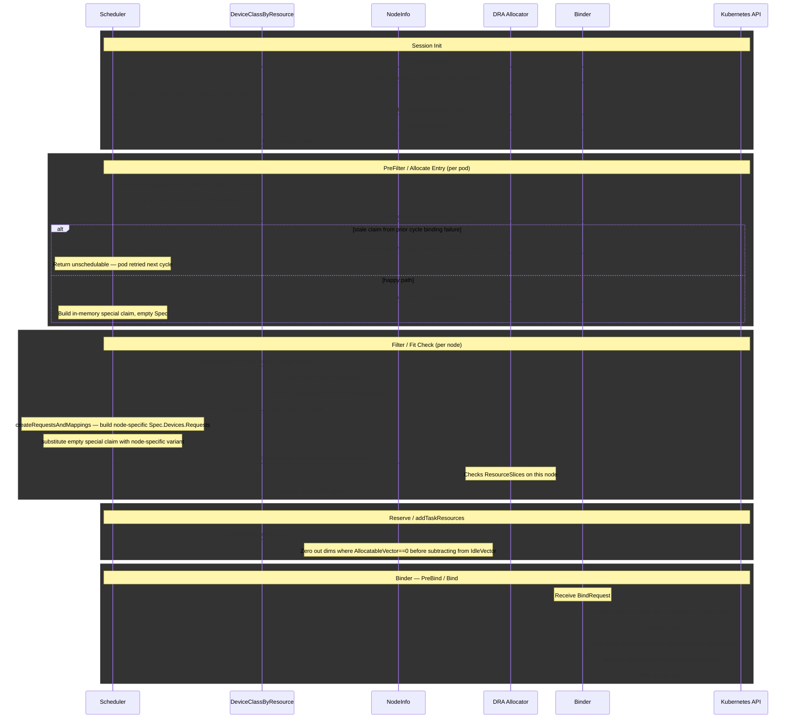

## Design

Most of the infrastructure for this feature is already in place. The table below summarises what exists today:

| Layer | Existing mechanism |
|---|---|
| Node capacity (GPU) | `AddDRAGPUs` injects DRA GPU count into `AllocatableVector` / `IdleVector` at `GPUIndex`, counted from ResourceSlices in `cluster_info.go` |
| Task request (GPU) | `ExtractDRAGPUResourcesFromClaims` + `GpuRequirement.SetDraGpus` unifies DRA claim GPUs into `ResReqVector[GPUIndex]` |
| Task request (all other scalars) | Extended-resource container requests flow through `ResourceFromResourceList` → `scalarResources` map → `ResReqVector` via `ToVector` |
| Fit check (scalars) | `lessEqualVectorsExcludingGPU` does element-wise vector comparison for all dimensions including scalar extended resources |
| Quota / fairshare | `AcceptedResourceVector` / `ResReqVector` are consumed by proportion and capacity plugins — no resource-specific logic |
| DRA allocator | `pkg/scheduler/plugins/dynamicresources` already calls `structured.NewAllocator` and handles claim allocation / deallocation |
| API types | `DeviceClass.Spec.ExtendedResourceName`, `Pod.Status.ExtendedResourceClaimStatus`, and the `resource.kubernetes.io/extended-resource-claim` annotation are all present in `k8s.io/api@v0.35.4` |
| Helper library | `k8s.io/dynamic-resource-allocation/deviceclass/extendedresourcecache` (already a dependency) maintains the `extendedResourceName → DeviceClass` reverse index |

There is also an explicit temporary guard ([`node_info.go:316`](../../pkg/scheduler/api/node_info/node_info.go)) that rejects extended-resource GPU requests on DRA-only nodes, with a comment marking it for removal once this feature exists.

### Session Init

Two changes at session startup:

**Build `DeviceClassByResource`** from the DeviceClass informer. The cache maintains a reverse index from `extendedResourceName → DeviceClass`, answering `GetDeviceClass(resourceName)` in O(1). It is built once per session and shared across the fit check and the dynamicresources plugin.

**Generalize `populateDRAGPUs`** to also handle `ExtendedResourceName`-mapped DeviceClasses. GPU extended resources are a special case: KAI's own GPU accounting (`GPUIndex` in the resource vector) is used for quota, fairshare, preemption, and GPU-sharing decisions across the entire scheduler, so it must remain correct when GPUs are managed by DRA.

The existing loop already counts all devices from node-local ResourceSlices with no selector evaluation — matching the behaviour of today's `populateDRAGPUs`. The same approach is kept here:

```
for each DeviceClass with ExtendedResourceName:
  if extendedResourceName already in node.Status.Allocatable: skip
  if extendedResourceName is a GPU resource:
    for each ResourceSlice on this node:
      gpuCount += len(slice.Spec.Devices)
  nodeInfo.AddDRAGPUs(gpuCount)
```

`HasDRAGPUs` is kept to drive the GPU-sharing guard until GPU sharing via DRA is implemented.

### PreFilter / Allocate Entry

The dynamicresources plugin's entry point (PreFilter / `allocateHandlerFn`) is extended to handle pods that have no `pod.Spec.ResourceClaims` but whose container requests include a DRA-backed extended resource.

**Detect DRA-backed requests** using `hasDeviceClassMappedExtendedResource`: iterate container resource requests and call `DeviceClassByResource.GetDeviceClass(resourceName)` for each. A non-nil result means the resource is DRA-backed.

**Find or create the special claim.** `findExtendedResourceClaim` searches the API for a ResourceClaim annotated `resource.kubernetes.io/extended-resource-claim: true` and owned by this pod:

- **Happy path** (nil returned): no prior claim exists. Build an in-memory special claim named `<extended-resources>` with an empty `Spec` and a temporary UID. This claim is never written to the API server during scheduling.
- **Recovery path** (non-nil returned): a claim was created by the binder in a prior scheduling cycle but binding ultimately failed and the binder's rollback deleted the claim. If the claim still exists (rollback did not complete), the pod is returned Unschedulable and re-queued; on the next cycle, if the binder has by then deleted the claim, scheduling proceeds normally.

### Filter / Fit Check

Two things happen per node:

**Fit check skip.** Upstream (`noderesources/fit.go:shouldDelegateResourceToDRA`) skips the vector fit check for any extended resource that is not in `node.Status.Allocatable` and has a DeviceClass mapping — the DRA allocator is the sole source of truth for those resources. KAI adopts the same approach in `lessEqualVectorsExcludingGPU`: for each scalar resource dimension, if `DeviceClassByResource.GetDeviceClass(resourceName) != nil` and the resource is absent from the node's `AllocatableVector`, skip that dimension. GPU resources are not skipped here — they are checked normally via `GPUIndex`, which was injected by `populateDRAGPUs` at session init.

Note that `GetDeviceClass` is a cluster-wide lookup; it does not check whether the specific node has ResourceSlices for that DeviceClass. Node-specific device availability is determined by the DRA allocator in the next step.

**Special claim synthesis and allocation.** `filterExtendedResources` determines which resources need DRA allocation on this specific node by checking each resource against `node.Status.Allocatable`: resources absent from Allocatable are DRA-backed on this node; resources present are served by the device plugin and excluded from the special claim. This per-node determination matters in heterogeneous clusters where a resource may be device-plugin on some nodes and DRA-backed on others.

`createRequestsAndMappings` then builds the node-specific `Spec.Devices.Requests` — one `DeviceRequest` per (container, resource type) combination, named deterministically as `container-{i}-request-{j}`. A single special claim covers all DRA-backed extended resource types requested by the pod; no separate claim is created per resource type.

The empty in-memory special claim is substituted with this node-specific variant before being passed to `structured.NewAllocator`. The allocator checks the node's ResourceSlices and returns an allocation result if devices are available.

The upstream reference for `filterExtendedResources` and `createRequestsAndMappings` is `k8s.io/kubernetes@v1.35.4/pkg/scheduler/framework/plugins/dynamicresources/extendeddynamicresources.go`. These functions can be ported into KAI with minimal adaptation.

### Reserve / addTaskResources

When a pod with a non-GPU DRA-backed extended resource is assigned to a node, `addTaskResources` subtracts its request from `IdleVector`. Because `AllocatableVector` has 0 for resources not in `node.Status.Allocatable`, this drives `IdleVector` negative for those dimensions.

Fix: in `addTaskResources` and `removeTaskResources`, before applying the vector to `UsedVector` / `IdleVector` / `ReleasingVector`, zero out any scalar dimension `i > PodsIndex` where `ni.AllocatableVector.Get(i) == 0`. This condition reliably identifies resources for which KAI delegates capacity decisions to the DRA allocator — no DeviceClass cache lookup is needed at this layer. CPU, memory, GPU, and pods always have non-zero allocatable on real nodes, so they are unaffected.

### BindRequest Extension

The scheduler communicates allocation results to the binder by creating a `BindRequest` CR in the API server. Existing DRA claims are carried in `BindRequestSpec.ResourceClaimAllocations`, keyed by `podClaim.Name` (the name of the entry in `pod.Spec.ResourceClaims`).

The special claim has no corresponding entry in `pod.Spec.ResourceClaims`, so the existing field cannot carry it. `BindRequestSpec` needs a new field:

```go
// ExtendedResourceClaimAllocation carries the scheduler's allocation result
// for the DRA-backed extended resource special claim, if any.
ExtendedResourceClaimAllocation *ExtendedResourceClaimAllocation `json:"extendedResourceClaimAllocation,omitempty"`
```

```go
type ExtendedResourceClaimAllocation struct {
    // Allocation is the AllocationResult from the DRA structured allocator.
    Allocation *v1.AllocationResult `json:"allocation"`
    // DeviceRequests is the Spec.Devices.Requests to set on the created ResourceClaim.
    DeviceRequests []v1.DeviceRequest `json:"deviceRequests"`
    // ContainerMappings is the container→request mapping for pod.Status.ExtendedResourceClaimStatus.
    ContainerMappings []v1.ContainerExtendedResourceRequest `json:"containerMappings"`
}
```

The scheduler populates `ExtendedResourceClaimAllocation` from the node-specific result stored during Filter before creating the BindRequest.

### Binder — PreBind / Bind

At bind time the binder reads `ExtendedResourceClaimAllocation` from the BindRequest and:

1. **Create ResourceClaim** in the API server using `GenerateName` (`<pod-name>-extended-resources-`), the `resource.kubernetes.io/extended-resource-claim: true` annotation, the pod as owner reference, and `DeviceRequests` as `Spec.Devices.Requests`.
2. **Patch claim status**: set `Status.Allocation` from `Allocation`, and add the pod to `Status.ReservedFor`.
3. **Patch `pod.Status.ExtendedResourceClaimStatus`**: record the generated claim name and `ContainerMappings` so the kubelet knows which devices to inject.
4. **Bind pod to node** via the standard BindRequest flow.

For idempotency, if `findExtendedResourceClaim` finds an existing claim for the pod (prior attempt that created the claim but failed to patch pod status), the binder skips claim creation and proceeds from step 2.

The upstream reference is `createExtendedResourceClaimInAPI` and `patchPodExtendedResourceClaimStatus` in `extendeddynamicresources.go`.

**Rollback**: if any step after claim creation fails, the binder's `Rollback` must delete the ResourceClaim.

**Lifecycle**: on normal pod completion, eviction, or deletion, Kubernetes GC deletes the claim via its pod `ownerReference`. The `delete-protection` finalizer (managed by `resource-claim-controller`) blocks deletion until the DRA driver deallocates the device and clears `Status.Allocation`.

### One-time Guard Removals

**Remove guard at `node_info.go:316`**: this temporary guard rejects extended-resource GPU requests on DRA-only nodes. Once the fit-check skip and DRA allocator path are in place it is no longer needed; its comment already marks it for removal.

**Skip annotated claims in `ExtractDRAGPUResourcesFromClaims`**: pods bound via the extended-resource bridge have both a container extended-resource request and a generated ResourceClaim. Claims carrying the `resource.kubernetes.io/extended-resource-claim` annotation must be skipped in claim extraction so the GPU is counted only once — from the container request, not the claim.

## Component Summary

| Component | Change |
|---|---|
| `node_info.go` — `lessEqualVectorsExcludingGPU` | Skip scalar dimensions backed by a DRA DeviceClass and absent from `node.Status.Allocatable` |
| `node_info.go` — `addTaskResources` / `removeTaskResources` | Zero out scalar dimensions where `AllocatableVector[i] == 0` before applying to `UsedVector` / `IdleVector` / `ReleasingVector` |
| `cluster_info.go` — `populateDRAGPUs` | Generalize to handle GPU DeviceClasses with `ExtendedResourceName`; wire `DeviceClassByResource` |
| `cluster_info.go` — session init | Build `DeviceClassByResource` from DeviceClass informer |
| `dynamicresources` scheduler plugin | Detect extended-resource requests backed by DRA; synthesize and allocate in-memory special claim |
| `node_info.go` | Remove temporary guard at line 316 |
| `resource_info` / `dra_resource_utils.go` | Skip `extended-resource-claim`-annotated claims in claim extraction |
| `bindrequest_types.go` | Add `ExtendedResourceClaimAllocation` field to `BindRequestSpec` |
| binder `dynamicresources` plugin | Read `ExtendedResourceClaimAllocation` from BindRequest; create real ResourceClaim in API, patch pod status at bind time; delete claim on rollback |
| topology plugin — `getJobRatioToFreeResources` / `calcNodeAccommodation` | Skip DRA-backed extended resource dimensions (where `AllocatableVector[i] == 0`) in domain fitness comparisons |

## Deployment Scenarios

| Setup | Behavior |
|---|---|
| **Pure device-plugin cluster** | Feature is a no-op. `GetDeviceClass` returns nil for all resources; no DRA path is activated. |
| **Pure DRA cluster** | Full feature path. Extended-resource pods are routed through DRA allocation on every node. |
| **Mixed cluster** (device-plugin on some nodes, DRA on others) | Determined per node at Filter: if the resource is absent from `node.Status.Allocatable`, the DRA path is used; if present, the device-plugin path is used. A pod can be scheduled on either node type without any workload change. |
| **Rolling migration** (nodes transitioning one-by-one) | Same as mixed cluster. Pods already bound to device-plugin nodes are unaffected. New pods land on either node type based on normal scheduling; the correct path is selected per node automatically. |
| **GPU sharing on a DRA node** | Rejected at PreFilter by the existing `HasDRAGPUs` guard until GPU sharing via DRA is implemented (Non-Goal). |
| **Two DeviceClasses with the same `ExtendedResourceName`** | The newer DeviceClass wins in `DeviceClassByResource`; the older is silently shadowed. Avoid this configuration. |

## Implications

Both of these stem from the same root cause: DRA-backed extended resources are absent from `node.Status.Allocatable`, so `AllocatableVector[i] == 0` for those dimensions throughout KAI's resource vectors.

### Negative IdleVector on Allocation

When a pod is assigned to a node, `addTaskResources` subtracts its request from `IdleVector`. For DRA-backed resources, `AllocatableVector[i] == 0`, so subtracting any non-zero request drives `IdleVector` negative. Negative values propagate into topology domain fitness checks and cause false rejections.

Fix is in the Reserve section above: zero out those dimensions in `addTaskResources` / `removeTaskResources` before applying to the vectors.

### Topology Domain Fitness

The topology plugin uses `getJobRatioToFreeResources` and `calcNodeAccommodation` to determine whether a job fits within a topology domain. Both compare pod requests against `IdleOrReleasingVector` / `IdleVector`. For DRA-backed resources these are 0 even before any allocation, so every domain is falsely rejected: `getJobRatioToFreeResources` assigns `requiredResourceNotInDomainRatio` when `freeVal <= 0`, and `calcNodeAccommodation` returns 0 when `LessEqual` fails.

Fix: skip dimension `i` in both functions when `DeviceClassByResource.GetDeviceClass(resourceName) != nil`. This is the same condition used in `lessEqualVectorsExcludingGPU` at the node level. Domain fitness becomes an approximation for DRA-backed resources; exact per-node availability is determined at Filter time by either the vector check (device-plugin nodes) or the DRA allocator (DRA nodes). GPU is unaffected because it is handled via `GPUIndex`, not as a scalar extended resource dimension.

## Follow-ups

- **Vectorizing DRA capacity**: inject non-GPU DRA device counts from ResourceSlices into `AllocatableVector` at session init, enabling queue-level quota, fairshare, topology domain fitness, and preemption accounting for non-GPU DRA extended resources.
- **Implicit extended resource name GPU accounting**: pods using the implicit name (`deviceclass.resource.kubernetes.io/<class-name>`) instead of the explicit `ExtendedResourceName` have their GPU request land in a scalar vector dimension rather than `GPUIndex`, making it invisible to GPU-aware fairshare and preemption. Fix: at session start, iterate tasks in the snapshot and remap any scalar dimension where `DeviceClassByResource.GetDeviceClass(name) != nil && IsGPUDeviceClass(dc.Name)` to `GPUIndex`. This keeps accounting consistent with the session's DeviceClass snapshot and handles runtime DeviceClass changes automatically.
- **Fractional workloads on DRA nodes**: support GPU-sharing requests on DRA-managed nodes. Two approaches: (1) NVIDIA DRA driver exposes fractions as discrete devices in ResourceSlices; or (2) extend the reservation pod mechanism — the reservation pod acquires a ResourceClaim (via the default scheduler or binder-side allocation), and its claim is deducted from node accounting on de-allocation.


<a id="doc-81758c3f788054bf1f6bc656"></a>

# kai-scheduler/KAI-Scheduler / docs/developer/designs/eviction-metrics/README.md

Upstream: https://github.com/kai-scheduler/KAI-Scheduler/blob/5982e4bf5559120d1fb5650ebec7fe400e85bc95/docs/developer/designs/eviction-metrics/README.md

Commit: `5982e4bf5559120d1fb5650ebec7fe400e85bc95`

Retrieved: 2026-10-01T15:21:11.089624+00:00

Kind: official-document

Raw SHA256: `0e9b05baa03a5b3e182af566656f2bddb6e09dc03fe37e5ff76e4b6abce4630e`

Source text below is untrusted reference content. Acquisition does not verify technical claims.

License status: UPSTREAM_NOTICES_CAPTURED_PER_FILE_REVIEW_REQUIRED. See this repository's captured license files.

---

# Workload-Centric Eviction Metrics

## Overview

This document proposes a redesign of the PodGroup eviction metric exposed by the scheduler. The current counter `kai_pod_group_evicted_pods_total` records eviction events but cannot be queried with standard PromQL to answer the questions operators actually ask. This document specifies the label shape, semantics, and emission rules for the replacement, and adds a sibling event-level counter.

This design is the response to [issue #1573](https://github.com/kai-scheduler/KAI-Scheduler/issues/1573).

## Motivation

The recurring operational question is:

> **How disrupted has *this workload* been recently?**

Where *this workload* is the user-facing object the human reasons about — a JobSet someone submitted, a Coder Workspace a developer is trying to keep alive, an MPIJob mid-run. Users ping operators in those terms ("my workspace got killed again", "this training keeps restarting"), and operators need to answer with a simple PromQL query keyed on the workload object.

### Driving case: multi-rack distributed training JobSets

The specific operational pain that drove this design is multi-rack distributed training. A JobSet such as `multi-rack-train` runs several replicas, each pinned to its own GPU rack. When a single rack gets preempted, consolidated, or reclaimed, the training run as a whole takes a hit, and the operator needs to answer two questions about a named workload object — not about PodGroups, not about pods:

1. How many times was this JobSet disrupted in the last N hours?
2. Which rack (replica) lost pods, and how many?

Both questions are unanswerable today with standard PromQL. Per-rack disruption surfaces today as a set of PodGroup series whose names look like `pg-multi-rack-train-<uuid>-r0` through `-r3`, with no `owner_name` label to aggregate on and no `subgroup` label to break down by rack. Once the JobSet grouper produces a SubGroup hierarchy per replica ([issue #1189](https://github.com/kai-scheduler/KAI-Scheduler/issues/1189)), the natural mapping is: one PodGroup per JobSet, one leaf SubGroup per replica. The eviction metric proposed in this document is designed against that shape — see [Example 4](#example-4-multi-replica-training-jobset-the-driving-case). It also gives an immediate improvement on today's pre-#1189 state, where each replica is its own PodGroup, by introducing `owner_name` aggregation across those replica PGs.

Today the metric records the underlying events but every standard query path is broken:

1. **Single-eviction series are invisible to `rate()` / `increase()`.** Counters in Prometheus only have a defined rate from the second sample onward — a series born at value `N` reports `0` forever. Production data over a 24h window: `count(kai_pod_group_evicted_pods_total)` grew from 91 → 94 series, but `count(rate(...[5m]) > 0)` and `count(increase(...[1h]) > 0)` both stayed at 0. The new evictions are recorded but invisible to any rate-based dashboard or alert.
2. **No owner-workload label.** To roll evictions up to a JobSet or Workspace, callers must `label_replace` with a regex on the PodGroup name (which encodes the topOwner UID). Fragile, and doesn't generalize across workload types.
3. **`uid` label adds churn for no real benefit.** `{namespace, podgroup}` is already unique for a PG's lifetime, and the PG name already encodes the topOwner UID. The `uid` label only disambiguates the niche case of "PG deleted and recreated while topOwner UID stays the same," and every PG recreation today spawns a fresh series, amplifying problem #1.
4. **Counts pods, not eviction events.** With variable gang sizes, "PG evicted twice, gang of 5 each" and "PG evicted once, gang of 10" should both increment the counter by 10, so the "events" question cannot be answered.

The PodGroup is an internal scheduler abstraction; the metric should let operators pivot to the workload view in one `sum by (...)`.

## Goals

- A single PromQL aggregation answers "how disrupted has *workload X* been" without `label_replace` or PG-name regex.
- Both "how many disruption events" and "how many pods evicted" can be answered, and one is not derivable from the other.
- `rate()` / `increase()` produce correct non-zero output starting from the first eviction of any workload.
- Re-submissions of the same name stay aggregatable with `sum by (owner_name)`; `owner_uid` distinguishes object generations.
- Per-subgroup visibility for any workload whose PodGroup carries leaf SubGroups, reconstructable in PromQL without overcounting at higher levels of aggregation.

## Non-Goals

- No new CRDs.
- No change to the eviction *mechanism* — only to the metrics emitted.
- No per-SubGroup eviction-event counter in v1 (deferred — see [Alternatives](#alternatives-considered)).
- No backfill of historical metric data.

## Design

### Metric shape

```
kai_pod_group_evicted_pods_total{
  podgroup, namespace, nodepool, action,
  owner_group, owner_kind, owner_name, owner_uid, subgroup
}
# Counter. Increments by 1 per pod evicted.
# Pre-initialized at 0 when the scheduler first observes the PodGroup.

kai_pod_group_eviction_events_total{                          # NEW
  podgroup, namespace, nodepool, action,
  owner_group, owner_kind, owner_name, owner_uid
}
# Counter. Increments by 1 per scheduling decision that evicts pods from this PG.
# Pre-initialized at 0 when the scheduler first observes the PodGroup.
```

### Labels

| Label | Source | Notes |
|---|---|---|
| `podgroup` | `PodGroup.Name` | Unchanged. |
| `namespace` | `PodGroup.Namespace` | Unchanged. |
| `nodepool` | PodGroup label (existing helper) | Unchanged. |
| `action` | scheduler action type | Unchanged. Values: `preempt`, `reclaim`, `consolidation`, `stalegangeviction`. |
| `owner_group` | `kai.scheduler/top-owner-metadata` annotation on the PodGroup | NEW. The API Group of the top-level workload object (`kubeflow.org`, `jobset.x-k8s.io`, `apps`, …). Disambiguates Kinds shared across operators (e.g., `MPIJob` from kubeflow vs mpi-operator). `""` for core/v1 objects. |
| `owner_kind` | `kai.scheduler/top-owner-metadata` annotation on the PodGroup | NEW. The Kind of the top-level workload object (`JobSet`, `Deployment`, `MPIJob`, …). |
| `owner_name` | `kai.scheduler/top-owner-metadata` annotation on the PodGroup | NEW. The Name of the top-level workload object. |
| `owner_uid` | `kai.scheduler/top-owner-metadata` annotation on the PodGroup | NEW. The UID of the top-level workload object. Distinguishes name reuse across delete/recreate; stable while the owner object is unchanged. |
| `subgroup` | `kai.scheduler/subgroup-name` label on the evicted pod (pods counter only) | NEW. The leaf SubGroup the evicted pod belongs to. `""` for flat PodGroups. |
| `uid` | — | REMOVED. PodGroup UID, not the owner UID (`owner_uid`). |

#### Why source `owner_*` from the annotation, not `OwnerReferences`

The podgrouper writes the annotation `kai.scheduler/top-owner-metadata` on every PodGroup. The annotation value is YAML containing `kind`, `name`, `uid`, `group`, `version` of the top-level workload object that drove PodGroup creation.

`PodGroup.OwnerReferences` is not a reliable source because grouper plugins override it for plugin-specific purposes — e.g., the Deployment grouper sets the ownerReference to the Pod itself rather than the Deployment, to keep its per-pod PodGroup naming model coherent. The top-owner annotation always reflects the true workload object regardless of grouper plugin quirks.

For PodGroups without a top-owner annotation, all four labels (`owner_group`, `owner_kind`, `owner_name`, `owner_uid`) are emitted as `""`.

#### Why `owner_uid` from day one

Two live owners of the same group/kind cannot share a name in one namespace, so `owner_group` + `owner_kind` + `namespace` + `owner_name` already disambiguates concurrent objects. The label is added anyway: Kubernetes allows reusing a name after delete, and adding it in a later release would be a series-identity break.

`sum by (namespace, owner_group, owner_kind, owner_name)` still folds resubmits into one number. Leave `owner_uid` in the aggregation to split generations ("this run vs the previous run").

#### Why `owner_group` but not `owner_version`

The annotation carries the full GVK, but `version` is intentionally not exposed as a label. A given workload object does not change CRD version after creation, so the version label would add cardinality without disambiguating anything in operator queries. `group` is exposed because the same `Kind` name is reused across operators (e.g., `MPIJob` exists under both `kubeflow.org` and `mpi-operator.kubeflow.org`), and operators querying by `owner_kind="MPIJob"` would otherwise silently aggregate across distinct operator universes. If a future query genuinely needs version pivoting, the version field is still present in the annotation and a follow-up can add the label without breaking existing series.

#### Why `subgroup` only on the pods counter

KAI PodGroups can contain a tree of SubGroups (see [`docs/topology/multilevel.md`](../../../topology/multilevel.md)). Pods belong only to **leaf** SubGroups, via the `kai.scheduler/subgroup-name` label.

- The **pods counter** has `subgroup` because each pod belongs to exactly one leaf SubGroup, so per-subgroup counts are exact and `sum by (subgroup)` answers "which role lost the most pods?".
- The **events counter** does **not** have `subgroup` because one scheduling decision can take down a subtree spanning multiple leaf SubGroups (e.g., evicting the gang of a non-leaf SubGroup). If `subgroup` were on the events counter, that single decision would increment multiple series, and `sum by (podgroup)` would report 2 disruption events when the operator-meaningful answer is 1.

A per-subgroup event counter (`kai_pod_group_subgroup_eviction_events_total`) can be added later if needed; it is intentionally out of scope here.

### Emission semantics

#### Per-pod increment for the pods counter

The pods counter increments by **1 per pod evicted**, at the existing eviction emit point in the scheduler's status updater.

#### Per-(decision, PodGroup) increment for the events counter

The events counter increments by **1 per committed eviction decision per affected PodGroup**. A decision is the unit constructed by the scheduler when it identifies victims to evict together: a preemption, a reclaim, a consolidation, or a stale-gang eviction. A single decision can span multiple PodGroups — the by-pod solver collects victim tasks across all `recordedVictimsJobs` for a scenario and passes the flattened set to `EvictAllPreemptees` — so the rule is per (decision, PG) pair, not per decision. A decision touching two PodGroups emits two event increments, one per PG; a decision touching one PG emits one.

The event increment must fire **after** the decision is committed, not when it is constructed. The scheduler accumulates eviction operations in a transactional statement that can be rolled back; only after the statement commits do the underlying evictions actually happen. Emitting earlier would inflate the count with decisions that were rolled back. The shape is:

> 1. Action layer builds the eviction decision (M victim pods, possibly across multiple PodGroups).
> 2. Each victim becomes a queued evict operation inside the statement.
> 3. Statement commits → physical evictions happen → pods counter increments M times (with each pod's increment labeled by its own PG and subgroup).
> 4. After commit succeeds → events counter increments once per distinct PodGroup that had at least one pod committed in this decision.

So a decision evicting M pods across K distinct PodGroups produces M increments to the pods counter and K increments to the events counter. A rolled-back decision produces zero of either.

#### Pre-initialization at 0

When the scheduler first observes a PodGroup (cache event-handler `OnAdd`), both counters are initialized to 0 across all label combinations that can ever fire for that PG. The series is then born at 0 in Prometheus and a first eviction takes it `0 → N`, making `rate()` / `increase()` correct from the first eviction onward.

- **Events counter**: one series per `action` value (subgroup is not a label on this counter).
- **Pods counter**: one series per `(action, leaf-subgroup)` combination from `PodGroup.Spec.SubGroups`, enumerated at `OnAdd` (or `subgroup=""` when Spec has no SubGroups). SubGroups may be added later; `OnUpdate` pre-inits series for newly added leaves.
- **PodGroup delete**: drop all series for that `{namespace, podgroup}` from both counters (`DeletePartialMatch`).

Pre-initialization is essential for the per-subgroup pods counter: without it, a JobSet whose first eviction lands on leaf `r2` would have the `subgroup="r2"` series born at the eviction value, hitting the first-sample-invisible problem the design is meant to fix.

Cardinality of pre-init is bounded by the active PG count × number of `action` values (× number of leaf subgroups per PG, for the pods counter).

## Worked examples

### Example 1: Deployment with independent pods

State: a Deployment `my-app` with 100 pods. The Deployment grouper creates one PodGroup per pod (PodGroup name `pg-<pod-name>-<pod-uid>`). 10 pods are evicted, each in its own scheduling decision (Deployment pods are not gang-scheduled).

Resulting series — all 10 share `owner_kind=Deployment`, `owner_name=my-app`, `subgroup=""`:

| Metric | Per-series value | `sum by (owner_name)` |
|---|---|---|
| `kai_pod_group_evicted_pods_total` | 10 distinct `podgroup` series, each at 1 | **10** |
| `kai_pod_group_eviction_events_total` | 10 distinct `podgroup` series, each at 1 | **10** |

Both equal 10 because each Deployment pod is an independent scheduling unit.

### Example 2: Gang-scheduled JobSet

State: a JobSet `train-x` with one gang of 10 pods. The whole gang is preempted in one scheduling decision.

Single PG (`pg-train-x-<uid>`), `owner_kind=JobSet`, `owner_name=train-x`, `subgroup=""`:

| Metric | Per-series value | `sum by (owner_name)` |
|---|---|---|
| `kai_pod_group_evicted_pods_total` | one series at 10 | **10** |
| `kai_pod_group_eviction_events_total` | one series at 1 | **1** |

The two counters now answer different questions correctly: 10 pods went down (pod churn) in 1 disruption event (workload disruption).

### Example 3: Hierarchical SubGroups (inference pipeline)

State: a PodGroup `infer-y` with leaf SubGroups `prefill` (3 pods), `decode` (4 pods), `preprocessor` (1 pod). The scheduler preempts the whole PG as one decision (because gang requirements fail at the root).

Single PG, `owner_kind=InferenceJob`, `owner_name=infer-y`. Pods counter has three series, one per leaf SubGroup; events counter has one series:

| Metric | Series | Sum |
|---|---|---|
| `kai_pod_group_evicted_pods_total{subgroup="prefill"}` | 3 | |
| `kai_pod_group_evicted_pods_total{subgroup="decode"}` | 4 | |
| `kai_pod_group_evicted_pods_total{subgroup="preprocessor"}` | 1 | |
| `sum by (owner_name) (kai_pod_group_evicted_pods_total)` | | **8 pods** |
| `sum by (owner_name, subgroup) (kai_pod_group_evicted_pods_total)` | | exact role breakdown |
| `kai_pod_group_eviction_events_total` | 1 | **1 event** |

A subsequent decision that only takes down the `prefill` SubGroup increments `subgroup="prefill"` on the pods counter and the single event series on the events counter. No double-count anywhere.

### Example 4: Multi-replica training JobSet (the driving case)

This is the operational case that motivated the redesign. A distributed training JobSet `multi-rack-train` runs four replicas, each pinned to its own GPU rack, with 256 pods per rack (1024 pods total). The metric must answer "how often is this training run disrupted" and "which rack lost pods" in a single PromQL aggregation.

#### After [issue #1189](https://github.com/kai-scheduler/KAI-Scheduler/issues/1189) (target shape)

The JobSet grouper produces **one PodGroup per JobSet** with a SubGroup hierarchy: `PodGroup → ReplicatedJob subgroup → Replica subgroups → pods`. Each pod belongs to a leaf replica SubGroup (`r0`, `r1`, `r2`, `r3`).

Suppose rack `r2` is preempted while the other three keep running. One PodGroup is affected, one scheduling decision evicts 256 pods all belonging to the `r2` leaf SubGroup:

| Metric | Series affected | Sum |
|---|---|---|
| `kai_pod_group_evicted_pods_total{subgroup="r2"}` | 1 series at 256 | **256 pods** |
| `kai_pod_group_evicted_pods_total{subgroup="r0","r1","r3"}` | unaffected (still 0) | 0 |
| `kai_pod_group_eviction_events_total` | 1 series, incremented by 1 | **1 event** |

The operator-facing queries work in one aggregation:

```promql
# "How often was the JobSet disrupted in the last 24h?"
sum by (owner_name) (
  increase(kai_pod_group_eviction_events_total{
    owner_kind="JobSet", owner_name="multi-rack-train"
  }[24h])
)

# "Which rack lost the most pods this hour?"
topk(5,
  sum by (subgroup) (
    increase(kai_pod_group_evicted_pods_total{
      owner_name="multi-rack-train"
    }[1h])
  )
)
```

Both answers are immediate and exact. No `label_replace`, no PG-name regex.

#### Before #1189 (today's pre-existing per-replica PodGroups)

Today's JobSet grouper produces four PodGroups for this JobSet — `pg-multi-rack-train-<uid>-r0` through `-r3` — with no SubGroups inside any of them. The same eviction event (rack `r2` preempted) emits against PodGroup `…-r2` only, with `subgroup=""`:

| Query | Result today | Result post-#1189 |
|---|---|---|
| `sum by (owner_name) (increase(events[1h]))` | 1 event (only `…-r2` PG affected) | 1 event (same) |
| `sum by (owner_name) (increase(pods[1h]))` | 256 pods | 256 pods |
| Per-rack pod breakdown | Read off the `podgroup` label (PG name carries the replica suffix) | Read off the clean `subgroup` label |

The workload-level answer is correct in both worlds; the only thing that improves once #1189 lands is that per-rack breakdown moves from PG-name parsing to a first-class `subgroup` label.

This means the design is forward-compatible with #1189 with no further changes, and gives a usable workload-level eviction view today.

## Example PromQL queries

The shape unlocks workload-centric dashboards with no `label_replace`:

```promql
# "How often was Coder workspace alice-dev disrupted in the last 24h?"
sum by (owner_name) (
  increase(kai_pod_group_eviction_events_total{
    namespace="user-x", owner_kind="Workspace", owner_name="alice-dev"
  }[24h])
)

# "Top 10 most-disrupted JobSets in the last hour"
# owner_group disambiguates Kinds shared across operators (e.g. MPIJob in kubeflow vs mpi-operator).
topk(10,
  sum by (namespace, owner_group, owner_name) (
    increase(kai_pod_group_eviction_events_total{owner_kind="JobSet"}[1h])
  )
)

# "Pods evicted per role of an inference workload, last hour"
sum by (owner_name, subgroup) (
  increase(kai_pod_group_evicted_pods_total{owner_name="infer-y"}[1h])
)

# "Eviction rate per scheduling action"
sum by (action) (rate(kai_pod_group_eviction_events_total[5m]))

# "This run of alice-dev vs earlier generations that reused the name"
sum by (owner_uid) (
  increase(kai_pod_group_eviction_events_total{
    namespace="user-x", owner_kind="Workspace", owner_name="alice-dev"
  }[24h])
)
```

## Cardinality

Series count per cluster, with `A` = number of eviction `action` values (4: `preempt`, `reclaim`, `consolidation`, `stalegangeviction`), `P` = active PodGroups, `L` = total leaf SubGroups across all PGs:

- `kai_pod_group_eviction_events_total`: `A × P` series.
- `kai_pod_group_evicted_pods_total`: `A × L` series.

`L` is workload-shape-dependent, not bounded by any single ceiling: a flat PG contributes 1 to `L`, a hierarchical PG with `k` leaves contributes `k`. Typical values: flat PGs (the common case today) give `L = P`; multi-replica JobSets post-[#1189](https://github.com/kai-scheduler/KAI-Scheduler/issues/1189) contribute one leaf per replica (single digits to low tens); inference pipelines contribute a handful of role-named leaves.

For a cluster of 100,000 PodGroups (a realistic upper bound — clusters of this size are observed in practice, with most PGs pending), the events counter is ~400k series; the pods counter is ~400k for mostly-flat PG populations and a multiple of that for hierarchical workloads, in proportion to their average leaf count. Pre-initialization adds zero-valued series for PGs that never get evicted; the cost follows the same formulas.

This sits within Prometheus's operational envelope at that cluster size — kube-state-metrics alone is already emitting multi-million-series volumes from per-pod and per-container metrics, so the eviction counters are a small fraction of the total.

The honest trade-off operators should know about:

- **Sample storage is cheap.** Prometheus TSDB uses Gorilla/XOR encoding for sample values; long sequences of identical values (the zero-init case until a first eviction) compress to near 1 bit per sample, so disk and ingest cost is minimal.
- **In-memory head block cost is not free.** Each active series consumes ~3KB of head-block RAM regardless of sample volume. A zero-valued series costs the same memory as a busy one.
- **Managed-Prometheus billing impact.** Grafana Cloud and most managed Prometheus offerings bill by active series count, not sample volume. Pre-initialized zero series therefore add to recurring billed cardinality even when no eviction has ever happened. Operators on managed plans should size accordingly.

We accept this cost because there is no alternative that solves the "first-eviction invisible to `rate()` / `increase()`" problem (the whole motivation for this design) without pre-initialization. Skipping pre-init keeps the metric broken in exactly the way #1573 reports.

`owner_uid` does not multiply live cardinality (one owner per PG). It only splits series across time when an owner is recreated with the same name.

For Deployments specifically, the per-pod PG model means `P` scales with pod count, not workload count. Operators querying by `owner_name` recover the workload view via aggregation — dashboards stay tractable.

## Migration / breaking changes

| Change | Type | Impact |
|---|---|---|
| Drop `uid` label | **Breaking** | Existing dashboard panels that filter on `uid="..."` return empty. In practice impact is expected to be near-zero because (a) the metric is broken for rate-based queries today, so consumers using it are limited, and (b) `uid` is an internal value, not a human-typed filter. CHANGELOG entry required. |
| Add `owner_group`, `owner_kind`, `owner_name`, `owner_uid`, `subgroup` | Additive | Changes series identity, but queries that `sum by (...)` without these labels keep working. |
| Pre-init at 0 on first observe | Additive | New zero-valued series for never-evicted PGs. Cardinality bound = active PGs × actions. |
| New `kai_pod_group_eviction_events_total` | Additive | No impact on existing consumers. |

Mitigation if `uid` removal is a concern: keep `uid` for one release behind a feature flag, then remove. Default to removed unless maintainers request otherwise.

## Open issues / out of scope

These are explicitly not addressed by this design. The first is a follow-up I would expect to open as its own issue; the second is a known edge case the design does not attempt to fix.

- **Externally-created PodGroups have no owner labels.** PodGroups created outside the podgrouper (per the [`external-podgroups`](../external-podgroups/README.md) design) do not carry the `kai.scheduler/top-owner-metadata` annotation. For those PGs, `owner_group=""`, `owner_kind=""`, `owner_name=""`, and `owner_uid=""`. A follow-up issue should either define a convention for labeling external PGs (e.g., an explicit annotation users can set) or accept empty values as the intended behavior. Out of scope for this PR.
- **Pre-init / first-eviction race within one scrape interval.** Pre-initializing the series at 0 on PodGroup observation only solves `rate()` if at least one Prometheus scrape interval elapses between observation and the first eviction. If a PG is observed and evicted inside the same scrape interval, only the post-eviction value is sampled and `rate()` still cannot derive a rate. PGs typically live for at least minutes, so this is an edge case the design accepts rather than fixes.

## Design decisions

Sub-design choices made inside the proposal, called out so reviewers don't have to reconstruct the reasoning.

### Two counters instead of a single histogram

A histogram of gang sizes per event was considered as a way to collapse "pods evicted" and "events" into one metric. Rejected: Prometheus histograms are expensive in cardinality once multiplied by the label set proposed here, and operators directly want the running total of evicted pods — a histogram does not give that without an extra aggregation step.

### `subgroup` label scoped to the pods counter only

The events counter intentionally omits `subgroup`. Adding it would inflate `sum by (podgroup)` when one decision takes down a subtree spanning multiple leaf SubGroups, and the workload-level question ("how many times was X disrupted") would over-report. Per-subgroup *event* visibility, if ever needed, comes as a separate sibling counter without disturbing this design.

### Leaf-only `subgroup` semantics, no ancestor walk

When a leaf SubGroup is evicted, only the leaf's `(podgroup, subgroup)` series is incremented — no ancestor SubGroup series. Walking ancestors would make `sum by (podgroup)` overcount proportionally to tree depth. The PromQL `sum` aggregation already reconstructs ancestor views from leaf-keyed series with no overcount.

### `uid` removal is a hard break, not a soft deprecation

The `uid` label (PodGroup UID) is dropped rather than kept for one release behind a feature flag. Keeping it would continue to spawn fresh series on every PG recreation and amplify the first-sample-invisible problem that pre-initialization is meant to fix. The migration section above offers a feature-flag transition if maintainers prefer it. `owner_uid` is a different identifier and does not reintroduce that churn.

## Implementation

The implementation lives in a follow-up PR; this document covers behavior and contracts only. The work touches three areas:

- **Metrics registration**: update the existing pods counter (label set), add the new events counter, add an initializer that pre-creates series at 0 on PodGroup observation.
- **Eviction emission**: route the pods counter through the existing per-pod emit point with the new labels; emit the events counter once per committed decision, after the scheduler's eviction statement commits.
- **Cache wiring**: invoke the pre-initializer from the PodGroup `OnAdd` and `OnUpdate` handlers (`OnUpdate` only for newly added leaves); invoke series deletion from `OnDelete`.

Test coverage: unit tests for the new label shape, and an integration test that asserts `rate()` and `increase()` return non-zero for a workload that has been evicted exactly once.

A CHANGELOG entry is required for the `uid` removal.


<a id="doc-b77ddaaf702db0f64f576f51"></a>

# kai-scheduler/KAI-Scheduler / docs/developer/designs/external-podgroups/README.md

Upstream: https://github.com/kai-scheduler/KAI-Scheduler/blob/5982e4bf5559120d1fb5650ebec7fe400e85bc95/docs/developer/designs/external-podgroups/README.md

Commit: `5982e4bf5559120d1fb5650ebec7fe400e85bc95`

Retrieved: 2026-10-01T15:21:11.089624+00:00

Kind: official-document

Raw SHA256: `3f7fce346edb7dcc9eb8e726ac34b12a7ed144664d9990c00f99b51f74bf20da`

Source text below is untrusted reference content. Acquisition does not verify technical claims.

License status: UPSTREAM_NOTICES_CAPTURED_PER_FILE_REVIEW_REQUIRED. See this repository's captured license files.

---

# Externally-Created PodGroups

## Overview

KAI currently assumes that the podgrouper owns PodGroup creation for KAI-scheduled pods. The podgrouper derives a PodGroup from each pod's owner chain, creates or updates that PodGroup, and patches the pod with `pod-group-name` and, when relevant, `kai.scheduler/subgroup-name`.

This blocks cross-workload gang scheduling. If multiple independent workloads should be scheduled as one atomic unit, an external controller or user needs to create one PodGroup and attach all participating pods to it without podgrouper rewriting the membership.

## Goals

- Support user-created or controller-created PodGroups.
- Allow pods from multiple workloads to join the same PodGroup.
- Prevent podgrouper from creating competing PodGroups for opted-out pods.
- Prevent podgrouper from overwriting external `pod-group-name` and `kai.scheduler/subgroup-name`.
- Detect pods that reference missing subgroups and make the failure visible.
- Preserve current auto-created PodGroup behavior unless users explicitly opt out.

## Non-Goals

- No automatic segmentation or `segmentSize` support.
- No subgroup inference for external PodGroups.
- No cross-namespace PodGroup membership.
- No new lifecycle controller for external PodGroups.
- No event fan-out to all participating workload owners.

## API

Pods still join a PodGroup with the existing annotation:

```yaml
metadata:
  annotations:
    pod-group-name: post-training-pipeline
```

Pods still join a subgroup with the existing label:

```yaml
metadata:
  labels:
    kai.scheduler/subgroup-name: train-workers-rack-0
```

A pod or any object in its owner chain may opt out of automatic podgrouper management with:

```yaml
metadata:
  annotations:
    kai.scheduler/skip-podgrouper: "true"
```

This annotation only tells podgrouper to leave the pod alone. It does not attach the pod to a PodGroup. Users must still set `pod-group-name`, and must set `kai.scheduler/subgroup-name` when using non-default subgroups.

`PodGroup.spec.queue` is authoritative for scheduling. Pod queue labels are not used to select the queue for an external PodGroup.

## Example

```yaml
apiVersion: scheduling.run.ai/v2alpha2
kind: PodGroup
metadata:
  name: post-training-pipeline
  namespace: default
spec:
  minMember: 5
  queue: default-queue
  priorityClassName: normal
  topologyConstraint:
    topology: cluster-topology
    requiredTopologyLevel: topology.kubernetes.io/zone
  subGroups:
    - name: ray-head
      minMember: 1
    - name: ray-workers
      minMember: 2
      topologyConstraint:
        topology: cluster-topology
        requiredTopologyLevel: topology.kubernetes.io/rack
    - name: evaluation
      minMember: 2
```

```yaml
apiVersion: batch/v1
kind: Job
metadata:
  name: post-training-evaluation
  annotations:
    kai.scheduler/skip-podgrouper: "true"
spec:
  parallelism: 2
  completions: 2
  template:
    metadata:
      annotations:
        pod-group-name: post-training-pipeline
      labels:
        kai.scheduler/subgroup-name: evaluation
    spec:
      schedulerName: kai-scheduler
      containers:
        - name: eval
          image: ubuntu
          command: ["sleep", "infinity"]
      restartPolicy: Never
```

Other workload types, such as RayJob, use the same pattern: set `kai.scheduler/skip-podgrouper: "true"` on the workload or pod template, then set `pod-group-name` and subgroup labels on the generated pod templates.

## Podgrouper Behavior

Podgrouper should evaluate skip ownership before it applies PodGroup metadata or patches the pod:

```text
if pod schedulerName != configured scheduler:
    return

if pod has kai.scheduler/skip-podgrouper: "true":
    return

if pod is ownerless and already has pod-group-name:
    return

topOwner, allOwners = GetPodOwners(pod)

if topOwner or any owner in allOwners has kai.scheduler/skip-podgrouper: "true":
    return

metadata = GetPGMetadata(pod, topOwner, allOwners)
if metadata == nil:
    return

ApplyToCluster(metadata)
assignPodToGroupAndSubGroup(pod, metadata)
```

Only the exact value `"true"` should skip. Missing, `"false"`, or invalid values should preserve existing podgrouper behavior.

The ownerless pod with `pod-group-name` case should keep the current behavior: podgrouper skips it and does not re-create PodGroup metadata.

## Scheduler Behavior

The scheduler already discovers PodGroup membership from `pod-group-name`.

If a pod references a PodGroup that does not exist yet, the scheduler will not schedule it because scheduling happens at the PodGroup level. This may be a normal creation-order race, so the pod should not make a PodGroup fail and should not get a condition for the missing PodGroup.

If a pod has `kai.scheduler/subgroup-name` that does not exist in its referenced PodGroup, only that pod should be ignored for scheduling. The scheduler should not mark the whole PodGroup unschedulable because elastic PodGroups may still be schedulable when some pods are missing or invalid.

The missing-subgroup case should be visible on the offending pod: the scheduler should set a pod condition explaining that the pod references a subgroup that does not exist in the PodGroup.

## Lifecycle And Events

External PodGroups are owned by whoever creates them:

- External controllers should set an owner reference or delete the PodGroup themselves.
- Manually-created PodGroups without owner references require manual cleanup.
- Multiple owner references are risky because Kubernetes may delete the PodGroup when any owner is deleted.

Scheduling status and scheduling events remain on the PodGroup and pods. Users should inspect PodGroup events directly when no single workload owner represents the whole group.

## Implementation Plan

1. Add `kai.scheduler/skip-podgrouper` as a constant.
2. Add pod-level and owner-chain skip checks in podgrouper.
3. Keep `metadata == nil` handling only as plugin compatibility, not as the public API.
4. Keep missing-PodGroup references as ignored pods without setting a pod condition.
5. Keep missing-subgroup handling pod-scoped: ignore the offending pod and set a pod condition explaining the invalid subgroup label.
6. Add tests for pod-level skip, owner-chain skip, normal podgrouper behavior, missing PodGroup behavior, and invalid subgroup handling.

## Test Plan

- Pod annotation skips before owner lookup.
- Top-owner and intermediate-owner annotations skip after owner lookup.
- Owned pods with only `pod-group-name` continue through normal podgrouper reconciliation.
- External PodGroup pods are not rewritten by podgrouper.
- A missing PodGroup reference does not create a pod or PodGroup condition.
- A missing subgroup label causes only the offending pod to be ignored and creates a pod condition.
- A valid cross-workload PodGroup schedules atomically.

## Risks

- Users can opt out without creating or referencing a valid PodGroup.
- External controllers must handle PodGroup lifecycle correctly.
- Owner-chain skip depends on KAI having RBAC to read owner objects.
- Event visibility is weaker when users watch only the individual workload objects.


<a id="doc-15f28aa3c885c1d39e032df2"></a>

# kai-scheduler/KAI-Scheduler / docs/developer/designs/gpu-resource-isolation/resource-isolation.md

Upstream: https://github.com/kai-scheduler/KAI-Scheduler/blob/5982e4bf5559120d1fb5650ebec7fe400e85bc95/docs/developer/designs/gpu-resource-isolation/resource-isolation.md

Commit: `5982e4bf5559120d1fb5650ebec7fe400e85bc95`

Retrieved: 2026-10-01T15:21:11.089624+00:00

Kind: official-document

Raw SHA256: `6e8422f840c794c2c505cd75b8c70ec593b78ad0dcdad058991863d3eaeb209f`

Source text below is untrusted reference content. Acquisition does not verify technical claims.

License status: UPSTREAM_NOTICES_CAPTURED_PER_FILE_REVIEW_REQUIRED. See this repository's captured license files.

---

# Resource isolation design

Be Noticed that this document is under evaluation and not been implemented yet.

## Background

Currently, KAI-scheduler does not enforce resource-isolation when using gpu-sharing feature, related issues: [issue#49](https://github.com/NVIDIA/KAI-Scheduler/issues/49), [issue#45](https://github.com/NVIDIA/KAI-Scheduler/issues/45). This document introduces an approach to implement that. 

## Principle

The principle behind this design is by introducing an open source component called [HAMi-core](https://github.com/Project-HAMi/HAMi-core). It can force resource limitations inside container as the following figure shows.


## Architect

The integration consists of two independently deployed components:

1. **kai-resource-isolator** (external, hosted under HAMI) — a DaemonSet that deploys HAMI Core libraries to GPU nodes, and a mutating webhook that injects volume mounts into GPU-sharing pods.
2. **KAI Scheduler** — injects a `CUDA_DEVICE_MEMORY_LIMIT` environment variable into containers requesting shared GPUs. For GPU-memory requests, the value is known at pod creation. For GPU-fraction requests, the value is resolved after the scheduling decision determines which GPU node the pod lands on.

Flow once both components are deployed:
1. Pod requesting GPU sharing is submitted
2. HAMI mutating webhook injects a volume mount for the HAMI Core library
3. KAI Scheduler determines the appropriate node and sets `CUDA_DEVICE_MEMORY_LIMIT` accordingly
4. Container runs with HAMI Core enforcing the memory limit

After both components are implemented and tested, a user guide will be added to the documentation.


## HAMi-core daemonset installation

You can directly install HAMi-core on your nodes by deploying the DaemonSet with the YAML file provided below.

```yaml
apiVersion: apps/v1
kind: DaemonSet
metadata:
  name: hami-core-distribute
  namespace: default
spec:
  selector:
    matchLabels:
      koord-app: hami-core-distribute
  template:
    metadata:
      labels:
        koord-app: hami-core-distribute
    spec:
      affinity:
        nodeAffinity:
          requiredDuringSchedulingIgnoredDuringExecution:
            nodeSelectorTerms:
            - matchExpressions:
              - key: node-type
                operator: In
                values:
                - "gpu"
      containers:
      - command:
        - /bin/sh
        - -c
        - |
          cp -f /k8s-vgpu/lib/nvidia/libvgpu.so /usr/local/vgpu && sleep 3600000
        image: docker.m.daocloud.io/projecthami/hamicore:latest
        imagePullPolicy: Always
        name: name
        resources:
          limits:
            cpu: 200m
            memory: 256Mi
          requests:
            cpu: "0"
            memory: "0"
        volumeMounts:
        - mountPath: /usr/local/vgpu
          name: vgpu-hook
        - mountPath: /tmp/vgpulock
          name: vgpu-lock
      tolerations:
      - operator: Exists
      volumes:
      - hostPath:
          path: /usr/local/vgpu
          type: DirectoryOrCreate
        name: vgpu-hook
     # https://github.com/Project-HAMi/HAMi/issues/696
      - hostPath:
          path: /tmp/vgpulock
          type: DirectoryOrCreate
        name: vgpu-lock
```

## Q&A

Q: Will it effect pods using GPU exclusively?

A: No.

Q: What happens when enabling gpu-sharing, but not prepared HAMi-core on corresponding GPU node?

A: Same as what it is now, the task won't fail or crash, simply doesn't have resource isolation inside container.

<a id="doc-f6f475f3ae2dbd22154fc07d"></a>

# kai-scheduler/KAI-Scheduler / docs/developer/designs/hierarchical-podgroup/README.md

Upstream: https://github.com/kai-scheduler/KAI-Scheduler/blob/5982e4bf5559120d1fb5650ebec7fe400e85bc95/docs/developer/designs/hierarchical-podgroup/README.md

Commit: `5982e4bf5559120d1fb5650ebec7fe400e85bc95`

Retrieved: 2026-10-01T15:21:11.089624+00:00

Kind: official-document

Raw SHA256: `989148b0af14800159fa7cc421ac9732113c6c56b240f61aded5e98004ca4ac1`

Source text below is untrusted reference content. Acquisition does not verify technical claims.

License status: UPSTREAM_NOTICES_CAPTURED_PER_FILE_REVIEW_REQUIRED. See this repository's captured license files.

---

# Hierarchical PodGroup structure

## Overview
This document outlines an enhancement to the PodGroup architecture by introducing SubGroups within a PodGroup, enabling fine-grained control over gang scheduling and topology-aware placement for subsets of pods within a workload. While the PodGroup continues to enforce gang scheduling for the workload as a whole, this extension allows workloads to specify minMember and topology constraints on individual SubGroups, providing greater resolution over how smaller groups of pods are placed and scheduled. For example, a SubGroup can specify that only a subset of its pods must be scheduled together (minMember) and define specific network topology constraints aligned with that subset’s requirements. This design preserves atomic workload scheduling semantics while enabling advanced, granular placement policies that align closely with topology-aware scheduling strategies.

## Motivation
Modern inference workloads consist of components with varying network sensitivity and resource requirements, necessitating the ability to express fine-grained scheduling and placement preferences within the context of gang-scheduled workloads. Uniform constraints at the PodGroup level may impose overly restrictive placement requirements, failing to capture the nuanced needs of distinct workload components. By introducing SubGroups within a PodGroup, workloads can specify per-SubGroup minMember requirements and topology constraints while maintaining overall gang scheduling semantics. This enables advanced placement strategies, improves scheduling flexibility and efficiency, and ensures differentiated placement and subgroup-level gang constraints can be expressed without compromising the workload’s atomic scheduling guarantees.

## Goals
- Enable fine-grained scheduling specification: Allow PodGroups to define how smaller SubGroups of pods should be scheduled, specifying minMember and topology constraints per SubGroup.
- Preserve atomicity while enabling flexibility: Maintain gang scheduling semantics at the workload level while enabling per-SubGroup constraints for granular control over subsets of pods.
- Support advanced topology-aware placement: Allow SubGroups within a PodGroup to define specific topology constraints for precise placement within the cluster.
- Enhance workload-aligned resource utilization: Improve cluster utilization by supporting differentiated placement strategies without imposing overly restrictive uniform constraints.
- Maintain backward compatibility: Ensure existing workloads using PodGroups without SubGroups continue to function without modification.

## Non-Goals
- Partial Workload Execution: This design does not support executing subsets of pods independently before the PodGroup’s gang scheduling conditions are met.
- Topology Discovery and Optimization: The design does not include enhancements for topology discovery or automated topology optimization.
- Changes to Pod-Level Scheduling: This enhancement does not alter pod-level scheduling mechanisms beyond the SubGroup minMember and topology constraints applied within the PodGroup context.

## User Stories

### User Story 1: Fine-Grained Gang Scheduling
I want to specify a PodGroup requiring 10 pods to be scheduled atomically, while defining that the decode-workers SubGroup requires at least 4 pods to be scheduled as a gang, enabling better resource alignment for my workload’s architecture.

### User Story 2: SubGroup-Specific Topology Constraints
I want one SubGroup to be placed within the same rack for low latency, while allowing another SubGroup pods to be placed flexibly across the cluster, aligning network-sensitive components with workload requirements.

### User Story 3: Multi-SubGroup Workload with Co-Located Leaders and Workers
I want to define decode-leaders, decode-workers, prefill-leaders, and prefill-workers SubGroups where leaders and workers are co-located within each group, but prefill and decode groups may be scheduled in different locations to optimize resource placement.

### User Story 4: Minimum Replica Threshold for Multi-Replica Workloads
I want to define a PodGroup with multiple replicas of the same workload and require that a minimum number of replicas are gang scheduled before the workload starts. Beyond this threshold, the scheduler should opportunistically schedule additional replicas as resources become available.

### User Story 5: Auto-Scaling SubGroup Sets with Gang Scheduling
I want to define specific sets of SubGroups that can auto-scale, so that when scaling occurs, new replicas of the SubGroups within those sets are created. I want each replica to be scheduled as a gang, but only a minimum of one replica is required to start running, ensuring elasticity while preserving gang semantics.

### User Story 6: Backward Compatibility
I want my existing PodGroups without SubGroups to continue working without modification, ensuring a seamless migration path for advanced scheduling capabilities.

## Design Proposal
This proposal extends the PodGroup CRD and scheduling flow to introduce SubGroups within a PodGroup, enabling workloads to define fine-grained gang scheduling (minMember) and topology constraints for subsets of pods while preserving gang scheduling semantics at the workload level.

## Key Concepts
- PodGroup represents a workload scheduled atomically using gang scheduling. 
  - The PodGroup is divided into distinct SubGroups, enabling structured subdivision of the workload while preserving atomic scheduling boundaries. 
  - Scheduling Semantics:
    - The PodGroup is scheduled atomically (gang scheduling) to guarantee coordinated workload orchestration and execution consistency.
    - SubGroups enable fine-grained placement and policy specification while preserving the configured gang thresholds.
- SubGroup is a logical subset within a PodGroup, enabling scoped placement and scheduling requirements:
  - name: Unique identifier within the parent PodGroup.  
    minMember: For leaf SubGroups, specifies the minimum number of pods required within the SubGroup to satisfy scheduling constraints. A value of **0** is allowed: the SubGroup has no required pods (all pods are elastic/opportunistic); the scheduler may schedule them after subgroups with minMember > 0.
  - minSubGroup: For PodGroups and mid-level SubGroups, specifies the minimum number of direct child SubGroups required to satisfy scheduling constraints. When unset, all direct children are required.
  - parent: the name of the parent SubGroup.
  - Pods are assigned to SubGroups with `kai.scheduler/subgroup-name` label, where the value is the name of the respective SubGroup. Pods are assigned to leaf SubGroups only.
- TopologyConstraint provides hierarchical placement control:
  - A PodGroup-level constraint applies to the entire workload.
  - A SubGroup-level constraint applies to the subtree rooted at that SubGroup.
  - Leaf SubGroup constraints apply to the pods assigned to that leaf.
- **SubGroup ordering** (subgrouporder plugin): When choosing which SubGroup’s pods to schedule next, the scheduler applies the following order. SubGroups that have not yet reached their minAvailable (minMember) are deprioritized relative to those that have. Among SubGroups below minAvailable, no relative priority is applied. SubGroups with **minAvailable = 0** (optional/elastic subgroups) are deprioritized relative to SubGroups with minAvailable > 0; between two SubGroups both with minAvailable = 0, the one with fewer allocated tasks is prioritized. Among SubGroups that are at or above minAvailable, the one with the lower allocation ratio (allocated / minAvailable) is prioritized.

## API Changes
To support SubGroups within a PodGroup, the PodGroupSpec API is extended as follows:
```go
// PodGroupSpec defines the desired state of a PodGroup, representing a workload to be scheduled as a gang.
type PodGroupSpec struct {
    // MinMember defines the minimal number of members to run the PodGroup;
    // if there are not enough resources to start all required members, the scheduler will not start anyone.
    // Mutually exclusive with MinSubGroup.
    MinMember *int32 `json:"minMember,omitempty"`

    // MinSubGroup defines the minimal number of direct child SubGroups required
    // for this PodGroup to be schedulable. When unset, all direct children are required.
    // Mutually exclusive with MinMember.
    // +optional
    MinSubGroup *int32 `json:"minSubGroup,omitempty"`
    
    // Queue defines the queue to allocate resource for PodGroup; if queue does not exist,
    // the PodGroup will not be scheduled.
    Queue string `json:"queue,omitempty"`
    
    // If specified, indicates the PodGroup's priority. "system-node-critical" and
    // "system-cluster-critical" are two special keywords which indicate the
    // highest priorities with the former being the highest priority. Any other
    // name must be defined by creating a PriorityClass object with that name.
    // If not specified, the PodGroup priority will be default or zero if there is no
    // default.
    // +optional
    PriorityClassName string `json:"priorityClassName,omitempty"`
    
    // Should add "Unschedulable" event to the pods or not.
    MarkUnschedulable *bool `json:"markUnschedulable,omitempty"`
    
    // The number of scheduling cycles to try before marking the pod group as UnschedulableOnNodePool. Currently only supporting -1 and 1
    SchedulingBackoff *int32 `json:"schedulingBackoff,omitempty"`
    
    // TopologyConstraint defines the topology constraints for this PodGroup
    TopologyConstraint TopologyConstraint `json:"topologyConstraint,omitempty"`
    
    // SubGroups defines finer-grained subsets of pods within the PodGroup with individual scheduling constraints
    SubGroups []SubGroup `json:"subGroups,omitempty"`
}
  
type SubGroup struct {
    // Name uniquely identifies the SubGroup within the parent PodGroup. 
    Name string `json:"name"`

    // Parent is an optional attribute that specifies the name of the parent SubGroup 
    Parent string `json:"parent"`
    
    // MinMember defines the minimal number of members to run this SubGroup;
    // if there are not enough resources to start all required members, the scheduler will not start anyone.
    // Mutually exclusive with MinSubGroup.
    MinMember *int32 `json:"minMember,omitempty"`

    // MinSubGroup defines the minimal number of direct child SubGroups required
    // for this SubGroup to be schedulable. When unset, all direct children are required.
    // Mutually exclusive with MinMember.
    // +optional
    MinSubGroup *int32 `json:"minSubGroup,omitempty"`
}

type TopologyConstraint struct {
    // PreferredTopologyLevel defines the preferred level in the topology hierarchy
    // that this constraint applies to (e.g., "rack", "zone", "datacenter").
    // Jobs will be scheduled to maintain locality at this level when possible.
    PreferredTopologyLevel string `json:"preferredTopologyLevel,omitempty"`
    
    // RequiredTopologyLevel defines the maximal level in the topology hierarchy
    // that all pods must be scheduled within.
    // If set, all pods of the job must be scheduled within a single domain at this level.
    RequiredTopologyLevel string `json:"requiredTopologyLevel,omitempty"`
    
    // Topology specifies the name of the topology CRD that defines the
    // physical layout to use for this constraint. This allows for supporting
    // multiple different topology configurations in the same cluster.
    Topology string `json:"topology,omitempty"`
}
```

### Validation
The following validations will be enforced via a Validating Webhook:
- Unique SubGroup name validation - ensure that all SubGroups within a PodGroup have unique names, preventing conflicts and enabling reliable hierarchical processing during scheduling.
- Parent references must exist and must not create cycles.
- `minMember` and `minSubGroup` are mutually exclusive at the PodGroup level and for each SubGroup.
- Leaf SubGroups require `minMember` and cannot set `minSubGroup`.
- Mid-level SubGroups cannot set `minMember`; they may set `minSubGroup` or omit it to require all direct children.
- `minSubGroup` exceeding the number of direct child SubGroups is admitted with a webhook warning for backward compatibility.

## Examples

### Example 1: PodGroup with Two SubGroups
This example demonstrates a PodGroup with two SubGroups, each defining distinct minMember requirements and enforcing rack-level topology constraints to ensure efficient, localized scheduling.
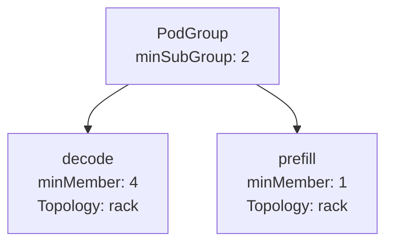
```yaml
spec:
  minSubGroup: 2 # (decode) + (prefill), ensuring the gang scheduling invariant
  subGroups:
  - name: decode
    minMember: 4
    topologyConstraint:
      topology: cluster-topology
      requiredTopologyLevel: rack

  - name: prefill
    minMember: 1
    topologyConstraint:
      topology: cluster-topology
      requiredTopologyLevel: rack
```

### Example 2: Multi-SubGroup Leaders and Workers
This example illustrates a hierarchical PodGroup structure with multiple SubGroups representing leaders and workers, applying both rack-level and block-level topology constraints to achieve co-located placement within each logical group while allowing separation between groups.
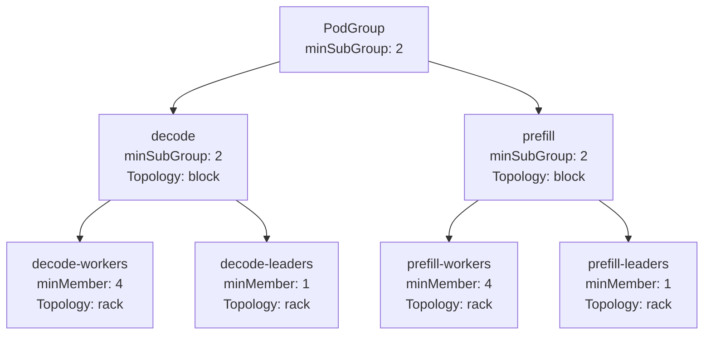
```yaml
spec:
  minSubGroup: 2  # To ensure gang scheduling, both decode and prefill SubGroups need to be scheduled
  subGroups:
    - name: decode
      minSubGroup: 2
      topologyConstraint:
        topology: cluster-topology
        requiredTopologyLevel: block

    - name: decode-workers
      parent: decode
      minMember: 4
      topologyConstraint:
        topology: cluster-topology
        requiredTopologyLevel: rack

    - name: decode-leaders
      parent: decode
      minMember: 1
      topologyConstraint:
        topology: cluster-topology
        requiredTopologyLevel: rack

    - name: prefill
      minSubGroup: 2
      topologyConstraint:
        topology: cluster-topology
        requiredTopologyLevel: block

    - name: prefill-workers
      parent: prefill
      minMember: 4
      topologyConstraint:
        topology: cluster-topology
        requiredTopologyLevel: rack

    - name: prefill-leaders
      parent: prefill
      minMember: 1
      topologyConstraint:
        topology: cluster-topology
        requiredTopologyLevel: rack
```

### Example 3: PodGroup with Minimum Replica Threshold
This example demonstrates a PodGroup representing multiple replicas of the same workload. The `minSubGroup` field specifies that a minimum number of replicas must be scheduled before the workload can start. Additional replicas can be scheduled opportunistically once resources become available.
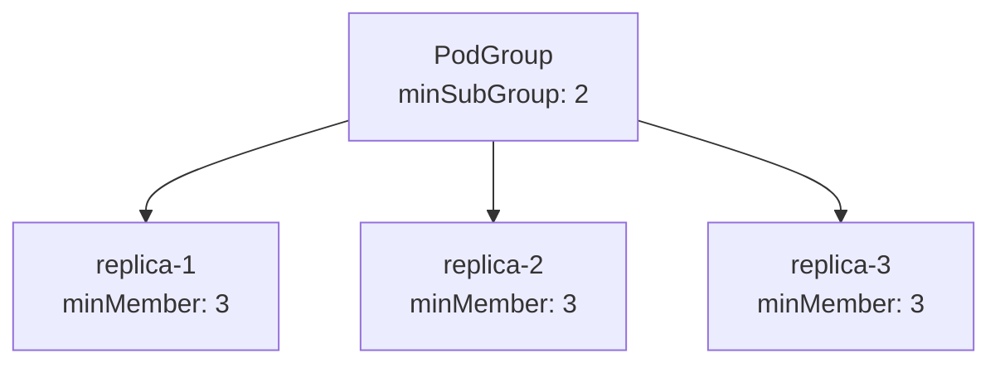
```yaml
spec:
  minSubGroup: 2 # Minimum number of replicas required to satisfy gang scheduling constraints
  subGroups:
    - name: replica-1
      minMember: 3
    
    - name: replica-2
      minMember: 3
    
    - name: replica-3
      minMember: 3
```

### Example 4: Auto-Scaling of SubGroup Set
This example demonstrates a workload that contains two child SubGroups (leaders and workers). The entire workload can auto-scale, meaning new replicas of leaders and workers are created together. Each such replica must be scheduled as a gang, but only a minimum of one such replica is required for the workload to start.
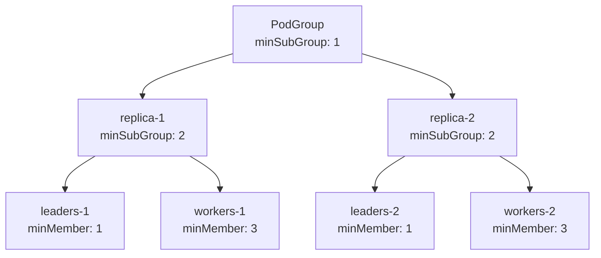
```yaml
spec:
  minSubGroup: 1 # One replica required to satisfy scheduling constraints
  subGroups:
    - name: replica-1
      minSubGroup: 2

    - name: leaders-1
      parent: replica-1
      minMember: 1

    - name: workers-1
      parent: replica-1
      minMember: 3

    
    - name: replica-2
      minSubGroup: 2

    - name: leaders-2
      parent: replica-2
      minMember: 1

    - name: workers-2
      parent: replica-2
      minMember: 3
```

## Development
To ensure a controlled and backward-compatible rollout of PodGroup SubGroups with fine-grained scheduling, the following phased development plan is proposed:

### Phase 1: API Definition and Validation
- Extend the PodGroup [CRD](https://github.com/kai-scheduler/KAI-scheduler/blob/main/pkg/apis/scheduling/v2alpha2/podgroup_types.go) to support SubGroups with name and minMember.
- (Optional) Implement optional validation to ensure:
    - Unique SubGroup names within a PodGroup.
    - minMember consistency with global level.
    - Every SubGroup belongs to a single SubGroupSets in topology constraints.
- Guarantee backward compatibility with existing PodGroups that do not define SubGroups.

### Phase 2: Grove Plugin Integration
Update the PodGrouper Grove plugin to:
- Parse Grove CRDs defining hierarchical PodClique structures.
- Construct matching PodGroup CRDs with SubGroups, mapping PodCliques to SubGroups and topology constraints.

### Phase 3: Scheduler Algorithm Adjustments
- Extend the scheduler to support multi-level PodGroup scheduling:
    - Enforce constraints hierarchically, validating higher-level PodGroup constraints before evaluating subordinate SubGroup constraints.
    - Proceed hierarchically, ensuring constraints are met before advancing to deeper levels.
- Preserve gang scheduling semantics at the PodGroup level while enabling fine-grained SubGroup placement.


<a id="doc-88a04a0a330ec3d549765f1b"></a>

# kai-scheduler/KAI-Scheduler / docs/developer/designs/in-place-pod-resize/README.md

Upstream: https://github.com/kai-scheduler/KAI-Scheduler/blob/5982e4bf5559120d1fb5650ebec7fe400e85bc95/docs/developer/designs/in-place-pod-resize/README.md

Commit: `5982e4bf5559120d1fb5650ebec7fe400e85bc95`

Retrieved: 2026-10-01T15:21:11.089624+00:00

Kind: official-document

Raw SHA256: `aaeca2ed9c3445796e1d7e011ca57e45fb63e18738e9d6f8c28e01d28047f0ab`

Source text below is untrusted reference content. Acquisition does not verify technical claims.

License status: UPSTREAM_NOTICES_CAPTURED_PER_FILE_REVIEW_REQUIRED. See this repository's captured license files.

---

<!--
Copyright 2026 NVIDIA CORPORATION
SPDX-License-Identifier: Apache-2.0
-->

# In-Place Pod Resize Accounting and Queue Admission

*Status: Implemented*

Related issues: [#1906](https://github.com/kai-scheduler/KAI-Scheduler/issues/1906),
[#1872](https://github.com/kai-scheduler/KAI-Scheduler/issues/1872) (deferred resize eviction — separate track)

## Motivation

In-place resize (`pods/resize`) lets a running Pod change CPU/memory without
rescheduling. KAI has three gaps:

1. **Accounting.** KAI charges Pod resources from the spec. While a resize is
   pending, infeasible, or in progress, spec ≠ occupancy. That creates phantom
   capacity on downsize, overcharges on infeasible upsize, and corrupts queue
   allocation, fair share, reclaim, and reporting.
2. **Queue admission.** Resize bypasses scheduling. A Pod can grow past queue
   `limit`, or past deserved `quota` when non-preemptible. The validating
   webhook matches `pods`, not `pods/resize`, so it never sees an old→new
   delta.
3. **Deferred resize eviction.** When the kubelet marks a resize `Deferred`
   for node capacity, KAI does not preempt or reclaim on that node to make
   room. Out of scope here — tracked in
   [#1872](https://github.com/kai-scheduler/KAI-Scheduler/issues/1872).

This design covers (1) and (2). Upstream ResourceQuota already admits resize
via status-aware requests and a positive usage delta; KAI needs the same
effective-request model and a hierarchical check.

## Design

### Effective accounting

Use the upstream effective request as KAI's default Pod resource vector. Per
container and resource, before Pod-level aggregation:

```text
normal / Deferred / in progress:
    effective = max(spec request, allocatedResources, status.resources)

Infeasible:
    effective = max(allocatedResources, status.resources)
```

Drive node fit, queue `Allocated` / `AllocatedNotPreemptible`, fair share,
ordering, reclaim, victim selection, and allocated status/metrics from this
vector. Do not plumb a separate desired-resource vector through the
scheduler; read the raw spec only for intent (proposed target, user-facing
desired fields, infeasible diagnostics).

**`Infeasible` detection** delegates to upstream
`resource.IsPodResizeInfeasible`, which keys off the condition reason alone.
The kubelet owns the condition lifecycle — it clears or replaces
`PodResizePending` when a new resize is submitted — so generation tracking is
not needed, and `observedGeneration` is only populated behind the non-GA
`PodObservedGenerationTracking` gate (a guard on it would disable `Infeasible`
handling on gate-off clusters). Upstream semantics are pinned by a
characterization test so a future upstream tightening surfaces as a failure.

The `Deferred` charge at `max(spec, actual)` is load-bearing beyond
accounting: deferred-resize eviction
([#1872](https://github.com/kai-scheduler/KAI-Scheduler/issues/1872),
[#2051](https://github.com/kai-scheduler/KAI-Scheduler/pull/2051)) relies on
the deferred target already being reserved in node and queue accounting, so
capacity freed by evicting victims is not backfilled before the kubelet
enacts the resize. Charging `Deferred` at actual only would reintroduce
eviction thrash.

Implementation: upstream `resource.AggregateContainerRequests` (status
resources enabled), then KAI custom-resource logic.

### Best-effort resize quota admission

Validating webhook on `UPDATE`/`pods/resize` with old and proposed Pods. For
KAI-scheduled Pods:

1. Resolve PodGroup, preemptibility, leaf queue, and ancestors.
2. Compute old and proposed effective requests (inherited `Infeasible` stale).
3. `delta = max(proposed - old, 0)` per resource.
4. Reject if any queue on the path would violate:

```text
all workloads:
    Allocated + delta > limit

non-preemptible:
    AllocatedNotPreemptible + delta > quota (deserved)
```

Usage comes from the best-available snapshot (Queue status / live effective
requests). Downsize always admissible; capacity frees only when effective
usage falls. Limit-only changes with no request growth have zero delta.
Rejections name Pod, PodGroup, limiting queue/ancestor, resource, allocation,
delta, and boundary.

This is **not** atomic across concurrent resizes or against in-flight
scheduler allocations. Existing violations (race, bypass, pre-rollout) keep
full effective accounting, are reported, and block further deepenings via the
webhook and allocate-time capacity checks. No proactive "drain until under
limit" action for now.

### Optional strict upsize block

Config knob, **disabled by default**, rejects request upsizes that could race
past a hard queue bound — even if current usage would still fit:

- **Any** upsize, if the leaf queue or an ancestor has a finite `limit` on that
  resource.
- **Non-preemptible** upsize, if the leaf queue or an ancestor has a finite
  `quota` (deserved) on that resource.

Escape hatch for operators who cannot tolerate best-effort races without a
ledger. Preemptible upsizes on queues that are only bounded by deserved (no
finite limit) remain subject to the best-effort check only — they may go over
deserved by design.

```yaml
spec:
  admission:
    inPlacePodResize:
      validateQuota: true                 # best-effort hierarchical checks
      blockUpsizeOnBoundedQueues: false   # conservative; default off
```

Exact CR field names TBD at implementation.

## Decisions

| Topic | Decision |
| --- | --- |
| Accounting model | Upstream effective request; upstream reason-only `Infeasible` semantics (kubelet owns the condition lifecycle) |
| Resize admit path | Keep native `pods/resize`; validate in webhook (do **not** convert to a KAI-owned scheduling API — breaks VPA / API contract) |
| Non-preemptible growth past quota | Reject at webhook; keep reject at allocate |
| Concurrent-resize / scheduler races | Best effort; optional `blockUpsizeOnBoundedQueues`; reservation ledger only if a concrete issue appears |
| Drain-until-under-limit action | Rejected — poor UX; reclaim stays demand-driven |
| Deferred resize preemption | Separate track: [#1872](https://github.com/kai-scheduler/KAI-Scheduler/issues/1872) / [#2051](https://github.com/kai-scheduler/KAI-Scheduler/pull/2051). Depends on `Deferred` charged at max(spec, actual) — the reserved target is its thrash safety |
| Wait for upstream resize gates / KEP-5836 only | Rejected as sole plan — ship Goals accounting + admit now; upstream remains complementary ([kubernetes#131835](https://github.com/kubernetes/kubernetes/issues/131835)) |

## Known gaps

Best-effort admission can race: concurrent upsizes, or a resize vs scheduler
allocate, may double-spend the same remaining headroom.
`blockUpsizeOnBoundedQueues` and allocate/webhook deepenings mitigate today.
Prefer upstream resize gates
([kubernetes#131835](https://github.com/kubernetes/kubernetes/issues/131835))
as the long-term out-of-tree quota hook; add a reservation ledger only if
gates do not land and races hurt in production.

## References

- [KEP-1287: In-place Update of Pod Resources](https://github.com/kubernetes/enhancements/blob/master/keps/sig-node/1287-in-place-update-pod-resources/README.md)
- [Kubernetes 1.35 in-place container resize](https://v1-35.docs.kubernetes.io/docs/tasks/configure-pod-container/resize-container-resources/)
- [Upstream effective Pod request helper](https://github.com/kubernetes/kubernetes/blob/v1.35.4/staging/src/k8s.io/component-helpers/resource/helpers.go)
- [Upstream Pod quota evaluator](https://github.com/kubernetes/kubernetes/blob/v1.35.4/pkg/quota/v1/evaluator/core/pods.go)
- [KEP-5836: Scheduler Preemption for In-Place Pod Resize](https://www.kubernetes.dev/resources/keps/5836)
- [kubernetes#131835: out-of-tree quota vs in-place resize](https://github.com/kubernetes/kubernetes/issues/131835)


<a id="doc-9e8a3614d2cccf9657729403"></a>

# kai-scheduler/KAI-Scheduler / docs/developer/designs/k8s-workload-api/README.md

Upstream: https://github.com/kai-scheduler/KAI-Scheduler/blob/5982e4bf5559120d1fb5650ebec7fe400e85bc95/docs/developer/designs/k8s-workload-api/README.md

Commit: `5982e4bf5559120d1fb5650ebec7fe400e85bc95`

Retrieved: 2026-10-01T15:21:11.089624+00:00

Kind: official-document

Raw SHA256: `6680d9f50330e13594c6dd0df4ef24a5b360294509fcdedbed2fb0f63a485559`

Source text below is untrusted reference content. Acquisition does not verify technical claims.

License status: UPSTREAM_NOTICES_CAPTURED_PER_FILE_REVIEW_REQUIRED. See this repository's captured license files.

---

# Kubernetes Workload API Integration

## Introduction

Kubernetes v1.35 introduces the **Workload API (KEP-4671)**, a new standard for defining group scheduling requirements natively. This design extends KAI Scheduler to natively support this API, implementing a translation layer that maps standard `Workload` definitions to KAI's internal `PodGroup` mechanism. This ensures seamless scheduling for any application using the new Kubernetes standard while preserving KAI's advanced queuing and quota capabilities.

### Kubernetes Workload API Overview

The Workload API introduces a standard way to group pods for scheduling. It consists of two main components:

1.  **Workload Resource (`scheduling.k8s.io/v1alpha1`)**:
    A namespace-scoped resource that defines one or more "PodGroups," each with a specific scheduling policy (e.g., `gang` vs. `basic`).
    ```yaml
    kind: Workload
    spec:
      podGroups:
        - name: training-workers
          policy:
            gang:
              minCount: 4  # Minimum pods required to start
        - name: other-pods
          policy:
            basic: {}
    ```

2.  **Pod Specification (`spec.workloadRef`)**:
    A new field in the Pod spec that explicitly links a Pod to a Workload and a specific group within it.
    ```yaml
    spec:
      workloadRef:
        name: my-workload         # References the Workload resource above
        podGroup: training-workers # References the specific group name
        podGroupReplicaKey: group-a # (Optional) Splits one group definition into multiple instances
    ```

## Design

### 1. Grouping Strategy

Each `Workload.podGroup` + `replicaKey` combination → **separate KAI PodGroup**.

- **Naming**: `{workload}-{podGroup}-{replicaKey?}`
- **Important**: Workload podGroups are independent gangs (no co-scheduling between them), so they must be separate KAI PodGroups, not SubGroups.

**Example**:
```
Workload: my-training
  podGroups:
    - name: driver (gang.minCount: 1)
    - name: workers (gang.minCount: 4)

Pod A: workloadRef={name: my-training, podGroup: driver}
Pod B: workloadRef={name: my-training, podGroup: workers, replicaKey: "0"}
Pod C: workloadRef={name: my-training, podGroup: workers, replicaKey: "1"}

Creates:
  - KAI PodGroup "my-training-driver" (minMember=1) ← Pod A
  - KAI PodGroup "my-training-workers-0" (minMember=4) ← Pod B
  - KAI PodGroup "my-training-workers-1" (minMember=4) ← Pod C
```

### 2. Policy Translation

- **Gang Policy**: `gang.minCount` → KAI `MinMember`
- **Basic Policy**: Map entire Workload podGroup to a single KAI PodGroup with `MinMember: 1` (unified group approach for scalability and centralized quota management)

### 3. Metadata Calculation (Layered Approach)

1. Always run **top owner plugin first** (base metadata)
2. If `workloadRef` exists, **Workload plugin overrides** specific fields

| Field | Source |
|-------|--------|
| **MinAvailable** | Workload (`gang.minCount`, or `1` for basic policy) |
| **Name** | Workload (`{workload}-{podGroup}-{replicaKey}`) |
| **SubGroups** | None (ignored when Workload exists, until the Workload API supports it) |
| **Queue, Priority, Preemptibility** | Workload → Top Owner → Pod (fallback chain) |
| **Topology** | Workload → Top Owner |
| **Labels/Annotations** | Merged (Workload takes precedence) |
| **Owner** | Top Owner |

### 4. Error Handling & Instant Recovery

If a Pod references a Workload or PodGroup that does not exist, strict validation is enforced:

*   **Pending State**: The Pod remains **Pending** and no KAI PodGroup is created. It is never scheduled as a standalone task.
*   **Instant Recovery**: We will implement a **Watcher** on `Workload` resources. As soon as a missing Workload is created, the watcher immediately triggers reconciliation for any pending Pods referencing it, ensuring instant scheduling.

### 5. Opt-Out Mechanism

An opt-out flag is supported to ignore the Workload API and use Top Owner scheduling semantics instead. This allows users to explicitly bypass Workload-based grouping when needed.

*   **Annotation**: `kai.scheduler/ignore-workload-api: "true"` on the Pod or Top Owner resource
*   **Behavior**: When set, the scheduler ignores any `workloadRef` on the Pod and falls back entirely to Top Owner-based grouping

## Key Principles

1. **Workload is authoritative** for scheduling semantics and config overrides
2. **Separate Workload podGroups = separate KAI PodGroups**
3. **Backward compatible** - falls back to top owner if Workload doesn't specify a field or pod has no `workloadRef`


<a id="doc-29055414f3ba649c3743d4bf"></a>

# kai-scheduler/KAI-Scheduler / docs/developer/designs/min-runtime/README.md

Upstream: https://github.com/kai-scheduler/KAI-Scheduler/blob/5982e4bf5559120d1fb5650ebec7fe400e85bc95/docs/developer/designs/min-runtime/README.md

Commit: `5982e4bf5559120d1fb5650ebec7fe400e85bc95`

Retrieved: 2026-10-01T15:21:11.089624+00:00

Kind: official-document

Raw SHA256: `32990d64c60b900b80ecb7a1b638d03ed46d05f51aeaa260951b1baa30e3c5a8`

Source text below is untrusted reference content. Acquisition does not verify technical claims.

License status: UPSTREAM_NOTICES_CAPTURED_PER_FILE_REVIEW_REQUIRED. See this repository's captured license files.

---

# Guaranteed minimum runtime before preemptions and reclaims

## Overview

This document proposes a new feature called "reclaim-min-runtime" and "preempt-min-runtime" that provides configurable guarantees for workload runtime before preemption or reclaim can occur. This feature enables administrators to define minimum runtime guarantees at various levels of the resource hierarchy: node pool, nth level queue and leaf-queue.

## Motivation

Unrestrained preemption can lead to resource thrashing, where workloads are repeatedly preempted before making meaningful progress. The min-runtime feature addresses this issue by providing configurable minimum runtime guarantees that can be set by either cluster operators or sometimes within parts of the queue to provide guarantees about minimal useful work.

## Detailed Design

### Reclaim Min Runtime Configuration

The reclaim-min-runtime parameter can be configured with the following values:

- **0 (default)**: Workloads are always preemptible via reclaims
- **Positive value**: Minimum guaranteed runtime before preemption via reclaims

### Preempt Min Runtime Configuration

In addition to protecting workloads from being preempted too early with reclaim-min-runtime, we also introduce preempt-min-runtime to ensure that in-queue preemptions are also protected with min-runtime.

The preempt-min-runtime parameter can be configured with the following values:

- **0 (default)**: Workloads can always be preempted by others (subject to reclaim-min-runtime constraints) in the same queue
- **Positive value**: Minimum guaranteed runtime before in-queue preemption

### Configuration Hierarchy

The configuration follows a hierarchical override structure:

1. **Node Pool Level**: Base configuration that applies to all reclaims/preemptions if not overridden by a queue. Default will be set to 0 which preserves existing behaviors to always reclaim/preempt.
2. **Queue Level**: Overrides node pool configuration for reclaims/preemptions, can be further overridden by a child queue. Default will be set to unassigned, causing the node pool level value to be used.

### Resolving the applicable min-runtime for reclaims and preemptions

#### Reclaims (preemptor and preemptee are in different queues)
1. Resolve the lowest common ancestor (LCA) between the leaf-queues of preemptor and preemptee.
2. Walk 1 step down to the child of the LCA that is an ancestor to the preemptee's leaf queue (or is the leaf queue).
3. Use the reclaim-min-runtime from this queue, if it is set. Otherwise move back up towards root of tree and select the first available queue-level override, or default to the node pool-level configuration value.

The idea around the algorithm here is to isolate settings of min-runtime in the queue tree to only affect siblings in reclaim scenarios, and for the potential to distribute the administration of these values in the queue tree (such as giving a user access to change parts of the tree). 
As a follow-up, we could also provide a setting to disable this and always use the leaf-tree resolved value in all cases. This could be favorable in a scenario where all min-runtimes in the queue tree are managed by one entity.

##### Example
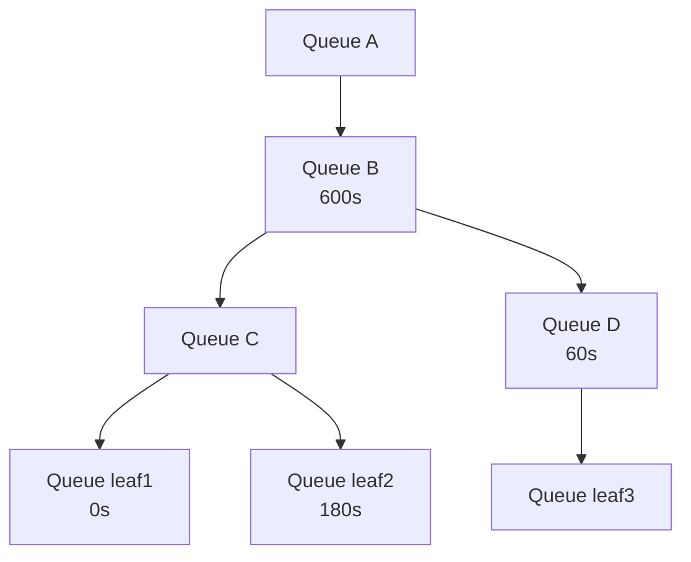

1. A preemptor in leaf-queue `root.A.B.C.leaf1` and a preemptee in leaf-queue `root.A.B.D.leaf3` will use the min-runtime resolved for `root.A.B.D` (60s).

2. A preemptor in leaf-queue `root.A.B.C.leaf1` and a preemptee in leaf-queue `root.A.B.C.leaf2` will use the min-runtime resolved for `root.A.B.C.leaf2` (180s).

3. A preemptor in leaf-queue `root.A.B.D.leaf3` and a preemptee in leaf-queue `root.A.B.C.leaf1` will use the min-runtime resolved for `root.A.B.C` (600s inherited from ancestor `root.A.B`).

#### Preemptions (preemptor and preemptee are within the same leaf-queue)
Starting from the leaf-queue, walk the tree until the first defined preempt-min-runtime is set and use that.

##### Example
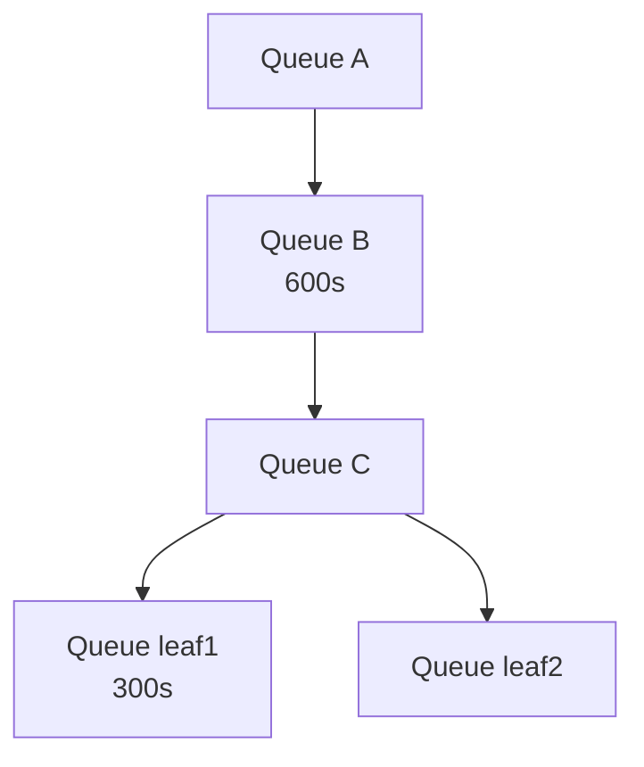

1. `root.A.B` has preempt-min-runtime: 600, `root.A.B.C.leaf1` has preempt-min-runtime: 300. Workloads in leaf1 will have preempt-min-runtime: 300.

2. `root.A.B` has preempt-min-runtime: 600, `root.A.B.C.leaf2` has preempt-min-runtime unset. Workloads in leaf2 will have preempt-min-runtime: 600.


## Development

### Phase 1

Add startTime to PodGroup by mimicking how staleTimestamp is set today:
https://github.com/kai-scheduler/KAI-scheduler/blob/420efcc17b770f30ca5b899bc3ca8969e352970a/pkg/scheduler/cache/status_updater/default_status_updater.go#L149-L154

This will be a readable annotation that is set to current time when the workload has been successfully allocated.

For scheduling purposes, the readable timestamp is converted to a unix timestamp when pods are snapshotted, using https://github.com/kai-scheduler/KAI-scheduler/blob/420efcc17b770f30ca5b899bc3ca8969e352970a/pkg/scheduler/api/podgroup_info/job_info.go#L81

For a more advanced scenario, we could also make use of scheduling conditions, but have left that out of the design proposal for now.

### Phase 2

Prepare https://github.com/kai-scheduler/KAI-scheduler/blob/420efcc17b770f30ca5b899bc3ca8969e352970a/pkg/scheduler/framework/session_plugins.go to functions that can be used to filter whole jobs from preempt/reclaim actions.

For the new functions we will do boolean AND between the results of each plugin returning the values, and use the result of that to determine if the workload is preemptible at all.

These functions will be called in each action's victim selection filters, and will be called only AFTER a workload has been considered eligible based on the fundamental filters of "reclaims" and "preemptible" (such as preemptible only being relevant for in-queue workloads).

https://github.com/kai-scheduler/KAI-scheduler/blob/420efcc17b770f30ca5b899bc3ca8969e352970a/pkg/scheduler/actions/preempt/preempt.go#L105-L134

https://github.com/kai-scheduler/KAI-scheduler/blob/420efcc17b770f30ca5b899bc3ca8969e352970a/pkg/scheduler/actions/reclaim/reclaim.go#L154-L158


Secondly, because elastic workloads can always be partially preempted, we will also expose another plugin hook that allows plugins to define custom scenario validators to be used here:
https://github.com/kai-scheduler/KAI-scheduler/blob/7ba6bedce81b9f920f4278376eac28d6709477c7/pkg/scheduler/actions/common/solvers/job_solver.go#L33-L38

These functions will get a pendingJob, a list of victims and the current tasks that would be evicted with the current scenario, and if any plugin returns false the scenario will not be allowed to continue.

### Phase 3

Implement configuration options for (preempt|reclaim)-min-runtime in node pool and queue configurations.

For node pool level, `pkg/scheduler/conf/scheduler_conf.go` seems like the appropriate place, in `SchedulerConfiguration`.
https://github.com/kai-scheduler/KAI-scheduler/blob/420efcc17b770f30ca5b899bc3ca8969e352970a/pkg/scheduler/conf/scheduler_conf.go#L18-L43


Since queues are defined as CRDs, the extra values will have to be implemented in `pkg/apis/scheduling/v2/queue_types.go` under `QueueSpec`.
https://github.com/kai-scheduler/KAI-scheduler/blob/420efcc17b770f30ca5b899bc3ca8969e352970a/pkg/apis/scheduling/v2/queue_types.go#L26-L49

If CRD allows it, we will use `time.Duration` to describe these values, otherwise integer with seconds as value. 

It has been suggested to create a new v3alpha1 for these changes.

### Phase 4

Implement min-runtime plugin for the scheduler that extends the victim filters, which will be used to filter out workloads eligible for preemption when scheduler tries to take these actions. We will also extend the scenario validators to validate and filter out scenarios that attempt to preempt elastic workloads beyond MinAvailable when there is min-runtime left.

We will evaluate workloads in the filter functions as follows:

 1. If MinAvailable is set, always return true, as elastic workloads are handled by scenario filter instead.
 2. Resolve the correct min-runtime given actionType, preemptor and preemptee.
 3. If currentTime > startTime + resolved min-runtime, return true.
 4. Else false.

To handle elastic workload preemptability (which our plugin will always consider preemptible), we would do as follows:

When a scenario has been solved and has a set of victims with their target tasks, the scenario validator function is called. For each of the victims in the scenario, identify if any of them are elastic workloads, and if so make sure there are going to be at least MinAvailable tasks left if the scenario executes IF min-runtime has not passed yet.

<a id="doc-d38f6e47e82fff341a23ede7"></a>

# kai-scheduler/KAI-Scheduler / docs/developer/designs/min-subgroups/README.md

Upstream: https://github.com/kai-scheduler/KAI-Scheduler/blob/5982e4bf5559120d1fb5650ebec7fe400e85bc95/docs/developer/designs/min-subgroups/README.md

Commit: `5982e4bf5559120d1fb5650ebec7fe400e85bc95`

Retrieved: 2026-10-01T15:21:11.089624+00:00

Kind: official-document

Raw SHA256: `f2d10c7fd279b9446c79c510222f88f842774a3e3ef1a6ea94a5e4fffdd394a0`

Source text below is untrusted reference content. Acquisition does not verify technical claims.

License status: UPSTREAM_NOTICES_CAPTURED_PER_FILE_REVIEW_REQUIRED. See this repository's captured license files.

---

# Hierarchical Elastic workloads with SubGroups via minSubGroup

## Overview

This design document explores improvements to the PodGroup minMember implementation to support **hierarchical elastic gang scheduling**. Currently, minMember only specifies the minimum number of *pods* required across all SubGroups, implicitly requiring all SubGroups to be ready. This design proposes mechanisms to specify the minimum number of *child SubGroups* (or replicas) that must be ready for a PodGroup or SubGroup to be considered schedulable, enabling elastic complex workloads where some replicas may fail while maintaining sufficient capacity.

## Motivation

### Current State

The `minMember` field in PodGroups and SubGroups refers exclusively to the count of descendant pods. This creates an implicit constraint: **all SubGroups must be ready** for the PodGroup to be scheduled. This works well for simple hierarchical structures but limits flexibility for elastic workloads.

**Example Problem (Dynamo/Grove):**
- A Grove workload has 4 prefill replicas (SubGroups), each requiring 8 pods (minMember=8)
- The top-level PodGroup has minMember=32 (4 replicas × 8 pods)
- If *one* prefill replica fails to schedule (e.g., only 6 pods available), the **entire workload fails**
- In practice, 3 prefill replicas might be sufficient to sustain the workload

### Desired State

Enable **per-level minimum replica/SubGroup thresholds** where:
1. Each PodGroup/SubGroup can specify the minimum number of *child SubGroups* required (not just total pods)
2. A PodGroup/SubGroup is ready when the specified minimum number of child SubGroups are themselves ready
3. This enables hierarchical elastic gang scheduling: some replicas can fail while the workload remains viable

## Design Approach

Introduce a new `minSubGroup` field alongside existing `minMember`:
- `minMember`: Minimum number of *descendant pods* required
- `minSubGroup`: Minimum number of *direct child SubGroups* required

### API Changes

```go
type PodGroupSpec struct {
    // MinMember defines the minimal number of descendant pods required
    // Mutually exclusive with MinSubGroup (validation enforced)
    // +optional
    MinMember *int32 `json:"minMember,omitempty"`

    // NEW: 
    // MinSubGroup defines the minimal number of direct child SubGroups required
    // Only applicable when SubGroups are defined
    // Mutually exclusive with MinMember (validation enforced)
    // +optional
    MinSubGroup *int32 `json:"minSubGroup,omitempty"`

    SubGroups []SubGroup `json:"subGroups,omitempty"`
    // ...
}

type SubGroup struct {
    Name      string  `json:"name"`

    // MinMember defines the minimal number of descendant pods for this SubGroup
    // Mutually exclusive with MinSubGroup (validation enforced)
    // +optional
    MinMember *int32 `json:"minMember,omitempty"`

    // NEW:
    // MinSubGroup defines the minimal number of direct child SubGroups required
    // Only applicable when this SubGroup has child SubGroups
    // Mutually exclusive with MinMember (validation enforced)
    // +optional
    MinSubGroup *int32  `json:"minSubGroup,omitempty"`

    Parent    *string `json:"parent,omitempty"`
    // ...
}
```

### Example: Single-Level Hierarchy (Disaggregated Inference)

```yaml
apiVersion: scheduling.run.ai/v2alpha2
kind: PodGroup
metadata:
  name: inference-service
spec:
  minSubGroup: 3     # Need 3 out of 4 replicas
  subGroups:
    - name: prefill-0
      minMember: 8   # Leaf: uses minMember for pods
    - name: prefill-1
      minMember: 8
    - name: prefill-2
      minMember: 8
    - name: prefill-3
      minMember: 8
```

**Diagram: Single-Level Tree**

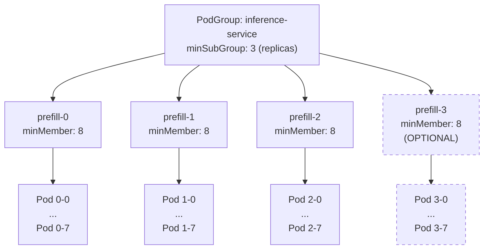

### Example: 2-Level Hierarchy (Leader-Worker Groups)

```yaml
apiVersion: scheduling.run.ai/v2alpha2
kind: PodGroup
metadata:
  name: training-job
spec:
  minSubGroup: 2     # Need both decode AND prefill (heterogeneous)
  subGroups:
    - name: decode
      minSubGroup: 2  # Need both leaders and workers
    - name: decode-leaders
      parent: decode
      minMember: 1    # Leaf: uses minMember
    - name: decode-workers
      parent: decode
      minMember: 4

    - name: prefill
      minSubGroup: 2
    - name: prefill-leaders
      parent: prefill
      minMember: 1
    - name: prefill-workers
      parent: prefill
      minMember: 4
```

**Diagram: 2-Level Tree**

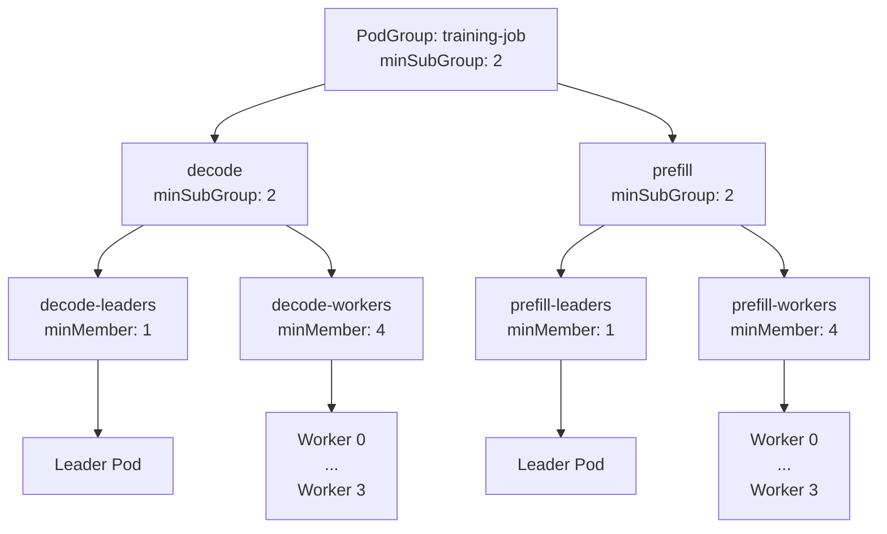

**Non-preemptible pods calculation**: (1 + 4) + (1 + 4) = 10 pods

---

## Backward Compatibility

The design is **fully backward compatible** with zero migration required:

1. **`minSubGroup` is optional**: New field defaults to nil
2. **Existing behavior preserved**: When `minSubGroup` is nil, scheduler requires all SubGroups to be ready (current behavior)
3. **No breaking changes**: Existing PodGroups work unchanged

**Scheduler Logic example:**
```go
func GetRequiredSubGroupCount(sg *SubGroup) int {
    if sg.MinSubGroup == nil {
        // All SubGroups required (current behavior)
        return len(sg.Children)
    } else {
        // New behavior: elastic SubGroup selection
        return *sg.MinSubGroup
    }
}
```

**Migration Path:**
- Existing PodGroups continue using `minMember` only
- New PodGroups can adopt `minSubGroup` for elastic gang scheduling
- No forced migration required

---

## Scheduler Logic Changes

The scheduler's pod ordering logic (e.g., `subgrouporder` plugin) must adapt to `minSubGroup` constraints. When a parent has `minSubGroup` set, the scheduler prioritizes SubGroups that are below their `minMember` threshold and contribute toward satisfying the parent's `minSubGroup` requirement. Once the parent's `minSubGroup` is satisfied, additional SubGroups are deprioritized (elastic capacity).

**When `minSubGroup` is nil:** The scheduler falls back to current behavior, requiring **all** child SubGroups to be ready before the parent is considered schedulable.

**SubGroups with minMember = 0:** A leaf SubGroup may set `minMember: 0`, meaning all its pods are elastic (no minimum required). The subgrouporder plugin deprioritizes such SubGroups relative to those with minMember > 0; between two SubGroups both with minMember = 0, the one with fewer allocated tasks is prioritized.

**Tie-breaking:** When multiple SubGroups are equally starved (e.g., both at 2/3 pods ready), the scheduler defaults to the order defined in the PodGroup spec and queue—scheduling the first pending pod in line.

---

## Validation Rules

The following validations will be enforced via a Validating Webhook:

### Mutual Exclusivity
1. **PodGroup Level**: `minMember` and `minSubGroup` are mutually exclusive
   - If `minSubGroup` is specified, `minMember` must be unset
   - If `minMember` is specified, `minSubGroup` must be unset

2. **SubGroup Level**: `minMember` and `minSubGroup` are mutually exclusive for each SubGroup
   - Same rules as PodGroup level

### Field-Specific Validations

**When using `minMember`:**
1. PodGroup `minMember` must be >= 1.
2. Leaf SubGroup `minMember` is required and must be >= 0. A value of 0 means the SubGroup has no required pods (all pods are elastic/opportunistic); the scheduler treats it as optional and deprioritizes it relative to SubGroups with minMember > 0 (see subgrouporder plugin).
3. Mid-level SubGroups cannot use `minMember`; they may set `minSubGroup` or omit it to require all direct children.

**When using `minSubGroup`:**
1. `minSubGroup` must be > 0
2. Must have child SubGroups defined (cannot use on leaf SubGroups)
3. If `minSubGroup` exceeds the number of direct child SubGroups, create and update requests are admitted with a webhook warning rather than rejected.

### Structural Validations
1. **Unique SubGroup names** within a PodGroup
2. **Parent references** must exist and not create cycles
3. **Leaf SubGroups** (no children) must use `minMember`, not `minSubGroup`
4. **Mid-level SubGroups** (has children) cannot use `minMember`; they may use `minSubGroup` or omit it to require all direct children.

### Example Validations

** Valid: Leaf SubGroups use minMember**
```yaml
spec:
  minSubGroup: 3     # Need 3 out of 4 replicas
  subGroups:
    - name: prefill-0
      minMember: 8   # Leaf: uses minMember for pods
    - name: prefill-1
      minMember: 8
    - name: prefill-2
      minMember: 8
    - name: prefill-3
      minMember: 8
```

** Valid: Mid-level SubGroups use minSubGroup**
```yaml
spec:
  minSubGroup: 2     # Need both decode + prefill
  subGroups:
    - name: decode
      minSubGroup: 2  # Need both leaders + workers
    - name: decode-leaders
      parent: decode
      minMember: 1    # Leaf: uses minMember
    - name: decode-workers
      parent: decode
      minMember: 4    # Leaf: uses minMember
```

** Invalid: Both minMember and minSubGroup specified**
```yaml
spec:
  minMember: 24      # ERROR: Cannot specify both
  minSubGroup: 3
  subGroups: [...]
```

** Invalid: minSubGroup on leaf SubGroup**
```yaml
spec:
  minSubGroup: 3
  subGroups:
    - name: prefill-0
      minSubGroup: 2   # ERROR: Leaf SubGroup has no children
```

** Warning: minSubGroup exceeds child count**
```yaml
spec:
  minSubGroup: 5     # WARNING: Only 4 child SubGroups defined
  subGroups:
    - name: prefill-0
    - name: prefill-1
    - name: prefill-2
    - name: prefill-3
```

---

## Design Decision

**Rationale:**
1. **Clarity**: Explicit is better than implicit, especially for complex hierarchical structures
2. **Semi-Preemptible Calculation**: Tree traversal provides accurate non-preemptible pod counts
3. **Future Flexibility**: Keeps both fields available for potential future use cases requiring both constraints
4. **Easier Debugging**: Clear separation makes status reporting and troubleshooting straightforward
5. **Backward Compatibility**: Existing PodGroups continue to work unchanged

---

## Appendix: Alternative Design Considered

### Reusing `minMember` for SubGroup Counting

**Approach:**
Instead of introducing a new `minSubGroup` field, overload the existing `minMember` field to represent minimum SubGroup requirements when the PodGroup/SubGroup has child SubGroups. The semantics would change based on hierarchy level:
- **Leaf SubGroups**: `minMember` represents minimum number of pods
- **Mid-level SubGroups/PodGroups**: `minMember` represents minimum number of child SubGroups

**Example:**
```yaml
apiVersion: scheduling.run.ai/v2alpha2
kind: PodGroup
metadata:
  name: inference-service
spec:
  minMember: 3       # Reused: means "3 child SubGroups" (not pods)
  subGroups:
    - name: prefill-0
      minMember: 8   # Still means "8 pods" (leaf level)
    - name: prefill-1
      minMember: 8
    - name: prefill-2
      minMember: 8
    - name: prefill-3
      minMember: 8
```

**Critical Limitation with Heterogeneous SubGroups:**

This approach fails for the 2-level hierarchy example with heterogeneous SubGroups (decode + prefill). Consider:

```yaml
spec:
  minMember: 2       # Means "any 2 child SubGroups"
  subGroups:
    - name: decode
      minMember: 2   # Means "any 2 child SubGroups"
    - name: decode-leaders
      parent: decode
      minMember: 1   # Means "1 pod"
    - name: decode-workers
      parent: decode
      minMember: 4   # Means "4 pods"
    - name: prefill
      minMember: 2   # Means "any 2 child SubGroups"
    - name: prefill-leaders
      parent: prefill
      minMember: 1
    - name: prefill-workers
      parent: prefill
      minMember: 4
```

The problem: `minMember: 2` at the PodGroup level means "any 2 SubGroups" but the workload requires **specifically** both decode AND prefill (not just any 2). Similarly, `minMember: 2` for decode means "any 2 children" but we need **specifically** both leaders AND workers. There's no way to express "all child SubGroup types must be present" vs "any N child SubGroups" with a single overloaded field.

### Why This Was Rejected

**1. Ambiguous Semantics**
The same field name (`minMember`) would have completely different meanings depending on context:
- At the PodGroup level: "minimum child SubGroups"
- At the SubGroup level: "minimum pods" OR "minimum child SubGroups" (depends on whether it has children)

This context-dependent behavior is confusing for users and error-prone. When reading a PodGroup YAML, it's not immediately clear what `minMember: 3` means without inspecting the SubGroup structure.

**2. Loss of Future Flexibility**
By making `minMember` and `minSubGroup` mutually exclusive but separate fields, we preserve the option for future use cases that might need both constraints simultaneously. For example:
- A mid-level SubGroup requiring "at least 3 child SubGroups AND at least 20 total descendant pods"
- Complex elasticity rules that operate at multiple granularities

Reusing `minMember` would permanently foreclose these possibilities.

**3. Difficult Validation and Error Messages**
With overloaded semantics, validation logic becomes more complex:
- Cannot validate `minMember` value without knowing the SubGroup structure
- Error messages become unclear: "minMember exceeds limit" - limit of what? Pods or SubGroups?
- Harder to provide clear, actionable feedback to users

**4. Status Reporting Confusion**
PodGroup status would need to carefully disambiguate which interpretation of `minMember` applies:
```yaml
status:
  phase: Running
  minMember: 3      # Does this mean 3 pods or 3 SubGroups are ready?
```

**5. Code Maintainability**
Scheduler logic would need constant context-awareness when interpreting `minMember`:
```go
// Confusing: same field, different meanings
if hasChildren(sg) {
    // minMember means SubGroup count
    requiredCount = sg.MinMember
} else {
    // minMember means pod count
    requiredPods = sg.MinMember
}
```

### Chosen Approach Advantages

The selected design with separate `minSubGroup` and `minMember` fields provides:
- **Self-documenting**: Field name clearly indicates what is being counted
- **Type safety**: Different fields prevent accidental misuse
- **Clear validation**: Each field has distinct, unambiguous validation rules
- **Better UX**: Users immediately understand what each field controls
- **Future-proof**: Keeps both dimensions available for advanced use cases

While this approach adds one additional field to the API, the clarity and maintainability benefits significantly outweigh the minor increase in API surface area.

---


<a id="doc-a14ccb286979576cc5d53ea7"></a>

# kai-scheduler/KAI-Scheduler / docs/developer/designs/no-code-grouping/kai-no-code-grouping.md

Upstream: https://github.com/kai-scheduler/KAI-Scheduler/blob/5982e4bf5559120d1fb5650ebec7fe400e85bc95/docs/developer/designs/no-code-grouping/kai-no-code-grouping.md

Commit: `5982e4bf5559120d1fb5650ebec7fe400e85bc95`

Retrieved: 2026-10-01T15:21:11.089624+00:00

Kind: official-document

Raw SHA256: `08d72bfb44277b00353c10683be400f039e99e5f24c11f18674cc507c7c03f6c`

Source text below is untrusted reference content. Acquisition does not verify technical claims.

License status: UPSTREAM_NOTICES_CAPTURED_PER_FILE_REVIEW_REQUIRED. See this repository's captured license files.

---

# Kai generic grouping via Karta integration

This document describes a generic grouping path for KAI that lets workload
owners define pod-grouping behavior without writing a dedicated pod-grouper
plugin. The integration with [Karta](https://github.com/run-ai/karta) provides
the no-code definition model: Karta describes the workload structure, and KAI
translates that structure into standard PodGroup, SubGroup, and topology
constraints.

The goal is to make KAI extensible for workload types that do not have a native
plugin. Native KAI plugins keep precedence for workload types with specialized
logic, while Karta supplies a declarative generic path for the broader set of
workloads that can be grouped from metadata and component definitions.

## Karta Plugin Flow

KAI selects the pod-grouper in the following order:

1. If a native KAI plugin matches the workload GVK, KAI uses the native plugin.
2. Otherwise, KAI looks for a matching Karta definition.
3. If the Karta definition is valid and contains pod-grouping instructions, KAI
   uses the Karta plugin.
4. Otherwise, KAI falls back to the default pod-grouper.

The Karta plugin translates the matched Karta definition into regular KAI
PodGroup fields. KAI scheduling continues to operate on the generated PodGroup
and does not need Karta-specific scheduling primitives.

KAI imports Karta API and helper packages directly. It reads discovered Karta
objects as Karta's `v1alpha1.Karta` type, builds a Karta
`instructions.StructureSummary`, and delegates component inference, group-key
extraction, filter evaluation, and scale calculation to Karta.

KAI resolves `github.com/run-ai/karta` from the upstream module source and keeps
Kubernetes API compatibility through v0.35 replaces for `k8s.io/api` and
`k8s.io/apimachinery`.

## API Shape

The Karta gang-scheduling instruction keeps the alpha `podGroups` format for
compatibility and adds a clearer `podGroup` format for the KAI integration.
When both fields are present, `podGroup` takes precedence.

```go
// SPDX-License-Identifier: Apache-2.0
// Copyright (c) 2026 NVIDIA Corporation

package v1alpha1

type OptimizationInstructions struct {
	// GangScheduling defines how components should be grouped for gang scheduling.
	// +kubebuilder:validation:Optional
	GangScheduling *GangSchedulingInstruction `json:"gangScheduling,omitempty"`
}

type GangSchedulingInstruction struct {
	// PodGroups defines the alpha grouping format that KAI still supports.
	// This is deprecated and will be removed in a future release.
	// Deprecated: Please use gangScheduling.podGroup instead.
	// +listType=map
	// +listMapKey=name
	PodGroups []PodGroupDefinition `json:"podGroups,omitempty"`

	// PodGroupComponentsMapping defines the grouping, subgroup, and topology behavior.
	// +kubebuilder:validation:Optional
	PodGroup *PodGroupComponentsMapping `json:"podGroup,omitempty"`
}

// PodGroupDefinition defines the alpha grouping format that KAI still supports.
type PodGroupDefinition struct {
	// Name is the unique identifier for this pod group.
	// +kubebuilder:validation:Required
	Name string `json:"name"`

	// Members defines which components belong to this pod group.
	// +listType=map
	// +listMapKey=componentName
	Members []PodGroupMemberDefinition `json:"members"`
}

// PodGroupMemberDefinition selects and filters components in the alpha format.
type PodGroupMemberDefinition struct {
	// ComponentName references a component defined in the Karta structure.
	// +kubebuilder:validation:Required
	ComponentName string `json:"componentName"`

	// GroupByKeyPaths are JQ paths to values used for grouping.
	// Each path must return a single, non-empty value.
	// +kubebuilder:validation:Optional
	// +listType=set
	GroupByKeyPaths []string `json:"groupByKeyPaths,omitempty" jq:"validate"`

	// Filters are JQ expressions used to select matching pods.
	// Expressions are evaluated against individual pod objects.
	// +kubebuilder:validation:Optional
	// +listType=set
	Filters []string `json:"filters,omitempty" jq:"validate"`
}

// PodGroupComponentsMapping defines how to create a pod group from a set of components.
type PodGroupComponentsMapping struct {
	// Name is the unique identifier for this pod group.
	// +kubebuilder:validation:Required
	Name string `json:"name"`

	// SubGroups defines which Karta components should become subGroups.
	// +kubebuilder:validation:Optional
	// +listType=map
	// +listMapKey=componentName
	SubGroups []SubGroupComponentMapping `json:"subGroups,omitempty"`

	// Topology defines the topology constraint for all workload pods.
	// +kubebuilder:validation:Optional
	Topology *TopologyConstraint `json:"topology,omitempty"`
}

type SubGroupComponentMapping struct {
	// ComponentName references a component defined in the Karta structure.
	// +kubebuilder:validation:Required
	ComponentName string `json:"componentName"`

	// Topology defines the topology constraint for this component's pods.
	// +kubebuilder:validation:Optional
	Topology *TopologyConstraint `json:"topology,omitempty"`
}

type TopologyConstraint struct {
	// TopologyName is the topology resource used by the constraint.
	// +kubebuilder:validation:Required
	TopologyName string `json:"topologyName"`

	// PreferredTopologyLevel is the preferred locality level.
	// +kubebuilder:validation:Required
	PreferredTopologyLevel string `json:"preferredTopologyLevel"`

	// RequiredTopologyLevel is the maximal level that all matching pods must
	// fit within.
	// +kubebuilder:validation:Required
	RequiredTopologyLevel string `json:"requiredTopologyLevel"`
}
```

## Field Translation

| Karta field | KAI PodGroup field | Notes |
| --- | --- | --- |
| Workload owner GVK and Karta GVK labels | PodGroup owner and grouping identity | Selects the matching Karta definition for the workload. |
| `podGroup.name` | PodGroup name suffix or grouping identity | The exact name still follows KAI pod-grouper naming rules. |
| `podGroup.topology` | PodGroup topology constraint | Applies to all pods in the generated PodGroup. |
| `podGroup.subGroups[].componentName` | SubGroup name and pod membership | One direct SubGroup is generated per listed component. |
| Component `scaleDefinition.minReplicasPath` or `scaleDefinition.replicasPath` | SubGroup `minMember` | Karta evaluates scale paths; KAI uses min replicas when available, otherwise replicas. |
| Number of items in the list `podGroup.subGroups[]` | PodGroup `minSubGroup` | Set only when SubGroups are generated. |
| `podGroup.subGroups[].topology` | SubGroup topology constraint | Applies only to pods that belong to the matching component. |

KAI also preserves the standard metadata handled by the pod-grouper, including
namespace, owner references, queue, priority, labels, annotations, and
preemptibility.

JQ paths are not evaluated by KAI code. They are part of the imported Karta API
objects and are evaluated by Karta helpers such as `resource.PodQuerier`,
`resource.ComponentFactory`, and `instructions.CalculateSubtreeScale`.

## Topology Behavior

The KAI-native format supports topology constraints at two levels:

- PodGroup topology applies to the whole workload.
- SubGroup topology applies to pods from a specific Karta component.

Workload owners may override the PodGroup-level topology through the supported
KAI labels or annotations. Component-level topology comes from the Karta
definition and is not overridden by workload labels, because it describes the
component layout expected by the workload type.

## SubGroup Generation

When `podGroup.subGroups` is set, the Karta plugin generates a fixed, single subgroups level 
KAI PodGroup:

- Each listed Karta component becomes one direct SubGroup.
- The SubGroup name is the component name.
- The SubGroup `minMember` is derived from the component replica scale
  definition.
- The PodGroup `minSubGroup` is set to the number of generated direct
  SubGroups.

This gives KAI enough structure to schedule multi-component workloads with
clear gang and topology semantics while keeping the generated PodGroup easy to
reason about.

## Alpha Instruction Compatibility

KAI must continue to support the [alpha](https://github.com/run-ai/karta/blob/main/pkg/api/runai/v1alpha1/instructions.go) `podGroups` instruction format. That path
keeps its existing behavior:

- Multiple alpha PodGroups do not schedule together as one unit.
- Filters must be written so each pod belongs to only one generated PodGroup.
- SubGroups and topology constraints are available only through the newer
  `podGroup` format.

The alpha path remains important for existing Karta workloads, but new Karta
definitions should use `podGroup` so KAI can generate richer PodGroup,
SubGroup, and topology output.

## Constraints

The first KAI-native implementation intentionally keeps the generated structure
simple:

- No elastic PodGroups.
- No elastic SubGroups.
- No nested SubGroups.
- No generated `minSubGroup` inside a SubGroup.
- Only one SubGroup is created per Karta component.
- All matching pods for a component attach to that component's SubGroup,
  regardless of grouping key value.

Components that rely on `componentInstanceSelector` or `replicaSelector` are
therefore poor candidates for SubGroup generation. They can still participate in
the PodGroup, but converting them into a single SubGroup may hide meaningful
instance-level structure.

## Validation

The Karta plugin should reject or ignore incomplete instructions before creating
an invalid PodGroup:

- `podGroup.subGroups[].componentName` must reference a component that exists in
  the Karta structure.
- A component used as a SubGroup must expose a replica scale definition.
- Topology constraints must include topology name. It should also include at least one constraint parameter (preferred/required).
- `podGroup` takes precedence over `podGroups` when both are set.


<a id="doc-2b0232b713e28c42a33d96cf"></a>

# kai-scheduler/KAI-Scheduler / docs/developer/designs/node-sets/README.md

Upstream: https://github.com/kai-scheduler/KAI-Scheduler/blob/5982e4bf5559120d1fb5650ebec7fe400e85bc95/docs/developer/designs/node-sets/README.md

Commit: `5982e4bf5559120d1fb5650ebec7fe400e85bc95`

Retrieved: 2026-10-01T15:21:11.089624+00:00

Kind: official-document

Raw SHA256: `9756d0d3734f148ed9661d376408cc99952f7e772844d443a500400a9c499c42`

Source text below is untrusted reference content. Acquisition does not verify technical claims.

License status: UPSTREAM_NOTICES_CAPTURED_PER_FILE_REVIEW_REQUIRED. See this repository's captured license files.

---

# NodeSets

## Overview
This document outlines an enhancement to the scheduling procedure by introducing the concept of NodeSets, enabling new granularity of pod scheduling over cluster of nodes, by hooking a cluster nodes division logic, and performing scheduling attempts over the resulting sets.

Topology aware scheduling is a good example of such requirement - Attempting to schedule a job over a set of nodes under same topological domain. While such feature can be implemented in pre-predicate and predicate hooks, multi domain is not feasible, limiting the topology scheduling capabilities.

In this document we introduce a new concept of `NodeSet` which is a set of nodes the scheduler attempt to schedule a job over. 

## Motivation
Current implementation of topology scheduling is limited to a single domain attempt. This means that when a workload required to be scheduled with topology constraint the plugin searches for a capable domain (without certainty the job is schedulable over) and try to allocate the job over. If the attempt fails, it will not look for a different domain capable to schedule this [workload](https://github.com/kai-scheduler/KAI-scheduler/tree/main/docs/developer/designs/topology-awareness#stage-2-simulation-based-evaluation).

The uncertainty comes from the fact that the topology plugin can only have a best effort decision, as it does not aware of all scheduling constraints, such as NodeAffinity, NodeSelector, PVC, etc...

## Goals
- Design a framework hook that allows multi-domain attempt when scheduling with topology scheduling
- Provide abstraction for future division logics
- Define clear behavior in multi plugins environments
- Define user experience in API (Kubernetes events)

## Non-Goals
- Declaring which plugins will implement such hook
- Define the topology plugin internal logic

## Key Concepts

- Scheduling framework - A set of APIs for developers to extend the behavior of KAI by implementing designated logic in multiple decision points during scheduling cycle
- Plugin - A piece of code extending KAI scheduler native behavior by implementing custom logic
- Hooks - Extension points for plugin developers, providing multiple points for affecting scheduling decisions
- Session - A runtime object representing the scheduling cycle, exposing functions to activate registered plugins
- Topology Scheduling Plugin - A plugin implementing topology scheduling logic

## High Level

### NodeSet
Introduce new type of `NodeSet`

```go
type NodeSet []*NodeInfo
```

This type is defined as a zero or more nodes (Single NodeSet equals to multiple nodes grouped together).

### SubsetNodes hook
Introduce the new hook that for a given workload returns a list of NodeSets
```go
type SubsetNodesFn func(PodGroup) []NodeSet
```

Such function accept workload as argument and provides multiple NodeSets to attempt scheduling over.
By implementing such function you can register your code as SubsetNodes plugin.

A node can be in a zero or more NodeSets.

## Defined behavior

### Registration 
Like any other hook, the developer require to register the plugin prior to compilation.
```go
framework.RegisterPluginBuilder("myPlugin", myPlugin.New)
```

In addition the user should add the plugin name into the scheduler configuration.

### Session function
The session object expose API for activating the plugins that implement the hook.

```go
func (ssn *Session) SubsetNodes(PodGroup) []NodeSet
```

Such function is accessible during a scheduling cycle, as long as the session exists, and exposes the logic of all the implementing plugins.

In case of multiple plugins that implement that hook, the expected behavior is multiple layers of SubSetting.
For example if you have 2 plugins `P` and `R`. Dividing the cluster nodes happens in 2 steps:

First plugin, `P`, divide all cluster nodes to subsets:
```
AllNodes -> P1, P2, P3
```
Then plugin R, divide each subset:
```
P1 -> P1R1, P1R2
P2 -> P2R1, P2R2, P2R3
P3 -> P3R1, P3R2
```
So the final results of subsets is:
```
P1R1, P1R2, P2R1, P2R2, P2R3, P3R1, P1R2
```


### During scheduling

During scheduling when a workload is chosen to be scheduled, the scheduler algorithm invokes that hook before attempting to allocate any task, dividing the cluster nodes to NodeSets.

As opposed to traditional behavior, we will now attempt to schedule the workload over each NodeSet, until we find one over its scheduled, and stop the iteration.

```go
for podGroup := range PodGroups {
	nodeSets := ssn.SubsetNodes(podGroup)
	for nodeSet := range nodeSets {
		if attemptToAllocatePodGroup(podGroup, nodeSet) {
			break
        }   
    }
}
```
It means that for each PodGroup we perform the division, and then try each NodeSet, until we find a matching one.


## Low level design

```go
package NodeInfo

type NodeSet []*NodeInfo
```

```go
package api

type SubsetNodesFn func(job *podgroup_info.PodGroupInfo, tasks []*pod_info.PodInfo, nodeSet node_info.NodeSet) (bool, []node_info,NodeSet, error)
```

The `tasks` parameter allows the developer to perform different logic in case of real allocation (For example, topology plugin need to count pending pods only, or also virtually evicted pods during simulation).

The return values are a boolean indicating weather the plugin is relevant for that job (for example, topology requirement is only relevant if the user specify topology constraint), a list of NodeSets, and an error.

## User experience

### Developer logs

On subsetting logic, we should log out (v4) each plugin subsetting result len, and on extended logs (v7) also the node names
```go
func SubsetNodes(PodGroup) {
	for plugin := range registeredPlugins {
		log.v4("Performing {plugin} logic")
		subsets = plugin()
        log.v4("Result of {plugin} logic is {len(subsets)} subsets")
        log.v7("Result of {plugin} logic is {for each subset [{for each node in subset.Nodes}]}")
    }
}
```

For example:
```
V4: Performing topology logic
V4: Result of topology logic is 3 subsets
V7: Result of topology logic is [Node1, Node2], [Node3, Node6], [Node4, Node5, Node7]
```

On failure of running a plugin (`err != nil`) we should log the failure with the name of the plugin and the error message.

It is the developer responsibility to log the internal logic of his plugin.

### Kubernetes events

No changes in user experience, we do not want to expose to the user the concept of NodeSets. In case we did not manage to schedule the job over all the NodeSets, the user should see "unschedulable on cluster".

<a id="doc-e14cfa183c1f3161f82b2790"></a>

# kai-scheduler/KAI-Scheduler / docs/developer/designs/numa-placement-exporter/README.md

Upstream: https://github.com/kai-scheduler/KAI-Scheduler/blob/5982e4bf5559120d1fb5650ebec7fe400e85bc95/docs/developer/designs/numa-placement-exporter/README.md

Commit: `5982e4bf5559120d1fb5650ebec7fe400e85bc95`

Retrieved: 2026-10-01T15:21:11.089624+00:00

Kind: official-document

Raw SHA256: `e6ca93f129fe8fb63d8ad33cb77264d73a03ec72722843a2453b678a0188420f`

Source text below is untrusted reference content. Acquisition does not verify technical claims.

License status: UPSTREAM_NOTICES_CAPTURED_PER_FILE_REVIEW_REQUIRED. See this repository's captured license files.

---

# Per-Node NUMA Placement Exporter (NPE)

## Summary

The **NUMA Placement Exporter (NPE)** is an optional per-node DaemonSet that reads the kubelet's **podresources API**, derives the
actual NUMA-node placement of each pod's exclusive resources (GPUs, CPUs, NICs, memory), and
publishes that attribution back onto the pod (as an annotation). When the exporter is deployed,
the [NUMA scheduler plugin](../numa-topology/README.md) consumes this *observed* placement
instead of *predicting* it — making its per-zone accounting, and in particular its
reclaim/preemption simulation, accurate.

This exporter is **part of the NUMA plugin v1**, and the scheduler is built to consume its input from
day one — but **deploying it is optional**: the plugin works without it on a predicted-placement
fallback, so the exporter is an enabler of reclaim/preempt action rather than a hard dependency (the KAI operator
deploys it automatically when the `numa` plugin is enabled).

## Motivation

The `NodeResourceTopology` (NRT) CRD the scheduler consumes is **aggregate per zone** — it
reports "zone 0 has 2 free GPUs," never "pod V holds a GPU in zone 0." But the kubelet's
Topology Manager makes the real per-pod NUMA assignment at admission, and the scheduler never
observes it. The NUMA plugin therefore *predicts* each pod's zone.

Prediction is adequate for filtering (the kubelet backstops admission), but it is a genuine
problem for **reclaim simulation**: to free an aligned slot for a pending pod, the scheduler
must know which zone evicting a victim opens up. If it mispredicts the victim's zone, it can
evict a victim that does *not* create a usable aligned slot — a wasted eviction plus a
`TopologyAffinityError` bounce. (This bites specifically when the pending pod needs multiple
per-zone-scarce resources co-located; GPU-bound pods with abundant per-zone CPU are largely
immune — see the plugin doc's *Reclaim-simulation accuracy* note.)

The information the scheduler is missing exists on the node: the kubelet podresources API
reports, per container, the exact device IDs (with their NUMA `Topology`) and CPU IDs that were
allocated. Surfacing it removes the prediction entirely.

## Goals

- Publish, per pod, the actual NUMA-node assignment of its topology-aligned resources.
- Let the NUMA scheduler plugin consume observed placement when available, and fall back to
  prediction when not — so the exporter is purely additive.
- Keep the scheduler's consumption cheap (no new informer, no new CRD if avoidable).

## Non-Goals

- Replacing the NRT exporter. NRT (aggregate per-zone availability) is still required; this
  exporter is complementary (per-pod attribution).
- Influencing the kubelet's placement. The exporter is read-only with respect to allocation; it
  observes and reports, it does not hint or pin.
- Supporting pods the kubelet does not NUMA-align (non-Guaranteed). Those have no exclusive
  placement to report.

## Design Details

### Architecture

A DaemonSet on each NUMA/GPU node. Each instance:

1. Connects to the local kubelet podresources gRPC socket
   (`/var/lib/kubelet/pod-resources/kubelet.sock`, hostPath-mounted, read-only).
2. Calls `List` (and watches, where supported) to get per-pod, per-container resource
   allocations: device IDs with `Topology.Nodes` (NUMA affinity), `cpu_ids`, and memory blocks
   with their NUMA node.
3. Maps each allocation to a NUMA node:
   - **Devices** (GPU/NIC): the NUMA node is in the podresources `Topology` field directly.
   - **CPUs**: map `cpu_ids` → NUMA node using the node's CPU topology (from `/sys` or the NRT
     zones already on the node).
   - **Memory**: the podresources memory blocks carry their NUMA node.
4. Writes the result onto the pod as an annotation (only for pods holding aligned resources,
   only when the value changes).

### Published format

A single annotation on the pod, resource → {NUMA node → quantity}:

```
kai.scheduler/numa-placement-observed: |
  [{"zone":"node-0","amount":{"nvidia.com/gpu":"2","cpu":"8","memory":"17179869184"}}]
```

This represents multi-zone placement too (a `restricted`/multi-NUMA pod would list more than
one node), so it is not specific to `single-numa-node`.

### Lifecycle and freshness

Placement is **stable**: the kubelet pins a pod's exclusive resources for the pod's lifetime,
so once written the annotation does not change until the pod ends. The exporter therefore writes
once per pod (shortly after the pod starts running) and on the rare re-allocation. There is a
small initial lag between a pod starting and the annotation appearing — during that window the
plugin falls back to prediction for that pod, exactly as if the exporter were absent.

### Drift reconciliation against the API server

The fast path is driven by the podresources `List` and an in-memory cache of the last value
written per pod, so a pod is patched only when its computed placement changes. That cache
assumes the exporter's last successful patch still reflects what is actually on the pod object —
an assumption that breaks if the annotation is removed or mutated externally.

To catch the out-of-band case, a second, slower pass reconciles against the API server. On its
own interval it lists the pods assigned to this node (`spec.nodeName` field selector), compares
each pod's **live** annotation value to the value the exporter computes from podresources, and
patches the ones that have **drifted** (missing, stale, or externally modified).

The interval is configurable via `--drift-resync-interval`, **defaulting to `60s`**, and is
**disabled by `0`** (relying solely on the in-memory cache). The pass is read-mostly: it lists
pods (one paginated `List` per interval, scoped to the node) and patches only the drifted
subset, so steady-state cost is one list per interval and zero writes once placement is stable.

### RBAC and security

- **Exporter → kubelet podresources:** read-only access to the podresources socket via a hostPath
  mount. This is the same surface NRT exporters use.
- **Exporter → API server:** `patch` on pods (annotations only), scoped to the annotation key, plus
  `list` on pods for the drift-reconciliation pass (scoped to this node via field selector).
- **Scheduler:** no new permissions — it already lists/watches pods.

## Interaction with the NUMA plugin and NRT

- **NRT** remains the source for aggregate per-zone *availability* and Topology Manager
  policy/scope.
- **This exporter** supplies per-pod *attribution*, which the plugin layers on top to turn
  predicted occupancy into observed occupancy.
- With the exporter present, the plugin's prediction-based reconstruction (and its drift/accuracy
  caveats) is bypassed for annotated pods; the fingerprint freshness signal is still useful for
  the aggregate `Available` numbers but is no longer load-bearing for reclaim accuracy.

## Limitations and Caveats

- **Initial-observation lag:** a just-started pod is unannotated until the exporter observes it;
  the plugin falls back to prediction meanwhile.
- **Exporter must be deployed on every relevant node**, or coverage is partial (mixed
  observed/predicted placement — still correct, just less accurate on un-covered nodes).
- **Annotation write load:** bounded by writing only for aligned pods and only on change;
  placement stability keeps this to roughly one write per pod lifetime.

## Superseded long-term by DRA

Under **Dynamic Resource Allocation** ([KEP-3063][kep3063], GA-track) the scheduler itself
allocates devices and records them in `ResourceClaim` status, and DRA drivers can expose NUMA
node as a device attribute — so the scheduler knows real placement with no scraping. This exporter
is therefore a stopgap for the legacy device-plugin + Topology Manager world (and for CPU/memory
NUMA, which DRA does not yet manage — [KEP-3695][kep3695] tracks bridging podresources/DRA). As
workloads move to DRA, the need for it fades.

The topology-aware WG is building per-container NUMA-placement feedback from the same podresources
data: the [`numaplacement`][numaplacement] encoding and resource-topology-exporter PRs 
([#390][rte390]/#396) derive each container's actual NUMA affinity and publish it — but as 
**NRT CRD node-level attributes** (alongside the fingerprint), *not* as pod annotations. Assuming this capability
is adopted by the community, it could replace our own implementation.

## Future Work

- Consume the upstream `numaplacement` NRT attribute (RTE) instead of self-published pod
  annotations, once available.
- Use observed placement for NUMA *scoring*, not just feasibility/reclaim.
- Revisit/retire as workloads migrate to DRA.

[kep119]: https://github.com/kubernetes-sigs/scheduler-plugins/tree/master/kep/119-node-resource-topology-aware-scheduling
[numaplacement]: https://github.com/k8stopologyawareschedwg/numaplacement
[rte390]: https://github.com/k8stopologyawareschedwg/resource-topology-exporter/pull/390
[kep1926]: https://github.com/kubernetes/enhancements/pull/1926
[kep3063]: https://github.com/kubernetes/enhancements/tree/master/keps/sig-node/3063-dynamic-resource-allocation
[kep3695]: https://github.com/kubernetes/enhancements/issues/3695


<a id="doc-80495a6519873c5fbe2b7502"></a>

# kai-scheduler/KAI-Scheduler / docs/developer/designs/numa-topology/README.md

Upstream: https://github.com/kai-scheduler/KAI-Scheduler/blob/5982e4bf5559120d1fb5650ebec7fe400e85bc95/docs/developer/designs/numa-topology/README.md

Commit: `5982e4bf5559120d1fb5650ebec7fe400e85bc95`

Retrieved: 2026-10-01T15:21:11.089624+00:00

Kind: official-document

Raw SHA256: `9c83b05624246068d49cfeed024a768134819b6c175e653f744f4b433bbbb317`

Source text below is untrusted reference content. Acquisition does not verify technical claims.

License status: UPSTREAM_NOTICES_CAPTURED_PER_FILE_REVIEW_REQUIRED. See this repository's captured license files.

---

# NUMA-Aware Scheduling via NodeResourceTopology

## Summary

This document describes a v1 design for making KAI-Scheduler aware of per-NUMA-node
resource topology, so that workloads are placed only on nodes where the kubelet's Topology Manager
can actually align their resources (devices/GPUs for any QoS class; cpu/memory only for
Guaranteed-QoS pods).

The scheduler consumes the [`NodeResourceTopology`][nrt-api] (NRT) CRD, which is published
per-node by an external exporter (NFD topology-updater or the resource-topology-exporter).
A new `numa` plugin replicates the kubelet's Topology Manager admission check — for both the
`single-numa-node` and `restricted` policies — against the NRT data as a **filter predicate**,
and tracks per-NUMA-zone consumption **within a scheduling cycle** so that multiple pods placed
on the same node in one cycle are not over-committed onto the same zone. Compensating for NRT
 *staleness across cycles* is discussed in ([Appendix A](#appendix-a-cross-cycle-staleness-compensation)).

## Motivation

The kubelet's Topology Manager makes the real NUMA-alignment decision at **pod admission
time**, after the scheduler has already chosen a node. When a node is configured with a restrictive
policy like `single-numa-node`  or `restricted` and a Guaranteed pod's resources cannot all be satisfied according to it, the kubelet rejects the pod with a `TopologyAffinityError` and the pod returns to
`Pending`. The scheduler then re-attempts — potentially (in most cases, likely) picking the same bad node again —
producing wasted cycles and, in the worst case, a hot loop, and wasting the workload's time and precious compute resources.

The scheduler cannot *enforce* NUMA alignment (the kubelet owns that), but it can *predict*
it and avoid placing pods where the kubelet will reject them. This is the same role played
by the upstream [`NodeResourceTopologyMatch`][nrt-match] plugin in kubernetes-sigs/scheduler-plugins.

The highest-value case for KAI seems to be GPU locality: strict GPU↔CPU↔NIC NUMA affinity materially affects throughput for AI/ML workloads. That is the `single-numa-node`
scenario (everything on one NUMA node) and, for workloads larger than one NUMA node, the
`restricted` scenario (the minimal NUMA span) — both of which the kubelet enforces by rejecting
mismatched placements, and which this plugin therefore predicts.

## Usage Stories

### GPU + NIC locality for distributed training

A training pod requests one whole GPU, a block of CPUs, memory, and an RDMA NIC. For best
performance all four must sit on the same NUMA node. The cluster runs the kubelet with
`topologyManagerPolicy: single-numa-node`. Today KAI may place the pod on a node whose free
GPU is on a different NUMA node than its free CPUs, and the kubelet rejects it. With this
design KAI filters such nodes out up front.

### Packing many single-GPU pods onto a multi-NUMA node

A node has 8 GPUs split 4+4 across two NUMA nodes, but limited CPUs per NUMA node. KAI places
several single-GPU Guaranteed pods on it in one scheduling cycle. Without per-zone tracking,
KAI's whole-node accounting can approve a layout the kubelet cannot honor. In-cycle NUMA-zone
reservation ensures each successive pod sees the reduced per-zone headroom.

### Full-node workloads that span multiple NUMA nodes

A large training pod requests most or all of a node — e.g. all 8 GPUs (with matching CPU and
memory) on a node whose 8 GPUs are split 4+4 across two NUMA nodes. It physically cannot fit on a
single NUMA node, so `single-numa-node` would reject it everywhere. The node is configured
`restricted`, under which the kubelet admits it pinned to the *minimal* NUMA span (here, both
nodes) — the correct and performant placement for a full-node job. KAI must predict that
`restricted` verdict to place the pod without wasted scheduling cycles. This is why v1 models
`restricted` faithfully (the hint merge) rather than treating it as `single-numa-node`: full-node
GPU workloads are common, and they are inherently multi-NUMA.

## Goals

These are the objectives of NUMA-aware scheduling as a whole; The implementation will be done in stages, described later in the document.

- **Prevent wasted scheduling from NUMA mismatches.** Don't place a pod on a node where the
  kubelet's Topology Manager will reject it on topology grounds — eliminating the `Pending`
  bounce and reschedule hot-loop that follow.
- **Enable NUMA locality for performance on `best-effort` nodes where achievable.** For nodes
  with the kubelet **`best-effort`** policy — which never rejects on topology grounds but may
  silently run workloads *unaligned* when resources cannot co-locate on one NUMA node — steer
  topology-sensitive pods (e.g. GPU↔CPU↔NIC) toward nodes where alignment can succeed, preferring
  alignable placements over ones that would not, without ever blocking when locality is
  unachievable ([v2](#v2-optimization--scoring); v1 leaves `best-effort` nodes as pass-through).
- **Remain a safe optimization layer; never compromise correctness.** The kubelet stays the
  source of truth and the enforcement point; this feature only reduces churn and improves
  placement, and attempts to never cause an incorrect or mis-pinned placement.
- **Stay correct under concurrency and preemption.** Concurrent placement decisions must not
  over-commit a NUMA zone, and preempting or reclaiming for a topology-sensitive pod must avoid
  evicting victims that would not actually free a usable aligned slot.
- **Keep adoption cost low.** Build on the standard `NodeResourceTopology` tooling already common
  in the ecosystem; require no mandatory new cluster components, keeping richer accuracy and
  broader policy coverage as opt-in enhancements.

## Non-Goals

- **Aligning a fractional / MIG GPU with the pod's other resources.** A shared (fractional or MIG)
  GPU is not a device-plugin NUMA-aligned resource, so the plugin does not try to co-locate the GPU
  *fraction* with the pod's CPU/memory. This is **not** a gate on the pod: a fractional/MIG pod that
  is **Guaranteed QoS** still has its `cpu`/`memory` aligned by the kubelet, and the plugin accounts
  for those — the GPU simply drops out of the per-resource intersection (see *`shouldHandle` gate*
  and *NUMA-relevant resources*). Only the GPU-fraction alignment itself is out of scope.
- **100% prevention of kubelet pod rejections.** The current implementation of NUMA topology is inherently split-brained: the kubelet decides the actual placement of pods, while the scheduler attempts to predict that and match its decisions. While we can probably approximate it pretty well and cover for some gaps like inter-cycle allocations, some mismatches might still occur, like when foreign (non kai-scheduler) pods are bound to nodes, or many pods are bound concurrently (NUMA allocation can be affected by order). The design aims to mitigate those cases as much as possible, and to be **self-healing**: when mismatches occur, we aim for the scheduler to be **eventually consistent** with the real state, so errors will not be carried for many cycles.

## Background: who decides NUMA alignment

The **kubelet Topology Manager** implements every policy (`none`, `best-effort`,
`restricted`, `single-numa-node`) and enforces it at admission, independently of the
scheduler. So with zero scheduler support the kubelet still guarantees *correctness* — no pod is
ever NUMA-misaligned.

But correctness is not usability. The kubelet only *rejects*; it never *finds* a valid
placement. Without a NUMA-aware scheduler the failure mode potentially severely degrades the cluster usability:

- A pod whose node can't NUMA-align it bounces to `Pending`, and the scheduler — seeing that node
  as fine by whole-node accounting — keeps re-selecting it, so the pod **hot-loops or stays
  Pending indefinitely even though the cluster has capacity**.
- GPUs that are free by count but not NUMA-placeable become **stranded** — effective capacity
  loss on the most scarce and expensive resource in the cluster.
- The repeated bind → reject → reschedule traffic is **scheduler/binder thrash** that degrades
  scheduling latency for *all* workloads, not just the NUMA-sensitive ones.
- To users it looks like a pod that "should fit" mysteriously won't run, with an opaque
  `TopologyAffinityError` — hard to diagnose, and corrosive to trust in the scheduler.

The scheduler plugin's job is to restore usability on top of the kubelet's correctness: predict
the kubelet's verdict so pods land where they can actually run, and free capacity is actually
usable.

## Design Details

The work is staged into two phases (plus a v3 idea, and a default-on cross-cycle staleness correction
— exact with the exporter, predicted-record fallback without it, [Appendix A](#appendix-a-cross-cycle-staleness-compensation)):

- **v1 — correctness (this section).** A **filter** that predicts the kubelet's admission verdict
  for the two policies that *reject* on topology grounds (`single-numa-node` and `restricted`),
  plus **within-cycle per-zone reservation** so pods placed together in one cycle stay consistent.
  The aim is to prevent the wasted cycles and stranded capacity from *Background* — pods
  land where they can actually run. `best-effort` and `none` are pass-through.
- **Observed placement (v1).** A per-node exporter publishes each pod's *actual* NUMA placement; the
  scheduler consumes it for exact per-zone accounting (and accurate reclaim) when available, and
  **falls back to its own prediction when the exporter is absent or lagging**. The exporter ships with
  v1, but deploying it is optional — the scheduler degrades gracefully without it. See *Observed
  placement: the per-node exporter*.
- **v2 — optimization & scoring** ([Optimization & scoring](#v2-optimization--scoring)). Adds
  *performance*: ranks feasible nodes (least fragmentation / fewest NUMA nodes) and steers
  `best-effort` workloads toward nodes where alignment will actually succeed. It reuses v1's
  evaluators and per-zone model and only **ranks** — it never changes the admit decision.

The rest of this section describes **v1**.

### Policy handling

| Kubelet Topology Manager [policy][tm] on node (via NRT) | v1 behavior |
| --- | --- |
| [`single-numa-node`][tm-single-numa-node] | Fully modeled: require **one** NUMA zone to satisfy all the pod's NUMA-relevant requests (the `\|M\|=1` case of the merge below). |
| [`restricted`][tm-restricted] | Fully modeled: admit iff a common minimal-width NUMA mask satisfies all the pod's NUMA-relevant requests (the general merge — see *Modeling `restricted`*). |
| [`best-effort`][tm-best-effort] | Pass (kubelet never rejects on topology grounds). [v2](#v2-optimization--scoring) adds node scoring to steer toward alignable placements. |
| [`none`][tm-none] | Pass (plugin no-op; Topology Manager performs no alignment). |
| No NRT object for node | Pass (cluster without NRT is unaffected). |

Both modeled policies are different cases of the same admit question and are implemented behind
a single `numaEvaluator` seam (see *Policy evaluator seam*): `single-numa-node` is the
single-zone special case; `restricted` allows the minimal multi-zone span the kubelet would.

### NRT ingestion

1. Add a `NodeResourceTopology` lister to the data-lister interface
   (`pkg/scheduler/cache/cluster_info/data_lister`) and register the informer in
   `kubernetes_lister.go`.
2. In `cluster_info.Snapshot()`, attach the raw `*NodeResourceTopology` (matched by node
   name) to the corresponding `NodeInfo` as a pointer field.

This keeps ingestion consistent with KAI's deterministic, snapshot-based scheduling and
testability, while leaving the vector model untouched.

### NUMA data model: on `NodeInfo` and `PodInfo`

NUMA state lives on the existing snapshot objects:

- **Node topology on `NodeInfo`.** Each node's NRT object is parsed once at snapshot build into a
  `NumaTopology` attached to its `NodeInfo` (alongside the raw NRT): the Topology Manager
  policy/scope, the per-zone `Available` (dynamic — decremented as tasks commit in-cycle, restored
  on rollback) and `Allocatable` (static per-zone capacity), and the set of resources the node
  reports per zone.
- **Per-task placement on `PodInfo`.** A task carries its NUMA placement — the zone(s) it was
  allocated to *and the exact per-zone amount* (if known) — on `PodInfo`. Storing the exact
  amount enables simulating NUMA allocations on allocation rollback/eviction, which allows for 
  consolidate/preempt/reclaim simulations.

A running pod's placement is rebuilt each cycle from its durable record (precedence
**observed > predicted**; see *Observed placement* and *Scheduler-predicted placement record*),
parsed onto `PodInfo` at snapshot build exactly as `GPUGroups` is. A running pod with no record 
(for example, if the NUMA exporter is missing or stuck) has an empty placement and is simply **not credited on
virtual eviction**. Its consumption is already netted out of NRT `Available` (the occupancy ledger
is seeded from `Available`), so the only effect is that evicting it frees no zone in the ledger —
which matters *only* to a NUMA-sensitive preemptor on that exact zone; non-NUMA-sensitive preemption
is unaffected.

### NUMA-relevant resources

Which resources constrain zone selection is decided **per node**, by what that node's NRT object
reports per-zone, intersected with what the pod requests:

```
topologyAware(node) = { r : some zone of node reports r }  ∩  { r : pod requests r }
```

- **Devices (GPU, NICs):** fully inferred. A device appears per-zone in NRT *only because* its
  plugin emitted NUMA topology — exactly when the kubelet will align it — so per-zone reporting is
  a faithful signal, with no configuration. Heterogeneous clusters work automatically: a device is
  NUMA-constrained on nodes that report it per-zone and ignored on nodes that don't (correct —
  those nodes won't NUMA-align it either). *Caveat:* if a node should publish per-zone device
  topology but doesn't (exporter gap), the plugin reverts to no per-zone prediction there and
  relies on the kubelet backstop — an observability concern (alert on rejecting-policy nodes with
  no per-zone device data), not a correctness one.
- **`cpu` / `memory`:** reported per-zone *unconditionally*, but the kubelet only aligns `cpu` when
  its [CPU Manager policy is `static`][cpu-mgr] and `memory` when the [Memory Manager is
  enabled][mem-mgr] (`Static`, not the default `None`). **NRT exposes neither manager's policy**
  (only the Topology Manager policy/scope), so the plugin cannot infer whether they are actually
  aligned. It therefore treats `cpu`/`memory` as aligned **by default** — the admission-error-safe
  choice (under-including a resource the kubelet *does* align would cause rejections). The cost is
  over-rejection on nodes whose manager is off; because **Memory Manager defaults to `None`**, a
  `single-numa-node` node that aligns CPU+devices but lets memory float is a real case where
  treating `memory` as aligned over-rejects.
- **Optional ignoreList**: an operator who knows a reported resource is
  *not* aligned on their nodes (e.g. `memory` with Memory Manager `None`, or `cpu` without
  `static`) lists it, excluding it from per-zone reasoning and recovering the over-rejected
  capacity. Default is empty.

(The QoS gate still applies — `cpu`/`memory`/`hugepages` constrain only Guaranteed pods, matching
the kubelet, which aligns them only for Guaranteed QoS.)

> **Possible future work:** upstream a `cpuManagerPolicy` / `memoryManagerPolicy` NRT attribute (none
> exists today — exporters publish only the Topology Manager policy/scope). With it, `cpu`/`memory`
> alignment becomes inferable per node and the ignoreList can be dropped.

### `shouldHandle` gate

The plugin engages for a task on a `single-numa-node`/`restricted` node when the kubelet would
NUMA-align any of its resources:

- **devices** (GPUs and other topology device-plugin resources) are aligned for **all** QoS classes,
  so a non-Guaranteed task that requests one *is* handled (`requestsAlignedDevice` checks its
  request vector against the node's non-cpu/memory `AwareIndices`); and
- **cpu / memory / hugepages** are aligned only for **Guaranteed** pods.

So `shouldHandle` engages a Guaranteed task unconditionally (it aligns on cpu at least) and a
non-Guaranteed task iff it requests a topology-aware device. `alignedAware` then drops the
cpu/memory/hugepages indices for non-Guaranteed tasks, so the evaluator constrains only what the
kubelet actually aligns — exactly the `suitable(qos, r, ...)` rule below. (Gating the whole pod on
`QOSClass == Guaranteed` was a bug: a Burstable GPU pod is kubelet-aligned but was passed through.)

At this stage, aligning the GPU *fraction* (where relevant) itself is out of scope (see *Non-Goals*),
but is feasible in the future.

### Filter algorithm: `single-numa-node`

`single-numa-node` is the simple case — a bitmask intersection (the `|M|=1` special case of the
general merge in *Modeling `restricted`*). Following the upstream approach:

```
resourcesAvailableInAnyZone(nt, req):       // req limited to nt.topologyAware
    mask = { all zones set }
    for r, qty in req:
        if qty == 0: continue
        zmask = { zone z : suitable(qos, r, qty, z.available[r]) }
        mask = mask AND zmask
        if mask empty: return (nil, false)
    return (lowest set zone, true)           // kubelet picks narrowest/lowest

suitable(qos, r, qty, avail):
    if qos != Guaranteed and r in {cpu, memory, hugepages}: return true  // kubelet won't align
    return avail >= qty
```

**Scope split** (read from the node's NRT attributes):

- **`pod` scope** → align the whole pod to one zone. Use KAI's effective-pod-request
  computation (which already accounts for init containers and native sidecars), projected
  onto the NUMA-relevant set, and run `resourcesAvailableInAnyZone` once.
- **`container` scope** → align each container independently but sharing zone headroom. Run
  the check per container on a scratch copy of the zones, subtracting the chosen zone's
  resources after each container (greedy, first-fit lowest zone). This matches the upstream
  `singleNUMAContainerLevelHandler`. Init containers run serially and are checked but not
  accumulated.

The predicate is **pure** (read-only); it never mutates `nodes`. It also runs only on nodes
that already passed the existing whole-node vector gate, so it is naturally late in the
funnel.

### Modeling `restricted`: the hint merge

`restricted` lets a pod span more than one NUMA node, but only when the alignment is the
*minimal* one possible. To predict the kubelet's verdict, we reproduce its hint merge.

A **hint** is `{NUMANodeAffinity bitmask, Preferred bool}` — a candidate set of NUMA nodes a
hint provider (CPU/Memory/Device Manager) can satisfy its slice of the request from. Each
provider lists the NUMA-node subsets that can supply its requested amount, marking
`Preferred=true` on those using the **minimum** number of NUMA nodes sufficient to satisfy
the request from their **Allocatable** capacity (total installed devices; `m.allDevices` in the
kubelet device manager). Feasibility — whether a given mask actually has enough free devices —
is checked against **Available** (currently unallocated). This two-pass structure means that
when some devices are already placed, a single-zone placement can be *preferred* by capacity but
*infeasible* by availability; the only feasible mask (multi-zone) is then non-preferred →
`restricted` rejects. A hint is a candidate grouping, **not** an allocation — it names no
specific device/core.

The Topology Manager merges one hint per provider (`mergePermutation`): merged affinity is the
**bitwise-AND** of the picked affinities, and is `Preferred` **iff all picked affinities are
equal *and* all are individually preferred**. `restricted` admits **iff the best merged hint is
`Preferred`**, which reduces to a clean, short-circuitable rule:

> **`restricted` admits ⟺ there exists a NUMA-node mask `M` such that, for every NUMA-relevant
> resource the pod requests, `M` is a preferred (minimal-width) satisfying hint for it.**

`single-numa-node` is the special case `|M| = 1`. The kubelet's full
`compare`/`BestNonPreferredAffinityCount` machinery only picks *which* non-preferred hint wins
for `best-effort`; it is not needed for the `restricted` admit decision. On admission the kubelet
stores `M` and each provider allocates **within** `M` — the per-zone split is not fixed, so any
allocation drawing every resource from nodes in `M` is acceptable.

**Worked examples** (node has 2 NUMA nodes):

| Per-node capacity | Pod (Guaranteed) | Per-resource preferred masks | Common mask? | `restricted` verdict |
| --- | --- | --- | --- | --- |
| 4 GPU, 16 CPU | 6 GPU + 10 CPU | GPU `{0,1}`; CPU `{0}`/`{1}` | none (GPU needs 2, CPU needs 1) | **reject** |
| 4 GPU, 16 CPU | 6 GPU + 24 CPU | GPU `{0,1}`; CPU `{0,1}` | `{0,1}` | **admit on `{0,1}`** |
| 2 GPU, many CPU | 4 GPU + 1 CPU | GPU `{0,1}`; CPU `{0}`/`{1}` | none | **reject** |

The third row is an instructive footgun: a 4-GPU pod that *could* run 2+2 with its single CPU
anywhere is **rejected by the kubelet itself** under `restricted`, because the CPU's minimal
width (1) disagrees with the GPU's (2). The only ways to run it are to raise the CPU (or memory)
request above one node's capacity, or to use `best-effort`. The plugin faithfully reproduces this
rejection — it does not (and must not) "fix" it.

#### Reimplement the merge, don't import it

The merge + `Preferred`/admit rule is small (the admit short-circuit is a few dozen lines).
Importing `k8s.io/kubernetes/.../topologymanager` (an internal kubelet package) would couple KAI to
kubelet internals; upstream scheduler-plugins itself imports only `bitmask` and reimplements the
rest. v1 does the same.

**One generic counting rule covers GPU, CPU and memory.** Per-resource hint generation is
*identical* across all three kubelet hint providers, so a single generic rule over `resource.Quantity`
reproduces them — there is no per-resource hinter and no vendor-specific hint code:

- **Device Manager** — `generateDeviceTopologyHints`
  (`k8s.io/kubernetes/pkg/kubelet/cm/devicemanager/topology_hints.go`): preferred width =
  fewest NUMA nodes whose **total** device count (`m.allDevices`) covers the request; a mask is
  feasible iff its **available** device count covers it; `Preferred` iff the mask's width equals the
  minimal width (`minAffinitySize`).
- **CPU Manager** — `generateCPUTopologyHints` (`.../cpumanager/policy_static.go`): the same,
  counting **CPUs** (`CPUDetails.CPUsInNUMANodes` for capacity, `availableCPUs` for feasibility).
- **Memory Manager** — `calculateHints` (`.../memorymanager/policy_static.go`): the same, summing
  **memory bytes** (`Allocatable` for capacity, `Free` for feasibility).

All three reduce to one two-pass rule — *preferred width = fewest zones whose summed `Allocatable` ≥
request; feasible = summed `Available` ≥ request; `Preferred` iff width = the minimal width* —
differing only in the **unit** (device count, CPU count, memory bytes), each just a
`resource.Quantity`. So the plugin runs one generic counting hinter for every NUMA-relevant resource.

**Is there any deviation between the providers?** Only in edge cases, all captured in *Known
Limitations* and none changing the common-case verdict: the Memory Manager's multi-NUMA *group*
bookkeeping (consistency of already-grouped NUMA nodes); the CPU Manager's alpha `align-by-socket` /
`prefer-align-cpus-by-uncore-cache` options (off by default, and *relaxations* — so the generic rule
is only ever conservative there); and devices whose topology spans multiple NUMA nodes (rare).
Absent those, the providers' hint generation and the generic rule are identical.

### In-cycle reservation (EventHandler)

Within-cycle correctness rides the existing session `EventHandler` (`framework.Event{Task}`), which
fires symmetrically on commit and on rollback/undo. On allocate, the task's chosen placement is
charged against the node's per-zone `Available`; on deallocate (rollback, or virtual eviction during
preempt/reclaim probing), the exact per-zone amounts are credited back. A task with no placement is
not accounted (no re-derive).

For `single-numa-node` this charges exactly one zone. For `restricted`, the chosen mask `M` may
span several zones; the kubelet does not fix the per-zone split at admission, so the plugin uses
an **approximate greedy split** across `M`'s zones (internal accounting only — see the
reservation-split caveat in *Known Limitations*).

The placement (zones **and** amounts) rides `PodInfo`, set during the allocate step before
`Pipeline` like `GPUGroups`, so the copy the statement clones onto the node carries it and the dedup
can compare it. Because it rides `PodInfo`, the statement's existing undo machinery **snapshots the
previous placement on virtual eviction and restores it on rollback** (exactly as for
`GPUGroups`/`previousGpuGroups`), so preemption/reclaim scenario probing — which speculatively
allocates and `Discard()`s — stays consistent with **no plugin-side bookkeeping**. The chosen zones
are internal accounting only; they are never sent to the kubelet, which independently re-derives
placement.

This restore-by-snapshot is necessary but **not sufficient**: the solver's *eviction dedup* can
cancel a victim's eviction outright. That interaction is handled via the same `NUMAPlacement`
identity — see *Interaction with eviction dedup*.

This layer is *within-cycle*: only a **committed** bind persists its chosen placement durably — as
the scheduler-predicted placement record, next.

### Interaction with eviction dedup

The solver de-duplicates virtual evictions: when a task is re-pipelined to a node it was already
evicted from in the same scenario, the statement (`Pipeline` → `Unevict`) **cancels** the pending
eviction instead of double-counting, and restores the task's allocation identity from the copy on
the node. Its only existing "don't dedup" exception is a *shared-GPU-moved-to-a-different-GPU*
check, which is **always false for whole-GPU / NUMA pods**. So without change, such a pod's
eviction is unconditionally cancelled regardless of which NUMA zone the scenario would move it to,
which (a) **drifts the ledger** — accounting believes the pod moved zones while the kubelet keeps
it pinned to the old one — and (b) **silently defeats any scenario that needed the victim on a
different zone** (e.g. consolidating a victim off the exact zone the pending pod needs).

v1 closes this by giving the chosen placement the same first-class allocation-identity treatment
GPU sharing already gets:

- **`NUMAPlacement` on `PodInfo`** (defined in *NUMA data model*) — the task's
  chosen zone(s) and per-zone amounts, set during the allocate step (before `Pipeline`'s dedup
  check), mirroring `GPUGroups`. It is the same placement the record persists, so the in-memory
  identity and the durable annotation agree.
- The framework **snapshots the previous `NUMAPlacement` on virtual eviction and restores it** on
  evict undo / pipeline undo, exactly as it already does for `GPUGroups` (`previousGpuGroups`).
- A **`numaPlacementChanged` gate** is added to the dedup, analogous to
  `isSharedAndMoveToDifferentGPU`: when the task's new placement differs from the copy on the
  node, the eviction is *not* deduped, so the move is realized. The comparison is the **full
  placement — zones *and* per-zone amounts**, not zone identity alone. The per-zone split is a
  free variable (it depends on evaluation-time headroom), so a consolidation/rebalance can
  deliberately re-lay-out a pod onto the *same* zone set; deduping that on zone identity would
  silently restore the old split and desync the ledger. (Unlike GPU, where per-task memory is
  fixed and group identity is a sufficient move key, NUMA needs the amounts.) An ordinary victim
  that stays put carries its placement unchanged, so it still dedups.

This is a small, mechanical extension of the existing GPU-sharing dedup path; it is the one piece
of v1 that touches shared framework code (`pkg/scheduler/framework/statement.go`,
`pkg/scheduler/api/pod_info`) rather than the plugin alone.

### Scheduler-predicted placement record

The evaluator produces a prediction of each pod's NUMA placement (`NUMAPlacement`). Within a cycle
it rides `PodInfo`; persisting it on commit turns it into a durable, per-pod **placement record**
that survives across cycles and scheduler restarts. **This record is part of v1.**

- **On commit only**, the chosen zone(s) are carried in the `BindRequest` (a new field, exactly
  like `SelectedGPUGroups` / `ResourceClaimAllocations`), and the binder writes them to a pod
  annotation (`kai.scheduler/numa-placement-predicted`). This piggybacks on the bind the binder
  already performs — **no extra API writes** — and the `BindRequest` is added to the snapshot
  store synchronously, so the prediction is readable the very next cycle. Speculative
  (probed-then-discarded) allocations are never persisted.
- **On later cycles**, each pod's `NUMAPlacement` is populated from this recorded prediction at
  snapshot build (when no observed annotation supersedes it). This is what makes the reclaim
  eviction-crediting **stable**: a recorded prediction never drifts, whereas guessing would
  (and a restart would guess inconsistently). It is the persistent form of the per-pod placement
  the eviction-crediting needs.

**Precedence: observed > predicted.** This record is the scheduler's *prediction*, not ground
truth. When the per-node placement exporter (next) has published a pod's *observed* placement, that
supersedes this predicted one; when the exporter is absent or hasn't reported a pod yet, the
predicted record is the best available placement. When **neither** exists, the pod has no
`NUMAPlacement` and is not accounted on virtual eviction — v1 never *guesses* a zone.

### Observed placement: the per-node exporter

Prediction is only as good as the scheduler's evaluator matching the kubelet's actual choice. To
make per-zone accounting (and especially reclaim) *exact*, v1 also consumes the **observed**
placement produced by a per-node exporter — a DaemonSet that reads the kubelet **podresources API**,
derives each pod's actual per-NUMA-zone resource placement, and publishes it as a pod annotation
(`kai.scheduler/numa-placement-observed`). When present, the plugin uses observed placement
directly: occupancy is exact, victim evictions credit the *real* zone, and reclaim simulation is
accurate. When absent or not-yet-reported (exporter undeployed, lagging, or pod just bound), the
plugin falls back to the predicted record — and when that is also absent, the pod is simply not
accounted on virtual eviction (no guessing). So the exporter is **purely additive**: it improves
accuracy without being a hard dependency, and the scheduler is built to consume its input from day
one. **Scope:** the *scheduler-side* consumption of the observed annotation is part of v1; the
per-node exporter's own implementation and delivery are tracked separately (not in this PR).

Cross-cycle reconstruction from these placements is **on by default** (Appendix A); the exporter makes
it *exact*, and without the exporter it falls back to the prediction record. The operator deploys the
exporter automatically when the `numa` plugin is enabled in a shard — see *Operator integration* and
the [Operator Deployment design](./operator-deployment.md). Full exporter design:
[Per-Node NUMA Placement Exporter](../numa-placement-exporter/README.md).

### Policy evaluator seam

Both policies' admit / zone-selection logic is isolated behind one interface, so the predicate
and the reservation are policy-agnostic:

```go
// evaluate returns whether the pod can be NUMA-aligned on this node, and the
// zone(s) the in-cycle reservation should charge — one zone for single-numa-node,
// one or more for a restricted merge.
type numaEvaluator interface {
    evaluate(nt *NumaTopology, req resourceRequests) (zones []*NumaZone, admit bool)
}
```

v1 ships **two** evaluators, selected per node by its Topology Manager policy:
- `singleNUMAEvaluator` — the bitmask intersection (`single-numa-node`); always returns one zone.
- `restrictedEvaluator` — the hint merge (`restricted`); returns the chosen mask's zones. It builds
  per-resource hints with the single generic counting rule (`Allocatable` for preferred-width,
  `Available` for feasibility; see *Reimplement the merge*) and searches for a common minimal-width
  mask — one rule covers GPU, CPU and memory, so there is no per-resource registry.

The predicate and the `AllocateFunc`/`DeallocateFunc` reservation both route through `evaluate`
and charge whatever zones it returns. v2's scoring layer reuses the same evaluators and per-zone
model — it only adds ranking, never changes the admit decision.

### Registration

Register the builder in `pkg/scheduler/plugins/factory.go`:

```go
framework.RegisterPluginBuilder("numa", numa.New)
```

and enable it in the scheduler plugin configuration. The only argument is the optional resource
**ignoreList** (see *NUMA-relevant resources*), read from `PluginArguments`.

### Deployment guidance: NRT freshness vs. schedule period

The cross-cycle staleness window (see *Known Limitations*) is an **operational** concern
before it is a code concern. The recommended deployment mitigates it without any cross-cycle
state in the plugin:

- **Keep the exporter's event-driven updates enabled (the default).** Both exporters — NFD's
  topology-updater ([nfd-tu]) and the resource-topology-exporter (RTE, [rte]) — watch the kubelet
  state directory (`cpu_manager_state`, `memory_manager_state`, `kubelet_internal_checkpoint`)
  via fsnotify and republish NRT immediately on an allocation change, *in addition to* a periodic
  refresh (`-sleep-interval`/`--sleep-interval`, default **60s**, configurable to any duration or
  to `0` to disable periodic updates). So NRT is normally fresh within ~sub-second to a few
  seconds of a pod start/stop. Use caution when setting the *periodic* interval very
  low — that is a per-node-per-interval write storm at fleet scale; the **event** path is what
  delivers freshness. (RTE rate-limits event scans via `--max-events-per-second`, default 1.)
- **Raise `--schedule-period`** (default `1s`) to, e.g., `5s`. This gives the full
  bind → kubelet-admit → exporter → apiserver → informer pipeline time to reflect a binding
  before the next cycle, so prior binds are visible and the hot-loop does not form. Note this
  is a **global** knob — it raises scheduling latency for *all* pods, which is generally
  acceptable for AI/ML batch workloads but should be weighed for latency-sensitive ones.
- **Observe it.** Emit a metric/log when the kubelet rejects a NUMA pod
  (`TopologyAffinityError`) or when the scheduler re-selects a node it just failed on. This
  reveals whether the timing assumption actually holds in a given fleet — and therefore whether
  [Appendix A](#appendix-a-cross-cycle-staleness-compensation) is ever needed.

This is a timing assumption, not a guarantee: under bind bursts, kubelet admission lag, or
exporter backlog the window can still exceed a cycle. The kubelet preserves correctness
regardless; Appendix A is the in-plugin fallback if the assumption proves insufficient.

## Correctness and Known Limitations

- **The kubelet is the backstop.** Any divergence between this plugin and the kubelet costs
  extra reschedules.
- **Provider-participation divergence.** NRT reports `cpu`/`memory` per zone even when the
  kubelet's CPU Manager is not `static` (in which case CPU is not actually hint-aligned).
  `single-numa-node` deployments almost always run CPU Manager `static` + Memory Manager, so
  the assumption holds in practice; documented as a divergence source.
- **Greedy container-scope packing** is order-sensitive and an approximation of the kubelet's
  per-container hint merge. Exact in the common single-GPU-container case.
- **Reclaim-simulation accuracy depends on the placement source.** NRT is aggregate per-zone only,
  so the victim's zone comes from its placement record (observed > predicted). Reclaim/preemption
  runs on those zones and can occasionally waste an eviction when the pending pod needs multiple
  per-zone-scarce resources co-located (GPU-bound pods with abundant per-zone CPU are largely
  immune). With the [per-node placement exporter](../numa-placement-exporter/README.md) deployed, victim
  zones are *observed* and reclaim is accurate; with only the predicted record the worst case is a
  wasted eviction and a bounce, never a loop. A victim with **no** placement record (neither
  observed nor predicted) is **not credited** on virtual eviction — so a NUMA-sensitive preemptor
  may miss it, but accounting never drifts on a guess. v1 never re-derives a zone.
- **Allocatable-vs-available split in preferred-width computation.** The kubelet device manager
  computes `minAffinitySize` (which governs `Preferred`) from total device capacity (`m.allDevices`),
  not from currently-free devices. When zone capacity is partially allocated, a single-zone placement
  may be preferred by capacity yet infeasible by availability — making the only feasible mask
  (multi-zone) non-preferred → `restricted` rejects. This is correct kubelet behavior; the plugin
  matches it by using `Allocatable` for preferred-width and `Available` for feasibility. Confirmed
  against kubelet source: `pkg/kubelet/cm/devicemanager/topology_hints.go` lines 176–184
  (`m.allDevices` pass) vs. 201–210 (available-device feasibility pass). See FOLLOWUPS item 10.

## Testing

- **Unit**: policy/scope parsing from NRT attributes (and legacy `TopologyPolicies`); the
  `single-numa-node` bitmask filter across single/multi-zone fits; QoS gating; per-node
  NUMA-relevant inference (resource constrains iff reported per-zone) and ignoreList exclusion; pod-
  vs container-scope; `shouldHandle` rejection of fractional/MIG/non-Guaranteed pods.
- **`restricted` merge**: the worked examples above (admit on a common minimal-width mask;
  reject when per-resource minimal widths disagree, incl. the 4-GPU+1-CPU footgun); hinter-
  coverage fallback to `singleNUMAEvaluator`; multi-zone mask selection.
- **Reservation**: in-cycle multi-pod placement on a multi-NUMA node (single- and multi-zone
  charges); rollback consistency through allocate → discard (preemption probing).
- **In-cycle consistency** (scheduler integration tests): on a single multi-NUMA node, schedule a
  set of pods that *would* all fit by whole-node accounting but cannot under the per-zone
  constraint, and assert only the NUMA-feasible subset is placed. Example: two 4-core NUMA zones
  (8 cores total) with three pods requesting 3, 3, and 2 cores — whole-node capacity admits all
  three, but after two 3-core pods each zone has only 1 free core, so the 2-core pod cannot be
  aligned and exactly two schedule. (The same scenario doubles as a consolidation test.)
- **Stale-node behavior** (scheduler integration tests): using the fake-NRT update delay, feed
  NRT whose `Available` lags recent binds and assert the documented behavior — in-cycle
  reservation prevents over-commit within a cycle, the scheduler does not place pods the
  (simulated) kubelet would reject, and it converges once NRT catches up; with Appendix A enabled
  (the exporter present), that reconstruction from observed placements corrects the stale view
  immediately rather than hot-looping.
- **NUMA-aware preemption, reclaim, and consolidation** (integration tests and e2e): verify these
  actions respect per-zone constraints — evicting/reclaiming a victim actually frees a *usable
  aligned* slot for the pending pod (eviction-zone crediting), a multi-cycle reclaim plan stays
  stable on its target node, and consolidation relocates pods while preserving NUMA feasibility,
  without wasted evictions.
- **E2E** (with a Kind node exposing synthetic NRT objects): a Guaranteed whole-GPU pod is
  filtered off a node whose free GPU/CPU cannot co-locate, and placed on one where they can.
- **Fake-NRT test mechanism.** Realistic fake/e2e coverage needs a NUMA-topology analog of the
  [fake-gpu-operator][fgo] — a component that fakes per-node NUMA topology and NRT objects (with
  the Topology Manager policy/scope attributes), simulates the kubelet-like per-pod NUMA allocation
  and rejection for bound pods, reflects that consumption in NRT `Available` after a configurable
  (jittered) update delay, and exposes each pod's observed placement for the
  [placement exporter](../numa-placement-exporter/README.md) to discover. This lets the plugin's
  prediction/`TopologyAffinityError` handling, the reconstruction/staleness path (Appendix A), and
  the exporter be tested without real NUMA hardware. Requirements:
  [Fake NRT Simulation Mechanism](../fake-nrt/README.md).

## v2: Optimization & scoring

v2 adds scoring based on NUMA placement: nodes that can fit a NUMA-sensitive task in fewer zones
are ranked higher. Nodes that can't admit the task are ranked lower. This enables us to support
`best-effort` mode better.

The upstream scheduler numa plugin supports different scoring strategies - `LeastNUMANodes`, 
`BalancedAllocation`, `LeastAllocated` and `MostAllocated` - the last three are only relevant to 
`single-numa-node` mode. `LeastNUMANodes` seems the most relevant for our use cases, but we can
support more modes, and welcome community feedback on this.

### What scoring adds

- **Optimize `best-effort` performance.** On a `best-effort` node the kubelet never rejects — it
  silently runs the pod *unaligned* when it can't fit a NUMA node, costing throughput. v1 does
  nothing for `best-effort` (there is no admission error to prevent). v2 **scores** `best-effort`
  nodes by how few zones the pod's resources *can* be aligned to there, steering it toward a node
  where the kubelet's best-effort alignment will actually succeed. This is the primary motivation for v2.
- **Prefer tighter, fewer-zone fit** on feasible `restricted` nodes, where the kubelet forces the
  pod to span its preferred width `w` (which differs per node by per-zone `Allocatable`): rank
  nodes by `w` so a pod that aligns to one zone on node A beats spanning two on node B.
- **Sink infeasible nodes so the predicate short-circuits.** `OrderedNodesByTask` scores *every*
  candidate node — including ones the predicate will reject — and the action then runs `FittingNode`
  (the predicate) lazily **in score order**, stopping at the first fit. So ranking a node the
  kubelet can't NUMA-align *below* one it can makes the predicate hit a feasible node first and skip
  evaluating the infeasible ones. This applies to **`single-numa-node`** too: its feasible span is
  always 1, but feasibility itself is a ranking signal, so scoring is *not* a no-op there — it
  front-loads the alignable nodes. (Correctness still rests on the predicate; the score only reorders.)

### The fewest-zones span, per policy

Scoring routes every candidate node through one reusable function, `alignmentSpan(task, node) →
(zones int, aligned bool)`, and the score is a function of **both** outputs: `aligned=false` sinks
the node (worst score), and among aligned nodes fewer `zones` scores higher.

| Policy | `alignmentSpan` when aligned | `aligned=false` when | Predicate outcome |
| --- | --- | --- | --- |
| `single-numa-node` | `1` | no single zone fits by `Available` | rejects (filtered) |
| `restricted` | the forced preferred width `w` | preferred widths disagree, or no width-`w` mask fits | rejects (filtered) |
| `best-effort` | greedy narrowest zone mask that fits by `Available` (width = span) | even all N zones can't cover the request (pod runs unaligned) | passes (best-effort never rejects) |

For the two rejecting policies, `aligned` is the *same bit the predicate computes*, so a sunk node
is one the predicate would filter — the score just reorders the funnel. For `best-effort`,
`aligned=false` is the unaligned case: still selectable (worst-but-finite score), because
`best-effort` offers no other node any guarantee.

### Notes

- Scoring runs on the same predicted per-zone state as v1, so the prediction caveats carry over —
  but a score is only a *preference*, so a misprediction costs ranking quality, never correctness.
- The span metric is pure zone-count and policy-agnostic, so span-1 scores identically across
  `single-numa-node`, `restricted`, and `best-effort` — a mixed-policy candidate set ranks coherently.
- **No NUMA-distance awareness in v2.** The score is zone *count* only; inter-zone distance
  (`Zone.Costs`) is not ingested and no scoring seam is reserved for it. A distance metric (e.g. a
  v3 "minimax") would be a separate axis added later if pursued.

## v3: Pod-level NUMA policy (scheduler-enforced)

*A direction for future discussion — not yet designed. API and mechanics are open; this section
only records the idea.*

Today NUMA intent is a property of the **node**: the kubelet's Topology Manager policy applies to
every pod on it, all-or-nothing. That leaves two gaps — `best-effort` gives no alignment guarantee
to workloads that want one, while `restricted` / `single-numa-node` force alignment on *every*
Guaranteed pod (including ones that don't care) and carry the request-inflation quirk.

v3 would make NUMA intent a property of the **workload**: on a permissive (`best-effort` / `none`)
node, a performance-sensitive pod declares its own NUMA constraint and the scheduler enforces it by
placement, while other pods on the same node stay unconstrained. Mechanically this reuses v1's
machinery — drive the evaluator from a per-pod declaration instead of the node policy — and relies
on the kubelet's `best-effort` aligner (which still aligns when it can) to deliver the pinning.

Two properties make it attractive:

- **Softer failure mode than v1.** A `best-effort` kubelet never rejects, so a scheduler
  misprediction yields an *unaligned* pod (a throughput hit), never a `TopologyAffinityError` or a
  stuck `Pending`.
- **Pod-granularity NUMA requirements.** Like network topology, the sensitivity to NUMA placement 
  should be a property of the workload, and specifically, of the pod. This implementation lets
  the users express their workloads' requirements, instead of having the admin config this globally.
- **Per-resource granularity.** A workload could ask to align only what it cares about (e.g. GPU
  and NIC, not CPU), sidestepping the node-level all-resource merge that drives `restricted`'s
  request-inflation quirk.

**Honest limitation — not a hard guarantee.** Because a `best-effort` kubelet never rejects, the
scheduler cannot provide a *kubelet-enforced* guarantee; it offers a strong placement preference
(place only where alignment is achievable, plus reservation) and the kubelet best-effort path
delivers it. A true "align or don't run" guarantee would additionally need the
[placement exporter](../numa-placement-exporter/README.md) to observe actual placement and re-place on a
miss (verify-and-heal).

This also lines up with where Kubernetes is heading — **DRA**, where workloads express device and
topology constraints and the scheduler allocates against them; v3 is a KAI-native precursor to that
model.

## Appendix A: cross-cycle staleness compensation

**Status: part of the design, on by default via a boolean plugin flag (`reconstructAvailable`,
overridable per shard).** NRT `Available` is republished by the exporter and **lags across cycles**.
The scheduler therefore ignores the laggy `Available` by default and **reconstructs** each zone's free
capacity from data that is always fresh (the snapshot's pods + their placement records). The per-node
[placement exporter](#observed-placement-the-per-node-exporter) makes this reconstruction *exact*
(observed placements); without it the plugin falls back to predicted placement records, and an admin
can pin the flag off (`reconstructAvailable: "false"`) to trust NRT `Available` and rely on the
operational mitigation in *Deployment guidance* instead. Correctness never depends on this — the
kubelet is the backstop — but on packed or single-node clusters the stale window is hit on nearly every
bind, so the correction matters in practice.

### The problem

NRT is republished near-real-time on allocation changes (event-driven) but can lag up to its
periodic refresh (default 60s; see *Deployment guidance*) when events are disabled or delayed.
During any such lag NRT `Available` is stale in **both** directions:

- **A just-bound pod is missing** → `Available` over-reports free capacity → a second NUMA pod is
  placed on the same zone, the kubelet rejects it (`TopologyAffinityError`), and the next cycle
  re-picks the same node off the same stale data — a hot-loop until NRT catches up.
- **A just-deleted pod still lingers** → `Available` under-reports → a freed zone looks occupied.
  This is especially harmful under preemption: after evicting a victim on one NUMA node and
  pipelining the preemptor onto it, a stale `Available` that still shows the victim's zone occupied
  can drive the scheduler to preempt a *second* victim on another zone — over-evicting.

### The mechanism: reconstruct `Available` from `Allocatable` minus known placements

The plugin already separates the two roles of per-zone data — `Allocatable` (static capacity, drives
preferred width) and `Available` (free space, drives feasibility). A boolean flag
(`reconstructAvailable`, default `true`) changes only the **source of `Available`**:

```
Available[zone] = Allocatable[zone] − Σ placement[zone]   over every pod the scheduler sees on the node
```

where each pod's placement is resolved by the precedence already used for eviction crediting —
**observed (exporter) > predicted (BindRequest / annotation)**. The evaluator, predicate and merge are
unchanged; they consume whatever `Available` the topology carries. This reads from three sources,
**none of which is the laggy NRT `Available`**:

1. **`Allocatable`** — static per-zone capacity; never changes within a node's lifetime.
2. **The set of pods on the node** — from the scheduler's own snapshot, which sees binds *and
   deletions* immediately, long before the NRT exporter republishes.
3. **Each pod's zone** — the exporter's **observed** placement (ground truth, read from the kubelet
   podresources API), with the scheduler's own **predicted** placement as a fallback for the brief
   window between a bind and the exporter's first report.

### Why anchor on *observed*, not predictions

Reconstructing from *predicted* placements alone was rejected earlier: predicted zones often
disagree with the kubelet's actual choice, and the error would scale with the whole pod count. The
exporter removes that objection — observed placement is the kubelet's real per-zone assignment, so the
reconstruction is **exact for every pod the exporter has reported**. Prediction survives only as a
fallback for a just-bound pod the exporter has not yet observed (seconds), for that one pod, and is the
scheduler's own prediction — internally consistent (the pod was pipelined onto the zone it
predicts). The exporter annotates **all** pods with exclusive NUMA allocations — KAI-scheduled *and
foreign* — so the subtraction is complete for `cpu`/`memory` (every exclusive consumer is
accounted), not only for GPUs.

### Why it beats trusting NRT `Available`

Because it never reads NRT `Available`, it is immune to exporter lag in both directions:

- **Additions**: a just-bound pod is in the snapshot immediately and subtracted (observed once
  reported, predicted until then) — no over-allocation window.
- **Deletions**: a deleted/Releasing pod leaves the snapshot immediately, so its zone is credited at
  once (`Allocatable − Σ(remaining)`), with no dependence on the exporter noticing the deletion.
- **Preemption continuation**: a Releasing victim still running is charged (still consuming); a
  Pipelined preemptor is charged on its predicted zone; once the victim deletes it drops out and the
  zone frees — all from the fresh snapshot, so the over-eviction scenario above cannot arise.

It is also simpler than any scheme that keeps NRT `Available` as the baseline and patches it: there
is no staleness *detection* step, because the laggy source is not used at all.

### Operator integration

The flag is **on by default in the plugin** — reconstruction does not wait on the exporter; it uses
observed placements when the exporter is present and predicted placement records otherwise. The
operator independently deploys the exporter when the `numa` plugin is enabled in a shard (making
reconstruction *exact*), and an admin can pin the flag off per shard to revert to trusting NRT
`Available`. Detailed mechanics — the exporter operand, its shard-enablement trigger, and the override
— are in the [Operator Deployment design](./operator-deployment.md).

### Caveats

- **Accuracy depends on a healthy exporter.** With the flag on but the exporter absent or badly lagging,
  reconstruction degrades to *predicted-only* — the very mode this avoids. The operator only enables
  the flag alongside the exporter; the plugin should additionally treat a pod running well beyond the
  exporter's report interval with no observed annotation as an exporter-health signal (log/metric), so the
  degradation is visible rather than silent.
- **A pod with neither observed nor predicted placement** is omitted from the subtraction (never
  guess a zone) → a transient per-zone over-report on its zone. With the exporter covering all pods this
  is limited to the bind→observe window of KAI's own pods, where the predicted record covers it.
  *Potential follow-up mitigation:* on a node where any consuming numa-sensitive pod still lacks a placement,
  **defer** (pipeline) numa-sensitive allocations rather than binding them — keeping the node a
  candidate while waiting until the per-zone data is trustworthy — instead of risking a bind the
  kubelet rejects.
- **`Allocatable` already nets out reserved capacity** (kube/system-reserved), so
  `Allocatable − Σ exclusive` is the correct free-for-alignment figure; no separate reserved
  handling is needed.

## Operator integration

The KAI operator makes the placement exporter zero-touch: it **deploys the exporter DaemonSet when the
`numa` plugin is enabled in at least one `SchedulingShard`**, with a tri-state `Config` override
(auto / force-on / force-off). The plugin works without the exporter (predicted placement), so this is
a convenience/accuracy default, not a hard dependency; cross-cycle reconstruction (Appendix A) is on by
default regardless. The exporter image ships through the standard CI build like every other service.
Full mechanics — the operand, the shard-enablement detection, the override, RBAC, and lifecycle — are
in the [Operator Deployment design](./operator-deployment.md).

[tm]: https://kubernetes.io/docs/tasks/administer-cluster/topology-manager/
[tm-none]: https://kubernetes.io/docs/tasks/administer-cluster/topology-manager/#policy-none
[tm-best-effort]: https://kubernetes.io/docs/tasks/administer-cluster/topology-manager/#policy-best-effort
[tm-restricted]: https://kubernetes.io/docs/tasks/administer-cluster/topology-manager/#policy-restricted
[tm-single-numa-node]: https://kubernetes.io/docs/tasks/administer-cluster/topology-manager/#policy-single-numa-node
[cpu-mgr]: https://kubernetes.io/docs/tasks/administer-cluster/cpu-management-policies/
[mem-mgr]: https://kubernetes.io/docs/tasks/administer-cluster/memory-manager/
[nrt-match]: https://github.com/kubernetes-sigs/scheduler-plugins/blob/master/pkg/noderesourcetopology/README.md
[nrt-api]: https://github.com/k8stopologyawareschedwg/noderesourcetopology-api
[nfd-tu]: https://github.com/kubernetes-sigs/node-feature-discovery/blob/master/pkg/nfd-topology-updater/kubeletnotifier/kubeletnotifier.go
[fgo]: https://github.com/run-ai/fake-gpu-operator
[rte]: https://github.com/k8stopologyawareschedwg/resource-topology-exporter/blob/main/pkg/notification/notification.go


<a id="doc-c104f8a81d1f70623b85b100"></a>

# kai-scheduler/KAI-Scheduler / docs/developer/designs/preemption-delay/README.md

Upstream: https://github.com/kai-scheduler/KAI-Scheduler/blob/5982e4bf5559120d1fb5650ebec7fe400e85bc95/docs/developer/designs/preemption-delay/README.md

Commit: `5982e4bf5559120d1fb5650ebec7fe400e85bc95`

Retrieved: 2026-10-01T15:21:11.089624+00:00

Kind: official-document

Raw SHA256: `aa221838c82df3a9c89ab07a1d0d3d91233ae48b98c08aaa118b5e4cbde46e0d`

Source text below is untrusted reference content. Acquisition does not verify technical claims.

License status: UPSTREAM_NOTICES_CAPTURED_PER_FILE_REVIEW_REQUIRED. See this repository's captured license files.

---

# Preemption Delay

*Status: Approved — decision points agreed in design review*

Related issues: [#1832](https://github.com/kai-scheduler/KAI-Scheduler/issues/1832) (request), [#1584](https://github.com/kai-scheduler/KAI-Scheduler/issues/1584) / [#1032](https://github.com/kai-scheduler/KAI-Scheduler/issues/1032) (native `preemptionPolicy` — deferred, see below)

## Motivation

In autoscaled clusters, evictions race the cluster autoscaler: KAI preempts or reclaims the moment a pending workload cannot fit, even when a new node would arrive within minutes and no one would have to die. A configurable delay before a workload may trigger evictions lets scale-up win the race, saving restarted work.

## API

An annotation on the workload's pods (or owner), ingested by the podgrouper into the PodGroup (same flow as the `kai.scheduler/preemptibility` label):

```yaml
metadata:
  annotations:
    kai.scheduler/preemption-delay: "5m"
```

- Value: a non-negative Go duration (`"30s"`, `"5m"`, `"1h"`), matching the `metav1.Duration` format of the existing `preemptMinRuntime`/`reclaimMinRuntime` Queue fields. Missing → 0 (current behavior). Invalid values (including unit-less numbers) fall back to 0 with a log warning.

On the PodGroup itself, a spec field — the podgrouper populates it from the annotation; workloads that create PodGroups directly set it explicitly:

```go
type PodGroupSpec struct {
    // PreemptionDelay is the minimal time the podgroup must be pending
    // before it may trigger eviction of other workloads.
    // +optional
    PreemptionDelay *metav1.Duration `json:"preemptionDelay,omitempty"`
}
```

The scheduler reads only the spec field, keeping a single source at scheduling time (same as `Preemptibility` and `PriorityClassName`).
- Aggressor-side only: the delay restricts what the pending workload may do *to others*. It says nothing about the workload's own evictability — that remains `Preemptibility` (victim-side), and the two are orthogonal.

## Semantics

A podgroup whose pending age is below its delay is skipped as an eviction trigger — it does not initiate preempt, reclaim, or consolidation evictions. Everything else is unchanged:

- It allocates normally into free capacity (the delay does not slow plain scheduling).
- It still appears as a pending unschedulable workload, so the cluster autoscaler (and `node-scale-adjuster` for GPU-sharing pods) reacts to it during the window.
- Once the delay expires, the next scheduling cycle treats it as a normal eviction trigger.

**Pending age anchor**: `max(PodGroup.CreationTimestamp, last eviction time)` — creation for new workloads, re-armed when a workload returns to pending after eviction, so each placement attempt gets a fresh autoscaler window. The eviction time comes from a **new** `kai.scheduler/last-eviction-timestamp` annotation introduced by this design: no such annotation exists today, and the scheduler will be extended to stamp it on the podgroup whenever it evicts it. It mirrors the existing `kai.scheduler/last-start-timestamp` annotation stamped on start (survives scheduler restarts; no new status semantics).

**Enforcement point**: a prefilter on the pending podgroup in the preempt, reclaim, and consolidation actions, before victim-scenario generation. The skip is surfaced through the podgroup's existing unschedulable-explanation status (updated on change, not re-emitted every cycle).

## Decided Points

| # | Decision |
|---|---|
| D1 | The delay is the general aggressor-side mechanism: "earliest time a pending podgroup may trigger evictions." Native `preemptionPolicy` (`Never` = ∞) can later resolve onto the same value — see below |
| D2 | Reclaim is in scope from day one — most evictions in multi-tenant clusters are reclaim; a preempt-only delay would miss the motivation |
| D3 | Consolidation is in scope — a delayed workload should not disrupt others in any way during its window; consolidation victims still restart and lose state even though they are re-placed with their resources |
| D4 | Accounting unchanged: the pending demand counts in queue `Request` as usual. The fair-share inflation this implies is bounded by the delay duration (transient, unlike a permanent `Never`) and identical in kind to what any unschedulable pending pod causes today |
| D6 | No global disable flag — the feature is opt-in per workload via the annotation; missing annotation means current behavior |

## Deferred: Native `preemptionPolicy`

Support for the k8s `PriorityClass.preemptionPolicy` field (issues #1584, #1032) is deferred until a concrete request appears. The mechanism here is designed to absorb it: the field would resolve to the same per-podgroup trigger-delay value (`Never` = ∞), reusing the prefilter unchanged. The open questions it would reopen — source precedence vs. the annotation, unbounded-delay fair-share inflation, in-quota starvation of `Never` workloads — are documented in the git history of this design.


<a id="doc-b1d30671db70d9262c97c0a0"></a>

# kai-scheduler/KAI-Scheduler / docs/developer/designs/priority-based-fair-share.md

Upstream: https://github.com/kai-scheduler/KAI-Scheduler/blob/5982e4bf5559120d1fb5650ebec7fe400e85bc95/docs/developer/designs/priority-based-fair-share.md

Commit: `5982e4bf5559120d1fb5650ebec7fe400e85bc95`

Retrieved: 2026-10-01T15:21:11.089624+00:00

Kind: official-document

Raw SHA256: `f3ff483d31fa684834aa62770823934739a69695e7c6c8947369c1c52981c957`

Source text below is untrusted reference content. Acquisition does not verify technical claims.

License status: UPSTREAM_NOTICES_CAPTURED_PER_FILE_REVIEW_REQUIRED. See this repository's captured license files.

---

# Priority-Based Fair-Share Distribution

*Status: Draft*

## Table of Contents
1. Background
2. Problem Statement
3. Goals / Non-Goals
4. Proposal
   1. User-Visible Changes
   2. Algorithm Details
   3. Configuration
5. Migration & Compatibility
6. Examples
7. Testing Strategy
8. Risks & Mitigations

---

## 1. Background

Kai-Scheduler relies on the **Proportion** plugin (`pkg/scheduler/plugins/proportion`) to divide cluster capacity between queues.  
The current algorithm first allocates each queue its *Deserved* quota and then distributes the remaining capacity (the *over-quota* bucket) **proportionally to `OverQuotaWeight`**.  
Queues with `OverQuotaWeight = 0` never receive additional capacity beyond their *Deserved* quota, even when they have pending demand.

For preemptive workloads we often want **high-priority queues to reclaim resources from lower-priority queues regardless of `OverQuotaWeight`.**  

## 2. Problem Statement

*Desired behaviour* (when the feature is enabled):

1. Queues are ordered by descending **`QueuePriority`** (same value already used by the scheduler).
2. Starting from the highest-priority queue, allocate up to its *requested* resources **even if this means lower-priority queues receive less than their `Deserved` share**.
3. Once all high-priority queues are satisfied *or* cluster capacity is exhausted, allocate any remaining capacity to lower-priority queues using the existing `OverQuotaWeight` logic.

This behaviour must be opt-in to maintain backward compatibility.

## 3. Goals / Non-Goals

### Goals
* Provide a simple switch to enable the priority-first fair-share distribution.
* Minimise changes to existing reclaim code paths.
* Preserve all other fairness semantics (hierarchical fairness, non-preemptible quotas, GPU sharing, etc.).

### Non-Goals
* Redesign the reclaim algorithm itself.  
  Only the **calculation of `FairShare`** is updated; reclaim validation continues to rely on `FairShare` as before.
* Change default behaviour – the scheduler must remain backward compatible until users enable the flag.

## 4. Proposal

### 4.1 User-Visible Changes

Add a **boolean flag** (default `false`) that can be specified in the configuration ConfigMap:

* **Scheduler ConfigMap** – add optional field `priorityBasedFairShare` under the Proportion plugin configuration block (mirrors the CLI flag).

### 4.2 Algorithm Details (when flag = true)

The scheduler processes **priority buckets** one after another, from highest to lowest.  
Within a bucket the original proportion semantics remain intact; the only addition is a third pass that gives pending demand of weight-0 queues a chance to receive capacity if resources are still available.

```
Input:
  Q  – set of active queues with attributes {priority, deserved, weight, requested}
  C  – cluster total capacity
  PB – Q grouped by QueuePriority (desc)

Remaining = C
for each priorityBucket in PB {            # Highest priority first
  if Remaining == 0:
      break

  ----------------------------- Phase 1: Deserved Quota -----------------------------
  for q in priorityBucket {
      grant = min(q.deserved, Remaining, q.request)
      FairShare(q) = grant
      Remaining    -= grant
  }
  if Remaining == 0:
      continue

  ----------------------------- Phase 2: Weighted Over-Quota -------------------------
  apply existing over-quota algorithm on queues in bucket that still
  have unmet demand (weights as configured). This consumes from Remaining.
  If Remaining == 0: continue

  ----------------------------- Phase 3: Weight-0 Compensation -----------------------
  # All queues that still request resources are treated as weight = 1
  equally share Remaining according to original proportion rules.
  Remaining may reach 0 here.
}
```

Key points:
* **Inter-bucket priority ordering** – higher-priority buckets are fully processed before lower-priority buckets see any capacity.
* **Intra-bucket fairness** – the two-phase (deserved → weighted over-quota) logic is preserved.
* **Weight-0 Handling** – the new Phase 3 ensures queues without `OverQuotaWeight` can still obtain resources if the bucket still has room.
* Hierarchical fairness, non-preemptible quotas and other caps are applied after `FairShare` is computed exactly as today.

The rest of the reclaim path (`reclaimable.Reclaimable` etc.) remains unchanged – it simply references the new `FairShare` values.

A reference implementation lives in `pkg/scheduler/plugins/proportion/capacity_policy/priority_fair_share.go` (to be created).

### 4.3 Configuration Wire-Up

```
# pseudo-code
ServerOption {
  PriorityBasedFairShare bool `json:"priorityBasedFairShare,omitempty"`
}
```

* CLI flag sets `ServerOption.PriorityBasedFairShare`.
* `pkg/scheduler/plugins/proportion.New()` receives the option via its config struct.
* At plugin initialisation choose between `defaultPolicy` and `priorityBasedPolicy`.

## 5. Migration & Compatibility

* **Default = disabled** – current behaviour unchanged.
* Feature can be toggled at runtime by restarting the scheduler with the CLI flag or by updating the SchedulerConfig.
* No CRD version bumps required because the new field is optional and omitempty.

## 6. Examples

### Example 1 – Capacity Exhausted at Top Priority

Cluster capacity: **100 CPU**

| Queue | Priority | Deserved | OverQuotaWeight | Requested | Notes |
|-------|----------|----------|-----------------|-----------|-------|
| A     | 100      | 20       | 0               | 70        | weight-0, high demand |
| B     | 100      | 30       | 2               | 40        | over-quota weight 2 |
| C     | 50       | 30       | 1               | 50        | lower priority |

Step-by-step allocation:

1. **Priority bucket 100** (Remaining = 100)
   * Phase 1 – Deserved: A +20, B +30 ⇒ Remaining = 50
   * Phase 2 – Weighted: only B (weight 2) eligible ⇒ B gets min(10, 50) = 10 ⇒ Remaining = 40
   * Phase 3 – Weight-0 compensation: A still needs 50 ⇒ A gets min(50, 40) = 40 ⇒ Remaining = 0
2. **Priority bucket 50** is skipped – no remaining capacity.

**Final FairShare**: A = 60, B = 40, C = 0.

### Example 2 – Spare Capacity Reaches Lower Priority

Cluster capacity: **120 CPU**

| Queue | Priority | Deserved | OverQuotaWeight | Requested |
|-------|----------|----------|-----------------|-----------|
| A     | 100      | 20       | 0               | 70        |
| B     | 100      | 30       | 2               | 40        |
| C     | 50       | 30       | 1               | 50        |

Allocation:

1. **Priority 100** (Remaining = 120)
   * Phase 1: A +20, B +30 ⇒ Remaining = 70
   * Phase 2: B eligible (weight 2) ⇒ B +10 ⇒ Remaining = 60
   * Phase 3: A eligible ⇒ A +50 ⇒ Remaining = 10
2. **Priority 50** C gets the remaining 10 which doesn't cover its 30 deserved GPUs.

**FairShare**: A = 70, B = 40, C = 10

### Example 3 – Capacity Spills to Next Priority

Cluster capacity: **200 CPU**

| Queue | Priority | Deserved | OverQuotaWeight | Requested |
|-------|----------|----------|-----------------|-----------|
| A     | 100      | 20       | 0               | 70        |
| B     | 100      | 30       | 2               | 50        |
| C     | 50       | 30       | 1               | 90        |

1. **Priority 100** (Remaining = 200)
   * Phase 1: A +20, B +30 ⇒ Remaining = 150
   * Phase 2: B +20 ⇒ Remaining = 130
   * Phase 3: A still needs 50 ⇒ A +50 ⇒ Remaining = 80
2. **Priority 50** (Remaining = 80)
   * Phase 1: C +30 ⇒ Remaining = 50
   * Phase 2: C weight 1 ⇒ C +50 ⇒ Remaining = 0

**FairShare**: A = 70, B = 50, C = 80 (Requests 90).

These scenarios illustrate:
* Weight-0 queues at a high priority can reclaim capacity before lower-priority queues see any resources.
* Lower-priority queues still receive capacity when higher-priority demand is satisfied.

## 7. Testing Strategy

1. **Unit Tests** –
   * New tests exercising the allocation algorithm with various combinations of priority, weight, request and quota.
2. **Integration Tests** –
   * Existing proportion plugin scenarios cloned with the flag enabled to ensure no regressions.
3. **E2E** –
   * Deploy multi-queue workloads verifying that high-priority queues obtain capacity even when their `OverQuotaWeight` is 0.

## 8. Risks & Mitigations

| Risk | Impact | Mitigation |
|------|--------|-----------|
| Starvation of low-priority queues | Low-priority queues may never reach `Deserved` quota | Leave feature opt-in; cluster admins must size `Deserved` appropriately |
| Increased scheduling churn | More aggressive resource reclamation | Leave feature opt-in; monitor with existing metrics |

---

*End of document* 


<a id="doc-496fc057cd123f7e77bea1e8"></a>

# kai-scheduler/KAI-Scheduler / docs/developer/designs/priority-based-in-quota-reclaim.md

Upstream: https://github.com/kai-scheduler/KAI-Scheduler/blob/5982e4bf5559120d1fb5650ebec7fe400e85bc95/docs/developer/designs/priority-based-in-quota-reclaim.md

Commit: `5982e4bf5559120d1fb5650ebec7fe400e85bc95`

Retrieved: 2026-10-01T15:21:11.089624+00:00

Kind: official-document

Raw SHA256: `52507914f2bbc6c18232e5843f4a8b2908f8c591efa86cc507b6cc4d5eb9b0a0`

Source text below is untrusted reference content. Acquisition does not verify technical claims.

License status: UPSTREAM_NOTICES_CAPTURED_PER_FILE_REVIEW_REQUIRED. See this repository's captured license files.

---

# Priority-Based In-Quota Reclaim

This feature will be implemented as alpha for v0.18.

## 1. Background

Today, reclaim eligibility in the `proportion` plugin (`pkg/scheduler/plugins/proportion/reclaimable/`) is governed by two strategies:

- `MaintainFairShareStrategy` — reclaimable if the victim queue is currently allocated above its allocatable fair share.
- `GuaranteeDeservedQuotaStrategy` — reclaimable if the reclaimer stays within its own deserved quota **and** the victim queue is currently above its deserved quota.

Both require the victim queue to be over-quota in some sense. In-quota (`Allocated <= Deserved`) allocations are never reclaimable — this is documented as the "Quota Protection Guarantee" (`docs/scheduling-deep-dive/README.md`).

Queue `Priority` (`pkg/apis/scheduling/v2/queue_types.go`) exists today but only affects (a) how over-quota surplus is divided among queues (`resource_division.go`) and (b) the iteration order used to pick which queue's job to try first for allocation and last for reclaim victim selection (`queue_order.go`). This design adds a third, flag-gated use: ordering the deserved-quota computation itself.

## 2. Problem Statement

Operators want higher-priority queues to be able to reclaim resources from lower-priority queues even when the victim is within its deserved quota, as long as:

1. The victim's workload is preemptible.
2. The reclaimer stays within *its own* deserved quota after reclaiming (this path never lets a reclaimer go over-quota using in-quota victims).
3. The victim queue's priority is *strictly* lower than the reclaimer's.

This must be opt-in (per scheduling shard), since it weakens the quota protection guarantee for low-priority queues.

These requirements come as a different approach to look at a queue's priority. Until now, a queues quota was stronger then any other parameter. 
This allows the customer to decide if priority is more important to the cluster fairness state rather then quota, which until now, was absolute. 

In this viewpoint, the desired allocation order is:

1. High-priority queue, in quota
2. Low-priority queue, in quota
3. Regular over quota fairness

### 2.1 Is proper quota split enough?

Under ideal circumstances, if the sum of all the quotas would have been lower then the capacity, to satisfy any on the queues quota we would need to preempt only over-quota resources.  The scenario becomes more relevant when the reclaimer has additional constraints (for example, topology requirements) that block the use of other resources (over-quota or free nodes) in the cluster.


## 3. Reclaim Rules

A candidate victim task is reclaimable via the new path when, for the reclaimer queue and victim queue pair:

```
reclaimerQueue.Priority > victimQueue.Priority
AND
reclaimer's queue stays within its own Deserved quota after taking the resource
AND
victim task is preemptible (already enforced upstream by both actions)

```

## 4. No Reclaim Loops

A reclaim of a `InQuotaQueuePriorityStrategy` will happen only for a reclaimer that fits into the quota of the higher priority queue. This means that if a reclaim will happen, the higher queue will be in quota. Because all of the reclaimees of `InQuotaQueuePriorityStrategy` are from a queue with lower priority. The reclaimees won't be allegeable for a "back" reclaim for either `MaintainFairShareStrategy` or `GuaranteeDeservedQuotaStrategy` because the higher priority queue is in quota, and they won't be allegeable for `InQuotaQueuePriorityStrategy` because they come from a queue with lower priority.

## 5. Hierarchy Scoping

When queues sit in different branches of a hierarchy, whose priority should be compared, we will reuse the current logic of finding the lowest common ancestor, then compare the priority of the two branches one level below it (i.e., compare the child-of-LCA ancestors that contain each queue). The existing reclaim path already needs to compare a reclaimer and a reclaimee that may live in different branches, and already solves this via `Reclaimable.getLeveledQueues` (`reclaimable.go`): it walks both queues' ancestor paths and returns the pair of queues at the point they diverge from their lowest common ancestor (LCA). 

## 6. Queue sorting function changes

If the in-quota queue priority strategy is enabled, we must preserve the existing property - the reclaimer is ordered before its reclaimees. Otherwise, during allocation, some victims may be reallocated before the reclaimer gets a chance to use their resources. In that case, the re-reclaimed resources  will not help the reclaimer or the other victims it forces to move, meaning those earlier victims should not have been preempted in the first place.

The proportion plugin’s current queue order is:
1. Prefer queues not over fair share over queues over fair share.
2. Prefer queues where allocated + candidate job <= deserved over queues where the candidate would go over deserved.
3. Prefer higher queue priority.
4. Penalize queues that would use a resource with zero allocatable share.
5. Prefer lower dominant resource share after adding the pending job or subtracting victims.
6. Prefer lower current dominant resource share.
7. Prefer smaller allocatable share.
8. Tie-break by earlier queue creation time.

The desired allocation priority is: high-priority in-quota, low-priority in-quota, regular over quota fairness. 
The suggested change is:

Apply the change only if the `InQuotaQueuePriorityStrategy` is enabled.
Compare if `allocated + job <= deserved` for both queues.
 - If step one both queues are over their quota, `InQuotaQueuePriorityStrategy` is irrelevant and no change is required.
 - If the higher queue is over-quota, `InQuotaQueuePriorityStrategy` is irrelevant and no change is required.
 - If the higher queue is under quota and the lower queue is over-quota, previous step 1 will not prefer the lower queue and previous step 2 will prefer the higher priority queue.
 - If both queues in quota, check which queue has higher priority (previously step 3) before starvation checks (previously steps 1,2)

## 6. Configuration

Follows the existing pattern used for `kValue` / `relcaimerSaturationMultiplier` (`proportion.go`): a new `proportion` plugin argument, single flag controlling both the reclaim strategy (§5) and the phase-1 fairshare calculation change (§4).

- Argument name: `queuePriorityInQuotaReclaim` (bool, default `false`).
- Set per scheduling shard via `SchedulingShardSpec.Plugins["proportion"].Arguments` (`pkg/apis/kai/v1/schedulingshard_types.go`) — no CRD schema change needed, consistent with `docs/developer/designs/scheduler-config-customization.md`.

## 7. Consolidation

No code change. Consolidation (`pkg/scheduler/actions/consolidation/`) doesn't call into the `proportion` reclaim strategies at all — its victim filter only checks `IsPreemptibleJob()` and active-task count, because its scenario validator (`allPodsReallocated`) requires every evicted victim to be reallocated somewhere; it repacks, it doesn't permanently transfer resources across queues. The quota-protection concern this feature relaxes doesn't apply to consolidation the same way, so today's behavior already covers "applicable to consolidation" without change.

## 7. Edge Cases & Risks
- **Non-preemptible**: The weakness of the new approach lays in non-preemptable workloads. Now there is an incentive for the user to fill its quota with Non-preemtible workloads.


<a id="doc-b3b5473d0bfdf6ec60640294"></a>

# kai-scheduler/KAI-Scheduler / docs/developer/designs/priority-preemptibility-separation/README.md

Upstream: https://github.com/kai-scheduler/KAI-Scheduler/blob/5982e4bf5559120d1fb5650ebec7fe400e85bc95/docs/developer/designs/priority-preemptibility-separation/README.md

Commit: `5982e4bf5559120d1fb5650ebec7fe400e85bc95`

Retrieved: 2026-10-01T15:21:11.089624+00:00

Kind: official-document

Raw SHA256: `8fffb676ebcf764de34f6a7461ac0d8951b8cbaa92bb563ffe85cd7faabb8127`

Source text below is untrusted reference content. Acquisition does not verify technical claims.

License status: UPSTREAM_NOTICES_CAPTURED_PER_FILE_REVIEW_REQUIRED. See this repository's captured license files.

---

# Priority and Preemptibility Separation (P0)

*Status: Draft*

## Table of Contents
- [Background](#background)
- [Problem Statement](#problem-statement)
- [Goals / Non-Goals](#goals-non-goals)
   * [Goals](#goals)
   * [Non-Goals](#non-goals)
- [Proposal](#proposal)
   * [API Changes](#api-changes)
      + [1. PodGroup Spec Field](#1-podgroup-spec-field)
      + [2. Pod Label](#2-pod-label)
   * [Scheduler Logic Changes](#scheduler-logic-changes)
      + [1. Preemptibility Determination](#1-preemptibility-determination)
   * [Backward Compatibility](#backward-compatibility)
      + [1. Default Behavior Support](#1-default-behavior-support)
      + [2. Configuration Validation](#2-configuration-validation)
- [Examples](#examples)
   * [Example 1: High-Priority Preemptible PodGroup](#example-1-high-priority-preemptible-podgroup)
   * [Example 2: Low-Priority Non-Preemptible PodGroup](#example-2-low-priority-non-preemptible-podgroup)
   * [Example 3: External Workload with Explicit Preemptibility](#example-3-external-workload-with-explicit-preemptibility)
   * [Example 4: Default Behavior PodGroup (Backward Compatible)](#example-4-default-behavior-podgroup-backward-compatible)


---

## Background

Currently, KAI-scheduler users can submit workloads with associated priority classes that apply to all subordinate pods. The scheduler implicitly assumes that all workloads using priority classes lower than 100 are preemptible, while workloads using priority classes higher than or equal to 100 are non-preemptible.

## Problem Statement

This coupling between priority and preemptibility limits usage flexibility for several important use cases:

1. **High-priority preemptible workloads**: Users may want to submit high-priority workloads that are still preemptible (e.g., high-priority training workloads)
2. **Low-priority non-preemptible workloads**: Users may want to submit low-priority workloads (e.g., data processing) that run to completion when granted resources
3. **Semi-preemptible workloads**: Users may want to submit composite workloads with min-members count where min-members are non-preemptible but additional pods above min-members are preemptible

This document will handle cases 1 and 2. Case 3 will be handled in a separate document.

The current implementation creates artificial constraints that prevent users from expressing their true scheduling requirements:

- **Priority** should control the order in which workloads are considered for scheduling in a queue
- **Preemptibility** should control whether a workload can be interrupted once running
- These are orthogonal concerns that should be independently configurable

The current priority-based preemptibility determination (priority >= 100 = non-preemptible) is too simplistic and doesn't accommodate the diverse scheduling requirements of modern AI/ML workloads.

## Goals / Non-Goals

### Goals
- **Separate priority from preemptibility**: Allow independent configuration of workload priority and preemptibility
- **Maintain backward compatibility**: Existing workloads without explicit preemptibility configuration should continue to work using the default priority-based determination
- **Support two preemptibility modes**: Preemptible, Non-Preemptible

### Non-Goals
- **P1 features**: Semi-preemptible workloads (addressed separately)


## Proposal

Add a new `preemptibility` parameter at the pod/podgroup level with the following possible values:
- `preemptible`: PodGroup can be preempted by higher-priority workloads
- `non-preemptible`: PodGroup runs to completion once scheduled
- `semi-preemptible`: PodGroup has both preemptible and non-preemptible components (P1 feature)

When `preemptibility` is not explicitly set, the system defaults to priority-based preemptibility determination.

### API Changes

#### 1. PodGroup Spec Field
Add a preemptibility field to the PodGroup spec:

```yaml
spec:
  preemptibility: "preemptible"  # or "non-preemptible"
  priorityClassName: "train"     # existing field, now independent of preemptibility
```

```go
type PodGroupSpec struct {
    // ... existing fields ...
    
    // Preemptibility defines whether this PodGroup can be preempted
    // Defaults to priority-based preemptibility determination (preemptible if priority < 100)
    // +kubebuilder:validation:Enum=preemptible;non-preemptible;semi-preemptible
    // +optional
    Preemptibility string `json:"preemptibility,omitempty"`
}
```

#### 2. Pod Label
Pods can also specify preemptibility via the `kai.scheduler/preemptibility` label, which is useful for external workloads or cases where PodGroup spec modification is not feasible (same as with priority):

```yaml
metadata:
  labels:
    kai.scheduler/preemptibility: "non-preemptible"
```

Creating a Pod with an invalid preemptibility value will result in a fallback to the default priority-based determination.

### Scheduler Logic Changes

#### 1. Preemptibility Determination
The scheduler will determine preemptibility using the following precedence:

1. **Explicit preemptibility spec field** on PodGroup
2. **Explicit preemptibility label** on pod's top owner (for external workloads)
3. **Explicit preemptibility label** on pod (for external workloads)
4. **Legacy priority-based determination** (preemptible if priority < 100) for backward compatibility

The same logic will be used in the PodGroupController to publish the preemptibility status on the PodGroup (for backward compatibility).

### Backward Compatibility

#### 1. Default Behavior Support
Workloads without explicit preemptibility configuration will continue to use the priority-based determination as the default behavior:
- Priority < 100 → Preemptible
- Priority >= 100 → Non-Preemptible

#### 2. Configuration Validation
The preemptibility values will be validated and fall back to the default priority-based determination for invalid values.

## Examples

### Example 1: High-Priority Preemptible PodGroup
```yaml
apiVersion: scheduling.kai.nvidia.com/v2alpha2
kind: PodGroup
metadata:
  name: high-priority-training
spec:
  preemptibility: "preemptible"
  priorityClassName: "inference"  # High priority (125)
  # ... rest of podgroup spec
```

### Example 2: Low-Priority Non-Preemptible PodGroup
```yaml
apiVersion: scheduling.kai.nvidia.com/v2alpha2
kind: PodGroup
metadata:
  name: data-processing
spec:
  preemptibility: "non-preemptible"
  priorityClassName: "train"  # Low priority (50)
  # ... rest of podgroup spec
```

### Example 3: External Workload with Explicit Preemptibility
```yaml
apiVersion: apps/v1
kind: Deployment
metadata:
  name: external-workload
spec:
  template:
    metadata:
      labels:
        kai.scheduler/preemptibility: "non-preemptible"
        priorityClassName: "train"
    spec:
      # ... pod spec
```

### Example 4: Default Behavior PodGroup (Backward Compatible)
```yaml
apiVersion: scheduling.kai.nvidia.com/v2alpha2
kind: PodGroup
metadata:
  name: default-behavior-workload
spec:
  priorityClassName: "build"  # Priority 100 → Non-Preemptible (default behavior)
  # No preemptibility field → uses default priority-based determination
  # ... rest of podgroup spec
```


<a id="doc-9108e5fda60a14aefcdec903"></a>

# kai-scheduler/KAI-Scheduler / docs/developer/designs/queue-admission-gating/README.md

Upstream: https://github.com/kai-scheduler/KAI-Scheduler/blob/5982e4bf5559120d1fb5650ebec7fe400e85bc95/docs/developer/designs/queue-admission-gating/README.md

Commit: `5982e4bf5559120d1fb5650ebec7fe400e85bc95`

Retrieved: 2026-10-01T15:21:11.089624+00:00

Kind: official-document

Raw SHA256: `a5796d96bed4676274c1e6474e8763b368ea1ff1a04fda1577d0cba4b1f714a3`

Source text below is untrusted reference content. Acquisition does not verify technical claims.

License status: UPSTREAM_NOTICES_CAPTURED_PER_FILE_REVIEW_REQUIRED. See this repository's captured license files.

---

# Queue Admission Gating

*Status: Proposed*

Related issues: [#1615](https://github.com/kai-scheduler/KAI-Scheduler/issues/1615) (request), [#1783](https://github.com/kai-scheduler/KAI-Scheduler/issues/1783) (quota-change semantics — interacts, see below)

## Motivation

Queue quota and limits are enforced only at allocation time (`capacity_policy`). Pods blocked purely by queue policy are still created, marked `Unschedulable`, and re-examined every session. Two costs follow:

1. **Autoscaler waste.** Cluster autoscalers (Karpenter, CA) treat `Unschedulable` pods as demand and provision nodes for workloads that will never be admitted. On GPU instance types this is expensive, and the nodes sit idle until scale-down. Volcano and Kueue both hold quota-blocked pods back from autoscaler visibility; KAI does not.
2. **Session action cost scales with submissions, not capacity.** Fully gated podgroups are excluded from the input of every action, so job ordering, allocation attempts, and — most significantly — preempt/reclaim scenario generation shrink to the schedulable set. Scope of this claim: **snapshot construction is unchanged** — PodInfos/PodGroupInfos are still built for all pods, gated or not, because the `ungate` action evaluates gated podgroups from the same session snapshot. Snapshot cost stays O(pods submitted), identical to today; the reduction applies to what the actions do with the snapshot, where the expensive work lives. Scheduling signatures already deduplicate repeated *scheduling attempts*, but do not remove over-quota podgroups from job ordering or scenario search, and do not hide pods from autoscalers. (A lighter snapshot representation for gated pods — quota math needs only their resource requests and gate state, not node-fit data — is a possible future optimization, out of scope here.)

The proposal: hold quota-blocked pods with a Kubernetes scheduling gate. Gated pods are invisible to autoscalers (no `Unschedulable` condition is ever written) and are already excluded from session readiness by existing machinery — both improvements reuse mechanisms Kubernetes and KAI already have.

**Core principle: the gate is a cache of the existing quota verdict, never a new enforcement mechanism.** Allocation-time enforcement is unchanged and remains authoritative. Two one-way guarantees define the feature:

1. **Safety**: the gate is removed only after an affirmative admission decision by the quota oracle.
2. **Liveness**: every gated podgroup is re-evaluated each session and ungated once admissible.

The absence of a gate implies nothing — fail-open paths exist by design (webhook outage, manual gate removal, feature disablement), and all of them degrade to exactly today's behavior, never to a quota violation.

## API

Gate on the pod:

```yaml
spec:
  schedulingGates:
    - name: kai.scheduler/queue-admission
```

Opt-in per queue via a field on the Queue spec:

```go
type QueueSpec struct {
    // AdmissionGating enables queue-admission scheduling gates for pods in this queue.
    // +optional
    AdmissionGating *bool `json:"admissionGating,omitempty"`
}
```

Global feature toggle in the Config CR, default off. The operator fans one knob out to both sides — the admission flag and the scheduler flag plus the `ungate` action — so webhook and scheduler cannot disagree across upgrades:

```yaml
spec:
  global:
    queueAdmissionGating:
      enabled: false
```

**The two switches compose as master-switch + per-queue opt-in, not as a default/override pair.** The global toggle is the prerequisite: it installs and activates the admission plugin and the `ungate` action, so nothing is gated anywhere while it is off, regardless of per-queue settings. When it is on, `QueueSpec.AdmissionGating` selects which queues are gated — a queue is gated iff *(global enabled ∧ that queue opts in)*, with one deliberate exception for pods whose queue does not exist at admission (see below). This keeps the webhook out of the pod-create path entirely until an operator turns the feature on cluster-wide, and avoids a per-queue field that silently does nothing when the machinery is not installed.

## Semantics

### Gate addition — deliberately dumb

A new mutating-admission plugin in the existing pod-mutator chain appends the gate at pod CREATE (gates are create-only in Kubernetes) to pods with `schedulerName: kai-scheduler` whose queue opts in. The webhook performs **no quota computation** — queue usage is not reliably knowable at admission time (pods may be created before anything in the queue has been scheduled, and the PodGroup may not exist yet). All quota intelligence stays in the scheduler, evaluated on a consistent session snapshot. Cost: admissible pods in opted-in queues pay one extra scheduling cycle before allocation.

The opt-in rule has one exception: if the pod's queue does not exist at admission time, the opt-in field cannot be read, and the gate is added anyway — a pod referencing no real queue can never schedule, and leaving it visible to autoscalers would recreate the over-provisioning problem. Removal happens in `ungate` if/when the queue exists and opts in. Symmetrically, pods found gated for an existing queue that has **not** opted in are ungated unconditionally by the action — the same self-healing path as feature disablement.

### Gate removal — the `ungate` action

A new scheduler action, appended last in the action list so it observes end-of-session queue state (including this session's allocations and evictions). Per session:

1. Collect podgroups with gated tasks whose **only** gate is the KAI gate. Any foreign gate present → leave the pod untouched (its gate owner keeps control).
2. Order podgroups with the existing queue/job ordering, so fairness ordering is preserved. Podgroups with partially removed gates (see gang semantics) are admitted first.
3. Greedily admit against the quota oracle (below), committing each admission into simulated queue shares before evaluating the next — N admissions never collectively exceed quota.
4. Admitted → enqueue gate-removal patches for the admitted pod set through the scheduler's existing async pod-patch queue (remove only the KAI gate entry, conflict-retried). Not admitted → record the quota reason on the podgroup (conditions below).

Gated pods already flow correctly through the scheduler: they map to the `Gated` task status, are excluded from readiness (`alive − gated ≥ minAvailable`) and from allocation candidates, and all-gated podgroups are filtered out of the input of allocate/preempt/reclaim/consolidation. The `ungate` action is exempt from that readiness filter — it builds its own input by iterating podgroups with KAI-gated tasks directly from the session snapshot; otherwise fully gated podgroups would never reach it. This is also why snapshot construction cannot shrink (see Motivation): gated pods must be present in the snapshot for the ungate decision. The action-cost reduction for the other actions reuses the existing readiness path; no new scheduler fast-path is introduced.

### Quota oracle and the Reserved bucket

Admissibility mirrors the two existing capacity checks (non-preemptible over deserved quota; anyone over limit), with one addition. Quota is consumed only at allocation, so a podgroup ungated in session N that cannot yet allocate (e.g. waiting for node provisioning) would consume nothing in session N+1, and a second podgroup could be admitted against the same quota. To close this, pending **ungated** demand is counted as a `Reserved` bucket in queue attributes:

- non-preemptible: admissible iff `Deserved ≥ AllocatedNotPreemptible + ReservedNotPreemptible + requested`
- limit: admissible iff `MaxAllowed ≥ Allocated + Reserved + requested`

Both checks walk the queue hierarchy exactly as `capacity_policy` does today: `Reserved` aggregates up parent queues the same way `Allocated` does, and the greedy pass uses the same hierarchical queue ordering — admission ordering and accounting see precisely what the capacity checks see.

Reserved is recomputed from cluster state each session ("admitted" ≡ pending without the KAI gate) — no persisted or in-memory-only state, so a scheduler restart loses nothing.

Reserved is an autoscaler-fidelity optimization, not a quota-correctness mechanism — allocation-time enforcement remains authoritative. This permits **bounded reservation**: a pod that remains pending releases its reservation after an expiry. Without it, a single ungated workload that can never schedule for a non-quota reason (unsatisfiable affinity, pending PVC) would hold its reservation forever and head-of-line-block every other gated workload in the queue — a regression against today, where a broken pending pod blocks nothing. After expiry the next podgroup in order can be admitted; if both later become runnable they arbitrate at the allocation-time capacity check, which is exactly today's behavior.

The expiry is a single duration configured in global settings (`spec.global.queueAdmissionGating.reservationTimeout`), not a per-queue knob — it is a coarse "how long to trust a reservation while a node is provisioning" value, and the tradeoff (too short → reservations lapse before scale-up completes and quota is briefly double-offered, arbitrated correctly at allocation; too long → a stuck workload blocks its queue for that duration) does not vary meaningfully per queue. The expiry anchor is a `kai.scheduler/queue-admitted-timestamp` annotation stamped on the pod in the same patch that removes the gate — reconstructible from cluster state, mirroring the existing `last-start-timestamp` pattern.

### Autoscaler signal — no reservation pods

Earlier discussion in #1615 proposed dummy "reservation" pods so autoscalers see admissible-but-capacity-starved demand. This design needs none: ungating is decided on **quota** admissibility, not node fit. An ungated pod that lacks node capacity becomes a real `Unschedulable` pending pod — the autoscaler's native signal, with true resources, affinity, and tolerations, and no double-count with a proxy. Gated pods (which could never run) are never marked `Unschedulable`, so autoscalers ignore them — precisely the #1615 fix. `node-scale-adjuster` keys off the `Unschedulable` condition and therefore needs zero changes; its fractional-GPU flow works unchanged after ungating.

Cost: one extra cycle between quota becoming available and ungating, one more to allocate — bounded by the scheduling period.

### Gang and elastic semantics

- The ungate **decision** is per podgroup, all-or-nothing for the gang minimum. **Execution** is per pod and may be torn by a crash; re-decision is deterministic, and partially ungated podgroups are admitted first in the next session's greedy order, so a torn gang always converges instead of being starved by later arrivals.
- A gang below `minAvailable` that is fully gated stays out of sessions entirely (existing readiness filter) — partially created gangs never occupy session time.
- Elastic growth: new pods of a running podgroup arrive gated (webhook is unconditional) while siblings run; readiness holds since `alive − gated ≥ minAvailable`. The increment is admitted per pod — it consumes quota now, so evaluating the delta at ungate time is correct, and over-quota elastic tails no longer generate autoscaler noise.

### Preempt / reclaim soundness

Gating exactly the `IsJobOverQueueCapacity`-rejected set removes no eviction capability: preempt already rejects non-preemptible over-quota preemptors, and preemptible jobs are gated only when over **limit**, where reclaim is equally impossible. Quota freed by reclaim or completion is visible to the ungate pass within one session. Gated pods cannot be victims (not running).

### Fair-share parity

Queue `Request` today counts allocated and pending tasks; gated tasks are skipped. Left as is, gating would silently remove a queue's backlog from fair-share division. Gated demand is therefore counted into `Request` exactly like pending demand — fair-share outcomes are identical with and without gating.

### Observability

A gated-blocked podgroup carries a scheduling condition with the existing quota reasons (`NonPreemptibleOverQuota` / `OverLimit`) plus a distinct gated marker and event, written through the existing status pipeline (updated on change, not re-emitted every cycle). On admission, a superseding condition and an `Admitted` event are written in the same transition — stale gated conditions are never left behind (avoiding the [#1888](https://github.com/kai-scheduler/KAI-Scheduler/issues/1888) pattern). New metrics: gauge of gated pods per queue; ungate-rate counter.

### Failure modes

| Failure | Behavior |
|---|---|
| Webhook unavailable / plugin disabled | Pods created ungated → exactly today's behavior (enforcement is unchanged at allocation) |
| Scheduler crash mid-gang ungate | Torn gang re-decided next session; partial-first ordering guarantees convergence |
| Manual gate removal by user | Harmless bypass of noise suppression only; allocation-time capacity check still enforces quota |
| Quota reduced after ungating | Gates cannot be re-added (Kubernetes one-way ratchet); pods degrade to today's allocation-time blocking. Accepted semantics; composes with #1783 |
| Queue deleted / never existed | Pods stay gated with a distinct condition — ungating them would recreate the autoscaler over-provisioning for pods that can never schedule. Recovery on queue (re)creation or pod deletion |
| Feature disabled with gated pods present | Scheduler mass-ungates all KAI-gated pods — rollback and downgrade need no operator choreography |
| Scheduler restart | All state (gates, phases, specs) reconstructible from cluster state; nothing persisted |

## Decided Points

| # | Decision |
|---|---|
| D1 | The gate caches the allocation-time quota verdict; enforcement never moves to admission. Safety: the gate is removed only after an affirmative admission decision. Liveness: every gated podgroup is re-evaluated each session. Ungated does not imply admissible — allocation-time enforcement is authoritative |
| D2 | Gate addition is unconditional for opted-in queues; no quota computation in the webhook |
| D3 | Gate removal lives in the scheduler (new terminal `ungate` action), not the binder — gated pods can never reach binding, and the scheduler already owns the quota verdict and an async pod-patch channel |
| D4 | No reservation/dummy pods; real ungated pods are the autoscaler signal. `node-scale-adjuster` unchanged |
| D5 | Pod-level scheduling gates, not workload-level `spec.suspend` — suspend is bypassed by workload-internal autoscaling (e.g. RayCluster growing after unsuspension); gates catch every pod at creation |
| D6 | Pending ungated demand reserves quota (Reserved bucket) so cross-session admissions do not collectively exceed quota while reservations hold; expired reservations fall back to allocation-time arbitration |
| D7 | Gated demand counts into queue `Request` — fair-share division identical with and without gating |
| D8 | Strictly opt-in and composed as master-switch + per-queue opt-in: the global Config toggle (default off) installs webhook and `ungate` action together; per-queue opt-in is a `QueueSpec.AdmissionGating` field. A queue is gated iff *(global enabled ∧ queue opts in)* — not a default/override pair |
| D9 | Foreign gates are never touched; pods with any non-KAI gate are ignored by the ungate action |
| D10 | Pods whose queue does not exist at admission are gated; removal happens in `ungate` if/when the queue exists. A queue deleted while pods are gated leaves them unschedulable regardless — no escape hatch needed. Pods gated for an existing non-opted-in queue are ungated unconditionally |
| D11 | Reserved accounting and greedy ordering walk the queue hierarchy exactly as the capacity checks do |
| D12 | Reservations are bounded by a single global `reservationTimeout` (not per-queue): a pod that remains pending releases its reservation after the timeout, preventing head-of-line blocking by workloads unschedulable for non-quota reasons |
| D13 | Names locked: gate `kai.scheduler/queue-admission`, action `ungate` |
| D14 | No ungate hysteresis/rate-limiting in this iteration; deferred until a large-quota-increase thundering-herd is observed in practice |

## Validation

A single scale scenario (kept deliberately narrow to avoid overcrowding the scale suite): a queue with a large backlog of pods parked at the gate over its quota, measuring session duration and API write volume against the same backlog left ungated. This isolates the action-cost reduction (job ordering, allocation attempts, scenario generation) that gating targets, per the `docs/developer/scale-tests` methodology.

## Open Questions

All design questions raised in review are resolved and captured in Decided Points above.


<a id="doc-d1a4fba9e5d49bd382d4c4f4"></a>

# kai-scheduler/KAI-Scheduler / docs/developer/designs/reclaim-generator-portfolio-design.md

Upstream: https://github.com/kai-scheduler/KAI-Scheduler/blob/5982e4bf5559120d1fb5650ebec7fe400e85bc95/docs/developer/designs/reclaim-generator-portfolio-design.md

Commit: `5982e4bf5559120d1fb5650ebec7fe400e85bc95`

Retrieved: 2026-10-01T15:21:11.089624+00:00

Kind: official-document

Raw SHA256: `5adef3216a60772b07b304d9015f0c98a27efdce993be566aef009c35a563956`

Source text below is untrusted reference content. Acquisition does not verify technical claims.

License status: UPSTREAM_NOTICES_CAPTURED_PER_FILE_REVIEW_REQUIRED. See this repository's captured license files.

---

# Reclaim Bounded Scenario Generator Portfolio

<!-- toc -->
- [Summary](#summary)
- [Motivation](#motivation)
  - [Goals](#goals)
  - [Non-Goals](#non-goals)
- [Proposal](#proposal)
  - [Limitations/Risks and Mitigations](#limitationsrisks-and-mitigations)
- [Design Details](#design-details)
  - [Terminology](#terminology)
  - [Shared Invariants](#shared-invariants)
  - [Mechanism](#mechanism)
  - [Search Result Contract](#search-result-contract)
  - [Generator Abstraction](#generator-abstraction)
  - [Plugin Registration and Ordering](#plugin-registration-and-ordering)
  - [Configuration](#configuration)
  - [Driver Loop and Budget](#driver-loop-and-budget)
  - [Initial Shipped Plugin Policy](#initial-shipped-plugin-policy)
  - [Scenario Deduplication Cache](#scenario-deduplication-cache)
  - [Future Enhancements](#future-enhancements)
    - [Smart Generator Selection](#smart-generator-selection)
    - [Generator Checkpointing Across Scheduling Sessions](#generator-checkpointing-across-scheduling-sessions)
    - [Possible Future Generators](#possible-future-generators)
  - [Approximation Contract](#approximation-contract)
  - [Explainability](#explainability)
  - [Integration Posture](#integration-posture)
  - [Scale-Test Walkthrough](#scale-test-walkthrough)
  - [Relationship to Necessary-Condition Checks](#relationship-to-necessary-condition-checks)
- [Monitoring](#monitoring)
- [Test Plan](#test-plan)
- [Rollout Criteria](#rollout-criteria)
- [Alternatives](#alternatives)
<!-- /toc -->

## Summary

This proposal replaces unbounded reclaim scenario enumeration with a bounded, plugin-registered generator portfolio. Generators propose concrete victim scenarios best-first, while the existing simulator and post-simulation validator remain the authority for accepted solutions. The first policy runs a cheap node-local generator before the existing multi-node gang generator, all under configurable time budgets. This intentionally bounds scheduler time rather than trying to prove every negative reclaim case, because victim selection is a knapsack related problem.

## Motivation

The current reclaim path can spend unbounded synchronous scheduler time trying to prove that no valid victim set exists. The scale-test failure is a negative case: the pending job is unschedulable by construction, but reclaim drains a wide scenario search before giving up. The bounded generator portfolio makes that failure mode bounded and observable while preserving the safety property that any accepted reclaim solution is fully simulated and validator-approved.

### Goals

- Bound pathological reclaim, preempt, and consolidation scenario search by time budget.
- Keep every accepted solution validator-approved; never accept a scenario from a shortcut alone.
- Preserve the #1537 gang/topology correctness fix by keeping whole victim gangs intact.
- Restore fast common-case behavior with a narrow `NodeLocalGreedy` generator before wider search.
- Let future case-specific generators register through normal scheduler plugin enablement and ordering without changing the shared solver driver.
- Expose the new search-budget configuration knobs as alpha/experimental.
- Add production metrics that show budget use, generator work, scenario outcomes, and reduced-budget jobs.

### Non-Goals

- Do not prove complete unschedulability for reclaim. General victim selection is a hard combinatorial problem.
- Do not expose victim-count, node-count, victim-by-node, or scenario-count work-unit budgets.
- Do not introduce a runtime generator-selection policy in Phase 1; generator enablement and default ordering remain controlled by normal scheduler plugin configuration.
- Do not move heavy search off the synchronous scheduling path in Phase 1.
- Do not include replay, benchmark, or debug-only metric schemas in the production metric contract.

## Proposal

Move scenario generation behind a bounded generator portfolio owned by the shared `JobSolver` path used by reclaim, preempt, and consolidation. Each available generator yields `ByNodeScenario` candidates incrementally. The driver simulates candidates through the existing solver, validates accepted solutions with the existing post-simulation validator, and stops when a solution is found, all generators are exhausted, or the effective time budget expires.

The initial portfolio is:

| Plugin order | Generator | Purpose |
| --- | --- | --- |
| 1 | `NodeLocalGreedy` | Restore the cheap pre-#1537 node-local scenario shape for common cases and the scale-test failure. |
| 2 | `MultiNodeGang` | Wrap today's wide accumulated scenario builder while preserving the #1537 whole-gang behavior. |

The negative result is intentionally approximate when produced by the bounded portfolio. If the budget expires or the registered generators do not cover the shape, the scheduler may report no solution even if a solution exists. This is acceptable only because accepted positives remain fully simulated and validator-approved, and because the behavior is explicitly bounded and observable.

### Limitations/Risks and Mitigations

| Risk | Mitigation |
| --- | --- |
| False negative when a valid scenario exists after the budget expires. | Report deadline/generator exhaustion through metrics; keep budget knobs alpha/experimental while tuning defaults; add future generators based on observed misses. |
| A job can consume most of the action budget before later jobs run. | Support `maxJobSearchDuration` and optional best-effort `minJobSearchDuration` with default `0s`; it does not reserve action budget upfront, but gives reached jobs a minimal chance when action budget remains. |
| Generator ordering can hide useful later generators. | Derive ordering from normal scheduler plugin order and document that plugin enablement/order controls generator selection. |
| `MultiNodeGang` changes could regress #1537 gang/topology correctness. | Wrap the existing builder/emitter and keep #1537 coverage; topology-specific generators may also preserve the same correctness case later. |
| Budget metrics can grow unbounded as cumulative counters/histograms. | Document that Prometheus `_sum` and `_count` series are cumulative and should be queried with `rate()` or `increase()`. |
| Experimental knobs become an accidental compatibility contract. | Mark only the new time-budget configuration args alpha/experimental in the design and implementation docs. |

## Design Details

### Terminology

- **Probe size (`probeSize`)**: number of pending tasks from the job that `searchMaxSolvableK` asks the solver to place in the current probe.
- **Node-prefix size (`nodePrefixSize`)**: number of ordered candidate victim nodes included by an emitter in one candidate scenario.
- **Scenario**: one concrete victim set to evict or reclaim before trying to place the current `probeSize`.
- **Simulation**: the virtual allocation attempt after applying one scenario.
- **Generator**: a component that proposes scenarios. It does not simulate them.
- **Generator attempt**: one generator's complete search for a pending job across the partial gang sizes tried by `searchMaxSolvableK`, followed by the full-job probe if the partial search succeeds.
- **Deadline / budget**: time limits for action, job, and generator search.
- **Reduced budget**: a job received less reclaim-search time than configured because the action-level budget was already depleted.

### Shared Invariants

1. Every accepted solution is fully simulated and validator-approved.
2. Bounded-portfolio negative results can be approximate; they are not complete unschedulability proofs.
3. Victim batches remain gang-preserving units, including multi-node jobs from the #1537 fix.
4. `Solve` remains all-or-nothing; no partial-probe state is committed unless the full job is solved.
5. The post-simulation validator remains the final authority for consolidation, proportion, and other post-eviction side effects.

### Mechanism

`solvePartialJob` keeps its simulation and validation skeleton. The scenario source changes from a single exhaustive emitter to an ordered portfolio of generators. The portfolio owns generator iteration, budget checks, and stop reasons.

Generator iteration happens at pending-job granularity, not at `probeSize` granularity. For one pending job, the driver selects the first available generator and lets that generator attempt own the complete `searchMaxSolvableK` progression: exponential probes, binary-search probes, and the full-job probe when the partial search succeeds. Only after that generator attempt exhausts candidates or reaches its generator deadline does the driver start over with the next available generator. The driver must not restart the whole generator portfolio for every partial gang size, because that discards the intended progression from smaller successful probes to larger probes and can let an earlier generator repeatedly consume the shared job/action budget before a later generator gets its own search.

When the driver reaches the effective deadline without a validated solution, the action reports "no solution" as an incomplete result. The result reason must distinguish at least deadline exhaustion, generator exhaustion, no available generator, and not-attempted jobs so metrics and reduced-budget messages are accurate.

### Search Result Contract

The driver returns a structured result, not just `nil`. The result reason is the single source of truth for metrics, reduced-budget messages, and rollout criteria:

| Result reason | Meaning | Counts as entered search? |
| --- | --- | --- |
| `solved` | a fully simulated, validator-approved scenario was found | yes |
| `deadline_exhausted` | the action or job deadline expired before a solution was found | yes, if at least one candidate was requested or the job received a search attempt |
| `generators_exhausted` | all available generators were exhausted or reached their own generator deadline before a solution was found | yes |
| `no_generator` | no scenario generator is available | no |
| `not_attempted` | the job was skipped before any generator attempt, usually because no search budget remained | no |

Generator deadlines bound one generator attempt, not the whole job search. A generator's `maxGeneratorSearchDuration` covers all partial gang probes it owns for that pending job. When that generator attempt reaches its deadline, the portfolio moves to the next available generator and restarts the pending-job partial-gang search with that generator. The whole-job result is `generators_exhausted` only after all available generators have either exhausted their candidates or reached their generator deadline. User-facing messages may still say "no valid reclaim scenario was found," but metrics should use the concrete result reason rather than a vague `no_solution_found` value.

### Generator Abstraction

```go
// A ScenarioGenerator proposes concrete candidate victim sets, best-first and
// cheaply pre-filtered. It performs no simulation; it only decides which victim
// sets are worth trying.
type ScenarioGenerator interface {
    Name() string
    Next() *scenario.ByNodeScenario // nil when exhausted
}
```

A generator attempt is built per pending job from a shared solve context: pending job, recorded victims, feasible nodes, victim queue, gang constraints, topology constraints, and action type. Within that attempt, the same generator family owns every `probeSize` tried for the job. The current probe still supplies a partial pending job when deriving candidate scenarios, and smaller successful probes still update the recorded-victim state used by later probes. Changing `probeSize` must not switch to the next generator or restart the full portfolio.

For Phase 1, `Next()` intentionally stays simple and does not accept a deadline or context. The generator contract is that `Next()` is cheap and incremental: it may compute or return the next candidate, but it must not run simulation, scan an unbounded search space, or perform expensive blocking work before returning. The initial `NodeLocalGreedy` and `MultiNodeGang` generators must be structured around this contract. If a future generator needs expensive candidate construction, the interface must be revisited so candidate generation can receive a deadline/context or otherwise poll the search budget internally.

Generators are responsible for scenario quality, not just scenario enumeration. They should use cheap necessary-condition checks before emitting a candidate, because every emitted scenario can trigger a full simulation and validator pass. Low-quality candidates waste the bounded search budget and can hide useful later generators behind avoidable simulation work.

Accumulated scenario filters are the Phase 1 mechanism for these cheap validity checks. A generator that uses them must build the filter input incrementally: one accumulated filter stream may append potential victims, but it must not retract victims or restart from a different accumulated base. This preserves the assumptions used by accumulated filters and by cursor-aware inputs such as PR #1614's monotonic `AccumulatedScenarioInput` path. The monotonicity requirement applies to each accumulated-filter stream, not to every independent candidate returned by `Next()`. A generator may still emit independent candidate scenarios after deriving them from a monotonic accumulated base, as `NodeLocalGreedy` does for node-local branches. A future generator that needs to restart from a different base should express that through a richer generator result, a reset/full-scan input, or a separate stream abstraction rather than making a reset implicit in `Next()`.

### Plugin Registration and Ordering

`NewJobsSolver`, `solvePartialJob`, and scenario generation are shared by reclaim, preempt, and consolidation. The proposal adds a session extension point that lets plugins register generators:

```go
type ScenarioGeneratorFactory func(ctx *solvers.SolveContext) solvers.ScenarioGenerator

func (ssn *Session) AddScenarioGenerator(
    name string,
    f ScenarioGeneratorFactory,
)
```

Generator order is derived from scheduler plugin execution order. `OpenSession` calls plugin `OnSessionOpen` hooks in configured plugin order, and each hook appends its generators by calling `AddScenarioGenerator`. If a plugin registers multiple generators, their relative order is the order of its `AddScenarioGenerator` calls. `JobSolver` tries available generators in registration order at generator-attempt granularity: each generator gets the complete partial-gang search for the pending job before the next generator starts.

Generator selection is controlled by normal scheduler plugin enablement and plugin order; this is not an alpha mechanism. The new time-budget knobs are alpha/experimental controls for KAI development, support, and experiments while defaults are tuned.

### Configuration

Budget configuration is exposed through `SchedulingShard.spec.scenarioSearchBudgets`. The block is alpha/experimental even though the field name does not include an alpha prefix. Helm should mirror the same shape under `scheduler.scenarioSearchBudgets` and render it into the default `SchedulingShard`. Generator enablement and ordering stay under normal `spec.plugins` configuration.

Example:

```yaml
apiVersion: kai.scheduler/v1
kind: SchedulingShard
spec:
  scenarioSearchBudgets:
    maxActionSearchDuration:
      default: "5m"
      reclaim: "5m"
      preempt: "5m"
      consolidation: "5m"
    maxJobSearchDuration: "4m"
    minJobSearchDuration: "0s"
    maxGeneratorSearchDuration:
      default: "2m"
      NodeLocalGreedy: "30s"
      MultiNodeGang: "2m"
```

Initial defaults when the block is omitted:

| Field | Default | Meaning |
| --- | --- | --- |
| `maxActionSearchDuration.default` | `"5m"` | fallback action budget |
| `maxActionSearchDuration.reclaim` | `"5m"` | reclaim-specific action budget |
| `maxActionSearchDuration.preempt` | `"5m"` | preempt-specific action budget |
| `maxActionSearchDuration.consolidation` | `"5m"` | consolidation-specific action budget |
| `maxJobSearchDuration` | `"4m"` | per-job budget cap |
| `minJobSearchDuration` | `"0s"` | disabled best-effort job floor |
| `maxGeneratorSearchDuration.default` | `"2m"` | fallback generator budget |
| `maxGeneratorSearchDuration.NodeLocalGreedy` | `"30s"` | narrow generator budget |
| `maxGeneratorSearchDuration.MultiNodeGang` | `"2m"` | wide generator budget |

All values are strings parsed with Go's standard `time.ParseDuration`, which supports units such as `ms`, `s`, `m`, and `h`. Values must parse as non-negative durations. For max budgets, `0s` means unlimited and is used for legacy-equivalent support configurations. For `minJobSearchDuration`, `0s` disables the best-effort floor. If configured, `minJobSearchDuration` must be lower than `maxJobSearchDuration` unless `maxJobSearchDuration` is unlimited. Unknown action or generator names should be rejected during configuration validation so misspelled knobs do not silently fail.

### Driver Loop and Budget

```go
budget := newSearchBudget(actionDeadline, jobDeadline, generatorDeadlines)
availableGenerators := ssn.ScenarioGeneratorRegistrations

for _, generatorFactory := range availableGenerators {
    generatorBudget := budget.beginGenerator(generatorFactory.Name())
    result := searchMaxSolvableKWithGenerator(
        ssn, pendingJob, state, feasibleNodeMap, generatorFactory, generatorBudget,
    )
    if result.reason == solved || result.reason == deadline_exhausted {
        return result
    }
}

return searchResult{reason: generators_exhausted} // approximate no solution
```

The budget model is time-only: every exposed budget is a wall-clock duration.

| Budget | Configuration key | Contract |
| --- | --- | --- |
| Action deadline | `maxActionSearchDuration` | the action stops scenario search after this time and moves on |
| Job deadline | `maxJobSearchDuration` | one pending job cannot consume the whole action indefinitely |
| Minimum job attempt | `minJobSearchDuration` | optional best-effort floor for jobs reached while action budget remains |
| Generator deadline | `maxGeneratorSearchDuration` | one generator cannot consume the whole job indefinitely |

The effective deadline for any candidate is normally the minimum remaining time across action, current job, and current generator. `minJobSearchDuration` is an alpha/experimental budget knob. It is an optional best-effort floor, disabled by default, and must be lower than `maxJobSearchDuration` when configured. It does not reserve action budget upfront and does not guarantee every pending job receives that amount of time. Instead, when a job is reached and action budget remains, the scheduler should give it a minimal search attempt up to the remaining action budget. If the remaining action budget is less than `minJobSearchDuration`, the job may still run with the remaining time and is marked `reduced_budget=true`. If no action budget remains, the job is `not_attempted`.

Internal work-unit budgets such as victim-count, node-count, victim-by-node products, and per-generator scenario caps are not exposed. Budgets are enforced at candidate boundaries: before asking the active generator for the next scenario, before accepting that candidate for simulation, and before starting the simulation. Generators must yield candidates incrementally so the driver can check the effective deadline between candidates. One `Next()` call or simulation may finish after the deadline if it started just before the deadline, but the loop must not request or start another candidate after the effective deadline has expired.

### Initial Shipped Plugin Policy

| Plugin order | Generator | Restores / covers | Width |
| --- | --- | --- | --- |
| 1 | `NodeLocalGreedy` | builds an accumulated, filter-validated base, then emits the same node-local scenario shape used by pre-#1537 `solveOnPotentialNodes`: recorded victims plus one candidate node's victims | narrow |
| 2 | `MultiNodeGang` | today's `PodAccumulatedScenarioBuilder` plus `subScenarioEmitter`, using accumulated filters before emission and time-limited by the effective deadline while preserving #1537 gang/topology correctness | wide |
| later | plugin hook | new case-specific generators | case-specific |

`NodeLocalGreedy` is expected to handle the common single-pod-per-node reclaimee case and the known scale-test failure. `MultiNodeGang` remains necessary for true gangs that need several nodes freed simultaneously. A topology-specific generator may later preserve the same correctness case more directly, but #1537 regression coverage remains required either way.

### Scenario Deduplication Cache

Generators can rediscover the same effective victim set — within one generator across accumulation steps, and across generators such as `NodeLocalGreedy` and `MultiNodeGang` that reach the same set through different heuristics. The solver deduplicates equivalent candidates at its single consumption point, immediately after the portfolio emits a candidate and before simulation:

- The cache is a new, small per-job structure in the solvers package; it does not wrap an existing helper. `NodeLocalGreedy`'s internal per-base `seen` map remains as an unrelated cheap pre-filter that avoids constructing duplicate scenario objects inside one accumulation step.
- The canonical fingerprint is a sha256 hash over four sections: preemptor UID, pending task UIDs, recorded-victim task UIDs, and potential-victim task UIDs. These are exactly the variable simulation inputs: the pending set distinguishes probes at different partial-job sizes, and the recorded set changes both the eviction set and the probe's feasible nodes. Task UIDs stand in for node placements, which are fixed within a session; a cache that outlives a session, or scenario types that carry hypothetical placements, must add node assignments to the key. Generators must embed the solve context's recorded victims into emitted scenarios; all in-tree generators do.
- Equivalent victim sets emitted in different orders or with different per-job batching map to the same fingerprint because each section is sorted before hashing.
- The solver computes the fingerprint as soon as a candidate is emitted, since generators may mutate a returned scenario object during later accumulation. A duplicate candidate is skipped without simulation and recorded as the `duplicate` state in `scenario_search_scenarios_total` plus a `duplicate` result observation in `scenario_search_duration_seconds`; skipped candidates still count as `emitted`, so `emitted - simulated` equals the duplicate count.
- The cache lives for one job solve and is shared across that job's probes and generators; it is never global scheduler state.
- Only scenarios that were simulated and failed (unsolved or validator-rejected) are recorded. Solved scenarios must remain re-emittable because search probes discard their statements and the final probe re-runs the generator to rebuild the winning statement. Skipping repeated failures relies on in-session simulation determinism for identical fingerprint inputs; to keep that premise sound, the solver rolls back its per-scenario feasible-node additions on every failed simulation, including validator-rejected and error results, so the probe's feasible-node set stays derived from the recorded victims covered by the fingerprint.

### Future Enhancements

#### Smart Generator Selection

Phase 1 drains available generators in normal scheduler plugin order. A later generator-selection policy may choose, skip, or reorder registered generators per job based on job shape and, if useful, cluster state. It must preserve the generator-attempt boundary unless a separate design explains how per-probe switching preserves search continuity and budget fairness. That future policy should be designed from replay and production evidence showing which generator families solve which workload shapes; it should not be implicit in the Phase 1 plugin-registration mechanism.

#### Generator Checkpointing Across Scheduling Sessions

A future portfolio can persist per-job generator progress across scheduling sessions so a job that exhausts its current budget can resume near the last tried scenario instead of restarting from the first generator candidate every session. The checkpoint should record enough state to resume safely, such as job/probe identity, generator name, generator cursor or last scenario fingerprint, budget stop reason, and an input fingerprint covering pending tasks, recorded victims, feasible nodes, plugin order, generator configuration, and relevant cluster state. If any fingerprint input changes, the checkpoint must be discarded and the next session should restart from the beginning rather than reuse stale generator state.

#### Possible Future Generators

| Generator option | Covers | Notes |
| --- | --- | --- |
| `AggressiveOneShot` | cases where the narrow path failed but one large direct scenario may solve quickly | bounded by generator time budget |
| `TopologyFirst` | topology-required gangs vs. fully packed topology domains | enumerate viable topology domains, then derive the minimum victim set per domain |
| `FullNodeFirst` | whole-node workloads where each pending task needs an entire node | derive scenarios around freeing complete nodes before generic multi-node search |
| `DisruptionBounded` | user-understandable disruption limits, for example avoiding victim sets larger than 2x or 3x the pending job size | implemented as generator policy, not generic solver work-unit budget |

### Approximation Contract

- Incomplete by design: may report no solution when one exists.
- Never wrong-positive: accepted solutions are fully simulated and validator-approved.
- Quality-gated: generators use cheap validity checks before emission so bounded time is spent mostly on plausible scenarios.
- Gang-preserving: `MultiNodeGang` uses #1537 batches; `NodeLocalGreedy` pulls whole victim-job representatives.
- Reduced-budget reporting: only jobs that actually received reduced budget get the user-visible message.

For reduced-budget jobs, the `ScenarioSearchUnresolved` detail should say that the scheduler could not find a valid reclaim scenario within the remaining configured search time. Jobs that received their full configured search budget should not get this wording.

### Explainability

Bounded scenario search outcomes must be visible to job submitters without changing the meaning of Kubernetes `Unschedulable`. The allocate action can continue to set the existing `Unschedulable` condition and events for ordinary allocation failures. An unresolved scenario-search attempt is a separate scheduler outcome and must not overload that signal, because other Kubernetes components, including autoscaling integrations, already use `Unschedulable` semantics.

When reclaim, preempt, or consolidation reaches a bounded-search terminal result for a pending job, the scheduler should set a dedicated `ScenarioSearchUnresolved` condition on both the `PodGroup` and its pending Pods. The `PodGroup` condition is the authoritative job-level explanation. Pod conditions provide a direct answer for users who inspect only the submitted Pods. The condition should be emitted once for the job scheduling outcome, not once per generator, probe, or scenario. `Unresolved` is intentionally broader than `exhausted`: it covers jobs where all configured generator attempts were drained, jobs where the time budget expired before a complete answer, jobs skipped because no budget remained, and jobs with no available generator.

User-facing condition messages should describe the scheduling outcome, not the internal generator mechanics:

| Search result | `ScenarioSearchUnresolved` message |
| --- | --- |
| `deadline_exhausted` | `KAI could not find a valid reclaim scenario within the configured search budget for this scheduling attempt. The job remains pending and may be retried in a later scheduling cycle.` |
| `generators_exhausted` | `KAI tried the configured scenario-search policy and found no valid reclaim scenario for this scheduling attempt. The job remains pending and may be retried in a later scheduling cycle.` |
| `not_attempted` | `KAI did not attempt scenario search for this job in this scheduling cycle because the configured search budget was already exhausted.` |
| `no_generator` | `KAI did not attempt scenario search for this job because no scenario generator is available.` |

If `reduced_budget=true`, the message should say that the scheduler could not find a valid scenario within the remaining configured search time because the action search budget was partly consumed by earlier jobs. This wording must only be used for jobs that actually received a reduced budget.

Kubernetes Events may repeat the same human-readable message on the `PodGroup` and Pods, but they should use `ScenarioSearchUnresolved` as the event reason rather than `Unschedulable`. Events should not include generator names, probe sizes, scenario counts, or elapsed durations. Those details belong in metrics, logs, replay output, or future debug tooling.

### Integration Posture

Wrap rather than rewrite. `NodeLocalGreedy` restores deleted narrow logic, and `MultiNodeGang` wraps the existing builder/emitter under the configured deadline. `byPodSolver.solve` and the validator remain unchanged. The generator portfolio is the normal path, with sensible default budgets. Operators or support workflows that need legacy-equivalent behavior can configure the portfolio to use only the current emitter and unlimited budgets.

### Scale-Test Walkthrough

For the known distributed unschedulable fixture, `NodeLocalGreedy` owns the whole partial-gang search for the job first. Its `probeSize=1,2,4,8,9` probes solve cheaply, accumulating recorded victims. At `probeSize=10`, `NodeLocalGreedy` tries the pre-#1537 scenario shape: "recorded 9 nodes plus one remaining candidate node as the 10th" for each candidate node. Every candidate fails because no 10th node exists. Reclaim moves to `MultiNodeGang` only after the `NodeLocalGreedy` attempt exhausts or reaches its generator deadline. `MultiNodeGang` then starts its own partial-gang search from the pending job shape, time-limited by its generator deadline and the remaining job/action time.

### Relationship to Necessary-Condition Checks

Necessary-condition checks remain complementary. They may certify some negative cases cheaply with conservative checks, such as aggregate capacity ceilings. The bounded generator portfolio handles coupled cases that cannot be soundly pre-decided by bounding constructive search instead of proving complete unschedulability. Both mechanisms should share cheap capacity and packing estimators where practical.

## Monitoring

Production metrics to add:

- `scenario_search_jobs_total{action,result,reduced_budget}`: count jobs considered by bounded search, including jobs skipped before their first generator attempt. `result` values: `solved`, `deadline_exhausted`, `generators_exhausted`, `no_generator`, `not_attempted`.
- `scenario_search_action_budget_configured_seconds{action}`: configured action budget.
- `scenario_search_job_budget_configured_seconds`: configured per-job budget.
- `scenario_search_generator_budget_configured_seconds{generator}`: configured generator budget.
- `scenario_search_action_budget_exhausted_total{action}`: count action-level budget exhaustion.
- `scenario_search_duration_seconds{action,generator,result}`: Prometheus histogram of elapsed generator-search duration. `result` uses the same result-reason values as `scenario_search_jobs_total` when the attempt maps to a whole-job outcome.
- `scenario_search_scenarios_total{action,generator,state}`: count scenarios by `state`. `state` values: `emitted`, `simulated`, `validator_rejected`, `duplicate`.

The `scenario_search_duration_seconds` histogram `_sum` and `_count` series are cumulative and are expected to grow after each scheduling session. Dashboards should use `rate()` or `increase()`. The histogram `_count` is the per-generator attempt count. Sum by `action` to get total generator-search time spent by an action.

Example queries:

- Average generator-attempt duration over 5 minutes: `rate(scenario_search_duration_seconds_sum[5m]) / rate(scenario_search_duration_seconds_count[5m])`.
- Total generator-search time spent per action over 5 minutes: `sum by (action) (increase(scenario_search_duration_seconds_sum[5m]))`.

Replay and benchmark-only instrumentation can be added later for generator discovery, but it is not part of the Phase 1 production metric contract.

The Phase 1 production metrics do not export per-job generator attribution such as "generator X solved job Y". That tuple is high-cardinality and does not fit the production metric contract. If needed for generator validation, it should be collected through bounded logs, replay output, benchmark instrumentation, or a separate observability design.

## Test Plan

- Unit-test portfolio ordering, stop reasons, and deadline handling.
- Unit-test that one generator owns the complete partial-gang search for a pending job before the next generator is tried.
- Unit-test `NodeLocalGreedy` candidate construction, pre-#1537 node-local scenario shape, and whole victim-job handling.
- Unit-test `MultiNodeGang` as a wrapper over the existing builder/emitter.
- Keep existing reclaim, preempt, and consolidation solver tests passing with the default portfolio configuration and with the legacy-equivalent configuration of current emitter plus unlimited budgets.
- Preserve existing #1537 gang/topology regression coverage.
- Preserve or add topology coverage so bounded search does not lose cases that motivated wide search.
- Test that bounded-search terminal results set `ScenarioSearchUnresolved` on the `PodGroup` and pending Pods without changing the allocate action's existing `Unschedulable` behavior.
- Replay the failing scale snapshot and verify reclaim exits quickly.
- Benchmark `BenchmarkReclaimUnschedulableDistributedJob_100Node`, `AntiAffinity100Node`, and `Topology100Node`, and use width-decomposition instrumentation to show simulations avoided, generator coverage, and deadline behavior.

## Rollout Criteria

Initial implementation criteria:

- Default generator order is safe.
- All new budget configuration knobs are marked alpha/experimental.
- Production metrics are emitted with the labels defined in this design.
- Snapshot replay leaves reclaim quickly under configured budgets.
- Existing reclaim, preempt, consolidation, gang, and topology tests pass.

Default tuning criteria:

- Defaults are tuned against the 1000-node large-job benchmark and representative production-like snapshots.
- `ScenarioSearchUnresolved` conditions and events are accurate, and reduced-budget wording is only emitted for reduced-budget jobs.
- Metrics show `deadline_exhausted`, `generators_exhausted`, `no_generator`, and `not_attempted` outcomes clearly by action and, where applicable, generator.
- Legacy-equivalent configuration is documented as current emitter plus unlimited budgets; bounded-search misses are terminal for the current scheduling attempt.

Long-term criteria:

- Generator registration and plugin-order behavior remain normal scheduler plugin behavior, or are replaced by adaptive scheduler policy.
- Operational dashboards and alerts use the production metric contract.
- False-negative behavior is understood and accepted for supported workloads.

## Alternatives

| Alternative | Reason not selected |
| --- | --- |
| Complete unschedulability prover for reclaim | Victim selection is knapsack-shaped; a complete cheap proof would require solving the hard search problem. |
| Necessary-condition oracle only | Useful for covered negative causes, but cannot handle coupled proportion, victim, and topology cases generally. It remains complementary. |
| Keep exhaustive emitter with constant-factor improvements only | Reduces constants but does not bound worst-case synchronous scheduler time. |
| Expose work-unit budgets | Hard to explain and tune operationally; time budgets are clearer for alpha users and support. |
| Async/off-path search in Phase 1 | Valuable later, but too invasive for the first bounded-search change. |


<a id="doc-ab6a773dadf72757b5d796dc"></a>

# kai-scheduler/KAI-Scheduler / docs/developer/designs/scheduler-config-customization.md

Upstream: https://github.com/kai-scheduler/KAI-Scheduler/blob/5982e4bf5559120d1fb5650ebec7fe400e85bc95/docs/developer/designs/scheduler-config-customization.md

Commit: `5982e4bf5559120d1fb5650ebec7fe400e85bc95`

Retrieved: 2026-10-01T15:21:11.089624+00:00

Kind: official-document

Raw SHA256: `dca31e6db372972bcb80b2f4452061a4702180fafa74b336ac0631270352898d`

Source text below is untrusted reference content. Acquisition does not verify technical claims.

License status: UPSTREAM_NOTICES_CAPTURED_PER_FILE_REVIEW_REQUIRED. See this repository's captured license files.

---

# Scheduler Configuration Customization

## Problem

The operator generates a hardcoded scheduler ConfigMap. Users cannot:
- Add or remove actions and plugins
- Modify plugin arguments (only a few are exposed via dedicated fields)

---

## Option 1: Unified Plugin Configuration (Chosen)

Add fields to `SchedulingShardSpec` for plugin and action configuration. Plugin arguments use unstructured `map[string]string` to match the scheduler's internal configuration format.

```yaml
apiVersion: kai.scheduler/v1
kind: SchedulingShard
metadata:
  name: my-shard
spec:
  # Basic fields (unchanged)
  partitionLabelValue: "pool-a"
  placementStrategy:
    gpu: binpack
    cpu: binpack
  kValue: 1.5
  minRuntime:
    preemptMinRuntime: "5m"
    reclaimMinRuntime: "10m"

  # NEW: Plugin configuration (merged with defaults for built-in plugins)
  plugins:
    minruntime:
      enabled: false # Disable this plugin
    proportion:
      arguments: # Override arguments
        kValue: "1.5"
    nodeplacement:
      priority: 500 # Change ordering
      arguments:
        gpu: spread
    mycustomplugin: # Custom plugins go here too
      priority: 250
      arguments:
        key: value

  # NEW: Actions configuration (merged with defaults for built-in actions)
  actions:
    consolidation:
      enabled: false
      priority: 100
    mycustomaction: # Custom actions go here too
      enabled: true
      priority: 50
```

```go
// SchedulingShardSpec defines the desired state of SchedulingShard
type SchedulingShardSpec struct {
	// ... existing fields ...

	// Plugins configures scheduler plugins (both built-in and custom).
	// Built-in plugins use default settings when not specified.
	// Custom plugin names are passed through to the scheduler as-is.
	// +kubebuilder:validation:Optional
	Plugins map[string]PluginConfig `json:"plugins,omitempty"`

	// Actions configures scheduler actions (both built-in and custom).
	// Built-in actions use default settings when not specified.
	// Custom action names are passed through to the scheduler as-is.
	// +kubebuilder:validation:Optional
	Actions map[string]ActionConfig `json:"actions,omitempty"`
}

// PluginConfig defines configuration for a scheduler plugin.
type PluginConfig struct {
	// Enabled controls whether the plugin is active. Defaults to true.
	// +kubebuilder:validation:Optional
	Enabled *bool `json:"enabled,omitempty"`

	// Priority determines plugin ordering. Higher values run first.
	// +kubebuilder:validation:Optional
	Priority *int `json:"priority,omitempty"`

	// Arguments contains plugin-specific configuration parameters.
	// Keys and values are passed directly to the plugin.
	// +kubebuilder:validation:Optional
	Arguments map[string]string `json:"arguments,omitempty"`
}

// ActionConfig defines configuration for a scheduler action.
type ActionConfig struct {
	// Enabled controls whether the action is active. Defaults to true.
	// +kubebuilder:validation:Optional
	Enabled *bool `json:"enabled,omitempty"`

	// Priority determines action ordering. Higher values run first.
	// +kubebuilder:validation:Optional
	Priority *int `json:"priority,omitempty"`
}
```

**Plugin/Action priorities** (for ordering):

Each action and plugin has a configurable priority for ordering.
The default priorities determine the default order.

**Merge behavior**: Unmentioned plugins/actions use defaults. New plugins from KAI upgrades are auto-included.

**Pros**:
- Explicit state, upgrade-safe
- Simpler code - no per-plugin typed argument structs needed
- Flexible - new plugin arguments can be added without CRD changes
- Matches scheduler's internal representation (`map[string]string`)
- Looser coupling between operator and scheduler plugins

**Cons**:
- Makes our current "internal(?)" scheduler configuration public API that we must maintain
- No CRD-level validation for argument values (validation happens at scheduler startup)
- No IDE autocomplete for plugin arguments
- Users need external documentation to know valid argument keys/values

---

## Option 2: External ConfigMap Reference

Reference a user-managed ConfigMap.

```yaml
spec:
  schedulerConfiguration:
    configMapRef:
      name: my-scheduler-config
    mergeStrategy: overlay # or: replace
```

MergeStrategy `overlay` will use strategic merge patch to merge the user's config with the default config.

**Pros**: Separation of concerns, GitOps-friendly

**Cons**: Two sources of truth, sync issues, harder to validate, limited ordering control, no type safety, user needs to figure out the correct config format, 

---

## Handling Existing Fields

### Fields That Affect Plugins/Actions

| Existing Field | Effect |
|----------------|--------|
| `kValue` | `proportion` plugin arguments |
| `minRuntime` | `minruntime` plugin arguments |
| `placementStrategy.gpu` | `gpupack` vs `gpuspread`, `nodeplacement` args |
| `placementStrategy.cpu` | `nodeplacement` args |
| `placementStrategy` (any spread) | Disables `consolidation` action |

### Recommended Approach: Internal Transformation

1. Existing fields (`placementStrategy`, `kValue`, etc.) are converted to plugin config internally
2. User's `plugins`/`actions` are merged on top (take precedence)

```yaml
spec:
  placementStrategy:
    gpu: spread # Converted internally
  plugins:
    nodeplacement:
      arguments:
        cpu: binpack # User override on top
```

We might want to deprecate the old fields in a backwards compatible way.


<a id="doc-113913361c116b4ab0ab0d5e"></a>

# kai-scheduler/KAI-Scheduler / docs/developer/designs/segmented-subgroups/README.md

Upstream: https://github.com/kai-scheduler/KAI-Scheduler/blob/5982e4bf5559120d1fb5650ebec7fe400e85bc95/docs/developer/designs/segmented-subgroups/README.md

Commit: `5982e4bf5559120d1fb5650ebec7fe400e85bc95`

Retrieved: 2026-10-01T15:21:11.089624+00:00

Kind: official-document

Raw SHA256: `dfd904c5cec69b230c51466bc976f66c71438249fb948d0b1d43ed2a00a383d9`

Source text below is untrusted reference content. Acquisition does not verify technical claims.

License status: UPSTREAM_NOTICES_CAPTURED_PER_FILE_REVIEW_REQUIRED. See this repository's captured license files.

---

# TAS - SubGroup Segment Support

## Motivation

Distributed workloads often use hierarchical communication patterns (e.g., 16 workers in 4 tensor-parallel groups of 4). Communication within groups is frequent and requires tight locality (e.g., NVLink/NVSwitch), while inter-group communication is less frequent.

While SubGroups support hierarchical topology constraints, uniform grouping is currently not supported. We aim to support dividing a subgroup into **Segments**, where each segment has its pods co-located, without the user having to manually define $N$ identical subgroups in the spec.

## Reference Implementations

- Kueue Two-Level Topology: [PR #5449](https://github.com/kubernetes-sigs/kueue/pull/5449), [PR #5353](https://github.com/kubernetes-sigs/kueue/pull/5353), [PR #5596](https://github.com/kubernetes-sigs/kueue/pull/5596)
- SLURM topology/block plugin: [NVIDIA SLUG24 presentation](https://slurm.schedmd.com/SLUG24/NVIDIA-Craig_Tierney.pdf)

## User Stories

### Story 1: Tensor Parallelism Placement

I want my 16 pods distributed training job to be split into 4 groups of 4 pods, where each group is placed on the same rack for fast NVLink/NVSwitch communication.

### Story 2: Multi-Level Constraints

Same as story 1, but all 16 pods should be within the same zone.  

### Story 3: Simple Annotation-Based Configuration

I want to specify segment size and topology via annotations on my workload's PodTemplate without manually defining subgroups, letting the system automatically create the appropriate structure.

## Prerequisites

This design assumes the following capability exists (out of scope for this design):

- **Replica-Type SubGrouping**: Workloads are automatically sub-grouped by replica type, where each replica type (e.g., Workers, PS, Chief) has its own SubGroup. This provides the foundation for per-replica-type segmentation.

## Assumptions

- _Distributed workloads frameworks are responsible for ordering their pods_, and advertising their index as a label on the pod. Note that pod index is distinct from distributed training "rank" (see Proposal section for details).

## Proposal

- We will use the **replica index** from each pod's index label to assign pods to segments within their replica type (e.g., when segment size is 4, workers with indices 0-3 belong to segment-0, workers with indices 4-7 belong to segment-1).
  > **Note**: Pod index is used for segment assignment at scheduling time, not the distributed training "rank" which may be assigned dynamically at runtime. For frameworks where pod index maps predictably to rank, users can configure segment size accordingly, and infer their segment index from the pod index (e.g. `segment_index = replica_index / segment_size`). For frameworks with dynamic rank assignment, segment-based co-location still works, but users should be aware that rank assignment is independent of segment assignment.
- We will represent each segment as a SubGroup with its corresponding Topology Constraints, nested under the replica type's SubGroup.
- This approach builds upon the existing Hierarchical Topology Constraints mechanism and the Replica-Type SubGrouping prerequisite, providing a simplified interface that automatically translates segment specifications into the underlying SubGroup structure.

### API

- Users may define segment requirements via annotations on the **PodTemplate** of each replica type:
  - `kai.scheduler/segment-size` - Pod count for each segment
  - `kai.scheduler/segment-topology-required-placement` - Required Topology level
  - `kai.scheduler/segment-topology-preferred-placement` - Preferred Topology level
  - `kai.scheduler/pod-index-label` - (Optional) The label that denotes the pod's replica index. If not set, the PodGrouper uses the default index label for the workload type (see [Workload Index Labels](#workload-index-labels)).

> **Note**: The `kai.scheduler/topology` annotation can be set on either the PodTemplate annotations or on the workload root annotations. When defined on both, the PodTemplate annotation takes precedence as the more specific configuration. If `kai.scheduler/topology` is not provided, segment annotations are ignored.

- Example TFJob (segmentation on Workers only):
  ```yaml
  apiVersion: kubeflow.org/v1
  kind: TFJob
  metadata:
    name: distributed-training
    annotations:
      kai.scheduler/topology: "cluster-topology"
      kai.scheduler/topology-required-placement: "zone"
  spec:
    tfReplicaSpecs:
      Chief:
        replicas: 1
        template:
          spec:
            containers:
              - name: tensorflow
                image: tensorflow/tensorflow:latest
      PS:
        replicas: 2
        template:
          spec:
            containers:
              - name: tensorflow
                image: tensorflow/tensorflow:latest
      Worker:
        replicas: 16
        template:
          metadata:
            annotations:
              kai.scheduler/segment-size: "4"
              kai.scheduler/segment-topology-required-placement: "rack"
          spec:
            containers:
              - name: tensorflow
                image: tensorflow/tensorflow:latest
  ```

  This will assign the whole TFJob to the same zone, and create 4 segments within the Workers SubGroup, each with 4 pods co-located on the same rack.

### Workload Index Labels

The PodGrouper uses the following default index labels for each workload type:

| **Workload Kind**   | **Index Label** |
| ------------------- | --------------- |
| **Job (Indexed)**   | `batch.kubernetes.io/job-completion-index` |
| **PyTorchJob**      | `training.kubeflow.org/replica-index` |
| **TFJob**           | `training.kubeflow.org/replica-index` |
| **MPIJob**          | `training.kubeflow.org/replica-index` |
| **JAXJob**          | `training.kubeflow.org/replica-index` |
| **XGBoostJob**      | `training.kubeflow.org/replica-index` |
| **LeaderWorkerSet** | `leaderworkerset.sigs.k8s.io/worker-index` |

> **Note on LeaderWorkerSet**: LWS worker pods have their `worker-index` label starting from `LEADER_COUNT` instead of 0. The PodGrouper automatically subtracts the leader count to normalize the index for segment assignment (e.g., if there are 2 leaders and segment size is 4, worker with `worker-index=2` is normalized to index 0, belonging to segment-0).

> **Unsupported Workloads**: Workloads not listed in the table above (e.g., RayJobs, custom CRDs) do not have automatic index detection. For these workloads:
> - If `pod-index-label` is specified on the PodTemplate, it will be used for segmentation
> - If `pod-index-label` is not specified, segment annotations are ignored and the PodGrouper logs a warning

### PodGrouper

When the PodGrouper detects segment annotations on a PodTemplate, it performs the following:

1. **Calculate number of segments** for that replica type:
$$\text{NumSegments} = \lceil \frac{\text{ReplicaCount}}{\text{SegmentSize}} \rceil$$
2. **Create segment SubGroups**: Under the replica type's SubGroup, create `NumSegments` child SubGroups. Each SubGroup has:
   - `MinMember` = `SegmentSize` for segments covering mandatory pods (up to the replica type's MinMember)
   - `MinMember` = `0` for segments covering excess/elastic pods (beyond the replica type's MinMember)
   - The last segment may have fewer pods (smaller `MinMember`) if the count is not divisible by SegmentSize
   - Topology constraints from the segment annotations
3. **Assign pods to segment SubGroups**: When a pod is created, read its replica index and assign it to the appropriate segment:
   - Read the index from the configured or default index label
   - For LeaderWorkerSet pods, subtract the leader count to normalize the index
   - Assign to segment: 
   $$\text{SegmentID} = \lfloor \frac{\text{ReplicaIndex}}{\text{SegmentSize}} \rfloor$$

#### Elasticity Support

To support elastic workloads where the number of pods can exceed the minimum required for a successful allocation, segment SubGroups are created with appropriate `MinMember` values:

- **Mandatory segments**: Segments containing pods within the replica type's `MinMember` threshold have `MinMember` = `SegmentSize`. These pods are required for a successful allocation.
- **Elastic segments**: Segments containing pods beyond the replica type's `MinMember` threshold have `MinMember` = `0`. These pods are optional and their segment SubGroups do not block allocation if they cannot be satisfied.

**Example**: A replica type with `MinMember=12`, `ReplicaCount=20`, and `SegmentSize=4`:
- Segments 0-2 (pods 0-11): `MinMember=4` each — mandatory
- Segments 3-4 (pods 12-19): `MinMember=0` each — elastic

#### Segment requirements to SubGroup tree mapping

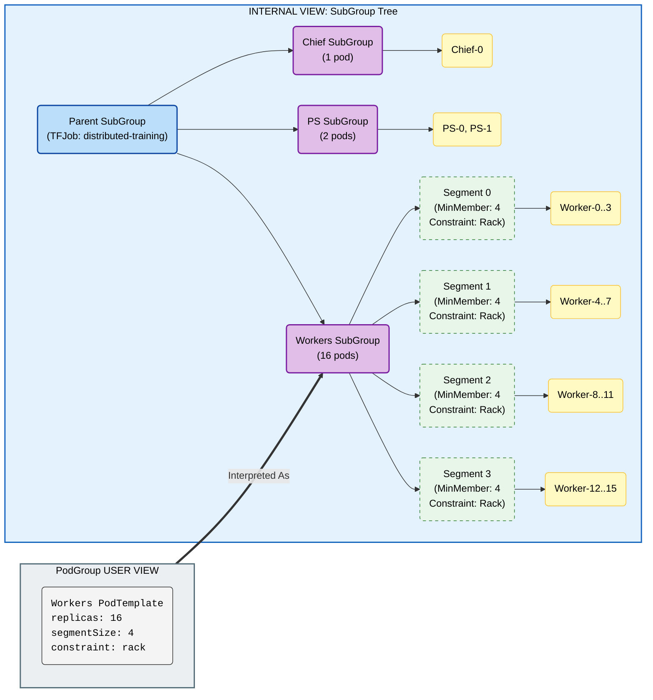

## Future Enhancements

- **Segment Index Injection**: KAI could inject the assigned segment index as an environment variable (e.g., `KAI_SEGMENT_INDEX`) into the pod, similar to SLURM's `SLURM_PROCID`. This would allow the workload process to determine its segment without needing to calculate it.


<a id="doc-5489b871ae64bdce7c6f9de8"></a>

# kai-scheduler/KAI-Scheduler / docs/developer/designs/semi-preemptible/README.md

Upstream: https://github.com/kai-scheduler/KAI-Scheduler/blob/5982e4bf5559120d1fb5650ebec7fe400e85bc95/docs/developer/designs/semi-preemptible/README.md

Commit: `5982e4bf5559120d1fb5650ebec7fe400e85bc95`

Retrieved: 2026-10-01T15:21:11.089624+00:00

Kind: official-document

Raw SHA256: `e1541a84b837148bf892ad2be2424dacc3d770ea975353532485ca8607a66f5b`

Source text below is untrusted reference content. Acquisition does not verify technical claims.

License status: UPSTREAM_NOTICES_CAPTURED_PER_FILE_REVIEW_REQUIRED. See this repository's captured license files.

---

# Semi-Preemptible Mode

## Overview

In `v0.10` we separated Priority and Preemption to allow users to control the two parameters independently, where Preemption has 2 modes (values) - **preemptible** and **non-preemptible**.

We want to add a new 3rd mode, named **semi-preemptible**, where the podgroup is non-preemptible up to its **minimum required shape** — `minMember` pods at each leaf PodSet and `minSubGroup` child subgroups at each intermediate node — and anything beyond that minimum is "elastic" and preemptible. Elasticity therefore applies at **every level of the subgroup tree**, not just to pods.

## Goals / Non-Goals

**Goals**
- Add a third preemptibility mode, `semi-preemptible`, on top of the **existing APIs** (the `preemptibility` field/label, `minMember`, `minSubGroup`) — no new API fields.
- Keep a job's **minimum required shape** non-preemptible and in-quota; allow anything beyond it to run elastically (over-quota, reclaimed first).
- Apply the core/elastic split at **every level** of the subgroup tree, so whole child subgroups burst elastically in the same manner as surplus pods do at a leaf — driven by `minSubGroup` on **hand-authored** subgroup trees.
- Change nothing for existing workloads — the mode is strictly opt-in.

**Non-Goals**
- **Automated segmented subgroups** (the `kai.scheduler/segment-size` annotation path) are not a design target: the core/elastic split is specified against **hand-authored** subgroup trees. The two are not rejected or warned, and the outcome follows from the tree each grouper emits. A LeaderWorkerSet segmented tree is fully gang (every segment's `minAvailable` equals its size), so there is no surplus and semi-preemptible is inert. A segmented `PyTorchJob` with `minReplicas` leaves its trailing segments at `minAvailable: 0`, so those pods are elastic and semi-preemptible behaves as designed.
- Solving queue **quota scale-down** in general for KAI Scheduler. If a queue's deserved quota drops below a running job's core allocation, the queue stays over-quota until the job releases resources on its own — exactly as a `non-preemptible` job behaves today. No new mitigation is introduced (see [Quota Scale-Down](#quota-scale-down)).
- The `minNonPreemptible` field that would decouple the scheduling minimum from the non-preemptible threshold (see [Future Work](#future-work-minnonpreemptible-field)).

## Use Cases

A workload with `minReplicas` such as Inference and Elastic Distributed Training can request to be non-preemptible up to its `minReplicas`, with any pods above that count being preemptible. This allows running a critical workload with some assured resources and some on-demand, availability-based resources.

## Usage

Semi-preemptible reuses the **existing preemptibility API** introduced in [priority/preemptibility separation](../priority-preemptibility-separation/README.md). It is an **opt-in** feature — when `preemptibility` is omitted, behavior is unchanged.

**On the PodGroup spec** — a single elastic group (3 core pods, bursts beyond):
```yaml
apiVersion: scheduling.run.ai/v2alpha2
kind: PodGroup
metadata:
  name: elastic-inference
spec:
  preemptibility: "semi-preemptible"
  minMember: 3            # 3 core (non-preemptible) pods; pods above 3 are elastic
  priorityClassName: "inference"
  # ... rest of podgroup spec
```

**On a workload (label)** — the PodGrouper propagates it to the PodGroup:
```yaml
apiVersion: apps/v1
kind: Deployment
metadata:
  name: elastic-inference
spec:
  template:
    metadata:
      labels:
        kai.scheduler/preemptibility: "semi-preemptible"
```

For multi-level trees, `minSubGroup` makes whole subgroups core vs. elastic — see [Subgroups and Multi-Level Trees](#subgroups-and-multi-level-trees).

## Quota Requirements

The "core" pods (up to `minMember` per leaf PodSet) must be in-quota when allocated. Any "extra" pods can be allocated over-quota. All pods must respect the Limit setting for the job's queue.

From this:
- A semi-preemptible podgroup where the total pod count equals `minMember` == non-preemptible podgroup
- A semi-preemptible podgroup where `minMember` is 0 == preemptible podgroup

### Quota Scale-Down

If a queue's deserved quota drops below a semi-preemptible job's running **core** allocation, the queue becomes persistently over-quota: reclaim evicts the job's elastic pods/subgroups first, but the core remains (protected by the existing `minAvailable` / `GetNumActiveAllocatedTasks()` eviction guard) until the job ends or scales down on its own. This is **accepted behavior** — identical to how a fully `non-preemptible` job already behaves when its queue is scaled down — and is an explicit [non-goal](#goals--non-goals): no special mitigation is introduced for semi-preemptible jobs.

## Subgroups and Multi-Level Trees

The core/elastic split is defined by the **minimum of each node** in the subgroup tree, not by pods alone:

- a **leaf PodSet** with `minMember = m` keeps `m` pods core; pods beyond `m` are elastic;
- an **intermediate SubGroupSet** with `minSubGroup = k` keeps its `k` highest-priority child subgroups core; additional scheduled subgroups are elastic and reclaimed **as a whole** (subgroups stay atomic — never split).

Subgroups inherit the mode from the root: a `semi-preemptible` PodGroup makes the whole tree semi-preemptible, and each node's minimum sets its own core/elastic boundary.

**Non-preemptible (core) resources = the tree's minimal satisfying set**, computed recursively: at each SubGroupSet descend into the `minSubGroup` highest-priority children (all of them if `minSubGroup` is unset); at each leaf take `minMember` pods × the per-pod request. This is the same set the allocator builds in its gang phase, so quota and scheduling agree on what "core" means. Where scheduled count equals the minimum, that node is fully non-preemptible; `minMember == 0` / no minimum ⇒ fully preemptible at that node.

The scheduler already gates this way: allocation (`collectTasksFromSubGroupSet`) schedules the `minSubGroup` core children then bursts extras opportunistically, and eviction (`eviction_info.go`) protects exactly the core children (`GetMinMembersToSatisfy()`) and reclaims surplus whole. An elastic subgroup is deployed only if its pods can be gang-scheduled — otherwise it stays unsatisfied.

**Example** — a hand-authored PodGroup of 4 fully-gang replica subgroups with `minSubGroup: 2`: 2 replicas are core (in-quota), the other 2 burst elastically (over-quota, reclaimed a whole replica at a time):

```yaml
spec:
  preemptibility: "semi-preemptible"
  minSubGroup: 2          # 2 of 4 replica subgroups are core; the rest are elastic
  subGroups:
    - name: replica-0     # core
      minMember: 8        # fully gang: no pod-level elasticity inside the subgroup
    - name: replica-1     # core
      minMember: 8
    - name: replica-2     # elastic — evicted as a whole subgroup
      minMember: 8
    - name: replica-3     # elastic — evicted as a whole subgroup
      minMember: 8
```

Because each subgroup here is fully gang (`minMember == size`), there is no pod-level surplus inside a subgroup; `minSubGroup` is what creates the elastic tier. If `minSubGroup` equalled the subgroup count, no node would have surplus and the job would be effectively non-preemptible despite the setting.

## Immutability Constraint

A validation webhook must **reject increases** to `minMember` or `minSubGroup` on a running semi-preemptible PodGroup (the root spec and every SubGroup entry). Raising either would reclassify already-running over-quota elastic pods/subgroups as core, silently growing the minimal satisfying set and breaking quota invariants without a rescheduling cycle. Decreasing is allowed — it can only widen the elastic tier.

## Simulation Considerations

Victim selection considers only the **surplus** of each node: the "extra" (`n - minMember`) pods at a leaf PodSet, and the extra (`scheduled - minSubGroup`) child subgroups at an intermediate node (evicted whole). This is applied independently per node; no cross-subgroup victim selection is needed. This approach may miss some solutions when checking all orderings, but the added complexity is not justified for the MVP.

This implies that pods are treated equally within the same subgroup for eviction, prompting the user to use the subgroup API to specify any ordering or hierarchy for pod eviction (see [Footnote: Eviction Ordering](#footnote-eviction-ordering)).

### Core Selection Ordering

Which children of a node are core is decided by a dedicated ordering — **satisfied members first, then by name** — applied independently at every `SubGroupSet` in the tree. It is deliberately **not** the scheduler's subgroup ordering, which ranks *unsatisfied* members first because it answers a different question: "which subgroup should receive the next pod?" That is correct for filling a gang and exactly inverted for protecting one.

Two properties matter:

**Satisfied first.** A partially-filled subgroup must not take a core slot ahead of a complete one. With `minSubGroup: 2` over A=1/2, B=2/2, C=2/2, ranking by neediness protects A's orphan pod — which delivers no gang on its own — and leaves the complete C evictable. The job then reports three protected pods spanning a single working subgroup.

**Name breaks ties, not allocation.** The core set has to be *sticky*: recomputing it each session must not move it, or eviction chases it and unravels the gang. Four fully-gang replicas with `minSubGroup: 2` make this concrete. Core is replica-0 and replica-1; replica-3 is evicted as a unit, correctly. Under a neediness ordering replica-3 is now 0/2 — maximally unsatisfied — so the next session ranks it *first* and hands it a core slot holding zero pods, pushing replica-1 out to elastic. Evict again and the job walks itself down to a "core" of empty subgroups while every live pod sits in the elastic tier.

Stickiness is not absolute in the alpha: because the set is recomputed every session, a member that becomes satisfied only later still ranks ahead of an incumbent that was core while unsatisfied. Pinning membership to the published `CorePods` set was prototyped and pulled back — it makes the result depend on prior status writes rather than on the tree alone — and is deferred to a broader review.

Because a `SubGroupSet` counts as satisfied when enough of its *children* are, protection composes upward: eviction never touches a core member at any depth, so a core subtree keeps enough satisfied children to stay satisfied itself, so it keeps its slot in its parent's core. Note that being core does not protect a subgroup's own surplus — a core subgroup still exposes its non-core children as elastic, which is what makes the mode useful in deep trees.

When fewer than `minSubGroup` children are satisfied the remaining slots are filled from the unsatisfied ones by name, so a job still assembling its gang protects what it has already landed. A satisfied member can never be displaced this way.


## Non-Preemptible Accounting API

### Problem

Two components compute "non-preemptible allocated" resources independently, and for
semi-preemptible jobs they diverge:

- The **scheduler** (proportion plugin) counts the **core only** — the minimal-satisfying set,
  via `GetCoreTasks` (`pkg/scheduler/api/podgroup_info/core_info.go`). This is the number that
  drives real quota and reclaim decisions.
- The **podgroupcontroller** counts **all allocated pods** (a flat sum) in `getStatusWithMetadata`
  (`pkg/podgroupcontroller/controllers/patcher/pod_group.go`) and publishes it to
  `PodGroup.Status.ResourcesStatus.AllocatedNonPreemptible`, which the queuecontroller rolls up into
  `Queue.Status.AllocatedNonPreemptible`.

For a semi-preemptible job the controller therefore reports **core + elastic burst** as
non-preemptible. Example: `minSubGroup: 2` over 4 fully-gang subgroups (`minMember: 8`) → the
scheduler counts **16** core pods while the controller publishes **32** — a 2× overstatement. The
value is *observational only* (the scheduler re-seeds core from live job state every session and
never reads the published status back), so scheduling stays correct; but the queue's reported
protected usage is wrong for users, dashboards, and external consumers, and can "flip" between
reconciles because core membership was ranked by live allocation ratio.

### Chosen approach

The **scheduler is the single source of truth** for *which pods are core*; the podgroupcontroller
remains the single source of truth for *how much those pods cost*. The scheduler publishes the core
pod names at the PodGroup level, and the controller sums exactly that set through its existing
per-pod accounting path. This removes the divergence and the flip by construction.

Having the scheduler compute and publish the core's resource *amount* is out of scope for this
change; it is deferred together with unifying core calculation across preemptibility modes.

### API shape

A new **scheduler-owned** status block on the PodGroup (in
`pkg/apis/scheduling/v2alpha2/podgroup_types.go`). It is a separate block — not a new field on the
controller-owned `ResourcesStatus` — so each struct keeps a single writer:

```go
// PodGroupSchedulingState carries the scheduler's authoritative accounting for this pod group.
// It is populated exclusively by the scheduler; all other controllers MUST treat it as read-only.
type PodGroupSchedulingState struct {
	// CorePods names the allocated pods the scheduler protects from preemption and reclaim (the
	// "core", i.e. the job's minimal satisfying set). Written only for semi-preemptible pod groups,
	// where the pods outside this set are elastic surplus.
	// +optional
	CorePods []string `json:"corePods,omitempty"`
}

type PodGroupStatus struct {
	// ... existing: Conditions, SchedulingConditions, ResourcesStatus ...

	// SchedulingState is the scheduler's authoritative view of this pod group. Read-only for
	// non-scheduler components.
	// +optional
	SchedulingState *PodGroupSchedulingState `json:"schedulingState,omitempty"`
}
```

`ResourcesStatus` (`Allocated`, `AllocatedNonPreemptible`, `Requested`) is unchanged in shape. The
field is `+optional`/`omitempty` and PodGroup is a single-version alpha type (`v2alpha2`, storage
version), so the change is additive and needs no conversion webhook.

### Data flow

```
scheduler closeSession → GetCorePodNames(job)                    [sorted, for stable comparison]
    → publish PodGroup.Status.SchedulingState.CorePods           [scheduler-owned]
                                   │
                                   ▼
podgroupcontroller.calculatePodGroupMetadata
    → sums the named pods into PodGroupMetadata.CoreAllocated    [native units, per-pod path]
    → PodGroup.Status.ResourcesStatus.AllocatedNonPreemptible    [controller-owned]
                                   │
                                   ▼
queuecontroller.sumPodGroupsResources
    → Queue.Status.AllocatedNonPreemptible                       [unchanged rollup]
```

Publication happens in `closeSession` — the only place holding both the job and the session ordering
functions `GetCoreTasks` needs — and is guarded by a `slices.Equal` comparison against the currently
published set, because the podgroup status write is a full `UpdateStatus` of the snapshot object.
Without the guard every session would issue a write.

Controller consumption switches on the resolved preemptibility rather than on whether `CorePods` is
populated, since a semi-preemptible group may legitimately have an empty core:

```go
switch metaData.Preemptibility {
case v2alpha2.SemiPreemptible:
	updatedStatus.ResourcesStatus.AllocatedNonPreemptible = metaData.CoreAllocated
case v2alpha2.NonPreemptible:
	updatedStatus.ResourcesStatus.AllocatedNonPreemptible = metaData.Allocated
}
```

### Why a nested block (designed for expansion)

`schedulingState` is a namespace for scheduler-authoritative accounting so future needs land without
further top-level status churn. Illustrative future fields (not built now):

```go
// CoreSubGroups           []string // which subgroups the scheduler counts as core (debug/observability)
// MinRequirementSatisfied *bool    // job has reached its minimal shape
// LastEvaluatedSession    string   // scheduler session id/generation for staleness detection
```

### Notes / trade-offs

- **Ownership**: the scheduler and controller already patch `PodGroup.Status` on disjoint paths
  (`schedulingConditions` / annotations vs `resourcesStatus`); adding scheduler-written
  `schedulingState` introduces no new write-conflict class.
- **Staleness**: the set refreshes each scheduler session and only changes when core membership
  changes (which is scheduler-driven). A pod named in `CorePods` that the controller no longer sees
  simply contributes nothing to the sum. `LastEvaluatedSession` is the future hook if explicit
  staleness detection is ever needed.
- **Ordering**: `GetCorePodNames` sorts its output so the published set can be compared for equality
  across sessions. Core membership itself is still selected by the session's task ordering.
- **Defense-in-depth**: this removes the need for both sides to recompute core independently. If they
  ever must, core ordering should be deterministic *and reproducible* — rank by static priority then
  name rather than by live allocation ratio (the root cause of the flip).

## Footnote: Eviction Ordering

In a `Semi-Preemptible` PodGroup / SubGroup, pods are NOT "colored out" as preemptible — there is no election of individual pods. All pods within a subgroup are treated equally: victims are drawn from the surplus using the **existing pod eviction ordering** (the same ordering used elsewhere in preemption), which is role-agnostic. It does not know that one pod is a master and another is a worker.

A non-homogeneous subgroup / podgroup with the semi-preemptible attribute might therefore experience reduced service because the "wrong" pods are evicted — the ordering has no notion of the user's intended hierarchy. This is amended by correctly configuring subgroups and grouping similar pods into logical structures.

**Unadvised** — one master pod and three workers mixed in a single leaf PodSet with `minMember: 2`. Any 2 of the 4 pods are kept as core; because eviction ordering does not distinguish roles, the master is not guaranteed to survive, and the job can be left with 2 workers and no master:

```yaml
spec:
  preemptibility: "semi-preemptible"
  minMember: 2            # keeps ANY 2 of {master, worker, worker, worker} — master may be evicted
```

**Aligned with API** — separate master and workers into their own subgroups so eviction can only target the surplus workers, never the master:

```yaml
spec:
  preemptibility: "semi-preemptible"
  minSubGroup: 2          # both subgroups below are core
  subGroups:
    - name: master        # core — never evicted
      minMember: 1
    - name: workers       # 2 workers core; extra workers are elastic
      minMember: 2
```

## Future Work: `minNonPreemptible` field

This design uses `minMember` as the non-preemptible threshold. A future `minNonPreemptible` field (pod-level only, no subgroup analog) would decouple the scheduling minimum from the non-preemptible threshold — e.g. `minMember=4, minNonPreemptible=2` (needs 4 pods to start, but only 2 are non-preemptible). It introduces a third pod tier — "required for scheduling but elastic for preemption" — between core and extra-elastic, requiring explicit ordering or labeling to identify which pods fall into each tier, plus a new API field, validation (`minNonPreemptible ≤ minMember`), quota accounting decoupled from `minMember`, and matching webhook/solver/status updates.


<a id="doc-835692c36bbad19583ca910e"></a>

# kai-scheduler/KAI-Scheduler / docs/developer/designs/time-based-fairshare/data-fetching.md

Upstream: https://github.com/kai-scheduler/KAI-Scheduler/blob/5982e4bf5559120d1fb5650ebec7fe400e85bc95/docs/developer/designs/time-based-fairshare/data-fetching.md

Commit: `5982e4bf5559120d1fb5650ebec7fe400e85bc95`

Retrieved: 2026-10-01T15:21:11.089624+00:00

Kind: official-document

Raw SHA256: `a3543908254d0e37c14a6978d5c04c608d8980475eeaf5af0f98b3ffc526a05b`

Source text below is untrusted reference content. Acquisition does not verify technical claims.

License status: UPSTREAM_NOTICES_CAPTURED_PER_FILE_REVIEW_REQUIRED. See this repository's captured license files.

---

# Usage data fetching – High-Level Design

> Note: *Goals, non-goals, and detailed motivation are captured in* `time-based-fairshare.md`. The focus of this document is the **system architecture** and **integration points** required to implement the feature.

## Rationale

In large-scale environments the scheduler runs a tight loop that shouldn't depend on external calls per cycle. Executing raw PromQL (or other TSDB) queries every few milliseconds would:
* Introduce unpredictable latency spikes when the database is under load.
* Create pressure on the DB as cluster size and metric cardinality grow.
* Couple scheduler availability to the health of an external datastore.

A **background Usage-Query routine embedded inside the Scheduler pod** acts as a *caching proxy*:
1. Every *Δt* (e.g., 60 s) it executes PromQL queries against the TSDB, pre-computes the decayed, windowed usage vectors and stores them in memory.
2. The main scheduling loop reads the in-memory vector with zero I/O.
3. If the TSDB becomes slow or unreachable, the routine continues to serve *stale but bounded* data for up to `maxStaleness`, so overall scheduler latency remains stable.

## 1. Components & Responsibilities

| Component | Responsibility | Notes |
|-----------|---------------|-------|
| **Metrics Exporters** | Emit raw usage metrics for PodGroups and Queues | Implemented inside the Queue & PodGroup controllers.
| **Usage DB (TSDB)** | Store aggregated resource-hours per `<queue, resource>` | Pluggable backend. Prometheus (via PromQL) is the reference implementation; additional adapters can target any metrics store (e.g., Thanos, VictoriaMetrics, proprietary TSDB). |
| **Scheduler (incl. Usage-Query)** | • Background routine pulls & caches usage<br/>• TA scheduling logic consumes cached vector<br/>• Exposes historical usage as metrics | Runs everything in one pod; no network hop between query routine and scheduler core.

## 2. High-Level Architecture
```
+--------------------+
| Metrics Exporters  |  (Queue & PG controllers)
+---------+----------+
          | scrape
          v
+------------------+
|   Prometheus     |
+---------+--------+
          | Pull (PromQL)
          v
+-------------------------------------------+
|            Scheduler Pod                  |
|  +------------------------------+         |
|  | Background Usage-Query Loop  |         |
|  +------------------------------+         |
|  |  TA Scheduling Loop          |         |
|  |  Metrics Endpoint            |         |
+-------------------------------------------+
```

### Interaction Flow
1. **Collection** – Metric exporters in the Queue & PodGroup controllers publish resource-usage metrics.
2. **Polling & Aggregation** – The scheduler’s background routine runs PromQL every *Δt* to compute `sum by (queue,resource)(usage_seconds)`.
    2.1. **Decay & Windowing** – For each poll:
       * Apply exponential decay `u ← u·e^(−λΔt)`.
       * Add the new sample.
       * Drop data older than *windowSize* (for a sliding window) or reset when crossing the next tumbling boundary.
3. **Scheduling Cycle** – The main loop reads the cached vector, orders queues, and places pods.
4. **Metrics Exposure** – Scheduler exports gauges such as `kai_queue_historical_usage{queue="q1",resource="gpu"}=0.73`.

## 3. Configuration Parameters
| Field | Example | Description |
|-------|---------|-------------|
| `decayHalfLife` | `24h` | Exponential decay half-life. 0 will disable the decay and negative values are not allowed. |
| `windowSize` | `2w` | Window duration. |
| `windowType` | `sliding` | `sliding` (moving window) or `tumbling` (fixed windows). |
| `tumblingWindowAnchor` | `2024-01-01T00:00:00Z` | RFC-3339 timestamp that anchors tumbling windows; ignored for sliding windows. |
| `backend.type` | `prometheus` | Backend adapter name; e.g. `prometheus`, `victoriametrics`, `influx`, `memory` (tests). |
| `backend.prometheus.url` | `http://prometheus.monitoring.svc:9090` | Base URL for PromQL API. |
| `pollInterval` | `60s` | How often the background routine polls the DB. |
| `maxStaleness` | `5m` | Max age of cached data before scheduler marks itself degraded. |

## 4. Failure Modes & Fallbacks
* **TSDB unavailable** – Scheduler keeps using cached vector up to `maxStaleness`; Then the scheduler will treat the usage history as unavailable.
* **Exporter gaps** – Missing metrics reduce calculated usage; system self-corrects as soon as exporters resume.

---


<a id="doc-8ab4fb6d9e27645d1a4fb3fa"></a>

# kai-scheduler/KAI-Scheduler / docs/developer/designs/time-based-fairshare/metrics-store-requriements.md

Upstream: https://github.com/kai-scheduler/KAI-Scheduler/blob/5982e4bf5559120d1fb5650ebec7fe400e85bc95/docs/developer/designs/time-based-fairshare/metrics-store-requriements.md

Commit: `5982e4bf5559120d1fb5650ebec7fe400e85bc95`

Retrieved: 2026-10-01T15:21:11.089624+00:00

Kind: official-document

Raw SHA256: `4ad5d02ba3f76ef41fd6e322952259f8fc3785f8f2ec66ddd2c2b4c0921300a7`

Source text below is untrusted reference content. Acquisition does not verify technical claims.

License status: UPSTREAM_NOTICES_CAPTURED_PER_FILE_REVIEW_REQUIRED. See this repository's captured license files.

---

# Metrics store requirements

This document will focus on listing a set of requirements for the metrics store which will be used for resource accounting. All requirements in this document are the minimum.

## Metrics Resolution

Given the following assumptions:
* K8s pods normally take 1-60s to start (and even longer for pods that use very large images, like many AI workloads)
* Default terminationGracePeriod for a k8s pod is 30s
* Assuming most use cases will deal with windows sized from a few hours to weeks

It's probably reasonable to require a time granularity of 1m for raw metrics for 2 hours (meaning 1 minute resolution is < 1%). It's also acceptable to have the metrics store aggregate older samples, as long as we don't lose a resolution of 1% (e.g, for a week-long window (168h), it's probably ok to have older metrics aggregated to a 1h resolution). 

## Metrics Cardinality

The cardinality of the metrics is a multiplication of the following factors:

* \# of queues (including the entire hierarchy)
* \# of users (if enabled by the admin)
* \# of managed resource types
    * Today, only CPU, GPU and Memory are managed in queue quota, but this will likely be extended in the future
* \# of nodepools

We'll do a rough estimation for these for a large scale cluster: assuming 1000 queues, 2,000 users, 5 resource types, and 10 nodepools, we get 100,000,000.

## Persistency and Backup

Some use cases could have strict requirements for the persistency and disaster recovery of the data - for example, when storing data which will be used for charging users for their resource usage. The metrics store should at least have an option for backing up (and recovering) storage to a remote site. Data should be persisted to disk close to write time (up to a few minutes delay is probably ok, given our resolution of 1m and expected window sizes).

## Time decay calculations

We expect admins to want the option of applying time-decay functions to the usage metrics, to get higher significance for recent resource allocations over older ones. We would like to avoid performing these potentially intensive calculations in the scheduler. The metrics store should allow us to apply a function, such as a half-life time decay, to the raw and aggregated metrics.

## Query duration

While by design, the querying the metrics store will not be blocking to the scheduler cycle, there sre still some limits: the current design for the metrics fetching states a default "staleness period" of 5m - meaning that the query should be at most 5m, and ideally much faster than that. It's ok for this to be achievable through scaling up of various resources (memory, cpu or storage) in higher-scale clusters, so admins in more demanding environments will be able to keep queries short by using better hardware.

<a id="doc-f7d9c87e0ee3648addd7ebda"></a>

# kai-scheduler/KAI-Scheduler / docs/developer/designs/time-based-fairshare/time-based-fairshare.md

Upstream: https://github.com/kai-scheduler/KAI-Scheduler/blob/5982e4bf5559120d1fb5650ebec7fe400e85bc95/docs/developer/designs/time-based-fairshare/time-based-fairshare.md

Commit: `5982e4bf5559120d1fb5650ebec7fe400e85bc95`

Retrieved: 2026-10-01T15:21:11.089624+00:00

Kind: official-document

Raw SHA256: `539d58c7aebec648db066f9eff11aeb207aa7dfaf170ffe19d1f814a2a849eef`

Source text below is untrusted reference content. Acquisition does not verify technical claims.

License status: UPSTREAM_NOTICES_CAPTURED_PER_FILE_REVIEW_REQUIRED. See this repository's captured license files.

---

# Time Based Fairshare
<!-- toc -->
- [Summary](#summary)
- [Motivation](#motivation)
  - [Goals](#goals)
  - [Non-Goals](#non-goals)
- [Proposal](#proposal)
  - [Interaction with existing guarantees](#interaction-with-existing-guarantees)
  - [User Stories](#user-stories)
    - [Story 1](#story-1-proportional-time-sharing-of-resources)
    - [Story 2](#story-2-burst-access-to-resources)
    - [Story 3](#story-3-time-based-fairshare-with-guaranteed-resources)
    - [Story 4](#story-4-no-over-usage-open-for-debate)
    - [Story 5](#story-5-resource-hour-budget)
  - [Notes/Constraints/Caveats](#notesconstraintscaveats)
    - [Data storage constraints](#data-storage-constraints)
    - [Intuitive understanding of fairness over time](#intuitive-understanding-of-fairness-over-time)
  - [Risks and Mitigations](#risks-and-mitigations)
- [Design Details](#design-details)
  - [Explanation of the formula](#explanation-of-the-formula)
  - [Cluster-capacity normalized usage](#cluster-capacity-normalized-usage)
  - [Penalizing queues with historical usage](#penalizing-queues-with-historical-usage)
<!-- /toc -->

## Summary

This document aims to describe how the scheduler can make use of historical resource usage by queues and users in order to achieve fairness of resource allocation over time. The mechanism of storing and serving the necessary data is out of scope for this document and will be described in a separate design doc.  
The scheduler will consider past resource allocations when dividing over-quota resources to queues in the DRF algorithm: queues that have used more resource-hours should be penalized compared to queues that have not used resources recently. This will effect the over-quota resource division only, meaning that deserved quota and queue priority will take precedence.  
This will be an opt-in feature: if the admin does not configure time-based-fairshare, the scheduler will behave exactly the same as before.

## Motivation

Time-based fairshare is a desirable behavior for many use cases, as evident by the popularity of HPC systems like slurm, and by the demand for slurm-like schedulers in k8s. Implementing time-based fairshare in KAI will offer users a k8s native scheduler that can offer deserved quotas, for inference and interactive use cases, alongside an HPC-like experience for batch job queueing. See the [user stories](#user-stories) section below for detailed use cases.

### Goals

* Allow fair time-sharing of resources: prioritize queues that have not accessed resources recently over queues that did. Other than deserved quotas, resources should be fairly allocated over time: queues with identical weights and requests will receive similar allocation of resource-hours over a long enough period of time.
* Allow burst access to resources: allow queues in busy clusters to access more resources than their weight for short periods of time.
* Fallback to current behavior: if over-time feature is not configured, the scheduler will behave exactly like today, with classic DRF determining fair share.
* Don't break current guarantees of deserved resources and over-quota priority. 

### Non-Goals
* Guarantee feature parity with any existing HPC system
* In-depth design of the accounting service: this will be addressed in a separate document

## Proposal

Track usage data of resources by queues over time, with a configurable decay formula and reset period. Use this usage data in DRF calculations when allocating resources: per resource, penalize queues with relatively higher historical usage of the resource, compared to queues which received less. Allocation over time should trend towards the relative weight of the queue for the relevant resource.

### Interaction with existing guarantees

The over-time fairness is an enhancement to the current over-quota weight mechanism, and will take the same priority in the algorithm. Meaning:
- Over-time fairness will not override **deserved resources**: queues will get their deserved resources regardless of historical usage
- Over-time fairness will not override **queue priority**: over-quota resources will be divided by priority first, and within each priority, quota will be divided based on over-quota weight and historical usage


### User Stories

#### Story 1: Proportional time sharing of resources
Assume an admin manages a cluster with X GPUs. Two users share the cluster, each wants to run an infinite series batch jobs, each requiring X GPUs allocated for an hour. The admin assigns no deserved quota and identical over-quota weight to each users' queue.  
Under non-time-based DRF, the fair share of GPUs for each queue will be X/2. No reclaims will occur, and the allocated job will revert to arbitrary tie-breakers in queue order, such as queue creation timestamp, resulting in one of the queues always getting access to resources, assuming an infinite backlog of jobs:


However, a time-based fairshare algorithm will decrease the fair share for the queue of the running job, and increase it for the starved queue, resulting in an oscillating allocation of jobs between them:


This, potentially coupled with min-runtime protections for added guarantees, can ensure a non-disruptive oscillation between the queues' access to resources.

#### Story 2: Burst access to resources
In a busy cluster with several queues used mainly for training job, one unprioritized queue "`Q`" has a quota of 1/10th of the cluster's resources. `Q` needs to run a job requiring 2/10th of the resources for a relatively short period. Assuming a busy cluster, using normal DRF, it's unlikely that `Q` will ever get access to enough resources in order to run the job, effectively starving it. However, using time-based fairshare, the rest of the queues' fair share will decrease as they're using resources over time, eventually resulting in `Q` having enough fair share to allocate it's job for long enough to run it. A short min-runtime period for `Q` can allow it to run it's job to completion once it gets access to the resources.

#### Story 3: Time based fairshare with guaranteed resources
In a heterogeneous cluster combining interactive, critical inference, and training use cases, different users with different queues require reliable access to deserved resources, while time-sharing over-quota resources for training jobs. Admin assigns deserved quota for each queue based on the users' needs, allowing them to run inference and some interactive workloads for use cases such as data exploration and small-scale experiments with jupyter notebooks and similar tools.  
Users can rely on guaranteed resources for non-preemptible interactive & inference workloads, while queueing train jobs. Time-based fairshare will ensure fair access to resources, roughly proportional to the weight assigned to the different queues. Interactive and inference workloads will not be interrupted due to the usage of in-quota resources & non-preemptible properties.

#### Story 4: No over-usage (open for debate)
In a cluster with no deserved quotas, N queues are weighted arbitrarily (W_i for i in N is queue `i`'s weight, Ẃ_i = W_i/∑W_j for i,j in N is the normalized weight). If no queue ever goes above it's relative share - should they be penalized for their usage? On one hand, it's not intuitively fair to be penalized for usage of one's relative share. On the other, this could cause any queue with a pending job that requires more than it's relative share to be starved. For example, SDRF doesn't count in-share usage as "Commitment".

#### Story 5: Resource-hour budget
In a cluster with mainly long-running, interruption-sensitive batch workloads where each workload requires all or most of the resources (such as large model training jobs), several organizational units (teams/ project) participate and are allocated "gpu-hours" budget. For a known time period (monthly), the admin knows and assigns how many resource-hours each team deserves. Jobs are not interrupted unless they used their entire queues' budget. If the budget is not overcommited, and if all consumers submit their jobs at the beginning of the monthly cycle, the admin expects each to get their budget over the course of the month, up to ~5% deviation due to sampling resolution or scheduling overheads (lower is likely achievable). 

Question: if resources are overcommited (more than the possible gpu-hours are assigned), or if all consumers attempt to "withdraw" their budget at the end of the period - how should the schduler divide resources?
- Attempt to approximate the relative resource distribution?
- Revert to FIFO? (first job to be scheduled will not be interrupted if within budget, even at the expense of pending jobs not getting their budget)
- Are there other options?

This use case can also be useful for clusters with predictable, periodic workloads, such as Spark ETL pipelines, scheduled training workloads, data prep workloads, etc.

### Notes/Constraints/Caveats

#### Data storage constraints
Regardless of which backend TSDB is chosen for the storage of resource usage data, it's to be expected that busy, large-scale clusters will generate a lot of it, and there could be limitations to the granularity of data preserved, and thus the accuracy of results achieved. It's assumed that some loss of granularity might be required in order to save data for long periods of time: admins might need to balance the historical time window with the data granularity and the storage & compute resources required from the backend data storage; KAI-scheduler needs to allow the admins to configure those to their liking.

#### Intuitive understanding of fairness over time
Several parameters and configurations can effect the outcome of the scheduling algorithm: good documentation, and potentially tools, will need to be provided in order to help the admin configure the cluster properly. An intuitive configuration should result in behavior that is predictable in simple scenarios: for example, "Using X GPUs for T hours will result in a project with W over-quota weight getting penalized by a factor of 50%". Several variables can go into achieving this result - we need to map these in a clear way.

### Risks and Mitigations

<!--
ToDo
-->

## Design Details

> **⚠️ Work in Progress**  
> This design is currently under development. The mathematical formulation and implementation details are an initial proposal for further discussion. Feedback and suggestions are welcome.

Let's consider the following formula for calculating the fair share of resources, adjuster for historical usage:

$$F_i = C \cdot P'_i$$

Where:
- **$F_i$** is the fair share allocated to a specific queue in the current round
- **$C$** is the remaining capacity (max amount to give in current round)
- **$P'_i$** is the normalized portion for queue i, defined as:

$$P_i = \max{\{W'_i + k \cdot (W'_i - U'_i), 0\}}$$

$$P'_i = \frac{P_i}{\sum{P}}$$

Where:
- $W'_i$ is the over-quota weight of the queue, normalized to the sum of non-satisfied queues' over-quota weight for the round
- $\sum{P}$ considers only queues that participate in the current resource division round
- $U'_i$ is the historical usage for the queue, normalized to the capacity of the cluster
- $k$ is set by the admin and controls the "significance" of historical usage
- Applying $\max{\{,0\}}$ to the result floors negative values to 0

This ensures that:

$\sum{P'} = 1$

$0<=P'_i<=1$

For each resource division round, which makes it simpler to divide resources.

### Explanation of the Formula

The accounting service will provide the scheduler with data for each cycle about the usage of resources per queue per resource. A vector will represent the usage of each queue per resource type.  
The resource division formula for over-quota resource can be found in proportion plugin, resource_division.go:
```Go
fairShare := amountToGiveInCurrentRound * (overQuotaWeight / totalWeights)
```
This calculation is done for each resource type. The result of this calculation is later capped with the requested resource of the queue, so each round of this calculation for all queues could result in remaining capacity to divide - this is run in rounds, each time with the updated remaining unsatisfied queues, until all resources are divided or all queues get their request.

For convenience, we'll write it out as a formula:

$$\text{F} = C \cdot \frac{W}{\sum{W}}$$

Where:
- **$F$** is the fair share allocated to a specific queue in the current round
- **$C$** is the remaining capacity (max amount to give in current round)
- **$w$** is the weight for a specific queue
- **$∑w$** is the sum of weights across all competing queues

Let's also mark the normalized weight as:

$$W'_i = \frac{W_i}{\sum{W}}$$

### Cluster-capacity normalized usage

First, we'll define a normalized "usage" score for each queue and resource:

$$U'_i = \frac{U_i}{T}$$

Where $T$ is the total potential resource capacity for the cluster in the relevant time period. For a cluster that is fully occupied, $\sum{U_i} = T$.

This works better than a naive normalization ($U'_i = \frac{U_i}{\sum{U}}$), because it doesn't result in heavy penalty when total usage ($\sum{U_i}$) is relatively low: in other words, queues are not penalized heavily for utilizing uncontended resources.


### Penalizing queues with historical usage

Now, we can adjust our fair-share calculation for resources to consider historical usage. Let's define:

$$F_i = C \cdot P'_i$$

Where:
- **$F_i$** is the fair share allocated to a specific queue in the current round
- **$C$** is the remaining capacity (max amount to give in current round)
- **$P'_i$** is the normalized portion for queue i, defined as:

$$P_i = \max{\{W'_i + k \cdot (W'_i - U'_i), 0\}}$$

$$P'_i = \frac{P_i}{\sum{P}}$$

Where:
- $W'_i$ is the over-quota weight of the queue, normalized to the sum of non-satisfied queues' over-quota weight for the round
- $\sum{P}$ considers only queues that participate in the current resource division round
- $U'_i$ is the historical usage for the queue, normalized to the capacity of the cluster
- $k$ is set by the admin and controls the "significance" of historical usage
- Applying $\max{\{,0\}}$ to the result floors negative values to 0

Which gives us the following properties:
- 0 historical usage across the board will effectively revert to the current formula
- $k$ can be adjusted by the admin to configure the "significance" of historical usage: higher $k$ values will result in more aggressive correction of fair share according to historical usage

<a id="doc-adb1ce637389350da9db425b"></a>

# kai-scheduler/KAI-Scheduler / docs/developer/designs/topology-awareness/README.md

Upstream: https://github.com/kai-scheduler/KAI-Scheduler/blob/5982e4bf5559120d1fb5650ebec7fe400e85bc95/docs/developer/designs/topology-awareness/README.md

Commit: `5982e4bf5559120d1fb5650ebec7fe400e85bc95`

Retrieved: 2026-10-01T15:21:11.089624+00:00

Kind: official-document

Raw SHA256: `50e00dc84e73ea965071bcb317dc382503f39c533a3d6e337feda9cf46a48b88`

Source text below is untrusted reference content. Acquisition does not verify technical claims.

License status: UPSTREAM_NOTICES_CAPTURED_PER_FILE_REVIEW_REQUIRED. See this repository's captured license files.

---

# Topology Aware Scheduling

## Summary

This design document outlines an approach for implementing topology aware scheduling in KAI-Scheduler, leveraging the topology CRD concepts from Kueue. Topology awareness enables more efficient scheduling of workloads by considering the physical placement of resources within a cluster, leading to improved performance for applications that benefit from resource locality.

## Motivation

Workloads with specific topology requirements, such as distributed training jobs or applications sensitive to inter-node communication latency, benefit significantly from intelligent placement decisions that respect the underlying hardware topology. Without topology awareness, jobs may be scheduled across physically distant nodes, leading to:

- Increased network latency and reduced bandwidth
- Suboptimal performance for compute-intensive workloads
- Inefficient resource utilization across the cluster

## Usage Stories

### Better Inter Pod Communication

Distributed workload with high volume of communication between pods will prefer the pods to be as close as possible, with the highest volume and speed of network between them.
If not possible to allocate them on the same node, then on the same rack or block. It is more important that it starts running than that it fills the exact topology requirements.

### Highly Optimized With Regard to Network Infrastructure

This workload wants to make sure that it takes advantage of the best setup its network can give.
It wants to split the pods into groups that will fill entire nodes, and the groups be on the same rack if possible, or close one from the same block.
The pods then need to get some hints to their respective location in this internal job topology.

## Goals

- Implement topology-aware scheduling in KAI-Scheduler
- Leverage Kueue's topology CRD concepts to keep an industry standard
   - Support hierarchical topology representations (e.g., datacenter/rack/node/device)
- Provide flexible configuration options for topology-based placement
- Support both Required and Preferred topology constraint request
- Checking more possible allocations than is possible for PodAffinity pod groups: When the scheduler tries to schedule a pod group with multiple pods that have a pod affinity requirement it finds a suitable node for the  first pods and that node's label is then used to compare the pod affinity of the next pods in the pod group. If the rest of the pods can't be allocated with that node affinity then the first pod's allocation is not attempted on another node. We aim to fix this issue

## Non-Goals

- Automatically detecting topology without user input
- Improve allocations found for jobs using PodAffinity.

## Design Details

### User Experience

Users will be able to:

1. Define topology constraints in their workload specifications
2. Define the way a job can be split into several topologies
3. Set preferences for topology-aware placement - strict (Only schedule the job if it can get the topology requirements) or preferred (Do your best, but I prefer to start running than to wait for the perfect setup)
4. View topology information for their running workloads

### Topology Representation

Following Kueue's approach, topology will be represented as a hierarchical structure that describes the physical layout of resources in the cluster.
We will be using Kueue Topology CRD as is or import its definition into KAI scheduler to simplify integrations and support it as a standard.
**Note**: We introduced KAI Topology CRD with similar structure to replace Kueue Topology CRD, improving compatibility and simplifying installation.

### Topology constraint request on a job

The pod-grouper will look for topology annotations on the top owner of pods and set it to fields on the PodGroup that it creates.

#### Annotations for Topology Constraints

To support topology-aware scheduling, we'll define the following annotations that can be added to job resources (e.g., Job, BatchJob, MPIJob):

1. `kai.scheduler/topology-preferred-placement`: The preferred topology level at which all the pods of the job will be scheduled.
2. `kai.scheduler/topology-required-placement`: The maximal level of hierarchy that the job will be scheduled into. 
3. `kai.scheduler/topology`: Name of the topology CRD that this job will use (support multiple different topologies on the same cluster)

Example usage on a job:
```yaml
apiVersion: batch/v1
kind: Job
metadata:
  name: topology-aware-job
  annotations:
    kai.scheduler/topology-preferred-placement: "rack"
    kai.scheduler/topology-required-placement: "zone"
    kai.scheduler/topology: "network"
```

It is possible to only use one of preferred or required, but the topology CRD must be named.

#### PodGroup Structure Modifications

To support topology awareness, the PodGroup CRD will be extended with the following fields:

```go
// TopologyConstraint defines a constraint for topology-aware scheduling
type TopologyConstraint struct {
    // PreferredTopologyLevel defines the preferred level in the topology hierarchy
    // that this constraint applies to (e.g., "rack", "zone", "datacenter").
    // Jobs will be scheduled to maintain locality at this level when possible.
    PreferredTopologyLevel string `json:"preferredTopologyLevel,omitempty"`

    // RequiredTopologyLevel defines the maximal level in the topology hierarchy
    // that all pods must be scheduled within.
    // If set, all pods of the job must be scheduled within a single domain at this level.
    RequiredTopologyLevel string `json:"requiredTopologyLevel,omitempty"`

    // Topology specifies the name of the topology CRD that defines the 
    // physical layout to use for this constraint. This allows for supporting
    // multiple different topology configurations in the same cluster.
    Topology string `json:"topology,omitempty"`
}

type PodGroupSpec struct {
    // ...existing fields...
    
    // TopologyConstraint defines the topology constraints for this PodGroup
    TopologyConstraint TopologyConstraint `json:"topologyConstraints,omitempty"`
}
```

### Assumptions / Requirements From Pod Groups

- All pods must have the same requirements and roles
    - orchestrator / leader pods should also act as workers and be scheduled with the rest.
    - This is planned to be solved as an issue when a hierarchy of pod groups is supported.
- No order or rank is predefined on the pods.

### Implementation Stages

We will consider two main implementation approaches:

#### Stage 1: Plugin for node order / filter
The plugin will maintain an internal topology tree with resource sums to estimate allocation probability and effect node order by task.

This stage involves:

1. Building a tree representation of all topology hierarchies in the cluster
  * This tree will be updated with each allocation / preemption that is done in simulations
  * We will need to save and restore it in simulation checkpoints
2. Summing the resources in each topology tree node
3. For each job creating a topology tree that also has the number of allocatable pods in each tree node
4. Choosing the topology with the tree node that best fits the pod group
5. Ranking cluster nodes according to their topology grouping
6. Prioritizing cluster nodes that form the most cohesive topology group for a workload
7. Considering factors like:
   - Number of resources available within each topology group
   - Distance in the tree from the chosen topology group for the Job


##### Example of a topology tree structure:
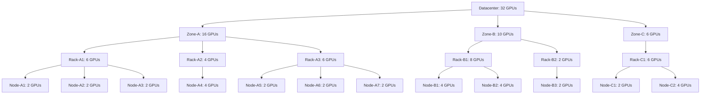

* The distance from node NC1 to NC2 is 2, the distance between RB1 to NA1 is 5.
* When using hard constraints (required) this will not always find a solution even if one exists in the cluster due to fragmentation of the resources between the nodes or other scheduling constraints.
* If no tree node is found and the topology constraint is set to preferred we will choose the tree node that can accommodate the most pods and rank the rest by distance.
* It will allow for soft/preferred constraints to still ensure it schedules pods "close" to the rest of the group even if the chosen topology can't accommodate the whole job.
* For each job it will calculate bottom up the number of pods that can be allocated in each tree node, to improve precision.

#### Stage 2: Simulation-based Evaluation

This stage extends the use of topology information in the allocation of jobs in all actions by iterating on the possible topologies and checking them against all available filters to verify that the allocation will succeed.

1. Add a new plugin point to get a list of possible nodes from the plugin (similar to the "FeasibleNodesForJob" function, that could also be moved to a plugin).

    ```go
    FeasibleNodes(PodGroupInfo) [][]*NodeInfo
    ```

    The order of the topology groups in the returned list should be determined by the spread/bin packing parameter.

2. Iterate over all the groups of feasible nodes returned by the plugin, each group for a different suggested topology that should fit the job and attempt to allocate the job there.

* Significant performance reduction in big clusters is expected here because this might lead to attempting many topologies that can't really get to run the job due to missing DRA/Volume or some other condition. On the other hand the first stage alone would not find the right allocation for those jobs.


#### Topology Info struct

Both approaches need to build a topology tree and update it with the changes the scheduler is doing during the session and simulation.
We will read the Topology resources during the cluster session start phase and create TopologyInfo structs that will be maintained throughout the session with every change.

```go
// TopologyDomainID uniquely identifies a topology domain
type TopologyDomainID string

// TopologyInfo represents a topology tree for the cluster
type TopologyInfo struct {
    // Root of the topology tree
    Root *TopologyDomainInfo

    // Map of all domains by their ID for quick lookup
    Domains map[TopologyDomainID]*TopologyDomainInfo

    // Name of this topology configuration
    Name string
}

// TopologyDomainInfo represents a node in the topology tree
type TopologyDomainInfo struct {
    // Unique ID of this domain
    ID TopologyDomainID

    // Name of this domain
    Name string

    // Level in the hierarchy (e.g., "datacenter", "zone", "rack", "node")
    Level string

    // Parent domain, nil for root
    Parent *TopologyDomainInfo

    // Child domains
    Children []*TopologyDomainInfo

    // Nodes that belong to this domain
    Nodes map[string]*node_info.NodeInfo

    // Total available resources in this domain
    AvailableResources v1.ResourceList

    // Total allocated resources in this domain
    AllocatedResources v1.ResourceList

    // Number of pods that can be allocated in this domain
    AllocatablePods int

    // List of resources requested by each pod in the job this tree is built for
    RequestedResources v1.ResourceList

    // Depth in the tree from root (0 for root)
    Depth int
}
```

This struct will be built and updated in a dedicated topology plugin.

#### Topology Awareness Plugin

##### Setup
Maintain all topology trees with available resources using the Allocate/Deallocate event handlers (similar to the dynamicresources plugin)

##### Pre Process
* Register the PrePredicate function to create a job-specific tree with the amount of allocatable pods filled for each tree node according to the resources requested by each pod in the job.
  * Consider changing the name to PreFilter or PreProcess
* Using this data we can then choose the best topology (represented by the tree nodes) for the job.
* When multiple topologies are available, we can choose the one most fitting to the bin packing or spreading (For example if bin packing was requested than get the topology with the least resources)
* The per-job preprocessed tree will be built from the base tree that is maintained by the plugin.
* We will use here the assumption that all the pods have the same resource requirements to calculate for each tree node the amount of pods that can be allocated in it (using post order traverse).

####  Node Ordering and Filtering
- This is currently called per task, so with the current setup it will have to cache the result in the plugin (Possibly also using the resources tree hash?)
- Search for the best allocation of the job in the tree and save that too for the next Predicate and NodeOrder calls.
    - Predicate function will only be used for strict topology-aware scheduling.
- NodeOrder will rank the selected node above all and then other nodes by distance. Use a factor that will make this plugin more dominant the any other (similar to pod affinity node order).
- For future extensions: New plugin point for `BeforeBind` will allow to mutate the bind request / pod creating the bind request. It will be used to add rank labels to the pod in order to specify its chosen rank inside the job.

### Pod Grouper Implementation

The pod-grouper component will be enhanced to:

1. Look for topology-related annotations on the top owner of pods
2. Extract and validate topology constraint information
3. Set the corresponding fields in the PodGroup that it creates
4. Support both Required and Preferred constraints

## Possible Extensions
We can extend the suggested implementation to support job segmentation into blocks (similarly to SLURM's topology/block plugin) or to support hierarchy of pod groups (with new concepts like SuperPodGroup) by searching to allocate a whole subtree inside the internal topology tree.

## Implementation Plan

The implementation will proceed in phases:

1. Basic topology representation and Kueue Topology CRD integration
2. Pod Grouper and Pod Group changes
2. Implementing TopologyInfo and updating its resources with current pod allocation and simulations.
3. Implementation of Approach 1 in a topology plugin (can be the same plugin from step 2.)


## Alternatives Considered

- Using existing Kubernetes topology mechanisms like topology spread constraints, pod affinity

These alternatives were considered but rejected due to breaking away from what end users already know and expect them to do and the need to create something more limiting to allow the algorithms to be more simple.

## References

- KAI-Scheduler issue #66: Topology Aware Scheduling
- [Kueue Topology CRD documentation](https://kueue.sigs.k8s.io/docs/concepts/topology_aware_scheduling/)


<a id="doc-bcbe63fffeb4654c5961cc0d"></a>

# kai-scheduler/KAI-Scheduler / docs/developer/designs/vectorizing-resources/README.md

Upstream: https://github.com/kai-scheduler/KAI-Scheduler/blob/5982e4bf5559120d1fb5650ebec7fe400e85bc95/docs/developer/designs/vectorizing-resources/README.md

Commit: `5982e4bf5559120d1fb5650ebec7fe400e85bc95`

Retrieved: 2026-10-01T15:21:11.089624+00:00

Kind: official-document

Raw SHA256: `89b230e26112481ac19c0272b52b67909e4de13d1090bc29fc2e55e3454f9b78`

Source text below is untrusted reference content. Acquisition does not verify technical claims.

License status: UPSTREAM_NOTICES_CAPTURED_PER_FILE_REVIEW_REQUIRED. See this repository's captured license files.

---

<!--
Copyright 2025 NVIDIA CORPORATION
SPDX-License-Identifier: Apache-2.0
-->

# Vectorizing Resource Representation

## Overview

This document describes the design for converting KAI Scheduler's resource representation from discrete struct-based types to vector-based representations. The vectorization enables efficient bulk operations on resource data, facilitating faster scenario feasibility checks in the scheduler's allocation and reclaim logic.

The goal is to improve scheduler performance at scale (2000+ nodes) by accelerating the scenario filtering phase of the reclaim algorithm through vectorized resource comparisons and multi-resource bin-packing heuristics.

## Motivation

Current scheduler performance degrades significantly with cluster scale:

- **Scale test performance**: Full scheduling cycles take 3-4 minutes for 1000 nodes, 20+ minutes for 1000+ nodes for some test cases (observed in the [scale test cluster](https://github.com/kai-scheduler/KAI-scheduler/tree/main/test/e2e/scale))
- **Bottleneck**: Node ordering functions dominate during allocation simulations (filtering scenarios)
- **Root cause**: Resource comparisons iterate over individual nodes and resources in sequence; no bulk operations

With topology-aware scheduling, time-aware scheduling, and large reclaim scenarios becoming more common, the scheduler will face increasingly complex allocation decisions. Vectorizing resources allows:

1. **Vectorized comparisons**: Compare resources for multiple nodes concurrently (the vector-per-node layout enables goroutine-based parallelism; future refactors can adopt a column-major layout for SIMD iterations)
2. **Efficient bin-packing**: Use normalized resource metrics (sum or DRF) for node sorting heuristics
3. **Scenario filtering acceleration**: Pre-compute vector representations to enable quick feasibility checks

## Goals / Non-Goals

### Goals

- Design a vector representation for resources that maintains semantic equivalence with current Resource and ResourceRequirements types
- Enable efficient resource comparisons and arithmetic operations (add, subtract, less-than-or-equal)
- Support multi-resource scenarios (CPU, memory, GPUs, custom resources, MIG profiles)
- Provide clear migration path from struct-based to vector-based representations
- Maintain backward compatibility during transition

### Non-Goals

- Redesign the scenario filtering algorithm itself (only optimize existing heuristics)
- Change the dominant-resource-fairness (DRF) algorithm for fairness calculations
- Implement concurrent/parallel scenario filtering (prerequisite for future work)

## Current Implementation

### Resource Type

The current resource representation uses a struct with discrete fields:

```go
// pkg/scheduler/api/resource_info/resource_info.go
type Resource struct {
    BaseResource
    gpus float64
}

// pkg/scheduler/api/resource_info/base_resources.go
type BaseResource struct {
    milliCpu        float64
    memory          float64
    scalarResources map[v1.ResourceName]int64
}
```

**Key operations**:
- `Resource.LessEqual(other *Resource) bool` - Check if resource requirements can fit
- `Resource.Add(other *Resource)` - Aggregate resources
- `Resource.Sub(other *Resource)` - Remove allocated resources
- `Resource.Get(resourceName) float64` - Retrieve specific resource value

### ResourceRequirements Type

Pod and job resource requirements use a similar structure:

```go
// pkg/scheduler/api/resource_info/resource_requirment.go
type ResourceRequirements struct {
    BaseResource
    GpuResourceRequirement
}

// GpuResourceRequirement supports both whole and fractional GPU allocation
type GpuResourceRequirement struct {
    count   float64 // Number of whole GPUs
    portion float64 // Fractional GPU portion
}
```

**Limitations**:
1. **Struct overhead**: Each resource allocation carries full struct overhead
2. **Sequential comparisons**: LessEqual iterates field-by-field
3. **Map overhead**: scalarResources map has lookup/iteration overhead
4. **No bulk operations**: Cannot compare multiple resources in a vectorized manner

### Current Usage Locations

The `Resource` and `ResourceRequirements` structs are used throughout the scheduler codebase. This section documents all locations that will need to be migrated to vector-based representations.

#### Core API Struct Fields

| File | Field | Type |
|------|-------|------|
| `api/node_info/node_info.go` | `Releasing`, `Idle`, `Used`, `Allocatable` | `*resource_info.Resource` |
| `api/podgroup_info/job_info.go` | `Allocated` | `*resource_info.Resource` |
| `api/podgroup_info/job_info.go` | `tasksToAllocateInitResource` | `*resource_info.Resource` |
| `api/pod_info/pod_info.go` | `ResReq`, `AcceptedResource` | `*resource_info.ResourceRequirements` |
| `plugins/topology/topology_structs.go` | `IdleOrReleasingResources` | `*resource_info.Resource` |
| `plugins/proportion/reclaimable/reclaimer_info.go` | `RequiredResources` | `*resource_info.Resource` |
| `k8s_internal/predicates/maxNodeResources.go` | `maxResources` | `*resource_info.Resource` |

#### NodeInfo Resource Field Accessors

Methods and code paths that access NodeInfo's `Idle`, `Used`, `Releasing`, `Allocatable` fields:

| File | Location | Usage |
|------|----------|-------|
| `framework/statement.go` | lines 252, 309 | Logging node resource state |
| `api/node_info/node_info.go` | `NonAllocatedResources()` | Returns `*resource_info.Resource` |
| `api/node_info/node_info.go` | `isTaskAllocatableOnNonAllocatedResources()` | Resource comparison |
| `api/node_info/node_info.go` | `FittingError()` | Error message generation |
| `api/node_info/gpu_sharing_node_info.go` | `getAcceptedTaskResourceWithoutSharedGPU()` | GPU sharing calculations |
| `cache/cluster_info/cluster_info_test.go` | Test assertions | Verifying `node.Idle`, `node.Used` |

#### PodGroupInfo Resource Field Accessors

| File | Location | Usage |
|------|----------|-------|
| `api/podgroup_info/job_info.go` | `GetTasksActiveAllocatedReqResource()` | Returns `*resource_info.Resource` |
| `api/podgroup_info/allocation_info.go` | `GetAllocatedResource()` | Returns `*resource_info.Resource` |

#### Plugins Using `*resource_info.Resource`

| Plugin | File | Functions/Usage |
|--------|------|-----------------|
| **proportion** | `proportion.go` | `totalVictimsResources map`, `getVictimResources()`, `getResources()` |
| **proportion/reclaimable** | `reclaimable.go` | `reclaimeeResourcesByQueue`, `reclaimedResources`, `getInvolvedResourcesNames()` |
| **proportion/reclaimable/strategies** | `strategies.go` | `reclaimerResources` parameter, `reclaimerWillGoOverQuota()` |
| **proportion/utils** | `utils.go` | `QuantifyResource(resource *resource_info.Resource)` |
| **topology** | `job_filtering.go` | `getTasksAllocationMetadata()`, `calcSubTreeFreeResources()`, `sortTree()`, `getJobRatioToFreeResources()` |

#### Error Handling and Display

These locations use Resource structs to generate human-readable error messages:

| File | Function | Usage |
|------|----------|-------|
| `api/common_info/pod_errors.go` | `NewInsufficientNodeResourcesError()` | `usedResource, capacityResource *resource_info.Resource` |
| `api/common_info/job_errors.go` | `NewInsufficientClusterResourcesError()` | `resourceRequested, availableResource *resource_info.Resource` |

#### Test Utilities

| File | Functions |
|------|-----------|
| `test_utils/resources_fake/resources.go` | `BuildResource()` returns `*resource_info.Resource` |
| `test_utils/jobs_fake/jobs.go` | `BuildJobInfo()`, `generateTasks()`, `CalcJobAndPodResources()` |
| `api/common_info/test_utils.go` | `BuildResource()`, `BuildResourceWithGpu()` |
| `framework/statement_test_utils.go` | Test helper structs and functions |

#### Test Files with Resource Assertions

The following test files contain assertions or test data using `*resource_info.Resource`:

- `framework/statement_test.go` - Statement execution tests
- `api/node_info/node_info_test.go` - NodeInfo unit tests
- `cache/cluster_info/cluster_info_test.go` - Cluster snapshot tests
- `plugins/proportion/reclaimable/reclaimable_test.go` - Reclaimable plugin tests
- `plugins/proportion/reclaimable/strategies/strategies_test.go` - Strategy tests
- `plugins/topology/node_scoring_test.go` - Topology scoring tests
- `api/common_info/pod_errors_test.go` - Pod error message tests
- `api/common_info/job_errors_test.go` - Job error message tests

## Vector Representation Design

### Core Types

```go
// pkg/scheduler/api/resource_info/resource_vector.go

// ResourceVector represents a single entity's resources as a fixed-length array.
// All vectors use the same index mapping defined by ResourceVectorMap.
type ResourceVector []float64

// ResourceVectorMap maintains the mapping from indices to resource names.
// This is created once during cluster info snapshot and shared across all nodes and pods.
// Resource names are normalized (e.g., "nvidia.com/gpu" → "gpu").
type ResourceVectorMap struct {
    resourceNames []string
    namesToIndex  map[string]int
}

// NewResourceVectorMap creates a new ResourceVectorMap initialized with core resources
// (CPU, Memory, GPU, Pods) to ensure consistent ordering.
func NewResourceVectorMap() *ResourceVectorMap

// NewResourceVector creates a zero-filled vector of the correct length for the given map.
// All vectors should be created through this factory to guarantee length consistency.
func NewResourceVector(indexMap *ResourceVectorMap) ResourceVector
```

### Resource Vector Mapping Example

For a cluster with resources: CPU, Memory, GPUs, EFA, Custom resources:

```text
resourceVectorMap:
  Index 0: v1.ResourceCPU       → milliCPU value
  Index 1: v1.ResourceMemory    → memory bytes
  Index 2: nvidia.com/gpu       → GPU count
  Index 3: example.com/efa      → EFA count
  Index 4: custom-resource      → custom value

Example Vector:
  Node capacity:  [64000, 256e9, 8, 4, 100]   (64 cores, 256GB memory, 8 GPUs, 4 EFA, 100 custom)
  Pod request:    [1000, 4e9, 0.5, 0, 0]     (1 core, 4GB memory, 0.5 GPU, 0 EFA, 0 custom)
```

### Vector Operations

All operations are methods on `ResourceVector`. When vectors have mismatched lengths, operations
handle this gracefully: `Add`/`Sub` extend the shorter vector, and `LessEqual` treats missing
indices as zero. `Sub` can produce negative values (used to track over-subscription).

```go
// LessEqual checks if all resources in v fit within other.
// Mismatched lengths are handled: extra elements in v must be <= 0,
// extra elements in other must be >= 0.
func (v ResourceVector) LessEqual(other ResourceVector) bool

// Add aggregates resource allocations. Extends v if other is longer.
func (v *ResourceVector) Add(other ResourceVector)

// Sub removes allocated resources. Extends v if other is longer.
// Results can be negative (indicating over-subscription).
func (v *ResourceVector) Sub(other ResourceVector)

// SetMax sets each element of v to the maximum of v[i] and other[i].
func (v ResourceVector) SetMax(other ResourceVector)

// Clone returns a deep copy of the vector.
func (v ResourceVector) Clone() ResourceVector

// Get returns the value at the given index, or 0 if index is out of bounds.
func (v ResourceVector) Get(index int) float64

// Set sets the value at the given index (no-op if out of bounds).
func (v ResourceVector) Set(index int, value float64)

// IsZero returns true if all elements are zero.
func (v ResourceVector) IsZero() bool
```

Normalization metrics for sorting (used in scenario filtering):

```go
// Normalized sum: sum(resource[i] / totalCapacity[i])
func NormalizedSum(vec, totalCapacity ResourceVector) float64 {
    var sum float64
    for i := range vec {
        if totalCapacity[i] > 0 {
            sum += vec[i] / totalCapacity[i]
        }
    }
    return sum
}

// Dominant resource (max ratio): max(resource[i] / totalCapacity[i])
func DominantResource(vec, totalCapacity ResourceVector) float64 {
    var maxRatio float64
    for i := range vec {
        if totalCapacity[i] > 0 {
            ratio := vec[i] / totalCapacity[i]
            if ratio > maxRatio {
                maxRatio = ratio
            }
        }
    }
    return maxRatio
}
```

### Conversion Functions

Conversion between existing `Resource`/`ResourceRequirements` structs and vectors:

```go
// ToVector converts a Resource struct to a ResourceVector using the given map.
func (r *Resource) ToVector(indexMap *ResourceVectorMap) ResourceVector

// FromVector populates a Resource struct from a ResourceVector.
func (r *Resource) FromVector(vec ResourceVector, indexMap *ResourceVectorMap)

// ToVector converts ResourceRequirements to a ResourceVector.
func (r *ResourceRequirements) ToVector(indexMap *ResourceVectorMap) ResourceVector

// FromVector populates ResourceRequirements from a ResourceVector.
func (r *ResourceRequirements) FromVector(vec ResourceVector, indexMap *ResourceVectorMap)

// NewResourceVectorFromResourceList creates a vector from a Kubernetes ResourceList.
func NewResourceVectorFromResourceList(resourceList v1.ResourceList, indexMap *ResourceVectorMap) ResourceVector
```

## Migration Plan

### Phase 1: Type Introduction
- Introduce `ResourceVector`, `ResourceVectorMap` types
- Create conversion functions: `Resource.ToVector()`, `Resource.FromVector()`, `NewResourceVectorFromResourceList()`
- Add vector operations as methods: `Add`, `Sub`, `LessEqual`, `Clone`, `SetMax`, `IsZero`
- Create `NewResourceVector` factory to guarantee correct vector length
- Create unit tests for vector operations

### Phase 2: Vector Map Generation
- Extend `ClusterInfoSnapshot` to build `ResourceVectorMap` from cluster state using `BuildResourceVectorMap`
- Pass shared `ResourceVectorMap` to all nodes and pods during session initialization
- Document vector map lifecycle and cache strategy

### Phase 3: Pod & Node Info Vectorization
- Vectorize pod and node resource representations in `PodInfo`, `NodeInfo`
- Use current Resource structs behind the scenes

### Phase 4: Resource Structs Deprecation and Removal
- Deprecate older Resource structs
- Remove all uses of Resource structs and implement vector resources instead

### Phase 5: Validation & Optimization
- Comprehensive performance testing at scale (100-2000 nodes)
- Final optimization passes
- Document performance improvements and trade-offs

## Baseline Performance

This section establishes baseline metrics for the current struct-based implementation. These metrics will be compared against the vector-based implementation (Phase 5) to quantify performance improvements.

### Test Environment

- **System**: Intel Core Ultra 7 165H
- **CPU Governor**: performance
- **Go Version**: Latest stable
- **Benchmark Parameters**: `-benchmem -count=10` (10 samples per benchmark)
  - Action benchmarks: `-benchtime=10x` (10 iterations per sample, sufficient for ms-level operations)
  - API micro-benchmarks (PodInfo.Clone, IsTaskAllocatable): default auto-calibrated `b.N` (millions of iterations for stable ns-level timing)

### Benchmark Methodology

Ten benchmark runs were executed (`-count=10`). Results below report the mean across runs.

### Baseline Results Summary

Benchmarking focus areas:
1. **AllocateAction**: Core allocation logic across small (10 nodes), medium (50 nodes), and large (100 nodes) clusters
2. **ReclaimAction**: Reclaim decision-making
3. **PreemptAction**: Preemption scenario validation
4. **ConsolidationAction**: Workload consolidation logic
5. **API Operations**: Direct internal API types operations (PodInfo.Clone() , NodeInfo.IsTaskAllocatable)

### Key Performance Metrics (Average of 10 runs)

| Benchmark | Configuration | Time (ns/op) | Memory (B/op) | Allocations |
|-----------|---------------|-------------|--------------|------------|
| AllocateAction | Small Cluster (10 nodes) | 106.6M | 2.33Mi | 36.9k |
| AllocateAction | Medium Cluster (50 nodes) | 127.1M | 12.53Mi | 327.8k |
| AllocateAction | Large Cluster (100 nodes) | 183.3M | 43.20Mi | 1.401M |
| ReclaimAction | Small Cluster (10 nodes) | 102.7M | 971.5Ki | 8.8k |
| ReclaimAction | Medium Cluster (50 nodes) | 105.0M | 3.15Mi | 28.1k |
| ReclaimLargeJobs | 10 nodes | 104.4M | 1.86Mi | 19.9k |
| ReclaimLargeJobs | 50 nodes | 130.2M | 17.41Mi | 229.8k |
| ReclaimLargeJobs | 100 nodes | 241.2M | 59.23Mi | 856.0k |
| ReclaimLargeJobs | 200 nodes | 816.0M | 234.13Mi | 3.620M |
| ReclaimLargeJobs | 500 nodes | 8.97s | 1.70Gi | 29.050M |
| PreemptAction | Small Cluster (10 nodes) | 104.7M | 1.07Mi | 11.5k |
| PreemptAction | Medium Cluster (50 nodes) | 110.5M | 4.25Mi | 39.9k |
| ConsolidationAction | Small Cluster (10 nodes) | 111.4M | 5.83Mi | 74.6k |
| ConsolidationAction | Medium Cluster (50 nodes) | 187.5M | 48.24Mi | 691.9k |
| PodInfo.Clone | Minimal | 506ns | 976B | 12 |
| PodInfo.Clone | With GPU | 511ns | 976B | 12 |
| PodInfo.Clone | With Multiple GPUs | 617ns | 1184B | 13 |
| IsTaskAllocatable | best-effort-cpu-only | 55ns | 0B | 0 |
| IsTaskAllocatable | regular-gpu | 105ns | 48B | 3 |
| IsTaskAllocatable | fractional-gpu | 107ns | 48B | 3 |
| IsTaskAllocatable | mig-1g-10gb | 201ns | 0B | 0 |
| IsTaskAllocatable | gpu-memory-request | 106ns | 48B | 3 |
| IsTaskAllocatable | custom-resources-1-present | 117ns | 0B | 0 |
| IsTaskAllocatable | custom-resources-2-present | 133ns | 0B | 0 |
| IsTaskAllocatable | custom-resources-5-present | 174ns | 0B | 0 |
| IsTaskAllocatable | custom-resources-10-present | 253ns | 0B | 0 |
| IsTaskAllocatable | custom-resources-1-with-1-missing | 123ns | 48B | 3 |
| IsTaskAllocatable | custom-resources-2-with-1-missing | 132ns | 48B | 3 |
| IsTaskAllocatable | custom-resources-5-with-1-missing | 153ns | 48B | 3 |
| IsTaskAllocatable | custom-resources-10-with-1-missing | 196ns | 48B | 3 |

Notes:
- BenchmarkReclaimLargeJobs_1000Node did not complete within a 40m timeout and is omitted.
- Action benchmarks use `-benchtime=10x` (10 iterations); API micro-benchmarks use default auto-calibration (millions of iterations) for stable timing.


## After Optimization (filled in Phase 5)

### Test Environment

Same hardware and configuration as baseline (Intel Core Ultra 7 165H, performance governor).

This refresh was run on commit `91be47d8` (`refactor(scheduler): remove Resource fields from PodInfo and PodGroupInfo (#1238)`), which is the merged `origin/main` commit for the vectorizing-resources refactor effort. `main` had already moved on by the time these measurements were rerun, so the results below are anchored to that refactor endpoint rather than current `main`.

- **Action benchmarks**: `make benchmark BENCH_OUTPUT=benchmark-91be47d8.txt`
  - Expands to `go test -bench=. -benchmem -count=6 -run=^$ ./pkg/scheduler/actions/...`
- **API micro-benchmarks**:
  - `go test -bench='BenchmarkPodInfoClone' -benchmem -count=6 -run='^$' ./pkg/scheduler/api/pod_info`
  - `go test -bench='BenchmarkIsTaskAllocatable' -benchmem -count=6 -run='^$' ./pkg/scheduler/api/node_info`

### Methodology Note

The original baseline action numbers in this document were collected with `-benchtime=10x`. This refresh uses the repository's current benchmark targets with Go's default auto-calibrated `b.N`. The post-refactor numbers below are current measurements for the merged refactor commit, but percentage deltas against the original baseline should be treated as directional rather than perfectly apples-to-apples.

### API-level Benchmarks: IsTaskAllocatable

`NodeInfo.IsTaskAllocatable()` remains one of the clearest wins from the vectorized model, especially as the number of tracked resources grows.

| Benchmark | Baseline (ns/op) | After (ns/op) | Speedup | Allocs Before → After |
|-----------|----------------:|-------------:|--------:|----------------------:|
| best-effort-cpu-only | 55 | 49.7 | **1.1x** | 0 → 0 |
| regular-gpu | 105 | 82.5 | **1.3x** | 3 (48B) → 3 (48B) |
| fractional-gpu | 107 | 75.4 | **1.4x** | 3 (48B) → 3 (48B) |
| mig-1g-10gb | 201 | 72.8 | **2.8x** | 0 → 0 |
| gpu-memory-request | 106 | 75.5 | **1.4x** | 3 (48B) → 3 (48B) |
| custom-resources-1-present | 117 | 43.5 | **2.7x** | 0 → 0 |
| custom-resources-2-present | 133 | 46.9 | **2.8x** | 0 → 0 |
| custom-resources-5-present | 174 | 46.5 | **3.7x** | 0 → 0 |
| custom-resources-10-present | 253 | 51.6 | **4.9x** | 0 → 0 |
| custom-resources-1-with-1-missing | 123 | 44.7 | **2.7x** | 3 (48B) → **0 (0B)** |
| custom-resources-2-with-1-missing | 132 | 41.4 | **3.2x** | 3 (48B) → **0 (0B)** |
| custom-resources-5-with-1-missing | 153 | 45.1 | **3.4x** | 3 (48B) → **0 (0B)** |
| custom-resources-10-with-1-missing | 196 | 52.6 | **3.7x** | 3 (48B) → **0 (0B)** |

Key observation: custom-resource checks now stay in a narrow 41-52ns band even as the number of resources grows, and missing-resource cases no longer allocate.

### API-level Benchmarks: PodInfo.Clone

| Benchmark | Baseline (ns/op) | After (ns/op) | Delta | Memory | Allocs |
|-----------|----------------:|-------------:|------:|-------:|-------:|
| Minimal | 506 | 571.7 | +13.0% | 976B → 784B | 12 → 10 |
| With GPU | 511 | 388.1 | -24.1% | 976B → 784B | 12 → 10 |
| With Multiple GPUs | 617 | 393.6 | -36.2% | 1184B → 784B | 13 → 10 |

Clone results are mixed in this rerun: the GPU-bearing cases improved materially, while the minimal case regressed slightly in raw time but still reduced memory and allocation count.

### Action-level Benchmarks

At the full action level, the improvements are modest because session construction and broader scheduling setup still dominate total runtime.

| Benchmark | Baseline (ns/op) | After (ns/op) | Delta | After Memory | After Allocs |
|-----------|----------------:|-------------:|------:|-------------:|-------------:|
| AllocateAction Small | 106.6M | 108.8M | +2.1% | 2.24Mi | 34.9k |
| AllocateAction Medium | 127.1M | 130.2M | +2.5% | 12.03Mi | 312.2k |
| AllocateAction Large | 183.3M | 189.1M | +3.1% | 41.43Mi | 1.337M |
| ReclaimAction Small | 102.7M | 103.1M | +0.4% | 886.7Ki | 8.0k |
| ReclaimAction Medium | 105.0M | 106.1M | +1.0% | 2.89Mi | 25.3k |
| PreemptAction Small | 104.7M | 103.9M | -0.8% | 1.02Mi | 10.9k |
| PreemptAction Medium | 110.5M | 112.1M | +1.4% | 4.11Mi | 37.8k |
| ConsolidationAction Small | 111.4M | 115.2M | +3.4% | 5.44Mi | 69.5k |
| ConsolidationAction Medium | 187.5M | 186.7M | -0.4% | 46.40Mi | 667.1k |

### Additional Action Benchmarks Added During the Refactor

These were not part of the original baseline table, so they are listed as post-refactor reference points only.

| Benchmark | After (ns/op) | After Memory | After Allocs |
|-----------|--------------:|-------------:|-------------:|
| FullSchedulingCycle Small | 105.9M | 1.39Mi | 20.5k |
| FullSchedulingCycle Medium | 119.9M | 6.85Mi | 167.5k |
| FullSchedulingCycle Large | 148.6M | 22.72Mi | 696.8k |
| ManyQueues Medium | 135.0M | 16.30Mi | 350.0k |
| GangScheduling Medium | 143.4M | 17.13Mi | 571.3k |

### Reclaim Scaling (Primary Bottleneck)

The large-scale reclaim path was the main motivation for the vectorization work. This rerun confirms the critical outcome: the 1000-node reclaim benchmark now completes reliably instead of timing out.

| Nodes | Baseline (ns/op) | After (ns/op) | Delta | After Memory | After Allocs |
|------:|----------------:|-------------:|------:|-------------:|-------------:|
| 10 | 104.4M | 105.2M | +0.8% | 1.71Mi | 18.1k |
| 50 | 130.2M | 130.7M | +0.4% | 15.42Mi | 207.2k |
| 100 | 241.2M | 213.4M | -11.5% | 51.95Mi | 779.6k |
| 200 | 816.0M | 728.0M | -10.8% | 205.16Mi | 3.350M |
| 500 | 8.97s | 9.17s | +2.2% | 1.49Gi | 27.654M |
| 1000 | **>40min (timeout)** | **76.30s** | **completes** | 7.87Gi | 157.955M |

### Takeaways

- The most important functional result held: `BenchmarkReclaimLargeJobs_1000Node` now completes in about 76 seconds on average instead of timing out after 40 minutes.
- `IsTaskAllocatable()` still shows the strongest CPU-path improvements, particularly for custom-resource-heavy cases, with 2.7x-4.9x speedups and zero allocations in missing-resource scenarios.
- End-to-end action benchmarks mostly stayed within low single-digit movement, which suggests the vectorized resource model removes a real hot-path cost without dramatically changing total scheduler action time on its own.

## Future Work: Complete Resource Struct Removal

### Task Description

After the core NodeInfo, PodInfo, and PodGroupInfo migrations are complete, additional work is needed to remove `resource_info.Resource` usage from plugins and utilities. This requires a separate design effort due to the breadth of changes and potential API implications.

### Scope

The following areas require further planning:

1. **Proportion Plugin Suite**
   - `plugins/proportion/proportion.go` - Victim resource tracking
   - `plugins/proportion/reclaimable/` - Reclaimer/reclaimee resource calculations
   - `plugins/proportion/utils/utils.go` - `QuantifyResource()` function

2. **Topology Plugin**
   - `plugins/topology/job_filtering.go` - Tree sorting and job ratio calculations
   - `plugins/topology/topology_structs.go` - `DomainInfo.IdleOrReleasingResources`

3. **Error Message Generation**
   - `api/common_info/pod_errors.go`, `job_errors.go`

4. **Predicates**
   - `k8s_internal/predicates/maxNodeResources.go`


<a id="doc-9bf9b49528fd3beabeea1136"></a>

# kai-scheduler/KAI-Scheduler / docs/developer/plugin-framework.md

Upstream: https://github.com/kai-scheduler/KAI-Scheduler/blob/5982e4bf5559120d1fb5650ebec7fe400e85bc95/docs/developer/plugin-framework.md

Commit: `5982e4bf5559120d1fb5650ebec7fe400e85bc95`

Retrieved: 2026-10-01T15:21:11.089624+00:00

Kind: official-document

Raw SHA256: `860af8ee9527f34a5650958fad378db732a154597c2f0d7bd07bedd5108159fe`

Source text below is untrusted reference content. Acquisition does not verify technical claims.

License status: UPSTREAM_NOTICES_CAPTURED_PER_FILE_REVIEW_REQUIRED. See this repository's captured license files.

---

# Scheduler Plugin Mechanism

## Overview
The scheduler uses a plugin-based architecture that allows extending its functionality through various extension points. The core mechanism is built around `Session` object that maintains the scheduling context and plugin-registered callbacks.

## Core Components

### Plugin Interface
```go
type Plugin interface {
    Name() string
    OnSessionOpen(ssn *Session)
    OnSessionClose(ssn *Session)
}
```

Plugins are registered using a builder pattern:
```go
type PluginBuilder func(map[string]string) Plugin

// Register a new plugin
RegisterPluginBuilder("my-plugin", func(args map[string]string) Plugin {
    return &MyPlugin{}
})
```

## Key Extension Points

### 1. Session Lifecycle Hooks

- **OnSessionOpen**: Called when a scheduling session starts
- **OnSessionClose**: Called when a scheduling session ends

OnSessionOpen is used to initiate state and register to callback functions. OnSessionClose can be used for cleanup or metrics reporting.

### 2. Session Extention Points

The session object provides the plugins with multiple extension points that the plugins can register callbacks for. For example:

#### Scheduling Order
- `AddJobOrderFn`: Define job ordering within a queue - for example, job priority
- `AddTaskOrderFn`: Define task priority within jobs - for example, attempt to schedule leader pod first
- `AddQueueOrderFn`: Define queue priority ordering - for example, fair share or strict priority
- `AddNodeOrderFn`: Score nodes for task placement - for example, binpack, node affinity


#### Predicates

```go
// Pre-predicate functions run before main predicates
type PrePredicateFn func(task *pod_info.PodInfo, job *podgroup_info.PodGroupInfo) error

// Main predicate functions determine if a pod can run on a node
type PredicateFn func(task *pod_info.PodInfo, job *podgroup_info.PodGroupInfo, node *node_info.NodeInfo) error

// Register predicates
ssn.AddPrePredicateFn(myPrePredicate)
ssn.AddPredicateFn(myPredicate)
```

Example predicate:
```go
func GPUPredicate(task *pod_info.PodInfo, job *podgroup_info.PodGroupInfo, node *node_info.NodeInfo) error {
    if task.RequiresGPU && !node.HasAvailableGPUs() {
        return fmt.Errorf("node %s has no available GPUs", node.Name)
    }
    return nil
}
```

### 3. Scoring Functions

#### Node Scoring
```go
type NodeOrderFn func(task *pod_info.PodInfo, node *node_info.NodeInfo) (float64, error)

// Example node scoring function
func GPUUtilizationScore(task *pod_info.PodInfo, node *node_info.NodeInfo) (float64, error) {
    return float64(node.GetGPUUtilization()), nil
}
```

#### GPU Scoring
```go
type GpuOrderFn func(task *pod_info.PodInfo, node *node_info.NodeInfo, gpuIdx string) (float64, error)
```

#### Job/Task Ordering
```go
// CompareFn returns:
// -1 if left should be scheduled before right
//  0 if equal priority
//  1 if right should be scheduled before left
type CompareFn func(left, right interface{}) int
```

### 4. AllocateFunc/DeallocateFunc Callback Functions

Plugins can register callbacks that are triggered during key scheduling events, allowing the plugin to track simulated scheduling decisions as they happen.  

**callbacks:**
- **AllocateFunc**: Called when a pod is virtually allocated to a node
- **DeallocateFunc**: Called when a pod is virtually evicted from a node

These callbacks enable plugins to:
- Update internal state based on scheduling decisions
- Collect metrics about allocations and evictions
- Trigger side effects (e.g., notifications, logging)

Example of how plugins register callbacks:
```go
// NamespaceAllocationTracker is a plugin that tracks the number of allocated pods per namespace.
type NamespaceAllocationTracker struct {
	podsPerNamespace map[string]int
}

func (nat *NamespaceAllocationTracker) OnSessionOpen(ssn *framework.Session) {
	nat.podsPerNamespace = map[string]int{}
	// Register event handlers.
	ssn.AddEventHandler(&framework.EventHandler{
		AllocateFunc: func(event *framework.Event) {
			if _, found := nat.podsPerNamespace[event.Task.Namespace]; !found {
				nat.podsPerNamespace[event.Task.Namespace] = 0
			}
			nat.podsPerNamespace[event.Task.Namespace]++
		},
		DeallocateFunc: func(event *framework.Event) {
			if _, found := nat.podsPerNamespace[event.Task.Namespace]; !found {
				nat.podsPerNamespace[event.Task.Namespace] = 0
			}
			nat.podsPerNamespace[event.Task.Namespace]--
		},
	})
}

func (nat *NamespaceAllocationTracker) OnSessionClose(ssn *framework.Session) {
	// Log or publish to metrics
}
```

These callbacks can be used by plugins to maintain their state and enforce policies across the entire scheduler lifecycle.
> Note: as of now, these callbacks cannot return values or fail operations - the plugin is expected to track the relevant changes for internal use. Scenarios can be blocked by other functions, such as `ssn.AddReclaimableFn`. Keep the event handlers lean and efficient. Handle errors and heavy calculations in other functions.

## Best Practices

1. Keep scoring functions lightweight and efficient as they're called very frequently during scheduling simulations.
2. Where possible, initiate state and perform pre-calculations in `OnSessionOpen`, as it's only called once per cycle.

## Example Plugin: Spot Instance Management

The following example demonstrates a plugin that manages spot instances by:
1. Preventing non-preemptible pods from being scheduled on spot instances
2. Scoring spot instances lower to increase their chances of being freed for scaling
3. Using node labels to identify spot instances

```go
type SpotInstancePlugin struct {
	// Configuration parameters
	spotLabelKey   string
	spotLabelValue string
	nonSpotScore   float64
}

func NewSpotInstancePlugin(args map[string]string) Plugin {
	return &SpotInstancePlugin{
		spotLabelKey:   "kai.scheduler/instance-type",
		spotLabelValue: "spot",
		nonSpotScore:   1000, // Non-Spot instances get the score which will rank them higher. For reference on the score used by other plugins, check out scheduler/pkg/plugins/scores/scores.go
	}
}

func (sp *SpotInstancePlugin) Name() string {
	return "spot-instance-manager"
}

func (sp *SpotInstancePlugin) OnSessionOpen(ssn *Session) {
	// Register predicate to prevent non-preemptible pods on spot instances
	ssn.AddPredicateFn(func(task *pod_info.PodInfo, job *podgroup_info.PodGroupInfo, node *node_info.NodeInfo) error {
		// Ignore preemptible jobs
        if job.IsPreemptibleJob() {
			return nil
		}

		// Check if node is a spot instance
		isSpot := node.Node.Labels[sp.spotLabelKey] == sp.spotLabelValue
		if !isSpot {
			return nil
		}

		return fmt.Errorf("non-preemptible pod %s cannot be scheduled on spot instance %s",
			task.Name, node.Name)
	})

	// Register scoring function to prefer regular instances over spot instances
	ssn.AddNodeOrderFn(func(task *pod_info.PodInfo, node *node_info.NodeInfo) (float64, error) {
		// Check if node is a spot instance
		isSpot := node.Node.Labels[sp.spotLabelKey] == sp.spotLabelValue
		if isSpot {
			// Return 0 as score, thus not boosting spot nodes
			return 0, nil
		}

        // Return score of 1000 which will boost non-spot nodes
		return sp.nonSpotScore, nil
	})
}


func (sp *SpotInstancePlugin) OnSessionClose(ssn *Session) {
    // No cleanup needed in our case
}
```

### Usage

1. Label spot instances with `kai.scheduler/instance-type=spot`
2. Register the plugin in your scheduler configuration:

```go
RegisterPluginBuilder("spot-instance-manager", NewSpotInstancePlugin)
```

### How It Works

- **Predicate**: Checks if a node is a spot instance and prevents non-preemptible pods from being scheduled on it
- **Scoring**: 
  - Regular instances get a score of 1000 (GpuSharing constant)
  - Spot instances get a score of 0, making them less preferred for scheduling
  - The scheduler sums scores from all plugins, so regular instances will be preferred over spot instances
- **Configuration**: 
  - Uses node labels to identify spot instances (`kai.scheduler/instance-type=spot`)

This plugin helps manage spot instances by:
- Ensuring only preemptible workloads run on spot instances
- Making spot instances less preferred for scheduling by not boosting their score
- Providing flexibility through configuration parameters

This documentation covers the main extension points of the scheduler plugin mechanism. For more detailed information about specific plugin implementations or advanced features, please refer to the codebase examples and tests.


<a id="doc-f0087348378d928e871dfd78"></a>

# kai-scheduler/KAI-Scheduler / docs/developer/pod-grouper.md

Upstream: https://github.com/kai-scheduler/KAI-Scheduler/blob/5982e4bf5559120d1fb5650ebec7fe400e85bc95/docs/developer/pod-grouper.md

Commit: `5982e4bf5559120d1fb5650ebec7fe400e85bc95`

Retrieved: 2026-10-01T15:21:11.089624+00:00

Kind: official-document

Raw SHA256: `5b159571944dda75f76dac1f3a55ab160451684044861a60509f2a2c41f28243`

Source text below is untrusted reference content. Acquisition does not verify technical claims.

License status: UPSTREAM_NOTICES_CAPTURED_PER_FILE_REVIEW_REQUIRED. See this repository's captured license files.

---

# Pod Grouper

## Overview
The Pod Grouper is a component responsible for automatically creating and managing PodGroup resources based on incoming pods. It implements a plugin-based architecture to support different grouping strategies for various workload types. The core function of the Pod Grouper is to ensure that pods belonging to the same logical workload are properly grouped together for gang-scheduling purposes.

### Background: Gang Scheduling
Gang scheduling is a scheduling strategy where a group of related pods must either be scheduled together or not at all. This is crucial for distributed workloads like:

- Machine learning training jobs that require multiple workers to start simultaneously
- Distributed data processing tasks that need all components to be available
- HPC applications that require synchronized startup of all processes

Without gang scheduling, individual pods might be scheduled at different times, leading to resource inefficiency, deadlocks, or application failures.

## PodGroup CRD
The Pod Grouper uses the PodGroup Custom Resource Definition (CRD) to represent a group of related pods that should be scheduled together. This CRD includes:

- `MinMember`: The minimum number of pods that must be scheduled together
- `Queue`: The queue to which the workload belongs
- Scheduling and resource status information
- Phase and condition tracking for the group's lifecycle

While users or third-party tools can manually create PodGroup resources, the Pod Grouper automates this process by analyzing incoming pods and applying appropriate grouping logic based on the pod's characteristics and ownership.

### External PodGroups

Podgrouper can also be told to leave PodGroup membership unchanged. When a pod or any readable object in its owner chain has `kai.scheduler/skip-podgrouper: "true"`, podgrouper does not create or update a PodGroup for that pod and does not patch `pod-group-name` or `kai.scheduler/subgroup-name`.

This is the supported path for externally-created PodGroups. External controllers or manifests still need to:

- Create the `PodGroup` resource explicitly.
- Set `pod-group-name` on the pod template annotations.
- Set `kai.scheduler/subgroup-name` on the pod template labels when using non-default subgroups.

## Plugin Architecture
The Pod Grouper uses a plugin-based architecture similar to the scheduler's plugin framework. Each plugin implements specific grouping logic for different types of workloads:

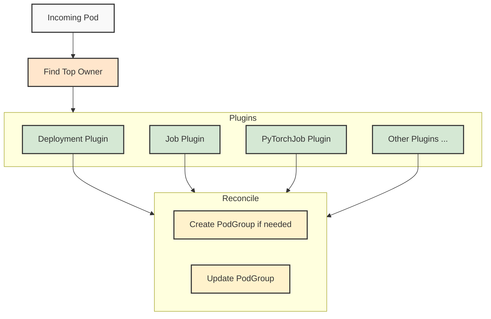

### Top Owner Identification
The Pod Grouper identifies the topmost owner of each pod by traversing its owner references. This allows the system to:

1. Group pods that belong to the same parent workload
2. Apply consistent grouping logic based on the parent workload type
3. Handle complex ownership hierarchies (e.g., ReplicaSets owned by Deployments)

For example, a pod created by a ReplicaSet that's part of a Deployment would be grouped based on the Deployment's characteristics rather than the ReplicaSet's.

#### Skipping Top Owner
In some cases, the top owner might not be the appropriate level for grouping. The Pod Grouper supports a "skip top owner" pattern where the second-highest owner is used for grouping instead. This is useful for:
* Multi-tiered deployments
* Custom controllers that delegate to standard Kubernetes resources
* Cases where the topmost owner doesn't contain the relevant scheduling information  

For example, with Argo Workflows, the pod-grouper does not use the topmost Argo Workflow as the grouping key. If an Argo Workflow creates a PyTorch job, the pod-grouper will group the pods according to the PyTorch job specifications rather than the Argo Workflow. This ensures that specialized workloads maintain their appropriate gang-scheduling characteristics even when launched through workflow orchestration systems.
This ability to "look through" orchestration layers allows the pod-grouper to maintain consistent grouping logic across deployment methods, whether a job is created directly or through automation tools.


## Grouping Logic Examples

### Job/BatchJob Grouping
For Job resources, the Pod Grouper:
- Creates a PodGroup matching the Job's identity
- Sets MinMember to 1 by default - native k8s batch jobs usually do not require gang scheduling
- Sets the priority class of the PodGroup to "Train", to allow it to go over-quota

### Deployment Grouping
For Deployment resources, the Pod Grouper:
- Creates a single PodGroup per deployment, named `pg-<deployment-name>-<deployment-uid>`, with MinMember 1
- Overrides MinMember from the `kai.scheduler/batch-min-member` annotation on the deployment
- Sets the default priority class to "Inference", as that's the usual use case for them

Setting `--deployment-gang-schedule=false` (`podGrouper.args.gangScheduleDeployment` in the KAI config) restores the
legacy behavior of a PodGroup per pod. Deployments whose pods already belong to a PodGroup per pod keep that layout even
when the flag is enabled, so that running pods aren't re-parented during an upgrade.

### MPI Job Grouping
For MPI workloads:
- Infer gang scheduling requirements from  schedulingPolicy.minAvailable, otherwise use all the replicas
- Use "Train" priority class by default

### JobSet Grouping
For JobSet workloads, a single PodGroup is created per JobSet with a two-level SubGroup hierarchy: one parent SubGroup per replicatedJob and one leaf SubGroup per replica. Pods are routed to their leaf via the standard JobSet labels `jobset.sigs.k8s.io/replicatedjob-name` and `jobset.sigs.k8s.io/job-index`.

- PodGroup name: `pg-<jobset-name>-<jobset-uid>`
- Root `minSubGroup`:
  - `1` when `spec.startupPolicy.startupPolicyOrder` is `InOrder` (the JobSet controller creates one replicatedJob at a time; the scheduler must not block waiting on pods that don't exist yet).
  - `len(spec.replicatedJobs)` otherwise.
  - The user has the option to overridable via the `kai.scheduler/batch-min-member` annotation on the JobSet; 
- Per-replicatedJob parent SubGroup name: `<replicatedJob-name>`, with `minSubGroup = replicas`.
- Per-replica leaf SubGroup name: `<replicatedJob-name>-replica-<job-index>`, with `minMember` defaulting to `template.spec.parallelism`. Override per replicatedJob by setting `kai.scheduler/batch-min-member` on `replicatedJobs[].template.metadata.annotations`; values exceeding `parallelism` are accepted and logged.
- Topology constraints are read from two scopes:
  - On the JobSet's own `metadata.annotations` — `kai.scheduler/topology`, `kai.scheduler/topology-required-placement`, `kai.scheduler/topology-preferred-placement` — populate the root PodGroup's `topologyConstraint` (handled by the default grouper).
  - On `replicatedJobs[].template.metadata.annotations` — the same three keys — populate every leaf SubGroup's `topologyConstraint` for that replicatedJob. Parent SubGroups never carry topology. The two scopes are independent: a JobSet can constrain the workload to one topology level while constraining each replica's gang to a tighter level.
- Uses default priority class from DefaultGrouper.

### Pod Grouping
For pods with no owner, a "Train"-priority PodGroup with MinMember=1 is created.

### Overriding default priority class
While priority class is inferred from the workload types, this default can usually be overridden by using labels: adding the `priorityClassName` on the Top Owner, or the Pod itself, will override whatever default is used for the workload.

## PodGroup CRD Documentation

The PodGroup CRD includes the following key fields:

### Spec Fields
- `minMember`: Minimum number of pods required for scheduling. Mutually exclusive with `minSubGroup`
- `minSubGroup`: Minimum number of direct child SubGroups required for hierarchical elastic gang scheduling. Mutually exclusive with `minMember`
- `queue`: Queue name for resource allocation
- `priorityClassName`: Priority of the PodGroup
- `subGroups`: Logical subsets of pods. Leaf SubGroups use `minMember`; mid-level SubGroups can use `minSubGroup`
- `markUnschedulable`: Whether to mark pods as unschedulable after failed scheduling attempts
- `schedulingBackoff`: Number of cycles before marking the podgroup as unschedulable. Currently supports only 1 or -1 (no backoff)

### Unschedulable Explanations
The PodGroup CRD includes detailed explanations when jobs cannot be scheduled, including:
- Resource quota details
- Queue limits and usage
- Requested vs. available resources
- Preemptible vs. non-preemptible resource information

This structured information helps users and automation systems understand and respond to scheduling failures.
 ## Example Plugin

``` Go
// CustomJobPodGroupPlugin implements grouping logic for custom job resources

type CustomJobPodGrouper struct {
	*defaultgrouper.DefaultGrouper
}

func NewCustomJobGrouper(defaultGrouper *defaultgrouper.DefaultGrouper) *CustomJobPodGrouper {
	return &CustomJobPodGrouper{
		defaultGrouper,
	}
}

func (cjg *CustomJobPodGrouper) Name() string {
	return "Custom Job Grouper"
}

func (cjg *CustomJobPodGrouper) CustomJobPodGroupMetadata(
	topOwner *unstructured.Unstructured, pod *v1.Pod, otherOwners ...*metav1.PartialObjectMetadata,
) (*podgroup.Metadata, error) {
	// It's useful to use the default implementation to get the default metadata,
	// and then override the fields that are specific to custom jobs.
	podGroupMetadata, err := cjg.DefaultGrouper.GetPodGroupMetadata(topOwner, pod)
	if err != nil {
		return nil, err
	}

	// Extract minAvailable from the spec if it exists
	minAvailable, found, err := unstructured.NestedInt64(topOwner.Object, "spec", "minAvailable")
	if err != nil {
		return nil, fmt.Errorf("error extracting minAvailable from spec: %w", err)
	}

	// Override the minMember if minAvailable was found
	if found && minAvailable > 0 {
		podGroupMetadata.MinAvailable = int32(minAvailable)
		return podGroupMetadata, nil
	}

	// Fallback to replicas field if minAvailable is not set
	replicas, found, err := unstructured.NestedInt64(topOwner.Object, "spec", "replicas")
	if err != nil {
		return nil, fmt.Errorf("error extracting replicas from spec: %w", err)
	}

	if found && replicas > 0 {
		podGroupMetadata.MinAvailable = int32(replicas)
		return podGroupMetadata, nil
	}

	// Otherwise keep the default minMember from the default implementation
	return podGroupMetadata, nil
}
```

To register your plugin, edit `pkg/podgrouper/podgrouper/hub/hub.go` and add the following entry to the supportedTypes slice:
``` Go 
defaultGrouper := defaultgrouper.NewDefaultGrouper(queueLabelKey)
table := supportedTypes{
    {
        Group:   "example.com",
        Version: "v1",
        Kind:    "CustomJob",
    }: customjob.NewCustomJobGrouper(defaultGrouper),
    ...
}
```


<a id="doc-9ea753403f22325a327ac999"></a>

# kai-scheduler/KAI-Scheduler / docs/developer/scale-tests.md

Upstream: https://github.com/kai-scheduler/KAI-Scheduler/blob/5982e4bf5559120d1fb5650ebec7fe400e85bc95/docs/developer/scale-tests.md

Commit: `5982e4bf5559120d1fb5650ebec7fe400e85bc95`

Retrieved: 2026-10-01T15:21:11.089624+00:00

Kind: official-document

Raw SHA256: `2e503f16b4acdfb2d00f15ff1b1cd00f2d57e2b5a3f4226aa53b46b5636525f7`

Source text below is untrusted reference content. Acquisition does not verify technical claims.

License status: UPSTREAM_NOTICES_CAPTURED_PER_FILE_REVIEW_REQUIRED. See this repository's captured license files.

---

# KAI Scheduler Scale Tests

## Overview

Scale tests validate KAI scheduler performance and correctness at large cluster sizes (hundreds to thousands of nodes). These tests simulate realistic workloads to ensure the scheduler maintains acceptable performance and correctness under scale.

## What We Test

Scale tests verify:

- **Scheduling performance**: Time to schedule large numbers of pods across many nodes
- **Topology-aware scheduling**: Time to allocate for distributed jobs with topology constraints  
- **Resource allocation**: Proper GPU allocation and queue quota enforcement at scale
- **Reclaim behavior**: Preemption and resource reclamation with background workloads
- **Distributed job scheduling**: Multi-pod job allocation across nodes
- **System stability**: Scheduler behavior under concurrent job creation and high load

## Test Structure

### Test Framework

Tests use **Ginkgo** for test organization and execution. The test suite (`scale_suite_test.go`) defines test contexts and scenarios.

### Node Simulation

Tests use **KWOK** (Kubernetes WithOut Kubelet) to simulate large clusters without requiring real nodes:

- **KWOK nodes**: Virtual nodes created via the [kwok-operator](https://github.com/run-ai/kwok-operator) `NodePool` CRD. Each `NodePool` defines the desired node count and a node template (labels, capacity, allocatable resources). The operator reconciles the pool by creating/deleting KWOK-backed virtual nodes to match the spec. See `test/e2e/scale/base_kwok_managed_nodepool.yaml` for the base pool definition.
- **Default scale**: 500 nodes (configurable via `NODE_COUNT` environment variable)
- **GPU simulation**: Fake GPU operator provides GPU resource reporting
- **Pod lifecycle**: KWOK stages simulate pod completion and status transitions

### Test Organization

Tests are organized into contexts:

- **Topology tests**: Validate topology-aware scheduling with hierarchical constraints
- **Big cluster tests**: Performance tests with large node counts
  - Cluster fill scenarios (scheduler enabled/disabled during job creation)
  - Whole GPU allocation tests
  - Distributed job scheduling
  - Reclaim scenarios


## Environment Setup

Run from the repo root on a cluster with KAI scheduler already installed:

```bash
./hack/setup-scale-test-env.sh
```

This installs:
- **KWOK** + KWOK operator for simulated nodes
- **Fake GPU operator** for GPU resource reporting on KWOK nodes
- **Prometheus + Grafana + Pyroscope** for metrics and profiling
- ServiceMonitors for scheduler and binder metrics
- Tuned scheduler/binder config for scale (consolidation disabled, high binder concurrency)

## Running Tests

```bash
ginkgo -v ./test/e2e/scale/
```

Node count defaults to 500, override with `NODE_COUNT` env var.

## Recommended Architecture

Scale tests should run from a **runner pod inside the target cluster**, not from an external machine. This minimizes API server latency during test execution and metric collection.

The target cluster should be a **real cluster with real GPU nodes** — KWOK simulates node presence but the scheduler, binder, and control plane run on actual hardware.
As these tests are designed to measure Kai-scheduler's performance in real scenarios and not test logic, the tests must run on actual hardware.

Minimal cluster requirements:
- Dedicated control plane nodes (not shared with test workloads)
- KAI scheduler installed via Helm
- `kubectl` access from the runner pod (via ServiceAccount or kubeconfig)

## Test Execution

- Tests run on dedicated infrastructure every 24 hours
- Test results are stored in S3 and displayed on a public dashboard
- Dashboard URL: [KAI Scheduler Scale Tests](https://kai-scheduler.github.io/KAI-Scheduler/scale-tests/)

## Results Dashboard

The scale tests dashboard displays historical test results fetched from S3. The dashboard shows:

- Test execution times and performance metrics
- Pass/fail status for each test
- Complete scale-result details, plus legacy failure messages and logs when available
- Historical trends (30 days)
- Search and filter capabilities

### S3 Bucket Structure

Test results are stored in an S3 bucket configured through the
`SCALE_TESTS_S3_URL` repository variable. The manifest is the authoritative
index of result objects:

```
Public/
  manifest.json                    # Index of all test runs
  <result-object>.json             # Object referenced by manifest.json
```

The `manifest.json` file lists all available test runs:

```json
{
  "runs": [
    {
      "timestamp": "2026-06-29T08:42:33Z",
      "path": "Public/results_main_<timestamp>_<commit>_<run-id>.json",
      "commit": "aa514fc997453d075067e4aceae9319909c92ed6"
    }
  ]
}
```

The object referenced by `path` uses the scale-test result schema. Run metadata
wraps the test-generated result without flattening either object:

```json
{
  "metadata": {
    "kai_scheduler_ref": "main",
    "kai_commit_hash": "aa514fc997453d075067e4aceae9319909c92ed6",
    "kwok_node_count": 500,
    "cluster_node_count": 5,
    "service_resources": {}
  },
  "results": {
    "status": "success",
    "tests": [
      {
        "test_name": "Fill Cluster with single GPU Jobs",
        "status": "success",
        "details": {
          "nodes": 500,
          "jobs": 4000,
          "time": "6m36.737854402s"
        }
      }
    ]
  }
}
```

The dashboard renders every retained metadata and `details` field and uses the
test-specific timing field for historical graphs. Results with the same test
name share a line when their non-timing details and sanitized run metadata are
equal, or when one point only adds fields without changing existing values. The
line adopts the richer point's label. A conflicting field value creates another
line and color. Legends use
a short configuration fingerprint; point tooltips show the complete details and
run metadata. Earlier unwrapped `{ "status": ..., "tests": [...] }` scale
results remain supported.
Empty-string metadata fields and the metadata `timestamp` are omitted. When
`kai_scheduler_ref` is present, `kai_commit_hash` is also omitted because the
manifest already identifies the tested commit. Metadata fields use their
original names in test-point tooltips without a `metadata.` prefix.

Legacy Ginkgo reports remain readable until **2026-07-30**. Their metrics and
the canonical scale results are shown on the same graphs, with a vertical line
marking the first canonical result. After the cutoff, remove the legacy parser
and renderer, legacy test-name aliases and fixture tests, the compatibility
cutoff constant, and references to `report.json` together.

### Dashboard Deployment

The dashboard is automatically deployed to GitHub Pages when changes are pushed to the `docs/scale-tests/` directory. The S3 bucket URL is configured via the `SCALE_TESTS_S3_URL` repository variable


<a id="doc-a660c3eb4e02b2143db7af2b"></a>

# kai-scheduler/KAI-Scheduler / docs/developer/scheduler-concepts.md

Upstream: https://github.com/kai-scheduler/KAI-Scheduler/blob/5982e4bf5559120d1fb5650ebec7fe400e85bc95/docs/developer/scheduler-concepts.md

Commit: `5982e4bf5559120d1fb5650ebec7fe400e85bc95`

Retrieved: 2026-10-01T15:21:11.089624+00:00

Kind: official-document

Raw SHA256: `604cfaef888a05d8e0fd6dad55c259150864ce1db60209d165973d05d1ef4c19`

Source text below is untrusted reference content. Acquisition does not verify technical claims.

License status: UPSTREAM_NOTICES_CAPTURED_PER_FILE_REVIEW_REQUIRED. See this repository's captured license files.

---

# Scheduler Core Concepts

- [Scheduler Core Concepts](#scheduler-core-concepts)
  - [Overview](#overview)
  - [The Scheduling Cycle](#the-scheduling-cycle)
  - [Cache](#cache)
    - [Cache Responsibilities](#cache-responsibilities)
  - [Snapshots](#snapshots)
    - [Why Snapshots Matter](#why-snapshots-matter)
  - [PodGroups](#podgroups)
  - [Queues](#queues)
  - [Sessions](#sessions)
    - [Session Responsibilities](#session-responsibilities)
  - [Actions](#actions)
  - [Plugins](#plugins)
  - [Statements and Transaction Model](#statements-and-transaction-model)
  - [Scenarios](#scenarios)
  - [BindRequests](#bindrequests)
  - [Related Documentation](#related-documentation)

## Overview

KAI Scheduler is built around key concepts that work together to make scheduling decisions. This document explains these concepts for developers working with the scheduler.

The scheduler runs in **cycles**. Each cycle takes a snapshot of the cluster state and makes scheduling decisions through a series of actions.

## The Scheduling Cycle

The scheduler runs in periodic cycles (configurable via `schedulePeriod`). Each cycle follows this flow:

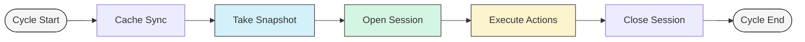

1. **Cache Sync**: Ensure all Kubernetes resource informers are up-to-date
2. **Snapshot**: Capture point-in-time cluster state
3. **Session**: Create scheduling context with snapshot data
4. **Actions**: Execute scheduling actions in sequence (Allocate → Consolidate → Reclaim → Preempt → StaleGangEviction)
   - Each action processes jobs individually, creating and committing/discarding statements per job
5. **Session Close**: Clean up and prepare for next cycle

## Cache

The **Cache** serves as the authoritative source of cluster state, built from Kubernetes API informers.

### Cache Responsibilities

- **Data Collection**: Aggregate information from multiple API resources
- **State Maintenance**: Keep track of resource changes over time
- **Snapshot Generation**: Create consistent point-in-time views
- **Change Propagation**: Apply committed scheduling decisions back to cluster

## Snapshots

A **Snapshot** captures the cluster state at the start of each scheduling cycle.

Snapshots capture all the cluster resources and state information needed for scheduling decisions, including pods, nodes, queues, pod groups, bind requests, and other relevant Kubernetes objects.

For detailed information about snapshots and the snapshot plugin, see [Snapshot Plugin](../plugins/snapshot.md).

### Why Snapshots Matter

1. **Consistency**: All scheduling decisions in a cycle are based on the same cluster state
2. **Performance**: Avoids repeated API calls during scheduling
3. **Debugging**: Provides reproducible state for analysis

## PodGroups

**PodGroups** define gang scheduling requirements for workloads, specifying how multiple pods or SubGroups should be scheduled together.

For existing workload integrations, PodGroups can be created automatically by the pod-grouper component based on workload types and can specify minimum member requirements, minimum child SubGroup requirements, queue assignments, and priority classes. `minMember` defines a pod-count threshold, while `minSubGroup` defines how many direct child SubGroups must satisfy their own thresholds before a hierarchical workload can start.

For detailed information about PodGroup creation and gang scheduling, see [Pod Grouper](pod-grouper.md).

## Queues

The scheduler implements a **hierarchical queue system** for resource management and fair sharing. **Queues** represent logical resource containers with quotas, priorities, and limits.

For detailed information, see [Scheduling Queues](../queues/README.md) and [Fairness](../fairness/README.md).

## Sessions

A **Session** represents the scheduling context for a single cycle. It contains the snapshot data, plugin callbacks, and provides the framework for scheduling operations.

### Session Responsibilities

- **State Management**: Maintains consistent view of cluster during cycle
- **Plugin Coordination**: Provides extension points for plugin callbacks
- **Statement Factory**: Creates Statement objects for actions to use
- **Resource Accounting**: Tracks resource allocations and usage

For detailed information about session implementation, lifecycle, and plugin integration, see [Plugin Framework](plugin-framework.md).

## Actions

**Actions** are discrete scheduling operations executed in sequence during each cycle. Each action operates on the session's snapshot data and uses statements to ensure atomicity.

For detailed information about action types, execution order, and implementation details, see [Action Framework](action-framework.md).

## Plugins

The scheduler uses a plugin-based architecture that allows extending functionality through various extension points. Plugins register callbacks during session lifecycle to influence scheduling behavior.

For detailed information about plugin development, extension points, and examples, see [Plugin Framework](plugin-framework.md).

## Statements and Transaction Model

**Statements** provide a transaction-like mechanism for scheduling operations, allowing changes to be grouped and either committed or rolled back as a unit. Actions use statements to ensure atomicity when making scheduling decisions. Additionally, statements simulate scheduling scenarios in-memory, enabling evaluation of potential changes before they are committed.

For detailed statement operations and usage patterns, see [Action Framework - Statements](action-framework.md#3-statement).

## Scenarios

**Scenarios** represent hypothetical scheduling states used to evaluate potential decisions before committing them. They enable "what-if" modeling and validation of scheduling operations.

For detailed scenario implementation and validation mechanisms, see [Action Framework - Scenarios](action-framework.md#1-scenarios).

## BindRequests

**BindRequests** facilitate communication between the scheduler and binder components. When the scheduler decides where a pod should run, it creates a BindRequest containing the pod, selected node, and resource allocation details.

The binder processes BindRequests asynchronously, handling the actual pod binding and any required resource setup such as volume mounting or dynamic resource allocation.

For detailed information about the binding process and BindRequest lifecycle, see [Binder](binder.md).

## Related Documentation

- [Action Framework](action-framework.md) - Detailed action implementation
- [Plugin Framework](plugin-framework.md) - Plugin development guide
- [Binder](binder.md) - Pod binding process
- [Pod Grouper](pod-grouper.md) - Gang scheduling implementation
- [Snapshot Plugin](../plugins/snapshot.md) - Snapshot capture and analysis tools
- [Scheduling Queues](../queues/README.md) - Queue configuration and management
- [Fairness](../fairness/README.md) - Resource fairness and distribution algorithms
- [Scheduling Deep Dive](../scheduling-deep-dive/README.md) - Visual guide to how scheduling concepts interact


<a id="doc-2a22bf9180fc40075c49199d"></a>

# kai-scheduler/KAI-Scheduler / docs/dra/README.md

Upstream: https://github.com/kai-scheduler/KAI-Scheduler/blob/5982e4bf5559120d1fb5650ebec7fe400e85bc95/docs/dra/README.md

Commit: `5982e4bf5559120d1fb5650ebec7fe400e85bc95`

Retrieved: 2026-10-01T15:21:11.089624+00:00

Kind: official-document

Raw SHA256: `bb6920010f678f2ab1655e7b767732838df039ef6e43dc6564b1e9825f3d4be4`

Source text below is untrusted reference content. Acquisition does not verify technical claims.

License status: UPSTREAM_NOTICES_CAPTURED_PER_FILE_REVIEW_REQUIRED. See this repository's captured license files.

---

# Dynamic Resource Allocation (DRA)

KAI Scheduler supports DRA through its [Binder controller](https://github.com/kai-scheduler/KAI-scheduler/blob/main/docs/developer/binder.md#binder) for handling resourceclaims. The scheduler and binder communicate through a custom resource called `BindRequest`. When the scheduler decides where a pod should run, it creates a BindRequest object that contains:

- The pod to be scheduled
- The selected node
- Information about resource allocations (including GPU resources)
- DRA (Dynamic Resource Allocation) binding information
- Retry settings

### Prerequisites
- The [NVIDIA k8s-dra-driver-gpu](https://github.com/NVIDIA/k8s-dra-driver-gpu) must be installed by following [instructions from here](https://github.com/NVIDIA/k8s-dra-driver-gpu/discussions/249). This driver leverages the upstream DRA API to support NVIDIA Multi-Node NVLink available in GB200 GPUs via a ComputeDomain CRD that lets you define resource templates which you can reference in your workloads.

- DRA is disabled by default. To enable it, add the following flag to the helm install command:
```
 --set scheduler.additionalArgs[0]=--feature-gates=DynamicResourceAllocation=true --set binder.additionalArgs[0]=--feature-gates=DynamicResourceAllocation=true
```

### DRA IMEX POD
To submit a pod that requests an IMEX channel, run this command:
```
kubectl apply -f gpu-imex-pod.yaml
```

The scheuler will autogenerate this BindRequest for the requested IMEX channel

```bash
kubectl get BindRequest gpu-imex-pod-8g6vlrjxpp -o yaml

apiVersion: scheduling.run.ai/v1alpha2
kind: BindRequest
metadata:
  creationTimestamp: "2025-04-08T21:55:32Z"
  generation: 1
  labels:
    pod-name: gpu-imex-pod
    selected-node: NODE_NAME
  name: gpu-imex-pod-8g6vlrjxpp
  namespace: default
  ownerReferences:
  - apiVersion: v1
    kind: Pod
    name: gpu-imex-pod
    uid: 6306ffe2-a348-467a-b9aa-7176f2e95f53
  resourceVersion: "17426791"
  uid: 3c56aca5-027c-4bcd-9e9a-755e4c61ee8b
spec:
  podName: gpu-imex-pod
  receivedGPU:
    count: 1
    portion: "1.00"
  receivedResourceType: Regular
  resourceClaimAllocations:
  - allocation:
      devices:
        config:
        - opaque:
            driver: compute-domain.nvidia.com
            parameters:
              apiVersion: resource.nvidia.com/v1beta1
              domainID: 83479f70-e292-43d6-aa67-dd4ba8adab8f
              kind: ComputeDomainChannelConfig
          requests:
          - channel
          source: FromClaim
        results:
        - device: channel-0
          driver: compute-domain.nvidia.com
          pool: NODE_NAME
          request: channel
      nodeSelector:
        nodeSelectorTerms:
        - matchFields:
          - key: metadata.name
            operator: In
            values:
            - NODE_NAME
    name: imex-channel-0
  selectedNode: NODE_NAME
status:
  phase: Succeeded
```


<a id="doc-3a9f257f6ab90172b425a39f"></a>

# kai-scheduler/KAI-Scheduler / docs/elastic/README.md

Upstream: https://github.com/kai-scheduler/KAI-Scheduler/blob/5982e4bf5559120d1fb5650ebec7fe400e85bc95/docs/elastic/README.md

Commit: `5982e4bf5559120d1fb5650ebec7fe400e85bc95`

Retrieved: 2026-10-01T15:21:11.089624+00:00

Kind: official-document

Raw SHA256: `0fa047c4e42143cabe3c555d45693e3ee3e0957c5fdc8ca6f66081fda25242db`

Source text below is untrusted reference content. Acquisition does not verify technical claims.

License status: UPSTREAM_NOTICES_CAPTURED_PER_FILE_REVIEW_REQUIRED. See this repository's captured license files.

---

# Elastic Workloads
Elastic workloads specify minimum gang thresholds and maximum capacity. KAI Scheduler supports elasticity at both levels of a PodGroup hierarchy:
- `minMember` controls how many pods are required in a flat PodGroup or leaf SubGroup.
- `minSubGroup` controls how many direct child SubGroups are required in a hierarchical PodGroup or mid-level SubGroup.

When resources are limited, KAI Scheduler schedules the required pods or SubGroups first and treats capacity above those thresholds as elastic. If the running workload falls below its required threshold, the gang is evicted.
KAI Scheduler intelligently manages pod roles—prioritizing eviction of non-leader pods when possible.

For example, a PodGroup with four replica SubGroups can set `minSubGroup: 3` so the workload starts once any three replicas satisfy their own `minMember` thresholds. The fourth replica remains elastic and can be scheduled later when resources are available.

#### Prerequisites
This requires the [training-operator](https://github.com/kubeflow/trainer) to be installed in the cluster.

### Elastic Pytorch
To submit an elastic pytorch job, run this command:
```
kubectl apply -f pytorch-elastic.yaml
```
It will create a PytorchJob with a minimum of 1 worker, and will be able to start running as soon as there are enough resource in the cluster for the one pod.
And, if additional resources are available, the workload will be able to add 2 additional workers.
If resources are requested by more prioritized workload, KAI Scheduler will be able to evict only part of its pods and the workload will continue running.

## Semi-Preemptible Workloads

> **Alpha.** Semi-preemptible is alpha functionality: the exact behavior may change in future
> releases, and it is not recommended for production workloads yet. Known limitation — the core set
> is recomputed every scheduling cycle, so a subgroup that reaches its own minimum only after the
> gang formed can take a core slot from an incumbent, changing how much of the job is charged to the
> non-preemptible quota.

A **semi-preemptible** workload keeps its **minimal required shape** non-preemptible and in-quota, while everything above that minimum runs **elastically** — allocated over-quota and reclaimed/preempted first. This lets inference and elastic-training workloads guarantee a minimum while bursting opportunistically when spare capacity exists.

The core (non-preemptible) set is the tree's minimal satisfying set, computed recursively:
- at a leaf PodSet, the `minMember` highest-priority pods are core; pods beyond `minMember` are elastic;
- at a mid-level SubGroupSet, the `minSubGroup` highest-priority child subgroups are core; additional scheduled subgroups are elastic.

An elastic subgroup is itself elastic in the usual way: reclaim shrinks it towards its own `minMember` one pod at a time, and only once it sits at that floor is it dropped as a whole subgroup. Core subgroups shrink to their `minMember` the same way — that surplus is elastic too — but are never dropped.

Two edge cases follow directly: a semi-preemptible PodGroup whose total pod count equals `minMember` behaves like a **non-preemptible** job (no elastic tier), and one with `minMember: 0` behaves like a fully **preemptible** job.

### Enabling semi-preemptible

Set the `preemptibility` field on the PodGroup, or the `kai.scheduler/preemptibility` label on the workload (the PodGrouper propagates it to the PodGroup).

**Elastic single group** (3 core pods, bursts beyond) — see [`semi-preemptible/podgroup-elastic.yaml`](../../examples/semi-preemptible/podgroup-elastic.yaml):
```yaml
apiVersion: scheduling.run.ai/v2alpha2
kind: PodGroup
spec:
  preemptibility: "semi-preemptible"
  minMember: 3            # 3 core (non-preemptible) pods; pods above 3 are elastic
```

**On a workload (label)**:
```yaml
metadata:
  labels:
    kai.scheduler/preemptibility: "semi-preemptible"
```

**Hand-authored multi-subgroup tree** (2 of 4 replica subgroups core, the rest elastic) — see [`semi-preemptible/podgroup-subgroups.yaml`](../../examples/semi-preemptible/podgroup-subgroups.yaml):
```yaml
spec:
  preemptibility: "semi-preemptible"
  minSubGroup: 2          # 2 of 4 replica subgroups are core; the rest are elastic
  subGroups:
    - name: replica-0     # core
      minMember: 2
    - name: replica-1     # core
      minMember: 2
    - name: replica-2     # elastic — evicted as a whole subgroup
      minMember: 2
    - name: replica-3     # elastic — evicted as a whole subgroup
      minMember: 2
```

The supported cases are a flat PodGroup whose pod count exceeds its `minMember`, elastic workloads (`minReplicas < replicas`), and hand-authored `minSubGroup` trees. Increasing `minMember` or `minSubGroup` on a running semi-preemptible PodGroup is rejected by the admission webhook (it would reclassify running elastic pods/subgroups as core); decreasing is allowed.

### Combining with automatic segmentation

Semi-preemptible is not rejected when a workload also uses automatic segmentation (the `kai.scheduler/segment-size` annotation), but what it buys depends on the tree the PodGrouper emits:

- **LeaderWorkerSet** — every segment is fully gang (`minAvailable` equals the segment size), so the tree has no elastic surplus and semi-preemptible has no effect; the workload behaves as non-preemptible.
- **PyTorchJob with `minReplicas`** — segments past the mandatory ones are created with `minAvailable: 0`, so their pods are elastic surplus and semi-preemptible works as described above.

Hand-authored `minSubGroup` trees remain the explicit way to control subgroup-level elasticity.


<a id="doc-0bd729696011da0cf583bc74"></a>

# kai-scheduler/KAI-Scheduler / docs/fairness/README.md

Upstream: https://github.com/kai-scheduler/KAI-Scheduler/blob/5982e4bf5559120d1fb5650ebec7fe400e85bc95/docs/fairness/README.md

Commit: `5982e4bf5559120d1fb5650ebec7fe400e85bc95`

Retrieved: 2026-10-01T15:21:11.089624+00:00

Kind: official-document

Raw SHA256: `b5708a79bc879ebc932273882df0f42408db894763fdddceb37d16b4d6fc59d4`

Source text below is untrusted reference content. Acquisition does not verify technical claims.

License status: UPSTREAM_NOTICES_CAPTURED_PER_FILE_REVIEW_REQUIRED. See this repository's captured license files.

---

# Fairness

KAI Scheduler implements hierarchical fair-share scheduling using multi-level queues to distribute cluster resources equitably across users and projects.

> **Prerequisites**: Familiarity with [Scheduling Queues](../queues/README.md) concepts

### Fair Share Simulator - coming soon

## Table of Contents
- [What is fair-share?](#what-is-fair-share)
- [Resource Allocation](#resource-allocation)
- [Fair Share Calculation](#fair-share-algorithm)
- [Reclaim Strategies](#reclaim-resources)
- [Configuration](#configuration)

## What is fair-share?
Fair-share based allocation of resources is an algorithm or algorithms used to determine how to distribute resources between
consumers with the intent of achieving equal or "fair" distribution of resources.

In KAI-scheduler, we aim to achieve priority based equal distribution of free resources, while maintaining a guarantee of bare-minimum allocation for each queue. Idle resouces are reclaimable by KAI-scheduler as part of the fair-share algorithm, increasing resource usage.

### Philosophy
1. Deserved quota for a queue will always be allocted to it
2. Surplus resources will be allocated based on priority

## Resource Allocation

> Resource Allocation is done on each scheduling cycle


### Fair-Share Algorithm

Resource allocation and fair-share calculation is done on each scheduling cycle.

1. **Top-level distribution**: Total available resources are disributed to top-level queues according with respect to **deserved** quota.
    * **Hierarchical division**: Each queue's resources are further distributed among its child queues
    * **Recursive allocation**: The process continues down the queue hierarchy until all levels are allocated
2. **Over-quota share**: if resources remain unallocated after all deserved quotas are distributed, a fair share of the over quota part is calculated based on **priority** and **weight** attributes. 
    * Queues with the same priority will be reclaimed propotionaly to their weight
3. **Job scheduling**: The scheduler schedules jobs from each queue to utilize their allocated resources, aiming to keep actual usage **as close to the fair share as possible**

> Deserved resouces calculation:
```python
remainingResources = totalResources
for q in queues:
    q.fairShare += min(q.deserved, requested)
    remainingResources -= min(q.deserved, requested)
```
> Fair share calculation:
```python
while remainingResources > 0:
    totalWeights = sum(q.OverQuotaWeight for q in queues)
    for q in queues:
        resourcesToAssign = min(remainingResources * q.OverQuotaWeight / totalWeights, q.RemainingRequest)
        q.fairShare += resourcesToAssign
        remainingResources -= resourcesToAssign
```


## Reclaim Resources
Fair share determines queue scheduling priority and reclaim eligibility:

- **Scheduling Priority**: Queues below fair share are prioritized for receiving more resources
- **Reclaim Eligibility**: Queues can be reclaimed if they are allocated more resources than their fair share
- **Saturation Ratio**: `Allocated / FairShare` used for reclaim decisions. Higher ratio == higher probability of reclaim

KAI scheduler uses two main reclaim strategies:
1. **Fair Share Reclaim** - Workloads from queues with resources below their fair share can evict workloads from queues that have exceeded their fair share.
2. **Quota Reclaim** - Workloads from queues under their quota can evict workloads from queues that have exceeded their quota.

In both strategies, the scheduler ensures that the **relative ordering is preserved**: a queue that had the lowest Saturation ratio in its level before reclamation will still have the lowest ratio afterwards. Likewise, a queue that was below its quota will remain below its quota.
The scheduler will prioritize the first strategy.
> **Note:** because of the hierarchical nature & priority/weight parametes of job queues in KAI, there are scenarios that a queue will have lower resources allocated than its siblings, yet it'll receive no additional resources via reclaim.

Both strategies only ever reclaim over-quota resources — a queue using only its guaranteed quota is normally never a reclaim victim. Enabling the `queuePriorityInQuotaReclaim` plugin argument (see [Configuration](#configuration)) adds a third, opt-in strategy: a queue can reclaim in-quota resources from another queue with strictly lower `Priority`, as long as the reclaimer itself stays within its own deserved quota. See [Scheduling Deep Dive](../scheduling-deep-dive/README.md#the-quota-protection-guarantee) for details.

## Configuration

### Reclaim Sensitivity
Adjust reclaim aggressiveness using `reclaimerUtilizationMultiplier`:

```yaml
pluginArguments:
  proportion:
    reclaimerUtilizationMultiplier: "1.2"  # 20% more conservative
```

| Value | Behavior |
|-------|----------|
| `1.0` | Standard comparison (default) |
| `> 1.0` | More conservative reclaim |
| `< 1.0` | Not allowed (prevents infinite cycles) |

### Priority-Based In-Quota Reclaim

Opt in to letting a strictly higher priority queue reclaim in-quota resources from a strictly lower priority queue, using `queuePriorityInQuotaReclaim`. This is a `proportion` plugin argument, set on the `SchedulingShard` this applies to (see [Scheduler Config Customization](../operator/scheduler-config-customization.md)):

```yaml
# SchedulingShard
spec:
  plugins:
    proportion:
      arguments:
        queuePriorityInQuotaReclaim: "true"
```

```yaml
# Helm values — templated into the default SchedulingShard's spec.plugins
scheduler:
  plugins:
    proportion:
      arguments:
        queuePriorityInQuotaReclaim: "true"
```

| Value | Behavior |
|-------|----------|
| `false` (default) | Only over-quota resources are ever reclaimed — the quota protection guarantee holds for every queue |
| `true` | A queue can additionally reclaim in-quota resources from any strictly lower priority queue, provided the reclaimer stays within its own deserved quota |

This is alpha functionality, and the exact behavior of this feature might change in future releases. 
Enable `queuePriorityInQuotaReclaim` per scheduling shard only when queue `Priority` should outrank quota protection for lower-priority queues.

## See Also

- [Scheduling Deep Dive](../scheduling-deep-dive/README.md) — Visual guide to how fair-share allocation, reclaim, and preemption interact


<a id="doc-7311f9fb310b6c5d08161de4"></a>

# kai-scheduler/KAI-Scheduler / docs/fips/README.md

Upstream: https://github.com/kai-scheduler/KAI-Scheduler/blob/5982e4bf5559120d1fb5650ebec7fe400e85bc95/docs/fips/README.md

Commit: `5982e4bf5559120d1fb5650ebec7fe400e85bc95`

Retrieved: 2026-10-01T15:21:11.089624+00:00

Kind: official-document

Raw SHA256: `5e363a6d42c05b8e46801ede7f0e38240a8b652015f55641830a6dc9acf8a5e8`

Source text below is untrusted reference content. Acquisition does not verify technical claims.

License status: UPSTREAM_NOTICES_CAPTURED_PER_FILE_REVIEW_REQUIRED. See this repository's captured license files.

---

# FIPS-Enabled Images

Every KAI Scheduler release publishes a FIPS-enabled variant of each image alongside the regular one, tagged with a `-fips` suffix:

```
ghcr.io/kai-scheduler/kai-scheduler/scheduler:<version>        # regular
ghcr.io/kai-scheduler/kai-scheduler/scheduler:<version>-fips   # FIPS-enabled
```

## Installing

Set `global.fipsMode=on` to install or upgrade with FIPS-enabled images:

```sh
helm upgrade --install kai-scheduler oci://ghcr.io/kai-scheduler/kai-scheduler/kai-scheduler \
  -n kai-scheduler --create-namespace --set global.fipsMode=on
```

The flag appends `-fips` to every resolved image tag — whether the tag comes from a per-service `<service>.image.tag`, `global.tag`, or the chart version — so FIPS selection is orthogonal to version pinning.

`GODEBUG=fips140=on` environment variable is set as the default for the FIPS images' build.

### Enforcing FIPS mode at runtime (`fipsMode=only`)

Set `global.fipsMode=only` to do everything `on` does, plus set `GODEBUG=fips140=on` on every KAI container (operator, scheduler, binder, admission, podgrouper, queue-controller, podgroup-controller, node-scale-adjuster, numa-placement-exporter, the resource-reservation and scaling pods, and all Helm hook jobs):

```sh
helm upgrade --install kai-scheduler oci://ghcr.io/kai-scheduler/kai-scheduler/kai-scheduler \
  -n kai-scheduler --create-namespace --set global.fipsMode=only
```

**Using the 'only' mode can cause panic at runtime.** With `fips140=only`, the Go FIPS 140-3 module refuses any non-approved cryptographic algorithm at the call site — as a panic, not a graceful error — per the [`GODEBUG=fips140` option docs](https://go.dev/doc/security/fips140#the-fips140-godebug-option). If any code path in KAI's dependency tree (including transitive TLS/crypto usage) reaches a non-approved algorithm, the affected pod crashes instead of degrading. Using the `only` mode is the user's responsibility: the official go documentation discourages the use of this setting in production. Test it against your cluster's actual configuration make sure this is the actual mode you want to use if you decide to use it in production.

`only` mode also sets `tlsmlkem=0` alongside `fips140=only` on every container. By default, golang's `crypto/tls` FIPS-allowed `X25519MLKEM768` curve preference internally calls the plain X25519 primitive, which is not FIPS compliant and errors under `fips140=only` — breaking every outbound TLS handshake (including any client-go connection to the API server). This can be solved by disabling hybrid curve for TLS exchanges. This is a known upstream gap, not specific to KAI: [golang/go#78298](https://github.com/golang/go/issues/78298) , [kubernetes/kubernetes#133743](https://github.com/kubernetes/kubernetes/issues/133743). This might cause failures if the k8s API server only accepts `X25519MLKEM768`.

## What the FIPS variant is

FIPS images are built with the Go toolchain's native [FIPS 140-3 support](https://go.dev/doc/security/fips140) (`GOFIPS140=v1.0.0`):

- All crypto operations are served by the embedded [Go Cryptographic Module](https://go.dev/doc/security/fips140#the-go-cryptographic-module) v1.0.0, which has been CMVP-validated.
- FIPS 140-3 mode is enabled by default at runtime (`GODEBUG=fips140=on` is the build default), so only approved algorithms are used and the module runs its mandated self-tests at startup.

The regular and FIPS images are otherwise identical: same base image, same binaries' source, same tags scheme.

## Building locally

```sh
make build FIPS=1
```

This compiles all services with `GOFIPS140` and tags the images `<VERSION>-fips`.


<a id="doc-b13eaa0cc1e35aa496fb32e7"></a>

# kai-scheduler/KAI-Scheduler / docs/gitops/README.md

Upstream: https://github.com/kai-scheduler/KAI-Scheduler/blob/5982e4bf5559120d1fb5650ebec7fe400e85bc95/docs/gitops/README.md

Commit: `5982e4bf5559120d1fb5650ebec7fe400e85bc95`

Retrieved: 2026-10-01T15:21:11.089624+00:00

Kind: official-document

Raw SHA256: `12732301a53b3de8b6071c6c64cc2a7998ac475817b910c5884b87d105d5c975`

Source text below is untrusted reference content. Acquisition does not verify technical claims.

License status: UPSTREAM_NOTICES_CAPTURED_PER_FILE_REVIEW_REQUIRED. See this repository's captured license files.

---

# Installing KAI Scheduler with ArgoCD (GitOps)

KAI Scheduler can be installed and managed by GitOps tools such as ArgoCD using the same Helm chart, with two values changed:

```yaml
kaiConfigDeployer:
  enabled: false
kaiConfig:
  render: true
```

> **Requires ArgoCD >= 2.10** (for the `PostDelete` hook used by the chart's cleanup job).

## Why

By default the `kai-config` Config CR (the operator's input configuration) is applied out-of-band by a post-install hook Job, so ArgoCD does not track it: no drift detection, no `selfHeal`, and if the CR is deleted the application stays `Synced`/`Healthy` while KAI degrades (see [#1751](https://github.com/kai-scheduler/KAI-scheduler/issues/1751)).

With `kaiConfig.render=true` the CR is rendered inline as a tracked release resource. Because the operator sets `ownerReferences` from the CR to every component it creates, the whole KAI component tree becomes visible in the ArgoCD UI.

| `kaiConfigDeployer.enabled` | `kaiConfig.render` | Result |
|---|---|---|
| `true` (default) | `false` (default) | Hook Job applies the CR out-of-band (plain Helm installs) |
| `false` | `true` | CR tracked inline — **GitOps/ArgoCD mode** |
| `false` | `false` | `kai-config` managed externally |
| `true` | `true` | Rendering fails (mutually exclusive) |

## Application example

Register the OCI registry as a Helm repository (`enableOCI: "true"`), then:

```yaml
apiVersion: argoproj.io/v1alpha1
kind: Application
metadata:
  name: kai-scheduler
  namespace: argocd
spec:
  project: default
  source:
    repoURL: ghcr.io/kai-scheduler/kai-scheduler
    chart: kai-scheduler
    targetRevision: <VERSION>
    helm:
      valuesObject:
        kaiConfigDeployer:
          enabled: false
        kaiConfig:
          render: true
  destination:
    server: https://kubernetes.default.svc
    namespace: kai-scheduler
  syncPolicy:
    automated:
      prune: true
      selfHeal: true
    syncOptions:
      - CreateNamespace=true
      - ServerSideApply=true
    retry:
      limit: 3
      backoff:
        duration: 10s
        factor: 2
```

Notes:

- `retry` and the CR's `SkipDryRunOnMissingResource` sync-option cover the first sync, where the Config CRD is not established yet.
- Default Queues, the default SchedulingShard and the resource-reservation namespace carry `Prune=false` (matching their `helm.sh/resource-policy: keep`), so user-modified scheduling configuration is not pruned on sync.

## ArgoCD health check

ArgoCD has no built-in health assessment for the `kai.scheduler/v1` `Config` and `SchedulingShard` resources, so the Application can report `Healthy` while the operator is still reconciling the CR (or failing to). The operator records progress on the CR's status conditions (`Deployed`, `Available`, `DependenciesFulfilled`), which the e2e suite already gates on instead of Application health (see [#1751](https://github.com/kai-scheduler/KAI-scheduler/issues/1751)).

Add a custom health check to `argocd-cm` so ArgoCD reflects the operator's own status. It reports `Healthy` only when all three conditions are `True` for the current `metadata.generation`, and `Degraded` when `DependenciesFulfilled` is `False` for the current generation, since that is the operator's signal that a required dependency is missing and needs attention. A `False` `Deployed` or `Available` is a normal transient state while pods roll out, so it stays `Progressing` to avoid health-degraded notifications on every install or upgrade:

```yaml
apiVersion: v1
kind: ConfigMap
metadata:
  name: argocd-cm
  namespace: argocd
data:
  resource.customizations.health.kai.scheduler_Config: |
    local hs = {}
    hs.status = "Progressing"
    hs.message = "Waiting for the KAI operator to reconcile the resource"

    if obj.status == nil or obj.status.conditions == nil then
      return hs
    end

    local generation = obj.metadata.generation
    local byType = {}
    for _, condition in ipairs(obj.status.conditions) do
      byType[condition.type] = condition
    end

    -- DependenciesFulfilled=False (reason dependencies_missing) is the only
    -- condition that means a real, user-actionable dependency is absent, so map
    -- it to Degraded. Deployed=False and Available=False are normal transient
    -- states while pods roll out, so they stay Progressing.
    local deps = byType["DependenciesFulfilled"]
    if deps ~= nil and deps.observedGeneration == generation and deps.status == "False" then
      hs.status = "Degraded"
      hs.message = "DependenciesFulfilled: " .. (deps.message or deps.reason or "dependencies are missing")
      return hs
    end

    local required = {"Deployed", "Available", "DependenciesFulfilled"}
    for _, name in ipairs(required) do
      local condition = byType[name]
      if condition == nil or condition.observedGeneration ~= generation then
        hs.status = "Progressing"
        hs.message = name .. " has not been observed for the current generation"
        return hs
      end
      if condition.status ~= "True" then
        hs.status = "Progressing"
        hs.message = name .. " is " .. tostring(condition.status)
        return hs
      end
    end

    hs.status = "Healthy"
    hs.message = "KAI resource reconciled for the current generation"
    return hs
```

The `SchedulingShard` resource reports the same conditions; add an identical block under `resource.customizations.health.kai.scheduler_SchedulingShard` to get the same health assessment for shards.

## OpenShift

OpenShift auto-detection uses a cluster `lookup`, which returns nothing when ArgoCD renders the chart offline. Set it explicitly, otherwise the `SecurityContextConstraints` and the OpenShift hook pod security contexts are not rendered:

```yaml
valuesObject:
  openshift: true
```

## Testing

GitOps mode is covered end-to-end by `test/e2e/suites/gitops`; run it locally with `hack/run-e2e-gitops-kind.sh --local-images-build`.


<a id="doc-162ff53f4eeddcd728f72a39"></a>

# kai-scheduler/KAI-Scheduler / docs/gpu-sharing/README.md

Upstream: https://github.com/kai-scheduler/KAI-Scheduler/blob/5982e4bf5559120d1fb5650ebec7fe400e85bc95/docs/gpu-sharing/README.md

Commit: `5982e4bf5559120d1fb5650ebec7fe400e85bc95`

Retrieved: 2026-10-01T15:21:11.089624+00:00

Kind: official-document

Raw SHA256: `cb2b43e70ebf9e0519c756319a779f6314bcb9379cce247e0bcf4f023292a723`

Source text below is untrusted reference content. Acquisition does not verify technical claims.

License status: UPSTREAM_NOTICES_CAPTURED_PER_FILE_REVIEW_REQUIRED. See this repository's captured license files.

---

# GPU Sharing

KAI Scheduler supports fractional GPU scheduling so that multiple workloads can share GPU devices.

Administrators select the cluster GPU-sharing mode, and users request fractional GPUs with pod annotations.

The intended audience for this page is cluster administrators who install and configure KAI Scheduler, and users who submit GPU-sharing workloads.

## Before you begin

Make sure the following conditions are met:

- A Kubernetes cluster is running.
- The `kubectl` command-line tool has communication with your cluster.
- Helm is installed.
- KAI Scheduler is installed or ready to be installed.
- NVIDIA GPU Operator is installed.

For NvFractions, also make sure the cluster can run the `gpu-sharing` operator and that NVIDIA CDI/NRI support is configured when runtime memory enforcement is required.

## Admins

Administrators choose one GPU-sharing mode for the cluster. The mode configures the default admission and binder plugin behavior used by KAI.

### GPU-sharing modes

| Mode | Purpose | Runtime enforcement | Main user annotations |
| --- | --- | --- | --- |
| `Disabled` | Reject fractional GPU workloads. | None. | None. |
| `NonMemoryEnforced` | Schedule fractional GPU workloads without runtime memory isolation. This is the default mode. | Not enforced by KAI. Containers may see and use more GPU memory than requested. | `gpu-fraction`, `gpu-memory` |
| `HamiCore` | Schedule fractional GPU workloads and use HAMi-core for CUDA memory isolation. | Enforced through HAMi-core. | `gpu-fraction`, `gpu-memory` |
| `NvFractions` | Schedule fractional GPU workloads using NvFractions annotations and gpu-fractioning. | Enforced by the NvFractions runtime path when CDI/NRI is configured. | `nvidia.com/container.<container>.gpu-memory.request`, `nvidia.com/container.<container>.gpu-memory.limit` |

Set the mode with `global.gpuSharingMode`. The legacy `global.gpuSharing` value is deprecated and should only be used for upgrades that still rely on the old boolean value.

### Install without GPU memory enforcement

Use `NonMemoryEnforced` when the scheduler should place fractional GPU pods but the cluster does not need KAI to enforce CUDA memory limits:

```bash
helm upgrade -i kai-scheduler oci://ghcr.io/kai-scheduler/kai-scheduler/kai-scheduler \
  -n kai-scheduler --create-namespace \
  --set global.gpuSharingMode=NonMemoryEnforced
```

This mode keeps the legacy GPU-sharing behavior. It creates reservation pods in the `kai-resource-reservation` namespace and uses KAI's shared GPU metadata path.

### Install with HAMi-core enforcement

Use `HamiCore` when workloads should continue to use the `gpu-fraction` and `gpu-memory` annotations, but GPU memory limits are be enforced by HAMi-core 

```bash
helm upgrade -i kai-scheduler oci://ghcr.io/kai-scheduler/kai-scheduler/kai-scheduler \
  -n kai-scheduler --create-namespace \
  --set global.gpuSharingMode=HamiCore
```

Then install [`kai-resource-isolator`](hami/README.md#installation).

See [HAMi Resource Isolation](hami/README.md) for more details.

### Install with NvFractions

Use `NvFractions` when the cluster should use gpu-fractioning and NvFractions annotations:

```bash
helm upgrade -i kai-scheduler oci://ghcr.io/kai-scheduler/kai-scheduler/kai-scheduler \
  -n kai-scheduler --create-namespace \
  --set global.nvFractions.set=true
```

Setting `global.nvFractions.set=true` installs the `gpu-sharing` Helm dependency from `oci://ghcr.io/kai-scheduler/gpu-sharing` and renders KAI with `global.gpuSharingMode=NvFractions`.

When managing the `gpu-sharing` operator separately, install it before KAI.
The KAI operator registers its `GpuSharingConfig` watch only when the CRD exists
at startup. If `gpu-sharing` is installed after KAI, restart the KAI operator so
it discovers the CRD; otherwise, `GpuSharingConfig` changes do not trigger KAI
reconciliation.

If the `gpu-sharing` operator is already installed and managed separately, do not install the subchart from KAI. Set `global.gpuSharingMode=NvFractions` and keep `global.nvFractions.set=false`:

```bash
helm upgrade -i kai-scheduler oci://ghcr.io/kai-scheduler/kai-scheduler/kai-scheduler \
  -n kai-scheduler --create-namespace \
  --set global.gpuSharingMode=NvFractions \
  --set global.nvFractions.set=false
```

You may set the mode explicitly, but it must match:

```bash
helm upgrade -i kai-scheduler oci://ghcr.io/kai-scheduler/kai-scheduler/kai-scheduler \
  -n kai-scheduler --create-namespace \
  --set global.gpuSharingMode=NvFractions \
  --set global.nvFractions.set=true
```

The chart rejects `global.nvFractions.set=true` when `global.gpuSharingMode` is set to another mode.

### Configure the gpu-sharing subchart

KAI's global scheduling placement values are not propagated into the `gpu-sharing` subchart. Configure the subchart under the top-level `gpu-sharing` key:

```yaml
global:
  nvFractions:
    set: true

gpu-fractioning:
  imagePullSecrets:
    - name: registry-credentials
  nodeSelector:
    nvidia.com/gpu.present: "true"
  tolerations:
    - key: nvidia.com/gpu
      operator: Exists
      effect: NoSchedule
```

For air-gapped environments, mirror both the KAI images and the gpu-fractioning chart and images, or vendor the dependency before installing.

### Runtime class and CDI

KAI can auto-detect CDI and the CDI NRI plugin from the NVIDIA GPU Operator `ClusterPolicy`. When the `ClusterPolicy` indicates that CDI is enabled and selected as the default device injection path, KAI configures its CDI-aware binder plugins automatically. When NRI is enabled, KAI also avoids injecting the legacy GPU-sharing environment variables and suppresses `runtimeClassName` injection for fractional GPU pods.

Use that detection to decide whether fractional GPU pods need a runtime class:

- If the GPU Operator NRI plugin is enabled, KAI ignores `admission.gpuFractionRuntimeClassName` and does not inject a runtime class.
- If the cluster uses CDI as the default GPU device injection path without NRI, fractional GPU pods usually do not need `runtimeClassName: nvidia`; set `admission.gpuFractionRuntimeClassName` to an empty string.
- If the cluster does not use CDI as the default path and the default container runtime is not already NVIDIA-enabled, keep the default `admission.gpuFractionRuntimeClassName=nvidia` or set a custom runtime class.
- If KAI cannot read the NVIDIA `ClusterPolicy`, configure the runtime class and CDI behavior explicitly.

To suppress `runtimeClassName` injection on fractional GPU pods:

```bash
helm upgrade -i kai-scheduler oci://ghcr.io/kai-scheduler/kai-scheduler/kai-scheduler \
  -n kai-scheduler --create-namespace \
  --set-string admission.gpuFractionRuntimeClassName=""
```

Do not set this value to `null`; an unset value is defaulted by the operator to `nvidia`.

KAI also creates GPU reservation pods for fractional GPU workloads. If reservation pods need a runtime class for GPU access, set it separately:

```bash
helm upgrade -i kai-scheduler oci://ghcr.io/kai-scheduler/kai-scheduler/kai-scheduler \
  -n kai-scheduler --create-namespace \
  --set binder.runtimeClassName=nvidia
```

You can also set `binder.cdiEnabled` or the binder plugin `cdiEnabled` argument explicitly in the KAI `Config` if CDI auto-detection is not available in your environment.

### NvFractions readiness

In `NvFractions` mode, KAI waits for gpu-fractioning before scheduling fractional GPU pods.

The operator must create a cluster-scoped `GpuFractioningConfig` named `default` with a `Ready=True` condition:

```bash
kubectl get gpufractioningconfig default -o yaml
```

GPU nodes must also have the node condition `gpu-fractioning.nvidia.com/Ready=True`. If the condition is missing or false, KAI reports a fit error that includes the condition status, reason, and message.

### Admission controls

KAI admission validates fractional GPU requests before scheduling:

- A pod cannot combine a fractional GPU request with a whole `nvidia.com/gpu` request or limit.
- `gpu-fraction` must be greater than `0` and smaller than `1`.
- `gpu-memory` must be a positive integer in MiB.
- NvFractions memory values must be valid positive Kubernetes memory quantities, such as `512Mi`, `1Gi`, or `7680Mi`.
- NvFractions request must be less than or equal to limit when both are present.
- Only one container in a pod can request a fractional GPU.
- NvFractions annotations must reference an existing container.
- Users cannot create or modify `nvidia.com/container.<container>.gpus.devices`; KAI Binder writes that annotation after allocation.

## Users

Users request fractional GPUs with pod annotations. All fractional GPU pods must use the KAI scheduler and must belong to a KAI queue.

```yaml
metadata:
  labels:
    kai.scheduler/queue: default-queue
spec:
  schedulerName: kai-scheduler
```

### Choose an annotation style

Use the annotation style that matches the cluster mode selected by your administrator. In `NvFractions` mode, the legacy `gpu-fraction` and `gpu-memory` annotations are still supported for backwards compatibility, but new memory-based workloads should prefer the per-container NvFractions request annotation.

| User goal | Use this when the cluster mode is | Annotation |
| --- | --- | --- |
| Request a fraction of one GPU by proportion | `NonMemoryEnforced`, `HamiCore`, or `NvFractions` | `gpu-fraction: "0.5"` |
| Request a specific memory amount in MiB | `NonMemoryEnforced`, `HamiCore`, or `NvFractions` for compatibility | `gpu-memory: "4096"` |
| Request a specific memory amount with Kubernetes quantity syntax | `NvFractions` preferred for memory-based requests | `nvidia.com/container.<container>.gpu-memory.request: 4096Mi` |
| Set a runtime memory limit that differs from the scheduling request | `NvFractions` | `nvidia.com/container.<container>.gpu-memory.limit: 8192Mi` |
| Request fractional allocations on more than one GPU device | Any GPU-sharing mode | `gpu-fraction-num-devices: "2"` |

### Request a GPU portion

The `gpu-fraction` annotation requests a portion of one GPU. For example, `0.5` reserves half of one GPU's memory capacity:

```yaml
apiVersion: v1
kind: Pod
metadata:
  name: half-gpu
  labels:
    kai.scheduler/queue: default-queue
  annotations:
    gpu-fraction: "0.5"
spec:
  schedulerName: kai-scheduler
  containers:
    - name: gpu-workload
      image: nvidia/cuda:13.0.2-base-ubi8
      command: ["nvidia-smi"]
      args: ["--query-gpu=name,memory.total", "--format=csv,noheader"]
```

Create the example:

```bash
kubectl apply -f gpu-sharing.yaml
```

### Request GPU memory with the gpu-memory annotation

The `gpu-memory` annotation requests a specific GPU memory amount in MiB:

```yaml
metadata:
  annotations:
    gpu-memory: "4096"
```

In `NonMemoryEnforced` mode, KAI uses this value for scheduling only. In `HamiCore` mode, HAMi-core also uses it for runtime memory isolation. In `NvFractions` mode, `gpu-memory` remains supported for backwards compatibility with existing manifests, but `nvidia.com/container.<container>.gpu-memory.request` is preferred because it names the target container directly and uses Kubernetes quantity syntax.

Create the example:

```bash
kubectl apply -f gpu-memory-mib-annotation.yaml
```

### Request GPU memory with NvFractions

NvFractions uses per-container annotations. The container name is part of the annotation key:

```yaml
metadata:
  annotations:
    nvidia.com/container.gpu-workload.gpu-memory.request: 7680Mi
spec:
  containers:
    - name: gpu-workload
```

Create the example:

```bash
kubectl apply -f nv-fractions-memory.yaml
```

KAI schedules the pod using the request value. If a limit is also present, the request must be less than or equal to the limit:

```yaml
metadata:
  annotations:
    nvidia.com/container.gpu-workload.gpu-memory.request: 4096Mi
    nvidia.com/container.gpu-workload.gpu-memory.limit: 8192Mi
```

Create the request-and-limit example:

```bash
kubectl apply -f nv-fractions-request-limit.yaml
```

If only `limit` is present, KAI defaults the request to the same value.

### Request multiple fractional GPU devices

Add `gpu-fraction-num-devices` when the workload needs fractional capacity from more than one GPU:

```yaml
metadata:
  annotations:
    nvidia.com/container.gpu-workload.gpu-memory.request: 7680Mi
    gpu-fraction-num-devices: "2"
```

This asks KAI to allocate the requested fractional memory on each of two GPU devices.

KAI uses the resolved request for scheduling, pod group resource accounting, and node scale adjustment. For memory-based requests, `gpu-fraction-num-devices` multiplies the requested memory by the number of fractional devices.

### Select the target container

By default, legacy fractional requests apply to the first container. In `NonMemoryEnforced` and `HamiCore` modes, select another container with `gpu-fraction-container-name`:

```yaml
metadata:
  annotations:
    gpu-fraction: "0.5"
    gpu-fraction-container-name: gpu-workload
```

In `NvFractions` mode, the target container is already encoded in the annotation key. `gpu-fraction-container-name` is still supported for backwards compatibility with legacy annotations; if it is present together with NvFractions annotations, it must match the container name in the NvFractions annotation key.

Create the non-default-container example:

```bash
kubectl apply -f gpu-sharing-non-default-container.yaml
```

### Compute sharing mode within a fractional GPU group

Pods that share a GPU must use compatible compute sharing behavior within the same fractional GPU group. Use `nvidia.com/container.<container-name>.gpu-compute.mode` when the workload needs to declare its compute sharing mode explicitly. The container name must match the container targeted by the pod's other fractional GPU annotations:

```yaml
metadata:
  annotations:
    gpu-fraction: "0.5"
    nvidia.com/container.gpu-workload.gpu-compute.mode: time-slicing
```

KAI keeps pods with incompatible compute sharing modes out of the same fractional GPU group.

`time-slicing` is the default. Use `sm-sharing` for workloads that need to run
concurrently and have MPS configured. For guidance on choosing a mode, the
memory request and limit semantics, and diagrams of both models, see
[NvFractions GPU Sharing](nv-fraction/README.md).

## Troubleshooting

### Fractional GPU pod is rejected

Check the admission error. Common causes are:

- `gpu-fraction` is `1`, `0`, negative, or not a number.
- `gpu-memory` is not a positive integer in MiB.
- NvFractions memory quantity is invalid or not positive.
- The pod requests both a fractional GPU and a whole `nvidia.com/gpu`.
- More than one container has NvFractions annotations.
- The NvFractions annotation references a container that does not exist.

### Fractional GPU pod stays pending in NvFractions mode

Start with the pod status and events:

```bash
kubectl get pod <pod-name> -n <namespace> -o wide
kubectl describe pod <pod-name> -n <namespace>
```

The events usually show whether the pod is blocked by scheduling, admission, or runtime setup.

Then check the gpu-fractioning status:

```bash
kubectl get gpusharingconfig default -o yaml
```

Then check the target GPU node conditions:

```bash
kubectl describe node <node-name>
```

KAI requires `gpu-fractioning.nvidia.com/Ready=True` on a node before scheduling NvFractions fractional GPU workloads there.

### Helm render fails when enabling NvFractions

Do not combine `global.nvFractions.set=true` with another explicit mode:

```bash
helm template kai-scheduler oci://ghcr.io/kai-scheduler/kai-scheduler/kai-scheduler \
  --set global.nvFractions.set=true \
  --set global.gpuSharingMode=HamiCore
```

Use `global.gpuSharingMode=NvFractions` or leave `global.gpuSharingMode` empty when `global.nvFractions.set=true`.


<a id="doc-2602c88f75302df984d39e5d"></a>

# kai-scheduler/KAI-Scheduler / docs/gpu-sharing/autoscaling/README.md

Upstream: https://github.com/kai-scheduler/KAI-Scheduler/blob/5982e4bf5559120d1fb5650ebec7fe400e85bc95/docs/gpu-sharing/autoscaling/README.md

Commit: `5982e4bf5559120d1fb5650ebec7fe400e85bc95`

Retrieved: 2026-10-01T15:21:11.089624+00:00

Kind: official-document

Raw SHA256: `a10a5c81159e34c20676b13b73be4d02bef007b3192fa71cc2b7f4b97a1fafaa`

Source text below is untrusted reference content. Acquisition does not verify technical claims.

License status: UPSTREAM_NOTICES_CAPTURED_PER_FILE_REVIEW_REQUIRED. See this repository's captured license files.

---

# Cluster Autoscaling
In Kubernetes, cluster autoscalers automatically adjust the size of a node pool in response to resource demands from running pods.
The autoscaler monitors for unschedulable pods - those that can't be placed on any current node due to insufficient resources.  
When such pods are detected and no existing nodes can host them, the autoscaler prompts the cloud provider to provision new nodes.

KAI Scheduler natively supports Kubernetes node autoscalers. However, when using GPU Sharing, GPU requests are specified in pod annotations rather than the pod specification. 
This makes them invisible to the cluster autoscaler. To address this, KAI Scheduler provides a component called node-scale-adjuster, which tracks unschedulable pods that use GPU sharing. 
When such a pod is found, `node-scale-adjuster` launches a temporary utility pod that requests full GPUs. This mimics the original pod's constraints and triggers the autoscaler to take appropriate scaling action.

## Prerequisites
GPU sharing autoscaling is disabled by default. To enable it, add the following flag to the helm install command:
```
--set "global.clusterAutoscaling=true"
```

## Handling Multiple pods
The `node-scale-adjuster` sums up the GPU fractions requested by all unschedulable pods to determine how many utility pods to launch.
For example, if there are two pods each requesting 0.5 GPU, only one utility pod will be created, requesting a full GPU.
If the autoscaler later provisions a node that can host only one of the GPU-sharing pods, an additional utility pod will be deployed to prompt further scaling.


### GPU Memory Considerations
When GPU memory is specified instead of fractions, the number of utility pods created depends on the GPU memory of the new node - information not known in advance.
To handle this, `node-scale-adjuster` assumes a default value of 0.1 GPU per pod when calculating memory-based requests. 
This means one utility pod is created for every 10 GPU memory requesting pods.
You can adjust this behavior by changing the `--gpu-memory-to-fraction-ratio` flag in the `node-scale-adjuster` deployment.
More details on supported arguments can be found [here](../../../cmd/nodescaleadjuster/app/options.go)

## Karpenter
For Karpenter-specific interaction details, including reservation pod disruption protection and the ownership boundary between Karpenter scheduling simulations and KAI pod binding, see [Karpenter Interaction](./karpenter.md).


<a id="doc-ac625c838c351521030d1aa2"></a>

# kai-scheduler/KAI-Scheduler / docs/gpu-sharing/autoscaling/karpenter.md

Upstream: https://github.com/kai-scheduler/KAI-Scheduler/blob/5982e4bf5559120d1fb5650ebec7fe400e85bc95/docs/gpu-sharing/autoscaling/karpenter.md

Commit: `5982e4bf5559120d1fb5650ebec7fe400e85bc95`

Retrieved: 2026-10-01T15:21:11.089624+00:00

Kind: official-document

Raw SHA256: `1fa5b109f1380bf3593bb579e0e551dd24c7dfe2ca7a7b5cf1dc9bd7c738b4e7`

Source text below is untrusted reference content. Acquisition does not verify technical claims.

License status: UPSTREAM_NOTICES_CAPTURED_PER_FILE_REVIEW_REQUIRED. See this repository's captured license files.

---

# Karpenter Interaction

KAI Scheduler can run on clusters that use Karpenter for node provisioning and disruption.
The main interaction points are GPU-sharing scale-up and Karpenter node disruption.

For the general KAI autoscaling behavior, see [Cluster Autoscaling](./README.md).
That document explains the same behavior used with the Kubernetes Cluster Autoscaler:
GPU-sharing requests are stored in annotations, so they are not directly visible as normal GPU requests in the pod spec.
When GPU-sharing pods are unschedulable, KAI's `node-scale-adjuster` creates temporary utility pods that request full GPUs and allow the cluster autoscaler to provision suitable nodes.

## Gpu Fractional Pods

For fractional GPU workloads, KAI creates GPU reservation pods in the `kai-resource-reservation` namespace.
These reservation pods have a normal `nvidia.com/gpu` request and are used by KAI to "reserve" GPUs consumed by the fractional pods. They prevent double-booking of GPU devices. KAI annotates these reservation pods with Karpenter's `karpenter.sh/do-not-disrupt` annotation.

The annotation prevents Karpenter from disrupting nodes that host those pods in most voluntary disruption flows.
Karpenter's disruption documentation states that pods that cannot be evicted cause Karpenter to ignore the node and try later during candidate selection.
While there are exceptions, in all of them all of the pods are removed from the node. This means that we won't reach a case where there are reservation pods without their matching fractional pods nither there will be fracrtional pods without the reservation pods.

The exceptions are:
* A configured NodePool `terminationGracePeriod` can eventually allow disruption to proceed even when pods have `karpenter.sh/do-not-disrupt`.
* Forceful disruption paths, such as some interruption or node-repair cases, are not equivalent to ordinary consolidation decisions.
* If the node is already being terminated, Kubernetes and Karpenter termination behavior can still delete pods as part of node shutdown.

See Karpenter's [`TerminationGracePeriod`](https://karpenter.sh/docs/concepts/disruption/#terminationgraceperiod) and [`Disruption Controller`](https://karpenter.sh/docs/concepts/disruption/#disruption-controller) documentation for the exact Karpenter-side behavior.

## Scheduling And Binding Ownership

Karpenter does not schedule KAI workload pods and does not bind KAI reservation pods.
Its disruption controller uses scheduling simulation to decide whether pods from a candidate node can run elsewhere, and whether replacement nodes are required.
After that, Karpenter taints the candidate node, creates replacement NodeClaims when needed, and deletes the disrupted NodeClaim or node.

Actual pod placement is still owned by the scheduler and binder path:

* Karpenter models whether capacity can exist for the pods.
* KAI Scheduler chooses the node for KAI-managed workloads.
* KAI Binder creates and binds fractional GPU reservation pods and then binds the workload pod.

This distinction matters when debugging incidents.
If a reservation pod is observed on a node, that placement came from KAI's binding flow, not from Karpenter setting `spec.nodeName` on the pod.
Karpenter can indirectly cause movement by disrupting nodes and creating replacement capacity, but it is not the component that assigns KAI pods to nodes.


<a id="doc-8b0c52e972158b096e479229"></a>

# kai-scheduler/KAI-Scheduler / docs/gpu-sharing/hami/README.md

Upstream: https://github.com/kai-scheduler/KAI-Scheduler/blob/5982e4bf5559120d1fb5650ebec7fe400e85bc95/docs/gpu-sharing/hami/README.md

Commit: `5982e4bf5559120d1fb5650ebec7fe400e85bc95`

Retrieved: 2026-10-01T15:21:11.089624+00:00

Kind: official-document

Raw SHA256: `c6b50bce4db51784432063e75c64b2d129b164ad76f4f0fccacaa239eefaecca`

Source text below is untrusted reference content. Acquisition does not verify technical claims.

License status: UPSTREAM_NOTICES_CAPTURED_PER_FILE_REVIEW_REQUIRED. See this repository's captured license files.

---

# HAMi Resource Isolation

KAI Scheduler's GPU sharing feature allows multiple pods to share a single GPU, but by default it does **not** enforce memory limits at the CUDA level — a container requesting 2000 MiB could still see (and use) the full GPU memory via `nvidia-smi` and CUDA APIs.

[kai-resource-isolator](https://github.com/Project-HAMi/KAI-resource-isolator) solves this by deploying [HAMi-core](https://github.com/Project-HAMi/HAMi-core), a CNCF-incubated CUDA interception library. HAMi-core hooks CUDA memory allocation calls via `LD_PRELOAD` and enforces per-container GPU memory limits, ensuring each container can only allocate up to its requested amount.

## Architecture

```
┌─────────────────────────────────────────────────────────┐
│                     KAI-Scheduler                        │
│                                                         │
│  1. Schedules pod to a GPU node                         │
│  2. Injects CUDA_DEVICE_MEMORY_LIMIT env var             │
│     based on gpu-fraction or gpu-memory annotation       │
└─────────────────────────────────────────────────────────┘
                           │
                           ▼
┌─────────────────────────────────────────────────────────┐
│                kai-resource-isolator                     │
│                                                         │
│  3. Mutating webhook injects:                            │
│     - hostPath volume mount (/usr/local/vgpu)            │
│     - /etc/ld.so.preload → libvgpu.so                    │
│     - POD_UID / CONTAINER_NAME / CONTAINER_VGPU_MOUNT    │
│       (for per-container VRAM metrics)                   │
└─────────────────────────────────────────────────────────┘
                           │
                           ▼
┌─────────────────────────────────────────────────────────┐
│                     Container                            │
│                                                         │
│  4. libvgpu.so intercepts CUDA memory allocation calls   │
│  5. Enforces limit set by CUDA_DEVICE_MEMORY_LIMIT       │
└─────────────────────────────────────────────────────────┘
```

`kai-resource-isolator` combines:

| Component | Role |
|---|---|
| DaemonSet (libsync) | Copies `libvgpu.so` (HAMi-core) to `/usr/local/vgpu` on every GPU node |
| Mutating webhook | Injects the `libvgpu` hostPath volume and `ld.so.preload` into pods that request GPU sharing |
| DaemonSet (monitor, optional) | Reads per-container shared-memory caches and exposes HAMi-compatible VRAM metrics on `:9394` |


## Prerequisites

- **KAI-Scheduler version**: ≥ v0.17.0
- KAI-Scheduler deployed with GPU sharing and the `hamicore` plugin enabled:

  ```bash
  helm install kai-scheduler oci://ghcr.io/kai-scheduler/kai-scheduler/kai-scheduler \
    --set global.gpuSharing=true \
    --set binder.plugins.hamicore.enabled=true \
    --namespace kai-scheduler --create-namespace \
    --version v0.17.0
  ```

## Installation

Deploy kai-resource-isolator (with optional per-container VRAM metrics):

```bash
helm install kai-resource-isolator oci://docker.io/projecthami/kai-resource-isolator \
  --namespace kai-resource-isolator --create-namespace \
  --set monitor.enabled=true \
  --set monitor.serviceMonitor.enabled=true \
  --version 1.1.0-chart
```

Chart versions carry a `-chart` suffix (e.g. `1.1.0-chart`). Available versions are listed on [Docker Hub](https://hub.docker.com/r/projecthami/kai-resource-isolator/tags).

The default `monitor.nodeSelector` is `nvidia.com/gpu.present: "true"` (NVIDIA GPU feature discovery). Set `monitor.runtimeClassName=nvidia` if NVML is only available through the NVIDIA runtime handler in your cluster.

For customization or more detail, see [kai-resource-isolator](https://github.com/Project-HAMi/KAI-resource-isolator).

## Usage

Once both KAI-Scheduler and kai-resource-isolator are deployed, any pod requesting GPU sharing via `gpu-fraction` or `gpu-memory` annotations will automatically receive memory isolation:

```yaml
apiVersion: v1
kind: Pod
metadata:
  name: gpu-sharing-with-isolation
  labels:
    kai.scheduler/queue: default-queue
  annotations:
    gpu-memory: "4096"  # in MiB, no suffix
spec:
  schedulerName: kai-scheduler
  containers:
    - name: gpu-workload
      image: nvidia/cuda:12.9.2-base-ubuntu24.04
      command: ["sleep", "infinity"]
```

After the pod starts, `nvidia-smi` inside the container will show only the allocated memory instead of the full GPU memory:

```
+-----------------------------------------------------------------------------------------+
| NVIDIA-SMI 580.159.03             Driver Version: 580.159.03     CUDA Version: 13.0     |
+-----------------------------------------+------------------------+----------------------+
| GPU  Name                 Persistence-M | Bus-Id          Disp.A | Volatile Uncorr. ECC |
| Fan  Temp   Perf          Pwr:Usage/Cap |           Memory-Usage | GPU-Util  Compute M. |
|                                         |                        |               MIG M. |
|=========================================+========================+======================|
|   0  Tesla T4                       On  |   00000000:00:04.0 Off |                    0 |
| N/A   43C    P8             16W /   70W |       0MiB /   4147MiB |      0%      Default |
|                                         |                        |                  N/A |
+-----------------------------------------+------------------------+----------------------+

+-----------------------------------------------------------------------------------------+
| Processes:                                                                              |
|  GPU   GI   CI              PID   Type   Process name                        GPU Memory |
|        ID   ID                                                               Usage      |
|=========================================================================================|
|  No running processes found                                                             |
+-----------------------------------------------------------------------------------------+
```

### Per-container VRAM metrics

When `monitor.enabled=true`, `kai-vgpu-monitor` reads the shared-memory cache that `libvgpu.so` writes for each GPU container and exposes HAMi-compatible gauges such as:

- `hami_vgpu_memory_used_bytes`
- `hami_vgpu_memory_limit_bytes`
- `hami_container_device_utilization_ratio`

Scrape them with:

```bash
curl {pod-ip}:9394/metrics
```


### Opt-out

- **Per pod**: add annotation `kai-resource-isolator.io/inject: "false"`
- **Per namespace**: add label `kai-resource-isolator.io/webhook=ignore`

### Memory value precision

The `gpu-memory` annotation accepts an **integer in MiB** (no unit suffix). Internally, KAI-Scheduler converts this to a GPU fraction with 2-decimal precision, which is then multiplied against the total GPU memory to compute the actual limit. As a result, the value seen in `nvidia-smi` may differ slightly from the requested value. For example, requesting `4096` MiB on a `15360` MiB GPU (T4) rounds to a `0.27` fraction, yielding `4147m` as the enforced limit.

## Local e2e testing

The HAMi-core e2e suite lives at `test/e2e/suites/integrations/third_party/hamicore/`. It checks KAI’s isolation contract (`CUDA_DEVICE_MEMORY_LIMIT` injection and limited `nvidia-smi` visible memory). It is **not wired into CI**: KAI PR e2e runs on kind with the fake GPU operator and has no real GPUs, so these specs soft-skip unless the `hamicore` binder plugin and the `kai-resource-isolator` mutating webhook are present.

Use a machine with a real NVIDIA GPU (for example minikube with `--gpus=all`). Docker must be able to run `docker run --rm --gpus all nvidia/cuda:12.6.0-base-ubuntu22.04 nvidia-smi` before you start.

### 1. Start minikube with GPU access

```bash
minikube start --driver=docker --gpus=all --cpus=6 --memory=12288
kubectl config use-context minikube
```

### 2. NVIDIA device plugin + node labels

The binder and e2e helpers read `nvidia.com/gpu.memory` (MiB per GPU). Label the node with the card’s total from `nvidia-smi` (example below is an 11264 MiB 2080 Ti):

```bash
kubectl apply -f https://raw.githubusercontent.com/NVIDIA/k8s-device-plugin/v0.17.1/deployments/static/nvidia-device-plugin.yml

kubectl label node minikube \
  nvidia.com/gpu.present=true \
  nvidia.com/gpu.memory=11264 \
  --overwrite

kubectl -n kube-system rollout status ds/nvidia-device-plugin-daemonset --timeout=180s
kubectl get node minikube -o jsonpath='{.status.allocatable.nvidia\.com/gpu}{"\n"}{.metadata.labels.nvidia\.com/gpu.memory}{"\n"}'
```

### 3. Install KAI with GPU sharing + hamicore

If the cluster has no `RuntimeClass` named `nvidia` (common on bare device-plugin minikube), clear the default runtime-class settings so admission does not reject fraction pods:

```bash
helm upgrade -i kai-scheduler \
  oci://ghcr.io/kai-scheduler/kai-scheduler/kai-scheduler \
  --namespace kai-scheduler --create-namespace \
  --version v0.17.0 \
  --set global.gpuSharing=true \
  --set binder.plugins.hamicore.enabled=true \
  --set binder.resourceReservation.runtimeClassName="" \
  --set admission.gpuFractionRuntimeClassName="" \
  --wait
```

### 4. Install kai-resource-isolator

Prefer the helper under `hack/hami/` (also used by `--test-hami` in kind cluster setup):

```bash
# from the KAI-Scheduler repo root
./hack/hami/deploy_isolator.sh

# or a local isolator chart checkout:
# ISOLATOR_CHART_REF=/path/to/KAI-resource-isolator/chart/kai-resource-isolator \
#   ./hack/hami/deploy_isolator.sh
```

Confirm the webhook exists:

```bash
kubectl get mutatingwebhookconfiguration kai-resource-isolator-mutating
kubectl -n kai-resource-isolator get deploy,ds,pods
```

### 5. Run the suite

```bash
export PATH="$(go env GOPATH)/bin:$PATH"
go install github.com/onsi/ginkgo/v2/ginkgo@latest

ginkgo -v --trace ./test/e2e/suites/integrations/third_party/hamicore/
```

### Optional: kind helper flag

`hack/setup-e2e-cluster.sh --test-hami` (and `hack/run-e2e-kind.sh --test-hami`) enables `binder.plugins.hamicore.enabled=true` and runs `hack/hami/deploy_isolator.sh`. That is useful for install plumbing on kind, but the hamicore specs still need a real GPU and will skip or fail against the fake GPU operator alone.


<a id="doc-64b53c3ee46a8b03c1b6707b"></a>

# kai-scheduler/KAI-Scheduler / docs/gpu-sharing/mps/README.md

Upstream: https://github.com/kai-scheduler/KAI-Scheduler/blob/5982e4bf5559120d1fb5650ebec7fe400e85bc95/docs/gpu-sharing/mps/README.md

Commit: `5982e4bf5559120d1fb5650ebec7fe400e85bc95`

Retrieved: 2026-10-01T15:21:11.089624+00:00

Kind: official-document

Raw SHA256: `081333da0e995528d4ef44a3ce466800ae627841edcfd81ea39a7256928bb15b`

Source text below is untrusted reference content. Acquisition does not verify technical claims.

License status: UPSTREAM_NOTICES_CAPTURED_PER_FILE_REVIEW_REQUIRED. See this repository's captured license files.

---

# GPU Sharing with MPS
KAI Scheduler supports GPU sharing by efficiently scheduling multiple pods to a single GPU device.

Multi-Process Service (MPS) is an alternative, binary-compatible implementation of the CUDA Application Programming Interface (API). MPS runtime architecture is designed to transparently enable co-operative multi-process CUDA applications, typically MPI jobs, to utilize Hyper-Q capabilities on the latest NVIDIA GPUs.
See the [NVIDIA MPS documentation](https://docs.nvidia.com/deploy/mps/index.html) for more details.

There are multiple ways to enable MPS in a Kubernetes cluster. This README focuses on how to use MPS with KAI Scheduler.

### Prerequisites
To use GPU sharing, ensure the following requirements are met:
* KAI Scheduler is installed and running in your cluster, with gpu-sharing feature enabled.
* MPS server is running on all GPU-enabled hosts (`nvidia-cuda-mps-control`), with the `CUDA_MPS_PIPE_DIRECTORY` environment variable set to `/tmp/nvidia-mps`.

### MPS Enabled Pods
To submit a pod that can share a GPU device and connect to the MPS server, run the following command:
```
kubectl apply -f gpu-sharing-with-mps.yaml
```

In the `gpu-sharing-with-mps.yaml` file, the Pod defines an MPS volume using a hostPath set to `/tmp/nvidia-mps`, which is mounted to the same path within the container.

### Configuring MPS
If the MPS server on the host is configured with a custom `CUDA_MPS_PIPE_DIRECTORY` (e.g., `/other/path`), make sure the same path is mounted in the Pod YAML.

For additional MPS-related environment variables, refer to the [NVIDIA MPS documentation](https://docs.nvidia.com/deploy/mps/index.html#environment-variables).

### Running MPS Server as a Pod in the Cluster
If you're running the MPS server as a pod on a GPU node, you must ensure that the workload pods are scheduled to the same nodes.
To achieve this, label the relevant nodes and apply node affinity or a node selector to the workload pods.

For example:
1. Label GPU nodes running the MPS server: `kubectl label node <NODE_NAME> nvidia.mps/enabled: true`
2. Add nodeAffinity / nodeSelector to your workload pods:
```
nodeSelector:
    nvidia.mps/enabled: true
```


<a id="doc-6cb01a010d462e1b83730235"></a>

# kai-scheduler/KAI-Scheduler / docs/gpu-sharing/nv-fraction/README.md

Upstream: https://github.com/kai-scheduler/KAI-Scheduler/blob/5982e4bf5559120d1fb5650ebec7fe400e85bc95/docs/gpu-sharing/nv-fraction/README.md

Commit: `5982e4bf5559120d1fb5650ebec7fe400e85bc95`

Retrieved: 2026-10-01T15:21:11.089624+00:00

Kind: official-document

Raw SHA256: `97270b845902132761bb9da252972e29d531a75fc9afc1685025c5182e761345`

Source text below is untrusted reference content. Acquisition does not verify technical claims.

License status: UPSTREAM_NOTICES_CAPTURED_PER_FILE_REVIEW_REQUIRED. See this repository's captured license files.

---

# NvFractions GPU Sharing

NvFractions is one of KAI Scheduler's operator-backed GPU-sharing modes. It uses CUDA
memory limits to enforce a GPU-memory boundary for each fractional workload.
The `gpu-sharing` operator configures the runtime support for those limits and
reports when GPU nodes are ready to accept NvFractions workloads. KAI uses the
workload's GPU-memory request to make placement and accounting decisions.

Unlike non-enforced GPU sharing, NvFractions applies CUDA memory limits at
runtime:

| Mode | Memory isolation | Request model |
| --- | --- | --- |
| `NonMemoryEnforced` | KAI schedules a fraction but does not enforce memory limits at the container level. | Pod-level `gpu-fraction` or `gpu-memory` annotations. |
| `NvFractions` | CUDA memory limits are applied through the gpu-fractioning's runtime integration. | Per-container `request` and `limit` annotations using Kubernetes memory quantities. |

NvFractions also adds these capabilities:

- A request identifies the container that receives the fractional GPU and is
  the value KAI schedules.
- A limit can let a workload use spare memory above its request, while
  preserving the request as its guaranteed allocation.
- KAI only schedules a fractional workload after gpu-fractioning and
  its target GPU node report ready.

For installation, runtime configuration, and the complete annotation
reference, see [GPU Sharing](../README.md).

## Prerequisites

An administrator must install KAI in `NvFractions` mode and make the
gpu-fractioning ready before submitting workloads. In particular, the
`GpuFractioningConfig` named `default` and the target GPU node must report ready.
See [NvFractions readiness](../README.md#nvfractions-readiness).

## Submit an NvFractions workload

Use the NvFractions submission instructions in the parent
[GPU Sharing guide](../README.md#request-gpu-memory-with-nvfractions). It
includes the required KAI queue label, scheduler name, and annotation format.

Ready-to-apply examples are available in the parent directory:

- [Memory request](../nv-fractions-memory.yaml)
- [Memory request and limit](../nv-fractions-request-limit.yaml)


### Dynamic fraction - Allow a workload to grow when memory is available

NvFraction `request` and `limit` operate in a similar way to the standard k8s request and limit.
Set a lower `request` and a higher `limit` when a workload has a known baseline
but can make useful progress with spare GPU memory. The request is its
guaranteed scheduling allocation; it may use memory up to its limit while that
capacity is available. The runtime can reclaim memory above the request when
the GPU becomes contended. The request must not exceed the limit. See the
[request-and-limit example](../nv-fractions-request-limit.yaml).


If only `limit` is set, KAI uses the limit as the request. Use an explicit
request when the workload should be scheduled on a guaranteed amount smaller
than its maximum.

Setting a `limit` is useful for pods that have occasional "bursts" of gpu memory usage.

## Choose a compute-sharing mode

GPU memory and GPU compute mode are selected independently. The
`nvidia.com/container.<container-name>.gpu-compute.mode` annotation chooses how
workloads in the same fractional GPU group share compute. KAI supports these
values:

| Mode | How workloads run | Best fit |
| --- | --- | --- |
| `time-slicing` | Workloads take turns using the whole GPU compute. Unused time is available to other workloads. This is the default. | Bursty development, notebooks, and throughput-oriented or latency-tolerant inference. |
| `sm-sharing` | Workloads run concurrently and share the GPU streaming multiprocessors (SMs). | Steady or latency-sensitive inference, and coordinated multi-GPU or multi-Pod workloads. Requires MPS. |

Set `nvidia.com/container.<container-name>.gpu-compute.mode` in the NvFractions
Pod manifest, using the same container name as the pod's other NvFractions
annotations. The [GPU Sharing guide](../README.md#compute-sharing-mode-within-a-fractional-gpu-group)
shows the annotation in context.


Two pods requiring different gpu compute mode cannot share the same device.
Because of this, KAI keeps workloads that use different compute-sharing modes
in separate fractional GPU groups. **A pod that requests `sm-sharing` is therefore not
placed with a `time-slicing` pod, and the reverse is also true.**

### Choosing the right compute mode

Choose `time-slicing` for workloads that can tolerate an occasional delay and
do not use the GPU continuously. It has no MPS dependency and is the safest
default for interactive development and batch work.

Choose `sm-sharing` when concurrent GPU progress matters more than burst
throughput. For example, it can provide steadier latency for online inference
and avoids one participant pausing while other participants in a distributed
job continue to wait. Configure MPS on the GPU nodes before using this mode;
see [GPU Sharing with MPS](../mps/README.md).

## Verify the allocation

After creating the Pod, confirm that KAI scheduled it and that the runtime
started it:

```bash
kubectl get pod <pod-name> -n <namespace> -o wide
kubectl describe pod <pod-name> -n <namespace>
```

If the Pod remains pending, check the GPU-sharing configuration and the target
node's `gpu-fractioning.nvidia.com/Ready` condition as described in
[Troubleshooting](../README.md#fractional-gpu-pod-stays-pending-in-nvfractions-mode).


<a id="doc-a9eaf812aa14dd23e8e2ec32"></a>

# kai-scheduler/KAI-Scheduler / docs/highavailability/README.md

Upstream: https://github.com/kai-scheduler/KAI-Scheduler/blob/5982e4bf5559120d1fb5650ebec7fe400e85bc95/docs/highavailability/README.md

Commit: `5982e4bf5559120d1fb5650ebec7fe400e85bc95`

Retrieved: 2026-10-01T15:21:11.089624+00:00

Kind: official-document

Raw SHA256: `7b4e9a9f939d242e285da7bf0ad35f1704f6c4220169969259b6cc54cc9fd224`

Source text below is untrusted reference content. Acquisition does not verify technical claims.

License status: UPSTREAM_NOTICES_CAPTURED_PER_FILE_REVIEW_REQUIRED. See this repository's captured license files.

---

# High Availability

High availability ensures services continue operating even if some instances fail, preventing downtime and improving fault tolerance.

## Leader Election in Kubernetes

In a distributed system with multiple replicas, some operations must be performed by only one instance at a time. Kubernetes uses leader election to automatically choose one pod as the leader while others stay in standby mode.

## Leader Election Support in KAI Services

KAI services integrate Kubernetes leader election to allow multiple replicas to run safely. With leader election enabled, only one instance actively performs operations that require a single active leader at any moment, while others can take over if the leader fails.

Leader election for KAI services is disabled by default. Enable it during installation using:

```
--set "global.leaderElection=true"
```

## Increasing the number of running replicas

After enabling leader election, scale all KAI service replicas in the `kai-scheduler` namespace with:

```
kubectl scale deployment --all --replicas=2 -n kai-scheduler
```

## Pod Anti Affinity

In order to spread replicas of each individual service across cluster nodes, set the following value:
```
--set global.requireDefaultPodAntiAffinityTerm=true
```
This will add a required podAntiAffinityTerm to all deployments, requiring the scheduler to not place multiple pods of the same service on the same node.


<a id="doc-9d5a7680a34f234996b592d8"></a>

# kai-scheduler/KAI-Scheduler / docs/in-place-resize/README.md

Upstream: https://github.com/kai-scheduler/KAI-Scheduler/blob/5982e4bf5559120d1fb5650ebec7fe400e85bc95/docs/in-place-resize/README.md

Commit: `5982e4bf5559120d1fb5650ebec7fe400e85bc95`

Retrieved: 2026-10-01T15:21:11.089624+00:00

Kind: official-document

Raw SHA256: `3df8ed9bae1c39f7662bfa3050072ad02de083f9e4e75bba22cabf58503e553d`

Source text below is untrusted reference content. Acquisition does not verify technical claims.

License status: UPSTREAM_NOTICES_CAPTURED_PER_FILE_REVIEW_REQUIRED. See this repository's captured license files.

---

# In-Place Pod Resize

KAI Scheduler supports Kubernetes [in-place pod resize](https://kubernetes.io/docs/tasks/configure-pod-container/resize-container-resources/) (KEP-1287): changing a running pod's CPU and memory requests without restarting it. KAI keeps queue accounting consistent throughout a resize, and applies a best-effort admission check of resize requests against queue limits and quota — a guardrail rather than a strict guarantee (see [Best-effort semantics](#best-effort-semantics)).

Requires Kubernetes 1.33 or newer (the `InPlacePodVerticalScaling` feature gate is enabled by default since 1.33 and GA since 1.35).

## Resizing a pod

Resizes go through the `pods/resize` subresource:

```bash
kubectl patch pod my-pod --subresource resize \
  -p '{"spec":{"containers":[{"name":"main","resources":{"requests":{"cpu":"2"}}}]}}'
```

Only CPU and memory can be resized; GPU resources cannot be changed in place.

## Accounting: what a resizing pod is charged

During a resize, a pod's desired requests (spec) and its actual running size can differ. KAI charges the **effective request** per container and resource:

| Resize state | Charged amount |
|---|---|
| No resize in progress | spec |
| Resize pending or in progress | max(spec, actual) |
| Resize marked **Infeasible** by the kubelet | actual only — the unreachable spec is not charged |

"Actual" is the value the kubelet reports in the container status. This model matches the upstream Kubernetes scheduler and kubelet, and applies consistently across:

- scheduler decisions (fair share, node fit, preemption and reclaim),
- queue status (`Queue.status.allocated`, `Queue.status.allocatedNonPreemptible`),
- resize admission (below).

The practical consequences:

- A pod mid-downsize keeps its current (larger) charge until the kubelet completes the downsize — the freed capacity is never promised before it exists.
- A pod whose upsize the kubelet rejected as Infeasible does not hold queue capacity for a size it will never reach.

## Resize admission

A validating webhook on `pods/resize` checks every upsize of a KAI-scheduled pod against the pod's queue hierarchy, before the resize is persisted:

- **Limit** (all workloads): the increase must not push any queue's `allocated` over its CPU or memory `limit`.
- **Quota** (non-preemptible workloads only): the increase must also fit within `quota`, checked against `allocatedNonPreemptible`.

The increase is computed at the pod level, so moving CPU or memory between containers of the same pod is not counted as growth, and downsizes are always admitted.

A rejected resize returns an error such as:

```
resize rejected: pod team-a/trainer (PodGroup pg-trainer) CPU upsize would push
queue team-a Allocated (1000m + 2000m) over limit (2000m)
```

The pod keeps running at its current size; nothing is restarted or evicted.

### Best-effort semantics

Admission is a guardrail, not a transactional guarantee:

- The webhook is registered with `failurePolicy: Ignore` — if the admission service is unavailable, resizes are admitted rather than blocked.
- Lookup failures (queue, podgroup) admit the resize and log an error.
- The check reads `Queue.status.allocated`, which trails actual scheduling decisions through the controller reconcile chain. A resize can therefore race concurrent activity on a nearly-full queue — another resize, or the scheduler placing new pods — and together exceed the limit. The reverse also holds: a recently freed queue may transiently over-deny a valid resize. The scheduler's own accounting stays correct either way and stops further allocation once over the limit.
- A resize issued while the same pod's previous resize is still being enacted is checked against the transient charge. In particular, a pending downsize is still charged until the kubelet enacts it, so a follow-up upsize within that window can reclaim the not-yet-released capacity and settle above the limit.

For workloads where the race above is unacceptable, see `blockUpsizeOnBoundedQueues` below.

## Configuration

Resize admission is configured in the KAI `Config` resource:

```yaml
apiVersion: kai.scheduler/v1
kind: Config
metadata:
  name: kai
spec:
  admission:
    inPlacePodResize:
      validateQuota: true              # default
      blockUpsizeOnBoundedQueues: false # default
```

| Field | Default | Effect |
|---|---|---|
| `validateQuota` | `true` | Master switch. When `false`, the webhook admits all resizes without any checks, and `blockUpsizeOnBoundedQueues` is ignored. |
| `blockUpsizeOnBoundedQueues` | `false` | Strict mode: reject **any** upsize on a queue (or ancestor) that has a finite CPU or memory limit — regardless of free headroom — and, for non-preemptible workloads, on any queue with a finite quota. Closes the concurrent-resize race at the cost of disallowing upsizes on bounded queues entirely. |

## Interaction with queue limits

`limit: -1` on a queue resource means unbounded; any other value (including `0`) is a hard bound enforced on resize. The same convention applies to `quota` for non-preemptible workloads. See [Queues](../queues/README.md) for how limits and quota are configured.

Because checks walk the full queue hierarchy, an upsize must fit under every ancestor's limit, not just the leaf queue's.


<a id="doc-836477f9ba4ec4e938d6c602"></a>

# kai-scheduler/KAI-Scheduler / docs/metrics/METRICS.md

Upstream: https://github.com/kai-scheduler/KAI-Scheduler/blob/5982e4bf5559120d1fb5650ebec7fe400e85bc95/docs/metrics/METRICS.md

Commit: `5982e4bf5559120d1fb5650ebec7fe400e85bc95`

Retrieved: 2026-10-01T15:21:11.089624+00:00

Kind: official-document

Raw SHA256: `b866aef95f77c4ab91521947a6e5fbddfae5dad9d2d5fec67f92420d95397438`

Source text below is untrusted reference content. Acquisition does not verify technical claims.

License status: UPSTREAM_NOTICES_CAPTURED_PER_FILE_REVIEW_REQUIRED. See this repository's captured license files.

---

# KAI Scheduler - Prometheus Metrics Documentation

This document provides a reference for all Prometheus metrics exposed by the KAI Scheduler components.

---

## Queue Controller Metrics

Metrics related to Queue resource management and resource quota tracking.

| Metric Name | Type | Labels | Description |
|---|---|---|---|
| `queue_info` | Gauge | `queue_name`, `queue_metadata_name`, `queue_display_name`, `endpoint`, `instance`, `job`, `namespace`, `pod`, `service` | Queue existence marker (always 1 when queue exists). Standard Kubernetes labels track the queue-controller pod exposing the metric. |
| `queue_deserved_gpus` | Gauge | `queue_name`, `queue_metadata_name`, `queue_display_name`, `endpoint`, `instance`, `job`, `namespace`, `pod`, `service` | Deserved/allocated GPU quota for the queue (fair-share allocation). |
| `queue_quota_cpu_cores` | Gauge | `queue_name`, `queue_metadata_name`, `queue_display_name`, `endpoint`, `instance`, `job`, `namespace`, `pod`, `service` | CPU quota for the queue in cores. Value of -1 indicates unlimited quota. |
| `queue_quota_memory_bytes` | Gauge | `queue_name`, `queue_metadata_name`, `queue_display_name`, `endpoint`, `instance`, `job`, `namespace`, `pod`, `service` | Memory quota for the queue in bytes. Value of -1 indicates unlimited quota. |
| `queue_allocated_gpus` | Gauge | `queue_name`, `queue_metadata_name`, `queue_display_name`, `endpoint`, `instance`, `job`, `namespace`, `pod`, `service` | Currently allocated GPUs in the queue (actual resource consumption). |
| `queue_allocated_cpu_cores` | Gauge | `queue_name`, `queue_metadata_name`, `queue_display_name`, `endpoint`, `instance`, `job`, `namespace`, `pod`, `service` | Currently allocated CPU in cores (actual resource consumption). |
| `queue_allocated_memory_bytes` | Gauge | `queue_name`, `queue_metadata_name`, `queue_display_name`, `endpoint`, `instance`, `job`, `namespace`, `pod`, `service` | Currently allocated memory in bytes (actual resource consumption). |

### Label Definitions

- **`queue_name`**: Queue identifier as emitted by the queue-controller (the Queue resource's `metadata.name`). Retained for backward compatibility.
- **`queue_metadata_name`**: The Queue resource's `metadata.name`. Always populated.
- **`queue_display_name`**: The Queue's `spec.displayName`. Empty string when unset.
- **`endpoint`**: Prometheus scrape endpoint path (e.g., `metrics`)
- **`instance`**: Pod IP:Port (e.g., `10.244.1.5.8080`)
- **`job`**: Scrape job name from Prometheus config (e.g., `queue-controller`)
- **`namespace`**: Kubernetes namespace (e.g., `kai-scheduler`)
- **`pod`**: Pod name (e.g., `queue-controller-b8c6ff5b4-ghzd`)
- **`service`**: Kubernetes Service name (e.g., `queue-controller`)

---

## Scheduler Metrics

Metrics related to the core scheduling algorithm performance, task lifecycle, and fairness tracking.

### Latency Metrics

| Metric Name | Type | Labels | Description |
|---|---|---|---|
| `e2e_scheduling_latency_milliseconds` | Gauge | `endpoint`, `instance`, `job`, `namespace`, `pod`, `service` | End-to-end scheduling cycle (all actions) duration in milliseconds |
| `open_session_latency_milliseconds` | Gauge | `endpoint`, `instance`, `job`, `namespace`, `pod`, `service` | Session open latency in milliseconds, including all plugin initialization. Latest value only. |
| `close_session_latency_milliseconds` | Gauge | `endpoint`, `instance`, `job`, `namespace`, `pod`, `service` | Session close latency in milliseconds, including all plugin cleanup. Latest value only. |
| `plugin_scheduling_latency_milliseconds` | Gauge | `endpoint`, `instance`, `job`, `namespace`, `pod`, `service`, `plugin`, `OnSession` | Per-plugin scheduling latency in milliseconds for OnSessionOpen and OnSessionClose methods |
| `action_scheduling_latency_milliseconds` | Gauge | `endpoint`, `instance`, `job`, `namespace`, `pod`, `service`, `action` | Per-action scheduling latency in milliseconds. Identifies which actions dominate scheduling time. |
| `task_scheduling_latency_milliseconds` | Histogram | `endpoint`, `instance`, `job`, `namespace`, `pod`, `service` | Duration in milliseconds from pod creation until scheduler bind attempt. Affected by scheduler performance and cluster conditions (e.g., resource availability). Does not include binder service execution. Buckets: [5ms, 10ms, 20ms, ..., 2560ms] (exponential). |
| `task_bind_latency_milliseconds` | Histogram | `endpoint`, `instance`, `job`, `namespace`, `pod`, `service` | Duration in milliseconds for the binder service to execute pod binding, including bind request creation and actual binding. Buckets: [5ms, 10ms, 20ms, ..., 2560ms] (exponential). |
| `usage_query_latency_milliseconds` | Histogram | `endpoint`, `instance`, `job`, `namespace`, `pod`, `service` | Usage database query latency distribution in milliseconds (if configured). Buckets: [5ms, 10ms, 20ms, ..., 2560ms] (exponential). |

### Scheduling Action Metrics

| Metric Name | Type | Labels | Description |
|---|---|---|---|
| `podgroups_scheduled_by_action` | Counter | `endpoint`, `instance`, `job`, `namespace`, `pod`, `service`, `action` | Cumulative count of pod groups successfully scheduled by each action. |
| `podgroups_acted_on_by_action` | Counter | `endpoint`, `instance`, `job`, `namespace`, `pod`, `service`, `action` | Cumulative count of pod groups considered/attempted by each action (may fail or be filtered). |
| `scenarios_simulation_by_action` | Counter | `endpoint`, `instance`, `job`, `namespace`, `pod`, `service`, `action` | Cumulative count of simulation scenarios run by each action during scheduling decisions. |
| `scenarios_filtered_by_action` | Counter | `endpoint`, `instance`, `job`, `namespace`, `pod`, `service`, `action` | Cumulative count of simulation scenarios filtered/rejected by each action. |
| `total_preemption_attempts` | Counter | `endpoint`, `instance`, `job`, `namespace`, `pod`, `service` | Cumulative total of preemption attempts across the entire cluster lifetime. |
| `pod_group_evicted_pods_total` | Counter | `endpoint`, `instance`, `job`, `namespace`, `pod`, `service`, `podgroup`, `uid`, `nodepool`, `action` | Cumulative count of pods evicted per pod group, tracked by nodepool and action. |
| `scenario_search_jobs_total` | Counter | `endpoint`, `instance`, `job`, `namespace`, `pod`, `service`, `action`, `result`, `reduced_budget` | Cumulative count of jobs considered by bounded scenario search, grouped by scheduling action, terminal search result, and whether the job ran after the action budget was reduced. |
| `scenario_search_action_budget_configured_seconds` | Gauge | `endpoint`, `instance`, `job`, `namespace`, `pod`, `service`, `action` | Configured scenario-search budget for each scheduling action in seconds. A value of 0 means unlimited. |
| `scenario_search_job_budget_configured_seconds` | Gauge | `endpoint`, `instance`, `job`, `namespace`, `pod`, `service` | Configured per-job scenario-search budget in seconds. A value of 0 means unlimited. |
| `scenario_search_generator_budget_configured_seconds` | Gauge | `endpoint`, `instance`, `job`, `namespace`, `pod`, `service`, `generator` | Configured per-generator scenario-search budget in seconds. A value of 0 means unlimited. |
| `scenario_search_action_budget_exhausted_total` | Counter | `endpoint`, `instance`, `job`, `namespace`, `pod`, `service`, `action` | Cumulative count of action-level scenario-search budget exhaustion events. |
| `scenario_search_duration_seconds` | Histogram | `endpoint`, `instance`, `job`, `namespace`, `pod`, `service`, `action`, `generator`, `result` | Duration in seconds of generator scenario-search attempts. Buckets: [1ms, 2ms, 4ms, ..., 32.768s] (exponential). |
| `scenario_search_scenarios_total` | Counter | `endpoint`, `instance`, `job`, `namespace`, `pod`, `service`, `action`, `generator`, `state` | Cumulative count of bounded-search scenarios emitted by generators, simulated by the solver, rejected by validation, or skipped as duplicates of already-failed scenarios. |

### Queue Fair-Share & Usage Metrics

| Metric Name | Type | Labels | Description |
|---|---|---|---|
| `queue_fair_share_cpu_cores` | Gauge | `endpoint`, `instance`, `job`, `namespace`, `pod`, `service`, `queue_name`, `queue_metadata_name`, `queue_display_name` | CPU fair-share allocation for the queue in cores. Updated per scheduling cycle. |
| `queue_fair_share_memory_gb` | Gauge | `endpoint`, `instance`, `job`, `namespace`, `pod`, `service`, `queue_name`, `queue_metadata_name`, `queue_display_name` | Memory fair-share allocation for the queue in GB. Updated per scheduling cycle. |
| `queue_fair_share_gpu` | Gauge | `endpoint`, `instance`, `job`, `namespace`, `pod`, `service`, `queue_name`, `queue_metadata_name`, `queue_display_name` | GPU fair-share allocation for the queue in device count. Updated per scheduling cycle. |
| `queue_cpu_usage` | Gauge | `endpoint`, `instance`, `job`, `namespace`, `pod`, `service`, `queue_name`, `queue_metadata_name`, `queue_display_name` | CPU usage of the queue. Units depend on configured UsageDB (typically cores or cost units). |
| `queue_memory_usage` | Gauge | `endpoint`, `instance`, `job`, `namespace`, `pod`, `service`, `queue_name`, `queue_metadata_name`, `queue_display_name` | Memory usage of the queue. Units depend on configured UsageDB (typically GB or cost units). |
| `queue_gpu_usage` | Gauge | `endpoint`, `instance`, `job`, `namespace`, `pod`, `service`, `queue_name`, `queue_metadata_name`, `queue_display_name` | GPU usage of the queue. Units depend on configured UsageDB (typically device count or cost units). |

---

## Common Label Definitions

All metrics include these standard Prometheus scrape labels:
- **`endpoint`**: Metrics endpoint path (typically `metrics`)
- **`instance`**: Pod IP and container port (e.g., `10.244.1.5:8080`)
- **`job`**: Scrape job name (e.g., `queue-controller`, `scheduler`)
- **`namespace`**: Kubernetes namespace hosting the component
- **`pod`**: Pod name running the component
- **`service`**: Kubernetes Service name for the component

Business/Resource Labels:
- **`queue_name`**: Legacy queue identifier label.
- **`queue_metadata_name`**: The Queue resource's `metadata.name`. Always populated.
- **`queue_display_name`**: The Queue's `spec.displayName`. Empty string when unset.
- **`action`**: Scheduling action name
- **`generator`**: Scenario generator name
- **`result`**: Scenario search result (`solved`, `deadline_exhausted`, `generators_exhausted`, `no_generator`, `not_attempted`, `unsolved`, or `validator_rejected`, depending on the metric)
- **`reduced_budget`**: Whether the scenario search ran after the action budget was reduced (`true` or `false`)
- **`state`**: Scenario lifecycle state (`emitted`, `simulated`, or `validator_rejected`)
- **`plugin`**: Plugin name
- **`OnSession`**: Session lifecycle phase (`OnSessionOpen` or `OnSessionClose`)
- **`podgroup`**: PodGroup resource identifier
- **`nodepool`**: Node pool identifier for resource allocation
- **`uid`**: Unique identifier (pod group UID)


<a id="doc-9d396cc7f4883df14c63ebeb"></a>

# kai-scheduler/KAI-Scheduler / docs/metrics/README.md

Upstream: https://github.com/kai-scheduler/KAI-Scheduler/blob/5982e4bf5559120d1fb5650ebec7fe400e85bc95/docs/metrics/README.md

Commit: `5982e4bf5559120d1fb5650ebec7fe400e85bc95`

Retrieved: 2026-10-01T15:21:11.089624+00:00

Kind: official-document

Raw SHA256: `316d87f16305fe98f1c03ecfa1c950dc6ebb93d7dc3dd612e779884af3cb467e`

Source text below is untrusted reference content. Acquisition does not verify technical claims.

License status: UPSTREAM_NOTICES_CAPTURED_PER_FILE_REVIEW_REQUIRED. See this repository's captured license files.

---

# Kube-Prometheus-Stack

Install Prometheus Operator and enable a Prometheus instance. Enable Grafana if
you want to import the dashboards from this directory:

```
helm repo add prometheus-community https://prometheus-community.github.io/helm-charts
helm repo update prometheus-community
helm upgrade -i --create-namespace -n monitoring kube-prometheus-stack prometheus-community/kube-prometheus-stack --values kube-prometheus-values.yaml
```

# Service Monitors for KAI services

Install a Prometheus instance and the relevant ServiceMonitors in the
`kai-scheduler` namespace:

```sh
kubectl apply -f prometheus.yaml
kubectl apply -f service-monitors.yaml
```

To enable the Prometheus instance as a Grafana datasource, apply
`grafana-datasource.yaml`:

```sh
kubectl apply -f grafana-datasource.yaml
```

# Grafana dashboards

The `grafana/` directory contains importable dashboards for scale-test deep
dives:

- `kai-scheduler-internals.json`: scheduler cycle latency, action/plugin
  latency, scenario counters, task scheduling latency, binder latency, and
  preemption/eviction signals.
- `kai-queues-allocation.json`: queue allocation, quota, deserved GPU,
  scheduler fair-share, and UsageDB usage metrics.
- `kai-service-resources.json`: CPU, memory, throttling, restarts, readiness,
  network, and process metrics for KAI pods.
- `kai-controller-runtime-workqueues.json`: controller-runtime reconciliation
  and workqueue latency/backlog metrics.
- `kubernetes-apiserver-scale.json`: Kubernetes API server request rate,
  latency, errors, in-flight requests, API Priority and Fairness, and
  storage/etcd signals during scale tests.

Import the dashboards manually from Grafana, or load them through the Grafana
dashboard sidecar that is enabled in `kube-prometheus-values.yaml`:

```sh
kubectl -n monitoring create configmap kai-grafana-dashboards \
  --from-file=grafana/ \
  --dry-run=client -o yaml | kubectl apply -f -
kubectl -n monitoring label configmap kai-grafana-dashboards grafana_dashboard=1 --overwrite
```

The Kubernetes API server dashboard requires your Prometheus installation to
scrape kube-apiserver metrics. `kube-prometheus-stack` commonly configures that
outside of KAI ServiceMonitors. If the API server dashboard is empty, verify the
`apiserver_request_total` metric exists in Prometheus first.


<a id="doc-9113b7cea8b0d5166af382c3"></a>

# kai-scheduler/KAI-Scheduler / docs/migrationguides/README.md

Upstream: https://github.com/kai-scheduler/KAI-Scheduler/blob/5982e4bf5559120d1fb5650ebec7fe400e85bc95/docs/migrationguides/README.md

Commit: `5982e4bf5559120d1fb5650ebec7fe400e85bc95`

Retrieved: 2026-10-01T15:21:11.089624+00:00

Kind: official-document

Raw SHA256: `c3f24d0dc4ae48c7214990eb7598750f1533567bdcdd8c839a2a78600329d44c`

Source text below is untrusted reference content. Acquisition does not verify technical claims.

License status: UPSTREAM_NOTICES_CAPTURED_PER_FILE_REVIEW_REQUIRED. See this repository's captured license files.

---

# Breaking changes & Migration Guides
In this section, we will collect and describe API changes (or other breaking changes), describe the migration process and suggest backwards compatibility options for upgrades from earlier versions.


## ⚠️ Current Breaking Changes

| Version | Highlights                                 | Docs                                  |
|---------|--------------------------------------------|---------------------------------------|
| v0.6.0  | Namespace rename, queue-label key update   | [v0.6.0 Migration Guide](./v0.6.0/)   |
| v0.13.0 | Queue-controller flag removal, rollback limitation | [v0.13.0 Migration Guide](./v0.13.0/) |
| v0.14.0 | `prometheus` value required on upgrade, leader election auto-enable | [v0.14.0 Migration Guide](./v0.14.0/) |

> **Note:** Always check this page before upgrading to a new major/minor release.


## ⚠️ Helm Rollback Not Supported

**`helm rollback` does not work with the KAI Scheduler chart.** The chart uses Helm `lookup` guards
and `.Release.IsInstall` conditionals to create resources (namespaces, queues, service accounts)
only when they don't already exist. At install time these resources are rendered into the stored
manifest. On rollback, Helm replays the stored manifest verbatim and fails when the resources
already exist in the cluster.

**To downgrade**, use uninstall + reinstall instead:
```bash
helm uninstall kai-scheduler -n kai-scheduler
helm install kai-scheduler oci://ghcr.io/nvidia/kai-scheduler/kai-scheduler \
  --version <TARGET_VERSION> -n kai-scheduler
```
All queues, workloads, CRDs, and PodGroups are preserved across this cycle. See the
version-specific migration guide for the full downgrade procedure.


## How to use

1. Verify whether your upgrade path traverses any versions impacted by a breaking change.
2. Click through to the version-specific folder.
3. Follow the “What Changed,” “Impact,” or “Rollback / Pin to Legacy Settings” instructions.  
4. If you need help, refer to our [issue template](https://github.com/kai-scheduler/KAI-scheduler/issues/new/choose).


<a id="doc-bb23629bbf29c494e8a3d1c3"></a>

# kai-scheduler/KAI-Scheduler / docs/migrationguides/v0.13.0/README.md

Upstream: https://github.com/kai-scheduler/KAI-Scheduler/blob/5982e4bf5559120d1fb5650ebec7fe400e85bc95/docs/migrationguides/v0.13.0/README.md

Commit: `5982e4bf5559120d1fb5650ebec7fe400e85bc95`

Retrieved: 2026-10-01T15:21:11.089624+00:00

Kind: official-document

Raw SHA256: `637873d74234ed908aa06070167732b74abac996c1b7de6f895eed74606d19b7`

Source text below is untrusted reference content. Acquisition does not verify technical claims.

License status: UPSTREAM_NOTICES_CAPTURED_PER_FILE_REVIEW_REQUIRED. See this repository's captured license files.

---

# Migration Guide: v0.12.x → v0.13.0

## 1. What Changed

### Queue Controller: `--queue-label-key` flag removed

The `--queue-label-key` CLI flag was removed from the queue-controller binary in v0.13.0
([#1049](https://github.com/NVIDIA/KAI-Scheduler/pull/1049)). The queue-controller now uses a
field indexer on `Spec.Queue` instead of relying on a pod label key for resource aggregation.

The operator's args builder was updated in the same commit, so the flag is no longer passed to the
queue-controller deployment. **No user action is required** for standard installations managed by
the KAI operator.

**Who is affected:**
- Users who launch the queue-controller binary directly with custom arguments (outside the operator).
  If `--queue-label-key` is passed to the v0.13.0 binary, it will exit with:
  ```
  flag provided but not defined: -queue-label-key
  ```
- The `podgrouper` and `scheduler` binaries still accept `--queue-label-key`. Only the
  queue-controller binary was changed.

### Helm values: new `plugins` and `actions` fields

v0.13.0 adds `plugins: {}` and `actions: {}` to `values.yaml`, allowing per-shard customization of
scheduler plugins and actions. These default to empty maps and do not change behavior unless
explicitly configured.

### Helm values: image `pullPolicy` added

An explicit `pullPolicy: IfNotPresent` was added to the default image configuration.

### Global config: `ExternalTSDBConnection` field removed

The `connection` field was removed from `GlobalConfig` in favor of
`Prometheus.ExternalPrometheusUrl`.

### Global config: `NodeSelector` field added

A new `global.nodeSelector` field propagates from Helm values to the Config CR, ensuring
operator-created sub-component deployments receive the configured `nodeSelector`.

## 2. Known Issues

### Helm rollback from v0.13.0 to v0.12.x fails

`helm rollback` does not work for this chart — **not just across v0.12.x/v0.13.0, but in general.**
This is a pre-existing issue not specific to the v0.13.0 upgrade.

**Symptoms (vary depending on cluster state):**
```
Error: no Namespace with the name "kai-resource-reservation" found
```
```
Error: failed to create resource: serviceaccounts "kai-resource-reservation" already exists
```
```
Error: no Queue with the name "default-parent-queue" found
```

**Root cause:** The chart uses conditional rendering (`lookup` guards, `.Release.IsInstall`) to
create resources only when they don't already exist. At install time, these resources are rendered
into the stored manifest. On rollback, Helm replays the stored manifest verbatim and attempts to
re-create these resources, conflicting with their current state in the cluster.

Affected resources:
- `kai-resource-reservation` namespace — `lookup`-guarded, with `helm.sh/resource-policy: keep`
- `kai-resource-reservation` service account — created by both Helm and the operator
- Default queues (`default-parent-queue`, `default-queue`) — `.Release.IsInstall`-guarded, with `helm.sh/resource-policy: keep`

Manually deleting resources before rollback does not help: removing the namespace triggers a
cascade of follow-on errors (service account conflicts, missing queues), and the operator
re-creates resources concurrently with the rollback, causing further race conditions.

**Impact:**
- The Helm release is left in a `failed` state.
- Running workloads are **not** affected — all pods continue running.
- Recovery requires an uninstall + reinstall cycle. See [Downgrade Procedure](#4-downgrade-procedure-v0130--v012x).

**Workaround — uninstall + reinstall instead of `helm rollback`:**
```bash
# 1. Uninstall the current release
helm uninstall kai-scheduler -n kai-scheduler

# 2. Reinstall the target version
helm install kai-scheduler oci://ghcr.io/nvidia/kai-scheduler/kai-scheduler \
  --version v0.12.1 -n kai-scheduler
```
All queues, workloads, CRDs, and PodGroups are preserved across this cycle.
See [Downgrade Procedure](#4-downgrade-procedure-v0130--v012x) for full details.

### Helm uninstall from v0.13.0

Helm uninstall works cleanly. The following resources are intentionally preserved due to
`helm.sh/resource-policy: keep`:
- `SchedulingShard` "default"
- `kai-resource-reservation` namespace and its reservation pods
- All CRDs (Queues, PodGroups, BindRequests, etc.)
- Existing workload pods continue running (already bound to nodes)

All KAI controller pods are removed. No new scheduling occurs until KAI is reinstalled.

## 3. Upgrade Procedure

1. **Review custom queue-controller arguments.** If you pass `--queue-label-key` outside the
   operator, remove it before upgrading.

2. **Review custom Helm values.** If you override `global.connection`, migrate to
   `prometheus.externalPrometheusUrl`.

3. **Run the upgrade:**
   ```bash
   helm upgrade kai-scheduler oci://ghcr.io/nvidia/kai-scheduler/kai-scheduler \
     --version v0.13.0 -n kai-scheduler --reuse-values
   ```

4. **Verify:**
   ```bash
   # Check all KAI pods are running
   kubectl get pods -n kai-scheduler

   # Check queue-controller logs for errors
   kubectl logs -n kai-scheduler -l app=queue-controller --tail=50

   # Verify queues are healthy
   kubectl get queues
   ```

5. **Do not use `helm rollback`.** See [Known Issues](#helm-rollback-from-v013x-to-v012x-fails).
   If you need to revert to v0.12.x, use the downgrade procedure below.

## 4. Downgrade Procedure (v0.13.0 → v0.12.x)

Since `helm rollback` is not supported, use uninstall + reinstall to downgrade. This procedure
preserves all queues, workloads, CRDs, and PodGroups.

1. **Uninstall v0.13.0:**
   ```bash
   helm uninstall kai-scheduler -n kai-scheduler
   ```
   The following resources are preserved after uninstall:
   - All Queues and PodGroups (CRD instances with `resource-policy: keep`)
   - All CRDs (Queues, PodGroups, BindRequests, Configs, etc.)
   - SchedulingShard "default"
   - `kai-resource-reservation` namespace and reservation pods
   - Running workloads (already bound to nodes)

   The Config CR (`kai-config`) **is deleted** by uninstall, but it will be
   recreated with defaults when v0.12.x is reinstalled.

2. **Reinstall v0.12.x:**
   ```bash
   helm install kai-scheduler oci://ghcr.io/nvidia/kai-scheduler/kai-scheduler \
     --version v0.12.1 -n kai-scheduler
   ```
   The `kai-scheduler` namespace already exists so `--create-namespace` is not needed.

3. **Verify:**
   ```bash
   # All controllers should be running
   kubectl get pods -n kai-scheduler

   # Queues should be intact
   kubectl get queues

   # Existing workloads should still be running
   kubectl get pods -n <workload-namespace>

   # Check scheduler is actively scheduling
   kubectl logs -n kai-scheduler deployment/kai-scheduler-default --tail=20
   ```

**What is preserved across the uninstall/reinstall cycle:**

| Resource | Preserved | Notes |
|---|---|---|
| Queues | ✅ | `resource-policy: keep` |
| PodGroups | ✅ | CRD instances, not managed by Helm directly |
| Running workloads | ✅ | Already bound to nodes |
| Jobs | ✅ | Owned by workloads namespace |
| Deployments | ✅ | Owned by workloads namespace |
| CRDs | ✅ | Not deleted by Helm uninstall |
| SchedulingShard | ✅ | `resource-policy: keep` |
| Reservation namespace | ✅ | `resource-policy: keep` |
| Config CR (`kai-config`) | ❌ | Recreated with defaults on reinstall |
| Custom Helm values | ❌ | Must be re-supplied via `--values` or `--set` |


<a id="doc-93cd32d8f6c40be3310a2092"></a>

# kai-scheduler/KAI-Scheduler / docs/migrationguides/v0.14.0/README.md

Upstream: https://github.com/kai-scheduler/KAI-Scheduler/blob/5982e4bf5559120d1fb5650ebec7fe400e85bc95/docs/migrationguides/v0.14.0/README.md

Commit: `5982e4bf5559120d1fb5650ebec7fe400e85bc95`

Retrieved: 2026-10-01T15:21:11.089624+00:00

Kind: official-document

Raw SHA256: `b65dce986b7c82d85db9a61c65807edb8f2a4e52941f2fbf2bffb02da77f8177`

Source text below is untrusted reference content. Acquisition does not verify technical claims.

License status: UPSTREAM_NOTICES_CAPTURED_PER_FILE_REVIEW_REQUIRED. See this repository's captured license files.

---

# Migration Guide: v0.13.x → v0.14.0

## 1. What Changed

### Helm values: new `global.vpa` field

v0.14.0 adds a `global.vpa` block to `values.yaml`, enabling
[Vertical Pod Autoscaler](https://github.com/kubernetes/autoscaler/tree/master/vertical-pod-autoscaler)
support for KAI components. It defaults to `enabled: false` and has no effect unless
VPA is installed and explicitly enabled.

### Helm values: new `prometheus` field

v0.14.0 adds a `prometheus` block to `values.yaml` for configuring Prometheus
integration. It defaults to `enabled: false` and has no effect unless explicitly
enabled.

### Operator: leader election auto-enabled when `replicaCount > 1`

The operator now automatically enables leader election when
`operator.replicaCount` is greater than 1. Previously, leader election required
an explicit `global.leaderElection: true`.

**Who is affected:** users running the operator with `operator.replicaCount > 1`
without `global.leaderElection: true`. After upgrade, the operator will enable
leader election automatically. This prevents split-brain reconciliation and is
the correct behavior for multi-replica deployments.

### Queue controller: quota validation (opt-in)

A `--enable-quota-validation` flag is available on the queue-controller binary.
When enabled, it adds warnings when child queue quotas exceed their parent's
quota. This flag is not exposed as a Helm value and defaults to `false`; no
action is required unless you want to opt in.

## 2. Known Issues

### `helm upgrade --reuse-values` fails with nil pointer error

**Symptom:**
```
Error: UPGRADE FAILED: template: kai-scheduler/templates/kai-config.yaml:218:16:
executing "kai-scheduler/templates/kai-config.yaml" at <.Values.prometheus.enabled>:
nil pointer evaluating interface {}.enabled
```

**Root cause:** The v0.13.x chart had no `prometheus` key in `values.yaml`. When
upgrading with `--reuse-values`, Helm replays the stored v0.13.x values, which
carry no `prometheus` key. The v0.14.0 chart template accesses
`.Values.prometheus.enabled` directly, which panics on a nil map.

**Workaround — pass `prometheus.enabled` explicitly:**
```bash
helm upgrade kai-scheduler oci://ghcr.io/nvidia/kai-scheduler/kai-scheduler \
  --version v0.14.0 -n kai-scheduler \
  --reuse-values \
  --set prometheus.enabled=false
```

If you were previously using `prometheus.externalPrometheusUrl`, pass that too:
```bash
  --set prometheus.enabled=true \
  --set prometheus.externalPrometheusUrl=<your-url>
```

### Helm rollback from v0.14.0 fails

`helm rollback` does not work for this chart — **not just across v0.13.x/v0.14.0,
but in general.** This is a pre-existing issue not specific to the v0.14.0
upgrade. See [Helm Rollback Not Supported](../README.md#-helm-rollback-not-supported)
for details and the downgrade procedure.

## 3. Upgrade Procedure

1. **Review custom Helm values.** If you set `operator.replicaCount > 1` and
   relied on leader election being disabled, add `global.leaderElection: false`
   explicitly to preserve the old behavior (not recommended).

2. **Run the upgrade** with the prometheus workaround:
   ```bash
   helm upgrade kai-scheduler oci://ghcr.io/nvidia/kai-scheduler/kai-scheduler \
     --version v0.14.0 -n kai-scheduler \
     --reuse-values \
     --set prometheus.enabled=false
   ```

3. **Verify:**
   ```bash
   # Check all KAI pods are running
   kubectl get pods -n kai-scheduler

   # Verify queues are intact
   kubectl get queues

   # Check scheduler logs for errors
   kubectl logs -n kai-scheduler deployment/kai-scheduler-default --tail=20
   ```

4. **Do not use `helm rollback`.** See [Downgrade Procedure](#4-downgrade-procedure-v0140--v013x).

## 4. Downgrade Procedure (v0.14.0 → v0.13.x)

Since `helm rollback` is not supported, use uninstall + reinstall.

1. **Uninstall v0.14.0:**
   ```bash
   helm uninstall kai-scheduler -n kai-scheduler
   ```
   The following resources are preserved:
   - All Queues and PodGroups (`resource-policy: keep`)
   - All CRDs
   - SchedulingShard "default"
   - `kai-resource-reservation` namespace and reservation pods
   - Running workloads (already bound to nodes)

2. **Reinstall v0.13.x:**
   ```bash
   helm install kai-scheduler oci://ghcr.io/nvidia/kai-scheduler/kai-scheduler \
     --version v0.13.4 -n kai-scheduler
   ```

3. **Verify:**
   ```bash
   kubectl get pods -n kai-scheduler
   kubectl get queues
   kubectl get pods -n <workload-namespace>
   ```


<a id="doc-4bc161dc1f7bb01f9aeb5058"></a>

# kai-scheduler/KAI-Scheduler / docs/migrationguides/v0.6.0/README.md

Upstream: https://github.com/kai-scheduler/KAI-Scheduler/blob/5982e4bf5559120d1fb5650ebec7fe400e85bc95/docs/migrationguides/v0.6.0/README.md

Commit: `5982e4bf5559120d1fb5650ebec7fe400e85bc95`

Retrieved: 2026-10-01T15:21:11.089624+00:00

Kind: official-document

Raw SHA256: `6fb6876f2507fed17a205087ef25bd2caf9b854cad2db1b546b522a9564d0baf`

Source text below is untrusted reference content. Acquisition does not verify technical claims.

License status: UPSTREAM_NOTICES_CAPTURED_PER_FILE_REVIEW_REQUIRED. See this repository's captured license files.

---

# Migration Guide: v0.6.0

## 1. What Changed

### **Resource Reservation Namespace**  
  - **Old:** `runai-reservation`  
  - **New:** `kai-resource-reservation`

The name of the resource reservation namespace was changed from `runai-reservation` to `kai-resource-reservation`. 
In order to safely migrate from the previous namespace, GPU sharing workloads must be deleted before the upgrade and reservation pods should not be found in `runai-reservation` namespace.

The following command should return zero pods before you upgrade:
```
kubectl get pods -n runai-reservation
```

### **Scheduling queue label key**  
  - **Old:** `runai/queue` 
  - **New:** `kai.scheduler/queue`

The label key for a scheduling queue was changed from `runai/queue` to `kai.scheduler/queue`.
In order to adopt the new label key, all workloads must have the new label with the name of the respective queue before the upgrade.

The following command should result without any existing pods:
```
kubectl get pods -A -l 'runai/queue'
```

### **Documentation and examples**  

Docs and examples have been updated to reflect these changes.


## 2. Impact

- Any existing reservation pods or GPU-sharing workloads still in `runai-reservation` will not be managed after upgrade.
- Workloads labeled with `runai/queue` will not be scheduled by the upgraded version of the scheduler.


## 3. Pin to Legacy Settings

If adopting these changes is not possible at current time, you can keep using the old namespace and label key by overriding the defaults with  `values.yaml`. To do this, add the following flag to the `helm upgrade` command. This will configure KAI Scheduler to use the old values until the cluster is updated to the new values:
```
--values ./docs/migrationguides/v0.6.0/values.yaml
```


<a id="doc-b502554005c8ce97a68fad7d"></a>

# kai-scheduler/KAI-Scheduler / docs/numa/README.md

Upstream: https://github.com/kai-scheduler/KAI-Scheduler/blob/5982e4bf5559120d1fb5650ebec7fe400e85bc95/docs/numa/README.md

Commit: `5982e4bf5559120d1fb5650ebec7fe400e85bc95`

Retrieved: 2026-10-01T15:21:11.089624+00:00

Kind: official-document

Raw SHA256: `63be68407a5e92595ebf40578b18cd6ae859560a443b1bdf48d685777aa2d3d4`

Source text below is untrusted reference content. Acquisition does not verify technical claims.

License status: UPSTREAM_NOTICES_CAPTURED_PER_FILE_REVIEW_REQUIRED. See this repository's captured license files.

---

# NUMA-Aware Scheduling

KAI's NUMA plugin helps schedule workloads whose CPU, memory, GPUs, NICs, or other devices must be close to one another on a NUMA node. It reads per-node [`NodeResourceTopology`](https://github.com/k8stopologyawareschedwg/noderesourcetopology-api) (NRT) objects and predicts the kubelet Topology Manager's admission decision. The kubelet remains the authority for the final allocation.

This guide is for cluster administrators configuring nodes and researchers submitting topology-sensitive workloads.

## Prerequisites

Enable NUMA only on worker nodes with NUMA hardware and a device plugin that reports device topology. KAI needs all of the following:

1. Kubelet Topology Manager configured with the policy you want KAI to model.
2. CPU Manager and Memory Manager when CPU and memory locality are required.
3. An NRT CRD and a node-local exporter that publishes one fresh `NodeResourceTopology` object per node.

### Configure the kubelet

For the common case, configure the kubelet with `best-effort` topology management, static CPU allocation, and static memory allocation. This lets the kubelet try to keep Guaranteed workloads' CPU, memory, and topology-aware devices local without rejecting a pod when locality is impossible.

```yaml
# KubeletConfiguration
cpuManagerPolicy: static
memoryManagerPolicy: Static
topologyManagerPolicy: best-effort
topologyManagerScope: pod

# Static Memory Manager requires a reservation for every NUMA node. Size these
# reservations for the operating system and kubelet on your hardware.
reservedMemory:
  - numaNode: 0
    limits:
      memory: 1Gi
  - numaNode: 1
    limits:
      memory: 1Gi
```

Use `restricted` or `single-numa-node` instead of `best-effort` when the kubelet must reject placements that cannot meet its locality policy. Use `container` scope when each container should be aligned independently; use `pod` scope when the pod's containers must share one topology decision.

Changing CPU Manager or Memory Manager policy changes kubelet state. Drain the node and follow the Kubernetes migration procedure before restarting kubelet; do not change these settings in place on active nodes. The exact reservation amounts, feature gates, and supported configuration fields depend on your Kubernetes version and node image. See the Kubernetes documentation for [Topology Manager](https://kubernetes.io/docs/tasks/administer-cluster/topology-manager/), [CPU Manager](https://kubernetes.io/docs/tasks/administer-cluster/cpu-management-policies/), and [Memory Manager](https://kubernetes.io/docs/tasks/administer-cluster/memory-manager/).

> [!NOTE]
> CPU and memory locality applies to Guaranteed pods. CPU Manager `static` additionally requires integer CPU requests. Device locality depends on the device plugin publishing NUMA topology.

### Publish NodeResourceTopology objects

Install exactly one NRT publisher for the NUMA worker nodes. KAI supports NRT objects from either [Node Feature Discovery (NFD) Topology Updater](https://kubernetes-sigs.github.io/node-feature-discovery/stable/usage/nfd-topology-updater.html) or the [Resource Topology Exporter](https://github.com/k8stopologyawareschedwg/resource-topology-exporter).

NFD is the usual choice when NFD is not already installed. Its Helm deployment can install the CRD and enable the topology updater:

```bash
helm upgrade --install nfd node-feature-discovery \
  --repo https://kubernetes-sigs.github.io/node-feature-discovery/charts \
  --set topologyUpdater.enable=true \
  --set topologyUpdater.createCRDs=true
```

Keep the exporter's event-driven updates enabled so NRT availability follows pod allocation and release promptly. Configure the exporter to run on the NUMA worker nodes and verify it reports the kubelet Topology Manager policy, scope, NUMA zones, and per-zone available resources.

```bash
kubectl get noderesourcetopologies.topology.node.k8s.io
kubectl get noderesourcetopology <node-name> -o yaml
```

The NFD [deployment notes](https://kubernetes-sigs.github.io/node-feature-discovery/stable/usage/nfd-topology-updater.html#deployment-notes) and [configuration reference](https://kubernetes-sigs.github.io/node-feature-discovery/stable/usage/nfd-topology-updater.html#topology-updater-configuration) cover supported Kubernetes versions and exporter-specific options. For Resource Topology Exporter, use its [installation and configuration documentation](https://github.com/k8stopologyawareschedwg/resource-topology-exporter/tree/master/docs).

### Managed Kubernetes

Managed Kubernetes providers expose kubelet settings differently and may limit them by node type, Kubernetes version, or provisioning mode. Use the provider documentation instead of applying the generic kubelet configuration above directly:

- [Amazon EKS / eksctl kubelet configuration](https://docs.aws.amazon.com/eks/latest/eksctl/customizing-the-kubelet.html)
- [Azure AKS kubelet configuration](https://learn.microsoft.com/en-us/azure/aks/custom-node-configuration)
- [Google Kubernetes Engine node system configuration](https://cloud.google.com/kubernetes-engine/docs/how-to/node-system-config)

## Enable NUMA in KAI

Enable the `numa` plugin in every `SchedulingShard` that schedules onto NRT-enabled nodes. The plugin is opt-in.

```yaml
apiVersion: kai.scheduler/v1
kind: SchedulingShard
metadata:
  name: gpu-shard
spec:
  plugins:
    numa:
      enabled: true
```

Or patch an existing shard:

```bash
kubectl patch schedulingshard default --type merge -p '{"spec":{"plugins":{"numa":{"enabled":true}}}}'
```

For the Helm-managed default shard, use the equivalent values:

```yaml
scheduler:
  plugins:
    numa:
      enabled: true
```

The KAI operator automatically deploys the NUMA placement exporter when any shard enables this plugin. The exporter reads the kubelet PodResources API and writes the pod's observed NUMA placement, allowing KAI to account for the placement the kubelet actually made. By default, it runs on nodes labeled `feature.node.kubernetes.io/memory-numa=true`; adjust `spec.numaPlacementExporter.nodeSelector` and tolerations in the cluster `Config` if your NUMA workers use different labels or taints.

You can explicitly disable the exporter:

```yaml
apiVersion: kai.scheduler/v1
kind: Config
metadata:
  name: kai-config
spec:
  numaPlacementExporter:
    service:
      enabled: false
```

For a Helm installation, the equivalent override is `numaPlacementExporter.enabled: false`.

> [!WARNING]
> Disabling the placement exporter makes KAI rely on predicted, rather than observed, pod placement. NUMA accounting and reclaim/preemption decisions can then be inaccurate, producing unpredictable scheduling results. Keep the exporter enabled in production unless there is a specific operational reason not to.

For the general override model, see [Scheduler Config Customization](../operator/scheduler-config-customization.md) and [Scheduling Shards](../operator/scheduling-shards.md).

## Scheduler behavior by kubelet policy

| Kubelet policy | KAI behavior | Result for workloads |
| --- | --- | --- |
| `best-effort` | Doesn't filter a node solely for NUMA feasibility. KAI scores candidates higher when it predicts the workload will span fewer NUMA zones. | The kubelet always admits the pod. KAI prefers locality but a workload may still receive a sub-optimal NUMA allocation. |
| `restricted` | Filters out nodes that cannot satisfy the kubelet's preferred minimal NUMA span for all relevant resources. It can select multiple NUMA zones when that is the minimal valid placement. | Avoids bindings that the kubelet is expected to reject while permitting correctly aligned multi-NUMA workloads, such as large training pods. |
| `single-numa-node` | Filters out nodes unless every NUMA-relevant request fits within one NUMA zone. | Keeps the workload's relevant CPU, memory, and devices on one NUMA node; a pod that only fits across zones remains pending. |

### Visual examples

Each diagram uses a Guaranteed pod; its requested CPU, memory, and GPU resources are stated above the example. Each box shows the resources available in one NUMA zone; `✓` means KAI keeps the node eligible and `✗` means KAI filters it out.

#### `best-effort`: prefer a local placement, but admit either node

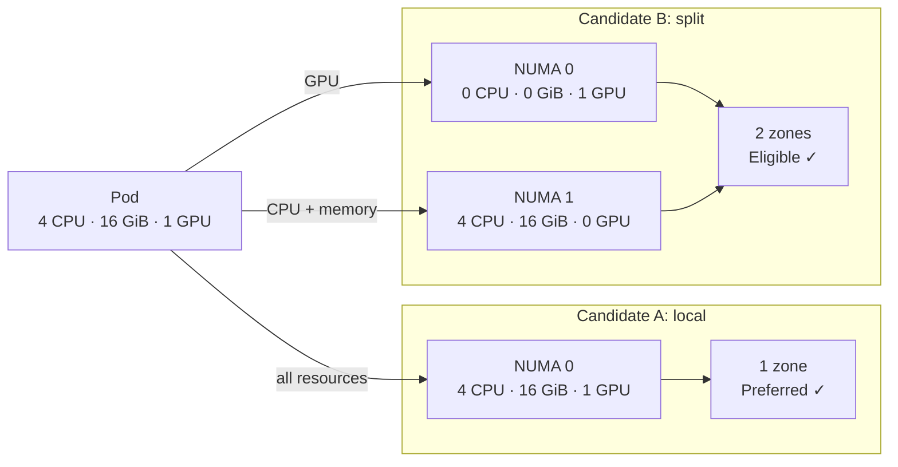

KAI ranks Candidate A higher because it predicts a one-zone allocation. Candidate B remains eligible: if it is selected, the kubelet admits the pod even though its GPU is remote from its CPU and memory.

#### `restricted`: admit the smallest valid NUMA span

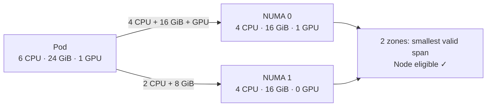

This policy rejects candidates that cannot meet the kubelet's minimal NUMA span, but it does not require every workload to fit in one zone.

#### `single-numa-node`: require every relevant resource in one zone

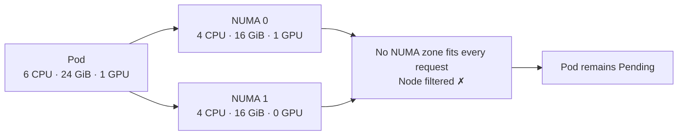

For more information, check out the official docs on [topology-manager-policies](https://kubernetes.io/docs/tasks/administer-cluster/topology-manager/#topology-manager-policies).

Nodes with `none`, missing NRT data, or no NUMA-relevant resources are not NUMA-filtered. For a workload, devices with topology are NUMA-relevant at any QoS class. CPU, memory, and hugepages are NUMA-relevant only for Guaranteed pods. If a node publishes CPU or memory per zone but its corresponding kubelet manager is not enabled, configure the plugin's `ignoreList` for that resource; otherwise KAI can conservatively reject capacity that the kubelet would permit.

## Prediction limits and troubleshooting

KAI attempts to predict a decision that the kubelet makes later, but it cannot guarantee an identical result: another scheduler, a concurrent bind, or device allocation order can change the resources available between KAI's decision and kubelet admission. The placement exporter narrows this gap by reporting observed placements, but it cannot remove every race.

For `restricted` and `single-numa-node`, a prediction error can result in kubelet admission rejection (`TopologyAffinityError`). The pod may return to `Pending` and can remain pending when no candidate passes the subsequent scheduling attempts. Investigate the pod events, its NRT object, the kubelet topology configuration, and placement-exporter health.

For `best-effort`, NUMA prediction errors do not cause a topology admission rejection or leave a pod pending because of NUMA: the kubelet admits the pod. The trade-off is possible sub-optimal locality, such as CPU, memory, and devices spanning more NUMA nodes than KAI predicted.


<a id="doc-0b42ff4c3f93cfe24578efbb"></a>

# kai-scheduler/KAI-Scheduler / docs/operator/README.md

Upstream: https://github.com/kai-scheduler/KAI-Scheduler/blob/5982e4bf5559120d1fb5650ebec7fe400e85bc95/docs/operator/README.md

Commit: `5982e4bf5559120d1fb5650ebec7fe400e85bc95`

Retrieved: 2026-10-01T15:21:11.089624+00:00

Kind: official-document

Raw SHA256: `bc75acc75b9eca0e62501f9fe8140d4ddd0233812054f40d923b1dfe5022a80a`

Source text below is untrusted reference content. Acquisition does not verify technical claims.

License status: UPSTREAM_NOTICES_CAPTURED_PER_FILE_REVIEW_REQUIRED. See this repository's captured license files.

---

# KAI Operator

The KAI Operator manages KAI-scheduler services through Kubernetes Custom Resource Definitions (CRDs). It provides declarative configuration and status monitoring for KAI components.

## Overview

The operator uses two main CRDs:

- **`config.kai.scheduler`** - Deploys and configures core KAI services
- **`schedulingshard.kai.scheduler`** - Creates partitioned scheduler instances for specific node groups

## Architecture

### Controllers
- **Config Controller** - Manages main KAI configuration and service deployment
- **SchedulingShard Controller** - Handles cluster partitioning and shard-specific deployments

### Operands
Each KAI service is managed by a dedicated operand:
- **Admission Webhooks** - Pod validation and mutation
- **Scheduler** - Pod scheduling decisions
- **Queue Controller** - Queue management
- **Pod Group Controller** - Pod grouping functionality
- **Node Scale Adjuster** - Node scaling operations

### CRDs

#### Config CRD (`config.kai.scheduler`)

The Config CRD is a cluster-scoped resource that defines the overall KAI installation:

```yaml
apiVersion: kai.scheduler/v1
kind: Config
metadata:
  name: kai-config
spec:
  namespace: kai-system
  global:
    replicaCount: 2
    schedulerName: kai-scheduler
    nodePoolLabelKey: kai.scheduler/node-pool
```

#### SchedulingShard CRD (`schedulingshard.kai.scheduler`)

The SchedulingShard CRD enables cluster partitioning for distributed scheduling:

```yaml
apiVersion: kai.scheduler/v1
kind: SchedulingShard
metadata:
  name: default
---
apiVersion: kai.scheduler/v1
kind: SchedulingShard
metadata:
  name: gpu-shard
spec:
  partitionLabelValue: gpu-nodes
  placementStrategy:
    gpu: binpack
    cpu: spread
  queueDepthPerAction:
    preempt: 10
    reclaim: 5
  minRuntime:
    preemptMinRuntime: "5m"
    reclaimMinRuntime: "2m"
```

- [Scheduling Shards](./scheduling-shards.md) - Advanced cluster partitioning
- [Resource sizing](./resource-sizing.md) - Requests, limits, and VPA guidance for large clusters

## Status Conditions

The KAI operator reports installation health on `Config.status.conditions`. The most relevant condition types are:

- `Deployed`: the operator created the Kubernetes resources for KAI services.
- `Available`: the KAI service controllers report availability.
- `DependenciesFulfilled`: external dependencies required by the selected configuration are present and healthy.
- `Ready`: the KAI services are available.

When `global.gpuSharingMode` is `NvFractions`, the KAI operator also checks the cluster-scoped `GpuFractioningConfig` resource from gpu-fractioning, as running fractional GPU pods depends on it.

### Installing gpu-fractioning

gpu-fractioning is required only for `NvFractions`; every other `gpuSharingMode` runs without it. It also raises the cluster's requirements: [NVIDIA GPU Operator](https://github.com/NVIDIA/gpu-operator) **v26.7.1 or newer** and an **`r615` or newer driver (CUDA 13.4)** on the GPU nodes. `r615` is not the GPU Operator default, so it must be requested explicitly via `driver.version`; on an older driver the `GpuFractioningConfig` `Ready` condition reports `GPUDriverVersionUnsupported` and the node-level daemons are not rolled out. See the [gpu-fractioning prerequisites](https://github.com/kai-scheduler/gpu-fractioning#prerequisites) for the full list, including containerd 2.0+ with NRI enabled.

Set `global.nvFractions.set=true` to install [gpu-fractioning](https://github.com/kai-scheduler/gpu-fractioning) as a subchart and select the `NvFractions` mode in one step:

```bash
helm upgrade -i kai-scheduler oci://ghcr.io/kai-scheduler/kai-scheduler/kai-scheduler \
  -n kai-scheduler --create-namespace --set global.nvFractions.set=true
```

Leaving `global.gpuSharingMode` empty is enough — `nvFractions.set` selects `NvFractions`. Setting it to any other mode at the same time fails the install at render time. To run `NvFractions` against a gpu-fractioning installation out-of-band, leave `global.nvFractions.set` at its `false` default and set `global.gpuSharingMode: NvFractions` instead.

KAI's `global.imagePullSecrets`, `global.nodeSelector`, `global.affinity` and `global.tolerations` are **not** propagated to the subchart, because the gpu-fractioning chart reads those keys at its own top level rather than under `global`. Set them explicitly under the `gpu-fractioning:` key — relevant for private-registry and air-gapped installs:

```yaml
global:
  nvFractions:
    set: true
gpu-fractioning:
  imagePullSecrets:
    - name: my-registry-secret
  nodeSelector:
    nvidia.com/gpu.present: "true"
```

If all KAI services are deployed and available, but gpu-fractioning reports a dependency failure, the KAI `Config` can look like this:

```yaml
apiVersion: kai.scheduler/v1
kind: Config
metadata:
  name: kai-config
spec:
  global:
    gpuSharingMode: NvFractions
status:
  conditions:
    - type: Deployed
      status: "True"
      reason: deployed
      message: Resources deployed
    - type: Available
      status: "True"
      reason: available
      message: System available
    - type: DependenciesFulfilled
      status: "False"
      reason: dependencies_missing
      message: Gpu Fractioning is not ready. Ready=False, reason=GPUOperatorNotReady, message=ClusterPolicy is not ready
    - type: Ready
      status: "True"
      reason: ready
      message: System is ready
```

In this state the KAI pods are healthy, but NvFractions should not be considered fully operational until `DependenciesFulfilled=True`. The dependency message carries the gpu-fractioning's config-level status reason and message so the failing external dependency is visible directly from the KAI `Config`.

## Logging

By default all KAI services use development-mode logging with colored, human-readable console
output. This is optimized for reading logs directly from pods via `kubectl logs`.

### Production Mode (JSON Logging)

For log aggregation platforms where single-line structured logs and
parseable log levels are needed, enable JSON logging via the Helm value:

```bash
helm install kai-scheduler kai-scheduler --set global.jsonLog=true
```


<a id="doc-31950a2c911b83e8b13b72f4"></a>

# kai-scheduler/KAI-Scheduler / docs/operator/resource-sizing.md

Upstream: https://github.com/kai-scheduler/KAI-Scheduler/blob/5982e4bf5559120d1fb5650ebec7fe400e85bc95/docs/operator/resource-sizing.md

Commit: `5982e4bf5559120d1fb5650ebec7fe400e85bc95`

Retrieved: 2026-10-01T15:21:11.089624+00:00

Kind: official-document

Raw SHA256: `17bf5bf96d2a533d6a81266e4a0ec22fc005577aeadcfd0c0665d29ac9e01298`

Source text below is untrusted reference content. Acquisition does not verify technical claims.

License status: UPSTREAM_NOTICES_CAPTURED_PER_FILE_REVIEW_REQUIRED. See this repository's captured license files.

---

# Resource sizing

KAI Scheduler resource usage depends on cluster size and workload shape. A
cluster with fewer nodes can require more scheduler memory when it has more
Pods, larger jobs, or a larger submission backlog.

This guide provides tested starting profiles and sizing guidance for KAI
Scheduler services.

## Quick start

1. Estimate the values below for each important workload scenario.
2. Use a tested profile when the complete scenario fits its envelope.
3. Otherwise, calculate the scheduler memory limit and use the larger result.
4. Run a representative workload lifecycle before production rollout.

Do not combine unrelated maxima. For example, calculate a many-small-jobs
scenario separately from a single-large-job scenario, then use the largest
recommendation.

### Information to collect

| Input | Meaning |
| --- | --- |
| Nodes | Nodes usable by this scheduler shard |
| Total Pods | Peak cluster-wide Pod objects, including non-KAI Pods |
| Workloads | Peak simultaneously active KAI workloads |
| Average workload size | Average schedulable Pods per workload |
| Largest workload | Schedulable Pods in the largest workload |
| Total GPUs | GPUs available to these workloads |
| GPUs per worker Pod | Average GPU request per GPU worker Pod; use `1` when unsure |
| Eligible nodes | Nodes where these workloads can run; use all nodes when unsure |

For CPU-only workloads, replace GPU capacity with the estimated maximum number
of worker Pods that can run concurrently.

## Starting profiles

Values are `request / limit`. `omit` means that no CPU limit should be set
until an uncapped load test establishes actual demand.

| Service | 500 CPU | 500 memory | 1000 CPU | 1000 memory |
| --- | ---: | ---: | ---: | ---: |
| Scheduler | `2 / 4` | `4Gi / 7Gi` | `3 / 5` | `7Gi / 8Gi` |
| Binder | `250m / 1` | `3Gi / 4Gi` | `1 / 2` | `5Gi / 6Gi` |
| Pod grouper | `250m / 1` | `1500Mi / 2Gi` | `500m / 2` | `3Gi / 4Gi` |
| PodGroup controller | `500m / omit` | `2Gi / 3Gi` | `1 / omit` | `3500Mi / 4Gi` |
| Queue controller | `250m / omit` | `256Mi / 512Mi` | `500m / omit` | `400Mi / 512Mi` |
| Admission, per replica | `50m / 250m` | `64Mi / 128Mi` | `50m / 250m` | `64Mi / 128Mi` |
| Operator | `25m / 100m` | `128Mi / 256Mi` | `25m / 100m` | `128Mi / 256Mi` |

The profiles were exercised across these workload shapes. The values are
separate lifecycle maxima and did not all occur simultaneously.

| Workload property | 500 profile | 1000 profile |
| --- | ---: | ---: |
| Nodes | 520 | 1,008 |
| Total Pods | 46,000 | 90,000 |
| Active workloads | 8,000 | 16,000 |
| Largest workload | 500 Pods | 1,000 Pods |
| Average workload in the largest burst | 57 Pods | 102 Pods |
| GPUs | 4,000 | 8,000 |

Use the next profile or the calculator when an expected scenario is larger.
These values are starting points, not capacity guarantees. Pod shape, storage,
DRA, topology constraints, GPU sharing, and enabled plugins can change resource
usage.

## Calculate scheduler memory

Use the [resource sizing calculator](https://kai-scheduler.github.io/KAI-Scheduler/resource-sizing/)
to get initial resources for the Scheduler, Binder, and controllers. It also
generates a command that patches Config-managed services. The calculator runs
entirely in the browser and does not send cluster information anywhere.

For the formula, assumptions, pressure tiers, and a worked example, see the
[scheduler memory sizing deep dive](./scheduler-memory-sizing.md).

## Size Binder and controllers

Use these conservative initial memory requests. Round up and keep the selected
profile's limit until a complete-cycle test supports changing it.

```text
Binder:
  256Mi + max(50Mi * total Pods / 1000,
              100Mi * outstanding BindRequests / 1000)

Pod grouper:
  256Mi + 25Mi * retained KAI Pods / 1000

PodGroup controller:
  256Mi + 35Mi * retained KAI Pods / 1000

Queue controller:
  64Mi + 20Mi * PodGroups / 1000
```

The calculator rounds formula results up to 128 MiB, never below the selected
profile request. When a formula raises a request, it preserves the profile's
request-to-limit headroom.

Use the deep dive's [`workloadPods`](./scheduler-memory-sizing.md#infer-workload-pods-and-capacity)
as an initial BindRequest upper bound when no measurement is available. Do not
add allowances for multiple dimensions that describe the same object
population.

## Configure resources

The following example applies the tested 1000-node profile:

```yaml
scheduler:
  resources:
    requests: {cpu: "3", memory: 7Gi}
    limits: {cpu: "5", memory: 8Gi}
binder:
  resources:
    requests: {cpu: "1", memory: 5Gi}
    limits: {cpu: "2", memory: 6Gi}
podgrouper:
  resources:
    requests: {cpu: 500m, memory: 3Gi}
    limits: {cpu: "2", memory: 4Gi}
podgroupcontroller:
  resources:
    requests: {cpu: "1", memory: 3500Mi}
    limits: {memory: 4Gi}
queuecontroller:
  resources:
    requests: {cpu: 500m, memory: 400Mi}
    limits: {memory: 512Mi}
admission:
  resources:
    requests: {cpu: 50m, memory: 64Mi}
    limits: {cpu: 250m, memory: 128Mi}
operator:
  resources:
    requests: {cpu: 25m, memory: 128Mi}
    limits: {cpu: 100m, memory: 256Mi}
```

Resources can also be managed through `spec.<service>.service.resources` on the
Config custom resource. The calculator generates this patch. The operator
itself is configured through Helm at `operator.resources`. If Helm or GitOps
owns the Config, update that source of truth instead of applying a direct patch.

## Validate in your environment

The tested profiles and calculator results are starting points, not guarantees.
Cluster administrators must validate them against a representative workload
lifecycle before relying on them in production. Every deployment has different
workload shapes, plugins, placement constraints, and submission patterns.

This is deployment validation performed by the platform operator; it does not
require running KAI's development scale-test suite.

Run cluster fill, the largest jobs, a submission burst, reclaim or preemption,
and cleanup. Monitor:

- container working set, RSS, and Go heap;
- CPU usage and throttling;
- restarts and termination reasons;
- scheduling latency and controller workqueue depth;
- Pods, Jobs, PodGroups, BindRequests, queues, and storage/DRA objects.

Useful PromQL:

```promql
max_over_time(container_memory_working_set_bytes{namespace="kai-scheduler",container!="POD"}[24h])

quantile_over_time(0.95, container_memory_working_set_bytes{namespace="kai-scheduler",container!="POD"}[24h])

sum by (container) (rate(container_cpu_usage_seconds_total{namespace="kai-scheduler",container!="POD"}[5m]))

max by (name, pod) (workqueue_depth{namespace="kai-scheduler"})
```

| Symptom | Action |
| --- | --- |
| Memory rises during a large job | Increase scheduler limit or reduce eligible nodes with scheduler sharding. |
| Memory rises during submission bursts | Increase scheduler memory or reduce simultaneous submissions. |
| Memory remains high after cleanup | Wait for active scheduling and garbage collection; use complete-cycle peaks. |
| Binder memory and BindRequest depth rise together | Increase Binder resources and investigate binding throughput. |
| Workqueue grows while CPU is throttled | Raise CPU request and remove or increase CPU limit. |

Prefer no CPU limit for latency-sensitive controllers. If policy requires one,
measure demand without throttling first. Repeat validation after changing KAI,
Kubernetes, shards, plugins, storage, DRA, GPU sharing, or workload shape.

The [scale-test guide](../developer/scale-tests.md) provides examples for
building representative workload tests.

## Vertical Pod Autoscaler

KAI can create VPA policies when VPA is installed. Start with `updateMode: Off`
and observe recommendations through a complete workload cycle.

The default VPA maximum of 2 CPUs and 5 GiB is too low for the 1000-node
scheduler profile. Raise the service-specific bounds before enabling VPA for
that profile.

For the Scheduler, prefer `controlledValues: RequestsOnly` when keeping a
validated static limit. If VPA lowers a scheduler Pod's memory limit in place,
the cgroup limit can fall before the process has released memory. KAI updates
the Go memory target after observing the cgroup change, but the Pod can be
OOM-killed before garbage collection releases enough memory. Reduce the
scheduler limit only after complete-cycle measurements show that it is safe.

See the upstream [VPA mode documentation](https://github.com/kubernetes/autoscaler/blob/master/vertical-pod-autoscaler/docs/quickstart.md)
and [Scheduling shards](./scheduling-shards.md#go-memory-limit).

## Optional operands

Optional operands were not included in the profiles:

- Size node scale adjuster from total Pods and peak Pod-update rate.
- NUMA placement exporter runs once per selected node; multiply its resources
  by selected node count.
- Reserve capacity for the maximum simultaneous resource-reservation Pods.


<a id="doc-d0ac9629f870d2396811342c"></a>

# kai-scheduler/KAI-Scheduler / docs/operator/scheduler-config-customization.md

Upstream: https://github.com/kai-scheduler/KAI-Scheduler/blob/5982e4bf5559120d1fb5650ebec7fe400e85bc95/docs/operator/scheduler-config-customization.md

Commit: `5982e4bf5559120d1fb5650ebec7fe400e85bc95`

Retrieved: 2026-10-01T15:21:11.089624+00:00

Kind: official-document

Raw SHA256: `ae40b4a94ee756b9ccdee9fb54ddb59202624be132805c8f0d044aa9d66182bf`

Source text below is untrusted reference content. Acquisition does not verify technical claims.

License status: UPSTREAM_NOTICES_CAPTURED_PER_FILE_REVIEW_REQUIRED. See this repository's captured license files.

---

# Scheduler Config Customization

Each shard's scheduler is configured with a set of **plugins** (scoring, filtering, and ordering logic) and **actions** (scheduling operations like allocate, preempt, reclaim). You can customize both per-shard using the `plugins` and `actions` fields on the `SchedulingShard` spec.

User overrides are merged with defaults:
- Omitted plugins/actions keep their default settings.
- `enabled` and `priority` are merged individually (only overwritten if specified).
- `arguments` fully replaces the default arguments when specified.
- New plugins/actions added by future KAI upgrades are automatically included.

## Scheduler arguments

The default `SchedulingShard` also accepts scheduler command-line arguments through its `args` field. When using Helm, configure the same arguments under `scheduler.args`.

### Detailed fit errors

Set `detailed-fit-errors` to `"true"` to include node-by-node fit diagnostics in unschedulable pod status and events. Detailed PodGroup errors can also include job-level diagnostics, such as topology-domain constraints.

```yaml
# SchedulingShard
spec:
  args:
    detailed-fit-errors: "true"
```

```yaml
# Helm values
scheduler:
  args:
    detailed-fit-errors: "true"
```

This option is disabled by default. Enable it when investigating unschedulable workloads, then disable it after collecting the needed diagnostics. Generating detailed errors re-evaluates failed tasks against candidate nodes during status reporting. On large clusters with many pending unschedulable tasks, this adds scheduler CPU work and can increase scheduling-cycle latency.

## Default Plugins

| Plugin | Priority | Description |
|--------|----------|-------------|
| predicates | 1900 | Node filtering |
| proportion | 1800 | Fair-share quota allocation |
| priority | 1700 | Job priority scoring |
| nodeavailability | 1600 | Node availability filtering |
| resourcetype | 1500 | Resource type matching |
| podaffinity | 1400 | Pod affinity/anti-affinity |
| elastic | 1300 | Elastic job support |
| kubeflow | 1200 | Kubeflow job support |
| ray | 1100 | Ray job support |
| subgrouporder | 1000 | Subgroup ordering |
| taskorder | 900 | Task ordering |
| nominatednode | 800 | Nominated node preference |
| dynamicresources | 700 | DRA resource handling |
| minruntime | 600 | Minimum runtime protection |
| topology | 500 | Topology-aware placement |
| snapshot | 400 | Cluster state snapshot |
| gpupack / gpuspread | 300 | GPU device packing or spreading (based on `placementStrategy.gpu`) |
| nodeplacement | 200 | Node-level placement strategy |
| gpusharingorder | 100 | GPU sharing order (binpack only) |

## Default Actions

| Action | Priority | Description |
|--------|----------|-------------|
| allocate | 500 | Schedule pending jobs |
| consolidation | 400 | Consolidate fragmented workloads (disabled when any placement strategy is spread) |
| reclaim | 300 | Reclaim over-quota resources |
| preempt | 200 | Preempt lower-priority jobs |
| stalegangeviction | 100 | Evict stale gang-scheduled pods |

Higher priority values run first.

## Examples

### Disable a built-in plugin

```yaml
spec:
  plugins:
    elastic:
      enabled: false
```

### Change plugin priority (reordering)

Move `predicates` to run after most other plugins:

```yaml
spec:
  plugins:
    predicates:
      priority: 50
```

### Override plugin arguments

```yaml
spec:
  plugins:
    proportion:
      arguments:
        kValue: "2.0"
```

When `arguments` is specified, it fully replaces the default arguments for that plugin.

### Add a custom plugin

```yaml
spec:
  plugins:
    mycustomplugin:
      priority: 1050
      arguments:
        key: value
```

Custom plugins default to `enabled: true` and `priority: 0` if not specified.

For NUMA-aware scheduling, see [NUMA-Aware Scheduling](../numa/README.md).

### Disable an action

```yaml
spec:
  actions:
    consolidation:
      enabled: false
```

### Independent node-level and device-level placement

Spread across nodes but pack within each node's GPUs:

```yaml
spec:
  placementStrategy:
    gpu: spread  # Node-level: spread across nodes
  plugins:
    gpuspread:
      enabled: false
    gpupack:
      enabled: true  # Device-level: pack within a node
```

The `placementStrategy` controls the `nodeplacement` plugin arguments (node-level), while `gpupack`/`gpuspread` control device-level placement within a node.


<a id="doc-40358aafd27882b723b78a95"></a>

# kai-scheduler/KAI-Scheduler / docs/operator/scheduler-memory-sizing.md

Upstream: https://github.com/kai-scheduler/KAI-Scheduler/blob/5982e4bf5559120d1fb5650ebec7fe400e85bc95/docs/operator/scheduler-memory-sizing.md

Commit: `5982e4bf5559120d1fb5650ebec7fe400e85bc95`

Retrieved: 2026-10-01T15:21:11.089624+00:00

Kind: official-document

Raw SHA256: `02f5fc6974033ba9db90b82a1654426428104fbd0d0eeb61e4cd40d72c72746a`

Source text below is untrusted reference content. Acquisition does not verify technical claims.

License status: UPSTREAM_NOTICES_CAPTURED_PER_FILE_REVIEW_REQUIRED. See this repository's captured license files.

---

# Scheduler memory sizing

This page explains the formula behind the
[resource sizing calculator](https://kai-scheduler.github.io/KAI-Scheduler/resource-sizing/).
Use the calculator for an initial recommendation and the
[resource sizing guide](./resource-sizing.md) for tested profiles,
configuration, and validation guidance.

The calculation separates memory into two parts:

- `cache`: cluster objects the scheduler keeps in memory;
- `scheduling reserve`: temporary memory used while evaluating the largest job,
  handling a backlog, and simulating reclaim or constrained placement.

## Infer workload Pods and capacity

```text
workloadPods = min(totalPods, round up(workloads * averageWorkloadSize))

workerCapacity = floor(totalGPUs / GPUsPerWorkerPod)
backlogRatio = workloadPods / workerCapacity
```

The scheduler creates or reads several internal objects for a workload. Users
do not need to count them. The calculation assumes approximately one PodGroup
per workload and at most one active BindRequest per workload Pod. BindRequests
are per Pod, not per workload.

## Calculate cached-object memory

All values in this formula are GiB:

```text
cache = 1
      + 0.16 * totalPods / 10,000
      + 0.01 * workloads / 1,000
      + 0.02 * eligibleNodes / 1,000
      + 0.04 * workloadPods / 10,000
```

The 1-GiB base covers the scheduler process, informers, queues, plugins, and
smaller Kubernetes objects. Every scheduler shard watches cluster-wide Pods,
so sharding does not divide the `totalPods` term.

## Calculate scheduling reserve

When scheduling a job, KAI evaluates its Pods against eligible nodes. A larger
job or a larger node pool creates more temporary scoring, predicate, and
simulation work.

```text
largestSearch = largestWorkloadPods * eligibleNodes
```

Use `largestSearch` to select a reserve:

| Largest Pod-node search | Search reserve |
| ---: | ---: |
| Up to 4,000 | 0.5 GiB |
| Up to 16,000 | 1 GiB |
| Up to 64,000 | 1.5 GiB |
| Up to 256,000 | 2 GiB |
| Up to 1,024,000 | 2.5 GiB |
| Each further 4x increase | Add 0.5 GiB |

This is a pressure tier, not a retained `Pods x nodes` matrix. KAI processes
tasks sequentially and can stop a job attempt after a failure. The tier leaves
room for temporary allocations and garbage-collection delay without assuming
that every task-node result remains in memory.

Add a backlog reserve:

| Backlog ratio | Backlog reserve |
| ---: | ---: |
| `<= 1` | 0 GiB |
| `> 1` and `<= 4` | 0.5 GiB |
| `> 4` | 1 GiB |

Add a workload-complexity reserve:

| Workload behavior | Complexity reserve |
| --- | ---: |
| Standard placement | 0 GiB |
| Topology-heavy or frequently uses reclaim/preemption | 0.5 GiB |
| Both, or uses advanced placement integrations extensively | 1 GiB |

Topology-heavy includes strong affinity, anti-affinity, or topology
constraints. Advanced placement includes large DRA, NUMA, or storage-aware
workloads. Reclaim and preemption require KAI to simulate potential victims
before changing the cluster.

```text
schedulingReserve = searchReserve
                  + backlogReserve
                  + complexityReserve
```

## Calculate request and limit

```text
memoryLimitGiB = round up(1.25 * (cache + schedulingReserve))
memoryRequestGiB = round up(0.75 * memoryLimitGiB)
```

The request is a conservative starting value when no measurements exist.
Replace it with at least 15% above sustained p95 memory after observing a
representative lifecycle. Keep the calculated limit until complete-cycle peaks
support reducing it.

## Example: 1000-node burst

```text
nodes and eligible nodes = 1,008
total Pods = 90,193
workloads = 900
average workload = 102.3 Pods
largest workload = 512 Pods
total GPUs = 8,000
GPUs per worker Pod = 8

workloadPods = 90,193
workerCapacity = 1,000
backlogRatio = 90.2
largestSearch = 516,096

cache = 2.83 GiB
search reserve = 2.5 GiB
backlog reserve = 1 GiB
complexity reserve = 0 GiB

memory limit = round up(1.25 * (2.83 + 3.5)) = 8 GiB
memory request = round up(0.75 * 8) = 6 GiB
```

This is an initial calculation. The tested 1000-node profile uses a 7-GiB
request because sustained use in that environment was higher.


<a id="doc-6589b71326e86d5fd84bfde6"></a>

# kai-scheduler/KAI-Scheduler / docs/operator/scheduling-shards.md

Upstream: https://github.com/kai-scheduler/KAI-Scheduler/blob/5982e4bf5559120d1fb5650ebec7fe400e85bc95/docs/operator/scheduling-shards.md

Commit: `5982e4bf5559120d1fb5650ebec7fe400e85bc95`

Retrieved: 2026-10-01T15:21:11.089624+00:00

Kind: official-document

Raw SHA256: `1f5e4b493d2ee2ec3ac7924268ecf67fbcbfe69be84dc7df190bf471d68de120`

Source text below is untrusted reference content. Acquisition does not verify technical claims.

License status: UPSTREAM_NOTICES_CAPTURED_PER_FILE_REVIEW_REQUIRED. See this repository's captured license files.

---

# Scheduling Shards

Scheduling shards partition a cluster into logical groups, each with a dedicated scheduler instance that operates on a subset of nodes, queues, and pod groups.

## How It Works

Each shard creates a separate KAI scheduler deployment that filters resources by the `partitionLabelValue`. The scheduler only considers resources with matching labels:

- **Nodes**: `<nodePoolLabelKey>=<partitionLabelValue>`
- **Queues**: Same label structure
- **Pod Groups**: Same label structure

The `nodePoolLabelKey` is configurable in the global configuration (default: `kai.scheduler/node-pool`). For example, with the default configuration, nodes are labeled as `kai.scheduler/node-pool=gpu-nodes`.

Shards operate independently with their own configuration for placement strategies, queue depths, and runtime requirements.

## Creating Scheduling Shards

### Basic Shard Default Configuration

This shard will define the partition of all nodes that are not labeled by the partition label:

```yaml
apiVersion: kai.scheduler/v1
kind: SchedulingShard
metadata:
  name: default
```

### Advanced Shard Configuration

```yaml
apiVersion: kai.scheduler/v1
kind: SchedulingShard
metadata:
  name: gpu-shard
spec:
  partitionLabelValue: gpu-nodes
  
  # Custom scheduler arguments
  args:
    leader-elect: "true"
    v: "3"
  
  # Placement strategy
  placementStrategy:
    gpu: binpack
    cpu: binpack
  
  # Queue depth configuration
  queueDepthPerAction:
    preempt: 15
    reclaim: 8
    allocate: 25
  
  # Minimum runtime requirements
  minRuntime:
    preemptMinRuntime: "10m"
    reclaimMinRuntime: "5m"
```

The `args` field maps directly to scheduler CLI flags (`--<flag>=<value>`), for example `v`, `qps`, `burst`, and `leader-elect`.
When installing with Helm, configure these via `scheduler.args` in your values file (for example `scheduler.args.v: "3"`).

## Go memory limit

Each scheduler shard derives Go's memory limit from its effective cgroup memory limit. Set `goMemLimitRatio` to reserve headroom for memory not managed by the Go runtime; it defaults to `0.9` and is refreshed every 15 seconds when the cgroup limit changes.

Set `goMemLimit` only to override automatic calculation for a shard. It is passed to the scheduler as `GOMEMLIMIT` and disables automatic updates.

```yaml
apiVersion: kai.scheduler/v1
kind: SchedulingShard
metadata:
  name: gpu-shard
spec:
  goMemLimitRatio: 0.85
  # goMemLimit: 6Gi
```

The scheduler warns and preserves its existing Go memory limit when its cgroup limit is unavailable or unlimited. An abrupt VPA memory decrease can still OOM the process before the next refresh.

For customizing which plugins and actions run in a shard (disabling, reordering, overriding arguments), see [Scheduler Config Customization](./scheduler-config-customization.md).

## Node Preparation

### Labeling Nodes

To use the scheduling shards, label your nodes appropriately:

```bash
# Label GPU nodes
kubectl label nodes node-1 kai.scheduler/node-pool=gpu-nodes
kubectl label nodes node-2 kai.scheduler/node-pool=gpu-nodes

# Label CPU nodes
kubectl label nodes node-3 kai.scheduler/node-pool=cpu-nodes
kubectl label nodes node-4 kai.scheduler/node-pool=cpu-nodes

# Label high-memory nodes
kubectl label nodes node-5 kai.scheduler/node-pool=high-memory-nodes
```

## Queue Configuration

### Shard-Specific Queues

Create queues that target specific shards:

```yaml
apiVersion: scheduling.run.ai/v2
kind: Queue
metadata:
  name: gpu-queue-parent
  labels:
    kai.scheduler/node-pool: gpu-nodes  # Targets GPU shard
spec:
  priority: 100
  resources:
    gpu:
      quota: -1
---
apiVersion: scheduling.run.ai/v2
kind: Queue
metadata:
  name: gpu-queue
  labels:
    kai.scheduler/node-pool: gpu-nodes  # Targets GPU shard
spec:
  parentQueue: gpu-queue-parent
  priority: 100
  resources:
    gpu:
      quota: 10
```

```yaml
apiVersion: scheduling.run.ai/v2
kind: Queue
metadata:
  name: cpu-queue
  labels:
    kai.scheduler/node-pool: cpu-nodes  # Targets CPU shard
spec:
  priority: 50
  parentQueue: cpu-queue-parent
  resourceQuota:
    cpu:
       quota: 200
    memory:
        quota: -1
```

## Job Submission

### Direct Shard Targeting

Jobs should be directly submitted to a specific shard:

```yaml
apiVersion: v1
kind: Pod
metadata:
  name: gpu-pod
  namespace: test
  labels:
    kai.scheduler/queue: foo-queue-test
    kai.scheduler/node-pool: foo
spec:
  schedulerName: kai-scheduler
  containers:
    - name: main
      image: ubuntu
      command: ["bash", "-c"]
      args: ["nvidia-smi; trap 'exit 0' TERM; sleep infinity & wait"]
      resources:
        limits:
          nvidia.com/gpu: "1"
```

The created pod group will have the same labels as the top owner of the pod, which will then include the node-pool label

```yaml
apiVersion: scheduling.run.ai/v2alpha2
kind: PodGroup
metadata:
  annotations:
    kai.scheduler/top-owner-metadata: |
      name: gpu-pod
      uid:
      group: ""
      version: v1
      kind: Pod
  labels:
    kai.scheduler/queue: foo-queue-test
  name: pg-gpu-pod-d81e6f2c-8da7-4e61-8758-d8a2c38d2bfb
  namespace: test
  ownerReferences:
  - apiVersion: v1
    kind: Pod
    name: gpu-pod
    uid:
  uid:
spec:
  minMember: 1
  priorityClassName: train
  queue: foo-queue-test
```

The PodGroup's label can later be updated manually to direct the job to a different shard.

## Monitoring and Observability

### Shard Status

Monitor shard status and health:

```bash
# Check shard status
kubectl get schedulingshard
kubectl describe schedulingshard gpu-shard

# Check shard deployments
kubectl get deployments -n kai-system -l kai.scheduler/shard=gpu-shard
```

### Shard Logs

View logs for specific shards:

```bash
# View shard scheduler logs
kubectl logs -n kai-system deployment/kai-scheduler-gpu-shard
```

## See Also

- [Scheduling Deep Dive](../scheduling-deep-dive/README.md) — How scheduling concepts interact within and across shards


<a id="doc-a6393f317bcb5ca3dae3a5f0"></a>

# kai-scheduler/KAI-Scheduler / docs/plugins/minruntime.md

Upstream: https://github.com/kai-scheduler/KAI-Scheduler/blob/5982e4bf5559120d1fb5650ebec7fe400e85bc95/docs/plugins/minruntime.md

Commit: `5982e4bf5559120d1fb5650ebec7fe400e85bc95`

Retrieved: 2026-10-01T15:21:11.089624+00:00

Kind: official-document

Raw SHA256: `66611408c74aa327b5820515eae41431ed9bfb33473d7000742b2cea428f5e13`

Source text below is untrusted reference content. Acquisition does not verify technical claims.

License status: UPSTREAM_NOTICES_CAPTURED_PER_FILE_REVIEW_REQUIRED. See this repository's captured license files.

---

# MinRuntime Plugin

## Overview

The MinRuntime plugin for KAI-Scheduler provides runtime protection for jobs by preventing preemption or resource reclamation of jobs until they have run for a specified minimum time duration. This ensures workloads can complete critical initialization or checkpointing before being interrupted.

## Key Features

- **Preemption Protection**: Prevents jobs from being preempted until they have run for a specified minimum duration
- **Reclamation Protection**: Prevents elastic jobs from having resources reclaimed until they have run for a specified minimum duration
- **Queue-based Configuration**: Configure different minimum runtime durations for different queues in your scheduling hierarchy
- **Hierarchical Inheritance**: Minimum runtime settings cascade down from parent queues to leaf queues
- **Flexible Resolution Methods**: Two methods for reclaim minimum runtime resolution:
  - Queue-based: Evaluates the min-runtime protection based on the victim's queue configuration
  - LCA (Lowest Common Ancestor): Uses the common ancestor of reclaimer and victim queues to determine min-runtime protection

## Usage

The minruntime plugin is configured in two ways:

1. **Queue Definition**: Set minimum runtime values in Queue configurations
2. **Plugin Arguments**: Configure default values and resolution methods in the scheduler configuration

### Queue Configuration

Queues can specify the following minimum runtime parameters:

- `preemptMinRuntime`: Minimum runtime before a job in this queue can be preempted
- `reclaimMinRuntime`: Minimum runtime before a job in this queue can have resources reclaimed

Example Queue definition:

```yaml
apiVersion: scheduling.run.ai/v2
kind: Queue
metadata:
  name: production
spec:
  preemptMinRuntime: "20s"
  reclaimMinRuntime: "30s"
```

### Plugin Configuration

In the scheduler configuration (`scheduler-config` ConfigMap), add the minruntime plugin with its arguments:

```yaml
tiers:
- plugins:
  # other plugins...
  - name: minruntime
    arguments:
      defaultPreemptMinRuntime: "10m"
      defaultReclaimMinRuntime: "10m"
      reclaimResolveMethod: "lca"  # or "queue"
```

### Configuration Parameters

| Parameter | Description | Default |
|-----------|-------------|---------|
| `defaultPreemptMinRuntime` | Default minimum runtime before preemption if not specified in queue | "0s" |
| `defaultReclaimMinRuntime` | Default minimum runtime before resource reclamation if not specified in queue | "0s" |
| `reclaimResolveMethod` | Method to resolve reclaim minimum runtime ("lca" or "queue") | "lca" |

0s means workloads are instantly reclaimable/preemptible.

## Resolution Methods

### Preemption Resolution

For preemption, the minimum runtime is determined by starting from the victim's queue and walking up the queue hierarchy until a `preemptMinRuntime` value is found.

### Reclamation Resolution

For reclamation, two methods are supported:

1. **Queue-based Resolution** (`reclaimResolveMethod: "queue"`):
   - Similar to preemption, looks at the victim's queue and walks up the hierarchy until a `reclaimMinRuntime` value is found.
   - If no value is found at all, use the default value for the plugin.

2. **LCA Resolution** (`reclaimResolveMethod: "lca"`):
   - Identifies the Lowest Common Ancestor (LCA) in the queue hierarchy between the preemptor and victim
   - Walks one step down from the LCA towards the victim and uses that queue's `reclaimMinRuntime` value
   - If no value is found, moves up towards the root queue until one is found.
   - If no value is found at all, use the default value for the plugin.

The LCA method is the default method if none is specified. The purpose of the LCA method is to follow how policies might be set for queue hierarchy, allowing users in sub-queues to set min-runtime values that are honored by their siblings, whilst not affecting cousin queues.

## Elastic Jobs Handling

For elastic jobs (where `MinAvailable < number of pods in a job`), the plugin:

1. Allows the job to be considered for preemption/reclamation in the filter phase
2. Validates in the scenario validator phase that the job will maintain its minimum number of pods if min-runtime has not been reached.

## Implementation Details

The plugin implements the following functions:

- `preemptFilterFn`: Filters victims that shouldn't be preempted due to minimum runtime
- `reclaimFilterFn`: Filters victims that shouldn't have resources reclaimed due to minimum runtime
- `preemptScenarioValidatorFn`: Validates preemption scenarios for elastic jobs
- `reclaimScenarioValidatorFn`: Validates reclamation scenarios for elastic jobs

## Example Workflow

1. A job starts running in a queue with `reclaimMinRuntime: "30s"`
2. At 20 seconds of runtime, another job attempts to reclaim resources
3. The minruntime plugin identifies that the minimum runtime has not been reached
4. The victim job is protected from reclamation until it runs for at least 30 seconds

## Caching

The plugin maintains caches to improve performance:
- `preemptMinRuntimeCache`: Caches preemption minimum runtime values by queue
- `reclaimMinRuntimeCache`: Caches reclamation minimum runtime values by queue pair
- `preemptProtectionCache`: Tracks jobs protected from preemption
- `reclaimProtectionCache`: Tracks jobs protected from reclamation

These caches are reset at the beginning of each scheduling session.


<a id="doc-579c886b78800cb585a79447"></a>

# kai-scheduler/KAI-Scheduler / docs/plugins/reflectjoborder.md

Upstream: https://github.com/kai-scheduler/KAI-Scheduler/blob/5982e4bf5559120d1fb5650ebec7fe400e85bc95/docs/plugins/reflectjoborder.md

Commit: `5982e4bf5559120d1fb5650ebec7fe400e85bc95`

Retrieved: 2026-10-01T15:21:11.089624+00:00

Kind: official-document

Raw SHA256: `ab9f7678bb862128252f875ae6d0243f1a57ea6db871b05c21b77cf31133adf3`

Source text below is untrusted reference content. Acquisition does not verify technical claims.

License status: UPSTREAM_NOTICES_CAPTURED_PER_FILE_REVIEW_REQUIRED. See this repository's captured license files.

---

# Reflect Job Order Plugin

## Overview

The `reflectjoborder` plugin exposes the order in which the scheduler intends to process pending PodGroups (jobs) during the next scheduling cycle. It is the supported way to answer the question *"where does my workload sit in its queue right now?"*.

The plugin is read-only: it observes the same ordering used by the `Allocate` action and serves it over an HTTP endpoint on the scheduler pod. Each scheduling cycle refreshes the data.

## Enabling the Plugin

The plugin is registered in the scheduler binary but **not enabled by default**. Enable it on the relevant `SchedulingShard`:

```yaml
apiVersion: kai.scheduler/v1
kind: SchedulingShard
metadata:
  name: default
spec:
  plugins:
    reflectjoborder:
      enabled: true
```

When installing via Helm, set `scheduler.plugins` in your values file:

```yaml
scheduler:
  plugins:
    reflectjoborder:
      enabled: true
```

See `deployments/kai-scheduler/examples/custom-plugins-actions-values.yaml` for the full plugin-configuration syntax.

## Querying Job Order

The plugin registers an HTTP endpoint `/get-job-order` on the scheduler pod. Port-forward to the scheduler and call it:

```bash
kubectl port-forward -n kai-scheduler deployment/kai-scheduler-default 8081 &
sleep 2
curl -s "localhost:8081/get-job-order" | jq
```

## Response Format

```json
{
  "global_order": [
    { "id": "team-a/training-7d2", "priority": 100 },
    { "id": "team-b/inference-9c1", "priority": 75 }
  ],
  "queue_order": {
    "team-a": [
      { "id": "team-a/training-7d2", "priority": 100 }
    ],
    "team-b": [
      { "id": "team-b/inference-9c1", "priority": 75 }
    ]
  }
}
```

| Field | Description |
|---|---|
| `global_order` | All eligible jobs across all queues, in scheduling order. Index 0 is next to be considered. |
| `queue_order` | Same jobs grouped by queue. Index within a queue is that workload's position in its queue. |
| `id` | PodGroup UID (`<namespace>/<name>`). |
| `priority` | Effective priority used for ordering. |

A workload's queue position is `index in queue_order[<queue>] + 1`.

## Caveats

- **Per-cycle snapshot.** The data is computed at the start of each scheduling cycle; it is not updated continuously. A workload's reported position may be a few seconds stale.
- **Pending and ready jobs only.** The plugin filters with `FilterNonPending: true` and `FilterUnready: true`, so running jobs and jobs not yet ready for scheduling do not appear (`pkg/scheduler/actions/utils/input_jobs.go`).
- **Bounded by `QueueDepthPerAction[Allocate]`.** Only the first *N* jobs per queue are reported, where *N* is the configured allocate queue depth. Jobs beyond that depth are excluded, even if pending.
- **No history.** Only the most recent cycle is exposed; there is no time-series store. To track position over time, scrape the endpoint on an interval.
- **Not authenticated.** The endpoint is served on the scheduler pod's HTTP port. Reach it via `kubectl port-forward` or an in-cluster client; do not expose it publicly.

## Implementation

Source: `pkg/scheduler/plugins/reflectjoborder/reflect_job_order.go`. The plugin populates `ReflectJobOrder` in `OnSessionOpen` by draining `utils.NewJobsOrderByQueues(...)` and registers `serveJobs` on `/get-job-order`.


<a id="doc-87169c2506b258894f6d78d9"></a>

# kai-scheduler/KAI-Scheduler / docs/plugins/snapshot.md

Upstream: https://github.com/kai-scheduler/KAI-Scheduler/blob/5982e4bf5559120d1fb5650ebec7fe400e85bc95/docs/plugins/snapshot.md

Commit: `5982e4bf5559120d1fb5650ebec7fe400e85bc95`

Retrieved: 2026-10-01T15:21:11.089624+00:00

Kind: official-document

Raw SHA256: `95f8233c640312c5a3467cdf3a08eec8a976ac3ca25ceffbaed2736cf4339baf`

Source text below is untrusted reference content. Acquisition does not verify technical claims.

License status: UPSTREAM_NOTICES_CAPTURED_PER_FILE_REVIEW_REQUIRED. See this repository's captured license files.

---

# KAI Scheduler Snapshot Plugin and Tool

## Overview

The KAI Scheduler provides a snapshot plugin and tool that allows capturing and analyzing the state of the scheduler and cluster resources. This documentation covers both the snapshot plugin and the snapshot tool.

## Snapshot Plugin

The snapshot plugin is a framework plugin that provides an HTTP endpoint to capture the current state of the scheduler and cluster resources.

### Features

- Captures scheduler configuration and parameters
- Collects raw Kubernetes objects that the scheduler uses to perform its actions including:
  - Pods
  - Nodes
  - Queues
  - PodGroups
  - BindRequests
  - PriorityClasses
  - ConfigMaps
  - PersistentVolumeClaims
  - CSIStorageCapacities
  - StorageClasses
  - CSIDrivers
  - ResourceClaims
  - ResourceSlices
  - DeviceClasses

### Capturing a Snapshot

The plugin registers an HTTP endpoint `/get-snapshot` that returns a ZIP file containing a JSON snapshot of the cluster state.

To capture a snapshot, port-forward to the scheduler Deployment and call the endpoint:

```bash
kubectl port-forward -n kai-scheduler deployment/kai-scheduler-default 8081 &
sleep 2
curl -sSf "localhost:8081/get-snapshot" -o snapshot.zip
```

#### Capturing a Snapshot with Multiple Replicas

When the scheduler Deployment has more than one replica, resolve the leader from the scheduler
lease and port-forward directly to its pod:

```bash
LEADER=$(kubectl get lease -n kai-scheduler kai-scheduler \
           -o jsonpath='{.spec.holderIdentity}' | cut -d'_' -f1)

kubectl port-forward -n kai-scheduler "pod/$LEADER" 8081:8081 &
sleep 2
curl -sSf "localhost:8081/get-snapshot" -o snapshot.zip
```

The lease is named after the scheduler (`kai-scheduler` by default). A shard that sets
`partitionLabelValue` uses `<scheduler-name>-<partition-label-value>` instead — for example
`kai-scheduler-dra`.

### Analyzing a Snapshot

Build the snapshot tool:

```bash
make build-go SERVICE_NAME=snapshot-tool
```

See [Building from Source](../developer/building-from-source.md) for more details. There is no
published `snapshot-tool` release artifact.

Then use the tool to analyze a captured snapshot:

```bash
./bin/snapshot-tool-amd64 --filename snapshot.zip --verbosity 8
```

See the [Snapshot Tool](#snapshot-tool) section below for more details.

### Response Format

The snapshot is returned as a ZIP file containing a single JSON file (`snapshot.json`) with the following structure:

```json
{
  "config": {
    // Scheduler configuration
  },
  "schedulerParams": {
    // Scheduler parameters
  },
  "rawObjects": {
    // Raw Kubernetes objects
  }
}
```

## Snapshot Tool

The snapshot tool is a command-line utility that can load and analyze snapshots captured by the snapshot plugin.

### Features

- Loads snapshots from ZIP files
- Recreates the scheduler environment from a snapshot
- Supports running scheduler actions on the snapshot data
- Provides detailed logging of operations

### Usage

```bash
snapshot-tool --filename <snapshot-file> [--verbosity <log-level>]
```

#### Arguments

- `--filename`: Path to the snapshot ZIP file (required)
- `--verbosity`: Logging verbosity level (default: 4)

### Example

```bash
# Load and analyze a snapshot
snapshot-tool --filename snapshot.zip

# Load and analyze a snapshot with increased verbosity
snapshot-tool --filename snapshot.zip --verbosity 5
```

## Implementation Details

### Snapshot Plugin

The snapshot plugin (`pkg/scheduler/plugins/snapshot/snapshot.go`) implements the following key components:

1. `RawKubernetesObjects`: Structure containing all captured Kubernetes objects
2. `Snapshot`: Main structure containing configuration, parameters, and raw objects
3. `snapshotPlugin`: Plugin implementation with HTTP endpoint handler

### Snapshot Tool

The snapshot tool (`cmd/snapshot-tool/main.go`) implements:

1. Snapshot loading and parsing
2. Fake client creation with snapshot data
3. Scheduler cache initialization
4. Session management
5. Action execution

## Limitations

- The snapshot tool runs in a simulated environment
- Some real-time cluster features may not be available
- Resource constraints may differ from the original cluster 


<a id="doc-63992f2302e838b9188e227a"></a>

# kai-scheduler/KAI-Scheduler / docs/preemption-delay/README.md

Upstream: https://github.com/kai-scheduler/KAI-Scheduler/blob/5982e4bf5559120d1fb5650ebec7fe400e85bc95/docs/preemption-delay/README.md

Commit: `5982e4bf5559120d1fb5650ebec7fe400e85bc95`

Retrieved: 2026-10-01T15:21:11.089624+00:00

Kind: official-document

Raw SHA256: `b47b273c955a0196d6dc24ad1fadd3aae43e7a14f7559b6385b2e9887a92d474`

Source text below is untrusted reference content. Acquisition does not verify technical claims.

License status: UPSTREAM_NOTICES_CAPTURED_PER_FILE_REVIEW_REQUIRED. See this repository's captured license files.

---

# Preemption Delay

When a pending workload cannot fit in the cluster, KAI Scheduler may evict lower-priority or over-quota workloads to make room for it. In autoscaled clusters this races the cluster autoscaler: workloads get evicted even when a new node would arrive within minutes.

Preemption delay gives a pending workload a waiting window during which it does not evict anyone. While it waits, it remains a pending unschedulable pod, so the cluster autoscaler reacts to it and can provision capacity. If enough capacity appears, the workload schedules without disrupting others; if not, evictions proceed normally once the window expires.

## API

Set the delay with an annotation on the workload's pods (or on the workload object itself):

```yaml
metadata:
  annotations:
    kai.scheduler/preemption-delay: "5m"
```

The value is a Go duration (`"30s"`, `"5m"`, `"1h"`). Invalid values, including unit-less numbers, are ignored with a warning. Workloads without the annotation behave exactly as before.

Workloads that create PodGroups directly can set the equivalent spec field:

```yaml
apiVersion: scheduling.run.ai/v2alpha2
kind: PodGroup
spec:
  preemptionDelay: 5m
```

## Behavior

A workload within its delay window:
- Does not trigger evictions through preemption, reclaim or consolidation.
- Schedules normally into free capacity - the delay never slows plain allocation.
- Can still be evicted itself once running; the delay is not eviction protection. Use [preemptibility](../priority/README.md) for that.

The window is measured from the workload's creation, and restarts if the workload is evicted and becomes pending again - each placement attempt gets a fresh autoscaler window.

While a workload waits, its PodGroup status explains it:

```
$ kubectl get podgroup <name> -o jsonpath='{.status.schedulingConditions[*].message}'
Workload is within its preemption delay window (5m0s) and may not trigger evictions before 2026-07-12T10:33:43Z. ...
```

## Example

See [examples/preemption-delay](../../examples/preemption-delay) for a runnable scenario: a queue at capacity, a running low-priority workload, and a higher-priority pod with a 2-minute delay that waits out its window before preempting.


<a id="doc-7f931a66077a262343453620"></a>

# kai-scheduler/KAI-Scheduler / docs/priority/README.md

Upstream: https://github.com/kai-scheduler/KAI-Scheduler/blob/5982e4bf5559120d1fb5650ebec7fe400e85bc95/docs/priority/README.md

Commit: `5982e4bf5559120d1fb5650ebec7fe400e85bc95`

Retrieved: 2026-10-01T15:21:11.089624+00:00

Kind: official-document

Raw SHA256: `1716fade9f12d9bd02ed21b599f744165618feb1c1196a5a94a3466d862991b8`

Source text below is untrusted reference content. Acquisition does not verify technical claims.

License status: UPSTREAM_NOTICES_CAPTURED_PER_FILE_REVIEW_REQUIRED. See this repository's captured license files.

---

# Workload Priority
In Kubernetes, assigning different priorities to workloads ensures efficient resource management, minimizes service disruption, and supports better scaling. 
It allows critical applications to receive the resources they need before less important ones, ensuring high availability and compliance with SLAs.
By prioritizing workloads, KAI Scheduler schedules jobs according to their assigned priority. 
When sufficient resources aren't available for a workload, the scheduler can preempt lower-priority workloads to free up resources for higher-priority ones.
This approach ensures that mission-critical services are always prioritized in resource allocation.

## Priority Classes
KAI scheduler deployment comes with several predefined priority classes:
1. `train` (50) - can be used for preemptible training workloads
2. `build-preemptible` (75) - can be used for preemptible build/interactive workloads
3. `build` (100) - can be used for build/interactive workloads (non-preemptible)
4. `inference` (125) - can be used for inference workloads (non-preemptible) 

## API
Some workloads have a predefined priorities. But, workload can have a custom priority using one of the following ways:
1. By setting `priorityClassName` label on the workload instance with the name of the desired priority class.
2. By setting `priorityClassName` label on the workload's pods with the name of the desired priority class.
3. By setting `pod.Spec.PriorityClassName` on the workload's pods with the name of the desired priority class.

## Preemptibility
KAI Scheduler supports any PriorityClass deployed in the cluster. A PriorityClass with a value of 100 or higher is considered as non-preemptible.
Non preemptible can only consume in-quota resources of the scheduling queue, and cannot go over quota. 
Read about [scheduling queues](../queues/README.md) for more details.

## Workload Default Priority
When priorityClass is not provided, KAI Scheduler will use a predefined default priority based on the workload type:
1. Inference for K8s Deployment or Knative Service
2. Build for Kubeflow Notebook
3. Train as the general default
If pods from the same workload have different priorities, the workload's priority is derived from any of its pods.

## Usability
Workload priorities serve three main purposes:
1. The scheduler attempts to schedule higher priority workloads first.
2. In case of insufficient cluster resources, lower priority workloads can be evicted to prioritize higher priority queues.
3. Workloads with `build` or `inference` priorities are not preemptible, hence they can only run within queue quota boundaries.

## Example
To limit queue resources, use the following command:
```
kubectl apply -f example/limited-queue.yaml
```
It will create a `test` queue that has a limit of 1 GPU.

To submit a pod with `train` priority (with a value of 50), use the following command:
```
kubectl apply -f example/train-priority-pod.yaml
```

After `train-pod` is running, submit a pod with `build` priority (with a value of 100), use the following command:
```
kubectl apply -f example/build-priority-pod.yaml
```
Since both pods request 1 GPU, which is the limit of the `test` queue, only one of the pods will be able to run. 
The scheduler will preempt lower priority `train-pod` and schedule higher priority `build-pod` instead.

## See Also

- [Scheduling Deep Dive](../scheduling-deep-dive/README.md) — How workload priority differs from queue priority, and how preemption and reclaim work


<a id="doc-b4d1033406df30c707fbe6e9"></a>

# kai-scheduler/KAI-Scheduler / docs/queues/README.md

Upstream: https://github.com/kai-scheduler/KAI-Scheduler/blob/5982e4bf5559120d1fb5650ebec7fe400e85bc95/docs/queues/README.md

Commit: `5982e4bf5559120d1fb5650ebec7fe400e85bc95`

Retrieved: 2026-10-01T15:21:11.089624+00:00

Kind: official-document

Raw SHA256: `2e47638ce43a6110a4422a257350763b27020c07a907da7b2b03b67928850ff3`

Source text below is untrusted reference content. Acquisition does not verify technical claims.

License status: UPSTREAM_NOTICES_CAPTURED_PER_FILE_REVIEW_REQUIRED. See this repository's captured license files.

---

# Scheduling Queues

Scheduling queues are the core resource management primitive in KAI Scheduler, providing hierarchical resource allocation with quota guarantees and priority-based distribution.

Only leaf queues (queues with no children) can be used for scheduling jobs. Parent queues serve as organizational units for resource distribution among their child queues.

## Table of Contents
- [Queue Attributes](#queue-attributes)
- [API Reference](#api-reference)
- [Resource Configuration](#resource-configuration)
- [Examples](#examples)

## Queue Attributes

| Attribute | Description | Units |
|-----------|-------------|-------|
| **Quota** | Guaranteed resource allocation | CPU: millicores, Memory: MB, GPU: units |
| **Queue Priority** | Resource allocation order when exceeding quota; can also affect in-quota reclaim when queuePriorityInQuotaReclaim is enabled, see [Fairness Policies](../fairness/README.md#priority-based-in-quota-reclaim) | Integer (higher = first) |
| **Over-Quota Weight** | Resource distribution weight within priority level | Integer |
| **Limit** | Hard cap on resource consumption | Same as quota |

Limits and quota are also enforced when running pods are resized in place; see [In-Place Pod Resize](../in-place-resize/README.md).

## API Reference

### Queue Specification
```yaml
apiVersion: scheduling.run.ai/v2
kind: Queue
metadata:
  name: example-queue
spec:
  displayName: "Example Queue"           # Optional: logging purposes
  parentQueue: "parent-queue"            # Optional: hierarchical structure
  priority: 100                          # Optional: allocation precedence
  resources:
    cpu: ResourceQuota
    memory: ResourceQuota
    gpu: ResourceQuota
```

### Resource Quota Structure
```yaml
resources:
  cpu:
    quota: 2000                          # 2 CPU cores guaranteed
    overQuotaWeight: 1                   # Distribution weight
    limit: 4000                          # Max 4 CPU cores
  memory:
    quota: 4096                          # 4GB guaranteed
    overQuotaWeight: 1
    limit: 8192                          # Max 8GB
  gpu:
    quota: 2                             # 2 GPUs guaranteed
    overQuotaWeight: 1
    limit: 4                             # Max 4 GPUs
```

## Resource Configuration

### Special Values
| Field | Value | Behavior |
|-------|-------|----------|
| `quota` | `-1` | Unlimited quota |
| `quota` | `0` or unset | No guaranteed resources (default) |
| `limit` | `-1` | No limit |
| `limit` | `0` or unset | No additional resources allowed (default) |

### Resource Units
- **CPU**: Millicores (1000 = 1 CPU core)
- **Memory**: Megabytes (MB = 10⁶ bytes)
- **GPU**: Units (1 = full GPU device)

## Examples

### Basic Queue
```yaml
apiVersion: scheduling.run.ai/v2
kind: Queue
metadata:
  name: research-team
spec:
  displayName: "Research Team"
  resources:
    cpu:
      quota: 1000
      limit: 2000
    gpu:
      quota: 1
      limit: 2
```

### Hierarchical Queue 
```yaml
apiVersion: scheduling.run.ai/v2
kind: Queue
metadata:
  name: ml-team
spec:
  displayName: "ML Team"
  parentQueue: "research-team"
  priority: 200
  resources:
    cpu:
      quota: 500
      overQuotaWeight: 2
    gpu:
      quota: 1
      overQuotaWeight: 1
```

### Unlimited Queue - default value is -1
```yaml
apiVersion: scheduling.run.ai/v2
kind: Queue
metadata:
  name: burst-queue
spec:
  resources:
    cpu:
      quota: -1                          # Unlimited quota
      limit: -1                          # No limit
    gpu:
      quota: 0                           # No guarantee
      limit: -1                          # No limit
```

## See Also

- [Scheduling Deep Dive](../scheduling-deep-dive/README.md) — How queues, priority, fairness, preemption, and reclaim interact


<a id="doc-5704c017007867b80abc9a5e"></a>

# kai-scheduler/KAI-Scheduler / docs/quickstart/README.md

Upstream: https://github.com/kai-scheduler/KAI-Scheduler/blob/5982e4bf5559120d1fb5650ebec7fe400e85bc95/docs/quickstart/README.md

Commit: `5982e4bf5559120d1fb5650ebec7fe400e85bc95`

Retrieved: 2026-10-01T15:21:11.089624+00:00

Kind: official-document

Raw SHA256: `4aca988b622edb73542ad137edffc7a6532fa226c595cde07786707b8888073e`

Source text below is untrusted reference content. Acquisition does not verify technical claims.

License status: UPSTREAM_NOTICES_CAPTURED_PER_FILE_REVIEW_REQUIRED. See this repository's captured license files.

---

# Quick Start Setup

## Scheduling queues
A queue is an object which represents a job queue in the cluster. Queues are an essential scheduling primitive, and can reflect different scheduling guarantees, such as resource quota and priority. 
Queues are typically assigned to different consumers in the cluster (users, groups, or initiatives). A workload must belong to a queue in order to be scheduled.
KAI Scheduler supports multi-level hierarchical scheduling queues.

### Default Queue on Fresh Install

After installing KAI Scheduler, a default queue hierarchy is automatically created:
* `default-parent-queue` – Top-level (parent) queue. By default, this queue has no reserved resource quotas, allowing governance of resource distribution for its leaf queues.
* `default-queue` – Leaf (child) queue under the `default-parent-queue` top-level queue. Workloads should reference this queue.

The expected default queues are in [default-queues.yaml](default-queues.yaml).

No manual queue setup is required. Both queues will exist immediately after installation, allowing you to start submitting workloads right away.
To customize scheduling, you can create additional queues or modify existing ones to set quotas, priorities, and hierarchies.

### Creating Additional Queues

To add custom queues, apply your queue configuration:
```
kubectl apply -f queues.yaml
```
For detailed configuration options, refer to the [Scheduling Queues](../queues/README.md) documentation.

Pods can now be assigned to the new queue and submitted to the cluster for scheduling.

### Assigning Pods to Queues
To schedule a pod using KAI Scheduler, ensure the following:
1. Specify the queue name using the `kai.scheduler/queue: default-queue` label on the pod/workload.
2. Set the scheduler name in the pod specification as `kai-scheduler`
This ensures the pod is placed in the correct scheduling queue and managed by KAI Scheduler.

### ⚠️ Workload namespaces
When submitting workloads, make sure to use a dedicated namespace. Do not use the `kai-scheduler` namespace for workload submission.

### Submitting Example Pods
#### CPU-Only Pods
To submit a very simple pod that requests CPU and memory resources, use the following command:
```
kubectl apply -f pods/cpu-only-pod.yaml
```

#### GPU Pods
Before you run the below, make sure the [NVIDIA GPU-Operator](https://github.com/NVIDIA/gpu-operator) is installed in the cluster.

To submit a pod that requests a GPU resource, use the following command:
```
kubectl apply -f pods/gpu-pod.yaml
```

#### Fractional GPU Pods

KAI Scheduler can also schedule pods that request part of a GPU. Cluster administrators choose the GPU-sharing mode during installation:

* `NonMemoryEnforced` schedules fractional GPU workloads without runtime memory isolation.
* `HamiCore` is based on the [HAMI project](https://github.com/project-hami/hami) for memory isolation.
* `NvFractions` uses gpu-fractioning and CUDA memory limit enforcement.
* `Disabled` rejects fractional GPU workloads.

For installation, configuration, and examples, see [GPU Sharing](../gpu-sharing/README.md).


<a id="doc-4ae11579d5ae2f6cbac14534"></a>

# kai-scheduler/KAI-Scheduler / docs/scheduling-deep-dive/README.md

Upstream: https://github.com/kai-scheduler/KAI-Scheduler/blob/5982e4bf5559120d1fb5650ebec7fe400e85bc95/docs/scheduling-deep-dive/README.md

Commit: `5982e4bf5559120d1fb5650ebec7fe400e85bc95`

Retrieved: 2026-10-01T15:21:11.089624+00:00

Kind: official-document

Raw SHA256: `13db2a445bda3bed9437a57d70b8cf8b1a5720708804feaacbb02a64e22604b0`

Source text below is untrusted reference content. Acquisition does not verify technical claims.

License status: UPSTREAM_NOTICES_CAPTURED_PER_FILE_REVIEW_REQUIRED. See this repository's captured license files.

---

# Scheduling Deep Dive

This guide explains how KAI Scheduler's core concepts work together. Each concept has its own reference documentation ([queues](../queues/README.md), [priority](../priority/README.md), [fairness](../fairness/README.md), [shards](../operator/scheduling-shards.md)); this guide focuses on **how they interact** and builds up from foundational concepts to advanced behavior.

## Table of Contents
- [Queues and Resource Guarantees](#queues-and-resource-guarantees)
- [Queue Priority: Distributing Resources Between Queues](#queue-priority-distributing-resources-between-queues)
- [Workload Priority: Scheduling Within a Queue](#workload-priority-scheduling-within-a-queue)
- [Reclaim: Recovering Resources Between Queues](#reclaim-recovering-resources-between-queues)
- [Common Scenarios & FAQ](#common-scenarios--faq)
- [Scheduling Shards](#scheduling-shards)
- [The Scheduling Cycle](#the-scheduling-cycle)
- [Related Documentation](#related-documentation)

## Queues and Resource Guarantees

KAI Scheduler manages cluster resources through a hierarchy of **queues**. Queues typically represent organizational units — teams, projects, or departments — and are the core resource management primitive.

Each queue has two key resource boundaries:

- **Quota (guaranteed resources)** — the minimum resources a queue is entitled to. These are always available to the queue regardless of what other queues are doing.
- **Over-quota (surplus resources)** — additional resources a queue can use when the cluster has spare capacity beyond what all quotas require.

This distinction between guaranteed and surplus resources is fundamental to understanding how KAI Scheduler behaves. The sections below explain how resources are distributed between queues, how workloads compete within a queue, and what happens when queues need to recover resources from each other.

## Queue Priority: Distributing Resources Between Queues

The `priority` field on a queue controls how cluster resources are distributed among sibling queues. Distribution happens in two phases:

**Phase 1 — Guaranteed quota:** Each queue receives its deserved resources. Queue priority is **irrelevant** at this stage — all queues are treated equally. Every queue gets `min(quota, requested)`.

**Phase 2 — Over-quota (surplus) distribution:** Any resources remaining after all quotas are satisfied are distributed by priority. Higher-priority queues receive surplus **before** lower-priority queues. Within the same priority level, `OverQuotaWeight` controls the proportional split.

The following diagram shows a 10-GPU cluster shared by three queues. In the first phase, each queue receives its guaranteed quota simultaneously — priority plays no role. In the second phase, the 3 surplus GPUs are distributed to the highest-priority queues first, split by weight (2:1) between the Vision Team and LLM Team queues:

<picture>
  <source media="(prefers-color-scheme: dark)" srcset="diagrams/queue-priority-dark.svg">
  <source media="(prefers-color-scheme: light)" srcset="diagrams/queue-priority-light.svg">
  
</picture>

### Key Points

- Queue priority **does not** affect guaranteed quota allocation — all queues get their quota regardless
- Priority creates "buckets" — all surplus goes to the highest-priority bucket before any reaches the next
- A queue with **priority=2, weight=1** gets surplus before a queue with **priority=1, weight=100** — priority overrides weight
- `OverQuotaWeight` only matters when comparing queues at the **same** priority level
- **Non-preemptible workloads** (priority >= 100) can only use in-quota resources — they will never consume surplus capacity

## Workload Priority: Scheduling Within a Queue

Once resources reach a queue, **workload priority** determines what happens inside it. The `priorityClassName` on a workload controls three things:

1. **Scheduling order** — higher-priority workloads are scheduled first when resources become available
2. **Preemptibility** — by default, priority < 100 is preemptible, priority >= 100 is non-preemptible
3. **Preemption** — a higher-priority workload can evict a lower-priority preemptible workload to free up resources, but only **within the same queue**

The following diagram shows the Vision Team's queue with a train (pri: 50) and build (pri: 100) workload already running on the GPUs. Two train workloads are submitted but cannot be scheduled — no free GPUs and they cannot preempt workloads with equal or higher priority. When an inference workload (pri: 125) is submitted third, it jumps to the front of the queue and preempts the running train to take its GPU:

<picture>
  <source media="(prefers-color-scheme: dark)" srcset="diagrams/workload-preemption-dark.svg">
  <source media="(prefers-color-scheme: light)" srcset="diagrams/workload-preemption-light.svg">
  
</picture>

### Preemption Rules

For preemption to occur, **all** of these must be true:
1. The preemptor and victim are in the **same queue**
2. The victim is **preemptible** (priority < 100 by default)
3. The victim has **strictly lower priority** than the preemptor
4. The victim has at least one actively running pod

### What Preemption Cannot Do

- **Cross queue boundaries** — a workload in Queue-A can never preempt a workload in Queue-B
- **Evict non-preemptible workloads** — workloads with priority >= 100 are immune to preemption
- **Evict workloads with equal or higher priority** — the preemptor must have strictly higher priority

### Queue Priority vs Workload Priority

Now that both concepts have been introduced, here is how they compare — they are two completely independent systems:

| Aspect | Queue Priority | Workload Priority |
|--------|---------------|-------------------|
| Set on | Queue resource | PodGroup |
| Scope | Between queues | Within a single queue |
| Affects guaranteed quota? | No | No |
| Affects over-quota distribution? | Yes — order between queues | No |
| Affects preemption? | No | Yes — determines victims |
| Affects reclaim? | Yes - effects the fair share calculations and required for the reclaim strategy `queuePriorityInQuotaReclaim` (which is disabled by default) | No |

## Reclaim: Recovering Resources Between Queues

Preemption works within a queue, but what happens when a queue needs resources that another queue is using? That's where **reclaim** comes in. Reclaim is the only mechanism that moves resources between queues.

It enforces fair-share allocation: if a queue is using more than its fair share (over-quota), and another queue needs its guaranteed resources, the scheduler can reclaim the excess.

### Rules

For reclaim to occur:
1. The reclaimer and victim are in **different queues**
2. The victim is **preemptible**
3. The reclaiming queue is **below its fair-share or deserved quota**
4. The victim's queue is **above its fair-share or deserved quota** (i.e., using over-quota resources) — unless the opt-in `queuePriorityInQuotaReclaim` strategy applies (see below)

### The Quota Protection Guarantee

**In-quota resources are protected from reclamation by default.** The scheduler always enforces two strategies:
- **MaintainFairShare**: the victim's queue must be above its allocatable fair-share
- **GuaranteeDeservedQuota**: the reclaimer must be under its deserved quota, AND the victim's queue must be over its deserved quota

This means a queue using only its guaranteed resources will **never** have workloads reclaimed, regardless of what other queues need — as long as this default behavior is in effect.

There is an optional reclaim strategy, which relaxes this guarantee: **queuePriorityInQuotaReclaim**.

#### Opt-in: priority-based in-quota reclaim

The `proportion` plugin argument `queuePriorityInQuotaReclaim` (bool, default `false`) adds a third strategy, **InQuotaQueuePriority**, that weakens this guarantee for a scheduling shard that opts in. When enabled, a reclaimer can evict an in-quota victim's workload if:
- The reclaimer's queue has **strictly higher `Priority`** than the victim's queue (when queues sit in different hierarchy branches, the comparison uses the ancestor queues where the branches diverge from the lowest common ancestor)
- The reclaimer **stays within its own deserved quota** after taking the resource — this path never lets a reclaimer go over-quota by reclaiming from an in-quota victim

This is opt-in per scheduling shard (`SchedulingShardSpec.Plugins["proportion"].Arguments`) because it weakens quota protection for lower-priority queues: a non-preemptible workload can no longer be reclaimed, so a queue can still shield itself by filling its quota with non-preemptible workloads.

### What Reclaim Cannot Do

- **Target workloads in the same queue** — use preemption for intra-queue priority enforcement
- **Evict non-preemptible workloads** — non-preemptible workloads are filtered out entirely from the reclaim victim pool
- **Touch in-quota resources of an equal-or-higher priority queue** — a queue's in-quota workloads are only reclaimable by a strictly higher priority queue, and only when `queuePriorityInQuotaReclaim` is enabled

## Common Scenarios & FAQ

### "Why can't my inference workload in Queue-A preempt training in Queue-B?"

The answer combines concepts from all three sections above:

1. **Preemption is intra-queue only.** Since inference is in Queue-A and training is in Queue-B, preemption cannot apply — it only works within the same queue.

2. **Reclaim is the inter-queue mechanism**, but it has strict rules. For Queue-A to reclaim from Queue-B:
   - Queue-B's training workloads must be **preemptible** (priority < 100). The default `train` priority class (50) is preemptible, so this condition is met.
   - Queue-B must be **over its quota**. If Queue-B is using only its guaranteed resources, reclaim is blocked — the quota guarantee protects it.

3. **If Queue-B is at quota, its resources are protected.** The `GuaranteeDeservedQuota` strategy ensures that a queue at or below its deserved quota cannot be reclaimed from.

**Bottom line:** If Queue-B's training is running within quota, it is protected. Queue-A's inference workload will remain pending until resources become available through other means (Queue-B's workloads completing, cluster scaling up, or Queue-B going over-quota with preemptible workloads) — unless the shard has `queuePriorityInQuotaReclaim` enabled and Queue-A has strictly higher `Priority` than Queue-B, in which case Queue-A can reclaim Queue-B's in-quota preemptible workload directly.

### "My queue has higher priority — why isn't it getting more resources?"

Queue priority only affects **over-quota (surplus) distribution**. If all cluster resources are consumed within queues' guaranteed quotas (no surplus exists), queue priority has no effect. The only way to get resources from other queues is through reclaim, which targets over-quota preemptible workloads.

### "What happens when a non-preemptible workload can't fit in-quota?"

It stays pending. Non-preemptible workloads (priority >= 100) can only use in-quota resources. If there isn't enough quota available:
- It will **not** go over-quota
- It will **not** trigger reclaim from other queues
- It **can** trigger preemption of lower-priority preemptible workloads in its **own queue** to free up in-quota capacity

### "How do OverQuotaWeight and queue Priority interact?"

Priority creates buckets. OverQuotaWeight distributes within a bucket.

- A queue with **priority=2, weight=1** gets surplus before a queue with **priority=1, weight=100**
- Priority is strictly hierarchical — all surplus goes to the highest priority bucket before any reaches the next
- `OverQuotaWeight` only matters when comparing queues at the **same** priority level

## Scheduling Shards

Scheduling shards partition a cluster into independent scheduling domains (Node Pools). Each shard has its own scheduler instance, nodes, queues, and pod groups.

### Key Properties

- **Complete isolation**: queues in different shards have no interaction
- **Independent scheduling**: each shard runs its own scheduling cycle (Allocate, Reclaim, Preempt, etc.)
- **Independent quotas**: a queue's quota in one shard is separate from quotas in another shard
- **No cross-shard preemption or reclaim**: enforcement mechanisms operate only within a shard
- **Label-based partitioning**: nodes, queues, and pod groups are assigned to shards via the `kai.scheduler/node-pool` label

All the rules described in this guide apply **independently within each shard**.

## The Scheduling Cycle

Each scheduling cycle executes these actions in order:

1. **Allocate** — Schedule workloads to available resources. No evictions.
2. **Consolidate** — Repack workloads to reduce fragmentation. Temporary eviction only if the workload can be relocated.
3. **Reclaim** — Inter-queue resource recovery. Evicts over-quota preemptible workloads from other queues.
4. **Preempt** — Intra-queue priority enforcement. Evicts lower-priority preemptible workloads in the same queue.
5. **StaleGangEviction** — Enforce gang scheduling requirements. Evict jobs that violate their minMember count.

This is the default order: non-disruptive actions run first (allocate, consolidate), and disruptive actions run only when needed (reclaim, preempt). The action set, execution order, and which actions are enabled can be customized per shard via the `actions` field on the `SchedulingShard` CRD — see [Scheduler Configuration Customization](../developer/designs/scheduler-config-customization.md).

For implementation details, see [Action Framework](../developer/action-framework.md).


<a id="doc-ea4821ad1937af340b06fcb2"></a>

# kai-scheduler/KAI-Scheduler / docs/selectivemonitoring/README.md

Upstream: https://github.com/kai-scheduler/KAI-Scheduler/blob/5982e4bf5559120d1fb5650ebec7fe400e85bc95/docs/selectivemonitoring/README.md

Commit: `5982e4bf5559120d1fb5650ebec7fe400e85bc95`

Retrieved: 2026-10-01T15:21:11.089624+00:00

Kind: official-document

Raw SHA256: `32c8089d74518b7039624c947aab32f31cab4d3217dfb96e6935370dca120e22`

Source text below is untrusted reference content. Acquisition does not verify technical claims.

License status: UPSTREAM_NOTICES_CAPTURED_PER_FILE_REVIEW_REQUIRED. See this repository's captured license files.

---

# Selective Pod Monitoring
In some environments, admins may prefer to deploy KAI Scheduler in a limited scope, monitoring only a subset of pods, to avoid unintended interactions with unrelated workloads. 
This is especially relevant because the Mutating and Validating admission webhooks used by KAI Scheduler cannot be restricted solely based on `pod.spec.schedulerName` field. 
By allowing scoping through pod or namespace label selectors, admins gain precise control over which workloads are affected by the scheduler, enabling safer and more targeted adoption.

KAI Scheduler supports two mechanisms for scoping the set of monitored pods. 

## Pod Label Selector
The first option is PodLabelSelector, which restricts monitoring to pods that carry specific labels. This allows admins to define one or more key-value pairs, and only pods matching all specified labels will be processed by KAI. 
This approach is particularly useful for targeting well-defined workloads. To configure the PodLabelSelector, pass the desired label set as Helm parameters during installation.
For example:
```
--set "global.podLabelSelector.labelName=labelValue"
```
This ensures that only pods with the label labelName=labelValue will be monitored by the scheduler. Multiple labels can be set using additional `--set` flags.

## Namespace Label Selector
The second scoping mechanism is NamespaceLabelSelector, which functions similarly to PodLabelSelector but applies filtering based on labels assigned to namespaces rather than individual pods. 
With this approach, KAI Scheduler will monitor only those pods that reside in namespaces matching all specified label key-value pairs.
Pods in namespaces that do not match the configured label set will be excluded from KAI’s monitoring scope.
This is particularly effective for managing workloads grouped by environment, team, or tenant at the namespace level.
To configure this filter, pass the relevant labels as Helm parameters during installation. 
For example:
```
--set "global.namespaceLabelSelector.namespaceLabelName=namespaceLabelValue"
```
Multiple labels can be specified using additional `--set` flags.


KAI Scheduler also supports combining both PodLabelSelector and NamespaceLabelSelector to enable more granular control over the set of monitored pods. When both selectors are configured, only pods that satisfy all specified conditions will be monitored. 
Specifically, a pod must have labels that match all key-value pairs defined in PodLabelSelector, and reside in a namespace whose labels match all key-value pairs defined in NamespaceLabelSelector.
This combined filtering mechanism ensures precise targeting of workloads, allowing admins to apply scheduling logic only to pods that meet both workload-specific and environment-level criteria. Configuration is done by passing both selector sets during Helm installation:

```
--set "global.podLabelSelector.app=batch"
--set "global.namespaceLabelSelector.team=ml"
```
In the above example, only pods labeled `app=batch` and running in namespaces labeled `team=ml` will be included in KAI Scheduler's monitoring scope.

<a id="doc-a8ffde24aa661d2bb5c3e1e3"></a>

# kai-scheduler/KAI-Scheduler / docs/staleness-grace-period/README.md

Upstream: https://github.com/kai-scheduler/KAI-Scheduler/blob/5982e4bf5559120d1fb5650ebec7fe400e85bc95/docs/staleness-grace-period/README.md

Commit: `5982e4bf5559120d1fb5650ebec7fe400e85bc95`

Retrieved: 2026-10-01T15:21:11.089624+00:00

Kind: official-document

Raw SHA256: `203e3e88810c5e4cd6db3f9fd2401e8df8a955821522aa4d1895b8225ba6e276`

Source text below is untrusted reference content. Acquisition does not verify technical claims.

License status: UPSTREAM_NOTICES_CAPTURED_PER_FILE_REVIEW_REQUIRED. See this repository's captured license files.

---

# Stale Grace Period

When a gang-scheduled workload loses some of its pods (due to failures, node issues, etc.) but still has enough running pods to make progress, KAI Scheduler may evict the remaining pods to free resources for other workloads. In production clusters this can be disruptive: a partially-failed gang can hang around consuming resources indefinitely.

Stale grace period gives a stale workload a waiting window during which it will not be evicted. While it waits, the pods continue running and the cluster can stabilize. If enough pods fail during the window, the workload can restart; if not, eviction proceeds normally once the window expires.

## When is a podgroup stale?

A podgroup becomes stale when it has running pods but the gang condition is no longer fully met - i.e. some pods have failed or are otherwise not running. The scheduler detects this state, records a timestamp, and begins a stale grace period countdown.

## API

You can configure the grace period via two methods:

### 1. PodGroup spec

Set the grace period on a workload that creates a PodGroup:

```yaml
apiVersion: scheduling.run.ai/v2alpha2
kind: PodGroup
spec:
  stalenessGracePeriod: 1m
```

### 2. Annotation

Set the annotation `kai.scheduler/staleness-grace-period` on the PodGroup, a parent resource, or individual pods:

```yaml
apiVersion: v1
kind: Pod
metadata:
  annotations:
    kai.scheduler/staleness-grace-period: "1m"
```

The value is a Go duration (`"30s"`, `"5m"`, `"1h"`). Invalid values cause the field to be ignored. Negative values disable stale eviction for the podgroup entirely. Missing field uses the scheduler's global default (configurable via `globalDefaultStalenessGracePeriod` in the scheduler config, default is 60s).

## Behavior

A stale podgroup within its grace period:

- Keeps running - pods are not evicted during the window
- Counts toward the scheduler's staleness tracking but does not trigger eviction
- Can be restarted by the podgrouper if enough pods fail during the window
- Resets its staleness counter when pods succeed (becomes non-stale)

After the grace period expires:

- The stalegangeviction action evicts all running pods in the stale gang
- The podgroup's `last-eviction-timestamp` is updated
- The podgroup becomes eligible for rescheduling

## Example

See [examples/staleness-grace-period](../../examples/staleness-grace-period) for a runnable scenario: a 2-pod gang where 1 pod remains running but the group is no longer gang-satisfied. With a 30 second grace period, the scheduler waits before evicting the stale pods.


<a id="doc-0ac7199e86e6cb3476904425"></a>

# kai-scheduler/KAI-Scheduler / docs/time-based-fairshare/README.md

Upstream: https://github.com/kai-scheduler/KAI-Scheduler/blob/5982e4bf5559120d1fb5650ebec7fe400e85bc95/docs/time-based-fairshare/README.md

Commit: `5982e4bf5559120d1fb5650ebec7fe400e85bc95`

Retrieved: 2026-10-01T15:21:11.089624+00:00

Kind: official-document

Raw SHA256: `a00d07e50b081f04c9eada8db0828972b852c579bf546ff7009c4d4bc15010c5`

Source text below is untrusted reference content. Acquisition does not verify technical claims.

License status: UPSTREAM_NOTICES_CAPTURED_PER_FILE_REVIEW_REQUIRED. See this repository's captured license files.

---

# Time Based Fairshare

Time based fairshare is a feature in KAI-Scheduler which makes use of historical resource usage by queues for making allocation and reclaim decisions. Key features are:

1. All else being equal, queues with higher past usage will get to run jobs after queues with lower usage
2. Reclaim based on usage: queues which are starved over time will reclaim resources from queues which used a lot of resources.
    1. Note: this does not effect in-quota allocation: deserved quota still takes precedence over time-based fairshare


> **Prerequisites**: Familiarity with [fairness](../fairness/README.md)

## How it works

In high level: resource usage data in the cluster is collected and persisted in prometheus. It is then used by the scheduler to make resource fairness calculations: the more resources consumed by a queue, the less over-quota resources it will get compared to other queues. This will eventually result in the queues' over-quota resources being reclaimed by more starved queues, thus achieving a more fair allocation of resources over time.

### Resource usage data

Queue historical resource usage data is collected in a prometheus instance in the cluster *(external prometheus instances can be used - see [External prometheus](#external-prometheus))*. The scheduler configuration determines the time period that will be considered, as well as allows configuration for time-decay, which, if configured, gives more weight to recent usage than past usage.

The metrics are collected continuously: the pod-group-controller publishes resource usage for individual pod-groups on their status, which are then aggregated by the queue-controller and published as a metric, which gets collected and persisted by prometheus.

If configured, the scheduler applies an [exponential time decay](https://en.wikipedia.org/wiki/Exponential_decay) formula which is configured by a half-life period. This can be more intuitively understood with an example: for a half life of one hour, a usage (for example, 1 gpu-second) that occurred an hour ago will be considered half as significant as a gpu-second that was consumed just now.

Mathematically, the following formula is applied to historical usage:

$$U = 0.5^{\frac{\Delta{t}}{t_{1/2}}}*A$$

Where:

- $U$ is the usage
- $t_{1/2}$ is the half life constant set by the user
- $\Delta{t}$ is the time elapsed since that usage
- $A$ is the allocated resource

#### Normalization to cluster capacity

The aggregated usage for each queue is then normalized to the **cluster capacity** at the relevant time period: the scheduler looks at the available resources in the cluster for that time period, and normalizes all resource usage to it. For example, in a cluster with 10 GPUs, and considering a time period of 10 hours, a queue which consumed 24 GPU hours (wether it's 8 GPUs for 3 hours, or 12 GPUs for 2 hours), will get a normalized usage score of 0.24 (used 24 GPU hours out of a potential 100). This normalization ensures that a small amount of resource usage relative to the cluster size will not result in a heavy penalty.

### Effect on fair share

Usually, over quota resources are assigned to each queue proportionally to it's Over Quota Weight. With time-based fairshare, queues with historical usage will get relatively less resources in over-quota. The significance of the resource usage in this calculation can be controlled with a parameter called "kValue": the bigger it is, the more impact (or weight) the historical usage has on the calculated fairshare, i.e. it will decrease the fairshare of that queue.

Check out the [time based fairshare simulator](../../cmd/time-based-fairshare-simulator/README.md) to understand scheduling behavior over time better.

### Example

The following plot demonstrates the GPU allocation over time in a 16 GPU cluster, with two queues, each having 0 deserved quota and 1 Over Quota weight for GPUs, each trying to run 16-GPU, single-pod Jobs.


*Time units are intentionally omitted*

## Setup and Configurations

### Quick setup

Enable prometheus in KAI operator:

```sh
kubectl patch config kai-config --type merge -p '{"spec":{"prometheus":{"enabled":true}}}'
```

It's recommended to wait for the prometheus pod to be available. Look for it in `kai-scheduler` namespace:

```sh
watch kubectl get pod -n kai-scheduler prometheus-prometheus-0
```

And configure the scheduler to connect to it by patching the scheduling shard:

```sh
kubectl patch schedulingshard default --type merge -p '{"spec":{"usageDBConfig":{"clientType":"prometheus"}}}'
```

The scheduler should now restart and attempt to connect to prometheus.

### Scheduler configurations

You can further configure the scheduler by editing the scheduling shard:

```sh
kubectl edit schedulingshard default
```
*Replace `default` with the shard name if relevant*

Add the following section under `spec`:
```yaml
  usageDBConfig:
    clientType: prometheus
    connectionString: http://prometheus-operated.kai-scheduler.svc.cluster.local:9090 # Optional: if not configured, the kai config will populate it 
    usageParams:
      windowSize: 1w # The time period considered for fairness calculations. One week is the default
      windowType: sliding # Change to the desired value (sliding/tumbling). Sliding is the default
      halfLifePeriod: 10m # Leave empty to not use time decay. Off by default
```

#### kValue

KValue is a parameter used by the proportion plugin to determine the impact of historical usage in fairness calculations - higher values mean more aggressive effects on fairness. To set it, add it to the scheduling shard spec:
```sh
kubectl edit schedulingshard default
```

```yaml
spec:
  ... # Other configurations
  kValue: 0.5
  usageDBConfig:
    ... # Other configurations
```

#### Advanced: overriding metrics

> *This configuration should not be changed under normal conditions*

In some cases, the admin might want to configure the scheduler to query different metrics for usage and capacity of certain resources. This can be done with the following config:

```sh
kubectl edit schedulingshard default
```

```yaml
  usageDBConfig:
    extraParams:
      gpuAllocationMetric: kai_queue_allocated_gpus
      cpuAllocationMetric: kai_queue_allocated_cpu_cores
      memoryAllocationMetric: kai_queue_allocated_memory_bytes
      gpuCapacityMetric: sum(kube_node_status_capacity{resource=\"nvidia_com_gpu\"})
      cpuCapacityMetric: sum(kube_node_status_capacity{resource=\"cpu\"})
      memoryCapacityMetric: sum(kube_node_status_capacity{resource=\"memory\"})
```

###  Prometheus configurations

> Using a kai-operated prometheus assumes that the [prometheus operator](https://prometheus-operator.dev/docs/getting-started/installation/) is installed in the cluster

To enable prometheus via kai-operator, apply the following patch:
```sh
kubectl patch config kai-config --type merge -p '{"spec":{"prometheus":{"enabled":true}}}'
```

You can also customize the following configurations:

```
  externalPrometheusHealthProbe	# defines the configuration for external Prometheus connectivity validation, with defaults.
  externalPrometheusUrl	# defines the URL of an external Prometheus instance to use. When set, KAI will not deploy its own Prometheus but will configure ServiceMonitors for the external instance and validate connectivity
  retentionPeriod # defines how long to retain data (e.g., "2w", "1d", "30d")
  sampleInterval # defines the interval of sampling (e.g., "1m", "30s", "5m")
  serviceMonitor # defines ServiceMonitor configuration for KAI services
  storageClassName # defines the name of the storageClass that will be used to store the TSDB data. defaults to "standard".
  storageSize # defines the size of the storage (e.g., "20Gi", "30Gi")
```

## Troubleshooting

### Dependencies

Before enabling prometheus in kai config, make sure that the prometheus is installed. If it's not, you will see the following condition in the kai config:

``` sh 
kubectl describe config kai-config
```
```
Status:
  Conditions:
    ...
    Last Transition Time:  2025-11-10T11:25:48Z
    Message:               KAI-prometheus: no matches for kind "Prometheus" in version "monitoring.coreos.com/v1"
KAI-prometheus: not available
    Observed Generation:   2
    Reason:                available
    Status:                False
    Type:                  Available
```

Simply follow the [prometheus installation instructions](https://prometheus-operator.dev/docs/getting-started/installation/).

In order to collect cluster capacity metrics, [kube-state-metrics](https://artifacthub.io/packages/helm/prometheus-community/kube-state-metrics/) needs to be installed as well. By default, the kai operator creates a ServiceMonitor for it, assuming it's installed in `monitoring` or `default` namespace.

### Missing metrics

If the scheduler is unable to collect the usage metrics from prometheus, you will see a message in the logs, similar to this:

```
2025-11-10T12:33:07.318Z	ERROR	usagedb/usagedb.go:142	failed to fetch usage data: error querying nvidia.com/gpu and capacity: error querying cluster capacity metric ((sum(kube_node_status_capacity{resource="nvidia_com_gpu"})) * (0.5^((1762777987 - time()) / 600.000000))): bad_data: invalid parameter "query": 1:124: parse error: unexpected character in duration expression: '&'
```

Prometheus connectivity
Metrics availability


<a id="doc-7736e99ff41ec47b33149dbb"></a>

# kai-scheduler/KAI-Scheduler / docs/topology/README.md

Upstream: https://github.com/kai-scheduler/KAI-Scheduler/blob/5982e4bf5559120d1fb5650ebec7fe400e85bc95/docs/topology/README.md

Commit: `5982e4bf5559120d1fb5650ebec7fe400e85bc95`

Retrieved: 2026-10-01T15:21:11.089624+00:00

Kind: official-document

Raw SHA256: `1b2e997bd9e449469e58ca8ed1fce8a476ddd800a846efc41b3bba10ebb150e9`

Source text below is untrusted reference content. Acquisition does not verify technical claims.

License status: UPSTREAM_NOTICES_CAPTURED_PER_FILE_REVIEW_REQUIRED. See this repository's captured license files.

---

# Topology Aware Scheduling
KAI Scheduler incorporates topology awareness and schedules workloads with consideration for the physical placement of nodes.

## Topological Information
Topology information is derived from both Kubernetes node labels and the KAI Topology CRD:
```yaml
apiVersion: kai.scheduler/v1alpha1
kind: Topology
metadata:
  name: "cluster-topology"
spec:
  levels:
  - nodeLabel: "cloud.provider.com/topology-block"
  - nodeLabel: "cloud.provider.com/topology-rack"
  - nodeLabel: "kubernetes.io/hostname"
```
A topology definition must include at least one level with a label selector. Based on this configuration, KAI Scheduler organizes nodes into hierarchical domains aligned with the specified labels. 

## Topology Constraints
Workloads that require location-aware scheduling can declare topology constraints via annotations, using either required or preferred placement.

To enforce strict rack-level locality, a workload can be annotated as follows:
```yaml
kai.scheduler/topology: "cluster-topology"
kai.scheduler/topology-required-placement: "cloud.provider.com/topology-rack"
```
With a required placement, the scheduler will not place the workload on nodes lacking the specified label.

For soft affinity, the annotation can specify a preferred placement:
```yaml
kai.scheduler/topology: "cluster-topology"
kai.scheduler/topology-preferred-placement: "cloud.provider.com/topology-rack"
```
In this case, the scheduler will first target nodes matching the label. If no suitable nodes are available, it will fall back to a higher-level topology domain. 

You can also combine required and preferred placement in a single workload. In this model, the required constraint sets the upper boundary for eligible domains, while the preferred constraint guides the scheduler toward a more granular placement within that boundary. 
For example, a workload can require block-level placement while preferring rack-level locality, allowing tighter affinity without expanding the scheduling scope to the entire cluster.
Such constraint can be expressed as:
```yaml
kai.scheduler/topology: "cluster-topology"
kai.scheduler/topology-required-placement: "cloud.provider.com/topology-block"
kai.scheduler/topology-preferred-placement: "cloud.provider.com/topology-rack"
```

## Scheduling Strategy

The topology-aware scheduler uses a two-level approach to optimize both resource utilization and pod locality. Both levels evaluate available resources relative to the workload request, but prioritize in opposite directions:

### Domain Selection (Bin-Packing)
When selecting which topology domain to schedule a workload into, the scheduler prioritizes domains with **less available resources** relative to the workload request (higher requested-to-available ratio). This bin-packing strategy helps consolidate workloads into domains that are already relatively full, leaving other domains available for future allocations and improving overall cluster utilization.

### Node Ordering Within Domains
Once a domain is selected, if the workload specifies a **preferred topology level** (e.g., `topology-preferred-placement: "rack"`), the scheduler orders nodes to maximize pod proximity at that level. Nodes belonging to sub-domains at the preferred level with **more available resources** relative to the workload request are prioritized. This ensures that more pods from the same workload are allocated within the same preferred sub-domain (e.g., the same rack), minimizing inter-pod communication latency.

## Example

Consider a cluster with the following topology:
- **Zone A**: 4 racks - Rack 1 has 2 nodes with 1 GPU per node, Racks 2-4 each have 1 node with 1 GPU (total: 5 GPUs)
- **Zone B**: 3 racks, each rack has 2 nodes with 1 GPU per node (total: 6 GPUs)

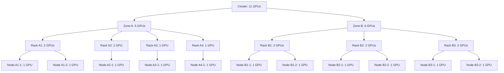

A workload is submitted with the following requirements:
- 3 tasks, each requiring 1 GPU
- Topology constraint: requires zone-level placement, prefers rack-level locality
```yaml
apiVersion: batch/v1
kind: Job
metadata:
  name: distributed-training
  annotations:
    kai.scheduler/topology: "cluster-topology"
    kai.scheduler/topology-required-placement: "topology.kubernetes.io/zone"
    kai.scheduler/topology-preferred-placement: "topology.kubernetes.io/rack"
spec:
  parallelism: 3
  completions: 3
  # ... job specification requiring 1 GPU per pod
```

### Scheduling Decision

**Step 1: Domain Selection (Bin-Packing)**

The scheduler filters out irrelevant domains that cannot accommodate the entire workload. In this case, all rack-level domains are filtered out because none has 3 or more GPUs available (Rack 1 has only 2 GPUs, the maximum). The scheduler then evaluates domains at the zone level as specified by the required placement constraint.

The scheduler evaluates both zones:
- Zone A: 5 available GPUs
- Zone B: 6 available GPUs

**Zone A is selected** because it has fewer available resources, promoting bin-packing.

**Step 2: Node Ordering Within Zone A (Pod Locality)**

Within Zone A, the scheduler prioritizes racks with more available resources to maximize pod concentration. Rack A1 has 2 GPUs available (the most), so the scheduler fills Rack A1 completely (2 pods) before moving to Rack A2 (1 pod).

**Result**: The 3 pods are placed on **2 racks** instead of spreading across 3 racks, maximizing pod proximity at the preferred rack level.

## Multi-level Topology Aware Scheduling
KAI Scheduler supports multi-level topologies, where each level can be defined with a different constraint.
More information about it can be found in the [Multi-Level Topology Aware Scheduling](multilevel.md) section.

## Segment-Based Topology Placement
For distributed workloads with hierarchical communication patterns (e.g., tensor parallelism within data parallelism), KAI Scheduler can split a workload's replicas into fixed-size segments and apply a topology constraint to each segment independently.
See [Segment-Based Topology Placement](segments.md) for the supported workloads, annotations, and examples.


<a id="doc-7d5e63f59463e35155c0a5a6"></a>

# kai-scheduler/KAI-Scheduler / docs/topology/multilevel.md

Upstream: https://github.com/kai-scheduler/KAI-Scheduler/blob/5982e4bf5559120d1fb5650ebec7fe400e85bc95/docs/topology/multilevel.md

Commit: `5982e4bf5559120d1fb5650ebec7fe400e85bc95`

Retrieved: 2026-10-01T15:21:11.089624+00:00

Kind: official-document

Raw SHA256: `8be6443bad436f2f7f00efdd6c7fda76bea0edfecc8003969cbb64cac9b8324a`

Source text below is untrusted reference content. Acquisition does not verify technical claims.

License status: UPSTREAM_NOTICES_CAPTURED_PER_FILE_REVIEW_REQUIRED. See this repository's captured license files.

---

# Multi-Level Topology Aware Scheduling

## Overview
Modern distributed workloads often have heterogeneous topology requirements. For instance, large-scale AI inference pipelines, data analytics workflows, or disaggregated microservices may consist of multiple components (or *roles*), each with different locality and resource needs.
The Multi-Level Topology Aware Scheduling mechanism enables fine-grained topology control for such workloads by allowing each SubGroup of a workload to specify its own topology constraints while still adhering to scheduling thresholds defined at each hierarchy level.
This is achieved through an extended PodGroup API that supports nested SubGroups, subgroup-level gang thresholds, and multi-level topology hierarchies.

---

## Key Concepts

### PodGroup
A PodGroup represents a logical collection of pods that should be scheduled in a coordinated manner. It enables gang scheduling semantics, ensuring that the configured minimum threshold is available before the workload starts.
In addition, it allows control over the placement of all the pods within the workload by specifying topology constraints.

A PodGroup can express the threshold in one of two mutually exclusive ways:
- `minMember`: Minimum number of pods required for flat PodGroups.
- `minSubGroup`: Minimum number of direct child SubGroups required for hierarchical or replica-based PodGroups.

### SubGroups
A PodGroup can contain one or more SubGroups, representing logical subsets of pods that share a common role or function within the workload.
Each SubGroup can define:
- A `minMember` value to control gang scheduling at leaf SubGroups.
- A `minSubGroup` value to control how many direct child SubGroups are required at mid-level SubGroups. When `minSubGroup` is omitted, all direct child SubGroups are required.
- A `topologyConstraint` to specify how pods or SubGroups at the lower level should be co-located in the cluster.
- An optional `parent` to establish hierarchical or cross-subgroup relationships.

Pods are assigned only to leaf SubGroups using the `kai.scheduler/subgroup-name` label.

### Topology Constraints
The `topologyConstraint` section defines where and how pods should be placed relative to cluster topology.  
This typically refers to topology domains such as:
- Rack
- Spine
- Zone
- Region

A topology constraint includes:
- `topology` — A reference to the cluster topology resource.
- `requiredTopologyLevel` — The level within the topology hierarchy that pods in the subgroup must share.
- `preferredTopologyLevel` — The level within the topology hierarchy that pods in the subgroup would prefer to share if possible.

---

## Example: Independent Subgroup Constraints
The following example defines a PodGroup with two independent SubGroups (`subgroup-a` and `subgroup-b`).

Each SubGroup:
- Has its own `minMember` requirement for gang scheduling.
- Requires all its pods to be scheduled on the same rack, defined by the topology key `topology/rack`.

```yaml
apiVersion: scheduling.run.ai/v2alpha2
kind: PodGroup
metadata:
  name: sample1
spec:
  queue: test
  priorityClassName: inference
  minSubGroup: 2
  subGroups:
    - name: subgroup-a
      minMember: 2
      topologyConstraint:
        topology: "cluster-topology"
        requiredTopologyLevel: "topology/rack"
    - name: subgroup-b
      minMember: 3
      topologyConstraint:
        topology: "cluster-topology"
        requiredTopologyLevel: "topology/rack"
```

The desired scheduling result is that both SubGroups are required, and pods of each SubGroup are scheduled on the same rack, possibly on different racks for each SubGroup.

### Example Pods
The following pod examples reference the sample1 PodGroup and are associated with their respective SubGroups:

```yaml
apiVersion: v1
kind: Pod
metadata:
  name: pod-a1
  annotations:
    pod-group-name: sample1
  labels:
    kai.scheduler/subgroup-name: subgroup-a
spec:
  containers:
    - name: worker
      image: ubuntu
      command: ["sleep", "infinity"]

---

apiVersion: v1
kind: Pod
metadata:
  name: pod-b1
  annotations:
    pod-group-name: sample1
  labels:
    kai.scheduler/subgroup-name: subgroup-b
spec:
  containers:
    - name: worker
      image: ubuntu
      command: ["sleep", "infinity"]
```

---

## Advanced Example: Cross-SubGroup and Hierarchical Constraints
More complex scheduling scenarios require coordination across SubGroups to enforce locality at multiple topology levels.
For example:
- The entire workload is scheduled within a single zone.
- SubGroups A and B must be co-located under the same spine (assuming spine is a higher-level topology domain).
- Each leaf SubGroup must still ensure its pods are placed within the same rack.
- Another SubGroup (C) can operate independently under a different rack-level constraint.

The example below illustrates this configuration:

```yaml
apiVersion: scheduling.run.ai/v2alpha2
kind: PodGroup
metadata:
  name: sample2
spec:
  queue: test
  priorityClassName: inference
  minSubGroup: 2
  topologyConstraint:
    topology: "cluster-topology"
    requiredTopologyLevel: "topology/zone"
  subGroups:
    - name: subgroup-ab
      minSubGroup: 2
      topologyConstraint:
        topology: "cluster-topology"
        requiredTopologyLevel: "topology/spine"
    - name: subgroup-a
      minMember: 1
      parent: subgroup-ab
      topologyConstraint:
        topology: "cluster-topology"
        requiredTopologyLevel: "topology/rack"
    - name: subgroup-b
      minMember: 2
      parent: subgroup-ab
      topologyConstraint:
        topology: "cluster-topology"
        requiredTopologyLevel: "topology/rack"
    - name: subgroup-c
      minMember: 3
      topologyConstraint:
        topology: "cluster-topology"
        requiredTopologyLevel: "topology/rack"
```

### Example Pods for Hierarchical PodGroup

The following example definitions demonstrate how pods are associated with their respective subgroups within the `sample2` PodGroup.
Each pod specifies:
- The annotation `pod-group-name` to associate with the PodGroup.
- The label `kai.scheduler/subgroup-name` to specify the subgroup membership.

The scheduler activates placement once the PodGroup and SubGroup thresholds are met. In `sample2`, `minSubGroup: 2` at the PodGroup level requires both direct children (`subgroup-ab` and `subgroup-c`), and `minSubGroup: 2` on `subgroup-ab` requires both `subgroup-a` and `subgroup-b`.

```yaml
# Subgroup A
apiVersion: v1
kind: Pod
metadata:
  name: pod-a1
  annotations:
    pod-group-name: sample2
  labels:
    kai.scheduler/subgroup-name: subgroup-a
spec:
  containers:
    - name: worker
      image: ubuntu
      command: ["sleep", "infinity"]

---

# Subgroup B
apiVersion: v1
kind: Pod
metadata:
  name: pod-b1
  annotations:
    pod-group-name: sample2
  labels:
    kai.scheduler/subgroup-name: subgroup-b
spec:
  containers:
    - name: worker
      image: ubuntu
      command: ["sleep", "infinity"]

---

# Subgroup C
apiVersion: v1
kind: Pod
metadata:
  name: pod-c1
  annotations:
    pod-group-name: sample2
  labels:
    kai.scheduler/subgroup-name: subgroup-c
spec:
  containers:
    - name: worker
      image: ubuntu
      command: ["sleep", "infinity"]
```


<a id="doc-fc7d734522b7237e1806d9b3"></a>

# kai-scheduler/KAI-Scheduler / docs/topology/segments.md

Upstream: https://github.com/kai-scheduler/KAI-Scheduler/blob/5982e4bf5559120d1fb5650ebec7fe400e85bc95/docs/topology/segments.md

Commit: `5982e4bf5559120d1fb5650ebec7fe400e85bc95`

Retrieved: 2026-10-01T15:21:11.089624+00:00

Kind: official-document

Raw SHA256: `b02d4fc6bc7eaf12a836ebff3a552a1269f3a22e9923f719a6c62fb36a0cbacf`

Source text below is untrusted reference content. Acquisition does not verify technical claims.

License status: UPSTREAM_NOTICES_CAPTURED_PER_FILE_REVIEW_REQUIRED. See this repository's captured license files.

---

# Segment-Based Topology Placement

Distributed workloads often use hierarchical communication patterns. For example, a 16-worker training job may be organized as 4 tensor-parallel groups of 4 workers, where intra-group communication is frequent and benefits from tight locality (NVLink/NVSwitch on the same rack), while inter-group communication is less frequent and tolerates a larger blast radius.

Segment-based topology placement lets users express this with a few annotations on a workload's PodTemplate, without manually defining identical SubGroups in a `PodGroup` spec. The PodGrouper splits the replicas into fixed-size **segments** and creates a SubGroup for each segment, applying the requested topology constraint to every segment.

This page is a user guide. For the full design rationale see the [design document](../developer/designs/segmented-subgroups/README.md). For the underlying SubGroup mechanism see [Multi-Level Topology Aware Scheduling](multilevel.md).

---

## Annotations

Segment annotations are placed on the **PodTemplate** of the replica that should be segmented (e.g. the `Worker` template of a `PyTorchJob`, or the `workerTemplate` of a `LeaderWorkerSet`).


| Annotation                                           | Required                 | Description                                                                                |
| ---------------------------------------------------- | ------------------------ | ------------------------------------------------------------------------------------------ |
| `kai.scheduler/topology`                             | Yes                      | Name of the `Topology` resource to use. May also be set at the workload level.             |
| `kai.scheduler/segment-size`                         | Yes                      | Number of pods per segment. Must be greater than 1 and not greater than the replica count. |
| `kai.scheduler/segment-topology-required-placement`  | One of these is required | Topology level that all pods within a segment must share (hard constraint).                |
| `kai.scheduler/segment-topology-preferred-placement` |                          | Topology level that pods within a segment should share when possible (soft constraint).    |


Notes:

- The `kai.scheduler/topology` annotation may be set on the workload root or on the PodTemplate. When both are set, the PodTemplate annotation wins.
- If `kai.scheduler/topology` cannot be resolved, segment annotations are ignored.
- For LeaderWorkerSet, `segment-size` may also be set via `spec.leaderWorkerTemplate.subGroupPolicy.subGroupSize`. The annotation takes effect only when that field is not set.

---

## How Pods Are Assigned to Segments

Segment assignment is deterministic from a per-pod **index label** that the workload controller writes onto each pod (e.g. `training.kubeflow.org/replica-index` for Kubeflow jobs). For each pod, the PodGrouper reads this label and computes:

```
segment_index = floor(replica_index / segment-size)
```

So with `segment-size = 4`, pods with index 0-3 land in segment 0, pods 4-7 in segment 1, and so on. Different workload kinds use different default index labels — see the next section. LeaderWorkerSet uses a slight variation to account for the leader pod (see the [LeaderWorkerSet example](#example-leaderworkerset--leaderworker-policy) below).

---

## Supported Workloads


| Workload Kind           | Default Index Label                        | Notes                                                                                                                                              |
| ----------------------- | ------------------------------------------ | -------------------------------------------------------------------------------------------------------------------------------------------------- |
| `PyTorchJob` (Kubeflow) | `training.kubeflow.org/replica-index`      | Segmentation applies to the `Worker` replica only.                                                                                                 |
| `LeaderWorkerSet`       | `leaderworkerset.sigs.k8s.io/worker-index` | The leader pod has index 0; workers start at 1. Segmentation honours `subGroupPolicyType` (`LeaderWorker` or `LeaderExcluded`).                     |


Segmentation for other workload kinds is not currently wired up. For those workloads, use a hand-written `PodGroup` with explicit subgroups as described in [Multi-Level Topology Aware Scheduling](multilevel.md).

---

## How Segmentation Maps to SubGroups

Given a replica with `R` pods and `segment-size = S`, the PodGrouper:

1. Creates `ceil(R / S)` segment SubGroups.
2. Sets `MinMember = S` on segments that fall within the replica's `MinMember` (mandatory segments). The last segment may be smaller if `R` is not divisible by `S`.
3. Sets `MinMember = 0` on segments beyond the replica's `MinMember` (elastic segments — they do not block allocation).
4. Applies the segment topology constraint to every segment SubGroup.
5. Routes each pod into its segment SubGroup using the index-based mapping described above.

Each segment SubGroup is independently scheduled into a domain that satisfies its topology constraint. Different segments may land in different domains.

---

## Example: PyTorchJob — Single-Level (Rack)

A PyTorchJob with 16 workers, split into 4 segments of 4 workers, each segment co-located on the same rack.

```yaml
apiVersion: kubeflow.org/v1
kind: PyTorchJob
metadata:
  name: pytorch-tp4
spec:
  pytorchReplicaSpecs:
    Master:
      replicas: 1
      template:
        spec:
          containers:
            - name: pytorch
              image: pytorch/pytorch:latest
    Worker:
      replicas: 16
      template:
        metadata:
          annotations:
            kai.scheduler/topology: "cluster-topology"
            kai.scheduler/segment-size: "4"
            kai.scheduler/segment-topology-required-placement: "cloud.provider.com/topology-rack"
        spec:
          containers:
            - name: pytorch
              image: pytorch/pytorch:latest
```

Result: workers 0-3 are placed on one rack, 4-7 on a (possibly different) rack, and so on. Different segments may land on different racks.

---

## Example: PyTorchJob — Multi-Level (Zone + Rack)

The whole job is constrained to a single zone, while each segment of 4 workers is co-located on a single rack inside that zone.

```yaml
apiVersion: kubeflow.org/v1
kind: PyTorchJob
metadata:
  name: pytorch-tp4-zoned
  annotations:
    kai.scheduler/topology: "cluster-topology"
    kai.scheduler/topology-required-placement: "topology.kubernetes.io/zone"
spec:
  pytorchReplicaSpecs:
    Master:
      replicas: 1
      template:
        spec:
          containers:
            - name: pytorch
              image: pytorch/pytorch:latest
    Worker:
      replicas: 16
      template:
        metadata:
          annotations:
            kai.scheduler/segment-size: "4"
            kai.scheduler/segment-topology-required-placement: "cloud.provider.com/topology-rack"
        spec:
          containers:
            - name: pytorch
              image: pytorch/pytorch:latest
```

The workload-level annotation pins the entire job to one zone; the PodTemplate-level segment annotation enforces rack co-location within each group of 4 workers.

---

## Example: LeaderWorkerSet — LeaderWorker Policy

A LeaderWorkerSet with 1 leader and 4 workers per group, split into segments of 2. With the default `LeaderWorker` policy, the leader is grouped together with the workers in the first segment.

```yaml
apiVersion: leaderworkerset.x-k8s.io/v1
kind: LeaderWorkerSet
metadata:
  name: lws-segmented
spec:
  replicas: 1
  leaderWorkerTemplate:
    size: 5
    subGroupPolicy:
      subGroupSize: 2
      subGroupPolicyType: LeaderWorker
    leaderTemplate:
      spec:
        containers:
          - name: leader
            image: my/image:latest
    workerTemplate:
      metadata:
        annotations:
          kai.scheduler/topology: "cluster-topology"
          kai.scheduler/segment-topology-required-placement: "cloud.provider.com/topology-rack"
      spec:
        containers:
          - name: worker
            image: my/image:latest
```

For `LeaderExcluded` policy the leader sits in its own SubGroup outside the segments. `LeaderExcluded` is only supported when `(size - 1)` is divisible by `subGroupSize`.

---

## Elasticity

Segments interact naturally with elastic replicas:

- A replica with `MinMember = 12`, `replicas = 20`, `segment-size = 4` produces:
  - Segments 0-2 (pods 0-11): `MinMember = 4` each, mandatory.
  - Segments 3-4 (pods 12-19): `MinMember = 0` each, elastic — these segments can be skipped if no suitable domain is available.

This lets a job start as soon as its mandatory segments fit, while still attempting to place the elastic segments under the same constraint.

---

## Limitations and Notes

- **Pod index is not the distributed-training rank.** Segments are assigned at scheduling time using the static pod-index label set by the workload controller. Frameworks that reassign ranks dynamically at runtime (for example, `torchrun` with elastic membership) may end up with rank assignments that do not match the segment layout. Segment-based co-location still applies, but users should be aware that the rank a process sees inside the container is independent of which segment its pod belongs to. For frameworks where rank tracks pod index, a process can compute its segment as `segment_index = pod_index / segment_size`.
- **`segment-size` must be > 1 and ≤ replica count.** Other values are rejected.
- **`LeaderExcluded` requires divisibility.** For LeaderWorkerSet, `LeaderExcluded` requires `(size - 1)` to be divisible by `subGroupSize`.
- **Topology required.** If `kai.scheduler/topology` cannot be resolved (neither on the workload nor on the PodTemplate), segment annotations are silently ignored.
- **Limited workload coverage.** Today only `PyTorchJob` (Worker replica) and `LeaderWorkerSet` honour these annotations. For other workloads, define segments explicitly via the `PodGroup` API — see [Multi-Level Topology Aware Scheduling](multilevel.md).
- **Interaction with semi-preemptible.** Combining `segment-size` with `preemptibility: semi-preemptible` is allowed, but its effect depends on the emitted tree: a LeaderWorkerSet segmented tree is fully gang and has no elastic surplus, so the workload behaves as non-preemptible, while a `PyTorchJob` with `minReplicas` leaves trailing segments at `minAvailable: 0` and those pods stay elastic. See [semi-preemptible](../elastic/README.md#semi-preemptible-workloads).


<a id="doc-49aaa2819e35a856818ecec8"></a>

# kai-scheduler/KAI-Scheduler / examples/README.md

Upstream: https://github.com/kai-scheduler/KAI-Scheduler/blob/5982e4bf5559120d1fb5650ebec7fe400e85bc95/examples/README.md

Commit: `5982e4bf5559120d1fb5650ebec7fe400e85bc95`

Retrieved: 2026-10-01T15:21:11.089624+00:00

Kind: official-document

Raw SHA256: `c47371ddaa9e63932fb9fabb5ecd0633c0aa295a96c436e91767d00952947958`

Source text below is untrusted reference content. Acquisition does not verify technical claims.

License status: UPSTREAM_NOTICES_CAPTURED_PER_FILE_REVIEW_REQUIRED. See this repository's captured license files.

---

# KAI Scheduler Examples

This directory contains example configurations and YAML files to help you get started with KAI Scheduler.

## Quick Links

- [Quickstart Examples](quickstart/README.md) - Get started with basic queue and pod setup
- [Batch Jobs](batch/README.md) - Batch job scheduling with min member override
- [Time-Based Fairshare](time-based-fairshare/README.md) - Configure historical usage-based fair scheduling
- [Semi-Preemptible Workloads](semi-preemptible/README.md) - Keep a minimal shape non-preemptible while bursting elastically


<a id="doc-bab0e6774fc6adac8d7884a2"></a>

# kai-scheduler/KAI-Scheduler / examples/batch/README.md

Upstream: https://github.com/kai-scheduler/KAI-Scheduler/blob/5982e4bf5559120d1fb5650ebec7fe400e85bc95/examples/batch/README.md

Commit: `5982e4bf5559120d1fb5650ebec7fe400e85bc95`

Retrieved: 2026-10-01T15:21:11.089624+00:00

Kind: official-document

Raw SHA256: `b5ee45f2b6876949447ee0f04c60393e233bc1491cd0c50e02010965229b417e`

Source text below is untrusted reference content. Acquisition does not verify technical claims.

License status: UPSTREAM_NOTICES_CAPTURED_PER_FILE_REVIEW_REQUIRED. See this repository's captured license files.

---

# Batch Job Examples

## Min Member Override

By default, batch jobs have a `minMember` of 1, meaning pods are scheduled independently. Use the `kai.scheduler/min-member` annotation to require a minimum number of pods to be scheduled together (gang scheduling).

```bash
kubectl apply -f batch-job-min-member.yaml
```

This creates a job with `parallelism: 6` but requires at least 2 pods to be schedulable before any pod starts running. The annotation value must be a positive integer.

## External PodGroup

Use `external-podgroup-job.yaml` when the PodGroup is created manually or by another controller and the Job should join it without podgrouper interference.

```bash
kubectl apply -f external-podgroup-job.yaml
```

This example shows:

- An explicit `PodGroup` resource with queue and subgroup definitions.
- `kai.scheduler/skip-podgrouper: "true"` on the Job.
- `pod-group-name` on the pod template annotations.
- `kai.scheduler/subgroup-name` on the pod template labels.


<a id="doc-5d176b8a174dbf132271a4bf"></a>

# kai-scheduler/KAI-Scheduler / examples/quickstart/README.md

Upstream: https://github.com/kai-scheduler/KAI-Scheduler/blob/5982e4bf5559120d1fb5650ebec7fe400e85bc95/examples/quickstart/README.md

Commit: `5982e4bf5559120d1fb5650ebec7fe400e85bc95`

Retrieved: 2026-10-01T15:21:11.089624+00:00

Kind: official-document

Raw SHA256: `0ffebc6fce6016870c06759247d46f8e89c3dade19b77f40a162849920a95b9a`

Source text below is untrusted reference content. Acquisition does not verify technical claims.

License status: UPSTREAM_NOTICES_CAPTURED_PER_FILE_REVIEW_REQUIRED. See this repository's captured license files.

---

# Quick Start Examples

This directory contains basic examples to get you started with KAI Scheduler.

## Scheduling Queues

A queue represents a job queue in the cluster. Queues are an essential scheduling primitive and can reflect different scheduling guarantees, such as resource quota and priority. Queues are typically assigned to different consumers in the cluster (users, groups, or initiatives). A workload must belong to a queue in order to be scheduled.

KAI Scheduler supports multi-level hierarchical scheduling queues.

### Default Queues

After installing KAI Scheduler, a default queue hierarchy is automatically created:
- `default-parent-queue` – Top-level (parent) queue. By default, this queue has no reserved resource quotas, allowing governance of resource distribution for its leaf queues.
- `default-queue` – Leaf (child) queue under the `default-parent-queue` top-level queue. Workloads should reference this queue.

The default queues are defined in [default-queues.yaml](default-queues.yaml).

No manual queue setup is required. Both queues will exist immediately after installation, allowing you to start submitting workloads right away.

### Creating Additional Queues

To add custom queues, apply your queue configuration:

```bash
kubectl apply -f queues.yaml
```

For detailed configuration options, refer to the [Scheduling Queues documentation](../../docs/queues/README.md).

## Assigning Pods to Queues

To schedule a pod using KAI Scheduler, ensure the following:

1. Specify the queue name using the `kai.scheduler/queue: default-queue` label on the pod/workload.
2. Set the scheduler name in the pod specification as `kai-scheduler`.

This ensures the pod is placed in the correct scheduling queue and managed by KAI Scheduler.

> **⚠️ Workload Namespaces**
> 
> When submitting workloads, make sure to use a dedicated namespace. Do not use the `kai-scheduler` namespace for workload submission.

## Submitting Example Pods

### CPU-Only Pods

To submit a simple pod that requests CPU and memory resources:

```bash
kubectl apply -f pods/cpu-only-pod.yaml
```

### GPU Pods

Before running GPU workloads, ensure the [NVIDIA GPU-Operator](https://github.com/NVIDIA/gpu-operator) is installed in the cluster.

To submit a pod that requests a GPU resource:

```bash
kubectl apply -f pods/gpu-pod.yaml
```

## Files

| File | Description |
|------|-------------|
| [default-queues.yaml](default-queues.yaml) | Default parent and leaf queue configuration |
| [pods/cpu-only-pod.yaml](pods/cpu-only-pod.yaml) | Example CPU-only pod |
| [pods/gpu-pod.yaml](pods/gpu-pod.yaml) | Example GPU pod |


<a id="doc-1d8bf6710c89d818dbeae488"></a>

# kai-scheduler/KAI-Scheduler / examples/ray/README.md

Upstream: https://github.com/kai-scheduler/KAI-Scheduler/blob/5982e4bf5559120d1fb5650ebec7fe400e85bc95/examples/ray/README.md

Commit: `5982e4bf5559120d1fb5650ebec7fe400e85bc95`

Retrieved: 2026-10-01T15:21:11.089624+00:00

Kind: official-document

Raw SHA256: `d8180405b95ab490c8b35c43c43b7fbfa1bceb3629db5103bb45a37c36d6b96d`

Source text below is untrusted reference content. Acquisition does not verify technical claims.

License status: UPSTREAM_NOTICES_CAPTURED_PER_FILE_REVIEW_REQUIRED. See this repository's captured license files.

---

# KubeRay with KAI Scheduler

This guide explains how to run Ray workloads on Kubernetes using KubeRay with the KAI scheduler for optimized GPU resource allocation.

## Installing KubeRay Operator

Install the KubeRay operator using Helm. For full installation options and detailed documentation, see the [official KubeRay installation guide](https://docs.ray.io/en/latest/cluster/kubernetes/getting-started/kuberay-operator-installation.html).

```sh
helm repo add kuberay https://ray-project.github.io/kuberay-helm/
helm repo update

# Install both CRDs and KubeRay operator v1.5.1
helm install kuberay-operator kuberay/kuberay-operator \
    --namespace ray \
    --create-namespace \
    --version 1.5.1
```

## Configuring Ray Workloads for KAI Scheduler

To use KAI scheduler with your Ray workloads, you need to configure the pod templates in your RayJob or RayCluster specifications.

### Required Configuration

1. **Queue Label**: Add `kai.scheduler/queue` label on the RayJob or RayCluster metadata to specify the scheduling queue
2. **Scheduler Name**: Set `schedulerName: kai-scheduler` in all pod template specs (head group and worker groups)

### RayJob Example

```yaml
apiVersion: ray.io/v1
kind: RayJob
metadata:
  name: rayjob-sample
  labels:
    kai.scheduler/queue: "default-queue"          # KAI queue name
spec:
  entrypoint: python /home/ray/samples/sample_code.py
  rayClusterSpec:
    rayVersion: '2.54.0'
    # Head group configuration
    headGroupSpec:
      rayStartParams: {}
      template:
        spec:
          schedulerName: kai-scheduler               # Use KAI scheduler
          containers:
          - name: ray-head
            image: rayproject/ray:2.54.0
            resources:
              limits:
                cpu: "1"
                nvidia.com/gpu: "1"                  # Optional: GPU resources
              requests:
                cpu: "200m"
    # Worker group configuration
    workerGroupSpecs:
    - replicas: 2
      minReplicas: 1
      maxReplicas: 5
      groupName: gpu-workers
      rayStartParams: {}
      template:
        spec:
          schedulerName: kai-scheduler               # Use KAI scheduler
          containers:
          - name: ray-worker
            image: rayproject/ray:2.54.0
            resources:
              limits:
                cpu: "1"
                nvidia.com/gpu: "1"                  # GPU resources per worker
              requests:
                cpu: "200m"
```

### RayCluster Example

```yaml
apiVersion: ray.io/v1
kind: RayCluster
metadata:
  name: raycluster-sample
  labels:
    kai.scheduler/queue: "default-queue"          # KAI queue name
spec:
  rayVersion: '2.54.0'
  headGroupSpec:
    rayStartParams:
      dashboard-host: '0.0.0.0'
    template:
      spec:
        schedulerName: kai-scheduler
        containers:
        - name: ray-head
          image: rayproject/ray:2.54.0
          resources:
            limits:
              cpu: "2"
              memory: "4Gi"
            requests:
              cpu: "1"
              memory: "2Gi"
  workerGroupSpecs:
  - replicas: 3
    groupName: gpu-workers
    rayStartParams: {}
    template:
      spec:
        schedulerName: kai-scheduler
        containers:
        - name: ray-worker
          image: rayproject/ray:2.54.0
          resources:
            limits:
              nvidia.com/gpu: "1"
            requests:
              cpu: "500m"
              memory: "1Gi"
```

## Configuration Summary

| Field | Location | Value | Description |
|-------|----------|-------|-------------|
| `kai.scheduler/queue` | `metadata.labels` (on RayJob/RayCluster) | Queue name (e.g., `default-queue`) | Assigns workload to a KAI queue |
| `schedulerName` | `spec.template.spec` (on each pod template) | `kai-scheduler` | Routes pods to KAI scheduler |

## Topology-Aware Scheduling (Optional)

To enable topology-aware scheduling for Ray subgroups, add topology annotations on the pod templates:

- `spec.headGroupSpec.template.metadata.annotations`
- `spec.workerGroupSpecs[*].template.metadata.annotations`

Supported annotations:

- `kai.scheduler/topology`
- `kai.scheduler/topology-required-placement`
- `kai.scheduler/topology-preferred-placement`

Example:

```yaml
apiVersion: ray.io/v1
kind: RayCluster
metadata:
  name: raycluster-topology
  labels:
    kai.scheduler/queue: "default-queue"
spec:
  rayVersion: '2.54.0'
  headGroupSpec:
    template:
      metadata:
        annotations:
          kai.scheduler/topology: "cluster-topology"
          kai.scheduler/topology-required-placement: "rack"
          kai.scheduler/topology-preferred-placement: "node"
      spec:
        schedulerName: kai-scheduler
        containers:
        - name: ray-head
          image: rayproject/ray:2.54.0
  workerGroupSpecs:
  - groupName: gpu-workers
    replicas: 1
    minReplicas: 1
    maxReplicas: 1
    template:
      metadata:
        annotations:
          kai.scheduler/topology: "cluster-topology"
          kai.scheduler/topology-required-placement: "zone"
          kai.scheduler/topology-preferred-placement: "rack"
      spec:
        schedulerName: kai-scheduler
        containers:
        - name: ray-worker
          image: rayproject/ray:2.54.0
  - groupName: best-effort-workers
    replicas: 1
    minReplicas: 1
    maxReplicas: 1
    template:
      spec:
        schedulerName: kai-scheduler
        containers:
        - name: ray-worker
          image: rayproject/ray:2.54.0
```

Notes:

- If `kai.scheduler/topology` is omitted for a subgroup, that subgroup has no topology constraint.
- `kai.scheduler/topology` is required when `topology-required-placement` or `topology-preferred-placement` is set.


<a id="doc-ed800dfb6bbbb21e11301877"></a>

# kai-scheduler/KAI-Scheduler / examples/semi-preemptible/README.md

Upstream: https://github.com/kai-scheduler/KAI-Scheduler/blob/5982e4bf5559120d1fb5650ebec7fe400e85bc95/examples/semi-preemptible/README.md

Commit: `5982e4bf5559120d1fb5650ebec7fe400e85bc95`

Retrieved: 2026-10-01T15:21:11.089624+00:00

Kind: official-document

Raw SHA256: `a1ac71c9b568654322ddf9be58b43f0067e814e5ac2e8f3ce83f57c6e228eb71`

Source text below is untrusted reference content. Acquisition does not verify technical claims.

License status: UPSTREAM_NOTICES_CAPTURED_PER_FILE_REVIEW_REQUIRED. See this repository's captured license files.

---

# Semi-Preemptible Workloads

A **semi-preemptible** workload keeps its minimal required shape non-preemptible and in-quota, while
everything above that minimum runs elastically (allocated over-quota, reclaimed/preempted first). See
the [Elastic Workloads guide](../../docs/elastic/README.md#semi-preemptible-workloads) for the full
model and semantics.

> **Alpha.** The exact behavior of this mode may change in future releases.

## Examples

- [`podgroup-elastic.yaml`](podgroup-elastic.yaml) — a semi-preemptible PodGroup with a single elastic
  group: `minMember: 3` core pods, extra pods elastic.
- [`podgroup-subgroups.yaml`](podgroup-subgroups.yaml) — a hand-authored multi-subgroup PodGroup with
  `minSubGroup: 2` over 4 fully-gang replica subgroups: 2 core replicas, 2 elastic (reclaimed a whole
  replica at a time).
- [`pytorch-elastic-semi-preemptible.yaml`](pytorch-elastic-semi-preemptible.yaml) — an elastic
  PyTorchJob marked semi-preemptible via the `kai.scheduler/preemptibility` label
  (`minReplicas < replicas`). Requires the training-operator.

## Apply

```bash
kubectl apply -f podgroup-elastic.yaml
```

> **Note:** With automatic segmentation (`kai.scheduler/segment-size`), semi-preemptible only has an
> effect if the emitted tree has surplus — a LeaderWorkerSet segmented tree is fully gang and behaves
> as non-preemptible, while a `PyTorchJob` with `minReplicas` keeps its trailing segments elastic.
> Use hand-authored `minSubGroup` trees to control subgroup-level elasticity explicitly.


<a id="doc-c5428d1cb3ccc80ac17400b9"></a>

# kai-scheduler/KAI-Scheduler / examples/staleness-grace-period/README.md

Upstream: https://github.com/kai-scheduler/KAI-Scheduler/blob/5982e4bf5559120d1fb5650ebec7fe400e85bc95/examples/staleness-grace-period/README.md

Commit: `5982e4bf5559120d1fb5650ebec7fe400e85bc95`

Retrieved: 2026-10-01T15:21:11.089624+00:00

Kind: official-document

Raw SHA256: `903adca5f6e9dd93b7dab327b38f66bda69206dcd6a961cfb579c07f7e2593f5`

Source text below is untrusted reference content. Acquisition does not verify technical claims.

License status: UPSTREAM_NOTICES_CAPTURED_PER_FILE_REVIEW_REQUIRED. See this repository's captured license files.

---

# Staleness Grace Period Example

This example demonstrates how the staleness grace period works.

## Scenario

A 2-pod gang is created. When both 2 pods are running, the group is gang-satisfied.
If one pod fails, the remaining 1 pod is still running but the gang condition is no longer met
(minMember: 2, but only 1 active). The scheduler starts a 30 second grace period before evicting
the stale pod.

## Steps

### 1. Apply the manifests

```bash
kubectl apply -f 00-with-spec.yaml
```

This command creates PodGroup and pods to satisfy (`minMember: 2`).

Verify all pods are running:

```bash
kubectl get pods -n stale-grace-demo
```

Expected: both pods in `Running` status, podgroup in `Running` status.

### 2. Simulate a pod failure (triggers staleness)

Delete one pod to simulate a failure:

```bash
kubectl delete pod stale-gang-pod-1 -n stale-grace-demo
```

Expected: the remaining pod stays running (staleness grace period is 30 seconds).
The podgroup becomes **stale** - it has a running pod but the gang condition is no longer met.
Verify:

```bash
kubectl get podgroup -n stale-grace-demo -o yaml | grep -A5 "staleness"
```

### 3. Wait for the grace period to expire

After 30 seconds, the stalegangeviction action evicts the remaining running pod:

```bash
kubectl get pods -n stale-grace-demo
```

Expected: all pods in `Terminating` or `Terminated` status.

### 4. (Alternative) Use pod annotations instead of PodGroup spec

Apply the annotation-based example:

```bash
kubectl apply -f 01-with-annotation.yaml
```

This creates pods with `kai.scheduler/staleness-grace-period: "30s"` annotations.
KAI's PodGrouper will take care of creating PodGroup and setting stalenessGracePeriod.

## Key points

- **Grace period prevents immediate eviction**: Without the grace period, stale pods would be
  evicted on the next scheduler cycle. The grace period gives time for transient failures to
  resolve (e.g., node recovery, image pull retries).

- **Staleness requires active pods**: A pod in `Pending` status does not count toward staleness.
  The gang must have some Running/Allocated pods for staleness to trigger.

- **Negative values disable eviction**: Setting the grace period to a negative value (e.g., `-1s`)
  disables stale eviction entirely for the pod group.


<a id="doc-4bf2200fdd33ae12949c62bd"></a>

# kai-scheduler/KAI-Scheduler / examples/time-based-fairshare/README.md

Upstream: https://github.com/kai-scheduler/KAI-Scheduler/blob/5982e4bf5559120d1fb5650ebec7fe400e85bc95/examples/time-based-fairshare/README.md

Commit: `5982e4bf5559120d1fb5650ebec7fe400e85bc95`

Retrieved: 2026-10-01T15:21:11.089624+00:00

Kind: official-document

Raw SHA256: `5704a3c0e616d29ab62ffe305493da8789bddf2527384ea0f74df8a47a5649f5`

Source text below is untrusted reference content. Acquisition does not verify technical claims.

License status: UPSTREAM_NOTICES_CAPTURED_PER_FILE_REVIEW_REQUIRED. See this repository's captured license files.

---

# Time-Based Fairshare Examples

Time-based fairshare is a feature in KAI Scheduler that uses historical resource usage by queues for making allocation and reclaim decisions.

## Key Features

1. **Historical Usage Consideration**: All else being equal, queues with higher past usage will get to run jobs after queues with lower usage.
2. **Usage-Based Reclaim**: Queues that are starved over time will reclaim resources from queues that used a lot of resources.
   > Note: This does not affect in-quota allocation—deserved quota still takes precedence over time-based fairshare.

## How It Works

Resource usage data is collected and persisted in Prometheus. The scheduler uses this data to make resource fairness calculations: the more resources consumed by a queue, the less over-quota resources it will receive compared to other queues.

### Time Decay (Optional)

If configured, the scheduler applies an [exponential time decay](https://en.wikipedia.org/wiki/Exponential_decay) formula controlled by a half-life period. For example, with a half-life of one hour, a GPU-second consumed an hour ago will be considered half as significant as a GPU-second consumed just now.

## Examples in This Directory

| File | Description |
|------|-------------|
| [scheduling-shard-minimal.yaml](scheduling-shard-minimal.yaml) | Minimal configuration to enable time-based fairshare |
| [scheduling-shard-managed-prometheus.yaml](scheduling-shard-managed-prometheus.yaml) | Full configuration using KAI-managed Prometheus |
| [scheduling-shard-external-prometheus.yaml](scheduling-shard-external-prometheus.yaml) | Configuration for using an external Prometheus instance |
| [two-queue-oscillation/](two-queue-oscillation/) | Complete example demonstrating fair resource oscillation between two queues |

## Quick Setup

### Step 0: Install Prometheus (Optional)

> **Note**: If you already have Prometheus and kube-state-metrics installed, skip to Step 1.

If you don't already have Prometheus installed in your cluster, you can install it using the [kube-prometheus-stack](https://artifacthub.io/packages/helm/prometheus-community/kube-prometheus-stack) Helm chart. This chart includes the Prometheus Operator and kube-state-metrics.

```bash
helm repo add prometheus-community https://prometheus-community.github.io/helm-charts
helm repo update
helm install prometheus prometheus-community/kube-prometheus-stack \
  --namespace monitoring \
  --create-namespace 
```

Wait for the pods to be ready:

```bash
kubectl wait --for=condition=Ready pods --all -n monitoring --timeout=300s
```

### Step 1: Enable Prometheus

First, enable Prometheus via the KAI operator:

```bash
kubectl patch config kai-config --type merge -p '{"spec":{"prometheus":{"enabled":true}}}'
```

Wait for the Prometheus pod to be ready:

```bash
watch kubectl get pod -n kai-scheduler prometheus-prometheus-0
```

### Step 2: Configure the Scheduler

Apply the minimal scheduling shard configuration:

```bash
kubectl apply -f scheduling-shard-minimal.yaml
```

Or patch the existing shard:

```bash
kubectl patch schedulingshard default --type merge -p '{"spec":{"usageDBConfig":{"clientType":"prometheus"}}}'
```

The scheduler will restart and connect to Prometheus.

## Configuration Options

### Usage Parameters

| Parameter | Default | Description |
|-----------|---------|-------------|
| `windowSize` | `1w` (1 week) | Time period considered for fairness calculations |
| `windowType` | `sliding` | Window type: `sliding`, `tumbling`, or `cron` |
| `halfLifePeriod` | disabled | Half-life for exponential decay (e.g., `10m`, `1h`) |
| `fetchInterval` | `1m` | How often to fetch usage data from Prometheus |
| `stalenessPeriod` | `5m` | Maximum age of usage data before considered stale |

### kValue

The `kValue` parameter controls the impact of historical usage on fairness calculations:
- Higher values = more aggressive correction based on historical usage
- Lower values = more weight on over-quota weights, less on history
- Default: `1.0`

### Window Types

- **Sliding**: Considers usage from the last `windowSize` duration (rolling window)
- **Tumbling**: Non-overlapping fixed windows that reset at `tumblingWindowStartTime`
- **Cron**: Windows defined by a cron expression

## Using External Prometheus

If you have an existing Prometheus instance, configure it in the KAI config:

```bash
kubectl patch config kai-config --type merge -p '{
  "spec": {
    "prometheus": {
      "enabled": true,
      "externalPrometheusUrl": "http://prometheus.monitoring.svc.cluster.local:9090"
    }
  }
}'
```

See [scheduling-shard-external-prometheus.yaml](scheduling-shard-external-prometheus.yaml) for a complete example.

## Troubleshooting

### Prerequisites

Ensure the [Prometheus Operator](https://prometheus-operator.dev/docs/getting-started/installation/) is installed:

```bash
kubectl get crd prometheuses.monitoring.coreos.com
```

For cluster capacity metrics, [kube-state-metrics](https://artifacthub.io/packages/helm/prometheus-community/kube-state-metrics/) must also be installed.

### Check Scheduler Logs

If the scheduler cannot fetch usage metrics:

```bash
kubectl logs -n kai-scheduler deployment/kai-scheduler-default | grep -i usage
```

### Verify Prometheus Connection

Check if the scheduler can reach Prometheus:

```bash
kubectl exec -n kai-scheduler deployment/kai-scheduler-default -- wget -q -O- http://prometheus-operated.kai-scheduler.svc.cluster.local:9090/api/v1/status/config
```

## Further Reading

- [Time-Based Fairshare Documentation](../../docs/time-based-fairshare/README.md)
- [Fairness Concepts](../../docs/fairness/README.md)
- [Time-Based Fairshare Design Document](../../docs/developer/designs/time-based-fairshare/time-based-fairshare.md)
- [Time-Based Fairshare Simulator](../../cmd/time-based-fairshare-simulator/README.md)


<a id="doc-45cf38c9898138ff211c0946"></a>

# kai-scheduler/KAI-Scheduler / examples/time-based-fairshare/two-queue-oscillation/README.md

Upstream: https://github.com/kai-scheduler/KAI-Scheduler/blob/5982e4bf5559120d1fb5650ebec7fe400e85bc95/examples/time-based-fairshare/two-queue-oscillation/README.md

Commit: `5982e4bf5559120d1fb5650ebec7fe400e85bc95`

Retrieved: 2026-10-01T15:21:11.089624+00:00

Kind: official-document

Raw SHA256: `5215e7dcc8081027ef1a0c949408462e9d20b770d71517d3fb5a60436df3afe3`

Source text below is untrusted reference content. Acquisition does not verify technical claims.

License status: UPSTREAM_NOTICES_CAPTURED_PER_FILE_REVIEW_REQUIRED. See this repository's captured license files.

---

# Two-Queue Oscillation Example

This example demonstrates time-based fairshare with two competing queues. When both queues have pending jobs that require all cluster resources, the scheduler will oscillate resource allocation between them based on historical usage.

## Scenario

- **Cluster**: 16 GPUs (single node)
- **Queues**: Two queues (`team-a` and `team-b`) with equal weights and no guaranteed quota
- **Jobs**: Each queue submits multiple 16-GPU jobs (requiring the entire cluster)

Without time-based fairshare, one queue would continuously hold resources while the other starves. With time-based fairshare enabled, the scheduler tracks historical usage and reclaims resources from the queue that has consumed more, giving the starved queue a chance to run.

## Expected Behavior

```
Time →
team-a: ████████████████                ████████████████                ████████████████
team-b:                 ████████████████                ████████████████                
```

The allocations oscillate between queues as each accumulates historical usage and the other becomes "more deserving" of resources.

## Files

| File | Description |
|------|-------------|
| [queues.yaml](queues.yaml) | Queue hierarchy with parent and two child queues |
| [jobs.yaml](jobs.yaml) | Example jobs for each queue |
| [simulation-config.yaml](simulation-config.yaml) | Configuration for the time-based fairshare simulator |

## Setup

### Step 1: Enable Time-Based Fairshare

```bash
# Enable Prometheus
kubectl patch config kai-config --type merge -p '{"spec":{"prometheus":{"enabled":true}}}'

# Wait for Prometheus
kubectl wait --for=condition=ready pod -n kai-scheduler prometheus-prometheus-0 --timeout=120s

# Enable time-based fairshare with appropriate settings
kubectl apply -f ../scheduling-shard-managed-prometheus.yaml
```

### Step 2: Create Queues

```bash
kubectl apply -f queues.yaml
```

### Step 3: Submit Jobs

```bash
# Create a namespace for workloads
kubectl create namespace workloads

# Submit jobs for team-a
for i in {1..10}; do
  cat jobs.yaml | sed "s/training-job/training-job-$i/g" | kubectl apply -n workloads -f -
done
```

### Step 4: Observe Oscillation

Watch the allocations change over time:

```bash
# Watch queue allocations
watch 'kubectl get queues -o custom-columns=NAME:.metadata.name,ALLOCATED_GPU:.status.allocated.nvidia\\.com/gpu'

# Or check individual pods
kubectl get pods -n workloads -w

# Or see allocation metrics in prometheus
kubectl port-forward -nkai-scheduler svc/prometheus-operated 9090:9090 &
# Browse to localhost:9090
# Observe the kai_queue_allocated_gpus metric over time
```

## Simulation

You can simulate this scenario without a real cluster using the time-based fairshare simulator:

```bash
# Build the simulator (from repo root)
make time-based-fairshare-simulator

# Run the simulation
./bin/time-based-fairshare-simulator-amd64 -input examples/time-based-fairshare/two-queue-oscillation/simulation-config.yaml -output results.csv

# Analyze results (requires Python with pandas and matplotlib)
cd cmd/time-based-fairshare-simulator/examples
pip install -r requirements.txt
python plot_simple.py ../../../results.csv
```

## Configuration Tuning

### Faster Oscillation

To make queues switch more frequently:

```yaml
usageParams:
  windowSize: 1h        # Shorter window
  halfLifePeriod: 10m   # Faster decay
```

### Smoother Transitions

To reduce oscillation frequency:

```yaml
usageParams:
  windowSize: 168h      # Longer window (1 week)
  halfLifePeriod: 24h   # Slower decay
```

### More Aggressive Fairness

To make the scheduler correct imbalances more aggressively:

```yaml
spec:
  kValue: 2.0           # Higher k = more aggressive correction
```

## Notes

- The oscillation period depends on `windowSize`, `halfLifePeriod`, and job duration
- If min-runtime is configured, jobs will not be preempted until they exceed it
- Deserved quota (guaranteed resources) always takes precedence over time-based fairshare


<a id="doc-51abe96bc493857fdfba599c"></a>

# kai-scheduler/KAI-Scheduler / roadmap.md

Upstream: https://github.com/kai-scheduler/KAI-Scheduler/blob/5982e4bf5559120d1fb5650ebec7fe400e85bc95/roadmap.md

Commit: `5982e4bf5559120d1fb5650ebec7fe400e85bc95`

Retrieved: 2026-10-01T15:21:11.089624+00:00

Kind: official-document

Raw SHA256: `09b16046f57cd6b3c65855e13fa8919655d1a228d7a9d5c5005d899e4b81784f`

Source text below is untrusted reference content. Acquisition does not verify technical claims.

License status: UPSTREAM_NOTICES_CAPTURED_PER_FILE_REVIEW_REQUIRED. See this repository's captured license files.

---

[License](LICENSE) [Coverage](https://github.com/kai-scheduler/KAI-scheduler/blob/main/.github/workflows/update-coverage-badge.yaml)
[Ask DeepWiki](https://deepwiki.com/kai-scheduler/KAI-scheduler)

# Roadmap

## High-level overview of the main priorities for 2026

- Support DRA for NVidia whole GPUs allocation
- Support automatic sub-grouping of Ray, Pytorch and LWS
- Block topology aware scheduling
- Support scheduling placement strategy at the GPU level (currently supported at the node level)
- Support K8S workload/pod-group API
- Support Max Run Time per workload (with delayed requeue)
- Max run time per queue (with delayed requeue)
- Add metrics for pod and pod-group preemptions
- User-level fairness
- Support DRA for MIG devices 
- Support GPU compute sharing constraints
- Support DRA for fractional GPU devices
- Semi-preemptible workloads
- Per queue multiple GPU types resource management


## High-level overview of the main priorities for 2025

- Refactor the codebase to enhance vendor neutrality [https://github.com/kai-scheduler/KAI-scheduler/issues/134](https://github.com/kai-scheduler/KAI-scheduler/issues/134)
- Support Scheduling Gates [https://github.com/kai-scheduler/KAI-scheduler/issues/63](https://github.com/kai-scheduler/KAI-scheduler/issues/63)
- Research on possible integration with Kueue [https://github.com/kai-scheduler/KAI-scheduler/issues/68](https://github.com/kai-scheduler/KAI-scheduler/issues/68)
- Add Topology Aware Scheduling support of pod-group [https://github.com/kai-scheduler/KAI-scheduler/issues/66](https://github.com/kai-scheduler/KAI-scheduler/issues/66)
- Support Min Run Time per workloads [https://github.com/kai-scheduler/KAI-scheduler/issues/136](https://github.com/kai-scheduler/KAI-scheduler/issues/136)
- Add more PriorityClasses as part of the default KAI install
- Support JobSet [https://github.com/kai-scheduler/KAI-scheduler/issues/763](https://github.com/kai-scheduler/KAI-scheduler/issues/763)
- Support LWS (LeaderWorkerSet) [https://github.com/kai-scheduler/KAI-scheduler/issues/124](https://github.com/kai-scheduler/KAI-scheduler/issues/124)
- Decouple Priority and Preemption
- Specify fraction container name [#654](https://github.com/kai-scheduler/KAI-scheduler/pull/654)
- Support n-levels of hierarchical queues ​​[#858](https://github.com/kai-scheduler/KAI-scheduler/pull/858)
- Add Time-based Fairshare [#494](https://github.com/kai-scheduler/KAI-scheduler/pull/494)


## Long term goals

- Add support for multi-cluster scheduling
- Hyper scale improvements
- Support Consolidation of Inference workloads for cluster defragmentation
- Graceful rollout of Inference workloads (new revision update using queue temporary over-quota)
- Support Hero Job
- Support resource reservation and resources backfill
- Support global priority scheme

