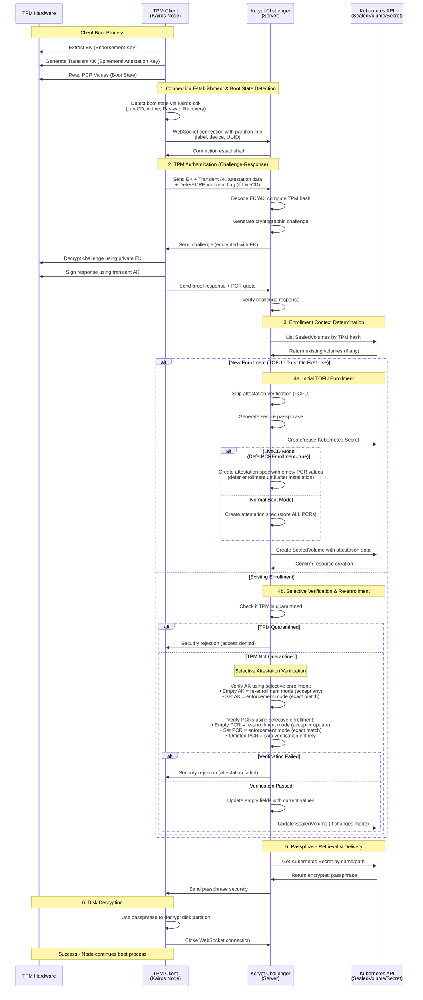

<a id="doc-a54ff182c7e8acf56acfd6e4"></a>

# kairos-io/kairos / AGENTS.md

Upstream: https://github.com/kairos-io/kairos/blob/a861c5bdc7eae65d43e59f909e651d58c22823f7/AGENTS.md

Commit: `a861c5bdc7eae65d43e59f909e651d58c22823f7`

Retrieved: 2026-10-01T15:21:12.590569+00:00

Kind: official-document

Raw SHA256: `18fa7fe819e7fbc07878449c05b64e5c14087db80839a5c159dd328bb932cece`

Source text below is untrusted reference content. Acquisition does not verify technical claims.

License status: UPSTREAM_NOTICES_CAPTURED_PER_FILE_REVIEW_REQUIRED. See this repository's captured license files.

---

# Working on kairos-io

Kairos builds immutable Linux distributions for edge and Kubernetes.

## Where the code is

`kairos-io/kairos` is a monorepo. The components that used to have a repository
of their own were moved into it as directories, and it is also the issue tracker
for the whole org. Changes typically land in one of three repositories:

| Repository | What it is |
|---|---|
| `kairos` | The OS. `sdk/` shared library, `agent/` install and upgrade and reset, `immucore/` initramfs and mounts, `kairos-init/` image builder, `installer/`, `provider/` for k3s and k0s, `kcrypt/`, `tests/` |
| `AuroraBoot` | Builds ISOs, raw disks and netboot artifacts |
| `hadron` | The minimal base OS, built from source |

Extensions and additions go in `hadron-layers`. Also here: `kairos-operator`,
`cluster-api-provider-kairos`, `kairos-docs`, `packages`, and `mudler/yip`, the
cloud-config engine, maintained by the same people.

`kairos` is one Go module, so a change to `sdk/` and its caller in `agent/` is
one commit in one pull request. `kairos/tests` is a separate module,
`kairos-tests`.

Fix things where they are broken, upstream included. Do not work around a bug
locally because you assume the real fix will be slow to merge.

## Commits and pull requests

- Sign off every commit: `git commit -s`. DCO is a required check.
- Disclose in the pull request body that AI was used, and say whether a human
  read the code before it was opened.
- Conventional Commits for the subject line: `fix(iso): ...`, `docs: ...`.
- Every pull request references an issue. Write
  `Fixes kairos-io/kairos#NNNN` when the pull request completes the issue, or
  `Part of kairos-io/kairos#NNNN` when it is one step of a larger piece of
  work. Use `Part of` when you are not sure, so that merging one slice does not
  close a parent issue that is still open.
- Search the open issues for the area you are touching before you file a new
  one, and search by the area rather than by your own wording for the problem.
  Most work already has an issue. Parent issues often have child issues that
  are a closer match to your change than the parent is.
- If no issue matches, do not stretch one that is merely close, and do not
  invent a reference. Say so, and file an issue that states the problem the
  change solves, so the work is tracked before it is reviewed.
- File the issue in `kairos-io/kairos`. Most of the other repositories have
  their issue tracker turned off on purpose, so that the project has one
  Issues tab.
- Open a pull request for every change. Push the branch to a fork if you do not
  have write access to the repository, otherwise to the repository. Never push
  to the default branch.
- Add a test for any behaviour change. A boot-path change needs a boot test.
- Keep pull requests small and single-purpose.
- Never force-push or rebase someone else's branch.
- Never enable GPG signing, `-S`. It blocks on a passphrase nobody will type.
  That is a different flag from `-s`.

## The project board

The issue tracking board holds issues only. Do not add a pull request to it. A
pull request reaches the board through the issue it references, which is why
the reference is required.

## Writing

Text you write into files, commits and pull request descriptions: no em dashes,
no emojis, plain words rather than jargon and acronyms.

## Things that will trip you up

- Read the default branch before you create one. It is not the same in every
  repository:

  ```
  git remote set-head origin --auto
  git symbolic-ref --short refs/remotes/origin/HEAD
  ```

- Pull requests from forks cannot read repository secrets, so image-build jobs
  fail within seconds at "Login to registry". That is structural, not something
  your change caused.
- Do not fetch sources from upstream during a build. In `hadron`, add the
  tarball to `sources.yaml` with its checksum, and the `populate-sources`
  workflow republishes it under `ghcr.io/kairos-io/hadron-sources`.
- Unit tests cannot prove a boot works. If you changed the boot path, boot it.

## Shared skills

Tested procedures for the hard parts live in
[kairos-io/skills](https://github.com/kairos-io/skills): driving QEMU
headlessly, testing immucore in a real boot, testing the installer on a Hadron
image, performing QA on a ticket, cutting a backport release. Prefer one over
improvising.

## QA

QA is requested by moving an issue into the QA column of
[project 1](https://github.com/orgs/kairos-io/projects/1/views/1). An issue
sitting there is a live request, including one that was tested before and sent
back.

A verdict is a comment on the issue that starts `### QA Result:` and says PASS,
FAIL or BLOCKED, with the evidence behind it. Read those before you work on the
issue. A `QA: fail` verdict names a real reproduction that somebody still has to
fix, and it does not reach you any other way.

A passing issue is labelled `QA: pass` and moves to `QA OK`. A failing one is
labelled `QA: fail` and stays in QA.

The `performing-kairos-qa` skill has the procedure for producing a verdict.

## Go

- Build and test through the repository's `Makefile` target where there is one.
  `go build ./...` on its own can fail on a fresh clone in repositories whose
  packages embed generated files.
- Do not bump the Go version or dependencies as a side effect of an unrelated
  change. Renovate handles routine bumps.
- Check whether `kairos/sdk` already wraps a dependency before adding it.
- Write tests in the ginkgo/gomega style the rest of the tree uses.

## Dockerfiles

- One logical step per `RUN`. Do not collapse unrelated commands to save a
  layer.
- Pin versions with a build argument rather than inlining them, so Renovate can
  see them.
- Do not add a `wget` or `curl` of an upstream tarball. Use `sources.yaml` in
  `hadron`, as above.
- `hadolint` runs in CI. Run it locally before pushing.

## Patching third-party source

- A build failure in a third-party package is usually a bug in that package.
  Fix it upstream first. Carry a patch here only to unblock the build while
  upstream reviews the fix.
- Put the patch in `patches/` in `hadron`, as a file. Do not edit third-party
  source with a `sed` in a Dockerfile. A `sed` has no header to read, no name
  that says what it repairs, and nothing that tells the next person when to
  remove it.
- Give every patch a header that says what breaks, why it breaks on this target
  and not on the others, where the fix went upstream, and the condition for
  dropping the patch. `patches/0001-audit-syslog-plugin-include-unistd.patch`
  is the model to copy.
- Where you cannot send the fix upstream yourself, say so in the patch header
  and in the pull request, and write the upstream report so that a maintainer
  only has to send it. A patch that nobody reported is carried for ever by
  whoever inherits it.
- Disclose AI use in the upstream report too, the same way you disclose it
  here, and say how the patch was verified: which target it was built on, which
  test failed before and passes after. Many projects now reject an undisclosed
  AI patch on sight, and an unverified one wastes a maintainer's time. State
  plainly when the fix was not built or run on the affected target.

## This repository, specifically

- `go build ./...` and `go test ./...` fail on a fresh clone with
  `pattern binaries/edgevpn: no matching files found`. `kairos-init/pkg/bundled`
  embeds binaries that are built rather than committed. Run `make test` and
  `make lint-go`, which depend on `kairos-init-embed-stubs`. Nothing in that
  package needs fixing.
- Lint with the version in `.golangci-version`. Whatever is on your PATH
  reports a different set of findings, in both directions.
- `tests/` is a separate module, so a green root `go test ./...` says nothing
  about whether the system still boots.
- Ignore `CONTRIBUTING.md`'s emoji commit prefixes and its ten emoji pull
  request labels. `master` uses Conventional Commits, and recent merges carry
  `QA: pass` and nothing else. `CONTRIBUTING.md` is right about `-s`.
- Where there is no C compiler, `CGO_ENABLED=0 go build ./...` builds the whole
  tree. Do not commit a build tag or a dependency swap to work around a missing
  local compiler.
- When you add, rename or remove a systemd unit, add it to `Journal` in
  `defaultLogsConfig` (`agent/internal/agent/logs.go`) in the same change. That
  list is what `kairos-agent logs` puts in a debug bundle, and it is written by
  hand: a unit missing from it is silently absent from every bundle, so the one
  boot that needed the journal is the boot that does not have it. Listing a unit
  that did not run costs nothing, `Collect` drops an empty journal. This applies
  to units written by the bundled cloud-configs, by a provider, and by the agent
  itself at runtime.


<a id="doc-6ebdb617a8104a7756d0cf36"></a>

# kairos-io/kairos / CLAUDE.md

Upstream: https://github.com/kairos-io/kairos/blob/a861c5bdc7eae65d43e59f909e651d58c22823f7/CLAUDE.md

Commit: `a861c5bdc7eae65d43e59f909e651d58c22823f7`

Retrieved: 2026-10-01T15:21:12.590569+00:00

Kind: official-document

Raw SHA256: `336cc4fbf19beaada7ccf9986414fa91851a8d7a07dfb3ccbe800a69eed0ab49`

Source text below is untrusted reference content. Acquisition does not verify technical claims.

License status: UPSTREAM_NOTICES_CAPTURED_PER_FILE_REVIEW_REQUIRED. See this repository's captured license files.

---

@AGENTS.md


<a id="doc-ffdbe3a1e7ee93cacfc080b6"></a>

# kairos-io/kairos / CODE_OF_CONDUCT.md

Upstream: https://github.com/kairos-io/kairos/blob/a861c5bdc7eae65d43e59f909e651d58c22823f7/CODE_OF_CONDUCT.md

Commit: `a861c5bdc7eae65d43e59f909e651d58c22823f7`

Retrieved: 2026-10-01T15:21:12.590569+00:00

Kind: official-document

Raw SHA256: `e77fd5f7d7f2aa9b56d806f8c254f7d6a01fb2d558ceaedd376bfc2f417d453f`

Source text below is untrusted reference content. Acquisition does not verify technical claims.

License status: UPSTREAM_NOTICES_CAPTURED_PER_FILE_REVIEW_REQUIRED. See this repository's captured license files.

---

# Kairos Community Code of Conduct

Please refer to our [Kairos Community Code of Conduct](https://github.com/kairos-io/community/blob/main/CODE_OF_CONDUCT.md)


<a id="doc-eca12c0a30e25b4b46522ebf"></a>

# kairos-io/kairos / CONTRIBUTING.md

Upstream: https://github.com/kairos-io/kairos/blob/a861c5bdc7eae65d43e59f909e651d58c22823f7/CONTRIBUTING.md

Commit: `a861c5bdc7eae65d43e59f909e651d58c22823f7`

Retrieved: 2026-10-01T15:21:12.590569+00:00

Kind: official-document

Raw SHA256: `b5cd5dd784d65192fe10f26dfbe685ba87f2c8f4c7bae4b3c55ab3ed5174db74`

Source text below is untrusted reference content. Acquisition does not verify technical claims.

License status: UPSTREAM_NOTICES_CAPTURED_PER_FILE_REVIEW_REQUIRED. See this repository's captured license files.

---

Contributing
============

All contributions are welcome to this project!

How to contribute
-----------------

-  **File an issue** - if you found a bug, want to request an
   enhancement, or want to implement something (bug fix or feature).
-  **Send a pull request** - if you want to contribute code. Please be
   sure to file an issue first.
-  **Check good first-issue** - check out [good first issues](https://github.com/kairos-io/kairos/issues?q=is%3Aopen+is%3Aissue+label%3A%22good+first+issue%22) if you want to contribute to a specific problem
-  **Read about our code of conduct and governance**: Kairos is an Open source, community-driven project with a [governance](https://github.com/kairos-io/community/blob/main/GOVERNANCE.md) and adopts CNCF [Code of conduct](https://github.com/kairos-io/kairos/blob/master/CODE_OF_CONDUCT.md)
-  **Grow into a project role**: Kairos has a [contributor ladder](https://github.com/kairos-io/community/blob/main/GOVERNANCE.md#project-roles), from Contributor to Approver to Maintainer to Administrator, with a checklist for each step

Guiding user stories
--------------------

These "guiding user stories" summarize the scope and ideals of the Kairos project. These are all stories that can grow with context: every new device or OS that Kairos supports can have an implication for each of these stories. We cannot ask every contribution to satisfy them all at once. Instead, we ask that each new feature or capability should fit into at least one guiding user story and that every lower-numbered user story should be satisfied first.

1. I can install k8s on an experimental device.
2. I can install k8s on an experimental cluster.
3. I can install using a conservative trust model.
4. I can upgrade safely.
5. I can upgrade automatically.
6. I can ensure OS security updates are installed automatically.
7. I can secure my data at rest and in flight.
8. I can install on a production cluster.
9. I can derive from an OS of my choosing.
10. I can install on an edge cluster.

This list is always subject to revision, but notice that each story loses meaning without the ones that come before.

Pull request best practices
---------------------------

We want to accept your pull requests! Please follow these steps:

## Step 1: File an issue

Before writing any code, please file an issue stating the problem you
want to solve or the feature you want to implement. This allows us to
give you feedback before you spend any time writing code. There may be a
known limitation that can't be addressed, or a bug that has already been
fixed in a different way. The issue allows us to communicate and figure
out if it's worth your time to write a bunch of code for the project.
If changes are trivial, use the PR message to write why we need the patch, 
and the motivations behind it.

## Step 2: Fork this repository in GitHub

This will create your own copy of our repository.

## Step 3: Add the upstream source

The upstream source is the project under the kairos-io organization on GitHub.
To add an upstream source for this project, type:

```
git remote add upstream git@github.com:kairos-io/kairos.git
```

This will come in useful later.

## Step 4: Create a feature branch

Create a branch with a descriptive name, such as ``fix/dns``.

## Step 5: Push your feature branch to your fork

1. If working on an issue, signal other contributors that you are actively working on by commenting on the issue.
1. Submit a pull request.
    1. All code PR must be labeled with one of
        - ⚠️ (`:warning:`, major or breaking changes)
        - ✨ (`:sparkles:`, feature additions)
        - 🐛 (`:bug:`, patch and bugfixes)
        - 📖 (`:book:`, documentation or proposals)
        - 🔧 (`:wrenchIcon:`, toolings for developers)
        - :art: ( `:art`, for refactoring )
        - 🌱 (`:seedling:`, minor or other)
        - :penguin: (`:penguin:`, for Distribution or Dockerfile changes)
        - :arrow_up: (`:arrow_up:`, for dependencies bumps)
        - :robot: (`:robot:`, for CI/tests changes )
1. If your PR has multiple commits, you must [squash them into a single commit](https://kubernetes.io/docs/contribute/new-content/open-a-pr/#squashing-commits) before merging your PR.

Individual commits should not be tagged separately, but will generally be
assumed to match the PR. For instance, if you have a bugfix in with
a breaking change, it's generally encouraged to submit the bugfix
separately, but if you must put them in one PR, mark the commit
separately.

All changes must be code reviewed. Expect reviewers to request that you
avoid common [go style mistakes](https://github.com/golang/go/wiki/CodeReviewComments) in your PRs.

As you develop code, continue to push code to your remote feature
branch. Please make sure to include the issue number and the label you're addressing
in your commit message, such as:

```bash
git commit -s -am ":seedling: Drop foo flag (fixes #123)"
```

NOTE: All commits must be signed-off (DCO - Developer Certificate of Origin) so make sure you use the `-s` flag when you commit.

This helps us out by allowing us to track which issue your commit
relates to.

Keep a separate feature branch for each issue you want to address.

## Step 6: Rebase

Before sending a pull request, rebase against upstream, such as:

```bash
git fetch upstream
git rebase upstream/master
```

This will add your changes on top of what's already in upstream,
minimizing merge issues.

## Step 7: Run the tests

Make sure that all tests and lint checks are passing before submitting a pull request.

You can run the lint and test checks locally with:

### Linux
```bash
find .github/workflows/ -path "./examples" -prune -o -name "*.yml" -or -name "*.yaml" -print  | xargs -r -n1 docker run -v "$PWD":/work -w /work cytopia/yamllint
```

### Windows
```bash
find .github/workflows/ -path "./examples" -prune -o -name "*.yml" -or -name "*.yaml" -print  | xargs -r -n1 docker run -v "$PWD":/work -w /work cytopia/yamllint
```

## Step 8: Send the pull request

Send the pull request from your feature branch to us. Be sure to include
a description that lets us know what work you did.

Keep in mind that we like to see one issue addressed per pull request,
as this helps keep our git history clean and we can more easily track
down issues.

Pull request requirements
-------------------------

### Coding standard

Our pipeline will run some linting to ensure your code additions meet the project standards. If you encounter any issues, please address them before asking for a review from the team. This applies to Go, Yaml and Dockerfile or any newer ones added in the future.

When it comes to code, Kairos components use the Go programming language. In addition to the linting, do your best to write [Effective Go](https://go.dev/doc/effective_go) code. This is the standard that the core team tries to adhere to.

### Testing

All changes in our code, whether new features or bug fixes, must include a test. If you need some help don't hesitate to contact the team through one of our [community channels](https://kairos.io/community/)


<a id="doc-c693279643b8cd5d248172d9"></a>

# kairos-io/kairos / LICENSE

Upstream: https://github.com/kairos-io/kairos/blob/a861c5bdc7eae65d43e59f909e651d58c22823f7/LICENSE

Commit: `a861c5bdc7eae65d43e59f909e651d58c22823f7`

Retrieved: 2026-10-01T15:21:12.590569+00:00

Kind: license

Raw SHA256: `ef83dcde11f35f77198e9500d31a286eaf0a512aebe1c2ac5f46b0c52a34d82c`

Source text below is untrusted reference content. Acquisition does not verify technical claims.

License status: UPSTREAM_NOTICES_CAPTURED_PER_FILE_REVIEW_REQUIRED. See this repository's captured license files.

---

````text

                                 Apache License
                           Version 2.0, January 2004
                        http://www.apache.org/licenses/

   TERMS AND CONDITIONS FOR USE, REPRODUCTION, AND DISTRIBUTION

   1. Definitions.

      "License" shall mean the terms and conditions for use, reproduction,
      and distribution as defined by Sections 1 through 9 of this document.

      "Licensor" shall mean the copyright owner or entity authorized by
      the copyright owner that is granting the License.

      "Legal Entity" shall mean the union of the acting entity and all
      other entities that control, are controlled by, or are under common
      control with that entity. For the purposes of this definition,
      "control" means (i) the power, direct or indirect, to cause the
      direction or management of such entity, whether by contract or
      otherwise, or (ii) ownership of fifty percent (50%) or more of the
      outstanding shares, or (iii) beneficial ownership of such entity.

      "You" (or "Your") shall mean an individual or Legal Entity
      exercising permissions granted by this License.

      "Source" form shall mean the preferred form for making modifications,
      including but not limited to software source code, documentation
      source, and configuration files.

      "Object" form shall mean any form resulting from mechanical
      transformation or translation of a Source form, including but
      not limited to compiled object code, generated documentation,
      and conversions to other media types.

      "Work" shall mean the work of authorship, whether in Source or
      Object form, made available under the License, as indicated by a
      copyright notice that is included in or attached to the work
      (an example is provided in the Appendix below).

      "Derivative Works" shall mean any work, whether in Source or Object
      form, that is based on (or derived from) the Work and for which the
      editorial revisions, annotations, elaborations, or other modifications
      represent, as a whole, an original work of authorship. For the purposes
      of this License, Derivative Works shall not include works that remain
      separable from, or merely link (or bind by name) to the interfaces of,
      the Work and Derivative Works thereof.

      "Contribution" shall mean any work of authorship, including
      the original version of the Work and any modifications or additions
      to that Work or Derivative Works thereof, that is intentionally
      submitted to Licensor for inclusion in the Work by the copyright owner
      or by an individual or Legal Entity authorized to submit on behalf of
      the copyright owner. For the purposes of this definition, "submitted"
      means any form of electronic, verbal, or written communication sent
      to the Licensor or its representatives, including but not limited to
      communication on electronic mailing lists, source code control systems,
      and issue tracking systems that are managed by, or on behalf of, the
      Licensor for the purpose of discussing and improving the Work, but
      excluding communication that is conspicuously marked or otherwise
      designated in writing by the copyright owner as "Not a Contribution."

      "Contributor" shall mean Licensor and any individual or Legal Entity
      on behalf of whom a Contribution has been received by Licensor and
      subsequently incorporated within the Work.

   2. Grant of Copyright License. Subject to the terms and conditions of
      this License, each Contributor hereby grants to You a perpetual,
      worldwide, non-exclusive, no-charge, royalty-free, irrevocable
      copyright license to reproduce, prepare Derivative Works of,
      publicly display, publicly perform, sublicense, and distribute the
      Work and such Derivative Works in Source or Object form.

   3. Grant of Patent License. Subject to the terms and conditions of
      this License, each Contributor hereby grants to You a perpetual,
      worldwide, non-exclusive, no-charge, royalty-free, irrevocable
      (except as stated in this section) patent license to make, have made,
      use, offer to sell, sell, import, and otherwise transfer the Work,
      where such license applies only to those patent claims licensable
      by such Contributor that are necessarily infringed by their
      Contribution(s) alone or by combination of their Contribution(s)
      with the Work to which such Contribution(s) was submitted. If You
      institute patent litigation against any entity (including a
      cross-claim or counterclaim in a lawsuit) alleging that the Work
      or a Contribution incorporated within the Work constitutes direct
      or contributory patent infringement, then any patent licenses
      granted to You under this License for that Work shall terminate
      as of the date such litigation is filed.

   4. Redistribution. You may reproduce and distribute copies of the
      Work or Derivative Works thereof in any medium, with or without
      modifications, and in Source or Object form, provided that You
      meet the following conditions:

      (a) You must give any other recipients of the Work or
          Derivative Works a copy of this License; and

      (b) You must cause any modified files to carry prominent notices
          stating that You changed the files; and

      (c) You must retain, in the Source form of any Derivative Works
          that You distribute, all copyright, patent, trademark, and
          attribution notices from the Source form of the Work,
          excluding those notices that do not pertain to any part of
          the Derivative Works; and

      (d) If the Work includes a "NOTICE" text file as part of its
          distribution, then any Derivative Works that You distribute must
          include a readable copy of the attribution notices contained
          within such NOTICE file, excluding those notices that do not
          pertain to any part of the Derivative Works, in at least one
          of the following places: within a NOTICE text file distributed
          as part of the Derivative Works; within the Source form or
          documentation, if provided along with the Derivative Works; or,
          within a display generated by the Derivative Works, if and
          wherever such third-party notices normally appear. The contents
          of the NOTICE file are for informational purposes only and
          do not modify the License. You may add Your own attribution
          notices within Derivative Works that You distribute, alongside
          or as an addendum to the NOTICE text from the Work, provided
          that such additional attribution notices cannot be construed
          as modifying the License.

      You may add Your own copyright statement to Your modifications and
      may provide additional or different license terms and conditions
      for use, reproduction, or distribution of Your modifications, or
      for any such Derivative Works as a whole, provided Your use,
      reproduction, and distribution of the Work otherwise complies with
      the conditions stated in this License.

   5. Submission of Contributions. Unless You explicitly state otherwise,
      any Contribution intentionally submitted for inclusion in the Work
      by You to the Licensor shall be under the terms and conditions of
      this License, without any additional terms or conditions.
      Notwithstanding the above, nothing herein shall supersede or modify
      the terms of any separate license agreement you may have executed
      with Licensor regarding such Contributions.

   6. Trademarks. This License does not grant permission to use the trade
      names, trademarks, service marks, or product names of the Licensor,
      except as required for reasonable and customary use in describing the
      origin of the Work and reproducing the content of the NOTICE file.

   7. Disclaimer of Warranty. Unless required by applicable law or
      agreed to in writing, Licensor provides the Work (and each
      Contributor provides its Contributions) on an "AS IS" BASIS,
      WITHOUT WARRANTIES OR CONDITIONS OF ANY KIND, either express or
      implied, including, without limitation, any warranties or conditions
      of TITLE, NON-INFRINGEMENT, MERCHANTABILITY, or FITNESS FOR A
      PARTICULAR PURPOSE. You are solely responsible for determining the
      appropriateness of using or redistributing the Work and assume any
      risks associated with Your exercise of permissions under this License.

   8. Limitation of Liability. In no event and under no legal theory,
      whether in tort (including negligence), contract, or otherwise,
      unless required by applicable law (such as deliberate and grossly
      negligent acts) or agreed to in writing, shall any Contributor be
      liable to You for damages, including any direct, indirect, special,
      incidental, or consequential damages of any character arising as a
      result of this License or out of the use or inability to use the
      Work (including but not limited to damages for loss of goodwill,
      work stoppage, computer failure or malfunction, or any and all
      other commercial damages or losses), even if such Contributor
      has been advised of the possibility of such damages.

   9. Accepting Warranty or Additional Liability. While redistributing
      the Work or Derivative Works thereof, You may choose to offer,
      and charge a fee for, acceptance of support, warranty, indemnity,
      or other liability obligations and/or rights consistent with this
      License. However, in accepting such obligations, You may act only
      on Your own behalf and on Your sole responsibility, not on behalf
      of any other Contributor, and only if You agree to indemnify,
      defend, and hold each Contributor harmless for any liability
      incurred by, or claims asserted against, such Contributor by reason
      of your accepting any such warranty or additional liability.

   END OF TERMS AND CONDITIONS

   Copyright 2021-2022 Ettore Di Giacinto <mudler@mudler.pm>
   Copyright 2022-2024 Spectro Cloud
   Copyright 2024 Kairos authors

   Licensed under the Apache License, Version 2.0 (the "License");
   you may not use this file except in compliance with the License.
   You may obtain a copy of the License at

       http://www.apache.org/licenses/LICENSE-2.0

   Unless required by applicable law or agreed to in writing, software
   distributed under the License is distributed on an "AS IS" BASIS,
   WITHOUT WARRANTIES OR CONDITIONS OF ANY KIND, either express or implied.
   See the License for the specific language governing permissions and
   limitations under the License.

````


<a id="doc-b335630551682c19a781afeb"></a>

# kairos-io/kairos / README.md

Upstream: https://github.com/kairos-io/kairos/blob/a861c5bdc7eae65d43e59f909e651d58c22823f7/README.md

Commit: `a861c5bdc7eae65d43e59f909e651d58c22823f7`

Retrieved: 2026-10-01T15:21:12.590569+00:00

Kind: official-document

Raw SHA256: `b331ba52c565ee8de5a2c78e1b1056691965e3e0a0a47b29f762f8daaab6d493`

Source text below is untrusted reference content. Acquisition does not verify technical claims.

License status: UPSTREAM_NOTICES_CAPTURED_PER_FILE_REVIEW_REQUIRED. See this repository's captured license files.

---

<h1 align="center">
  <br>
     
    <br>
<br>
</h1>

<h3 align="center">Kairos - Kubernetes-focused, Cloud Native Linux meta-distribution</h3>
<p align="center">
  <a href="https://github.com/kairos-io/kairos/issues"></a>
  <a href="https://github.com/kairos-io/kairos/actions/workflows/master.yaml"> </a>
  <a href="https://www.bestpractices.dev/projects/9100"></a>
  <a href="https://clomonitor.io/projects/cncf/kairos"></a>
  <a href="https://scorecard.dev/viewer/?uri=github.com/kairos-io/kairos"></a>
</p>

<p align="center">
     <br>
    The immutable Linux meta-distribution for edge Kubernetes.
</p>

<hr>

With Kairos you can build immutable, bootable Kubernetes and OS images for your edge devices as easily as writing a Dockerfile. Optional P2P mesh with distributed ledger automates node bootstrapping and coordination. Updating nodes is as easy as CI/CD: push a new image to your container registry and let secure, risk-free A/B atomic upgrades do the rest. Kairos is part of the Secure Edge-Native Architecture (SENA) to securely run workloads at the Edge ([whitepaper](https://github.com/kairos-io/kairos/files/11250843/Secure-Edge-Native-Architecture-white-paper-20240417.3.pdf)).

Kairos (formerly `c3os`) is an open-source project which brings Edge, cloud, and bare metal lifecycle OS management into the same design principles with a unified Cloud Native API.

At-a-glance:

- :bowtie: Community Driven
- :octocat: Open Source
- :lock: Linux immutable, meta-distribution
- :key: Secure
- :whale: Container-based
- :penguin: Distribution agnostic

Kairos can be used to:

- Easily spin-up a Kubernetes cluster, with the Linux distribution of your choice :penguin:
- Create your Immutable infrastructure, no more infrastructure drift! :lock:
- Manage the cluster lifecycle with Kubernetes—from building to provisioning, and upgrading :rocket:
- Create a multiple—node, a single cluster that spans up across regions :earth_africa:

For comprehensive docs, tutorials, and examples see our [documentation](https://kairos.io/getting-started/).

## Repository layout

Kairos is a monorepo. The device-runtime binaries, the SDK, and the
image initializer all live in one source tree, share a single
`go.mod` at the root, and ship on one release tag.

- `cmd/kairos/` -- the multi-call `kairos` binary. Dispatches on
  `argv[0]` to immucore, kairos-agent, or kcrypt-discovery-challenger,
  so one binary is deployed and the historical names point at it via
  symlinks.
- `cmd/kcrypt-challenger/` -- the in-cluster kcrypt-challenger
  server. Not linked into the multi-call binary (different deps and
  lifecycle); ships as its own container image.
- `agent/` -- kairos-agent source (was `kairos-io/kairos-agent`).
- `immucore/` -- immucore source (was `kairos-io/immucore`).
- `kcrypt/discovery/` -- device-side kcrypt discovery
  (was `kairos-io/kcrypt-discovery-challenger`).
- `kcrypt/challenger/` -- in-cluster kcrypt-challenger package
  (was `kairos-io/kcrypt-challenger`).
- `sdk/` -- Kairos SDK, importable externally at
  `github.com/kairos-io/kairos/v4/sdk` (was `kairos-io/kairos-sdk`).
- `kairos-init/` -- image initializer that installs the multi-call
  binary plus symlinks into a base image
  (was `kairos-io/kairos-init`).
- `installer/` -- interactive terminal-UI installer embedded by
  kairos-init at `/system/installer/kairos-installer` and invoked by
  `kairos-agent interactive-install` (was `kairos-io/kairos-installer`).
- `provider/` -- the p2p/mesh provider, embedded by kairos-init at
  `/system/providers/agent-provider-kairos` in standard images. Both an
  agent bus plugin and the CLI behind `kairos provider <cmd>`
  (was `kairos-io/provider-kairos`, which shipped the same commands a
  second time as a standalone `kairosctl` binary).
- `tests/` -- monorepo end-to-end test suite.

Each absorbed subdirectory keeps a thin `main.go` at its root, so
`go build ./agent`, `go build ./immucore`, and
`go build ./kcrypt/cmd/discovery` still produce standalone binaries
from any commit; consumers that are not ready for the multi-call
binary can pin one of those.

The historical repos (`kairos-agent`, `immucore`,
`kcrypt-discovery-challenger`, `kcrypt-challenger`, `kairos-sdk`,
`kairos-init`, `kairos-installer`, `provider-kairos`,
`kairos-factory-action`, `linting-composite-action`) are archived. Their tagged releases
remain resolvable so pre-migration pins keep working; post-migration
fixes land here and ship on the monorepo release tag.

Absorbed reusable workflows live at `.github/workflows/` of the repo
root (GitHub does not accept reusable workflows in subdirectories),
so they do not follow the subdir pattern the runtime components did:

- `kairos-factory-action` -> `.github/workflows/reusable-factory.yaml`
- `linting-composite-action` -> `.github/workflows/reusable-linting.yaml`
  and, for the composite-action shape,
  `linting-composite-action/action.yml`

External consumers rewrite their `uses:` lines from the archived-repo
path to the monorepo path (`kairos-io/kairos-factory-action/...` ->
`kairos-io/kairos/.github/workflows/reusable-factory.yaml`, same for
linting) and repin at a monorepo ref (SHA, `master`, or a Kairos
release tag).

## Project status

Check the [Roadmap](https://github.com/orgs/kairos-io/projects/2) for a high-level view of what features are coming to Kairos.

Or go to the [Project Board](https://github.com/orgs/kairos-io/projects/1/views/1) to check what the team is working on right now!

To stay up-to-date, check out the [Kairos Blog](https://kairos.io/blog/). You will find also release announcements and deep-dive into Kairos features!

## Community

You can find us at:

- [Cloud Native Slack #kairos channel](https://cloud-native.slack.com/archives/C0707M8UEU8)
- [#kairos-io at matrix.org](https://matrix.to/#/#kairos-io:matrix.org)
- [IRC #kairos in libera.chat](https://web.libera.chat/#kairos)
- [GitHub Discussions](https://github.com/kairos-io/kairos/discussions)

The [:handshake: community repository](https://github.com/kairos-io/community) contains information about how to get involved, Code of conduct, Maintainers, Contribution guidelines, including also links to our weekly meeting notes, roadmap, and more.

The [kairos-community organization](https://github.com/kairos-community) holds community supported and experimental projects, kept apart from the maintained `kairos-io` ones: [bundles](https://github.com/kairos-community/bundles), [Helm charts](https://github.com/kairos-community/helm-charts), [meta-kairos](https://github.com/kairos-community/meta-kairos) for Yocto, [openamt](https://github.com/kairos-community/openamt) and [hadron-desktop](https://github.com/kairos-community/hadron-desktop). Anyone can contribute there.

Looking for something to work on? Browse Kairos issues that need a hand on [CLOTributor](https://clotributor.dev/search?project=kairos&foundation=cncf).

## Governance

The Kairos project governance can be found [in the community repository](https://github.com/kairos-io/community/blob/main/GOVERNANCE.md). 

**Note:** Kairos adopts the CNCF Code of conduct - please make sure to read the CNCF [Code of Conduct document](https://github.com/kairos-io/community/blob/main/CODE_OF_CONDUCT.md).

### Project Office Hours

Project Office Hours is an opportunity for attendees to meet the maintainers of the project, learn more about the project, ask questions, and learn about new features and upcoming updates.

[Add to Google Calendar](https://calendar.google.com/calendar/embed?src=c_6d65f26502a5a67c9570bb4c16b622e38d609430bce6ce7fc1d8064f2df09c11%40group.calendar.google.com&ctz=Europe%2FRome)

---

Kairos is a [Cloud Native Computing Foundation (CNCF) Sandbox project](https://www.cncf.io/sandbox-projects/) and was contributed by [Spectrocloud](https://spectrocloud.com).


<a id="doc-f6ed156e4bf5c79168066246"></a>

# kairos-io/kairos / SECURITY.md

Upstream: https://github.com/kairos-io/kairos/blob/a861c5bdc7eae65d43e59f909e651d58c22823f7/SECURITY.md

Commit: `a861c5bdc7eae65d43e59f909e651d58c22823f7`

Retrieved: 2026-10-01T15:21:12.590569+00:00

Kind: official-document

Raw SHA256: `0ef367bb136b86af6277db35ebfb07b16b1c9f9bcc7a7decfd5bf07f28290309`

Source text below is untrusted reference content. Acquisition does not verify technical claims.

License status: UPSTREAM_NOTICES_CAPTURED_PER_FILE_REVIEW_REQUIRED. See this repository's captured license files.

---

# Security Policy

## Reporting a Vulnerability

Kairos supports responsible disclosure and endeavors to resolve security issues in a reasonable timeframe.

However, as is a community driven project we don't run any bug bounty, but we will make sure credits goes to whom belongs and address the issues as fast as possible, if you can provide also patch and open up a PR that's more than welcome.

To report a security vulnerability, use [GitHub Security Draft Advisory](https://github.com/kairos-io/kairos/security/advisories/new), if you don't have a GitHub account, please email security@kairos.io.


<a id="doc-ac6d2b2167cf462839a06266"></a>

# kairos-io/kairos / adopters.md

Upstream: https://github.com/kairos-io/kairos/blob/a861c5bdc7eae65d43e59f909e651d58c22823f7/adopters.md

Commit: `a861c5bdc7eae65d43e59f909e651d58c22823f7`

Retrieved: 2026-10-01T15:21:12.590569+00:00

Kind: official-document

Raw SHA256: `df376622a43828098f391d6033b2847cefa76a32172afe5780a2c6ab6d9ab554`

Source text below is untrusted reference content. Acquisition does not verify technical claims.

License status: UPSTREAM_NOTICES_CAPTURED_PER_FILE_REVIEW_REQUIRED. See this repository's captured license files.

---

You can find the adopters file in our [community repo](https://github.com/kairos-io/community/blob/main/ADOPTERS.md)


<a id="doc-e43f560a0f277e2263a5433b"></a>

# kairos-io/kairos / agent/LICENSE

Upstream: https://github.com/kairos-io/kairos/blob/a861c5bdc7eae65d43e59f909e651d58c22823f7/agent/LICENSE

Commit: `a861c5bdc7eae65d43e59f909e651d58c22823f7`

Retrieved: 2026-10-01T15:21:12.590569+00:00

Kind: license

Raw SHA256: `a65bd370e14aa0e4c852a58639b3db32950623f65a5437c2a1de42f5e6db055d`

Source text below is untrusted reference content. Acquisition does not verify technical claims.

License status: UPSTREAM_NOTICES_CAPTURED_PER_FILE_REVIEW_REQUIRED. See this repository's captured license files.

---

````text
                                 Apache License
                           Version 2.0, January 2004
                        http://www.apache.org/licenses/

   TERMS AND CONDITIONS FOR USE, REPRODUCTION, AND DISTRIBUTION

   1. Definitions.

      "License" shall mean the terms and conditions for use, reproduction,
      and distribution as defined by Sections 1 through 9 of this document.

      "Licensor" shall mean the copyright owner or entity authorized by
      the copyright owner that is granting the License.

      "Legal Entity" shall mean the union of the acting entity and all
      other entities that control, are controlled by, or are under common
      control with that entity. For the purposes of this definition,
      "control" means (i) the power, direct or indirect, to cause the
      direction or management of such entity, whether by contract or
      otherwise, or (ii) ownership of fifty percent (50%) or more of the
      outstanding shares, or (iii) beneficial ownership of such entity.

      "You" (or "Your") shall mean an individual or Legal Entity
      exercising permissions granted by this License.

      "Source" form shall mean the preferred form for making modifications,
      including but not limited to software source code, documentation
      source, and configuration files.

      "Object" form shall mean any form resulting from mechanical
      transformation or translation of a Source form, including but
      not limited to compiled object code, generated documentation,
      and conversions to other media types.

      "Work" shall mean the work of authorship, whether in Source or
      Object form, made available under the License, as indicated by a
      copyright notice that is included in or attached to the work
      (an example is provided in the Appendix below).

      "Derivative Works" shall mean any work, whether in Source or Object
      form, that is based on (or derived from) the Work and for which the
      editorial revisions, annotations, elaborations, or other modifications
      represent, as a whole, an original work of authorship. For the purposes
      of this License, Derivative Works shall not include works that remain
      separable from, or merely link (or bind by name) to the interfaces of,
      the Work and Derivative Works thereof.

      "Contribution" shall mean any work of authorship, including
      the original version of the Work and any modifications or additions
      to that Work or Derivative Works thereof, that is intentionally
      submitted to Licensor for inclusion in the Work by the copyright owner
      or by an individual or Legal Entity authorized to submit on behalf of
      the copyright owner. For the purposes of this definition, "submitted"
      means any form of electronic, verbal, or written communication sent
      to the Licensor or its representatives, including but not limited to
      communication on electronic mailing lists, source code control systems,
      and issue tracking systems that are managed by, or on behalf of, the
      Licensor for the purpose of discussing and improving the Work, but
      excluding communication that is conspicuously marked or otherwise
      designated in writing by the copyright owner as "Not a Contribution."

      "Contributor" shall mean Licensor and any individual or Legal Entity
      on behalf of whom a Contribution has been received by Licensor and
      subsequently incorporated within the Work.

   2. Grant of Copyright License. Subject to the terms and conditions of
      this License, each Contributor hereby grants to You a perpetual,
      worldwide, non-exclusive, no-charge, royalty-free, irrevocable
      copyright license to reproduce, prepare Derivative Works of,
      publicly display, publicly perform, sublicense, and distribute the
      Work and such Derivative Works in Source or Object form.

   3. Grant of Patent License. Subject to the terms and conditions of
      this License, each Contributor hereby grants to You a perpetual,
      worldwide, non-exclusive, no-charge, royalty-free, irrevocable
      (except as stated in this section) patent license to make, have made,
      use, offer to sell, sell, import, and otherwise transfer the Work,
      where such license applies only to those patent claims licensable
      by such Contributor that are necessarily infringed by their
      Contribution(s) alone or by combination of their Contribution(s)
      with the Work to which such Contribution(s) was submitted. If You
      institute patent litigation against any entity (including a
      cross-claim or counterclaim in a lawsuit) alleging that the Work
      or a Contribution incorporated within the Work constitutes direct
      or contributory patent infringement, then any patent licenses
      granted to You under this License for that Work shall terminate
      as of the date such litigation is filed.

   4. Redistribution. You may reproduce and distribute copies of the
      Work or Derivative Works thereof in any medium, with or without
      modifications, and in Source or Object form, provided that You
      meet the following conditions:

      (a) You must give any other recipients of the Work or
          Derivative Works a copy of this License; and

      (b) You must cause any modified files to carry prominent notices
          stating that You changed the files; and

      (c) You must retain, in the Source form of any Derivative Works
          that You distribute, all copyright, patent, trademark, and
          attribution notices from the Source form of the Work,
          excluding those notices that do not pertain to any part of
          the Derivative Works; and

      (d) If the Work includes a "NOTICE" text file as part of its
          distribution, then any Derivative Works that You distribute must
          include a readable copy of the attribution notices contained
          within such NOTICE file, excluding those notices that do not
          pertain to any part of the Derivative Works, in at least one
          of the following places: within a NOTICE text file distributed
          as part of the Derivative Works; within the Source form or
          documentation, if provided along with the Derivative Works; or,
          within a display generated by the Derivative Works, if and
          wherever such third-party notices normally appear. The contents
          of the NOTICE file are for informational purposes only and
          do not modify the License. You may add Your own attribution
          notices within Derivative Works that You distribute, alongside
          or as an addendum to the NOTICE text from the Work, provided
          that such additional attribution notices cannot be construed
          as modifying the License.

      You may add Your own copyright statement to Your modifications and
      may provide additional or different license terms and conditions
      for use, reproduction, or distribution of Your modifications, or
      for any such Derivative Works as a whole, provided Your use,
      reproduction, and distribution of the Work otherwise complies with
      the conditions stated in this License.

   5. Submission of Contributions. Unless You explicitly state otherwise,
      any Contribution intentionally submitted for inclusion in the Work
      by You to the Licensor shall be under the terms and conditions of
      this License, without any additional terms or conditions.
      Notwithstanding the above, nothing herein shall supersede or modify
      the terms of any separate license agreement you may have executed
      with Licensor regarding such Contributions.

   6. Trademarks. This License does not grant permission to use the trade
      names, trademarks, service marks, or product names of the Licensor,
      except as required for reasonable and customary use in describing the
      origin of the Work and reproducing the content of the NOTICE file.

   7. Disclaimer of Warranty. Unless required by applicable law or
      agreed to in writing, Licensor provides the Work (and each
      Contributor provides its Contributions) on an "AS IS" BASIS,
      WITHOUT WARRANTIES OR CONDITIONS OF ANY KIND, either express or
      implied, including, without limitation, any warranties or conditions
      of TITLE, NON-INFRINGEMENT, MERCHANTABILITY, or FITNESS FOR A
      PARTICULAR PURPOSE. You are solely responsible for determining the
      appropriateness of using or redistributing the Work and assume any
      risks associated with Your exercise of permissions under this License.

   8. Limitation of Liability. In no event and under no legal theory,
      whether in tort (including negligence), contract, or otherwise,
      unless required by applicable law (such as deliberate and grossly
      negligent acts) or agreed to in writing, shall any Contributor be
      liable to You for damages, including any direct, indirect, special,
      incidental, or consequential damages of any character arising as a
      result of this License or out of the use or inability to use the
      Work (including but not limited to damages for loss of goodwill,
      work stoppage, computer failure or malfunction, or any and all
      other commercial damages or losses), even if such Contributor
      has been advised of the possibility of such damages.

   9. Accepting Warranty or Additional Liability. While redistributing
      the Work or Derivative Works thereof, You may choose to offer,
      and charge a fee for, acceptance of support, warranty, indemnity,
      or other liability obligations and/or rights consistent with this
      License. However, in accepting such obligations, You may act only
      on Your own behalf and on Your sole responsibility, not on behalf
      of any other Contributor, and only if You agree to indemnify,
      defend, and hold each Contributor harmless for any liability
      incurred by, or claims asserted against, such Contributor by reason
      of your accepting any such warranty or additional liability.

   END OF TERMS AND CONDITIONS

   APPENDIX: How to apply the Apache License to your work.

      To apply the Apache License to your work, attach the following
      boilerplate notice, with the fields enclosed by brackets "[]"
      replaced with your own identifying information. (Don't include
      the brackets!)  The text should be enclosed in the appropriate
      comment syntax for the file format. We also recommend that a
      file or class name and description of purpose be included on the
      same "printed page" as the copyright notice for easier
      identification within third-party archives.

   Copyright 2020 SUSE LLC (Portions from Elemental)
   Copyright 2023-2024 Spectro Cloud
   Copyright 2024 Kairos authors

   Licensed under the Apache License, Version 2.0 (the "License");
   you may not use this file except in compliance with the License.
   You may obtain a copy of the License at

       http://www.apache.org/licenses/LICENSE-2.0

   Unless required by applicable law or agreed to in writing, software
   distributed under the License is distributed on an "AS IS" BASIS,
   WITHOUT WARRANTIES OR CONDITIONS OF ANY KIND, either express or implied.
   See the License for the specific language governing permissions and
   limitations under the License.

````


<a id="doc-042e99b67e04f8b9e25c60b7"></a>

# kairos-io/kairos / agent/docs/installer-contract.md

Upstream: https://github.com/kairos-io/kairos/blob/a861c5bdc7eae65d43e59f909e651d58c22823f7/agent/docs/installer-contract.md

Commit: `a861c5bdc7eae65d43e59f909e651d58c22823f7`

Retrieved: 2026-10-01T15:21:12.590569+00:00

Kind: official-document

Raw SHA256: `db955f16c27a9208b76abf917472be077df1ce8ec702842c1f80acb199d8bad2`

Source text below is untrusted reference content. Acquisition does not verify technical claims.

License status: UPSTREAM_NOTICES_CAPTURED_PER_FILE_REVIEW_REQUIRED. See this repository's captured license files.

---

# Installer ↔ kairos-agent contract

kairos-agent owns partitioning/configuration/install. The interactive **UX**
is owned by a separate `kairos-installer` binary. This document is the stable
contract between them.

## Unattended installs come first

Both live boot entrypoints, `install` and `interactive-install`, call
`agent.AutoInstall` before they show anything. If the config says
`install.auto: true`, that call performs the installation and the command
returns: a config that says "install me without asking" leaves nothing to ask,
and the live CD must not stop at a prompt with nobody there to answer it.

An installer is therefore resolved and launched only when there is a decision
left for a human to make. `interactive-install` itself does not read the
config; the switch is at the call site, not inside the installer path.

### Opting out: `--skip-auto-install`

An operator who boots the media to look at a machine rather than to install it
needs the installer even on a node whose datasource says `install.auto: true`.
`interactive-install` takes `--skip-auto-install` for that: the `install.auto`
check is not made at all and the installer runs, which is what the command did
before it learned to read the config.

It is off by default, and it stays off by default: unattended installs are the
case with nobody at the console, so they win unless someone present says
otherwise. There are three ways to say so, in this order:

1. `kairos-agent interactive-install --skip-auto-install`
2. `KAIROS_SKIP_AUTO_INSTALL=true` in the environment
3. `kairos.skip-auto-install` on the kernel command line (also `=true` / `=1`)

The third exists because the first two cannot be reached from a booted ISO: the
`kairos-interactive` unit's `ExecStart` is fixed at
`/usr/bin/kairos-agent interactive-install --shell`, so editing the GRUB entry
is what an operator at the console can actually do.

`install` has no such flag. It has always honoured `install.auto`, so there is
no previous behaviour to preserve there.

`--shell` spawns a shell after the installer exits, so it applies only when an
installer was launched. On the unattended path none was, and the flag has
nothing to run after; `interactive-install` logs that it ignored it rather than
dropping it without a word. `--skip-auto-install` is what gets both the
installer and the shell on such a node.

## Discovery & launch

`kairos-agent interactive-install` resolves an installer binary in this order
(first existing path wins):

1. `KAIROS_INSTALLER` environment variable — an explicit path (testing/override),
   used only if the file exists.
2. `/system/installer/installer` — override slot; a customizer drops their own
   binary here and it takes precedence.
3. `/system/installer/kairos-installer` — the default, placed in the image by
   kairos-init.

If none exist, `interactive-install` exits with an error — there is no in-process
TUI fallback. When an installer is found, the agent execs it with the tty
inherited (stdin/stdout/stderr passed through) and forwards `--source <source>`
when a source was given. The installer's exit code is propagated.

## Driving the install

The installer gathers configuration, writes a `#cloud-config` file, and runs:

    kairos-agent manual-install --source <source> [--reboot|--poweroff] <config.yaml>

To receive progress markers (below), the installer MUST set the environment
variable `KAIROS_AGENT_PROGRESS=1` in that child process.

## Progress events (stdout)

When `KAIROS_AGENT_PROGRESS` is non-empty, the install action writes one JSON
object per line ("JSON Lines") to stdout. Each line has an `event` field.

Step events:

    {"event":"step","step":"<step>"}

where `<step>` is one of, in order:

    partition  before-install  active  bootloader  recovery  passive  after-install  done

Steps that do not run are omitted: e.g. `partition` is not emitted when the
install reuses a pre-prepared disk (`NoFormat`). Consumers should treat the
sequence as monotonic-but-possibly-sparse, not a fixed-length list.

Failure event:

    {"event":"error","message":"<message>"}

Consumers should parse each line as JSON; lines that are not valid JSON are
ordinary agent log output and may be shown or ignored. For forward
compatibility, ignore lines whose `event` is unknown and tolerate additional
fields. Events are NOT emitted when the env var is unset (human installs and
the in-process TUI fallback are unaffected).


<a id="doc-49aaa2819e35a856818ecec8"></a>

# kairos-io/kairos / examples/README.md

Upstream: https://github.com/kairos-io/kairos/blob/a861c5bdc7eae65d43e59f909e651d58c22823f7/examples/README.md

Commit: `a861c5bdc7eae65d43e59f909e651d58c22823f7`

Retrieved: 2026-10-01T15:21:12.590569+00:00

Kind: official-document

Raw SHA256: `f4fcbed3142c6188108ee70ae460a065669ca944f22ea15a26740ff3460e1b18`

Source text below is untrusted reference content. Acquisition does not verify technical claims.

License status: UPSTREAM_NOTICES_CAPTURED_PER_FILE_REVIEW_REQUIRED. See this repository's captured license files.

---

<h1 align="center">
  <br>
     <br>
    Examples
<br>
</h1>

<table>
<tr>
<th align="center">

<p> 
<small>
Documentation
</small>
</p>
</th>
<th align="center">

<p> 
<small>
Contribute
</small>
</p>
</th>
</tr>
<tr>
<td>

 📚 [Getting started with Kairos](https://kairos.io/docs/getting-started) <br> :bulb: [Examples](https://kairos.io/docs/examples) <br> :movie_camera: [Video](https://kairos.io/docs/media/) <br> :open_hands:[Engage with the Community](https://kairos.io/community/)
  
</td>
<td>
  
🙌[ CONTRIBUTING.md ]( https://github.com/kairos-io/kairos/blob/master/CONTRIBUTING.md ) <br> :raising_hand: [ GOVERNANCE ]( https://github.com/kairos-io/community/blob/main/GOVERNANCE.md ) <br>:construction_worker:[Code of conduct](https://github.com/kairos-io/kairos/blob/master/CODE_OF_CONDUCT.md)
  
</td>
</tr>
</table>

This folder contains examples for Kairos configurations.

- The `cloud-configs` folder contains cloud config files examples used in our [docs](https://kairos.io/docs/examples/).
- The `auroraboot` folder contains cloud config examples that can be used with [AuroraBoot](https://kairos.io/docs/reference/auroraboot)
- The `bundle` folder contains a [live layer bundle example](https://kairos.io/docs/advanced/livelayering/)
- The `plans` folder contains plans that can be used with the `system-upgrade-controller` to upgrade a system or apply changes with Kubernetes, [see the documentation here](https://kairos.io/docs/upgrade/kubernetes/).
- The `byoi` folder contains example on how to build Kairos derivatives from scratch [see the documentation here](https://kairos.io/docs/reference/build-from-scratch/).


<a id="doc-3debb886dedbb0dab194f011"></a>

# kairos-io/kairos / examples/builds/fedora-fips/README.md

Upstream: https://github.com/kairos-io/kairos/blob/a861c5bdc7eae65d43e59f909e651d58c22823f7/examples/builds/fedora-fips/README.md

Commit: `a861c5bdc7eae65d43e59f909e651d58c22823f7`

Retrieved: 2026-10-01T15:21:12.590569+00:00

Kind: official-document

Raw SHA256: `1534157c6e7e0df8d3eabacd77f74b73a0107562c3351a40e9f259bce00c0b68`

Source text below is untrusted reference content. Acquisition does not verify technical claims.

License status: UPSTREAM_NOTICES_CAPTURED_PER_FILE_REVIEW_REQUIRED. See this repository's captured license files.

---

# Kairos Fedora fips

- run `bash build.sh`
- start the ISO with qemu `bash run.sh`

The system is not enabling FIPS by default in kernel space. 

To Install with `fips` you need a cloud-config file similar to this one adding `fips=1` to the boot options:

```yaml
#cloud-config

install:
  # ...
  # Set grub options
  grub_options:
    # additional Kernel option cmdline to apply
    extra_cmdline: "fips=1 selinux=0"
```

Notes:
- The LiveCD is not running in fips mode
- You must add `selinux=0`. SELinux is not supported yet and must be explicitly disabled

## Verify FIPS is enabled

After install, you can verify that fips is enabled by running:

```bash
kairos@localhost:~$ cat /proc/sys/crypto/fips_enabled
1
kairos@localhost:~$ uname -a
Linux localhost 5.4.0-1007-fips #8-Ubuntu SMP Wed Jul 29 21:42:48 UTC 2020 x86_64 x86_64 x86_64 GNU/Linux
```


<a id="doc-96e5ef6d257e6f665eb897b4"></a>

# kairos-io/kairos / examples/builds/fedora-fips/build.sh

Upstream: https://github.com/kairos-io/kairos/blob/a861c5bdc7eae65d43e59f909e651d58c22823f7/examples/builds/fedora-fips/build.sh

Commit: `a861c5bdc7eae65d43e59f909e651d58c22823f7`

Retrieved: 2026-10-01T15:21:12.590569+00:00

Kind: upstream-example-code

Raw SHA256: `3e1487cd7494351aaab4b3a9a0f49b6d59a8a2721b07c3c432d41a84dde8f667`

Source text below is untrusted reference content. Acquisition does not verify technical claims.

License status: UPSTREAM_NOTICES_CAPTURED_PER_FILE_REVIEW_REQUIRED. See this repository's captured license files.

---

````text
#!/bin/bash

set -ex

# Build the container image
docker build -t fedora-40-fips .

# Build ISO from that container
docker run --rm -ti \
-v "$PWD"/build:/tmp/auroraboot \
-v /var/run/docker.sock:/var/run/docker.sock \
quay.io/kairos/auroraboot:v0.5.0 \
--set container_image=docker://fedora-40-fips \
--set "disable_http_server=true" \
--set "disable_netboot=true" \
--set "state_dir=/tmp/auroraboot"
````


<a id="doc-784ccc18bf01568103d3f559"></a>

# kairos-io/kairos / examples/builds/fedora-fips/run.sh

Upstream: https://github.com/kairos-io/kairos/blob/a861c5bdc7eae65d43e59f909e651d58c22823f7/examples/builds/fedora-fips/run.sh

Commit: `a861c5bdc7eae65d43e59f909e651d58c22823f7`

Retrieved: 2026-10-01T15:21:12.590569+00:00

Kind: upstream-example-code

Raw SHA256: `13d440d96b30bcb3eac78ffc0a43f44b402bcaae1b8aa778269b7e3a0e9efcdb`

Source text below is untrusted reference content. Acquisition does not verify technical claims.

License status: UPSTREAM_NOTICES_CAPTURED_PER_FILE_REVIEW_REQUIRED. See this repository's captured license files.

---

````text
qemu-img create -f qcow2 disk.img 40g

qemu-system-x86_64 -m 8096 -smp cores=2 -nographic -cpu host -enable-kvm \
-serial mon:stdio -rtc base=utc,clock=rt \
-chardev socket,path=qga.sock,server,nowait,id=qga0 \
-device virtio-serial \
-device virtserialport,chardev=qga0,name=org.qemu.guest_agent.0 \
-drive if=virtio,media=disk,file=disk.img \
-drive if=ide,media=cdrom,file=build/kairos.iso

````


<a id="doc-49c31dfffe922dd97d856244"></a>

# kairos-io/kairos / examples/builds/rockylinux-fips/README.md

Upstream: https://github.com/kairos-io/kairos/blob/a861c5bdc7eae65d43e59f909e651d58c22823f7/examples/builds/rockylinux-fips/README.md

Commit: `a861c5bdc7eae65d43e59f909e651d58c22823f7`

Retrieved: 2026-10-01T15:21:12.590569+00:00

Kind: official-document

Raw SHA256: `b32e9193334e81635fba134b65a897d24be13d90aa9e689628349db881e1a09f`

Source text below is untrusted reference content. Acquisition does not verify technical claims.

License status: UPSTREAM_NOTICES_CAPTURED_PER_FILE_REVIEW_REQUIRED. See this repository's captured license files.

---

# Kairos Rockylinux fips

- run `bash build.sh`
- start the ISO with qemu `bash run.sh`

The system is not enabling FIPS by default in kernel space. 

To Install with `fips` you need a cloud-config file similar to this one adding `fips=1` to the boot options:

```yaml
#cloud-config

install:
  # ...
  # Set grub options
  grub_options:
    # additional Kernel option cmdline to apply
    extra_cmdline: "fips=1 selinux=0"
```

Notes:
- The LiveCD is not running in fips mode
- You must add `selinux=0`. SELinux is not supported yet and must be explicitly disabled

## Verify FIPS is enabled

After install, you can verify that fips is enabled by running:

```bash
[root@localhost ~]# cat /proc/sys/crypto/fips_enabled
1
[root@localhost ~]# uname -a
Linux localhost 5.14.0-284.18.1.el9_2.x86_64 #1 SMP PREEMPT_DYNAMIC Thu Jun 22 17:36:46 UTC 2023 x86_64 x86_64 x86_64 GNU/Linux
```


<a id="doc-2a1ab7876551d50824a64cb0"></a>

# kairos-io/kairos / examples/builds/rockylinux-fips/build.sh

Upstream: https://github.com/kairos-io/kairos/blob/a861c5bdc7eae65d43e59f909e651d58c22823f7/examples/builds/rockylinux-fips/build.sh

Commit: `a861c5bdc7eae65d43e59f909e651d58c22823f7`

Retrieved: 2026-10-01T15:21:12.590569+00:00

Kind: upstream-example-code

Raw SHA256: `02b40100b172810725067683641cc4996a836b64fb38551976a42af792d262af`

Source text below is untrusted reference content. Acquisition does not verify technical claims.

License status: UPSTREAM_NOTICES_CAPTURED_PER_FILE_REVIEW_REQUIRED. See this repository's captured license files.

---

````text
#!/bin/bash

set -ex

# Build the container image
docker build -t rocky-9-fips .

# Build ISO from that container
docker run --rm -ti \
-v "$PWD"/build:/tmp/auroraboot \
-v /var/run/docker.sock:/var/run/docker.sock \
quay.io/kairos/auroraboot:v0.5.0 \
--set container_image=docker://rocky-9-fips \
--set "disable_http_server=true" \
--set "disable_netboot=true" \
--set "state_dir=/tmp/auroraboot"

````


<a id="doc-3c657f0ca3c9ce050a0ac92e"></a>

# kairos-io/kairos / examples/builds/rockylinux-fips/run.sh

Upstream: https://github.com/kairos-io/kairos/blob/a861c5bdc7eae65d43e59f909e651d58c22823f7/examples/builds/rockylinux-fips/run.sh

Commit: `a861c5bdc7eae65d43e59f909e651d58c22823f7`

Retrieved: 2026-10-01T15:21:12.590569+00:00

Kind: upstream-example-code

Raw SHA256: `13d440d96b30bcb3eac78ffc0a43f44b402bcaae1b8aa778269b7e3a0e9efcdb`

Source text below is untrusted reference content. Acquisition does not verify technical claims.

License status: UPSTREAM_NOTICES_CAPTURED_PER_FILE_REVIEW_REQUIRED. See this repository's captured license files.

---

````text
qemu-img create -f qcow2 disk.img 40g

qemu-system-x86_64 -m 8096 -smp cores=2 -nographic -cpu host -enable-kvm \
-serial mon:stdio -rtc base=utc,clock=rt \
-chardev socket,path=qga.sock,server,nowait,id=qga0 \
-device virtio-serial \
-device virtserialport,chardev=qga0,name=org.qemu.guest_agent.0 \
-drive if=virtio,media=disk,file=disk.img \
-drive if=ide,media=cdrom,file=build/kairos.iso

````


<a id="doc-7371481b738008d6d33b1846"></a>

# kairos-io/kairos / examples/builds/ubuntu-20.04-fips/README.md

Upstream: https://github.com/kairos-io/kairos/blob/a861c5bdc7eae65d43e59f909e651d58c22823f7/examples/builds/ubuntu-20.04-fips/README.md

Commit: `a861c5bdc7eae65d43e59f909e651d58c22823f7`

Retrieved: 2026-10-01T15:21:12.590569+00:00

Kind: official-document

Raw SHA256: `eecd48638e9925109819a801541993c8b51bb0abc8050514a633298e97c2c79a`

Source text below is untrusted reference content. Acquisition does not verify technical claims.

License status: UPSTREAM_NOTICES_CAPTURED_PER_FILE_REVIEW_REQUIRED. See this repository's captured license files.

---

# Kairos Ubuntu focal fips

- Edit `pro-attach-config.yaml` with your token
- run `bash build.sh`
- start the ISO with qemu `bash run.sh`

The system is not enabling FIPS by default in kernel space. 

To Install with `fips` you need a cloud-config file similar to this one adding `fips=1` to the boot options:

```yaml
#cloud-config

install:
  # ...
  # Set grub options
  grub_options:
    # additional Kernel option cmdline to apply
    extra_cmdline: "fips=1"
```

Notes:
- The dracut patch is needed as Ubuntu has an older version of systemd
- The LiveCD is not running in fips mode
- Ubuntu FIPS support is only available for 16.04 LTS, 18.04 LTS, or 20.04 LTS

## Verify FIPS is enabled

After install, you can verify that fips is enabled by running:

```bash
kairos@localhost:~$ cat /proc/sys/crypto/fips_enabled
1
kairos@localhost:~$ uname -a
Linux localhost 5.4.0-1007-fips #8-Ubuntu SMP Wed Jul 29 21:42:48 UTC 2020 x86_64 x86_64 x86_64 GNU/Linux
```


<a id="doc-2530ea5c669ec718f1f9153a"></a>

# kairos-io/kairos / examples/builds/ubuntu-20.04-fips/build.sh

Upstream: https://github.com/kairos-io/kairos/blob/a861c5bdc7eae65d43e59f909e651d58c22823f7/examples/builds/ubuntu-20.04-fips/build.sh

Commit: `a861c5bdc7eae65d43e59f909e651d58c22823f7`

Retrieved: 2026-10-01T15:21:12.590569+00:00

Kind: upstream-example-code

Raw SHA256: `18ea8ae4bb6a53838531eed0d7be2b1fcc8a7aa4cbd3f55bf91a3ec0ee547644`

Source text below is untrusted reference content. Acquisition does not verify technical claims.

License status: UPSTREAM_NOTICES_CAPTURED_PER_FILE_REVIEW_REQUIRED. See this repository's captured license files.

---

````text
#!/bin/bash

set -ex

# Build the container image
docker build --secret id=pro-attach-config,src=pro-attach-config.yaml -t ubuntu-focal-fips .

# Build ISO from that container
docker run --rm -ti \
-v "$PWD"/build:/tmp/auroraboot \
-v /var/run/docker.sock:/var/run/docker.sock \
quay.io/kairos/auroraboot:v0.5.0 \
--set container_image=docker://ubuntu-focal-fips \
--set "disable_http_server=true" \
--set "disable_netboot=true" \
--set "state_dir=/tmp/auroraboot"

````


<a id="doc-c1b2e147a0a4c378b011c795"></a>

# kairos-io/kairos / examples/builds/ubuntu-20.04-fips/run.sh

Upstream: https://github.com/kairos-io/kairos/blob/a861c5bdc7eae65d43e59f909e651d58c22823f7/examples/builds/ubuntu-20.04-fips/run.sh

Commit: `a861c5bdc7eae65d43e59f909e651d58c22823f7`

Retrieved: 2026-10-01T15:21:12.590569+00:00

Kind: upstream-example-code

Raw SHA256: `13d440d96b30bcb3eac78ffc0a43f44b402bcaae1b8aa778269b7e3a0e9efcdb`

Source text below is untrusted reference content. Acquisition does not verify technical claims.

License status: UPSTREAM_NOTICES_CAPTURED_PER_FILE_REVIEW_REQUIRED. See this repository's captured license files.

---

````text
qemu-img create -f qcow2 disk.img 40g

qemu-system-x86_64 -m 8096 -smp cores=2 -nographic -cpu host -enable-kvm \
-serial mon:stdio -rtc base=utc,clock=rt \
-chardev socket,path=qga.sock,server,nowait,id=qga0 \
-device virtio-serial \
-device virtserialport,chardev=qga0,name=org.qemu.guest_agent.0 \
-drive if=virtio,media=disk,file=disk.img \
-drive if=ide,media=cdrom,file=build/kairos.iso

````


<a id="doc-d409d995e746686df8fb162e"></a>

# kairos-io/kairos / examples/builds/ubuntu-22.04-fips/README.md

Upstream: https://github.com/kairos-io/kairos/blob/a861c5bdc7eae65d43e59f909e651d58c22823f7/examples/builds/ubuntu-22.04-fips/README.md

Commit: `a861c5bdc7eae65d43e59f909e651d58c22823f7`

Retrieved: 2026-10-01T15:21:12.590569+00:00

Kind: official-document

Raw SHA256: `f0c1e3bf16ac678a37daaf2d29997fb35c44eaf7c6010d123c10e3b43cf02d62`

Source text below is untrusted reference content. Acquisition does not verify technical claims.

License status: UPSTREAM_NOTICES_CAPTURED_PER_FILE_REVIEW_REQUIRED. See this repository's captured license files.

---

# Kairos Ubuntu jammy fips

- Edit `pro-attach-config.yaml` with your token
- run `bash build.sh`
- start the ISO with qemu `bash run.sh`

The system is not enabling FIPS by default in kernel space. 

To Install with `fips` you need a cloud-config file similar to this one adding `fips=1` to the boot options:

```yaml
#cloud-config

install:
  # ...
  # Set grub options
  grub_options:
    # additional Kernel option cmdline to apply
    extra_cmdline: "fips=1"
```

Notes:
- The modules.fips file is needed as Ubuntu has an older version of dracut which is missing 2 modules in the initramfs.
- The LiveCD is not running in fips mode, you can enable it by appending `fips=1` to the kernel command line in the boot menu.

## Verify FIPS is enabled

After install, you can verify that fips is enabled by running:

```bash
kairos@localhost:~$ cat /proc/sys/crypto/fips_enabled
1
kairos@localhost:~$ uname -r
5.15.0-140-fips
```


<a id="doc-ff0484a3d611e8264ed7991d"></a>

# kairos-io/kairos / examples/builds/ubuntu-22.04-fips/build.sh

Upstream: https://github.com/kairos-io/kairos/blob/a861c5bdc7eae65d43e59f909e651d58c22823f7/examples/builds/ubuntu-22.04-fips/build.sh

Commit: `a861c5bdc7eae65d43e59f909e651d58c22823f7`

Retrieved: 2026-10-01T15:21:12.590569+00:00

Kind: upstream-example-code

Raw SHA256: `76a37dfe2046bd96f21d38b1410f2603c8b21f3ceeaba5005f04ca361c389f51`

Source text below is untrusted reference content. Acquisition does not verify technical claims.

License status: UPSTREAM_NOTICES_CAPTURED_PER_FILE_REVIEW_REQUIRED. See this repository's captured license files.

---

````text
#!/bin/bash

set -ex

# Build the container image
docker build --secret id=pro-attach-config,src=pro-attach-config.yaml -t ubuntu-jammy-fips .

# Build ISO from that container
docker run --rm -ti \
-v "$PWD"/build:/tmp/auroraboot \
-v /var/run/docker.sock:/var/run/docker.sock \
quay.io/kairos/auroraboot:v0.5.0 \
--set container_image=docker://ubuntu-jammy-fips \
--set "disable_http_server=true" \
--set "disable_netboot=true" \
--set "state_dir=/tmp/auroraboot"

````


<a id="doc-87fae3b58ba7ee6545ec2534"></a>

# kairos-io/kairos / examples/builds/ubuntu-22.04-fips/run.sh

Upstream: https://github.com/kairos-io/kairos/blob/a861c5bdc7eae65d43e59f909e651d58c22823f7/examples/builds/ubuntu-22.04-fips/run.sh

Commit: `a861c5bdc7eae65d43e59f909e651d58c22823f7`

Retrieved: 2026-10-01T15:21:12.590569+00:00

Kind: upstream-example-code

Raw SHA256: `13d440d96b30bcb3eac78ffc0a43f44b402bcaae1b8aa778269b7e3a0e9efcdb`

Source text below is untrusted reference content. Acquisition does not verify technical claims.

License status: UPSTREAM_NOTICES_CAPTURED_PER_FILE_REVIEW_REQUIRED. See this repository's captured license files.

---

````text
qemu-img create -f qcow2 disk.img 40g

qemu-system-x86_64 -m 8096 -smp cores=2 -nographic -cpu host -enable-kvm \
-serial mon:stdio -rtc base=utc,clock=rt \
-chardev socket,path=qga.sock,server,nowait,id=qga0 \
-device virtio-serial \
-device virtserialport,chardev=qga0,name=org.qemu.guest_agent.0 \
-drive if=virtio,media=disk,file=disk.img \
-drive if=ide,media=cdrom,file=build/kairos.iso

````


<a id="doc-f136473b82887111e4a1e39a"></a>

# kairos-io/kairos / examples/builds/ubuntu-24.04-fips/README.md

Upstream: https://github.com/kairos-io/kairos/blob/a861c5bdc7eae65d43e59f909e651d58c22823f7/examples/builds/ubuntu-24.04-fips/README.md

Commit: `a861c5bdc7eae65d43e59f909e651d58c22823f7`

Retrieved: 2026-10-01T15:21:12.590569+00:00

Kind: official-document

Raw SHA256: `a8e83c68bb429dd9f821a1586dd684b12b62d0f1aee60012a9b7be9d1c631663`

Source text below is untrusted reference content. Acquisition does not verify technical claims.

License status: UPSTREAM_NOTICES_CAPTURED_PER_FILE_REVIEW_REQUIRED. See this repository's captured license files.

---

# Kairos Ubuntu noble fips

- Edit `pro-attach-config.yaml` with your token
- run `bash build.sh`
- start the ISO with qemu `bash run.sh`

The system is not enabling FIPS by default in kernel space. 

To Install with `fips` you need a cloud-config file similar to this one adding `fips=1` to the boot options:

```yaml
#cloud-config

install:
  # ...
  # Set grub options
  grub_options:
    # additional Kernel option cmdline to apply
    extra_cmdline: "fips=1"
```

Notes:
- The modules.fips file is needed as Ubuntu has an older version of dracut which is missing 2 modules in the initramfs.
- The LiveCD is not running in fips mode, you can enable it by appending `fips=1` to the kernel command line in the boot menu.

## Verify FIPS is enabled

After install, you can verify that fips is enabled by running:

```bash
kairos@localhost:~$ cat /proc/sys/crypto/fips_enabled
1
kairos@localhost:~$ uname -r
6.8.0-xx-fips
```


<a id="doc-952831c83308cdb4440fc12a"></a>

# kairos-io/kairos / examples/builds/ubuntu-24.04-fips/build.sh

Upstream: https://github.com/kairos-io/kairos/blob/a861c5bdc7eae65d43e59f909e651d58c22823f7/examples/builds/ubuntu-24.04-fips/build.sh

Commit: `a861c5bdc7eae65d43e59f909e651d58c22823f7`

Retrieved: 2026-10-01T15:21:12.590569+00:00

Kind: upstream-example-code

Raw SHA256: `f6dc3337fa9cbfce391bde8053ba5e828df1ad00bf6e56908bcc60168d32fe00`

Source text below is untrusted reference content. Acquisition does not verify technical claims.

License status: UPSTREAM_NOTICES_CAPTURED_PER_FILE_REVIEW_REQUIRED. See this repository's captured license files.

---

````text
#!/bin/bash

set -ex

# Build the container image
docker build --secret id=pro-attach-config,src=pro-attach-config.yaml -t ubuntu-24.04-fips .

# Build ISO from that container
docker run --rm -ti \
-v "$PWD"/build:/tmp/auroraboot \
-v /var/run/docker.sock:/var/run/docker.sock \
quay.io/kairos/auroraboot:v0.5.0 \
--set container_image=docker://ubuntu-24.04-fips \
--set "disable_http_server=true" \
--set "disable_netboot=true" \
--set "state_dir=/tmp/auroraboot"

````


<a id="doc-e78debb83bb39bc4ea6b3c35"></a>

# kairos-io/kairos / examples/builds/ubuntu-24.04-fips/run.sh

Upstream: https://github.com/kairos-io/kairos/blob/a861c5bdc7eae65d43e59f909e651d58c22823f7/examples/builds/ubuntu-24.04-fips/run.sh

Commit: `a861c5bdc7eae65d43e59f909e651d58c22823f7`

Retrieved: 2026-10-01T15:21:12.590569+00:00

Kind: upstream-example-code

Raw SHA256: `13d440d96b30bcb3eac78ffc0a43f44b402bcaae1b8aa778269b7e3a0e9efcdb`

Source text below is untrusted reference content. Acquisition does not verify technical claims.

License status: UPSTREAM_NOTICES_CAPTURED_PER_FILE_REVIEW_REQUIRED. See this repository's captured license files.

---

````text
qemu-img create -f qcow2 disk.img 40g

qemu-system-x86_64 -m 8096 -smp cores=2 -nographic -cpu host -enable-kvm \
-serial mon:stdio -rtc base=utc,clock=rt \
-chardev socket,path=qga.sock,server,nowait,id=qga0 \
-device virtio-serial \
-device virtserialport,chardev=qga0,name=org.qemu.guest_agent.0 \
-drive if=virtio,media=disk,file=disk.img \
-drive if=ide,media=cdrom,file=build/kairos.iso

````


<a id="doc-9cb57cac0284240e8487064a"></a>

# kairos-io/kairos / examples/builds/ubuntu-non-hwe/README.md

Upstream: https://github.com/kairos-io/kairos/blob/a861c5bdc7eae65d43e59f909e651d58c22823f7/examples/builds/ubuntu-non-hwe/README.md

Commit: `a861c5bdc7eae65d43e59f909e651d58c22823f7`

Retrieved: 2026-10-01T15:21:12.590569+00:00

Kind: official-document

Raw SHA256: `9d6609fee561217d887e06a53bdf83a2f38da91a0639822f20c7cdc6e460c013`

Source text below is untrusted reference content. Acquisition does not verify technical claims.

License status: UPSTREAM_NOTICES_CAPTURED_PER_FILE_REVIEW_REQUIRED. See this repository's captured license files.

---

# Ubuntu non-HWE image

Our Ubuntu based images, will use HWE kernels. If you need to use a non-HWE one, you can build an image of your own with the kernel of your choice, and then use it as your `BASE_IMAGE`. Here's an example:

We are going to assume that you start the process at the root of the Kairos repo and that the non-HWE image is the one in the Dockerfile within the same directory as this README.md file.

Let's start by building the base image.

```
$ cd examples/builds/ubuntu-non-hwe
$ docker build -t ubuntu-non-hwe:22.04 .
[+] Building 58.7s (13/13) FINISHED                                                      docker:default
 => [internal] load build definition from Dockerfile                                               0.0s
 => => transferring dockerfile: 577B                                                               0.0s
 => [internal] load metadata for docker.io/library/ubuntu:22.04                                    0.4s
 => [internal] load metadata for quay.io/kairos/kairos-init:v0.2.6                                 0.5s
 => [internal] load .dockerignore                                                                  0.0s
 => => transferring context: 2B                                                                    0.0s
 => [kairos-init 1/1] FROM quay.io/kairos/kairos-init:v0.2.6@sha256:35f581dbc480385b21f7a22317fc5  0.0s
 => [base-kairos 1/7] FROM docker.io/library/ubuntu:22.04@sha256:ed1544e454989078f5dec1bfdabd8c5c  0.0s
 => CACHED [base-kairos 2/7] COPY --from=kairos-init /kairos-init /kairos-init                     0.0s
 => CACHED [base-kairos 3/7] RUN /kairos-init -l debug -s install --version "v0.0.1"               0.0s
 => [base-kairos 4/7] RUN apt-get remove -y linux-base linux-image-generic-hwe-22.04 && apt-get a  2.3s
 => [base-kairos 5/7] RUN apt-get install -y --no-install-recommends linux-image-generic          18.4s
 => [base-kairos 6/7] RUN /kairos-init -l debug -s init --version "v0.0.1"                        34.1s 
 => [base-kairos 7/7] RUN rm /kairos-init                                                          0.2s 
 => exporting to image                                                                             3.3s 
 => => exporting layers                                                                            3.3s 
 => => writing image sha256:eea47e62c3238b7f51301ce7ab99bbe43036b401d288dd27b7f1eb6f4193a5fa       0.0s 
 => => naming to docker.io/library/ubuntu-non-hwe:22.04   
```

You should now be able to use your container image `ubuntu-non-hwe:22.04` as base artifact to generate ISOs or raw images.Have a look at osbuilder-tools or AuroraBoot in the kairos documentation for how to build those.

<a id="doc-1705affc9935a0424541b2f2"></a>

# kairos-io/kairos / immucore/README.md

Upstream: https://github.com/kairos-io/kairos/blob/a861c5bdc7eae65d43e59f909e651d58c22823f7/immucore/README.md

Commit: `a861c5bdc7eae65d43e59f909e651d58c22823f7`

Retrieved: 2026-10-01T15:21:12.590569+00:00

Kind: official-document

Raw SHA256: `a27add26a495071730abf75f113cee108cf6dbe801618ef73617b985213aa15a`

Source text below is untrusted reference content. Acquisition does not verify technical claims.

License status: UPSTREAM_NOTICES_CAPTURED_PER_FILE_REVIEW_REQUIRED. See this repository's captured license files.

---

<h1 align="center">
  <br>
     <br>
    Immucore
<br>
</h1>

<h3 align="center">The Kairos immutability management interface </h3>
<p align="center">
  <a href="https://opensource.org/licenses/">
    
  </a>
  <a href="https://github.com/kairos-io/kairos/issues"></a>
  <a href="https://kairos.io/docs/" target=_blank> </a>
  
</p>


> Immucore lives in the Kairos monorepo. See the
> [root README](../README.md) for the full repository layout. Import
> path: `github.com/kairos-io/kairos/v4/immucore`.

## What is Immucore?

---

Immucore is the management interface to mount Kairos disks and filesystems.
It is a dracut module responsible for mounting the root tree during boot time with the specific immutable setup.
The immutability concept refers to read only root (/) system.
To ensure the linux OS is still functional certain filesystem paths are required to be writable,
in those cases an ephemeral overlay tmpfs filesystem is set in place. Ephemeral refers that changes to files or dirs in this filesystem will be lost upon reboot.

Additionally, the immutable rootfs module can also mount a custom list of device blocks with read write permissions, those are mostly devoted to store persistent data.


Immucore is mostly configured via kernel command line parameters or via the `/run/cos/cos-layout.env` environment file.

These are the read write paths the module mounts as part of the overlay
ephemeral tmpfs: `/etc`, `/root`, `/home`, `/opt`, `/srv`, `/usr/local`
and `/var`.


## Kernel configuration parameters

The immutable rootfs can be configured with the following kernel parameters:

* `cos-img/filename=<imgfile>`: This is one of the main parameters, it defines
  the location of the image file to boot from. This defines the booting mode for
  Immucore, setting in motion the full workflow to end up with an immutable system.

* `rd.immucore.overlay=tmpfs:<size>`: This defines the size of the tmpfs used for
  the ephemeral overlayfs. It can be expressed in MiB or as a % of the available
  memory. Defaults to `rd.immucore.overlay=tmpfs:20%` if not present.
  Backwards compatible with the old `rd.cos.overlay` directive.

* `rd.immucore.overlay=LABEL=<vol_label>`: Optionally and mostly for debugging
  purposes the overlayfs can be mounted on top of a persistent block device.
  Block devices can be expressed by LABEL (`LABEL=<blk_label>`) or by UUID
  (`UUID=<blk_uuid>`)
  Backwards compatible with the old `rd.cos.overlay` directive.

* `rd.immucore.mount=LABEL:<blk_label>:<mountpoint>`: This option defines a
  persistent block device and its mountpoint. Block devices can also be
  defined by UUID (`UUID=<blk_uuid>:<mountpoint>`). This option can be passed
  multiple times.
  Backwards compatible with the old `rd.cos.mount` directive.

* `rd.immucore.oemlabel=<label>`: This option sets the label to search for in order
  to mount the OEM partition. Defaults to COS_OEM
  Backwards compatible with the old `rd.cos.oemlabel` directive.

* `rd.immucore.oemtimeout=<seconds>`: By default we assume the existence of a
  persistent block device labelled `COS_OEM` which is used to keep some
  configuration data (mostly cloud-init files). The immutable rootfs tries
  to mount this device at very early stages of the boot even before applying
  the immutable rootfs configs. It's done this way to enable the configuration of the
  immutable rootfs module within the cloud-init files. As the `COS_OEM` device
  might not be always present, the boot process just continues without failing
  after a certain timeout. This option configures such a timeout. Defaults to
  5s.
  Backwards compatible with the old `rd.cos.oemtimeout` directive.

* `rd.cos.debugrw`/`rd.immucore.debugrw`: This is a boolean option, true if present, false if not.
  This option sets the root image to be mounted as a writable device. Note that this
  completely breaks the concept of an immutable root. This is helpful for
  debugging or testing purposes, so changes persist across reboots.

* `rd.cos.disable`/`rd.immucore.disable`: This is a boolean option, true if present, false if not.
  It disables the execution of any immutable rootfs module logic at boot.

* `rd.immucore.debug`: Enables debug logging

* `rd.immucore.uki`: Enables UKI booting

* `rd.immucore.break=<step>`: Stops the boot right before `<step>` and hands the
  console to an interactive shell, like dracut's `rd.break`. The boot resumes
  when that shell exits, so this is for looking around mid-boot, not for
  recovering from a failure (that shell still comes up on its own). Valid values
  are the DAG step names (not the `<init>` node herd itself adds), e.g.
  `rd.immucore.break=mount-root` or `rd.immucore.break=uki-pivot-to-sysroot`.
  Several steps can be given comma-separated (`rd.immucore.break=load-config,mount-root`)
  or by repeating the stanza. A name that matches no step is ignored. To see all
  available step names for your boot configuration, run `immucore --dry-run` to
  display the full DAG.

  There is a ceiling on how long you can sit at a breakpoint: systemd bounds the
  start of `immucore.service` by its start timeout (`TimeoutStartSec=` on the
  unit, or `DefaultTimeoutStartSec` from `systemd-system.conf` when the unit
  sets none). When that expires systemd moves on to
  `initrd-switch-root.target` with none of immucore's mounts done and nothing
  said on the console — the same silent boot-continue the `RebootOrWait` doc
  comment in `internal/utils/common.go` describes. Raise `TimeoutStartSec=` on
  `immucore.service` if you need to hold a breakpoint open longer than that.

* `rd.immucore.sysrootwait=<seconds>`: Waits for the sysroot to be mounted up to <seconds> before continuing with the boot process. This is useful when booting from CD/Netboot as immucore doesn't mount the /sysroot in those cases, but we want to run the initramfs stage once the system is ready. Sometimes dracut can be really slow and the default 1 minute of waiting is not enough. In those cases you can increase this value to wait more time. Defaults to 60s.

### In-RAM boot (`kairos.ram.*`)

---

The in-RAM workflow boots the OS entirely from memory (livecd/PXE style) while
still mounting the local `COS_OEM` and `COS_PERSISTENT` partitions from disk,
so cloud-config and user data behave exactly like on an installed system. The
typical user is a PXE-served fleet: every machine boots the same image over
the network, per-machine state lives on the local disk, and "upgrading" means
swapping the image on the PXE server and rebooting. No `COS_STATE` /
`COS_ACTIVE` partitions are needed on the disk.

Setting any `kairos.ram.*` stanza enables the mode; the bare `kairos.ram`
token is only needed when no other stanza is present.

* `kairos.ram`: Enables the in-RAM workflow.

* `kairos.ram.create_partitions`: On first boot, if `COS_OEM` and/or
  `COS_PERSISTENT` are missing, create (and format) them automatically. With
  no value, the largest EMPTY candidate (non-removable, non-virtual) disk is
  auto-selected — disks that already carry a partition table are likely in
  use by another system, so they are only picked when no empty disk exists
  (and then the wipe guard below still applies). Largest-first matches the
  rule kairos-agent uses for `device: auto` at install time. Boot stops with
  a message only when no eligible disk exists at all. Existing partitions
  are never touched: if one of the two labels already exists, only the
  missing one is created.

* `kairos.ram.create_partitions=<device>`: Same, but target an explicit disk
  (e.g. `kairos.ram.create_partitions=/dev/vda`). The consent rules below
  still apply — an explicit disk that belongs to another system is refused
  without `kairos.ram.wipe`, so a typo in the device path cannot destroy or
  alter a foreign disk.

* `kairos.ram.wipe`: Consent flag for touching disks that already carry
  partitions belonging to another system. **Destroys all data on the target
  disk.** Without this flag such a disk stops the boot with an explanation.
  With it, auto-selection also skips the empty-disk preference and simply
  takes the largest disk, whatever its state.

* `kairos.ram.oem=<MiB>`: Size of the created `COS_OEM` partition in MiB.
  Defaults to 64.

* `kairos.ram.persistent=<MiB>`: Size of the created `COS_PERSISTENT`
  partition in MiB. Defaults to 0, which means "expand to the end of the
  disk".

#### Disk selection and consent rules

How the target disk is resolved when partitions need creating:

| Selection | `kairos.ram.wipe` | Target |
|---|---|---|
| `create_partitions=/dev/X` | any | `/dev/X`, verbatim |
| bare `create_partitions` | unset | largest EMPTY candidate disk; if none is empty, largest overall (then hits the consent rule below) |
| bare `create_partitions` | set | largest candidate disk, regardless of state |

And what happens to the resolved target:

| Target disk state | `kairos.ram.wipe` | Result |
|---|---|---|
| Empty (no partition table) | any | fresh GPT + partitions created |
| Already carries `COS_OEM` or `COS_PERSISTENT` | any | append-only: the missing label is created next to the existing one, nothing else is touched |
| Carries only foreign partitions | unset | **boot halts** with the wipe-required screen |
| Carries only foreign partitions | set | fresh GPT when both labels are missing (destroys the disk), append otherwise |

Candidate disks exclude removable media (USB, SD), CD-ROM and virtual
devices (loop, ram, zram, nbd, device-mapper, md). Largest-first matches the
rule kairos-agent uses for `device: auto` at install time.

When something blocks the boot (missing partitions and no
`create_partitions` flag, no eligible disk, foreign disk without `wipe`),
immucore takes over the console with a full-screen message explaining what
went wrong and the exact stanzas to fix it. On systemd systems, pressing any
key reboots immediately, and with no input the system reboots automatically
after 90 seconds through `systemd-reboot.service` (so boot-assessment sees
the failed boot). On non-systemd systems (e.g. Alpine) the message is
printed and the boot fails normally.

Sentinel: in-RAM boots are classified as `active_boot` (the running system
is the current install), so `/run/cos/active_mode` is written as usual, plus
an additional `/run/cos/in_ram_mode` sentinel for tooling that needs to know
the rootfs lives in a tmpfs.

#### Trusted boot (UKI)

The same `kairos.ram.*` stanzas work under trusted boot. A UKI already runs
entirely from RAM, so the regular UKI flow applies with three differences:

* `create_partitions` encrypts the partitions it creates with the TPM PCR
  policy (same `systemd-cryptenroll` enrollment kairos-agent performs on a
  trusted-boot install), so every later boot unlocks them via TPM. There is
  no plaintext fallback: if encryption fails the boot halts with a
  full-screen message. Remote KMS (kcrypt-challenger) is not supported here —
  the UKI initramfs has no network at unlock time.
* Partition unlock runs even though the UKI was booted from removable or
  network media (a regular UKI boot skips it in that case).
* The UKI sentinel is `/run/cos/uki_boot_mode`, not `uki_install_mode`, so
  installer cloud-init stages do not fire.

Since the cmdline is part of the signed UKI (or a signed addon), the
`kairos.ram.*` stanzas must be baked in at image build time — they cannot be
edited interactively at boot.

Because the sentinel is `uki_boot_mode`, the stock datasource cloud-config
skips pulling providers (NoCloud/cidata etc.) — on an installed UKI system
the config was baked into OEM at install time, but an in-RAM boot has no
install. To feed per-machine config through a datasource instead of the OEM
partition, also bake `kairos.pull_datasources` into the cmdline.


### Configuration with an environment file

---

The immutable rootfs can be configured with the `/run/cos/cos-layout.env`
environment file. It is important to note that all the immutable root
configuration is applied in initrd before switching root and after
`rootfs` cloud-init stage but before `initramfs` stage. So the immutable rootfs
configuration via cloud-init using the `/run/cos/cos-layout.env` file is
only effective if called in any of the `rootfs.before`, `rootfs` or
`rootfs.after` cloud-init stages.


In the environment file, a few options are available:

* `VOLUMES=LABEL=<blk_label>:<mountpoint>`: This variable expects a block device
  and its mountpoint pair space separated list. The default cOS configuration is:

  `VOLUMES="LABEL=COS_OEM:/oem LABEL=COS_PERSISTENT:/usr/local"`

* `OVERLAY`: It defines the underlying device for the overlayfs as in
  `rd.cos.overlay=` kernel parameter.

* `MERGE=true`: When set, it makes the `VOLUMES` values to be merged with any other
  volume that might have been defined in the kernel command line. The merging
  criteria is simple: any overlapping volume is overwritten, all others are
  appended to whatever was already defined as a kernel parameter. If not
  defined defaults to `true`.

* `RW_PATHS`: This is a space separated list of paths. These are the paths
  that will be used for the ephemeral overlayfs. These are the paths that
  will be mounted as overlay on top of the `OVERLAY` (or `rd.cos.overlay`)
  device. Default value is:

  `RW_PATHS="/etc /root /home /opt /srv /usr/local /var"`
  **Note**: as those paths are overlay with an ephemeral mount (`tmpfs`),
  additional data wrote on those location won't be available on subsequent boots.

* `PERSISTENT_STATE_TARGET`: This is the folder where the persistent state data
  will be stored, if any. Default value is `/usr/local/.state`.

* `PERSISTENT_STATE_PATHS`: This is a space separated list of paths. These are
  the paths that will become writable and store its data inside
  `PERSISTENT_STATE_TARGET`. By default, this variable is empty, which means
  no persistent state area is created or used.

  **Note**: The specified paths needs either to exist or be located in an area
  which is writeable ( for example, inside locations specified with `RW_PATHS`).
  The dracut module will attempt to create non-existant directories,
  but might fail if the mountpoint where they are located is read-only.

* `PERSISTENT_STATE_BIND="true|false"`: When this variable is set to true
  the persistent state paths are bind mounted (instead of using overlayfs)
  after being mirrored with the original content. By default, this variable is
  set to `false`.

Note that persistent state is set up once the ephemeral paths and persistent
volumes are mounted. Persistent state paths can't be an already existing mount
point. If the persistent state requires any of the paths that are part of the
ephemeral area by default, then `RW_PATHS` needs to be defined to avoid
overlapping paths.

For example a common cOS configuration can be expressed as part of the
cloud-init configuration as follows:

```yaml
name: example
stage:
  rootfs:
    - name: "Layout configuration"
      environment_file: /run/cos/cos-layout.env
      environment:
        VOLUMES: "LABEL=COS_OEM:/oem LABEL=COS_PERSISTENT:/usr/local"
        OVERLAY: "tmpfs:25%"
```

You can also see the default config that we provide in https://github.com/kairos-io/kairos/blob/master/overlay/files/system/oem/11_persistency.yaml

## What is the default workflow of Immucore

----

It starts pretty early in the boot process, just after `systemd-udev-settle.service` and before `dracut-initqueue.service`.
The settle unit is ordered before Immucore but only pulled in with `Wants=`, so Immucore still starts when that unit is
absent or times out. See [#1378](https://github.com/kairos-io/kairos/issues/1378).
To see the full bootup process from dracut you can check [here](https://man7.org/linux/man-pages/man7/dracut.bootup.7.html).

Just after starting, Immucore mounts `/proc` if it's not mounted, it does so in order to read the `/proc/cmdline` and obtains the different stanzas in order to configure itself.
After checking the cmdline, it knows in which path is being booted, either active/passive/recovery or Netboot/LiveCD/Do nothing.

Based on that it builds a [DAG](https://en.wikipedia.org/wiki/Directed_acyclic_graph) with the steps needed to complete and process through the DAG until its completed. It also builds a `State` object which has all the configs needed to mount and configure the system properly.
Once the DAG has been completed (and with no errors), Immucore its finished, and it's ready for the initramfs init process to do a switch_root and pivot into the final root to boot the system.

When booting from Netboot/LiveCD/Do nothing (`rd.cos.disable` or `rd.immucore.disable` on the cmdline) the DAG is pretty simple. 
It proceeds to create a sentinel file under `/run/cos/` with the boot mode (`live_mode`), so cloud configs can identify that they are booting from live media and ends.


When booting from active/passive/recovery the DAG gets a bit more complicated. You can see the default DAG for an active/passive/recovery system by running Immucore with `--dry-run`.

```bash
1.
 <init> (background: false) (weak: false)
2.
 <mount-state> (background: false) (weak: false)
 <mount-base-overlay> (background: false) (weak: false)
 <mount-tmpfs> (background: false) (weak: false)
 <create-sentinel> (background: false) (weak: false)
3.
 <discover-state> (background: false) (weak: false)
4.
 <mount-root> (background: false) (weak: false)
5.
 <mount-oem> (background: false) (weak: false)
6.
 <rootfs-hook> (background: false) (weak: false)
7.
 <load-config> (background: false) (weak: false)
8.
 <custom-mount> (background: false) (weak: false)
 <overlay-mount> (background: false) (weak: false)
9.
 <mount-bind> (background: false) (weak: false)
10.
 <write-fstab> (background: false) (weak: true)
```

As shown in the DAG, the steps are in order and that shows their dependencies, i.e. `mount-root` depends on `discover-state` and that is why it's just below it.
It won't run until the previous step has completed **without errors**.
There is also the `weak` value which indicates that this step has weak dependencies. It will run even if its dependencies failed, instead of refusing to run.


### Steps explained

 - `mount-state`: Will mount the `COS_STATE` partition under `/run/initramfs/cos-state`
 - `mount-tmpfs`: Will mount `/tmp` 
 - `create-sentinel`: Will create the sentinel file identifying the boot mode (`active_mode`, `passive_mode`, `recovery_mode` or `live_mode`) under `/run/cos/`
 - `mount-base-overlay`: Will mount the base overlay under `/run/overlay`
 - `discover-state`: Will find the correct image under `/run/initramfs/cos-state` and mount it as a loop device
 - `mount-root`: Will mount the `/dev/disk/by-label/$LABEL` device under the sysroot (Usually `/sysroot`). This label is set in grub depending on the selected entry, as part of the cmdline (i.e. `root=LABEL=COS_ACTIVE`) 
 - `mount-oem`: Will **try** to mount the oem label device under `/sysroot/oem`. This label is set in grub by default (`rd.cos.oemlabel=COS_OEM`) but also on the default `cos-layout.env` file with Kairos. This partition is not mandatory so It's allowed to fail
 - `rootfs-hook`: Runs the cloud config stage `rootfs`. Notice that this runs very early in the process so things like binds or RW paths are not yet mounted
 - `load-config`: This parses the `/run/cos/cos-layout.env` file (usually generated by the `rootfs` stage) and loads all the configurations
 - `overlay-mount`: This mounts the paths set in the config (`RW_PATHS`) under the `/run/overlay` dir, so they are RW
 - `custom-mount`: This mounts the paths set in the config (`VOLUMES`) or in cmdline `rd.cos.mount=` in the given path (`LABEL=COS_PERSISTENT:/usr/local`)
 - `mount-bind`: This mounts the paths set in the config (`PERSISTENT_STATE_PATHS` and `CUSTOM_BIND_MOUNTS`) as bind mounts under the `PERSISTENT_STATE_TARGET` which defaults to `/usr/local/.state`
 - `quarantine-stale-units`: Moves unit symlinks in the persistent `/etc/systemd/system` that point at a target the current image does not ship, when the image does ship a real unit of the same name, into `/etc/systemd/kairos-stale-units`. Because `/etc/systemd` is a persistent state bind and the state sync never deletes, a symlink an earlier image enabled outlives it and shadows the packaged unit. Nothing is deleted: the symlink is only moved out of systemd's unit load path, so putting it back is one `mv`. Masks (targets pointing at `/dev/null`) and the enablement symlinks under `.wants/` and `.requires/` are left alone
 - `write-fstab`: Writes the final fstab with all the mounts into `/sysroot/fstab`
 - `initramfs-hook`: Runs the cloud config stage `initramfs`. Note that this is run under a chroot into what will be the final system (/sysroot).
 - `wait-for-sysroot`: Waits for the /sysroot and /sysroot/system dirs to be available, which means that they are mounted. Useful when booting from CD/Netboot as immucore doesn't mount the /sysroot in those cases, but we want to run the initramfs stage once the system is ready.

### UKI mode (Experimental)

---

Currently, there is experimental support to boot in UKI mode without doing a final switch_root into `/sysroot`
This means that the initramfs is not really an initramfs. Nevertheless, the final system and contains all the needed parts to boot.
This, mixed with a UKI binary in which we dump everything into the final binary, means that you can have a single EFI file with your full system.

This is currently activated by setting the `rd.immucore.uki` on the cmdline.


------

<table>
<tr>
<th align="center">

<p> 
<small>
Documentation
</small>
</p>
</th>
<th align="center">

<p> 
<small>
Contribute
</small>
</p>
</th>
</tr>
<tr>
<td>

 📚 [Getting started with Kairos](https://kairos.io/docs/getting-started) <br> :bulb: [Examples](https://kairos.io/docs/examples) <br> :movie_camera: [Video](https://kairos.io/docs/media/) <br> :open_hands:[Engage with the Community](https://kairos.io/community/)
  
</td>
<td>
  
🙌[ CONTRIBUTING.md ]( https://github.com/kairos-io/kairos/blob/master/CONTRIBUTING.md ) <br> :raising_hand: [ GOVERNANCE ]( https://github.com/kairos-io/kairos/blob/master/GOVERNANCE.md ) <br>:construction_worker:[Code of conduct](https://github.com/kairos-io/kairos/blob/master/CODE_OF_CONDUCT.md) 
  
</td>
</tr>
</table>


<a id="doc-2b1dbafc9d8f9c6bd0ca4dc3"></a>

# kairos-io/kairos / installer/README.md

Upstream: https://github.com/kairos-io/kairos/blob/a861c5bdc7eae65d43e59f909e651d58c22823f7/installer/README.md

Commit: `a861c5bdc7eae65d43e59f909e651d58c22823f7`

Retrieved: 2026-10-01T15:21:12.590569+00:00

Kind: official-document

Raw SHA256: `b1b8667931bf6633fd0f707b20c9a438ea11537cc4cf89922e59b17c71ae725c`

Source text below is untrusted reference content. Acquisition does not verify technical claims.

License status: UPSTREAM_NOTICES_CAPTURED_PER_FILE_REVIEW_REQUIRED. See this repository's captured license files.

---

# installer

> The interactive installer lives in the Kairos monorepo. See the
> [root README](../README.md) for the full repository layout. Import
> path: `github.com/kairos-io/kairos/v4/installer`.

The default **interactive installer** for [Kairos](https://kairos.io).

`kairos-installer` is a standalone terminal UI that collects installation
settings (disk, user, SSH keys, hostname, timezone and keymap, system
extensions, post-install action, plus any provider-supplied fields) and then
drives [`kairos-agent`](../agent/) to perform the install.
It does **not** partition or install anything itself — that is `kairos-agent`'s
job. The installer only owns the UX and hands a configuration to the agent.

It also serves the **web installer**, on `:8080` by default, next to the
terminal UI and in the same process, so a live boot offers both frontends
without two services fighting over the port. Both frontends ask the same
questions: see [The installer steps](#the-installer-steps).

The terminal UI opens on that address: its first screen lists every URL the web
installer answers on, and renders the first of them as a QR code so it can be
opened from a phone. A short terminal drops the QR and keeps the URLs, and a
boot with no address to offer skips the screen instead of showing an empty one.

That first screen also carries an **Advanced** section, offered only when a
provider is installed to answer for it: pressing `a` hands the terminal to
`kairos-agent install`, the pairing flow that prints a go-nodepair QR code and
waits for `kairosctl register` to send a configuration. That is the other
remote install the live media has always had, and it is what the default boot
entry used to run.

One process means one lifetime: quitting the terminal UI ends the web session
too, unless an install started from the browser is still running, which the
installer serves to the end before it exits. Nothing re-execs the installer on
an interactive boot, so bringing the web UI back for that boot means running
the installer again by hand, once the first one has exited and released the
port.

It is shipped in Kairos images (by [`kairos-init`](../kairos-init/)) at
`/system/installer/kairos-installer`, where `kairos-agent interactive-install`
picks it up automatically.

---

## How it fits in (the contract)

`kairos-agent interactive-install` is a **dispatcher**. It resolves an installer
binary and execs it, inheriting the terminal. Resolution order (first existing
wins):

1. `$KAIROS_INSTALLER` — explicit path (testing/override)
2. `/system/installer/installer` — **override slot** (you drop your binary here)
3. `/system/installer/kairos-installer` — the default (this project)

Run the installer with `--no-tui` to serve only its web UI and draw no
terminal UI. The web installer is a frontend of the installer, not of the
agent, so an image that ships its own installer serves its own web UI. There
is no `kairos-agent webui` subcommand and no `kairos-webui` service any more:
every boot that runs the installer gets the web UI in that same process.

The agent forwards `--source <uri>` to the installer. The installer, in turn,
drives the install by running:

```sh
kairos-agent manual-install --use-default-dirs --source <uri> [--reboot|--poweroff] <config.yaml>
```

where `<config.yaml>` is a `#cloud-config` file the installer generated. If the
child environment has `KAIROS_AGENT_PROGRESS=1`, the agent emits machine-readable
progress as **JSON Lines** on stdout:

```json
{"event":"step","step":"partition"}
{"event":"step","step":"done"}
{"event":"error","message":"no target device found"}
```

The web UI is another frontend on that same contract, not a separate path into
the agent. The browser builds the cloud-config with the wizard, and the server
sends it to `manual-install` the same way the terminal UI does. Its `/ws`
re-publishes the events above as one JSON object per frame:

```json
{"type":"step","step":"partition"}
{"type":"log","message":"a line of agent output"}
{"type":"error","message":"no target device found"}
{"type":"done","ok":true}
```

The stream is replayed from the start of the run, so reloading the progress
page shows the whole install rather than whatever arrives next.

The full, authoritative contract is documented in kairos-agent:
**[`docs/installer-contract.md`](https://github.com/kairos-io/kairos-agent/blob/main/docs/installer-contract.md)**.

---

## The installer steps

The questions are defined once, in `internal/wizard`, as data: an ordered list
of steps, each with its fields. The terminal UI and the web UI both draw that
list, and both send every answer through the same `wizard.Apply`, so a value
one frontend refuses the other refuses too, with the same message.

| Step | Asks for | Can be skipped |
| --- | --- | --- |
| `disk` | the disk to install to | no |
| `user` | a user name and a password | yes |
| `ssh_keys` | SSH public keys, or `github:` and `gitlab:` user names | yes |
| `hostname` | the host name | yes |
| `locale` | the timezone and the console keymap | yes |
| `extensions` | system extensions from the live media or the catalogs | yes |
| `provider` | the fields a provider plugin asks for; a field the plugin asks only after a yes gets that yes or no in front of it | yes, and it is shown only when a provider asks something |
| `finish` | reboot, power off, or nothing after the install | no, it starts on nothing |

`wizard.Render` turns the answers into a `#cloud-config`, and
`wizard.Finalize` writes the confirmed disk and finish action over it just
before the install starts. So a cloud-config edited by hand still installs to
the disk the operator confirmed, whatever its `install.device` says.

### Terminal UI

After the prerequisites, the terminal UI asks how to install. **Quick
install**, the default, asks for the disk and goes straight to the summary:
no user is created and nothing else is configured, so `enter`, `enter`,
`enter` and `y` install. The summary says that no user was set up, and `esc`
twice goes back to the choice, keeping the disk. **Customize** asks for the
disk, then offers **Start Install** (with the finish action) or **Customize
Further**, which opens a menu of the optional steps. On an image branded with
`interactive_install_advanced_disabled` there is nothing to customize, so the
terminal UI does not ask how to install: it asks for the disk, then offers
**Start Install** with the finish action. The summary page shows the generated cloud-config: `e` opens it in an
editor (`ctrl+s` keeps the edit, `ctrl+r` builds it again from the answers,
`esc` drops the edit), and `v` shows it read-only. `enter` on the summary asks
for a `y` before it erases the disk and starts the install. A long list, such
as the timezones, filters with `/`, and an optional list starts on "(leave
unset)". The extensions step reads the live media and the catalogs when it is
opened, not when the installer starts.

### Web installer

The web installer at `/` is a step-by-step wizard over the same steps. Each
step is one screen, and a rail on the side jumps between them. The last screen,
**Review and install**, shows the generated cloud-config in a text box that can
be edited by hand, checks it against the schema as you type, and has a
**Regenerate from answers** button. Install stays disabled until you tick the
box that confirms the disk will be erased. On an image branded with
`interactive_install_advanced_disabled`, the text box is read only and there is
no Regenerate button, as the terminal UI has no editor there.

The page talks to these endpoints:

| Endpoint | What it does |
| --- | --- |
| `GET /api/wizard` | the steps, with the disks and extensions found on this machine, and `advanced_disabled` |
| `POST /api/step/:id` | check one step's values and return the updated answers, or the errors per field |
| `POST /api/render` | build the cloud-config from the answers |
| `POST /validate-json` | check a cloud-config against the schema |
| `POST /install` | start the install |
| `GET /ws` | the install progress |

`POST /install` takes JSON (`cloud_config`, `device`, `finish_action`) or the
older form fields, so a script can still post a finished cloud-config to it
directly. The JSON keys of the previous web UI, `cloud-config` and
`installation-device`, are still read; the new keys win when both are sent. The device and finish action it is given win over the ones in the
text.

---

## Driving an install with an agent (MCP)

Alongside its other two frontends, `kairos-installer` serves the same install
contract over the [Model Context Protocol](https://modelcontextprotocol.io), so
an AI agent can do what a person does on the screen. The transport is streamable
HTTP, and it is a route on the web installer's own server rather than a second
listener: **`/mcp`** on whatever address the web UI is on, `:8080` by default.

It runs in both modes, including `--no-tui`. That mode is the one with no
console session to install from, so it is the one that most needs an agent to be
able to drive it.

| Tool | What it does | Writes anything? |
| --- | --- | --- |
| `list_disks` | the disks an install can target | no |
| `list_prerequisites` | run the provider `tui-check-*` plugins | no |
| `apply_prerequisites` | act on those checks | yes, whatever the plugin does |
| `get_install_options` | agent binary, disks, finish actions, progress steps | no |
| `install` | perform the install | **repartitions a disk** |
| `collect_debug_bundle` | write a debug bundle | writes the bundle |

`install` refuses to run unless `confirm=true` and the device is an
installation candidate at the moment of the call, and it runs once per boot.

### Turning it off

**Nothing on this endpoint is authenticated.** Anything that can reach the web
installer can call every tool, `install` included, and a `cloud_config` passed
to `install` reaches the installed system.

That is exactly the web installer's own exposure, which is the point of sharing
its listener: there is one address on the machine to reason about, one
`webui.listen_address` that moves it, and `webui.disable` switches this off with
it, because there is no server left to hang the route on. An image that wants
the browser installer without the agent one says so in
`/etc/kairos/agent.yaml`:

```yaml
mcp:
  disable: true
```

That block is what an operator has on a real boot, because `kairos-agent
interactive-install` execs the installer with a fixed argument list and no flag
of yours ever reaches it.

```sh
kairos-installer            # TUI and web UI, MCP at :8080/mcp
kairos-installer --no-tui   # web UI, MCP at :8080/mcp
```

---

## Overriding with your own installer

You do **not** need to fork this project to ship a different installer. There
are three levels of customization, from lightest to heaviest.

### 1. Add fields without writing an installer — provider plugins

The installer asks Kairos *providers* for extra questions to show, so a distro or
product can extend the flow without touching the installer at all.

Ship an executable named `agent-provider-<name>` in `/system/providers` (or
`/usr/local/system/providers`). When invoked with the event name
`agent.interactive-install` as its first argument and a JSON payload on stdin, it
should print a JSON array of prompts on stdout:

```json
[
  {
    "YAMLSection": "myapp.token",
    "Prompt": "Enrollment token",
    "PlaceHolder": "paste token here",
    "Default": "",
    "Bool": false
  }
]
```

The fields map to `kairos-sdk/bus.YAMLPrompt`. Each prompt becomes a page in the
installer, and the answer is merged into the generated `#cloud-config` at the
dotted `YAMLSection` path (`myapp.token` → `myapp: { token: ... }`). `Bool: true`
renders a yes/no question. This is the same provider/bus mechanism kairos-agent
uses, so existing providers keep working.

### 2. Replace the whole UX — a drop-in binary (any language)

Place any executable at **`/system/installer/installer`**. It takes precedence
over the bundled default. The agent execs it directly, so it can be written in
any language. Your binary must:

- accept `--source <uri>` (the agent forwards it; it may be empty);
- accept `--no-tui`, and in that mode draw no terminal UI: it is how
  an operator asks for a web-only frontend without a terminal to draw on.
  Plain log lines on stdout/stderr are fine there, since nothing owns the
  screen. Serving nothing and exiting 0 is a valid answer if you have no web UI;
- run on the inherited terminal (stdin/stdout/stderr are passed through);
- gather whatever input it wants, write a `#cloud-config` to a temp file, then
  drive the install:
  ```sh
  KAIROS_AGENT_PROGRESS=1 kairos-agent manual-install \
      --use-default-dirs --source "$SOURCE" [--reboot|--poweroff] /tmp/your-config.yaml
  ```
- (optional) read the agent's stdout line by line; lines that parse as JSON with
  an `event` field are progress events (`step`/`error`) — render them however you
  like; everything else is ordinary log output you can show or ignore;
- exit non-zero on failure — the agent/dispatcher propagates the exit code.

You never reimplement partitioning or installation; you only produce a
`#cloud-config` and call `manual-install`.

### 3. Build on this project as a base — Go

The reusable, TUI-free core lives in **kairos-sdk** so you can import it without
forking this repo:

- **[`github.com/kairos-io/kairos/v4/sdk/agentrun`](https://pkg.go.dev/github.com/kairos-io/kairos/v4/sdk/agentrun)**
  — the reference implementation of the install contract: resolve the agent
  (`ResolveAgentBin`), build the `manual-install` command (`Command`), parse a
  JSON-Lines progress line (`ParseLine`), and run + stream events (`Run`). Import
  this rather than hand-rolling the invocation and progress parsing — it's exactly
  what this installer uses.

The provider bus used to gather `YAMLPrompt`s (level 1) is also in the SDK —
`github.com/kairos-io/kairos/v4/sdk/bus` (`bus.NewBus()`), so you don't need to
copy it either.

To customize the UX itself, fork or vendor this repo:

- **`internal/wizard`** - the steps both frontends ask, how their answers are
  checked, and how the answers become a `#cloud-config`.
- **`internal/tui`** - the bubbletea model and pages that draw those steps.

---

## Architecture

```
main.go               flags (--source, --no-tui, --collect-debug-bundle),
                      serves the web UI with the MCP endpoint mounted on it,
                      and unless --no-tui runs the bubbletea program alongside
internal/wizard/      the steps both frontends ask, their checks, and the
                      cloud-config the answers render to
internal/tui/         the terminal UX: model, pages and branding over the wizard
                      steps; the install page calls kairos-sdk/agentrun and
                      renders progress
internal/webui/       the web frontend: embedded wizard assets, the /api
                      endpoints over the wizard steps, cloud-config
                      validation, and the install/progress websocket. It calls
                      kairos-sdk/agentrun too, so /ws carries the same typed
                      progress events the TUI renders. It owns the router, so
                      the MCP route hangs off it
internal/mcp/         the same install contract exposed as MCP tools an agent
                      can call, sharing the cloud-config shaping with the TUI.
                      An http.Handler, not a server
internal/checks/      gathers provider prerequisite checks over the bus and
                      applies the answers the user gave
internal/disks/       block-device discovery for the disk-selection page
internal/debugbundle/ collects, serves and copies out a debug bundle
prereqs/              the Check and prompt types providers and the TUI share
```

Echo writes its own log to a file (`/var/log/kairos/webui.log`) whenever the TUI
is running, because its default handler writes JSON to stdout and that would
land on top of the alt screen. With `--no-tui` it logs to stdout, so it ends up
in the journal.

`--source` reaches all three frontends: the web UI passes it to
`manual-install` the same way `agentrun.Command` does for the TUI, and the MCP
server keeps it as the default its `install` tool uses when the caller names no
`source`, reporting it as `default_source` from `get_install_options`. So an
install driven from the browser or by an agent pulls the image the boot asked
for, the same one the terminal installer would.

The reusable pieces live in the **SDK**: `sdk/agentrun` drives
`kairos-agent manual-install` and parses its JSON-Lines progress, and `sdk/bus`
is the provider plugin bus (`agent.interactive-install → []YAMLPrompt`). This
package is the three frontends (TUI, web UI and MCP) on top of those.

Decoupling: this module depends only on `kairos-sdk`, the charmbracelet TUI
libraries, and `go-pluggable`. It never imports `kairos-agent` — the only
coupling is the documented CLI contract.

---

## Development

Standalone build from the repo root:

```sh
go build ./installer
```

Or as part of the whole monorepo build pipeline:

```sh
make kairos-installer   # produces dist/linux-<arch>/kairos-installer
make binaries           # builds everything: kairos, kcrypt-challenger, kairos-installer, kairos-init
```

`kairos-init` embeds the built binary into images at `/system/installer/kairos-installer` at build time.


<a id="doc-86bd433d8fa3663a0accd7ec"></a>

# kairos-io/kairos / installer/internal/webui/public/README.md

Upstream: https://github.com/kairos-io/kairos/blob/a861c5bdc7eae65d43e59f909e651d58c22823f7/installer/internal/webui/public/README.md

Commit: `a861c5bdc7eae65d43e59f909e651d58c22823f7`

Retrieved: 2026-10-01T15:21:12.590569+00:00

Kind: official-document

Raw SHA256: `fd7e9db3cbb11c0f497b72c16cda2bd47cdf65eedd108db0b6514a2fa8a6dbcc`

Source text below is untrusted reference content. Acquisition does not verify technical claims.

License status: UPSTREAM_NOTICES_CAPTURED_PER_FILE_REVIEW_REQUIRED. See this repository's captured license files.

---

# Web UI

## Overview

This is the web installer for Kairos. It is a step-by-step wizard written in
plain HTML, CSS and JavaScript, with no build step and nothing loaded from the
network.

## Features

- One step per screen: disk, user, SSH keys, hostname, timezone and keyboard,
  extensions, provider settings and what to do when the install finishes
- The same steps as the terminal installer, read from `GET /api/wizard`
- Every answer is checked on the server by `POST /api/step/:id`
- A review screen with the generated cloud-config, which can be edited by hand
  and is checked by `POST /validate-json`
- A confirmation of the disk that will be erased before Install is enabled
- Installation progress over WebSocket
- Error message display

## Files

- `index.html` - The wizard page
- `wizard.js` - The wizard: draws each step and talks to the JSON endpoints
  listed below
- `progress.html` - Installation progress page with WebSocket streaming
- `message.html` - Error/success message display
- `style.css` - The styles of all three pages. The colours are AuroraBoot's
  web UI tokens, for a light and a dark theme
- `theme.js` - The theme switch (system, light or dark), stored in
  `localStorage` under `auroraboot_theme`, the key AuroraBoot uses, so both
  UIs remember the same choice on one browser. Without JavaScript the pages
  follow the system setting
- `kairos-logo.svg` - The Kairos mark and wordmark
- `favicon.ico` - Favicon

## Endpoints wizard.js calls

- `GET /api/wizard` - the steps, with the disks and extensions found on the
  machine, and `advanced_disabled`, which makes the review read only
- `POST /api/step/:id` - checks one step's values; answers with the updated
  answers, or with one error per field
- `POST /api/render` - builds the cloud-config from the answers, for the
  review screen and for its "Regenerate from answers" button
- `POST /validate-json` - checks the cloud-config on the review screen against
  the schema
- `POST /install` - starts the install with a JSON body of `cloud_config`,
  `device` and `finish_action`, then the page moves to `progress.html`

`progress.html` reads the install progress from `GET /ws`.

All files are embedded into the Go binary using `//go:embed` in `webui.go`.


<a id="doc-986ad5ef2ca9459d3517120a"></a>

# kairos-io/kairos / kairos-init/README.md

Upstream: https://github.com/kairos-io/kairos/blob/a861c5bdc7eae65d43e59f909e651d58c22823f7/kairos-init/README.md

Commit: `a861c5bdc7eae65d43e59f909e651d58c22823f7`

Retrieved: 2026-10-01T15:21:12.590569+00:00

Kind: official-document

Raw SHA256: `87da9dba8345ada9dde5bc1ae80fefd6142f21f08599f899e67670114772f975`

Source text below is untrusted reference content. Acquisition does not verify technical claims.

License status: UPSTREAM_NOTICES_CAPTURED_PER_FILE_REVIEW_REQUIRED. See this repository's captured license files.

---

# kairos-init

> kairos-init lives in the Kairos monorepo. See the
> [root README](../README.md) for the full repository layout. The
> published `quay.io/kairos/kairos-init` image is built from this
> directory and embeds the multi-call `kairos` binary shipped from
> `cmd/kairos/`.

kairos-init is an initializer for container images to be Kairosified.

You only need to run this once inside a Dockerfile to have a system that has all the necessary tools to run Kairos.

## Quick example

Create a Dockerfile with your desired base image, mount the kairos-init binary from the kairos-init image and run it:

```Dockerfile
FROM ubuntu:24.04
ARG VERSION=1.0.0
RUN --mount=type=bind,from=quay.io/kairos/kairos-init:v4.3.0,src=/kairos-init,dst=/kairos-init /kairos-init --version "${VERSION}"
```

Then build it:

```bash
docker build -t my-kairosified-image .
```

You can then use [AuroraBoot](https://github.com/kairos-io/auroraboot) to transform that image into an ISO, RAW image, or use it as an upgrade source for a running Kairos system.

## Dry-run

Pass `--dry-run` to print the resolved yip stages that would run without
executing them (no `yip` execution, file copies, or provider hook runs). The console logger is silenced so
stdout is the raw yip YAML — the same format `yip` itself consumes, so
you can pipe it back into `yip` (or diff it across builds) directly:

```bash
kairos-init --dry-run --version 1.0.0 > preview.yaml
kairos-init --dry-run --version 1.0.0 --stage init | yip -
```

The output is a full `schema.YipConfig` (commands, files, packages,
services, etc.). Nothing is written to `/etc/kairos` and no binary copy,
`yip` execution, or provider hook runs during a dry run.

## CIS L1 Hardening

kairos-init applies a subset of the CIS Distribution Independent Linux
v2.0.0 L1 controls to every image it builds. This is not full L1 coverage —
SELinux enforcing mode, sysctl hardening, auditd, the PAM/login.defs controls
and the local `/etc/issue` banner are not touched:

- `/etc/modprobe.d/cis-blocklist.conf` gets an `install <mod> /bin/false` line
  for cramfs, freevxfs, jffs2, hfs, hfsplus and udf (sections 1.1.1.1-1.1.1.6).
  `modprobe` of those filesystems fails, so volumes that need them no longer
  mount.
- `/etc/issue.net` is replaced with a generic pre-authentication warning that
  names no distribution, release or kernel (section 1.7). Wiring sshd to print
  it (`Banner /etc/issue.net`) is not done here — set that yourself if you want
  the banner on ssh logins.
- `/etc/passwd`, `/etc/group`, `/etc/shadow`, `/etc/gshadow` and their `-`
  backups have their modes tightened (section 6.1). Only the shadow files and
  the backups lose read access; `/etc/passwd` and `/etc/group` stay
  world-readable, and ownership is left as the base image shipped it.

Pass `--skip-step cisHardening` to turn the whole set off.

## NVIDIA / Jetson

### Jetson AGX Thor QSPI firmware

Thor boards will not boot if the QSPI boot firmware version does not correspond to the L4T
version in the image. Kairos images pin L4T `39.2`.

At install time, `after-install-chroot` runs `/usr/sbin/kairos-jetson-qspi-update` on boards
whose devicetree SoC compatible string is `nvidia,tegra264` (uniform across every Thor
variant: AGX, IGX and devkit). It compares the board's firmware version (from the UEFI ESRT)
against the image's `nvidia-l4t-bootloader` version and:

- stages a UEFI capsule update when the image is newer — applied by UEFI on the next boot;
- does nothing when they match;
- **aborts the install** when the board firmware is newer than the image, because UEFI
  capsule update cannot downgrade firmware. Use a Kairos image matching the board, or
  reflash the board;
- **aborts the install** when the board is below L4T 38.0.0, which needs a USB host flash.

Override the L4T version with the `L4T_VERSION` environment variable.

See [kairos-io/kairos#4228](https://github.com/kairos-io/kairos/issues/4228).

## Documentation

For full documentation — including all available flags, configuration options, examples, extending stages, building for Trusted Boot, RHEL images, and more — please refer to the official Kairos documentation:

**[https://kairos.io/docs/reference/kairos-factory/](https://kairos.io/docs/reference/kairos-factory/)**


<a id="doc-79d2f6bd60cc9102a2a70c28"></a>

# kairos-io/kairos / kairos-init/changelog.md

Upstream: https://github.com/kairos-io/kairos/blob/a861c5bdc7eae65d43e59f909e651d58c22823f7/kairos-init/changelog.md

Commit: `a861c5bdc7eae65d43e59f909e651d58c22823f7`

Retrieved: 2026-10-01T15:21:12.590569+00:00

Kind: official-document

Raw SHA256: `fdf0d752569ec5e2c04954049ce32e15609626ea47cd931575602a589ddfe0bc`

Source text below is untrusted reference content. Acquisition does not verify technical claims.

License status: UPSTREAM_NOTICES_CAPTURED_PER_FILE_REVIEW_REQUIRED. See this repository's captured license files.

---

# Kairos-init changelog


## v0.5.0 notable features

 - Configs for the system are now bundled in kairos-init
 - Kairos binaries are now bundled in kairos-init(agent, immucore, kcrypt-challenger, etc)
 - Kairos fips binaries are now bundled in kairos-init
 - A generic skip step flag has been added to skip steps in the init process. Use `kairos-init steps-info` to see the steps available.
Multiple steps can be skipped by using `kairos-init --skip-step <step_name>,<step-name>` or even the full stages (install, init)
 - `Variant` flag has been removed. Now the variant is set depending if the image has a k8s provider or not.
 - `Registry` flag has been removed. It was not used for much and changes to the kairos-agent make it unneeded in the image building part.
 - Reduced the number of flags needed to build and image, only the `version` flag is now required.
 - Some services are now generated on demand (kairos-installer,recovery,interactive-installer, etc) instead of being bundled in the image, they are now generated by the cloud configs during runtime.
 - RHEL is now supported, but not fully tested. If you want to use it, please test it and report any issues. The requirement of a subscription makes it difficult to test them automatically.
 - HTTP EFI Trusted Boot is now supported out of the box, with Auroraboot. Required modules to support it are now included in the images.
 - Red Hat family distros now include iproute packages by default to get them in line with the other distros.
 - Fixed an issue with docker creating temporal ssh keys during the build process, which were not removed and could cause issues in the image.
 - Validation is no longer a flag in the init process but its own subcommand.

Binary versions bundled

| Binary            | Version | URL                                                                           |
|-------------------|---------|-------------------------------------------------------------------------------|
| kairos-agent      | v2.21.6 | https://github.com/kairos-io/kairos-agent/releases/tag/v2.21.6                |
| immucore          | v0.11.1 | https://github.com/kairos-io/immucore/releases/tag/v0.11.1                    |
| kcrypt-challenger | v0.11.2 | https://github.com/kairos-io/kcrypt-discovery-challenger/releases/tag/v0.11.2 |
| provider-kairos   | v2.13.1 | https://github.com/kairos-io/provider-kairos/releases/tag/v2.13.1             |
| edgevpn           | v0.30.2 | https://github.com/mudler/edgevpn/releases/tag/v0.30.2                        |


###  Full Changelog between v0.4.9 and v0.5.0
- Fix goreleaser build (6a68184)
- Move cloud configs to use service manager conditional (#116) (76f6630)
- Move services from init to cloud config (#115) (f559488)
- Add generaic skip step flag (#114) (7cdff04)
- Several improvements to flags and commands (#113) (5de2111)
- Update Makefile (23cc0b5)
- :arrow_up: Update module github.com/kairos-io/kairos-sdk to v0.9.4 (#112) (3607811)
- :arrow_up: Update dependency kairos-io/kairos-agent to v2.21.5 (#111) (3974b9f)
- :arrow_up: Update dependency kairos-io/kairos-agent to v2.21.4 (#110) (f29bfba)
- Change remote recovery name to placeholder for customization (a4eda34)
- Fix initrd (#109) (0bde907)
- :arrow_up: Update dependency kairos-io/kairos-agent to v2.21.2 (#107) (d8019bc)
- Fix rhel package and include dmsquash-live in dracut (#106) (c2d6bcb)
- :arrow_up: Update dependency kairos-io/kairos-agent to v2.21.1 (#103) (37c9330)
- Include the v prefix in the k3s version (#104) (30e64ed)
- Fix fedora uki (#102) (62fb8e0)
- :arrow_up: Update dependency kairos-io/immucore to v0.11.0 (#101) (14ba74c)
- Workaround having the proper modules to support http efi uki boot (#100) (ad534e9)
- Add pmem modules to initramfs (#99) (3784e1d)
- :arrow_up: Update dependency kairos-io/kairos-agent to v2.21.0 (#98) (1d3dd85)
- Add iproute packages to red hat family (#97) (8d50e59)
- :arrow_up: Update module github.com/kairos-io/kairos-sdk to v0.9.3 (#93) (cdaaa22)
- :arrow_up: Update module github.com/mudler/yip to v1.16.1 (#95) (a96a4bd)
- Update packagemaps.go fo trusted boot Ubuntu (#94) (4dbb9be)
- Do not write errors when loading the overrides (09b552e)
- Introduce flags to skip installs (#91) (54f9382)
- Bump sdk to fix a logging issue (9feedf0)
- Allow overrides per binary (#89) (ce416d7)
- Drop kube-vip binary (#87) (fc04ab2)
- Only output dracut verbose if in debug (#88) (72493ab)
- :arrow_up: migrate config renovate.json (#86) (943677d)
- :arrow_up: Update dependency kairos-io/provider-kairos to v2.12.0 (#85) (34d3cfc)
- :arrow_up: Update module github.com/kairos-io/kairos-sdk to v0.9.1 (#84) (ddedc85)
- Drop variant flag (#80) (46d55c9)
- :arrow_up: Update dependency kube-vip/kube-vip to v0.9.1 (#83) (667317f)
- :arrow_up: migrate config renovate.json (#82) (c4e65be)
- Drop uneeded renovate managers (#81) (7dc174c)
- :arrow_up: Update dependency kairos-io/immucore to v0.10.0 (#79) (6fb9182)
- :arrow_up: Update dependency mudler/edgevpn to v0.30.2 (#78) (ee081c8)
- :arrow_up: Update dependency kairos-io/kairos-agent to v2.20.4 (#76) (1466814)
- :arrow_up: Update dependency kairos-io/kcrypt-challenger to v0.11.2 (#77) (27934d0)
- Bring all static package files into init directly (#61) (f43bd71)
- :arrow_up: Update quay.io/kairos/packages Docker tag to provider-kairos-system-2.11.0 (#75) (e7da561)
- :arrow_up: Update quay.io/kairos/framework Docker tag to v2.22.0 (#74) (ebfc004)
- :arrow_up: Update quay.io/kairos/packages Docker tag to kube-vip-utils-0.9.1 (#73) (af3078f)
- Forwardport the fix for rhel families (#72) (afaf7da)
- Migrate to cobra (#69) (1ee787c)
- :arrow_up: Update module github.com/kairos-io/kairos-sdk to v0.9.0 (#66) (ac21eb0)
- Bring fix for ssh host keysRemove any host keys generated during build (#68) (6c78e15)
- :arrow_up: Update quay.io/kairos/packages Docker tag to provider-kairos-system-2.10.4 (#64) (4da4508)
- :arrow_up: Update quay.io/kairos/packages Docker tag (#63) (7fa042d)
- :arrow_up: Update quay.io/kairos/framework Docker tag to v2.21.0 (#65) (6e9fdea)
- Drop imagelabel (#60) (56d53ad)
- Forwardport the fix for versions not having v in front (#59) (b833357)
- Bring dracut modules directly into init (#43) (c3b1f1e)
- :arrow_up: Update quay.io/kairos/packages Docker tag (#57) (c9fc646)
- :arrow_up: Update quay.io/kairos/framework Docker tag to v2.20.0 (#58) (d9d3139)
- :arrow_up: Update quay.io/kairos/framework Docker tag to v2.19.0 (#54) (8bf510f)
- :arrow_up: Update module github.com/kairos-io/kairos-sdk to v0.8.1 (#47) (beaf31c)
- :arrow_up: Update quay.io/kairos/framework Docker tag to v2.18.4 (#50) (cc6ab0c)
- :arrow_up: Update dependency go to v1.24.2 (#44) (64864d7)
- :arrow_up: Update quay.io/kairos/packages Docker tag to provider-kairos-system-2.10.3 (#48) (0caf7d5)
- :arrow_up: Update quay.io/kairos/packages Docker tag to k9s-utils-0.40.11 (#39) (cd5bcd3)
- Bump yip and sdk (#42) (ce463a6)
- :arrow_up: Update quay.io/kairos/packages Docker tag (#36) (130873d)
- rework and place things in different files (#41) (ee59114)
- Update renovate.json (c2883e0)

<a id="doc-662e8806a1543d446c037734"></a>

# kairos-io/kairos / kcrypt/README.md

Upstream: https://github.com/kairos-io/kairos/blob/a861c5bdc7eae65d43e59f909e651d58c22823f7/kcrypt/README.md

Commit: `a861c5bdc7eae65d43e59f909e651d58c22823f7`

Retrieved: 2026-10-01T15:21:12.590569+00:00

Kind: official-document

Raw SHA256: `6c2582cd8aa2b98cc3fa31b3d14a7c197e390078edfb6714bb7e5b9c00f15bc8`

Source text below is untrusted reference content. Acquisition does not verify technical claims.

License status: UPSTREAM_NOTICES_CAPTURED_PER_FILE_REVIEW_REQUIRED. See this repository's captured license files.

---

<h1 align="center">
  <br>
     <br>
    Kcrypt challenger
<br>
</h1>

<h3 align="center">Kcrypt TPM challenger</h3>
<p align="center">
  <a href="https://opensource.org/licenses/">
    
  </a>
  <a href="https://github.com/kairos-io/kairos/issues"></a>
  <a href="https://kairos.io/docs/" target=_blank> </a>
  
</p>


With Kairos you can build immutable, bootable Kubernetes and OS images for your edge devices as easily as writing a Dockerfile. Optional P2P mesh with distributed ledger automates node bootstrapping and coordination. Updating nodes is as easy as CI/CD: push a new image to your container registry and let secure, risk-free A/B atomic upgrades do the rest.


<table>
<tr>
<th align="center">

<p>
<small>
Documentation
</small>
</p>
</th>
<th align="center">

<p>
<small>
Contribute
</small>
</p>
</th>
</tr>
<tr>
<td>

 📚 [Getting started with Kairos](https://kairos.io/docs/getting-started) <br> :bulb: [Examples](https://kairos.io/docs/examples) <br> :movie_camera: [Video](https://kairos.io/docs/media/) <br> :open_hands:[Engage with the Community](https://kairos.io/community/)

</td>
<td>

🙌[ CONTRIBUTING.md ]( https://github.com/kairos-io/kairos/blob/master/CONTRIBUTING.md ) <br> :raising_hand: [ GOVERNANCE ]( https://github.com/kairos-io/kairos/blob/master/GOVERNANCE.md ) <br>:construction_worker:[Code of conduct](https://github.com/kairos-io/kairos/blob/master/CODE_OF_CONDUCT.md)

</td>
</tr>
</table>

> kcrypt lives in the Kairos monorepo. See the
> [root README](../README.md) for the full repository layout. Import
> paths: `github.com/kairos-io/kairos/v4/kcrypt/discovery` for the
> device-side discovery binary and
> `github.com/kairos-io/kairos/v4/kcrypt/challenger` for the in-cluster
> server. The `kcrypt-challenger` binary is built at
> `cmd/kcrypt-challenger/` and ships as its own container image.

| :exclamation: | This is experimental! |
|-|:-|

This is the Kairos kcrypt-challenger Kubernetes Native Extension.

## Usage

See the documentation in our website: https://kairos.io/docs/advanced/partition_encryption/.

### TPM NV Memory Cleanup

⚠️ **DANGER**: This command removes encryption passphrases from TPM memory!
⚠️ **If you delete the wrong index, your encrypted disk may become UNBOOTABLE!**

During development and testing, the kcrypt-challenger may store passphrases in TPM non-volatile (NV) memory. These passphrases persist across reboots and can accumulate over time, taking up space in the TPM.

To clean up TPM NV memory used by the challenger:

```bash
# Clean up the default NV index (respects config or defaults to 0x1500000)
kcrypt-discovery-challenger cleanup

# Clean up a specific NV index
kcrypt-discovery-challenger cleanup --nv-index=0x1500001

# Clean up with specific TPM device
kcrypt-discovery-challenger cleanup --tpm-device=/dev/tpmrm0
```

**Safety Features:**
- By default, the command shows warnings and prompts for confirmation
- You must type "yes" to proceed with deletion
- Use `--i-know-what-i-am-doing` flag to skip the prompt (not recommended)

**Note**: This command uses native Go TPM libraries and requires appropriate permissions to access the TPM device.

## Installation

To install, use helm:

```
# Adds the kairos repo to helm
$ helm repo add kairos https://kairos-io.github.io/helm-charts
"kairos" has been added to your repositories
$ helm repo update
Hang tight while we grab the latest from your chart repositories...
...Successfully got an update from the "kairos" chart repository
Update Complete. ⎈Happy Helming!⎈

# Install the CRD chart
$ helm install kairos-crd kairos/kairos-crds
NAME: kairos-crd
LAST DEPLOYED: Tue Sep  6 20:35:34 2022
NAMESPACE: default
STATUS: deployed
REVISION: 1
TEST SUITE: None

# Installs challenger
$ helm install kairos-challenger kairos/kcrypt-challenger
```

## Building Kairos images

Kairos ISO and UKI builds are driven from the monorepo root, not
from this directory. The canonical pipeline lives under
`.github/workflows/` (see `_build-iso.yaml` and the release
workflow); for local one-off builds, the root `Makefile` and the
kairos-init image are the entry points.

The legacy `kcrypt/Makefile` targets `kairos-iso` and `kairos-iso-uki`
still exist but pin `IMMUCORE_REF` / `KAIROS_AGENT_REF` against the
now-archived per-repo sources; they are scheduled for removal along
with `kcrypt/Dockerfile.kairos-image` (see #4367).

## Remote Attestation Flow

The kcrypt-challenger implements a secure TPM-based remote attestation flow for disk encryption key management. The system includes special handling for LiveCD mode to support installation scenarios where PCR values differ between the installation media and the installed system.

The following diagram illustrates the complete attestation process:



### Transient Attestation Key (AK) Approach

The kcrypt-challenger now uses a **transient AK approach** that eliminates the need for persistent AK storage:

- **No Persistent Storage**: AKs are created fresh for each attestation request
- **EK-Only Enrollment**: Only the Endorsement Key (EK) is enrolled and stored on the server
- **Ephemeral AKs**: Each boot generates a new transient AK for attestation
- **Reduced TPM Usage**: No persistent TPM resources are consumed for AK storage
- **Simplified Management**: No need to manage AK lifecycle or cleanup

### Flow Explanation

1. **Boot State Detection & Connection**: Client detects boot state (LiveCD vs normal boot) and establishes WebSocket connection with partition metadata
2. **TPM Authentication**: Cryptographic challenge-response proves client controls the TPM hardware
3. **Enrollment Determination**: Server checks if this TPM is already enrolled
4. **Security Verification**:
   - **TOFU**: New TPMs are automatically enrolled (Trust On First Use)
   - **LiveCD Mode**: PCR enrollment is deferred (empty values) for later enrollment after installation
   - **Selective Enrollment**: Existing TPMs undergo flexible verification based on field states
5. **Passphrase Delivery**: Encrypted disk passphrase is securely delivered to authenticated client

### LiveCD Mode PCR Deferral

During system installation from LiveCD media, PCR values may differ from the final installed system (especially when using `--source` flag to install a different image). To handle this scenario:

**During Installation (LiveCD Mode)**:
- Client detects LiveCD boot state using `kairos-sdk/state.NewRuntime()`
- Sends `DeferPCREnrollment: true` flag to server
- Server creates SealedVolume with:
  - ✅ TPM hash enrolled (computed from EK)
  - ✅ EK public key enrolled
  - ⏸️ PCR values set to empty strings (deferred for later enrollment)
- Passphrase is delivered successfully for installation to proceed

**After Installation (First Normal Boot)**:
- Client detects normal boot state (Active/Passive, not LiveCD)
- Sends `DeferPCREnrollment: false`
- Server sees PCRs are empty (re-enrollment mode)
- Server updates empty PCRs with actual current values
- PCRs are now enrolled and enforced going forward

**Security Measure**:
- Once PCRs are enrolled (non-empty), the `DeferPCREnrollment` flag is ignored
- Prevents attackers from bypassing PCR verification by faking LiveCD mode
- System must boot correctly with matching PCRs to decrypt

**Boot State Detection**:
The client uses `kairos-sdk/state.NewRuntime()` which detects LiveCD boot by examining:
- `/proc/cmdline` for: `live:LABEL`, `live:CDLABEL`, or `netboot`
- EFI variables for UKI boot scenarios
- This is the same detection used by `kairos-agent state get boot` command

### Selective Enrollment States

| Field State | Verification | Updates | Use Case |
|-------------|-------------|---------|----------|
| **Empty** (`""`) | ✅ Accept any value | ✅ Update with current | Re-learn after TPM/firmware changes |
| **Set** (`"abc123"`) | ✅ Enforce exact match | ❌ No updates | Strict security enforcement |
| **Omitted** (deleted) | ❌ Skip entirely | ❌ Never re-enrolled | Ignore volatile PCRs (e.g., PCR 11) |

## Selective Enrollment Mode for TPM Attestation

The kcrypt-challenger implements a sophisticated "selective enrollment mode" that solves operational challenges in real-world TPM-based disk encryption deployments. This feature provides flexible attestation management while maintaining strong security guarantees.

### Key Features

- Full selective enrollment with three field states (empty, set, omitted)
- Trust On First Use (TOFU) automatic enrollment
- Secret reuse after SealedVolume recreation
- PCR re-enrollment for kernel upgrades
- PCR omission for volatile boot stages
- Early quarantine checking with fail-fast behavior

### How Selective Enrollment Works

The system supports two distinct enrollment behaviors:

#### **Initial TOFU Enrollment** (No SealedVolume exists)
- **Store ALL PCRs** provided by the client (don't omit any)
- Create complete attestation baseline from first contact
- Enables full security verification for subsequent attestations

#### **Selective Re-enrollment** (SealedVolume exists with specific fields)
- **Empty values** (`""`) = Accept any value, update the stored value (re-enrollment mode)
- **Set values** (`"abc123..."`) = Enforce exact match (enforcement mode)
- **Omitted fields** = Skip verification entirely (ignored mode)

**Selective Enrollment Behavior Summary:**

| Field State | Verification | Updates | Use Case |
|-------------|-------------|---------|----------|
| **Empty** (`""`) | ✅ Accept any value | ✅ Update with current | Re-learn after TPM/firmware changes |
| **Set** (`"abc123"`) | ✅ Enforce exact match | ❌ No updates | Strict security enforcement |
| **Omitted** (deleted) | ❌ Skip entirely | ❌ Never re-enrolled | Ignore volatile PCRs (e.g., PCR 11) |

### SealedVolume API Examples

#### **Attestation Configuration Options Summary**

| Configuration | EK Behavior | PCR Behavior | Use Case |
|--------------|-------------|--------------|----------|
| **No `spec.attestation`** | Learn all | Learn all PCRs | Pure TOFU / Static passphrase setup |
| **`attestation: {}`** | Learn EK, enforce | Skip all PCRs | EK-only verification (no boot state) |
| **`attestation: { ekPublicKey: "", pcrValues: { pcrs: { "0": "", "7": "" } } }`** | Learn EK, enforce | Learn & enforce PCR 0, 7 only | Selective PCR tracking |
| **`attestation: { ekPublicKey: "abc...", pcrValues: { pcrs: { "0": "def..." } } }`** | Enforce exact match | Enforce exact PCR 0 | Full enforcement mode |

**Key Points:**
- `nil` (omitted field) = Learn everything via TOFU
- Empty object `{}` or empty string `""` = Learn on first use, then enforce
- Set value `"abc123..."` = Strict enforcement (exact match required)
- Omitted from map = Skip entirely (never verify, never store)

#### **Example 1: Initial TOFU Enrollment**
When no SealedVolume exists, the server automatically creates one with ALL received PCRs:

```yaml
# Server creates this automatically during TOFU enrollment
apiVersion: keyserver.kairos.io/v1alpha1
kind: SealedVolume
spec:
  TPMHash: "computed-from-client"
  attestation:
    ekPublicKey: "learned-ek"    # Learned from client
    akPublicKey: "learned-ak"    # Learned from client
    pcrValues:
      pcrs:
        "0": "abc123..."         # All received PCRs stored
        "7": "def456..."
        "11": "ghi789..."        # Including PCR 11 if provided
```

#### **Example 2: Selective Re-enrollment Control**
Operators can control which fields allow re-enrollment:

```yaml
# Operator-controlled selective enforcement
apiVersion: keyserver.kairos.io/v1alpha1
kind: SealedVolume
spec:
  TPMHash: "required-tpm-hash"   # MUST be set for client matching
  attestation:
    ekPublicKey: ""              # Empty = re-enrollment mode
    akPublicKey: "fixed-ak"      # Set = enforce this value
    pcrValues:
      pcrs:
        "0": ""                  # Empty = re-enrollment mode
        "7": "fixed-value"       # Set = enforce this value
        # "11": omitted          # Omitted = skip entirely
```

### Use Cases Solved

1. **Pure TOFU**: No SealedVolume exists → System learns ALL attestation data from first contact
2. **Static Passphrase Tests**: Create Secret + SealedVolume with TPM hash, let TOFU handle attestation data
3. **Production Manual Setup**: Operators set known passphrases + TPM hashes, system learns remaining security data
4. **Firmware Upgrades**: Set PCR 0 to empty to re-learn after BIOS updates
5. **TPM Replacement**: Set AK/EK fields to empty to re-learn after hardware changes
6. **Flexible Boot Stages**: Omit PCR 11 entirely so users can decrypt during boot AND after full system startup
7. **Kernel Updates**: Omit PCR 11 to avoid quarantine on routine Kairos upgrades

### Practical Operator Workflows

#### **Scenario 1: Reusing Existing Passphrases After SealedVolume Recreation**

**Problem**: An operator needs to recreate a SealedVolume (e.g., after accidental deletion or configuration changes) but wants to keep using the existing passphrase to avoid re-encrypting the disk.

**Solution**: The system automatically reuses existing Kubernetes secrets when available:

```bash
# 1. Operator accidentally deletes SealedVolume
kubectl delete sealedvolume my-encrypted-volume

# 2. Original secret still exists in cluster
kubectl get secret my-encrypted-volume-encrypted-data
# NAME                                  TYPE     DATA   AGE
# my-encrypted-volume-encrypted-data    Opaque   1      5d

# 3. When TPM client reconnects, system detects existing secret
# and reuses the passphrase instead of generating a new one
```

**Behavior**: The system will:
- Detect the existing secret with the same name
- Log: "Secret already exists, reusing existing secret"
- Use the existing passphrase for decryption
- Recreate the SealedVolume with current TPM attestation data
- Maintain continuity without requiring disk re-encryption

#### **Scenario 2: Deliberately Skipping PCRs After Initial Enrollment**

**Problem**: An operator initially enrolls with PCRs 0, 7, and 11, but later realizes PCR 11 changes frequently due to kernel updates and wants to ignore it permanently.

**Solution**: Remove the PCR from the SealedVolume specification:

```bash
# 1. Initial enrollment created SealedVolume with:
# pcrValues:
#   pcrs:
#     "0": "abc123..."
#     "7": "def456..."
#     "11": "ghi789..."

# 2. Operator edits SealedVolume to remove PCR 11 entirely
kubectl edit sealedvolume my-encrypted-volume
# Remove the "11": "ghi789..." line completely

# 3. Result - omitted PCR 11:
# pcrValues:
#   pcrs:
#     "0": "abc123..."
#     "7": "def456..."
#     # PCR 11 omitted = ignored entirely
```

**Behavior**: The system will:
- Skip PCR 11 verification entirely (no enforcement)
- Never re-enroll PCR 11 in future attestations
- Log: "PCR verification successful using selective enrollment" (without mentioning PCR 11)
- Continue enforcing PCRs 0 and 7 normally

#### **Scenario 3: Manual PCR Selection During Initial Setup**

**Problem**: An operator knows certain PCRs will be unstable and wants to exclude them from the beginning.

**Solution**: Create the initial SealedVolume manually with only desired PCRs:

```yaml
# Create SealedVolume with selective PCR enforcement from the start
apiVersion: keyserver.kairos.io/v1alpha1
kind: SealedVolume
metadata:
  name: selective-pcr-volume
spec:
  TPMHash: "known-tpm-hash"
  partitions:
    - label: "encrypted-data"
      secret:
        name: "my-passphrase"
        path: "passphrase"
  attestation:
    ekPublicKey: ""          # Re-enrollment mode (will learn EK on first boot)
    pcrValues:
      pcrs:
        "0": ""              # Re-enrollment mode (will learn)
        "7": ""              # Re-enrollment mode (will learn)
        # "11": omitted      # Skip PCR 11 entirely
```

**Behavior**: The system will:
- Learn and enforce the EK on first attestation
- Learn and enforce PCRs 0 and 7 on first attestation
- Completely ignore PCR 11 (never verify, never store)
- Allow flexible boot stages without PCR 11 interference

**Alternative - Omit ALL PCRs**:
```yaml
# Learn EK only, skip ALL PCR verification
spec:
  attestation: {}            # Empty object = learn EK, ignore all PCRs
```

**Behavior**: The system will:
- Learn and enforce the EK (TPM identity)
- Accept any PCR values without verification
- Never store or track PCR values
- Useful when boot state verification is not needed

#### **Scenario 4: Kernel Upgrade - Temporary PCR Re-enrollment**

**Problem**: An operator is performing a kernel upgrade and knows PCR 11 will change, but wants to continue enforcing it after the upgrade (unlike permanent omission).

**Solution**: Set the PCR value to empty string to trigger re-enrollment mode:

```bash
# 1. Before kernel upgrade - PCR 11 is currently enforced
kubectl get sealedvolume my-volume -o jsonpath='{.spec.attestation.pcrValues.pcrs.11}'
# Output: "abc123def456..."  (current PCR 11 value)

# 2. Set PCR 11 to empty string to allow re-enrollment
kubectl patch sealedvolume my-volume --type='merge' \
  -p='{"spec":{"attestation":{"pcrValues":{"pcrs":{"11":""}}}}}'

# 3. Perform kernel upgrade and reboot

# 4. After reboot, TPM client reconnects and system learns new PCR 11 value
# Log will show: "Updated PCR value during selective enrollment, pcr: 11"

# 5. Verify new PCR 11 value is now enforced
kubectl get sealedvolume my-volume -o jsonpath='{.spec.attestation.pcrValues.pcrs.11}'
# Output: "new789xyz012..."  (new PCR 11 value after kernel upgrade)
```

**Behavior**: The system will:
- Accept any PCR 11 value on next attestation (re-enrollment mode)
- Update the stored PCR 11 with the new post-upgrade value
- Resume strict PCR 11 enforcement with the new value
- Log: "Updated PCR value during selective enrollment"

**Key Difference from Scenario 2:**
- **Scenario 2 (Omit PCR)**: PCR 11 permanently ignored, never verified again
- **Scenario 4 (Empty PCR)**: PCR 11 temporarily re-enrolled, then enforced with new value

### Security Architecture

- **TPM Hash is mandatory** - prevents multiple clients from matching the same SealedVolume
- **EK verification remains strict** - only AK and PCRs support selective enrollment modes
- **Early quarantine checking** - quarantined TPMs are rejected immediately after authentication
- **Comprehensive logging** - all enrollment events are logged for audit trails
- **Challenge-response authentication** - prevents TPM impersonation attacks

### Quick Reference for Documentation

**Common Operations:**

```bash
# Skip a PCR permanently (never verify again)
kubectl edit sealedvolume my-volume
# Remove the PCR line entirely from pcrValues.pcrs

# Temporarily allow PCR re-enrollment (e.g., before kernel upgrade)
kubectl patch sealedvolume my-volume --type='merge' -p='{"spec":{"attestation":{"pcrValues":{"pcrs":{"11":""}}}}}'

# Re-learn a PCR after hardware change (e.g., PCR 0 after BIOS update)
kubectl patch sealedvolume my-volume --type='merge' -p='{"spec":{"attestation":{"pcrValues":{"pcrs":{"0":""}}}}}'

# Re-learn EK after TPM replacement (transient AK approach)
kubectl patch sealedvolume my-volume --type='merge' -p='{"spec":{"attestation":{"ekPublicKey":""}}}'

# Check current PCR enforcement status
kubectl get sealedvolume my-volume -o jsonpath='{.spec.attestation.pcrValues.pcrs}' | jq .
```

**Log Messages to Expect:**

- `"Secret already exists, reusing existing secret"` - Passphrase reuse scenario
- `"Updated PCR value during selective enrollment"` - Re-enrollment mode active
- `"PCR verification successful using selective enrollment"` - Omitted PCRs ignored
- `"PCR enforcement mode verification passed"` - Strict enforcement active

## ✅ E2E Testing Coverage for Selective Enrollment

### Status: ✅ COMPLETED
Comprehensive E2E test suite has been implemented covering all selective enrollment scenarios. The test suite is optimized for efficiency using VM reuse patterns to minimize execution time while maintaining thorough coverage.

### ✅ Implemented E2E Test Scenarios

#### **Comprehensive Remote Attestation Workflow**
- [x] **Complete E2E Test Suite**: All remote attestation scenarios consolidated into a single comprehensive test (`remote-complete-workflow`)
  - TOFU enrollment, quarantine management, PCR management, AK management
  - Secret reuse, error handling, multi-partition support
  - Performance testing, security verification, and operational workflows

#### **9. Logging & Observability**
- [x] **Audit Trail Verification**: Security events logging validation (integrated across all tests)
- [x] **Log Message Accuracy**: Expected log messages verification (integrated across all tests)
- [x] **Metrics Collection**: Performance monitoring during tests (integrated across all tests)

#### **10. Compatibility Testing**
- [x] **TPM 2.0 Compatibility**: Software TPM emulation with TPM 2.0 (all tests use `swtpm`)
- [x] **Kernel Variations**: PCR behavior testing across different scenarios (`remote-large-pcr`)
- [x] **Hardware Variations**: TPM emulation covering different chip behaviors (via `swtpm`)

### Test Implementation Details

The comprehensive test suite includes:

- **18 Test Labels**: Covering all scenarios from basic to advanced
- **3 Test Files**: Organized by complexity and VM reuse optimization
- **VM Reuse Pattern**: Reduces test time from ~40 minutes to ~20 minutes
- **Real TPM Emulation**: Uses `swtpm` for realistic TPM behavior
- **GitHub Workflow Integration**: All tests run in CI/CD pipeline

See [`tests/README.md`](tests/README.md) for detailed test documentation and usage instructions.

### Test Environment Requirements

- **Real TPM Hardware**: Software TPM simulators may not catch hardware-specific issues
- **Kernel Build Pipeline**: Ability to test actual kernel upgrades and PCR changes
- **Multi-Node Clusters**: Test distributed scenarios and namespace isolation
- **Network Partitioning**: Test resilience under network failures
- **Performance Monitoring**: Metrics collection for scalability validation

### Success Criteria

All E2E tests must pass consistently across:
- Different hardware configurations (various TPM chips)
- Multiple kernel versions (to test PCR 11 variability)
- Various cluster configurations (single-node, multi-node)
- Different load conditions (single client, concurrent clients)

Completing this E2E test suite will provide confidence that the selective enrollment system works reliably in production environments.


<a id="doc-0302e46ba3d5fd383c7511c3"></a>

# kairos-io/kairos / kcrypt/pkg/attestation/README.md

Upstream: https://github.com/kairos-io/kairos/blob/a861c5bdc7eae65d43e59f909e651d58c22823f7/kcrypt/pkg/attestation/README.md

Commit: `a861c5bdc7eae65d43e59f909e651d58c22823f7`

Retrieved: 2026-10-01T15:21:12.590569+00:00

Kind: official-document

Raw SHA256: `a8e6f89045a472aa9835b196a88b0cd3b1e7bb7d8a430c4ba00ea3cd352e43b8`

Source text below is untrusted reference content. Acquisition does not verify technical claims.

License status: UPSTREAM_NOTICES_CAPTURED_PER_FILE_REVIEW_REQUIRED. See this repository's captured license files.

---

## Attestation Package

This package implements a clean, close-circle API for the kcrypt-challenger remote attestation flow. It separates client and server responsibilities and defines the wire messages used between them, so consumers can simply pass bytes from one step to the next and only check for errors in between.

Important: The client decides which PCRs to include/enroll/validate. The server validates according to its selective enrollment policy. Nonces are not used in this flow (sequential, authenticated channel).

### High-Level Flow

Client (node with TPM):
1) CreateInit → send to server
2) Receive AttestationChallenge
3) HandleChallenge → send AttestationProof to server

Server (kcrypt-challenger):
1) ParseInit
2) GenerateChallenge (EK+AK only; PCRs not needed here)
3) VerifyProof (secret + PCR quote signature verification + PCR consistency verification) → proceed with selective enrollment and passphrase release

### Wire Messages (owned by this package)
- AttestationInit: EK (PEM/DER), AK AttestationParameters, optional AK public, DeferPCREnrollment flag (for LiveCD mode)
- AttestationChallenge: EncryptedCredential (no PCRs)
- AttestationProof: Secret (credential activation), PCRQuote (JSON with quote + selected PCR values)

### Client API
- NewRemoteAttestationClient(opts ...tpm.Option) (*RemoteAttestationClient, error)
- Close() error
- CreateInit() (*AttestationInit, error)
- CreateInitDeferredEnrollment() (*AttestationInit, error)  // For LiveCD mode
- HandleChallenge(challenge *AttestationChallenge, pcrs []int) (*AttestationProof, error)

Internally, the client uses transient AKs (no persistent AK storage). It sends EK + AK attestation data in AttestationInit, and later returns the secret and PCR quote in AttestationProof.

**LiveCD Mode Support:**
- `CreateInit()`: Normal enrollment - PCRs will be enrolled with current values
- `CreateInitDeferredEnrollment()`: LiveCD mode - sets `DeferPCREnrollment: true`, PCRs stored as empty strings for later enrollment after installation

### Server API
- NewRemoteAttestationServer(attestator Attestator) *RemoteAttestationServer
- ParseInit(initBytes []byte) (ek *attest.EK, akParams *attest.AttestationParameters, err error)
- GenerateChallenge(initBytes []byte) (challengeBytes []byte, secret []byte, err error)
- VerifyProof(initBytes []byte, proofBytes []byte, expectedSecret []byte) (VerificationResult, error)
- IssuePassphrase(initBytes []byte, proofBytes []byte, expectedSecret []byte) ([]byte, error)

The server accepts AttestationInit, generates an EncryptedCredential (challenge) bound to EK+AK params (no PCRs), and later verifies the secret and the PCR quote signature using the AK public contained within the attestation parameters. The server also verifies that the provided PCR values are consistent with the TPM quote to ensure they are cryptographically bound to the quote. After verification, it delegates policy/enrollment to the injected Attestator and returns a passphrase or error.

### Selective Enrollment
This package does not implement enrollment. The server injects an Attestator which receives final verified attestation data and decides enrollment/validation and passphrase issuance. Typical policies (for reference):
- Empty value: accept any, update stored value (re-enrollment)
- Set value: enforce exact match (strict)
- Omitted: skip entirely

**Note on Initial Enrollment Scenarios:**
The Attestator implementation (e.g., ChallengerAttestator in pkg/challenger/) may support additional enrollment scenarios when a SealedVolume exists without attestation data:

1. **Static passphrase setup (recommended)**:
   - Operator creates: SealedVolume (no attestation) + Secret (pre-defined passphrase) + partition references Secret
   - System learns: EK, AK, all PCRs via TOFU on first connection
   - Secret: Pre-defined, controlled by operator

2. **Secret reuse**:
   - Operator recreates SealedVolume (no attestation) after deletion, partition references existing Secret
   - System learns: EK, AK, all PCRs via TOFU
   - Secret: Reused from previous enrollment

3. **Deferred TOFU (edge case, not recommended)**:
   - Operator creates: SealedVolume (no attestation) + no Secret reference in partition
   - System creates: Secret (auto-generated passphrase) + learns EK, AK, all PCRs
   - Secret: Auto-generated, operator has no control
   - ⚠️ WARNING: This is unusual. If you want TOFU, let the system create the entire SealedVolume. If you pre-create a SealedVolume, you probably want to control the passphrase (scenario 1).

4. **Partial attestation data (selective enrollment)**:
   - Operator creates: SealedVolume with specific PCR entries (empty or set) + Secret
   - System tracks: Only specified PCRs, omitted PCRs are ignored entirely
   - Secret: Pre-defined or referenced

### Implementation Notes
- EK→AK binding is proven by successful credential activation (no separate AK certification step required).
- PCR quote structure contains both quote/signature and the actual selected PCR values.
- PCR quote signature is cryptographically verified using the AK public key to ensure PCR authenticity.
- PCR values are verified against the TPM quote digest to ensure they are cryptographically bound to the quote.
- This package owns message marshalling/unmarshalling so consumers don't need to manage encoding details.

### Attestator (Injected Policy)
The Attestator is provided by the consumer and is called after cryptographic verification succeeds. It decides selective enrollment/validation and returns the passphrase.

Interface (conceptual):

```
type Attestator interface {
    IssuePassphrase(ctx context.Context, req AttestationRequest) ([]byte, error)
}

type AttestationRequest struct {
    TPMHash            string            // derived from EK (server-enrolled identity)
    PCRs               map[int][]byte    // client-selected PCRs from verified quote
    EKPEM              []byte            // optional: EK in PEM/DER for auditing/forensics
    DeferPCREnrollment bool              // LiveCD mode: defer PCR enrollment (store as empty strings)
    // Optional: partition/volume metadata for policy, if the consumer passes it through
}
```

Notes:
- AK public is not passed to the Attestator. The library verifies the EK→AK→PCR chain and only then calls the Attestator with data relevant to policy (PCRs, TPM identity).


<a id="doc-a471a370ab4b2c05049b2d2d"></a>

# kairos-io/kairos / maintainers.md

Upstream: https://github.com/kairos-io/kairos/blob/a861c5bdc7eae65d43e59f909e651d58c22823f7/maintainers.md

Commit: `a861c5bdc7eae65d43e59f909e651d58c22823f7`

Retrieved: 2026-10-01T15:21:12.590569+00:00

Kind: official-document

Raw SHA256: `52e282d359ed578472efc1a35851e267b2c99afe734e8d78952371283341ed66`

Source text below is untrusted reference content. Acquisition does not verify technical claims.

License status: UPSTREAM_NOTICES_CAPTURED_PER_FILE_REVIEW_REQUIRED. See this repository's captured license files.

---

You can find Kairos' maintainers list on our [community repo](https://github.com/kairos-io/community/blob/main/MAINTAINERS.md)


<a id="doc-ab03721200620937a51fdf2a"></a>

# kairos-io/kairos / provider/README.md

Upstream: https://github.com/kairos-io/kairos/blob/a861c5bdc7eae65d43e59f909e651d58c22823f7/provider/README.md

Commit: `a861c5bdc7eae65d43e59f909e651d58c22823f7`

Retrieved: 2026-10-01T15:21:12.590569+00:00

Kind: official-document

Raw SHA256: `87c74745bf653b5983a594db22870f6cfb834e3b687d77faa187f077f4821022`

Source text below is untrusted reference content. Acquisition does not verify technical claims.

License status: UPSTREAM_NOTICES_CAPTURED_PER_FILE_REVIEW_REQUIRED. See this repository's captured license files.

---

# provider

> The Kairos p2p provider lives in the Kairos monorepo. See the
> [root README](../README.md) for the full repository layout. Import
> path: `github.com/kairos-io/kairos/v4/provider`.

The provider behind Kairos **standard** images: the p2p mesh that lets nodes
find each other, agree on roles, and bootstrap a Kubernetes cluster without a
control plane being named up front. Mesh support currently covers k3s only, and
tracks k3s releases.

Core images do not ship this binary at all. Everything below applies to
standard images.

## The two things this binary is

It is built once and installed at `/system/providers/agent-provider-kairos`,
where it answers to two different callers:

- **An agent plugin.** `kairos-agent` discovers executables named
  `agent-provider-*` under `/system/providers` and talks to them over the
  go-pluggable event protocol (`../sdk/bus`). When `argv[1]` is a known event
  name such as `agent.bootstrap` or `init.provider.info`, the binary reads a
  JSON payload on stdin and answers on stdout. This is the whole of the
  provider contract, and it is what makes other providers (`provider-rke2`,
  `provider-k3s`, ...) interchangeable with this one.
- **A CLI**, when `argv[1]` is anything else. `get-kubeconfig`, `role`,
  `bridge`, `register`, `generate-token` and friends. Nothing in the provider
  contract requires this half; it is specific to this provider.

## Reaching the CLI

`/system/providers` is not on `PATH`. The multi-call `kairos` binary finds the
installed provider and hands your arguments to it:

```sh
kairos provider get-kubeconfig
kairos provider role list
kairos provider --help
```

On a core image, or anywhere else with no provider installed, that prints an
error saying so. If more than one provider is ever installed, it refuses rather
than guessing which one you meant; running several side by side is not
supported yet (kairos-io/kairos#3926).

These commands were previously a separate `kairosctl` binary, downloaded onto a
workstation, plus a `/usr/bin/kairos` that was this provider rather than the
multi-call dispatcher. Both are gone; `kairos provider <cmd>` is the one way in
(kairos-io/kairos#4393).

## Development

Standalone build from the repo root:

```sh
go build ./provider
```

Or as part of the whole monorepo build pipeline:

```sh
make provider-kairos   # produces dist/linux-<arch>/provider-kairos
make binaries          # builds everything: kairos, kcrypt-challenger, kairos-installer, provider-kairos, kairos-init
```

`kairos-init` embeds the built binary into standard images at
`/system/providers/agent-provider-kairos`, in both the default and FIPS
variants. It reports the same version as every other binary in the tree; see
`../internal/version`.

## Using it

To run Kairos with mesh support, download a standard bootable medium from the
[Kairos releases](https://github.com/kairos-io/kairos/releases), then follow:

- https://kairos.io/docs/examples/single-node/
- https://kairos.io/docs/examples/multi-node/
- https://kairos.io/docs/examples/multi-node-p2p-ha-kubevip/

Upgrades go through Kubernetes or `kairos-agent upgrade --image <image>`;
`kairos-agent upgrade list-releases` lists what is available. See the
[image matrix](https://kairos.io/docs/reference/image_matrix/) for the
published images.


<a id="doc-9c244bbb2582fae146497a7c"></a>

# kairos-io/kairos / provider/docs/superpowers/specs/2026-07-24-edgevpn-unix-socket-design.md

Upstream: https://github.com/kairos-io/kairos/blob/a861c5bdc7eae65d43e59f909e651d58c22823f7/provider/docs/superpowers/specs/2026-07-24-edgevpn-unix-socket-design.md

Commit: `a861c5bdc7eae65d43e59f909e651d58c22823f7`

Retrieved: 2026-10-01T15:21:12.590569+00:00

Kind: official-document

Raw SHA256: `f364bc26514739882d1e93febbbf8a0a6439016505b9ed37ab9a661d3214c0ca`

Source text below is untrusted reference content. Acquisition does not verify technical claims.

License status: UPSTREAM_NOTICES_CAPTURED_PER_FILE_REVIEW_REQUIRED. See this repository's captured license files.

---

# EdgeVPN Unix Socket Design

## Scope

Move provider-kairos' default EdgeVPN API endpoint from loopback TCP to
`unix:///run/edgevpn-kairos.sock`. Keep this change limited to transport.
Dedicated users, groups, and systemd socket activation are deferred.

## Design

Define the default endpoint and Unix socket mode once in the provider package.
The CLI, bootstrap fallback, and generated EdgeVPN environment must resolve to
the same endpoint. An explicit `--api`, `EDGEVPN_API`, bootstrap payload, or
`p2p.vpn.env.APILISTEN` value remains supported, including TCP endpoints.

When the resolved listener is Unix-based, generated daemon configuration also
sets `APILISTENUNIXMODE=0600`. A user-supplied environment value has final
precedence.

## Testing

Unit tests cover the CLI default, bootstrap fallback, generated Unix listener
configuration, explicit TCP compatibility, and user environment precedence.
The repository's full Go test suite is the completion gate.


<a id="doc-00ba42324c784ebcf2776670"></a>

# kairos-io/kairos / sdk/README.md

Upstream: https://github.com/kairos-io/kairos/blob/a861c5bdc7eae65d43e59f909e651d58c22823f7/sdk/README.md

Commit: `a861c5bdc7eae65d43e59f909e651d58c22823f7`

Retrieved: 2026-10-01T15:21:12.590569+00:00

Kind: official-document

Raw SHA256: `e24127a33a28a28475e036568ea2f08d440f43d84d195dfc2dd7bdbff97be430`

Source text below is untrusted reference content. Acquisition does not verify technical claims.

License status: UPSTREAM_NOTICES_CAPTURED_PER_FILE_REVIEW_REQUIRED. See this repository's captured license files.

---

<h1 align="center">
  <br>
     
    <br>
<br>
</h1>

<h3 align="center">Kairos - Kubernetes-focused, Cloud Native Linux meta-distribution</h3>
<p align="center">
  <a href="https://github.com/kairos-io/kairos/issues"></a>
  <a href="https://github.com/kairos-io/kairos/actions/workflows/image.yaml"> </a>
</p>

<p align="center">
     <br>
    The immutable Linux meta-distribution for edge Kubernetes.
</p>

<hr>

With Kairos you can build immutable, bootable Kubernetes and OS images for your edge devices as easily as writing a Dockerfile. Optional P2P mesh with distributed ledger automates node bootstrapping and coordination. Updating nodes is as easy as CI/CD: push a new image to your container registry and let secure, risk-free A/B atomic upgrades do the rest. 

Kairos (formerly `c3os`) is an open-source project which brings Edge, cloud, and bare metal lifecycle OS management into the same design principles with a unified Cloud Native API.


This directory holds the Kairos SDK, importable externally as
`github.com/kairos-io/kairos/v4/sdk`. It is one component of the Kairos
monorepo (see the [root README](../README.md) for the full layout);
old imports of `github.com/kairos-io/kairos-sdk` continue to resolve
against the archived kairos-sdk repo's tags, and new bumps should
point at this path instead.


## Community

You can find us at:

- [#kairos-io at matrix.org](https://matrix.to/#/#kairos-io:matrix.org)
- [IRC #kairos in libera.chat](https://web.libera.chat/#kairos)
- [GitHub Discussions](https://github.com/kairos-io/kairos/discussions)

### Project Office Hours

Project Office Hours is an opportunity for attendees to meet the maintainers of the project, learn more about the project, ask questions, and learn about new features and upcoming updates.

[Add to Google Calendar](https://calendar.google.com/calendar/embed?src=c_6d65f26502a5a67c9570bb4c16b622e38d609430bce6ce7fc1d8064f2df09c11%40group.calendar.google.com&ctz=Europe%2FRome)


<a id="doc-aa43aa4dacc4f71b331de330"></a>

# kairos-io/kairos / sdk/versioneer/README.md

Upstream: https://github.com/kairos-io/kairos/blob/a861c5bdc7eae65d43e59f909e651d58c22823f7/sdk/versioneer/README.md

Commit: `a861c5bdc7eae65d43e59f909e651d58c22823f7`

Retrieved: 2026-10-01T15:21:12.590569+00:00

Kind: official-document

Raw SHA256: `16fae005f054b6761285edb8b54ecafe3510d989bb05dc90c2220e2433038c5c`

Source text below is untrusted reference content. Acquisition does not verify technical claims.

License status: UPSTREAM_NOTICES_CAPTURED_PER_FILE_REVIEW_REQUIRED. See this repository's captured license files.

---

_ -eer suffix :  (in nouns) a person concerned with a particular thing` (https://www.oxfordlearnersdictionaries.com)

Versioneer is a library and a wrapping cli that is concerned with everything related to artifact names and versions in Kairos.

There is a standalone CLI in the bin/versioneer directory of thie repository. It's also embedded in kairos-agent
as a command "kairos-agent versioneer". This allows to use it wherever we have kairos-agent available (e.g. within a Kairos OS)
or inside a CI pipeline (by running the standalone cli directly).


<a id="doc-1e1a5f021367679018e9ab58"></a>

# kairos-io/kairos / tests/assets/sysext/README.md

Upstream: https://github.com/kairos-io/kairos/blob/a861c5bdc7eae65d43e59f909e651d58c22823f7/tests/assets/sysext/README.md

Commit: `a861c5bdc7eae65d43e59f909e651d58c22823f7`

Retrieved: 2026-10-01T15:21:12.590569+00:00

Kind: official-document

Raw SHA256: `86b1fbbc9ebb9796df6a7dc15f85c8ec078e3a616d82f03d5f2010a55fa07a62`

Source text below is untrusted reference content. Acquisition does not verify technical claims.

License status: UPSTREAM_NOTICES_CAPTURED_PER_FILE_REVIEW_REQUIRED. See this repository's captured license files.

---

This folder contains 2 sysextensions

work.raw contains a simple script called `hello.sh` that prints "Hello World" to the console.
hello-broke.raw contains a simple script called `hello.sh` that prints "Hello World" to the console, but it is NOT signed or verity checked.

Both extensions need to have a `extension-release.NAME` with `ID=_any` for it to be identified as a sysextension.
Full path on the image should be `usr/lib/extension-release.d/extension-release.NAME`

work.raw is verity+signed with the db.key and db.crt test keys found under tests/assets/keys

The idea is to copy them into the Kairos iso overlay folder and test the verity+signed sysextension loading.

immucore should only copy the valid ones and ignore the invalid ones. A warning should be logged in the immucore log.

The test idea is as follows:
1. Copy the sysextensions to the overlay folder on test preparation
2. Build the uki iso with the overlay files on it and sign it with the same test keys
3. Boot the uki iso and check if the sysextensions are loaded correctly
4. Check if we got a warning for hello-broke.raw
5. Check if the work.raw extension was moved onto /run/extensions and loaded correctly
6. Check if the hello.sh script is executed correctly, as it should be loaded
7. Check if the sysext service is running with the override from kairos with the policy


The sysextensions are really stupid, its just a /usr/local/bin/ dir with a hello.sh script on them.
work.raw was built with systemd-repart so it would be verity+signed
```bash
systemd-repart -S -s SOURCE_DIR OUTPUT_FILE --private-key=tests/assets/keys/db.key --certificate=tests/assets/keys/db.pem
```

The other one was built with [sysext-bakery](https://github.com/flatcar/sysext-bakery) which makes it easy to build sysextensions, but doesn't have support for signing or verity yet. So its simple to generate images with it but they won't work on UKI.
```bash
bake.sh SOURCE_DIR
```
