<a id="doc-12e0a48d6c5f2a58f4caa284"></a>

# kbind-dev/kbind / ADOPTERS.md

Upstream: https://github.com/kbind-dev/kbind/blob/408031100003993af1645da0bce84b2416a35d05/ADOPTERS.md

Commit: `408031100003993af1645da0bce84b2416a35d05`

Retrieved: 2026-10-01T15:21:18.991984+00:00

Kind: official-document

Raw SHA256: `2d556023f45145e5e7b7e8fa07095beb516cee6b1b81d73ad01b8087e2a1ae61`

Source text below is untrusted reference content. Acquisition does not verify technical claims.

License status: UPSTREAM_NOTICES_CAPTURED_PER_FILE_REVIEW_REQUIRED. See this repository's captured license files.

---

# kbind Adopters

This file lists organizations and projects that have adopted kbind in
production or as a core part of their platform.

If you are using kbind and would like to be listed here, please open a
pull request.

| Organization | Type | Use Case | Link |
|---|---|---|---|
| Platform Mesh | OSS Project | Uses kbind as the cross-cluster service binding layer, enabling users to add kbind as a provider and automatically create bindings between workload clusters and managed services within their platform. | <https://platform-mesh.io> |


<a id="doc-06572a96a58dc510037d5efa"></a>

# kbind-dev/kbind / CHANGELOG.md

Upstream: https://github.com/kbind-dev/kbind/blob/408031100003993af1645da0bce84b2416a35d05/CHANGELOG.md

Commit: `408031100003993af1645da0bce84b2416a35d05`

Retrieved: 2026-10-01T15:21:18.991984+00:00

Kind: official-document

Raw SHA256: `c22280d58dfa77900968d76aa4aa138392f5d8681ea266418f978b29234c4020`

Source text below is untrusted reference content. Acquisition does not verify technical claims.

License status: UPSTREAM_NOTICES_CAPTURED_PER_FILE_REVIEW_REQUIRED. See this repository's captured license files.

---

# CHANGELOG

Change log is high level summary of notable changes for each release.

## API Changes in v0.6.0 release

### Helm Chart Updates

Introduction of helm chart, `kube-bind/backend`, to deploy the backend components with configurable options.

### Catalog API
Introduction of new `Collection` and `APIServiceExportTemplate` CRDs for better service organization:
- **Collections**: Function as folders in the UI, grouping bindable resources such as templates
- **APIServiceExportTemplate**: Group multiple CRDs with their related resources and permission claims that can be used to create a `APIServiceExportRequest`

### Enhanced Permission Claims
Major improvements to `PermissionClaims` in APIServiceExportSpec:
- **NamedResources**: Specify exact resources by name and namespace
- **Combined Selectors**: Use both label selectors AND named resources (both must match)
- **Granular Control**: More precise access control for service resources

### Provider-side Namespace Management
Enhanced namespace management on the provider side:
- **APIServiceNamespace Controller**: Automatically creates Roles and RoleBindings
- **Namespace Isolation**: Each consumer gets isolated provider-side namespaces
- **RBAC Automation**: Proper permissions created based on scope (namespaced vs cluster-scoped)
- **Namespace Pre-provisioning**: Providers can pre-create namespaces for better UX

**Important**: When `ClusterScope` mode is used, cluster-wide permissions are created instead of namespaced ones.

## API Changes in v0.5.0 release

Version v0.5.0 includes significant architectural improvements to the API structure:

### Major Changes

- **API Version Upgrade**: Introduced `v1alpha2` API version alongside existing `v1alpha1`
- **Service Exposure Refactoring**: Refactored the service exposure mechanism from embedded CRD specifications to a resource-based model:
  - `APIServiceExportSpec` now uses `Resources []APIServiceExportResource` instead of embedded CRD specs
  - `BoundSchema`: New resource type in `v1alpha2` that represents bound schemas in consumer clusters and tracks the status of synced resources
  - This allows one APIServiceExport to reference multiple CRDs more efficiently

### Backend Architecture Improvements

- **MultiCluster Runtime Integration**: The backend now leverages `sigs.k8s.io/multicluster-runtime` for enhanced cluster management capabilities
- **Provider Support**: Built-in support for multiple backend providers including kcp through `github.com/kcp-dev/multicluster-provider`
- **Enhanced Cluster Operations**: Improved cluster-aware resource management with dedicated manager architecture for handling multi-cluster scenarios


<a id="doc-eca12c0a30e25b4b46522ebf"></a>

# kbind-dev/kbind / CONTRIBUTING.md

Upstream: https://github.com/kbind-dev/kbind/blob/408031100003993af1645da0bce84b2416a35d05/CONTRIBUTING.md

Commit: `408031100003993af1645da0bce84b2416a35d05`

Retrieved: 2026-10-01T15:21:18.991984+00:00

Kind: official-document

Raw SHA256: `4023c18e37229e2d485c215dd1669b6b0e5200bb9a1cd484ba3a0bf378d08af7`

Source text below is untrusted reference content. Acquisition does not verify technical claims.

License status: UPSTREAM_NOTICES_CAPTURED_PER_FILE_REVIEW_REQUIRED. See this repository's captured license files.

---

# Contributing to kbind

kbind is [Apache 2.0 licensed](LICENSE) and we accept contributions via
GitHub pull requests.

Please read the following guide if you're interested in contributing to kbind.

## Certificate of Origin

By contributing to this project you agree to the Developer Certificate of
Origin (DCO). This document was created by the Linux Kernel community and is a
simple statement that you, as a contributor, have the legal right to make the
contribution. See the [DCO](DCO) file for details.

## Getting started

### Prerequisites

1. Clone this repository.
2. [Install Go](https://golang.org/doc/install) (1.18+).
3. Install [kubectl](https://kubernetes.io/docs/tasks/tools/#kubectl).

### Build & verify
1. In one terminal, build and start `bin/kubectl-bind`:
```
make
bin/kubectl-bind
```

## Finding areas to contribute

Starting to participate in a new project can sometimes be overwhelming, and you may not know where to begin. Fortunately, we are here to help! We track all of our tasks here in GitHub, and we label our issues to categorize them. Here are a couple of handy links to check out:

* [Good first issue](https://github.com/kbind-dev/kbind/issues?q=is%3Aopen+is%3Aissue+label%3A%22good+first+issue%22) issues
* [Help wanted](https://github.com/kbind-dev/kbind/issues?q=is%3Aopen+is%3Aissue+label%3A%22help+wanted%22) issues

You're certainly not limited to only these kinds of issues, though! If you're comfortable, please feel free to try working on anything that is open.

We do use the assignee feature in GitHub for issues. If you find an unassigned issue, comment asking if you can be assigned, and ideally wait for a maintainer to respond. If you find an assigned issue and you want to work on it or help out, please reach out to the assignee first.

Sometimes you might get an amazing idea and start working on a huge amount of code. We love and encourage excitement like this, but we do ask that before you embarking on a giant pull request, please reach out to the community first for an initial discussion. You could [file an issue](https://github.com/kbind-dev/kbind/issues/new/choose).

Finally, we welcome and value all types of contributions, beyond "just code"! Other types include triaging bugs, tracking down and fixing flaky tests, improving our documentation, helping answer community questions, proposing and reviewing designs, etc.

## Coding guidelines & conventions

- Logging:
  - We use klog's contextual logging: `logging := klog.FromContext(ctx)`.
  - Default log-level is 2.
  - Controllers should generally log (a) **one** line (not more) non-error progress per item with `klog.Info` (b) actions like create/update/delete via `klog.V(1).Info` and (c) skipped actions, i.e. what was not done for reasons via `klog.V(2).Info`.
- Go Proverbs are good guidelines for style: https://go-proverbs.github.io/ – watch https://www.youtube.com/watch?v=PAAkCSZUG1c.
- We use [https://github.com/stretchr/testify/tree/master/require](github.com/stretchr/testify/require) a lot in tests, and avoid
  [https://github.com/stretchr/testify/tree/master/assert](https://github.com/stretchr/testify/assert).

  Note this subtle distinction of nested `require` statements:
  ```Golang
  require.Eventually(t, func() bool {
    foos, err := client.List(...)
    require.NoError(err) // fail fast, including failing require.Eventually immediately
    return someCondition(foos)
  }, ...)
  ```
  and
  ```Golang
  require.Eventually(t, func() bool {
    foos, err := client.List(...)
    if err != nil {
       return false // keep trying
    }
    return someCondition(foos)
  }, ...)
  ```
  The first fails fast on every client error. The second ignores client errors and keeps trying. Either
  has its place, depending on whether the client error is to be expected (e.g. because of asynchronicity making the resource available),
  or signals a real test problem.

### Using Kubebuilder CRD Validation Annotations

All of the API resources for `kbind` are `CustomResourceDefinitions`, and we generate YAML spec for them from our Go types using [kubebuilder](https://github.com/kubernetes-sigs/kubebuilder).

When adding a field that requires validation, custom annotations are used to translate this logic into the generated OpenAPI spec. [This doc](https://book.kubebuilder.io/reference/markers/crd-validation.html) gives an overview of possible validations. These annotations map directly to concepts in the [OpenAPI Spec](https://swagger.io/specification/#data-type-format) so, for instance, the `format` of strings is defined there, not in kubebuilder. Furthermore, Kubernetes has forked the OpenAPI project [here](https://github.com/kubernetes/kube-openapi/tree/master/pkg/validation) and extends more formats in the extensions-apiserver [here](https://github.com/kubernetes/kubernetes/blob/master/staging/src/k8s.io/apiextensions-apiserver/pkg/apis/apiextensions/v1/types_jsonschema.go#L27).

## Community Roles

### Reviewers

Reviewers are responsible for reviewing code for correctness and adherence to standards. Oftentimes reviewers will
be able to advise on code efficiency and style as it relates to golang or project conventions as well as other considerations
that might not be obvious to the contributor.

### Approvers

Approvers are responsible for sign-off on the acceptance of the contribution. In essence, approval indicates that the
change is desired and good for the project, aligns with code, api, and system conventions, and appears to follow all required
process including adequate testing, documentation, follow ups, or notifications to other areas who might be interested
or affected by the change.

Approvers are also reviewers.


<a id="doc-b60c6a93e9f74ee52e71bf33"></a>

# kbind-dev/kbind / GOVERNANCE.md

Upstream: https://github.com/kbind-dev/kbind/blob/408031100003993af1645da0bce84b2416a35d05/GOVERNANCE.md

Commit: `408031100003993af1645da0bce84b2416a35d05`

Retrieved: 2026-10-01T15:21:18.991984+00:00

Kind: official-document

Raw SHA256: `2da2cecef1076a07381d5c3a8daab935c0625401d9cb3a5d7fcf59f1e1d19bb8`

Source text below is untrusted reference content. Acquisition does not verify technical claims.

License status: UPSTREAM_NOTICES_CAPTURED_PER_FILE_REVIEW_REQUIRED. See this repository's captured license files.

---

# kbind Project Governance

The kbind project is dedicated to build a vendor-neutral mechanism to bind
services of different kinds into Kubernetes clusters using Kubernetes-native APIs.
This governance explains how the project is run.

- [Values](#values)
- [Maintainers](#maintainers)
- [Code of Conduct Enforcement](#code-of-conduct)
- [Security Response Team](#security-response-team)
- [Voting](#voting)
- [Modifying this Charter](#modifying-this-charter)

## Values

The kbind and its leadership embrace the following values:

 * *Openness*: Communication and decision-making happens in the open and is
   discoverable for future reference. As much as possible, all discussions and
   work take place in public forums and open repositories.
 * *Fairness*: All stakeholders have the opportunity to provide feedback and
   submit contributions, which will be considered on their merits.
 * *Community over Product or Company*: Sustaining and growing our community
   takes priority over shipping code or sponsors' organizational goals. Each
   contributor participates in the project as an individual.
 * *Inclusivity*: We innovate through different perspectives and skill sets,
   which can only be accomplished in a welcoming and respectful environment.
 * *Participation*: Responsibilities within the project are earned through
   participation, and there is a clear path up the contributor ladder into
   leadership positions.

## Maintainers

kbind Maintainers have write access to the [project GitHub repository](https://github.com/kbind-dev/kbind).
They can merge their own patches or patches from others. The current maintainers
can be found as top-level approvers in [OWNERS](./OWNERS).  Maintainers collectively
manage the project's resources and contributors.

This privilege is granted with some expectation of responsibility: maintainers
are people who care about the kbind project and want to help it grow and
improve. A maintainer is not just someone who can make changes, but someone who
has demonstrated their ability to collaborate with the team, get the most
knowledgeable people to review code and docs, contribute high-quality code, and
follow through to fix issues (in code or tests).

A maintainer is a contributor to the project's success and a citizen helping
the project succeed.

The collective team of all Maintainers is known as the Maintainer Council, which
is the governing body for the project.

## Becoming a Maintainer

<!-- If you have full Contributor Ladder documentation that covers becoming
a Maintainer or Owner, then this section should instead be a reference to that
documentation -->

To become a Maintainer you need to demonstrate the following:

  * commitment to the project:
    * participate in discussions, contributions, code and documentation reviews
      for 3 months or more,
    * perform reviews for 5 non-trivial pull requests,
    * contribute 5 non-trivial pull requests and have them merged,
  * ability to write quality code and/or documentation,
  * ability to collaborate with the team,
  * understanding of how the team works (policies, processes for testing and code review, etc),
  * understanding of the project's code base and coding and documentation style.
  <!-- add any additional Maintainer requirements here -->

A new Maintainer must be proposed by an existing maintainer by sending a message to the
[developer mailing list](https://groups.google.com/g/kube-bind-dev). A simple majority
vote of existing Maintainers approves the application.

Maintainers who are selected will be granted the necessary GitHub rights,
and invited to the [private maintainer mailing list](https://groups.google.com/g/kube-bind-dev-private).

### Bootstrapping Maintainers

To bootstrap the process, 3 maintainers are defined (in the initial PR adding
this to the repository) that do not necessarily follow the above rules. When a
new maintainer is added following the above rules, the existing maintainers
define one not following the rules to step down, until all of them follow the
rules.

### Removing a Maintainer

Maintainers may resign at any time if they feel that they will not be able to
continue fulfilling their project duties.

Maintainers may also be removed after being inactive, failure to fulfill their
Maintainer responsibilities, violating the Code of Conduct, or other reasons.
Inactivity is defined as a period of very low or no activity in the project for
a year or more, with no definite schedule to return to full Maintainer activity.

A Maintainer may be removed at any time by a 2/3 vote of the remaining maintainers.

Depending on the reason for removal, a Maintainer may be converted to Emeritus
status. Emeritus Maintainers will still be consulted on some project matters,
and can be rapidly returned to Maintainer status if their availability changes.

## Code of Conduct

<!-- This assumes that your project does not have a separate Code of Conduct
Committee; most maintainer-run projects do not.  Remember to place a link
to the private Maintainer mailing list or alias in the code-of-conduct file.-->

[Code of Conduct](./code-of-conduct.md)
violations by community members will be discussed and resolved
on the [private Maintainer mailing list](https://groups.google.com/g/kube-bind-dev-private).

## Security Response Team

The Maintainers will appoint a Security Response Team to handle security reports.
This committee may simply consist of the Maintainer Council themselves. If this
responsibility is delegated, the Maintainers will appoint a team of at least two
contributors to handle it. The Maintainers will review who is assigned to this
at least once a year.

The Security Response Team is responsible for handling all reports of security
holes and breaches according to the [security policy](./SECURITY.md).

## Voting

While most business in kbind is conducted by "lazy consensus", periodically
the Maintainers may need to vote on specific actions or changes.
A vote can be taken on [the developer mailing list](https://groups.google.com/g/kube-bind-dev) or
[the private Maintainer mailing list](https://groups.google.com/g/kube-bind-dev-private)
for security or conduct matters.  Votes may also be taken at the community call
meeting. Any Maintainer may demand a vote be taken.

Most votes require a simple majority of all Maintainers to succeed. Maintainers
can be removed by a 2/3 majority vote of all Maintainers, and changes to this
Governance require a 2/3 vote of all Maintainers.

## Modifying this Charter

Changes to this Governance and its supporting documents may be approved by a
2/3 vote of the Maintainers.


<a id="doc-c693279643b8cd5d248172d9"></a>

# kbind-dev/kbind / LICENSE

Upstream: https://github.com/kbind-dev/kbind/blob/408031100003993af1645da0bce84b2416a35d05/LICENSE

Commit: `408031100003993af1645da0bce84b2416a35d05`

Retrieved: 2026-10-01T15:21:18.991984+00:00

Kind: license

Raw SHA256: `c71d239df91726fc519c6eb72d318ec65820627232b2f796219e87dcf35d0ab4`

Source text below is untrusted reference content. Acquisition does not verify technical claims.

License status: UPSTREAM_NOTICES_CAPTURED_PER_FILE_REVIEW_REQUIRED. See this repository's captured license files.

---

````text
                                 Apache License
                           Version 2.0, January 2004
                        http://www.apache.org/licenses/

   TERMS AND CONDITIONS FOR USE, REPRODUCTION, AND DISTRIBUTION

   1. Definitions.

      "License" shall mean the terms and conditions for use, reproduction,
      and distribution as defined by Sections 1 through 9 of this document.

      "Licensor" shall mean the copyright owner or entity authorized by
      the copyright owner that is granting the License.

      "Legal Entity" shall mean the union of the acting entity and all
      other entities that control, are controlled by, or are under common
      control with that entity. For the purposes of this definition,
      "control" means (i) the power, direct or indirect, to cause the
      direction or management of such entity, whether by contract or
      otherwise, or (ii) ownership of fifty percent (50%) or more of the
      outstanding shares, or (iii) beneficial ownership of such entity.

      "You" (or "Your") shall mean an individual or Legal Entity
      exercising permissions granted by this License.

      "Source" form shall mean the preferred form for making modifications,
      including but not limited to software source code, documentation
      source, and configuration files.

      "Object" form shall mean any form resulting from mechanical
      transformation or translation of a Source form, including but
      not limited to compiled object code, generated documentation,
      and conversions to other media types.

      "Work" shall mean the work of authorship, whether in Source or
      Object form, made available under the License, as indicated by a
      copyright notice that is included in or attached to the work
      (an example is provided in the Appendix below).

      "Derivative Works" shall mean any work, whether in Source or Object
      form, that is based on (or derived from) the Work and for which the
      editorial revisions, annotations, elaborations, or other modifications
      represent, as a whole, an original work of authorship. For the purposes
      of this License, Derivative Works shall not include works that remain
      separable from, or merely link (or bind by name) to the interfaces of,
      the Work and Derivative Works thereof.

      "Contribution" shall mean any work of authorship, including
      the original version of the Work and any modifications or additions
      to that Work or Derivative Works thereof, that is intentionally
      submitted to Licensor for inclusion in the Work by the copyright owner
      or by an individual or Legal Entity authorized to submit on behalf of
      the copyright owner. For the purposes of this definition, "submitted"
      means any form of electronic, verbal, or written communication sent
      to the Licensor or its representatives, including but not limited to
      communication on electronic mailing lists, source code control systems,
      and issue tracking systems that are managed by, or on behalf of, the
      Licensor for the purpose of discussing and improving the Work, but
      excluding communication that is conspicuously marked or otherwise
      designated in writing by the copyright owner as "Not a Contribution."

      "Contributor" shall mean Licensor and any individual or Legal Entity
      on behalf of whom a Contribution has been received by Licensor and
      subsequently incorporated within the Work.

   2. Grant of Copyright License. Subject to the terms and conditions of
      this License, each Contributor hereby grants to You a perpetual,
      worldwide, non-exclusive, no-charge, royalty-free, irrevocable
      copyright license to reproduce, prepare Derivative Works of,
      publicly display, publicly perform, sublicense, and distribute the
      Work and such Derivative Works in Source or Object form.

   3. Grant of Patent License. Subject to the terms and conditions of
      this License, each Contributor hereby grants to You a perpetual,
      worldwide, non-exclusive, no-charge, royalty-free, irrevocable
      (except as stated in this section) patent license to make, have made,
      use, offer to sell, sell, import, and otherwise transfer the Work,
      where such license applies only to those patent claims licensable
      by such Contributor that are necessarily infringed by their
      Contribution(s) alone or by combination of their Contribution(s)
      with the Work to which such Contribution(s) was submitted. If You
      institute patent litigation against any entity (including a
      cross-claim or counterclaim in a lawsuit) alleging that the Work
      or a Contribution incorporated within the Work constitutes direct
      or contributory patent infringement, then any patent licenses
      granted to You under this License for that Work shall terminate
      as of the date such litigation is filed.

   4. Redistribution. You may reproduce and distribute copies of the
      Work or Derivative Works thereof in any medium, with or without
      modifications, and in Source or Object form, provided that You
      meet the following conditions:

      (a) You must give any other recipients of the Work or
          Derivative Works a copy of this License; and

      (b) You must cause any modified files to carry prominent notices
          stating that You changed the files; and

      (c) You must retain, in the Source form of any Derivative Works
          that You distribute, all copyright, patent, trademark, and
          attribution notices from the Source form of the Work,
          excluding those notices that do not pertain to any part of
          the Derivative Works; and

      (d) If the Work includes a "NOTICE" text file as part of its
          distribution, then any Derivative Works that You distribute must
          include a readable copy of the attribution notices contained
          within such NOTICE file, excluding those notices that do not
          pertain to any part of the Derivative Works, in at least one
          of the following places: within a NOTICE text file distributed
          as part of the Derivative Works; within the Source form or
          documentation, if provided along with the Derivative Works; or,
          within a display generated by the Derivative Works, if and
          wherever such third-party notices normally appear. The contents
          of the NOTICE file are for informational purposes only and
          do not modify the License. You may add Your own attribution
          notices within Derivative Works that You distribute, alongside
          or as an addendum to the NOTICE text from the Work, provided
          that such additional attribution notices cannot be construed
          as modifying the License.

      You may add Your own copyright statement to Your modifications and
      may provide additional or different license terms and conditions
      for use, reproduction, or distribution of Your modifications, or
      for any such Derivative Works as a whole, provided Your use,
      reproduction, and distribution of the Work otherwise complies with
      the conditions stated in this License.

   5. Submission of Contributions. Unless You explicitly state otherwise,
      any Contribution intentionally submitted for inclusion in the Work
      by You to the Licensor shall be under the terms and conditions of
      this License, without any additional terms or conditions.
      Notwithstanding the above, nothing herein shall supersede or modify
      the terms of any separate license agreement you may have executed
      with Licensor regarding such Contributions.

   6. Trademarks. This License does not grant permission to use the trade
      names, trademarks, service marks, or product names of the Licensor,
      except as required for reasonable and customary use in describing the
      origin of the Work and reproducing the content of the NOTICE file.

   7. Disclaimer of Warranty. Unless required by applicable law or
      agreed to in writing, Licensor provides the Work (and each
      Contributor provides its Contributions) on an "AS IS" BASIS,
      WITHOUT WARRANTIES OR CONDITIONS OF ANY KIND, either express or
      implied, including, without limitation, any warranties or conditions
      of TITLE, NON-INFRINGEMENT, MERCHANTABILITY, or FITNESS FOR A
      PARTICULAR PURPOSE. You are solely responsible for determining the
      appropriateness of using or redistributing the Work and assume any
      risks associated with Your exercise of permissions under this License.

   8. Limitation of Liability. In no event and under no legal theory,
      whether in tort (including negligence), contract, or otherwise,
      unless required by applicable law (such as deliberate and grossly
      negligent acts) or agreed to in writing, shall any Contributor be
      liable to You for damages, including any direct, indirect, special,
      incidental, or consequential damages of any character arising as a
      result of this License or out of the use or inability to use the
      Work (including but not limited to damages for loss of goodwill,
      work stoppage, computer failure or malfunction, or any and all
      other commercial damages or losses), even if such Contributor
      has been advised of the possibility of such damages.

   9. Accepting Warranty or Additional Liability. While redistributing
      the Work or Derivative Works thereof, You may choose to offer,
      and charge a fee for, acceptance of support, warranty, indemnity,
      or other liability obligations and/or rights consistent with this
      License. However, in accepting such obligations, You may act only
      on Your own behalf and on Your sole responsibility, not on behalf
      of any other Contributor, and only if You agree to indemnify,
      defend, and hold each Contributor harmless for any liability
      incurred by, or claims asserted against, such Contributor by reason
      of your accepting any such warranty or additional liability.

   END OF TERMS AND CONDITIONS

   APPENDIX: How to apply the Apache License to your work.

      To apply the Apache License to your work, attach the following
      boilerplate notice, with the fields enclosed by brackets "[]"
      replaced with your own identifying information. (Don't include
      the brackets!)  The text should be enclosed in the appropriate
      comment syntax for the file format. We also recommend that a
      file or class name and description of purpose be included on the
      same "printed page" as the copyright notice for easier
      identification within third-party archives.

   Copyright [yyyy] [name of copyright owner]

   Licensed under the Apache License, Version 2.0 (the "License");
   you may not use this file except in compliance with the License.
   You may obtain a copy of the License at

       http://www.apache.org/licenses/LICENSE-2.0

   Unless required by applicable law or agreed to in writing, software
   distributed under the License is distributed on an "AS IS" BASIS,
   WITHOUT WARRANTIES OR CONDITIONS OF ANY KIND, either express or implied.
   See the License for the specific language governing permissions and
   limitations under the License.

````


<a id="doc-b335630551682c19a781afeb"></a>

# kbind-dev/kbind / README.md

Upstream: https://github.com/kbind-dev/kbind/blob/408031100003993af1645da0bce84b2416a35d05/README.md

Commit: `408031100003993af1645da0bce84b2416a35d05`

Retrieved: 2026-10-01T15:21:18.991984+00:00

Kind: official-document

Raw SHA256: `7c03639519a996898994e42663d1336ed42145e1bb197bca5e9bb43d8e0c3e73`

Source text below is untrusted reference content. Acquisition does not verify technical claims.

License status: UPSTREAM_NOTICES_CAPTURED_PER_FILE_REVIEW_REQUIRED. See this repository's captured license files.

---

</img>

[](https://github.com/kbind-dev/kbind/blob/main/LICENSE)
[](https://github.com/kbind-dev/kbind/releases/latest)

# kbind

You are invited to [contribute](#contributing)!

## What is it?

kbind (formerly known as kube-bind) provides better support for service providers and consumers that reside in distinct Kubernetes clusters.

- A service provider defines its API in terms of CRDs and associated permission claims/limitations, and exports it for use from other clusters.
- Service consumers identify the services they want to consume.
- The service CRDs get installed in the service consumer clusters, with objects of the defined kinds written and read by the service consumers.
- The service provider indirectly reads and writes those objects as the interface to the service that it provides.
- The service provider does not inject controllers/operators into the service consumer's cluster.
- A single vendor-neutral, OpenSource agent per consumer cluster connects it with the requested services.

## Try it out

This is the 3 line pitch:

```shell
$ kubectl krew index add bind https://github.com/kube-bind/krew-index.git
$ kubectl krew install bind/bind
$ kubectl bind login https://mangodb
$ kubectl bind
Redirect to the browser to authenticate via OIDC.
BOOM – the MangoDB API is available in the local cluster,
       without anything MangoDB-specific running.
$ kubectl get mangodbs
```

## For more information

For more information go to https://kbind.dev or watch the [ContainerDays talk](https://www.youtube.com/watch?v=dg0g15Qv5Fo&t=1s)
or the [KubeCon talk](https://www.youtube.com/watch?v=Uv0ivz5xej4).

kbind is following this manifesto from the linked talk:


## Contributing

We ❤️ our contributors! If you're interested in helping us out, please check out
[Contributing to kbind](./CONTRIBUTING.md) and [kbind Project Governance](./GOVERNANCE.md).

## Getting in touch

There are several ways to communicate with us:

- The [`#kube-bind` channel](https://kubernetes.slack.com/archives/C046PRXNJ4W) in the [Kubernetes Slack workspace](https://slack.k8s.io)
- Our mailing list [kube-bind-dev](https://groups.google.com/g/kube-bind-dev) for development discussions.
- Our bi-weekly community meetings — every second Thursday at 11am EST (5pm CET).
    - By joining the [kube-bind-dev mailing list](https://groups.google.com/g/kube-bind-dev), you should receive an invite.
    - See our [community meeting notes document](https://docs.google.com/document/d/1qztpKOmdZu5iWq_4N9n3AZpcAPuPhBiGNbje5GPg0iM) for upcoming and past agendas.
    <!-- TODO(community-call-advertise): once the CNCF community page is registered, add: -->
    <!--   - The next community meeting dates are also available via our [CNCF community group](https://community.cncf.io/kube-bind/). -->
    <!-- TODO(community-call-advertise): once a YouTube channel is set up, add: -->
    <!--   - See recordings of past community meetings on [YouTube](TODO-youtube-url). -->

See the [community page](https://docs.kbind.dev/main/community) for more details.

## Technical Overview

</img>

All the actions shown between the clusters are done by the konnector, except: the pull at the start is done by the kubectl plugin that installs the konnector.

## Usage

To get familiar with setting up the environment, please check out docs at [kbind.dev](https://docs.kbind.dev/main/setup).

### Limitations

These limitations are part of the roadmap and will be addressed in the future.

* Currently we don't support related resources, like ConfigMaps, Secrets.
* We don't support lifecycle of `BoundSchema` resources, like schema changes.
* The backend currently does not support running with replicas > 1 due to missing external session storage implementation. Session storage is currently in-memory only, which prevents proper session sharing across multiple backend instances.


<a id="doc-683343bdf93f55ed3cada861"></a>

# kbind-dev/kbind / ROADMAP.md

Upstream: https://github.com/kbind-dev/kbind/blob/408031100003993af1645da0bce84b2416a35d05/ROADMAP.md

Commit: `408031100003993af1645da0bce84b2416a35d05`

Retrieved: 2026-10-01T15:21:18.991984+00:00

Kind: official-document

Raw SHA256: `ebf8316b265b9963f070a34b4a07edcacd6138fa8439d89f001f465253872b27`

Source text below is untrusted reference content. Acquisition does not verify technical claims.

License status: UPSTREAM_NOTICES_CAPTURED_PER_FILE_REVIEW_REQUIRED. See this repository's captured license files.

---

# kbind Roadmap

This roadmap reflects the current direction of the kbind project.
Items are grouped by theme, not strict release milestones.
Track progress via [GitHub Issues](https://github.com/kbind-dev/kbind/issues).

## 🏗️ Production Readiness

- **Pluggable session storage** — replace in-memory backend session storage with
  an external/pluggable implementation, enabling replicas > 1 for HA deployments
  ([#424](https://github.com/kbind-dev/kbind/issues/424),
  [#488](https://github.com/kbind-dev/kbind/issues/488))
- **CRD lifecycle / BoundSchema changes** — support schema evolution after initial
  binding, including updates and versioning
  ([#404](https://github.com/kbind-dev/kbind/issues/404))
- **Delete flow** — full lifecycle support for APIServiceExport deletion and
  graceful unbinding
  ([#352](https://github.com/kbind-dev/kbind/issues/352))
- **Backend production hardening** — address remaining gaps for production-grade
  deployments ([#284](https://github.com/kbind-dev/kbind/issues/284))

## 🔌 Feature Completeness

- **Related resources** — support binding of associated resources such as
  ConfigMaps and Secrets alongside primary CRDs
- **Multi-provider/consumer support** — allow a single consumer cluster to bind
  the same CRD from multiple providers, and other multi-tenancy scenarios
  ([#321](https://github.com/kbind-dev/kbind/issues/321))
- **Object metadata propagation** — propagate selected labels/annotations between
  provider and consumer objects
  ([#315](https://github.com/kbind-dev/kbind/issues/315))
- **Reduced konnector permissions** — tighten RBAC footprint of the konnector
  agent in consumer clusters
  ([#303](https://github.com/kbind-dev/kbind/issues/303))
- **UI-only binding flow** — allow service binding without CLI, purely via
  browser/OIDC redirect flow
  ([#406](https://github.com/kbind-dev/kbind/issues/406))
- **Dry-run support** — fix `--dry-run` in `bind apiservice`
  ([#365](https://github.com/kbind-dev/kbind/issues/365))

## 🌐 Ecosystem Integration

- **kcp integration** — make the konnector kcp-aware and support serving from
  APIBindings ([#317](https://github.com/kbind-dev/kbind/issues/317),
  [#300](https://github.com/kbind-dev/kbind/issues/300),
  [#323](https://github.com/kbind-dev/kbind/issues/323))
- **multicluster-runtime refactor** — refactor the konnector to use
  [multicluster-runtime](https://github.com/kubernetes-sigs/multicluster-runtime)
  for improved multi-cluster controller patterns
  ([#299](https://github.com/kbind-dev/kbind/issues/299))
- **PlatformMesh integration** — provider-side integration with PlatformMesh
  ([#447](https://github.com/kbind-dev/kbind/issues/447))

## 📖 Documentation & Community

- Blog post on external integrations
  ([#452](https://github.com/kbind-dev/kbind/issues/452))
- CNCF Sandbox application
  ([#448](https://github.com/kbind-dev/kbind/issues/448))
- Adopters file

---

This roadmap is maintained by the [kube-bind maintainers](./MAINTAINERS.md).
Contributions and feedback welcome via
[GitHub Discussions](https://github.com/kbind-dev/kbind/discussions) or
[`#kube-bind`](https://kubernetes.slack.com/archives/C046PRXNJ4W) on Kubernetes Slack.


<a id="doc-f6ed156e4bf5c79168066246"></a>

# kbind-dev/kbind / SECURITY.md

Upstream: https://github.com/kbind-dev/kbind/blob/408031100003993af1645da0bce84b2416a35d05/SECURITY.md

Commit: `408031100003993af1645da0bce84b2416a35d05`

Retrieved: 2026-10-01T15:21:18.991984+00:00

Kind: official-document

Raw SHA256: `d61ba97484ecbd8b48aec3e4c5f56f03ff0574a95eb0c97694dbd0d2e02b6291`

Source text below is untrusted reference content. Acquisition does not verify technical claims.

License status: UPSTREAM_NOTICES_CAPTURED_PER_FILE_REVIEW_REQUIRED. See this repository's captured license files.

---

# Security Process for kbind

## Reporting a Vulnerability

kbind uses GitHub to allow submission of private security reports. Please report any security finding via
[this link](https://github.com/kbind-dev/kbind/security/advisories/new).
Maintainers will triage your report as soon as possible and get in touch with you via your report in case they have more questions.

As a security researcher, please report vulnerabilities to kbind in a [coordinated vulnerability disclosure (CVD)](https://cheatsheetseries.owasp.org/cheatsheets/Vulnerability_Disclosure_Cheat_Sheet.html)
fashion.

In return, maintainers pledge to engage in good faith and collaborate with security researchers to address and publish vulnerabilities found in kbind as soon as possible. We will not pursue or support legal action for good‑faith security research that adheres to this policy and avoids privacy violations, data exfiltration, or service disruption.

Please understand that the maintainers also do not accept results of dependency scanners without proof that the detected CVE / vulnerability can be used against kbind.

## Security Advisories

Advisories are managed through GitHub Security Advisories. Where applicable, we request CVE IDs via GitHub’s CNA during the advisory process and credit reporters upon release. Please visit [Security Advisories](https://github.com/kbind-dev/kbind/security/advisories) to review security bulletins published by the maintainers.


<a id="doc-f1a69a41a835b5265e1c58e1"></a>

# kbind-dev/kbind / code-of-conduct.md

Upstream: https://github.com/kbind-dev/kbind/blob/408031100003993af1645da0bce84b2416a35d05/code-of-conduct.md

Commit: `408031100003993af1645da0bce84b2416a35d05`

Retrieved: 2026-10-01T15:21:18.991984+00:00

Kind: official-document

Raw SHA256: `41c9bb31e76cc08774c3c337935e4c82f2301100b9fa823fde1d3492ff4d2192`

Source text below is untrusted reference content. Acquisition does not verify technical claims.

License status: UPSTREAM_NOTICES_CAPTURED_PER_FILE_REVIEW_REQUIRED. See this repository's captured license files.

---

This project is following the [CNCF Code of Conduct](https://github.com/cncf/foundation/blob/main/code-of-conduct.md).

# Community Code of Conduct

As contributors, maintainers, and participants in the CNCF community, and in the interest of fostering
an open and welcoming community, we pledge to respect all people who participate or contribute
through reporting issues, posting feature requests, updating documentation,
submitting pull requests or patches, attending conferences or events, or engaging in other community or project activities.

We are committed to making participation in the CNCF community a harassment-free experience for everyone, regardless of age, body size, caste, disability, ethnicity, level of experience, family status, gender, gender identity and expression, marital status, military or veteran status, nationality, personal appearance, race, religion, sexual orientation, socioeconomic status, tribe, or any other dimension of diversity.

## Scope

This code of conduct applies:
* within project and community spaces,
* in other spaces when an individual CNCF community participant's words or actions are directed at or are about a CNCF project, the CNCF community, or another CNCF community participant in the context of a CNCF activity.

### CNCF Events

CNCF events that are produced by the Linux Foundation with professional events staff are governed by the Linux Foundation [Events Code of Conduct](https://events.linuxfoundation.org/code-of-conduct/) available on the event page. This is designed to be used in conjunction with the CNCF Code of Conduct.

## Our Standards

The CNCF Community is open, inclusive and respectful. Every member of our community has the right to have their identity respected.

Examples of behavior that contributes to a positive environment include but are not limited to:

* Demonstrating empathy and kindness toward other people
* Being respectful of differing opinions, viewpoints, and experiences
* Giving and gracefully accepting constructive feedback
* Accepting responsibility and apologizing to those affected by our mistakes,
  and learning from the experience
* Focusing on what is best not just for us as individuals, but for the
  overall community
* Using welcoming and inclusive language


Examples of unacceptable behavior include but are not limited to:

* The use of sexualized language or imagery
* Trolling, insulting or derogatory comments, and personal or political attacks
* Public or private harassment in any form
* Publishing others' private information, such as a physical or email
  address, without their explicit permission
* Violence, threatening violence, or encouraging others to engage in violent behavior
* Stalking or following someone without their consent
* Unwelcome physical contact
* Unwelcome sexual or romantic attention or advances
* Using CNCF projects or community spaces for political campaigning or promotion of political causes
  that are unrelated to the advancement of cloud native technology. To clarify, this policy does not restrict individuals' personal attire, including attire that expresses personal beliefs or aspects of identity.
* Other conduct which could reasonably be considered inappropriate in a
  professional setting

The following behaviors are also prohibited:
* Providing knowingly false or misleading information in connection with a Code of Conduct investigation or otherwise intentionally tampering with an investigation.
* Retaliating against a person because they reported an incident or provided information about an incident as a witness.

Project maintainers have the right and responsibility to remove, edit, or reject comments, commits, code, wiki edits, issues, and other contributions that are not aligned to this Code of Conduct.
By adopting this Code of Conduct, project maintainers commit themselves to fairly and consistently applying these principles to every aspect
of managing a CNCF project.
Project maintainers who do not follow or enforce the Code of Conduct may be temporarily or permanently removed from the project team.

## Reporting

For incidents occurring in the Kubernetes community, contact the [Kubernetes Code of Conduct Committee](https://git.k8s.io/community/committee-code-of-conduct) via <conduct@kubernetes.io>. You can expect a response within three business days.

For other projects, or for incidents that are project-agnostic or impact multiple CNCF projects, please contact the [CNCF Code of Conduct Committee](https://www.cncf.io/conduct/committee/) via <conduct@cncf.io>.  Alternatively, you can contact any of the individual members of the [CNCF Code of Conduct Committee](https://www.cncf.io/conduct/committee/) to submit your report. For more detailed instructions on how to submit a report, including how to submit a report anonymously, please see our [Incident Resolution Procedures](https://github.com/cncf/foundation/blob/main/code-of-conduct/coc-incident-resolution-procedures.md). You can expect a response within three business days.

For incidents occurring at CNCF event that is produced by the Linux Foundation, please contact <eventconduct@cncf.io>.

## Frequently asked questions

For more information about this Code of Conduct, please see the [CNCF Code of Conduct Frequently Asked Questions](https://www.cncf.io/conduct/faq/).

## Enforcement

Upon review and investigation of a reported incident, the CoC response team that has jurisdiction will determine what action is appropriate based on this Code of Conduct and its related documentation.

For information about which Code of Conduct incidents are handled by project leadership, which incidents are handled by the CNCF Code of Conduct Committee, and which incidents are handled by the Linux Foundation (including its events team), see our [Jurisdiction Policy](https://github.com/cncf/foundation/blob/main/code-of-conduct/coc-committee-jurisdiction-policy.md).

## Amendments

Consistent with the CNCF Charter, any substantive changes to this Code of Conduct must be approved by the Technical Oversight Committee.

## Acknowledgements

This Code of Conduct is adapted from the Contributor Covenant
(http://contributor-covenant.org), version 2.0 available at
http://contributor-covenant.org/version/2/0/code_of_conduct/


<a id="doc-60377349a29a661c7bf041be"></a>

# kbind-dev/kbind / contrib/kcp/README.md

Upstream: https://github.com/kbind-dev/kbind/blob/408031100003993af1645da0bce84b2416a35d05/contrib/kcp/README.md

Commit: `408031100003993af1645da0bce84b2416a35d05`

Retrieved: 2026-10-01T15:21:18.991984+00:00

Kind: official-document

Raw SHA256: `30c0c99277b21a3e48d3f27df135433462504c75a2bf78c38bc00c5dddba2b9b`

Source text below is untrusted reference content. Acquisition does not verify technical claims.

License status: UPSTREAM_NOTICES_CAPTURED_PER_FILE_REVIEW_REQUIRED. See this repository's captured license files.

---

# kcp

kcp folder contains isolated set of tooling to bootstrap kube-bind to work with a kcp instance.
It is split into a separate package to avoid vendoring pollution.

kcp requires initial setup before it can be used.
This includes setting up workspaces, `APIResourceSchema`s, and `APIExport`s.

It was its own Go module to avoid kcp dependencies in the main kube-bind module.

This is not required if you are doing deeper integration and controlling the setup with your own scripts.

## Architecture

This example demonstrates a **three-tier** kube-bind setup with kcp:

```
:root:provider   — owns the Cowboys APIResourceSchema + APIExport (source of truth)
      |
      |  (APIBinding: :root:backend binds cowboys from :root:provider)
      v
:root:backend    — binds cowboys from provider, re-exposes them to consumers via kube-bind
      |
      |  (kube-bind runs in :root:kube-bind, serves the binding API for consumers)
      v
  consumer       — any kcp workspace or external cluster that wants cowboys
```

Three kubeconfigs are used throughout this guide:

| File | Points to | Used for |
|------|-----------|----------|
| `provider.kubeconfig` | `:root:provider` | creating cowboys `APIResourceSchema` + `APIExport` |
| `backend.kubeconfig` | `:root:backend` | binding cowboys from provider, creating templates |
| `kube-bind.kubeconfig` | `:root:kube-bind` | running the kube-bind backend process |

- **Provider** (`:root:provider`): defines the `cowboys` API (`APIResourceSchema` + `APIExport`). The upstream API owner.
- **Backend** (`:root:backend`): binds provider's `cowboys` APIExport, creates `APIServiceExport` templates. The broker layer.
- **kube-bind** (`:root:kube-bind`): where the kube-bind backend process runs, serving the binding HTTP API to consumers.
- **Consumer**: binds cowboys via kube-bind, with no direct dependency on the provider.

## How to run

### Preparation

1. Start kcp:

```bash
make run-kcp
```

---

### Provider

The provider workspace owns the `cowboys` `APIResourceSchema` and `APIExport`.

2. Set up the provider workspace:


```bash
cp .kcp/admin.kubeconfig .kcp/provider.kubeconfig
export KUBECONFIG=.kcp/provider.kubeconfig
kubectl ws use :root
kubectl ws create provider --enter
```

3. Create the `APIResourceSchema` and `APIExport` for cowboys:

```bash
kubectl apply -f contrib/kcp/deploy/examples/apiresourceschema-cowboys.yaml
kubectl apply -f contrib/kcp/deploy/examples/apiexport-cowboys.yaml
```

The `APIExport` named `cowboys` makes the cowboys API available for other workspaces to bind.

---

### kube-bind

The `:root:kube-bind` workspace is where the kube-bind backend process runs. `kcp-init` creates this workspace and installs the kube-bind `APIExport` into it.

4. Bootstrap the kube-bind workspace:

```bash
cp .kcp/admin.kubeconfig .kcp/kube-bind.kubeconfig
export KUBECONFIG=.kcp/kube-bind.kubeconfig
./bin/kcp-init --kcp-kubeconfig $KUBECONFIG
```

5. Run the kube-bind backend:

```bash
kubectl ws use :root:kube-bind

go run ./cmd/backend \
  --multicluster-runtime-provider kcp \
  --apiexport-endpoint-slice-name=kube-bind.io \
  --pretty-name="BigCorp.com" \
  --oidc-type=embedded \
  --oidc-issuer-url=http://127.0.0.1:8080/oidc \
  --oidc-callback-url=http://127.0.0.1:8080/api/callback \
  --namespace-prefix="kube-bind-" \
  --schema-source apiresourceschemas \
  --consumer-scope=cluster
```

This process keeps running — open a new terminal.

---

### Backend

The backend workspace (`:root:backend`) binds the provider's cowboys `APIExport` and sets up `APIServiceExport` templates so kube-bind knows what to offer consumers.

6. Set up the backend workspace and bind the kube-bind `APIExport`:

```bash
cp .kcp/admin.kubeconfig .kcp/backend.kubeconfig
export KUBECONFIG=.kcp/backend.kubeconfig
kubectl ws use :root
kubectl ws create backend --enter

kubectl kcp bind apiexport root:kube-bind:kube-bind.io \
  --accept-permission-claim clusterrolebindings.rbac.authorization.k8s.io \
  --accept-permission-claim clusterroles.rbac.authorization.k8s.io \
  --accept-permission-claim customresourcedefinitions.apiextensions.k8s.io \
  --accept-permission-claim serviceaccounts.core \
  --accept-permission-claim configmaps.core \
  --accept-permission-claim secrets.core \
  --accept-permission-claim namespaces.core \
  --accept-permission-claim roles.rbac.authorization.k8s.io \
  --accept-permission-claim subjectaccessreviews.authorization.k8s.io \
  --accept-permission-claim rolebindings.rbac.authorization.k8s.io \
  --accept-permission-claim apiresourceschemas.apis.kcp.io \
  --accept-permission-claim apibindings.apis.kcp.io
```

7. Bind the provider's cowboys `APIExport` into `:root:backend`:

```bash
kubectl kcp bind apiexport root:provider:cowboys
```

8. Get the LogicalCluster identity (needed for consumer binding):

```bash
kubectl get logicalcluster
# NAME      PHASE   URL                                                    AGE
# cluster   Ready   https://192.168.2.166:6443/clusters/2ocmmccjkme8bof4
```

---

### Consumer

The consumer binds cowboys from kube-bind (backed by `:root:backend`), with no direct dependency on the provider.

9. Set up the consumer workspace:

```bash
cp .kcp/admin.kubeconfig .kcp/consumer.kubeconfig
export KUBECONFIG=.kcp/consumer.kubeconfig
kubectl ws use :root
kubectl ws create consumer --enter
```

// TODO: Backend in kcp should dynamically lifecycle schemas.

10. Log in and bind cowboys:

```bash
./bin/kubectl-bind login http://127.0.0.1:8080 --cluster 216gnjm1cqct4x1j

./bin/kubectl-bind --dry-run -o yaml > apiserviceexport.yaml

# Extract the secret for the binding process.
# Note: the secret name may differ — check with `kubectl get secret -n kube-bind`
kubectl get secrets -n kube-bind -o jsonpath='{.items[0].data.kubeconfig}' | base64 -d > remote.kubeconfig

namespace=$(yq '.contexts[0].context.namespace' remote.kubeconfig)

./bin/kubectl-bind apiservice -v 6 \
  --remote-kubeconfig remote.kubeconfig \
  -f apiserviceexport.yaml \
  --skip-konnector \
  --remote-namespace "$namespace"
```

This process keeps running — switch to a new terminal.

11. Start the konnector:

```bash
./bin/konnector --lease-namespace default --kubeconfig .kcp/consumer.kubeconfig
```

---

### Create an instance

Once binding is complete, create a cowboy on the consumer:

```bash
kubectl apply -f deploy/examples/cr-cowboy.yaml
```

The cowboy is synced to `:root:backend`, which in turn stores it via the provider's APIExport in `:root:provider`.

---

## Backend-only mode

Sometimes you want to run kube-bind without any frontend, HTTP API, or OIDC — useful in multi-tenant environments, GitOps pipelines, or when each tenant has their own identity provider.

The same three kubeconfigs apply:

| File | Points to | Used for |
|------|-----------|----------|
| `provider.kubeconfig` | `:root:provider` | creating cowboys `APIResourceSchema` + `APIExport` |
| `backend.kubeconfig` | `:root:backend` | binding cowboys from provider, creating templates |
| `kube-bind.kubeconfig` | `:root:kube-bind` | running the kube-bind backend process |

### Preparation

1. Start kcp:

```bash
make run-kcp
```

### Provider

2. Set up the provider workspace and cowboys API:

```bash
cp .kcp/admin.kubeconfig .kcp/provider.kubeconfig
export KUBECONFIG=.kcp/provider.kubeconfig
kubectl ws use :root
kubectl ws create provider --enter
kubectl apply -f contrib/kcp/deploy/examples/apiresourceschema-cowboys.yaml
kubectl apply -f contrib/kcp/deploy/examples/apiexport-cowboys.yaml
```

### kube-bind

3. Bootstrap the kube-bind workspace:

```bash
cp .kcp/admin.kubeconfig .kcp/kube-bind.kubeconfig
export KUBECONFIG=.kcp/kube-bind.kubeconfig
./bin/kcp-init --kcp-kubeconfig $KUBECONFIG
```

4. Run the backend in backend-only mode (no OIDC, no HTTP frontend):

```bash
kubectl ws use :root:kube-bind

go run ./cmd/backend \
  --multicluster-runtime-provider kcp \
  --apiexport-endpoint-slice-name=kube-bind.io \
  --pretty-name="BigCorp.com" \
  --frontend-disabled=true \
  --namespace-prefix="kube-bind-" \
  --schema-source apiresourceschemas \
  --consumer-scope=cluster \
  --isolation=None
```

This process keeps running — open a new terminal.

### Backend

5. Set up the backend workspace:

```bash
cp .kcp/admin.kubeconfig .kcp/backend.kubeconfig
export KUBECONFIG=.kcp/backend.kubeconfig
kubectl ws use :root
kubectl ws create backend --enter

kubectl kcp bind apiexport root:kube-bind:kube-bind.io \
  --accept-permission-claim clusterrolebindings.rbac.authorization.k8s.io \
  --accept-permission-claim clusterroles.rbac.authorization.k8s.io \
  --accept-permission-claim customresourcedefinitions.apiextensions.k8s.io \
  --accept-permission-claim serviceaccounts.core \
  --accept-permission-claim configmaps.core \
  --accept-permission-claim secrets.core \
  --accept-permission-claim namespaces.core \
  --accept-permission-claim roles.rbac.authorization.k8s.io \
  --accept-permission-claim subjectaccessreviews.authorization.k8s.io \
  --accept-permission-claim rolebindings.rbac.authorization.k8s.io \
  --accept-permission-claim apiresourceschemas.apis.kcp.io \
  --accept-permission-claim apibindings.apis.kcp.io
```

6. Bind the provider's cowboys `APIExport` into `:root:backend`:

```bash
kubectl kcp bind apiexport root:provider:cowboys
```

7. Create the `APIResourceSchema` and `APIServiceExport` template for cowboys:

```bash
kubectl apply -f contrib/kcp/deploy/examples/apiresourceschema-cowboys.yaml
kubectl apply -f deploy/examples/template-cowboys.yaml
```

8. Get the LogicalCluster identity:

```bash
kubectl get logicalcluster
# NAME      PHASE   URL                                                    AGE
# cluster   Ready   https://192.168.2.166:6443/clusters/20nuv280snhqd5j4
```

### Consumer (backend-only)

9. Set up the consumer workspace:

```bash
cp .kcp/admin.kubeconfig .kcp/consumer.kubeconfig
export KUBECONFIG=.kcp/consumer.kubeconfig
kubectl ws use :root
kubectl ws create consumer --enter
```

In backend-only mode there is no HTTP API or OIDC, so the CLI login flow does not apply.
Instead, binding is initiated via a `BindableResourcesRequest` CRD.

**How backend-only binding works:**

In traditional mode, `BindableResourcesRequest` is sent as a REST API payload to the backend HTTP server, which:
1. Creates a dedicated namespace for the consumer
2. Generates a kubeconfig for that namespace
3. Returns it as an HTTP response

In backend-only mode, `BindableResourcesRequest` is a **CRD** watched by a controller, which:
1. Creates the namespace and kubeconfig automatically
2. Stores the result in a Secret specified by `kubeconfigSecretRef`

This enables GitOps and automation without requiring HTTP API access.

10. Get the cluster identity:

```bash
./bin/kubectl-bind cluster-identity
```

11. Create the `BindableResourcesRequest` (applied against `:root:kube-bind` where the backend is running):

```bash
export KUBECONFIG=.kcp/kube-bind.kubeconfig
kubectl ws use :root:kube-bind

kubectl apply -f - <<EOF
apiVersion: kube-bind.io/v1alpha2
kind: BindableResourcesRequest
metadata:
  name: 0ac6800e-bc4f-4c70-814b-45b44e04aa02
  namespace: default
spec:
  kubeconfigSecretRef:
    name: 0ac6800e-bc4f-4c70-814b-45b44e04aa02-response
    key: response
  author: "backend-only-user"
  clusterIdentity:
    identity: 0ac6800e-bc4f-4c70-814b-45b44e04aa02
EOF
```

12. Extract the binding response:

```bash
kubectl get secret 0ac6800e-bc4f-4c70-814b-45b44e04aa02-response \
  -o jsonpath='{.data.response}' | base64 -d > remote.data
```

13. Deploy the binding on the consumer:

```bash
export KUBECONFIG=.kcp/consumer.kubeconfig
./bin/kubectl-bind deploy --file remote.data --skip-konnector
```

14. Start the konnector:

```bash
./bin/konnector --lease-namespace default --kubeconfig .kcp/consumer.kubeconfig
```

15. Create an `APIServiceBindingBundle` to pull all available contracts:

```bash
kubectl apply -f - <<EOF
apiVersion: kube-bind.io/v1alpha2
kind: APIServiceBindingBundle
metadata:
  name: all-bindings
spec:
  kubeconfigSecretRef:
    key: kubeconfig
    name: kubeconfig-rxwnz
    namespace: kube-bind
EOF
```

### Approve exports on the backend

Binding is a two-way process: the backend must approve what gets exported to each consumer.

On `:root:backend`, create an `APIServiceExportRequest` for the consumer's namespace:

```bash
export KUBECONFIG=.kcp/backend.kubeconfig
kubectl ws use :root:backend

kubectl apply -n kube-bind-1iax4hdl6mmvc -f - <<EOF
apiVersion: kube-bind.io/v1alpha2
kind: APIServiceExportRequest
metadata:
  name: cowboys
spec:
  permissionClaims:
  - group: ""
    resource: secrets
    selector:
      labelSelector:
        matchLabels:
          app: cowboy
  resources:
  - group: wildwest.dev
    resource: cowboys
    versions:
    - v1alpha1
EOF
```

This automatically creates the required contracts and bindings on the consumer side.

### Create an instance (backend-only)

```bash
export KUBECONFIG=.kcp/consumer.kubeconfig
kubectl apply -f deploy/examples/cr-cowboy.yaml
```


<a id="doc-274c9d197d7cb864b01fc29d"></a>

# kbind-dev/kbind / contrib/kcp/deploy/examples/examples.go

Upstream: https://github.com/kbind-dev/kbind/blob/408031100003993af1645da0bce84b2416a35d05/contrib/kcp/deploy/examples/examples.go

Commit: `408031100003993af1645da0bce84b2416a35d05`

Retrieved: 2026-10-01T15:21:18.991984+00:00

Kind: upstream-example-code

Raw SHA256: `d613db45a0c24e4170b5f87d789450e91c3528b8b49fadbf4c915378ba2a940d`

Source text below is untrusted reference content. Acquisition does not verify technical claims.

License status: UPSTREAM_NOTICES_CAPTURED_PER_FILE_REVIEW_REQUIRED. See this repository's captured license files.

---

````text
/*
Copyright 2025 The Kube Bind Authors.

Licensed under the Apache License, Version 2.0 (the "License");
you may not use this file except in compliance with the License.
You may obtain a copy of the License at

    http://www.apache.org/licenses/LICENSE-2.0

Unless required by applicable law or agreed to in writing, software
distributed under the License is distributed on an "AS IS" BASIS,
WITHOUT WARRANTIES OR CONDITIONS OF ANY KIND, either express or implied.
See the License for the specific language governing permissions and
limitations under the License.
*/

package examples

import (
	"context"
	"embed"
	"testing"

	"github.com/stretchr/testify/require"
	"k8s.io/apimachinery/pkg/util/sets"
	"k8s.io/client-go/discovery"
	"k8s.io/client-go/dynamic"

	"github.com/kube-bind/kube-bind/pkg/bootstrap"
)

//go:embed *.yaml
var ExampleBackendAssets embed.FS

func BootstrapExampleBackend(t *testing.T, discoveryClient discovery.DiscoveryInterface, dynamicClient dynamic.Interface, batteriesIncluded sets.Set[string]) {
	ctx, cancel := context.WithCancel(context.Background())
	t.Cleanup(cancel)

	err := bootstrap.Bootstrap(ctx, discoveryClient, dynamicClient, batteriesIncluded, ExampleBackendAssets)
	require.NoError(t, err)
}

````


<a id="doc-a04c2f45e69f3dde6efd8ff9"></a>

# kbind-dev/kbind / deploy/charts/backend/README.md

Upstream: https://github.com/kbind-dev/kbind/blob/408031100003993af1645da0bce84b2416a35d05/deploy/charts/backend/README.md

Commit: `408031100003993af1645da0bce84b2416a35d05`

Retrieved: 2026-10-01T15:21:18.991984+00:00

Kind: official-document

Raw SHA256: `b711c2254ebf813d636530933d5b415d124523662b156fbd76f0a829cbea8e97`

Source text below is untrusted reference content. Acquisition does not verify technical claims.

License status: UPSTREAM_NOTICES_CAPTURED_PER_FILE_REVIEW_REQUIRED. See this repository's captured license files.

---

# backend

A Helm chart for kube-bind backend deployment

  

## Installation

```bash
helm install kube-bind-backend oci://ghcr.io/kbind-dev/charts/backend --version <version>
```

## Configuration

See [values.yaml](values.yaml) for the full list of configurable parameters.

## Values

| Key | Type | Default | Description |
|-----|------|---------|-------------|
| affinity | object | `{}` | Affinity rules for pod scheduling |
| autoscaling.enabled | bool | `false` | Enable horizontal pod autoscaling |
| autoscaling.maxReplicas | int | `100` | Maximum number of replicas |
| autoscaling.minReplicas | int | `1` | Minimum number of replicas |
| autoscaling.targetCPUUtilizationPercentage | int | `80` | Target CPU utilization percentage |
| backend.apibindingIgnorePrefixes | list | `[]` | Name prefixes of APIBindings to ignore when generating APIServiceExportTemplates |
| backend.apiexportEndpointSliceName | string | `""` | APIExport EndpointSlice name to watch |
| backend.clusterScopeIsolation | string | `"prefix"` | Cluster-scope isolation mode. Options: none, prefix, namespaced |
| backend.consumerScope | string | `"namespaced"` | Consumer scope. Options: "namespaced" |
| backend.context | string | `""` | The name of the kubeconfig context to use |
| backend.cookieEncryptionKey | string | `""` | Cookie encryption key (base64 encoded). Empty generates random key on each start (not for production!) |
| backend.cookieSigningKey | string | `""` | Cookie signing key (base64 encoded). Empty generates random key on each start (not for production!) |
| backend.externalAddress | string | `""` | External address clients use to reach the backend |
| backend.externalServerName | string | `""` | External server name for TLS SNI |
| backend.extraArgs | list | `[]` | Extra command-line arguments to pass to the backend |
| backend.frontendDisabled | bool | `false` | Disable the frontend UI |
| backend.image.pullPolicy | string | `"IfNotPresent"` | Image pull policy |
| backend.image.repository | string | `"ghcr.io/kbind-dev/backend"` | Image repository |
| backend.image.tag | string | `""` | Overrides the image tag whose default is the chart appVersion |
| backend.kubeconfig | string | `""` | Path to a kubeconfig file. Only required if out-of-cluster. |
| backend.listenAddress | string | `"0.0.0.0:8080"` | Address the backend listens on |
| backend.loggingLevel | int | `2` | Logging verbosity level |
| backend.multiclusterRuntimeProvider | string | `""` | Multicluster runtime provider (e.g., "kcp") |
| backend.namespacePrefix | string | `"kube-bind-"` | Prefix for namespaces created by kube-bind |
| backend.oidc.allowedGroups | list | `[]` | List of groups allowed to access bindings. With embedded OIDC, system:authenticated is added automatically |
| backend.oidc.allowedUsers | list | `[]` | List of users allowed to access bindings |
| backend.oidc.callbackUrl | string | `""` | OIDC callback URL |
| backend.oidc.clientId | string | `""` | OIDC client ID |
| backend.oidc.clientSecret | string | `""` | Not required for providers using PKCE or public clients |
| backend.oidc.clientSecretKey | string | `""` | Key within the secret (e.g., "client-secret") |
| backend.oidc.clientSecretName | string | `""` | If set, the secret will be mounted as OIDC_CLIENT_SECRET env var |
| backend.oidc.issuerUrl | string | `""` | OIDC issuer URL (leave empty for embedded OIDC server) |
| backend.oidc.type | string | `"embedded"` | OIDC provider type. Options: "embedded" or "external" |
| backend.prettyName | string | `""` | Human-readable name for this backend instance |
| backend.schemaSource | string | `""` | Schema source (e.g., "apiresourceschemas") |
| backend.sessionStorage.redisAddress | string | `""` |  |
| backend.sessionStorage.redisPassword | string | `""` |  |
| backend.tls.certSecretName | string | `""` | Name of the Kubernetes secret containing TLS certificate |
| backend.tls.enabled | bool | `false` | Enable TLS for the backend |
| backend.tls.tlsCertFile | string | `"/etc/kube-bind/tls/tls.crt"` | Path to TLS certificate file inside the container |
| backend.tls.tlsKeyFile | string | `"/etc/kube-bind/tls/tls.key"` | Path to TLS key file inside the container |
| certManager.clusterIssuer | string | `""` | Name of the ClusterIssuer to use |
| certManager.enabled | bool | `false` | Enable cert-manager integration for automatic TLS certificates |
| examples.enabled | bool | `false` | Enable example resources to seed on first start |
| fullnameOverride | string | `""` | Override the full release name |
| gatewayApi.enabled | bool | `false` | Enable Gateway API resources |
| gatewayApi.gateway.annotations | object | `{}` | Annotations to add to the Gateway resource |
| gatewayApi.gateway.className | string | `""` | Gateway class name |
| gatewayApi.gateway.httpPort | int | `80` | HTTP listener port |
| gatewayApi.gateway.httpsPort | int | `443` | HTTPS listener port |
| gatewayApi.gateway.tls.certificateRefs | list | `[]` | TLS certificate references for the Gateway |
| gatewayApi.route.annotations | object | `{}` | Annotations to add to the HTTPRoute resource |
| gatewayApi.route.hostnames | list | `[]` | Hostnames for the HTTPRoute |
| gatewayApi.route.path | string | `"/"` | Path match for the HTTPRoute |
| gatewayApi.route.pathType | string | `"PathPrefix"` | Path match type for the HTTPRoute |
| hostAliases | list | `[]` | Host aliases for /etc/hosts injection into pods |
| imagePullSecrets | list | `[]` | Secrets for pulling images from a private repository |
| initContainers | list | `[]` | Additional init containers |
| livenessProbe | object | `{"httpGet":{"path":"/healthz","port":"http"}}` | Liveness probe configuration |
| nameOverride | string | `""` | Override the chart name |
| nodeSelector | object | `{}` | Node selector for pod scheduling |
| podAnnotations | object | `{}` | Annotations to add to the pod |
| podLabels | object | `{}` | Labels to add to the pod |
| podSecurityContext | object | `{}` | Pod security context |
| rbac.create | bool | `true` | Specifies whether RBAC resources should be created |
| readinessProbe | object | `{"httpGet":{"path":"/healthz","port":"http"}}` | Readiness probe configuration |
| replicaCount | int | `1` | Number of replicas for the backend deployment |
| resources | object | `{}` | Resource requests and limits |
| securityContext | object | `{}` | Container security context |
| service.httpsNodePort | string | `""` | NodePort for HTTPS (only used when type is NodePort) |
| service.httpsPort | int | `8443` | HTTPS service port |
| service.nodePort | string | `""` | NodePort for HTTP (only used when type is NodePort) |
| service.port | int | `8080` | HTTP service port |
| service.type | string | `"ClusterIP"` | Service type |
| serviceAccount.annotations | object | `{}` | Annotations to add to the service account |
| serviceAccount.automount | bool | `true` | Automatically mount the ServiceAccount's API credentials |
| serviceAccount.create | bool | `true` | Specifies whether a service account should be created |
| serviceAccount.name | string | `""` | The name of the service account to use. If not set and create is true, a name is generated using the fullname template |
| tolerations | list | `[]` | Tolerations for pod scheduling |
| volumeMounts | list | `[]` | Additional volumeMounts on the output Deployment definition |
| volumes | list | `[]` | Additional volumes on the output Deployment definition |

---

*This README is generated by [helm-docs](https://github.com/norwoodj/helm-docs). Do not edit manually.*


<a id="doc-c70938be9a1f8edd6c7b9ed5"></a>

# kbind-dev/kbind / deploy/examples/examples.go

Upstream: https://github.com/kbind-dev/kbind/blob/408031100003993af1645da0bce84b2416a35d05/deploy/examples/examples.go

Commit: `408031100003993af1645da0bce84b2416a35d05`

Retrieved: 2026-10-01T15:21:18.991984+00:00

Kind: upstream-example-code

Raw SHA256: `80fa33f78201931fd9a5b155d7fa5ca2f37066af8756371a8ca3527c1d6cc7d5`

Source text below is untrusted reference content. Acquisition does not verify technical claims.

License status: UPSTREAM_NOTICES_CAPTURED_PER_FILE_REVIEW_REQUIRED. See this repository's captured license files.

---

````text
/*
Copyright 2025 The Kube Bind Authors.

Licensed under the Apache License, Version 2.0 (the "License");
you may not use this file except in compliance with the License.
You may obtain a copy of the License at

    http://www.apache.org/licenses/LICENSE-2.0

Unless required by applicable law or agreed to in writing, software
distributed under the License is distributed on an "AS IS" BASIS,
WITHOUT WARRANTIES OR CONDITIONS OF ANY KIND, either express or implied.
See the License for the specific language governing permissions and
limitations under the License.
*/

package examples

import (
	"context"
	"embed"
	"testing"

	"github.com/stretchr/testify/require"
	"k8s.io/apimachinery/pkg/util/sets"
	"k8s.io/client-go/discovery"
	"k8s.io/client-go/dynamic"

	"github.com/kube-bind/kube-bind/pkg/bootstrap"
)

//go:embed crd-*.yaml template-*.yaml collection.yaml
var Examples embed.FS

//go:embed cr-*.yaml
var CRExamples embed.FS

func Bootstrap(t *testing.T, discoveryClient discovery.DiscoveryInterface, dynamicClient dynamic.Interface, batteriesIncluded sets.Set[string]) {
	ctx, cancel := context.WithCancel(context.Background())
	t.Cleanup(cancel)

	err := bootstrap.Bootstrap(ctx, discoveryClient, dynamicClient, batteriesIncluded, Examples)
	require.NoError(t, err)
}

````


<a id="doc-0b5ca119d2be595aa307d345"></a>

# kbind-dev/kbind / docs/README.md

Upstream: https://github.com/kbind-dev/kbind/blob/408031100003993af1645da0bce84b2416a35d05/docs/README.md

Commit: `408031100003993af1645da0bce84b2416a35d05`

Retrieved: 2026-10-01T15:21:18.991984+00:00

Kind: official-document

Raw SHA256: `47280ccd380dffbbc471bad7e63f3ae36a8da69b58aa900355e47a45049a2c8f`

Source text below is untrusted reference content. Acquisition does not verify technical claims.

License status: UPSTREAM_NOTICES_CAPTURED_PER_FILE_REVIEW_REQUIRED. See this repository's captured license files.

---

# kbind.dev Documentation Setup

## Overview

Our documentation is powered by [Material for MkDocs](https://squidfunk.github.io/mkdocs-material/) with some
additional plugins and tools:

- [awesome-pages plugin](https://github.com/lukasgeiter/mkdocs-awesome-pages-plugin)
- [macros plugin](https://mkdocs-macros-plugin.readthedocs.io/en/latest/)
- [mike](https://github.com/jimporter/mike) for multiple version support

We have support in place for multiple languages (i18n), although we currently only have documentation in English. If
you're interested in contributing translations, please let us know!

## File structure

All documentation-related items live in `docs` (with the small exception of various `make` targets and some helper
scripts in `hack`).

The structure of `docs` is as follows:

| Path                        | Description                                                                       |
|-----------------------------|-----------------------------------------------------------------------------------|
| config/$language/mkdocs.yml | Language-specific `mkdocs` configuration.                                         |
| content/$language           | Language-specific website content.                                                |
| generated/branch            | All generated content for all languages for the current version.                  |
| generated/branch/$language  | Generated content for a single language. Never added to git.                      |
| generated/branch/index.html | Minimal index for the current version that redirects to the default language (en) |
| overrides                   | Global (not language-specific) content.                                           |
| Dockerfile                  | Builds the kcp-docs image containing mkdocs + associated tooling.                 |
| mkdocs.yml                  | Minimal `mkdocs` configuration for `mike` for multi-version support.              |
| requirements.txt            | List of Python modules used to build the site.                                    |

## Publishing Workflow

All documentation building and publishing is done using GitHub Actions in
[docs-gen-and-push.yaml](../.github/workflows/docs-gen-and-push.yaml). The overall sequence is:

1. Generate CLI docs
2. Generate API docs
3. Run `mkdocs build` for all languages
4. Run `mike deploy --push`

## Theme Overrides

The goal is to have no full overrides of any theme partials. We currently override `header.html` to customize the
way the language selection dropdown is rendered. We are working with the theme developers to see if we can help make
some changes upstream that don't require an override.


<a id="doc-1a8d45923059fcfcd35210c7"></a>

# kbind-dev/kbind / docs/content/blog/index.md

Upstream: https://github.com/kbind-dev/kbind/blob/408031100003993af1645da0bce84b2416a35d05/docs/content/blog/index.md

Commit: `408031100003993af1645da0bce84b2416a35d05`

Retrieved: 2026-10-01T15:21:18.991984+00:00

Kind: official-document

Raw SHA256: `860c107c523edcee8dd0772e3dc8c1c0ab86adcefdca444bf70aceee0da3811b`

Source text below is untrusted reference content. Acquisition does not verify technical claims.

License status: UPSTREAM_NOTICES_CAPTURED_PER_FILE_REVIEW_REQUIRED. See this repository's captured license files.

---

# Blog


<a id="doc-40a41fc5bf92cd15263223d5"></a>

# kbind-dev/kbind / docs/content/blog/posts/2026-02-14-kube-bind-internals.md

Upstream: https://github.com/kbind-dev/kbind/blob/408031100003993af1645da0bce84b2416a35d05/docs/content/blog/posts/2026-02-14-kube-bind-internals.md

Commit: `408031100003993af1645da0bce84b2416a35d05`

Retrieved: 2026-10-01T15:21:18.991984+00:00

Kind: official-document

Raw SHA256: `5c6c08a5744fe1ca46743389d6f51408e36c2a1d9c6583f0b3b862814dee9f3f`

Source text below is untrusted reference content. Acquisition does not verify technical claims.

License status: UPSTREAM_NOTICES_CAPTURED_PER_FILE_REVIEW_REQUIRED. See this repository's captured license files.

---

---
title: "Deep Dive: Understanding kube-bind Internals"
description: "A comprehensive look at how kube-bind works under the hood, covering the Service Provider, Service Consumer, and Konnector architecture."
icon: material/engine
date: 2026-02-14
authors:
  - olamilekan000
---

# Deep Dive: Understanding kube-bind Internals

> **Note:** Just want to get started quickly? Check out our [Quick Start Guide](2026-02-14-kube-bind-quickstart.md) which sets up everything automatically with `kubectl bind dev create`. This article explains the machinery under the hood—the "Hard Way".

If you’ve ever tried to make one cluster consume resources from another, you’ve probably had to deal with complicated networking setups, VPN tunnels, duplicated Custom Resource Definitions (CRDs), or custom-built controllers to keep everything in sync.

As organizations grow, the need for multi-cluster setups become inevitable, and this comes with its own headache especially when you need to share services or resource between clusters. Doing this in Kubernetes is inherently hard because clusters are isolated by design. They don’t natively “talk” to each other.

This is where kube-bind comes in.

<!-- more -->

To understand kube-bind, it helps to think about how mobile apps work.

When a developer builds an app, they don’t send the source code directly to every user. Instead, they publish it to an app marketplace like the App Store. Users can then browse, install, and use the app without needing direct access to the developer’s system.

kube-bind works in a similar way.

One Kubernetes cluster can “publish” selected APIs, and another cluster can “install” or bind to them. The consumer cluster doesn’t need full access to the provider cluster, it only interacts with the exported APIs, just like installing an app.

kube-bind provides a Kubernetes-native way to securely export APIs from one cluster and bind to them in another without stitching clusters together through complex networking configurations or manual synchronization.

In this article, we’ll explore what kube-bind is, why it exists, and how to use it step-by-step to share services across Kubernetes clusters.

## What Is kube-bind?

`kube-bind` is an open-source tool that allows you to export Kubernetes APIs from a **Service Provider** cluster and consume them in a **Consumer** cluster.

It effectively "projects" an API (like a CRD) from one cluster to another. To the consumer, it feels like the resource is local. They can create a `PostgreSQL` object in their namespace and interact with it just like any other Kubernetes resource, however, the actual logic and heavy operational workload happens on the provider's side.

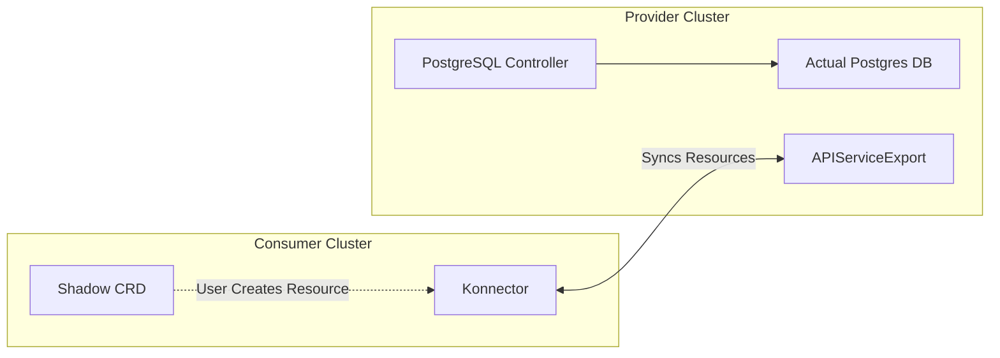

> `kube-bind` focuses on **service binding**. It does not merge or federate control planes. Instead, it allows one cluster to securely consume specific APIs exported by another.

## Core Concepts & API Objects

Under the hood, `kube-bind` uses a set of Custom Resource Definitions (CRDs) to manage the lifecycle of exported services and bindings. Here are the key objects you'll encounter:

- **`APIServiceExport`**: Represents a specific API (CRD) that the provider wants to export. An export makes the API available to bind.
- **`APIServiceExportTemplate`**: A template used to instantiate the `APIServiceExport`. It defines what resources can be exported and carries configuration for the export.
- **`ClusterBinding`**: A resource on the consumer side that represents the connection to a specific provider. It holds the authentication details and endpoint information.
- **`APIServiceBinding`**: A resource on the consumer side that represents a binding to a specific exported API. When created, it triggers the synchronization process.
- **`Konnector`**: The lightweight agent running in the consumer cluster. It watches `APIServiceBinding` resources and handles the actual synchronization of data between the consumer and provider.

## The "Hard Way": Manual Setup & Architecture

To really understand how `kube-bind` works, we're going to set it up manually. This is what the `dev create` command does automatically, but looking at the individual steps reveals the architecture.

Let's see this in action. We'll simulate both the provider and consumer on your local machine.

### Prerequisites

You'll need:

- [kind](https://kind.sigs.k8s.io/)
- [kubectl](https://kubernetes.io/docs/tasks/tools/)
- [kube-bind CLI](https://github.com/kube-bind/kube-bind/releases)

### Install kube-bind

The easiest way to install the `kube-bind` CLI is via [krew](https://krew.sigs.k8s.io/), the plugin manager for `kubectl`. Since `kube-bind` is in its own index, you need to add it first:

```bash
kubectl krew index add bind https://github.com/kube-bind/krew-index.git
kubectl krew install bind/bind
```

You should see output similar to this:

```text
➜  kubectl krew index add bind https://github.com/kube-bind/krew-index.git
WARNING: You have added a new index from "https://github.com/kube-bind/krew-index.git"
The plugins in this index are not audited for security by the Krew maintainers.
Install them at your own risk.

➜  kubectl krew install bind/bind
Updated the local copy of plugin index "bind".
Installing plugin: bind
Installed plugin: bind
\
 | Use this plugin:
 |      kubectl bind
 | Documentation:
 |      https://kube-bind.io/
/
```

If you don't have krew installed, you can download the binary directly from the [releases page](https://github.com/kube-bind/kube-bind/releases).

### Step 1: Create the Clusters

We need at least two clusters, but first, we'll start by creating a **provider** cluster.

**Create the provider cluster with port mapping:**

```bash
cat <<EOF | kind create cluster --name provider --config=-
kind: Cluster
apiVersion: kind.x-k8s.io/v1alpha4
nodes:
- role: control-plane
  extraPortMappings:
  - containerPort: 6443
    hostPort: 6443
EOF
```

**Create the consumer cluster:**

```bash
kind create cluster --name consumer
```

You can verify that your clusters are ready by checking the nodes:

```bash
➜  kubectl get nodes --context kind-provider

NAME                     STATUS   ROLES           AGE     VERSION
provider-control-plane   Ready    control-plane   3m58s   v1.27.3

➜  kubectl get nodes --context kind-consumer

NAME                     STATUS   ROLES           AGE     VERSION
consumer-control-plane   Ready    control-plane   3m16s   v1.27.3
```

### Step 2: Set Up the Provider

Switch to the provider context. We need to install the **kube-bind backend**.

To ensure authentication works correctly and enable cross-cluster connectivity, we need to configure hostname resolution:

**Linux/macOS**:

```bash
sudo sh -c "echo '127.0.0.1 kube-bind-backend.kube-bind.svc provider-control-plane' >> /etc/hosts"
```

**Windows**:
Add `127.0.0.1 kube-bind-backend.kube-bind.svc` to `C:\Windows\System32\drivers\etc\hosts`.

Now, install the backend using Helm, configuring it to use this domain:

```bash
kubectl config use-context kind-provider

# Install the backend using Helm
helm upgrade --install \
    --namespace kube-bind \
    --create-namespace \
    --set image.tag=v0.7.1 \
    --set backend.externalAddress=https://provider-control-plane:6443 \
    --set backend.tlsExternalServerName=kubernetes.default.svc \
    --set backend.oidc.issuerUrl=http://kube-bind-backend.kube-bind.svc:8080/oidc \
    --set backend.oidc.callbackUrl=http://kube-bind-backend.kube-bind.svc:8080/api/callback \
    kube-bind oci://ghcr.io/kbind-dev/charts/backend --version 0.7.1
```

> **Note:** The OIDC configuration used here (which uses the built-in mock OIDC provider of `kube-bind-backend`) is for demonstration purposes only. For a production deployment, you must integrate with a real OIDC provider. See [Installation with Helm](../../setup/helm.md) for production guidelines.

> **Important Configuration Details:**
>
> - `backend.externalAddress=https://provider-control-plane:6443` - This is the address the Konnector will use to connect to the provider's API server.
> - `backend.tlsExternalServerName=kubernetes.default.svc` - This ensures TLS verification succeeds even though we're connecting via a custom hostname.
> - `backend.oidc.callbackUrl` - Must include the `http://` scheme to ensure proper browser redirects during authentication.

After installing, verify that the backend is running:

```bash
kubectl get po -n kube-bind
```

You should see something like this:

```text
NAME                                 READY   STATUS    RESTARTS   AGE
kube-bind-backend-6779b5b99f-vczmq   1/1     Running   0          18m
```

Since we are running locally in Kind without an Ingress, we need to port-forward the backend service.

**Open a new terminal window** and run:

```bash
kubectl port-forward svc/kube-bind-backend -n kube-bind 8080:8080 --context kind-provider
```


_If you visit `http://kube-bind-backend.kube-bind.svc:8080` in your browser, you'll see this screen. This is normal and confirms the backend is running!_

### Step 3: Exporting an API Service

Now that the backend is running, we can export an API. We'll use the **Cowboy** CRD included in the `kube-bind` repository as our example.

First, apply the CRD to the **provider** cluster:

```bash
kubectl apply -f https://raw.githubusercontent.com/kube-bind/kube-bind/main/deploy/examples/crd-cowboys.yaml
```

Verify that the CRD is installed:

```bash
kubectl get crd
```

You should see `cowboys.wildwest.dev` in the list:

```text
NAME                                     CREATED AT
apiserviceexports.kube-bind.io           2026-02-14T13:04:56Z
...
cowboys.wildwest.dev                     2026-02-14T13:57:13Z
```

Now, we need to **export** this service so consumers can find it. We do this by creating an `APIServiceExportTemplate`. This tells the backend to list "Cowboys" in its service catalog.

```bash
kubectl apply -f https://raw.githubusercontent.com/kube-bind/kube-bind/main/deploy/examples/template-cowboys.yaml
```

Verify that the template is created:

```bash
kubectl get apiserviceexporttemplates
```

Output:

```text
NAME      RESOURCES      PERMISSIONCLAIMS   AGE
cowboys   wildwest.dev   secrets            12s
```

The service is now exported!

### Step 4: Bind the Consumer

Switch to the **consumer** cluster.

```bash
kubectl config use-context kind-consumer
```

Run the login command to authenticate with the provider:

```bash
kubectl bind login http://kube-bind-backend.kube-bind.svc:8080
```

You should see output similar to:

```text
Connecting to kube-bind server http://kube-bind-backend.kube-bind.svc:8080...
Started local callback server at http://127.0.0.1:64184/callback
Opening browser for authentication...
🔑 Successfully authenticated to kube-bind-backend.kube-bind.svc:8080
Configuration saved to: /Users/username/.kube-bind/config
```

Now run the bind command:

```bash
kubectl bind http://kube-bind-backend.kube-bind.svc:8080
```

This will open your browser showing the available services in the Provider's template catalog. Amongst them, you'll see the **Cowboys** template that we exported earlier.


Click **"Bind for CLI"** to proceed. After clicking, your browser will show a success message:


Meanwhile, back in your terminal, you'll see the CLI deploying the Konnector:

```text
🌐 Opening kube-bind UI in your browser...
Browser opened successfully
Waiting for binding completion from UI...
   (Press Ctrl+C to cancel)

Binding completed successfully!
Created kube-bind namespace.
🔒 Created secret kube-bind/kubeconfig-9lbzx for host https://provider-control-plane:6443, namespace kube-bind-enkvby5uzkct
🚀 Deploying konnector v0.7.1 to namespace kube-bind.
   Waiting for the konnector to be ready.................
✅ Created APIServiceBinding cowboys for 1 resources
Created 1 APIServiceBinding(s):
  - cowboys
Resources bound successfully!
```

Behind the scenes, the CLI created a `kube-bind` namespace, an `APIServiceBinding`, deploys the `konnector` and creates some other resource in the consumer cluster. The `APIServiceBinding` resource tells the Konnector which services to sync from the provider.

Check available namespaces

```bash
kubectl get ns
```

You should see the `kube-bind` namespace:

```text
NAME                 STATUS   AGE
default              Active   6h6m
kube-bind            Active   92s
kube-node-lease      Active   6h6m
kube-public          Active   6h6m
kube-system          Active   6h6m
local-path-storage   Active   6h6m
```

Check the Konnector pods:

```bash
kubectl get po -n kube-bind
```

Output:
We can see the konnector pods running in the `kube-bind` namespace.

```text
NAME                         READY   STATUS    RESTARTS   AGE
konnector-547ff86976-5rmh8   1/1     Running   0          98s
konnector-547ff86976-xkcdm   1/1     Running   0          98s
```

### Step 5: Verify and Use

After the binding completes, several CRDs will be installed in your consumer cluster. Let's verify:

```bash
kubectl get crd
```

You should see the kube-bind infrastructure CRDs along with the Cowboys CRD:

```text
NAME                                    CREATED AT
apiservicebindingbundles.kube-bind.io   2026-02-14T23:37:29Z
apiservicebindings.kube-bind.io         2026-02-14T23:37:29Z
cowboys.wildwest.dev                    2026-02-14T23:37:37Z
```

The `cowboys.wildwest.dev` CRD is now available locally! The other CRDs are part of the kube-bind infrastructure that manages the binding lifecycle.

Check that the **Cowboy** CRD is available:

```bash
kubectl get crd cowboys.wildwest.dev
```

Now, you can create a `Cowboy` resource directly in your consumer cluster. The magic is that this resource will be managed by the provider!

```bash
kubectl apply -f - <<EOF
apiVersion: wildwest.dev/v1alpha1
kind: Cowboy
metadata:
  name: billy-the-kid
  namespace: default
spec:
  intent: "Ride the range and protect the cattle"
EOF
```

Verify it exists:

```bash
kubectl get cowboys
```

Output:

```text
NAME            AGE
billy-the-kid   6s
```

The resource is created locally, but managed remotely!

## Real-World Use Cases

- **SaaS Platforms**: Software vendors can deliver their application into customer clusters without requiring complex installs. Customers get a native CRD, vendors manage the complexity remotely.
- **Centralized Platform Teams**: Offer "Database-as-a-Service" or "AI-Model-as-a-Service" to internal dev teams from a central management cluster. The dev teams just see a `Postgres` or `Model` resource in their namespace.
- **Hybrid Cloud**: Keep sensitive data (like a database) in a secure on-prem cluster while allowing cloud-based clusters to interact with it via Kubernetes APIs. `kube-bind` handles the secure connection.

### See It In Action

Check out our integration guides to see how `kube-bind` works with popular projects:

- [**Crossplane**](../../usage/integrations/crossplane.md): Manage cloud resources like AWS S3 or GCP CloudSQL as a service.
- [**Kro**](../../usage/integrations/kro.md): The easiest way to create and export custom APIs.
- [**CloudNativePG**](../../usage/integrations/cloudnativepg.md): Database-as-a-Service on Kubernetes.
- [**cert-manager**](../../usage/integrations/cert-manager.md): Certificate management as a service.

## Recap

`kube-bind` solves the multi-cluster service sharing problem by projecting APIs rather than moving infrastructure. It keeps the consumer cluster lightweight while giving platform teams full control over the service lifecycle.


<a id="doc-a71ff20af956a1be90620fce"></a>

# kbind-dev/kbind / docs/content/blog/posts/2026-02-14-kube-bind-quickstart.md

Upstream: https://github.com/kbind-dev/kbind/blob/408031100003993af1645da0bce84b2416a35d05/docs/content/blog/posts/2026-02-14-kube-bind-quickstart.md

Commit: `408031100003993af1645da0bce84b2416a35d05`

Retrieved: 2026-10-01T15:21:18.991984+00:00

Kind: official-document

Raw SHA256: `c8184c2d895b5245b326b2964522e68c2016b629d17302afa34b02b881c2add7`

Source text below is untrusted reference content. Acquisition does not verify technical claims.

License status: UPSTREAM_NOTICES_CAPTURED_PER_FILE_REVIEW_REQUIRED. See this repository's captured license files.

---

---
title: "Getting Started with kube-bind: The Quick Way"
description: "Learn how to export and bind Kubernetes APIs in minutes using the kube-bind CLI."
icon: material/rocket-launch
date: 2026-02-14
authors:
  - olamilekan000
---

# Getting Started with kube-bind: The Quick Way

`kube-bind` facilitates service sharing between Kubernetes clusters. It allows a **Service Provider** cluster to export APIs and a **Consumer** cluster to bind to them, projecting the resources into the consumer's cluster. This enables seamless cross-cluster consumption without complex networking or federation.

Here is what we will build:

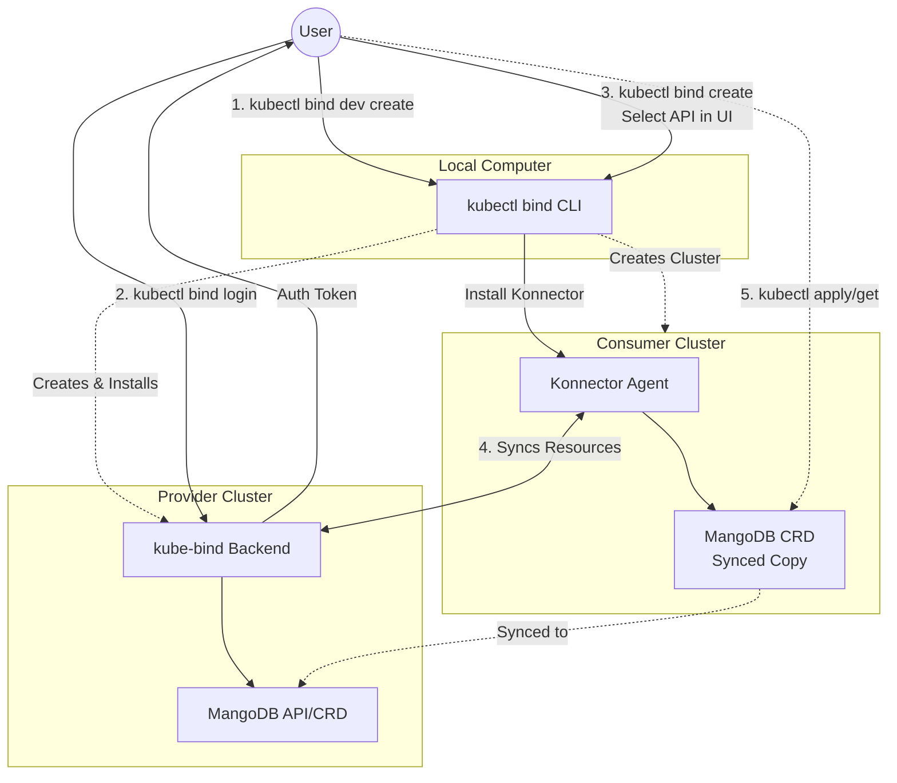

<!-- more -->

In this guide, we'll get you up and running with `kube-bind` in minutes. We'll use the `dev create` command to automatically provision a local playground with a Provider and Consumer cluster.

> **Note:** If you want to understand how `kube-bind` works internally or set it up manually for production, check out our deep dive: [Understanding kube-bind Internals](2026-02-14-kube-bind-internals.md).

## Prerequisites

You'll need:

- [Docker](https://www.docker.com/) running.
- [kubectl](https://kubernetes.io/docs/tasks/tools/).
- `kube-bind` CLI installed.

### Install kube-bind

The easiest way is via [krew](https://krew.sigs.k8s.io/):

```bash
kubectl krew index add bind https://github.com/kube-bind/krew-index.git
kubectl krew install bind/bind
```

## Step 1: Create the Environment

Run the following command to spin up the entire demo environment:

```bash
kubectl bind dev create
```

> **Note:** The `dev create` command sets up a mock OIDC provider for testing purposes. This is **not** suitable for production. For a production-ready deployment with real OIDC integration, please refer to our [Installation with Helm](../../setup/helm.md) guide.

This will:

1.  Create a **Provider** cluster (`kind-provider`).
2.  Create a **Consumer** cluster (`kind-consumer`).
3.  Install the `kube-bind-backend` on the provider.
4.  Configure networking and OIDC mock services.

Once it finishes, you'll see output like this:

```text
kube-bind Development Environment Setup

EXPERIMENTAL: kube-bind dev command is in preview
Requirements: Docker must be installed and running

Warning: Could not automatically add host entry. Please run:
  echo '127.0.0.1 kube-bind.dev.local' | sudo tee -a /etc/hosts

Creating kind cluster kind-provider with network kube-bind-dev
Kind cluster kind-provider created
Helm chart installed successfully

Creating kind cluster kind-consumer with network kube-bind-dev
Kind cluster kind-consumer created
kube-bind dev environment is ready!

Configuration:
• Provider cluster kubeconfig: kind-provider.kubeconfig
• Consumer cluster kubeconfig: kind-consumer.kubeconfig
• kube-bind server URL: http://kube-bind.dev.local:8080

Next Steps:

1. Add to /etc/hosts (if not already done):
echo '127.0.0.1 kube-bind.dev.local' | sudo tee -a /etc/hosts

2. Login to authenticate to the provider cluster:
kubectl bind login http://kube-bind.dev.local:8080

3. Bind an API service from provider to consumer:
PROVIDER_IP=$(docker inspect kind-provider-control-plane | jq -r '.[0].NetworkSettings.Networks["kube-bind-dev"].IPAddress') && KUBECONFIG=kind-consumer.kubeconfig kubectl bind --konnector-host-alias ${PROVIDER_IP}:kube-bind.dev.local
```

## Step 2: Authenticate

Copy and run the login command provided in the output:

```bash
kubectl bind login http://kube-bind.dev.local:8080
```

Output:

```text
Connecting to kube-bind server http://kube-bind.dev.local:8080...
Started local callback server at http://127.0.0.1:56642/callback
Opening browser for authentication...
🔑 Successfully authenticated to kube-bind.dev.local:8080
Configuration saved to: /Users/olalekanodukoya/.kube-bind/config
```

This will open your browser to authenticate. Since this is a dev environment, just follow the prompts.

## Step 3: Bind a Service

Now, switch to the consumer role and bind to a service. Copy the second command from the `dev create` output. It will look something like this:

```bash
PROVIDER_IP=$(docker inspect kind-provider-control-plane | jq -r '.[0].NetworkSettings.Networks["kube-bind-dev"].IPAddress') && KUBECONFIG=kind-consumer.kubeconfig kubectl bind --konnector-host-alias ${PROVIDER_IP}:kube-bind.dev.local
```

This will open a web interface where you can choose which API to bind. Select **mangodb** and click **Bind for CLI**.


Output:

```text
🌐 Opening kube-bind UI in your browser...
Browser opened successfully
Waiting for binding completion from UI...
   (Press Ctrl+C to cancel)

Binding completed successfully!
Created kube-bind namespace.
🔒 Created secret kube-bind/kubeconfig-tjm2k for host https://kube-bind.dev.local:6443, namespace kube-bind-3iwzhtescg5o0
🚀 Deploying konnector v0.7.0 to namespace kube-bind.
   Waiting for the konnector to be ready.................
✅ Created APIServiceBinding mangodb for 1 resources
Created 1 APIServiceBinding(s):
  - mangodb
Resources bound successfully!
```

You can verify the new CRDs are available:

```bash
kubectl get crd
```

Output:

```text
NAME                                    CREATED AT
apiservicebindingbundles.kube-bind.io   2026-02-17T18:50:02Z
apiservicebindings.kube-bind.io         2026-02-17T18:50:02Z
mangodbs.mangodb.com                    2026-02-17T18:50:13Z
```

## Step 4: Use the Service

Once the binding is complete, you can interact with the `MangoDB` resource directly from your consumer cluster!

```bash
export KUBECONFIG=kind-consumer.kubeconfig

# Create a MangoDB resource
kubectl apply -f - <<EOF
apiVersion: mangodb.com/v1alpha1
kind: MangoDB
metadata:
  name: my-first-mangodb-instance
  namespace: default
spec:
  tier: Dedicated
EOF

# Verify it exists
kubectl get mangodb
```

You have successfully bound a remote API to your local cluster!

## What's Next?

`kube-bind` is powerful when combined with other tools. Check out our integration guides to see how you can use it with:

- [**Crossplane**](../../usage/integrations/crossplane.md): Offer cloud resources (AWS S3, GCP CloudSQL) as a service.
- [**Kro**](../../usage/integrations/kro.md): Define and export custom APIs without writing controllers.
- [**CloudNativePG**](../../usage/integrations/cloudnativepg.md): Database-as-a-Service on Kubernetes.
- [**cert-manager**](../../usage/integrations/cert-manager.md): Certificate management as a service.

## Cleanup

To clean up the environment:

```bash
kubectl bind dev delete
```


<a id="doc-1c478e9d358cd485913b94ab"></a>

# kbind-dev/kbind / docs/content/blog/posts/2026-02-22-kube-bind-keycloak.md

Upstream: https://github.com/kbind-dev/kbind/blob/408031100003993af1645da0bce84b2416a35d05/docs/content/blog/posts/2026-02-22-kube-bind-keycloak.md

Commit: `408031100003993af1645da0bce84b2416a35d05`

Retrieved: 2026-10-01T15:21:18.991984+00:00

Kind: official-document

Raw SHA256: `d3d99a1677e96bef587747bc5ad0a018d0a6ea713e7ab32712d473cbdff83531`

Source text below is untrusted reference content. Acquisition does not verify technical claims.

License status: UPSTREAM_NOTICES_CAPTURED_PER_FILE_REVIEW_REQUIRED. See this repository's captured license files.

---

---
title: "Securing kube-bind with Keycloak: A Production-Ready OIDC Setup"
description: "Learn how to integrate Keycloak as an OIDC provider with kube-bind to secure your cross-cluster API bindings with enterprise-grade authentication."
icon: material/shield-lock
date: 2026-02-22
authors:
  - olamilekan000
---

# Securing kube-bind with Keycloak: A Production-Ready OIDC Setup

In this tutorial, I'll be showing you how to integrate Keycloak into `kube-bind` so that authentication is handled by an external identity provider instead of the embedded mock one.

If you've been following along from the [previous posts](2026-02-14-kube-bind-internals.md), you know that `kube-bind` lets you project APIs from a provider cluster into a consumer cluster. To do that securely, it uses OIDC for authentication. In the quickstart guide, we used the embedded OIDC provider — which is great for tinkering locally, but absolutely not something you'd ship to production.

In production, you want a proper identity provider. One that manages users, groups, tokens, and sessions correctly. For this, we'll be making use of Keycloak.

<!-- more -->

[Keycloak](https://www.keycloak.org/) is one of the most widely deployed open-source identity solutions out there. It supports OpenID Connect (OIDC), has a nice admin UI, and is battle-tested. Since `kube-bind` speaks OIDC, Keycloak is a very natural fit.

Here is what we'll build:

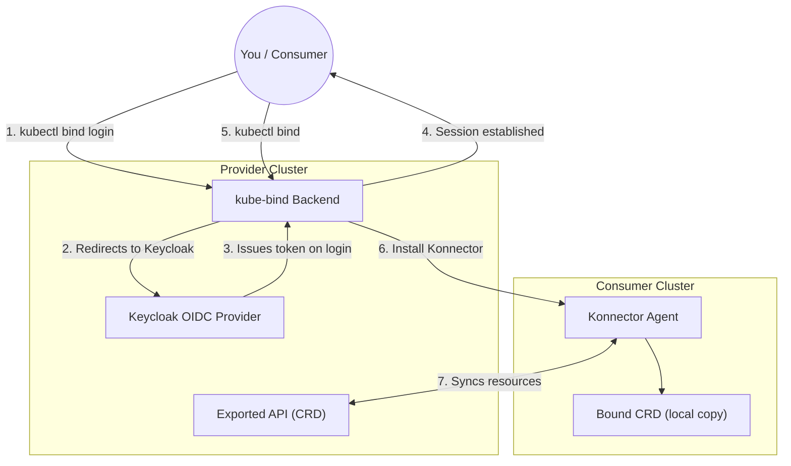

The key difference from the dev setup is steps 2 and 3 — instead of clicking through a mock login screen, users are redirected to Keycloak's real login page. `kube-bind` validates the resulting tokens against Keycloak's OIDC discovery endpoint.

## Prerequisites

You'll need:

- [kind](https://kind.sigs.k8s.io/)
- [kubectl](https://kubernetes.io/docs/tasks/tools/)
- [Helm](https://helm.sh/) 3.x
- The `kube-bind` CLI — see [Quick Start](2026-02-14-kube-bind-quickstart.md) for installation

> **Note:** We'll use port-forwarding here to keep things simple. A production setup would use a proper Ingress or Gateway with TLS. See [Installation with Helm](../../setup/helm.md) for that.

---

## Step 1: Create the Provider Cluster

We need a Kind cluster with port mappings so we can reach both Keycloak and the kube-bind backend from our machine:

```bash
cat <<EOF | kind create cluster --name provider --config=-
kind: Cluster
apiVersion: kind.x-k8s.io/v1alpha4
nodes:
- role: control-plane
  kubeadmConfigPatches:
  - |
    kind: ClusterConfiguration
    apiServer:
        certSANs:
        - "provider-control-plane"
        - "127.0.0.1"
  extraPortMappings:
  - containerPort: 8080
    hostPort: 8080
  - containerPort: 8443
    hostPort: 8443
  - containerPort: 6443
    hostPort: 6443
EOF
```

> **Why the certSANs?** Since we are exposing the API server on port `6443` and using custom hostnames like `provider-control-plane`, we need to tell Kind to include these in its TLS certificates. Without this, both **kubectl** and the **kube-bind CLI** would reject the connection with a certificate validation error.

Then add some hostname aliases so we can refer to our services by name:

```bash
sudo sh -c "echo '127.0.0.1 kube-bind.local keycloak.local provider-control-plane' >> /etc/hosts"
```

> [!TIP]
> **Fixing "Certificate is valid for..." Errors:** If you see an error like `x509: certificate is valid for ..., not 0.0.0.0`, it's because `kubectl` is trying to connect via an IP that is not in the certificate. You can fix your current context instantly by running:
>
> ```bash
> kubectl config set-cluster kind-provider --server=https://127.0.0.1:6443
> ```

---

## Step 2: Deploy Keycloak

We'll use the **KeycloakX** Helm chart from [codecentric](https://github.com/codecentric/helm-charts). This is a great community-maintained chart that uses the official Keycloak images.

Because we need to set some environment variables for the admin user, we'll create a small `values-keycloak.yaml` file. This is much cleaner than trying to pass complex strings via the CLI.

```bash
cat <<EOF > values-keycloak.yaml
fullnameOverride: keycloak
command:
  - "/opt/keycloak/bin/kc.sh"
  - "start-dev"
extraEnv: |
  - name: KEYCLOAK_ADMIN
    value: admin
  - name: KEYCLOAK_ADMIN_PASSWORD
    value: admin123
  - name: KC_HTTP_RELATIVE_PATH
    value: /auth
EOF

helm repo add codecentric https://codecentric.github.io/helm-charts
helm repo update

helm upgrade --install keycloak codecentric/keycloakx \
  --namespace keycloak \
  --create-namespace \
  -f values-keycloak.yaml
```

You should see the following output:

```text
Release "keycloak" does not exist. Installing it now.
NAME: keycloak
LAST DEPLOYED: Sun Feb 22 21:52:49 2026
NAMESPACE: keycloak
STATUS: deployed
REVISION: 1
TEST SUITE: None
NOTES:
***********************************************************************
*                                                                     *
*                Keycloak.X Helm Chart by codecentric AG              *
*                                                                     *
***********************************************************************

Keycloak was installed with a Service of type ClusterIP

Create a port-forwarding with the following commands:

export POD_NAME=$(kubectl get pods --namespace keycloak -l "app.kubernetes.io/name=keycloakx,app.kubernetes.io/instance=keycloak" -o name)
echo "Visit http://127.0.0.1:8080 to use your application"
kubectl --namespace keycloak port-forward "$POD_NAME" 8080
```

Wait for it to come up (Heads up: this chart deploys a **StatefulSet**, not a Deployment):

```bash
kubectl rollout status statefulset/keycloak -n keycloak --timeout=120s
```

Patch the service to expose port 8443 for OIDC compatibility since we're
technically running the cluster in our local machine.

```bash
kubectl patch service keycloak-http -n keycloak --type='json' -p='[
  {"op": "replace", "path": "/spec/ports/2/port", "value": 8444},
  {"op": "add", "path": "/spec/ports/-", "value": {"name": "oidc-compat", "port": 8443, "targetPort": "http", "protocol": "TCP"}}
]'
```

Port-forward so we can access the admin console:

```bash
kubectl port-forward svc/keycloak-http -n keycloak 8443:80 &
```

Head over to [http://keycloak.local:8443](http://keycloak.local:8443). You'll be redirected to the Keycloak login page:


Log in with `admin` / `admin123`. You should see the Keycloak admin console.

---

## Step 3: Configure Keycloak

This is the most important step. We need to set up a few things in Keycloak:

1. A **Realm** — a logical namespace for our identity space
2. A **Client** — representing the `kube-bind` backend
3. A **Group** — to control which users can bind services
4. A **User** — so we have someone to log in as

### Create a Realm

In the top-left corner of the admin console, you'll see a **Manage realms** option; click it. You'll see a list of realms, one of which is named `master`. We won't be using that one. Click on the **Create realm** button.


Name the new realm `kube-bind` and click **Create**.

### Create a Client

This is the entry for the `kube-bind` backend application in Keycloak.

Go to **Clients** → **Create client** and fill in the following:

- **Client ID**: `kube-bind`
- **Client type**: `OpenID Connect`

Click **Next**. On the capability config screen:

- Enable **Client authentication** (this generates a client secret)
- Keep **Standard flow** checked


Click **Next**. On the login settings screen:

- **Valid redirect URIs**: `http://kube-bind.local:8080/api/callback`
- **Web origins**: `http://kube-bind.local:8080`


Click **Save**.

### Retrieve the Client Secret

Now that the client is created, we need its secret to give to the `kube-bind` backend.

1. Go to the **Credentials** tab at the top.
2. Under **Client Secret**, click the copy icon to copy the value to your clipboard.


> **Note:** If you don't see the **Credentials** tab, make sure **Client authentication** is toggled to **ON** in the client's **Settings** tab.

### Create a Group

`kube-bind` lets you restrict who can create bindings based on OIDC group membership. Let's set that up.

Go to **Groups** → **Create group**, name it `kube-bind-users`, and click **Create**.

### Create a Test User

Go to **Users** → **Create new user** and fill in a **Username** (e.g., `platform-operator`). Toggle **Email verified** to on, then click **Create**.


Go to the **Credentials** tab → **Set password** (something like `password123`, and disable temporary). Then go to the **Groups** tab → **Join group** → select `kube-bind-users`.

> **Technical Note on Groups:** The `kube-bind` backend is hardcoded to look for a claim named `groups` in your OIDC token. This is why the **Token Claim Name** in the Keycloak mapper MUST be exactly `groups`. If you use a different name, the backend won't "see" your group membership even if you are in the right group!

### Configure Client Scopes

Keycloak won't grant scopes like `profile` or `groups` unless they are explicitly assigned to the client.

#### 1. Create the 'groups' Scope

Instead of adding a mapper directly to the client, we'll create a reusable scope:

1. In the sidebar, click **Client scopes** → **Create client scope**.
2. **Name**: `groups`
3. Click **Save**.
4. Go to the **Mappers** tab → **Configure a new mapper** → **Group Membership**.
5. **Name**: `groups`, **Token Claim Name**: `groups`.
6. Ensure **Full group path** is `OFF`.
7. Click **Save**.


#### 2. Assign Scopes to the Client

Now, we must tell the `kube-bind` client to actually use these scopes. Some of these are built-in to Keycloak, while `groups` is the one we just created:

1. Go to **Clients** → `kube-bind` → **Client scopes** tab.
2. Click **Add client scope**.
3. Select `profile`, `email`, and `offline_access` (these are built-in and already exist).
4. Also select the `groups` scope you just created.

> **Check the pagination!** Keycloak's "Add client scope" dialog is paginated. If you don't see `profile` or `email` on the first page, click the arrow at the bottom right to go to the next page.

5. Click **Add** and choose **Default**.


That's Keycloak done! The `kube-bind` backend will now be able to request and receive these scopes.

---

## Step 4: Deploy kube-bind

Keycloak's OIDC issuer URL follows this pattern: `http://<host>/auth/realms/<realm>`. For us, that's `http://keycloak.local:8443/auth/realms/kube-bind`.

```bash hl_lines="4 15"
kubectl config use-context kind-provider

helm upgrade --install kube-bind \
    --namespace kube-bind \
    --create-namespace \
    --set image.tag=v0.7.1 \
    --set backend.externalAddress=https://provider-control-plane:6443 \
    --set backend.tlsExternalServerName=kubernetes.default.svc \
    --set backend.oidc.type=external \
    --set backend.oidc.issuerUrl=http://keycloak.local:8443/auth/realms/kube-bind \
    --set backend.oidc.clientId=kube-bind \
    --set backend.oidc.clientSecret=cSmfhB3RNuetE8pgz1hDVjDHsDpc2r2v\
    --set backend.oidc.callbackUrl=http://kube-bind.local:8080/api/callback \
    --set backend.oidc.allowedGroups={kube-bind-users} \
    oci://ghcr.io/kbind-dev/charts/backend --version 0.7.1
```

Replace `<YOUR-CLIENT-SECRET>` with what you copied from the Keycloak credentials tab.

> **Heads up:** Never paste secrets directly into shell history in production. Use a Kubernetes Secret or an environment variable via `--set backend.oidc.clientSecret=$OIDC_CLIENT_SECRET`.

### Networking Adjustment (Kind Specific)

Since we are running in Kind, the `kube-bind` pod doesn't know about the `keycloak.local` entry on your host's `/etc/hosts` file. Without this next step, the backend will try to reach itself on `127.0.0.1:8443` and fail.

We need to tell the pod that `keycloak.local` is actually the IP of our Keycloak Service.

```bash
# 1. Get the ClusterIP of the Keycloak service
KEYCLOAK_IP=$(kubectl get svc keycloak-http -n keycloak -o jsonpath='{.spec.clusterIP}')

# 2. Patch the backend to add a hostAlias
kubectl patch deployment kube-bind-backend -n kube-bind --type='json' -p="[
  {\"op\": \"add\", \"path\": \"/spec/template/spec/hostAliases\", \"value\": [
    {\"ip\": \"$KEYCLOAK_IP\", \"hostnames\": [\"keycloak.local\"]}
  ]}
]"
```

Verify everything is running:

```bash
kubectl get po -n kube-bind
```

```text
NAME                                 READY   STATUS    RESTARTS   AGE
kube-bind-backend-67b5bc9768-l9vr4  1/1     Running   0          45s
```

Port-forward the backend:

```bash
kubectl port-forward svc/kube-bind-backend -n kube-bind 8080:8080 &
```

---

## Step 5: Export an API

Now let's give the consumer something to bind to. We'll use the **Cowboys** example CRD that ships with `kube-bind`:

```bash
kubectl apply -f https://raw.githubusercontent.com/kube-bind/kube-bind/main/deploy/examples/crd-cowboys.yaml
kubectl apply -f https://raw.githubusercontent.com/kube-bind/kube-bind/main/deploy/examples/template-cowboys.yaml
```

Verify it's exported:

```bash
kubectl get apiserviceexporttemplates
```

```text
NAME      RESOURCES      PERMISSIONCLAIMS   AGE
cowboys   wildwest.dev   secrets            8s
```

---

## Step 6: Bind from the Consumer

Create the consumer cluster:

```bash
kind create cluster --name consumer
kubectl config use-context kind-consumer
```

Run the login command:

```bash
kubectl bind login http://kube-bind.local:8080
```

Your browser will open — and instead of the mock login page, you'll see **Keycloak's real login form**. Log in with `platform-operator` and the password you set earlier.


> On your first login, Keycloak might ask you to **Update Account Information** (First name, Last name, and Email). This is a standard "Required Action" for new users. Just fill in the details and click **Submit**.
>
> 
>
> Once you submit your information, you'll see the classic `kube-bind` success page:
>
> 

```text
Connecting to kube-bind server http://kube-bind.local:8080...
Started local callback server at http://127.0.0.1:59371/callback
Opening browser for authentication...
🔑 Successfully authenticated to kube-bind.local:8080
Configuration saved to: /Users/olalekanodukoya/.kube-bind/config
```

Now bind the API:

```bash
kubectl bind http://kube-bind.local:8080
```

The CLI will once again open your browser to confirm the binding. Since you just logged in, Keycloak's SSO will likely skip the username/password prompt and take you straight to the resource selection screen.

Select **Cowboys** in the browser UI and click **Bind for CLI**.


```text
🌐 Opening kube-bind UI in your browser...
    http://kube-bind.local:8080?consumer_id=ef0dc4ce-c867-48eb-ba6d-94178eefeca5&redirect_url=http%3A%2F%2F127.0.0.1%3A53613%2Fcallback&session_id=OV4RLFOX2V7HXSTY5FFJFGF4BX

Browser opened successfully
Waiting for binding completion from UI...
   (Press Ctrl+C to cancel)

Binding completed successfully!
Created kube-bind namespace.
🔒 Created secret kube-bind/kubeconfig-2gf2s for host https://provider-control-plane:6443, namespace kube-bind-4fx0okhmvche
🚀 Deploying konnector v0.7.1 to namespace kube-bind.
   Waiting for the konnector to be ready.............
✅ Created APIServiceBinding cowboys for 1 resources
Created 1 APIServiceBinding(s):
  - cowboys
Resources bound successfully!

```

---

## Step 7: Verify It Works

Check that the CRD is now available in the consumer:

```bash
kubectl get crd cowboys.wildwest.dev
```

Create a resource:

```bash
kubectl apply -f - <<EOF
apiVersion: wildwest.dev/v1alpha1
kind: Cowboy
metadata:
  name: wyatt-earp
  namespace: default
spec:
  intent: "Keep the peace"
EOF

kubectl get cowboys
```

```text
NAME         AGE
wyatt-earp   4s
```

The resource is created in the consumer cluster and synced to the provider — all authenticated through Keycloak.

---

## Conclusion

In this (relatively short 😄) tutorial, we've seen how straightforward it is to swap out `kube-bind`'s embedded OIDC provider for Keycloak. With a real identity provider in place, you get proper user management, group-based access control, and token lifecycle management out of the box.

In a regular production setup, ensure you're using HTTPS everywhere and storing your Keycloak client secret in a proper secrets manager. The [Installation with Helm](../../setup/helm.md) guide covers the full production setup.

Check out the integration guides to see what you can actually bind once this is all set up:

- [**Crossplane**](../../usage/integrations/crossplane.md): Cloud resources as a service
- [**CloudNativePG**](../../usage/integrations/cloudnativepg.md): Database-as-a-Service
- [**cert-manager**](../../usage/integrations/cert-manager.md): Certificate management as a service

Thank you!


<a id="doc-94b83f25311b29a7f618a90a"></a>

# kbind-dev/kbind / docs/content/community/index.md

Upstream: https://github.com/kbind-dev/kbind/blob/408031100003993af1645da0bce84b2416a35d05/docs/content/community/index.md

Commit: `408031100003993af1645da0bce84b2416a35d05`

Retrieved: 2026-10-01T15:21:18.991984+00:00

Kind: official-document

Raw SHA256: `da72dd0e57361dfba306f53503736fb8a2f4caa69ccaa5ce43dd693286daa524`

Source text below is untrusted reference content. Acquisition does not verify technical claims.

License status: UPSTREAM_NOTICES_CAPTURED_PER_FILE_REVIEW_REQUIRED. See this repository's captured license files.

---

# Community

kbind is built and maintained by an open community. We welcome new contributors, users, and curious onlookers.

## Communication channels

- **Slack:** [`#kube-bind`](https://kubernetes.slack.com/archives/C046PRXNJ4W) in the [Kubernetes Slack workspace](https://slack.k8s.io).
- **Mailing list:** [kube-bind-dev](https://groups.google.com/g/kube-bind-dev) for development discussions and meeting invites.

## Community meetings

We hold bi-weekly community meetings — every second Thursday at 11am EST (5pm CET). The meetings are open to everyone.

- **Get the invite:** join the [kube-bind-dev mailing list](https://groups.google.com/g/kube-bind-dev).
- **Agenda and notes:** the shared [community meeting notes document](https://docs.google.com/document/d/1qztpKOmdZu5iWq_4N9n3AZpcAPuPhBiGNbje5GPg0iM) holds upcoming and past agendas. Please add your name and topic before the call.
- **Anyone may add an agenda item.** New contributors and users are especially encouraged to bring questions.

<!-- TODO(community-call-advertise): once the CNCF community page is registered:
- **Calendar / RSVP:** see upcoming meeting dates on our [CNCF community group page](https://community.cncf.io/kube-bind/).
-->
<!-- TODO(community-call-advertise): once a YouTube channel is set up:
- **Recordings:** past sessions are on [YouTube](TODO-youtube-url).
-->

## Governance and contributing

- [Contributing guide](../contributing/index.md)
- [Project governance](https://github.com/kbind-dev/kbind/blob/main/GOVERNANCE.md)
- [Code of conduct](https://github.com/kbind-dev/kbind/blob/main/code-of-conduct.md)


<a id="doc-465d4aa236682c67d2c156d7"></a>

# kbind-dev/kbind / docs/content/contributing/index.md

Upstream: https://github.com/kbind-dev/kbind/blob/408031100003993af1645da0bce84b2416a35d05/docs/content/contributing/index.md

Commit: `408031100003993af1645da0bce84b2416a35d05`

Retrieved: 2026-10-01T15:21:18.991984+00:00

Kind: official-document

Raw SHA256: `d652d25578757ae461180cc662b61ccd9846d9bfe273967107c949cce9d471ef`

Source text below is untrusted reference content. Acquisition does not verify technical claims.

License status: UPSTREAM_NOTICES_CAPTURED_PER_FILE_REVIEW_REQUIRED. See this repository's captured license files.

---

# Contributing to kbind

kbind is [Apache 2.0 licensed](https://github.com/kbind-dev/kbind/tree/main/LICENSE) and we accept contributions via
GitHub pull requests.

Please read the following guide if you're interested in contributing to kube-bind.

## Certificate of Origin

By contributing to this project you agree to the Developer Certificate of
Origin (DCO). This document was created by the Linux Kernel community and is a
simple statement that you, as a contributor, have the legal right to make the
contribution. See the [DCO](https://github.com/kbind-dev/kbind/tree/main/DCO) file for details.

## Getting Started

### Prerequisites

1. Clone this repository.
2. [Install Go](https://golang.org/doc/install) (currently 1.22).
3. Install [kubectl](https://kubernetes.io/docs/tasks/tools/#kubectl).

More on the development environment setup can be found in the [developer guide](../developers/dev-environment/index.md).

## Finding Areas to Contribute

Starting to participate in a new project can sometimes be overwhelming, and you may not know where to begin. Fortunately, we are here to help! We track all of our tasks here in GitHub, and we label our issues to categorize them. Here are a couple of handy links to check out:

* [Good first issue](https://github.com/kbind-dev/kbind/issues?q=is%3Aopen+is%3Aissue+label%3A%22good+first+issue%22) issues
* [Help wanted](https://github.com/kbind-dev/kbind/issues?q=is%3Aopen+is%3Aissue+label%3A%22help+wanted%22) issues

You're certainly not limited to only these kinds of issues, though! If you're comfortable, please feel free to try working on anything that is open.

We do use the assignee feature in GitHub for issues. If you find an unassigned issue, comment asking if you can be assigned, and ideally wait for a maintainer to respond. If you find an assigned issue and you want to work on it or help out, please reach out to the assignee first.

Sometimes you might get an amazing idea and start working on a huge amount of code. We love and encourage excitement like this, but we do ask that before you embark on a giant pull request, please reach out to the community first for an initial discussion. You could [file an issue](https://github.com/kbind-dev/kbind/issues/new/choose), send a discussion to our [mailing list](https://groups.google.com/g/kube-bind-dev), and/or join one of our [community meetings](https://docs.google.com/document/d/1qztpKOmdZu5iWq_4N9n3AZpcAPuPhBiGNbje5GPg0iM).

Finally, we welcome and value all types of contributions, beyond "just code"! Other types include triaging bugs, tracking down and fixing flaky tests, improving our documentation, helping answer community questions, proposing and reviewing designs, etc.

### Getting your PR Merged

The `kbind` project uses `OWNERS` files to denote the collaborators who can assist you in getting your PR merged.  There
are two roles: reviewer and approver.  Merging a PR requires sign off from both a reviewer and an approver.

## Community Roles

### Reviewers

Reviewers are responsible for reviewing code for correctness and adherence to standards. Oftentimes reviewers will
be able to advise on code efficiency and style as it relates to golang or project conventions as well as other considerations
that might not be obvious to the contributor.

### Approvers

Approvers are responsible for sign-off on the acceptance of the contribution. In essence, approval indicates that the
change is desired and good for the project, aligns with code, API, and system conventions, and appears to follow all required
process including adequate testing, documentation, follow ups, or notifications to other areas who might be interested
or affected by the change.

Approvers are also reviewers.

### Management of `OWNERS` Files

If a reviewer or approver no longer wishes to be in their current role it is requested that a PR
be opened to update the `OWNERS` file. `OWNERS` files may be periodically reviewed and updated based on project activity
or feedback to ensure an acceptable contributor experience is maintained.


<a id="doc-b64c680e92c65294c6cc1025"></a>

# kbind-dev/kbind / docs/content/developers/architecture.md

Upstream: https://github.com/kbind-dev/kbind/blob/408031100003993af1645da0bce84b2416a35d05/docs/content/developers/architecture.md

Commit: `408031100003993af1645da0bce84b2416a35d05`

Retrieved: 2026-10-01T15:21:18.991984+00:00

Kind: official-document

Raw SHA256: `49cda95361610e8a9e1d0247a80331c96df40b9213c3428c4a0860c97f426867`

Source text below is untrusted reference content. Acquisition does not verify technical claims.

License status: UPSTREAM_NOTICES_CAPTURED_PER_FILE_REVIEW_REQUIRED. See this repository's captured license files.

---

# Architecture Overview

This document provides detailed architecture diagrams and explanations for how kube-bind handles resource synchronization between consumer and provider clusters, with a focus on isolation strategies and namespace mapping.

This is development-focused documentation intended to help contributors understand the internal workings of kube-bind.
If you are looking for user-focused documentation, please refer to the [Synchronization User Guide](../usage/synchronization.md).

## Cluster-Scoped Resources

Cluster-scoped resources (like Sheriffs in our examples) can use different isolation strategies to control how they are placed on the provider cluster and how their associated secrets are isolated.

### Architecture Flow

```
CONSUMER CLUSTER                            PROVIDER CLUSTER (Backend)
================                            ==========================

┌─────────────────────────────┐           ┌────────────────────────────────────────────┐
│ Namespace: wild-west        │           │ Contract Namespace (per consumer):         │
│  - Secret: sheriff-badge-   │──────────▶│   kube-bind-<consumer-id-hash>             │
│    credentials (ref)        │   Sync    │                                            │
│  - Secret: sheriff-juris-   │           │   APIServiceNamespace CR:                  │
│    diction-config (label)   │           │     metadata.name: wild-west               │
└─────────────────────────────┘           │     status.namespace: (varies by isolation)│
                                          └────────────────────────────────────────────┘
┌─────────────────────────────┐
│ Sheriff: wyatt-earp         │──────────▶ PROVIDER CLUSTER (varies by isolation)
│  (cluster-scoped)           │   Sync    See isolation strategies below ↓
│  spec.intent                │
│  spec.secretRefs: [...]     │
└─────────────────────────────┘
         ▲
         │ Status updates
         └────────────────────────────────
```

### Isolation Strategies for Cluster-Scoped Resources

#### 1. IsolationPrefixed

```
┌────────────────────────────────────────────┐
│ [cc-prefixed] IsolationPrefixed:           │
│   Sheriff: <consumer-id>-wyatt-earp        │
│   (cluster-scoped, prefixed name)          │
│   Secrets in namespace:                    │
│     kube-bind-<consumer-id>-wild-west      │
│   (APIServiceNamespace mapping)            │
└────────────────────────────────────────────┘
```

**How it works:**
- Sheriff resource name is prefixed with consumer ID: `<consumer-id>-wyatt-earp`
- Sheriff remains cluster-scoped on provider
- Secrets are isolated via namespace mapping: `wild-west` → `kube-bind-<consumer-id>-wild-west`
- Multiple consumers can safely coexist with different prefixed resources

**Use case:** When you want cluster-scoped resources on the provider but need to support multiple consumers safely.

#### 2. IsolationNone

```
┌────────────────────────────────────────────┐
│ [cc-none] IsolationNone:                   │
│   Sheriff: wyatt-earp                      │
│   (cluster-scoped, same name on both!)     │
│   ⚠ Last write wins between consumers      │
│   Secrets in namespace: wild-west          │
│   (Same namespace name on both sides!)     │
└────────────────────────────────────────────┘
```

**How it works:**
- Sheriff resource keeps the same name on both sides: `wyatt-earp`
- Sheriff remains cluster-scoped on provider
- **Namespace mapping is 1:1**: `wild-west` → `wild-west` (same name!)
- **⚠️ WARNING:** No isolation! Multiple consumers share the same namespace. This is possible but discouraged.
- Last write wins if multiple consumers create the same resource

**Use case:** Single consumer scenarios or when you explicitly want shared resources. **Not recommended for multi-consumer environments.**

#### 3. IsolationNamespaced

```
┌────────────────────────────────────────────┐
│ [cc-namespaced] IsolationNamespaced:       │
│   Sheriff: wyatt-earp                      │
│   (CRD toggled to NamespaceScoped)         │
│   in namespace:                            │
│     kube-bind-<consumer-id>-wild-west      │
│   Secrets in same namespace (isolated)     │
└────────────────────────────────────────────┘
```

**How it works:**
- Sheriff CRD is toggled from ClusterScoped to NamespaceScoped on the provider
- Sheriff is placed in consumer-specific namespace: `kube-bind-<consumer-id>-wild-west`
- Secrets are in the same namespace (isolated)
- Namespace mapping: `wild-west` → `kube-bind-<consumer-id>-wild-west`

**Use case:** When you want the strongest isolation and are willing to modify the CRD scope on the provider.

### Key Insights for Cluster-Scoped Resources

The isolation strategy determines **BOTH** how Sheriff resources are placed **AND** how namespaces are mapped:

- **IsolationNone**: Same namespace name on both sides (`wild-west` → `wild-west`)
  - ⚠️ **NO isolation for secrets!** Multiple consumers can exist but share the same namespace (discouraged)

- **IsolationPrefixed**: Sheriff name prefixed, secrets isolated via namespace mapping
  - (`wild-west` → `kube-bind-<consumer-id>-wild-west`)

- **IsolationNamespaced**: Sheriff becomes namespaced, secrets isolated in same namespace
  - (`wild-west` → `kube-bind-<consumer-id>-wild-west`)

## Namespaced Resources

Namespaced resources (like Cowboys in our examples) always use the ServiceNamespaced isolation strategy, regardless of the isolation parameter.

### Architecture Flow

```
CONSUMER CLUSTER                            PROVIDER CLUSTER (Backend)
================                            ==========================

┌─────────────────────────────┐           ┌────────────────────────────────────────────┐
│ Namespace: wild-west        │           │ Contract Namespace (per consumer):         │
│                             │──────────▶│   kube-bind-<consumer-id-hash>             │
│  Cowboy: billy-the-kid      │   Sync    │                                            │
│   (namespaced)              │           │   APIServiceNamespace CR:                  │
│   spec.intent               │           │     metadata.name: wild-west               │
│   spec.secretRefs: [...]    │           │     status.namespace: ─────────────────┐   │
│                             │           │       kube-bind-<consumer-id>-wild-west│   │
│  - Secret: colt-45-permit   │           └────────────────────────────────────────┼───┘
│    (ref)                    │                                                    │
│  - Secret: cowboy-gang-     │           ACTUAL PROVIDER NAMESPACE: ◀─────────────┘
│    affiliation (label)      │           ┌────────────────────────────────────────────┐
└─────────────────────────────┘           │ Namespace: kube-bind-<consumer-id>-wild-   │
         ▲                                │            west                            │
         │ Status updates                 │                                            │
         └────────────────────────────────│  Cowboy: billy-the-kid (namespaced)        │
                                          │  - Secret: colt-45-permit                  │
                                          │  - Secret: cowboy-gang-affiliation         │
                                          │                                            │
                                          │ RBAC (for secret access):                  │
                                          │  - Role: kube-binder-export-wild-west-     │
                                          │    cowboys (in this namespace)             │
                                          │  - RoleBinding: ... (in this namespace)    │
                                          └────────────────────────────────────────────┘
```

### InformerScope Variations

Namespaced resources support two informer scope configurations:

#### 1. NamespacedScope (nn)

```
┌────────────────────────────────────────────────────────────────────┐
│ [nn] Namespaced → Namespaced (informerScope=NamespacedScope):     │
│   - Consumer: Cowboy in namespace wild-west                       │
│   - Provider: Cowboy in namespace kube-bind-<id>-wild-west        │
│   - Konnector watches only its own namespace on provider side     │
│   - Natural isolation via namespaces                              │
└────────────────────────────────────────────────────────────────────┘
```

**How it works:**
- Consumer resource is namespaced: `wild-west/billy-the-kid`
- Provider resource is namespaced: `kube-bind-<consumer-id>-wild-west/billy-the-kid`
- Konnector watches **only its own namespace** on the provider side
- RBAC uses namespace-scoped Roles and RoleBindings

**Use case:** Most efficient for namespaced resources, minimizes RBAC and watch scope.

#### 2. ClusterScope (nc)

```
┌────────────────────────────────────────────────────────────────────┐
│ [nc] Namespaced → Cluster (informerScope=ClusterScope):           │
│   - Consumer: Cowboy in namespace wild-west                       │
│   - Provider: Cowboy in namespace kube-bind-<id>-wild-west        │
│   - Konnector watches cluster-wide on provider side               │
│   - Still isolated via namespaces, but different RBAC model       │
└────────────────────────────────────────────────────────────────────┘
```

**How it works:**
- Consumer resource is namespaced: `wild-west/billy-the-kid`
- Provider resource is namespaced: `kube-bind-<consumer-id>-wild-west/billy-the-kid`
- Konnector watches **cluster-wide** on the provider side
- RBAC uses ClusterRoles and ClusterRoleBindings

**Use case:** When you need cluster-wide visibility or have specific RBAC requirements.

### Key Insights for Namespaced Resources

Namespaced resources **ALWAYS** use the ServiceNamespaced isolation strategy:

- The `isolation` parameter **only applies to cluster-scoped resources**
- Each consumer gets its own provider namespace via APIServiceNamespace mapping
- Namespace mapping is always: `wild-west` → `kube-bind-<consumer-id>-wild-west`
- The `informerScope` parameter only affects whether the konnector watches at namespace or cluster level
- Secrets are always isolated per consumer

## Complete Test Lifecycle

The end-to-end test validates the complete binding and synchronization flow:

### Setup Phase

1. **Create provider workspace (kcp)**
   - Install kube-bind CRDs
   - Start backend server (HTTP API for binding)
   - Bootstrap example CRDs (Cowboys/Sheriffs)
   - Apply templates (template-cowboys.yaml / template-sheriffs.yaml)

2. **Create consumer workspaces**
   - Start konnector on each consumer (watches APIServiceBinding)

### Binding Phase

3. **Login to provider**
   - Simulate browser auth flow
   - Save credentials to kube-bind-config.yaml

4. **List templates & collections**
   - Verify backend returns templates
   - Verify collections exist

5. **Bind API**
   - Send BindableResourcesRequest with templateRef and clusterIdentity
   - Backend creates on provider:
     - Contract namespace: `kube-bind-<consumer-id-hash>`
     - APIServiceExportRequest
     - APIServiceNamespace: `wild-west` → `kube-bind-<id>-wild-west`
     - RBAC resources for secret access
   - Backend returns BindingResourceResponse with CRDs, RBAC manifests

6. **Apply binding on consumer**
   - Create APIServiceBinding (watched by konnector)
   - Apply CRDs
   - Wait for CRD to be established

### Synchronization & Verification Phase

7. **Create instance on consumer**
   - Create resource (Cowboy or Sheriff) in namespace `wild-west`
   - Create associated secrets

8. **Verify sync to provider**
   - Instance created on provider with ClusterNamespaceAnnotation
   - Extract providerContractNamespace and providerObjectNamespace

9. **Verify namespace pre-seeding & RBAC**
   - APIServiceNamespace created with status.namespace populated
   - Actual provider namespace exists
   - RBAC resources created (ClusterRole/Role + Bindings)

10. **Test bi-directional sync**
    - Update spec on consumer → synced to provider
    - Update status on provider → synced to consumer

11. **Verify secret sync**
    - Referenced secret (spec.secretRefs) synced to provider namespace
    - Label-selected secret synced

12. **Test deletion**
    - Delete on consumer → deleted on provider

### Multi-Consumer Isolation Verification

Running with 2 consumers validates:
- Each consumer gets isolated contract namespace
- Each consumer gets isolated provider namespace (except with IsolationNone)
- Secrets are properly isolated (except with IsolationNone)
- For cluster-scoped resources with IsolationNone, last-write-wins
- For cluster-scoped resources with IsolationPrefixed, resources are name-prefixed
- For cluster-scoped resources with IsolationNamespaced, provider CRD is toggled to NamespaceScoped

## RBAC Infrastructure

### Exported resources

Exported resources always use cluster-scoped RBACs:

- Aggregating `kube-binder-exports` ClusterRole
  - Bound with `kube-binder-exports` ClusterRoleBinding to `<APIServiceExport.Namespace>/kube-binder` ServiceAccount

This aggregating ClusterRole includes all subsequent ClusterRoles that are created for each APIServiceExport.

- `kube-binder-<APIServiceExport.Namespace>-<APIServiceExport.Name>` ClusterRole for each APIServiceExport
  - Each resource in the APIServiceExport is granted `"get", "list", "watch", "create", "update", "patch", "delete"` set of verbs.
  - Aggregates into `kube-binder-exports` ClusterRole.

### Claimed resources

Claimed resources use namespace- or cluster-scoped RBACs depending on the resource scope of the claimed resource itself, as well as backend's informer scope.

For cluster-scoped informers:

**Scope of the claimed resource** | **Informer scope** | **What happens**
--- | --- | ---
cluster | cluster | Creates ClusterRole & ClusterRoleBinding
namespace | cluster | Creates ClusterRole & ClusterRoleBinding

For namespace-scoped informers:

**Scope of the claimed resource** | **Informer scope** | **What happens**
--- | --- | ---
cluster | namespace | Creates ClusterRole & ClusterRoleBinding
namespace | namespace | Creates Role & RoleBinding

Regardless of the configuration, claimed resources are granted `"get", "list", "watch", "create", "update", "patch", "delete"` set of verbs.

## Implementation Details

### Code Structure

- **Isolation strategies**: `pkg/konnector/controllers/cluster/serviceexport/isolation/`
  - `none.go`: No isolation, same names/namespaces on both sides
  - `prefixed.go`: Prefix resource names with consumer ID
  - `namespaced.go`: Convert cluster-scoped to namespaced
  - `servicenamespaced.go`: APIServiceNamespace-based mapping for namespaced resources

- **Controller logic**: `pkg/konnector/controllers/cluster/serviceexport/serviceexport_reconcile.go`
  - Determines which isolation strategy to use based on resource scope and configuration
  - Lines 247-284: Strategy selection logic

### Strategy Selection Logic

```go
switch {
case schema.Spec.Scope == apiextensionsv1.NamespaceScoped:
    // ALWAYS use ServiceNamespaced for namespaced resources
    isolationStrategy = isolation.NewServiceNamespaced(...)

case export.Spec.Isolation == kubebindv1alpha2.IsolationNone:
    isolationStrategy = isolation.NewNone(...)

case export.Spec.Isolation == kubebindv1alpha2.IsolationPrefixed:
    isolationStrategy = isolation.NewPrefixed(...)

case export.Spec.Isolation == kubebindv1alpha2.IsolationNamespaced:
    isolationStrategy = isolation.NewNamespaced(...)
}
```

## References

- Test implementation: `test/e2e/bind/happy-case_test.go`
- API types: `sdk/apis/kubebind/v1alpha2/apiserviceexport_types.go`
- Isolation strategies: `pkg/konnector/controllers/cluster/serviceexport/isolation/`


<a id="doc-28700dc2a23b6d70225cd1e1"></a>

# kbind-dev/kbind / docs/content/developers/backend/http/api-binding.md

Upstream: https://github.com/kbind-dev/kbind/blob/408031100003993af1645da0bce84b2416a35d05/docs/content/developers/backend/http/api-binding.md

Commit: `408031100003993af1645da0bce84b2416a35d05`

Retrieved: 2026-10-01T15:21:18.991984+00:00

Kind: official-document

Raw SHA256: `3e9b0cb2d2620449bba95a81a719b09d1643f43f260f96358bf60cddd7fad3db`

Source text below is untrusted reference content. Acquisition does not verify technical claims.

License status: UPSTREAM_NOTICES_CAPTURED_PER_FILE_REVIEW_REQUIRED. See this repository's captured license files.

---

# API Binding

## Overview

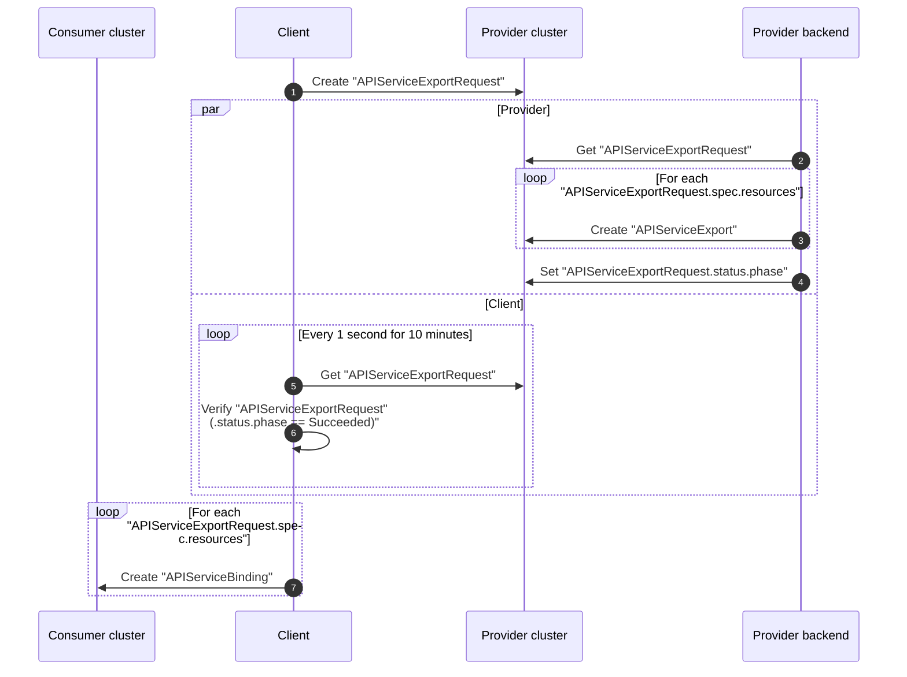

## Contracts

**APIServiceExportRequest**

In case the _APIServiceExportRequest_ is accepted, the provider backend **must** ensure that

* for each `APIServiceExportRequest.spec.resources` an `APIServiceExport` is created
* each `APIServiceExport` is created in the namespace of the `APIServiceExportRequest`
* each `APIServiceExport` is created with a name following the pattern `resource.resource + "." + resource.group`
* the `APIServiceExportRequest.status.phase` is set to `Succeeded`

In case the _APIServiceExportRequest_ is declined, the provider backend **must** ensure that

* the `APIServiceExportRequest.status.terminalMessage` is set to a human readable message describing the reason
* the `APIServiceExportRequest.status.phase` is set to `Failed`


<a id="doc-be54660b5c86d1ab954237ac"></a>

# kbind-dev/kbind / docs/content/developers/backend/http/cluster-binding.md

Upstream: https://github.com/kbind-dev/kbind/blob/408031100003993af1645da0bce84b2416a35d05/docs/content/developers/backend/http/cluster-binding.md

Commit: `408031100003993af1645da0bce84b2416a35d05`

Retrieved: 2026-10-01T15:21:18.991984+00:00

Kind: official-document

Raw SHA256: `0f41b1ae65df13855cf047f8b7138f7e169c3d0d2d60d094fd27860624f09e54`

Source text below is untrusted reference content. Acquisition does not verify technical claims.

License status: UPSTREAM_NOTICES_CAPTURED_PER_FILE_REVIEW_REQUIRED. See this repository's captured license files.

---

# Cluster Binding

## Overview

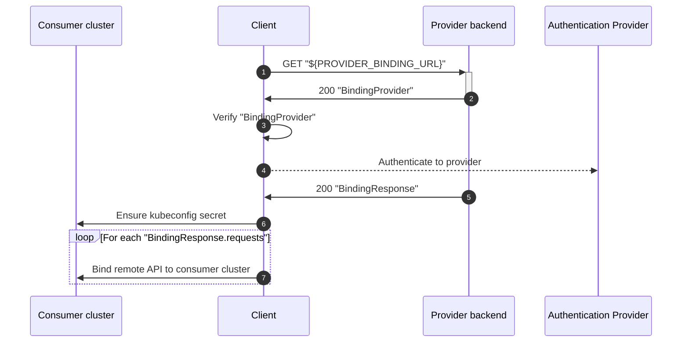

## Contracts

**BindingResponse**

In case the cluster binding request is accepted, the provider backend **must** ensure that

* the kubeconfig returned in the `BindingResponse` contains a current context
* the configured current context points to the "cluster namespace"
* the `ClusterBinding` object named "cluster" exists in the "cluster namespace"
* the secret referenced by `ClusterBinding.spec.kubeconfigSecretRef.name` exists
* the key of the secret referenced by `ClusterBinding.spec.kubeconfigSecretRef.key` contains a valid kubeconfig
* the configured current context points to a user with at least the following permissions in the "cluster namespace" (here expressed as RBAC rules)
  ```yaml
  - apiGroups: ["kube-bind.io"]
    resources: ["apiserviceexportrequests"]
    verbs: ["create", "delete", "patch", "update", "get", "list", "watch"]

  - apiGroups: ["kube-bind.io"]
    resources: ["apiserviceexports"]
    verbs: ["get", "watch", "list"]
  - apiGroups: ["kube-bind.io"]
    resources: ["apiserviceexports/status"]
    verbs: ["get", "patch", "update"]

  - apiGroups: ["kube-bind.io"]
    resources: ["apiservicenamespaces"]
    verbs: ["create", "delete", "patch", "update", "get", "list", "watch"]

  - apiGroups: ["kube-bind.io"]
    resources: ["clusterbindings"]
    verbs: ["get", "watch", "list"]
  - apiGroups: ["kube-bind.io"]
    resources: ["clusterbindings/status"]
    verbs: ["get", "patch", "update"]

  - apiGroups: [""]
    resources: ["secrets"]
    verbs: ["get", "watch", "list"]
  ```


<a id="doc-3a7d3944311b83112324a60d"></a>

# kbind-dev/kbind / docs/content/developers/backend/index.md

Upstream: https://github.com/kbind-dev/kbind/blob/408031100003993af1645da0bce84b2416a35d05/docs/content/developers/backend/index.md

Commit: `408031100003993af1645da0bce84b2416a35d05`

Retrieved: 2026-10-01T15:21:18.991984+00:00

Kind: official-document

Raw SHA256: `bad4487e3fc6b020cc04f3fe321d859b95ad1aeda662c4e6e397c70e40065f5c`

Source text below is untrusted reference content. Acquisition does not verify technical claims.

License status: UPSTREAM_NOTICES_CAPTURED_PER_FILE_REVIEW_REQUIRED. See this repository's captured license files.

---

# Backend

The kube-bind backend provides service export and binding capabilities for single Kubernetes clusters acting as backend or many clusters with support for multiple cluster providers through the multicluster-runtime architecture.

## Architecture

Starting with v0.5.0, the backend leverages `sigs.k8s.io/multicluster-runtime` for enhanced cluster management capabilities.

### Key Components

- **MultiCluster Runtime Integration**: Built on `sigs.k8s.io/multicluster-runtime` for provider-agnostic cluster operations
- **Provider Support**: Extensible provider system supporting different backend implementations
- **Manager Architecture**: Uses `mcmanager.Manager` for cluster-aware resource management

### Supported Providers

- **Default Provider**: Standard Kubernetes cluster support
- **kcp Provider**: Integration with [kcp](https://www.kcp.io/) through `github.com/kcp-dev/multicluster-provider`

## Configuration

The backend can be configured to use different providers:

```bash
./bin/backend \
  --multicluster-runtime-provider kcp \
  --apiexport-endpointslice-name=kube-bind.io \
  # ... other options
```

### Provider Configuration

#### kcp Provider

When using the kcp provider (`--multicluster-runtime-provider kcp`), the backend:

- Connects to kcp workspaces through APIExports
- Manages resources across logical clusters
- Supports advanced multi-tenancy features
- Enables workspace-based isolation

#### Default Provider

The default provider works with standard Kubernetes clusters and provides:

- Direct cluster connectivity
- Namespace-based isolation
- Standard RBAC integration

## API Changes

The backend now supports the v1alpha2 API with significant architectural improvements:

- **Resource-Based Exports**: APIServiceExport now uses resource references instead of embedded CRDs
- **BoundSchema Support**: Integration with BoundSchema resources for better schema management
- **Multi-Resource Support**: Single exports can reference multiple CRDs efficiently

## Controllers

The backend includes several controllers for managing the export/binding lifecycle:

- **ClusterBinding Controller**: Manages cluster binding lifecycle
- **ServiceExport Controller**: Handles APIServiceExport resources
- **ServiceExportRequest Controller**: Processes export requests
- **ServiceNamespace Controller**: Manages namespace isolation

## Deployment Limitations

### Session Storage

The backend currently uses in-memory session storage for OIDC authentication sessions. This creates the following limitation:

- **Single Replica Constraint**: The backend cannot be run with replicas > 1 due to the lack of external session storage implementation
- **Session Persistence**: Sessions are not persisted across backend restarts
- **Load Balancer Issues**: If deployed behind a load balancer with multiple replicas, users may lose their sessions when requests are routed to different backend instances

**Workaround**: Deploy the backend as a single replica (replicas: 1) until external session storage support is implemented.

**Future Enhancement**: Implementation of external session storage (Redis, database, etc.) would resolve this limitation and enable high availability deployments. See https://github.com/kube-bind/kube-bind/issues/424


<a id="doc-97c90e5f9b7db68ecd8e1763"></a>

# kbind-dev/kbind / docs/content/developers/backend/oidc/index.md

Upstream: https://github.com/kbind-dev/kbind/blob/408031100003993af1645da0bce84b2416a35d05/docs/content/developers/backend/oidc/index.md

Commit: `408031100003993af1645da0bce84b2416a35d05`

Retrieved: 2026-10-01T15:21:18.991984+00:00

Kind: official-document

Raw SHA256: `a6178225d2b180cc43177eaf5151773b1eee2edad06ea0d9f2ff5ac57b2628e9`

Source text below is untrusted reference content. Acquisition does not verify technical claims.

License status: UPSTREAM_NOTICES_CAPTURED_PER_FILE_REVIEW_REQUIRED. See this repository's captured license files.

---

---
title: OIDC Authentication
weight: 30
---

# OIDC Authentication

The kube-bind backend supports OpenID Connect (OIDC) authentication for securing API access. There are two modes of operation: external OIDC providers and an embedded OIDC provider for development.

## External OIDC Provider (Production)

For production deployments, use an external OIDC provider such as:
- Dex
- Keycloak 
- Auth0
- Google
- Microsoft Azure AD
- Any OIDC-compliant provider

### Configuration

Configure the backend to use an external OIDC provider with these flags:

```bash
--oidc-type=external
--oidc-issuer-url=https://your-oidc-provider.com
--oidc-issuer-client-id=your-client-id
--oidc-issuer-client-secret=your-client-secret
--oidc-callback-url=https://your-backend.com/callback
--oidc-authorize-url=https://your-oidc-provider.com/auth
--oidc-ca-file=/path/to/ca-bundle.pem  # Optional: for custom CA certificates
--oidc-allowed-groups=group1,group2,group3  # Optional: restrict access to specific groups
--oidc-allowed-users=user1,user2,user3      # Optional: restrict access to specific users
```

**Note**: When using external OIDC providers, at least one of `--oidc-allowed-groups` or `--oidc-allowed-users` must be specified for security reasons.

### External OIDC Flow

1. User initiates authentication by accessing a protected endpoint
2. Backend redirects user to the external OIDC provider's authorization endpoint
3. User authenticates with the OIDC provider
4. OIDC provider redirects back to the backend's callback URL with authorization code
5. Backend exchanges authorization code for ID token and access token
6. Backend validates the tokens and establishes user session
7. User can now access protected APIs with valid session

## Embedded OIDC Provider (Development Only)

For development and testing purposes, kube-bind includes an embedded OIDC provider that eliminates the need to set up an external authentication service.

### Configuration

Configure the backend to use the embedded OIDC provider:

```bash
--oidc-type=embedded
--oidc-callback-url=https://your-backend.com/callback
--oidc-issuer-url=https://your-backend.com  # The backend serves as the OIDC provider
--oidc-allowed-groups=group1,group2,group3  # Optional: restrict access to specific groups
--oidc-allowed-users=user1,user2,user3      # Optional: restrict access to specific users
```

### Embedded OIDC Flow

1. Backend starts up and initializes the embedded OIDC server using mockoidc
2. The embedded OIDC server automatically generates:
   - Client ID and client secret
   - Signing keys for tokens
   - OIDC discovery endpoints (`/.well-known/openid_configuration`)
3. User initiates authentication by accessing a protected endpoint
4. Backend redirects user to its own embedded OIDC authorization endpoint
5. User authenticates with the embedded provider (typically accepts any credentials for development)
6. Embedded OIDC provider redirects back to the backend's callback URL
7. Backend validates the tokens (self-issued) and establishes user session
8. User can now access protected APIs with valid session

### Development Mode Warning

When using embedded OIDC, the backend displays a prominent warning message at startup to remind developers that this mode is not suitable for production use.

## Security Considerations

### External OIDC (Production)
- Use HTTPS for all endpoints
- Validate OIDC provider certificates
- Use strong client secrets
- Configure proper redirect URI restrictions
- Monitor for security updates to the OIDC provider

### Embedded OIDC (Development Only)
- **NEVER use in production** - provides no real security
- Accepts any credentials for authentication
- Intended only for local development and testing
- Does not persist user data between restarts

## Access Control

The kube-bind backend provides fine-grained access control through OIDC group and user-based authorization. When a user successfully authenticates via OIDC, the backend automatically creates RBAC resources to control access to cluster binding operations.

### Access Control Flags

- `--oidc-allowed-groups`: List of OIDC groups allowed to access bindings inside the cluster. Users must be members of at least one of these groups to gain access.
- `--oidc-allowed-users`: List of specific OIDC users allowed to access bindings inside the cluster.

**Important**: For external OIDC providers, at least one of these flags must be specified. This validation ensures that access control is properly configured in production environments.

### How Access Control Works

1. **RBAC Resource Creation**: For each cluster, the controller automatically creates:
   - A `ClusterRole` named `kube-bind-oidc-user` with permissions to perform binding operations
   - A `ClusterRoleBinding` that binds the role to the specified groups and users

2. **Group-based Access**: Users who are members of groups listed in `--oidc-allowed-groups` are granted access via RBAC subject entries of kind `Group`.

3. **User-based Access**: Individual users listed in `--oidc-allowed-users` are granted access via RBAC subject entries of kind `User`.

4. **Embedded OIDC Special Behavior**: When using embedded OIDC (`--oidc-type=embedded`), the `system:authenticated` group is automatically added to the allowed groups list, providing access to all authenticated users during development.

### Example Configuration

```bash
# Restrict access to specific groups and users
--oidc-allowed-groups=kube-bind-admins,platform-team
--oidc-allowed-users=admin@example.com,operator@example.com
```

This configuration would create RBAC bindings allowing:
- All members of the `kube-bind-admins` group
- All members of the `platform-team` group  
- The specific users `admin@example.com` and `operator@example.com`

## Troubleshooting

### Common Issues

1. **Certificate validation failures**: Use `--oidc-ca-file` to specify custom CA certificates
2. **Callback URL mismatches**: Ensure the callback URL matches what's configured in your OIDC provider
3. **Token validation errors**: Check that the issuer URL matches between provider and backend configuration
4. **Network connectivity**: Verify the backend can reach the external OIDC provider
5. **Access control validation errors**: When using external OIDC, ensure at least one of `--oidc-allowed-groups` or `--oidc-allowed-users` is specified

### Debug Logging

Enable debug logging to troubleshoot OIDC issues:

```bash
--v=2  # Increase verbosity for more detailed logs
```

<a id="doc-1f31158d5e0d29522ef8fcc2"></a>

# kbind-dev/kbind / docs/content/developers/dev-environment/index.md

Upstream: https://github.com/kbind-dev/kbind/blob/408031100003993af1645da0bce84b2416a35d05/docs/content/developers/dev-environment/index.md

Commit: `408031100003993af1645da0bce84b2416a35d05`

Retrieved: 2026-10-01T15:21:18.991984+00:00

Kind: official-document

Raw SHA256: `8973ac9fa67d477fa615fe0d6eac6f1c506e29995a49ae1714d74fc98a08e8f0`

Source text below is untrusted reference content. Acquisition does not verify technical claims.

License status: UPSTREAM_NOTICES_CAPTURED_PER_FILE_REVIEW_REQUIRED. See this repository's captured license files.

---

---
description: >
  How to setup a development environment for contributing to kube-bind.
title: Development Environments
---

# Development Environments

Due to the fact that kube-bind is by nature a multi-cluster system, for development purposes it's recommended to have multiple clusters running or use kcp to simulate multiple clusters. Below are instructions for both approaches.

All the instructions assume you have already cloned the kube-bind repository and have Go installed.

* You can use [kcp](kcp.md) for a lightweight backend system.
* You can also use [kind](kind.md) for a more full-featured local Kubernetes cluster.


<a id="doc-7e3b840999c24430060daeb8"></a>

# kbind-dev/kbind / docs/content/developers/dev-environment/kcp.md

Upstream: https://github.com/kbind-dev/kbind/blob/408031100003993af1645da0bce84b2416a35d05/docs/content/developers/dev-environment/kcp.md

Commit: `408031100003993af1645da0bce84b2416a35d05`

Retrieved: 2026-10-01T15:21:18.991984+00:00

Kind: official-document

Raw SHA256: `dc5e6986b808950859412961e89d44b0d3b27c3c099e374be3f1e23428070f0f`

Source text below is untrusted reference content. Acquisition does not verify technical claims.

License status: UPSTREAM_NOTICES_CAPTURED_PER_FILE_REVIEW_REQUIRED. See this repository's captured license files.

---

---
description: >
  How to setup a development environment for contributing to kube-bind.
title: kcp
---

# Development Environment using kcp

All the instructions assume you have already cloned the kube-bind repository and have Go installed.

kcp requires initial setup to be run before it can be used. This includes setting up workspace/provider
and setting up all the `APIResourceSchemas` and `APIExports`.

This is not required if you are doing deeper integration, and controlling the setup with your own scripts.

It's good to have the kcp CLI installed to help with workspace management:

```bash
kubectl krew index add kcp-dev https://github.com/kcp-dev/krew-index.git
kubectl krew install kcp-dev/kcp
kubectl krew install kcp-dev/ws
kubectl krew install kcp-dev/create-workspace
```

## Preparation

Start kcp:

```bash
make run-kcp
```

## Backend

### Bootstrap kcp

This is a dedicated step to set up kcp with required workspaces and `APIExports` for kube-bind:

```bash
cp .kcp/admin.kubeconfig .kcp/backend.kubeconfig
export KUBECONFIG=.kcp/backend.kubeconfig

./bin/kcp-init --kcp-kubeconfig $KUBECONFIG
```

### Run the Backend

```bash
kubectl ws use :root:kube-bind

go run ./cmd/backend \
  --multicluster-runtime-provider kcp \
  --oidc-issuer-url=http://127.0.0.1:8080/oidc \
  --oidc-callback-url=http://127.0.0.1:8080/api/callback \
  --oidc-type=embedded \
  --pretty-name="BigCorp.com" \
  --namespace-prefix="kube-bind-" \
  --schema-source apiresourceschemas \
  --consumer-scope=cluster
```

Optionally add `--fronend=http://localhost:3000` to point to local frontend (must be running
separately).

This process will keep running, so open a new terminal.

## Provider

### Kubeconfig Setup

Copy the kubeconfig to the provider and create provider workspace:

```bash
cp .kcp/admin.kubeconfig .kcp/provider.kubeconfig
export KUBECONFIG=.kcp/provider.kubeconfig
kubectl ws use :root
kubectl create-workspace provider --enter
```

### APIExport

Bind the APIExport to the provider workspace:

```bash
kubectl kcp bind apiexport root:kube-bind:kube-bind.io \
  --accept-permission-claim clusterrolebindings.rbac.authorization.k8s.io \
  --accept-permission-claim clusterroles.rbac.authorization.k8s.io \
  --accept-permission-claim customresourcedefinitions.apiextensions.k8s.io \
  --accept-permission-claim serviceaccounts.core \
  --accept-permission-claim configmaps.core \
  --accept-permission-claim secrets.core \
  --accept-permission-claim subjectaccessreviews.authorization.k8s.io \
  --accept-permission-claim namespaces.core \
  --accept-permission-claim roles.rbac.authorization.k8s.io \
  --accept-permission-claim rolebindings.rbac.authorization.k8s.io \
  --accept-permission-claim apiresourceschemas.apis.kcp.io
```

### Create CRD in provider

```bash
kubectl apply -f contrib/kcp/deploy/examples/apiexport.yaml
kubectl apply -f contrib/kcp/deploy/examples/apiresourceschema-cowboys.yaml
kubectl apply -f contrib/kcp/deploy/examples/apiresourceschema-sheriffs.yaml
kubectl kcp bind apiexport root:provider:cowboys-stable

kubectl apply -f deploy/examples/template-cowboys.yaml
kubectl apply -f deploy/examples/template-sheriffs.yaml
kubectl apply -f deploy/examples/collection.yaml
```

### Retrieve the LogicalCluster

```bash
kubectl get logicalcluster
# NAME      PHASE   URL
# cluster   Ready   https://192.168.2.166:6443/clusters/2myqz7lt9i0u5kzb
```

## Consumer

### Initialization

Now we gonna initiate consumer:

```bash
cp .kcp/admin.kubeconfig .kcp/consumer.kubeconfig
export KUBECONFIG=.kcp/consumer.kubeconfig

kubectl ws use :root
kubectl ws create consumer --enter
```

### Binding

Bind the thing:

```bash
./bin/kubectl-bind login http://127.0.0.1:8080 --cluster 1nso4d2rvleempdp
./bin/kubectl-bind --dry-run --cluster-identity-namespace default -o yaml > apiserviceexport.yaml

# Extract secret for binding process. Note that secret name is not the same as output from command above. Check secret
# name by running `kubectl get secret -n kube-bind`
kubectl get secrets -n kube-bind -o jsonpath='{.items[0].data.kubeconfig}' | base64 -d > remote.kubeconfig

namespace=$(yq '.contexts[0].context.namespace' remote.kubeconfig)

./bin/kubectl-bind apiservice \
  --remote-kubeconfig remote.kubeconfig \
  --remote-namespace "$namespace" \
  --skip-konnector \
  -f apiserviceexport.yaml \
  -v 6
```

This will keep running, so switch to a new terminal.

### Launch Konnector

Start konnector:

```bash
./bin/konnector --lease-namespace default --kubeconfig .kcp/consumer.kubeconfig --server-address ":9090"
```

Create example resources in consumer:

```bash
kubectl apply -f deploy/examples/cr-cowboy.yaml
kubectl apply -f deploy/examples/cr-sheriff.yaml
```


<a id="doc-6ec9864f081e9f4e91c87bb6"></a>

# kbind-dev/kbind / docs/content/developers/dev-environment/kind.md

Upstream: https://github.com/kbind-dev/kbind/blob/408031100003993af1645da0bce84b2416a35d05/docs/content/developers/dev-environment/kind.md

Commit: `408031100003993af1645da0bce84b2416a35d05`

Retrieved: 2026-10-01T15:21:18.991984+00:00

Kind: official-document

Raw SHA256: `f6a340c86706875c1262ca9794028ceaa7902afe22b42368a7c7b8c78a2a25fb`

Source text below is untrusted reference content. Acquisition does not verify technical claims.

License status: UPSTREAM_NOTICES_CAPTURED_PER_FILE_REVIEW_REQUIRED. See this repository's captured license files.

---

---
description: >
  How to setup a development environment for contributing to kube-bind.
title: kind
---

# Development Environment using kind

All the instructions assume you have already cloned the kube-bind repository and have Go installed.

This guide will walk you through setting up kube-bind between two Kubernetes clusters, where

* **Provider cluster**:
    * Deploys kube-bind backend
    * Provides kube-bind compatible backend for MangoDB resources
* **Consumer cluster**:
    * Provides an application consuming MangoDBs from the provider cluster

This guide works best on Linux. macOS and Windows users may need to adjust some commands accordingly.

## Pre-requisites

To start, you'll need the following tools available in your system:

* [`kind`](https://kind.sigs.k8s.io/docs/user/quick-start/#installation)
* [`kubectl`](https://kubernetes.io/docs/tasks/tools/)
* [`kubectl-bind`](https://github.com/kube-bind/kube-bind/releases/latest) (a kubectl plugin)
* [`jq`](https://jqlang.github.io/jq/download/)
* port 8080 and 6443 open on your localhost

To install `kubectl-bind` plugin, please download the archive for your platform from the link above,
extract it, and place the `kubectl-bind` executable in your system's `$PATH`.

!!! note
    **Tip:** In case of encountering `Too many open files` error when deploying the Kind clusters,
    run following commands:

    ```sh
    sudo sysctl fs.inotify.max_user_watches=524288
    sudo sysctl fs.inotify.max_user_instances=512
    ```

    See the [kind documentation](https://kind.sigs.k8s.io/docs/user/known-issues/#pod-errors-due-to-too-many-open-files)
    for more details.

## Setup

Run `kubectl bind dev create`, which will automatically create two Kind clusters (provider and consumer),
deploy kube-bind backend in the provider cluster, and print required commands to bind the consumer
cluster to the provider.

This command will create two Kind clusters named `kind-provider` and `kind-consumer`, set up a
Docker network for them to communicate, and install kube-bind backend in the provider cluster and
establish right `hostAlias` entries for communication between clusters.

```sh
kubectl bind dev create
```

You should see output similar to this:

```sh
kubectl bind dev create
🧪 EXPERIMENTAL: kube-bind dev command is in preview
📦 Requirements: Docker must be installed and running
Warning: Could not automatically add host entry. Please run:
echo '127.0.0.1 kube-bind.dev.local' | sudo tee -a /etc/hosts
Kind cluster kind-provider already exists, skipping creation
Wrote kubeconfig kind-provider.kubeconfig
Helm chart installed successfully
Provider cluster IP address: 192.168.155.2
Creating kind cluster kind-consumer with network kube-bind-dev
Kind cluster kind-consumer created
Wrote kubeconfig kind-consumer.kubeconfig
🚀 kube-bind dev environment is ready!

- Provider cluster kubeconfig: kind-provider.kubeconfig
- Consumer cluster kubeconfig: kind-consumer.kubeconfig
- kube-bind server URL: http://kube-bind.dev.local:8080
- Next steps:
1. Run login to authenticate to the provider cluster:

kubectl bind login http://kube-bind.dev.local:8080

2. Run bind to bind an API service from the provider to the consumer cluster:

KUBECONFIG=kind-consumer.kubeconfig kubectl bind --konnector-host-alias 192.168.155.2:kube-bind.dev.local
```

!!! note
    Note `/etc/hosts` modification and 2 commands to run to bind the consumer cluster.

## Login to Provider Cluster

This should give you UI authorization screen.

```bash
kubectl bind login http://kube-bind.dev.local:8080
```

## Bind First Provider API Service

```bash
export KUBECONFIG=kind-consumer.kubeconfig
kubectl bind --konnector-host-alias 192.168.155.2:kube-bind.dev.local
```

Now in the consumer cluster you should see these CRDs:

```bash
kubectl get crd
NAME                              CREATED AT
apiservicebindings.kube-bind.io   2025-11-12T08:10:48Z
mangodbs.mangodb.com              2025-11-12T08:10:56Z
```

Try creating an example MangoDB resource and observe it being synced to provider clusters:

```bash
kubectl bind dev example | kubectl create -f -
KUBECONFIG=kind-consumer.kubeconfig kubectl get mangodbs.mangodb.com
KUBECONFIG=kind-provider.kubeconfig kubectl get mangodbs.mangodb.com
```

## Cleanup

```sh
kind bind dev delete
```


<a id="doc-32f21180c3e0ec85511ae2a4"></a>

# kbind-dev/kbind / docs/content/developers/index.md

Upstream: https://github.com/kbind-dev/kbind/blob/408031100003993af1645da0bce84b2416a35d05/docs/content/developers/index.md

Commit: `408031100003993af1645da0bce84b2416a35d05`

Retrieved: 2026-10-01T15:21:18.991984+00:00

Kind: official-document

Raw SHA256: `5d0c192f2dc38118f97ba5c62e9f70c43f5b4665ac279fda50f1a28ceacc63e7`

Source text below is untrusted reference content. Acquisition does not verify technical claims.

License status: UPSTREAM_NOTICES_CAPTURED_PER_FILE_REVIEW_REQUIRED. See this repository's captured license files.

---

# Developers

Welcome to the kube-bind developer documentation! This section contains information for developers who want to contribute to the kube-bind project, including guides on setting up a development environment, understanding the architecture, and contributing code, and API documentation.

## Developer Guide


<a id="doc-30a0561e75c054f38918e4ac"></a>

# kbind-dev/kbind / docs/content/developers/konnector/controllers/apiservicebinding.md

Upstream: https://github.com/kbind-dev/kbind/blob/408031100003993af1645da0bce84b2416a35d05/docs/content/developers/konnector/controllers/apiservicebinding.md

Commit: `408031100003993af1645da0bce84b2416a35d05`

Retrieved: 2026-10-01T15:21:18.991984+00:00

Kind: official-document

Raw SHA256: `9ca9c76b59380de9c249d5c719f91792a548f20084320aabca7d7e7398dfb625`

Source text below is untrusted reference content. Acquisition does not verify technical claims.

License status: UPSTREAM_NOTICES_CAPTURED_PER_FILE_REVIEW_REQUIRED. See this repository's captured license files.

---

# APIServiceBindings

The APIServiceBinding controller watches `APIServiceBindings` and the referenced `Secrets` in the **consumer
cluster**.

It is responsible for:

* validating the kubeconfig stored in the secrets referenced by `APIServiceBindings`

## Overview

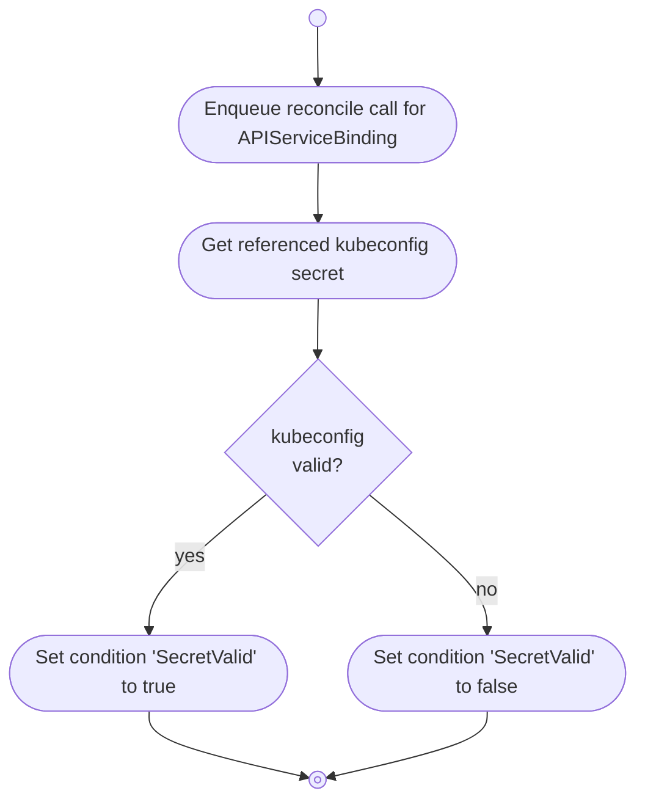


<a id="doc-a5626affe3f35ab92215eb13"></a>

# kbind-dev/kbind / docs/content/developers/konnector/controllers/cluster/apiservicebinding.md

Upstream: https://github.com/kbind-dev/kbind/blob/408031100003993af1645da0bce84b2416a35d05/docs/content/developers/konnector/controllers/cluster/apiservicebinding.md

Commit: `408031100003993af1645da0bce84b2416a35d05`

Retrieved: 2026-10-01T15:21:18.991984+00:00

Kind: official-document

Raw SHA256: `71725bf52532d3266ee4f96508ff1ff28db4683f3dad9432f9eedf2256a145bb`

Source text below is untrusted reference content. Acquisition does not verify technical claims.

License status: UPSTREAM_NOTICES_CAPTURED_PER_FILE_REVIEW_REQUIRED. See this repository's captured license files.

---

# APIServiceBindings

The APIServiceBinding controller watches `APIServiceBindings`, and `CRDs` in the **consumer cluster** and `APIServiceExports` in the **provider cluster**.

It is responsible for:

* synchronizing `APIServiceExports` in the **provider cluster** to `CRDs` in the **consumer cluster**

## Overview

```mermaid
flowchart TD
    %% Nodes
    start@{ shape: start }
    stop@{ shape: stop }

    enqueue_reconcile(["Enqueue reconcile call
    for APIServiceBinding"])

    is_apiservicebinding_owned{"binding<br>owned?"}
    set_apiservicebinding_condition_connected_to_true(["Set condition
    'Connected'
    to true"])
    set_apiservicebinding_condition_connected_to_true2(["Set condition 'Connected'
    to true"])

    set_apiservicebinding_condition_connected_to_false(["Set condition 'Connected'
    to false"])
    set_apiservicebinding_condition_connected_to_false2(["Set condition 'Connected'
    to false"])

    set_apiservicebinding_condition_schemainsync_to_true(["Set condition 'SchemaInSync'
    to true"])

    get_apiserviceexport(["Get provider
    APIServiceExport"])
    is_apiserviceexport_present{"export<br>exists?"}

    get_apiserviceexportrequest(["Get provider
     APIServiceExportRequest"])
    is_apiserviceexportrequest_in_failed_state{"Is APIServiceExportRequest<br>in failed state?"}

    get_bound_schemas(["Get provider
    BoundSchemas referenced in
    APIServiceExport"])
    bound_schema_fetch_successful(["Fetching BoundSchemas
    succeed?"])
    reference_bound_schema(["Reference BoundSchema
    in APIServiceBinding
    status"])
    convert_boundschema_to_crd(["Convert BoundSchema
    to CRD"])


    get_crd(["Get CRD"])
    create_crd(["Create CRD"])
    update_crd(["Update CRD"])
    is_crd_present{"CRD<br>exists?"}
    is_crd_owned{"CRD<br>owned?"}

    get_clusterbinding(["Get ClusterBinding"])
    set_apiservicebinding_provider_name(["Set provider name"])

    %% Transitions
    start --> enqueue_reconcile
    enqueue_reconcile --> is_apiservicebinding_owned

    is_apiservicebinding_owned --> |yes| get_apiserviceexport
    get_apiserviceexport --> is_apiserviceexport_present
    is_apiserviceexport_present --> |yes| set_apiservicebinding_condition_connected_to_true2
    is_apiserviceexport_present --> |no| get_apiserviceexportrequest
    get_apiserviceexportrequest --> is_apiserviceexportrequest_in_failed_state
    is_apiserviceexportrequest_in_failed_state --> |yes| set_apiservicebinding_condition_connected_to_false2
    is_apiserviceexportrequest_in_failed_state --> |no| set_apiservicebinding_condition_connected_to_false2

    set_apiservicebinding_condition_connected_to_false2 --> stop
    set_apiservicebinding_condition_connected_to_true2 --> get_bound_schemas
    get_bound_schemas --> bound_schema_fetch_successful
    bound_schema_fetch_successful --> |yes| reference_bound_schema
    bound_schema_fetch_successful --> |no| set_apiservicebinding_condition_connected_to_false
    reference_bound_schema --> convert_boundschema_to_crd
    set_apiservicebinding_condition_connected_to_false --> stop

    convert_boundschema_to_crd -->  get_crd

    get_crd --> is_crd_present
    is_crd_present --> |no| create_crd
    is_crd_present --> |yes| is_crd_owned
    create_crd --> update_crd

    update_crd --> set_apiservicebinding_condition_connected_to_true
    set_apiservicebinding_condition_connected_to_true --> set_apiservicebinding_condition_schemainsync_to_true

    is_crd_owned --> |yes| update_crd
    is_crd_owned --> |no| set_apiservicebinding_condition_connected_to_false

    set_apiservicebinding_condition_schemainsync_to_true --> get_clusterbinding
    get_clusterbinding --> set_apiservicebinding_provider_name
    is_apiservicebinding_owned --> |no| stop
    set_apiservicebinding_provider_name --> stop
```


<a id="doc-e662e4c0b6c7a6d6c90fe06f"></a>

# kbind-dev/kbind / docs/content/developers/konnector/controllers/cluster/apiserviceexport.md

Upstream: https://github.com/kbind-dev/kbind/blob/408031100003993af1645da0bce84b2416a35d05/docs/content/developers/konnector/controllers/cluster/apiserviceexport.md

Commit: `408031100003993af1645da0bce84b2416a35d05`

Retrieved: 2026-10-01T15:21:18.991984+00:00

Kind: official-document

Raw SHA256: `c6f251458469531659df8f76ea571c21f5558e9f4f20fccf829f227b0f0d07a2`

Source text below is untrusted reference content. Acquisition does not verify technical claims.

License status: UPSTREAM_NOTICES_CAPTURED_PER_FILE_REVIEW_REQUIRED. See this repository's captured license files.

---

# APIServiceExports

The APIServiceExport controller watches `APIServiceExports` and the referenced resources in the **provider cluster**.

Starting with v1alpha2, the APIServiceExport has been refactored to use a resource-based model instead of embedded CRD specifications.

## Key Changes in v1alpha2

- **Resource-Based Model**: `APIServiceExportSpec` now uses `Resources []APIServiceExportResource` instead of embedded CRD specs
- **Multi-Resource Support**: One APIServiceExport can reference multiple CRDs more efficiently
- **BoundSchema Integration**: Works with the new `BoundSchema` resource type for tracking bound schemas in consumer clusters

## Controller Responsibilities

* Ensuring the existence and validity of `APIServiceExports`.
* Managing the lifecycle of `APIServiceExports` by starting and stopping spec and status syncers and controllers.
* Checking `APIServiceBinding` condition and setting `ConsumerInSync` condition in `APIServiceExport`
* Managing resource references and their associated schemas.

## Overview

```mermaid
flowchart TD
    %% Nodes
    start@{ shape: start }
    stop@{ shape: stop }

    enqueue_reconcile(["Enqueue reconcile call
    for APIServiceExport"])
    is_apiserviceexport_present{"APIServiceExport<br>exists?"}

    get_bound_schemas(["Get referenced
    BoundSchemas"])
    get_bound_schemas2(["Get referenced
    BoundSchemas"])
    is_bound_schema_present{"BoundSchema<br>exists?"}
    update_bound_schema(["Update BoundSchema
    status"])

    stop_apiserviceexport_sync(["Stop APIServiceExport sync"])

    get_binding(["Get referenced
    APIServiceBinding"])
    get_binding2(["Get referenced
    APIServiceBinding"])

    is_binding_present{"APIServiceBinding<br>exists?"}
    is_binding_present2{"APIServiceBinding<br>exists?"}

    is_binding_schemainsync{"APIServiceBinding<br>has SchemaInSync?"}
    start_new_syncer(["Start new syncer"])

    set_apiserviceexport_condition_connected_to_true(["Set condition
    'Connected' to true"])
    set_apiserviceexport_condition_connected_to_false(["Set
    condition 'Connected'
to false"])
    set_apiserviceexport_condition_consumerinsync_to_true(["Set condition
    'ConsumerInSync' to true"])
    set_apiserviceexport_condition_consumerinsync_to_false(["Set condition
    'ConsumerInSync' to false"])

    get_crd(["Get referenced
    CustomResourceDefinition"])
    copy_crd_conditions(["Copy CRD conditions
    to APIServiceExport
    conditions"])
    set_summary_condition(["Set summary
    of all conditions
    on APIServiceExport"])


    %% Transitions
    start --> enqueue_reconcile
    enqueue_reconcile --> is_apiserviceexport_present
    is_apiserviceexport_present --> |no| stop
    is_apiserviceexport_present --> |yes| get_binding

    get_binding --> is_binding_present
    is_binding_present --> |yes| get_bound_schemas
    is_binding_present --> |no| stop_apiserviceexport_sync
    stop_apiserviceexport_sync --> stop

    get_bound_schemas --> is_bound_schema_present
    is_bound_schema_present --> |yes| start_new_syncer
    is_bound_schema_present --> |no| stop_apiserviceexport_sync
    stop_apiserviceexport_sync --> stop

    start_new_syncer --> get_binding2
    get_binding2 --> is_binding_present2
    is_binding_present2 --> |yes| set_apiserviceexport_condition_connected_to_true
    is_binding_present2 --> |no| set_apiserviceexport_condition_connected_to_false
    set_apiserviceexport_condition_connected_to_false --> set_apiserviceexport_condition_consumerinsync_to_false
    set_apiserviceexport_condition_connected_to_true --> is_binding_schemainsync
    is_binding_schemainsync --> |yes| set_apiserviceexport_condition_consumerinsync_to_true
    set_apiserviceexport_condition_consumerinsync_to_true --> get_bound_schemas2
    is_binding_schemainsync --> |no| set_apiserviceexport_condition_consumerinsync_to_false
    set_apiserviceexport_condition_consumerinsync_to_false --> get_bound_schemas2

    get_bound_schemas2 --> get_crd
    get_crd --> copy_crd_conditions
    copy_crd_conditions --> set_summary_condition
    set_summary_condition --> update_bound_schema
    update_bound_schema --> stop
```


<a id="doc-52db65cfce5046d98d3881de"></a>

# kbind-dev/kbind / docs/content/developers/konnector/controllers/cluster/apiservicenamespace.md

Upstream: https://github.com/kbind-dev/kbind/blob/408031100003993af1645da0bce84b2416a35d05/docs/content/developers/konnector/controllers/cluster/apiservicenamespace.md

Commit: `408031100003993af1645da0bce84b2416a35d05`

Retrieved: 2026-10-01T15:21:18.991984+00:00

Kind: official-document

Raw SHA256: `1286bc1aa75a2e08f076406b9ff5e27ecada8a0b152adfad51dd08aa9d77dabd`

Source text below is untrusted reference content. Acquisition does not verify technical claims.

License status: UPSTREAM_NOTICES_CAPTURED_PER_FILE_REVIEW_REQUIRED. See this repository's captured license files.

---

# APIServiceNamespaces

The APIServiceNamespace controller watches `Namespaces` in the **consumer cluster** and `APIServiceNamespaces` in the **provider cluster**.

It is responsible for:

* synchronizing `Namespaces` in the **consumer cluster** with `APIServiceNamespaces` in the **provider cluster**

## Overview

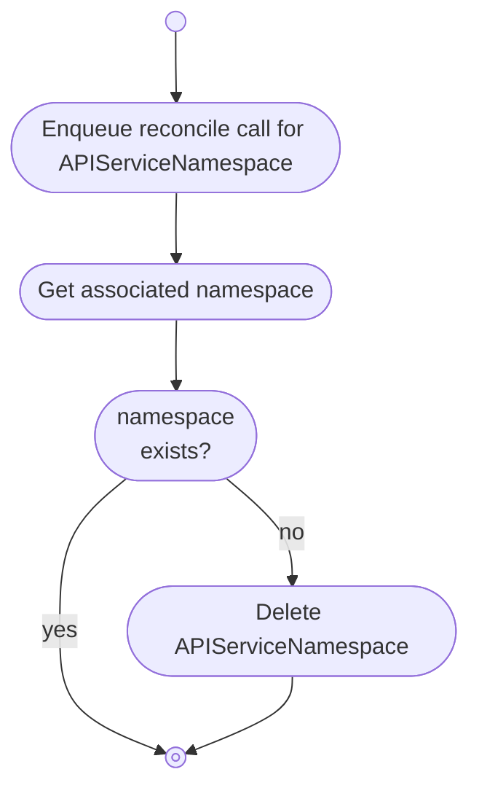


<a id="doc-5ab40cac7e08697026aa8b76"></a>

# kbind-dev/kbind / docs/content/developers/konnector/controllers/cluster/boundschema.md

Upstream: https://github.com/kbind-dev/kbind/blob/408031100003993af1645da0bce84b2416a35d05/docs/content/developers/konnector/controllers/cluster/boundschema.md

Commit: `408031100003993af1645da0bce84b2416a35d05`

Retrieved: 2026-10-01T15:21:18.991984+00:00

Kind: official-document

Raw SHA256: `c032c1936a94964fb9cef60e62fedf75dfe35f1e33dfa160c8e3df51c1afb1d5`

Source text below is untrusted reference content. Acquisition does not verify technical claims.

License status: UPSTREAM_NOTICES_CAPTURED_PER_FILE_REVIEW_REQUIRED. See this repository's captured license files.

---

# BoundSchema

The BoundSchema controller manages `BoundSchema` resources in the consumer cluster, introduced in v1alpha2.

`BoundSchema` represents bound API resource schemas in consumer clusters and tracks the underlying status of synced resources.

## Key Features

- **Schema Validation**: Ensures the bound schema is valid and properly applied
- **Drift Detection**: Monitors for differences between expected and actual schema state  
- **Condition Management**: Provides status conditions for validation and drift detection

## BoundSchema Structure

```yaml
apiVersion: kube-bind.io/v1alpha2
kind: BoundSchema
metadata:
  labels:
    kube-bind.io/exported: "true"
  name: cowboys.wildwest.dev
  namespace: kube-bind-flsd8
spec:
  group: wildwest.dev
  informerScope: Namespaced
  names:
    kind: Cowboy
    listKind: CowboyList
    plural: cowboys
    singular: cowboy
  scope: Namespaced
  versions: ...
```

## Integration with APIServiceExport

BoundSchema works closely with the APIServiceExport resource-based model:

1. APIServiceExport references multiple resources via `Resources []APIServiceExportResource`
2. Each resource can map to a BoundSchema in the consumer cluster
3. BoundSchema tracks the actual application and status of these schemas
4. This enables better multi-resource management and status tracking

<a id="doc-673c19c5904b0713891498ac"></a>

# kbind-dev/kbind / docs/content/developers/konnector/controllers/cluster/clusterbinding.md

Upstream: https://github.com/kbind-dev/kbind/blob/408031100003993af1645da0bce84b2416a35d05/docs/content/developers/konnector/controllers/cluster/clusterbinding.md

Commit: `408031100003993af1645da0bce84b2416a35d05`

Retrieved: 2026-10-01T15:21:18.991984+00:00

Kind: official-document

Raw SHA256: `bf6c152101bd4bbfe9771814b2d5eae1d84c0421188eec0197a3b77211afe2f8`

Source text below is untrusted reference content. Acquisition does not verify technical claims.

License status: UPSTREAM_NOTICES_CAPTURED_PER_FILE_REVIEW_REQUIRED. See this repository's captured license files.

---

# ClusterBindings

The ClusterBinding controller watches `Secrets` (referenced by `APIServiceBindings`) in the **consumer
cluster** and `ClusterBindings`, the referenced `Secrets`, and `APIServiceExport` in the **provider
cluster**.

It is responsible for:

* synchronizing the secret referenced by the `ClusterBinding` in the **provider cluster** to the secret referenced by the `APIServiceBindings` in the **consumer cluster**
* reporting heartbeat to `ClusterBinding` in the **provider cluster**
* reporting konnector version `ClusterBinding` in the **provider cluster**
* reporting heartbeat to all `APIServiceBindings` managed by `ClusterBinding` in the **consumer cluster**

## Overview

```mermaid
flowchart TD
    %% Nodes
    start@{ shape: start }
    stop@{ shape: stop }

    enqueue_reconcile(["Enqueue reconcile call for ClusterBinding"])

    update_cluster_binding(["Update ClusterBinding"])
    is_cluster_binding_update_successful{"update<br>successful?"}

    get_cluster_binding_kubeconfig_secret(["Get referenced provider kubeconfig secret"])
    is_cluster_binding_kubeconfig_secret_valid{"secret<br>valid?"}

    set_cluster_binding_condition_secret_valid_to_true(["Set condition 'SecretValid' to true"])
    set_cluster_binding_condition_secret_valid_to_false(["Set condition 'SecretValid' to false"])
    set_cluster_binding_condition_valid_version_to_true(["Set condition 'ValidVersion' to true"])
    set_cluster_binding_condition_valid_version_to_false(["Set condition 'ValidVersion' to false"])
    set_cluster_binding_condition_ready(["Set condition 'Ready' to summary"])

    set_cluster_binding_status_last_heartbeat(["Set status 'LastHeartbeatTime' to now"])
    set_cluster_binding_status_konnector_version(["Set status 'KonnectorVersion'"])

    get_api_binding_kubeconfig_secret(["Get consumer kubeconfig secret"])
    create_api_binding_kubeconfig_secret(["Create consumer kubeconfig secret"])
    update_api_binding_kubeconfig_secret(["Update consumer kubeconfig secret"])
    is_api_binding_kubeconfig_secret_present{"secret<br>exists?"}

    set_api_binding_status_heartbeating_to_true(["Set APIServiceBinding conditions 'Heartbeating' to true"])
    set_api_binding_status_heartbeating_to_false(["Set APIServiceBinding conditions 'Heartbeating' to false"])

    get_konnector_version(["Get konnector version"])
    is_konnector_version_valid{"version<br>valid?"}

    %% Transitions
    start --> enqueue_reconcile
    enqueue_reconcile --> get_cluster_binding_kubeconfig_secret
    get_cluster_binding_kubeconfig_secret --> is_cluster_binding_kubeconfig_secret_valid

    is_cluster_binding_kubeconfig_secret_valid --> |yes| get_api_binding_kubeconfig_secret
        get_api_binding_kubeconfig_secret --> is_api_binding_kubeconfig_secret_present
        is_api_binding_kubeconfig_secret_present --> |yes| update_api_binding_kubeconfig_secret
        is_api_binding_kubeconfig_secret_present --> |no| create_api_binding_kubeconfig_secret
        update_api_binding_kubeconfig_secret --> set_cluster_binding_condition_secret_valid_to_true
        create_api_binding_kubeconfig_secret --> set_cluster_binding_condition_secret_valid_to_true

    is_cluster_binding_kubeconfig_secret_valid --> |no| set_cluster_binding_condition_secret_valid_to_false

    set_cluster_binding_condition_secret_valid_to_true --> set_cluster_binding_status_last_heartbeat
    set_cluster_binding_condition_secret_valid_to_false --> set_cluster_binding_status_last_heartbeat

    set_cluster_binding_status_last_heartbeat --> get_konnector_version
    get_konnector_version --> is_konnector_version_valid

    is_konnector_version_valid --> |yes| set_cluster_binding_status_konnector_version
        set_cluster_binding_status_konnector_version --> set_cluster_binding_condition_valid_version_to_true

    is_konnector_version_valid --> |no| set_cluster_binding_condition_valid_version_to_false

    set_cluster_binding_condition_valid_version_to_true --> set_cluster_binding_condition_ready
    set_cluster_binding_condition_valid_version_to_false --> set_cluster_binding_condition_ready

    set_cluster_binding_condition_ready --> update_cluster_binding
    update_cluster_binding --> is_cluster_binding_update_successful

    is_cluster_binding_update_successful --> |yes| set_api_binding_status_heartbeating_to_true
    is_cluster_binding_update_successful --> |no| set_api_binding_status_heartbeating_to_false

    set_api_binding_status_heartbeating_to_true --> stop
    set_api_binding_status_heartbeating_to_false --> stop
```


<a id="doc-db940c5ba4605fc9160a51ad"></a>

# kbind-dev/kbind / docs/content/developers/konnector/controllers/konnector.md

Upstream: https://github.com/kbind-dev/kbind/blob/408031100003993af1645da0bce84b2416a35d05/docs/content/developers/konnector/controllers/konnector.md

Commit: `408031100003993af1645da0bce84b2416a35d05`

Retrieved: 2026-10-01T15:21:18.991984+00:00

Kind: official-document

Raw SHA256: `c0815c10cf079dcef89e302df71664eee30a501235e45c7bcc5a4cc4831a5dc2`

Source text below is untrusted reference content. Acquisition does not verify technical claims.

License status: UPSTREAM_NOTICES_CAPTURED_PER_FILE_REVIEW_REQUIRED. See this repository's captured license files.

---

# konnector

The konnector implements the main reconciliation loop and watches `APIServiceBindings` and the referenced `Secrets` in the **consumer cluster**.

It is responsible for:

* starting / stopping a set of controllers per service provider

## Overview

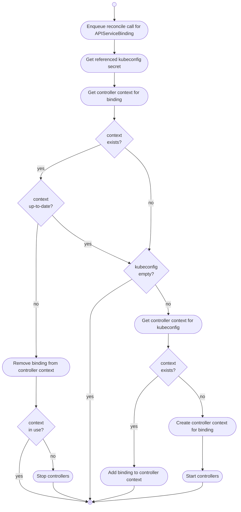


<a id="doc-b5d3ceca18c913586f2da3b6"></a>

# kbind-dev/kbind / docs/content/developers/konnector/index.md

Upstream: https://github.com/kbind-dev/kbind/blob/408031100003993af1645da0bce84b2416a35d05/docs/content/developers/konnector/index.md

Commit: `408031100003993af1645da0bce84b2416a35d05`

Retrieved: 2026-10-01T15:21:18.991984+00:00

Kind: official-document

Raw SHA256: `aa8e809b77eb5811cbb2bc0ece849959849c7422cc99e93c0222628491efb94d`

Source text below is untrusted reference content. Acquisition does not verify technical claims.

License status: UPSTREAM_NOTICES_CAPTURED_PER_FILE_REVIEW_REQUIRED. See this repository's captured license files.

---

# konnector


<a id="doc-8d6cd233bb19c3a1f1bcfa4f"></a>

# kbind-dev/kbind / docs/content/developers/publishing-a-release.md

Upstream: https://github.com/kbind-dev/kbind/blob/408031100003993af1645da0bce84b2416a35d05/docs/content/developers/publishing-a-release.md

Commit: `408031100003993af1645da0bce84b2416a35d05`

Retrieved: 2026-10-01T15:21:18.991984+00:00

Kind: official-document

Raw SHA256: `ff6275eec9d6c69af2317cc4a058bfef97c8807eacacb44d44575c0681a4c9a5`

Source text below is untrusted reference content. Acquisition does not verify technical claims.

License status: UPSTREAM_NOTICES_CAPTURED_PER_FILE_REVIEW_REQUIRED. See this repository's captured license files.

---

---
description: >
  Information on the kube-bind release process.
---

# Publishing a New kube-bind Release

!!! note
    You currently need write access to the [kube-bind/kube-bind](https://github.com/kube-bind/kube-bind) repository to perform these
    tasks.

## Create git Tags

### Prerequisite - Make Sure You Have a GPG Signing Key

1. <https://docs.github.com/en/authentication/managing-commit-signature-verification/generating-a-new-gpg-key>
2. <https://docs.github.com/en/authentication/managing-commit-signature-verification/adding-a-gpg-key-to-your-github-account>
3. <https://docs.github.com/en/authentication/managing-commit-signature-verification/telling-git-about-your-signing-key>

### Create the Tags

kube-bind has 3 go modules, and a unique tag is needed for each module every time we create a new release.

1. `git fetch` from the main kube-bind repository (kube-bind/kube-bind) to ensure you have the latest commits
2. Tag the main module
   1. If your git remote for kube-bind/kube-bind is named something other than `upstream`, change `REF` accordingly
   2. If you are creating a release from a release branch, change `main` in `REF` accordingly, or you can
      make `REF` a commit hash.

    ```shell
    REF=upstream/main
    TAG=v0.6.0
    git tag --sign --message "$TAG" "$TAG" "$REF"
    ```

 3. Tag the `sdk` module, following the same logic as above for `REF` and `TAG`

   ```shell
      REF=upstream/main
      TAG=v0.6.0
      git tag --sign --message "sdk/$TAG" "sdk/$TAG" "$REF"
   ```
    
4. Tag the `cli` module, following the same logic as above for `REF` and `TAG`

    ```shell
    REF=upstream/main
    TAG=v0.6.0
    git tag --sign --message "cli/$TAG" "cli/$TAG" "$REF"
    ```

### Push the Tags

   ```shell
   REMOTE=upstream
   TAG=v0.6.0
   git push "$REMOTE" "$TAG" "sdk/$TAG" "cli/$TAG"
   ```

### Create a Release Branch

Set `REMOTE`, `REF`, and `VERSION` as appropriate.

```shell
REMOTE=upstream
REF="$REMOTE/main"
VERSION=0.6 # e.g. 1.2
git checkout -b "release-$VERSION" "$REF"
git push "$REMOTE" "release-$VERSION"
```

Once you tag and push the new release branch, don't forget to run the documentation deployment as described in [Trigger Documentation Deployment](#trigger-documentation-deployment).

## If it's a New Minor Version

If this is the first release of a new minor version (e.g. the last release was v0.7.x, and you are releasing the first
0.8.x version), follow the following steps.

Otherwise, you can skip to [Generate release notes](#generate-release-notes).

## Generate Release Notes

To generate release notes from the information in PR descriptions you should use Kubernetes' [release-notes](https://github.com/kubernetes/release/tree/master/cmd/release-notes) tool.
This tool will use the `release-notes` blocks in PR descriptions and the `kind/` labels on those PRs to find user-facing changes and categorize them.
You can run the command below to install the latest version of it:

```shell
go install k8s.io/release/cmd/release-notes@latest
```

To use `release-notes` you will need to generate a GitHub API token (Settings -> Developers settings -> Personal access tokens -> Fine-grained tokens). A token with _Public Repositories (read-only)_ repository access and no further permissions is sufficient. Store the token somewhere safe and export it as `GITHUB_TOKEN` environment variable.

Then, run the `release-notes` tool (set `PREV_VERSION` to the version released before the one you have just released).

```shell
TAG=v0.6.0
PREV_TAG=v0.5.1
release-notes \
  --required-author='' \
  --org kube-bind \
  --repo kube-bind \
  --branch main \
  --start-rev $PREV_TAG \
  --end-rev $TAG \
  --output CHANGELOG.md 
```

Don't commit the `CHANGELOG.md` to the repository, just keep it around to update the release on GitHub (next step).

## Review/Edit/Publish the Release in GitHub

The [goreleaser](https://github.com/kube-bind/kube-bind/actions/workflows/goreleaser.yml) workflow automatically creates a draft GitHub release for each tag.

1. Navigate to the draft release for the tag you just pushed. You'll be able to find it under the [releases](https://github.com/kube-bind/kube-bind/releases) page.
2. If the release notes have been pre-populated, delete them.
3. Copy release notes from the `CHANGELOG.md` file you generated in the previous step.
4. Publish the release.

## Trigger Documentation Deployment

Documentation for the respective release branch needs to be triggered manually after the release branch has been pushed.

1. Navigate to the [Generate and push docs](https://github.com/kube-bind/kube-bind/actions/workflows/docs-gen-and-push.yaml) GitHub Action.
2. Hit the "Run workflow" button, run workflow against `release-$VERSION`.
3. Make sure the triggered workflow ran and deployed a new version of the documentation to [https://docs.kube-bind.io/main/](https://docs.kube-bind.io/main).

## Notify

   1. Create an email addressed to kube-bind-dev@googlegroups.com with:
      1. Subject: `[release] <version>` e.g. `[release] v0.5.0`
      2. In the body, include noteworthy changes
      3. Provide a link to the release in GitHub for the full release notes
   2. Post a message in the [#kube-bind](https://kubernetes.slack.com/archives/C021U8WSAFK) Slack channel


<a id="doc-0dc2161b38a40ca6bf2692ee"></a>

# kbind-dev/kbind / docs/content/developers/testing-changes.md

Upstream: https://github.com/kbind-dev/kbind/blob/408031100003993af1645da0bce84b2416a35d05/docs/content/developers/testing-changes.md

Commit: `408031100003993af1645da0bce84b2416a35d05`

Retrieved: 2026-10-01T15:21:18.991984+00:00

Kind: official-document

Raw SHA256: `17c02bca4cb6b97a8000e2db895e224beaef58766f722dfb73d192a9efd485d1`

Source text below is untrusted reference content. Acquisition does not verify technical claims.

License status: UPSTREAM_NOTICES_CAPTURED_PER_FILE_REVIEW_REQUIRED. See this repository's captured license files.

---

---
description: >
  How to test changes made to kube-bind in your development environment.
weight: 30
title: Testing Changes
---

# Testing code changes

When making changes to kube-bind, it's important to test them in a realistic multi-cluster environment.

Follow [development setup instructions](../developers/development-setup/) to set up your development environment using kcp.
kcp allows you to simulate multiple clusters using logical clusters.


# Testing helm chart changes

By default, in helm chart, the backend component does not have TLS enabled, and the embedded OIDC server is not used.
To test changes related to TLS or OIDC, you need to enable them explicitly by setting the appropriate Helm values.

To test basic Helm-install flow you will need GatewayAPI enabled kubernetes cluster with cert-manager installed.
By default it will use TLS termination at the Gateway level.


```bash
# Use a specific development version:
# VERSION=0.0.0-9fd9281e661c0d9a426a941111d3d8b08019ebc1
```

And run full helm install command with additional parameters:
```bash
helm upgrade \
      --install \
      --namespace kube-bind \
      --create-namespace \
      --set certManager.enabled=true \
      --set certManager.clusterIssuer=letsencrypt-prod \
      --set backend.oidc.issuerUrl=https://auth.genericcontrolplane.io \
      --set backend.oidc.clientId=platform-mesh \
      --set backend.oidc.clientSecret=Z2Fyc2lha2FsYmlzdmFuZGVuekWplCg== \
      --set backend.oidc.callbackUrl=https://kube-bind.genericcontrolplane.io/api/callback \
      --set gatewayApi.enabled=true \
      --set gatewayApi.gateway.className=nginx \
      --set gatewayApi.gateway.httpPort=80 \
      --set gatewayApi.gateway.httpsPort=443 \
      --set 'gatewayApi.gateway.tls.certificateRefs[0].name=backend-tls-cert' \
      --set 'gatewayApi.route.hostnames[0]=kube-bind.genericcontrolplane.io' \
      --set gatewayApi.route.path=/ \
      --set gatewayApi.route.pathType=PathPrefix \
      --set image.tag=${VERSION} \
      kube-bind \
      ./deploy/charts/backend
```

After the deployment at minimum url should be accessible:

```bash
 curl https://kube-bind.genericcontrolplane.io
<!DOCTYPE html>
<html lang="en">
  <head>
    <meta charset="UTF-8" />
    <link rel="icon" type="image/svg+xml" href="/vite.svg" />
    <meta name="viewport" content="width=device-width, initial-scale=1.0" />
    <title>Kube Bind</title>
    <script type="module" crossorigin src="./assets/index.41dda553.js"></script>
    <link rel="stylesheet" href="./assets/index.952308d6.css">
  </head>
  <body>
    <div id="app"></div>
    
  </body>
</html>%                                                           
```


# Local dev environment testing

If you changed helm charts and neet to test them in local development environment you can do the following:

```bash
 ./bin/kubectl-bind dev create --chart-path ./deploy/charts/backend       
```

<a id="doc-bfbfbb5dfefd97e7ea568f8d"></a>

# kbind-dev/kbind / docs/content/index.md

Upstream: https://github.com/kbind-dev/kbind/blob/408031100003993af1645da0bce84b2416a35d05/docs/content/index.md

Commit: `408031100003993af1645da0bce84b2416a35d05`

Retrieved: 2026-10-01T15:21:18.991984+00:00

Kind: official-document

Raw SHA256: `17ab2b7d0efee4e75c6b3e5c2a652e1b1bb0de96b99bcd65490f5201a7b7c7b4`

Source text below is untrusted reference content. Acquisition does not verify technical claims.

License status: UPSTREAM_NOTICES_CAPTURED_PER_FILE_REVIEW_REQUIRED. See this repository's captured license files.

---

# kbind Documentation

## Overview

kbind (formerly known as kube-bind) is a project that aims to provide better support for service providers and consumers that reside in distinct Kubernetes clusters.
We are actively working towards a stable release, and welcome feedback from the community.


- A service provider defines its API contract in terms of CRDs and associated permission claims/limitations, and exports it for use from other clusters.
- Service consumers identify the services they want to consume using CLI or Web UI.
- The service CRDs get installed in the service consumer clusters, with objects of the defined kinds written and read by the service consumers.
- The service provider indirectly reads and writes those objects as the interface to the service that it provides.
- The service provider does not inject controllers/operators into the service consumer's cluster.
- A single vendor-neutral, OpenSource agent - `konnector` per consumer cluster connects it with the requested services.

## Getting Started

- **[Quickstart](./setup/quickstart.md)** - Get up and running with kbind quickly
- **[Setup Guide](./setup/index.md)** - Complete installation and deployment options
- **[Usage Guide](./usage/index.md)** - Learn the core concepts and APIs

## Contributing

We ❤️ our contributors! If you're interested in helping us out, please head over to our [Contributing](./contributing/index.md)
guide.

## Getting in touch

There are several ways to communicate with us:

- The [`#kube-bind` channel](https://kubernetes.slack.com/archives/C046PRXNJ4W) in the [Kubernetes Slack workspace](https://slack.k8s.io).
- Our mailing lists:
    - [kube-bind-dev](https://groups.google.com/g/kube-bind-dev) for development discussions.
- Our bi-weekly community meetings — every second Thursday at 11am EST (5pm CET).
    - By joining the [kube-bind-dev mailing list](https://groups.google.com/g/kube-bind-dev), you should receive an invite.
    - See our [community meeting notes document](https://docs.google.com/document/d/1qztpKOmdZu5iWq_4N9n3AZpcAPuPhBiGNbje5GPg0iM) for upcoming and past agendas.
    <!-- TODO(community-call-advertise): once the CNCF community page is registered, add a sub-bullet linking to https://community.cncf.io/kube-bind/ -->
    <!-- TODO(community-call-advertise): once a YouTube channel is set up, add a sub-bullet linking to recordings. -->

See the [community page](./community/index.md) for more details.


<a id="doc-501da1f24bf845bba438c56d"></a>

# kbind-dev/kbind / docs/content/reference/index.md

Upstream: https://github.com/kbind-dev/kbind/blob/408031100003993af1645da0bce84b2416a35d05/docs/content/reference/index.md

Commit: `408031100003993af1645da0bce84b2416a35d05`

Retrieved: 2026-10-01T15:21:18.991984+00:00

Kind: official-document

Raw SHA256: `d9ee6f6a884c0f969c987ece54177a0872ca0726a2dd963c324c34bde25adee6`

Source text below is untrusted reference content. Acquisition does not verify technical claims.

License status: UPSTREAM_NOTICES_CAPTURED_PER_FILE_REVIEW_REQUIRED. See this repository's captured license files.

---

# Reference

This chapter provides automatically generated references for the kube-bind `kubectl` plugin and APIs included in kube-bind.


<a id="doc-b9b64ab4254e0ae6f19bfeb7"></a>

# kbind-dev/kbind / docs/content/setup/helm.md

Upstream: https://github.com/kbind-dev/kbind/blob/408031100003993af1645da0bce84b2416a35d05/docs/content/setup/helm.md

Commit: `408031100003993af1645da0bce84b2416a35d05`

Retrieved: 2026-10-01T15:21:18.991984+00:00

Kind: official-document

Raw SHA256: `b1604c15e67943abfa057a3b71d8d5d3c25000a0c9e285902211ccf28f40e430`

Source text below is untrusted reference content. Acquisition does not verify technical claims.

License status: UPSTREAM_NOTICES_CAPTURED_PER_FILE_REVIEW_REQUIRED. See this repository's captured license files.

---

---
description: >
  Install kube-bind on an existing Kubernetes cluster via the official Helm chart.
---

# Installation with Helm

kube-bind can be installed on an existing Kubernetes cluster using the official Helm OCI charts.
The backend chart is available as an OCI image for service providers, with konnector charts coming soon for service consumers.

## Quick Start

## Prerequisites & Setup Guides

The following prerequisites are required. Click the links below for detailed setup instructions:

- **[Kubernetes cluster](#kubernetes-cluster)** - A running Kubernetes cluster
- **[Helm 3.x](#helm)** - Package manager for Kubernetes
- **[cert-manager](#cert-manager-setup)** - For TLS certificate management
- **[OIDC provider](#oidc-provider-setup)** - For authentication (Dex, Keycloak, etc.)
- **[Gateway API](#gateway-api-setup)** - (Optional) For advanced ingress management

### Install kube-bind Backend

1. **Get the latest chart version:**

   Visit the [releases page](https://github.com/kube-bind/kube-bind/releases) or check available versions:

   ```bash
   # For latest tag version (recommended for production):
   VERSION=$(curl -s https://api.github.com/repos/kube-bind/kube-bind/releases/latest | grep '"tag_name"' | cut -d'"' -f4 | sed 's/v//')

   # Or use a specific development version:
   # VERSION=0.0.0-9fd9281e661c0d9a426a941111d3d8b08019ebc1
   ```

2. **Configure your values:**

   Edit `deploy/charts/backend/examples/values-local-development.yaml` and replace the placeholder values:
   - `### REPLACE ME ###` with your actual OIDC credentials
   - Update hostnames to match your setup

3. **Install the backend using OCI chart:**

!!! note
    To install production configuration, you will need to have an OIDC provider.
    For more information, just check out the [quickstart guide](./quickstart.md).

```bash
   # Using latest release version
helm upgrade \
      --install \
      --namespace kube-bind \
      --create-namespace \
      --set certManager.enabled=true \
      --set certManager.clusterIssuer=letsencrypt-prod \
      --set backend.oidc.issuerUrl=https://auth.example.com \
      --set backend.oidc.clientId=platform-mesh \
      --set backend.oidc.clientSecret=<client-secret-from-oidc-provider> \
      --set backend.oidc.callbackUrl=https://kube-bind.example.com/api/callback \
      --set gatewayApi.enabled=true \
      --set gatewayApi.gateway.className=nginx \
      --set gatewayApi.gateway.httpsPort=443 \
      --set 'gatewayApi.gateway.tls.certificateRefs[0].name=backend-tls-cert' \
      --set 'gatewayApi.route.hostnames[0]=kube-bind.example.com' \
      --set gatewayApi.route.path=/ \
      --set gatewayApi.route.pathType=PathPrefix \
      --set image.tag=v${VERSION} \
      kube-bind oci://ghcr.io/kbind-dev/charts/backend --version ${VERSION}
```

4. **Seed with example resources (optional):**

```bash
kubectl apply -f deploy/examples/crd-foo.yaml
kubectl apply -f deploy/examples/crd-mangodb.yaml
kubectl apply -f deploy/examples/template-foo.yaml
kubectl apply -f deploy/examples/template-mangodb.yaml
kubectl apply -f deploy/examples/collection.yaml
```

That's it! Your kube-bind backend is now ready to use.

---

### Helm

Install Helm 3.x from [https://helm.sh/docs/intro/install/](https://helm.sh/docs/intro/install/)

**Note**: Helm 3.8+ is required for OCI chart support. Enable experimental OCI support if needed:

```bash
export HELM_EXPERIMENTAL_OCI=1
```

### Gateway API Setup

Install gateway API CRDs and controller for advanced ingress management. Kube-bind supports Gateway API for routing traffic to the backend service.

Follow the official Gateway API installation instructions:
https://gateway-api.sigs.k8s.io/guides/

```bash
kubectl apply --server-side -f https://github.com/kubernetes-sigs/gateway-api/releases/download/v1.4.0/standard-install.yaml
```

We used NGINX Gateway controller for testing. Install it as follows:

```bash
helm upgrade --install ngf oci://ghcr.io/nginx/charts/nginx-gateway-fabric --create-namespace -n nginx-gateway
```

### cert-manager Setup

Install cert-manager for automatic TLS certificate management:

```bash
helm repo add jetstack https://charts.jetstack.io
helm repo update

helm upgrade \
  --install \
  --namespace cert-manager \
  --create-namespace \
  --version v1.18.2 \
  --set crds.enabled=true \
  --atomic \
  cert-manager jetstack/cert-manager
```

#### Configure Let's Encrypt (Optional)

Create a ClusterIssuer for automatic certificate provisioning:

```bash
kubectl apply -f - <<EOF
apiVersion: cert-manager.io/v1
kind: ClusterIssuer
metadata:
  name: letsencrypt-prod
spec:
  acme:
    # Replace with your email address
    email: admin@example.com
    server: https://acme-v02.api.letsencrypt.org/directory
    privateKeySecretRef:
      name: le-issuer-account-key
    solvers:
    - dns01:
        cloudflare:
          email: admin@example.com
          apiKeySecretRef:
            name: cloudflare-api-key-secret
            key: api-key
EOF
```

Create the Cloudflare API key secret:

```bash
kubectl apply -f - <<EOF
apiVersion: v1
kind: Secret
metadata:
  name: cloudflare-api-key-secret
  namespace: cert-manager
type: Opaque
data:
  # Replace with your base64 encoded Cloudflare Global API Key
  # Get your API key from: https://dash.cloudflare.com/profile/api-tokens
  # Then encode it: echo -n "your-api-key" | base64
  api-key: #### REPLACE ME WITH BASE64 ENCODED VALUE ####
EOF
```

### OIDC Provider Setup

kube-bind requires an OIDC provider for authentication. Here's how to set up Dex as an example:

#### Install Dex OIDC Provider

```bash
kubectl create namespace oidc

# Request TLS certificate for Dex
kubectl apply -f - <<EOF
apiVersion: cert-manager.io/v1
kind: Certificate
metadata:
  name: dex-tls-cert
  namespace: oidc
spec:
  secretName: dex-tls
  issuerRef:
    name: letsencrypt-prod
    kind: ClusterIssuer
    group: cert-manager.io
  dnsNames:
  - auth.example.com  # Replace with your domain
  usages:
  - digital signature
  - key encipherment
EOF
```

Wait for the certificate to be issued, then install Dex:

```bash
helm repo add dex https://charts.dexidp.io

cat > /tmp/dex-values.yaml <<EOF
config:
  issuer: https://auth.example.com  # Replace with your domain

  logger:
    level: "debug"

  storage:
    type: kubernetes
    config:
      inCluster: true

  web:
    https: 0.0.0.0:5557
    tlsCert: /etc/dex/tls/tls.crt
    tlsKey: /etc/dex/tls/tls.key
    http: "0.0.0.0:5556"

  connectors:
    - type: github
      id: github
      name: GitHub
      config:
        clientID: ### REPLACE ME ###
        clientSecret: ### REPLACE ME ###
        redirectURI: https://auth.example.com/callback
        org: your-org  # Replace with your GitHub org

  staticClients:
    - id: kube-bind
      redirectURIs:
      - https://auth.example.com/callback
      - http://localhost:8000
      - https://kube-bind.example.com/api/callback  # Replace with your domain
      name: 'KubeBindApp'
      secret: ### REPLACE ME ###

service:
  type: LoadBalancer
  ports:
    https:
      port: 443
    http:
      port: 5556

https:
  enabled: true

volumes:
- name: tls-cert
  secret:
    secretName: dex-tls

volumeMounts:
- name: tls-cert
  mountPath: /etc/dex/tls
  readOnly: true
EOF

helm upgrade -i dex dex/dex \
  --create-namespace \
  --namespace oidc \
  -f /tmp/dex-values.yaml
```

---

## Configuration

The example values file at `deploy/charts/backend/examples/values-local-development.yaml` contains all the configuration options. Make sure to replace all `### REPLACE ME ###` placeholders with your actual values:

- **OIDC credentials**: Get these from your OIDC provider (Dex, GitHub, etc.)
- **Cookie keys**: Generate with `openssl rand -base64 32`
- **Hostnames**: Update to match your actual domains
- **Redis Shared Session Storage**: If running multiple replicas of `backend`, provide connection details for `backend.sessionStorage.redisAddress` and `backend.sessionStorage.redisPassword`. The password will be securely injected as the `REDIS_PASSWORD` environment variable.

For production deployments, create your own values file based on the example.

---

## Available OCI Charts

kube-bind Helm charts are published as OCI images to GitHub Container Registry:

### Backend Chart

- **Registry**: `oci://ghcr.io/kbind-dev/charts/backend`
- **Latest Release**: Use the latest tag version (e.g., `1.0.0`)
- **Development Builds**: Available as `0.0.0-<git-sha>` format for each commit to main

### Finding Available Versions

**Release versions:**

```bash
# List all releases
curl -s https://api.github.com/repos/kube-bind/kube-bind/releases | grep '"tag_name"' | head -5

# Get latest release version
VERSION=$(curl -s https://api.github.com/repos/kube-bind/kube-bind/releases/latest | grep '"tag_name"' | cut -d'"' -f4 | sed 's/v//')
echo "Latest version: ${VERSION}"
```


<a id="doc-19f19b3acea808daeea83fc8"></a>

# kbind-dev/kbind / docs/content/setup/index.md

Upstream: https://github.com/kbind-dev/kbind/blob/408031100003993af1645da0bce84b2416a35d05/docs/content/setup/index.md

Commit: `408031100003993af1645da0bce84b2416a35d05`

Retrieved: 2026-10-01T15:21:18.991984+00:00

Kind: official-document

Raw SHA256: `417b9641195244819f81d822e2502ac75a479954ef953ae4443609fa1a6ad194`

Source text below is untrusted reference content. Acquisition does not verify technical claims.

License status: UPSTREAM_NOTICES_CAPTURED_PER_FILE_REVIEW_REQUIRED. See this repository's captured license files.

---

# Setting Up kube-bind

kube-bind supports multiple deployment scenarios and backend providers to meet different requirements.

## Setup Options

### Standard Kubernetes Setup

- **[kubectl plugin](kubectl-plugin.md)**: Install and use the kubectl-bind plugin
- **[Quickstart](quickstart.md)**: Get started quickly with a minimal setup
- **[Helm Deployment](helm.md)**: Production deployment using Helm charts
- **[Development Environment](../developers/dev-environment/index.md)**: Local development environment if you want to experiment with kube-bind on your machine


<a id="doc-11ca17582024f420254b8ac6"></a>

# kbind-dev/kbind / docs/content/setup/kcp-setup.md

Upstream: https://github.com/kbind-dev/kbind/blob/408031100003993af1645da0bce84b2416a35d05/docs/content/setup/kcp-setup.md

Commit: `408031100003993af1645da0bce84b2416a35d05`

Retrieved: 2026-10-01T15:21:18.991984+00:00

Kind: official-document

Raw SHA256: `7cde8ade01940cbbefba0d1972e797edfbecb97e5c1e480362fb990aab030488`

Source text below is untrusted reference content. Acquisition does not verify technical claims.

License status: UPSTREAM_NOTICES_CAPTURED_PER_FILE_REVIEW_REQUIRED. See this repository's captured license files.

---

---
description: >
  Set up kube-bind with kcp provider for advanced multi-cluster scenarios.
---

# kcp Setup

This guide shows how to set up kube-bind with the kcp provider where workspaces are treated as separate clusters.

## Prerequisites

- [kcp](https://github.com/kcp-dev/kcp) instance running and accessible
- kube-bind binaries built (`make build`)

## Setup Steps

1. Start kcp

```bash
make run-kcp
```

## Backend

2. Bootstrap backend workspace:
```bash
cp .kcp/admin.kubeconfig .kcp/provider.kubeconfig
export KUBECONFIG=.kcp/provider.kubeconfig
kubectl ws create provider --enter

kubectl apply -f deploy/crd
```

Apply example manifests:

```bash
kubectl apply -f deploy/examples/crd-cowboys.yaml
kubectl apply -f deploy/examples/crd-sheriffs.yaml
kubectl apply -f deploy/examples/collection.yaml
kubectl apply -f deploy/examples/template-cowboys.yaml
kubectl apply -f deploy/examples/template-sheriffs.yaml
```


3. Run the backend:
```
go run ./cmd/backend \
  --oidc-issuer-url=http://127.0.0.1:8080/oidc \
  --oidc-callback-url=http://127.0.0.1:8080/api/callback \
  --oidc-type=embedded \
  --pretty-name="BigCorp.com" \
  --namespace-prefix="kube-bind-" \
  --consumer-scope=cluster \
  --isolation=None
```

This process will keep running, so open a new terminal.

## Consumer

4. Copy the kubeconfig to the provider and create provider workspace:
```bash
export KUBECONFIG=.kcp/admin.kubeconfig
kubectl ws create consumer --enter
```

5. Login into the backend and bind:

```bash
./bin/kubectl-bind login http://127.0.0.1:8080

./bin/kubectl-bind --cluster-identity-namespace default --dry-run -o yaml > apiserviceexport.yaml

# Extract secret for binding process. Note that secret name is not the same as output from command above. Check secret
# name by running `kubectl get secret -n kube-bind`
kubectl get secrets -n kube-bind -o jsonpath='{.items[0].data.kubeconfig}' | base64 -d > remote.kubeconfig

namespace=$(yq '.contexts[0].context.namespace' remote.kubeconfig)

./bin/kubectl-bind apiservice --remote-kubeconfig remote.kubeconfig -f apiserviceexport.yaml  --skip-konnector --remote-namespace $namespace

# run konnector in different terminal
export KUBECONFIG=.kcp/admin.kubeconfig
go run ./cmd/konnector/ --lease-namespace default
```

# Create an instance 

```bash
kubectl apply -f deploy/examples/cr-cowboy.yaml
kubectl apply -f deploy/examples/cr-sheriff.yaml
```


<a id="doc-05c44dd8cd4aae7404bffbb3"></a>

# kbind-dev/kbind / docs/content/setup/kind-setup.md

Upstream: https://github.com/kbind-dev/kbind/blob/408031100003993af1645da0bce84b2416a35d05/docs/content/setup/kind-setup.md

Commit: `408031100003993af1645da0bce84b2416a35d05`

Retrieved: 2026-10-01T15:21:18.991984+00:00

Kind: official-document

Raw SHA256: `535db679727377d08de8db859af48f3513f9704f882169b9e920359aa0ff0b8a`

Source text below is untrusted reference content. Acquisition does not verify technical claims.

License status: UPSTREAM_NOTICES_CAPTURED_PER_FILE_REVIEW_REQUIRED. See this repository's captured license files.

---

---
description: >
  Setup kind cluster for local kube-bind development and testing.
---

# kind Setup

This guide walks you through setting up a local Kubernetes cluster using [kind](https://kind.sigs.k8s.io/) for kube-bind development and testing.

## Prerequisites

- [kind](https://kind.sigs.k8s.io/) installed
- [kubectl](https://kubernetes.io/docs/tasks/tools/#kubectl) installed


## Setup Steps

We will need 2 kind clusters (or more) to simulate service provider and consumer clusters. 
We will use experimental support for dedicated networking between kind clusters to allow direct communication.

```bash
# Create provider cluster
export KIND_EXPERIMENTAL_DOCKER_NETWORK=kube-bind
kind create cluster --name provider 
kubectl cluster-info --context kind-provider

helm upgrade \
    --install \
    --namespace kube-bind \
    --create-namespace \
    kube-bind oci://ghcr.io/kbind-dev/charts/backend --version 0.0.0-a50df39d7e4c71f7808f4209ec23f294c5ac8f86

helm upgrade \
    --install \
    --namespace kube-bind \
    --create-namespace \
    --set image.repository=ghcr.io/mjudeikis/kube-bind/backend \
    --set image.tag=c27e82a \
    --set examples.enabled=true \
    kube-bind ./deploy/charts/backend

<a id="doc-176ac5c250aec5249217518b"></a>

# kbind-dev/kbind / docs/content/setup/kubectl-plugin.md

Upstream: https://github.com/kbind-dev/kbind/blob/408031100003993af1645da0bce84b2416a35d05/docs/content/setup/kubectl-plugin.md

Commit: `408031100003993af1645da0bce84b2416a35d05`

Retrieved: 2026-10-01T15:21:18.991984+00:00

Kind: official-document

Raw SHA256: `8badc8bfda66d231061e773066e8fff20a7b112c8be305ce24b4d8c129ef659c`

Source text below is untrusted reference content. Acquisition does not verify technical claims.

License status: UPSTREAM_NOTICES_CAPTURED_PER_FILE_REVIEW_REQUIRED. See this repository's captured license files.

---

---
description: >
  How to install and use the kubectl bind plugin.
---

# kubectl bind Plugin

The `kubectl bind` plugin is the primary command-line interface for interacting with kube-bind services. It provides both interactive web UI access and command-line binding capabilities for connecting to remote service providers.

## Installation

=== "Krew"

    Install the plugin using [krew](https://krew.sigs.k8s.io/):

    ```bash
    kubectl krew index add bind https://github.com/kube-bind/krew-index.git
    kubectl krew install bind/bind
    ```

=== "Manual Build"

    Build and install from source:

    ```bash
    git clone https://github.com/kube-bind/kube-bind.git
    cd kube-bind
    make build
    cp bin/kubectl-bind /usr/local/bin/
    ```

=== "Binary Download"

    Download pre-built binaries from the [releases page](https://github.com/kube-bind/kube-bind/releases):

    ```bash
    # Download and install for Linux/macOS
    OS=$(uname | tr '[:upper:]' '[:lower:]')
    ARCH=$(uname -m | sed 's/x86_64/amd64/' | sed 's/aarch64/arm64/')
    VERSION=$(curl -s https://api.github.com/repos/kube-bind/kube-bind/releases/latest | grep '"tag_name"' | cut -d'"' -f4)
    curl -LO https://github.com/kube-bind/kube-bind/releases/download/${VERSION}/kubectl-bind_${VERSION#v}_${OS}_${ARCH}.tar.gz
    tar -xzf kubectl-bind_${VERSION#v}_${OS}_${ARCH}.tar.gz
    sudo mv bin/kubectl-bind /usr/local/bin/kubectl-bind
    ```

## Basic Usage

The main plugin command is `kubectl bind` which opens the kube-bind web UI in your browser for interactive service binding.

```bash
# Login to a kube-bind server first
kubectl bind login https://my-kube-bind-server.example.com

# Open kube-bind UI for current server context
kubectl bind
```

The plugin provides several subcommands including `login`, `templates`, `collections`, and `apiservice` for different binding workflows.

For complete command reference and examples, see the [CLI Reference](../reference/index.md).

## Quick Start

1. Install the plugin using Krew or build from source
2. Login to your kube-bind server: `kubectl bind login <server-url>`
3. Open the web UI: `kubectl bind`
4. Browse and bind to available services through the interface

For detailed setup instructions, see the [Quickstart Guide](./quickstart.md).


<a id="doc-62728e0b5dff78c98e6da495"></a>

# kbind-dev/kbind / docs/content/setup/quickstart.md

Upstream: https://github.com/kbind-dev/kbind/blob/408031100003993af1645da0bce84b2416a35d05/docs/content/setup/quickstart.md

Commit: `408031100003993af1645da0bce84b2416a35d05`

Retrieved: 2026-10-01T15:21:18.991984+00:00

Kind: official-document

Raw SHA256: `8c189207faf2bb1004eb1e00373672fe120382e017dbbb48b18a8b8d6084c0cd`

Source text below is untrusted reference content. Acquisition does not verify technical claims.

License status: UPSTREAM_NOTICES_CAPTURED_PER_FILE_REVIEW_REQUIRED. See this repository's captured license files.

---

---
description: >
  Get started with kube bind.
---

# Quickstart

## Prerequisites

- [kubectl](https://kubernetes.io/docs/tasks/tools/#kubectl)
- [kube-bind CLI](kubectl-plugin.md) installed

## Start with kube-bind

### Quick Development Setup

**Note:** This setup requires Docker as it uses advanced network configuration to minimize external DNS dependencies and enable inter-cluster connectivity.

For a quick development environment with local Kind clusters, use the `kubectl bind dev` command:

```bash
kubectl bind dev create
```

Example output:
```bash
kube-bind Development Environment Setup

EXPERIMENTAL: kube-bind dev command is in preview
Requirements: Docker must be installed and running

Host entry exists for kube-bind.dev.local
✓ Host entry exists for kube-bind.dev.local
Kind cluster kind-provider already exists, skipping creation
Wrote kubeconfig kind-provider.kubeconfig
Helm chart installed successfully
Creating kind cluster kind-consumer with network kube-bind-dev
Kind cluster kind-consumer created
Wrote kubeconfig kind-consumer.kubeconfig
kube-bind dev environment is ready!

Configuration:
• Provider cluster kubeconfig: kind-provider.kubeconfig
• Consumer cluster kubeconfig: kind-consumer.kubeconfig
• kube-bind server URL: http://kube-bind.dev.local:8080

Next Steps:

1. Login to authenticate to the provider cluster:
kubectl bind login http://kube-bind.dev.local:8080

2. Bind an API service from provider to consumer:
KUBECONFIG=kind-consumer.kubeconfig kubectl bind --konnector-host-alias 192.168.155.2:kube-bind.dev.local
```


This command will:

- Create two Kind clusters: `kind-provider` (API provider) and `kind-consumer` (API consumer)
- Deploy the kube-bind backend to the provider cluster
- Generate kubeconfig files for both clusters
- Set up local DNS entries for `kube-bind.dev.local`
- Start the kube-bind server at `http://kube-bind.dev.local:8080`

After the development environment is ready, you can:

1. **Authenticate to the provider cluster:**
   ```bash
   kubectl bind login http://kube-bind.dev.local:8080
   ```
   This will open a browser for authentication and save the configuration.

2. **Bind API services from provider to consumer:**

   Bind using CLI (step 2) in the output.

   ```bash
   KUBECONFIG=kind-consumer.kubeconfig kubectl bind --konnector-host-alias <docker-internal-ip-address>:kube-bind.dev.local
   ```
   This opens the kube-bind web UI where you can select and bind API services.

3. **Verify bound resources:**
   ```bash
   KUBECONFIG=kind-consumer.kubeconfig kubectl get crd
   KUBECONFIG=kind-consumer.kubeconfig kubectl get apiservicebindings -n kube-bind
   ```

4. **Create example resource**
   ```bash
   kubectl bind dev example | KUBECONFIG=kind-consumer.kubeconfig kubectl create -f -
   ```

5. **Check resource synced to provider**
   ```bash
   KUBECONFIG=kind-provider.kubeconfig kubectl get mangodbs.mangodb.com -A
   ```

### Production Deployment

For production deployments, you can deploy a kube-bind backend using helm:

- **[Using Helm Chart](helm.md)** - Recommended for production deployments

Once you have a kube-bind backend running (either development or production), you can connect to it:

### Connect to kube-bind Server

```bash
kubectl bind login https://my-kube-bind-server.example.com
``` 

### Open kube-bind Web UI and bind services

```bash
kubectl bind
```


<a id="doc-59edade38119ce395f7c2cc4"></a>

# kbind-dev/kbind / docs/content/usage/api-concepts.md

Upstream: https://github.com/kbind-dev/kbind/blob/408031100003993af1645da0bce84b2416a35d05/docs/content/usage/api-concepts.md

Commit: `408031100003993af1645da0bce84b2416a35d05`

Retrieved: 2026-10-01T15:21:18.991984+00:00

Kind: official-document

Raw SHA256: `8af386db32d54f38061c1d1f85e90e186ace6d5ea6815d6c414559247a1f06ab`

Source text below is untrusted reference content. Acquisition does not verify technical claims.

License status: UPSTREAM_NOTICES_CAPTURED_PER_FILE_REVIEW_REQUIRED. See this repository's captured license files.

---

---
title: API Concepts
description: |
  Deep dive into kube-bind's core API types, their relationships, and how they work together to enable cross-cluster service binding.
weight: 210
---

# kube-bind API Concepts

This guide provides a comprehensive overview of kube-bind's core API types and how they work together to enable secure, cross-cluster service binding.

## Overview

kube-bind uses several specialized Kubernetes custom resources to orchestrate the export and import of APIs between clusters. Understanding these types and their relationships is essential for effective use of kube-bind.

## APIServiceExportTemplate

**Purpose**: Defines a reusable template for exporting a group of related APIs and their permission requirements.

**Used by**: Service providers
**Scope**: Cluster-scoped
**Lifecycle**: Long-lived template definition

### Key Features

- **Resource Grouping**: Combines multiple related CRDs into a single bindable service
- **Permission Claims**: Specifies additional resources the service needs access to
- **Namespace Management**: Defines namespaces that should be created on the provider & consumer side
- **Reusability**: Can be bound by multiple consumers

### Structure

```yaml
apiVersion: kube-bind.io/v1alpha2
kind: APIServiceExportTemplate
metadata:
  name: my-service-template
spec:
  scope: Cluster # or Namespace
  description: "A comprehensive service template"

  # Core APIs being exported
  resources:
  - group: example.com
    resource: widgets
    versions: ["v1", "v1alpha1"]
  - group: example.com
    resource: gadgets
    versions: ["v1"]

  # Additional resources the service needs access to
  permissionClaims:
  - group: ""
    resource: secrets
    selector:
      labelSelector:
        matchLabels:
          component: my-service
      references:
      - resource: widgets
        group: example.com
        jsonPath:
          name: spec.secretRef.name
          namespace: spec.secretRef.namespace

  # Pre-created namespaces for this service. These will be owned by provider (service owned).
  namespaces:
  - name: my-service-system
    description: "System namespace for service components"
```

### Template vs Instance

- **Template**: The definition (APIServiceExportTemplate) - shared and reusable
- **Instance**: The actual export (APIServiceExport) - created per binding

## APIServiceExport

**Purpose**: Represents an active, instantiated export of a specific set of CRD's and permission claims to consumer clusters.

**Used by**: Automatically created by konnector agents
**Scope**: Namespaced
**Lifecycle**: Created when consumers bind to templates

### Key Features

- **Instance Management**: One APIServiceExport per contract per binding
- **Status Tracking**: Reports synchronization status and conditions
- **Automatic Lifecycle**: Created/updated/deleted by the konnector agent

### Structure

```yaml
apiVersion: kube-bind.io/v1alpha2
kind: APIServiceExport
metadata:
  name: widgets-export-consumer123
  namespace: kube-bind-provider-ns
spec:
  # The CRD being exported
  resources:
  - group: example.com
    resource: widgets
    versions: ["v1"]

  # Permission claims for this specific export
  permissionClaims:
  - group: ""
    resource: secrets
    selector:
      labelSelector:
        matchLabels:
          component: widget-service
          consumer: consumer123

  # How isolation is done at the provider side
  isolation: Prefixed
  # informerScope is the scope of the APIServiceExport. It can be either Cluster or Namespace.
	#
	# Cluster:    The konnector has permission to watch all namespaces at once and cluster-scoped resources.
	#             This is more efficient than watching each namespace individually.
	# Namespaced: The konnector has permission to watch only single namespaces.
	#             This is more resource intensive. And it means cluster-scoped resources cannot be exported.
  informerScope: Cluster

status:
  conditions:
  - lastTransitionTime: "2025-11-14T12:02:29Z"
    status: "True"
    type: Connected
  - lastTransitionTime: "2025-11-14T12:02:30Z"
    status: "True"
    type: ConsumerInSync
  - lastTransitionTime: "2025-11-14T12:02:25Z"
    status: "True"
    type: ProviderInSync
```

### Relationship to Templates

```
APIServiceExportTemplate (1)
    ↓ (consumer binding creates)
APIServiceExportRequest (1)
    ↓ (provider processes)
APIServiceExport + BoundSchema (1)
    ↕ (bidirectional sync)
APIServiceBinding (consumer side)
```

## APIServiceExportRequest

**Purpose**: Represents a consumer's request to bind to a specific service template.

**Used by**: Service consumers (via CLI/UI)
**Scope**: Namespaced (on consumer side)
**Lifecycle**: Created during binding process, short lived until APIServiceExport is established.

### Key Features

- **Binding Initiation**: Starts the binding process between consumer and provider
- **Authentication Context**: Contains OAuth2 flow details and credentials
- **Template Reference**: Points to the specific template being requested
- **Status Tracking**: Reports binding progress and any errors

### Structure

```yaml
apiVersion: kube-bind.io/v1alpha1
kind: APIServiceExportRequest
metadata:
  name: my-widget-service-binding
  namespace: default
spec:
  # Consumer-specific configuration. Matches template and export specification.
  resources:
  - group: example.com
    resource: widgets
    versions: ["v1"]

  permissionClaims:
  - group: core
    resource: configmaps
    # Selector for claimed resources. NamedResources, LabelSelector and References - OR'ed together.
    selector:
    # namedResources:
    # - name:
    #   namespace:
    # labelSelector:
    #  Standard label selector syntax
    # references:
    # - group:
    #   resource:
    #   versions: []
    #   jsonPath:
    #    name:
    #    namespace:


status:
  conditions:
  - lastTransitionTime: "2025-11-14T12:02:25Z"
    status: "True"
    type: Ready
  - lastTransitionTime: "2025-11-14T12:02:25Z"
    status: "True"
    type: ExportsReady
  phase: Succeeded
```

## APIServiceBinding

**Purpose**: Represents the consumer-side binding to a provider service, containing the applied CRDs and managing the resource synchronization.

**Used by**: Automatically created by consumer konnector agents
**Scope**: Namespaced (on consumer side)
**Lifecycle**: Created when APIServiceExportRequest is processed, long-lived

### Key Features

- **Resource Sync**: Manages bidirectional resource synchronization with provider
- **Connection State**: Tracks connection health and authentication status

### Structure

```yaml
apiVersion: kube-bind.io/v1alpha2
kind: APIServiceBinding
metadata:
  name: sheriffs
spec:
  # Secret for connecticity to the provider cluster.
  kubeconfigSecretRef:
    key: kubeconfig
    name: kubeconfig-xbm9b
    namespace: kube-bind
status:
  # boundSchemas are provider side schema tracking object, used by this connection/binding.
  boundSchemas:
  - group: wildwest.dev
    resource: sheriffs
  # other generic statuses & conditions
  conditions:
  - lastTransitionTime: "2025-11-18T07:16:52Z"
    status: "True"
    type: Ready
  - lastTransitionTime: "2025-11-18T07:16:52Z"
    status: "True"
    type: Connected
  - lastTransitionTime: "2025-11-18T07:16:52Z"
    status: "True"
    type: Heartbeating
  - lastTransitionTime: "2025-11-18T07:16:52Z"
    status: "True"
    type: InformersSynced
  - lastTransitionTime: "2025-11-18T07:16:52Z"
    status: "True"
    type: SchemaInSync
  - lastTransitionTime: "2025-11-18T07:16:52Z"
    status: "True"
    type: SecretValid
  # permissionClaims used by this connection/binding
  permissionClaims:
  - group: ""
    resource: secrets
    selector:
      labelSelector:
        matchLabels:
          app: sheriff
      references:
      - group: wildwest.dev
        jsonPath:
          name: spec.secretRefs.#.name
          namespace: spec.secretRefs.#.namespace
        resource: sheriffs
  providerPrettyName: BigCorp.com
```

## BoundSchema

**Purpose**: Contains the actual CRD definitions and schema information for resources bound from a provider.

**Used by**: Created alongside APIServiceExport on provider side
**Scope**: Namespaced (on provider side)
**Lifecycle**: Mirrors APIServiceExport lifecycle

### Key Features

- **Schema Storage**: Contains complete CRD definitions to sync to consumers
- **Version Management**: Handles multiple API versions and schema evolution
- **Validation Rules**: Includes OpenAPI schemas and validation logic
- **Resource Metadata**: Additional metadata about the exported resources

### Structure

```yaml
apiVersion: kube-bind.io/v1alpha2
kind: BoundSchema
metadata:
  name: widgets-schema-consumer123
  namespace: kube-bind-provider-ns
  ownerReferences:
  - apiVersion: kube-bind.io/v1alpha2
    kind: APIServiceExport
    name: widgets-export-consumer123
spec:
  group: wildwest.dev
  informerScope: Cluster
  names:
    kind: Sheriff
    listKind: SheriffList
    plural: sheriffs
    singular: sheriff
  scope: Cluster
  versions:
  - name: v1alpha1
    schema:
     # Complete OpenAPI schema definition
    served: true
    storage: true
    subresources:
      status: {}
          # Complete OpenAPI schema definition

status:
  acceptedNames:
    kind: Sheriff
    listKind: SheriffList
    plural: sheriffs
    singular: sheriff
  conditions:
  - lastTransitionTime: "2025-11-14T12:02:34Z"
    status: "True"
    type: Ready
  - lastTransitionTime: "2025-11-14T12:02:34Z"
    message: the initial names have been accepted
    reason: InitialNamesAccepted
    status: "True"
    type: Established
  - lastTransitionTime: "2025-11-14T12:02:29Z"
    message: no conflicts found
    reason: NoConflicts
    status: "True"
    type: NamesAccepted
```

## APIServiceNamespace

**Purpose**: Manages namespace mapping and isolation between provider and consumer clusters.

**Used by**: Automatically managed by konnector agents
**Scope**: Namespaced (on provider side)
**Lifecycle**: Created as needed during resource synchronization or by provider, when namespace is desired on consumer side.

### Key Features

- **Namespace Isolation**: Ensures consumer resources don't conflict
- **Mapping Logic**: Handles namespace translation between clusters
- **Resource Organization**: Groups related resources per consumer
- **Automatic Management**: Created/deleted as bindings change

## Complete Binding Flow

The correct flow from template to active binding:

### 1. Template Definition (Provider)
```yaml
APIServiceExportTemplate → defines service contract
```

### 2. Consumer Request
```yaml
APIServiceExportRequest → consumer requests binding
```

### 3. Provider Processing
```yaml
APIServiceExport + BoundSchema → provider creates export with schema
```

### 4. Consumer Binding
```yaml
APIServiceBinding → consumer applies CRDs and establishes sync
```

### 5. Bidirectional Sync
```yaml
Provider Resources ↔ Consumer Resources (via konnector agents)
```

### Structure

```yaml
apiVersion: kube-bind.io/v1alpha2
kind: APIServiceNamespace
metadata:
  # name presents namespace on consumer side
  name: wild-west
  # provider namespace, 1:1 mapped to consumer
  namespace: kube-bind-t5gf9
  ownerReferences:
  - apiVersion: kube-bind.io/v1alpha2
    blockOwnerDeletion: true
    controller: true
    kind: APIServiceExport
    name: sheriffs
    uid: fbd6c04e-e134-4156-89f4-4b31fea16657
spec: {}
status:
  # namespace, assigned on provider cluster
  namespace: kube-bind-t5gf9-wild-west
```

### Namespace Isolation Modes

kube-bind supports different isolation strategies:

- **Prefixed**: Consumer namespace becomes `{consumer-id}-{original-name}`
- **Namespaced**: Consumer resources go into dedicated provider namespaces
- **None**: For dedicated provider clusters where isolation isn't needed

## API Relationships and Data Flow

```
┌─────────────────────────────────────┐ Provider Cluster
│                                     │
│  APIServiceExportTemplate           │
│         │                           │
│         ▼ (processes request)       │
│  APIServiceExport ──► APIServiceNamespace
│         +                   │       │
│  BoundSchema                │       │
│         │                   │       │
│         ▼ (schema sync)     │       │
└─────────┼───────────────────┼───────┘
          │                   │
     [Secure Connection]      │
          │                   │
┌─────────▼───────────────────▼───────┐ Consumer Cluster
│                                     │
│  APIServiceExportRequest            │
│         │                           │
│         ▼ (creates binding)         │
│  APIServiceBinding ◄─── Applied CRDs│
│         │                   │       │
│         ▼                   │       │
│  Available APIs             │       │
│         │                   │       │
│         ▼ (resource sync)   │       │
│  Synchronized Resources ────┘       │
│                                     │
└─────────────────────────────────────┘
```

## Permission Claims Deep Dive

Permission claims are a critical concept that determines what additional resources a service can access beyond its own CRDs.

### Claim Types

#### Label Selector Claims
Select resources based on labels:
```yaml
permissionClaims:
- group: ""
  resource: secrets
  selector:
    labelSelector:
      matchLabels:
        component: my-service
        environment: production
```

#### Named Resource Claims
Select specific resources by name:
```yaml
permissionClaims:
- group: ""
  resource: configmaps
  selector:
    namedResources:
    - name: service-config
      namespace: kube-system
    - name: feature-flags
      namespace: default
```

#### Reference Claims (Dynamic)
Select resources based on references from other objects:
```yaml
permissionClaims:
- group: ""
  resource: secrets
  selector:
    references:
    - resource: widgets
      group: example.com
      jsonPath:
        name: spec.secretRef.name
        namespace: spec.secretRef.namespace
```

### Claim Evaluation

Permission claims are evaluated when:

1. **Template binding occurs** - Initial claim evaluation

2. **Reference sources change** - Dynamic re-evaluation for reference claims

3. **Resource labels change** - Re-evaluation for label selector claims

## Related Documentation

- [CRD Reference](../../reference/crd/kube-bind.io/) - Complete API specifications
- [CLI Reference](../../reference/) - Command-line tool documentation


<a id="doc-d00c01f16a07753cb2a19568"></a>

# kbind-dev/kbind / docs/content/usage/index.md

Upstream: https://github.com/kbind-dev/kbind/blob/408031100003993af1645da0bce84b2416a35d05/docs/content/usage/index.md

Commit: `408031100003993af1645da0bce84b2416a35d05`

Retrieved: 2026-10-01T15:21:18.991984+00:00

Kind: official-document

Raw SHA256: `2130cc34896664cf6d2c50b527e4b591bf0ba50a8c0b190fe77620ceea4713fb`

Source text below is untrusted reference content. Acquisition does not verify technical claims.

License status: UPSTREAM_NOTICES_CAPTURED_PER_FILE_REVIEW_REQUIRED. See this repository's captured license files.

---

---
title: Usage Guide
description: |
  Comprehensive guide to using kube-bind APIs, concepts, and workflows for service providers and consumers.
weight: 200
---

# kube-bind Usage Guide

This section provides comprehensive documentation on how to use kube-bind's core APIs and concepts. Whether you're a service provider looking to export APIs or a consumer wanting to bind to services, this guide covers the essential workflows and components.

## Core Concepts

kube-bind operates on three fundamental concepts:

### Service Provider

The cluster that **exports** APIs and resources, making them available for other clusters to consume. Service providers create templates and handle permission claims.

### Service Consumer

The cluster that **imports** and uses APIs from service providers. Consumers bind to templates and get access to resources through a secure, controlled process.

### Konnector Agent

The component that establishes and maintains the secure connection between provider and consumer clusters, synchronizing resources and handling permissions.

## Key API Types

### APIServiceExportTemplate

**Purpose**: Defines a reusable service template that groups related CRDs and permission claims.
**Used by**: Service providers
**Scope**: Template definition for multiple consumers

### APIServiceExport

**Purpose**: Represents an active export of a specific CRD to consumer clusters.
**Used by**: Automatically created by konnector agents
**Scope**: Per-CRD export instance

### APIServiceExportRequest

**Purpose**: Consumer's request to bind to a specific service template.
**Used by**: Service consumers (via CLI/UI)
**Scope**: Per-binding request

### APIServiceNamespace

**Purpose**: Manages namespace mapping and isolation between provider and consumer clusters.
**Used by**: Automatically managed by konnector agents
**Scope**: Per-namespace sync

## Documentation Structure

### [API Concepts](api-concepts.md)

Deep dive into the core API types, their relationships, and how they work together in the kube-bind ecosystem.

### [Template References](template-references.md)

Advanced guide for using dynamic resource selection through references in templates.

## Common Workflows

### For Service Providers

1. **Create templates** defining what APIs and resources to export, including permission claims
2. **Implement service** to act on the synced/bound objects so it can be returned to the consumer/user.

### For Service Consumers

1. **Authenticate** to the kube-bind backend
1. **Discover available templates** through the web UI or CLI
2. **Request bindings** to specific templates
3. **Authenticate and authorize** access through OAuth2 flows
4. **Use imported APIs** in their local cluster

### For Platform Operators

1. **Deploy kube-bind infrastructure** on both provider and consumer sides (if using GitOps)
2. **Configure authentication** and security policies
3. **Monitor connections** and resource synchronization

## Getting Started

If you're new to kube-bind:

1. **Start with the [Quickstart Guide](../setup/quickstart.md)** for a hands-on introduction
2. **Review [API Concepts](api-concepts.md)** to understand the fundamental types
3. **Check the [Reference Documentation](../reference/)** for complete API specifications

The konnector agents establish a secure, authenticated connection that allows:

- **API schema synchronization** from provider to consumer
- **Resource data flow** based on permission claims
- **Namespace isolation** and mapping
- **Authentication and authorization** enforcement


<a id="doc-7c82b9fa92de418a44464989"></a>

# kbind-dev/kbind / docs/content/usage/integrations/cert-manager.md

Upstream: https://github.com/kbind-dev/kbind/blob/408031100003993af1645da0bce84b2416a35d05/docs/content/usage/integrations/cert-manager.md

Commit: `408031100003993af1645da0bce84b2416a35d05`

Retrieved: 2026-10-01T15:21:18.991984+00:00

Kind: official-document

Raw SHA256: `8397b0b096b6d41b2ed1eaaee86ea98fef5626bdb0296616582d5de1f3c14a34`

Source text below is untrusted reference content. Acquisition does not verify technical claims.

License status: UPSTREAM_NOTICES_CAPTURED_PER_FILE_REVIEW_REQUIRED. See this repository's captured license files.

---

---
title: Cert-Manager
description: |
    Guide on integrating kube-bind with cert-manager for automated TLS certificate management.
weight: 10
---

# Cert-Manager Integration

## Setup

The following sections will guide you through the one-time setup that is required for providing
certificates using cert-manager and kube-bind.

### Install cert-manager

Install cert-manager in your Kubernetes cluster, where kube-bind backend is running, if you haven't
already. You can follow the [official installation guide](https://cert-manager.io/docs/installation/kubernetes/).

### Export the Certificate CRD

To export the cert-manager `Certificate` CRD, add the kube-bind export label to it:

```bash
kubectl label crd certificates.cert-manager.io kube-bind.io/exported=true --overwrite
```

### Create a SelfSigned Issuer

```yaml
kubectl apply -f - <<EOF
apiVersion: cert-manager.io/v1
kind: ClusterIssuer
metadata:
  name: my-selfsigned-issuer
spec:
  selfSigned: {}
EOF
```

### Create a APIServiceExportTemplate

It's now time to configure kube-bind to export the certificate resource. To do so, create a
kube-bind `APIServiceExportTemplate` for `Certificate` resources like this one:

```yaml
kubectl apply -f - <<EOF
apiVersion: kube-bind.io/v1alpha2
kind: APIServiceExportTemplate
metadata:
  labels:
    provider: cert-manager
  name: certificate
spec:
  permissionClaims:
  - group: ""
    resource: secrets
    selector:
      references:
        - resource: certificates
          group: cert-manager.io
          jsonPath:
            name: 'spec.secretName'
  resources:
  - group: cert-manager.io
    resource: certificates
    versions:
    - v1
  scope: Namespaced
EOF
```

## Usage

Now that everything is set up, users can begin to bind to your backend and begin consuming the new
API.

### Login to kube-bind

```bash
kubectl bind login https://kube-bind.example.com
```

### Request a Binding

Request a binding to the `certificate` template created above. This will allow you to create
`Certificate` objects in your consumer cluster.

```bash
# you will get redirected to UI to authenticate and pick the template
kubectl bind
```

### Wait for the Binding to be Established

Once the binding is active, you can create `Certificate` objects in your consumer cluster, and you
will get `Certificate` objects synced from the provider cluster.

```bash
kubectl bind
🌐 Opening kube-bind UI in your browser...
    https://kube-bind.genericcontrolplane.io?redirect_url=....

Browser opened successfully
Waiting for binding completion from UI...
   (Press Ctrl+C to cancel)

Binding completed successfully!
Created kube-bind namespace.
🔒 Created secret kube-bind/kubeconfig-p6mfh for host https://api.kcp-prod.kcp.internal.canary.k8s.ondemand.com:443, namespace kube-bind-dkxkx
🚀 Deploying konnector v0.6.0 to namespace kube-bind with custom image "ghcr.io/kbind-dev/konnector:v0.6.0-rc1".
   Waiting for the ...................
✅ Created APIServiceBinding certificate for 1 resources
Created 1 APIServiceBinding(s):
  - certificate
Resources bound successfully!
```

### Create a Certificate

Now you can finally create a `Certificate` object in your consumer cluster. The cert-manager in the
provider cluster will handle the issuance and management of the TLS certificate.

!!! note
    `my-selfsigned-issuer` must be present in the provider cluster for this example to work.

```yaml
kubectl apply -f - <<EOF
apiVersion: cert-manager.io/v1
kind: Certificate
metadata:
  name: my-tls-cert
  namespace: default
spec:
  commonName: my-ca
  isCA: true
  issuerRef:
    kind: ClusterIssuer
    name: my-selfsigned-issuer
  secretName: my-tls-cert
EOF
```

### Wait for Provisioning

Observe that the `Certificate` object is created in the consumer cluster and the corresponding TLS
Secret is generated:

```bash
kubectl get certificates
NAME          READY   SECRET        AGE
my-tls-cert   True    my-tls-cert   6m55s

kubectl get secrets
NAME          TYPE                DATA   AGE
my-tls-cert   kubernetes.io/tls   3      6m33s
```


<a id="doc-1dbc70f0e463833df2102bf3"></a>

# kbind-dev/kbind / docs/content/usage/integrations/cloudnativepg.md

Upstream: https://github.com/kbind-dev/kbind/blob/408031100003993af1645da0bce84b2416a35d05/docs/content/usage/integrations/cloudnativepg.md

Commit: `408031100003993af1645da0bce84b2416a35d05`

Retrieved: 2026-10-01T15:21:18.991984+00:00

Kind: official-document

Raw SHA256: `638308ce3669b8e70e1aec36eafc127d7126e195327014ad22c8982334763c84`

Source text below is untrusted reference content. Acquisition does not verify technical claims.

License status: UPSTREAM_NOTICES_CAPTURED_PER_FILE_REVIEW_REQUIRED. See this repository's captured license files.

---

---
title: CloudNativePG
description: |
    Guide on integrating kube-bind with CloudNativePG for automated Postgres database management.
weight: 30
---

# CloudNativePG Integration

This document shows how the [CloudNativePG](https://cloudnative-pg.io/) Postgres database operator
can be integrated and provided using kube-bind.

## Setup

The following sections will guide you through the one-time setup that is required for providing
Postgres databases using CloudNativePG and kube-bind.

### Install CloudNativePG

Install CloudNativePG in your Kubernetes cluster, where kube-bind backend is running, if you
haven't already. Follow the [official installation guide](https://cloudnative-pg.io/docs/1.28/installation_upgrade)
in the CloudNativePG documentation. In its simplest form, the installation consists of applying this
manifest:

```bash
kubectl apply \
  --server-side \
  --filename https://raw.githubusercontent.com/cloudnative-pg/cloudnative-pg/release-1.28/releases/cnpg-1.28.0.yaml
```

### Export the Cluster CRD

To export the `Cluster` CRD in the provider cluster, add the kube-bind export label to it:

```bash
kubectl label crd clusters.postgresql.cnpg.io kube-bind.io/exported=true --overwrite
```

### Create a APIServiceExportTemplate

It's now time to configure kube-bind to export the `clusters` resource. To do so, create a
kube-bind `APIServiceExportTemplate` in the provider cluster like this one:

```yaml
kubectl apply -f - <<EOF
apiVersion: kube-bind.io/v1alpha2
kind: APIServiceExportTemplate
metadata:
  labels:
    provider: cloudnativepg
  name: pg-clusters
spec:
  permissionClaims:
  - group: ""
    resource: secrets
    selector:
      references:
        - resource: clusters
          group: postgresql.cnpg.io
          jsonPath:
            name: 'spec.bootstrap.initdb.secret.name'
  resources:
  - group: postgresql.cnpg.io
    resource: clusters
    versions:
    - v1
  scope: Namespaced
EOF
```

## Usage

Now that everything is set up, users can begin to bind to your backend and begin consuming the new
API.

### Login to kube-bind

```bash
kubectl bind login https://kube-bind.example.com
```

### Request a Binding

Request a binding to the `pg-clusters` template created above. This will allow you to create
`Database` objects in your consumer cluster.

**NB::** Make sure you've set your `KUBECONFIG` to the consumer cluster.

```bash
# you will get redirected to UI to authenticate and pick the template
kubectl bind
```

!!! note
    If you're using one of the [dev environments](../../developers/dev-environment/index.md), you
    might need to add additional arguments to the `bind` command, like `--konnector-host-alias`.

### Wait for the Binding to be Established

Once the binding is active, you can create `Cluster` object in your consumer cluster,
and you will get `Cluster` objects synced from the provider cluster.

```bash
kubectl bind
🌐 Opening kube-bind UI in your browser...
    https://kube-bind.example.com?redirect_url=....

Browser opened successfully
Waiting for binding completion from UI...
   (Press Ctrl+C to cancel)

Binding completed successfully!
🔒 Updated secret kube-bind/kubeconfig-zxrdn for host https://kube-bind.example.com, namespace kube-bind-bp52k
🚀 Deploying konnector v0.6.0 to namespace kube-bind.
✅ Created APIServiceBinding pg-clusters-pk5c8 for 1 resources
Created 1 APIServiceBinding(s):
  - pg-clusters-pk5c8
Resources bound successfully!
```

### Create a Managed Database

Verify that a `clusters.postgresql.cnpg.io` CRD is synced to the consumer cluster:

```bash
k get crd clusters.postgresql.cnpg.io
NAME                           CREATED AT
clusters.postgresql.cnpg.io    2025-11-27T14:22:18Z
```

Order a new consumer database instance by creating a Postgres cluster. We need to provide our own
credentials, otherwise the automatically generated credentials on the provider cluster will be
inaccessible to consumers.

```yaml
kubectl apply -f - <<EOF
apiVerson: v1
kind: Secret
metadata:
  name: cluster-example-app-credentials
data:
  username: bXktYXBwbGljYXRpb24=
  password: c3VwZXItc2VjcjN0LXBhc3N3MHJk

---
apiVersion: postgresql.cnpg.io/v1
kind: Cluster
metadata:
  name: cluster-example
spec:
  instances: 3
  storage:
    size: 1Gi
  bootstrap:
    initdb:
      secret:
        name: cluster-example-app-credentials
EOF
```

### Wait for Provisioning

The kube-bind konnector and the CloudNativePG operator should now be busy provisioning your
database. You can observe the provisioned database and connection Secret in the provider cluster:

```bash
kubectl -n kube-bind-xbrxn-default get clusters

NAME              AGE   INSTANCES   READY   STATUS                     PRIMARY
cluster-example   22m   3           3       Cluster in healthy state   cluster-example-1
```

```bash
kubectl -n kube-bind-xbrxn-default get clusters cluster-example -o yaml
```

```yaml
apiVersion: postgresql.cnpg.io/v1
kind: Cluster
metadata:
  annotations:
    kube-bind.io/cluster-namespace: kube-bind-xbrxn
    kubectl.kubernetes.io/last-applied-configuration: |
      {"apiVersion":"postgresql.cnpg.io/v1","kind":"Cluster","metadata":{"annotations":{},"name":"cluster-example","namespace":"default"},"spec":{"bootstrap":{"initdb":{"secret":{"name":"cluster-example-app-credentials"}}},"instances":3,"storage":{"size":"1Gi"}}}
  creationTimestamp: "2026-01-22T10:13:57Z"
  generation: 1
  name: cluster-example
  namespace: kube-bind-xbrxn-default
  resourceVersion: "4329"
  uid: a8949c70-c3b7-417f-9191-fb43cbd2d667
spec:
  affinity:
    podAntiAffinityType: preferred
  bootstrap:
    initdb:
      database: app
      encoding: UTF8
      localeCType: C
      localeCollate: C
      owner: app
      secret:
        name: cluster-example-app-credentials
  enablePDB: true
  enableSuperuserAccess: false
  failoverDelay: 0
  imageName: ghcr.io/cloudnative-pg/postgresql:18.1-system-trixie
  instances: 3
  logLevel: info
  maxSyncReplicas: 0
  minSyncReplicas: 0
  monitoring:
    customQueriesConfigMap:
    - key: queries
      name: cnpg-default-monitoring
    disableDefaultQueries: false
    enablePodMonitor: false
  postgresGID: 26
  postgresUID: 26
  postgresql:
    parameters:
      archive_mode: "on"
      archive_timeout: 5min
      dynamic_shared_memory_type: posix
      full_page_writes: "on"
      log_destination: csvlog
      log_directory: /controller/log
      log_filename: postgres
      log_rotation_age: "0"
      log_rotation_size: "0"
      log_truncate_on_rotation: "false"
      logging_collector: "on"
      max_parallel_workers: "32"
      max_replication_slots: "32"
      max_worker_processes: "32"
      shared_memory_type: mmap
      shared_preload_libraries: ""
      ssl_max_protocol_version: TLSv1.3
      ssl_min_protocol_version: TLSv1.3
      wal_keep_size: 512MB
      wal_level: logical
      wal_log_hints: "on"
      wal_receiver_timeout: 5s
      wal_sender_timeout: 5s
    syncReplicaElectionConstraint:
      enabled: false
  primaryUpdateMethod: restart
  primaryUpdateStrategy: unsupervised
  probes:
    liveness:
      isolationCheck:
        connectionTimeout: 1000
        enabled: true
        requestTimeout: 1000
  replicationSlots:
    highAvailability:
      enabled: true
      slotPrefix: _cnpg_
    synchronizeReplicas:
      enabled: true
    updateInterval: 30
  resources: {}
  smartShutdownTimeout: 180
  startDelay: 3600
  stopDelay: 1800
  storage:
    resizeInUseVolumes: true
    size: 1Gi
  switchoverDelay: 3600
status:
  availableArchitectures:
  - goArch: amd64
    hash: 527e2e3b680dfba7f7578b98530f755f36156e7be00acda3318ef36fe4f4418f
  - goArch: arm64
    hash: aaa74c6061f3fe30f230a664b4f6076bb886c9a89d4eba3293483525c5cff533
  certificates:
    clientCASecret: cluster-example-ca
    expirations:
      cluster-example-ca: 2026-04-22 10:08:57 +0000 UTC
      cluster-example-replication: 2026-04-22 10:08:57 +0000 UTC
      cluster-example-server: 2026-04-22 10:08:57 +0000 UTC
    replicationTLSSecret: cluster-example-replication
    serverAltDNSNames:
    - cluster-example-rw
    - cluster-example-rw.kube-bind-xbrxn-default
    - cluster-example-rw.kube-bind-xbrxn-default.svc
    - cluster-example-rw.kube-bind-xbrxn-default.svc.cluster.local
    - cluster-example-r
    - cluster-example-r.kube-bind-xbrxn-default
    - cluster-example-r.kube-bind-xbrxn-default.svc
    - cluster-example-r.kube-bind-xbrxn-default.svc.cluster.local
    - cluster-example-ro
    - cluster-example-ro.kube-bind-xbrxn-default
    - cluster-example-ro.kube-bind-xbrxn-default.svc
    - cluster-example-ro.kube-bind-xbrxn-default.svc.cluster.local
    serverCASecret: cluster-example-ca
    serverTLSSecret: cluster-example-server
  cloudNativePGCommitHash: a9696201f
  cloudNativePGOperatorHash: 527e2e3b680dfba7f7578b98530f755f36156e7be00acda3318ef36fe4f4418f
  conditions:
  - lastTransitionTime: "2026-01-22T10:30:08Z"
    message: A single, unique system ID was found across reporting instances.
    reason: Unique
    status: "True"
    type: ConsistentSystemID
  - lastTransitionTime: "2026-01-22T10:31:06Z"
    message: Cluster is Ready
    reason: ClusterIsReady
    status: "True"
    type: Ready
  - lastTransitionTime: "2026-01-22T10:30:08Z"
    message: Continuous archiving is working
    reason: ContinuousArchivingSuccess
    status: "True"
    type: ContinuousArchiving
  configMapResourceVersion:
    metrics:
      cnpg-default-monitoring: "2120"
  currentPrimary: cluster-example-1
  currentPrimaryTimestamp: "2026-01-22T10:30:07.986099Z"
  healthyPVC:
  - cluster-example-1
  - cluster-example-2
  - cluster-example-3
  image: ghcr.io/cloudnative-pg/postgresql:18.1-system-trixie
  instanceNames:
  - cluster-example-1
  - cluster-example-2
  - cluster-example-3
  instances: 3
  instancesReportedState:
    cluster-example-1:
      ip: 10.244.0.21
      isPrimary: true
      timeLineID: 1
    cluster-example-2:
      ip: 10.244.0.24
      isPrimary: false
      timeLineID: 1
    cluster-example-3:
      ip: 10.244.0.27
      isPrimary: false
      timeLineID: 1
  instancesStatus:
    healthy:
    - cluster-example-1
    - cluster-example-2
    - cluster-example-3
  latestGeneratedNode: 3
  managedRolesStatus: {}
  pgDataImageInfo:
    image: ghcr.io/cloudnative-pg/postgresql:18.1-system-trixie
    majorVersion: 18
  phase: Cluster in healthy state
  poolerIntegrations:
    pgBouncerIntegration: {}
  pvcCount: 3
  readService: cluster-example-r
  readyInstances: 3
  secretsResourceVersion:
    applicationSecretVersion: "3969"
    clientCaSecretVersion: "2089"
    replicationSecretVersion: "2092"
    serverCaSecretVersion: "2089"
    serverSecretVersion: "2090"
  switchReplicaClusterStatus: {}
  systemID: "7598131281368047651"
  targetPrimary: cluster-example-1
  targetPrimaryTimestamp: "2026-01-22T10:13:58.221403Z"
  timelineID: 1
  topology:
    instances:
      cluster-example-1: {}
      cluster-example-2: {}
      cluster-example-3: {}
    nodesUsed: 1
    successfullyExtracted: true
  writeService: cluster-example-rw
```

---

For troubleshooting and more information, check the [kube-bind documentation](https://kube-bind.io/docs/).


<a id="doc-6fbdbb434ff754da1d563aeb"></a>

# kbind-dev/kbind / docs/content/usage/integrations/crossplane.md

Upstream: https://github.com/kbind-dev/kbind/blob/408031100003993af1645da0bce84b2416a35d05/docs/content/usage/integrations/crossplane.md

Commit: `408031100003993af1645da0bce84b2416a35d05`

Retrieved: 2026-10-01T15:21:18.991984+00:00

Kind: official-document

Raw SHA256: `cf37fb9dce08df13ad167fef5bb11bfe2f5a3de361af3bc10f08e8a0764fcb07`

Source text below is untrusted reference content. Acquisition does not verify technical claims.

License status: UPSTREAM_NOTICES_CAPTURED_PER_FILE_REVIEW_REQUIRED. See this repository's captured license files.

---

---
title: Crossplane
description: |
    Guide on integrating kube-bind with Crossplane for managed database provisioning.
weight: 20
---

# Crossplane Integration

This document provides an example deployment walkthrough showing how to integrate kube-bind with
Crossplane and how to deploy a sample managed MySQL resource using two kind clusters: a provider
cluster (where Crossplane runs and kube-bind backend to export APIs) and a consumer cluster (which
allows to bind those APIs using kube-bind konnector).

!!! note
    Currently for permission claims to work properly, it is required to run namespaced Crossplane
    resources.


## Setup

The following sections will guide you through the one-time setup that is required for providing
MySQL databases using Crossplane and kube-bind.

### Install Crossplane

Install Crossplace in your Kubernetes cluster where the kube-bind backend will run. You can follow
the [official installation guide](https://docs.crossplane.io/v2.1/get-started/install) from the
Crossplane documentation.

```bash
helm repo add crossplane-stable https://charts.crossplane.io/stable
helm repo update

helm install crossplane crossplane-stable/crossplane \
  --namespace crossplane-system \
  --create-namespace
```

### Install Crossplane provider-sql

In this example, we will set up MySQL database:

```yaml
kubectl apply -f - <<EOF
apiVersion: pkg.crossplane.io/v1
kind: Provider
metadata:
    name: provider-sql
spec:
    package: xpkg.upbound.io/crossplane-contrib/provider-sql:v0.13.0
EOF
```

Deploy also Crossplane function for Go templating:

```yaml
kubectl apply -f - <<EOF
apiVersion: pkg.crossplane.io/v1
kind: Function
metadata:
  name: function-go-templating
spec:
  package: xpkg.crossplane.io/crossplane-contrib/function-go-templating:v0.9.2
EOF
```

### Setup the MySQL Deployment

Create and set up `Deployment`, `PersistentVolume`, `PersistentVolumeClaim` and `Service` for the
MySQL instance.

```yaml
kubectl apply -f - <<EOF
apiVersion: apps/v1
kind: Deployment
metadata:
  name: mysql
spec:
  selector:
    matchLabels:
      app: mysql
  strategy:
    type: Recreate
  template:
    metadata:
      labels:
        app: mysql
    spec:
      containers:
      - image: mysql:9
        name: mysql
        env:
          # Use secret in real usage
        - name: MYSQL_ROOT_PASSWORD
          value: password
        ports:
        - containerPort: 3306
          name: mysql
        volumeMounts:
        - name: mysql-persistent-storage
          mountPath: /var/lib/mysql
      volumes:
      - name: mysql-persistent-storage
        persistentVolumeClaim:
          claimName: mysql-pv-claim
---
apiVersion: v1
kind: PersistentVolume
metadata:
  name: mysql-pv-volume
  labels:
    type: local
spec:
  storageClassName: manual
  capacity:
    storage: 1Gi
  accessModes:
    - ReadWriteOnce
  hostPath:
    path: "/mnt/data"
---
apiVersion: v1
kind: PersistentVolumeClaim
metadata:
  name: mysql-pv-claim
spec:
  storageClassName: manual
  accessModes:
    - ReadWriteOnce
  resources:
    requests:
      storage: 1Gi
---
apiVersion: v1
kind: Service
metadata:
  name: mysql
spec:
  ports:
  - port: 3306
  selector:
    app: mysql
  clusterIP: None
EOF
```

### Configure Crossplane

Time to create a Crossplane XRD and Composition for a managed MySQL database. Apply both manifests:

```yaml
kubectl apply -f - <<EOF
apiVersion: apiextensions.crossplane.io/v2
kind: CompositeResourceDefinition
metadata:
  name: mysqldatabases.mangodb.com
  labels:
    kube-bind.io/exported: "true"
spec:
  scope: Namespaced
  group: mangodb.com
  names:
    kind: MySQLDatabase
    plural: mysqldatabases
  versions:
  - name: v1
    served: true
    referenceable: true
    schema:
      openAPIV3Schema:
        type: object
        properties:
          spec:
            type: object
            properties:
              name:
                description: The name of the database to create
                type: string
            required:
            - name
          status:
            type: object
            properties:
              ready:
                description: Whether the database setup is ready
                type: boolean
              connectionSecret:
                description: Name of the connection secret
                type: string
EOF
```


```yaml
kubectl apply -f - <<'EOF'
apiVersion: apiextensions.crossplane.io/v1
kind: Composition
metadata:
  name: mysql-database-simple
spec:
  compositeTypeRef:
    apiVersion: mangodb.com/v1
    kind: MySQLDatabase
  mode: Pipeline
  pipeline:
  - functionRef:
      name: function-go-templating
    input:
      apiVersion: gotemplating.fn.crossplane.io/v1beta1
      inline:
        template: |
          {{ $objName := .observed.composite.resource.metadata.name }}
          {{ $dbName := .observed.composite.resource.spec.name }}
          {{ $objNamespace := .observed.composite.resource.metadata.namespace }}
          {{ $userName := printf "%s-user" $dbName }}
          {{ $secretName := printf "%s-secret" $dbName }}
          {{ $credentials := printf "%s-credentials" $objName }}
          ---
          apiVersion: mysql.sql.m.crossplane.io/v1alpha1
          kind: Database
          metadata:
            annotations:
              gotemplating.fn.crossplane.io/composition-resource-name: database
              {{ if eq (.observed.resources.database | getResourceCondition "Synced").Status "True" }}
              gotemplating.fn.crossplane.io/ready: "True"
              {{ end }}
            name: {{ $dbName }}
            namespace: default
          spec:
            forProvider: {}
            providerConfigRef:
              kind: ProviderConfig
              name: mysql-cfg
          ---
          apiVersion: v1
          kind: Secret
          metadata:
            annotations:
              gotemplating.fn.crossplane.io/composition-resource-name: secret-exposed
              gotemplating.fn.crossplane.io/ready: "True"
            labels:
              kube-bind.io/selector: consumer-database
            namespace: default
            name: {{ $credentials }}
          {{ if eq $.observed.resources nil }}
          stringData: {}
          {{ else }}
          stringData:
            username: {{ ( index $.observed.resources "user" ).connectionDetails.username }}
            password: {{ ( index $.observed.resources "user" ).connectionDetails.password }}
            port: {{ ( index $.observed.resources "user" ).connectionDetails.port }}
            endpoint: {{ ( index $.observed.resources "user" ).connectionDetails.endpoint }}
          {{ end }}
          ---
          apiVersion: v1
          kind: Secret
          metadata:
            annotations:
              gotemplating.fn.crossplane.io/composition-resource-name: secret
              gotemplating.fn.crossplane.io/ready: "True"
            namespace: default
            name: {{ $secretName }}
          data:
            password: {{ randAlphaNum 16 | b64enc }}
          ---
          # Hardcoded demo Secret used by ProviderConfig (in default namespace)
          apiVersion: v1
          kind: Secret
          metadata:
            annotations:
              gotemplating.fn.crossplane.io/composition-resource-name: provider-db-conn
              gotemplating.fn.crossplane.io/ready: "True"
            namespace: default
            name: db-conn
          type: Opaque
          stringData:
            endpoint: mysql.default.svc.cluster.local
            port: "3306"
            username: root
            password: password
          ---
          apiVersion: mysql.sql.m.crossplane.io/v1alpha1
          kind: User
          metadata:
            annotations:
              gotemplating.fn.crossplane.io/composition-resource-name: user
              {{ if eq (.observed.resources.user | getResourceCondition "Synced").Status "True" }}
              gotemplating.fn.crossplane.io/ready: "True"
              {{ end }}
            name: {{ $userName }}
            namespace: default
          spec:
            forProvider:
              passwordSecretRef:
                name: {{ $secretName }}
                key: password
            writeConnectionSecretToRef:
              name: {{ printf "%s-connection-secret" $dbName }}
            providerConfigRef:
              kind: ProviderConfig
              name: mysql-cfg
          ---
          apiVersion: mangodb.com/v1
          kind: MySQLDatabase
          metadata:
            name: {{ $objName }}
            namespace: default
          status:
            ready: {{ and (eq (.observed.resources.database | getResourceCondition "Synced").Status "True") (eq (.observed.resources.user | getResourceCondition "Synced").Status "True") }}
            connectionSecret: {{ printf "%s-connection-secret" $dbName }}
          ---
          apiVersion: mysql.sql.m.crossplane.io/v1alpha1
          kind: ProviderConfig
          metadata:
            name: mysql-cfg
            annotations:
              gotemplating.fn.crossplane.io/composition-resource-name: provider-cfg
              gotemplating.fn.crossplane.io/ready: "True"
          spec:
            credentials:
              source: MySQLConnectionSecret
              connectionSecretRef:
                name: db-conn
            tls: preferred
      kind: GoTemplate
      source: Inline
    step: create-mysql-resources
EOF
```


### Export the Database API

Create an `APIServiceExportTemplate` for the `mysqldatabase.mangodb.com` resource:

```yaml
kubectl apply -f - <<EOF
apiVersion: kube-bind.io/v1alpha2
kind: APIServiceExportTemplate
metadata:
  name: mysqldatabase
spec:
  resources:
    - group: mangodb.com
      resource: mysqldatabases
      versions:
        - v1
  permissionClaims:
  - group: ""
    resource: secrets
    selector:
      labelSelector:
        matchLabels:
          kube-bind.io/selector: consumer-database
  scope: Namespaced
EOF
```

## Usage

Now that everything is set up, users can begin to bind to your backend and begin consuming the new
API.

### Login to kube-bind

```bash
kubectl bind login https://kube-bind.example.com
```

### Request a Binding

```bash
# Authenticate and select the mysqldatabase export
kubectl bind
```

### Wait for the Binding to be Established

Once the binding is active, you can create `MySQLDatabase` resources in your consumer cluster,
and you will get `MySQLDatabase` objects synced from the provider cluster.

```bash
kubectl bind
🌐 Opening kube-bind UI in your browser...
    https://kube-bind.example.com?redirect_url=....

Browser opened successfully
Waiting for binding completion from UI...
   (Press Ctrl+C to cancel)

Binding completed successfully!
🔒 Updated secret kube-bind/kubeconfig-zxrdn for host https://kube-bind.example.com, namespace kube-bind-bp52k
🚀 Deploying konnector v0.6.0 to namespace kube-bind with custom image "ghcr.io/kbind-dev/konnector:v0.6.0".
✅ Created APIServiceBinding mysqldatabase-6rvjt for 1 resources
Created 1 APIServiceBinding(s):
  - mysqldatabase-6rvjt
Resources bound successfully!
```

### Create a Managed Database

Verify that a `mysqldatabases.mangodb.com` CRD is synced to the consumer cluster:

```bash
k get crd mysqldatabases.mangodb.com
NAME                         CREATED AT
mysqldatabases.mangodb.com   2025-11-27T14:22:18Z
```

Order a new consumer database instance in the provider cluster:

```yaml
kubectl apply -f - <<EOF
apiVersion: mangodb.com/v1
kind: MySQLDatabase
metadata:
  name: consumer-database
  namespace: default
spec:
  name: consumer-database
EOF
```

### Wait for Provisioning

The kube-bind konnector and the CloudNativePG operator should now be busy provisioning your
database. You can observe the provisioned database and connection Secret in the provider cluster:

```bash
kubectl get mysqldatabases.mangodb.com kube-bind-bp52k-consumer-database

NAME                                           SYNCED   READY   COMPOSITION                        AGE
kube-bind-bp52k-consumer-database              True     True    mysql-database-simple              18m
```

```bash
kubectl get secrets -n default
NAME                                                              TYPE                                DATA   AGE
consumer-database-connection-secret                               connection.crossplane.io/v1alpha1   4      18m
consumer-database-secret                                          Opaque                              1      18m
db-conn                                                           Opaque                              4      20m
kube-bind-bp52k-consumer-database-credentials                     Opaque                              4      18m
```

```bash
kubectl get mysqldatabases.mangodb.com kube-bind-bp52k-consumer-database -o yaml
```

```yaml
apiVersion: mangodb.com/v1
kind: MySQLDatabase
metadata:
  annotations:
    kube-bind.io/cluster-namespace: kube-bind-bp52k
    kubectl.kubernetes.io/last-applied-configuration: |
      {"apiVersion":"mangodb.com/v1","kind":"MySQLDatabase","metadata":{"annotations":{},"name":"consumer-database"},"spec":{"name":"consumer-database"}}
  creationTimestamp: "2025-11-270T15:39:31Z"
  finalizers:
  - composite.apiextensions.crossplane.io
  generation: 4
  labels:
    crossplane.io/composite: kube-bind-bp52k-consumer-database
  name: kube-bind-bp52k-consumer-database
  ownerReferences:
  - apiVersion: v1
    kind: Namespace
    name: kube-bind-bp52k
    uid: d20ee5be-e9d7-41e3-95ee-76897a554750
  resourceVersion: "136223"
  uid: 5d510666-f5d3-4bf5-98e0-384364a81170
spec:
  crossplane:
    compositionRef:
      name: mysql-database-simple
    compositionRevisionRef:
      name: mysql-database-simple-c36a727
    compositionUpdatePolicy: Automatic
    resourceRefs:
    - apiVersion: mysql.sql.m.crossplane.io/v1alpha1
      kind: Database
      name: consumer-database
    - apiVersion: mysql.sql.m.crossplane.io/v1alpha1
      kind: User
      name: consumer-database-user
    - apiVersion: v1
      kind: Secret
      name: consumer-database
      namespace: default
  name: consumer-database
status:
  conditions:
  - lastTransitionTime: "2025-11-27T15:39:32Z"
    observedGeneration: 4
    reason: ReconcileSuccess
    status: "True"
    type: Synced
  - lastTransitionTime: "2025-11-27T15:39:32Z"
    observedGeneration: 4
    reason: Available
    status: "True"
    type: Ready
  connectionSecret: consumer-database
  ready: true
```

You should see your MySQL instance created in the provider cluster and a secret with connection
details, once Crossplane finishes provisioning of the database.

Observe that the requested Secret with connection details for user is synced to consumer cluster.

```bash
kubectl get secrets

NAMESPACE     NAME                            TYPE      DATA   AGE
default       consumer-database-credentials   Opaque    4      5m21s
```

---

For troubleshooting and more information, check the [kube-bind documentation](https://kube-bind.io/docs/).


<a id="doc-008339b6a7770ea600742b78"></a>

# kbind-dev/kbind / docs/content/usage/integrations/index.md

Upstream: https://github.com/kbind-dev/kbind/blob/408031100003993af1645da0bce84b2416a35d05/docs/content/usage/integrations/index.md

Commit: `408031100003993af1645da0bce84b2416a35d05`

Retrieved: 2026-10-01T15:21:18.991984+00:00

Kind: official-document

Raw SHA256: `4c621a20247e9a493dafa92e1837b07376769dd9ba7702ab06b22135953c3427`

Source text below is untrusted reference content. Acquisition does not verify technical claims.

License status: UPSTREAM_NOTICES_CAPTURED_PER_FILE_REVIEW_REQUIRED. See this repository's captured license files.

---

# Integrations

Kube-bind works seamlessly with various platforms and tools to extend and enhance its capabilities. Explore the integrations available below to see how you can use kube-bind with your favorite technologies.

## Available Integrations

- **[cert-manager](cert-manager.md)**: Certificate management as a service.
- **[CloudNativePG](cloudnativepg.md)**: Database-as-a-Service on Kubernetes.
- **[Crossplane](crossplane.md)**: Example Database-as-a-Service using Crossplane provider.
- **[kro](kro.md)**: Integrate with kro to serve LoadBalancer-as-a-Service example.


<a id="doc-ab09227b1f7125f18ef1fc14"></a>

# kbind-dev/kbind / docs/content/usage/integrations/kro.md

Upstream: https://github.com/kbind-dev/kbind/blob/408031100003993af1645da0bce84b2416a35d05/docs/content/usage/integrations/kro.md

Commit: `408031100003993af1645da0bce84b2416a35d05`

Retrieved: 2026-10-01T15:21:18.991984+00:00

Kind: official-document

Raw SHA256: `34ed096a0ab9adac0b239bade437d76f540f5d154a3e60ff4f5e1f5e485ec7c4`

Source text below is untrusted reference content. Acquisition does not verify technical claims.

License status: UPSTREAM_NOTICES_CAPTURED_PER_FILE_REVIEW_REQUIRED. See this repository's captured license files.

---

---
title: kro
description: |
    Guide on integrating kube-bind with kro and Envoy Gateway for serving LoadBalancer as a Service.
weight: 30
---

# kro Integration (providing LoadBalancer as a Service)

This guide demonstrates how to use [kro](https://kro.run/) and
[Envoy Gateway](https://gateway.envoyproxy.io/) to offer a "LoadBalancer as a Service" API in
multi-cluster environments.

When operating multiple clusters on-premises, managing load balancer infrastructure separately
for each cluster becomes operationally expensive. This integration enables a centralized load
balancer cluster that serves all tenant clusters connected via converged networking solutions.
By running load balancer resources in a dedicated load balancer cluster, organizations can simplify
operations for application teams who can self-service load balancers without managing the
underlying infrastructure and enforce consistent security policies and configuration across
gateways.


In this guide in the consumer cluster we create a simple `LoadBalancer` object, and the provider
automatically provisions an Envoy Gateway infrastructure and related `Gateway` and `HTTPRoute` to
expose the service between two kind clusters.

This example includes support for syncing **custom configuration (via ConfigMaps or Secrets)** from
consumer clusters to the provider.

!!! note
    For this to work end-to-end, the consumer's service (`backend`) must be reachable from the
    provider cluster (e.g., via multi-cluster networking).

    In this example, we simulate multi-cluster networking by exposing the consumer's backend
    service via NodePort and creating corresponding Service/EndpointSlice in the provider cluster.
    In production, you would use proper multi-cluster networking solutions like Submariner or
    Cilium cluster mesh.

## Prerequisites

In this integration guide, we will be using `kubectl bind dev` command to provision two kind
clusters. More details on the command you can find [here](../../developers/dev-environment/index.md).

*   **Provider Cluster:** Runs kro, Envoy Gateway, and the kube-bind backend.
*   **Consumer Cluster:** Runs the kube-bind konnector.

## Setup On The Provider Cluster

The following sections will guide you through the one-time setup that is required for providing
LoadBalancer as a Service using kro and kube-bind.

### Install Envoy Gateway

This component will handle the actual traffic routing.

```bash
helm install eg oci://docker.io/envoyproxy/gateway-helm --version v1.6.1 -n envoy-gateway-system --create-namespace
```

Install GatewayClass to be managed by Envoy Gateway.

```yaml
kubectl apply -f - <<EOF
apiVersion: gateway.networking.k8s.io/v1
kind: GatewayClass
metadata:
  name: eg
spec:
  controllerName: gateway.envoyproxy.io/gatewayclass-controller
EOF
```

### Setup Backend Application Service

Fetch the consumer cluster node IP.

```bash
export CONSUMER_NODE_IP=$(KUBECONFIG=kind-consumer.kubeconfig kubectl get nodes -o jsonpath='{.items[0].status.addresses[?(@.type=="InternalIP")].address}')
```

Setup the provider cluster service to allow connection to the backend application in consumer cluster.

```yaml
kubectl apply -f - <<EOF
apiVersion: v1
kind: Service
metadata:
  name: backend
  namespace: default
spec:
  clusterIP: None
  ports:
    - port: 30080
      targetPort: 30080
      protocol: TCP
      name: http
---
apiVersion: discovery.k8s.io/v1
kind: EndpointSlice
metadata:
  name: backend
  namespace: default
  labels:
    kubernetes.io/service-name: backend
addressType: IPv4
ports:
- name: http
  port: 30080
  protocol: TCP
endpoints:
- addresses:
    - ${CONSUMER_NODE_IP}
  conditions:
    ready: true
EOF
```

### Install kro

kro allows you to define custom APIs (`ResourceGraphDefinition`) and map them to underlying resources.

```bash
helm install kro oci://registry.k8s.io/kro/charts/kro \
  --namespace kro-system \
  --create-namespace
```

### Define the LoadBalancer ResourceGroup

Create a kro `ResourceGraphDefinition` that defines the API `loadbalancers.networking.kro.run`.
This definition includes referencing a `ConfigMap` for custom routing rules (e.g., adding headers).
The same way user could reference a `Secret` with `Certificate` to setup TLS.

```yaml
kubectl apply -f - <<'EOF'
apiVersion: kro.run/v1alpha1
kind: ResourceGraphDefinition
metadata:
  name: loadbalancers
spec:
  schema:
    apiVersion: v1alpha1
    kind: LoadBalancer
    group: networking.kro.run
    metadata:
      labels:
        kube-bind.io/exported: "true"
    spec:
      domain: string
      configMapRef: string
      targetService: string
      targetServiceNamespace: string
      targetPort: integer | default=8080
    status:
      address: string
  resources:
  - id: configmap
    externalRef:
      apiVersion: v1
      kind: ConfigMap
      metadata:
        name: ${schema.spec.configMapRef}
        namespace: ${schema.metadata.namespace}
  - id: referencegrant
    template:
      apiVersion: gateway.networking.k8s.io/v1beta1
      kind: ReferenceGrant
      metadata:
        name: ${schema.metadata.name}-grant
        namespace: ${schema.spec.targetServiceNamespace}
      spec:
        from:
          - group: gateway.networking.k8s.io
            kind: HTTPRoute
            namespace: ${schema.metadata.namespace}
        to:
          - group: ""
            kind: Service
  - id: gateway
    template:
      apiVersion: gateway.networking.k8s.io/v1
      kind: Gateway
      metadata:
        name: ${schema.metadata.name}-gw
        namespace: ${schema.metadata.namespace}
      spec:
        gatewayClassName: eg
        listeners:
          - name: http
            port: 80
            protocol: HTTP
            hostname: ${schema.spec.domain}
  - id: route
    template:
      apiVersion: gateway.networking.k8s.io/v1
      kind: HTTPRoute
      metadata:
        name: ${schema.metadata.name}-route
        namespace: ${schema.metadata.namespace}
      spec:
        parentRefs:
        - name: ${schema.metadata.name}-gw
        hostnames:
        - ${schema.spec.domain}
        rules:
        - backendRefs:
          - name: ${schema.spec.targetService}
            namespace: ${schema.spec.targetServiceNamespace}
            port: ${schema.spec.targetPort}
          filters:
          - type: RequestHeaderModifier
            requestHeaderModifier:
              add:
              - name: X-Custom-Message
                value: ${configmap.?data["custom-header"]}
EOF
```

### Export the LoadBalancer API

Create an `APIServiceExportTemplate`. Crucially, we add **PermissionClaims** to allow the provider
to read the ConfigMaps that the consumer will create and reference.

```yaml
kubectl apply -f - <<EOF
apiVersion: kube-bind.io/v1alpha2
kind: APIServiceExportTemplate
metadata:
    name: loadbalancer
spec:
  resources:
  - group: networking.kro.run
    resource: loadbalancers
    versions:
    - v1alpha1
  permissionClaims:
  - group: ""
    resource: configmaps
    selector:
      references:
      - resource: loadbalancers
        group: networking.kro.run
        jsonPath:
          name: 'spec.configMapRef'
  scope: Namespaced
EOF
```

## Setup on the Consumer Cluster

Now that everything is set up, users can begin to bind to your backend and begin consuming the
new API.

### Login to kube-bind

!!! note
    When you run `kubectl bind dev create`, **save the output** as it contains important
    information (like cluster IPs and configuration) that will be needed throughout this guide.
    This output is unique for each user and environment.

```bash
kubectl bind login http://kube-bind.dev.local:8080
# Authenticate and select the loadbalancer export
kubectl bind --konnector-host-alias 172.18.0.3:kube-bind.dev.local
```

### Wait for the Binding to be Established

Once the binding is active, you can create `LoadBalancer` resources in your consumer cluster, and
you will get `LoadBalancer` objects synced from the provider cluster.

```bash
kubectl bind
🌐 Opening kube-bind UI in your browser...
    https://kube-bind.dev.local:8080?redirect_url=....
Browser opened successfully
Waiting for binding completion from UI...
  (Press Ctrl+C to cancel)
Binding completed successfully!
🔒 Updated secret kube-bind/kubeconfig-zdrdn for host https://kube-bind.dev.local, namespace kube-bind-wz2g5
🚀 Deploying konnector v0.6.0 to namespace kube-bind with custom image "ghcr.io/kbind-dev/konnector:v0.6.0".
✅ Created APIServiceBinding loadbalancer for 1 resources
Created 1 APIServiceBinding(s):
  - loadbalancer
Resources bound successfully!
```

### Create Dependencies

The consumer creates the `ConfigMap` that will be referenced by the `LoadBalancer`.

```yaml
kubectl apply -f - <<EOF
apiVersion: v1
kind: ConfigMap
metadata:
  name: my-lb-config
  namespace: default
data:
  custom-header: "hello-kube-bind"
EOF
```

Deploy backend application into consumer cluster.

```yaml
kubectl apply -f - <<EOF
apiVersion: v1
kind: ServiceAccount
metadata:
  name: backend
---
apiVersion: v1
kind: Service
metadata:
  name: backend
  labels:
    app: backend
    service: backend
spec:
  type: NodePort
  ports:
  - name: http
    port: 3000
    targetPort: 3000
    nodePort: 30080
  selector:
    app: backend
---
apiVersion: apps/v1
kind: Deployment
metadata:
  name: backend
spec:
  replicas: 1
  selector:
    matchLabels:
      app: backend
      version: v1
  template:
    metadata:
      labels:
        app: backend
        version: v1
    spec:
      serviceAccountName: backend
      containers:
      - image: gcr.io/k8s-staging-gateway-api/echo-basic:v20231214-v1.0.0-140-gf544a46e
        imagePullPolicy: IfNotPresent
        name: backend
        ports:
        - containerPort: 3000
        env:
        - name: POD_NAME
          valueFrom:
            fieldRef:
              fieldPath: metadata.name
        - name: NAMESPACE
          valueFrom:
            fieldRef:
              fieldPath: metadata.namespace
EOF
```

### Create a LoadBalancer

Reference the `ConfigMap` created above.

```yaml
kubectl apply -f - <<EOF
apiVersion: networking.kro.run/v1alpha1
kind: LoadBalancer
metadata:
  name: my-lb
  namespace: default
spec:
  domain: "www.example.com"
  configMapRef: "my-lb-config"
  targetService: "backend"
  targetServiceNamespace: "default"
  targetPort: 30080
EOF
```

### Observe the Provisioning

**Provider Side:** kube-bind syncs the ConfigMap back to the provider namespace. kro creates the
Gateway, Route and ReferenceGrant, and Envoy Gateway provisions the load balancer.

**Consumer Side:** The status is updated with the provider status.

Check `LoadBalancer` in the consumer cluster.

```bash
kubectl get loadbalancer my-lb
```

```bash
NAMESPACE   NAME        STATE    READY   AGE
default     my-lb       ACTIVE   True    14s
```

Check `LoadBalancer` in the provider cluster and if the `ConfigMap` is synced.

```bash
kubectl get loadbalancers.networking.kro.run -A
```

```bash
NAMESPACE                 NAME        STATE    READY   AGE
kube-bind-wz2g5-default   my-lb       ACTIVE   True    15s
```

```bash
kubectl get cm -n kube-bind-wz2g5-default
```

```bash
NAME               DATA   AGE
kube-root-ca.crt   1      3h14m
my-lb-config       1      15s
```

## Appendix

Test the connection with provisioned load balancer and verify that `hello-kube-bind` header was
added from the ConfigMap.

!!! note
    For the basic check in this example, we will do port-forward. To be able to use LoadBalancer
    service IP in the kind cluster you would need to setup additional measures like
    [metalb](https://github.com/metallb/metallb) or
    [cloud-provider-kind](https://github.com/kubernetes-sigs/cloud-provider-kind).

On the provider cluster list the Envoy services and find corresponding service name for the
gateway.

```bash
kubectl get services -n envoy-gateway-system
```

```bash
NAME                                                  TYPE           CLUSTER-IP      EXTERNAL-IP   PORT(S)                                           AGE
envoy-gateway                                         ClusterIP      10.96.199.212   <none>        18000/TCP,18001/TCP,18002/TCP,19001/TCP,9443/TCP  4d23h
envoy-kube-bind-wz2g5-default-my-lb-gw-9f962ab2       LoadBalancer   10.96.231.200   <pending>     80:32515/TCP                                      4d19h
```

Port forward the related service.

```bash
kubectl -n envoy-gateway-system port-forward service/envoy-kube-bind-wz2g5-default-my-lb-gw-9f962ab2  8888:80
```

Send the request through the gateway service to your backend application.

```bash
curl --verbose --header "Host: www.example.com" http://localhost:8888/headers
```
```text
* Host localhost:8888 was resolved.
* IPv6: ::1
* IPv4: 127.0.0.1
*   Trying [::1]:8888...
* Connected to localhost (::1) port 8888
> GET /headers HTTP/1.1
> Host: www.example.com
> User-Agent: curl/8.7.1
> Accept: */*
>
* Request completely sent off
< HTTP/1.1 200 OK
< content-type: application/json
< x-content-type-options: nosniff
< date: Fri, 19 Dec 2025 19:50:35 GMT
< content-length: 521
< x-response-message: hello-kube-bind
<
{
  "path": "/headers",
  "host": "www.example.com",
  "method": "GET",
  "proto": "HTTP/1.1",
  "headers": {
    "Accept": [
      "*/*"
    ],
    "User-Agent": [
      "curl/8.7.1"
    ],
    "X-Custom-Message": [
      "hello-kube-bind"
    ],
    "X-Envoy-External-Address": [
      "172.18.0.2"
    ],
    "X-Forwarded-For": [
      "172.18.0.2"
    ],
    "X-Forwarded-Proto": [
      "http"
    ],
    "X-Request-Id": [
      "8c23f131-a328-485f-b7e1-2e6b20362af1"
    ]
  },
  "namespace": "default",
  "ingress": "",
  "service": "",
  "pod": "backend-77d4d5968-glxtp"
}
* Connection #0 to host localhost left intact
```


<a id="doc-de91ea76facf8ba0b9757b85"></a>

# kbind-dev/kbind / docs/content/usage/synchronization.md

Upstream: https://github.com/kbind-dev/kbind/blob/408031100003993af1645da0bce84b2416a35d05/docs/content/usage/synchronization.md

Commit: `408031100003993af1645da0bce84b2416a35d05`

Retrieved: 2026-10-01T15:21:18.991984+00:00

Kind: official-document

Raw SHA256: `483546cecf3b3ca30cb20b44343725bd50ccc20d9533ba4bc8c5de2f32642198`

Source text below is untrusted reference content. Acquisition does not verify technical claims.

License status: UPSTREAM_NOTICES_CAPTURED_PER_FILE_REVIEW_REQUIRED. See this repository's captured license files.

---

---
title: Resource Synchronization
description: |
  Overview over the general resource synchronization logic and different isolation modes.
weight: 220
---

# Resource Synchronization

This document describes the way kube-bind synchronizes Kubernetes resources across clusters.

## Overview

kube-bind synchronizes objects between two kinds of clusters:

* The **provider cluster** is run by a service provider and hosts a service, operator, or any other kind of Kubernetes API. This is also where there kube-bind **backend** is running in order to offer these APIs to consumers.
* The **consumer clusters** are where endusers consume services/APIs offered by providers.

There exists a 1:n relationship, where one provider cluster can be connected to from many different consumer clusters.

### Cluster Namespaces

In kube-bind, each successful `bind` operation yields a new, so-called "cluster namespace" on the provider cluster. This namespace contains all kube-bind-related resources, like `APIServiceExports` or `BoundSchemas` and is communicated to the consumer by being included in the provided kubeconfig.

By default the cluster namespaces are named `kube-bind-[random string]`, like `kube-bind-hd73s`. Their name also serves as a unique identifier for this "contract" between consumer and provider and is used in other places, for example as a prefix in the `prefixed` cluster isolation mode.

### Sync Direction

In the kube-bind architecture, the consumer clusters represent the source of truth (the actual desired state by the enduser) and the provider clusters merely contain copies of those objects.

During the synchronization,

* the **spec** (desired state) of an object is copied from the consumer cluster to the provider and
* the **status** (if any) is copied in the opposite direction, to the consumer.

kube-bind will continuously watch the object and its copy on both clusters and update the other side as needed.

### Connectivity

The object synchronization logic lives in the kube-bind **konnector**, a Kubernetes agent that runs on each *consumer cluster*. It reads a local Secret that contains a kubeconfig pointing to **a specific namespace** on the *provider cluster*. In this namespace the konnector will find all resources describing the resources to sync (chiefly `APIServiceExports`, `APIServiceNamespaces` and  `BoundSchemas`).

!!! note
    This kubeconfig is automatically generated as part of the `kubectl bind` handshake with a service provider.

This design allows consumer clusters to be mostly firewalled off, but requires provider clusters to not only be reachable from all consumers, but also to ensure multiple consumers do not conflict with each other. This is achieved by a combination of RBAC and isolation modes, which are described further down in this document.

### RBAC

Great care must be taken to ensure multiple consumers do not collide with each other on a single provider cluster. To achieve this, kube-bind offers two different informer scoping options:

* `namespaced` will make the konnector watch and inform on each relevant namespace on the provider cluster individually.
* `cluster` will instead make the konnector use a cluster-scoped (global) informer. This scoping method requires the konnector to have much wider permissions, but is more performant.

Regardless of scoping mode, the konnector itself will take care to not overwrite/touch other consumers' objects. This however does not mean that an attacker with access to the konnector kubeconfig could not exploit an RBAC policy that is too wide.

## Cluster Isolation

This section outlines how kube-bind deals with differently scoped Kubernetes objects.

In Kubernetes, an object can be either namespaced or cluster-scoped. This scope greatly affects how kube-bind processes the object.

### Namespaced

For namespaced objects (like a `Deployment`), kube-bind will map the consumer-side namespace to a unique, but random provider-side namespace: first the konnector will create an `APIServiceNamespace` object on the provider cluster (inside the cluster namespace), with the name of the consumer-side namespace (so a namespace `app1` will lead to an `APIServiceNamespace` `app1` in the cluster namespace). After this, the konnector waits until the backend has assigned this `APIServiceNamespace` a provider-side namespace to use. Once that namespace is present in the `APIServiceNamespace`'s status, the konnector will use it for all objects originating in the same consumer-side namespace.

In YAML, this means

```yaml
# consumer-side object

apiVersion: provider.example.com/v1
kind: MangoDB
metadata:
  name: my-first-db
  namespace: team1
spec:
  size: large
```

will lead to

```yaml
# provider-side objects

apiVersion: kube-bind.io/v1alpha2
kind: APIServiceNamespace
metadata:
  name: team1                # name of the namespace from the consumer
  namespace: kube-bind-hd73d # cluster namespace
spec: {}
status:
  # a common implementation in the backend is to construct the provider-side
  # namespace by just concatenating the two values, like so:
  namespace: kube-bind-hd73d-team1

---
apiVersion: v1
kind: Namespace
metadata:
  name: kube-bind-hd73d-team1

---
apiVersion: provider.example.com/v1
kind: MangoDB
metadata:
  name: my-first-db
  namespace: kube-bind-hd73d-team1
spec:
  size: large
```

!!! note
    For natively namespaced resources (those that are namespaced in both the provider and consumer cluster), this is always the strategy being used by the konnector. The other isolation modes only influence how the konnector deals with cluster-scoped objects in the consumer cluster.

### Cluster-Scoped

Cluster-scoped objects require a different approach to isolation than namespaced objects. kube-bind offers three different so-called isolation strategies to deal with them. The strategy to use is configured globally via the `--isolation` CLI flag on the kube-bind backend and will from there affect all services offered by that backend.

#### None Strategy

The `none` strategy provides no consumer-separation at all. Any cluster-scoped object on the consumer side is copied 1:1 to the provider side.

!!! warning
    Due to the obvious downsides of this approach, `none` should be used only in special circumstances.

#### Prefixed Strategy

The `prefixed` strategy is kube-bind's default strategy and will use the name of the cluster namespace as a prefix for object names.

In YAML, this means

```yaml
# consumer-side
apiVersion: provider.example.com/v1
kind: MangoDB
metadata:
  name: my-first-db
spec:
  size: large
```

will lead to

```yaml
# provider-side
apiVersion: provider.example.com/v1
kind: MangoDB
metadata:
  name: kube-bind-hd73d-my-first-db
spec:
  size: large
```

This strategy works well for separating objects, but

* requires a broad RBAC policy, which will always grant too many permissions, and
* would technically break for Kubernetes objects with names close to the maximum allowed length (253 characters).

#### Namespaced Strategy

!!! note
    Not to be confused with the strategy used for natively namespaced resources, described earlier.

The `namespaced` strategy will convert cluster-scoped objects into namespaced ones.

For this to work, the original CRD on the provider cluster has to be **namespaced**. The backend will turn it into a cluster-scoped CRD (stored in the `BoundSchema`), so on the consumer cluster, all objects are cluster-scoped.

During synchronization, the konnector will then place each cluster-scoped object into the cluster namespace (`kube-bind-hd73d`) on the provider side.

This strategy provides excellent isolation between consumers, but requires that the original CRD from the provider still makes sense to the consumer when it's suddenly cluster-scoped. For example, if references were to be used, especially to Secrets in the same namespace, this concept would get mangled to some degree during the synchronization.

!!! warning
    At the moment, when the backend is started with `--isolation=namespaced`, it will convert **all namespaced CRDs** in all ServiceExports to become cluster-scoped on the consumer side, even if you intended for a namespaced CRD to stay namespaced on both sides of the sync.


<a id="doc-8d6cd38323f425a238aa1f3d"></a>

# kbind-dev/kbind / docs/generators/crd-ref/crd.template.md

Upstream: https://github.com/kbind-dev/kbind/blob/408031100003993af1645da0bce84b2416a35d05/docs/generators/crd-ref/crd.template.md

Commit: `408031100003993af1645da0bce84b2416a35d05`

Retrieved: 2026-10-01T15:21:18.991984+00:00

Kind: official-document

Raw SHA256: `e320c9b65ad5e67f1db494fd001a6b74729ed0366a93ad51b0e5b6c18aaf959c`

Source text below is untrusted reference content. Acquisition does not verify technical claims.

License status: UPSTREAM_NOTICES_CAPTURED_PER_FILE_REVIEW_REQUIRED. See this repository's captured license files.

---

---
title: {{ .Title }}
description: |
{{- if .Description }}
{{ .Description | indent 2 }}
{{- else }}
  Custom resource definition (CRD) schema reference page for the {{ .Title }} 
  resource ({{ .NamePlural }}.{{ .Group }}), as part of the Giant Swarm 
  Management API documentation.
{{- end }}
weight: {{ .Weight }}
---

{{- with .Metadata.Deprecation }}
{{ "{{" }}% pageinfo color="warning" %{{ "}}"}}
{{- with .Info }}
{{ . }}
{{- end }}
{{- with .ReplacedBy }}
This CRD is being replaced by <a href="../{{ .FullName }}/">{{ .ShortName }}</a>.
{{- end }}
{{"{}"}}
{{- end }}

## {{ .Title }} CRD schema reference (group {{ .Group }})
<div class="lead">{{`{{`}} page.meta.description {{`}}`}}</div>

<dl class="crd-meta">
<dt class="fullname">Full name:</dt>
<dd class="fullname">{{ .NamePlural }}.{{ .Group }}</dd>
<dt class="groupname">Group:</dt>
<dd class="groupname">{{ .Group }}</dd>
<dt class="singularname">Singular name:</dt>
<dd class="singularname">{{ .NameSingular }}</dd>
<dt class="pluralname">Plural name:</dt>
<dd class="pluralname">{{ .NamePlural }}</dd>
<dt class="scope">Scope:</dt>
<dd class="scope">{{ .Scope }}</dd>
<dt class="versions">Versions:</dt>
<dd class="versions">
{{- range .Versions -}}
<a class="version" href="#{{.}}" title="Show schema for version {{.}}">{{.}}</a>
{{- end -}}
</dd>
</dl>

{{ if .VersionSchemas }}
{{ $versionSchemas := .VersionSchemas }}
{{ range .Versions -}}
{{ $versionName := . -}}
{{ $versionSchema := (index $versionSchemas $versionName) -}}
<div class="crd-schema-version">
<h2 id="{{$versionName}}">Version {{$versionName}}</h2>

{{ with $versionSchema.ExampleCR }}
<h3 id="crd-example-{{$versionName}}">Example CR</h3>

```yaml
{{ .|raw -}}
```

{{end}}

<h3 id="property-details-{{$versionName}}">Properties</h3>

{{ range $versionSchema.Properties }}
<div class="property depth-{{.Depth}}">
<div class="property-header">
<h3 class="property-path" id="{{$versionName}}-{{.Path}}">{{.Path}}</h3>
</div>
<div class="property-body">
<div class="property-meta">
{{with .Type}}<span class="property-type">{{.}}</span>{{end}}
{{ if not .Required }}
{{ else -}}
<span class="property-required">Required</span>
{{ end -}}
</div>
{{with .Description}}
<div class="property-description">
{{.|markdown}}
</div>
{{end}}
</div>
</div>
{{ end }}

{{ if $versionSchema.Annotations }}
<h3 id="annotation-details-{{$versionName}}">Annotations</h3>

{{ range $versionSchema.Annotations }}
<div class="annotation">
<div class="annotation-header">
<h3 class="annotation-path" id="{{.CRDVersion}}-{{.Annotation}}">{{.Annotation}}</h3>
</div>
<div class="annotation-body">
<div class="annotation-meta">
{{with .Release}}<span class="annotation-release">{{.}}</span>{{end}}
</div>
{{with .Documentation}}
<div class="annotation-description">
{{.|markdown}}
</div>
{{end}}
</div>
</div>
{{ end }}
{{ end }}

</div>
{{end}}

{{ else }}
<div class="crd-noversions">
<p>We currently cannot show any schema information on this <abbr title="custom resource definition">CRD</abbr>. Sorry for the inconvenience!</p>
<p>Please refer to the <a href="https://pkg.go.dev/github.com/giantswarm/apiextensions/pkg/apis/">Godoc</a> or <a href="https://github.com/giantswarm/apiextensions/tree/master/pkg/apis">source</a> for details.</p>
</div>
{{ end }}


<a id="doc-a76b44fe35d913b3f854fa17"></a>

# kbind-dev/kbind / docs/proposals/backend-only-bindings.md

Upstream: https://github.com/kbind-dev/kbind/blob/408031100003993af1645da0bce84b2416a35d05/docs/proposals/backend-only-bindings.md

Commit: `408031100003993af1645da0bce84b2416a35d05`

Retrieved: 2026-10-01T15:21:18.991984+00:00

Kind: official-document

Raw SHA256: `c91bebd9aca5fb0b34d91a9e480e4fbc274dfcc32f61aefa39149ea94af8a687`

Source text below is untrusted reference content. Acquisition does not verify technical claims.

License status: UPSTREAM_NOTICES_CAPTURED_PER_FILE_REVIEW_REQUIRED. See this repository's captured license files.

---

# Backend-Only Bindings

**Status**: Implemented  
**Date**: January 2025  

## Problem

Traditional kube-bind requires OIDC authentication and manual web UI interaction to bind services. This doesn't work for:
- CI/CD pipelines and automation
- Headless servers
- GitOps workflows

## Solution

**APIServiceBindingBundle**: A single resource that automatically discovers and binds ALL services from a provider cluster using only a kubeconfig.

**One command instead of a multi-step handshake:**

```bash
kubectl create secret generic provider-kubeconfig \
  --from-file=kubeconfig=provider.kubeconfig

kubectl apply -f - <<EOF
apiVersion: kube-bind.io/v1alpha2
kind: APIServiceBindingBundle
metadata:
  name: prod-services
spec:
  kubeconfigSecretRef:
    name: provider-kubeconfig
    namespace: default
    key: kubeconfig
EOF
```

## How It Works

1. **ServiceBindingBundle controller** watches for bundle resources
2. **Validates** the kubeconfig secret
3. **Polls provider** cluster every 15s for APIServiceExports
4. **Auto-creates** APIServiceBinding for each discovered export
5. **Auto-deletes** bindings when exports disappear

**Key features:**
- Uses OwnerReferences for automatic garbage collection
- Configurable polling interval (`--provider-polling-interval=15s`)
- Namespace extracted from kubeconfig context
- No watch setup needed - simple polling

## Usage

### Multi-Provider

```yaml
apiVersion: kube-bind.io/v1alpha2
kind: APIServiceBindingBundle
metadata:
  name: prod-provider
spec:
  kubeconfigSecretRef:
    name: prod-kubeconfig
    namespace: default
    key: kubeconfig
---
apiVersion: kube-bind.io/v1alpha2
kind: APIServiceBindingBundle
metadata:
  name: staging-provider
spec:
  kubeconfigSecretRef:
    name: staging-kubeconfig
    namespace: default
    key: kubeconfig
```

### Check Status

```bash
kubectl get apiservicebindingbundles
kubectl get apiservicebindings  # Auto-created bindings
```

## Implementation Summary

- **~950 lines** of new controller code
- **Polling-based**: Simple 15s ticker (configurable)
- **OwnerReferences**: Automatic cleanup when bundle is deleted
- **Backward compatible**: Existing OIDC flows work unchanged

## Comparison

| Aspect | Traditional | Backend-Only |
|--------|-------------|--------------|
| Authentication | OIDC browser | Kubeconfig |
| Discovery | Manual UI | Automatic polling |
| Scope | Per-service | All services |
| Automation | Difficult | Native |
| GitOps | No | Yes |

## Files Changed

**New Controllers:**
- `pkg/konnector/controllers/servicebindingbundle/` (620 lines)
- `pkg/indexers/servicebindingbundle.go` (39 lines)

**New API:**
- `sdk/apis/kubebind/v1alpha2/apiservicebindingbundle_types.go` (83 lines)
- `deploy/crd/kube-bind.io_apiservicebindingbundles.yaml` (149 lines)

**Modified:**
- `pkg/konnector/` - Integrate new controller
- `pkg/konnector/options/` - Add `--provider-polling-interval` flag
- Generated client code (~15 files)


<a id="doc-f47d910cba0dcadf97c9a2e3"></a>

# kbind-dev/kbind / docs/proposals/v2-extended.md

Upstream: https://github.com/kbind-dev/kbind/blob/408031100003993af1645da0bce84b2416a35d05/docs/proposals/v2-extended.md

Commit: `408031100003993af1645da0bce84b2416a35d05`

Retrieved: 2026-10-01T15:21:18.991984+00:00

Kind: official-document

Raw SHA256: `579340eabf55806bf9ffb87968e6f3a1cc93eecd07d85967cefcb61bccf2b6af`

Source text below is untrusted reference content. Acquisition does not verify technical claims.

License status: UPSTREAM_NOTICES_CAPTURED_PER_FILE_REVIEW_REQUIRED. See this repository's captured license files.

---

# kbind v2 Extended: Backend API, CLI, UI

* Status: **DRAFT — for iteration**
* Authors: @mjudeikis
* Date: 2026-06-10
* Builds on: [v2-slim-core.md](v2-slim-core.md) (Proposed))

## Summary

The v2 core contract is up for discussion: a binding is one `kubectl apply` of a Secret +
`Connection` + bindings, consumed by the konnector, with zero kbind components on
the provider. This proposal designs everything *around* that contract — the optional
service layer that answers the questions the core deliberately doesn't:

* **Who are you?** (auth: OIDC, sessions)
* **What may you have?** (catalog: curated offerings on top of raw exported APIs)
* **Here are your credentials.** (issuer: per-consumer SA/RBAC/kubeconfig, tenancy)
* **Here is your bundle.** (gateway: HTTP API whose terminal output is the one-apply file)
* **You stopped coming.** (reaper: GC keyed off the core's Lease)
* **Make it pleasant.** (CLI, UI)

The defining rule, inherited from the core: **every path through this layer terminates
in the same one-apply bundle.** The service layer negotiates; it never syncs. If the
backend is deleted the day after binding, sync is unaffected.

```
            provider cluster                                consumer cluster
 ┌────────────────────────────────────┐
 │  extended layer (this proposal)    │
 │  ┌──────────┐ ┌────────┐ ┌──────┐  │     bundle
 │  │ gateway  │ │ issuer │ │reaper│  │  (one-apply file)      ┌───────────┐
 │  │ auth, UI │ │ creds, │ │ Lease│  │ ──────────────────────▶│ konnector │
 │  │ catalog  │ │ tenancy│ │  GC  │  │   via CLI / UI / GitOps│  (core)   │
 │  └──────────┘ └────────┘ └──────┘  │                        └─────┬─────┘
 └────────────────────────────────────┘                              │
            ▲          sync (core contract: CRDs, spec ⇧, status ⇩) │
            └────────────────────────────────────────────────────────┘
```

## Goals

* Every component independently deployable and optional; any subset works. The core
  (GitOps-only, no extended layer at all) remains a first-class path forever.
* The backend's terminal output is **exactly** the core's one-apply bundle — no
  intermediate request/response CRDs on the consumer, no phase-gated handshake.
* Tenancy lives here: per-consumer provider namespaces / kcp workspaces are an issuer
  concern, invisible to the core (which just sees a kubeconfig whose RBAC fences it in).
* Pluggable auth from day one — OIDC is the reference implementation, not the contract.
* HA-capable by construction (the v1 in-memory-session/single-replica limitation,
  roadmap #424/#488, must not survive into v2).

## Non-Goals

* Anything that changes core sync semantics — the core contract is immutable, this layer must adapt around it.
* Marketplace/billing/quotas (a future layer above this one; the catalog leaves room).
* Re-implementing v1's wire protocol (`BindingProvider`, `BindingResourceResponse`,
  `APIServiceExportRequest` flow). v2 extended is a clean protocol.

## Components

### 1. Catalog (provider-side CRDs)

Raw discovery already exists in core (`Connection.status.exportedAPIs` from labeled
CRDs / the workspace boundary). The catalog adds **curation**: human-facing metadata
and sensible defaults that turn "a list of CRD names" into "a service you'd choose".

Group: `catalog.kbind.dev`. Two kinds, successors of v1's
`APIServiceExportTemplate` and `Collection`:

```yaml
apiVersion: catalog.kbind.dev/v1alpha1
kind: Export                          # one offering
metadata:
  name: mangodb
spec:
  title: MangoDB
  description: Managed MangoDB instances with automated backups.
  icon: { url: … }                    # optional
  docs: https://…                     # optional
  apis:                               # what a binding to this offering syncs
    - name: mangodbs.mangodb.io
    - name: mangodbbackups.mangodb.io
  defaults:                           # copied into the generated ClusterBinding
    conflictPolicy: Fail
    relatedResources:
      - group: ""
        resource: secrets
        direction: FromProvider
        selector:
          labelSelector:
            matchLabels:
              mangodb.io/managed: "true"
```

```yaml
apiVersion: catalog.kbind.dev/v1alpha1
kind: Collection                      # grouping for UI/CLI browsing
metadata:
  name: databases
spec:
  title: Databases
  exports:
    - name: mangodb
```

Notes:

* The catalog is **derived-from-core-truth**: an `Export` listing an API that isn't
  actually exported (label/boundary) gets a condition; the gateway hides it. The label
  remains the source of truth, the catalog is presentation + defaults.
* These CRDs live on the provider and are read only by the gateway/UI/CLI. The
  konnector never sees them.

### 2. Issuer (provider-side controller)

Everything v1's `backend/kubernetes` did, made a named component. The issuer is a Go
interface (provision boundary, mint credentials, revoke); **the in-tree implementation
is plain Kubernetes only** — the kcp issuer lives in the separate `contrib/kcp`
distribution, which wires its own implementation against the same interface.

* Per consumer identity: provision the tenancy boundary — a namespace set on plain
  Kubernetes (workspaces, in the contrib/kcp issuer).
* Mint credentials: ServiceAccount + RBAC scoped to exactly the exported APIs (+
  declared related resources) within that boundary + kubeconfig. This fixes v1's
  cluster-admin-ish `kube-binder` ClusterRole (roadmap #303: reduced footprint). On a
  plain-Kubernetes provider "scoped to the exported APIs" is an explicit Role enumerating
  those resources; on the kcp/CRD-less flavor the tenancy boundary *is* the workspace, so
  scoping is the workspace grant itself (everything in it is exported by construction)
  rather than a per-resource enumeration — same `Issuer` interface, two scoping mechanisms
  matching the core's two schema sources.
* **Credential mechanism: long-lived SA token** (v1 behavior, secret-based
  ServiceAccount token). Trade-off accepted deliberately: zero rotation friction and no
  konnector-side refresh machinery, at the cost of security posture — and noting
  upstream Kubernetes is steering away from secret-based SA tokens, so this is
  revisitable without API change (the bundle's Secret is replaceable; a bounded-token +
  reissue mode can be added later behind the same interface). Revocation = delete the
  `Grant` → issuer deletes the SA/token.
* Records issuance in **`Grant`** (`iam.kbind.dev` — an issuance/identity record, not
  catalog presentation): "identity X was issued credentials Y for export Z". The anchor
  for revocation, audit, and the reaper.

### 3. Gateway (HTTP API)

Stateless HTTP server (sessions externalized), serving:

One gateway fronts exactly **one provider** — catalog aggregation across providers is a
future layer above this one, already possible externally because the protocol's output
is just a bundle.

| Endpoint | Purpose |
|---|---|
| `GET /api/provider` | provider metadata + supported auth methods (successor of v1 `/api/exports`) |
| `GET /api/catalog` | `Export`s + `Collection`s visible to the caller |
| `POST /api/bind` | input: export name + consumer identity → drives issuer → returns a **one-time pickup URL** for the bundle |
| `GET /api/bundle/<token>` | single-use, short-TTL (5 min) bundle pickup — **returns the bundle**, then the token is dead |
| `POST /api/apply` | optional, flag-gated: browser-apply path — gateway applies the bundle (+ konnector install) into a consumer cluster using a caller-supplied consumer kubeconfig |
| `GET /api/authorize`, `/api/callback` | auth flow (delegated to authenticator plugin) |
| `GET /api/healthz` | health |

**The bundle is the one-apply file**, delivered through a one-time pickup URL so live
credentials are fetched exactly once and never stored at rest in the gateway. Content
negotiation on pickup: `application/yaml` returns the literal multi-doc bundle (Secret +
`Connection` + `ClusterBinding`); `application/json` wraps the same objects in a thin
envelope (`{ bundle: [...] }`). There is no other handshake state: no request objects to
poll, no phases to wait on. `curl` bind + pickup piped to `kubectl apply -f -` is a
complete client.

The single-use, short-TTL property applies to the **pickup URL**, not to the credential
inside it: the bundle's Secret carries the long-lived SA token minted by the issuer
(§2), so a bundle that has been picked up once stays valid and re-appliable. That is what
makes `-o yaml > binding.yaml` committed to git a real GitOps artifact — the pickup is
consumed once, the token it delivered keeps working until its `Grant` is revoked.
Re-running `bind` mints a fresh `Grant`/token and a new pickup; it does not invalidate a
previously committed bundle unless that `Grant` is explicitly revoked.

### 4. Auth (pluggable)

* `Authenticator` interface: `Routes()` (mounted under `/api/auth/…`) +
  `Authenticate(r) (Identity, error)`. Reference implementations: OIDC (code grant +
  PKCE, as v1) and `kubernetes` (SubjectAccessReview against the provider — for
  in-platform UIs that already hold a cluster identity).
* The embedded mock-OIDC server survives **only** as a dev-mode flag.
* Session store stays an interface (memory, Redis as today) but the gateway must be
  fully functional with ≥2 replicas out of the box — Redis (or any external store) is
  the documented production default, memory is dev-only.
* Identity → tenancy key: `issuer + "/" + subject` hash, as v1, so the same human gets
  the same boundary on re-bind.

### 5. Reaper (provider-side, optional)

The core leaves dead-consumer GC explicitly to this layer, keyed off the per-Connection
`Lease` the konnector maintains. **This component is blocked on that core primitive:** the
konnector's provider-side `Lease` is specified in the core proposal but is new (no v1
equivalent), so the reaper ships only once the konnector actually maintains the Lease;
until then dead-consumer GC is manual.

* Lease expired beyond TTL → mark the issuance stale → (configurably) revoke
  credentials, then delete kbind-created namespaces and synced objects.
* TTLs and the destructive step are opt-in and conservative by default (revoke ≠
  delete; deletion requires explicit enablement).

### 6. CLI (`kubectl bind`)

Thin client over the gateway; everything it does is reproducible by hand:

```sh
kubectl bind login https://mangodb.example.com        # auth, cache token
kubectl bind catalog                                  # list Exports/Collections
kubectl bind export mangodb                           # bind an Export:
                                                      #   POST /api/bind → bundle
                                                      #   → kubectl apply (or -o yaml)
kubectl bind export mangodb -o yaml > binding.yaml    # GitOps mode: print, don't apply
```

* Every CLI action is an explicit subcommand (`login`, `catalog`, `export`); export
  names never occupy the subcommand slot — `kubectl bind export mangodb`, not
  `kubectl bind mangodb` — so command names and export names cannot collide.
* `--install-konnector` (default on for interactive use) installs/upgrades the v2
  konnector, as v1 did.
* The CLI never creates bespoke objects — it applies the gateway's bundle verbatim.
  `-o yaml` output committed to git is byte-for-byte the GitOps path.
* v1 subcommands that existed to ferry the old handshake (`apiservice`, `deploy`,
  per-resource polling) disappear.

### 7. UI (SPA)

Browse catalog → authenticate → bind → then either:

* **download the bundle** (via the one-time pickup URL) / copy a
  `kubectl bind export` one-liner, or
* **browser-apply** (v1's UI-only flow, roadmap #406, kept): the user supplies a
  consumer-cluster kubeconfig (or the UI runs in-platform where one is already held),
  and the gateway's `/api/apply` applies the bundle and installs the konnector into the
  consumer cluster.

The UI is a pure gateway client; it holds no flow state the gateway doesn't have.
Browser-apply is flag-gated on the gateway and off by default — it means consumer
credentials transit the gateway, which deployments must consciously accept.

## Packaging & repo

Per the frozen core layout: `v2/backend` (gateway + issuer + reaper + auth), `v2/cli`,
`v2/web`. The backend ships as **one binary with module flags** (`--enable-gateway`,
`--enable-issuer`, `--enable-reaper`, `--enable-apply`) — operational simplicity over
purity; the boundaries stay as Go packages so a future split costs a `main.go`, not a
refactor. All of it depends on `v2/sdk` only. The kcp distribution (`contrib/kcp`)
remains separate, providing its own issuer implementation behind the same interface.

## Migration notes

* The v1 wire protocol is not bridged: v1 CLI cannot talk to a v2 gateway. Both stacks
  can run side by side on one provider during transition (different endpoints, disjoint
  CRD groups).
* v1 catalog objects (`APIServiceExportTemplate`/`Collection`) translate mechanically
  to `Export`/`Collection`; a converter script ships with the backend.

## Decided

* **Packaging**: one `kbind-backend` binary; gateway/issuer/reaper/apply are module
  flags, boundaries kept as Go packages.
* **Issuance anchor**: `Grant` in `iam.kbind.dev` — the typed record of
  "identity X was issued credentials Y for export Z"; anchor for revocation, audit,
  reaper. Kept out of `catalog.kbind.dev` so that group stays purely presentation+defaults.
* **Credentials**: long-lived secret-based SA token (v1 behavior) — zero rotation
  friction accepted over security posture; revocation via `Grant` deletion; bounded
  tokens addable later behind the same issuer interface without API change.
* **Catalog vocabulary**: `Export` + `Collection`.
* **Bundle delivery**: one-time pickup URL, 5-minute TTL, single use — the TTL/single-use
  applies to the *pickup URL*, not the long-lived SA token inside, so a picked-up bundle
  stays re-appliable (GitOps-safe). The bundle is never stored at rest in the gateway.
* **kcp**: stays a separate distribution (`contrib/kcp`) providing its own issuer
  implementation; the in-tree backend issuer is plain Kubernetes only.
* **UI reach**: browser-apply path **kept** (roadmap #406) — gateway `/api/apply`
  applies bundle + installs konnector into the consumer cluster with a caller-supplied
  kubeconfig; flag-gated, off by default, consumer credentials transiting the gateway
  is an explicitly accepted trade-off when enabled.
* **Federation**: one gateway = one provider; cross-provider aggregation is a future
  layer above the bundle protocol.
* **CLI verb structure**: every action is an explicit subcommand; binding an export is
  `kubectl bind export <name>`, never a bare `kubectl bind <name>` — export names and
  command names must not share a namespace (review feedback, @sttts).

## Open questions

None — initial design questions resolved (see **Decided**). New questions raised during
review go here.


<a id="doc-c028ba34d2fabeb421069156"></a>

# kbind-dev/kbind / docs/proposals/v2-slim-core.md

Upstream: https://github.com/kbind-dev/kbind/blob/408031100003993af1645da0bce84b2416a35d05/docs/proposals/v2-slim-core.md

Commit: `408031100003993af1645da0bce84b2416a35d05`

Retrieved: 2026-10-01T15:21:18.991984+00:00

Kind: official-document

Raw SHA256: `e266170a0bb7890125231da6c242029a8a9a95edf0574ffb33cfa07273fea853`

Source text below is untrusted reference content. Acquisition does not verify technical claims.

License status: UPSTREAM_NOTICES_CAPTURED_PER_FILE_REVIEW_REQUIRED. See this repository's captured license files.

---

# kbind v2: Slim Core, Pluggable Everything Else

* Status: **Proposed**
* Authors: @mjudeikis
* Date: 2026-06-10
* Supersedes parts of: [backend-only-bindings.md](backend-only-bindings.md)
* Follow-up: [v2-extended.md](v2-extended.md) — the optional service layer (backend API,
  CLI, UI) built on this contract

Changes to this document now require re-opening the decision log in **Decided**; the
remaining **Open questions** (OpenAPI fidelity spike, built-ins filter) are tracked for
implementation, not re-design.

## Summary

kbind v2 (kbind is the project formerly known as kube-bind) splits the project into a
**slim sync core** and an **optional service layer**. The core does exactly one thing: given a Secret containing a kubeconfig, a
connection object, and a binding per API, it syncs CRDs and resource instances between a
consumer and a provider cluster — same scope, same names, no transformation — and reports
conflicts instead of papering over them.

Everything else — OIDC, the auth handshake, the web UI, the CLI, templates, collections,
service-account provisioning — moves out of the core into optional, pluggable components
whose only job is to *produce the core inputs* (the kubeconfig Secret, the `Connection`,
and the `Binding`/`ClusterBinding` objects).

```
                        v2 contract

  ┌────────────────────────────────────────────────────────┐
  │  optional layer (any of: backend+OIDC+UI, CLI, Helm,   │
  │  GitOps, kcp integration, your own controller…)        │
  └───────────────┬────────────────────────────────────────┘
                  │ produces
                  ▼
   Secret (kubeconfig) + Connection (provider link + schema pull)
                       + Binding / ClusterBinding (per bound API)
                  │ consumed by
                  ▼
  ┌────────────────────────────────────────────────────────┐
  │  core: konnector — CRD sync, spec ⇩up / status ⇩down,  │
  │  related resources, conflict detection                 │
  └────────────────────────────────────────────────────────┘
```

## Motivation

### What v1 got right

* The split of *spec flows consumer → provider, status flows provider → consumer* is sound
  and battle-tested ([spec_reconcile.go](../../pkg/konnector/controllers/cluster/serviceexport/spec/spec_reconcile.go),
  [status_reconcile.go](../../pkg/konnector/controllers/cluster/serviceexport/status/status_reconcile.go)).
* The finalizer pattern (`kubebind.io/syncer` blocks consumer deletion until the provider
  copy is gone) prevents data loss.
* `APIServiceBinding` already approximates the minimal object: it is essentially
  `kubeconfigSecretRef` + conditions.
* The backend-only-bindings proposal proved there is real demand for a flow with no HTTP,
  no OIDC, no browser.

### What makes v1 heavy

1. **The isolation/scope machinery.** Three isolation modes (`Prefixed`, `Namespaced`,
   `None`) × two informer scopes (`Cluster`, `Namespaced`) × `APIServiceNamespace`
   namespace-mapping objects. Cluster-scoped resources can be *converted* to namespaced on
   the provider, names get rewritten, namespaces get re-mapped. This is the single largest
   source of complexity in the syncer (the whole
   [isolation/](../../pkg/konnector/controllers/cluster/serviceexport/isolation/) strategy
   layer plus `APIServiceNamespace` round-trips in every reconcile), and the source of the
   most confusing API fields (`informerScope` vs `isolation` vs deprecated
   `clusterScopedIsolation` vs CRD `scope`).

2. **The object zoo.** A bind today touches up to ten CRDs: `APIServiceExportTemplate`,
   `Collection`, `APIServiceExportRequest`, `APIServiceExport`, `BoundSchema`,
   `APIServiceNamespace`, `ClusterBinding`, `APIServiceBinding`,
   `APIServiceBindingBundle`, `BindableResourcesRequest`. Several exist only to ferry the
   *handshake* (template discovery, request/response), not to drive sync.

3. **Coupled service layer.** The backend bundles OIDC (even an embedded mock OIDC
   server), session storage, cookie handling, an SPA, kubeconfig minting, and the
   provider-side controllers in one binary. `--frontend-disabled` exists but is a flag on
   a monolith, not an architecture.

4. **Sync engine inefficiencies.** Per-export dynamic controller spawning duplicates
   informers per GVR; the konnector watches *all* secrets cluster-wide; heartbeat interval
   and many behaviors are hardcoded.

## Goals

* **One apply.** A full end-to-end binding to a provider is a single
  `kubectl apply -f` of one file containing all objects (Secret + `Connection` +
  bindings). Nothing else, nothing more: no handshake, no waiting on phases, no ordering
  requirements — the konnector converges from whatever has been applied.
* Scope-preserving, name-preserving sync ("plain sync"): namespaced ↔ namespaced in the
  same namespace name, cluster-scoped ↔ cluster-scoped under the same name.
* First-class conflict handling: never silently fight over or adopt objects another actor
  owns.
* CRD/schema delivery in core: applying the core objects yields working APIs on the
  consumer.
* Related-resource sync (Secrets/ConfigMaps referenced by synced objects) in core.
* Zero kbind components required on the provider cluster for the core path.
* Portability and extension points so v1-style behaviors (tenancy mapping, handshakes,
  UIs) can be rebuilt *on top*.

## Non-Goals

* In-core multi-consumer isolation on a shared provider namespace-space. Tenancy becomes a
  deployment concern (dedicated namespaces/cluster/kcp workspace per consumer) or an
  extension (see [Mapper](#extension-point-1-mapper)).
* Scope conversion (cluster-scoped → namespaced) of any kind.
* In-core auth: OIDC, sessions, browser flows, token minting.
* Automatic conversion from v1alpha2 objects (see [Migration](#migration)).

## Design

### The core API: three kinds + a Secret

**0. Provider opt-in is a label or a boundary, not a CRD.** On a plain Kubernetes
provider, the operator marks which CRDs are exported by labeling them:

```sh
kubectl label crd mangodbs.mangodb.io "core.kbind.dev/exported=true"
```

Whatever carries the label *and* is readable by the consumer's credentials is exported.

On **CRD-less providers** (kcp and kcp-like systems — APIs served from APIBindings /
logical clusters, no CRD objects to label), the export boundary is the **logical cluster
itself**: the kubeconfig points at a workspace that was deliberately populated with
exactly the APIs to offer, so everything discoverable there (minus built-ins) is
exported. No label needed — curation happened when the workspace was assembled.

Either way this is the entire provider-side footprint of the core: a label (or a
workspace boundary) plus RBAC. The credentials' RBAC *is* the authorization model; there
is no separate permission/claim grant object in core.

**1. A Secret with a kubeconfig** pointing at the provider cluster, living in the
konnector's designated namespace (default `kbind`).

**2. `Connection`** (cluster-scoped) — the link to one provider. Owns credentials and
schema delivery, and surfaces what the provider offers:

```yaml
apiVersion: core.kbind.dev/v1alpha1
kind: Connection
metadata:
  name: mangodb-provider
spec:
  # Immutable. The only credential reference in the core.
  kubeconfigSecretRef:
    namespace: kbind
    name: mangodb-provider
    key: kubeconfig

  # How exported APIs reach the consumer.
  schema:
    source: Auto           # Auto (default): CRD if readable on the provider, else OpenAPI
                           # CRD:     read apiextensions CRDs verbatim
                           # OpenAPI: synthesize CRDs from discovery + /openapi/v3
                           #          (CRD-less providers: kcp, kcp-like systems)
    pullPolicy: Bound      # Bound (default): pull only APIs that have a Binding/ClusterBinding
                           # All:     eagerly pull every exported API readable by the credentials
                           # None:    never install CRDs (user/extension manages them)
    updatePolicy: Always   # Always: follow provider schema changes | Once: pin at first pull

  # Bind everything: konnector maintains a managed ClusterBinding (named after this
  # Connection) covering all exported APIs, kept in sync with status.exportedAPIs.
  autoBind: false
status:
  exportedAPIs:             # discovery result: exported CRDs visible to these credentials
    - name: mangodbs.mangodb.io
      scope: Namespaced
      versions: ["v1"]
  conditions: []           # SecretValid, Connected, SchemaInSync
```

**3. `ClusterBinding`** (cluster-scoped) and **`Binding`** (namespaced) — activate
instance sync for one or more APIs, following the `ClusterRole`/`Role` convention. APIs
are referenced by their **CRD name** on the provider (`<plural>.<group>`) — no
group/version/resource triples to get out of sync with the schema:

```yaml
apiVersion: core.kbind.dev/v1alpha1
kind: ClusterBinding              # syncs objects of these APIs cluster-wide
metadata:
  name: mangodb
spec:
  connectionRef:
    name: mangodb-provider

  # One or more exported CRDs to sync, by CRD name on the provider.
  apis:
    - name: mangodbs.mangodb.io
    - name: mangodbbackups.mangodb.io

  # Conflict behavior for pre-existing target objects (both directions).
  conflictPolicy: Fail            # Fail | Adopt

  # Related resources synced alongside instances of the bound APIs.
  # Trimmed v1 PermissionClaims: explicit, reviewable, no JSONPath references in core v1.
  relatedResources:
    - group: ""
      resource: secrets
      direction: FromProvider     # FromProvider | FromConsumer
      selector:
        labelSelector:
          matchLabels:
            mangodb.io/managed: "true"
status:
  conditions: []                  # Connected, Synced, Conflicts, PermissionDenied
  boundAPIs:                      # per-API observed state
    - name: mangodbs.mangodb.io
      crdHash: sha256:…           # applied schema version
      conflictCount: 0            # objects skipped due to foreign ownership;
                                  # per-object detail lives on each object's own condition
```

```yaml
apiVersion: core.kbind.dev/v1alpha1
kind: Binding                     # same spec, but syncs only objects in its own namespace
metadata:
  name: mangodb
  namespace: team-a
spec:
  connectionRef:
    name: mangodb-provider
  apis:
    - name: mangodbs.mangodb.io
```

The namespaced `Binding` gives teams self-service sync scoped to their namespace with
plain namespace RBAC, and is the v2 answer to v1's `informerScope: Namespaced`. A
`Binding` listing a cluster-scoped CRD is invalid for that entry (per-API condition, no
sync). Where a `ClusterBinding` and a `Binding` cover the same API on the same
connection, the `ClusterBinding` wins and the `Binding` gets a per-API condition.
"Bind everything" is `Connection.spec.autoBind: true` — the konnector then maintains a
managed `ClusterBinding` mirroring `status.exportedAPIs`.

That is the **entire core API**: three kinds plus the Secret. No kbind CRDs are
required on the provider; the konnector reads provider CRDs through the ordinary
apiextensions API and reads/writes instances through the dynamic client.

### The whole UX: one apply

The acceptance test for the core is that a complete binding is **one file, one command**
(konnector already installed, once, like any controller):

```yaml
# mangodb-binding.yaml
apiVersion: v1
kind: Secret
metadata:
  name: mangodb-provider
  namespace: kbind
stringData:
  kubeconfig: |
    <provider kubeconfig>
---
apiVersion: core.kbind.dev/v1alpha1
kind: Connection
metadata:
  name: mangodb-provider
spec:
  kubeconfigSecretRef:
    namespace: kbind
    name: mangodb-provider
    key: kubeconfig
---
apiVersion: core.kbind.dev/v1alpha1
kind: ClusterBinding
metadata:
  name: mangodb
spec:
  connectionRef:
    name: mangodb-provider
  apis:
    - name: mangodbs.mangodb.io
```

```sh
kubectl apply -f mangodb-binding.yaml
```

…and the APIs are live on the consumer. Design rule this imposes: **all core objects are
order-independent and level-triggered**. A binding referencing a not-yet-existing
`Connection`, a `Connection` referencing a not-yet-existing Secret, a binding listing a
not-yet-exported CRD — none of these are errors, all are `Pending` conditions that
resolve when the missing piece arrives. No phase gating, no request/response objects, no
controller that must answer before the user may apply the next thing.

Unbind has one ordering constraint that apply does not. `kubectl delete -f
mangodb-binding.yaml` deletes the `Connection`, bindings, and synced objects in whatever
order the server processes them, but every synced consumer object carries a finalizer
whose release requires the konnector to reach the provider through the *very* `Connection`
being deleted. The konnector therefore drains object finalizers before a referenced
`Connection`/binding is allowed to finalize: one that still has synced objects bound to it
stays in `Terminating` with a `DrainingObjects` condition until those objects' provider
copies are gone, then releases. "Delete the whole file" converges — it does not deadlock —
but the `Connection` is the *last* object to disappear, not the first.

### Schema sources: CRD and OpenAPI

The konnector must install a working CRD on the consumer for every bound API. Two ways
to obtain it, selected by `Connection.spec.schema.source` (`Auto` probes CRD first,
falls back to OpenAPI):

* **`CRD`** — read the CRD from the provider's apiextensions API and apply it on the
  consumer with mechanical adjustments: never copy provider-side `conversion.strategy:
  Webhook` or its caBundle (such CRDs are refused — per-API condition + skip, see the
  sync table), add an owner-ref to the `Connection`, and inject UX-only printer
  columns/categories. To keep a multi-version CRD installable on the consumer *without* a
  conversion webhook, install only the provider's **storage/served version** rather than
  every historical version. Highest fidelity; requires the provider to *have* CRDs and
  the credentials to read them.
* **`OpenAPI`** — for CRD-less providers (kcp and kcp-like systems, aggregated APIs):
  synthesize a CRD from what every Kubernetes-shaped API server already serves:
  * **discovery** (`/apis/<group>/<version>`) → plural/singular/kind/shortNames,
    categories, `namespaced`, verbs, and the served versions of the group;
  * **`/openapi/v3/apis/<group>/<version>`** → the structural schema per version,
    including `x-kubernetes-*` extensions and defaults;
  * subresource detection (status/scale) from the OpenAPI paths.

  Known fidelity limits, stated honestly: CEL validation rules and other
  server-side-only constraints may not round-trip through OpenAPI — the consumer-side
  CRD can be *looser* than the provider's real validation, and the provider remains the
  enforcing side (a consumer object that passes locally can still be rejected upstream;
  that surfaces as a per-object sync condition, not silent loss).

  Considered and rejected: closing this gap with a consumer-side **validation webhook**
  that proxies validation to the provider (e.g. a dry-run apply against the provider at
  admission time). Admission webhooks require a serving-certificate pair — a
  cert-manager (or equivalent) dependency — and demand ongoing operational care across
  the wide range of cluster configurations the konnector must run in; they would break
  the lightweight, ship-anywhere property of the core. CEL-based
  `ValidatingAdmissionPolicy` avoids the certificate problem but cannot reach the
  provider, so it cannot close the gap either (it may later cover the subset of rules
  that *do* round-trip). The trade-off stands as stated: the provider enforces, the
  consumer surfaces rejections as conditions.

Binding by CRD name (`<plural>.<group>`) works identically under both sources — it's
just resource + group; with the OpenAPI source there simply is no CRD object behind the
name on the provider. `status.exportedAPIs` is computed per source: labeled CRDs for
`CRD`, discovery (minus built-in groups) for `OpenAPI`.

### Sync semantics

| Aspect | v2 behavior |
|---|---|
| Identity | `ns/name` on consumer == `ns/name` on provider. Cluster-scoped stays cluster-scoped. No prefixes, no remapping, no `APIServiceNamespace`. |
| Selection | `ClusterBinding` syncs all instances of its listed APIs cluster-wide; namespaced `Binding` syncs only instances in its own namespace. `Connection.spec.autoBind` binds everything exported. |
| Spec | consumer → provider, server-side apply with a dedicated field manager. |
| Status | provider → consumer, status subresource update. |
| Namespaces | If the consumer namespace doesn't exist on the provider, the konnector creates it (annotated as kbind-created; only kbind-created namespaces are cleaned up on unbind). |
| Deletion | Finalizer on consumer object (as today); consumer deletion propagates to provider, finalizer released only when the provider copy is fully gone (a provider-side finalizer holds the consumer object in `Terminating` until it clears). `kbind.dev/deletion-policy: Orphan` on a consumer object releases the finalizer without deleting the provider copy. Provider-side deletion of a synced object is treated as drift and re-created **unless** the provider copy has a non-zero deletionTimestamp — then the konnector waits for it to finalize rather than racing a re-create. Consumer is source of truth for spec. |
| Schema | Per `Connection.spec.schema`: konnector obtains schemas via `source: CRD` (read apiextensions) or `OpenAPI` (synthesize from discovery + `/openapi/v3` — CRD-less providers like kcp), pulls per `pullPolicy: All` or `Bound`, applies on the consumer (owner-ref to the `Connection`). `updatePolicy: Always` keeps following provider schema changes; `Once` pins. CRDs with `strategy: Webhook` are refused (per-API condition + skip). |
| Discovery | `Connection.status.exportedAPIs`: labeled CRDs (`source: CRD`) or discovery minus built-ins (`source: OpenAPI`, where the logical-cluster boundary is the export boundary) — core-level discovery with zero provider CRDs. |
| Related resources | Selected Secrets/ConfigMaps sync in the declared direction, same identity rules, scoped like their binding. They are owned by the **binding** (not by individual instances): an object is synced while it matches the selector and is garbage-collected when it stops matching or the binding is removed. The same ownership markers and `conflictPolicy` apply — a related object already owned by another binding/consumer is a conflict, never silently overwritten. |
| RBAC | The supplied credentials' RBAC *is* the authorization model; partial RBAC is an expected steady state, not a failure. Each forbidden operation surfaces as a typed `PermissionDenied` condition naming the verb+resource refused (per-API on the binding, per-object on the instance); the konnector keeps syncing everything it *is* allowed to and never fails a whole binding because one resource or namespace is out of reach. |
| Informers | One shared dynamic informer per GVR per connection. Cluster-wide informers for `ClusterBinding`; namespace-scoped informers where only namespaced `Binding`s exist. |

### Conflict handling (the new hard part)

Identity mapping means two writers can legitimately collide. Core rules:

1. Every object the konnector writes carries ownership markers: the **binding UID** plus
   the **source cluster UID**. The source cluster UID is the identity the `Connection`
   pins in its status the first time it resolves its credentials — *not* something read
   from a fixed object like the `kube-system` namespace, which does not exist on
   CRD-less/logical-cluster providers (kcp). This keeps the marker well-defined under both
   schema sources. (Same idea as v1's `kube-bind.io/consumer-uid` / `provider-uid`
   annotations, carried forward under the new `kbind.dev/*` prefix.)
2. Before first write, the konnector classifies the existing target object three ways:
   * **No markers** (a foreign, un-owned object): `conflictPolicy: Fail` (default) does
     not touch it; `conflictPolicy: Adopt` stamps markers and SSA force-applies.
   * **Our markers, our current binding + object UID**: ours — normal SSA update.
   * **Our cluster's markers but a stale/foreign binding-or-object UID**, *or* **another
     cluster's markers**: always a conflict, regardless of `conflictPolicy`. `Adopt`
     never steals an object another binding/consumer owns; first-writer-wins,
     deterministically.
3. Conflicts are recorded **on the conflicting object itself** as a typed condition that
   distinguishes the two cases an operator remediates differently — `ForeignObjectExists`
   (no markers; rename or switch to `Adopt`) vs. `OwnedByAnother` (claimed by a different
   binding/consumer; pick another name). The binding does **not** inline an unbounded list
   of object names: its status carries only a `Conflicts` condition and a count
   (`boundAPIs[].conflictCount`), plus an Event. The konnector keeps syncing everything
   else.
4. Field-level conflicts within an owned object are resolved by SSA with
   `force=true` for our field manager on our sync direction only (spec fields upstream,
   status fields downstream) — same as today, but now stated as the contract.

### Topology: the konnector is the only running component

Consumer-side pull, as today — and **the core has no backend**. The konnector is the
single process in the entire core path; everything v1's backend did for sync either
moved into the konnector or out of core:

| v1 backend job | v2 home |
|---|---|
| serve template/catalog discovery | konnector reads exported-CRD labels → `Connection.status.exportedAPIs` |
| materialize exports/schemas (`BoundSchema`) | konnector reads provider CRDs via apiextensions API directly |
| create provider namespaces (`APIServiceNamespace` controller) | konnector creates them (iff RBAC allows) |
| track consumer liveness (`ClusterBinding` heartbeat) | konnector maintains a `Lease` on the provider |
| mint kubeconfigs / service accounts, rotate credentials | **out of core** — service layer or manual |
| GC artifacts of dead/vanished consumers | **out of core** — service layer can reap based on expired Leases |

* The konnector runs in the consumer cluster (or out-of-cluster with a consumer
  kubeconfig — it must not assume in-cluster). One konnector may serve many consumer
  logical clusters (kcp workspaces, a cluster fleet) — see
  [Engine](#engine-built-on-multicluster-runtime).
* It watches `Connection`, `ClusterBinding`, and `Binding` objects, and only the Secrets
  that `Connection`s reference (fixes the v1 watch-all-secrets issue). A `Connection`'s
  `kubeconfigSecretRef` must resolve to the konnector's own designated namespace (default
  `kbind`): `Connection` is cluster-scoped, so letting it name a Secret in any
  namespace would let anyone who can create a `Connection` read any Secret the konnector's
  ServiceAccount can. Cross-namespace refs are rejected with `SecretValid=False`.
* One `Connection` = one provider client/informer context; all bindings referencing it
  share that context.
* The provider cluster needs: reachable API server + RBAC for the supplied credentials.
  No backend, no controllers, no CRDs.

The honest cost of zero provider-side runtime: credential issuance/rotation and cleanup
after consumers that disappear forever are nobody's job in core. The Lease per
`Connection` is the hook — an optional provider-side reaper (service layer) can GC
kbind-created namespaces and synced objects whose Lease has expired.

Heartbeat keeps the zero-CRD property: the konnector maintains a plain
`coordination.k8s.io/Lease` per `Connection` in a designated provider namespace.
Anything richer (v1 `ClusterBinding`-style status) is an optional provider-side
component in the service layer.

### Engine: built on multicluster-runtime

The v2 konnector is built on
[multicluster-runtime](https://github.com/kubernetes-sigs/multicluster-runtime)
(roadmap #299), not hand-rolled informer plumbing — and structured as a **bridge between
two cluster sets**, each fronted by an mcr provider:

* **Provider side**: a custom mcr provider discovers "clusters" from `Connection`
  objects: one `Connection` = one logical cluster (engaged when the Connection's secret
  resolves, disengaged on deletion).
* **Consumer side**: also behind an mcr provider abstraction. The default is the trivial
  single-cluster provider (today's shape: one konnector in one consumer cluster). But
  nothing in the engine assumes one consumer cluster — swapping the consumer-side
  provider scales the same binary out:
  * **kcp provider** → one konnector per kcp instance, serving *every* workspace; each
    workspace carries its own `Connection`/`Binding` objects and is its own sync domain.
  * **fleet provider** (kubeconfig/cluster-inventory) → one konnector serving many
    physical consumer clusters, connecting a *set* of consumer clusters to a *set* of
    providers.
* The sync domain is always the pair *(consumer logical cluster, `Connection` within
  it)* — the core API is unchanged regardless of how many consumer clusters one
  konnector serves. Multi-consumer is purely an engine/deployment dimension, never an
  API dimension.
* Sync controllers are written once as multi-cluster-aware reconcilers; per-connection
  client/cache lifecycle, informer dedup per GVR, and teardown come from the framework
  instead of v1's contextstore + dynamic controller spawning.
* The backend already uses multicluster-runtime (`mcmanager` + the kcp apiexport
  provider) — v2 aligns consumer and provider sides on one runtime model, and the kcp
  flavor falls out of swapping the mcr provider rather than special-casing the engine.

Alpha ships the single-cluster consumer provider only; the kcp and fleet consumer
providers are the explicit scale-out path, unlocked by the architecture rather than
designed later.

### Extension point 1: Mapper

Core ships **identity mapping only**, but the place where v1's isolation logic lived
becomes a narrow Go interface so out-of-tree builds can restore tenancy mapping without
forking the engine:

```go
// Mapper translates object identity between consumer and provider.
// Core registers exactly one implementation: Identity.
type Mapper interface {
    // ToProvider maps a consumer object key to its provider key.
    ToProvider(gvr schema.GroupVersionResource, key ObjectKey) (ObjectKey, error)
    // ToConsumer is the inverse; must round-trip.
    ToConsumer(gvr schema.GroupVersionResource, key ObjectKey) (ObjectKey, error)
}
```

Notes:

* This is a *compile-time* extension (custom konnector build), not a CRD-configurable
  one. Keeping it out of the API keeps the API honest: the core CRD never promises
  renaming.
* The v1 `Prefixed` behavior is implementable as a Mapper; `Namespaced` (scope
  conversion) is intentionally **not** implementable — the interface maps keys, it cannot
  change scope. That's the hard line v2 draws.
* Possible second interface later: `Transformer` (mutate object payload before write —
  label injection, field stripping). Deliberately deferred.

### Extension point 2: the handshake

Everything that today negotiates *which* resources to bind and *how to get credentials*
becomes "anything that can create a Secret, a `Connection`, and bindings":

| v1 component | v2 home |
|---|---|
| backend HTTP API, OIDC, sessions, SPA/UI | optional `kbind-backend` component (own module/repo dir, own release cycle). Its output is exactly the core objects. |
| `kubectl bind` CLI + browser dance | optional `cli/` plugin, talks to the backend, ends by applying the core objects + (optionally) installing the konnector. |
| `APIServiceExportTemplate`, `Collection` | backend-layer CRDs (rich catalog: descriptions, grouping, permission review). Raw discovery is core (`Connection.status.exportedAPIs`); curation is service layer. |
| `APIServiceExportRequest`, `BindableResourcesRequest`, `BindingResourceResponse` | backend-layer wire/handshake types. |
| `APIServiceBindingBundle` ("bind everything") | absorbed into core as `Connection.spec.autoBind: true` (managed `ClusterBinding` mirroring `exportedAPIs`). |
| service-account + kubeconfig minting ([backend/kubernetes/resources/](../../backend/kubernetes/resources/)) | backend layer (it's credential issuance, i.e. auth). |
| kcp integration ([contrib/kcp/](../../contrib/kcp/)) | a backend *flavor*: kcp workspaces give per-consumer isolation for free, which is exactly what identity-mapping core wants. The core already speaks to kcp-like providers natively via `schema.source: OpenAPI` (no CRDs needed); the backend flavor only adds workspace provisioning/handshake. Likely the best-fit v2 deployment. |
| heartbeat / `ClusterBinding` | core keeps a plain `Lease` on the provider; anything richer is an optional provider-side visibility component. |

GitOps is the degenerate case: a human or pipeline commits the one-apply file (Secret +
`Connection` + bindings), no optional layer at all.

### Every v1 API, dispositioned

Where each `kube-bind.io/v1alpha2` kind lands in v2, in one table:

| v1 API (v1alpha2) | v2 disposition |
|---|---|
| `APIServiceBinding` | **Replaced in core** by `Binding` / `ClusterBinding` (`core.kbind.dev`). |
| `APIServiceBindingBundle` | **Absorbed into core** as `Connection.spec.autoBind: true`. |
| `ClusterBinding` (provider-side consumer record + heartbeat) | **Dropped.** Heartbeat becomes a plain `coordination.k8s.io/Lease`; richer provider-side visibility may return in the service layer. Note the name reuse: v2's `ClusterBinding` is a different, consumer-side object. |
| `APIServiceExport` | **Dropped.** Export opt-in is the `core.kbind.dev/exported=true` CRD label (or the logical-cluster boundary on CRD-less providers). |
| `BoundSchema` | **Dropped.** The konnector reads provider CRDs / OpenAPI directly; no provider-side copy-of-a-CRD object. |
| `APIServiceNamespace` | **Dropped.** Identity mapping means no namespace re-mapping, ever. |
| `APIServiceExportRequest` | **Dropped from core.** The handshake becomes the service layer's HTTP protocol ([v2-extended](v2-extended.md)), which terminates in the one-apply bundle — no request/response CRDs on the consumer. |
| `BindableResourcesRequest` / `BindingResourceResponse` | **Dropped.** Same reason — wire/handshake types become gateway endpoints. |
| `APIServiceExportTemplate` | **Moves to the service layer** as `catalog.kbind.dev/Export` ([v2-extended](v2-extended.md)). |
| `Collection` | **Moves to the service layer** as `catalog.kbind.dev/Collection`. |

New in v2 core: `Connection` — no v1 equivalent; the provider link was previously
implicit in the kubeconfig Secret plus the provider-side `ClusterBinding`. New in the
service layer: `Grant` (`iam.kbind.dev`), the issuance record.

### What gets deleted outright

Beyond the dropped kinds above, the machinery around them goes too:

* `Isolation` / `ClusterScopedIsolation` / `informerScope` fields and the
  isolation strategy implementations (`prefixed.go`, `namespaced.go`, `none.go`).
* The namespace-lifecycle controller (served `APIServiceNamespace`).
* Embedded OIDC, sessions, cookies, SPA from anything called "core".
* The hardcoded claimable-APIs list (`claimable_apis.go`) — replaced by
  `relatedResources` limited to `secrets`/`configmaps`, label + named selectors only.

### Repo & module layout (new group, same repo, `v2/` prefix)

One rule: **the path tells you the version**. Everything v2 lives under `v2/`; every
path outside it is v1 by definition — frozen on main, maintained on a release branch,
deleted from main at v2 GA.

```
kbind/
├── v2/                              # ── ALL v2 code lives here ──
│   ├── sdk/                         # Go module: type-only API (core.kbind.dev)
│   │   └── apis/core/v1alpha1/      #   Connection, ClusterBinding, Binding
│   ├── konnector/                   # Go module: the slim core engine + binary
│   │   ├── cmd/konnector/
│   │   ├── engine/                  #   sync, schema sources (CRD/OpenAPI), conflicts
│   │   └── providers/               #   mcr consumer-side providers (single, kcp, fleet)
│   ├── backend/                     # future optional layer (follow-up proposal)
│   └── cli/                         # future optional layer (follow-up proposal)
│
├── sdk/apis/kubebind/v1alpha2/      # v1 — frozen; types kept on main for consumers
├── pkg/  cmd/  backend/  cli/  web/ # v1 — frozen on main, fixes on release-1.x,
└── contrib/kcp/                     #      deleted from main at v2 GA
```

Rules:

* **No imports across the boundary, in either direction**: nothing under `v2/` imports
  v1 packages, nothing outside `v2/` imports v2 packages. Enforced in CI. Shared code is
  copied, not linked — the freedom to diverge is the point of the split.
* `v2/sdk` is a type-only module so consumers (backends, integrations) can depend on the
  API without pulling the engine; `v2/konnector` depends on `v2/sdk`, never vice versa.
* Within v2, optional layers (`v2/backend`, `v2/cli`) depend on `v2/sdk` (and at most
  the konnector's library surface), never the other way.
* The v2 konnector binary serves **only** `core.kbind.dev`. v1alpha2 konnector is
  maintained on the release branch until deprecation; no dual-stack binary.
* Engine implementation: built on multicluster-runtime (see
  [Engine](#engine-built-on-multicluster-runtime)); one shared informer set per provider
  connection, no hand-rolled informer plumbing.
* Images follow the same rule: `ghcr.io/kbind-dev/konnector:v2.*` is built from
  `v2/konnector`; `v1.*` / `v0.*` tags only ever come from the release branch.

## Migration

* v1alpha2 and core/v1alpha1 are **parallel universes**: no conversion webhooks, no
  in-place upgrade. The semantics (isolation, namespace mapping) don't map.
* Migration tooling = a documented procedure + (maybe) a `kubectl bind migrate` helper
  that, for bindings using `None` isolation + identity-compatible layouts, generates the
  equivalent v2 objects. Anything using `Prefixed`/`Namespaced` isolation cannot migrate
  to core semantics and stays on v1 / moves to a per-consumer provider deployment first.
* v1alpha2 enters maintenance on the day v2 core reaches alpha; removal horizon TBD.

## Decided

* **One apply**: a complete e2e binding is a single `kubectl apply -f` of one file
  (Secret + `Connection` + bindings); all core objects are order-independent and
  level-triggered — missing references are `Pending` conditions, never errors.
* **Naming**: the project is **kbind** (formerly kube-bind; org `kbind-dev`, domain
  `kbind.dev`). All new v2 API groups live under the new domain: group `core.kbind.dev`,
  kinds `Connection`, `ClusterBinding`, `Binding` (service layer: `catalog.kbind.dev`,
  `iam.kbind.dev`). v1 groups (`kube-bind.io/v1alpha2`) are untouched on the frozen side.
  The agent stays **konnector**.
* **Binding shape & scope**: a binding lists one or more CRD names (`spec.apis`) plus
  its related resources; cluster-wide vs per-namespace is expressed by kind
  (`ClusterBinding`/`Binding`), not by fields.
* **Bind everything**: `Connection.spec.autoBind: true` — konnector maintains a managed
  `ClusterBinding` mirroring `status.exportedAPIs`. Replaces `APIServiceBindingBundle`.
* **Discovery**: provider opt-in via `core.kbind.dev/exported=true` CRD label on
  plain Kubernetes; on CRD-less providers (kcp, kcp-like) the logical-cluster boundary
  is the export boundary (discovery minus built-ins). Exported APIs surfaced on
  `Connection.status.exportedAPIs`. No catalog CRDs in core.
* **Schema delivery**: owned by `Connection` (`source`, `pullPolicy`, `updatePolicy`).
  `source: Auto` (default) reads provider CRDs when present, else synthesizes CRDs from
  discovery + `/openapi/v3` — so kcp-like, CRD-less providers work in core.
  `pullPolicy` defaults to `Bound` — CRDs are installed only when a binding references
  them; `All` is the eager opt-in.
* **Conversion webhooks**: CRDs with `strategy: Webhook` are refused in core alpha
  (per-API condition + skip); revisit on demand.
* **Sync direction**: fixed — spec consumer→provider, status provider→consumer. A
  `syncMode` field name is reserved per-API but not implemented in alpha.
* **Related resources**: `secrets` + `configmaps` only; `labelSelector` + named
  selectors only. JSONPath reference-following selectors do not enter core.
* **Conflicts**: `conflictPolicy: Fail | Adopt` with three-way classification (no markers
  / ours / foreign-or-stale). `Adopt` only takes *un-owned* objects and never steals one
  carrying another binding's/consumer's markers — cross-binding collisions are always
  conflicts, first-writer-wins. Per-object detail lives on the conflicting object's own
  condition (`ForeignObjectExists` vs `OwnedByAnother`); the binding holds only a
  `Conflicts` condition + count. The marker's source cluster UID is the
  `Connection`-pinned identity, so conflicts stay well-defined on CRD-less providers too.
* **Cluster identity**: each `Connection` pins the resolved provider (and local) cluster
  UID in its status on first connect and is immutable thereafter; a Secret later pointing
  at a *different* cluster is rejected (`Connected=False`) rather than silently re-homing
  synced objects.
* **Deletion**: consumer deletion propagates to the provider and the binding/`Connection`
  drains object finalizers before finalizing (`DrainingObjects`); `deletion-policy:
  Orphan` opts an object out of provider-side deletion.
* **Provider namespaces**: konnector creates missing namespaces iff RBAC allows
  (annotated kbind-created, cleaned up on unbind); otherwise condition + wait.
* **Heartbeat**: a plain `coordination.k8s.io/Lease` per Connection, maintained by the
  konnector in a designated provider namespace. Still zero kbind CRDs on the
  provider.
* **Mapper**: identity only in-tree; compile-time interface for out-of-tree key mapping;
  scope conversion impossible by construction.
* **Topology**: consumer-side pull; the konnector is the **only running component** in
  the core — no backend required. Provider needs zero kbind CRDs, controllers, or
  processes. Provider-side credential lifecycle and dead-consumer GC are service-layer
  jobs (keyed off the Lease).
* **Engine**: built on multicluster-runtime as a bridge between two cluster sets — a
  custom mcr provider turns each `Connection` into a logical provider cluster, and the
  consumer side sits behind an mcr provider too (single-cluster in alpha; kcp provider =
  one konnector per kcp instance serving all workspaces; fleet provider = sets of
  consumer clusters to sets of providers). The sync domain is always *(consumer logical
  cluster, Connection)*; multi-consumer is an engine/deployment dimension, never an API
  dimension. Sync controllers are multi-cluster-aware reconcilers, no hand-rolled
  informer/contextstore machinery.
* **Repo**: new API group, same repo, `v2/` prefix directory — the path tells you the
  version. `v2/sdk` (types) + `v2/konnector` (engine) as separate Go modules; no imports
  across the v1/v2 boundary in either direction (CI-enforced); v1 paths frozen on main
  and deleted at v2 GA.
* **Dual-stack**: none. v2 konnector serves only `core.kbind.dev`; the v1alpha2
  konnector is maintained on a release branch until deprecation.
* **Backend/UI/CLI redesign**: separate follow-up proposal; this doc only fixes the
  contract boundary.

## Open questions

1. **OpenAPI synthesis fidelity.** How lossy is discovery + `/openapi/v3` → CRD in
   practice (CEL rules, defaulting edge cases, multi-version with conversion)? Needs a
   spike against kcp and a kcp-like system (e.g. kplane) before the `Auto` default is
   locked. Mitigation already in the contract: the provider is the enforcing side;
   upstream rejections surface as per-object sync conditions.

   Do we need different way to deliver schema as we do now in v1?

2. **Built-ins filter for `source: OpenAPI`.** Exact exclusion list/heuristic for "minus
   built-ins" in `exportedAPIs` (core groups, `*.k8s.io`, kcp's own groups?) — and
   whether it should be overridable on the `Connection`.


<a id="doc-2c9c11d26b09b8afde329980"></a>

# kbind-dev/kbind / docs/requirements.txt

Upstream: https://github.com/kbind-dev/kbind/blob/408031100003993af1645da0bce84b2416a35d05/docs/requirements.txt

Commit: `408031100003993af1645da0bce84b2416a35d05`

Retrieved: 2026-10-01T15:21:18.991984+00:00

Kind: official-document

Raw SHA256: `92bdeedd61c2d87750e95edae33d50bfb26ffebe853e2c3299ffd2f00522c6ae`

Source text below is untrusted reference content. Acquisition does not verify technical claims.

License status: UPSTREAM_NOTICES_CAPTURED_PER_FILE_REVIEW_REQUIRED. See this repository's captured license files.

---

mike==2.1.3
mkdocs==1.6.1
mkdocs-awesome-pages-plugin==2.9.2
mkdocs-macros-plugin==1.0.5
mkdocs-material[imaging]>=9.7.1
mkdocs-material-extensions==1.3.1
mkdocs-static-i18n==1.3.0
pymdown-extensions==11.0.1
Pygments<2.18

# https://github.com/mkdocs/mkdocs/issues/4032
click<=8.2.1


<a id="doc-60672c6f768948d5c15e0c88"></a>

# kbind-dev/kbind / pkg/konnector/controllers/cluster/claimedresourcesnamespaces/README.md

Upstream: https://github.com/kbind-dev/kbind/blob/408031100003993af1645da0bce84b2416a35d05/pkg/konnector/controllers/cluster/claimedresourcesnamespaces/README.md

Commit: `408031100003993af1645da0bce84b2416a35d05`

Retrieved: 2026-10-01T15:21:18.991984+00:00

Kind: official-document

Raw SHA256: `3dd9395313789b5b4cf17d9461d8d72792bf4e5449ca49c0f8e280809c2c2316`

Source text below is untrusted reference content. Acquisition does not verify technical claims.

License status: UPSTREAM_NOTICES_CAPTURED_PER_FILE_REVIEW_REQUIRED. See this repository's captured license files.

---

# claimedresourcesnamespaces

When using claimed resources, it can be situations where resource does not yet exists in the consumer cluster OR
we are operating in cluster scoped mode, and hence no resource namespace is created. In scenarios like this,
`APIServiceNamespace` object is never creates, and hence backend will not create appropriate RBAC for the consumer to be able to
access the resources.

It will watch same GVR resources, as claimed resources (hence the name of the controller), and will create `APIServiceNamespace` objects,
if object is created in the consumer cluster. 

We can't add this logic into `claimedresource` controller, as it never gets to healthy state until provider has right rbac configured and 
consumer can access the resources and hence start the informers. Alternative to this is create `APIServiceNamespace` objects outside reconile
loop, but that would be against the controller pattern.

<a id="doc-4a534cf0dab53faad7a19d19"></a>

# kbind-dev/kbind / web/README.md

Upstream: https://github.com/kbind-dev/kbind/blob/408031100003993af1645da0bce84b2416a35d05/web/README.md

Commit: `408031100003993af1645da0bce84b2416a35d05`

Retrieved: 2026-10-01T15:21:18.991984+00:00

Kind: official-document

Raw SHA256: `bd6c0c88ec7f783835a98ec3e5ac70c8ff5e4d142dde36a5525436e04652f3df`

Source text below is untrusted reference content. Acquisition does not verify technical claims.

License status: UPSTREAM_NOTICES_CAPTURED_PER_FILE_REVIEW_REQUIRED. See this repository's captured license files.

---

# Kube Bind Frontend

A Vue.js + TypeScript frontend application for the Kube Bind project that provides a web interface for binding Kubernetes resources across clusters with SSO authentication.

## Features

- **SSO Authentication**: OAuth2/OIDC-based authentication via `/api/authorize` endpoint
- **Resource Management**: Browse and bind available Kubernetes resources
- **Modern Stack**: Built with Vue.js 3, TypeScript, and Vite

## Architecture

The frontend integrates with the existing Go backend and provides compatibility for CLI clients through redirect handling:

### API Endpoints

- `/api/authorize` - SSO authentication endpoint
- `/api/callback` - OAuth2 callback handler  
- `/api/resources` - Fetch available resources
- `/api/bind` - Bind resources to cluster
- `/api/clusters/{cluster}/resources` - Cluster-specific resources
- `/api/clusters/{cluster}/authorize` - Cluster-specific authentication
- `/api/exports` - Export binding configuration
- `/api/clusters/{cluster}/exports` - Cluster-specific exports

### Redirect Handling

For CLI compatibility, the following routes provide HTTP 302 redirects:

- `/exports` → `/api/exports`
- `/clusters/{cluster}/exports` → `/api/clusters/{cluster}/exports`

Frontend routes handle browser-based redirects for:

- `/authorize` → `/api/authorize`
- `/clusters/{cluster}/authorize` → `/api/clusters/{cluster}/authorize`
- `/callback` → `/api/callback`

## Development Setup

### Prerequisites

- Node.js 18+ and npm
- Go 1.19+ for running the backend server

### Development Workflow

#### Development with Hot Reload (Recommended)
```bash
# Terminal 1: Start Go backend
go run ./cmd/backend --listen-port=8080 --frontend http://localhost:3000

# Terminal 2: Start frontend dev server with hot reload
cd web
npm install
npm run dev

### Available Scripts

- `npm run dev` - Start development server
- `npm run build` - Build for production
- `npm run preview` - Preview production build
- `npm run lint` - Lint code
- `npm run type-check` - Run TypeScript type checking

## Authentication Flow

1. User clicks "Login" or accesses protected resource
2. Frontend redirects to `/api/authorize` with session parameters
3. Backend handles OAuth2 flow with configured OIDC provider
4. User is redirected back to frontend with authentication cookie
5. Frontend can now access protected endpoints

## Project Structure

```text
src/
├── main.ts              # Application entry point and routing
├── App.vue             # Root component
├── services/
│   └── auth.ts         # Authentication and API service
└── views/
    └── Resources.vue   # Resource management interface
```

## Configuration

The frontend automatically detects the backend API through Vite proxy configuration. For production deployments, ensure the frontend is served from the same domain as the backend or configure CORS appropriately.

## Building for Production

### Integrated Build
```bash
# Use the build script (builds frontend + Go binary)
./scripts/build-frontend.sh
```

### Frontend Only
```bash
cd web
npm run build
```

The built files will be in the `web/dist/` directory and are automatically embedded into the container image and served from there.