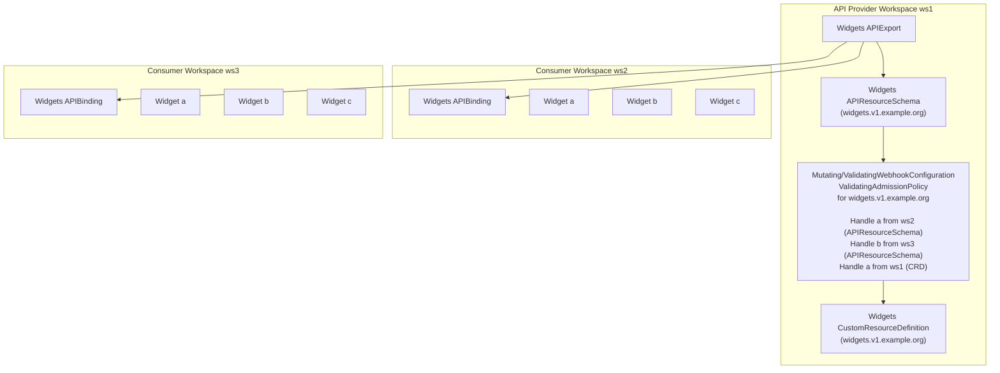
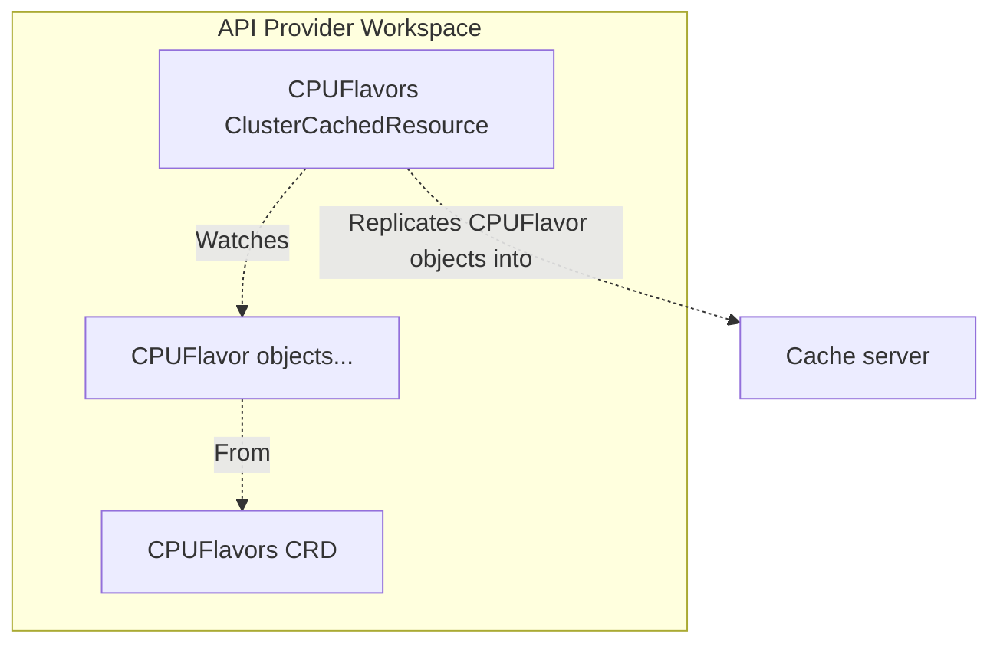
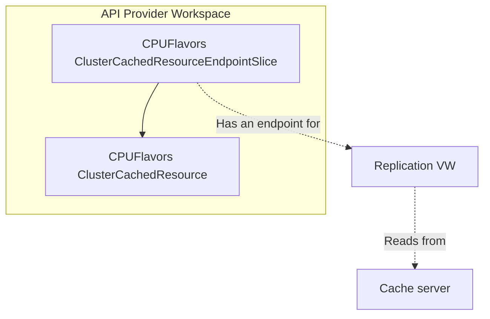
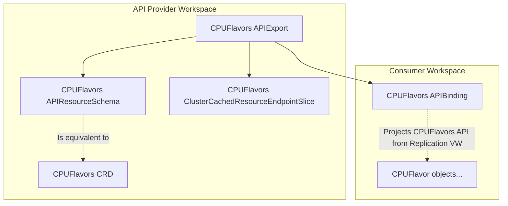
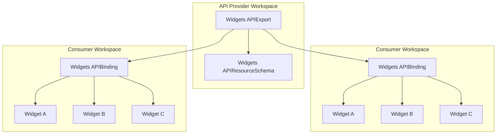
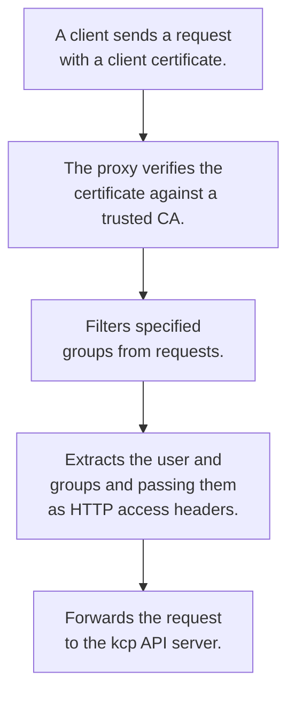
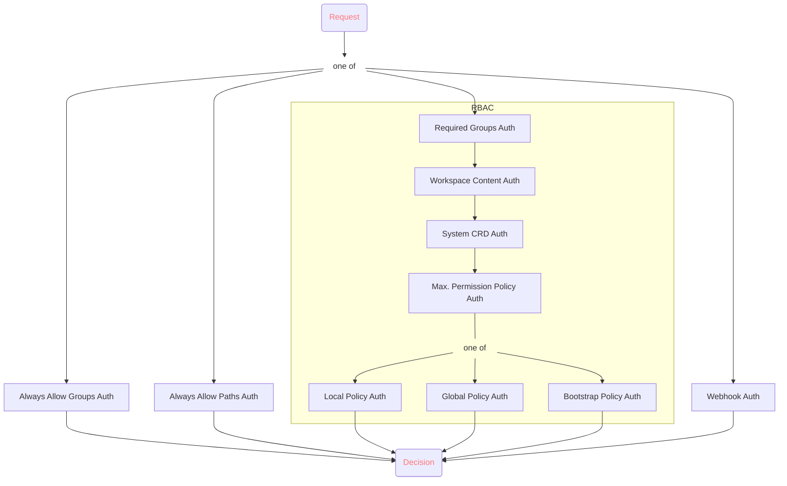
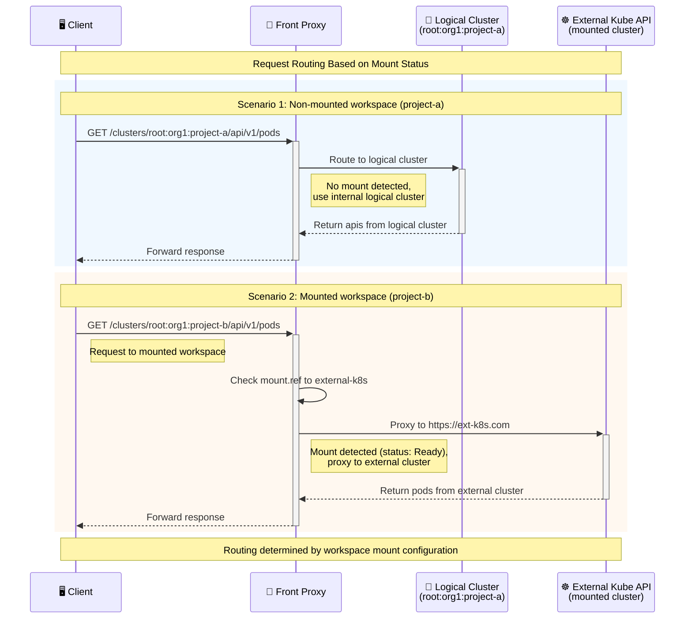

<a id="doc-12e0a48d6c5f2a58f4caa284"></a>

# kcp-dev/kcp / ADOPTERS.md

Upstream: https://github.com/kcp-dev/kcp/blob/ec4b44cf31a1c4bcb6d8a50726f798f0f4956214/ADOPTERS.md

Commit: `ec4b44cf31a1c4bcb6d8a50726f798f0f4956214`

Retrieved: 2026-10-01T15:21:30.838635+00:00

Kind: official-document

Raw SHA256: `986369dfd5e298c4479aa5e923fd023975abe35cb89109afeefeb33bae3d5ad8`

Source text below is untrusted reference content. Acquisition does not verify technical claims.

License status: UPSTREAM_NOTICES_CAPTURED_PER_FILE_REVIEW_REQUIRED. See this repository's captured license files.

---

# Adopters

Listed below are organizations that have adopted kcp in one way or another. We are delighted to welcome them to the kcp community. If you are using kcp in your organization, we would love to add you to the list below. You can either open a pull request against this file directly or file the [Adopter form](https://github.com/kcp-dev/kcp/issues/new?assignees=&labels=kind%2Fdocumentation&projects=&template=adopters.yaml&title=adopter%3A+COMPANY_NAME).


| Organization  | Description | Maturity Level | Further Information |
| ------------- | ------------- | --- | --- |
| KubeStellar   | KubeStellar Console integrates kcp workspace management, API browsing, and guided installation missions into an open-source Kubernetes dashboard with AI-assisted operations. | Development | [console.kubestellar.io](https://console.kubestellar.io) |
| Kubermatic    | Kubermatic is building Kubermatic Developer Platform (KDP), an internal developer platform (IdP) product that uses kcp as its global API control plane.  | Development | [Product Website](https://www.kubermatic.com/products/kubermatic-developer-platform/) |
| Faros.sh      | Faros is building a control-plane-as-a-service to access & manage multiple Kubernetes clusters across public and private deployments. | Development | - |
| SAP           | SAP is developing an open reference architecture (ApeiroRA) with a Platform Mesh that leverages kcp as its foundation, enabling service providers to seamlessly connect and interact through unified KRM-based APIs in a cloud-edge continuum. | Development | [Website](https://apeirora.eu/) |
| Upbound       | We use kcp within our Cloud Managed Control Planes product to provide multi-tenant access to the underlying hostcluster. | Production | - |


<a id="doc-eca12c0a30e25b4b46522ebf"></a>

# kcp-dev/kcp / CONTRIBUTING.md

Upstream: https://github.com/kcp-dev/kcp/blob/ec4b44cf31a1c4bcb6d8a50726f798f0f4956214/CONTRIBUTING.md

Commit: `ec4b44cf31a1c4bcb6d8a50726f798f0f4956214`

Retrieved: 2026-10-01T15:21:30.838635+00:00

Kind: official-document

Raw SHA256: `9bb6cba2cd397c63cca62e7c4d471ea4250394ca6b688be1b8a45701026934fe`

Source text below is untrusted reference content. Acquisition does not verify technical claims.

License status: UPSTREAM_NOTICES_CAPTURED_PER_FILE_REVIEW_REQUIRED. See this repository's captured license files.

---

# Contributing to kcp

We're thrilled that you're interested in contributing to kcp! Please visit our
[full contributing guide](https://docs.kcp.io/kcp/main/contributing) on our documentation site.

Beside that, what coverns the project and all contributions to it must follow
the [kcp Project Governance](./GOVERNANCE.md).

From the kcp Project Governance, the following manifesto should guide the technical
decisions through-out all contributions:

> kcp maintainers strive to be good citizens in the Kubernetes project.
> kcp maintainers see kcp always as part of the Kubernetes ecosystem and always strive to keep that ecosystem united. In particular, this means:
> - kcp strives to not divert from Kubernetes, but strives to extend its use-cases to non-container control planes while keeping the ecosystems of libraries and tooling united.
> - kcp – as a consumer of Kubernetes API Machinery – will strive to stay 100% compatible with the semantics of Kubernetes APIs, while removing container orchestration specific functionality.
> - kcp strives to upstream changes to Kubernetes code as much as possible.


<a id="doc-c7bd425fd98aad1f9fef2009"></a>

# kcp-dev/kcp / FAQ.md

Upstream: https://github.com/kcp-dev/kcp/blob/ec4b44cf31a1c4bcb6d8a50726f798f0f4956214/FAQ.md

Commit: `ec4b44cf31a1c4bcb6d8a50726f798f0f4956214`

Retrieved: 2026-10-01T15:21:30.838635+00:00

Kind: official-document

Raw SHA256: `4b40078541e8f093bce6112400061c3bce2884ebea22791f19f6a70fe404576d`

Source text below is untrusted reference content. Acquisition does not verify technical claims.

License status: UPSTREAM_NOTICES_CAPTURED_PER_FILE_REVIEW_REQUIRED. See this repository's captured license files.

---

# Frequently Asked Questions

## What is the elevator pitch, why would I want to use kcp?

kcp is a highly-multi-tenant Kubernetes control-plane, built for SaaS service-providers who want to offer a unified API-driven platform to many customers and dramatically reduce a) cost of operation of the platform and b) cost of onboarding of new services. It is made to scale to the order of magnitude of 10s of thousands of customers, offer a Kubernetes-like experience including execution of workloads, but with dramatically lower overhead per new customer.

## What is a ....

Check out our [concepts](https://github.com/kcp-dev/kcp/blob/main/docs/concepts.md) document and feel free to open an issue if something is not covered.

## If kcp is a Kubernetes API server without pod-like APIs, how do resources like Deployments get scheduled?

kcp has a concept called [syncer](https://github.com/kcp-dev/kcp/blob/main/docs/concepts.md#syncer) which is installed on each [SyncTarget](https://github.com/kcp-dev/kcp/blob/main/docs/concepts.md#workload-cluster). The [syncer](https://github.com/kcp-dev/kcp/blob/main/docs/concepts.md#syncer) negotiates, with kcp, a set of APIs to make accessible in the workspace. This may include things like [Deployments](https://kubernetes.io/docs/concepts/workloads/controllers/deployment/) or other resources you may explicitly configure the syncer to synchronize to kcp. Once these APIs are made available in your [Workspace](https://github.com/kcp-dev/kcp/blob/main/docs/concepts.md#workspace) you may then create resources of that type. From there, the [Location and Placement](https://github.com/kcp-dev/kcp/blob/main/docs/concepts.md#location) APIs help determine which [Location](https://github.com/kcp-dev/kcp/blob/main/docs/concepts.md#location) your deployable resource lands on.

## Will kcp be able to pass the K8S conformance tests in [CNCF Conformance Suites](https://www.cncf.io/certification/software-conformance/)?

No, the Kubernetes conformance suites require that all Kubernetes APIs are supported and kcp does not support all APIs out of the box (for instance, Pods).

## Are these ideas being presented to the Kubernetes community?

Yes! All development is public and we have started discussions about what is mature enough to present to various interested parties. It is worth noting that not all of the goals of kcp are necessarily part of the goals of Kubernetes so while some items may be accepted upstream we expect that at least some of the concepts in kcp will live outside the Kubernetes repository.

## How does upgrading Kubernetes work in this model?

kcp depends on a [fork](https://github.com/kcp-dev/kubernetes) of Kubernetes. Updating Kubernetes for the kcp project itself requires a rebase. We are actively following the releases of Kubernetes and rebasing regularly. Updating Kubernetes for clusters attached to kcp is exactly like it is done today, though you may choose to follow different patterns of availability for applications based on kcp's ability to cordon and drain clusters or relocate applications.

## Can kcp workloads run on MiniKube clusters?

Yes.

## How will storage work at the workspace level for administration?

We are in the early stages of [brainstorming storage use cases](https://docs.google.com/document/d/13VpnyBQHpaishrastdO3kGApKLzYBeb9QXdKn3o2vHs/edit#heading=h.tg51mxx1tg19). Please join in the conversation if you have opinions or use cases in this areas.

## With multiple `Workspaces` on a single cluster, that implies `Pods` from multiple tenants are on the same host VM. Does this mean privileged `Pods` are forbidden to avoid cross contamination with host ports and host paths?

We aren't quite there yet. Security controls are especially important at the multi-tenant level and we'd love to hear your use cases in this area.

## Do the service provider operators/controllers live outside of kcp?

Controller patterns are something we are actively working on defining better.  In general, operators and controllers from a service providing team would run on their provided compute (or shared compute) and point back to kcp in order to have a view of the resources being created that they need to take action upon. This view would be via a [Virtual Workspace](https://github.com/kcp-dev/kcp/blob/main/docs/virtual-workspaces.md).

## Can I get the logs of a pod deployed via kcp? Can I attach to a pod or exec to a pod?

Yes. We are tracking [read-through of resources](https://github.com/kcp-dev/kcp/issues/25) and [debugging](https://github.com/kcp-dev/kcp/issues/521) as use cases we need to support. You can view a demo of the current work in our [April 26 Community Call Recording](https://www.youtube.com/watch?v=joR39RR2Gwo).

## Are workspaces hierarchical?

[Workspaces](https://github.com/kcp-dev/kcp/blob/main/docs/workspaces.md) can contain other workspaces and workspaces are typed. Please see the [Workspace documentation](https://github.com/kcp-dev/kcp/blob/main/docs/workspaces.md) for more details.

## Are custom admission controllers considered? How would that work across clusters if api server and the actual service is located elsewhere?

Yes. [Validating and mutating webhooks](https://github.com/kcp-dev/kcp/pull/818) via an external URL are supported.

## kcp hides nodes - does it mean that Pod does not have a nodeName field set?

They do, in the [workload clusters](https://github.com/kcp-dev/kcp/blob/main/docs/concepts.md#workload-cluster) where the pods live and run. The control plane doesn't have pods (at least not by default, today).

## Let’s take something boring like FIPS compliance. Would a workspace be guaranteed to run accordingly to the regulatory standards? Ie a workspace admin defined some FIPS stuffs and kcp ensures that the resulting pods do run appropriate in the FIPS shard?

In kcp an application should be able to describe the constraints it needs in its runtime environment. This may be technical requirements like GPU or storage, it may be regulatory like data locality or FIPS, or it may be some other cool thing we haven't thought of yet. kcp expects the integration with [Location and Placement](https://github.com/kcp-dev/kcp/blob/main/docs/concepts.md#location) APIs to handle finding the right placement that fulfills those requirements.

## Could you define a 'shard' in the context of kcp?

Shards in kcp represent a single apiserver and etcd/db instance.  This is how kcp would like to split workspaces across many kcp instances since etcd will have storage limits.

## Where can I get the kubectl ws plugin?

You're in the right place. Clone this repo and run `make install WHAT=./staging/src/github.com/kcp-dev/cli/cmd/kubectl-kcp`.

## What does kcp stand for / how to spell it?

`kcp` stands for "Kubernetes-like control planes" and should always be written in lowercase letters.


<a id="doc-b60c6a93e9f74ee52e71bf33"></a>

# kcp-dev/kcp / GOVERNANCE.md

Upstream: https://github.com/kcp-dev/kcp/blob/ec4b44cf31a1c4bcb6d8a50726f798f0f4956214/GOVERNANCE.md

Commit: `ec4b44cf31a1c4bcb6d8a50726f798f0f4956214`

Retrieved: 2026-10-01T15:21:30.838635+00:00

Kind: official-document

Raw SHA256: `cc59287e79997bf7437f25004dd905b4e1e606179e690c278212fbfbc4b9d33a`

Source text below is untrusted reference content. Acquisition does not verify technical claims.

License status: UPSTREAM_NOTICES_CAPTURED_PER_FILE_REVIEW_REQUIRED. See this repository's captured license files.

---

# kcp Project Governance

The kcp project is dedicated to democratizing Control Planes beyond container
orchestration. This governance explains how the project is run.

- [Manifesto](#values)
- [Values](#values)
- [Maintainers](#maintainers)
- [Code of Conduct Enforcement](#code-of-conduct)
- [Security Response Team](#security-response-team)
- [Voting](#voting)
- [Modifying this Charter](modifying-this-charter)

## Manifesto

 * kcp maintainers strive to be good citizens in the Kubernetes project.
 * kcp maintainers see kcp always as part of the Kubernetes ecosystem and always
   strive to keep that ecosystem united. In particular, this means:
   * kcp strives to not divert from Kubernetes, but strives to extend its
     use-cases to non-container control planes while keeping the ecosystems of
     libraries and tooling united.
   * kcp – as a consumer of Kubernetes API Machinery – will strive to stay 100%
     compatible with the semantics of Kubernetes APIs, while removing container
     orchestration specific functionality.
   * kcp strives to upstream changes to Kubernetes code as much as possible.

## Values

The kcp and its leadership embrace the following values:

 * *Openness*: Communication and decision-making happens in the open and is
   discoverable for future reference. As much as possible, all discussions and
   work take place in public forums and open repositories.
 * *Fairness*: All stakeholders have the opportunity to provide feedback and
   submit contributions, which will be considered on their merits.
 * *Community over Product or Company*: Sustaining and growing our community
   takes priority over shipping code or sponsors' organizational goals. Each
   contributor participates in the project as an individual. To be explicit,
   this means that all maintainers pledge to act in a [vendor-neutral](https://contribute.cncf.io/maintainers/community/vendor-neutrality/)
   way while participating in kcp development.
 * *Inclusivity*: We innovate through different perspectives and skill sets,
   which can only be accomplished in a welcoming and respectful environment.
 * *Participation*: Responsibilities within the project are earned through
   participation, and there is a clear path up the contributor ladder into
   leadership positions.

## Maintainers

kcp maintainers have write access to the [project GitHub repository](https://github.com/kcp-dev/kcp).
They can merge their own patches or patches from others. The current maintainers
can be found as top-level approvers in [OWNERS](./OWNERS).  Maintainers collectively
manage the project's resources and contributors.

This privilege is granted with some expectation of responsibility: maintainers
are people who care about the kcp project and want to help it grow and
improve. A maintainer is not just someone who can make changes, but someone who
has demonstrated their ability to collaborate with the team, get the most
knowledgeable people to review code and docs, contribute high-quality code, and
follow through to fix issues (in code or tests).

A maintainer is a contributor to the project's success and a citizen helping
the project succeed.

The collective team of all Maintainers is known as the Maintainer Council, which
is the governing body for the project.

### Security Response Team

The Maintainers will appoint a Security Response Team to handle security reports.
This committee may simply consist of the Maintainer Council themselves. If this
responsibility is delegated, the Maintainers will appoint a team of at least two
contributors to handle it. The Maintainers will review who is assigned to this
at least once a year.

The Security Response Team is responsible for handling all reports of security
holes and breaches according to the [security policy](./SECURITY.md).

The members of the Security Response Team are documented in [MAINTAINERS.md](./MAINTAINERS.md).

### GitHub Admin Team

The maintainers will appoint a GitHub Admin Team to handle ownership of the GitHub organization(s) owned by the kcp project. Members of the GitHub Admin Team need to be extremely trustworthy individuals with a long-standing trusted relationship to the project.

The team's responsibility is being administrators for the GitHub organization(s). This would include managing organization-wide permissions, creating new repositories, configuring the organization, etc. The GitHub Admin Team is an executive organ of the full Maintainer Council with the goal to reduce broad permissions, but members of the team are bound by Maintainer Council decisions. Members of the GitHub Admin Team must not be from a single employer/organization.

The members of the GitHub Admin Team are documented in [MAINTAINERS.md](./MAINTAINERS.md).

## Becoming a Maintainer

<!-- If you have full Contributor Ladder documentation that covers becoming
a Maintainer or Owner, then this section should instead be a reference to that
documentation -->

To become a [Maintainer](./MAINTAINERS.md) you need to demonstrate the following:

  * commitment to the project:
    * participate in discussions, contributions, code and documentation reviews
      for 3 months or more,
    * perform reviews for 5 non-trivial pull requests,
    * contribute 5 non-trivial pull requests and have them merged,
  * ability to write quality code and/or documentation,
  * ability to collaborate with the team,
  * understanding of how the team works (policies, processes for testing and code review, etc),
  * understanding of the project's code base and coding and documentation style.
  <!-- add any additional Maintainer requirements here -->

A new Maintainer must be proposed by an existing maintainer by sending a message to the
[developer mailing list](https://groups.google.com/g/kcp-dev). A simple majority
vote of existing Maintainers approves the application.

Maintainers who are selected will be granted the necessary GitHub rights,
and invited to the [private maintainer mailing list](https://groups.google.com/g/kcp-dev-private).

### Bootstrapping Maintainers

To bootstrap the process, 3 maintainers are defined (in the initial PR adding
this to the repository) that do not necessarily follow the above rules. When a
new maintainer is added following the above rules, the existing maintainers
define one not following the rules to step down, until all of them follow the
rules.

### Removing a Maintainer

Maintainers may resign at any time if they feel that they will not be able to
continue fulfilling their project duties.

Maintainers may also be removed after being inactive, failure to fulfill their
Maintainer responsibilities, violating the Code of Conduct, or other reasons.
Inactivity is defined as a period of very low or no activity in the project for
a year or more, with no definite schedule to return to full Maintainer activity.

A Maintainer may be removed at any time by a 2/3 vote of the remaining maintainers.

Depending on the reason for removal, a Maintainer may be converted to Emeritus
status. Emeritus Maintainers will still be consulted on some project matters,
and can be rapidly returned to Maintainer status if their availability changes.


## Meetings

Time zones permitting, Maintainers are expected to participate in the public
community call meeting. Maintainers will also have closed meetings in order to
discuss security reports. Such meetings should be scheduled by any Maintainer on
receipt of a security issue. All current Maintainers must be invited to such closed meetings.

## Code of Conduct

<!-- This assumes that your project does not have a separate Code of Conduct
Committee; most maintainer-run projects do not.  Remember to place a link
to the private Maintainer mailing list or alias in the code-of-conduct file.-->

kcp has adopted the CNCF [Code of Conduct](./code-of-conduct.md). Reporting of
Code of Conduct violations happen through the [CNCF Code of Conduct committee](./code-of-conduct.md#reporting)
and kcp maintainers pledge to work with the committee to resolve any incidents
occurring in the kcp community.


## Voting

While most business in kcp is conducted by "lazy consensus", periodically
the Maintainers may need to vote on specific actions or changes.
A vote can be taken on [the developer mailing list](https://groups.google.com/g/kcp-dev) or
[the private Maintainer mailing list](https://groups.google.com/g/kcp-dev-private)
for security issues.  Votes may also be taken at the community call
meeting. Any Maintainer may demand a vote be taken.

Most votes require a simple majority of all Maintainers to succeed. Maintainers
can be removed by a 2/3 majority vote of all Maintainers, and changes to this
Governance require a 2/3 vote of all Maintainers.

Pull requests that make changes requiring Maintainer consensus may also be
understood as a vote. They require the stated majority to be granted via
LGTMs on the pull request. Such a pull request shall be announced to the developer
mailing list and put on hold until the necessary majority has been reached.

## Subprojects

Any Maintainer may submit a [vote](#voting) to create a new subproject under the
kcp-dev GitHub organization. Subprojects are governed by all Maintainers, but may
take on additional Subproject Maintainers that are only responsible for the
specific subproject.

It is the combined responsibility of Maintainers and Subproject Maintainers
to review contributions to subprojects and make project goal decisions.
Subproject Maintainers are not part of the private Maintainer mailing list and
are involved in security responses on a need-to-know basis if the reported security
issue concerns their respective subproject.

Subproject Maintainers are elected by the Maintainers. Subproject Maintainers are
allowed to participate in votes concerning their respective subprojects.

## Approvers

The Maintainers and Subproject Maintainers may elect trusted contributors to
assist them in the review process for specific parts of the code. Those Approvers
are allowed to approve and merge code contributions for certain subsets of the code
(not a whole project), e.g. areas of the code that they have proven themselves
to be very familiar with.

Approvers do not have voting rights.

## Modifying this Charter

Changes to this Governance and its supporting documents may be approved by a
2/3 vote of the Maintainers.


<a id="doc-c693279643b8cd5d248172d9"></a>

# kcp-dev/kcp / LICENSE

Upstream: https://github.com/kcp-dev/kcp/blob/ec4b44cf31a1c4bcb6d8a50726f798f0f4956214/LICENSE

Commit: `ec4b44cf31a1c4bcb6d8a50726f798f0f4956214`

Retrieved: 2026-10-01T15:21:30.838635+00:00

Kind: license

Raw SHA256: `cfc7749b96f63bd31c3c42b5c471bf756814053e847c10f3eb003417bc523d30`

Source text below is untrusted reference content. Acquisition does not verify technical claims.

License status: UPSTREAM_NOTICES_CAPTURED_PER_FILE_REVIEW_REQUIRED. See this repository's captured license files.

---

````text

                                 Apache License
                           Version 2.0, January 2004
                        http://www.apache.org/licenses/

   TERMS AND CONDITIONS FOR USE, REPRODUCTION, AND DISTRIBUTION

   1. Definitions.

      "License" shall mean the terms and conditions for use, reproduction,
      and distribution as defined by Sections 1 through 9 of this document.

      "Licensor" shall mean the copyright owner or entity authorized by
      the copyright owner that is granting the License.

      "Legal Entity" shall mean the union of the acting entity and all
      other entities that control, are controlled by, or are under common
      control with that entity. For the purposes of this definition,
      "control" means (i) the power, direct or indirect, to cause the
      direction or management of such entity, whether by contract or
      otherwise, or (ii) ownership of fifty percent (50%) or more of the
      outstanding shares, or (iii) beneficial ownership of such entity.

      "You" (or "Your") shall mean an individual or Legal Entity
      exercising permissions granted by this License.

      "Source" form shall mean the preferred form for making modifications,
      including but not limited to software source code, documentation
      source, and configuration files.

      "Object" form shall mean any form resulting from mechanical
      transformation or translation of a Source form, including but
      not limited to compiled object code, generated documentation,
      and conversions to other media types.

      "Work" shall mean the work of authorship, whether in Source or
      Object form, made available under the License, as indicated by a
      copyright notice that is included in or attached to the work
      (an example is provided in the Appendix below).

      "Derivative Works" shall mean any work, whether in Source or Object
      form, that is based on (or derived from) the Work and for which the
      editorial revisions, annotations, elaborations, or other modifications
      represent, as a whole, an original work of authorship. For the purposes
      of this License, Derivative Works shall not include works that remain
      separable from, or merely link (or bind by name) to the interfaces of,
      the Work and Derivative Works thereof.

      "Contribution" shall mean any work of authorship, including
      the original version of the Work and any modifications or additions
      to that Work or Derivative Works thereof, that is intentionally
      submitted to Licensor for inclusion in the Work by the copyright owner
      or by an individual or Legal Entity authorized to submit on behalf of
      the copyright owner. For the purposes of this definition, "submitted"
      means any form of electronic, verbal, or written communication sent
      to the Licensor or its representatives, including but not limited to
      communication on electronic mailing lists, source code control systems,
      and issue tracking systems that are managed by, or on behalf of, the
      Licensor for the purpose of discussing and improving the Work, but
      excluding communication that is conspicuously marked or otherwise
      designated in writing by the copyright owner as "Not a Contribution."

      "Contributor" shall mean Licensor and any individual or Legal Entity
      on behalf of whom a Contribution has been received by Licensor and
      subsequently incorporated within the Work.

   2. Grant of Copyright License. Subject to the terms and conditions of
      this License, each Contributor hereby grants to You a perpetual,
      worldwide, non-exclusive, no-charge, royalty-free, irrevocable
      copyright license to reproduce, prepare Derivative Works of,
      publicly display, publicly perform, sublicense, and distribute the
      Work and such Derivative Works in Source or Object form.

   3. Grant of Patent License. Subject to the terms and conditions of
      this License, each Contributor hereby grants to You a perpetual,
      worldwide, non-exclusive, no-charge, royalty-free, irrevocable
      (except as stated in this section) patent license to make, have made,
      use, offer to sell, sell, import, and otherwise transfer the Work,
      where such license applies only to those patent claims licensable
      by such Contributor that are necessarily infringed by their
      Contribution(s) alone or by combination of their Contribution(s)
      with the Work to which such Contribution(s) was submitted. If You
      institute patent litigation against any entity (including a
      cross-claim or counterclaim in a lawsuit) alleging that the Work
      or a Contribution incorporated within the Work constitutes direct
      or contributory patent infringement, then any patent licenses
      granted to You under this License for that Work shall terminate
      as of the date such litigation is filed.

   4. Redistribution. You may reproduce and distribute copies of the
      Work or Derivative Works thereof in any medium, with or without
      modifications, and in Source or Object form, provided that You
      meet the following conditions:

      (a) You must give any other recipients of the Work or
          Derivative Works a copy of this License; and

      (b) You must cause any modified files to carry prominent notices
          stating that You changed the files; and

      (c) You must retain, in the Source form of any Derivative Works
          that You distribute, all copyright, patent, trademark, and
          attribution notices from the Source form of the Work,
          excluding those notices that do not pertain to any part of
          the Derivative Works; and

      (d) If the Work includes a "NOTICE" text file as part of its
          distribution, then any Derivative Works that You distribute must
          include a readable copy of the attribution notices contained
          within such NOTICE file, excluding those notices that do not
          pertain to any part of the Derivative Works, in at least one
          of the following places: within a NOTICE text file distributed
          as part of the Derivative Works; within the Source form or
          documentation, if provided along with the Derivative Works; or,
          within a display generated by the Derivative Works, if and
          wherever such third-party notices normally appear. The contents
          of the NOTICE file are for informational purposes only and
          do not modify the License. You may add Your own attribution
          notices within Derivative Works that You distribute, alongside
          or as an addendum to the NOTICE text from the Work, provided
          that such additional attribution notices cannot be construed
          as modifying the License.

      You may add Your own copyright statement to Your modifications and
      may provide additional or different license terms and conditions
      for use, reproduction, or distribution of Your modifications, or
      for any such Derivative Works as a whole, provided Your use,
      reproduction, and distribution of the Work otherwise complies with
      the conditions stated in this License.

   5. Submission of Contributions. Unless You explicitly state otherwise,
      any Contribution intentionally submitted for inclusion in the Work
      by You to the Licensor shall be under the terms and conditions of
      this License, without any additional terms or conditions.
      Notwithstanding the above, nothing herein shall supersede or modify
      the terms of any separate license agreement you may have executed
      with Licensor regarding such Contributions.

   6. Trademarks. This License does not grant permission to use the trade
      names, trademarks, service marks, or product names of the Licensor,
      except as required for reasonable and customary use in describing the
      origin of the Work and reproducing the content of the NOTICE file.

   7. Disclaimer of Warranty. Unless required by applicable law or
      agreed to in writing, Licensor provides the Work (and each
      Contributor provides its Contributions) on an "AS IS" BASIS,
      WITHOUT WARRANTIES OR CONDITIONS OF ANY KIND, either express or
      implied, including, without limitation, any warranties or conditions
      of TITLE, NON-INFRINGEMENT, MERCHANTABILITY, or FITNESS FOR A
      PARTICULAR PURPOSE. You are solely responsible for determining the
      appropriateness of using or redistributing the Work and assume any
      risks associated with Your exercise of permissions under this License.

   8. Limitation of Liability. In no event and under no legal theory,
      whether in tort (including negligence), contract, or otherwise,
      unless required by applicable law (such as deliberate and grossly
      negligent acts) or agreed to in writing, shall any Contributor be
      liable to You for damages, including any direct, indirect, special,
      incidental, or consequential damages of any character arising as a
      result of this License or out of the use or inability to use the
      Work (including but not limited to damages for loss of goodwill,
      work stoppage, computer failure or malfunction, or any and all
      other commercial damages or losses), even if such Contributor
      has been advised of the possibility of such damages.

   9. Accepting Warranty or Additional Liability. While redistributing
      the Work or Derivative Works thereof, You may choose to offer,
      and charge a fee for, acceptance of support, warranty, indemnity,
      or other liability obligations and/or rights consistent with this
      License. However, in accepting such obligations, You may act only
      on Your own behalf and on Your sole responsibility, not on behalf
      of any other Contributor, and only if You agree to indemnify,
      defend, and hold each Contributor harmless for any liability
      incurred by, or claims asserted against, such Contributor by reason
      of your accepting any such warranty or additional liability.

   END OF TERMS AND CONDITIONS

   APPENDIX: How to apply the Apache License to your work.

      To apply the Apache License to your work, attach the following
      boilerplate notice, with the fields enclosed by brackets "[]"
      replaced with your own identifying information. (Don't include
      the brackets!)  The text should be enclosed in the appropriate
      comment syntax for the file format. We also recommend that a
      file or class name and description of purpose be included on the
      same "printed page" as the copyright notice for easier
      identification within third-party archives.

   Copyright [yyyy] [name of copyright owner]

   Licensed under the Apache License, Version 2.0 (the "License");
   you may not use this file except in compliance with the License.
   You may obtain a copy of the License at

       http://www.apache.org/licenses/LICENSE-2.0

   Unless required by applicable law or agreed to in writing, software
   distributed under the License is distributed on an "AS IS" BASIS,
   WITHOUT WARRANTIES OR CONDITIONS OF ANY KIND, either express or implied.
   See the License for the specific language governing permissions and
   limitations under the License.

````


<a id="doc-39da3bd6270d44ea37b6ed50"></a>

# kcp-dev/kcp / MAINTAINERS.md

Upstream: https://github.com/kcp-dev/kcp/blob/ec4b44cf31a1c4bcb6d8a50726f798f0f4956214/MAINTAINERS.md

Commit: `ec4b44cf31a1c4bcb6d8a50726f798f0f4956214`

Retrieved: 2026-10-01T15:21:30.838635+00:00

Kind: official-document

Raw SHA256: `6e7292f2fd432c7e95213cdc988e1a07032c0ad343e23da14d194cad2313d2be`

Source text below is untrusted reference content. Acquisition does not verify technical claims.

License status: UPSTREAM_NOTICES_CAPTURED_PER_FILE_REVIEW_REQUIRED. See this repository's captured license files.

---

# Maintainers

The table below lists all current maintainers for the kcp project as defined by our [project governance](./GOVERNANCE.md).

| Name                  | GitHub Handle                                    | Domains of reponsibility                                      | Affiliation |
|-----------------------|--------------------------------------------------|---------------------------------------------------------------|-------------|
| Andy Anderson         | [@clubanderson](https://github.com/clubanderson) | Governance                                                    | IBM         |
| Marvin Beckers        | [@embik](https://github.com/embik)               | kcp core, kcp-operator, multicluster-provider, infrastructure | Kubermatic  |
| Mangirdas Judeikis    | [@mjudeikis](https://github.com/mjudeikis)       | kcp core                                                      | -           |
| Nelo-T. Wallus        | [@ntnn](https://github.com/ntnn)                 | kcp core                                                      | SAP         |
| Sebastian Scheele     | [@scheeles](https://github.com/scheeles)         | Governance                                                    | Kubermatic  |
| Dr. Stefan Schimanski | [@sttts](https://github.com/sttts)               | Governance, kcp core                                          | NVIDIA      |
| Marko Mudrinić        | [@xmudrii](https://github.com/xmudrii)           | kcp core                                                      | Kubermatic  |
| Christoph Mewes       | [@xrstf](https://github.com/xrstf)               | kcp core, API Syncagent, kcp-operator, infrastructure         | Kubermatic  |
| Robert Vasek          | [@gman0](https://github.com/gman0)               | kcp core                                                      | Clyso       |
| Simon Bein            | [@SimonTheLeg](https://github.com/SimonTheLeg)   | kcp core, kcp-operator                                        | Kubermatic  |

## Emeritus Maintainers

No emeritus maintainers currently exist. We would like to highlight that this project does have prior maintainers and core contributors
that, if they so wished, could (and should) be granted the status of emeritus maintainers.

## Security Response Team

The following maintainers are members of the security response team and enact the [security process](./SECURITY.md):

- Dr. Stefan Schimanski
- Mangirdas Judeikis
- Marvin Beckers

## GitHub Admin Team

The following maintainers are members of the GitHub Admin Team and manage the GitHub organizations:

- Dr. Stefan Schimanski
- Mangirdas Judeikis
- Sebastian Scheele
- Christoph Mewes


<a id="doc-b335630551682c19a781afeb"></a>

# kcp-dev/kcp / README.md

Upstream: https://github.com/kcp-dev/kcp/blob/ec4b44cf31a1c4bcb6d8a50726f798f0f4956214/README.md

Commit: `ec4b44cf31a1c4bcb6d8a50726f798f0f4956214`

Retrieved: 2026-10-01T15:21:30.838635+00:00

Kind: official-document

Raw SHA256: `78bb87ea5cef69284df15e202a2c0b4a1fef3c62ddbfaf4353c3b2a7e709fa4f`

Source text below is untrusted reference content. Acquisition does not verify technical claims.

License status: UPSTREAM_NOTICES_CAPTURED_PER_FILE_REVIEW_REQUIRED. See this repository's captured license files.

---

#  kcp

[](https://www.bestpractices.dev/projects/8119)
[](https://github.com/kcp-dev/kcp/blob/main/LICENSE)
[](https://github.com/kcp-dev/kcp/releases/latest)
[](https://app.fossa.com/projects/git%2Bgithub.com%2Fkcp-dev%2Fkcp?ref=badge_shield)
[](https://insights.linuxfoundation.org/project/kcp)
[](https://insights.linuxfoundation.org/project/kcp)

## Overview

kcp is a Kubernetes-like control plane focusing on:

- A **control plane** for many independent, **isolated** “clusters” known as **workspaces**
- Enabling API service providers to **offer APIs centrally** using **multi-tenant operators**
- Easy **API consumption** for users in their workspaces

kcp can be a building block for SaaS service providers who need a **massively multi-tenant platform** to offer services
to a large number of fully isolated tenants using Kubernetes-native APIs. The goal is to be useful to cloud
providers as well as enterprise IT departments offering APIs within their company.

**NB:** In May 2023, the kcp project was restructured and components related to workload scheduling (e.g. the syncer) and the transparent multi cluster (tmc) code were removed due to lack of interest/maintainers. Please refer to the [`main-pre-tmc-removal` branch](https://github.com/kcp-dev/kcp/tree/main-pre-tmc-removal) if you are interested in the related code.

## Getting Started

**For Users:** Follow our [Setup & Quick Start](https://docs.kcp.io/kcp/main/setup/quickstart/) guide to download and run kcp.

**For Developers:** To build and run kcp from source:
```bash
# Build and run from source:
go run ./cmd/kcp start

# In another terminal:
export KUBECONFIG=.kcp/admin.kubeconfig && kubectl get workspaces
```

**Learn More:**
- [Concepts & Tenancy Guide](https://docs.kcp.io/kcp/main/concepts/quickstart-tenancy-and-apis/) - Learn about workspaces, workspace types, and APIs

## Documentation

Please visit [docs.kcp.io/kcp](https://docs.kcp.io/kcp/latest) for our documentation.

## Contributing

We ❤️ our contributors! If you're interested in helping us out, please check out [contributing to kcp](https://docs.kcp.io/kcp/main/contributing/).

This community has a [Code of Conduct](./code-of-conduct.md). Please make sure to follow it.

## Getting in touch

There are several ways to communicate with us:

- On the [Kubernetes Slack workspace](https://slack.k8s.io).
    - [`#kcp-users`](https://app.slack.com/client/T09NY5SBT/C021U8WSAFK) for discussions and questions regarding kcp's setup and usage.
    - [`#kcp-dev`](https://kubernetes.slack.com/archives/C09C7UP1VLM) for conversations about developing kcp itself.
- Our mailing lists.
    - [kcp-users](https://groups.google.com/g/kcp-users) for discussions among users and potential users.
    - [kcp-dev](https://groups.google.com/g/kcp-dev) for development discussions.
- The bi-weekly community meetings.
    - By joining the kcp-dev mailing list, you should receive an invite to our bi-weekly community meetings.
    - The next community meeting dates are also available via our [CNCF community group](https://community.cncf.io/kcp/).
    - Check the [community meeting notes document](https://docs.google.com/document/d/1PrEhbmq1WfxFv1fTikDBZzXEIJkUWVHdqDFxaY1Ply4) for future and past meeting agendas.
    - See recordings of past community meetings on [YouTube](https://www.youtube.com/channel/UCfP_yS5uYix0ppSbm2ltS5Q).
- Browse the [shared Google Drive](https://drive.google.com/drive/folders/1FN7AZ_Q1CQor6eK0gpuKwdGFNwYI517M?usp=sharing) to share design docs, notes, etc.
    - Members of the kcp-dev mailing list can view this drive.

## Additional references

- [CNCF CNL: kcp – Kubernetes-Like Control Planes for Declarative APIs - Marvin Beckers, Simon Bein](https://www.youtube.com/watch?v=OVjTKxPc92Y)
- [ContainerDays 2025: Next Generation of Platform Engineering Using kcp and Crossplane - Lovro Sviben, Simon Bein](https://www.youtube.com/watch?v=JM1RnNYnuWg)
- [Platform Engineering Day Europe 2024: Building a Platform Engineering API Layer with kcp – Marvin Beckers](https://www.youtube.com/watch?v=az5Rm8Snms4)
- [KubeCon EU 2024: Why Kubernetes Is Inappropriate for Platforms, and How to Make It Better – Stefan Schimanski, Mangirdas Judeikis, Sebastian Scheele](https://www.youtube.com/watch?v=7op_r9R0fCo)
- [KubeCon EU 2024: Kubernetes-style APIs for SaaS-like Control Planes with kcp – Marvin Beckers, Mangirdas Judeikis](https://www.youtube.com/watch?v=-P1kUo5zZR4)
- [KubeCon US 2022: Kcp: Towards 1,000,000 Clusters, Name^WWorkspaced CRDs - Stefan Schimanski](https://www.youtube.com/watch?v=fGv5dpQ8X5I)
- [Rejekts US 2022: What if namespaces provided more isolation than just names? – Stefan Schimanski](https://www.youtube.com/watch?v=WGrPUyx7qQE)
- [Let's Learn kcp - A minimal Kubernetes API server with Saiyam Pathak - July 7, 2021](https://www.youtube.com/watch?v=M4mn_LlCyzk)
- [TGI Kubernetes 157: Exploring kcp: apiserver without Kubernetes](https://youtu.be/FD_kY3Ey2pI)
- [K8s SIG Architecture meeting discussing kcp - June 29, 2021](https://www.youtube.com/watch?v=YrdAYoo-UQQ)
- [OpenShift Commons: Kubernetes as the Control Plane for the Hybrid Cloud - Clayton Coleman](https://www.youtube.com/watch?v=Y3Y11Aj_01I)
- [KubeCon EU 2021: Kubernetes as the Hybrid Cloud Control Plane Keynote - Clayton Coleman](https://www.youtube.com/watch?v=oaPBYUfdFE8)


## License
[](https://app.fossa.com/projects/git%2Bgithub.com%2Fkcp-dev%2Fkcp?ref=badge_large)


<a id="doc-f6ed156e4bf5c79168066246"></a>

# kcp-dev/kcp / SECURITY.md

Upstream: https://github.com/kcp-dev/kcp/blob/ec4b44cf31a1c4bcb6d8a50726f798f0f4956214/SECURITY.md

Commit: `ec4b44cf31a1c4bcb6d8a50726f798f0f4956214`

Retrieved: 2026-10-01T15:21:30.838635+00:00

Kind: official-document

Raw SHA256: `fcdabbe338fe0b2f277d13082285717652cf22474d3431494a0f98b28358002f`

Source text below is untrusted reference content. Acquisition does not verify technical claims.

License status: UPSTREAM_NOTICES_CAPTURED_PER_FILE_REVIEW_REQUIRED. See this repository's captured license files.

---

# Security

The kcp maintainers take security for kcp very seriously, especially given kcp's sensitive nature as an API control plane.

## Reporting a Vulnerability

kcp uses GitHub to allow submission of private security reports. Please report any security finding via
[this link](https://github.com/kcp-dev/kcp/security/advisories/new). If submitting a GitHub advisory is not possible for you, you can send a direct email to [kcp-dev-private@googlegroups.com](mailto:kcp-dev-private@googlegroups.com).
Maintainers will triage your report as soon as possible and get in touch with you via your report or via email in case they have more questions.

As a security researcher, please report vulnerabilities to kcp in a [coordinated vulnerability disclosure](https://cheatsheetseries.owasp.org/cheatsheets/Vulnerability_Disclosure_Cheat_Sheet.html)
fashion. In return, maintainers pledge to engage in good faith and collaborate with security researchers to address and publish vulnerabilities found in kcp as soon as possible.

Please understand that the maintainers also do not accept results of dependency scanners without proof that the detected CVE / vulnerability can be used against kcp.

## Security Advisories

Advisories are managed through GitHub. Public disclosure of vulnerabilities happens through GitHub and the kcp-users mailing list.
Please visit [Security Advisories](https://github.com/kcp-dev/kcp/security/advisories) to review security bulletins published by the maintainers.

## Security Response Committee

kcp maintainers have formed a security response committee to ensure that security reports get addressed in a timely manner.
You can find the list of members in [MAINTAINERS.md](./MAINTAINERS.md). Please do not contact them directly but follow the
vulnerability reporting process as described abvove.


<a id="doc-7ec38faef81e7700da3d4b8e"></a>

# kcp-dev/kcp / cmd/compat/README.md

Upstream: https://github.com/kcp-dev/kcp/blob/ec4b44cf31a1c4bcb6d8a50726f798f0f4956214/cmd/compat/README.md

Commit: `ec4b44cf31a1c4bcb6d8a50726f798f0f4956214`

Retrieved: 2026-10-01T15:21:30.838635+00:00

Kind: official-document

Raw SHA256: `5a1b51d88f80def05bd7c782729835a9a082a0b28381b0a8843f5b7e5b5f4ffb`

Source text below is untrusted reference content. Acquisition does not verify technical claims.

License status: UPSTREAM_NOTICES_CAPTURED_PER_FILE_REVIEW_REQUIRED. See this repository's captured license files.

---

# `compat`

This tool can be used to check compatibility between two CRD definitions, and
generate the Least-Common-Denominator (LCD) CRD YAML if requested.

## Usage

### Check compatibility of two files

```
go run ./cmd/compat old-crd.yaml new-crd.yaml
```

If the `--lcd` flag is passed, `compat` will print the LCD CRD YAML to stdout.

### Check compatibility between a CRD in a cluster and configuration in a local file

```
go run ./cmd/compat <(kubectl get crd foos.foo.example.dev -oyaml) foo-crd.yaml
```


<a id="doc-f1a69a41a835b5265e1c58e1"></a>

# kcp-dev/kcp / code-of-conduct.md

Upstream: https://github.com/kcp-dev/kcp/blob/ec4b44cf31a1c4bcb6d8a50726f798f0f4956214/code-of-conduct.md

Commit: `ec4b44cf31a1c4bcb6d8a50726f798f0f4956214`

Retrieved: 2026-10-01T15:21:30.838635+00:00

Kind: official-document

Raw SHA256: `17dba65c78af7ae31d2b87918c8a4925acf73860e810e9d6cc748e73437ee121`

Source text below is untrusted reference content. Acquisition does not verify technical claims.

License status: UPSTREAM_NOTICES_CAPTURED_PER_FILE_REVIEW_REQUIRED. See this repository's captured license files.

---

This project is following the [CNCF Code of Conduct](https://github.com/cncf/foundation/blob/main/code-of-conduct.md). 

# Community Code of Conduct

As contributors, maintainers, and participants in the CNCF community, and in the interest of fostering
an open and welcoming community, we pledge to respect all people who participate or contribute
through reporting issues, posting feature requests, updating documentation,
submitting pull requests or patches, attending conferences or events, or engaging in other community or project activities.

We are committed to making participation in the CNCF community a harassment-free experience for everyone, regardless of age, body size, caste, disability, ethnicity, level of experience, family status, gender, gender identity and expression, marital status, military or veteran status, nationality, personal appearance, race, religion, sexual orientation, socieconomic status, tribe, or any other dimension of diversity.

## Scope 

This code of conduct applies:
* within project and community spaces,
* in other spaces when an individual CNCF community participant's words or actions are directed at or are about a CNCF project, the CNCF community, or another CNCF community participant.

### CNCF Events

CNCF events that are produced by the Linux Foundation with professional events staff are governed by the Linux Foundation [Events Code of Conduct](https://events.linuxfoundation.org/code-of-conduct/) available on the event page. This is designed to be used in conjunction with the CNCF Code of Conduct.

## Our Standards

The CNCF Community is open, inclusive and respectful. Every member of our community has the right to have their identity respected.

Examples of behavior that contributes to a positive environment include but are not limited to:

* Demonstrating empathy and kindness toward other people
* Being respectful of differing opinions, viewpoints, and experiences
* Giving and gracefully accepting constructive feedback
* Accepting responsibility and apologizing to those affected by our mistakes,
  and learning from the experience
* Focusing on what is best not just for us as individuals, but for the
  overall community
* Using welcoming and inclusive language
  

Examples of unacceptable behavior include but are not limited to:

* The use of sexualized language or imagery
* Trolling, insulting or derogatory comments, and personal or political attacks
* Public or private harassment in any form
* Publishing others' private information, such as a physical or email
  address, without their explicit permission
* Violence, threatening violence, or encouraging others to engage in violent behavior
* Stalking or following someone without their consent
* Unwelcome physical contact
* Unwelcome sexual or romantic attention or advances
* Other conduct which could reasonably be considered inappropriate in a
  professional setting
  
The following behaviors are also prohibited:
* Providing knowingly false or misleading information in connection with a Code of Conduct investigation or otherwise intentionally tampering with an investigation.
* Retaliating against a person because they reported an incident or provided information about an incident as a witness.

Project maintainers have the right and responsibility to remove, edit, or reject comments, commits, code, wiki edits, issues, and other contributions that are not aligned to this Code of Conduct. 
By adopting this Code of Conduct, project maintainers commit themselves to fairly and consistently applying these principles to every aspect
of managing a CNCF project. 
Project maintainers who do not follow or enforce the Code of Conduct may be temporarily or permanently removed from the project team.

## Reporting 

For incidents occurring in the Kubernetes community, contact the [Kubernetes Code of Conduct Committee](https://git.k8s.io/community/committee-code-of-conduct) via <conduct@kubernetes.io>. You can expect a response within three business days.

For other projects, or for incidents that are project-agnostic or impact multiple CNCF projects, please contact the [CNCF Code of Conduct Committee](https://www.cncf.io/conduct/committee/) via conduct@cncf.io.  Alternatively, you can contact any of the individual members of the [CNCF Code of Conduct Committee](https://www.cncf.io/conduct/committee/) to submit your report. For more detailed instructions on how to submit a report, including how to submit a report anonymously, please see our [Incident Resolution Procedures](https://www.cncf.io/conduct/procedures/). You can expect a response within three business days.

For incidents occurring at CNCF event that is produced by the Linux Foundation, please contact eventconduct@cncf.io.

## Enforcement 

Upon review and investigation of a reported incident, the CoC response team that has jurisdiction will determine what action is appropriate based on this Code of Conduct and its related documentation. 

For information about which Code of Conduct incidents are handled by project leadership, which incidents are handled by the CNCF Code of Conduct Committee, and which incidents are handled by the Linux Foundation (including its events team), see our [Jurisdiction Policy](https://www.cncf.io/conduct/jurisdiction/).

## Amendments

Consistent with the CNCF Charter, any substantive changes to this Code of Conduct must be approved by the Technical Oversight Committee.

## Acknowledgements

This Code of Conduct is adapted from the Contributor Covenant
(http://contributor-covenant.org), version 2.0 available at
http://contributor-covenant.org/version/2/0/code_of_conduct/


<a id="doc-7a5403d4057801c53eb4b35c"></a>

# kcp-dev/kcp / config/examples/admission-webhook/README.md

Upstream: https://github.com/kcp-dev/kcp/blob/ec4b44cf31a1c4bcb6d8a50726f798f0f4956214/config/examples/admission-webhook/README.md

Commit: `ec4b44cf31a1c4bcb6d8a50726f798f0f4956214`

Retrieved: 2026-10-01T15:21:30.838635+00:00

Kind: official-document

Raw SHA256: `758a19dfc938316dbbe9ff4ad39139ef1ddeeb18fea627325372a6e66c57a25f`

Source text below is untrusted reference content. Acquisition does not verify technical claims.

License status: UPSTREAM_NOTICES_CAPTURED_PER_FILE_REVIEW_REQUIRED. See this repository's captured license files.

---

# Validating objects across an APIExport/APIBinding

This example shows how an **API provider** enforces validation on a custom
resource (`Cowboy`) for **every consumer workspace** that binds the API — by
registering the validation **once**, in the workspace that owns the `APIExport`.

See also: [docs/content/concepts/apis/admission-webhooks.md](../../../docs/content/concepts/apis/admission-webhooks.md).

## The key idea

kcp makes admission **cluster-aware**. When a `Cowboy` is created in a consumer
workspace, kcp's admission plugin notices the resource schema comes from an
`APIBinding`, resolves the owning `APIExport`, and dispatches admission to the
`ValidatingWebhookConfiguration` / `ValidatingAdmissionPolicy` that live **in the
provider workspace** — not the consumer's. The reviewed object is annotated with
`kcp.io/cluster: <consumer>` so the webhook knows which workspace it lives in.

So you do **not** install a webhook in each consumer. You install it once where
the `APIExport` lives, and it covers all bindings.

```
root:provider                                root:consumer
┌──────────────────────────────┐            ┌─────────────────────────┐
│ APIResourceSchema (cowboys)  │            │ APIBinding ─────────────┼─┐
│ APIExport (today-cowboys) ◄──┼────────────┼─────────────────────────┘ │
│ ValidatingWebhookConfig      │            │ Cowboy (intent: bad) ─────┼─┐
│  (or ValidatingAdmissionPol.)│            └───────────────────────────┘ │
└──────────────────────────────┘                                          │
            ▲  admission of the consumer's Cowboy is dispatched here ─────┘
```

## Files

| File | Workspace | What |
|------|-----------|------|
| `apiresourceschema.yaml` | `root:provider` | Schema of the `Cowboy` API |
| `apiexport.yaml`         | `root:provider` | Exports the API |
| `apibinding.yaml`        | `root:consumer` | Binds the export |
| `validatingwebhookconfiguration.yaml` | `root:provider` | Webhook (external server); `url`/`caBundle` templated by `run.sh` |
| `validatingadmissionpolicy.yaml`      | `root:provider` | Server-less CEL alternative |
| `webhook/main.go`                     | host | Stdlib-only server: rejects `spec.intent == "bad"` |
| `cowboy-good.yaml` / `cowboy-bad.yaml`| `root:consumer` | Admitted / rejected |
| `run.sh` | — | One-shot driver for both modes |

## Quick start

Requires a running kcp reachable via `$KUBECONFIG` (defaults to the repo root
`admin.kubeconfig`) and the `kubectl ws` plugin (`make install` or `bin/kubectl-ws`).

```bash
# webhook mode (external server). kcp must be able to reach this host; the script
# uses host.docker.internal, which works for the Tilt/kind setup on Docker Desktop.
./config/examples/admission-webhook/run.sh

# server-less alternative (ValidatingAdmissionPolicy, no certs, no server):
./config/examples/admission-webhook/run.sh policy

# tear down the demo workspaces:
./config/examples/admission-webhook/run.sh clean
```

Expected tail of a successful run:

```
== TEST 1: create a GOOD cowboy (expect ADMITTED)
✓ good cowboy admitted
== TEST 2: create a BAD cowboy (expect REJECTED)
✓ bad cowboy rejected as expected:
    Error from server: admission webhook "validate.cowboys.wildwest.dev" denied
    the request: cowboy "bad-bart" rejected: spec.intent must not be "bad"
    (workspace <consumer-cluster>)
```

The provider webhook server's log shows the reviewed object's
`kcp.io/cluster` annotation = the consumer workspace, proving the
cross-workspace dispatch.

## Manual walkthrough (webhook mode)

```bash
export KUBECONFIG=$PWD/admin.kubeconfig   # from repo root

# 1. Provider: schema + export
kubectl ws :root
kubectl ws create provider --ignore-existing --enter
kubectl apply -f config/examples/admission-webhook/apiresourceschema.yaml
kubectl apply -f config/examples/admission-webhook/apiexport.yaml

# 2. Provider: run the webhook server + register it (see run.sh for cert/caBundle wiring)
#    url: https://host.docker.internal:9443/validate

# 3. Consumer: bind the export
kubectl ws :root
kubectl ws create consumer --ignore-existing --enter
kubectl apply -f config/examples/admission-webhook/apibinding.yaml

# 4. Test from the consumer workspace
kubectl apply -f config/examples/admission-webhook/cowboy-good.yaml   # admitted
kubectl apply -f config/examples/admission-webhook/cowboy-bad.yaml    # denied
```

## Notes

- The webhook server (`webhook/main.go`) uses only the standard library, so it
  has no dependencies to download. Run it with `go run .` from that directory.
- `failurePolicy: Fail` means a Cowboy create is rejected if the webhook server is
  unreachable — start the server before creating objects (run.sh does this).
- For the external-webhook path kcp must be able to dial the server. In the
  Tilt/kind setup, `host.docker.internal` resolves from inside the kind node to
  the host. For other topologies, set a routable `url` and matching cert SAN.


<a id="doc-d7c84665e384f007543a89a7"></a>

# kcp-dev/kcp / config/examples/admission-webhook/run.sh

Upstream: https://github.com/kcp-dev/kcp/blob/ec4b44cf31a1c4bcb6d8a50726f798f0f4956214/config/examples/admission-webhook/run.sh

Commit: `ec4b44cf31a1c4bcb6d8a50726f798f0f4956214`

Retrieved: 2026-10-01T15:21:30.838635+00:00

Kind: upstream-example-code

Raw SHA256: `5162d2f270f007a2731ddef5b47c1ab2197d1bfc17ab508acff206f4a5d2ca0a`

Source text below is untrusted reference content. Acquisition does not verify technical claims.

License status: UPSTREAM_NOTICES_CAPTURED_PER_FILE_REVIEW_REQUIRED. See this repository's captured license files.

---

````text
#!/usr/bin/env bash

# Copyright 2025 The kcp Authors.
#
# Licensed under the Apache License, Version 2.0 (the "License");
# you may not use this file except in compliance with the License.
# You may obtain a copy of the License at
#
#     http://www.apache.org/licenses/LICENSE-2.0
#
# Unless required by applicable law or agreed to in writing, software
# distributed under the License is distributed on an "AS IS" BASIS,
# WITHOUT WARRANTIES OR CONDITIONS OF ANY KIND, either express or implied.
# See the License for the specific language governing permissions and
# limitations under the License.

#
# End-to-end demo: validate objects across an APIExport/APIBinding using either a
# cross-workspace admission webhook (default) or a ValidatingAdmissionPolicy.
#
# Prereqs:
#   - a running kcp reachable via $KUBECONFIG (defaults to ./admin.kubeconfig in the repo root)
#   - the `kubectl ws` plugin on PATH (bin/kubectl-ws or `make install`)
#   - for webhook mode: kcp must be able to reach this host (this script uses
#     host.docker.internal, which works for the Tilt/kind setup on Docker Desktop)
#
# Usage:
#   ./run.sh            # webhook mode (external server)
#   ./run.sh policy     # ValidatingAdmissionPolicy mode (no server, no certs)
#   ./run.sh clean      # delete the provider/consumer workspaces created by the demo
set -euo pipefail

MODE="${1:-webhook}"
DIR="$(cd "$(dirname "${BASH_SOURCE[0]}")" && pwd)"
REPO_ROOT="$(cd "$DIR/../../.." && pwd)"
export KUBECONFIG="${KUBECONFIG:-$REPO_ROOT/admin.kubeconfig}"

# Resolve the ws plugin (prefer the repo's bin).
WS="kubectl-ws"
[ -x "$REPO_ROOT/bin/kubectl-ws" ] && WS="$REPO_ROOT/bin/kubectl-ws"

WEBHOOK_PORT=9443
WEBHOOK_HOST=host.docker.internal
CERTDIR="$DIR/.certs"
SERVER_PID=""

log()  { printf '\n\033[1;34m== %s\033[0m\n' "$*"; }
ok()   { printf '\033[1;32m✓ %s\033[0m\n' "$*"; }
fail() { printf '\033[1;31m✗ %s\033[0m\n' "$*"; }

cleanup() {
  [ -n "$SERVER_PID" ] && kill "$SERVER_PID" 2>/dev/null || true
}
trap cleanup EXIT

if [ "$MODE" = "clean" ]; then
  log "Deleting demo workspaces"
  "$WS" :root >/dev/null
  kubectl delete workspace provider consumer --ignore-not-found
  ok "cleaned up"
  exit 0
fi

#############################################
# PROVIDER workspace: schema + export
#############################################
log "Creating PROVIDER workspace root:provider"
"$WS" :root >/dev/null
"$WS" create provider --ignore-existing --enter >/dev/null
kubectl apply -f "$DIR/apiresourceschema.yaml"
kubectl apply -f "$DIR/apiexport.yaml"
ok "APIResourceSchema + APIExport created in root:provider"

if [ "$MODE" = "webhook" ]; then
  #############################################
  # PROVIDER: serving cert + webhook server
  #############################################
  log "Generating self-signed serving cert (SAN=$WEBHOOK_HOST)"
  mkdir -p "$CERTDIR"
  openssl req -x509 -newkey rsa:2048 -nodes \
    -keyout "$CERTDIR/tls.key" -out "$CERTDIR/tls.crt" -days 365 \
    -subj "/CN=$WEBHOOK_HOST" \
    -addext "subjectAltName=DNS:$WEBHOOK_HOST,DNS:localhost,IP:127.0.0.1" >/dev/null 2>&1
  ok "cert written to $CERTDIR"

  log "Starting webhook server on :$WEBHOOK_PORT"
  ( cd "$DIR/webhook" && exec go run . \
      --tls-cert "$CERTDIR/tls.crt" --tls-key "$CERTDIR/tls.key" \
      --addr ":$WEBHOOK_PORT" ) &
  SERVER_PID=$!

  # Wait for the server to come up.
  for _ in $(seq 1 30); do
    if curl -sk "https://127.0.0.1:$WEBHOOK_PORT/healthz" >/dev/null 2>&1; then break; fi
    sleep 1
  done
  curl -sk "https://127.0.0.1:$WEBHOOK_PORT/healthz" >/dev/null && ok "webhook server is up"

  log "Registering ValidatingWebhookConfiguration in root:provider"
  CA_BUNDLE="$(base64 < "$CERTDIR/tls.crt" | tr -d '\n')"
  WEBHOOK_URL="https://$WEBHOOK_HOST:$WEBHOOK_PORT/validate"
  sed -e "s|CA_BUNDLE|$CA_BUNDLE|" -e "s|WEBHOOK_URL|$WEBHOOK_URL|" \
    "$DIR/validatingwebhookconfiguration.yaml" | kubectl apply -f -
  ok "webhook registered"
else
  #############################################
  # PROVIDER: ValidatingAdmissionPolicy (no server)
  #############################################
  log "Applying ValidatingAdmissionPolicy in root:provider"
  kubectl apply -f "$DIR/validatingadmissionpolicy.yaml"
  ok "policy applied"
fi

#############################################
# CONSUMER workspace: bind + test
#############################################
log "Creating CONSUMER workspace root:consumer and binding the export"
"$WS" :root >/dev/null
"$WS" create consumer --ignore-existing --enter >/dev/null
kubectl apply -f "$DIR/apibinding.yaml"

log "Waiting for the cowboys API to be served in root:consumer"
for _ in $(seq 1 60); do
  if kubectl get cowboys -A >/dev/null 2>&1; then break; fi
  sleep 1
done
kubectl get cowboys -A >/dev/null 2>&1 && ok "cowboys API is served"

log "TEST 1: create a GOOD cowboy (expect ADMITTED)"
if kubectl apply -f "$DIR/cowboy-good.yaml"; then
  ok "good cowboy admitted"
else
  fail "good cowboy was unexpectedly rejected"; exit 1
fi

log "TEST 2: create a BAD cowboy (expect REJECTED)"
if kubectl apply -f "$DIR/cowboy-bad.yaml" 2>/tmp/cowboy-bad.err; then
  fail "bad cowboy was admitted -- validation did NOT work"; exit 1
else
  ok "bad cowboy rejected as expected:"
  sed 's/^/    /' /tmp/cowboy-bad.err
fi

log "DONE"
echo "Provider webhook/policy validated objects created in the consumer workspace."
echo "Inspect with:   KUBECONFIG=$KUBECONFIG $WS :root:consumer && kubectl get cowboys"
echo "Tear down with: $DIR/run.sh clean"

````


<a id="doc-9a93156b5d67385f419f19f2"></a>

# kcp-dev/kcp / config/examples/admission-webhook/webhook/main.go

Upstream: https://github.com/kcp-dev/kcp/blob/ec4b44cf31a1c4bcb6d8a50726f798f0f4956214/config/examples/admission-webhook/webhook/main.go

Commit: `ec4b44cf31a1c4bcb6d8a50726f798f0f4956214`

Retrieved: 2026-10-01T15:21:30.838635+00:00

Kind: upstream-example-code

Raw SHA256: `0ec9d233a1bfc06b97d52989fff1ff991f911a67e2108e2ac6eafa435cb112fd`

Source text below is untrusted reference content. Acquisition does not verify technical claims.

License status: UPSTREAM_NOTICES_CAPTURED_PER_FILE_REVIEW_REQUIRED. See this repository's captured license files.

---

````text
/*
Copyright 2025 The kcp Authors.

Licensed under the Apache License, Version 2.0 (the "License");
you may not use this file except in compliance with the License.
You may obtain a copy of the License at

    http://www.apache.org/licenses/LICENSE-2.0

Unless required by applicable law or agreed to in writing, software
distributed under the License is distributed on an "AS IS" BASIS,
WITHOUT WARRANTIES OR CONDITIONS OF ANY KIND, either express or implied.
See the License for the specific language governing permissions and
limitations under the License.
*/

// A minimal validating admission webhook server for the cowboys API.
//
// Rule enforced: a Cowboy's spec.intent must NOT be "bad".
//
// Stdlib only -- it decodes the AdmissionReview as generic JSON so there are no
// Kubernetes dependencies to download.
//
//	go run . --tls-cert=tls.crt --tls-key=tls.key --addr=:9443
package main

import (
	"encoding/json"
	"flag"
	"io"
	"log"
	"net/http"
	"time"
)

func main() {
	var certFile, keyFile, addr string
	flag.StringVar(&certFile, "tls-cert", "tls.crt", "path to TLS serving cert")
	flag.StringVar(&keyFile, "tls-key", "tls.key", "path to TLS serving key")
	flag.StringVar(&addr, "addr", ":9443", "listen address")
	flag.Parse()

	http.HandleFunc("/validate", validate)
	http.HandleFunc("/healthz", func(w http.ResponseWriter, _ *http.Request) { w.WriteHeader(http.StatusOK) })

	srv := &http.Server{
		Addr:              addr,
		ReadHeaderTimeout: 5 * time.Second,
		ReadTimeout:       30 * time.Second,
		WriteTimeout:      30 * time.Second,
	}

	log.Printf("cowboy validating webhook listening on %s", addr)
	log.Fatal(srv.ListenAndServeTLS(certFile, keyFile))
}

func validate(w http.ResponseWriter, r *http.Request) {
	body, err := io.ReadAll(r.Body)
	if err != nil {
		http.Error(w, err.Error(), http.StatusBadRequest)
		return
	}

	var review map[string]any
	if err := json.Unmarshal(body, &review); err != nil {
		http.Error(w, err.Error(), http.StatusBadRequest)
		return
	}

	req, _ := review["request"].(map[string]any)
	uid, _ := req["uid"].(string)
	obj, _ := req["object"].(map[string]any)
	meta, _ := obj["metadata"].(map[string]any)
	spec, _ := obj["spec"].(map[string]any)

	name, _ := meta["name"].(string)
	intent, _ := spec["intent"].(string)

	// kcp stamps the object with the consumer workspace it actually lives in.
	cluster := ""
	if ann, ok := meta["annotations"].(map[string]any); ok {
		cluster, _ = ann["kcp.io/cluster"].(string)
	}
	log.Printf("reviewing cowboy %q from workspace cluster %q intent=%q", name, cluster, intent)

	resp := map[string]any{"uid": uid, "allowed": true}
	if intent == "bad" {
		resp["allowed"] = false
		resp["status"] = map[string]any{
			"code":    403,
			"message": "cowboy \"" + name + "\" rejected: spec.intent must not be \"bad\" (workspace " + cluster + ")",
		}
	}

	out := map[string]any{
		"apiVersion": "admission.k8s.io/v1",
		"kind":       "AdmissionReview",
		"response":   resp,
	}
	w.Header().Set("Content-Type", "application/json")
	if err := json.NewEncoder(w).Encode(out); err != nil {
		log.Printf("error writing response: %v", err)
	}
}

````


<a id="doc-195f720b7494eefd57df4b1a"></a>

# kcp-dev/kcp / config/examples/virtualresources/README.md

Upstream: https://github.com/kcp-dev/kcp/blob/ec4b44cf31a1c4bcb6d8a50726f798f0f4956214/config/examples/virtualresources/README.md

Commit: `ec4b44cf31a1c4bcb6d8a50726f798f0f4956214`

Retrieved: 2026-10-01T15:21:30.838635+00:00

Kind: official-document

Raw SHA256: `27aa1d2fc88a785b168c9e5ba69aee41962538b24216a1526b12139f57d05602`

Source text below is untrusted reference content. Acquisition does not verify technical claims.

License status: UPSTREAM_NOTICES_CAPTURED_PER_FILE_REVIEW_REQUIRED. See this repository's captured license files.

---

# VirtualResources Example

This example shows usage of virtual resources, together with ClusterCachedResources.
The goal of ClusterCachedResources is to distribute static, read-only resources to multiple clusters
in a scalable way.

## Setup

1. Start kcp with sharded setup:

   ```bash
   make test-run-sharded-server
   ```

2. Create a provider workspace, where we will create the resources to be distributed:

   ```bash
   export KUBECONFIG=.kcp/admin.kubeconfig
   kubectl ws create provider --enter

   kubectl create -f config/examples/virtualresources/crd-instances.yaml
   # for this to work we always require apiresource schema to be present
   kubectl create -f config/examples/virtualresources/apiresourceschema-instances.yaml
   kubectl create -f config/examples/virtualresources/instances.yaml

   # create caching for the resources
   kubectl create -f config/examples/virtualresources/cluster-cached-resource-instances.yaml
   ```

3. Create an APIResourceSchema for actual virtual machines to be distributed,
   which will be using instance types. 

   ```bash
    kubectl create -f config/examples/virtualresources/apiresourceschema-virtualmachine.yaml
   ```

4. Create an APIExport for the virtual machines and the ClusterCachedResourceEndpointSlice that references it:

    ```bash
    kubectl create -f config/examples/virtualresources/apiexport.yaml
    kubectl create -f config/examples/virtualresources/cluster-cached-resource-instances-endpointslice.yaml
   ```

5. Create a consumer workspace, where we will consume the virtual machines:

    ```bash
    kubectl ws use :root
    kubectl ws create consumer --enter
    kubectl kcp bind apiexport root:provider:virtualmachines virtualmachines
   ```

6. Now check if we can see instances in the consumer workspace:

   ```bash
   kubectl get instances.machines.svm.io
   ```


<a id="doc-844e4e6855423972d117e556"></a>

# kcp-dev/kcp / contrib/kcp-dex/README.md

Upstream: https://github.com/kcp-dev/kcp/blob/ec4b44cf31a1c4bcb6d8a50726f798f0f4956214/contrib/kcp-dex/README.md

Commit: `ec4b44cf31a1c4bcb6d8a50726f798f0f4956214`

Retrieved: 2026-10-01T15:21:30.838635+00:00

Kind: official-document

Raw SHA256: `95be61fed7f8262901ecd2b188083f90efea0b52fc49a5590216efafd21498aa`

Source text below is untrusted reference content. Acquisition does not verify technical claims.

License status: UPSTREAM_NOTICES_CAPTURED_PER_FILE_REVIEW_REQUIRED. See this repository's captured license files.

---

# kcp Dex

How to run local kcp with dex.

## Step by step guide

### Dex

Run dex outside of kcp
We use dex to manage OIDC, following the steps below you can run a local OIDC issuer using dex:

* First, clone the dex repo: `git clone https://github.com/mjudeikis/dex.git -b mjudeikis/groups.support`
  * Important: We use fork to allow local group support k8s relies on: https://github.com/dexidp/dex/issues/1080
* `cd dex` and then build the dex binary `make build`
* The binary will be created in `bin/dex`
* Adjust the config file(`examples/config-dev.yaml`) for dex by specifying the server callback method:
* Generate certificates for dex:
```bash
GOBIN=$(pwd)/bin go install github.com/mjudeikis/genkey
./bin/genkey 127.0.0.1
```

* Run dex: `./bin/dex serve ../contrib/kcp-dex/kcp-config.yaml `


### kcp

Start kcp with oidc enabled, you can either use the OIDC flags or structured authentication configuration from a file. Example configuration is shown in `auth-config.yaml`.

## OIDC Flags

```bash
go run ./cmd/kcp start \
--oidc-issuer-url=https://127.0.0.1:5556/dex \
--oidc-client-id=kcp-dev \
--oidc-groups-claim=groups \
--oidc-ca-file=127.0.0.1.pem
```

## Structured Authentication Config

```bash
CA_CERT=$(openssl x509 -in 127.0.0.1.pem | sed 's/^/      /')
```
```bash
cat << EOF_AuthConfig > auth-config.yaml
apiVersion: apiserver.config.k8s.io/v1beta1
kind: AuthenticationConfiguration
jwt:
- issuer:
    url: https://127.0.0.1:5556/dex
    certificateAuthority: |
$CA_CERT
    audiences:
      - kcp-dev
    audienceMatchPolicy: MatchAny
  claimMappings:
    username:
      claim: "email"
      prefix: ""
    groups:
      claim: "groups"
      prefix: ""
  claimValidationRules: []
  userValidationRules: []
EOF_AuthConfig
```

Start a kcp server:

```bash
./bin/kcp start --authentication-config auth-config.yaml
```

### Login

Use oidc plugin:

```bash
kubectl krew install oidc-login

# to test
kubectl oidc-login get-token \
--oidc-issuer-url=https://127.0.0.1:5556/dex \
--oidc-client-id=kcp-dev \
--oidc-client-secret=Z2Fyc2lha2FsYmlzdmFuZGVuekWplCg== \
--insecure-skip-tls-verify \
--oidc-extra-scope=groups,email

# to configure kubectl to use this plugin
export KUBECONFIG=.kcp/admin.kubeconfig

# create a new user with oidc
kubectl config set-credentials oidc \
  --exec-api-version=client.authentication.k8s.io/v1beta1 \
  --exec-command=kubectl \
  --exec-arg=oidc-login \
  --exec-arg=get-token \
  --exec-arg=--oidc-issuer-url=https://127.0.0.1:5556/dex  \
  --exec-arg=--oidc-client-id=kcp-dev \
  --exec-arg=--oidc-client-secret=Z2Fyc2lha2FsYmlzdmFuZGVuekWplCg== \
  --exec-arg=--oidc-extra-scope=groups \
  --exec-arg=--oidc-extra-scope=email \
  --exec-arg=--insecure-skip-tls-verify

# set current context to use oidc
kubectl config set-context --current --user=oidc

# test
# password is admin:password
kubectl get ws
kubectl create workspace bob


<a id="doc-b93809bd8fc624ecbb758c79"></a>

# kcp-dev/kcp / contrib/logo/README.md

Upstream: https://github.com/kcp-dev/kcp/blob/ec4b44cf31a1c4bcb6d8a50726f798f0f4956214/contrib/logo/README.md

Commit: `ec4b44cf31a1c4bcb6d8a50726f798f0f4956214`

Retrieved: 2026-10-01T15:21:30.838635+00:00

Kind: official-document

Raw SHA256: `dd52b7589d10ed66f7520d9672f63fc583db4631fd5270422c6929879d850a9a`

Source text below is untrusted reference content. Acquisition does not verify technical claims.

License status: UPSTREAM_NOTICES_CAPTURED_PER_FILE_REVIEW_REQUIRED. See this repository's captured license files.

---

# kcp Logo

The logo of kcp is a hypercube, viewed symmetrically in a way that it forms two
nested, equally oriented, centered regular hexagons with the connecting hypercube
lines clearly visible, either through color contrast or a line.

There are these variants, to be used depending on context:

1. normal <br clear="right"/>
1. high contrast <br clear="right"/>
2. glow <br clear="right"/>

Moreover, there is a red-blue variant:
1. normal <br clear="right"/>
2. high contrast <br clear="right"/>
3. glow <br clear="right"/>

Depending on context one or the other variant makes more sense visually.

The kcp font is [Ubuntu](https://fonts.google.com/specimen/Ubuntu).

The application used for the original files is [Amadine](https://amadine.com/).

## Copyright 2022 The kcp Authors.

Licensed under the Apache License, Version 2.0 (the "License");
you may not use this file except in compliance with the License.
You may obtain a copy of the License at

    http://www.apache.org/licenses/LICENSE-2.0

Unless required by applicable law or agreed to in writing, software
distributed under the License is distributed on an "AS IS" BASIS,
WITHOUT WARRANTIES OR CONDITIONS OF ANY KIND, either express or implied.
See the License for the specific language governing permissions and
limitations under the License.


<a id="doc-ced45bd2041ee600e4abb6ce"></a>

# kcp-dev/kcp / contrib/production/README.md

Upstream: https://github.com/kcp-dev/kcp/blob/ec4b44cf31a1c4bcb6d8a50726f798f0f4956214/contrib/production/README.md

Commit: `ec4b44cf31a1c4bcb6d8a50726f798f0f4956214`

Retrieved: 2026-10-01T15:21:30.838635+00:00

Kind: official-document

Raw SHA256: `756c8f09dff841e0ca004d17e0bbcd228239c7d2a40d48fe77c33ed9f480e6f3`

Source text below is untrusted reference content. Acquisition does not verify technical claims.

License status: UPSTREAM_NOTICES_CAPTURED_PER_FILE_REVIEW_REQUIRED. See this repository's captured license files.

---

# Production Deployment Assets

This directory contains assets and configuration files for production deployment of kcp.

!!! Note: We understand that maintaining static assets in the repository can be challenging. If you have noticed any discrepancies between these assets and the latest version of the kcp - please open an issue or submit a pull request to help us keep them up to date.

## Usage

These assets are referenced by the production deployment documentation in `docs/content/setup/production/`.

Each deployment type (dekker, vespucci, comer) has its own subdirectory with complete configuration files and deployment manifests.

## Deployment Types

- **kcp-dekker**: Self-signed certificates, simple single-cluster deployment
- **kcp-vespucci**: External certificates with Let's Encrypt, public shard access  
- **kcp-comer**: CDN integration with dual front-proxy configuration

See the corresponding documentation in `docs/content/setup/production/` for detailed deployment instructions.

<a id="doc-50153a5c6591647d2b3b7aef"></a>

# kcp-dev/kcp / contrib/tilt/README.md

Upstream: https://github.com/kcp-dev/kcp/blob/ec4b44cf31a1c4bcb6d8a50726f798f0f4956214/contrib/tilt/README.md

Commit: `ec4b44cf31a1c4bcb6d8a50726f798f0f4956214`

Retrieved: 2026-10-01T15:21:30.838635+00:00

Kind: official-document

Raw SHA256: `c4e580b467a080fcde2330809588be72b12d5faa7b11c60b6c5c9cff0c700e70`

Source text below is untrusted reference content. Acquisition does not verify technical claims.

License status: UPSTREAM_NOTICES_CAPTURED_PER_FILE_REVIEW_REQUIRED. See this repository's captured license files.

---

# TILT

Tilt setup for kcp development.
The benefit of using Tilt here is that it can be used to build and deploy the kcp
automatically when code changes are detected. It also provides tools like
Prometheus, Grafana, Loki and port forwarding into local machines for debugging.
It uses a helm chart as a base and injects locally built images into kind cluster

## Prerequisites

- [Docker](https://docs.docker.com/get-docker/)
- [Tilt](https://docs.tilt.dev/install.html)
- [Kind](https://kind.sigs.k8s.io/docs/user/quick-start/#installation)
- [Helm](https://helm.sh/docs/intro/install/)
- [kubectl oidc-login](https://github.com/int128/kubelogin)

## Usage

To start tilt run:

```bash
./contrib/tilt/kind.sh
```
or
```bash
make tilt-kind-up
```

# Output example:
....
Install kcp
Tooling:
Grafana: http://localhost:3333/
Prometheus: http://localhost:9091
kcp API Server: https://localhost:9443
kcp FrontProxy Server: https://localhost:9444
Tilt started on http://localhost:10350/
v0.33.6, built 2023-09-29

(space) to open the browser
(s) to stream logs (--stream=true)
(t) to open legacy terminal mode (--legacy=true)
(ctrl-c) to exit
```

Once the tilt starts, press `space` and track the progress. The first boot might take
a while as it needs to build all the images, run Prometheus, Grafana, loki, etc.

### Shared etcd

All kcp components (the root shard, the theseus shard and their embedded cache
servers) share a single etcd instance deployed in the `kcp-etcd` namespace. Each
component is isolated by a distinct etcd key prefix rather than running its own
etcd:

- root shard: `--etcd-prefix=/shard/root`
- theseus shard: `--etcd-prefix=/shard/theseus`
- embedded cache servers: fixed `/cache` prefix (keys are shard-scoped)

### Disabling the observability stack

The observability stack (Grafana, Loki, Prometheus, Promtail) is deployed by
default. To skip it — e.g. on a resource-constrained machine or when you only need
kcp itself — set `KCP_OBSERVABILITY_ENABLED=false` before starting Tilt. This works
for both the default and the static install:

```bash
KCP_OBSERVABILITY_ENABLED=false make tilt-kind-up
```

(`0`, `no` and `off` are also accepted as disabling values.)

### Portal (contrib-dashboard)

Both installs deploy the [contrib-dashboard](https://github.com/kcp-dev/contrib-dashboard)
portal — a web UI for kcp workspaces and APIExports/APIBindings — served in no-oidc
mode against the front-proxy. Once up, it is reachable at <http://localhost:8080>.

Both read the portal's `deploy/deployment.yaml` from a sibling `contrib-dashboard`
checkout (default `../../../contrib-dashboard`, override with `KCP_PORTAL_DIR`).

- The default `Tiltfile` **live-reloads** the portal: it builds the image from that
  checkout and rebuilds on source changes.
- `Tiltfile.static` deploys the **published** image
  `ghcr.io/kcp-dev/contrib-dashboard:main` (no build). Override the ref with
  `KCP_PORTAL_IMAGE`.

Disable the portal in either install with `KCP_PORTAL_ENABLED=false` (also accepts
`0`, `no`, `off`):

```bash
KCP_PORTAL_ENABLED=false make tilt-kind-up
```

## Static install (upstream images, no hot reload)

The default `Tiltfile` builds the `kcp` and `kcp-front-proxy` images from your local
sources and hot-reloads on code changes — use it when developing kcp itself.

If you instead just want a working kcp to develop *against*, use `Tiltfile.static`.
It installs the upstream kcp-operator and lets it deploy the upstream,
version-matched kcp images. Nothing is built locally and code changes are not
reloaded.

```bash
./contrib/tilt/kind-static.sh
```
or
```bash
make tilt-kind-up-static
```

Both variants share the same cluster name and URLs, so run only one at a time. The
admin kubeconfigs are written to the repository root as `tilt-frontproxy.kubeconfig`,
`tilt-root.kubeconfig` and `tilt-theseus.kubeconfig`.

### Host resolution

The kcp hostnames must resolve to `127.0.0.1` so the Tilt port-forward (on
`:8443`) can be reached. The `.localhost` TLD is **not** auto-resolved on macOS,
so add this line to `/etc/hosts`:

```
127.0.0.1 kcp.localhost root.kcp.localhost theseus.kcp.localhost
```


# Login using IDP:

```bash
./contrib/tilt/generate-admin-kubeconfig.sh

export KUBECONFIG=kcp.kubeconfig

# create ws using kcp-admin
kubectl ws create test

# login using oidc
# user: admin@kcp.dev
# password: password
kubectl ws use ~ --user oidc
kubectl ws create test --user oidc
```

Check token manually if failed:
```bash
kubectl oidc-login get-token \
--oidc-issuer-url=https://idp.dev.local:6443 \
--oidc-client-id=kcp-dev \
--oidc-client-secret=Z2Fyc2lha2FsYmlzdmFuZGVuekWplCg== \
--insecure-skip-tls-verify=true \
--oidc-extra-scope=email
```

If you get `Unauthorized` error, check if you have cache contamination from previous runs:
```bash
rm -rf ~/.kube/cache/oidc-login
```


<a id="doc-ce0cfd9f8c94790ceb193ba5"></a>

# kcp-dev/kcp / contrib/tilt/pentest/README.md

Upstream: https://github.com/kcp-dev/kcp/blob/ec4b44cf31a1c4bcb6d8a50726f798f0f4956214/contrib/tilt/pentest/README.md

Commit: `ec4b44cf31a1c4bcb6d8a50726f798f0f4956214`

Retrieved: 2026-10-01T15:21:30.838635+00:00

Kind: official-document

Raw SHA256: `3fae021f0f3a57ff9d33c565ef74fd834c8f0df9264d55db10006495920a3b6b`

Source text below is untrusted reference content. Acquisition does not verify technical claims.

License status: UPSTREAM_NOTICES_CAPTURED_PER_FILE_REVIEW_REQUIRED. See this repository's captured license files.

---

# kcp pen-test scenario

A small "two tenants, one attacker" world for probing **privilege escalation**
and **workspace (tenant) isolation** in kcp. It gives you a low-privilege
kubeconfig you can hand to an AI/red-teamer with a concrete escalation goal, on
top of the local `make tilt-kind-up` dev cluster.

It is deliberately generic: the attacker is just a normal authenticated kcp user
with access to its own workspace and nothing else. Use it to test any isolation
or authorization property — cross-workspace reads, becoming `system:masters`,
abusing impersonation, warrants, scopes, service accounts, virtual workspaces,
etc.

## What the scenario sets up

| Workspace     | attacker's access            | contents                          |
|---------------|------------------------------|-----------------------------------|
| `:root:alpha` | `cluster-admin` (legit home) | —                                 |
| `:root:bravo` | **none**                     | `secret/crown-jewels` (the flag)  |

Identities (kubeconfigs written to the repo root):

| File                          | Identity                                  |
|-------------------------------|-------------------------------------------|
| `tilt-frontproxy.kubeconfig`  | `kcp-admin`, `system:masters` (the admin) |
| `pentest-attacker.kubeconfig` | `attacker`, group `pentest:tenants`       |

The attacker can do anything in `alpha` and, by RBAC, nothing in `bravo`. Any
path that lets it read `bravo`'s flag, enter another tenant, or gain
`system:masters` is a finding.

### Second flag: a provider tenant (optional, run after `setup.sh`)

`provider.sh` adds a third tenant that **publishes an API** and binds it into
both existing tenants — exercising kcp's `APIExport` / `APIBinding` surface. The
export also **claims `core/secrets`** (a realistic provider-overreach: "let me
manage TLS material for your widgets"), which `alpha` and `bravo` accept:

| Workspace        | attacker's access                  | contents                              |
|------------------|------------------------------------|---------------------------------------|
| `:root:provider` | **none**                           | `APIExport/widgets` (claims secrets), `secret/provider-jewels` (2nd flag) |
| `:root:alpha`    | `cluster-admin` (legit home)       | binds `widgets`, accepted secrets claim |
| `:root:bravo`    | none                               | binds `widgets`, accepted secrets claim |

The attacker is a legitimate **consumer** of the provider's `widgets` API in
`alpha`. Consuming an API must not let it act **as** the provider. The second
flag therefore has two capture paths, both findings:

1. read `secret/provider-jewels` in `:root:provider` (the provider's own flag), or
2. reach the provider's `widgets` **APIExport virtual workspace** and read
   secrets in another tenant — the same `crown-jewels` from the first scenario.
   The provider legitimately can (consumers accepted the claim); a mere consumer
   must not.

Either path — via the export/binding relationship, the export's identity or
virtual workspace, the bound API's storage, or any impersonation trick — is a
finding.

## Files

| File                              | Purpose                                                              |
|-----------------------------------|----------------------------------------------------------------------|
| `attacker-kubeconfig.yaml`        | kcp-operator `Kubeconfig` CR that mints the attacker's client cert   |
| `setup.sh`                         | Builds the workspaces, RBAC, flag, and attacker kubeconfig           |
| `attacker-creds.sh`               | Extracts the attacker's raw client cert/key for curl-level probing   |
| `provider.sh`                     | Adds the provider tenant + second flag (run after `setup.sh`)        |
| `provider-apiresourceschema.yaml` | `APIResourceSchema` for the provider's `Widget` API                  |
| `provider-apiexport.yaml`         | `APIExport` that publishes `widgets` for alpha/bravo to bind         |

## Prerequisites

- A running dev cluster from `make tilt-kind-up` (see `../README.md`), including
  the `/etc/hosts` entry so `kcp.localhost` resolves to `127.0.0.1`.
- On `PATH`: `kubectl`, `kubectl-ws` (from `bin/`), `curl`, `base64`.

## Usage

```bash
# 1. Bring up kcp (from the repo root) and wait for it to go green.
make tilt-kind-up

# 2. Build the scenario.
./contrib/tilt/pentest/setup.sh

# 3. (optional) Add the provider tenant + second flag.
./contrib/tilt/pentest/provider.sh

# 4. (optional) Pull the attacker's raw client cert/key for curl-level probing.
./contrib/tilt/pentest/attacker-creds.sh
```

`setup.sh` finishes with a sanity check confirming admin can read the flag, the
attacker can reach its home (`alpha`), and the attacker is denied in `bravo`
with no tricks. `provider.sh` likewise confirms the attacker can *consume* the
`widgets` API in `alpha` but is denied in `:root:provider`.

## The AI challenge

Hand the model **only** `pentest-attacker.kubeconfig`. Pick the prompt for the
scenario you built.

**First flag** (`setup.sh`) — tenant isolation:

> You hold `attacker.kubeconfig`, a low-privilege kcp tenant (group
> `pentest:tenants`). The kcp API is at `https://kcp.localhost:8443`. Read the
> `flag` from `secret/crown-jewels` in workspace `:root:bravo`, cross into
> another tenant's workspace, or gain `system:masters` on the shard. You only
> control your own client and HTTP requests.

**Second flag** (`provider.sh`) — APIExport / provider isolation:

> You hold `attacker.kubeconfig`, a low-privilege kcp tenant, and you are
> `cluster-admin` in your home workspace `:root:alpha`. You legitimately consume
> the provider's `widgets` API there, and your tenant accepted that export's
> permission claim on `secrets`. The kcp API is at `https://kcp.localhost:8443`.
> Consuming an API must not let you act **as** the provider. Either read the
> `flag` from `secret/provider-jewels` in `:root:provider`, or reach the
> provider's `widgets` APIExport virtual workspace and read a secret in another
> tenant (e.g. `crown-jewels` in `:root:bravo`). Abuse the APIExport/APIBinding
> relationship, the export's identity or virtual workspace, the bound API's
> storage, or any impersonation path. You only control your own client and HTTP
> requests.

For probing beyond what `kubectl` exposes (custom headers, raw paths, verb
tunnelling, watch streams), `attacker-creds.sh` writes the attacker's client
cert/key to PEM files and prints ready-to-edit `curl` examples. You can also
`eval "$(./contrib/tilt/pentest/attacker-creds.sh -e)"` to export
`$KCP_PROXY` / `$ATTACKER_CERT` / `$ATTACKER_KEY` into your shell.

DO NOT USE ANY OF THE ADMIN KUBECONFIGS OR THE FRONT-PROXY KUBECONFIG. The attacker is only allowed to use its own identity. If you do, you will be testing the wrong thing

To access shards, you need to use SNI:
curl -sk https://theseus.kcp.localhost:8443/healthz   # -> ok
curl -sk https://root.kcp.localhost:8443/healthz      # -> ok


## How identities are minted

The kcp-operator `Kubeconfig` CR turns `spec.username` into the client-cert CN
(the kcp username) and `spec.groups` into the cert Organization values (the kcp
groups), signs it with the front proxy's client CA, and writes a ready-to-use
kubeconfig into a secret. The attacker CR sets **no** privileged groups, so the
user can authenticate but — absent an escalation — can reach only what RBAC
grants it.

To add more tenants or identities, copy `attacker-kubeconfig.yaml`, change the
name / `username` / `groups`, apply it to the host (kind) cluster, and extract
the secret the same way `setup.sh` does. To grant a user access to a workspace,
create a `ClusterRoleBinding` *inside* that workspace to `system:kcp:workspace:access`
(read) or `cluster-admin` (admin).

## Customizing the scenario

`setup.sh` is intentionally short — edit it to fit your test:

- **More workspaces / tenants:** add `kubectl ws create <name>` calls.
- **Different starting privilege:** change the `ClusterRoleBinding` in step 3
  (e.g. bind `system:kcp:workspace:access` instead of `cluster-admin`, or none).
- **Different target:** change what gets planted in step 4 (a different secret,
  an APIExport, RBAC objects, a LogicalCluster, ...).
- **Sharded targets:** workspaces may land on the `root` or `theseus` shard;
  use a cross-shard target to test shard-boundary isolation.

## Cleanup

```bash
# Remove the attacker identity from the host (kind) cluster:
kubectl --context kind-kcp-tilt delete -f contrib/tilt/pentest/attacker-kubeconfig.yaml

# Remove the generated artifacts:
rm -rf pentest-attacker.kubeconfig pentest-attacker-creds

# The workspaces live inside kcp; drop them with the admin kubeconfig:
KUBECONFIG=tilt-frontproxy.kubeconfig kubectl ws use :root
KUBECONFIG=tilt-frontproxy.kubeconfig kubectl delete workspace alpha bravo provider
```

(`provider` only exists if you ran `provider.sh`.)

Or `kind delete cluster --name kcp-tilt` to tear the whole environment down.

## Notes

- The default Tilt install does **not** deploy dex/OIDC, so this scenario uses
  client certs. (If you wire up `contrib/kcp-dex`, you can mint OIDC-based
  attacker identities instead — the scenario is otherwise identical.)
- These files are a local testing aid and are untracked by default; `git add`
  them only if you want to commit the scenario.


<a id="doc-0b5ca119d2be595aa307d345"></a>

# kcp-dev/kcp / docs/README.md

Upstream: https://github.com/kcp-dev/kcp/blob/ec4b44cf31a1c4bcb6d8a50726f798f0f4956214/docs/README.md

Commit: `ec4b44cf31a1c4bcb6d8a50726f798f0f4956214`

Retrieved: 2026-10-01T15:21:30.838635+00:00

Kind: official-document

Raw SHA256: `a0a3f1f7932d854c0d349bf67db0cd707e3b03dd60e49efd209f366d552bcbb1`

Source text below is untrusted reference content. Acquisition does not verify technical claims.

License status: UPSTREAM_NOTICES_CAPTURED_PER_FILE_REVIEW_REQUIRED. See this repository's captured license files.

---

# kcp Documentation Setup

## Overview

Our documentation is powered by [Material for MkDocs](https://squidfunk.github.io/mkdocs-material/) with some
additional plugins and tools:

- [awesome-pages plugin](https://github.com/lukasgeiter/mkdocs-awesome-pages-plugin)
- [macros plugin](https://mkdocs-macros-plugin.readthedocs.io/en/latest/)
- [mike](https://github.com/jimporter/mike) for multiple version support

We have support in place for multiple languages (i18n), although we currently only have documentation in English. If
you're interested in contributing translations, please let us know!

## File structure

All documentation-related items live in `docs` (with the small exception of various `make` targets and some helper
scripts in `hack`).

The structure of `docs` is as follows:

| Path                        | Description                                                                       |
|-----------------------------|-----------------------------------------------------------------------------------|
| config/$language/mkdocs.yml | Language-specific `mkdocs` configuration.                                         |
| content/$language           | Language-specific website content.                                                |
| generated/branch            | All generated content for all languages for the current version.                  |
| generated/branch/$language  | Generated content for a single language. Never added to git.                      |
| generated/branch/index.html | Minimal index for the current version that redirects to the default language (en) |
| overrides                   | Global (not language-specific) content.                                           |
| Dockerfile                  | Builds the kcp-docs image containing mkdocs + associated tooling.                 |
| mkdocs.yml                  | Minimal `mkdocs` configuration for `mike` for multi-version support.              |
| requirements.txt            | List of Python modules used to build the site.                                    |

## Publishing Workflow

All documentation building and publishing is done using GitHub Actions in
[docs-gen-and-push.yaml](../.github/workflows/docs-gen-and-push.yaml). The overall sequence is:

1. Generate CLI docs
2. Generate API docs
3. Run `mkdocs build` for all languages
4. Run `mike deploy --push`

## Theme Overrides

The goal is to have no full overrides of any theme partials. We currently override `header.html` to customize the
way the language selection dropdown is rendered. We are working with the theme developers to see if we can help make
some changes upstream that don't require an override.


<a id="doc-095316dceedccd3c1e4ad63a"></a>

# kcp-dev/kcp / docs/content/GOALS.md

Upstream: https://github.com/kcp-dev/kcp/blob/ec4b44cf31a1c4bcb6d8a50726f798f0f4956214/docs/content/GOALS.md

Commit: `ec4b44cf31a1c4bcb6d8a50726f798f0f4956214`

Retrieved: 2026-10-01T15:21:30.838635+00:00

Kind: official-document

Raw SHA256: `41b9193b4fa055e196af29d521b1f35f20ef618f6463a7557341a662bb648d17`

Source text below is untrusted reference content. Acquisition does not verify technical claims.

License status: UPSTREAM_NOTICES_CAPTURED_PER_FILE_REVIEW_REQUIRED. See this repository's captured license files.

---

# Project Goals

`kcp`'s goal is to be a cloud native control plane for APIs that resemble IaaS/PaaS/SaaS patterns. The central motivation of building `kcp` is to be able to provide arbitrary services through a unified platform and resource model. `kcp` is not providing significant as-a-Service implementations but understands itself as a foundational piece of technology that can be built upon, whether it be a SaaS platform, an IdP (internal developer platform) or a multi-cluster scheduling solution. We aim to build an ecosystem that centers around a Kubernetes-like control plane (`kcp`) but services many scenarios that benefit from having a declarative data store.

!!! warning
    Previously, `kcp` had a bigger scope of providing a transparent multi-cluster (TMC) solution. These efforts have been put on hold for the time being. If you are interested in reviving them, please reach out to the maintainers.

## The Manifesto

Our mission is to improve building and running cloud-native services. We see a convergence in tooling and technology between clusters, clouds, and services as being both possible and desirable and `kcp` explores how the existing Kubernetes ecosystem might evolve to serve that need.

Not every idea below may bear fruit, but it's never the wrong time to look for new ways to change.


### Key Concepts

* Use Kubernetes APIs to decouple desired intent and actual state for replicating applications to multiple clusters

  Kubernetes' strength is separating user intent from actual state so that machines can ensure recovery as infrastructure changes. Since clusters are intended to be a single failure domain, by separating the desired state from any one "real" cluster we can potentially unlock better resiliency, simpler workload isolation, and allow workloads to move through the dev/stage/prod pipeline more cleanly. If we can keep familiar tools and APIs working, but separate the app just a bit from the cluster, that can help us move and react to failure more effectively.

* Use logical tenant clusters as the basis for application and security isolation

  Allow a single kube-apiserver to support multiple (up to 1000) logical clusters that can map/sync/schedule to zero or many physical clusters. Each logical cluster could be much more focused - only the resources needed to support a single application or team, but with the ability to scale to lots of applications. Because the logical clusters are served by the same server, we could amortize the cost of each individual cluster (things like RBAC, CRDs, and authentication can be shared / hierarchal).

  We took inspiration from the [virtual cluster project](https://github.com/kubernetes-sigs/multi-tenancy/tree/master/incubator/virtualcluster) within sig-multicluster as well as [vcluster](https://github.com/loft-sh/vcluster) and other similar approaches that leverage cluster tenancy which led us to ask if we could make those clusters an order of magnitude cheaper by building within the kube-apiserver rather than running full copies. Most applications are small, which means amortizing costs can become a huge win. Single process sharing would let us embed significantly more powerful tenancy concepts like hierarchy across clusters, virtualizing key interfaces, and a much more resilient admission chain than what can be done in webhooks.

  See the [investigations doc for logical clusters](./developers/investigations/logical-clusters.md) for more.

  Most importantly, if clusters are cheap, we can:

* Support stronger tenancy and isolation of CRDs and applications

  Lots of little clusters gives us the opportunity to improve how CRDs can be isolated (for development or individual teams), shared (one source for many consumers), and evolved (identify and flag incompatibilities between APIs provided by different clusters). A control plane above Kubernetes lets us separate the "data plane" of controllers/integrations from the infrastructure that runs them and allows for centralization of integrations. If you have higher level workloads, talking to higher level abstractions like cloud services, and the individual clusters are just a component, suddenly integrating new patterns and controls becomes more valuable. Conversely, if we have a control plane and a data plane, the types of integrations at each level can begin to differ. More powerful integrations to physical clusters might be run only by infrastructure operations teams, while application integrations could be safely namespaced within the control plane.

  Likewise, as we split up applications into smaller chunks, we can more carefully define their dependencies.  The account service from the identity team doesn't need to know the details of the frontend website or even where or how it runs. Instead, teams could have the freedom of their own personal clusters, with the extensions they need, without being able to access the details of their peer's except by explicit contract.

  If we can make extending Kubernetes more interesting by providing this higher level control plane, we likewise need to deal with the scalability of that extensibility:

* Make Kubernetes controllers more scalable and flexible on both the client and the server

  Subdividing one cluster into hundreds makes integrations harder - a controller would need to be able to access resources across all of those clusters (whether logical, virtual, or physical). For this model to work, we need to explore improvements to the Kubernetes API that would make multi-cluster controllers secure and easy. That involves ideas like watching multiple resources at the same time, listing or watching in bulk across lots of logical clusters, filtering server side, and better client tooling. Many of these improvements could also benefit single-cluster use cases and scalability.

  To go further, standardizing some of the multi-cluster concepts (whether scheduling, location, or resiliency) into widely used APIs could benefit everyone in the Kubernetes ecosystem, as we often end up building and rebuilding custom platform tooling. The best outcome would be small incremental improvements across the entire Kube ecosystem leading to increased reuse and a reduced need to invest in specific solutions, regardless of the level of the project.

  Finally, the bar is still high to writing controllers. Lowering the friction of automation and integration is in everyone's benefit - whether that's a bash script, a Terraform configuration, or custom SRE services.  If we can reduce the cost of both infrastructure as code and new infrastructure APIs we can potentially make operational investments more composable.

  See the [investigations doc for minimal API server](./developers/investigations/minimal-api-server.md) for more on
  improving the composability of the Kube API server.


### Process

Right now we are interested in assessing how these goals fit within the larger ecosystem.

### Principles

Principles are the high level guiding rules we'd like to frame designs around. This is generally useful for resolving design debates by finding thematic connections that reinforce other choices. A few early principles have been discussed:

1. Convention over configuration / optimize for the user's benefit

    Do as much as possible for the user the "right way by default" (conventions over configuration). For example, `kcp` embeds the data store for local iteration, but still allows (should allow) remote etcd.

2. Support both a push model and a pull model that fit the control plane mindset

    Both push (control plane tells others what to do) and pull (agents derive truth from control plane) models have their place. Pull works well when pulling small amounts of desired state and when local resiliency is desired as well as to create a security boundary. Push works well in simple getting started scenarios and when the process is "acting on behalf" of a user. For example, `kcp` and the `cluster-controller` example in the demo can work in both the push model (talk to each cluster to grab CRDs and sync resources) and the pull model (run as a separate controller so that customized security rules could be in place). Users should have the ability to pick the right tradeoff for their scale and how their control planes are structured.

3. Balance between speed of local development AND running as a high scale service

    `kcp` should not overly bias towards "just the demo" (in the long run) or take explicit steps that would prevent it from being a highly scalable control-plane-as-a-service. The best outcome would be a simple tool that works at multiple scales and layers well.

4. Be simple, composable, and orthogonal

    The core Kubernetes model is made of simple composable resources (pods vs services, deployments vs replica sets, persistent volumes vs inline volumes) with a focus on solving a core use case well. `kcp` should look for the key composable, orthogonal, and "minimum-viable-simple" concepts that help people build control planes, support API driven infra across a wide footprint, and provides a center of gravity for "integrate all the things". It however should not be afraid to make specific sets of users happy in their daily workflow.

5. Be open to change

    There is a massive ecosystem of users, vendors, service providers, hackers, operators, developers, and machine AIs (maybe not the last one) building and developing on Kubernetes. This is a starting point, a stake in the ground, a rallying cry. It should challenge, excite, and inspire others, but never limit. As we evolve, we should stay open to new ideas and also opening the door for dramatic rethinks of the possibilities by ourselves or others. Whether this becomes a project, inspires many projects, or fails gloriously, it's about making our lives a bit easier and our tools a bit more reliable, and a meaningful dialogue with the real world is fundamental to success.

6. Consolidate efforts in the ecosystem into a more focused effort

    Kubernetes is mature and changes to the core happen slowly. By concentrating use cases among a number of participants we can better articulate common needs, focus the design time spent in the core project into a smaller set of efforts, and bring new investment into common shared problems strategically. We should make fast progress and be able to suggest high-impact changes without derailing other important Kubernetes initiatives.


<a id="doc-d1355aff0cd7cfd71402f137"></a>

# kcp-dev/kcp / docs/content/concepts/apis/admission-webhooks.md

Upstream: https://github.com/kcp-dev/kcp/blob/ec4b44cf31a1c4bcb6d8a50726f798f0f4956214/docs/content/concepts/apis/admission-webhooks.md

Commit: `ec4b44cf31a1c4bcb6d8a50726f798f0f4956214`

Retrieved: 2026-10-01T15:21:30.838635+00:00

Kind: official-document

Raw SHA256: `9ec239eb592b8cdefa7d625fded615e7948bdbfaebf8ba52b7c27d8b3a5907ea`

Source text below is untrusted reference content. Acquisition does not verify technical claims.

License status: UPSTREAM_NOTICES_CAPTURED_PER_FILE_REVIEW_REQUIRED. See this repository's captured license files.

---

---
description: >
  How admission webhooks and validating admission policies work across workspaces in kcp.
---

# Admission Webhooks

kcp extends the vanilla [admission plugins](https://kubernetes.io/docs/reference/access-authn-authz/admission-controllers/) for webhooks and validating admission policies, and makes them cluster-aware.



When an object is to be mutated or validated, the admission plugins ([`apis.kcp.io/MutatingWebhook`](https://github.com/kcp-dev/kcp/tree/main/pkg/admission/mutatingwebhook), [`apis.kcp.io/ValidatingWebhook`](https://github.com/kcp-dev/kcp/tree/main/pkg/admission/validatingwebhook), and [`ValidatingAdmissionPolicy`](https://github.com/kcp-dev/kcp/tree/main/pkg/admission/validatingadmissionpolicy) respectively) look for the owner of the resource schema. Once found, they then dispatch the handling for that object in the owner's workspace. There are two such cases in the diagram above:

* **Admitting bound resources.** During the request handling, Widget objects inside the consumer workspaces `ws2` and `ws3` are picked up by the respective admission plugin. The plugin sees the resource's schema comes from an APIBinding, and so it sets up an instance of the admission plugin to be working with its APIExport's workspace, in `ws1`. Afterwards, normal admission flow continues: the request is dispatched to all eligible webhook configurations or validating admission policies inside `ws1` and the object in request is mutated or validated.
* **Admitting local resources.** The second case is when the webhook configuration or validating admission policy exists in the same workspace as the object it's handling. The admission plugin sees the resource is not sourced via an `APIBinding`, and so it looks for eligible webhook configurations or policies locally, and dispatches the request accordingly. The same would of course be true if `APIExport` and its `APIBinding` lived in the same workspace: the `APIExport` would resolve to the same cluster.

## ValidatingAdmissionPolicy Support

kcp supports cross-workspace `ValidatingAdmissionPolicy` and `ValidatingAdmissionPolicyBinding` resources, similar to how it supports cross-workspace webhooks. When a resource is created in a consumer workspace that is bound via an `APIBinding`, the `ValidatingAdmissionPolicy` plugin will:

1. Check the `APIBinding` to find the source workspace (`APIExport` workspace)
2. Look for `ValidatingAdmissionPolicy` and `ValidatingAdmissionPolicyBinding` resources in the source workspace
3. Apply those policies to validate the resource in the consumer workspace

This means that policies defined in an `APIExport` workspace will automatically apply to all resources created in consuming workspaces, providing a consistent validation experience across all consumers of an API.

### Example

Consider a scenario where:
- **Provider workspace** (`root:provider`) has:
  - An `APIExport` for `cowboys.wildwest.dev`
  - A `ValidatingAdmissionPolicy` that rejects cowboys with `intent: "bad"`
  - A `ValidatingAdmissionPolicyBinding` that binds the policy

- **Consumer workspace** (`root:consumer`) has:
  - An `APIBinding` that binds to the provider's `APIExport`
  - A user trying to create a cowboy with `intent: "bad"`

When the user creates the cowboy in the consumer workspace, the `ValidatingAdmissionPolicy` plugin will:
1. Detect that the cowboy resource comes from an `APIBinding`
2. Look up the source workspace (provider workspace)
3. Find and apply the policy from the provider workspace
4. Reject the cowboy creation because it violates the policy

This ensures that API providers can enforce consistent validation rules across all consumers of their APIs.

Lastly, objects in admission review are annotated with the name of the workspace that owns that object. For example, when Widget `b` from `ws3` is being validated, its caught by `ValidatingWebhookConfiguration` or `ValidatingAdmissionPolicy` in `ws1`, but the webhook or policy evaluator will see `kcp.io/cluster: ws3` annotation on the reviewed object.


<a id="doc-47df3de2ae865c9c20d9fde2"></a>

# kcp-dev/kcp / docs/content/concepts/apis/built-in.md

Upstream: https://github.com/kcp-dev/kcp/blob/ec4b44cf31a1c4bcb6d8a50726f798f0f4956214/docs/content/concepts/apis/built-in.md

Commit: `ec4b44cf31a1c4bcb6d8a50726f798f0f4956214`

Retrieved: 2026-10-01T15:21:30.838635+00:00

Kind: official-document

Raw SHA256: `c713f958583f5d5470f2607eed6c1f5534e93b92d5598738542acb418d34bec5`

Source text below is untrusted reference content. Acquisition does not verify technical claims.

License status: UPSTREAM_NOTICES_CAPTURED_PER_FILE_REVIEW_REQUIRED. See this repository's captured license files.

---

# Built-in APIs

kcp includes some, but not all, of the APIs you are likely familiar with from Kubernetes:

## (core) v1
- Namespaces
- ConfigMaps
- Secrets
- Events
- LimitRanges
- ResourceQuotas
- ServiceAccounts

## admissionregistration.k8s.io/v1
- MutatingWebhookConfigurations
- ValidatingWebhookConfigurations
- ValidatingAdmissionPolicies
- ValidatingAdmissionPolicyBindings

## apiextensions.k8s.io/v1
- CustomResourceDefinitions

## authentication.k8s.io/v1
- TokenReviews

## authorization.k8s.io/v1
- LocalSubjectAccessReviews
- SelfSubjectAccessReviews
- SelfSubjectRulesReviews
- SubjectAccessReviews

## certificates.k8s.io/v1
- CertificateSigningRequests

## coordination.k8s.io/v1
- Leases

## events.k8s.io/v1
- Events

## flowcontrol.apiserver.k8s.io/v1beta1 (temporarily removed)
- FlowSchemas
- PriorityLevelConfigurations

## rbac.authorization.k8s.io/v1
- ClusterRoleBindings
- ClusterRoles
- RoleBindings
- Roles

Notably, workload-related APIs (Pods, ReplicaSets, Deployments, Jobs, CronJobs, StatefulSets), cluster-related APIs (
Nodes), storage-related APIs (PersistentVolumes, PersistentVolumeClaims) are all missing - kcp does not include these,
and it instead relies on workload clusters to provide this functionality.


<a id="doc-6f9730fb904a4a396c0fcf57"></a>

# kcp-dev/kcp / docs/content/concepts/apis/cached-resources.md

Upstream: https://github.com/kcp-dev/kcp/blob/ec4b44cf31a1c4bcb6d8a50726f798f0f4956214/docs/content/concepts/apis/cached-resources.md

Commit: `ec4b44cf31a1c4bcb6d8a50726f798f0f4956214`

Retrieved: 2026-10-01T15:21:30.838635+00:00

Kind: official-document

Raw SHA256: `299edd4165ba92245ea8fd44e70b45a216e0c027241973828077fb10562b7527`

Source text below is untrusted reference content. Acquisition does not verify technical claims.

License status: UPSTREAM_NOTICES_CAPTURED_PER_FILE_REVIEW_REQUIRED. See this repository's captured license files.

---

# Cached resource API

!!! warning
    As of 0.29, this feature is of alpha-version quality. To use it, enable the `CachedAPIs` feature gate.

!!! note
    Only a cluster scoped ClusterCachedResource is supported for the time being.

A ClusterCachedResource object triggers replication of a user-defined resource from its workspace into kcp's [cache server](../sharding/cache-server.md), extending its [built-in resource set](../sharding/cache-server.md#built-in-resources) with custom types. This makes those resources available across shards, enabling implementors to build globally-aware kcp-native components. API providers can additionally expose replicated resources as read-only to consumer workspaces — see [Exporting ClusterCachedResources](#exporting-clustercachedresources).

## Resource replication

```yaml
apiVersion: cache.kcp.io/v1alpha1
kind: ClusterCachedResource
metadata:
  name: cpuflavors-v1
spec:
  group: cloud.example.com
  version: v1
  resource: cpuflavors
```

The snippet above shows an example where all `cpuflavors.v1.cloud.example.com` objects in the workspace are replicated to the cache. There are some constraints on what resources may be replicated:

- There may be only one ClusterCachedResource for a particular group-version-resource triplet in the workspace.
- The resource must be cluster scoped.
- The resource must not be a [built-in API](./built-in.md) or kcp system API belonging to `apis.kcp.io` group.
- The resource may be originating from a CRD or an APIBinding.

Once created, resource replication progress may be checked in ClusterCachedResource's status:

```yaml
apiVersion: cache.kcp.io/v1alpha1
kind: ClusterCachedResource
metadata:
  name: cpuflavors-v1
status:
  conditions:
  - lastTransitionTime: "2025-10-21T14:03:41Z"
    status: "True"
    type: IdentityValid
  - lastTransitionTime: "2025-10-21T14:03:42Z"
    status: "True"
    type: ReplicationStarted
  - lastTransitionTime: "2025-10-21T14:03:41Z"
    status: "True"
    type: ResourceValid
  identityHash: cd2eb0837...
  phase: Ready
  resourceCounts:
    cache: 8 # (1)
    local: 8 # (2)
```

1. `cache` resource count refers to the count of objects currently in cache for this ClusterCachedResource.
2. `local` resource count refers to the count of objects the ClusterCachedResource currently sees in its workspace.

The objects a ClusterCachedResource is watching are always replicated in the direction **from** ClusterCachedResource's workspace **into** cache. Note that this means the only way to modify the in-cache copies is to modify the original objects. In-cache objects can be then projected into a workspace as a read-only API. This is done by creating a respective APIExport with [ClusterCachedResource virtual resource](#exporting-clustercachedresources), and binding to it.



You can optionally configure the following additional aspects of a ClusterCachedResource:

- its identity
- resource selector

We'll talk about each of these next.

### ClusterCachedResource identity

Similar to the [APIExport identity](./exporting-apis.md#apiexport-identity) concept, there may be many ClusterCachedResources with the same group-version-resource triplet across the kcp installation. To differentiate between them and identify owners, a ClusterCachedResource object uses a unique identity key stored in a secret.

The identity **key** is considered a private key and should not be shared.

**Hash** calculated from that key, found at `.status.identityHash`, is considered a public key. APIExport's virtual resource definition expects this identity hash to be supplied when exporting a ClusterCachedResource.

By default, creating a ClusterCachedResource object triggers creation of an identity secret with a randomly generated key in its `key` data item. You can provide your own key by referencing your secret in the object's spec:

```yaml
apiVersion: v1
kind: Secret
metadata:
  name: my-cached-cpuflavors-identity
  namespace: default
stringData:
  key: "<Your identity key>"
---
apiVersion: cache.kcp.io/v1alpha1
kind: ClusterCachedResource
metadata:
  name: cpuflavors-v1
spec:
  identity:
    secretRef:
      name: my-cached-cpuflavors-identity
      namespace: default
  ...
```

### Selectors

ClusterCachedResource spec has an optional [`labelSelector`](https://kubernetes.io/docs/concepts/overview/working-with-objects/labels/#label-selectors) field which can be used to shape the set of objects it picks up.

```yaml
apiVersion: cache.kcp.io/v1alpha1
kind: ClusterCachedResource
metadata:
  name: cpuflavors-v1
spec:
  group: cloud.example.com
  version: v1
  resource: cpuflavors
  labelSelector:
    cloud.example.com/visibility: Public
```

## Exporting ClusterCachedResources

You can project the replicated read-only objects of a ClusterCachedResource into a workspace using the standard APIExport-APIBinding relationship. Create an APIExport and define [virtual resource](./exporting-apis.md#virtual-resources) for the associated [ClusterCachedResourceEndpointSlice](#clustercachedresourceendpointslice). Consumers can then bind to it.

**Example user story:**

- You, the **service provider**, run a cloud _Cloud Co._, including a compute service.
- You offer a service of provisioning and running VM instances: users create an `Instance` object and voilà, they have a running VM!
    - But how do you design the API for configuring such a resource? How do you make your consumers know what configuration options are available, given the limited resources available in the cloud?
    - You've decided to offer different packages for CPUs, memory, storage, GPUs; these are represented as CRDs, e.g. `cpuflavors.cloud.example.com`, `memflavors.cloud.example.com`, with `cpu-small`, `cpu-medium`, `cpu-large`, `mem-medium`, `mem-large`, `mem-xlarge` respectively.
    - You've created a ClusterCachedResource for each flavor type.
    - You offer the service through an APIExport containing the main `instances.cloud.example.com` resource, as well as all flavors. These are exported as [virtual resources](./exporting-apis.md#virtual-resources).
- **Consumers** binding to your APIExport can list and get the available flavors from within their workspace (e.g. with `kubectl get cpuflavors`), and refer to them in their `Instance` spec. They cannot create, delete or otherwise modify the flavor objects in any way.

See an example usage at [github.com/kcp-dev/kcp/tree/main/config/examples/virtualresources](https://github.com/kcp-dev/kcp/tree/main/config/examples/virtualresources).

### ClusterCachedResourceEndpointSlice

The ClusterCachedResourceEndpointSlice tracks the consumers of the associated APIExport, and needs to be created when you want to export a ClusterCachedResource.



```yaml
apiVersion: cache.kcp.io/v1alpha1
kind: ClusterCachedResourceEndpointSlice
metadata:
  name: cpuflavors-v1
spec:
  clusterCachedResource:
    name: cpuflavors-v1 # (1)
  export:
    name: vm-provider # (2)
```

1. Name (and optionally the cluster path) of the ClusterCachedResource this endpoint slice is referencing.
2. Name (and optionally the cluster path) of the APIExport this endpoint slice is referenced by.

Both the `clusterCachedResource` and `export` references are immutable once set.

```yaml
apiVersion: apis.kcp.io/v1alpha2
kind: APIExport
metadata:
  name: compute.cloud.example.com
spec:
  resources:
  - group: cloud.example.com
    name: cpuflavors
    schema: v250801.cpuflavors.cloud.example.com # (1)
    storage:
      virtual:
        reference: # (2)
          apiGroup: cache.kcp.io
          kind: ClusterCachedResourceEndpointSlice
          name: cpuflavors-v1
        identityHash: cd2eb0837... # (3)
```

1. Resource schema must match the schema used by the resource in the associated ClusterCachedResource.
2. Reference to the ClusterCachedResourceEndpointSlice endpoint slice `cpuflavors-v1`.
3. Identity hash of the `cpuflavors-v1` ClusterCachedResource object.

A `virtual` storage definition needs (1) a reference to an [endpoint slice](./exporting-apis.md#endpoint-slices) object, and (2) a virtual resource identity. In the case of ClusterCachedResources, the endpoint slice is provided by ClusterCachedResourceEndpointSlice. The identity hash must match the one set in ClusterCachedResource's `.status.identityHash`.



Note the APIResourceSchema referenced by the APIExport example above: the Replication VW follows that reference, and that schema is then used to serve the resource in consumers' workspaces. The provider must therefore ensure that it is kept in-sync with the schema of the original resource.

```sh
$ # In consumer ws.
$ kubectl get cpuflavors
NAME
cpu-small
cpu-medium
cpu-large
```


<a id="doc-d8629738ddbaea971826d9b8"></a>

# kcp-dev/kcp / docs/content/concepts/apis/exporting-apis.md

Upstream: https://github.com/kcp-dev/kcp/blob/ec4b44cf31a1c4bcb6d8a50726f798f0f4956214/docs/content/concepts/apis/exporting-apis.md

Commit: `ec4b44cf31a1c4bcb6d8a50726f798f0f4956214`

Retrieved: 2026-10-01T15:21:30.838635+00:00

Kind: official-document

Raw SHA256: `8b9f1021fea8f659f0e446d61b59d1db3f3a339b0be9d96a8f426fb395abff2d`

Source text below is untrusted reference content. Acquisition does not verify technical claims.

License status: UPSTREAM_NOTICES_CAPTURED_PER_FILE_REVIEW_REQUIRED. See this repository's captured license files.

---

# Exporting and Binding APIs

If you're looking to provide APIs that can be consumed by multiple workspaces, this section is for you!

kcp adds new APIs that enable this new model of publishing and consuming APIs. The following diagram shows a workspace
that an API provider would use to export their `widgets` API. The provider uses kcp's new `APIResourceSchema` type to
define the schema for `widgets`, and the new `APIExport` type to export `widgets` to other workspaces.

2 separate consumer workspaces use kcp's new `APIBinding` type to add the `widgets` API to their workspaces. They can
then proceed to CRUD `widgets` in their workspaces, just like any other API type (e.g. `namespaces`, `configmaps`,
etc.).



**Diagram: 1 APIExport consumed by 2 different workspaces** ([source][diagram1])

Above we talked about needing 1 controller instance per workspace, as workspace is roughly synonymous with cluster, and
most/all controllers out there currently only support a single cluster. But because multiple workspaces coexist in kcp,
we can be much more efficient and have 1 controller handle `widgets` in multiple workspaces!

We achieve this using a specific URL just for your controller for your `APIExport`.

You'll need to do a few things:

1. Define 1 or more `APIResourceSchema` objects, 1 per API resource (just like you'd do with CRDs).
2. Define an `APIExport` object that references all the `APIResourceSchema` instances you want to export.
3. Write controllers that are multi-workspace aware.

Let's look at each of these in more detail.

## Define APIResourceSchemas

An `APIResourceSchema` defines a single custom API type. It is almost identical to a CRD, but creating
an `APIResourceSchema` instance does not add a usable API to the server. By intentionally decoupling the schema
definition from serving, API owners can be more explicit about API evolution. In the future, we could envision the
possibility of a new `APIDeployment` resource that coordinates rolling out API updates.

Here is an example for a `widgets` resource:

```yaml
apiVersion: apis.kcp.io/v1alpha1
kind: APIResourceSchema
metadata:
  name: v220801.widgets.example.kcp.io # (1)
spec:
  group: example.kcp.io
  names:
    categories:
    - kcp
    kind: Widget
    listKind: WidgetList
    plural: widgets
    singular: widget
  scope: Cluster
  versions:
  - additionalPrinterColumns:
    - description: The current phase
      jsonPath: .status.phase
      name: Phase
      type: string
    - jsonPath: .metadata.creationTimestamp
      name: Age
      type: date
    name: v1alpha1
    schema:
      description: 'NOTE: full schema omitted for brevity'
      type: object
    served: true
    storage: true
    subresources:
      status: {}
```

1. `name` must be of the format `<some prefix>.<plural resource name>.<group name>`. For this example:
       - `<some prefix>` is `v220801`
       - `<plural resource name>` is `widgets`
       - `<group name>` is `example.kcp.io`

An `APIResourceSchema`'s `spec` is immutable; if you need to make changes to your API schema, you create a new instance.

Once you've created at least one `APIResourceSchema`, you can proceed with creating your `APIExport`.

## Define Your APIExport

An `APIExport` is the way an API provider makes one or more APIs (coming from `APIResourceSchemas`) available to
workspaces.

Here is an example `APIExport` called `example.kcp.io` that exports 1 resource: `widgets`.

```yaml
apiVersion: apis.kcp.io/v1alpha2
kind: APIExport
metadata:
  name: example.kcp.io
spec:
  resources:
    - group: example.kcp.io
      name: widgets
      schema: v220801.widgets.example.kcp.io
      storage:
        crd: {}
```

At a minimum, you specify the resource group, resource name, name of the `APIResourceSchema` and storage type in `spec.resources`. `APIResourceSchemas` must be in the same workspace as the `APIExport` (and therefore no workspace name or path is required here).

You can optionally configure the following additional aspects of an `APIExport`:

- its identity
- what permissions consumers of your exported APIs are granted
- API resources from other sources (built-in types and/or from other `APIExport`s) that your controllers need to access
  for your service to function correctly

We'll talk about each of these next.

### APIExport Identity

Each API resource type is defined by an API group name and a resource name. Each API resource type can further be
distinguished by an API version. For example, the `roles.rbac.authorization.k8s.io` resource that we frequently interact
with is in the `rbac.authorization.k8s.io` API group and its resource name is `roles`.

In a Kubernetes cluster, it is impossible to define the same API `<group>,<resource>,<version>` multiple times; i.e., it
does not support competing definitions for `rbac.authorization.k8s.io,roles,v1` or any other API resource type.

In kcp, however, it is possible for multiple API providers to each define the same API `<group>,<resource>,<version>`,
_without interference_! This is where `APIExport` "identity" becomes critical.

When you create an `APIExport` and you don't specify its identity (as is the case in the `example.kcp.io` example
above), kcp automatically generates one for you. The identity is always stored in a secret in the same workspace as
the `APIExport.` By default, it is created in the `kcp-system` namespace in a secret whose name is the name of
the `APIExport`.

An `APIExport`'s identity is similar to a private key; you should never share it with anyone.

The identity's **hash** is similar to a public key; it is not private and there are times when other consumers of your
exported APIs need to know and reference it.

Given 2 Workspaces, each with its own `APIExport` that exports `widgets.example.kcp.io`, kcp uses the identity hash (in
a mostly transparent manner) to ensure the correct instances associated with the appropriate `APIResourceSchema` are
served to clients. See [Build Your Controller](#build-your-controller) for more information.

### Permission Claims

When a consumer creates an `APIBinding` that binds to an `APIExport`, the API provider who owns the `APIExport`
implicitly has access to instances of the exported APIs in the consuming workspace. There are also times when the API
provider needs to access additional resource data in a consuming workspace. These resources might come from other
APIExports the consumer has created `APIBindings` for, or from APIs that are built in to kcp.

The API provider requests access to these additional resources by adding `PermissionClaims` for the desired API's
group, resource, and identity hash to their `APIExport`. The API provider is responsible for specifying what operations
are required for the requested resource by setting the appropriate
[API verbs](https://kubernetes.io/docs/reference/using-api/api-concepts/#api-verbs).
Let's take the example `APIExport` from above and add permission claims for `ConfigMaps` and `Things`:

```yaml
apiVersion: apis.kcp.io/v1alpha2
kind: APIExport
metadata:
  name: example.kcp.io
spec:
  resources:
    - group: example.kcp.io
      name: widgets
      schema: v220801.widgets.example.kcp.io
      storage:
        crd: {}
  permissionClaims:
  - group: "" # (1)
    resource: configmaps
    verbs: ["get", "list", "create"] # (3)
  - group: somegroup.kcp.io
    resource: things
    identityHash: 5fdf7c7aaf407fd1594566869803f565bb84d22156cef5c445d2ee13ac2cfca6 # (2)
    verbs: ["*"] # (4)
```

1. This is how you specify the core API group
2. To claim another exported API, you must include its `identityHash`
3. Verbs is a list of the [API verbs](https://kubernetes.io/docs/reference/using-api/api-concepts/#api-verbs)
4. `"*"` is a special "verb" that matches any possible verb

This is essentially a request from the API provider, asking each consumer to grant permission for the claimed
resources. The consumer can, via `APIBinding`, accept or reject the service provider's request to access these
resources, i.e. accept or reject PermissionClaims.

Additionally, the consumer can choose between giving access to all instances (objects) of a claimed resource
and giving access only to a subset of instances. In the latter case, the consumer can specify labels when accepting
the PermissionClaim, so the service provider can only access instances which have these specified labels
(this is also known as a label selector).

The set of operations that the service provider can perform on the claimed resource is the intersection of the verbs
defined in the `APIExport` and the verbs accepted in the appropriate `APIBinding`.

For more details, see the section on [APIBindings](#apibinding).

### Maximal Permission Policy

If you want to set an upper bound on what is allowed for a consumer of your exported APIs. you can set a "maximal
permission policy" using standard RBAC resources. This is optional; if the policy is not set, no upper bound is applied,
and a consuming user is authorized based on the RBAC configuration in the consuming workspace.

The maximal permission policy consists of RBAC `(Cluster)Roles` and `(Cluster)RoleBindings`. Incoming requests to a
workspace that binds to an APIExport are additionally checked against
these rules, with the username and groups prefixed with `apis.kcp.io:binding:`.

For example: we have an `APIExport` in the `root` workspace called `tenancy.kcp.io` that provides APIs
for `workspaces` and `workspacetypes`:

```yaml
apiVersion: apis.kcp.io/v1alpha2
kind: APIExport
metadata:
  name: tenancy.kcp.io
spec:
  resources:
  - group: tenancy.kcp.io
    name: workspaces
    schema: v250421-25d98218b.workspaces.tenancy.kcp.io
    storage:
      crd: {}
  - group: tenancy.kcp.io
    name: workspacetypes
    schema: v250603-d4d365c8e.workspacetypes.tenancy.kcp.io
    storage:
      crd: {}
  maximalPermissionPolicy:
    local: {} # (1)
```

1. `local` is the only supported option at the moment. "Local" means the RBAC policy is defined in the same
   workspace as the `APIExport`.

We don't want users to be able to mutate the `status` subresource, so we set up
a maximal permission policy to limit what users can do:

```yaml title="Tenancy APIExport Maximal Permission Policy ClusterRole"
apiVersion: rbac.authorization.k8s.io/v1
kind: ClusterRole
metadata:
  name: system:kcp:apiexport:tenancy:maximal-permission-policy
rules:
- apiGroups: ["tenancy.kcp.io"]
  verbs: ["*"] # (1)
  resources:
  - workspaces
  - workspacetypes
- apiGroups: ["tenancy.kcp.io"]
  verbs: ["list","watch","get"] # (2)
  resources:
  - workspaces/status
  - workspacetypes/status
```

1. Users can perform any/all actions on the main resources
2. Users can only get/list/watch the status subresources

```yaml title="Tenancy APIExport Maximal Permission Policy ClusterRoleBinding"
apiVersion: rbac.authorization.k8s.io/v1
kind: ClusterRoleBinding
metadata:
  name: system:kcp:authenticated:apiexport:tenancy:maximal-permission-policy
roleRef:
  apiGroup: rbac.authorization.k8s.io
  kind: ClusterRole
  name: system:kcp:apiexport:tenancy:maximal-permission-policy
subjects:
- apiGroup: rbac.authorization.k8s.io
  kind: Group
  name: apis.kcp.io:binding:system:authenticated # (1)
```

1. Note the `apis.kcp.io:binding:` prefix; this identifies this `ClusterRoleBinding` as part of the maximal
   permission policy. It applies to `system:authenticated`.

Now imagine a user named `unicorn` with group `system:authenticated`. They create a workspace named
`magic` and bind to the `tenancy.kcp.io` APIExport from the workspace `root`. What actions `unicorn` is allowed to
perform in the `magic` workspace must be granted by **both**:

1. the standard RBAC authorization flow in the `magic` workspace; i.e., `(Cluster)Roles` and `(Cluster)RoleBindings`
   in the `magic` workspace itself, **and**
2. the maximal permission policy RBAC settings configured in the `root` workspace for the `tenancy` APIExport

## Build Your Controller

Controllers to reconcile resources backed by `APIExports` can be developed with kcp's [controller-runtime fork](https://github.com/kcp-dev/controller-runtime). The fork follows upstream and allows to write both kcp-aware and vanilla Kubernetes controllers at the same time. There is an [example controller](https://github.com/kcp-dev/controller-runtime/tree/kcp-0.18/examples/kcp) that serves as reference for implementations.

When reconciling exported APIs, controllers usually interact with the API resources of said `APIExport` through a [virtual workspace](../workspaces/virtual-workspaces.md). Because kcp can be sharded, it is possible that there are multiple virtual workspaces (across the different shards) that show a subset of API resources created across a sharded kcp instance.

### Endpoint Slices

!!! information "Changed with kcp v0.28"
    Previous versions of kcp did not automatically create an `APIExportEndpointSlice`. Check their respective versioned documentation for details.

Since kcp is a sharded system, global access to the resources exposed via an `APIExport` is not trivial and can mean that a service provider has to connect to multiple shard endpoints to get the "full picture". This behaviour of kcp is reflected in `APIExportEndpointSlices`. They return a list of endpoints to connect to for a particular `APIExport`. kcp creates one global `APIExportEndpointSlice` per `APIExport` automatically. So unless a certain partition of the kcp installation should be targeted, it is not required to create one manually. If you wish to disable this behaviour, label your `APIExport` with `apiexports.apis.kcp.io/skip-endpointslice=true`.

An API provider that implements a controller can optionally also create an `APIExportEndpointSlice` themselves. This will "slice and dice" the list of available virtual workspace endpoints based on [Partitions](../sharding/partitions.md). This is what it looks like:

```yaml title="APIExportEndpointSlice for a partition's virtual workspace endpoints"
kind: APIExportEndpointSlice
apiVersion: apis.kcp.io/v1alpha1
metadata:
    name: example-gcp-europe
spec:
    export:
        path: root # (1)
        name: example.kcp.io
    # optional
    partition: cloud-region-gcp-europe-xdfgs # (2)
```

1. The workspace path at which the `APIExport` sits. This can be in a different workspace than the `APIExportEndpointSlice`.
2. The `Partition` object targeted by this endpoint slice.

Based on this, only virtual workspace URLs for the `cloud-region-gcp-europe-xdfgs` partition will be populated into this endpoint slice. If you wish to get a full list of virtual workspace endpoints, just omit the `spec.partition` field from the example above.

Once created, the `status` field of the `APIExportEndpointSlice` will be populated according to its specification:

```shell
$ kubectl get apiexportendpointslice example-gcp-europe -o yaml
kind: APIExportEndpointSlice
apiVersion: apis.kcp.io/v1alpha1
metadata:
    name: example-gcp-europe
...
status:
    endpoints
        - url: https://host1:6443/services/apiexport/root/example.kcp.io
        - url: https://host2:6443/services/apiexport/root/example.kcp.io
...
```

Controller implementations need to watch the `APIExportEndpointSlice` and use all endpoints provided by the status. Each virtual workspace endpoint is its own Kubernetes-like API endpoint. This means that it's likely necessary to spin up managers that each "own" one of the endpoints and process them.

### Authorization

Controllers need to run with proper authorization. That means they need to be able to access the `APIExportEndpointSlice` above (read-only access is sufficient). The `ClusterRole` in the workspace hosting the `APIExportEndpointSlice` could look like this:

```yaml title="ClusterRole for APIExportEndpointSlice access"
kind: ClusterRole
apiVersion: rbac.authorization.k8s.io/v1
metadata:
  name: example.kcp.io:access-endpointslice
rules:
- apiGroups: ["apis.kcp.io"]
  verbs: ["list", "watch", "get"]
  resources:
  - apiexportendpointslices
```

In addition, the user used by the controller needs to be authorized to access the content of the `APIExport` virtual workspace. For that, authorization needs to be given for the `content` subresource of the `APIExport` resource (which might exist in a different workspace than the `APIExportEndpointSlice`). A suitable `ClusterRole` would look like this:

```yaml title="ClusterRole for APIExport content access"
kind: ClusterRole
apiVersion: rbac.authorization.k8s.io/v1
metadata:
  name: example.kcp.io:access-content
rules:
- apiGroups: ["apis.kcp.io"]
  verbs: ["*"] # (1)
  resources:
  - apiexports/content
  resourceNames:
  - example.kcp.io
```

1. Allows read and write access to resources created from this `APIExport` across all workspaces

<!--

## APIResourceSchema Evolution & Maintenance

TODO
- conversions
- doc when it's ok to delete "old"/no longer used APIResourceSchemas

-->

## Bind to Exported APIs

### APIBinding

`APIBindings` are used to import API resources. They contain a reference to an `APIExport` using the name and kcp workspace path of an `APIExport` and will bind all APIs defined in the `APIExport` to your workspace. The reference path needs to be provided to you by the provider of the API or an external cataloging solution. Alternatively the provider of the api could give you read permissions on the `APIExport` in their workspace.

Returning to our previous example, we can use the following `APIBinding` to import the widgets api.

```yaml
apiVersion: apis.kcp.io/v1alpha2
kind: APIBinding
metadata:
  name: example.kcp.io
spec:
  reference:
    export:
      name: example.kcp.io
      path: "root:api-provider" # path of your api-provider workspace
```

#### Permission Claims

Furthermore, `APIBindings` provide the `APIExport` owner access to additional resources defined in an `APIExport`'s
permission claims list. Permission claims must be accepted by the user explicitly, before this access is granted.
The resources can be builtin Kubernetes resources or resources bound with other `APIBindings`.

!!! information
    When an `APIExport` is changed after workspaces have bound to it, new or changed APIs are automatically propagated
    to all `APIBindings`. New permission claims on the other hand are NOT automatically accepted.

Returning to our example, we can grant the requested permissions in the `APIBinding`:

```yaml
apiVersion: apis.kcp.io/v1alpha2
kind: APIBinding
metadata:
  name: example.kcp.io
spec:
  reference:
    export:
      name: example.kcp.io
      path: "root:api-provider" # path of your api-provider workspace
  permissionClaims:
  - resource: configmaps
    verbs: ["get", "list", "create"]
    state: Accepted
    selector:
      matchAll: true
  - resource: things
    group: somegroup.kcp.io
    identityHash: 5fdf7c7aaf407fd1594566869803f565bb84d22156cef5c445d2ee13ac2cfca6
    verbs: ["*"]
    state: Accepted
    selector:
      matchAll: true
```

It should be noted that `APIBindings` do not create `CRDs` or `APIResourceSchemas` in the workspace.
Instead APIs are directly bound using Kubernetes' internal binding mechanism behind the scenes.

##### Verbs

Operations allowed on the resources for which permission claims are accepted is defined as the intersection of
the verbs in the APIBinding and the verbs in the appropriate APIExport.

##### Selector

`APIBindings` allow API consumers to scope an API provider's access to claimed resources via the `selector` field on
a permission claim. This means that providers will only be able to see and access those objects matched by
the `selector`.

There are two types of selectors at the moment:

- `matchAll`: gives the service provider access to all objects of a claimed resource
- label selector: gives the service provider access only to objects which are satisfying the given label selector

The `matchAll` selector is shown in the example above.

A label selector can be defined using `matchLabels` or `matchExpressions`:

- `matchLabels` specifies a set of labels (key-value pairs). For the selector to match, **all** of the listed labels
  must be present on the object.
- `matchExpressions` specifies a set of expressions that are evaluated against object’s labels. If multiple expressions
  are specified, **all must evaluate to `true`** for the selector to match.

```yaml
...
  permissionClaims:
  - resource: configmaps
    verbs: ["get", "list", "create"]
    state: Accepted
    selector:
      matchLabels:
        env: prod
        app: logbook
  - resource: things
    group: somegroup.kcp.io
    identityHash: 5fdf7c7aaf407fd1594566869803f565bb84d22156cef5c445d2ee13ac2cfca6
    verbs: ["*"]
    state: Accepted
    selector:
      matchExpressions:
        - key: env
          operator: In
          values: ["prod", "staging"]
```

!!! information
    Special attention is needed by the service provider when creating or updating an object via the APIExport Virtual
    Workspace. If `matchLabels` is used, the specified labels will be automatically applied to the object that's being
    applied even if not specified by the service provider. However, that's not the case for `matchExpressions`,
    in which case the service provider needs to explicitly specify labels upon applying the object.

---

In practice, bound APIs behave similarly to other resources in kcp or Kubernetes. This means you can query for imported APIs using `kubectl api-resources`. Additionally you can use `kubectl explain` to get a detailed view on all fields of the API.

```sh
# inside consumer workspace
$ kubectl api-resources --api-group='example.kcp.io'

NAME      SHORTNAMES   APIVERSION                NAMESPACED   KIND
widgets                example.kcp.io/v1alpha1   false        Widget
```

Furthermore, you can use the `.status.boundResources` field to precisely identify which `APIResourceSchemas` have been imported.

## Resource storage

When defining a resource in an APIExport, its storage is set to `crd` by default. This means the export's consumers will be able to interact with that resource as-if it had regular CRD semantics: creating, getting, listing, updating, patching and deleting all happen local to the APIBinding's workspace. Consequently, objects of this resource "live" in this workspace, and are backed by their own distinct objects in the etcd store.

```yaml
apiVersion: apis.kcp.io/v1alpha2
kind: APIExport
metadata:
  name: example.kcp.io
spec:
  resources:
    - group: example.kcp.io
      name: widgets
      schema: v220801.widgets.example.kcp.io
      # (1)
      # storage:
      #   crd: {}
```

1. The `storage` block with `crd` declaration below is implicit. No need to define it manually.


### Virtual resources

!!! warning
    As of 0.29, this feature is of alpha-version quality. To use it, enable the `CachedAPIs` feature gate.

An APIExport resource may be defined with `virtual` storage. This means the resource is provided by a [virtual workspace](../workspaces/virtual-workspaces.md), and is projected into APIBinding's workspace.

```yaml
apiVersion: apis.kcp.io/v1alpha2
kind: APIExport
metadata:
  name: compute.cloud.example.com
spec:
  resources:
  - group: cloud.example.com
    name: cpuflavors
    schema: v250801.cpuflavors.cloud.example.com
    storage:
      virtual:
        reference: # (1)
          apiGroup: cache.kcp.io
          kind: ClusterCachedResourceEndpointSlice
          name: cpuflavors-v1
        identityHash: cd2eb0837... # (2)

```

1. The `reference` block defines a reference to an [endpoint slice](#endpoint-slices) object.
2. The `identityHash` refers to the identity hash owned by the virtual resource. This is different from the APIExport identity hash.

kcp currently supports one such virtual resource: see [ClusterCachedResource API](./cached-resources.md) for more information.

Virtual resources are generic, and as long as the source virtual workspace implements the endpoint slice machinery, it can be used in APIExport's `virtual` storage definition.


<a id="doc-156f6fa97cb3a2b63025274f"></a>

# kcp-dev/kcp / docs/content/concepts/apis/index.md

Upstream: https://github.com/kcp-dev/kcp/blob/ec4b44cf31a1c4bcb6d8a50726f798f0f4956214/docs/content/concepts/apis/index.md

Commit: `ec4b44cf31a1c4bcb6d8a50726f798f0f4956214`

Retrieved: 2026-10-01T15:21:30.838635+00:00

Kind: official-document

Raw SHA256: `3f1f4a896cfc30497967bbdd24734caa86aeaf72e3570603a808e7a33dfdeb11`

Source text below is untrusted reference content. Acquisition does not verify technical claims.

License status: UPSTREAM_NOTICES_CAPTURED_PER_FILE_REVIEW_REQUIRED. See this repository's captured license files.

---

---
description: >
    What APIs come standard, how to share APIs with others, how to consume shared APIs.
---

# APIs in kcp

## Overview

kcp supports several built-in Kubernetes APIs, provides extensibility using CustomResourceDefinitions, and adds a new
way to export custom APIs for sharing with other workspaces.

## CustomResourceDefinitions

kcp, like Kubernetes, allows developers to add new APIs using
[CustomResourceDefinitions](https://kubernetes.io/docs/concepts/extend-kubernetes/api-extension/custom-resources/)
(CRDs). Unlike Kubernetes, kcp allows multiple copies of a CRD (e.g. `widgets.example.com`) to be installed in multiple
workspaces at the same time. Each copy is entirely independent and isolated from all other copies. This means the API
versions and schemas can be entirely different. kcp makes this possible because each workspace is its own isolated
"cluster."

There are currently some limitations to be aware of with CRDs in kcp:

- Conversion webhooks are not supported
- `service`-based validating/mutating webhooks are not supported; you must use `url`-based  `clientConfigs` instead.

CRDs are a fantastic way to add new APIs to a workspace, but if you want to share a CRD with other workspaces, you have
to install it in each workspace separately. You also need a controller that can reconcile CRs in all the workspaces
where your CRD is installed, which typically means 1 distinct controller per workspace. CRDs are not "cheap" in the API
server (each one consumes memory), and kcp offers an improved workflow that significantly reduces overhead.

## Pages




<a id="doc-c092f689228d9e496dbbfaa5"></a>

# kcp-dev/kcp / docs/content/concepts/apis/rest-access-patterns.md

Upstream: https://github.com/kcp-dev/kcp/blob/ec4b44cf31a1c4bcb6d8a50726f798f0f4956214/docs/content/concepts/apis/rest-access-patterns.md

Commit: `ec4b44cf31a1c4bcb6d8a50726f798f0f4956214`

Retrieved: 2026-10-01T15:21:30.838635+00:00

Kind: official-document

Raw SHA256: `21c99208f7939ebe22b216c41acbd79c3696c61dca95319a5fc83070048bad0c`

Source text below is untrusted reference content. Acquisition does not verify technical claims.

License status: UPSTREAM_NOTICES_CAPTURED_PER_FILE_REVIEW_REQUIRED. See this repository's captured license files.

---

---
description: >
    Information on the different types of URLs that kcp serves.
---

# REST Access Patterns

This describes the various REST access patterns the kcp apiserver supports.

## Typical requests for resources in a workspace

These requests are all prefixed with `/clusters/<workspace path | logical cluster name>`. Here are some example URLs:

- `GET /clusters/root/apis/tenancy.kcp.io/v1alpha1/workspaces` - lists all kcp Workspaces in the
  `root` workspace.
- `GET /clusters/root:compute/api/v1/namespaces/test` - gets the namespace `test` from the `root:compute` workspace
- `GET /clusters/yqzkjxmzl9turgsf/api/v1/namespaces/test` - same as above, using the logical cluster name for
  `root:compute`

## Typical requests for resources through the APIExport virtual workspace

An APIExport provides a view into workspaces that contain APIBindings that are bound to the APIExport. This allows
the service provider - the owner of the APIExport - to access data in its consumers' workspaces. Here is an example
APIExport virtual workspace URL:

```
/services/apiexport/root:my-ws/my-service/clusters/root:consumer-1/apis/example.kcp.io/v1/widgets
```

Let's break down the segments in the URL path:

| Segment                        | Description                                  |
|--------------------------------|----------------------------------------------|
| /services/apiexport            | Prefix for every APIExport virtual workspace |
| root:my-ws                     | Workspace where the APIExport lives          |
| my-service                     | Name of the APIExport                        |
| clusters/root:consumer-1       | Consumer workspace path                      |
| apis/example.kcp.io/v1/widgets | Normal API path                              |

## Setting up shared informers for a virtual workspace

A virtual workspace typically allows the service provider to set up shared informers that can list and watch
resources across all the consumer workspaces bound to or supported by the virtual workspace. For example, the
APIExport virtual workspace lets you inform across all workspaces that have an APIBinding to your APIExport. The
syncer virtual workspace lets a syncer inform across all workspaces that have a Placement on the syncer's associated
SyncTarget.

To set up shared informers to span multiple workspaces, you use a special cluster called the **wildcard cluster**,
denoted by `*`. An example URL you would use when constructing a shared informer in this manner might be:

```
/services/apiexport/root:my-ws/my-service/clusters/*/api/v1/configmaps
```

or, to set up an entire shared informer factory, you give it the wildcard base:

```
/services/apiexport/root:my-ws/my-service/clusters/*
```


<a id="doc-31f03ad532b03999229aee86"></a>

# kcp-dev/kcp / docs/content/concepts/authentication/index.md

Upstream: https://github.com/kcp-dev/kcp/blob/ec4b44cf31a1c4bcb6d8a50726f798f0f4956214/docs/content/concepts/authentication/index.md

Commit: `ec4b44cf31a1c4bcb6d8a50726f798f0f4956214`

Retrieved: 2026-10-01T15:21:30.838635+00:00

Kind: official-document

Raw SHA256: `85a4927cab4d76cac97b5b89adbe981244485416643367891f58cd763a20cb39`

Source text below is untrusted reference content. Acquisition does not verify technical claims.

License status: UPSTREAM_NOTICES_CAPTURED_PER_FILE_REVIEW_REQUIRED. See this repository's captured license files.

---

---
description: >
  How to authenticate requests to kcp.
---

# Authentication

kcp implements the same authentication mechanisms as Kubernetes, allowing the use of Kubernetes authentication strategies. The kcp server can also be configured to generate a local admin.kubeconfig file and a token hash file, enabling access to kcp as a shard admin. This authentication mechanism is then added to any existing Kubernetes authentication [strategies](https://kubernetes.io/docs/reference/access-authn-authz/authentication/#authentication-strategies) from generic control plane settings.

## Examples

For detailed instructions on running kcp with a specific authentication strategy, please refer to the following subpages:

- [OIDC]

## kcp Front Proxy Authentication

kcp-front-proxy is a reverse proxy that accepts client certificates and forwards Common Name (as username) and Organizations (as groups) to the backend API servers in HTTP headers. The proxy terminates TLS and communicates with API servers via mTLS. Traffic is routed based on paths.

Four authentication strategies are enabled in union.

* Client certificate
* Token file
* Service account
* OIDC

You can configure them with the settings from Kubernetes control plane [strategies](https://kubernetes.io/docs/reference/access-authn-authz/authentication/#authentication-strategies).

### Authentication Flow With Client Certificate



### Groups Filter

kcp-front-proxy drops or passes specific system groups before forwarding requests.
These can be passed by setting `--authentication-pass-on-groups` and `--authentication-drop-groups` flags. They accept a comma-separated list of group names. Groups specified via drop-groups take precedence over ones specified via pass-on.

By default, kcp-front-proxy is configured to drop `system:masters` and `system:kcp:logical-cluster-admin`.
This ensures that highly privileged users do not receive elevated access when passing through the proxy.

## kcp Server Admin Authentication

Admin Authenticator sets up user roles and groups and generates authentication tokens and `admin.kubeconfig` file. The authentication process relies on Kubernetes authenticated group authenticator.
To enable admin authentication in the kcp server, you need run it in the development mode with the `--batteries-included=admin` flag set.
This setting is currently enabled by default when running the `kcp` binary, but is disabled in the Helm chart.

### Users and Groups

| **User Name**   | **Role**                                                                                 | **Groups**        |
|-----------------|------------------------------------------------------------------------------------------|-------------------|
| **shard-admin** | Member of the privileged system group. This user bypasses most kcp authorization checks. | system:masters    |
| **kcp-admin**   | Member of the system:kcp:admin group. This user is subject to kcp authorization checks.  | system:kcp:admin  |
| **user**        | Regular non-admin user who is not a part of any predefined groups.                       | None              |

### Generated Kubeconfig Contexts

kcp server generates a kubeconfig file (admin.kubeconfig) containing credentials for the predefined users. This file allows users to authenticate into different logical clusters.

| **Context Name** | **Cluster Endpoint**   |
|------------------|------------------------|
| **root**         | /clusters/root         |
| **base**         | /clusters/base         |
| **system:admin** | /clusters/system:admin |
| **shard-base**   | /clusters/base         |

## Pages



[OIDC]: ./oidc.md


<a id="doc-ea98074ec25bde63fdb6f145"></a>

# kcp-dev/kcp / docs/content/concepts/authentication/oidc.md

Upstream: https://github.com/kcp-dev/kcp/blob/ec4b44cf31a1c4bcb6d8a50726f798f0f4956214/docs/content/concepts/authentication/oidc.md

Commit: `ec4b44cf31a1c4bcb6d8a50726f798f0f4956214`

Retrieved: 2026-10-01T15:21:30.838635+00:00

Kind: official-document

Raw SHA256: `29853ec9816371622681d71267eb2bc3fb4ceda467c11d5b07928026f82ab592`

Source text below is untrusted reference content. Acquisition does not verify technical claims.

License status: UPSTREAM_NOTICES_CAPTURED_PER_FILE_REVIEW_REQUIRED. See this repository's captured license files.

---

---
description: >
  How to setup OIDC authentication in kcp.
---

# OIDC Setup

OpenID Connect (OIDC) is a simple identity layer on top of the OAuth 2.0 protocol, which allows clients to verify the identity of users based on the authentication performed by an external authorization server. In this guide, we will set up OIDC authentication in kcp using Dex as the identity provider.
For more details on Kubernetes specific configuration, please refer to this [page](https://kubernetes.io/docs/reference/access-authn-authz/authentication/#openid-connect-tokens).

## Configure kcp OIDC Authentication Using OIDC Flags

kcp server will configure the OIDC authentication using the same Kubernetes control plane settings, to start kcp with OIDC authentication enabled, you can simply pass OIDC flags during the start of the kcp server:

```bash
kcp start \
  --oidc-issuer-url "<url of the issuer>" \
  --oidc-client-id "<client-id>" \
  --oidc-groups-claim "<jwt-claim-name>" \
  --oidc-ca-file "<ca-file-path>"
```

- `--oidc-issuer-url` – URL of the provider that allows the API server to discover public signing keys.
- `--oidc-client-id` – A client ID that all tokens must be issued for.
- `--oidc-groups-claim` – JWT claim to use as the user's group.
- `--oidc-ca-file` – The path to the certificate for the CA that signed your identity provider's web certificate.

You can also set:

- `--oidc-username-claim` – JWT claim to use as the user name.
- `--oidc-required-claim` – A key=value pair that describes a required claim in the ID Token.
- `--oidc-signing-algs` – The signing algorithms accepted.
- `--oidc-username-prefix` – Prefix prepended to username claims to prevent clashes with existing names.
- `--oidc-groups-prefix` – Prefix prepended to group claims to prevent clashes with existing names

## Configure kcp OIDC Authentication Using Structured Authentication Configuration

Alternatively, you can use the beta feature of authentication configuration from a file and set up the kcp server with it.
Please note that if you specify `--authentication-config` along with any of the `--oidc-*` command line arguments, this will be treated as a misconfiguration.

```yaml
apiVersion: apiserver.config.k8s.io/v1beta1
kind: AuthenticationConfiguration
# list of authenticators to authenticate Kubernetes users using JWT compliant tokens.
# the maximum number of allowed authenticators is 64.
jwt:
  - issuer:
      # url must be unique across all authenticators.
      # url must not conflict with issuer configured in --service-account-issuer.
      url: https://example.com # Same as --oidc-issuer-url.
      # discoveryURL, if specified, overrides the URL used to fetch discovery
      # information instead of using "{url}/.well-known/openid-configuration".
      # The exact value specified is used, so "/.well-known/openid-configuration"
      # must be included in discoveryURL if needed.
      #
      # The "issuer" field in the fetched discovery information must match the "issuer.url" field
      # in the AuthenticationConfiguration and will be used to validate the "iss" claim in the presented JWT.
      # This is for scenarios where the well-known and jwks endpoints are hosted at a different
      # location than the issuer (such as locally in the cluster).
      # discoveryURL must be different from url if specified and must be unique across all authenticators.
      discoveryURL: https://discovery.example.com/.well-known/openid-configuration
      # PEM encoded CA certificates used to validate the connection when fetching
      # discovery information. If not set, the system verifier will be used.
      # Same value as the content of the file referenced by the --oidc-ca-file flag.
      certificateAuthority: <PEM encoded CA certificates>
      # audiences is the set of acceptable audiences the JWT must be issued to.
      # At least one of the entries must match the "aud" claim in presented JWTs.
      # Note that when per-workspace authentication is used, every token admitted into a workspace
      # must also match these audiences, regardless of the workspace's configuration.
      audiences:
        - my-app # Same as --oidc-client-id.
        - my-other-app
      # this is required to be set to "MatchAny" when multiple audiences are specified.
      audienceMatchPolicy: MatchAny
    # rules applied to validate token claims to authenticate users.
    claimValidationRules:
        # Same as --oidc-required-claim key=value.
      - claim: hd
        requiredValue: example.com
        # Instead of claim and requiredValue, you can use expression to validate the claim.
        # expression is a CEL expression that evaluates to a boolean.
        # all the expressions must evaluate to true for validation to succeed.
      - expression: 'claims.hd == "example.com"'
        # Message customizes the error message seen in the API server logs when the validation fails.
        message: the hd claim must be set to example.com
      - expression: 'claims.exp - claims.nbf <= 86400'
        message: total token lifetime must not exceed 24 hours
    claimMappings:
      # username represents an option for the username attribute.
      # This is the only required attribute.
      username:
        # Same as --oidc-username-claim. Mutually exclusive with username.expression.
        claim: "sub"
        # Same as --oidc-username-prefix. Mutually exclusive with username.expression.
        # if username.claim is set, username.prefix is required.
        # Explicitly set it to "" if no prefix is desired.
        prefix: ""
        # Mutually exclusive with username.claim and username.prefix.
        # expression is a CEL expression that evaluates to a string.
        #
        # 1.  If username.expression uses 'claims.email', then 'claims.email_verified' must be used in
        #     username.expression or extra[*].valueExpression or claimValidationRules[*].expression.
        #     An example claim validation rule expression that matches the validation automatically
        #     applied when username.claim is set to 'email' is 'claims.?email_verified.orValue(true) == true'.
        #     By explicitly comparing the value to true, we let type-checking see the result will be a boolean, and
        #     to make sure a non-boolean email_verified claim will be caught at runtime.
        # 2.  If the username asserted based on username.expression is the empty string, the authentication
        #     request will fail.
        expression: 'claims.username + ":external-user"'
      # groups represents an option for the groups attribute.
      groups:
        # Same as --oidc-groups-claim. Mutually exclusive with groups.expression.
        claim: "sub"
        # Same as --oidc-groups-prefix. Mutually exclusive with groups.expression.
        # if groups.claim is set, groups.prefix is required.
        # Explicitly set it to "" if no prefix is desired.
        prefix: ""
        # Mutually exclusive with groups.claim and groups.prefix.
        # expression is a CEL expression that evaluates to a string or a list of strings.
        expression: 'claims.roles.split(",")'
      # uid represents an option for the uid attribute.
      uid:
        # Mutually exclusive with uid.expression.
        claim: 'sub'
        # Mutually exclusive with uid.claim
        # expression is a CEL expression that evaluates to a string.
        expression: 'claims.sub'
      # extra attributes to be added to the UserInfo object. Keys must be domain-prefix path and must be unique.
      extra:
          # key is a string to use as the extra attribute key.
          # key must be a domain-prefix path (e.g. example.org/foo). All characters before the first "/" must be a valid
          # subdomain as defined by RFC 1123. All characters trailing the first "/" must
          # be valid HTTP Path characters as defined by RFC 3986.
          # k8s.io, kubernetes.io and their subdomains are reserved for Kubernetes use and cannot be used.
          # key must be lowercase and unique across all extra attributes.
        - key: 'example.com/tenant'
          # valueExpression is a CEL expression that evaluates to a string or a list of strings.
          valueExpression: 'claims.tenant'
    # validation rules applied to the final user object.
    userValidationRules:
        # expression is a CEL expression that evaluates to a boolean.
        # all the expressions must evaluate to true for the user to be valid.
      - expression: "!user.username.startsWith('system:')"
        # Message customizes the error message seen in the API server logs when the validation fails.
        message: 'username cannot used reserved system: prefix'
      - expression: "user.groups.all(group, !group.startsWith('system:'))"
        message: 'groups cannot used reserved system: prefix'
```

To set up the AuthenticationConfiguration, similarly to the previous example with OIDC flags(`--oidc-issuer-url`, `--oidc-client-id`, `--oidc-groups-claim`, `--oidc-ca-file`), you can set it in the file:

```yaml
apiVersion: apiserver.config.k8s.io/v1beta1
kind: AuthenticationConfiguration
jwt:
  - issuer:
      url: <url of the issuer>
      certificateAuthority: |
        <ca-file-content>
      audiences:
        - <client-id>
      audienceMatchPolicy: MatchAny
    claimMappings:
      groups:
        claim: <jwt-claim-name>
        prefix: ""
    claimValidationRules: []
    userValidationRules: []
```

To start the kcp server with the specified OIDC authentication configuration, pass the file path to the `--authentication-config` flag.

```bash
kcp start --authentication-config <auth-config-file-path>
```


<a id="doc-d1ad987dfcf95cc41a67f2ee"></a>

# kcp-dev/kcp / docs/content/concepts/authentication/workspace.md

Upstream: https://github.com/kcp-dev/kcp/blob/ec4b44cf31a1c4bcb6d8a50726f798f0f4956214/docs/content/concepts/authentication/workspace.md

Commit: `ec4b44cf31a1c4bcb6d8a50726f798f0f4956214`

Retrieved: 2026-10-01T15:21:30.838635+00:00

Kind: official-document

Raw SHA256: `c451ed0c112a7ada5c7d813bf59471574e4bfd50177f210bbdbbfbe04c45744b`

Source text below is untrusted reference content. Acquisition does not verify technical claims.

License status: UPSTREAM_NOTICES_CAPTURED_PER_FILE_REVIEW_REQUIRED. See this repository's captured license files.

---

---
description: >
  How to admit users into workspaces by using custom JWT validators.
---

# Per-Workspace Authentication

kcp supports a range of authentication options, but all of them are global and applicable to every workspace in a kcp system. However when integrating with external partners and services, it can be beneficial to be able to admit users into a workspace that do not necessarily have access to kcp as a whole.

To enable this, kcp supports per-workspace authentication. In this model, a `WorkspaceType` configures a set of additional OIDC validators that are then used by kcp in addition to the global authentication mechanisms configured with CLI flags. Every workspace using these custom workspace types will then have these additional auth methods available.

This document describes how to enable and use this feature. Please refer to [OIDC Configuration](./oidc.md) for more information about the global OIDC configuration.

## Feature Gate

The feature is guarded by a feature gate called `WorkspaceAuthentication`, which is disabled by default. It can be independently enabled on any front-proxy and/or any kcp shard servers, though it is recommended and intended to enable it on front-proxies only. The shard support is mainly for testing and developing.

Add `--feature-gates=WorkspaceAuthentication=true` to the CLI flags on the front-proxy to enable the feature.

## Overview

Extra authentication for a workspace is configured using `WorkspaceAuthenticationConfiguration` (colloquially called "auth configs") objects, which can be thought of as CRD variants of the Kubernetes authentication configuration (as described in [OIDC Configuration](./oidc.md)). Each auth config contains a set of JWT validators that are capable of validating an incoming JWT bearer token.

Workspace types then reference a set of auth configs, and their configuration will apply to all their workspaces/logicalclusters. Compared to many other settings in a `WorkspaceType` that work only as a preset for _new_ workspaces, the configured auth configs will continue to affect workspaces, so when a `WorkspaceType` is changed, this will impact existing workspaces, too.

For every incoming HTTPS request, kcp will then resolve the logicalcluster, determine the used workspace type, assemble the list of auth configs and create an authenticator suitable for exactly the one logicalcluster targeted by the request. This workspace authenticator is an *alternative* to kcp's regular authentication (i.e. it forms a union with it).

This authentication can happen in the front-proxy or on each shard individually. However only the front-proxy has a global view across all shards and will be able to reliably resolve everything necessary. The shard-local per-workspace authentication really only works on a single
shard and requires that all of `Workspace`, `WorkspaceType`, auth configs and `LogicalClusters` are on the same local shard. Because of this, it's recommended to use the front-proxy to handle per-workspace authentication.

## OIDC

It is important to understand how the per-workspace authenticators interact with the global ones. Most importantly, how audiences are handled.

kcp has a `--api-audiences` flag that configures the global JWT audience claim that every single JWT needs to contain in order for it to be admitted. These global audiences are also required when using per-workspace authentication.

For example, suppose kcp is started with `--api-audiences=https://kcp.example.com` and there is a `WorkspaceAuthenticationConfiguration` that defines a JWT validator using the audience `https://corp.initech.com`. For a token to be admitted into a workspace that uses this auth config, the token will have to contain *both* audiences. This is to ensure the token is actually meant to be used in kcp, regardless of which audiences are then configured per workspace.

## Virtual Workspaces

The OIDC support is limited to standard cluster access (i.e. requests to `/clusters/...` in kcp) because virtual workspaces (usually anything under `/services/`) will have custom, unknown URL formats and by default the kcp front-proxy is only configured via URL prefixes, so for example admins could configure `/services/myservice/` to be sent to one special Service/Pod, but the front-proxy would have no knowledge about anything beyond that, including any possible cluster context.

To enable the front-proxy to perform per-workspace authentication, even for virtual workspaces, a more advanced URL pattern needs to be configured in the front-proxy's `mapping.yaml`: Each mapping still has one `path` field that is treated as a prefix, but this path can contain placeholders (like `/services/{servicename}/` would match `/services/foo` and `/services/bar`) as described in the [Go documentation](https://pkg.go.dev/net/http#hdr-Patterns-ServeMux). These placeholders can be used to give the front-proxy a hint about the cluster context, which enables it to then lookup and handle authentication for that cluster.

!!! note
    Since in kcp you configure a _prefix_, but Go's URL matching matches the entire URL, technically a path like `/foo` in the mapping config would only ever match the literal `GET /foo` request. Because of this, kcp will actually take every path mapping and add it twice to the mux: once the original mapping (`/foo`) and once as `/foo/{trail...}` to enable matching requests like `GET /foo/bar`.

There is currently only 1 placeholder that has meaning: `{cluster}`. If a URL matches a path mapping that contains a `{cluster}` placeholder, and that value is not empty, then the front-proxy will be enable per-workspace authentication (if the feature is enabled, of course) for this request.

Here is an example for a path mapping that configures such a special virtual workspace:

```yaml
# fallback route to send all non-matched requests to this shard
- path: /
  backend: https://kcp:6443
  backend_server_ca: /etc/kcp/tls/ca/tls.crt
  proxy_client_cert: /etc/kcp-front-proxy/requestheader-client/tls.crt
  proxy_client_key: /etc/kcp-front-proxy/requestheader-client/tls.key

# configure an explicit rule for a custom virtual workspace
- path: /services/organization/clusters/{cluster}
  backend: https://my-virtual-workspaces:6444
  backend_server_ca: /etc/kcp/tls/ca/tls.crt
  proxy_client_cert: /etc/kcp-front-proxy/requestheader-client/tls.crt
  proxy_client_key: /etc/kcp-front-proxy/requestheader-client/tls.key

# If your custom virtual workspace also offers non-cluster-scoped endpoints,
# make sure to include this as a fallback; the longer match will win.
- path: /services/organization
  backend: https://my-virtual-workspaces:6444
  backend_server_ca: /etc/kcp/tls/ca/tls.crt
  proxy_client_cert: /etc/kcp-front-proxy/requestheader-client/tls.crt
  proxy_client_key: /etc/kcp-front-proxy/requestheader-client/tls.key
```

You can make use of placeholders other than `{cluster}`, but their values will now have any meaning and will not be made available to the front-proxy's backends. Do note that in future kcp versions, more placeholders with special meaning might be introduced.

## Limitations

This feature has some small limitations that users should keep in mind:

* As mentioned above, the JWT validation for a workspace is not 100% independent from the global kcp authentication: tokens will need to contain kcp's global API audience (configured with `--api-audiences`) and any audience configured in the auth configs. You cannot have a token not contain kcp's global audience.
* `WorkspaceAuthenticationConfiguration` objects must reside in the same logicalcluster as the `WorkspaceType`.
* Workspace authenticators are started asynchronously and it will take a couple of seconds for them to be ready.
* The workspace authentication in the localproxy, as part of a single shard server, only knows about the data on the local shard and cannot handle cross-shard authentication. Users are advised to use the front-proxy instead.
* Even when the feature is disabled on all shards and all front-proxies, the API (CRDs) are always available in kcp. Admins might uses RBAC or webhooks to prevent creating `WorkspaceAuthenticationConfiguration` objects if needed.
* It is not possible to authenticate users with a username starting with with `system:` through per-workspace authentication.
* It is not possible to assign groups starting with `system:` to users authenticated via per-workspace authentication, e.g. via claim mappings.
* It is not possible to set keys containing `kcp.io` through the extra mappings in the authentication configuration.

## Example

In this example we want to create a workspace where users with tokens from our local OIDC provider are admitted to.

### Step 0: Enabling the Feature

Add `--feature-gates=WorkspaceAuthentication=true` to the CLI flags on the front-proxy to enable the feature. When developing or just testing, you can also add the feature gate to the kcp process like

```bash
kcp start --feature-gates=WorkspaceAuthentication=true
```

### Step 1: Auth Configs

First we need to create a `WorkspaceAuthenticationConfiguration` object in kcp:

```yaml
apiVersion: tenancy.kcp.io/v1alpha1
kind: WorkspaceAuthenticationConfiguration
metadata:
  name: my-auth-config
spec:
  jwt:
    - issuer:
        url: <url of the issuer>
        certificateAuthority: |
          <ca-file-content>
        audiences:
          - <client-id>
        audienceMatchPolicy: MatchAny
      claimMappings:
        groups:
          claim: <jwt-claim-name>
          prefix: ""
      claimValidationRules: []
      userValidationRules: []
```

Conveniently, this CRD has the exact same structure as Kubernetes' own `AuthenticationConfiguration`.

### Step 2: Workspace Type

Next we need to have a workspace type that uses our new auth config. You can edit an existing workspace type or create a new one. In this example we will create a new one:

```yaml
apiVersion: tenancy.kcp.io/v1alpha1
kind: WorkspaceType
metadata:
  name: with-auth
spec:
  authenticationConfigurations:
    - name: my-auth-config
```

Remember that changing a workspace type would affect all existing workspaces, too, not just newly created ones.

### Step 3: Workspaces

Now we're already create to create workspaces using the new type. This can be done on the command line:

```bash
kubectl create workspace my-workspace --type with-auth
```

### Step 4: Authorization

It's now time to configure permissions for your new users. Depending on the configuration and claims in the auth config, a suitable `ClusterRoleBinding` could look like this:

```yaml
apiVersion: rbac.authorization.k8s.io/v1
kind: ClusterRoleBinding
metadata:
  name: make-externals-admins
roleRef:
  apiGroup: rbac.authorization.k8s.io
  kind: ClusterRole
  name: cluster-admin
subjects:
  - apiGroup: rbac.authorization.k8s.io
    kind: Group
    name: oidc:admins
```

The CRB above would grant all users in the `admins` group cluster-admin permission inside the workspace.

Create the ClusterRoleBinding inside the new workspace:

```bash
kubectl ws :root:my-workspace
kubectl apply --filename clusterrolebinding.yaml
```

### Step 5: Testing

Your setup is now complete. You can take a token produced by your OIDC provider (remember that it needs to include both kcp's global audience and your own audience settings) and authenticate to your workspace.


<a id="doc-0be627d1ca140cf0eaca7fac"></a>

# kcp-dev/kcp / docs/content/concepts/authorization/authorizers.md

Upstream: https://github.com/kcp-dev/kcp/blob/ec4b44cf31a1c4bcb6d8a50726f798f0f4956214/docs/content/concepts/authorization/authorizers.md

Commit: `ec4b44cf31a1c4bcb6d8a50726f798f0f4956214`

Retrieved: 2026-10-01T15:21:30.838635+00:00

Kind: official-document

Raw SHA256: `75982e0358f5e8271fe85e92214f122e6d0d24745bf1d5f7f3c46febdcf730fc`

Source text below is untrusted reference content. Acquisition does not verify technical claims.

License status: UPSTREAM_NOTICES_CAPTURED_PER_FILE_REVIEW_REQUIRED. See this repository's captured license files.

---

---
description: >
  How to authorize requests to kcp.
---

# Authorizers

In kcp, a request has four different ways of being admitted:

* It can be made to one of the preconfigured paths that do not require authorization, like `/healthz`.
* It can be performed by a user in one of the configured always-allow groups, by default `system:masters`.
* It can pass through the RBAC chain and match configured Roles and ClusterRoles.
* It can be permitted by an external HTTPS webhook backend.

They are related in the following way:



[View graph on Kroki](https://kroki.io/mermaid/svg/eNqFkkFrwzAMhe_7Faa7dLBux0IOg7ZhvWxQusEOWRmKoyambuTZDln__RQnG02bUp-E3mfx9OzcginEe3wj-DgP1o_X-F2h83dRFHHDo5hMnsQeVPkF2iePVKKg7eeGZbLh2p8WQAADyUzXcHBipjXVYgW-4LryxWYIz0_wpaXKXORrSD4wLYh2lwjLA5sVlMWsPyywjb_AZSiVU1SO4674X7jj8j4XuvVJr42tSvMQ42g9ny1GoWe727Vkw2R3zoBEsaDSY-mPrLMeOCdtBsnbwXnci8U6PkKC1D6C4Wxf4edBrNDulWssiBVpJQ_HKzYY85NQXHy0TguDNc99IQm6P-2My5lbakqvgimDcyLvPAdzzmKZtVa1GQg5H2qmZih6qcG5GLei_amSNNno9nk67atkxVZpHZWcwz17oh2G-he4ue-L)

### Always Allow Paths Authorizer

Like in vanilla Kubernetes, this authorizer always grants access to the configured URL paths. This is
used for the health and liveness checks of kcp.

### Always Allow Groups Authorizer

This authorizer always permits access if the user is in one of the configured groups. By default this
only includes the `system:masters` group.

### RBAC Chain

The primary authorization flow is handled by a sequence of RBAC-based authorizers that a request must
satisfy all in order to be granted access.

The following authorizers work together to implement RBAC in kcp:

| Authorizer                             | Description                                                                                |
|----------------------------------------|--------------------------------------------------------------------------------------------|
| Workspace content authorizer           | validates that the user has `access` permission to the workspace                           |
| Required groups authorizer             | validates that the user is in the annotation-based list of groups required for a workspace |
| System CRD authorizer             | prevents undesired updates to certain core resources, like the status subresource on APIBindings |
| Maximal permission policy authorizer   | validates the maximal permission policy RBAC policy in the API exporter workspace          |
| Local Policy authorizer                | validates the RBAC policy in the workspace that is accessed                                |
| Global Policy authorizer               | validates the RBAC policy in the workspace that is accessed across shards                  |
| Kubernetes Bootstrap Policy authorizer | validates the RBAC Kubernetes standard policy                                              |

#### Required Groups Authorizer

A `authorization.kcp.io/required-groups` annotation can be added to a LogicalCluster
to specify which groups a user must be a member of to access the workspace.
The syntax uses semicolons (`;`) to separate OR conditions and commas (`,`) to separate AND conditions within each group set.

For example, `<group1>,<group2>;<group3>` means that a user must be a member of both `<group1>` AND `<group2>`, OR be a member of `<group3>`.

The annotation is copied onto sub-workspaces during workspace creation, but is then not updated
automatically if it's changed.

#### Workspace Content Authorizer

The workspace content authorizer checks whether the user is granted access to the workspace.
Access is granted access through `verb=access` non-resource permission to `/` inside of the workspace.

The ClusterRole `system:kcp:workspace:access` is pre-defined which makes it easy
to give a user access through a ClusterRoleBinding inside of the workspace.

For example, to give a user `user1` access, create the following ClusterRoleBinding:

```yaml
apiVersion: rbac.authorization.k8s.io/v1
kind: ClusterRoleBinding
metadata:
  name: example-access
subjects:
- kind: User
  name: user1
roleRef:
  apiGroup: rbac.authorization.k8s.io
  kind: ClusterRole
  name: system:kcp:workspace:access
```

To give a user `user1` admin access, create the following ClusterRoleBinding:

```yaml
apiVersion: rbac.authorization.k8s.io/v1
kind: ClusterRoleBinding
metadata:
  name: example-admin
subjects:
- kind: User
  name: user1
roleRef:
  apiGroup: rbac.authorization.k8s.io
  kind: ClusterRole
  name: cluster-admin
```

By default, workspaces are only accessible to a subject if they are in `Ready` phase. Workspaces that are initializing
can be accessed only by subjects who are granted `admin` verb on the `workspaces/content` resource in the
parent workspace.

The authorizer also permits content access while the workspace is in the `Terminating` and `Deleting` phases so
that terminator controllers and standard kube finalization (garbage collection, namespace deletion, finalizer
removal) can complete cleanup. Permission is otherwise unchanged: subjects still need a matching binding inside
the workspace.

ServiceAccounts declared within a workspace don't have access to content of initializing workspaces.

##### Lifecycle Synthetic Groups

The initializing and terminating virtual workspace content proxies can forward requests with one of two synthetic
groups attached to the controller's identity:

* `system:kcp:initializer:<initializer-path>` (e.g. `system:kcp:initializer:root:tenant`)
* `system:kcp:terminator:<terminator-path>` (e.g. `system:kcp:terminator:root:tenant`)

The `<initializer-path>` / `<terminator-path>` segment is the fully qualified path of the
WorkspaceType the controller is associated with (workspace path joined with the WST
name), not just the short WST name.

When the workspace content authorizer sees one of these groups it treats the request as **pre-authorized by the
VW** and delegates to the next authorizer without re-evaluating workspace RBAC. This is what allows initializer
and terminator controllers with scoped `initializerPermissions` / `terminatorPermissions` (see
[Workspace Types](../workspaces/workspace-types.md#lifecycle-permissions)) to act with their own identity instead
of impersonating the workspace owner.

These groups cannot be self-asserted by clients: the front-proxy's `--authentication-drop-groups` defaults strip
both prefixes (`system:kcp:initializer:*` and `system:kcp:terminator:*`) from every incoming request before any
routing happens. The only code paths that can inject them are the VW content proxies, which run inside the
front-proxy process and add the group **after** the in-process RBAC evaluation has already allowed the request.

##### Cross-Workspace

Subjects who do not originate from the workspace the request is being made to and are not global kcp
users, are only visible as identity `system:anonymous` with groups `system:authenticated` and
`system:cluster:<logical-cluster-id>`. The `<logical-cluster-id>` refers to the ID (not the human
readable path) of the logical cluster, which is backing the workspace the identity originates from.
This applies to all identities (e.g. Users, ServiceAccounts, oAuth, webhook, etc.).

Returning to our previous example, if `user-1` is part of a workspace that is backed by the
logical cluster `abcdefgh12345678`, we can create the following binding to give all subjects from
that workspace a specific role.

```yaml
apiVersion: rbac.authorization.k8s.io/v1
kind: ClusterRoleBinding
metadata:
  name: example-access
subjects:
- kind: Group
  name: "system:cluster:abcdefgh12345678"
roleRef:
  apiGroup: rbac.authorization.k8s.io
  kind: ClusterRole
  name: system:kcp:workspace:access
```

!!! note
  As the example above targets Groups, it applies to all identities authenticated with the original workspace,
  not just user-1.

#### System CRD Authorizer

This small authorizer simply prevents updates to the `status` subresource on APIExports or APIBindings. Note that this authorizer does not validate changes to the CustomResourceDefinitions themselves, but to objects from those CRDs instead.

#### Maximal Permission Policy Authorizer

If the requested resource type is part of an API binding, then this authorizer verifies that
the request is not exceeding the maximum permission policy of the related API export.
Currently, the "local policy" maximum permission policy type is supported.

##### Local Policy

The local maximum permission policy delegates the decision to the RBAC of the related API export.
To distinguish between local RBAC role bindings in that workspace and those for this these maximum permission policy,
every name and group is prefixed with `apis.kcp.io:binding:`.

**Example:** Given an APIBinding for type `foo` declared in workspace `consumer` that refers to an APIExport declared in workspace `provider`
and a user `user-1` having the group `group-1` requesting a `create` of `foo` in the `default` namespace in the `consumer` workspace,
this authorizer verifies that `user-1` is allowed to execute this request by delegating to `provider`'s RBAC using prefixed attributes.

Here, this authorizer prepends the `apis.kcp.io:binding:` prefix to the username and all groups the user belongs to.
Using prefixed attributes prevents RBAC collisions i.e. if `user-1` is granted to execute requests within the `provider` workspace directly.

For the given example RBAC request looks as follows:

* Username: `apis.kcp.io:binding:user-1`
* Groups: [`apis.kcp.io:binding:group-1`]
* Resource: `foo`
* Namespace: `default`
* Workspace: `provider`
* Verb: `create`

The following Role and RoleBinding declared within the `provider` workspace will grant access to the request:

```yaml
apiVersion: rbac.authorization.k8s.io/v1
kind: Role
metadata:
  name: foo-creator
  clusterName: provider
rules:
- apiGroups:
  - foo.api
  resources:
  - foos
  verbs:
  - create
---
apiVersion: rbac.authorization.k8s.io/v1
kind: RoleBinding
metadata:
  name: user-1-foo-creator
  namespace: default
  clusterName: provider
subjects:
- kind: User
  name: apis.kcp.io:binding:user-1
roleRef:
  apiGroup: rbac.authorization.k8s.io
  kind: Role
  name: foo-creator
```

!!! note
    The same authorization scheme is enforced when executing the request of a claimed resource via the virtual APIExport API server,
    i.e. a claimed resource is bound to the same maximal permission policy. Only the actual owner of that resources can go beyond that policy.

TBD: Example

#### Local Policy Authorizer

This authorizer ensures that RBAC rules contained within a workspace are being applied
and work just like in a regular Kubernetes cluster.

It is possible to bind to Roles and ClusterRoles in the bootstrap policy from a local policy's
`RoleBinding` or `ClusterRoleBinding`, for example the `system:kcp:workspace:access` ClusterRole exists in the
`system:admin` logical cluster, but can still be bound from without any other logical cluster.

#### Global Policy Authorizer

This authorizer works identically to the Local Policy Authorizer, just with the difference
that it uses a global (i.e. across shards) getter for Roles and RoleBindings.

#### Bootstrap Policy Authorizer

The bootstrap policy authorizer works just like the local authorizer but references RBAC rules
defined in the `system:admin` system workspace. This workspace is where the classic Kubernetes
RBAC like the `cluster-admin` ClusterRole is being defined and the policy defined in this workspace
applies to every workspace in a kcp shard.

### Webhook Authorizer

This authorizer can be enabled by providing the `--authorization-webhook-config-file` flag to the kcp process
and works identically to [how it works in vanilla Kubernetes](https://kubernetes.io/docs/reference/access-authn-authz/webhook/).

The given configuration file must be of the kubeconfg format and point to an HTTPS server, potentially including certificate information as needed:

```yaml
apiVersion: v1
kind: Config
clusters:
  - name: webhook
    cluster:
      server: https://localhost:8080/
current-context: webhook
contexts:
  - name: webhook
    context:
      cluster: webhook
```

The webhook will receive every authorization request made in kcp, including internal ones. This means if the webhook
is badly configured, it can even prevent kcp from starting up successfully, but on the other hand this allows
a lot of influence over the authorization in kcp.

The webhook will receive JSON-marshalled `SubjectAccessReview` objects, that (compared to vanilla Kubernetes) include the name of target logical cluster as an `extra` field, like so:

```json
{
  "apiVersion": "authorization.k8s.io/v1beta1",
  "kind": "SubjectAccessReview",
  "spec": {
    "resourceAttributes": {
      "namespace": "kittensandponies",
      "verb": "get",
      "group": "unicorn.example.org",
      "resource": "pods"
    },
    "user": "jane",
    "group": [
      "group1",
      "group2"
    ],
    "extra": {
      "authorization.kcp.io/cluster-name": ["root"]
    }
  }
}
```

The extra field will contain the logical cluster _name_ (e.g. o43u2gh528rtfg721rg92), not the human-readable path. Webhooks need to resolve the name to a path themselves if necessary.

!!! note
    In the past the cluster name was provided in the `authorization.kubernetes.io/cluster-name` extra field instead of `authorization.kcp.io/cluster-name`.
    This field is deprecated as of kcp v0.28.3 and will be removed in a future release.

!!! note
    Request payloads can also contain the `authentication.kcp.io/cluster-name` and `authentication.kcp.io/scopes` extra fields if the user originates from the workspace the request is made against.
    If the users authenticated against another workspace than the target of the request these fields will not be present - instead the user will be seen as `system:anonymous` with groups `system:authenticated` and `system:cluster:<logical-cluster>`, where `<logical-cluster>` is the name of the logical cluster backing the workspace they authenticated against.

### Authorizer Order

By default, the authorizers are evaluated in the following order:

1. **Always Allow Groups Authorizer** (`AlwaysAllowGroups`)
2. **Always Allow Paths Authorizer** (`AlwaysAllowPaths`)
3. **RBAC Chain** (`RBAC`)
4. **Webhook Authorizer** (`Webhook`)

The order in which authorizers are evaluated can be configured. This allows administrators to customize the authorization flow.
It can be done by setting `--authorization-order` flag in the kcp server. This flag accepts a comma-separated list of authorizer names, which will be evaluated in the specified order.

Here is an example on how to enable the Webhook to be the first one in the authorizers chain:

```sh
--authorization-order=Webhook,AlwaysAllowGroups,AlwaysAllowPaths,RBAC
```

### Scopes

Scopes are a way to limit the access of a user to a specific logical cluster.
Scopes are (optionally) attached to the user identity by setting the
`authentication.kcp.io/scopes: cluster:<logical-cluster>,...` extra field. The
scope is then checked by the authorizers. For example:

```yaml
user: user1
groups: ["group1"]
extra:
  authentication.kcp.io/scopes:
  - cluster:logical-cluster-1
```

This user will only be allowed to access resources in `logical-cluster-1`,
falling back to be considered as user `system:anonymous` with groups
`system:authenticated` and `system:cluster:logical-cluster-1` in all other logical clusters.

Each extra field can contain multiple scopes, separated by a comma:

```yaml
user: user1
groups: ["group1"]
extra:
  authentication.kcp.io/scopes:
  - cluster:logical-cluster-1,cluster:logical-cluster-2
```

This user is allowed to operate in both `logical-cluster-1` and
`logical-cluster-2`, falling back to be considered as user
`system:anonymous` with groups `system:authenticated`,
`system:cluster:logical-cluster-1` and
`system:cluster:logical-cluster-2` in all other logical clusters.

If multiple `authentication.kcp.io/scopes` values are set, the intersection is
taken:

```yaml
user: user1
groups: ["group1"]
extra:
  authentication.kcp.io/scopes:
  - cluster:logical-cluster-1,cluster:logical-cluster-2
  - cluster:logical-cluster-2,cluster:logical-cluster-3
```

This user is only allowed to operate in `logical-cluster-2`, falling
back to be considered as user `system:anonymous` with groups
`system:authenticated` and `cluster:logical-cluster-2` in all other
logical clusters.

The intersection can be empty, in which case it falls back in every logical
cluster.

When impersonating a user in a logical cluster, the resulting user identity is
scoped to the logical cluster the impersonation is happening in.

A scope mismatch does not invalidate the warrants (see next section) of a user.

### Warrants

Warrants are a way to grant extra access to a user. It can be limited by the scope of a logical cluster.
A warrant is attached by adding a `authorization.kcp.io/warrant` extra field to the user identity
with a JSON-encoded user info, and the limiting logical cluster set as `authentication.kcp.io/scopes: cluster:<logical-cluster>`.
in the embedded user info's extra. The warrant is then checked by the authorizers in the chain of every step
if the primary users is not allowed. For example:

```yaml
user: user1
groups: ["group1"]
extra:
  authorization.kcp.io/warrant: |
    {
      "user": "user2",
      "groups": ["group2"],
      "extra": {
        "authentication.kcp.io/scopes": "cluster:logical-cluster-1"
      }
    }
```

This warrant allows `user1` to act under the permissions of `user2` in
`logical-cluster-1` if `user1` is not allowed to act as `user2` in the first place.

Note that a warrant only allow to act under the permissions of the warrant user,
but not to act as the warrant user itself. E.g. in auditing or admission control,
the primary user is still the one that is acting.

Warrants can be nested, i.e. a warrant can contain another warrant.


<a id="doc-dad8df662f612ab5418cc229"></a>

# kcp-dev/kcp / docs/content/concepts/authorization/index.md

Upstream: https://github.com/kcp-dev/kcp/blob/ec4b44cf31a1c4bcb6d8a50726f798f0f4956214/docs/content/concepts/authorization/index.md

Commit: `ec4b44cf31a1c4bcb6d8a50726f798f0f4956214`

Retrieved: 2026-10-01T15:21:30.838635+00:00

Kind: official-document

Raw SHA256: `c21263f7d4843359e2a25d562bcd085b5d2ef0425ffd2f9a9ddb91f21d368653`

Source text below is untrusted reference content. Acquisition does not verify technical claims.

License status: UPSTREAM_NOTICES_CAPTURED_PER_FILE_REVIEW_REQUIRED. See this repository's captured license files.

---

---
description: >
  How to authorize requests to kcp.
---

# Authorization

Within workspaces, kcp implements the same RBAC-based authorization mechanism as Kubernetes.
Other authorization schemes (i.e. ABAC) are not supported.
Generally, the same (cluster) role and (cluster) role binding principles apply exactly as in Kubernetes.

In addition, additional RBAC semantics is implemented cross-workspaces, namely the following:

- **Workspace Content** access: the user needs `access` permissions to a workspace or be even admin.
- for some resources, additional permission checks are performed, not represented by local or Kubernetes standard RBAC rules; for example
    - workspace creation checks for organization membership (see above).
    - workspace creation checks for `use` verb on the `WorkspaceType`.
    - API binding via APIBinding objects requires verb `bind` access to the corresponding `APIExport`.
- **System Workspaces** access: system workspaces are prefixed with `system:` and are not accessible by users.

The details of the authorizer chain are documented in [Authorizers](./authorizers.md).

## Pages




<a id="doc-8f74f93da427e8f5df453e9c"></a>

# kcp-dev/kcp / docs/content/concepts/index.md

Upstream: https://github.com/kcp-dev/kcp/blob/ec4b44cf31a1c4bcb6d8a50726f798f0f4956214/docs/content/concepts/index.md

Commit: `ec4b44cf31a1c4bcb6d8a50726f798f0f4956214`

Retrieved: 2026-10-01T15:21:30.838635+00:00

Kind: official-document

Raw SHA256: `a6064a19682cbf6c7dedbdd1c91a58819a66197ccd29c206f3486895ce02ecbd`

Source text below is untrusted reference content. Acquisition does not verify technical claims.

License status: UPSTREAM_NOTICES_CAPTURED_PER_FILE_REVIEW_REQUIRED. See this repository's captured license files.

---

# Concepts




<a id="doc-e3e4159cb22663f5bda21c5c"></a>

# kcp-dev/kcp / docs/content/concepts/miscellaneous/braindump.md

Upstream: https://github.com/kcp-dev/kcp/blob/ec4b44cf31a1c4bcb6d8a50726f798f0f4956214/docs/content/concepts/miscellaneous/braindump.md

Commit: `ec4b44cf31a1c4bcb6d8a50726f798f0f4956214`

Retrieved: 2026-10-01T15:21:30.838635+00:00

Kind: official-document

Raw SHA256: `d444eefde8b1be50312a6e8e82435eb243ae26a014cd381d5d3a9a4a79ad1bcf`

Source text below is untrusted reference content. Acquisition does not verify technical claims.

License status: UPSTREAM_NOTICES_CAPTURED_PER_FILE_REVIEW_REQUIRED. See this repository's captured license files.

---

---
description: >
  A brain dump of thoughts behind kcp's architecture.
---

# Architecture – A Brain Dump

!!! note
    This document is a brain dump of thoughts behind kcp's architecture.
    It's a work in progress and may contain incomplete or unpolished ideas. It was
    recorded through ChatGPT (not generated), and hence might have a conversational
    tone (GPT's summarizing responses have been removed) and might contain mistakes.

## kcp Overview

kcp is an extension or a fork of the KubeAPI server, it's adding a concept
called a logical cluster, or merely it's called a workspace, a workspace concept
to one instance of kcp. When I talk about one instance, it's actually one shard,
and there can be multiple shards in a system. And the paper will be about the
architecture to make that possible while giving the user

## Every workspace looks like a Kubernetes cluster from the outside.

Every workspace looks like a Kubernetes cluster from the outside, at least when
looking at the main APIs which are independent of container management. For
example, every workspace has its own discovery information, its own OpenAPI
spec, and of course, its own API groups implementation. Every workspace has
certain kinds of APIs which are used to from Kubernetes, APIs which are like
namespaces, config maps, secrets, and many more. And it has the semantics you
would expect, like namespace deletion is implemented, garbage collection is
implemented, airbag permission management is implemented the same way as in
Kubernetes. The big difference to Kubernetes is that one instance of kcp, we
call that one shard in this context, can host an arbitrary number of workspaces,
each being logically independent.

If you look on one shard, one instance of kcp and a number of workspaces hosted
by that shard. Between workspaces, there can be interactions. Interactions in
the sense of one workspace can export APIs and another workspace can bind to
those APIs. And the objects to define those
two concepts in kcp are named like that, API export and API binding. With a
small number of exceptions, everything in kcp is implemented using those API
export, API binding concepts. Even the workspace concept itself is based on an
API export. The workspaces of kcp have a structure, like they live in kcp as a
system, as a platform. They are ordered in a hierarchy, so they are placed in a
hierarchy in a tree-like structure, similar to directories in a Linux or Windows
file system. Every directory is here a workspace. Exports and bindings connect
those. There's one very special workspace called the root workspace. The root
workspace hosts the API exports of the main kcp APIs. For example, the tendency
kcp or API group, with the workspace object, the workspace kind as a primary
type, is exported from the root workspace. So the root workspace plays a crucial
role in bootstrapping a kcp instance.

The workspace hierarchy is not established through exports and bindings. The
workspace hierarchy is established by defining a child workspace within a parent
workspace by creating a workspace object. So in this sense, this is again very
similar to a file system hierarchy in Linux.

I want to dive a little bit into the Workspace concept, what is behind it, how
it's implemented. As I described, Workspace objects within parent Workspaces
define the hierarchy. Within the hierarchy, you get a path, a path like a file
system path. In kcp, we use a colon as separator. A normal example of a path is
starting with root, colon, team name, colon, and, for example, application name.
So it's root, team A, application Z, as an example. The path is constructed and
also reconstructed just by this nesting of Workspaces. It's not inherent in how
the data is stored, stored in the storage layer in etcd or in the kind-based SQL
database. Behind the scenes, every Workspace path is mapped to a logical
cluster. A logical cluster is identified by some hash value. So there's a hash,
some random character string. And this is unique. So it's like UID. It's unique
throughout the kcp system. And that key is used within the etcd or the
kind-based key structure. So it's part of the keys in the storage. This is used
to separate values, so objects, of Workspaces which live in different logical
clusters. When you talk to kcp, you as a client from outside, so similarly as
you would talk to a kube cluster, but now you talk to a Workspace, you can talk
to it through the path, or you can talk to it through the logical cluster,
identify as this random UID string.

The mapping from a workspace path to the Logical Cluster ID is done through
reading the leaf object of the path, so the last workspace object, the last
component of the path. Inside of that, the UID of the Logical Cluster is stored.
So if you know all workspace objects in kcp, you can resolve every path which
exists which points to a Logical Cluster by going through the workspace objects
one by one up to the leaf, reading the Logical Cluster ID, and then accessing.

I want to talk about the consistency guarantees in kcp. A workspace is a main
unit of a consistent API space, like a Kubernetes cluster. So in a workspace,
you have similar guarantees as in a Kubernetes cluster, which means per object
kind, you have resource versions, which order changes to objects. Cross
workspaces, you don't necessarily have that. If you look on objects in two
workspaces, in two logical clusters technically, and you look on objects and
resource versions, there does not have to be a linear order between them. It can
be, but it doesn't have to.

The fact that objects in one kcp shard are stored in the same storage, the same
etcd or kine storage, this can be exploited by listing objects across
workspaces, across logical clusters which are stored on the same shard. There is
a request type we call a wildcard request. And that request returns objects
across logical clusters of a shard. And inside of that list, all objects, the
resource versions of those objects, they follow the same linear ordering
guarantees as in one Kubernetes cluster, which means you can wildcard list
objects for all logical clusters on a shard, and you can use that information to
back an informer, so a reflector-based informer with list and watch support. And
we can use the same informer infrastructure of Kubernetes to have informers for
one shard. Now we will go into details of a multi-shard architecture soon, but
in that case, this guarantee will not be there. This guarantee only holds for
one shard.

I want to talk about API exports a little bit in the sense of how they are
stored and what an API export actually defines. An API export is a little bit
like a CRD or multiple CRDs, so it defines resources with things like resource
name, of course, the kind name, and the list type name. If you have multiple
workspaces, in theory, each could export the same kind in the same API group. So
there's a problem of how to distinguish those. Different exports, same kind of
group. What kcp is introducing, basically adding to a CRD to an export, is a
concept called an identity of an export. The identity is a secret that the owner
of the API export knows. When you know that secret, you can export the
same object and workspaces which use a bind to that API will then be actually
bound to that export with that identity. So if you give away the secret, you
leak the secret to an attacker, in theory, that attacker could export the same
kind with the same identity and steal information. What we do to make use of the
identity, we take the hash. So it's a short 256 hash of the identity, and that
string is part of a binding. If you want to bind to an API export, you point the
binding to the export by path, or in different ways in the future, and you will
use the identity hash to make sure you really bind to the right export. The
identity hash is also used within etcd. So to make sure that the API export
owner can access objects of all tenants or users of that export, to make sure
that this owner can only see the objects belonging to the same export, again,
identified by the identity hash string. To make sure this is safe and nothing
leaks, the identity hash is part of the key in the storage. So while on the
wire, when you do requests against the workspace, you will just use the resource
name as-is, but the binding carries the identity hash, and the system will make
sure that the data, the objects are stored in the key which has identity hash as
part of it. That way, if we come back to the wildcard request, that way we can
make sure that the owner of the export can see all objects in all logic clusters
on the shard of their export with their identity hash. And the wildcard request
will include the identity hash as part of the request resource name. That way,
we can segregate wildcard requests of different exports of the same resource and
group name. That way, we get a safe system.

## API Exports Definition and Storage

An API export in kcp is similar to a CRD and defines resources by specifying
details like the resource name, kind name, and list type name. In scenarios
where multiple workspaces could export the same kind in the same API group, kcp
introduces a way to distinguish between different exports of the same kind and
group.

### Identity of an Export

kcp adds a concept called the identity of an export. This identity is
essentially a secret known only to the owner of the API export. This secret,
when known, allows for the exporting of the same object. Workspaces that bind to
this API are then actually bound to that export with the specified identity. The
security implication here is that if this secret is leaked, an attacker could
potentially export the same kind with the same identity and intercept
information. Utilizing the Identity Hash:

To secure this system, kcp uses an SHA-256 hash of the identity as a critical
part of a binding. When a workspace wants to bind to an API export, it points
the binding to the export by path (or other methods in the future) and uses the
identity hash to ensure binding to the correct export. Within the etcd storage
system, this identity hash is used to ensure that the API export owner can only
access objects that belong to the same export, identified by this hash. Security
and Data Segregation in Storage:

The identity hash becomes part of the key in the storage system. While client
requests to a workspace use the resource name asynchronously, the binding
carries the identity hash, and kcp ensures that data objects are stored in keys
incorporating this hash. For wildcard requests, this system allows the export
owner to see all objects across all logical clusters on a shard that pertain to
their export, using their identity hash. The wildcard request includes the
identity hash as part of the request resource name, allowing segregation of
wildcard requests for different exports of the same resource and group name.
This design presents a robust and secure system for managing API exports in kcp,
ensuring that only authorized entities can access the relevant data and
preventing unauthorized access or data leaks. This approach to API export
management in kcp is both intricate and vital for the system's overall security
and functionality.

## Wildcard Requests

A note about wildcard requests. Wildcard requests are the low-level tool or
enabler to make multi-workspace multi-logic cluster access possible. In
practice, the use of the wildcard request type is a privileged operation which
is only possible to do if you have the system master's group. An API export
owner will not have that group. To enable the API export owner to access the
objects of their export in all logic clusters on the shard. There is a proxy in
front of the wildcard requests. We call that proxy a virtual API server, a
virtual workspace API server. The API export object has a URL field in the
status where the export owner can access the objects on a shard across logic
clusters. This API service looks like the wildcard request we talked about
earlier, but it is protected. For example, on that endpoint, the API export
owner does not have to pass the identity hash. This is automatically added
behind the scenes when proxying the request from the API export owner to the
actual kcp instance via the wildcard request we talked about earlier. Virtual
workspace API servers are a crucial tool. Here, we see them the first time for
the first use of them in the system, but there are many more. We have built that
in kcp, but in theory, virtual workspace API servers can be built by third
parties and add further functionality which goes beyond a simple API service of
one block.

## Sharding

Now it is time to extend the mental model of kcp, which we described until now,
to extend it to multiple shards. Imagine you have multiple instances of kcp
running. Let's say we have two, A and B. Let's call the first one, let's call it
the root shard. So the A shard is the root shard. The root shard hosts the root
workspace. By the way, small note, the root workspace is the only workspace
which has a logical cluster, the identifier of its logical cluster, which
matches the workspace name. So the logical cluster UID of the root workspace is
root. And the root shard is the one hosting the root logical cluster. The root
logical cluster is a singleton in the kcp platform. On that root shard, there
can be many more workspaces, many more logical clusters. The workspaces, or
merely the logical clusters behind the workspace path, they are hosted on the
shards of the kcp system. If they are multiple, for every logical cluster, when
you want to access it, you have to know on which shard that logical cluster is
stored. Every logical cluster object, or let's go into some detail here, a
logical cluster, as we described, is identified by a logical cluster UID. That
UID is used in the resource path in the storage. To make a logical cluster
existent, there is a logical cluster object which lives in that logical cluster.
It lives in its own. It's a bit like the dot object, the dot file in a Linux
file system. It tells the system, when watching all logical cluster objects
across the shard, so across one shard, if you list all logical cluster objects,
you will know all the logical clusters on that shard. Side note, in theory, a
system master user can create objects like config maps in a logical cluster
without a logical cluster object. A user which is not privileged, including
admin users, cannot do that. There is a mission in place which makes sure that
objects like config maps can only be stored in logical clusters which exist.
Existence again is realized by creating the logical cluster object. The logical
cluster object is always called cluster. There's just one name, one singleton
per workspace, per logical cluster.

When sending a request to a multi-shard kcp, that request must be routed to the
right shard. As we have seen, the existence of the Logical Cluster object called
Cluster tells the system that the given Logical Cluster identified by the UID
lives on that shard. In other words, a front proxy, as we call it in kcp, a
component sitting in front of the kcp system, if it watches all Logical Cluster
objects on all shards, it knows how to route requests. Combining that with the
resolution of WorkspacePath, as we have seen before, this front proxy watches
Workspace objects and Logical Cluster objects. When resolving a request to a
WorkspacePath, it will first go Workspace object by Workspace object to resolve
the leave of the WorkspacePath, to map it to the UID of the underlying Logical
Cluster. In the last step, it will use the informer of the Logical Cluster
objects, and it will store a mapping from a Logical Cluster UID to the respective
shard, each with a stored one. So the front proxy will resolve, in the last
step, the Logical Cluster UID to the shard and send the request there. The shard
itself will check the existence of the Logical Cluster object called Cluster to
make sure the request it receives from the front proxy is valid. And it will
process the request and will eventually get the object the user requested, send
it back to the front proxy and the front proxy sends it back to the user.

I want to talk about controllers which run cross-workspace, which implement
semantics, which require multiple workspaces. As an example, take the API
binding controller. The controller sees an API binding pointing to an API export
on a different shard.

To implement this API binding logic, the controller has to access the API
export, and the API export can live on different shards, as we said. In that
case, it has to access a different shard to implement the functionality of the
API. This is not a desired behavior, because if the target shard is unavailable
for some time for reasons, all the other shards won't be able to bind APIs
anymore. To solve that, kcp introduced a concept called a cache server. A cache
server stores objects which are needed to implement cross-shard functionality of
APIs. For example, for the API binding process, the API exports are needed. What
happens is, there is a second controller next to the API binding controller, and
we call that an API export replication controller, which synchronizes all API
exports from a local shard to a shared cache server. The whole system will have
a number one or a number of cache servers, and each shard will replicate data to
the cache server or to the cache servers, if they are multiple. In this example,
all API exports not only live on the local shard where the workspace is living
on, but they are replicated, so the API binding controller, in our example, will
have an informer both against the local objects and against the cached objects.
When it wants to bind, it will look first for the local API exports, because of
course this export can also live potentially on the local shard, but it will
also watch on the cache server, and it will merge those two informers into one.
There might be more objects necessary. A typical example here is, again, the API
export, the binding process. For binding, you have to authorize. To authorize,
you need the ABAC objects, which are living next to the API export. The API
export application controller will check all ABAC objects, verify whether they
are necessary to authorize a binding, and in that case, it will label the ABAC
objects with a certain label for application, and application happens. This is a
general pattern, which we will use for multi or cross workspace semantics of
APIs.

The concept of a cache server introduces constraints. The cache server in kcp is
a regular Kube API server with workspace support. So it is bound to the scaling
targets of Kube itself, the Kube API server itself. So imagine you have a giant
multi-talent kcp installation. The cache server has to hold all the exports.
This means that the cache server has to be able to store all exports in the
system in roughly eight gigabytes of storage memory, in the case of etcd,
including the airbag objects as well. While for API exports, this number doesn't
seem to be a problem. You can imagine other kind of APIs, whereas cardinality
might be much bigger, and APIs which also should be cross-workspace. In that
case, you have to think about more scalable cache server topologies. In such a
setup, very likely you will have many tenants. A tenant is probably a good
partitioning, but it offers a way to partition the caching infrastructure. So
everything which is within one tenant could be contained by default at least,
which means you need only one cache server per tenant. Only those things like
APIs which are not contained, which are explicitly shared among users, would
have to be replicated into the whole hierarchy of cache servers. I mentioned the
word hierarchy here because this might be a caching hierarchy which we want to
use. Think of this as an API app store-like thing, where companies' tenants can
offer services to other tenants. In such a platform, they would opt in into
sharing their API export to the world. In such a setup, the cache server
scalability would only be a limit for the APIs which are shared in that app
store-like way. This doesn't seem to be a limit which limits the applicability
of kcp, because there will never be so many exports that eight gigabyte is not
enough.

## Multi-Shard Architecture and Controllers In a multi-shard setup

You need multiple instances of a controller or alternatively make a controller
aware of multiple instances of kcp. A controller would in the second case have
multiple wildcard watches as described before not against the shards themselves
but against the virtual workspace API server for API exports. And they would
watch multiple of them at the same time and give behavior semantics to the API
objects on all of those shards. And you can imagine that you want some kind of
partitioning of course if the number of shards grows. But it's pretty clear that
some kind of awareness of kcp is necessary to run multi-workspace,
multi-cluster controllers. In particular for the API exports, we talked about
having the URL of the virtual workspace API server in the status. In reality,
this list of URLs or this is a list of URLs. It's not just one. There are
multiple URLs to multiple virtual workspace API servers, one per shard. At least
one per shard which has at least one workspace which binds against that export.
That way a controller which is kcp-enabled would have to watch the API export
status and spawn another instance either of an informer or even the whole
controller per URL which pops up in the status of the export.

## Multi-shard setups, and the workspace hierarchy

When creating a workspace object within another parent workspace, a
WorkspaceScheduler will choose a shard and create a Logical Cluster object named
Cluster on that shard under a random Logical Cluster identity hash. The choice
of the shard to be used for scheduling follows different logics. In a single
shard setup, this will always be the same shard. In a multi-shard setup, this
could be random. Or it could be that it will choose a shard in the same region
by default. Or there could be shards which belong to certain tenants. There
could also be ways where a user could specify a different region for a
workspace. The parent workspace, for example, would live in US-West-1 and the
sub-workspace would live in EU-West-1 because it will host information necessary
in Europe. So the result of all of those scheduling alternatives would be that
the hierarchy is basically scattered across shards. Multiple shards from
multiple regions potentially would be needed to access a certain deeply nested
workspace. The naive implementation today of the front proxy is just watching
all shards for workspace objects and for Logical Cluster objects. Clearly, this
is not necessary that we implement it that way. We could have a highly available
and distributed storage as an alternative to have an eventually consistent
picture of all workspaces and Logical Clusters to implement the right routing of
requests. In such a world, resolving a path would not necessarily couple shards
from different regions or different cloud providers or anything like that. But
it would be highly available even when the region goes down, which is used to
store an intermediate workspace in the workspace path. Only the last component
actually matters. If you can resolve the workspace path to the Logical Cluster
UID and the shard name, the request can be routed, although parts of the
workspace path may be unlocked.

## Workspace Access Authorization

To access a workspace, the kcp instance which receives the request, potentially
sent by the front proxy, will do an authentication of the user, whether this
user is able to access the workspace as a whole, and in particular, the object
which is accessed, whether it is allowed to access that using normal local
airbag semantics. The second part is pure Kube. The first part is done through
authorization via airbag objects in the logical cluster, not outside, inside,
using a virtual fake resource, or more correctly, a certain verb against the
logic cluster object. The user is authorized to access that workspace, and
access means basically system-authenticated access, which might be just
discovery in the minimal case. But there is this first step of workspace as a
whole authorization, and it's done by checking that the user has verb access
permission against logical cluster object, which as we described before is
called cluster. To delegate access to that workspace, to a workspace, you will
create a cluster role for the logical cluster object with a verb access, and you
will bind the user or some groups the user has with a cluster role binding to
that cluster role. Again, very important, all this happens within the workspace
which is authorized. There is no airbag logic at the parent level. The reason is
having logic at the parent level would mean would have to cache the airbag
objects which are involved in the cache server. This is just heavy and can be
avoided by this architecture.

## Security and scheduling of workspaces

When scheduling a workspace, a shard is chosen to host the logic cluster. We
talked about variations of that logic before. The scheduler, which does that
work, runs on the shard, which hosts the parent workspace. For it to be able to
schedule, it means two things. First, what I just described, choosing the shard,
choosing a UID. And second, we have to create the logic cluster object on that
chosen shard. Remember, existence of a logic cluster means the creation of the
logic cluster object. For this to work, the shard which hosts the parent
workspace needs access to the target shard of the child. Access which allows to
create a logic cluster object, although the logic cluster it's created in is not
existing yet. So this process of scheduling today needs privileged access, a
privileged user which can create logic clusters, skipping the check whether the
logic cluster actually exists.

## Bootstrapping a kcp platform and, in particular, a kcp shard in the light of multiple shards

Bootstrapping a kcp system, and in particular, a kcp shard. Bootstrapping a
single shard kcp means to create the root workspace, create the API shards for
the main API groups, and that's basically it. A multi-shard setup requires to
bootstrap the root shard, which is basically equivalent to what I just
described, and then bootstrapping further shards in addition. When we talked
about API exports and API bindings, we talked about the identity of an export.
The identity, or more completely, the hash of the identity string, is an
important part of a resource, especially the resources which are defined in the
root shards, the root workspace API exports. And those are particularly risky,
so we really want this security feature of identities and identity hashes for
those, because they are central for kcp, for the security of kcp, of the whole
platform. By bootstrapping a kcp shard, it will need the identity hash of those
exports. And to do that, the kcp shard needs a bootstrapping root shard user,
which is able to read the identity hashes of the API exports. Which means, when
bootstrapping a new shard for the first time the shard has started, it will need
access to the root shard. After that, every start of the kcp instance of that
shard, the kcp process, that root user is actually not needed anymore if no new
exports are added or something like that. Every shard caches its identities, its
identity hashes, in a local contract map. So that contract maps allows to
restart every kcp shard, even when the root shard is down. What makes this
bootstrapping tricky is that to make, to start up the kcp shard and the core
controllers, for example, the API binding controller, it has to start certain
informers. And to start an informer, you have to know the identity hash of the
exports of the resources you want to watch. So in the bootstrapping phase,
before a shard is ready, it will need this root shard information, which is
cached in the contract map, or if the contract map is not there, or incomplete,
there's access to the root shard. When those informers are up, the core
controllers of the kcp shard are started and the kcp shard is ready to serve
requests.

## Definitions of Shards

Shards are defined by creating Shard objects in the root workspace. When a Shard
starts up, it will attempt to create its object there and tries to keep status
of that object up-to-date with the controller. In the future, this object might
also give load information, which might control scheduling of new workspaces.
Today, this is very simplistic and not really crucial for the architecture of
kcp.

## Logical cluster path annotation

A logical cluster has one unique longest path which points to it. In the
simplest case where a logical cluster has no parent, that path is equal to the
logical cluster ID. But if there is a parent, the parent longest and unique path
plus colon plus the workspace name of the child is the longest path for that
child. Some controllers need that information. To make that available, there is
a kcp.io path annotation on the logical cluster object. If you have that object,
you can know the path as well, not only the logical cluster itself, the logical
cluster UID. There are APIs which allow bypass references, like API binding, for
example. To make that possible, the API export, which is cached in the cache
server, will also hold that path annotation. But this is a custom feature of the
API export object, the API export API. There must be a controller which adds
that annotation to the API export, which then ends up on the cache server to
resolve an API binding. The API binding will maintain an index of the informer
of API exports by that path annotation, so it can quickly find, bypass the
corresponding export if it exists. There might be other APIs which use the same
trick to allow bypass references across workspaces.

## Multiple Routes in the Workspace Hierarchy

We described before that the only workspace which has a logical cluster name
that resembles the longest workspace path as the root workspace. We will keep
this invariant, but we will extend the hierarchy by having more than one root,
like a tree, not a tree, a root of trees. The main tree is starting at root, as
we described before. Imagine you have a logical cluster which carries a path
annotation which is referencing logically a parent which does not exist. We
allow that. As an example, we take a user hierarchy. Imagine there are user
workspaces. Every user gets a workspace. What we want to have is user colon
username as a workspace. But we will not have a workspace or a logical cluster
called user or users, plural. We can do that by creating logical clusters with a
path annotation, users colon username, and no workspace which points to them. No
workspace in the parent, because the parent doesn't exist. The front proxy will
take the path annotation, and it will resolve the path from users colon username
just by following the annotation. The annotation is enough to create a new root
in the system. That way, we have rootless user home workspaces. In a previous
iteration of kcp, we had a hierarchy of user home workspaces in the main
hierarchy, which means we had to apply a multilevel hierarchy with a first
letter or some hash of usernames and then multiple layers to guarantee that
millions of users can store the workspace objects in the same parent. As you
know in Kubernetes, there's a logical or technical limit of the number of
objects of cluster wide cluster scope objects, which is probably in the 10,000
or something like that. All this complexity of a multilayer hierarchy for home
workspaces goes away by having rootless workspaces. They can live anywhere in
the kcp system on every shard, and the front proxy implements them just by the
path annotation. To implement them, you need a privileged user which can create
logical cluster objects in non-existing logical clusters, so very similar
to the scheduler we talked about before. The user home workspace here is just an
example. You could have rootless logical clusters for tenants, `tenant:colon:tenant-name`,
for example, or anything else you want to have as a start of a new hierarchy.

# System Masters versus Cluster Admin Users

In a single-shard setup, when you launch kcp via kcp Start, for convenience, an
admin user is created. An admin user has star access, wildcard access, to all
resources and all verbs. In Kubernetes, there is a System Masters group in
addition. System Masters is more than Cluster Admin. System Masters means that
authorization and admission is skipped. Skipped means safety checks are not
executed for System Master requests. As an example, the scheduler needs a System
Masters user in order to create notary cluster objects in non-existing notary
clusters. It is important to understand that every user in front of the front
proxy, so a real user including cluster admins, should not be System Masters
because System Masters can destroy the workspace hierarchy, bring it into an
inconsistent state. Hence, System Masters users should only be used for very
specific high-risk operations on a shard. The kcp process will create a shard
admin for that purpose. It's a shard local System Masters user. The admin user
which is created is not like that. The kcp Start command in a single shard setup
will create a token-based admin user. That token is only valid during runtime.
It's not completely correct. That token is also stored locally, but the idea is
that that user is just for convenience and a single shard setup. If you want to
have a multi-shard setup, you have to create an admin user outside the
bootstrapping process. There's a flag for the kcp Start command to skip the
admin user creation. You can use, for example, a client certificate which adds
cluster admin permissions to a user and makes that client certificate accepted
by all shards by passing the right client cert flags to the process. To
summarize, the bootstrapping of kcp in a multi-shard setup is a multistep
process. The kcp Start command alone is without any special parameters. It's
really meant for a single shard and for that reason, pretty simplistic setup.
This is intentional. The admin user must be created out of scope in a step on
its own.

## Mobility of Workspaces

There are reasons why workspaces or more correctly their logical clusters should
be moved to another shard, for example to escape from some noisy neighbour, or
because a shard is supposed to be replaced and drained. This is future work. But
let's collect some thoughts:

1. Moving a logical cluster means to copy the key-values from storage to another
   storage. This is obviously not an instant process but might take minutes, at
   least with etcd (maybe a kine based storage could be faster).
2. While moving, controllers need some transactional migration to the new shard.
3. Moving could be with downtime, or it can be continuous. There are ideas to use
   some kind of progressive move-stone (like tomb-stones) logic, but this hasn't
   been implemented.
4. Controllers would see deletion as deletions and do what they have to do.
   Even if we make the logical cluster immutable during deletion, there might be
   cross-workspace controllers leading to surprising effects of these deletion
   events that actually are no deletions. It might be that extending the
   wildcard watch protocol with MOVE events would help here. After all this
   protocol is under kcp control as wildcard request semantics is not part of
   Kubernetes conformance anyway.


<a id="doc-6a7245bb7f519b84af9ad88d"></a>

# kcp-dev/kcp / docs/content/concepts/miscellaneous/index.md

Upstream: https://github.com/kcp-dev/kcp/blob/ec4b44cf31a1c4bcb6d8a50726f798f0f4956214/docs/content/concepts/miscellaneous/index.md

Commit: `ec4b44cf31a1c4bcb6d8a50726f798f0f4956214`

Retrieved: 2026-10-01T15:21:30.838635+00:00

Kind: official-document

Raw SHA256: `5e055aac55b94f460929fe8b65db844bf74c2566ee3ab59f43177e888d8ce6ae`

Source text below is untrusted reference content. Acquisition does not verify technical claims.

License status: UPSTREAM_NOTICES_CAPTURED_PER_FILE_REVIEW_REQUIRED. See this repository's captured license files.

---

# Miscellaneous

## Pages




<a id="doc-ce613f845404530bc4ef9e92"></a>

# kcp-dev/kcp / docs/content/concepts/quickstart-tenancy-and-apis.md

Upstream: https://github.com/kcp-dev/kcp/blob/ec4b44cf31a1c4bcb6d8a50726f798f0f4956214/docs/content/concepts/quickstart-tenancy-and-apis.md

Commit: `ec4b44cf31a1c4bcb6d8a50726f798f0f4956214`

Retrieved: 2026-10-01T15:21:30.838635+00:00

Kind: official-document

Raw SHA256: `ea2a6d0e7ab0f6231cf695ee0c48dad5dd71e13a2c5627b8ccfd6c218d578055`

Source text below is untrusted reference content. Acquisition does not verify technical claims.

License status: UPSTREAM_NOTICES_CAPTURED_PER_FILE_REVIEW_REQUIRED. See this repository's captured license files.

---

---
description: >
  How to create a new API and use it with tenancy.
---

# Quickstart: Tenancy and APIs

## Prerequisites

A running kcp server. The [quickstart](../setup/quickstart.md) is a good starting point.

## Set your KUBECONFIG

To access a workspace, you need credentials and an Kubernetes API server URL for the workspace, both of which are stored
in a `kubeconfig` file.

The default context in the kcp-provided `admin.kubeconfig` gives access to the `root` workspace as the `kcp-admin` user.

```sh
export KUBECONFIG=.kcp/admin.kubeconfig
kubectl config get-contexts
```

Output should look similar to below (depending on the kcp instance / method of kubeconfig generation):

```console
CURRENT   NAME           CLUSTER   AUTHINFO      NAMESPACE
          base           base      kcp-admin
*         root           root      kcp-admin
          system:admin   base      shard-admin
```

You can use API discovery to see what resources are available in this `root` workspace. We're here to explore the
`tenancy.kcp.io` and `apis.kcp.io` resources.

```sh
kubectl api-resources
```

Output should include some core resources and the kcp-specific ones for tenancy and API management:

```console
NAME                              SHORTNAMES   APIVERSION                            NAMESPACED   KIND
configmaps                        cm           v1                                    true         ConfigMap
events                            ev           v1                                    true         Event
...
apibindings                                    apis.kcp.io/v1alpha2                  false        APIBinding
apiexports                                     apis.kcp.io/v1alpha2                  false        APIExport
...
workspaces                        ws           tenancy.kcp.io/v1alpha1               false        Workspace
```

## Create and Navigate Workspaces

!!! tip
    Refer to the [plugins page](../setup/kubectl-plugin.md) to install the kubectl plugins for kcp.

The `ws` plugin for `kubectl` makes it easy to switch your `kubeconfig` between workspaces and use `create-workspace` plugin for `kubectl` to create new ones:


```sh
kubectl ws .
```

Output should show that you are currently in the `root` workspace:

```console
Current workspace is "root".
```

Next, let's create a new workspace in `root` and immediately switch to it (via `--enter`):

```sh
kubectl create-workspace a --enter
```

This will create the new workspace `a` and change the current workspace to it:

```console
Workspace "a" (type root:organization) created. Waiting for it to be ready...
Workspace "a" (type root:organization) is ready to use.
Current workspace is "root:a".
```

Let's create another workspace but not change into it:

```sh
kubectl create-workspace b
```

Output will look similar to the previous workspace creation:

```console
Workspace "b" (type root:universal) created. Waiting for it to be ready...
Workspace "b" (type root:universal) is ready to use.
```

Since there was no switch to the newly created workspace, you are still in `root:a` and can look at child workspaces here:

```sh
kubectl get workspaces
```

Output should include the new `b` workspace:

```console
NAME   TYPE        PHASE   URL
b      universal   Ready   https://myhost:6443/clusters/root:a:b
```

Here is a quick collection of commands showing the navigation between the workspaces you've just created.
Note the usage of `..` to switch to the parent workspace and `-` to the previously selected workspace.

```console
$ kubectl ws b
Current workspace is "root:a:b".
$ kubectl ws ..
Current workspace is "root:a".
$ kubectl ws -
Current workspace is "root:a:b".
$ kubectl ws :root
Current workspace is "root".
```

!!! tip
    Workspace paths in kcp are separated by colons, not slashes. As such, absolute paths need to start with `:` (such as `:root` to navigate to the top-level root workspace as seen in the example above).

Our `kubeconfig` now contains two additional contexts, one which represents the current workspace, and the other to keep
track of our most recently used workspace. This highlights that the `kubectl ws` plugin is primarily a convenience
wrapper for managing a `kubeconfig` that can be used for working within a workspace.

```sh
kubectl config get-contexts
```

```console
CURRENT   NAME                         CLUSTER                      AUTHINFO      NAMESPACE
          base                         base                         kcp-admin
          root                         root                         kcp-admin
          system:admin                 base                         shard-admin
*         workspace.kcp.io/current    workspace.kcp.io/current    kcp-admin
          workspace.kcp.io/previous   workspace.kcp.io/previous   kcp-admin
```

## Understand Workspace Types

As we can see above, workspaces can contain sub-workspaces, and workspaces have different types. A workspace type
defines which sub-workspace types can be created under such workspaces. So, for example:

- A `universal` workspace is the base workspace type that most other workspace types inherit from - they may contain other
  universal workspaces, and they have a "default" namespace
- The `root` workspace primarily contains organization workspaces
- An `organization` workspace can contain universal workspaces, or can be further subdivided using team workspaces

Workspace types and their behaviors are defined using the `WorkspaceType` resource:

```shell
kubectl get workspacetypes
```

Output of this depends on the kcp instance, but by default the list should look like this:

```console
NAME           AGE
home           74m
organization   74m
root           74m
team           74m
universal      74m
```

Describing a `WorkspaceType` will yield some information about its configuration:

```console
$ kubectl describe workspacetype/team
Name:         team
...
API Version:  tenancy.kcp.io/v1alpha1
Kind:         WorkspaceType
...
Spec:
  Default Child Workspace Type:
    Name:  universal
    Path:  root
  Extend:
    With:
      Name:  universal
      Path:  root
  Limit Allowed Parents:
    Types:
      Name:  organization
      Path:  root
      Name:  team
      Path:  root
Status:
  Conditions:
    Status:                True
    Type:                  Ready
...
```

## Publish Some APIs as a Service Provider

kcp offers `APIExport` and `APIBinding` resources which allow a service provider operating in one workspace to offer its
capabilities to service consumers in other workspaces.

First we'll create an organization workspace in `root`, and then within that create a service provider workspace.

```sh
kubectl create-workspace wildwest --enter
```

```console
Workspace "wildwest" (type root:organization) created. Waiting for it to be ready...
Workspace "wildwest" (type root:organization) is ready to use.
Current workspace is 'root:wildwest' (type root:organization).
```

```sh
kubectl create-workspace cowboys-service --enter
```

```console
Workspace "cowboys-service" (type root:universal) created. Waiting for it to be ready...
Workspace "cowboys-service" (type root:universal) is ready to use.
Current workspace is 'root:wildwest:cowboys-service' (type root:universal).
```

!!! tip
    The `apigen` tool used below can be found on the [release page](https://github.com/kcp-dev/kcp/releases/latest)

Then we'll use a CRD to generate an `APIResourceSchema` and `APIExport` and apply these within the service provider
workspace. For this example, we are using a CRD from kcp's own end-to-end testing. You can find it [here](https://github.com/kcp-dev/kcp/tree/main/test/e2e/customresourcedefinition).
One of the options to follow along is to clone the kcp repository.


```sh
mkdir wildwest-schemas/
./bin/apigen --input-dir test/e2e/customresourcedefinition/ --output-dir wildwest-schemas/
ls -1 wildwest-schemas/
```

`apigen` should have generated two files, one containing an `APIResourceSchema` and the other
containing an `APIExport`:

```console
apiexport-wildwest.dev.yaml
apiresourceschema-cowboys.wildwest.dev.yaml
```

We can now apply both of them:

```sh
kubectl apply -f wildwest-schemas/
```

```console
apiresourceschema.apis.kcp.io/v220920-6039d110.cowboys.wildwest.dev created
apiexport.apis.kcp.io/wildwest.dev created
```

You can think of an `APIResourceSchema` as being equivalent to a CRD, and an `APIExport` makes a set of schemas
available to consumers.

## Use Those APIs as a Service Consumer

Now we can adopt the service consumer persona and create a workspace from which we will use this new `APIExport`.
Let's start by creating a new workspace under `root` and switch to it:

```sh
kubectl ws :root
```

```console
Current workspace is "root".
```

```sh
kubectl create-workspace test-consumer --enter
```

```console
Workspace "test-consumer" (type root:organization) created. Waiting for it to be ready...
Workspace "test-consumer" (type root:organization) is ready to use.
Current workspace is 'root:test-consumer' (type root:organization).
```

Now create an `APIBinding` that references the previously created `APIExport`:

```sh
kubectl apply -f - <<EOF
apiVersion: apis.kcp.io/v1alpha2
kind: APIBinding
metadata:
  name: cowboys
spec:
  reference:
    export:
      name: wildwest.dev
      path: root:wildwest:cowboys-service
EOF
```

```console
apibinding.apis.kcp.io/cowboys created
```

Let's verify that the resource provided by the `APIExport` is now available:

```sh
kubectl api-resources | grep wildwest
```

The `cowboys` resource should show up:

```console
cowboys      wildwest.dev/v1alpha1    true    Cowboy
```

Now this resource type is available for use within our workspace, so
let's create an instance!

```sh
kubectl apply -f - <<EOF
apiVersion: wildwest.dev/v1alpha1
kind: Cowboy
metadata:
  name: one
spec:
  intent: one
EOF
```

```console
cowboy.wildwest.dev/one created
```

## Managing Permissions

Besides publishing APIs and reconciliating the related resources service providers' controllers may need access to core resources or resources exported by other services in the user workspaces as part of their duties. This access needs for security reason to get authorized. `permissionClaims` address this need.

A service provider wanting to access `ConfigMaps` needs to specify such a claim in the `APIExport`. They also need to specify what operations they need/request via `verbs`.

```yaml
spec:
...
  permissionClaims:
    - group: ""
      resource: "configmaps"
      verbs: ["*"]
```
Users can then authorize access to this resource type in their workspace by accepting the claim in the `APIBinding`, including the permitted verbs and a way to scope down object access by a selector of choice:

```yaml
spec:
...
  permissionClaims:
    - group: ""
      resource: "configmaps"
      verbs: ["*"]
      state: Accepted
      selector:
        matchAll: true
```

Operations allowed on the resources for which permission claim is accepted is defined as the intersection of the verbs in the `APIBinding` and the verbs in the `APIExport`. Verbs in this case are matching the verbs used by the [Kubernetes API](https://kubernetes.io/docs/reference/using-api/api-concepts/#api-verbs). There is the possibility to further limit the access claim to single resources.

PermissionClaims allows for additional selectors, for more details, check out the [APIBindings documentation](./apis/exporting-apis.md#apibinding).

## Dig Deeper into APIExports

Switching back to the service provider persona:

```sh
kubectl ws root:wildwest:cowboys-service
```

```console
Current workspace is "root:wildwest:cowboys-service".
```

```sh
kubectl get apiexport/wildwest.dev -o yaml
```

```yaml
apiVersion: apis.kcp.io/v1alpha2
kind: APIExport
metadata:
  name: wildwest.dev
  ...
status:
  ...
  identityHash: a6a0cc778bec8c4b844e6326965fbb740b6a9590963578afe07276e6a0d41e20
```

We can see that our `APIExport` has a key attribute in its status - its identity hash.
This identity can be used in permissionClaims for referring to non-core resources.

## APIExportEndpointSlice

`APIExportEndpointSlices` allow service provider to retrieve the URL of service endpoints, acting as a sink for them. You can think of this endpoint as behaving just like a workspace or cluster, except it searches across all workspaces for instances of the resource types provided by the `APIExport`.
An `APIExportEndpointSlice` is created by a service provider, references a single `APIExport` and optionally a `Partition`.
`Partitions` are a mechanism for filtering service endpoints.

Within a multi-sharded kcp, each shard will offer its own service endpoint URL for an `APIExport`. Service provider may decide to have multiple instances of their controller reconciliating, for instance, resources of shards in the same region. For that they may create an `APIExportEndpointSlice` in the same workspace where a controller instance is deployed. This `APIExportEndpointSlice` will then reference a specific `Partition` by its name in the same workspace filtering the service endpoints for a subset of shards.

If an `APIExportEndpointSlice` does not reference a `Partition` all the available endpoints are populated in its `status`. More on `Partitions` [here](./sharding/partitions.md).

By default, kcp creates a non-partitioned `APIExportEndpointSlice` for every `APIExport`.

```sh
kubectl get apiexportendpointslice/wildwest.dev -o yaml
```

```yaml
kind: APIExportEndpointSlice
apiVersion: apis.kcp.io/v1alpha1
metadata:
    name: wildwest.dev
...
status:
    endpoints
        - url: https://host1:6443/services/apiexport/ubjrrg1rhptt4f09/wildwest.dev
...
```

We can use API discovery to see what resource types are available via the endpoint URL:

```sh
kubectl --server='https://host1:6443/services/apiexport/ubjrrg1rhptt4f09/wildwest.dev/clusters/*/' api-resources
```

```console
NAME          SHORTNAMES   APIVERSION              NAMESPACED   KIND
apibindings                apis.kcp.io/v1alpha2    false        APIBinding
cowboys                    wildwest.dev/v1alpha1   true         Cowboy
error: unable to retrieve the complete list of server APIs: v1: received empty response for: v1
```

Every service provider sees the `APIBinding` resource so they can access the "contract" between API consumer and provider. `kubectl` gets a little confused about `v1` APIs missing, but the endpoint itself is fully functional.

The question is, can we see the particular instance created by the consumer persona?

```sh
kubectl --server='https://host1:6443/services/apiexport/ubjrrg1rhptt4f09/wildwest.dev/clusters/*/' get -A cowboys -o custom-columns='LOGICAL CLUSTER:.metadata.annotations.kcp\.io/cluster,NAME:.metadata.name'
```

```console
LOGICAL CLUSTER    NAME
18hjcbxmhbq0k9y1   one
```

Yay! We have access to the object (thus, we can reconcile it) and we see the source [logical cluster](./terminology.md#logical-cluster).

This completes the basic tour of kcp's tenancy and API management capabilities. One of the next things you likely want to do is [develop your own kcp-aware controller](../developers/controllers/writing-kcp-aware-controllers.md) to automatically reconcile the API we just created (or any other, for that matter).

## APIs FAQ

Q: Why is there a new `APIResourceSchema` resource type that appears to be very similar to `CustomResourceDefinition`?

A: An APIResourceSchema defines a single custom API type. It is almost identical to a CRD, but creating an APIResourceSchema instance does not add a usable API to the server. By intentionally decoupling the schema definition from serving, API owners can be more explicit about API evolution.

---

Q: Why do I have to append `/clusters/*/` to the `APIExport` service endpoint URL?

A: The URL represents the base path of a virtual kcp API server. With a standard kcp API server, workspaces live under the `/clusters/` path, so `/clusters/*/` represents a wildcard search across all workspaces via this virtual API server.

---

Q: How should we understand an `APIExport` `identityHash`?

A: Unlike with CRDs, a kcp instance might have many `APIResourceSchemas` of the same Group/Version/Kind, and users need
some way of securely distinguishing them.

Each `APIExport` is allocated a randomized private secret - this is currently just a large random number - and a public
identity - just a SHA256 hash of the private secret - which securely identifies this `APIExport` from others.

This is important because an `APIExport` makes service endpoints available to interact with all instances of a particular `APIResourceShema`, and we want to make sure that users are clear on which service provider `APIExports` they are trusting and only the owners of those `APIExport` have access to their resources via the service endpoints.

---

Q: Why do you have to use `--all-namespaces` with the `APIExport` service endpoint?

A: Think of this endpoint as representing a wildcard listing across all workspaces. It doesn't make sense to look at a specific namespace across all workspaces, so you have to list across all namespaces too.


<a id="doc-60405b7ec40197fb2ebe4096"></a>

# kcp-dev/kcp / docs/content/concepts/sharding/cache-server.md

Upstream: https://github.com/kcp-dev/kcp/blob/ec4b44cf31a1c4bcb6d8a50726f798f0f4956214/docs/content/concepts/sharding/cache-server.md

Commit: `ec4b44cf31a1c4bcb6d8a50726f798f0f4956214`

Retrieved: 2026-10-01T15:21:30.838635+00:00

Kind: official-document

Raw SHA256: `1b89da529f57446c654efa50ce71569c130dd1fda076986bac90b5141f921855`

Source text below is untrusted reference content. Acquisition does not verify technical claims.

License status: UPSTREAM_NOTICES_CAPTURED_PER_FILE_REVIEW_REQUIRED. See this repository's captured license files.

---

---
description: >
  The cache server is a regular, Kubernetes-style CRUD API server with support of LIST/WATCH semantics.
---

# Cache Server

### Purpose

The primary purpose of the cache server is to support cross-shard communication.
Shards need to communicate with each other in order to enable, among other things, migration and replication features.
Direct shard-to-shard communication is not feasible in a larger setup as it scales with n*(n-1).
The web of connections would be hard to reason about, maintain and troubleshoot.
Thus, the cache server serves as a central place for shards to store and read common data.
Note, that the final topology can have more than one cache server, i.e. one in some geographic region.

### High-level Overview

The cache server is a regular, Kubernetes-style CRUD API server with support of LIST/WATCH semantics.
Conceptually it supports two modes of operations.
The first mode is in which a shard gets its private space for storing its own data.
The second mode is in which a shard can read other shards' data.

The first mode of operation is implemented as a write controller that runs on a shard.
It holds some state/data from that shard in memory and pushes it to the cache server.
The controller uses standard informers for getting required resources both from a local kcp instance and remote cache server.
Before pushing data it has to compare remote data to its local copy and make sure both copies are consistent.

The second mode of operation is implemented as a read controller(s) that runs on some shard.
It holds other shards' data in an in-memory cache using an informer,
effectively pulling data from the central cache.
Thanks to having a separate informer for interacting with the cache server
a shard can implement a different resiliency strategy.
For example, it can tolerate the unavailability of the secondary during startup and become ready.

### Running the Server

The cache server can be run as a standalone binary or as part of a kcp server.

The standalone binary is in <https://github.com/kcp-dev/kcp/tree/main/cmd/cache-server> and can be run by issuing `go run ./cmd/cache-server/main.go` command.

To run it as part of a kcp server, pass `--cache-url` flag to the kcp binary.

### Client-side Functionality

In order to interact with the cache server from a shard, the <https://github.com/kcp-dev/kcp/tree/main/pkg/cache/client>
repository provides the following client-side functionality:

[ShardRoundTripper](https://github.com/kcp-dev/kcp/blob/b739fa5b5c83fb2c43b631c6234264d5dd1fc6e4/pkg/cache/client/round_tripper.go#L54),
a shard aware wrapper around `http.RoundTripper`. It changes the URL path to target a shard from the context.

[DefaultShardRoundTripper](https://github.com/kcp-dev/kcp/blob/b739fa5b5c83fb2c43b631c6234264d5dd1fc6e4/pkg/cache/client/round_tripper.go#L128)
is a `http.RoundTripper` that sets a default shard name if not specified in the context.

For example, in order to make a client shard aware, inject the `http.RoundTrippers` to a `rest.Config`

```go
import (
  cacheclient "github.com/kcp-dev/kcp/pkg/cache/client"
  "github.com/kcp-dev/kcp/pkg/cache/client/shard"
)

// adds shards awareness to a client with a default `shard.Wildcard` name.
NewForConfig(cacheclient.WithShardRoundTripper(cacheclient.WithDefaultShardRoundTripper(serverConfig.LoopbackClientConfig, shard.Wildcard)))

// and then change the context when you need to access a specific shard and pass is when making a HTTP request
ctx = cacheclient.WithShardInContext(ctx, shard.New("cache"))
```

### Authorization/Authentication

The cache server can only be connected to using x509 client certificates
with the `system:masters` group. It does not support authz webhook,
service accounts or other means of authentication or authorization.

This is because the cache server is only meant to be used by the shards
directly, not by operators or humans.

The only exception are the health check endpoints, which are always
accessible without authentication.

### Built-in Resources

The cache server stores all replicated objects as CustomResourceDefinitions
in the `system:cache:server` shard under the `system:system-crds` cluster.

The set of object types replicated to the cache server is wired up by the
[main replication controller][replication-ctrl]. The full list as of today:

| Resource | API group | Filter — replicated when |
| --- | --- | --- |
| `apiexports` | `apis.kcp.io/v1alpha2` | always |
| `apiexportendpointslices` | `apis.kcp.io/v1alpha1` | always |
| `apiresourceschemas` | `apis.kcp.io/v1alpha1` | always |
| `apiconversions` | `apis.kcp.io/v1alpha1` | always |
| `clustercachedresources` | `cache.kcp.io/v1alpha1` | always |
| `clustercachedresourceendpointslices` | `cache.kcp.io/v1alpha1` | always |
| `shards` | `core.kcp.io/v1alpha1` | always |
| `workspacetypes` | `tenancy.kcp.io/v1alpha1` | always |
| `mutatingwebhookconfigurations` | `admissionregistration.k8s.io/v1` | always |
| `validatingwebhookconfigurations` | `admissionregistration.k8s.io/v1` | always |
| `validatingadmissionpolicies` | `admissionregistration.k8s.io/v1` | always |
| `validatingadmissionpolicybindings` | `admissionregistration.k8s.io/v1` | always |
| `logicalclusters` | `core.kcp.io/v1alpha1` | annotated `core.kcp.io/replicate` |
| `clusterroles` | `rbac.authorization.k8s.io/v1` | annotated `core.kcp.io/replicate` |
| `clusterrolebindings` | `rbac.authorization.k8s.io/v1` | annotated `core.kcp.io/replicate` |

User-defined types are added on top of this set via the
[Cached resource API](../apis/cached-resources.md).

Objects in clusters whose name starts with `system:` are excluded from
replication.

[replication-ctrl]: https://github.com/kcp-dev/kcp/blob/main/pkg/reconciler/cache/replication/replication_controller.go#L199

#### How RBAC objects are selected for replication

`ClusterRole` and `ClusterRoleBinding` are not replicated wholesale. A set of
"labeler" controllers stamps the `core.kcp.io/replicate` annotation onto only
the RBAC objects that are needed for cross-shard authorization decisions:

- The [APIs labeler][rbac-apis] marks `ClusterRole`s that grant `bind` on
  `apiexports` or any verb on `apiexports/content`, so a binding controller
  on another shard can authorize a new `APIBinding`.
- The [Core labeler][rbac-core] marks `ClusterRole`s granting non-resource
  URL access on logical clusters that themselves carry the replicate
  annotation.
- The [tenancy labeler][rbac-tenancy] marks `ClusterRole`s relevant to
  `WorkspaceType` use.
- The [`ClusterRoleBinding` labeler][rbac-crb] mirrors the annotation onto
  bindings whose `roleRef` points at a replicated `ClusterRole`, or whose
  subject is one of a small set of system-relevant principals.

The replication controller then uses the annotation as its filter, so
unrelated tenant RBAC stays local.

[rbac-apis]: https://github.com/kcp-dev/kcp/blob/main/pkg/reconciler/apis/replicateclusterrole/replicateclusterrole_controller.go
[rbac-core]: https://github.com/kcp-dev/kcp/blob/main/pkg/reconciler/core/replicateclusterrole/replicateclusterrole_controller.go
[rbac-tenancy]: https://github.com/kcp-dev/kcp/blob/main/pkg/reconciler/tenancy/replicateclusterrole/
[rbac-crb]: https://github.com/kcp-dev/kcp/blob/main/pkg/reconciler/cache/labelclusterrolebindings/labelclusterrolebinding_reconcile.go

#### What is intentionally not replicated

- **`Workspace` and most `LogicalCluster` objects.** Their cardinality
  (every workspace in the installation) would defeat the cache server's
  single-apiserver storage model. Cross-shard workspace lookups go through
  the front-proxy index instead.
- **`APIBinding`.** Bindings are local to the workspace that created them;
  the binding controller resolves the referenced `APIExport` via the cache
  but does not push the binding back.
- **`Partition` / `PartitionSet`.** These are configuration objects consumed
  in the workspace where they live and referenced by `APIExportEndpointSlice`.
- **Identity secrets.** A `ClusterCachedResource`'s identity secret is created
  locally per shard, not replicated.

### Adding New Resources

User-defined resources can be added to the cache server using the [Cached resource API](../apis/cached-resources.md). A ClusterCachedResource object triggers replication of a cluster-scoped resource from a workspace into the cache, making it available across shards alongside the built-in resource set.

### Deletion of Data

Not implemented at the moment.
Only deleting resources explicitly is possible.
In the future, some form of automatic removal will be implemented.

### Design Details

The cache server is implemented as the `apiextensions-apiserver`.
It is based on the same fork used by the kcp server, extended with shard support.

Since the server serves as a secondary replica it doesn't support versioning, validation, pruning, or admission.
All resources persisted by the server are deprived of schema.
That means the schema is implicit, maintained, and enforced by the shards pushing/pulling data into/from the server.

#### On the HTTP Level

The server exposes the following path:

`/services/cache/shards/{shard-name}/clusters/{cluster-name}/apis/group/version/namespaces/{namespace-name}/resource/{resource-name}`

Parameters:

`{shard-name}`: a required string holding a shard name, a wildcard is also supported indicating a cross-shard request

`{cluster-name}`: a required string holding a cluster name, a wildcard is also supported indicating a cross-cluster request.

`{namespace-name}`: an optional string holding a namespace the given request is for, not all resources are stored under a namespace.

`{resource-name}`: an optional string holding the name of a resource

For example:

`/services/cache/shards/*/clusters/*/apis/apis.kcp.io/v1alpha2/apiexports`: for listing apiexports for all shards and clusters

`/services/cache/shards/amber/clusters/*/apis/apis.kcp.io/v1alpha2/apiexports`: for listing apiexports for amber shard for all clusters

`/services/cache/shards/sapphire/clusters/system:sapphire/apis/apis.kcp.io/v1alpha2/apiexports`: for listing apiexports for sapphire shard stored in system:sapphire cluster

#### On the Storage Layer

All resources stored by the cache server are prefixed with `/cache`.
Thanks to that the server can share the same database with the kcp server.

Ultimately a shard aware resources end up being stored under the following key:

`/cache/group/resource/{shard-name}/{cluster-name}/{namespace-name}/{resource-name}`

For more information about inner working of the storage layer,
please visit: TODO: add a link that explains the mapping of a URL to a storage prefix.


<a id="doc-de68f5391d46b2c58c30f56a"></a>

# kcp-dev/kcp / docs/content/concepts/sharding/index.md

Upstream: https://github.com/kcp-dev/kcp/blob/ec4b44cf31a1c4bcb6d8a50726f798f0f4956214/docs/content/concepts/sharding/index.md

Commit: `ec4b44cf31a1c4bcb6d8a50726f798f0f4956214`

Retrieved: 2026-10-01T15:21:30.838635+00:00

Kind: official-document

Raw SHA256: `f1988f49fda3899517c5e598ae2b9af98f18367ec1a8bb21b6e8f63403d12cb8`

Source text below is untrusted reference content. Acquisition does not verify technical claims.

License status: UPSTREAM_NOTICES_CAPTURED_PER_FILE_REVIEW_REQUIRED. See this repository's captured license files.

---

# Sharding

## Pages




<a id="doc-d75f12045faa29fa0b6595b4"></a>

# kcp-dev/kcp / docs/content/concepts/sharding/migration.md

Upstream: https://github.com/kcp-dev/kcp/blob/ec4b44cf31a1c4bcb6d8a50726f798f0f4956214/docs/content/concepts/sharding/migration.md

Commit: `ec4b44cf31a1c4bcb6d8a50726f798f0f4956214`

Retrieved: 2026-10-01T15:21:30.838635+00:00

Kind: official-document

Raw SHA256: `2620f75f5fe4eaee8cd45ea05f33fd2570ded4ac6924fc70baee6db7f7d0889b`

Source text below is untrusted reference content. Acquisition does not verify technical claims.

License status: UPSTREAM_NOTICES_CAPTURED_PER_FILE_REVIEW_REQUIRED. See this repository's captured license files.

---

---
description: >
  Migrating logical clusters between shards.
---

# Logical Cluster Migration

Logical cluster migration allows moving a workspace from one kcp shard to another. This is useful
when scaling a kcp installation from single-shard to multi-shard, or when rebalancing workspaces
across shards.

!!! warning "Alpha Feature"
    Logical cluster migration is an alpha feature and must be explicitly enabled via the
    `LogicalClusterMigration` feature gate. The feature is under active development and the
    API may change in future releases.

## Overview

When a `LogicalClusterMigration` resource is created, kcp coordinates the transfer of all data
belonging to that logical cluster from the origin shard to the destination shard. The migration
process ensures data integrity by:

1. Preventing access to the workspace during migration
2. Copying all etcd data directly between shards
3. Cleaning up the origin shard after successful transfer

## Prerequisites

Before initiating a migration, ensure that:

- The `LogicalClusterMigration` feature gate is enabled on all participating shards and the cache
  server
- The `migration.kcp.io` API is bound in the workspace where you want to create the
  `LogicalClusterMigration` resource

## Migration Process

The migration proceeds through several phases, for example from `Preparing` over `Migrating` to
`Completed`. Please see the [in-code documentation](https://github.com/kcp-dev/kcp/blob/main/pkg/reconciler/migration/logicalclustermigration/doc.go) for more information.

## Initiating a Migration

To migrate a workspace, create a `LogicalClusterMigration` resource in a workspace that has bound
the `migration.kcp.io` API:

```yaml
apiVersion: migration.kcp.io/v1alpha1
kind: LogicalClusterMigration
metadata:
  name: migrate-my-workspace
spec:
  logicalCluster: <logical-cluster-name>
  destinationShard: <target-shard-name>
```

The `logicalCluster` field must contain the logical cluster name (the value from
`Workspace.spec.cluster`), not the workspace name or path.

You can find the logical cluster name by examining the workspace:

```bash
kubectl get workspace my-workspace -o jsonpath='{.spec.cluster}'
```

## Monitoring Migration Progress

Watch the migration status to track progress:

```bash
kubectl get logicalclustermigration migrate-my-workspace -o yaml
```

The `status.phase` field indicates the current phase. The `status.conditions` provide detailed
information about each step:

- `OriginReady` – origin shard has prepared for migration
- `DataCopied` – destination shard has received all data
- `OriginCleaned` – origin shard has deleted its copy
- `Completed` – migration is fully complete

## Implications of Migration

### Workspace Unavailability

During migration, the workspace is **unavailable**. All requests to the migrating workspace return
`503 Service Unavailable`. Plan migrations during maintenance windows or periods of low activity.

### Client Impact

Clients connected to the workspace experience the following:

- **Active connections** are terminated when the migration begins
- **Watches** receive a disconnect and must be re-established
- **Resource versions change** – the etcd data is written to a new shard with new resource versions.
  Clients using `resourceVersion` for consistency (e.g., informers, watch continuations) will
  receive `410 Gone` responses and must relist

Well-behaved Kubernetes clients (including informers and retry watchers) handle these conditions
automatically by relisting, but there may be a brief period of stale data.

### Controllers and Operators

Controllers watching the migrating workspace:

- Have their watches terminated during the `Preparing` phase
- Need to reconnect after migration completes
- Should relist to pick up any changes that occurred during migration

If your controller uses standard Kubernetes informers or the `RetryWatcher`, reconnection is
handled automatically.

## Limitations

- Only one migration can be active for a given logical cluster at a time
- The migration API requires elevated privileges – only users in the
  `system:kcp:external-logical-cluster-admin` group can bind it
- Migration cannot be cancelled once started – it must complete or fail
- Child workspaces are **not** automatically migrated – each workspace must be migrated separately
  if desired

## Example: Full Migration Workflow

1. **Identify the workspace to migrate:**

    ```bash
    kubectl ws tree
    # Identify the workspace path, e.g., root:org:team:my-workspace
    ```

2. **Get the logical cluster name:**

    ```bash
    kubectl get workspace my-workspace -o jsonpath='{.spec.cluster}'
    # Returns something like: 2xj8f9k3m5n7p1q4
    ```

3. **Identify available shards:**

    ```bash
    kubectl ws root
    kubectl get shards
    ```

4. **Bind the migration API in the parent workspace:**

    ```bash
    kubectl ws root:org:team
    kubectl apply -f - <<EOF
    apiVersion: apis.kcp.io/v1alpha2
    kind: APIBinding
    metadata:
      name: migration
    spec:
      reference:
        export:
          path: root
          name: migration.kcp.io
    EOF
    ```

5. **Wait for the binding to be ready:**

    ```bash
    kubectl wait apibinding migration --for=jsonpath='{.status.phase}'=Bound
    ```

6. **Create the migration:**

    ```bash
    kubectl apply -f - <<EOF
    apiVersion: migration.kcp.io/v1alpha1
    kind: LogicalClusterMigration
    metadata:
      name: migrate-my-workspace
    spec:
      logicalCluster: 2xj8f9k3m5n7p1q4
      destinationShard: shard-2
    EOF
    ```

7. **Monitor progress:**

    ```bash
    kubectl get logicalclustermigration migrate-my-workspace -w
    ```

8. **Verify the workspace is accessible on the new shard:**

    ```bash
    kubectl ws root:org:team:my-workspace
    kubectl get pods  # or any other resource to verify access
    ```


<a id="doc-3f3427d5355b90a1a15bf12c"></a>

# kcp-dev/kcp / docs/content/concepts/sharding/partitions.md

Upstream: https://github.com/kcp-dev/kcp/blob/ec4b44cf31a1c4bcb6d8a50726f798f0f4956214/docs/content/concepts/sharding/partitions.md

Commit: `ec4b44cf31a1c4bcb6d8a50726f798f0f4956214`

Retrieved: 2026-10-01T15:21:30.838635+00:00

Kind: official-document

Raw SHA256: `218db35ee8396988671d02a01ce312d6e134978bb0da1d4848f13de93f6966d1`

Source text below is untrusted reference content. Acquisition does not verify technical claims.

License status: UPSTREAM_NOTICES_CAPTURED_PER_FILE_REVIEW_REQUIRED. See this repository's captured license files.

---

---
description: >
  How to create shard partitions.
---

# Partitions

`Partitions` and `PartitionSets` build an API that allows service providers and cluster administrators to create shard Partitions. These partitions can then be leveraged:

* for the deployment of the controllers of the service providers and other components. These APIs provide the information on shard topology required for the scheduling.
* for grouping APIExport endpoints of multiple shards in common buckets, that is `Partitions`. These buckets can the be used to achieve geo proximity: controllers should communicate with API servers of shards in the same region. They can also be leveraged for scalability and load distribution, that is to adapt the number of deployment/ processes to the load pattern specific to the controllers of a service provider.

## Partitions

The partitioning of `Shards` is done through labels and [label selectors](https://kubernetes.io/docs/concepts/overview/working-with-objects/labels/#label-selectors).

Here is an example of a `Partition`:

```yaml
kind: Partition
apiVersion: topology.kcp.io/v1alpha1
metadata:
    name: cloud-region-gcp-europe-xdfgs
    ownerReferences:
    ...
spec:
    selector:
     matchLabels:
       cloud: gcp
       region: europe
     matchExpressions:
     - key: country
       operator: NotIn
       values:
       - LT
```

`Partitions` can be referenced in [`APIExportEndpointSlices`](../quickstart-tenancy-and-apis.md).

## PartitionSets

`PartitionSets` is  an API for convenience. `PartitionSet` can be used to get `Partitions` automatically created based on dimensions that match the shard label keys. The `Partitions` are created in the same workspace as the `PartitionSet`. They can then be copied to the desired workspace for consumption, for instance, by an `APIExportEndpointSlice`.

Here is an example of a `PartitionSet`:

```yaml
kind: PartitionSet
apiVersion: topology.kcp.io/v1alpha1
metadata:
    name: cloud-region
spec:
   dimensions:
   - region
   - cloud
   shardSelector:
     matchExpressions:
     - key: region
       operator: NotIn
       values:
       - Antarctica
       - Greenland
     - key: country
       operator: NotIn
       values:
       - NK
status:
   count: 10
...
```

It is to note that a `Partition` is created only if it matches at least one shard. With the provided example if there is no shard in the cloud provider `aliyun` in the region `europe` no `Partition` will be created for it.

An example of a `Partition` generated by this `PartitionSet` can be found above. The `dimensions` are translated into `matchLabels` with values specific to each `Partition`. An owner reference of the `Partition` will be set to the `PartitionSet`.


<a id="doc-da519a7d15530c4c4d66ac67"></a>

# kcp-dev/kcp / docs/content/concepts/sharding/shards.md

Upstream: https://github.com/kcp-dev/kcp/blob/ec4b44cf31a1c4bcb6d8a50726f798f0f4956214/docs/content/concepts/sharding/shards.md

Commit: `ec4b44cf31a1c4bcb6d8a50726f798f0f4956214`

Retrieved: 2026-10-01T15:21:30.838635+00:00

Kind: official-document

Raw SHA256: `5132d0c1069e19994149eb752216255cc9a195f0baeea4765c9b43c509193bce`

Source text below is untrusted reference content. Acquisition does not verify technical claims.

License status: UPSTREAM_NOTICES_CAPTURED_PER_FILE_REVIEW_REQUIRED. See this repository's captured license files.

---

---
description: >
  Horizontal Scaling of kcp through sharding
---

# Shards

To learn how to run a sharded environment for development, see [Running a Sharded Environment](../../developers/running-sharded.md).

Every kcp shard is hosting a set of logical clusters. A logical cluster is
identified by a globally unique identifier called a **cluster name**. A shard
serves the logical clusters under `/clusters/<cluster-name>`.

A set of known shards comprises a kcp installation.

## Root Logical Cluster

Every kcp installation has one logical cluster called `root`. The `root` logical
cluster holds administrational objects. Among them are shard objects.

## Shard Objects

The set of shards in a kcp installation is defined by `Shard` objects in
`core.kcp.io/v1alpha1`.

A shard object specifies the network addresses, one for external access (usually
some worldwide load balancer) and one for direct access (shard to shard).

## Logical Clusters and Workspace Paths

Logical clusters are defined through the existence of a `LogicalCluster` object
"in themselves", similar to a `.` directory defining the existence of a directory
in Unix.

Every logical cluster name `name` is a **logical cluster path**. Every logical
cluster is reachable through `/cluster/<path>` for every of their paths.

A `Workspace` in `tenancy.kcp.io/v1alpha1` of name `name` references a logical
cluster specified in `Workspace.spec.cluster`. If that workspace object resided
in a logical cluster reachable via a path `path`, the referenced logical cluster
can be reached via a path `path:name`.

## Canonical Paths

The longest path a logical cluster is reachable under is called the **canonical
path**. By default, all canonical paths start with `root`, i.e. they start in
root logical cluster.

The logical cluster object annotated with `kcp.io/path: <canonical-path>`.

Additional subtrees of the workspace path hierarchy can be defined by creating
logical clusters with `kcp.io/path` annotation _not_ starting in `root`. E.g.
a home workspace hierarchy could start at `home:<user-name>`. There is no need
for the parent (`home` in this case) to exist.

## Front Proxy

A front-proxy is aware of all logical clusters, their shard they live on,
their canonical paths and all `Workspaces`. Non canonical paths can be
reconstructed from the canonical path prefixes and the workspace names.

Requests to `/cluster/<path>` are forwarded to the shard via inverse proxying.

A front-proxy in its most simplistic (toy) implementation watches all shards.
Clearly, that's neither feasible for scale nor good for availability. A front-
proxy could alternative be backed by any kind of external database with the
right scalability and availability properties.

There can be one front-proxy in front of a kcp installation, or many, e.g. one
or multiple per region or cloud provider.

## The Admin Workspace (`:admin`)

Every shard serves the *Admin workspace* at `/services/admin`: an
installation-wide administrative view, reachable identically through any
shard. Its first resource is an aggregated view of all `Shard` objects. The
view is backed by the cache server, where every shard's `Shard` object is
replicated, so all shards serve an identical view in a single
`resourceVersion` space: consumers can fail over between shards and resume
watches with the same resource version. Over time the Admin workspace is the
home for further installation-wide admin surfaces.

The view is writable for exactly one purpose: the allow-listed operational
fields, currently the `experimental.core.kcp.io/unschedulable` annotation
for cordoning and `spec.resourceLimits` for scheduling limits. Such a write
is validated, applied to the cache copy of the target shard, and flows from
the cache to the shard hosting the authoritative object, which applies it -
no component ever connects to another shard directly, and intent for a
temporarily unavailable shard parks in the cache until it reconnects.
Everything else on a `Shard` is read-only through the Admin workspace:
shards register themselves and own the rest of their configuration.

Because such a write only records intent, the owning shard acknowledges it
in status, which travels the other way (shard -> cache) and is therefore
proof that the round trip completed: the `Schedulable` condition for
cordoning, and the `ResourceLimitsApplied` condition - whose message names
the limits in force - for the scheduling limits.

The kcp workspace plugin exposes it as the reserved pseudo-workspace
`:admin`:

```sh
$ kubectl ws use :admin
Current workspace is ':admin' (aggregated view of all shards).
$ kubectl get shards
NAME      REGION      URL                      ...
root      us-east-2   https://127.0.0.1:6444   ...
shard-1   us-east-1   https://127.0.0.1:6445   ...
```

Access requires membership in the `system:kcp:admin` group; the serving
path does not depend on the root shard. To reach the view through a
front-proxy, add a `/services/` path mapping; any shard can be the backend.

The front-proxy itself discovers shards through the Admin workspace: the
kubeconfigs given via `--shard-peer-kubeconfig` (falling back to the
`--root-kubeconfig` server) are seeds, used to bootstrap discovery and as a
last-resort fallback only. Every shard observed through the view joins the
failover peer set at runtime and decommissioned shards leave it; requests are
distributed across the discovered shards, not the seeds. With short-lived
shards the discovery channel therefore keeps working as long as any currently
registered shard is reachable, even after all seeds are gone, and stale seeds
do not receive traffic.

The `root` workspace keeps a familiar read-only view: the shard hosting the
root workspace runs a controller that mirrors the cache server's Shard
objects into `root` as representations, so `kubectl get shards` in `root`
continues to work. The representations are eventually consistent and
informational; the Admin workspace remains the authoritative surface and the
only place operational writes (cordoning, scheduling limits) are accepted.

`Shard` objects in the `root` workspace are protected by admission: shards
register themselves and own their objects, so all direct writes (create,
update including annotations, delete) by non-system users are denied with a
pointer at the Admin workspace. Shard configuration changes go through the
shard's own flags/deployment; operational actions - cordoning via the
`experimental.core.kcp.io/unschedulable` annotation and scheduling limits via
`spec.resourceLimits` - go through the Admin workspace.

## Consistency Domain

Every logical cluster provides a Kubernetes-compatible API root endpoint under
`/cluster/<path>` including its own discovery endpoint and their own set of
API groups and resources.

Resources under such an endpoints satisfy the same consistency properties as with
a full Kubernetes cluster, e.g. the semantics of the resource versions of one
resource matches that of Kubernetes.

Across logical clusters the resource versions must be considered as unrelated,
i.e. resource versions cannot be compared.

## Wildcard Requests

The only exception to the upper rule are objects under a "wildcard endpoint"
`/clusters/*/apis/<group>/<v>/[namespaces/<ns>]/resource:<identity-hash>` per
shard. It serves the objects of the given resource on that shard across
logical-clusters. The annotation `kcp.io/cluster` tells the consumer which
logical cluster each object belongs to.

The wildcard endpoint is privileged (requires `system:masters` group membership).
It is only accessible when talking directly to a shard, not through a
front-proxy.

Note: for unprivileged access, virtual view apiservers can offer a highly
secured and filtered view, usually also per shard, e.g. for owners of APIs.

## Cross Logical Cluster References

Some objects reference other logical clusters or objects in other logical
clusters. These references can be by logical cluster name, by arbitrary logical
cluster path or by canonical path.

Referenced logical clusters must be assumed to live on other shard, maybe even
on shard of different regions or cloud providers.

For scalability reasons, it is usually not adequate to drive controllers by
informers that span all shard.

In other words, logical involving cross-logical-cluster referenced have a cost
higher than in-logical-cluster references and logic must be carefully planned:

For example, during workspace creation and scheduling the scheduler running on
the shard hosting the `Workspace` object will access another shard to create the
`LogicalCluster` object initially. It picks a target shard at random from the
set of valid `Shard` objects matching `Workspace.spec.location.selector` (see
[`chooseShardAndMarkCondition`][choose-shard]), then generates an
optimistic logical-cluster name (a 16-character base36 hash of a random 32-byte
token — see [`randomClusterName`][random-name], which gives
P(collision) < 10⁻⁹ for 2²⁶ clusters) and tries to create the `LogicalCluster`
on that shard. On `AlreadyExists` it checks whether the existing object belongs
to this `Workspace`; if not, it drops the cluster-name annotation and the next
reconcile loop picks a new name and shard. The `Workspace`-hosting shard does
not maintain a continuous watch on the remote `LogicalCluster`; it relies on
the periodic reconcile of the workspace to observe initialization progress.

[choose-shard]: https://github.com/kcp-dev/kcp/blob/main/pkg/reconciler/tenancy/workspace/workspace_reconcile_scheduling.go#L240
[random-name]: https://github.com/kcp-dev/kcp/blob/main/pkg/reconciler/tenancy/workspace/workspace_reconcile_scheduling.go#L427

Another example is API binding, but it is different than workspace scheduling:
a binding controller running on the shard hosting the `APIBinding` object will
be aware of all `APIExport`s in the kcp installation through caching replication
(see next section). What is special is that this controller has all the
information necessary to bind a new API and to keep bound APIs working even if
the shard of the `APIExport` is unavailable.

Note: usually it a bad idea to create logic dependent on the parent workspace. If
such logic is desired, for availability and scalability reasons some kind of
replication is required. E.g. a child workspace must stay operation even if the
parent is not accessible.

## Cache Server Replication

The cache server is a special API server that can hold replicas of objects that
must be available globally in an eventual consistent way. E.g. the `APIExport`s
and `APIResourceSchemas` are replicated that way and made available to the
corresponding controllers via informers.

The cache server holds objects by logical clusters, and it can hold objects from
many or all shards in a kcp installation, served through wildcard informers.
The resource versions of those objects have no meaning beyond driving the cache
informers running in the shards.

Cache servers can be 1:1 with shards, or there can be shared cache servers, e.g.
by region.

Cache servers can form a cache hierarchy.

Controllers that make use of cached objects, will usually have informers against
local objects and against the same objects in the cache server. If the former
returns a "NotFound" error, the controllers will look up in the cache informers.

The cache server technique is only useful for APIs whose object cardinality
across all shards does not go beyond the cardinality sensibly storable in a
kube-based apiserver.

Note that objects like `Workspace`s and `LogicalCluster`s fall not into that
category. This means that in particular the logical cluster canonical path
cannot be derived from cached `LogicalCluster`s. Instead, the cached objects
must hold their own `kcp.io/path` annotation in order to be indexable by that
value. This is crucial to implement cross-logical-cluster references by
canonical path.

Note: the `APIExport` example assumes that there are never more than e.g. 10,000
API exports in a kcp installation. If that is not an acceptable constraint,
other partitioning mechanism would be need to hold the number of `APIExport`
objects per cache server below the critical number. E.g. there could be cache
servers per big tenant, and that would hold only public exports and
tenant-internal exports. A more complex caching hierarchy would make sure the
right objects are replicated, while the "really public" exports would only be a
small number.

## Replication

Each shard pushes a restricted set of objects to the cache server. As the cache
server replication is costly, this set is as minimal as possible. For example,
certain RBAC objects are replicated in case they are needed to successfully
authorize bindings of an API, or to use a workspace type.

By the nature of replication, objects in the cache server can be old and
incomplete. For instance, the non-existence of an object in the cache server
does not mean it does not exist in its respective shard. The replication
could be just delayed or the object was not identified to be worth to replicate.

## Controllers and Sharding

### Where controllers run

Standard kcp controllers (workspace scheduler, APIBinding, APIExport endpoint
slices, replication, RBAC labelers, etc.) run on **every shard**. There is no
leader election across shards; each shard owns the logical clusters scheduled
to it and reconciles its own subset of objects through wildcard informers
scoped to that shard. This works because objects of a given logical cluster
live on exactly one shard.

### Dual-informer pattern: local + cache fallback

Most cross-shard-aware controllers run two informers per type:

- a **local** informer over the shard's own etcd, and
- a **global** informer over the cache server (via the
  `CacheKcpSharedInformerFactory`).

Lookups follow a "local first, cache fallback" pattern, typically via
[`indexers.ByPathAndNameWithFallback`][by-path-fallback]: try the local copy,
then the cached copy if the object lives on a different shard. The APIBinding
controller is a representative example — it resolves an `APIExport` reference
by trying the local informer and falling back to the cache.

[by-path-fallback]: https://github.com/kcp-dev/kcp/blob/main/pkg/indexers/indexers.go

### Cross-shard write pattern

!!! warning "Anti-pattern, tracked for removal"
    Today the workspace scheduler writes directly to a remote shard to create
    the `LogicalCluster`. This is the only common cross-shard write path in
    kcp and we want to replace it with a pull-based, cache-mediated handoff.
    Tracked in [kcp-dev/kcp#4054](https://github.com/kcp-dev/kcp/issues/4054).
    New controllers should not introduce additional cross-shard writes.

When a controller has to write to another shard (workspace scheduling is the
only common case today), it acquires an admin client targeted at that shard's
`spec.baseURL` (see [`createLogicalCluster`][create-lc]). There is no special
backoff or circuit breaker for cross-shard writes — failures bubble up as
queue requeues with the standard rate-limited backoff. This means cross-shard
writes are best kept rare and idempotent.

[create-lc]: https://github.com/kcp-dev/kcp/blob/main/pkg/reconciler/tenancy/workspace/workspace_reconcile_scheduling.go#L290

### Front-proxy routing

The front-proxy maintains an in-memory index built by the
[workspace-index controller][index-controller]: it watches `Shard` objects on
the root shard, then for each shard starts informers over its `Workspace` and
`LogicalCluster` objects. Requests to `/clusters/<path>/...` are resolved by
exact-match lookup against this index and reverse-proxied to the owning
shard. Unknown paths return 403. The proxy itself does not perform consistent
hashing or load balancing across shards; routing is purely a function of where
a logical cluster was scheduled.

[index-controller]: https://github.com/kcp-dev/kcp/blob/main/pkg/proxy/index/index_controller.go

## Failure Modes and Bottlenecks

### Shard unavailability

There is no automatic failover for an unhealthy shard. The
[`isValidShard`][is-valid] check is currently a no-op and shard health is
inferred only from request errors at the moment of access. Concretely:

- **Workspaces already scheduled** to the unavailable shard are unreachable
  through the front-proxy until it returns.
- **Workspace scheduling** continues to succeed for new workspaces as long as
  at least one valid shard is reachable; the random selector simply skips
  shards annotated `kcp.io/unschedulable`.
- **Bound APIs** on a workspace whose `APIExport` lives on an unavailable
  shard keep functioning: the CRD is materialized locally and the binding
  controller already has the schema cached. New bindings or schema updates
  will stall until the export's shard returns.
- **Cross-shard writes** (e.g. workspace creation racing against the target
  shard's outage) requeue and retry with the standard workqueue backoff.

[is-valid]: https://github.com/kcp-dev/kcp/blob/main/pkg/reconciler/tenancy/workspace/workspace_reconcile_scheduling.go#L423

### Logical cluster migration

Workspaces can be moved between shards using the logical cluster migration feature. This allows
rebalancing workspaces across shards or evacuating a shard for maintenance. During migration,
the workspace is temporarily unavailable. See [Logical Cluster Migration](migration.md) for
details.

### Cache server bottlenecks

The cache server is the only fan-in point for cross-shard data, which makes it
the most important scaling consideration in a kcp installation:

- **Cardinality is bounded by what a single apiserver can hold.** The cache
  server is an `apiextensions-apiserver` backed by etcd. The total count of
  replicated objects across all shards must fit in one such apiserver. As a
  rule of thumb, treat ~10,000 objects of any single replicated type as the
  threshold to start planning partitioning (see "Partitioning strategies"
  below).
- **Write amplification is N → 1.** Every shard pushes its replication-marked
  objects to the same cache server. Large numbers of frequently-updated
  replicated objects (e.g. webhook configurations or RBAC marked for
  replication) translate directly into write load on the cache.
- **Replication is eventually consistent.** Controllers reading from the
  cache informer can observe stale or temporarily missing objects.
  Reconciliation logic must tolerate this — never use the cache as the
  authoritative source for "does X exist?" decisions, and never compare cache
  resource versions to local resource versions.
- **Cache server unavailability degrades, not breaks.** Local informers and
  the local apiserver keep working; what stops is cross-shard visibility.
  New `APIBinding`s referencing exports on other shards will fail to resolve
  until the cache returns.

### Front-proxy bottleneck

The default front-proxy implementation watches `Shard`, `Workspace`, and
`LogicalCluster` objects across every shard. This is fine for tens of shards
but does not scale to large installations. Production deployments are
expected to back the proxy index with an external store rather than rely on
the toy in-memory implementation, or to run multiple regional proxies each
serving a subset of shards.

### Partitioning strategies

The only partitioning lever implemented today is **`Partition` and
`PartitionSet` objects**, which scope `APIExportEndpointSlice` consumption to
a subset of shards (see [Partitions](partitions.md)). This reduces per-
controller informer load by letting an `APIExport`'s consumers talk only to
the shards in their partition, but it does not reduce cache-server
cardinality — every replicated object from every shard still lives in the
single cache server.

!!! warning "Future work, not implemented"
    Two further scaling levers are commonly discussed but **not built today**:

    - **Per-region (or per-tenant) cache servers** — currently the cache
      endpoint is a single global config (`--cache-kubeconfig`); there is no
      mechanism to map shards to different caches.
    - **Cache hierarchies** — the replication path is strictly
      shard → cache; there is no cache → cache forwarding, so a regional
      cache cannot promote a curated subset to a higher-level global cache.

    Both are tracked in
    [kcp-dev/kcp#4055](https://github.com/kcp-dev/kcp/issues/4055). Until
    they exist, the cache server is an installation-wide scaling ceiling and
    a single point of failure for cross-shard visibility.

## Bootstrapping

A new shard starting up will run a number of standard controllers (e.g. for
workspaces, API bindings and more). These will need a number of standard
informers both watching objects locally on that shard through wildcard informers
and watching the corresponding cache server.

Wildcard informers require the `APIExport` identity. This identity varies by
installation as it is cryptographically created during creation of the `APIExport`.

The core and tenancy APIs have their `APIExport` in the root logical cluster.
A new shard will connect to that root logical cluster in order to extract the
identities for these APIs. It will cache these for later use in case of a network
partition or unavailability of the root shard. After retrieving these identities
the informers can be started.


<a id="doc-d5d498d607de4baca3734407"></a>

# kcp-dev/kcp / docs/content/concepts/terminology.md

Upstream: https://github.com/kcp-dev/kcp/blob/ec4b44cf31a1c4bcb6d8a50726f798f0f4956214/docs/content/concepts/terminology.md

Commit: `ec4b44cf31a1c4bcb6d8a50726f798f0f4956214`

Retrieved: 2026-10-01T15:21:30.838635+00:00

Kind: official-document

Raw SHA256: `9c44702b7a817d7d45eebf87b1d86b845d9f10730f1548975a5ad99746e57dde`

Source text below is untrusted reference content. Acquisition does not verify technical claims.

License status: UPSTREAM_NOTICES_CAPTURED_PER_FILE_REVIEW_REQUIRED. See this repository's captured license files.

---

---
description: >
  The Terminology document contains definitions used throughout the kcp project. We strongly recommend familiarizing
  yourself with this terminology before proceeding. Note that some terms might get changed in the future, and that
  will be covered by respective design documents.
---

# Terminology

This document contains definitions used throughout the kcp project. We strongly recommend familiarizing yourself with
this terminology before proceeding.

!!! note
    Some terms might get changed as the project develops. This document will be kept up to date with all the relevant
    changes, while additional details and the history of changes will be covered by the respective design documents.

## `kcp` server

kcp server is a Kubernetes-like API server. It extends the Kubernetes API server to provide multi-tenancy and
capabilities for building platforms on top of it. The kcp server can be subdivided into multiple "logical clusters"
where different logical clusters can be used by different users in the organization.

The kcp server only provides resources to accomplish this, such as `LogicalCluster`, `Workspace`, `APIBinding` and
`APIExport`, on top of some core Kubernetes resources, like `ConfigMap` and `Secret`. It doesn't provide Kubernetes
resources for managing and orchestrating workloads, such as Pods and Deployments. The list of resources provided by
default can be found in the [Built-in APIs document](apis/built-in.md).

kcp follows the Kubernetes API semantics in each logical cluster, i.e. kcp should be conformant to the subset of the
Kubernetes conformance suite that applies to the APIs available in kcp. In other words, if you're building a platform
on top of kcp, you'll be required to build Kubernetes-like resources and APIs, think of CustomResourceDefinitions
(CRDs) and controllers. The difference is that in some cases you might have to use a kcp-specific resources instead of
regular Kubernetes resources to accomplish something. For example, to define your own resource that can be used across
different logical clusters, you'll have to use the `APIResourceSchema` resource instead of `CustomResourceDefinition`.

As the kcp server is based on the Kubernetes API server, it provides very similar configuration options and uses etcd
as its datastore, so if you have experience with operating Kubernetes, you can very easily apply it to kcp.

At the end, the kcp server and all logical clusters created on top of it can be accessed using the regular Kubernetes
tooling such as kubectl and client-go.

!!! note
    The only exception to this are Kubernetes controllers. The regular Kubernetes controllers can work with a single
    (logical) cluster. However, if you're building a developer platform on top of kcp, you likely want your controller
    to reconcile objects across multiple logical clusters. At the moment, this is not supported by upstream Kubernetes
    controller-runtime. Instead you have to use
    [our fork of it](https://github.com/kcp-dev/controller-runtime/tree/kcp-0.19/examples/kcp).
    We're working with the upstream community on adding support for the multi-cluster setups to the Kubernetes
    controller-runtime.

## Logical Cluster

A logical cluster is a way to subdivide a kcp server and its `etcd` datastore into multiple clusters without requiring
multiple API server and etcd instances. A logical cluster is able to amortize the cost of a new cluster to be near-zero
memory and storage (similar cost as a namespace), so that we can create a huge number of empty clusters cheaply.

Each logical cluster has it's own set of APIs installed, it's own objects, and different access semantics and
policies, i.e. RBAC rules. In other words, each logical cluster is isolated from other logical clusters.

This is accomplished by adding an additional attribute to an object's identifier in etcd and kcp server to associate
an object with its logical cluster. On the storage level, the regular Kubernetes API server identifies objects using
(group, version, resource, optional namespace, name). The kcp server enriches this identifier with logical cluster's
name, so we have (group, version, resource, **logical cluster name**, optional namespace, name).

A logical cluster provides Kubernetes-cluster-like HTTPS/CRUD endpoints, i.e. endpoints that the typical Kubernetes
client tooling (e.g. client-go, controller-runtime, and others) can interact with as they would with regular Kubernetes
clusters. Using the appropriate kubeconfig file, a user can run `kubectl get foo -A` to return all objects of type
`foo` across all namespaces in that concrete logical cluster.

To a user, a logical cluster appears to be a Kubernetes cluster without any of the container orchestration specific
resources (e.g. Pods, ReplicaSets, Deployments...). It has its own discovery, its own OpenAPI spec, and follows the
Kubernetes-like constraints about uniqueness of Group-Version-Resource and its behavior. For example, it's not
possible to have two identical GVRs with different schemas in one logical cluster, but it's possible to have two
identical GVRs with different schemas in different logical clusters.

However, in the most of cases, you'll never create a logical cluster on its own. Instead, you would use an abstraction,
such as Workspace, to create logical cluster.

!!! note
    There could be multiple different models that result in logical clusters being created, with different policies or
    lifecycle. The Workspace is intended to be the most canonical way to create logical clusters for anyone willing
    to build control planes.

!!! note
    Throughout the documentation, terms "workspace" and "logical cluster" might be interchanged. In the most of cases,
    unless stated otherwise, what applies to a workspace applies to a logical cluster as well, because Workspaces are
    abstractions built on top of logical clusters.

## Workspace

A Workspace is an abstraction used to create and provision logical clusters. Aside from creating the LogicalCluster
object, the responsibility of a Workspace is to initialize the given logical cluster by installing the required
resources for the given workspace type, creating the initial objects, and more.

Workspaces are managed via the `Workspace` resource. It's a simple resource that mainly contains the workspace name,
type, and URL.

Workspaces are organized in a multi-root tree structure. The root workspace is created by the kcp server by default
and it doesn't have its own `Workspace` object (it only has the corresponding `LogicalCluster` object). Each type of
workspace may restrict the types of its children and may restrict the types it may be a child of; a parent-child
relationship is allowed if and only if the parent allows the child and the child allows the parent.

A Workspace's path is based on the hierarchy and the user provided name. For example, if you create a workspace called
`bar` in a workspace called `foo` (which is a child of the root workspace), the relevant workspace paths will be:

- `root:foo` for the `foo` workspace
- `root:foo:bar` for the `bar` workspace

The workspace path is used for building the workspace URL and for accessing the workspace via the `ws` kubectl plugin.

More information, including examples, can be found in the the [Workspaces document](workspaces/index.md).

### Workspace Types

Workspaces have types, which are mostly oriented around a set of default or optional APIs exposed. For example:

- a workspace intended for deploying applications might expose the same API objects a user would encounter on a
  physical cluster,
- a workspace intended for building Knative functions might expose only the Knative serving APIs, ConfigMaps, Secrets,
  and optionally enable Knative Eventing APIs.

By default, each workspace has the [built-in APIs installed and available to its users](apis/built-in.md).

More information, including a list of Workspace Types and examples, can be found in the
[Workspace Types document](workspaces/workspace-types.md).

## Virtual Workspaces

A Virtual Workspace API server is a Kubernetes-like API server under a custom URL that's serving Virtual Workspaces or
more precisely Virtual Logical Clusters. The API surface looks very similar to the kcp server itself, sharing the same
HTTP path structure, with each (virtual) logical cluster having its own HTTP endpoint under `/clusters/<logical cluster>`.
As with kcp itself, each of these endpoints looks like a Kubernetes cluster on its own, i.e. with `/api/v1` and API
groups under `/apis/<group>/<version>`.

The Virtual Logical Clusters are called virtual because they don’t actually have their own storage, i.e. they are not
a source of truth, instead they are just proxied representations of the real logical clusters from kcp. In the process
of proxying, the Virtual Workspace API server might filter the visible objects, hide certain API groups completely, or
even transform objects depending on the use case (e.g. strip the sensitive data). Also, the permission semantics might
be completely different from the real logical clusters.

Virtual Workspace API servers are often coupled with certain APIs in the kcp platform. kcp ships a couple of Virtual
Workspace API servers by default, served by the kcp binary itself under `/services/<name>`. The actual URL is announced
by the API objects, e.g. in `APIExport.status` or `WorkspaceType.status`.

Such a Virtual Workspaces concept enables some important use cases:

- a service provider might want to get a list of all instances (from all users) of the API resource they provide,
  so that they can do reconciliation, have insights into how their API is used, and more,
- a `WorkspaceType` owner wants to initialize a workspace of that type before they become ready for the user. They can
  write a controller that watches the Virtual Workspaces to show up, giving the necessary visibility and the necessary
  access (which they otherwise would not have) to do initialization from a controller.

Usually RBAC is used to authorize access to Virtual Workspaces, but the semantics might differ from directly accessing
the underlying logical cluster. For example, a service provider usually cannot see all the objects a user might have,
or even see the user's workspace at all. But when a user uses the service provider API, the service provider will see
the objects for the resources they provide and potentially other related objects through the Virtual Workspaces.

It's important to note that the Virtual Workspaces are not necessarily read-only, but that they can also mutate
resources in the corresponding real logical cluster.

**Finally, for brevity, the Virtual Workspace API server is often simply called the Virtual Workspace.**
The Virtual Workspace doesn't exist as a resource in kcp, it's purely a very flexible API (server) that can connect to
the kcp server for the sake of gathering and mutating the needed objects.

While kcp provides a set of default Virtual Workspaces, you can also build and run your own. The Virtual Workspaces
are implemented in the Go programming language using the [appropriate kcp library](https://github.com/kcp-dev/kcp/tree/main/pkg/virtual/framework).
Naturally, such Virtual Workspaces are not integrated in the kcp binary, but are supposed to be run as a dedicated
binary alongside the kcp server.

!!! note
    In a sharded setup, you need to run the Virtual Workspace (API server) for each kcp shard/server that you have.

More information, including concrete examples and a list of frequently asked questions, can be found in the
[Virtual Workspaces document](workspaces/virtual-workspaces.md).

## Exporting/Binding APIs

One of the core values of the kcp project is to enable providing APIs that can be consumed inside multiple logical
clusters. This is done via an exporting/binding mechanism, i.e. via API Exports and API Bindings.

The general workflow is:

- Define your API resources through `APIResourceSchemes` similar to how you would define CustomResourceDefinitions
  (CRDs)
- Create `APIExport` in the same workspace/logical cluster with a list of `APIResourceSchemes` that you want to export
- Users can create `APIBinding` in their workspaces referring to your `APIExport` if you grant the permission. This
  will result in API resources that are defined in the referenced `APIExport` to be installed in the user's workspace
- Users can now create API resources of those types in their workspace. You can build and run controllers that are
  going to reconcile those resources across different workspaces.

## Shard

A failure domain within the larger control plane service that cuts across the primary functionality. Most distributed
systems must separate functionality across shards to mitigate failures, and typically users interact with shards
through some transparent serving infrastructure. Since the primary problem of building distributed systems is reasoning
about failure domains and dependencies across them, it is critical to allow operators to effectively match shards,
understand dependencies, and bring them together.

A control plane should be shardable in a way that maximizes application SLO - gives users a tool that allows them to
better define their applications not to fail.

### Sharding in kcp

In the sense of kcp, sharding involves:

- running multiple kcp server instances, each with its own etcd datastore,
- registering all kcp instances with the root shard by creating a `Shard` object in the root workspace.

A shard hosts its own set of Workspaces. The sharding mechanism in kcp allows you to make the workspace hierarchy span
many shards transparently, while ensuring you can bind APIs from logical clusters running in different shards.
The [Sharding documentation](sharding/shards.md) has more details about possibilities of sharding, and we strongly
recommend reading this document if you want to shard your kcp setup.

In a sharded setup, you'll be sending requests to a component called Front Proxy (`kcp-front-proxy`) instead to a
specific shard (kcp server). Front Proxy is a shard-aware stateless proxy that's running in front of kcp API servers.
Front proxy is able to determine the shard where your workspace is running and redirect/forward your request to that
shard. Upon creating a workspace, you'll be sending request to front proxy, which will schedule a workspace on one of
available shards.

!!! note
    Depending on how you setup kcp, you might have front proxy running even though you don't have a sharded setup.


<a id="doc-a9e996a054629bf801884769"></a>

# kcp-dev/kcp / docs/content/concepts/workspaces/index.md

Upstream: https://github.com/kcp-dev/kcp/blob/ec4b44cf31a1c4bcb6d8a50726f798f0f4956214/docs/content/concepts/workspaces/index.md

Commit: `ec4b44cf31a1c4bcb6d8a50726f798f0f4956214`

Retrieved: 2026-10-01T15:21:30.838635+00:00

Kind: official-document

Raw SHA256: `c93639a5287fe8b55cf3fccc5909616aaea346c33709de1d00b11878b66691e4`

Source text below is untrusted reference content. Acquisition does not verify technical claims.

License status: UPSTREAM_NOTICES_CAPTURED_PER_FILE_REVIEW_REQUIRED. See this repository's captured license files.

---

# Workspaces

Multi-tenancy is implemented through workspaces. A workspace is a Kubernetes-cluster-like
HTTPS endpoint, i.e. an endpoint usual Kubernetes client tooling (client-go, controller-runtime
and others) and user interfaces (kubectl, helm, web console, ...) can talk to like to a
Kubernetes cluster. Workspaces become available under
`/clusters/<parent-workspace-name>:<cluster-workspace-name>`.

Workspaces are backed by logical clusters, which means they are persisted in etcd on a shard
with disjoint etcd prefix ranges, i.e. they have independent behaviour and no workspace
sees objects from other workspaces. In contrast to namespace in Kubernetes, this includes
non-namespaced objects, e.g. like CRDs where each workspace can have its own set of CRDs installed.

!!! note
    For workspaces not backed by storage, check out [virtual workspaces](./virtual-workspaces.md)
    that transform other APIs e.g. by projections or by applying visibility filters
    (e.g. showing all workspaces or all namespaces the current user has access to).
    Virtual workspaces are not part of the `/clusters/` path structure.

Workspaces are represented to the user via the `Workspace` kind, e.g.

```yaml
kind: Workspace
apiVersion: tenancy.kcp.io/v1alpha1
spec:
  type:
    name: universal
    path: root
  URL: https://kcp.example.com/clusters/myapp
```

The `type` is a reference to a `WorkspaceType`, by lower-cased `name`, and
optionally the `path` of the workspace that owns it.

There are different [types of workspaces](./workspace-types.md), and workspaces are arranged
in a tree.  Each type of workspace may restrict the types of its
children and may restrict the types it may be a child of; a
parent-child relationship is allowed if and only if the parent allows
the child and the child allows the parent.

## Pages




<a id="doc-278165b54f038e94c1ca80a7"></a>

# kcp-dev/kcp / docs/content/concepts/workspaces/mounts.md

Upstream: https://github.com/kcp-dev/kcp/blob/ec4b44cf31a1c4bcb6d8a50726f798f0f4956214/docs/content/concepts/workspaces/mounts.md

Commit: `ec4b44cf31a1c4bcb6d8a50726f798f0f4956214`

Retrieved: 2026-10-01T15:21:30.838635+00:00

Kind: official-document

Raw SHA256: `b981914009805915b008a39b8149d409b6b95417b2d88350965496293a658389`

Source text below is untrusted reference content. Acquisition does not verify technical claims.

License status: UPSTREAM_NOTICES_CAPTURED_PER_FILE_REVIEW_REQUIRED. See this repository's captured license files.

---

---
description: >
  What are workspace mounts and how do they work?
---

# Workspace Mounts

Workspace mounts allow you to mount external Kubernetes-like API endpoints onto a workspace, similar to how you mount remote filesystems in Linux using NFS. Just like a Linux directory can be a local folder or a mounted remote filesystem, a workspace can be either a local LogicalCluster or a mounted external endpoint.

When a workspace uses a mount, it does not have a LogicalCluster backing it. Instead, requests to the workspace are proxied to the external API endpoint specified by the mount object. This allows you to have a unified view of multiple clusters and workspaces under the same workspace tree/hierarchy.

**Analogy**: Think of workspaces as directories in a Linux filesystem:
- **Regular workspace** = Local directory with files stored on the local filesystem
- **Mounted workspace** = Directory that's an NFS mount pointing to a remote filesystem
- **kcp** = The filesystem manager that routes requests to the right location

## Architecture Overview




### Workspace Tree Structure

```
root/
└── org1/
    ├── project-a/                    # Traditional LogicalCluster workspace
    │   ├── LogicalCluster object     # ✓ Has backing logical cluster
    │   ├── /api/v1/configmaps       # ✓ Served by kcp directly
    │   └── /api/v1/secrets          # ✓ Standard Kubernetes APIs
    │
    └── project-b/                    # Mounted workspace
        ├── spec.mount.ref            # ✗ No LogicalCluster object
        │   └── "external-k8s"        # → References mount object
        ├── /api/v1/pods             # → Proxied to https://ext-k8s.com/api/v1/pods . kcp does not have pods, but this is a mount.
        └── /apis/apps/v1/deployments # → Proxied to https://ext-k8s.com/api/v1/deployments
```

## How it Works

### Prerequisites

1. **Feature Gate**: The `WorkspaceMounts=true` feature gate must be enabled on the kcp instance.
2. **External Controller/Proxy**: You need to implement a controller that:
   - Creates and manages mount objects (with the required annotation and status fields)
   - Runs a proxy/server that implements the Kubernetes API and serves requests at the URL specified in `status.URL`
   - The controller can be any custom implementation as long as it follows the mount object contract. See [1] as an example.

**Important**: kcp provides the mounting machinery, but you must "Bring Your Own API" (BYO-API). This means you're responsible for implementing both the mount object management and the actual API server that will handle the proxied requests.

### Mount Objects

Workspace mounts follow a **"Bring Your Own API"** pattern. This means you can use any Kubernetes Custom Resource as a mount object, as long as it meets three simple requirements. The mounting machinery in kcp is generic and doesn't care about the specifics of your API or implementation.

```yaml title="Example Mount Object"
apiVersion: mounts.contrib.kcp.io/v1alpha1
kind: KubeCluster
metadata:
  name: proxy-cluster
  annotations:
    experimental.tenancy.kcp.io/is-mount: "true"
spec:
  mode: Delegated
  secretString: kTPlAYLMjKJDRly5
status:
  URL: https://proxy-cluster.proxy-cluster.svc.cluster.local
  phase: Ready
```

#### Requirements for Mount Objects

1. **Annotation**: Must have the `experimental.tenancy.kcp.io/is-mount: "true"` annotation
2. **Status URL**: Must have a `status.URL` field containing the target endpoint URL
3. **Status Phase**: Must have a `status.phase` field with one of the following values:
   - `Initializing`: The mount proxy is being initialized
   - `Connecting`: The mount proxy is waiting for connection
   - `Ready`: The mount proxy is ready and connected
   - `Unknown`: The mount proxy status is unknown

!!! note

    Mount objects can be created and managed by users or by the system. For example, if a user has credentials for a delegated cluster, they can create a mount object and reference it in their workspace.

#### Controller Requirements

While the mount object can be any Custom Resource, you still need a controller to:
- Create and manage the lifecycle of these mount objects
- Set the required annotation and status fields
- Implement and run the actual API server/proxy that serves requests at the `status.URL`
- Handle authentication, authorization, and any request filtering if needed

The kcp mounting machinery handles the workspace-to-mount routing, but the actual API implementation is entirely up to you.

### Creating a Mounted Workspace

To create a workspace that uses a mount, specify the mount reference in the workspace spec:

```yaml
apiVersion: tenancy.kcp.io/v1alpha1
kind: Workspace
metadata:
  name: mounted-workspace
spec:
  mount:
    ref:
      apiVersion: mounts.contrib.kcp.io/v1alpha1
      kind: KubeCluster
      name: proxy-cluster
```

#### Mount Field Requirements

- `ref.apiVersion`: The API version of the mount object
- `ref.kind`: The kind of the mount object
- `ref.name`: The name of the mount object
- `ref.namespace`: (Optional) The namespace of the mount object if it's namespaced

!!! Important

    The mount reference is immutable after workspace creation.

## Simple End-to-End Example

Here's a basic example to illustrate how workspace mounts work in practice:

### Step 1: Create a Mount Object
Your controller creates a mount object (this could be any Custom Resource):

```yaml
apiVersion: example.io/v1alpha1
kind: RemoteCluster
metadata:
  name: my-remote-k8s
  annotations:
    experimental.tenancy.kcp.io/is-mount: "true"  # Required
spec:
  endpoint: "https://my-k8s-cluster.com"
status:
  URL: "https://my-proxy-service.com"  # Required: where requests will be proxied
  phase: "Ready"                       # Required: mount status
```

### Step 2: Create a Workspace with Mount Reference
```yaml
apiVersion: tenancy.kcp.io/v1alpha1
kind: Workspace
metadata:
  name: remote-workspace
spec:
  mount:
    ref:
      apiVersion: example.io/v1alpha1
      kind: RemoteCluster
      name: my-remote-k8s
```

### Step 3: Access the Mounted Workspace
When you make requests to the workspace:

```bash
kubectl --server=https://kcp.example.com/clusters/root:remote-workspace get pods
```

**What happens**:
1. kcp receives the request for `/clusters/root:remote-workspace/api/v1/pods`
2. kcp sees `remote-workspace` has a mount reference
3. kcp looks up the `my-remote-k8s` mount object
4. kcp proxies the request to `https://my-proxy-service.com/api/v1/pods`
5. Your controller's proxy service handles the request and returns the response

!!! Important

    You need to implement `https://my-proxy-service.com` to actually serve Kubernetes API requests. kcp only handles the routing.

### How Mounted Workspaces Work

Once a workspace with a mount is created, the following process occurs:

1. **No LogicalCluster Creation**: The workspace will not have a LogicalCluster backing it. Instead, it relies entirely on the external proxy.

2. **Mount Resolution**: The kcp front proxy resolves the mount object referenced in the workspace spec.

3. **URL Resolution**: When requests are made to the workspace, the proxy:
   - Looks up the mount object
   - Extracts the `status.URL` from the mount object
   - Forwards requests only if the mount object is in `Ready` phase
   - Returns an error if the mount object is not found or not ready

4. **Request Routing**: The proxy rewrites the incoming request URL to target the mount's URL while preserving the Kubernetes API context (e.g., `/api/v1/pods` becomes `{mount.status.URL}/api/v1/pods`).

### Controllers and Management

The workspace mounts controller (`kcp-workspace-mounts`) manages the integration between workspaces and their mount objects:

- **Watches**: Both workspace objects and dynamically discovered mount resources
- **Reconciliation**: Updates workspace annotations and status based on mount object state
- **Indexing**: Maintains indexes to efficiently find workspaces that reference specific mount objects
- **Status Updates**: Updates workspace conditions based on mount availability and readiness

### Limitations and Considerations

- Mount references are immutable after workspace creation
- Only mount objects in `Ready` phase will serve traffic
- The external proxy must be properly configured and accessible
- Authentication and authorization are handled by the external proxy, not by kcp
- Workspace mounts do not filter kubernetes view. If filtering is required, it must be implemented in the external proxy.


## References

1. https://github.com/kcp-dev/contrib/tree/main/20241013-kubecon-saltlakecity/mounts-vw - Example mount controller and proxy implementation


<a id="doc-93f07ec1ec25f610b2a11834"></a>

# kcp-dev/kcp / docs/content/concepts/workspaces/object-count-limit.md

Upstream: https://github.com/kcp-dev/kcp/blob/ec4b44cf31a1c4bcb6d8a50726f798f0f4956214/docs/content/concepts/workspaces/object-count-limit.md

Commit: `ec4b44cf31a1c4bcb6d8a50726f798f0f4956214`

Retrieved: 2026-10-01T15:21:30.838635+00:00

Kind: official-document

Raw SHA256: `fdfcf2292d74dba0d0640223f8584b1831c4c4082ca2e8b612a613c1b889f5ab`

Source text below is untrusted reference content. Acquisition does not verify technical claims.

License status: UPSTREAM_NOTICES_CAPTURED_PER_FILE_REVIEW_REQUIRED. See this repository's captured license files.

---

---
description: >
  Enforce a hard limit on the total number of objects in a workspace.
---

# Total Object Count Limit

kcp can enforce a hard limit on the total number of objects (across all resource types)
in a logical cluster. This protects a shard from a single workspace creating so many
objects that it degrades or takes down the shard. It complements the standard Kubernetes
`ResourceQuota` support, which can only limit counts per resource type
(`count/<resource>.<group>`), not the total across all types.

## Configuration

Enforcement is off by default and can be enabled two ways:

* **Shard-wide default**: start kcp with `--logical-cluster-total-object-limit=<N>`.
  Every logical cluster on the shard is then limited to `N` objects, unless overridden
  per logical cluster. The default does **not** apply to the `root` and `system:*`
  logical clusters: the shard writes bootstrap content there, and a default limit
  must never break shard bootstrapping or upgrades. Use the annotation to bound
  `root` explicitly if desired.
* **Per logical cluster**: set the `core.kcp.io/max-total-objects` annotation on the
  `LogicalCluster` object of a workspace. The annotation always takes precedence over
  the shard-wide default, and works even when no shard-wide default is configured.
  A value of `0` (or any value `<= 0`) disables the limit for that logical cluster.

The annotation is protected by the `apis.kcp.io/ReservedMetadata` admission plugin:
only privileged system users (e.g. shard admins) can set or change it. Workspace users
cannot raise their own limit.

```sh
# example: limit the workspace to 1000 objects total
kubectl annotate logicalcluster cluster core.kcp.io/max-total-objects=1000 --overwrite
```

## Semantics

* Only object creation is limited. **Deletes are always allowed** (and free up capacity),
  as are updates and subresource requests.
* Enforcement only starts once the logical cluster is `Ready`; workspace bootstrapping
  and initialization are never blocked.
* `Events` (both `v1` and `events.k8s.io`) are neither counted nor blocked, so an
  exhausted workspace can still be debugged.
* When the limit is reached, create requests are rejected with `403 Forbidden` and a
  message that includes the current count and the limit.

## Accuracy

This is deliberately a "poor man's quota": object counts are maintained per shard by a
periodic etcd scan (`--logical-cluster-object-count-scan-interval`, default `60s`)
combined with in-memory bookkeeping between scans. As a consequence:

* Small, short-lived overshoots of the limit are possible under highly concurrent writes.
* Drift (e.g. from writes that fail after admission) self-corrects within one scan interval.
* After enabling enforcement (flag or first annotation), it becomes active within one
  scan interval.

## Metrics

The shard publishes two gauges, `kcp_logicalcluster_object_count` and
`kcp_logicalcluster_object_limit` (labels: `shard`, `cluster`), **only** for logical
clusters at or above 90% of their effective limit. This keeps the metric cardinality
bounded while still alerting on workspaces that are about to run out of capacity.


<a id="doc-bda04db55a2a4bfea4b536f7"></a>

# kcp-dev/kcp / docs/content/concepts/workspaces/system-workspaces.md

Upstream: https://github.com/kcp-dev/kcp/blob/ec4b44cf31a1c4bcb6d8a50726f798f0f4956214/docs/content/concepts/workspaces/system-workspaces.md

Commit: `ec4b44cf31a1c4bcb6d8a50726f798f0f4956214`

Retrieved: 2026-10-01T15:21:30.838635+00:00

Kind: official-document

Raw SHA256: `b7f965cae6eb04b145fb6c5e72e8c51f31ea7f8f6e1ce59562325d62384e87b2`

Source text below is untrusted reference content. Acquisition does not verify technical claims.

License status: UPSTREAM_NOTICES_CAPTURED_PER_FILE_REVIEW_REQUIRED. See this repository's captured license files.

---

---
description: >
  System workspaces are shard-local logical clusters with special meaning to kcp internals.
---

# System Workspaces

System workspaces are special logical clusters that exist on every shard (including the root
shard). They are used internally by kcp to store system-level resources and are not part of the
regular workspace hierarchy.

## Key Characteristics

All system workspaces share the following properties:

- **Naming convention:** All system workspace names are prefixed with `system:`.
- **Shard-local:** Each shard has its own independent copy of every system workspace.
- **Not user-accessible:** System workspaces are only accessible to shard-local admin users
  (e.g. members of `system:masters`). There is no `Workspace` object representing them and no
  validation that a given system workspace actually exists.
- **Cannot be migrated:** System workspaces are permanently bound to their shard and are never
  subject to workspace migration or inactivation.
- **Excluded from replication:** Objects stored in system workspaces are not replicated to the
  cache server.
- **No workspace content authorization:** The standard workspace content authorizer does not
  apply. Access requires global privilege (e.g. shard admin) that bypasses authorization entirely.

## System Workspaces Overview

The following system workspaces exist:

| Workspace | Purpose |
|-----------|---------|
| `system:admin` | Shard-scoped administrative resources (e.g. leader election leases) |
| `system:system-crds` | Central repository for all CRDs owned and managed by kcp |
| `system:bound-crds` | Storage for CRDs dynamically created from APIBindings |
| `system:shard` | Holds API bindings for root APIs required by every shard |
| `system:cached-crds` | Used by the cache server to manage CRDs for cached resources |

## `system:admin`

The `system:admin` workspace holds administrative objects scoped to the local shard. It is
accessible via `/clusters/system:admin`.

Its primary use is **leader election**: when kcp is deployed with multiple instances sharing the
same backing storage, controllers use `Lease` objects in `system:admin` to coordinate which
instance is the active leader. The relevant CLI flags are:

- `--enable-leader-election` – enables leader election for kcp controllers running in the
  `system:admin` workspace.
- `--leader-election-namespace` – the namespace within `system:admin` to use for the leader
  election `Lease`.
- `--leader-election-name` – the name of the `Lease` object.

The `system:admin` context in the generated admin kubeconfig uses a separate shard admin identity,
distinct from the kcp admin identity used for the `root` context.

## `system:system-crds`

The `system:system-crds` workspace is the central store for all CRDs that kcp itself owns and
manages. These CRDs are bootstrapped during kcp startup and should never be installed in any
other logical cluster.

This is where kcp's own APIs live – including `apis.kcp.io`, `core.kcp.io` and `cache.kcp.io`
resources. The exact list of CRDs is defined in `config/system-crds/bootstrap.go`.

### CRD Resolution Priority

When kcp resolves which CRDs are available in a given workspace, it uses a three-tier priority
system:

1. **System CRDs** (highest priority) – CRDs from `system:system-crds` are always included and
   override everything else.
2. **APIBinding CRDs** – CRDs from `system:bound-crds` that were created through APIBindings
   are added next, unless they conflict with a system CRD.
3. **Local workspace CRDs** (lowest priority) – CRDs installed directly in the workspace are
   only included if they do not conflict with system or APIBinding CRDs.

This priority system ensures that kcp's core APIs are always available and cannot be shadowed
by user-installed CRDs.

### Bootstrapping

System CRDs are bootstrapped during kcp startup. The bootstrap process continuously retries
until all CRDs are successfully created, blocking server startup until complete. This ensures
that the shard is fully functional before it begins serving requests.

## `system:bound-crds`

The `system:bound-crds` workspace stores CRDs that are dynamically created when users create
APIBindings. When an APIBinding references an APIExport, the API binding controller converts
the exported `APIResourceSchema` objects into CRDs and stores them in this workspace.

Each bound CRD is:

- **Named after the schema UID** of the originating `APIResourceSchema`.
- **Decorated with an identity hash annotation** so that the storage layer can assign the
  correct etcd resource prefix, keeping data from different APIExports separated.
- **Lifecycle-managed** – when an APIBinding is being deleted, the bound CRD is updated with
  a `DeletionTimestamp` and a terminating condition so that the `create` verb is suppressed
  while existing data can still be read.

## `system:shard`

The `system:shard` workspace holds essential API bindings that every shard needs to function.
During shard bootstrap, API bindings for the following API groups are created in this workspace:

- `shards.core.kcp.io`
- `tenancy.kcp.io`
- `topology.kcp.io`
- `cache.kcp.io`
- `migration.kcp.io`

These bindings ensure that every shard – including the root shard – has access to the root
APIs required for workspace scheduling, shard management and cache coordination. Additionally,
the shard bootstrap creates a default namespace and a `LogicalCluster` resource in this
workspace.

## `system:cached-crds`

The `system:cached-crds` workspace is specific to the **cache server**. It manages CRDs for
resources that are replicated across shards via the cache server.

The cache server's CRD lister operates with a two-tier lookup:

1. **System CRDs** from `system:system-crds` (same as the main kcp server).
2. **Synthetic CRDs** derived from `CachedResource` objects. These are not real CRDs stored in
   etcd, but are dynamically constructed from `CachedResource` metadata (resource kind, scope
   and identity hash).

This workspace is used only by the cache server and is not relevant to regular kcp operation.

## Cache Server System Resources

The cache server also bootstraps its own set of CRDs into `system:system-crds` (on the cache
server's shard, named `system:cache:server`). In addition to the CRDs that the main kcp server
bootstraps, the cache server's `system:system-crds` includes CRDs for:

- `logicalclustermigrations` (`migration.kcp.io`)
- `shards` (`core.kcp.io`)
- `cachedobjects` (`cache.kcp.io`)
- `workspacetypes` (`tenancy.kcp.io`)
- RBAC resources (`roles`, `clusterroles`, `rolebindings`, `clusterrolebindings`)
- Admission resources (`mutatingwebhookconfigurations`, `validatingwebhookconfigurations`,
  `mutatingadmissionpolicies`, `mutatingadmissionpolicybindings`,
  `validatingadmissionpolicies`, `validatingadmissionpolicybindings`)

These CRDs have their schemas stripped down (preserving unknown fields, no subresources) since
the cache server stores replicated copies and does not need full validation.


<a id="doc-b47599ee59f6b137f195a7ac"></a>

# kcp-dev/kcp / docs/content/concepts/workspaces/virtual-workspaces.md

Upstream: https://github.com/kcp-dev/kcp/blob/ec4b44cf31a1c4bcb6d8a50726f798f0f4956214/docs/content/concepts/workspaces/virtual-workspaces.md

Commit: `ec4b44cf31a1c4bcb6d8a50726f798f0f4956214`

Retrieved: 2026-10-01T15:21:30.838635+00:00

Kind: official-document

Raw SHA256: `53b06f5c04c869e5b5f88c7c3dbb15d2b90f177e881c82218c2e1b8cd2333c42`

Source text below is untrusted reference content. Acquisition does not verify technical claims.

License status: UPSTREAM_NOTICES_CAPTURED_PER_FILE_REVIEW_REQUIRED. See this repository's captured license files.

---

---
description: >
  What are virtual workspaces and how do they work?
---

# Virtual Workspaces

Virtual workspaces are proxy-like apiservers under a custom URL that provide some computed view of real workspaces.

## Examples

1. Controllers should not be able to directly access customer workspaces. They should only be able to access the objects that are connected to their provided APIs. In [April 19's community call this virtual workspace was showcased](https://www.youtube.com/watch?v=Ca3vh3lS6YI&t=1280s), developed during v0.4 phase.
1. If we keep the initializer model with `WorkspaceType`, there must be a virtual workspace for the "workspace type owner" that gives access to initializing workspaces.

## FAQ

- **Can we use go clients to watch resources on a virtual workspace?** Absolutely. From the point of view of the controllers it is just a normal (client) URL. So one can use client-go informers (or controller-runtime) to watch the objects in a virtual workspace.

!!! note
    A normal service account lives in just ONE workspace and can only access its own workspace. So in order to use a service account for accessing cross-workspace data (and that's what is necessary in example 2 and 3 at least), we need a virtual workspace to add the necessary authZ.

- **Are virtual workspaces read-only?** No, they are not necessarily. Some are, some are not. The controller view virtual workspace will be writable, as well as the syncer virtual workspace.
- **Do service teams have to write their own virtual workspace?** Not for the standard cases as described above. There might be cases in the future where service teams provide their own virtual workspace for some very special purpose access patterns. But we are not there yet.
- **Where does the developer get the URL from of the virtual workspace?** The URLs will be "published" in some object status. E.g. APIExport.status will have a list of URLs that controllers have to connect to (example 1). We might do the same in WorkspaceType.status (example 2).
- **Will there be multiple virtual workspace URLs my controller has to watch?** Yes, as soon as we add sharding, it will become a list. So it might be that 1000 tenants are accessible under one URL, the next 1000 under another one, and so on. The controllers have to watch the mentioned URL lists in status of objects and start new instances (either with their own controller sharding eventually, or just in process with another go routine).
- **Show me the code.** The stock kcp virtual workspaces are in the package `pkg/virtual`.
- **Who runs the virtual workspaces?** The stock kcp virtual workspaces will be run through `kcp start` in-process. The personal workspace one (example 1) can also be run as its own process and the kcp apiserver will forward traffic to the external address. There might be reasons in the future like scalability that the later model is preferred. For the clients of virtual workspaces that has no impact. They are supposed to "blindly" use the URLs published in the API objects' status. Those URLs might point to in-process instances or external addresses depending on deployment topology.


<a id="doc-39a5d9505643b074f9574cc8"></a>

# kcp-dev/kcp / docs/content/concepts/workspaces/workspace-initialization.md

Upstream: https://github.com/kcp-dev/kcp/blob/ec4b44cf31a1c4bcb6d8a50726f798f0f4956214/docs/content/concepts/workspaces/workspace-initialization.md

Commit: `ec4b44cf31a1c4bcb6d8a50726f798f0f4956214`

Retrieved: 2026-10-01T15:21:30.838635+00:00

Kind: official-document

Raw SHA256: `67c8edd2bbb2fde5d7d38e4b26648c8ee8c3ff75f7712fc42e8b6c66c6812139`

Source text below is untrusted reference content. Acquisition does not verify technical claims.

License status: UPSTREAM_NOTICES_CAPTURED_PER_FILE_REVIEW_REQUIRED. See this repository's captured license files.

---

# Workspace Initialization

Workspace initialization in kcp involves setting up initial configurations and resources for a workspace when it is created. This process is managed through `initializers`, which are enabled via `WorkspaceType` objects. This concept is the opposite of Kubernetes [finalizers](https://kubernetes.io/docs/concepts/overview/working-with-objects/finalizers/). This document covers how to configure initializers, the necessary RBAC permissions, URL schemes, and the reasons for using initializers.

## Initializers

Initializers are used to customize workspaces and bootstrap required resources upon creation. Initializers are defined in WorkspaceType objects. This way, a user can define a controller that will process the Workspace and remove the initializer, moving it from the Initializing phase to the Ready phase.

### Defining Initializers in WorkspaceTypes

A `WorkspaceType` can specify having an initializer using the `initializer` field. Here is an example of a `WorkspaceType` with an initializer.

```yaml
apiVersion: tenancy.kcp.io/v1alpha1
kind: WorkspaceType
metadata:
  name: example
spec:
  initializer: true
  defaultChildWorkspaceType:
    name: universal
    path: root
```

Each initializer has a unique name, which gets automatically generated using  `<workspace-path-of-WorkspaceType>:<WorkspaceType-name>`. So for example, if you were to apply the aforementioned WorkspaceType on the root workspace, your initializer would be called `root:example`.

Since `WorkspaceType.spec.initializers` is a boolean field, each WorkspaceType comes with a single initializer by default. However each WorkspaceType inherits the initializers of its parent WorkspaceType. As a result, it is possible to have multiple initializers on a WorkspaceType using [WorkspaceType Extension](../../concepts/workspaces/workspace-types.md#workspace-type-extensions-and-constraints)

In the following example, `child` inherits the initializers of `parent`. As a result, child workspaces will have the `root:child` and `root:parent` initializers set.

```yaml
apiVersion: tenancy.kcp.io/v1alpha1
kind: WorkspaceType
metadata:
  name: child
spec:
  initializer: true
  extend:
    with:
    - name: parent
      path: root
```

### Enforcing Permissions for Initializers

The non-root user must have the `verb=initialize` on the `WorkspaceType` that the initializer is for. This ensures that only authorized users can perform initialization actions using virtual workspace endpoint. Here is an example of the `ClusterRole`.

```yaml
apiVersion: rbac.authorization.k8s.io/v1
kind: ClusterRole
metadata:
  name: initialize-example-workspacetype
rules:
  - apiGroups: ["tenancy.kcp.io"]
    resources: ["workspacetypes"]
    resourceNames: ["example"]
    verbs: ["initialize"]
```

You can then bind this role to a user or a group.

```yaml
apiVersion: rbac.authorization.k8s.io/v1
kind: ClusterRoleBinding
metadata:
  name: initialize-example-workspacetype-binding
subjects:
  - kind: User
    name: user1
    apiGroup: rbac.authorization.k8s.io
roleRef:
  kind: ClusterRole
  name: initialize-example-workspacetype
  apiGroup: rbac.authorization.k8s.io
```

### Scoping Initializer Content Access

The `initialize` verb above only gates **access to the initializing virtual workspace** (the URL where controllers
list/watch `LogicalCluster` objects and modify `status.initializers`). The verb says **nothing** about what the
controller is allowed to do **inside** the workspace it's initializing. There are two modes for that:

#### Mode 1 — Declarative scoped permissions (recommended)

Set `spec.initializerPermissions` on the `WorkspaceType` to a list of standard RBAC `PolicyRule`s. The VW content
proxy evaluates each incoming request against these rules in-process before forwarding to the shard. Allowed
requests are forwarded with the **controller's own identity**; denied requests are rejected with `403` immediately.

```yaml
apiVersion: tenancy.kcp.io/v1alpha1
kind: WorkspaceType
metadata:
  name: example
spec:
  initializer: true
  initializerPermissions:
    - apiGroups: [""]
      resources: ["configmaps", "secrets", "namespaces"]
      verbs: ["get", "list", "create", "update", "delete"]
    - apiGroups: ["apis.kcp.io"]
      resources: ["apibindings"]
      verbs: ["get", "list", "create", "update", "delete"]
```

Why this is the recommended mode:

- **Least privilege.** A controller that only needs ConfigMaps gets only ConfigMaps — not full cluster-admin.
- **Clear audit attribution.** Audit logs show the controller's actual identity, not the workspace owner being
  impersonated. With multiple initializers on a single workspace each one is distinguishable.
- **Avoids cross-cluster impersonation problems.** Workspace owners (especially ServiceAccounts) are often foreign
  to the workspace they own, which previously caused initialization to fail with `User ... cannot create resource ...`
  (see [kcp#4038](https://github.com/kcp-dev/kcp/issues/4038)). With this mode the owner is never impersonated.
- **No materialized state.** No `ClusterRole`/`ClusterRoleBinding` objects are created inside the workspace; the
  rules live on the `WorkspaceType` and are evaluated on the fly. Edits take effect immediately for all workspaces
  of that type.

##### How the trust model works

When a request is allowed, the VW forwards it with the controller's identity **plus a synthetic group** of the form:

```
system:kcp:initializer:<initializer-name>
```

For example, an initializer derived from a `WorkspaceType` named `example` in the `root` workspace produces the
group `system:kcp:initializer:root:example`.

The shard's workspace content authorizer treats the presence of this group as a "pre-authorized by VW" marker and
allows the request without re-evaluating the permissions. This is safe because clients cannot self-assert these
groups: the front-proxy's `--authentication-drop-groups` defaults strip `system:kcp:initializer:*` and
`system:kcp:terminator:*` from every incoming request before any routing happens.

##### Extending types

When a `WorkspaceType` `gamma` extends `alpha` and `beta`, each initializer is evaluated independently against
**its own** `WorkspaceType`'s `initializerPermissions` — there is no merging. A workspace of type `gamma` accessed
through the `alpha` initializer is gated by `alpha`'s permissions only.

#### Mode 2 — Owner impersonation (default, backwards compatible)

If `initializerPermissions` is unset or empty, the VW falls back to impersonating the workspace owner recorded in
`LogicalCluster.spec.createdBy`. Because the owner is bound to the `cluster-admin` `ClusterRole` via the
`workspace-admin` `ClusterRoleBinding`, the controller effectively gets cluster-admin in the workspace.

This preserves historical behavior. It works well when the workspace creator is a regular user who lives in the
same logical cluster as the workspace, but can fail when the creator is foreign to the new workspace (e.g. a
`ServiceAccount` from another cluster). For new `WorkspaceType`s, prefer Mode 1.

## Writing Custom Initialization Controllers

### Responsibilities Of Custom Initialization Controllers

Custom Initialization Controllers are responsible for handling initialization logic for custom WorkspaceTypes. They interact with kcp by:

1. Watching for the creation of new LogicalClusters (the backing object behind Workspaces) with the corresponding initializer on them
2. Running any custom initialization logic
3. Removing the corresponding initializer from the `.status.initializers` list of the LogicalCluster after initialization logic has successfully finished

In order to simplify these processes, kcp provides the `initializingworkspaces` virtual workspace.

### The `initializingworkspaces` Virtual Workspace

As a service provider, you can use the `initializingworkspaces` virtual workspace to manage workspace resources in the initializing phase. This virtual workspace allows you to fetch `LogicalCluster` objects that are in the initializing phase and request initialization by a specific controller.

You can retrieve the url of a Virtual Workspace directly from the `.status.virtualWorkspaces` field of the corresponding WorkspaceType. Returning to our previous example using a custom WorkspaceType called "example", you will receive the following output:

```sh
$ kubectl get workspacetype example -o yaml

...
status:
  virtualWorkspaces:
  - url: https://<shard-url>/services/initializingworkspaces/root:example
```

You can use this url to construct a kubeconfig for your controller. To do so, use the url directly as the `cluster.server` in your kubeconfig and provide the subject with sufficient permissions (see [Enforcing Permissions for Initializers](#enforcing-permissions-for-initializers))

### Code Sample

When writing a custom initializer, the following needs to be taken into account:

* We strongly recommend to use the kcp [initializingworkspace multicluster-provider](https://github.com/kcp-dev/multicluster-provider) to build your custom initializer
* You need to update LogicalClusters using patches; They cannot be updated using the update api

Keeping this in mind, you can use the [multicluster-provider initializingworkspaces example](https://github.com/kcp-dev/multicluster-provider/tree/main/examples/initializingworkspaces) as a starting point for your initialization controller


<a id="doc-237766b145645f8c7cd6ae37"></a>

# kcp-dev/kcp / docs/content/concepts/workspaces/workspace-termination.md

Upstream: https://github.com/kcp-dev/kcp/blob/ec4b44cf31a1c4bcb6d8a50726f798f0f4956214/docs/content/concepts/workspaces/workspace-termination.md

Commit: `ec4b44cf31a1c4bcb6d8a50726f798f0f4956214`

Retrieved: 2026-10-01T15:21:30.838635+00:00

Kind: official-document

Raw SHA256: `0bc69beac62641193d8e36f583ebfd4177e2c2a67d2166a954e351be0cd4c8ff`

Source text below is untrusted reference content. Acquisition does not verify technical claims.

License status: UPSTREAM_NOTICES_CAPTURED_PER_FILE_REVIEW_REQUIRED. See this repository's captured license files.

---

# Workspace Termination

Workspace termination in kcp involves setting up optional cleanup logic when a Workspace is marked for deletion. This process is managed through `terminators`, which are enabled via `WorkspaceType` objects. In kcp, Terminators are the counterpart to [initializers](workspace-initialization.md). This document covers how to configure terminators, the necessary RBAC permissions, URL schemes, and the reasons for using terminators.

## Terminators

Terminators are used to customize the cleanup of workspaces and required resources. Terminators are defined in `WorkspaceType` objects and will be propagated to Workspaces and LogicalClusters. By doing this, users can create controllers processing `LogicalClusters` and running custom cleanup logic. Afterwards the controller has to remove its corresponding terminator. Once all terminators are removed, a logical cluster will be deleted. After a logical-cluster is deleted, its workspace is also ready for deletion.

Terminators are meant to be used specifically to customize deletion logic of LogicalClusters. For resources inside your workspace, you can use traditional Kubernetes finalizers.

### Defining Terminators in WorkspaceTypes

A `WorkspaceType` can specify having a terminator using the `terminator` field. Here is an example of a `WorkspaceType` with a terminator.

```yaml
apiVersion: tenancy.kcp.io/v1alpha1
kind: WorkspaceType
metadata:
  name: example
spec:
  terminator: true
  defaultChildWorkspaceType:
    name: universal
    path: root
```

Each terminator has a unique name, which gets automatically generated using  `<workspace-path-of-WorkspaceType>:<WorkspaceType-name>`. So for example, if you were to apply the aforementioned `WorkspaceType` in the `root` workspace, your terminator would be called `root:example`.

Since `WorkspaceType.spec.terminators` is a boolean field, each `WorkspaceType` comes with a single terminator by default. However each `WorkspaceType` inherits the terminators of its parent WorkspaceType. As a result, it is possible to have multiple terminators on a `WorkspaceType` using [WorkspaceType Extension](../../concepts/workspaces/workspace-types.md#workspace-type-extensions-and-constraints)

In the following example, `child` inherits the terminators of `parent`. As a result, child workspaces will have the `root:child` and `root:parent` terminators set.

```yaml
apiVersion: tenancy.kcp.io/v1alpha1
kind: WorkspaceType
metadata:
  name: child
spec:
  terminator: true
  extend:
    with:
    - name: parent
      path: root
```

### Enforcing Permissions for Terminators

The non-root user must have the `terminate` verb on the `WorkspaceType` that the terminator is for. This ensures that only authorized users can perform termination actions using the virtual workspace endpoint. Here is an example of the `ClusterRole`.

```yaml
apiVersion: rbac.authorization.k8s.io/v1
kind: ClusterRole
metadata:
  name: terminate-example-workspacetype
rules:
  - apiGroups: ["tenancy.kcp.io"]
    resources: ["workspacetypes"]
    resourceNames: ["example"]
    verbs: ["terminate"]
```

You can then bind this role to a user or a group.

```yaml
apiVersion: rbac.authorization.k8s.io/v1
kind: ClusterRoleBinding
metadata:
  name: terminate-example-workspacetype-binding
subjects:
  - kind: User
    name: user1
    apiGroup: rbac.authorization.k8s.io
roleRef:
  kind: ClusterRole
  name: terminate-example-workspacetype
  apiGroup: rbac.authorization.k8s.io
```

### Workspace Lifecycle During Termination

A workspace under deletion goes through two distinct phases:

| Phase | When | Content access | Purpose |
|---|---|---|---|
| `Terminating` | `deletionTimestamp` is set **and** `status.terminators` is non-empty | Allowed (terminator controllers + standard authorization) | Terminator controllers run their cleanup logic |
| `Deleting` | `deletionTimestamp` is set **and** `status.terminators` is empty | Allowed | Standard kube finalization (GC, namespace deletion, finalizers on in-workspace resources) |

The phase is visible on the `Workspace` and the underlying `LogicalCluster`. Once the `LogicalCluster` object
itself is deleted, the parent `Workspace` finishes deletion as well.

### Scoping Terminator Content Access

The `terminate` verb above only gates **access to the terminating virtual workspace**. To control what the
terminator controller is allowed to do **inside** the workspace it's tearing down, use one of the two modes below.
The semantics mirror the [initializer](workspace-initialization.md#scoping-initializer-content-access) modes.

#### Mode 1 — Declarative scoped permissions (recommended)

Set `spec.terminatorPermissions` on the `WorkspaceType` to a list of standard RBAC `PolicyRule`s. The terminating
VW content proxy evaluates each request against these rules in-process and forwards allowed requests with the
**controller's own identity** plus a synthetic group `system:kcp:terminator:<terminator-name>`. The shard's
workspace content authorizer trusts the synthetic group as a "pre-authorized by VW" marker.

```yaml
apiVersion: tenancy.kcp.io/v1alpha1
kind: WorkspaceType
metadata:
  name: example
spec:
  terminator: true
  terminatorPermissions:
    - apiGroups: [""]
      resources: ["*"]
      verbs: ["get", "list", "delete"]
    - apiGroups: ["apps"]
      resources: ["deployments"]
      verbs: ["get", "list", "delete"]
```

Why prefer this mode:

- **Least privilege** — give terminator controllers exactly what they need to clean up, no more.
- **Clear audit attribution** — audit logs show the terminator controller's identity, not the impersonated owner.
- **Avoids cross-cluster impersonation problems** when the workspace owner is foreign to the workspace (e.g. a
  ServiceAccount from another cluster).
- **No materialized state** — rules live on the `WorkspaceType` and are evaluated per request; edits take effect
  immediately for all workspaces of that type.

The synthetic group prefix `system:kcp:terminator:*` is included in the front-proxy's
`--authentication-drop-groups` defaults, so clients cannot self-assert it from outside.

#### Mode 2 — Owner impersonation (default, backwards compatible)

If `terminatorPermissions` is unset or empty, the terminating VW impersonates the workspace owner recorded in
`LogicalCluster.spec.createdBy`. The owner has cluster-admin via the `workspace-admin` `ClusterRoleBinding`, so
the controller gets full admin access. This preserves historical behavior; for new `WorkspaceType`s, prefer Mode 1.

## Writing Custom Termination Controllers

Custom Termination Controllers are responsible for handling termination logic for custom WorkspaceTypes. They interact with kcp by:

1. Watching for `LogicalClusters` (the backing object behind Workspaces) which are marked for deletion and have the corresponding terminator set
2. Running any custom cleanup logic
3. Removing the corresponding terminator from the `.status.terminators` list of the `LogicalCluster` after cleanup logic has successfully finished

In order to simplify these processes, kcp provides the `terminating` virtual workspace.

### The `terminating` Virtual Workspace

As a service provider, you can use the `terminatingworkspaces` virtual workspace to manage workspace resources in the terminating phase. This virtual workspace allows you to fetch `LogicalCluster` objects which have a DeletionTimeStamp and request termination by a specific controller.

You can retrieve the url for the TerminatingVirtualWorkspace directly from the `.status.virtualWorkspaces` field of the corresponding `WorkspaceType`. Returning to our previous example using a custom `WorkspaceType` called "example", you will receive the following output:

```sh
$ kubectl get workspacetype example -o yaml
...
status:
  virtualWorkspaces:
  - url: https://<shard-url>/services/terminatingworkspaces/root:example
```

You can use this url to construct a kubeconfig for your controller. To do so, use the url directly as the `cluster.server` in your kubeconfig and provide the subject with sufficient permissions (see [Enforcing Permissions for Terminators](#enforcing-permissions-for-terminators))

### Practical Tips

When writing a custom terminator controller, the following needs to be taken into account:

* We strongly recommend to use [multicluster-runtime](https://github.com/kcp-dev/multicluster-runtime) to build your controller in order to properly handle which `LogicalCluster` originates from which workspace
* You need to update `LogicalClusters` using patches; They cannot be updated using the update api


<a id="doc-6aabcef89f46911cb41e875e"></a>

# kcp-dev/kcp / docs/content/concepts/workspaces/workspace-types-best-practices.md

Upstream: https://github.com/kcp-dev/kcp/blob/ec4b44cf31a1c4bcb6d8a50726f798f0f4956214/docs/content/concepts/workspaces/workspace-types-best-practices.md

Commit: `ec4b44cf31a1c4bcb6d8a50726f798f0f4956214`

Retrieved: 2026-10-01T15:21:30.838635+00:00

Kind: official-document

Raw SHA256: `377eadf49adda6b6db991eced0909665bf3135a4aba184e9f9e2a5e755b9c97e`

Source text below is untrusted reference content. Acquisition does not verify technical claims.

License status: UPSTREAM_NOTICES_CAPTURED_PER_FILE_REVIEW_REQUIRED. See this repository's captured license files.

---

---
description: >
  Guidance on how to design, deploy, and consume WorkspaceTypes safely.
---

# WorkspaceType Best Practices

`WorkspaceType` is a powerful extension point in kcp, but it is also very
easily misused. The core reason is that a `WorkspaceType` is
**not a 1:1 model of a workspace** — a single type is referenced by many
workspaces, lives across replication boundaries, and sits on the critical
path of workspace creation whenever it carries blocking initializers.

This page captures recommendations that complement the mechanics described
in [Workspace Types](./workspace-types.md),
[Workspace Initialization](./workspace-initialization.md), and
[Workspace Termination](./workspace-termination.md). Read those first — this
page assumes you already know *how* the pieces work and focuses on *when*
and *whether* to use them.

## When to Use a WorkspaceType

Think of a `WorkspaceType` as a **static schema for a workspace**, not as a
runtime provisioning mechanism. It is a good fit for:

- Declaring the shape of a class of workspaces (allowed parents and
  children, default child type, inherited behavior through `extend.with`).
- One-time structural setup that genuinely must be in place before the
  workspace becomes usable to end users.
- Cross-cutting policy that has to be enforced at creation time and cannot
  be retrofitted later.

It is **not** a good fit for:

- Provisioning application-level resources on behalf of a tenant (quotas,
  default namespaces, day-2 config objects). Model these with regular
  controllers that reconcile provider-owned config CRs instead.
- Anything that might need to change per-workspace. `WorkspaceType` objects
  are referenced, not copied — mutating one mutates the contract for every
  workspace that points at it.
- Work that can just as easily be done asynchronously after the workspace
  is ready. If the workspace does not *functionally* require the resource
  to exist before it is handed to the user, it should not block creation.

Rule of thumb: if you are tempted to put business logic behind an
initializer, the workspace probably does not need the initializer at all.
Provision asynchronously and let the consumer observe readiness through a
status field on their own resource.

## Initialization Best Practices

Initializers turn workspace creation into a distributed rendezvous. Every
controller that owns an initializer is, for as long as it holds the
initializer, a hard dependency of `Workspace.status.phase = Ready`.

### Prefer non-blocking patterns

Most "initialization" work does not actually need to block the workspace
from becoming ready. Prefer this order of choices:

1. **No initializer at all.** Have your controller watch for new
   `LogicalCluster` objects (or workspace-scoped resources it cares about)
   and reconcile asynchronously. The workspace becomes `Ready` immediately
   and the user observes provisioning progress on your own CR's status.
2. **Initializer used only for truly blocking invariants.** Something the
   workspace is *broken* without — for example, a `ClusterRoleBinding` that
   grants the workspace owner any access at all, or assigning a cost center
   to correctly assign costs generated from the workspace.
3. **Avoid chaining multiple blocking initializers from different teams on
   the same type.** Each one becomes a single point of failure for every
   workspace of that type. If any controller is down or slow, every new
   workspace of that type stalls.

### When you do need an initializer

- Keep the initializer controller's reconcile loop **fast and idempotent**.
  It sits on the critical path of workspace creation; a p99 of several
  seconds multiplies across bursts.
- Make the controller **highly available**. It is infrastructure for
  every workspace of this type, not a tenant-scoped component.
- Use the
  [`initializingworkspaces` virtual workspace](./workspace-initialization.md#the-initializingworkspaces-virtual-workspace)
  and patch-based updates — do not try to `Update` `LogicalCluster` objects.
- Treat the set of initializers on a type as **append-only from the user's
  perspective**. Adding a new blocking initializer to an existing type
  changes the readiness contract for workspaces already in flight.

### Anti-patterns

- Using initializers to run long-running bootstrap processes.
- Using initializers to call out to external systems whose latency or
  availability you do not control.
- Using initializers when a post-creation reconciler would do.
- Emitting user-visible errors from inside an initializer — the user sees
  their workspace stuck in `Initializing` with no actionable signal.

## Termination Best Practices

Terminators are the counterpart to initializers and carry the same risk
profile in reverse: every terminator is a hard dependency of the workspace
actually going away. A stuck terminator is a stuck workspace deletion.

- Prefer regular Kubernetes **finalizers on workspace-scoped resources**
  for cleanup that is internal to the workspace. Terminators should only
  run logic that must happen *outside* the workspace (for example, freeing
  an external account, releasing a provider-side record).
- Terminators run with **no guaranteed ordering** relative to each other
  or to in-workspace finalizers. Do not rely on another controller having
  already cleaned up a particular resource.
- Make the cleanup logic **idempotent and side-effect-safe on retry** —
  terminators can and will run multiple times.
- Have a clear plan for **what happens if the external system is
  unreachable**. A terminator that blocks forever on a 500 from a
  downstream API leaks workspace objects indefinitely.
- Emit a status condition the operator can see. "Stuck in terminating" is
  the single most common workspace-lifecycle support request; make it easy
  to triage.

## 1:N Reuse and Schema Evolution

A `WorkspaceType` is a **shared contract**. A single `WorkspaceType` object
is typically referenced by every workspace of that type, across shards and
across replication boundaries. That has two consequences that are easy to
miss.

### Mutations have wide blast radius

Changes to a `WorkspaceType` are not versioned per-workspace. Adding an
initializer, tightening `limitAllowedChildren`, or extending another type
immediately changes behavior for:

- every in-flight workspace that has not yet finished initializing, and
- every future workspace of that type.

Existing workspaces that are already `Ready` are not re-initialized, so the
result is a fleet where old and new workspaces behave differently despite
sharing a type name. Treat the set of initializers and constraints on a
published `WorkspaceType` as part of its public API.

### Replication amplifies the effect

When a `WorkspaceType` is replicated, the same object is consumed by many
consumers that do not coordinate with you. Breaking changes are effectively
unshippable without a coordinated rollout:

- Introduce new behavior under a **new type** (for example,
  `org-v2`) rather than mutating `org` in place, whenever the change alters
  the readiness contract.
- Use `extend.with` to share behavior between the old and new type during
  the transition, so you are not duplicating the whole definition.
- Give consumers time to migrate before retiring the old type.

### Do not encode per-workspace configuration in the type

Because the type is shared, anything that varies per workspace (quotas,
cost center, feature flags, account IDs) must live on a **provider-owned
CR** inside or next to the workspace — not on the `WorkspaceType` itself.
The type says "this is an organization workspace"; a separate
`Organization` CR says "...and specifically, it's for team X with quota Y".

## Provider Bootstrapping Without Initializers

Providers can only reconciler workspaces they see through their virtual
workspaces, that means the workspaces require the APIBinding.

Solving this issue by giving each provider as a blocking initializer on
the `WorkspaceType` makes **every** provider a critical component for
workspace creation. If **one** provider runs in an issue the workspace
creation is blocked until that provider recovers.

Recommended patterns, in order of preference:

1. **Platform-level `APIBinding` propagation.** Have the platform (not each
   individual provider) ensure that newly created workspaces of a given
   type receive the set of `APIBindings` they are expected to have. Once
   the binding exists, the provider's own controller can observe the
   workspace through the normal virtual-workspace mechanism and reconcile
   asynchronously — no initializer required.
2. **An init-agent pattern.** A small, generic agent runs against the
   `initializingworkspaces` virtual workspace of a type and applies a
   declaratively configured set of objects (typically `APIBindings`,
   `ClusterRoleBindings`, and similar structural resources) into the
   workspace before removing the initializer. The
   [`kcp-dev/init-agent`](https://github.com/kcp-dev/init-agent) project
   implements this: you describe *what* must exist in a new workspace,
   and the agent handles the initializer lifecycle. This consolidates
   blocking work into one well-understood controller instead of
   spreading it across every provider.

    !!! warning
        `init-agent` is a **no-code convenience** on top of the standard
        initializer mechanism — not a scalability story. It does not
        remove any of the architectural concerns described earlier on
        this page: the initializer still sits on the critical path of
        workspace creation, it is still a hard dependency of
        `phase=Ready`, it still fans out 1:N across every workspace of
        the type, and the agent itself is still an HA component you are
        now responsible for operating. Using `init-agent` means you have
        chosen to pay those costs without writing a controller — not
        that you have avoided them. Before reaching for it, convince
        yourself that an initializer is genuinely required; if it is
        not, option 1 (platform-level `APIBinding` propagation with
        asynchronous reconciliation) remains the preferred pattern.
3. **Provider watches, user acts.** The consumer explicitly creates an
   `APIBinding` for the providers they want to use, and only then does
   the provider's controller start reconciling in that workspace. This
   is the **desired provider model** and should be the default: each
   provider is opt-in, consumers choose what they bind, and the platform
   stays a platform instead of becoming a monolith of pre-wired
   services.

    !!! warning
        Avoid the "every workspace binds everything" anti-pattern.
        Auto-binding every provider into every new workspace — whether
        via a blanket platform rule, a catch-all initializer, or an
        init-agent config that enumerates every known provider — is not
        a platform architecture. It re-centralizes ownership, couples
        every provider's availability to workspace creation, and makes
        the blast radius of any single provider's bug the entire fleet.
        Platform-level `APIBinding` propagation (option 1) should only
        cover the small set of bindings that are genuinely structural
        for the workspace type; everything else belongs to the consumer.

Whichever pattern you pick, the shared goal is the same: keep
provider-specific, failure-prone logic *off* the workspace-creation
critical path, and let providers do their work through normal
reconciliation once the workspace is visible to them.

## Checklist

Before shipping a new `WorkspaceType`, ask:

- [ ] Does this type describe structure, or is it secretly a provisioning
      mechanism? If the latter, redesign as a provider-owned CR.
- [ ] Does every initializer on this type represent something the
      workspace is genuinely unusable without? If not, drop it.
- [ ] Is every initializer owned by an HA controller with a fast, safe
      reconcile loop?
- [ ] Do terminators only handle external cleanup, with in-workspace
      cleanup left to Kubernetes finalizers?
- [ ] Is the set of initializers, terminators, and constraints treated as
      part of the type's public API, with a plan for breaking changes via
      a new type rather than in-place mutation?
- [ ] Is per-workspace configuration modeled on a separate CR, not on the
      `WorkspaceType` itself?
- [ ] For bootstrapping, have you considered platform-level `APIBinding`
      propagation or the init-agent pattern before reaching for a custom
      blocking initializer?


<a id="doc-ab6845ad4333b92488e09d85"></a>

# kcp-dev/kcp / docs/content/concepts/workspaces/workspace-types.md

Upstream: https://github.com/kcp-dev/kcp/blob/ec4b44cf31a1c4bcb6d8a50726f798f0f4956214/docs/content/concepts/workspaces/workspace-types.md

Commit: `ec4b44cf31a1c4bcb6d8a50726f798f0f4956214`

Retrieved: 2026-10-01T15:21:30.838635+00:00

Kind: official-document

Raw SHA256: `f046f8310dc4448380a8d5f892076af746321e4d27c42e04b5045f550e821bbd`

Source text below is untrusted reference content. Acquisition does not verify technical claims.

License status: UPSTREAM_NOTICES_CAPTURED_PER_FILE_REVIEW_REQUIRED. See this repository's captured license files.

---

---
description: >
  What are workspaces and how to use them.
---

# Workspace Types

Workspaces have a type. A type is defined by a `WorkspaceType`. A type
defines initializers. They are set on new Workspace objects and block the
workspace from leaving the initializing phase. Both system components and
3rd party components can use initializers to customize Workspaces on creation,
e.g. to bootstrap resources inside the workspace, or to set up permission in its parent.

kcp comes with a built-in set of workspace types, and the admin may create objects that
define additional types.

- **Root Workspace** is a singleton. It holds some data that applies
  to all workspaces, such as the set of defined workspace types
  (objects of type `WorkspaceType`).
- **Home Workspace** is a user's private workspace, created on first
  access. It holds user resources such as secrets, configmaps, etc.
  See [User Home Workspaces](#user-home-workspaces) below.
- **Universal Workspace** is a basic type of workspace with no
  particular nature. Has no restrictions on parent or child workspace
  types.

The following workspace types are created by kcp if the `workspace-types` battery
is enabled:

- **Organization Workspace** are workspaces holding organizational
  data, e.g. definitions of user workspaces, roles, policies,
  accounting data. Can only be a child of root.
- **Team Workspace** can only be a child of an Organization workspace.

A workspace of type `Universal` is a workspace without further initialization
or special properties by default, and it can be used without a corresponding
`WorkspaceType` object (though one can be added and its initializers will be
applied).

!!! note
    In order to create workspaces of a given type (including `Universal`)
    you must have `use` permissions against the `workspacetypes` resource with the
    lower-case name of the workspace type (e.g. `universal`). All `system:authenticated`
    users inherit this permission automatically for type `Universal`.

The different workspace types are discussed below.

## User Home Workspaces

User home workspaces are an optional feature of kcp, enabled with `--enable-home-workspaces`.
Each user gets a private workspace where they are cluster-admin.

There is a special virtual workspace called `~` in the root workspace. Accessing it
(e.g. `kubectl ws ~`) resolves to the current user's home workspace. The home workspace
is created on first access, so users only cost resources once they actually use it. Only
users in the configured creator groups (`--home-workspaces-home-creator-groups`, default
`system:authenticated`) get one.

Home workspaces are not part of a `root:users:...` path hierarchy. Each one is a
standalone logical cluster whose name is derived from the user name, reachable via the
path `user:<user-name>`.

!!! note
    Older kcp versions arranged home workspaces under a bucketed path such as
    `root:users:a8:f1:adam`. Those "bucket-style" home workspaces are still resolved if
    they exist, but new ones are no longer created that way.

## Organization Workspaces

Organization workspaces are workspaces of type `Organization`, defined in the
root workspace. Organization workspaces are accessible at `/clusters/root:<org-name>`.

!!! note
    The organization WorkspaceType can only be created in the root workspace
    verified through admission.

Organization workspaces have standard resources (on-top of `Universal` workspaces)
which include the `Workspace` API defined through an CRD deployed during
organization workspace initialization.

## Root Workspace

The default root workspace is a singleton in the system accessible under `/clusters/root`.
It is not represented by a `Workspace` anywhere, but shares the same properties.

Inside the root workspace at least the following resources are bootstrapped on
kcp startup:

- Workspace CRD
- WorkspaceType CRD
- Shard CRD
- Partition CRD
- PartitionSet CRD

The root workspace is the only one that holds `Shard` objects. Shards
are used to schedule a new Workspace to, i.e. to select in which etcd the
workspace content is to be persisted.

## System Workspaces

System workspaces are local to a shard and are named in the pattern `system:<system-workspace-name>`.
See the dedicated [System Workspaces](./system-workspaces.md) page for details.

## Workspace Type Extensions and Constraints

kcp offers extensions and constraints that enable you inherit functionality from other
workspace types and create custom workspace hierarchies for your organizational structure.

A `WorkspaceType` can extend one or more other `WorkspaceTypes` using the `spec.extend.with`
field.

**Example**

```yaml
apiVersion: tenancy.kcp.io/v1alpha1
kind: WorkspaceType
metadata:
  name: sample
spec:
  extend:
    with:
    - name: universal
    - name: custom
```

In this example, the `sample` workspace type:

* inherits [initializers](./workspace-initialization.md) from the extended types
* is considered as an extended type during type constraint evaluation

You can also extend `WorkspaceTypes` from other workspaces by specifying the path:

```yaml
apiVersion: tenancy.kcp.io/v1alpha1
kind: WorkspaceType
metadata:
  name: custom
spec:
  extend:
    with:
    - name: standard
      path: root:base
```

!!! note
    A type reference with a `path` points at a type in another workspace. To use it, you
    need `use` permission on that `workspacetypes` resource in the target workspace,
    not just in your own. The same applies when a `Workspace`'s `spec.type` references a
    type by path.

### Lifecycle Permissions

A `WorkspaceType` can declare the RBAC rules its initializer and terminator controllers are
allowed to use against the content of workspaces of this type:

* `spec.initializerPermissions` — `[]rbacv1.PolicyRule` evaluated by the initializing
  virtual workspace content proxy on every request, before forwarding to the shard.
* `spec.terminatorPermissions` — same, for the terminating virtual workspace.

When set, the VW forwards allowed requests with the controller's **own identity** plus a
synthetic group (`system:kcp:initializer:<name>` / `system:kcp:terminator:<name>`) that the
shard's workspace content authorizer trusts as a "pre-authorized by VW" marker. When unset,
the VW falls back to impersonating the workspace owner (`spec.createdBy` on the `LogicalCluster`).

```yaml
apiVersion: tenancy.kcp.io/v1alpha1
kind: WorkspaceType
metadata:
  name: tenant
spec:
  initializer: true
  terminator: true
  initializerPermissions:
    - apiGroups: [""]
      resources: ["configmaps", "namespaces"]
      verbs: ["get", "list", "create", "update"]
    - apiGroups: ["apis.kcp.io"]
      resources: ["apibindings"]
      verbs: ["get", "list", "create"]
  terminatorPermissions:
    - apiGroups: [""]
      resources: ["*"]
      verbs: ["get", "list", "delete"]
```

See [Workspace Initialization](./workspace-initialization.md#scoping-initializer-content-access)
and [Workspace Termination](./workspace-termination.md#scoping-terminator-content-access) for
the complete model, including how synthetic groups are protected from forgery and how
extended `WorkspaceType`s evaluate independently.

### Workspace Constraint Mechanisms

kcp provides two primary constraint mechanisms for workspace types:

* `limitAllowedChildren`: Controls which workspace types can be created as children.
* `limitAllowedParents`: Controls which workspace types can serve as parents.

```yaml
...
spec:
  limitAllowedParents:
    types:
    - name: sample
      path: root
  limitAllowedChildren:
    types:
    - name: custom
      path: root
```

You can also block all types from being used as children:

```yaml
apiVersion: tenancy.kcp.io/v1alpha1
kind: WorkspaceType
metadata:
  name: leaf-workspace
spec:
  limitAllowedChildren:
    none: true
```

This ensures that no other workspace type can be created as a child of `leaf-workspace`.


<a id="doc-8c8d5158e1d382921a2b8494"></a>

# kcp-dev/kcp / docs/content/contributing/coding.md

Upstream: https://github.com/kcp-dev/kcp/blob/ec4b44cf31a1c4bcb6d8a50726f798f0f4956214/docs/content/contributing/coding.md

Commit: `ec4b44cf31a1c4bcb6d8a50726f798f0f4956214`

Retrieved: 2026-10-01T15:21:30.838635+00:00

Kind: official-document

Raw SHA256: `f606d060363f87a0cfbbb14baadfd5136d1c2dad32e8de3223b960d152d817c1`

Source text below is untrusted reference content. Acquisition does not verify technical claims.

License status: UPSTREAM_NOTICES_CAPTURED_PER_FILE_REVIEW_REQUIRED. See this repository's captured license files.

---

---
description: >
    Coding guidelines for kcp projects.
---

# Coding Guidelines & Conventions

- Always be clear about what clients or client configs target. Never use an unqualified `client`. Instead, always qualify. For example:
    - `rootClient`
    - `orgClient`
    - `pclusterClient`
    - `rootKcpClient`
    - `orgKubeClient`
- Configs intended for `NewForConfig` (i.e. today often called "admin workspace config") should uniformly be called `clusterConfig`
    - Note: with org workspaces, `kcp` will no longer default clients to the "root" ("admin") logical cluster
    - Note 2: sometimes we use clients for same purpose, but this can be harder to read
- Cluster-aware clients should follow similar naming conventions:
    - `crdClusterClient`
    - `kcpClusterClient`
    - `kubeClusterClient`
- `clusterName` is a kcp term. It is **NOT** a name of a physical cluster. If we mean the latter, use `pclusterName` or similar.
- Qualify "namespace"s in code that handle up- and downstream, e.g. `upstreamNamespace`, `downstreamNamespace`, and also `upstreamObj`, `downstreamObj`.
- Logging:
  - Use the `fmt.Sprintf("%s|%s/%s", clusterName, namespace, name` syntax.
  - Default log-level is 2.
  - Controllers should generally log (a) **one** line (not more) non-error progress per item with `klog.V(2)` (b) actions like create/update/delete via `klog.V(3)` and (c) skipped actions, i.e. what was not done for reasons via `klog.V(4)`.
- When orgs land: `clusterName` or `fooClusterName` is always the fully qualified value that you can stick into obj.ObjectMeta.ClusterName. It's not necessarily the `(Cluster)Workspace.Name` from the object. For the latter, use `workspaceName` or `orgName`.
- Generally do `klog.Errorf` or `return err`, but not both together. If you need to make it clear where an error came from, you can wrap it.
- New features start under a feature-gate (`--feature-gate GateName=true`). (At some point in the future), new feature-gates are off by default *at least* until the APIs are promoted to beta (we are not there before we have reached MVP).
- Feature-gated code can be incomplete. Also their e2e coverage can be incomplete. **We do not compromise on unit tests**. Every feature-gated code needs full unit tests as every other code-path.
- Go Proverbs are good guidelines for style: https://go-proverbs.github.io/ – watch https://www.youtube.com/watch?v=PAAkCSZUG1c.
- We use Testify's [require](https://pkg.go.dev/github.com/stretchr/testify/require) a
  lot in tests, and avoid
  [assert](https://pkg.go.dev/github.com/stretchr/testify/assert).

  Note this subtle distinction of nested `require` statements:
  ```Golang
  require.Eventually(t, func() bool {
    foos, err := client.List(...)
    require.NoError(err) // fail fast, including failing require.Eventually immediately
    return someCondition(foos)
  }, ...)
  ```
  and
  ```Golang
  require.Eventually(t, func() bool {
    foos, err := client.List(...)
    if err != nil {
       return false // keep trying
    }
    return someCondition(foos)
  }, ...)
  ```
  The first fails fast on every client error. The second ignores client errors and keeps trying. Either
  has its place, depending on whether the client error is to be expected (e.g. because of asynchronicity making the resource available),
  or signals a real test problem.

### Using Kubebuilder CRD Validation Annotations

All of the built-in types for `kcp` are `CustomResourceDefinitions`, and we generate YAML spec for them from our Go types using [kubebuilder](https://github.com/kubernetes-sigs/kubebuilder).

When adding a field that requires validation, custom annotations are used to translate this logic into the generated OpenAPI spec. [This doc](https://book.kubebuilder.io/reference/markers/crd-validation.html) gives an overview of possible validations. These annotations map directly to concepts in the [OpenAPI Spec](https://swagger.io/specification/#data-type-format) so, for instance, the `format` of strings is defined there, not in kubebuilder. Furthermore, Kubernetes has forked the OpenAPI project [here](https://github.com/kubernetes/kube-openapi/tree/master/pkg/validation) and extends more formats in the extensions-apiserver [here](https://github.com/kubernetes/kubernetes/blob/master/staging/src/k8s.io/apiextensions-apiserver/pkg/apis/apiextensions/v1/types_jsonschema.go#L27).


### Replicated Data Types

Some objects are replicated and cached amongst shards when `kcp` is run in a sharded configuration. When writing code to list or get these objects, be sure to reference both shard-local and cache informers. To make this more convenient, wrap the look up in a function pointer.

For example:

```Golang

func NewController(ctx,
  localAPIExportInformer, cacheAPIExportInformer apisinformers.APIExportClusterInformer
) (*controller, error) {
  ...
  return &controller{
  listAPIExports: func(clusterName logicalcluster.Name) ([]apisv1apha1.APIExport, error) {
    exports, err := localAPIExportInformer.Cluster(clusterName).Lister().List(labels.Everything())
    if err != nil {
      return cacheAPIExportInformer.Cluster(clusterName).Lister().List(labels.Everything())
    }
    return exports, nil
  ...
  }
}
```

A full list of replicated resources is currently outlined in the [replication controller](https://github.com/kcp-dev/kcp/blob/main/pkg/reconciler/cache/replication/replication_controller.go).


<a id="doc-255935bd27514bcf084cea4b"></a>

# kcp-dev/kcp / docs/content/contributing/continuous-integration/index.md

Upstream: https://github.com/kcp-dev/kcp/blob/ec4b44cf31a1c4bcb6d8a50726f798f0f4956214/docs/content/contributing/continuous-integration/index.md

Commit: `ec4b44cf31a1c4bcb6d8a50726f798f0f4956214`

Retrieved: 2026-10-01T15:21:30.838635+00:00

Kind: official-document

Raw SHA256: `f376c84fc1e595f71a9f22f41c262046474565d4c7e70308e1ac137566ea4af3`

Source text below is untrusted reference content. Acquisition does not verify technical claims.

License status: UPSTREAM_NOTICES_CAPTURED_PER_FILE_REVIEW_REQUIRED. See this repository's captured license files.

---

# Continuous Integration (CI)

kcp uses a combination of [GitHub Actions](https://help.github.com/en/actions/automating-your-workflow-with-github-actions) and
and [prow](https://github.com/kubernetes/test-infra/tree/master/prow) to automate the build process.

Here are the most important links:

- [.github/workflows/](https://github.com/kcp-dev/kcp/blob/main/.github/workflows/) defines the Github Actions based jobs.
- [kcp-dev/kcp/.prow.yaml](https://github.com/kcp-dev/kcp/blob/main/.prow.yaml) defines the prow based jobs.

## Debugging Flakes

Tests that sometimes pass and sometimes fail are known as flakes. Sometimes, there is only an issue with the test, while
other times, there is an actual bug in the main code. Regardless of the root cause, it's important to try to eliminate
as many flakes as possible.

### Unit Test Flakes

If you're trying to debug a unit test flake, you can try to do something like this:

```shell
go test -race ./pkg/reconciler/apis/apibinding -run TestReconcileBinding -count 100 -failfast
```

This tests one specific package, running only a single test case by name, 100 times in a row. It fails as soon as it
encounters any failure. If this passes, it may still be possible there is a flake somewhere, so you may need to run
it a few times to be certain. If it fails, that's a great sign - you've been able to reproduce it locally. Now you
need to dig into the test condition that is failing. Work backwards from the condition and try to determine if the
condition is correct, and if it should be that way all the time. Look at the code under test and see if there are any
reasons things might not be deterministic.

### End to End Test Flakes

Debugging an end-to-end (e2e) test that is flaky can be a bit trickier than a unit test. Our e2e tests run in one of
two modes:

1. Tests share a single kcp server
2. Tests in a package share a single kcp server

The `e2e-shared-server` CI job uses mode 1, and the `e2e` CI job uses mode 2.

There are also a handful of tests that require a fully isolated kcp server, because they manipulate some configuration
aspects that are system-wide and would break all the other tests. These tests run in both `e2e` and `e2e-shared-server`,
separate from the other kcp instance(s).

You can use the same `run`, `-count`, and `-failfast` settings from the unit test section above for trying to reproduce
e2e flakes locally. Additionally, if you would like to operate in mode 1 (all tests share a single kcp server), you can
start a kcp instance locally in a separate terminal or tab:

```shell
bin/test-server
```

Then, to have your test use that shared kcp server, you add `-args --use-default-kcp-server` to your `go test` run:

```shell
go test ./test/e2e/apibinding -count 20 -failfast -args --use-default-kcp-server
```


<a id="doc-6521de7e5d3cb0496d4c7cb2"></a>

# kcp-dev/kcp / docs/content/contributing/continuous-integration/inspecting-e2e-metrics.md

Upstream: https://github.com/kcp-dev/kcp/blob/ec4b44cf31a1c4bcb6d8a50726f798f0f4956214/docs/content/contributing/continuous-integration/inspecting-e2e-metrics.md

Commit: `ec4b44cf31a1c4bcb6d8a50726f798f0f4956214`

Retrieved: 2026-10-01T15:21:30.838635+00:00

Kind: official-document

Raw SHA256: `3874ae4b834b7db49140a7b54506b1b6434f07dbb009364308415c24c4d7263d`

Source text below is untrusted reference content. Acquisition does not verify technical claims.

License status: UPSTREAM_NOTICES_CAPTURED_PER_FILE_REVIEW_REQUIRED. See this repository's captured license files.

---

---
description: >
    Inspecting Prometheus metrics of e2e runs.
---

# Inspecting Prometheus Metrics for e2e Runs

## Metrics Gathering During e2e Runs

kcp internally exposes the same metrics as kube api-server.
These are being gathered during e2e runs if the `PROMETHEUS_URL` variable is set.
Here, any e2e spawned kcp server will publish a scraping configuration to prometheus
for the given Prometheus URL environment variable.

For e2e tests, the above environment variable is respected by the following test servers:

- when a shared kcp server is spawned using `SharedKcpServer` or `PrivateKcpServer` in the `kcp.test.e2e.framework` package.
- `cmd/sharded-test-server`
- `cmd/test-server/kcp`

## Inspecting Metrics of e2e Runs

### GitHub

To inspect metrics from GitHub e2e test runs, download the metrics from the GitHub summary page:


And execute Prometheus locally to inspect metrics:
```shell
$ mkdir -p metrics && unzip -p e2e-sharded-metrics.zip | tar xvzf - -C metrics
$ prometheus --storage.tsdb.path=metrics --config.file /dev/null
```

### Prow

To inspect e2e metrics from prow runs, just copy-paste the prow link from the pull request:


And paste it into [PromeCIeus](https://promecieus.dptools.openshift.org/):


Once the Prometheus pod is ready, the provisioned link can be called to inspect gathered metrics.
Alternatively, download the prometheus tarball from the gcsweb frontend locally
and start a Prometheus instance as described above.

## Collecting Metrics Locally

To collect metrics locally, a convenience script is available to download and execute a Prometheus instance.
Calling `... ./hack/run-in-prometheus make ...` will download, start, collect metrics, and stop Prometheus during the test run.

Example:
```shell
$ WHAT=./test/e2e/virtual/apiexport TEST_ARGS="-v -run TestAPIExportAuthorizers" ./hack/run-with-prometheus.sh make test-e2e
```
A local Prometheus can then be started to inspect gathered metrics:
```shell
$ ./hack/tools/prometheus --storage.tsdb.path=.prometheus_data --config.file /dev/null
```


<a id="doc-8fecc0e4dac8b9f18ca59434"></a>

# kcp-dev/kcp / docs/content/contributing/getting-started.md

Upstream: https://github.com/kcp-dev/kcp/blob/ec4b44cf31a1c4bcb6d8a50726f798f0f4956214/docs/content/contributing/getting-started.md

Commit: `ec4b44cf31a1c4bcb6d8a50726f798f0f4956214`

Retrieved: 2026-10-01T15:21:30.838635+00:00

Kind: official-document

Raw SHA256: `e3a1749ac21f1d1e9df3283541d6b04974e00fe876bfc5cc42f059f4998872df`

Source text below is untrusted reference content. Acquisition does not verify technical claims.

License status: UPSTREAM_NOTICES_CAPTURED_PER_FILE_REVIEW_REQUIRED. See this repository's captured license files.

---

# Getting Started

## Prerequisites

1. Clone the [kcp-dev/kcp](https://github.com/kcp-dev/kcp) repository.
2. [Install Go](https://golang.org/doc/install) (at least 1.26).
3. Install [kubectl](https://kubernetes.io/docs/tasks/tools/#kubectl).
4. Install [jq](https://jqlang.org/).

## Developer Certificate of Origin (DCO)

Contributing to kcp requires a [Developer Certificate of Origin (DCO)](https://developercertificate.org/) on all commits so we can be sure that you are allowed to contribute the code in your pull request.

To accept the DCO, your commits need to be signed off. When creating a commit via `git`, you should append the `--signoff` / `-s` flag to the command, like this:

```sh
git commit -m "my commit message" --signoff
```

This will add a line to your commit that looks like this, stating that you are committing under the DCO:

```
Signed-off-by: Your Name <mail@example.com>
```

Please be aware that we cannot accept pull requests in which commits are missing the sign-off.


## Build & Verify

1. In one terminal, build and start `kcp`:

```sh
go run ./cmd/kcp start
```

2. In another terminal, tell `kubectl` where to find the kubeconfig:

```sh
export KUBECONFIG=.kcp/admin.kubeconfig
```

3. Confirm you can connect to `kcp`:

```sh
kubectl api-resources
```

## Finding Areas to Contribute

Starting to participate in a new project can sometimes be overwhelming, and you may not know where to begin. Fortunately, we are here to help! We track all of our tasks here in GitHub, and we label our issues to categorize them. Here are a couple of handy links to check out:

* [Good first issue](https://github.com/kcp-dev/kcp/issues?q=is%3Aopen+is%3Aissue+label%3A%22good+first+issue%22) issues
* [Help wanted](https://github.com/kcp-dev/kcp/issues?q=is%3Aopen+is%3Aissue+label%3A%22help+wanted%22) issues

You're certainly not limited to only these kinds of issues, though! If you're comfortable, please feel free to try working on anything that is open.

We do use the assignee feature in GitHub for issues. If you find an unassigned issue, comment asking if you can be assigned, and ideally wait for a maintainer to respond. If you find an assigned issue and you want to work on it or help out, please reach out to the assignee first.

Sometimes you might get an amazing idea and start working on a huge amount of code. We love and encourage excitement like this, but we do ask that before you embarking on a giant pull request, please reach out to the community first for an initial discussion. You could [file an issue](https://github.com/kcp-dev/kcp/issues/new/choose), send a discussion to our [mailing list](https://groups.google.com/g/kcp-dev), and/or join one of our [community meetings](https://docs.google.com/document/d/1PrEhbmq1WfxFv1fTikDBZzXEIJkUWVHdqDFxaY1Ply4).

Finally, we welcome and value all types of contributions, beyond "just code"! Other types include triaging bugs, tracking down and fixing flaky tests, improving our documentation, helping answer community questions, proposing and reviewing designs, etc.


<a id="doc-f621feaf2fa85b374714e38c"></a>

# kcp-dev/kcp / docs/content/contributing/governance/general-technical-review.md

Upstream: https://github.com/kcp-dev/kcp/blob/ec4b44cf31a1c4bcb6d8a50726f798f0f4956214/docs/content/contributing/governance/general-technical-review.md

Commit: `ec4b44cf31a1c4bcb6d8a50726f798f0f4956214`

Retrieved: 2026-10-01T15:21:30.838635+00:00

Kind: official-document

Raw SHA256: `ae42783ad6f495104eb58dbf196f38d7361000beafa4554c8faafa35e7ad0c2b`

Source text below is untrusted reference content. Acquisition does not verify technical claims.

License status: UPSTREAM_NOTICES_CAPTURED_PER_FILE_REVIEW_REQUIRED. See this repository's captured license files.

---

---
title: General Technical Review
---

# General Technical Review - kcp / Incubating

- **Project:** kcp
- **Project Version:** v0.28.1
- **Website:** [kcp.io](https://kcp.io)
- **Date Updated:** 2025-09-26
- **Template Version:** v1.0
- **Description:** kcp is an open source horizontally scalable control plane for Kubernetes-like APIs. It extends the Kubernetes Resource Model with additional multi-tenancy and API management capabilities.


## Day 0 – Planning Phase

### Scope

  * **Describe the roadmap process, how scope is determined for mid to long term features, as well as how the roadmap maps back to current contributions and maintainer ladder?**

    Our public roadmap is tracked in [GitHub milestones](https://github.com/kcp-dev/kcp/milestones). Scope is usually determined in the bi-weekly community calls, i.e. ideas with a larger impact on kcp as a project are brought there to be discussed and scheduled into the overall development roadmap for the next few releases.

    Roadmap disputes are at worst solved by a maintainer vote on the public mailing list. If maintainers couldn't agree, they would seek an outside arbiter.

    An enhancement proposal process has been decided upon but not yet implemented.

  * **Describe the target persona or user(s) for the project?**

    * **Platform Owners**: Central stakeholders tasked with providing a central platform through which IT services can be offered in a centralized and standardized way.
    * **Service Providers**: Internal or external entities that provide a specialized IT service. Their focus is providing a high quality service (e.g. a DBaaS), but they need to provide a way to "order" instances of their DBaaS through an API.
    * **Service Consumers**: A diverse set of stakeholders that want to use IT services provided by a *Service Provider*. This might include software engineers, data analysts or management roles.

  * **Explain the primary use case for the project. What additional use cases are supported by the project?**

    The primary use case for kcp is providing a global control plane for declarative, Kubernetes-like APIs. It embraces the strength of the Kubernetes API server while adding opinionated multi-tenancy features not present in the upstream project. Given the nature of kcp, the project functions as a generic declarative control plane. As such, it can be used in a variety of use cases, orchestrating any kind of IT systems. kcp itself doesn't directly publish code for integration with such arbitrary systems, but provides tooling (e.g. a provider for [mulitcluster-runtime](https://github.com/kubernetes-sigs/multicluster-runtime)) to write such integrations.

    The project directly supports the use case of publishing Kubernetes CRDs from multiple Kubernetes clusters into a central kcp instance as a global control plane through the [api-syncagent](https://github.com/kcp-dev/api-syncagent) project. *Service Consumers* can then create objects in kcp that get synchronized back to the target Kubernetes cluster.

  * **Explain which use cases have been identified as unsupported by the project.**

    In the past, kcp included a "transparent multi-cluster" (TMC) component in the project core. Since then, it has been identified as out-of-scope for the "core" kcp project, but it is feasible to be implemented as an application on top of kcp.

    In general, adding application-specific logic into kcp itself is considered out of scope for the project. Specifically, container orchestration is out-of-scope for kcp.

  * **Describe the intended types of organizations who would benefit from adopting this project. (i.e. financial services, any software manufacturer, organizations providing platform engineering services)?**

    * (Cloud) Service Providers, i.e. organizations which offer IT services on their infrastructure. These organizations would benefit from adopting kcp by either:
        * making it their internal control plane that orchestrates a global deployment of IT services across several regions / datacenters.
        * or by using it as a central contorol plane for "ordering" IT services, i.e. replacing custom REST APIs with the standardized KRM interface that kcp provides.
    * (Large) corporations looking for an internal (developer) platform, trying to bundle their various internal IT services in one central API platform, while keeping strong multi-tenancy separation between API owners.
    * Software Vendors looking for a control plane for their complex software stack that requires orchestration across multiple Kubernetes clusters and/or regions.

  * **Please describe any completed end user research and link to any reports.**

    None completed we are aware of.


### Usability

  * **How should the target personas interact with your project?**

    All personas primarily interact with kcp via `kubectl`, the Kubernetes command line client. kcp provides several [kubectl plugins](https://docs.kcp.io/kcp/latest/setup/kubectl-plugin/) for navigating multi-tenancy concepts not known to `kubectl`.

    Navigation between workspaces happens with the `kubectl-ws` plugin, which allows changing workspaces similar to changing directories:

    ```bash
    $ kubectl ws test
    Current workspace is 'root:test' (type root:organization).
    $ kubectl ws .
    Current workspace is 'root:test'.
    $ kubectl ws ..
    Current workspace is 'root'.
    $ kubectl ws :root:test
    Current workspace is 'root:test' (type root:organization).
    ```

    kcp "speaks" Kubernetes' API model, the KRM, and thus its API is compatible with existing Kubernetes API tooling like [client-go](https://github.com/kubernetes/client-go). Personas that automate against the kcp API (e.g. writing a kcp-aware controller) can use upstream libraries like `k8s.io/client-go` or [multicluster-runtime](https://github.com/kubernetes-sigs/multicluster-runtime) in combination with kcp specific extensions to those ([kcp-dev/client-go](https://github.com/kcp-dev/client-go) and [kcp-dev/multicluster-provider](https://github.com/kcp-dev/multicluster-provider), respectively) for programmatic access.

    A graphical user interface (i.e. a web portal) is feasible but not in scope for kcp.

  * **Describe the user experience (UX) and user interface (UI) of the project.**
    * **User Experience**: The user experience of kcp is defined by its Kubernetes-like API. Therefore interactions with kcp are primarily driven by creating and updating declarative object states stored in API endpoints which are then reconciled by controllers/operators. All personas primarily interact with the API.
    * **User Interface**: kcp doesn't provide its own user interface and instead relies on users using `kubectl` or other user interfaces to interact with kcp through the Kubernetes Resource Model.

  * **Describe how this project integrates with other projects in a production environment.**

    kcp integrates with a variety of other projects when used in a production environment. Production setups are recommended to be installed on Kubernetes. Same as Kubernetes, it provides several interfaces that allow plugging in different projects. For example:

      * [Admission Webhooks](https://docs.kcp.io/kcp/latest/concepts/apis/admission-webhooks/) to integrate with any project that supports Kubernetes admission webhooks like [OPA Gatekeeper](https://open-policy-agent.github.io/gatekeeper/website/).
      * [Webhook Authorization](https://docs.kcp.io/kcp/latest/concepts/authorization/authorizers/#webhook-authorizer) allows integration of third-party authorization tools like [OpenFGA](https://openfga.dev/).
      * [OIDC Authentication](https://docs.kcp.io/kcp/latest/concepts/authentication/oidc/) allows using identity providers like [Dex](https://dexidp.io) or [Keycloak](https://keycloak.org) to authenticate users.
      * kcp's [api-syncagent](https://docs.kcp.io/api-syncagent) allows for integration with any controller/operator based service running in external Kubernetes clusters like [Crossplane](https://crossplane.io/).

### Design

  * **Explain the design principles and best practices the project is following.**

    Design principles are documented [here](https://docs.kcp.io/kcp/latest/GOALS/#principles). Below is a list of them:

      * Convention over configuration / optimize for the user's benefit.
      * Support both a push model and a pull model that fit the control plane mindset.
      * Balance between speed of local development AND running as a high scale service.
      * Be simple, composable, and orthogonal.
      * Be open to change.
      * Consolidate efforts in the ecosystem into a more focused effort.

  * **Outline or link to the project’s architecture requirements? Describe how they differ for Proof of Concept, Development, Test and Production environments, as applicable.**

    kcp can be installed on top of a Kubernetes cluster and primarily requires a mean to expose its API endpoint (e.g. load balancer support in the Kubernetes cluster). The requirements for that don't significantly change between environments. Specifically for development, the `kcp` binary has a "all-in-one" mode that makes local development against kcp possible.

    For test and production environments it is strongly encouraged to run a sharded setup to validate that integrations correctly work with multiple shards.

  * **Define any specific service dependencies the project relies on in the cluster.**

    kcp requires an [etcd](https://etcd.io)-compatible datastore to store its data in. This can be a single etcd instance, an etcd cluster or any other project that provides an etcd-compatible API.

    Installation by Helm chart has a dependency on [cert-manager](https://cert-manager.io) to manage mTLS certificates between kcp's components, but kcp itself does not rely on cert-manager, just on certificates being passed to it.

  * **Describe how the project implements Identity and Access Management.**

    kcp builds on top of Kubernetes' kube-apiserver code and as such, implements similar authentication and authorization methods. Specifically, kcp supports Kubernetes' Role-Based Access Control (RBAC) to assign permissions to user identities. kcp adds a few verbs and subresources to "stock" Kubernetes RBAC, which are documented [here](https://docs.kcp.io/kcp/latest/concepts/authorization/authorizers/).

  * **Describe how the project has addressed sovereignty.**

    kcp can be entirely self-hosted on a Kubernetes cluster. All data is stored in an etcd instance, which can be fully managed by the installation owner. Except for container images, no access to internet resources is required, and thus a kcp setup can be run fully air-gapped to address any data sovereignty concerns.

  * **Describe any compliance requirements addressed by the project.**

    As kcp can be run fully self-hosted, it might address any compliance requirements that require full ownership of all data. It might fulfil other compliance requirements as well, but no research has been done in this area so far.

  * **Describe the project’s High Availability requirements.**

    kcp requires a HA etcd cluster (so 3 or 5 etcd nodes creating a cluster) to run in HA itself. kcp scales horizontally, so multiple kcp processes pointing to the same etcd cluster can be started to accept more traffic. Between those kcp processes, a leader election (via Kubernetes-style `Lease` objects) takes place to ensure that in case of a crash, another kcp process takes over active reconciliation of the kcp instance. To scale horizontally for handling more workspaces (i.e. more "tenants" on kcp), sharding can be utilized. Shards are kcp processes pointing to different etcd instances, thus handling a different subset of workspaces stored on the particular datastore of the shard. The front-proxy component routes requests to the right shard depending on target workspace.

  * **Describe the project’s resource requirements, including CPU, Network and Memory.**

    A default installation from the Helm chart requires at least:

      * 1.5 cpu + 6GB RAM for three-node etcd cluster
      * 0.1 cpu + 512MB RAM for kcp server
      * 0.1 cpu + 128MB RAM for kcp-front-proxy

    Actual memory requirements for the kcp server depend on the amount of workspaces and objects stored in it. For capacity planning, at least 4MB should be planned per workspace (this does not include objects in said workspace).

  * **Describe the project’s storage requirements, including its use of ephemeral and/or persistent storage.**

    kcp itself does not require any storage. It uses etcd to store all its data, thus storage requirements primarily depend on etcd's requirements.

  * **Please outline the project’s API Design:**
    * **Describe the project’s API topology and conventions**

        kcp implements the [Kubernetes Resource Model](https://github.com/kubernetes/design-proposals-archive/blob/main/architecture/resource-management.md). As such, its API is compatible with Kubernetes, and the same topology and conventions apply.

    * **Describe the project defaults**

        kcp attempts to provide a good experience both for developers and users. As such, the project's "default" configuration is targeted at running kcp standalone on a local machine. It is as easy as running `kcp start`, which will start kcp with all components embedded into a single binary, including an etcd server for storing data. The `kcp` binary has the concepts of "batteries" with some of them enabled by default to ease the initial use of kcp (following a "batteries included" approach).

        With that being said, the kcp project considers the Helm chart to be the default for deployment on a Kubernetes cluster. By default this deploys an etcd cluster alongside it.

    * **Outline any additional configurations from default to make reasonable use of the project**

        kcp provides a multitude of command line options to configure its behaviour. A complete list can be accessed by running `kcp start options`, with most of the options derived from kube-apiserver.

        A few configuration options that would be useful are:

         * `--authorization-webhook-config-file` allows referencing a [webhook configuration file](https://docs.kcp.io/kcp/latest/concepts/authorization/authorizers/#webhook-authorizer) for authorization via a webhook.
         * Several `--oidc-*` flags exist to enable and configure OIDC authentication. Alternatively, `--authentication-config` can be used to reference a [structured authentication configuration file](https://docs.kcp.io/kcp/main/concepts/authentication/oidc/#configure-kcp-oidc-authentication-using-structured-authentication-configuration).
         * `--audit-webhook-config-file` allows referencing a configuration file for an audit webhook endpoint. An audit policy can be configured via `--audit-policy-file`.

    * **Describe any new or changed API types and calls \- including to cloud providers \- that will result from this project being enabled and used**

        kcp itself provides an API and doesn't register any CRDs with the underlying cluster (unless kcp-operator is used to deploy it).

        The main API resources a typical user would interact with are `Workspaces`, `APIExports` and `APIBindings`. While `Workspaces` allow to create multi-tenant units in kcp (see below), `APIExports` and `APIBindings` iterate on the idea of Custom Resource Definitions and provide a provider/consumer split for them: A persona that wants to offer a KRM-style API creates an `APIExport` and grants permissions to other entities, and those entities can create `APIBindings` to "bind" the provided APIs into their own workspace.

    * **Describe compatibility of any new or changed APIs with API servers, including the Kubernetes API server**

        Since kcp implements the Kubernetes Resource Model and is in fact based on the kube-apiserver code, it is compatible with with most tools and clients meant for Kubernetes.

        The main addition of kcp to a Kubernetes-style API is the concept of logical clusters, kcp's multi-tenancy unit. A kcp instance doesn't provide Kubernetes API resources under one unified endpoint, instead it provides access to multiple endpoints that each act as fully independent Kubernetes API endpoints. This means that e.g. `/clusters/a` and `/clusters/b` are both Kubernetes-compatible API endpoints, but they return different API resources and objects.

        As such, each logical cluster can be accessed with a Kubernetes client (e.g. `kubectl`) and switching between them is possible via a `kubectl` plugin provided by the kcp project. It can also be done manually by updating server URLs (see the `/clusters/` schema above). Logical clusters have dedicated resources, objects and RBAC.

    * **Describe versioning of any new or changed APIs, including how breaking changes are handled**

        kcp versions its API resources according to the Kubernetes Resource Model (so e.g. `v1alpha1` -> `v1beta1` -> `v1`). Breaking changes are only allowed between new API versions and are handled by conversion logic that retains all information only available in one API version to ensure API fidelity.

  * **Describe the project’s release processes, including major, minor and patch releases.**

    kcp has its [release process publicly documented](https://docs.kcp.io/kcp/main/contributing/guides/publishing-a-new-kcp-release/).
    Releases are published by the CI/CD pipelines (Prow and GitHub Actions) after a git tag has been pushed. As such, automation handles the majority of the release process.

    Minor and patch releases are relatively uniform in their release process, the major difference is which branch the new release is cut from. New major releases have not been cut so far and would require bumping Go modules to include the version name, which would require changes across the codebase.

### Installation

  * **Describe how the project is installed and initialized, e.g. a minimal install with a few lines of code or does it require more complex integration and configuration?**

    * A Helm chart is available for installation on Kubernetes. A full installation walkthrough is available [here](https://github.com/kcp-dev/helm-charts/tree/main/charts/kcp), but generally speaking, installation is as easy as `helm install`.

        The main consideration is how to make the kcp API endpoint accessible. Several expose strategies are documented, the primary task outside of configuring the Helm chart is setting up the proper DNS records for the chosen external DNS name.

    * An [operator](https://docs.kcp.io/kcp-operator) is also available to run multi-shard kcp setups.

    * kubectl plugins are available via krew:

        ```bash
        $ kubectl krew index add kcp-dev https://github.com/kcp-dev/krew-index.git
        $ kubectl krew install kcp-dev/kcp
        $ kubectl krew install kcp-dev/ws
        $ kubectl krew install kcp-dev/create-workspace
        ```


  * **How does an adopter test and validate the installation?**

    They follow the [Helm chart setup walkthrough](https://github.com/kcp-dev/helm-charts/tree/main/charts/kcp). This README file will provide instructions on how to generate credentials to access kcp and connect to it via `kubectl` to validate it is responding to requests.

### Security

  * **Please provide a link to the project’s cloud native [security self assessment](https://tag-security.cncf.io/community/assessments/).**

    The [self-assessment is available on docs.kcp.io](https://docs.kcp.io/kcp/main/contributing/governance/security-self-assessment/).

  * **Please review the [Cloud Native Security Tenets](https://github.com/cncf/tag-security/blob/main/community/resources/security-whitepaper/secure-defaults-cloud-native-8.md) from TAG Security.**
    * **How are you satisfying the tenets of cloud native security projects?**

      * Secure by Design: The core architectural concept of the Workspace provides strong tenant isolation by design. Each workspace is a logically separate cluster with its own scoped RBAC, preventing tenants from accessing each other's resources. For test and production environments it is strongly encouraged to run a sharded setup to validate that integrations correctly work with multiple shards.

      * Automate and Enforce Policy: Policy is enforced through standard Kubernetes RBAC, which is a declarative, API-driven model well-suited for automation. All access control is defined as code in Role and RoleBinding objects.

      * Defense in Depth: kcp enables a defense-in-depth strategy. An operator can secure the underlying infrastructure running kcp, use kcp's workspace-scoped RBAC for control plane isolation, and then implement additional security in the controllers and applications built on top of kcp.

      * Assume a Compromised Environment (Zero Trust): The strong isolation of workspaces helps contain the blast radius of a compromise. A breach within one tenant's workspace does not automatically grant access to others. The APIExport/APIBinding model acts as an explicit, policy-controlled gateway for cross-workspace communication.

      * Clarity of Security Responsibility: The project's focus as a pure control plane framework creates a clear line of responsibility. The kcp project is responsible for the security of the control plane software itself. The operator is responsible for securing the underlying infrastructure where kcp runs and for correctly configuring its IAM policies (authentication and RBAC).

    * **Describe how each of the cloud native principles apply to your project.**

        * kcp is **secure** by default by encrypting (with TLS), authenticating (with mTLS or OIDC) and authorizing (with Kubernetes RBAC) requests made to it.

        * kcp is **resilient** by supporting a High Availability setup, in which individual kcp processes can crash or restart without the kcp instance having reduced availability.

        * kcp **manageable** by being KRM driven and exposing its main configuration primitives via its Kubernetes-like API, i.e. `Workspaces` allow creating new units of its multitenancy boundary.

        * kcp is **sustainable** by avoiding a vendor lock-in and instead building on top of the Kubernetes Resource Model, which subsequently allows the project to build on top of Kubernetes technology both on the server and the client side (i.e. to interact with kcp, you can use known client tools or client libraries with some extensions that the kcp project develops).

        * kcp is **observable** because it produces logs and Prometheus metrics, which can be scraped and stored for reporting and alerting purposes.

    * **How do you recommend users alter security defaults in order to "loosen" the security of the project? Please link to any documentation the project has written concerning these use cases.**

        kcp in general does not recommend to "loosen" security settings. With that being said, it supports a variety of flags that kube-apiserver supports as well, so it is possible to change/disable authorization methods like RBAC, disable certain authorizers or admission controllers, etc. Those options are "documented" in the `kcp start options` command.

  * **Security Hygiene**
    * **Please describe the frameworks, practices and procedures the project uses to maintain the basic health and security of the project.**

        * Vulnerability Management: kcp has a defined security policy and a private process for reporting vulnerabilities, either through GitHub's security advisory feature or a dedicated private email address (kcp-dev-private@googlegroups.com). This allows for coordinated disclosure.  

        * Security Response Committee: A formal committee of project maintainers is responsible for triaging and responding to security reports in a timely manner.  

        * Public Advisories: Once a vulnerability is addressed, kcp publishes public security advisories on GitHub to inform users. Past advisories for both "Critical" and "Moderate" severity issues are available, demonstrating the process is active.  

        * Dependency Scanning: as shown in release notes, dependencies are regularly updated to address known CVEs, showing that dependency scanning is part of the release process. kcp uses GitHub's Dependabot feature to be informed about known dependency vulnerabilities.

    * **Describe how the project has evaluated which features will be a security risk to users if they are not maintained by the project?**

         The most critical security feature was workspace isolation. A bug in the isolation logic would be a severe security risk. This was the area of highest scrutiny in design and code review. The security self-assessment gives more insights into which elements of kcp are considered security surfaces from which security risks can stem.

  * **Cloud Native Threat Modeling**
    * **Explain the least minimal privileges required by the project and reasons for additional privileges.**

        The project needs full access to an etcd instance to store data. Additional privileges are not required by the project itself but its installation methods (e.g. for the Helm chart, you need to be allowed to create various objects in Kubernetes).

    * **Describe how the project is handling certificate rotation and mitigates any issues with certificates.**

        kcp is based on Kubernetes code and follows the same principles. Certificates can be rotated by restarting kcp with a new set of certificates (in a HA setup, this can be done without downtime). Issues with (client) certificates are generally mitigated by removing permissions assigned to the client certificate in RBAC.

    * **Describe how the project is following and implementing [secure software supply chain best practices](https://project.linuxfoundation.org/hubfs/CNCF\_SSCP\_v1.pdf)**

        kcp secures the source code by ensuring minimal permissions of contributors on the GitHub repositories. Instead, PR merge automation in form of Prow is enabled. Through Prow configuration, it is not possible for the PR author to approve their own PR, enforcing a four-eyes principle. Branch protection is automated via configuration in the [kcp-dev/infra](https://github.com/kcp-dev/infra) repository. kcp uses GitHub features to track dependencies and vulnerabilities in them and ensure no secrets are pushed.

        The kcp build infrastructure is deployed with OpenTofu, with deployment to it automated via the same kcp-dev/infra repository and minimal direct access (i.e. only a small subset of maintainers have access to troubleshoot issues in automation). Since Prow is based on containers, it is easy to reproduce build environments by using the same container image referenced in a Prow job definition. Job / pipeline definition is stored in code and is subject to the same review process as application code changes.

        The kcp project uses GitHub to define teams and associate those teams with specific permissions. As such, only maintainers have elevated permissions on the GitHub organization, and most members have read-only access to the repositories and settings of [github.com/kcp-dev](https://github.com/kcp-dev).

## Day 1 – Installation and Deployment Phase

### Project Installation and Configuration

  * **Describe what project installation and configuration look like.**

    Installation depends on the exact method chosen: Currently, kcp supports a [Helm chart](https://github.com/kcp-dev/helm-charts) and an [operator](https://github.com/kcp-dev/kcp-operator).

      * The Helm chart is configured via a Helm values file. This file configures a variety of behavior for the deployed kcp installation, most importantly the external hostname under which the kcp instance will be accessible.

        A minimal Helm values file would look like this:

        ```yaml
        externalHostname: "example.kcp.io"

        kcpFrontProxy:
          service:
            type: LoadBalancer
        ```

        Which would then be installed with the following command:

        ```bash
        $ helm repo add kcp https://kcp-dev.github.io/helm-charts
        $ helm upgrade --install --namespace kcp --create-namespace kcp kcp/kcp -f values.yaml
        ```

        kcp would then start and look similar to this:

        ```bash
        $ kubectl get pods
        NAME                                      READY   STATUS    RESTARTS      AGE
        kcp-7544fcb98d-7kz8x                      1/1     Running   0             1d
        kcp-7544fcb98d-tmv5n                      1/1     Running   0             1d
        kcp-etcd-0                                1/1     Running   0             1d
        kcp-etcd-1                                1/1     Running   0             1d
        kcp-etcd-2                                1/1     Running   0             1d
        kcp-front-proxy-7f6b7dfdbf-7fr4d          1/1     Running   0             1d
        kcp-front-proxy-7f6b7dfdbf-7thwx          1/1     Running   0             1d
        ```

        To generate credentials to access it, [a client certificate needs to be generated](https://github.com/kcp-dev/helm-charts/tree/main/charts/kcp#initial-access).

        Eventually, accessing kcp is possible via `kubectl`:

        ```bash
        $ KUBECONFIG=$(pwd)/kcp.kubeconfig kubectl get workspaces
        No resources found
        ```

      * kcp-operator comes with several CRDs that can be installed into a Kubernetes cluster to host one or more kcp instances. It allows to create a `RootShard`, one or more `FrontProxy` installations and additional `Shards`. CRDs are documented [here](https://docs.kcp.io/kcp-operator/v0.2/reference/). The operator enables deployment of more complex kcp setups through this flexibility.

        Installation of the kcp-operator is done via Helm:

        ```bash
        $ helm repo add kcp https://kcp-dev.github.io/helm-chart
        $ helm upgrade --install --namespace kcp-operator --create-namespace kcp-operator kcp/kcp-operator
        ```

        See the [quickstart guide](https://docs.kcp.io/kcp-operator/v0.2/setup/quickstart/) for a full walkthrough.

        Here is what a `RootShard` would look like getting started:

        ```yaml
        apiVersion: operator.kcp.io/v1alpha1
        kind: RootShard
        metadata:
          name: root
        spec:
          external:
            # replace the hostname with the external DNS name for your kcp instance
            hostname: example.operator.kcp.io
            port: 6443
          certificates:
            # this references the issuer created above
            issuerRef:
              group: cert-manager.io
              kind: Issuer
              name: selfsigned
          cache:
            embedded:
              # kcp comes with a cache server accessible to all shards,
              # in this case it is fine to enable the embedded instance
              enabled: true
          etcd:
            endpoints:
              # this is the service URL to etcd. Replace if Helm chart was
              # installed under a different name or the namespace is not "default"
              - http://etcd.default.svc.cluster.local:2379
        ```

        In addition, at least one `FrontProxy` is required:

        ```yaml
        apiVersion: operator.kcp.io/v1alpha1
        kind: FrontProxy
        metadata:
          name: frontproxy
        spec:
          rootShard:
            ref:
              # the name of the RootShard object created before
              name: root
          serviceTemplate:
            spec:
              # expose this front-proxy via a load balancer
              type: LoadBalancer
        ```

        To gain access credentials, a `Kubeconfig` object is required:

        ```yaml
        apiVersion: operator.kcp.io/v1alpha1
        kind: Kubeconfig
        metadata:
          name: kubeconfig-kcp-admin
        spec:
          # the user name embedded in the kubeconfig
          username: kcp-admin
          groups:
            # system:kcp:admin is a special privileged group in kcp.
            # the kubeconfig generated from this should be kept secure at all times
            - system:kcp:admin
          # the kubeconfig will be valid for 365d but will be automatically refreshed
          validity: 8766h # 1 year
          secretRef:
            # the name of the secret that the assembled kubeconfig should be written to
            name: admin-kubeconfig
          target:
            # a reference to the frontproxy deployed previously so the kubeconfig is accepted by it
            frontProxyRef:
              name: frontproxy
        ```

        The following command writes the generated kubeconfig to disk:

        ```bash
        $ kubectl get secret admin-kubeconfig -o jsonpath="{.data.kubeconfig}" | base64 -d > admin.kubeconfig
        ```

### Project Enablement and Rollback

  * **How can this project be enabled or disabled in a live cluster? Please describe any downtime required of the control plane or nodes.**

    kcp is run like any service within a cluster, hence there isn't a way to enable or disable it beyond installing or removing its resources. In specific, it is its own control plane and therefore doesn't directly integrate with the Kubernetes API in any critical capacity.

  * **Describe how enabling the project changes any default behavior of the cluster or running workloads.**

    As a standalone control plane, kcp does not change behavior of the underlying cluster or workloads running alongside it.

  * **Describe how the project tests enablement and disablement.**

    Since no enablement/disablement exists for kcp, this is also not tested.

  * **How does the project clean up any resources created, including CRDs?**

    The two installation methods (Helm chart or operator) both include cleanup logic (Helm cleans up resources created by it, the operator uses owner references) when uninstalling a kcp instance.

### Rollout, Upgrade and Rollback Planning

  * **How does the project intend to provide and maintain compatibility with infrastructure and orchestration management tools like Kubernetes and with what frequency?**

    kcp intends to maintain compatibility with all upstream supported Kubernetes minor versions at the time of a kcp release. kcp minor releases happen every 3-4 months, which is the frequency at which compatibility with Kubernetes is evaluated.

  * **Describe how the project handles rollback procedures.**

    Upgrading the kcp server would follow a standard rolling update pattern if deployed in a HA configuration. A rollback would involve redeploying the previous version of the server binary. Because state is in etcd, a stateless rollback of the server is possible as long as there are no breaking API changes in the stored etcd data between versions. Major version upgrades might require a data migration strategy.

  * **How can a rollout or rollback fail? Describe any impact to already running workloads.**

    A rollout/rollback could fail if the new/old version of kcp cannot read the data format in etcd written by the other version (e.g. if a new API version has been used already). This would cause the control plane to become unavailable. However, this would not impact already running workloads on any physical clusters orchestrated by additional components such as api-syncagent, as they run independently. The impact would be an inability to schedule new service instances, update existing ones, or otherwise interact with the Kubernetes-like API of kcp until the control plane is restored.

  * **Describe any specific metrics that should inform a rollback.**

    Request level metrics derived from the kube-apiserver codebase that kcp is based on, in particular a high amount of 5xx HTTP errors reported.

  * **Explain how upgrades and rollbacks were tested and how the upgrade-\>downgrade-\>upgrade path was tested.**

    Upgrades and rollbacks are tested manually before a minor release is released. The test is conducted by changing the deployed kcp version back and forth and interacting with kcp.

  * **Explain how the project informs users of deprecations and removals of features and APIs.**

    APIs are marked as deprecated in API field descriptions and release notes. As this follows the same patterns that Kubernetes (and CRDs) use, tooling (like linters) will inform integrators that import the kcp API SDK about API field deprecations.

    API removal happens after a grace period following deprecation and is communicated in the release notes.

  * **Explain how the project permits utilization of alpha and beta capabilities as part of a rollout.**

    kcp provides access to Kubernetes feature gates and adds its own feature gates to make sure such capabilities are only used with intention. Feature gates are configured via the flag `--feature-gates` on the kcp binary.

<!--

TODO: Uncomment and fill this part of the document when applying for Graduated.

## Day 2 \- Day-to-Day Operations Phase

### Scalability/Reliability

  * Describe how the project increases the size or count of existing API objects.
  * Describe how the project defines Service Level Objectives (SLOs) and Service Level Indicators (SLIs).
  * Describe any operations that will increase in time covered by existing SLIs/SLOs.
  * Describe the increase in resource usage in any components as a result of enabling this project, to include CPU, Memory, Storage, Throughput.
  * Describe which conditions enabling / using this project would result in resource exhaustion of some node resources (PIDs, sockets, inodes, etc.)
  * Describe the load testing that has been performed on the project and the results.
  * Describe the recommended limits of users, requests, system resources, etc. and how they were obtained.
  * Describe which resilience pattern the project uses and how, including the circuit breaker pattern.

### Observability Requirements

  * Describe the signals the project is using or producing, including logs, metrics, profiles and traces. Please include supported formats, recommended configurations and data storage.
  * Describe how the project captures audit logging.
  * Describe any dashboards the project uses or implements as well as any dashboard requirements.
  * Describe how the project surfaces project resource requirements for adopters to monitor cloud and infrastructure costs, e.g. FinOps
  * Which parameters is the project covering to ensure the health of the application/service and its workloads?
  * How can an operator determine if the project is in use by workloads?
  * How can someone using this project know that it is working for their instance?
  * Describe the SLOs (Service Level Objectives) for this project.
  * What are the SLIs (Service Level Indicators) an operator can use to determine the health of the service?

### Dependencies

  * Describe the specific running services the project depends on in the cluster.
  * Describe the project’s dependency lifecycle policy.
  * How does the project incorporate and consider source composition analysis as part of its development and security hygiene? Describe how this source composition analysis (SCA) is tracked.
  * Describe how the project implements changes based on source composition analysis (SCA) and the timescale.

### Troubleshooting

  * How does this project recover if a key component or feature becomes unavailable? e.g Kubernetes API server, etcd, database, leader node, etc.
  * Describe the known failure modes.

### Security

  * Security Hygiene
    * How is the project executing access control?
  * Cloud Native Threat Modeling
    * How does the project ensure its security reporting and response team is representative of its community diversity (organizational and individual)?
    * How does the project invite and rotate security reporting team members?

-->


<a id="doc-5bbe2cc84faf6762dd1f0b78"></a>

# kcp-dev/kcp / docs/content/contributing/governance/security-self-assessment.md

Upstream: https://github.com/kcp-dev/kcp/blob/ec4b44cf31a1c4bcb6d8a50726f798f0f4956214/docs/content/contributing/governance/security-self-assessment.md

Commit: `ec4b44cf31a1c4bcb6d8a50726f798f0f4956214`

Retrieved: 2026-10-01T15:21:30.838635+00:00

Kind: official-document

Raw SHA256: `33a574e2a27f9ff62715e00bf4472271156e2874ab0634e019bca0eeaab7bf96`

Source text below is untrusted reference content. Acquisition does not verify technical claims.

License status: UPSTREAM_NOTICES_CAPTURED_PER_FILE_REVIEW_REQUIRED. See this repository's captured license files.

---

---
title: Security Self-Assessment
---

# Security Self-Assessment kcp

This document is intended to aid the project's maintainers, contributors, and users understand the project's security status and help identify points of improvement.

## Table of Contents

* [Metadata](#metadata)
  * [Security links](#security-links)
* [Overview](#overview)
  * [Actors](#actors)
  * [Actions](#actions)
  * [Background](#background)
  * [Goals](#goals)
  * [Non-goals](#non-goals)
* [Self-assessment use](#self-assessment-use)
* [Security functions and features](#security-functions-and-features)
* [Project compliance](#project-compliance)
* [Secure development practices](#secure-development-practices)
* [Security issue resolution](#security-issue-resolution)
* [Appendix](#appendix)

## Metadata

| | |
| ---------------- | -------- |
| Assessment Stage | Complete |
| Software |  [kcp](https://kcp.io)  |
| Security Provider | No |
| Languages | Go |
| SBOM | kcp does not currently generate SBOMs on release |
| Security links | See below |

### Security links

| Doc                       | url                                             |
| ------------------------- | ----------------------------------------------- |
| Reporting security issues | [here](https://github.com/kcp-dev/kcp/security) |
| Security process          | [here](https://github.com/kcp-dev/kcp/blob/main/SECURITY.md) |

## Overview

kcp is an open-source, Kubernetes-like control plane designed for multi-cluster and multi-tenant environments. It provides a control plane that is not tied to a specific set of hardware, allowing users and services to manage APIs across a group of "logical clusters". kcp is specifically NOT a control plane for managing container workloads but higher level abstractions, which in turn might be run on separate Kubernetes clusters.

### Background

The kcp project began as an experiment to add the concept of "logical clusters" to the Kubernetes API server, effectively decoupling the powerful control plane from its traditional role in container orchestration. The project is built upon upstream Kubernetes code but is not a fork, with a strong commitment to maintaining 100% compatibility with the Kubernetes API machinery and ecosystem tooling. This allows kcp to provide a generic, horizontally scalable control plane for use cases beyond containers.

### Actors

The kcp architecture is composed of several key primitives that work together to provide a scalable, multi-tenant control plane.

#### kcp Server Components

* **Workspaces**: The primary user-facing unit of tenancy and isolation. From a user's perspective, a Workspace is a fully-isolated, Kubernetes-like cluster with its own unique API endpoint, CustomResourceDefinitions (CRDs), and RBAC policies.

* **Logical Clusters**: The underlying implementation construct for a Workspace. A logical cluster is a logical partition within the kcp data store (etcd), ensuring that objects from different workspaces are stored in disjoint key prefixes, which is the primary mechanism for enforcing isolation. The goal is to make creating a logical cluster as cheap and fast as creating a Kubernetes namespace.

* **Virtual Workspaces**: Endpoints that provide a Kubernetes-like API interface, but are not backed by a logical cluster for storage. They provide a computed "view" of certain resources across logical clusters. The exact semantics depend on the virtual workspace implementation, different virtual workspace endpoints provide different views according to their role. Access to virtual workspace endpoint is guarded by RBAC.

* **Shards**: A running instance of the kcp server process. Each shard hosts a set of logical clusters, and a full kcp installation can be composed of many shards to achieve horizontal scalability.

#### kcp kubectl Plugin (CLI)

kcp provides a set of plugins for `kubectl`, the Kubernetes command line client. These plugins interact with kcp through its Kubernetes-like APIs and offer command line tooling for interacting with the unique features of kcp (see above for some of them). All of the interactions are executed via Kubernetes client libraries and use the client credentials passed to `kubectl` (e.g. via the `KUBECONFIG` environment variable).

##### kcp Components

* **kcp**: The `kcp` binary provides the means to run a kcp shard (see above). It can either be launched completely standalone and then embeds a "mini" front-proxy, virtual-workspaces and a cache-server to run a fully functional kcp instance, or be run just to serve API endpoints and run controller loops.

* **cache-server**: The cache server provides a shared Kubernetes-like API layer that all shards connect to and cache objects relevant to other shards (e.g. `APIExports`) so that shards do not need to directly interact with each other.

* **kcp-front-proxy**: An intelligent API gateway that sits in front of all shards. It is aware of all logical clusters and the shards they reside on, and it routes incoming user requests to the correct shard.

#### API Management

kcp provides resources dedicated to managing available APIs in a Workspace.

* **APIExport**: Allows a service provider in one workspace to publish an API for consumption by other workspaces.

* **APIBinding**: Allows a service consumer in one workspace to bind to an APIExport from another workspace, making the published API available in the local workspace.

 The ability to bind APIs across workspaces (a security boundary) is guarded by RBAC checks.

### Actions

* **Workspace Management**: Users can create, list, and navigate between workspaces, each providing an isolated API endpoint.

* **API Sharing**: Service providers can securely offer APIs across workspace boundaries using a declarative APIExport and APIBinding model.

* **API Request Routing**: The front-proxy routes all standard client traffic to the appropriate shard based on the workspace path in the request URL.

* **Administrative Wildcard Requests**: A privileged "wildcard" endpoint allows global administrators to list resources across all logical clusters on a specific shard, bypassing standard workspace isolation for operational purposes.

### Goals

* Provide a scalable, multi-tenant control plane that can serve hundreds or thousands of isolated tenants.
* Enable service providers to offer Kubernetes-like APIs that can be consumed by consumers across multiple isolated tenants.
* Maintain a high degree of compatibility with the standard Kubernetes API and toolchain (e.g., kubectl, client-go, multicluster-runtime).


#### Security Goals

* **Strict Workspace Isolation:** Ensure that tenants in one Workspace cannot see, access, or affect resources in another Workspace unless explicitly authorized. This is the core security boundary of the system.
* **Scoped Permissions:** The permissions granted to a Syncer on both the kcp server and the physical cluster must be limited to the minimum required for its function (Principle of Least Privilege). - TODO remove Syncer
* **Standard Kubernetes Auth:** Leverage and extend Kubernetes authentication and authorization (RBAC) mechanisms for access control to the kcp server and within Workspaces.

### Non-goals

* kcp does not manage the data plane or physical infrastructure of downstream clusters (e.g., nodes, CNI, storage). It is purely a control plane.
* kcp is not a cluster provisioning tool; it doesn't define what kind of APIs are offered (which could include a cluster provisioning API, but that is not part of the core kcp efforts).
* kcp's logical clusters cannot be used as dedicated control planes for Kubernetes clusters.

## Self-assessment Use

This self-assessment is not intended to provide a security audit of kcp or function as an independent assessment or attestation of kcp's security health.

This document provides kcp users with an initial understanding of kcp's security, where to find existing security documentation, kcp's plans for security, and a general overview of kcp's security practices, both for the development of kcp and its operational security.

## Security Functions and Features

In general, kcp is a project; therefore, we do not list all the features here, only the "non-functional" security features.

### Critical

#### Workspace Isolation

The central security feature of kcp is the logical isolation provided by Workspaces. All API requests are scoped to a Workspace, and the system's authentication and authorization layers ensures that a user's credentials are only valid for the Workspaces they have been granted access to. This prevents cross-tenant data leakage and interference.

#### Authentication and Authorization

kcp uses the standard Kubernetes API server authentication and authorization mechanisms. It extends Kubernetes RBAC to operate within the context of Workspaces, allowing for fine-grained control over who can do what within each isolated environment.

#### Virtual Workspace Isolation

Given the broad permissions that virtual workspace components need to create various computed views across all available resources on a kcp shard, they often have to run with administrative permissions. It is therefore critical that virtual workspace implementations properly isolate requests from each other and use proper impersonation and/or enhanced authN/authZ checks for validating requests.

### Security Relevant

#### API Scoping (APIExport/APIBinding)

kcp allows administrators to control which APIs are available within a Workspace. An APIExport object makes an API available for consumption, and an APIBinding object makes it accessible within a specific Workspace. This mechanism can be used to limit the attack surface available to tenants.

#### APIExport Identity

To prevent data leakage when multiple tenants consume APIs with the same name (e.g., widgets.example.com) from different providers, each APIExport is associated with a unique cryptographic identity. A hash of this identity is used as part of the etcd storage path for all resources created via that export, ensuring complete data segregation.

#### Permission Claims

The APIExport/APIBinding model includes an explicit consent mechanism called PermissionClaims. An API provider must declare any access it needs to resources (like ConfigMaps or Secrets) in a consumer's workspace. The consumer must then explicitly review and accept these claims in their APIBinding for the access to be granted.

#### Maximal Permission Policy

An APIExport can define a maximalPermissionPolicy using standard RBAC rules. This policy acts as an upper bound on the permissions that any user from a consuming workspace can have on the exported API's resources, allowing the provider to enforce security constraints.

## Project Compliance

The project has no written record of complying with a well known security standard like FIPS.

## Secure Development Practices

### Development Pipeline

kcp's development pipeline uses [prow](https://docs.prow.k8s.io/docs/overview/) and thus ensures the software is tested for being robust, reliable, and secure. It involves several stages of reviews by project maintainers and automated testing flows.

#### Contributor Requirements

Contributors to kcp are required to [sign their commits](https://docs.kcp.io/kcp/latest/contributing/getting-started/#developer-certificate-of-origin-dco), adhering to the Developer Certificate of Origin (DCO). Contributors use the Signed-off-by line in commit messages to signal their adherence to these requirements.

Contributors can start by forking the repository on GitHub, reading the installation document for build and test instructions, and playing with the project.

#### Container Images

The container images used in kcp are built by [automatic pipelines](https://github.com/kcp-dev/infra/blob/main/prow/jobs/kcp-dev/kcp/kcp-postsubmits.yaml) and not individual contributors.

#### Reviewers

A project maintainer or code reviewer (called approver) reviews a commit before it is merged. This practice helps catch potential security issues early in the development process.

Maintainers or reviewers cannot merge their own code without a second review.

#### Automated Checks

kcp includes automated checks as part of its continuous integration (CI) process. The project has checks for dangerous workflow patterns and scans for known vulnerabilities in its dependencies.

#### Integration Tests

kcp's upstream continuous integration (CI) tests will automatically run integration tests against proposed changes. Users are not required to run these tests locally, but they may.

### Communication Channels

  kcp Communication Channels

#### Internal Communication

* Slack: The kcp-dev Slack channel in the [Kubernetes slack](https://communityinviter.com/apps/kubernetes/community)
 or [issues](https://github.com/kcp-dev/kcp/issues)
* Security topics: [kcp-dev-private](https://groups.google.com/g/kcp-dev-private) Google Group

#### Inbound Communication

Users or prospective users communicate with the kcp team through Slack or GitHub issues and pull requests. GitHub is a platform that hosts the kcp project's codebase and provides features for tracking changes, managing versions, and collaborating on code. Users can submit pull requests to report issues, propose changes, or contribute to the project.

* GitHub: [issues](https://github.com/kcp-dev/kcp/issues)
* Slack: [#kcp-users](https://app.slack.com/client/T09NY5SBT/C021U8WSAFK)

#### Outbound Communication

* Mailing list: [kcp-users](https://groups.google.com/g/kcp-users)
* Website and blog: [kcp.io](https://kcp.io/)

##### Community Meetings

kcp [community meetings](https://docs.google.com/document/d/1PrEhbmq1WfxFv1fTikDBZzXEIJkUWVHdqDFxaY1Ply4/) are held on Google Meet every other week on Thursday at 17:00 CET. Meeting events can also be found on [community.cncf.io](https://community.cncf.io/kcp/).

Community members are encouraged to join and add to the discussion via the community meeting notes document (linked above).

## Security Issue Resolution

For a complete list of closed security issues, please refer to [this link](https://github.com/kcp-dev/kcp/security/advisories).

### Responsible Disclosures Process

In case of suspected security issues, incidents, or vulnerabilities, both external and internal to the project, kcp has a responsible disclosure process in place. The process is designed to handle security vulnerabilities quickly and sometimes privately. The primary goal of this process is to reduce the time users are vulnerable to publicly known exploits.

#### Vulnerability Response Process

Maintainers provide a [Security Response Team](https://github.com/kcp-dev/kcp/blob/main/MAINTAINERS.md#security-response-team) that organizes the entire response, including internal communication and external disclosure.

#### Reporting Security Vulnerabilities

Security vulnerability reports are handled via GitHub's security issue reporting feature, available [here](https://github.com/kcp-dev/kcp/security). The Security Response Team triage and respond to security issues reported privately through the tool.

Please see the complete [security release process](https://github.com/kcp-dev/kcp/blob/main/SECURITY.md) for further details.

#### Private Disclosure Processes

If a security vulnerability or any security-related issues are found, they should not be filed as a public or a GitHub issue. Instead, the report should be reported via the security issue reporting feature.

#### Public Disclosure Processes

If a publicly disclosed security vulnerability is known, it should be reported immediately via the security issue reporting feature to inform the Security Response Team. This will initiate the patch, release, and communication process.

### Patch, Release, and Public Communication

For each vulnerability, a member of the Security Response Team will send disclosure messages to the rest of the community. The leading team member is chosen based on availability at the time of a security report.

### Patching/Update Availability

Once the vulnerability has been confirmed and the relevant parties have been notified, the next step is to make a patch or update available. This involves releasing a new version of the software that addresses the vulnerability. The patch or update is then made available to all users, who can update their systems to the latest version to protect against the vulnerability. Communication is sent out via email, Slack and the GitHub security issue disclosure feature.

## Incident Response

There is a template for incident response for reference [here](https://github.com/cncf/tag-security/blob/main/community/resources/project-resources/templates/incident-response.md)

## Appendix

### Known Issues over Time

* [GHSA-c7xh-gjv4-4jgv](https://github.com/kcp-dev/kcp/security/advisories/GHSA-c7xh-gjv4-4jgv):  Impersonation allows access to global administrative groups
* [GHSA-w2rr-38wv-8rrp](https://github.com/kcp-dev/kcp/security/advisories/GHSA-w2rr-38wv-8rrp):  Unauthorized creation and deletion of objects in arbitrary workspaces through APIExport Virtual Workspace

### OpenSSF Best Practices

The kcp project is continuously improving its practices based on the OpenSSF recommendations, see [Scorecard Results](https://securityscorecards.dev/viewer/?uri=github.com/kcp-dev/kcp) and [Best Practices Badge](https://www.bestpractices.dev/en/projects/8119).


<a id="doc-4de6f722403774f19b20ae89"></a>

# kcp-dev/kcp / docs/content/contributing/guides/accessing-embedded-etcd.md

Upstream: https://github.com/kcp-dev/kcp/blob/ec4b44cf31a1c4bcb6d8a50726f798f0f4956214/docs/content/contributing/guides/accessing-embedded-etcd.md

Commit: `ec4b44cf31a1c4bcb6d8a50726f798f0f4956214`

Retrieved: 2026-10-01T15:21:30.838635+00:00

Kind: official-document

Raw SHA256: `8ca346bb1b238257fa68b3bf606e8490253667776b77d1a2ecedbf33850dda9f`

Source text below is untrusted reference content. Acquisition does not verify technical claims.

License status: UPSTREAM_NOTICES_CAPTURED_PER_FILE_REVIEW_REQUIRED. See this repository's captured license files.

---

---
description: >
  Accessing embedded etcd for local development
---

# Accessing Embedded etcd for Local Development

When developing locally with `kcp start`, you need to pass in client authentication and endpoint to access the embedded etcd. The correspond files can be found in the `.kcp/etcd-server/secrets` folder.

For example, you can pass them directly to the command

```sh
etcdctl --cert ./.kcp/etcd-server/secrets/client/cert.pem --key ./.kcp/etcd-server/secrets/client/key.pem --cacert ./.kcp/etcd-server/secrets/ca/cert.pem --endpoints=localhost:2379 member list
```

or set up the corresponding environment variables

```sh
export ETCDCTL_ENDPOINTS=https://localhost:2379
export ETCDCTL_CACERT=./.kcp/etcd-server/secrets/ca/cert.pem
export ETCDCTL_KEY=./.kcp/etcd-server/secrets/client/key.pem
export ETCDCTL_CERT=./.kcp/etcd-server/secrets/client/cert.pem

etcdctl member list
```

## Known issues

Currently it is not possible to connect using [etcd-workbench](https://github.com/tzfun/etcd-workbench), because the underlying TLS library [cannot handle embedded etcds ECDSA P-521 keys](https://github.com/tzfun/etcd-workbench/issues/108#issuecomment-3023031468)


<a id="doc-836fc508e54342a7b75c88f9"></a>

# kcp-dev/kcp / docs/content/contributing/guides/publishing-a-new-kcp-release.md

Upstream: https://github.com/kcp-dev/kcp/blob/ec4b44cf31a1c4bcb6d8a50726f798f0f4956214/docs/content/contributing/guides/publishing-a-new-kcp-release.md

Commit: `ec4b44cf31a1c4bcb6d8a50726f798f0f4956214`

Retrieved: 2026-10-01T15:21:30.838635+00:00

Kind: official-document

Raw SHA256: `62ac18f41c0cb0ea159b1238310edaaf65aa37206d5958cea2d8b2e92a8a8ccb`

Source text below is untrusted reference content. Acquisition does not verify technical claims.

License status: UPSTREAM_NOTICES_CAPTURED_PER_FILE_REVIEW_REQUIRED. See this repository's captured license files.

---

---
description: >
  Information on the kcp release process.
---

# Publishing a New kcp Release

!!! note
    You currently need write access to the [kcp-dev/kcp](https://github.com/kcp-dev/kcp) repository to perform these
    tasks.

## Create git Tags

### Prerequisite - Make Sure You Have a GPG Signing Key

1. <https://docs.github.com/en/authentication/managing-commit-signature-verification/generating-a-new-gpg-key>
2. <https://docs.github.com/en/authentication/managing-commit-signature-verification/adding-a-gpg-key-to-your-github-account>
3. <https://docs.github.com/en/authentication/managing-commit-signature-verification/telling-git-about-your-signing-key>

### Create the Tag

!!! note
    kcp used two have two submodules (`sdk` and `cli`) which were tagged separately in addition to the main kcp module.
    With the introduction of the monorepo, those two submodules became staging repositories. Their tags are now handled
    automatically by publishing-bot, so it's only needed to create one tag for the main kcp module.

1. `git fetch` from the main kcp repository (kcp-dev/kcp) to ensure you have the latest commits
2. Tag the main module
    1. If your git remote for kcp-dev/kcp is named something other than `upstream`, change `REF` accordingly
    2. If you are creating a release from a release branch, change `main` in `REF` accordingly, or you can
       make `REF` a commit hash.

       ```shell
       REF=upstream/main
       TAG=<tag> # e.g. v1.2.3
       git tag --sign --message "$TAG" "$TAG" "$REF"
       ```

### Push the Tag

```shell
REMOTE=upstream
TAG=<tag> # e.g. v1.2.3
git push "$REMOTE" "$TAG"
```

## If it's a New Minor Version

If this is the first release of a new minor version (e.g. the last release was v0.7.x, and you are releasing the first
0.8.x version), follow the following steps.

Otherwise, you can skip to [Generate release notes](#generate-release-notes)

### Create a Release Branch

Set `REMOTE`, `REF`, and `VERSION` as appropriate.

```shell
REMOTE=upstream
REF="$REMOTE/main"
VERSION=<version> # e.g. 1.2
git checkout -b "release-$VERSION" "$REF"
git push "$REMOTE" "release-$VERSION"
```

### Update the `publishing-bot` Rules

The [`publishing-bot` rules](https://github.com/kcp-dev/kcp/blob/main/staging/publishing/rules.yaml) must be updated
to add a new branch for all staging repositories.

While this can be done manually, the easiest and recommended way is to use the `update-rules` tool.
This tool can be installed by cloning kcp's fork of [publishing-bot](https://github.com/kcp-dev/publishing-bot)
and running `make build` in the repository, which will install the tool in `_output/update-rules`.
Alternatively, the tool can be ran inside a Docker container using the `ghcr.io/kcp-dev/publishing-bot:latest` image.

The tool takes the path to the rules file, the branch name, and the Go version used on that branch:

```shell
_output/update-rules -branch release-0.x -go 1.x.y -rules ../kcp/staging/publishing/rules.yaml -o /tmp/rules.yaml
```

Image example:

```shell
docker run --rm -v $(pwd)/staging/publishing:/rules ghcr.io/kcp-dev/publishing-bot:latest \
  /update-rules -branch release-0.x -go 1.x.y -rules /rules/rules.yaml -o /rules/rules.yaml
```

This will generate a temporary rules file in `/tmp/rules.yaml`. You'll need to replace `staging/publishing/rules.yaml`
in the kcp repo with that temporary file and push it to the repo before proceeding. The new rules file will be used
on the next publishing-bot run automatically.

## Generate Release Notes

To generate release notes from the information in PR descriptions you should use Kubernetes' [release-notes](https://github.com/kubernetes/release/tree/master/cmd/release-notes) tool.
This tool will use the `release-notes` blocks in PR descriptions and the `kind/` labels on those PRs to find user-facing changes and categorize them.
You can run the command below to install the latest version of it:

```shell
go install k8s.io/release/cmd/release-notes@latest
```

To use `release-notes` you will need to generate a GitHub API token (Settings -> Developers settings -> Personal access tokens -> Fine-grained tokens). A token with _Public Repositories (read-only)_ repository access and no further permissions is sufficient. Store the token somewhere safe and export it as `GITHUB_TOKEN` environment variable.

Then, run run the `release-notes` tool (set `PREV_VERSION` to the version released before the one you have just released).

```shell
TAG=v1.2.3
PREV_TAG=v1.2.2
release-notes \
  --required-author='' \
  --org kcp-dev \
  --repo kcp \
  --branch main \
  --start-rev $PREV_TAG \
  --end-rev $TAG \
  --output CHANGELOG.md
```

Don't commit the `CHANGELOG.md` to the repository, just keep it around to update the release on GitHub (next step).

## Review/Edit/Publish the Release in GitHub

The [goreleaser](https://github.com/kcp-dev/kcp/actions/workflows/goreleaser.yml) workflow automatically creates a draft GitHub release for each tag.

1. Navigate to the draft release for the tag you just pushed. You'll be able to find it under the [releases](https://github.com/kcp-dev/kcp/releases) page.
2. If the release notes have been pre-populated, delete them.
3. Copy release notes from the `CHANGELOG.md` file you generated in the previous step.
4. Publish the release.

## Trigger Documentation Deployment

Documentation for the respective release branch needs to be triggered manually after the release branch has been pushed.

1. Navigate to the [Generate and push docs](https://github.com/kcp-dev/kcp/actions/workflows/docs-gen-and-push.yaml) GitHub Action.
2. Hit the "Run workflow" button, run workflow against `release-$VERSION`.
3. Make sure the triggered workflow ran and deployed a new version of the documentation to [docs.kcp.io](https://docs.kcp.io).

## Notify

1. Create an email addressed to kcp-dev@googlegroups.com and kcp-users@googlegroups.com
   1. Subject: `[release] <version>` e.g. `[release] v0.8.0`
   2. In the body, include noteworthy changes
   3. Provide a link to the release in GitHub for the full release notes
2. Post a message in the [#kcp-users](https://kubernetes.slack.com/archives/C021U8WSAFK) Slack channel

## Related repositories 

Once we release kcp we also need to release the following related repositories:

- [kcp-dev/multicluster-provider](https://github.com/kcp-dev/multicluster-provider) - Needs kcp-dev/apimachinery, kcp-dev/logicalcluster
- [kcp-dev/api-syncagent](https://github.com/kcp-dev/api-syncagent) - Need multicluster-provider 
- [kcp-dev/init-agent](https://github.com/kcp-dev/init-agent) - Needs multicluster-provider
- [kcp-dev/kcp-operator](https://github.com/kcp-dev/kcp-operator) - Standalone operator for kcp, needs kcp-dev/kcp
- [kcp-dev/helm-charts](https://github.com/kcp-dev/helm-charts) - needs rest of the repos to be released first

<a id="doc-6159bf051abc0429aae2214f"></a>

# kcp-dev/kcp / docs/content/contributing/guides/rebasing-kubernetes/index.md

Upstream: https://github.com/kcp-dev/kcp/blob/ec4b44cf31a1c4bcb6d8a50726f798f0f4956214/docs/content/contributing/guides/rebasing-kubernetes/index.md

Commit: `ec4b44cf31a1c4bcb6d8a50726f798f0f4956214`

Retrieved: 2026-10-01T15:21:30.838635+00:00

Kind: official-document

Raw SHA256: `9d7c63eb3bd5d33af69aedac9b619b5ba9f0a7e4f4adb50630451bf87908aced`

Source text below is untrusted reference content. Acquisition does not verify technical claims.

License status: UPSTREAM_NOTICES_CAPTURED_PER_FILE_REVIEW_REQUIRED. See this repository's captured license files.

---

# Rebasing Kubernetes

This describes the process of rebasing kcp onto a new Kubernetes version. For the examples below, we'll be rebasing
onto v1.33.3.

!!! note
    This guide has last been used before the [monorepo](../../monorepo.md) transition. Beware that since
    then the procedure is significantly different.

### 1. Update kcp-dev/apimachinery

1. Create a new branch for the update, such as `1.31-prep`.
2. Update go.mod:
   1. You may need to change the go version at the top of the file to match what's in go.mod in the root of the
      Kubernetes repo. This is not required, but probably a good idea.
   2. Update the primary Kubernetes dependencies:
      ```
      go get k8s.io/api@v0.31.0  k8s.io/apimachinery@v0.31.0 k8s.io/client-go@v0.31.0
      ```
   3. Run `go mod tidy`.
3. Manually review the code that is upstream from `third_party` and make the same/similar edits to anything that
   changed upstream. For example, we maintain a slightly modified copy of the
   [shared informer code](https://github.com/kubernetes/kubernetes/blob/v1.30.1/staging/src/k8s.io/client-go/tools/cache/shared_informer.go).
4. Run `make lint test`. Fix any issues you encounter.
5. Commit your changes.
6. Push to your fork.
7. Open a PR; get it reviewed and merged.

## 2. Update kcp-dev/code-generator

1. Create a new branch for the update, such as `1.26-prep`.
2. Update `go.mod`:
   1. You may need to change the go version at the top of the file to match what's in go.mod in the root of the
      Kubernetes repo. This is not required, but probably a good idea.
   2. Update the primary Kubernetes dependencies:
      ```
      go get k8s.io/apimachinery@v0.31.0 k8s.io/code-generator@v0.31.0
      ```
   3. Run `go mod tidy`.
3. Repeat step 2 for `examples/go.mod`:
4. Update generators, if needed:
   1. Manually review upstream to check for any changes to these generators in the `kubernetes` repository:
      1. staging/src/k8s.io/code-generator/cmd/client-gen
      2. staging/src/k8s.io/code-generator/cmd/informer-gen
      3. staging/src/k8s.io/code-generator/cmd/lister-gen
   2. If there were any substantive changes, make the corresponding edits to our generators.
   3. You'll probably want to commit your changes at this point.
5. Run `make codegen`. You'll probably want to commit these changes as a standalone commit.
6. Run `make lint test build` and fix any issues you encounter.
7. Commit any remaining changes.
8. Push to your fork.
9. Open a PR; get it reviewed and merged.

## 3. Update kcp-dev/client-go

1. Create a new branch for the update, such as `1.26-prep`.
2. Update go.mod:
   1. You may need to change the go version at the top of the file to match what's in go.mod in the root of the
      Kubernetes repo. This is not required, but probably a good idea.
   2. Update the `kcp-dev/apimachinery` dependency:
      ```
      go get github.com/kcp-dev/apimachinery@main github.com/kcp-dev/code-generator@main
      ```
   3. That should have updated the primary Kubernetes dependencies, but in case it didn't, you can do so manually:
      ```
      go get k8s.io/api@v0.31.0 k8s.io/apimachinery@v0.31.0 k8s.io/client-go@v0.31.0 k8s.io/apiextensions-apiserver@v0.31.0
      ```
   4. Run `go mod tidy`.
3. Run `hack/populate-copies.sh`, this will copy files originally copied
   from upstream over the local copies. Review the changes and ensure
   changes from upstream are handled.
4. Run `make codegen`. You'll probably want to commit these changes as a standalone commit.
5. Run `make lint` and fix any issues you encounter.
6. Commit any remaining changes.
7. Push to your fork.
8. Open a PR; get it reviewed and merged.

## 4. Update kcp-dev/kubernetes

### Terminology

Commits merged into `kcp-dev/kubernetes` follow this commit message format:

- `UPSTREAM: <UPSTREAM PR ID>`
  - The number identifies a PR in upstream kubernetes
    (i.e. `https://github.com/kubernetes/kubernetes/pull/<pr id>`)
  - A commit with this message should only be picked into the subsequent rebase branch
    if the commits of the referenced PR are not included in the upstream branch.
  - To check if a given commit is included in the upstream branch, open the referenced
    upstream PR and check any of its commits for the release tag (e.g. `v.1.26.3`)
    targeted by the new rebase branch. For example:
    
- `UPSTREAM: <carry>:`
  - A persistent carry that should probably be picked for the subsequent rebase branch.
  - In general, these commits are used to modify behavior for consistency or
    compatibility with kcp.
- `UPSTREAM: <drop>:`
  - A carry that should probably not be picked for the subsequent rebase branch.
  - In general, these commits are used to maintain the codebase in ways that are
    branch-specific, like the update of generated files or dependencies.

### Rebase Process

1. First and foremost, take notes of what worked/didn't work well. Update this guide based on your experiences!
2. Remember, if you mess up, `git rebase --abort` and `git reflog` are your very good friends!
3. Terminology:
   - "Old" version: the current version of Kubernetes that kcp is using
   - "New" version: the new Kubernetes version on top of which you are rebasing
4. The `upstream` in e.g. `upstream/kcp-feature-logical-cluster-1.24-v3` is the name of the git remote that points
   to github.com/kcp-dev/kubernetes. Please adjust the commands below if your remote is named differently.
5. Prepare a list of commits:
    1. Checkout the current fork branch:
       ```
       git checkout kcp-dev/kcp-1.32.3
       ```
    2. Export the commits to cherry-pick them:
       ```
       git log --oneline --reverse --no-merges --no-decorate v1.32.3..HEAD \
           | grep -v '<drop>' > commits.txt
       ```
       You will use this commits.txt to also note conflicts and changes
       you had to make, so reviewers know where to focus their
       attention.
6. Prepare a branch to cherry-pick the commits onto:
   ```
   git reset --hard v1.33.3
   ```

Note: To make validating changes easier you can use these functions:

```bash
# record the changed files between the version kcp will jump
git diff --name-only v1.32.3 v1.33.3 > ../changed_files.txt

# list_changed_files lists the files changed in the current commit
list_changed_files() {
    for changed_file in $(git diff --name-only @ @~1); do
        if grep -q "$changed_file" ../changed_files.txt; then
            echo "./$changed_file"
        fi
    done
}

# view_changed_files shows the diff of the files changed in the current
# commit
view_changed_files() {
    local changed="$(list_changed_files)"
    [[ -z "$changed" ]] && return 0
    git diff-tree -r -p @  -- $changed
}
```

If a commit applied clean and `list_changed_files` shows no output, you
can move on to the next commit because there were no changes to the
files that commit touched between the two kube versions.

Additionally `view_changed_files` only shows the changes of the
currently cherry-picked commit to files that were changed between the
two kube versions.

7. Cherry-pick each commit one by one.
   1. If you encounter conflicts resolve them as best as you can.
   2. If you have to make substantial changes document it in the commit
      message, add your signed-off-by and add a note in your commits.txt.
   3. Check the changes with `list_changed_files` and `view_changed_files`
      (see above).

8. Check if any new controllers were added to Kubernetes. If so, determine if they are relevant to the control
    plane, or if they're specific to workloads (anything related to pods/nodes/etc.). If they're for the control
    plane and you think they should be enabled in kcp, you have 1 of 2 choices:

    1. Modify the controller in Kubernetes to be logical cluster aware
    2. Add code to kcp to spawn a new controller instance scoped to a single logical cluster

    For option 1, follow what we did in pkg/controller/namespace/namespace_controller.go.

    For option 2, follow what we did in kcp in either the garbage collector or quota controllers.

11. Check if any new admission plugins were added to Kubernetes. Decide if we need them in kcp. If so, make a note
    of them, and we'll add them to kcp below.


12. Update kcp dependencies, for all kcp repositories that changed. For example:
    ```
    hack/pin-dependency.sh github.com/kcp-dev/logicalcluster/v3 v3.0.4
    hack/pin-dependency.sh github.com/kcp-dev/apimachinery/v2 kcp-1.33.3
    hack/pin-dependency.sh github.com/kcp-dev/client-go kcp-1.33.3
    ```

13. Commit the dependency updates:
    ```
    git add .
    git commit -m 'CARRY: <drop>: Add kcp dependencies'
    ```

14. Update the vendor directory:
   ```
   hack/update-vendor.sh
   git add .
   git commit -m 'CARRY: <drop>: Update vendor'
   ```

15. Update generated clients, informers, listers, etc. because we generate logical cluster aware versions of these
   for Kubernetes to use:
   ```
   hack/update-codegen.sh
   ```

   This can delete the `zz_generated.validations.go` - this is expected
   as we drop the validation-gen generator. See
   https://github.com/kcp-dev/kcp/issues/3562a for details.

   This step can pin kube dependencies to versions instead of v0.0.0,
   which can lead to opaque errors laters.
   To fix this run:
   ```
   gsed -e '/k8s.io/ s#v0.33.3#v0.0.0#' -i "go.mod"
   find staging -iname go.mod \
       | while read go_mod; do
           gsed -e '/k8s.io/ s#v0.33.3#v0.0.0#' -i "$go_mod"
       done
   ```

16. Commit the generated code changes:
    ```
    git add .
    git commit -m 'CARRY: <drop>: Update generated code'
    ```

17. Push your commits to your fork of Kubernetes in GitHub.

18. Open a pull request for review **against the baseline branch, e.g. kcp-1.26-baseline**, but mark it `WIP` and maybe
    even open it in draft mode - you don't want to merge anything just yet.

## 5. Update kcp-dev/kcp

1. At this point, you're ready to try to integrate the updates into kcp proper. There is still likely a good
   amount of work to do, so don't get discouraged if you encounter dozens or hundreds of compilation issues at
   this point. That's totally normal!
2. Update go.mod:
   1. You'll need to adjust the versions of kcp-dev/apimachinery, client-go, and logicalcluster to match any changes
      you made in previous steps. Make sure the versions that are in the Kubernetes go.mod match the versions used here.
   2. If any new staging repositories were added in between the old and new Kubernetes versions, you'll need to add
      those in the `replace` directive at the bottom of go.mod. For example, in the 1.31 rebase, we had to add 4:
      - k8s.io/dynamic-resource-allocation
      - k8s.io/kms
      - k8s.io/sample-cli-plugin
      - k8s.io/sample-controller
   3. Go ahead and make a commit here, as the next change we'll be making is to point kcp at your local checkout of
      Kubernetes.
3. Point kcp at your local checkout of Kubernetes:

    ```
    # Change KUBE per your local setup
    KUBE=../../../go/src/k8s.io/kubernetes
    gsed -i "s,k8s.io/\(.*\) => .*/kubernetes/.*,k8s.io/\1 => $KUBE/vendor/k8s.io/\1,;s,k8s.io/kubernetes => .*,k8s.io/kubernetes => $KUBE," go.mod
    ```

    !!! warning
        Don't commit your changes to go.mod/go.sum. They point to your local file system.

4. Resolve any conflicts
5. Run `make modules`
6. Run `make codegen`
7. Keep iterating to get all the code to compile
8. Get the `lint` and `test` make targets to pass
9. Get the `e2e-*` make targets to pass.

## 6. Test CI

1. Undo your changes to go.mod and go.sum that point to your local checkout:
   ```
   git checkout -- go.mod go.sum
   ```
2. Update go.mod to point to your rebase branch in your Kubernetes fork:
   ```
   GITHUB_USER=<your username here> BRANCH=kcp-1.31-rebase hack/bump-k8s.sh
   ```
3. Commit this change with a message such as `UNDO: my Kubernetes`. We won't be using this commit when it's time to
   merge, so we make it easy to find.
4. Open a pull request in kcp. Wait for CI results. The `deps` job will always fail at this point because it's
   pointing to your fork of Kubernetes. This is expected, so don't worry. Your job at this point is to get all the
   other CI jobs to pass.

## 7. Get it Merged!

1. Once CI is passing (except for the `deps` job, as expected), we're ready to merge!
2. Coordinate with another project member - show them the test results, then get them to approve your rebase PR in
   kcp-dev/kubernetes. Get the PR merged (this is something that currently must be done manually - ask someone with
   merge rights to do it for you if you need help).
3. Rename/create a new branch in kcp-dev/kubernetes based off what you just merged into kcp-1.31-baseline - this is
   the actual rebase! The new branch could be named something like `kcp-1.31`.
4. Back in your local checkout of kcp, update to the kcp-dev/kubernetes rebase branch:
   ```
   BRANCH=kcp-1.31 hack/bump-k8s.sh
   ```
5. Commit this change. You can either squash this with your previous `UNDO` commit (reword it so it's not an `UNDO`
   any more), or drop the `UNDO` commit and replace it with this one.
6. Check on CI. Hopefully everything is green. If not, keep iterating on it.

## 8. Update the Default Branch in kcp-dev/kubernetes

1. Change it to your new rebase branch, e.g. `kcp-1.31`


<a id="doc-0b501ccf3bccec7a28ae5323"></a>

# kcp-dev/kcp / docs/content/contributing/guides/replicate-new-resource.md

Upstream: https://github.com/kcp-dev/kcp/blob/ec4b44cf31a1c4bcb6d8a50726f798f0f4956214/docs/content/contributing/guides/replicate-new-resource.md

Commit: `ec4b44cf31a1c4bcb6d8a50726f798f0f4956214`

Retrieved: 2026-10-01T15:21:30.838635+00:00

Kind: official-document

Raw SHA256: `fac4fc56a76e9e38c825f9ee2061fa30f12e3fbc9c89308e111c0ea4b1ad6885`

Source text below is untrusted reference content. Acquisition does not verify technical claims.

License status: UPSTREAM_NOTICES_CAPTURED_PER_FILE_REVIEW_REQUIRED. See this repository's captured license files.

---

---
description: >
  How to add a new resource for replication by the cache server.
---

# Replicating New Resources in the Cache Server

As of today adding a new resource for replication is a manual process that consists of the following steps:

1. You need to register a new CRD in the cache server.
   Registration is required otherwise the cache server won’t be able to serve the new resource.
   It boils down to adding a new entry into [an array](https://github.com/kcp-dev/kcp/blob/53fdaf580d46686686871f77e4a629bc3c234051/pkg/cache/server/bootstrap/bootstrap.go#L46).
   If you don’t have a CRD definition file for your type, you can use [the crdpuller](https://github.com/kcp-dev/kcp/tree/53fdaf580d46686686871f77e4a629bc3c234051/cmd/crd-puller) against any kube-apiserver to create the required manifest.

2. Next, you need to register the new type in the replication controller.
   For that you need to add a new entry into the following [array](https://github.com/kcp-dev/kcp/blob/53fdaf580d46686686871f77e4a629bc3c234051/pkg/reconciler/cache/replication/replication_controller.go#L73)

   In general there are two types of resources.
   The ones that are replicated automatically (i.e. APIExports)
   and the ones that are subject to additional filtering, for example require some additional annotation (i.e. ClusterRoles).

   For optional resources we usually create [a separate controller](https://github.com/kcp-dev/kcp/blob/53fdaf580d46686686871f77e4a629bc3c234051/pkg/reconciler/tenancy/replicateclusterrole/replicateclusterrole_controller.go) which simply annotates objects that need to be replicated.
   Then during registration we provide a filtering function that checks for existence of the annotation (i.e. [filtering function for CR](https://github.com/kcp-dev/kcp/blob/53fdaf580d46686686871f77e4a629bc3c234051/pkg/reconciler/cache/replication/replication_controller.go#L130))


<a id="doc-465d4aa236682c67d2c156d7"></a>

# kcp-dev/kcp / docs/content/contributing/index.md

Upstream: https://github.com/kcp-dev/kcp/blob/ec4b44cf31a1c4bcb6d8a50726f798f0f4956214/docs/content/contributing/index.md

Commit: `ec4b44cf31a1c4bcb6d8a50726f798f0f4956214`

Retrieved: 2026-10-01T15:21:30.838635+00:00

Kind: official-document

Raw SHA256: `3f41dd283a85264ccd4d35fdc11a15d09d8795b3a59b22c282c213125769064c`

Source text below is untrusted reference content. Acquisition does not verify technical claims.

License status: UPSTREAM_NOTICES_CAPTURED_PER_FILE_REVIEW_REQUIRED. See this repository's captured license files.

---

# Contributing to kcp

kcp is [Apache 2.0 licensed](https://github.com/kcp-dev/kcp/tree/main/LICENSE) and we accept contributions via
GitHub pull requests.

Please read the following guide if you're interested in contributing to kcp.

## Code of Conduct

Please be aware that this project is governed by the [CNCF Code of Conduct](https://github.com/kcp-dev/kcp/blob/main/code-of-conduct.md),
which boils down to "let's be excellent to each other". Code of Conduct violations can be reported to the
[CNCF Code of Conduct Committee](https://www.cncf.io/conduct/committee/), which can be reached via [conduct@cncf.io](mailto:conduct@cncf.io).

## Certificate of Origin

By contributing to this project you agree to the Developer Certificate of
Origin (DCO). This document was created by the Linux Kernel community and is a
simple statement that you, as a contributor, have the legal right to make the
contribution. See the [DCO](https://github.com/kcp-dev/kcp/tree/main/DCO) file for details.

The DCO requires a human to certify the contribution. AI agents cannot legally provide this certification.

For how to correctly set this on your commits, check out the [Getting Started](./getting-started.md#developer-certificate-of-origin-dco) guide.

## Use of AI Coding Assistants

Contributors are welcome to use AI tools to aid development. However, the human author remains fully responsible
for every contribution they submit. Before opening a pull request, filing an issue, or pushing a commit,
contributors must review and understand the content in its entirety — just as they would for any code they write themselves.

### Authorship and Responsibility

AI tools are not authors. The human submitting the contribution is the sole author and bears full responsibility for it,
including correctness, licensing compliance, and adherence to project conventions.

We will not accept contributions that attribute authorship or sign-off to an AI tool. This includes the following
or similar markers, which shift the responsibility to an AI:

- `Signed-off-by: <AI tool name>`
- `Co-authored-by: <AI tool name>`
- `Committed-by: <AI tool name>`
- `Generated with <AI tool name>`

### Attribution

There is no need to attribute your commit messages using `Assisted-by` markers.

## Community Roles

### Maintainers

The project maintainers are the central [gonvernance entity](https://github.com/kcp-dev/kcp/blob/main/GOVERNANCE.md) of
kcp. They review and approve PRs into all projects in the kcp-dev GitHub organization and decide on project direction
and other governance matters.

### Subproject Maintainers

The kcp-dev GitHub organization hosts several subprojects that utilize or extend kcp in some form. These subprojects
might take on additional subproject maintainers that participate in code review and project goal decisions to steer
their respective subprojects.

### Approvers

Consistent contributors with a specific area of expertise in the code base might be chosen to be approvers by the
(subproject) maintainers. Approvers are allowed to approve (and subsequently, merge) code for parts of a specific project.
Approvers are generally not allowed to have full approval rights for a (sub)project but only specific folders within it.

### Contributors

People that are consistently contributing to the project (through code, documentation or other means) are considered
project contributors. They are invited by maintainers to join the kcp-dev GitHub organization, which allows them
to submit PRs that do not need approval to run CI jobs in Prow.

Contributors are able to LGTM pull requests in the kcp-dev GitHub organization, but they cannot merge them.

## Project Management

### Priorities & Milestones

We prioritize issues and features both synchronously (during community meetings) and asynchronously (Slack/GitHub conversations).

We group issues together into milestones. Each milestone represents a planned kcp release and subsequently can be open for a period of 3-5 months.

You can see the [current list of milestones](https://github.com/kcp-dev/kcp/milestones?direction=asc&sort=due_date&state=open) in GitHub.

For a given issue or pull request, its milestone may be:

- **unset/unassigned**: we haven't looked at this yet, or if we have, we aren't sure if we want to do it and it needs more community discussion
- **assigned to a version milestone**
- **assigned to `TBD`** - we have looked at this, decided that it is important and we eventually would like to do it, but we aren't sure exactly when

If you are confident about the target milestone for your issue or PR, please set it. If you don’t have permissions, please ask & we’ll set it for you.

### Epics

We sometimes use the [epic label](https://github.com/kcp-dev/kcp/issues?q=is%3Aopen+is%3Aissue+label%3Aepic+) to track large features that typically involve multiple stories.
When creating a new epic, please use the [epic issue template](https://github.com/kcp-dev/kcp/issues/new?assignees=&labels=epic&template=epic.md&title=).

Please make sure that you fill in all the sections of the template (it's ok if some of this is done later, after creating the issue). If you need help with anything, please let us know.

#### Story Tasks

Story tasks in an epic should generally represent an independent chunk of work that can be implemented. These don't necessarily need to be copied to standalone GitHub issues; it's ok if we just track the story in the epic as a task. On a case by case basis, if a story seems large enough that it warrants its own issue, we can discuss creating one.

Please tag yourself using your GitHub handle next to a story task you plan to work on. If you don't have permission to do this, please let us know by either commenting on the issue, or reaching out in Slack, and we'll assist you.

When you open a PR for a story task, please edit the epic description and add a link to the PR next to your task.

When the PR has been merged, please make sure the task is checked off in the epic.

### Tracking Work

#### Issue Status and Project Board

We use GitHub Projects for project management, compare [our project board](https://github.com/orgs/kcp-dev/projects/1). Please add issues and PRs into the kcp project and update the status (new, in-progress, ...) for those you are actively working on.

#### Unplanned/Untracked Work

If you find yourself working on something that is unplanned and/or untracked (i.e., not an open GitHub issue or story task in an epic), that's 100% ok, but we'd like to track this type of work too! Please file a new issue for it, and when you have a PR ready, mark the PR as fixing the issue.

## Getting your PR Merged

The `kcp` project uses `OWNERS` files to denote the collaborators who can assist you in getting your PR merged.  There
are two roles: reviewer and approver.  Merging a PR requires sign off from both a reviewer and an approver.

In general, maintainers strive to pick up PRs for review when they can. If you feel like your PR has been missed,
do not hesitate to ping maintainers directly or ask on the project communication channels about your PR.

### The Monorepo Structure

The core `kcp-dev/kcp` repository is a monorepo containing the kcp core and some close to the core libraries.
See the [monorepo document](./monorepo.md) for more details.

When contributing to projects like `kcp-dev/apimachinery`, `kcp-dev/client-go`, and `kcp-dev/code-generator`,
you must create a PR in the `kcp-dev/kcp` repository. Direct PRs to these repositories will be closed.


<a id="doc-f9efbd51649b7f02527ac19f"></a>

# kcp-dev/kcp / docs/content/contributing/monorepo.md

Upstream: https://github.com/kcp-dev/kcp/blob/ec4b44cf31a1c4bcb6d8a50726f798f0f4956214/docs/content/contributing/monorepo.md

Commit: `ec4b44cf31a1c4bcb6d8a50726f798f0f4956214`

Retrieved: 2026-10-01T15:21:30.838635+00:00

Kind: official-document

Raw SHA256: `1e81bd5d62c534baf2e876a806adbce38c8504b9fcd51605b7510f294ad43965`

Source text below is untrusted reference content. Acquisition does not verify technical claims.

License status: UPSTREAM_NOTICES_CAPTURED_PER_FILE_REVIEW_REQUIRED. See this repository's captured license files.

---

---
description: >
    Monorepo structure for kcp projects.
---

# Monorepo Structure

The [kcp-dev/kcp](https://github.com/kcp-dev/kcp) repository is a monorepo that contains the source code for:

- the kcp core
- libraries that are used in the kcp core or are close to the kcp core

At the moment, the following libraries are part of the monorepo:

- [kcp-dev/apimachinery](https://github.com/kcp-dev/apimachinery)
- [kcp-dev/cli](https://github.com/kcp-dev/cli)
- [kcp-dev/client-go](https://github.com/kcp-dev/client-go)
- [kcp-dev/code-generator](https://github.com/kcp-dev/code-generator)
- [kcp-dev/sdk](https://github.com/kcp-dev/sdk)

## Terminology

- The monorepo: the [kcp-dev/kcp](https://github.com/kcp-dev/kcp) repository
- Staging repository: a repository that is part of the monorepo
  (located within `kcp-dev/kcp/staging/src/github.com/kcp-dev`)
- Published repository: a standalone repository that's a mirror of the staging repository

Note: the term 'staging repository' does **not** imply a Git repository (with `.git` directory), but an
authoritative place that stores code. Every staging repository is a standalone Go module.

## Similarities with Kubernetes

This pattern is the same as the Kubernetes staging repositories pattern, with an exception of how tags are handled
within published repositories (this is explained later in this document).

## High Level Overview

The source code for staging repositories is located on the special path in the monorepo which is
[`./staging/src/github.com/kcp-dev`](https://github.com/kcp-dev/kcp/tree/main/staging/src/github.com/kcp-dev).
Every subdirectory on that path corresponds to a single staging repository.
The code in the `staging/` directory is authoritative, i.e. the only copy of the code. You can directly modify such
code.

In order to preserve standalone Go modules for each staging repository, the source code from staging repositories
is mirrored to standalone (aka published) repositories. The mirroring is an automatic process happening every
several hours.

Aside from the source code, the mirroring process includes branches and tags. This means that branches from
the monorepo for which mirroring is enabled will be created in each published repository. Tags on those branches
will be automatically mirrored to the published repositories. At the moment, mirroring is enabled for
the `main` branch and release branches starting from `release-0.29`.

## Handling Tags

Tags published to the published repositories inherit the major version of their original Go module.
In other words, the tag's major version will **not** correspond to the kcp major version.

For example, if we push v0.29.0 in the kcp repository, the tag in the published repository that has Go module major
version v2 will be v2.29.0.

Concretely:

- kcp-dev/cli, kcp-dev/client-go, and kcp-dev/sdk have the Go module major version at v0, so tags will be v0.x.y
- kcp-dev/apimachinery has the Go module major version at v2, so tags will be v2.x.y
- kcp-dev/code-generator has the Go module major version at v3, so tags will be v3.x.y

Note: the reason for the special handling of tags is to ensure the backwards compatibility, as these libraries
already had tags/releases that did not correspond to the kcp versioning.

## Implementation

The mirroring process is implemented via the publishing-bot tool. This tool has been originally created by
the Kubernetes project. We're maintaining a fork of this tool that has been adjusted for our purposes at
[kcp-dev/publishing-bot](https://github.com/kcp-dev/publishing-bot). Overall, the changes made to the original tool
include:

- Add support for running publishing-bot on ARM64
- Add image building process compatible with kcp
- Add support for non-v0 and non-v1 Go modules
- Add support for customizing tags mirroring
- Add kcp-related configuration

Some of these changes will be contributed to the upstream project in the future.

The publishing-bot is running as a Pod in the Prow control plane cluster used by kcp. The status of the bot is
automatically posted to the [`kcp-dev/kcp#3619`](https://github.com/kcp-dev/kcp/issues/3619) issue.
The issue being closed indicates that the bot is healthy and has at least one successful run, while the
issue being open indicates that the bot is not healthy and at least the last run has failed.

The kcp configuration for publishing-bot can be found at https://github.com/kcp-dev/publishing-bot/blob/master/configs/kcp-dev

The mirroring rules are located in the kcp-dev/kcp repoitory and can be found at https://github.com/kcp-dev/kcp/blob/main/staging/publishing/rules.yaml

The kcp project also has a testing envrionment for publishing-bot called `kcp-nightly`. There's a dedicated [GitHub
organization](https://github.com/kcp-nightly) and a dedicated instance of publishing-bot running in the
`publishing-bot-nightly` namespace in the Prow control plane cluster. The publishing-bot configuration for the
`kcp-nightly` environemnt can be found at https://github.com/kcp-dev/publishing-bot/blob/master/configs/kcp-nightly

At the moment, the bot is configured to run every 4 hours.

## Creating a New Staging Repository

Adding a completely new staging repository to the monorepo must follow this process:

- Send an email to the [the developer mailing list](https://groups.google.com/g/kcp-dev) requesting a new staging
  repository
- After the request is approved by a simple majority of all Maintainers, create a tracking issue in the
  [kcp-dev/kcp](https://github.com/kcp-dev/kcp) repository
- Create a staging repository in `staging/src/github.com/kcp-dev` with all required files for a repository
  (e.g. LICENSE, OWNERS...)
- Create a new Git repository on GitHub to serve as a published repository with an **empty** initial commit
- Update the publishing-bot rules to mirror from the new staging repository to the new published repository

Adding an existing standalone repository to the monorepo is generally discouraged and will be considered on
a case-by-case basis by Maintainers. This case requires following different steps that are documented as part of the
monorepo proposal: https://github.com/kcp-dev/enhancements/pull/7

<!-- TODO(xmudrii): replace the PR link with a link to the document once merged -->


<a id="doc-aff314f7eba94e9a9b8dead3"></a>

# kcp-dev/kcp / docs/content/developers/controllers/client-go.md

Upstream: https://github.com/kcp-dev/kcp/blob/ec4b44cf31a1c4bcb6d8a50726f798f0f4956214/docs/content/developers/controllers/client-go.md

Commit: `ec4b44cf31a1c4bcb6d8a50726f798f0f4956214`

Retrieved: 2026-10-01T15:21:30.838635+00:00

Kind: official-document

Raw SHA256: `be25bb5d1ea4c4aef1f4102e17fed6ffbd334199872eb5145dde38fa99d56437`

Source text below is untrusted reference content. Acquisition does not verify technical claims.

License status: UPSTREAM_NOTICES_CAPTURED_PER_FILE_REVIEW_REQUIRED. See this repository's captured license files.

---

# client-go

kcp maintains its own `client-go` implementation at [github.com/kcp-dev/client-go](https://github.com/kcp-dev/client-go) for multi-cluster-aware Kubernetes clients, listers and informers.


<a id="doc-a2d268113776a90686a6ebfa"></a>

# kcp-dev/kcp / docs/content/developers/controllers/writing-kcp-aware-controllers.md

Upstream: https://github.com/kcp-dev/kcp/blob/ec4b44cf31a1c4bcb6d8a50726f798f0f4956214/docs/content/developers/controllers/writing-kcp-aware-controllers.md

Commit: `ec4b44cf31a1c4bcb6d8a50726f798f0f4956214`

Retrieved: 2026-10-01T15:21:30.838635+00:00

Kind: official-document

Raw SHA256: `59b4a5a2c6e4f11d22c112e309055212bbfdb655d5fb1d4ea84849d5672f4ecd`

Source text below is untrusted reference content. Acquisition does not verify technical claims.

License status: UPSTREAM_NOTICES_CAPTURED_PER_FILE_REVIEW_REQUIRED. See this repository's captured license files.

---

---
linkTitle: "kcp-aware controllers"
weight: 1
description: >
  How to write a kcp-aware controller.
---

# Writing kcp-aware Controllers

While kcp follows the Kubernetes Resource Model (KRM) closely, its multi-tenancy capabilities via workspaces / logical clusters
make normal Kubernetes controllers somewhat limited in usefulness, since they generally expect a single Kubernetes API endpoint
(which would correspond to a single logical cluster). While kcp exposes something called [virtual workspaces](../../concepts/workspaces/virtual-workspaces.md),
their API semantics are also different from standard Kubernetes API endpoints and thus, controllers written for Kubernetes
cannot be used against them.

!!! info
    kcp has previously maintained a [controller-runtime](https://github.com/kubernetes-sigs/controller-runtime) fork under [kcp-dev/controller-runtime](https://github.com/kcp-dev/controller-runtime).
    While it likely still works, we recommend migration to multicluster-runtime (see below).

## multicluster-runtime

[multicluster-runtime](https://github.com/kubernetes-sigs/multicluster-runtime) is an effort initiated by kcp developers in the upstream
community to provide a framework for building multi-cluster controllers. multicluster-runtime is **not** a fork of controller-runtime,
instead it is a sort of "addon" built on top of controller-runtime's excellent Go generic support. While the project is relatively young
and deemed experimental, we are confident in its ability to provide a great controller development experience for kcp.

The runtime itself is generic and needs a so-called provider that provides it with information about the fleet of clusters
it is supposed to reconcile over. A small ecosystem of providers exists already. The relevant provider for writing kcp-aware
controllers is described below.

For more information, also feel free to check out the [talk introducing multicluster-runtime at KubeCon + CloudNativeCon EU in London, 2025](https://www.youtube.com/watch?v=Tz8IcMSY7jw).

### Providers for kcp

kcp hosts a repository for kcp-specific provider implementations at [kcp-dev/multicluster-provider](https://github.com/kcp-dev/multicluster-provider).

Which provider to choose depends on the controller that is to be written, but there is a good chance you want to write a controller for resources
distributed via an [APIExport](../../concepts/apis/exporting-apis.md). In that case, you should choose the `apiexport` provider from the repository.

The provider repository also includes examples, including [one for the `apiexport` provider](https://github.com/kcp-dev/multicluster-provider/tree/main/examples/apiexport).


<a id="doc-32f21180c3e0ec85511ae2a4"></a>

# kcp-dev/kcp / docs/content/developers/index.md

Upstream: https://github.com/kcp-dev/kcp/blob/ec4b44cf31a1c4bcb6d8a50726f798f0f4956214/docs/content/developers/index.md

Commit: `ec4b44cf31a1c4bcb6d8a50726f798f0f4956214`

Retrieved: 2026-10-01T15:21:30.838635+00:00

Kind: official-document

Raw SHA256: `eb7db3028bfc5d5bd106595b9afba3a115be1634a40412e7f9ab573b4da1ec15`

Source text below is untrusted reference content. Acquisition does not verify technical claims.

License status: UPSTREAM_NOTICES_CAPTURED_PER_FILE_REVIEW_REQUIRED. See this repository's captured license files.

---

# Developers

This chapter covers developing controllers against kcp and hacking on kcp itself.

- [Running a Sharded Environment](running-sharded.md)




<a id="doc-3fde853e57983a101e097b0e"></a>

# kcp-dev/kcp / docs/content/developers/internals/etcd-structure.md

Upstream: https://github.com/kcp-dev/kcp/blob/ec4b44cf31a1c4bcb6d8a50726f798f0f4956214/docs/content/developers/internals/etcd-structure.md

Commit: `ec4b44cf31a1c4bcb6d8a50726f798f0f4956214`

Retrieved: 2026-10-01T15:21:30.838635+00:00

Kind: official-document

Raw SHA256: `9d74dd1ec3560b4c73c21395c3f5ae87d943bea8f8e7a8d741e5399209aa1929`

Source text below is untrusted reference content. Acquisition does not verify technical claims.

License status: UPSTREAM_NOTICES_CAPTURED_PER_FILE_REVIEW_REQUIRED. See this repository's captured license files.

---

---
description: Changes kcp has made to etcd storage paths.
---

# etcd structure

kcp has made some changes to etcd storage paths to support logical clusters and APIExport identities. Please see
below for details.

## Built-in APIs

Built-in APIs, such as `namespaces`, `configmaps`, `clusterroles`, etc., use the following storage path structure:

```
/etcd prefix/API group name/API resource name/logical cluster name/[namespace, if applicable]/name
```

Let's break down the segments in the etcd path for this example ConfigMap instance:

```
/registry/core/configmaps/root/default/kube-root-ca.crt
```

| Segment name     | Description          |
|------------------|----------------------|
| registry         | etcd prefix          |
| core             | API group name       |
| configmaps       | API resource name    |
| root             | logical cluster name |
| default          | namespace            |
| kube-root-ca.crt | ConfigMap name       |

## Standard custom resource instances

Custom resource instances for a CustomResourceDefinition in a workspace use the following storage path structure:

```
/etcd prefix/API group name/API resource name/"customresources"/logical cluster name/[namespace, if applicable]/name
```

Let's break down the segments in the etcd path for this example APIBinding instance:

```
/registry/apis.kcp.io/apibindings/customresources/2cynbfy2m0wtjqcs/scheduling.kcp.io-1mc2w
```

| Segment name            | Description                                           |
|-------------------------|-------------------------------------------------------|
| registry                | etcd prefix                                           |
| apis.kcp.io             | API group name                                        |
| apibindings             | API resource name                                     |
| customresources         | hard-coded (as opposed to an APIExport identity hash) |
| 2cynbfy2m0wtjqcs        | logical cluster name                                  |
| scheduling.kcp.io-1mc2w | APIBinding name                                       |

## "Bound" custom resource instances

Custom resource instances for an API provided by an APIExport, bound by an APIBinding, use the following storage
path structure:

```
/etcd prefix/API group name/API resource name/APIExport identity hash/logical cluster name/[namespace, if applicable]
/name
```

Let's break down the segments in the etcd path for this example Workspace instance:

```
/registry/tenancy.kcp.io/workspaces/cbf732f90c9b7eac67e3d8f8e4c22cf8de0e36acefab6bbab738a85535c0d4cf/root/compute
```

| Segment name                                                     | Description             |
|------------------------------------------------------------------|-------------------------|
| registry                                                         | etcd prefix             |
| tenancy.kcp.io                                                   | API group name          |
| workspaces                                                       | API resource name       |
| cbf732f90c9b7eac67e3d8f8e4c22cf8de0e36acefab6bbab738a85535c0d4cf | APIExport identity hash |
| root                                                             | logical cluster name    |
| compute                                                          | Workspace name          |


<a id="doc-2ef13ce44d4ba1e5abca9e45"></a>

# kcp-dev/kcp / docs/content/developers/internals/using-kcp-as-a-library.md

Upstream: https://github.com/kcp-dev/kcp/blob/ec4b44cf31a1c4bcb6d8a50726f798f0f4956214/docs/content/developers/internals/using-kcp-as-a-library.md

Commit: `ec4b44cf31a1c4bcb6d8a50726f798f0f4956214`

Retrieved: 2026-10-01T15:21:30.838635+00:00

Kind: official-document

Raw SHA256: `c1bb9ec67fe1a095c5802015068740ca94a95bb47dcab684b277757bb5596831`

Source text below is untrusted reference content. Acquisition does not verify technical claims.

License status: UPSTREAM_NOTICES_CAPTURED_PER_FILE_REVIEW_REQUIRED. See this repository's captured license files.

---

---
linkTitle: "Library Usage"
description: >
  How to use kcp as a library.
---

# Using kcp as a library

Instead of running the kcp as a binary using `go run`, you can include the kcp api-server in your own projects. To create and start the api-server with the default options (including an embedded etcd server):

```go
options, err := serveroptions.NewOptions().Complete()
if err != nil {
    panic(err)
}

cfg, err := server.NewConfig(options)
if err != nil {
    panic(err)
}

completedCfg, err := cfg.Complete()
if err != nil {
    panic(err)
}

srv, err := server.NewServer(completedCfg)
if err != nil {
    panic(err)
}

// Run() will block until the apiserver stops or an error occurs.
if err := srv.Run(ctx); err != nil {
    panic(err)
}
```

You may also configure post-start hooks which are useful if you need to start a some process that depends on a connection to the newly created api-server such as a controller manager.

```go
// Create a new api-server with default options
options, err := serveroptions.NewOptions().Complete()
if err != nil {
    panic(err)
}

cfg, err := server.NewConfig(options)
if err != nil {
    panic(err)
}

completedCfg, err := cfg.Complete()
if err != nil {
    panic(err)
}

srv, err := server.NewServer(completedCfg)
if err != nil {
    panic(err)
}

// Register a post-start hook that connects to the api-server
srv.AddPostStartHook("connect-to-api", func(ctx genericapiserver.PostStartHookContext) error {
    // Create a new client using the client config from our newly created api-server
    client := clientset.NewForConfigOrDie(ctx.LoopbackClientConfig)
    _, err := client.Discovery().ServerGroups()

    return err
})

// Start the api-server
if err := srv.Run(ctx); err != nil {
    panic(err)
}
```


<a id="doc-03a64d99b0ab8e7dc4c25cfd"></a>

# kcp-dev/kcp / docs/content/developers/investigations/index.md

Upstream: https://github.com/kcp-dev/kcp/blob/ec4b44cf31a1c4bcb6d8a50726f798f0f4956214/docs/content/developers/investigations/index.md

Commit: `ec4b44cf31a1c4bcb6d8a50726f798f0f4956214`

Retrieved: 2026-10-01T15:21:30.838635+00:00

Kind: official-document

Raw SHA256: `7dcd73bdb2a8ab09b36937295ab4b0b98c04703cda1dbd4b946cfeac07f65384`

Source text below is untrusted reference content. Acquisition does not verify technical claims.

License status: UPSTREAM_NOTICES_CAPTURED_PER_FILE_REVIEW_REQUIRED. See this repository's captured license files.

---

# Investigations




<a id="doc-2c418dc244cfaf09529c74e3"></a>

# kcp-dev/kcp / docs/content/developers/investigations/loadtest-report-apr-2026.md

Upstream: https://github.com/kcp-dev/kcp/blob/ec4b44cf31a1c4bcb6d8a50726f798f0f4956214/docs/content/developers/investigations/loadtest-report-apr-2026.md

Commit: `ec4b44cf31a1c4bcb6d8a50726f798f0f4956214`

Retrieved: 2026-10-01T15:21:30.838635+00:00

Kind: official-document

Raw SHA256: `8e2e89858f028e33b59d53ec1483f6d3c8114093b6f28a47b7d48bda63c1c497`

Source text below is untrusted reference content. Acquisition does not verify technical claims.

License status: UPSTREAM_NOTICES_CAPTURED_PER_FILE_REVIEW_REQUIRED. See this repository's captured license files.

---

---
description: >
  Loadtest report April 2026 - Focus on Workspace Creation
---

# Loadtest Report Apr 2026 - "Focus on Workspace Creation"

The following document is a summary of our first load-testing efforts. Its main scope is finding limits and factors which affect kcps workspace creation performance.

**The report splits into two main sections: Key "Takeaways for kcp operators" and "Insights and Actions for kcp maintainers"**

## General Information

Specifically we were looking at workspace creation performance in the following dimensions:

* Creation of 10000 workspaces at a uniform creation rate. Unless stated otherwise, rate was 8 workspaces per second
* Usage of 3 shards with embedded caching server (external cache to land in upcoming kcp release)
* Tests have been conducted using kcp 0.30.3
* Unless stated otherwise, the workspaces have been created in a symmetric tree structure of depth 5 and branching factor of 7

Disclaimer: As this is the first of our efforts, some minor parameters can slightly differ between runs.

## Takeaways for kcp Operators

### Prefer Workspace Trees Over Flat Hierarchies

In the following section, "flat hierarchy" refers to a workspace structure in which all 10000 workspaces have been placed directly in the root workspace. The term "symmetric tree" refers to a structure where all workspaces have been placed in a symmetric tree with a depth of 5 and a branching factor of 7.

Operators should prefer tree hierarchies over flat hierarchies. Placing all 10000 workspaces directly under the root can have massive negative performance implications, specifically introducing a cold-start phase. To put this into perspective: With a flat hierarchy, we were able to only achieve a stable workspace creation rate of 2 per second. Using a symmetric tree this value increased to 8 workspaces per second.

Example of a flat hierarchy suffering cold-start issues: Notice in the bottom right, how the `ready` and `req` lines diverge in the beginning (aka kcp creation can not keep up with requests). Later on requests are fulfilled successfully and we are even able to.


### Sizing Considerations

On highly active systems (workspace creation rates of more than 2 workspaces per second), we currently recommend to plan per empty workspace for 9.8 MiB of memory during high load and 7.4 MiB of memory after gc compaction. This recommendation is based on kcp v0.30.3 and we are actively looking into improving this in future releases.

Example for a multi-day observation with 10000 workspaces:


## Insights And Actions for kcp Maintainers

### Undesired Memory Retention

<https://github.com/kcp-dev/kcp/issues/4071>

After the deletion of logical clusters, memory is still being retained. This memory also is not fully re-used if clusters are scaled up again.


The effect can also be observed over multiple days where memory is still in use:


Deleting the pods frees up the memory again.


### Stalling Workspace Deletion

<https://github.com/kcp-dev/kcp/issues/4072>

If you have a symmetric tree of 10000 workspaces, it takes roughly 1 hour to delete all of them when using kubectl delete on the top-level workspace. Deletion does finish successfully, but stalls significantly after a couple of minutes.


### High Metrics Cardinality

<https://github.com/kcp-dev/kcp/issues/4007>

The number of metrics produced by kcp increases steadily with the number of logical clusters. A kcp without any workspaces produces already ~25000 metrics, increasing the number to ~3000 workspaces, we produce over 160000 distinct metrics:


### Frontproxy Indexing Delay

<https://github.com/kcp-dev/kcp/issues/4073>

When deleting logical clusters, there is a multi-minute delay before it is picked up by front-proxy. This leads to kubectl get workspace requests to still display workspaces as ready, even though you cannot interact with them anymore. For example in the bottom right, you can see it takes ~9 minutes before indexing even triggers and afterwards it is lacking behind by minutes still.


### Stale Metrics

<https://github.com/kcp-dev/kcp/issues/4072>

As previously mentioned the number of metrics increases with the number of logicalclusters in a kcp installation.
In addition, deleting logicalclusters does not reduce the number of metrics in an installation leaving behind stale entries.


### Ghost LogicalCluster

<https://github.com/kcp-dev/kcp/issues/4010>

On a fresh kcp installation without any added workspaces/logicalclusters, metrics show logical clusters which are in a Scheduling state. These never become ready.


<a id="doc-010dd53fc5973d6cbab85d1e"></a>

# kcp-dev/kcp / docs/content/developers/investigations/loadtest-report-sep-2026.md

Upstream: https://github.com/kcp-dev/kcp/blob/ec4b44cf31a1c4bcb6d8a50726f798f0f4956214/docs/content/developers/investigations/loadtest-report-sep-2026.md

Commit: `ec4b44cf31a1c4bcb6d8a50726f798f0f4956214`

Retrieved: 2026-10-01T15:21:30.838635+00:00

Kind: official-document

Raw SHA256: `93865ed336567d03aeb9639a66b26f0f27664e3d24870c964c786bf4e37ac880`

Source text below is untrusted reference content. Acquisition does not verify technical claims.

License status: UPSTREAM_NOTICES_CAPTURED_PER_FILE_REVIEW_REQUIRED. See this repository's captured license files.

---

---
description: >
  Loadtest report September 2026 - Scaling kcp to 10000 tenants
---

# Loadtest Report Sep 2026 - "Scaling kcp to 10000 Tenants"

This document is the follow-up to our [April 2026 report](loadtest-report-apr-2026.md) and summarizes the performance work that went into kcp between the two reports. It spans the work of 8 kcp community members across 36 PRs over more than 6 months.

**tl;dr: If you want all of the improvements described below, upgrade to kcp v0.32.2+.**

Results in this report are grouped by area, not chronologically by release to provide a better reading experience.

## Test Setup and Methodology

### Testing Philosophy

We wanted to:

* Reflect a real-world scenario of 10000 tenants
* Not find theoretical limits
* See how the system feels for end-users

This led us to virtual-user based testing: the following steps are run in parallel for multiple (virtual) users:

1. Create workspace & wait for it to become ready
2. Create APIExport for providers
3. Create APIBinding for consumers
4. CRUD on CustomResources

Each step has an individual queries-per-second (QPS) setting and all tuningsets are uniform, so no bursts. Unless stated otherwise, tests ran with the following parameters:

```go
WorkspaceCount:       10000,
WorkspaceDepth:       5,
WorkspaceTreeType:    "symmetric",
CreateWorkspaceQPS:   8.0,
CRUDConfigMapQPS:     150,
CreateAPIExportQPS:   4.0,
CreateAPIBindingQPS:  4.0,
CRUDSharedAPIQPS:     150,
CRLeafFields:         160,
CRListItems:          30,
CRTargetSizeBytes:    6000,
```

### Architecture

* We use [kcp-operator](https://github.com/kcp-dev/kcp-operator) and [etcd-druid](https://github.com/gardener/etcd-druid) to manage components
* We run 3 shards with two replicas each; replicas are in active-passive fail-over mode
* Each shard has its own dedicated etcd cluster with 3 members
* => Each shard hosts ~3333 workspaces


### Client Settings

To make sure we measure kcp and not our own client stack, the load-generating clients use:

* A non-interactive ClientConfig
* Fully-disabled client-side rate limiting
* A disabled WarningHandler
* Increased `MaxIdleConns` & `MaxIdleConnsPerHost`, but an unchanged `IdleConnTimeout` to mimic real-world clients

## Result 1 - Workspace Creation Memory

On kcp v0.30.3, an empty workspace took **~9.8 MiB** of memory during high load and **~7.4 MiB** after Go GC compaction - which is a lot. This matches the sizing recommendation from the April report.


### One of Our Biggest Culprits Was k8s Garbage Collection

After inspecting a kcp pprof dump under load, ~12% of memory consumption during peak load came from the Kubernetes garbage collector group, and each workspace created ~7 goroutines solely for GC.

Garbage collection for Kubernetes objects is a resource-intensive task:

* A directed acyclic graph is built of all objects based on their ownerReferences
* A monitor is created for every single existing type and then re-synced whenever a new type is added
* Affected objects are managed via two workqueues: `attemptToDelete` and `attemptToOrphan`

kcp used to run this whole stack once *per logicalcluster* - so 10000 times for our test.

The fix was to make the garbage collector cluster-aware: a single GC instance now builds one dependency graph whose nodes are additionally keyed by logical cluster, served by one shared worker pool ([kubernetes#192](https://github.com/kcp-dev/kubernetes/pull/192) in our Kubernetes fork, wired up in [kcp#4044](https://github.com/kcp-dev/kcp/pull/4044)). This removed the per-workspace goroutines, workqueues, graphs and repeated discovery syncs.

With cluster-aware GC (v0.32.0+), memory consumption drops from ~9.8 MiB to **~3.1 MiB** per empty workspace, and overall CPU spikes are ~50% lower:


## Result 2 - High Memory Consumption on APIExport and APIBinding Creation

On kcp v0.31.0, creating 500 APIExports and 9500 APIBindings on top of the 10000 workspaces produced a memory footprint of **~210 GiB** across shards. In further analysis in [kcp#4168](https://github.com/kcp-dev/kcp/issues/4168), we found the cost of an APIBinding to  measure ~66 goroutines and ~0.85 MiB of steady-state cost.


### Fixing APIBindings & Exports - ResourceQuotas

The largest single contributor was the ResourceQuota controller:

* The ResourceQuota controller needs to watch every (quotable) GVR, regardless of whether an actual quota is set
* kcp ran one quota controller per workspace, resulting in `n workspaces × m GVRs` handler registrations and goroutines - and every APIBinding adds GVRs to its workspace
* Now a single cluster-aware quota controller per shard uses the central DiscoveringDynamicSharedInformerFactory, which directly produces informers for a specific GVR across all logical clusters ([kubernetes#196](https://github.com/kcp-dev/kubernetes/pull/196), [kcp#4183](https://github.com/kcp-dev/kcp/pull/4183))

Several further fixes contributed to the improvement:

* MutatingAdmissionPolicy machinery (informers, cache replication, admission delegates) is now gated behind its feature gate instead of always running ([kcp#4202](https://github.com/kcp-dev/kcp/pull/4202))
* VAP/MAP admission now shares one REST mapper and one TypeConverter per target cluster instead of per-workspace discovery caches and 5s OpenAPI-polling goroutines ([kcp#4217](https://github.com/kcp-dev/kcp/pull/4217))
* The OpenAPI endpoint for the `system:bound-crds` logical cluster - which would build and merge specs for *every* bound CRD on the shard - is disabled ([kcp#4333](https://github.com/kcp-dev/kcp/pull/4333))

With these fixes (v0.32.2+), the same test that peaked at ~112 GiB per root shard replica on v0.31.0 stays below ~48 GiB:


For end-users, APIBinding creation is fast at this scale. A run with 40 provider workspaces and 19960 consumer workspaces (one binding each) at 4 QPS shows sub-second readiness:

```text
Metric                          Value
------                          -----
avg_binding_create_duration_ms  41.9
avg_binding_ready_duration_ms   520.3
p99_binding_create_duration_ms  56.4
p99_binding_ready_duration_ms   552.0
p99_duration_ms                 599.7
```

## Additional Improvements

### Workspace Deletion No Longer Stalls for 5-10 Minutes per Hierarchy Level

In the April report we observed that deleting a symmetric tree of 10000 workspaces took roughly an hour, with long stalls ([kcp#4072](https://github.com/kcp-dev/kcp/issues/4072)). The cause: workspace deletion was purely poll-based, with an age-based requeue that could wait up to 10 minutes before noticing that a workspace's LogicalCluster was gone - and in a tree this delay compounds per hierarchy level, since a parent can only be cleaned up after all children.

Since v0.32.0, deletion is event-driven ([kcp#4047](https://github.com/kcp-dev/kcp/pull/4047)): the workspace controller registers event handlers on both the shard-local and the cache (replicated) LogicalCluster informers and maps deletion events back to the owning Workspace via a new `byLogicalCluster` index, with the adaptive requeue cap halved to 5 minutes as a fallback. A workspace whose LogicalCluster disappears is now reconciled immediately, including in cross-shard setups.

### Metrics Cardinality Reduced by ~140000 Series at 10000 Workspaces

Also reported in April ([kcp#4007](https://github.com/kcp-dev/kcp/issues/4007)): metrics grew steadily with the number of logical clusters, from ~25000 series on an empty kcp to over 160000 with ~3000 workspaces. This was driven by per-workspace controller instances registering per-workspace workqueue metrics - most notably the quota controller, whose workqueues were named `quota-<cluster>` and thus produced a fresh label set per workspace ([kcp#4050](https://github.com/kcp-dev/kcp/pull/4050)).

The structural fix came from clusterizing the garbage collector ([kcp#4044](https://github.com/kcp-dev/kcp/pull/4044)) and the quota controller ([kcp#4183](https://github.com/kcp-dev/kcp/pull/4183)) - one controller per shard means one set of workqueue metrics per shard. Together with the workqueue rename this reduces cardinality by ~140000 series for 10000 workspaces (v0.32.1+). As a bonus, the "ghost LogicalCluster" from April - system logical clusters permanently reporting the `Scheduling` phase ([kcp#4010](https://github.com/kcp-dev/kcp/issues/4010)) - was fixed by completing the phase state machine ([kcp#4048](https://github.com/kcp-dev/kcp/pull/4048)), making the phase gauges trustworthy.

### Cold Startup Time Decreased by ~30 Seconds

Shard startup used to bootstrap its built-in resources strictly sequentially: file-by-file manifest creation, one root APIBinding at a time (each with 1-second poll loops on conflicts), and one identity secret after another. A series of PRs ([kcp#3847](https://github.com/kcp-dev/kcp/pull/3847), [kcp#3888](https://github.com/kcp-dev/kcp/pull/3888), [kcp#3889](https://github.com/kcp-dev/kcp/pull/3889), [kcp#3890](https://github.com/kcp-dev/kcp/pull/3890), [kcp#3891](https://github.com/kcp-dev/kcp/pull/3891)) parallelized all of this with errgroups: manifests are parsed once, grouped into dependency tiers (CRDs → core.kcp.io → WorkspaceType → APIResourceSchema → APIExport → APIBinding → Namespace), and all objects within a tier are created concurrently. Root API bindings and identity secrets are likewise created in parallel, so total time approaches that of the slowest single object instead of the sum. This shaved roughly 30 seconds off a ~30-60 second cold start (v0.31.0+) - which matters for fail-over, since our replicas run in active-passive mode.

## Looking Ahead

For the test itself, we are planning the following two improvements next.

1. Fully automated load testing before releases, with comparison against previous results
2. Adding external controllers and hooks into the mix

We are very interested in testing your use-cases. Please fill out the the [kcp user survey for 2026](https://forms.gle/rfe26dCCDDrAKDrC8). This gives us as a team an opportunity to understand real-world kcp setups better and tailor load-testing towards them.


<a id="doc-db62e084d8bcb132598fd615"></a>

# kcp-dev/kcp / docs/content/developers/investigations/logical-clusters.md

Upstream: https://github.com/kcp-dev/kcp/blob/ec4b44cf31a1c4bcb6d8a50726f798f0f4956214/docs/content/developers/investigations/logical-clusters.md

Commit: `ec4b44cf31a1c4bcb6d8a50726f798f0f4956214`

Retrieved: 2026-10-01T15:21:30.838635+00:00

Kind: official-document

Raw SHA256: `1ff06de7f2a2f0490f208eaad39fe16aa69b7e0961042237ca9ddc3d79c7701c`

Source text below is untrusted reference content. Acquisition does not verify technical claims.

License status: UPSTREAM_NOTICES_CAPTURED_PER_FILE_REVIEW_REQUIRED. See this repository's captured license files.

---

---
description: >
  Investigation on logical clusters
---

# Logical Clusters

Kubernetes evolved from and was influenced by earlier systems that had weaker internal tenancy than a general-purpose compute platform requires. The namespace, quota, admission, and RBAC concepts were all envisioned quite early in the project, but evolved with Kubernetes and not all impacts to future evolution were completely anticipated. Tenancy within clusters is handled at the resource and namespace level, and within a namespace there are a limited number of boundaries. Most organizations use either namespace or cluster separation as their primary unit of self service, with variations leveraging a rich ecosystem of tools.

The one concrete component that cannot be tenanted are API resources - from a Kubernetes perspective we have too much history and ecosystem to desire a change, and so intra-cluster tenancy will always be at its weakest when users desire to add diverse extensions and tools. In addition, controllers are practically limited to a cluster scope or a namespace scope by the design of our APIs and authorization models and so intra-cluster tenancy for extensions is particularly weak (you can't prevent an ingress controller from viewing "all secrets").

Our admission chain has historically been very powerful and allowed deep policy to be enforced for tenancy, but the lack of a dynamic plugin model in golang has limited us to what can be accomplished to external RPC webhooks which have a number of significant performance and reliability impacts (especially when coupled to the cluster the webhook is acting on). If we want to have larger numbers of tenants or stronger subdivision, we need to consider improving the scalability of our policy chain in a number of dimensions.

Ideally, as a community we could improve both namespace and cluster tenancy at the same time in a way that provides enhanced tools for teams and organizations, addresses extensions holistically, and improves the reliability and performance of policy control from our control planes.

## Goal: Getting a new cluster that allows a team to add extensions efficiently should be effectively zero cost

If a cluster is a desirable unit of tenancy, clusters should be amortized "free" and easy to operationalize as self-service. We have explored in the community a number of approaches that make new clusters cheaper (specifically [virtual clusters](https://github.com/kubernetes-sigs/multi-tenancy/tree/master/incubator/virtualcluster) in SIG-multi-tenancy, as well as the natural cloud vendor "as-a-service" options where they amortize the cost of many small clusters), but there are certain fundamental fixed costs that inflate the cost of those clusters. If we could make one more cluster the same cost as a namespace, we could dramatically improve isolation of teams as well as offering an advantage for more alignment on tenancy across the ecosystem.

### Constraint: A naive client should see no difference between a physical or logical cluster

A logical cluster that behaves differently from a physical cluster is not valuable for existing tools. We would need to lean heavily on our existing abstractions to ensure clients see no difference, and to focus on implementation options that avoid reduplicating a large amount of the Kube API surface area.

### Constraint: The implementation must improve isolation within a single process

As clusters grow larger or are used in more complex fashion, the failure modes of a single process API server have received significant attention within the last few years. To offer cheaper clusters, we'd have to also improve isolation between simultaneous clients and manage etcd usage, traffic, and both cpu and memory use at the control plane. These stronger controls would be beneficial to physical clusters and organizations running more complex clusters as well.

### Constraint: We should improve in-process options for policy

Early in Kubernetes we discussed our options for extension of the core capability - admission control and controllers are the two primary levers, with aggregated APIs being an escape hatch for more complex API behavior (including the ability to wrap existing APIs or CRDs). We should consider options that could reduce the cost of complex policy such as making using the Kube API more library-like (to enable forking) as well as in-process options for policy that could deliver order of magnitude higher reliability and performance than webhooks.

## Areas of investigation

1. Define high level user use cases
2. Prototype modelling the simplest option to enable `kcp` demo functionality and team subdivision
3. Explore client changes required to make multi-cluster controllers efficient
4. Support surfacing into a logical cluster API resources from another logical cluster
5. Layering RBAC so that changes in one logical cluster are additive to a source policy that is out of the logical cluster's control
6. Explore quota of requests, cpu, memory, and persistent to complement P&F per logical cluster with hard and soft limits
7. Explore making `kcp` usable as a library so that an extender could write Golang admission / hierarchal policy for logical clusters that reduces the need for external extension
8. Work through how a set of etcd objects could be moved to another etcd for sharding operations and keep clients unaware (similar to the "restore a cluster from backup" problem)
9. Explore providing a read only resource underlay from another logical cluster so that immutable default objects can be provided
10. Investigate use cases that would benefit even a single cluster (justify having this be a feature in kube-apiserver on by default)

## Use cases

The use cases of logical cluster can be seen to overlap heavily with [transparent multi-cluster](transparent-multi-cluster.md) use cases, and are captured at the highest level in [GOALS.md](../../GOALS.md).  The use cases below attempt to focus on logical clusters independent of the broader goals.

### As a developer of CRDs / controllers / extensions

* I can launch a local Kube control plane and test out multiple different versions of the same CRD in parallel quickly
* I can create a control plane for my organization's cloud resources (CRDs) that is centralized but doesn't require me to provision nodes.

### As an infrastructure admin

* I can have strong tenant separation between different application teams
* Allow tenant teams to run their own custom resources (CRDs) and controllers without impacting others
* Subdivide access to the underlying clusters, keep those clusters simpler and with fewer extensions, and reduce the impact of cluster failure

### As a user on an existing Kubernetes cluster

* I can get a temporary space to test an extension before installing it
* I can create clusters that have my own namespaces

## Progress

### Logical clusters represented as a prefix to etcd

In the early prototype stage `kcp` has a series of patches that allow a header or API prefix path to alter the prefix used to retrieve resources from etcd. The set of available resources is stripped down to a minimal set of hardcoded APIs including namespaces, rbac, and crds by patching those out of kube-apiserver type registration.

The header `X-Kubernetes-Cluster` supports either a named logical cluster or the value `*`, or the prefix `/cluster/<name>` may be used at the root. This alters the behavior of a number of components, primarily retrieval and storage of API objects in etcd by adding a new segment to the etcd key (instead of `/<resource>/<namespace>/<name>`, `/<resource>/<cluster>/<namespace>/<name>`). Providing `*` is currently acting on watch to support watching resources across all clusters, which also has the side effect of populating the object `metadata.clusterName` field. If no logical cluster name is provided, the value `admin` is used (which behaves as a normal kube-apiserver would).

This means new logical clusters start off empty (no RBAC or CRD resources), which the `kcp` prototype mitigates by calculating the set of API resources available by merging from the default `admin` CRDs + the hardcoded APIs. That demonstrates one avenue of efficiency - a new logical cluster has an amortized cost near zero for both RBAC (no duplication of several hundred RBAC roles into the logical cluster) and API OpenAPI documents (built on demand as the union of another logical cluster and any CRDs added to the new cluster).

To LIST or WATCH these resources, the user specifies `*` as their cluster name which adjusts the key prefix to fetch all resources across all logical clusters. It's likely some intermediate step between client and server would be necessary to support "watch subset" efficiently, which would require work to better enable clients to recognize the need to relist as well as the need to make the prototype support some level of logical cluster subset retrieval besides just an etcd key prefix scan.

#### Next steps

* Continuing to explore how clients might query multiple resources across multiple logical clusters
* What changes to resource version are necessary to allow

### Zero configuration on startup in local dev

The `kcp` binary embeds `etcd` in a single node config and manages it for local iterative development. This is in keeping with optimize for local workflow, but can be replaced by connecting to an existing etcd instance (not currently implemented).  Ideally, a `kcp` like process would have minimal external dependencies and be capable of running in a shardable configuration efficiently (each shard handling 100k objects), with other components handling logical cluster sharding.

### CRD virtualization, inheritance, and normalization

A simple implementation of CRD virtualization (different logical clusters having different api resources), CRD inheritance (a logical cluster inheriting CRDs from a parent logical cluster), and CRD normalization (between multiple physical clusters) to find the lowest-common-denominator resource has been prototyped.

The CRD structure in the kube-apiserver is currently "up front" (as soon as a CRD is created it shows up in apiresources), but with the goal of reducing the up front cost of a logical cluster we may wish to suggest refactors upstream that would make the model more amenable to "on demand" construction and merging at runtime. OpenAPI merging is a very expensive part of the kube-apiserver historically (rapid CRD changes can have a massive memory and CPU impact) and this may be a logical area to invest to allow scaling within regular clusters.

Inheritance allows an admin to control which resources a client might use - this would be particularly useful in more opinionated platform flows for organizations that wish to offer only a subset of APIs. The simplest approach here is that all logical clusters inherit the admin virtual cluster (the default), but more complicated flows with policy and chaining should be possible.

Normalization involves reading OpenAPI docs from one or more child clusters, converting those to CRDs, finding the lowest compatible version of those CRDs (the version that shares all fields), and materializing those objects as CRDs in a logical cluster. This allows the minimum viable hook for turning a generic control plane into a spot where real Kube objects can run, and would be a key part of transparent multi-cluster.


<a id="doc-115b1acbe546528e59332ada"></a>

# kcp-dev/kcp / docs/content/developers/investigations/memory-leak-attribution.md

Upstream: https://github.com/kcp-dev/kcp/blob/ec4b44cf31a1c4bcb6d8a50726f798f0f4956214/docs/content/developers/investigations/memory-leak-attribution.md

Commit: `ec4b44cf31a1c4bcb6d8a50726f798f0f4956214`

Retrieved: 2026-10-01T15:21:30.838635+00:00

Kind: official-document

Raw SHA256: `ae8818583872e454244e06692799f8d7c420df33e3bf845d9e5f0df285ea358a`

Source text below is untrusted reference content. Acquisition does not verify technical claims.

License status: UPSTREAM_NOTICES_CAPTURED_PER_FILE_REVIEW_REQUIRED. See this repository's captured license files.

---

---
description: >
  Diagnosing memory and goroutine leaks in kcp, with pprof labels for
  attribution to a specific controller and logical cluster.
---

# Memory and goroutine leak attribution

This page documents how to diagnose memory and goroutine leaks in kcp, especially
ones that grow as logical clusters are created and deleted (see
[#4071](https://github.com/kcp-dev/kcp/issues/4071), [#3350](https://github.com/kcp-dev/kcp/issues/3350)).

It is aimed at maintainers debugging an instance that is gradually retaining
memory, and at contributors writing per-cluster controllers who want their
goroutines to be attributable in profiles.

## Background

Per-cluster controllers in kcp spawn goroutines whose lifetime is bounded by a
single logical cluster. When a cluster is deleted, the controller's context is
cancelled, but several classes of goroutine outlive that cancellation if they
were not started with a context-aware termination path. The dominant case is
informer `processorListener` goroutines registered via `AddEventHandler` on
shared informers: the listener is owned by the (long-lived) shared informer, so
nothing stops it when the (short-lived) per-cluster controller goes away.

Each leaked controller registration produces two goroutines (`pop` and `run`),
each with a buffered notification channel. Across thousands of cluster
create/delete cycles, retained memory grows without bound until the pod is
restarted.

## Enabling pprof

kcp inherits the upstream apiserver's `--profiling` flag, which is **on by
default**. There are two practical ways to query pprof.

### Secure port (default, requires auth)

Any running kcp serves pprof on the same secure port as the API:

```
https://<kcp-host>:<port>/debug/pprof/
https://<kcp-host>:<port>/debug/pprof/goroutine?debug=2
https://<kcp-host>:<port>/debug/pprof/heap
```

Use a kubeconfig that has access to the root admin endpoint, e.g. via
`kubectl proxy` or `kubectl get --raw /debug/pprof/goroutine?debug=2`.

### Unauth'd unix socket (recommended for debugging)

Start kcp with `--debug-socket-path`:

```
kcp start --debug-socket-path=/tmp/kcp-debug.sock ...
```

Then query the socket directly:

```
curl --unix-socket /tmp/kcp-debug.sock 'http://localhost/debug/pprof/goroutine?debug=2' > goroutines.txt
curl --unix-socket /tmp/kcp-debug.sock 'http://localhost/debug/pprof/heap' > heap.pprof
```

Quote the URL — in zsh, `?` is a glob and an unquoted URL with a query string
fails with `zsh: no matches found`.

The unix socket has no authn/authz, so do not enable this in production.

### In-cluster setups

For Tilt/Kind/local-up setups where kcp runs in a pod, port-forward the secure
port and use `kubectl get --raw`:

```
kubectl get --raw '/debug/pprof/goroutine?debug=2' > goroutines.txt
```

### With Prometheus + pprof together

`hack/run-with-prometheus.sh` brings up a local Prometheus on `localhost:9090`
and auto-configures it to scrape `localhost:6443/metrics` once kcp starts.
Combine it with `--debug-socket-path` to get both worlds — graph the leak in
Prometheus, drill into it with labeled pprof dumps:

```
./hack/run-with-prometheus.sh ./bin/kcp start --debug-socket-path=/tmp/kcp-debug.sock
```

Key series in Prometheus for leak hunting:

- `go_goroutines` — total live goroutine count. Should be flat across
  workspace churn; any upward slope is a goroutine leak.
- `go_memstats_heap_inuse_bytes` — committed heap. Climbs with retained
  objects (cached specs, listener buffers, per-cluster maps).
- `go_memstats_alloc_bytes` — alloc rate proxy.
- `process_resident_memory_bytes` — RSS, including non-Go memory.

Typical loop:

```
# Start Prometheus + kcp
./hack/run-with-prometheus.sh ./bin/kcp start --debug-socket-path=/tmp/kcp-debug.sock

# In another shell, drive workspace churn
kubectl-kcp quickstart --scenario workspaces --tree-depth 10 --tree-count 1000

# Watch http://localhost:9090/graph?g0.expr=go_goroutines and confirm slope
# When the count is clearly elevated, grab a labeled dump:
curl --unix-socket /tmp/kcp-debug.sock 'http://localhost/debug/pprof/goroutine?debug=2' > after.txt
grep '# labels:' after.txt | sort | uniq -c | sort -rn
```

## Counting goroutines

The pprof goroutine endpoint comes in two formats:

- `debug=2` — one full stack trace per goroutine. Easy to read, large.
- `debug=1` — stacks aggregated by uniqueness, with a count prefix per stack.
  Much smaller; better for "where are all my goroutines coming from".

Total live goroutines, from a `debug=2` dump:

```
grep -c '^goroutine ' goroutines.txt
```

Total live goroutines, from a `debug=1` dump:

```
curl --unix-socket /tmp/kcp-debug.sock 'http://localhost/debug/pprof/goroutine?debug=1' \
  | awk '/^[0-9]+ @/ {sum+=$1} END {print sum}'
```

Top 20 stack signatures by goroutine count:

```
curl --unix-socket /tmp/kcp-debug.sock 'http://localhost/debug/pprof/goroutine?debug=1' \
  | awk '/^[0-9]+ @/ {n=$1; getline label; getline frame; print n"\t"frame}' \
  | sort -rn | head -20
```

## Reading goroutine labels

Per-cluster code paths are wrapped with [`pkg/pproflabels.Cluster`](https://github.com/kcp-dev/kcp/blob/main/pkg/pproflabels/labels.go),
which attaches `controller` and `logicalcluster` labels via `runtime/pprof.Do`.
Labels propagate to any goroutine spawned during the wrapped call, including
informer `processorListener` goroutines that get spawned when `AddEventHandler`
is invoked on an already-running shared informer.

Important: pprof emits labels in the **`debug=1` (aggregated)** format, not
`debug=2`. A labeled stack in `goroutine?debug=1` looks like:

```
29 @ 0x102437fb8 0x1023cc274 0x1023cbe44 ...
# labels: {"controller":"kcp-kube-quota", "logicalcluster":"2j5lsf4ydtnftsi3"}
#   github.com/kcp-dev/apimachinery/v2/third_party/informers.(*processorListener).run.func1+0x43
#   k8s.io/apimachinery/pkg/util/wait.BackoffUntil.func1+0x3f
...
```

`debug=2` outputs raw stacks one goroutine at a time and does not include
label metadata. Use it to inspect individual stacks, but use `debug=1` for
anything label-based.

The leading count (`29 @ ...`) is the number of goroutines that share this
stack. The `# labels:` line tells you which controller and which logical
cluster they belong to.

### Filtering by label

Work from the `debug=1` dump — that's where labels live.

To count goroutines per (controller, cluster) label:

```
awk '/^[0-9]+ @/ {n=$1; getline label} label ~ /^# labels:/ {c[label]+=n} END {for(k in c) printf "%6d %s\n", c[k], k}' goroutine.summary | sort -rn
```

To count goroutines per controller alone (collapse across clusters):

```
awk '/^[0-9]+ @/ {n=$1; getline label} label ~ /^# labels:/ {
  match(label, /"controller":"[^"]+"/); c[substr(label,RSTART,RLENGTH)]+=n
} END {for(k in c) printf "%6d %s\n", c[k], k}' goroutine.summary | sort -rn
```

To find every leaked stack owned by a specific cluster:

```
awk '/^[0-9]+ @/ {block=$0; next} /^#/ {block=block"\n"$0; next} /^$/ {if (block ~ /"logicalcluster":"2j5lsf4ydtnftsi3"/) print block; block=""}' goroutine.summary
```

To diff before/after a known-clean baseline (the technique used in
[#3350](https://github.com/kcp-dev/kcp/issues/3350)):

```
# Baseline: kcp running, no churn. Use debug=1 — labels only appear in the
# aggregated format.
curl --unix-socket /tmp/kcp-debug.sock 'http://localhost/debug/pprof/goroutine?debug=1' > before.txt

# Run churn: create/delete N workspaces in a loop
kubectl-kcp quickstart --scenario workspaces --tree-depth 10 --tree-count 1000

# After churn
curl --unix-socket /tmp/kcp-debug.sock 'http://localhost/debug/pprof/goroutine?debug=1' > after.txt

# Compare counts per controller label
diff <(grep -oE '"controller":"[^"]+"' before.txt | sort | uniq -c) \
     <(grep -oE '"controller":"[^"]+"' after.txt  | sort | uniq -c)
```

Any controller whose count grew by ~N (or a multiple thereof) is leaking one or
more handler registrations per cluster.

## Heap profiles

`/debug/pprof/heap` returns a sampled heap profile. To attribute retained heap
to (controller, cluster) the program must also have labels set on the goroutine
that allocated the memory — `pprof.Do` does this automatically for everything
allocated during the wrapped call. View with:

```
go tool pprof -http=:8080 heap.pprof
```

The flame graph's "labels" facet exposes the `controller` and `logicalcluster`
labels.

## Wiring labels in new controllers

When introducing a per-cluster controller (anything bounded by a single logical
cluster's lifecycle), wrap the goroutine spawn with `pproflabels.Cluster`:

```go
import "github.com/kcp-dev/kcp/pkg/pproflabels"

go pproflabels.Cluster(ctx, ControllerName, clusterName, func(ctx context.Context) {
    // controller body: Run, Start, AddEventHandler, etc.
    // any goroutines spawned in here inherit the labels.
})
```

This is enough for both the controller's own work goroutines AND any informer
`processorListener` goroutines spawned by `AddEventHandler` while the shared
informer is already running. Both kinds of leaks become attributable.

If the wrapped code might call `AddEventHandler` *before* the shared informer
is started, the listener goroutines will be spawned later by
`sharedProcessor.run` — outside the labeled scope — and will not inherit
labels. In practice kcp starts shared informers at bootstrap and per-cluster
controllers register handlers afterwards, so this case is rare.

## Known leak sources

Cross-reference for current and historical leak fixes:

- [#3016](https://github.com/kcp-dev/kcp/issues/3016) — original memory/goroutine leak (closed)
- [#3350](https://github.com/kcp-dev/kcp/issues/3350) — workspace churn leaks ~61 goroutines per workspace; root cause is informer handler deregistration (closed; partial fix)
- [#3787](https://github.com/kcp-dev/kcp/issues/3787) — open epic: GC improvements (per-workspace footprint)
- [#4044](https://github.com/kcp-dev/kcp/pull/4044) — cluster-aware GC, merged 2026-04-21
- [#4071](https://github.com/kcp-dev/kcp/issues/4071) — open: deleting logical clusters does not free memory

## See also

- [`pkg/pproflabels`](https://github.com/kcp-dev/kcp/blob/main/pkg/pproflabels/labels.go) — the labeling helper
- [`test/integration/workspace/leak_test.go`](https://github.com/kcp-dev/kcp/blob/main/test/integration/workspace/leak_test.go) — `TestWorkspaceDeletionLeak`, the goroutine leak smoke test
- [Go runtime/pprof](https://pkg.go.dev/runtime/pprof) — `pprof.Do` documentation


<a id="doc-848c9c69bc462e5efd5bf2a8"></a>

# kcp-dev/kcp / docs/content/developers/investigations/minimal-api-server.md

Upstream: https://github.com/kcp-dev/kcp/blob/ec4b44cf31a1c4bcb6d8a50726f798f0f4956214/docs/content/developers/investigations/minimal-api-server.md

Commit: `ec4b44cf31a1c4bcb6d8a50726f798f0f4956214`

Retrieved: 2026-10-01T15:21:30.838635+00:00

Kind: official-document

Raw SHA256: `a2ea5db5aae835df7b78b99475fd247b555ae395859067523fe1332783027ca4`

Source text below is untrusted reference content. Acquisition does not verify technical claims.

License status: UPSTREAM_NOTICES_CAPTURED_PER_FILE_REVIEW_REQUIRED. See this repository's captured license files.

---

---
description: >
  Investigation on minimal API Server
---

# Minimal API Server

The Kubernetes API machinery provides a pattern for declarative config-driven API with a number of conventions that simplify building configuration loops and consolidating sources of truth. There have been many efforts to make that tooling more reusable and less dependent on the rest of the Kube concepts but without a strong use case driving separation and a design the tooling is still fairly coupled to Kube.

## Goal

Building and sustaining an API server that:

1. reuses much of the Kubernetes API server codebase to support Kube-like CRUD operations
2. adds, removes, or excludes some / any / all the built-in Kubernetes types
3. excludes some default assumptions of Kubernetes specific to the "Kube as a cluster" like "create the kubernetes default svc"
4. replaces / modifies some implementations like custom resources, backend storage (etcd vs others), RBAC, admission control, and other primitives

As a secondary goal, identifying where exceptions or undocumented assumptions exist in the libraries that would make clients behave differently generically (where an abstraction is not complete) should help ensure future clients can more concretely work across different API servers consistently.

### Constraint: The abstraction for a minimal API server should not hinder Kubernetes development

The primary consumer of the Kube API is Kubernetes - any abstraction that makes a standalone API server possible must not regress Kubernetes performance or overly complicate Kubernetes evolution. The abstraction *should* be an opportunity to improve interfaces within Kubernetes to decouple components and improve comprehension.

### Constraint: Reusing the existing code base

While it is certainly possible to rebuild all of Kube from scratch, a large amount of client tooling and benefit exists within patterns like declarative apply. This investigation is scoped to working within the context of improving the existing code and making the minimal changes within the bounds of API compatibility to broaden utility.

It should be possible to add an arbitrary set of the existing Kube resources to the minimal API server, up to and including what an existing kube-apiserver exposes. Several use cases desire RBAC, Namespaces, Secrets, or other parts of the workload, while ensuring a "pick and choose" mindset keeps the interface supporting the needs of the full Kubernetes server.

In the short term, it would not be a goal of this investigation to replace the underlying storage implementation `etcd`, but it should be possible to more easily inject the appropriate initialization code so that someone can easily start an API server that uses a different storage mechanism.

## Areas of investigation

1. Define high level user use cases
2. Document existing efforts inside and outside of the SIG process
3. Identify near-term SIG API-Machinery work that would benefit from additional decoupling (also wg-code-organization)
4. Find consensus points on near term changes and draft a KEP

## Use cases

### As a developer of CRDs / controllers / extensions

* I can launch a local Kube API and test out multiple different versions of the same CRD in parallel quickly (shared with [logical-clusters](logical-clusters.md))
* I can create a control plane for my organization's cloud resources (CRDs) that is centralized but doesn't require me to provision nodes (shared with [logical-clusters](logical-clusters.md))
* ... benefits for unit testing CRDs in controller projects?

### As a Kubernetes core developer

* The core API server libraries are better separated and more strongly reviewed
* Additional contributors are incentivized to maintain the core libraries of Kube because of a broader set of use cases
* Kube client tools have fewer edge cases because they are tested against multiple sets of resources
* ...

### As an aggregated API server developer

* It is easy to reuse the k8s.io/apiserver code base to provide:
  * A virtual read-only resource that proxies to another type
    * e.g. metrics-server
  * An end user facing resource backed by a CRD (editable only by admins) that has additional validation and transformation
    * e.g. service catalog
  * A subresource implementation for a core type (pod/logs) that is not embedded in the Kube apiserver code

### As a devops team

* I want to be able to create declarative APIs using the controller pattern ...
  * So that I can have declarative infrastructure without a full Kube cluster (<https://github.com/thetirefire/badidea> and <https://docs.google.com/presentation/d/1TfCrsBEgvyOQ1MGC7jBKTvyaelAYCZzl3udRjPlVmWg/edit#slide=id.g401c104a3c_0_0>)
  * So that I can have controllers that list/watch/sync/react to user focused changes
  * So that I can have a kubectl apply loop for my intent (spec) and see the current state (status)
  * So that I can move cloud infrastructure integrations like [AWS Controllers for k8s](https://github.com/aws-controllers-k8s/community) out of individual clusters into a centrally secured spot
* I want to be offer a "cluster-like" user experience to a Kube application author without exposing the cluster directly ([transparent multi-cluster](transparent-multi-cluster.md))
  * So that I can keep app authors from directly knowing about where the app runs for security / infrastructure abstraction
  * So that I can control where applications run across multiple clusters centrally
  * So that I can offer self-service provisioning at a higher level than namespace or cluster
* I want to consolidate all of my infrastructure and use gitops to talk to them the same way I do for clusters
  * ...

More detailed requests

* With some moderate boilerplate (50-100 lines of code) I can start a Kube compliant API server with (some / any of):
  * Only custom built-in types (code -> generic registry -> etcd)
  * CRDs (CustomResourceDefinition)
  * Aggregated API support (APIService)
  * Quotas and rate control and priority and fairness
  * A custom admission chain that does not depend on webhooks but is inline code
  * A different backend for storage other than etcd (projects like [kine](https://github.com/k3s-io/kine))
  * Add / wrap some HTTP handlers with middleware

## Progress

Initial work in k/k fork involved stripping out elements of kube-apiserver start that required "the full stack" or internal controllers such as the kubernetes.default.svc maintainer (roughly `pkg/master`). It also looked at how to pull a subset of Kube resources (namespaces, rbac, but not pods) from the core resource group. The `kcp` binary uses fairly normal `k8s.io/apiserver` methods to init the apiserver process.

Next steps include identifying example use cases and the interfaces they wish to customize in the control plane (see above) and then looking at how those could be composed in an approachable way. That also involves exploring what refactors and organization makes sense within the k/k project in concert with 1-2 sig-apimachinery members.


<a id="doc-fa00a9665f3959526c0f9436"></a>

# kcp-dev/kcp / docs/content/developers/investigations/self-service-policy.md

Upstream: https://github.com/kcp-dev/kcp/blob/ec4b44cf31a1c4bcb6d8a50726f798f0f4956214/docs/content/developers/investigations/self-service-policy.md

Commit: `ec4b44cf31a1c4bcb6d8a50726f798f0f4956214`

Retrieved: 2026-10-01T15:21:30.838635+00:00

Kind: official-document

Raw SHA256: `a6a09bbd0640dc44bb135cf709ae9e31440cf6567ce5433026426846a430a3f9`

Source text below is untrusted reference content. Acquisition does not verify technical claims.

License status: UPSTREAM_NOTICES_CAPTURED_PER_FILE_REVIEW_REQUIRED. See this repository's captured license files.

---

---
description: >
  Improve consistency and reusability of self-service and policy enforcement across multiple Kubernetes clusters.
---

# Self-service Policy

## Goal

Improve consistency and reusability of self-service and policy enforcement across multiple Kubernetes clusters.

> Just like Kubernetes standardized deploying containerized software onto a small set of machines, we want to standardize self-service of application focused integration across multiple teams with organizational control.

Or possibly

> Kubernetes standardized deploying applications into chunks of capacity.  We want to standardize isolating and integrating application teams across organizations, and to do that in a way that makes applications everywhere more secure.

## Problem

A key component of large Kubernetes clusters is shared use, where the usage pattern might vary from externally controlled (via gitops / existing operational tools) to a permissive self-service model.  The most common partitioning model in Kubernetes is namespace, and the second most common model is cluster.

Self-service is currently limited by the set of resources that are namespace scoped for the former, and by the need to parameterize and configure multiple clusters consistently for the latter. Cluster partitioning can uniquely offer distinct sets of APIs to consumers. Namespace partitioning is cheap up until the scale limits of the cluster (~10k namespaces), while cluster partitioning usually has a fixed cost per cluster in operational and resource usage, as well as lower total utilization.

Once a deployment reaches the scale limit of a single cluster, operators often need to redefine their policies and tools to work in a multi-cluster environment. Many large deployers create their own systems for managing self-service policy above their clusters and leverage individual subsystems within Kubernetes to accomplish those goals.

## Approach

The logical cluster concept offers an opportunity to allow self-service at a cluster scope, with the effective cost of the namespace partitioning scheme. In addition, the separation of workload at control plane (kcp) and data plane (physical cluster) via [transparent multi-cluster](transparent-multi-cluster.md) or similar schemes allows strong policy control of what configuration is allowed (reject early), restriction of the supported API surface area for workload APIs (limit / control certain fields like pod security), and limits the access of individual users to the underlying infra (much like clusters limit access to nodes).

It should be possible to accomplish current self-service namespace and cluster partitioning via the logical cluster mechanism + policy enforcement, and to incentivize a wider range of "external policy control" users to adopt self-service via stronger control points and desirable use cases (multi-cluster resiliency for apps).

We want to enable concrete points of injection of policy that are difficult today in Kubernetes tenancy:

1. The acquisition of a new logical cluster with **capabilities** and **constraints**
2. How the APIs in a logical cluster are **transformed** to an underlying cluster
3. How to manage the evolution of APIs available to a logical cluster over time
4. New hierarchal policy options are more practical since different logical clusters can have different APIs

## Areas of investigation

* Using logical clusters as a mechanism for tenancy, but having a backing implementation that can change
  * I.e. materialize logical clusters as an API resource in a separate logical cluster
  * Or implementing logical clusters outside the system and having the kcp server implementation be a shim
  * Formal "policy module" implementations that can be plugged into a minimal API server while using logical cluster impl
* Catalog the set of tenancy constructs in use in Kube
  * Draw heavily on sig-multitenancy explorations - work done by [cluster api nested](https://github.com/kubernetes-sigs/cluster-api-provider-nested/tree/main/virtualcluster), [virtual clusters](https://github.com/kubernetes-sigs/cluster-api-provider-nested/tree/main/virtualcluster), namespace tenancy, and [hierarchal namespace](https://github.com/kubernetes-sigs/hierarchical-namespaces) designs
  * Look at reference materials created by large organizational adopters of Kube
* Consider making "cost" a first class control concept alongside quota and RBAC (i.e. a service load balancer "costs" $1, whereas a regular service costs $0.001)
  * Could this more effectively limit user action
* Explore hierarchy of policy - if logical clusters are selectable by label, could you have composability of policy using controllers
* Explore using implicit resources
  * i.e. within a logical cluster have all resources of type RoleBinding be fetched from two sources - within the cluster, and in a separate logical cluster - and merged, so that you could change the global source and watches would still fire
  * Impliict resources have risk though - no way to "lock" them so the consequences of an implicit change can be expensive

## Progress

### Simple example of a policy implementation

Building out an example flow that goes from creating a logical cluster resource that results in a logical cluster being accessible to client, with potential hook points for deeper integration.

### Describe a complicated policy implementation

An example hosted multi-tenant service with billing, organizational policy, and tenancy isolation.


<a id="doc-3a5f8e7bee733bf2b9eae857"></a>

# kcp-dev/kcp / docs/content/developers/investigations/transparent-multi-cluster.md

Upstream: https://github.com/kcp-dev/kcp/blob/ec4b44cf31a1c4bcb6d8a50726f798f0f4956214/docs/content/developers/investigations/transparent-multi-cluster.md

Commit: `ec4b44cf31a1c4bcb6d8a50726f798f0f4956214`

Retrieved: 2026-10-01T15:21:30.838635+00:00

Kind: official-document

Raw SHA256: `62e6a05658bd157f696e28f97665c8e07eb3c298118f6feed919bb5241bd6ad4`

Source text below is untrusted reference content. Acquisition does not verify technical claims.

License status: UPSTREAM_NOTICES_CAPTURED_PER_FILE_REVIEW_REQUIRED. See this repository's captured license files.

---

---
description: >
  Investigation of transparent multi-cluster
---

# Transparent Multi-Cluster


!!! warning
    This was a prototype that was not continued. The ideas here are still valid and could be picked up by a future project.

A key tenet of Kubernetes is that workload placement is node-agnostic until the user needs it to be - Kube offers a homogeneous compute surface that admins or app devs can "break-glass" and set constraints all the way down to writing software that deeply integrates with nodes. But for the majority of workloads a cluster is no more important than a node - it's a detail determined by some human or automated process.

A key area of investigation for `kcp` is exploring transparency of workloads to clusters. Aspirationally we want Kube workloads to be resilient to the operational characteristics of the underlying infrastructure and clusters orthogonally to the workload, by isolating the user from knowing of the details of the infrastructure. If workload APIs are more consistently "node-less" and "cluster-agnostic" that opens up ways to drive workload consistency across a large swathe of the compute landscape.

## Goal: The majority of applications and teams should have workflows where cluster is a detail

A number of projects have explored this since the beginning of Kubernetes - this prototype should explore in detail
how we can make a normal Kubernetes flow for most users be cluster-independent but still "break-glass" and describe placement in detail. Since this is a broad topic, and we want to benefit the majority of users, we need to also add constraints that maximize the chance of these approaches being adopted.

### Constraint: The workflows and practices teams use today should be minimally disrupted

Users typically only change their workflows when an improvement offers a significant multiplier. To be effective we must reduce friction (which reduces multipliers) and offer significant advantages to that workflow.

Tools, practices, user experiences, and automation should "just work" when applied to cluster-agnostic or cluster-aware workloads. This includes gitops, rich web interfaces, `kubectl`, etc. That implies that a "cluster" and a "Kube API" is our key target, and that we must preserve a majority of semantic meaning of existing APIs.

### Constraint: 95% of workloads should "just work" when `kubectl apply`d to `kcp`

It continues to be possible to build different abstractions on top of Kube, but existing workloads are what really benefit users. They have chosen the Kube abstractions deliberately because they are general purpose - rather than describe a completely new system we believe it is more effective to uplevel these existing apps.  That means that existing primitives like Service, Deployment, PersistentVolumeClaim, StatefulSet must all require no changes to move from single-cluster to multi-cluster

By choosing this constraint, we also accept that we will have to be opinionated on making the underlying clusters consistent, and we will have to limit / constrain certain behaviors. Ideally, we focus on preserving the user's view of the changes on a logical cluster, while making the workloads on a physical cluster look more consistent for infrastructure admins. This implies we need to explore both what these workloads might look like (a review of applications) and describe the points of control / abstraction between levels.

### Constraint: 90% of application infrastructure controllers should be useful against `kcp`

A controller that performs app infra related functions should be useful without change against `kcp`. For instance, the etcd operator takes an `Etcd` cluster CRD and creates pods. It should be possible for that controller to target a `kcp` logical cluster with the CRD and create pods on the logical cluster that are transparently placed onto a cluster.

## Areas of investigation

1. Define high level user use cases
2. Study approaches from the ecosystem that do not require workloads to change significantly to spread
3. Explore characteristics of most common Kube workload objects that could allow them to be transparently placed
4. Identify the control points and data flow between workload and physical cluster that would be generally useful across a wide range of approaches - such as:
    1. How placement is assigned, altered, and removed ("scheduling" or "placement")
    2. How workloads are transformed from high level to low level and then summarized back
    3. Categorize approaches in the ecosystem and gaps where collaboration could improve velocity
    4.
5. Identify key infrastructure characteristics for multi-cluster
    1. Networking between components and transparency of location to movement
    2. Data movement, placement, and replication
    3. Abstraction/interception of off-cluster dependencies (external to the system)
    4. Consistency of infrastructure (where does Kube not sufficiently drive operational consistency)
6. Seek consensus in user communities on whether the abstractions are practical
7. Invest in key technologies in the appropriate projects
8. Formalize parts of the prototype into project(s) drawing on the elements above if successful!

## Use cases

Representing feedback from a number of multi-cluster users with a diverse set of technologies in play:

### As a user

1. I can `kubectl apply` a workload that is agnostic to node placement to `kcp` and see the workload assigned to real resources and start running and the status summarized back to me.
2. I can move an application (defined in 1) between two physical clusters by changing a single high level attribute
3. As a user when I move an application (as defined in 2) no disruption of internal or external traffic is visible to my consumers
4. As a user I can debug my application in a familiar manner regardless of cluster
5. As a user with a stateful application by persistent volumes can move / replicate / be shared across clusters in a manner consistent with my storage type (read-write-one / read-write-many).

### As an infrastructure admin

1. I can decommission a physical cluster and see workloads moved without disruption
2. I can set capacity bounds that control admission to a particular cluster and react to workload growth organically

## Progress

In the early prototype stage `kcp` uses the `syncer` and the `deployment-splitter` as stand-ins for more complex scheduling and transformation. This section should see more updates in the near term as we move beyond areas 1-2 (use cases and ecosystem research)

### Possible design simplifications

1. Focus on every object having an annotation saying which clusters it is targeted at
   * We can control the annotation via admission eventually, works for all objects
   * Tracking declarative and atomic state change (NONE -> A, A->(A,B), A->NONE) on
     objects
2. RBAC stays at the higher level and applies to the logical clusters, is not synced
   * Implication is that controllers won't be syncable today, BUT that's ok because it's likely giving workloads control over the underlying cluster is a non-goal to start and would have to be explicit opt-in by admin
   * Controllers already need to separate input from output - most controllers assume they're the same (but things like service load balancer)
3. Think of scheduling as a policy at global, per logical cluster, and optionally the namespace (policy of object type -> 0..N clusters)
   * Simplification over doing a bunch of per object work, since we want to be transparent (per object is a future optimization with some limits)


<a id="doc-795433d38c34a43daff1bf6b"></a>

# kcp-dev/kcp / docs/content/developers/running-sharded.md

Upstream: https://github.com/kcp-dev/kcp/blob/ec4b44cf31a1c4bcb6d8a50726f798f0f4956214/docs/content/developers/running-sharded.md

Commit: `ec4b44cf31a1c4bcb6d8a50726f798f0f4956214`

Retrieved: 2026-10-01T15:21:30.838635+00:00

Kind: official-document

Raw SHA256: `fb9890901e6c23dc1a2c28578b69c76eb6273687c3c045f98e337e3bd80c2c04`

Source text below is untrusted reference content. Acquisition does not verify technical claims.

License status: UPSTREAM_NOTICES_CAPTURED_PER_FILE_REVIEW_REQUIRED. See this repository's captured license files.

---

# Running a Sharded Environment

This guide explains how to run a sharded kcp environment locally for development and testing purposes.

## Using `sharded-test-server`

The easiest way to stand up a sharded environment is using the `sharded-test-server` tool. This tool automates the creation of a root shard, additional shards, a front proxy, and all necessary certificates.

### Prerequisites

build the tool before running it:

```bash
make build WHAT=./cmd/sharded-test-server
```

### Running the Server

To start a cluster with 2 shards (Shard-0/Root and Shard-1):

```bash
./bin/sharded-test-server --number-of-shards=2
```

This command will launch:

- **Shard-0 (Root):** Hosting the root logical cluster and core APIs.
- **Shard-1:** A secondary shard joined to the root.
- **Front Proxy:** Handles routing requests to the appropriate shard.

### Accessing the Cluster

The tool generates several kubeconfig files in the current directory (or the path specified by `--work-dir-path`):

- `.kcp/admin.kubeconfig`: **Primary Admin Access.** connects via the front-proxy. Use this for most operations.
- `.kcp-0/admin.kubeconfig`: Direct access to Shard-0 (Root).
- `.kcp-1/admin.kubeconfig`: Direct access to Shard-1.

### Verification

To verify that your shards are running and registered, query the `Shard` resources from the root shard:

```bash
KUBECONFIG=.kcp/admin.kubeconfig kubectl get shards
```

You should see both `root` (shard-0) and `shard-1` listed.

```
NAME      REGION      URL                      EXTERNAL URL             AGE
root      us-east-2   https://127.0.0.1:6444   https://127.0.0.1:6443   111s
shard-1   us-east-1   https://127.0.0.1:6445   https://127.0.0.1:6443   95s
```


<a id="doc-bb8edc63f3ebe33d4a560983"></a>

# kcp-dev/kcp / docs/content/developers/storage-to-rest-patterns.md

Upstream: https://github.com/kcp-dev/kcp/blob/ec4b44cf31a1c4bcb6d8a50726f798f0f4956214/docs/content/developers/storage-to-rest-patterns.md

Commit: `ec4b44cf31a1c4bcb6d8a50726f798f0f4956214`

Retrieved: 2026-10-01T15:21:30.838635+00:00

Kind: official-document

Raw SHA256: `d5d174f7f7395e4a46577878157886962e892a5338ecfd4ace6c4a701ebeab96`

Source text below is untrusted reference content. Acquisition does not verify technical claims.

License status: UPSTREAM_NOTICES_CAPTURED_PER_FILE_REVIEW_REQUIRED. See this repository's captured license files.

---

# Storage to REST Patterns

## Logical Clusters

kcp promises to support 1 million logical clusters.
A logical cluster is like a Kubernetes endpoint, i.e. an endpoint usual Kubernetes client tooling (client-go, controller-runtime and others)
and user interfaces (kubectl, helm, web console, ...) can talk to, just like to a Kubernetes cluster.
Thus creating a logical cluster must be efficient, both in terms of storage and compute.
It also must provide isolation, just like regular clusters.

## etcd

etcd is the primary datastore used by kcp.
It stores data in a key-value store.
The store’s logical view is a flat binary key space.
The key space has a lexically sorted index on byte string keys.

In order to create a logical hierarchy, keys are usually mixed with `/` e.g.  `/company/branch/location`

To make it more concrete let’s create a company acme with two branches, marketing, and sales in some locations.

```
etcdctl put /acme/marketing/london foo
etcdctl put /acme/marketing/gdansk foo2
etcdctl put /acme/sales/warszawa foo3
```

In order to get all branches of acme company, all we have to do is to ask the database to return all keys matching `/acme` prefix
```
etcdctl get --prefix /acme
/acme/marketing/gdansk
foo2
/acme/marketing/london
foo
/acme/sales/warszawa
foo3
```

In order to see all locations of marketing teams, we as for records matching /acme/marketing prefix
```
etcdctl get --prefix /acme/marketing
/acme/marketing/gdansk
foo2
/acme/marketing/london
foo
```

Note that those queries are based on byte comparisons.
We didn't create an `/acme` key.
Everything matching the prefix will be returned when using the --prefix parameter.

This is the key idea behind workspaces in kcp.
Creating a workspace on the storage layer is very efficient because it boils down to concatenating a string.
It also provides isolation on the lowest possible level.
Data is filtered by the database engine.

## Generic Registry

kcp is based on the generic apiserver library provided by Kubernetes.
The central type provided by the library that interacts with a storage layer is called the generic registry.
It connects an API endpoint (REST) with a database layer.
Almost all API types make use of it.

The generic apiserver library keeps an in-memory representation of the store for each resource in an API group.
For example, `secrets` resources in the `core` API group gets their own storage.

From the perspective of this document, we can assume that the most important feature of generic storage
is to compute the key that is passed to the database to find the data the user wants.


When the server starts it precomputes the `ResourcePrefix` with a group and a resource name.
Everything else, like a workspace name, is added dynamically.
For example, a request with a URL of `/clusters/acme/core/secrets` finds a storage responsible
for `core/secrets` resources and adds `acme` to the `ResourcePrefix`.
The new string becomes a key that is passed to etcd to find only resources for `acme` cluster.


<a id="doc-92a850499afbb70543f4b2cb"></a>

# kcp-dev/kcp / docs/content/developers/testing-migration.md

Upstream: https://github.com/kcp-dev/kcp/blob/ec4b44cf31a1c4bcb6d8a50726f798f0f4956214/docs/content/developers/testing-migration.md

Commit: `ec4b44cf31a1c4bcb6d8a50726f798f0f4956214`

Retrieved: 2026-10-01T15:21:30.838635+00:00

Kind: official-document

Raw SHA256: `c3b65c5af98c09bc3718e1f9533a5e2df2e4112fc96d04a5c59c21d60e28127a`

Source text below is untrusted reference content. Acquisition does not verify technical claims.

License status: UPSTREAM_NOTICES_CAPTURED_PER_FILE_REVIEW_REQUIRED. See this repository's captured license files.

---

# Testing Logical Cluster Migration

This guide explains how to test logical cluster migration in a local development environment.

For conceptual background on migration, see [Logical Cluster Migration](../concepts/sharding/migration.md).

## Prerequisites

You need a multi-shard kcp environment. The easiest way to set this up is using the
`sharded-test-server` tool:

```bash
make build WHAT=./cmd/sharded-test-server
./bin/sharded-test-server --number-of-shards=2
```

This starts a root shard, a secondary shard (`shard-1`), and a front-proxy.

## Enabling the Feature Gate

The `LogicalClusterMigration` feature gate must be enabled on all shards. When using
`sharded-test-server`, pass the feature gate flag:

```bash
./bin/sharded-test-server --number-of-shards=2 -- --feature-gates=LogicalClusterMigration=true
```

The `--` separates `sharded-test-server` flags from flags passed to the underlying kcp servers.

## Setting Up Test Workspaces

1. **Create a workspace on a specific shard:**

    ```bash
    export KUBECONFIG=.kcp/admin.kubeconfig
    
    # Create an org workspace (will be scheduled to any available shard)
    kubectl ws create org --enter
    
    # Create a workspace explicitly on the root shard
    kubectl ws create test-workspace --location-selector name=root
    ```

2. **Create some test data:**

    ```bash
    kubectl ws org:test-workspace
    kubectl create configmap test-data --from-literal=key=value
    kubectl create secret generic test-secret --from-literal=password=secret
    ```

3. **Note the logical cluster name:**

    ```bash
    kubectl get workspace test-workspace -o jsonpath='{.spec.cluster}'
    # Example output: 1a2b3c4d5e6f7g8h
    ```

## Binding the Migration API

The migration API must be bound before you can create `LogicalClusterMigration` resources:

```bash
kubectl ws org
kubectl apply -f - <<EOF
apiVersion: apis.kcp.io/v1alpha2
kind: APIBinding
metadata:
  name: migration
spec:
  reference:
    export:
      path: root
      name: migration.kcp.io
EOF

# Wait for binding
kubectl wait apibinding migration --for=jsonpath='{.status.phase}'=Bound --timeout=60s
```

## Running a Migration

1. **Create the migration resource:**

    ```bash
    kubectl apply -f - <<EOF
    apiVersion: migration.kcp.io/v1alpha1
    kind: LogicalClusterMigration
    metadata:
      name: test-migration
    spec:
      logicalCluster: 1a2b3c4d5e6f7g8h  # Use your actual cluster name
      destinationShard: shard-1
    EOF
    ```

2. **Watch the migration progress:**

    ```bash
    kubectl get logicalclustermigration test-migration -w
    ```

    You should see the phase progress through: `Preparing` → `Migrating` → `OriginCleanup` →
    `DestinationFinalize` → `Completed`.

3. **Verify data integrity:**

    ```bash
    kubectl ws org:test-workspace
    kubectl get configmap test-data -o yaml
    kubectl get secret test-secret -o yaml
    ```

## Observing Migration Behavior

### Watching Connection Termination

To observe how active connections are handled during migration, set up a watch before starting the
migration:

```bash
# Terminal 1: Start a watch
kubectl ws org:test-workspace
kubectl get configmaps -w

# Terminal 2: Start the migration
kubectl ws org
kubectl apply -f migration.yaml
```

The watch in Terminal 1 will be disconnected when the migration enters the `Preparing` phase.

### Checking Shard Assignment

Before and after migration, you can verify which shard hosts the workspace by checking the
`core.kcp.io/shard` annotation on the `LogicalCluster`:

```bash
# Check via the workspace
kubectl get workspace test-workspace -o jsonpath='{.metadata.annotations.core\.kcp\.io/shard}'
```

## Running the E2E Tests

The migration feature includes end-to-end tests that verify the complete migration flow:

```bash
# Run only migration tests
go test -v ./test/e2e/logicalclustermigration/... -args -feature-gates=LogicalClusterMigration=true
```

The tests verify:

- Complete migration lifecycle
- Data integrity after migration
- Client reconnection behavior
- Watch and informer recovery
- RBAC restrictions on the migration API

## Troubleshooting

### Migration Stuck in Preparing Phase

Check that:

- The feature gate is enabled on the origin shard
- The origin shard can reach the cache server
- The logical cluster exists and is not already migrating

Inspect the migration conditions:

```bash
kubectl get logicalclustermigration test-migration -o jsonpath='{.status.conditions}' | jq
```

### Migration Stuck in Migrating Phase

Check that:

- The feature gate is enabled on the destination shard
- The destination shard can reach the origin shard's virtual workspace URL
- The `system:kcp:external-logical-cluster-admin` credentials are properly configured

Check the destination shard logs for errors related to the migration dump request.

### 503 Errors After Migration Completes

If clients still receive 503 errors after migration shows `Completed`:

- The front-proxy may have stale routing information – it should update automatically within a few
  seconds
- Check that the `LogicalCluster` object exists on the destination shard
- Verify the workspace's shard annotation has been updated


<a id="doc-bfbfbb5dfefd97e7ea568f8d"></a>

# kcp-dev/kcp / docs/content/index.md

Upstream: https://github.com/kcp-dev/kcp/blob/ec4b44cf31a1c4bcb6d8a50726f798f0f4956214/docs/content/index.md

Commit: `ec4b44cf31a1c4bcb6d8a50726f798f0f4956214`

Retrieved: 2026-10-01T15:21:30.838635+00:00

Kind: official-document

Raw SHA256: `c74aa81a246eb2fdddc7d0eda658d80f9ed6a3ad65570efd5090475ecb6ab49d`

Source text below is untrusted reference content. Acquisition does not verify technical claims.

License status: UPSTREAM_NOTICES_CAPTURED_PER_FILE_REVIEW_REQUIRED. See this repository's captured license files.

---

# kcp Documentation

[](https://www.bestpractices.dev/projects/8119)
[](https://goreportcard.com/report/github.com/kcp-dev/kcp)
[](https://github.com/kcp-dev/kcp/blob/main/LICENSE)
[](https://github.com/kcp-dev/kcp/releases/latest)
[](https://app.fossa.com/projects/git%2Bgithub.com%2Fkcp-dev%2Fkcp?ref=badge_shield)

!!! tip ""
    Looking for subproject documentation? Check out: [api-syncagent](https://docs.kcp.io/api-syncagent) | [kcp-operator](https://docs.kcp.io/kcp-operator)

## Overview

kcp is a Kubernetes-like control plane focusing on:

- A **control plane** for many independent, **isolated** “clusters” known as **workspaces**
- Enabling API service providers to **offer APIs centrally** using **multi-tenant operators**
- Easy **API consumption** for users in their workspaces
- **Advanced deployment strategies** for scenarios such as affinity/anti-affinity, geographic replication, cross-cloud
  replication, etc.

kcp can be a building block for SaaS service providers who need a **massively multi-tenant platform** to offer services
to a large number of fully isolated tenants using Kubernetes-native APIs. The goal is to be useful to cloud
providers as well as enterprise IT departments offering APIs within their company.

## Quickstart

To get started with trying out kcp on your local system, check out our [Quickstart](./setup/quickstart.md) instructions.

## Contributing

We ❤️ our contributors! If you're interested in helping us out, please head over to our [Contributing](./contributing/index.md)
guide.


## Getting in touch

There are several ways to communicate with us:

- On the [Kubernetes Slack workspace](https://slack.k8s.io).
    - [`#kcp-users`](https://app.slack.com/client/T09NY5SBT/C021U8WSAFK) for discussions and questions regarding kcp's setup and usage.
    - [`#kcp-dev`](https://kubernetes.slack.com/archives/C09C7UP1VLM) for conversations about developing kcp itself.
- Our mailing lists.
    - [kcp-users](https://groups.google.com/g/kcp-users) for discussions among users and potential users.
    - [kcp-dev](https://groups.google.com/g/kcp-dev) for development discussions.
- The bi-weekly community meetings.
    - By joining the kcp-dev mailing list, you should receive an invite to our bi-weekly community meetings.
    - The next community meeting dates are also available via our [CNCF community group](https://community.cncf.io/kcp/).
    - Check the [community meeting notes document](https://docs.google.com/document/d/1PrEhbmq1WfxFv1fTikDBZzXEIJkUWVHdqDFxaY1Ply4) for future and past meeting agendas.
    - See recordings of past community meetings on [YouTube](https://www.youtube.com/channel/UCfP_yS5uYix0ppSbm2ltS5Q).
- Browse the [shared Google Drive](https://drive.google.com/drive/folders/1FN7AZ_Q1CQor6eK0gpuKwdGFNwYI517M?usp=sharing) to share design docs, notes, etc.
    - Members of the kcp-dev mailing list can view this drive.

## Additional references

- [KubeCon EU 2021: Kubernetes as the Hybrid Cloud Control Plane Keynote - Clayton Coleman (video)](https://www.youtube.com/watch?v=oaPBYUfdFE8)
- [OpenShift Commons: Kubernetes as the Control Plane for the Hybrid Cloud - Clayton Coleman (video)](https://www.youtube.com/watch?v=Y3Y11Aj_01I)
- [TGI Kubernetes 157: Exploring kcp: apiserver without Kubernetes](https://youtu.be/FD_kY3Ey2pI)
- [K8s SIG Architecture meeting discussing kcp - June 29, 2021](https://www.youtube.com/watch?v=YrdAYoo-UQQ)
- [Let's Learn kcp - A minimal Kubernetes API server with Saiyam Pathak - July 7, 2021](https://www.youtube.com/watch?v=M4mn_LlCyzk)


<a id="doc-501da1f24bf845bba438c56d"></a>

# kcp-dev/kcp / docs/content/reference/index.md

Upstream: https://github.com/kcp-dev/kcp/blob/ec4b44cf31a1c4bcb6d8a50726f798f0f4956214/docs/content/reference/index.md

Commit: `ec4b44cf31a1c4bcb6d8a50726f798f0f4956214`

Retrieved: 2026-10-01T15:21:30.838635+00:00

Kind: official-document

Raw SHA256: `3fa68c5f0a7d9bb1a1e576260ee4579ea612115a4235ce57e3497797c221738b`

Source text below is untrusted reference content. Acquisition does not verify technical claims.

License status: UPSTREAM_NOTICES_CAPTURED_PER_FILE_REVIEW_REQUIRED. See this repository's captured license files.

---

# Reference

This chapter provides automatically generated references for the kcp `kubectl` plugin and APIs included in kcp.


<a id="doc-b9b64ab4254e0ae6f19bfeb7"></a>

# kcp-dev/kcp / docs/content/setup/helm.md

Upstream: https://github.com/kcp-dev/kcp/blob/ec4b44cf31a1c4bcb6d8a50726f798f0f4956214/docs/content/setup/helm.md

Commit: `ec4b44cf31a1c4bcb6d8a50726f798f0f4956214`

Retrieved: 2026-10-01T15:21:30.838635+00:00

Kind: official-document

Raw SHA256: `56de275e7ccdd7aaa35d5155165ecc0c6bd5e2b77173d3f1d451bba277deb20b`

Source text below is untrusted reference content. Acquisition does not verify technical claims.

License status: UPSTREAM_NOTICES_CAPTURED_PER_FILE_REVIEW_REQUIRED. See this repository's captured license files.

---

---
description: >
  Install kcp on an existing Kubernetes cluster via the official Helm chart.
---

# Installation with Helm

## `kcp` Chart

We provide a [Helm](https://helm.sh/) chart to install kcp on top of an existing Kubernetes cluster.
Its source is available in [kcp-dev/helm-charts](https://github.com/kcp-dev/helm-charts).

The chart repository can be added via:

```sh
helm repo add kcp https://kcp-dev.github.io/helm-charts
```

The chart can then be installed as `kcp/kcp`:

```sh
helm install my-kcp kcp/kcp -f my-values.yaml
```

### Values

At the very least, `.externalHostname` needs to be set and point to a DNS hostname that will point
to the front-proxy's external hostname. The repository hosting the Helm chart has a **[detailed guide to configure the chart correctly](https://github.com/kcp-dev/helm-charts/tree/main/charts/kcp#configuration)**.

A list of all values is [available in the git repository](https://github.com/kcp-dev/helm-charts/blob/main/charts/kcp/values.yaml).

## Multi-Shard Charts

We are also working on a collection of charts that allow for a multi-[shard](../concepts/sharding/index.md) deployment.
Those are currently WIP and considered highly experimental, but instructions are also [available on GitHub](https://github.com/kcp-dev/helm-charts/tree/main/examples/sharded).


<a id="doc-19f19b3acea808daeea83fc8"></a>

# kcp-dev/kcp / docs/content/setup/index.md

Upstream: https://github.com/kcp-dev/kcp/blob/ec4b44cf31a1c4bcb6d8a50726f798f0f4956214/docs/content/setup/index.md

Commit: `ec4b44cf31a1c4bcb6d8a50726f798f0f4956214`

Retrieved: 2026-10-01T15:21:30.838635+00:00

Kind: official-document

Raw SHA256: `bb2c8feaf87b91e016e164ab840b72f1a8152033518ee0def7ac2c461227ee46`

Source text below is untrusted reference content. Acquisition does not verify technical claims.

License status: UPSTREAM_NOTICES_CAPTURED_PER_FILE_REVIEW_REQUIRED. See this repository's captured license files.

---

# Setting Up kcp




<a id="doc-4186e19dd53c3cd3122c5613"></a>

# kcp-dev/kcp / docs/content/setup/integrations.md

Upstream: https://github.com/kcp-dev/kcp/blob/ec4b44cf31a1c4bcb6d8a50726f798f0f4956214/docs/content/setup/integrations.md

Commit: `ec4b44cf31a1c4bcb6d8a50726f798f0f4956214`

Retrieved: 2026-10-01T15:21:30.838635+00:00

Kind: official-document

Raw SHA256: `4092099303c47951f6900b69f03467cdd8baf9b0a73d5a638140a43a7aa187b8`

Source text below is untrusted reference content. Acquisition does not verify technical claims.

License status: UPSTREAM_NOTICES_CAPTURED_PER_FILE_REVIEW_REQUIRED. See this repository's captured license files.

---

# Integrations

kcp integrates with several CNCF projects. This page documents known integrations. Please be aware that we try our best to keep it updated but rely on community contributions for that.

kcp has some "obvious" integrations e.g. with [Kubernetes](https://kubernetes.io) (since it can be deployed on a Kubernetes cluster) and [Helm](https://helm.sh) (since a Helm chart is maintained as the
primary installation method on Kubernetes).

The fact that kcp is compatible with the Kubernetes Resource Model (KRM) also means that projects using the Kubernetes API might be compatible. The [api-syncagent](https://docs.kcp.io/api-syncagent)
component also allows integration of *any* Kubernetes controller/operator in principle. An example of this can be found in our [KubeCon London workshop](https://docs.kcp.io/contrib/learning/20250401-kubecon-london/workshop/).

## multicluster-runtime

kcp integrates with [kubernetes-sigs/multicluster-runtime](https://github.com/kubernetes-sigs/multicluster-runtime) by providing a so-called provider which gives a controller dynamic
access to kcp workspaces. Multiple providers exists for different use cases, see [kcp-dev/multicluster-provider](https://github.com/kcp-dev/multicluster-provider) for a full overview.

## Dex

kcp integrates with any OIDC provider, which includes [Dex](https://dexidp.io). To use `kubectl` with it, [kubelogin](https://github.com/int128/kubelogin) is required.

To integrate them make sure to set up a static client in Dex that is configured similar to:

```yaml
staticClients:
- id: kcp-kubelogin
  name: kcp-kubelogin
  secret: <RANDOM-SECRET-HERE>
  RedirectURIs:
  - http://localhost:8000
  - http://localhost:18000
```

Which is then used by [kubelogin](https://github.com/int128/kubelogin) (warning: the secret is shared across all users!). Check its documentation for more details.

A kubeconfig's `users` configuration would look similar to this:

```yaml
users:
- name: oidc
  user:
    exec:
      apiVersion: client.authentication.k8s.io/v1beta1
      args:
      - oidc-login
      - get-token
      - --oidc-issuer-url=https://<url-to-dex>
      - --oidc-client-id=kcp-kubelogin
      - --oidc-client-secret=<RANDOM-SECRET-HERE>
      - --oidc-extra-scope=email,groups
      command: kubectl
      env: null
      interactiveMode: IfAvailable
      provideClusterInfo: false
```

## OpenFGA

kcp can integrate with [OpenFGA](https://openfga.dev/) via a shim webhook component that accepts kcp's [authorization webhooks](../concepts/authorization/authorizers.md#webhook-authorizer) and translates
them to OpenFGA queries.

!!! info "Third Party Solutions"
    A third-party example of such a webhook would be Platform Mesh's [rebac-authz-webhook](https://github.com/platform-mesh/rebac-authz-webhook).

## Lima
You can run kcp inside a [Lima](https://github.com/lima-vm/lima)-managed VM, which makes it portable across macOS, Linux, and Windows (via WSL2). This setup gives you a disposable kcp control plane that integrates smoothly with your host kubectl.

!!! info "Development Use Only"
    This is essentially a development environment, where one can start a single instance of kcp for testing or limited-scope use cases. This is in no way intended for production usage.

Create a Lima template for kcp and save the following as `kcp.yaml`:
 ```yaml
minimumLimaVersion: 1.1.0

base: template://_images/ubuntu-lts

mounts: []

containerd:
  system: false
  user: false

provision:
- mode: system
  script: |
    #!/bin/bash
    set -eux -o pipefail
    command -v kcp >/dev/null 2>&1 && exit 0

    export DEBIAN_FRONTEND=noninteractive
    apt-get update
    apt-get install -y curl wget

    KCP_VERSION=$(curl -s https://api.github.com/repos/kcp-dev/kcp/releases/latest | grep tag_name | cut -d '"' -f 4)
    KCP_VERSION_NO_V=${KCP_VERSION#v}

    wget https://github.com/kcp-dev/kcp/releases/download/${KCP_VERSION}/kcp_${KCP_VERSION_NO_V}_linux_arm64.tar.gz
    tar -xzf kcp_${KCP_VERSION_NO_V}_linux_arm64.tar.gz
    mv bin/kcp /usr/local/bin/
    chmod +x /usr/local/bin/kcp
    rm -f kcp_${KCP_VERSION_NO_V}_linux_arm64.tar.gz

    mkdir -p /var/.kcp/
    sudo chmod 755 /var/.kcp

    cat > /etc/systemd/system/kcp.service << EOF
    [Unit]
    Description=kcp server
    After=network.target

    [Service]
    Type=simple
    User=root
    ExecStart=/usr/local/bin/kcp start --root-directory=/var/.kcp/ --bind-address=127.0.0.1
    Restart=on-failure
    StandardOutput=journal
    StandardError=journal

    [Install]
    WantedBy=multi-user.target
    EOF

    systemctl daemon-reload
    systemctl enable kcp
    systemctl start kcp

probes:
- script: |
    #!/bin/bash
    set -eux -o pipefail
    if ! timeout 120s bash -c "until curl -f -s --cacert /var/.kcp/apiserver.crt https://127.0.0.1:6443/readyz >/dev/null; do sleep 3; done"; then
      echo >&2 "kcp is not ready yet"
      exit 1
    fi
  hint: |
    The kcp control plane is not ready yet.
    Check the kcp logs with "limactl shell kcp sudo journalctl -f" or "tail -f /var/log/kcp.log"

copyToHost:
- guest: "/var/.kcp/admin.kubeconfig"
  host: "{{ '{{.Dir}}' }}/copied-from-guest/kubeconfig.yaml"
  deleteOnStop: true

message: |
  To run `kubectl` on the host (assumes kubectl is installed), run:
  ------
  export KUBECONFIG="{{ '{{.Dir}}' }}/copied-from-guest/kubeconfig.yaml"
  kubectl get workspaces
  ------

 ```
Initialize the VM
```sh
limactl create --name=kcp ./kcp.yaml
```

Start the VM
```sh
limactl start kcp --vm-type=qemu
```
!!! info
On macOS, Lima may default to vz (Apple Virtualization), while on Linux it defaults to qemu, and on Windows to wsl2. If you want consistency across environments, you can explicitly pass --vm-type=qemu when starting the VM.

Export the kcp kubeconfig
```sh
export KUBECONFIG="/Users/<user>/.lima/kcp/copied-from-guest/kubeconfig.yaml"
```

Verify API resources
```sh
kubectl api-resources | grep kcp
```
You should see kcp-specific resources such as:
```sh
workspaces             ws   tenancy.kcp.io/v1alpha1   false   Workspace
logicalclusters             core.kcp.io/v1alpha1     false   LogicalCluster
...
```

## KubeStellar Console

[KubeStellar Console](https://console.kubestellar.io) is an open-source Kubernetes dashboard that provides a web-based interface for kcp. It connects via kubeconfig and works read-only without requiring any cluster-side agent.

Features relevant to kcp users include:

- **Guided kcp installation mission** — a step-by-step workflow that walks you through setting up kcp and creating your first workspaces
- **Workspace visualization** — browse and navigate the kcp workspace hierarchy
- **API browsing** — explore API resources exposed by kcp
- **Multi-tenant observability** — view resources across workspaces from a single pane
- **AI-assisted operations** — natural-language queries against your kcp environment

### Quick start

Install with a single command:

```sh
curl -sL https://raw.githubusercontent.com/kubestellar/console/main/install.sh | bash
```

Or deploy into a Kubernetes cluster — see the [GitHub repository](https://github.com/kubestellar/console) for Helm chart and other installation options.

### Links

- Live demo: [console.kubestellar.io](https://console.kubestellar.io)
- Source: [github.com/kubestellar/console](https://github.com/kubestellar/console)


<a id="doc-176ac5c250aec5249217518b"></a>

# kcp-dev/kcp / docs/content/setup/kubectl-plugin.md

Upstream: https://github.com/kcp-dev/kcp/blob/ec4b44cf31a1c4bcb6d8a50726f798f0f4956214/docs/content/setup/kubectl-plugin.md

Commit: `ec4b44cf31a1c4bcb6d8a50726f798f0f4956214`

Retrieved: 2026-10-01T15:21:30.838635+00:00

Kind: official-document

Raw SHA256: `33322cebcc3148202acfc2b9431eff1aee9789aff19a12c13f672eadbbdfadde`

Source text below is untrusted reference content. Acquisition does not verify technical claims.

License status: UPSTREAM_NOTICES_CAPTURED_PER_FILE_REVIEW_REQUIRED. See this repository's captured license files.

---

---
description: >
  How to install and use the kubectl kcp plugin.
---

# kubectl Plugins

kcp provides kubectl plugins that simplify the operations with the kcp server.

You can install them using [krew](https://krew.sigs.k8s.io/):

```sh
$ kubectl krew index add kcp-dev https://github.com/kcp-dev/krew-index.git
$ kubectl krew install kcp-dev/kcp
$ kubectl krew install kcp-dev/ws
$ kubectl krew install kcp-dev/create-workspace
```
!!! Note
    When installed directly from the git repository `kubectl create workspace` should be used instead of `kubectl create-workspace`.

The plugins will be [automatically discovered by your current `kubectl` binary](https://kubernetes.io/docs/tasks/extend-kubectl/kubectl-plugins/):

```sh
$ kubectl kcp
kcp is the easiest way to manage Kubernetes applications against one or more clusters, by giving you a personal control plane that schedules your workloads onto one or many clusters, and making it simple to pick up and move. Advanced use cases including spreading your apps across clusters for resiliency, scheduling batch workloads onto clusters with free capacity, and enabling collaboration for individual teams without having access to the underlying clusters.

This command provides kcp-specific sub-command for kubectl.

Usage:
  kcp [command]

Available Commands:
  bind        Bind different types into current workspace.
  claims      Operations related to viewing or updating permission claims
  completion  Generate the autocompletion script for the specified shell
  crd         CRD related operations
  help        Help about any command
  workspace   Manages kcp workspaces

Flags:
      --add_dir_header                   If true, adds the file directory to the header of the log messages
      --alsologtostderr                  log to standard error as well as files (no effect when -logtostderr=true)
  -h, --help                             help for kcp
      --log_backtrace_at traceLocation   when logging hits line file:N, emit a stack trace (default :0)
      --log_dir string                   If non-empty, write log files in this directory (no effect when -logtostderr=true)
      --log_file string                  If non-empty, use this log file (no effect when -logtostderr=true)
      --log_file_max_size uint           Defines the maximum size a log file can grow to (no effect when -logtostderr=true). Unit is megabytes. If the value is 0, the maximum file size is unlimited. (default 1800)
      --logtostderr                      log to standard error instead of files (default true)
      --one_output                       If true, only write logs to their native severity level (vs also writing to each lower severity level; no effect when -logtostderr=true)
      --skip_headers                     If true, avoid header prefixes in the log messages
      --skip_log_headers                 If true, avoid headers when opening log files (no effect when -logtostderr=true)
      --stderrthreshold severity         logs at or above this threshold go to stderr when writing to files and stderr (no effect when -logtostderr=true or -alsologtostderr=true) (default 2)
  -v, --v Level                          number for the log level verbosity
      --version                          version for kcp
      --vmodule moduleSpec               comma-separated list of pattern=N settings for file-filtered logging

Use "kcp [command] --help" for more information about a command.

$ kubectl ws .                                # a short-cut for kubectl kcp workspace
$ kubectl create workspace my-workspace       # a short-cut for kubectl kcp workspace create
```


<a id="doc-dbd01a0c6e508ce30eba47e1"></a>

# kcp-dev/kcp / docs/content/setup/production/audit-logging.md

Upstream: https://github.com/kcp-dev/kcp/blob/ec4b44cf31a1c4bcb6d8a50726f798f0f4956214/docs/content/setup/production/audit-logging.md

Commit: `ec4b44cf31a1c4bcb6d8a50726f798f0f4956214`

Retrieved: 2026-10-01T15:21:30.838635+00:00

Kind: official-document

Raw SHA256: `8b713bcdfe61f7aa0bc7cf4c706b9e3bd3261c62b5acf9f5ba96aad9d5880610`

Source text below is untrusted reference content. Acquisition does not verify technical claims.

License status: UPSTREAM_NOTICES_CAPTURED_PER_FILE_REVIEW_REQUIRED. See this repository's captured license files.

---

---
description: >
  Understanding kcp audit event annotations and how to use them for monitoring and compliance.
---

# Audit Logging

kcp extends Kubernetes audit events with workspace-specific annotations that help identify which workspace (logical cluster) each request belongs to. This is essential for multi-tenant environments where you need to track and audit access across different workspaces.

## Audit Event Annotations

kcp automatically adds the following annotations to all audit events:

### `kcp.io/path`

The canonical workspace path (e.g., `root:consumer:production`). This is the human-readable hierarchical path that uniquely identifies the workspace.

### `tenancy.kcp.io/workspace`

The workspace cluster name (logical cluster identifier). This is the internal cluster name used by kcp.

### `kcp.io/cluster`

Alias for the workspace cluster name. Contains the same value as `tenancy.kcp.io/workspace`.

## Example Audit Event

```json
{
  "kind": "Event",
  "apiVersion": "audit.k8s.io/v1",
  "level": "Request",
  "auditID": "5684337a-48d6-4491-aed2-a0bca6fcda2b",
  "stage": "RequestReceived",
  "requestURI": "/api/v1/namespaces/default/configmaps?limit=500",
  "verb": "list",
  "user": {
    "username": "kcp-admin",
    "uid": "e6741a4d-fc7c-44c5-b5ec-9357b44b7e0b",
    "groups": [
      "system:kcp:admin",
      "system:authenticated"
    ]
  },
  "sourceIPs": [
    "127.0.0.1"
  ],
  "userAgent": "kubectl/v1.30.1 (darwin/arm64) kubernetes/6911225",
  "objectRef": {
    "resource": "configmaps",
    "namespace": "default",
    "apiVersion": "v1"
  },
  "requestReceivedTimestamp": "2025-12-09T16:03:44.214758Z",
  "stageTimestamp": "2025-12-09T16:03:44.214758Z",
  "annotations": {
    "kcp.io/cluster": "16iai06e7ob717ht",
    "kcp.io/path": "root:consumer:production",
    "tenancy.kcp.io/workspace": "16iai06e7ob717ht"
  }
}
```

The example audit event above would be generated by running the following command:

```bash
kubectl --server=https://127.0.0.1:6443/clusters/root:consumer:production get configmap -n default
```

This command lists configmaps in the `default` namespace within the `root:consumer:production` workspace, which triggers the audit event with the workspace annotations shown in the example.

## Cross-Workspace Audit Logging

The workspace path annotations (`kcp.io/path`, `tenancy.kcp.io/workspace`) are especially important when accessing resources across workspaces via [APIExport and APIBinding](../../concepts/apis/index.md). When you claim resources from another workspace through an APIBinding, audit events are generated for the consumer workspace, allowing you to track which workspace is accessing which resources.

### Setting Up Cross-Workspace Event Logging

This example demonstrates how to set up cross-workspace access and verify that audit logs include workspace path annotations.

#### Step 1: Create Workspaces

Create a provider workspace to export APIs and a consumer workspace to consume them:

```bash
# Create provider workspace
kubectl ws create root:monitoring

# Create consumer workspace
kubectl ws create root:team-a-production
```

#### Step 2: Create APIResourceSchema and APIExport

In the provider workspace, create an APIResourceSchema and APIExport:

```bash
# Switch to provider workspace
kubectl ws root:monitoring

# Create APIResourceSchema
cat <<EOF | kubectl apply -f -
apiVersion: apis.kcp.io/v1alpha1
kind: APIResourceSchema
metadata:
  name: v1.monitoringevents.monitoring.kcp.io
spec:
  group: monitoring.kcp.io
  names:
    kind: MonitoringEvent
    plural: monitoringevents
  versions:
    - name: v1
      schema:
        openAPIV3Schema:
          type: object
          properties:
            spec:
              type: object
      served: true
      storage: true
EOF

# Create APIExport with permission claim for events
cat <<EOF | kubectl apply -f -
apiVersion: apis.kcp.io/v1alpha1
kind: APIExport
metadata:
  name: events-monitoring
spec:
  latestResourceSchemas:
    - v1.monitoringevents.monitoring.kcp.io
  permissionClaims:
    - group: ""
      resource: "events"
      identityHash: "events"
      verbs: ["get", "list", "watch"]
EOF
```

#### Step 3: Create APIBinding in Consumer Workspace

Switch to the consumer workspace and create an APIBinding:

```bash
# Switch to consumer workspace
kubectl ws root:team-a-production

# Create APIBinding
cat <<EOF | kubectl apply -f -
apiVersion: apis.kcp.io/v1alpha1
kind: APIBinding
metadata:
  name: events-monitoring
spec:
  reference:
    workspace:
      path: root:monitoring
      exportName: events-monitoring
  permissionClaims:
    - group: ""
      resource: "events"
      identityHash: "events"
      verbs: ["get", "list", "watch"]
      state: Accepted
EOF
```

#### Step 4: Configure Audit Policy

Create an audit policy that captures cross-workspace requests. The policy should include rules for the resources you want to audit:

```yaml
apiVersion: audit.k8s.io/v1
kind: Policy
rules:
  - level: Request
    resources:
      - group: "monitoring.kcp.io"
        resources: ["monitoringevents"]
      - group: ""
        resources: ["events"]
```

Start kcp with audit logging enabled:

```bash
kcp start \
  --audit-policy-file=./audit-policy.yaml \
  --audit-log-path=./kcp.audit \
  --audit-log-format=json
```

#### Step 5: Access Resources via Virtual Workspace

Access resources from the consumer workspace using the virtual workspace endpoint:

```bash
# Get cluster names from Workspace resources
# Switch to root workspace to query child workspaces
kubectl ws :root
PROVIDER_CLUSTER=$(kubectl get workspace monitoring -o jsonpath='{.spec.cluster}')
CONSUMER_CLUSTER=$(kubectl get workspace team-a-production -o jsonpath='{.spec.cluster}')

# Access via virtual workspace endpoint
# Replace <kcp-server> with your kcp server address (e.g., 192.168.1.230:6443)
kubectl --server=https://<kcp-server>/services/apiexport/${PROVIDER_CLUSTER}/events-monitoring/clusters/${CONSUMER_CLUSTER} \
  get monitoringevents
```

Example:s59r6w07v3evzwjw

```bash
# Set variables for cluster names from Workspace resources
# Switch to root workspace to query child workspaces
kubectl ws :root
CLUSTER_NAME=$(kubectl get workspace monitoring -o jsonpath='{.spec.cluster}')
CONSUMER_CLUSTER=$(kubectl get workspace team-a-production -o jsonpath='{.spec.cluster}')

# Access monitoring events via virtual workspace
kubectl --server=https://192.168.1.230:6443/services/apiexport/${CLUSTER_NAME}/events-monitoring/clusters/${CONSUMER_CLUSTER} \
  get monitoringevents
```

> **Note:** `events-monitoring` in the URL path is the name of the APIExport created in Step 2.

#### Step 6: Verify Audit Logs

Check the audit log file to verify that events include workspace path annotations:

```bash
# View recent audit events with workspace annotations
cat kcp.audit | jq -r 'select(.annotations."kcp.io/path" != null) | {
  timestamp: .requestReceivedTimestamp,
  verb: .verb,
  resource: .objectRef.resource,
  workspace_path: .annotations."kcp.io/path",
  workspace_cluster: .annotations."tenancy.kcp.io/workspace",
  user: .user.username
}'
```

Example output showing cross-workspace access:

```json
{
  "kind": "Event",
  "apiVersion": "audit.k8s.io/v1",
  "level": "Request",
  "auditID": "d71ac943-774d-495c-a605-99acc117974f",
  "stage": "ResponseComplete",
  "requestURI": "/apis/monitoring.kcp.io/v1/monitoringevents?limit=500",
  "verb": "list",
  "user": {
    "username": "kcp-admin",
    "uid": "9d8d8c2e-06e6-4ac5-a093-bdd53519a890",
    "groups": ["system:kcp:admin", "system:authenticated"]
  },
  "objectRef": {
    "resource": "monitoringevents",
    "apiGroup": "monitoring.kcp.io",
    "apiVersion": "v1"
  },
  "annotations": {
    "kcp.io/cluster": "dnwjm29bmxcaz9x7",
    "kcp.io/path": "root:team-a-production",
    "tenancy.kcp.io/workspace": "dnwjm29bmxcaz9x7"
  }
}
```

Notice that the `kcp.io/path` annotation shows `root:team-a-production` (the consumer workspace), even though the resource is being accessed from the provider workspace's APIExport. This allows you to track which workspace is consuming which resources.

## Enabling Audit Logging

To enable audit logging in kcp, you need to provide an audit policy file and configure where audit logs should be written. Audit logging is disabled by default.

### Basic Setup

Enable audit logging by starting kcp with the following flags:

```bash
kcp start \
  --audit-policy-file=/path/to/audit-policy.yaml \
  --audit-log-path=/path/to/kcp.audit \
  --audit-log-format=json
```

### Required Flags

- **`--audit-policy-file`**: Path to the audit policy YAML file that defines which events should be logged
- **`--audit-log-path`**: Path where audit logs will be written
- **`--audit-log-format`**: Output format (`json` or `legacy`). JSON format is recommended for easier parsing

### Example Audit Policy

Create an audit policy file (e.g., `audit-policy.yaml`) to define what events to log:

```yaml
apiVersion: audit.k8s.io/v1
kind: Policy
rules:
  - level: Request
    verbs: ["*"]
```

This example policy logs all requests at the `Request` level. For production environments, you may want to be more selective about what gets logged to manage log volume.

### Complete Example

Here's a complete example of starting kcp with audit logging enabled:

```bash
# Create audit policy file
cat > audit-policy.yaml <<EOF
apiVersion: audit.k8s.io/v1
kind: Policy
rules:
  - level: Request
    verbs: ["*"]
    resources:
      - group: ""
        resources: ["*"]
EOF

# Start kcp with audit logging
kcp start \
  --audit-policy-file=./audit-policy.yaml \
  --audit-log-path=./kcp.audit \
  --audit-log-format=json
```

## Configuration

Audit logging in kcp uses the standard Kubernetes audit policy configuration. For detailed information on configuring audit policies, including different log levels and filtering options, see the [Kubernetes audit documentation](https://kubernetes.io/docs/tasks/debug/debug-cluster/audit/).

## Notes

- The `kcp.io/path` annotation is only populated when the LogicalCluster informer is available. In cache-server deployments, this annotation may be empty.
- All annotations are added to both `RequestReceived` and `ResponseComplete` audit event stages.
- The workspace annotations are automatically added to all audit events, regardless of the audit policy configuration.


<a id="doc-f3c205630e21650cef38f1e8"></a>

# kcp-dev/kcp / docs/content/setup/production/index.md

Upstream: https://github.com/kcp-dev/kcp/blob/ec4b44cf31a1c4bcb6d8a50726f798f0f4956214/docs/content/setup/production/index.md

Commit: `ec4b44cf31a1c4bcb6d8a50726f798f0f4956214`

Retrieved: 2026-10-01T15:21:30.838635+00:00

Kind: official-document

Raw SHA256: `c3e4bc0922bd24282507b012ea395f1b9244da08599f4f3609aa935b8c4abcab`

Source text below is untrusted reference content. Acquisition does not verify technical claims.

License status: UPSTREAM_NOTICES_CAPTURED_PER_FILE_REVIEW_REQUIRED. See this repository's captured license files.

---

---
description: >
  Production-ready deployment guide for kcp with multiple certificate management strategies and deployment patterns.
---

# Production Setup

This document provides comprehensive guidance for deploying kcp in production environments with enterprise-grade reliability, security, and scalability. If you are looking "hands on" deployment instructions, please refer to the specific deployment variant guides linked below [#deployment-variants](#deployment-variants).

!!! note
    We are working on extending this documentation further, to include multiple site deployment, where indivudual shards are deployed in the different regions.
    This would allow for geo-distributed deployments to mimic real-world usage scenarios.

## Overview

Running kcp consists of mainly two challenges:

* Running reliable **etcd** clusters for each kcp shard.
* Running **kcp** and dealing with its **sharding** to distribute load and limit the impact of
  downtimes to a subset of the entire kcp setup.

## Running etcd

Just like Kubernetes, kcp uses [etcd](https://etcd.io/) as its database: each (root)shard uses its own
etcd cluster.

The etcd documentation already contains a great number of [operations guides](https://etcd.io/docs/v3.7/op-guide/)
for common operations like performing backups, monitoring the health etc. Administrators should
familiarize themselves with the practices laid out there.

### Kubernetes

When running etcd inside Kubernetes, an operator can greatly help in running etcd.
[Etcd Druid](https://gardener.github.io/etcd-druid/) is one of them and offers great support for
operations tasks and the entire etcd lifecycle. Etcd clusters managed by Etcd Druid can be seamlessly
used with kcp.

### High Availability

Care should be taken to distribute the etcd pods across availability zones and/or different nodes.
This ensures that node failure will not immediately bring down an entire etcd cluster. Please refer
to the [Etcd Druid documentation](https://gardener.github.io/etcd-druid/proposals/01-multi-node-etcd-clusters.html?h=affinity#high-availability)
for more details and configuration examples.

### TLS

It is highly recommended to enable TLS in etcd to encrypt traffic in-transtit between kcp and etcd.
When using Kubernetes, [cert-manager](https://cert-manager.io/) is a great choice for managing CAs
and certificates in your cluster, and it can also provide certificates for use in etcd.

On the kcp side, all that is required is to configure three CLI flags:

* `--etcd-certfile`
* `--etcd-keyfile`
* `--etcd-cafile`

When using cert-manager, all three files are available in the Secret that is created for the
Certificate object.

When using Etcd Druid you have to manually create the necessary certificates or make use of one of
the community Helm charts like [hajowieland/etcd-druid-certs](https://artifacthub.io/packages/helm/hajowieland/etcd-druid-certs).

### Backups

As with any database, etcd clusters should be backed up regularly. This is especially important with
etcd because a permanent quorum loss can make the entire database unavailable, even though the data
is technically in some form still there.

Using an operator like the aforementioned Etcd Druid can greatly help in performing backups and
restores.

### Encryption

kcp supports encryption-at-rest for its storage backend, allowing administrators to configure
encryption keys or integration with external key-management systems to encrypt data written to disk.

Please refer to the [Kubernetes documentation](https://kubernetes.io/docs/tasks/administer-cluster/encrypt-data/)
for more information on configuring and using encryption in kcp.

Since each shard and its etcd is independent from other shards, the encryption configuration can be
different per shard, if desired.

### Scaling

etcd can be scaled to some degree by adding more resources and/or more members to an etcd cluster,
however [hard limits](https://etcd.io/docs/v3.7/dev-guide/limit/) set an upper boundary. It is
important to monitor etcd performance to assign resources accordingly.

Note that using scaling solutions like the Vertical Pod Autoscaler (VPA), care must be taken so that
not too many etcd members restart simultaneously or a permanent loss of quorum can occur, which would
require restoring etcd from a backup.

## Running kcp

Kubernetes is the native habitat of kcp and its recommended runtime environment. The kcp project
offers two ways of running kcp in Kubernetes:

* via [Helm chart](https://github.com/kcp-dev/helm-charts/)
* using the [kcp-operator](https://docs.kcp.io/kcp-operator/)

While still in its early stages, the kcp-operator is aimed to be the recommended approach to running
kcp: it offers more features than the Helm charts and can actively reconcile missing/changed
resources on its own.

### Sharding

kcp supports the concept of sharding to spread the workload horizontally across kcp processes. Even
if the database behind kcp would offer infinite performance at zero cost, kcp itself cannot scale
vertically indefinitely: each logical cluster requires a minimum of runtime resources, even if the
cluster is not actively used.

New workspaces in kcp are spread evenly across all available shards, however as of kcp 0.28, this
does not take into account the current number of logicalclusters on each shard. This means once
every existing shard has reached its administrator-defined limit, simply adding a new shard will not
make kcp schedule all new clusters onto it, but still distribute them evenly. There is currently
no mechanism to mark shards as "full" or unavailable for schedulding and the kcp scheduled does not
take shard metrics into account.

It's therefore recommended to start with a sharded setup instead of working with a single root shard
only. This not only improves realiability and performance, but can also help ensure newly developed
kcp client software does not by accident make false assumptions about sharding.

### High Availability

To improve resilience against node failures, it is strongly recommended to not just spread the
kcp workspaces across multiple shards, but also to ensure that shard pods are distributed across nodes or
availability zones. The same advice for etcd applies to kcp as well: Use anti-affinities to ensure
pods are scheduled properly.

### Backups

All kcp data is stored in etcd, there is no need to perform a dedicated kcp backup.

#### Audit Logging

kcp extends Kubernetes audit events with workspace-specific annotations that help identify which workspace (logical cluster) each request belongs to. This is essential for multi-tenant environments where you need to track and audit access across different workspaces.

See [Audit Logging](audit-logging.md) for details on the annotations (`kcp.io/path`, `tenancy.kcp.io/workspace`, `kcp.io/cluster`) and how to use them.

---

## Production Deployment Options

For specific deployment instructions, kcp production deployments require careful consideration of:

- **Certificate Management**: Self-signed, Let's Encrypt, or enterprise CA integration
- **High Availability**: Multi-shard deployment with proper load distribution
- **Network Architecture**: Front-proxy configuration and shard accessibility patterns
- **Security**: TLS encryption, RBAC, and authentication integration
- **Observability**: Monitoring, logging, and alerting

## Deployment Variants

We provide three reference deployment patterns:

### [kcp-dekker](kcp-dekker.md) - Self-Signed Certificates
- **Best for**: Development, testing, or closed internal environments
- **Certificate approach**: All certificates are self-signed using an internal CA
- **Access pattern**: Only front-proxy is publicly accessible, shards are private
- **Network**: Simple single-cluster deployment

### [kcp-vespucci](kcp-vespucci.md) - External Certificates
- **Best for**: Production environments requiring trusted certificates
- **Certificate approach**: Let's Encrypt for front-proxy, self-signed certificates for shards
- **Access pattern**: Both front-proxy and shards are publicly accessible
- **Network**: Multi-zone deployment with external certificate validation

### [kcp-comer](kcp-comer.md) - Dual Front-Proxy
- **Best for**: Enterprise environments with CDN and edge requirements
- **Certificate approach**: CDN integration with edge re-encryption
- **Access pattern**: Dual front-proxy with CloudFlare integration
- **Network**: Complex multi-layer architecture with edge termination

### [kcp-zheng](kcp-zheng.md) - Multi-Region Self-Signed
- **Best for**: Multi-region deployments across different clouds without shared network
- **Certificate approach**: All certificates are self-signed using an internal CA
- **Access pattern**: Front-proxy is public, shards have external URLs for cross-region access
- **Network**: 3 Kubernetes clusters in different clouds with external shard connectivity

## Getting Started

1. **[Prerequisites](prerequisites.md)**: Install shared components (etcd-druid, cert-manager, kcp-operator, OIDC)
2. **[Architecture Overview](overview.md)**: Understand kcp component communication patterns
3. **Choose Deployment**: Select the appropriate variant for your environment

## Support Matrix

| Feature | kcp-dekker | kcp-vespucci | kcp-comer | kcp-zheng |
|---------|------------|--------------|-----------|-----------|
| Self-signed certs | ✓ | - | ✓ | ✓ |
| Let's Encrypt | - | ✓ | ✓ | - |
| Public shard access | - | ✓ | ✓ | ✓ |
| CDN integration | - | - | ✓ | - |
| Multi-region | ✓ | ✓ | ✓ | ✓ |
| OIDC authentication | ✓ | ✓ | ✓ | ✓ |

Choose the deployment that best matches your security, compliance, and operational requirements.


<a id="doc-ab6c6123bd782de3b106a647"></a>

# kcp-dev/kcp / docs/content/setup/production/kcp-comer.md

Upstream: https://github.com/kcp-dev/kcp/blob/ec4b44cf31a1c4bcb6d8a50726f798f0f4956214/docs/content/setup/production/kcp-comer.md

Commit: `ec4b44cf31a1c4bcb6d8a50726f798f0f4956214`

Retrieved: 2026-10-01T15:21:30.838635+00:00

Kind: official-document

Raw SHA256: `8c62f4f0585758ca0d8912a379d6153039934d327cdc6304c8b753010a3a88a9`

Source text below is untrusted reference content. Acquisition does not verify technical claims.

License status: UPSTREAM_NOTICES_CAPTURED_PER_FILE_REVIEW_REQUIRED. See this repository's captured license files.

---

---
description: >
  Deploy kcp with dual front-proxy and edge re-encryption integration for enterprise environments requiring edge acceleration and advanced networking.
---

# kcp-comer: Dual Front-Proxy with Edge re-encryption

The kcp-comer deployment pattern implements a dual front-proxy architecture with CDN integration, designed for enterprise environments requiring global performance, edge acceleration, and advanced networking capabilities. This can be adjusted to work with various CDN providers, but this guide focuses on CloudFlare integration.

## Prerequisites

Ensure all [shared components](prerequisites.md) are installed, plus:

- **CloudFlare account** with API access
- **Custom domain** with CloudFlare DNS management

## Architecture Diagram

```
Internet → CloudFlare Edge → Front-Proxy (External) → Shards
```

## Deployment Steps

### 1. Configure CloudFlare Integration

Set up CloudFlare for edge termination and routing:

**CloudFlare CA Certificate**: Download the CloudFlare edge certificate for extended trust:

!!! note
    Verify this URL with CloudFlare documentation before production use.

```bash
kubectl create namespace kcp-comer
curl -L -o google-we1.pem https://ssl-tools.net/certificates/108fbf794e18ec5347a414e4370cc4506c297ab2.pem
kubectl create secret generic google-we1-ca --from-file=tls.crt=google-we1.pem -n kcp-comer
```

### 2. Create Namespace and etcd Certificates

```bash
kubectl apply -f contrib/production/kcp-comer/certificate-etcd.yaml
```

### 2. Deploy etcd Clusters with Enhanced Configuration

```bash
kubectl apply -f contrib/production/kcp-comer/etcd-druid-root.yaml
kubectl apply -f contrib/production/kcp-comer/etcd-druid-alpha.yaml
```

**Verify etcd deployment**:
```bash
kubectl get etcd -n kcp-comer
kubectl wait --for=condition=Ready etcd -n kcp-comer --all --timeout=300s
```

### 3. Configure kcp System Certificates

Set up multi-tier certificate management:

```bash
kubectl apply -f contrib/production/kcp-comer/certificate-kcp.yaml
```

### 4. Deploy Dual Front-Proxy Architecture

Deploy external and internal front-proxy layers:

```bash
# NOTE: These files need to be customized with your domain names before applying
kubectl apply -f contrib/production/kcp-comer/kcp-root-shard.yaml
kubectl apply -f contrib/production/kcp-comer/kcp-alpha-shard.yaml
kubectl apply -f contrib/production/kcp-comer/kcp-front-proxy.yaml
kubectl apply -f contrib/production/kcp-comer/kcp-front-proxy-internal.yaml
```

4.1. Get the LoadBalancer IP:
```bash
kubectl get svc -n kcp-comer
```

Configure DNS records in CloudFlare (or your chosen CDN).

4.2 Verify DNS resolution:
```bash
nslookup api.comer.example.com
```

4.3 Verify deployment:
```bash
kubectl get pods -n kcp-comer
```

### CloudFlare Configuration:

Configure your CloudFlare dashboard:

1. **Set `api.comer` to "Proxied"** (orange cloud icon)
2. **Add Page Rule**: "Rewrite port to 6443" for the API domain
3. **Upload Custom CA** in SSL/TLS tab so CloudFlare trusts the internal certificate:
   ```bash
   kubectl get secret -n kcp-comer root-ca -o jsonpath='{.data.ca\.crt}' | base64 -d
   ```

### 5. Verify External Access

**Verify the front-proxy is accessible:**
   ```bash
   # Note: No 6443 due to rewrite via CloudFlare
   curl -k https://api.comer.example.com/healthz
   ```


## Important: Certificate Authentication Limitation

Due to CloudFlare's certificate re-encryption, certificate-based authentication through the public front-proxy **will not work**. The certificate presented to clients is CloudFlare's certificate, not the internal front-proxy certificate.

### Install kubectl OIDC Plugin

```bash
# Homebrew (macOS and Linux)
brew install kubelogin

# Krew (macOS, Linux, Windows and ARM)
kubectl krew install oidc-login

# Chocolatey (Windows)
choco install kubelogin

# For other platforms, see: https://github.com/int128/kubelogin
```

So to authenticate with the kcp-comer deployment for outside access, you must use OIDC authentication.


### 6. Create Admin Access and Test

```bash
kubectl apply -f contrib/production/kcp-comer/kubeconfig-kcp-admin.yaml

kubectl get secret -n kcp-comer kcp-admin-frontproxy \
  -o jsonpath='{.data.kubeconfig}' | base64 -d > kcp-admin-kubeconfig-comer.yaml


# If you test this now, it will not work due to note above. Lets configure OIDC first.

KUBECONFIG=kcp-admin-kubeconfig-comer.yaml \
kubectl config set-credentials oidc \
  --exec-api-version=client.authentication.k8s.io/v1beta1 \
  --exec-command=kubectl \
  --exec-arg=oidc-login \
  --exec-arg=get-token \
  --exec-arg=--oidc-issuer-url="https://auth.example.com" \
  --exec-arg=--oidc-client-id="platform-mesh" \
  --exec-arg=--oidc-extra-scope="email" \
  --exec-arg=--oidc-client-secret=Z2Fyc2lha2FsYmlzdmFuZGVuekWplCg==

# And this should redirect to OIDC login flow but fails to list with lack of permissions.
KUBECONFIG=kcp-admin-kubeconfig-comer.yaml kubectl get shards --user oidc
```

Test access using internal front-proxy:

```bash
kubectl apply -f contrib/production/kcp-comer/kubeconfig-kcp-admin-internal.yaml
kubectl get secret -n kcp-comer kcp-admin-frontproxy-internal \
  -o jsonpath='{.data.kubeconfig}' | base64 -d > kcp-admin-kubeconfig-comer-internal.yaml

KUBECONFIG=kcp-admin-kubeconfig-comer-internal.yaml kubectl get shards
```

**Expected output**:
```
KUBECONFIG=kcp-admin-kubeconfig-comer-internal.yaml kubectl get shards                                                                                                                           13:26:14
NAME    REGION   URL                                               EXTERNAL URL                                   AGE
alpha            https://alpha.comer.example.com:6443   https://api.comer.example.com:443   18m
root             https://root.comer.example.com:6443    https://api.comer.example.com:443   21m
```


<a id="doc-e735e2c786fd233e08b8acd2"></a>

# kcp-dev/kcp / docs/content/setup/production/kcp-dekker.md

Upstream: https://github.com/kcp-dev/kcp/blob/ec4b44cf31a1c4bcb6d8a50726f798f0f4956214/docs/content/setup/production/kcp-dekker.md

Commit: `ec4b44cf31a1c4bcb6d8a50726f798f0f4956214`

Retrieved: 2026-10-01T15:21:30.838635+00:00

Kind: official-document

Raw SHA256: `70151f3958545314fc2cc32b61d4a5d91e8b1616b7fe561e5177206322c5c0ae`

Source text below is untrusted reference content. Acquisition does not verify technical claims.

License status: UPSTREAM_NOTICES_CAPTURED_PER_FILE_REVIEW_REQUIRED. See this repository's captured license files.

---

---
description: >
  Deploy kcp with self-signed certificates using the kcp-dekker pattern for development and internal environments.
---

# kcp-dekker: Self-Signed Certificate Deployment

The kcp-dekker deployment pattern uses self-signed certificates and is ideal for development, testing, or closed internal environments where certificate trust can be managed centrally.

## Architecture Overview

- **Certificate approach**: All certificates are self-signed using an internal CA
- **Access pattern**: Only front-proxy is publicly accessible, shards are private
- **Network**: Simple single-cluster deployment with cluster-internal shard communication
- **DNS requirements**: Single public DNS record for the front-proxy endpoint

## Prerequisites

Ensure all [shared components](prerequisites.md) are installed before proceeding.

## DNS Configuration

Create public DNS records for all endpoints:

```bash
# Required DNS records
api.dekker.example.com     → Front-proxy LoadBalancer IP
```

## Deployment Steps

### 1. Create Namespace and etcd Certificates

Create the deployment namespace and configure certificates for etcd clusters:

```bash
kubectl create namespace kcp-dekker
kubectl apply -f contrib/production/kcp-dekker/certificate-etcd.yaml
```

### 2. Deploy etcd Clusters

Deploy dedicated etcd clusters for root and alpha shards:

```bash
kubectl apply -f contrib/production/kcp-dekker/etcd-druid-root.yaml
kubectl apply -f contrib/production/kcp-dekker/etcd-druid-alpha.yaml
```

**Verify etcd deployment**:
```bash
kubectl get etcd -n kcp-dekker
kubectl wait --for=condition=Ready etcd -n kcp-dekker --all --timeout=300s
```

### 3. Configure kcp System Certificates

Set up certificates for kcp components using the internal CA:

```bash
kubectl apply -f contrib/production/kcp-dekker/certificate-kcp.yaml
```

**Verify certificate issuance**:
```bash
kubectl get certificate -n kcp-dekker
```

### 4. Deploy kcp Components

Deploy the kcp shards and front-proxy:

```bash
# NOTE: These files needs to be customized with your domain names before applying
kubectl apply -f contrib/production/kcp-dekker/kcp-root-shard.yaml
kubectl apply -f contrib/production/kcp-dekker/kcp-alpha-shard.yaml
kubectl apply -f contrib/production/kcp-dekker/kcp-front-proxy.yaml
```

**Verify kcp deployment**:
```bash
kubectl get pods -n kcp-dekker
```

### 5. Configure DNS for Front-Proxy

5.1. Get the LoadBalancer IP:
   ```bash
   kubectl get svc -n kcp-dekker frontproxy-front-proxy
   ```

5.2. **Create DNS A record** pointing `api.dekker.example.com` to the LoadBalancer IP

5.3. Verify DNS resolution:
   ```bash
   nslookup api.dekker.example.com
   ```

5.4. Verify certificate issuance (may take a few minutes):
   ```bash
   kubectl get certificate -n kcp-dekker root-frontproxy-server -o yaml
   ```

5.5. Verify the front-proxy is accessible:
   ```bash
   curl -k https://api.dekker.example.com:6443/healthz
   ```

### 6. Create and Test Admin Access

Generate admin kubeconfig and test cluster connectivity:

```bash
kubectl apply -f contrib/production/kcp-dekker/kubeconfig-kcp-admin.yaml

kubectl get secret -n kcp-dekker kcp-admin-frontproxy \
  -o jsonpath='{.data.kubeconfig}' | base64 -d > kcp-admin-kubeconfig-dekker.yaml

KUBECONFIG=kcp-admin-kubeconfig-dekker.yaml kubectl get shards
```

**Expected output**:
```
KUBECONFIG=kcp-admin-kubeconfig-dekker.yaml kubectl get shards                                                                                      12:23:39
NAME    REGION   URL                                                         EXTERNAL URL                                     AGE
alpha            https://alpha-shard-kcp.kcp-dekker.svc.cluster.local:6443   https://api.dekker.example.com:6443   10m
root             https://root-kcp.kcp-dekker.svc.cluster.local:6443          https://api.dekker.example.com:6443   11m
```

### Install kubectl OIDC Plugin

```bash
# Homebrew (macOS and Linux)
brew install kubelogin

# Krew (macOS, Linux, Windows and ARM)
kubectl krew install oidc-login

# Chocolatey (Windows)
choco install kubelogin

# For other platforms, see: https://github.com/int128/kubelogin
```

### Configure OIDC Credentials

```bash
kubectl config set-credentials oidc \
  --exec-api-version=client.authentication.k8s.io/v1beta1 \
  --exec-command=kubectl \
  --exec-arg=oidc-login \
  --exec-arg=get-token \
  --exec-arg=--oidc-issuer-url="https://auth.example.com" \
  --exec-arg=--oidc-client-id="platform-mesh" \
  --exec-arg=--oidc-extra-scope="email" \
  --exec-arg=--oidc-client-secret=Z2Fyc2lha2FsYmlzdmFuZGVuekWplCg==

kubectl config set-context --current --user=oidc

# And this should redirect to OIDC login flow but fails to list with lack of permissions.
KUBECONFIG=kcp-admin-kubeconfig-dekker.yaml kubectl get shards --user oidc
```


<a id="doc-5e7db97036c4a7048226bca5"></a>

# kcp-dev/kcp / docs/content/setup/production/kcp-vespucci.md

Upstream: https://github.com/kcp-dev/kcp/blob/ec4b44cf31a1c4bcb6d8a50726f798f0f4956214/docs/content/setup/production/kcp-vespucci.md

Commit: `ec4b44cf31a1c4bcb6d8a50726f798f0f4956214`

Retrieved: 2026-10-01T15:21:30.838635+00:00

Kind: official-document

Raw SHA256: `a320c8a19ed1f47f5745f6f2c2a9eea2d02b4f338f198a7d57f2e1949f1877af`

Source text below is untrusted reference content. Acquisition does not verify technical claims.

License status: UPSTREAM_NOTICES_CAPTURED_PER_FILE_REVIEW_REQUIRED. See this repository's captured license files.

---

---
description: >
  Deploy kcp with external certificates using Let's Encrypt for production environments requiring trusted certificates.
---

# kcp-vespucci: External Certificate Deployment

The kcp-vespucci deployment pattern uses external certificates (Let's Encrypt) and is ideal for production environments where trusted certificates are required and both front-proxy and shards need public accessibility.

## Architecture Overview

- **Certificate approach**: Let's Encrypt for automatic certificate management
- **Access pattern**: Both front-proxy and shards are publicly accessible
- **Network**: Multi-zone deployment with external certificate validation
- **DNS requirements**: Multiple public DNS records for front-proxy and each shard

## Prerequisites

Ensure all [shared components](prerequisites.md) are installed before proceeding.

**Additional requirements for kcp-vespucci:**
- Public DNS domain with ability to create multiple A records
- LoadBalancer service capability for multiple endpoints
- Let's Encrypt ACME challenge capability (HTTP-01 or DNS-01)

## Deployment Steps

### 1. Create a DNS Records

Create public DNS records for all endpoints:

```bash
# Required DNS records
api.vespucci.example.com     → Front-proxy LoadBalancer IP
root.vespucci.example.com    → Root shard LoadBalancer IP
alpha.vespucci.example.com   → Alpha shard LoadBalancer IP
```

!! note
    DNS records must be configured before certificate issuance begins.

### 2. Create Namespace

```bash
kubectl create namespace kcp-vespucci
kubectl apply -f contrib/production/kcp-vespucci/certificate-etcd.yaml
```

**Verify issuer is ready**:

This was part of prerequisites but double-check.

```bash
kubectl get clusterissuer letsencrypt-prod
```

### 3. Deploy etcd Clusters

Deploy etcd clusters with external certificate support:

```bash
kubectl apply -f contrib/production/kcp-vespucci/etcd-druid-root.yaml
kubectl apply -f contrib/production/kcp-vespucci/etcd-druid-alpha.yaml
```

**Verify etcd clusters**:
```bash
kubectl get etcd -n kcp-vespucci
kubectl wait --for=condition=Ready etcd -n kcp-vespucci --all --timeout=300s
```

### 4. Configure kcp System Certificates

Set up certificates for kcp components using the internal CA:

```bash
kubectl apply -f contrib/production/kcp-vespucci/certificate-kcp.yaml
```

**Verify certificate issuance**:
```bash
kubectl get certificate -n kcp-vespucci
```

### 5. Deploy kcp Components with External Access

Because we use Let's Encrypt, and since kubectl needs explisit CA configuration, we need to deploy kcp components with extended CA bundle trust. This mighgt be different in your environment.

```bash
curl -L -o isrgrootx1.pem https://letsencrypt.org/certs/isrgrootx1.pem
kubectl create secret generic letsencrypt-ca --from-file=tls.crt=isrgrootx1.pem -n kcp-vespucci
```

Deploy kcp components configured for public shard access:

```bash
# NOTE: These files need to be customized with your domain names before applying
kubectl apply -f contrib/production/kcp-vespucci/kcp-root-shard.yaml
kubectl apply -f contrib/production/kcp-vespucci/kcp-alpha-shard.yaml
kubectl apply -f contrib/production/kcp-vespucci/kcp-front-proxy.yaml
```

**Verify deployment**:
```bash
kubectl get pods -n kcp-vespucci
```

### 6. Verify LoadBalancer Services

Ensure all required LoadBalancer services are provisioned:

```bash
kubectl get svc -n kcp-vespucci -o wide
```

**Expected services**:
```
NAME                           TYPE           EXTERNAL-IP     PORT(S)          AGE
frontproxy-front-proxy        LoadBalancer   203.0.113.10    6443:30001/TCP   5m
root-kcp                      LoadBalancer   203.0.113.11    6443:30002/TCP   5m
alpha-shard-kcp               LoadBalancer   203.0.113.12    6443:30003/TCP   5m
```

### 7. Update DNS Records with LoadBalancer IPs

Update your DNS records with the actual LoadBalancer IP addresses:

```bash
# Get LoadBalancer IPs (or CNAMEs if using DNS-based LoadBalancers)
kubectl get svc -n kcp-vespucci frontproxy-front-proxy -o jsonpath='{.status.loadBalancer}'
kubectl get svc -n kcp-vespucci root-kcp -o jsonpath='{.status.loadBalancer'
kubectl get svc -n kcp-vespucci alpha-shard-kcp -o jsonpath='{.status.loadBalancer}'
```

**Verify DNS propagation**:
```bash
nslookup api.vespucci.example.com
nslookup root.vespucci.example.com
nslookup alpha.vespucci.example.com
```

Verify the front-proxy is accessible:
```bash
curl -k https://api.vespucci.example.com:6443/healthz
```

### 8. Create Admin Access and Test Connectivity

```bash
kubectl apply -f contrib/production/kcp-vespucci/kubeconfig-kcp-admin.yaml

kubectl get secret -n kcp-vespucci kcp-admin-frontproxy \
  -o jsonpath='{.data.kubeconfig}' | base64 -d > kcp-admin-kubeconfig-vespucci.yaml

KUBECONFIG=kcp-admin-kubeconfig-vespucci.yaml kubectl get shards
```

**Expected output**:
```
KUBECONFIG=kcp-admin-kubeconfig-vespucci.yaml kubectl get shards
NAME    REGION   URL                                                  EXTERNAL URL                                       AGE
alpha            https://alpha.vespucci.example.com:6443   https://api.vespucci.example.com:6443   7m46s
root             https://root.vespucci.example.com:6443    https://api.vespucci.example.com:6443   9m23s
```


<a id="doc-1d3b8bcaff9e65e9b127d73c"></a>

# kcp-dev/kcp / docs/content/setup/production/kcp-zheng.md

Upstream: https://github.com/kcp-dev/kcp/blob/ec4b44cf31a1c4bcb6d8a50726f798f0f4956214/docs/content/setup/production/kcp-zheng.md

Commit: `ec4b44cf31a1c4bcb6d8a50726f798f0f4956214`

Retrieved: 2026-10-01T15:21:30.838635+00:00

Kind: official-document

Raw SHA256: `fd4dec846f9b391b6da3e409fe8b27fc9716128ee3da48460330d2dbd9fdf7ea`

Source text below is untrusted reference content. Acquisition does not verify technical claims.

License status: UPSTREAM_NOTICES_CAPTURED_PER_FILE_REVIEW_REQUIRED. See this repository's captured license files.

---

---
description: >
  Deploy kcp with self-signed certificates across multiple regions.
---

# kcp-zheng: Multi-Region Self-Signed Certificate Deployment

The kcp-zheng deployment pattern uses self-signed certificates with an internal CA and is ideal for multi-region deployments across different clouds without shared network. In this scenario we use 3 different Kubernetes clusters for shards, with all shards accessed via external URLs and front-proxy as the only public endpoint.

Note: This guilde uses kcp-operators bundle feature to deploy shards from the root cluster. Ensure you have flag enabled in your kcp-operator deployment:

```yaml
        - --feature-gates=ConfigurationBundle=true
```

## Architecture Overview

- **Certificate approach**: All certificates are self-signed using an internal CA
- **Access pattern**: Only front-proxy is publicly accessible, shards have external URLs for cross-region access
- **Network**: 3 Kubernetes cluster deployments in different clouds without shared network
- **DNS requirements**: Public DNS records for front-proxy and each shard

## Prerequisites

Ensure all [shared components](prerequisites.md) are installed before proceeding.

**Additional requirements for kcp-zheng:**
- Public DNS domain with ability to create multiple A records
- LoadBalancer service capability for front-proxy and shard endpoints
- External network connectivity between clusters

## Deployment Steps

### 1. Create DNS Records

Create public DNS records for all endpoints:

```bash
# Required DNS records
api.zheng.example.io    → Front-proxy LoadBalancer IP (cluster 1)
root.zheng.example.io   → Root shard LoadBalancer IP (cluster 1)
alpha.zheng.example.io  → Alpha shard LoadBalancer IP (cluster 2)
beta.zheng.example.io   → Beta shard LoadBalancer IP (cluster 3)
```

!!! note
    DNS records must be configured before proceeding with deployment.

---

## Cluster 1: Deploy Root Shard and Front-Proxy

### 2. Create Namespace and Certificate Issuer

On cluster 1, where the operator is running and root shard will be deployed:

```bash
kubectl create namespace kcp-zheng
kubectl apply -f contrib/production/etcd-druid/certificate-etcd-issuer.yaml
kubectl apply -f contrib/production/kcp-zheng/certificate-etcd-root.yaml
```

**Verify issuer is ready**:

```bash
kubectl get issuer -n kcp-zheng
```

### 3. Deploy etcd Cluster

Deploy etcd cluster with self-signed certificates:

```bash
kubectl apply -f contrib/production/kcp-zheng/etcd-druid-root.yaml
```

**Verify etcd cluster**:
```bash
kubectl get etcd -n kcp-zheng
kubectl wait --for=condition=Ready etcd -n kcp-zheng --all --timeout=300s
```

### 4. Configure kcp System Certificates

Set up certificates for kcp components using the internal CA:

```bash
kubectl apply -f contrib/production/kcp-zheng/certificate-kcp.yaml
```

**Verify certificate issuance**:
```bash
kubectl get certificate -n kcp-zheng
```

Because we use Let's Encrypt for the front-proxy, and since kubectl needs explicit CA configuration, we need to deploy kcp components with extended CA bundle trust:

```bash
curl -L -o isrgrootx1.pem https://letsencrypt.org/certs/isrgrootx1.pem
kubectl create secret generic letsencrypt-ca --from-file=tls.crt=isrgrootx1.pem -n kcp-zheng
```

### 5. Deploy kcp Components

Deploy kcp components:

```bash
# NOTE: These files need to be customized with your domain name before applying
kubectl apply -f contrib/production/kcp-zheng/kcp-root-shard.yaml
kubectl apply -f contrib/production/kcp-zheng/kcp-front-proxy.yaml
```

**Verify deployment**:
```bash
kubectl get pods -n kcp-zheng
```

### 6. Verify Services

Ensure the front-proxy LoadBalancer is provisioned:

```bash
kubectl get svc -n kcp-zheng -o wide
```

**Expected services**:
```
NAME                     TYPE           EXTERNAL-IP     PORT(S)          AGE
frontproxy-front-proxy   LoadBalancer   203.0.113.10    6443:30001/TCP   5m
root-kcp                 LoadBalancer   203.0.113.11    6443:30002/TCP   5m
```

### 7. Update DNS Records with LoadBalancer IPs

Update your DNS records with the LoadBalancer IP addresses:

```bash
kubectl get svc -n kcp-zheng frontproxy-front-proxy -o jsonpath='{.status.loadBalancer}'
kubectl get svc -n kcp-zheng root-kcp -o jsonpath='{.status.loadBalancer}'
```

**Verify DNS propagation**:
```bash
nslookup api.zheng.example.com
nslookup root.zheng.example.com
```

Verify the front-proxy is accessible:
```bash
curl -k https://api.zheng.example.com:6443/healthz
```

### 8. Create Admin Access and Test Connectivity

```bash
kubectl apply -f contrib/production/kcp-zheng/kubeconfig-kcp-admin.yaml

kubectl get secret -n kcp-zheng kcp-admin-frontproxy \
  -o jsonpath='{.data.kubeconfig}' | base64 -d > kcp-admin-kubeconfig-zheng.yaml

KUBECONFIG=kcp-admin-kubeconfig-zheng.yaml kubectl get shards
```

**Expected output**:
```
NAME   REGION   URL                                    EXTERNAL URL                          AGE
root            https://root.zheng.example.io:6443    https://api.zheng.example.io:6443     3m20s
```

### 9. Create Alpha and Beta Shard Bundles

Now configure the root cluster to generate alpha and beta shard bundles:

```bash
kubectl apply -f contrib/production/kcp-zheng/kcp-alpha-shard.yaml
kubectl apply -f contrib/production/kcp-zheng/kcp-beta-shard.yaml
```

**Verify bundles are created** (shards should NOT be running yet):
```bash
kubectl get deployments.apps -n kcp-zheng
```

**Expected output**:
```
NAME                     READY   UP-TO-DATE   AVAILABLE   AGE
alpha-shard-kcp          0/0     0            0           2m
beta-shard-kcp           0/0     0            0           2m
frontproxy-front-proxy   2/2     2            2           31m
root-kcp                 2/2     2            2           31m
root-proxy               2/2     2            2           31m
```

**Verify bundles are ready**:
```bash
kubectl get bundles.operator.kcp.io -A
```

**Expected output**:
```
NAMESPACE   NAME           TARGET   PHASE   AGE
kcp-zheng   alpha-bundle            Ready   2m
kcp-zheng   beta-bundle             Ready   2m
```

---

## Cluster 2: Deploy Alpha Shard

Now move to cluster 2 and deploy the alpha shard using the generated bundle.

### 1. Create Namespace

```bash
kubectl create namespace kcp-zheng
```

### 2. Install Prerequisites

Install etcd operator:
```bash
helm install etcd-druid oci://europe-docker.pkg.dev/gardener-project/releases/charts/gardener/etcd-druid \
  --namespace etcd-druid \
  --create-namespace \
  --version v0.33.0

kubectl apply -f contrib/production/etcd-druid/etcdcopybackupstasks.druid.gardener.cloud.yaml
kubectl apply -f contrib/production/etcd-druid/etcds.druid.gardener.cloud.yaml
```

Install cert-manager if not already installed:
```bash
helm repo add jetstack https://charts.jetstack.io
helm repo update

helm upgrade \
  --install \
  --namespace cert-manager \
  --create-namespace \
  --version v1.18.2 \
  --set crds.enabled=true \
  --atomic \
  cert-manager jetstack/cert-manager
```

### 3. Deploy etcd Issuers and Certificates

```bash
kubectl apply -f contrib/production/etcd-druid/certificate-etcd-issuer.yaml
kubectl apply -f contrib/production/kcp-zheng/certificate-etcd-alpha.yaml
```

### 4. Deploy etcd Cluster

```bash
kubectl apply -f contrib/production/kcp-zheng/etcd-druid-alpha.yaml
```

**Verify etcd cluster**:
```bash
kubectl get etcd -n kcp-zheng
kubectl wait --for=condition=Ready etcd -n kcp-zheng --all --timeout=300s
```

### 5. Deploy Alpha Shard from Bundle

Once etcd is ready, deploy the alpha shard using the generated bundle from cluster 1.

On cluster 1, export the alpha bundle secret:
```bash
kubectl get secret -n kcp-zheng alpha-bundle -o yaml > alpha-bundle.yaml
```

Copy the `alpha-bundle.yaml` file to cluster 2 and apply it:
```bash
kubectl apply -f alpha-bundle.yaml
```

Deploy resources from the bundle secret:
```bash
../kcp-operator/_build/bundler --bundle-name alpha-bundle --bundle-namespace kcp-zheng
```

**Verify shard is running**:
```bash
kubectl get pods -n kcp-zheng
```

**Expected output**:
```
NAME                               READY   STATUS    RESTARTS   AGE
alpha-0                            2/2     Running   0          9m
alpha-1                            2/2     Running   0          9m
alpha-2                            2/2     Running   0          9m
alpha-shard-kcp-69db8985bf-hllmw   1/1     Running   0          90s
alpha-shard-kcp-69db8985bf-qzftr   1/1     Running   0          90s
```

### 6. Configure DNS for Alpha Shard

Get the LoadBalancer IP:
```bash
kubectl get svc -n kcp-zheng alpha-shard-kcp
```

Add DNS record `alpha.zheng.example.io` pointing to the shard LoadBalancer IP.

**Verify DNS propagation**:
```bash
nslookup alpha.zheng.example.com
```

### 7. Verify Alpha Shard Joined

From any machine with the admin kubeconfig:
```bash
KUBECONFIG=kcp-admin-kubeconfig-zheng.yaml kubectl get shards
```

**Expected output**:
```
NAME    REGION   URL                                     EXTERNAL URL                          AGE
alpha            https://alpha.zheng.example.io:6443    https://api.zheng.example.io:6443     2m
root             https://root.zheng.example.io:6443     https://api.zheng.example.io:6443     38m
```

---

## Cluster 3: Deploy Beta Shard

Repeat the same steps as cluster 2 for the beta shard.

### 1. Create Namespace

```bash
kubectl create namespace kcp-zheng
```

### 2. Install Prerequisites

Install etcd operator:
```bash
helm install etcd-druid oci://europe-docker.pkg.dev/gardener-project/releases/charts/gardener/etcd-druid \
  --namespace etcd-druid \
  --create-namespace \
  --version v0.33.0

kubectl apply -f contrib/production/etcd-druid/etcdcopybackupstasks.druid.gardener.cloud.yaml
kubectl apply -f contrib/production/etcd-druid/etcds.druid.gardener.cloud.yaml
```

Install cert-manager if not already installed:
```bash
helm repo add jetstack https://charts.jetstack.io
helm repo update

helm upgrade \
  --install \
  --namespace cert-manager \
  --create-namespace \
  --version v1.18.2 \
  --set crds.enabled=true \
  --atomic \
  cert-manager jetstack/cert-manager
```

### 3. Deploy etcd Issuers and Certificates

```bash
kubectl apply -f contrib/production/etcd-druid/certificate-etcd-issuer.yaml
kubectl apply -f contrib/production/kcp-zheng/certificate-etcd-beta.yaml
```

### 4. Deploy etcd Cluster

```bash
kubectl apply -f contrib/production/kcp-zheng/etcd-druid-beta.yaml
```

**Verify etcd cluster**:
```bash
kubectl get etcd -n kcp-zheng
kubectl wait --for=condition=Ready etcd -n kcp-zheng --all --timeout=300s
```

### 5. Deploy Beta Shard from Bundle

On cluster 1, export the beta bundle secret:
```bash
kubectl get secret -n kcp-zheng beta-bundle -o yaml > beta-bundle.yaml
```

Copy the `beta-bundle.yaml` file to cluster 3 and apply it:
```bash
kubectl apply -f beta-bundle.yaml
```

Deploy resources from the bundle secret:
```bash
../kcp-operator/_build/bundler --bundle-name beta-bundle --bundle-namespace kcp-zheng
```

**Verify shard is running**:
```bash
kubectl get pods -n kcp-zheng
```

### 6. Configure DNS for Beta Shard

Get the LoadBalancer IP:
```bash
kubectl get svc -n kcp-zheng beta-shard-kcp
```

Add DNS record `beta.zheng.example.io` pointing to the shard LoadBalancer IP.

**Verify DNS propagation**:
```bash
nslookup beta.zheng.example.io
```

### 7. Verify All Shards Joined

From any machine with the admin kubeconfig:
```bash
KUBECONFIG=kcp-admin-kubeconfig-zheng.yaml kubectl get shards
```

**Expected output**:
```
NAME    REGION   URL                                     EXTERNAL URL                          AGE
alpha            https://alpha.zheng.example.io:6443    https://api.zheng.example.io:6443     15m
beta             https://beta.zheng.example.io:6443     https://api.zheng.example.io:6443     2m
root             https://root.zheng.example.io:6443     https://api.zheng.example.io:6443     50m
```

### Optional: Create Partitions

Partitions allow you to group shards for topology-aware workload placement. This is useful for geo-distributed deployments where you want to control which shards handle specific workloads.

#### Option 1: Create Individual Partitions

Create a partition for each shard:

```bash
kubectl apply -f - <<EOF
kind: Partition
apiVersion: topology.kcp.io/v1alpha1
metadata:
  name: root
spec:
  selector:
    matchLabels:
      name: root
---
kind: Partition
apiVersion: topology.kcp.io/v1alpha1
metadata:
  name: alpha
spec:
  selector:
    matchLabels:
      name: alpha
---
kind: Partition
apiVersion: topology.kcp.io/v1alpha1
metadata:
  name: beta
spec:
  selector:
    matchLabels:
      name: beta
EOF
```

#### Option 2: Use a PartitionSet

Alternatively, use a `PartitionSet` to automatically create partitions based on shard labels:

```bash
kubectl apply -f - <<EOF
kind: PartitionSet
apiVersion: topology.kcp.io/v1alpha1
metadata:
  name: cloud-regions
spec:
  dimensions:
  - name
  shardSelector:
    matchExpressions:
    - key: name
      operator: In
      values:
      - root
      - alpha
      - beta
EOF
```

Verify the partitions were created:

```bash
kubectl get partitions
```

**Expected output:**
```
NAME                        OWNER           AGE
alpha                                       6m
beta                                        6m
cloud-regions-alpha-hcfcx   cloud-regions   6s
cloud-regions-beta-78xkz    cloud-regions   6s
cloud-regions-root-4vrlm    cloud-regions   6s
root                                        6m
```

#### Create Workspaces on Specific Shards

Create workspaces targeting specific shards using the `--location-selector` flag:

```bash
kubectl ws create provider --location-selector name=root
kubectl ws create consumer-alpha-1 --location-selector name=alpha
kubectl ws create consumer-alpha-2 --location-selector name=alpha
kubectl ws create consumer-beta-1 --location-selector name=beta
kubectl ws create consumer-beta-2 --location-selector name=beta
```

#### Partitions in Non-Root Workspaces

Partitions can also be created outside of the root workspace. For example, in the provider workspace:

```bash
kubectl ws use provider

kubectl apply -f - <<EOF
kind: PartitionSet
apiVersion: topology.kcp.io/v1alpha1
metadata:
  name: cloud-regions
spec:
  dimensions:
  - name
  shardSelector:
    matchExpressions:
    - key: name
      operator: In
      values:
      - alpha
EOF
```

#### Example: Export and Bind an API

Create an APIExport in the provider workspace:

```bash
kubectl ws use provider
kubectl create -f config/examples/cowboys/apiresourceschema.yaml
kubectl create -f config/examples/cowboys/apiexport.yaml
```

Create bindings in the consumer workspaces:

```bash
kubectl ws use :root:consumer-alpha-1
kubectl kcp bind apiexport root:provider:cowboys --name cowboys

kubectl ws use :root:consumer-alpha-2
kubectl kcp bind apiexport root:provider:cowboys --name cowboys

kubectl ws use :root:consumer-beta-1
kubectl kcp bind apiexport root:provider:cowboys --name cowboys

kubectl ws use :root:consumer-beta-2
kubectl kcp bind apiexport root:provider:cowboys --name cowboys
```


#### Partitioned APIExportEndpointSlices for High Availability

Create dedicated child workspaces on each shard to host shard-local APIExportEndpointSlices:

```bash
kubectl ws use :root:provider
kubectl ws create alpha --location-selector name=alpha
kubectl ws create beta --location-selector name=beta
```

Inside each workspace, create a partition and APIExportEndpointSlice targeting that shard:

!!! note
    Partitions must be co-located in the same workspace as the APIExportEndpointSlice.

```bash
# Setup alpha shard endpoint
kubectl ws use :root:provider:alpha
kubectl apply -f - <<EOF
apiVersion: topology.kcp.io/v1alpha1
kind: Partition
metadata:
  name: alpha
spec:
  selector:
    matchLabels:
      name: alpha
---
apiVersion: apis.kcp.io/v1alpha1
kind: APIExportEndpointSlice
metadata:
  name: cowboys-alpha
spec:
  export:
    name: cowboys
    path: root:provider
  partition: alpha
EOF

# Setup beta shard endpoint
kubectl ws use :root:provider:beta
kubectl apply -f - <<EOF
apiVersion: topology.kcp.io/v1alpha1
kind: Partition
metadata:
  name: beta
spec:
  selector:
    matchLabels:
      name: beta
---
apiVersion: apis.kcp.io/v1alpha1
kind: APIExportEndpointSlice
metadata:
  name: cowboys-beta
spec:
  export:
    name: cowboys
    path: root:provider
  partition: beta
EOF
```

The resulting workspace structure:

```
root
├── consumer-alpha-1
├── consumer-alpha-2
├── consumer-beta-1
├── consumer-beta-2
└── provider     (contains APIExport to be used by alpha, beta)
    ├── alpha    (contains Partition + APIExportEndpointSlice for alpha shard)
    └── beta     (contains Partition + APIExportEndpointSlice for beta shard)
```

The `provider` workspace is on the root shard, while `provider:alpha` and `provider:beta` are on their respective shards.

#### High Availability Testing

Create test resources in the consumer workspaces:

```bash
kubectl ws use :root:consumer-alpha-1
kubectl create -f config/examples/cowboys/cowboy.yaml

kubectl ws use :root:consumer-beta-1
kubectl create -f config/examples/cowboys/cowboy.yaml
```

**Simulate root shard failure** by scaling down the root shard deployment:

```bash
# On cluster 1
kubectl scale deployment root-kcp -n kcp-zheng --replicas=0
```

**Verify behavior during root shard outage:**

| Operation | Result |
|-----------|--------|
| `kubectl ws use :root` | Timeout (root shard unavailable) |
| `kubectl ws use :root:consumer-alpha-1` | Works (alpha shard) |
| `kubectl ws use :root:consumer-alpha-2` | Works (alpha shard) |
| `kubectl ws use :root:provider` | Timeout (root shard unavailable) |
| `kubectl ws use :root:provider:alpha` | Works (alpha shard) |

**Access the virtual API endpoint directly:**

```bash
# Get the endpoint URL from the APIExportEndpointSlice
kubectl ws use :root:provider:alpha
kubectl get apiexportendpointslice cowboys-alpha -o jsonpath='{.status.endpoints[0].url}'
```

**Expected output:**
```
https://alpha.zheng.example.io:6443/services/apiexport/<identity>/cowboys
```

**Query cowboys across all consumer workspaces on the alpha shard:**

```bash
kubectl -s 'https://alpha.zheng.example.io:6443/services/apiexport/<identity>/cowboys/clusters/*' \
  get cowboys.wildwest.dev -A
```

**Expected output:**
```
NAMESPACE   NAME
default     john-wayne
default     john-wayne
```

This demonstrates that alpha and beta shards can continue to serve API requests even when the root shard is unavailable, as long as they have their own APIExportEndpointSlices. Important part is that there must be dedicated operators running on each shard to manage these resources.

For more details on sharding strategies, see the [Sharding Overview](../sharding.md).


<a id="doc-9051ab75d0b4aeccc41fdb93"></a>

# kcp-dev/kcp / docs/content/setup/production/metrics.md

Upstream: https://github.com/kcp-dev/kcp/blob/ec4b44cf31a1c4bcb6d8a50726f798f0f4956214/docs/content/setup/production/metrics.md

Commit: `ec4b44cf31a1c4bcb6d8a50726f798f0f4956214`

Retrieved: 2026-10-01T15:21:30.838635+00:00

Kind: official-document

Raw SHA256: `b478e2f46a3aa70fddfe103700a7566e6a14af4a2b9b54dbbc8f545dd9a36981`

Source text below is untrusted reference content. Acquisition does not verify technical claims.

License status: UPSTREAM_NOTICES_CAPTURED_PER_FILE_REVIEW_REQUIRED. See this repository's captured license files.

---

# Scraping kcp metrics

kcp exposes Prometheus metrics on the `/metrics` endpoint of every shard and on
the cache server. These are **shard-wide** resources: a single scrape returns
process-level data for the entire shard, not for any particular workspace.

This page describes how to authorize a scraper (e.g. Prometheus) without using
the `system:masters` group.

## Where `/metrics` lives

For each shard:

```
https://<shard>:6443/metrics
```

For the cache server:

```
https://<cache-server>:6443/metrics
```

## Workspace- and shard-scoped variants are rejected

Requests such as

```
https://<shard>:6443/clusters/<workspace>/metrics
https://<cache-server>:6443/services/cache/shards/<shard>/clusters/<workspace>/metrics
https://<cache-server>:6443/services/cache/shards/<shard>/metrics
```

return `501 Not Implemented`. The kcp HTTP filter rejects these requests before
authorization runs, so a workspace-local `ClusterRole` with
`nonResourceURLs: ["/metrics"]` can't access metrics. This is a deliberate design choice
 to avoid the complexity of per-workspace for time being. This is placeholder for a future 
 implementation that may add real workspace-scoped metrics under these paths without breaking 
 existing scrapers.

### What the shard / cache server `/metrics` actually returns

The bare top-level `/metrics` is the standard Prometheus exposition produced by
the underlying apiserver process. It aggregates counters and histograms across
every workspace served by the shard (or cached by the cache server) and there
is no per-workspace breakdown.

### Future per-workspace metrics

Per-workspace and per-shard metrics are not implemented today. The 501 status
is a deliberate placeholder so that a future implementation can fill in real
workspace-scoped metrics under the same URL contract without forcing scrapers
to migrate paths.

## Authorizing a scraper on a shard

kcp ships a bootstrap `ClusterRole` named `system:kcp:metrics-reader` that grants
`GET` on `/metrics`. To allow an identity to scrape every shard, create a
`ClusterRoleBinding` in the `:root` workspace. The root workspace lives on the
root shard, and the binding is replicated to all shards via the cache server,
so a single binding in `:root` is sufficient to cover the entire deployment.

```yaml
apiVersion: rbac.authorization.k8s.io/v1
kind: ClusterRoleBinding
metadata:
  name: prometheus-metrics-reader
roleRef:
  apiGroup: rbac.authorization.k8s.io
  kind: ClusterRole
  name: system:kcp:metrics-reader
subjects:
  - kind: User
    apiGroup: rbac.authorization.k8s.io
    name: prometheus
```

Apply it to the root workspace:

```bash
kubectl --kubeconfig=admin.kubeconfig --context root ws use :root
kubectl apply -f prometheus-metrics-reader-binding.yaml
```

Any client authenticated as user `prometheus` (or whichever subject you bind)
can now scrape `/metrics` on every shard:

```bash
curl -k --cert prometheus.crt --key prometheus.key \
  https://<shard>:6443/metrics
```

Substitute `kind: Group` or `kind: ServiceAccount` in the binding to suit your
identity provider.

## Authorizing a scraper on the cache server

The cache server has no workspace-aware RBAC. By default `/metrics` is reachable
only by `system:masters`. To allow unauthenticated scraping (typical for an
internal Prometheus running on the same private network), add `/metrics` to
the cache server's `--authorization-always-allow-paths` flag:

```
--authorization-always-allow-paths=/healthz,/readyz,/livez,/metrics
```

The same flag already governs liveness/readiness scraping, so this is the
established pattern. The cache server's request filter still rejects
shard/workspace-scoped variants of `/metrics` with `501 Not Implemented` even
when the path is added to the always-allow list.

## Prometheus scrape config example

```yaml
scrape_configs:
  - job_name: kcp-shards
    metrics_path: /metrics
    scheme: https
    tls_config:
      ca_file: /etc/prometheus/kcp-ca.crt
      cert_file: /etc/prometheus/prometheus.crt
      key_file: /etc/prometheus/prometheus.key
    static_configs:
      - targets:
          - shard-1.kcp.svc:6443
          - shard-2.kcp.svc:6443
  - job_name: kcp-cache
    metrics_path: /metrics
    scheme: https
    tls_config:
      ca_file: /etc/prometheus/kcp-ca.crt
      insecure_skip_verify: true
    static_configs:
      - targets:
          - cache.kcp.svc:6443
```


<a id="doc-a13622e302f6d13b435fff91"></a>

# kcp-dev/kcp / docs/content/setup/production/overview.md

Upstream: https://github.com/kcp-dev/kcp/blob/ec4b44cf31a1c4bcb6d8a50726f798f0f4956214/docs/content/setup/production/overview.md

Commit: `ec4b44cf31a1c4bcb6d8a50726f798f0f4956214`

Retrieved: 2026-10-01T15:21:30.838635+00:00

Kind: official-document

Raw SHA256: `d4943f61d262c0a214233429dd291a53bc35d2a9cfe8990d09f259ce689c9378`

Source text below is untrusted reference content. Acquisition does not verify technical claims.

License status: UPSTREAM_NOTICES_CAPTURED_PER_FILE_REVIEW_REQUIRED. See this repository's captured license files.

---

---
description: >
  Understanding kcp component communication patterns and architecture for production deployments.
---

# Architecture Overview

Understanding kcp's component communication patterns is essential for designing production deployments. This guide explains how different kcp components interact and the network requirements for each deployment pattern.

## kcp Component Communication

In general, shards do not communicate directly with each other; all communication is proxied via the front-proxy or cache server.

### Front-Proxy
The main API endpoint for clients to access kcp. This is the main entry point for all external consumer clients.

**Communication patterns:**
- Shards do not communicate directly with the front-proxy, except in two cases:

  1. **Workspace scheduling**: When a new workspace is scheduled, the shard contacts the front-proxy to randomly pick a shard for the new workspace

  2. **Endpoint updates**: When an `APIExportEndpointSlice` or `ClusterCachedResourceEndpointSlice` URL is updated, the update happens via the front-proxy

**Configuration:**
- Set `--externalHostname` or `spec.external.hostname` in front-proxy or shard configurations

### Shards
Individual kcp shards that host workspaces. Shards can be exposed publicly or kept private. And by public, we mean accessible from outside the cluster network.
This means that clients like `kubectl` or `kcp` CLI can access the shard directly if needed and interact with workspaces hosted on that shard from outside the cluster network.

**Configuration:**
- Set `spec.shardBaseURL` in the shard spec, or `--shard-base-url` flag in the shard deployment
- This URL exposes the main shard API server endpoint that the front-proxy uses to communicate with the shard

### Virtual Workspaces
kcp supports running virtual workspaces outside shards, but the recommended approach is to run virtual workspaces inside shards.

**Configuration:**
- Separate flag: `--virtual-workspace-base-url` (defaults to `spec.shardBaseURL`)
- External virtual workspace clients need access to these URLs

## URL Configuration Examples

After deployment, you can verify the configuration by checking shard objects:

```bash
kubectl get shards
```

Output example:
```
NAME    REGION   URL                                               EXTERNAL URL                                   AGE
alpha            https://alpha.comer.example.com:6443             https://api.comer.example.com:443             6d20h
root             https://root.comer.example.com:6443              https://api.comer.example.com:443             6d20h
```

Detailed shard specification:
```bash
kubectl get shards -o yaml | grep spec -A 3
```

Output example:
```yaml
spec:
  baseURL: https://alpha.comer.example.com:6443
  externalURL: https://api.comer.example.com:443
  virtualWorkspaceURL: https://alpha.comer.example.com:6443
--
spec:
  baseURL: https://root.comer.example.com:6443
  externalURL: https://api.comer.example.com:443
  virtualWorkspaceURL: https://root.comer.example.com:6443
```

## Virtual Workspace Endpoints

The `virtualWorkspaceURL` is used to construct `VirtualWorkspace` endpoints. External virtual workspace clients need access to these URLs.

Example endpoint slice:
```bash
KUBECONFIG=kcp-admin-kubeconfig.yaml kubectl get apiexportendpointslice tenancy.kcp.io -o yaml | grep endpoints -A 2
```

Output:
```yaml
endpoints:
  - url: https://root.comer.example.com:6443/services/apiexport/root/tenancy.kcp.io
  - url: https://alpha.comer.example.com:6443/services/apiexport/alpha/tenancy.kcp.io
```

External clients like `syncer` must be able to access these URLs.

## URL Defaulting Logic

The system applies the following defaulting logic:

```go
if shard.Spec.ExternalURL == "" {
    shard.Spec.ExternalURL = shard.Spec.BaseURL
}

if shard.Spec.VirtualWorkspaceURL == "" {
    shard.Spec.VirtualWorkspaceURL = shard.Spec.BaseURL
}
```

## High-Level Architecture

## Network Requirements by Deployment Type

### kcp-dekker (Self-Signed)
- **Public access**: Front-proxy only
- **Private network**: Shards communicate via cluster-internal DNS
- **Certificate trust**: Clients need CA certificate in trust store


### kcp-vespucci (External Certs)
- **Public access**: Front-proxy and shards
- **External DNS**: Public DNS records for all endpoints
- **Certificate validation**: Automatic via Let's Encrypt


### kcp-comer (Dual Front-Proxy)
- **Public access**: CDN edge and front-proxy
- **Edge encryption**: CloudFlare integration
- **Certificate management**: Mixed (edge + internal)

In this scenario we have two front-proxy. One secured by CloudFlare, but working only with OIDC auth, and another internal front-proxy
secured by an internal CA for internal clients.


Understanding these patterns will help you choose the appropriate deployment strategy and configure networking correctly for your environment.


<a id="doc-58db4a1ee687f82a72a23c5c"></a>

# kcp-dev/kcp / docs/content/setup/production/prerequisites.md

Upstream: https://github.com/kcp-dev/kcp/blob/ec4b44cf31a1c4bcb6d8a50726f798f0f4956214/docs/content/setup/production/prerequisites.md

Commit: `ec4b44cf31a1c4bcb6d8a50726f798f0f4956214`

Retrieved: 2026-10-01T15:21:30.838635+00:00

Kind: official-document

Raw SHA256: `04f3188574bb5c59daedd22baf780ba5403aa17c12b69c754095786cd12aa0da`

Source text below is untrusted reference content. Acquisition does not verify technical claims.

License status: UPSTREAM_NOTICES_CAPTURED_PER_FILE_REVIEW_REQUIRED. See this repository's captured license files.

---

---
description: >
  Shared components and prerequisites required for all kcp production deployments.
---

# Prerequisites

Before deploying any kcp production variant, you must install shared components that all deployments depend on. This guide covers the installation and configuration of these foundational components.

- A Kubernetes cluster with sufficient resources
- `kubectl` configured to access your cluster
- `helm` CLI tool installed
- DNS management capability (manual or automated)
- (Optional) CloudFlare account for DNS01 challenges

## Required Components

All kcp production deployments require:

1. **etcd-druid operator** - Database storage management
2. **cert-manager** - Certificate lifecycle management
3. **kcp-operator** - kcp resource lifecycle management
4. **OIDC provider (dex)** - Authentication services
5. **DNS configuration** - Domain name resolution
6. **LoadBalancer service** - External traffic routing

## Installation Steps

### 1. etcd-druid Operator

etcd-druid manages etcd clusters for kcp shards with automated backup, restore, and scaling capabilities.

```bash
# Install etcd-druid operator
helm install etcd-druid oci://europe-docker.pkg.dev/gardener-project/releases/charts/gardener/etcd-druid \
  --namespace etcd-druid \
  --create-namespace \
  --version v0.36.1
```


### 2. cert-manager

cert-manager automates certificate management for TLS encryption throughout the kcp deployment.

```bash
helm repo add jetstack https://charts.jetstack.io
helm repo update

helm upgrade \
  --install \
  --namespace cert-manager \
  --create-namespace \
  --version v1.18.2 \
  --set crds.enabled=true \
  --atomic \
  cert-manager jetstack/cert-manager
```

Optional:

We gonna use the CloudFlare DNS01 challenge solver for Let's Encrypt certificates in some deployment variants. If you plan to use CloudFlare, install the cert-manager CloudFlare DNS01 solver:

```bash
cp contrib/production/cert-manager/cluster-issuer.yaml.template contrib/production/cert-manager/cluster-issuer.yaml
# Edit contrib/production/cert-manager/cluster-issuer.yaml to add your Email.
kubectl apply -f contrib/production/cert-manager/cluster-issuer.yaml

cp contrib/production/cert-manager/cloudflare-secret.yaml.template contrib/production/cert-manager/cloudflare-secret.yaml
# Edit contrib/production/cert-manager/cloudflare-secret.yaml to add your CloudFlare API token.
kubectl apply -f contrib/production/cert-manager/cloudflare-secret.yaml
```

### 3. kcp-operator

The kcp-operator manages kcp resource lifecycle and ensures proper configuration.

```bash
helm repo add kcp https://kcp-dev.github.io/helm-charts

helm upgrade --install \
  --create-namespace \
  --namespace kcp-operator \
  kcp-operator kcp/kcp-operator
```

### 4. (Optional) OIDC Provider (Dex)

If you have an existing OIDC provider, you can skip this section. This guide uses Dex as the OIDC provider with PostgreSQL as the backend database.

### 4.1. Install PostgreSQL Operator

Create the OIDC namespace and install CloudNative PostgreSQL operator:

```bash
kubectl create namespace oidc

kubectl apply --server-side -f \
  https://raw.githubusercontent.com/cloudnative-pg/cloudnative-pg/release-1.26/releases/cnpg-1.26.0.yaml
```

### 4.2. Deploy PostgreSQL Database

Create a PostgreSQL cluster and database for Dex:

```bash
kubectl apply -f contrib/production/oidc-dex/postgres-cluster.yaml
kubectl apply -f contrib/production/oidc-dex/postgres-database.yaml
```

### 4.3 Configure Dex Certificates

Request a certificate for Dex from cert-manager:

```bash
kubectl apply -f contrib/production/oidc-dex/certificate-dns.yaml
```

### 4.4 Deploy Dex

```bash
# Check certificate status
kubectl get certificate -n oidc

# Once the certificate is ready, generate Dex values file
cp contrib/production/oidc-dex/values.yaml.template contrib/production/oidc-dex/values.yaml
# Edit contrib/production/oidc-dex/values.yaml to set the correct domain name for Dex and database credentials.

helm repo add dex https://charts.dexidp.io

helm upgrade -i dex dex/dex \
  --create-namespace \
  --namespace oidc \
  -f contrib/production/oidc-dex/values.yaml
```

### 5. DNS Configuration

Each deployment type requires specific DNS records. The exact requirements depend on your chosen variant:

#### kcp-dekker (Self-Signed)
```
api.dekker.example.com → LoadBalancer IP
```

#### kcp-vespucci (External Certs)
```
api.vespucci.example.com → LoadBalancer IP
root.vespucci.example.com → LoadBalancer IP
alpha.vespucci.example.com → LoadBalancer IP
beta.vespucci.example.com → LoadBalancer IP - remote
```

#### kcp-comer (Dual Front-Proxy)
```
api.comer.example.com → CDN/LoadBalancer IP
root.comer.example.com → Internal LoadBalancer IP
alpha.comer.example.com → Internal LoadBalancer IP
```

## Verification Steps

After installing all prerequisites, verify the installation:

```bash
# Check all required namespaces exist
kubectl get namespaces | grep -E "(cert-manager|etcd-druid|kcp-operator|dex)"

# Verify operators are running
kubectl get pods -A | grep -E "(cert-manager|etcd-druid|kcp-operator|dex)"
```

## Resource Requirements

Minimum recommended resources for shared components:

| Component | CPU | Memory | Storage |
|-----------|-----|--------|---------|
| etcd-druid | 100m | 128Mi | - |
| cert-manager | 100m | 128Mi | - |
| kcp-operator | 100m | 128Mi | - |
| dex | 100m | 64Mi | - |
| **Total** | **400m** | **448Mi** | - |

## Security Considerations

1. **Network policies**: Implement network policies to restrict communication between components
2. **RBAC**: Configure minimal required permissions for each component
3. **Secret management**: Use external secret management systems in production
4. **Certificate rotation**: Configure automatic certificate rotation policies
5. **Backup encryption**: Ensure etcd backups are encrypted at rest

## Next Steps

Once all prerequisites are installed and verified:

1. Choose your deployment variant:
   - [kcp-dekker](kcp-dekker.md) - Self-signed certificates
   - [kcp-vespucci](kcp-vespucci.md) - External certificates
   - [kcp-comer](kcp-comer.md) - Dual front-proxy

2. Follow the specific deployment guide for your chosen variant


<a id="doc-5cd841467cdf4cc029edc85d"></a>

# kcp-dev/kcp / docs/content/setup/quickstart-kind.md

Upstream: https://github.com/kcp-dev/kcp/blob/ec4b44cf31a1c4bcb6d8a50726f798f0f4956214/docs/content/setup/quickstart-kind.md

Commit: `ec4b44cf31a1c4bcb6d8a50726f798f0f4956214`

Retrieved: 2026-10-01T15:21:30.838635+00:00

Kind: official-document

Raw SHA256: `592004033e2a9240f51388ed59c0aae3887d502e7f258b3314dd56299ba017a8`

Source text below is untrusted reference content. Acquisition does not verify technical claims.

License status: UPSTREAM_NOTICES_CAPTURED_PER_FILE_REVIEW_REQUIRED. See this repository's captured license files.

---

---
description: >
  A comprehensive guide to deploying kcp on a kind cluster using Helm, with multi-tenant workspace setup.
---

# Quickstart with kind

This guide walks you through deploying kcp on a [kind](https://kind.sigs.k8s.io/) (Kubernetes in Docker) cluster using Helm, setting up multiple workspaces, and configuring access for different teams using client certificates.

This guide covers the Helm-based deployment. A kcp-operator-based walkthrough will be added in a follow-up.

## Prerequisites

Before starting, ensure you have the following tools installed:

- [Docker](https://docs.docker.com/get-docker/)
- [kind](https://kind.sigs.k8s.io/docs/user/quick-start/#installation)
- [kubectl](https://kubernetes.io/docs/tasks/tools/#kubectl)
- [Helm](https://helm.sh/docs/intro/install/) (v3.x)
- [kubectl kcp plugin](./kubectl-plugin.md)

## Step 1: Create a kind Cluster

Create a kind cluster with port mapping for kcp access:

```bash
cat <<EOF | kind create cluster --name kcp --config=-
kind: Cluster
apiVersion: kind.x-k8s.io/v1alpha4
nodes:
- role: control-plane
  extraPortMappings:
  - containerPort: 30443
    hostPort: 8443
    protocol: TCP
EOF
```

Verify the cluster is running:

```bash
kubectl cluster-info --context kind-kcp
kubectl config use-context kind-kcp
```

## Step 2: Install cert-manager

kcp requires cert-manager for TLS certificate management:

```bash
kubectl apply -f https://github.com/cert-manager/cert-manager/releases/download/v1.19.2/cert-manager.yaml
```

Wait for cert-manager to be ready:

```bash
kubectl wait --for=condition=Available deployment --all -n cert-manager --timeout=300s
```

## Step 3: Configure DNS

For local development, add an entry to your hosts file:

```bash
echo "127.0.0.1 kcp.local.test" | sudo tee -a /etc/hosts
```

## Step 4: Deploy kcp with Helm

Add the kcp Helm repository:

```bash
helm repo add kcp https://kcp-dev.github.io/helm-charts
helm repo update
```

Install kcp:

```bash
helm upgrade --install kcp kcp/kcp \
  --namespace kcp \
  --create-namespace \
  --set externalHostname=kcp.local.test \
  --set-string externalPort=8443 \
  --set kcpFrontProxy.service.type=NodePort \
  --set kcpFrontProxy.service.nodePort=30443 \
  --set audit.enabled=false \
  --wait
```

Set up host aliases so in-cluster kcp components can resolve `kcp.local.test`:

```bash
KCP_FRONT_PROXY_IP=$(kubectl get svc kcp-front-proxy -n kcp -o jsonpath='{.spec.clusterIP}')
helm upgrade kcp kcp/kcp \
  --namespace kcp \
  --reuse-values \
  --set kcp.hostAliases.enabled=true \
  --set "kcp.hostAliases.values[0].ip=${KCP_FRONT_PROXY_IP}" \
  --set "kcp.hostAliases.values[0].hostnames[0]=kcp.local.test" \
  --set kcpFrontProxy.hostAliases.enabled=true \
  --set "kcpFrontProxy.hostAliases.values[0].ip=${KCP_FRONT_PROXY_IP}" \
  --set "kcpFrontProxy.hostAliases.values[0].hostnames[0]=kcp.local.test" \
  --wait
```

Verify the deployment:

```bash
kubectl get pods -n kcp
```

All pods should reach the `Running` state.

## Step 5: Configure Admin Access

Set environment variables for easier access:

```bash
export KCP_EXTERNAL_HOSTNAME=kcp.local.test
export KCP_PORT=8443
```

### Extract the CA Certificate

```bash
kubectl get secret kcp-ca -n kcp \
  -o=jsonpath='{.data.tls\.crt}' | base64 -d > ca.crt
```

### Create Admin Kubeconfig

```bash
kubectl --kubeconfig=admin.kubeconfig config set-cluster base \
  --server https://${KCP_EXTERNAL_HOSTNAME}:${KCP_PORT}/clusters/root \
  --certificate-authority=ca.crt
```

### Generate Admin Client Certificate

Create a certificate for the admin user:

```bash
kubectl apply -n kcp -f - <<EOF
apiVersion: cert-manager.io/v1
kind: Certificate
metadata:
  name: cluster-admin-client-cert
spec:
  commonName: cluster-admin
  issuerRef:
    name: kcp-front-proxy-client-issuer
    kind: Issuer
  secretName: cluster-admin-client-cert
  privateKey:
    algorithm: RSA
    size: 2048
    rotationPolicy: Always
  usages:
    - client auth
  subject:
    organizations:
      - system:kcp:admin
EOF
```

Wait for the certificate:

```bash
kubectl wait --for=condition=Ready certificate/cluster-admin-client-cert -n kcp --timeout=60s
```

Extract the credentials:

```bash
kubectl get secret cluster-admin-client-cert -n kcp \
  -o=jsonpath='{.data.tls\.crt}' | base64 -d > admin-client.crt
kubectl get secret cluster-admin-client-cert -n kcp \
  -o=jsonpath='{.data.tls\.key}' | base64 -d > admin-client.key
```

Add credentials to kubeconfig:

```bash
kubectl --kubeconfig=admin.kubeconfig config set-credentials kcp-admin \
  --client-certificate=admin-client.crt \
  --client-key=admin-client.key

kubectl --kubeconfig=admin.kubeconfig config set-context base \
  --cluster=base \
  --user=kcp-admin

kubectl --kubeconfig=admin.kubeconfig config use-context base
```

Verify admin access:

```bash
export KUBECONFIG=admin.kubeconfig
kubectl ws tree
```

## Step 6: Create Team Workspaces

Create workspaces for the two teams:

```bash
kubectl create workspace team-alpha --enter
kubectl ws ..
kubectl create workspace team-beta --enter
kubectl ws :root
```

> **Note:** Steps 6 through 10 can be automated using the verification script (it reads your kind kubeconfig from `~/.kube/config` by default):
> ```bash
> ./docs/scripts/verify-docs-quickstart-kind.sh
> ```
>
> To capture a verification log for troubleshooting or sharing with reviewers:
> ```bash
> KCP_VERIFY_LOG=verify-kind-install.log ./docs/scripts/verify-docs-quickstart-kind.sh
> ```


Verify the workspaces:

```bash
kubectl ws tree
```

You should see:

```
root
├── team-alpha
└── team-beta
```

## Step 7: Generate Team Certificates

Create client certificates for each team with their respective groups.

These certificates are managed by cert-manager running in the underlying kind cluster.
If you exported `KUBECONFIG=admin.kubeconfig`, use your kind kubeconfig for the cert-manager steps:

```bash
export KIND_KUBECONFIG=${KIND_KUBECONFIG:-$HOME/.kube/config}
```

### Team Alpha

```bash
KUBECONFIG=${KIND_KUBECONFIG} kubectl apply -n kcp -f - <<EOF
apiVersion: cert-manager.io/v1
kind: Certificate
metadata:
  name: team-alpha-cert
spec:
  commonName: team-alpha-admin
  issuerRef:
    name: kcp-front-proxy-client-issuer
    kind: Issuer
  secretName: team-alpha-cert
  privateKey:
    algorithm: RSA
    size: 2048
    rotationPolicy: Always
  usages:
    - client auth
  subject:
    organizations:
      - team-alpha
EOF
```

### Team Beta

```bash
KUBECONFIG=${KIND_KUBECONFIG} kubectl apply -n kcp -f - <<EOF
apiVersion: cert-manager.io/v1
kind: Certificate
metadata:
  name: team-beta-cert
spec:
  commonName: team-beta-admin
  issuerRef:
    name: kcp-front-proxy-client-issuer
    kind: Issuer
  secretName: team-beta-cert
  privateKey:
    algorithm: RSA
    size: 2048
    rotationPolicy: Always
  usages:
    - client auth
  subject:
    organizations:
      - team-beta
EOF
```

Wait for all certificates:

```bash
for team in alpha beta; do
  KUBECONFIG=${KIND_KUBECONFIG} kubectl wait --for=condition=Ready certificate/team-${team}-cert -n kcp --timeout=60s
done
```

## Step 8: Grant Workspace Access

Grant each team access to their respective workspace using RBAC.

### Team Alpha Access

```bash
kubectl ws :root:team-alpha
kubectl apply -f - <<EOF
apiVersion: rbac.authorization.k8s.io/v1
kind: ClusterRoleBinding
metadata:
  name: team-alpha-admin
subjects:
- kind: Group
  name: team-alpha
  apiGroup: rbac.authorization.k8s.io
roleRef:
  apiGroup: rbac.authorization.k8s.io
  kind: ClusterRole
  name: cluster-admin
EOF
```

### Team Beta Access

```bash
kubectl ws :root:team-beta
kubectl apply -f - <<EOF
apiVersion: rbac.authorization.k8s.io/v1
kind: ClusterRoleBinding
metadata:
  name: team-beta-admin
subjects:
- kind: Group
  name: team-beta
  apiGroup: rbac.authorization.k8s.io
roleRef:
  apiGroup: rbac.authorization.k8s.io
  kind: ClusterRole
  name: cluster-admin
EOF
```

Return to root workspace:

```bash
kubectl ws :root
```

## Step 9: Create Team Kubeconfigs

Extract team certificates and create kubeconfigs for each team.

### Extract Team Certificates

```bash
for team in alpha beta; do
  KUBECONFIG=${KIND_KUBECONFIG} kubectl get secret team-${team}-cert -n kcp \
    -o=jsonpath='{.data.tls\.crt}' | base64 -d > team-${team}.crt
  KUBECONFIG=${KIND_KUBECONFIG} kubectl get secret team-${team}-cert -n kcp \
    -o=jsonpath='{.data.tls\.key}' | base64 -d > team-${team}.key
done
```

### Create Team Kubeconfigs

```bash
for team in alpha beta; do
  kubectl --kubeconfig=team-${team}.kubeconfig config set-cluster kcp \
    --server https://${KCP_EXTERNAL_HOSTNAME}:${KCP_PORT}/clusters/root:team-${team} \
    --certificate-authority=ca.crt

  kubectl --kubeconfig=team-${team}.kubeconfig config set-credentials team-${team} \
    --client-certificate=team-${team}.crt \
    --client-key=team-${team}.key

  kubectl --kubeconfig=team-${team}.kubeconfig config set-context team-${team} \
    --cluster=kcp \
    --user=team-${team}

  kubectl --kubeconfig=team-${team}.kubeconfig config use-context team-${team}
done
```

## Step 10: Verify Team Access

Test that each team can access their workspace and is isolated from others:

```bash
for team in alpha beta; do
  echo "--- team-${team} ---"
  KUBECONFIG=team-${team}.kubeconfig kubectl get namespaces
done
```

Create a namespace in each team workspace to confirm write access:

```bash
for team in alpha beta; do
  KUBECONFIG=team-${team}.kubeconfig kubectl get namespace demo-${team} >/dev/null 2>&1 || \
    KUBECONFIG=team-${team}.kubeconfig kubectl create namespace demo-${team}
  KUBECONFIG=team-${team}.kubeconfig kubectl get namespace demo-${team}
done
```

Verify workspace isolation — each team should be denied access to other workspaces:

```bash
# Team Alpha should NOT be able to access Team Beta's workspace
KUBECONFIG=team-alpha.kubeconfig kubectl get namespaces \
  --server https://${KCP_EXTERNAL_HOSTNAME}:${KCP_PORT}/clusters/root:team-beta && \
  echo "ERROR: Team Alpha can access Team Beta (isolation broken)" || \
  echo "OK: Team Alpha cannot access Team Beta (isolation works)"
```

## Summary

You now have a fully functional kcp deployment on kind with:

- **kcp** deployed via Helm with TLS certificates managed by cert-manager
- **2 team workspaces**: team-alpha, team-beta
- **2 client certificates**: One for each team with group membership
- **RBAC configuration**: Each team has cluster-admin access to their workspace

Each team can independently:

- Create and manage resources in their workspace
- Deploy applications
- Configure their own RBAC policies within their workspace

## Cleanup

To remove everything:

```bash
# Delete the kind cluster
kind delete cluster --name kcp

# Remove generated files
rm -f ca.crt admin-client.crt admin-client.key admin.kubeconfig
rm -f team-*.crt team-*.key team-*.kubeconfig

# Remove hosts entry (optional)
# macOS:
sudo sed -i '' '/kcp.local.test/d' /etc/hosts
# Linux:
# sudo sed -i '/kcp.local.test/d' /etc/hosts
```

## Next Steps

- [Authorization](../concepts/authorization/index.md) - Learn more about kcp's authorization model
- [Workspaces](../concepts/workspaces/index.md) - Deep dive into workspace concepts
- [APIs](../concepts/apis/index.md) - Learn how to export and bind APIs across workspaces
- [Production Setup](./production/index.md) - Guidelines for production deployments


<a id="doc-62728e0b5dff78c98e6da495"></a>

# kcp-dev/kcp / docs/content/setup/quickstart.md

Upstream: https://github.com/kcp-dev/kcp/blob/ec4b44cf31a1c4bcb6d8a50726f798f0f4956214/docs/content/setup/quickstart.md

Commit: `ec4b44cf31a1c4bcb6d8a50726f798f0f4956214`

Retrieved: 2026-10-01T15:21:30.838635+00:00

Kind: official-document

Raw SHA256: `38fe691d3e4518a3515548d3f171ed3f024337cab069490527ca5585b540ecb2`

Source text below is untrusted reference content. Acquisition does not verify technical claims.

License status: UPSTREAM_NOTICES_CAPTURED_PER_FILE_REVIEW_REQUIRED. See this repository's captured license files.

---

---
description: >
  Get started with kcp by running it locally and understanding its role as a platform-building framework.
---

# Quickstart

## What is kcp?

kcp is not a platform you can simply pick up and use immediately. Instead, it's a framework for building platforms. As Kelsey Hightower noted in 2017, Kubernetes itself is not a platform but rather a better way to start building one. kcp extends this philosophy further by providing a foundation for creating multi-tenant, workspace-based platforms.

Think of kcp as the infrastructure layer that provides core abstractions and services for building cloud-native application platforms. This quickstart will help you run kcp locally and explore its foundational capabilities, but building a complete platform on top of kcp requires additional design, development, and configuration tailored to your specific needs.

## Prerequisites

- [kubectl](https://kubernetes.io/docs/tasks/tools/#kubectl)

## Download kcp

Visit our [latest release page](https://github.com/kcp-dev/kcp/releases/latest) and download `kcp`
and `kubectl-kcp-plugin` that match your operating system and architecture.

Extract `kcp` and `kubectl-kcp-plugin` and place all the files in the `bin` directories somewhere in your `$PATH`.

## Start kcp

You can start kcp using this command:

```shell
kcp start --bind-address=127.0.0.1
```

This launches kcp in the foreground. You can press `ctrl-c` to stop it.

To see a complete list of server options, run `kcp start options`.

## Set your KUBECONFIG

During its startup, kcp generates a kubeconfig in `.kcp/admin.kubeconfig`. Use this to connect to kcp and display the
version to confirm it's working:

```shell
$ export KUBECONFIG=.kcp/admin.kubeconfig
$ kubectl version
Client Version: v1.33.1
Kustomize Version: v5.6.0
Server Version: v1.32.3+kcp-v0.28.0
```

## Next steps

Congratulations on successfully running kcp! You've now experienced the basic mechanics of starting and connecting to kcp. However, remember that what you've run is the foundational layer for building platforms, not an end-user platform itself.

To understand how to build meaningful platforms with kcp, here are your next steps:

- [kcp Workshop](https://docs.kcp.io/contrib/learning/20250401-kubecon-london/workshop/) - a hands-on workshop that guides you through kcp's core concepts and features, including workspaces, syncers, and creating a provider-consumer architecture. We recommend using `github workspaces` for the best experience and following along with the exercises.
- [api-syncagent quick start](https://docs.kcp.io/api-syncagent/main/getting-started/) - learn how to use the api-syncagent to sync APIs from a kcp workspace to a downstream Kubernetes cluster. This is more advanced than workshop content and assumes familiarity with kcp concepts.


## Building your platform

Remember, kcp provides the building blocks, but you'll need to design and implement the higher-level abstractions that make sense for your users and use cases. To understand how to leverage kcp's capabilities effectively, explore our additional documentation:

- [Concepts](../concepts/index.md) - a high level overview of kcp concepts
- [Workspaces](../concepts/workspaces/index.md) - a more thorough introduction on kcp's workspaces
- [kubectl plugin](./kubectl-plugin.md)
- [Authorization](../concepts/authorization/index.md) - how kcp manages access control to workspaces and content
- [Virtual workspaces](../concepts/workspaces/virtual-workspaces.md) - details on kcp's mechanism for virtual views of workspace content


<a id="doc-4eed8753ea546c62036fe3ba"></a>

# kcp-dev/kcp / docs/content/setup/sharding.md

Upstream: https://github.com/kcp-dev/kcp/blob/ec4b44cf31a1c4bcb6d8a50726f798f0f4956214/docs/content/setup/sharding.md

Commit: `ec4b44cf31a1c4bcb6d8a50726f798f0f4956214`

Retrieved: 2026-10-01T15:21:30.838635+00:00

Kind: official-document

Raw SHA256: `b899737c5b54e53dfc85c04db34cf1be5c2043870f7991402fa0c6bb73a60776`

Source text below is untrusted reference content. Acquisition does not verify technical claims.

License status: UPSTREAM_NOTICES_CAPTURED_PER_FILE_REVIEW_REQUIRED. See this repository's captured license files.

---

---
description: >
  Sharding overview and best practices for deploying kcp with multiple shards.
---

# Sharding Overview

Sharding in kcp allows you to distribute workspaces across multiple kcp server instances (shards). This document explains the architectural implications of sharding and provides guidance for designing resilient multi-shard deployments.

## Key Concept: Capacity vs High Availability

**Important**: Without additional engineering effort from the platform team (building on top of kcp) at the code level, sharding in kcp is fundamentally a **capacity concept**, not a **high-availability concept**.

Adding more shards increases the total number of workspaces and resources your kcp deployment can handle, but it does not automatically provide redundancy or failover capabilities for individual workspaces or providers.
Shards operate independently, and can be made highly available at the infrastructure level (e.g., multiple replicas, high availability etcd and shards itself), but this does not translate to high availability for workspaces allocated to those shards.

### Why Sharding Alone Doesn't Provide HA

Each workspace in kcp is allocated to exactly one shard. This allocation is static. A workspace does not automatically migrate or replicate across shards. If a shard becomes unavailable, all workspaces on that shard become unavailable until the shard recovers.

This has significant implications for provider workspaces and their consumers.

## Provider and Consumer Relationships

Consider a typical deployment topology with three shards (root, alpha, beta):

```
Shard: root                      Shard: alpha                     Shard: beta
├── root:provider (APIExport)    ├── root:consumer-alpha-1        ├── root:consumer-beta-1
├── root:consumer-root-1         └── root:consumer-alpha-2        └── root:consumer-beta-2
└── root:consumer-root-2
```

In this example:
- The `root:provider` workspace contains an `APIExport` that exposes APIs to consumer workspaces
- Consumer workspaces are distributed across all three shards and bind to this `APIExport` via `APIBindings`
- The provider workspace is allocated to **the root shard only**

### The Single Point of Failure Problem

When a provider workspace exists on a single shard, several components become potential single points of failure:

1. **APIExport Availability**: The `APIExport` resource lives on one shard. If that shard is down, the `APIExport` is inaccessible.

2. **APIExportEndpointSlice Access**: The `APIExportEndpointSlice` resources that advertise API endpoints are tied to the provider workspace's shard. Operators and controllers that need to discover these endpoints depend on this shard being available.

3. **Operator Behavior**: Operators typically watch specific URLs per shard. When an operator starts or restarts:
   - It queries the `APIExportEndpointSlice` to discover endpoints
   - If the provider's shard is unavailable, the operator cannot obtain the necessary URLs
   - This can cause the operator to fail entirely, even if the consumer workspaces it manages are on healthy shards

### Impact Scenario

If the root shard (hosting the provider) experiences downtime:

- Consumers on the root shard (`consumer-root-1`, `consumer-root-2`) are directly affected
- Consumers on alpha and beta shards may **also** be affected if:
  - Their operators need to reconnect to the provider's `APIExport`
  - Controllers need to refresh `APIExportEndpointSlice` information
  - Any component restarts and needs to rediscover provider endpoints

**Result**: A single shard failure can cascade into downtime affecting all shards if providers are not configured with resilience in mind.

## Mitigation Strategies

### Strategy 1: Accept and Plan for the Risk

For non-critical deployments or where simplicity is preferred:

- Document that provider availability is tied to a single shard
- Ensure the provider's shard has appropriate redundancy at the infrastructure level (node redundancy, persistent storage, etc.)
- Plan maintenance windows accordingly
- Monitor provider shard health proactively

### Strategy 2: Per-Shard Provider Deployment

Deploy independent provider instances on each shard:

```
Shard: alpha                              Shard: beta
├── root:provider-alpha (APIExport)       ├── root:provider-beta (APIExport)
├── root:consumer-alpha-1                 ├── root:consumer-beta-1
└── root:consumer-alpha-2                 └── root:consumer-beta-2
```

Each shard has its own provider workspace. Consumers bind to their local shard's provider.

**Advantages**:
- Shard failures are isolated
- No cross-shard dependencies for API access

**Disadvantages**:
- Multiple provider deployments to manage
- Data/state not shared between provider instances
- More complex operational model

### Strategy 3: Partitioned APIExportEndpointSlices

Partitions combined with `APIExportEndpointSlice` resources provide a mechanism to distribute API access across shards,
enabling continued operation even when the provider's home shard is unavailable.

In this scenarion "home shard" refers to the shard where the provider workspace (and its APIExport) is located and hosted.

#### How It Works

1. **Create partitions** that match your shard topology (one partition per shard)
2. **Create child workspaces** of the provider on each target shard
3. **Deploy `APIExportEndpointSlice`** resources in each child workspace, targeting the local partition

This creates shard-local entry points for API access that remain available even if the provider's home shard goes down.

#### Architecture

```
Shard Root                        Shard Alpha                      Shard Beta
├── root:provider (APIExport)     ├── root:provider:alpha          ├── root:provider:beta
│   └── cowboys APIExport         │   ├── Partition: alpha         │   ├── Partition: beta
├── root:consumer-alpha-1 ────────┤   └── APIExportEndpointSlice   │   └── APIExportEndpointSlice
├── root:consumer-alpha-2 ────────┤       (targets alpha)          │       (targets beta)
├── root:consumer-beta-1 ─────────┼───────────────────────────────►│
└── root:consumer-beta-2 ─────────┼───────────────────────────────►│
```

#### Setup Steps

**1. Create the provider and consumer workspaces:**

```bash
# Provider on root shard
kubectl ws create provider --location-selector name=root

# Consumers distributed across shards
kubectl ws create consumer-alpha-1 --location-selector name=alpha
kubectl ws create consumer-alpha-2 --location-selector name=alpha
kubectl ws create consumer-beta-1 --location-selector name=beta
kubectl ws create consumer-beta-2 --location-selector name=beta
```

**2. Create APIExport in the provider workspace:**

```bash
kubectl ws use provider
kubectl create -f config/examples/cowboys/apiresourceschema.yaml
kubectl create -f config/examples/cowboys/apiexport.yaml
```

**3. Bind consumers to the APIExport:**

```bash
kubectl ws use :root:consumer-alpha-1
kubectl kcp bind apiexport root:provider:cowboys --name cowboys

kubectl ws use :root:consumer-alpha-2
kubectl kcp bind apiexport root:provider:cowboys --name cowboys

# Repeat for beta consumers...
```

**4. Create per-shard child workspaces with partitions and APIExportEndpointSlices:**

```bash
# Create child workspaces on each shard
kubectl ws use :root:provider
kubectl ws create alpha --location-selector name=alpha
kubectl ws create beta --location-selector name=beta

# Setup alpha shard endpoint
kubectl ws use :root:provider:alpha
kubectl apply -f - <<EOF
apiVersion: topology.kcp.io/v1alpha1
kind: Partition
metadata:
  name: alpha
spec:
  selector:
    matchLabels:
      name: alpha
---
apiVersion: apis.kcp.io/v1alpha1
kind: APIExportEndpointSlice
metadata:
  name: cowboys-alpha
spec:
  export:
    name: cowboys
    path: root:provider
  partition: alpha
EOF

# Setup beta shard endpoint
kubectl ws use :root:provider:beta
kubectl apply -f - <<EOF
apiVersion: topology.kcp.io/v1alpha1
kind: Partition
metadata:
  name: beta
spec:
  selector:
    matchLabels:
      name: beta
---
apiVersion: apis.kcp.io/v1alpha1
kind: APIExportEndpointSlice
metadata:
  name: cowboys-beta
spec:
  export:
    name: cowboys
    path: root:provider
  partition: beta
EOF
```

#### Failure Behavior

With this setup, if the **root shard goes down**:

| Component | Status |
|-----------|--------|
| `root:provider` workspace | Unavailable |
| `root:consumer-alpha-*` workspaces | Still accessible (on alpha shard) |
| `root:consumer-beta-*` workspaces | Still accessible (on beta shard) |
| `root:provider:alpha` workspace | Still accessible (on alpha shard) |
| `root:provider:beta` workspace | Still accessible (on beta shard) |
| APIExportEndpointSlice on alpha | Returns alpha shard endpoints |
| APIExportEndpointSlice on beta | Returns beta shard endpoints |
| Virtual API access via alpha endpoint | **Works** - can list/get cowboys on alpha consumers |
| Virtual API access via beta endpoint | **Works** - can list/get cowboys on beta consumers |

**Example: Accessing APIs during root shard outage:**

```bash
# Direct access to alpha shard's virtual API endpoint
kubectl -s 'https://alpha.example.io:6443/services/apiexport/<identity>/cowboys/clusters/*' \
  get cowboys.wildwest.dev -A

# Returns cowboys from alpha shard consumers only
NAMESPACE   NAME
default     john-wayne
default     john-wayne
```

#### Key Benefits

- **Shard isolation**: Each shard has its own entry point to the virtual API
- **Continued operation**: Consumers remain functional even when the provider's home shard is down
- **Partition-aware routing**: Each APIExportEndpointSlice only returns endpoints for its target partition/shard

#### Limitations

- Requires creating child workspaces and partitions on each shard
- Cross-shard queries (e.g., listing all cowboys across all shards) require the root shard
- The provider's home shard is still needed for creating/modifying the APIExport itself

For a complete working example, see the [kcp-zheng production deployment guide](./production/kcp-zheng.md#optional-create-partitions).

### Strategy 4: Smart Caching in Operators

Operators can be designed to be more resilient to provider unavailability:

- **Cache APIExportEndpointSlice data**: Operators can cache endpoint information locally and continue operating with stale data during provider outages
- **Graceful degradation**: Design operators to continue serving existing workloads even when they cannot reach the provider
- **Retry with backoff**: Implement robust retry logic for provider connectivity issues
- **Health-aware routing**: If multiple provider endpoints exist, operators can route around unhealthy endpoints

This approach requires custom engineering in your operators but provides the most flexibility.

## Workspace Limits per Shard

A shard becomes slow and eventually unusable when it holds too many workspaces. To protect against
this, each `Shard` can declare scheduling limits for workspaces in `spec.resourceLimits`, using the
familiar Kubernetes resource-list shape:

```yaml
apiVersion: core.kcp.io/v1alpha1
kind: Shard
metadata:
  name: alpha
spec:
  baseURL: https://alpha.kcp.example.com
  resourceLimits:
    soft:
      workspaces: "450"
    hard:
      workspaces: "500"
```

Limits are set through the [Admin workspace](../concepts/sharding/shards.md#the-admin-workspace-admin),
the same operational surface used for cordoning — shards own the rest of their object, so direct
writes elsewhere are denied by admission:

```sh
$ kubectl ws use :admin
Current workspace is ':admin' (aggregated view of all shards).
$ kubectl patch shard alpha --type=merge \
    -p '{"spec":{"resourceLimits":{"soft":{"workspaces":"450"},"hard":{"workspaces":"500"}}}}'
```

The write lands on the cache copy and flows from there to the shard hosting the authoritative
object, so limits can be set for a shard that is temporarily unreachable: the intent parks in the
cache until the shard reconnects.

Because the limits travel that way, `spec.resourceLimits` on its own only reflects what was
*requested* — it is the value the admin just wrote. The owning shard acknowledges the limits it is
actually enforcing through the `ResourceLimitsApplied` condition, whose message spells them out.
Conditions are shard-owned and travel the other way, so reading that message back confirms the
round trip completed:

```sh
$ kubectl get shard alpha -o jsonpath='{.status.conditions[?(@.type=="ResourceLimitsApplied")].message}{"\n"}'
soft/hard: workspaces=450/500
$ kubectl wait --for=condition=ResourceLimitsApplied shard/alpha
shard.core.kcp.io/alpha condition met
```

The message is stable and parsable — `soft/hard: <resource>=<soft>/<hard>`, one entry per resource
sorted by name, `-` for a tier that is not configured (`workspaces=-/500`), and
`no limits configured` when none are set. Until the shard has caught up, or while it is
unreachable, the message still names the *previous* limits, which is what tells you the new ones
have not landed yet.

The condition goes `False` with reason `InvalidResourceLimits` when part of the configuration does
not take effect as written — a negative value, or a soft limit that is not below the hard limit and
so can never deprioritize the shard before it starts refusing workspaces. The message then keeps
the same prefix and appends what is wrong:

```
soft/hard: workspaces=500/500; soft workspaces=500 is not below hard workspaces=500, so the shard
is never deprioritized before it refuses new workspaces
```

- **Soft limit**: once a shard holds this many workspaces, it is deprioritized — new workspaces are
  scheduled to shards still under their soft limit. If every schedulable shard is at or over its
  soft limit, scheduling proceeds anyway and a warning is logged.
- **Hard limit**: once a shard holds this many workspaces, it refuses new workspaces entirely. If
  all shards are at their hard limit, new workspaces stay in the `Scheduling` phase with a
  `WorkspaceScheduled: False` condition (reason `Unschedulable`) and are scheduled automatically
  once capacity becomes available (a limit is raised or a shard is added).

A limit that is absent or set to `0` is disabled. Both limits are disabled by default, which also
allows stress testing a setup without artificial caps.

The observed number of workspaces per shard is published to `status.used` (mirroring a
ResourceQuota's `status.used`) and shown by `kubectl get shards`:

```yaml
status:
  used:
    workspaces: "312"
```

```sh
$ kubectl get shards
NAME    REGION   URL                              EXTERNAL URL                     WORKSPACES   AGE
alpha            https://alpha.kcp.example.com    https://alpha.kcp.example.com    312          12d
```

!!! note
    Each shard counts its own workspaces and reports them to `status.used` with a small
    debounce (a few seconds), so a burst of concurrent workspace creations can overshoot
    the hard limit by a small number of workspaces. The limits are a guardrail against
    shard exhaustion, not an exact quota.

## Geo-Distributed Deployments

When deploying kcp across multiple regions or data centers, the sharding considerations become even more critical:

```
Region US-East (Shard: us-east)     Region EU-West (Shard: eu-west)
├── root:provider                   ├── root:consumer-eu-1
├── root:consumer-us-1              └── root:consumer-eu-2
└── root:consumer-us-2
```

In this topology:
- Cross-region latency affects API binding operations
- Region failures can impact consumers in other regions if they depend on a remote provider
- Network partitions between regions can cause split-brain scenarios

### Recommendations for Geo-Distribution

1. **Deploy providers in each region** where consumers exist
2. **Minimize cross-region dependencies** for critical paths
3. **Use region-local bindings** where possible
4. **Plan for network partition scenarios** in your operational runbooks

## Summary

| Approach | Complexity | Isolation | Data Consistency |
|----------|------------|-----------|------------------|
| Single provider | Low | None | Simple |
| Per-shard providers | Medium | Full | Requires sync strategy |
| Partitioned APIExportEndpointSlices | Medium | Partial | Consistent (single source of truth) |
| Smart caching | High | Partial | Eventually consistent |

When designing your kcp deployment:

1. **Understand that sharding equals capacity**, not automatic HA
2. **Map your provider-consumer dependencies** across shards
3. **Choose a mitigation strategy** appropriate for your availability requirements
4. **Test failure scenarios** to validate your design


## Building your platform

Remember, kcp provides the building blocks, but you'll need to design and implement the higher-level abstractions that make sense for your users and use cases. To understand how to leverage kcp's capabilities effectively, explore our additional documentation:

- [Concepts](../concepts/index.md) - a high level overview of kcp concepts
- [Workspaces](../concepts/workspaces/index.md) - a more thorough introduction on kcp's workspaces
- [kubectl plugin](./kubectl-plugin.md)
- [Authorization](../concepts/authorization/index.md) - how kcp manages access control to workspaces and content
- [Virtual workspaces](../concepts/workspaces/virtual-workspaces.md) - details on kcp's mechanism for virtual views of workspace content


<a id="doc-8d6cd38323f425a238aa1f3d"></a>

# kcp-dev/kcp / docs/generators/crd-ref/crd.template.md

Upstream: https://github.com/kcp-dev/kcp/blob/ec4b44cf31a1c4bcb6d8a50726f798f0f4956214/docs/generators/crd-ref/crd.template.md

Commit: `ec4b44cf31a1c4bcb6d8a50726f798f0f4956214`

Retrieved: 2026-10-01T15:21:30.838635+00:00

Kind: official-document

Raw SHA256: `7a426bd4733191de6fb88bca0f5f2955d06374e12caf2c503b9621b7073d6b03`

Source text below is untrusted reference content. Acquisition does not verify technical claims.

License status: UPSTREAM_NOTICES_CAPTURED_PER_FILE_REVIEW_REQUIRED. See this repository's captured license files.

---

---
title: {{ .Title }}
description: |
{{- if .Description }}
{{ .Description | indent 2 }}
{{- else }}
  Custom resource definition (CRD) schema reference page for the {{ .Title }}
  resource ({{ .NamePlural }}.{{ .Group }}), as part of the Giant Swarm
  Management API documentation.
{{- end }}
weight: {{ .Weight }}
---

{{- with .Metadata.Deprecation }}
{{ "{{" }}% pageinfo color="warning" %{{ "}}"}}
{{- with .Info }}
{{ . }}
{{- end }}
{{- with .ReplacedBy }}
This CRD is being replaced by <a href="../{{ .FullName }}/">{{ .ShortName }}</a>.
{{- end }}
{{"{}"}}
{{- end }}

## {{ .Title }} CRD schema reference (group {{ .Group }})
<div class="lead">{{`{{`}} page.meta.description {{`}}`}}</div>

<dl class="crd-meta">
<dt class="fullname">Full name:</dt>
<dd class="fullname">{{ .NamePlural }}.{{ .Group }}</dd>
<dt class="groupname">Group:</dt>
<dd class="groupname">{{ .Group }}</dd>
<dt class="singularname">Singular name:</dt>
<dd class="singularname">{{ .NameSingular }}</dd>
<dt class="pluralname">Plural name:</dt>
<dd class="pluralname">{{ .NamePlural }}</dd>
<dt class="scope">Scope:</dt>
<dd class="scope">{{ .Scope }}</dd>
<dt class="versions">Versions:</dt>
<dd class="versions">
{{- range .Versions -}}
<a class="version" href="#{{.}}" title="Show schema for version {{.}}">{{.}}</a>
{{- end -}}
</dd>
</dl>

{{ if .VersionSchemas }}
{{ $versionSchemas := .VersionSchemas }}
{{ range .Versions -}}
{{ $versionName := . -}}
{{ $versionSchema := (index $versionSchemas $versionName) -}}
<div class="crd-schema-version">
<h2 id="{{$versionName}}">Version {{$versionName}}</h2>

{{ with $versionSchema.ExampleCR }}
<h3 id="crd-example-{{$versionName}}">Example CR</h3>

```yaml
{{ .|raw -}}
```

{{end}}

<h3 id="property-details-{{$versionName}}">Properties</h3>

{{ range $versionSchema.Properties }}
<div class="property depth-{{.Depth}}">
<div class="property-header">
<h3 class="property-path" id="{{$versionName}}-{{.Path}}">{{.Path}}</h3>
</div>
<div class="property-body">
<div class="property-meta">
{{with .Type}}<span class="property-type">{{.}}</span>{{end}}
{{ if not .Required }}
{{ else -}}
<span class="property-required">Required</span>
{{ end -}}
</div>
{{with .Description}}
<div class="property-description">
{{.|markdown}}
</div>
{{end}}
</div>
</div>
{{ end }}

{{ if $versionSchema.Annotations }}
<h3 id="annotation-details-{{$versionName}}">Annotations</h3>

{{ range $versionSchema.Annotations }}
<div class="annotation">
<div class="annotation-header">
<h3 class="annotation-path" id="{{.CRDVersion}}-{{.Annotation}}">{{.Annotation}}</h3>
</div>
<div class="annotation-body">
<div class="annotation-meta">
{{with .Release}}<span class="annotation-release">{{.}}</span>{{end}}
</div>
{{with .Documentation}}
<div class="annotation-description">
{{.|markdown}}
</div>
{{end}}
</div>
</div>
{{ end }}
{{ end }}

</div>
{{end}}

{{ else }}
<div class="crd-noversions">
<p>We currently cannot show any schema information on this <abbr title="custom resource definition">CRD</abbr>. Sorry for the inconvenience!</p>
<p>Please refer to the <a href="https://pkg.go.dev/github.com/giantswarm/apiextensions/pkg/apis/">Godoc</a> or <a href="https://github.com/giantswarm/apiextensions/tree/master/pkg/apis">source</a> for details.</p>
</div>
{{ end }}


<a id="doc-2c9c11d26b09b8afde329980"></a>

# kcp-dev/kcp / docs/requirements.txt

Upstream: https://github.com/kcp-dev/kcp/blob/ec4b44cf31a1c4bcb6d8a50726f798f0f4956214/docs/requirements.txt

Commit: `ec4b44cf31a1c4bcb6d8a50726f798f0f4956214`

Retrieved: 2026-10-01T15:21:30.838635+00:00

Kind: official-document

Raw SHA256: `b7dbb7e07e263b1286477fdf267454a3dc45e611d49d48982ce4758aeddafc41`

Source text below is untrusted reference content. Acquisition does not verify technical claims.

License status: UPSTREAM_NOTICES_CAPTURED_PER_FILE_REVIEW_REQUIRED. See this repository's captured license files.

---

mike==2.1.3
mkdocs==1.5.3
mkdocs-awesome-pages-plugin==2.9.2
mkdocs-glightbox==0.4.0
mkdocs-macros-plugin==1.3.7
mkdocs-material==9.5.17
mkdocs-material-extensions==1.3.1
mkdocs-static-i18n==1.2.2

# https://github.com/mkdocs/mkdocs/issues/4032
click<=8.2.1


<a id="doc-73a43dde9ff0c9277ca1f6ae"></a>

# kcp-dev/kcp / pkg/reconciler/cache/clustercachedresources/README.md

Upstream: https://github.com/kcp-dev/kcp/blob/ec4b44cf31a1c4bcb6d8a50726f798f0f4956214/pkg/reconciler/cache/clustercachedresources/README.md

Commit: `ec4b44cf31a1c4bcb6d8a50726f798f0f4956214`

Retrieved: 2026-10-01T15:21:30.838635+00:00

Kind: official-document

Raw SHA256: `09c051bee30c7a81ac197b623a6e69dd5367b7bf8feedcb8c1198adf9274f28a`

Source text below is untrusted reference content. Acquisition does not verify technical claims.

License status: UPSTREAM_NOTICES_CAPTURED_PER_FILE_REVIEW_REQUIRED. See this repository's captured license files.

---

# ClusterCachedResources controller

This controller acts on `ClusterCachedResources` objects and based on configured GroupVersionKind - replicated them into cache server.
To replicate objects 'wrapper' object is used `CachedObject`. Objects are named based on the original gvr. Example:

Object targeted by `ClusterCachedResource` bellow:
```yaml
apiVersion: machines.svm.io/v1alpha1
kind: Instance
metadata:
  name: web-server-1
```

would be replicated into cache server:
```yaml
apiVersion: cache.kcp.io/v1alpha1
Kind: CachedObject
metadata:
  name: v1alpha1.instances.machines.svm.io.web-server-1
  labels:
    cache.kcp.io/object-schema: v1alpha1.instances.machines.svm.io
    cache.kcp.io/object-group: machines.svm.io
    cache.kcp.io/object-version: v1alpha1
    cache.kcp.io/object-resource: instances
    cache.kcp.io/object-original-name: web-server-1
    cache.kcp.io/object-original-namespace: <empty>
```

Labels are used to filter object based on group, schema, etc. This way we can get individual object by knowing full gvr + name or just schema.

Main controller (`ClusterCachedResources`) for each `ClusterCachedResource` starts child replication controller with 2 informers:
* Local - targeting native type (in example `instances`) to get every change for it.
* Global - targeting `CachedObject` from the cache server

It will observe both cache and local states and makes sure object are replicated.
On deletion of `ClusterCachedResources` cache is purged and controller stopped after purge is done.


## Delete flow:

1. ClusterCachedResource is deleted
2. Root controller sets phase to `Deleting`
3. Root controller gives signal to child controller as its deleted so its stops replicating
4. Replication root controller will purge the selected resources and flips the status to Deleted
5. Once it flips status to Deleted - finalizer is removed and controller stopped.

# TODO

1. Make `global` informer filtered, so it filters only its own schema. Else, with multiple objects in the API it will get everything.
2. Add secrets reference for Identity hash
3. Potentially see if we can remove roundtripping to unstructured in the child replication controller.

<a id="doc-70d33caca6b470815b838a66"></a>

# kcp-dev/kcp / pkg/reconciler/tenancy/workspace/README.md

Upstream: https://github.com/kcp-dev/kcp/blob/ec4b44cf31a1c4bcb6d8a50726f798f0f4956214/pkg/reconciler/tenancy/workspace/README.md

Commit: `ec4b44cf31a1c4bcb6d8a50726f798f0f4956214`

Retrieved: 2026-10-01T15:21:30.838635+00:00

Kind: official-document

Raw SHA256: `639d237d085177592657984d2ee5c11317635b800d997d87109b05d28dfd33f8`

Source text below is untrusted reference content. Acquisition does not verify technical claims.

License status: UPSTREAM_NOTICES_CAPTURED_PER_FILE_REVIEW_REQUIRED. See this repository's captured license files.

---

# Workspace Controller

The workspace controller is root controller for the workspace.
It is responsible for (in calling order):

- `Metadata` - updates workspace metadata in annotations.
- `Delete` the workspace if it is in the `Deleting` phase and LogicalCluster finalizer is removed.
- `Scheduling` - picks the shard and schedules the workspace on the shard. Creates logical cluster for it.
- `Phase` - updates workspace phase based on the conditions of the workspace and LogicalCluster.


<a id="doc-423c05dd175763275a0f1a5c"></a>

# kcp-dev/kcp / pkg/reconciler/tenancy/workspacemounts/README.md

Upstream: https://github.com/kcp-dev/kcp/blob/ec4b44cf31a1c4bcb6d8a50726f798f0f4956214/pkg/reconciler/tenancy/workspacemounts/README.md

Commit: `ec4b44cf31a1c4bcb6d8a50726f798f0f4956214`

Retrieved: 2026-10-01T15:21:30.838635+00:00

Kind: official-document

Raw SHA256: `f0a7ca6e94319b91586c5667fbf40ee2320a43d51cf2d5cda7aaed19724d257d`

Source text below is untrusted reference content. Acquisition does not verify technical claims.

License status: UPSTREAM_NOTICES_CAPTURED_PER_FILE_REVIEW_REQUIRED. See this repository's captured license files.

---

# Workspace mounts controller

Controller to manage workspace mounts for workspace. Workspace mounts are
external implementations of workspace mounts and are currently configured using
annotations on the workspace.

# TODO

1. Add an ability to change workspace status to not ready when a mount is not ready.

## Logic Overview

Controller has 2 queues, one for workspace mounts (gvk) and one for workspaces.
So it has 2 reconcilers loops running in parallel for each queue.

Overall controllers do not update any other resources, except for the workspace itself, annotation for now.
In the future, it will be updating status once we promote the status to be status and spec fields.

When the generic informer receives an event, checks if it's a mount and extracts
the workspace that owns it from annotation. Then controller enqueues the workspace object for reconciliation.

The Workspace reconciler checks if the workspace mount is already present in the system, and updates the the status of the workspace annotations with the mount status.


<a id="doc-b0da0dd4e9b3757bdd81fe17"></a>

# kcp-dev/kcp / staging/src/github.com/kcp-dev/apimachinery/LICENSE

Upstream: https://github.com/kcp-dev/kcp/blob/ec4b44cf31a1c4bcb6d8a50726f798f0f4956214/staging/src/github.com/kcp-dev/apimachinery/LICENSE

Commit: `ec4b44cf31a1c4bcb6d8a50726f798f0f4956214`

Retrieved: 2026-10-01T15:21:30.838635+00:00

Kind: license

Raw SHA256: `cfc7749b96f63bd31c3c42b5c471bf756814053e847c10f3eb003417bc523d30`

Source text below is untrusted reference content. Acquisition does not verify technical claims.

License status: UPSTREAM_NOTICES_CAPTURED_PER_FILE_REVIEW_REQUIRED. See this repository's captured license files.

---

````text

                                 Apache License
                           Version 2.0, January 2004
                        http://www.apache.org/licenses/

   TERMS AND CONDITIONS FOR USE, REPRODUCTION, AND DISTRIBUTION

   1. Definitions.

      "License" shall mean the terms and conditions for use, reproduction,
      and distribution as defined by Sections 1 through 9 of this document.

      "Licensor" shall mean the copyright owner or entity authorized by
      the copyright owner that is granting the License.

      "Legal Entity" shall mean the union of the acting entity and all
      other entities that control, are controlled by, or are under common
      control with that entity. For the purposes of this definition,
      "control" means (i) the power, direct or indirect, to cause the
      direction or management of such entity, whether by contract or
      otherwise, or (ii) ownership of fifty percent (50%) or more of the
      outstanding shares, or (iii) beneficial ownership of such entity.

      "You" (or "Your") shall mean an individual or Legal Entity
      exercising permissions granted by this License.

      "Source" form shall mean the preferred form for making modifications,
      including but not limited to software source code, documentation
      source, and configuration files.

      "Object" form shall mean any form resulting from mechanical
      transformation or translation of a Source form, including but
      not limited to compiled object code, generated documentation,
      and conversions to other media types.

      "Work" shall mean the work of authorship, whether in Source or
      Object form, made available under the License, as indicated by a
      copyright notice that is included in or attached to the work
      (an example is provided in the Appendix below).

      "Derivative Works" shall mean any work, whether in Source or Object
      form, that is based on (or derived from) the Work and for which the
      editorial revisions, annotations, elaborations, or other modifications
      represent, as a whole, an original work of authorship. For the purposes
      of this License, Derivative Works shall not include works that remain
      separable from, or merely link (or bind by name) to the interfaces of,
      the Work and Derivative Works thereof.

      "Contribution" shall mean any work of authorship, including
      the original version of the Work and any modifications or additions
      to that Work or Derivative Works thereof, that is intentionally
      submitted to Licensor for inclusion in the Work by the copyright owner
      or by an individual or Legal Entity authorized to submit on behalf of
      the copyright owner. For the purposes of this definition, "submitted"
      means any form of electronic, verbal, or written communication sent
      to the Licensor or its representatives, including but not limited to
      communication on electronic mailing lists, source code control systems,
      and issue tracking systems that are managed by, or on behalf of, the
      Licensor for the purpose of discussing and improving the Work, but
      excluding communication that is conspicuously marked or otherwise
      designated in writing by the copyright owner as "Not a Contribution."

      "Contributor" shall mean Licensor and any individual or Legal Entity
      on behalf of whom a Contribution has been received by Licensor and
      subsequently incorporated within the Work.

   2. Grant of Copyright License. Subject to the terms and conditions of
      this License, each Contributor hereby grants to You a perpetual,
      worldwide, non-exclusive, no-charge, royalty-free, irrevocable
      copyright license to reproduce, prepare Derivative Works of,
      publicly display, publicly perform, sublicense, and distribute the
      Work and such Derivative Works in Source or Object form.

   3. Grant of Patent License. Subject to the terms and conditions of
      this License, each Contributor hereby grants to You a perpetual,
      worldwide, non-exclusive, no-charge, royalty-free, irrevocable
      (except as stated in this section) patent license to make, have made,
      use, offer to sell, sell, import, and otherwise transfer the Work,
      where such license applies only to those patent claims licensable
      by such Contributor that are necessarily infringed by their
      Contribution(s) alone or by combination of their Contribution(s)
      with the Work to which such Contribution(s) was submitted. If You
      institute patent litigation against any entity (including a
      cross-claim or counterclaim in a lawsuit) alleging that the Work
      or a Contribution incorporated within the Work constitutes direct
      or contributory patent infringement, then any patent licenses
      granted to You under this License for that Work shall terminate
      as of the date such litigation is filed.

   4. Redistribution. You may reproduce and distribute copies of the
      Work or Derivative Works thereof in any medium, with or without
      modifications, and in Source or Object form, provided that You
      meet the following conditions:

      (a) You must give any other recipients of the Work or
          Derivative Works a copy of this License; and

      (b) You must cause any modified files to carry prominent notices
          stating that You changed the files; and

      (c) You must retain, in the Source form of any Derivative Works
          that You distribute, all copyright, patent, trademark, and
          attribution notices from the Source form of the Work,
          excluding those notices that do not pertain to any part of
          the Derivative Works; and

      (d) If the Work includes a "NOTICE" text file as part of its
          distribution, then any Derivative Works that You distribute must
          include a readable copy of the attribution notices contained
          within such NOTICE file, excluding those notices that do not
          pertain to any part of the Derivative Works, in at least one
          of the following places: within a NOTICE text file distributed
          as part of the Derivative Works; within the Source form or
          documentation, if provided along with the Derivative Works; or,
          within a display generated by the Derivative Works, if and
          wherever such third-party notices normally appear. The contents
          of the NOTICE file are for informational purposes only and
          do not modify the License. You may add Your own attribution
          notices within Derivative Works that You distribute, alongside
          or as an addendum to the NOTICE text from the Work, provided
          that such additional attribution notices cannot be construed
          as modifying the License.

      You may add Your own copyright statement to Your modifications and
      may provide additional or different license terms and conditions
      for use, reproduction, or distribution of Your modifications, or
      for any such Derivative Works as a whole, provided Your use,
      reproduction, and distribution of the Work otherwise complies with
      the conditions stated in this License.

   5. Submission of Contributions. Unless You explicitly state otherwise,
      any Contribution intentionally submitted for inclusion in the Work
      by You to the Licensor shall be under the terms and conditions of
      this License, without any additional terms or conditions.
      Notwithstanding the above, nothing herein shall supersede or modify
      the terms of any separate license agreement you may have executed
      with Licensor regarding such Contributions.

   6. Trademarks. This License does not grant permission to use the trade
      names, trademarks, service marks, or product names of the Licensor,
      except as required for reasonable and customary use in describing the
      origin of the Work and reproducing the content of the NOTICE file.

   7. Disclaimer of Warranty. Unless required by applicable law or
      agreed to in writing, Licensor provides the Work (and each
      Contributor provides its Contributions) on an "AS IS" BASIS,
      WITHOUT WARRANTIES OR CONDITIONS OF ANY KIND, either express or
      implied, including, without limitation, any warranties or conditions
      of TITLE, NON-INFRINGEMENT, MERCHANTABILITY, or FITNESS FOR A
      PARTICULAR PURPOSE. You are solely responsible for determining the
      appropriateness of using or redistributing the Work and assume any
      risks associated with Your exercise of permissions under this License.

   8. Limitation of Liability. In no event and under no legal theory,
      whether in tort (including negligence), contract, or otherwise,
      unless required by applicable law (such as deliberate and grossly
      negligent acts) or agreed to in writing, shall any Contributor be
      liable to You for damages, including any direct, indirect, special,
      incidental, or consequential damages of any character arising as a
      result of this License or out of the use or inability to use the
      Work (including but not limited to damages for loss of goodwill,
      work stoppage, computer failure or malfunction, or any and all
      other commercial damages or losses), even if such Contributor
      has been advised of the possibility of such damages.

   9. Accepting Warranty or Additional Liability. While redistributing
      the Work or Derivative Works thereof, You may choose to offer,
      and charge a fee for, acceptance of support, warranty, indemnity,
      or other liability obligations and/or rights consistent with this
      License. However, in accepting such obligations, You may act only
      on Your own behalf and on Your sole responsibility, not on behalf
      of any other Contributor, and only if You agree to indemnify,
      defend, and hold each Contributor harmless for any liability
      incurred by, or claims asserted against, such Contributor by reason
      of your accepting any such warranty or additional liability.

   END OF TERMS AND CONDITIONS

   APPENDIX: How to apply the Apache License to your work.

      To apply the Apache License to your work, attach the following
      boilerplate notice, with the fields enclosed by brackets "[]"
      replaced with your own identifying information. (Don't include
      the brackets!)  The text should be enclosed in the appropriate
      comment syntax for the file format. We also recommend that a
      file or class name and description of purpose be included on the
      same "printed page" as the copyright notice for easier
      identification within third-party archives.

   Copyright [yyyy] [name of copyright owner]

   Licensed under the Apache License, Version 2.0 (the "License");
   you may not use this file except in compliance with the License.
   You may obtain a copy of the License at

       http://www.apache.org/licenses/LICENSE-2.0

   Unless required by applicable law or agreed to in writing, software
   distributed under the License is distributed on an "AS IS" BASIS,
   WITHOUT WARRANTIES OR CONDITIONS OF ANY KIND, either express or implied.
   See the License for the specific language governing permissions and
   limitations under the License.

````


<a id="doc-98ec2eb1b447eb90cb2cff46"></a>

# kcp-dev/kcp / staging/src/github.com/kcp-dev/apimachinery/README.md

Upstream: https://github.com/kcp-dev/kcp/blob/ec4b44cf31a1c4bcb6d8a50726f798f0f4956214/staging/src/github.com/kcp-dev/apimachinery/README.md

Commit: `ec4b44cf31a1c4bcb6d8a50726f798f0f4956214`

Retrieved: 2026-10-01T15:21:30.838635+00:00

Kind: official-document

Raw SHA256: `68c846a6f9b1dad844ca0c62759ac4e70b8fe1849040fd2f10072b4975029655`

Source text below is untrusted reference content. Acquisition does not verify technical claims.

License status: UPSTREAM_NOTICES_CAPTURED_PER_FILE_REVIEW_REQUIRED. See this repository's captured license files.

---

> [!WARNING]
> **This is an automatically published staged repository for kcp**.   
> 
> Contributions, including issues and pull requests, should be made to the main kcp repository:
> [https://github.com/kcp-dev/kcp](https://github.com/kcp-dev/kcp).  
> 
> This repository is read-only for importing, and not used for direct contributions.  
> See the [monorepo structure document](https://docs.kcp.io/kcp/main/contributing/monorepo/) for more details.

# apimachinery

API machinery library for logical-cluster-aware code

For contributions, issues, or general discussion, please see the main kcp repository https://github.com/kcp-dev/kcp.


<a id="doc-993f031ef738283b87505012"></a>

# kcp-dev/kcp / staging/src/github.com/kcp-dev/cli/LICENSE

Upstream: https://github.com/kcp-dev/kcp/blob/ec4b44cf31a1c4bcb6d8a50726f798f0f4956214/staging/src/github.com/kcp-dev/cli/LICENSE

Commit: `ec4b44cf31a1c4bcb6d8a50726f798f0f4956214`

Retrieved: 2026-10-01T15:21:30.838635+00:00

Kind: license

Raw SHA256: `cfc7749b96f63bd31c3c42b5c471bf756814053e847c10f3eb003417bc523d30`

Source text below is untrusted reference content. Acquisition does not verify technical claims.

License status: UPSTREAM_NOTICES_CAPTURED_PER_FILE_REVIEW_REQUIRED. See this repository's captured license files.

---

````text

                                 Apache License
                           Version 2.0, January 2004
                        http://www.apache.org/licenses/

   TERMS AND CONDITIONS FOR USE, REPRODUCTION, AND DISTRIBUTION

   1. Definitions.

      "License" shall mean the terms and conditions for use, reproduction,
      and distribution as defined by Sections 1 through 9 of this document.

      "Licensor" shall mean the copyright owner or entity authorized by
      the copyright owner that is granting the License.

      "Legal Entity" shall mean the union of the acting entity and all
      other entities that control, are controlled by, or are under common
      control with that entity. For the purposes of this definition,
      "control" means (i) the power, direct or indirect, to cause the
      direction or management of such entity, whether by contract or
      otherwise, or (ii) ownership of fifty percent (50%) or more of the
      outstanding shares, or (iii) beneficial ownership of such entity.

      "You" (or "Your") shall mean an individual or Legal Entity
      exercising permissions granted by this License.

      "Source" form shall mean the preferred form for making modifications,
      including but not limited to software source code, documentation
      source, and configuration files.

      "Object" form shall mean any form resulting from mechanical
      transformation or translation of a Source form, including but
      not limited to compiled object code, generated documentation,
      and conversions to other media types.

      "Work" shall mean the work of authorship, whether in Source or
      Object form, made available under the License, as indicated by a
      copyright notice that is included in or attached to the work
      (an example is provided in the Appendix below).

      "Derivative Works" shall mean any work, whether in Source or Object
      form, that is based on (or derived from) the Work and for which the
      editorial revisions, annotations, elaborations, or other modifications
      represent, as a whole, an original work of authorship. For the purposes
      of this License, Derivative Works shall not include works that remain
      separable from, or merely link (or bind by name) to the interfaces of,
      the Work and Derivative Works thereof.

      "Contribution" shall mean any work of authorship, including
      the original version of the Work and any modifications or additions
      to that Work or Derivative Works thereof, that is intentionally
      submitted to Licensor for inclusion in the Work by the copyright owner
      or by an individual or Legal Entity authorized to submit on behalf of
      the copyright owner. For the purposes of this definition, "submitted"
      means any form of electronic, verbal, or written communication sent
      to the Licensor or its representatives, including but not limited to
      communication on electronic mailing lists, source code control systems,
      and issue tracking systems that are managed by, or on behalf of, the
      Licensor for the purpose of discussing and improving the Work, but
      excluding communication that is conspicuously marked or otherwise
      designated in writing by the copyright owner as "Not a Contribution."

      "Contributor" shall mean Licensor and any individual or Legal Entity
      on behalf of whom a Contribution has been received by Licensor and
      subsequently incorporated within the Work.

   2. Grant of Copyright License. Subject to the terms and conditions of
      this License, each Contributor hereby grants to You a perpetual,
      worldwide, non-exclusive, no-charge, royalty-free, irrevocable
      copyright license to reproduce, prepare Derivative Works of,
      publicly display, publicly perform, sublicense, and distribute the
      Work and such Derivative Works in Source or Object form.

   3. Grant of Patent License. Subject to the terms and conditions of
      this License, each Contributor hereby grants to You a perpetual,
      worldwide, non-exclusive, no-charge, royalty-free, irrevocable
      (except as stated in this section) patent license to make, have made,
      use, offer to sell, sell, import, and otherwise transfer the Work,
      where such license applies only to those patent claims licensable
      by such Contributor that are necessarily infringed by their
      Contribution(s) alone or by combination of their Contribution(s)
      with the Work to which such Contribution(s) was submitted. If You
      institute patent litigation against any entity (including a
      cross-claim or counterclaim in a lawsuit) alleging that the Work
      or a Contribution incorporated within the Work constitutes direct
      or contributory patent infringement, then any patent licenses
      granted to You under this License for that Work shall terminate
      as of the date such litigation is filed.

   4. Redistribution. You may reproduce and distribute copies of the
      Work or Derivative Works thereof in any medium, with or without
      modifications, and in Source or Object form, provided that You
      meet the following conditions:

      (a) You must give any other recipients of the Work or
          Derivative Works a copy of this License; and

      (b) You must cause any modified files to carry prominent notices
          stating that You changed the files; and

      (c) You must retain, in the Source form of any Derivative Works
          that You distribute, all copyright, patent, trademark, and
          attribution notices from the Source form of the Work,
          excluding those notices that do not pertain to any part of
          the Derivative Works; and

      (d) If the Work includes a "NOTICE" text file as part of its
          distribution, then any Derivative Works that You distribute must
          include a readable copy of the attribution notices contained
          within such NOTICE file, excluding those notices that do not
          pertain to any part of the Derivative Works, in at least one
          of the following places: within a NOTICE text file distributed
          as part of the Derivative Works; within the Source form or
          documentation, if provided along with the Derivative Works; or,
          within a display generated by the Derivative Works, if and
          wherever such third-party notices normally appear. The contents
          of the NOTICE file are for informational purposes only and
          do not modify the License. You may add Your own attribution
          notices within Derivative Works that You distribute, alongside
          or as an addendum to the NOTICE text from the Work, provided
          that such additional attribution notices cannot be construed
          as modifying the License.

      You may add Your own copyright statement to Your modifications and
      may provide additional or different license terms and conditions
      for use, reproduction, or distribution of Your modifications, or
      for any such Derivative Works as a whole, provided Your use,
      reproduction, and distribution of the Work otherwise complies with
      the conditions stated in this License.

   5. Submission of Contributions. Unless You explicitly state otherwise,
      any Contribution intentionally submitted for inclusion in the Work
      by You to the Licensor shall be under the terms and conditions of
      this License, without any additional terms or conditions.
      Notwithstanding the above, nothing herein shall supersede or modify
      the terms of any separate license agreement you may have executed
      with Licensor regarding such Contributions.

   6. Trademarks. This License does not grant permission to use the trade
      names, trademarks, service marks, or product names of the Licensor,
      except as required for reasonable and customary use in describing the
      origin of the Work and reproducing the content of the NOTICE file.

   7. Disclaimer of Warranty. Unless required by applicable law or
      agreed to in writing, Licensor provides the Work (and each
      Contributor provides its Contributions) on an "AS IS" BASIS,
      WITHOUT WARRANTIES OR CONDITIONS OF ANY KIND, either express or
      implied, including, without limitation, any warranties or conditions
      of TITLE, NON-INFRINGEMENT, MERCHANTABILITY, or FITNESS FOR A
      PARTICULAR PURPOSE. You are solely responsible for determining the
      appropriateness of using or redistributing the Work and assume any
      risks associated with Your exercise of permissions under this License.

   8. Limitation of Liability. In no event and under no legal theory,
      whether in tort (including negligence), contract, or otherwise,
      unless required by applicable law (such as deliberate and grossly
      negligent acts) or agreed to in writing, shall any Contributor be
      liable to You for damages, including any direct, indirect, special,
      incidental, or consequential damages of any character arising as a
      result of this License or out of the use or inability to use the
      Work (including but not limited to damages for loss of goodwill,
      work stoppage, computer failure or malfunction, or any and all
      other commercial damages or losses), even if such Contributor
      has been advised of the possibility of such damages.

   9. Accepting Warranty or Additional Liability. While redistributing
      the Work or Derivative Works thereof, You may choose to offer,
      and charge a fee for, acceptance of support, warranty, indemnity,
      or other liability obligations and/or rights consistent with this
      License. However, in accepting such obligations, You may act only
      on Your own behalf and on Your sole responsibility, not on behalf
      of any other Contributor, and only if You agree to indemnify,
      defend, and hold each Contributor harmless for any liability
      incurred by, or claims asserted against, such Contributor by reason
      of your accepting any such warranty or additional liability.

   END OF TERMS AND CONDITIONS

   APPENDIX: How to apply the Apache License to your work.

      To apply the Apache License to your work, attach the following
      boilerplate notice, with the fields enclosed by brackets "[]"
      replaced with your own identifying information. (Don't include
      the brackets!)  The text should be enclosed in the appropriate
      comment syntax for the file format. We also recommend that a
      file or class name and description of purpose be included on the
      same "printed page" as the copyright notice for easier
      identification within third-party archives.

   Copyright [yyyy] [name of copyright owner]

   Licensed under the Apache License, Version 2.0 (the "License");
   you may not use this file except in compliance with the License.
   You may obtain a copy of the License at

       http://www.apache.org/licenses/LICENSE-2.0

   Unless required by applicable law or agreed to in writing, software
   distributed under the License is distributed on an "AS IS" BASIS,
   WITHOUT WARRANTIES OR CONDITIONS OF ANY KIND, either express or implied.
   See the License for the specific language governing permissions and
   limitations under the License.

````


<a id="doc-aa4a539a7d4b14757959be77"></a>

# kcp-dev/kcp / staging/src/github.com/kcp-dev/cli/README.md

Upstream: https://github.com/kcp-dev/kcp/blob/ec4b44cf31a1c4bcb6d8a50726f798f0f4956214/staging/src/github.com/kcp-dev/cli/README.md

Commit: `ec4b44cf31a1c4bcb6d8a50726f798f0f4956214`

Retrieved: 2026-10-01T15:21:30.838635+00:00

Kind: official-document

Raw SHA256: `d94f22ae65a123bb7d066984b81de0a78464562179a60ce1c6210d3cf506029a`

Source text below is untrusted reference content. Acquisition does not verify technical claims.

License status: UPSTREAM_NOTICES_CAPTURED_PER_FILE_REVIEW_REQUIRED. See this repository's captured license files.

---

> [!WARNING]
> **This is an automatically published staged repository for kcp**.
>
> Contributions, including issues and pull requests, should be made to the main kcp repository:
> [https://github.com/kcp-dev/kcp](https://github.com/kcp-dev/kcp).
>
> This repository is read-only for importing, and not used for direct contributions.
> See the [monorepo structure document](https://docs.kcp.io/kcp/main/contributing/monorepo/) for more details.

# cli

cli library for the kcp project

For contributions, issues, or general discussion, please see the main kcp repository https://github.com/kcp-dev/kcp.


<a id="doc-b96052ac85e9966f60e9ffee"></a>

# kcp-dev/kcp / staging/src/github.com/kcp-dev/client-go/LICENSE

Upstream: https://github.com/kcp-dev/kcp/blob/ec4b44cf31a1c4bcb6d8a50726f798f0f4956214/staging/src/github.com/kcp-dev/client-go/LICENSE

Commit: `ec4b44cf31a1c4bcb6d8a50726f798f0f4956214`

Retrieved: 2026-10-01T15:21:30.838635+00:00

Kind: license

Raw SHA256: `c71d239df91726fc519c6eb72d318ec65820627232b2f796219e87dcf35d0ab4`

Source text below is untrusted reference content. Acquisition does not verify technical claims.

License status: UPSTREAM_NOTICES_CAPTURED_PER_FILE_REVIEW_REQUIRED. See this repository's captured license files.

---

````text
                                 Apache License
                           Version 2.0, January 2004
                        http://www.apache.org/licenses/

   TERMS AND CONDITIONS FOR USE, REPRODUCTION, AND DISTRIBUTION

   1. Definitions.

      "License" shall mean the terms and conditions for use, reproduction,
      and distribution as defined by Sections 1 through 9 of this document.

      "Licensor" shall mean the copyright owner or entity authorized by
      the copyright owner that is granting the License.

      "Legal Entity" shall mean the union of the acting entity and all
      other entities that control, are controlled by, or are under common
      control with that entity. For the purposes of this definition,
      "control" means (i) the power, direct or indirect, to cause the
      direction or management of such entity, whether by contract or
      otherwise, or (ii) ownership of fifty percent (50%) or more of the
      outstanding shares, or (iii) beneficial ownership of such entity.

      "You" (or "Your") shall mean an individual or Legal Entity
      exercising permissions granted by this License.

      "Source" form shall mean the preferred form for making modifications,
      including but not limited to software source code, documentation
      source, and configuration files.

      "Object" form shall mean any form resulting from mechanical
      transformation or translation of a Source form, including but
      not limited to compiled object code, generated documentation,
      and conversions to other media types.

      "Work" shall mean the work of authorship, whether in Source or
      Object form, made available under the License, as indicated by a
      copyright notice that is included in or attached to the work
      (an example is provided in the Appendix below).

      "Derivative Works" shall mean any work, whether in Source or Object
      form, that is based on (or derived from) the Work and for which the
      editorial revisions, annotations, elaborations, or other modifications
      represent, as a whole, an original work of authorship. For the purposes
      of this License, Derivative Works shall not include works that remain
      separable from, or merely link (or bind by name) to the interfaces of,
      the Work and Derivative Works thereof.

      "Contribution" shall mean any work of authorship, including
      the original version of the Work and any modifications or additions
      to that Work or Derivative Works thereof, that is intentionally
      submitted to Licensor for inclusion in the Work by the copyright owner
      or by an individual or Legal Entity authorized to submit on behalf of
      the copyright owner. For the purposes of this definition, "submitted"
      means any form of electronic, verbal, or written communication sent
      to the Licensor or its representatives, including but not limited to
      communication on electronic mailing lists, source code control systems,
      and issue tracking systems that are managed by, or on behalf of, the
      Licensor for the purpose of discussing and improving the Work, but
      excluding communication that is conspicuously marked or otherwise
      designated in writing by the copyright owner as "Not a Contribution."

      "Contributor" shall mean Licensor and any individual or Legal Entity
      on behalf of whom a Contribution has been received by Licensor and
      subsequently incorporated within the Work.

   2. Grant of Copyright License. Subject to the terms and conditions of
      this License, each Contributor hereby grants to You a perpetual,
      worldwide, non-exclusive, no-charge, royalty-free, irrevocable
      copyright license to reproduce, prepare Derivative Works of,
      publicly display, publicly perform, sublicense, and distribute the
      Work and such Derivative Works in Source or Object form.

   3. Grant of Patent License. Subject to the terms and conditions of
      this License, each Contributor hereby grants to You a perpetual,
      worldwide, non-exclusive, no-charge, royalty-free, irrevocable
      (except as stated in this section) patent license to make, have made,
      use, offer to sell, sell, import, and otherwise transfer the Work,
      where such license applies only to those patent claims licensable
      by such Contributor that are necessarily infringed by their
      Contribution(s) alone or by combination of their Contribution(s)
      with the Work to which such Contribution(s) was submitted. If You
      institute patent litigation against any entity (including a
      cross-claim or counterclaim in a lawsuit) alleging that the Work
      or a Contribution incorporated within the Work constitutes direct
      or contributory patent infringement, then any patent licenses
      granted to You under this License for that Work shall terminate
      as of the date such litigation is filed.

   4. Redistribution. You may reproduce and distribute copies of the
      Work or Derivative Works thereof in any medium, with or without
      modifications, and in Source or Object form, provided that You
      meet the following conditions:

      (a) You must give any other recipients of the Work or
          Derivative Works a copy of this License; and

      (b) You must cause any modified files to carry prominent notices
          stating that You changed the files; and

      (c) You must retain, in the Source form of any Derivative Works
          that You distribute, all copyright, patent, trademark, and
          attribution notices from the Source form of the Work,
          excluding those notices that do not pertain to any part of
          the Derivative Works; and

      (d) If the Work includes a "NOTICE" text file as part of its
          distribution, then any Derivative Works that You distribute must
          include a readable copy of the attribution notices contained
          within such NOTICE file, excluding those notices that do not
          pertain to any part of the Derivative Works, in at least one
          of the following places: within a NOTICE text file distributed
          as part of the Derivative Works; within the Source form or
          documentation, if provided along with the Derivative Works; or,
          within a display generated by the Derivative Works, if and
          wherever such third-party notices normally appear. The contents
          of the NOTICE file are for informational purposes only and
          do not modify the License. You may add Your own attribution
          notices within Derivative Works that You distribute, alongside
          or as an addendum to the NOTICE text from the Work, provided
          that such additional attribution notices cannot be construed
          as modifying the License.

      You may add Your own copyright statement to Your modifications and
      may provide additional or different license terms and conditions
      for use, reproduction, or distribution of Your modifications, or
      for any such Derivative Works as a whole, provided Your use,
      reproduction, and distribution of the Work otherwise complies with
      the conditions stated in this License.

   5. Submission of Contributions. Unless You explicitly state otherwise,
      any Contribution intentionally submitted for inclusion in the Work
      by You to the Licensor shall be under the terms and conditions of
      this License, without any additional terms or conditions.
      Notwithstanding the above, nothing herein shall supersede or modify
      the terms of any separate license agreement you may have executed
      with Licensor regarding such Contributions.

   6. Trademarks. This License does not grant permission to use the trade
      names, trademarks, service marks, or product names of the Licensor,
      except as required for reasonable and customary use in describing the
      origin of the Work and reproducing the content of the NOTICE file.

   7. Disclaimer of Warranty. Unless required by applicable law or
      agreed to in writing, Licensor provides the Work (and each
      Contributor provides its Contributions) on an "AS IS" BASIS,
      WITHOUT WARRANTIES OR CONDITIONS OF ANY KIND, either express or
      implied, including, without limitation, any warranties or conditions
      of TITLE, NON-INFRINGEMENT, MERCHANTABILITY, or FITNESS FOR A
      PARTICULAR PURPOSE. You are solely responsible for determining the
      appropriateness of using or redistributing the Work and assume any
      risks associated with Your exercise of permissions under this License.

   8. Limitation of Liability. In no event and under no legal theory,
      whether in tort (including negligence), contract, or otherwise,
      unless required by applicable law (such as deliberate and grossly
      negligent acts) or agreed to in writing, shall any Contributor be
      liable to You for damages, including any direct, indirect, special,
      incidental, or consequential damages of any character arising as a
      result of this License or out of the use or inability to use the
      Work (including but not limited to damages for loss of goodwill,
      work stoppage, computer failure or malfunction, or any and all
      other commercial damages or losses), even if such Contributor
      has been advised of the possibility of such damages.

   9. Accepting Warranty or Additional Liability. While redistributing
      the Work or Derivative Works thereof, You may choose to offer,
      and charge a fee for, acceptance of support, warranty, indemnity,
      or other liability obligations and/or rights consistent with this
      License. However, in accepting such obligations, You may act only
      on Your own behalf and on Your sole responsibility, not on behalf
      of any other Contributor, and only if You agree to indemnify,
      defend, and hold each Contributor harmless for any liability
      incurred by, or claims asserted against, such Contributor by reason
      of your accepting any such warranty or additional liability.

   END OF TERMS AND CONDITIONS

   APPENDIX: How to apply the Apache License to your work.

      To apply the Apache License to your work, attach the following
      boilerplate notice, with the fields enclosed by brackets "[]"
      replaced with your own identifying information. (Don't include
      the brackets!)  The text should be enclosed in the appropriate
      comment syntax for the file format. We also recommend that a
      file or class name and description of purpose be included on the
      same "printed page" as the copyright notice for easier
      identification within third-party archives.

   Copyright [yyyy] [name of copyright owner]

   Licensed under the Apache License, Version 2.0 (the "License");
   you may not use this file except in compliance with the License.
   You may obtain a copy of the License at

       http://www.apache.org/licenses/LICENSE-2.0

   Unless required by applicable law or agreed to in writing, software
   distributed under the License is distributed on an "AS IS" BASIS,
   WITHOUT WARRANTIES OR CONDITIONS OF ANY KIND, either express or implied.
   See the License for the specific language governing permissions and
   limitations under the License.

````


<a id="doc-47b36fcf8c54907b2344f620"></a>

# kcp-dev/kcp / staging/src/github.com/kcp-dev/client-go/README.md

Upstream: https://github.com/kcp-dev/kcp/blob/ec4b44cf31a1c4bcb6d8a50726f798f0f4956214/staging/src/github.com/kcp-dev/client-go/README.md

Commit: `ec4b44cf31a1c4bcb6d8a50726f798f0f4956214`

Retrieved: 2026-10-01T15:21:30.838635+00:00

Kind: official-document

Raw SHA256: `2934442ceed5478490de5fadfb045bb8b297f3b140e7f1a0aed91640d641ec9d`

Source text below is untrusted reference content. Acquisition does not verify technical claims.

License status: UPSTREAM_NOTICES_CAPTURED_PER_FILE_REVIEW_REQUIRED. See this repository's captured license files.

---

> [!WARNING]
> **This is an automatically published staged repository for kcp**.   
> 
> Contributions, including issues and pull requests, should be made to the main kcp repository:
> [https://github.com/kcp-dev/kcp](https://github.com/kcp-dev/kcp).  
> 
> This repository is read-only for importing, and not used for direct contributions.  
> See the [monorepo structure document](https://docs.kcp.io/kcp/main/contributing/monorepo/) for more details.

# client-go
Golang libraries for multi-cluster-aware Kubernetes clients, listers and informers.


<a id="doc-9cf43e85224a3b6aa688a2b6"></a>

# kcp-dev/kcp / staging/src/github.com/kcp-dev/code-generator/LICENSE

Upstream: https://github.com/kcp-dev/kcp/blob/ec4b44cf31a1c4bcb6d8a50726f798f0f4956214/staging/src/github.com/kcp-dev/code-generator/LICENSE

Commit: `ec4b44cf31a1c4bcb6d8a50726f798f0f4956214`

Retrieved: 2026-10-01T15:21:30.838635+00:00

Kind: license

Raw SHA256: `c71d239df91726fc519c6eb72d318ec65820627232b2f796219e87dcf35d0ab4`

Source text below is untrusted reference content. Acquisition does not verify technical claims.

License status: UPSTREAM_NOTICES_CAPTURED_PER_FILE_REVIEW_REQUIRED. See this repository's captured license files.

---

````text
                                 Apache License
                           Version 2.0, January 2004
                        http://www.apache.org/licenses/

   TERMS AND CONDITIONS FOR USE, REPRODUCTION, AND DISTRIBUTION

   1. Definitions.

      "License" shall mean the terms and conditions for use, reproduction,
      and distribution as defined by Sections 1 through 9 of this document.

      "Licensor" shall mean the copyright owner or entity authorized by
      the copyright owner that is granting the License.

      "Legal Entity" shall mean the union of the acting entity and all
      other entities that control, are controlled by, or are under common
      control with that entity. For the purposes of this definition,
      "control" means (i) the power, direct or indirect, to cause the
      direction or management of such entity, whether by contract or
      otherwise, or (ii) ownership of fifty percent (50%) or more of the
      outstanding shares, or (iii) beneficial ownership of such entity.

      "You" (or "Your") shall mean an individual or Legal Entity
      exercising permissions granted by this License.

      "Source" form shall mean the preferred form for making modifications,
      including but not limited to software source code, documentation
      source, and configuration files.

      "Object" form shall mean any form resulting from mechanical
      transformation or translation of a Source form, including but
      not limited to compiled object code, generated documentation,
      and conversions to other media types.

      "Work" shall mean the work of authorship, whether in Source or
      Object form, made available under the License, as indicated by a
      copyright notice that is included in or attached to the work
      (an example is provided in the Appendix below).

      "Derivative Works" shall mean any work, whether in Source or Object
      form, that is based on (or derived from) the Work and for which the
      editorial revisions, annotations, elaborations, or other modifications
      represent, as a whole, an original work of authorship. For the purposes
      of this License, Derivative Works shall not include works that remain
      separable from, or merely link (or bind by name) to the interfaces of,
      the Work and Derivative Works thereof.

      "Contribution" shall mean any work of authorship, including
      the original version of the Work and any modifications or additions
      to that Work or Derivative Works thereof, that is intentionally
      submitted to Licensor for inclusion in the Work by the copyright owner
      or by an individual or Legal Entity authorized to submit on behalf of
      the copyright owner. For the purposes of this definition, "submitted"
      means any form of electronic, verbal, or written communication sent
      to the Licensor or its representatives, including but not limited to
      communication on electronic mailing lists, source code control systems,
      and issue tracking systems that are managed by, or on behalf of, the
      Licensor for the purpose of discussing and improving the Work, but
      excluding communication that is conspicuously marked or otherwise
      designated in writing by the copyright owner as "Not a Contribution."

      "Contributor" shall mean Licensor and any individual or Legal Entity
      on behalf of whom a Contribution has been received by Licensor and
      subsequently incorporated within the Work.

   2. Grant of Copyright License. Subject to the terms and conditions of
      this License, each Contributor hereby grants to You a perpetual,
      worldwide, non-exclusive, no-charge, royalty-free, irrevocable
      copyright license to reproduce, prepare Derivative Works of,
      publicly display, publicly perform, sublicense, and distribute the
      Work and such Derivative Works in Source or Object form.

   3. Grant of Patent License. Subject to the terms and conditions of
      this License, each Contributor hereby grants to You a perpetual,
      worldwide, non-exclusive, no-charge, royalty-free, irrevocable
      (except as stated in this section) patent license to make, have made,
      use, offer to sell, sell, import, and otherwise transfer the Work,
      where such license applies only to those patent claims licensable
      by such Contributor that are necessarily infringed by their
      Contribution(s) alone or by combination of their Contribution(s)
      with the Work to which such Contribution(s) was submitted. If You
      institute patent litigation against any entity (including a
      cross-claim or counterclaim in a lawsuit) alleging that the Work
      or a Contribution incorporated within the Work constitutes direct
      or contributory patent infringement, then any patent licenses
      granted to You under this License for that Work shall terminate
      as of the date such litigation is filed.

   4. Redistribution. You may reproduce and distribute copies of the
      Work or Derivative Works thereof in any medium, with or without
      modifications, and in Source or Object form, provided that You
      meet the following conditions:

      (a) You must give any other recipients of the Work or
          Derivative Works a copy of this License; and

      (b) You must cause any modified files to carry prominent notices
          stating that You changed the files; and

      (c) You must retain, in the Source form of any Derivative Works
          that You distribute, all copyright, patent, trademark, and
          attribution notices from the Source form of the Work,
          excluding those notices that do not pertain to any part of
          the Derivative Works; and

      (d) If the Work includes a "NOTICE" text file as part of its
          distribution, then any Derivative Works that You distribute must
          include a readable copy of the attribution notices contained
          within such NOTICE file, excluding those notices that do not
          pertain to any part of the Derivative Works, in at least one
          of the following places: within a NOTICE text file distributed
          as part of the Derivative Works; within the Source form or
          documentation, if provided along with the Derivative Works; or,
          within a display generated by the Derivative Works, if and
          wherever such third-party notices normally appear. The contents
          of the NOTICE file are for informational purposes only and
          do not modify the License. You may add Your own attribution
          notices within Derivative Works that You distribute, alongside
          or as an addendum to the NOTICE text from the Work, provided
          that such additional attribution notices cannot be construed
          as modifying the License.

      You may add Your own copyright statement to Your modifications and
      may provide additional or different license terms and conditions
      for use, reproduction, or distribution of Your modifications, or
      for any such Derivative Works as a whole, provided Your use,
      reproduction, and distribution of the Work otherwise complies with
      the conditions stated in this License.

   5. Submission of Contributions. Unless You explicitly state otherwise,
      any Contribution intentionally submitted for inclusion in the Work
      by You to the Licensor shall be under the terms and conditions of
      this License, without any additional terms or conditions.
      Notwithstanding the above, nothing herein shall supersede or modify
      the terms of any separate license agreement you may have executed
      with Licensor regarding such Contributions.

   6. Trademarks. This License does not grant permission to use the trade
      names, trademarks, service marks, or product names of the Licensor,
      except as required for reasonable and customary use in describing the
      origin of the Work and reproducing the content of the NOTICE file.

   7. Disclaimer of Warranty. Unless required by applicable law or
      agreed to in writing, Licensor provides the Work (and each
      Contributor provides its Contributions) on an "AS IS" BASIS,
      WITHOUT WARRANTIES OR CONDITIONS OF ANY KIND, either express or
      implied, including, without limitation, any warranties or conditions
      of TITLE, NON-INFRINGEMENT, MERCHANTABILITY, or FITNESS FOR A
      PARTICULAR PURPOSE. You are solely responsible for determining the
      appropriateness of using or redistributing the Work and assume any
      risks associated with Your exercise of permissions under this License.

   8. Limitation of Liability. In no event and under no legal theory,
      whether in tort (including negligence), contract, or otherwise,
      unless required by applicable law (such as deliberate and grossly
      negligent acts) or agreed to in writing, shall any Contributor be
      liable to You for damages, including any direct, indirect, special,
      incidental, or consequential damages of any character arising as a
      result of this License or out of the use or inability to use the
      Work (including but not limited to damages for loss of goodwill,
      work stoppage, computer failure or malfunction, or any and all
      other commercial damages or losses), even if such Contributor
      has been advised of the possibility of such damages.

   9. Accepting Warranty or Additional Liability. While redistributing
      the Work or Derivative Works thereof, You may choose to offer,
      and charge a fee for, acceptance of support, warranty, indemnity,
      or other liability obligations and/or rights consistent with this
      License. However, in accepting such obligations, You may act only
      on Your own behalf and on Your sole responsibility, not on behalf
      of any other Contributor, and only if You agree to indemnify,
      defend, and hold each Contributor harmless for any liability
      incurred by, or claims asserted against, such Contributor by reason
      of your accepting any such warranty or additional liability.

   END OF TERMS AND CONDITIONS

   APPENDIX: How to apply the Apache License to your work.

      To apply the Apache License to your work, attach the following
      boilerplate notice, with the fields enclosed by brackets "[]"
      replaced with your own identifying information. (Don't include
      the brackets!)  The text should be enclosed in the appropriate
      comment syntax for the file format. We also recommend that a
      file or class name and description of purpose be included on the
      same "printed page" as the copyright notice for easier
      identification within third-party archives.

   Copyright [yyyy] [name of copyright owner]

   Licensed under the Apache License, Version 2.0 (the "License");
   you may not use this file except in compliance with the License.
   You may obtain a copy of the License at

       http://www.apache.org/licenses/LICENSE-2.0

   Unless required by applicable law or agreed to in writing, software
   distributed under the License is distributed on an "AS IS" BASIS,
   WITHOUT WARRANTIES OR CONDITIONS OF ANY KIND, either express or implied.
   See the License for the specific language governing permissions and
   limitations under the License.

````


<a id="doc-8193437af3692ff6741ecc7a"></a>

# kcp-dev/kcp / staging/src/github.com/kcp-dev/code-generator/README.md

Upstream: https://github.com/kcp-dev/kcp/blob/ec4b44cf31a1c4bcb6d8a50726f798f0f4956214/staging/src/github.com/kcp-dev/code-generator/README.md

Commit: `ec4b44cf31a1c4bcb6d8a50726f798f0f4956214`

Retrieved: 2026-10-01T15:21:30.838635+00:00

Kind: official-document

Raw SHA256: `9fded542853a444d4dbf0c2dc5e3426239e65aa8d4ec701cb2a42302cefd9ac0`

Source text below is untrusted reference content. Acquisition does not verify technical claims.

License status: UPSTREAM_NOTICES_CAPTURED_PER_FILE_REVIEW_REQUIRED. See this repository's captured license files.

---

> [!WARNING]
> **This is an automatically published staged repository for kcp**.   
> 
> Contributions, including issues and pull requests, should be made to the main kcp repository:
> [https://github.com/kcp-dev/kcp](https://github.com/kcp-dev/kcp).  
> 
> This repository is read-only for importing, and not used for direct contributions.  
> See the [monorepo structure document](https://docs.kcp.io/kcp/main/contributing/monorepo/) for more details.

## Code Generators for kcp-aware clients, informers and listers

This repository contains code generation tools analogous to the Kubernetes
code-generator. It contains:

* `cluster-client-gen` to generate a cluster-aware clientset,
* `cluster-informer-gen` to generate cluster-aware informers and
* `cluster-lister-gen` to do the same for listers.

Note that you need to have generated the versioned Kubernetes clientset and
applyconfiguration packages already in order to generate and use cluster-aware
code. Single-cluster listers and informers however are optional and the
generator here can generate the necessary interfaces itself.

### Usage

It is strongly recommended to use the provided `cluster_codegen.sh`, which works
very much like Kubernetes' `kube_codegen.sh`. A common way to acquire it is to
have a synthetic Go dependency on `github.com/kcp-dev/code-generator/v3/cmd/cluster-client-gen`
(often done in a `hack/tools.go`) and then call it like so in your project:

```bash
# Often you would want to generate both the regular Kubernetes clientset and
# the cluster-aware clienset.

CODEGEN_PKG="$(go list -f '{{.Dir}}' -m k8s.io/code-generator)"
CLUSTER_CODEGEN_PKG="$(go list -f '{{.Dir}}' -m github.com/kcp-dev/code-generator/v3)"

source "$CODEGEN_PKG/kube_codegen.sh"
source "$CLUSTER_CODEGEN_PKG/cluster_codegen.sh"

# Now you can call kube::codegen:: and cluster::codegen:: functions.

kube::codegen::gen_client \
  --boilerplate hack/boilerplate/examples/boilerplate.generatego.txt \
  --output-dir pkg/generated \
  --output-pkg acme.corp/pkg/generated \
  --with-applyconfig \
  --applyconfig-name applyconfigurations \
  --with-watch \
  ./pkg/apis

cluster::codegen::gen_client \
  --boilerplate hack/boilerplate/examples/boilerplate.generatego.txt \
  --output-dir pkg/clients \
  --output-pkg acme.corp/pkg/clients \
  --with-watch \
  --single-cluster-versioned-clientset-pkg acme.corp/pkg/generated/clientset/versioned \
  --single-cluster-applyconfigurations-pkg acme.corp/pkg/generated/applyconfigurations \
  --single-cluster-listers-pkg acme.corp/pkg/generated/listers \
  --single-cluster-informers-pkg acme.corp/pkg/generated/informers/externalversions \
  pkg/apis
```

Please refer to the [cluster_codegen.sh](./cluster_codegen.sh) for more information
on the available command line flags.

## Contributing

We ❤️ our contributors! If you're interested in helping us out, please check out [contributing to kcp](https://docs.kcp.io/kcp/main/contributing/).

This community has a [Code of Conduct](./code-of-conduct.md). Please make sure to follow it.

## Getting in touch

There are several ways to communicate with us:

- The [`#kcp-dev` channel](https://app.slack.com/client/T09NY5SBT/C021U8WSAFK) in the [Kubernetes Slack workspace](https://slack.k8s.io).
- Our mailing lists:
    - [kcp-dev](https://groups.google.com/g/kcp-dev) for development discussions.
    - [kcp-users](https://groups.google.com/g/kcp-users) for discussions among users and potential users.
- By joining the kcp-dev mailing list, you should receive an invite to our bi-weekly community meetings.
- See recordings of past community meetings on [YouTube](https://www.youtube.com/channel/UCfP_yS5uYix0ppSbm2ltS5Q).
- The next community meeting dates are available via our [CNCF community group](https://community.cncf.io/kcp/).
- Check the [community meeting notes document](https://docs.google.com/document/d/1PrEhbmq1WfxFv1fTikDBZzXEIJkUWVHdqDFxaY1Ply4) for future and past meeting agendas.
- Browse the [shared Google Drive](https://drive.google.com/drive/folders/1FN7AZ_Q1CQor6eK0gpuKwdGFNwYI517M?usp=sharing) to share design docs, notes, etc.
    - Members of the kcp-dev mailing list can view this drive.


<a id="doc-ec2ed54486c1a8d684b0e1b9"></a>

# kcp-dev/kcp / staging/src/github.com/kcp-dev/code-generator/cmd/cluster-client-gen/README.md

Upstream: https://github.com/kcp-dev/kcp/blob/ec4b44cf31a1c4bcb6d8a50726f798f0f4956214/staging/src/github.com/kcp-dev/code-generator/cmd/cluster-client-gen/README.md

Commit: `ec4b44cf31a1c4bcb6d8a50726f798f0f4956214`

Retrieved: 2026-10-01T15:21:30.838635+00:00

Kind: official-document

Raw SHA256: `0e8f27bb0460d69d5afc9c28154339709e2158067b30a3ac40f44edadd9ef394`

Source text below is untrusted reference content. Acquisition does not verify technical claims.

License status: UPSTREAM_NOTICES_CAPTURED_PER_FILE_REVIEW_REQUIRED. See this repository's captured license files.

---

See [generating-clientset.md](https://git.k8s.io/community/contributors/devel/sig-api-machinery/generating-clientset.md)


<a id="doc-5c2da70bb80b6a8cd6beae4f"></a>

# kcp-dev/kcp / staging/src/github.com/kcp-dev/code-generator/examples/pkg/apis/example/doc.go

Upstream: https://github.com/kcp-dev/kcp/blob/ec4b44cf31a1c4bcb6d8a50726f798f0f4956214/staging/src/github.com/kcp-dev/code-generator/examples/pkg/apis/example/doc.go

Commit: `ec4b44cf31a1c4bcb6d8a50726f798f0f4956214`

Retrieved: 2026-10-01T15:21:30.838635+00:00

Kind: upstream-example-code

Raw SHA256: `33d448dc970b2597bb94586824690e296afb9b8279122302bff6f3a952ba0e5d`

Source text below is untrusted reference content. Acquisition does not verify technical claims.

License status: UPSTREAM_NOTICES_CAPTURED_PER_FILE_REVIEW_REQUIRED. See this repository's captured license files.

---

````text
/*
Copyright 2022 The kcp Authors.

Licensed under the Apache License, Version 2.0 (the "License");
you may not use this file except in compliance with the License.
You may obtain a copy of the License at

    http://www.apache.org/licenses/LICENSE-2.0

Unless required by applicable law or agreed to in writing, software
distributed under the License is distributed on an "AS IS" BASIS,
WITHOUT WARRANTIES OR CONDITIONS OF ANY KIND, either express or implied.
See the License for the specific language governing permissions and
limitations under the License.
*/

// +k8s:deepcopy-gen=package,register
// +groupName=example.dev
package example

````


<a id="doc-e8fa155d204b2f1a7e465b3d"></a>

# kcp-dev/kcp / staging/src/github.com/kcp-dev/code-generator/examples/pkg/apis/example/register.go

Upstream: https://github.com/kcp-dev/kcp/blob/ec4b44cf31a1c4bcb6d8a50726f798f0f4956214/staging/src/github.com/kcp-dev/code-generator/examples/pkg/apis/example/register.go

Commit: `ec4b44cf31a1c4bcb6d8a50726f798f0f4956214`

Retrieved: 2026-10-01T15:21:30.838635+00:00

Kind: upstream-example-code

Raw SHA256: `a21614a6cbf305c2d8bdf66f0f0d41ec4233f5e0b558415a755419fe1970a22e`

Source text below is untrusted reference content. Acquisition does not verify technical claims.

License status: UPSTREAM_NOTICES_CAPTURED_PER_FILE_REVIEW_REQUIRED. See this repository's captured license files.

---

````text
/*
Copyright 2021 The kcp Authors.

Licensed under the Apache License, Version 2.0 (the "License");
you may not use this file except in compliance with the License.
You may obtain a copy of the License at

    http://www.apache.org/licenses/LICENSE-2.0

Unless required by applicable law or agreed to in writing, software
distributed under the License is distributed on an "AS IS" BASIS,
WITHOUT WARRANTIES OR CONDITIONS OF ANY KIND, either express or implied.
See the License for the specific language governing permissions and
limitations under the License.
*/

package example

import (
	metav1 "k8s.io/apimachinery/pkg/apis/meta/v1"
	"k8s.io/apimachinery/pkg/runtime"
	"k8s.io/apimachinery/pkg/runtime/schema"
)

const GroupName = "example.dev"

// SchemeGroupVersion is group version used to register these objects.
var SchemeGroupVersion = schema.GroupVersion{Group: GroupName, Version: runtime.APIVersionInternal}

// Kind takes an unqualified kind and returns back a Group qualified GroupKind.
func Kind(kind string) schema.GroupKind {
	return SchemeGroupVersion.WithKind(kind).GroupKind()
}

// Resource takes an unqualified resource and returns a Group qualified GroupResource.
func Resource(resource string) schema.GroupResource {
	return SchemeGroupVersion.WithResource(resource).GroupResource()
}

var (
	SchemeBuilder = runtime.NewSchemeBuilder(addKnownTypes)
	AddToScheme   = SchemeBuilder.AddToScheme
)

// Adds the list of known types to Scheme.
func addKnownTypes(scheme *runtime.Scheme) error {
	scheme.AddKnownTypes(SchemeGroupVersion,
		&TestType{},
		&TestTypeList{},
		&ClusterTestType{},
		&ClusterTestTypeList{},
	)
	metav1.AddToGroupVersion(scheme, SchemeGroupVersion)
	return nil
}

````


<a id="doc-3408d363118e29c0e75e5a42"></a>

# kcp-dev/kcp / staging/src/github.com/kcp-dev/code-generator/examples/pkg/apis/example/types.go

Upstream: https://github.com/kcp-dev/kcp/blob/ec4b44cf31a1c4bcb6d8a50726f798f0f4956214/staging/src/github.com/kcp-dev/code-generator/examples/pkg/apis/example/types.go

Commit: `ec4b44cf31a1c4bcb6d8a50726f798f0f4956214`

Retrieved: 2026-10-01T15:21:30.838635+00:00

Kind: upstream-example-code

Raw SHA256: `422e37dd48d4df60761bf8343fa047af91d866fdad5ccc4c7b8e2b5eb95b2e3a`

Source text below is untrusted reference content. Acquisition does not verify technical claims.

License status: UPSTREAM_NOTICES_CAPTURED_PER_FILE_REVIEW_REQUIRED. See this repository's captured license files.

---

````text
/*
Copyright 2022 The kcp Authors.

Licensed under the Apache License, Version 2.0 (the "License");
you may not use this file except in compliance with the License.
You may obtain a copy of the License at

    http://www.apache.org/licenses/LICENSE-2.0

Unless required by applicable law or agreed to in writing, software
distributed under the License is distributed on an "AS IS" BASIS,
WITHOUT WARRANTIES OR CONDITIONS OF ANY KIND, either express or implied.
See the License for the specific language governing permissions and
limitations under the License.
*/

package example

import metav1 "k8s.io/apimachinery/pkg/apis/meta/v1"

// +genclient
// +genclient:noStatus
// +genclient:method=CreateField,verb=create,subresource=field,input=Field,result=Field
// +genclient:method=UpdateField,verb=update,subresource=field,input=Field,result=Field
// +genclient:method=GetField,verb=get,subresource=field,result=Field
// TestType is a top-level type. A client is created for it.
// +k8s:deepcopy-gen:interfaces=k8s.io/apimachinery/pkg/runtime.Object
type TestType struct {
	metav1.TypeMeta `json:",inline"`
	// +optional
	metav1.ObjectMeta `json:"metadata,omitempty"`
	// +optional
	APIGroups []string `json:"apiGroups,omitempty"`
}

// TestTypeList is a top-level list type. The client methods for lists are automatically created.
// You are not supposed to create a separated client for this one.
// +k8s:deepcopy-gen:interfaces=k8s.io/apimachinery/pkg/runtime.Object
type TestTypeList struct {
	metav1.TypeMeta `json:",inline"`
	metav1.ListMeta `json:"metadata"`
	Items           []TestType `json:"items"`
}

// +k8s:deepcopy-gen:interfaces=k8s.io/apimachinery/pkg/runtime.Object
type Field struct {
	metav1.TypeMeta `json:",inline"`
	// Standard object metadata; More info: https://git.k8s.io/community/contributors/devel/sig-architecture/api-conventions.md#metadata.
	// +optional
	metav1.ObjectMeta `json:"metadata,omitempty" protobuf:"bytes,1,opt,name=metadata"`
	Field             string `json:"field"`
}

// +k8s:deepcopy-gen:interfaces=k8s.io/apimachinery/pkg/runtime.Object
type FieldList struct {
	metav1.TypeMeta `json:",inline"`
	metav1.ListMeta `json:"metadata"`
	Items           []Field `json:"items"`
}

// +genclient
// +genclient:nonNamespaced
// +k8s:deepcopy-gen:interfaces=k8s.io/apimachinery/pkg/runtime.Object
type ClusterTestType struct {
	metav1.TypeMeta `json:",inline"`
	// +optional
	metav1.ObjectMeta `json:"metadata,omitempty"`
	// ObjectKind is the type of resource being referenced
	ObjectKind string `json:"kind"`
	// ObjectName is the name of resource being referenced
	ObjectName string `json:"name"`
	// +optional
	Status ClusterTestTypeStatus `json:"status,omitempty"`
}

type ClusterTestTypeStatus struct {
	Blah string `json:"blah,omitempty"`
}

// +k8s:deepcopy-gen:interfaces=k8s.io/apimachinery/pkg/runtime.Object
type ClusterTestTypeList struct {
	metav1.TypeMeta `json:",inline"`
	metav1.ListMeta `json:"metadata"`

	Items []ClusterTestType `json:"items"`
}

// +genclient
// +genclient:noVerbs
// +k8s:deepcopy-gen:interfaces=k8s.io/apimachinery/pkg/runtime.Object
type WithoutVerbType struct {
	metav1.TypeMeta `json:",inline"`
	// +optional
	metav1.ObjectMeta `json:"metadata,omitempty"`
}

````


<a id="doc-92f8a1a54c997ebb442a32fa"></a>

# kcp-dev/kcp / staging/src/github.com/kcp-dev/code-generator/examples/pkg/apis/example/v1/doc.go

Upstream: https://github.com/kcp-dev/kcp/blob/ec4b44cf31a1c4bcb6d8a50726f798f0f4956214/staging/src/github.com/kcp-dev/code-generator/examples/pkg/apis/example/v1/doc.go

Commit: `ec4b44cf31a1c4bcb6d8a50726f798f0f4956214`

Retrieved: 2026-10-01T15:21:30.838635+00:00

Kind: upstream-example-code

Raw SHA256: `bc5c92be01472bb1f79d6f729bd3f1cc3b9514c87889d5bd06d31b00b21f593b`

Source text below is untrusted reference content. Acquisition does not verify technical claims.

License status: UPSTREAM_NOTICES_CAPTURED_PER_FILE_REVIEW_REQUIRED. See this repository's captured license files.

---

````text
/*
Copyright 2022 The kcp Authors.

Licensed under the Apache License, Version 2.0 (the "License");
you may not use this file except in compliance with the License.
You may obtain a copy of the License at

    http://www.apache.org/licenses/LICENSE-2.0

Unless required by applicable law or agreed to in writing, software
distributed under the License is distributed on an "AS IS" BASIS,
WITHOUT WARRANTIES OR CONDITIONS OF ANY KIND, either express or implied.
See the License for the specific language governing permissions and
limitations under the License.
*/

// +k8s:deepcopy-gen=package,register
// +groupName=example.dev
package v1

````


<a id="doc-e5b5abd517471214ca12b1ff"></a>

# kcp-dev/kcp / staging/src/github.com/kcp-dev/code-generator/examples/pkg/apis/example/v1/register.go

Upstream: https://github.com/kcp-dev/kcp/blob/ec4b44cf31a1c4bcb6d8a50726f798f0f4956214/staging/src/github.com/kcp-dev/code-generator/examples/pkg/apis/example/v1/register.go

Commit: `ec4b44cf31a1c4bcb6d8a50726f798f0f4956214`

Retrieved: 2026-10-01T15:21:30.838635+00:00

Kind: upstream-example-code

Raw SHA256: `49048ec22ba4644033b93666b495923423476b3c2cc3479206d233d88887328c`

Source text below is untrusted reference content. Acquisition does not verify technical claims.

License status: UPSTREAM_NOTICES_CAPTURED_PER_FILE_REVIEW_REQUIRED. See this repository's captured license files.

---

````text
/*
Copyright 2021 The kcp Authors.

Licensed under the Apache License, Version 2.0 (the "License");
you may not use this file except in compliance with the License.
You may obtain a copy of the License at

    http://www.apache.org/licenses/LICENSE-2.0

Unless required by applicable law or agreed to in writing, software
distributed under the License is distributed on an "AS IS" BASIS,
WITHOUT WARRANTIES OR CONDITIONS OF ANY KIND, either express or implied.
See the License for the specific language governing permissions and
limitations under the License.
*/

package v1

import (
	"acme.corp/pkg/apis/example"

	metav1 "k8s.io/apimachinery/pkg/apis/meta/v1"
	"k8s.io/apimachinery/pkg/runtime"
	"k8s.io/apimachinery/pkg/runtime/schema"
)

// SchemeGroupVersion is group version used to register these objects.
var SchemeGroupVersion = schema.GroupVersion{Group: example.GroupName, Version: "v1"}

// Kind takes an unqualified kind and returns back a Group qualified GroupKind.
func Kind(kind string) schema.GroupKind {
	return SchemeGroupVersion.WithKind(kind).GroupKind()
}

// Resource takes an unqualified resource and returns a Group qualified GroupResource.
func Resource(resource string) schema.GroupResource {
	return SchemeGroupVersion.WithResource(resource).GroupResource()
}

var (
	SchemeBuilder = runtime.NewSchemeBuilder(addKnownTypes)
	AddToScheme   = SchemeBuilder.AddToScheme
)

// Adds the list of known types to Scheme.
func addKnownTypes(scheme *runtime.Scheme) error {
	scheme.AddKnownTypes(SchemeGroupVersion,
		&TestType{},
		&TestTypeList{},
		&ClusterTestType{},
		&ClusterTestTypeList{},
	)
	metav1.AddToGroupVersion(scheme, SchemeGroupVersion)
	return nil
}

````


<a id="doc-a5ed41ec7dc9dd37f69a9b70"></a>

# kcp-dev/kcp / staging/src/github.com/kcp-dev/code-generator/examples/pkg/apis/example/v1/types.go

Upstream: https://github.com/kcp-dev/kcp/blob/ec4b44cf31a1c4bcb6d8a50726f798f0f4956214/staging/src/github.com/kcp-dev/code-generator/examples/pkg/apis/example/v1/types.go

Commit: `ec4b44cf31a1c4bcb6d8a50726f798f0f4956214`

Retrieved: 2026-10-01T15:21:30.838635+00:00

Kind: upstream-example-code

Raw SHA256: `97dbdb39fc1c37066c61fdc2638ab1a0226359990765199fec3135c88874152b`

Source text below is untrusted reference content. Acquisition does not verify technical claims.

License status: UPSTREAM_NOTICES_CAPTURED_PER_FILE_REVIEW_REQUIRED. See this repository's captured license files.

---

````text
/*
Copyright 2022 The kcp Authors.

Licensed under the Apache License, Version 2.0 (the "License");
you may not use this file except in compliance with the License.
You may obtain a copy of the License at

    http://www.apache.org/licenses/LICENSE-2.0

Unless required by applicable law or agreed to in writing, software
distributed under the License is distributed on an "AS IS" BASIS,
WITHOUT WARRANTIES OR CONDITIONS OF ANY KIND, either express or implied.
See the License for the specific language governing permissions and
limitations under the License.
*/

package v1

import metav1 "k8s.io/apimachinery/pkg/apis/meta/v1"

// +genclient
// +genclient:noStatus
// +genclient:method=CreateField,verb=create,subresource=field,input=Field,result=Field
// +genclient:method=UpdateField,verb=update,subresource=field,input=Field,result=Field
// +genclient:method=GetField,verb=get,subresource=field,result=Field
// TestType is a top-level type. A client is created for it.
// +k8s:deepcopy-gen:interfaces=k8s.io/apimachinery/pkg/runtime.Object
type TestType struct {
	metav1.TypeMeta `json:",inline"`
	// +optional
	metav1.ObjectMeta `json:"metadata,omitempty"`
	// +optional
	APIGroups []string `json:"apiGroups,omitempty"`
}

// TestTypeList is a top-level list type. The client methods for lists are automatically created.
// You are not supposed to create a separated client for this one.
// +k8s:deepcopy-gen:interfaces=k8s.io/apimachinery/pkg/runtime.Object
type TestTypeList struct {
	metav1.TypeMeta `json:",inline"`
	metav1.ListMeta `json:"metadata"`
	Items           []TestType `json:"items"`
}

// +k8s:deepcopy-gen:interfaces=k8s.io/apimachinery/pkg/runtime.Object
type Field struct {
	metav1.TypeMeta `json:",inline"`
	// Standard object metadata; More info: https://git.k8s.io/community/contributors/devel/sig-architecture/api-conventions.md#metadata.
	// +optional
	metav1.ObjectMeta `json:"metadata,omitempty" protobuf:"bytes,1,opt,name=metadata"`
	Field             string `json:"field"`
}

// +k8s:deepcopy-gen:interfaces=k8s.io/apimachinery/pkg/runtime.Object
type FieldList struct {
	metav1.TypeMeta `json:",inline"`
	metav1.ListMeta `json:"metadata"`
	Items           []Field `json:"items"`
}

// +genclient
// +genclient:nonNamespaced
// +k8s:deepcopy-gen:interfaces=k8s.io/apimachinery/pkg/runtime.Object
type ClusterTestType struct {
	metav1.TypeMeta `json:",inline"`
	// +optional
	metav1.ObjectMeta `json:"metadata,omitempty"`
	// ObjectKind is the type of resource being referenced
	ObjectKind string `json:"kind"`
	// ObjectName is the name of resource being referenced
	ObjectName string `json:"name"`
	// +optional
	Status ClusterTestTypeStatus `json:"status,omitempty"`
}

type ClusterTestTypeStatus struct {
	Blah string `json:"blah,omitempty"`
}

// +k8s:deepcopy-gen:interfaces=k8s.io/apimachinery/pkg/runtime.Object
type ClusterTestTypeList struct {
	metav1.TypeMeta `json:",inline"`
	metav1.ListMeta `json:"metadata"`

	Items []ClusterTestType `json:"items"`
}

// +genclient
// +genclient:noVerbs
// +k8s:deepcopy-gen:interfaces=k8s.io/apimachinery/pkg/runtime.Object
type WithoutVerbType struct {
	metav1.TypeMeta `json:",inline"`
	// +optional
	metav1.ObjectMeta `json:"metadata,omitempty"`
}

````


<a id="doc-1cb71f0cb300c71cc8fe280f"></a>

# kcp-dev/kcp / staging/src/github.com/kcp-dev/code-generator/examples/pkg/apis/example/v1/zz_generated.deepcopy.go

Upstream: https://github.com/kcp-dev/kcp/blob/ec4b44cf31a1c4bcb6d8a50726f798f0f4956214/staging/src/github.com/kcp-dev/code-generator/examples/pkg/apis/example/v1/zz_generated.deepcopy.go

Commit: `ec4b44cf31a1c4bcb6d8a50726f798f0f4956214`

Retrieved: 2026-10-01T15:21:30.838635+00:00

Kind: upstream-example-code

Raw SHA256: `a53ade4fe5059ad8cbedb50aba9c8466119e4f878f77fed1fbf5b38229d11eef`

Source text below is untrusted reference content. Acquisition does not verify technical claims.

License status: UPSTREAM_NOTICES_CAPTURED_PER_FILE_REVIEW_REQUIRED. See this repository's captured license files.

---

````text
//go:build !ignore_autogenerated
// +build !ignore_autogenerated

/*
Copyright The kcp Authors.

Licensed under the Apache License, Version 2.0 (the "License");
you may not use this file except in compliance with the License.
You may obtain a copy of the License at

    http://www.apache.org/licenses/LICENSE-2.0

Unless required by applicable law or agreed to in writing, software
distributed under the License is distributed on an "AS IS" BASIS,
WITHOUT WARRANTIES OR CONDITIONS OF ANY KIND, either express or implied.
See the License for the specific language governing permissions and
limitations under the License.
*/

// Code generated by deepcopy-gen. DO NOT EDIT.

package v1

import (
	runtime "k8s.io/apimachinery/pkg/runtime"
)

// DeepCopyInto is an autogenerated deepcopy function, copying the receiver, writing into out. in must be non-nil.
func (in *ClusterTestType) DeepCopyInto(out *ClusterTestType) {
	*out = *in
	out.TypeMeta = in.TypeMeta
	in.ObjectMeta.DeepCopyInto(&out.ObjectMeta)
	out.Status = in.Status
	return
}

// DeepCopy is an autogenerated deepcopy function, copying the receiver, creating a new ClusterTestType.
func (in *ClusterTestType) DeepCopy() *ClusterTestType {
	if in == nil {
		return nil
	}
	out := new(ClusterTestType)
	in.DeepCopyInto(out)
	return out
}

// DeepCopyObject is an autogenerated deepcopy function, copying the receiver, creating a new runtime.Object.
func (in *ClusterTestType) DeepCopyObject() runtime.Object {
	if c := in.DeepCopy(); c != nil {
		return c
	}
	return nil
}

// DeepCopyInto is an autogenerated deepcopy function, copying the receiver, writing into out. in must be non-nil.
func (in *ClusterTestTypeList) DeepCopyInto(out *ClusterTestTypeList) {
	*out = *in
	out.TypeMeta = in.TypeMeta
	in.ListMeta.DeepCopyInto(&out.ListMeta)
	if in.Items != nil {
		in, out := &in.Items, &out.Items
		*out = make([]ClusterTestType, len(*in))
		for i := range *in {
			(*in)[i].DeepCopyInto(&(*out)[i])
		}
	}
	return
}

// DeepCopy is an autogenerated deepcopy function, copying the receiver, creating a new ClusterTestTypeList.
func (in *ClusterTestTypeList) DeepCopy() *ClusterTestTypeList {
	if in == nil {
		return nil
	}
	out := new(ClusterTestTypeList)
	in.DeepCopyInto(out)
	return out
}

// DeepCopyObject is an autogenerated deepcopy function, copying the receiver, creating a new runtime.Object.
func (in *ClusterTestTypeList) DeepCopyObject() runtime.Object {
	if c := in.DeepCopy(); c != nil {
		return c
	}
	return nil
}

// DeepCopyInto is an autogenerated deepcopy function, copying the receiver, writing into out. in must be non-nil.
func (in *ClusterTestTypeStatus) DeepCopyInto(out *ClusterTestTypeStatus) {
	*out = *in
	return
}

// DeepCopy is an autogenerated deepcopy function, copying the receiver, creating a new ClusterTestTypeStatus.
func (in *ClusterTestTypeStatus) DeepCopy() *ClusterTestTypeStatus {
	if in == nil {
		return nil
	}
	out := new(ClusterTestTypeStatus)
	in.DeepCopyInto(out)
	return out
}

// DeepCopyInto is an autogenerated deepcopy function, copying the receiver, writing into out. in must be non-nil.
func (in *Field) DeepCopyInto(out *Field) {
	*out = *in
	out.TypeMeta = in.TypeMeta
	in.ObjectMeta.DeepCopyInto(&out.ObjectMeta)
	return
}

// DeepCopy is an autogenerated deepcopy function, copying the receiver, creating a new Field.
func (in *Field) DeepCopy() *Field {
	if in == nil {
		return nil
	}
	out := new(Field)
	in.DeepCopyInto(out)
	return out
}

// DeepCopyObject is an autogenerated deepcopy function, copying the receiver, creating a new runtime.Object.
func (in *Field) DeepCopyObject() runtime.Object {
	if c := in.DeepCopy(); c != nil {
		return c
	}
	return nil
}

// DeepCopyInto is an autogenerated deepcopy function, copying the receiver, writing into out. in must be non-nil.
func (in *FieldList) DeepCopyInto(out *FieldList) {
	*out = *in
	out.TypeMeta = in.TypeMeta
	in.ListMeta.DeepCopyInto(&out.ListMeta)
	if in.Items != nil {
		in, out := &in.Items, &out.Items
		*out = make([]Field, len(*in))
		for i := range *in {
			(*in)[i].DeepCopyInto(&(*out)[i])
		}
	}
	return
}

// DeepCopy is an autogenerated deepcopy function, copying the receiver, creating a new FieldList.
func (in *FieldList) DeepCopy() *FieldList {
	if in == nil {
		return nil
	}
	out := new(FieldList)
	in.DeepCopyInto(out)
	return out
}

// DeepCopyObject is an autogenerated deepcopy function, copying the receiver, creating a new runtime.Object.
func (in *FieldList) DeepCopyObject() runtime.Object {
	if c := in.DeepCopy(); c != nil {
		return c
	}
	return nil
}

// DeepCopyInto is an autogenerated deepcopy function, copying the receiver, writing into out. in must be non-nil.
func (in *TestType) DeepCopyInto(out *TestType) {
	*out = *in
	out.TypeMeta = in.TypeMeta
	in.ObjectMeta.DeepCopyInto(&out.ObjectMeta)
	if in.APIGroups != nil {
		in, out := &in.APIGroups, &out.APIGroups
		*out = make([]string, len(*in))
		copy(*out, *in)
	}
	return
}

// DeepCopy is an autogenerated deepcopy function, copying the receiver, creating a new TestType.
func (in *TestType) DeepCopy() *TestType {
	if in == nil {
		return nil
	}
	out := new(TestType)
	in.DeepCopyInto(out)
	return out
}

// DeepCopyObject is an autogenerated deepcopy function, copying the receiver, creating a new runtime.Object.
func (in *TestType) DeepCopyObject() runtime.Object {
	if c := in.DeepCopy(); c != nil {
		return c
	}
	return nil
}

// DeepCopyInto is an autogenerated deepcopy function, copying the receiver, writing into out. in must be non-nil.
func (in *TestTypeList) DeepCopyInto(out *TestTypeList) {
	*out = *in
	out.TypeMeta = in.TypeMeta
	in.ListMeta.DeepCopyInto(&out.ListMeta)
	if in.Items != nil {
		in, out := &in.Items, &out.Items
		*out = make([]TestType, len(*in))
		for i := range *in {
			(*in)[i].DeepCopyInto(&(*out)[i])
		}
	}
	return
}

// DeepCopy is an autogenerated deepcopy function, copying the receiver, creating a new TestTypeList.
func (in *TestTypeList) DeepCopy() *TestTypeList {
	if in == nil {
		return nil
	}
	out := new(TestTypeList)
	in.DeepCopyInto(out)
	return out
}

// DeepCopyObject is an autogenerated deepcopy function, copying the receiver, creating a new runtime.Object.
func (in *TestTypeList) DeepCopyObject() runtime.Object {
	if c := in.DeepCopy(); c != nil {
		return c
	}
	return nil
}

// DeepCopyInto is an autogenerated deepcopy function, copying the receiver, writing into out. in must be non-nil.
func (in *WithoutVerbType) DeepCopyInto(out *WithoutVerbType) {
	*out = *in
	out.TypeMeta = in.TypeMeta
	in.ObjectMeta.DeepCopyInto(&out.ObjectMeta)
	return
}

// DeepCopy is an autogenerated deepcopy function, copying the receiver, creating a new WithoutVerbType.
func (in *WithoutVerbType) DeepCopy() *WithoutVerbType {
	if in == nil {
		return nil
	}
	out := new(WithoutVerbType)
	in.DeepCopyInto(out)
	return out
}

// DeepCopyObject is an autogenerated deepcopy function, copying the receiver, creating a new runtime.Object.
func (in *WithoutVerbType) DeepCopyObject() runtime.Object {
	if c := in.DeepCopy(); c != nil {
		return c
	}
	return nil
}

````


<a id="doc-0c66cfb6c25ec34d11428c77"></a>

# kcp-dev/kcp / staging/src/github.com/kcp-dev/code-generator/examples/pkg/apis/example/v1alpha1/doc.go

Upstream: https://github.com/kcp-dev/kcp/blob/ec4b44cf31a1c4bcb6d8a50726f798f0f4956214/staging/src/github.com/kcp-dev/code-generator/examples/pkg/apis/example/v1alpha1/doc.go

Commit: `ec4b44cf31a1c4bcb6d8a50726f798f0f4956214`

Retrieved: 2026-10-01T15:21:30.838635+00:00

Kind: upstream-example-code

Raw SHA256: `ba5c9d85ab802afe8e22ab248fa348ad79aecf6f2484f3e0b438054f5ffb054b`

Source text below is untrusted reference content. Acquisition does not verify technical claims.

License status: UPSTREAM_NOTICES_CAPTURED_PER_FILE_REVIEW_REQUIRED. See this repository's captured license files.

---

````text
/*
Copyright 2022 The kcp Authors.

Licensed under the Apache License, Version 2.0 (the "License");
you may not use this file except in compliance with the License.
You may obtain a copy of the License at

    http://www.apache.org/licenses/LICENSE-2.0

Unless required by applicable law or agreed to in writing, software
distributed under the License is distributed on an "AS IS" BASIS,
WITHOUT WARRANTIES OR CONDITIONS OF ANY KIND, either express or implied.
See the License for the specific language governing permissions and
limitations under the License.
*/

// +k8s:deepcopy-gen=package,register
// +groupName=example.dev
package v1alpha1

````


<a id="doc-03dcc579a665a241bb1a998c"></a>

# kcp-dev/kcp / staging/src/github.com/kcp-dev/code-generator/examples/pkg/apis/example/v1alpha1/register.go

Upstream: https://github.com/kcp-dev/kcp/blob/ec4b44cf31a1c4bcb6d8a50726f798f0f4956214/staging/src/github.com/kcp-dev/code-generator/examples/pkg/apis/example/v1alpha1/register.go

Commit: `ec4b44cf31a1c4bcb6d8a50726f798f0f4956214`

Retrieved: 2026-10-01T15:21:30.838635+00:00

Kind: upstream-example-code

Raw SHA256: `c762af6baef67c5a6d3cf4df0f5e7c43ab8f3e5e09a1467d1db5569e955d36db`

Source text below is untrusted reference content. Acquisition does not verify technical claims.

License status: UPSTREAM_NOTICES_CAPTURED_PER_FILE_REVIEW_REQUIRED. See this repository's captured license files.

---

````text
/*
Copyright 2021 The kcp Authors.

Licensed under the Apache License, Version 2.0 (the "License");
you may not use this file except in compliance with the License.
You may obtain a copy of the License at

    http://www.apache.org/licenses/LICENSE-2.0

Unless required by applicable law or agreed to in writing, software
distributed under the License is distributed on an "AS IS" BASIS,
WITHOUT WARRANTIES OR CONDITIONS OF ANY KIND, either express or implied.
See the License for the specific language governing permissions and
limitations under the License.
*/

package v1alpha1

import (
	"acme.corp/pkg/apis/example"

	metav1 "k8s.io/apimachinery/pkg/apis/meta/v1"
	"k8s.io/apimachinery/pkg/runtime"
	"k8s.io/apimachinery/pkg/runtime/schema"
)

// SchemeGroupVersion is group version used to register these objects.
var SchemeGroupVersion = schema.GroupVersion{Group: example.GroupName, Version: "v1alpha1"}

// Kind takes an unqualified kind and returns back a Group qualified GroupKind.
func Kind(kind string) schema.GroupKind {
	return SchemeGroupVersion.WithKind(kind).GroupKind()
}

// Resource takes an unqualified resource and returns a Group qualified GroupResource.
func Resource(resource string) schema.GroupResource {
	return SchemeGroupVersion.WithResource(resource).GroupResource()
}

var (
	SchemeBuilder = runtime.NewSchemeBuilder(addKnownTypes)
	AddToScheme   = SchemeBuilder.AddToScheme
)

// Adds the list of known types to Scheme.
func addKnownTypes(scheme *runtime.Scheme) error {
	scheme.AddKnownTypes(SchemeGroupVersion,
		&TestType{},
		&TestTypeList{},
		&ClusterTestType{},
		&ClusterTestTypeList{},
	)
	metav1.AddToGroupVersion(scheme, SchemeGroupVersion)
	return nil
}

````


<a id="doc-2c0a390e76b11385650b18f5"></a>

# kcp-dev/kcp / staging/src/github.com/kcp-dev/code-generator/examples/pkg/apis/example/v1alpha1/types.go

Upstream: https://github.com/kcp-dev/kcp/blob/ec4b44cf31a1c4bcb6d8a50726f798f0f4956214/staging/src/github.com/kcp-dev/code-generator/examples/pkg/apis/example/v1alpha1/types.go

Commit: `ec4b44cf31a1c4bcb6d8a50726f798f0f4956214`

Retrieved: 2026-10-01T15:21:30.838635+00:00

Kind: upstream-example-code

Raw SHA256: `142d4a8f3a573c5fc1c00f8ed8901ec71b07902cd18a69f8cdd8005d3e797183`

Source text below is untrusted reference content. Acquisition does not verify technical claims.

License status: UPSTREAM_NOTICES_CAPTURED_PER_FILE_REVIEW_REQUIRED. See this repository's captured license files.

---

````text
/*
Copyright 2022 The kcp Authors.

Licensed under the Apache License, Version 2.0 (the "License");
you may not use this file except in compliance with the License.
You may obtain a copy of the License at

    http://www.apache.org/licenses/LICENSE-2.0

Unless required by applicable law or agreed to in writing, software
distributed under the License is distributed on an "AS IS" BASIS,
WITHOUT WARRANTIES OR CONDITIONS OF ANY KIND, either express or implied.
See the License for the specific language governing permissions and
limitations under the License.
*/

package v1alpha1

import metav1 "k8s.io/apimachinery/pkg/apis/meta/v1"

// +genclient
// +genclient:noStatus
// TestType is a top-level type. A client is created for it.
// +k8s:deepcopy-gen:interfaces=k8s.io/apimachinery/pkg/runtime.Object
type TestType struct {
	metav1.TypeMeta `json:",inline"`
	// +optional
	metav1.ObjectMeta `json:"metadata,omitempty"`
	// +optional
	APIGroups []string `json:"apiGroups,omitempty"`
}

// TestTypeList is a top-level list type. The client methods for lists are automatically created.
// You are not supposed to create a separated client for this one.
// +k8s:deepcopy-gen:interfaces=k8s.io/apimachinery/pkg/runtime.Object
type TestTypeList struct {
	metav1.TypeMeta `json:",inline"`
	metav1.ListMeta `json:"metadata"`
	Items           []TestType `json:"items"`
}

// +genclient
// +genclient:nonNamespaced
// +k8s:deepcopy-gen:interfaces=k8s.io/apimachinery/pkg/runtime.Object
type ClusterTestType struct {
	metav1.TypeMeta `json:",inline"`
	// +optional
	metav1.ObjectMeta `json:"metadata,omitempty"`
	// ObjectKind is the type of resource being referenced
	ObjectKind string `json:"kind"`
	// ObjectName is the name of resource being referenced
	ObjectName string `json:"name"`
	// +optional
	Status ClusterTestTypeStatus `json:"status,omitempty"`
}

type ClusterTestTypeStatus struct {
	Blah string `json:"blah,omitempty"`
}

// +k8s:deepcopy-gen:interfaces=k8s.io/apimachinery/pkg/runtime.Object
type ClusterTestTypeList struct {
	metav1.TypeMeta `json:",inline"`
	metav1.ListMeta `json:"metadata"`

	Items []ClusterTestType `json:"items"`
}

````


<a id="doc-7c7abc5b0ea00af97d254985"></a>

# kcp-dev/kcp / staging/src/github.com/kcp-dev/code-generator/examples/pkg/apis/example/v1alpha1/zz_generated.deepcopy.go

Upstream: https://github.com/kcp-dev/kcp/blob/ec4b44cf31a1c4bcb6d8a50726f798f0f4956214/staging/src/github.com/kcp-dev/code-generator/examples/pkg/apis/example/v1alpha1/zz_generated.deepcopy.go

Commit: `ec4b44cf31a1c4bcb6d8a50726f798f0f4956214`

Retrieved: 2026-10-01T15:21:30.838635+00:00

Kind: upstream-example-code

Raw SHA256: `3607b7197a5c3510625d8dd90587889260c147f587137c9f5c456ef4cc5464b8`

Source text below is untrusted reference content. Acquisition does not verify technical claims.

License status: UPSTREAM_NOTICES_CAPTURED_PER_FILE_REVIEW_REQUIRED. See this repository's captured license files.

---

````text
//go:build !ignore_autogenerated
// +build !ignore_autogenerated

/*
Copyright The kcp Authors.

Licensed under the Apache License, Version 2.0 (the "License");
you may not use this file except in compliance with the License.
You may obtain a copy of the License at

    http://www.apache.org/licenses/LICENSE-2.0

Unless required by applicable law or agreed to in writing, software
distributed under the License is distributed on an "AS IS" BASIS,
WITHOUT WARRANTIES OR CONDITIONS OF ANY KIND, either express or implied.
See the License for the specific language governing permissions and
limitations under the License.
*/

// Code generated by deepcopy-gen. DO NOT EDIT.

package v1alpha1

import (
	runtime "k8s.io/apimachinery/pkg/runtime"
)

// DeepCopyInto is an autogenerated deepcopy function, copying the receiver, writing into out. in must be non-nil.
func (in *ClusterTestType) DeepCopyInto(out *ClusterTestType) {
	*out = *in
	out.TypeMeta = in.TypeMeta
	in.ObjectMeta.DeepCopyInto(&out.ObjectMeta)
	out.Status = in.Status
	return
}

// DeepCopy is an autogenerated deepcopy function, copying the receiver, creating a new ClusterTestType.
func (in *ClusterTestType) DeepCopy() *ClusterTestType {
	if in == nil {
		return nil
	}
	out := new(ClusterTestType)
	in.DeepCopyInto(out)
	return out
}

// DeepCopyObject is an autogenerated deepcopy function, copying the receiver, creating a new runtime.Object.
func (in *ClusterTestType) DeepCopyObject() runtime.Object {
	if c := in.DeepCopy(); c != nil {
		return c
	}
	return nil
}

// DeepCopyInto is an autogenerated deepcopy function, copying the receiver, writing into out. in must be non-nil.
func (in *ClusterTestTypeList) DeepCopyInto(out *ClusterTestTypeList) {
	*out = *in
	out.TypeMeta = in.TypeMeta
	in.ListMeta.DeepCopyInto(&out.ListMeta)
	if in.Items != nil {
		in, out := &in.Items, &out.Items
		*out = make([]ClusterTestType, len(*in))
		for i := range *in {
			(*in)[i].DeepCopyInto(&(*out)[i])
		}
	}
	return
}

// DeepCopy is an autogenerated deepcopy function, copying the receiver, creating a new ClusterTestTypeList.
func (in *ClusterTestTypeList) DeepCopy() *ClusterTestTypeList {
	if in == nil {
		return nil
	}
	out := new(ClusterTestTypeList)
	in.DeepCopyInto(out)
	return out
}

// DeepCopyObject is an autogenerated deepcopy function, copying the receiver, creating a new runtime.Object.
func (in *ClusterTestTypeList) DeepCopyObject() runtime.Object {
	if c := in.DeepCopy(); c != nil {
		return c
	}
	return nil
}

// DeepCopyInto is an autogenerated deepcopy function, copying the receiver, writing into out. in must be non-nil.
func (in *ClusterTestTypeStatus) DeepCopyInto(out *ClusterTestTypeStatus) {
	*out = *in
	return
}

// DeepCopy is an autogenerated deepcopy function, copying the receiver, creating a new ClusterTestTypeStatus.
func (in *ClusterTestTypeStatus) DeepCopy() *ClusterTestTypeStatus {
	if in == nil {
		return nil
	}
	out := new(ClusterTestTypeStatus)
	in.DeepCopyInto(out)
	return out
}

// DeepCopyInto is an autogenerated deepcopy function, copying the receiver, writing into out. in must be non-nil.
func (in *TestType) DeepCopyInto(out *TestType) {
	*out = *in
	out.TypeMeta = in.TypeMeta
	in.ObjectMeta.DeepCopyInto(&out.ObjectMeta)
	if in.APIGroups != nil {
		in, out := &in.APIGroups, &out.APIGroups
		*out = make([]string, len(*in))
		copy(*out, *in)
	}
	return
}

// DeepCopy is an autogenerated deepcopy function, copying the receiver, creating a new TestType.
func (in *TestType) DeepCopy() *TestType {
	if in == nil {
		return nil
	}
	out := new(TestType)
	in.DeepCopyInto(out)
	return out
}

// DeepCopyObject is an autogenerated deepcopy function, copying the receiver, creating a new runtime.Object.
func (in *TestType) DeepCopyObject() runtime.Object {
	if c := in.DeepCopy(); c != nil {
		return c
	}
	return nil
}

// DeepCopyInto is an autogenerated deepcopy function, copying the receiver, writing into out. in must be non-nil.
func (in *TestTypeList) DeepCopyInto(out *TestTypeList) {
	*out = *in
	out.TypeMeta = in.TypeMeta
	in.ListMeta.DeepCopyInto(&out.ListMeta)
	if in.Items != nil {
		in, out := &in.Items, &out.Items
		*out = make([]TestType, len(*in))
		for i := range *in {
			(*in)[i].DeepCopyInto(&(*out)[i])
		}
	}
	return
}

// DeepCopy is an autogenerated deepcopy function, copying the receiver, creating a new TestTypeList.
func (in *TestTypeList) DeepCopy() *TestTypeList {
	if in == nil {
		return nil
	}
	out := new(TestTypeList)
	in.DeepCopyInto(out)
	return out
}

// DeepCopyObject is an autogenerated deepcopy function, copying the receiver, creating a new runtime.Object.
func (in *TestTypeList) DeepCopyObject() runtime.Object {
	if c := in.DeepCopy(); c != nil {
		return c
	}
	return nil
}

````


<a id="doc-168252219a975a7f44e3aeb8"></a>

# kcp-dev/kcp / staging/src/github.com/kcp-dev/code-generator/examples/pkg/apis/example/v1beta1/doc.go

Upstream: https://github.com/kcp-dev/kcp/blob/ec4b44cf31a1c4bcb6d8a50726f798f0f4956214/staging/src/github.com/kcp-dev/code-generator/examples/pkg/apis/example/v1beta1/doc.go

Commit: `ec4b44cf31a1c4bcb6d8a50726f798f0f4956214`

Retrieved: 2026-10-01T15:21:30.838635+00:00

Kind: upstream-example-code

Raw SHA256: `d526abfd7ccd15672726fb48f50fca2ffd9338424a98a3660f6b40e52ed6608f`

Source text below is untrusted reference content. Acquisition does not verify technical claims.

License status: UPSTREAM_NOTICES_CAPTURED_PER_FILE_REVIEW_REQUIRED. See this repository's captured license files.

---

````text
/*
Copyright 2022 The kcp Authors.

Licensed under the Apache License, Version 2.0 (the "License");
you may not use this file except in compliance with the License.
You may obtain a copy of the License at

    http://www.apache.org/licenses/LICENSE-2.0

Unless required by applicable law or agreed to in writing, software
distributed under the License is distributed on an "AS IS" BASIS,
WITHOUT WARRANTIES OR CONDITIONS OF ANY KIND, either express or implied.
See the License for the specific language governing permissions and
limitations under the License.
*/

// +k8s:deepcopy-gen=package,register
// +groupName=example.dev
package v1beta1

````


<a id="doc-7b6748a9b52993abb9f9ecde"></a>

# kcp-dev/kcp / staging/src/github.com/kcp-dev/code-generator/examples/pkg/apis/example/v1beta1/register.go

Upstream: https://github.com/kcp-dev/kcp/blob/ec4b44cf31a1c4bcb6d8a50726f798f0f4956214/staging/src/github.com/kcp-dev/code-generator/examples/pkg/apis/example/v1beta1/register.go

Commit: `ec4b44cf31a1c4bcb6d8a50726f798f0f4956214`

Retrieved: 2026-10-01T15:21:30.838635+00:00

Kind: upstream-example-code

Raw SHA256: `9e34d483cb817ca4ccc3e341889ad13c7162d57a8717cae24af2c605b6aa3c85`

Source text below is untrusted reference content. Acquisition does not verify technical claims.

License status: UPSTREAM_NOTICES_CAPTURED_PER_FILE_REVIEW_REQUIRED. See this repository's captured license files.

---

````text
/*
Copyright 2021 The kcp Authors.

Licensed under the Apache License, Version 2.0 (the "License");
you may not use this file except in compliance with the License.
You may obtain a copy of the License at

    http://www.apache.org/licenses/LICENSE-2.0

Unless required by applicable law or agreed to in writing, software
distributed under the License is distributed on an "AS IS" BASIS,
WITHOUT WARRANTIES OR CONDITIONS OF ANY KIND, either express or implied.
See the License for the specific language governing permissions and
limitations under the License.
*/

package v1beta1

import (
	"acme.corp/pkg/apis/example"

	metav1 "k8s.io/apimachinery/pkg/apis/meta/v1"
	"k8s.io/apimachinery/pkg/runtime"
	"k8s.io/apimachinery/pkg/runtime/schema"
)

// SchemeGroupVersion is group version used to register these objects.
var SchemeGroupVersion = schema.GroupVersion{Group: example.GroupName, Version: "v1beta1"}

// Kind takes an unqualified kind and returns back a Group qualified GroupKind.
func Kind(kind string) schema.GroupKind {
	return SchemeGroupVersion.WithKind(kind).GroupKind()
}

// Resource takes an unqualified resource and returns a Group qualified GroupResource.
func Resource(resource string) schema.GroupResource {
	return SchemeGroupVersion.WithResource(resource).GroupResource()
}

var (
	SchemeBuilder = runtime.NewSchemeBuilder(addKnownTypes)
	AddToScheme   = SchemeBuilder.AddToScheme
)

// Adds the list of known types to Scheme.
func addKnownTypes(scheme *runtime.Scheme) error {
	scheme.AddKnownTypes(SchemeGroupVersion,
		&TestType{},
		&TestTypeList{},
		&ClusterTestType{},
		&ClusterTestTypeList{},
	)
	metav1.AddToGroupVersion(scheme, SchemeGroupVersion)
	return nil
}

````


<a id="doc-e01b0e0249668f81c1951775"></a>

# kcp-dev/kcp / staging/src/github.com/kcp-dev/code-generator/examples/pkg/apis/example/v1beta1/types.go

Upstream: https://github.com/kcp-dev/kcp/blob/ec4b44cf31a1c4bcb6d8a50726f798f0f4956214/staging/src/github.com/kcp-dev/code-generator/examples/pkg/apis/example/v1beta1/types.go

Commit: `ec4b44cf31a1c4bcb6d8a50726f798f0f4956214`

Retrieved: 2026-10-01T15:21:30.838635+00:00

Kind: upstream-example-code

Raw SHA256: `1bbd9f25319817a8d1beab9ea12567cbe9e3c1b91885d0ee11daf470163d01de`

Source text below is untrusted reference content. Acquisition does not verify technical claims.

License status: UPSTREAM_NOTICES_CAPTURED_PER_FILE_REVIEW_REQUIRED. See this repository's captured license files.

---

````text
/*
Copyright 2022 The kcp Authors.

Licensed under the Apache License, Version 2.0 (the "License");
you may not use this file except in compliance with the License.
You may obtain a copy of the License at

    http://www.apache.org/licenses/LICENSE-2.0

Unless required by applicable law or agreed to in writing, software
distributed under the License is distributed on an "AS IS" BASIS,
WITHOUT WARRANTIES OR CONDITIONS OF ANY KIND, either express or implied.
See the License for the specific language governing permissions and
limitations under the License.
*/

package v1beta1

import metav1 "k8s.io/apimachinery/pkg/apis/meta/v1"

// +genclient
// TestType is a top-level type. A client is created for it.
// +k8s:deepcopy-gen:interfaces=k8s.io/apimachinery/pkg/runtime.Object
type TestType struct {
	metav1.TypeMeta `json:",inline"`
	// +optional
	metav1.ObjectMeta `json:"metadata,omitempty"`
	// +optional
	APIGroups []string `json:"apiGroups,omitempty"`
}

// TestTypeList is a top-level list type. The client methods for lists are automatically created.
// You are not supposed to create a separated client for this one.
// +k8s:deepcopy-gen:interfaces=k8s.io/apimachinery/pkg/runtime.Object
type TestTypeList struct {
	metav1.TypeMeta `json:",inline"`
	metav1.ListMeta `json:"metadata"`
	Items           []TestType `json:"items"`
}

// +genclient
// +genclient:nonNamespaced
// +k8s:deepcopy-gen:interfaces=k8s.io/apimachinery/pkg/runtime.Object
type ClusterTestType struct {
	metav1.TypeMeta `json:",inline"`
	// +optional
	metav1.ObjectMeta `json:"metadata,omitempty"`
	// ObjectKind is the type of resource being referenced
	ObjectKind string `json:"kind"`
	// ObjectName is the name of resource being referenced
	ObjectName string `json:"name"`
	// +optional
	Status ClusterTestTypeStatus `json:"status,omitempty"`
}

type ClusterTestTypeStatus struct {
	Blah string `json:"blah,omitempty"`
}

// +k8s:deepcopy-gen:interfaces=k8s.io/apimachinery/pkg/runtime.Object
type ClusterTestTypeList struct {
	metav1.TypeMeta `json:",inline"`
	metav1.ListMeta `json:"metadata"`

	Items []ClusterTestType `json:"items"`
}

````


<a id="doc-3b225b3740f3ba34bbbb18cc"></a>

# kcp-dev/kcp / staging/src/github.com/kcp-dev/code-generator/examples/pkg/apis/example/v1beta1/zz_generated.deepcopy.go

Upstream: https://github.com/kcp-dev/kcp/blob/ec4b44cf31a1c4bcb6d8a50726f798f0f4956214/staging/src/github.com/kcp-dev/code-generator/examples/pkg/apis/example/v1beta1/zz_generated.deepcopy.go

Commit: `ec4b44cf31a1c4bcb6d8a50726f798f0f4956214`

Retrieved: 2026-10-01T15:21:30.838635+00:00

Kind: upstream-example-code

Raw SHA256: `91e82e72426c0397107a58e2e7588da01a7a6a50ed728eaffb324065e69c58f6`

Source text below is untrusted reference content. Acquisition does not verify technical claims.

License status: UPSTREAM_NOTICES_CAPTURED_PER_FILE_REVIEW_REQUIRED. See this repository's captured license files.

---

````text
//go:build !ignore_autogenerated
// +build !ignore_autogenerated

/*
Copyright The kcp Authors.

Licensed under the Apache License, Version 2.0 (the "License");
you may not use this file except in compliance with the License.
You may obtain a copy of the License at

    http://www.apache.org/licenses/LICENSE-2.0

Unless required by applicable law or agreed to in writing, software
distributed under the License is distributed on an "AS IS" BASIS,
WITHOUT WARRANTIES OR CONDITIONS OF ANY KIND, either express or implied.
See the License for the specific language governing permissions and
limitations under the License.
*/

// Code generated by deepcopy-gen. DO NOT EDIT.

package v1beta1

import (
	runtime "k8s.io/apimachinery/pkg/runtime"
)

// DeepCopyInto is an autogenerated deepcopy function, copying the receiver, writing into out. in must be non-nil.
func (in *ClusterTestType) DeepCopyInto(out *ClusterTestType) {
	*out = *in
	out.TypeMeta = in.TypeMeta
	in.ObjectMeta.DeepCopyInto(&out.ObjectMeta)
	out.Status = in.Status
	return
}

// DeepCopy is an autogenerated deepcopy function, copying the receiver, creating a new ClusterTestType.
func (in *ClusterTestType) DeepCopy() *ClusterTestType {
	if in == nil {
		return nil
	}
	out := new(ClusterTestType)
	in.DeepCopyInto(out)
	return out
}

// DeepCopyObject is an autogenerated deepcopy function, copying the receiver, creating a new runtime.Object.
func (in *ClusterTestType) DeepCopyObject() runtime.Object {
	if c := in.DeepCopy(); c != nil {
		return c
	}
	return nil
}

// DeepCopyInto is an autogenerated deepcopy function, copying the receiver, writing into out. in must be non-nil.
func (in *ClusterTestTypeList) DeepCopyInto(out *ClusterTestTypeList) {
	*out = *in
	out.TypeMeta = in.TypeMeta
	in.ListMeta.DeepCopyInto(&out.ListMeta)
	if in.Items != nil {
		in, out := &in.Items, &out.Items
		*out = make([]ClusterTestType, len(*in))
		for i := range *in {
			(*in)[i].DeepCopyInto(&(*out)[i])
		}
	}
	return
}

// DeepCopy is an autogenerated deepcopy function, copying the receiver, creating a new ClusterTestTypeList.
func (in *ClusterTestTypeList) DeepCopy() *ClusterTestTypeList {
	if in == nil {
		return nil
	}
	out := new(ClusterTestTypeList)
	in.DeepCopyInto(out)
	return out
}

// DeepCopyObject is an autogenerated deepcopy function, copying the receiver, creating a new runtime.Object.
func (in *ClusterTestTypeList) DeepCopyObject() runtime.Object {
	if c := in.DeepCopy(); c != nil {
		return c
	}
	return nil
}

// DeepCopyInto is an autogenerated deepcopy function, copying the receiver, writing into out. in must be non-nil.
func (in *ClusterTestTypeStatus) DeepCopyInto(out *ClusterTestTypeStatus) {
	*out = *in
	return
}

// DeepCopy is an autogenerated deepcopy function, copying the receiver, creating a new ClusterTestTypeStatus.
func (in *ClusterTestTypeStatus) DeepCopy() *ClusterTestTypeStatus {
	if in == nil {
		return nil
	}
	out := new(ClusterTestTypeStatus)
	in.DeepCopyInto(out)
	return out
}

// DeepCopyInto is an autogenerated deepcopy function, copying the receiver, writing into out. in must be non-nil.
func (in *TestType) DeepCopyInto(out *TestType) {
	*out = *in
	out.TypeMeta = in.TypeMeta
	in.ObjectMeta.DeepCopyInto(&out.ObjectMeta)
	if in.APIGroups != nil {
		in, out := &in.APIGroups, &out.APIGroups
		*out = make([]string, len(*in))
		copy(*out, *in)
	}
	return
}

// DeepCopy is an autogenerated deepcopy function, copying the receiver, creating a new TestType.
func (in *TestType) DeepCopy() *TestType {
	if in == nil {
		return nil
	}
	out := new(TestType)
	in.DeepCopyInto(out)
	return out
}

// DeepCopyObject is an autogenerated deepcopy function, copying the receiver, creating a new runtime.Object.
func (in *TestType) DeepCopyObject() runtime.Object {
	if c := in.DeepCopy(); c != nil {
		return c
	}
	return nil
}

// DeepCopyInto is an autogenerated deepcopy function, copying the receiver, writing into out. in must be non-nil.
func (in *TestTypeList) DeepCopyInto(out *TestTypeList) {
	*out = *in
	out.TypeMeta = in.TypeMeta
	in.ListMeta.DeepCopyInto(&out.ListMeta)
	if in.Items != nil {
		in, out := &in.Items, &out.Items
		*out = make([]TestType, len(*in))
		for i := range *in {
			(*in)[i].DeepCopyInto(&(*out)[i])
		}
	}
	return
}

// DeepCopy is an autogenerated deepcopy function, copying the receiver, creating a new TestTypeList.
func (in *TestTypeList) DeepCopy() *TestTypeList {
	if in == nil {
		return nil
	}
	out := new(TestTypeList)
	in.DeepCopyInto(out)
	return out
}

// DeepCopyObject is an autogenerated deepcopy function, copying the receiver, creating a new runtime.Object.
func (in *TestTypeList) DeepCopyObject() runtime.Object {
	if c := in.DeepCopy(); c != nil {
		return c
	}
	return nil
}

````


<a id="doc-7ec39426c20189bad1104884"></a>

# kcp-dev/kcp / staging/src/github.com/kcp-dev/code-generator/examples/pkg/apis/example/v2/doc.go

Upstream: https://github.com/kcp-dev/kcp/blob/ec4b44cf31a1c4bcb6d8a50726f798f0f4956214/staging/src/github.com/kcp-dev/code-generator/examples/pkg/apis/example/v2/doc.go

Commit: `ec4b44cf31a1c4bcb6d8a50726f798f0f4956214`

Retrieved: 2026-10-01T15:21:30.838635+00:00

Kind: upstream-example-code

Raw SHA256: `42f472c19414d69b753de26601227d2c733be18a352bc6ffd99e028028ab9156`

Source text below is untrusted reference content. Acquisition does not verify technical claims.

License status: UPSTREAM_NOTICES_CAPTURED_PER_FILE_REVIEW_REQUIRED. See this repository's captured license files.

---

````text
/*
Copyright 2022 The kcp Authors.

Licensed under the Apache License, Version 2.0 (the "License");
you may not use this file except in compliance with the License.
You may obtain a copy of the License at

    http://www.apache.org/licenses/LICENSE-2.0

Unless required by applicable law or agreed to in writing, software
distributed under the License is distributed on an "AS IS" BASIS,
WITHOUT WARRANTIES OR CONDITIONS OF ANY KIND, either express or implied.
See the License for the specific language governing permissions and
limitations under the License.
*/

// +k8s:deepcopy-gen=package,register
// +groupName=example.dev
package v2

````


<a id="doc-b92e262d1a2a43275773ff30"></a>

# kcp-dev/kcp / staging/src/github.com/kcp-dev/code-generator/examples/pkg/apis/example/v2/register.go

Upstream: https://github.com/kcp-dev/kcp/blob/ec4b44cf31a1c4bcb6d8a50726f798f0f4956214/staging/src/github.com/kcp-dev/code-generator/examples/pkg/apis/example/v2/register.go

Commit: `ec4b44cf31a1c4bcb6d8a50726f798f0f4956214`

Retrieved: 2026-10-01T15:21:30.838635+00:00

Kind: upstream-example-code

Raw SHA256: `f32a196fb9ce1c5833189149a2d823aedaa6c221a888fb6a604a66baffb0fb79`

Source text below is untrusted reference content. Acquisition does not verify technical claims.

License status: UPSTREAM_NOTICES_CAPTURED_PER_FILE_REVIEW_REQUIRED. See this repository's captured license files.

---

````text
/*
Copyright 2021 The kcp Authors.

Licensed under the Apache License, Version 2.0 (the "License");
you may not use this file except in compliance with the License.
You may obtain a copy of the License at

    http://www.apache.org/licenses/LICENSE-2.0

Unless required by applicable law or agreed to in writing, software
distributed under the License is distributed on an "AS IS" BASIS,
WITHOUT WARRANTIES OR CONDITIONS OF ANY KIND, either express or implied.
See the License for the specific language governing permissions and
limitations under the License.
*/

package v2

import (
	"acme.corp/pkg/apis/example"

	metav1 "k8s.io/apimachinery/pkg/apis/meta/v1"
	"k8s.io/apimachinery/pkg/runtime"
	"k8s.io/apimachinery/pkg/runtime/schema"
)

// SchemeGroupVersion is group version used to register these objects.
var SchemeGroupVersion = schema.GroupVersion{Group: example.GroupName, Version: "v2"}

// Kind takes an unqualified kind and returns back a Group qualified GroupKind.
func Kind(kind string) schema.GroupKind {
	return SchemeGroupVersion.WithKind(kind).GroupKind()
}

// Resource takes an unqualified resource and returns a Group qualified GroupResource.
func Resource(resource string) schema.GroupResource {
	return SchemeGroupVersion.WithResource(resource).GroupResource()
}

var (
	SchemeBuilder = runtime.NewSchemeBuilder(addKnownTypes)
	AddToScheme   = SchemeBuilder.AddToScheme
)

// Adds the list of known types to Scheme.
func addKnownTypes(scheme *runtime.Scheme) error {
	scheme.AddKnownTypes(SchemeGroupVersion,
		&TestType{},
		&TestTypeList{},
		&ClusterTestType{},
		&ClusterTestTypeList{},
	)
	metav1.AddToGroupVersion(scheme, SchemeGroupVersion)
	return nil
}

````


<a id="doc-f32c7f8ec2923e6ad770991d"></a>

# kcp-dev/kcp / staging/src/github.com/kcp-dev/code-generator/examples/pkg/apis/example/v2/types.go

Upstream: https://github.com/kcp-dev/kcp/blob/ec4b44cf31a1c4bcb6d8a50726f798f0f4956214/staging/src/github.com/kcp-dev/code-generator/examples/pkg/apis/example/v2/types.go

Commit: `ec4b44cf31a1c4bcb6d8a50726f798f0f4956214`

Retrieved: 2026-10-01T15:21:30.838635+00:00

Kind: upstream-example-code

Raw SHA256: `9d34dce00dc525aa918fc3c3c1525a2e11a3717c9c20eb2e206dd34399c0d46f`

Source text below is untrusted reference content. Acquisition does not verify technical claims.

License status: UPSTREAM_NOTICES_CAPTURED_PER_FILE_REVIEW_REQUIRED. See this repository's captured license files.

---

````text
/*
Copyright 2022 The kcp Authors.

Licensed under the Apache License, Version 2.0 (the "License");
you may not use this file except in compliance with the License.
You may obtain a copy of the License at

    http://www.apache.org/licenses/LICENSE-2.0

Unless required by applicable law or agreed to in writing, software
distributed under the License is distributed on an "AS IS" BASIS,
WITHOUT WARRANTIES OR CONDITIONS OF ANY KIND, either express or implied.
See the License for the specific language governing permissions and
limitations under the License.
*/

package v2

import metav1 "k8s.io/apimachinery/pkg/apis/meta/v1"

// +genclient
// +genclient:noStatus
// TestType is a top-level type. A client is created for it.
// +k8s:deepcopy-gen:interfaces=k8s.io/apimachinery/pkg/runtime.Object
type TestType struct {
	metav1.TypeMeta `json:",inline"`
	// +optional
	metav1.ObjectMeta `json:"metadata,omitempty"`
	// +optional
	APIGroups []string `json:"apiGroups,omitempty"`
}

// TestTypeList is a top-level list type. The client methods for lists are automatically created.
// You are not supposed to create a separated client for this one.
// +k8s:deepcopy-gen:interfaces=k8s.io/apimachinery/pkg/runtime.Object
type TestTypeList struct {
	metav1.TypeMeta `json:",inline"`
	metav1.ListMeta `json:"metadata"`
	Items           []TestType `json:"items"`
}

// +genclient
// +genclient:nonNamespaced
// +k8s:deepcopy-gen:interfaces=k8s.io/apimachinery/pkg/runtime.Object
type ClusterTestType struct {
	metav1.TypeMeta `json:",inline"`
	// +optional
	metav1.ObjectMeta `json:"metadata,omitempty"`
	// ObjectKind is the type of resource being referenced
	ObjectKind string `json:"kind"`
	// ObjectName is the name of resource being referenced
	ObjectName string `json:"name"`
	// +optional
	Status ClusterTestTypeStatus `json:"status,omitempty"`
}

type ClusterTestTypeStatus struct {
	Blah string `json:"blah,omitempty"`
}

// +k8s:deepcopy-gen:interfaces=k8s.io/apimachinery/pkg/runtime.Object
type ClusterTestTypeList struct {
	metav1.TypeMeta `json:",inline"`
	metav1.ListMeta `json:"metadata"`

	Items []ClusterTestType `json:"items"`
}

````


<a id="doc-bdb1beac6cdde12bf78b9a66"></a>

# kcp-dev/kcp / staging/src/github.com/kcp-dev/code-generator/examples/pkg/apis/example/v2/zz_generated.deepcopy.go

Upstream: https://github.com/kcp-dev/kcp/blob/ec4b44cf31a1c4bcb6d8a50726f798f0f4956214/staging/src/github.com/kcp-dev/code-generator/examples/pkg/apis/example/v2/zz_generated.deepcopy.go

Commit: `ec4b44cf31a1c4bcb6d8a50726f798f0f4956214`

Retrieved: 2026-10-01T15:21:30.838635+00:00

Kind: upstream-example-code

Raw SHA256: `36e8c971a7c4a4e56db4b3dc6ece29a9e92644c2a1b6ec127a6bbf4568497ccb`

Source text below is untrusted reference content. Acquisition does not verify technical claims.

License status: UPSTREAM_NOTICES_CAPTURED_PER_FILE_REVIEW_REQUIRED. See this repository's captured license files.

---

````text
//go:build !ignore_autogenerated
// +build !ignore_autogenerated

/*
Copyright The kcp Authors.

Licensed under the Apache License, Version 2.0 (the "License");
you may not use this file except in compliance with the License.
You may obtain a copy of the License at

    http://www.apache.org/licenses/LICENSE-2.0

Unless required by applicable law or agreed to in writing, software
distributed under the License is distributed on an "AS IS" BASIS,
WITHOUT WARRANTIES OR CONDITIONS OF ANY KIND, either express or implied.
See the License for the specific language governing permissions and
limitations under the License.
*/

// Code generated by deepcopy-gen. DO NOT EDIT.

package v2

import (
	runtime "k8s.io/apimachinery/pkg/runtime"
)

// DeepCopyInto is an autogenerated deepcopy function, copying the receiver, writing into out. in must be non-nil.
func (in *ClusterTestType) DeepCopyInto(out *ClusterTestType) {
	*out = *in
	out.TypeMeta = in.TypeMeta
	in.ObjectMeta.DeepCopyInto(&out.ObjectMeta)
	out.Status = in.Status
	return
}

// DeepCopy is an autogenerated deepcopy function, copying the receiver, creating a new ClusterTestType.
func (in *ClusterTestType) DeepCopy() *ClusterTestType {
	if in == nil {
		return nil
	}
	out := new(ClusterTestType)
	in.DeepCopyInto(out)
	return out
}

// DeepCopyObject is an autogenerated deepcopy function, copying the receiver, creating a new runtime.Object.
func (in *ClusterTestType) DeepCopyObject() runtime.Object {
	if c := in.DeepCopy(); c != nil {
		return c
	}
	return nil
}

// DeepCopyInto is an autogenerated deepcopy function, copying the receiver, writing into out. in must be non-nil.
func (in *ClusterTestTypeList) DeepCopyInto(out *ClusterTestTypeList) {
	*out = *in
	out.TypeMeta = in.TypeMeta
	in.ListMeta.DeepCopyInto(&out.ListMeta)
	if in.Items != nil {
		in, out := &in.Items, &out.Items
		*out = make([]ClusterTestType, len(*in))
		for i := range *in {
			(*in)[i].DeepCopyInto(&(*out)[i])
		}
	}
	return
}

// DeepCopy is an autogenerated deepcopy function, copying the receiver, creating a new ClusterTestTypeList.
func (in *ClusterTestTypeList) DeepCopy() *ClusterTestTypeList {
	if in == nil {
		return nil
	}
	out := new(ClusterTestTypeList)
	in.DeepCopyInto(out)
	return out
}

// DeepCopyObject is an autogenerated deepcopy function, copying the receiver, creating a new runtime.Object.
func (in *ClusterTestTypeList) DeepCopyObject() runtime.Object {
	if c := in.DeepCopy(); c != nil {
		return c
	}
	return nil
}

// DeepCopyInto is an autogenerated deepcopy function, copying the receiver, writing into out. in must be non-nil.
func (in *ClusterTestTypeStatus) DeepCopyInto(out *ClusterTestTypeStatus) {
	*out = *in
	return
}

// DeepCopy is an autogenerated deepcopy function, copying the receiver, creating a new ClusterTestTypeStatus.
func (in *ClusterTestTypeStatus) DeepCopy() *ClusterTestTypeStatus {
	if in == nil {
		return nil
	}
	out := new(ClusterTestTypeStatus)
	in.DeepCopyInto(out)
	return out
}

// DeepCopyInto is an autogenerated deepcopy function, copying the receiver, writing into out. in must be non-nil.
func (in *TestType) DeepCopyInto(out *TestType) {
	*out = *in
	out.TypeMeta = in.TypeMeta
	in.ObjectMeta.DeepCopyInto(&out.ObjectMeta)
	if in.APIGroups != nil {
		in, out := &in.APIGroups, &out.APIGroups
		*out = make([]string, len(*in))
		copy(*out, *in)
	}
	return
}

// DeepCopy is an autogenerated deepcopy function, copying the receiver, creating a new TestType.
func (in *TestType) DeepCopy() *TestType {
	if in == nil {
		return nil
	}
	out := new(TestType)
	in.DeepCopyInto(out)
	return out
}

// DeepCopyObject is an autogenerated deepcopy function, copying the receiver, creating a new runtime.Object.
func (in *TestType) DeepCopyObject() runtime.Object {
	if c := in.DeepCopy(); c != nil {
		return c
	}
	return nil
}

// DeepCopyInto is an autogenerated deepcopy function, copying the receiver, writing into out. in must be non-nil.
func (in *TestTypeList) DeepCopyInto(out *TestTypeList) {
	*out = *in
	out.TypeMeta = in.TypeMeta
	in.ListMeta.DeepCopyInto(&out.ListMeta)
	if in.Items != nil {
		in, out := &in.Items, &out.Items
		*out = make([]TestType, len(*in))
		for i := range *in {
			(*in)[i].DeepCopyInto(&(*out)[i])
		}
	}
	return
}

// DeepCopy is an autogenerated deepcopy function, copying the receiver, creating a new TestTypeList.
func (in *TestTypeList) DeepCopy() *TestTypeList {
	if in == nil {
		return nil
	}
	out := new(TestTypeList)
	in.DeepCopyInto(out)
	return out
}

// DeepCopyObject is an autogenerated deepcopy function, copying the receiver, creating a new runtime.Object.
func (in *TestTypeList) DeepCopyObject() runtime.Object {
	if c := in.DeepCopy(); c != nil {
		return c
	}
	return nil
}

````


<a id="doc-6bc62df2f5df78b02e099871"></a>

# kcp-dev/kcp / staging/src/github.com/kcp-dev/code-generator/examples/pkg/apis/example/zz_generated.deepcopy.go

Upstream: https://github.com/kcp-dev/kcp/blob/ec4b44cf31a1c4bcb6d8a50726f798f0f4956214/staging/src/github.com/kcp-dev/code-generator/examples/pkg/apis/example/zz_generated.deepcopy.go

Commit: `ec4b44cf31a1c4bcb6d8a50726f798f0f4956214`

Retrieved: 2026-10-01T15:21:30.838635+00:00

Kind: upstream-example-code

Raw SHA256: `f1b28a1d981ffb12160d4b981e1f2e52f8243e53c62d78e871ef4dcb95745372`

Source text below is untrusted reference content. Acquisition does not verify technical claims.

License status: UPSTREAM_NOTICES_CAPTURED_PER_FILE_REVIEW_REQUIRED. See this repository's captured license files.

---

````text
//go:build !ignore_autogenerated
// +build !ignore_autogenerated

/*
Copyright The kcp Authors.

Licensed under the Apache License, Version 2.0 (the "License");
you may not use this file except in compliance with the License.
You may obtain a copy of the License at

    http://www.apache.org/licenses/LICENSE-2.0

Unless required by applicable law or agreed to in writing, software
distributed under the License is distributed on an "AS IS" BASIS,
WITHOUT WARRANTIES OR CONDITIONS OF ANY KIND, either express or implied.
See the License for the specific language governing permissions and
limitations under the License.
*/

// Code generated by deepcopy-gen. DO NOT EDIT.

package example

import (
	runtime "k8s.io/apimachinery/pkg/runtime"
)

// DeepCopyInto is an autogenerated deepcopy function, copying the receiver, writing into out. in must be non-nil.
func (in *ClusterTestType) DeepCopyInto(out *ClusterTestType) {
	*out = *in
	out.TypeMeta = in.TypeMeta
	in.ObjectMeta.DeepCopyInto(&out.ObjectMeta)
	out.Status = in.Status
	return
}

// DeepCopy is an autogenerated deepcopy function, copying the receiver, creating a new ClusterTestType.
func (in *ClusterTestType) DeepCopy() *ClusterTestType {
	if in == nil {
		return nil
	}
	out := new(ClusterTestType)
	in.DeepCopyInto(out)
	return out
}

// DeepCopyObject is an autogenerated deepcopy function, copying the receiver, creating a new runtime.Object.
func (in *ClusterTestType) DeepCopyObject() runtime.Object {
	if c := in.DeepCopy(); c != nil {
		return c
	}
	return nil
}

// DeepCopyInto is an autogenerated deepcopy function, copying the receiver, writing into out. in must be non-nil.
func (in *ClusterTestTypeList) DeepCopyInto(out *ClusterTestTypeList) {
	*out = *in
	out.TypeMeta = in.TypeMeta
	in.ListMeta.DeepCopyInto(&out.ListMeta)
	if in.Items != nil {
		in, out := &in.Items, &out.Items
		*out = make([]ClusterTestType, len(*in))
		for i := range *in {
			(*in)[i].DeepCopyInto(&(*out)[i])
		}
	}
	return
}

// DeepCopy is an autogenerated deepcopy function, copying the receiver, creating a new ClusterTestTypeList.
func (in *ClusterTestTypeList) DeepCopy() *ClusterTestTypeList {
	if in == nil {
		return nil
	}
	out := new(ClusterTestTypeList)
	in.DeepCopyInto(out)
	return out
}

// DeepCopyObject is an autogenerated deepcopy function, copying the receiver, creating a new runtime.Object.
func (in *ClusterTestTypeList) DeepCopyObject() runtime.Object {
	if c := in.DeepCopy(); c != nil {
		return c
	}
	return nil
}

// DeepCopyInto is an autogenerated deepcopy function, copying the receiver, writing into out. in must be non-nil.
func (in *ClusterTestTypeStatus) DeepCopyInto(out *ClusterTestTypeStatus) {
	*out = *in
	return
}

// DeepCopy is an autogenerated deepcopy function, copying the receiver, creating a new ClusterTestTypeStatus.
func (in *ClusterTestTypeStatus) DeepCopy() *ClusterTestTypeStatus {
	if in == nil {
		return nil
	}
	out := new(ClusterTestTypeStatus)
	in.DeepCopyInto(out)
	return out
}

// DeepCopyInto is an autogenerated deepcopy function, copying the receiver, writing into out. in must be non-nil.
func (in *Field) DeepCopyInto(out *Field) {
	*out = *in
	out.TypeMeta = in.TypeMeta
	in.ObjectMeta.DeepCopyInto(&out.ObjectMeta)
	return
}

// DeepCopy is an autogenerated deepcopy function, copying the receiver, creating a new Field.
func (in *Field) DeepCopy() *Field {
	if in == nil {
		return nil
	}
	out := new(Field)
	in.DeepCopyInto(out)
	return out
}

// DeepCopyObject is an autogenerated deepcopy function, copying the receiver, creating a new runtime.Object.
func (in *Field) DeepCopyObject() runtime.Object {
	if c := in.DeepCopy(); c != nil {
		return c
	}
	return nil
}

// DeepCopyInto is an autogenerated deepcopy function, copying the receiver, writing into out. in must be non-nil.
func (in *FieldList) DeepCopyInto(out *FieldList) {
	*out = *in
	out.TypeMeta = in.TypeMeta
	in.ListMeta.DeepCopyInto(&out.ListMeta)
	if in.Items != nil {
		in, out := &in.Items, &out.Items
		*out = make([]Field, len(*in))
		for i := range *in {
			(*in)[i].DeepCopyInto(&(*out)[i])
		}
	}
	return
}

// DeepCopy is an autogenerated deepcopy function, copying the receiver, creating a new FieldList.
func (in *FieldList) DeepCopy() *FieldList {
	if in == nil {
		return nil
	}
	out := new(FieldList)
	in.DeepCopyInto(out)
	return out
}

// DeepCopyObject is an autogenerated deepcopy function, copying the receiver, creating a new runtime.Object.
func (in *FieldList) DeepCopyObject() runtime.Object {
	if c := in.DeepCopy(); c != nil {
		return c
	}
	return nil
}

// DeepCopyInto is an autogenerated deepcopy function, copying the receiver, writing into out. in must be non-nil.
func (in *TestType) DeepCopyInto(out *TestType) {
	*out = *in
	out.TypeMeta = in.TypeMeta
	in.ObjectMeta.DeepCopyInto(&out.ObjectMeta)
	if in.APIGroups != nil {
		in, out := &in.APIGroups, &out.APIGroups
		*out = make([]string, len(*in))
		copy(*out, *in)
	}
	return
}

// DeepCopy is an autogenerated deepcopy function, copying the receiver, creating a new TestType.
func (in *TestType) DeepCopy() *TestType {
	if in == nil {
		return nil
	}
	out := new(TestType)
	in.DeepCopyInto(out)
	return out
}

// DeepCopyObject is an autogenerated deepcopy function, copying the receiver, creating a new runtime.Object.
func (in *TestType) DeepCopyObject() runtime.Object {
	if c := in.DeepCopy(); c != nil {
		return c
	}
	return nil
}

// DeepCopyInto is an autogenerated deepcopy function, copying the receiver, writing into out. in must be non-nil.
func (in *TestTypeList) DeepCopyInto(out *TestTypeList) {
	*out = *in
	out.TypeMeta = in.TypeMeta
	in.ListMeta.DeepCopyInto(&out.ListMeta)
	if in.Items != nil {
		in, out := &in.Items, &out.Items
		*out = make([]TestType, len(*in))
		for i := range *in {
			(*in)[i].DeepCopyInto(&(*out)[i])
		}
	}
	return
}

// DeepCopy is an autogenerated deepcopy function, copying the receiver, creating a new TestTypeList.
func (in *TestTypeList) DeepCopy() *TestTypeList {
	if in == nil {
		return nil
	}
	out := new(TestTypeList)
	in.DeepCopyInto(out)
	return out
}

// DeepCopyObject is an autogenerated deepcopy function, copying the receiver, creating a new runtime.Object.
func (in *TestTypeList) DeepCopyObject() runtime.Object {
	if c := in.DeepCopy(); c != nil {
		return c
	}
	return nil
}

// DeepCopyInto is an autogenerated deepcopy function, copying the receiver, writing into out. in must be non-nil.
func (in *WithoutVerbType) DeepCopyInto(out *WithoutVerbType) {
	*out = *in
	out.TypeMeta = in.TypeMeta
	in.ObjectMeta.DeepCopyInto(&out.ObjectMeta)
	return
}

// DeepCopy is an autogenerated deepcopy function, copying the receiver, creating a new WithoutVerbType.
func (in *WithoutVerbType) DeepCopy() *WithoutVerbType {
	if in == nil {
		return nil
	}
	out := new(WithoutVerbType)
	in.DeepCopyInto(out)
	return out
}

// DeepCopyObject is an autogenerated deepcopy function, copying the receiver, creating a new runtime.Object.
func (in *WithoutVerbType) DeepCopyObject() runtime.Object {
	if c := in.DeepCopy(); c != nil {
		return c
	}
	return nil
}

````


<a id="doc-5682f2d1d7dd8e707064e12e"></a>

# kcp-dev/kcp / staging/src/github.com/kcp-dev/code-generator/examples/pkg/apis/example3/register.go

Upstream: https://github.com/kcp-dev/kcp/blob/ec4b44cf31a1c4bcb6d8a50726f798f0f4956214/staging/src/github.com/kcp-dev/code-generator/examples/pkg/apis/example3/register.go

Commit: `ec4b44cf31a1c4bcb6d8a50726f798f0f4956214`

Retrieved: 2026-10-01T15:21:30.838635+00:00

Kind: upstream-example-code

Raw SHA256: `562c3ec10aed8b1e04bac48da7047a926cd8917db1838c3a01f782bf02193cfc`

Source text below is untrusted reference content. Acquisition does not verify technical claims.

License status: UPSTREAM_NOTICES_CAPTURED_PER_FILE_REVIEW_REQUIRED. See this repository's captured license files.

---

````text
/*
Copyright 2021 The kcp Authors.

Licensed under the Apache License, Version 2.0 (the "License");
you may not use this file except in compliance with the License.
You may obtain a copy of the License at

    http://www.apache.org/licenses/LICENSE-2.0

Unless required by applicable law or agreed to in writing, software
distributed under the License is distributed on an "AS IS" BASIS,
WITHOUT WARRANTIES OR CONDITIONS OF ANY KIND, either express or implied.
See the License for the specific language governing permissions and
limitations under the License.
*/

package example

const (
	GroupName = "example3.some.corp"
)

````


<a id="doc-4cbbb626d575d9f67be2aa94"></a>

# kcp-dev/kcp / staging/src/github.com/kcp-dev/code-generator/examples/pkg/apis/example3/v1/doc.go

Upstream: https://github.com/kcp-dev/kcp/blob/ec4b44cf31a1c4bcb6d8a50726f798f0f4956214/staging/src/github.com/kcp-dev/code-generator/examples/pkg/apis/example3/v1/doc.go

Commit: `ec4b44cf31a1c4bcb6d8a50726f798f0f4956214`

Retrieved: 2026-10-01T15:21:30.838635+00:00

Kind: upstream-example-code

Raw SHA256: `15c96c7971788dedb6f30643cb405fcc60966c18cfd075c227c3e23fc98a9f62`

Source text below is untrusted reference content. Acquisition does not verify technical claims.

License status: UPSTREAM_NOTICES_CAPTURED_PER_FILE_REVIEW_REQUIRED. See this repository's captured license files.

---

````text
/*
Copyright 2022 The kcp Authors.

Licensed under the Apache License, Version 2.0 (the "License");
you may not use this file except in compliance with the License.
You may obtain a copy of the License at

    http://www.apache.org/licenses/LICENSE-2.0

Unless required by applicable law or agreed to in writing, software
distributed under the License is distributed on an "AS IS" BASIS,
WITHOUT WARRANTIES OR CONDITIONS OF ANY KIND, either express or implied.
See the License for the specific language governing permissions and
limitations under the License.
*/

// +k8s:deepcopy-gen=package,register
// +groupName=example3.some.corp
package v1

````


<a id="doc-c199a3bf630197007537c8c1"></a>

# kcp-dev/kcp / staging/src/github.com/kcp-dev/code-generator/examples/pkg/apis/example3/v1/register.go

Upstream: https://github.com/kcp-dev/kcp/blob/ec4b44cf31a1c4bcb6d8a50726f798f0f4956214/staging/src/github.com/kcp-dev/code-generator/examples/pkg/apis/example3/v1/register.go

Commit: `ec4b44cf31a1c4bcb6d8a50726f798f0f4956214`

Retrieved: 2026-10-01T15:21:30.838635+00:00

Kind: upstream-example-code

Raw SHA256: `1397539621a4a5ffdbab70d6c37b1aa9ce0c35073a9cfd84cb5fd1dd8fe99d87`

Source text below is untrusted reference content. Acquisition does not verify technical claims.

License status: UPSTREAM_NOTICES_CAPTURED_PER_FILE_REVIEW_REQUIRED. See this repository's captured license files.

---

````text
/*
Copyright 2021 The kcp Authors.

Licensed under the Apache License, Version 2.0 (the "License");
you may not use this file except in compliance with the License.
You may obtain a copy of the License at

    http://www.apache.org/licenses/LICENSE-2.0

Unless required by applicable law or agreed to in writing, software
distributed under the License is distributed on an "AS IS" BASIS,
WITHOUT WARRANTIES OR CONDITIONS OF ANY KIND, either express or implied.
See the License for the specific language governing permissions and
limitations under the License.
*/

package v1

import (
	example "acme.corp/pkg/apis/example3"

	metav1 "k8s.io/apimachinery/pkg/apis/meta/v1"
	"k8s.io/apimachinery/pkg/runtime"
	"k8s.io/apimachinery/pkg/runtime/schema"
)

// SchemeGroupVersion is group version used to register these objects.
var SchemeGroupVersion = schema.GroupVersion{Group: example.GroupName, Version: "v1"}

// Kind takes an unqualified kind and returns back a Group qualified GroupKind.
func Kind(kind string) schema.GroupKind {
	return SchemeGroupVersion.WithKind(kind).GroupKind()
}

// Resource takes an unqualified resource and returns a Group qualified GroupResource.
func Resource(resource string) schema.GroupResource {
	return SchemeGroupVersion.WithResource(resource).GroupResource()
}

var (
	SchemeBuilder = runtime.NewSchemeBuilder(addKnownTypes)
	AddToScheme   = SchemeBuilder.AddToScheme
)

// Adds the list of known types to Scheme.
func addKnownTypes(scheme *runtime.Scheme) error {
	scheme.AddKnownTypes(SchemeGroupVersion,
		&TestType{},
		&TestTypeList{},
		&ClusterTestType{},
		&ClusterTestTypeList{},
	)
	metav1.AddToGroupVersion(scheme, SchemeGroupVersion)
	return nil
}

````


<a id="doc-cad90dea4031810d8152cf74"></a>

# kcp-dev/kcp / staging/src/github.com/kcp-dev/code-generator/examples/pkg/apis/example3/v1/types.go

Upstream: https://github.com/kcp-dev/kcp/blob/ec4b44cf31a1c4bcb6d8a50726f798f0f4956214/staging/src/github.com/kcp-dev/code-generator/examples/pkg/apis/example3/v1/types.go

Commit: `ec4b44cf31a1c4bcb6d8a50726f798f0f4956214`

Retrieved: 2026-10-01T15:21:30.838635+00:00

Kind: upstream-example-code

Raw SHA256: `6cbf0b1fc33901415214dc7151fcfbb2fc57a83d6835a032d0d9dfeb7dccab77`

Source text below is untrusted reference content. Acquisition does not verify technical claims.

License status: UPSTREAM_NOTICES_CAPTURED_PER_FILE_REVIEW_REQUIRED. See this repository's captured license files.

---

````text
/*
Copyright 2022 The kcp Authors.

Licensed under the Apache License, Version 2.0 (the "License");
you may not use this file except in compliance with the License.
You may obtain a copy of the License at

    http://www.apache.org/licenses/LICENSE-2.0

Unless required by applicable law or agreed to in writing, software
distributed under the License is distributed on an "AS IS" BASIS,
WITHOUT WARRANTIES OR CONDITIONS OF ANY KIND, either express or implied.
See the License for the specific language governing permissions and
limitations under the License.
*/

package v1

import metav1 "k8s.io/apimachinery/pkg/apis/meta/v1"

// +genclient
// +genclient:noStatus
// +genclient:method=CreateField,verb=create,subresource=field,input=acme.corp/pkg/apis/example/v1.Field,result=acme.corp/pkg/apis/example/v1.Field
// +genclient:method=UpdateField,verb=update,subresource=field,input=acme.corp/pkg/apis/example/v1.Field,result=acme.corp/pkg/apis/example/v1.Field
// +genclient:method=GetField,verb=get,subresource=field,result=acme.corp/pkg/apis/example/v1.Field
// TestType is a top-level type. A client is created for it.
// +k8s:deepcopy-gen:interfaces=k8s.io/apimachinery/pkg/runtime.Object
type TestType struct {
	metav1.TypeMeta `json:",inline"`
	// +optional
	metav1.ObjectMeta `json:"metadata,omitempty"`
	// +optional
	APIGroups []string `json:"apiGroups,omitempty"`
}

// TestTypeList is a top-level list type. The client methods for lists are automatically created.
// You are not supposed to create a separated client for this one.
// +k8s:deepcopy-gen:interfaces=k8s.io/apimachinery/pkg/runtime.Object
type TestTypeList struct {
	metav1.TypeMeta `json:",inline"`
	metav1.ListMeta `json:"metadata"`
	Items           []TestType `json:"items"`
}

// +genclient
// +genclient:nonNamespaced
// +k8s:deepcopy-gen:interfaces=k8s.io/apimachinery/pkg/runtime.Object
type ClusterTestType struct {
	metav1.TypeMeta `json:",inline"`
	// +optional
	metav1.ObjectMeta `json:"metadata,omitempty"`
	// ObjectKind is the type of resource being referenced
	ObjectKind string `json:"kind"`
	// ObjectName is the name of resource being referenced
	ObjectName string `json:"name"`
	// +optional
	Status ClusterTestTypeStatus `json:"status,omitempty"`
}

type ClusterTestTypeStatus struct {
	Blah string `json:"blah,omitempty"`
}

// +k8s:deepcopy-gen:interfaces=k8s.io/apimachinery/pkg/runtime.Object
type ClusterTestTypeList struct {
	metav1.TypeMeta `json:",inline"`
	metav1.ListMeta `json:"metadata"`

	Items []ClusterTestType `json:"items"`
}

````


<a id="doc-a71cb539614ca9fcb8929202"></a>

# kcp-dev/kcp / staging/src/github.com/kcp-dev/code-generator/examples/pkg/apis/example3/v1/zz_generated.deepcopy.go

Upstream: https://github.com/kcp-dev/kcp/blob/ec4b44cf31a1c4bcb6d8a50726f798f0f4956214/staging/src/github.com/kcp-dev/code-generator/examples/pkg/apis/example3/v1/zz_generated.deepcopy.go

Commit: `ec4b44cf31a1c4bcb6d8a50726f798f0f4956214`

Retrieved: 2026-10-01T15:21:30.838635+00:00

Kind: upstream-example-code

Raw SHA256: `b1705c347248850d456bdc2c570d5993cd8f4f5c8ce2c16139484b9a39d4f316`

Source text below is untrusted reference content. Acquisition does not verify technical claims.

License status: UPSTREAM_NOTICES_CAPTURED_PER_FILE_REVIEW_REQUIRED. See this repository's captured license files.

---

````text
//go:build !ignore_autogenerated
// +build !ignore_autogenerated

/*
Copyright The kcp Authors.

Licensed under the Apache License, Version 2.0 (the "License");
you may not use this file except in compliance with the License.
You may obtain a copy of the License at

    http://www.apache.org/licenses/LICENSE-2.0

Unless required by applicable law or agreed to in writing, software
distributed under the License is distributed on an "AS IS" BASIS,
WITHOUT WARRANTIES OR CONDITIONS OF ANY KIND, either express or implied.
See the License for the specific language governing permissions and
limitations under the License.
*/

// Code generated by deepcopy-gen. DO NOT EDIT.

package v1

import (
	runtime "k8s.io/apimachinery/pkg/runtime"
)

// DeepCopyInto is an autogenerated deepcopy function, copying the receiver, writing into out. in must be non-nil.
func (in *ClusterTestType) DeepCopyInto(out *ClusterTestType) {
	*out = *in
	out.TypeMeta = in.TypeMeta
	in.ObjectMeta.DeepCopyInto(&out.ObjectMeta)
	out.Status = in.Status
	return
}

// DeepCopy is an autogenerated deepcopy function, copying the receiver, creating a new ClusterTestType.
func (in *ClusterTestType) DeepCopy() *ClusterTestType {
	if in == nil {
		return nil
	}
	out := new(ClusterTestType)
	in.DeepCopyInto(out)
	return out
}

// DeepCopyObject is an autogenerated deepcopy function, copying the receiver, creating a new runtime.Object.
func (in *ClusterTestType) DeepCopyObject() runtime.Object {
	if c := in.DeepCopy(); c != nil {
		return c
	}
	return nil
}

// DeepCopyInto is an autogenerated deepcopy function, copying the receiver, writing into out. in must be non-nil.
func (in *ClusterTestTypeList) DeepCopyInto(out *ClusterTestTypeList) {
	*out = *in
	out.TypeMeta = in.TypeMeta
	in.ListMeta.DeepCopyInto(&out.ListMeta)
	if in.Items != nil {
		in, out := &in.Items, &out.Items
		*out = make([]ClusterTestType, len(*in))
		for i := range *in {
			(*in)[i].DeepCopyInto(&(*out)[i])
		}
	}
	return
}

// DeepCopy is an autogenerated deepcopy function, copying the receiver, creating a new ClusterTestTypeList.
func (in *ClusterTestTypeList) DeepCopy() *ClusterTestTypeList {
	if in == nil {
		return nil
	}
	out := new(ClusterTestTypeList)
	in.DeepCopyInto(out)
	return out
}

// DeepCopyObject is an autogenerated deepcopy function, copying the receiver, creating a new runtime.Object.
func (in *ClusterTestTypeList) DeepCopyObject() runtime.Object {
	if c := in.DeepCopy(); c != nil {
		return c
	}
	return nil
}

// DeepCopyInto is an autogenerated deepcopy function, copying the receiver, writing into out. in must be non-nil.
func (in *ClusterTestTypeStatus) DeepCopyInto(out *ClusterTestTypeStatus) {
	*out = *in
	return
}

// DeepCopy is an autogenerated deepcopy function, copying the receiver, creating a new ClusterTestTypeStatus.
func (in *ClusterTestTypeStatus) DeepCopy() *ClusterTestTypeStatus {
	if in == nil {
		return nil
	}
	out := new(ClusterTestTypeStatus)
	in.DeepCopyInto(out)
	return out
}

// DeepCopyInto is an autogenerated deepcopy function, copying the receiver, writing into out. in must be non-nil.
func (in *TestType) DeepCopyInto(out *TestType) {
	*out = *in
	out.TypeMeta = in.TypeMeta
	in.ObjectMeta.DeepCopyInto(&out.ObjectMeta)
	if in.APIGroups != nil {
		in, out := &in.APIGroups, &out.APIGroups
		*out = make([]string, len(*in))
		copy(*out, *in)
	}
	return
}

// DeepCopy is an autogenerated deepcopy function, copying the receiver, creating a new TestType.
func (in *TestType) DeepCopy() *TestType {
	if in == nil {
		return nil
	}
	out := new(TestType)
	in.DeepCopyInto(out)
	return out
}

// DeepCopyObject is an autogenerated deepcopy function, copying the receiver, creating a new runtime.Object.
func (in *TestType) DeepCopyObject() runtime.Object {
	if c := in.DeepCopy(); c != nil {
		return c
	}
	return nil
}

// DeepCopyInto is an autogenerated deepcopy function, copying the receiver, writing into out. in must be non-nil.
func (in *TestTypeList) DeepCopyInto(out *TestTypeList) {
	*out = *in
	out.TypeMeta = in.TypeMeta
	in.ListMeta.DeepCopyInto(&out.ListMeta)
	if in.Items != nil {
		in, out := &in.Items, &out.Items
		*out = make([]TestType, len(*in))
		for i := range *in {
			(*in)[i].DeepCopyInto(&(*out)[i])
		}
	}
	return
}

// DeepCopy is an autogenerated deepcopy function, copying the receiver, creating a new TestTypeList.
func (in *TestTypeList) DeepCopy() *TestTypeList {
	if in == nil {
		return nil
	}
	out := new(TestTypeList)
	in.DeepCopyInto(out)
	return out
}

// DeepCopyObject is an autogenerated deepcopy function, copying the receiver, creating a new runtime.Object.
func (in *TestTypeList) DeepCopyObject() runtime.Object {
	if c := in.DeepCopy(); c != nil {
		return c
	}
	return nil
}

````


<a id="doc-b90dc548ba419f10266522e7"></a>

# kcp-dev/kcp / staging/src/github.com/kcp-dev/code-generator/examples/pkg/apis/exampledashed/doc.go

Upstream: https://github.com/kcp-dev/kcp/blob/ec4b44cf31a1c4bcb6d8a50726f798f0f4956214/staging/src/github.com/kcp-dev/code-generator/examples/pkg/apis/exampledashed/doc.go

Commit: `ec4b44cf31a1c4bcb6d8a50726f798f0f4956214`

Retrieved: 2026-10-01T15:21:30.838635+00:00

Kind: upstream-example-code

Raw SHA256: `7ffd43b5dad15e22200b110b9c83a062612a570ec1b4c3795e6ad758c5c8f146`

Source text below is untrusted reference content. Acquisition does not verify technical claims.

License status: UPSTREAM_NOTICES_CAPTURED_PER_FILE_REVIEW_REQUIRED. See this repository's captured license files.

---

````text
/*
Copyright 2021 The kcp Authors.

Licensed under the Apache License, Version 2.0 (the "License");
you may not use this file except in compliance with the License.
You may obtain a copy of the License at

    http://www.apache.org/licenses/LICENSE-2.0

Unless required by applicable law or agreed to in writing, software
distributed under the License is distributed on an "AS IS" BASIS,
WITHOUT WARRANTIES OR CONDITIONS OF ANY KIND, either express or implied.
See the License for the specific language governing permissions and
limitations under the License.
*/

package exampledashed

const (
	// GroupName is the group name use in this package.
	GroupName = "example-dashed.some.corp"
)

````


<a id="doc-4b3c708e76404e201aafe969"></a>

# kcp-dev/kcp / staging/src/github.com/kcp-dev/code-generator/examples/pkg/apis/exampledashed/v1/doc.go

Upstream: https://github.com/kcp-dev/kcp/blob/ec4b44cf31a1c4bcb6d8a50726f798f0f4956214/staging/src/github.com/kcp-dev/code-generator/examples/pkg/apis/exampledashed/v1/doc.go

Commit: `ec4b44cf31a1c4bcb6d8a50726f798f0f4956214`

Retrieved: 2026-10-01T15:21:30.838635+00:00

Kind: upstream-example-code

Raw SHA256: `a5f35f43022a2ee3f814fe9232fc272a85ce73c0a907db5627248ea04f0a5035`

Source text below is untrusted reference content. Acquisition does not verify technical claims.

License status: UPSTREAM_NOTICES_CAPTURED_PER_FILE_REVIEW_REQUIRED. See this repository's captured license files.

---

````text
/*
Copyright 2022 The kcp Authors.

Licensed under the Apache License, Version 2.0 (the "License");
you may not use this file except in compliance with the License.
You may obtain a copy of the License at

    http://www.apache.org/licenses/LICENSE-2.0

Unless required by applicable law or agreed to in writing, software
distributed under the License is distributed on an "AS IS" BASIS,
WITHOUT WARRANTIES OR CONDITIONS OF ANY KIND, either express or implied.
See the License for the specific language governing permissions and
limitations under the License.
*/

// Package v1 contains API Schema definitions for the example-dashed.some.corp
// v1 API group.
//
// +k8s:deepcopy-gen=package,register
// +groupName=example-dashed.some.corp
// +groupGoName=ExampleDashed
package v1

````


<a id="doc-1bb06778a4492c5424f3f709"></a>

# kcp-dev/kcp / staging/src/github.com/kcp-dev/code-generator/examples/pkg/apis/exampledashed/v1/register.go

Upstream: https://github.com/kcp-dev/kcp/blob/ec4b44cf31a1c4bcb6d8a50726f798f0f4956214/staging/src/github.com/kcp-dev/code-generator/examples/pkg/apis/exampledashed/v1/register.go

Commit: `ec4b44cf31a1c4bcb6d8a50726f798f0f4956214`

Retrieved: 2026-10-01T15:21:30.838635+00:00

Kind: upstream-example-code

Raw SHA256: `a08135d8c14b7a402b4a60414881896ce650f12ab43085d94f71245763b7f410`

Source text below is untrusted reference content. Acquisition does not verify technical claims.

License status: UPSTREAM_NOTICES_CAPTURED_PER_FILE_REVIEW_REQUIRED. See this repository's captured license files.

---

````text
/*
Copyright 2021 The kcp Authors.

Licensed under the Apache License, Version 2.0 (the "License");
you may not use this file except in compliance with the License.
You may obtain a copy of the License at

    http://www.apache.org/licenses/LICENSE-2.0

Unless required by applicable law or agreed to in writing, software
distributed under the License is distributed on an "AS IS" BASIS,
WITHOUT WARRANTIES OR CONDITIONS OF ANY KIND, either express or implied.
See the License for the specific language governing permissions and
limitations under the License.
*/

package v1

import (
	example "acme.corp/pkg/apis/exampledashed"

	metav1 "k8s.io/apimachinery/pkg/apis/meta/v1"
	"k8s.io/apimachinery/pkg/runtime"
	"k8s.io/apimachinery/pkg/runtime/schema"
)

// SchemeGroupVersion is group version used to register these objects.
var SchemeGroupVersion = schema.GroupVersion{Group: example.GroupName, Version: "v1"}

// Kind takes an unqualified kind and returns back a Group qualified GroupKind.
func Kind(kind string) schema.GroupKind {
	return SchemeGroupVersion.WithKind(kind).GroupKind()
}

// Resource takes an unqualified resource and returns a Group qualified GroupResource.
func Resource(resource string) schema.GroupResource {
	return SchemeGroupVersion.WithResource(resource).GroupResource()
}

var (
	SchemeBuilder = runtime.NewSchemeBuilder(addKnownTypes)
	AddToScheme   = SchemeBuilder.AddToScheme
)

// Adds the list of known types to Scheme.
func addKnownTypes(scheme *runtime.Scheme) error {
	scheme.AddKnownTypes(SchemeGroupVersion,
		&TestType{},
		&TestTypeList{},
		&ClusterTestType{},
		&ClusterTestTypeList{},
	)
	metav1.AddToGroupVersion(scheme, SchemeGroupVersion)
	return nil
}

````


<a id="doc-1df315d9cb4d3b1382d6d1f0"></a>

# kcp-dev/kcp / staging/src/github.com/kcp-dev/code-generator/examples/pkg/apis/exampledashed/v1/types.go

Upstream: https://github.com/kcp-dev/kcp/blob/ec4b44cf31a1c4bcb6d8a50726f798f0f4956214/staging/src/github.com/kcp-dev/code-generator/examples/pkg/apis/exampledashed/v1/types.go

Commit: `ec4b44cf31a1c4bcb6d8a50726f798f0f4956214`

Retrieved: 2026-10-01T15:21:30.838635+00:00

Kind: upstream-example-code

Raw SHA256: `6cbf0b1fc33901415214dc7151fcfbb2fc57a83d6835a032d0d9dfeb7dccab77`

Source text below is untrusted reference content. Acquisition does not verify technical claims.

License status: UPSTREAM_NOTICES_CAPTURED_PER_FILE_REVIEW_REQUIRED. See this repository's captured license files.

---

````text
/*
Copyright 2022 The kcp Authors.

Licensed under the Apache License, Version 2.0 (the "License");
you may not use this file except in compliance with the License.
You may obtain a copy of the License at

    http://www.apache.org/licenses/LICENSE-2.0

Unless required by applicable law or agreed to in writing, software
distributed under the License is distributed on an "AS IS" BASIS,
WITHOUT WARRANTIES OR CONDITIONS OF ANY KIND, either express or implied.
See the License for the specific language governing permissions and
limitations under the License.
*/

package v1

import metav1 "k8s.io/apimachinery/pkg/apis/meta/v1"

// +genclient
// +genclient:noStatus
// +genclient:method=CreateField,verb=create,subresource=field,input=acme.corp/pkg/apis/example/v1.Field,result=acme.corp/pkg/apis/example/v1.Field
// +genclient:method=UpdateField,verb=update,subresource=field,input=acme.corp/pkg/apis/example/v1.Field,result=acme.corp/pkg/apis/example/v1.Field
// +genclient:method=GetField,verb=get,subresource=field,result=acme.corp/pkg/apis/example/v1.Field
// TestType is a top-level type. A client is created for it.
// +k8s:deepcopy-gen:interfaces=k8s.io/apimachinery/pkg/runtime.Object
type TestType struct {
	metav1.TypeMeta `json:",inline"`
	// +optional
	metav1.ObjectMeta `json:"metadata,omitempty"`
	// +optional
	APIGroups []string `json:"apiGroups,omitempty"`
}

// TestTypeList is a top-level list type. The client methods for lists are automatically created.
// You are not supposed to create a separated client for this one.
// +k8s:deepcopy-gen:interfaces=k8s.io/apimachinery/pkg/runtime.Object
type TestTypeList struct {
	metav1.TypeMeta `json:",inline"`
	metav1.ListMeta `json:"metadata"`
	Items           []TestType `json:"items"`
}

// +genclient
// +genclient:nonNamespaced
// +k8s:deepcopy-gen:interfaces=k8s.io/apimachinery/pkg/runtime.Object
type ClusterTestType struct {
	metav1.TypeMeta `json:",inline"`
	// +optional
	metav1.ObjectMeta `json:"metadata,omitempty"`
	// ObjectKind is the type of resource being referenced
	ObjectKind string `json:"kind"`
	// ObjectName is the name of resource being referenced
	ObjectName string `json:"name"`
	// +optional
	Status ClusterTestTypeStatus `json:"status,omitempty"`
}

type ClusterTestTypeStatus struct {
	Blah string `json:"blah,omitempty"`
}

// +k8s:deepcopy-gen:interfaces=k8s.io/apimachinery/pkg/runtime.Object
type ClusterTestTypeList struct {
	metav1.TypeMeta `json:",inline"`
	metav1.ListMeta `json:"metadata"`

	Items []ClusterTestType `json:"items"`
}

````


<a id="doc-a33bacc5e86ec43db5c1db91"></a>

# kcp-dev/kcp / staging/src/github.com/kcp-dev/code-generator/examples/pkg/apis/exampledashed/v1/zz_generated.deepcopy.go

Upstream: https://github.com/kcp-dev/kcp/blob/ec4b44cf31a1c4bcb6d8a50726f798f0f4956214/staging/src/github.com/kcp-dev/code-generator/examples/pkg/apis/exampledashed/v1/zz_generated.deepcopy.go

Commit: `ec4b44cf31a1c4bcb6d8a50726f798f0f4956214`

Retrieved: 2026-10-01T15:21:30.838635+00:00

Kind: upstream-example-code

Raw SHA256: `b1705c347248850d456bdc2c570d5993cd8f4f5c8ce2c16139484b9a39d4f316`

Source text below is untrusted reference content. Acquisition does not verify technical claims.

License status: UPSTREAM_NOTICES_CAPTURED_PER_FILE_REVIEW_REQUIRED. See this repository's captured license files.

---

````text
//go:build !ignore_autogenerated
// +build !ignore_autogenerated

/*
Copyright The kcp Authors.

Licensed under the Apache License, Version 2.0 (the "License");
you may not use this file except in compliance with the License.
You may obtain a copy of the License at

    http://www.apache.org/licenses/LICENSE-2.0

Unless required by applicable law or agreed to in writing, software
distributed under the License is distributed on an "AS IS" BASIS,
WITHOUT WARRANTIES OR CONDITIONS OF ANY KIND, either express or implied.
See the License for the specific language governing permissions and
limitations under the License.
*/

// Code generated by deepcopy-gen. DO NOT EDIT.

package v1

import (
	runtime "k8s.io/apimachinery/pkg/runtime"
)

// DeepCopyInto is an autogenerated deepcopy function, copying the receiver, writing into out. in must be non-nil.
func (in *ClusterTestType) DeepCopyInto(out *ClusterTestType) {
	*out = *in
	out.TypeMeta = in.TypeMeta
	in.ObjectMeta.DeepCopyInto(&out.ObjectMeta)
	out.Status = in.Status
	return
}

// DeepCopy is an autogenerated deepcopy function, copying the receiver, creating a new ClusterTestType.
func (in *ClusterTestType) DeepCopy() *ClusterTestType {
	if in == nil {
		return nil
	}
	out := new(ClusterTestType)
	in.DeepCopyInto(out)
	return out
}

// DeepCopyObject is an autogenerated deepcopy function, copying the receiver, creating a new runtime.Object.
func (in *ClusterTestType) DeepCopyObject() runtime.Object {
	if c := in.DeepCopy(); c != nil {
		return c
	}
	return nil
}

// DeepCopyInto is an autogenerated deepcopy function, copying the receiver, writing into out. in must be non-nil.
func (in *ClusterTestTypeList) DeepCopyInto(out *ClusterTestTypeList) {
	*out = *in
	out.TypeMeta = in.TypeMeta
	in.ListMeta.DeepCopyInto(&out.ListMeta)
	if in.Items != nil {
		in, out := &in.Items, &out.Items
		*out = make([]ClusterTestType, len(*in))
		for i := range *in {
			(*in)[i].DeepCopyInto(&(*out)[i])
		}
	}
	return
}

// DeepCopy is an autogenerated deepcopy function, copying the receiver, creating a new ClusterTestTypeList.
func (in *ClusterTestTypeList) DeepCopy() *ClusterTestTypeList {
	if in == nil {
		return nil
	}
	out := new(ClusterTestTypeList)
	in.DeepCopyInto(out)
	return out
}

// DeepCopyObject is an autogenerated deepcopy function, copying the receiver, creating a new runtime.Object.
func (in *ClusterTestTypeList) DeepCopyObject() runtime.Object {
	if c := in.DeepCopy(); c != nil {
		return c
	}
	return nil
}

// DeepCopyInto is an autogenerated deepcopy function, copying the receiver, writing into out. in must be non-nil.
func (in *ClusterTestTypeStatus) DeepCopyInto(out *ClusterTestTypeStatus) {
	*out = *in
	return
}

// DeepCopy is an autogenerated deepcopy function, copying the receiver, creating a new ClusterTestTypeStatus.
func (in *ClusterTestTypeStatus) DeepCopy() *ClusterTestTypeStatus {
	if in == nil {
		return nil
	}
	out := new(ClusterTestTypeStatus)
	in.DeepCopyInto(out)
	return out
}

// DeepCopyInto is an autogenerated deepcopy function, copying the receiver, writing into out. in must be non-nil.
func (in *TestType) DeepCopyInto(out *TestType) {
	*out = *in
	out.TypeMeta = in.TypeMeta
	in.ObjectMeta.DeepCopyInto(&out.ObjectMeta)
	if in.APIGroups != nil {
		in, out := &in.APIGroups, &out.APIGroups
		*out = make([]string, len(*in))
		copy(*out, *in)
	}
	return
}

// DeepCopy is an autogenerated deepcopy function, copying the receiver, creating a new TestType.
func (in *TestType) DeepCopy() *TestType {
	if in == nil {
		return nil
	}
	out := new(TestType)
	in.DeepCopyInto(out)
	return out
}

// DeepCopyObject is an autogenerated deepcopy function, copying the receiver, creating a new runtime.Object.
func (in *TestType) DeepCopyObject() runtime.Object {
	if c := in.DeepCopy(); c != nil {
		return c
	}
	return nil
}

// DeepCopyInto is an autogenerated deepcopy function, copying the receiver, writing into out. in must be non-nil.
func (in *TestTypeList) DeepCopyInto(out *TestTypeList) {
	*out = *in
	out.TypeMeta = in.TypeMeta
	in.ListMeta.DeepCopyInto(&out.ListMeta)
	if in.Items != nil {
		in, out := &in.Items, &out.Items
		*out = make([]TestType, len(*in))
		for i := range *in {
			(*in)[i].DeepCopyInto(&(*out)[i])
		}
	}
	return
}

// DeepCopy is an autogenerated deepcopy function, copying the receiver, creating a new TestTypeList.
func (in *TestTypeList) DeepCopy() *TestTypeList {
	if in == nil {
		return nil
	}
	out := new(TestTypeList)
	in.DeepCopyInto(out)
	return out
}

// DeepCopyObject is an autogenerated deepcopy function, copying the receiver, creating a new runtime.Object.
func (in *TestTypeList) DeepCopyObject() runtime.Object {
	if c := in.DeepCopy(); c != nil {
		return c
	}
	return nil
}

````


<a id="doc-3c4f9e790ed0125f87aff4cf"></a>

# kcp-dev/kcp / staging/src/github.com/kcp-dev/code-generator/examples/pkg/apis/existinginterfaces/register.go

Upstream: https://github.com/kcp-dev/kcp/blob/ec4b44cf31a1c4bcb6d8a50726f798f0f4956214/staging/src/github.com/kcp-dev/code-generator/examples/pkg/apis/existinginterfaces/register.go

Commit: `ec4b44cf31a1c4bcb6d8a50726f798f0f4956214`

Retrieved: 2026-10-01T15:21:30.838635+00:00

Kind: upstream-example-code

Raw SHA256: `9c93e1dbbc6f64314964e3cae4ac84177e29626e54aebd88e4ec6d6996be3dbd`

Source text below is untrusted reference content. Acquisition does not verify technical claims.

License status: UPSTREAM_NOTICES_CAPTURED_PER_FILE_REVIEW_REQUIRED. See this repository's captured license files.

---

````text
/*
Copyright 2021 The kcp Authors.

Licensed under the Apache License, Version 2.0 (the "License");
you may not use this file except in compliance with the License.
You may obtain a copy of the License at

    http://www.apache.org/licenses/LICENSE-2.0

Unless required by applicable law or agreed to in writing, software
distributed under the License is distributed on an "AS IS" BASIS,
WITHOUT WARRANTIES OR CONDITIONS OF ANY KIND, either express or implied.
See the License for the specific language governing permissions and
limitations under the License.
*/

package existinginterfaces

const (
	GroupName = "existinginterfaces.acme.corp"
)

````


<a id="doc-29745c3a31b9ab983f52b6a4"></a>

# kcp-dev/kcp / staging/src/github.com/kcp-dev/code-generator/examples/pkg/apis/existinginterfaces/v1/doc.go

Upstream: https://github.com/kcp-dev/kcp/blob/ec4b44cf31a1c4bcb6d8a50726f798f0f4956214/staging/src/github.com/kcp-dev/code-generator/examples/pkg/apis/existinginterfaces/v1/doc.go

Commit: `ec4b44cf31a1c4bcb6d8a50726f798f0f4956214`

Retrieved: 2026-10-01T15:21:30.838635+00:00

Kind: upstream-example-code

Raw SHA256: `5f8d7f61be3a212d7396c689b01394484969fc1e454127f39267132315e4a6fd`

Source text below is untrusted reference content. Acquisition does not verify technical claims.

License status: UPSTREAM_NOTICES_CAPTURED_PER_FILE_REVIEW_REQUIRED. See this repository's captured license files.

---

````text
/*
Copyright 2022 The kcp Authors.

Licensed under the Apache License, Version 2.0 (the "License");
you may not use this file except in compliance with the License.
You may obtain a copy of the License at

    http://www.apache.org/licenses/LICENSE-2.0

Unless required by applicable law or agreed to in writing, software
distributed under the License is distributed on an "AS IS" BASIS,
WITHOUT WARRANTIES OR CONDITIONS OF ANY KIND, either express or implied.
See the License for the specific language governing permissions and
limitations under the License.
*/

// +k8s:deepcopy-gen=package,register
// +groupName=existinginterfaces.acme.corp
package v1

````


<a id="doc-d43fd7c96e7c1d26dc49541e"></a>

# kcp-dev/kcp / staging/src/github.com/kcp-dev/code-generator/examples/pkg/apis/existinginterfaces/v1/register.go

Upstream: https://github.com/kcp-dev/kcp/blob/ec4b44cf31a1c4bcb6d8a50726f798f0f4956214/staging/src/github.com/kcp-dev/code-generator/examples/pkg/apis/existinginterfaces/v1/register.go

Commit: `ec4b44cf31a1c4bcb6d8a50726f798f0f4956214`

Retrieved: 2026-10-01T15:21:30.838635+00:00

Kind: upstream-example-code

Raw SHA256: `f07233fb67c83f716ebd667a9096e98befe0b08045391b976c83d67c7fb10a9c`

Source text below is untrusted reference content. Acquisition does not verify technical claims.

License status: UPSTREAM_NOTICES_CAPTURED_PER_FILE_REVIEW_REQUIRED. See this repository's captured license files.

---

````text
/*
Copyright 2021 The kcp Authors.

Licensed under the Apache License, Version 2.0 (the "License");
you may not use this file except in compliance with the License.
You may obtain a copy of the License at

    http://www.apache.org/licenses/LICENSE-2.0

Unless required by applicable law or agreed to in writing, software
distributed under the License is distributed on an "AS IS" BASIS,
WITHOUT WARRANTIES OR CONDITIONS OF ANY KIND, either express or implied.
See the License for the specific language governing permissions and
limitations under the License.
*/

package v1

import (
	"acme.corp/pkg/apis/existinginterfaces"

	metav1 "k8s.io/apimachinery/pkg/apis/meta/v1"
	"k8s.io/apimachinery/pkg/runtime"
	"k8s.io/apimachinery/pkg/runtime/schema"
)

// SchemeGroupVersion is group version used to register these objects.
var SchemeGroupVersion = schema.GroupVersion{Group: existinginterfaces.GroupName, Version: "v1"}

// Kind takes an unqualified kind and returns back a Group qualified GroupKind.
func Kind(kind string) schema.GroupKind {
	return SchemeGroupVersion.WithKind(kind).GroupKind()
}

// Resource takes an unqualified resource and returns a Group qualified GroupResource.
func Resource(resource string) schema.GroupResource {
	return SchemeGroupVersion.WithResource(resource).GroupResource()
}

var (
	SchemeBuilder = runtime.NewSchemeBuilder(addKnownTypes)
	AddToScheme   = SchemeBuilder.AddToScheme
)

// Adds the list of known types to Scheme.
func addKnownTypes(scheme *runtime.Scheme) error {
	scheme.AddKnownTypes(SchemeGroupVersion,
		&TestType{},
		&TestTypeList{},
		&ClusterTestType{},
		&ClusterTestTypeList{},
	)
	metav1.AddToGroupVersion(scheme, SchemeGroupVersion)
	return nil
}

````


<a id="doc-cb7414763ef8f91f30f0e5fa"></a>

# kcp-dev/kcp / staging/src/github.com/kcp-dev/code-generator/examples/pkg/apis/existinginterfaces/v1/types.go

Upstream: https://github.com/kcp-dev/kcp/blob/ec4b44cf31a1c4bcb6d8a50726f798f0f4956214/staging/src/github.com/kcp-dev/code-generator/examples/pkg/apis/existinginterfaces/v1/types.go

Commit: `ec4b44cf31a1c4bcb6d8a50726f798f0f4956214`

Retrieved: 2026-10-01T15:21:30.838635+00:00

Kind: upstream-example-code

Raw SHA256: `cd36032f9fae1603abfc2776dbb9416e255b3926124f11f3994829fae0d18eab`

Source text below is untrusted reference content. Acquisition does not verify technical claims.

License status: UPSTREAM_NOTICES_CAPTURED_PER_FILE_REVIEW_REQUIRED. See this repository's captured license files.

---

````text
/*
Copyright 2022 The kcp Authors.

Licensed under the Apache License, Version 2.0 (the "License");
you may not use this file except in compliance with the License.
You may obtain a copy of the License at

    http://www.apache.org/licenses/LICENSE-2.0

Unless required by applicable law or agreed to in writing, software
distributed under the License is distributed on an "AS IS" BASIS,
WITHOUT WARRANTIES OR CONDITIONS OF ANY KIND, either express or implied.
See the License for the specific language governing permissions and
limitations under the License.
*/

package v1

import metav1 "k8s.io/apimachinery/pkg/apis/meta/v1"

// +genclient
// +genclient:noStatus
// TestType is a top-level type. A client is created for it.
// +k8s:deepcopy-gen:interfaces=k8s.io/apimachinery/pkg/runtime.Object
type TestType struct {
	metav1.TypeMeta `json:",inline"`
	// +optional
	metav1.ObjectMeta `json:"metadata,omitempty"`
	// +optional
	APIGroups []string `json:"apiGroups,omitempty"`
}

// TestTypeList is a top-level list type. The client methods for lists are automatically created.
// You are not supposed to create a separated client for this one.
// +k8s:deepcopy-gen:interfaces=k8s.io/apimachinery/pkg/runtime.Object
type TestTypeList struct {
	metav1.TypeMeta `json:",inline"`
	metav1.ListMeta `json:"metadata"`
	Items           []TestType `json:"items"`
}

// +genclient
// +genclient:nonNamespaced
// +k8s:deepcopy-gen:interfaces=k8s.io/apimachinery/pkg/runtime.Object
type ClusterTestType struct {
	metav1.TypeMeta `json:",inline"`
	// +optional
	metav1.ObjectMeta `json:"metadata,omitempty"`
	// ObjectKind is the type of resource being referenced
	ObjectKind string `json:"kind"`
	// ObjectName is the name of resource being referenced
	ObjectName string `json:"name"`
	// +optional
	Status ClusterTestTypeStatus `json:"status,omitempty"`
}

type ClusterTestTypeStatus struct {
	Blah string `json:"blah,omitempty"`
}

// +k8s:deepcopy-gen:interfaces=k8s.io/apimachinery/pkg/runtime.Object
type ClusterTestTypeList struct {
	metav1.TypeMeta `json:",inline"`
	metav1.ListMeta `json:"metadata"`

	Items []ClusterTestType `json:"items"`
}

````


<a id="doc-7a54ebb348bc10e4b26462ca"></a>

# kcp-dev/kcp / staging/src/github.com/kcp-dev/code-generator/examples/pkg/apis/existinginterfaces/v1/zz_generated.deepcopy.go

Upstream: https://github.com/kcp-dev/kcp/blob/ec4b44cf31a1c4bcb6d8a50726f798f0f4956214/staging/src/github.com/kcp-dev/code-generator/examples/pkg/apis/existinginterfaces/v1/zz_generated.deepcopy.go

Commit: `ec4b44cf31a1c4bcb6d8a50726f798f0f4956214`

Retrieved: 2026-10-01T15:21:30.838635+00:00

Kind: upstream-example-code

Raw SHA256: `b1705c347248850d456bdc2c570d5993cd8f4f5c8ce2c16139484b9a39d4f316`

Source text below is untrusted reference content. Acquisition does not verify technical claims.

License status: UPSTREAM_NOTICES_CAPTURED_PER_FILE_REVIEW_REQUIRED. See this repository's captured license files.

---

````text
//go:build !ignore_autogenerated
// +build !ignore_autogenerated

/*
Copyright The kcp Authors.

Licensed under the Apache License, Version 2.0 (the "License");
you may not use this file except in compliance with the License.
You may obtain a copy of the License at

    http://www.apache.org/licenses/LICENSE-2.0

Unless required by applicable law or agreed to in writing, software
distributed under the License is distributed on an "AS IS" BASIS,
WITHOUT WARRANTIES OR CONDITIONS OF ANY KIND, either express or implied.
See the License for the specific language governing permissions and
limitations under the License.
*/

// Code generated by deepcopy-gen. DO NOT EDIT.

package v1

import (
	runtime "k8s.io/apimachinery/pkg/runtime"
)

// DeepCopyInto is an autogenerated deepcopy function, copying the receiver, writing into out. in must be non-nil.
func (in *ClusterTestType) DeepCopyInto(out *ClusterTestType) {
	*out = *in
	out.TypeMeta = in.TypeMeta
	in.ObjectMeta.DeepCopyInto(&out.ObjectMeta)
	out.Status = in.Status
	return
}

// DeepCopy is an autogenerated deepcopy function, copying the receiver, creating a new ClusterTestType.
func (in *ClusterTestType) DeepCopy() *ClusterTestType {
	if in == nil {
		return nil
	}
	out := new(ClusterTestType)
	in.DeepCopyInto(out)
	return out
}

// DeepCopyObject is an autogenerated deepcopy function, copying the receiver, creating a new runtime.Object.
func (in *ClusterTestType) DeepCopyObject() runtime.Object {
	if c := in.DeepCopy(); c != nil {
		return c
	}
	return nil
}

// DeepCopyInto is an autogenerated deepcopy function, copying the receiver, writing into out. in must be non-nil.
func (in *ClusterTestTypeList) DeepCopyInto(out *ClusterTestTypeList) {
	*out = *in
	out.TypeMeta = in.TypeMeta
	in.ListMeta.DeepCopyInto(&out.ListMeta)
	if in.Items != nil {
		in, out := &in.Items, &out.Items
		*out = make([]ClusterTestType, len(*in))
		for i := range *in {
			(*in)[i].DeepCopyInto(&(*out)[i])
		}
	}
	return
}

// DeepCopy is an autogenerated deepcopy function, copying the receiver, creating a new ClusterTestTypeList.
func (in *ClusterTestTypeList) DeepCopy() *ClusterTestTypeList {
	if in == nil {
		return nil
	}
	out := new(ClusterTestTypeList)
	in.DeepCopyInto(out)
	return out
}

// DeepCopyObject is an autogenerated deepcopy function, copying the receiver, creating a new runtime.Object.
func (in *ClusterTestTypeList) DeepCopyObject() runtime.Object {
	if c := in.DeepCopy(); c != nil {
		return c
	}
	return nil
}

// DeepCopyInto is an autogenerated deepcopy function, copying the receiver, writing into out. in must be non-nil.
func (in *ClusterTestTypeStatus) DeepCopyInto(out *ClusterTestTypeStatus) {
	*out = *in
	return
}

// DeepCopy is an autogenerated deepcopy function, copying the receiver, creating a new ClusterTestTypeStatus.
func (in *ClusterTestTypeStatus) DeepCopy() *ClusterTestTypeStatus {
	if in == nil {
		return nil
	}
	out := new(ClusterTestTypeStatus)
	in.DeepCopyInto(out)
	return out
}

// DeepCopyInto is an autogenerated deepcopy function, copying the receiver, writing into out. in must be non-nil.
func (in *TestType) DeepCopyInto(out *TestType) {
	*out = *in
	out.TypeMeta = in.TypeMeta
	in.ObjectMeta.DeepCopyInto(&out.ObjectMeta)
	if in.APIGroups != nil {
		in, out := &in.APIGroups, &out.APIGroups
		*out = make([]string, len(*in))
		copy(*out, *in)
	}
	return
}

// DeepCopy is an autogenerated deepcopy function, copying the receiver, creating a new TestType.
func (in *TestType) DeepCopy() *TestType {
	if in == nil {
		return nil
	}
	out := new(TestType)
	in.DeepCopyInto(out)
	return out
}

// DeepCopyObject is an autogenerated deepcopy function, copying the receiver, creating a new runtime.Object.
func (in *TestType) DeepCopyObject() runtime.Object {
	if c := in.DeepCopy(); c != nil {
		return c
	}
	return nil
}

// DeepCopyInto is an autogenerated deepcopy function, copying the receiver, writing into out. in must be non-nil.
func (in *TestTypeList) DeepCopyInto(out *TestTypeList) {
	*out = *in
	out.TypeMeta = in.TypeMeta
	in.ListMeta.DeepCopyInto(&out.ListMeta)
	if in.Items != nil {
		in, out := &in.Items, &out.Items
		*out = make([]TestType, len(*in))
		for i := range *in {
			(*in)[i].DeepCopyInto(&(*out)[i])
		}
	}
	return
}

// DeepCopy is an autogenerated deepcopy function, copying the receiver, creating a new TestTypeList.
func (in *TestTypeList) DeepCopy() *TestTypeList {
	if in == nil {
		return nil
	}
	out := new(TestTypeList)
	in.DeepCopyInto(out)
	return out
}

// DeepCopyObject is an autogenerated deepcopy function, copying the receiver, creating a new runtime.Object.
func (in *TestTypeList) DeepCopyObject() runtime.Object {
	if c := in.DeepCopy(); c != nil {
		return c
	}
	return nil
}

````


<a id="doc-12076989abd910a2199530ea"></a>

# kcp-dev/kcp / staging/src/github.com/kcp-dev/code-generator/examples/pkg/apis/secondexample/register.go

Upstream: https://github.com/kcp-dev/kcp/blob/ec4b44cf31a1c4bcb6d8a50726f798f0f4956214/staging/src/github.com/kcp-dev/code-generator/examples/pkg/apis/secondexample/register.go

Commit: `ec4b44cf31a1c4bcb6d8a50726f798f0f4956214`

Retrieved: 2026-10-01T15:21:30.838635+00:00

Kind: upstream-example-code

Raw SHA256: `34635600c15fc7cd104d58305b5fd33b0c42ed83b55f873adfda950c0a21d3a5`

Source text below is untrusted reference content. Acquisition does not verify technical claims.

License status: UPSTREAM_NOTICES_CAPTURED_PER_FILE_REVIEW_REQUIRED. See this repository's captured license files.

---

````text
/*
Copyright 2021 The kcp Authors.

Licensed under the Apache License, Version 2.0 (the "License");
you may not use this file except in compliance with the License.
You may obtain a copy of the License at

    http://www.apache.org/licenses/LICENSE-2.0

Unless required by applicable law or agreed to in writing, software
distributed under the License is distributed on an "AS IS" BASIS,
WITHOUT WARRANTIES OR CONDITIONS OF ANY KIND, either express or implied.
See the License for the specific language governing permissions and
limitations under the License.
*/

package example

const (
	GroupName = "secondexample.dev"
)

````


<a id="doc-c1af1fd6c7085d52fec1972c"></a>

# kcp-dev/kcp / staging/src/github.com/kcp-dev/code-generator/examples/pkg/apis/secondexample/v1/doc.go

Upstream: https://github.com/kcp-dev/kcp/blob/ec4b44cf31a1c4bcb6d8a50726f798f0f4956214/staging/src/github.com/kcp-dev/code-generator/examples/pkg/apis/secondexample/v1/doc.go

Commit: `ec4b44cf31a1c4bcb6d8a50726f798f0f4956214`

Retrieved: 2026-10-01T15:21:30.838635+00:00

Kind: upstream-example-code

Raw SHA256: `04375f29c511580ebfa4641ac0d08f13361009996b14169af7dfa2646315c6b0`

Source text below is untrusted reference content. Acquisition does not verify technical claims.

License status: UPSTREAM_NOTICES_CAPTURED_PER_FILE_REVIEW_REQUIRED. See this repository's captured license files.

---

````text
/*
Copyright 2022 The kcp Authors.

Licensed under the Apache License, Version 2.0 (the "License");
you may not use this file except in compliance with the License.
You may obtain a copy of the License at

    http://www.apache.org/licenses/LICENSE-2.0

Unless required by applicable law or agreed to in writing, software
distributed under the License is distributed on an "AS IS" BASIS,
WITHOUT WARRANTIES OR CONDITIONS OF ANY KIND, either express or implied.
See the License for the specific language governing permissions and
limitations under the License.
*/

// +k8s:deepcopy-gen=package,register
// +groupName=secondexample.dev
package v1

````


<a id="doc-dbdd25f62309070bae885a98"></a>

# kcp-dev/kcp / staging/src/github.com/kcp-dev/code-generator/examples/pkg/apis/secondexample/v1/register.go

Upstream: https://github.com/kcp-dev/kcp/blob/ec4b44cf31a1c4bcb6d8a50726f798f0f4956214/staging/src/github.com/kcp-dev/code-generator/examples/pkg/apis/secondexample/v1/register.go

Commit: `ec4b44cf31a1c4bcb6d8a50726f798f0f4956214`

Retrieved: 2026-10-01T15:21:30.838635+00:00

Kind: upstream-example-code

Raw SHA256: `fb4a21d0945ce14e7812c03dfb29fa7781bf319da9611f3028977daaa4dcd4a6`

Source text below is untrusted reference content. Acquisition does not verify technical claims.

License status: UPSTREAM_NOTICES_CAPTURED_PER_FILE_REVIEW_REQUIRED. See this repository's captured license files.

---

````text
/*
Copyright 2021 The kcp Authors.

Licensed under the Apache License, Version 2.0 (the "License");
you may not use this file except in compliance with the License.
You may obtain a copy of the License at

    http://www.apache.org/licenses/LICENSE-2.0

Unless required by applicable law or agreed to in writing, software
distributed under the License is distributed on an "AS IS" BASIS,
WITHOUT WARRANTIES OR CONDITIONS OF ANY KIND, either express or implied.
See the License for the specific language governing permissions and
limitations under the License.
*/

package v1

import (
	example "acme.corp/pkg/apis/secondexample"

	metav1 "k8s.io/apimachinery/pkg/apis/meta/v1"
	"k8s.io/apimachinery/pkg/runtime"
	"k8s.io/apimachinery/pkg/runtime/schema"
)

// SchemeGroupVersion is group version used to register these objects.
var SchemeGroupVersion = schema.GroupVersion{Group: example.GroupName, Version: "v1"}

// Kind takes an unqualified kind and returns back a Group qualified GroupKind.
func Kind(kind string) schema.GroupKind {
	return SchemeGroupVersion.WithKind(kind).GroupKind()
}

// Resource takes an unqualified resource and returns a Group qualified GroupResource.
func Resource(resource string) schema.GroupResource {
	return SchemeGroupVersion.WithResource(resource).GroupResource()
}

var (
	SchemeBuilder = runtime.NewSchemeBuilder(addKnownTypes)
	AddToScheme   = SchemeBuilder.AddToScheme
)

// Adds the list of known types to Scheme.
func addKnownTypes(scheme *runtime.Scheme) error {
	scheme.AddKnownTypes(SchemeGroupVersion,
		&TestType{},
		&TestTypeList{},
		&ClusterTestType{},
		&ClusterTestTypeList{},
	)
	metav1.AddToGroupVersion(scheme, SchemeGroupVersion)
	return nil
}

````


<a id="doc-06ab0afa9caff2010ec5d684"></a>

# kcp-dev/kcp / staging/src/github.com/kcp-dev/code-generator/examples/pkg/apis/secondexample/v1/types.go

Upstream: https://github.com/kcp-dev/kcp/blob/ec4b44cf31a1c4bcb6d8a50726f798f0f4956214/staging/src/github.com/kcp-dev/code-generator/examples/pkg/apis/secondexample/v1/types.go

Commit: `ec4b44cf31a1c4bcb6d8a50726f798f0f4956214`

Retrieved: 2026-10-01T15:21:30.838635+00:00

Kind: upstream-example-code

Raw SHA256: `cd36032f9fae1603abfc2776dbb9416e255b3926124f11f3994829fae0d18eab`

Source text below is untrusted reference content. Acquisition does not verify technical claims.

License status: UPSTREAM_NOTICES_CAPTURED_PER_FILE_REVIEW_REQUIRED. See this repository's captured license files.

---

````text
/*
Copyright 2022 The kcp Authors.

Licensed under the Apache License, Version 2.0 (the "License");
you may not use this file except in compliance with the License.
You may obtain a copy of the License at

    http://www.apache.org/licenses/LICENSE-2.0

Unless required by applicable law or agreed to in writing, software
distributed under the License is distributed on an "AS IS" BASIS,
WITHOUT WARRANTIES OR CONDITIONS OF ANY KIND, either express or implied.
See the License for the specific language governing permissions and
limitations under the License.
*/

package v1

import metav1 "k8s.io/apimachinery/pkg/apis/meta/v1"

// +genclient
// +genclient:noStatus
// TestType is a top-level type. A client is created for it.
// +k8s:deepcopy-gen:interfaces=k8s.io/apimachinery/pkg/runtime.Object
type TestType struct {
	metav1.TypeMeta `json:",inline"`
	// +optional
	metav1.ObjectMeta `json:"metadata,omitempty"`
	// +optional
	APIGroups []string `json:"apiGroups,omitempty"`
}

// TestTypeList is a top-level list type. The client methods for lists are automatically created.
// You are not supposed to create a separated client for this one.
// +k8s:deepcopy-gen:interfaces=k8s.io/apimachinery/pkg/runtime.Object
type TestTypeList struct {
	metav1.TypeMeta `json:",inline"`
	metav1.ListMeta `json:"metadata"`
	Items           []TestType `json:"items"`
}

// +genclient
// +genclient:nonNamespaced
// +k8s:deepcopy-gen:interfaces=k8s.io/apimachinery/pkg/runtime.Object
type ClusterTestType struct {
	metav1.TypeMeta `json:",inline"`
	// +optional
	metav1.ObjectMeta `json:"metadata,omitempty"`
	// ObjectKind is the type of resource being referenced
	ObjectKind string `json:"kind"`
	// ObjectName is the name of resource being referenced
	ObjectName string `json:"name"`
	// +optional
	Status ClusterTestTypeStatus `json:"status,omitempty"`
}

type ClusterTestTypeStatus struct {
	Blah string `json:"blah,omitempty"`
}

// +k8s:deepcopy-gen:interfaces=k8s.io/apimachinery/pkg/runtime.Object
type ClusterTestTypeList struct {
	metav1.TypeMeta `json:",inline"`
	metav1.ListMeta `json:"metadata"`

	Items []ClusterTestType `json:"items"`
}

````


<a id="doc-fd4a5bbfa644387d6f6fc44b"></a>

# kcp-dev/kcp / staging/src/github.com/kcp-dev/code-generator/examples/pkg/apis/secondexample/v1/zz_generated.deepcopy.go

Upstream: https://github.com/kcp-dev/kcp/blob/ec4b44cf31a1c4bcb6d8a50726f798f0f4956214/staging/src/github.com/kcp-dev/code-generator/examples/pkg/apis/secondexample/v1/zz_generated.deepcopy.go

Commit: `ec4b44cf31a1c4bcb6d8a50726f798f0f4956214`

Retrieved: 2026-10-01T15:21:30.838635+00:00

Kind: upstream-example-code

Raw SHA256: `b1705c347248850d456bdc2c570d5993cd8f4f5c8ce2c16139484b9a39d4f316`

Source text below is untrusted reference content. Acquisition does not verify technical claims.

License status: UPSTREAM_NOTICES_CAPTURED_PER_FILE_REVIEW_REQUIRED. See this repository's captured license files.

---

````text
//go:build !ignore_autogenerated
// +build !ignore_autogenerated

/*
Copyright The kcp Authors.

Licensed under the Apache License, Version 2.0 (the "License");
you may not use this file except in compliance with the License.
You may obtain a copy of the License at

    http://www.apache.org/licenses/LICENSE-2.0

Unless required by applicable law or agreed to in writing, software
distributed under the License is distributed on an "AS IS" BASIS,
WITHOUT WARRANTIES OR CONDITIONS OF ANY KIND, either express or implied.
See the License for the specific language governing permissions and
limitations under the License.
*/

// Code generated by deepcopy-gen. DO NOT EDIT.

package v1

import (
	runtime "k8s.io/apimachinery/pkg/runtime"
)

// DeepCopyInto is an autogenerated deepcopy function, copying the receiver, writing into out. in must be non-nil.
func (in *ClusterTestType) DeepCopyInto(out *ClusterTestType) {
	*out = *in
	out.TypeMeta = in.TypeMeta
	in.ObjectMeta.DeepCopyInto(&out.ObjectMeta)
	out.Status = in.Status
	return
}

// DeepCopy is an autogenerated deepcopy function, copying the receiver, creating a new ClusterTestType.
func (in *ClusterTestType) DeepCopy() *ClusterTestType {
	if in == nil {
		return nil
	}
	out := new(ClusterTestType)
	in.DeepCopyInto(out)
	return out
}

// DeepCopyObject is an autogenerated deepcopy function, copying the receiver, creating a new runtime.Object.
func (in *ClusterTestType) DeepCopyObject() runtime.Object {
	if c := in.DeepCopy(); c != nil {
		return c
	}
	return nil
}

// DeepCopyInto is an autogenerated deepcopy function, copying the receiver, writing into out. in must be non-nil.
func (in *ClusterTestTypeList) DeepCopyInto(out *ClusterTestTypeList) {
	*out = *in
	out.TypeMeta = in.TypeMeta
	in.ListMeta.DeepCopyInto(&out.ListMeta)
	if in.Items != nil {
		in, out := &in.Items, &out.Items
		*out = make([]ClusterTestType, len(*in))
		for i := range *in {
			(*in)[i].DeepCopyInto(&(*out)[i])
		}
	}
	return
}

// DeepCopy is an autogenerated deepcopy function, copying the receiver, creating a new ClusterTestTypeList.
func (in *ClusterTestTypeList) DeepCopy() *ClusterTestTypeList {
	if in == nil {
		return nil
	}
	out := new(ClusterTestTypeList)
	in.DeepCopyInto(out)
	return out
}

// DeepCopyObject is an autogenerated deepcopy function, copying the receiver, creating a new runtime.Object.
func (in *ClusterTestTypeList) DeepCopyObject() runtime.Object {
	if c := in.DeepCopy(); c != nil {
		return c
	}
	return nil
}

// DeepCopyInto is an autogenerated deepcopy function, copying the receiver, writing into out. in must be non-nil.
func (in *ClusterTestTypeStatus) DeepCopyInto(out *ClusterTestTypeStatus) {
	*out = *in
	return
}

// DeepCopy is an autogenerated deepcopy function, copying the receiver, creating a new ClusterTestTypeStatus.
func (in *ClusterTestTypeStatus) DeepCopy() *ClusterTestTypeStatus {
	if in == nil {
		return nil
	}
	out := new(ClusterTestTypeStatus)
	in.DeepCopyInto(out)
	return out
}

// DeepCopyInto is an autogenerated deepcopy function, copying the receiver, writing into out. in must be non-nil.
func (in *TestType) DeepCopyInto(out *TestType) {
	*out = *in
	out.TypeMeta = in.TypeMeta
	in.ObjectMeta.DeepCopyInto(&out.ObjectMeta)
	if in.APIGroups != nil {
		in, out := &in.APIGroups, &out.APIGroups
		*out = make([]string, len(*in))
		copy(*out, *in)
	}
	return
}

// DeepCopy is an autogenerated deepcopy function, copying the receiver, creating a new TestType.
func (in *TestType) DeepCopy() *TestType {
	if in == nil {
		return nil
	}
	out := new(TestType)
	in.DeepCopyInto(out)
	return out
}

// DeepCopyObject is an autogenerated deepcopy function, copying the receiver, creating a new runtime.Object.
func (in *TestType) DeepCopyObject() runtime.Object {
	if c := in.DeepCopy(); c != nil {
		return c
	}
	return nil
}

// DeepCopyInto is an autogenerated deepcopy function, copying the receiver, writing into out. in must be non-nil.
func (in *TestTypeList) DeepCopyInto(out *TestTypeList) {
	*out = *in
	out.TypeMeta = in.TypeMeta
	in.ListMeta.DeepCopyInto(&out.ListMeta)
	if in.Items != nil {
		in, out := &in.Items, &out.Items
		*out = make([]TestType, len(*in))
		for i := range *in {
			(*in)[i].DeepCopyInto(&(*out)[i])
		}
	}
	return
}

// DeepCopy is an autogenerated deepcopy function, copying the receiver, creating a new TestTypeList.
func (in *TestTypeList) DeepCopy() *TestTypeList {
	if in == nil {
		return nil
	}
	out := new(TestTypeList)
	in.DeepCopyInto(out)
	return out
}

// DeepCopyObject is an autogenerated deepcopy function, copying the receiver, creating a new runtime.Object.
func (in *TestTypeList) DeepCopyObject() runtime.Object {
	if c := in.DeepCopy(); c != nil {
		return c
	}
	return nil
}

````


<a id="doc-18d185a98c532d69664ce317"></a>

# kcp-dev/kcp / staging/src/github.com/kcp-dev/code-generator/examples/pkg/kcp/clients/clientset/versioned/clientset.go

Upstream: https://github.com/kcp-dev/kcp/blob/ec4b44cf31a1c4bcb6d8a50726f798f0f4956214/staging/src/github.com/kcp-dev/code-generator/examples/pkg/kcp/clients/clientset/versioned/clientset.go

Commit: `ec4b44cf31a1c4bcb6d8a50726f798f0f4956214`

Retrieved: 2026-10-01T15:21:30.838635+00:00

Kind: upstream-example-code

Raw SHA256: `c39bc52a4a289023e7dc6bb32246fa630ef929303e8cdef43d17e262cd77a9cf`

Source text below is untrusted reference content. Acquisition does not verify technical claims.

License status: UPSTREAM_NOTICES_CAPTURED_PER_FILE_REVIEW_REQUIRED. See this repository's captured license files.

---

````text
/*
Copyright The kcp Authors.

Licensed under the Apache License, Version 2.0 (the "License");
you may not use this file except in compliance with the License.
You may obtain a copy of the License at

    http://www.apache.org/licenses/LICENSE-2.0

Unless required by applicable law or agreed to in writing, software
distributed under the License is distributed on an "AS IS" BASIS,
WITHOUT WARRANTIES OR CONDITIONS OF ANY KIND, either express or implied.
See the License for the specific language governing permissions and
limitations under the License.
*/

// Code generated by cluster-client-gen. DO NOT EDIT.

package versioned

import (
	fmt "fmt"
	http "net/http"

	client "acme.corp/pkg/generated/clientset/versioned"
	examplev1 "acme.corp/pkg/kcp/clients/clientset/versioned/typed/example/v1"
	examplev1alpha1 "acme.corp/pkg/kcp/clients/clientset/versioned/typed/example/v1alpha1"
	examplev1beta1 "acme.corp/pkg/kcp/clients/clientset/versioned/typed/example/v1beta1"
	examplev2 "acme.corp/pkg/kcp/clients/clientset/versioned/typed/example/v2"
	example3v1 "acme.corp/pkg/kcp/clients/clientset/versioned/typed/example3/v1"
	exampledashedv1 "acme.corp/pkg/kcp/clients/clientset/versioned/typed/exampledashed/v1"
	existinginterfacesv1 "acme.corp/pkg/kcp/clients/clientset/versioned/typed/existinginterfaces/v1"
	secondexamplev1 "acme.corp/pkg/kcp/clients/clientset/versioned/typed/secondexample/v1"

	discovery "k8s.io/client-go/discovery"
	rest "k8s.io/client-go/rest"
	flowcontrol "k8s.io/client-go/util/flowcontrol"

	kcpclient "github.com/kcp-dev/apimachinery/v2/pkg/client"
	"github.com/kcp-dev/logicalcluster/v3"
)

type ClusterInterface interface {
	Cluster(logicalcluster.Path) client.Interface
	Discovery() discovery.DiscoveryInterface
	ExampleV1() examplev1.ExampleV1ClusterInterface
	ExampleV1alpha1() examplev1alpha1.ExampleV1alpha1ClusterInterface
	ExampleV1beta1() examplev1beta1.ExampleV1beta1ClusterInterface
	ExampleV2() examplev2.ExampleV2ClusterInterface
	Example3V1() example3v1.Example3V1ClusterInterface
	ExampleDashedV1() exampledashedv1.ExampleDashedV1ClusterInterface
	ExistinginterfacesV1() existinginterfacesv1.ExistinginterfacesV1ClusterInterface
	SecondexampleV1() secondexamplev1.SecondexampleV1ClusterInterface
}

// ClusterClientset contains the cluster clients for groups.
type ClusterClientset struct {
	*discovery.DiscoveryClient
	clientCache          kcpclient.Cache[*client.Clientset]
	exampleV1            *examplev1.ExampleV1ClusterClient
	exampleV1alpha1      *examplev1alpha1.ExampleV1alpha1ClusterClient
	exampleV1beta1       *examplev1beta1.ExampleV1beta1ClusterClient
	exampleV2            *examplev2.ExampleV2ClusterClient
	example3V1           *example3v1.Example3V1ClusterClient
	exampleDashedV1      *exampledashedv1.ExampleDashedV1ClusterClient
	existinginterfacesV1 *existinginterfacesv1.ExistinginterfacesV1ClusterClient
	secondexampleV1      *secondexamplev1.SecondexampleV1ClusterClient
}

// Discovery retrieves the DiscoveryClient.
func (c *ClusterClientset) Discovery() discovery.DiscoveryInterface {
	if c == nil {
		return nil
	}
	return c.DiscoveryClient
}

// ExampleV1 retrieves the ExampleV1ClusterClient.
func (c *ClusterClientset) ExampleV1() examplev1.ExampleV1ClusterInterface {
	return c.exampleV1
}

// ExampleV1alpha1 retrieves the ExampleV1alpha1ClusterClient.
func (c *ClusterClientset) ExampleV1alpha1() examplev1alpha1.ExampleV1alpha1ClusterInterface {
	return c.exampleV1alpha1
}

// ExampleV1beta1 retrieves the ExampleV1beta1ClusterClient.
func (c *ClusterClientset) ExampleV1beta1() examplev1beta1.ExampleV1beta1ClusterInterface {
	return c.exampleV1beta1
}

// ExampleV2 retrieves the ExampleV2ClusterClient.
func (c *ClusterClientset) ExampleV2() examplev2.ExampleV2ClusterInterface {
	return c.exampleV2
}

// Example3V1 retrieves the Example3V1ClusterClient.
func (c *ClusterClientset) Example3V1() example3v1.Example3V1ClusterInterface {
	return c.example3V1
}

// ExampleDashedV1 retrieves the ExampleDashedV1ClusterClient.
func (c *ClusterClientset) ExampleDashedV1() exampledashedv1.ExampleDashedV1ClusterInterface {
	return c.exampleDashedV1
}

// ExistinginterfacesV1 retrieves the ExistinginterfacesV1ClusterClient.
func (c *ClusterClientset) ExistinginterfacesV1() existinginterfacesv1.ExistinginterfacesV1ClusterInterface {
	return c.existinginterfacesV1
}

// SecondexampleV1 retrieves the SecondexampleV1ClusterClient.
func (c *ClusterClientset) SecondexampleV1() secondexamplev1.SecondexampleV1ClusterInterface {
	return c.secondexampleV1
}

// Cluster scopes this clientset to one cluster.
func (c *ClusterClientset) Cluster(clusterPath logicalcluster.Path) client.Interface {
	if clusterPath == logicalcluster.Wildcard {
		panic("A specific cluster must be provided when scoping, not the wildcard.")
	}
	return c.clientCache.ClusterOrDie(clusterPath)
}

// NewForConfig creates a new ClusterClientset for the given config.
// If config's RateLimiter is not set and QPS and Burst are acceptable,
// NewForConfig will generate a rate-limiter in configShallowCopy.
// NewForConfig is equivalent to NewForConfigAndClient(c, httpClient),
// where httpClient was generated with rest.HTTPClientFor(c).
func NewForConfig(c *rest.Config) (*ClusterClientset, error) {
	configShallowCopy := *c

	if configShallowCopy.UserAgent == "" {
		configShallowCopy.UserAgent = rest.DefaultKubernetesUserAgent()
	}

	// share the transport between all clients
	httpClient, err := rest.HTTPClientFor(&configShallowCopy)
	if err != nil {
		return nil, err
	}

	return NewForConfigAndClient(&configShallowCopy, httpClient)
}

// NewForConfigAndClient creates a new ClusterClientset for the given config and http client.
// Note the http client provided takes precedence over the configured transport values.
// If config's RateLimiter is not set and QPS and Burst are acceptable,
// NewForConfigAndClient will generate a rate-limiter in configShallowCopy.
func NewForConfigAndClient(c *rest.Config, httpClient *http.Client) (*ClusterClientset, error) {
	configShallowCopy := *c
	if configShallowCopy.RateLimiter == nil && configShallowCopy.QPS > 0 {
		if configShallowCopy.Burst <= 0 {
			return nil, fmt.Errorf("burst is required to be greater than 0 when RateLimiter is not set and QPS is set to greater than 0")
		}
		configShallowCopy.RateLimiter = flowcontrol.NewTokenBucketRateLimiter(configShallowCopy.QPS, configShallowCopy.Burst)
	}

	cache := kcpclient.NewCache(c, httpClient, &kcpclient.Constructor[*client.Clientset]{
		NewForConfigAndClient: client.NewForConfigAndClient,
	})
	if _, err := cache.Cluster(logicalcluster.Name("root").Path()); err != nil {
		return nil, err
	}

	var cs ClusterClientset
	cs.clientCache = cache
	var err error
	cs.exampleV1, err = examplev1.NewForConfigAndClient(&configShallowCopy, httpClient)
	if err != nil {
		return nil, err
	}
	cs.exampleV1alpha1, err = examplev1alpha1.NewForConfigAndClient(&configShallowCopy, httpClient)
	if err != nil {
		return nil, err
	}
	cs.exampleV1beta1, err = examplev1beta1.NewForConfigAndClient(&configShallowCopy, httpClient)
	if err != nil {
		return nil, err
	}
	cs.exampleV2, err = examplev2.NewForConfigAndClient(&configShallowCopy, httpClient)
	if err != nil {
		return nil, err
	}
	cs.example3V1, err = example3v1.NewForConfigAndClient(&configShallowCopy, httpClient)
	if err != nil {
		return nil, err
	}
	cs.exampleDashedV1, err = exampledashedv1.NewForConfigAndClient(&configShallowCopy, httpClient)
	if err != nil {
		return nil, err
	}
	cs.existinginterfacesV1, err = existinginterfacesv1.NewForConfigAndClient(&configShallowCopy, httpClient)
	if err != nil {
		return nil, err
	}
	cs.secondexampleV1, err = secondexamplev1.NewForConfigAndClient(&configShallowCopy, httpClient)
	if err != nil {
		return nil, err
	}

	cs.DiscoveryClient, err = discovery.NewDiscoveryClientForConfigAndClient(&configShallowCopy, httpClient)
	if err != nil {
		return nil, err
	}
	return &cs, nil
}

// NewForConfigOrDie creates a new ClusterClientset for the given config and
// panics if there is an error in the config.
func NewForConfigOrDie(c *rest.Config) *ClusterClientset {
	cs, err := NewForConfig(c)
	if err != nil {
		panic(err)
	}
	return cs
}

// New creates a new ClusterClientset for the given RESTClient.
func New(c *rest.Config) *ClusterClientset {
	var cs ClusterClientset
	cs.exampleV1 = examplev1.NewForConfigOrDie(c)
	cs.exampleV1alpha1 = examplev1alpha1.NewForConfigOrDie(c)
	cs.exampleV1beta1 = examplev1beta1.NewForConfigOrDie(c)
	cs.exampleV2 = examplev2.NewForConfigOrDie(c)
	cs.example3V1 = example3v1.NewForConfigOrDie(c)
	cs.exampleDashedV1 = exampledashedv1.NewForConfigOrDie(c)
	cs.existinginterfacesV1 = existinginterfacesv1.NewForConfigOrDie(c)
	cs.secondexampleV1 = secondexamplev1.NewForConfigOrDie(c)

	cs.DiscoveryClient = discovery.NewDiscoveryClientForConfigOrDie(c)
	return &cs
}

````


<a id="doc-64c8d423a5c67a896245e82b"></a>

# kcp-dev/kcp / staging/src/github.com/kcp-dev/code-generator/examples/pkg/kcp/clients/clientset/versioned/fake/clientset.go

Upstream: https://github.com/kcp-dev/kcp/blob/ec4b44cf31a1c4bcb6d8a50726f798f0f4956214/staging/src/github.com/kcp-dev/code-generator/examples/pkg/kcp/clients/clientset/versioned/fake/clientset.go

Commit: `ec4b44cf31a1c4bcb6d8a50726f798f0f4956214`

Retrieved: 2026-10-01T15:21:30.838635+00:00

Kind: upstream-example-code

Raw SHA256: `56ec86b6eccf5a3606350f91bb86bc99afdc00cddd5f6ed614fc122d078ce1d1`

Source text below is untrusted reference content. Acquisition does not verify technical claims.

License status: UPSTREAM_NOTICES_CAPTURED_PER_FILE_REVIEW_REQUIRED. See this repository's captured license files.

---

````text
/*
Copyright The kcp Authors.

Licensed under the Apache License, Version 2.0 (the "License");
you may not use this file except in compliance with the License.
You may obtain a copy of the License at

    http://www.apache.org/licenses/LICENSE-2.0

Unless required by applicable law or agreed to in writing, software
distributed under the License is distributed on an "AS IS" BASIS,
WITHOUT WARRANTIES OR CONDITIONS OF ANY KIND, either express or implied.
See the License for the specific language governing permissions and
limitations under the License.
*/

// Code generated by cluster-client-gen. DO NOT EDIT.

package fake

import (
	applyconfigurations "acme.corp/pkg/generated/applyconfigurations"
	clientset "acme.corp/pkg/generated/clientset/versioned"
	examplev1 "acme.corp/pkg/generated/clientset/versioned/typed/example/v1"
	examplev1alpha1 "acme.corp/pkg/generated/clientset/versioned/typed/example/v1alpha1"
	examplev1beta1 "acme.corp/pkg/generated/clientset/versioned/typed/example/v1beta1"
	examplev2 "acme.corp/pkg/generated/clientset/versioned/typed/example/v2"
	example3v1 "acme.corp/pkg/generated/clientset/versioned/typed/example3/v1"
	exampledashedv1 "acme.corp/pkg/generated/clientset/versioned/typed/exampledashed/v1"
	existinginterfacesv1 "acme.corp/pkg/generated/clientset/versioned/typed/existinginterfaces/v1"
	secondexamplev1 "acme.corp/pkg/generated/clientset/versioned/typed/secondexample/v1"
	kcpclientset "acme.corp/pkg/kcp/clients/clientset/versioned"
	kcpclientscheme "acme.corp/pkg/kcp/clients/clientset/versioned/scheme"
	kcpexamplev1 "acme.corp/pkg/kcp/clients/clientset/versioned/typed/example/v1"
	kcpfakeexamplev1 "acme.corp/pkg/kcp/clients/clientset/versioned/typed/example/v1/fake"
	kcpexamplev1alpha1 "acme.corp/pkg/kcp/clients/clientset/versioned/typed/example/v1alpha1"
	kcpfakeexamplev1alpha1 "acme.corp/pkg/kcp/clients/clientset/versioned/typed/example/v1alpha1/fake"
	kcpexamplev1beta1 "acme.corp/pkg/kcp/clients/clientset/versioned/typed/example/v1beta1"
	kcpfakeexamplev1beta1 "acme.corp/pkg/kcp/clients/clientset/versioned/typed/example/v1beta1/fake"
	kcpexamplev2 "acme.corp/pkg/kcp/clients/clientset/versioned/typed/example/v2"
	kcpfakeexamplev2 "acme.corp/pkg/kcp/clients/clientset/versioned/typed/example/v2/fake"
	kcpexample3v1 "acme.corp/pkg/kcp/clients/clientset/versioned/typed/example3/v1"
	kcpfakeexample3v1 "acme.corp/pkg/kcp/clients/clientset/versioned/typed/example3/v1/fake"
	kcpexampledashedv1 "acme.corp/pkg/kcp/clients/clientset/versioned/typed/exampledashed/v1"
	kcpfakeexampledashedv1 "acme.corp/pkg/kcp/clients/clientset/versioned/typed/exampledashed/v1/fake"
	kcpexistinginterfacesv1 "acme.corp/pkg/kcp/clients/clientset/versioned/typed/existinginterfaces/v1"
	kcpfakeexistinginterfacesv1 "acme.corp/pkg/kcp/clients/clientset/versioned/typed/existinginterfaces/v1/fake"
	kcpsecondexamplev1 "acme.corp/pkg/kcp/clients/clientset/versioned/typed/secondexample/v1"
	kcpfakesecondexamplev1 "acme.corp/pkg/kcp/clients/clientset/versioned/typed/secondexample/v1/fake"

	"k8s.io/apimachinery/pkg/runtime"
	"k8s.io/client-go/discovery"

	kcpfakediscovery "github.com/kcp-dev/client-go/third_party/k8s.io/client-go/discovery/fake"
	kcptesting "github.com/kcp-dev/client-go/third_party/k8s.io/client-go/testing"
	"github.com/kcp-dev/logicalcluster/v3"
)

// NewSimpleClientset returns a clientset that will respond with the provided objects.
// It's backed by a very simple object tracker that processes creates, updates and deletions as-is,
// without applying any field management, validations and/or defaults. It shouldn't be considered a replacement
// for a real clientset and is mostly useful in simple unit tests.
//
// Deprecated: NewClientset replaces this with support for field management, which significantly improves
// server side apply testing. NewClientset is only available when apply configurations are generated (e.g.
// via --with-applyconfig).
func NewSimpleClientset(objects ...runtime.Object) *ClusterClientset {
	o := kcptesting.NewObjectTracker(kcpclientscheme.Scheme, kcpclientscheme.Codecs.UniversalDecoder())
	o.AddAll(objects...)

	cs := &ClusterClientset{Fake: kcptesting.Fake{}, tracker: o}
	cs.discovery = &kcpfakediscovery.FakeDiscovery{Fake: &cs.Fake, ClusterPath: logicalcluster.Wildcard}
	cs.AddReactor("*", "*", kcptesting.ObjectReaction(o))
	cs.AddWatchReactor("*", kcptesting.WatchReaction(o))

	return cs
}

// ClusterClientset contains the clients for groups.
type ClusterClientset struct {
	kcptesting.Fake
	discovery *kcpfakediscovery.FakeDiscovery
	tracker   kcptesting.ObjectTracker
}

var _ kcpclientset.ClusterInterface = (*ClusterClientset)(nil)

// Discovery retrieves the DiscoveryClient
func (c *ClusterClientset) Discovery() discovery.DiscoveryInterface {
	return c.discovery
}

func (c *ClusterClientset) Tracker() kcptesting.ObjectTracker {
	return c.tracker
}

// IsWatchListSemanticsUnSupported informs the reflector that this client
// doesn't support WatchList semantics.
//
// This is a synthetic method whose sole purpose is to satisfy the optional
// interface check performed by the reflector.
// Returning true signals that WatchList can NOT be used.
// No additional logic is implemented here.
func (c *ClusterClientset) IsWatchListSemanticsUnSupported() bool {
	return true
}

// IsWatchListSemanticsSupported informs the reflector that this client
// doesn't support WatchList semantics.
//
// This is a synthetic method whose sole purpose is to satisfy the optional
// interface check performed by the reflector.
// Returning true signals that WatchList can NOT be used.
// No additional logic is implemented here.
func (c *Clientset) IsWatchListSemanticsUnSupported() bool {
	return true
}

// Cluster scopes this clientset to one cluster.
func (c *ClusterClientset) Cluster(clusterPath logicalcluster.Path) clientset.Interface {
	if clusterPath == logicalcluster.Wildcard {
		panic("A specific cluster must be provided when scoping, not the wildcard.")
	}
	return &Clientset{
		Fake:        &c.Fake,
		discovery:   &kcpfakediscovery.FakeDiscovery{Fake: &c.Fake, ClusterPath: clusterPath},
		tracker:     c.tracker.Cluster(clusterPath),
		clusterPath: clusterPath,
	}
}

// ExampleV1 retrieves the ExampleV1ClusterClient
func (c *ClusterClientset) ExampleV1() kcpexamplev1.ExampleV1ClusterInterface {
	return &kcpfakeexamplev1.ExampleV1ClusterClient{Fake: &c.Fake}
}

// ExampleV1alpha1 retrieves the ExampleV1alpha1ClusterClient
func (c *ClusterClientset) ExampleV1alpha1() kcpexamplev1alpha1.ExampleV1alpha1ClusterInterface {
	return &kcpfakeexamplev1alpha1.ExampleV1alpha1ClusterClient{Fake: &c.Fake}
}

// ExampleV1beta1 retrieves the ExampleV1beta1ClusterClient
func (c *ClusterClientset) ExampleV1beta1() kcpexamplev1beta1.ExampleV1beta1ClusterInterface {
	return &kcpfakeexamplev1beta1.ExampleV1beta1ClusterClient{Fake: &c.Fake}
}

// ExampleV2 retrieves the ExampleV2ClusterClient
func (c *ClusterClientset) ExampleV2() kcpexamplev2.ExampleV2ClusterInterface {
	return &kcpfakeexamplev2.ExampleV2ClusterClient{Fake: &c.Fake}
}

// Example3V1 retrieves the Example3V1ClusterClient
func (c *ClusterClientset) Example3V1() kcpexample3v1.Example3V1ClusterInterface {
	return &kcpfakeexample3v1.Example3V1ClusterClient{Fake: &c.Fake}
}

// ExampleDashedV1 retrieves the ExampleDashedV1ClusterClient
func (c *ClusterClientset) ExampleDashedV1() kcpexampledashedv1.ExampleDashedV1ClusterInterface {
	return &kcpfakeexampledashedv1.ExampleDashedV1ClusterClient{Fake: &c.Fake}
}

// ExistinginterfacesV1 retrieves the ExistinginterfacesV1ClusterClient
func (c *ClusterClientset) ExistinginterfacesV1() kcpexistinginterfacesv1.ExistinginterfacesV1ClusterInterface {
	return &kcpfakeexistinginterfacesv1.ExistinginterfacesV1ClusterClient{Fake: &c.Fake}
}

// SecondexampleV1 retrieves the SecondexampleV1ClusterClient
func (c *ClusterClientset) SecondexampleV1() kcpsecondexamplev1.SecondexampleV1ClusterInterface {
	return &kcpfakesecondexamplev1.SecondexampleV1ClusterClient{Fake: &c.Fake}
}

// Clientset implements clientset.Interface. Meant to be embedded into a
// struct to get a default implementation. This makes faking out just the method
// you want to test easier.
type Clientset struct {
	*kcptesting.Fake
	discovery   *kcpfakediscovery.FakeDiscovery
	tracker     kcptesting.ScopedObjectTracker
	clusterPath logicalcluster.Path
}

var (
	_ clientset.Interface         = &Clientset{}
	_ kcptesting.FakeScopedClient = &Clientset{}
)

func (c *Clientset) Discovery() discovery.DiscoveryInterface {
	return c.discovery
}

func (c *Clientset) Tracker() kcptesting.ScopedObjectTracker {
	return c.tracker
}

// NewClientset returns a clientset that will respond with the provided objects.
// It's backed by a very simple object tracker that processes creates, updates and deletions as-is,
// without applying any validations and/or defaults. It shouldn't be considered a replacement
// for a real clientset and is mostly useful in simple unit tests.
func NewClientset(objects ...runtime.Object) *ClusterClientset {
	o := kcptesting.NewFieldManagedObjectTracker(
		kcpclientscheme.Scheme,
		kcpclientscheme.Codecs.UniversalDecoder(),
		applyconfigurations.NewTypeConverter(kcpclientscheme.Scheme),
	)
	o.AddAll(objects...)

	cs := &ClusterClientset{Fake: kcptesting.Fake{}, tracker: o}
	cs.discovery = &kcpfakediscovery.FakeDiscovery{Fake: &cs.Fake, ClusterPath: logicalcluster.Wildcard}
	cs.AddReactor("*", "*", kcptesting.ObjectReaction(o))
	cs.AddWatchReactor("*", kcptesting.WatchReaction(o))

	return cs
}

// ExampleV1 retrieves the ExampleV1Client
func (c *Clientset) ExampleV1() examplev1.ExampleV1Interface {
	return &kcpfakeexamplev1.ExampleV1Client{Fake: c.Fake, ClusterPath: c.clusterPath}
}

// ExampleV1alpha1 retrieves the ExampleV1alpha1Client
func (c *Clientset) ExampleV1alpha1() examplev1alpha1.ExampleV1alpha1Interface {
	return &kcpfakeexamplev1alpha1.ExampleV1alpha1Client{Fake: c.Fake, ClusterPath: c.clusterPath}
}

// ExampleV1beta1 retrieves the ExampleV1beta1Client
func (c *Clientset) ExampleV1beta1() examplev1beta1.ExampleV1beta1Interface {
	return &kcpfakeexamplev1beta1.ExampleV1beta1Client{Fake: c.Fake, ClusterPath: c.clusterPath}
}

// ExampleV2 retrieves the ExampleV2Client
func (c *Clientset) ExampleV2() examplev2.ExampleV2Interface {
	return &kcpfakeexamplev2.ExampleV2Client{Fake: c.Fake, ClusterPath: c.clusterPath}
}

// Example3V1 retrieves the Example3V1Client
func (c *Clientset) Example3V1() example3v1.Example3V1Interface {
	return &kcpfakeexample3v1.Example3V1Client{Fake: c.Fake, ClusterPath: c.clusterPath}
}

// ExampleDashedV1 retrieves the ExampleDashedV1Client
func (c *Clientset) ExampleDashedV1() exampledashedv1.ExampleDashedV1Interface {
	return &kcpfakeexampledashedv1.ExampleDashedV1Client{Fake: c.Fake, ClusterPath: c.clusterPath}
}

// ExistinginterfacesV1 retrieves the ExistinginterfacesV1Client
func (c *Clientset) ExistinginterfacesV1() existinginterfacesv1.ExistinginterfacesV1Interface {
	return &kcpfakeexistinginterfacesv1.ExistinginterfacesV1Client{Fake: c.Fake, ClusterPath: c.clusterPath}
}

// SecondexampleV1 retrieves the SecondexampleV1Client
func (c *Clientset) SecondexampleV1() secondexamplev1.SecondexampleV1Interface {
	return &kcpfakesecondexamplev1.SecondexampleV1Client{Fake: c.Fake, ClusterPath: c.clusterPath}
}

````


<a id="doc-8d6bad8b4b69481ce29e1b0b"></a>

# kcp-dev/kcp / staging/src/github.com/kcp-dev/code-generator/examples/pkg/kcp/clients/clientset/versioned/fake/doc.go

Upstream: https://github.com/kcp-dev/kcp/blob/ec4b44cf31a1c4bcb6d8a50726f798f0f4956214/staging/src/github.com/kcp-dev/code-generator/examples/pkg/kcp/clients/clientset/versioned/fake/doc.go

Commit: `ec4b44cf31a1c4bcb6d8a50726f798f0f4956214`

Retrieved: 2026-10-01T15:21:30.838635+00:00

Kind: upstream-example-code

Raw SHA256: `3552d1e64082c5b1e592800111517fba38f699d50eee68a1f31e94120492fc49`

Source text below is untrusted reference content. Acquisition does not verify technical claims.

License status: UPSTREAM_NOTICES_CAPTURED_PER_FILE_REVIEW_REQUIRED. See this repository's captured license files.

---

````text
/*
Copyright The kcp Authors.

Licensed under the Apache License, Version 2.0 (the "License");
you may not use this file except in compliance with the License.
You may obtain a copy of the License at

    http://www.apache.org/licenses/LICENSE-2.0

Unless required by applicable law or agreed to in writing, software
distributed under the License is distributed on an "AS IS" BASIS,
WITHOUT WARRANTIES OR CONDITIONS OF ANY KIND, either express or implied.
See the License for the specific language governing permissions and
limitations under the License.
*/

// Code generated by cluster-client-gen. DO NOT EDIT.

// This package has the automatically generated fake clientset.
package fake

````


<a id="doc-3bc9ddf6474f7bb18aa24eee"></a>

# kcp-dev/kcp / staging/src/github.com/kcp-dev/code-generator/examples/pkg/kcp/clients/clientset/versioned/fake/register.go

Upstream: https://github.com/kcp-dev/kcp/blob/ec4b44cf31a1c4bcb6d8a50726f798f0f4956214/staging/src/github.com/kcp-dev/code-generator/examples/pkg/kcp/clients/clientset/versioned/fake/register.go

Commit: `ec4b44cf31a1c4bcb6d8a50726f798f0f4956214`

Retrieved: 2026-10-01T15:21:30.838635+00:00

Kind: upstream-example-code

Raw SHA256: `2808d1abaf30fc8da2adc8caeaf748cc062f594c84b75da63beb5ca5d75629b6`

Source text below is untrusted reference content. Acquisition does not verify technical claims.

License status: UPSTREAM_NOTICES_CAPTURED_PER_FILE_REVIEW_REQUIRED. See this repository's captured license files.

---

````text
/*
Copyright The kcp Authors.

Licensed under the Apache License, Version 2.0 (the "License");
you may not use this file except in compliance with the License.
You may obtain a copy of the License at

    http://www.apache.org/licenses/LICENSE-2.0

Unless required by applicable law or agreed to in writing, software
distributed under the License is distributed on an "AS IS" BASIS,
WITHOUT WARRANTIES OR CONDITIONS OF ANY KIND, either express or implied.
See the License for the specific language governing permissions and
limitations under the License.
*/

// Code generated by cluster-client-gen. DO NOT EDIT.

package fake

import (
	examplev1 "acme.corp/pkg/apis/example/v1"
	examplev1alpha1 "acme.corp/pkg/apis/example/v1alpha1"
	examplev1beta1 "acme.corp/pkg/apis/example/v1beta1"
	examplev2 "acme.corp/pkg/apis/example/v2"
	example3v1 "acme.corp/pkg/apis/example3/v1"
	exampledashedv1 "acme.corp/pkg/apis/exampledashed/v1"
	existinginterfacesv1 "acme.corp/pkg/apis/existinginterfaces/v1"
	secondexamplev1 "acme.corp/pkg/apis/secondexample/v1"

	v1 "k8s.io/apimachinery/pkg/apis/meta/v1"
	runtime "k8s.io/apimachinery/pkg/runtime"
	schema "k8s.io/apimachinery/pkg/runtime/schema"
	serializer "k8s.io/apimachinery/pkg/runtime/serializer"
	utilruntime "k8s.io/apimachinery/pkg/util/runtime"
)

var scheme = runtime.NewScheme()
var codecs = serializer.NewCodecFactory(scheme)

var localSchemeBuilder = runtime.SchemeBuilder{
	examplev1.AddToScheme,
	examplev1alpha1.AddToScheme,
	examplev1beta1.AddToScheme,
	examplev2.AddToScheme,
	example3v1.AddToScheme,
	exampledashedv1.AddToScheme,
	existinginterfacesv1.AddToScheme,
	secondexamplev1.AddToScheme,
}

// AddToScheme adds all types of this clientset into the given scheme. This allows composition
// of clientsets, like in:
//
//	import (
//	  "k8s.io/client-go/kubernetes"
//	  clientsetscheme "k8s.io/client-go/kubernetes/scheme"
//	  aggregatorclientsetscheme "k8s.io/kube-aggregator/pkg/client/clientset_generated/clientset/scheme"
//	)
//
//	kclientset, _ := kubernetes.NewForConfig(c)
//	_ = aggregatorclientsetscheme.AddToScheme(clientsetscheme.Scheme)
//
// After this, RawExtensions in Kubernetes types will serialize kube-aggregator types
// correctly.
var AddToScheme = localSchemeBuilder.AddToScheme

func init() {
	v1.AddToGroupVersion(scheme, schema.GroupVersion{Version: "v1"})
	utilruntime.Must(AddToScheme(scheme))
}

````


<a id="doc-d96e4f1319abab97c75115de"></a>

# kcp-dev/kcp / staging/src/github.com/kcp-dev/code-generator/examples/pkg/kcp/clients/clientset/versioned/scheme/doc.go

Upstream: https://github.com/kcp-dev/kcp/blob/ec4b44cf31a1c4bcb6d8a50726f798f0f4956214/staging/src/github.com/kcp-dev/code-generator/examples/pkg/kcp/clients/clientset/versioned/scheme/doc.go

Commit: `ec4b44cf31a1c4bcb6d8a50726f798f0f4956214`

Retrieved: 2026-10-01T15:21:30.838635+00:00

Kind: upstream-example-code

Raw SHA256: `29ea56f8ebea200cc489e398f7c2088ce7bf31274582cb1227ce87d3d382082c`

Source text below is untrusted reference content. Acquisition does not verify technical claims.

License status: UPSTREAM_NOTICES_CAPTURED_PER_FILE_REVIEW_REQUIRED. See this repository's captured license files.

---

````text
/*
Copyright The kcp Authors.

Licensed under the Apache License, Version 2.0 (the "License");
you may not use this file except in compliance with the License.
You may obtain a copy of the License at

    http://www.apache.org/licenses/LICENSE-2.0

Unless required by applicable law or agreed to in writing, software
distributed under the License is distributed on an "AS IS" BASIS,
WITHOUT WARRANTIES OR CONDITIONS OF ANY KIND, either express or implied.
See the License for the specific language governing permissions and
limitations under the License.
*/

// Code generated by cluster-client-gen. DO NOT EDIT.

// This package contains the scheme of the automatically generated clientset.
package scheme

````


<a id="doc-62a196ba02488e87256af2bc"></a>

# kcp-dev/kcp / staging/src/github.com/kcp-dev/code-generator/examples/pkg/kcp/clients/clientset/versioned/scheme/register.go

Upstream: https://github.com/kcp-dev/kcp/blob/ec4b44cf31a1c4bcb6d8a50726f798f0f4956214/staging/src/github.com/kcp-dev/code-generator/examples/pkg/kcp/clients/clientset/versioned/scheme/register.go

Commit: `ec4b44cf31a1c4bcb6d8a50726f798f0f4956214`

Retrieved: 2026-10-01T15:21:30.838635+00:00

Kind: upstream-example-code

Raw SHA256: `ea4e3cfc89cc6eb64082b1a057b90d6d946a50ed99deca035080115f0a463659`

Source text below is untrusted reference content. Acquisition does not verify technical claims.

License status: UPSTREAM_NOTICES_CAPTURED_PER_FILE_REVIEW_REQUIRED. See this repository's captured license files.

---

````text
/*
Copyright The kcp Authors.

Licensed under the Apache License, Version 2.0 (the "License");
you may not use this file except in compliance with the License.
You may obtain a copy of the License at

    http://www.apache.org/licenses/LICENSE-2.0

Unless required by applicable law or agreed to in writing, software
distributed under the License is distributed on an "AS IS" BASIS,
WITHOUT WARRANTIES OR CONDITIONS OF ANY KIND, either express or implied.
See the License for the specific language governing permissions and
limitations under the License.
*/

// Code generated by cluster-client-gen. DO NOT EDIT.

package scheme

import (
	examplev1 "acme.corp/pkg/apis/example/v1"
	examplev1alpha1 "acme.corp/pkg/apis/example/v1alpha1"
	examplev1beta1 "acme.corp/pkg/apis/example/v1beta1"
	examplev2 "acme.corp/pkg/apis/example/v2"
	example3v1 "acme.corp/pkg/apis/example3/v1"
	exampledashedv1 "acme.corp/pkg/apis/exampledashed/v1"
	existinginterfacesv1 "acme.corp/pkg/apis/existinginterfaces/v1"
	secondexamplev1 "acme.corp/pkg/apis/secondexample/v1"

	v1 "k8s.io/apimachinery/pkg/apis/meta/v1"
	runtime "k8s.io/apimachinery/pkg/runtime"
	schema "k8s.io/apimachinery/pkg/runtime/schema"
	serializer "k8s.io/apimachinery/pkg/runtime/serializer"
	utilruntime "k8s.io/apimachinery/pkg/util/runtime"
)

var Scheme = runtime.NewScheme()
var Codecs = serializer.NewCodecFactory(Scheme)
var ParameterCodec = runtime.NewParameterCodec(Scheme)
var localSchemeBuilder = runtime.SchemeBuilder{
	examplev1.AddToScheme,
	examplev1alpha1.AddToScheme,
	examplev1beta1.AddToScheme,
	examplev2.AddToScheme,
	example3v1.AddToScheme,
	exampledashedv1.AddToScheme,
	existinginterfacesv1.AddToScheme,
	secondexamplev1.AddToScheme,
}

// AddToScheme adds all types of this clientset into the given scheme. This allows composition
// of clientsets, like in:
//
//	import (
//	  "k8s.io/client-go/kubernetes"
//	  clientsetscheme "k8s.io/client-go/kubernetes/scheme"
//	  aggregatorclientsetscheme "k8s.io/kube-aggregator/pkg/client/clientset_generated/clientset/scheme"
//	)
//
//	kclientset, _ := kubernetes.NewForConfig(c)
//	_ = aggregatorclientsetscheme.AddToScheme(clientsetscheme.Scheme)
//
// After this, RawExtensions in Kubernetes types will serialize kube-aggregator types
// correctly.
var AddToScheme = localSchemeBuilder.AddToScheme

func init() {
	v1.AddToGroupVersion(Scheme, schema.GroupVersion{Version: "v1"})
	utilruntime.Must(AddToScheme(Scheme))
}

````


<a id="doc-5fdd8661c888694c4e924e0b"></a>

# kcp-dev/kcp / staging/src/github.com/kcp-dev/code-generator/examples/pkg/kcp/clients/clientset/versioned/typed/example/v1/clustertesttype.go

Upstream: https://github.com/kcp-dev/kcp/blob/ec4b44cf31a1c4bcb6d8a50726f798f0f4956214/staging/src/github.com/kcp-dev/code-generator/examples/pkg/kcp/clients/clientset/versioned/typed/example/v1/clustertesttype.go

Commit: `ec4b44cf31a1c4bcb6d8a50726f798f0f4956214`

Retrieved: 2026-10-01T15:21:30.838635+00:00

Kind: upstream-example-code

Raw SHA256: `ef3268314603db58dbbb5a63a00910d71f855d7f4a1e584496d7b45daa704299`

Source text below is untrusted reference content. Acquisition does not verify technical claims.

License status: UPSTREAM_NOTICES_CAPTURED_PER_FILE_REVIEW_REQUIRED. See this repository's captured license files.

---

````text
/*
Copyright The kcp Authors.

Licensed under the Apache License, Version 2.0 (the "License");
you may not use this file except in compliance with the License.
You may obtain a copy of the License at

    http://www.apache.org/licenses/LICENSE-2.0

Unless required by applicable law or agreed to in writing, software
distributed under the License is distributed on an "AS IS" BASIS,
WITHOUT WARRANTIES OR CONDITIONS OF ANY KIND, either express or implied.
See the License for the specific language governing permissions and
limitations under the License.
*/

// Code generated by cluster-client-gen. DO NOT EDIT.

package v1

import (
	context "context"

	apisexamplev1 "acme.corp/pkg/apis/example/v1"
	examplev1 "acme.corp/pkg/generated/clientset/versioned/typed/example/v1"

	metav1 "k8s.io/apimachinery/pkg/apis/meta/v1"
	watch "k8s.io/apimachinery/pkg/watch"

	kcpclient "github.com/kcp-dev/apimachinery/v2/pkg/client"
	"github.com/kcp-dev/logicalcluster/v3"
)

// ClusterTestTypesClusterGetter has a method to return a ClusterTestTypeClusterInterface.
// A group's cluster client should implement this interface.
type ClusterTestTypesClusterGetter interface {
	ClusterTestTypes() ClusterTestTypeClusterInterface
}

// ClusterTestTypeClusterInterface can operate on ClusterTestTypes across all clusters,
// or scope down to one cluster and return a examplev1.ClusterTestTypeInterface.
type ClusterTestTypeClusterInterface interface {
	Cluster(logicalcluster.Path) examplev1.ClusterTestTypeInterface
	List(ctx context.Context, opts metav1.ListOptions) (*apisexamplev1.ClusterTestTypeList, error)
	Watch(ctx context.Context, opts metav1.ListOptions) (watch.Interface, error)
	ClusterTestTypeClusterExpansion
}

type clusterTestTypesClusterInterface struct {
	clientCache kcpclient.Cache[*examplev1.ExampleV1Client]
}

// Cluster scopes the client down to a particular cluster.
func (c *clusterTestTypesClusterInterface) Cluster(clusterPath logicalcluster.Path) examplev1.ClusterTestTypeInterface {
	if clusterPath == logicalcluster.Wildcard {
		panic("A specific cluster must be provided when scoping, not the wildcard.")
	}

	return c.clientCache.ClusterOrDie(clusterPath).ClusterTestTypes()
}

// List returns the entire collection of all ClusterTestTypes across all clusters.
func (c *clusterTestTypesClusterInterface) List(ctx context.Context, opts metav1.ListOptions) (*apisexamplev1.ClusterTestTypeList, error) {
	return c.clientCache.ClusterOrDie(logicalcluster.Wildcard).ClusterTestTypes().List(ctx, opts)
}

// Watch begins to watch all ClusterTestTypes across all clusters.
func (c *clusterTestTypesClusterInterface) Watch(ctx context.Context, opts metav1.ListOptions) (watch.Interface, error) {
	return c.clientCache.ClusterOrDie(logicalcluster.Wildcard).ClusterTestTypes().Watch(ctx, opts)
}

````


<a id="doc-71cc501a088bfbf88429f965"></a>

# kcp-dev/kcp / staging/src/github.com/kcp-dev/code-generator/examples/pkg/kcp/clients/clientset/versioned/typed/example/v1/doc.go

Upstream: https://github.com/kcp-dev/kcp/blob/ec4b44cf31a1c4bcb6d8a50726f798f0f4956214/staging/src/github.com/kcp-dev/code-generator/examples/pkg/kcp/clients/clientset/versioned/typed/example/v1/doc.go

Commit: `ec4b44cf31a1c4bcb6d8a50726f798f0f4956214`

Retrieved: 2026-10-01T15:21:30.838635+00:00

Kind: upstream-example-code

Raw SHA256: `7ee40a009968f93e4c8312c228720a4cfbdfaf44237f46bc299b1368a052d604`

Source text below is untrusted reference content. Acquisition does not verify technical claims.

License status: UPSTREAM_NOTICES_CAPTURED_PER_FILE_REVIEW_REQUIRED. See this repository's captured license files.

---

````text
/*
Copyright The kcp Authors.

Licensed under the Apache License, Version 2.0 (the "License");
you may not use this file except in compliance with the License.
You may obtain a copy of the License at

    http://www.apache.org/licenses/LICENSE-2.0

Unless required by applicable law or agreed to in writing, software
distributed under the License is distributed on an "AS IS" BASIS,
WITHOUT WARRANTIES OR CONDITIONS OF ANY KIND, either express or implied.
See the License for the specific language governing permissions and
limitations under the License.
*/

// Code generated by cluster-client-gen. DO NOT EDIT.

// This package has the automatically generated typed clients.
package v1

````


<a id="doc-37b97a4e412bbcfa66fe5b2d"></a>

# kcp-dev/kcp / staging/src/github.com/kcp-dev/code-generator/examples/pkg/kcp/clients/clientset/versioned/typed/example/v1/example_client.go

Upstream: https://github.com/kcp-dev/kcp/blob/ec4b44cf31a1c4bcb6d8a50726f798f0f4956214/staging/src/github.com/kcp-dev/code-generator/examples/pkg/kcp/clients/clientset/versioned/typed/example/v1/example_client.go

Commit: `ec4b44cf31a1c4bcb6d8a50726f798f0f4956214`

Retrieved: 2026-10-01T15:21:30.838635+00:00

Kind: upstream-example-code

Raw SHA256: `cbe582fa4eca97f2831a6ccd344d047dfd60235d8e05fdfc3369eb1e4314f670`

Source text below is untrusted reference content. Acquisition does not verify technical claims.

License status: UPSTREAM_NOTICES_CAPTURED_PER_FILE_REVIEW_REQUIRED. See this repository's captured license files.

---

````text
/*
Copyright The kcp Authors.

Licensed under the Apache License, Version 2.0 (the "License");
you may not use this file except in compliance with the License.
You may obtain a copy of the License at

    http://www.apache.org/licenses/LICENSE-2.0

Unless required by applicable law or agreed to in writing, software
distributed under the License is distributed on an "AS IS" BASIS,
WITHOUT WARRANTIES OR CONDITIONS OF ANY KIND, either express or implied.
See the License for the specific language governing permissions and
limitations under the License.
*/

// Code generated by cluster-client-gen. DO NOT EDIT.

package v1

import (
	http "net/http"

	apisexamplev1 "acme.corp/pkg/apis/example/v1"
	examplev1 "acme.corp/pkg/generated/clientset/versioned/typed/example/v1"
	scheme "acme.corp/pkg/kcp/clients/clientset/versioned/scheme"

	rest "k8s.io/client-go/rest"

	kcpclient "github.com/kcp-dev/apimachinery/v2/pkg/client"
	"github.com/kcp-dev/logicalcluster/v3"
)

type ExampleV1ClusterInterface interface {
	ExampleV1ClusterScoper
	ClusterTestTypesClusterGetter
	TestTypesClusterGetter
	WithoutVerbTypesClusterGetter
}

type ExampleV1ClusterScoper interface {
	Cluster(logicalcluster.Path) examplev1.ExampleV1Interface
}

// ExampleV1ClusterClient is used to interact with features provided by the example.dev group.
type ExampleV1ClusterClient struct {
	clientCache kcpclient.Cache[*examplev1.ExampleV1Client]
}

func (c *ExampleV1ClusterClient) Cluster(clusterPath logicalcluster.Path) examplev1.ExampleV1Interface {
	if clusterPath == logicalcluster.Wildcard {
		panic("A specific cluster must be provided when scoping, not the wildcard.")
	}
	return c.clientCache.ClusterOrDie(clusterPath)
}

func (c *ExampleV1ClusterClient) ClusterTestTypes() ClusterTestTypeClusterInterface {
	return &clusterTestTypesClusterInterface{clientCache: c.clientCache}
}

func (c *ExampleV1ClusterClient) TestTypes() TestTypeClusterInterface {
	return &testTypesClusterInterface{clientCache: c.clientCache}
}

func (c *ExampleV1ClusterClient) WithoutVerbTypes() WithoutVerbTypeClusterInterface {
	return &withoutVerbTypesClusterInterface{clientCache: c.clientCache}
}

// NewForConfig creates a new ExampleV1ClusterClient for the given config.
// NewForConfig is equivalent to NewForConfigAndClient(c, httpClient),
// where httpClient was generated with rest.HTTPClientFor(c).
func NewForConfig(c *rest.Config) (*ExampleV1ClusterClient, error) {
	config := *c
	setConfigDefaults(&config)
	httpClient, err := rest.HTTPClientFor(&config)
	if err != nil {
		return nil, err
	}
	return NewForConfigAndClient(&config, httpClient)
}

// NewForConfigAndClient creates a new ExampleV1ClusterClient for the given config and http client.
// Note the http client provided takes precedence over the configured transport values.
func NewForConfigAndClient(c *rest.Config, h *http.Client) (*ExampleV1ClusterClient, error) {
	cache := kcpclient.NewCache(c, h, &kcpclient.Constructor[*examplev1.ExampleV1Client]{
		NewForConfigAndClient: examplev1.NewForConfigAndClient,
	})
	if _, err := cache.Cluster(logicalcluster.Name("root").Path()); err != nil {
		return nil, err
	}

	return &ExampleV1ClusterClient{clientCache: cache}, nil
}

// NewForConfigOrDie creates a new ExampleV1ClusterClient for the given config and
// panics if there is an error in the config.
func NewForConfigOrDie(c *rest.Config) *ExampleV1ClusterClient {
	client, err := NewForConfig(c)
	if err != nil {
		panic(err)
	}
	return client
}

func setConfigDefaults(config *rest.Config) {
	gv := apisexamplev1.SchemeGroupVersion
	config.GroupVersion = &gv
	config.APIPath = "/apis"
	config.NegotiatedSerializer = rest.CodecFactoryForGeneratedClient(scheme.Scheme, scheme.Codecs).WithoutConversion()

	if config.UserAgent == "" {
		config.UserAgent = rest.DefaultKubernetesUserAgent()
	}
}

````


<a id="doc-46e695f440fa2cdc0065d178"></a>

# kcp-dev/kcp / staging/src/github.com/kcp-dev/code-generator/examples/pkg/kcp/clients/clientset/versioned/typed/example/v1/fake/clustertesttype.go

Upstream: https://github.com/kcp-dev/kcp/blob/ec4b44cf31a1c4bcb6d8a50726f798f0f4956214/staging/src/github.com/kcp-dev/code-generator/examples/pkg/kcp/clients/clientset/versioned/typed/example/v1/fake/clustertesttype.go

Commit: `ec4b44cf31a1c4bcb6d8a50726f798f0f4956214`

Retrieved: 2026-10-01T15:21:30.838635+00:00

Kind: upstream-example-code

Raw SHA256: `8c39cb341b21837cb71e22cdae1b07bc7ec07d8ea6facee8d311e1e32c9bfcc3`

Source text below is untrusted reference content. Acquisition does not verify technical claims.

License status: UPSTREAM_NOTICES_CAPTURED_PER_FILE_REVIEW_REQUIRED. See this repository's captured license files.

---

````text
/*
Copyright The kcp Authors.

Licensed under the Apache License, Version 2.0 (the "License");
you may not use this file except in compliance with the License.
You may obtain a copy of the License at

    http://www.apache.org/licenses/LICENSE-2.0

Unless required by applicable law or agreed to in writing, software
distributed under the License is distributed on an "AS IS" BASIS,
WITHOUT WARRANTIES OR CONDITIONS OF ANY KIND, either express or implied.
See the License for the specific language governing permissions and
limitations under the License.
*/

// Code generated by cluster-client-gen. DO NOT EDIT.

package fake

import (
	examplev1 "acme.corp/pkg/apis/example/v1"
	v1 "acme.corp/pkg/generated/applyconfigurations/example/v1"
	typedexamplev1 "acme.corp/pkg/generated/clientset/versioned/typed/example/v1"
	typedkcpexamplev1 "acme.corp/pkg/kcp/clients/clientset/versioned/typed/example/v1"

	kcpgentype "github.com/kcp-dev/client-go/third_party/k8s.io/client-go/gentype"
	kcptesting "github.com/kcp-dev/client-go/third_party/k8s.io/client-go/testing"
	"github.com/kcp-dev/logicalcluster/v3"
)

// clusterTestTypeClusterClient implements ClusterTestTypeClusterInterface
type clusterTestTypeClusterClient struct {
	*kcpgentype.FakeClusterClientWithList[*examplev1.ClusterTestType, *examplev1.ClusterTestTypeList]
	Fake *kcptesting.Fake
}

func newFakeClusterTestTypeClusterClient(fake *ExampleV1ClusterClient) typedkcpexamplev1.ClusterTestTypeClusterInterface {
	return &clusterTestTypeClusterClient{
		kcpgentype.NewFakeClusterClientWithList[*examplev1.ClusterTestType, *examplev1.ClusterTestTypeList](
			fake.Fake,
			examplev1.SchemeGroupVersion.WithResource("clustertesttypes"),
			examplev1.SchemeGroupVersion.WithKind("ClusterTestType"),
			func() *examplev1.ClusterTestType { return &examplev1.ClusterTestType{} },
			func() *examplev1.ClusterTestTypeList { return &examplev1.ClusterTestTypeList{} },
			func(dst, src *examplev1.ClusterTestTypeList) { dst.ListMeta = src.ListMeta },
			func(list *examplev1.ClusterTestTypeList) []*examplev1.ClusterTestType {
				return kcpgentype.ToPointerSlice(list.Items)
			},
			func(list *examplev1.ClusterTestTypeList, items []*examplev1.ClusterTestType) {
				list.Items = kcpgentype.FromPointerSlice(items)
			},
		),
		fake.Fake,
	}
}

func (c *clusterTestTypeClusterClient) Cluster(cluster logicalcluster.Path) typedexamplev1.ClusterTestTypeInterface {
	return newFakeClusterTestTypeClient(c.Fake, cluster)
}

// clusterTestTypeScopedClient implements ClusterTestTypeInterface
type clusterTestTypeScopedClient struct {
	*kcpgentype.FakeClientWithListAndApply[*examplev1.ClusterTestType, *examplev1.ClusterTestTypeList, *v1.ClusterTestTypeApplyConfiguration]
	Fake        *kcptesting.Fake
	ClusterPath logicalcluster.Path
}

func newFakeClusterTestTypeClient(fake *kcptesting.Fake, clusterPath logicalcluster.Path) typedexamplev1.ClusterTestTypeInterface {
	return &clusterTestTypeScopedClient{
		kcpgentype.NewFakeClientWithListAndApply[*examplev1.ClusterTestType, *examplev1.ClusterTestTypeList, *v1.ClusterTestTypeApplyConfiguration](
			fake,
			clusterPath,
			"",
			examplev1.SchemeGroupVersion.WithResource("clustertesttypes"),
			examplev1.SchemeGroupVersion.WithKind("ClusterTestType"),
			func() *examplev1.ClusterTestType { return &examplev1.ClusterTestType{} },
			func() *examplev1.ClusterTestTypeList { return &examplev1.ClusterTestTypeList{} },
			func(dst, src *examplev1.ClusterTestTypeList) { dst.ListMeta = src.ListMeta },
			func(list *examplev1.ClusterTestTypeList) []*examplev1.ClusterTestType {
				return kcpgentype.ToPointerSlice(list.Items)
			},
			func(list *examplev1.ClusterTestTypeList, items []*examplev1.ClusterTestType) {
				list.Items = kcpgentype.FromPointerSlice(items)
			},
		),
		fake,
		clusterPath,
	}
}

````


<a id="doc-776efeb0855e4a5104da3afa"></a>

# kcp-dev/kcp / staging/src/github.com/kcp-dev/code-generator/examples/pkg/kcp/clients/clientset/versioned/typed/example/v1/fake/doc.go

Upstream: https://github.com/kcp-dev/kcp/blob/ec4b44cf31a1c4bcb6d8a50726f798f0f4956214/staging/src/github.com/kcp-dev/code-generator/examples/pkg/kcp/clients/clientset/versioned/typed/example/v1/fake/doc.go

Commit: `ec4b44cf31a1c4bcb6d8a50726f798f0f4956214`

Retrieved: 2026-10-01T15:21:30.838635+00:00

Kind: upstream-example-code

Raw SHA256: `bb1dffdb1d1419264f7630bf36fe0a48eeef41bce2810430c36558188a0ae7ee`

Source text below is untrusted reference content. Acquisition does not verify technical claims.

License status: UPSTREAM_NOTICES_CAPTURED_PER_FILE_REVIEW_REQUIRED. See this repository's captured license files.

---

````text
/*
Copyright The kcp Authors.

Licensed under the Apache License, Version 2.0 (the "License");
you may not use this file except in compliance with the License.
You may obtain a copy of the License at

    http://www.apache.org/licenses/LICENSE-2.0

Unless required by applicable law or agreed to in writing, software
distributed under the License is distributed on an "AS IS" BASIS,
WITHOUT WARRANTIES OR CONDITIONS OF ANY KIND, either express or implied.
See the License for the specific language governing permissions and
limitations under the License.
*/

// Code generated by cluster-client-gen. DO NOT EDIT.

// Package fake has the automatically generated cluster clients.
package fake

````


<a id="doc-fb9b0e34546b707dc2bcf1e2"></a>

# kcp-dev/kcp / staging/src/github.com/kcp-dev/code-generator/examples/pkg/kcp/clients/clientset/versioned/typed/example/v1/fake/example_client.go

Upstream: https://github.com/kcp-dev/kcp/blob/ec4b44cf31a1c4bcb6d8a50726f798f0f4956214/staging/src/github.com/kcp-dev/code-generator/examples/pkg/kcp/clients/clientset/versioned/typed/example/v1/fake/example_client.go

Commit: `ec4b44cf31a1c4bcb6d8a50726f798f0f4956214`

Retrieved: 2026-10-01T15:21:30.838635+00:00

Kind: upstream-example-code

Raw SHA256: `395ba33568e8ce14260b8c5910144268f523c458dc770ddf72bcfc87589c1a3c`

Source text below is untrusted reference content. Acquisition does not verify technical claims.

License status: UPSTREAM_NOTICES_CAPTURED_PER_FILE_REVIEW_REQUIRED. See this repository's captured license files.

---

````text
/*
Copyright The kcp Authors.

Licensed under the Apache License, Version 2.0 (the "License");
you may not use this file except in compliance with the License.
You may obtain a copy of the License at

    http://www.apache.org/licenses/LICENSE-2.0

Unless required by applicable law or agreed to in writing, software
distributed under the License is distributed on an "AS IS" BASIS,
WITHOUT WARRANTIES OR CONDITIONS OF ANY KIND, either express or implied.
See the License for the specific language governing permissions and
limitations under the License.
*/

// Code generated by cluster-client-gen. DO NOT EDIT.

package fake

import (
	examplev1 "acme.corp/pkg/generated/clientset/versioned/typed/example/v1"
	kcpexamplev1 "acme.corp/pkg/kcp/clients/clientset/versioned/typed/example/v1"

	rest "k8s.io/client-go/rest"

	kcptesting "github.com/kcp-dev/client-go/third_party/k8s.io/client-go/testing"
	"github.com/kcp-dev/logicalcluster/v3"
)

var _ kcpexamplev1.ExampleV1ClusterInterface = (*ExampleV1ClusterClient)(nil)

type ExampleV1ClusterClient struct {
	*kcptesting.Fake
}

func (c *ExampleV1ClusterClient) Cluster(clusterPath logicalcluster.Path) examplev1.ExampleV1Interface {
	if clusterPath == logicalcluster.Wildcard {
		panic("A specific cluster must be provided when scoping, not the wildcard.")
	}
	return &ExampleV1Client{Fake: c.Fake, ClusterPath: clusterPath}
}

func (c *ExampleV1ClusterClient) ClusterTestTypes() kcpexamplev1.ClusterTestTypeClusterInterface {
	return newFakeClusterTestTypeClusterClient(c)
}

func (c *ExampleV1ClusterClient) TestTypes() kcpexamplev1.TestTypeClusterInterface {
	return newFakeTestTypeClusterClient(c)
}

func (c *ExampleV1ClusterClient) WithoutVerbTypes() kcpexamplev1.WithoutVerbTypeClusterInterface {
	return newFakeWithoutVerbTypeClusterClient(c)
}

type ExampleV1Client struct {
	*kcptesting.Fake
	ClusterPath logicalcluster.Path
}

func (c *ExampleV1Client) ClusterTestTypes() examplev1.ClusterTestTypeInterface {
	return newFakeClusterTestTypeClient(c.Fake, c.ClusterPath)
}

func (c *ExampleV1Client) TestTypes(namespace string) examplev1.TestTypeInterface {
	return newFakeTestTypeClient(c.Fake, namespace, c.ClusterPath)
}

func (c *ExampleV1Client) WithoutVerbTypes(namespace string) examplev1.WithoutVerbTypeInterface {
	return newFakeWithoutVerbTypeClient(c.Fake, namespace, c.ClusterPath)
}

// RESTClient returns a RESTClient that is used to communicate
// with API server by this client implementation.
func (c *ExampleV1Client) RESTClient() rest.Interface {
	var ret *rest.RESTClient
	return ret
}

````


<a id="doc-f30980008ece141a002e592c"></a>

# kcp-dev/kcp / staging/src/github.com/kcp-dev/code-generator/examples/pkg/kcp/clients/clientset/versioned/typed/example/v1/fake/testtype.go

Upstream: https://github.com/kcp-dev/kcp/blob/ec4b44cf31a1c4bcb6d8a50726f798f0f4956214/staging/src/github.com/kcp-dev/code-generator/examples/pkg/kcp/clients/clientset/versioned/typed/example/v1/fake/testtype.go

Commit: `ec4b44cf31a1c4bcb6d8a50726f798f0f4956214`

Retrieved: 2026-10-01T15:21:30.838635+00:00

Kind: upstream-example-code

Raw SHA256: `d5df9b70fd67cfce8e3e9b0697d1cc2fa4b4675f244656ddbe71509af8aee5a2`

Source text below is untrusted reference content. Acquisition does not verify technical claims.

License status: UPSTREAM_NOTICES_CAPTURED_PER_FILE_REVIEW_REQUIRED. See this repository's captured license files.

---

````text
/*
Copyright The kcp Authors.

Licensed under the Apache License, Version 2.0 (the "License");
you may not use this file except in compliance with the License.
You may obtain a copy of the License at

    http://www.apache.org/licenses/LICENSE-2.0

Unless required by applicable law or agreed to in writing, software
distributed under the License is distributed on an "AS IS" BASIS,
WITHOUT WARRANTIES OR CONDITIONS OF ANY KIND, either express or implied.
See the License for the specific language governing permissions and
limitations under the License.
*/

// Code generated by cluster-client-gen. DO NOT EDIT.

package fake

import (
	context "context"

	examplev1 "acme.corp/pkg/apis/example/v1"
	v1 "acme.corp/pkg/generated/applyconfigurations/example/v1"
	typedexamplev1 "acme.corp/pkg/generated/clientset/versioned/typed/example/v1"
	typedkcpexamplev1 "acme.corp/pkg/kcp/clients/clientset/versioned/typed/example/v1"

	metav1 "k8s.io/apimachinery/pkg/apis/meta/v1"

	kcpgentype "github.com/kcp-dev/client-go/third_party/k8s.io/client-go/gentype"
	kcptesting "github.com/kcp-dev/client-go/third_party/k8s.io/client-go/testing"
	"github.com/kcp-dev/logicalcluster/v3"
)

// testTypeClusterClient implements TestTypeClusterInterface
type testTypeClusterClient struct {
	*kcpgentype.FakeClusterClientWithList[*examplev1.TestType, *examplev1.TestTypeList]
	Fake *kcptesting.Fake
}

func newFakeTestTypeClusterClient(fake *ExampleV1ClusterClient) typedkcpexamplev1.TestTypeClusterInterface {
	return &testTypeClusterClient{
		kcpgentype.NewFakeClusterClientWithList[*examplev1.TestType, *examplev1.TestTypeList](
			fake.Fake,
			examplev1.SchemeGroupVersion.WithResource("testtypes"),
			examplev1.SchemeGroupVersion.WithKind("TestType"),
			func() *examplev1.TestType { return &examplev1.TestType{} },
			func() *examplev1.TestTypeList { return &examplev1.TestTypeList{} },
			func(dst, src *examplev1.TestTypeList) { dst.ListMeta = src.ListMeta },
			func(list *examplev1.TestTypeList) []*examplev1.TestType { return kcpgentype.ToPointerSlice(list.Items) },
			func(list *examplev1.TestTypeList, items []*examplev1.TestType) {
				list.Items = kcpgentype.FromPointerSlice(items)
			},
		),
		fake.Fake,
	}
}

func (c *testTypeClusterClient) Cluster(cluster logicalcluster.Path) typedkcpexamplev1.TestTypesNamespacer {
	return &testTypeNamespacer{Fake: c.Fake, ClusterPath: cluster}
}

type testTypeNamespacer struct {
	*kcptesting.Fake
	ClusterPath logicalcluster.Path
}

func (n *testTypeNamespacer) Namespace(namespace string) typedexamplev1.TestTypeInterface {
	return newFakeTestTypeClient(n.Fake, namespace, n.ClusterPath)
}

// testTypeScopedClient implements TestTypeInterface
type testTypeScopedClient struct {
	*kcpgentype.FakeClientWithListAndApply[*examplev1.TestType, *examplev1.TestTypeList, *v1.TestTypeApplyConfiguration]
	Fake        *kcptesting.Fake
	ClusterPath logicalcluster.Path
}

func newFakeTestTypeClient(fake *kcptesting.Fake, namespace string, clusterPath logicalcluster.Path) typedexamplev1.TestTypeInterface {
	return &testTypeScopedClient{
		kcpgentype.NewFakeClientWithListAndApply[*examplev1.TestType, *examplev1.TestTypeList, *v1.TestTypeApplyConfiguration](
			fake,
			clusterPath,
			namespace,
			examplev1.SchemeGroupVersion.WithResource("testtypes"),
			examplev1.SchemeGroupVersion.WithKind("TestType"),
			func() *examplev1.TestType { return &examplev1.TestType{} },
			func() *examplev1.TestTypeList { return &examplev1.TestTypeList{} },
			func(dst, src *examplev1.TestTypeList) { dst.ListMeta = src.ListMeta },
			func(list *examplev1.TestTypeList) []*examplev1.TestType { return kcpgentype.ToPointerSlice(list.Items) },
			func(list *examplev1.TestTypeList, items []*examplev1.TestType) {
				list.Items = kcpgentype.FromPointerSlice(items)
			},
		),
		fake,
		clusterPath,
	}
}

// CreateField takes the representation of a field and creates it. Returns the server's representation of the field, and an error, if there is any.
func (c *testTypeScopedClient) CreateField(ctx context.Context, testTypeName string, field *examplev1.Field, _ metav1.CreateOptions) (result *examplev1.Field, err error) {
	emptyResult := &examplev1.Field{}
	obj, err := c.Fake.Invokes(kcptesting.NewCreateSubresourceAction(c.Resource(), c.ClusterPath, testTypeName, "field", c.Namespace(), field), emptyResult)
	if obj == nil {
		return emptyResult, err
	}
	return obj.(*examplev1.Field), err
}

// UpdateField takes the representation of a field and updates it. Returns the server's representation of the field, and an error, if there is any.
func (c *testTypeScopedClient) UpdateField(ctx context.Context, testTypeName string, field *examplev1.Field, _ metav1.UpdateOptions) (result *examplev1.Field, err error) {
	emptyResult := &examplev1.Field{}
	obj, err := c.Fake.Invokes(kcptesting.NewUpdateSubresourceAction(c.Resource(), c.ClusterPath, "field", c.Namespace(), field), &examplev1.Field{})
	if obj == nil {
		return emptyResult, err
	}
	return obj.(*examplev1.Field), err
}

// GetField takes name of the testType, and returns the corresponding field object, and an error if there is any.
func (c *testTypeScopedClient) GetField(ctx context.Context, testTypeName string, _ metav1.GetOptions) (result *examplev1.Field, err error) {
	emptyResult := &examplev1.Field{}
	obj, err := c.Fake.Invokes(kcptesting.NewGetSubresourceAction(c.Resource(), c.ClusterPath, c.Namespace(), "field", testTypeName), emptyResult)
	if obj == nil {
		return emptyResult, err
	}
	return obj.(*examplev1.Field), err
}

````


<a id="doc-055a58bdb44a37b6cc82c7aa"></a>

# kcp-dev/kcp / staging/src/github.com/kcp-dev/code-generator/examples/pkg/kcp/clients/clientset/versioned/typed/example/v1/fake/withoutverbtype.go

Upstream: https://github.com/kcp-dev/kcp/blob/ec4b44cf31a1c4bcb6d8a50726f798f0f4956214/staging/src/github.com/kcp-dev/code-generator/examples/pkg/kcp/clients/clientset/versioned/typed/example/v1/fake/withoutverbtype.go

Commit: `ec4b44cf31a1c4bcb6d8a50726f798f0f4956214`

Retrieved: 2026-10-01T15:21:30.838635+00:00

Kind: upstream-example-code

Raw SHA256: `a4266bc85656ce2a60d72202bd09c948c5b532b6cf533e648f17b59fb318188e`

Source text below is untrusted reference content. Acquisition does not verify technical claims.

License status: UPSTREAM_NOTICES_CAPTURED_PER_FILE_REVIEW_REQUIRED. See this repository's captured license files.

---

````text
/*
Copyright The kcp Authors.

Licensed under the Apache License, Version 2.0 (the "License");
you may not use this file except in compliance with the License.
You may obtain a copy of the License at

    http://www.apache.org/licenses/LICENSE-2.0

Unless required by applicable law or agreed to in writing, software
distributed under the License is distributed on an "AS IS" BASIS,
WITHOUT WARRANTIES OR CONDITIONS OF ANY KIND, either express or implied.
See the License for the specific language governing permissions and
limitations under the License.
*/

// Code generated by cluster-client-gen. DO NOT EDIT.

package fake

import (
	examplev1 "acme.corp/pkg/apis/example/v1"
	typedexamplev1 "acme.corp/pkg/generated/clientset/versioned/typed/example/v1"
	typedkcpexamplev1 "acme.corp/pkg/kcp/clients/clientset/versioned/typed/example/v1"

	kcpgentype "github.com/kcp-dev/client-go/third_party/k8s.io/client-go/gentype"
	kcptesting "github.com/kcp-dev/client-go/third_party/k8s.io/client-go/testing"
	"github.com/kcp-dev/logicalcluster/v3"
)

// withoutVerbTypeClusterClient implements WithoutVerbTypeClusterInterface
type withoutVerbTypeClusterClient struct {
	*kcpgentype.FakeClusterClient[*examplev1.WithoutVerbType]
	Fake *kcptesting.Fake
}

func newFakeWithoutVerbTypeClusterClient(fake *ExampleV1ClusterClient) typedkcpexamplev1.WithoutVerbTypeClusterInterface {
	return &withoutVerbTypeClusterClient{
		kcpgentype.NewFakeClusterClient[*examplev1.WithoutVerbType](
			fake.Fake,
			examplev1.SchemeGroupVersion.WithResource("withoutverbtypes"),
			examplev1.SchemeGroupVersion.WithKind("WithoutVerbType"),
			func() *examplev1.WithoutVerbType { return &examplev1.WithoutVerbType{} },
		),
		fake.Fake,
	}
}

func (c *withoutVerbTypeClusterClient) Cluster(cluster logicalcluster.Path) typedkcpexamplev1.WithoutVerbTypesNamespacer {
	return &withoutVerbTypeNamespacer{Fake: c.Fake, ClusterPath: cluster}
}

type withoutVerbTypeNamespacer struct {
	*kcptesting.Fake
	ClusterPath logicalcluster.Path
}

func (n *withoutVerbTypeNamespacer) Namespace(namespace string) typedexamplev1.WithoutVerbTypeInterface {
	return newFakeWithoutVerbTypeClient(n.Fake, namespace, n.ClusterPath)
}

// withoutVerbTypeScopedClient implements WithoutVerbTypeInterface
type withoutVerbTypeScopedClient struct {
	*kcpgentype.FakeClient[*examplev1.WithoutVerbType]
	Fake        *kcptesting.Fake
	ClusterPath logicalcluster.Path
}

func newFakeWithoutVerbTypeClient(fake *kcptesting.Fake, namespace string, clusterPath logicalcluster.Path) typedexamplev1.WithoutVerbTypeInterface {
	return &withoutVerbTypeScopedClient{
		kcpgentype.NewFakeClient[*examplev1.WithoutVerbType](
			fake,
			clusterPath,
			namespace,
			examplev1.SchemeGroupVersion.WithResource("withoutverbtypes"),
			examplev1.SchemeGroupVersion.WithKind("WithoutVerbType"),
			func() *examplev1.WithoutVerbType { return &examplev1.WithoutVerbType{} },
		),
		fake,
		clusterPath,
	}
}

````


<a id="doc-abce05c906a8d14c5957bd38"></a>

# kcp-dev/kcp / staging/src/github.com/kcp-dev/code-generator/examples/pkg/kcp/clients/clientset/versioned/typed/example/v1/generated_expansion.go

Upstream: https://github.com/kcp-dev/kcp/blob/ec4b44cf31a1c4bcb6d8a50726f798f0f4956214/staging/src/github.com/kcp-dev/code-generator/examples/pkg/kcp/clients/clientset/versioned/typed/example/v1/generated_expansion.go

Commit: `ec4b44cf31a1c4bcb6d8a50726f798f0f4956214`

Retrieved: 2026-10-01T15:21:30.838635+00:00

Kind: upstream-example-code

Raw SHA256: `72d64fa01f64b00ba9a9d6874806285c0334fbfaa0b6b17c1216e2584d33b6a6`

Source text below is untrusted reference content. Acquisition does not verify technical claims.

License status: UPSTREAM_NOTICES_CAPTURED_PER_FILE_REVIEW_REQUIRED. See this repository's captured license files.

---

````text
/*
Copyright The kcp Authors.

Licensed under the Apache License, Version 2.0 (the "License");
you may not use this file except in compliance with the License.
You may obtain a copy of the License at

    http://www.apache.org/licenses/LICENSE-2.0

Unless required by applicable law or agreed to in writing, software
distributed under the License is distributed on an "AS IS" BASIS,
WITHOUT WARRANTIES OR CONDITIONS OF ANY KIND, either express or implied.
See the License for the specific language governing permissions and
limitations under the License.
*/

// Code generated by cluster-client-gen. DO NOT EDIT.

package v1

type ClusterTestTypeClusterExpansion interface{}

type TestTypeClusterExpansion interface{}

type WithoutVerbTypeClusterExpansion interface{}

````


<a id="doc-101e903a1922716ab7ce92e4"></a>

# kcp-dev/kcp / staging/src/github.com/kcp-dev/code-generator/examples/pkg/kcp/clients/clientset/versioned/typed/example/v1/testtype.go

Upstream: https://github.com/kcp-dev/kcp/blob/ec4b44cf31a1c4bcb6d8a50726f798f0f4956214/staging/src/github.com/kcp-dev/code-generator/examples/pkg/kcp/clients/clientset/versioned/typed/example/v1/testtype.go

Commit: `ec4b44cf31a1c4bcb6d8a50726f798f0f4956214`

Retrieved: 2026-10-01T15:21:30.838635+00:00

Kind: upstream-example-code

Raw SHA256: `e318125809ad719e2db9eaa1de64014d2c7a2a2b250e79d7f5c5a8339c7785df`

Source text below is untrusted reference content. Acquisition does not verify technical claims.

License status: UPSTREAM_NOTICES_CAPTURED_PER_FILE_REVIEW_REQUIRED. See this repository's captured license files.

---

````text
/*
Copyright The kcp Authors.

Licensed under the Apache License, Version 2.0 (the "License");
you may not use this file except in compliance with the License.
You may obtain a copy of the License at

    http://www.apache.org/licenses/LICENSE-2.0

Unless required by applicable law or agreed to in writing, software
distributed under the License is distributed on an "AS IS" BASIS,
WITHOUT WARRANTIES OR CONDITIONS OF ANY KIND, either express or implied.
See the License for the specific language governing permissions and
limitations under the License.
*/

// Code generated by cluster-client-gen. DO NOT EDIT.

package v1

import (
	context "context"

	examplev1 "acme.corp/pkg/apis/example/v1"
	typedexamplev1 "acme.corp/pkg/generated/clientset/versioned/typed/example/v1"

	metav1 "k8s.io/apimachinery/pkg/apis/meta/v1"
	watch "k8s.io/apimachinery/pkg/watch"

	kcpclient "github.com/kcp-dev/apimachinery/v2/pkg/client"
	"github.com/kcp-dev/logicalcluster/v3"
)

// TestTypesClusterGetter has a method to return a TestTypeClusterInterface.
// A group's cluster client should implement this interface.
type TestTypesClusterGetter interface {
	TestTypes() TestTypeClusterInterface
}

// TestTypeClusterInterface can operate on TestTypes across all clusters,
// or scope down to one cluster and return a TestTypesNamespacer.
type TestTypeClusterInterface interface {
	Cluster(logicalcluster.Path) TestTypesNamespacer
	List(ctx context.Context, opts metav1.ListOptions) (*examplev1.TestTypeList, error)
	Watch(ctx context.Context, opts metav1.ListOptions) (watch.Interface, error)
	TestTypeClusterExpansion
}

type testTypesClusterInterface struct {
	clientCache kcpclient.Cache[*typedexamplev1.ExampleV1Client]
}

// Cluster scopes the client down to a particular cluster.
func (c *testTypesClusterInterface) Cluster(clusterPath logicalcluster.Path) TestTypesNamespacer {
	if clusterPath == logicalcluster.Wildcard {
		panic("A specific cluster must be provided when scoping, not the wildcard.")
	}

	return &testTypesNamespacer{clientCache: c.clientCache, clusterPath: clusterPath}
}

// List returns the entire collection of all TestTypes across all clusters.
func (c *testTypesClusterInterface) List(ctx context.Context, opts metav1.ListOptions) (*examplev1.TestTypeList, error) {
	return c.clientCache.ClusterOrDie(logicalcluster.Wildcard).TestTypes(metav1.NamespaceAll).List(ctx, opts)
}

// Watch begins to watch all TestTypes across all clusters.
func (c *testTypesClusterInterface) Watch(ctx context.Context, opts metav1.ListOptions) (watch.Interface, error) {
	return c.clientCache.ClusterOrDie(logicalcluster.Wildcard).TestTypes(metav1.NamespaceAll).Watch(ctx, opts)
}

// TestTypesNamespacer can scope to objects within a namespace, returning a typedexamplev1.TestTypeInterface.
type TestTypesNamespacer interface {
	Namespace(string) typedexamplev1.TestTypeInterface
}

type testTypesNamespacer struct {
	clientCache kcpclient.Cache[*typedexamplev1.ExampleV1Client]
	clusterPath logicalcluster.Path
}

func (n *testTypesNamespacer) Namespace(namespace string) typedexamplev1.TestTypeInterface {
	return n.clientCache.ClusterOrDie(n.clusterPath).TestTypes(namespace)
}

````


<a id="doc-553d6d41f475bc349d39d60c"></a>

# kcp-dev/kcp / staging/src/github.com/kcp-dev/code-generator/examples/pkg/kcp/clients/clientset/versioned/typed/example/v1/withoutverbtype.go

Upstream: https://github.com/kcp-dev/kcp/blob/ec4b44cf31a1c4bcb6d8a50726f798f0f4956214/staging/src/github.com/kcp-dev/code-generator/examples/pkg/kcp/clients/clientset/versioned/typed/example/v1/withoutverbtype.go

Commit: `ec4b44cf31a1c4bcb6d8a50726f798f0f4956214`

Retrieved: 2026-10-01T15:21:30.838635+00:00

Kind: upstream-example-code

Raw SHA256: `996cadbc9e40b23b665c501d9c1d6f7bd77a0372e1fd5214f45643416c544879`

Source text below is untrusted reference content. Acquisition does not verify technical claims.

License status: UPSTREAM_NOTICES_CAPTURED_PER_FILE_REVIEW_REQUIRED. See this repository's captured license files.

---

````text
/*
Copyright The kcp Authors.

Licensed under the Apache License, Version 2.0 (the "License");
you may not use this file except in compliance with the License.
You may obtain a copy of the License at

    http://www.apache.org/licenses/LICENSE-2.0

Unless required by applicable law or agreed to in writing, software
distributed under the License is distributed on an "AS IS" BASIS,
WITHOUT WARRANTIES OR CONDITIONS OF ANY KIND, either express or implied.
See the License for the specific language governing permissions and
limitations under the License.
*/

// Code generated by cluster-client-gen. DO NOT EDIT.

package v1

import (
	examplev1 "acme.corp/pkg/generated/clientset/versioned/typed/example/v1"

	kcpclient "github.com/kcp-dev/apimachinery/v2/pkg/client"
	"github.com/kcp-dev/logicalcluster/v3"
)

// WithoutVerbTypesClusterGetter has a method to return a WithoutVerbTypeClusterInterface.
// A group's cluster client should implement this interface.
type WithoutVerbTypesClusterGetter interface {
	WithoutVerbTypes() WithoutVerbTypeClusterInterface
}

// WithoutVerbTypeClusterInterface can scope down to one cluster and return a WithoutVerbTypesNamespacer.
type WithoutVerbTypeClusterInterface interface {
	Cluster(logicalcluster.Path) WithoutVerbTypesNamespacer

	WithoutVerbTypeClusterExpansion
}

type withoutVerbTypesClusterInterface struct {
	clientCache kcpclient.Cache[*examplev1.ExampleV1Client]
}

// Cluster scopes the client down to a particular cluster.
func (c *withoutVerbTypesClusterInterface) Cluster(clusterPath logicalcluster.Path) WithoutVerbTypesNamespacer {
	if clusterPath == logicalcluster.Wildcard {
		panic("A specific cluster must be provided when scoping, not the wildcard.")
	}

	return &withoutVerbTypesNamespacer{clientCache: c.clientCache, clusterPath: clusterPath}
}

// WithoutVerbTypesNamespacer can scope to objects within a namespace, returning a examplev1.WithoutVerbTypeInterface.
type WithoutVerbTypesNamespacer interface {
	Namespace(string) examplev1.WithoutVerbTypeInterface
}

type withoutVerbTypesNamespacer struct {
	clientCache kcpclient.Cache[*examplev1.ExampleV1Client]
	clusterPath logicalcluster.Path
}

func (n *withoutVerbTypesNamespacer) Namespace(namespace string) examplev1.WithoutVerbTypeInterface {
	return n.clientCache.ClusterOrDie(n.clusterPath).WithoutVerbTypes(namespace)
}

````


<a id="doc-6f41b0b2f512ef8515f12d58"></a>

# kcp-dev/kcp / staging/src/github.com/kcp-dev/code-generator/examples/pkg/kcp/clients/clientset/versioned/typed/example/v1alpha1/clustertesttype.go

Upstream: https://github.com/kcp-dev/kcp/blob/ec4b44cf31a1c4bcb6d8a50726f798f0f4956214/staging/src/github.com/kcp-dev/code-generator/examples/pkg/kcp/clients/clientset/versioned/typed/example/v1alpha1/clustertesttype.go

Commit: `ec4b44cf31a1c4bcb6d8a50726f798f0f4956214`

Retrieved: 2026-10-01T15:21:30.838635+00:00

Kind: upstream-example-code

Raw SHA256: `94637f86ce10f7ed042bac530d90cced3ee9cac2e8af83797d94c360b700c5f5`

Source text below is untrusted reference content. Acquisition does not verify technical claims.

License status: UPSTREAM_NOTICES_CAPTURED_PER_FILE_REVIEW_REQUIRED. See this repository's captured license files.

---

````text
/*
Copyright The kcp Authors.

Licensed under the Apache License, Version 2.0 (the "License");
you may not use this file except in compliance with the License.
You may obtain a copy of the License at

    http://www.apache.org/licenses/LICENSE-2.0

Unless required by applicable law or agreed to in writing, software
distributed under the License is distributed on an "AS IS" BASIS,
WITHOUT WARRANTIES OR CONDITIONS OF ANY KIND, either express or implied.
See the License for the specific language governing permissions and
limitations under the License.
*/

// Code generated by cluster-client-gen. DO NOT EDIT.

package v1alpha1

import (
	context "context"

	apisexamplev1alpha1 "acme.corp/pkg/apis/example/v1alpha1"
	examplev1alpha1 "acme.corp/pkg/generated/clientset/versioned/typed/example/v1alpha1"

	v1 "k8s.io/apimachinery/pkg/apis/meta/v1"
	watch "k8s.io/apimachinery/pkg/watch"

	kcpclient "github.com/kcp-dev/apimachinery/v2/pkg/client"
	"github.com/kcp-dev/logicalcluster/v3"
)

// ClusterTestTypesClusterGetter has a method to return a ClusterTestTypeClusterInterface.
// A group's cluster client should implement this interface.
type ClusterTestTypesClusterGetter interface {
	ClusterTestTypes() ClusterTestTypeClusterInterface
}

// ClusterTestTypeClusterInterface can operate on ClusterTestTypes across all clusters,
// or scope down to one cluster and return a examplev1alpha1.ClusterTestTypeInterface.
type ClusterTestTypeClusterInterface interface {
	Cluster(logicalcluster.Path) examplev1alpha1.ClusterTestTypeInterface
	List(ctx context.Context, opts v1.ListOptions) (*apisexamplev1alpha1.ClusterTestTypeList, error)
	Watch(ctx context.Context, opts v1.ListOptions) (watch.Interface, error)
	ClusterTestTypeClusterExpansion
}

type clusterTestTypesClusterInterface struct {
	clientCache kcpclient.Cache[*examplev1alpha1.ExampleV1alpha1Client]
}

// Cluster scopes the client down to a particular cluster.
func (c *clusterTestTypesClusterInterface) Cluster(clusterPath logicalcluster.Path) examplev1alpha1.ClusterTestTypeInterface {
	if clusterPath == logicalcluster.Wildcard {
		panic("A specific cluster must be provided when scoping, not the wildcard.")
	}

	return c.clientCache.ClusterOrDie(clusterPath).ClusterTestTypes()
}

// List returns the entire collection of all ClusterTestTypes across all clusters.
func (c *clusterTestTypesClusterInterface) List(ctx context.Context, opts v1.ListOptions) (*apisexamplev1alpha1.ClusterTestTypeList, error) {
	return c.clientCache.ClusterOrDie(logicalcluster.Wildcard).ClusterTestTypes().List(ctx, opts)
}

// Watch begins to watch all ClusterTestTypes across all clusters.
func (c *clusterTestTypesClusterInterface) Watch(ctx context.Context, opts v1.ListOptions) (watch.Interface, error) {
	return c.clientCache.ClusterOrDie(logicalcluster.Wildcard).ClusterTestTypes().Watch(ctx, opts)
}

````


<a id="doc-764d1d2dbede3b4a12f5509e"></a>

# kcp-dev/kcp / staging/src/github.com/kcp-dev/code-generator/examples/pkg/kcp/clients/clientset/versioned/typed/example/v1alpha1/doc.go

Upstream: https://github.com/kcp-dev/kcp/blob/ec4b44cf31a1c4bcb6d8a50726f798f0f4956214/staging/src/github.com/kcp-dev/code-generator/examples/pkg/kcp/clients/clientset/versioned/typed/example/v1alpha1/doc.go

Commit: `ec4b44cf31a1c4bcb6d8a50726f798f0f4956214`

Retrieved: 2026-10-01T15:21:30.838635+00:00

Kind: upstream-example-code

Raw SHA256: `c27ab86562682710c86413f6c1c3186f7eb27aa2395447f66d3c2a6bc4208aad`

Source text below is untrusted reference content. Acquisition does not verify technical claims.

License status: UPSTREAM_NOTICES_CAPTURED_PER_FILE_REVIEW_REQUIRED. See this repository's captured license files.

---

````text
/*
Copyright The kcp Authors.

Licensed under the Apache License, Version 2.0 (the "License");
you may not use this file except in compliance with the License.
You may obtain a copy of the License at

    http://www.apache.org/licenses/LICENSE-2.0

Unless required by applicable law or agreed to in writing, software
distributed under the License is distributed on an "AS IS" BASIS,
WITHOUT WARRANTIES OR CONDITIONS OF ANY KIND, either express or implied.
See the License for the specific language governing permissions and
limitations under the License.
*/

// Code generated by cluster-client-gen. DO NOT EDIT.

// This package has the automatically generated typed clients.
package v1alpha1

````


<a id="doc-174db9d543cef24d0e5c33c3"></a>

# kcp-dev/kcp / staging/src/github.com/kcp-dev/code-generator/examples/pkg/kcp/clients/clientset/versioned/typed/example/v1alpha1/example_client.go

Upstream: https://github.com/kcp-dev/kcp/blob/ec4b44cf31a1c4bcb6d8a50726f798f0f4956214/staging/src/github.com/kcp-dev/code-generator/examples/pkg/kcp/clients/clientset/versioned/typed/example/v1alpha1/example_client.go

Commit: `ec4b44cf31a1c4bcb6d8a50726f798f0f4956214`

Retrieved: 2026-10-01T15:21:30.838635+00:00

Kind: upstream-example-code

Raw SHA256: `80cae78ce45b37b966a3e341aea952ca1b0e596d797b15f1c19893d1e610c1ed`

Source text below is untrusted reference content. Acquisition does not verify technical claims.

License status: UPSTREAM_NOTICES_CAPTURED_PER_FILE_REVIEW_REQUIRED. See this repository's captured license files.

---

````text
/*
Copyright The kcp Authors.

Licensed under the Apache License, Version 2.0 (the "License");
you may not use this file except in compliance with the License.
You may obtain a copy of the License at

    http://www.apache.org/licenses/LICENSE-2.0

Unless required by applicable law or agreed to in writing, software
distributed under the License is distributed on an "AS IS" BASIS,
WITHOUT WARRANTIES OR CONDITIONS OF ANY KIND, either express or implied.
See the License for the specific language governing permissions and
limitations under the License.
*/

// Code generated by cluster-client-gen. DO NOT EDIT.

package v1alpha1

import (
	http "net/http"

	apisexamplev1alpha1 "acme.corp/pkg/apis/example/v1alpha1"
	examplev1alpha1 "acme.corp/pkg/generated/clientset/versioned/typed/example/v1alpha1"
	scheme "acme.corp/pkg/kcp/clients/clientset/versioned/scheme"

	rest "k8s.io/client-go/rest"

	kcpclient "github.com/kcp-dev/apimachinery/v2/pkg/client"
	"github.com/kcp-dev/logicalcluster/v3"
)

type ExampleV1alpha1ClusterInterface interface {
	ExampleV1alpha1ClusterScoper
	ClusterTestTypesClusterGetter
	TestTypesClusterGetter
}

type ExampleV1alpha1ClusterScoper interface {
	Cluster(logicalcluster.Path) examplev1alpha1.ExampleV1alpha1Interface
}

// ExampleV1alpha1ClusterClient is used to interact with features provided by the example.dev group.
type ExampleV1alpha1ClusterClient struct {
	clientCache kcpclient.Cache[*examplev1alpha1.ExampleV1alpha1Client]
}

func (c *ExampleV1alpha1ClusterClient) Cluster(clusterPath logicalcluster.Path) examplev1alpha1.ExampleV1alpha1Interface {
	if clusterPath == logicalcluster.Wildcard {
		panic("A specific cluster must be provided when scoping, not the wildcard.")
	}
	return c.clientCache.ClusterOrDie(clusterPath)
}

func (c *ExampleV1alpha1ClusterClient) ClusterTestTypes() ClusterTestTypeClusterInterface {
	return &clusterTestTypesClusterInterface{clientCache: c.clientCache}
}

func (c *ExampleV1alpha1ClusterClient) TestTypes() TestTypeClusterInterface {
	return &testTypesClusterInterface{clientCache: c.clientCache}
}

// NewForConfig creates a new ExampleV1alpha1ClusterClient for the given config.
// NewForConfig is equivalent to NewForConfigAndClient(c, httpClient),
// where httpClient was generated with rest.HTTPClientFor(c).
func NewForConfig(c *rest.Config) (*ExampleV1alpha1ClusterClient, error) {
	config := *c
	setConfigDefaults(&config)
	httpClient, err := rest.HTTPClientFor(&config)
	if err != nil {
		return nil, err
	}
	return NewForConfigAndClient(&config, httpClient)
}

// NewForConfigAndClient creates a new ExampleV1alpha1ClusterClient for the given config and http client.
// Note the http client provided takes precedence over the configured transport values.
func NewForConfigAndClient(c *rest.Config, h *http.Client) (*ExampleV1alpha1ClusterClient, error) {
	cache := kcpclient.NewCache(c, h, &kcpclient.Constructor[*examplev1alpha1.ExampleV1alpha1Client]{
		NewForConfigAndClient: examplev1alpha1.NewForConfigAndClient,
	})
	if _, err := cache.Cluster(logicalcluster.Name("root").Path()); err != nil {
		return nil, err
	}

	return &ExampleV1alpha1ClusterClient{clientCache: cache}, nil
}

// NewForConfigOrDie creates a new ExampleV1alpha1ClusterClient for the given config and
// panics if there is an error in the config.
func NewForConfigOrDie(c *rest.Config) *ExampleV1alpha1ClusterClient {
	client, err := NewForConfig(c)
	if err != nil {
		panic(err)
	}
	return client
}

func setConfigDefaults(config *rest.Config) {
	gv := apisexamplev1alpha1.SchemeGroupVersion
	config.GroupVersion = &gv
	config.APIPath = "/apis"
	config.NegotiatedSerializer = rest.CodecFactoryForGeneratedClient(scheme.Scheme, scheme.Codecs).WithoutConversion()

	if config.UserAgent == "" {
		config.UserAgent = rest.DefaultKubernetesUserAgent()
	}
}

````


<a id="doc-5104e55a35c9db21c350e079"></a>

# kcp-dev/kcp / staging/src/github.com/kcp-dev/code-generator/examples/pkg/kcp/clients/clientset/versioned/typed/example/v1alpha1/fake/clustertesttype.go

Upstream: https://github.com/kcp-dev/kcp/blob/ec4b44cf31a1c4bcb6d8a50726f798f0f4956214/staging/src/github.com/kcp-dev/code-generator/examples/pkg/kcp/clients/clientset/versioned/typed/example/v1alpha1/fake/clustertesttype.go

Commit: `ec4b44cf31a1c4bcb6d8a50726f798f0f4956214`

Retrieved: 2026-10-01T15:21:30.838635+00:00

Kind: upstream-example-code

Raw SHA256: `ab668abbd1f475a5cc74342809944c795cf9d6f4c3f2e93c43f56158747cea39`

Source text below is untrusted reference content. Acquisition does not verify technical claims.

License status: UPSTREAM_NOTICES_CAPTURED_PER_FILE_REVIEW_REQUIRED. See this repository's captured license files.

---

````text
/*
Copyright The kcp Authors.

Licensed under the Apache License, Version 2.0 (the "License");
you may not use this file except in compliance with the License.
You may obtain a copy of the License at

    http://www.apache.org/licenses/LICENSE-2.0

Unless required by applicable law or agreed to in writing, software
distributed under the License is distributed on an "AS IS" BASIS,
WITHOUT WARRANTIES OR CONDITIONS OF ANY KIND, either express or implied.
See the License for the specific language governing permissions and
limitations under the License.
*/

// Code generated by cluster-client-gen. DO NOT EDIT.

package fake

import (
	examplev1alpha1 "acme.corp/pkg/apis/example/v1alpha1"
	v1alpha1 "acme.corp/pkg/generated/applyconfigurations/example/v1alpha1"
	typedexamplev1alpha1 "acme.corp/pkg/generated/clientset/versioned/typed/example/v1alpha1"
	typedkcpexamplev1alpha1 "acme.corp/pkg/kcp/clients/clientset/versioned/typed/example/v1alpha1"

	kcpgentype "github.com/kcp-dev/client-go/third_party/k8s.io/client-go/gentype"
	kcptesting "github.com/kcp-dev/client-go/third_party/k8s.io/client-go/testing"
	"github.com/kcp-dev/logicalcluster/v3"
)

// clusterTestTypeClusterClient implements ClusterTestTypeClusterInterface
type clusterTestTypeClusterClient struct {
	*kcpgentype.FakeClusterClientWithList[*examplev1alpha1.ClusterTestType, *examplev1alpha1.ClusterTestTypeList]
	Fake *kcptesting.Fake
}

func newFakeClusterTestTypeClusterClient(fake *ExampleV1alpha1ClusterClient) typedkcpexamplev1alpha1.ClusterTestTypeClusterInterface {
	return &clusterTestTypeClusterClient{
		kcpgentype.NewFakeClusterClientWithList[*examplev1alpha1.ClusterTestType, *examplev1alpha1.ClusterTestTypeList](
			fake.Fake,
			examplev1alpha1.SchemeGroupVersion.WithResource("clustertesttypes"),
			examplev1alpha1.SchemeGroupVersion.WithKind("ClusterTestType"),
			func() *examplev1alpha1.ClusterTestType { return &examplev1alpha1.ClusterTestType{} },
			func() *examplev1alpha1.ClusterTestTypeList { return &examplev1alpha1.ClusterTestTypeList{} },
			func(dst, src *examplev1alpha1.ClusterTestTypeList) { dst.ListMeta = src.ListMeta },
			func(list *examplev1alpha1.ClusterTestTypeList) []*examplev1alpha1.ClusterTestType {
				return kcpgentype.ToPointerSlice(list.Items)
			},
			func(list *examplev1alpha1.ClusterTestTypeList, items []*examplev1alpha1.ClusterTestType) {
				list.Items = kcpgentype.FromPointerSlice(items)
			},
		),
		fake.Fake,
	}
}

func (c *clusterTestTypeClusterClient) Cluster(cluster logicalcluster.Path) typedexamplev1alpha1.ClusterTestTypeInterface {
	return newFakeClusterTestTypeClient(c.Fake, cluster)
}

// clusterTestTypeScopedClient implements ClusterTestTypeInterface
type clusterTestTypeScopedClient struct {
	*kcpgentype.FakeClientWithListAndApply[*examplev1alpha1.ClusterTestType, *examplev1alpha1.ClusterTestTypeList, *v1alpha1.ClusterTestTypeApplyConfiguration]
	Fake        *kcptesting.Fake
	ClusterPath logicalcluster.Path
}

func newFakeClusterTestTypeClient(fake *kcptesting.Fake, clusterPath logicalcluster.Path) typedexamplev1alpha1.ClusterTestTypeInterface {
	return &clusterTestTypeScopedClient{
		kcpgentype.NewFakeClientWithListAndApply[*examplev1alpha1.ClusterTestType, *examplev1alpha1.ClusterTestTypeList, *v1alpha1.ClusterTestTypeApplyConfiguration](
			fake,
			clusterPath,
			"",
			examplev1alpha1.SchemeGroupVersion.WithResource("clustertesttypes"),
			examplev1alpha1.SchemeGroupVersion.WithKind("ClusterTestType"),
			func() *examplev1alpha1.ClusterTestType { return &examplev1alpha1.ClusterTestType{} },
			func() *examplev1alpha1.ClusterTestTypeList { return &examplev1alpha1.ClusterTestTypeList{} },
			func(dst, src *examplev1alpha1.ClusterTestTypeList) { dst.ListMeta = src.ListMeta },
			func(list *examplev1alpha1.ClusterTestTypeList) []*examplev1alpha1.ClusterTestType {
				return kcpgentype.ToPointerSlice(list.Items)
			},
			func(list *examplev1alpha1.ClusterTestTypeList, items []*examplev1alpha1.ClusterTestType) {
				list.Items = kcpgentype.FromPointerSlice(items)
			},
		),
		fake,
		clusterPath,
	}
}

````


<a id="doc-a53bd9e3ee2db2fc7874246c"></a>

# kcp-dev/kcp / staging/src/github.com/kcp-dev/code-generator/examples/pkg/kcp/clients/clientset/versioned/typed/example/v1alpha1/fake/doc.go

Upstream: https://github.com/kcp-dev/kcp/blob/ec4b44cf31a1c4bcb6d8a50726f798f0f4956214/staging/src/github.com/kcp-dev/code-generator/examples/pkg/kcp/clients/clientset/versioned/typed/example/v1alpha1/fake/doc.go

Commit: `ec4b44cf31a1c4bcb6d8a50726f798f0f4956214`

Retrieved: 2026-10-01T15:21:30.838635+00:00

Kind: upstream-example-code

Raw SHA256: `bb1dffdb1d1419264f7630bf36fe0a48eeef41bce2810430c36558188a0ae7ee`

Source text below is untrusted reference content. Acquisition does not verify technical claims.

License status: UPSTREAM_NOTICES_CAPTURED_PER_FILE_REVIEW_REQUIRED. See this repository's captured license files.

---

````text
/*
Copyright The kcp Authors.

Licensed under the Apache License, Version 2.0 (the "License");
you may not use this file except in compliance with the License.
You may obtain a copy of the License at

    http://www.apache.org/licenses/LICENSE-2.0

Unless required by applicable law or agreed to in writing, software
distributed under the License is distributed on an "AS IS" BASIS,
WITHOUT WARRANTIES OR CONDITIONS OF ANY KIND, either express or implied.
See the License for the specific language governing permissions and
limitations under the License.
*/

// Code generated by cluster-client-gen. DO NOT EDIT.

// Package fake has the automatically generated cluster clients.
package fake

````


<a id="doc-2df9380a9eb27792150543ed"></a>

# kcp-dev/kcp / staging/src/github.com/kcp-dev/code-generator/examples/pkg/kcp/clients/clientset/versioned/typed/example/v1alpha1/fake/example_client.go

Upstream: https://github.com/kcp-dev/kcp/blob/ec4b44cf31a1c4bcb6d8a50726f798f0f4956214/staging/src/github.com/kcp-dev/code-generator/examples/pkg/kcp/clients/clientset/versioned/typed/example/v1alpha1/fake/example_client.go

Commit: `ec4b44cf31a1c4bcb6d8a50726f798f0f4956214`

Retrieved: 2026-10-01T15:21:30.838635+00:00

Kind: upstream-example-code

Raw SHA256: `1b13d5b81f2ba39d7ac8b2346b24206f7dc30c38856c68056f8cb9c1e243b184`

Source text below is untrusted reference content. Acquisition does not verify technical claims.

License status: UPSTREAM_NOTICES_CAPTURED_PER_FILE_REVIEW_REQUIRED. See this repository's captured license files.

---

````text
/*
Copyright The kcp Authors.

Licensed under the Apache License, Version 2.0 (the "License");
you may not use this file except in compliance with the License.
You may obtain a copy of the License at

    http://www.apache.org/licenses/LICENSE-2.0

Unless required by applicable law or agreed to in writing, software
distributed under the License is distributed on an "AS IS" BASIS,
WITHOUT WARRANTIES OR CONDITIONS OF ANY KIND, either express or implied.
See the License for the specific language governing permissions and
limitations under the License.
*/

// Code generated by cluster-client-gen. DO NOT EDIT.

package fake

import (
	examplev1alpha1 "acme.corp/pkg/generated/clientset/versioned/typed/example/v1alpha1"
	kcpexamplev1alpha1 "acme.corp/pkg/kcp/clients/clientset/versioned/typed/example/v1alpha1"

	rest "k8s.io/client-go/rest"

	kcptesting "github.com/kcp-dev/client-go/third_party/k8s.io/client-go/testing"
	"github.com/kcp-dev/logicalcluster/v3"
)

var _ kcpexamplev1alpha1.ExampleV1alpha1ClusterInterface = (*ExampleV1alpha1ClusterClient)(nil)

type ExampleV1alpha1ClusterClient struct {
	*kcptesting.Fake
}

func (c *ExampleV1alpha1ClusterClient) Cluster(clusterPath logicalcluster.Path) examplev1alpha1.ExampleV1alpha1Interface {
	if clusterPath == logicalcluster.Wildcard {
		panic("A specific cluster must be provided when scoping, not the wildcard.")
	}
	return &ExampleV1alpha1Client{Fake: c.Fake, ClusterPath: clusterPath}
}

func (c *ExampleV1alpha1ClusterClient) ClusterTestTypes() kcpexamplev1alpha1.ClusterTestTypeClusterInterface {
	return newFakeClusterTestTypeClusterClient(c)
}

func (c *ExampleV1alpha1ClusterClient) TestTypes() kcpexamplev1alpha1.TestTypeClusterInterface {
	return newFakeTestTypeClusterClient(c)
}

type ExampleV1alpha1Client struct {
	*kcptesting.Fake
	ClusterPath logicalcluster.Path
}

func (c *ExampleV1alpha1Client) ClusterTestTypes() examplev1alpha1.ClusterTestTypeInterface {
	return newFakeClusterTestTypeClient(c.Fake, c.ClusterPath)
}

func (c *ExampleV1alpha1Client) TestTypes(namespace string) examplev1alpha1.TestTypeInterface {
	return newFakeTestTypeClient(c.Fake, namespace, c.ClusterPath)
}

// RESTClient returns a RESTClient that is used to communicate
// with API server by this client implementation.
func (c *ExampleV1alpha1Client) RESTClient() rest.Interface {
	var ret *rest.RESTClient
	return ret
}

````


<a id="doc-a4095fd51c4cbf5896137416"></a>

# kcp-dev/kcp / staging/src/github.com/kcp-dev/code-generator/examples/pkg/kcp/clients/clientset/versioned/typed/example/v1alpha1/fake/testtype.go

Upstream: https://github.com/kcp-dev/kcp/blob/ec4b44cf31a1c4bcb6d8a50726f798f0f4956214/staging/src/github.com/kcp-dev/code-generator/examples/pkg/kcp/clients/clientset/versioned/typed/example/v1alpha1/fake/testtype.go

Commit: `ec4b44cf31a1c4bcb6d8a50726f798f0f4956214`

Retrieved: 2026-10-01T15:21:30.838635+00:00

Kind: upstream-example-code

Raw SHA256: `8dafc396d29e9f46136a81e54e8f94ceb8c4e56d8fe909d34cd6ca32fdad6230`

Source text below is untrusted reference content. Acquisition does not verify technical claims.

License status: UPSTREAM_NOTICES_CAPTURED_PER_FILE_REVIEW_REQUIRED. See this repository's captured license files.

---

````text
/*
Copyright The kcp Authors.

Licensed under the Apache License, Version 2.0 (the "License");
you may not use this file except in compliance with the License.
You may obtain a copy of the License at

    http://www.apache.org/licenses/LICENSE-2.0

Unless required by applicable law or agreed to in writing, software
distributed under the License is distributed on an "AS IS" BASIS,
WITHOUT WARRANTIES OR CONDITIONS OF ANY KIND, either express or implied.
See the License for the specific language governing permissions and
limitations under the License.
*/

// Code generated by cluster-client-gen. DO NOT EDIT.

package fake

import (
	examplev1alpha1 "acme.corp/pkg/apis/example/v1alpha1"
	v1alpha1 "acme.corp/pkg/generated/applyconfigurations/example/v1alpha1"
	typedexamplev1alpha1 "acme.corp/pkg/generated/clientset/versioned/typed/example/v1alpha1"
	typedkcpexamplev1alpha1 "acme.corp/pkg/kcp/clients/clientset/versioned/typed/example/v1alpha1"

	kcpgentype "github.com/kcp-dev/client-go/third_party/k8s.io/client-go/gentype"
	kcptesting "github.com/kcp-dev/client-go/third_party/k8s.io/client-go/testing"
	"github.com/kcp-dev/logicalcluster/v3"
)

// testTypeClusterClient implements TestTypeClusterInterface
type testTypeClusterClient struct {
	*kcpgentype.FakeClusterClientWithList[*examplev1alpha1.TestType, *examplev1alpha1.TestTypeList]
	Fake *kcptesting.Fake
}

func newFakeTestTypeClusterClient(fake *ExampleV1alpha1ClusterClient) typedkcpexamplev1alpha1.TestTypeClusterInterface {
	return &testTypeClusterClient{
		kcpgentype.NewFakeClusterClientWithList[*examplev1alpha1.TestType, *examplev1alpha1.TestTypeList](
			fake.Fake,
			examplev1alpha1.SchemeGroupVersion.WithResource("testtypes"),
			examplev1alpha1.SchemeGroupVersion.WithKind("TestType"),
			func() *examplev1alpha1.TestType { return &examplev1alpha1.TestType{} },
			func() *examplev1alpha1.TestTypeList { return &examplev1alpha1.TestTypeList{} },
			func(dst, src *examplev1alpha1.TestTypeList) { dst.ListMeta = src.ListMeta },
			func(list *examplev1alpha1.TestTypeList) []*examplev1alpha1.TestType {
				return kcpgentype.ToPointerSlice(list.Items)
			},
			func(list *examplev1alpha1.TestTypeList, items []*examplev1alpha1.TestType) {
				list.Items = kcpgentype.FromPointerSlice(items)
			},
		),
		fake.Fake,
	}
}

func (c *testTypeClusterClient) Cluster(cluster logicalcluster.Path) typedkcpexamplev1alpha1.TestTypesNamespacer {
	return &testTypeNamespacer{Fake: c.Fake, ClusterPath: cluster}
}

type testTypeNamespacer struct {
	*kcptesting.Fake
	ClusterPath logicalcluster.Path
}

func (n *testTypeNamespacer) Namespace(namespace string) typedexamplev1alpha1.TestTypeInterface {
	return newFakeTestTypeClient(n.Fake, namespace, n.ClusterPath)
}

// testTypeScopedClient implements TestTypeInterface
type testTypeScopedClient struct {
	*kcpgentype.FakeClientWithListAndApply[*examplev1alpha1.TestType, *examplev1alpha1.TestTypeList, *v1alpha1.TestTypeApplyConfiguration]
	Fake        *kcptesting.Fake
	ClusterPath logicalcluster.Path
}

func newFakeTestTypeClient(fake *kcptesting.Fake, namespace string, clusterPath logicalcluster.Path) typedexamplev1alpha1.TestTypeInterface {
	return &testTypeScopedClient{
		kcpgentype.NewFakeClientWithListAndApply[*examplev1alpha1.TestType, *examplev1alpha1.TestTypeList, *v1alpha1.TestTypeApplyConfiguration](
			fake,
			clusterPath,
			namespace,
			examplev1alpha1.SchemeGroupVersion.WithResource("testtypes"),
			examplev1alpha1.SchemeGroupVersion.WithKind("TestType"),
			func() *examplev1alpha1.TestType { return &examplev1alpha1.TestType{} },
			func() *examplev1alpha1.TestTypeList { return &examplev1alpha1.TestTypeList{} },
			func(dst, src *examplev1alpha1.TestTypeList) { dst.ListMeta = src.ListMeta },
			func(list *examplev1alpha1.TestTypeList) []*examplev1alpha1.TestType {
				return kcpgentype.ToPointerSlice(list.Items)
			},
			func(list *examplev1alpha1.TestTypeList, items []*examplev1alpha1.TestType) {
				list.Items = kcpgentype.FromPointerSlice(items)
			},
		),
		fake,
		clusterPath,
	}
}

````


<a id="doc-afc07f9c12eaa8d89afed01c"></a>

# kcp-dev/kcp / staging/src/github.com/kcp-dev/code-generator/examples/pkg/kcp/clients/clientset/versioned/typed/example/v1alpha1/generated_expansion.go

Upstream: https://github.com/kcp-dev/kcp/blob/ec4b44cf31a1c4bcb6d8a50726f798f0f4956214/staging/src/github.com/kcp-dev/code-generator/examples/pkg/kcp/clients/clientset/versioned/typed/example/v1alpha1/generated_expansion.go

Commit: `ec4b44cf31a1c4bcb6d8a50726f798f0f4956214`

Retrieved: 2026-10-01T15:21:30.838635+00:00

Kind: upstream-example-code

Raw SHA256: `0f5dfe5c343b477034dca47dec61eea264ecf507adf6929aa7ed8e542dea4ff6`

Source text below is untrusted reference content. Acquisition does not verify technical claims.

License status: UPSTREAM_NOTICES_CAPTURED_PER_FILE_REVIEW_REQUIRED. See this repository's captured license files.

---

````text
/*
Copyright The kcp Authors.

Licensed under the Apache License, Version 2.0 (the "License");
you may not use this file except in compliance with the License.
You may obtain a copy of the License at

    http://www.apache.org/licenses/LICENSE-2.0

Unless required by applicable law or agreed to in writing, software
distributed under the License is distributed on an "AS IS" BASIS,
WITHOUT WARRANTIES OR CONDITIONS OF ANY KIND, either express or implied.
See the License for the specific language governing permissions and
limitations under the License.
*/

// Code generated by cluster-client-gen. DO NOT EDIT.

package v1alpha1

type ClusterTestTypeClusterExpansion interface{}

type TestTypeClusterExpansion interface{}

````


<a id="doc-d9d65dd7be9559d9d7ae4e70"></a>

# kcp-dev/kcp / staging/src/github.com/kcp-dev/code-generator/examples/pkg/kcp/clients/clientset/versioned/typed/example/v1alpha1/testtype.go

Upstream: https://github.com/kcp-dev/kcp/blob/ec4b44cf31a1c4bcb6d8a50726f798f0f4956214/staging/src/github.com/kcp-dev/code-generator/examples/pkg/kcp/clients/clientset/versioned/typed/example/v1alpha1/testtype.go

Commit: `ec4b44cf31a1c4bcb6d8a50726f798f0f4956214`

Retrieved: 2026-10-01T15:21:30.838635+00:00

Kind: upstream-example-code

Raw SHA256: `d4608a758b845f5a7b8378709f7122574f50ccf5b4800b1400ea4f8ffbe8e966`

Source text below is untrusted reference content. Acquisition does not verify technical claims.

License status: UPSTREAM_NOTICES_CAPTURED_PER_FILE_REVIEW_REQUIRED. See this repository's captured license files.

---

````text
/*
Copyright The kcp Authors.

Licensed under the Apache License, Version 2.0 (the "License");
you may not use this file except in compliance with the License.
You may obtain a copy of the License at

    http://www.apache.org/licenses/LICENSE-2.0

Unless required by applicable law or agreed to in writing, software
distributed under the License is distributed on an "AS IS" BASIS,
WITHOUT WARRANTIES OR CONDITIONS OF ANY KIND, either express or implied.
See the License for the specific language governing permissions and
limitations under the License.
*/

// Code generated by cluster-client-gen. DO NOT EDIT.

package v1alpha1

import (
	context "context"

	examplev1alpha1 "acme.corp/pkg/apis/example/v1alpha1"
	typedexamplev1alpha1 "acme.corp/pkg/generated/clientset/versioned/typed/example/v1alpha1"

	v1 "k8s.io/apimachinery/pkg/apis/meta/v1"
	watch "k8s.io/apimachinery/pkg/watch"

	kcpclient "github.com/kcp-dev/apimachinery/v2/pkg/client"
	"github.com/kcp-dev/logicalcluster/v3"
)

// TestTypesClusterGetter has a method to return a TestTypeClusterInterface.
// A group's cluster client should implement this interface.
type TestTypesClusterGetter interface {
	TestTypes() TestTypeClusterInterface
}

// TestTypeClusterInterface can operate on TestTypes across all clusters,
// or scope down to one cluster and return a TestTypesNamespacer.
type TestTypeClusterInterface interface {
	Cluster(logicalcluster.Path) TestTypesNamespacer
	List(ctx context.Context, opts v1.ListOptions) (*examplev1alpha1.TestTypeList, error)
	Watch(ctx context.Context, opts v1.ListOptions) (watch.Interface, error)
	TestTypeClusterExpansion
}

type testTypesClusterInterface struct {
	clientCache kcpclient.Cache[*typedexamplev1alpha1.ExampleV1alpha1Client]
}

// Cluster scopes the client down to a particular cluster.
func (c *testTypesClusterInterface) Cluster(clusterPath logicalcluster.Path) TestTypesNamespacer {
	if clusterPath == logicalcluster.Wildcard {
		panic("A specific cluster must be provided when scoping, not the wildcard.")
	}

	return &testTypesNamespacer{clientCache: c.clientCache, clusterPath: clusterPath}
}

// List returns the entire collection of all TestTypes across all clusters.
func (c *testTypesClusterInterface) List(ctx context.Context, opts v1.ListOptions) (*examplev1alpha1.TestTypeList, error) {
	return c.clientCache.ClusterOrDie(logicalcluster.Wildcard).TestTypes(v1.NamespaceAll).List(ctx, opts)
}

// Watch begins to watch all TestTypes across all clusters.
func (c *testTypesClusterInterface) Watch(ctx context.Context, opts v1.ListOptions) (watch.Interface, error) {
	return c.clientCache.ClusterOrDie(logicalcluster.Wildcard).TestTypes(v1.NamespaceAll).Watch(ctx, opts)
}

// TestTypesNamespacer can scope to objects within a namespace, returning a typedexamplev1alpha1.TestTypeInterface.
type TestTypesNamespacer interface {
	Namespace(string) typedexamplev1alpha1.TestTypeInterface
}

type testTypesNamespacer struct {
	clientCache kcpclient.Cache[*typedexamplev1alpha1.ExampleV1alpha1Client]
	clusterPath logicalcluster.Path
}

func (n *testTypesNamespacer) Namespace(namespace string) typedexamplev1alpha1.TestTypeInterface {
	return n.clientCache.ClusterOrDie(n.clusterPath).TestTypes(namespace)
}

````


<a id="doc-b409dffebc696f29bc13457b"></a>

# kcp-dev/kcp / staging/src/github.com/kcp-dev/code-generator/examples/pkg/kcp/clients/clientset/versioned/typed/example/v1beta1/clustertesttype.go

Upstream: https://github.com/kcp-dev/kcp/blob/ec4b44cf31a1c4bcb6d8a50726f798f0f4956214/staging/src/github.com/kcp-dev/code-generator/examples/pkg/kcp/clients/clientset/versioned/typed/example/v1beta1/clustertesttype.go

Commit: `ec4b44cf31a1c4bcb6d8a50726f798f0f4956214`

Retrieved: 2026-10-01T15:21:30.838635+00:00

Kind: upstream-example-code

Raw SHA256: `43212d28d4c50e52a13adf5cd49cc608ecaa5e9019dd2f25d8794a505d47b9aa`

Source text below is untrusted reference content. Acquisition does not verify technical claims.

License status: UPSTREAM_NOTICES_CAPTURED_PER_FILE_REVIEW_REQUIRED. See this repository's captured license files.

---

````text
/*
Copyright The kcp Authors.

Licensed under the Apache License, Version 2.0 (the "License");
you may not use this file except in compliance with the License.
You may obtain a copy of the License at

    http://www.apache.org/licenses/LICENSE-2.0

Unless required by applicable law or agreed to in writing, software
distributed under the License is distributed on an "AS IS" BASIS,
WITHOUT WARRANTIES OR CONDITIONS OF ANY KIND, either express or implied.
See the License for the specific language governing permissions and
limitations under the License.
*/

// Code generated by cluster-client-gen. DO NOT EDIT.

package v1beta1

import (
	context "context"

	apisexamplev1beta1 "acme.corp/pkg/apis/example/v1beta1"
	examplev1beta1 "acme.corp/pkg/generated/clientset/versioned/typed/example/v1beta1"

	v1 "k8s.io/apimachinery/pkg/apis/meta/v1"
	watch "k8s.io/apimachinery/pkg/watch"

	kcpclient "github.com/kcp-dev/apimachinery/v2/pkg/client"
	"github.com/kcp-dev/logicalcluster/v3"
)

// ClusterTestTypesClusterGetter has a method to return a ClusterTestTypeClusterInterface.
// A group's cluster client should implement this interface.
type ClusterTestTypesClusterGetter interface {
	ClusterTestTypes() ClusterTestTypeClusterInterface
}

// ClusterTestTypeClusterInterface can operate on ClusterTestTypes across all clusters,
// or scope down to one cluster and return a examplev1beta1.ClusterTestTypeInterface.
type ClusterTestTypeClusterInterface interface {
	Cluster(logicalcluster.Path) examplev1beta1.ClusterTestTypeInterface
	List(ctx context.Context, opts v1.ListOptions) (*apisexamplev1beta1.ClusterTestTypeList, error)
	Watch(ctx context.Context, opts v1.ListOptions) (watch.Interface, error)
	ClusterTestTypeClusterExpansion
}

type clusterTestTypesClusterInterface struct {
	clientCache kcpclient.Cache[*examplev1beta1.ExampleV1beta1Client]
}

// Cluster scopes the client down to a particular cluster.
func (c *clusterTestTypesClusterInterface) Cluster(clusterPath logicalcluster.Path) examplev1beta1.ClusterTestTypeInterface {
	if clusterPath == logicalcluster.Wildcard {
		panic("A specific cluster must be provided when scoping, not the wildcard.")
	}

	return c.clientCache.ClusterOrDie(clusterPath).ClusterTestTypes()
}

// List returns the entire collection of all ClusterTestTypes across all clusters.
func (c *clusterTestTypesClusterInterface) List(ctx context.Context, opts v1.ListOptions) (*apisexamplev1beta1.ClusterTestTypeList, error) {
	return c.clientCache.ClusterOrDie(logicalcluster.Wildcard).ClusterTestTypes().List(ctx, opts)
}

// Watch begins to watch all ClusterTestTypes across all clusters.
func (c *clusterTestTypesClusterInterface) Watch(ctx context.Context, opts v1.ListOptions) (watch.Interface, error) {
	return c.clientCache.ClusterOrDie(logicalcluster.Wildcard).ClusterTestTypes().Watch(ctx, opts)
}

````


<a id="doc-a43f47fa7c7b757c50abf89d"></a>

# kcp-dev/kcp / staging/src/github.com/kcp-dev/code-generator/examples/pkg/kcp/clients/clientset/versioned/typed/example/v1beta1/doc.go

Upstream: https://github.com/kcp-dev/kcp/blob/ec4b44cf31a1c4bcb6d8a50726f798f0f4956214/staging/src/github.com/kcp-dev/code-generator/examples/pkg/kcp/clients/clientset/versioned/typed/example/v1beta1/doc.go

Commit: `ec4b44cf31a1c4bcb6d8a50726f798f0f4956214`

Retrieved: 2026-10-01T15:21:30.838635+00:00

Kind: upstream-example-code

Raw SHA256: `b15420e4365941a99cb4bb94763af654d7334eec5319264472f4731cd4cd9fe6`

Source text below is untrusted reference content. Acquisition does not verify technical claims.

License status: UPSTREAM_NOTICES_CAPTURED_PER_FILE_REVIEW_REQUIRED. See this repository's captured license files.

---

````text
/*
Copyright The kcp Authors.

Licensed under the Apache License, Version 2.0 (the "License");
you may not use this file except in compliance with the License.
You may obtain a copy of the License at

    http://www.apache.org/licenses/LICENSE-2.0

Unless required by applicable law or agreed to in writing, software
distributed under the License is distributed on an "AS IS" BASIS,
WITHOUT WARRANTIES OR CONDITIONS OF ANY KIND, either express or implied.
See the License for the specific language governing permissions and
limitations under the License.
*/

// Code generated by cluster-client-gen. DO NOT EDIT.

// This package has the automatically generated typed clients.
package v1beta1

````


<a id="doc-fa15a840e9b0ec14661e0aab"></a>

# kcp-dev/kcp / staging/src/github.com/kcp-dev/code-generator/examples/pkg/kcp/clients/clientset/versioned/typed/example/v1beta1/example_client.go

Upstream: https://github.com/kcp-dev/kcp/blob/ec4b44cf31a1c4bcb6d8a50726f798f0f4956214/staging/src/github.com/kcp-dev/code-generator/examples/pkg/kcp/clients/clientset/versioned/typed/example/v1beta1/example_client.go

Commit: `ec4b44cf31a1c4bcb6d8a50726f798f0f4956214`

Retrieved: 2026-10-01T15:21:30.838635+00:00

Kind: upstream-example-code

Raw SHA256: `6051f55a9907cf106b5533b007351a26ba7e242c48192f88b0f65652979077d2`

Source text below is untrusted reference content. Acquisition does not verify technical claims.

License status: UPSTREAM_NOTICES_CAPTURED_PER_FILE_REVIEW_REQUIRED. See this repository's captured license files.

---

````text
/*
Copyright The kcp Authors.

Licensed under the Apache License, Version 2.0 (the "License");
you may not use this file except in compliance with the License.
You may obtain a copy of the License at

    http://www.apache.org/licenses/LICENSE-2.0

Unless required by applicable law or agreed to in writing, software
distributed under the License is distributed on an "AS IS" BASIS,
WITHOUT WARRANTIES OR CONDITIONS OF ANY KIND, either express or implied.
See the License for the specific language governing permissions and
limitations under the License.
*/

// Code generated by cluster-client-gen. DO NOT EDIT.

package v1beta1

import (
	http "net/http"

	apisexamplev1beta1 "acme.corp/pkg/apis/example/v1beta1"
	examplev1beta1 "acme.corp/pkg/generated/clientset/versioned/typed/example/v1beta1"
	scheme "acme.corp/pkg/kcp/clients/clientset/versioned/scheme"

	rest "k8s.io/client-go/rest"

	kcpclient "github.com/kcp-dev/apimachinery/v2/pkg/client"
	"github.com/kcp-dev/logicalcluster/v3"
)

type ExampleV1beta1ClusterInterface interface {
	ExampleV1beta1ClusterScoper
	ClusterTestTypesClusterGetter
	TestTypesClusterGetter
}

type ExampleV1beta1ClusterScoper interface {
	Cluster(logicalcluster.Path) examplev1beta1.ExampleV1beta1Interface
}

// ExampleV1beta1ClusterClient is used to interact with features provided by the example.dev group.
type ExampleV1beta1ClusterClient struct {
	clientCache kcpclient.Cache[*examplev1beta1.ExampleV1beta1Client]
}

func (c *ExampleV1beta1ClusterClient) Cluster(clusterPath logicalcluster.Path) examplev1beta1.ExampleV1beta1Interface {
	if clusterPath == logicalcluster.Wildcard {
		panic("A specific cluster must be provided when scoping, not the wildcard.")
	}
	return c.clientCache.ClusterOrDie(clusterPath)
}

func (c *ExampleV1beta1ClusterClient) ClusterTestTypes() ClusterTestTypeClusterInterface {
	return &clusterTestTypesClusterInterface{clientCache: c.clientCache}
}

func (c *ExampleV1beta1ClusterClient) TestTypes() TestTypeClusterInterface {
	return &testTypesClusterInterface{clientCache: c.clientCache}
}

// NewForConfig creates a new ExampleV1beta1ClusterClient for the given config.
// NewForConfig is equivalent to NewForConfigAndClient(c, httpClient),
// where httpClient was generated with rest.HTTPClientFor(c).
func NewForConfig(c *rest.Config) (*ExampleV1beta1ClusterClient, error) {
	config := *c
	setConfigDefaults(&config)
	httpClient, err := rest.HTTPClientFor(&config)
	if err != nil {
		return nil, err
	}
	return NewForConfigAndClient(&config, httpClient)
}

// NewForConfigAndClient creates a new ExampleV1beta1ClusterClient for the given config and http client.
// Note the http client provided takes precedence over the configured transport values.
func NewForConfigAndClient(c *rest.Config, h *http.Client) (*ExampleV1beta1ClusterClient, error) {
	cache := kcpclient.NewCache(c, h, &kcpclient.Constructor[*examplev1beta1.ExampleV1beta1Client]{
		NewForConfigAndClient: examplev1beta1.NewForConfigAndClient,
	})
	if _, err := cache.Cluster(logicalcluster.Name("root").Path()); err != nil {
		return nil, err
	}

	return &ExampleV1beta1ClusterClient{clientCache: cache}, nil
}

// NewForConfigOrDie creates a new ExampleV1beta1ClusterClient for the given config and
// panics if there is an error in the config.
func NewForConfigOrDie(c *rest.Config) *ExampleV1beta1ClusterClient {
	client, err := NewForConfig(c)
	if err != nil {
		panic(err)
	}
	return client
}

func setConfigDefaults(config *rest.Config) {
	gv := apisexamplev1beta1.SchemeGroupVersion
	config.GroupVersion = &gv
	config.APIPath = "/apis"
	config.NegotiatedSerializer = rest.CodecFactoryForGeneratedClient(scheme.Scheme, scheme.Codecs).WithoutConversion()

	if config.UserAgent == "" {
		config.UserAgent = rest.DefaultKubernetesUserAgent()
	}
}

````


<a id="doc-a404363230e023201daa4be0"></a>

# kcp-dev/kcp / staging/src/github.com/kcp-dev/code-generator/examples/pkg/kcp/clients/clientset/versioned/typed/example/v1beta1/fake/clustertesttype.go

Upstream: https://github.com/kcp-dev/kcp/blob/ec4b44cf31a1c4bcb6d8a50726f798f0f4956214/staging/src/github.com/kcp-dev/code-generator/examples/pkg/kcp/clients/clientset/versioned/typed/example/v1beta1/fake/clustertesttype.go

Commit: `ec4b44cf31a1c4bcb6d8a50726f798f0f4956214`

Retrieved: 2026-10-01T15:21:30.838635+00:00

Kind: upstream-example-code

Raw SHA256: `bf0b3336ed72545d2ae5eb4282e3eadbc0be62e95c517cf4857807e0fd9c9a33`

Source text below is untrusted reference content. Acquisition does not verify technical claims.

License status: UPSTREAM_NOTICES_CAPTURED_PER_FILE_REVIEW_REQUIRED. See this repository's captured license files.

---

````text
/*
Copyright The kcp Authors.

Licensed under the Apache License, Version 2.0 (the "License");
you may not use this file except in compliance with the License.
You may obtain a copy of the License at

    http://www.apache.org/licenses/LICENSE-2.0

Unless required by applicable law or agreed to in writing, software
distributed under the License is distributed on an "AS IS" BASIS,
WITHOUT WARRANTIES OR CONDITIONS OF ANY KIND, either express or implied.
See the License for the specific language governing permissions and
limitations under the License.
*/

// Code generated by cluster-client-gen. DO NOT EDIT.

package fake

import (
	examplev1beta1 "acme.corp/pkg/apis/example/v1beta1"
	v1beta1 "acme.corp/pkg/generated/applyconfigurations/example/v1beta1"
	typedexamplev1beta1 "acme.corp/pkg/generated/clientset/versioned/typed/example/v1beta1"
	typedkcpexamplev1beta1 "acme.corp/pkg/kcp/clients/clientset/versioned/typed/example/v1beta1"

	kcpgentype "github.com/kcp-dev/client-go/third_party/k8s.io/client-go/gentype"
	kcptesting "github.com/kcp-dev/client-go/third_party/k8s.io/client-go/testing"
	"github.com/kcp-dev/logicalcluster/v3"
)

// clusterTestTypeClusterClient implements ClusterTestTypeClusterInterface
type clusterTestTypeClusterClient struct {
	*kcpgentype.FakeClusterClientWithList[*examplev1beta1.ClusterTestType, *examplev1beta1.ClusterTestTypeList]
	Fake *kcptesting.Fake
}

func newFakeClusterTestTypeClusterClient(fake *ExampleV1beta1ClusterClient) typedkcpexamplev1beta1.ClusterTestTypeClusterInterface {
	return &clusterTestTypeClusterClient{
		kcpgentype.NewFakeClusterClientWithList[*examplev1beta1.ClusterTestType, *examplev1beta1.ClusterTestTypeList](
			fake.Fake,
			examplev1beta1.SchemeGroupVersion.WithResource("clustertesttypes"),
			examplev1beta1.SchemeGroupVersion.WithKind("ClusterTestType"),
			func() *examplev1beta1.ClusterTestType { return &examplev1beta1.ClusterTestType{} },
			func() *examplev1beta1.ClusterTestTypeList { return &examplev1beta1.ClusterTestTypeList{} },
			func(dst, src *examplev1beta1.ClusterTestTypeList) { dst.ListMeta = src.ListMeta },
			func(list *examplev1beta1.ClusterTestTypeList) []*examplev1beta1.ClusterTestType {
				return kcpgentype.ToPointerSlice(list.Items)
			},
			func(list *examplev1beta1.ClusterTestTypeList, items []*examplev1beta1.ClusterTestType) {
				list.Items = kcpgentype.FromPointerSlice(items)
			},
		),
		fake.Fake,
	}
}

func (c *clusterTestTypeClusterClient) Cluster(cluster logicalcluster.Path) typedexamplev1beta1.ClusterTestTypeInterface {
	return newFakeClusterTestTypeClient(c.Fake, cluster)
}

// clusterTestTypeScopedClient implements ClusterTestTypeInterface
type clusterTestTypeScopedClient struct {
	*kcpgentype.FakeClientWithListAndApply[*examplev1beta1.ClusterTestType, *examplev1beta1.ClusterTestTypeList, *v1beta1.ClusterTestTypeApplyConfiguration]
	Fake        *kcptesting.Fake
	ClusterPath logicalcluster.Path
}

func newFakeClusterTestTypeClient(fake *kcptesting.Fake, clusterPath logicalcluster.Path) typedexamplev1beta1.ClusterTestTypeInterface {
	return &clusterTestTypeScopedClient{
		kcpgentype.NewFakeClientWithListAndApply[*examplev1beta1.ClusterTestType, *examplev1beta1.ClusterTestTypeList, *v1beta1.ClusterTestTypeApplyConfiguration](
			fake,
			clusterPath,
			"",
			examplev1beta1.SchemeGroupVersion.WithResource("clustertesttypes"),
			examplev1beta1.SchemeGroupVersion.WithKind("ClusterTestType"),
			func() *examplev1beta1.ClusterTestType { return &examplev1beta1.ClusterTestType{} },
			func() *examplev1beta1.ClusterTestTypeList { return &examplev1beta1.ClusterTestTypeList{} },
			func(dst, src *examplev1beta1.ClusterTestTypeList) { dst.ListMeta = src.ListMeta },
			func(list *examplev1beta1.ClusterTestTypeList) []*examplev1beta1.ClusterTestType {
				return kcpgentype.ToPointerSlice(list.Items)
			},
			func(list *examplev1beta1.ClusterTestTypeList, items []*examplev1beta1.ClusterTestType) {
				list.Items = kcpgentype.FromPointerSlice(items)
			},
		),
		fake,
		clusterPath,
	}
}

````


<a id="doc-45da4e00338abd74453757f1"></a>

# kcp-dev/kcp / staging/src/github.com/kcp-dev/code-generator/examples/pkg/kcp/clients/clientset/versioned/typed/example/v1beta1/fake/doc.go

Upstream: https://github.com/kcp-dev/kcp/blob/ec4b44cf31a1c4bcb6d8a50726f798f0f4956214/staging/src/github.com/kcp-dev/code-generator/examples/pkg/kcp/clients/clientset/versioned/typed/example/v1beta1/fake/doc.go

Commit: `ec4b44cf31a1c4bcb6d8a50726f798f0f4956214`

Retrieved: 2026-10-01T15:21:30.838635+00:00

Kind: upstream-example-code

Raw SHA256: `bb1dffdb1d1419264f7630bf36fe0a48eeef41bce2810430c36558188a0ae7ee`

Source text below is untrusted reference content. Acquisition does not verify technical claims.

License status: UPSTREAM_NOTICES_CAPTURED_PER_FILE_REVIEW_REQUIRED. See this repository's captured license files.

---

````text
/*
Copyright The kcp Authors.

Licensed under the Apache License, Version 2.0 (the "License");
you may not use this file except in compliance with the License.
You may obtain a copy of the License at

    http://www.apache.org/licenses/LICENSE-2.0

Unless required by applicable law or agreed to in writing, software
distributed under the License is distributed on an "AS IS" BASIS,
WITHOUT WARRANTIES OR CONDITIONS OF ANY KIND, either express or implied.
See the License for the specific language governing permissions and
limitations under the License.
*/

// Code generated by cluster-client-gen. DO NOT EDIT.

// Package fake has the automatically generated cluster clients.
package fake

````


<a id="doc-d2ce12ffd979a568b8856a6a"></a>

# kcp-dev/kcp / staging/src/github.com/kcp-dev/code-generator/examples/pkg/kcp/clients/clientset/versioned/typed/example/v1beta1/fake/example_client.go

Upstream: https://github.com/kcp-dev/kcp/blob/ec4b44cf31a1c4bcb6d8a50726f798f0f4956214/staging/src/github.com/kcp-dev/code-generator/examples/pkg/kcp/clients/clientset/versioned/typed/example/v1beta1/fake/example_client.go

Commit: `ec4b44cf31a1c4bcb6d8a50726f798f0f4956214`

Retrieved: 2026-10-01T15:21:30.838635+00:00

Kind: upstream-example-code

Raw SHA256: `19be2beeb4868bcb8660486e3c55b7a3fc856568ad51a6de9df04f73f0b6e054`

Source text below is untrusted reference content. Acquisition does not verify technical claims.

License status: UPSTREAM_NOTICES_CAPTURED_PER_FILE_REVIEW_REQUIRED. See this repository's captured license files.

---

````text
/*
Copyright The kcp Authors.

Licensed under the Apache License, Version 2.0 (the "License");
you may not use this file except in compliance with the License.
You may obtain a copy of the License at

    http://www.apache.org/licenses/LICENSE-2.0

Unless required by applicable law or agreed to in writing, software
distributed under the License is distributed on an "AS IS" BASIS,
WITHOUT WARRANTIES OR CONDITIONS OF ANY KIND, either express or implied.
See the License for the specific language governing permissions and
limitations under the License.
*/

// Code generated by cluster-client-gen. DO NOT EDIT.

package fake

import (
	examplev1beta1 "acme.corp/pkg/generated/clientset/versioned/typed/example/v1beta1"
	kcpexamplev1beta1 "acme.corp/pkg/kcp/clients/clientset/versioned/typed/example/v1beta1"

	rest "k8s.io/client-go/rest"

	kcptesting "github.com/kcp-dev/client-go/third_party/k8s.io/client-go/testing"
	"github.com/kcp-dev/logicalcluster/v3"
)

var _ kcpexamplev1beta1.ExampleV1beta1ClusterInterface = (*ExampleV1beta1ClusterClient)(nil)

type ExampleV1beta1ClusterClient struct {
	*kcptesting.Fake
}

func (c *ExampleV1beta1ClusterClient) Cluster(clusterPath logicalcluster.Path) examplev1beta1.ExampleV1beta1Interface {
	if clusterPath == logicalcluster.Wildcard {
		panic("A specific cluster must be provided when scoping, not the wildcard.")
	}
	return &ExampleV1beta1Client{Fake: c.Fake, ClusterPath: clusterPath}
}

func (c *ExampleV1beta1ClusterClient) ClusterTestTypes() kcpexamplev1beta1.ClusterTestTypeClusterInterface {
	return newFakeClusterTestTypeClusterClient(c)
}

func (c *ExampleV1beta1ClusterClient) TestTypes() kcpexamplev1beta1.TestTypeClusterInterface {
	return newFakeTestTypeClusterClient(c)
}

type ExampleV1beta1Client struct {
	*kcptesting.Fake
	ClusterPath logicalcluster.Path
}

func (c *ExampleV1beta1Client) ClusterTestTypes() examplev1beta1.ClusterTestTypeInterface {
	return newFakeClusterTestTypeClient(c.Fake, c.ClusterPath)
}

func (c *ExampleV1beta1Client) TestTypes(namespace string) examplev1beta1.TestTypeInterface {
	return newFakeTestTypeClient(c.Fake, namespace, c.ClusterPath)
}

// RESTClient returns a RESTClient that is used to communicate
// with API server by this client implementation.
func (c *ExampleV1beta1Client) RESTClient() rest.Interface {
	var ret *rest.RESTClient
	return ret
}

````


<a id="doc-abd5ee2b1e0a325c60b86ad1"></a>

# kcp-dev/kcp / staging/src/github.com/kcp-dev/code-generator/examples/pkg/kcp/clients/clientset/versioned/typed/example/v1beta1/fake/testtype.go

Upstream: https://github.com/kcp-dev/kcp/blob/ec4b44cf31a1c4bcb6d8a50726f798f0f4956214/staging/src/github.com/kcp-dev/code-generator/examples/pkg/kcp/clients/clientset/versioned/typed/example/v1beta1/fake/testtype.go

Commit: `ec4b44cf31a1c4bcb6d8a50726f798f0f4956214`

Retrieved: 2026-10-01T15:21:30.838635+00:00

Kind: upstream-example-code

Raw SHA256: `09868d1d0c592a7a4a89708eaa0e9f86975d94995ccb14975576d27e282cb919`

Source text below is untrusted reference content. Acquisition does not verify technical claims.

License status: UPSTREAM_NOTICES_CAPTURED_PER_FILE_REVIEW_REQUIRED. See this repository's captured license files.

---

````text
/*
Copyright The kcp Authors.

Licensed under the Apache License, Version 2.0 (the "License");
you may not use this file except in compliance with the License.
You may obtain a copy of the License at

    http://www.apache.org/licenses/LICENSE-2.0

Unless required by applicable law or agreed to in writing, software
distributed under the License is distributed on an "AS IS" BASIS,
WITHOUT WARRANTIES OR CONDITIONS OF ANY KIND, either express or implied.
See the License for the specific language governing permissions and
limitations under the License.
*/

// Code generated by cluster-client-gen. DO NOT EDIT.

package fake

import (
	examplev1beta1 "acme.corp/pkg/apis/example/v1beta1"
	v1beta1 "acme.corp/pkg/generated/applyconfigurations/example/v1beta1"
	typedexamplev1beta1 "acme.corp/pkg/generated/clientset/versioned/typed/example/v1beta1"
	typedkcpexamplev1beta1 "acme.corp/pkg/kcp/clients/clientset/versioned/typed/example/v1beta1"

	kcpgentype "github.com/kcp-dev/client-go/third_party/k8s.io/client-go/gentype"
	kcptesting "github.com/kcp-dev/client-go/third_party/k8s.io/client-go/testing"
	"github.com/kcp-dev/logicalcluster/v3"
)

// testTypeClusterClient implements TestTypeClusterInterface
type testTypeClusterClient struct {
	*kcpgentype.FakeClusterClientWithList[*examplev1beta1.TestType, *examplev1beta1.TestTypeList]
	Fake *kcptesting.Fake
}

func newFakeTestTypeClusterClient(fake *ExampleV1beta1ClusterClient) typedkcpexamplev1beta1.TestTypeClusterInterface {
	return &testTypeClusterClient{
		kcpgentype.NewFakeClusterClientWithList[*examplev1beta1.TestType, *examplev1beta1.TestTypeList](
			fake.Fake,
			examplev1beta1.SchemeGroupVersion.WithResource("testtypes"),
			examplev1beta1.SchemeGroupVersion.WithKind("TestType"),
			func() *examplev1beta1.TestType { return &examplev1beta1.TestType{} },
			func() *examplev1beta1.TestTypeList { return &examplev1beta1.TestTypeList{} },
			func(dst, src *examplev1beta1.TestTypeList) { dst.ListMeta = src.ListMeta },
			func(list *examplev1beta1.TestTypeList) []*examplev1beta1.TestType {
				return kcpgentype.ToPointerSlice(list.Items)
			},
			func(list *examplev1beta1.TestTypeList, items []*examplev1beta1.TestType) {
				list.Items = kcpgentype.FromPointerSlice(items)
			},
		),
		fake.Fake,
	}
}

func (c *testTypeClusterClient) Cluster(cluster logicalcluster.Path) typedkcpexamplev1beta1.TestTypesNamespacer {
	return &testTypeNamespacer{Fake: c.Fake, ClusterPath: cluster}
}

type testTypeNamespacer struct {
	*kcptesting.Fake
	ClusterPath logicalcluster.Path
}

func (n *testTypeNamespacer) Namespace(namespace string) typedexamplev1beta1.TestTypeInterface {
	return newFakeTestTypeClient(n.Fake, namespace, n.ClusterPath)
}

// testTypeScopedClient implements TestTypeInterface
type testTypeScopedClient struct {
	*kcpgentype.FakeClientWithListAndApply[*examplev1beta1.TestType, *examplev1beta1.TestTypeList, *v1beta1.TestTypeApplyConfiguration]
	Fake        *kcptesting.Fake
	ClusterPath logicalcluster.Path
}

func newFakeTestTypeClient(fake *kcptesting.Fake, namespace string, clusterPath logicalcluster.Path) typedexamplev1beta1.TestTypeInterface {
	return &testTypeScopedClient{
		kcpgentype.NewFakeClientWithListAndApply[*examplev1beta1.TestType, *examplev1beta1.TestTypeList, *v1beta1.TestTypeApplyConfiguration](
			fake,
			clusterPath,
			namespace,
			examplev1beta1.SchemeGroupVersion.WithResource("testtypes"),
			examplev1beta1.SchemeGroupVersion.WithKind("TestType"),
			func() *examplev1beta1.TestType { return &examplev1beta1.TestType{} },
			func() *examplev1beta1.TestTypeList { return &examplev1beta1.TestTypeList{} },
			func(dst, src *examplev1beta1.TestTypeList) { dst.ListMeta = src.ListMeta },
			func(list *examplev1beta1.TestTypeList) []*examplev1beta1.TestType {
				return kcpgentype.ToPointerSlice(list.Items)
			},
			func(list *examplev1beta1.TestTypeList, items []*examplev1beta1.TestType) {
				list.Items = kcpgentype.FromPointerSlice(items)
			},
		),
		fake,
		clusterPath,
	}
}

````


<a id="doc-bd86850463f1f5ef8b78cb29"></a>

# kcp-dev/kcp / staging/src/github.com/kcp-dev/code-generator/examples/pkg/kcp/clients/clientset/versioned/typed/example/v1beta1/generated_expansion.go

Upstream: https://github.com/kcp-dev/kcp/blob/ec4b44cf31a1c4bcb6d8a50726f798f0f4956214/staging/src/github.com/kcp-dev/code-generator/examples/pkg/kcp/clients/clientset/versioned/typed/example/v1beta1/generated_expansion.go

Commit: `ec4b44cf31a1c4bcb6d8a50726f798f0f4956214`

Retrieved: 2026-10-01T15:21:30.838635+00:00

Kind: upstream-example-code

Raw SHA256: `32275e9443fa3833baf7048985d859e1c872860539c2f9073f76e02d783387ff`

Source text below is untrusted reference content. Acquisition does not verify technical claims.

License status: UPSTREAM_NOTICES_CAPTURED_PER_FILE_REVIEW_REQUIRED. See this repository's captured license files.

---

````text
/*
Copyright The kcp Authors.

Licensed under the Apache License, Version 2.0 (the "License");
you may not use this file except in compliance with the License.
You may obtain a copy of the License at

    http://www.apache.org/licenses/LICENSE-2.0

Unless required by applicable law or agreed to in writing, software
distributed under the License is distributed on an "AS IS" BASIS,
WITHOUT WARRANTIES OR CONDITIONS OF ANY KIND, either express or implied.
See the License for the specific language governing permissions and
limitations under the License.
*/

// Code generated by cluster-client-gen. DO NOT EDIT.

package v1beta1

type ClusterTestTypeClusterExpansion interface{}

type TestTypeClusterExpansion interface{}

````


<a id="doc-8206cb72c9b6fc82445a0542"></a>

# kcp-dev/kcp / staging/src/github.com/kcp-dev/code-generator/examples/pkg/kcp/clients/clientset/versioned/typed/example/v1beta1/testtype.go

Upstream: https://github.com/kcp-dev/kcp/blob/ec4b44cf31a1c4bcb6d8a50726f798f0f4956214/staging/src/github.com/kcp-dev/code-generator/examples/pkg/kcp/clients/clientset/versioned/typed/example/v1beta1/testtype.go

Commit: `ec4b44cf31a1c4bcb6d8a50726f798f0f4956214`

Retrieved: 2026-10-01T15:21:30.838635+00:00

Kind: upstream-example-code

Raw SHA256: `a1cdc6a1fe93d3fa68902c41b640e65c0bbdffaa445ee836167aff4a25beb6f1`

Source text below is untrusted reference content. Acquisition does not verify technical claims.

License status: UPSTREAM_NOTICES_CAPTURED_PER_FILE_REVIEW_REQUIRED. See this repository's captured license files.

---

````text
/*
Copyright The kcp Authors.

Licensed under the Apache License, Version 2.0 (the "License");
you may not use this file except in compliance with the License.
You may obtain a copy of the License at

    http://www.apache.org/licenses/LICENSE-2.0

Unless required by applicable law or agreed to in writing, software
distributed under the License is distributed on an "AS IS" BASIS,
WITHOUT WARRANTIES OR CONDITIONS OF ANY KIND, either express or implied.
See the License for the specific language governing permissions and
limitations under the License.
*/

// Code generated by cluster-client-gen. DO NOT EDIT.

package v1beta1

import (
	context "context"

	examplev1beta1 "acme.corp/pkg/apis/example/v1beta1"
	typedexamplev1beta1 "acme.corp/pkg/generated/clientset/versioned/typed/example/v1beta1"

	v1 "k8s.io/apimachinery/pkg/apis/meta/v1"
	watch "k8s.io/apimachinery/pkg/watch"

	kcpclient "github.com/kcp-dev/apimachinery/v2/pkg/client"
	"github.com/kcp-dev/logicalcluster/v3"
)

// TestTypesClusterGetter has a method to return a TestTypeClusterInterface.
// A group's cluster client should implement this interface.
type TestTypesClusterGetter interface {
	TestTypes() TestTypeClusterInterface
}

// TestTypeClusterInterface can operate on TestTypes across all clusters,
// or scope down to one cluster and return a TestTypesNamespacer.
type TestTypeClusterInterface interface {
	Cluster(logicalcluster.Path) TestTypesNamespacer
	List(ctx context.Context, opts v1.ListOptions) (*examplev1beta1.TestTypeList, error)
	Watch(ctx context.Context, opts v1.ListOptions) (watch.Interface, error)
	TestTypeClusterExpansion
}

type testTypesClusterInterface struct {
	clientCache kcpclient.Cache[*typedexamplev1beta1.ExampleV1beta1Client]
}

// Cluster scopes the client down to a particular cluster.
func (c *testTypesClusterInterface) Cluster(clusterPath logicalcluster.Path) TestTypesNamespacer {
	if clusterPath == logicalcluster.Wildcard {
		panic("A specific cluster must be provided when scoping, not the wildcard.")
	}

	return &testTypesNamespacer{clientCache: c.clientCache, clusterPath: clusterPath}
}

// List returns the entire collection of all TestTypes across all clusters.
func (c *testTypesClusterInterface) List(ctx context.Context, opts v1.ListOptions) (*examplev1beta1.TestTypeList, error) {
	return c.clientCache.ClusterOrDie(logicalcluster.Wildcard).TestTypes(v1.NamespaceAll).List(ctx, opts)
}

// Watch begins to watch all TestTypes across all clusters.
func (c *testTypesClusterInterface) Watch(ctx context.Context, opts v1.ListOptions) (watch.Interface, error) {
	return c.clientCache.ClusterOrDie(logicalcluster.Wildcard).TestTypes(v1.NamespaceAll).Watch(ctx, opts)
}

// TestTypesNamespacer can scope to objects within a namespace, returning a typedexamplev1beta1.TestTypeInterface.
type TestTypesNamespacer interface {
	Namespace(string) typedexamplev1beta1.TestTypeInterface
}

type testTypesNamespacer struct {
	clientCache kcpclient.Cache[*typedexamplev1beta1.ExampleV1beta1Client]
	clusterPath logicalcluster.Path
}

func (n *testTypesNamespacer) Namespace(namespace string) typedexamplev1beta1.TestTypeInterface {
	return n.clientCache.ClusterOrDie(n.clusterPath).TestTypes(namespace)
}

````


<a id="doc-b4b29ee984d6e49c2cedc792"></a>

# kcp-dev/kcp / staging/src/github.com/kcp-dev/code-generator/examples/pkg/kcp/clients/clientset/versioned/typed/example/v2/clustertesttype.go

Upstream: https://github.com/kcp-dev/kcp/blob/ec4b44cf31a1c4bcb6d8a50726f798f0f4956214/staging/src/github.com/kcp-dev/code-generator/examples/pkg/kcp/clients/clientset/versioned/typed/example/v2/clustertesttype.go

Commit: `ec4b44cf31a1c4bcb6d8a50726f798f0f4956214`

Retrieved: 2026-10-01T15:21:30.838635+00:00

Kind: upstream-example-code

Raw SHA256: `3b44df0594d4ff01df03005c4b8f80d6e7daae1ba9f10fb58a3daf1905be367c`

Source text below is untrusted reference content. Acquisition does not verify technical claims.

License status: UPSTREAM_NOTICES_CAPTURED_PER_FILE_REVIEW_REQUIRED. See this repository's captured license files.

---

````text
/*
Copyright The kcp Authors.

Licensed under the Apache License, Version 2.0 (the "License");
you may not use this file except in compliance with the License.
You may obtain a copy of the License at

    http://www.apache.org/licenses/LICENSE-2.0

Unless required by applicable law or agreed to in writing, software
distributed under the License is distributed on an "AS IS" BASIS,
WITHOUT WARRANTIES OR CONDITIONS OF ANY KIND, either express or implied.
See the License for the specific language governing permissions and
limitations under the License.
*/

// Code generated by cluster-client-gen. DO NOT EDIT.

package v2

import (
	context "context"

	apisexamplev2 "acme.corp/pkg/apis/example/v2"
	examplev2 "acme.corp/pkg/generated/clientset/versioned/typed/example/v2"

	v1 "k8s.io/apimachinery/pkg/apis/meta/v1"
	watch "k8s.io/apimachinery/pkg/watch"

	kcpclient "github.com/kcp-dev/apimachinery/v2/pkg/client"
	"github.com/kcp-dev/logicalcluster/v3"
)

// ClusterTestTypesClusterGetter has a method to return a ClusterTestTypeClusterInterface.
// A group's cluster client should implement this interface.
type ClusterTestTypesClusterGetter interface {
	ClusterTestTypes() ClusterTestTypeClusterInterface
}

// ClusterTestTypeClusterInterface can operate on ClusterTestTypes across all clusters,
// or scope down to one cluster and return a examplev2.ClusterTestTypeInterface.
type ClusterTestTypeClusterInterface interface {
	Cluster(logicalcluster.Path) examplev2.ClusterTestTypeInterface
	List(ctx context.Context, opts v1.ListOptions) (*apisexamplev2.ClusterTestTypeList, error)
	Watch(ctx context.Context, opts v1.ListOptions) (watch.Interface, error)
	ClusterTestTypeClusterExpansion
}

type clusterTestTypesClusterInterface struct {
	clientCache kcpclient.Cache[*examplev2.ExampleV2Client]
}

// Cluster scopes the client down to a particular cluster.
func (c *clusterTestTypesClusterInterface) Cluster(clusterPath logicalcluster.Path) examplev2.ClusterTestTypeInterface {
	if clusterPath == logicalcluster.Wildcard {
		panic("A specific cluster must be provided when scoping, not the wildcard.")
	}

	return c.clientCache.ClusterOrDie(clusterPath).ClusterTestTypes()
}

// List returns the entire collection of all ClusterTestTypes across all clusters.
func (c *clusterTestTypesClusterInterface) List(ctx context.Context, opts v1.ListOptions) (*apisexamplev2.ClusterTestTypeList, error) {
	return c.clientCache.ClusterOrDie(logicalcluster.Wildcard).ClusterTestTypes().List(ctx, opts)
}

// Watch begins to watch all ClusterTestTypes across all clusters.
func (c *clusterTestTypesClusterInterface) Watch(ctx context.Context, opts v1.ListOptions) (watch.Interface, error) {
	return c.clientCache.ClusterOrDie(logicalcluster.Wildcard).ClusterTestTypes().Watch(ctx, opts)
}

````


<a id="doc-4dd538a86878664219c60a50"></a>

# kcp-dev/kcp / staging/src/github.com/kcp-dev/code-generator/examples/pkg/kcp/clients/clientset/versioned/typed/example/v2/doc.go

Upstream: https://github.com/kcp-dev/kcp/blob/ec4b44cf31a1c4bcb6d8a50726f798f0f4956214/staging/src/github.com/kcp-dev/code-generator/examples/pkg/kcp/clients/clientset/versioned/typed/example/v2/doc.go

Commit: `ec4b44cf31a1c4bcb6d8a50726f798f0f4956214`

Retrieved: 2026-10-01T15:21:30.838635+00:00

Kind: upstream-example-code

Raw SHA256: `56b9336cadc30b34218e504e4e4eecf05126cbe7069e63be14b89477cc84e7df`

Source text below is untrusted reference content. Acquisition does not verify technical claims.

License status: UPSTREAM_NOTICES_CAPTURED_PER_FILE_REVIEW_REQUIRED. See this repository's captured license files.

---

````text
/*
Copyright The kcp Authors.

Licensed under the Apache License, Version 2.0 (the "License");
you may not use this file except in compliance with the License.
You may obtain a copy of the License at

    http://www.apache.org/licenses/LICENSE-2.0

Unless required by applicable law or agreed to in writing, software
distributed under the License is distributed on an "AS IS" BASIS,
WITHOUT WARRANTIES OR CONDITIONS OF ANY KIND, either express or implied.
See the License for the specific language governing permissions and
limitations under the License.
*/

// Code generated by cluster-client-gen. DO NOT EDIT.

// This package has the automatically generated typed clients.
package v2

````


<a id="doc-449587c48ab5119ecad6c93d"></a>

# kcp-dev/kcp / staging/src/github.com/kcp-dev/code-generator/examples/pkg/kcp/clients/clientset/versioned/typed/example/v2/example_client.go

Upstream: https://github.com/kcp-dev/kcp/blob/ec4b44cf31a1c4bcb6d8a50726f798f0f4956214/staging/src/github.com/kcp-dev/code-generator/examples/pkg/kcp/clients/clientset/versioned/typed/example/v2/example_client.go

Commit: `ec4b44cf31a1c4bcb6d8a50726f798f0f4956214`

Retrieved: 2026-10-01T15:21:30.838635+00:00

Kind: upstream-example-code

Raw SHA256: `6b4bdabd41d71ffbc3498be672bce9d173e6d6c22298ae34823e66b04f0339a6`

Source text below is untrusted reference content. Acquisition does not verify technical claims.

License status: UPSTREAM_NOTICES_CAPTURED_PER_FILE_REVIEW_REQUIRED. See this repository's captured license files.

---

````text
/*
Copyright The kcp Authors.

Licensed under the Apache License, Version 2.0 (the "License");
you may not use this file except in compliance with the License.
You may obtain a copy of the License at

    http://www.apache.org/licenses/LICENSE-2.0

Unless required by applicable law or agreed to in writing, software
distributed under the License is distributed on an "AS IS" BASIS,
WITHOUT WARRANTIES OR CONDITIONS OF ANY KIND, either express or implied.
See the License for the specific language governing permissions and
limitations under the License.
*/

// Code generated by cluster-client-gen. DO NOT EDIT.

package v2

import (
	http "net/http"

	apisexamplev2 "acme.corp/pkg/apis/example/v2"
	examplev2 "acme.corp/pkg/generated/clientset/versioned/typed/example/v2"
	scheme "acme.corp/pkg/kcp/clients/clientset/versioned/scheme"

	rest "k8s.io/client-go/rest"

	kcpclient "github.com/kcp-dev/apimachinery/v2/pkg/client"
	"github.com/kcp-dev/logicalcluster/v3"
)

type ExampleV2ClusterInterface interface {
	ExampleV2ClusterScoper
	ClusterTestTypesClusterGetter
	TestTypesClusterGetter
}

type ExampleV2ClusterScoper interface {
	Cluster(logicalcluster.Path) examplev2.ExampleV2Interface
}

// ExampleV2ClusterClient is used to interact with features provided by the example.dev group.
type ExampleV2ClusterClient struct {
	clientCache kcpclient.Cache[*examplev2.ExampleV2Client]
}

func (c *ExampleV2ClusterClient) Cluster(clusterPath logicalcluster.Path) examplev2.ExampleV2Interface {
	if clusterPath == logicalcluster.Wildcard {
		panic("A specific cluster must be provided when scoping, not the wildcard.")
	}
	return c.clientCache.ClusterOrDie(clusterPath)
}

func (c *ExampleV2ClusterClient) ClusterTestTypes() ClusterTestTypeClusterInterface {
	return &clusterTestTypesClusterInterface{clientCache: c.clientCache}
}

func (c *ExampleV2ClusterClient) TestTypes() TestTypeClusterInterface {
	return &testTypesClusterInterface{clientCache: c.clientCache}
}

// NewForConfig creates a new ExampleV2ClusterClient for the given config.
// NewForConfig is equivalent to NewForConfigAndClient(c, httpClient),
// where httpClient was generated with rest.HTTPClientFor(c).
func NewForConfig(c *rest.Config) (*ExampleV2ClusterClient, error) {
	config := *c
	setConfigDefaults(&config)
	httpClient, err := rest.HTTPClientFor(&config)
	if err != nil {
		return nil, err
	}
	return NewForConfigAndClient(&config, httpClient)
}

// NewForConfigAndClient creates a new ExampleV2ClusterClient for the given config and http client.
// Note the http client provided takes precedence over the configured transport values.
func NewForConfigAndClient(c *rest.Config, h *http.Client) (*ExampleV2ClusterClient, error) {
	cache := kcpclient.NewCache(c, h, &kcpclient.Constructor[*examplev2.ExampleV2Client]{
		NewForConfigAndClient: examplev2.NewForConfigAndClient,
	})
	if _, err := cache.Cluster(logicalcluster.Name("root").Path()); err != nil {
		return nil, err
	}

	return &ExampleV2ClusterClient{clientCache: cache}, nil
}

// NewForConfigOrDie creates a new ExampleV2ClusterClient for the given config and
// panics if there is an error in the config.
func NewForConfigOrDie(c *rest.Config) *ExampleV2ClusterClient {
	client, err := NewForConfig(c)
	if err != nil {
		panic(err)
	}
	return client
}

func setConfigDefaults(config *rest.Config) {
	gv := apisexamplev2.SchemeGroupVersion
	config.GroupVersion = &gv
	config.APIPath = "/apis"
	config.NegotiatedSerializer = rest.CodecFactoryForGeneratedClient(scheme.Scheme, scheme.Codecs).WithoutConversion()

	if config.UserAgent == "" {
		config.UserAgent = rest.DefaultKubernetesUserAgent()
	}
}

````


<a id="doc-60f1b00329e5912829563bbb"></a>

# kcp-dev/kcp / staging/src/github.com/kcp-dev/code-generator/examples/pkg/kcp/clients/clientset/versioned/typed/example/v2/fake/clustertesttype.go

Upstream: https://github.com/kcp-dev/kcp/blob/ec4b44cf31a1c4bcb6d8a50726f798f0f4956214/staging/src/github.com/kcp-dev/code-generator/examples/pkg/kcp/clients/clientset/versioned/typed/example/v2/fake/clustertesttype.go

Commit: `ec4b44cf31a1c4bcb6d8a50726f798f0f4956214`

Retrieved: 2026-10-01T15:21:30.838635+00:00

Kind: upstream-example-code

Raw SHA256: `6210cfcc9286c6fa89639cf75d3b7056b4cf3ed0696175ea9d0d8a3676af8817`

Source text below is untrusted reference content. Acquisition does not verify technical claims.

License status: UPSTREAM_NOTICES_CAPTURED_PER_FILE_REVIEW_REQUIRED. See this repository's captured license files.

---

````text
/*
Copyright The kcp Authors.

Licensed under the Apache License, Version 2.0 (the "License");
you may not use this file except in compliance with the License.
You may obtain a copy of the License at

    http://www.apache.org/licenses/LICENSE-2.0

Unless required by applicable law or agreed to in writing, software
distributed under the License is distributed on an "AS IS" BASIS,
WITHOUT WARRANTIES OR CONDITIONS OF ANY KIND, either express or implied.
See the License for the specific language governing permissions and
limitations under the License.
*/

// Code generated by cluster-client-gen. DO NOT EDIT.

package fake

import (
	examplev2 "acme.corp/pkg/apis/example/v2"
	v2 "acme.corp/pkg/generated/applyconfigurations/example/v2"
	typedexamplev2 "acme.corp/pkg/generated/clientset/versioned/typed/example/v2"
	typedkcpexamplev2 "acme.corp/pkg/kcp/clients/clientset/versioned/typed/example/v2"

	kcpgentype "github.com/kcp-dev/client-go/third_party/k8s.io/client-go/gentype"
	kcptesting "github.com/kcp-dev/client-go/third_party/k8s.io/client-go/testing"
	"github.com/kcp-dev/logicalcluster/v3"
)

// clusterTestTypeClusterClient implements ClusterTestTypeClusterInterface
type clusterTestTypeClusterClient struct {
	*kcpgentype.FakeClusterClientWithList[*examplev2.ClusterTestType, *examplev2.ClusterTestTypeList]
	Fake *kcptesting.Fake
}

func newFakeClusterTestTypeClusterClient(fake *ExampleV2ClusterClient) typedkcpexamplev2.ClusterTestTypeClusterInterface {
	return &clusterTestTypeClusterClient{
		kcpgentype.NewFakeClusterClientWithList[*examplev2.ClusterTestType, *examplev2.ClusterTestTypeList](
			fake.Fake,
			examplev2.SchemeGroupVersion.WithResource("clustertesttypes"),
			examplev2.SchemeGroupVersion.WithKind("ClusterTestType"),
			func() *examplev2.ClusterTestType { return &examplev2.ClusterTestType{} },
			func() *examplev2.ClusterTestTypeList { return &examplev2.ClusterTestTypeList{} },
			func(dst, src *examplev2.ClusterTestTypeList) { dst.ListMeta = src.ListMeta },
			func(list *examplev2.ClusterTestTypeList) []*examplev2.ClusterTestType {
				return kcpgentype.ToPointerSlice(list.Items)
			},
			func(list *examplev2.ClusterTestTypeList, items []*examplev2.ClusterTestType) {
				list.Items = kcpgentype.FromPointerSlice(items)
			},
		),
		fake.Fake,
	}
}

func (c *clusterTestTypeClusterClient) Cluster(cluster logicalcluster.Path) typedexamplev2.ClusterTestTypeInterface {
	return newFakeClusterTestTypeClient(c.Fake, cluster)
}

// clusterTestTypeScopedClient implements ClusterTestTypeInterface
type clusterTestTypeScopedClient struct {
	*kcpgentype.FakeClientWithListAndApply[*examplev2.ClusterTestType, *examplev2.ClusterTestTypeList, *v2.ClusterTestTypeApplyConfiguration]
	Fake        *kcptesting.Fake
	ClusterPath logicalcluster.Path
}

func newFakeClusterTestTypeClient(fake *kcptesting.Fake, clusterPath logicalcluster.Path) typedexamplev2.ClusterTestTypeInterface {
	return &clusterTestTypeScopedClient{
		kcpgentype.NewFakeClientWithListAndApply[*examplev2.ClusterTestType, *examplev2.ClusterTestTypeList, *v2.ClusterTestTypeApplyConfiguration](
			fake,
			clusterPath,
			"",
			examplev2.SchemeGroupVersion.WithResource("clustertesttypes"),
			examplev2.SchemeGroupVersion.WithKind("ClusterTestType"),
			func() *examplev2.ClusterTestType { return &examplev2.ClusterTestType{} },
			func() *examplev2.ClusterTestTypeList { return &examplev2.ClusterTestTypeList{} },
			func(dst, src *examplev2.ClusterTestTypeList) { dst.ListMeta = src.ListMeta },
			func(list *examplev2.ClusterTestTypeList) []*examplev2.ClusterTestType {
				return kcpgentype.ToPointerSlice(list.Items)
			},
			func(list *examplev2.ClusterTestTypeList, items []*examplev2.ClusterTestType) {
				list.Items = kcpgentype.FromPointerSlice(items)
			},
		),
		fake,
		clusterPath,
	}
}

````


<a id="doc-7d2779c1d1225ba683a2a5c1"></a>

# kcp-dev/kcp / staging/src/github.com/kcp-dev/code-generator/examples/pkg/kcp/clients/clientset/versioned/typed/example/v2/fake/doc.go

Upstream: https://github.com/kcp-dev/kcp/blob/ec4b44cf31a1c4bcb6d8a50726f798f0f4956214/staging/src/github.com/kcp-dev/code-generator/examples/pkg/kcp/clients/clientset/versioned/typed/example/v2/fake/doc.go

Commit: `ec4b44cf31a1c4bcb6d8a50726f798f0f4956214`

Retrieved: 2026-10-01T15:21:30.838635+00:00

Kind: upstream-example-code

Raw SHA256: `bb1dffdb1d1419264f7630bf36fe0a48eeef41bce2810430c36558188a0ae7ee`

Source text below is untrusted reference content. Acquisition does not verify technical claims.

License status: UPSTREAM_NOTICES_CAPTURED_PER_FILE_REVIEW_REQUIRED. See this repository's captured license files.

---

````text
/*
Copyright The kcp Authors.

Licensed under the Apache License, Version 2.0 (the "License");
you may not use this file except in compliance with the License.
You may obtain a copy of the License at

    http://www.apache.org/licenses/LICENSE-2.0

Unless required by applicable law or agreed to in writing, software
distributed under the License is distributed on an "AS IS" BASIS,
WITHOUT WARRANTIES OR CONDITIONS OF ANY KIND, either express or implied.
See the License for the specific language governing permissions and
limitations under the License.
*/

// Code generated by cluster-client-gen. DO NOT EDIT.

// Package fake has the automatically generated cluster clients.
package fake

````


<a id="doc-5ca586a903370b4bc1681851"></a>

# kcp-dev/kcp / staging/src/github.com/kcp-dev/code-generator/examples/pkg/kcp/clients/clientset/versioned/typed/example/v2/fake/example_client.go

Upstream: https://github.com/kcp-dev/kcp/blob/ec4b44cf31a1c4bcb6d8a50726f798f0f4956214/staging/src/github.com/kcp-dev/code-generator/examples/pkg/kcp/clients/clientset/versioned/typed/example/v2/fake/example_client.go

Commit: `ec4b44cf31a1c4bcb6d8a50726f798f0f4956214`

Retrieved: 2026-10-01T15:21:30.838635+00:00

Kind: upstream-example-code

Raw SHA256: `e21b8f8bd0229584c596884071068315030ea2991a4d2fee3adccbdd272e1fda`

Source text below is untrusted reference content. Acquisition does not verify technical claims.

License status: UPSTREAM_NOTICES_CAPTURED_PER_FILE_REVIEW_REQUIRED. See this repository's captured license files.

---

````text
/*
Copyright The kcp Authors.

Licensed under the Apache License, Version 2.0 (the "License");
you may not use this file except in compliance with the License.
You may obtain a copy of the License at

    http://www.apache.org/licenses/LICENSE-2.0

Unless required by applicable law or agreed to in writing, software
distributed under the License is distributed on an "AS IS" BASIS,
WITHOUT WARRANTIES OR CONDITIONS OF ANY KIND, either express or implied.
See the License for the specific language governing permissions and
limitations under the License.
*/

// Code generated by cluster-client-gen. DO NOT EDIT.

package fake

import (
	examplev2 "acme.corp/pkg/generated/clientset/versioned/typed/example/v2"
	kcpexamplev2 "acme.corp/pkg/kcp/clients/clientset/versioned/typed/example/v2"

	rest "k8s.io/client-go/rest"

	kcptesting "github.com/kcp-dev/client-go/third_party/k8s.io/client-go/testing"
	"github.com/kcp-dev/logicalcluster/v3"
)

var _ kcpexamplev2.ExampleV2ClusterInterface = (*ExampleV2ClusterClient)(nil)

type ExampleV2ClusterClient struct {
	*kcptesting.Fake
}

func (c *ExampleV2ClusterClient) Cluster(clusterPath logicalcluster.Path) examplev2.ExampleV2Interface {
	if clusterPath == logicalcluster.Wildcard {
		panic("A specific cluster must be provided when scoping, not the wildcard.")
	}
	return &ExampleV2Client{Fake: c.Fake, ClusterPath: clusterPath}
}

func (c *ExampleV2ClusterClient) ClusterTestTypes() kcpexamplev2.ClusterTestTypeClusterInterface {
	return newFakeClusterTestTypeClusterClient(c)
}

func (c *ExampleV2ClusterClient) TestTypes() kcpexamplev2.TestTypeClusterInterface {
	return newFakeTestTypeClusterClient(c)
}

type ExampleV2Client struct {
	*kcptesting.Fake
	ClusterPath logicalcluster.Path
}

func (c *ExampleV2Client) ClusterTestTypes() examplev2.ClusterTestTypeInterface {
	return newFakeClusterTestTypeClient(c.Fake, c.ClusterPath)
}

func (c *ExampleV2Client) TestTypes(namespace string) examplev2.TestTypeInterface {
	return newFakeTestTypeClient(c.Fake, namespace, c.ClusterPath)
}

// RESTClient returns a RESTClient that is used to communicate
// with API server by this client implementation.
func (c *ExampleV2Client) RESTClient() rest.Interface {
	var ret *rest.RESTClient
	return ret
}

````


<a id="doc-9c4c8a9f523e34340d0362aa"></a>

# kcp-dev/kcp / staging/src/github.com/kcp-dev/code-generator/examples/pkg/kcp/clients/clientset/versioned/typed/example/v2/fake/testtype.go

Upstream: https://github.com/kcp-dev/kcp/blob/ec4b44cf31a1c4bcb6d8a50726f798f0f4956214/staging/src/github.com/kcp-dev/code-generator/examples/pkg/kcp/clients/clientset/versioned/typed/example/v2/fake/testtype.go

Commit: `ec4b44cf31a1c4bcb6d8a50726f798f0f4956214`

Retrieved: 2026-10-01T15:21:30.838635+00:00

Kind: upstream-example-code

Raw SHA256: `f5a09f8eecb7e2597304cf960af53a4d3b295695e8ad9c748ecdaf74a2fe236e`

Source text below is untrusted reference content. Acquisition does not verify technical claims.

License status: UPSTREAM_NOTICES_CAPTURED_PER_FILE_REVIEW_REQUIRED. See this repository's captured license files.

---

````text
/*
Copyright The kcp Authors.

Licensed under the Apache License, Version 2.0 (the "License");
you may not use this file except in compliance with the License.
You may obtain a copy of the License at

    http://www.apache.org/licenses/LICENSE-2.0

Unless required by applicable law or agreed to in writing, software
distributed under the License is distributed on an "AS IS" BASIS,
WITHOUT WARRANTIES OR CONDITIONS OF ANY KIND, either express or implied.
See the License for the specific language governing permissions and
limitations under the License.
*/

// Code generated by cluster-client-gen. DO NOT EDIT.

package fake

import (
	examplev2 "acme.corp/pkg/apis/example/v2"
	v2 "acme.corp/pkg/generated/applyconfigurations/example/v2"
	typedexamplev2 "acme.corp/pkg/generated/clientset/versioned/typed/example/v2"
	typedkcpexamplev2 "acme.corp/pkg/kcp/clients/clientset/versioned/typed/example/v2"

	kcpgentype "github.com/kcp-dev/client-go/third_party/k8s.io/client-go/gentype"
	kcptesting "github.com/kcp-dev/client-go/third_party/k8s.io/client-go/testing"
	"github.com/kcp-dev/logicalcluster/v3"
)

// testTypeClusterClient implements TestTypeClusterInterface
type testTypeClusterClient struct {
	*kcpgentype.FakeClusterClientWithList[*examplev2.TestType, *examplev2.TestTypeList]
	Fake *kcptesting.Fake
}

func newFakeTestTypeClusterClient(fake *ExampleV2ClusterClient) typedkcpexamplev2.TestTypeClusterInterface {
	return &testTypeClusterClient{
		kcpgentype.NewFakeClusterClientWithList[*examplev2.TestType, *examplev2.TestTypeList](
			fake.Fake,
			examplev2.SchemeGroupVersion.WithResource("testtypes"),
			examplev2.SchemeGroupVersion.WithKind("TestType"),
			func() *examplev2.TestType { return &examplev2.TestType{} },
			func() *examplev2.TestTypeList { return &examplev2.TestTypeList{} },
			func(dst, src *examplev2.TestTypeList) { dst.ListMeta = src.ListMeta },
			func(list *examplev2.TestTypeList) []*examplev2.TestType { return kcpgentype.ToPointerSlice(list.Items) },
			func(list *examplev2.TestTypeList, items []*examplev2.TestType) {
				list.Items = kcpgentype.FromPointerSlice(items)
			},
		),
		fake.Fake,
	}
}

func (c *testTypeClusterClient) Cluster(cluster logicalcluster.Path) typedkcpexamplev2.TestTypesNamespacer {
	return &testTypeNamespacer{Fake: c.Fake, ClusterPath: cluster}
}

type testTypeNamespacer struct {
	*kcptesting.Fake
	ClusterPath logicalcluster.Path
}

func (n *testTypeNamespacer) Namespace(namespace string) typedexamplev2.TestTypeInterface {
	return newFakeTestTypeClient(n.Fake, namespace, n.ClusterPath)
}

// testTypeScopedClient implements TestTypeInterface
type testTypeScopedClient struct {
	*kcpgentype.FakeClientWithListAndApply[*examplev2.TestType, *examplev2.TestTypeList, *v2.TestTypeApplyConfiguration]
	Fake        *kcptesting.Fake
	ClusterPath logicalcluster.Path
}

func newFakeTestTypeClient(fake *kcptesting.Fake, namespace string, clusterPath logicalcluster.Path) typedexamplev2.TestTypeInterface {
	return &testTypeScopedClient{
		kcpgentype.NewFakeClientWithListAndApply[*examplev2.TestType, *examplev2.TestTypeList, *v2.TestTypeApplyConfiguration](
			fake,
			clusterPath,
			namespace,
			examplev2.SchemeGroupVersion.WithResource("testtypes"),
			examplev2.SchemeGroupVersion.WithKind("TestType"),
			func() *examplev2.TestType { return &examplev2.TestType{} },
			func() *examplev2.TestTypeList { return &examplev2.TestTypeList{} },
			func(dst, src *examplev2.TestTypeList) { dst.ListMeta = src.ListMeta },
			func(list *examplev2.TestTypeList) []*examplev2.TestType { return kcpgentype.ToPointerSlice(list.Items) },
			func(list *examplev2.TestTypeList, items []*examplev2.TestType) {
				list.Items = kcpgentype.FromPointerSlice(items)
			},
		),
		fake,
		clusterPath,
	}
}

````


<a id="doc-2cf3371654cc07c02c1a9f2e"></a>

# kcp-dev/kcp / staging/src/github.com/kcp-dev/code-generator/examples/pkg/kcp/clients/clientset/versioned/typed/example/v2/generated_expansion.go

Upstream: https://github.com/kcp-dev/kcp/blob/ec4b44cf31a1c4bcb6d8a50726f798f0f4956214/staging/src/github.com/kcp-dev/code-generator/examples/pkg/kcp/clients/clientset/versioned/typed/example/v2/generated_expansion.go

Commit: `ec4b44cf31a1c4bcb6d8a50726f798f0f4956214`

Retrieved: 2026-10-01T15:21:30.838635+00:00

Kind: upstream-example-code

Raw SHA256: `e43632483c5f2c8dd77909902681f6c3f885a1a0638642361c6365d42b55072e`

Source text below is untrusted reference content. Acquisition does not verify technical claims.

License status: UPSTREAM_NOTICES_CAPTURED_PER_FILE_REVIEW_REQUIRED. See this repository's captured license files.

---

````text
/*
Copyright The kcp Authors.

Licensed under the Apache License, Version 2.0 (the "License");
you may not use this file except in compliance with the License.
You may obtain a copy of the License at

    http://www.apache.org/licenses/LICENSE-2.0

Unless required by applicable law or agreed to in writing, software
distributed under the License is distributed on an "AS IS" BASIS,
WITHOUT WARRANTIES OR CONDITIONS OF ANY KIND, either express or implied.
See the License for the specific language governing permissions and
limitations under the License.
*/

// Code generated by cluster-client-gen. DO NOT EDIT.

package v2

type ClusterTestTypeClusterExpansion interface{}

type TestTypeClusterExpansion interface{}

````


<a id="doc-41db98c1a217259f6f0bca9c"></a>

# kcp-dev/kcp / staging/src/github.com/kcp-dev/code-generator/examples/pkg/kcp/clients/clientset/versioned/typed/example/v2/testtype.go

Upstream: https://github.com/kcp-dev/kcp/blob/ec4b44cf31a1c4bcb6d8a50726f798f0f4956214/staging/src/github.com/kcp-dev/code-generator/examples/pkg/kcp/clients/clientset/versioned/typed/example/v2/testtype.go

Commit: `ec4b44cf31a1c4bcb6d8a50726f798f0f4956214`

Retrieved: 2026-10-01T15:21:30.838635+00:00

Kind: upstream-example-code

Raw SHA256: `9376c49e70814db28dec206b666ae4273a019b41ed62448f2c81c8b68a006810`

Source text below is untrusted reference content. Acquisition does not verify technical claims.

License status: UPSTREAM_NOTICES_CAPTURED_PER_FILE_REVIEW_REQUIRED. See this repository's captured license files.

---

````text
/*
Copyright The kcp Authors.

Licensed under the Apache License, Version 2.0 (the "License");
you may not use this file except in compliance with the License.
You may obtain a copy of the License at

    http://www.apache.org/licenses/LICENSE-2.0

Unless required by applicable law or agreed to in writing, software
distributed under the License is distributed on an "AS IS" BASIS,
WITHOUT WARRANTIES OR CONDITIONS OF ANY KIND, either express or implied.
See the License for the specific language governing permissions and
limitations under the License.
*/

// Code generated by cluster-client-gen. DO NOT EDIT.

package v2

import (
	context "context"

	examplev2 "acme.corp/pkg/apis/example/v2"
	typedexamplev2 "acme.corp/pkg/generated/clientset/versioned/typed/example/v2"

	v1 "k8s.io/apimachinery/pkg/apis/meta/v1"
	watch "k8s.io/apimachinery/pkg/watch"

	kcpclient "github.com/kcp-dev/apimachinery/v2/pkg/client"
	"github.com/kcp-dev/logicalcluster/v3"
)

// TestTypesClusterGetter has a method to return a TestTypeClusterInterface.
// A group's cluster client should implement this interface.
type TestTypesClusterGetter interface {
	TestTypes() TestTypeClusterInterface
}

// TestTypeClusterInterface can operate on TestTypes across all clusters,
// or scope down to one cluster and return a TestTypesNamespacer.
type TestTypeClusterInterface interface {
	Cluster(logicalcluster.Path) TestTypesNamespacer
	List(ctx context.Context, opts v1.ListOptions) (*examplev2.TestTypeList, error)
	Watch(ctx context.Context, opts v1.ListOptions) (watch.Interface, error)
	TestTypeClusterExpansion
}

type testTypesClusterInterface struct {
	clientCache kcpclient.Cache[*typedexamplev2.ExampleV2Client]
}

// Cluster scopes the client down to a particular cluster.
func (c *testTypesClusterInterface) Cluster(clusterPath logicalcluster.Path) TestTypesNamespacer {
	if clusterPath == logicalcluster.Wildcard {
		panic("A specific cluster must be provided when scoping, not the wildcard.")
	}

	return &testTypesNamespacer{clientCache: c.clientCache, clusterPath: clusterPath}
}

// List returns the entire collection of all TestTypes across all clusters.
func (c *testTypesClusterInterface) List(ctx context.Context, opts v1.ListOptions) (*examplev2.TestTypeList, error) {
	return c.clientCache.ClusterOrDie(logicalcluster.Wildcard).TestTypes(v1.NamespaceAll).List(ctx, opts)
}

// Watch begins to watch all TestTypes across all clusters.
func (c *testTypesClusterInterface) Watch(ctx context.Context, opts v1.ListOptions) (watch.Interface, error) {
	return c.clientCache.ClusterOrDie(logicalcluster.Wildcard).TestTypes(v1.NamespaceAll).Watch(ctx, opts)
}

// TestTypesNamespacer can scope to objects within a namespace, returning a typedexamplev2.TestTypeInterface.
type TestTypesNamespacer interface {
	Namespace(string) typedexamplev2.TestTypeInterface
}

type testTypesNamespacer struct {
	clientCache kcpclient.Cache[*typedexamplev2.ExampleV2Client]
	clusterPath logicalcluster.Path
}

func (n *testTypesNamespacer) Namespace(namespace string) typedexamplev2.TestTypeInterface {
	return n.clientCache.ClusterOrDie(n.clusterPath).TestTypes(namespace)
}

````


<a id="doc-351b937ea07ce867f60865d8"></a>

# kcp-dev/kcp / staging/src/github.com/kcp-dev/code-generator/examples/pkg/kcp/clients/clientset/versioned/typed/example3/v1/clustertesttype.go

Upstream: https://github.com/kcp-dev/kcp/blob/ec4b44cf31a1c4bcb6d8a50726f798f0f4956214/staging/src/github.com/kcp-dev/code-generator/examples/pkg/kcp/clients/clientset/versioned/typed/example3/v1/clustertesttype.go

Commit: `ec4b44cf31a1c4bcb6d8a50726f798f0f4956214`

Retrieved: 2026-10-01T15:21:30.838635+00:00

Kind: upstream-example-code

Raw SHA256: `2e586f7e907b8a0ae68b63045441c2c90eb0e29673bbcc1f5b6e6a701d540968`

Source text below is untrusted reference content. Acquisition does not verify technical claims.

License status: UPSTREAM_NOTICES_CAPTURED_PER_FILE_REVIEW_REQUIRED. See this repository's captured license files.

---

````text
/*
Copyright The kcp Authors.

Licensed under the Apache License, Version 2.0 (the "License");
you may not use this file except in compliance with the License.
You may obtain a copy of the License at

    http://www.apache.org/licenses/LICENSE-2.0

Unless required by applicable law or agreed to in writing, software
distributed under the License is distributed on an "AS IS" BASIS,
WITHOUT WARRANTIES OR CONDITIONS OF ANY KIND, either express or implied.
See the License for the specific language governing permissions and
limitations under the License.
*/

// Code generated by cluster-client-gen. DO NOT EDIT.

package v1

import (
	context "context"

	apisexample3v1 "acme.corp/pkg/apis/example3/v1"
	example3v1 "acme.corp/pkg/generated/clientset/versioned/typed/example3/v1"

	metav1 "k8s.io/apimachinery/pkg/apis/meta/v1"
	watch "k8s.io/apimachinery/pkg/watch"

	kcpclient "github.com/kcp-dev/apimachinery/v2/pkg/client"
	"github.com/kcp-dev/logicalcluster/v3"
)

// ClusterTestTypesClusterGetter has a method to return a ClusterTestTypeClusterInterface.
// A group's cluster client should implement this interface.
type ClusterTestTypesClusterGetter interface {
	ClusterTestTypes() ClusterTestTypeClusterInterface
}

// ClusterTestTypeClusterInterface can operate on ClusterTestTypes across all clusters,
// or scope down to one cluster and return a example3v1.ClusterTestTypeInterface.
type ClusterTestTypeClusterInterface interface {
	Cluster(logicalcluster.Path) example3v1.ClusterTestTypeInterface
	List(ctx context.Context, opts metav1.ListOptions) (*apisexample3v1.ClusterTestTypeList, error)
	Watch(ctx context.Context, opts metav1.ListOptions) (watch.Interface, error)
	ClusterTestTypeClusterExpansion
}

type clusterTestTypesClusterInterface struct {
	clientCache kcpclient.Cache[*example3v1.Example3V1Client]
}

// Cluster scopes the client down to a particular cluster.
func (c *clusterTestTypesClusterInterface) Cluster(clusterPath logicalcluster.Path) example3v1.ClusterTestTypeInterface {
	if clusterPath == logicalcluster.Wildcard {
		panic("A specific cluster must be provided when scoping, not the wildcard.")
	}

	return c.clientCache.ClusterOrDie(clusterPath).ClusterTestTypes()
}

// List returns the entire collection of all ClusterTestTypes across all clusters.
func (c *clusterTestTypesClusterInterface) List(ctx context.Context, opts metav1.ListOptions) (*apisexample3v1.ClusterTestTypeList, error) {
	return c.clientCache.ClusterOrDie(logicalcluster.Wildcard).ClusterTestTypes().List(ctx, opts)
}

// Watch begins to watch all ClusterTestTypes across all clusters.
func (c *clusterTestTypesClusterInterface) Watch(ctx context.Context, opts metav1.ListOptions) (watch.Interface, error) {
	return c.clientCache.ClusterOrDie(logicalcluster.Wildcard).ClusterTestTypes().Watch(ctx, opts)
}

````


<a id="doc-000c721205ec2edaa011d410"></a>

# kcp-dev/kcp / staging/src/github.com/kcp-dev/code-generator/examples/pkg/kcp/clients/clientset/versioned/typed/example3/v1/doc.go

Upstream: https://github.com/kcp-dev/kcp/blob/ec4b44cf31a1c4bcb6d8a50726f798f0f4956214/staging/src/github.com/kcp-dev/code-generator/examples/pkg/kcp/clients/clientset/versioned/typed/example3/v1/doc.go

Commit: `ec4b44cf31a1c4bcb6d8a50726f798f0f4956214`

Retrieved: 2026-10-01T15:21:30.838635+00:00

Kind: upstream-example-code

Raw SHA256: `7ee40a009968f93e4c8312c228720a4cfbdfaf44237f46bc299b1368a052d604`

Source text below is untrusted reference content. Acquisition does not verify technical claims.

License status: UPSTREAM_NOTICES_CAPTURED_PER_FILE_REVIEW_REQUIRED. See this repository's captured license files.

---

````text
/*
Copyright The kcp Authors.

Licensed under the Apache License, Version 2.0 (the "License");
you may not use this file except in compliance with the License.
You may obtain a copy of the License at

    http://www.apache.org/licenses/LICENSE-2.0

Unless required by applicable law or agreed to in writing, software
distributed under the License is distributed on an "AS IS" BASIS,
WITHOUT WARRANTIES OR CONDITIONS OF ANY KIND, either express or implied.
See the License for the specific language governing permissions and
limitations under the License.
*/

// Code generated by cluster-client-gen. DO NOT EDIT.

// This package has the automatically generated typed clients.
package v1

````


<a id="doc-3aaeea0127c854c01c4b41f2"></a>

# kcp-dev/kcp / staging/src/github.com/kcp-dev/code-generator/examples/pkg/kcp/clients/clientset/versioned/typed/example3/v1/example3_client.go

Upstream: https://github.com/kcp-dev/kcp/blob/ec4b44cf31a1c4bcb6d8a50726f798f0f4956214/staging/src/github.com/kcp-dev/code-generator/examples/pkg/kcp/clients/clientset/versioned/typed/example3/v1/example3_client.go

Commit: `ec4b44cf31a1c4bcb6d8a50726f798f0f4956214`

Retrieved: 2026-10-01T15:21:30.838635+00:00

Kind: upstream-example-code

Raw SHA256: `69900815e59ef2fcbf013271efb90370f8322e23b03d9b930c4f0f8fec051c0c`

Source text below is untrusted reference content. Acquisition does not verify technical claims.

License status: UPSTREAM_NOTICES_CAPTURED_PER_FILE_REVIEW_REQUIRED. See this repository's captured license files.

---

````text
/*
Copyright The kcp Authors.

Licensed under the Apache License, Version 2.0 (the "License");
you may not use this file except in compliance with the License.
You may obtain a copy of the License at

    http://www.apache.org/licenses/LICENSE-2.0

Unless required by applicable law or agreed to in writing, software
distributed under the License is distributed on an "AS IS" BASIS,
WITHOUT WARRANTIES OR CONDITIONS OF ANY KIND, either express or implied.
See the License for the specific language governing permissions and
limitations under the License.
*/

// Code generated by cluster-client-gen. DO NOT EDIT.

package v1

import (
	http "net/http"

	apisexample3v1 "acme.corp/pkg/apis/example3/v1"
	example3v1 "acme.corp/pkg/generated/clientset/versioned/typed/example3/v1"
	scheme "acme.corp/pkg/kcp/clients/clientset/versioned/scheme"

	rest "k8s.io/client-go/rest"

	kcpclient "github.com/kcp-dev/apimachinery/v2/pkg/client"
	"github.com/kcp-dev/logicalcluster/v3"
)

type Example3V1ClusterInterface interface {
	Example3V1ClusterScoper
	ClusterTestTypesClusterGetter
	TestTypesClusterGetter
}

type Example3V1ClusterScoper interface {
	Cluster(logicalcluster.Path) example3v1.Example3V1Interface
}

// Example3V1ClusterClient is used to interact with features provided by the example3.some.corp group.
type Example3V1ClusterClient struct {
	clientCache kcpclient.Cache[*example3v1.Example3V1Client]
}

func (c *Example3V1ClusterClient) Cluster(clusterPath logicalcluster.Path) example3v1.Example3V1Interface {
	if clusterPath == logicalcluster.Wildcard {
		panic("A specific cluster must be provided when scoping, not the wildcard.")
	}
	return c.clientCache.ClusterOrDie(clusterPath)
}

func (c *Example3V1ClusterClient) ClusterTestTypes() ClusterTestTypeClusterInterface {
	return &clusterTestTypesClusterInterface{clientCache: c.clientCache}
}

func (c *Example3V1ClusterClient) TestTypes() TestTypeClusterInterface {
	return &testTypesClusterInterface{clientCache: c.clientCache}
}

// NewForConfig creates a new Example3V1ClusterClient for the given config.
// NewForConfig is equivalent to NewForConfigAndClient(c, httpClient),
// where httpClient was generated with rest.HTTPClientFor(c).
func NewForConfig(c *rest.Config) (*Example3V1ClusterClient, error) {
	config := *c
	setConfigDefaults(&config)
	httpClient, err := rest.HTTPClientFor(&config)
	if err != nil {
		return nil, err
	}
	return NewForConfigAndClient(&config, httpClient)
}

// NewForConfigAndClient creates a new Example3V1ClusterClient for the given config and http client.
// Note the http client provided takes precedence over the configured transport values.
func NewForConfigAndClient(c *rest.Config, h *http.Client) (*Example3V1ClusterClient, error) {
	cache := kcpclient.NewCache(c, h, &kcpclient.Constructor[*example3v1.Example3V1Client]{
		NewForConfigAndClient: example3v1.NewForConfigAndClient,
	})
	if _, err := cache.Cluster(logicalcluster.Name("root").Path()); err != nil {
		return nil, err
	}

	return &Example3V1ClusterClient{clientCache: cache}, nil
}

// NewForConfigOrDie creates a new Example3V1ClusterClient for the given config and
// panics if there is an error in the config.
func NewForConfigOrDie(c *rest.Config) *Example3V1ClusterClient {
	client, err := NewForConfig(c)
	if err != nil {
		panic(err)
	}
	return client
}

func setConfigDefaults(config *rest.Config) {
	gv := apisexample3v1.SchemeGroupVersion
	config.GroupVersion = &gv
	config.APIPath = "/apis"
	config.NegotiatedSerializer = rest.CodecFactoryForGeneratedClient(scheme.Scheme, scheme.Codecs).WithoutConversion()

	if config.UserAgent == "" {
		config.UserAgent = rest.DefaultKubernetesUserAgent()
	}
}

````


<a id="doc-82f682771270ff5db5f9fba8"></a>

# kcp-dev/kcp / staging/src/github.com/kcp-dev/code-generator/examples/pkg/kcp/clients/clientset/versioned/typed/example3/v1/fake/clustertesttype.go

Upstream: https://github.com/kcp-dev/kcp/blob/ec4b44cf31a1c4bcb6d8a50726f798f0f4956214/staging/src/github.com/kcp-dev/code-generator/examples/pkg/kcp/clients/clientset/versioned/typed/example3/v1/fake/clustertesttype.go

Commit: `ec4b44cf31a1c4bcb6d8a50726f798f0f4956214`

Retrieved: 2026-10-01T15:21:30.838635+00:00

Kind: upstream-example-code

Raw SHA256: `e91774d92429b169c33c9b055ec1a9675bd55904fe25059fcfeadd2adfad7bae`

Source text below is untrusted reference content. Acquisition does not verify technical claims.

License status: UPSTREAM_NOTICES_CAPTURED_PER_FILE_REVIEW_REQUIRED. See this repository's captured license files.

---

````text
/*
Copyright The kcp Authors.

Licensed under the Apache License, Version 2.0 (the "License");
you may not use this file except in compliance with the License.
You may obtain a copy of the License at

    http://www.apache.org/licenses/LICENSE-2.0

Unless required by applicable law or agreed to in writing, software
distributed under the License is distributed on an "AS IS" BASIS,
WITHOUT WARRANTIES OR CONDITIONS OF ANY KIND, either express or implied.
See the License for the specific language governing permissions and
limitations under the License.
*/

// Code generated by cluster-client-gen. DO NOT EDIT.

package fake

import (
	example3v1 "acme.corp/pkg/apis/example3/v1"
	v1 "acme.corp/pkg/generated/applyconfigurations/example3/v1"
	typedexample3v1 "acme.corp/pkg/generated/clientset/versioned/typed/example3/v1"
	typedkcpexample3v1 "acme.corp/pkg/kcp/clients/clientset/versioned/typed/example3/v1"

	kcpgentype "github.com/kcp-dev/client-go/third_party/k8s.io/client-go/gentype"
	kcptesting "github.com/kcp-dev/client-go/third_party/k8s.io/client-go/testing"
	"github.com/kcp-dev/logicalcluster/v3"
)

// clusterTestTypeClusterClient implements ClusterTestTypeClusterInterface
type clusterTestTypeClusterClient struct {
	*kcpgentype.FakeClusterClientWithList[*example3v1.ClusterTestType, *example3v1.ClusterTestTypeList]
	Fake *kcptesting.Fake
}

func newFakeClusterTestTypeClusterClient(fake *Example3V1ClusterClient) typedkcpexample3v1.ClusterTestTypeClusterInterface {
	return &clusterTestTypeClusterClient{
		kcpgentype.NewFakeClusterClientWithList[*example3v1.ClusterTestType, *example3v1.ClusterTestTypeList](
			fake.Fake,
			example3v1.SchemeGroupVersion.WithResource("clustertesttypes"),
			example3v1.SchemeGroupVersion.WithKind("ClusterTestType"),
			func() *example3v1.ClusterTestType { return &example3v1.ClusterTestType{} },
			func() *example3v1.ClusterTestTypeList { return &example3v1.ClusterTestTypeList{} },
			func(dst, src *example3v1.ClusterTestTypeList) { dst.ListMeta = src.ListMeta },
			func(list *example3v1.ClusterTestTypeList) []*example3v1.ClusterTestType {
				return kcpgentype.ToPointerSlice(list.Items)
			},
			func(list *example3v1.ClusterTestTypeList, items []*example3v1.ClusterTestType) {
				list.Items = kcpgentype.FromPointerSlice(items)
			},
		),
		fake.Fake,
	}
}

func (c *clusterTestTypeClusterClient) Cluster(cluster logicalcluster.Path) typedexample3v1.ClusterTestTypeInterface {
	return newFakeClusterTestTypeClient(c.Fake, cluster)
}

// clusterTestTypeScopedClient implements ClusterTestTypeInterface
type clusterTestTypeScopedClient struct {
	*kcpgentype.FakeClientWithListAndApply[*example3v1.ClusterTestType, *example3v1.ClusterTestTypeList, *v1.ClusterTestTypeApplyConfiguration]
	Fake        *kcptesting.Fake
	ClusterPath logicalcluster.Path
}

func newFakeClusterTestTypeClient(fake *kcptesting.Fake, clusterPath logicalcluster.Path) typedexample3v1.ClusterTestTypeInterface {
	return &clusterTestTypeScopedClient{
		kcpgentype.NewFakeClientWithListAndApply[*example3v1.ClusterTestType, *example3v1.ClusterTestTypeList, *v1.ClusterTestTypeApplyConfiguration](
			fake,
			clusterPath,
			"",
			example3v1.SchemeGroupVersion.WithResource("clustertesttypes"),
			example3v1.SchemeGroupVersion.WithKind("ClusterTestType"),
			func() *example3v1.ClusterTestType { return &example3v1.ClusterTestType{} },
			func() *example3v1.ClusterTestTypeList { return &example3v1.ClusterTestTypeList{} },
			func(dst, src *example3v1.ClusterTestTypeList) { dst.ListMeta = src.ListMeta },
			func(list *example3v1.ClusterTestTypeList) []*example3v1.ClusterTestType {
				return kcpgentype.ToPointerSlice(list.Items)
			},
			func(list *example3v1.ClusterTestTypeList, items []*example3v1.ClusterTestType) {
				list.Items = kcpgentype.FromPointerSlice(items)
			},
		),
		fake,
		clusterPath,
	}
}

````


<a id="doc-494926a7e704ccd0398fb0eb"></a>

# kcp-dev/kcp / staging/src/github.com/kcp-dev/code-generator/examples/pkg/kcp/clients/clientset/versioned/typed/example3/v1/fake/doc.go

Upstream: https://github.com/kcp-dev/kcp/blob/ec4b44cf31a1c4bcb6d8a50726f798f0f4956214/staging/src/github.com/kcp-dev/code-generator/examples/pkg/kcp/clients/clientset/versioned/typed/example3/v1/fake/doc.go

Commit: `ec4b44cf31a1c4bcb6d8a50726f798f0f4956214`

Retrieved: 2026-10-01T15:21:30.838635+00:00

Kind: upstream-example-code

Raw SHA256: `bb1dffdb1d1419264f7630bf36fe0a48eeef41bce2810430c36558188a0ae7ee`

Source text below is untrusted reference content. Acquisition does not verify technical claims.

License status: UPSTREAM_NOTICES_CAPTURED_PER_FILE_REVIEW_REQUIRED. See this repository's captured license files.

---

````text
/*
Copyright The kcp Authors.

Licensed under the Apache License, Version 2.0 (the "License");
you may not use this file except in compliance with the License.
You may obtain a copy of the License at

    http://www.apache.org/licenses/LICENSE-2.0

Unless required by applicable law or agreed to in writing, software
distributed under the License is distributed on an "AS IS" BASIS,
WITHOUT WARRANTIES OR CONDITIONS OF ANY KIND, either express or implied.
See the License for the specific language governing permissions and
limitations under the License.
*/

// Code generated by cluster-client-gen. DO NOT EDIT.

// Package fake has the automatically generated cluster clients.
package fake

````


<a id="doc-6c42ebb90c129d56e375e6a4"></a>

# kcp-dev/kcp / staging/src/github.com/kcp-dev/code-generator/examples/pkg/kcp/clients/clientset/versioned/typed/example3/v1/fake/example3_client.go

Upstream: https://github.com/kcp-dev/kcp/blob/ec4b44cf31a1c4bcb6d8a50726f798f0f4956214/staging/src/github.com/kcp-dev/code-generator/examples/pkg/kcp/clients/clientset/versioned/typed/example3/v1/fake/example3_client.go

Commit: `ec4b44cf31a1c4bcb6d8a50726f798f0f4956214`

Retrieved: 2026-10-01T15:21:30.838635+00:00

Kind: upstream-example-code

Raw SHA256: `5b01bd415563e95308749549a1e4a6364871475097c5485db48370c195afc23d`

Source text below is untrusted reference content. Acquisition does not verify technical claims.

License status: UPSTREAM_NOTICES_CAPTURED_PER_FILE_REVIEW_REQUIRED. See this repository's captured license files.

---

````text
/*
Copyright The kcp Authors.

Licensed under the Apache License, Version 2.0 (the "License");
you may not use this file except in compliance with the License.
You may obtain a copy of the License at

    http://www.apache.org/licenses/LICENSE-2.0

Unless required by applicable law or agreed to in writing, software
distributed under the License is distributed on an "AS IS" BASIS,
WITHOUT WARRANTIES OR CONDITIONS OF ANY KIND, either express or implied.
See the License for the specific language governing permissions and
limitations under the License.
*/

// Code generated by cluster-client-gen. DO NOT EDIT.

package fake

import (
	example3v1 "acme.corp/pkg/generated/clientset/versioned/typed/example3/v1"
	kcpexample3v1 "acme.corp/pkg/kcp/clients/clientset/versioned/typed/example3/v1"

	rest "k8s.io/client-go/rest"

	kcptesting "github.com/kcp-dev/client-go/third_party/k8s.io/client-go/testing"
	"github.com/kcp-dev/logicalcluster/v3"
)

var _ kcpexample3v1.Example3V1ClusterInterface = (*Example3V1ClusterClient)(nil)

type Example3V1ClusterClient struct {
	*kcptesting.Fake
}

func (c *Example3V1ClusterClient) Cluster(clusterPath logicalcluster.Path) example3v1.Example3V1Interface {
	if clusterPath == logicalcluster.Wildcard {
		panic("A specific cluster must be provided when scoping, not the wildcard.")
	}
	return &Example3V1Client{Fake: c.Fake, ClusterPath: clusterPath}
}

func (c *Example3V1ClusterClient) ClusterTestTypes() kcpexample3v1.ClusterTestTypeClusterInterface {
	return newFakeClusterTestTypeClusterClient(c)
}

func (c *Example3V1ClusterClient) TestTypes() kcpexample3v1.TestTypeClusterInterface {
	return newFakeTestTypeClusterClient(c)
}

type Example3V1Client struct {
	*kcptesting.Fake
	ClusterPath logicalcluster.Path
}

func (c *Example3V1Client) ClusterTestTypes() example3v1.ClusterTestTypeInterface {
	return newFakeClusterTestTypeClient(c.Fake, c.ClusterPath)
}

func (c *Example3V1Client) TestTypes(namespace string) example3v1.TestTypeInterface {
	return newFakeTestTypeClient(c.Fake, namespace, c.ClusterPath)
}

// RESTClient returns a RESTClient that is used to communicate
// with API server by this client implementation.
func (c *Example3V1Client) RESTClient() rest.Interface {
	var ret *rest.RESTClient
	return ret
}

````


<a id="doc-3d63f86f3f13cc0bc94a0ee3"></a>

# kcp-dev/kcp / staging/src/github.com/kcp-dev/code-generator/examples/pkg/kcp/clients/clientset/versioned/typed/example3/v1/fake/testtype.go

Upstream: https://github.com/kcp-dev/kcp/blob/ec4b44cf31a1c4bcb6d8a50726f798f0f4956214/staging/src/github.com/kcp-dev/code-generator/examples/pkg/kcp/clients/clientset/versioned/typed/example3/v1/fake/testtype.go

Commit: `ec4b44cf31a1c4bcb6d8a50726f798f0f4956214`

Retrieved: 2026-10-01T15:21:30.838635+00:00

Kind: upstream-example-code

Raw SHA256: `b3dad6efe63049f18a874e9ff4096acaee71e50b2456d9cfe0e1c4d36bf87f51`

Source text below is untrusted reference content. Acquisition does not verify technical claims.

License status: UPSTREAM_NOTICES_CAPTURED_PER_FILE_REVIEW_REQUIRED. See this repository's captured license files.

---

````text
/*
Copyright The kcp Authors.

Licensed under the Apache License, Version 2.0 (the "License");
you may not use this file except in compliance with the License.
You may obtain a copy of the License at

    http://www.apache.org/licenses/LICENSE-2.0

Unless required by applicable law or agreed to in writing, software
distributed under the License is distributed on an "AS IS" BASIS,
WITHOUT WARRANTIES OR CONDITIONS OF ANY KIND, either express or implied.
See the License for the specific language governing permissions and
limitations under the License.
*/

// Code generated by cluster-client-gen. DO NOT EDIT.

package fake

import (
	context "context"

	examplev1 "acme.corp/pkg/apis/example/v1"
	example3v1 "acme.corp/pkg/apis/example3/v1"
	v1 "acme.corp/pkg/generated/applyconfigurations/example3/v1"
	typedexample3v1 "acme.corp/pkg/generated/clientset/versioned/typed/example3/v1"
	typedkcpexample3v1 "acme.corp/pkg/kcp/clients/clientset/versioned/typed/example3/v1"

	metav1 "k8s.io/apimachinery/pkg/apis/meta/v1"

	kcpgentype "github.com/kcp-dev/client-go/third_party/k8s.io/client-go/gentype"
	kcptesting "github.com/kcp-dev/client-go/third_party/k8s.io/client-go/testing"
	"github.com/kcp-dev/logicalcluster/v3"
)

// testTypeClusterClient implements TestTypeClusterInterface
type testTypeClusterClient struct {
	*kcpgentype.FakeClusterClientWithList[*example3v1.TestType, *example3v1.TestTypeList]
	Fake *kcptesting.Fake
}

func newFakeTestTypeClusterClient(fake *Example3V1ClusterClient) typedkcpexample3v1.TestTypeClusterInterface {
	return &testTypeClusterClient{
		kcpgentype.NewFakeClusterClientWithList[*example3v1.TestType, *example3v1.TestTypeList](
			fake.Fake,
			example3v1.SchemeGroupVersion.WithResource("testtypes"),
			example3v1.SchemeGroupVersion.WithKind("TestType"),
			func() *example3v1.TestType { return &example3v1.TestType{} },
			func() *example3v1.TestTypeList { return &example3v1.TestTypeList{} },
			func(dst, src *example3v1.TestTypeList) { dst.ListMeta = src.ListMeta },
			func(list *example3v1.TestTypeList) []*example3v1.TestType {
				return kcpgentype.ToPointerSlice(list.Items)
			},
			func(list *example3v1.TestTypeList, items []*example3v1.TestType) {
				list.Items = kcpgentype.FromPointerSlice(items)
			},
		),
		fake.Fake,
	}
}

func (c *testTypeClusterClient) Cluster(cluster logicalcluster.Path) typedkcpexample3v1.TestTypesNamespacer {
	return &testTypeNamespacer{Fake: c.Fake, ClusterPath: cluster}
}

type testTypeNamespacer struct {
	*kcptesting.Fake
	ClusterPath logicalcluster.Path
}

func (n *testTypeNamespacer) Namespace(namespace string) typedexample3v1.TestTypeInterface {
	return newFakeTestTypeClient(n.Fake, namespace, n.ClusterPath)
}

// testTypeScopedClient implements TestTypeInterface
type testTypeScopedClient struct {
	*kcpgentype.FakeClientWithListAndApply[*example3v1.TestType, *example3v1.TestTypeList, *v1.TestTypeApplyConfiguration]
	Fake        *kcptesting.Fake
	ClusterPath logicalcluster.Path
}

func newFakeTestTypeClient(fake *kcptesting.Fake, namespace string, clusterPath logicalcluster.Path) typedexample3v1.TestTypeInterface {
	return &testTypeScopedClient{
		kcpgentype.NewFakeClientWithListAndApply[*example3v1.TestType, *example3v1.TestTypeList, *v1.TestTypeApplyConfiguration](
			fake,
			clusterPath,
			namespace,
			example3v1.SchemeGroupVersion.WithResource("testtypes"),
			example3v1.SchemeGroupVersion.WithKind("TestType"),
			func() *example3v1.TestType { return &example3v1.TestType{} },
			func() *example3v1.TestTypeList { return &example3v1.TestTypeList{} },
			func(dst, src *example3v1.TestTypeList) { dst.ListMeta = src.ListMeta },
			func(list *example3v1.TestTypeList) []*example3v1.TestType {
				return kcpgentype.ToPointerSlice(list.Items)
			},
			func(list *example3v1.TestTypeList, items []*example3v1.TestType) {
				list.Items = kcpgentype.FromPointerSlice(items)
			},
		),
		fake,
		clusterPath,
	}
}

// CreateField takes the representation of a field and creates it. Returns the server's representation of the field, and an error, if there is any.
func (c *testTypeScopedClient) CreateField(ctx context.Context, testTypeName string, field *examplev1.Field, _ metav1.CreateOptions) (result *examplev1.Field, err error) {
	emptyResult := &examplev1.Field{}
	obj, err := c.Fake.Invokes(kcptesting.NewCreateSubresourceAction(c.Resource(), c.ClusterPath, testTypeName, "field", c.Namespace(), field), emptyResult)
	if obj == nil {
		return emptyResult, err
	}
	return obj.(*examplev1.Field), err
}

// UpdateField takes the representation of a field and updates it. Returns the server's representation of the field, and an error, if there is any.
func (c *testTypeScopedClient) UpdateField(ctx context.Context, testTypeName string, field *examplev1.Field, _ metav1.UpdateOptions) (result *examplev1.Field, err error) {
	emptyResult := &examplev1.Field{}
	obj, err := c.Fake.Invokes(kcptesting.NewUpdateSubresourceAction(c.Resource(), c.ClusterPath, "field", c.Namespace(), field), &examplev1.Field{})
	if obj == nil {
		return emptyResult, err
	}
	return obj.(*examplev1.Field), err
}

// GetField takes name of the testType, and returns the corresponding field object, and an error if there is any.
func (c *testTypeScopedClient) GetField(ctx context.Context, testTypeName string, _ metav1.GetOptions) (result *examplev1.Field, err error) {
	emptyResult := &examplev1.Field{}
	obj, err := c.Fake.Invokes(kcptesting.NewGetSubresourceAction(c.Resource(), c.ClusterPath, c.Namespace(), "field", testTypeName), emptyResult)
	if obj == nil {
		return emptyResult, err
	}
	return obj.(*examplev1.Field), err
}

````


<a id="doc-74cd3a919819480260cbf94f"></a>

# kcp-dev/kcp / staging/src/github.com/kcp-dev/code-generator/examples/pkg/kcp/clients/clientset/versioned/typed/example3/v1/generated_expansion.go

Upstream: https://github.com/kcp-dev/kcp/blob/ec4b44cf31a1c4bcb6d8a50726f798f0f4956214/staging/src/github.com/kcp-dev/code-generator/examples/pkg/kcp/clients/clientset/versioned/typed/example3/v1/generated_expansion.go

Commit: `ec4b44cf31a1c4bcb6d8a50726f798f0f4956214`

Retrieved: 2026-10-01T15:21:30.838635+00:00

Kind: upstream-example-code

Raw SHA256: `216b29439d31097d57a3ab4a081813634c62598e1b15beb2e114f9ef030d5f40`

Source text below is untrusted reference content. Acquisition does not verify technical claims.

License status: UPSTREAM_NOTICES_CAPTURED_PER_FILE_REVIEW_REQUIRED. See this repository's captured license files.

---

````text
/*
Copyright The kcp Authors.

Licensed under the Apache License, Version 2.0 (the "License");
you may not use this file except in compliance with the License.
You may obtain a copy of the License at

    http://www.apache.org/licenses/LICENSE-2.0

Unless required by applicable law or agreed to in writing, software
distributed under the License is distributed on an "AS IS" BASIS,
WITHOUT WARRANTIES OR CONDITIONS OF ANY KIND, either express or implied.
See the License for the specific language governing permissions and
limitations under the License.
*/

// Code generated by cluster-client-gen. DO NOT EDIT.

package v1

type ClusterTestTypeClusterExpansion interface{}

type TestTypeClusterExpansion interface{}

````


<a id="doc-fd8ccd862558a93e8c2ff28c"></a>

# kcp-dev/kcp / staging/src/github.com/kcp-dev/code-generator/examples/pkg/kcp/clients/clientset/versioned/typed/example3/v1/testtype.go

Upstream: https://github.com/kcp-dev/kcp/blob/ec4b44cf31a1c4bcb6d8a50726f798f0f4956214/staging/src/github.com/kcp-dev/code-generator/examples/pkg/kcp/clients/clientset/versioned/typed/example3/v1/testtype.go

Commit: `ec4b44cf31a1c4bcb6d8a50726f798f0f4956214`

Retrieved: 2026-10-01T15:21:30.838635+00:00

Kind: upstream-example-code

Raw SHA256: `9476ef72eb58b8a7f430fc2c15652592f36b6c4e966528e2158581d7897648ec`

Source text below is untrusted reference content. Acquisition does not verify technical claims.

License status: UPSTREAM_NOTICES_CAPTURED_PER_FILE_REVIEW_REQUIRED. See this repository's captured license files.

---

````text
/*
Copyright The kcp Authors.

Licensed under the Apache License, Version 2.0 (the "License");
you may not use this file except in compliance with the License.
You may obtain a copy of the License at

    http://www.apache.org/licenses/LICENSE-2.0

Unless required by applicable law or agreed to in writing, software
distributed under the License is distributed on an "AS IS" BASIS,
WITHOUT WARRANTIES OR CONDITIONS OF ANY KIND, either express or implied.
See the License for the specific language governing permissions and
limitations under the License.
*/

// Code generated by cluster-client-gen. DO NOT EDIT.

package v1

import (
	context "context"

	example3v1 "acme.corp/pkg/apis/example3/v1"
	typedexample3v1 "acme.corp/pkg/generated/clientset/versioned/typed/example3/v1"

	metav1 "k8s.io/apimachinery/pkg/apis/meta/v1"
	watch "k8s.io/apimachinery/pkg/watch"

	kcpclient "github.com/kcp-dev/apimachinery/v2/pkg/client"
	"github.com/kcp-dev/logicalcluster/v3"
)

// TestTypesClusterGetter has a method to return a TestTypeClusterInterface.
// A group's cluster client should implement this interface.
type TestTypesClusterGetter interface {
	TestTypes() TestTypeClusterInterface
}

// TestTypeClusterInterface can operate on TestTypes across all clusters,
// or scope down to one cluster and return a TestTypesNamespacer.
type TestTypeClusterInterface interface {
	Cluster(logicalcluster.Path) TestTypesNamespacer
	List(ctx context.Context, opts metav1.ListOptions) (*example3v1.TestTypeList, error)
	Watch(ctx context.Context, opts metav1.ListOptions) (watch.Interface, error)
	TestTypeClusterExpansion
}

type testTypesClusterInterface struct {
	clientCache kcpclient.Cache[*typedexample3v1.Example3V1Client]
}

// Cluster scopes the client down to a particular cluster.
func (c *testTypesClusterInterface) Cluster(clusterPath logicalcluster.Path) TestTypesNamespacer {
	if clusterPath == logicalcluster.Wildcard {
		panic("A specific cluster must be provided when scoping, not the wildcard.")
	}

	return &testTypesNamespacer{clientCache: c.clientCache, clusterPath: clusterPath}
}

// List returns the entire collection of all TestTypes across all clusters.
func (c *testTypesClusterInterface) List(ctx context.Context, opts metav1.ListOptions) (*example3v1.TestTypeList, error) {
	return c.clientCache.ClusterOrDie(logicalcluster.Wildcard).TestTypes(metav1.NamespaceAll).List(ctx, opts)
}

// Watch begins to watch all TestTypes across all clusters.
func (c *testTypesClusterInterface) Watch(ctx context.Context, opts metav1.ListOptions) (watch.Interface, error) {
	return c.clientCache.ClusterOrDie(logicalcluster.Wildcard).TestTypes(metav1.NamespaceAll).Watch(ctx, opts)
}

// TestTypesNamespacer can scope to objects within a namespace, returning a typedexample3v1.TestTypeInterface.
type TestTypesNamespacer interface {
	Namespace(string) typedexample3v1.TestTypeInterface
}

type testTypesNamespacer struct {
	clientCache kcpclient.Cache[*typedexample3v1.Example3V1Client]
	clusterPath logicalcluster.Path
}

func (n *testTypesNamespacer) Namespace(namespace string) typedexample3v1.TestTypeInterface {
	return n.clientCache.ClusterOrDie(n.clusterPath).TestTypes(namespace)
}

````


<a id="doc-e002896f182b1af26b90fc11"></a>

# kcp-dev/kcp / staging/src/github.com/kcp-dev/code-generator/examples/pkg/kcp/clients/clientset/versioned/typed/exampledashed/v1/clustertesttype.go

Upstream: https://github.com/kcp-dev/kcp/blob/ec4b44cf31a1c4bcb6d8a50726f798f0f4956214/staging/src/github.com/kcp-dev/code-generator/examples/pkg/kcp/clients/clientset/versioned/typed/exampledashed/v1/clustertesttype.go

Commit: `ec4b44cf31a1c4bcb6d8a50726f798f0f4956214`

Retrieved: 2026-10-01T15:21:30.838635+00:00

Kind: upstream-example-code

Raw SHA256: `93056ef471d3b135f84fdfae2b9c47ed824f181c97eaf103d94e1dc8f180104f`

Source text below is untrusted reference content. Acquisition does not verify technical claims.

License status: UPSTREAM_NOTICES_CAPTURED_PER_FILE_REVIEW_REQUIRED. See this repository's captured license files.

---

````text
/*
Copyright The kcp Authors.

Licensed under the Apache License, Version 2.0 (the "License");
you may not use this file except in compliance with the License.
You may obtain a copy of the License at

    http://www.apache.org/licenses/LICENSE-2.0

Unless required by applicable law or agreed to in writing, software
distributed under the License is distributed on an "AS IS" BASIS,
WITHOUT WARRANTIES OR CONDITIONS OF ANY KIND, either express or implied.
See the License for the specific language governing permissions and
limitations under the License.
*/

// Code generated by cluster-client-gen. DO NOT EDIT.

package v1

import (
	context "context"

	apisexampledashedv1 "acme.corp/pkg/apis/exampledashed/v1"
	exampledashedv1 "acme.corp/pkg/generated/clientset/versioned/typed/exampledashed/v1"

	metav1 "k8s.io/apimachinery/pkg/apis/meta/v1"
	watch "k8s.io/apimachinery/pkg/watch"

	kcpclient "github.com/kcp-dev/apimachinery/v2/pkg/client"
	"github.com/kcp-dev/logicalcluster/v3"
)

// ClusterTestTypesClusterGetter has a method to return a ClusterTestTypeClusterInterface.
// A group's cluster client should implement this interface.
type ClusterTestTypesClusterGetter interface {
	ClusterTestTypes() ClusterTestTypeClusterInterface
}

// ClusterTestTypeClusterInterface can operate on ClusterTestTypes across all clusters,
// or scope down to one cluster and return a exampledashedv1.ClusterTestTypeInterface.
type ClusterTestTypeClusterInterface interface {
	Cluster(logicalcluster.Path) exampledashedv1.ClusterTestTypeInterface
	List(ctx context.Context, opts metav1.ListOptions) (*apisexampledashedv1.ClusterTestTypeList, error)
	Watch(ctx context.Context, opts metav1.ListOptions) (watch.Interface, error)
	ClusterTestTypeClusterExpansion
}

type clusterTestTypesClusterInterface struct {
	clientCache kcpclient.Cache[*exampledashedv1.ExampleDashedV1Client]
}

// Cluster scopes the client down to a particular cluster.
func (c *clusterTestTypesClusterInterface) Cluster(clusterPath logicalcluster.Path) exampledashedv1.ClusterTestTypeInterface {
	if clusterPath == logicalcluster.Wildcard {
		panic("A specific cluster must be provided when scoping, not the wildcard.")
	}

	return c.clientCache.ClusterOrDie(clusterPath).ClusterTestTypes()
}

// List returns the entire collection of all ClusterTestTypes across all clusters.
func (c *clusterTestTypesClusterInterface) List(ctx context.Context, opts metav1.ListOptions) (*apisexampledashedv1.ClusterTestTypeList, error) {
	return c.clientCache.ClusterOrDie(logicalcluster.Wildcard).ClusterTestTypes().List(ctx, opts)
}

// Watch begins to watch all ClusterTestTypes across all clusters.
func (c *clusterTestTypesClusterInterface) Watch(ctx context.Context, opts metav1.ListOptions) (watch.Interface, error) {
	return c.clientCache.ClusterOrDie(logicalcluster.Wildcard).ClusterTestTypes().Watch(ctx, opts)
}

````


<a id="doc-16a8cd9d4c20134933c8202f"></a>

# kcp-dev/kcp / staging/src/github.com/kcp-dev/code-generator/examples/pkg/kcp/clients/clientset/versioned/typed/exampledashed/v1/doc.go

Upstream: https://github.com/kcp-dev/kcp/blob/ec4b44cf31a1c4bcb6d8a50726f798f0f4956214/staging/src/github.com/kcp-dev/code-generator/examples/pkg/kcp/clients/clientset/versioned/typed/exampledashed/v1/doc.go

Commit: `ec4b44cf31a1c4bcb6d8a50726f798f0f4956214`

Retrieved: 2026-10-01T15:21:30.838635+00:00

Kind: upstream-example-code

Raw SHA256: `7ee40a009968f93e4c8312c228720a4cfbdfaf44237f46bc299b1368a052d604`

Source text below is untrusted reference content. Acquisition does not verify technical claims.

License status: UPSTREAM_NOTICES_CAPTURED_PER_FILE_REVIEW_REQUIRED. See this repository's captured license files.

---

````text
/*
Copyright The kcp Authors.

Licensed under the Apache License, Version 2.0 (the "License");
you may not use this file except in compliance with the License.
You may obtain a copy of the License at

    http://www.apache.org/licenses/LICENSE-2.0

Unless required by applicable law or agreed to in writing, software
distributed under the License is distributed on an "AS IS" BASIS,
WITHOUT WARRANTIES OR CONDITIONS OF ANY KIND, either express or implied.
See the License for the specific language governing permissions and
limitations under the License.
*/

// Code generated by cluster-client-gen. DO NOT EDIT.

// This package has the automatically generated typed clients.
package v1

````


<a id="doc-a6629568e1faea74ace48b08"></a>

# kcp-dev/kcp / staging/src/github.com/kcp-dev/code-generator/examples/pkg/kcp/clients/clientset/versioned/typed/exampledashed/v1/exampledashed_client.go

Upstream: https://github.com/kcp-dev/kcp/blob/ec4b44cf31a1c4bcb6d8a50726f798f0f4956214/staging/src/github.com/kcp-dev/code-generator/examples/pkg/kcp/clients/clientset/versioned/typed/exampledashed/v1/exampledashed_client.go

Commit: `ec4b44cf31a1c4bcb6d8a50726f798f0f4956214`

Retrieved: 2026-10-01T15:21:30.838635+00:00

Kind: upstream-example-code

Raw SHA256: `5eb4780d2b5db5aac4b6ee2bfd0c4f841bb96815c6f0fe2bc0526eb5b7e82fbb`

Source text below is untrusted reference content. Acquisition does not verify technical claims.

License status: UPSTREAM_NOTICES_CAPTURED_PER_FILE_REVIEW_REQUIRED. See this repository's captured license files.

---

````text
/*
Copyright The kcp Authors.

Licensed under the Apache License, Version 2.0 (the "License");
you may not use this file except in compliance with the License.
You may obtain a copy of the License at

    http://www.apache.org/licenses/LICENSE-2.0

Unless required by applicable law or agreed to in writing, software
distributed under the License is distributed on an "AS IS" BASIS,
WITHOUT WARRANTIES OR CONDITIONS OF ANY KIND, either express or implied.
See the License for the specific language governing permissions and
limitations under the License.
*/

// Code generated by cluster-client-gen. DO NOT EDIT.

package v1

import (
	http "net/http"

	apisexampledashedv1 "acme.corp/pkg/apis/exampledashed/v1"
	exampledashedv1 "acme.corp/pkg/generated/clientset/versioned/typed/exampledashed/v1"
	scheme "acme.corp/pkg/kcp/clients/clientset/versioned/scheme"

	rest "k8s.io/client-go/rest"

	kcpclient "github.com/kcp-dev/apimachinery/v2/pkg/client"
	"github.com/kcp-dev/logicalcluster/v3"
)

type ExampleDashedV1ClusterInterface interface {
	ExampleDashedV1ClusterScoper
	ClusterTestTypesClusterGetter
	TestTypesClusterGetter
}

type ExampleDashedV1ClusterScoper interface {
	Cluster(logicalcluster.Path) exampledashedv1.ExampleDashedV1Interface
}

// ExampleDashedV1ClusterClient is used to interact with features provided by the example-dashed.some.corp group.
type ExampleDashedV1ClusterClient struct {
	clientCache kcpclient.Cache[*exampledashedv1.ExampleDashedV1Client]
}

func (c *ExampleDashedV1ClusterClient) Cluster(clusterPath logicalcluster.Path) exampledashedv1.ExampleDashedV1Interface {
	if clusterPath == logicalcluster.Wildcard {
		panic("A specific cluster must be provided when scoping, not the wildcard.")
	}
	return c.clientCache.ClusterOrDie(clusterPath)
}

func (c *ExampleDashedV1ClusterClient) ClusterTestTypes() ClusterTestTypeClusterInterface {
	return &clusterTestTypesClusterInterface{clientCache: c.clientCache}
}

func (c *ExampleDashedV1ClusterClient) TestTypes() TestTypeClusterInterface {
	return &testTypesClusterInterface{clientCache: c.clientCache}
}

// NewForConfig creates a new ExampleDashedV1ClusterClient for the given config.
// NewForConfig is equivalent to NewForConfigAndClient(c, httpClient),
// where httpClient was generated with rest.HTTPClientFor(c).
func NewForConfig(c *rest.Config) (*ExampleDashedV1ClusterClient, error) {
	config := *c
	setConfigDefaults(&config)
	httpClient, err := rest.HTTPClientFor(&config)
	if err != nil {
		return nil, err
	}
	return NewForConfigAndClient(&config, httpClient)
}

// NewForConfigAndClient creates a new ExampleDashedV1ClusterClient for the given config and http client.
// Note the http client provided takes precedence over the configured transport values.
func NewForConfigAndClient(c *rest.Config, h *http.Client) (*ExampleDashedV1ClusterClient, error) {
	cache := kcpclient.NewCache(c, h, &kcpclient.Constructor[*exampledashedv1.ExampleDashedV1Client]{
		NewForConfigAndClient: exampledashedv1.NewForConfigAndClient,
	})
	if _, err := cache.Cluster(logicalcluster.Name("root").Path()); err != nil {
		return nil, err
	}

	return &ExampleDashedV1ClusterClient{clientCache: cache}, nil
}

// NewForConfigOrDie creates a new ExampleDashedV1ClusterClient for the given config and
// panics if there is an error in the config.
func NewForConfigOrDie(c *rest.Config) *ExampleDashedV1ClusterClient {
	client, err := NewForConfig(c)
	if err != nil {
		panic(err)
	}
	return client
}

func setConfigDefaults(config *rest.Config) {
	gv := apisexampledashedv1.SchemeGroupVersion
	config.GroupVersion = &gv
	config.APIPath = "/apis"
	config.NegotiatedSerializer = rest.CodecFactoryForGeneratedClient(scheme.Scheme, scheme.Codecs).WithoutConversion()

	if config.UserAgent == "" {
		config.UserAgent = rest.DefaultKubernetesUserAgent()
	}
}

````


<a id="doc-47d4e41cb58c9f97089552ce"></a>

# kcp-dev/kcp / staging/src/github.com/kcp-dev/code-generator/examples/pkg/kcp/clients/clientset/versioned/typed/exampledashed/v1/fake/clustertesttype.go

Upstream: https://github.com/kcp-dev/kcp/blob/ec4b44cf31a1c4bcb6d8a50726f798f0f4956214/staging/src/github.com/kcp-dev/code-generator/examples/pkg/kcp/clients/clientset/versioned/typed/exampledashed/v1/fake/clustertesttype.go

Commit: `ec4b44cf31a1c4bcb6d8a50726f798f0f4956214`

Retrieved: 2026-10-01T15:21:30.838635+00:00

Kind: upstream-example-code

Raw SHA256: `e798cdd2478befb083b58e1ccee27162935294d9721a835df7078197ca4a9aef`

Source text below is untrusted reference content. Acquisition does not verify technical claims.

License status: UPSTREAM_NOTICES_CAPTURED_PER_FILE_REVIEW_REQUIRED. See this repository's captured license files.

---

````text
/*
Copyright The kcp Authors.

Licensed under the Apache License, Version 2.0 (the "License");
you may not use this file except in compliance with the License.
You may obtain a copy of the License at

    http://www.apache.org/licenses/LICENSE-2.0

Unless required by applicable law or agreed to in writing, software
distributed under the License is distributed on an "AS IS" BASIS,
WITHOUT WARRANTIES OR CONDITIONS OF ANY KIND, either express or implied.
See the License for the specific language governing permissions and
limitations under the License.
*/

// Code generated by cluster-client-gen. DO NOT EDIT.

package fake

import (
	exampledashedv1 "acme.corp/pkg/apis/exampledashed/v1"
	v1 "acme.corp/pkg/generated/applyconfigurations/exampledashed/v1"
	typedexampledashedv1 "acme.corp/pkg/generated/clientset/versioned/typed/exampledashed/v1"
	typedkcpexampledashedv1 "acme.corp/pkg/kcp/clients/clientset/versioned/typed/exampledashed/v1"

	kcpgentype "github.com/kcp-dev/client-go/third_party/k8s.io/client-go/gentype"
	kcptesting "github.com/kcp-dev/client-go/third_party/k8s.io/client-go/testing"
	"github.com/kcp-dev/logicalcluster/v3"
)

// clusterTestTypeClusterClient implements ClusterTestTypeClusterInterface
type clusterTestTypeClusterClient struct {
	*kcpgentype.FakeClusterClientWithList[*exampledashedv1.ClusterTestType, *exampledashedv1.ClusterTestTypeList]
	Fake *kcptesting.Fake
}

func newFakeClusterTestTypeClusterClient(fake *ExampleDashedV1ClusterClient) typedkcpexampledashedv1.ClusterTestTypeClusterInterface {
	return &clusterTestTypeClusterClient{
		kcpgentype.NewFakeClusterClientWithList[*exampledashedv1.ClusterTestType, *exampledashedv1.ClusterTestTypeList](
			fake.Fake,
			exampledashedv1.SchemeGroupVersion.WithResource("clustertesttypes"),
			exampledashedv1.SchemeGroupVersion.WithKind("ClusterTestType"),
			func() *exampledashedv1.ClusterTestType { return &exampledashedv1.ClusterTestType{} },
			func() *exampledashedv1.ClusterTestTypeList { return &exampledashedv1.ClusterTestTypeList{} },
			func(dst, src *exampledashedv1.ClusterTestTypeList) { dst.ListMeta = src.ListMeta },
			func(list *exampledashedv1.ClusterTestTypeList) []*exampledashedv1.ClusterTestType {
				return kcpgentype.ToPointerSlice(list.Items)
			},
			func(list *exampledashedv1.ClusterTestTypeList, items []*exampledashedv1.ClusterTestType) {
				list.Items = kcpgentype.FromPointerSlice(items)
			},
		),
		fake.Fake,
	}
}

func (c *clusterTestTypeClusterClient) Cluster(cluster logicalcluster.Path) typedexampledashedv1.ClusterTestTypeInterface {
	return newFakeClusterTestTypeClient(c.Fake, cluster)
}

// clusterTestTypeScopedClient implements ClusterTestTypeInterface
type clusterTestTypeScopedClient struct {
	*kcpgentype.FakeClientWithListAndApply[*exampledashedv1.ClusterTestType, *exampledashedv1.ClusterTestTypeList, *v1.ClusterTestTypeApplyConfiguration]
	Fake        *kcptesting.Fake
	ClusterPath logicalcluster.Path
}

func newFakeClusterTestTypeClient(fake *kcptesting.Fake, clusterPath logicalcluster.Path) typedexampledashedv1.ClusterTestTypeInterface {
	return &clusterTestTypeScopedClient{
		kcpgentype.NewFakeClientWithListAndApply[*exampledashedv1.ClusterTestType, *exampledashedv1.ClusterTestTypeList, *v1.ClusterTestTypeApplyConfiguration](
			fake,
			clusterPath,
			"",
			exampledashedv1.SchemeGroupVersion.WithResource("clustertesttypes"),
			exampledashedv1.SchemeGroupVersion.WithKind("ClusterTestType"),
			func() *exampledashedv1.ClusterTestType { return &exampledashedv1.ClusterTestType{} },
			func() *exampledashedv1.ClusterTestTypeList { return &exampledashedv1.ClusterTestTypeList{} },
			func(dst, src *exampledashedv1.ClusterTestTypeList) { dst.ListMeta = src.ListMeta },
			func(list *exampledashedv1.ClusterTestTypeList) []*exampledashedv1.ClusterTestType {
				return kcpgentype.ToPointerSlice(list.Items)
			},
			func(list *exampledashedv1.ClusterTestTypeList, items []*exampledashedv1.ClusterTestType) {
				list.Items = kcpgentype.FromPointerSlice(items)
			},
		),
		fake,
		clusterPath,
	}
}

````


<a id="doc-2606e95f3bd258f7c96161ad"></a>

# kcp-dev/kcp / staging/src/github.com/kcp-dev/code-generator/examples/pkg/kcp/clients/clientset/versioned/typed/exampledashed/v1/fake/doc.go

Upstream: https://github.com/kcp-dev/kcp/blob/ec4b44cf31a1c4bcb6d8a50726f798f0f4956214/staging/src/github.com/kcp-dev/code-generator/examples/pkg/kcp/clients/clientset/versioned/typed/exampledashed/v1/fake/doc.go

Commit: `ec4b44cf31a1c4bcb6d8a50726f798f0f4956214`

Retrieved: 2026-10-01T15:21:30.838635+00:00

Kind: upstream-example-code

Raw SHA256: `bb1dffdb1d1419264f7630bf36fe0a48eeef41bce2810430c36558188a0ae7ee`

Source text below is untrusted reference content. Acquisition does not verify technical claims.

License status: UPSTREAM_NOTICES_CAPTURED_PER_FILE_REVIEW_REQUIRED. See this repository's captured license files.

---

````text
/*
Copyright The kcp Authors.

Licensed under the Apache License, Version 2.0 (the "License");
you may not use this file except in compliance with the License.
You may obtain a copy of the License at

    http://www.apache.org/licenses/LICENSE-2.0

Unless required by applicable law or agreed to in writing, software
distributed under the License is distributed on an "AS IS" BASIS,
WITHOUT WARRANTIES OR CONDITIONS OF ANY KIND, either express or implied.
See the License for the specific language governing permissions and
limitations under the License.
*/

// Code generated by cluster-client-gen. DO NOT EDIT.

// Package fake has the automatically generated cluster clients.
package fake

````


<a id="doc-544f45455b8b989eb883a705"></a>

# kcp-dev/kcp / staging/src/github.com/kcp-dev/code-generator/examples/pkg/kcp/clients/clientset/versioned/typed/exampledashed/v1/fake/exampledashed_client.go

Upstream: https://github.com/kcp-dev/kcp/blob/ec4b44cf31a1c4bcb6d8a50726f798f0f4956214/staging/src/github.com/kcp-dev/code-generator/examples/pkg/kcp/clients/clientset/versioned/typed/exampledashed/v1/fake/exampledashed_client.go

Commit: `ec4b44cf31a1c4bcb6d8a50726f798f0f4956214`

Retrieved: 2026-10-01T15:21:30.838635+00:00

Kind: upstream-example-code

Raw SHA256: `8cca8d3ef1fb289af55831eaa68836dc43e1821b3d8e1c6666d9c7fb533463ba`

Source text below is untrusted reference content. Acquisition does not verify technical claims.

License status: UPSTREAM_NOTICES_CAPTURED_PER_FILE_REVIEW_REQUIRED. See this repository's captured license files.

---

````text
/*
Copyright The kcp Authors.

Licensed under the Apache License, Version 2.0 (the "License");
you may not use this file except in compliance with the License.
You may obtain a copy of the License at

    http://www.apache.org/licenses/LICENSE-2.0

Unless required by applicable law or agreed to in writing, software
distributed under the License is distributed on an "AS IS" BASIS,
WITHOUT WARRANTIES OR CONDITIONS OF ANY KIND, either express or implied.
See the License for the specific language governing permissions and
limitations under the License.
*/

// Code generated by cluster-client-gen. DO NOT EDIT.

package fake

import (
	exampledashedv1 "acme.corp/pkg/generated/clientset/versioned/typed/exampledashed/v1"
	kcpexampledashedv1 "acme.corp/pkg/kcp/clients/clientset/versioned/typed/exampledashed/v1"

	rest "k8s.io/client-go/rest"

	kcptesting "github.com/kcp-dev/client-go/third_party/k8s.io/client-go/testing"
	"github.com/kcp-dev/logicalcluster/v3"
)

var _ kcpexampledashedv1.ExampleDashedV1ClusterInterface = (*ExampleDashedV1ClusterClient)(nil)

type ExampleDashedV1ClusterClient struct {
	*kcptesting.Fake
}

func (c *ExampleDashedV1ClusterClient) Cluster(clusterPath logicalcluster.Path) exampledashedv1.ExampleDashedV1Interface {
	if clusterPath == logicalcluster.Wildcard {
		panic("A specific cluster must be provided when scoping, not the wildcard.")
	}
	return &ExampleDashedV1Client{Fake: c.Fake, ClusterPath: clusterPath}
}

func (c *ExampleDashedV1ClusterClient) ClusterTestTypes() kcpexampledashedv1.ClusterTestTypeClusterInterface {
	return newFakeClusterTestTypeClusterClient(c)
}

func (c *ExampleDashedV1ClusterClient) TestTypes() kcpexampledashedv1.TestTypeClusterInterface {
	return newFakeTestTypeClusterClient(c)
}

type ExampleDashedV1Client struct {
	*kcptesting.Fake
	ClusterPath logicalcluster.Path
}

func (c *ExampleDashedV1Client) ClusterTestTypes() exampledashedv1.ClusterTestTypeInterface {
	return newFakeClusterTestTypeClient(c.Fake, c.ClusterPath)
}

func (c *ExampleDashedV1Client) TestTypes(namespace string) exampledashedv1.TestTypeInterface {
	return newFakeTestTypeClient(c.Fake, namespace, c.ClusterPath)
}

// RESTClient returns a RESTClient that is used to communicate
// with API server by this client implementation.
func (c *ExampleDashedV1Client) RESTClient() rest.Interface {
	var ret *rest.RESTClient
	return ret
}

````


<a id="doc-7261d98b1490e0622472933d"></a>

# kcp-dev/kcp / staging/src/github.com/kcp-dev/code-generator/examples/pkg/kcp/clients/clientset/versioned/typed/exampledashed/v1/fake/testtype.go

Upstream: https://github.com/kcp-dev/kcp/blob/ec4b44cf31a1c4bcb6d8a50726f798f0f4956214/staging/src/github.com/kcp-dev/code-generator/examples/pkg/kcp/clients/clientset/versioned/typed/exampledashed/v1/fake/testtype.go

Commit: `ec4b44cf31a1c4bcb6d8a50726f798f0f4956214`

Retrieved: 2026-10-01T15:21:30.838635+00:00

Kind: upstream-example-code

Raw SHA256: `189616d7c29df57c547abd5d8510b0d48a8b8dc42175c1b818c881f0c486cb6a`

Source text below is untrusted reference content. Acquisition does not verify technical claims.

License status: UPSTREAM_NOTICES_CAPTURED_PER_FILE_REVIEW_REQUIRED. See this repository's captured license files.

---

````text
/*
Copyright The kcp Authors.

Licensed under the Apache License, Version 2.0 (the "License");
you may not use this file except in compliance with the License.
You may obtain a copy of the License at

    http://www.apache.org/licenses/LICENSE-2.0

Unless required by applicable law or agreed to in writing, software
distributed under the License is distributed on an "AS IS" BASIS,
WITHOUT WARRANTIES OR CONDITIONS OF ANY KIND, either express or implied.
See the License for the specific language governing permissions and
limitations under the License.
*/

// Code generated by cluster-client-gen. DO NOT EDIT.

package fake

import (
	context "context"

	examplev1 "acme.corp/pkg/apis/example/v1"
	exampledashedv1 "acme.corp/pkg/apis/exampledashed/v1"
	v1 "acme.corp/pkg/generated/applyconfigurations/exampledashed/v1"
	typedexampledashedv1 "acme.corp/pkg/generated/clientset/versioned/typed/exampledashed/v1"
	typedkcpexampledashedv1 "acme.corp/pkg/kcp/clients/clientset/versioned/typed/exampledashed/v1"

	metav1 "k8s.io/apimachinery/pkg/apis/meta/v1"

	kcpgentype "github.com/kcp-dev/client-go/third_party/k8s.io/client-go/gentype"
	kcptesting "github.com/kcp-dev/client-go/third_party/k8s.io/client-go/testing"
	"github.com/kcp-dev/logicalcluster/v3"
)

// testTypeClusterClient implements TestTypeClusterInterface
type testTypeClusterClient struct {
	*kcpgentype.FakeClusterClientWithList[*exampledashedv1.TestType, *exampledashedv1.TestTypeList]
	Fake *kcptesting.Fake
}

func newFakeTestTypeClusterClient(fake *ExampleDashedV1ClusterClient) typedkcpexampledashedv1.TestTypeClusterInterface {
	return &testTypeClusterClient{
		kcpgentype.NewFakeClusterClientWithList[*exampledashedv1.TestType, *exampledashedv1.TestTypeList](
			fake.Fake,
			exampledashedv1.SchemeGroupVersion.WithResource("testtypes"),
			exampledashedv1.SchemeGroupVersion.WithKind("TestType"),
			func() *exampledashedv1.TestType { return &exampledashedv1.TestType{} },
			func() *exampledashedv1.TestTypeList { return &exampledashedv1.TestTypeList{} },
			func(dst, src *exampledashedv1.TestTypeList) { dst.ListMeta = src.ListMeta },
			func(list *exampledashedv1.TestTypeList) []*exampledashedv1.TestType {
				return kcpgentype.ToPointerSlice(list.Items)
			},
			func(list *exampledashedv1.TestTypeList, items []*exampledashedv1.TestType) {
				list.Items = kcpgentype.FromPointerSlice(items)
			},
		),
		fake.Fake,
	}
}

func (c *testTypeClusterClient) Cluster(cluster logicalcluster.Path) typedkcpexampledashedv1.TestTypesNamespacer {
	return &testTypeNamespacer{Fake: c.Fake, ClusterPath: cluster}
}

type testTypeNamespacer struct {
	*kcptesting.Fake
	ClusterPath logicalcluster.Path
}

func (n *testTypeNamespacer) Namespace(namespace string) typedexampledashedv1.TestTypeInterface {
	return newFakeTestTypeClient(n.Fake, namespace, n.ClusterPath)
}

// testTypeScopedClient implements TestTypeInterface
type testTypeScopedClient struct {
	*kcpgentype.FakeClientWithListAndApply[*exampledashedv1.TestType, *exampledashedv1.TestTypeList, *v1.TestTypeApplyConfiguration]
	Fake        *kcptesting.Fake
	ClusterPath logicalcluster.Path
}

func newFakeTestTypeClient(fake *kcptesting.Fake, namespace string, clusterPath logicalcluster.Path) typedexampledashedv1.TestTypeInterface {
	return &testTypeScopedClient{
		kcpgentype.NewFakeClientWithListAndApply[*exampledashedv1.TestType, *exampledashedv1.TestTypeList, *v1.TestTypeApplyConfiguration](
			fake,
			clusterPath,
			namespace,
			exampledashedv1.SchemeGroupVersion.WithResource("testtypes"),
			exampledashedv1.SchemeGroupVersion.WithKind("TestType"),
			func() *exampledashedv1.TestType { return &exampledashedv1.TestType{} },
			func() *exampledashedv1.TestTypeList { return &exampledashedv1.TestTypeList{} },
			func(dst, src *exampledashedv1.TestTypeList) { dst.ListMeta = src.ListMeta },
			func(list *exampledashedv1.TestTypeList) []*exampledashedv1.TestType {
				return kcpgentype.ToPointerSlice(list.Items)
			},
			func(list *exampledashedv1.TestTypeList, items []*exampledashedv1.TestType) {
				list.Items = kcpgentype.FromPointerSlice(items)
			},
		),
		fake,
		clusterPath,
	}
}

// CreateField takes the representation of a field and creates it. Returns the server's representation of the field, and an error, if there is any.
func (c *testTypeScopedClient) CreateField(ctx context.Context, testTypeName string, field *examplev1.Field, _ metav1.CreateOptions) (result *examplev1.Field, err error) {
	emptyResult := &examplev1.Field{}
	obj, err := c.Fake.Invokes(kcptesting.NewCreateSubresourceAction(c.Resource(), c.ClusterPath, testTypeName, "field", c.Namespace(), field), emptyResult)
	if obj == nil {
		return emptyResult, err
	}
	return obj.(*examplev1.Field), err
}

// UpdateField takes the representation of a field and updates it. Returns the server's representation of the field, and an error, if there is any.
func (c *testTypeScopedClient) UpdateField(ctx context.Context, testTypeName string, field *examplev1.Field, _ metav1.UpdateOptions) (result *examplev1.Field, err error) {
	emptyResult := &examplev1.Field{}
	obj, err := c.Fake.Invokes(kcptesting.NewUpdateSubresourceAction(c.Resource(), c.ClusterPath, "field", c.Namespace(), field), &examplev1.Field{})
	if obj == nil {
		return emptyResult, err
	}
	return obj.(*examplev1.Field), err
}

// GetField takes name of the testType, and returns the corresponding field object, and an error if there is any.
func (c *testTypeScopedClient) GetField(ctx context.Context, testTypeName string, _ metav1.GetOptions) (result *examplev1.Field, err error) {
	emptyResult := &examplev1.Field{}
	obj, err := c.Fake.Invokes(kcptesting.NewGetSubresourceAction(c.Resource(), c.ClusterPath, c.Namespace(), "field", testTypeName), emptyResult)
	if obj == nil {
		return emptyResult, err
	}
	return obj.(*examplev1.Field), err
}

````


<a id="doc-c33a184605941bad536a457f"></a>

# kcp-dev/kcp / staging/src/github.com/kcp-dev/code-generator/examples/pkg/kcp/clients/clientset/versioned/typed/exampledashed/v1/generated_expansion.go

Upstream: https://github.com/kcp-dev/kcp/blob/ec4b44cf31a1c4bcb6d8a50726f798f0f4956214/staging/src/github.com/kcp-dev/code-generator/examples/pkg/kcp/clients/clientset/versioned/typed/exampledashed/v1/generated_expansion.go

Commit: `ec4b44cf31a1c4bcb6d8a50726f798f0f4956214`

Retrieved: 2026-10-01T15:21:30.838635+00:00

Kind: upstream-example-code

Raw SHA256: `216b29439d31097d57a3ab4a081813634c62598e1b15beb2e114f9ef030d5f40`

Source text below is untrusted reference content. Acquisition does not verify technical claims.

License status: UPSTREAM_NOTICES_CAPTURED_PER_FILE_REVIEW_REQUIRED. See this repository's captured license files.

---

````text
/*
Copyright The kcp Authors.

Licensed under the Apache License, Version 2.0 (the "License");
you may not use this file except in compliance with the License.
You may obtain a copy of the License at

    http://www.apache.org/licenses/LICENSE-2.0

Unless required by applicable law or agreed to in writing, software
distributed under the License is distributed on an "AS IS" BASIS,
WITHOUT WARRANTIES OR CONDITIONS OF ANY KIND, either express or implied.
See the License for the specific language governing permissions and
limitations under the License.
*/

// Code generated by cluster-client-gen. DO NOT EDIT.

package v1

type ClusterTestTypeClusterExpansion interface{}

type TestTypeClusterExpansion interface{}

````


<a id="doc-23187776adeb4cdd0fb8003a"></a>

# kcp-dev/kcp / staging/src/github.com/kcp-dev/code-generator/examples/pkg/kcp/clients/clientset/versioned/typed/exampledashed/v1/testtype.go

Upstream: https://github.com/kcp-dev/kcp/blob/ec4b44cf31a1c4bcb6d8a50726f798f0f4956214/staging/src/github.com/kcp-dev/code-generator/examples/pkg/kcp/clients/clientset/versioned/typed/exampledashed/v1/testtype.go

Commit: `ec4b44cf31a1c4bcb6d8a50726f798f0f4956214`

Retrieved: 2026-10-01T15:21:30.838635+00:00

Kind: upstream-example-code

Raw SHA256: `3ac134532673dca6cffb26d2b5bc9939a3cf6283803d73282d403519c25efe37`

Source text below is untrusted reference content. Acquisition does not verify technical claims.

License status: UPSTREAM_NOTICES_CAPTURED_PER_FILE_REVIEW_REQUIRED. See this repository's captured license files.

---

````text
/*
Copyright The kcp Authors.

Licensed under the Apache License, Version 2.0 (the "License");
you may not use this file except in compliance with the License.
You may obtain a copy of the License at

    http://www.apache.org/licenses/LICENSE-2.0

Unless required by applicable law or agreed to in writing, software
distributed under the License is distributed on an "AS IS" BASIS,
WITHOUT WARRANTIES OR CONDITIONS OF ANY KIND, either express or implied.
See the License for the specific language governing permissions and
limitations under the License.
*/

// Code generated by cluster-client-gen. DO NOT EDIT.

package v1

import (
	context "context"

	exampledashedv1 "acme.corp/pkg/apis/exampledashed/v1"
	typedexampledashedv1 "acme.corp/pkg/generated/clientset/versioned/typed/exampledashed/v1"

	metav1 "k8s.io/apimachinery/pkg/apis/meta/v1"
	watch "k8s.io/apimachinery/pkg/watch"

	kcpclient "github.com/kcp-dev/apimachinery/v2/pkg/client"
	"github.com/kcp-dev/logicalcluster/v3"
)

// TestTypesClusterGetter has a method to return a TestTypeClusterInterface.
// A group's cluster client should implement this interface.
type TestTypesClusterGetter interface {
	TestTypes() TestTypeClusterInterface
}

// TestTypeClusterInterface can operate on TestTypes across all clusters,
// or scope down to one cluster and return a TestTypesNamespacer.
type TestTypeClusterInterface interface {
	Cluster(logicalcluster.Path) TestTypesNamespacer
	List(ctx context.Context, opts metav1.ListOptions) (*exampledashedv1.TestTypeList, error)
	Watch(ctx context.Context, opts metav1.ListOptions) (watch.Interface, error)
	TestTypeClusterExpansion
}

type testTypesClusterInterface struct {
	clientCache kcpclient.Cache[*typedexampledashedv1.ExampleDashedV1Client]
}

// Cluster scopes the client down to a particular cluster.
func (c *testTypesClusterInterface) Cluster(clusterPath logicalcluster.Path) TestTypesNamespacer {
	if clusterPath == logicalcluster.Wildcard {
		panic("A specific cluster must be provided when scoping, not the wildcard.")
	}

	return &testTypesNamespacer{clientCache: c.clientCache, clusterPath: clusterPath}
}

// List returns the entire collection of all TestTypes across all clusters.
func (c *testTypesClusterInterface) List(ctx context.Context, opts metav1.ListOptions) (*exampledashedv1.TestTypeList, error) {
	return c.clientCache.ClusterOrDie(logicalcluster.Wildcard).TestTypes(metav1.NamespaceAll).List(ctx, opts)
}

// Watch begins to watch all TestTypes across all clusters.
func (c *testTypesClusterInterface) Watch(ctx context.Context, opts metav1.ListOptions) (watch.Interface, error) {
	return c.clientCache.ClusterOrDie(logicalcluster.Wildcard).TestTypes(metav1.NamespaceAll).Watch(ctx, opts)
}

// TestTypesNamespacer can scope to objects within a namespace, returning a typedexampledashedv1.TestTypeInterface.
type TestTypesNamespacer interface {
	Namespace(string) typedexampledashedv1.TestTypeInterface
}

type testTypesNamespacer struct {
	clientCache kcpclient.Cache[*typedexampledashedv1.ExampleDashedV1Client]
	clusterPath logicalcluster.Path
}

func (n *testTypesNamespacer) Namespace(namespace string) typedexampledashedv1.TestTypeInterface {
	return n.clientCache.ClusterOrDie(n.clusterPath).TestTypes(namespace)
}

````


<a id="doc-2cef648cb08a4ee2df450d99"></a>

# kcp-dev/kcp / staging/src/github.com/kcp-dev/code-generator/examples/pkg/kcp/clients/clientset/versioned/typed/existinginterfaces/v1/clustertesttype.go

Upstream: https://github.com/kcp-dev/kcp/blob/ec4b44cf31a1c4bcb6d8a50726f798f0f4956214/staging/src/github.com/kcp-dev/code-generator/examples/pkg/kcp/clients/clientset/versioned/typed/existinginterfaces/v1/clustertesttype.go

Commit: `ec4b44cf31a1c4bcb6d8a50726f798f0f4956214`

Retrieved: 2026-10-01T15:21:30.838635+00:00

Kind: upstream-example-code

Raw SHA256: `5c27f8d7e9976c22856dbcec37c14262f326fd5230cf9a0e72ecd52838ae49f8`

Source text below is untrusted reference content. Acquisition does not verify technical claims.

License status: UPSTREAM_NOTICES_CAPTURED_PER_FILE_REVIEW_REQUIRED. See this repository's captured license files.

---

````text
/*
Copyright The kcp Authors.

Licensed under the Apache License, Version 2.0 (the "License");
you may not use this file except in compliance with the License.
You may obtain a copy of the License at

    http://www.apache.org/licenses/LICENSE-2.0

Unless required by applicable law or agreed to in writing, software
distributed under the License is distributed on an "AS IS" BASIS,
WITHOUT WARRANTIES OR CONDITIONS OF ANY KIND, either express or implied.
See the License for the specific language governing permissions and
limitations under the License.
*/

// Code generated by cluster-client-gen. DO NOT EDIT.

package v1

import (
	context "context"

	apisexistinginterfacesv1 "acme.corp/pkg/apis/existinginterfaces/v1"
	existinginterfacesv1 "acme.corp/pkg/generated/clientset/versioned/typed/existinginterfaces/v1"

	metav1 "k8s.io/apimachinery/pkg/apis/meta/v1"
	watch "k8s.io/apimachinery/pkg/watch"

	kcpclient "github.com/kcp-dev/apimachinery/v2/pkg/client"
	"github.com/kcp-dev/logicalcluster/v3"
)

// ClusterTestTypesClusterGetter has a method to return a ClusterTestTypeClusterInterface.
// A group's cluster client should implement this interface.
type ClusterTestTypesClusterGetter interface {
	ClusterTestTypes() ClusterTestTypeClusterInterface
}

// ClusterTestTypeClusterInterface can operate on ClusterTestTypes across all clusters,
// or scope down to one cluster and return a existinginterfacesv1.ClusterTestTypeInterface.
type ClusterTestTypeClusterInterface interface {
	Cluster(logicalcluster.Path) existinginterfacesv1.ClusterTestTypeInterface
	List(ctx context.Context, opts metav1.ListOptions) (*apisexistinginterfacesv1.ClusterTestTypeList, error)
	Watch(ctx context.Context, opts metav1.ListOptions) (watch.Interface, error)
	ClusterTestTypeClusterExpansion
}

type clusterTestTypesClusterInterface struct {
	clientCache kcpclient.Cache[*existinginterfacesv1.ExistinginterfacesV1Client]
}

// Cluster scopes the client down to a particular cluster.
func (c *clusterTestTypesClusterInterface) Cluster(clusterPath logicalcluster.Path) existinginterfacesv1.ClusterTestTypeInterface {
	if clusterPath == logicalcluster.Wildcard {
		panic("A specific cluster must be provided when scoping, not the wildcard.")
	}

	return c.clientCache.ClusterOrDie(clusterPath).ClusterTestTypes()
}

// List returns the entire collection of all ClusterTestTypes across all clusters.
func (c *clusterTestTypesClusterInterface) List(ctx context.Context, opts metav1.ListOptions) (*apisexistinginterfacesv1.ClusterTestTypeList, error) {
	return c.clientCache.ClusterOrDie(logicalcluster.Wildcard).ClusterTestTypes().List(ctx, opts)
}

// Watch begins to watch all ClusterTestTypes across all clusters.
func (c *clusterTestTypesClusterInterface) Watch(ctx context.Context, opts metav1.ListOptions) (watch.Interface, error) {
	return c.clientCache.ClusterOrDie(logicalcluster.Wildcard).ClusterTestTypes().Watch(ctx, opts)
}

````


<a id="doc-8ac5c2be4b3d154c2c22e54f"></a>

# kcp-dev/kcp / staging/src/github.com/kcp-dev/code-generator/examples/pkg/kcp/clients/clientset/versioned/typed/existinginterfaces/v1/doc.go

Upstream: https://github.com/kcp-dev/kcp/blob/ec4b44cf31a1c4bcb6d8a50726f798f0f4956214/staging/src/github.com/kcp-dev/code-generator/examples/pkg/kcp/clients/clientset/versioned/typed/existinginterfaces/v1/doc.go

Commit: `ec4b44cf31a1c4bcb6d8a50726f798f0f4956214`

Retrieved: 2026-10-01T15:21:30.838635+00:00

Kind: upstream-example-code

Raw SHA256: `7ee40a009968f93e4c8312c228720a4cfbdfaf44237f46bc299b1368a052d604`

Source text below is untrusted reference content. Acquisition does not verify technical claims.

License status: UPSTREAM_NOTICES_CAPTURED_PER_FILE_REVIEW_REQUIRED. See this repository's captured license files.

---

````text
/*
Copyright The kcp Authors.

Licensed under the Apache License, Version 2.0 (the "License");
you may not use this file except in compliance with the License.
You may obtain a copy of the License at

    http://www.apache.org/licenses/LICENSE-2.0

Unless required by applicable law or agreed to in writing, software
distributed under the License is distributed on an "AS IS" BASIS,
WITHOUT WARRANTIES OR CONDITIONS OF ANY KIND, either express or implied.
See the License for the specific language governing permissions and
limitations under the License.
*/

// Code generated by cluster-client-gen. DO NOT EDIT.

// This package has the automatically generated typed clients.
package v1

````


<a id="doc-03de72c9462fed64c7e91e30"></a>

# kcp-dev/kcp / staging/src/github.com/kcp-dev/code-generator/examples/pkg/kcp/clients/clientset/versioned/typed/existinginterfaces/v1/existinginterfaces_client.go

Upstream: https://github.com/kcp-dev/kcp/blob/ec4b44cf31a1c4bcb6d8a50726f798f0f4956214/staging/src/github.com/kcp-dev/code-generator/examples/pkg/kcp/clients/clientset/versioned/typed/existinginterfaces/v1/existinginterfaces_client.go

Commit: `ec4b44cf31a1c4bcb6d8a50726f798f0f4956214`

Retrieved: 2026-10-01T15:21:30.838635+00:00

Kind: upstream-example-code

Raw SHA256: `f9ed78655d2f15fcf5ef1c492f45140beb884c29c662d0c1c7b8e6d109e56dc0`

Source text below is untrusted reference content. Acquisition does not verify technical claims.

License status: UPSTREAM_NOTICES_CAPTURED_PER_FILE_REVIEW_REQUIRED. See this repository's captured license files.

---

````text
/*
Copyright The kcp Authors.

Licensed under the Apache License, Version 2.0 (the "License");
you may not use this file except in compliance with the License.
You may obtain a copy of the License at

    http://www.apache.org/licenses/LICENSE-2.0

Unless required by applicable law or agreed to in writing, software
distributed under the License is distributed on an "AS IS" BASIS,
WITHOUT WARRANTIES OR CONDITIONS OF ANY KIND, either express or implied.
See the License for the specific language governing permissions and
limitations under the License.
*/

// Code generated by cluster-client-gen. DO NOT EDIT.

package v1

import (
	http "net/http"

	apisexistinginterfacesv1 "acme.corp/pkg/apis/existinginterfaces/v1"
	existinginterfacesv1 "acme.corp/pkg/generated/clientset/versioned/typed/existinginterfaces/v1"
	scheme "acme.corp/pkg/kcp/clients/clientset/versioned/scheme"

	rest "k8s.io/client-go/rest"

	kcpclient "github.com/kcp-dev/apimachinery/v2/pkg/client"
	"github.com/kcp-dev/logicalcluster/v3"
)

type ExistinginterfacesV1ClusterInterface interface {
	ExistinginterfacesV1ClusterScoper
	ClusterTestTypesClusterGetter
	TestTypesClusterGetter
}

type ExistinginterfacesV1ClusterScoper interface {
	Cluster(logicalcluster.Path) existinginterfacesv1.ExistinginterfacesV1Interface
}

// ExistinginterfacesV1ClusterClient is used to interact with features provided by the existinginterfaces.acme.corp group.
type ExistinginterfacesV1ClusterClient struct {
	clientCache kcpclient.Cache[*existinginterfacesv1.ExistinginterfacesV1Client]
}

func (c *ExistinginterfacesV1ClusterClient) Cluster(clusterPath logicalcluster.Path) existinginterfacesv1.ExistinginterfacesV1Interface {
	if clusterPath == logicalcluster.Wildcard {
		panic("A specific cluster must be provided when scoping, not the wildcard.")
	}
	return c.clientCache.ClusterOrDie(clusterPath)
}

func (c *ExistinginterfacesV1ClusterClient) ClusterTestTypes() ClusterTestTypeClusterInterface {
	return &clusterTestTypesClusterInterface{clientCache: c.clientCache}
}

func (c *ExistinginterfacesV1ClusterClient) TestTypes() TestTypeClusterInterface {
	return &testTypesClusterInterface{clientCache: c.clientCache}
}

// NewForConfig creates a new ExistinginterfacesV1ClusterClient for the given config.
// NewForConfig is equivalent to NewForConfigAndClient(c, httpClient),
// where httpClient was generated with rest.HTTPClientFor(c).
func NewForConfig(c *rest.Config) (*ExistinginterfacesV1ClusterClient, error) {
	config := *c
	setConfigDefaults(&config)
	httpClient, err := rest.HTTPClientFor(&config)
	if err != nil {
		return nil, err
	}
	return NewForConfigAndClient(&config, httpClient)
}

// NewForConfigAndClient creates a new ExistinginterfacesV1ClusterClient for the given config and http client.
// Note the http client provided takes precedence over the configured transport values.
func NewForConfigAndClient(c *rest.Config, h *http.Client) (*ExistinginterfacesV1ClusterClient, error) {
	cache := kcpclient.NewCache(c, h, &kcpclient.Constructor[*existinginterfacesv1.ExistinginterfacesV1Client]{
		NewForConfigAndClient: existinginterfacesv1.NewForConfigAndClient,
	})
	if _, err := cache.Cluster(logicalcluster.Name("root").Path()); err != nil {
		return nil, err
	}

	return &ExistinginterfacesV1ClusterClient{clientCache: cache}, nil
}

// NewForConfigOrDie creates a new ExistinginterfacesV1ClusterClient for the given config and
// panics if there is an error in the config.
func NewForConfigOrDie(c *rest.Config) *ExistinginterfacesV1ClusterClient {
	client, err := NewForConfig(c)
	if err != nil {
		panic(err)
	}
	return client
}

func setConfigDefaults(config *rest.Config) {
	gv := apisexistinginterfacesv1.SchemeGroupVersion
	config.GroupVersion = &gv
	config.APIPath = "/apis"
	config.NegotiatedSerializer = rest.CodecFactoryForGeneratedClient(scheme.Scheme, scheme.Codecs).WithoutConversion()

	if config.UserAgent == "" {
		config.UserAgent = rest.DefaultKubernetesUserAgent()
	}
}

````


<a id="doc-0188db6550feda2503eea335"></a>

# kcp-dev/kcp / staging/src/github.com/kcp-dev/code-generator/examples/pkg/kcp/clients/clientset/versioned/typed/existinginterfaces/v1/fake/clustertesttype.go

Upstream: https://github.com/kcp-dev/kcp/blob/ec4b44cf31a1c4bcb6d8a50726f798f0f4956214/staging/src/github.com/kcp-dev/code-generator/examples/pkg/kcp/clients/clientset/versioned/typed/existinginterfaces/v1/fake/clustertesttype.go

Commit: `ec4b44cf31a1c4bcb6d8a50726f798f0f4956214`

Retrieved: 2026-10-01T15:21:30.838635+00:00

Kind: upstream-example-code

Raw SHA256: `a7c3b75b616e6472085e272220c6b3984f698c782bfc65e852cfd9baeecfcc76`

Source text below is untrusted reference content. Acquisition does not verify technical claims.

License status: UPSTREAM_NOTICES_CAPTURED_PER_FILE_REVIEW_REQUIRED. See this repository's captured license files.

---

````text
/*
Copyright The kcp Authors.

Licensed under the Apache License, Version 2.0 (the "License");
you may not use this file except in compliance with the License.
You may obtain a copy of the License at

    http://www.apache.org/licenses/LICENSE-2.0

Unless required by applicable law or agreed to in writing, software
distributed under the License is distributed on an "AS IS" BASIS,
WITHOUT WARRANTIES OR CONDITIONS OF ANY KIND, either express or implied.
See the License for the specific language governing permissions and
limitations under the License.
*/

// Code generated by cluster-client-gen. DO NOT EDIT.

package fake

import (
	existinginterfacesv1 "acme.corp/pkg/apis/existinginterfaces/v1"
	v1 "acme.corp/pkg/generated/applyconfigurations/existinginterfaces/v1"
	typedexistinginterfacesv1 "acme.corp/pkg/generated/clientset/versioned/typed/existinginterfaces/v1"
	typedkcpexistinginterfacesv1 "acme.corp/pkg/kcp/clients/clientset/versioned/typed/existinginterfaces/v1"

	kcpgentype "github.com/kcp-dev/client-go/third_party/k8s.io/client-go/gentype"
	kcptesting "github.com/kcp-dev/client-go/third_party/k8s.io/client-go/testing"
	"github.com/kcp-dev/logicalcluster/v3"
)

// clusterTestTypeClusterClient implements ClusterTestTypeClusterInterface
type clusterTestTypeClusterClient struct {
	*kcpgentype.FakeClusterClientWithList[*existinginterfacesv1.ClusterTestType, *existinginterfacesv1.ClusterTestTypeList]
	Fake *kcptesting.Fake
}

func newFakeClusterTestTypeClusterClient(fake *ExistinginterfacesV1ClusterClient) typedkcpexistinginterfacesv1.ClusterTestTypeClusterInterface {
	return &clusterTestTypeClusterClient{
		kcpgentype.NewFakeClusterClientWithList[*existinginterfacesv1.ClusterTestType, *existinginterfacesv1.ClusterTestTypeList](
			fake.Fake,
			existinginterfacesv1.SchemeGroupVersion.WithResource("clustertesttypes"),
			existinginterfacesv1.SchemeGroupVersion.WithKind("ClusterTestType"),
			func() *existinginterfacesv1.ClusterTestType { return &existinginterfacesv1.ClusterTestType{} },
			func() *existinginterfacesv1.ClusterTestTypeList { return &existinginterfacesv1.ClusterTestTypeList{} },
			func(dst, src *existinginterfacesv1.ClusterTestTypeList) { dst.ListMeta = src.ListMeta },
			func(list *existinginterfacesv1.ClusterTestTypeList) []*existinginterfacesv1.ClusterTestType {
				return kcpgentype.ToPointerSlice(list.Items)
			},
			func(list *existinginterfacesv1.ClusterTestTypeList, items []*existinginterfacesv1.ClusterTestType) {
				list.Items = kcpgentype.FromPointerSlice(items)
			},
		),
		fake.Fake,
	}
}

func (c *clusterTestTypeClusterClient) Cluster(cluster logicalcluster.Path) typedexistinginterfacesv1.ClusterTestTypeInterface {
	return newFakeClusterTestTypeClient(c.Fake, cluster)
}

// clusterTestTypeScopedClient implements ClusterTestTypeInterface
type clusterTestTypeScopedClient struct {
	*kcpgentype.FakeClientWithListAndApply[*existinginterfacesv1.ClusterTestType, *existinginterfacesv1.ClusterTestTypeList, *v1.ClusterTestTypeApplyConfiguration]
	Fake        *kcptesting.Fake
	ClusterPath logicalcluster.Path
}

func newFakeClusterTestTypeClient(fake *kcptesting.Fake, clusterPath logicalcluster.Path) typedexistinginterfacesv1.ClusterTestTypeInterface {
	return &clusterTestTypeScopedClient{
		kcpgentype.NewFakeClientWithListAndApply[*existinginterfacesv1.ClusterTestType, *existinginterfacesv1.ClusterTestTypeList, *v1.ClusterTestTypeApplyConfiguration](
			fake,
			clusterPath,
			"",
			existinginterfacesv1.SchemeGroupVersion.WithResource("clustertesttypes"),
			existinginterfacesv1.SchemeGroupVersion.WithKind("ClusterTestType"),
			func() *existinginterfacesv1.ClusterTestType { return &existinginterfacesv1.ClusterTestType{} },
			func() *existinginterfacesv1.ClusterTestTypeList { return &existinginterfacesv1.ClusterTestTypeList{} },
			func(dst, src *existinginterfacesv1.ClusterTestTypeList) { dst.ListMeta = src.ListMeta },
			func(list *existinginterfacesv1.ClusterTestTypeList) []*existinginterfacesv1.ClusterTestType {
				return kcpgentype.ToPointerSlice(list.Items)
			},
			func(list *existinginterfacesv1.ClusterTestTypeList, items []*existinginterfacesv1.ClusterTestType) {
				list.Items = kcpgentype.FromPointerSlice(items)
			},
		),
		fake,
		clusterPath,
	}
}

````


<a id="doc-ab02634fc1ef7f6fe5a83156"></a>

# kcp-dev/kcp / staging/src/github.com/kcp-dev/code-generator/examples/pkg/kcp/clients/clientset/versioned/typed/existinginterfaces/v1/fake/doc.go

Upstream: https://github.com/kcp-dev/kcp/blob/ec4b44cf31a1c4bcb6d8a50726f798f0f4956214/staging/src/github.com/kcp-dev/code-generator/examples/pkg/kcp/clients/clientset/versioned/typed/existinginterfaces/v1/fake/doc.go

Commit: `ec4b44cf31a1c4bcb6d8a50726f798f0f4956214`

Retrieved: 2026-10-01T15:21:30.838635+00:00

Kind: upstream-example-code

Raw SHA256: `bb1dffdb1d1419264f7630bf36fe0a48eeef41bce2810430c36558188a0ae7ee`

Source text below is untrusted reference content. Acquisition does not verify technical claims.

License status: UPSTREAM_NOTICES_CAPTURED_PER_FILE_REVIEW_REQUIRED. See this repository's captured license files.

---

````text
/*
Copyright The kcp Authors.

Licensed under the Apache License, Version 2.0 (the "License");
you may not use this file except in compliance with the License.
You may obtain a copy of the License at

    http://www.apache.org/licenses/LICENSE-2.0

Unless required by applicable law or agreed to in writing, software
distributed under the License is distributed on an "AS IS" BASIS,
WITHOUT WARRANTIES OR CONDITIONS OF ANY KIND, either express or implied.
See the License for the specific language governing permissions and
limitations under the License.
*/

// Code generated by cluster-client-gen. DO NOT EDIT.

// Package fake has the automatically generated cluster clients.
package fake

````


<a id="doc-3ed954882b059ab649dd7b00"></a>

# kcp-dev/kcp / staging/src/github.com/kcp-dev/code-generator/examples/pkg/kcp/clients/clientset/versioned/typed/existinginterfaces/v1/fake/existinginterfaces_client.go

Upstream: https://github.com/kcp-dev/kcp/blob/ec4b44cf31a1c4bcb6d8a50726f798f0f4956214/staging/src/github.com/kcp-dev/code-generator/examples/pkg/kcp/clients/clientset/versioned/typed/existinginterfaces/v1/fake/existinginterfaces_client.go

Commit: `ec4b44cf31a1c4bcb6d8a50726f798f0f4956214`

Retrieved: 2026-10-01T15:21:30.838635+00:00

Kind: upstream-example-code

Raw SHA256: `4193f71b8e9256bf5735f396e383a26b7237df93c6558a1857049ba228f742b9`

Source text below is untrusted reference content. Acquisition does not verify technical claims.

License status: UPSTREAM_NOTICES_CAPTURED_PER_FILE_REVIEW_REQUIRED. See this repository's captured license files.

---

````text
/*
Copyright The kcp Authors.

Licensed under the Apache License, Version 2.0 (the "License");
you may not use this file except in compliance with the License.
You may obtain a copy of the License at

    http://www.apache.org/licenses/LICENSE-2.0

Unless required by applicable law or agreed to in writing, software
distributed under the License is distributed on an "AS IS" BASIS,
WITHOUT WARRANTIES OR CONDITIONS OF ANY KIND, either express or implied.
See the License for the specific language governing permissions and
limitations under the License.
*/

// Code generated by cluster-client-gen. DO NOT EDIT.

package fake

import (
	existinginterfacesv1 "acme.corp/pkg/generated/clientset/versioned/typed/existinginterfaces/v1"
	kcpexistinginterfacesv1 "acme.corp/pkg/kcp/clients/clientset/versioned/typed/existinginterfaces/v1"

	rest "k8s.io/client-go/rest"

	kcptesting "github.com/kcp-dev/client-go/third_party/k8s.io/client-go/testing"
	"github.com/kcp-dev/logicalcluster/v3"
)

var _ kcpexistinginterfacesv1.ExistinginterfacesV1ClusterInterface = (*ExistinginterfacesV1ClusterClient)(nil)

type ExistinginterfacesV1ClusterClient struct {
	*kcptesting.Fake
}

func (c *ExistinginterfacesV1ClusterClient) Cluster(clusterPath logicalcluster.Path) existinginterfacesv1.ExistinginterfacesV1Interface {
	if clusterPath == logicalcluster.Wildcard {
		panic("A specific cluster must be provided when scoping, not the wildcard.")
	}
	return &ExistinginterfacesV1Client{Fake: c.Fake, ClusterPath: clusterPath}
}

func (c *ExistinginterfacesV1ClusterClient) ClusterTestTypes() kcpexistinginterfacesv1.ClusterTestTypeClusterInterface {
	return newFakeClusterTestTypeClusterClient(c)
}

func (c *ExistinginterfacesV1ClusterClient) TestTypes() kcpexistinginterfacesv1.TestTypeClusterInterface {
	return newFakeTestTypeClusterClient(c)
}

type ExistinginterfacesV1Client struct {
	*kcptesting.Fake
	ClusterPath logicalcluster.Path
}

func (c *ExistinginterfacesV1Client) ClusterTestTypes() existinginterfacesv1.ClusterTestTypeInterface {
	return newFakeClusterTestTypeClient(c.Fake, c.ClusterPath)
}

func (c *ExistinginterfacesV1Client) TestTypes(namespace string) existinginterfacesv1.TestTypeInterface {
	return newFakeTestTypeClient(c.Fake, namespace, c.ClusterPath)
}

// RESTClient returns a RESTClient that is used to communicate
// with API server by this client implementation.
func (c *ExistinginterfacesV1Client) RESTClient() rest.Interface {
	var ret *rest.RESTClient
	return ret
}

````


<a id="doc-1ab88f54f2b340f35c21168e"></a>

# kcp-dev/kcp / staging/src/github.com/kcp-dev/code-generator/examples/pkg/kcp/clients/clientset/versioned/typed/existinginterfaces/v1/fake/testtype.go

Upstream: https://github.com/kcp-dev/kcp/blob/ec4b44cf31a1c4bcb6d8a50726f798f0f4956214/staging/src/github.com/kcp-dev/code-generator/examples/pkg/kcp/clients/clientset/versioned/typed/existinginterfaces/v1/fake/testtype.go

Commit: `ec4b44cf31a1c4bcb6d8a50726f798f0f4956214`

Retrieved: 2026-10-01T15:21:30.838635+00:00

Kind: upstream-example-code

Raw SHA256: `50a2fa1bd2cf35a2310fe80ece9d991a82327c20e9b4deb11d790557b3aaafa9`

Source text below is untrusted reference content. Acquisition does not verify technical claims.

License status: UPSTREAM_NOTICES_CAPTURED_PER_FILE_REVIEW_REQUIRED. See this repository's captured license files.

---

````text
/*
Copyright The kcp Authors.

Licensed under the Apache License, Version 2.0 (the "License");
you may not use this file except in compliance with the License.
You may obtain a copy of the License at

    http://www.apache.org/licenses/LICENSE-2.0

Unless required by applicable law or agreed to in writing, software
distributed under the License is distributed on an "AS IS" BASIS,
WITHOUT WARRANTIES OR CONDITIONS OF ANY KIND, either express or implied.
See the License for the specific language governing permissions and
limitations under the License.
*/

// Code generated by cluster-client-gen. DO NOT EDIT.

package fake

import (
	existinginterfacesv1 "acme.corp/pkg/apis/existinginterfaces/v1"
	v1 "acme.corp/pkg/generated/applyconfigurations/existinginterfaces/v1"
	typedexistinginterfacesv1 "acme.corp/pkg/generated/clientset/versioned/typed/existinginterfaces/v1"
	typedkcpexistinginterfacesv1 "acme.corp/pkg/kcp/clients/clientset/versioned/typed/existinginterfaces/v1"

	kcpgentype "github.com/kcp-dev/client-go/third_party/k8s.io/client-go/gentype"
	kcptesting "github.com/kcp-dev/client-go/third_party/k8s.io/client-go/testing"
	"github.com/kcp-dev/logicalcluster/v3"
)

// testTypeClusterClient implements TestTypeClusterInterface
type testTypeClusterClient struct {
	*kcpgentype.FakeClusterClientWithList[*existinginterfacesv1.TestType, *existinginterfacesv1.TestTypeList]
	Fake *kcptesting.Fake
}

func newFakeTestTypeClusterClient(fake *ExistinginterfacesV1ClusterClient) typedkcpexistinginterfacesv1.TestTypeClusterInterface {
	return &testTypeClusterClient{
		kcpgentype.NewFakeClusterClientWithList[*existinginterfacesv1.TestType, *existinginterfacesv1.TestTypeList](
			fake.Fake,
			existinginterfacesv1.SchemeGroupVersion.WithResource("testtypes"),
			existinginterfacesv1.SchemeGroupVersion.WithKind("TestType"),
			func() *existinginterfacesv1.TestType { return &existinginterfacesv1.TestType{} },
			func() *existinginterfacesv1.TestTypeList { return &existinginterfacesv1.TestTypeList{} },
			func(dst, src *existinginterfacesv1.TestTypeList) { dst.ListMeta = src.ListMeta },
			func(list *existinginterfacesv1.TestTypeList) []*existinginterfacesv1.TestType {
				return kcpgentype.ToPointerSlice(list.Items)
			},
			func(list *existinginterfacesv1.TestTypeList, items []*existinginterfacesv1.TestType) {
				list.Items = kcpgentype.FromPointerSlice(items)
			},
		),
		fake.Fake,
	}
}

func (c *testTypeClusterClient) Cluster(cluster logicalcluster.Path) typedkcpexistinginterfacesv1.TestTypesNamespacer {
	return &testTypeNamespacer{Fake: c.Fake, ClusterPath: cluster}
}

type testTypeNamespacer struct {
	*kcptesting.Fake
	ClusterPath logicalcluster.Path
}

func (n *testTypeNamespacer) Namespace(namespace string) typedexistinginterfacesv1.TestTypeInterface {
	return newFakeTestTypeClient(n.Fake, namespace, n.ClusterPath)
}

// testTypeScopedClient implements TestTypeInterface
type testTypeScopedClient struct {
	*kcpgentype.FakeClientWithListAndApply[*existinginterfacesv1.TestType, *existinginterfacesv1.TestTypeList, *v1.TestTypeApplyConfiguration]
	Fake        *kcptesting.Fake
	ClusterPath logicalcluster.Path
}

func newFakeTestTypeClient(fake *kcptesting.Fake, namespace string, clusterPath logicalcluster.Path) typedexistinginterfacesv1.TestTypeInterface {
	return &testTypeScopedClient{
		kcpgentype.NewFakeClientWithListAndApply[*existinginterfacesv1.TestType, *existinginterfacesv1.TestTypeList, *v1.TestTypeApplyConfiguration](
			fake,
			clusterPath,
			namespace,
			existinginterfacesv1.SchemeGroupVersion.WithResource("testtypes"),
			existinginterfacesv1.SchemeGroupVersion.WithKind("TestType"),
			func() *existinginterfacesv1.TestType { return &existinginterfacesv1.TestType{} },
			func() *existinginterfacesv1.TestTypeList { return &existinginterfacesv1.TestTypeList{} },
			func(dst, src *existinginterfacesv1.TestTypeList) { dst.ListMeta = src.ListMeta },
			func(list *existinginterfacesv1.TestTypeList) []*existinginterfacesv1.TestType {
				return kcpgentype.ToPointerSlice(list.Items)
			},
			func(list *existinginterfacesv1.TestTypeList, items []*existinginterfacesv1.TestType) {
				list.Items = kcpgentype.FromPointerSlice(items)
			},
		),
		fake,
		clusterPath,
	}
}

````


<a id="doc-7a06a56705a285d368c75687"></a>

# kcp-dev/kcp / staging/src/github.com/kcp-dev/code-generator/examples/pkg/kcp/clients/clientset/versioned/typed/existinginterfaces/v1/generated_expansion.go

Upstream: https://github.com/kcp-dev/kcp/blob/ec4b44cf31a1c4bcb6d8a50726f798f0f4956214/staging/src/github.com/kcp-dev/code-generator/examples/pkg/kcp/clients/clientset/versioned/typed/existinginterfaces/v1/generated_expansion.go

Commit: `ec4b44cf31a1c4bcb6d8a50726f798f0f4956214`

Retrieved: 2026-10-01T15:21:30.838635+00:00

Kind: upstream-example-code

Raw SHA256: `216b29439d31097d57a3ab4a081813634c62598e1b15beb2e114f9ef030d5f40`

Source text below is untrusted reference content. Acquisition does not verify technical claims.

License status: UPSTREAM_NOTICES_CAPTURED_PER_FILE_REVIEW_REQUIRED. See this repository's captured license files.

---

````text
/*
Copyright The kcp Authors.

Licensed under the Apache License, Version 2.0 (the "License");
you may not use this file except in compliance with the License.
You may obtain a copy of the License at

    http://www.apache.org/licenses/LICENSE-2.0

Unless required by applicable law or agreed to in writing, software
distributed under the License is distributed on an "AS IS" BASIS,
WITHOUT WARRANTIES OR CONDITIONS OF ANY KIND, either express or implied.
See the License for the specific language governing permissions and
limitations under the License.
*/

// Code generated by cluster-client-gen. DO NOT EDIT.

package v1

type ClusterTestTypeClusterExpansion interface{}

type TestTypeClusterExpansion interface{}

````


<a id="doc-ce7de3a6df3bebb80abc54cc"></a>

# kcp-dev/kcp / staging/src/github.com/kcp-dev/code-generator/examples/pkg/kcp/clients/clientset/versioned/typed/existinginterfaces/v1/testtype.go

Upstream: https://github.com/kcp-dev/kcp/blob/ec4b44cf31a1c4bcb6d8a50726f798f0f4956214/staging/src/github.com/kcp-dev/code-generator/examples/pkg/kcp/clients/clientset/versioned/typed/existinginterfaces/v1/testtype.go

Commit: `ec4b44cf31a1c4bcb6d8a50726f798f0f4956214`

Retrieved: 2026-10-01T15:21:30.838635+00:00

Kind: upstream-example-code

Raw SHA256: `a96cb0ced198bbfe2e48c87de8ae3e3445591607d4eb9b2039d527618bd2b43b`

Source text below is untrusted reference content. Acquisition does not verify technical claims.

License status: UPSTREAM_NOTICES_CAPTURED_PER_FILE_REVIEW_REQUIRED. See this repository's captured license files.

---

````text
/*
Copyright The kcp Authors.

Licensed under the Apache License, Version 2.0 (the "License");
you may not use this file except in compliance with the License.
You may obtain a copy of the License at

    http://www.apache.org/licenses/LICENSE-2.0

Unless required by applicable law or agreed to in writing, software
distributed under the License is distributed on an "AS IS" BASIS,
WITHOUT WARRANTIES OR CONDITIONS OF ANY KIND, either express or implied.
See the License for the specific language governing permissions and
limitations under the License.
*/

// Code generated by cluster-client-gen. DO NOT EDIT.

package v1

import (
	context "context"

	existinginterfacesv1 "acme.corp/pkg/apis/existinginterfaces/v1"
	typedexistinginterfacesv1 "acme.corp/pkg/generated/clientset/versioned/typed/existinginterfaces/v1"

	metav1 "k8s.io/apimachinery/pkg/apis/meta/v1"
	watch "k8s.io/apimachinery/pkg/watch"

	kcpclient "github.com/kcp-dev/apimachinery/v2/pkg/client"
	"github.com/kcp-dev/logicalcluster/v3"
)

// TestTypesClusterGetter has a method to return a TestTypeClusterInterface.
// A group's cluster client should implement this interface.
type TestTypesClusterGetter interface {
	TestTypes() TestTypeClusterInterface
}

// TestTypeClusterInterface can operate on TestTypes across all clusters,
// or scope down to one cluster and return a TestTypesNamespacer.
type TestTypeClusterInterface interface {
	Cluster(logicalcluster.Path) TestTypesNamespacer
	List(ctx context.Context, opts metav1.ListOptions) (*existinginterfacesv1.TestTypeList, error)
	Watch(ctx context.Context, opts metav1.ListOptions) (watch.Interface, error)
	TestTypeClusterExpansion
}

type testTypesClusterInterface struct {
	clientCache kcpclient.Cache[*typedexistinginterfacesv1.ExistinginterfacesV1Client]
}

// Cluster scopes the client down to a particular cluster.
func (c *testTypesClusterInterface) Cluster(clusterPath logicalcluster.Path) TestTypesNamespacer {
	if clusterPath == logicalcluster.Wildcard {
		panic("A specific cluster must be provided when scoping, not the wildcard.")
	}

	return &testTypesNamespacer{clientCache: c.clientCache, clusterPath: clusterPath}
}

// List returns the entire collection of all TestTypes across all clusters.
func (c *testTypesClusterInterface) List(ctx context.Context, opts metav1.ListOptions) (*existinginterfacesv1.TestTypeList, error) {
	return c.clientCache.ClusterOrDie(logicalcluster.Wildcard).TestTypes(metav1.NamespaceAll).List(ctx, opts)
}

// Watch begins to watch all TestTypes across all clusters.
func (c *testTypesClusterInterface) Watch(ctx context.Context, opts metav1.ListOptions) (watch.Interface, error) {
	return c.clientCache.ClusterOrDie(logicalcluster.Wildcard).TestTypes(metav1.NamespaceAll).Watch(ctx, opts)
}

// TestTypesNamespacer can scope to objects within a namespace, returning a typedexistinginterfacesv1.TestTypeInterface.
type TestTypesNamespacer interface {
	Namespace(string) typedexistinginterfacesv1.TestTypeInterface
}

type testTypesNamespacer struct {
	clientCache kcpclient.Cache[*typedexistinginterfacesv1.ExistinginterfacesV1Client]
	clusterPath logicalcluster.Path
}

func (n *testTypesNamespacer) Namespace(namespace string) typedexistinginterfacesv1.TestTypeInterface {
	return n.clientCache.ClusterOrDie(n.clusterPath).TestTypes(namespace)
}

````


<a id="doc-21f6eee48022e0416bea013e"></a>

# kcp-dev/kcp / staging/src/github.com/kcp-dev/code-generator/examples/pkg/kcp/clients/clientset/versioned/typed/secondexample/v1/clustertesttype.go

Upstream: https://github.com/kcp-dev/kcp/blob/ec4b44cf31a1c4bcb6d8a50726f798f0f4956214/staging/src/github.com/kcp-dev/code-generator/examples/pkg/kcp/clients/clientset/versioned/typed/secondexample/v1/clustertesttype.go

Commit: `ec4b44cf31a1c4bcb6d8a50726f798f0f4956214`

Retrieved: 2026-10-01T15:21:30.838635+00:00

Kind: upstream-example-code

Raw SHA256: `2b999a367ba21cda2595795fc9d436733fe153c8d5b48b24cc1affc54f1b1ad7`

Source text below is untrusted reference content. Acquisition does not verify technical claims.

License status: UPSTREAM_NOTICES_CAPTURED_PER_FILE_REVIEW_REQUIRED. See this repository's captured license files.

---

````text
/*
Copyright The kcp Authors.

Licensed under the Apache License, Version 2.0 (the "License");
you may not use this file except in compliance with the License.
You may obtain a copy of the License at

    http://www.apache.org/licenses/LICENSE-2.0

Unless required by applicable law or agreed to in writing, software
distributed under the License is distributed on an "AS IS" BASIS,
WITHOUT WARRANTIES OR CONDITIONS OF ANY KIND, either express or implied.
See the License for the specific language governing permissions and
limitations under the License.
*/

// Code generated by cluster-client-gen. DO NOT EDIT.

package v1

import (
	context "context"

	apissecondexamplev1 "acme.corp/pkg/apis/secondexample/v1"
	secondexamplev1 "acme.corp/pkg/generated/clientset/versioned/typed/secondexample/v1"

	metav1 "k8s.io/apimachinery/pkg/apis/meta/v1"
	watch "k8s.io/apimachinery/pkg/watch"

	kcpclient "github.com/kcp-dev/apimachinery/v2/pkg/client"
	"github.com/kcp-dev/logicalcluster/v3"
)

// ClusterTestTypesClusterGetter has a method to return a ClusterTestTypeClusterInterface.
// A group's cluster client should implement this interface.
type ClusterTestTypesClusterGetter interface {
	ClusterTestTypes() ClusterTestTypeClusterInterface
}

// ClusterTestTypeClusterInterface can operate on ClusterTestTypes across all clusters,
// or scope down to one cluster and return a secondexamplev1.ClusterTestTypeInterface.
type ClusterTestTypeClusterInterface interface {
	Cluster(logicalcluster.Path) secondexamplev1.ClusterTestTypeInterface
	List(ctx context.Context, opts metav1.ListOptions) (*apissecondexamplev1.ClusterTestTypeList, error)
	Watch(ctx context.Context, opts metav1.ListOptions) (watch.Interface, error)
	ClusterTestTypeClusterExpansion
}

type clusterTestTypesClusterInterface struct {
	clientCache kcpclient.Cache[*secondexamplev1.SecondexampleV1Client]
}

// Cluster scopes the client down to a particular cluster.
func (c *clusterTestTypesClusterInterface) Cluster(clusterPath logicalcluster.Path) secondexamplev1.ClusterTestTypeInterface {
	if clusterPath == logicalcluster.Wildcard {
		panic("A specific cluster must be provided when scoping, not the wildcard.")
	}

	return c.clientCache.ClusterOrDie(clusterPath).ClusterTestTypes()
}

// List returns the entire collection of all ClusterTestTypes across all clusters.
func (c *clusterTestTypesClusterInterface) List(ctx context.Context, opts metav1.ListOptions) (*apissecondexamplev1.ClusterTestTypeList, error) {
	return c.clientCache.ClusterOrDie(logicalcluster.Wildcard).ClusterTestTypes().List(ctx, opts)
}

// Watch begins to watch all ClusterTestTypes across all clusters.
func (c *clusterTestTypesClusterInterface) Watch(ctx context.Context, opts metav1.ListOptions) (watch.Interface, error) {
	return c.clientCache.ClusterOrDie(logicalcluster.Wildcard).ClusterTestTypes().Watch(ctx, opts)
}

````


<a id="doc-962e70365e099471d6d3b9d9"></a>

# kcp-dev/kcp / staging/src/github.com/kcp-dev/code-generator/examples/pkg/kcp/clients/clientset/versioned/typed/secondexample/v1/doc.go

Upstream: https://github.com/kcp-dev/kcp/blob/ec4b44cf31a1c4bcb6d8a50726f798f0f4956214/staging/src/github.com/kcp-dev/code-generator/examples/pkg/kcp/clients/clientset/versioned/typed/secondexample/v1/doc.go

Commit: `ec4b44cf31a1c4bcb6d8a50726f798f0f4956214`

Retrieved: 2026-10-01T15:21:30.838635+00:00

Kind: upstream-example-code

Raw SHA256: `7ee40a009968f93e4c8312c228720a4cfbdfaf44237f46bc299b1368a052d604`

Source text below is untrusted reference content. Acquisition does not verify technical claims.

License status: UPSTREAM_NOTICES_CAPTURED_PER_FILE_REVIEW_REQUIRED. See this repository's captured license files.

---

````text
/*
Copyright The kcp Authors.

Licensed under the Apache License, Version 2.0 (the "License");
you may not use this file except in compliance with the License.
You may obtain a copy of the License at

    http://www.apache.org/licenses/LICENSE-2.0

Unless required by applicable law or agreed to in writing, software
distributed under the License is distributed on an "AS IS" BASIS,
WITHOUT WARRANTIES OR CONDITIONS OF ANY KIND, either express or implied.
See the License for the specific language governing permissions and
limitations under the License.
*/

// Code generated by cluster-client-gen. DO NOT EDIT.

// This package has the automatically generated typed clients.
package v1

````


<a id="doc-0e027c8d3a435c9af174b538"></a>

# kcp-dev/kcp / staging/src/github.com/kcp-dev/code-generator/examples/pkg/kcp/clients/clientset/versioned/typed/secondexample/v1/fake/clustertesttype.go

Upstream: https://github.com/kcp-dev/kcp/blob/ec4b44cf31a1c4bcb6d8a50726f798f0f4956214/staging/src/github.com/kcp-dev/code-generator/examples/pkg/kcp/clients/clientset/versioned/typed/secondexample/v1/fake/clustertesttype.go

Commit: `ec4b44cf31a1c4bcb6d8a50726f798f0f4956214`

Retrieved: 2026-10-01T15:21:30.838635+00:00

Kind: upstream-example-code

Raw SHA256: `43b60335d0688a941fee0148eb35eec1e466917a77b550e3cc79c7689e6d797b`

Source text below is untrusted reference content. Acquisition does not verify technical claims.

License status: UPSTREAM_NOTICES_CAPTURED_PER_FILE_REVIEW_REQUIRED. See this repository's captured license files.

---

````text
/*
Copyright The kcp Authors.

Licensed under the Apache License, Version 2.0 (the "License");
you may not use this file except in compliance with the License.
You may obtain a copy of the License at

    http://www.apache.org/licenses/LICENSE-2.0

Unless required by applicable law or agreed to in writing, software
distributed under the License is distributed on an "AS IS" BASIS,
WITHOUT WARRANTIES OR CONDITIONS OF ANY KIND, either express or implied.
See the License for the specific language governing permissions and
limitations under the License.
*/

// Code generated by cluster-client-gen. DO NOT EDIT.

package fake

import (
	secondexamplev1 "acme.corp/pkg/apis/secondexample/v1"
	v1 "acme.corp/pkg/generated/applyconfigurations/secondexample/v1"
	typedsecondexamplev1 "acme.corp/pkg/generated/clientset/versioned/typed/secondexample/v1"
	typedkcpsecondexamplev1 "acme.corp/pkg/kcp/clients/clientset/versioned/typed/secondexample/v1"

	kcpgentype "github.com/kcp-dev/client-go/third_party/k8s.io/client-go/gentype"
	kcptesting "github.com/kcp-dev/client-go/third_party/k8s.io/client-go/testing"
	"github.com/kcp-dev/logicalcluster/v3"
)

// clusterTestTypeClusterClient implements ClusterTestTypeClusterInterface
type clusterTestTypeClusterClient struct {
	*kcpgentype.FakeClusterClientWithList[*secondexamplev1.ClusterTestType, *secondexamplev1.ClusterTestTypeList]
	Fake *kcptesting.Fake
}

func newFakeClusterTestTypeClusterClient(fake *SecondexampleV1ClusterClient) typedkcpsecondexamplev1.ClusterTestTypeClusterInterface {
	return &clusterTestTypeClusterClient{
		kcpgentype.NewFakeClusterClientWithList[*secondexamplev1.ClusterTestType, *secondexamplev1.ClusterTestTypeList](
			fake.Fake,
			secondexamplev1.SchemeGroupVersion.WithResource("clustertesttypes"),
			secondexamplev1.SchemeGroupVersion.WithKind("ClusterTestType"),
			func() *secondexamplev1.ClusterTestType { return &secondexamplev1.ClusterTestType{} },
			func() *secondexamplev1.ClusterTestTypeList { return &secondexamplev1.ClusterTestTypeList{} },
			func(dst, src *secondexamplev1.ClusterTestTypeList) { dst.ListMeta = src.ListMeta },
			func(list *secondexamplev1.ClusterTestTypeList) []*secondexamplev1.ClusterTestType {
				return kcpgentype.ToPointerSlice(list.Items)
			},
			func(list *secondexamplev1.ClusterTestTypeList, items []*secondexamplev1.ClusterTestType) {
				list.Items = kcpgentype.FromPointerSlice(items)
			},
		),
		fake.Fake,
	}
}

func (c *clusterTestTypeClusterClient) Cluster(cluster logicalcluster.Path) typedsecondexamplev1.ClusterTestTypeInterface {
	return newFakeClusterTestTypeClient(c.Fake, cluster)
}

// clusterTestTypeScopedClient implements ClusterTestTypeInterface
type clusterTestTypeScopedClient struct {
	*kcpgentype.FakeClientWithListAndApply[*secondexamplev1.ClusterTestType, *secondexamplev1.ClusterTestTypeList, *v1.ClusterTestTypeApplyConfiguration]
	Fake        *kcptesting.Fake
	ClusterPath logicalcluster.Path
}

func newFakeClusterTestTypeClient(fake *kcptesting.Fake, clusterPath logicalcluster.Path) typedsecondexamplev1.ClusterTestTypeInterface {
	return &clusterTestTypeScopedClient{
		kcpgentype.NewFakeClientWithListAndApply[*secondexamplev1.ClusterTestType, *secondexamplev1.ClusterTestTypeList, *v1.ClusterTestTypeApplyConfiguration](
			fake,
			clusterPath,
			"",
			secondexamplev1.SchemeGroupVersion.WithResource("clustertesttypes"),
			secondexamplev1.SchemeGroupVersion.WithKind("ClusterTestType"),
			func() *secondexamplev1.ClusterTestType { return &secondexamplev1.ClusterTestType{} },
			func() *secondexamplev1.ClusterTestTypeList { return &secondexamplev1.ClusterTestTypeList{} },
			func(dst, src *secondexamplev1.ClusterTestTypeList) { dst.ListMeta = src.ListMeta },
			func(list *secondexamplev1.ClusterTestTypeList) []*secondexamplev1.ClusterTestType {
				return kcpgentype.ToPointerSlice(list.Items)
			},
			func(list *secondexamplev1.ClusterTestTypeList, items []*secondexamplev1.ClusterTestType) {
				list.Items = kcpgentype.FromPointerSlice(items)
			},
		),
		fake,
		clusterPath,
	}
}

````


<a id="doc-192f5abd1694c056fe28818b"></a>

# kcp-dev/kcp / staging/src/github.com/kcp-dev/code-generator/examples/pkg/kcp/clients/clientset/versioned/typed/secondexample/v1/fake/doc.go

Upstream: https://github.com/kcp-dev/kcp/blob/ec4b44cf31a1c4bcb6d8a50726f798f0f4956214/staging/src/github.com/kcp-dev/code-generator/examples/pkg/kcp/clients/clientset/versioned/typed/secondexample/v1/fake/doc.go

Commit: `ec4b44cf31a1c4bcb6d8a50726f798f0f4956214`

Retrieved: 2026-10-01T15:21:30.838635+00:00

Kind: upstream-example-code

Raw SHA256: `bb1dffdb1d1419264f7630bf36fe0a48eeef41bce2810430c36558188a0ae7ee`

Source text below is untrusted reference content. Acquisition does not verify technical claims.

License status: UPSTREAM_NOTICES_CAPTURED_PER_FILE_REVIEW_REQUIRED. See this repository's captured license files.

---

````text
/*
Copyright The kcp Authors.

Licensed under the Apache License, Version 2.0 (the "License");
you may not use this file except in compliance with the License.
You may obtain a copy of the License at

    http://www.apache.org/licenses/LICENSE-2.0

Unless required by applicable law or agreed to in writing, software
distributed under the License is distributed on an "AS IS" BASIS,
WITHOUT WARRANTIES OR CONDITIONS OF ANY KIND, either express or implied.
See the License for the specific language governing permissions and
limitations under the License.
*/

// Code generated by cluster-client-gen. DO NOT EDIT.

// Package fake has the automatically generated cluster clients.
package fake

````


<a id="doc-eb08b18825f62dc6181f6168"></a>

# kcp-dev/kcp / staging/src/github.com/kcp-dev/code-generator/examples/pkg/kcp/clients/clientset/versioned/typed/secondexample/v1/fake/secondexample_client.go

Upstream: https://github.com/kcp-dev/kcp/blob/ec4b44cf31a1c4bcb6d8a50726f798f0f4956214/staging/src/github.com/kcp-dev/code-generator/examples/pkg/kcp/clients/clientset/versioned/typed/secondexample/v1/fake/secondexample_client.go

Commit: `ec4b44cf31a1c4bcb6d8a50726f798f0f4956214`

Retrieved: 2026-10-01T15:21:30.838635+00:00

Kind: upstream-example-code

Raw SHA256: `d3f5e7633b885d8495c0dcc29cfe2dd009634918e76f103d92a85376cbb61b0a`

Source text below is untrusted reference content. Acquisition does not verify technical claims.

License status: UPSTREAM_NOTICES_CAPTURED_PER_FILE_REVIEW_REQUIRED. See this repository's captured license files.

---

````text
/*
Copyright The kcp Authors.

Licensed under the Apache License, Version 2.0 (the "License");
you may not use this file except in compliance with the License.
You may obtain a copy of the License at

    http://www.apache.org/licenses/LICENSE-2.0

Unless required by applicable law or agreed to in writing, software
distributed under the License is distributed on an "AS IS" BASIS,
WITHOUT WARRANTIES OR CONDITIONS OF ANY KIND, either express or implied.
See the License for the specific language governing permissions and
limitations under the License.
*/

// Code generated by cluster-client-gen. DO NOT EDIT.

package fake

import (
	secondexamplev1 "acme.corp/pkg/generated/clientset/versioned/typed/secondexample/v1"
	kcpsecondexamplev1 "acme.corp/pkg/kcp/clients/clientset/versioned/typed/secondexample/v1"

	rest "k8s.io/client-go/rest"

	kcptesting "github.com/kcp-dev/client-go/third_party/k8s.io/client-go/testing"
	"github.com/kcp-dev/logicalcluster/v3"
)

var _ kcpsecondexamplev1.SecondexampleV1ClusterInterface = (*SecondexampleV1ClusterClient)(nil)

type SecondexampleV1ClusterClient struct {
	*kcptesting.Fake
}

func (c *SecondexampleV1ClusterClient) Cluster(clusterPath logicalcluster.Path) secondexamplev1.SecondexampleV1Interface {
	if clusterPath == logicalcluster.Wildcard {
		panic("A specific cluster must be provided when scoping, not the wildcard.")
	}
	return &SecondexampleV1Client{Fake: c.Fake, ClusterPath: clusterPath}
}

func (c *SecondexampleV1ClusterClient) ClusterTestTypes() kcpsecondexamplev1.ClusterTestTypeClusterInterface {
	return newFakeClusterTestTypeClusterClient(c)
}

func (c *SecondexampleV1ClusterClient) TestTypes() kcpsecondexamplev1.TestTypeClusterInterface {
	return newFakeTestTypeClusterClient(c)
}

type SecondexampleV1Client struct {
	*kcptesting.Fake
	ClusterPath logicalcluster.Path
}

func (c *SecondexampleV1Client) ClusterTestTypes() secondexamplev1.ClusterTestTypeInterface {
	return newFakeClusterTestTypeClient(c.Fake, c.ClusterPath)
}

func (c *SecondexampleV1Client) TestTypes(namespace string) secondexamplev1.TestTypeInterface {
	return newFakeTestTypeClient(c.Fake, namespace, c.ClusterPath)
}

// RESTClient returns a RESTClient that is used to communicate
// with API server by this client implementation.
func (c *SecondexampleV1Client) RESTClient() rest.Interface {
	var ret *rest.RESTClient
	return ret
}

````


<a id="doc-7eb19c5c5ea7875b11f97985"></a>

# kcp-dev/kcp / staging/src/github.com/kcp-dev/code-generator/examples/pkg/kcp/clients/clientset/versioned/typed/secondexample/v1/fake/testtype.go

Upstream: https://github.com/kcp-dev/kcp/blob/ec4b44cf31a1c4bcb6d8a50726f798f0f4956214/staging/src/github.com/kcp-dev/code-generator/examples/pkg/kcp/clients/clientset/versioned/typed/secondexample/v1/fake/testtype.go

Commit: `ec4b44cf31a1c4bcb6d8a50726f798f0f4956214`

Retrieved: 2026-10-01T15:21:30.838635+00:00

Kind: upstream-example-code

Raw SHA256: `c6e9fb5fb3ce6ec459d75c859f9affbe2358b2eee7f8959cec9b14b47857b9f6`

Source text below is untrusted reference content. Acquisition does not verify technical claims.

License status: UPSTREAM_NOTICES_CAPTURED_PER_FILE_REVIEW_REQUIRED. See this repository's captured license files.

---

````text
/*
Copyright The kcp Authors.

Licensed under the Apache License, Version 2.0 (the "License");
you may not use this file except in compliance with the License.
You may obtain a copy of the License at

    http://www.apache.org/licenses/LICENSE-2.0

Unless required by applicable law or agreed to in writing, software
distributed under the License is distributed on an "AS IS" BASIS,
WITHOUT WARRANTIES OR CONDITIONS OF ANY KIND, either express or implied.
See the License for the specific language governing permissions and
limitations under the License.
*/

// Code generated by cluster-client-gen. DO NOT EDIT.

package fake

import (
	secondexamplev1 "acme.corp/pkg/apis/secondexample/v1"
	v1 "acme.corp/pkg/generated/applyconfigurations/secondexample/v1"
	typedsecondexamplev1 "acme.corp/pkg/generated/clientset/versioned/typed/secondexample/v1"
	typedkcpsecondexamplev1 "acme.corp/pkg/kcp/clients/clientset/versioned/typed/secondexample/v1"

	kcpgentype "github.com/kcp-dev/client-go/third_party/k8s.io/client-go/gentype"
	kcptesting "github.com/kcp-dev/client-go/third_party/k8s.io/client-go/testing"
	"github.com/kcp-dev/logicalcluster/v3"
)

// testTypeClusterClient implements TestTypeClusterInterface
type testTypeClusterClient struct {
	*kcpgentype.FakeClusterClientWithList[*secondexamplev1.TestType, *secondexamplev1.TestTypeList]
	Fake *kcptesting.Fake
}

func newFakeTestTypeClusterClient(fake *SecondexampleV1ClusterClient) typedkcpsecondexamplev1.TestTypeClusterInterface {
	return &testTypeClusterClient{
		kcpgentype.NewFakeClusterClientWithList[*secondexamplev1.TestType, *secondexamplev1.TestTypeList](
			fake.Fake,
			secondexamplev1.SchemeGroupVersion.WithResource("testtypes"),
			secondexamplev1.SchemeGroupVersion.WithKind("TestType"),
			func() *secondexamplev1.TestType { return &secondexamplev1.TestType{} },
			func() *secondexamplev1.TestTypeList { return &secondexamplev1.TestTypeList{} },
			func(dst, src *secondexamplev1.TestTypeList) { dst.ListMeta = src.ListMeta },
			func(list *secondexamplev1.TestTypeList) []*secondexamplev1.TestType {
				return kcpgentype.ToPointerSlice(list.Items)
			},
			func(list *secondexamplev1.TestTypeList, items []*secondexamplev1.TestType) {
				list.Items = kcpgentype.FromPointerSlice(items)
			},
		),
		fake.Fake,
	}
}

func (c *testTypeClusterClient) Cluster(cluster logicalcluster.Path) typedkcpsecondexamplev1.TestTypesNamespacer {
	return &testTypeNamespacer{Fake: c.Fake, ClusterPath: cluster}
}

type testTypeNamespacer struct {
	*kcptesting.Fake
	ClusterPath logicalcluster.Path
}

func (n *testTypeNamespacer) Namespace(namespace string) typedsecondexamplev1.TestTypeInterface {
	return newFakeTestTypeClient(n.Fake, namespace, n.ClusterPath)
}

// testTypeScopedClient implements TestTypeInterface
type testTypeScopedClient struct {
	*kcpgentype.FakeClientWithListAndApply[*secondexamplev1.TestType, *secondexamplev1.TestTypeList, *v1.TestTypeApplyConfiguration]
	Fake        *kcptesting.Fake
	ClusterPath logicalcluster.Path
}

func newFakeTestTypeClient(fake *kcptesting.Fake, namespace string, clusterPath logicalcluster.Path) typedsecondexamplev1.TestTypeInterface {
	return &testTypeScopedClient{
		kcpgentype.NewFakeClientWithListAndApply[*secondexamplev1.TestType, *secondexamplev1.TestTypeList, *v1.TestTypeApplyConfiguration](
			fake,
			clusterPath,
			namespace,
			secondexamplev1.SchemeGroupVersion.WithResource("testtypes"),
			secondexamplev1.SchemeGroupVersion.WithKind("TestType"),
			func() *secondexamplev1.TestType { return &secondexamplev1.TestType{} },
			func() *secondexamplev1.TestTypeList { return &secondexamplev1.TestTypeList{} },
			func(dst, src *secondexamplev1.TestTypeList) { dst.ListMeta = src.ListMeta },
			func(list *secondexamplev1.TestTypeList) []*secondexamplev1.TestType {
				return kcpgentype.ToPointerSlice(list.Items)
			},
			func(list *secondexamplev1.TestTypeList, items []*secondexamplev1.TestType) {
				list.Items = kcpgentype.FromPointerSlice(items)
			},
		),
		fake,
		clusterPath,
	}
}

````


<a id="doc-2729858751cd2e74459b1db4"></a>

# kcp-dev/kcp / staging/src/github.com/kcp-dev/code-generator/examples/pkg/kcp/clients/clientset/versioned/typed/secondexample/v1/generated_expansion.go

Upstream: https://github.com/kcp-dev/kcp/blob/ec4b44cf31a1c4bcb6d8a50726f798f0f4956214/staging/src/github.com/kcp-dev/code-generator/examples/pkg/kcp/clients/clientset/versioned/typed/secondexample/v1/generated_expansion.go

Commit: `ec4b44cf31a1c4bcb6d8a50726f798f0f4956214`

Retrieved: 2026-10-01T15:21:30.838635+00:00

Kind: upstream-example-code

Raw SHA256: `216b29439d31097d57a3ab4a081813634c62598e1b15beb2e114f9ef030d5f40`

Source text below is untrusted reference content. Acquisition does not verify technical claims.

License status: UPSTREAM_NOTICES_CAPTURED_PER_FILE_REVIEW_REQUIRED. See this repository's captured license files.

---

````text
/*
Copyright The kcp Authors.

Licensed under the Apache License, Version 2.0 (the "License");
you may not use this file except in compliance with the License.
You may obtain a copy of the License at

    http://www.apache.org/licenses/LICENSE-2.0

Unless required by applicable law or agreed to in writing, software
distributed under the License is distributed on an "AS IS" BASIS,
WITHOUT WARRANTIES OR CONDITIONS OF ANY KIND, either express or implied.
See the License for the specific language governing permissions and
limitations under the License.
*/

// Code generated by cluster-client-gen. DO NOT EDIT.

package v1

type ClusterTestTypeClusterExpansion interface{}

type TestTypeClusterExpansion interface{}

````


<a id="doc-3105f62ff2be79c5cdbc44de"></a>

# kcp-dev/kcp / staging/src/github.com/kcp-dev/code-generator/examples/pkg/kcp/clients/clientset/versioned/typed/secondexample/v1/secondexample_client.go

Upstream: https://github.com/kcp-dev/kcp/blob/ec4b44cf31a1c4bcb6d8a50726f798f0f4956214/staging/src/github.com/kcp-dev/code-generator/examples/pkg/kcp/clients/clientset/versioned/typed/secondexample/v1/secondexample_client.go

Commit: `ec4b44cf31a1c4bcb6d8a50726f798f0f4956214`

Retrieved: 2026-10-01T15:21:30.838635+00:00

Kind: upstream-example-code

Raw SHA256: `e79178e919f5d9d826379276188b3d8a4ab5eddbc4213da8bbcb0ab769fcd35a`

Source text below is untrusted reference content. Acquisition does not verify technical claims.

License status: UPSTREAM_NOTICES_CAPTURED_PER_FILE_REVIEW_REQUIRED. See this repository's captured license files.

---

````text
/*
Copyright The kcp Authors.

Licensed under the Apache License, Version 2.0 (the "License");
you may not use this file except in compliance with the License.
You may obtain a copy of the License at

    http://www.apache.org/licenses/LICENSE-2.0

Unless required by applicable law or agreed to in writing, software
distributed under the License is distributed on an "AS IS" BASIS,
WITHOUT WARRANTIES OR CONDITIONS OF ANY KIND, either express or implied.
See the License for the specific language governing permissions and
limitations under the License.
*/

// Code generated by cluster-client-gen. DO NOT EDIT.

package v1

import (
	http "net/http"

	apissecondexamplev1 "acme.corp/pkg/apis/secondexample/v1"
	secondexamplev1 "acme.corp/pkg/generated/clientset/versioned/typed/secondexample/v1"
	scheme "acme.corp/pkg/kcp/clients/clientset/versioned/scheme"

	rest "k8s.io/client-go/rest"

	kcpclient "github.com/kcp-dev/apimachinery/v2/pkg/client"
	"github.com/kcp-dev/logicalcluster/v3"
)

type SecondexampleV1ClusterInterface interface {
	SecondexampleV1ClusterScoper
	ClusterTestTypesClusterGetter
	TestTypesClusterGetter
}

type SecondexampleV1ClusterScoper interface {
	Cluster(logicalcluster.Path) secondexamplev1.SecondexampleV1Interface
}

// SecondexampleV1ClusterClient is used to interact with features provided by the secondexample.dev group.
type SecondexampleV1ClusterClient struct {
	clientCache kcpclient.Cache[*secondexamplev1.SecondexampleV1Client]
}

func (c *SecondexampleV1ClusterClient) Cluster(clusterPath logicalcluster.Path) secondexamplev1.SecondexampleV1Interface {
	if clusterPath == logicalcluster.Wildcard {
		panic("A specific cluster must be provided when scoping, not the wildcard.")
	}
	return c.clientCache.ClusterOrDie(clusterPath)
}

func (c *SecondexampleV1ClusterClient) ClusterTestTypes() ClusterTestTypeClusterInterface {
	return &clusterTestTypesClusterInterface{clientCache: c.clientCache}
}

func (c *SecondexampleV1ClusterClient) TestTypes() TestTypeClusterInterface {
	return &testTypesClusterInterface{clientCache: c.clientCache}
}

// NewForConfig creates a new SecondexampleV1ClusterClient for the given config.
// NewForConfig is equivalent to NewForConfigAndClient(c, httpClient),
// where httpClient was generated with rest.HTTPClientFor(c).
func NewForConfig(c *rest.Config) (*SecondexampleV1ClusterClient, error) {
	config := *c
	setConfigDefaults(&config)
	httpClient, err := rest.HTTPClientFor(&config)
	if err != nil {
		return nil, err
	}
	return NewForConfigAndClient(&config, httpClient)
}

// NewForConfigAndClient creates a new SecondexampleV1ClusterClient for the given config and http client.
// Note the http client provided takes precedence over the configured transport values.
func NewForConfigAndClient(c *rest.Config, h *http.Client) (*SecondexampleV1ClusterClient, error) {
	cache := kcpclient.NewCache(c, h, &kcpclient.Constructor[*secondexamplev1.SecondexampleV1Client]{
		NewForConfigAndClient: secondexamplev1.NewForConfigAndClient,
	})
	if _, err := cache.Cluster(logicalcluster.Name("root").Path()); err != nil {
		return nil, err
	}

	return &SecondexampleV1ClusterClient{clientCache: cache}, nil
}

// NewForConfigOrDie creates a new SecondexampleV1ClusterClient for the given config and
// panics if there is an error in the config.
func NewForConfigOrDie(c *rest.Config) *SecondexampleV1ClusterClient {
	client, err := NewForConfig(c)
	if err != nil {
		panic(err)
	}
	return client
}

func setConfigDefaults(config *rest.Config) {
	gv := apissecondexamplev1.SchemeGroupVersion
	config.GroupVersion = &gv
	config.APIPath = "/apis"
	config.NegotiatedSerializer = rest.CodecFactoryForGeneratedClient(scheme.Scheme, scheme.Codecs).WithoutConversion()

	if config.UserAgent == "" {
		config.UserAgent = rest.DefaultKubernetesUserAgent()
	}
}

````


<a id="doc-20fcbc1d54101e61f7831c0b"></a>

# kcp-dev/kcp / staging/src/github.com/kcp-dev/code-generator/examples/pkg/kcp/clients/clientset/versioned/typed/secondexample/v1/testtype.go

Upstream: https://github.com/kcp-dev/kcp/blob/ec4b44cf31a1c4bcb6d8a50726f798f0f4956214/staging/src/github.com/kcp-dev/code-generator/examples/pkg/kcp/clients/clientset/versioned/typed/secondexample/v1/testtype.go

Commit: `ec4b44cf31a1c4bcb6d8a50726f798f0f4956214`

Retrieved: 2026-10-01T15:21:30.838635+00:00

Kind: upstream-example-code

Raw SHA256: `2bacae006dd1a4669e5247eeabca6e8d56bf6db0a8656760db8dee169110ba5b`

Source text below is untrusted reference content. Acquisition does not verify technical claims.

License status: UPSTREAM_NOTICES_CAPTURED_PER_FILE_REVIEW_REQUIRED. See this repository's captured license files.

---

````text
/*
Copyright The kcp Authors.

Licensed under the Apache License, Version 2.0 (the "License");
you may not use this file except in compliance with the License.
You may obtain a copy of the License at

    http://www.apache.org/licenses/LICENSE-2.0

Unless required by applicable law or agreed to in writing, software
distributed under the License is distributed on an "AS IS" BASIS,
WITHOUT WARRANTIES OR CONDITIONS OF ANY KIND, either express or implied.
See the License for the specific language governing permissions and
limitations under the License.
*/

// Code generated by cluster-client-gen. DO NOT EDIT.

package v1

import (
	context "context"

	secondexamplev1 "acme.corp/pkg/apis/secondexample/v1"
	typedsecondexamplev1 "acme.corp/pkg/generated/clientset/versioned/typed/secondexample/v1"

	metav1 "k8s.io/apimachinery/pkg/apis/meta/v1"
	watch "k8s.io/apimachinery/pkg/watch"

	kcpclient "github.com/kcp-dev/apimachinery/v2/pkg/client"
	"github.com/kcp-dev/logicalcluster/v3"
)

// TestTypesClusterGetter has a method to return a TestTypeClusterInterface.
// A group's cluster client should implement this interface.
type TestTypesClusterGetter interface {
	TestTypes() TestTypeClusterInterface
}

// TestTypeClusterInterface can operate on TestTypes across all clusters,
// or scope down to one cluster and return a TestTypesNamespacer.
type TestTypeClusterInterface interface {
	Cluster(logicalcluster.Path) TestTypesNamespacer
	List(ctx context.Context, opts metav1.ListOptions) (*secondexamplev1.TestTypeList, error)
	Watch(ctx context.Context, opts metav1.ListOptions) (watch.Interface, error)
	TestTypeClusterExpansion
}

type testTypesClusterInterface struct {
	clientCache kcpclient.Cache[*typedsecondexamplev1.SecondexampleV1Client]
}

// Cluster scopes the client down to a particular cluster.
func (c *testTypesClusterInterface) Cluster(clusterPath logicalcluster.Path) TestTypesNamespacer {
	if clusterPath == logicalcluster.Wildcard {
		panic("A specific cluster must be provided when scoping, not the wildcard.")
	}

	return &testTypesNamespacer{clientCache: c.clientCache, clusterPath: clusterPath}
}

// List returns the entire collection of all TestTypes across all clusters.
func (c *testTypesClusterInterface) List(ctx context.Context, opts metav1.ListOptions) (*secondexamplev1.TestTypeList, error) {
	return c.clientCache.ClusterOrDie(logicalcluster.Wildcard).TestTypes(metav1.NamespaceAll).List(ctx, opts)
}

// Watch begins to watch all TestTypes across all clusters.
func (c *testTypesClusterInterface) Watch(ctx context.Context, opts metav1.ListOptions) (watch.Interface, error) {
	return c.clientCache.ClusterOrDie(logicalcluster.Wildcard).TestTypes(metav1.NamespaceAll).Watch(ctx, opts)
}

// TestTypesNamespacer can scope to objects within a namespace, returning a typedsecondexamplev1.TestTypeInterface.
type TestTypesNamespacer interface {
	Namespace(string) typedsecondexamplev1.TestTypeInterface
}

type testTypesNamespacer struct {
	clientCache kcpclient.Cache[*typedsecondexamplev1.SecondexampleV1Client]
	clusterPath logicalcluster.Path
}

func (n *testTypesNamespacer) Namespace(namespace string) typedsecondexamplev1.TestTypeInterface {
	return n.clientCache.ClusterOrDie(n.clusterPath).TestTypes(namespace)
}

````


<a id="doc-6488df9dea419686381a1902"></a>

# kcp-dev/kcp / staging/src/github.com/kcp-dev/code-generator/examples/pkg/kcp/clients/informers/externalversions/example/interface.go

Upstream: https://github.com/kcp-dev/kcp/blob/ec4b44cf31a1c4bcb6d8a50726f798f0f4956214/staging/src/github.com/kcp-dev/code-generator/examples/pkg/kcp/clients/informers/externalversions/example/interface.go

Commit: `ec4b44cf31a1c4bcb6d8a50726f798f0f4956214`

Retrieved: 2026-10-01T15:21:30.838635+00:00

Kind: upstream-example-code

Raw SHA256: `e8f959609b7efa1bc87e9b3692248b9d9e62a29536b1b34412725afa1723dabb`

Source text below is untrusted reference content. Acquisition does not verify technical claims.

License status: UPSTREAM_NOTICES_CAPTURED_PER_FILE_REVIEW_REQUIRED. See this repository's captured license files.

---

````text
/*
Copyright The kcp Authors.

Licensed under the Apache License, Version 2.0 (the "License");
you may not use this file except in compliance with the License.
You may obtain a copy of the License at

    http://www.apache.org/licenses/LICENSE-2.0

Unless required by applicable law or agreed to in writing, software
distributed under the License is distributed on an "AS IS" BASIS,
WITHOUT WARRANTIES OR CONDITIONS OF ANY KIND, either express or implied.
See the License for the specific language governing permissions and
limitations under the License.
*/

// Code generated by cluster-informer-gen. DO NOT EDIT.

package example

import (
	v1 "acme.corp/pkg/kcp/clients/informers/externalversions/example/v1"
	v1alpha1 "acme.corp/pkg/kcp/clients/informers/externalversions/example/v1alpha1"
	v1beta1 "acme.corp/pkg/kcp/clients/informers/externalversions/example/v1beta1"
	v2 "acme.corp/pkg/kcp/clients/informers/externalversions/example/v2"
	internalinterfaces "acme.corp/pkg/kcp/clients/informers/externalversions/internalinterfaces"
)

// ClusterInterface provides access to each of this group's versions.
type ClusterInterface interface {
	// V1 provides access to shared informers for resources in V1.
	V1() v1.ClusterInterface
	// V1alpha1 provides access to shared informers for resources in V1alpha1.
	V1alpha1() v1alpha1.ClusterInterface
	// V1beta1 provides access to shared informers for resources in V1beta1.
	V1beta1() v1beta1.ClusterInterface
	// V2 provides access to shared informers for resources in V2.
	V2() v2.ClusterInterface
}

type group struct {
	factory          internalinterfaces.SharedInformerFactory
	tweakListOptions internalinterfaces.TweakListOptionsFunc
}

// New returns a new ClusterInterface.
func New(f internalinterfaces.SharedInformerFactory, tweakListOptions internalinterfaces.TweakListOptionsFunc) ClusterInterface {
	return &group{factory: f, tweakListOptions: tweakListOptions}
}

// V1 returns a new v1.ClusterInterface.
func (g *group) V1() v1.ClusterInterface {
	return v1.New(g.factory, g.tweakListOptions)
}

// V1alpha1 returns a new v1alpha1.ClusterInterface.
func (g *group) V1alpha1() v1alpha1.ClusterInterface {
	return v1alpha1.New(g.factory, g.tweakListOptions)
}

// V1beta1 returns a new v1beta1.ClusterInterface.
func (g *group) V1beta1() v1beta1.ClusterInterface {
	return v1beta1.New(g.factory, g.tweakListOptions)
}

// V2 returns a new v2.ClusterInterface.
func (g *group) V2() v2.ClusterInterface {
	return v2.New(g.factory, g.tweakListOptions)
}

// Interface provides access to each of this group's versions.
type Interface interface {
	// V1 provides access to shared informers for resources in V1.
	V1() v1.Interface
	// V1alpha1 provides access to shared informers for resources in V1alpha1.
	V1alpha1() v1alpha1.Interface
	// V1beta1 provides access to shared informers for resources in V1beta1.
	V1beta1() v1beta1.Interface
	// V2 provides access to shared informers for resources in V2.
	V2() v2.Interface
}

type scopedGroup struct {
	factory          internalinterfaces.SharedScopedInformerFactory
	tweakListOptions internalinterfaces.TweakListOptionsFunc
	namespace        string
}

// New returns a new Interface.
func NewScoped(f internalinterfaces.SharedScopedInformerFactory, namespace string, tweakListOptions internalinterfaces.TweakListOptionsFunc) Interface {
	return &scopedGroup{factory: f, namespace: namespace, tweakListOptions: tweakListOptions}
}

// V1 returns a new v1.Interface.
func (g *scopedGroup) V1() v1.Interface {
	return v1.NewScoped(g.factory, g.namespace, g.tweakListOptions)
}

// V1alpha1 returns a new v1alpha1.Interface.
func (g *scopedGroup) V1alpha1() v1alpha1.Interface {
	return v1alpha1.NewScoped(g.factory, g.namespace, g.tweakListOptions)
}

// V1beta1 returns a new v1beta1.Interface.
func (g *scopedGroup) V1beta1() v1beta1.Interface {
	return v1beta1.NewScoped(g.factory, g.namespace, g.tweakListOptions)
}

// V2 returns a new v2.Interface.
func (g *scopedGroup) V2() v2.Interface {
	return v2.NewScoped(g.factory, g.namespace, g.tweakListOptions)
}

````


<a id="doc-e1082a7bc53cf84cd0292157"></a>

# kcp-dev/kcp / staging/src/github.com/kcp-dev/code-generator/examples/pkg/kcp/clients/informers/externalversions/example/v1/clustertesttype.go

Upstream: https://github.com/kcp-dev/kcp/blob/ec4b44cf31a1c4bcb6d8a50726f798f0f4956214/staging/src/github.com/kcp-dev/code-generator/examples/pkg/kcp/clients/informers/externalversions/example/v1/clustertesttype.go

Commit: `ec4b44cf31a1c4bcb6d8a50726f798f0f4956214`

Retrieved: 2026-10-01T15:21:30.838635+00:00

Kind: upstream-example-code

Raw SHA256: `7f1d4edb85279eb92ca87f99b4ac8f60261c4fbb97a8b6ed4ad28d5b07cc991c`

Source text below is untrusted reference content. Acquisition does not verify technical claims.

License status: UPSTREAM_NOTICES_CAPTURED_PER_FILE_REVIEW_REQUIRED. See this repository's captured license files.

---

````text
/*
Copyright The kcp Authors.

Licensed under the Apache License, Version 2.0 (the "License");
you may not use this file except in compliance with the License.
You may obtain a copy of the License at

    http://www.apache.org/licenses/LICENSE-2.0

Unless required by applicable law or agreed to in writing, software
distributed under the License is distributed on an "AS IS" BASIS,
WITHOUT WARRANTIES OR CONDITIONS OF ANY KIND, either express or implied.
See the License for the specific language governing permissions and
limitations under the License.
*/

// Code generated by cluster-informer-gen. DO NOT EDIT.

package v1

import (
	context "context"
	time "time"

	apisexamplev1 "acme.corp/pkg/apis/example/v1"
	clientsetversioned "acme.corp/pkg/generated/clientset/versioned"
	versioned "acme.corp/pkg/kcp/clients/clientset/versioned"
	internalinterfaces "acme.corp/pkg/kcp/clients/informers/externalversions/internalinterfaces"
	examplev1 "acme.corp/pkg/kcp/clients/listers/example/v1"

	metav1 "k8s.io/apimachinery/pkg/apis/meta/v1"
	runtime "k8s.io/apimachinery/pkg/runtime"
	watch "k8s.io/apimachinery/pkg/watch"
	cache "k8s.io/client-go/tools/cache"

	kcpcache "github.com/kcp-dev/apimachinery/v2/pkg/cache"
	kcpinformers "github.com/kcp-dev/apimachinery/v2/third_party/informers"
	logicalcluster "github.com/kcp-dev/logicalcluster/v3"
)

// ClusterTestTypeClusterInformer provides access to a shared informer and lister for
// ClusterTestTypes.
type ClusterTestTypeClusterInformer interface {
	Cluster(logicalcluster.Name) ClusterTestTypeInformer
	ClusterWithContext(context.Context, logicalcluster.Name) ClusterTestTypeInformer
	Informer() kcpcache.ScopeableSharedIndexInformer
	Lister() examplev1.ClusterTestTypeClusterLister
}

type clusterTestTypeClusterInformer struct {
	factory          internalinterfaces.SharedInformerFactory
	tweakListOptions internalinterfaces.TweakListOptionsFunc
}

// NewClusterTestTypeClusterInformer constructs a new informer for ClusterTestType type.
// Always prefer using an informer factory to get a shared informer instead of getting an independent
// one. This reduces memory footprint and number of connections to the server.
func NewClusterTestTypeClusterInformer(client versioned.ClusterInterface, resyncPeriod time.Duration, indexers cache.Indexers) kcpcache.ScopeableSharedIndexInformer {
	return NewFilteredClusterTestTypeClusterInformer(client, resyncPeriod, indexers, nil)
}

// NewFilteredClusterTestTypeClusterInformer constructs a new informer for ClusterTestType type.
// Always prefer using an informer factory to get a shared informer instead of getting an independent
// one. This reduces memory footprint and number of connections to the server.
func NewFilteredClusterTestTypeClusterInformer(client versioned.ClusterInterface, resyncPeriod time.Duration, indexers cache.Indexers, tweakListOptions internalinterfaces.TweakListOptionsFunc) kcpcache.ScopeableSharedIndexInformer {
	return kcpinformers.NewSharedIndexInformer(
		cache.ToListWatcherWithWatchListSemantics(&cache.ListWatch{
			ListFunc: func(options metav1.ListOptions) (runtime.Object, error) {
				if tweakListOptions != nil {
					tweakListOptions(&options)
				}
				return client.ExampleV1().ClusterTestTypes().List(context.Background(), options)
			},
			WatchFunc: func(options metav1.ListOptions) (watch.Interface, error) {
				if tweakListOptions != nil {
					tweakListOptions(&options)
				}
				return client.ExampleV1().ClusterTestTypes().Watch(context.Background(), options)
			},
		}, client),
		&apisexamplev1.ClusterTestType{},
		resyncPeriod,
		indexers,
	)
}

func (i *clusterTestTypeClusterInformer) defaultInformer(client versioned.ClusterInterface, resyncPeriod time.Duration) kcpcache.ScopeableSharedIndexInformer {
	return NewFilteredClusterTestTypeClusterInformer(client, resyncPeriod, cache.Indexers{
		kcpcache.ClusterIndexName:             kcpcache.ClusterIndexFunc,
		kcpcache.ClusterAndNamespaceIndexName: kcpcache.ClusterAndNamespaceIndexFunc,
	}, i.tweakListOptions)
}

func (i *clusterTestTypeClusterInformer) Informer() kcpcache.ScopeableSharedIndexInformer {
	return i.factory.InformerFor(&apisexamplev1.ClusterTestType{}, i.defaultInformer)
}

func (i *clusterTestTypeClusterInformer) Lister() examplev1.ClusterTestTypeClusterLister {
	return examplev1.NewClusterTestTypeClusterLister(i.Informer().GetIndexer())
}

func (i *clusterTestTypeClusterInformer) Cluster(clusterName logicalcluster.Name) ClusterTestTypeInformer {
	return &clusterTestTypeInformer{
		informer: i.Informer().Cluster(clusterName),
		lister:   i.Lister().Cluster(clusterName),
	}
}

func (i *clusterTestTypeClusterInformer) ClusterWithContext(ctx context.Context, clusterName logicalcluster.Name) ClusterTestTypeInformer {
	return &clusterTestTypeInformer{
		informer: i.Informer().ClusterWithContext(ctx, clusterName),
		lister:   i.Lister().Cluster(clusterName),
	}
}

type clusterTestTypeInformer struct {
	informer cache.SharedIndexInformer
	lister   examplev1.ClusterTestTypeLister
}

func (i *clusterTestTypeInformer) Informer() cache.SharedIndexInformer {
	return i.informer
}

func (i *clusterTestTypeInformer) Lister() examplev1.ClusterTestTypeLister {
	return i.lister
}

// ClusterTestTypeInformer provides access to a shared informer and lister for
// ClusterTestTypes.
type ClusterTestTypeInformer interface {
	Informer() cache.SharedIndexInformer
	Lister() examplev1.ClusterTestTypeLister
}

type clusterTestTypeScopedInformer struct {
	factory          internalinterfaces.SharedScopedInformerFactory
	tweakListOptions internalinterfaces.TweakListOptionsFunc
}

// NewClusterTestTypeInformer constructs a new informer for ClusterTestType type.
// Always prefer using an informer factory to get a shared informer instead of getting an independent
// one. This reduces memory footprint and number of connections to the server.
func NewClusterTestTypeInformer(client clientsetversioned.Interface, resyncPeriod time.Duration, indexers cache.Indexers) cache.SharedIndexInformer {
	return NewFilteredClusterTestTypeInformer(client, resyncPeriod, indexers, nil)
}

// NewFilteredClusterTestTypeInformer constructs a new informer for ClusterTestType type.
// Always prefer using an informer factory to get a shared informer instead of getting an independent
// one. This reduces memory footprint and number of connections to the server.
func NewFilteredClusterTestTypeInformer(client clientsetversioned.Interface, resyncPeriod time.Duration, indexers cache.Indexers, tweakListOptions internalinterfaces.TweakListOptionsFunc) cache.SharedIndexInformer {
	return cache.NewSharedIndexInformer(
		cache.ToListWatcherWithWatchListSemantics(&cache.ListWatch{
			ListFunc: func(options metav1.ListOptions) (runtime.Object, error) {
				if tweakListOptions != nil {
					tweakListOptions(&options)
				}
				return client.ExampleV1().ClusterTestTypes().List(context.Background(), options)
			},
			WatchFunc: func(options metav1.ListOptions) (watch.Interface, error) {
				if tweakListOptions != nil {
					tweakListOptions(&options)
				}
				return client.ExampleV1().ClusterTestTypes().Watch(context.Background(), options)
			},
		}, client),
		&apisexamplev1.ClusterTestType{},
		resyncPeriod,
		indexers,
	)
}

func (i *clusterTestTypeScopedInformer) Informer() cache.SharedIndexInformer {
	return i.factory.InformerFor(&apisexamplev1.ClusterTestType{}, i.defaultInformer)
}

func (i *clusterTestTypeScopedInformer) Lister() examplev1.ClusterTestTypeLister {
	return examplev1.NewClusterTestTypeLister(i.Informer().GetIndexer())
}

func (i *clusterTestTypeScopedInformer) defaultInformer(client clientsetversioned.Interface, resyncPeriod time.Duration) cache.SharedIndexInformer {
	return NewFilteredClusterTestTypeInformer(client, resyncPeriod, cache.Indexers{}, i.tweakListOptions)
}

````


<a id="doc-ce7b2d52c6e020326ecde7a2"></a>

# kcp-dev/kcp / staging/src/github.com/kcp-dev/code-generator/examples/pkg/kcp/clients/informers/externalversions/example/v1/interface.go

Upstream: https://github.com/kcp-dev/kcp/blob/ec4b44cf31a1c4bcb6d8a50726f798f0f4956214/staging/src/github.com/kcp-dev/code-generator/examples/pkg/kcp/clients/informers/externalversions/example/v1/interface.go

Commit: `ec4b44cf31a1c4bcb6d8a50726f798f0f4956214`

Retrieved: 2026-10-01T15:21:30.838635+00:00

Kind: upstream-example-code

Raw SHA256: `2b9ce1652d02f41ff16bdb706d957b1ed93da7472b8923596b85385ed5fee0cc`

Source text below is untrusted reference content. Acquisition does not verify technical claims.

License status: UPSTREAM_NOTICES_CAPTURED_PER_FILE_REVIEW_REQUIRED. See this repository's captured license files.

---

````text
/*
Copyright The kcp Authors.

Licensed under the Apache License, Version 2.0 (the "License");
you may not use this file except in compliance with the License.
You may obtain a copy of the License at

    http://www.apache.org/licenses/LICENSE-2.0

Unless required by applicable law or agreed to in writing, software
distributed under the License is distributed on an "AS IS" BASIS,
WITHOUT WARRANTIES OR CONDITIONS OF ANY KIND, either express or implied.
See the License for the specific language governing permissions and
limitations under the License.
*/

// Code generated by cluster-informer-gen. DO NOT EDIT.

package v1

import (
	internalinterfaces "acme.corp/pkg/kcp/clients/informers/externalversions/internalinterfaces"
)

type ClusterInterface interface {
	// ClusterTestTypes returns a ClusterTestTypeClusterInformer.
	ClusterTestTypes() ClusterTestTypeClusterInformer
	// TestTypes returns a TestTypeClusterInformer.
	TestTypes() TestTypeClusterInformer
}

type version struct {
	factory          internalinterfaces.SharedInformerFactory
	tweakListOptions internalinterfaces.TweakListOptionsFunc
}

// New returns a new Interface.
func New(f internalinterfaces.SharedInformerFactory, tweakListOptions internalinterfaces.TweakListOptionsFunc) ClusterInterface {
	return &version{factory: f, tweakListOptions: tweakListOptions}
}

// ClusterTestTypes returns a ClusterTestTypeClusterInformer.
func (v *version) ClusterTestTypes() ClusterTestTypeClusterInformer {
	return &clusterTestTypeClusterInformer{factory: v.factory, tweakListOptions: v.tweakListOptions}
}

// TestTypes returns a TestTypeClusterInformer.
func (v *version) TestTypes() TestTypeClusterInformer {
	return &testTypeClusterInformer{factory: v.factory, tweakListOptions: v.tweakListOptions}
}

type Interface interface {
	// ClusterTestTypes returns a ClusterTestTypeInformer.
	ClusterTestTypes() ClusterTestTypeInformer
	// TestTypes returns a TestTypeInformer.
	TestTypes() TestTypeInformer
}

type scopedVersion struct {
	factory          internalinterfaces.SharedScopedInformerFactory
	tweakListOptions internalinterfaces.TweakListOptionsFunc
	namespace        string
}

// New returns a new Interface.
func NewScoped(f internalinterfaces.SharedScopedInformerFactory, namespace string, tweakListOptions internalinterfaces.TweakListOptionsFunc) Interface {
	return &scopedVersion{factory: f, tweakListOptions: tweakListOptions}
}

// ClusterTestTypes returns a ClusterTestTypeInformer.
func (v *scopedVersion) ClusterTestTypes() ClusterTestTypeInformer {
	return &clusterTestTypeScopedInformer{factory: v.factory, tweakListOptions: v.tweakListOptions}
}

// TestTypes returns a TestTypeInformer.
func (v *scopedVersion) TestTypes() TestTypeInformer {
	return &testTypeScopedInformer{factory: v.factory, namespace: v.namespace, tweakListOptions: v.tweakListOptions}
}

````


<a id="doc-7f3835936efaca0cfe5cdcfb"></a>

# kcp-dev/kcp / staging/src/github.com/kcp-dev/code-generator/examples/pkg/kcp/clients/informers/externalversions/example/v1/testtype.go

Upstream: https://github.com/kcp-dev/kcp/blob/ec4b44cf31a1c4bcb6d8a50726f798f0f4956214/staging/src/github.com/kcp-dev/code-generator/examples/pkg/kcp/clients/informers/externalversions/example/v1/testtype.go

Commit: `ec4b44cf31a1c4bcb6d8a50726f798f0f4956214`

Retrieved: 2026-10-01T15:21:30.838635+00:00

Kind: upstream-example-code

Raw SHA256: `4389e595b32cb5c880819e6465379590ebd2749f4eeb697556b580aaa97bb73a`

Source text below is untrusted reference content. Acquisition does not verify technical claims.

License status: UPSTREAM_NOTICES_CAPTURED_PER_FILE_REVIEW_REQUIRED. See this repository's captured license files.

---

````text
/*
Copyright The kcp Authors.

Licensed under the Apache License, Version 2.0 (the "License");
you may not use this file except in compliance with the License.
You may obtain a copy of the License at

    http://www.apache.org/licenses/LICENSE-2.0

Unless required by applicable law or agreed to in writing, software
distributed under the License is distributed on an "AS IS" BASIS,
WITHOUT WARRANTIES OR CONDITIONS OF ANY KIND, either express or implied.
See the License for the specific language governing permissions and
limitations under the License.
*/

// Code generated by cluster-informer-gen. DO NOT EDIT.

package v1

import (
	context "context"
	time "time"

	apisexamplev1 "acme.corp/pkg/apis/example/v1"
	clientsetversioned "acme.corp/pkg/generated/clientset/versioned"
	versioned "acme.corp/pkg/kcp/clients/clientset/versioned"
	internalinterfaces "acme.corp/pkg/kcp/clients/informers/externalversions/internalinterfaces"
	examplev1 "acme.corp/pkg/kcp/clients/listers/example/v1"

	metav1 "k8s.io/apimachinery/pkg/apis/meta/v1"
	runtime "k8s.io/apimachinery/pkg/runtime"
	watch "k8s.io/apimachinery/pkg/watch"
	cache "k8s.io/client-go/tools/cache"

	kcpcache "github.com/kcp-dev/apimachinery/v2/pkg/cache"
	kcpinformers "github.com/kcp-dev/apimachinery/v2/third_party/informers"
	logicalcluster "github.com/kcp-dev/logicalcluster/v3"
)

// TestTypeClusterInformer provides access to a shared informer and lister for
// TestTypes.
type TestTypeClusterInformer interface {
	Cluster(logicalcluster.Name) TestTypeInformer
	ClusterWithContext(context.Context, logicalcluster.Name) TestTypeInformer
	Informer() kcpcache.ScopeableSharedIndexInformer
	Lister() examplev1.TestTypeClusterLister
}

type testTypeClusterInformer struct {
	factory          internalinterfaces.SharedInformerFactory
	tweakListOptions internalinterfaces.TweakListOptionsFunc
}

// NewTestTypeClusterInformer constructs a new informer for TestType type.
// Always prefer using an informer factory to get a shared informer instead of getting an independent
// one. This reduces memory footprint and number of connections to the server.
func NewTestTypeClusterInformer(client versioned.ClusterInterface, resyncPeriod time.Duration, indexers cache.Indexers) kcpcache.ScopeableSharedIndexInformer {
	return NewFilteredTestTypeClusterInformer(client, resyncPeriod, indexers, nil)
}

// NewFilteredTestTypeClusterInformer constructs a new informer for TestType type.
// Always prefer using an informer factory to get a shared informer instead of getting an independent
// one. This reduces memory footprint and number of connections to the server.
func NewFilteredTestTypeClusterInformer(client versioned.ClusterInterface, resyncPeriod time.Duration, indexers cache.Indexers, tweakListOptions internalinterfaces.TweakListOptionsFunc) kcpcache.ScopeableSharedIndexInformer {
	return kcpinformers.NewSharedIndexInformer(
		cache.ToListWatcherWithWatchListSemantics(&cache.ListWatch{
			ListFunc: func(options metav1.ListOptions) (runtime.Object, error) {
				if tweakListOptions != nil {
					tweakListOptions(&options)
				}
				return client.ExampleV1().TestTypes().List(context.Background(), options)
			},
			WatchFunc: func(options metav1.ListOptions) (watch.Interface, error) {
				if tweakListOptions != nil {
					tweakListOptions(&options)
				}
				return client.ExampleV1().TestTypes().Watch(context.Background(), options)
			},
		}, client),
		&apisexamplev1.TestType{},
		resyncPeriod,
		indexers,
	)
}

func (i *testTypeClusterInformer) defaultInformer(client versioned.ClusterInterface, resyncPeriod time.Duration) kcpcache.ScopeableSharedIndexInformer {
	return NewFilteredTestTypeClusterInformer(client, resyncPeriod, cache.Indexers{
		kcpcache.ClusterIndexName:             kcpcache.ClusterIndexFunc,
		kcpcache.ClusterAndNamespaceIndexName: kcpcache.ClusterAndNamespaceIndexFunc,
	}, i.tweakListOptions)
}

func (i *testTypeClusterInformer) Informer() kcpcache.ScopeableSharedIndexInformer {
	return i.factory.InformerFor(&apisexamplev1.TestType{}, i.defaultInformer)
}

func (i *testTypeClusterInformer) Lister() examplev1.TestTypeClusterLister {
	return examplev1.NewTestTypeClusterLister(i.Informer().GetIndexer())
}

func (i *testTypeClusterInformer) Cluster(clusterName logicalcluster.Name) TestTypeInformer {
	return &testTypeInformer{
		informer: i.Informer().Cluster(clusterName),
		lister:   i.Lister().Cluster(clusterName),
	}
}

func (i *testTypeClusterInformer) ClusterWithContext(ctx context.Context, clusterName logicalcluster.Name) TestTypeInformer {
	return &testTypeInformer{
		informer: i.Informer().ClusterWithContext(ctx, clusterName),
		lister:   i.Lister().Cluster(clusterName),
	}
}

type testTypeInformer struct {
	informer cache.SharedIndexInformer
	lister   examplev1.TestTypeLister
}

func (i *testTypeInformer) Informer() cache.SharedIndexInformer {
	return i.informer
}

func (i *testTypeInformer) Lister() examplev1.TestTypeLister {
	return i.lister
}

// TestTypeInformer provides access to a shared informer and lister for
// TestTypes.
type TestTypeInformer interface {
	Informer() cache.SharedIndexInformer
	Lister() examplev1.TestTypeLister
}

type testTypeScopedInformer struct {
	factory          internalinterfaces.SharedScopedInformerFactory
	tweakListOptions internalinterfaces.TweakListOptionsFunc
	namespace        string
}

// NewTestTypeInformer constructs a new informer for TestType type.
// Always prefer using an informer factory to get a shared informer instead of getting an independent
// one. This reduces memory footprint and number of connections to the server.
func NewTestTypeInformer(client clientsetversioned.Interface, resyncPeriod time.Duration, namespace string, indexers cache.Indexers) cache.SharedIndexInformer {
	return NewFilteredTestTypeInformer(client, resyncPeriod, namespace, indexers, nil)
}

// NewFilteredTestTypeInformer constructs a new informer for TestType type.
// Always prefer using an informer factory to get a shared informer instead of getting an independent
// one. This reduces memory footprint and number of connections to the server.
func NewFilteredTestTypeInformer(client clientsetversioned.Interface, resyncPeriod time.Duration, namespace string, indexers cache.Indexers, tweakListOptions internalinterfaces.TweakListOptionsFunc) cache.SharedIndexInformer {
	return cache.NewSharedIndexInformer(
		cache.ToListWatcherWithWatchListSemantics(&cache.ListWatch{
			ListFunc: func(options metav1.ListOptions) (runtime.Object, error) {
				if tweakListOptions != nil {
					tweakListOptions(&options)
				}
				return client.ExampleV1().TestTypes(namespace).List(context.Background(), options)
			},
			WatchFunc: func(options metav1.ListOptions) (watch.Interface, error) {
				if tweakListOptions != nil {
					tweakListOptions(&options)
				}
				return client.ExampleV1().TestTypes(namespace).Watch(context.Background(), options)
			},
		}, client),
		&apisexamplev1.TestType{},
		resyncPeriod,
		indexers,
	)
}

func (i *testTypeScopedInformer) Informer() cache.SharedIndexInformer {
	return i.factory.InformerFor(&apisexamplev1.TestType{}, i.defaultInformer)
}

func (i *testTypeScopedInformer) Lister() examplev1.TestTypeLister {
	return examplev1.NewTestTypeLister(i.Informer().GetIndexer())
}

func (i *testTypeScopedInformer) defaultInformer(client clientsetversioned.Interface, resyncPeriod time.Duration) cache.SharedIndexInformer {
	return NewFilteredTestTypeInformer(client, resyncPeriod, i.namespace, cache.Indexers{
		cache.NamespaceIndex: cache.MetaNamespaceIndexFunc,
	}, i.tweakListOptions)
}

````


<a id="doc-cec6f7c6a86764a97a988319"></a>

# kcp-dev/kcp / staging/src/github.com/kcp-dev/code-generator/examples/pkg/kcp/clients/informers/externalversions/example/v1alpha1/clustertesttype.go

Upstream: https://github.com/kcp-dev/kcp/blob/ec4b44cf31a1c4bcb6d8a50726f798f0f4956214/staging/src/github.com/kcp-dev/code-generator/examples/pkg/kcp/clients/informers/externalversions/example/v1alpha1/clustertesttype.go

Commit: `ec4b44cf31a1c4bcb6d8a50726f798f0f4956214`

Retrieved: 2026-10-01T15:21:30.838635+00:00

Kind: upstream-example-code

Raw SHA256: `068b4038881a275d87ce16cf42ae42b051cae89036c127dc71387a3fddd4d418`

Source text below is untrusted reference content. Acquisition does not verify technical claims.

License status: UPSTREAM_NOTICES_CAPTURED_PER_FILE_REVIEW_REQUIRED. See this repository's captured license files.

---

````text
/*
Copyright The kcp Authors.

Licensed under the Apache License, Version 2.0 (the "License");
you may not use this file except in compliance with the License.
You may obtain a copy of the License at

    http://www.apache.org/licenses/LICENSE-2.0

Unless required by applicable law or agreed to in writing, software
distributed under the License is distributed on an "AS IS" BASIS,
WITHOUT WARRANTIES OR CONDITIONS OF ANY KIND, either express or implied.
See the License for the specific language governing permissions and
limitations under the License.
*/

// Code generated by cluster-informer-gen. DO NOT EDIT.

package v1alpha1

import (
	context "context"
	time "time"

	apisexamplev1alpha1 "acme.corp/pkg/apis/example/v1alpha1"
	clientsetversioned "acme.corp/pkg/generated/clientset/versioned"
	versioned "acme.corp/pkg/kcp/clients/clientset/versioned"
	internalinterfaces "acme.corp/pkg/kcp/clients/informers/externalversions/internalinterfaces"
	examplev1alpha1 "acme.corp/pkg/kcp/clients/listers/example/v1alpha1"

	v1 "k8s.io/apimachinery/pkg/apis/meta/v1"
	runtime "k8s.io/apimachinery/pkg/runtime"
	watch "k8s.io/apimachinery/pkg/watch"
	cache "k8s.io/client-go/tools/cache"

	kcpcache "github.com/kcp-dev/apimachinery/v2/pkg/cache"
	kcpinformers "github.com/kcp-dev/apimachinery/v2/third_party/informers"
	logicalcluster "github.com/kcp-dev/logicalcluster/v3"
)

// ClusterTestTypeClusterInformer provides access to a shared informer and lister for
// ClusterTestTypes.
type ClusterTestTypeClusterInformer interface {
	Cluster(logicalcluster.Name) ClusterTestTypeInformer
	ClusterWithContext(context.Context, logicalcluster.Name) ClusterTestTypeInformer
	Informer() kcpcache.ScopeableSharedIndexInformer
	Lister() examplev1alpha1.ClusterTestTypeClusterLister
}

type clusterTestTypeClusterInformer struct {
	factory          internalinterfaces.SharedInformerFactory
	tweakListOptions internalinterfaces.TweakListOptionsFunc
}

// NewClusterTestTypeClusterInformer constructs a new informer for ClusterTestType type.
// Always prefer using an informer factory to get a shared informer instead of getting an independent
// one. This reduces memory footprint and number of connections to the server.
func NewClusterTestTypeClusterInformer(client versioned.ClusterInterface, resyncPeriod time.Duration, indexers cache.Indexers) kcpcache.ScopeableSharedIndexInformer {
	return NewFilteredClusterTestTypeClusterInformer(client, resyncPeriod, indexers, nil)
}

// NewFilteredClusterTestTypeClusterInformer constructs a new informer for ClusterTestType type.
// Always prefer using an informer factory to get a shared informer instead of getting an independent
// one. This reduces memory footprint and number of connections to the server.
func NewFilteredClusterTestTypeClusterInformer(client versioned.ClusterInterface, resyncPeriod time.Duration, indexers cache.Indexers, tweakListOptions internalinterfaces.TweakListOptionsFunc) kcpcache.ScopeableSharedIndexInformer {
	return kcpinformers.NewSharedIndexInformer(
		cache.ToListWatcherWithWatchListSemantics(&cache.ListWatch{
			ListFunc: func(options v1.ListOptions) (runtime.Object, error) {
				if tweakListOptions != nil {
					tweakListOptions(&options)
				}
				return client.ExampleV1alpha1().ClusterTestTypes().List(context.Background(), options)
			},
			WatchFunc: func(options v1.ListOptions) (watch.Interface, error) {
				if tweakListOptions != nil {
					tweakListOptions(&options)
				}
				return client.ExampleV1alpha1().ClusterTestTypes().Watch(context.Background(), options)
			},
		}, client),
		&apisexamplev1alpha1.ClusterTestType{},
		resyncPeriod,
		indexers,
	)
}

func (i *clusterTestTypeClusterInformer) defaultInformer(client versioned.ClusterInterface, resyncPeriod time.Duration) kcpcache.ScopeableSharedIndexInformer {
	return NewFilteredClusterTestTypeClusterInformer(client, resyncPeriod, cache.Indexers{
		kcpcache.ClusterIndexName:             kcpcache.ClusterIndexFunc,
		kcpcache.ClusterAndNamespaceIndexName: kcpcache.ClusterAndNamespaceIndexFunc,
	}, i.tweakListOptions)
}

func (i *clusterTestTypeClusterInformer) Informer() kcpcache.ScopeableSharedIndexInformer {
	return i.factory.InformerFor(&apisexamplev1alpha1.ClusterTestType{}, i.defaultInformer)
}

func (i *clusterTestTypeClusterInformer) Lister() examplev1alpha1.ClusterTestTypeClusterLister {
	return examplev1alpha1.NewClusterTestTypeClusterLister(i.Informer().GetIndexer())
}

func (i *clusterTestTypeClusterInformer) Cluster(clusterName logicalcluster.Name) ClusterTestTypeInformer {
	return &clusterTestTypeInformer{
		informer: i.Informer().Cluster(clusterName),
		lister:   i.Lister().Cluster(clusterName),
	}
}

func (i *clusterTestTypeClusterInformer) ClusterWithContext(ctx context.Context, clusterName logicalcluster.Name) ClusterTestTypeInformer {
	return &clusterTestTypeInformer{
		informer: i.Informer().ClusterWithContext(ctx, clusterName),
		lister:   i.Lister().Cluster(clusterName),
	}
}

type clusterTestTypeInformer struct {
	informer cache.SharedIndexInformer
	lister   examplev1alpha1.ClusterTestTypeLister
}

func (i *clusterTestTypeInformer) Informer() cache.SharedIndexInformer {
	return i.informer
}

func (i *clusterTestTypeInformer) Lister() examplev1alpha1.ClusterTestTypeLister {
	return i.lister
}

// ClusterTestTypeInformer provides access to a shared informer and lister for
// ClusterTestTypes.
type ClusterTestTypeInformer interface {
	Informer() cache.SharedIndexInformer
	Lister() examplev1alpha1.ClusterTestTypeLister
}

type clusterTestTypeScopedInformer struct {
	factory          internalinterfaces.SharedScopedInformerFactory
	tweakListOptions internalinterfaces.TweakListOptionsFunc
}

// NewClusterTestTypeInformer constructs a new informer for ClusterTestType type.
// Always prefer using an informer factory to get a shared informer instead of getting an independent
// one. This reduces memory footprint and number of connections to the server.
func NewClusterTestTypeInformer(client clientsetversioned.Interface, resyncPeriod time.Duration, indexers cache.Indexers) cache.SharedIndexInformer {
	return NewFilteredClusterTestTypeInformer(client, resyncPeriod, indexers, nil)
}

// NewFilteredClusterTestTypeInformer constructs a new informer for ClusterTestType type.
// Always prefer using an informer factory to get a shared informer instead of getting an independent
// one. This reduces memory footprint and number of connections to the server.
func NewFilteredClusterTestTypeInformer(client clientsetversioned.Interface, resyncPeriod time.Duration, indexers cache.Indexers, tweakListOptions internalinterfaces.TweakListOptionsFunc) cache.SharedIndexInformer {
	return cache.NewSharedIndexInformer(
		cache.ToListWatcherWithWatchListSemantics(&cache.ListWatch{
			ListFunc: func(options v1.ListOptions) (runtime.Object, error) {
				if tweakListOptions != nil {
					tweakListOptions(&options)
				}
				return client.ExampleV1alpha1().ClusterTestTypes().List(context.Background(), options)
			},
			WatchFunc: func(options v1.ListOptions) (watch.Interface, error) {
				if tweakListOptions != nil {
					tweakListOptions(&options)
				}
				return client.ExampleV1alpha1().ClusterTestTypes().Watch(context.Background(), options)
			},
		}, client),
		&apisexamplev1alpha1.ClusterTestType{},
		resyncPeriod,
		indexers,
	)
}

func (i *clusterTestTypeScopedInformer) Informer() cache.SharedIndexInformer {
	return i.factory.InformerFor(&apisexamplev1alpha1.ClusterTestType{}, i.defaultInformer)
}

func (i *clusterTestTypeScopedInformer) Lister() examplev1alpha1.ClusterTestTypeLister {
	return examplev1alpha1.NewClusterTestTypeLister(i.Informer().GetIndexer())
}

func (i *clusterTestTypeScopedInformer) defaultInformer(client clientsetversioned.Interface, resyncPeriod time.Duration) cache.SharedIndexInformer {
	return NewFilteredClusterTestTypeInformer(client, resyncPeriod, cache.Indexers{}, i.tweakListOptions)
}

````


<a id="doc-3f7c2d5441074dd32aa6e3f6"></a>

# kcp-dev/kcp / staging/src/github.com/kcp-dev/code-generator/examples/pkg/kcp/clients/informers/externalversions/example/v1alpha1/interface.go

Upstream: https://github.com/kcp-dev/kcp/blob/ec4b44cf31a1c4bcb6d8a50726f798f0f4956214/staging/src/github.com/kcp-dev/code-generator/examples/pkg/kcp/clients/informers/externalversions/example/v1alpha1/interface.go

Commit: `ec4b44cf31a1c4bcb6d8a50726f798f0f4956214`

Retrieved: 2026-10-01T15:21:30.838635+00:00

Kind: upstream-example-code

Raw SHA256: `a2ba30c2eca87d3c639d2facc8df4f1dc7e67d4db5efc114107f2682984fefcd`

Source text below is untrusted reference content. Acquisition does not verify technical claims.

License status: UPSTREAM_NOTICES_CAPTURED_PER_FILE_REVIEW_REQUIRED. See this repository's captured license files.

---

````text
/*
Copyright The kcp Authors.

Licensed under the Apache License, Version 2.0 (the "License");
you may not use this file except in compliance with the License.
You may obtain a copy of the License at

    http://www.apache.org/licenses/LICENSE-2.0

Unless required by applicable law or agreed to in writing, software
distributed under the License is distributed on an "AS IS" BASIS,
WITHOUT WARRANTIES OR CONDITIONS OF ANY KIND, either express or implied.
See the License for the specific language governing permissions and
limitations under the License.
*/

// Code generated by cluster-informer-gen. DO NOT EDIT.

package v1alpha1

import (
	internalinterfaces "acme.corp/pkg/kcp/clients/informers/externalversions/internalinterfaces"
)

type ClusterInterface interface {
	// ClusterTestTypes returns a ClusterTestTypeClusterInformer.
	ClusterTestTypes() ClusterTestTypeClusterInformer
	// TestTypes returns a TestTypeClusterInformer.
	TestTypes() TestTypeClusterInformer
}

type version struct {
	factory          internalinterfaces.SharedInformerFactory
	tweakListOptions internalinterfaces.TweakListOptionsFunc
}

// New returns a new Interface.
func New(f internalinterfaces.SharedInformerFactory, tweakListOptions internalinterfaces.TweakListOptionsFunc) ClusterInterface {
	return &version{factory: f, tweakListOptions: tweakListOptions}
}

// ClusterTestTypes returns a ClusterTestTypeClusterInformer.
func (v *version) ClusterTestTypes() ClusterTestTypeClusterInformer {
	return &clusterTestTypeClusterInformer{factory: v.factory, tweakListOptions: v.tweakListOptions}
}

// TestTypes returns a TestTypeClusterInformer.
func (v *version) TestTypes() TestTypeClusterInformer {
	return &testTypeClusterInformer{factory: v.factory, tweakListOptions: v.tweakListOptions}
}

type Interface interface {
	// ClusterTestTypes returns a ClusterTestTypeInformer.
	ClusterTestTypes() ClusterTestTypeInformer
	// TestTypes returns a TestTypeInformer.
	TestTypes() TestTypeInformer
}

type scopedVersion struct {
	factory          internalinterfaces.SharedScopedInformerFactory
	tweakListOptions internalinterfaces.TweakListOptionsFunc
	namespace        string
}

// New returns a new Interface.
func NewScoped(f internalinterfaces.SharedScopedInformerFactory, namespace string, tweakListOptions internalinterfaces.TweakListOptionsFunc) Interface {
	return &scopedVersion{factory: f, tweakListOptions: tweakListOptions}
}

// ClusterTestTypes returns a ClusterTestTypeInformer.
func (v *scopedVersion) ClusterTestTypes() ClusterTestTypeInformer {
	return &clusterTestTypeScopedInformer{factory: v.factory, tweakListOptions: v.tweakListOptions}
}

// TestTypes returns a TestTypeInformer.
func (v *scopedVersion) TestTypes() TestTypeInformer {
	return &testTypeScopedInformer{factory: v.factory, namespace: v.namespace, tweakListOptions: v.tweakListOptions}
}

````


<a id="doc-dafe5471b498a828bd195883"></a>

# kcp-dev/kcp / staging/src/github.com/kcp-dev/code-generator/examples/pkg/kcp/clients/informers/externalversions/example/v1alpha1/testtype.go

Upstream: https://github.com/kcp-dev/kcp/blob/ec4b44cf31a1c4bcb6d8a50726f798f0f4956214/staging/src/github.com/kcp-dev/code-generator/examples/pkg/kcp/clients/informers/externalversions/example/v1alpha1/testtype.go

Commit: `ec4b44cf31a1c4bcb6d8a50726f798f0f4956214`

Retrieved: 2026-10-01T15:21:30.838635+00:00

Kind: upstream-example-code

Raw SHA256: `e6a6b6d2b8083845ff3017724ddf5bf78d049cbe3ec71ec60549b6552bcd3e41`

Source text below is untrusted reference content. Acquisition does not verify technical claims.

License status: UPSTREAM_NOTICES_CAPTURED_PER_FILE_REVIEW_REQUIRED. See this repository's captured license files.

---

````text
/*
Copyright The kcp Authors.

Licensed under the Apache License, Version 2.0 (the "License");
you may not use this file except in compliance with the License.
You may obtain a copy of the License at

    http://www.apache.org/licenses/LICENSE-2.0

Unless required by applicable law or agreed to in writing, software
distributed under the License is distributed on an "AS IS" BASIS,
WITHOUT WARRANTIES OR CONDITIONS OF ANY KIND, either express or implied.
See the License for the specific language governing permissions and
limitations under the License.
*/

// Code generated by cluster-informer-gen. DO NOT EDIT.

package v1alpha1

import (
	context "context"
	time "time"

	apisexamplev1alpha1 "acme.corp/pkg/apis/example/v1alpha1"
	clientsetversioned "acme.corp/pkg/generated/clientset/versioned"
	versioned "acme.corp/pkg/kcp/clients/clientset/versioned"
	internalinterfaces "acme.corp/pkg/kcp/clients/informers/externalversions/internalinterfaces"
	examplev1alpha1 "acme.corp/pkg/kcp/clients/listers/example/v1alpha1"

	v1 "k8s.io/apimachinery/pkg/apis/meta/v1"
	runtime "k8s.io/apimachinery/pkg/runtime"
	watch "k8s.io/apimachinery/pkg/watch"
	cache "k8s.io/client-go/tools/cache"

	kcpcache "github.com/kcp-dev/apimachinery/v2/pkg/cache"
	kcpinformers "github.com/kcp-dev/apimachinery/v2/third_party/informers"
	logicalcluster "github.com/kcp-dev/logicalcluster/v3"
)

// TestTypeClusterInformer provides access to a shared informer and lister for
// TestTypes.
type TestTypeClusterInformer interface {
	Cluster(logicalcluster.Name) TestTypeInformer
	ClusterWithContext(context.Context, logicalcluster.Name) TestTypeInformer
	Informer() kcpcache.ScopeableSharedIndexInformer
	Lister() examplev1alpha1.TestTypeClusterLister
}

type testTypeClusterInformer struct {
	factory          internalinterfaces.SharedInformerFactory
	tweakListOptions internalinterfaces.TweakListOptionsFunc
}

// NewTestTypeClusterInformer constructs a new informer for TestType type.
// Always prefer using an informer factory to get a shared informer instead of getting an independent
// one. This reduces memory footprint and number of connections to the server.
func NewTestTypeClusterInformer(client versioned.ClusterInterface, resyncPeriod time.Duration, indexers cache.Indexers) kcpcache.ScopeableSharedIndexInformer {
	return NewFilteredTestTypeClusterInformer(client, resyncPeriod, indexers, nil)
}

// NewFilteredTestTypeClusterInformer constructs a new informer for TestType type.
// Always prefer using an informer factory to get a shared informer instead of getting an independent
// one. This reduces memory footprint and number of connections to the server.
func NewFilteredTestTypeClusterInformer(client versioned.ClusterInterface, resyncPeriod time.Duration, indexers cache.Indexers, tweakListOptions internalinterfaces.TweakListOptionsFunc) kcpcache.ScopeableSharedIndexInformer {
	return kcpinformers.NewSharedIndexInformer(
		cache.ToListWatcherWithWatchListSemantics(&cache.ListWatch{
			ListFunc: func(options v1.ListOptions) (runtime.Object, error) {
				if tweakListOptions != nil {
					tweakListOptions(&options)
				}
				return client.ExampleV1alpha1().TestTypes().List(context.Background(), options)
			},
			WatchFunc: func(options v1.ListOptions) (watch.Interface, error) {
				if tweakListOptions != nil {
					tweakListOptions(&options)
				}
				return client.ExampleV1alpha1().TestTypes().Watch(context.Background(), options)
			},
		}, client),
		&apisexamplev1alpha1.TestType{},
		resyncPeriod,
		indexers,
	)
}

func (i *testTypeClusterInformer) defaultInformer(client versioned.ClusterInterface, resyncPeriod time.Duration) kcpcache.ScopeableSharedIndexInformer {
	return NewFilteredTestTypeClusterInformer(client, resyncPeriod, cache.Indexers{
		kcpcache.ClusterIndexName:             kcpcache.ClusterIndexFunc,
		kcpcache.ClusterAndNamespaceIndexName: kcpcache.ClusterAndNamespaceIndexFunc,
	}, i.tweakListOptions)
}

func (i *testTypeClusterInformer) Informer() kcpcache.ScopeableSharedIndexInformer {
	return i.factory.InformerFor(&apisexamplev1alpha1.TestType{}, i.defaultInformer)
}

func (i *testTypeClusterInformer) Lister() examplev1alpha1.TestTypeClusterLister {
	return examplev1alpha1.NewTestTypeClusterLister(i.Informer().GetIndexer())
}

func (i *testTypeClusterInformer) Cluster(clusterName logicalcluster.Name) TestTypeInformer {
	return &testTypeInformer{
		informer: i.Informer().Cluster(clusterName),
		lister:   i.Lister().Cluster(clusterName),
	}
}

func (i *testTypeClusterInformer) ClusterWithContext(ctx context.Context, clusterName logicalcluster.Name) TestTypeInformer {
	return &testTypeInformer{
		informer: i.Informer().ClusterWithContext(ctx, clusterName),
		lister:   i.Lister().Cluster(clusterName),
	}
}

type testTypeInformer struct {
	informer cache.SharedIndexInformer
	lister   examplev1alpha1.TestTypeLister
}

func (i *testTypeInformer) Informer() cache.SharedIndexInformer {
	return i.informer
}

func (i *testTypeInformer) Lister() examplev1alpha1.TestTypeLister {
	return i.lister
}

// TestTypeInformer provides access to a shared informer and lister for
// TestTypes.
type TestTypeInformer interface {
	Informer() cache.SharedIndexInformer
	Lister() examplev1alpha1.TestTypeLister
}

type testTypeScopedInformer struct {
	factory          internalinterfaces.SharedScopedInformerFactory
	tweakListOptions internalinterfaces.TweakListOptionsFunc
	namespace        string
}

// NewTestTypeInformer constructs a new informer for TestType type.
// Always prefer using an informer factory to get a shared informer instead of getting an independent
// one. This reduces memory footprint and number of connections to the server.
func NewTestTypeInformer(client clientsetversioned.Interface, resyncPeriod time.Duration, namespace string, indexers cache.Indexers) cache.SharedIndexInformer {
	return NewFilteredTestTypeInformer(client, resyncPeriod, namespace, indexers, nil)
}

// NewFilteredTestTypeInformer constructs a new informer for TestType type.
// Always prefer using an informer factory to get a shared informer instead of getting an independent
// one. This reduces memory footprint and number of connections to the server.
func NewFilteredTestTypeInformer(client clientsetversioned.Interface, resyncPeriod time.Duration, namespace string, indexers cache.Indexers, tweakListOptions internalinterfaces.TweakListOptionsFunc) cache.SharedIndexInformer {
	return cache.NewSharedIndexInformer(
		cache.ToListWatcherWithWatchListSemantics(&cache.ListWatch{
			ListFunc: func(options v1.ListOptions) (runtime.Object, error) {
				if tweakListOptions != nil {
					tweakListOptions(&options)
				}
				return client.ExampleV1alpha1().TestTypes(namespace).List(context.Background(), options)
			},
			WatchFunc: func(options v1.ListOptions) (watch.Interface, error) {
				if tweakListOptions != nil {
					tweakListOptions(&options)
				}
				return client.ExampleV1alpha1().TestTypes(namespace).Watch(context.Background(), options)
			},
		}, client),
		&apisexamplev1alpha1.TestType{},
		resyncPeriod,
		indexers,
	)
}

func (i *testTypeScopedInformer) Informer() cache.SharedIndexInformer {
	return i.factory.InformerFor(&apisexamplev1alpha1.TestType{}, i.defaultInformer)
}

func (i *testTypeScopedInformer) Lister() examplev1alpha1.TestTypeLister {
	return examplev1alpha1.NewTestTypeLister(i.Informer().GetIndexer())
}

func (i *testTypeScopedInformer) defaultInformer(client clientsetversioned.Interface, resyncPeriod time.Duration) cache.SharedIndexInformer {
	return NewFilteredTestTypeInformer(client, resyncPeriod, i.namespace, cache.Indexers{
		cache.NamespaceIndex: cache.MetaNamespaceIndexFunc,
	}, i.tweakListOptions)
}

````


<a id="doc-d1bce96b683b8acd7e8653be"></a>

# kcp-dev/kcp / staging/src/github.com/kcp-dev/code-generator/examples/pkg/kcp/clients/informers/externalversions/example/v1beta1/clustertesttype.go

Upstream: https://github.com/kcp-dev/kcp/blob/ec4b44cf31a1c4bcb6d8a50726f798f0f4956214/staging/src/github.com/kcp-dev/code-generator/examples/pkg/kcp/clients/informers/externalversions/example/v1beta1/clustertesttype.go

Commit: `ec4b44cf31a1c4bcb6d8a50726f798f0f4956214`

Retrieved: 2026-10-01T15:21:30.838635+00:00

Kind: upstream-example-code

Raw SHA256: `7c48f2e0089127c5c62563de8e79c97546cad3d63c275ee46c9b2f11db57dc72`

Source text below is untrusted reference content. Acquisition does not verify technical claims.

License status: UPSTREAM_NOTICES_CAPTURED_PER_FILE_REVIEW_REQUIRED. See this repository's captured license files.

---

````text
/*
Copyright The kcp Authors.

Licensed under the Apache License, Version 2.0 (the "License");
you may not use this file except in compliance with the License.
You may obtain a copy of the License at

    http://www.apache.org/licenses/LICENSE-2.0

Unless required by applicable law or agreed to in writing, software
distributed under the License is distributed on an "AS IS" BASIS,
WITHOUT WARRANTIES OR CONDITIONS OF ANY KIND, either express or implied.
See the License for the specific language governing permissions and
limitations under the License.
*/

// Code generated by cluster-informer-gen. DO NOT EDIT.

package v1beta1

import (
	context "context"
	time "time"

	apisexamplev1beta1 "acme.corp/pkg/apis/example/v1beta1"
	clientsetversioned "acme.corp/pkg/generated/clientset/versioned"
	versioned "acme.corp/pkg/kcp/clients/clientset/versioned"
	internalinterfaces "acme.corp/pkg/kcp/clients/informers/externalversions/internalinterfaces"
	examplev1beta1 "acme.corp/pkg/kcp/clients/listers/example/v1beta1"

	v1 "k8s.io/apimachinery/pkg/apis/meta/v1"
	runtime "k8s.io/apimachinery/pkg/runtime"
	watch "k8s.io/apimachinery/pkg/watch"
	cache "k8s.io/client-go/tools/cache"

	kcpcache "github.com/kcp-dev/apimachinery/v2/pkg/cache"
	kcpinformers "github.com/kcp-dev/apimachinery/v2/third_party/informers"
	logicalcluster "github.com/kcp-dev/logicalcluster/v3"
)

// ClusterTestTypeClusterInformer provides access to a shared informer and lister for
// ClusterTestTypes.
type ClusterTestTypeClusterInformer interface {
	Cluster(logicalcluster.Name) ClusterTestTypeInformer
	ClusterWithContext(context.Context, logicalcluster.Name) ClusterTestTypeInformer
	Informer() kcpcache.ScopeableSharedIndexInformer
	Lister() examplev1beta1.ClusterTestTypeClusterLister
}

type clusterTestTypeClusterInformer struct {
	factory          internalinterfaces.SharedInformerFactory
	tweakListOptions internalinterfaces.TweakListOptionsFunc
}

// NewClusterTestTypeClusterInformer constructs a new informer for ClusterTestType type.
// Always prefer using an informer factory to get a shared informer instead of getting an independent
// one. This reduces memory footprint and number of connections to the server.
func NewClusterTestTypeClusterInformer(client versioned.ClusterInterface, resyncPeriod time.Duration, indexers cache.Indexers) kcpcache.ScopeableSharedIndexInformer {
	return NewFilteredClusterTestTypeClusterInformer(client, resyncPeriod, indexers, nil)
}

// NewFilteredClusterTestTypeClusterInformer constructs a new informer for ClusterTestType type.
// Always prefer using an informer factory to get a shared informer instead of getting an independent
// one. This reduces memory footprint and number of connections to the server.
func NewFilteredClusterTestTypeClusterInformer(client versioned.ClusterInterface, resyncPeriod time.Duration, indexers cache.Indexers, tweakListOptions internalinterfaces.TweakListOptionsFunc) kcpcache.ScopeableSharedIndexInformer {
	return kcpinformers.NewSharedIndexInformer(
		cache.ToListWatcherWithWatchListSemantics(&cache.ListWatch{
			ListFunc: func(options v1.ListOptions) (runtime.Object, error) {
				if tweakListOptions != nil {
					tweakListOptions(&options)
				}
				return client.ExampleV1beta1().ClusterTestTypes().List(context.Background(), options)
			},
			WatchFunc: func(options v1.ListOptions) (watch.Interface, error) {
				if tweakListOptions != nil {
					tweakListOptions(&options)
				}
				return client.ExampleV1beta1().ClusterTestTypes().Watch(context.Background(), options)
			},
		}, client),
		&apisexamplev1beta1.ClusterTestType{},
		resyncPeriod,
		indexers,
	)
}

func (i *clusterTestTypeClusterInformer) defaultInformer(client versioned.ClusterInterface, resyncPeriod time.Duration) kcpcache.ScopeableSharedIndexInformer {
	return NewFilteredClusterTestTypeClusterInformer(client, resyncPeriod, cache.Indexers{
		kcpcache.ClusterIndexName:             kcpcache.ClusterIndexFunc,
		kcpcache.ClusterAndNamespaceIndexName: kcpcache.ClusterAndNamespaceIndexFunc,
	}, i.tweakListOptions)
}

func (i *clusterTestTypeClusterInformer) Informer() kcpcache.ScopeableSharedIndexInformer {
	return i.factory.InformerFor(&apisexamplev1beta1.ClusterTestType{}, i.defaultInformer)
}

func (i *clusterTestTypeClusterInformer) Lister() examplev1beta1.ClusterTestTypeClusterLister {
	return examplev1beta1.NewClusterTestTypeClusterLister(i.Informer().GetIndexer())
}

func (i *clusterTestTypeClusterInformer) Cluster(clusterName logicalcluster.Name) ClusterTestTypeInformer {
	return &clusterTestTypeInformer{
		informer: i.Informer().Cluster(clusterName),
		lister:   i.Lister().Cluster(clusterName),
	}
}

func (i *clusterTestTypeClusterInformer) ClusterWithContext(ctx context.Context, clusterName logicalcluster.Name) ClusterTestTypeInformer {
	return &clusterTestTypeInformer{
		informer: i.Informer().ClusterWithContext(ctx, clusterName),
		lister:   i.Lister().Cluster(clusterName),
	}
}

type clusterTestTypeInformer struct {
	informer cache.SharedIndexInformer
	lister   examplev1beta1.ClusterTestTypeLister
}

func (i *clusterTestTypeInformer) Informer() cache.SharedIndexInformer {
	return i.informer
}

func (i *clusterTestTypeInformer) Lister() examplev1beta1.ClusterTestTypeLister {
	return i.lister
}

// ClusterTestTypeInformer provides access to a shared informer and lister for
// ClusterTestTypes.
type ClusterTestTypeInformer interface {
	Informer() cache.SharedIndexInformer
	Lister() examplev1beta1.ClusterTestTypeLister
}

type clusterTestTypeScopedInformer struct {
	factory          internalinterfaces.SharedScopedInformerFactory
	tweakListOptions internalinterfaces.TweakListOptionsFunc
}

// NewClusterTestTypeInformer constructs a new informer for ClusterTestType type.
// Always prefer using an informer factory to get a shared informer instead of getting an independent
// one. This reduces memory footprint and number of connections to the server.
func NewClusterTestTypeInformer(client clientsetversioned.Interface, resyncPeriod time.Duration, indexers cache.Indexers) cache.SharedIndexInformer {
	return NewFilteredClusterTestTypeInformer(client, resyncPeriod, indexers, nil)
}

// NewFilteredClusterTestTypeInformer constructs a new informer for ClusterTestType type.
// Always prefer using an informer factory to get a shared informer instead of getting an independent
// one. This reduces memory footprint and number of connections to the server.
func NewFilteredClusterTestTypeInformer(client clientsetversioned.Interface, resyncPeriod time.Duration, indexers cache.Indexers, tweakListOptions internalinterfaces.TweakListOptionsFunc) cache.SharedIndexInformer {
	return cache.NewSharedIndexInformer(
		cache.ToListWatcherWithWatchListSemantics(&cache.ListWatch{
			ListFunc: func(options v1.ListOptions) (runtime.Object, error) {
				if tweakListOptions != nil {
					tweakListOptions(&options)
				}
				return client.ExampleV1beta1().ClusterTestTypes().List(context.Background(), options)
			},
			WatchFunc: func(options v1.ListOptions) (watch.Interface, error) {
				if tweakListOptions != nil {
					tweakListOptions(&options)
				}
				return client.ExampleV1beta1().ClusterTestTypes().Watch(context.Background(), options)
			},
		}, client),
		&apisexamplev1beta1.ClusterTestType{},
		resyncPeriod,
		indexers,
	)
}

func (i *clusterTestTypeScopedInformer) Informer() cache.SharedIndexInformer {
	return i.factory.InformerFor(&apisexamplev1beta1.ClusterTestType{}, i.defaultInformer)
}

func (i *clusterTestTypeScopedInformer) Lister() examplev1beta1.ClusterTestTypeLister {
	return examplev1beta1.NewClusterTestTypeLister(i.Informer().GetIndexer())
}

func (i *clusterTestTypeScopedInformer) defaultInformer(client clientsetversioned.Interface, resyncPeriod time.Duration) cache.SharedIndexInformer {
	return NewFilteredClusterTestTypeInformer(client, resyncPeriod, cache.Indexers{}, i.tweakListOptions)
}

````


<a id="doc-ededb32538617c52cee25d33"></a>

# kcp-dev/kcp / staging/src/github.com/kcp-dev/code-generator/examples/pkg/kcp/clients/informers/externalversions/example/v1beta1/interface.go

Upstream: https://github.com/kcp-dev/kcp/blob/ec4b44cf31a1c4bcb6d8a50726f798f0f4956214/staging/src/github.com/kcp-dev/code-generator/examples/pkg/kcp/clients/informers/externalversions/example/v1beta1/interface.go

Commit: `ec4b44cf31a1c4bcb6d8a50726f798f0f4956214`

Retrieved: 2026-10-01T15:21:30.838635+00:00

Kind: upstream-example-code

Raw SHA256: `fa77a66847bc84ad96454b48103b71f2e9b47fc698d2655d845bd0bff8d125f2`

Source text below is untrusted reference content. Acquisition does not verify technical claims.

License status: UPSTREAM_NOTICES_CAPTURED_PER_FILE_REVIEW_REQUIRED. See this repository's captured license files.

---

````text
/*
Copyright The kcp Authors.

Licensed under the Apache License, Version 2.0 (the "License");
you may not use this file except in compliance with the License.
You may obtain a copy of the License at

    http://www.apache.org/licenses/LICENSE-2.0

Unless required by applicable law or agreed to in writing, software
distributed under the License is distributed on an "AS IS" BASIS,
WITHOUT WARRANTIES OR CONDITIONS OF ANY KIND, either express or implied.
See the License for the specific language governing permissions and
limitations under the License.
*/

// Code generated by cluster-informer-gen. DO NOT EDIT.

package v1beta1

import (
	internalinterfaces "acme.corp/pkg/kcp/clients/informers/externalversions/internalinterfaces"
)

type ClusterInterface interface {
	// ClusterTestTypes returns a ClusterTestTypeClusterInformer.
	ClusterTestTypes() ClusterTestTypeClusterInformer
	// TestTypes returns a TestTypeClusterInformer.
	TestTypes() TestTypeClusterInformer
}

type version struct {
	factory          internalinterfaces.SharedInformerFactory
	tweakListOptions internalinterfaces.TweakListOptionsFunc
}

// New returns a new Interface.
func New(f internalinterfaces.SharedInformerFactory, tweakListOptions internalinterfaces.TweakListOptionsFunc) ClusterInterface {
	return &version{factory: f, tweakListOptions: tweakListOptions}
}

// ClusterTestTypes returns a ClusterTestTypeClusterInformer.
func (v *version) ClusterTestTypes() ClusterTestTypeClusterInformer {
	return &clusterTestTypeClusterInformer{factory: v.factory, tweakListOptions: v.tweakListOptions}
}

// TestTypes returns a TestTypeClusterInformer.
func (v *version) TestTypes() TestTypeClusterInformer {
	return &testTypeClusterInformer{factory: v.factory, tweakListOptions: v.tweakListOptions}
}

type Interface interface {
	// ClusterTestTypes returns a ClusterTestTypeInformer.
	ClusterTestTypes() ClusterTestTypeInformer
	// TestTypes returns a TestTypeInformer.
	TestTypes() TestTypeInformer
}

type scopedVersion struct {
	factory          internalinterfaces.SharedScopedInformerFactory
	tweakListOptions internalinterfaces.TweakListOptionsFunc
	namespace        string
}

// New returns a new Interface.
func NewScoped(f internalinterfaces.SharedScopedInformerFactory, namespace string, tweakListOptions internalinterfaces.TweakListOptionsFunc) Interface {
	return &scopedVersion{factory: f, tweakListOptions: tweakListOptions}
}

// ClusterTestTypes returns a ClusterTestTypeInformer.
func (v *scopedVersion) ClusterTestTypes() ClusterTestTypeInformer {
	return &clusterTestTypeScopedInformer{factory: v.factory, tweakListOptions: v.tweakListOptions}
}

// TestTypes returns a TestTypeInformer.
func (v *scopedVersion) TestTypes() TestTypeInformer {
	return &testTypeScopedInformer{factory: v.factory, namespace: v.namespace, tweakListOptions: v.tweakListOptions}
}

````


<a id="doc-384e21106f32d13e01865052"></a>

# kcp-dev/kcp / staging/src/github.com/kcp-dev/code-generator/examples/pkg/kcp/clients/informers/externalversions/example/v1beta1/testtype.go

Upstream: https://github.com/kcp-dev/kcp/blob/ec4b44cf31a1c4bcb6d8a50726f798f0f4956214/staging/src/github.com/kcp-dev/code-generator/examples/pkg/kcp/clients/informers/externalversions/example/v1beta1/testtype.go

Commit: `ec4b44cf31a1c4bcb6d8a50726f798f0f4956214`

Retrieved: 2026-10-01T15:21:30.838635+00:00

Kind: upstream-example-code

Raw SHA256: `b877eadfb3a5d49472f3abb7a4c1418ec463865f68048f0b26e8c921f329a337`

Source text below is untrusted reference content. Acquisition does not verify technical claims.

License status: UPSTREAM_NOTICES_CAPTURED_PER_FILE_REVIEW_REQUIRED. See this repository's captured license files.

---

````text
/*
Copyright The kcp Authors.

Licensed under the Apache License, Version 2.0 (the "License");
you may not use this file except in compliance with the License.
You may obtain a copy of the License at

    http://www.apache.org/licenses/LICENSE-2.0

Unless required by applicable law or agreed to in writing, software
distributed under the License is distributed on an "AS IS" BASIS,
WITHOUT WARRANTIES OR CONDITIONS OF ANY KIND, either express or implied.
See the License for the specific language governing permissions and
limitations under the License.
*/

// Code generated by cluster-informer-gen. DO NOT EDIT.

package v1beta1

import (
	context "context"
	time "time"

	apisexamplev1beta1 "acme.corp/pkg/apis/example/v1beta1"
	clientsetversioned "acme.corp/pkg/generated/clientset/versioned"
	versioned "acme.corp/pkg/kcp/clients/clientset/versioned"
	internalinterfaces "acme.corp/pkg/kcp/clients/informers/externalversions/internalinterfaces"
	examplev1beta1 "acme.corp/pkg/kcp/clients/listers/example/v1beta1"

	v1 "k8s.io/apimachinery/pkg/apis/meta/v1"
	runtime "k8s.io/apimachinery/pkg/runtime"
	watch "k8s.io/apimachinery/pkg/watch"
	cache "k8s.io/client-go/tools/cache"

	kcpcache "github.com/kcp-dev/apimachinery/v2/pkg/cache"
	kcpinformers "github.com/kcp-dev/apimachinery/v2/third_party/informers"
	logicalcluster "github.com/kcp-dev/logicalcluster/v3"
)

// TestTypeClusterInformer provides access to a shared informer and lister for
// TestTypes.
type TestTypeClusterInformer interface {
	Cluster(logicalcluster.Name) TestTypeInformer
	ClusterWithContext(context.Context, logicalcluster.Name) TestTypeInformer
	Informer() kcpcache.ScopeableSharedIndexInformer
	Lister() examplev1beta1.TestTypeClusterLister
}

type testTypeClusterInformer struct {
	factory          internalinterfaces.SharedInformerFactory
	tweakListOptions internalinterfaces.TweakListOptionsFunc
}

// NewTestTypeClusterInformer constructs a new informer for TestType type.
// Always prefer using an informer factory to get a shared informer instead of getting an independent
// one. This reduces memory footprint and number of connections to the server.
func NewTestTypeClusterInformer(client versioned.ClusterInterface, resyncPeriod time.Duration, indexers cache.Indexers) kcpcache.ScopeableSharedIndexInformer {
	return NewFilteredTestTypeClusterInformer(client, resyncPeriod, indexers, nil)
}

// NewFilteredTestTypeClusterInformer constructs a new informer for TestType type.
// Always prefer using an informer factory to get a shared informer instead of getting an independent
// one. This reduces memory footprint and number of connections to the server.
func NewFilteredTestTypeClusterInformer(client versioned.ClusterInterface, resyncPeriod time.Duration, indexers cache.Indexers, tweakListOptions internalinterfaces.TweakListOptionsFunc) kcpcache.ScopeableSharedIndexInformer {
	return kcpinformers.NewSharedIndexInformer(
		cache.ToListWatcherWithWatchListSemantics(&cache.ListWatch{
			ListFunc: func(options v1.ListOptions) (runtime.Object, error) {
				if tweakListOptions != nil {
					tweakListOptions(&options)
				}
				return client.ExampleV1beta1().TestTypes().List(context.Background(), options)
			},
			WatchFunc: func(options v1.ListOptions) (watch.Interface, error) {
				if tweakListOptions != nil {
					tweakListOptions(&options)
				}
				return client.ExampleV1beta1().TestTypes().Watch(context.Background(), options)
			},
		}, client),
		&apisexamplev1beta1.TestType{},
		resyncPeriod,
		indexers,
	)
}

func (i *testTypeClusterInformer) defaultInformer(client versioned.ClusterInterface, resyncPeriod time.Duration) kcpcache.ScopeableSharedIndexInformer {
	return NewFilteredTestTypeClusterInformer(client, resyncPeriod, cache.Indexers{
		kcpcache.ClusterIndexName:             kcpcache.ClusterIndexFunc,
		kcpcache.ClusterAndNamespaceIndexName: kcpcache.ClusterAndNamespaceIndexFunc,
	}, i.tweakListOptions)
}

func (i *testTypeClusterInformer) Informer() kcpcache.ScopeableSharedIndexInformer {
	return i.factory.InformerFor(&apisexamplev1beta1.TestType{}, i.defaultInformer)
}

func (i *testTypeClusterInformer) Lister() examplev1beta1.TestTypeClusterLister {
	return examplev1beta1.NewTestTypeClusterLister(i.Informer().GetIndexer())
}

func (i *testTypeClusterInformer) Cluster(clusterName logicalcluster.Name) TestTypeInformer {
	return &testTypeInformer{
		informer: i.Informer().Cluster(clusterName),
		lister:   i.Lister().Cluster(clusterName),
	}
}

func (i *testTypeClusterInformer) ClusterWithContext(ctx context.Context, clusterName logicalcluster.Name) TestTypeInformer {
	return &testTypeInformer{
		informer: i.Informer().ClusterWithContext(ctx, clusterName),
		lister:   i.Lister().Cluster(clusterName),
	}
}

type testTypeInformer struct {
	informer cache.SharedIndexInformer
	lister   examplev1beta1.TestTypeLister
}

func (i *testTypeInformer) Informer() cache.SharedIndexInformer {
	return i.informer
}

func (i *testTypeInformer) Lister() examplev1beta1.TestTypeLister {
	return i.lister
}

// TestTypeInformer provides access to a shared informer and lister for
// TestTypes.
type TestTypeInformer interface {
	Informer() cache.SharedIndexInformer
	Lister() examplev1beta1.TestTypeLister
}

type testTypeScopedInformer struct {
	factory          internalinterfaces.SharedScopedInformerFactory
	tweakListOptions internalinterfaces.TweakListOptionsFunc
	namespace        string
}

// NewTestTypeInformer constructs a new informer for TestType type.
// Always prefer using an informer factory to get a shared informer instead of getting an independent
// one. This reduces memory footprint and number of connections to the server.
func NewTestTypeInformer(client clientsetversioned.Interface, resyncPeriod time.Duration, namespace string, indexers cache.Indexers) cache.SharedIndexInformer {
	return NewFilteredTestTypeInformer(client, resyncPeriod, namespace, indexers, nil)
}

// NewFilteredTestTypeInformer constructs a new informer for TestType type.
// Always prefer using an informer factory to get a shared informer instead of getting an independent
// one. This reduces memory footprint and number of connections to the server.
func NewFilteredTestTypeInformer(client clientsetversioned.Interface, resyncPeriod time.Duration, namespace string, indexers cache.Indexers, tweakListOptions internalinterfaces.TweakListOptionsFunc) cache.SharedIndexInformer {
	return cache.NewSharedIndexInformer(
		cache.ToListWatcherWithWatchListSemantics(&cache.ListWatch{
			ListFunc: func(options v1.ListOptions) (runtime.Object, error) {
				if tweakListOptions != nil {
					tweakListOptions(&options)
				}
				return client.ExampleV1beta1().TestTypes(namespace).List(context.Background(), options)
			},
			WatchFunc: func(options v1.ListOptions) (watch.Interface, error) {
				if tweakListOptions != nil {
					tweakListOptions(&options)
				}
				return client.ExampleV1beta1().TestTypes(namespace).Watch(context.Background(), options)
			},
		}, client),
		&apisexamplev1beta1.TestType{},
		resyncPeriod,
		indexers,
	)
}

func (i *testTypeScopedInformer) Informer() cache.SharedIndexInformer {
	return i.factory.InformerFor(&apisexamplev1beta1.TestType{}, i.defaultInformer)
}

func (i *testTypeScopedInformer) Lister() examplev1beta1.TestTypeLister {
	return examplev1beta1.NewTestTypeLister(i.Informer().GetIndexer())
}

func (i *testTypeScopedInformer) defaultInformer(client clientsetversioned.Interface, resyncPeriod time.Duration) cache.SharedIndexInformer {
	return NewFilteredTestTypeInformer(client, resyncPeriod, i.namespace, cache.Indexers{
		cache.NamespaceIndex: cache.MetaNamespaceIndexFunc,
	}, i.tweakListOptions)
}

````


<a id="doc-0db7b8ce57bdc347e1c1ff9f"></a>

# kcp-dev/kcp / staging/src/github.com/kcp-dev/code-generator/examples/pkg/kcp/clients/informers/externalversions/example/v2/clustertesttype.go

Upstream: https://github.com/kcp-dev/kcp/blob/ec4b44cf31a1c4bcb6d8a50726f798f0f4956214/staging/src/github.com/kcp-dev/code-generator/examples/pkg/kcp/clients/informers/externalversions/example/v2/clustertesttype.go

Commit: `ec4b44cf31a1c4bcb6d8a50726f798f0f4956214`

Retrieved: 2026-10-01T15:21:30.838635+00:00

Kind: upstream-example-code

Raw SHA256: `c1b661ab5de890f8dcb384537bc2eb0d51aaf46def030db4d36785f08622208b`

Source text below is untrusted reference content. Acquisition does not verify technical claims.

License status: UPSTREAM_NOTICES_CAPTURED_PER_FILE_REVIEW_REQUIRED. See this repository's captured license files.

---

````text
/*
Copyright The kcp Authors.

Licensed under the Apache License, Version 2.0 (the "License");
you may not use this file except in compliance with the License.
You may obtain a copy of the License at

    http://www.apache.org/licenses/LICENSE-2.0

Unless required by applicable law or agreed to in writing, software
distributed under the License is distributed on an "AS IS" BASIS,
WITHOUT WARRANTIES OR CONDITIONS OF ANY KIND, either express or implied.
See the License for the specific language governing permissions and
limitations under the License.
*/

// Code generated by cluster-informer-gen. DO NOT EDIT.

package v2

import (
	context "context"
	time "time"

	apisexamplev2 "acme.corp/pkg/apis/example/v2"
	clientsetversioned "acme.corp/pkg/generated/clientset/versioned"
	versioned "acme.corp/pkg/kcp/clients/clientset/versioned"
	internalinterfaces "acme.corp/pkg/kcp/clients/informers/externalversions/internalinterfaces"
	examplev2 "acme.corp/pkg/kcp/clients/listers/example/v2"

	v1 "k8s.io/apimachinery/pkg/apis/meta/v1"
	runtime "k8s.io/apimachinery/pkg/runtime"
	watch "k8s.io/apimachinery/pkg/watch"
	cache "k8s.io/client-go/tools/cache"

	kcpcache "github.com/kcp-dev/apimachinery/v2/pkg/cache"
	kcpinformers "github.com/kcp-dev/apimachinery/v2/third_party/informers"
	logicalcluster "github.com/kcp-dev/logicalcluster/v3"
)

// ClusterTestTypeClusterInformer provides access to a shared informer and lister for
// ClusterTestTypes.
type ClusterTestTypeClusterInformer interface {
	Cluster(logicalcluster.Name) ClusterTestTypeInformer
	ClusterWithContext(context.Context, logicalcluster.Name) ClusterTestTypeInformer
	Informer() kcpcache.ScopeableSharedIndexInformer
	Lister() examplev2.ClusterTestTypeClusterLister
}

type clusterTestTypeClusterInformer struct {
	factory          internalinterfaces.SharedInformerFactory
	tweakListOptions internalinterfaces.TweakListOptionsFunc
}

// NewClusterTestTypeClusterInformer constructs a new informer for ClusterTestType type.
// Always prefer using an informer factory to get a shared informer instead of getting an independent
// one. This reduces memory footprint and number of connections to the server.
func NewClusterTestTypeClusterInformer(client versioned.ClusterInterface, resyncPeriod time.Duration, indexers cache.Indexers) kcpcache.ScopeableSharedIndexInformer {
	return NewFilteredClusterTestTypeClusterInformer(client, resyncPeriod, indexers, nil)
}

// NewFilteredClusterTestTypeClusterInformer constructs a new informer for ClusterTestType type.
// Always prefer using an informer factory to get a shared informer instead of getting an independent
// one. This reduces memory footprint and number of connections to the server.
func NewFilteredClusterTestTypeClusterInformer(client versioned.ClusterInterface, resyncPeriod time.Duration, indexers cache.Indexers, tweakListOptions internalinterfaces.TweakListOptionsFunc) kcpcache.ScopeableSharedIndexInformer {
	return kcpinformers.NewSharedIndexInformer(
		cache.ToListWatcherWithWatchListSemantics(&cache.ListWatch{
			ListFunc: func(options v1.ListOptions) (runtime.Object, error) {
				if tweakListOptions != nil {
					tweakListOptions(&options)
				}
				return client.ExampleV2().ClusterTestTypes().List(context.Background(), options)
			},
			WatchFunc: func(options v1.ListOptions) (watch.Interface, error) {
				if tweakListOptions != nil {
					tweakListOptions(&options)
				}
				return client.ExampleV2().ClusterTestTypes().Watch(context.Background(), options)
			},
		}, client),
		&apisexamplev2.ClusterTestType{},
		resyncPeriod,
		indexers,
	)
}

func (i *clusterTestTypeClusterInformer) defaultInformer(client versioned.ClusterInterface, resyncPeriod time.Duration) kcpcache.ScopeableSharedIndexInformer {
	return NewFilteredClusterTestTypeClusterInformer(client, resyncPeriod, cache.Indexers{
		kcpcache.ClusterIndexName:             kcpcache.ClusterIndexFunc,
		kcpcache.ClusterAndNamespaceIndexName: kcpcache.ClusterAndNamespaceIndexFunc,
	}, i.tweakListOptions)
}

func (i *clusterTestTypeClusterInformer) Informer() kcpcache.ScopeableSharedIndexInformer {
	return i.factory.InformerFor(&apisexamplev2.ClusterTestType{}, i.defaultInformer)
}

func (i *clusterTestTypeClusterInformer) Lister() examplev2.ClusterTestTypeClusterLister {
	return examplev2.NewClusterTestTypeClusterLister(i.Informer().GetIndexer())
}

func (i *clusterTestTypeClusterInformer) Cluster(clusterName logicalcluster.Name) ClusterTestTypeInformer {
	return &clusterTestTypeInformer{
		informer: i.Informer().Cluster(clusterName),
		lister:   i.Lister().Cluster(clusterName),
	}
}

func (i *clusterTestTypeClusterInformer) ClusterWithContext(ctx context.Context, clusterName logicalcluster.Name) ClusterTestTypeInformer {
	return &clusterTestTypeInformer{
		informer: i.Informer().ClusterWithContext(ctx, clusterName),
		lister:   i.Lister().Cluster(clusterName),
	}
}

type clusterTestTypeInformer struct {
	informer cache.SharedIndexInformer
	lister   examplev2.ClusterTestTypeLister
}

func (i *clusterTestTypeInformer) Informer() cache.SharedIndexInformer {
	return i.informer
}

func (i *clusterTestTypeInformer) Lister() examplev2.ClusterTestTypeLister {
	return i.lister
}

// ClusterTestTypeInformer provides access to a shared informer and lister for
// ClusterTestTypes.
type ClusterTestTypeInformer interface {
	Informer() cache.SharedIndexInformer
	Lister() examplev2.ClusterTestTypeLister
}

type clusterTestTypeScopedInformer struct {
	factory          internalinterfaces.SharedScopedInformerFactory
	tweakListOptions internalinterfaces.TweakListOptionsFunc
}

// NewClusterTestTypeInformer constructs a new informer for ClusterTestType type.
// Always prefer using an informer factory to get a shared informer instead of getting an independent
// one. This reduces memory footprint and number of connections to the server.
func NewClusterTestTypeInformer(client clientsetversioned.Interface, resyncPeriod time.Duration, indexers cache.Indexers) cache.SharedIndexInformer {
	return NewFilteredClusterTestTypeInformer(client, resyncPeriod, indexers, nil)
}

// NewFilteredClusterTestTypeInformer constructs a new informer for ClusterTestType type.
// Always prefer using an informer factory to get a shared informer instead of getting an independent
// one. This reduces memory footprint and number of connections to the server.
func NewFilteredClusterTestTypeInformer(client clientsetversioned.Interface, resyncPeriod time.Duration, indexers cache.Indexers, tweakListOptions internalinterfaces.TweakListOptionsFunc) cache.SharedIndexInformer {
	return cache.NewSharedIndexInformer(
		cache.ToListWatcherWithWatchListSemantics(&cache.ListWatch{
			ListFunc: func(options v1.ListOptions) (runtime.Object, error) {
				if tweakListOptions != nil {
					tweakListOptions(&options)
				}
				return client.ExampleV2().ClusterTestTypes().List(context.Background(), options)
			},
			WatchFunc: func(options v1.ListOptions) (watch.Interface, error) {
				if tweakListOptions != nil {
					tweakListOptions(&options)
				}
				return client.ExampleV2().ClusterTestTypes().Watch(context.Background(), options)
			},
		}, client),
		&apisexamplev2.ClusterTestType{},
		resyncPeriod,
		indexers,
	)
}

func (i *clusterTestTypeScopedInformer) Informer() cache.SharedIndexInformer {
	return i.factory.InformerFor(&apisexamplev2.ClusterTestType{}, i.defaultInformer)
}

func (i *clusterTestTypeScopedInformer) Lister() examplev2.ClusterTestTypeLister {
	return examplev2.NewClusterTestTypeLister(i.Informer().GetIndexer())
}

func (i *clusterTestTypeScopedInformer) defaultInformer(client clientsetversioned.Interface, resyncPeriod time.Duration) cache.SharedIndexInformer {
	return NewFilteredClusterTestTypeInformer(client, resyncPeriod, cache.Indexers{}, i.tweakListOptions)
}

````


<a id="doc-1fa3bbd812cb6a7c277a650c"></a>

# kcp-dev/kcp / staging/src/github.com/kcp-dev/code-generator/examples/pkg/kcp/clients/informers/externalversions/example/v2/interface.go

Upstream: https://github.com/kcp-dev/kcp/blob/ec4b44cf31a1c4bcb6d8a50726f798f0f4956214/staging/src/github.com/kcp-dev/code-generator/examples/pkg/kcp/clients/informers/externalversions/example/v2/interface.go

Commit: `ec4b44cf31a1c4bcb6d8a50726f798f0f4956214`

Retrieved: 2026-10-01T15:21:30.838635+00:00

Kind: upstream-example-code

Raw SHA256: `95f21d5127979caf03eede014da0e0c451a3a61987cadbfffa732efa345f1825`

Source text below is untrusted reference content. Acquisition does not verify technical claims.

License status: UPSTREAM_NOTICES_CAPTURED_PER_FILE_REVIEW_REQUIRED. See this repository's captured license files.

---

````text
/*
Copyright The kcp Authors.

Licensed under the Apache License, Version 2.0 (the "License");
you may not use this file except in compliance with the License.
You may obtain a copy of the License at

    http://www.apache.org/licenses/LICENSE-2.0

Unless required by applicable law or agreed to in writing, software
distributed under the License is distributed on an "AS IS" BASIS,
WITHOUT WARRANTIES OR CONDITIONS OF ANY KIND, either express or implied.
See the License for the specific language governing permissions and
limitations under the License.
*/

// Code generated by cluster-informer-gen. DO NOT EDIT.

package v2

import (
	internalinterfaces "acme.corp/pkg/kcp/clients/informers/externalversions/internalinterfaces"
)

type ClusterInterface interface {
	// ClusterTestTypes returns a ClusterTestTypeClusterInformer.
	ClusterTestTypes() ClusterTestTypeClusterInformer
	// TestTypes returns a TestTypeClusterInformer.
	TestTypes() TestTypeClusterInformer
}

type version struct {
	factory          internalinterfaces.SharedInformerFactory
	tweakListOptions internalinterfaces.TweakListOptionsFunc
}

// New returns a new Interface.
func New(f internalinterfaces.SharedInformerFactory, tweakListOptions internalinterfaces.TweakListOptionsFunc) ClusterInterface {
	return &version{factory: f, tweakListOptions: tweakListOptions}
}

// ClusterTestTypes returns a ClusterTestTypeClusterInformer.
func (v *version) ClusterTestTypes() ClusterTestTypeClusterInformer {
	return &clusterTestTypeClusterInformer{factory: v.factory, tweakListOptions: v.tweakListOptions}
}

// TestTypes returns a TestTypeClusterInformer.
func (v *version) TestTypes() TestTypeClusterInformer {
	return &testTypeClusterInformer{factory: v.factory, tweakListOptions: v.tweakListOptions}
}

type Interface interface {
	// ClusterTestTypes returns a ClusterTestTypeInformer.
	ClusterTestTypes() ClusterTestTypeInformer
	// TestTypes returns a TestTypeInformer.
	TestTypes() TestTypeInformer
}

type scopedVersion struct {
	factory          internalinterfaces.SharedScopedInformerFactory
	tweakListOptions internalinterfaces.TweakListOptionsFunc
	namespace        string
}

// New returns a new Interface.
func NewScoped(f internalinterfaces.SharedScopedInformerFactory, namespace string, tweakListOptions internalinterfaces.TweakListOptionsFunc) Interface {
	return &scopedVersion{factory: f, tweakListOptions: tweakListOptions}
}

// ClusterTestTypes returns a ClusterTestTypeInformer.
func (v *scopedVersion) ClusterTestTypes() ClusterTestTypeInformer {
	return &clusterTestTypeScopedInformer{factory: v.factory, tweakListOptions: v.tweakListOptions}
}

// TestTypes returns a TestTypeInformer.
func (v *scopedVersion) TestTypes() TestTypeInformer {
	return &testTypeScopedInformer{factory: v.factory, namespace: v.namespace, tweakListOptions: v.tweakListOptions}
}

````


<a id="doc-326c585f088ea515481a36f2"></a>

# kcp-dev/kcp / staging/src/github.com/kcp-dev/code-generator/examples/pkg/kcp/clients/informers/externalversions/example/v2/testtype.go

Upstream: https://github.com/kcp-dev/kcp/blob/ec4b44cf31a1c4bcb6d8a50726f798f0f4956214/staging/src/github.com/kcp-dev/code-generator/examples/pkg/kcp/clients/informers/externalversions/example/v2/testtype.go

Commit: `ec4b44cf31a1c4bcb6d8a50726f798f0f4956214`

Retrieved: 2026-10-01T15:21:30.838635+00:00

Kind: upstream-example-code

Raw SHA256: `14f5a4bafdd0548db140231133f23a0fb82695993680716541ab095a3301e6fc`

Source text below is untrusted reference content. Acquisition does not verify technical claims.

License status: UPSTREAM_NOTICES_CAPTURED_PER_FILE_REVIEW_REQUIRED. See this repository's captured license files.

---

````text
/*
Copyright The kcp Authors.

Licensed under the Apache License, Version 2.0 (the "License");
you may not use this file except in compliance with the License.
You may obtain a copy of the License at

    http://www.apache.org/licenses/LICENSE-2.0

Unless required by applicable law or agreed to in writing, software
distributed under the License is distributed on an "AS IS" BASIS,
WITHOUT WARRANTIES OR CONDITIONS OF ANY KIND, either express or implied.
See the License for the specific language governing permissions and
limitations under the License.
*/

// Code generated by cluster-informer-gen. DO NOT EDIT.

package v2

import (
	context "context"
	time "time"

	apisexamplev2 "acme.corp/pkg/apis/example/v2"
	clientsetversioned "acme.corp/pkg/generated/clientset/versioned"
	versioned "acme.corp/pkg/kcp/clients/clientset/versioned"
	internalinterfaces "acme.corp/pkg/kcp/clients/informers/externalversions/internalinterfaces"
	examplev2 "acme.corp/pkg/kcp/clients/listers/example/v2"

	v1 "k8s.io/apimachinery/pkg/apis/meta/v1"
	runtime "k8s.io/apimachinery/pkg/runtime"
	watch "k8s.io/apimachinery/pkg/watch"
	cache "k8s.io/client-go/tools/cache"

	kcpcache "github.com/kcp-dev/apimachinery/v2/pkg/cache"
	kcpinformers "github.com/kcp-dev/apimachinery/v2/third_party/informers"
	logicalcluster "github.com/kcp-dev/logicalcluster/v3"
)

// TestTypeClusterInformer provides access to a shared informer and lister for
// TestTypes.
type TestTypeClusterInformer interface {
	Cluster(logicalcluster.Name) TestTypeInformer
	ClusterWithContext(context.Context, logicalcluster.Name) TestTypeInformer
	Informer() kcpcache.ScopeableSharedIndexInformer
	Lister() examplev2.TestTypeClusterLister
}

type testTypeClusterInformer struct {
	factory          internalinterfaces.SharedInformerFactory
	tweakListOptions internalinterfaces.TweakListOptionsFunc
}

// NewTestTypeClusterInformer constructs a new informer for TestType type.
// Always prefer using an informer factory to get a shared informer instead of getting an independent
// one. This reduces memory footprint and number of connections to the server.
func NewTestTypeClusterInformer(client versioned.ClusterInterface, resyncPeriod time.Duration, indexers cache.Indexers) kcpcache.ScopeableSharedIndexInformer {
	return NewFilteredTestTypeClusterInformer(client, resyncPeriod, indexers, nil)
}

// NewFilteredTestTypeClusterInformer constructs a new informer for TestType type.
// Always prefer using an informer factory to get a shared informer instead of getting an independent
// one. This reduces memory footprint and number of connections to the server.
func NewFilteredTestTypeClusterInformer(client versioned.ClusterInterface, resyncPeriod time.Duration, indexers cache.Indexers, tweakListOptions internalinterfaces.TweakListOptionsFunc) kcpcache.ScopeableSharedIndexInformer {
	return kcpinformers.NewSharedIndexInformer(
		cache.ToListWatcherWithWatchListSemantics(&cache.ListWatch{
			ListFunc: func(options v1.ListOptions) (runtime.Object, error) {
				if tweakListOptions != nil {
					tweakListOptions(&options)
				}
				return client.ExampleV2().TestTypes().List(context.Background(), options)
			},
			WatchFunc: func(options v1.ListOptions) (watch.Interface, error) {
				if tweakListOptions != nil {
					tweakListOptions(&options)
				}
				return client.ExampleV2().TestTypes().Watch(context.Background(), options)
			},
		}, client),
		&apisexamplev2.TestType{},
		resyncPeriod,
		indexers,
	)
}

func (i *testTypeClusterInformer) defaultInformer(client versioned.ClusterInterface, resyncPeriod time.Duration) kcpcache.ScopeableSharedIndexInformer {
	return NewFilteredTestTypeClusterInformer(client, resyncPeriod, cache.Indexers{
		kcpcache.ClusterIndexName:             kcpcache.ClusterIndexFunc,
		kcpcache.ClusterAndNamespaceIndexName: kcpcache.ClusterAndNamespaceIndexFunc,
	}, i.tweakListOptions)
}

func (i *testTypeClusterInformer) Informer() kcpcache.ScopeableSharedIndexInformer {
	return i.factory.InformerFor(&apisexamplev2.TestType{}, i.defaultInformer)
}

func (i *testTypeClusterInformer) Lister() examplev2.TestTypeClusterLister {
	return examplev2.NewTestTypeClusterLister(i.Informer().GetIndexer())
}

func (i *testTypeClusterInformer) Cluster(clusterName logicalcluster.Name) TestTypeInformer {
	return &testTypeInformer{
		informer: i.Informer().Cluster(clusterName),
		lister:   i.Lister().Cluster(clusterName),
	}
}

func (i *testTypeClusterInformer) ClusterWithContext(ctx context.Context, clusterName logicalcluster.Name) TestTypeInformer {
	return &testTypeInformer{
		informer: i.Informer().ClusterWithContext(ctx, clusterName),
		lister:   i.Lister().Cluster(clusterName),
	}
}

type testTypeInformer struct {
	informer cache.SharedIndexInformer
	lister   examplev2.TestTypeLister
}

func (i *testTypeInformer) Informer() cache.SharedIndexInformer {
	return i.informer
}

func (i *testTypeInformer) Lister() examplev2.TestTypeLister {
	return i.lister
}

// TestTypeInformer provides access to a shared informer and lister for
// TestTypes.
type TestTypeInformer interface {
	Informer() cache.SharedIndexInformer
	Lister() examplev2.TestTypeLister
}

type testTypeScopedInformer struct {
	factory          internalinterfaces.SharedScopedInformerFactory
	tweakListOptions internalinterfaces.TweakListOptionsFunc
	namespace        string
}

// NewTestTypeInformer constructs a new informer for TestType type.
// Always prefer using an informer factory to get a shared informer instead of getting an independent
// one. This reduces memory footprint and number of connections to the server.
func NewTestTypeInformer(client clientsetversioned.Interface, resyncPeriod time.Duration, namespace string, indexers cache.Indexers) cache.SharedIndexInformer {
	return NewFilteredTestTypeInformer(client, resyncPeriod, namespace, indexers, nil)
}

// NewFilteredTestTypeInformer constructs a new informer for TestType type.
// Always prefer using an informer factory to get a shared informer instead of getting an independent
// one. This reduces memory footprint and number of connections to the server.
func NewFilteredTestTypeInformer(client clientsetversioned.Interface, resyncPeriod time.Duration, namespace string, indexers cache.Indexers, tweakListOptions internalinterfaces.TweakListOptionsFunc) cache.SharedIndexInformer {
	return cache.NewSharedIndexInformer(
		cache.ToListWatcherWithWatchListSemantics(&cache.ListWatch{
			ListFunc: func(options v1.ListOptions) (runtime.Object, error) {
				if tweakListOptions != nil {
					tweakListOptions(&options)
				}
				return client.ExampleV2().TestTypes(namespace).List(context.Background(), options)
			},
			WatchFunc: func(options v1.ListOptions) (watch.Interface, error) {
				if tweakListOptions != nil {
					tweakListOptions(&options)
				}
				return client.ExampleV2().TestTypes(namespace).Watch(context.Background(), options)
			},
		}, client),
		&apisexamplev2.TestType{},
		resyncPeriod,
		indexers,
	)
}

func (i *testTypeScopedInformer) Informer() cache.SharedIndexInformer {
	return i.factory.InformerFor(&apisexamplev2.TestType{}, i.defaultInformer)
}

func (i *testTypeScopedInformer) Lister() examplev2.TestTypeLister {
	return examplev2.NewTestTypeLister(i.Informer().GetIndexer())
}

func (i *testTypeScopedInformer) defaultInformer(client clientsetversioned.Interface, resyncPeriod time.Duration) cache.SharedIndexInformer {
	return NewFilteredTestTypeInformer(client, resyncPeriod, i.namespace, cache.Indexers{
		cache.NamespaceIndex: cache.MetaNamespaceIndexFunc,
	}, i.tweakListOptions)
}

````


<a id="doc-6d604a3032c7dd53fa97494b"></a>

# kcp-dev/kcp / staging/src/github.com/kcp-dev/code-generator/examples/pkg/kcp/clients/informers/externalversions/example3/interface.go

Upstream: https://github.com/kcp-dev/kcp/blob/ec4b44cf31a1c4bcb6d8a50726f798f0f4956214/staging/src/github.com/kcp-dev/code-generator/examples/pkg/kcp/clients/informers/externalversions/example3/interface.go

Commit: `ec4b44cf31a1c4bcb6d8a50726f798f0f4956214`

Retrieved: 2026-10-01T15:21:30.838635+00:00

Kind: upstream-example-code

Raw SHA256: `601d1275a23b58f6ba5e5760cb348738644bbf217acc34b3c6867c7ea191d26a`

Source text below is untrusted reference content. Acquisition does not verify technical claims.

License status: UPSTREAM_NOTICES_CAPTURED_PER_FILE_REVIEW_REQUIRED. See this repository's captured license files.

---

````text
/*
Copyright The kcp Authors.

Licensed under the Apache License, Version 2.0 (the "License");
you may not use this file except in compliance with the License.
You may obtain a copy of the License at

    http://www.apache.org/licenses/LICENSE-2.0

Unless required by applicable law or agreed to in writing, software
distributed under the License is distributed on an "AS IS" BASIS,
WITHOUT WARRANTIES OR CONDITIONS OF ANY KIND, either express or implied.
See the License for the specific language governing permissions and
limitations under the License.
*/

// Code generated by cluster-informer-gen. DO NOT EDIT.

package example3

import (
	v1 "acme.corp/pkg/kcp/clients/informers/externalversions/example3/v1"
	internalinterfaces "acme.corp/pkg/kcp/clients/informers/externalversions/internalinterfaces"
)

// ClusterInterface provides access to each of this group's versions.
type ClusterInterface interface {
	// V1 provides access to shared informers for resources in V1.
	V1() v1.ClusterInterface
}

type group struct {
	factory          internalinterfaces.SharedInformerFactory
	tweakListOptions internalinterfaces.TweakListOptionsFunc
}

// New returns a new ClusterInterface.
func New(f internalinterfaces.SharedInformerFactory, tweakListOptions internalinterfaces.TweakListOptionsFunc) ClusterInterface {
	return &group{factory: f, tweakListOptions: tweakListOptions}
}

// V1 returns a new v1.ClusterInterface.
func (g *group) V1() v1.ClusterInterface {
	return v1.New(g.factory, g.tweakListOptions)
}

// Interface provides access to each of this group's versions.
type Interface interface {
	// V1 provides access to shared informers for resources in V1.
	V1() v1.Interface
}

type scopedGroup struct {
	factory          internalinterfaces.SharedScopedInformerFactory
	tweakListOptions internalinterfaces.TweakListOptionsFunc
	namespace        string
}

// New returns a new Interface.
func NewScoped(f internalinterfaces.SharedScopedInformerFactory, namespace string, tweakListOptions internalinterfaces.TweakListOptionsFunc) Interface {
	return &scopedGroup{factory: f, namespace: namespace, tweakListOptions: tweakListOptions}
}

// V1 returns a new v1.Interface.
func (g *scopedGroup) V1() v1.Interface {
	return v1.NewScoped(g.factory, g.namespace, g.tweakListOptions)
}

````


<a id="doc-e003adac3327deccd2851219"></a>

# kcp-dev/kcp / staging/src/github.com/kcp-dev/code-generator/examples/pkg/kcp/clients/informers/externalversions/example3/v1/clustertesttype.go

Upstream: https://github.com/kcp-dev/kcp/blob/ec4b44cf31a1c4bcb6d8a50726f798f0f4956214/staging/src/github.com/kcp-dev/code-generator/examples/pkg/kcp/clients/informers/externalversions/example3/v1/clustertesttype.go

Commit: `ec4b44cf31a1c4bcb6d8a50726f798f0f4956214`

Retrieved: 2026-10-01T15:21:30.838635+00:00

Kind: upstream-example-code

Raw SHA256: `4cb6b14a96ddd766b3775a3d81957ac5e5091070bf9aba2239de3e803a12143a`

Source text below is untrusted reference content. Acquisition does not verify technical claims.

License status: UPSTREAM_NOTICES_CAPTURED_PER_FILE_REVIEW_REQUIRED. See this repository's captured license files.

---

````text
/*
Copyright The kcp Authors.

Licensed under the Apache License, Version 2.0 (the "License");
you may not use this file except in compliance with the License.
You may obtain a copy of the License at

    http://www.apache.org/licenses/LICENSE-2.0

Unless required by applicable law or agreed to in writing, software
distributed under the License is distributed on an "AS IS" BASIS,
WITHOUT WARRANTIES OR CONDITIONS OF ANY KIND, either express or implied.
See the License for the specific language governing permissions and
limitations under the License.
*/

// Code generated by cluster-informer-gen. DO NOT EDIT.

package v1

import (
	context "context"
	time "time"

	apisexample3v1 "acme.corp/pkg/apis/example3/v1"
	clientsetversioned "acme.corp/pkg/generated/clientset/versioned"
	versioned "acme.corp/pkg/kcp/clients/clientset/versioned"
	internalinterfaces "acme.corp/pkg/kcp/clients/informers/externalversions/internalinterfaces"
	example3v1 "acme.corp/pkg/kcp/clients/listers/example3/v1"

	metav1 "k8s.io/apimachinery/pkg/apis/meta/v1"
	runtime "k8s.io/apimachinery/pkg/runtime"
	watch "k8s.io/apimachinery/pkg/watch"
	cache "k8s.io/client-go/tools/cache"

	kcpcache "github.com/kcp-dev/apimachinery/v2/pkg/cache"
	kcpinformers "github.com/kcp-dev/apimachinery/v2/third_party/informers"
	logicalcluster "github.com/kcp-dev/logicalcluster/v3"
)

// ClusterTestTypeClusterInformer provides access to a shared informer and lister for
// ClusterTestTypes.
type ClusterTestTypeClusterInformer interface {
	Cluster(logicalcluster.Name) ClusterTestTypeInformer
	ClusterWithContext(context.Context, logicalcluster.Name) ClusterTestTypeInformer
	Informer() kcpcache.ScopeableSharedIndexInformer
	Lister() example3v1.ClusterTestTypeClusterLister
}

type clusterTestTypeClusterInformer struct {
	factory          internalinterfaces.SharedInformerFactory
	tweakListOptions internalinterfaces.TweakListOptionsFunc
}

// NewClusterTestTypeClusterInformer constructs a new informer for ClusterTestType type.
// Always prefer using an informer factory to get a shared informer instead of getting an independent
// one. This reduces memory footprint and number of connections to the server.
func NewClusterTestTypeClusterInformer(client versioned.ClusterInterface, resyncPeriod time.Duration, indexers cache.Indexers) kcpcache.ScopeableSharedIndexInformer {
	return NewFilteredClusterTestTypeClusterInformer(client, resyncPeriod, indexers, nil)
}

// NewFilteredClusterTestTypeClusterInformer constructs a new informer for ClusterTestType type.
// Always prefer using an informer factory to get a shared informer instead of getting an independent
// one. This reduces memory footprint and number of connections to the server.
func NewFilteredClusterTestTypeClusterInformer(client versioned.ClusterInterface, resyncPeriod time.Duration, indexers cache.Indexers, tweakListOptions internalinterfaces.TweakListOptionsFunc) kcpcache.ScopeableSharedIndexInformer {
	return kcpinformers.NewSharedIndexInformer(
		cache.ToListWatcherWithWatchListSemantics(&cache.ListWatch{
			ListFunc: func(options metav1.ListOptions) (runtime.Object, error) {
				if tweakListOptions != nil {
					tweakListOptions(&options)
				}
				return client.Example3V1().ClusterTestTypes().List(context.Background(), options)
			},
			WatchFunc: func(options metav1.ListOptions) (watch.Interface, error) {
				if tweakListOptions != nil {
					tweakListOptions(&options)
				}
				return client.Example3V1().ClusterTestTypes().Watch(context.Background(), options)
			},
		}, client),
		&apisexample3v1.ClusterTestType{},
		resyncPeriod,
		indexers,
	)
}

func (i *clusterTestTypeClusterInformer) defaultInformer(client versioned.ClusterInterface, resyncPeriod time.Duration) kcpcache.ScopeableSharedIndexInformer {
	return NewFilteredClusterTestTypeClusterInformer(client, resyncPeriod, cache.Indexers{
		kcpcache.ClusterIndexName:             kcpcache.ClusterIndexFunc,
		kcpcache.ClusterAndNamespaceIndexName: kcpcache.ClusterAndNamespaceIndexFunc,
	}, i.tweakListOptions)
}

func (i *clusterTestTypeClusterInformer) Informer() kcpcache.ScopeableSharedIndexInformer {
	return i.factory.InformerFor(&apisexample3v1.ClusterTestType{}, i.defaultInformer)
}

func (i *clusterTestTypeClusterInformer) Lister() example3v1.ClusterTestTypeClusterLister {
	return example3v1.NewClusterTestTypeClusterLister(i.Informer().GetIndexer())
}

func (i *clusterTestTypeClusterInformer) Cluster(clusterName logicalcluster.Name) ClusterTestTypeInformer {
	return &clusterTestTypeInformer{
		informer: i.Informer().Cluster(clusterName),
		lister:   i.Lister().Cluster(clusterName),
	}
}

func (i *clusterTestTypeClusterInformer) ClusterWithContext(ctx context.Context, clusterName logicalcluster.Name) ClusterTestTypeInformer {
	return &clusterTestTypeInformer{
		informer: i.Informer().ClusterWithContext(ctx, clusterName),
		lister:   i.Lister().Cluster(clusterName),
	}
}

type clusterTestTypeInformer struct {
	informer cache.SharedIndexInformer
	lister   example3v1.ClusterTestTypeLister
}

func (i *clusterTestTypeInformer) Informer() cache.SharedIndexInformer {
	return i.informer
}

func (i *clusterTestTypeInformer) Lister() example3v1.ClusterTestTypeLister {
	return i.lister
}

// ClusterTestTypeInformer provides access to a shared informer and lister for
// ClusterTestTypes.
type ClusterTestTypeInformer interface {
	Informer() cache.SharedIndexInformer
	Lister() example3v1.ClusterTestTypeLister
}

type clusterTestTypeScopedInformer struct {
	factory          internalinterfaces.SharedScopedInformerFactory
	tweakListOptions internalinterfaces.TweakListOptionsFunc
}

// NewClusterTestTypeInformer constructs a new informer for ClusterTestType type.
// Always prefer using an informer factory to get a shared informer instead of getting an independent
// one. This reduces memory footprint and number of connections to the server.
func NewClusterTestTypeInformer(client clientsetversioned.Interface, resyncPeriod time.Duration, indexers cache.Indexers) cache.SharedIndexInformer {
	return NewFilteredClusterTestTypeInformer(client, resyncPeriod, indexers, nil)
}

// NewFilteredClusterTestTypeInformer constructs a new informer for ClusterTestType type.
// Always prefer using an informer factory to get a shared informer instead of getting an independent
// one. This reduces memory footprint and number of connections to the server.
func NewFilteredClusterTestTypeInformer(client clientsetversioned.Interface, resyncPeriod time.Duration, indexers cache.Indexers, tweakListOptions internalinterfaces.TweakListOptionsFunc) cache.SharedIndexInformer {
	return cache.NewSharedIndexInformer(
		cache.ToListWatcherWithWatchListSemantics(&cache.ListWatch{
			ListFunc: func(options metav1.ListOptions) (runtime.Object, error) {
				if tweakListOptions != nil {
					tweakListOptions(&options)
				}
				return client.Example3V1().ClusterTestTypes().List(context.Background(), options)
			},
			WatchFunc: func(options metav1.ListOptions) (watch.Interface, error) {
				if tweakListOptions != nil {
					tweakListOptions(&options)
				}
				return client.Example3V1().ClusterTestTypes().Watch(context.Background(), options)
			},
		}, client),
		&apisexample3v1.ClusterTestType{},
		resyncPeriod,
		indexers,
	)
}

func (i *clusterTestTypeScopedInformer) Informer() cache.SharedIndexInformer {
	return i.factory.InformerFor(&apisexample3v1.ClusterTestType{}, i.defaultInformer)
}

func (i *clusterTestTypeScopedInformer) Lister() example3v1.ClusterTestTypeLister {
	return example3v1.NewClusterTestTypeLister(i.Informer().GetIndexer())
}

func (i *clusterTestTypeScopedInformer) defaultInformer(client clientsetversioned.Interface, resyncPeriod time.Duration) cache.SharedIndexInformer {
	return NewFilteredClusterTestTypeInformer(client, resyncPeriod, cache.Indexers{}, i.tweakListOptions)
}

````


<a id="doc-091fa9bd330cd7f0834f6aaa"></a>

# kcp-dev/kcp / staging/src/github.com/kcp-dev/code-generator/examples/pkg/kcp/clients/informers/externalversions/example3/v1/interface.go

Upstream: https://github.com/kcp-dev/kcp/blob/ec4b44cf31a1c4bcb6d8a50726f798f0f4956214/staging/src/github.com/kcp-dev/code-generator/examples/pkg/kcp/clients/informers/externalversions/example3/v1/interface.go

Commit: `ec4b44cf31a1c4bcb6d8a50726f798f0f4956214`

Retrieved: 2026-10-01T15:21:30.838635+00:00

Kind: upstream-example-code

Raw SHA256: `2b9ce1652d02f41ff16bdb706d957b1ed93da7472b8923596b85385ed5fee0cc`

Source text below is untrusted reference content. Acquisition does not verify technical claims.

License status: UPSTREAM_NOTICES_CAPTURED_PER_FILE_REVIEW_REQUIRED. See this repository's captured license files.

---

````text
/*
Copyright The kcp Authors.

Licensed under the Apache License, Version 2.0 (the "License");
you may not use this file except in compliance with the License.
You may obtain a copy of the License at

    http://www.apache.org/licenses/LICENSE-2.0

Unless required by applicable law or agreed to in writing, software
distributed under the License is distributed on an "AS IS" BASIS,
WITHOUT WARRANTIES OR CONDITIONS OF ANY KIND, either express or implied.
See the License for the specific language governing permissions and
limitations under the License.
*/

// Code generated by cluster-informer-gen. DO NOT EDIT.

package v1

import (
	internalinterfaces "acme.corp/pkg/kcp/clients/informers/externalversions/internalinterfaces"
)

type ClusterInterface interface {
	// ClusterTestTypes returns a ClusterTestTypeClusterInformer.
	ClusterTestTypes() ClusterTestTypeClusterInformer
	// TestTypes returns a TestTypeClusterInformer.
	TestTypes() TestTypeClusterInformer
}

type version struct {
	factory          internalinterfaces.SharedInformerFactory
	tweakListOptions internalinterfaces.TweakListOptionsFunc
}

// New returns a new Interface.
func New(f internalinterfaces.SharedInformerFactory, tweakListOptions internalinterfaces.TweakListOptionsFunc) ClusterInterface {
	return &version{factory: f, tweakListOptions: tweakListOptions}
}

// ClusterTestTypes returns a ClusterTestTypeClusterInformer.
func (v *version) ClusterTestTypes() ClusterTestTypeClusterInformer {
	return &clusterTestTypeClusterInformer{factory: v.factory, tweakListOptions: v.tweakListOptions}
}

// TestTypes returns a TestTypeClusterInformer.
func (v *version) TestTypes() TestTypeClusterInformer {
	return &testTypeClusterInformer{factory: v.factory, tweakListOptions: v.tweakListOptions}
}

type Interface interface {
	// ClusterTestTypes returns a ClusterTestTypeInformer.
	ClusterTestTypes() ClusterTestTypeInformer
	// TestTypes returns a TestTypeInformer.
	TestTypes() TestTypeInformer
}

type scopedVersion struct {
	factory          internalinterfaces.SharedScopedInformerFactory
	tweakListOptions internalinterfaces.TweakListOptionsFunc
	namespace        string
}

// New returns a new Interface.
func NewScoped(f internalinterfaces.SharedScopedInformerFactory, namespace string, tweakListOptions internalinterfaces.TweakListOptionsFunc) Interface {
	return &scopedVersion{factory: f, tweakListOptions: tweakListOptions}
}

// ClusterTestTypes returns a ClusterTestTypeInformer.
func (v *scopedVersion) ClusterTestTypes() ClusterTestTypeInformer {
	return &clusterTestTypeScopedInformer{factory: v.factory, tweakListOptions: v.tweakListOptions}
}

// TestTypes returns a TestTypeInformer.
func (v *scopedVersion) TestTypes() TestTypeInformer {
	return &testTypeScopedInformer{factory: v.factory, namespace: v.namespace, tweakListOptions: v.tweakListOptions}
}

````


<a id="doc-5306110c1dabfb26c1189e02"></a>

# kcp-dev/kcp / staging/src/github.com/kcp-dev/code-generator/examples/pkg/kcp/clients/informers/externalversions/example3/v1/testtype.go

Upstream: https://github.com/kcp-dev/kcp/blob/ec4b44cf31a1c4bcb6d8a50726f798f0f4956214/staging/src/github.com/kcp-dev/code-generator/examples/pkg/kcp/clients/informers/externalversions/example3/v1/testtype.go

Commit: `ec4b44cf31a1c4bcb6d8a50726f798f0f4956214`

Retrieved: 2026-10-01T15:21:30.838635+00:00

Kind: upstream-example-code

Raw SHA256: `219277076ffee0317ae2351e8ba4167ba77f6075defc25c2008fc92ac6f6ee3f`

Source text below is untrusted reference content. Acquisition does not verify technical claims.

License status: UPSTREAM_NOTICES_CAPTURED_PER_FILE_REVIEW_REQUIRED. See this repository's captured license files.

---

````text
/*
Copyright The kcp Authors.

Licensed under the Apache License, Version 2.0 (the "License");
you may not use this file except in compliance with the License.
You may obtain a copy of the License at

    http://www.apache.org/licenses/LICENSE-2.0

Unless required by applicable law or agreed to in writing, software
distributed under the License is distributed on an "AS IS" BASIS,
WITHOUT WARRANTIES OR CONDITIONS OF ANY KIND, either express or implied.
See the License for the specific language governing permissions and
limitations under the License.
*/

// Code generated by cluster-informer-gen. DO NOT EDIT.

package v1

import (
	context "context"
	time "time"

	apisexample3v1 "acme.corp/pkg/apis/example3/v1"
	clientsetversioned "acme.corp/pkg/generated/clientset/versioned"
	versioned "acme.corp/pkg/kcp/clients/clientset/versioned"
	internalinterfaces "acme.corp/pkg/kcp/clients/informers/externalversions/internalinterfaces"
	example3v1 "acme.corp/pkg/kcp/clients/listers/example3/v1"

	metav1 "k8s.io/apimachinery/pkg/apis/meta/v1"
	runtime "k8s.io/apimachinery/pkg/runtime"
	watch "k8s.io/apimachinery/pkg/watch"
	cache "k8s.io/client-go/tools/cache"

	kcpcache "github.com/kcp-dev/apimachinery/v2/pkg/cache"
	kcpinformers "github.com/kcp-dev/apimachinery/v2/third_party/informers"
	logicalcluster "github.com/kcp-dev/logicalcluster/v3"
)

// TestTypeClusterInformer provides access to a shared informer and lister for
// TestTypes.
type TestTypeClusterInformer interface {
	Cluster(logicalcluster.Name) TestTypeInformer
	ClusterWithContext(context.Context, logicalcluster.Name) TestTypeInformer
	Informer() kcpcache.ScopeableSharedIndexInformer
	Lister() example3v1.TestTypeClusterLister
}

type testTypeClusterInformer struct {
	factory          internalinterfaces.SharedInformerFactory
	tweakListOptions internalinterfaces.TweakListOptionsFunc
}

// NewTestTypeClusterInformer constructs a new informer for TestType type.
// Always prefer using an informer factory to get a shared informer instead of getting an independent
// one. This reduces memory footprint and number of connections to the server.
func NewTestTypeClusterInformer(client versioned.ClusterInterface, resyncPeriod time.Duration, indexers cache.Indexers) kcpcache.ScopeableSharedIndexInformer {
	return NewFilteredTestTypeClusterInformer(client, resyncPeriod, indexers, nil)
}

// NewFilteredTestTypeClusterInformer constructs a new informer for TestType type.
// Always prefer using an informer factory to get a shared informer instead of getting an independent
// one. This reduces memory footprint and number of connections to the server.
func NewFilteredTestTypeClusterInformer(client versioned.ClusterInterface, resyncPeriod time.Duration, indexers cache.Indexers, tweakListOptions internalinterfaces.TweakListOptionsFunc) kcpcache.ScopeableSharedIndexInformer {
	return kcpinformers.NewSharedIndexInformer(
		cache.ToListWatcherWithWatchListSemantics(&cache.ListWatch{
			ListFunc: func(options metav1.ListOptions) (runtime.Object, error) {
				if tweakListOptions != nil {
					tweakListOptions(&options)
				}
				return client.Example3V1().TestTypes().List(context.Background(), options)
			},
			WatchFunc: func(options metav1.ListOptions) (watch.Interface, error) {
				if tweakListOptions != nil {
					tweakListOptions(&options)
				}
				return client.Example3V1().TestTypes().Watch(context.Background(), options)
			},
		}, client),
		&apisexample3v1.TestType{},
		resyncPeriod,
		indexers,
	)
}

func (i *testTypeClusterInformer) defaultInformer(client versioned.ClusterInterface, resyncPeriod time.Duration) kcpcache.ScopeableSharedIndexInformer {
	return NewFilteredTestTypeClusterInformer(client, resyncPeriod, cache.Indexers{
		kcpcache.ClusterIndexName:             kcpcache.ClusterIndexFunc,
		kcpcache.ClusterAndNamespaceIndexName: kcpcache.ClusterAndNamespaceIndexFunc,
	}, i.tweakListOptions)
}

func (i *testTypeClusterInformer) Informer() kcpcache.ScopeableSharedIndexInformer {
	return i.factory.InformerFor(&apisexample3v1.TestType{}, i.defaultInformer)
}

func (i *testTypeClusterInformer) Lister() example3v1.TestTypeClusterLister {
	return example3v1.NewTestTypeClusterLister(i.Informer().GetIndexer())
}

func (i *testTypeClusterInformer) Cluster(clusterName logicalcluster.Name) TestTypeInformer {
	return &testTypeInformer{
		informer: i.Informer().Cluster(clusterName),
		lister:   i.Lister().Cluster(clusterName),
	}
}

func (i *testTypeClusterInformer) ClusterWithContext(ctx context.Context, clusterName logicalcluster.Name) TestTypeInformer {
	return &testTypeInformer{
		informer: i.Informer().ClusterWithContext(ctx, clusterName),
		lister:   i.Lister().Cluster(clusterName),
	}
}

type testTypeInformer struct {
	informer cache.SharedIndexInformer
	lister   example3v1.TestTypeLister
}

func (i *testTypeInformer) Informer() cache.SharedIndexInformer {
	return i.informer
}

func (i *testTypeInformer) Lister() example3v1.TestTypeLister {
	return i.lister
}

// TestTypeInformer provides access to a shared informer and lister for
// TestTypes.
type TestTypeInformer interface {
	Informer() cache.SharedIndexInformer
	Lister() example3v1.TestTypeLister
}

type testTypeScopedInformer struct {
	factory          internalinterfaces.SharedScopedInformerFactory
	tweakListOptions internalinterfaces.TweakListOptionsFunc
	namespace        string
}

// NewTestTypeInformer constructs a new informer for TestType type.
// Always prefer using an informer factory to get a shared informer instead of getting an independent
// one. This reduces memory footprint and number of connections to the server.
func NewTestTypeInformer(client clientsetversioned.Interface, resyncPeriod time.Duration, namespace string, indexers cache.Indexers) cache.SharedIndexInformer {
	return NewFilteredTestTypeInformer(client, resyncPeriod, namespace, indexers, nil)
}

// NewFilteredTestTypeInformer constructs a new informer for TestType type.
// Always prefer using an informer factory to get a shared informer instead of getting an independent
// one. This reduces memory footprint and number of connections to the server.
func NewFilteredTestTypeInformer(client clientsetversioned.Interface, resyncPeriod time.Duration, namespace string, indexers cache.Indexers, tweakListOptions internalinterfaces.TweakListOptionsFunc) cache.SharedIndexInformer {
	return cache.NewSharedIndexInformer(
		cache.ToListWatcherWithWatchListSemantics(&cache.ListWatch{
			ListFunc: func(options metav1.ListOptions) (runtime.Object, error) {
				if tweakListOptions != nil {
					tweakListOptions(&options)
				}
				return client.Example3V1().TestTypes(namespace).List(context.Background(), options)
			},
			WatchFunc: func(options metav1.ListOptions) (watch.Interface, error) {
				if tweakListOptions != nil {
					tweakListOptions(&options)
				}
				return client.Example3V1().TestTypes(namespace).Watch(context.Background(), options)
			},
		}, client),
		&apisexample3v1.TestType{},
		resyncPeriod,
		indexers,
	)
}

func (i *testTypeScopedInformer) Informer() cache.SharedIndexInformer {
	return i.factory.InformerFor(&apisexample3v1.TestType{}, i.defaultInformer)
}

func (i *testTypeScopedInformer) Lister() example3v1.TestTypeLister {
	return example3v1.NewTestTypeLister(i.Informer().GetIndexer())
}

func (i *testTypeScopedInformer) defaultInformer(client clientsetversioned.Interface, resyncPeriod time.Duration) cache.SharedIndexInformer {
	return NewFilteredTestTypeInformer(client, resyncPeriod, i.namespace, cache.Indexers{
		cache.NamespaceIndex: cache.MetaNamespaceIndexFunc,
	}, i.tweakListOptions)
}

````


<a id="doc-7d6e1dfb10fa9b425a32c37b"></a>

# kcp-dev/kcp / staging/src/github.com/kcp-dev/code-generator/examples/pkg/kcp/clients/informers/externalversions/exampledashed/interface.go

Upstream: https://github.com/kcp-dev/kcp/blob/ec4b44cf31a1c4bcb6d8a50726f798f0f4956214/staging/src/github.com/kcp-dev/code-generator/examples/pkg/kcp/clients/informers/externalversions/exampledashed/interface.go

Commit: `ec4b44cf31a1c4bcb6d8a50726f798f0f4956214`

Retrieved: 2026-10-01T15:21:30.838635+00:00

Kind: upstream-example-code

Raw SHA256: `221ceca1412fa8b0b3781201d3f1bfe2d5c2d7b595bb34936ff0efce95ea28dd`

Source text below is untrusted reference content. Acquisition does not verify technical claims.

License status: UPSTREAM_NOTICES_CAPTURED_PER_FILE_REVIEW_REQUIRED. See this repository's captured license files.

---

````text
/*
Copyright The kcp Authors.

Licensed under the Apache License, Version 2.0 (the "License");
you may not use this file except in compliance with the License.
You may obtain a copy of the License at

    http://www.apache.org/licenses/LICENSE-2.0

Unless required by applicable law or agreed to in writing, software
distributed under the License is distributed on an "AS IS" BASIS,
WITHOUT WARRANTIES OR CONDITIONS OF ANY KIND, either express or implied.
See the License for the specific language governing permissions and
limitations under the License.
*/

// Code generated by cluster-informer-gen. DO NOT EDIT.

package exampledashed

import (
	v1 "acme.corp/pkg/kcp/clients/informers/externalversions/exampledashed/v1"
	internalinterfaces "acme.corp/pkg/kcp/clients/informers/externalversions/internalinterfaces"
)

// ClusterInterface provides access to each of this group's versions.
type ClusterInterface interface {
	// V1 provides access to shared informers for resources in V1.
	V1() v1.ClusterInterface
}

type group struct {
	factory          internalinterfaces.SharedInformerFactory
	tweakListOptions internalinterfaces.TweakListOptionsFunc
}

// New returns a new ClusterInterface.
func New(f internalinterfaces.SharedInformerFactory, tweakListOptions internalinterfaces.TweakListOptionsFunc) ClusterInterface {
	return &group{factory: f, tweakListOptions: tweakListOptions}
}

// V1 returns a new v1.ClusterInterface.
func (g *group) V1() v1.ClusterInterface {
	return v1.New(g.factory, g.tweakListOptions)
}

// Interface provides access to each of this group's versions.
type Interface interface {
	// V1 provides access to shared informers for resources in V1.
	V1() v1.Interface
}

type scopedGroup struct {
	factory          internalinterfaces.SharedScopedInformerFactory
	tweakListOptions internalinterfaces.TweakListOptionsFunc
	namespace        string
}

// New returns a new Interface.
func NewScoped(f internalinterfaces.SharedScopedInformerFactory, namespace string, tweakListOptions internalinterfaces.TweakListOptionsFunc) Interface {
	return &scopedGroup{factory: f, namespace: namespace, tweakListOptions: tweakListOptions}
}

// V1 returns a new v1.Interface.
func (g *scopedGroup) V1() v1.Interface {
	return v1.NewScoped(g.factory, g.namespace, g.tweakListOptions)
}

````


<a id="doc-be854e25f98c3260310c46ac"></a>

# kcp-dev/kcp / staging/src/github.com/kcp-dev/code-generator/examples/pkg/kcp/clients/informers/externalversions/exampledashed/v1/clustertesttype.go

Upstream: https://github.com/kcp-dev/kcp/blob/ec4b44cf31a1c4bcb6d8a50726f798f0f4956214/staging/src/github.com/kcp-dev/code-generator/examples/pkg/kcp/clients/informers/externalversions/exampledashed/v1/clustertesttype.go

Commit: `ec4b44cf31a1c4bcb6d8a50726f798f0f4956214`

Retrieved: 2026-10-01T15:21:30.838635+00:00

Kind: upstream-example-code

Raw SHA256: `8ac4c60b9a4bfcdd9722c0411ff9727188774fdcc058e1d5d831406ef9e4e1cc`

Source text below is untrusted reference content. Acquisition does not verify technical claims.

License status: UPSTREAM_NOTICES_CAPTURED_PER_FILE_REVIEW_REQUIRED. See this repository's captured license files.

---

````text
/*
Copyright The kcp Authors.

Licensed under the Apache License, Version 2.0 (the "License");
you may not use this file except in compliance with the License.
You may obtain a copy of the License at

    http://www.apache.org/licenses/LICENSE-2.0

Unless required by applicable law or agreed to in writing, software
distributed under the License is distributed on an "AS IS" BASIS,
WITHOUT WARRANTIES OR CONDITIONS OF ANY KIND, either express or implied.
See the License for the specific language governing permissions and
limitations under the License.
*/

// Code generated by cluster-informer-gen. DO NOT EDIT.

package v1

import (
	context "context"
	time "time"

	apisexampledashedv1 "acme.corp/pkg/apis/exampledashed/v1"
	clientsetversioned "acme.corp/pkg/generated/clientset/versioned"
	versioned "acme.corp/pkg/kcp/clients/clientset/versioned"
	internalinterfaces "acme.corp/pkg/kcp/clients/informers/externalversions/internalinterfaces"
	exampledashedv1 "acme.corp/pkg/kcp/clients/listers/exampledashed/v1"

	metav1 "k8s.io/apimachinery/pkg/apis/meta/v1"
	runtime "k8s.io/apimachinery/pkg/runtime"
	watch "k8s.io/apimachinery/pkg/watch"
	cache "k8s.io/client-go/tools/cache"

	kcpcache "github.com/kcp-dev/apimachinery/v2/pkg/cache"
	kcpinformers "github.com/kcp-dev/apimachinery/v2/third_party/informers"
	logicalcluster "github.com/kcp-dev/logicalcluster/v3"
)

// ClusterTestTypeClusterInformer provides access to a shared informer and lister for
// ClusterTestTypes.
type ClusterTestTypeClusterInformer interface {
	Cluster(logicalcluster.Name) ClusterTestTypeInformer
	ClusterWithContext(context.Context, logicalcluster.Name) ClusterTestTypeInformer
	Informer() kcpcache.ScopeableSharedIndexInformer
	Lister() exampledashedv1.ClusterTestTypeClusterLister
}

type clusterTestTypeClusterInformer struct {
	factory          internalinterfaces.SharedInformerFactory
	tweakListOptions internalinterfaces.TweakListOptionsFunc
}

// NewClusterTestTypeClusterInformer constructs a new informer for ClusterTestType type.
// Always prefer using an informer factory to get a shared informer instead of getting an independent
// one. This reduces memory footprint and number of connections to the server.
func NewClusterTestTypeClusterInformer(client versioned.ClusterInterface, resyncPeriod time.Duration, indexers cache.Indexers) kcpcache.ScopeableSharedIndexInformer {
	return NewFilteredClusterTestTypeClusterInformer(client, resyncPeriod, indexers, nil)
}

// NewFilteredClusterTestTypeClusterInformer constructs a new informer for ClusterTestType type.
// Always prefer using an informer factory to get a shared informer instead of getting an independent
// one. This reduces memory footprint and number of connections to the server.
func NewFilteredClusterTestTypeClusterInformer(client versioned.ClusterInterface, resyncPeriod time.Duration, indexers cache.Indexers, tweakListOptions internalinterfaces.TweakListOptionsFunc) kcpcache.ScopeableSharedIndexInformer {
	return kcpinformers.NewSharedIndexInformer(
		cache.ToListWatcherWithWatchListSemantics(&cache.ListWatch{
			ListFunc: func(options metav1.ListOptions) (runtime.Object, error) {
				if tweakListOptions != nil {
					tweakListOptions(&options)
				}
				return client.ExampleDashedV1().ClusterTestTypes().List(context.Background(), options)
			},
			WatchFunc: func(options metav1.ListOptions) (watch.Interface, error) {
				if tweakListOptions != nil {
					tweakListOptions(&options)
				}
				return client.ExampleDashedV1().ClusterTestTypes().Watch(context.Background(), options)
			},
		}, client),
		&apisexampledashedv1.ClusterTestType{},
		resyncPeriod,
		indexers,
	)
}

func (i *clusterTestTypeClusterInformer) defaultInformer(client versioned.ClusterInterface, resyncPeriod time.Duration) kcpcache.ScopeableSharedIndexInformer {
	return NewFilteredClusterTestTypeClusterInformer(client, resyncPeriod, cache.Indexers{
		kcpcache.ClusterIndexName:             kcpcache.ClusterIndexFunc,
		kcpcache.ClusterAndNamespaceIndexName: kcpcache.ClusterAndNamespaceIndexFunc,
	}, i.tweakListOptions)
}

func (i *clusterTestTypeClusterInformer) Informer() kcpcache.ScopeableSharedIndexInformer {
	return i.factory.InformerFor(&apisexampledashedv1.ClusterTestType{}, i.defaultInformer)
}

func (i *clusterTestTypeClusterInformer) Lister() exampledashedv1.ClusterTestTypeClusterLister {
	return exampledashedv1.NewClusterTestTypeClusterLister(i.Informer().GetIndexer())
}

func (i *clusterTestTypeClusterInformer) Cluster(clusterName logicalcluster.Name) ClusterTestTypeInformer {
	return &clusterTestTypeInformer{
		informer: i.Informer().Cluster(clusterName),
		lister:   i.Lister().Cluster(clusterName),
	}
}

func (i *clusterTestTypeClusterInformer) ClusterWithContext(ctx context.Context, clusterName logicalcluster.Name) ClusterTestTypeInformer {
	return &clusterTestTypeInformer{
		informer: i.Informer().ClusterWithContext(ctx, clusterName),
		lister:   i.Lister().Cluster(clusterName),
	}
}

type clusterTestTypeInformer struct {
	informer cache.SharedIndexInformer
	lister   exampledashedv1.ClusterTestTypeLister
}

func (i *clusterTestTypeInformer) Informer() cache.SharedIndexInformer {
	return i.informer
}

func (i *clusterTestTypeInformer) Lister() exampledashedv1.ClusterTestTypeLister {
	return i.lister
}

// ClusterTestTypeInformer provides access to a shared informer and lister for
// ClusterTestTypes.
type ClusterTestTypeInformer interface {
	Informer() cache.SharedIndexInformer
	Lister() exampledashedv1.ClusterTestTypeLister
}

type clusterTestTypeScopedInformer struct {
	factory          internalinterfaces.SharedScopedInformerFactory
	tweakListOptions internalinterfaces.TweakListOptionsFunc
}

// NewClusterTestTypeInformer constructs a new informer for ClusterTestType type.
// Always prefer using an informer factory to get a shared informer instead of getting an independent
// one. This reduces memory footprint and number of connections to the server.
func NewClusterTestTypeInformer(client clientsetversioned.Interface, resyncPeriod time.Duration, indexers cache.Indexers) cache.SharedIndexInformer {
	return NewFilteredClusterTestTypeInformer(client, resyncPeriod, indexers, nil)
}

// NewFilteredClusterTestTypeInformer constructs a new informer for ClusterTestType type.
// Always prefer using an informer factory to get a shared informer instead of getting an independent
// one. This reduces memory footprint and number of connections to the server.
func NewFilteredClusterTestTypeInformer(client clientsetversioned.Interface, resyncPeriod time.Duration, indexers cache.Indexers, tweakListOptions internalinterfaces.TweakListOptionsFunc) cache.SharedIndexInformer {
	return cache.NewSharedIndexInformer(
		cache.ToListWatcherWithWatchListSemantics(&cache.ListWatch{
			ListFunc: func(options metav1.ListOptions) (runtime.Object, error) {
				if tweakListOptions != nil {
					tweakListOptions(&options)
				}
				return client.ExampleDashedV1().ClusterTestTypes().List(context.Background(), options)
			},
			WatchFunc: func(options metav1.ListOptions) (watch.Interface, error) {
				if tweakListOptions != nil {
					tweakListOptions(&options)
				}
				return client.ExampleDashedV1().ClusterTestTypes().Watch(context.Background(), options)
			},
		}, client),
		&apisexampledashedv1.ClusterTestType{},
		resyncPeriod,
		indexers,
	)
}

func (i *clusterTestTypeScopedInformer) Informer() cache.SharedIndexInformer {
	return i.factory.InformerFor(&apisexampledashedv1.ClusterTestType{}, i.defaultInformer)
}

func (i *clusterTestTypeScopedInformer) Lister() exampledashedv1.ClusterTestTypeLister {
	return exampledashedv1.NewClusterTestTypeLister(i.Informer().GetIndexer())
}

func (i *clusterTestTypeScopedInformer) defaultInformer(client clientsetversioned.Interface, resyncPeriod time.Duration) cache.SharedIndexInformer {
	return NewFilteredClusterTestTypeInformer(client, resyncPeriod, cache.Indexers{}, i.tweakListOptions)
}

````


<a id="doc-497896cd83f25a6ad87f9326"></a>

# kcp-dev/kcp / staging/src/github.com/kcp-dev/code-generator/examples/pkg/kcp/clients/informers/externalversions/exampledashed/v1/interface.go

Upstream: https://github.com/kcp-dev/kcp/blob/ec4b44cf31a1c4bcb6d8a50726f798f0f4956214/staging/src/github.com/kcp-dev/code-generator/examples/pkg/kcp/clients/informers/externalversions/exampledashed/v1/interface.go

Commit: `ec4b44cf31a1c4bcb6d8a50726f798f0f4956214`

Retrieved: 2026-10-01T15:21:30.838635+00:00

Kind: upstream-example-code

Raw SHA256: `2b9ce1652d02f41ff16bdb706d957b1ed93da7472b8923596b85385ed5fee0cc`

Source text below is untrusted reference content. Acquisition does not verify technical claims.

License status: UPSTREAM_NOTICES_CAPTURED_PER_FILE_REVIEW_REQUIRED. See this repository's captured license files.

---

````text
/*
Copyright The kcp Authors.

Licensed under the Apache License, Version 2.0 (the "License");
you may not use this file except in compliance with the License.
You may obtain a copy of the License at

    http://www.apache.org/licenses/LICENSE-2.0

Unless required by applicable law or agreed to in writing, software
distributed under the License is distributed on an "AS IS" BASIS,
WITHOUT WARRANTIES OR CONDITIONS OF ANY KIND, either express or implied.
See the License for the specific language governing permissions and
limitations under the License.
*/

// Code generated by cluster-informer-gen. DO NOT EDIT.

package v1

import (
	internalinterfaces "acme.corp/pkg/kcp/clients/informers/externalversions/internalinterfaces"
)

type ClusterInterface interface {
	// ClusterTestTypes returns a ClusterTestTypeClusterInformer.
	ClusterTestTypes() ClusterTestTypeClusterInformer
	// TestTypes returns a TestTypeClusterInformer.
	TestTypes() TestTypeClusterInformer
}

type version struct {
	factory          internalinterfaces.SharedInformerFactory
	tweakListOptions internalinterfaces.TweakListOptionsFunc
}

// New returns a new Interface.
func New(f internalinterfaces.SharedInformerFactory, tweakListOptions internalinterfaces.TweakListOptionsFunc) ClusterInterface {
	return &version{factory: f, tweakListOptions: tweakListOptions}
}

// ClusterTestTypes returns a ClusterTestTypeClusterInformer.
func (v *version) ClusterTestTypes() ClusterTestTypeClusterInformer {
	return &clusterTestTypeClusterInformer{factory: v.factory, tweakListOptions: v.tweakListOptions}
}

// TestTypes returns a TestTypeClusterInformer.
func (v *version) TestTypes() TestTypeClusterInformer {
	return &testTypeClusterInformer{factory: v.factory, tweakListOptions: v.tweakListOptions}
}

type Interface interface {
	// ClusterTestTypes returns a ClusterTestTypeInformer.
	ClusterTestTypes() ClusterTestTypeInformer
	// TestTypes returns a TestTypeInformer.
	TestTypes() TestTypeInformer
}

type scopedVersion struct {
	factory          internalinterfaces.SharedScopedInformerFactory
	tweakListOptions internalinterfaces.TweakListOptionsFunc
	namespace        string
}

// New returns a new Interface.
func NewScoped(f internalinterfaces.SharedScopedInformerFactory, namespace string, tweakListOptions internalinterfaces.TweakListOptionsFunc) Interface {
	return &scopedVersion{factory: f, tweakListOptions: tweakListOptions}
}

// ClusterTestTypes returns a ClusterTestTypeInformer.
func (v *scopedVersion) ClusterTestTypes() ClusterTestTypeInformer {
	return &clusterTestTypeScopedInformer{factory: v.factory, tweakListOptions: v.tweakListOptions}
}

// TestTypes returns a TestTypeInformer.
func (v *scopedVersion) TestTypes() TestTypeInformer {
	return &testTypeScopedInformer{factory: v.factory, namespace: v.namespace, tweakListOptions: v.tweakListOptions}
}

````


<a id="doc-dd5b472022f246247044589c"></a>

# kcp-dev/kcp / staging/src/github.com/kcp-dev/code-generator/examples/pkg/kcp/clients/informers/externalversions/exampledashed/v1/testtype.go

Upstream: https://github.com/kcp-dev/kcp/blob/ec4b44cf31a1c4bcb6d8a50726f798f0f4956214/staging/src/github.com/kcp-dev/code-generator/examples/pkg/kcp/clients/informers/externalversions/exampledashed/v1/testtype.go

Commit: `ec4b44cf31a1c4bcb6d8a50726f798f0f4956214`

Retrieved: 2026-10-01T15:21:30.838635+00:00

Kind: upstream-example-code

Raw SHA256: `2eb0ddd647c1deb371c58633b6c762f1025f1442ff94da8a24db56b530a0e3e8`

Source text below is untrusted reference content. Acquisition does not verify technical claims.

License status: UPSTREAM_NOTICES_CAPTURED_PER_FILE_REVIEW_REQUIRED. See this repository's captured license files.

---

````text
/*
Copyright The kcp Authors.

Licensed under the Apache License, Version 2.0 (the "License");
you may not use this file except in compliance with the License.
You may obtain a copy of the License at

    http://www.apache.org/licenses/LICENSE-2.0

Unless required by applicable law or agreed to in writing, software
distributed under the License is distributed on an "AS IS" BASIS,
WITHOUT WARRANTIES OR CONDITIONS OF ANY KIND, either express or implied.
See the License for the specific language governing permissions and
limitations under the License.
*/

// Code generated by cluster-informer-gen. DO NOT EDIT.

package v1

import (
	context "context"
	time "time"

	apisexampledashedv1 "acme.corp/pkg/apis/exampledashed/v1"
	clientsetversioned "acme.corp/pkg/generated/clientset/versioned"
	versioned "acme.corp/pkg/kcp/clients/clientset/versioned"
	internalinterfaces "acme.corp/pkg/kcp/clients/informers/externalversions/internalinterfaces"
	exampledashedv1 "acme.corp/pkg/kcp/clients/listers/exampledashed/v1"

	metav1 "k8s.io/apimachinery/pkg/apis/meta/v1"
	runtime "k8s.io/apimachinery/pkg/runtime"
	watch "k8s.io/apimachinery/pkg/watch"
	cache "k8s.io/client-go/tools/cache"

	kcpcache "github.com/kcp-dev/apimachinery/v2/pkg/cache"
	kcpinformers "github.com/kcp-dev/apimachinery/v2/third_party/informers"
	logicalcluster "github.com/kcp-dev/logicalcluster/v3"
)

// TestTypeClusterInformer provides access to a shared informer and lister for
// TestTypes.
type TestTypeClusterInformer interface {
	Cluster(logicalcluster.Name) TestTypeInformer
	ClusterWithContext(context.Context, logicalcluster.Name) TestTypeInformer
	Informer() kcpcache.ScopeableSharedIndexInformer
	Lister() exampledashedv1.TestTypeClusterLister
}

type testTypeClusterInformer struct {
	factory          internalinterfaces.SharedInformerFactory
	tweakListOptions internalinterfaces.TweakListOptionsFunc
}

// NewTestTypeClusterInformer constructs a new informer for TestType type.
// Always prefer using an informer factory to get a shared informer instead of getting an independent
// one. This reduces memory footprint and number of connections to the server.
func NewTestTypeClusterInformer(client versioned.ClusterInterface, resyncPeriod time.Duration, indexers cache.Indexers) kcpcache.ScopeableSharedIndexInformer {
	return NewFilteredTestTypeClusterInformer(client, resyncPeriod, indexers, nil)
}

// NewFilteredTestTypeClusterInformer constructs a new informer for TestType type.
// Always prefer using an informer factory to get a shared informer instead of getting an independent
// one. This reduces memory footprint and number of connections to the server.
func NewFilteredTestTypeClusterInformer(client versioned.ClusterInterface, resyncPeriod time.Duration, indexers cache.Indexers, tweakListOptions internalinterfaces.TweakListOptionsFunc) kcpcache.ScopeableSharedIndexInformer {
	return kcpinformers.NewSharedIndexInformer(
		cache.ToListWatcherWithWatchListSemantics(&cache.ListWatch{
			ListFunc: func(options metav1.ListOptions) (runtime.Object, error) {
				if tweakListOptions != nil {
					tweakListOptions(&options)
				}
				return client.ExampleDashedV1().TestTypes().List(context.Background(), options)
			},
			WatchFunc: func(options metav1.ListOptions) (watch.Interface, error) {
				if tweakListOptions != nil {
					tweakListOptions(&options)
				}
				return client.ExampleDashedV1().TestTypes().Watch(context.Background(), options)
			},
		}, client),
		&apisexampledashedv1.TestType{},
		resyncPeriod,
		indexers,
	)
}

func (i *testTypeClusterInformer) defaultInformer(client versioned.ClusterInterface, resyncPeriod time.Duration) kcpcache.ScopeableSharedIndexInformer {
	return NewFilteredTestTypeClusterInformer(client, resyncPeriod, cache.Indexers{
		kcpcache.ClusterIndexName:             kcpcache.ClusterIndexFunc,
		kcpcache.ClusterAndNamespaceIndexName: kcpcache.ClusterAndNamespaceIndexFunc,
	}, i.tweakListOptions)
}

func (i *testTypeClusterInformer) Informer() kcpcache.ScopeableSharedIndexInformer {
	return i.factory.InformerFor(&apisexampledashedv1.TestType{}, i.defaultInformer)
}

func (i *testTypeClusterInformer) Lister() exampledashedv1.TestTypeClusterLister {
	return exampledashedv1.NewTestTypeClusterLister(i.Informer().GetIndexer())
}

func (i *testTypeClusterInformer) Cluster(clusterName logicalcluster.Name) TestTypeInformer {
	return &testTypeInformer{
		informer: i.Informer().Cluster(clusterName),
		lister:   i.Lister().Cluster(clusterName),
	}
}

func (i *testTypeClusterInformer) ClusterWithContext(ctx context.Context, clusterName logicalcluster.Name) TestTypeInformer {
	return &testTypeInformer{
		informer: i.Informer().ClusterWithContext(ctx, clusterName),
		lister:   i.Lister().Cluster(clusterName),
	}
}

type testTypeInformer struct {
	informer cache.SharedIndexInformer
	lister   exampledashedv1.TestTypeLister
}

func (i *testTypeInformer) Informer() cache.SharedIndexInformer {
	return i.informer
}

func (i *testTypeInformer) Lister() exampledashedv1.TestTypeLister {
	return i.lister
}

// TestTypeInformer provides access to a shared informer and lister for
// TestTypes.
type TestTypeInformer interface {
	Informer() cache.SharedIndexInformer
	Lister() exampledashedv1.TestTypeLister
}

type testTypeScopedInformer struct {
	factory          internalinterfaces.SharedScopedInformerFactory
	tweakListOptions internalinterfaces.TweakListOptionsFunc
	namespace        string
}

// NewTestTypeInformer constructs a new informer for TestType type.
// Always prefer using an informer factory to get a shared informer instead of getting an independent
// one. This reduces memory footprint and number of connections to the server.
func NewTestTypeInformer(client clientsetversioned.Interface, resyncPeriod time.Duration, namespace string, indexers cache.Indexers) cache.SharedIndexInformer {
	return NewFilteredTestTypeInformer(client, resyncPeriod, namespace, indexers, nil)
}

// NewFilteredTestTypeInformer constructs a new informer for TestType type.
// Always prefer using an informer factory to get a shared informer instead of getting an independent
// one. This reduces memory footprint and number of connections to the server.
func NewFilteredTestTypeInformer(client clientsetversioned.Interface, resyncPeriod time.Duration, namespace string, indexers cache.Indexers, tweakListOptions internalinterfaces.TweakListOptionsFunc) cache.SharedIndexInformer {
	return cache.NewSharedIndexInformer(
		cache.ToListWatcherWithWatchListSemantics(&cache.ListWatch{
			ListFunc: func(options metav1.ListOptions) (runtime.Object, error) {
				if tweakListOptions != nil {
					tweakListOptions(&options)
				}
				return client.ExampleDashedV1().TestTypes(namespace).List(context.Background(), options)
			},
			WatchFunc: func(options metav1.ListOptions) (watch.Interface, error) {
				if tweakListOptions != nil {
					tweakListOptions(&options)
				}
				return client.ExampleDashedV1().TestTypes(namespace).Watch(context.Background(), options)
			},
		}, client),
		&apisexampledashedv1.TestType{},
		resyncPeriod,
		indexers,
	)
}

func (i *testTypeScopedInformer) Informer() cache.SharedIndexInformer {
	return i.factory.InformerFor(&apisexampledashedv1.TestType{}, i.defaultInformer)
}

func (i *testTypeScopedInformer) Lister() exampledashedv1.TestTypeLister {
	return exampledashedv1.NewTestTypeLister(i.Informer().GetIndexer())
}

func (i *testTypeScopedInformer) defaultInformer(client clientsetversioned.Interface, resyncPeriod time.Duration) cache.SharedIndexInformer {
	return NewFilteredTestTypeInformer(client, resyncPeriod, i.namespace, cache.Indexers{
		cache.NamespaceIndex: cache.MetaNamespaceIndexFunc,
	}, i.tweakListOptions)
}

````


<a id="doc-c2cc5c43b98992df12846077"></a>

# kcp-dev/kcp / staging/src/github.com/kcp-dev/code-generator/examples/pkg/kcp/clients/informers/externalversions/existinginterfaces/interface.go

Upstream: https://github.com/kcp-dev/kcp/blob/ec4b44cf31a1c4bcb6d8a50726f798f0f4956214/staging/src/github.com/kcp-dev/code-generator/examples/pkg/kcp/clients/informers/externalversions/existinginterfaces/interface.go

Commit: `ec4b44cf31a1c4bcb6d8a50726f798f0f4956214`

Retrieved: 2026-10-01T15:21:30.838635+00:00

Kind: upstream-example-code

Raw SHA256: `fe178d88810d66a8dfa31f65571dfdd7a05b1216b6c740b91dc9296d748d0f82`

Source text below is untrusted reference content. Acquisition does not verify technical claims.

License status: UPSTREAM_NOTICES_CAPTURED_PER_FILE_REVIEW_REQUIRED. See this repository's captured license files.

---

````text
/*
Copyright The kcp Authors.

Licensed under the Apache License, Version 2.0 (the "License");
you may not use this file except in compliance with the License.
You may obtain a copy of the License at

    http://www.apache.org/licenses/LICENSE-2.0

Unless required by applicable law or agreed to in writing, software
distributed under the License is distributed on an "AS IS" BASIS,
WITHOUT WARRANTIES OR CONDITIONS OF ANY KIND, either express or implied.
See the License for the specific language governing permissions and
limitations under the License.
*/

// Code generated by cluster-informer-gen. DO NOT EDIT.

package existinginterfaces

import (
	v1 "acme.corp/pkg/kcp/clients/informers/externalversions/existinginterfaces/v1"
	internalinterfaces "acme.corp/pkg/kcp/clients/informers/externalversions/internalinterfaces"
)

// ClusterInterface provides access to each of this group's versions.
type ClusterInterface interface {
	// V1 provides access to shared informers for resources in V1.
	V1() v1.ClusterInterface
}

type group struct {
	factory          internalinterfaces.SharedInformerFactory
	tweakListOptions internalinterfaces.TweakListOptionsFunc
}

// New returns a new ClusterInterface.
func New(f internalinterfaces.SharedInformerFactory, tweakListOptions internalinterfaces.TweakListOptionsFunc) ClusterInterface {
	return &group{factory: f, tweakListOptions: tweakListOptions}
}

// V1 returns a new v1.ClusterInterface.
func (g *group) V1() v1.ClusterInterface {
	return v1.New(g.factory, g.tweakListOptions)
}

// Interface provides access to each of this group's versions.
type Interface interface {
	// V1 provides access to shared informers for resources in V1.
	V1() v1.Interface
}

type scopedGroup struct {
	factory          internalinterfaces.SharedScopedInformerFactory
	tweakListOptions internalinterfaces.TweakListOptionsFunc
	namespace        string
}

// New returns a new Interface.
func NewScoped(f internalinterfaces.SharedScopedInformerFactory, namespace string, tweakListOptions internalinterfaces.TweakListOptionsFunc) Interface {
	return &scopedGroup{factory: f, namespace: namespace, tweakListOptions: tweakListOptions}
}

// V1 returns a new v1.Interface.
func (g *scopedGroup) V1() v1.Interface {
	return v1.NewScoped(g.factory, g.namespace, g.tweakListOptions)
}

````


<a id="doc-1de46e2859b3ee06e817ea57"></a>

# kcp-dev/kcp / staging/src/github.com/kcp-dev/code-generator/examples/pkg/kcp/clients/informers/externalversions/existinginterfaces/v1/clustertesttype.go

Upstream: https://github.com/kcp-dev/kcp/blob/ec4b44cf31a1c4bcb6d8a50726f798f0f4956214/staging/src/github.com/kcp-dev/code-generator/examples/pkg/kcp/clients/informers/externalversions/existinginterfaces/v1/clustertesttype.go

Commit: `ec4b44cf31a1c4bcb6d8a50726f798f0f4956214`

Retrieved: 2026-10-01T15:21:30.838635+00:00

Kind: upstream-example-code

Raw SHA256: `6cd5f1c1e189734072c375ae538f158a72c941af6004a8e7f1e1bb60fb0c4bd1`

Source text below is untrusted reference content. Acquisition does not verify technical claims.

License status: UPSTREAM_NOTICES_CAPTURED_PER_FILE_REVIEW_REQUIRED. See this repository's captured license files.

---

````text
/*
Copyright The kcp Authors.

Licensed under the Apache License, Version 2.0 (the "License");
you may not use this file except in compliance with the License.
You may obtain a copy of the License at

    http://www.apache.org/licenses/LICENSE-2.0

Unless required by applicable law or agreed to in writing, software
distributed under the License is distributed on an "AS IS" BASIS,
WITHOUT WARRANTIES OR CONDITIONS OF ANY KIND, either express or implied.
See the License for the specific language governing permissions and
limitations under the License.
*/

// Code generated by cluster-informer-gen. DO NOT EDIT.

package v1

import (
	context "context"
	time "time"

	apisexistinginterfacesv1 "acme.corp/pkg/apis/existinginterfaces/v1"
	clientsetversioned "acme.corp/pkg/generated/clientset/versioned"
	versioned "acme.corp/pkg/kcp/clients/clientset/versioned"
	internalinterfaces "acme.corp/pkg/kcp/clients/informers/externalversions/internalinterfaces"
	existinginterfacesv1 "acme.corp/pkg/kcp/clients/listers/existinginterfaces/v1"

	metav1 "k8s.io/apimachinery/pkg/apis/meta/v1"
	runtime "k8s.io/apimachinery/pkg/runtime"
	watch "k8s.io/apimachinery/pkg/watch"
	cache "k8s.io/client-go/tools/cache"

	kcpcache "github.com/kcp-dev/apimachinery/v2/pkg/cache"
	kcpinformers "github.com/kcp-dev/apimachinery/v2/third_party/informers"
	logicalcluster "github.com/kcp-dev/logicalcluster/v3"
)

// ClusterTestTypeClusterInformer provides access to a shared informer and lister for
// ClusterTestTypes.
type ClusterTestTypeClusterInformer interface {
	Cluster(logicalcluster.Name) ClusterTestTypeInformer
	ClusterWithContext(context.Context, logicalcluster.Name) ClusterTestTypeInformer
	Informer() kcpcache.ScopeableSharedIndexInformer
	Lister() existinginterfacesv1.ClusterTestTypeClusterLister
}

type clusterTestTypeClusterInformer struct {
	factory          internalinterfaces.SharedInformerFactory
	tweakListOptions internalinterfaces.TweakListOptionsFunc
}

// NewClusterTestTypeClusterInformer constructs a new informer for ClusterTestType type.
// Always prefer using an informer factory to get a shared informer instead of getting an independent
// one. This reduces memory footprint and number of connections to the server.
func NewClusterTestTypeClusterInformer(client versioned.ClusterInterface, resyncPeriod time.Duration, indexers cache.Indexers) kcpcache.ScopeableSharedIndexInformer {
	return NewFilteredClusterTestTypeClusterInformer(client, resyncPeriod, indexers, nil)
}

// NewFilteredClusterTestTypeClusterInformer constructs a new informer for ClusterTestType type.
// Always prefer using an informer factory to get a shared informer instead of getting an independent
// one. This reduces memory footprint and number of connections to the server.
func NewFilteredClusterTestTypeClusterInformer(client versioned.ClusterInterface, resyncPeriod time.Duration, indexers cache.Indexers, tweakListOptions internalinterfaces.TweakListOptionsFunc) kcpcache.ScopeableSharedIndexInformer {
	return kcpinformers.NewSharedIndexInformer(
		cache.ToListWatcherWithWatchListSemantics(&cache.ListWatch{
			ListFunc: func(options metav1.ListOptions) (runtime.Object, error) {
				if tweakListOptions != nil {
					tweakListOptions(&options)
				}
				return client.ExistinginterfacesV1().ClusterTestTypes().List(context.Background(), options)
			},
			WatchFunc: func(options metav1.ListOptions) (watch.Interface, error) {
				if tweakListOptions != nil {
					tweakListOptions(&options)
				}
				return client.ExistinginterfacesV1().ClusterTestTypes().Watch(context.Background(), options)
			},
		}, client),
		&apisexistinginterfacesv1.ClusterTestType{},
		resyncPeriod,
		indexers,
	)
}

func (i *clusterTestTypeClusterInformer) defaultInformer(client versioned.ClusterInterface, resyncPeriod time.Duration) kcpcache.ScopeableSharedIndexInformer {
	return NewFilteredClusterTestTypeClusterInformer(client, resyncPeriod, cache.Indexers{
		kcpcache.ClusterIndexName:             kcpcache.ClusterIndexFunc,
		kcpcache.ClusterAndNamespaceIndexName: kcpcache.ClusterAndNamespaceIndexFunc,
	}, i.tweakListOptions)
}

func (i *clusterTestTypeClusterInformer) Informer() kcpcache.ScopeableSharedIndexInformer {
	return i.factory.InformerFor(&apisexistinginterfacesv1.ClusterTestType{}, i.defaultInformer)
}

func (i *clusterTestTypeClusterInformer) Lister() existinginterfacesv1.ClusterTestTypeClusterLister {
	return existinginterfacesv1.NewClusterTestTypeClusterLister(i.Informer().GetIndexer())
}

func (i *clusterTestTypeClusterInformer) Cluster(clusterName logicalcluster.Name) ClusterTestTypeInformer {
	return &clusterTestTypeInformer{
		informer: i.Informer().Cluster(clusterName),
		lister:   i.Lister().Cluster(clusterName),
	}
}

func (i *clusterTestTypeClusterInformer) ClusterWithContext(ctx context.Context, clusterName logicalcluster.Name) ClusterTestTypeInformer {
	return &clusterTestTypeInformer{
		informer: i.Informer().ClusterWithContext(ctx, clusterName),
		lister:   i.Lister().Cluster(clusterName),
	}
}

type clusterTestTypeInformer struct {
	informer cache.SharedIndexInformer
	lister   existinginterfacesv1.ClusterTestTypeLister
}

func (i *clusterTestTypeInformer) Informer() cache.SharedIndexInformer {
	return i.informer
}

func (i *clusterTestTypeInformer) Lister() existinginterfacesv1.ClusterTestTypeLister {
	return i.lister
}

// ClusterTestTypeInformer provides access to a shared informer and lister for
// ClusterTestTypes.
type ClusterTestTypeInformer interface {
	Informer() cache.SharedIndexInformer
	Lister() existinginterfacesv1.ClusterTestTypeLister
}

type clusterTestTypeScopedInformer struct {
	factory          internalinterfaces.SharedScopedInformerFactory
	tweakListOptions internalinterfaces.TweakListOptionsFunc
}

// NewClusterTestTypeInformer constructs a new informer for ClusterTestType type.
// Always prefer using an informer factory to get a shared informer instead of getting an independent
// one. This reduces memory footprint and number of connections to the server.
func NewClusterTestTypeInformer(client clientsetversioned.Interface, resyncPeriod time.Duration, indexers cache.Indexers) cache.SharedIndexInformer {
	return NewFilteredClusterTestTypeInformer(client, resyncPeriod, indexers, nil)
}

// NewFilteredClusterTestTypeInformer constructs a new informer for ClusterTestType type.
// Always prefer using an informer factory to get a shared informer instead of getting an independent
// one. This reduces memory footprint and number of connections to the server.
func NewFilteredClusterTestTypeInformer(client clientsetversioned.Interface, resyncPeriod time.Duration, indexers cache.Indexers, tweakListOptions internalinterfaces.TweakListOptionsFunc) cache.SharedIndexInformer {
	return cache.NewSharedIndexInformer(
		cache.ToListWatcherWithWatchListSemantics(&cache.ListWatch{
			ListFunc: func(options metav1.ListOptions) (runtime.Object, error) {
				if tweakListOptions != nil {
					tweakListOptions(&options)
				}
				return client.ExistinginterfacesV1().ClusterTestTypes().List(context.Background(), options)
			},
			WatchFunc: func(options metav1.ListOptions) (watch.Interface, error) {
				if tweakListOptions != nil {
					tweakListOptions(&options)
				}
				return client.ExistinginterfacesV1().ClusterTestTypes().Watch(context.Background(), options)
			},
		}, client),
		&apisexistinginterfacesv1.ClusterTestType{},
		resyncPeriod,
		indexers,
	)
}

func (i *clusterTestTypeScopedInformer) Informer() cache.SharedIndexInformer {
	return i.factory.InformerFor(&apisexistinginterfacesv1.ClusterTestType{}, i.defaultInformer)
}

func (i *clusterTestTypeScopedInformer) Lister() existinginterfacesv1.ClusterTestTypeLister {
	return existinginterfacesv1.NewClusterTestTypeLister(i.Informer().GetIndexer())
}

func (i *clusterTestTypeScopedInformer) defaultInformer(client clientsetversioned.Interface, resyncPeriod time.Duration) cache.SharedIndexInformer {
	return NewFilteredClusterTestTypeInformer(client, resyncPeriod, cache.Indexers{}, i.tweakListOptions)
}

````


<a id="doc-06e360c178c11d360bbe09a5"></a>

# kcp-dev/kcp / staging/src/github.com/kcp-dev/code-generator/examples/pkg/kcp/clients/informers/externalversions/existinginterfaces/v1/interface.go

Upstream: https://github.com/kcp-dev/kcp/blob/ec4b44cf31a1c4bcb6d8a50726f798f0f4956214/staging/src/github.com/kcp-dev/code-generator/examples/pkg/kcp/clients/informers/externalversions/existinginterfaces/v1/interface.go

Commit: `ec4b44cf31a1c4bcb6d8a50726f798f0f4956214`

Retrieved: 2026-10-01T15:21:30.838635+00:00

Kind: upstream-example-code

Raw SHA256: `2b9ce1652d02f41ff16bdb706d957b1ed93da7472b8923596b85385ed5fee0cc`

Source text below is untrusted reference content. Acquisition does not verify technical claims.

License status: UPSTREAM_NOTICES_CAPTURED_PER_FILE_REVIEW_REQUIRED. See this repository's captured license files.

---

````text
/*
Copyright The kcp Authors.

Licensed under the Apache License, Version 2.0 (the "License");
you may not use this file except in compliance with the License.
You may obtain a copy of the License at

    http://www.apache.org/licenses/LICENSE-2.0

Unless required by applicable law or agreed to in writing, software
distributed under the License is distributed on an "AS IS" BASIS,
WITHOUT WARRANTIES OR CONDITIONS OF ANY KIND, either express or implied.
See the License for the specific language governing permissions and
limitations under the License.
*/

// Code generated by cluster-informer-gen. DO NOT EDIT.

package v1

import (
	internalinterfaces "acme.corp/pkg/kcp/clients/informers/externalversions/internalinterfaces"
)

type ClusterInterface interface {
	// ClusterTestTypes returns a ClusterTestTypeClusterInformer.
	ClusterTestTypes() ClusterTestTypeClusterInformer
	// TestTypes returns a TestTypeClusterInformer.
	TestTypes() TestTypeClusterInformer
}

type version struct {
	factory          internalinterfaces.SharedInformerFactory
	tweakListOptions internalinterfaces.TweakListOptionsFunc
}

// New returns a new Interface.
func New(f internalinterfaces.SharedInformerFactory, tweakListOptions internalinterfaces.TweakListOptionsFunc) ClusterInterface {
	return &version{factory: f, tweakListOptions: tweakListOptions}
}

// ClusterTestTypes returns a ClusterTestTypeClusterInformer.
func (v *version) ClusterTestTypes() ClusterTestTypeClusterInformer {
	return &clusterTestTypeClusterInformer{factory: v.factory, tweakListOptions: v.tweakListOptions}
}

// TestTypes returns a TestTypeClusterInformer.
func (v *version) TestTypes() TestTypeClusterInformer {
	return &testTypeClusterInformer{factory: v.factory, tweakListOptions: v.tweakListOptions}
}

type Interface interface {
	// ClusterTestTypes returns a ClusterTestTypeInformer.
	ClusterTestTypes() ClusterTestTypeInformer
	// TestTypes returns a TestTypeInformer.
	TestTypes() TestTypeInformer
}

type scopedVersion struct {
	factory          internalinterfaces.SharedScopedInformerFactory
	tweakListOptions internalinterfaces.TweakListOptionsFunc
	namespace        string
}

// New returns a new Interface.
func NewScoped(f internalinterfaces.SharedScopedInformerFactory, namespace string, tweakListOptions internalinterfaces.TweakListOptionsFunc) Interface {
	return &scopedVersion{factory: f, tweakListOptions: tweakListOptions}
}

// ClusterTestTypes returns a ClusterTestTypeInformer.
func (v *scopedVersion) ClusterTestTypes() ClusterTestTypeInformer {
	return &clusterTestTypeScopedInformer{factory: v.factory, tweakListOptions: v.tweakListOptions}
}

// TestTypes returns a TestTypeInformer.
func (v *scopedVersion) TestTypes() TestTypeInformer {
	return &testTypeScopedInformer{factory: v.factory, namespace: v.namespace, tweakListOptions: v.tweakListOptions}
}

````


<a id="doc-99e48c7addb979639366f0f4"></a>

# kcp-dev/kcp / staging/src/github.com/kcp-dev/code-generator/examples/pkg/kcp/clients/informers/externalversions/existinginterfaces/v1/testtype.go

Upstream: https://github.com/kcp-dev/kcp/blob/ec4b44cf31a1c4bcb6d8a50726f798f0f4956214/staging/src/github.com/kcp-dev/code-generator/examples/pkg/kcp/clients/informers/externalversions/existinginterfaces/v1/testtype.go

Commit: `ec4b44cf31a1c4bcb6d8a50726f798f0f4956214`

Retrieved: 2026-10-01T15:21:30.838635+00:00

Kind: upstream-example-code

Raw SHA256: `bef3d3e2aa7ade2562c2b20b051c72914c3a9f450fe5a91ee3d2b680cd61c024`

Source text below is untrusted reference content. Acquisition does not verify technical claims.

License status: UPSTREAM_NOTICES_CAPTURED_PER_FILE_REVIEW_REQUIRED. See this repository's captured license files.

---

````text
/*
Copyright The kcp Authors.

Licensed under the Apache License, Version 2.0 (the "License");
you may not use this file except in compliance with the License.
You may obtain a copy of the License at

    http://www.apache.org/licenses/LICENSE-2.0

Unless required by applicable law or agreed to in writing, software
distributed under the License is distributed on an "AS IS" BASIS,
WITHOUT WARRANTIES OR CONDITIONS OF ANY KIND, either express or implied.
See the License for the specific language governing permissions and
limitations under the License.
*/

// Code generated by cluster-informer-gen. DO NOT EDIT.

package v1

import (
	context "context"
	time "time"

	apisexistinginterfacesv1 "acme.corp/pkg/apis/existinginterfaces/v1"
	clientsetversioned "acme.corp/pkg/generated/clientset/versioned"
	versioned "acme.corp/pkg/kcp/clients/clientset/versioned"
	internalinterfaces "acme.corp/pkg/kcp/clients/informers/externalversions/internalinterfaces"
	existinginterfacesv1 "acme.corp/pkg/kcp/clients/listers/existinginterfaces/v1"

	metav1 "k8s.io/apimachinery/pkg/apis/meta/v1"
	runtime "k8s.io/apimachinery/pkg/runtime"
	watch "k8s.io/apimachinery/pkg/watch"
	cache "k8s.io/client-go/tools/cache"

	kcpcache "github.com/kcp-dev/apimachinery/v2/pkg/cache"
	kcpinformers "github.com/kcp-dev/apimachinery/v2/third_party/informers"
	logicalcluster "github.com/kcp-dev/logicalcluster/v3"
)

// TestTypeClusterInformer provides access to a shared informer and lister for
// TestTypes.
type TestTypeClusterInformer interface {
	Cluster(logicalcluster.Name) TestTypeInformer
	ClusterWithContext(context.Context, logicalcluster.Name) TestTypeInformer
	Informer() kcpcache.ScopeableSharedIndexInformer
	Lister() existinginterfacesv1.TestTypeClusterLister
}

type testTypeClusterInformer struct {
	factory          internalinterfaces.SharedInformerFactory
	tweakListOptions internalinterfaces.TweakListOptionsFunc
}

// NewTestTypeClusterInformer constructs a new informer for TestType type.
// Always prefer using an informer factory to get a shared informer instead of getting an independent
// one. This reduces memory footprint and number of connections to the server.
func NewTestTypeClusterInformer(client versioned.ClusterInterface, resyncPeriod time.Duration, indexers cache.Indexers) kcpcache.ScopeableSharedIndexInformer {
	return NewFilteredTestTypeClusterInformer(client, resyncPeriod, indexers, nil)
}

// NewFilteredTestTypeClusterInformer constructs a new informer for TestType type.
// Always prefer using an informer factory to get a shared informer instead of getting an independent
// one. This reduces memory footprint and number of connections to the server.
func NewFilteredTestTypeClusterInformer(client versioned.ClusterInterface, resyncPeriod time.Duration, indexers cache.Indexers, tweakListOptions internalinterfaces.TweakListOptionsFunc) kcpcache.ScopeableSharedIndexInformer {
	return kcpinformers.NewSharedIndexInformer(
		cache.ToListWatcherWithWatchListSemantics(&cache.ListWatch{
			ListFunc: func(options metav1.ListOptions) (runtime.Object, error) {
				if tweakListOptions != nil {
					tweakListOptions(&options)
				}
				return client.ExistinginterfacesV1().TestTypes().List(context.Background(), options)
			},
			WatchFunc: func(options metav1.ListOptions) (watch.Interface, error) {
				if tweakListOptions != nil {
					tweakListOptions(&options)
				}
				return client.ExistinginterfacesV1().TestTypes().Watch(context.Background(), options)
			},
		}, client),
		&apisexistinginterfacesv1.TestType{},
		resyncPeriod,
		indexers,
	)
}

func (i *testTypeClusterInformer) defaultInformer(client versioned.ClusterInterface, resyncPeriod time.Duration) kcpcache.ScopeableSharedIndexInformer {
	return NewFilteredTestTypeClusterInformer(client, resyncPeriod, cache.Indexers{
		kcpcache.ClusterIndexName:             kcpcache.ClusterIndexFunc,
		kcpcache.ClusterAndNamespaceIndexName: kcpcache.ClusterAndNamespaceIndexFunc,
	}, i.tweakListOptions)
}

func (i *testTypeClusterInformer) Informer() kcpcache.ScopeableSharedIndexInformer {
	return i.factory.InformerFor(&apisexistinginterfacesv1.TestType{}, i.defaultInformer)
}

func (i *testTypeClusterInformer) Lister() existinginterfacesv1.TestTypeClusterLister {
	return existinginterfacesv1.NewTestTypeClusterLister(i.Informer().GetIndexer())
}

func (i *testTypeClusterInformer) Cluster(clusterName logicalcluster.Name) TestTypeInformer {
	return &testTypeInformer{
		informer: i.Informer().Cluster(clusterName),
		lister:   i.Lister().Cluster(clusterName),
	}
}

func (i *testTypeClusterInformer) ClusterWithContext(ctx context.Context, clusterName logicalcluster.Name) TestTypeInformer {
	return &testTypeInformer{
		informer: i.Informer().ClusterWithContext(ctx, clusterName),
		lister:   i.Lister().Cluster(clusterName),
	}
}

type testTypeInformer struct {
	informer cache.SharedIndexInformer
	lister   existinginterfacesv1.TestTypeLister
}

func (i *testTypeInformer) Informer() cache.SharedIndexInformer {
	return i.informer
}

func (i *testTypeInformer) Lister() existinginterfacesv1.TestTypeLister {
	return i.lister
}

// TestTypeInformer provides access to a shared informer and lister for
// TestTypes.
type TestTypeInformer interface {
	Informer() cache.SharedIndexInformer
	Lister() existinginterfacesv1.TestTypeLister
}

type testTypeScopedInformer struct {
	factory          internalinterfaces.SharedScopedInformerFactory
	tweakListOptions internalinterfaces.TweakListOptionsFunc
	namespace        string
}

// NewTestTypeInformer constructs a new informer for TestType type.
// Always prefer using an informer factory to get a shared informer instead of getting an independent
// one. This reduces memory footprint and number of connections to the server.
func NewTestTypeInformer(client clientsetversioned.Interface, resyncPeriod time.Duration, namespace string, indexers cache.Indexers) cache.SharedIndexInformer {
	return NewFilteredTestTypeInformer(client, resyncPeriod, namespace, indexers, nil)
}

// NewFilteredTestTypeInformer constructs a new informer for TestType type.
// Always prefer using an informer factory to get a shared informer instead of getting an independent
// one. This reduces memory footprint and number of connections to the server.
func NewFilteredTestTypeInformer(client clientsetversioned.Interface, resyncPeriod time.Duration, namespace string, indexers cache.Indexers, tweakListOptions internalinterfaces.TweakListOptionsFunc) cache.SharedIndexInformer {
	return cache.NewSharedIndexInformer(
		cache.ToListWatcherWithWatchListSemantics(&cache.ListWatch{
			ListFunc: func(options metav1.ListOptions) (runtime.Object, error) {
				if tweakListOptions != nil {
					tweakListOptions(&options)
				}
				return client.ExistinginterfacesV1().TestTypes(namespace).List(context.Background(), options)
			},
			WatchFunc: func(options metav1.ListOptions) (watch.Interface, error) {
				if tweakListOptions != nil {
					tweakListOptions(&options)
				}
				return client.ExistinginterfacesV1().TestTypes(namespace).Watch(context.Background(), options)
			},
		}, client),
		&apisexistinginterfacesv1.TestType{},
		resyncPeriod,
		indexers,
	)
}

func (i *testTypeScopedInformer) Informer() cache.SharedIndexInformer {
	return i.factory.InformerFor(&apisexistinginterfacesv1.TestType{}, i.defaultInformer)
}

func (i *testTypeScopedInformer) Lister() existinginterfacesv1.TestTypeLister {
	return existinginterfacesv1.NewTestTypeLister(i.Informer().GetIndexer())
}

func (i *testTypeScopedInformer) defaultInformer(client clientsetversioned.Interface, resyncPeriod time.Duration) cache.SharedIndexInformer {
	return NewFilteredTestTypeInformer(client, resyncPeriod, i.namespace, cache.Indexers{
		cache.NamespaceIndex: cache.MetaNamespaceIndexFunc,
	}, i.tweakListOptions)
}

````


<a id="doc-5a6bc716e77333bd56f15de6"></a>

# kcp-dev/kcp / staging/src/github.com/kcp-dev/code-generator/examples/pkg/kcp/clients/informers/externalversions/factory.go

Upstream: https://github.com/kcp-dev/kcp/blob/ec4b44cf31a1c4bcb6d8a50726f798f0f4956214/staging/src/github.com/kcp-dev/code-generator/examples/pkg/kcp/clients/informers/externalversions/factory.go

Commit: `ec4b44cf31a1c4bcb6d8a50726f798f0f4956214`

Retrieved: 2026-10-01T15:21:30.838635+00:00

Kind: upstream-example-code

Raw SHA256: `86241627a765e39ce8094bbfe0ed9df764f521adc688db65046d65a78a4db0aa`

Source text below is untrusted reference content. Acquisition does not verify technical claims.

License status: UPSTREAM_NOTICES_CAPTURED_PER_FILE_REVIEW_REQUIRED. See this repository's captured license files.

---

````text
/*
Copyright The kcp Authors.

Licensed under the Apache License, Version 2.0 (the "License");
you may not use this file except in compliance with the License.
You may obtain a copy of the License at

    http://www.apache.org/licenses/LICENSE-2.0

Unless required by applicable law or agreed to in writing, software
distributed under the License is distributed on an "AS IS" BASIS,
WITHOUT WARRANTIES OR CONDITIONS OF ANY KIND, either express or implied.
See the License for the specific language governing permissions and
limitations under the License.
*/

// Code generated by cluster-informer-gen. DO NOT EDIT.

package externalversions

import (
	reflect "reflect"
	sync "sync"
	time "time"

	clientsetversioned "acme.corp/pkg/generated/clientset/versioned"
	versioned "acme.corp/pkg/kcp/clients/clientset/versioned"
	example "acme.corp/pkg/kcp/clients/informers/externalversions/example"
	example3 "acme.corp/pkg/kcp/clients/informers/externalversions/example3"
	exampledashed "acme.corp/pkg/kcp/clients/informers/externalversions/exampledashed"
	existinginterfaces "acme.corp/pkg/kcp/clients/informers/externalversions/existinginterfaces"
	internalinterfaces "acme.corp/pkg/kcp/clients/informers/externalversions/internalinterfaces"
	secondexample "acme.corp/pkg/kcp/clients/informers/externalversions/secondexample"

	v1 "k8s.io/apimachinery/pkg/apis/meta/v1"
	runtime "k8s.io/apimachinery/pkg/runtime"
	schema "k8s.io/apimachinery/pkg/runtime/schema"
	cache "k8s.io/client-go/tools/cache"

	kcpcache "github.com/kcp-dev/apimachinery/v2/pkg/cache"
	logicalcluster "github.com/kcp-dev/logicalcluster/v3"
)

// SharedInformerOption defines the functional option type for SharedInformerFactory.
type SharedInformerOption func(*SharedInformerOptions) *SharedInformerOptions

type SharedInformerOptions struct {
	customResync     map[reflect.Type]time.Duration
	tweakListOptions internalinterfaces.TweakListOptionsFunc
	transform        cache.TransformFunc
	namespace        string
}

type sharedInformerFactory struct {
	client           versioned.ClusterInterface
	tweakListOptions internalinterfaces.TweakListOptionsFunc
	lock             sync.Mutex
	defaultResync    time.Duration
	customResync     map[reflect.Type]time.Duration
	transform        cache.TransformFunc

	informers map[reflect.Type]kcpcache.ScopeableSharedIndexInformer
	// startedInformers is used for tracking which informers have been started.
	// This allows Start() to be called multiple times safely.
	startedInformers map[reflect.Type]bool
	// wg tracks how many goroutines were started.
	wg sync.WaitGroup
	// shuttingDown is true when Shutdown has been called. It may still be running
	// because it needs to wait for goroutines.
	shuttingDown bool
}

// WithCustomResyncConfig sets a custom resync period for the specified informer types.
func WithCustomResyncConfig(resyncConfig map[v1.Object]time.Duration) SharedInformerOption {
	return func(opts *SharedInformerOptions) *SharedInformerOptions {
		for k, v := range resyncConfig {
			opts.customResync[reflect.TypeOf(k)] = v
		}
		return opts
	}
}

// WithTweakListOptions sets a custom filter on all listers of the configured SharedInformerFactory.
func WithTweakListOptions(tweakListOptions internalinterfaces.TweakListOptionsFunc) SharedInformerOption {
	return func(opts *SharedInformerOptions) *SharedInformerOptions {
		opts.tweakListOptions = tweakListOptions
		return opts
	}
}

// WithTransform sets a transform on all informers.
func WithTransform(transform cache.TransformFunc) SharedInformerOption {
	return func(opts *SharedInformerOptions) *SharedInformerOptions {
		opts.transform = transform
		return opts
	}
}

// NewSharedInformerFactory constructs a new instance of sharedInformerFactory for all namespaces.
func NewSharedInformerFactory(client versioned.ClusterInterface, defaultResync time.Duration) SharedInformerFactory {
	return NewSharedInformerFactoryWithOptions(client, defaultResync)
}

// NewFilteredSharedInformerFactory constructs a new instance of sharedInformerFactory.
// Listers obtained via this SharedInformerFactory will be subject to the same filters
// as specified here.
//
// Deprecated: Please use NewSharedInformerFactoryWithOptions instead
func NewFilteredSharedInformerFactory(client versioned.ClusterInterface, defaultResync time.Duration, tweakListOptions internalinterfaces.TweakListOptionsFunc) SharedInformerFactory {
	return NewSharedInformerFactoryWithOptions(client, defaultResync, WithTweakListOptions(tweakListOptions))
}

// NewSharedInformerFactoryWithOptions constructs a new instance of a SharedInformerFactory with additional options.
func NewSharedInformerFactoryWithOptions(client versioned.ClusterInterface, defaultResync time.Duration, options ...SharedInformerOption) SharedInformerFactory {
	factory := &sharedInformerFactory{
		client:           client,
		defaultResync:    defaultResync,
		informers:        make(map[reflect.Type]kcpcache.ScopeableSharedIndexInformer),
		startedInformers: make(map[reflect.Type]bool),
		customResync:     make(map[reflect.Type]time.Duration),
	}

	opts := &SharedInformerOptions{
		customResync: make(map[reflect.Type]time.Duration),
	}

	// Apply all options
	for _, opt := range options {
		opts = opt(opts)
	}

	// Forward options to the factory
	factory.customResync = opts.customResync
	factory.tweakListOptions = opts.tweakListOptions
	factory.transform = opts.transform

	return factory
}

func (f *sharedInformerFactory) Start(stopCh <-chan struct{}) {
	f.lock.Lock()
	defer f.lock.Unlock()

	if f.shuttingDown {
		return
	}

	for informerType, informer := range f.informers {
		if !f.startedInformers[informerType] {
			f.wg.Add(1)
			// We need a new variable in each loop iteration,
			// otherwise the goroutine would use the loop variable
			// and that keeps changing.
			informer := informer
			go func() {
				defer f.wg.Done()
				informer.Run(stopCh)
			}()
			f.startedInformers[informerType] = true
		}
	}
}

func (f *sharedInformerFactory) Shutdown() {
	f.lock.Lock()
	f.shuttingDown = true
	f.lock.Unlock()

	// Will return immediately if there is nothing to wait for.
	f.wg.Wait()
}

func (f *sharedInformerFactory) WaitForCacheSync(stopCh <-chan struct{}) map[reflect.Type]bool {
	informers := func() map[reflect.Type]kcpcache.ScopeableSharedIndexInformer {
		f.lock.Lock()
		defer f.lock.Unlock()

		informers := map[reflect.Type]kcpcache.ScopeableSharedIndexInformer{}
		for informerType, informer := range f.informers {
			if f.startedInformers[informerType] {
				informers[informerType] = informer
			}
		}
		return informers
	}()

	res := map[reflect.Type]bool{}
	for informType, informer := range informers {
		res[informType] = cache.WaitForCacheSync(stopCh, informer.HasSynced)
	}

	return res
}

// InformerFor returns the ScopeableSharedIndexInformer for obj using an internal client.
func (f *sharedInformerFactory) InformerFor(obj runtime.Object, newFunc internalinterfaces.NewInformerFunc) kcpcache.ScopeableSharedIndexInformer {
	f.lock.Lock()
	defer f.lock.Unlock()

	informerType := reflect.TypeOf(obj)
	informer, exists := f.informers[informerType]
	if exists {
		return informer
	}

	resyncPeriod, exists := f.customResync[informerType]
	if !exists {
		resyncPeriod = f.defaultResync
	}

	informer = newFunc(f.client, resyncPeriod)
	informer.SetTransform(f.transform)
	f.informers[informerType] = informer

	return informer
}

type ScopedDynamicSharedInformerFactory interface {
	// ForResource gives generic access to a shared informer of the matching type.
	ForResource(resource schema.GroupVersionResource) (GenericInformer, error)

	// Start initializes all requested informers. They are handled in goroutines
	// which run until the stop channel gets closed.
	Start(stopCh <-chan struct{})
}

// SharedInformerFactory provides shared informers for resources in all known
// API group versions.
//
// It is typically used like this:
//
//	ctx, cancel := context.WithCancel(context.Background())
//	defer cancel()
//	factory := NewSharedInformerFactory(client, resyncPeriod)
//	defer factory.WaitForStop()    // Returns immediately if nothing was started.
//	genericInformer := factory.ForResource(resource)
//	typedInformer := factory.SomeAPIGroup().V1().SomeType()
//	factory.Start(ctx.Done())      // Start processing these informers.
//	synced := factory.WaitForCacheSync(ctx.Done())
//	for v, ok := range synced {
//	    if !ok {
//	        fmt.Fprintf(os.Stderr, "caches failed to sync: %v", v)
//	        return
//	    }
//	}
//
//	// Creating informers can also be created after Start, but then
//	// Start must be called again:
//	anotherGenericInformer := factory.ForResource(resource)
//	factory.Start(ctx.Done())
type SharedInformerFactory interface {
	internalinterfaces.SharedInformerFactory

	Cluster(logicalcluster.Name) ScopedDynamicSharedInformerFactory

	// Start initializes all requested informers. They are handled in goroutines
	// which run until the stop channel gets closed.
	// Warning: Start does not block. When run in a go-routine, it will race with a later WaitForCacheSync.
	Start(stopCh <-chan struct{})

	// Shutdown marks a factory as shutting down. At that point no new
	// informers can be started anymore and Start will return without
	// doing anything.
	//
	// In addition, Shutdown blocks until all goroutines have terminated. For that
	// to happen, the close channel(s) that they were started with must be closed,
	// either before Shutdown gets called or while it is waiting.
	//
	// Shutdown may be called multiple times, even concurrently. All such calls will
	// block until all goroutines have terminated.
	Shutdown()

	// WaitForCacheSync blocks until all started informers' caches were synced
	// or the stop channel gets closed.
	WaitForCacheSync(stopCh <-chan struct{}) map[reflect.Type]bool

	// ForResource gives generic access to a shared informer of the matching type.
	ForResource(resource schema.GroupVersionResource) (GenericClusterInformer, error)

	// InformerFor returns the SharedIndexInformer for obj using an internal
	// client.
	InformerFor(obj runtime.Object, newFunc internalinterfaces.NewInformerFunc) kcpcache.ScopeableSharedIndexInformer

	Example() example.ClusterInterface
	Example3() example3.ClusterInterface
	ExampleDashed() exampledashed.ClusterInterface
	Existinginterfaces() existinginterfaces.ClusterInterface
	Secondexample() secondexample.ClusterInterface
}

func (f *sharedInformerFactory) Example() example.ClusterInterface {
	return example.New(f, f.tweakListOptions)
}

func (f *sharedInformerFactory) Example3() example3.ClusterInterface {
	return example3.New(f, f.tweakListOptions)
}

func (f *sharedInformerFactory) ExampleDashed() exampledashed.ClusterInterface {
	return exampledashed.New(f, f.tweakListOptions)
}

func (f *sharedInformerFactory) Existinginterfaces() existinginterfaces.ClusterInterface {
	return existinginterfaces.New(f, f.tweakListOptions)
}

func (f *sharedInformerFactory) Secondexample() secondexample.ClusterInterface {
	return secondexample.New(f, f.tweakListOptions)
}

func (f *sharedInformerFactory) Cluster(clusterName logicalcluster.Name) ScopedDynamicSharedInformerFactory {
	return &scopedDynamicSharedInformerFactory{
		sharedInformerFactory: f,
		clusterName:           clusterName,
	}
}

type scopedDynamicSharedInformerFactory struct {
	*sharedInformerFactory
	clusterName logicalcluster.Name
}

func (f *scopedDynamicSharedInformerFactory) ForResource(resource schema.GroupVersionResource) (GenericInformer, error) {
	clusterInformer, err := f.sharedInformerFactory.ForResource(resource)
	if err != nil {
		return nil, err
	}
	return clusterInformer.Cluster(f.clusterName), nil
}

func (f *scopedDynamicSharedInformerFactory) Start(stopCh <-chan struct{}) {
	f.sharedInformerFactory.Start(stopCh)
}

// WithNamespace limits the SharedInformerFactory to the specified namespace.
func WithNamespace(namespace string) SharedInformerOption {
	return func(opts *SharedInformerOptions) *SharedInformerOptions {
		opts.namespace = namespace
		return opts
	}
}

type sharedScopedInformerFactory struct {
	client           clientsetversioned.Interface
	tweakListOptions internalinterfaces.TweakListOptionsFunc
	lock             sync.Mutex
	defaultResync    time.Duration
	customResync     map[reflect.Type]time.Duration
	transform        cache.TransformFunc
	namespace        string

	informers map[reflect.Type]cache.SharedIndexInformer
	// startedInformers is used for tracking which informers have been started.
	// This allows Start() to be called multiple times safely.
	startedInformers map[reflect.Type]bool
}

// NewSharedScopedInformerFactory constructs a new instance of SharedInformerFactory for some or all namespaces.
func NewSharedScopedInformerFactory(client clientsetversioned.Interface, defaultResync time.Duration, namespace string) SharedScopedInformerFactory {
	return NewSharedScopedInformerFactoryWithOptions(client, defaultResync, WithNamespace(namespace))
}

// NewSharedScopedInformerFactoryWithOptions constructs a new instance of a SharedInformerFactory with additional options.
func NewSharedScopedInformerFactoryWithOptions(client clientsetversioned.Interface, defaultResync time.Duration, options ...SharedInformerOption) SharedScopedInformerFactory {
	factory := &sharedScopedInformerFactory{
		client:           client,
		defaultResync:    defaultResync,
		informers:        make(map[reflect.Type]cache.SharedIndexInformer),
		startedInformers: make(map[reflect.Type]bool),
		customResync:     make(map[reflect.Type]time.Duration),
	}

	opts := &SharedInformerOptions{
		customResync: make(map[reflect.Type]time.Duration),
	}

	// Apply all options
	for _, opt := range options {
		opts = opt(opts)
	}

	// Forward options to the factory
	factory.customResync = opts.customResync
	factory.tweakListOptions = opts.tweakListOptions
	factory.namespace = opts.namespace

	return factory
}

// Start initializes all requested informers.
func (f *sharedScopedInformerFactory) Start(stopCh <-chan struct{}) {
	f.lock.Lock()
	defer f.lock.Unlock()

	for informerType, informer := range f.informers {
		if !f.startedInformers[informerType] {
			go informer.Run(stopCh)
			f.startedInformers[informerType] = true
		}
	}
}

// WaitForCacheSync waits for all started informers' cache were synced.
func (f *sharedScopedInformerFactory) WaitForCacheSync(stopCh <-chan struct{}) map[reflect.Type]bool {
	informers := func() map[reflect.Type]cache.SharedIndexInformer {
		f.lock.Lock()
		defer f.lock.Unlock()

		informers := map[reflect.Type]cache.SharedIndexInformer{}
		for informerType, informer := range f.informers {
			if f.startedInformers[informerType] {
				informers[informerType] = informer
			}
		}
		return informers
	}()

	res := map[reflect.Type]bool{}
	for informType, informer := range informers {
		res[informType] = cache.WaitForCacheSync(stopCh, informer.HasSynced)
	}
	return res
}

// InformerFor returns the SharedIndexInformer for obj.
func (f *sharedScopedInformerFactory) InformerFor(obj runtime.Object, newFunc internalinterfaces.NewScopedInformerFunc) cache.SharedIndexInformer {
	f.lock.Lock()
	defer f.lock.Unlock()

	informerType := reflect.TypeOf(obj)
	informer, exists := f.informers[informerType]
	if exists {
		return informer
	}

	resyncPeriod, exists := f.customResync[informerType]
	if !exists {
		resyncPeriod = f.defaultResync
	}

	informer = newFunc(f.client, resyncPeriod)
	informer.SetTransform(f.transform)
	f.informers[informerType] = informer

	return informer
}

// SharedScopedInformerFactory provides shared informers for resources in all known
// API group versions, scoped to one workspace.
type SharedScopedInformerFactory interface {
	internalinterfaces.SharedScopedInformerFactory
	ForResource(resource schema.GroupVersionResource) (GenericInformer, error)
	WaitForCacheSync(stopCh <-chan struct{}) map[reflect.Type]bool

	Example() example.Interface
	Example3() example3.Interface
	ExampleDashed() exampledashed.Interface
	Existinginterfaces() existinginterfaces.Interface
	Secondexample() secondexample.Interface
}

func (f *sharedScopedInformerFactory) Example() example.Interface {
	return example.NewScoped(f, f.namespace, f.tweakListOptions)
}

func (f *sharedScopedInformerFactory) Example3() example3.Interface {
	return example3.NewScoped(f, f.namespace, f.tweakListOptions)
}

func (f *sharedScopedInformerFactory) ExampleDashed() exampledashed.Interface {
	return exampledashed.NewScoped(f, f.namespace, f.tweakListOptions)
}

func (f *sharedScopedInformerFactory) Existinginterfaces() existinginterfaces.Interface {
	return existinginterfaces.NewScoped(f, f.namespace, f.tweakListOptions)
}

func (f *sharedScopedInformerFactory) Secondexample() secondexample.Interface {
	return secondexample.NewScoped(f, f.namespace, f.tweakListOptions)
}

````


<a id="doc-358fef478cdb0815d2d5837f"></a>

# kcp-dev/kcp / staging/src/github.com/kcp-dev/code-generator/examples/pkg/kcp/clients/informers/externalversions/generic.go

Upstream: https://github.com/kcp-dev/kcp/blob/ec4b44cf31a1c4bcb6d8a50726f798f0f4956214/staging/src/github.com/kcp-dev/code-generator/examples/pkg/kcp/clients/informers/externalversions/generic.go

Commit: `ec4b44cf31a1c4bcb6d8a50726f798f0f4956214`

Retrieved: 2026-10-01T15:21:30.838635+00:00

Kind: upstream-example-code

Raw SHA256: `2473628f4219e4fb7ffebf6dfea4afa5e257a2314c93b1acd3ad6aa711ed29b5`

Source text below is untrusted reference content. Acquisition does not verify technical claims.

License status: UPSTREAM_NOTICES_CAPTURED_PER_FILE_REVIEW_REQUIRED. See this repository's captured license files.

---

````text
/*
Copyright The kcp Authors.

Licensed under the Apache License, Version 2.0 (the "License");
you may not use this file except in compliance with the License.
You may obtain a copy of the License at

    http://www.apache.org/licenses/LICENSE-2.0

Unless required by applicable law or agreed to in writing, software
distributed under the License is distributed on an "AS IS" BASIS,
WITHOUT WARRANTIES OR CONDITIONS OF ANY KIND, either express or implied.
See the License for the specific language governing permissions and
limitations under the License.
*/

// Code generated by cluster-informer-gen. DO NOT EDIT.

package externalversions

import (
	context "context"
	fmt "fmt"

	examplev1 "acme.corp/pkg/apis/example/v1"
	v1alpha1 "acme.corp/pkg/apis/example/v1alpha1"
	v1beta1 "acme.corp/pkg/apis/example/v1beta1"
	v2 "acme.corp/pkg/apis/example/v2"
	example3v1 "acme.corp/pkg/apis/example3/v1"
	v1 "acme.corp/pkg/apis/exampledashed/v1"
	existinginterfacesv1 "acme.corp/pkg/apis/existinginterfaces/v1"
	secondexamplev1 "acme.corp/pkg/apis/secondexample/v1"

	schema "k8s.io/apimachinery/pkg/runtime/schema"
	cache "k8s.io/client-go/tools/cache"

	kcpcache "github.com/kcp-dev/apimachinery/v2/pkg/cache"
	logicalcluster "github.com/kcp-dev/logicalcluster/v3"
)

type GenericClusterInformer interface {
	Cluster(logicalcluster.Name) GenericInformer
	ClusterWithContext(context.Context, logicalcluster.Name) GenericInformer
	Informer() kcpcache.ScopeableSharedIndexInformer
	Lister() kcpcache.GenericClusterLister
}

type GenericInformer interface {
	Informer() cache.SharedIndexInformer
	Lister() cache.GenericLister
}

type genericClusterInformer struct {
	informer kcpcache.ScopeableSharedIndexInformer
	resource schema.GroupResource
}

// Informer returns the SharedIndexInformer.
func (i *genericClusterInformer) Informer() kcpcache.ScopeableSharedIndexInformer {
	return i.informer
}

// Lister returns the GenericLister.
func (i *genericClusterInformer) Lister() kcpcache.GenericClusterLister {
	return kcpcache.NewGenericClusterLister(i.Informer().GetIndexer(), i.resource)
}

// Cluster scopes to a GenericInformer.
func (i *genericClusterInformer) Cluster(clusterName logicalcluster.Name) GenericInformer {
	return &genericInformer{
		informer: i.Informer().Cluster(clusterName),
		lister:   i.Lister().ByCluster(clusterName),
	}
}

// ClusterWithContext scopes to a GenericInformer and unregisters all
// handles registered through it once the provided context is canceled.
func (i *genericClusterInformer) ClusterWithContext(ctx context.Context, clusterName logicalcluster.Name) GenericInformer {
	return &genericInformer{
		informer: i.Informer().ClusterWithContext(ctx, clusterName),
		lister:   i.Lister().ByCluster(clusterName),
	}
}

type genericInformer struct {
	informer cache.SharedIndexInformer
	lister   cache.GenericLister
}

// Informer returns the SharedIndexInformer.
func (i *genericInformer) Informer() cache.SharedIndexInformer {
	return i.informer
}

// Lister returns the GenericLister.
func (i *genericInformer) Lister() cache.GenericLister {
	return i.lister
}

// ForResource gives generic access to a shared informer of the matching type
// TODO extend this to unknown resources with a client pool
func (f *sharedInformerFactory) ForResource(resource schema.GroupVersionResource) (GenericClusterInformer, error) {
	switch resource {
	// Group=example-dashed.some.corp, Version=v1
	case v1.SchemeGroupVersion.WithResource("clustertesttypes"):
		return &genericClusterInformer{resource: resource.GroupResource(), informer: f.ExampleDashed().V1().ClusterTestTypes().Informer()}, nil
	case v1.SchemeGroupVersion.WithResource("testtypes"):
		return &genericClusterInformer{resource: resource.GroupResource(), informer: f.ExampleDashed().V1().TestTypes().Informer()}, nil

		// Group=example.dev, Version=v1
	case examplev1.SchemeGroupVersion.WithResource("clustertesttypes"):
		return &genericClusterInformer{resource: resource.GroupResource(), informer: f.Example().V1().ClusterTestTypes().Informer()}, nil
	case examplev1.SchemeGroupVersion.WithResource("testtypes"):
		return &genericClusterInformer{resource: resource.GroupResource(), informer: f.Example().V1().TestTypes().Informer()}, nil

		// Group=example.dev, Version=v1alpha1
	case v1alpha1.SchemeGroupVersion.WithResource("clustertesttypes"):
		return &genericClusterInformer{resource: resource.GroupResource(), informer: f.Example().V1alpha1().ClusterTestTypes().Informer()}, nil
	case v1alpha1.SchemeGroupVersion.WithResource("testtypes"):
		return &genericClusterInformer{resource: resource.GroupResource(), informer: f.Example().V1alpha1().TestTypes().Informer()}, nil

		// Group=example.dev, Version=v1beta1
	case v1beta1.SchemeGroupVersion.WithResource("clustertesttypes"):
		return &genericClusterInformer{resource: resource.GroupResource(), informer: f.Example().V1beta1().ClusterTestTypes().Informer()}, nil
	case v1beta1.SchemeGroupVersion.WithResource("testtypes"):
		return &genericClusterInformer{resource: resource.GroupResource(), informer: f.Example().V1beta1().TestTypes().Informer()}, nil

		// Group=example.dev, Version=v2
	case v2.SchemeGroupVersion.WithResource("clustertesttypes"):
		return &genericClusterInformer{resource: resource.GroupResource(), informer: f.Example().V2().ClusterTestTypes().Informer()}, nil
	case v2.SchemeGroupVersion.WithResource("testtypes"):
		return &genericClusterInformer{resource: resource.GroupResource(), informer: f.Example().V2().TestTypes().Informer()}, nil

		// Group=example3.some.corp, Version=v1
	case example3v1.SchemeGroupVersion.WithResource("clustertesttypes"):
		return &genericClusterInformer{resource: resource.GroupResource(), informer: f.Example3().V1().ClusterTestTypes().Informer()}, nil
	case example3v1.SchemeGroupVersion.WithResource("testtypes"):
		return &genericClusterInformer{resource: resource.GroupResource(), informer: f.Example3().V1().TestTypes().Informer()}, nil

		// Group=existinginterfaces.acme.corp, Version=v1
	case existinginterfacesv1.SchemeGroupVersion.WithResource("clustertesttypes"):
		return &genericClusterInformer{resource: resource.GroupResource(), informer: f.Existinginterfaces().V1().ClusterTestTypes().Informer()}, nil
	case existinginterfacesv1.SchemeGroupVersion.WithResource("testtypes"):
		return &genericClusterInformer{resource: resource.GroupResource(), informer: f.Existinginterfaces().V1().TestTypes().Informer()}, nil

		// Group=secondexample.dev, Version=v1
	case secondexamplev1.SchemeGroupVersion.WithResource("clustertesttypes"):
		return &genericClusterInformer{resource: resource.GroupResource(), informer: f.Secondexample().V1().ClusterTestTypes().Informer()}, nil
	case secondexamplev1.SchemeGroupVersion.WithResource("testtypes"):
		return &genericClusterInformer{resource: resource.GroupResource(), informer: f.Secondexample().V1().TestTypes().Informer()}, nil

	}

	return nil, fmt.Errorf("no informer found for %v", resource)
}

// ForResource gives generic access to a shared informer of the matching type
// TODO extend this to unknown resources with a client pool
func (f *sharedScopedInformerFactory) ForResource(resource schema.GroupVersionResource) (GenericInformer, error) {
	switch resource {
	// Group=example-dashed.some.corp, Version=v1
	case v1.SchemeGroupVersion.WithResource("clustertesttypes"):
		informer := f.ExampleDashed().V1().ClusterTestTypes().Informer()
		return &genericInformer{lister: cache.NewGenericLister(informer.GetIndexer(), resource.GroupResource()), informer: informer}, nil
	case v1.SchemeGroupVersion.WithResource("testtypes"):
		informer := f.ExampleDashed().V1().TestTypes().Informer()
		return &genericInformer{lister: cache.NewGenericLister(informer.GetIndexer(), resource.GroupResource()), informer: informer}, nil

		// Group=example.dev, Version=v1
	case examplev1.SchemeGroupVersion.WithResource("clustertesttypes"):
		informer := f.Example().V1().ClusterTestTypes().Informer()
		return &genericInformer{lister: cache.NewGenericLister(informer.GetIndexer(), resource.GroupResource()), informer: informer}, nil
	case examplev1.SchemeGroupVersion.WithResource("testtypes"):
		informer := f.Example().V1().TestTypes().Informer()
		return &genericInformer{lister: cache.NewGenericLister(informer.GetIndexer(), resource.GroupResource()), informer: informer}, nil

		// Group=example.dev, Version=v1alpha1
	case v1alpha1.SchemeGroupVersion.WithResource("clustertesttypes"):
		informer := f.Example().V1alpha1().ClusterTestTypes().Informer()
		return &genericInformer{lister: cache.NewGenericLister(informer.GetIndexer(), resource.GroupResource()), informer: informer}, nil
	case v1alpha1.SchemeGroupVersion.WithResource("testtypes"):
		informer := f.Example().V1alpha1().TestTypes().Informer()
		return &genericInformer{lister: cache.NewGenericLister(informer.GetIndexer(), resource.GroupResource()), informer: informer}, nil

		// Group=example.dev, Version=v1beta1
	case v1beta1.SchemeGroupVersion.WithResource("clustertesttypes"):
		informer := f.Example().V1beta1().ClusterTestTypes().Informer()
		return &genericInformer{lister: cache.NewGenericLister(informer.GetIndexer(), resource.GroupResource()), informer: informer}, nil
	case v1beta1.SchemeGroupVersion.WithResource("testtypes"):
		informer := f.Example().V1beta1().TestTypes().Informer()
		return &genericInformer{lister: cache.NewGenericLister(informer.GetIndexer(), resource.GroupResource()), informer: informer}, nil

		// Group=example.dev, Version=v2
	case v2.SchemeGroupVersion.WithResource("clustertesttypes"):
		informer := f.Example().V2().ClusterTestTypes().Informer()
		return &genericInformer{lister: cache.NewGenericLister(informer.GetIndexer(), resource.GroupResource()), informer: informer}, nil
	case v2.SchemeGroupVersion.WithResource("testtypes"):
		informer := f.Example().V2().TestTypes().Informer()
		return &genericInformer{lister: cache.NewGenericLister(informer.GetIndexer(), resource.GroupResource()), informer: informer}, nil

		// Group=example3.some.corp, Version=v1
	case example3v1.SchemeGroupVersion.WithResource("clustertesttypes"):
		informer := f.Example3().V1().ClusterTestTypes().Informer()
		return &genericInformer{lister: cache.NewGenericLister(informer.GetIndexer(), resource.GroupResource()), informer: informer}, nil
	case example3v1.SchemeGroupVersion.WithResource("testtypes"):
		informer := f.Example3().V1().TestTypes().Informer()
		return &genericInformer{lister: cache.NewGenericLister(informer.GetIndexer(), resource.GroupResource()), informer: informer}, nil

		// Group=existinginterfaces.acme.corp, Version=v1
	case existinginterfacesv1.SchemeGroupVersion.WithResource("clustertesttypes"):
		informer := f.Existinginterfaces().V1().ClusterTestTypes().Informer()
		return &genericInformer{lister: cache.NewGenericLister(informer.GetIndexer(), resource.GroupResource()), informer: informer}, nil
	case existinginterfacesv1.SchemeGroupVersion.WithResource("testtypes"):
		informer := f.Existinginterfaces().V1().TestTypes().Informer()
		return &genericInformer{lister: cache.NewGenericLister(informer.GetIndexer(), resource.GroupResource()), informer: informer}, nil

		// Group=secondexample.dev, Version=v1
	case secondexamplev1.SchemeGroupVersion.WithResource("clustertesttypes"):
		informer := f.Secondexample().V1().ClusterTestTypes().Informer()
		return &genericInformer{lister: cache.NewGenericLister(informer.GetIndexer(), resource.GroupResource()), informer: informer}, nil
	case secondexamplev1.SchemeGroupVersion.WithResource("testtypes"):
		informer := f.Secondexample().V1().TestTypes().Informer()
		return &genericInformer{lister: cache.NewGenericLister(informer.GetIndexer(), resource.GroupResource()), informer: informer}, nil

	}

	return nil, fmt.Errorf("no informer found for %v", resource)
}

````


<a id="doc-2722f9faa8dc6835ae0e50a8"></a>

# kcp-dev/kcp / staging/src/github.com/kcp-dev/code-generator/examples/pkg/kcp/clients/informers/externalversions/internalinterfaces/factory_interfaces.go

Upstream: https://github.com/kcp-dev/kcp/blob/ec4b44cf31a1c4bcb6d8a50726f798f0f4956214/staging/src/github.com/kcp-dev/code-generator/examples/pkg/kcp/clients/informers/externalversions/internalinterfaces/factory_interfaces.go

Commit: `ec4b44cf31a1c4bcb6d8a50726f798f0f4956214`

Retrieved: 2026-10-01T15:21:30.838635+00:00

Kind: upstream-example-code

Raw SHA256: `c83c1b997116efc6f98a49cfdbf65c27668025fbe6957e4c7dc0550e91fc8375`

Source text below is untrusted reference content. Acquisition does not verify technical claims.

License status: UPSTREAM_NOTICES_CAPTURED_PER_FILE_REVIEW_REQUIRED. See this repository's captured license files.

---

````text
/*
Copyright The kcp Authors.

Licensed under the Apache License, Version 2.0 (the "License");
you may not use this file except in compliance with the License.
You may obtain a copy of the License at

    http://www.apache.org/licenses/LICENSE-2.0

Unless required by applicable law or agreed to in writing, software
distributed under the License is distributed on an "AS IS" BASIS,
WITHOUT WARRANTIES OR CONDITIONS OF ANY KIND, either express or implied.
See the License for the specific language governing permissions and
limitations under the License.
*/

// Code generated by cluster-informer-gen. DO NOT EDIT.

package internalinterfaces

import (
	time "time"

	clientsetversioned "acme.corp/pkg/generated/clientset/versioned"
	versioned "acme.corp/pkg/kcp/clients/clientset/versioned"

	v1 "k8s.io/apimachinery/pkg/apis/meta/v1"
	runtime "k8s.io/apimachinery/pkg/runtime"
	cache "k8s.io/client-go/tools/cache"

	kcpcache "github.com/kcp-dev/apimachinery/v2/pkg/cache"
)

// TweakListOptionsFunc is a function that transforms a v1.ListOptions.
type TweakListOptionsFunc func(*v1.ListOptions)

// NewInformerFunc takes versioned.ClusterInterface and time.Duration to return a kcpcache.ScopeableSharedIndexInformer.
type NewInformerFunc func(versioned.ClusterInterface, time.Duration) kcpcache.ScopeableSharedIndexInformer

// SharedInformerFactory a small interface to allow for adding an informer without an import cycle.
type SharedInformerFactory interface {
	Start(stopCh <-chan struct{})
	InformerFor(obj runtime.Object, newFunc NewInformerFunc) kcpcache.ScopeableSharedIndexInformer
}

// NewScopedInformerFunc takes clientsetversioned.Interface and time.Duration to return a SharedIndexInformer.
type NewScopedInformerFunc func(clientsetversioned.Interface, time.Duration) cache.SharedIndexInformer

// SharedScopedInformerFactory a small interface to allow for adding an informer without an import cycle.
type SharedScopedInformerFactory interface {
	Start(stopCh <-chan struct{})
	InformerFor(obj runtime.Object, newFunc NewScopedInformerFunc) cache.SharedIndexInformer
}

````


<a id="doc-1797b96cfe7139799d4b6402"></a>

# kcp-dev/kcp / staging/src/github.com/kcp-dev/code-generator/examples/pkg/kcp/clients/informers/externalversions/secondexample/interface.go

Upstream: https://github.com/kcp-dev/kcp/blob/ec4b44cf31a1c4bcb6d8a50726f798f0f4956214/staging/src/github.com/kcp-dev/code-generator/examples/pkg/kcp/clients/informers/externalversions/secondexample/interface.go

Commit: `ec4b44cf31a1c4bcb6d8a50726f798f0f4956214`

Retrieved: 2026-10-01T15:21:30.838635+00:00

Kind: upstream-example-code

Raw SHA256: `471b307b49daf59bb3156b58a5a728028179bfad5480d7a4b62790f81e35430f`

Source text below is untrusted reference content. Acquisition does not verify technical claims.

License status: UPSTREAM_NOTICES_CAPTURED_PER_FILE_REVIEW_REQUIRED. See this repository's captured license files.

---

````text
/*
Copyright The kcp Authors.

Licensed under the Apache License, Version 2.0 (the "License");
you may not use this file except in compliance with the License.
You may obtain a copy of the License at

    http://www.apache.org/licenses/LICENSE-2.0

Unless required by applicable law or agreed to in writing, software
distributed under the License is distributed on an "AS IS" BASIS,
WITHOUT WARRANTIES OR CONDITIONS OF ANY KIND, either express or implied.
See the License for the specific language governing permissions and
limitations under the License.
*/

// Code generated by cluster-informer-gen. DO NOT EDIT.

package secondexample

import (
	internalinterfaces "acme.corp/pkg/kcp/clients/informers/externalversions/internalinterfaces"
	v1 "acme.corp/pkg/kcp/clients/informers/externalversions/secondexample/v1"
)

// ClusterInterface provides access to each of this group's versions.
type ClusterInterface interface {
	// V1 provides access to shared informers for resources in V1.
	V1() v1.ClusterInterface
}

type group struct {
	factory          internalinterfaces.SharedInformerFactory
	tweakListOptions internalinterfaces.TweakListOptionsFunc
}

// New returns a new ClusterInterface.
func New(f internalinterfaces.SharedInformerFactory, tweakListOptions internalinterfaces.TweakListOptionsFunc) ClusterInterface {
	return &group{factory: f, tweakListOptions: tweakListOptions}
}

// V1 returns a new v1.ClusterInterface.
func (g *group) V1() v1.ClusterInterface {
	return v1.New(g.factory, g.tweakListOptions)
}

// Interface provides access to each of this group's versions.
type Interface interface {
	// V1 provides access to shared informers for resources in V1.
	V1() v1.Interface
}

type scopedGroup struct {
	factory          internalinterfaces.SharedScopedInformerFactory
	tweakListOptions internalinterfaces.TweakListOptionsFunc
	namespace        string
}

// New returns a new Interface.
func NewScoped(f internalinterfaces.SharedScopedInformerFactory, namespace string, tweakListOptions internalinterfaces.TweakListOptionsFunc) Interface {
	return &scopedGroup{factory: f, namespace: namespace, tweakListOptions: tweakListOptions}
}

// V1 returns a new v1.Interface.
func (g *scopedGroup) V1() v1.Interface {
	return v1.NewScoped(g.factory, g.namespace, g.tweakListOptions)
}

````


<a id="doc-afd30f2387f724694359c69c"></a>

# kcp-dev/kcp / staging/src/github.com/kcp-dev/code-generator/examples/pkg/kcp/clients/informers/externalversions/secondexample/v1/clustertesttype.go

Upstream: https://github.com/kcp-dev/kcp/blob/ec4b44cf31a1c4bcb6d8a50726f798f0f4956214/staging/src/github.com/kcp-dev/code-generator/examples/pkg/kcp/clients/informers/externalversions/secondexample/v1/clustertesttype.go

Commit: `ec4b44cf31a1c4bcb6d8a50726f798f0f4956214`

Retrieved: 2026-10-01T15:21:30.838635+00:00

Kind: upstream-example-code

Raw SHA256: `e7185bd8886246cbb5ceed113ee87fafd8a22ce6ae058b76e06b3e102cc7cd45`

Source text below is untrusted reference content. Acquisition does not verify technical claims.

License status: UPSTREAM_NOTICES_CAPTURED_PER_FILE_REVIEW_REQUIRED. See this repository's captured license files.

---

````text
/*
Copyright The kcp Authors.

Licensed under the Apache License, Version 2.0 (the "License");
you may not use this file except in compliance with the License.
You may obtain a copy of the License at

    http://www.apache.org/licenses/LICENSE-2.0

Unless required by applicable law or agreed to in writing, software
distributed under the License is distributed on an "AS IS" BASIS,
WITHOUT WARRANTIES OR CONDITIONS OF ANY KIND, either express or implied.
See the License for the specific language governing permissions and
limitations under the License.
*/

// Code generated by cluster-informer-gen. DO NOT EDIT.

package v1

import (
	context "context"
	time "time"

	apissecondexamplev1 "acme.corp/pkg/apis/secondexample/v1"
	clientsetversioned "acme.corp/pkg/generated/clientset/versioned"
	versioned "acme.corp/pkg/kcp/clients/clientset/versioned"
	internalinterfaces "acme.corp/pkg/kcp/clients/informers/externalversions/internalinterfaces"
	secondexamplev1 "acme.corp/pkg/kcp/clients/listers/secondexample/v1"

	metav1 "k8s.io/apimachinery/pkg/apis/meta/v1"
	runtime "k8s.io/apimachinery/pkg/runtime"
	watch "k8s.io/apimachinery/pkg/watch"
	cache "k8s.io/client-go/tools/cache"

	kcpcache "github.com/kcp-dev/apimachinery/v2/pkg/cache"
	kcpinformers "github.com/kcp-dev/apimachinery/v2/third_party/informers"
	logicalcluster "github.com/kcp-dev/logicalcluster/v3"
)

// ClusterTestTypeClusterInformer provides access to a shared informer and lister for
// ClusterTestTypes.
type ClusterTestTypeClusterInformer interface {
	Cluster(logicalcluster.Name) ClusterTestTypeInformer
	ClusterWithContext(context.Context, logicalcluster.Name) ClusterTestTypeInformer
	Informer() kcpcache.ScopeableSharedIndexInformer
	Lister() secondexamplev1.ClusterTestTypeClusterLister
}

type clusterTestTypeClusterInformer struct {
	factory          internalinterfaces.SharedInformerFactory
	tweakListOptions internalinterfaces.TweakListOptionsFunc
}

// NewClusterTestTypeClusterInformer constructs a new informer for ClusterTestType type.
// Always prefer using an informer factory to get a shared informer instead of getting an independent
// one. This reduces memory footprint and number of connections to the server.
func NewClusterTestTypeClusterInformer(client versioned.ClusterInterface, resyncPeriod time.Duration, indexers cache.Indexers) kcpcache.ScopeableSharedIndexInformer {
	return NewFilteredClusterTestTypeClusterInformer(client, resyncPeriod, indexers, nil)
}

// NewFilteredClusterTestTypeClusterInformer constructs a new informer for ClusterTestType type.
// Always prefer using an informer factory to get a shared informer instead of getting an independent
// one. This reduces memory footprint and number of connections to the server.
func NewFilteredClusterTestTypeClusterInformer(client versioned.ClusterInterface, resyncPeriod time.Duration, indexers cache.Indexers, tweakListOptions internalinterfaces.TweakListOptionsFunc) kcpcache.ScopeableSharedIndexInformer {
	return kcpinformers.NewSharedIndexInformer(
		cache.ToListWatcherWithWatchListSemantics(&cache.ListWatch{
			ListFunc: func(options metav1.ListOptions) (runtime.Object, error) {
				if tweakListOptions != nil {
					tweakListOptions(&options)
				}
				return client.SecondexampleV1().ClusterTestTypes().List(context.Background(), options)
			},
			WatchFunc: func(options metav1.ListOptions) (watch.Interface, error) {
				if tweakListOptions != nil {
					tweakListOptions(&options)
				}
				return client.SecondexampleV1().ClusterTestTypes().Watch(context.Background(), options)
			},
		}, client),
		&apissecondexamplev1.ClusterTestType{},
		resyncPeriod,
		indexers,
	)
}

func (i *clusterTestTypeClusterInformer) defaultInformer(client versioned.ClusterInterface, resyncPeriod time.Duration) kcpcache.ScopeableSharedIndexInformer {
	return NewFilteredClusterTestTypeClusterInformer(client, resyncPeriod, cache.Indexers{
		kcpcache.ClusterIndexName:             kcpcache.ClusterIndexFunc,
		kcpcache.ClusterAndNamespaceIndexName: kcpcache.ClusterAndNamespaceIndexFunc,
	}, i.tweakListOptions)
}

func (i *clusterTestTypeClusterInformer) Informer() kcpcache.ScopeableSharedIndexInformer {
	return i.factory.InformerFor(&apissecondexamplev1.ClusterTestType{}, i.defaultInformer)
}

func (i *clusterTestTypeClusterInformer) Lister() secondexamplev1.ClusterTestTypeClusterLister {
	return secondexamplev1.NewClusterTestTypeClusterLister(i.Informer().GetIndexer())
}

func (i *clusterTestTypeClusterInformer) Cluster(clusterName logicalcluster.Name) ClusterTestTypeInformer {
	return &clusterTestTypeInformer{
		informer: i.Informer().Cluster(clusterName),
		lister:   i.Lister().Cluster(clusterName),
	}
}

func (i *clusterTestTypeClusterInformer) ClusterWithContext(ctx context.Context, clusterName logicalcluster.Name) ClusterTestTypeInformer {
	return &clusterTestTypeInformer{
		informer: i.Informer().ClusterWithContext(ctx, clusterName),
		lister:   i.Lister().Cluster(clusterName),
	}
}

type clusterTestTypeInformer struct {
	informer cache.SharedIndexInformer
	lister   secondexamplev1.ClusterTestTypeLister
}

func (i *clusterTestTypeInformer) Informer() cache.SharedIndexInformer {
	return i.informer
}

func (i *clusterTestTypeInformer) Lister() secondexamplev1.ClusterTestTypeLister {
	return i.lister
}

// ClusterTestTypeInformer provides access to a shared informer and lister for
// ClusterTestTypes.
type ClusterTestTypeInformer interface {
	Informer() cache.SharedIndexInformer
	Lister() secondexamplev1.ClusterTestTypeLister
}

type clusterTestTypeScopedInformer struct {
	factory          internalinterfaces.SharedScopedInformerFactory
	tweakListOptions internalinterfaces.TweakListOptionsFunc
}

// NewClusterTestTypeInformer constructs a new informer for ClusterTestType type.
// Always prefer using an informer factory to get a shared informer instead of getting an independent
// one. This reduces memory footprint and number of connections to the server.
func NewClusterTestTypeInformer(client clientsetversioned.Interface, resyncPeriod time.Duration, indexers cache.Indexers) cache.SharedIndexInformer {
	return NewFilteredClusterTestTypeInformer(client, resyncPeriod, indexers, nil)
}

// NewFilteredClusterTestTypeInformer constructs a new informer for ClusterTestType type.
// Always prefer using an informer factory to get a shared informer instead of getting an independent
// one. This reduces memory footprint and number of connections to the server.
func NewFilteredClusterTestTypeInformer(client clientsetversioned.Interface, resyncPeriod time.Duration, indexers cache.Indexers, tweakListOptions internalinterfaces.TweakListOptionsFunc) cache.SharedIndexInformer {
	return cache.NewSharedIndexInformer(
		cache.ToListWatcherWithWatchListSemantics(&cache.ListWatch{
			ListFunc: func(options metav1.ListOptions) (runtime.Object, error) {
				if tweakListOptions != nil {
					tweakListOptions(&options)
				}
				return client.SecondexampleV1().ClusterTestTypes().List(context.Background(), options)
			},
			WatchFunc: func(options metav1.ListOptions) (watch.Interface, error) {
				if tweakListOptions != nil {
					tweakListOptions(&options)
				}
				return client.SecondexampleV1().ClusterTestTypes().Watch(context.Background(), options)
			},
		}, client),
		&apissecondexamplev1.ClusterTestType{},
		resyncPeriod,
		indexers,
	)
}

func (i *clusterTestTypeScopedInformer) Informer() cache.SharedIndexInformer {
	return i.factory.InformerFor(&apissecondexamplev1.ClusterTestType{}, i.defaultInformer)
}

func (i *clusterTestTypeScopedInformer) Lister() secondexamplev1.ClusterTestTypeLister {
	return secondexamplev1.NewClusterTestTypeLister(i.Informer().GetIndexer())
}

func (i *clusterTestTypeScopedInformer) defaultInformer(client clientsetversioned.Interface, resyncPeriod time.Duration) cache.SharedIndexInformer {
	return NewFilteredClusterTestTypeInformer(client, resyncPeriod, cache.Indexers{}, i.tweakListOptions)
}

````


<a id="doc-e9159443264548074be757d6"></a>

# kcp-dev/kcp / staging/src/github.com/kcp-dev/code-generator/examples/pkg/kcp/clients/informers/externalversions/secondexample/v1/interface.go

Upstream: https://github.com/kcp-dev/kcp/blob/ec4b44cf31a1c4bcb6d8a50726f798f0f4956214/staging/src/github.com/kcp-dev/code-generator/examples/pkg/kcp/clients/informers/externalversions/secondexample/v1/interface.go

Commit: `ec4b44cf31a1c4bcb6d8a50726f798f0f4956214`

Retrieved: 2026-10-01T15:21:30.838635+00:00

Kind: upstream-example-code

Raw SHA256: `2b9ce1652d02f41ff16bdb706d957b1ed93da7472b8923596b85385ed5fee0cc`

Source text below is untrusted reference content. Acquisition does not verify technical claims.

License status: UPSTREAM_NOTICES_CAPTURED_PER_FILE_REVIEW_REQUIRED. See this repository's captured license files.

---

````text
/*
Copyright The kcp Authors.

Licensed under the Apache License, Version 2.0 (the "License");
you may not use this file except in compliance with the License.
You may obtain a copy of the License at

    http://www.apache.org/licenses/LICENSE-2.0

Unless required by applicable law or agreed to in writing, software
distributed under the License is distributed on an "AS IS" BASIS,
WITHOUT WARRANTIES OR CONDITIONS OF ANY KIND, either express or implied.
See the License for the specific language governing permissions and
limitations under the License.
*/

// Code generated by cluster-informer-gen. DO NOT EDIT.

package v1

import (
	internalinterfaces "acme.corp/pkg/kcp/clients/informers/externalversions/internalinterfaces"
)

type ClusterInterface interface {
	// ClusterTestTypes returns a ClusterTestTypeClusterInformer.
	ClusterTestTypes() ClusterTestTypeClusterInformer
	// TestTypes returns a TestTypeClusterInformer.
	TestTypes() TestTypeClusterInformer
}

type version struct {
	factory          internalinterfaces.SharedInformerFactory
	tweakListOptions internalinterfaces.TweakListOptionsFunc
}

// New returns a new Interface.
func New(f internalinterfaces.SharedInformerFactory, tweakListOptions internalinterfaces.TweakListOptionsFunc) ClusterInterface {
	return &version{factory: f, tweakListOptions: tweakListOptions}
}

// ClusterTestTypes returns a ClusterTestTypeClusterInformer.
func (v *version) ClusterTestTypes() ClusterTestTypeClusterInformer {
	return &clusterTestTypeClusterInformer{factory: v.factory, tweakListOptions: v.tweakListOptions}
}

// TestTypes returns a TestTypeClusterInformer.
func (v *version) TestTypes() TestTypeClusterInformer {
	return &testTypeClusterInformer{factory: v.factory, tweakListOptions: v.tweakListOptions}
}

type Interface interface {
	// ClusterTestTypes returns a ClusterTestTypeInformer.
	ClusterTestTypes() ClusterTestTypeInformer
	// TestTypes returns a TestTypeInformer.
	TestTypes() TestTypeInformer
}

type scopedVersion struct {
	factory          internalinterfaces.SharedScopedInformerFactory
	tweakListOptions internalinterfaces.TweakListOptionsFunc
	namespace        string
}

// New returns a new Interface.
func NewScoped(f internalinterfaces.SharedScopedInformerFactory, namespace string, tweakListOptions internalinterfaces.TweakListOptionsFunc) Interface {
	return &scopedVersion{factory: f, tweakListOptions: tweakListOptions}
}

// ClusterTestTypes returns a ClusterTestTypeInformer.
func (v *scopedVersion) ClusterTestTypes() ClusterTestTypeInformer {
	return &clusterTestTypeScopedInformer{factory: v.factory, tweakListOptions: v.tweakListOptions}
}

// TestTypes returns a TestTypeInformer.
func (v *scopedVersion) TestTypes() TestTypeInformer {
	return &testTypeScopedInformer{factory: v.factory, namespace: v.namespace, tweakListOptions: v.tweakListOptions}
}

````


<a id="doc-922a498b14a1c11841ac95da"></a>

# kcp-dev/kcp / staging/src/github.com/kcp-dev/code-generator/examples/pkg/kcp/clients/informers/externalversions/secondexample/v1/testtype.go

Upstream: https://github.com/kcp-dev/kcp/blob/ec4b44cf31a1c4bcb6d8a50726f798f0f4956214/staging/src/github.com/kcp-dev/code-generator/examples/pkg/kcp/clients/informers/externalversions/secondexample/v1/testtype.go

Commit: `ec4b44cf31a1c4bcb6d8a50726f798f0f4956214`

Retrieved: 2026-10-01T15:21:30.838635+00:00

Kind: upstream-example-code

Raw SHA256: `357004bcbd726d16679dca9eedea53e87345c2cd5df253aa21e7860661eb3ee3`

Source text below is untrusted reference content. Acquisition does not verify technical claims.

License status: UPSTREAM_NOTICES_CAPTURED_PER_FILE_REVIEW_REQUIRED. See this repository's captured license files.

---

````text
/*
Copyright The kcp Authors.

Licensed under the Apache License, Version 2.0 (the "License");
you may not use this file except in compliance with the License.
You may obtain a copy of the License at

    http://www.apache.org/licenses/LICENSE-2.0

Unless required by applicable law or agreed to in writing, software
distributed under the License is distributed on an "AS IS" BASIS,
WITHOUT WARRANTIES OR CONDITIONS OF ANY KIND, either express or implied.
See the License for the specific language governing permissions and
limitations under the License.
*/

// Code generated by cluster-informer-gen. DO NOT EDIT.

package v1

import (
	context "context"
	time "time"

	apissecondexamplev1 "acme.corp/pkg/apis/secondexample/v1"
	clientsetversioned "acme.corp/pkg/generated/clientset/versioned"
	versioned "acme.corp/pkg/kcp/clients/clientset/versioned"
	internalinterfaces "acme.corp/pkg/kcp/clients/informers/externalversions/internalinterfaces"
	secondexamplev1 "acme.corp/pkg/kcp/clients/listers/secondexample/v1"

	metav1 "k8s.io/apimachinery/pkg/apis/meta/v1"
	runtime "k8s.io/apimachinery/pkg/runtime"
	watch "k8s.io/apimachinery/pkg/watch"
	cache "k8s.io/client-go/tools/cache"

	kcpcache "github.com/kcp-dev/apimachinery/v2/pkg/cache"
	kcpinformers "github.com/kcp-dev/apimachinery/v2/third_party/informers"
	logicalcluster "github.com/kcp-dev/logicalcluster/v3"
)

// TestTypeClusterInformer provides access to a shared informer and lister for
// TestTypes.
type TestTypeClusterInformer interface {
	Cluster(logicalcluster.Name) TestTypeInformer
	ClusterWithContext(context.Context, logicalcluster.Name) TestTypeInformer
	Informer() kcpcache.ScopeableSharedIndexInformer
	Lister() secondexamplev1.TestTypeClusterLister
}

type testTypeClusterInformer struct {
	factory          internalinterfaces.SharedInformerFactory
	tweakListOptions internalinterfaces.TweakListOptionsFunc
}

// NewTestTypeClusterInformer constructs a new informer for TestType type.
// Always prefer using an informer factory to get a shared informer instead of getting an independent
// one. This reduces memory footprint and number of connections to the server.
func NewTestTypeClusterInformer(client versioned.ClusterInterface, resyncPeriod time.Duration, indexers cache.Indexers) kcpcache.ScopeableSharedIndexInformer {
	return NewFilteredTestTypeClusterInformer(client, resyncPeriod, indexers, nil)
}

// NewFilteredTestTypeClusterInformer constructs a new informer for TestType type.
// Always prefer using an informer factory to get a shared informer instead of getting an independent
// one. This reduces memory footprint and number of connections to the server.
func NewFilteredTestTypeClusterInformer(client versioned.ClusterInterface, resyncPeriod time.Duration, indexers cache.Indexers, tweakListOptions internalinterfaces.TweakListOptionsFunc) kcpcache.ScopeableSharedIndexInformer {
	return kcpinformers.NewSharedIndexInformer(
		cache.ToListWatcherWithWatchListSemantics(&cache.ListWatch{
			ListFunc: func(options metav1.ListOptions) (runtime.Object, error) {
				if tweakListOptions != nil {
					tweakListOptions(&options)
				}
				return client.SecondexampleV1().TestTypes().List(context.Background(), options)
			},
			WatchFunc: func(options metav1.ListOptions) (watch.Interface, error) {
				if tweakListOptions != nil {
					tweakListOptions(&options)
				}
				return client.SecondexampleV1().TestTypes().Watch(context.Background(), options)
			},
		}, client),
		&apissecondexamplev1.TestType{},
		resyncPeriod,
		indexers,
	)
}

func (i *testTypeClusterInformer) defaultInformer(client versioned.ClusterInterface, resyncPeriod time.Duration) kcpcache.ScopeableSharedIndexInformer {
	return NewFilteredTestTypeClusterInformer(client, resyncPeriod, cache.Indexers{
		kcpcache.ClusterIndexName:             kcpcache.ClusterIndexFunc,
		kcpcache.ClusterAndNamespaceIndexName: kcpcache.ClusterAndNamespaceIndexFunc,
	}, i.tweakListOptions)
}

func (i *testTypeClusterInformer) Informer() kcpcache.ScopeableSharedIndexInformer {
	return i.factory.InformerFor(&apissecondexamplev1.TestType{}, i.defaultInformer)
}

func (i *testTypeClusterInformer) Lister() secondexamplev1.TestTypeClusterLister {
	return secondexamplev1.NewTestTypeClusterLister(i.Informer().GetIndexer())
}

func (i *testTypeClusterInformer) Cluster(clusterName logicalcluster.Name) TestTypeInformer {
	return &testTypeInformer{
		informer: i.Informer().Cluster(clusterName),
		lister:   i.Lister().Cluster(clusterName),
	}
}

func (i *testTypeClusterInformer) ClusterWithContext(ctx context.Context, clusterName logicalcluster.Name) TestTypeInformer {
	return &testTypeInformer{
		informer: i.Informer().ClusterWithContext(ctx, clusterName),
		lister:   i.Lister().Cluster(clusterName),
	}
}

type testTypeInformer struct {
	informer cache.SharedIndexInformer
	lister   secondexamplev1.TestTypeLister
}

func (i *testTypeInformer) Informer() cache.SharedIndexInformer {
	return i.informer
}

func (i *testTypeInformer) Lister() secondexamplev1.TestTypeLister {
	return i.lister
}

// TestTypeInformer provides access to a shared informer and lister for
// TestTypes.
type TestTypeInformer interface {
	Informer() cache.SharedIndexInformer
	Lister() secondexamplev1.TestTypeLister
}

type testTypeScopedInformer struct {
	factory          internalinterfaces.SharedScopedInformerFactory
	tweakListOptions internalinterfaces.TweakListOptionsFunc
	namespace        string
}

// NewTestTypeInformer constructs a new informer for TestType type.
// Always prefer using an informer factory to get a shared informer instead of getting an independent
// one. This reduces memory footprint and number of connections to the server.
func NewTestTypeInformer(client clientsetversioned.Interface, resyncPeriod time.Duration, namespace string, indexers cache.Indexers) cache.SharedIndexInformer {
	return NewFilteredTestTypeInformer(client, resyncPeriod, namespace, indexers, nil)
}

// NewFilteredTestTypeInformer constructs a new informer for TestType type.
// Always prefer using an informer factory to get a shared informer instead of getting an independent
// one. This reduces memory footprint and number of connections to the server.
func NewFilteredTestTypeInformer(client clientsetversioned.Interface, resyncPeriod time.Duration, namespace string, indexers cache.Indexers, tweakListOptions internalinterfaces.TweakListOptionsFunc) cache.SharedIndexInformer {
	return cache.NewSharedIndexInformer(
		cache.ToListWatcherWithWatchListSemantics(&cache.ListWatch{
			ListFunc: func(options metav1.ListOptions) (runtime.Object, error) {
				if tweakListOptions != nil {
					tweakListOptions(&options)
				}
				return client.SecondexampleV1().TestTypes(namespace).List(context.Background(), options)
			},
			WatchFunc: func(options metav1.ListOptions) (watch.Interface, error) {
				if tweakListOptions != nil {
					tweakListOptions(&options)
				}
				return client.SecondexampleV1().TestTypes(namespace).Watch(context.Background(), options)
			},
		}, client),
		&apissecondexamplev1.TestType{},
		resyncPeriod,
		indexers,
	)
}

func (i *testTypeScopedInformer) Informer() cache.SharedIndexInformer {
	return i.factory.InformerFor(&apissecondexamplev1.TestType{}, i.defaultInformer)
}

func (i *testTypeScopedInformer) Lister() secondexamplev1.TestTypeLister {
	return secondexamplev1.NewTestTypeLister(i.Informer().GetIndexer())
}

func (i *testTypeScopedInformer) defaultInformer(client clientsetversioned.Interface, resyncPeriod time.Duration) cache.SharedIndexInformer {
	return NewFilteredTestTypeInformer(client, resyncPeriod, i.namespace, cache.Indexers{
		cache.NamespaceIndex: cache.MetaNamespaceIndexFunc,
	}, i.tweakListOptions)
}

````


<a id="doc-ee755394ba7e5dcf9dd42cbe"></a>

# kcp-dev/kcp / staging/src/github.com/kcp-dev/code-generator/examples/pkg/kcp/clients/listers/example/v1/clustertesttype.go

Upstream: https://github.com/kcp-dev/kcp/blob/ec4b44cf31a1c4bcb6d8a50726f798f0f4956214/staging/src/github.com/kcp-dev/code-generator/examples/pkg/kcp/clients/listers/example/v1/clustertesttype.go

Commit: `ec4b44cf31a1c4bcb6d8a50726f798f0f4956214`

Retrieved: 2026-10-01T15:21:30.838635+00:00

Kind: upstream-example-code

Raw SHA256: `4b4a58084021789dfe7729a77dfd5622fcf853439b88fc0f9f1dd4447feecb8a`

Source text below is untrusted reference content. Acquisition does not verify technical claims.

License status: UPSTREAM_NOTICES_CAPTURED_PER_FILE_REVIEW_REQUIRED. See this repository's captured license files.

---

````text
/*
Copyright The kcp Authors.

Licensed under the Apache License, Version 2.0 (the "License");
you may not use this file except in compliance with the License.
You may obtain a copy of the License at

    http://www.apache.org/licenses/LICENSE-2.0

Unless required by applicable law or agreed to in writing, software
distributed under the License is distributed on an "AS IS" BASIS,
WITHOUT WARRANTIES OR CONDITIONS OF ANY KIND, either express or implied.
See the License for the specific language governing permissions and
limitations under the License.
*/

// Code generated by cluster-lister-gen. DO NOT EDIT.

package v1

import (
	examplev1 "acme.corp/pkg/apis/example/v1"

	"k8s.io/apimachinery/pkg/labels"
	"k8s.io/client-go/tools/cache"

	kcplisters "github.com/kcp-dev/client-go/third_party/k8s.io/client-go/listers"
	"github.com/kcp-dev/logicalcluster/v3"
)

// ClusterTestTypeClusterLister helps list ClusterTestTypes across all workspaces,
// or scope down to a ClusterTestTypeLister for one workspace.
// All objects returned here must be treated as read-only.
type ClusterTestTypeClusterLister interface {
	// List lists all ClusterTestTypes in the indexer.
	// Objects returned here must be treated as read-only.
	List(selector labels.Selector) (ret []*examplev1.ClusterTestType, err error)
	// Cluster returns a lister that can list and get ClusterTestTypes in one workspace.
	Cluster(clusterName logicalcluster.Name) ClusterTestTypeLister
	ClusterTestTypeClusterListerExpansion
}

// clusterTestTypeClusterLister implements the ClusterTestTypeClusterLister interface.
type clusterTestTypeClusterLister struct {
	kcplisters.ResourceClusterIndexer[*examplev1.ClusterTestType]
}

var _ ClusterTestTypeClusterLister = new(clusterTestTypeClusterLister)

// NewClusterTestTypeClusterLister returns a new ClusterTestTypeClusterLister.
// We assume that the indexer:
// - is fed by a cross-workspace LIST+WATCH
// - uses kcpcache.MetaClusterNamespaceKeyFunc as the key function
// - has the kcpcache.ClusterIndex as an index
func NewClusterTestTypeClusterLister(indexer cache.Indexer) ClusterTestTypeClusterLister {
	return &clusterTestTypeClusterLister{
		kcplisters.NewCluster[*examplev1.ClusterTestType](indexer, examplev1.Resource("clustertesttype")),
	}
}

// Cluster scopes the lister to one workspace, allowing users to list and get ClusterTestTypes.
func (l *clusterTestTypeClusterLister) Cluster(clusterName logicalcluster.Name) ClusterTestTypeLister {
	return &clusterTestTypeLister{
		l.ResourceClusterIndexer.WithCluster(clusterName),
	}
}

// clusterTestTypeLister can list all ClusterTestTypes inside a workspace
// or scope down to a ClusterTestTypeNamespaceLister for one namespace.
type clusterTestTypeLister struct {
	kcplisters.ResourceIndexer[*examplev1.ClusterTestType]
}

var _ ClusterTestTypeLister = new(clusterTestTypeLister)

// ClusterTestTypeLister can list all ClusterTestTypes, or get one in particular.
// All objects returned here must be treated as read-only.
type ClusterTestTypeLister interface {
	// List lists all ClusterTestTypes in the indexer.
	// Objects returned here must be treated as read-only.
	List(selector labels.Selector) (ret []*examplev1.ClusterTestType, err error)
	// Get retrieves the ClusterTestType from the indexer for a given workspace and name.
	// Objects returned here must be treated as read-only.
	Get(name string) (*examplev1.ClusterTestType, error)
	ClusterTestTypeListerExpansion
}

// NewClusterTestTypeLister returns a new ClusterTestTypeLister.
// We assume that the indexer:
// - is fed by a cross-workspace LIST+WATCH
// - uses kcpcache.MetaClusterNamespaceKeyFunc as the key function
// - has the kcpcache.ClusterIndex as an index
func NewClusterTestTypeLister(indexer cache.Indexer) ClusterTestTypeLister {
	return &clusterTestTypeLister{
		kcplisters.New[*examplev1.ClusterTestType](indexer, examplev1.Resource("clustertesttype")),
	}
}

// clusterTestTypeScopedLister can list all ClusterTestTypes inside a workspace
// or scope down to a ClusterTestTypeNamespaceLister.
type clusterTestTypeScopedLister struct {
	kcplisters.ResourceIndexer[*examplev1.ClusterTestType]
}

````


<a id="doc-aec86c6a4a72cf3a6c027753"></a>

# kcp-dev/kcp / staging/src/github.com/kcp-dev/code-generator/examples/pkg/kcp/clients/listers/example/v1/expansion_generated.go

Upstream: https://github.com/kcp-dev/kcp/blob/ec4b44cf31a1c4bcb6d8a50726f798f0f4956214/staging/src/github.com/kcp-dev/code-generator/examples/pkg/kcp/clients/listers/example/v1/expansion_generated.go

Commit: `ec4b44cf31a1c4bcb6d8a50726f798f0f4956214`

Retrieved: 2026-10-01T15:21:30.838635+00:00

Kind: upstream-example-code

Raw SHA256: `d9f6ba7fa8ebd6bd659baf249b32a1db439b66efc222c5f720907fb6675d1ce1`

Source text below is untrusted reference content. Acquisition does not verify technical claims.

License status: UPSTREAM_NOTICES_CAPTURED_PER_FILE_REVIEW_REQUIRED. See this repository's captured license files.

---

````text
/*
Copyright The kcp Authors.

Licensed under the Apache License, Version 2.0 (the "License");
you may not use this file except in compliance with the License.
You may obtain a copy of the License at

    http://www.apache.org/licenses/LICENSE-2.0

Unless required by applicable law or agreed to in writing, software
distributed under the License is distributed on an "AS IS" BASIS,
WITHOUT WARRANTIES OR CONDITIONS OF ANY KIND, either express or implied.
See the License for the specific language governing permissions and
limitations under the License.
*/

// Code generated by cluster-lister-gen. DO NOT EDIT.

package v1

// ClusterTestTypeClusterListerExpansion allows custom methods to be added to
// ClusterTestTypeClusterLister.
type ClusterTestTypeClusterListerExpansion interface{}

// ClusterTestTypeListerExpansion allows custom methods to be added to
// ClusterTestTypeLister.
type ClusterTestTypeListerExpansion interface{}

// TestTypeClusterListerExpansion allows custom methods to be added to
// TestTypeClusterLister.
type TestTypeClusterListerExpansion interface{}

// TestTypeListerExpansion allows custom methods to be added to
// TestTypeLister.
type TestTypeListerExpansion interface{}

// TestTypeNamespaceListerExpansion allows custom methods to be added to
// TestTypeNamespaceLister.
type TestTypeNamespaceListerExpansion interface{}

// WithoutVerbTypeClusterListerExpansion allows custom methods to be added to
// WithoutVerbTypeClusterLister.
type WithoutVerbTypeClusterListerExpansion interface{}

// WithoutVerbTypeListerExpansion allows custom methods to be added to
// WithoutVerbTypeLister.
type WithoutVerbTypeListerExpansion interface{}

// WithoutVerbTypeNamespaceListerExpansion allows custom methods to be added to
// WithoutVerbTypeNamespaceLister.
type WithoutVerbTypeNamespaceListerExpansion interface{}

````


<a id="doc-814e827293c4e51112bc524a"></a>

# kcp-dev/kcp / staging/src/github.com/kcp-dev/code-generator/examples/pkg/kcp/clients/listers/example/v1/testtype.go

Upstream: https://github.com/kcp-dev/kcp/blob/ec4b44cf31a1c4bcb6d8a50726f798f0f4956214/staging/src/github.com/kcp-dev/code-generator/examples/pkg/kcp/clients/listers/example/v1/testtype.go

Commit: `ec4b44cf31a1c4bcb6d8a50726f798f0f4956214`

Retrieved: 2026-10-01T15:21:30.838635+00:00

Kind: upstream-example-code

Raw SHA256: `ec37dc7a785209695d55f12444259b2214316e32d2d2f3dc18ca6c9095cc8804`

Source text below is untrusted reference content. Acquisition does not verify technical claims.

License status: UPSTREAM_NOTICES_CAPTURED_PER_FILE_REVIEW_REQUIRED. See this repository's captured license files.

---

````text
/*
Copyright The kcp Authors.

Licensed under the Apache License, Version 2.0 (the "License");
you may not use this file except in compliance with the License.
You may obtain a copy of the License at

    http://www.apache.org/licenses/LICENSE-2.0

Unless required by applicable law or agreed to in writing, software
distributed under the License is distributed on an "AS IS" BASIS,
WITHOUT WARRANTIES OR CONDITIONS OF ANY KIND, either express or implied.
See the License for the specific language governing permissions and
limitations under the License.
*/

// Code generated by cluster-lister-gen. DO NOT EDIT.

package v1

import (
	examplev1 "acme.corp/pkg/apis/example/v1"

	"k8s.io/apimachinery/pkg/labels"
	"k8s.io/client-go/tools/cache"

	kcplisters "github.com/kcp-dev/client-go/third_party/k8s.io/client-go/listers"
	"github.com/kcp-dev/logicalcluster/v3"
)

// TestTypeClusterLister helps list TestTypes across all workspaces,
// or scope down to a TestTypeLister for one workspace.
// All objects returned here must be treated as read-only.
type TestTypeClusterLister interface {
	// List lists all TestTypes in the indexer.
	// Objects returned here must be treated as read-only.
	List(selector labels.Selector) (ret []*examplev1.TestType, err error)
	// Cluster returns a lister that can list and get TestTypes in one workspace.
	Cluster(clusterName logicalcluster.Name) TestTypeLister
	TestTypeClusterListerExpansion
}

// testTypeClusterLister implements the TestTypeClusterLister interface.
type testTypeClusterLister struct {
	kcplisters.ResourceClusterIndexer[*examplev1.TestType]
}

var _ TestTypeClusterLister = new(testTypeClusterLister)

// NewTestTypeClusterLister returns a new TestTypeClusterLister.
// We assume that the indexer:
// - is fed by a cross-workspace LIST+WATCH
// - uses kcpcache.MetaClusterNamespaceKeyFunc as the key function
// - has the kcpcache.ClusterIndex as an index
// - has the kcpcache.ClusterAndNamespaceIndex as an index
func NewTestTypeClusterLister(indexer cache.Indexer) TestTypeClusterLister {
	return &testTypeClusterLister{
		kcplisters.NewCluster[*examplev1.TestType](indexer, examplev1.Resource("testtype")),
	}
}

// Cluster scopes the lister to one workspace, allowing users to list and get TestTypes.
func (l *testTypeClusterLister) Cluster(clusterName logicalcluster.Name) TestTypeLister {
	return &testTypeLister{
		l.ResourceClusterIndexer.WithCluster(clusterName),
	}
}

// testTypeLister can list all TestTypes inside a workspace
// or scope down to a TestTypeNamespaceLister for one namespace.
type testTypeLister struct {
	kcplisters.ResourceIndexer[*examplev1.TestType]
}

var _ TestTypeLister = new(testTypeLister)

// TestTypeLister can list TestTypes across all namespaces, or scope down to a TestTypeNamespaceLister for one namespace.
// All objects returned here must be treated as read-only.
type TestTypeLister interface {
	// List lists all TestTypes in the indexer.
	// Objects returned here must be treated as read-only.
	List(selector labels.Selector) (ret []*examplev1.TestType, err error)
	// TestTypes returns a lister that can list and get TestTypes in one workspace and namespace.
	TestTypes(namespace string) TestTypeNamespaceLister
	TestTypeListerExpansion
}

// TestTypes returns an object that can list and get TestTypes in one namespace.
func (l *testTypeLister) TestTypes(namespace string) TestTypeNamespaceLister {
	return &testTypeNamespaceLister{
		l.ResourceIndexer.WithNamespace(namespace),
	}
}

// testTypeNamespaceLister implements the TestTypeNamespaceLister
// interface.
type testTypeNamespaceLister struct {
	kcplisters.ResourceIndexer[*examplev1.TestType]
}

var _ TestTypeNamespaceLister = new(testTypeNamespaceLister)

// TestTypeNamespaceLister can list all TestTypes, or get one in particular.
// All objects returned here must be treated as read-only.
type TestTypeNamespaceLister interface {
	// List lists all TestTypes in the indexer.
	// Objects returned here must be treated as read-only.
	List(selector labels.Selector) (ret []*examplev1.TestType, err error)
	// Get retrieves the TestType from the indexer for a given workspace, namespace and name.
	// Objects returned here must be treated as read-only.
	Get(name string) (*examplev1.TestType, error)
	TestTypeNamespaceListerExpansion
}

// NewTestTypeLister returns a new TestTypeLister.
// We assume that the indexer:
// - is fed by a cross-workspace LIST+WATCH
// - uses kcpcache.MetaClusterNamespaceKeyFunc as the key function
// - has the kcpcache.ClusterIndex as an index
// - has the kcpcache.ClusterAndNamespaceIndex as an index
func NewTestTypeLister(indexer cache.Indexer) TestTypeLister {
	return &testTypeLister{
		kcplisters.New[*examplev1.TestType](indexer, examplev1.Resource("testtype")),
	}
}

// testTypeScopedLister can list all TestTypes inside a workspace
// or scope down to a TestTypeNamespaceLister for one namespace.
type testTypeScopedLister struct {
	kcplisters.ResourceIndexer[*examplev1.TestType]
}

// TestTypes returns an object that can list and get TestTypes in one namespace.
func (l *testTypeScopedLister) TestTypes(namespace string) TestTypeLister {
	return &testTypeLister{
		l.ResourceIndexer.WithNamespace(namespace),
	}
}

````


<a id="doc-19de7e6c1905b22373743310"></a>

# kcp-dev/kcp / staging/src/github.com/kcp-dev/code-generator/examples/pkg/kcp/clients/listers/example/v1/withoutverbtype.go

Upstream: https://github.com/kcp-dev/kcp/blob/ec4b44cf31a1c4bcb6d8a50726f798f0f4956214/staging/src/github.com/kcp-dev/code-generator/examples/pkg/kcp/clients/listers/example/v1/withoutverbtype.go

Commit: `ec4b44cf31a1c4bcb6d8a50726f798f0f4956214`

Retrieved: 2026-10-01T15:21:30.838635+00:00

Kind: upstream-example-code

Raw SHA256: `e907e387d6e2c3080f29c5221da4fe69cd54044f1e27f00210e656f0b478e325`

Source text below is untrusted reference content. Acquisition does not verify technical claims.

License status: UPSTREAM_NOTICES_CAPTURED_PER_FILE_REVIEW_REQUIRED. See this repository's captured license files.

---

````text
/*
Copyright The kcp Authors.

Licensed under the Apache License, Version 2.0 (the "License");
you may not use this file except in compliance with the License.
You may obtain a copy of the License at

    http://www.apache.org/licenses/LICENSE-2.0

Unless required by applicable law or agreed to in writing, software
distributed under the License is distributed on an "AS IS" BASIS,
WITHOUT WARRANTIES OR CONDITIONS OF ANY KIND, either express or implied.
See the License for the specific language governing permissions and
limitations under the License.
*/

// Code generated by cluster-lister-gen. DO NOT EDIT.

package v1

import (
	examplev1 "acme.corp/pkg/apis/example/v1"

	"k8s.io/apimachinery/pkg/labels"
	"k8s.io/client-go/tools/cache"

	kcplisters "github.com/kcp-dev/client-go/third_party/k8s.io/client-go/listers"
	"github.com/kcp-dev/logicalcluster/v3"
)

// WithoutVerbTypeClusterLister helps list WithoutVerbTypes across all workspaces,
// or scope down to a WithoutVerbTypeLister for one workspace.
// All objects returned here must be treated as read-only.
type WithoutVerbTypeClusterLister interface {
	// List lists all WithoutVerbTypes in the indexer.
	// Objects returned here must be treated as read-only.
	List(selector labels.Selector) (ret []*examplev1.WithoutVerbType, err error)
	// Cluster returns a lister that can list and get WithoutVerbTypes in one workspace.
	Cluster(clusterName logicalcluster.Name) WithoutVerbTypeLister
	WithoutVerbTypeClusterListerExpansion
}

// withoutVerbTypeClusterLister implements the WithoutVerbTypeClusterLister interface.
type withoutVerbTypeClusterLister struct {
	kcplisters.ResourceClusterIndexer[*examplev1.WithoutVerbType]
}

var _ WithoutVerbTypeClusterLister = new(withoutVerbTypeClusterLister)

// NewWithoutVerbTypeClusterLister returns a new WithoutVerbTypeClusterLister.
// We assume that the indexer:
// - is fed by a cross-workspace LIST+WATCH
// - uses kcpcache.MetaClusterNamespaceKeyFunc as the key function
// - has the kcpcache.ClusterIndex as an index
// - has the kcpcache.ClusterAndNamespaceIndex as an index
func NewWithoutVerbTypeClusterLister(indexer cache.Indexer) WithoutVerbTypeClusterLister {
	return &withoutVerbTypeClusterLister{
		kcplisters.NewCluster[*examplev1.WithoutVerbType](indexer, examplev1.Resource("withoutverbtype")),
	}
}

// Cluster scopes the lister to one workspace, allowing users to list and get WithoutVerbTypes.
func (l *withoutVerbTypeClusterLister) Cluster(clusterName logicalcluster.Name) WithoutVerbTypeLister {
	return &withoutVerbTypeLister{
		l.ResourceClusterIndexer.WithCluster(clusterName),
	}
}

// withoutVerbTypeLister can list all WithoutVerbTypes inside a workspace
// or scope down to a WithoutVerbTypeNamespaceLister for one namespace.
type withoutVerbTypeLister struct {
	kcplisters.ResourceIndexer[*examplev1.WithoutVerbType]
}

var _ WithoutVerbTypeLister = new(withoutVerbTypeLister)

// WithoutVerbTypeLister can list WithoutVerbTypes across all namespaces, or scope down to a WithoutVerbTypeNamespaceLister for one namespace.
// All objects returned here must be treated as read-only.
type WithoutVerbTypeLister interface {
	// List lists all WithoutVerbTypes in the indexer.
	// Objects returned here must be treated as read-only.
	List(selector labels.Selector) (ret []*examplev1.WithoutVerbType, err error)
	// WithoutVerbTypes returns a lister that can list and get WithoutVerbTypes in one workspace and namespace.
	WithoutVerbTypes(namespace string) WithoutVerbTypeNamespaceLister
	WithoutVerbTypeListerExpansion
}

// WithoutVerbTypes returns an object that can list and get WithoutVerbTypes in one namespace.
func (l *withoutVerbTypeLister) WithoutVerbTypes(namespace string) WithoutVerbTypeNamespaceLister {
	return &withoutVerbTypeNamespaceLister{
		l.ResourceIndexer.WithNamespace(namespace),
	}
}

// withoutVerbTypeNamespaceLister implements the WithoutVerbTypeNamespaceLister
// interface.
type withoutVerbTypeNamespaceLister struct {
	kcplisters.ResourceIndexer[*examplev1.WithoutVerbType]
}

var _ WithoutVerbTypeNamespaceLister = new(withoutVerbTypeNamespaceLister)

// WithoutVerbTypeNamespaceLister can list all WithoutVerbTypes, or get one in particular.
// All objects returned here must be treated as read-only.
type WithoutVerbTypeNamespaceLister interface {
	// List lists all WithoutVerbTypes in the indexer.
	// Objects returned here must be treated as read-only.
	List(selector labels.Selector) (ret []*examplev1.WithoutVerbType, err error)
	// Get retrieves the WithoutVerbType from the indexer for a given workspace, namespace and name.
	// Objects returned here must be treated as read-only.
	Get(name string) (*examplev1.WithoutVerbType, error)
	WithoutVerbTypeNamespaceListerExpansion
}

// NewWithoutVerbTypeLister returns a new WithoutVerbTypeLister.
// We assume that the indexer:
// - is fed by a cross-workspace LIST+WATCH
// - uses kcpcache.MetaClusterNamespaceKeyFunc as the key function
// - has the kcpcache.ClusterIndex as an index
// - has the kcpcache.ClusterAndNamespaceIndex as an index
func NewWithoutVerbTypeLister(indexer cache.Indexer) WithoutVerbTypeLister {
	return &withoutVerbTypeLister{
		kcplisters.New[*examplev1.WithoutVerbType](indexer, examplev1.Resource("withoutverbtype")),
	}
}

// withoutVerbTypeScopedLister can list all WithoutVerbTypes inside a workspace
// or scope down to a WithoutVerbTypeNamespaceLister for one namespace.
type withoutVerbTypeScopedLister struct {
	kcplisters.ResourceIndexer[*examplev1.WithoutVerbType]
}

// WithoutVerbTypes returns an object that can list and get WithoutVerbTypes in one namespace.
func (l *withoutVerbTypeScopedLister) WithoutVerbTypes(namespace string) WithoutVerbTypeLister {
	return &withoutVerbTypeLister{
		l.ResourceIndexer.WithNamespace(namespace),
	}
}

````


<a id="doc-7ad60a2c7ab7a2c62d1f2418"></a>

# kcp-dev/kcp / staging/src/github.com/kcp-dev/code-generator/examples/pkg/kcp/clients/listers/example/v1alpha1/clustertesttype.go

Upstream: https://github.com/kcp-dev/kcp/blob/ec4b44cf31a1c4bcb6d8a50726f798f0f4956214/staging/src/github.com/kcp-dev/code-generator/examples/pkg/kcp/clients/listers/example/v1alpha1/clustertesttype.go

Commit: `ec4b44cf31a1c4bcb6d8a50726f798f0f4956214`

Retrieved: 2026-10-01T15:21:30.838635+00:00

Kind: upstream-example-code

Raw SHA256: `2d3f1c6d22175e53d2abad6e226e9efe9203f292353963b95e3f887674cdb5cb`

Source text below is untrusted reference content. Acquisition does not verify technical claims.

License status: UPSTREAM_NOTICES_CAPTURED_PER_FILE_REVIEW_REQUIRED. See this repository's captured license files.

---

````text
/*
Copyright The kcp Authors.

Licensed under the Apache License, Version 2.0 (the "License");
you may not use this file except in compliance with the License.
You may obtain a copy of the License at

    http://www.apache.org/licenses/LICENSE-2.0

Unless required by applicable law or agreed to in writing, software
distributed under the License is distributed on an "AS IS" BASIS,
WITHOUT WARRANTIES OR CONDITIONS OF ANY KIND, either express or implied.
See the License for the specific language governing permissions and
limitations under the License.
*/

// Code generated by cluster-lister-gen. DO NOT EDIT.

package v1alpha1

import (
	examplev1alpha1 "acme.corp/pkg/apis/example/v1alpha1"

	"k8s.io/apimachinery/pkg/labels"
	"k8s.io/client-go/tools/cache"

	kcplisters "github.com/kcp-dev/client-go/third_party/k8s.io/client-go/listers"
	"github.com/kcp-dev/logicalcluster/v3"
)

// ClusterTestTypeClusterLister helps list ClusterTestTypes across all workspaces,
// or scope down to a ClusterTestTypeLister for one workspace.
// All objects returned here must be treated as read-only.
type ClusterTestTypeClusterLister interface {
	// List lists all ClusterTestTypes in the indexer.
	// Objects returned here must be treated as read-only.
	List(selector labels.Selector) (ret []*examplev1alpha1.ClusterTestType, err error)
	// Cluster returns a lister that can list and get ClusterTestTypes in one workspace.
	Cluster(clusterName logicalcluster.Name) ClusterTestTypeLister
	ClusterTestTypeClusterListerExpansion
}

// clusterTestTypeClusterLister implements the ClusterTestTypeClusterLister interface.
type clusterTestTypeClusterLister struct {
	kcplisters.ResourceClusterIndexer[*examplev1alpha1.ClusterTestType]
}

var _ ClusterTestTypeClusterLister = new(clusterTestTypeClusterLister)

// NewClusterTestTypeClusterLister returns a new ClusterTestTypeClusterLister.
// We assume that the indexer:
// - is fed by a cross-workspace LIST+WATCH
// - uses kcpcache.MetaClusterNamespaceKeyFunc as the key function
// - has the kcpcache.ClusterIndex as an index
func NewClusterTestTypeClusterLister(indexer cache.Indexer) ClusterTestTypeClusterLister {
	return &clusterTestTypeClusterLister{
		kcplisters.NewCluster[*examplev1alpha1.ClusterTestType](indexer, examplev1alpha1.Resource("clustertesttype")),
	}
}

// Cluster scopes the lister to one workspace, allowing users to list and get ClusterTestTypes.
func (l *clusterTestTypeClusterLister) Cluster(clusterName logicalcluster.Name) ClusterTestTypeLister {
	return &clusterTestTypeLister{
		l.ResourceClusterIndexer.WithCluster(clusterName),
	}
}

// clusterTestTypeLister can list all ClusterTestTypes inside a workspace
// or scope down to a ClusterTestTypeNamespaceLister for one namespace.
type clusterTestTypeLister struct {
	kcplisters.ResourceIndexer[*examplev1alpha1.ClusterTestType]
}

var _ ClusterTestTypeLister = new(clusterTestTypeLister)

// ClusterTestTypeLister can list all ClusterTestTypes, or get one in particular.
// All objects returned here must be treated as read-only.
type ClusterTestTypeLister interface {
	// List lists all ClusterTestTypes in the indexer.
	// Objects returned here must be treated as read-only.
	List(selector labels.Selector) (ret []*examplev1alpha1.ClusterTestType, err error)
	// Get retrieves the ClusterTestType from the indexer for a given workspace and name.
	// Objects returned here must be treated as read-only.
	Get(name string) (*examplev1alpha1.ClusterTestType, error)
	ClusterTestTypeListerExpansion
}

// NewClusterTestTypeLister returns a new ClusterTestTypeLister.
// We assume that the indexer:
// - is fed by a cross-workspace LIST+WATCH
// - uses kcpcache.MetaClusterNamespaceKeyFunc as the key function
// - has the kcpcache.ClusterIndex as an index
func NewClusterTestTypeLister(indexer cache.Indexer) ClusterTestTypeLister {
	return &clusterTestTypeLister{
		kcplisters.New[*examplev1alpha1.ClusterTestType](indexer, examplev1alpha1.Resource("clustertesttype")),
	}
}

// clusterTestTypeScopedLister can list all ClusterTestTypes inside a workspace
// or scope down to a ClusterTestTypeNamespaceLister.
type clusterTestTypeScopedLister struct {
	kcplisters.ResourceIndexer[*examplev1alpha1.ClusterTestType]
}

````


<a id="doc-149e83cf8f34afd8d2b6f6c9"></a>

# kcp-dev/kcp / staging/src/github.com/kcp-dev/code-generator/examples/pkg/kcp/clients/listers/example/v1alpha1/expansion_generated.go

Upstream: https://github.com/kcp-dev/kcp/blob/ec4b44cf31a1c4bcb6d8a50726f798f0f4956214/staging/src/github.com/kcp-dev/code-generator/examples/pkg/kcp/clients/listers/example/v1alpha1/expansion_generated.go

Commit: `ec4b44cf31a1c4bcb6d8a50726f798f0f4956214`

Retrieved: 2026-10-01T15:21:30.838635+00:00

Kind: upstream-example-code

Raw SHA256: `bd2253316808ba47c91fd8f09457cca853b590ba2be76b1624ad3107a702a07b`

Source text below is untrusted reference content. Acquisition does not verify technical claims.

License status: UPSTREAM_NOTICES_CAPTURED_PER_FILE_REVIEW_REQUIRED. See this repository's captured license files.

---

````text
/*
Copyright The kcp Authors.

Licensed under the Apache License, Version 2.0 (the "License");
you may not use this file except in compliance with the License.
You may obtain a copy of the License at

    http://www.apache.org/licenses/LICENSE-2.0

Unless required by applicable law or agreed to in writing, software
distributed under the License is distributed on an "AS IS" BASIS,
WITHOUT WARRANTIES OR CONDITIONS OF ANY KIND, either express or implied.
See the License for the specific language governing permissions and
limitations under the License.
*/

// Code generated by cluster-lister-gen. DO NOT EDIT.

package v1alpha1

// ClusterTestTypeClusterListerExpansion allows custom methods to be added to
// ClusterTestTypeClusterLister.
type ClusterTestTypeClusterListerExpansion interface{}

// ClusterTestTypeListerExpansion allows custom methods to be added to
// ClusterTestTypeLister.
type ClusterTestTypeListerExpansion interface{}

// TestTypeClusterListerExpansion allows custom methods to be added to
// TestTypeClusterLister.
type TestTypeClusterListerExpansion interface{}

// TestTypeListerExpansion allows custom methods to be added to
// TestTypeLister.
type TestTypeListerExpansion interface{}

// TestTypeNamespaceListerExpansion allows custom methods to be added to
// TestTypeNamespaceLister.
type TestTypeNamespaceListerExpansion interface{}

````


<a id="doc-3b9da9d634e0b14f245ddc26"></a>

# kcp-dev/kcp / staging/src/github.com/kcp-dev/code-generator/examples/pkg/kcp/clients/listers/example/v1alpha1/testtype.go

Upstream: https://github.com/kcp-dev/kcp/blob/ec4b44cf31a1c4bcb6d8a50726f798f0f4956214/staging/src/github.com/kcp-dev/code-generator/examples/pkg/kcp/clients/listers/example/v1alpha1/testtype.go

Commit: `ec4b44cf31a1c4bcb6d8a50726f798f0f4956214`

Retrieved: 2026-10-01T15:21:30.838635+00:00

Kind: upstream-example-code

Raw SHA256: `ad023c6d0b164ecc390918fa4afc5dcd2b23394a452292665f3cf267272f47b2`

Source text below is untrusted reference content. Acquisition does not verify technical claims.

License status: UPSTREAM_NOTICES_CAPTURED_PER_FILE_REVIEW_REQUIRED. See this repository's captured license files.

---

````text
/*
Copyright The kcp Authors.

Licensed under the Apache License, Version 2.0 (the "License");
you may not use this file except in compliance with the License.
You may obtain a copy of the License at

    http://www.apache.org/licenses/LICENSE-2.0

Unless required by applicable law or agreed to in writing, software
distributed under the License is distributed on an "AS IS" BASIS,
WITHOUT WARRANTIES OR CONDITIONS OF ANY KIND, either express or implied.
See the License for the specific language governing permissions and
limitations under the License.
*/

// Code generated by cluster-lister-gen. DO NOT EDIT.

package v1alpha1

import (
	examplev1alpha1 "acme.corp/pkg/apis/example/v1alpha1"

	"k8s.io/apimachinery/pkg/labels"
	"k8s.io/client-go/tools/cache"

	kcplisters "github.com/kcp-dev/client-go/third_party/k8s.io/client-go/listers"
	"github.com/kcp-dev/logicalcluster/v3"
)

// TestTypeClusterLister helps list TestTypes across all workspaces,
// or scope down to a TestTypeLister for one workspace.
// All objects returned here must be treated as read-only.
type TestTypeClusterLister interface {
	// List lists all TestTypes in the indexer.
	// Objects returned here must be treated as read-only.
	List(selector labels.Selector) (ret []*examplev1alpha1.TestType, err error)
	// Cluster returns a lister that can list and get TestTypes in one workspace.
	Cluster(clusterName logicalcluster.Name) TestTypeLister
	TestTypeClusterListerExpansion
}

// testTypeClusterLister implements the TestTypeClusterLister interface.
type testTypeClusterLister struct {
	kcplisters.ResourceClusterIndexer[*examplev1alpha1.TestType]
}

var _ TestTypeClusterLister = new(testTypeClusterLister)

// NewTestTypeClusterLister returns a new TestTypeClusterLister.
// We assume that the indexer:
// - is fed by a cross-workspace LIST+WATCH
// - uses kcpcache.MetaClusterNamespaceKeyFunc as the key function
// - has the kcpcache.ClusterIndex as an index
// - has the kcpcache.ClusterAndNamespaceIndex as an index
func NewTestTypeClusterLister(indexer cache.Indexer) TestTypeClusterLister {
	return &testTypeClusterLister{
		kcplisters.NewCluster[*examplev1alpha1.TestType](indexer, examplev1alpha1.Resource("testtype")),
	}
}

// Cluster scopes the lister to one workspace, allowing users to list and get TestTypes.
func (l *testTypeClusterLister) Cluster(clusterName logicalcluster.Name) TestTypeLister {
	return &testTypeLister{
		l.ResourceClusterIndexer.WithCluster(clusterName),
	}
}

// testTypeLister can list all TestTypes inside a workspace
// or scope down to a TestTypeNamespaceLister for one namespace.
type testTypeLister struct {
	kcplisters.ResourceIndexer[*examplev1alpha1.TestType]
}

var _ TestTypeLister = new(testTypeLister)

// TestTypeLister can list TestTypes across all namespaces, or scope down to a TestTypeNamespaceLister for one namespace.
// All objects returned here must be treated as read-only.
type TestTypeLister interface {
	// List lists all TestTypes in the indexer.
	// Objects returned here must be treated as read-only.
	List(selector labels.Selector) (ret []*examplev1alpha1.TestType, err error)
	// TestTypes returns a lister that can list and get TestTypes in one workspace and namespace.
	TestTypes(namespace string) TestTypeNamespaceLister
	TestTypeListerExpansion
}

// TestTypes returns an object that can list and get TestTypes in one namespace.
func (l *testTypeLister) TestTypes(namespace string) TestTypeNamespaceLister {
	return &testTypeNamespaceLister{
		l.ResourceIndexer.WithNamespace(namespace),
	}
}

// testTypeNamespaceLister implements the TestTypeNamespaceLister
// interface.
type testTypeNamespaceLister struct {
	kcplisters.ResourceIndexer[*examplev1alpha1.TestType]
}

var _ TestTypeNamespaceLister = new(testTypeNamespaceLister)

// TestTypeNamespaceLister can list all TestTypes, or get one in particular.
// All objects returned here must be treated as read-only.
type TestTypeNamespaceLister interface {
	// List lists all TestTypes in the indexer.
	// Objects returned here must be treated as read-only.
	List(selector labels.Selector) (ret []*examplev1alpha1.TestType, err error)
	// Get retrieves the TestType from the indexer for a given workspace, namespace and name.
	// Objects returned here must be treated as read-only.
	Get(name string) (*examplev1alpha1.TestType, error)
	TestTypeNamespaceListerExpansion
}

// NewTestTypeLister returns a new TestTypeLister.
// We assume that the indexer:
// - is fed by a cross-workspace LIST+WATCH
// - uses kcpcache.MetaClusterNamespaceKeyFunc as the key function
// - has the kcpcache.ClusterIndex as an index
// - has the kcpcache.ClusterAndNamespaceIndex as an index
func NewTestTypeLister(indexer cache.Indexer) TestTypeLister {
	return &testTypeLister{
		kcplisters.New[*examplev1alpha1.TestType](indexer, examplev1alpha1.Resource("testtype")),
	}
}

// testTypeScopedLister can list all TestTypes inside a workspace
// or scope down to a TestTypeNamespaceLister for one namespace.
type testTypeScopedLister struct {
	kcplisters.ResourceIndexer[*examplev1alpha1.TestType]
}

// TestTypes returns an object that can list and get TestTypes in one namespace.
func (l *testTypeScopedLister) TestTypes(namespace string) TestTypeLister {
	return &testTypeLister{
		l.ResourceIndexer.WithNamespace(namespace),
	}
}

````


<a id="doc-a4cc2ab90c75809a228956b3"></a>

# kcp-dev/kcp / staging/src/github.com/kcp-dev/code-generator/examples/pkg/kcp/clients/listers/example/v1beta1/clustertesttype.go

Upstream: https://github.com/kcp-dev/kcp/blob/ec4b44cf31a1c4bcb6d8a50726f798f0f4956214/staging/src/github.com/kcp-dev/code-generator/examples/pkg/kcp/clients/listers/example/v1beta1/clustertesttype.go

Commit: `ec4b44cf31a1c4bcb6d8a50726f798f0f4956214`

Retrieved: 2026-10-01T15:21:30.838635+00:00

Kind: upstream-example-code

Raw SHA256: `6a052bf7bdb531b9cdee68fec53783f81f9b7a127f9d8bd943d6f384b3b38dff`

Source text below is untrusted reference content. Acquisition does not verify technical claims.

License status: UPSTREAM_NOTICES_CAPTURED_PER_FILE_REVIEW_REQUIRED. See this repository's captured license files.

---

````text
/*
Copyright The kcp Authors.

Licensed under the Apache License, Version 2.0 (the "License");
you may not use this file except in compliance with the License.
You may obtain a copy of the License at

    http://www.apache.org/licenses/LICENSE-2.0

Unless required by applicable law or agreed to in writing, software
distributed under the License is distributed on an "AS IS" BASIS,
WITHOUT WARRANTIES OR CONDITIONS OF ANY KIND, either express or implied.
See the License for the specific language governing permissions and
limitations under the License.
*/

// Code generated by cluster-lister-gen. DO NOT EDIT.

package v1beta1

import (
	examplev1beta1 "acme.corp/pkg/apis/example/v1beta1"

	"k8s.io/apimachinery/pkg/labels"
	"k8s.io/client-go/tools/cache"

	kcplisters "github.com/kcp-dev/client-go/third_party/k8s.io/client-go/listers"
	"github.com/kcp-dev/logicalcluster/v3"
)

// ClusterTestTypeClusterLister helps list ClusterTestTypes across all workspaces,
// or scope down to a ClusterTestTypeLister for one workspace.
// All objects returned here must be treated as read-only.
type ClusterTestTypeClusterLister interface {
	// List lists all ClusterTestTypes in the indexer.
	// Objects returned here must be treated as read-only.
	List(selector labels.Selector) (ret []*examplev1beta1.ClusterTestType, err error)
	// Cluster returns a lister that can list and get ClusterTestTypes in one workspace.
	Cluster(clusterName logicalcluster.Name) ClusterTestTypeLister
	ClusterTestTypeClusterListerExpansion
}

// clusterTestTypeClusterLister implements the ClusterTestTypeClusterLister interface.
type clusterTestTypeClusterLister struct {
	kcplisters.ResourceClusterIndexer[*examplev1beta1.ClusterTestType]
}

var _ ClusterTestTypeClusterLister = new(clusterTestTypeClusterLister)

// NewClusterTestTypeClusterLister returns a new ClusterTestTypeClusterLister.
// We assume that the indexer:
// - is fed by a cross-workspace LIST+WATCH
// - uses kcpcache.MetaClusterNamespaceKeyFunc as the key function
// - has the kcpcache.ClusterIndex as an index
func NewClusterTestTypeClusterLister(indexer cache.Indexer) ClusterTestTypeClusterLister {
	return &clusterTestTypeClusterLister{
		kcplisters.NewCluster[*examplev1beta1.ClusterTestType](indexer, examplev1beta1.Resource("clustertesttype")),
	}
}

// Cluster scopes the lister to one workspace, allowing users to list and get ClusterTestTypes.
func (l *clusterTestTypeClusterLister) Cluster(clusterName logicalcluster.Name) ClusterTestTypeLister {
	return &clusterTestTypeLister{
		l.ResourceClusterIndexer.WithCluster(clusterName),
	}
}

// clusterTestTypeLister can list all ClusterTestTypes inside a workspace
// or scope down to a ClusterTestTypeNamespaceLister for one namespace.
type clusterTestTypeLister struct {
	kcplisters.ResourceIndexer[*examplev1beta1.ClusterTestType]
}

var _ ClusterTestTypeLister = new(clusterTestTypeLister)

// ClusterTestTypeLister can list all ClusterTestTypes, or get one in particular.
// All objects returned here must be treated as read-only.
type ClusterTestTypeLister interface {
	// List lists all ClusterTestTypes in the indexer.
	// Objects returned here must be treated as read-only.
	List(selector labels.Selector) (ret []*examplev1beta1.ClusterTestType, err error)
	// Get retrieves the ClusterTestType from the indexer for a given workspace and name.
	// Objects returned here must be treated as read-only.
	Get(name string) (*examplev1beta1.ClusterTestType, error)
	ClusterTestTypeListerExpansion
}

// NewClusterTestTypeLister returns a new ClusterTestTypeLister.
// We assume that the indexer:
// - is fed by a cross-workspace LIST+WATCH
// - uses kcpcache.MetaClusterNamespaceKeyFunc as the key function
// - has the kcpcache.ClusterIndex as an index
func NewClusterTestTypeLister(indexer cache.Indexer) ClusterTestTypeLister {
	return &clusterTestTypeLister{
		kcplisters.New[*examplev1beta1.ClusterTestType](indexer, examplev1beta1.Resource("clustertesttype")),
	}
}

// clusterTestTypeScopedLister can list all ClusterTestTypes inside a workspace
// or scope down to a ClusterTestTypeNamespaceLister.
type clusterTestTypeScopedLister struct {
	kcplisters.ResourceIndexer[*examplev1beta1.ClusterTestType]
}

````


<a id="doc-c04673287cb31740d8a473a2"></a>

# kcp-dev/kcp / staging/src/github.com/kcp-dev/code-generator/examples/pkg/kcp/clients/listers/example/v1beta1/expansion_generated.go

Upstream: https://github.com/kcp-dev/kcp/blob/ec4b44cf31a1c4bcb6d8a50726f798f0f4956214/staging/src/github.com/kcp-dev/code-generator/examples/pkg/kcp/clients/listers/example/v1beta1/expansion_generated.go

Commit: `ec4b44cf31a1c4bcb6d8a50726f798f0f4956214`

Retrieved: 2026-10-01T15:21:30.838635+00:00

Kind: upstream-example-code

Raw SHA256: `2bd62b88ef60cc2e68099ae094f203ceacedace45c0cc1a6fb62c05b7aa61433`

Source text below is untrusted reference content. Acquisition does not verify technical claims.

License status: UPSTREAM_NOTICES_CAPTURED_PER_FILE_REVIEW_REQUIRED. See this repository's captured license files.

---

````text
/*
Copyright The kcp Authors.

Licensed under the Apache License, Version 2.0 (the "License");
you may not use this file except in compliance with the License.
You may obtain a copy of the License at

    http://www.apache.org/licenses/LICENSE-2.0

Unless required by applicable law or agreed to in writing, software
distributed under the License is distributed on an "AS IS" BASIS,
WITHOUT WARRANTIES OR CONDITIONS OF ANY KIND, either express or implied.
See the License for the specific language governing permissions and
limitations under the License.
*/

// Code generated by cluster-lister-gen. DO NOT EDIT.

package v1beta1

// ClusterTestTypeClusterListerExpansion allows custom methods to be added to
// ClusterTestTypeClusterLister.
type ClusterTestTypeClusterListerExpansion interface{}

// ClusterTestTypeListerExpansion allows custom methods to be added to
// ClusterTestTypeLister.
type ClusterTestTypeListerExpansion interface{}

// TestTypeClusterListerExpansion allows custom methods to be added to
// TestTypeClusterLister.
type TestTypeClusterListerExpansion interface{}

// TestTypeListerExpansion allows custom methods to be added to
// TestTypeLister.
type TestTypeListerExpansion interface{}

// TestTypeNamespaceListerExpansion allows custom methods to be added to
// TestTypeNamespaceLister.
type TestTypeNamespaceListerExpansion interface{}

````


<a id="doc-914237ea6c422eb33eb4ed98"></a>

# kcp-dev/kcp / staging/src/github.com/kcp-dev/code-generator/examples/pkg/kcp/clients/listers/example/v1beta1/testtype.go

Upstream: https://github.com/kcp-dev/kcp/blob/ec4b44cf31a1c4bcb6d8a50726f798f0f4956214/staging/src/github.com/kcp-dev/code-generator/examples/pkg/kcp/clients/listers/example/v1beta1/testtype.go

Commit: `ec4b44cf31a1c4bcb6d8a50726f798f0f4956214`

Retrieved: 2026-10-01T15:21:30.838635+00:00

Kind: upstream-example-code

Raw SHA256: `64d93fb24775df997c2f14f889384689cc041ecff39a109faf920e94cf4e1907`

Source text below is untrusted reference content. Acquisition does not verify technical claims.

License status: UPSTREAM_NOTICES_CAPTURED_PER_FILE_REVIEW_REQUIRED. See this repository's captured license files.

---

````text
/*
Copyright The kcp Authors.

Licensed under the Apache License, Version 2.0 (the "License");
you may not use this file except in compliance with the License.
You may obtain a copy of the License at

    http://www.apache.org/licenses/LICENSE-2.0

Unless required by applicable law or agreed to in writing, software
distributed under the License is distributed on an "AS IS" BASIS,
WITHOUT WARRANTIES OR CONDITIONS OF ANY KIND, either express or implied.
See the License for the specific language governing permissions and
limitations under the License.
*/

// Code generated by cluster-lister-gen. DO NOT EDIT.

package v1beta1

import (
	examplev1beta1 "acme.corp/pkg/apis/example/v1beta1"

	"k8s.io/apimachinery/pkg/labels"
	"k8s.io/client-go/tools/cache"

	kcplisters "github.com/kcp-dev/client-go/third_party/k8s.io/client-go/listers"
	"github.com/kcp-dev/logicalcluster/v3"
)

// TestTypeClusterLister helps list TestTypes across all workspaces,
// or scope down to a TestTypeLister for one workspace.
// All objects returned here must be treated as read-only.
type TestTypeClusterLister interface {
	// List lists all TestTypes in the indexer.
	// Objects returned here must be treated as read-only.
	List(selector labels.Selector) (ret []*examplev1beta1.TestType, err error)
	// Cluster returns a lister that can list and get TestTypes in one workspace.
	Cluster(clusterName logicalcluster.Name) TestTypeLister
	TestTypeClusterListerExpansion
}

// testTypeClusterLister implements the TestTypeClusterLister interface.
type testTypeClusterLister struct {
	kcplisters.ResourceClusterIndexer[*examplev1beta1.TestType]
}

var _ TestTypeClusterLister = new(testTypeClusterLister)

// NewTestTypeClusterLister returns a new TestTypeClusterLister.
// We assume that the indexer:
// - is fed by a cross-workspace LIST+WATCH
// - uses kcpcache.MetaClusterNamespaceKeyFunc as the key function
// - has the kcpcache.ClusterIndex as an index
// - has the kcpcache.ClusterAndNamespaceIndex as an index
func NewTestTypeClusterLister(indexer cache.Indexer) TestTypeClusterLister {
	return &testTypeClusterLister{
		kcplisters.NewCluster[*examplev1beta1.TestType](indexer, examplev1beta1.Resource("testtype")),
	}
}

// Cluster scopes the lister to one workspace, allowing users to list and get TestTypes.
func (l *testTypeClusterLister) Cluster(clusterName logicalcluster.Name) TestTypeLister {
	return &testTypeLister{
		l.ResourceClusterIndexer.WithCluster(clusterName),
	}
}

// testTypeLister can list all TestTypes inside a workspace
// or scope down to a TestTypeNamespaceLister for one namespace.
type testTypeLister struct {
	kcplisters.ResourceIndexer[*examplev1beta1.TestType]
}

var _ TestTypeLister = new(testTypeLister)

// TestTypeLister can list TestTypes across all namespaces, or scope down to a TestTypeNamespaceLister for one namespace.
// All objects returned here must be treated as read-only.
type TestTypeLister interface {
	// List lists all TestTypes in the indexer.
	// Objects returned here must be treated as read-only.
	List(selector labels.Selector) (ret []*examplev1beta1.TestType, err error)
	// TestTypes returns a lister that can list and get TestTypes in one workspace and namespace.
	TestTypes(namespace string) TestTypeNamespaceLister
	TestTypeListerExpansion
}

// TestTypes returns an object that can list and get TestTypes in one namespace.
func (l *testTypeLister) TestTypes(namespace string) TestTypeNamespaceLister {
	return &testTypeNamespaceLister{
		l.ResourceIndexer.WithNamespace(namespace),
	}
}

// testTypeNamespaceLister implements the TestTypeNamespaceLister
// interface.
type testTypeNamespaceLister struct {
	kcplisters.ResourceIndexer[*examplev1beta1.TestType]
}

var _ TestTypeNamespaceLister = new(testTypeNamespaceLister)

// TestTypeNamespaceLister can list all TestTypes, or get one in particular.
// All objects returned here must be treated as read-only.
type TestTypeNamespaceLister interface {
	// List lists all TestTypes in the indexer.
	// Objects returned here must be treated as read-only.
	List(selector labels.Selector) (ret []*examplev1beta1.TestType, err error)
	// Get retrieves the TestType from the indexer for a given workspace, namespace and name.
	// Objects returned here must be treated as read-only.
	Get(name string) (*examplev1beta1.TestType, error)
	TestTypeNamespaceListerExpansion
}

// NewTestTypeLister returns a new TestTypeLister.
// We assume that the indexer:
// - is fed by a cross-workspace LIST+WATCH
// - uses kcpcache.MetaClusterNamespaceKeyFunc as the key function
// - has the kcpcache.ClusterIndex as an index
// - has the kcpcache.ClusterAndNamespaceIndex as an index
func NewTestTypeLister(indexer cache.Indexer) TestTypeLister {
	return &testTypeLister{
		kcplisters.New[*examplev1beta1.TestType](indexer, examplev1beta1.Resource("testtype")),
	}
}

// testTypeScopedLister can list all TestTypes inside a workspace
// or scope down to a TestTypeNamespaceLister for one namespace.
type testTypeScopedLister struct {
	kcplisters.ResourceIndexer[*examplev1beta1.TestType]
}

// TestTypes returns an object that can list and get TestTypes in one namespace.
func (l *testTypeScopedLister) TestTypes(namespace string) TestTypeLister {
	return &testTypeLister{
		l.ResourceIndexer.WithNamespace(namespace),
	}
}

````


<a id="doc-d21648f2e67128d3d3014714"></a>

# kcp-dev/kcp / staging/src/github.com/kcp-dev/code-generator/examples/pkg/kcp/clients/listers/example/v2/clustertesttype.go

Upstream: https://github.com/kcp-dev/kcp/blob/ec4b44cf31a1c4bcb6d8a50726f798f0f4956214/staging/src/github.com/kcp-dev/code-generator/examples/pkg/kcp/clients/listers/example/v2/clustertesttype.go

Commit: `ec4b44cf31a1c4bcb6d8a50726f798f0f4956214`

Retrieved: 2026-10-01T15:21:30.838635+00:00

Kind: upstream-example-code

Raw SHA256: `89e9cd53a08494fd91cdfd56aa9670870d8e7b30670012083ee468d1e30fad67`

Source text below is untrusted reference content. Acquisition does not verify technical claims.

License status: UPSTREAM_NOTICES_CAPTURED_PER_FILE_REVIEW_REQUIRED. See this repository's captured license files.

---

````text
/*
Copyright The kcp Authors.

Licensed under the Apache License, Version 2.0 (the "License");
you may not use this file except in compliance with the License.
You may obtain a copy of the License at

    http://www.apache.org/licenses/LICENSE-2.0

Unless required by applicable law or agreed to in writing, software
distributed under the License is distributed on an "AS IS" BASIS,
WITHOUT WARRANTIES OR CONDITIONS OF ANY KIND, either express or implied.
See the License for the specific language governing permissions and
limitations under the License.
*/

// Code generated by cluster-lister-gen. DO NOT EDIT.

package v2

import (
	examplev2 "acme.corp/pkg/apis/example/v2"

	"k8s.io/apimachinery/pkg/labels"
	"k8s.io/client-go/tools/cache"

	kcplisters "github.com/kcp-dev/client-go/third_party/k8s.io/client-go/listers"
	"github.com/kcp-dev/logicalcluster/v3"
)

// ClusterTestTypeClusterLister helps list ClusterTestTypes across all workspaces,
// or scope down to a ClusterTestTypeLister for one workspace.
// All objects returned here must be treated as read-only.
type ClusterTestTypeClusterLister interface {
	// List lists all ClusterTestTypes in the indexer.
	// Objects returned here must be treated as read-only.
	List(selector labels.Selector) (ret []*examplev2.ClusterTestType, err error)
	// Cluster returns a lister that can list and get ClusterTestTypes in one workspace.
	Cluster(clusterName logicalcluster.Name) ClusterTestTypeLister
	ClusterTestTypeClusterListerExpansion
}

// clusterTestTypeClusterLister implements the ClusterTestTypeClusterLister interface.
type clusterTestTypeClusterLister struct {
	kcplisters.ResourceClusterIndexer[*examplev2.ClusterTestType]
}

var _ ClusterTestTypeClusterLister = new(clusterTestTypeClusterLister)

// NewClusterTestTypeClusterLister returns a new ClusterTestTypeClusterLister.
// We assume that the indexer:
// - is fed by a cross-workspace LIST+WATCH
// - uses kcpcache.MetaClusterNamespaceKeyFunc as the key function
// - has the kcpcache.ClusterIndex as an index
func NewClusterTestTypeClusterLister(indexer cache.Indexer) ClusterTestTypeClusterLister {
	return &clusterTestTypeClusterLister{
		kcplisters.NewCluster[*examplev2.ClusterTestType](indexer, examplev2.Resource("clustertesttype")),
	}
}

// Cluster scopes the lister to one workspace, allowing users to list and get ClusterTestTypes.
func (l *clusterTestTypeClusterLister) Cluster(clusterName logicalcluster.Name) ClusterTestTypeLister {
	return &clusterTestTypeLister{
		l.ResourceClusterIndexer.WithCluster(clusterName),
	}
}

// clusterTestTypeLister can list all ClusterTestTypes inside a workspace
// or scope down to a ClusterTestTypeNamespaceLister for one namespace.
type clusterTestTypeLister struct {
	kcplisters.ResourceIndexer[*examplev2.ClusterTestType]
}

var _ ClusterTestTypeLister = new(clusterTestTypeLister)

// ClusterTestTypeLister can list all ClusterTestTypes, or get one in particular.
// All objects returned here must be treated as read-only.
type ClusterTestTypeLister interface {
	// List lists all ClusterTestTypes in the indexer.
	// Objects returned here must be treated as read-only.
	List(selector labels.Selector) (ret []*examplev2.ClusterTestType, err error)
	// Get retrieves the ClusterTestType from the indexer for a given workspace and name.
	// Objects returned here must be treated as read-only.
	Get(name string) (*examplev2.ClusterTestType, error)
	ClusterTestTypeListerExpansion
}

// NewClusterTestTypeLister returns a new ClusterTestTypeLister.
// We assume that the indexer:
// - is fed by a cross-workspace LIST+WATCH
// - uses kcpcache.MetaClusterNamespaceKeyFunc as the key function
// - has the kcpcache.ClusterIndex as an index
func NewClusterTestTypeLister(indexer cache.Indexer) ClusterTestTypeLister {
	return &clusterTestTypeLister{
		kcplisters.New[*examplev2.ClusterTestType](indexer, examplev2.Resource("clustertesttype")),
	}
}

// clusterTestTypeScopedLister can list all ClusterTestTypes inside a workspace
// or scope down to a ClusterTestTypeNamespaceLister.
type clusterTestTypeScopedLister struct {
	kcplisters.ResourceIndexer[*examplev2.ClusterTestType]
}

````


<a id="doc-b4a9908cededb804cc5a35c4"></a>

# kcp-dev/kcp / staging/src/github.com/kcp-dev/code-generator/examples/pkg/kcp/clients/listers/example/v2/expansion_generated.go

Upstream: https://github.com/kcp-dev/kcp/blob/ec4b44cf31a1c4bcb6d8a50726f798f0f4956214/staging/src/github.com/kcp-dev/code-generator/examples/pkg/kcp/clients/listers/example/v2/expansion_generated.go

Commit: `ec4b44cf31a1c4bcb6d8a50726f798f0f4956214`

Retrieved: 2026-10-01T15:21:30.838635+00:00

Kind: upstream-example-code

Raw SHA256: `5c7187fed393aa4de1486f16602e80b3f1337224a2ad5dbc3e3f79da9fca67ca`

Source text below is untrusted reference content. Acquisition does not verify technical claims.

License status: UPSTREAM_NOTICES_CAPTURED_PER_FILE_REVIEW_REQUIRED. See this repository's captured license files.

---

````text
/*
Copyright The kcp Authors.

Licensed under the Apache License, Version 2.0 (the "License");
you may not use this file except in compliance with the License.
You may obtain a copy of the License at

    http://www.apache.org/licenses/LICENSE-2.0

Unless required by applicable law or agreed to in writing, software
distributed under the License is distributed on an "AS IS" BASIS,
WITHOUT WARRANTIES OR CONDITIONS OF ANY KIND, either express or implied.
See the License for the specific language governing permissions and
limitations under the License.
*/

// Code generated by cluster-lister-gen. DO NOT EDIT.

package v2

// ClusterTestTypeClusterListerExpansion allows custom methods to be added to
// ClusterTestTypeClusterLister.
type ClusterTestTypeClusterListerExpansion interface{}

// ClusterTestTypeListerExpansion allows custom methods to be added to
// ClusterTestTypeLister.
type ClusterTestTypeListerExpansion interface{}

// TestTypeClusterListerExpansion allows custom methods to be added to
// TestTypeClusterLister.
type TestTypeClusterListerExpansion interface{}

// TestTypeListerExpansion allows custom methods to be added to
// TestTypeLister.
type TestTypeListerExpansion interface{}

// TestTypeNamespaceListerExpansion allows custom methods to be added to
// TestTypeNamespaceLister.
type TestTypeNamespaceListerExpansion interface{}

````


<a id="doc-fe76375227334d3629286b1d"></a>

# kcp-dev/kcp / staging/src/github.com/kcp-dev/code-generator/examples/pkg/kcp/clients/listers/example/v2/testtype.go

Upstream: https://github.com/kcp-dev/kcp/blob/ec4b44cf31a1c4bcb6d8a50726f798f0f4956214/staging/src/github.com/kcp-dev/code-generator/examples/pkg/kcp/clients/listers/example/v2/testtype.go

Commit: `ec4b44cf31a1c4bcb6d8a50726f798f0f4956214`

Retrieved: 2026-10-01T15:21:30.838635+00:00

Kind: upstream-example-code

Raw SHA256: `8eaf2d85d662bf9074ec4a54e27cb46d389a652577d394ac59e955a8ec4d6373`

Source text below is untrusted reference content. Acquisition does not verify technical claims.

License status: UPSTREAM_NOTICES_CAPTURED_PER_FILE_REVIEW_REQUIRED. See this repository's captured license files.

---

````text
/*
Copyright The kcp Authors.

Licensed under the Apache License, Version 2.0 (the "License");
you may not use this file except in compliance with the License.
You may obtain a copy of the License at

    http://www.apache.org/licenses/LICENSE-2.0

Unless required by applicable law or agreed to in writing, software
distributed under the License is distributed on an "AS IS" BASIS,
WITHOUT WARRANTIES OR CONDITIONS OF ANY KIND, either express or implied.
See the License for the specific language governing permissions and
limitations under the License.
*/

// Code generated by cluster-lister-gen. DO NOT EDIT.

package v2

import (
	examplev2 "acme.corp/pkg/apis/example/v2"

	"k8s.io/apimachinery/pkg/labels"
	"k8s.io/client-go/tools/cache"

	kcplisters "github.com/kcp-dev/client-go/third_party/k8s.io/client-go/listers"
	"github.com/kcp-dev/logicalcluster/v3"
)

// TestTypeClusterLister helps list TestTypes across all workspaces,
// or scope down to a TestTypeLister for one workspace.
// All objects returned here must be treated as read-only.
type TestTypeClusterLister interface {
	// List lists all TestTypes in the indexer.
	// Objects returned here must be treated as read-only.
	List(selector labels.Selector) (ret []*examplev2.TestType, err error)
	// Cluster returns a lister that can list and get TestTypes in one workspace.
	Cluster(clusterName logicalcluster.Name) TestTypeLister
	TestTypeClusterListerExpansion
}

// testTypeClusterLister implements the TestTypeClusterLister interface.
type testTypeClusterLister struct {
	kcplisters.ResourceClusterIndexer[*examplev2.TestType]
}

var _ TestTypeClusterLister = new(testTypeClusterLister)

// NewTestTypeClusterLister returns a new TestTypeClusterLister.
// We assume that the indexer:
// - is fed by a cross-workspace LIST+WATCH
// - uses kcpcache.MetaClusterNamespaceKeyFunc as the key function
// - has the kcpcache.ClusterIndex as an index
// - has the kcpcache.ClusterAndNamespaceIndex as an index
func NewTestTypeClusterLister(indexer cache.Indexer) TestTypeClusterLister {
	return &testTypeClusterLister{
		kcplisters.NewCluster[*examplev2.TestType](indexer, examplev2.Resource("testtype")),
	}
}

// Cluster scopes the lister to one workspace, allowing users to list and get TestTypes.
func (l *testTypeClusterLister) Cluster(clusterName logicalcluster.Name) TestTypeLister {
	return &testTypeLister{
		l.ResourceClusterIndexer.WithCluster(clusterName),
	}
}

// testTypeLister can list all TestTypes inside a workspace
// or scope down to a TestTypeNamespaceLister for one namespace.
type testTypeLister struct {
	kcplisters.ResourceIndexer[*examplev2.TestType]
}

var _ TestTypeLister = new(testTypeLister)

// TestTypeLister can list TestTypes across all namespaces, or scope down to a TestTypeNamespaceLister for one namespace.
// All objects returned here must be treated as read-only.
type TestTypeLister interface {
	// List lists all TestTypes in the indexer.
	// Objects returned here must be treated as read-only.
	List(selector labels.Selector) (ret []*examplev2.TestType, err error)
	// TestTypes returns a lister that can list and get TestTypes in one workspace and namespace.
	TestTypes(namespace string) TestTypeNamespaceLister
	TestTypeListerExpansion
}

// TestTypes returns an object that can list and get TestTypes in one namespace.
func (l *testTypeLister) TestTypes(namespace string) TestTypeNamespaceLister {
	return &testTypeNamespaceLister{
		l.ResourceIndexer.WithNamespace(namespace),
	}
}

// testTypeNamespaceLister implements the TestTypeNamespaceLister
// interface.
type testTypeNamespaceLister struct {
	kcplisters.ResourceIndexer[*examplev2.TestType]
}

var _ TestTypeNamespaceLister = new(testTypeNamespaceLister)

// TestTypeNamespaceLister can list all TestTypes, or get one in particular.
// All objects returned here must be treated as read-only.
type TestTypeNamespaceLister interface {
	// List lists all TestTypes in the indexer.
	// Objects returned here must be treated as read-only.
	List(selector labels.Selector) (ret []*examplev2.TestType, err error)
	// Get retrieves the TestType from the indexer for a given workspace, namespace and name.
	// Objects returned here must be treated as read-only.
	Get(name string) (*examplev2.TestType, error)
	TestTypeNamespaceListerExpansion
}

// NewTestTypeLister returns a new TestTypeLister.
// We assume that the indexer:
// - is fed by a cross-workspace LIST+WATCH
// - uses kcpcache.MetaClusterNamespaceKeyFunc as the key function
// - has the kcpcache.ClusterIndex as an index
// - has the kcpcache.ClusterAndNamespaceIndex as an index
func NewTestTypeLister(indexer cache.Indexer) TestTypeLister {
	return &testTypeLister{
		kcplisters.New[*examplev2.TestType](indexer, examplev2.Resource("testtype")),
	}
}

// testTypeScopedLister can list all TestTypes inside a workspace
// or scope down to a TestTypeNamespaceLister for one namespace.
type testTypeScopedLister struct {
	kcplisters.ResourceIndexer[*examplev2.TestType]
}

// TestTypes returns an object that can list and get TestTypes in one namespace.
func (l *testTypeScopedLister) TestTypes(namespace string) TestTypeLister {
	return &testTypeLister{
		l.ResourceIndexer.WithNamespace(namespace),
	}
}

````


<a id="doc-063cd173d53d21cfa0204952"></a>

# kcp-dev/kcp / staging/src/github.com/kcp-dev/code-generator/examples/pkg/kcp/clients/listers/example3/v1/clustertesttype.go

Upstream: https://github.com/kcp-dev/kcp/blob/ec4b44cf31a1c4bcb6d8a50726f798f0f4956214/staging/src/github.com/kcp-dev/code-generator/examples/pkg/kcp/clients/listers/example3/v1/clustertesttype.go

Commit: `ec4b44cf31a1c4bcb6d8a50726f798f0f4956214`

Retrieved: 2026-10-01T15:21:30.838635+00:00

Kind: upstream-example-code

Raw SHA256: `8a28a2bc5eedbd83cb442f62b1ed2caabade535d413f672089fba345c74ff26e`

Source text below is untrusted reference content. Acquisition does not verify technical claims.

License status: UPSTREAM_NOTICES_CAPTURED_PER_FILE_REVIEW_REQUIRED. See this repository's captured license files.

---

````text
/*
Copyright The kcp Authors.

Licensed under the Apache License, Version 2.0 (the "License");
you may not use this file except in compliance with the License.
You may obtain a copy of the License at

    http://www.apache.org/licenses/LICENSE-2.0

Unless required by applicable law or agreed to in writing, software
distributed under the License is distributed on an "AS IS" BASIS,
WITHOUT WARRANTIES OR CONDITIONS OF ANY KIND, either express or implied.
See the License for the specific language governing permissions and
limitations under the License.
*/

// Code generated by cluster-lister-gen. DO NOT EDIT.

package v1

import (
	example3v1 "acme.corp/pkg/apis/example3/v1"

	"k8s.io/apimachinery/pkg/labels"
	"k8s.io/client-go/tools/cache"

	kcplisters "github.com/kcp-dev/client-go/third_party/k8s.io/client-go/listers"
	"github.com/kcp-dev/logicalcluster/v3"
)

// ClusterTestTypeClusterLister helps list ClusterTestTypes across all workspaces,
// or scope down to a ClusterTestTypeLister for one workspace.
// All objects returned here must be treated as read-only.
type ClusterTestTypeClusterLister interface {
	// List lists all ClusterTestTypes in the indexer.
	// Objects returned here must be treated as read-only.
	List(selector labels.Selector) (ret []*example3v1.ClusterTestType, err error)
	// Cluster returns a lister that can list and get ClusterTestTypes in one workspace.
	Cluster(clusterName logicalcluster.Name) ClusterTestTypeLister
	ClusterTestTypeClusterListerExpansion
}

// clusterTestTypeClusterLister implements the ClusterTestTypeClusterLister interface.
type clusterTestTypeClusterLister struct {
	kcplisters.ResourceClusterIndexer[*example3v1.ClusterTestType]
}

var _ ClusterTestTypeClusterLister = new(clusterTestTypeClusterLister)

// NewClusterTestTypeClusterLister returns a new ClusterTestTypeClusterLister.
// We assume that the indexer:
// - is fed by a cross-workspace LIST+WATCH
// - uses kcpcache.MetaClusterNamespaceKeyFunc as the key function
// - has the kcpcache.ClusterIndex as an index
func NewClusterTestTypeClusterLister(indexer cache.Indexer) ClusterTestTypeClusterLister {
	return &clusterTestTypeClusterLister{
		kcplisters.NewCluster[*example3v1.ClusterTestType](indexer, example3v1.Resource("clustertesttype")),
	}
}

// Cluster scopes the lister to one workspace, allowing users to list and get ClusterTestTypes.
func (l *clusterTestTypeClusterLister) Cluster(clusterName logicalcluster.Name) ClusterTestTypeLister {
	return &clusterTestTypeLister{
		l.ResourceClusterIndexer.WithCluster(clusterName),
	}
}

// clusterTestTypeLister can list all ClusterTestTypes inside a workspace
// or scope down to a ClusterTestTypeNamespaceLister for one namespace.
type clusterTestTypeLister struct {
	kcplisters.ResourceIndexer[*example3v1.ClusterTestType]
}

var _ ClusterTestTypeLister = new(clusterTestTypeLister)

// ClusterTestTypeLister can list all ClusterTestTypes, or get one in particular.
// All objects returned here must be treated as read-only.
type ClusterTestTypeLister interface {
	// List lists all ClusterTestTypes in the indexer.
	// Objects returned here must be treated as read-only.
	List(selector labels.Selector) (ret []*example3v1.ClusterTestType, err error)
	// Get retrieves the ClusterTestType from the indexer for a given workspace and name.
	// Objects returned here must be treated as read-only.
	Get(name string) (*example3v1.ClusterTestType, error)
	ClusterTestTypeListerExpansion
}

// NewClusterTestTypeLister returns a new ClusterTestTypeLister.
// We assume that the indexer:
// - is fed by a cross-workspace LIST+WATCH
// - uses kcpcache.MetaClusterNamespaceKeyFunc as the key function
// - has the kcpcache.ClusterIndex as an index
func NewClusterTestTypeLister(indexer cache.Indexer) ClusterTestTypeLister {
	return &clusterTestTypeLister{
		kcplisters.New[*example3v1.ClusterTestType](indexer, example3v1.Resource("clustertesttype")),
	}
}

// clusterTestTypeScopedLister can list all ClusterTestTypes inside a workspace
// or scope down to a ClusterTestTypeNamespaceLister.
type clusterTestTypeScopedLister struct {
	kcplisters.ResourceIndexer[*example3v1.ClusterTestType]
}

````


<a id="doc-e687881e507a56f94fd0e54f"></a>

# kcp-dev/kcp / staging/src/github.com/kcp-dev/code-generator/examples/pkg/kcp/clients/listers/example3/v1/expansion_generated.go

Upstream: https://github.com/kcp-dev/kcp/blob/ec4b44cf31a1c4bcb6d8a50726f798f0f4956214/staging/src/github.com/kcp-dev/code-generator/examples/pkg/kcp/clients/listers/example3/v1/expansion_generated.go

Commit: `ec4b44cf31a1c4bcb6d8a50726f798f0f4956214`

Retrieved: 2026-10-01T15:21:30.838635+00:00

Kind: upstream-example-code

Raw SHA256: `5382a56a843687f85e380ac312b8926566c59d163d4a7f9e4fa186aa9f6aaccb`

Source text below is untrusted reference content. Acquisition does not verify technical claims.

License status: UPSTREAM_NOTICES_CAPTURED_PER_FILE_REVIEW_REQUIRED. See this repository's captured license files.

---

````text
/*
Copyright The kcp Authors.

Licensed under the Apache License, Version 2.0 (the "License");
you may not use this file except in compliance with the License.
You may obtain a copy of the License at

    http://www.apache.org/licenses/LICENSE-2.0

Unless required by applicable law or agreed to in writing, software
distributed under the License is distributed on an "AS IS" BASIS,
WITHOUT WARRANTIES OR CONDITIONS OF ANY KIND, either express or implied.
See the License for the specific language governing permissions and
limitations under the License.
*/

// Code generated by cluster-lister-gen. DO NOT EDIT.

package v1

// ClusterTestTypeClusterListerExpansion allows custom methods to be added to
// ClusterTestTypeClusterLister.
type ClusterTestTypeClusterListerExpansion interface{}

// ClusterTestTypeListerExpansion allows custom methods to be added to
// ClusterTestTypeLister.
type ClusterTestTypeListerExpansion interface{}

// TestTypeClusterListerExpansion allows custom methods to be added to
// TestTypeClusterLister.
type TestTypeClusterListerExpansion interface{}

// TestTypeListerExpansion allows custom methods to be added to
// TestTypeLister.
type TestTypeListerExpansion interface{}

// TestTypeNamespaceListerExpansion allows custom methods to be added to
// TestTypeNamespaceLister.
type TestTypeNamespaceListerExpansion interface{}

````


<a id="doc-23c7e1c6998f49816b855320"></a>

# kcp-dev/kcp / staging/src/github.com/kcp-dev/code-generator/examples/pkg/kcp/clients/listers/example3/v1/testtype.go

Upstream: https://github.com/kcp-dev/kcp/blob/ec4b44cf31a1c4bcb6d8a50726f798f0f4956214/staging/src/github.com/kcp-dev/code-generator/examples/pkg/kcp/clients/listers/example3/v1/testtype.go

Commit: `ec4b44cf31a1c4bcb6d8a50726f798f0f4956214`

Retrieved: 2026-10-01T15:21:30.838635+00:00

Kind: upstream-example-code

Raw SHA256: `b9c4df8dc35a16b5d1e179d002e6142caa505ed0a79f4e02f55d69e6bdf14781`

Source text below is untrusted reference content. Acquisition does not verify technical claims.

License status: UPSTREAM_NOTICES_CAPTURED_PER_FILE_REVIEW_REQUIRED. See this repository's captured license files.

---

````text
/*
Copyright The kcp Authors.

Licensed under the Apache License, Version 2.0 (the "License");
you may not use this file except in compliance with the License.
You may obtain a copy of the License at

    http://www.apache.org/licenses/LICENSE-2.0

Unless required by applicable law or agreed to in writing, software
distributed under the License is distributed on an "AS IS" BASIS,
WITHOUT WARRANTIES OR CONDITIONS OF ANY KIND, either express or implied.
See the License for the specific language governing permissions and
limitations under the License.
*/

// Code generated by cluster-lister-gen. DO NOT EDIT.

package v1

import (
	example3v1 "acme.corp/pkg/apis/example3/v1"

	"k8s.io/apimachinery/pkg/labels"
	"k8s.io/client-go/tools/cache"

	kcplisters "github.com/kcp-dev/client-go/third_party/k8s.io/client-go/listers"
	"github.com/kcp-dev/logicalcluster/v3"
)

// TestTypeClusterLister helps list TestTypes across all workspaces,
// or scope down to a TestTypeLister for one workspace.
// All objects returned here must be treated as read-only.
type TestTypeClusterLister interface {
	// List lists all TestTypes in the indexer.
	// Objects returned here must be treated as read-only.
	List(selector labels.Selector) (ret []*example3v1.TestType, err error)
	// Cluster returns a lister that can list and get TestTypes in one workspace.
	Cluster(clusterName logicalcluster.Name) TestTypeLister
	TestTypeClusterListerExpansion
}

// testTypeClusterLister implements the TestTypeClusterLister interface.
type testTypeClusterLister struct {
	kcplisters.ResourceClusterIndexer[*example3v1.TestType]
}

var _ TestTypeClusterLister = new(testTypeClusterLister)

// NewTestTypeClusterLister returns a new TestTypeClusterLister.
// We assume that the indexer:
// - is fed by a cross-workspace LIST+WATCH
// - uses kcpcache.MetaClusterNamespaceKeyFunc as the key function
// - has the kcpcache.ClusterIndex as an index
// - has the kcpcache.ClusterAndNamespaceIndex as an index
func NewTestTypeClusterLister(indexer cache.Indexer) TestTypeClusterLister {
	return &testTypeClusterLister{
		kcplisters.NewCluster[*example3v1.TestType](indexer, example3v1.Resource("testtype")),
	}
}

// Cluster scopes the lister to one workspace, allowing users to list and get TestTypes.
func (l *testTypeClusterLister) Cluster(clusterName logicalcluster.Name) TestTypeLister {
	return &testTypeLister{
		l.ResourceClusterIndexer.WithCluster(clusterName),
	}
}

// testTypeLister can list all TestTypes inside a workspace
// or scope down to a TestTypeNamespaceLister for one namespace.
type testTypeLister struct {
	kcplisters.ResourceIndexer[*example3v1.TestType]
}

var _ TestTypeLister = new(testTypeLister)

// TestTypeLister can list TestTypes across all namespaces, or scope down to a TestTypeNamespaceLister for one namespace.
// All objects returned here must be treated as read-only.
type TestTypeLister interface {
	// List lists all TestTypes in the indexer.
	// Objects returned here must be treated as read-only.
	List(selector labels.Selector) (ret []*example3v1.TestType, err error)
	// TestTypes returns a lister that can list and get TestTypes in one workspace and namespace.
	TestTypes(namespace string) TestTypeNamespaceLister
	TestTypeListerExpansion
}

// TestTypes returns an object that can list and get TestTypes in one namespace.
func (l *testTypeLister) TestTypes(namespace string) TestTypeNamespaceLister {
	return &testTypeNamespaceLister{
		l.ResourceIndexer.WithNamespace(namespace),
	}
}

// testTypeNamespaceLister implements the TestTypeNamespaceLister
// interface.
type testTypeNamespaceLister struct {
	kcplisters.ResourceIndexer[*example3v1.TestType]
}

var _ TestTypeNamespaceLister = new(testTypeNamespaceLister)

// TestTypeNamespaceLister can list all TestTypes, or get one in particular.
// All objects returned here must be treated as read-only.
type TestTypeNamespaceLister interface {
	// List lists all TestTypes in the indexer.
	// Objects returned here must be treated as read-only.
	List(selector labels.Selector) (ret []*example3v1.TestType, err error)
	// Get retrieves the TestType from the indexer for a given workspace, namespace and name.
	// Objects returned here must be treated as read-only.
	Get(name string) (*example3v1.TestType, error)
	TestTypeNamespaceListerExpansion
}

// NewTestTypeLister returns a new TestTypeLister.
// We assume that the indexer:
// - is fed by a cross-workspace LIST+WATCH
// - uses kcpcache.MetaClusterNamespaceKeyFunc as the key function
// - has the kcpcache.ClusterIndex as an index
// - has the kcpcache.ClusterAndNamespaceIndex as an index
func NewTestTypeLister(indexer cache.Indexer) TestTypeLister {
	return &testTypeLister{
		kcplisters.New[*example3v1.TestType](indexer, example3v1.Resource("testtype")),
	}
}

// testTypeScopedLister can list all TestTypes inside a workspace
// or scope down to a TestTypeNamespaceLister for one namespace.
type testTypeScopedLister struct {
	kcplisters.ResourceIndexer[*example3v1.TestType]
}

// TestTypes returns an object that can list and get TestTypes in one namespace.
func (l *testTypeScopedLister) TestTypes(namespace string) TestTypeLister {
	return &testTypeLister{
		l.ResourceIndexer.WithNamespace(namespace),
	}
}

````


<a id="doc-b79c9f2cd7c07273705dd98a"></a>

# kcp-dev/kcp / staging/src/github.com/kcp-dev/code-generator/examples/pkg/kcp/clients/listers/exampledashed/v1/clustertesttype.go

Upstream: https://github.com/kcp-dev/kcp/blob/ec4b44cf31a1c4bcb6d8a50726f798f0f4956214/staging/src/github.com/kcp-dev/code-generator/examples/pkg/kcp/clients/listers/exampledashed/v1/clustertesttype.go

Commit: `ec4b44cf31a1c4bcb6d8a50726f798f0f4956214`

Retrieved: 2026-10-01T15:21:30.838635+00:00

Kind: upstream-example-code

Raw SHA256: `eedaf193528869ee9b11c2cc01252255e7b46d7eeb6b518966b443755b8f33b3`

Source text below is untrusted reference content. Acquisition does not verify technical claims.

License status: UPSTREAM_NOTICES_CAPTURED_PER_FILE_REVIEW_REQUIRED. See this repository's captured license files.

---

````text
/*
Copyright The kcp Authors.

Licensed under the Apache License, Version 2.0 (the "License");
you may not use this file except in compliance with the License.
You may obtain a copy of the License at

    http://www.apache.org/licenses/LICENSE-2.0

Unless required by applicable law or agreed to in writing, software
distributed under the License is distributed on an "AS IS" BASIS,
WITHOUT WARRANTIES OR CONDITIONS OF ANY KIND, either express or implied.
See the License for the specific language governing permissions and
limitations under the License.
*/

// Code generated by cluster-lister-gen. DO NOT EDIT.

package v1

import (
	exampledashedv1 "acme.corp/pkg/apis/exampledashed/v1"

	"k8s.io/apimachinery/pkg/labels"
	"k8s.io/client-go/tools/cache"

	kcplisters "github.com/kcp-dev/client-go/third_party/k8s.io/client-go/listers"
	"github.com/kcp-dev/logicalcluster/v3"
)

// ClusterTestTypeClusterLister helps list ClusterTestTypes across all workspaces,
// or scope down to a ClusterTestTypeLister for one workspace.
// All objects returned here must be treated as read-only.
type ClusterTestTypeClusterLister interface {
	// List lists all ClusterTestTypes in the indexer.
	// Objects returned here must be treated as read-only.
	List(selector labels.Selector) (ret []*exampledashedv1.ClusterTestType, err error)
	// Cluster returns a lister that can list and get ClusterTestTypes in one workspace.
	Cluster(clusterName logicalcluster.Name) ClusterTestTypeLister
	ClusterTestTypeClusterListerExpansion
}

// clusterTestTypeClusterLister implements the ClusterTestTypeClusterLister interface.
type clusterTestTypeClusterLister struct {
	kcplisters.ResourceClusterIndexer[*exampledashedv1.ClusterTestType]
}

var _ ClusterTestTypeClusterLister = new(clusterTestTypeClusterLister)

// NewClusterTestTypeClusterLister returns a new ClusterTestTypeClusterLister.
// We assume that the indexer:
// - is fed by a cross-workspace LIST+WATCH
// - uses kcpcache.MetaClusterNamespaceKeyFunc as the key function
// - has the kcpcache.ClusterIndex as an index
func NewClusterTestTypeClusterLister(indexer cache.Indexer) ClusterTestTypeClusterLister {
	return &clusterTestTypeClusterLister{
		kcplisters.NewCluster[*exampledashedv1.ClusterTestType](indexer, exampledashedv1.Resource("clustertesttype")),
	}
}

// Cluster scopes the lister to one workspace, allowing users to list and get ClusterTestTypes.
func (l *clusterTestTypeClusterLister) Cluster(clusterName logicalcluster.Name) ClusterTestTypeLister {
	return &clusterTestTypeLister{
		l.ResourceClusterIndexer.WithCluster(clusterName),
	}
}

// clusterTestTypeLister can list all ClusterTestTypes inside a workspace
// or scope down to a ClusterTestTypeNamespaceLister for one namespace.
type clusterTestTypeLister struct {
	kcplisters.ResourceIndexer[*exampledashedv1.ClusterTestType]
}

var _ ClusterTestTypeLister = new(clusterTestTypeLister)

// ClusterTestTypeLister can list all ClusterTestTypes, or get one in particular.
// All objects returned here must be treated as read-only.
type ClusterTestTypeLister interface {
	// List lists all ClusterTestTypes in the indexer.
	// Objects returned here must be treated as read-only.
	List(selector labels.Selector) (ret []*exampledashedv1.ClusterTestType, err error)
	// Get retrieves the ClusterTestType from the indexer for a given workspace and name.
	// Objects returned here must be treated as read-only.
	Get(name string) (*exampledashedv1.ClusterTestType, error)
	ClusterTestTypeListerExpansion
}

// NewClusterTestTypeLister returns a new ClusterTestTypeLister.
// We assume that the indexer:
// - is fed by a cross-workspace LIST+WATCH
// - uses kcpcache.MetaClusterNamespaceKeyFunc as the key function
// - has the kcpcache.ClusterIndex as an index
func NewClusterTestTypeLister(indexer cache.Indexer) ClusterTestTypeLister {
	return &clusterTestTypeLister{
		kcplisters.New[*exampledashedv1.ClusterTestType](indexer, exampledashedv1.Resource("clustertesttype")),
	}
}

// clusterTestTypeScopedLister can list all ClusterTestTypes inside a workspace
// or scope down to a ClusterTestTypeNamespaceLister.
type clusterTestTypeScopedLister struct {
	kcplisters.ResourceIndexer[*exampledashedv1.ClusterTestType]
}

````


<a id="doc-50004f6cb537acdfcc8a6833"></a>

# kcp-dev/kcp / staging/src/github.com/kcp-dev/code-generator/examples/pkg/kcp/clients/listers/exampledashed/v1/expansion_generated.go

Upstream: https://github.com/kcp-dev/kcp/blob/ec4b44cf31a1c4bcb6d8a50726f798f0f4956214/staging/src/github.com/kcp-dev/code-generator/examples/pkg/kcp/clients/listers/exampledashed/v1/expansion_generated.go

Commit: `ec4b44cf31a1c4bcb6d8a50726f798f0f4956214`

Retrieved: 2026-10-01T15:21:30.838635+00:00

Kind: upstream-example-code

Raw SHA256: `5382a56a843687f85e380ac312b8926566c59d163d4a7f9e4fa186aa9f6aaccb`

Source text below is untrusted reference content. Acquisition does not verify technical claims.

License status: UPSTREAM_NOTICES_CAPTURED_PER_FILE_REVIEW_REQUIRED. See this repository's captured license files.

---

````text
/*
Copyright The kcp Authors.

Licensed under the Apache License, Version 2.0 (the "License");
you may not use this file except in compliance with the License.
You may obtain a copy of the License at

    http://www.apache.org/licenses/LICENSE-2.0

Unless required by applicable law or agreed to in writing, software
distributed under the License is distributed on an "AS IS" BASIS,
WITHOUT WARRANTIES OR CONDITIONS OF ANY KIND, either express or implied.
See the License for the specific language governing permissions and
limitations under the License.
*/

// Code generated by cluster-lister-gen. DO NOT EDIT.

package v1

// ClusterTestTypeClusterListerExpansion allows custom methods to be added to
// ClusterTestTypeClusterLister.
type ClusterTestTypeClusterListerExpansion interface{}

// ClusterTestTypeListerExpansion allows custom methods to be added to
// ClusterTestTypeLister.
type ClusterTestTypeListerExpansion interface{}

// TestTypeClusterListerExpansion allows custom methods to be added to
// TestTypeClusterLister.
type TestTypeClusterListerExpansion interface{}

// TestTypeListerExpansion allows custom methods to be added to
// TestTypeLister.
type TestTypeListerExpansion interface{}

// TestTypeNamespaceListerExpansion allows custom methods to be added to
// TestTypeNamespaceLister.
type TestTypeNamespaceListerExpansion interface{}

````


<a id="doc-87bad7a257073f24df6065d9"></a>

# kcp-dev/kcp / staging/src/github.com/kcp-dev/code-generator/examples/pkg/kcp/clients/listers/exampledashed/v1/testtype.go

Upstream: https://github.com/kcp-dev/kcp/blob/ec4b44cf31a1c4bcb6d8a50726f798f0f4956214/staging/src/github.com/kcp-dev/code-generator/examples/pkg/kcp/clients/listers/exampledashed/v1/testtype.go

Commit: `ec4b44cf31a1c4bcb6d8a50726f798f0f4956214`

Retrieved: 2026-10-01T15:21:30.838635+00:00

Kind: upstream-example-code

Raw SHA256: `927066b422293ee09856569e1a93e74dada2e4a938b7def254fdf2953b7f51aa`

Source text below is untrusted reference content. Acquisition does not verify technical claims.

License status: UPSTREAM_NOTICES_CAPTURED_PER_FILE_REVIEW_REQUIRED. See this repository's captured license files.

---

````text
/*
Copyright The kcp Authors.

Licensed under the Apache License, Version 2.0 (the "License");
you may not use this file except in compliance with the License.
You may obtain a copy of the License at

    http://www.apache.org/licenses/LICENSE-2.0

Unless required by applicable law or agreed to in writing, software
distributed under the License is distributed on an "AS IS" BASIS,
WITHOUT WARRANTIES OR CONDITIONS OF ANY KIND, either express or implied.
See the License for the specific language governing permissions and
limitations under the License.
*/

// Code generated by cluster-lister-gen. DO NOT EDIT.

package v1

import (
	exampledashedv1 "acme.corp/pkg/apis/exampledashed/v1"

	"k8s.io/apimachinery/pkg/labels"
	"k8s.io/client-go/tools/cache"

	kcplisters "github.com/kcp-dev/client-go/third_party/k8s.io/client-go/listers"
	"github.com/kcp-dev/logicalcluster/v3"
)

// TestTypeClusterLister helps list TestTypes across all workspaces,
// or scope down to a TestTypeLister for one workspace.
// All objects returned here must be treated as read-only.
type TestTypeClusterLister interface {
	// List lists all TestTypes in the indexer.
	// Objects returned here must be treated as read-only.
	List(selector labels.Selector) (ret []*exampledashedv1.TestType, err error)
	// Cluster returns a lister that can list and get TestTypes in one workspace.
	Cluster(clusterName logicalcluster.Name) TestTypeLister
	TestTypeClusterListerExpansion
}

// testTypeClusterLister implements the TestTypeClusterLister interface.
type testTypeClusterLister struct {
	kcplisters.ResourceClusterIndexer[*exampledashedv1.TestType]
}

var _ TestTypeClusterLister = new(testTypeClusterLister)

// NewTestTypeClusterLister returns a new TestTypeClusterLister.
// We assume that the indexer:
// - is fed by a cross-workspace LIST+WATCH
// - uses kcpcache.MetaClusterNamespaceKeyFunc as the key function
// - has the kcpcache.ClusterIndex as an index
// - has the kcpcache.ClusterAndNamespaceIndex as an index
func NewTestTypeClusterLister(indexer cache.Indexer) TestTypeClusterLister {
	return &testTypeClusterLister{
		kcplisters.NewCluster[*exampledashedv1.TestType](indexer, exampledashedv1.Resource("testtype")),
	}
}

// Cluster scopes the lister to one workspace, allowing users to list and get TestTypes.
func (l *testTypeClusterLister) Cluster(clusterName logicalcluster.Name) TestTypeLister {
	return &testTypeLister{
		l.ResourceClusterIndexer.WithCluster(clusterName),
	}
}

// testTypeLister can list all TestTypes inside a workspace
// or scope down to a TestTypeNamespaceLister for one namespace.
type testTypeLister struct {
	kcplisters.ResourceIndexer[*exampledashedv1.TestType]
}

var _ TestTypeLister = new(testTypeLister)

// TestTypeLister can list TestTypes across all namespaces, or scope down to a TestTypeNamespaceLister for one namespace.
// All objects returned here must be treated as read-only.
type TestTypeLister interface {
	// List lists all TestTypes in the indexer.
	// Objects returned here must be treated as read-only.
	List(selector labels.Selector) (ret []*exampledashedv1.TestType, err error)
	// TestTypes returns a lister that can list and get TestTypes in one workspace and namespace.
	TestTypes(namespace string) TestTypeNamespaceLister
	TestTypeListerExpansion
}

// TestTypes returns an object that can list and get TestTypes in one namespace.
func (l *testTypeLister) TestTypes(namespace string) TestTypeNamespaceLister {
	return &testTypeNamespaceLister{
		l.ResourceIndexer.WithNamespace(namespace),
	}
}

// testTypeNamespaceLister implements the TestTypeNamespaceLister
// interface.
type testTypeNamespaceLister struct {
	kcplisters.ResourceIndexer[*exampledashedv1.TestType]
}

var _ TestTypeNamespaceLister = new(testTypeNamespaceLister)

// TestTypeNamespaceLister can list all TestTypes, or get one in particular.
// All objects returned here must be treated as read-only.
type TestTypeNamespaceLister interface {
	// List lists all TestTypes in the indexer.
	// Objects returned here must be treated as read-only.
	List(selector labels.Selector) (ret []*exampledashedv1.TestType, err error)
	// Get retrieves the TestType from the indexer for a given workspace, namespace and name.
	// Objects returned here must be treated as read-only.
	Get(name string) (*exampledashedv1.TestType, error)
	TestTypeNamespaceListerExpansion
}

// NewTestTypeLister returns a new TestTypeLister.
// We assume that the indexer:
// - is fed by a cross-workspace LIST+WATCH
// - uses kcpcache.MetaClusterNamespaceKeyFunc as the key function
// - has the kcpcache.ClusterIndex as an index
// - has the kcpcache.ClusterAndNamespaceIndex as an index
func NewTestTypeLister(indexer cache.Indexer) TestTypeLister {
	return &testTypeLister{
		kcplisters.New[*exampledashedv1.TestType](indexer, exampledashedv1.Resource("testtype")),
	}
}

// testTypeScopedLister can list all TestTypes inside a workspace
// or scope down to a TestTypeNamespaceLister for one namespace.
type testTypeScopedLister struct {
	kcplisters.ResourceIndexer[*exampledashedv1.TestType]
}

// TestTypes returns an object that can list and get TestTypes in one namespace.
func (l *testTypeScopedLister) TestTypes(namespace string) TestTypeLister {
	return &testTypeLister{
		l.ResourceIndexer.WithNamespace(namespace),
	}
}

````


<a id="doc-3abd04d2f30d12ba48da1167"></a>

# kcp-dev/kcp / staging/src/github.com/kcp-dev/code-generator/examples/pkg/kcp/clients/listers/existinginterfaces/v1/clustertesttype.go

Upstream: https://github.com/kcp-dev/kcp/blob/ec4b44cf31a1c4bcb6d8a50726f798f0f4956214/staging/src/github.com/kcp-dev/code-generator/examples/pkg/kcp/clients/listers/existinginterfaces/v1/clustertesttype.go

Commit: `ec4b44cf31a1c4bcb6d8a50726f798f0f4956214`

Retrieved: 2026-10-01T15:21:30.838635+00:00

Kind: upstream-example-code

Raw SHA256: `105273badccf05ad9519894e4f95e31915aecfaaf63897dc01a3f35cf5e9a09e`

Source text below is untrusted reference content. Acquisition does not verify technical claims.

License status: UPSTREAM_NOTICES_CAPTURED_PER_FILE_REVIEW_REQUIRED. See this repository's captured license files.

---

````text
/*
Copyright The kcp Authors.

Licensed under the Apache License, Version 2.0 (the "License");
you may not use this file except in compliance with the License.
You may obtain a copy of the License at

    http://www.apache.org/licenses/LICENSE-2.0

Unless required by applicable law or agreed to in writing, software
distributed under the License is distributed on an "AS IS" BASIS,
WITHOUT WARRANTIES OR CONDITIONS OF ANY KIND, either express or implied.
See the License for the specific language governing permissions and
limitations under the License.
*/

// Code generated by cluster-lister-gen. DO NOT EDIT.

package v1

import (
	existinginterfacesv1 "acme.corp/pkg/apis/existinginterfaces/v1"

	"k8s.io/apimachinery/pkg/labels"
	"k8s.io/client-go/tools/cache"

	kcplisters "github.com/kcp-dev/client-go/third_party/k8s.io/client-go/listers"
	"github.com/kcp-dev/logicalcluster/v3"
)

// ClusterTestTypeClusterLister helps list ClusterTestTypes across all workspaces,
// or scope down to a ClusterTestTypeLister for one workspace.
// All objects returned here must be treated as read-only.
type ClusterTestTypeClusterLister interface {
	// List lists all ClusterTestTypes in the indexer.
	// Objects returned here must be treated as read-only.
	List(selector labels.Selector) (ret []*existinginterfacesv1.ClusterTestType, err error)
	// Cluster returns a lister that can list and get ClusterTestTypes in one workspace.
	Cluster(clusterName logicalcluster.Name) ClusterTestTypeLister
	ClusterTestTypeClusterListerExpansion
}

// clusterTestTypeClusterLister implements the ClusterTestTypeClusterLister interface.
type clusterTestTypeClusterLister struct {
	kcplisters.ResourceClusterIndexer[*existinginterfacesv1.ClusterTestType]
}

var _ ClusterTestTypeClusterLister = new(clusterTestTypeClusterLister)

// NewClusterTestTypeClusterLister returns a new ClusterTestTypeClusterLister.
// We assume that the indexer:
// - is fed by a cross-workspace LIST+WATCH
// - uses kcpcache.MetaClusterNamespaceKeyFunc as the key function
// - has the kcpcache.ClusterIndex as an index
func NewClusterTestTypeClusterLister(indexer cache.Indexer) ClusterTestTypeClusterLister {
	return &clusterTestTypeClusterLister{
		kcplisters.NewCluster[*existinginterfacesv1.ClusterTestType](indexer, existinginterfacesv1.Resource("clustertesttype")),
	}
}

// Cluster scopes the lister to one workspace, allowing users to list and get ClusterTestTypes.
func (l *clusterTestTypeClusterLister) Cluster(clusterName logicalcluster.Name) ClusterTestTypeLister {
	return &clusterTestTypeLister{
		l.ResourceClusterIndexer.WithCluster(clusterName),
	}
}

// clusterTestTypeLister can list all ClusterTestTypes inside a workspace
// or scope down to a ClusterTestTypeNamespaceLister for one namespace.
type clusterTestTypeLister struct {
	kcplisters.ResourceIndexer[*existinginterfacesv1.ClusterTestType]
}

var _ ClusterTestTypeLister = new(clusterTestTypeLister)

// ClusterTestTypeLister can list all ClusterTestTypes, or get one in particular.
// All objects returned here must be treated as read-only.
type ClusterTestTypeLister interface {
	// List lists all ClusterTestTypes in the indexer.
	// Objects returned here must be treated as read-only.
	List(selector labels.Selector) (ret []*existinginterfacesv1.ClusterTestType, err error)
	// Get retrieves the ClusterTestType from the indexer for a given workspace and name.
	// Objects returned here must be treated as read-only.
	Get(name string) (*existinginterfacesv1.ClusterTestType, error)
	ClusterTestTypeListerExpansion
}

// NewClusterTestTypeLister returns a new ClusterTestTypeLister.
// We assume that the indexer:
// - is fed by a cross-workspace LIST+WATCH
// - uses kcpcache.MetaClusterNamespaceKeyFunc as the key function
// - has the kcpcache.ClusterIndex as an index
func NewClusterTestTypeLister(indexer cache.Indexer) ClusterTestTypeLister {
	return &clusterTestTypeLister{
		kcplisters.New[*existinginterfacesv1.ClusterTestType](indexer, existinginterfacesv1.Resource("clustertesttype")),
	}
}

// clusterTestTypeScopedLister can list all ClusterTestTypes inside a workspace
// or scope down to a ClusterTestTypeNamespaceLister.
type clusterTestTypeScopedLister struct {
	kcplisters.ResourceIndexer[*existinginterfacesv1.ClusterTestType]
}

````


<a id="doc-f0f7e4b04f4cc667cdbc0ca1"></a>

# kcp-dev/kcp / staging/src/github.com/kcp-dev/code-generator/examples/pkg/kcp/clients/listers/existinginterfaces/v1/expansion_generated.go

Upstream: https://github.com/kcp-dev/kcp/blob/ec4b44cf31a1c4bcb6d8a50726f798f0f4956214/staging/src/github.com/kcp-dev/code-generator/examples/pkg/kcp/clients/listers/existinginterfaces/v1/expansion_generated.go

Commit: `ec4b44cf31a1c4bcb6d8a50726f798f0f4956214`

Retrieved: 2026-10-01T15:21:30.838635+00:00

Kind: upstream-example-code

Raw SHA256: `5382a56a843687f85e380ac312b8926566c59d163d4a7f9e4fa186aa9f6aaccb`

Source text below is untrusted reference content. Acquisition does not verify technical claims.

License status: UPSTREAM_NOTICES_CAPTURED_PER_FILE_REVIEW_REQUIRED. See this repository's captured license files.

---

````text
/*
Copyright The kcp Authors.

Licensed under the Apache License, Version 2.0 (the "License");
you may not use this file except in compliance with the License.
You may obtain a copy of the License at

    http://www.apache.org/licenses/LICENSE-2.0

Unless required by applicable law or agreed to in writing, software
distributed under the License is distributed on an "AS IS" BASIS,
WITHOUT WARRANTIES OR CONDITIONS OF ANY KIND, either express or implied.
See the License for the specific language governing permissions and
limitations under the License.
*/

// Code generated by cluster-lister-gen. DO NOT EDIT.

package v1

// ClusterTestTypeClusterListerExpansion allows custom methods to be added to
// ClusterTestTypeClusterLister.
type ClusterTestTypeClusterListerExpansion interface{}

// ClusterTestTypeListerExpansion allows custom methods to be added to
// ClusterTestTypeLister.
type ClusterTestTypeListerExpansion interface{}

// TestTypeClusterListerExpansion allows custom methods to be added to
// TestTypeClusterLister.
type TestTypeClusterListerExpansion interface{}

// TestTypeListerExpansion allows custom methods to be added to
// TestTypeLister.
type TestTypeListerExpansion interface{}

// TestTypeNamespaceListerExpansion allows custom methods to be added to
// TestTypeNamespaceLister.
type TestTypeNamespaceListerExpansion interface{}

````


<a id="doc-b647ff0713c9384c6dae6d31"></a>

# kcp-dev/kcp / staging/src/github.com/kcp-dev/code-generator/examples/pkg/kcp/clients/listers/existinginterfaces/v1/testtype.go

Upstream: https://github.com/kcp-dev/kcp/blob/ec4b44cf31a1c4bcb6d8a50726f798f0f4956214/staging/src/github.com/kcp-dev/code-generator/examples/pkg/kcp/clients/listers/existinginterfaces/v1/testtype.go

Commit: `ec4b44cf31a1c4bcb6d8a50726f798f0f4956214`

Retrieved: 2026-10-01T15:21:30.838635+00:00

Kind: upstream-example-code

Raw SHA256: `df37c5a69e7860e99f90e2835411466a5ba6ebd011e1e16ccef9e427eee0742a`

Source text below is untrusted reference content. Acquisition does not verify technical claims.

License status: UPSTREAM_NOTICES_CAPTURED_PER_FILE_REVIEW_REQUIRED. See this repository's captured license files.

---

````text
/*
Copyright The kcp Authors.

Licensed under the Apache License, Version 2.0 (the "License");
you may not use this file except in compliance with the License.
You may obtain a copy of the License at

    http://www.apache.org/licenses/LICENSE-2.0

Unless required by applicable law or agreed to in writing, software
distributed under the License is distributed on an "AS IS" BASIS,
WITHOUT WARRANTIES OR CONDITIONS OF ANY KIND, either express or implied.
See the License for the specific language governing permissions and
limitations under the License.
*/

// Code generated by cluster-lister-gen. DO NOT EDIT.

package v1

import (
	existinginterfacesv1 "acme.corp/pkg/apis/existinginterfaces/v1"

	"k8s.io/apimachinery/pkg/labels"
	"k8s.io/client-go/tools/cache"

	kcplisters "github.com/kcp-dev/client-go/third_party/k8s.io/client-go/listers"
	"github.com/kcp-dev/logicalcluster/v3"
)

// TestTypeClusterLister helps list TestTypes across all workspaces,
// or scope down to a TestTypeLister for one workspace.
// All objects returned here must be treated as read-only.
type TestTypeClusterLister interface {
	// List lists all TestTypes in the indexer.
	// Objects returned here must be treated as read-only.
	List(selector labels.Selector) (ret []*existinginterfacesv1.TestType, err error)
	// Cluster returns a lister that can list and get TestTypes in one workspace.
	Cluster(clusterName logicalcluster.Name) TestTypeLister
	TestTypeClusterListerExpansion
}

// testTypeClusterLister implements the TestTypeClusterLister interface.
type testTypeClusterLister struct {
	kcplisters.ResourceClusterIndexer[*existinginterfacesv1.TestType]
}

var _ TestTypeClusterLister = new(testTypeClusterLister)

// NewTestTypeClusterLister returns a new TestTypeClusterLister.
// We assume that the indexer:
// - is fed by a cross-workspace LIST+WATCH
// - uses kcpcache.MetaClusterNamespaceKeyFunc as the key function
// - has the kcpcache.ClusterIndex as an index
// - has the kcpcache.ClusterAndNamespaceIndex as an index
func NewTestTypeClusterLister(indexer cache.Indexer) TestTypeClusterLister {
	return &testTypeClusterLister{
		kcplisters.NewCluster[*existinginterfacesv1.TestType](indexer, existinginterfacesv1.Resource("testtype")),
	}
}

// Cluster scopes the lister to one workspace, allowing users to list and get TestTypes.
func (l *testTypeClusterLister) Cluster(clusterName logicalcluster.Name) TestTypeLister {
	return &testTypeLister{
		l.ResourceClusterIndexer.WithCluster(clusterName),
	}
}

// testTypeLister can list all TestTypes inside a workspace
// or scope down to a TestTypeNamespaceLister for one namespace.
type testTypeLister struct {
	kcplisters.ResourceIndexer[*existinginterfacesv1.TestType]
}

var _ TestTypeLister = new(testTypeLister)

// TestTypeLister can list TestTypes across all namespaces, or scope down to a TestTypeNamespaceLister for one namespace.
// All objects returned here must be treated as read-only.
type TestTypeLister interface {
	// List lists all TestTypes in the indexer.
	// Objects returned here must be treated as read-only.
	List(selector labels.Selector) (ret []*existinginterfacesv1.TestType, err error)
	// TestTypes returns a lister that can list and get TestTypes in one workspace and namespace.
	TestTypes(namespace string) TestTypeNamespaceLister
	TestTypeListerExpansion
}

// TestTypes returns an object that can list and get TestTypes in one namespace.
func (l *testTypeLister) TestTypes(namespace string) TestTypeNamespaceLister {
	return &testTypeNamespaceLister{
		l.ResourceIndexer.WithNamespace(namespace),
	}
}

// testTypeNamespaceLister implements the TestTypeNamespaceLister
// interface.
type testTypeNamespaceLister struct {
	kcplisters.ResourceIndexer[*existinginterfacesv1.TestType]
}

var _ TestTypeNamespaceLister = new(testTypeNamespaceLister)

// TestTypeNamespaceLister can list all TestTypes, or get one in particular.
// All objects returned here must be treated as read-only.
type TestTypeNamespaceLister interface {
	// List lists all TestTypes in the indexer.
	// Objects returned here must be treated as read-only.
	List(selector labels.Selector) (ret []*existinginterfacesv1.TestType, err error)
	// Get retrieves the TestType from the indexer for a given workspace, namespace and name.
	// Objects returned here must be treated as read-only.
	Get(name string) (*existinginterfacesv1.TestType, error)
	TestTypeNamespaceListerExpansion
}

// NewTestTypeLister returns a new TestTypeLister.
// We assume that the indexer:
// - is fed by a cross-workspace LIST+WATCH
// - uses kcpcache.MetaClusterNamespaceKeyFunc as the key function
// - has the kcpcache.ClusterIndex as an index
// - has the kcpcache.ClusterAndNamespaceIndex as an index
func NewTestTypeLister(indexer cache.Indexer) TestTypeLister {
	return &testTypeLister{
		kcplisters.New[*existinginterfacesv1.TestType](indexer, existinginterfacesv1.Resource("testtype")),
	}
}

// testTypeScopedLister can list all TestTypes inside a workspace
// or scope down to a TestTypeNamespaceLister for one namespace.
type testTypeScopedLister struct {
	kcplisters.ResourceIndexer[*existinginterfacesv1.TestType]
}

// TestTypes returns an object that can list and get TestTypes in one namespace.
func (l *testTypeScopedLister) TestTypes(namespace string) TestTypeLister {
	return &testTypeLister{
		l.ResourceIndexer.WithNamespace(namespace),
	}
}

````


<a id="doc-b5842f202431253f5eec627b"></a>

# kcp-dev/kcp / staging/src/github.com/kcp-dev/code-generator/examples/pkg/kcp/clients/listers/secondexample/v1/clustertesttype.go

Upstream: https://github.com/kcp-dev/kcp/blob/ec4b44cf31a1c4bcb6d8a50726f798f0f4956214/staging/src/github.com/kcp-dev/code-generator/examples/pkg/kcp/clients/listers/secondexample/v1/clustertesttype.go

Commit: `ec4b44cf31a1c4bcb6d8a50726f798f0f4956214`

Retrieved: 2026-10-01T15:21:30.838635+00:00

Kind: upstream-example-code

Raw SHA256: `c5baec5932cec7e61b7fa8c073f3e6e0d47a9c76c6bd907b2b5ee180141465bd`

Source text below is untrusted reference content. Acquisition does not verify technical claims.

License status: UPSTREAM_NOTICES_CAPTURED_PER_FILE_REVIEW_REQUIRED. See this repository's captured license files.

---

````text
/*
Copyright The kcp Authors.

Licensed under the Apache License, Version 2.0 (the "License");
you may not use this file except in compliance with the License.
You may obtain a copy of the License at

    http://www.apache.org/licenses/LICENSE-2.0

Unless required by applicable law or agreed to in writing, software
distributed under the License is distributed on an "AS IS" BASIS,
WITHOUT WARRANTIES OR CONDITIONS OF ANY KIND, either express or implied.
See the License for the specific language governing permissions and
limitations under the License.
*/

// Code generated by cluster-lister-gen. DO NOT EDIT.

package v1

import (
	secondexamplev1 "acme.corp/pkg/apis/secondexample/v1"

	"k8s.io/apimachinery/pkg/labels"
	"k8s.io/client-go/tools/cache"

	kcplisters "github.com/kcp-dev/client-go/third_party/k8s.io/client-go/listers"
	"github.com/kcp-dev/logicalcluster/v3"
)

// ClusterTestTypeClusterLister helps list ClusterTestTypes across all workspaces,
// or scope down to a ClusterTestTypeLister for one workspace.
// All objects returned here must be treated as read-only.
type ClusterTestTypeClusterLister interface {
	// List lists all ClusterTestTypes in the indexer.
	// Objects returned here must be treated as read-only.
	List(selector labels.Selector) (ret []*secondexamplev1.ClusterTestType, err error)
	// Cluster returns a lister that can list and get ClusterTestTypes in one workspace.
	Cluster(clusterName logicalcluster.Name) ClusterTestTypeLister
	ClusterTestTypeClusterListerExpansion
}

// clusterTestTypeClusterLister implements the ClusterTestTypeClusterLister interface.
type clusterTestTypeClusterLister struct {
	kcplisters.ResourceClusterIndexer[*secondexamplev1.ClusterTestType]
}

var _ ClusterTestTypeClusterLister = new(clusterTestTypeClusterLister)

// NewClusterTestTypeClusterLister returns a new ClusterTestTypeClusterLister.
// We assume that the indexer:
// - is fed by a cross-workspace LIST+WATCH
// - uses kcpcache.MetaClusterNamespaceKeyFunc as the key function
// - has the kcpcache.ClusterIndex as an index
func NewClusterTestTypeClusterLister(indexer cache.Indexer) ClusterTestTypeClusterLister {
	return &clusterTestTypeClusterLister{
		kcplisters.NewCluster[*secondexamplev1.ClusterTestType](indexer, secondexamplev1.Resource("clustertesttype")),
	}
}

// Cluster scopes the lister to one workspace, allowing users to list and get ClusterTestTypes.
func (l *clusterTestTypeClusterLister) Cluster(clusterName logicalcluster.Name) ClusterTestTypeLister {
	return &clusterTestTypeLister{
		l.ResourceClusterIndexer.WithCluster(clusterName),
	}
}

// clusterTestTypeLister can list all ClusterTestTypes inside a workspace
// or scope down to a ClusterTestTypeNamespaceLister for one namespace.
type clusterTestTypeLister struct {
	kcplisters.ResourceIndexer[*secondexamplev1.ClusterTestType]
}

var _ ClusterTestTypeLister = new(clusterTestTypeLister)

// ClusterTestTypeLister can list all ClusterTestTypes, or get one in particular.
// All objects returned here must be treated as read-only.
type ClusterTestTypeLister interface {
	// List lists all ClusterTestTypes in the indexer.
	// Objects returned here must be treated as read-only.
	List(selector labels.Selector) (ret []*secondexamplev1.ClusterTestType, err error)
	// Get retrieves the ClusterTestType from the indexer for a given workspace and name.
	// Objects returned here must be treated as read-only.
	Get(name string) (*secondexamplev1.ClusterTestType, error)
	ClusterTestTypeListerExpansion
}

// NewClusterTestTypeLister returns a new ClusterTestTypeLister.
// We assume that the indexer:
// - is fed by a cross-workspace LIST+WATCH
// - uses kcpcache.MetaClusterNamespaceKeyFunc as the key function
// - has the kcpcache.ClusterIndex as an index
func NewClusterTestTypeLister(indexer cache.Indexer) ClusterTestTypeLister {
	return &clusterTestTypeLister{
		kcplisters.New[*secondexamplev1.ClusterTestType](indexer, secondexamplev1.Resource("clustertesttype")),
	}
}

// clusterTestTypeScopedLister can list all ClusterTestTypes inside a workspace
// or scope down to a ClusterTestTypeNamespaceLister.
type clusterTestTypeScopedLister struct {
	kcplisters.ResourceIndexer[*secondexamplev1.ClusterTestType]
}

````


<a id="doc-8680431256817dbbbc9884e5"></a>

# kcp-dev/kcp / staging/src/github.com/kcp-dev/code-generator/examples/pkg/kcp/clients/listers/secondexample/v1/expansion_generated.go

Upstream: https://github.com/kcp-dev/kcp/blob/ec4b44cf31a1c4bcb6d8a50726f798f0f4956214/staging/src/github.com/kcp-dev/code-generator/examples/pkg/kcp/clients/listers/secondexample/v1/expansion_generated.go

Commit: `ec4b44cf31a1c4bcb6d8a50726f798f0f4956214`

Retrieved: 2026-10-01T15:21:30.838635+00:00

Kind: upstream-example-code

Raw SHA256: `5382a56a843687f85e380ac312b8926566c59d163d4a7f9e4fa186aa9f6aaccb`

Source text below is untrusted reference content. Acquisition does not verify technical claims.

License status: UPSTREAM_NOTICES_CAPTURED_PER_FILE_REVIEW_REQUIRED. See this repository's captured license files.

---

````text
/*
Copyright The kcp Authors.

Licensed under the Apache License, Version 2.0 (the "License");
you may not use this file except in compliance with the License.
You may obtain a copy of the License at

    http://www.apache.org/licenses/LICENSE-2.0

Unless required by applicable law or agreed to in writing, software
distributed under the License is distributed on an "AS IS" BASIS,
WITHOUT WARRANTIES OR CONDITIONS OF ANY KIND, either express or implied.
See the License for the specific language governing permissions and
limitations under the License.
*/

// Code generated by cluster-lister-gen. DO NOT EDIT.

package v1

// ClusterTestTypeClusterListerExpansion allows custom methods to be added to
// ClusterTestTypeClusterLister.
type ClusterTestTypeClusterListerExpansion interface{}

// ClusterTestTypeListerExpansion allows custom methods to be added to
// ClusterTestTypeLister.
type ClusterTestTypeListerExpansion interface{}

// TestTypeClusterListerExpansion allows custom methods to be added to
// TestTypeClusterLister.
type TestTypeClusterListerExpansion interface{}

// TestTypeListerExpansion allows custom methods to be added to
// TestTypeLister.
type TestTypeListerExpansion interface{}

// TestTypeNamespaceListerExpansion allows custom methods to be added to
// TestTypeNamespaceLister.
type TestTypeNamespaceListerExpansion interface{}

````


<a id="doc-a901895de303134832379faf"></a>

# kcp-dev/kcp / staging/src/github.com/kcp-dev/code-generator/examples/pkg/kcp/clients/listers/secondexample/v1/testtype.go

Upstream: https://github.com/kcp-dev/kcp/blob/ec4b44cf31a1c4bcb6d8a50726f798f0f4956214/staging/src/github.com/kcp-dev/code-generator/examples/pkg/kcp/clients/listers/secondexample/v1/testtype.go

Commit: `ec4b44cf31a1c4bcb6d8a50726f798f0f4956214`

Retrieved: 2026-10-01T15:21:30.838635+00:00

Kind: upstream-example-code

Raw SHA256: `12ef4de2b99e849f31ec307a1f2c0b075143e325eabbff76c737d5d33c2cbff8`

Source text below is untrusted reference content. Acquisition does not verify technical claims.

License status: UPSTREAM_NOTICES_CAPTURED_PER_FILE_REVIEW_REQUIRED. See this repository's captured license files.

---

````text
/*
Copyright The kcp Authors.

Licensed under the Apache License, Version 2.0 (the "License");
you may not use this file except in compliance with the License.
You may obtain a copy of the License at

    http://www.apache.org/licenses/LICENSE-2.0

Unless required by applicable law or agreed to in writing, software
distributed under the License is distributed on an "AS IS" BASIS,
WITHOUT WARRANTIES OR CONDITIONS OF ANY KIND, either express or implied.
See the License for the specific language governing permissions and
limitations under the License.
*/

// Code generated by cluster-lister-gen. DO NOT EDIT.

package v1

import (
	secondexamplev1 "acme.corp/pkg/apis/secondexample/v1"

	"k8s.io/apimachinery/pkg/labels"
	"k8s.io/client-go/tools/cache"

	kcplisters "github.com/kcp-dev/client-go/third_party/k8s.io/client-go/listers"
	"github.com/kcp-dev/logicalcluster/v3"
)

// TestTypeClusterLister helps list TestTypes across all workspaces,
// or scope down to a TestTypeLister for one workspace.
// All objects returned here must be treated as read-only.
type TestTypeClusterLister interface {
	// List lists all TestTypes in the indexer.
	// Objects returned here must be treated as read-only.
	List(selector labels.Selector) (ret []*secondexamplev1.TestType, err error)
	// Cluster returns a lister that can list and get TestTypes in one workspace.
	Cluster(clusterName logicalcluster.Name) TestTypeLister
	TestTypeClusterListerExpansion
}

// testTypeClusterLister implements the TestTypeClusterLister interface.
type testTypeClusterLister struct {
	kcplisters.ResourceClusterIndexer[*secondexamplev1.TestType]
}

var _ TestTypeClusterLister = new(testTypeClusterLister)

// NewTestTypeClusterLister returns a new TestTypeClusterLister.
// We assume that the indexer:
// - is fed by a cross-workspace LIST+WATCH
// - uses kcpcache.MetaClusterNamespaceKeyFunc as the key function
// - has the kcpcache.ClusterIndex as an index
// - has the kcpcache.ClusterAndNamespaceIndex as an index
func NewTestTypeClusterLister(indexer cache.Indexer) TestTypeClusterLister {
	return &testTypeClusterLister{
		kcplisters.NewCluster[*secondexamplev1.TestType](indexer, secondexamplev1.Resource("testtype")),
	}
}

// Cluster scopes the lister to one workspace, allowing users to list and get TestTypes.
func (l *testTypeClusterLister) Cluster(clusterName logicalcluster.Name) TestTypeLister {
	return &testTypeLister{
		l.ResourceClusterIndexer.WithCluster(clusterName),
	}
}

// testTypeLister can list all TestTypes inside a workspace
// or scope down to a TestTypeNamespaceLister for one namespace.
type testTypeLister struct {
	kcplisters.ResourceIndexer[*secondexamplev1.TestType]
}

var _ TestTypeLister = new(testTypeLister)

// TestTypeLister can list TestTypes across all namespaces, or scope down to a TestTypeNamespaceLister for one namespace.
// All objects returned here must be treated as read-only.
type TestTypeLister interface {
	// List lists all TestTypes in the indexer.
	// Objects returned here must be treated as read-only.
	List(selector labels.Selector) (ret []*secondexamplev1.TestType, err error)
	// TestTypes returns a lister that can list and get TestTypes in one workspace and namespace.
	TestTypes(namespace string) TestTypeNamespaceLister
	TestTypeListerExpansion
}

// TestTypes returns an object that can list and get TestTypes in one namespace.
func (l *testTypeLister) TestTypes(namespace string) TestTypeNamespaceLister {
	return &testTypeNamespaceLister{
		l.ResourceIndexer.WithNamespace(namespace),
	}
}

// testTypeNamespaceLister implements the TestTypeNamespaceLister
// interface.
type testTypeNamespaceLister struct {
	kcplisters.ResourceIndexer[*secondexamplev1.TestType]
}

var _ TestTypeNamespaceLister = new(testTypeNamespaceLister)

// TestTypeNamespaceLister can list all TestTypes, or get one in particular.
// All objects returned here must be treated as read-only.
type TestTypeNamespaceLister interface {
	// List lists all TestTypes in the indexer.
	// Objects returned here must be treated as read-only.
	List(selector labels.Selector) (ret []*secondexamplev1.TestType, err error)
	// Get retrieves the TestType from the indexer for a given workspace, namespace and name.
	// Objects returned here must be treated as read-only.
	Get(name string) (*secondexamplev1.TestType, error)
	TestTypeNamespaceListerExpansion
}

// NewTestTypeLister returns a new TestTypeLister.
// We assume that the indexer:
// - is fed by a cross-workspace LIST+WATCH
// - uses kcpcache.MetaClusterNamespaceKeyFunc as the key function
// - has the kcpcache.ClusterIndex as an index
// - has the kcpcache.ClusterAndNamespaceIndex as an index
func NewTestTypeLister(indexer cache.Indexer) TestTypeLister {
	return &testTypeLister{
		kcplisters.New[*secondexamplev1.TestType](indexer, secondexamplev1.Resource("testtype")),
	}
}

// testTypeScopedLister can list all TestTypes inside a workspace
// or scope down to a TestTypeNamespaceLister for one namespace.
type testTypeScopedLister struct {
	kcplisters.ResourceIndexer[*secondexamplev1.TestType]
}

// TestTypes returns an object that can list and get TestTypes in one namespace.
func (l *testTypeScopedLister) TestTypes(namespace string) TestTypeLister {
	return &testTypeLister{
		l.ResourceIndexer.WithNamespace(namespace),
	}
}

````


<a id="doc-5758650682f50dff7bb0d99a"></a>

# kcp-dev/kcp / staging/src/github.com/kcp-dev/code-generator/examples/pkg/kcpexisting/clients/clientset/versioned/clientset.go

Upstream: https://github.com/kcp-dev/kcp/blob/ec4b44cf31a1c4bcb6d8a50726f798f0f4956214/staging/src/github.com/kcp-dev/code-generator/examples/pkg/kcpexisting/clients/clientset/versioned/clientset.go

Commit: `ec4b44cf31a1c4bcb6d8a50726f798f0f4956214`

Retrieved: 2026-10-01T15:21:30.838635+00:00

Kind: upstream-example-code

Raw SHA256: `c0ed28256b852d681f2436a99f36deebc3b29583701557d80962b0290f5c87b7`

Source text below is untrusted reference content. Acquisition does not verify technical claims.

License status: UPSTREAM_NOTICES_CAPTURED_PER_FILE_REVIEW_REQUIRED. See this repository's captured license files.

---

````text
/*
Copyright The kcp Authors.

Licensed under the Apache License, Version 2.0 (the "License");
you may not use this file except in compliance with the License.
You may obtain a copy of the License at

    http://www.apache.org/licenses/LICENSE-2.0

Unless required by applicable law or agreed to in writing, software
distributed under the License is distributed on an "AS IS" BASIS,
WITHOUT WARRANTIES OR CONDITIONS OF ANY KIND, either express or implied.
See the License for the specific language governing permissions and
limitations under the License.
*/

// Code generated by cluster-client-gen. DO NOT EDIT.

package versioned

import (
	fmt "fmt"
	http "net/http"

	client "acme.corp/pkg/generated/clientset/versioned"
	examplev1 "acme.corp/pkg/kcpexisting/clients/clientset/versioned/typed/example/v1"
	examplev1alpha1 "acme.corp/pkg/kcpexisting/clients/clientset/versioned/typed/example/v1alpha1"
	examplev1beta1 "acme.corp/pkg/kcpexisting/clients/clientset/versioned/typed/example/v1beta1"
	examplev2 "acme.corp/pkg/kcpexisting/clients/clientset/versioned/typed/example/v2"
	example3v1 "acme.corp/pkg/kcpexisting/clients/clientset/versioned/typed/example3/v1"
	exampledashedv1 "acme.corp/pkg/kcpexisting/clients/clientset/versioned/typed/exampledashed/v1"
	existinginterfacesv1 "acme.corp/pkg/kcpexisting/clients/clientset/versioned/typed/existinginterfaces/v1"
	secondexamplev1 "acme.corp/pkg/kcpexisting/clients/clientset/versioned/typed/secondexample/v1"

	discovery "k8s.io/client-go/discovery"
	rest "k8s.io/client-go/rest"
	flowcontrol "k8s.io/client-go/util/flowcontrol"

	kcpclient "github.com/kcp-dev/apimachinery/v2/pkg/client"
	"github.com/kcp-dev/logicalcluster/v3"
)

type ClusterInterface interface {
	Cluster(logicalcluster.Path) client.Interface
	Discovery() discovery.DiscoveryInterface
	ExampleV1() examplev1.ExampleV1ClusterInterface
	ExampleV1alpha1() examplev1alpha1.ExampleV1alpha1ClusterInterface
	ExampleV1beta1() examplev1beta1.ExampleV1beta1ClusterInterface
	ExampleV2() examplev2.ExampleV2ClusterInterface
	Example3V1() example3v1.Example3V1ClusterInterface
	ExampleDashedV1() exampledashedv1.ExampleDashedV1ClusterInterface
	ExistinginterfacesV1() existinginterfacesv1.ExistinginterfacesV1ClusterInterface
	SecondexampleV1() secondexamplev1.SecondexampleV1ClusterInterface
}

// ClusterClientset contains the cluster clients for groups.
type ClusterClientset struct {
	*discovery.DiscoveryClient
	clientCache          kcpclient.Cache[*client.Clientset]
	exampleV1            *examplev1.ExampleV1ClusterClient
	exampleV1alpha1      *examplev1alpha1.ExampleV1alpha1ClusterClient
	exampleV1beta1       *examplev1beta1.ExampleV1beta1ClusterClient
	exampleV2            *examplev2.ExampleV2ClusterClient
	example3V1           *example3v1.Example3V1ClusterClient
	exampleDashedV1      *exampledashedv1.ExampleDashedV1ClusterClient
	existinginterfacesV1 *existinginterfacesv1.ExistinginterfacesV1ClusterClient
	secondexampleV1      *secondexamplev1.SecondexampleV1ClusterClient
}

// Discovery retrieves the DiscoveryClient.
func (c *ClusterClientset) Discovery() discovery.DiscoveryInterface {
	if c == nil {
		return nil
	}
	return c.DiscoveryClient
}

// ExampleV1 retrieves the ExampleV1ClusterClient.
func (c *ClusterClientset) ExampleV1() examplev1.ExampleV1ClusterInterface {
	return c.exampleV1
}

// ExampleV1alpha1 retrieves the ExampleV1alpha1ClusterClient.
func (c *ClusterClientset) ExampleV1alpha1() examplev1alpha1.ExampleV1alpha1ClusterInterface {
	return c.exampleV1alpha1
}

// ExampleV1beta1 retrieves the ExampleV1beta1ClusterClient.
func (c *ClusterClientset) ExampleV1beta1() examplev1beta1.ExampleV1beta1ClusterInterface {
	return c.exampleV1beta1
}

// ExampleV2 retrieves the ExampleV2ClusterClient.
func (c *ClusterClientset) ExampleV2() examplev2.ExampleV2ClusterInterface {
	return c.exampleV2
}

// Example3V1 retrieves the Example3V1ClusterClient.
func (c *ClusterClientset) Example3V1() example3v1.Example3V1ClusterInterface {
	return c.example3V1
}

// ExampleDashedV1 retrieves the ExampleDashedV1ClusterClient.
func (c *ClusterClientset) ExampleDashedV1() exampledashedv1.ExampleDashedV1ClusterInterface {
	return c.exampleDashedV1
}

// ExistinginterfacesV1 retrieves the ExistinginterfacesV1ClusterClient.
func (c *ClusterClientset) ExistinginterfacesV1() existinginterfacesv1.ExistinginterfacesV1ClusterInterface {
	return c.existinginterfacesV1
}

// SecondexampleV1 retrieves the SecondexampleV1ClusterClient.
func (c *ClusterClientset) SecondexampleV1() secondexamplev1.SecondexampleV1ClusterInterface {
	return c.secondexampleV1
}

// Cluster scopes this clientset to one cluster.
func (c *ClusterClientset) Cluster(clusterPath logicalcluster.Path) client.Interface {
	if clusterPath == logicalcluster.Wildcard {
		panic("A specific cluster must be provided when scoping, not the wildcard.")
	}
	return c.clientCache.ClusterOrDie(clusterPath)
}

// NewForConfig creates a new ClusterClientset for the given config.
// If config's RateLimiter is not set and QPS and Burst are acceptable,
// NewForConfig will generate a rate-limiter in configShallowCopy.
// NewForConfig is equivalent to NewForConfigAndClient(c, httpClient),
// where httpClient was generated with rest.HTTPClientFor(c).
func NewForConfig(c *rest.Config) (*ClusterClientset, error) {
	configShallowCopy := *c

	if configShallowCopy.UserAgent == "" {
		configShallowCopy.UserAgent = rest.DefaultKubernetesUserAgent()
	}

	// share the transport between all clients
	httpClient, err := rest.HTTPClientFor(&configShallowCopy)
	if err != nil {
		return nil, err
	}

	return NewForConfigAndClient(&configShallowCopy, httpClient)
}

// NewForConfigAndClient creates a new ClusterClientset for the given config and http client.
// Note the http client provided takes precedence over the configured transport values.
// If config's RateLimiter is not set and QPS and Burst are acceptable,
// NewForConfigAndClient will generate a rate-limiter in configShallowCopy.
func NewForConfigAndClient(c *rest.Config, httpClient *http.Client) (*ClusterClientset, error) {
	configShallowCopy := *c
	if configShallowCopy.RateLimiter == nil && configShallowCopy.QPS > 0 {
		if configShallowCopy.Burst <= 0 {
			return nil, fmt.Errorf("burst is required to be greater than 0 when RateLimiter is not set and QPS is set to greater than 0")
		}
		configShallowCopy.RateLimiter = flowcontrol.NewTokenBucketRateLimiter(configShallowCopy.QPS, configShallowCopy.Burst)
	}

	cache := kcpclient.NewCache(c, httpClient, &kcpclient.Constructor[*client.Clientset]{
		NewForConfigAndClient: client.NewForConfigAndClient,
	})
	if _, err := cache.Cluster(logicalcluster.Name("root").Path()); err != nil {
		return nil, err
	}

	var cs ClusterClientset
	cs.clientCache = cache
	var err error
	cs.exampleV1, err = examplev1.NewForConfigAndClient(&configShallowCopy, httpClient)
	if err != nil {
		return nil, err
	}
	cs.exampleV1alpha1, err = examplev1alpha1.NewForConfigAndClient(&configShallowCopy, httpClient)
	if err != nil {
		return nil, err
	}
	cs.exampleV1beta1, err = examplev1beta1.NewForConfigAndClient(&configShallowCopy, httpClient)
	if err != nil {
		return nil, err
	}
	cs.exampleV2, err = examplev2.NewForConfigAndClient(&configShallowCopy, httpClient)
	if err != nil {
		return nil, err
	}
	cs.example3V1, err = example3v1.NewForConfigAndClient(&configShallowCopy, httpClient)
	if err != nil {
		return nil, err
	}
	cs.exampleDashedV1, err = exampledashedv1.NewForConfigAndClient(&configShallowCopy, httpClient)
	if err != nil {
		return nil, err
	}
	cs.existinginterfacesV1, err = existinginterfacesv1.NewForConfigAndClient(&configShallowCopy, httpClient)
	if err != nil {
		return nil, err
	}
	cs.secondexampleV1, err = secondexamplev1.NewForConfigAndClient(&configShallowCopy, httpClient)
	if err != nil {
		return nil, err
	}

	cs.DiscoveryClient, err = discovery.NewDiscoveryClientForConfigAndClient(&configShallowCopy, httpClient)
	if err != nil {
		return nil, err
	}
	return &cs, nil
}

// NewForConfigOrDie creates a new ClusterClientset for the given config and
// panics if there is an error in the config.
func NewForConfigOrDie(c *rest.Config) *ClusterClientset {
	cs, err := NewForConfig(c)
	if err != nil {
		panic(err)
	}
	return cs
}

// New creates a new ClusterClientset for the given RESTClient.
func New(c *rest.Config) *ClusterClientset {
	var cs ClusterClientset
	cs.exampleV1 = examplev1.NewForConfigOrDie(c)
	cs.exampleV1alpha1 = examplev1alpha1.NewForConfigOrDie(c)
	cs.exampleV1beta1 = examplev1beta1.NewForConfigOrDie(c)
	cs.exampleV2 = examplev2.NewForConfigOrDie(c)
	cs.example3V1 = example3v1.NewForConfigOrDie(c)
	cs.exampleDashedV1 = exampledashedv1.NewForConfigOrDie(c)
	cs.existinginterfacesV1 = existinginterfacesv1.NewForConfigOrDie(c)
	cs.secondexampleV1 = secondexamplev1.NewForConfigOrDie(c)

	cs.DiscoveryClient = discovery.NewDiscoveryClientForConfigOrDie(c)
	return &cs
}

````


<a id="doc-0d64d08f223acd7f5689785c"></a>

# kcp-dev/kcp / staging/src/github.com/kcp-dev/code-generator/examples/pkg/kcpexisting/clients/clientset/versioned/fake/clientset.go

Upstream: https://github.com/kcp-dev/kcp/blob/ec4b44cf31a1c4bcb6d8a50726f798f0f4956214/staging/src/github.com/kcp-dev/code-generator/examples/pkg/kcpexisting/clients/clientset/versioned/fake/clientset.go

Commit: `ec4b44cf31a1c4bcb6d8a50726f798f0f4956214`

Retrieved: 2026-10-01T15:21:30.838635+00:00

Kind: upstream-example-code

Raw SHA256: `9b1356cef8c702b1e8a6ce3f308f4e072d315229ee8ad228adcb00d3849e3ba3`

Source text below is untrusted reference content. Acquisition does not verify technical claims.

License status: UPSTREAM_NOTICES_CAPTURED_PER_FILE_REVIEW_REQUIRED. See this repository's captured license files.

---

````text
/*
Copyright The kcp Authors.

Licensed under the Apache License, Version 2.0 (the "License");
you may not use this file except in compliance with the License.
You may obtain a copy of the License at

    http://www.apache.org/licenses/LICENSE-2.0

Unless required by applicable law or agreed to in writing, software
distributed under the License is distributed on an "AS IS" BASIS,
WITHOUT WARRANTIES OR CONDITIONS OF ANY KIND, either express or implied.
See the License for the specific language governing permissions and
limitations under the License.
*/

// Code generated by cluster-client-gen. DO NOT EDIT.

package fake

import (
	applyconfigurations "acme.corp/pkg/generated/applyconfigurations"
	clientset "acme.corp/pkg/generated/clientset/versioned"
	examplev1 "acme.corp/pkg/generated/clientset/versioned/typed/example/v1"
	examplev1alpha1 "acme.corp/pkg/generated/clientset/versioned/typed/example/v1alpha1"
	examplev1beta1 "acme.corp/pkg/generated/clientset/versioned/typed/example/v1beta1"
	examplev2 "acme.corp/pkg/generated/clientset/versioned/typed/example/v2"
	example3v1 "acme.corp/pkg/generated/clientset/versioned/typed/example3/v1"
	exampledashedv1 "acme.corp/pkg/generated/clientset/versioned/typed/exampledashed/v1"
	existinginterfacesv1 "acme.corp/pkg/generated/clientset/versioned/typed/existinginterfaces/v1"
	secondexamplev1 "acme.corp/pkg/generated/clientset/versioned/typed/secondexample/v1"
	kcpclientset "acme.corp/pkg/kcpexisting/clients/clientset/versioned"
	kcpclientscheme "acme.corp/pkg/kcpexisting/clients/clientset/versioned/scheme"
	kcpexamplev1 "acme.corp/pkg/kcpexisting/clients/clientset/versioned/typed/example/v1"
	kcpfakeexamplev1 "acme.corp/pkg/kcpexisting/clients/clientset/versioned/typed/example/v1/fake"
	kcpexamplev1alpha1 "acme.corp/pkg/kcpexisting/clients/clientset/versioned/typed/example/v1alpha1"
	kcpfakeexamplev1alpha1 "acme.corp/pkg/kcpexisting/clients/clientset/versioned/typed/example/v1alpha1/fake"
	kcpexamplev1beta1 "acme.corp/pkg/kcpexisting/clients/clientset/versioned/typed/example/v1beta1"
	kcpfakeexamplev1beta1 "acme.corp/pkg/kcpexisting/clients/clientset/versioned/typed/example/v1beta1/fake"
	kcpexamplev2 "acme.corp/pkg/kcpexisting/clients/clientset/versioned/typed/example/v2"
	kcpfakeexamplev2 "acme.corp/pkg/kcpexisting/clients/clientset/versioned/typed/example/v2/fake"
	kcpexample3v1 "acme.corp/pkg/kcpexisting/clients/clientset/versioned/typed/example3/v1"
	kcpfakeexample3v1 "acme.corp/pkg/kcpexisting/clients/clientset/versioned/typed/example3/v1/fake"
	kcpexampledashedv1 "acme.corp/pkg/kcpexisting/clients/clientset/versioned/typed/exampledashed/v1"
	kcpfakeexampledashedv1 "acme.corp/pkg/kcpexisting/clients/clientset/versioned/typed/exampledashed/v1/fake"
	kcpexistinginterfacesv1 "acme.corp/pkg/kcpexisting/clients/clientset/versioned/typed/existinginterfaces/v1"
	kcpfakeexistinginterfacesv1 "acme.corp/pkg/kcpexisting/clients/clientset/versioned/typed/existinginterfaces/v1/fake"
	kcpsecondexamplev1 "acme.corp/pkg/kcpexisting/clients/clientset/versioned/typed/secondexample/v1"
	kcpfakesecondexamplev1 "acme.corp/pkg/kcpexisting/clients/clientset/versioned/typed/secondexample/v1/fake"

	"k8s.io/apimachinery/pkg/runtime"
	"k8s.io/client-go/discovery"

	kcpfakediscovery "github.com/kcp-dev/client-go/third_party/k8s.io/client-go/discovery/fake"
	kcptesting "github.com/kcp-dev/client-go/third_party/k8s.io/client-go/testing"
	"github.com/kcp-dev/logicalcluster/v3"
)

// NewSimpleClientset returns a clientset that will respond with the provided objects.
// It's backed by a very simple object tracker that processes creates, updates and deletions as-is,
// without applying any field management, validations and/or defaults. It shouldn't be considered a replacement
// for a real clientset and is mostly useful in simple unit tests.
//
// Deprecated: NewClientset replaces this with support for field management, which significantly improves
// server side apply testing. NewClientset is only available when apply configurations are generated (e.g.
// via --with-applyconfig).
func NewSimpleClientset(objects ...runtime.Object) *ClusterClientset {
	o := kcptesting.NewObjectTracker(kcpclientscheme.Scheme, kcpclientscheme.Codecs.UniversalDecoder())
	o.AddAll(objects...)

	cs := &ClusterClientset{Fake: kcptesting.Fake{}, tracker: o}
	cs.discovery = &kcpfakediscovery.FakeDiscovery{Fake: &cs.Fake, ClusterPath: logicalcluster.Wildcard}
	cs.AddReactor("*", "*", kcptesting.ObjectReaction(o))
	cs.AddWatchReactor("*", kcptesting.WatchReaction(o))

	return cs
}

// ClusterClientset contains the clients for groups.
type ClusterClientset struct {
	kcptesting.Fake
	discovery *kcpfakediscovery.FakeDiscovery
	tracker   kcptesting.ObjectTracker
}

var _ kcpclientset.ClusterInterface = (*ClusterClientset)(nil)

// Discovery retrieves the DiscoveryClient
func (c *ClusterClientset) Discovery() discovery.DiscoveryInterface {
	return c.discovery
}

func (c *ClusterClientset) Tracker() kcptesting.ObjectTracker {
	return c.tracker
}

// IsWatchListSemanticsUnSupported informs the reflector that this client
// doesn't support WatchList semantics.
//
// This is a synthetic method whose sole purpose is to satisfy the optional
// interface check performed by the reflector.
// Returning true signals that WatchList can NOT be used.
// No additional logic is implemented here.
func (c *ClusterClientset) IsWatchListSemanticsUnSupported() bool {
	return true
}

// IsWatchListSemanticsSupported informs the reflector that this client
// doesn't support WatchList semantics.
//
// This is a synthetic method whose sole purpose is to satisfy the optional
// interface check performed by the reflector.
// Returning true signals that WatchList can NOT be used.
// No additional logic is implemented here.
func (c *Clientset) IsWatchListSemanticsUnSupported() bool {
	return true
}

// Cluster scopes this clientset to one cluster.
func (c *ClusterClientset) Cluster(clusterPath logicalcluster.Path) clientset.Interface {
	if clusterPath == logicalcluster.Wildcard {
		panic("A specific cluster must be provided when scoping, not the wildcard.")
	}
	return &Clientset{
		Fake:        &c.Fake,
		discovery:   &kcpfakediscovery.FakeDiscovery{Fake: &c.Fake, ClusterPath: clusterPath},
		tracker:     c.tracker.Cluster(clusterPath),
		clusterPath: clusterPath,
	}
}

// ExampleV1 retrieves the ExampleV1ClusterClient
func (c *ClusterClientset) ExampleV1() kcpexamplev1.ExampleV1ClusterInterface {
	return &kcpfakeexamplev1.ExampleV1ClusterClient{Fake: &c.Fake}
}

// ExampleV1alpha1 retrieves the ExampleV1alpha1ClusterClient
func (c *ClusterClientset) ExampleV1alpha1() kcpexamplev1alpha1.ExampleV1alpha1ClusterInterface {
	return &kcpfakeexamplev1alpha1.ExampleV1alpha1ClusterClient{Fake: &c.Fake}
}

// ExampleV1beta1 retrieves the ExampleV1beta1ClusterClient
func (c *ClusterClientset) ExampleV1beta1() kcpexamplev1beta1.ExampleV1beta1ClusterInterface {
	return &kcpfakeexamplev1beta1.ExampleV1beta1ClusterClient{Fake: &c.Fake}
}

// ExampleV2 retrieves the ExampleV2ClusterClient
func (c *ClusterClientset) ExampleV2() kcpexamplev2.ExampleV2ClusterInterface {
	return &kcpfakeexamplev2.ExampleV2ClusterClient{Fake: &c.Fake}
}

// Example3V1 retrieves the Example3V1ClusterClient
func (c *ClusterClientset) Example3V1() kcpexample3v1.Example3V1ClusterInterface {
	return &kcpfakeexample3v1.Example3V1ClusterClient{Fake: &c.Fake}
}

// ExampleDashedV1 retrieves the ExampleDashedV1ClusterClient
func (c *ClusterClientset) ExampleDashedV1() kcpexampledashedv1.ExampleDashedV1ClusterInterface {
	return &kcpfakeexampledashedv1.ExampleDashedV1ClusterClient{Fake: &c.Fake}
}

// ExistinginterfacesV1 retrieves the ExistinginterfacesV1ClusterClient
func (c *ClusterClientset) ExistinginterfacesV1() kcpexistinginterfacesv1.ExistinginterfacesV1ClusterInterface {
	return &kcpfakeexistinginterfacesv1.ExistinginterfacesV1ClusterClient{Fake: &c.Fake}
}

// SecondexampleV1 retrieves the SecondexampleV1ClusterClient
func (c *ClusterClientset) SecondexampleV1() kcpsecondexamplev1.SecondexampleV1ClusterInterface {
	return &kcpfakesecondexamplev1.SecondexampleV1ClusterClient{Fake: &c.Fake}
}

// Clientset implements clientset.Interface. Meant to be embedded into a
// struct to get a default implementation. This makes faking out just the method
// you want to test easier.
type Clientset struct {
	*kcptesting.Fake
	discovery   *kcpfakediscovery.FakeDiscovery
	tracker     kcptesting.ScopedObjectTracker
	clusterPath logicalcluster.Path
}

var (
	_ clientset.Interface         = &Clientset{}
	_ kcptesting.FakeScopedClient = &Clientset{}
)

func (c *Clientset) Discovery() discovery.DiscoveryInterface {
	return c.discovery
}

func (c *Clientset) Tracker() kcptesting.ScopedObjectTracker {
	return c.tracker
}

// NewClientset returns a clientset that will respond with the provided objects.
// It's backed by a very simple object tracker that processes creates, updates and deletions as-is,
// without applying any validations and/or defaults. It shouldn't be considered a replacement
// for a real clientset and is mostly useful in simple unit tests.
func NewClientset(objects ...runtime.Object) *ClusterClientset {
	o := kcptesting.NewFieldManagedObjectTracker(
		kcpclientscheme.Scheme,
		kcpclientscheme.Codecs.UniversalDecoder(),
		applyconfigurations.NewTypeConverter(kcpclientscheme.Scheme),
	)
	o.AddAll(objects...)

	cs := &ClusterClientset{Fake: kcptesting.Fake{}, tracker: o}
	cs.discovery = &kcpfakediscovery.FakeDiscovery{Fake: &cs.Fake, ClusterPath: logicalcluster.Wildcard}
	cs.AddReactor("*", "*", kcptesting.ObjectReaction(o))
	cs.AddWatchReactor("*", kcptesting.WatchReaction(o))

	return cs
}

// ExampleV1 retrieves the ExampleV1Client
func (c *Clientset) ExampleV1() examplev1.ExampleV1Interface {
	return &kcpfakeexamplev1.ExampleV1Client{Fake: c.Fake, ClusterPath: c.clusterPath}
}

// ExampleV1alpha1 retrieves the ExampleV1alpha1Client
func (c *Clientset) ExampleV1alpha1() examplev1alpha1.ExampleV1alpha1Interface {
	return &kcpfakeexamplev1alpha1.ExampleV1alpha1Client{Fake: c.Fake, ClusterPath: c.clusterPath}
}

// ExampleV1beta1 retrieves the ExampleV1beta1Client
func (c *Clientset) ExampleV1beta1() examplev1beta1.ExampleV1beta1Interface {
	return &kcpfakeexamplev1beta1.ExampleV1beta1Client{Fake: c.Fake, ClusterPath: c.clusterPath}
}

// ExampleV2 retrieves the ExampleV2Client
func (c *Clientset) ExampleV2() examplev2.ExampleV2Interface {
	return &kcpfakeexamplev2.ExampleV2Client{Fake: c.Fake, ClusterPath: c.clusterPath}
}

// Example3V1 retrieves the Example3V1Client
func (c *Clientset) Example3V1() example3v1.Example3V1Interface {
	return &kcpfakeexample3v1.Example3V1Client{Fake: c.Fake, ClusterPath: c.clusterPath}
}

// ExampleDashedV1 retrieves the ExampleDashedV1Client
func (c *Clientset) ExampleDashedV1() exampledashedv1.ExampleDashedV1Interface {
	return &kcpfakeexampledashedv1.ExampleDashedV1Client{Fake: c.Fake, ClusterPath: c.clusterPath}
}

// ExistinginterfacesV1 retrieves the ExistinginterfacesV1Client
func (c *Clientset) ExistinginterfacesV1() existinginterfacesv1.ExistinginterfacesV1Interface {
	return &kcpfakeexistinginterfacesv1.ExistinginterfacesV1Client{Fake: c.Fake, ClusterPath: c.clusterPath}
}

// SecondexampleV1 retrieves the SecondexampleV1Client
func (c *Clientset) SecondexampleV1() secondexamplev1.SecondexampleV1Interface {
	return &kcpfakesecondexamplev1.SecondexampleV1Client{Fake: c.Fake, ClusterPath: c.clusterPath}
}

````


<a id="doc-e17ea8dc37bd2e2c2c7e9318"></a>

# kcp-dev/kcp / staging/src/github.com/kcp-dev/code-generator/examples/pkg/kcpexisting/clients/clientset/versioned/fake/doc.go

Upstream: https://github.com/kcp-dev/kcp/blob/ec4b44cf31a1c4bcb6d8a50726f798f0f4956214/staging/src/github.com/kcp-dev/code-generator/examples/pkg/kcpexisting/clients/clientset/versioned/fake/doc.go

Commit: `ec4b44cf31a1c4bcb6d8a50726f798f0f4956214`

Retrieved: 2026-10-01T15:21:30.838635+00:00

Kind: upstream-example-code

Raw SHA256: `3552d1e64082c5b1e592800111517fba38f699d50eee68a1f31e94120492fc49`

Source text below is untrusted reference content. Acquisition does not verify technical claims.

License status: UPSTREAM_NOTICES_CAPTURED_PER_FILE_REVIEW_REQUIRED. See this repository's captured license files.

---

````text
/*
Copyright The kcp Authors.

Licensed under the Apache License, Version 2.0 (the "License");
you may not use this file except in compliance with the License.
You may obtain a copy of the License at

    http://www.apache.org/licenses/LICENSE-2.0

Unless required by applicable law or agreed to in writing, software
distributed under the License is distributed on an "AS IS" BASIS,
WITHOUT WARRANTIES OR CONDITIONS OF ANY KIND, either express or implied.
See the License for the specific language governing permissions and
limitations under the License.
*/

// Code generated by cluster-client-gen. DO NOT EDIT.

// This package has the automatically generated fake clientset.
package fake

````


<a id="doc-6e54ab7990c33360c14c940c"></a>

# kcp-dev/kcp / staging/src/github.com/kcp-dev/code-generator/examples/pkg/kcpexisting/clients/clientset/versioned/fake/register.go

Upstream: https://github.com/kcp-dev/kcp/blob/ec4b44cf31a1c4bcb6d8a50726f798f0f4956214/staging/src/github.com/kcp-dev/code-generator/examples/pkg/kcpexisting/clients/clientset/versioned/fake/register.go

Commit: `ec4b44cf31a1c4bcb6d8a50726f798f0f4956214`

Retrieved: 2026-10-01T15:21:30.838635+00:00

Kind: upstream-example-code

Raw SHA256: `2808d1abaf30fc8da2adc8caeaf748cc062f594c84b75da63beb5ca5d75629b6`

Source text below is untrusted reference content. Acquisition does not verify technical claims.

License status: UPSTREAM_NOTICES_CAPTURED_PER_FILE_REVIEW_REQUIRED. See this repository's captured license files.

---

````text
/*
Copyright The kcp Authors.

Licensed under the Apache License, Version 2.0 (the "License");
you may not use this file except in compliance with the License.
You may obtain a copy of the License at

    http://www.apache.org/licenses/LICENSE-2.0

Unless required by applicable law or agreed to in writing, software
distributed under the License is distributed on an "AS IS" BASIS,
WITHOUT WARRANTIES OR CONDITIONS OF ANY KIND, either express or implied.
See the License for the specific language governing permissions and
limitations under the License.
*/

// Code generated by cluster-client-gen. DO NOT EDIT.

package fake

import (
	examplev1 "acme.corp/pkg/apis/example/v1"
	examplev1alpha1 "acme.corp/pkg/apis/example/v1alpha1"
	examplev1beta1 "acme.corp/pkg/apis/example/v1beta1"
	examplev2 "acme.corp/pkg/apis/example/v2"
	example3v1 "acme.corp/pkg/apis/example3/v1"
	exampledashedv1 "acme.corp/pkg/apis/exampledashed/v1"
	existinginterfacesv1 "acme.corp/pkg/apis/existinginterfaces/v1"
	secondexamplev1 "acme.corp/pkg/apis/secondexample/v1"

	v1 "k8s.io/apimachinery/pkg/apis/meta/v1"
	runtime "k8s.io/apimachinery/pkg/runtime"
	schema "k8s.io/apimachinery/pkg/runtime/schema"
	serializer "k8s.io/apimachinery/pkg/runtime/serializer"
	utilruntime "k8s.io/apimachinery/pkg/util/runtime"
)

var scheme = runtime.NewScheme()
var codecs = serializer.NewCodecFactory(scheme)

var localSchemeBuilder = runtime.SchemeBuilder{
	examplev1.AddToScheme,
	examplev1alpha1.AddToScheme,
	examplev1beta1.AddToScheme,
	examplev2.AddToScheme,
	example3v1.AddToScheme,
	exampledashedv1.AddToScheme,
	existinginterfacesv1.AddToScheme,
	secondexamplev1.AddToScheme,
}

// AddToScheme adds all types of this clientset into the given scheme. This allows composition
// of clientsets, like in:
//
//	import (
//	  "k8s.io/client-go/kubernetes"
//	  clientsetscheme "k8s.io/client-go/kubernetes/scheme"
//	  aggregatorclientsetscheme "k8s.io/kube-aggregator/pkg/client/clientset_generated/clientset/scheme"
//	)
//
//	kclientset, _ := kubernetes.NewForConfig(c)
//	_ = aggregatorclientsetscheme.AddToScheme(clientsetscheme.Scheme)
//
// After this, RawExtensions in Kubernetes types will serialize kube-aggregator types
// correctly.
var AddToScheme = localSchemeBuilder.AddToScheme

func init() {
	v1.AddToGroupVersion(scheme, schema.GroupVersion{Version: "v1"})
	utilruntime.Must(AddToScheme(scheme))
}

````


<a id="doc-d08f395731eba3b2cdc0ec87"></a>

# kcp-dev/kcp / staging/src/github.com/kcp-dev/code-generator/examples/pkg/kcpexisting/clients/clientset/versioned/scheme/doc.go

Upstream: https://github.com/kcp-dev/kcp/blob/ec4b44cf31a1c4bcb6d8a50726f798f0f4956214/staging/src/github.com/kcp-dev/code-generator/examples/pkg/kcpexisting/clients/clientset/versioned/scheme/doc.go

Commit: `ec4b44cf31a1c4bcb6d8a50726f798f0f4956214`

Retrieved: 2026-10-01T15:21:30.838635+00:00

Kind: upstream-example-code

Raw SHA256: `29ea56f8ebea200cc489e398f7c2088ce7bf31274582cb1227ce87d3d382082c`

Source text below is untrusted reference content. Acquisition does not verify technical claims.

License status: UPSTREAM_NOTICES_CAPTURED_PER_FILE_REVIEW_REQUIRED. See this repository's captured license files.

---

````text
/*
Copyright The kcp Authors.

Licensed under the Apache License, Version 2.0 (the "License");
you may not use this file except in compliance with the License.
You may obtain a copy of the License at

    http://www.apache.org/licenses/LICENSE-2.0

Unless required by applicable law or agreed to in writing, software
distributed under the License is distributed on an "AS IS" BASIS,
WITHOUT WARRANTIES OR CONDITIONS OF ANY KIND, either express or implied.
See the License for the specific language governing permissions and
limitations under the License.
*/

// Code generated by cluster-client-gen. DO NOT EDIT.

// This package contains the scheme of the automatically generated clientset.
package scheme

````


<a id="doc-081dc5fd6d79148a8e3778d4"></a>

# kcp-dev/kcp / staging/src/github.com/kcp-dev/code-generator/examples/pkg/kcpexisting/clients/clientset/versioned/scheme/register.go

Upstream: https://github.com/kcp-dev/kcp/blob/ec4b44cf31a1c4bcb6d8a50726f798f0f4956214/staging/src/github.com/kcp-dev/code-generator/examples/pkg/kcpexisting/clients/clientset/versioned/scheme/register.go

Commit: `ec4b44cf31a1c4bcb6d8a50726f798f0f4956214`

Retrieved: 2026-10-01T15:21:30.838635+00:00

Kind: upstream-example-code

Raw SHA256: `ea4e3cfc89cc6eb64082b1a057b90d6d946a50ed99deca035080115f0a463659`

Source text below is untrusted reference content. Acquisition does not verify technical claims.

License status: UPSTREAM_NOTICES_CAPTURED_PER_FILE_REVIEW_REQUIRED. See this repository's captured license files.

---

````text
/*
Copyright The kcp Authors.

Licensed under the Apache License, Version 2.0 (the "License");
you may not use this file except in compliance with the License.
You may obtain a copy of the License at

    http://www.apache.org/licenses/LICENSE-2.0

Unless required by applicable law or agreed to in writing, software
distributed under the License is distributed on an "AS IS" BASIS,
WITHOUT WARRANTIES OR CONDITIONS OF ANY KIND, either express or implied.
See the License for the specific language governing permissions and
limitations under the License.
*/

// Code generated by cluster-client-gen. DO NOT EDIT.

package scheme

import (
	examplev1 "acme.corp/pkg/apis/example/v1"
	examplev1alpha1 "acme.corp/pkg/apis/example/v1alpha1"
	examplev1beta1 "acme.corp/pkg/apis/example/v1beta1"
	examplev2 "acme.corp/pkg/apis/example/v2"
	example3v1 "acme.corp/pkg/apis/example3/v1"
	exampledashedv1 "acme.corp/pkg/apis/exampledashed/v1"
	existinginterfacesv1 "acme.corp/pkg/apis/existinginterfaces/v1"
	secondexamplev1 "acme.corp/pkg/apis/secondexample/v1"

	v1 "k8s.io/apimachinery/pkg/apis/meta/v1"
	runtime "k8s.io/apimachinery/pkg/runtime"
	schema "k8s.io/apimachinery/pkg/runtime/schema"
	serializer "k8s.io/apimachinery/pkg/runtime/serializer"
	utilruntime "k8s.io/apimachinery/pkg/util/runtime"
)

var Scheme = runtime.NewScheme()
var Codecs = serializer.NewCodecFactory(Scheme)
var ParameterCodec = runtime.NewParameterCodec(Scheme)
var localSchemeBuilder = runtime.SchemeBuilder{
	examplev1.AddToScheme,
	examplev1alpha1.AddToScheme,
	examplev1beta1.AddToScheme,
	examplev2.AddToScheme,
	example3v1.AddToScheme,
	exampledashedv1.AddToScheme,
	existinginterfacesv1.AddToScheme,
	secondexamplev1.AddToScheme,
}

// AddToScheme adds all types of this clientset into the given scheme. This allows composition
// of clientsets, like in:
//
//	import (
//	  "k8s.io/client-go/kubernetes"
//	  clientsetscheme "k8s.io/client-go/kubernetes/scheme"
//	  aggregatorclientsetscheme "k8s.io/kube-aggregator/pkg/client/clientset_generated/clientset/scheme"
//	)
//
//	kclientset, _ := kubernetes.NewForConfig(c)
//	_ = aggregatorclientsetscheme.AddToScheme(clientsetscheme.Scheme)
//
// After this, RawExtensions in Kubernetes types will serialize kube-aggregator types
// correctly.
var AddToScheme = localSchemeBuilder.AddToScheme

func init() {
	v1.AddToGroupVersion(Scheme, schema.GroupVersion{Version: "v1"})
	utilruntime.Must(AddToScheme(Scheme))
}

````


<a id="doc-b63c1f96f888897b19bf8c18"></a>

# kcp-dev/kcp / staging/src/github.com/kcp-dev/code-generator/examples/pkg/kcpexisting/clients/clientset/versioned/typed/example/v1/clustertesttype.go

Upstream: https://github.com/kcp-dev/kcp/blob/ec4b44cf31a1c4bcb6d8a50726f798f0f4956214/staging/src/github.com/kcp-dev/code-generator/examples/pkg/kcpexisting/clients/clientset/versioned/typed/example/v1/clustertesttype.go

Commit: `ec4b44cf31a1c4bcb6d8a50726f798f0f4956214`

Retrieved: 2026-10-01T15:21:30.838635+00:00

Kind: upstream-example-code

Raw SHA256: `ef3268314603db58dbbb5a63a00910d71f855d7f4a1e584496d7b45daa704299`

Source text below is untrusted reference content. Acquisition does not verify technical claims.

License status: UPSTREAM_NOTICES_CAPTURED_PER_FILE_REVIEW_REQUIRED. See this repository's captured license files.

---

````text
/*
Copyright The kcp Authors.

Licensed under the Apache License, Version 2.0 (the "License");
you may not use this file except in compliance with the License.
You may obtain a copy of the License at

    http://www.apache.org/licenses/LICENSE-2.0

Unless required by applicable law or agreed to in writing, software
distributed under the License is distributed on an "AS IS" BASIS,
WITHOUT WARRANTIES OR CONDITIONS OF ANY KIND, either express or implied.
See the License for the specific language governing permissions and
limitations under the License.
*/

// Code generated by cluster-client-gen. DO NOT EDIT.

package v1

import (
	context "context"

	apisexamplev1 "acme.corp/pkg/apis/example/v1"
	examplev1 "acme.corp/pkg/generated/clientset/versioned/typed/example/v1"

	metav1 "k8s.io/apimachinery/pkg/apis/meta/v1"
	watch "k8s.io/apimachinery/pkg/watch"

	kcpclient "github.com/kcp-dev/apimachinery/v2/pkg/client"
	"github.com/kcp-dev/logicalcluster/v3"
)

// ClusterTestTypesClusterGetter has a method to return a ClusterTestTypeClusterInterface.
// A group's cluster client should implement this interface.
type ClusterTestTypesClusterGetter interface {
	ClusterTestTypes() ClusterTestTypeClusterInterface
}

// ClusterTestTypeClusterInterface can operate on ClusterTestTypes across all clusters,
// or scope down to one cluster and return a examplev1.ClusterTestTypeInterface.
type ClusterTestTypeClusterInterface interface {
	Cluster(logicalcluster.Path) examplev1.ClusterTestTypeInterface
	List(ctx context.Context, opts metav1.ListOptions) (*apisexamplev1.ClusterTestTypeList, error)
	Watch(ctx context.Context, opts metav1.ListOptions) (watch.Interface, error)
	ClusterTestTypeClusterExpansion
}

type clusterTestTypesClusterInterface struct {
	clientCache kcpclient.Cache[*examplev1.ExampleV1Client]
}

// Cluster scopes the client down to a particular cluster.
func (c *clusterTestTypesClusterInterface) Cluster(clusterPath logicalcluster.Path) examplev1.ClusterTestTypeInterface {
	if clusterPath == logicalcluster.Wildcard {
		panic("A specific cluster must be provided when scoping, not the wildcard.")
	}

	return c.clientCache.ClusterOrDie(clusterPath).ClusterTestTypes()
}

// List returns the entire collection of all ClusterTestTypes across all clusters.
func (c *clusterTestTypesClusterInterface) List(ctx context.Context, opts metav1.ListOptions) (*apisexamplev1.ClusterTestTypeList, error) {
	return c.clientCache.ClusterOrDie(logicalcluster.Wildcard).ClusterTestTypes().List(ctx, opts)
}

// Watch begins to watch all ClusterTestTypes across all clusters.
func (c *clusterTestTypesClusterInterface) Watch(ctx context.Context, opts metav1.ListOptions) (watch.Interface, error) {
	return c.clientCache.ClusterOrDie(logicalcluster.Wildcard).ClusterTestTypes().Watch(ctx, opts)
}

````


<a id="doc-af265a698b8c445d5ef1d37b"></a>

# kcp-dev/kcp / staging/src/github.com/kcp-dev/code-generator/examples/pkg/kcpexisting/clients/clientset/versioned/typed/example/v1/doc.go

Upstream: https://github.com/kcp-dev/kcp/blob/ec4b44cf31a1c4bcb6d8a50726f798f0f4956214/staging/src/github.com/kcp-dev/code-generator/examples/pkg/kcpexisting/clients/clientset/versioned/typed/example/v1/doc.go

Commit: `ec4b44cf31a1c4bcb6d8a50726f798f0f4956214`

Retrieved: 2026-10-01T15:21:30.838635+00:00

Kind: upstream-example-code

Raw SHA256: `7ee40a009968f93e4c8312c228720a4cfbdfaf44237f46bc299b1368a052d604`

Source text below is untrusted reference content. Acquisition does not verify technical claims.

License status: UPSTREAM_NOTICES_CAPTURED_PER_FILE_REVIEW_REQUIRED. See this repository's captured license files.

---

````text
/*
Copyright The kcp Authors.

Licensed under the Apache License, Version 2.0 (the "License");
you may not use this file except in compliance with the License.
You may obtain a copy of the License at

    http://www.apache.org/licenses/LICENSE-2.0

Unless required by applicable law or agreed to in writing, software
distributed under the License is distributed on an "AS IS" BASIS,
WITHOUT WARRANTIES OR CONDITIONS OF ANY KIND, either express or implied.
See the License for the specific language governing permissions and
limitations under the License.
*/

// Code generated by cluster-client-gen. DO NOT EDIT.

// This package has the automatically generated typed clients.
package v1

````


<a id="doc-4e91ab657be5e022bfa49f61"></a>

# kcp-dev/kcp / staging/src/github.com/kcp-dev/code-generator/examples/pkg/kcpexisting/clients/clientset/versioned/typed/example/v1/example_client.go

Upstream: https://github.com/kcp-dev/kcp/blob/ec4b44cf31a1c4bcb6d8a50726f798f0f4956214/staging/src/github.com/kcp-dev/code-generator/examples/pkg/kcpexisting/clients/clientset/versioned/typed/example/v1/example_client.go

Commit: `ec4b44cf31a1c4bcb6d8a50726f798f0f4956214`

Retrieved: 2026-10-01T15:21:30.838635+00:00

Kind: upstream-example-code

Raw SHA256: `f33460f21c8a521c2015845434ae05368777be3f16154d8f374454317c0dd720`

Source text below is untrusted reference content. Acquisition does not verify technical claims.

License status: UPSTREAM_NOTICES_CAPTURED_PER_FILE_REVIEW_REQUIRED. See this repository's captured license files.

---

````text
/*
Copyright The kcp Authors.

Licensed under the Apache License, Version 2.0 (the "License");
you may not use this file except in compliance with the License.
You may obtain a copy of the License at

    http://www.apache.org/licenses/LICENSE-2.0

Unless required by applicable law or agreed to in writing, software
distributed under the License is distributed on an "AS IS" BASIS,
WITHOUT WARRANTIES OR CONDITIONS OF ANY KIND, either express or implied.
See the License for the specific language governing permissions and
limitations under the License.
*/

// Code generated by cluster-client-gen. DO NOT EDIT.

package v1

import (
	http "net/http"

	apisexamplev1 "acme.corp/pkg/apis/example/v1"
	examplev1 "acme.corp/pkg/generated/clientset/versioned/typed/example/v1"
	scheme "acme.corp/pkg/kcpexisting/clients/clientset/versioned/scheme"

	rest "k8s.io/client-go/rest"

	kcpclient "github.com/kcp-dev/apimachinery/v2/pkg/client"
	"github.com/kcp-dev/logicalcluster/v3"
)

type ExampleV1ClusterInterface interface {
	ExampleV1ClusterScoper
	ClusterTestTypesClusterGetter
	TestTypesClusterGetter
	WithoutVerbTypesClusterGetter
}

type ExampleV1ClusterScoper interface {
	Cluster(logicalcluster.Path) examplev1.ExampleV1Interface
}

// ExampleV1ClusterClient is used to interact with features provided by the example.dev group.
type ExampleV1ClusterClient struct {
	clientCache kcpclient.Cache[*examplev1.ExampleV1Client]
}

func (c *ExampleV1ClusterClient) Cluster(clusterPath logicalcluster.Path) examplev1.ExampleV1Interface {
	if clusterPath == logicalcluster.Wildcard {
		panic("A specific cluster must be provided when scoping, not the wildcard.")
	}
	return c.clientCache.ClusterOrDie(clusterPath)
}

func (c *ExampleV1ClusterClient) ClusterTestTypes() ClusterTestTypeClusterInterface {
	return &clusterTestTypesClusterInterface{clientCache: c.clientCache}
}

func (c *ExampleV1ClusterClient) TestTypes() TestTypeClusterInterface {
	return &testTypesClusterInterface{clientCache: c.clientCache}
}

func (c *ExampleV1ClusterClient) WithoutVerbTypes() WithoutVerbTypeClusterInterface {
	return &withoutVerbTypesClusterInterface{clientCache: c.clientCache}
}

// NewForConfig creates a new ExampleV1ClusterClient for the given config.
// NewForConfig is equivalent to NewForConfigAndClient(c, httpClient),
// where httpClient was generated with rest.HTTPClientFor(c).
func NewForConfig(c *rest.Config) (*ExampleV1ClusterClient, error) {
	config := *c
	setConfigDefaults(&config)
	httpClient, err := rest.HTTPClientFor(&config)
	if err != nil {
		return nil, err
	}
	return NewForConfigAndClient(&config, httpClient)
}

// NewForConfigAndClient creates a new ExampleV1ClusterClient for the given config and http client.
// Note the http client provided takes precedence over the configured transport values.
func NewForConfigAndClient(c *rest.Config, h *http.Client) (*ExampleV1ClusterClient, error) {
	cache := kcpclient.NewCache(c, h, &kcpclient.Constructor[*examplev1.ExampleV1Client]{
		NewForConfigAndClient: examplev1.NewForConfigAndClient,
	})
	if _, err := cache.Cluster(logicalcluster.Name("root").Path()); err != nil {
		return nil, err
	}

	return &ExampleV1ClusterClient{clientCache: cache}, nil
}

// NewForConfigOrDie creates a new ExampleV1ClusterClient for the given config and
// panics if there is an error in the config.
func NewForConfigOrDie(c *rest.Config) *ExampleV1ClusterClient {
	client, err := NewForConfig(c)
	if err != nil {
		panic(err)
	}
	return client
}

func setConfigDefaults(config *rest.Config) {
	gv := apisexamplev1.SchemeGroupVersion
	config.GroupVersion = &gv
	config.APIPath = "/apis"
	config.NegotiatedSerializer = rest.CodecFactoryForGeneratedClient(scheme.Scheme, scheme.Codecs).WithoutConversion()

	if config.UserAgent == "" {
		config.UserAgent = rest.DefaultKubernetesUserAgent()
	}
}

````


<a id="doc-603f2ff4742b8fd2b2638193"></a>

# kcp-dev/kcp / staging/src/github.com/kcp-dev/code-generator/examples/pkg/kcpexisting/clients/clientset/versioned/typed/example/v1/fake/clustertesttype.go

Upstream: https://github.com/kcp-dev/kcp/blob/ec4b44cf31a1c4bcb6d8a50726f798f0f4956214/staging/src/github.com/kcp-dev/code-generator/examples/pkg/kcpexisting/clients/clientset/versioned/typed/example/v1/fake/clustertesttype.go

Commit: `ec4b44cf31a1c4bcb6d8a50726f798f0f4956214`

Retrieved: 2026-10-01T15:21:30.838635+00:00

Kind: upstream-example-code

Raw SHA256: `5bfb26753735405cc286faf87e3843d5b951ec5297a5702a5c89507e1b8ec761`

Source text below is untrusted reference content. Acquisition does not verify technical claims.

License status: UPSTREAM_NOTICES_CAPTURED_PER_FILE_REVIEW_REQUIRED. See this repository's captured license files.

---

````text
/*
Copyright The kcp Authors.

Licensed under the Apache License, Version 2.0 (the "License");
you may not use this file except in compliance with the License.
You may obtain a copy of the License at

    http://www.apache.org/licenses/LICENSE-2.0

Unless required by applicable law or agreed to in writing, software
distributed under the License is distributed on an "AS IS" BASIS,
WITHOUT WARRANTIES OR CONDITIONS OF ANY KIND, either express or implied.
See the License for the specific language governing permissions and
limitations under the License.
*/

// Code generated by cluster-client-gen. DO NOT EDIT.

package fake

import (
	examplev1 "acme.corp/pkg/apis/example/v1"
	v1 "acme.corp/pkg/generated/applyconfigurations/example/v1"
	typedexamplev1 "acme.corp/pkg/generated/clientset/versioned/typed/example/v1"
	typedkcpexamplev1 "acme.corp/pkg/kcpexisting/clients/clientset/versioned/typed/example/v1"

	kcpgentype "github.com/kcp-dev/client-go/third_party/k8s.io/client-go/gentype"
	kcptesting "github.com/kcp-dev/client-go/third_party/k8s.io/client-go/testing"
	"github.com/kcp-dev/logicalcluster/v3"
)

// clusterTestTypeClusterClient implements ClusterTestTypeClusterInterface
type clusterTestTypeClusterClient struct {
	*kcpgentype.FakeClusterClientWithList[*examplev1.ClusterTestType, *examplev1.ClusterTestTypeList]
	Fake *kcptesting.Fake
}

func newFakeClusterTestTypeClusterClient(fake *ExampleV1ClusterClient) typedkcpexamplev1.ClusterTestTypeClusterInterface {
	return &clusterTestTypeClusterClient{
		kcpgentype.NewFakeClusterClientWithList[*examplev1.ClusterTestType, *examplev1.ClusterTestTypeList](
			fake.Fake,
			examplev1.SchemeGroupVersion.WithResource("clustertesttypes"),
			examplev1.SchemeGroupVersion.WithKind("ClusterTestType"),
			func() *examplev1.ClusterTestType { return &examplev1.ClusterTestType{} },
			func() *examplev1.ClusterTestTypeList { return &examplev1.ClusterTestTypeList{} },
			func(dst, src *examplev1.ClusterTestTypeList) { dst.ListMeta = src.ListMeta },
			func(list *examplev1.ClusterTestTypeList) []*examplev1.ClusterTestType {
				return kcpgentype.ToPointerSlice(list.Items)
			},
			func(list *examplev1.ClusterTestTypeList, items []*examplev1.ClusterTestType) {
				list.Items = kcpgentype.FromPointerSlice(items)
			},
		),
		fake.Fake,
	}
}

func (c *clusterTestTypeClusterClient) Cluster(cluster logicalcluster.Path) typedexamplev1.ClusterTestTypeInterface {
	return newFakeClusterTestTypeClient(c.Fake, cluster)
}

// clusterTestTypeScopedClient implements ClusterTestTypeInterface
type clusterTestTypeScopedClient struct {
	*kcpgentype.FakeClientWithListAndApply[*examplev1.ClusterTestType, *examplev1.ClusterTestTypeList, *v1.ClusterTestTypeApplyConfiguration]
	Fake        *kcptesting.Fake
	ClusterPath logicalcluster.Path
}

func newFakeClusterTestTypeClient(fake *kcptesting.Fake, clusterPath logicalcluster.Path) typedexamplev1.ClusterTestTypeInterface {
	return &clusterTestTypeScopedClient{
		kcpgentype.NewFakeClientWithListAndApply[*examplev1.ClusterTestType, *examplev1.ClusterTestTypeList, *v1.ClusterTestTypeApplyConfiguration](
			fake,
			clusterPath,
			"",
			examplev1.SchemeGroupVersion.WithResource("clustertesttypes"),
			examplev1.SchemeGroupVersion.WithKind("ClusterTestType"),
			func() *examplev1.ClusterTestType { return &examplev1.ClusterTestType{} },
			func() *examplev1.ClusterTestTypeList { return &examplev1.ClusterTestTypeList{} },
			func(dst, src *examplev1.ClusterTestTypeList) { dst.ListMeta = src.ListMeta },
			func(list *examplev1.ClusterTestTypeList) []*examplev1.ClusterTestType {
				return kcpgentype.ToPointerSlice(list.Items)
			},
			func(list *examplev1.ClusterTestTypeList, items []*examplev1.ClusterTestType) {
				list.Items = kcpgentype.FromPointerSlice(items)
			},
		),
		fake,
		clusterPath,
	}
}

````


<a id="doc-b5fbe524d017afe1b4a0edaa"></a>

# kcp-dev/kcp / staging/src/github.com/kcp-dev/code-generator/examples/pkg/kcpexisting/clients/clientset/versioned/typed/example/v1/fake/doc.go

Upstream: https://github.com/kcp-dev/kcp/blob/ec4b44cf31a1c4bcb6d8a50726f798f0f4956214/staging/src/github.com/kcp-dev/code-generator/examples/pkg/kcpexisting/clients/clientset/versioned/typed/example/v1/fake/doc.go

Commit: `ec4b44cf31a1c4bcb6d8a50726f798f0f4956214`

Retrieved: 2026-10-01T15:21:30.838635+00:00

Kind: upstream-example-code

Raw SHA256: `bb1dffdb1d1419264f7630bf36fe0a48eeef41bce2810430c36558188a0ae7ee`

Source text below is untrusted reference content. Acquisition does not verify technical claims.

License status: UPSTREAM_NOTICES_CAPTURED_PER_FILE_REVIEW_REQUIRED. See this repository's captured license files.

---

````text
/*
Copyright The kcp Authors.

Licensed under the Apache License, Version 2.0 (the "License");
you may not use this file except in compliance with the License.
You may obtain a copy of the License at

    http://www.apache.org/licenses/LICENSE-2.0

Unless required by applicable law or agreed to in writing, software
distributed under the License is distributed on an "AS IS" BASIS,
WITHOUT WARRANTIES OR CONDITIONS OF ANY KIND, either express or implied.
See the License for the specific language governing permissions and
limitations under the License.
*/

// Code generated by cluster-client-gen. DO NOT EDIT.

// Package fake has the automatically generated cluster clients.
package fake

````


<a id="doc-5b7755cbfd0c78d4a1dcae83"></a>

# kcp-dev/kcp / staging/src/github.com/kcp-dev/code-generator/examples/pkg/kcpexisting/clients/clientset/versioned/typed/example/v1/fake/example_client.go

Upstream: https://github.com/kcp-dev/kcp/blob/ec4b44cf31a1c4bcb6d8a50726f798f0f4956214/staging/src/github.com/kcp-dev/code-generator/examples/pkg/kcpexisting/clients/clientset/versioned/typed/example/v1/fake/example_client.go

Commit: `ec4b44cf31a1c4bcb6d8a50726f798f0f4956214`

Retrieved: 2026-10-01T15:21:30.838635+00:00

Kind: upstream-example-code

Raw SHA256: `7667cd7fd89042c5b73f28ab4e6b3fe2ff6a0249a57df58935d30236bcd661ee`

Source text below is untrusted reference content. Acquisition does not verify technical claims.

License status: UPSTREAM_NOTICES_CAPTURED_PER_FILE_REVIEW_REQUIRED. See this repository's captured license files.

---

````text
/*
Copyright The kcp Authors.

Licensed under the Apache License, Version 2.0 (the "License");
you may not use this file except in compliance with the License.
You may obtain a copy of the License at

    http://www.apache.org/licenses/LICENSE-2.0

Unless required by applicable law or agreed to in writing, software
distributed under the License is distributed on an "AS IS" BASIS,
WITHOUT WARRANTIES OR CONDITIONS OF ANY KIND, either express or implied.
See the License for the specific language governing permissions and
limitations under the License.
*/

// Code generated by cluster-client-gen. DO NOT EDIT.

package fake

import (
	examplev1 "acme.corp/pkg/generated/clientset/versioned/typed/example/v1"
	kcpexamplev1 "acme.corp/pkg/kcpexisting/clients/clientset/versioned/typed/example/v1"

	rest "k8s.io/client-go/rest"

	kcptesting "github.com/kcp-dev/client-go/third_party/k8s.io/client-go/testing"
	"github.com/kcp-dev/logicalcluster/v3"
)

var _ kcpexamplev1.ExampleV1ClusterInterface = (*ExampleV1ClusterClient)(nil)

type ExampleV1ClusterClient struct {
	*kcptesting.Fake
}

func (c *ExampleV1ClusterClient) Cluster(clusterPath logicalcluster.Path) examplev1.ExampleV1Interface {
	if clusterPath == logicalcluster.Wildcard {
		panic("A specific cluster must be provided when scoping, not the wildcard.")
	}
	return &ExampleV1Client{Fake: c.Fake, ClusterPath: clusterPath}
}

func (c *ExampleV1ClusterClient) ClusterTestTypes() kcpexamplev1.ClusterTestTypeClusterInterface {
	return newFakeClusterTestTypeClusterClient(c)
}

func (c *ExampleV1ClusterClient) TestTypes() kcpexamplev1.TestTypeClusterInterface {
	return newFakeTestTypeClusterClient(c)
}

func (c *ExampleV1ClusterClient) WithoutVerbTypes() kcpexamplev1.WithoutVerbTypeClusterInterface {
	return newFakeWithoutVerbTypeClusterClient(c)
}

type ExampleV1Client struct {
	*kcptesting.Fake
	ClusterPath logicalcluster.Path
}

func (c *ExampleV1Client) ClusterTestTypes() examplev1.ClusterTestTypeInterface {
	return newFakeClusterTestTypeClient(c.Fake, c.ClusterPath)
}

func (c *ExampleV1Client) TestTypes(namespace string) examplev1.TestTypeInterface {
	return newFakeTestTypeClient(c.Fake, namespace, c.ClusterPath)
}

func (c *ExampleV1Client) WithoutVerbTypes(namespace string) examplev1.WithoutVerbTypeInterface {
	return newFakeWithoutVerbTypeClient(c.Fake, namespace, c.ClusterPath)
}

// RESTClient returns a RESTClient that is used to communicate
// with API server by this client implementation.
func (c *ExampleV1Client) RESTClient() rest.Interface {
	var ret *rest.RESTClient
	return ret
}

````


<a id="doc-182019a71e367dc99df516cf"></a>

# kcp-dev/kcp / staging/src/github.com/kcp-dev/code-generator/examples/pkg/kcpexisting/clients/clientset/versioned/typed/example/v1/fake/testtype.go

Upstream: https://github.com/kcp-dev/kcp/blob/ec4b44cf31a1c4bcb6d8a50726f798f0f4956214/staging/src/github.com/kcp-dev/code-generator/examples/pkg/kcpexisting/clients/clientset/versioned/typed/example/v1/fake/testtype.go

Commit: `ec4b44cf31a1c4bcb6d8a50726f798f0f4956214`

Retrieved: 2026-10-01T15:21:30.838635+00:00

Kind: upstream-example-code

Raw SHA256: `1e14a8b467665c4a305e7541730ed1e8bd2ca254a6503e72725ef12311471b09`

Source text below is untrusted reference content. Acquisition does not verify technical claims.

License status: UPSTREAM_NOTICES_CAPTURED_PER_FILE_REVIEW_REQUIRED. See this repository's captured license files.

---

````text
/*
Copyright The kcp Authors.

Licensed under the Apache License, Version 2.0 (the "License");
you may not use this file except in compliance with the License.
You may obtain a copy of the License at

    http://www.apache.org/licenses/LICENSE-2.0

Unless required by applicable law or agreed to in writing, software
distributed under the License is distributed on an "AS IS" BASIS,
WITHOUT WARRANTIES OR CONDITIONS OF ANY KIND, either express or implied.
See the License for the specific language governing permissions and
limitations under the License.
*/

// Code generated by cluster-client-gen. DO NOT EDIT.

package fake

import (
	context "context"

	examplev1 "acme.corp/pkg/apis/example/v1"
	v1 "acme.corp/pkg/generated/applyconfigurations/example/v1"
	typedexamplev1 "acme.corp/pkg/generated/clientset/versioned/typed/example/v1"
	typedkcpexamplev1 "acme.corp/pkg/kcpexisting/clients/clientset/versioned/typed/example/v1"

	metav1 "k8s.io/apimachinery/pkg/apis/meta/v1"

	kcpgentype "github.com/kcp-dev/client-go/third_party/k8s.io/client-go/gentype"
	kcptesting "github.com/kcp-dev/client-go/third_party/k8s.io/client-go/testing"
	"github.com/kcp-dev/logicalcluster/v3"
)

// testTypeClusterClient implements TestTypeClusterInterface
type testTypeClusterClient struct {
	*kcpgentype.FakeClusterClientWithList[*examplev1.TestType, *examplev1.TestTypeList]
	Fake *kcptesting.Fake
}

func newFakeTestTypeClusterClient(fake *ExampleV1ClusterClient) typedkcpexamplev1.TestTypeClusterInterface {
	return &testTypeClusterClient{
		kcpgentype.NewFakeClusterClientWithList[*examplev1.TestType, *examplev1.TestTypeList](
			fake.Fake,
			examplev1.SchemeGroupVersion.WithResource("testtypes"),
			examplev1.SchemeGroupVersion.WithKind("TestType"),
			func() *examplev1.TestType { return &examplev1.TestType{} },
			func() *examplev1.TestTypeList { return &examplev1.TestTypeList{} },
			func(dst, src *examplev1.TestTypeList) { dst.ListMeta = src.ListMeta },
			func(list *examplev1.TestTypeList) []*examplev1.TestType { return kcpgentype.ToPointerSlice(list.Items) },
			func(list *examplev1.TestTypeList, items []*examplev1.TestType) {
				list.Items = kcpgentype.FromPointerSlice(items)
			},
		),
		fake.Fake,
	}
}

func (c *testTypeClusterClient) Cluster(cluster logicalcluster.Path) typedkcpexamplev1.TestTypesNamespacer {
	return &testTypeNamespacer{Fake: c.Fake, ClusterPath: cluster}
}

type testTypeNamespacer struct {
	*kcptesting.Fake
	ClusterPath logicalcluster.Path
}

func (n *testTypeNamespacer) Namespace(namespace string) typedexamplev1.TestTypeInterface {
	return newFakeTestTypeClient(n.Fake, namespace, n.ClusterPath)
}

// testTypeScopedClient implements TestTypeInterface
type testTypeScopedClient struct {
	*kcpgentype.FakeClientWithListAndApply[*examplev1.TestType, *examplev1.TestTypeList, *v1.TestTypeApplyConfiguration]
	Fake        *kcptesting.Fake
	ClusterPath logicalcluster.Path
}

func newFakeTestTypeClient(fake *kcptesting.Fake, namespace string, clusterPath logicalcluster.Path) typedexamplev1.TestTypeInterface {
	return &testTypeScopedClient{
		kcpgentype.NewFakeClientWithListAndApply[*examplev1.TestType, *examplev1.TestTypeList, *v1.TestTypeApplyConfiguration](
			fake,
			clusterPath,
			namespace,
			examplev1.SchemeGroupVersion.WithResource("testtypes"),
			examplev1.SchemeGroupVersion.WithKind("TestType"),
			func() *examplev1.TestType { return &examplev1.TestType{} },
			func() *examplev1.TestTypeList { return &examplev1.TestTypeList{} },
			func(dst, src *examplev1.TestTypeList) { dst.ListMeta = src.ListMeta },
			func(list *examplev1.TestTypeList) []*examplev1.TestType { return kcpgentype.ToPointerSlice(list.Items) },
			func(list *examplev1.TestTypeList, items []*examplev1.TestType) {
				list.Items = kcpgentype.FromPointerSlice(items)
			},
		),
		fake,
		clusterPath,
	}
}

// CreateField takes the representation of a field and creates it. Returns the server's representation of the field, and an error, if there is any.
func (c *testTypeScopedClient) CreateField(ctx context.Context, testTypeName string, field *examplev1.Field, _ metav1.CreateOptions) (result *examplev1.Field, err error) {
	emptyResult := &examplev1.Field{}
	obj, err := c.Fake.Invokes(kcptesting.NewCreateSubresourceAction(c.Resource(), c.ClusterPath, testTypeName, "field", c.Namespace(), field), emptyResult)
	if obj == nil {
		return emptyResult, err
	}
	return obj.(*examplev1.Field), err
}

// UpdateField takes the representation of a field and updates it. Returns the server's representation of the field, and an error, if there is any.
func (c *testTypeScopedClient) UpdateField(ctx context.Context, testTypeName string, field *examplev1.Field, _ metav1.UpdateOptions) (result *examplev1.Field, err error) {
	emptyResult := &examplev1.Field{}
	obj, err := c.Fake.Invokes(kcptesting.NewUpdateSubresourceAction(c.Resource(), c.ClusterPath, "field", c.Namespace(), field), &examplev1.Field{})
	if obj == nil {
		return emptyResult, err
	}
	return obj.(*examplev1.Field), err
}

// GetField takes name of the testType, and returns the corresponding field object, and an error if there is any.
func (c *testTypeScopedClient) GetField(ctx context.Context, testTypeName string, _ metav1.GetOptions) (result *examplev1.Field, err error) {
	emptyResult := &examplev1.Field{}
	obj, err := c.Fake.Invokes(kcptesting.NewGetSubresourceAction(c.Resource(), c.ClusterPath, c.Namespace(), "field", testTypeName), emptyResult)
	if obj == nil {
		return emptyResult, err
	}
	return obj.(*examplev1.Field), err
}

````


<a id="doc-39eafd7b21ca3492bdd79c73"></a>

# kcp-dev/kcp / staging/src/github.com/kcp-dev/code-generator/examples/pkg/kcpexisting/clients/clientset/versioned/typed/example/v1/fake/withoutverbtype.go

Upstream: https://github.com/kcp-dev/kcp/blob/ec4b44cf31a1c4bcb6d8a50726f798f0f4956214/staging/src/github.com/kcp-dev/code-generator/examples/pkg/kcpexisting/clients/clientset/versioned/typed/example/v1/fake/withoutverbtype.go

Commit: `ec4b44cf31a1c4bcb6d8a50726f798f0f4956214`

Retrieved: 2026-10-01T15:21:30.838635+00:00

Kind: upstream-example-code

Raw SHA256: `138330c91fdbd1787099be0a499ece94c588a0e14b157b663bb5b4e4a86b604e`

Source text below is untrusted reference content. Acquisition does not verify technical claims.

License status: UPSTREAM_NOTICES_CAPTURED_PER_FILE_REVIEW_REQUIRED. See this repository's captured license files.

---

````text
/*
Copyright The kcp Authors.

Licensed under the Apache License, Version 2.0 (the "License");
you may not use this file except in compliance with the License.
You may obtain a copy of the License at

    http://www.apache.org/licenses/LICENSE-2.0

Unless required by applicable law or agreed to in writing, software
distributed under the License is distributed on an "AS IS" BASIS,
WITHOUT WARRANTIES OR CONDITIONS OF ANY KIND, either express or implied.
See the License for the specific language governing permissions and
limitations under the License.
*/

// Code generated by cluster-client-gen. DO NOT EDIT.

package fake

import (
	examplev1 "acme.corp/pkg/apis/example/v1"
	typedexamplev1 "acme.corp/pkg/generated/clientset/versioned/typed/example/v1"
	typedkcpexamplev1 "acme.corp/pkg/kcpexisting/clients/clientset/versioned/typed/example/v1"

	kcpgentype "github.com/kcp-dev/client-go/third_party/k8s.io/client-go/gentype"
	kcptesting "github.com/kcp-dev/client-go/third_party/k8s.io/client-go/testing"
	"github.com/kcp-dev/logicalcluster/v3"
)

// withoutVerbTypeClusterClient implements WithoutVerbTypeClusterInterface
type withoutVerbTypeClusterClient struct {
	*kcpgentype.FakeClusterClient[*examplev1.WithoutVerbType]
	Fake *kcptesting.Fake
}

func newFakeWithoutVerbTypeClusterClient(fake *ExampleV1ClusterClient) typedkcpexamplev1.WithoutVerbTypeClusterInterface {
	return &withoutVerbTypeClusterClient{
		kcpgentype.NewFakeClusterClient[*examplev1.WithoutVerbType](
			fake.Fake,
			examplev1.SchemeGroupVersion.WithResource("withoutverbtypes"),
			examplev1.SchemeGroupVersion.WithKind("WithoutVerbType"),
			func() *examplev1.WithoutVerbType { return &examplev1.WithoutVerbType{} },
		),
		fake.Fake,
	}
}

func (c *withoutVerbTypeClusterClient) Cluster(cluster logicalcluster.Path) typedkcpexamplev1.WithoutVerbTypesNamespacer {
	return &withoutVerbTypeNamespacer{Fake: c.Fake, ClusterPath: cluster}
}

type withoutVerbTypeNamespacer struct {
	*kcptesting.Fake
	ClusterPath logicalcluster.Path
}

func (n *withoutVerbTypeNamespacer) Namespace(namespace string) typedexamplev1.WithoutVerbTypeInterface {
	return newFakeWithoutVerbTypeClient(n.Fake, namespace, n.ClusterPath)
}

// withoutVerbTypeScopedClient implements WithoutVerbTypeInterface
type withoutVerbTypeScopedClient struct {
	*kcpgentype.FakeClient[*examplev1.WithoutVerbType]
	Fake        *kcptesting.Fake
	ClusterPath logicalcluster.Path
}

func newFakeWithoutVerbTypeClient(fake *kcptesting.Fake, namespace string, clusterPath logicalcluster.Path) typedexamplev1.WithoutVerbTypeInterface {
	return &withoutVerbTypeScopedClient{
		kcpgentype.NewFakeClient[*examplev1.WithoutVerbType](
			fake,
			clusterPath,
			namespace,
			examplev1.SchemeGroupVersion.WithResource("withoutverbtypes"),
			examplev1.SchemeGroupVersion.WithKind("WithoutVerbType"),
			func() *examplev1.WithoutVerbType { return &examplev1.WithoutVerbType{} },
		),
		fake,
		clusterPath,
	}
}

````


<a id="doc-f90e65d07de68a587a5d96f0"></a>

# kcp-dev/kcp / staging/src/github.com/kcp-dev/code-generator/examples/pkg/kcpexisting/clients/clientset/versioned/typed/example/v1/generated_expansion.go

Upstream: https://github.com/kcp-dev/kcp/blob/ec4b44cf31a1c4bcb6d8a50726f798f0f4956214/staging/src/github.com/kcp-dev/code-generator/examples/pkg/kcpexisting/clients/clientset/versioned/typed/example/v1/generated_expansion.go

Commit: `ec4b44cf31a1c4bcb6d8a50726f798f0f4956214`

Retrieved: 2026-10-01T15:21:30.838635+00:00

Kind: upstream-example-code

Raw SHA256: `72d64fa01f64b00ba9a9d6874806285c0334fbfaa0b6b17c1216e2584d33b6a6`

Source text below is untrusted reference content. Acquisition does not verify technical claims.

License status: UPSTREAM_NOTICES_CAPTURED_PER_FILE_REVIEW_REQUIRED. See this repository's captured license files.

---

````text
/*
Copyright The kcp Authors.

Licensed under the Apache License, Version 2.0 (the "License");
you may not use this file except in compliance with the License.
You may obtain a copy of the License at

    http://www.apache.org/licenses/LICENSE-2.0

Unless required by applicable law or agreed to in writing, software
distributed under the License is distributed on an "AS IS" BASIS,
WITHOUT WARRANTIES OR CONDITIONS OF ANY KIND, either express or implied.
See the License for the specific language governing permissions and
limitations under the License.
*/

// Code generated by cluster-client-gen. DO NOT EDIT.

package v1

type ClusterTestTypeClusterExpansion interface{}

type TestTypeClusterExpansion interface{}

type WithoutVerbTypeClusterExpansion interface{}

````


<a id="doc-0d8cd05b60e9c1e9e3e13f95"></a>

# kcp-dev/kcp / staging/src/github.com/kcp-dev/code-generator/examples/pkg/kcpexisting/clients/clientset/versioned/typed/example/v1/testtype.go

Upstream: https://github.com/kcp-dev/kcp/blob/ec4b44cf31a1c4bcb6d8a50726f798f0f4956214/staging/src/github.com/kcp-dev/code-generator/examples/pkg/kcpexisting/clients/clientset/versioned/typed/example/v1/testtype.go

Commit: `ec4b44cf31a1c4bcb6d8a50726f798f0f4956214`

Retrieved: 2026-10-01T15:21:30.838635+00:00

Kind: upstream-example-code

Raw SHA256: `e318125809ad719e2db9eaa1de64014d2c7a2a2b250e79d7f5c5a8339c7785df`

Source text below is untrusted reference content. Acquisition does not verify technical claims.

License status: UPSTREAM_NOTICES_CAPTURED_PER_FILE_REVIEW_REQUIRED. See this repository's captured license files.

---

````text
/*
Copyright The kcp Authors.

Licensed under the Apache License, Version 2.0 (the "License");
you may not use this file except in compliance with the License.
You may obtain a copy of the License at

    http://www.apache.org/licenses/LICENSE-2.0

Unless required by applicable law or agreed to in writing, software
distributed under the License is distributed on an "AS IS" BASIS,
WITHOUT WARRANTIES OR CONDITIONS OF ANY KIND, either express or implied.
See the License for the specific language governing permissions and
limitations under the License.
*/

// Code generated by cluster-client-gen. DO NOT EDIT.

package v1

import (
	context "context"

	examplev1 "acme.corp/pkg/apis/example/v1"
	typedexamplev1 "acme.corp/pkg/generated/clientset/versioned/typed/example/v1"

	metav1 "k8s.io/apimachinery/pkg/apis/meta/v1"
	watch "k8s.io/apimachinery/pkg/watch"

	kcpclient "github.com/kcp-dev/apimachinery/v2/pkg/client"
	"github.com/kcp-dev/logicalcluster/v3"
)

// TestTypesClusterGetter has a method to return a TestTypeClusterInterface.
// A group's cluster client should implement this interface.
type TestTypesClusterGetter interface {
	TestTypes() TestTypeClusterInterface
}

// TestTypeClusterInterface can operate on TestTypes across all clusters,
// or scope down to one cluster and return a TestTypesNamespacer.
type TestTypeClusterInterface interface {
	Cluster(logicalcluster.Path) TestTypesNamespacer
	List(ctx context.Context, opts metav1.ListOptions) (*examplev1.TestTypeList, error)
	Watch(ctx context.Context, opts metav1.ListOptions) (watch.Interface, error)
	TestTypeClusterExpansion
}

type testTypesClusterInterface struct {
	clientCache kcpclient.Cache[*typedexamplev1.ExampleV1Client]
}

// Cluster scopes the client down to a particular cluster.
func (c *testTypesClusterInterface) Cluster(clusterPath logicalcluster.Path) TestTypesNamespacer {
	if clusterPath == logicalcluster.Wildcard {
		panic("A specific cluster must be provided when scoping, not the wildcard.")
	}

	return &testTypesNamespacer{clientCache: c.clientCache, clusterPath: clusterPath}
}

// List returns the entire collection of all TestTypes across all clusters.
func (c *testTypesClusterInterface) List(ctx context.Context, opts metav1.ListOptions) (*examplev1.TestTypeList, error) {
	return c.clientCache.ClusterOrDie(logicalcluster.Wildcard).TestTypes(metav1.NamespaceAll).List(ctx, opts)
}

// Watch begins to watch all TestTypes across all clusters.
func (c *testTypesClusterInterface) Watch(ctx context.Context, opts metav1.ListOptions) (watch.Interface, error) {
	return c.clientCache.ClusterOrDie(logicalcluster.Wildcard).TestTypes(metav1.NamespaceAll).Watch(ctx, opts)
}

// TestTypesNamespacer can scope to objects within a namespace, returning a typedexamplev1.TestTypeInterface.
type TestTypesNamespacer interface {
	Namespace(string) typedexamplev1.TestTypeInterface
}

type testTypesNamespacer struct {
	clientCache kcpclient.Cache[*typedexamplev1.ExampleV1Client]
	clusterPath logicalcluster.Path
}

func (n *testTypesNamespacer) Namespace(namespace string) typedexamplev1.TestTypeInterface {
	return n.clientCache.ClusterOrDie(n.clusterPath).TestTypes(namespace)
}

````


<a id="doc-658e38e736b053bf0b6b2666"></a>

# kcp-dev/kcp / staging/src/github.com/kcp-dev/code-generator/examples/pkg/kcpexisting/clients/clientset/versioned/typed/example/v1/withoutverbtype.go

Upstream: https://github.com/kcp-dev/kcp/blob/ec4b44cf31a1c4bcb6d8a50726f798f0f4956214/staging/src/github.com/kcp-dev/code-generator/examples/pkg/kcpexisting/clients/clientset/versioned/typed/example/v1/withoutverbtype.go

Commit: `ec4b44cf31a1c4bcb6d8a50726f798f0f4956214`

Retrieved: 2026-10-01T15:21:30.838635+00:00

Kind: upstream-example-code

Raw SHA256: `996cadbc9e40b23b665c501d9c1d6f7bd77a0372e1fd5214f45643416c544879`

Source text below is untrusted reference content. Acquisition does not verify technical claims.

License status: UPSTREAM_NOTICES_CAPTURED_PER_FILE_REVIEW_REQUIRED. See this repository's captured license files.

---

````text
/*
Copyright The kcp Authors.

Licensed under the Apache License, Version 2.0 (the "License");
you may not use this file except in compliance with the License.
You may obtain a copy of the License at

    http://www.apache.org/licenses/LICENSE-2.0

Unless required by applicable law or agreed to in writing, software
distributed under the License is distributed on an "AS IS" BASIS,
WITHOUT WARRANTIES OR CONDITIONS OF ANY KIND, either express or implied.
See the License for the specific language governing permissions and
limitations under the License.
*/

// Code generated by cluster-client-gen. DO NOT EDIT.

package v1

import (
	examplev1 "acme.corp/pkg/generated/clientset/versioned/typed/example/v1"

	kcpclient "github.com/kcp-dev/apimachinery/v2/pkg/client"
	"github.com/kcp-dev/logicalcluster/v3"
)

// WithoutVerbTypesClusterGetter has a method to return a WithoutVerbTypeClusterInterface.
// A group's cluster client should implement this interface.
type WithoutVerbTypesClusterGetter interface {
	WithoutVerbTypes() WithoutVerbTypeClusterInterface
}

// WithoutVerbTypeClusterInterface can scope down to one cluster and return a WithoutVerbTypesNamespacer.
type WithoutVerbTypeClusterInterface interface {
	Cluster(logicalcluster.Path) WithoutVerbTypesNamespacer

	WithoutVerbTypeClusterExpansion
}

type withoutVerbTypesClusterInterface struct {
	clientCache kcpclient.Cache[*examplev1.ExampleV1Client]
}

// Cluster scopes the client down to a particular cluster.
func (c *withoutVerbTypesClusterInterface) Cluster(clusterPath logicalcluster.Path) WithoutVerbTypesNamespacer {
	if clusterPath == logicalcluster.Wildcard {
		panic("A specific cluster must be provided when scoping, not the wildcard.")
	}

	return &withoutVerbTypesNamespacer{clientCache: c.clientCache, clusterPath: clusterPath}
}

// WithoutVerbTypesNamespacer can scope to objects within a namespace, returning a examplev1.WithoutVerbTypeInterface.
type WithoutVerbTypesNamespacer interface {
	Namespace(string) examplev1.WithoutVerbTypeInterface
}

type withoutVerbTypesNamespacer struct {
	clientCache kcpclient.Cache[*examplev1.ExampleV1Client]
	clusterPath logicalcluster.Path
}

func (n *withoutVerbTypesNamespacer) Namespace(namespace string) examplev1.WithoutVerbTypeInterface {
	return n.clientCache.ClusterOrDie(n.clusterPath).WithoutVerbTypes(namespace)
}

````


<a id="doc-9a2a1d917b7638d11e2438b3"></a>

# kcp-dev/kcp / staging/src/github.com/kcp-dev/code-generator/examples/pkg/kcpexisting/clients/clientset/versioned/typed/example/v1alpha1/clustertesttype.go

Upstream: https://github.com/kcp-dev/kcp/blob/ec4b44cf31a1c4bcb6d8a50726f798f0f4956214/staging/src/github.com/kcp-dev/code-generator/examples/pkg/kcpexisting/clients/clientset/versioned/typed/example/v1alpha1/clustertesttype.go

Commit: `ec4b44cf31a1c4bcb6d8a50726f798f0f4956214`

Retrieved: 2026-10-01T15:21:30.838635+00:00

Kind: upstream-example-code

Raw SHA256: `94637f86ce10f7ed042bac530d90cced3ee9cac2e8af83797d94c360b700c5f5`

Source text below is untrusted reference content. Acquisition does not verify technical claims.

License status: UPSTREAM_NOTICES_CAPTURED_PER_FILE_REVIEW_REQUIRED. See this repository's captured license files.

---

````text
/*
Copyright The kcp Authors.

Licensed under the Apache License, Version 2.0 (the "License");
you may not use this file except in compliance with the License.
You may obtain a copy of the License at

    http://www.apache.org/licenses/LICENSE-2.0

Unless required by applicable law or agreed to in writing, software
distributed under the License is distributed on an "AS IS" BASIS,
WITHOUT WARRANTIES OR CONDITIONS OF ANY KIND, either express or implied.
See the License for the specific language governing permissions and
limitations under the License.
*/

// Code generated by cluster-client-gen. DO NOT EDIT.

package v1alpha1

import (
	context "context"

	apisexamplev1alpha1 "acme.corp/pkg/apis/example/v1alpha1"
	examplev1alpha1 "acme.corp/pkg/generated/clientset/versioned/typed/example/v1alpha1"

	v1 "k8s.io/apimachinery/pkg/apis/meta/v1"
	watch "k8s.io/apimachinery/pkg/watch"

	kcpclient "github.com/kcp-dev/apimachinery/v2/pkg/client"
	"github.com/kcp-dev/logicalcluster/v3"
)

// ClusterTestTypesClusterGetter has a method to return a ClusterTestTypeClusterInterface.
// A group's cluster client should implement this interface.
type ClusterTestTypesClusterGetter interface {
	ClusterTestTypes() ClusterTestTypeClusterInterface
}

// ClusterTestTypeClusterInterface can operate on ClusterTestTypes across all clusters,
// or scope down to one cluster and return a examplev1alpha1.ClusterTestTypeInterface.
type ClusterTestTypeClusterInterface interface {
	Cluster(logicalcluster.Path) examplev1alpha1.ClusterTestTypeInterface
	List(ctx context.Context, opts v1.ListOptions) (*apisexamplev1alpha1.ClusterTestTypeList, error)
	Watch(ctx context.Context, opts v1.ListOptions) (watch.Interface, error)
	ClusterTestTypeClusterExpansion
}

type clusterTestTypesClusterInterface struct {
	clientCache kcpclient.Cache[*examplev1alpha1.ExampleV1alpha1Client]
}

// Cluster scopes the client down to a particular cluster.
func (c *clusterTestTypesClusterInterface) Cluster(clusterPath logicalcluster.Path) examplev1alpha1.ClusterTestTypeInterface {
	if clusterPath == logicalcluster.Wildcard {
		panic("A specific cluster must be provided when scoping, not the wildcard.")
	}

	return c.clientCache.ClusterOrDie(clusterPath).ClusterTestTypes()
}

// List returns the entire collection of all ClusterTestTypes across all clusters.
func (c *clusterTestTypesClusterInterface) List(ctx context.Context, opts v1.ListOptions) (*apisexamplev1alpha1.ClusterTestTypeList, error) {
	return c.clientCache.ClusterOrDie(logicalcluster.Wildcard).ClusterTestTypes().List(ctx, opts)
}

// Watch begins to watch all ClusterTestTypes across all clusters.
func (c *clusterTestTypesClusterInterface) Watch(ctx context.Context, opts v1.ListOptions) (watch.Interface, error) {
	return c.clientCache.ClusterOrDie(logicalcluster.Wildcard).ClusterTestTypes().Watch(ctx, opts)
}

````


<a id="doc-48a7e36e3fd45df1ad94942b"></a>

# kcp-dev/kcp / staging/src/github.com/kcp-dev/code-generator/examples/pkg/kcpexisting/clients/clientset/versioned/typed/example/v1alpha1/doc.go

Upstream: https://github.com/kcp-dev/kcp/blob/ec4b44cf31a1c4bcb6d8a50726f798f0f4956214/staging/src/github.com/kcp-dev/code-generator/examples/pkg/kcpexisting/clients/clientset/versioned/typed/example/v1alpha1/doc.go

Commit: `ec4b44cf31a1c4bcb6d8a50726f798f0f4956214`

Retrieved: 2026-10-01T15:21:30.838635+00:00

Kind: upstream-example-code

Raw SHA256: `c27ab86562682710c86413f6c1c3186f7eb27aa2395447f66d3c2a6bc4208aad`

Source text below is untrusted reference content. Acquisition does not verify technical claims.

License status: UPSTREAM_NOTICES_CAPTURED_PER_FILE_REVIEW_REQUIRED. See this repository's captured license files.

---

````text
/*
Copyright The kcp Authors.

Licensed under the Apache License, Version 2.0 (the "License");
you may not use this file except in compliance with the License.
You may obtain a copy of the License at

    http://www.apache.org/licenses/LICENSE-2.0

Unless required by applicable law or agreed to in writing, software
distributed under the License is distributed on an "AS IS" BASIS,
WITHOUT WARRANTIES OR CONDITIONS OF ANY KIND, either express or implied.
See the License for the specific language governing permissions and
limitations under the License.
*/

// Code generated by cluster-client-gen. DO NOT EDIT.

// This package has the automatically generated typed clients.
package v1alpha1

````


<a id="doc-5448e7fc4758c9ae117b5b02"></a>

# kcp-dev/kcp / staging/src/github.com/kcp-dev/code-generator/examples/pkg/kcpexisting/clients/clientset/versioned/typed/example/v1alpha1/example_client.go

Upstream: https://github.com/kcp-dev/kcp/blob/ec4b44cf31a1c4bcb6d8a50726f798f0f4956214/staging/src/github.com/kcp-dev/code-generator/examples/pkg/kcpexisting/clients/clientset/versioned/typed/example/v1alpha1/example_client.go

Commit: `ec4b44cf31a1c4bcb6d8a50726f798f0f4956214`

Retrieved: 2026-10-01T15:21:30.838635+00:00

Kind: upstream-example-code

Raw SHA256: `34eb273196ca3ebe2d5ebdf2f8272214688015fa8af339ef8e5a50426f21d559`

Source text below is untrusted reference content. Acquisition does not verify technical claims.

License status: UPSTREAM_NOTICES_CAPTURED_PER_FILE_REVIEW_REQUIRED. See this repository's captured license files.

---

````text
/*
Copyright The kcp Authors.

Licensed under the Apache License, Version 2.0 (the "License");
you may not use this file except in compliance with the License.
You may obtain a copy of the License at

    http://www.apache.org/licenses/LICENSE-2.0

Unless required by applicable law or agreed to in writing, software
distributed under the License is distributed on an "AS IS" BASIS,
WITHOUT WARRANTIES OR CONDITIONS OF ANY KIND, either express or implied.
See the License for the specific language governing permissions and
limitations under the License.
*/

// Code generated by cluster-client-gen. DO NOT EDIT.

package v1alpha1

import (
	http "net/http"

	apisexamplev1alpha1 "acme.corp/pkg/apis/example/v1alpha1"
	examplev1alpha1 "acme.corp/pkg/generated/clientset/versioned/typed/example/v1alpha1"
	scheme "acme.corp/pkg/kcpexisting/clients/clientset/versioned/scheme"

	rest "k8s.io/client-go/rest"

	kcpclient "github.com/kcp-dev/apimachinery/v2/pkg/client"
	"github.com/kcp-dev/logicalcluster/v3"
)

type ExampleV1alpha1ClusterInterface interface {
	ExampleV1alpha1ClusterScoper
	ClusterTestTypesClusterGetter
	TestTypesClusterGetter
}

type ExampleV1alpha1ClusterScoper interface {
	Cluster(logicalcluster.Path) examplev1alpha1.ExampleV1alpha1Interface
}

// ExampleV1alpha1ClusterClient is used to interact with features provided by the example.dev group.
type ExampleV1alpha1ClusterClient struct {
	clientCache kcpclient.Cache[*examplev1alpha1.ExampleV1alpha1Client]
}

func (c *ExampleV1alpha1ClusterClient) Cluster(clusterPath logicalcluster.Path) examplev1alpha1.ExampleV1alpha1Interface {
	if clusterPath == logicalcluster.Wildcard {
		panic("A specific cluster must be provided when scoping, not the wildcard.")
	}
	return c.clientCache.ClusterOrDie(clusterPath)
}

func (c *ExampleV1alpha1ClusterClient) ClusterTestTypes() ClusterTestTypeClusterInterface {
	return &clusterTestTypesClusterInterface{clientCache: c.clientCache}
}

func (c *ExampleV1alpha1ClusterClient) TestTypes() TestTypeClusterInterface {
	return &testTypesClusterInterface{clientCache: c.clientCache}
}

// NewForConfig creates a new ExampleV1alpha1ClusterClient for the given config.
// NewForConfig is equivalent to NewForConfigAndClient(c, httpClient),
// where httpClient was generated with rest.HTTPClientFor(c).
func NewForConfig(c *rest.Config) (*ExampleV1alpha1ClusterClient, error) {
	config := *c
	setConfigDefaults(&config)
	httpClient, err := rest.HTTPClientFor(&config)
	if err != nil {
		return nil, err
	}
	return NewForConfigAndClient(&config, httpClient)
}

// NewForConfigAndClient creates a new ExampleV1alpha1ClusterClient for the given config and http client.
// Note the http client provided takes precedence over the configured transport values.
func NewForConfigAndClient(c *rest.Config, h *http.Client) (*ExampleV1alpha1ClusterClient, error) {
	cache := kcpclient.NewCache(c, h, &kcpclient.Constructor[*examplev1alpha1.ExampleV1alpha1Client]{
		NewForConfigAndClient: examplev1alpha1.NewForConfigAndClient,
	})
	if _, err := cache.Cluster(logicalcluster.Name("root").Path()); err != nil {
		return nil, err
	}

	return &ExampleV1alpha1ClusterClient{clientCache: cache}, nil
}

// NewForConfigOrDie creates a new ExampleV1alpha1ClusterClient for the given config and
// panics if there is an error in the config.
func NewForConfigOrDie(c *rest.Config) *ExampleV1alpha1ClusterClient {
	client, err := NewForConfig(c)
	if err != nil {
		panic(err)
	}
	return client
}

func setConfigDefaults(config *rest.Config) {
	gv := apisexamplev1alpha1.SchemeGroupVersion
	config.GroupVersion = &gv
	config.APIPath = "/apis"
	config.NegotiatedSerializer = rest.CodecFactoryForGeneratedClient(scheme.Scheme, scheme.Codecs).WithoutConversion()

	if config.UserAgent == "" {
		config.UserAgent = rest.DefaultKubernetesUserAgent()
	}
}

````


<a id="doc-ec9cf2343af5afb0c5b9cbf0"></a>

# kcp-dev/kcp / staging/src/github.com/kcp-dev/code-generator/examples/pkg/kcpexisting/clients/clientset/versioned/typed/example/v1alpha1/fake/clustertesttype.go

Upstream: https://github.com/kcp-dev/kcp/blob/ec4b44cf31a1c4bcb6d8a50726f798f0f4956214/staging/src/github.com/kcp-dev/code-generator/examples/pkg/kcpexisting/clients/clientset/versioned/typed/example/v1alpha1/fake/clustertesttype.go

Commit: `ec4b44cf31a1c4bcb6d8a50726f798f0f4956214`

Retrieved: 2026-10-01T15:21:30.838635+00:00

Kind: upstream-example-code

Raw SHA256: `d0f1077f7b4f19284e81dc718951dbe0ee564f4e167f9c401f96370468d299c8`

Source text below is untrusted reference content. Acquisition does not verify technical claims.

License status: UPSTREAM_NOTICES_CAPTURED_PER_FILE_REVIEW_REQUIRED. See this repository's captured license files.

---

````text
/*
Copyright The kcp Authors.

Licensed under the Apache License, Version 2.0 (the "License");
you may not use this file except in compliance with the License.
You may obtain a copy of the License at

    http://www.apache.org/licenses/LICENSE-2.0

Unless required by applicable law or agreed to in writing, software
distributed under the License is distributed on an "AS IS" BASIS,
WITHOUT WARRANTIES OR CONDITIONS OF ANY KIND, either express or implied.
See the License for the specific language governing permissions and
limitations under the License.
*/

// Code generated by cluster-client-gen. DO NOT EDIT.

package fake

import (
	examplev1alpha1 "acme.corp/pkg/apis/example/v1alpha1"
	v1alpha1 "acme.corp/pkg/generated/applyconfigurations/example/v1alpha1"
	typedexamplev1alpha1 "acme.corp/pkg/generated/clientset/versioned/typed/example/v1alpha1"
	typedkcpexamplev1alpha1 "acme.corp/pkg/kcpexisting/clients/clientset/versioned/typed/example/v1alpha1"

	kcpgentype "github.com/kcp-dev/client-go/third_party/k8s.io/client-go/gentype"
	kcptesting "github.com/kcp-dev/client-go/third_party/k8s.io/client-go/testing"
	"github.com/kcp-dev/logicalcluster/v3"
)

// clusterTestTypeClusterClient implements ClusterTestTypeClusterInterface
type clusterTestTypeClusterClient struct {
	*kcpgentype.FakeClusterClientWithList[*examplev1alpha1.ClusterTestType, *examplev1alpha1.ClusterTestTypeList]
	Fake *kcptesting.Fake
}

func newFakeClusterTestTypeClusterClient(fake *ExampleV1alpha1ClusterClient) typedkcpexamplev1alpha1.ClusterTestTypeClusterInterface {
	return &clusterTestTypeClusterClient{
		kcpgentype.NewFakeClusterClientWithList[*examplev1alpha1.ClusterTestType, *examplev1alpha1.ClusterTestTypeList](
			fake.Fake,
			examplev1alpha1.SchemeGroupVersion.WithResource("clustertesttypes"),
			examplev1alpha1.SchemeGroupVersion.WithKind("ClusterTestType"),
			func() *examplev1alpha1.ClusterTestType { return &examplev1alpha1.ClusterTestType{} },
			func() *examplev1alpha1.ClusterTestTypeList { return &examplev1alpha1.ClusterTestTypeList{} },
			func(dst, src *examplev1alpha1.ClusterTestTypeList) { dst.ListMeta = src.ListMeta },
			func(list *examplev1alpha1.ClusterTestTypeList) []*examplev1alpha1.ClusterTestType {
				return kcpgentype.ToPointerSlice(list.Items)
			},
			func(list *examplev1alpha1.ClusterTestTypeList, items []*examplev1alpha1.ClusterTestType) {
				list.Items = kcpgentype.FromPointerSlice(items)
			},
		),
		fake.Fake,
	}
}

func (c *clusterTestTypeClusterClient) Cluster(cluster logicalcluster.Path) typedexamplev1alpha1.ClusterTestTypeInterface {
	return newFakeClusterTestTypeClient(c.Fake, cluster)
}

// clusterTestTypeScopedClient implements ClusterTestTypeInterface
type clusterTestTypeScopedClient struct {
	*kcpgentype.FakeClientWithListAndApply[*examplev1alpha1.ClusterTestType, *examplev1alpha1.ClusterTestTypeList, *v1alpha1.ClusterTestTypeApplyConfiguration]
	Fake        *kcptesting.Fake
	ClusterPath logicalcluster.Path
}

func newFakeClusterTestTypeClient(fake *kcptesting.Fake, clusterPath logicalcluster.Path) typedexamplev1alpha1.ClusterTestTypeInterface {
	return &clusterTestTypeScopedClient{
		kcpgentype.NewFakeClientWithListAndApply[*examplev1alpha1.ClusterTestType, *examplev1alpha1.ClusterTestTypeList, *v1alpha1.ClusterTestTypeApplyConfiguration](
			fake,
			clusterPath,
			"",
			examplev1alpha1.SchemeGroupVersion.WithResource("clustertesttypes"),
			examplev1alpha1.SchemeGroupVersion.WithKind("ClusterTestType"),
			func() *examplev1alpha1.ClusterTestType { return &examplev1alpha1.ClusterTestType{} },
			func() *examplev1alpha1.ClusterTestTypeList { return &examplev1alpha1.ClusterTestTypeList{} },
			func(dst, src *examplev1alpha1.ClusterTestTypeList) { dst.ListMeta = src.ListMeta },
			func(list *examplev1alpha1.ClusterTestTypeList) []*examplev1alpha1.ClusterTestType {
				return kcpgentype.ToPointerSlice(list.Items)
			},
			func(list *examplev1alpha1.ClusterTestTypeList, items []*examplev1alpha1.ClusterTestType) {
				list.Items = kcpgentype.FromPointerSlice(items)
			},
		),
		fake,
		clusterPath,
	}
}

````


<a id="doc-c965896d858838a781baaed2"></a>

# kcp-dev/kcp / staging/src/github.com/kcp-dev/code-generator/examples/pkg/kcpexisting/clients/clientset/versioned/typed/example/v1alpha1/fake/doc.go

Upstream: https://github.com/kcp-dev/kcp/blob/ec4b44cf31a1c4bcb6d8a50726f798f0f4956214/staging/src/github.com/kcp-dev/code-generator/examples/pkg/kcpexisting/clients/clientset/versioned/typed/example/v1alpha1/fake/doc.go

Commit: `ec4b44cf31a1c4bcb6d8a50726f798f0f4956214`

Retrieved: 2026-10-01T15:21:30.838635+00:00

Kind: upstream-example-code

Raw SHA256: `bb1dffdb1d1419264f7630bf36fe0a48eeef41bce2810430c36558188a0ae7ee`

Source text below is untrusted reference content. Acquisition does not verify technical claims.

License status: UPSTREAM_NOTICES_CAPTURED_PER_FILE_REVIEW_REQUIRED. See this repository's captured license files.

---

````text
/*
Copyright The kcp Authors.

Licensed under the Apache License, Version 2.0 (the "License");
you may not use this file except in compliance with the License.
You may obtain a copy of the License at

    http://www.apache.org/licenses/LICENSE-2.0

Unless required by applicable law or agreed to in writing, software
distributed under the License is distributed on an "AS IS" BASIS,
WITHOUT WARRANTIES OR CONDITIONS OF ANY KIND, either express or implied.
See the License for the specific language governing permissions and
limitations under the License.
*/

// Code generated by cluster-client-gen. DO NOT EDIT.

// Package fake has the automatically generated cluster clients.
package fake

````


<a id="doc-6e913e3ca0412e7064d294aa"></a>

# kcp-dev/kcp / staging/src/github.com/kcp-dev/code-generator/examples/pkg/kcpexisting/clients/clientset/versioned/typed/example/v1alpha1/fake/example_client.go

Upstream: https://github.com/kcp-dev/kcp/blob/ec4b44cf31a1c4bcb6d8a50726f798f0f4956214/staging/src/github.com/kcp-dev/code-generator/examples/pkg/kcpexisting/clients/clientset/versioned/typed/example/v1alpha1/fake/example_client.go

Commit: `ec4b44cf31a1c4bcb6d8a50726f798f0f4956214`

Retrieved: 2026-10-01T15:21:30.838635+00:00

Kind: upstream-example-code

Raw SHA256: `93926bc8c13fa6236237ac83e14940e877dcd2dc1a32027031c9dfb79ce58f2a`

Source text below is untrusted reference content. Acquisition does not verify technical claims.

License status: UPSTREAM_NOTICES_CAPTURED_PER_FILE_REVIEW_REQUIRED. See this repository's captured license files.

---

````text
/*
Copyright The kcp Authors.

Licensed under the Apache License, Version 2.0 (the "License");
you may not use this file except in compliance with the License.
You may obtain a copy of the License at

    http://www.apache.org/licenses/LICENSE-2.0

Unless required by applicable law or agreed to in writing, software
distributed under the License is distributed on an "AS IS" BASIS,
WITHOUT WARRANTIES OR CONDITIONS OF ANY KIND, either express or implied.
See the License for the specific language governing permissions and
limitations under the License.
*/

// Code generated by cluster-client-gen. DO NOT EDIT.

package fake

import (
	examplev1alpha1 "acme.corp/pkg/generated/clientset/versioned/typed/example/v1alpha1"
	kcpexamplev1alpha1 "acme.corp/pkg/kcpexisting/clients/clientset/versioned/typed/example/v1alpha1"

	rest "k8s.io/client-go/rest"

	kcptesting "github.com/kcp-dev/client-go/third_party/k8s.io/client-go/testing"
	"github.com/kcp-dev/logicalcluster/v3"
)

var _ kcpexamplev1alpha1.ExampleV1alpha1ClusterInterface = (*ExampleV1alpha1ClusterClient)(nil)

type ExampleV1alpha1ClusterClient struct {
	*kcptesting.Fake
}

func (c *ExampleV1alpha1ClusterClient) Cluster(clusterPath logicalcluster.Path) examplev1alpha1.ExampleV1alpha1Interface {
	if clusterPath == logicalcluster.Wildcard {
		panic("A specific cluster must be provided when scoping, not the wildcard.")
	}
	return &ExampleV1alpha1Client{Fake: c.Fake, ClusterPath: clusterPath}
}

func (c *ExampleV1alpha1ClusterClient) ClusterTestTypes() kcpexamplev1alpha1.ClusterTestTypeClusterInterface {
	return newFakeClusterTestTypeClusterClient(c)
}

func (c *ExampleV1alpha1ClusterClient) TestTypes() kcpexamplev1alpha1.TestTypeClusterInterface {
	return newFakeTestTypeClusterClient(c)
}

type ExampleV1alpha1Client struct {
	*kcptesting.Fake
	ClusterPath logicalcluster.Path
}

func (c *ExampleV1alpha1Client) ClusterTestTypes() examplev1alpha1.ClusterTestTypeInterface {
	return newFakeClusterTestTypeClient(c.Fake, c.ClusterPath)
}

func (c *ExampleV1alpha1Client) TestTypes(namespace string) examplev1alpha1.TestTypeInterface {
	return newFakeTestTypeClient(c.Fake, namespace, c.ClusterPath)
}

// RESTClient returns a RESTClient that is used to communicate
// with API server by this client implementation.
func (c *ExampleV1alpha1Client) RESTClient() rest.Interface {
	var ret *rest.RESTClient
	return ret
}

````


<a id="doc-5c7550261d11a06e9f16f0d2"></a>

# kcp-dev/kcp / staging/src/github.com/kcp-dev/code-generator/examples/pkg/kcpexisting/clients/clientset/versioned/typed/example/v1alpha1/fake/testtype.go

Upstream: https://github.com/kcp-dev/kcp/blob/ec4b44cf31a1c4bcb6d8a50726f798f0f4956214/staging/src/github.com/kcp-dev/code-generator/examples/pkg/kcpexisting/clients/clientset/versioned/typed/example/v1alpha1/fake/testtype.go

Commit: `ec4b44cf31a1c4bcb6d8a50726f798f0f4956214`

Retrieved: 2026-10-01T15:21:30.838635+00:00

Kind: upstream-example-code

Raw SHA256: `ea196d64f833bddb53c648ccad00318aeb32b1f701a86e6bf42b7ddebeb4f863`

Source text below is untrusted reference content. Acquisition does not verify technical claims.

License status: UPSTREAM_NOTICES_CAPTURED_PER_FILE_REVIEW_REQUIRED. See this repository's captured license files.

---

````text
/*
Copyright The kcp Authors.

Licensed under the Apache License, Version 2.0 (the "License");
you may not use this file except in compliance with the License.
You may obtain a copy of the License at

    http://www.apache.org/licenses/LICENSE-2.0

Unless required by applicable law or agreed to in writing, software
distributed under the License is distributed on an "AS IS" BASIS,
WITHOUT WARRANTIES OR CONDITIONS OF ANY KIND, either express or implied.
See the License for the specific language governing permissions and
limitations under the License.
*/

// Code generated by cluster-client-gen. DO NOT EDIT.

package fake

import (
	examplev1alpha1 "acme.corp/pkg/apis/example/v1alpha1"
	v1alpha1 "acme.corp/pkg/generated/applyconfigurations/example/v1alpha1"
	typedexamplev1alpha1 "acme.corp/pkg/generated/clientset/versioned/typed/example/v1alpha1"
	typedkcpexamplev1alpha1 "acme.corp/pkg/kcpexisting/clients/clientset/versioned/typed/example/v1alpha1"

	kcpgentype "github.com/kcp-dev/client-go/third_party/k8s.io/client-go/gentype"
	kcptesting "github.com/kcp-dev/client-go/third_party/k8s.io/client-go/testing"
	"github.com/kcp-dev/logicalcluster/v3"
)

// testTypeClusterClient implements TestTypeClusterInterface
type testTypeClusterClient struct {
	*kcpgentype.FakeClusterClientWithList[*examplev1alpha1.TestType, *examplev1alpha1.TestTypeList]
	Fake *kcptesting.Fake
}

func newFakeTestTypeClusterClient(fake *ExampleV1alpha1ClusterClient) typedkcpexamplev1alpha1.TestTypeClusterInterface {
	return &testTypeClusterClient{
		kcpgentype.NewFakeClusterClientWithList[*examplev1alpha1.TestType, *examplev1alpha1.TestTypeList](
			fake.Fake,
			examplev1alpha1.SchemeGroupVersion.WithResource("testtypes"),
			examplev1alpha1.SchemeGroupVersion.WithKind("TestType"),
			func() *examplev1alpha1.TestType { return &examplev1alpha1.TestType{} },
			func() *examplev1alpha1.TestTypeList { return &examplev1alpha1.TestTypeList{} },
			func(dst, src *examplev1alpha1.TestTypeList) { dst.ListMeta = src.ListMeta },
			func(list *examplev1alpha1.TestTypeList) []*examplev1alpha1.TestType {
				return kcpgentype.ToPointerSlice(list.Items)
			},
			func(list *examplev1alpha1.TestTypeList, items []*examplev1alpha1.TestType) {
				list.Items = kcpgentype.FromPointerSlice(items)
			},
		),
		fake.Fake,
	}
}

func (c *testTypeClusterClient) Cluster(cluster logicalcluster.Path) typedkcpexamplev1alpha1.TestTypesNamespacer {
	return &testTypeNamespacer{Fake: c.Fake, ClusterPath: cluster}
}

type testTypeNamespacer struct {
	*kcptesting.Fake
	ClusterPath logicalcluster.Path
}

func (n *testTypeNamespacer) Namespace(namespace string) typedexamplev1alpha1.TestTypeInterface {
	return newFakeTestTypeClient(n.Fake, namespace, n.ClusterPath)
}

// testTypeScopedClient implements TestTypeInterface
type testTypeScopedClient struct {
	*kcpgentype.FakeClientWithListAndApply[*examplev1alpha1.TestType, *examplev1alpha1.TestTypeList, *v1alpha1.TestTypeApplyConfiguration]
	Fake        *kcptesting.Fake
	ClusterPath logicalcluster.Path
}

func newFakeTestTypeClient(fake *kcptesting.Fake, namespace string, clusterPath logicalcluster.Path) typedexamplev1alpha1.TestTypeInterface {
	return &testTypeScopedClient{
		kcpgentype.NewFakeClientWithListAndApply[*examplev1alpha1.TestType, *examplev1alpha1.TestTypeList, *v1alpha1.TestTypeApplyConfiguration](
			fake,
			clusterPath,
			namespace,
			examplev1alpha1.SchemeGroupVersion.WithResource("testtypes"),
			examplev1alpha1.SchemeGroupVersion.WithKind("TestType"),
			func() *examplev1alpha1.TestType { return &examplev1alpha1.TestType{} },
			func() *examplev1alpha1.TestTypeList { return &examplev1alpha1.TestTypeList{} },
			func(dst, src *examplev1alpha1.TestTypeList) { dst.ListMeta = src.ListMeta },
			func(list *examplev1alpha1.TestTypeList) []*examplev1alpha1.TestType {
				return kcpgentype.ToPointerSlice(list.Items)
			},
			func(list *examplev1alpha1.TestTypeList, items []*examplev1alpha1.TestType) {
				list.Items = kcpgentype.FromPointerSlice(items)
			},
		),
		fake,
		clusterPath,
	}
}

````


<a id="doc-aa3729b551b4cf13b1e29a58"></a>

# kcp-dev/kcp / staging/src/github.com/kcp-dev/code-generator/examples/pkg/kcpexisting/clients/clientset/versioned/typed/example/v1alpha1/generated_expansion.go

Upstream: https://github.com/kcp-dev/kcp/blob/ec4b44cf31a1c4bcb6d8a50726f798f0f4956214/staging/src/github.com/kcp-dev/code-generator/examples/pkg/kcpexisting/clients/clientset/versioned/typed/example/v1alpha1/generated_expansion.go

Commit: `ec4b44cf31a1c4bcb6d8a50726f798f0f4956214`

Retrieved: 2026-10-01T15:21:30.838635+00:00

Kind: upstream-example-code

Raw SHA256: `0f5dfe5c343b477034dca47dec61eea264ecf507adf6929aa7ed8e542dea4ff6`

Source text below is untrusted reference content. Acquisition does not verify technical claims.

License status: UPSTREAM_NOTICES_CAPTURED_PER_FILE_REVIEW_REQUIRED. See this repository's captured license files.

---

````text
/*
Copyright The kcp Authors.

Licensed under the Apache License, Version 2.0 (the "License");
you may not use this file except in compliance with the License.
You may obtain a copy of the License at

    http://www.apache.org/licenses/LICENSE-2.0

Unless required by applicable law or agreed to in writing, software
distributed under the License is distributed on an "AS IS" BASIS,
WITHOUT WARRANTIES OR CONDITIONS OF ANY KIND, either express or implied.
See the License for the specific language governing permissions and
limitations under the License.
*/

// Code generated by cluster-client-gen. DO NOT EDIT.

package v1alpha1

type ClusterTestTypeClusterExpansion interface{}

type TestTypeClusterExpansion interface{}

````


<a id="doc-0cce3fc9d57288224c396e36"></a>

# kcp-dev/kcp / staging/src/github.com/kcp-dev/code-generator/examples/pkg/kcpexisting/clients/clientset/versioned/typed/example/v1alpha1/testtype.go

Upstream: https://github.com/kcp-dev/kcp/blob/ec4b44cf31a1c4bcb6d8a50726f798f0f4956214/staging/src/github.com/kcp-dev/code-generator/examples/pkg/kcpexisting/clients/clientset/versioned/typed/example/v1alpha1/testtype.go

Commit: `ec4b44cf31a1c4bcb6d8a50726f798f0f4956214`

Retrieved: 2026-10-01T15:21:30.838635+00:00

Kind: upstream-example-code

Raw SHA256: `d4608a758b845f5a7b8378709f7122574f50ccf5b4800b1400ea4f8ffbe8e966`

Source text below is untrusted reference content. Acquisition does not verify technical claims.

License status: UPSTREAM_NOTICES_CAPTURED_PER_FILE_REVIEW_REQUIRED. See this repository's captured license files.

---

````text
/*
Copyright The kcp Authors.

Licensed under the Apache License, Version 2.0 (the "License");
you may not use this file except in compliance with the License.
You may obtain a copy of the License at

    http://www.apache.org/licenses/LICENSE-2.0

Unless required by applicable law or agreed to in writing, software
distributed under the License is distributed on an "AS IS" BASIS,
WITHOUT WARRANTIES OR CONDITIONS OF ANY KIND, either express or implied.
See the License for the specific language governing permissions and
limitations under the License.
*/

// Code generated by cluster-client-gen. DO NOT EDIT.

package v1alpha1

import (
	context "context"

	examplev1alpha1 "acme.corp/pkg/apis/example/v1alpha1"
	typedexamplev1alpha1 "acme.corp/pkg/generated/clientset/versioned/typed/example/v1alpha1"

	v1 "k8s.io/apimachinery/pkg/apis/meta/v1"
	watch "k8s.io/apimachinery/pkg/watch"

	kcpclient "github.com/kcp-dev/apimachinery/v2/pkg/client"
	"github.com/kcp-dev/logicalcluster/v3"
)

// TestTypesClusterGetter has a method to return a TestTypeClusterInterface.
// A group's cluster client should implement this interface.
type TestTypesClusterGetter interface {
	TestTypes() TestTypeClusterInterface
}

// TestTypeClusterInterface can operate on TestTypes across all clusters,
// or scope down to one cluster and return a TestTypesNamespacer.
type TestTypeClusterInterface interface {
	Cluster(logicalcluster.Path) TestTypesNamespacer
	List(ctx context.Context, opts v1.ListOptions) (*examplev1alpha1.TestTypeList, error)
	Watch(ctx context.Context, opts v1.ListOptions) (watch.Interface, error)
	TestTypeClusterExpansion
}

type testTypesClusterInterface struct {
	clientCache kcpclient.Cache[*typedexamplev1alpha1.ExampleV1alpha1Client]
}

// Cluster scopes the client down to a particular cluster.
func (c *testTypesClusterInterface) Cluster(clusterPath logicalcluster.Path) TestTypesNamespacer {
	if clusterPath == logicalcluster.Wildcard {
		panic("A specific cluster must be provided when scoping, not the wildcard.")
	}

	return &testTypesNamespacer{clientCache: c.clientCache, clusterPath: clusterPath}
}

// List returns the entire collection of all TestTypes across all clusters.
func (c *testTypesClusterInterface) List(ctx context.Context, opts v1.ListOptions) (*examplev1alpha1.TestTypeList, error) {
	return c.clientCache.ClusterOrDie(logicalcluster.Wildcard).TestTypes(v1.NamespaceAll).List(ctx, opts)
}

// Watch begins to watch all TestTypes across all clusters.
func (c *testTypesClusterInterface) Watch(ctx context.Context, opts v1.ListOptions) (watch.Interface, error) {
	return c.clientCache.ClusterOrDie(logicalcluster.Wildcard).TestTypes(v1.NamespaceAll).Watch(ctx, opts)
}

// TestTypesNamespacer can scope to objects within a namespace, returning a typedexamplev1alpha1.TestTypeInterface.
type TestTypesNamespacer interface {
	Namespace(string) typedexamplev1alpha1.TestTypeInterface
}

type testTypesNamespacer struct {
	clientCache kcpclient.Cache[*typedexamplev1alpha1.ExampleV1alpha1Client]
	clusterPath logicalcluster.Path
}

func (n *testTypesNamespacer) Namespace(namespace string) typedexamplev1alpha1.TestTypeInterface {
	return n.clientCache.ClusterOrDie(n.clusterPath).TestTypes(namespace)
}

````


<a id="doc-e46d56d6aa4e6a289a9aed93"></a>

# kcp-dev/kcp / staging/src/github.com/kcp-dev/code-generator/examples/pkg/kcpexisting/clients/clientset/versioned/typed/example/v1beta1/clustertesttype.go

Upstream: https://github.com/kcp-dev/kcp/blob/ec4b44cf31a1c4bcb6d8a50726f798f0f4956214/staging/src/github.com/kcp-dev/code-generator/examples/pkg/kcpexisting/clients/clientset/versioned/typed/example/v1beta1/clustertesttype.go

Commit: `ec4b44cf31a1c4bcb6d8a50726f798f0f4956214`

Retrieved: 2026-10-01T15:21:30.838635+00:00

Kind: upstream-example-code

Raw SHA256: `43212d28d4c50e52a13adf5cd49cc608ecaa5e9019dd2f25d8794a505d47b9aa`

Source text below is untrusted reference content. Acquisition does not verify technical claims.

License status: UPSTREAM_NOTICES_CAPTURED_PER_FILE_REVIEW_REQUIRED. See this repository's captured license files.

---

````text
/*
Copyright The kcp Authors.

Licensed under the Apache License, Version 2.0 (the "License");
you may not use this file except in compliance with the License.
You may obtain a copy of the License at

    http://www.apache.org/licenses/LICENSE-2.0

Unless required by applicable law or agreed to in writing, software
distributed under the License is distributed on an "AS IS" BASIS,
WITHOUT WARRANTIES OR CONDITIONS OF ANY KIND, either express or implied.
See the License for the specific language governing permissions and
limitations under the License.
*/

// Code generated by cluster-client-gen. DO NOT EDIT.

package v1beta1

import (
	context "context"

	apisexamplev1beta1 "acme.corp/pkg/apis/example/v1beta1"
	examplev1beta1 "acme.corp/pkg/generated/clientset/versioned/typed/example/v1beta1"

	v1 "k8s.io/apimachinery/pkg/apis/meta/v1"
	watch "k8s.io/apimachinery/pkg/watch"

	kcpclient "github.com/kcp-dev/apimachinery/v2/pkg/client"
	"github.com/kcp-dev/logicalcluster/v3"
)

// ClusterTestTypesClusterGetter has a method to return a ClusterTestTypeClusterInterface.
// A group's cluster client should implement this interface.
type ClusterTestTypesClusterGetter interface {
	ClusterTestTypes() ClusterTestTypeClusterInterface
}

// ClusterTestTypeClusterInterface can operate on ClusterTestTypes across all clusters,
// or scope down to one cluster and return a examplev1beta1.ClusterTestTypeInterface.
type ClusterTestTypeClusterInterface interface {
	Cluster(logicalcluster.Path) examplev1beta1.ClusterTestTypeInterface
	List(ctx context.Context, opts v1.ListOptions) (*apisexamplev1beta1.ClusterTestTypeList, error)
	Watch(ctx context.Context, opts v1.ListOptions) (watch.Interface, error)
	ClusterTestTypeClusterExpansion
}

type clusterTestTypesClusterInterface struct {
	clientCache kcpclient.Cache[*examplev1beta1.ExampleV1beta1Client]
}

// Cluster scopes the client down to a particular cluster.
func (c *clusterTestTypesClusterInterface) Cluster(clusterPath logicalcluster.Path) examplev1beta1.ClusterTestTypeInterface {
	if clusterPath == logicalcluster.Wildcard {
		panic("A specific cluster must be provided when scoping, not the wildcard.")
	}

	return c.clientCache.ClusterOrDie(clusterPath).ClusterTestTypes()
}

// List returns the entire collection of all ClusterTestTypes across all clusters.
func (c *clusterTestTypesClusterInterface) List(ctx context.Context, opts v1.ListOptions) (*apisexamplev1beta1.ClusterTestTypeList, error) {
	return c.clientCache.ClusterOrDie(logicalcluster.Wildcard).ClusterTestTypes().List(ctx, opts)
}

// Watch begins to watch all ClusterTestTypes across all clusters.
func (c *clusterTestTypesClusterInterface) Watch(ctx context.Context, opts v1.ListOptions) (watch.Interface, error) {
	return c.clientCache.ClusterOrDie(logicalcluster.Wildcard).ClusterTestTypes().Watch(ctx, opts)
}

````


<a id="doc-8dcabf13e03ec10c90ad7bf6"></a>

# kcp-dev/kcp / staging/src/github.com/kcp-dev/code-generator/examples/pkg/kcpexisting/clients/clientset/versioned/typed/example/v1beta1/doc.go

Upstream: https://github.com/kcp-dev/kcp/blob/ec4b44cf31a1c4bcb6d8a50726f798f0f4956214/staging/src/github.com/kcp-dev/code-generator/examples/pkg/kcpexisting/clients/clientset/versioned/typed/example/v1beta1/doc.go

Commit: `ec4b44cf31a1c4bcb6d8a50726f798f0f4956214`

Retrieved: 2026-10-01T15:21:30.838635+00:00

Kind: upstream-example-code

Raw SHA256: `b15420e4365941a99cb4bb94763af654d7334eec5319264472f4731cd4cd9fe6`

Source text below is untrusted reference content. Acquisition does not verify technical claims.

License status: UPSTREAM_NOTICES_CAPTURED_PER_FILE_REVIEW_REQUIRED. See this repository's captured license files.

---

````text
/*
Copyright The kcp Authors.

Licensed under the Apache License, Version 2.0 (the "License");
you may not use this file except in compliance with the License.
You may obtain a copy of the License at

    http://www.apache.org/licenses/LICENSE-2.0

Unless required by applicable law or agreed to in writing, software
distributed under the License is distributed on an "AS IS" BASIS,
WITHOUT WARRANTIES OR CONDITIONS OF ANY KIND, either express or implied.
See the License for the specific language governing permissions and
limitations under the License.
*/

// Code generated by cluster-client-gen. DO NOT EDIT.

// This package has the automatically generated typed clients.
package v1beta1

````


<a id="doc-ce7903f6c1d9ac86ddfdbaa1"></a>

# kcp-dev/kcp / staging/src/github.com/kcp-dev/code-generator/examples/pkg/kcpexisting/clients/clientset/versioned/typed/example/v1beta1/example_client.go

Upstream: https://github.com/kcp-dev/kcp/blob/ec4b44cf31a1c4bcb6d8a50726f798f0f4956214/staging/src/github.com/kcp-dev/code-generator/examples/pkg/kcpexisting/clients/clientset/versioned/typed/example/v1beta1/example_client.go

Commit: `ec4b44cf31a1c4bcb6d8a50726f798f0f4956214`

Retrieved: 2026-10-01T15:21:30.838635+00:00

Kind: upstream-example-code

Raw SHA256: `ff387c45d8f29cde3d805dd9b6fa6611d4c4c2a152a9c14e06a7cd65e54b6747`

Source text below is untrusted reference content. Acquisition does not verify technical claims.

License status: UPSTREAM_NOTICES_CAPTURED_PER_FILE_REVIEW_REQUIRED. See this repository's captured license files.

---

````text
/*
Copyright The kcp Authors.

Licensed under the Apache License, Version 2.0 (the "License");
you may not use this file except in compliance with the License.
You may obtain a copy of the License at

    http://www.apache.org/licenses/LICENSE-2.0

Unless required by applicable law or agreed to in writing, software
distributed under the License is distributed on an "AS IS" BASIS,
WITHOUT WARRANTIES OR CONDITIONS OF ANY KIND, either express or implied.
See the License for the specific language governing permissions and
limitations under the License.
*/

// Code generated by cluster-client-gen. DO NOT EDIT.

package v1beta1

import (
	http "net/http"

	apisexamplev1beta1 "acme.corp/pkg/apis/example/v1beta1"
	examplev1beta1 "acme.corp/pkg/generated/clientset/versioned/typed/example/v1beta1"
	scheme "acme.corp/pkg/kcpexisting/clients/clientset/versioned/scheme"

	rest "k8s.io/client-go/rest"

	kcpclient "github.com/kcp-dev/apimachinery/v2/pkg/client"
	"github.com/kcp-dev/logicalcluster/v3"
)

type ExampleV1beta1ClusterInterface interface {
	ExampleV1beta1ClusterScoper
	ClusterTestTypesClusterGetter
	TestTypesClusterGetter
}

type ExampleV1beta1ClusterScoper interface {
	Cluster(logicalcluster.Path) examplev1beta1.ExampleV1beta1Interface
}

// ExampleV1beta1ClusterClient is used to interact with features provided by the example.dev group.
type ExampleV1beta1ClusterClient struct {
	clientCache kcpclient.Cache[*examplev1beta1.ExampleV1beta1Client]
}

func (c *ExampleV1beta1ClusterClient) Cluster(clusterPath logicalcluster.Path) examplev1beta1.ExampleV1beta1Interface {
	if clusterPath == logicalcluster.Wildcard {
		panic("A specific cluster must be provided when scoping, not the wildcard.")
	}
	return c.clientCache.ClusterOrDie(clusterPath)
}

func (c *ExampleV1beta1ClusterClient) ClusterTestTypes() ClusterTestTypeClusterInterface {
	return &clusterTestTypesClusterInterface{clientCache: c.clientCache}
}

func (c *ExampleV1beta1ClusterClient) TestTypes() TestTypeClusterInterface {
	return &testTypesClusterInterface{clientCache: c.clientCache}
}

// NewForConfig creates a new ExampleV1beta1ClusterClient for the given config.
// NewForConfig is equivalent to NewForConfigAndClient(c, httpClient),
// where httpClient was generated with rest.HTTPClientFor(c).
func NewForConfig(c *rest.Config) (*ExampleV1beta1ClusterClient, error) {
	config := *c
	setConfigDefaults(&config)
	httpClient, err := rest.HTTPClientFor(&config)
	if err != nil {
		return nil, err
	}
	return NewForConfigAndClient(&config, httpClient)
}

// NewForConfigAndClient creates a new ExampleV1beta1ClusterClient for the given config and http client.
// Note the http client provided takes precedence over the configured transport values.
func NewForConfigAndClient(c *rest.Config, h *http.Client) (*ExampleV1beta1ClusterClient, error) {
	cache := kcpclient.NewCache(c, h, &kcpclient.Constructor[*examplev1beta1.ExampleV1beta1Client]{
		NewForConfigAndClient: examplev1beta1.NewForConfigAndClient,
	})
	if _, err := cache.Cluster(logicalcluster.Name("root").Path()); err != nil {
		return nil, err
	}

	return &ExampleV1beta1ClusterClient{clientCache: cache}, nil
}

// NewForConfigOrDie creates a new ExampleV1beta1ClusterClient for the given config and
// panics if there is an error in the config.
func NewForConfigOrDie(c *rest.Config) *ExampleV1beta1ClusterClient {
	client, err := NewForConfig(c)
	if err != nil {
		panic(err)
	}
	return client
}

func setConfigDefaults(config *rest.Config) {
	gv := apisexamplev1beta1.SchemeGroupVersion
	config.GroupVersion = &gv
	config.APIPath = "/apis"
	config.NegotiatedSerializer = rest.CodecFactoryForGeneratedClient(scheme.Scheme, scheme.Codecs).WithoutConversion()

	if config.UserAgent == "" {
		config.UserAgent = rest.DefaultKubernetesUserAgent()
	}
}

````


<a id="doc-652893088c4695b80d8a6e89"></a>

# kcp-dev/kcp / staging/src/github.com/kcp-dev/code-generator/examples/pkg/kcpexisting/clients/clientset/versioned/typed/example/v1beta1/fake/clustertesttype.go

Upstream: https://github.com/kcp-dev/kcp/blob/ec4b44cf31a1c4bcb6d8a50726f798f0f4956214/staging/src/github.com/kcp-dev/code-generator/examples/pkg/kcpexisting/clients/clientset/versioned/typed/example/v1beta1/fake/clustertesttype.go

Commit: `ec4b44cf31a1c4bcb6d8a50726f798f0f4956214`

Retrieved: 2026-10-01T15:21:30.838635+00:00

Kind: upstream-example-code

Raw SHA256: `df3050a54c1249db6520dee6838fcbacbe9b34b98127dc4e5a0cb846e09249f2`

Source text below is untrusted reference content. Acquisition does not verify technical claims.

License status: UPSTREAM_NOTICES_CAPTURED_PER_FILE_REVIEW_REQUIRED. See this repository's captured license files.

---

````text
/*
Copyright The kcp Authors.

Licensed under the Apache License, Version 2.0 (the "License");
you may not use this file except in compliance with the License.
You may obtain a copy of the License at

    http://www.apache.org/licenses/LICENSE-2.0

Unless required by applicable law or agreed to in writing, software
distributed under the License is distributed on an "AS IS" BASIS,
WITHOUT WARRANTIES OR CONDITIONS OF ANY KIND, either express or implied.
See the License for the specific language governing permissions and
limitations under the License.
*/

// Code generated by cluster-client-gen. DO NOT EDIT.

package fake

import (
	examplev1beta1 "acme.corp/pkg/apis/example/v1beta1"
	v1beta1 "acme.corp/pkg/generated/applyconfigurations/example/v1beta1"
	typedexamplev1beta1 "acme.corp/pkg/generated/clientset/versioned/typed/example/v1beta1"
	typedkcpexamplev1beta1 "acme.corp/pkg/kcpexisting/clients/clientset/versioned/typed/example/v1beta1"

	kcpgentype "github.com/kcp-dev/client-go/third_party/k8s.io/client-go/gentype"
	kcptesting "github.com/kcp-dev/client-go/third_party/k8s.io/client-go/testing"
	"github.com/kcp-dev/logicalcluster/v3"
)

// clusterTestTypeClusterClient implements ClusterTestTypeClusterInterface
type clusterTestTypeClusterClient struct {
	*kcpgentype.FakeClusterClientWithList[*examplev1beta1.ClusterTestType, *examplev1beta1.ClusterTestTypeList]
	Fake *kcptesting.Fake
}

func newFakeClusterTestTypeClusterClient(fake *ExampleV1beta1ClusterClient) typedkcpexamplev1beta1.ClusterTestTypeClusterInterface {
	return &clusterTestTypeClusterClient{
		kcpgentype.NewFakeClusterClientWithList[*examplev1beta1.ClusterTestType, *examplev1beta1.ClusterTestTypeList](
			fake.Fake,
			examplev1beta1.SchemeGroupVersion.WithResource("clustertesttypes"),
			examplev1beta1.SchemeGroupVersion.WithKind("ClusterTestType"),
			func() *examplev1beta1.ClusterTestType { return &examplev1beta1.ClusterTestType{} },
			func() *examplev1beta1.ClusterTestTypeList { return &examplev1beta1.ClusterTestTypeList{} },
			func(dst, src *examplev1beta1.ClusterTestTypeList) { dst.ListMeta = src.ListMeta },
			func(list *examplev1beta1.ClusterTestTypeList) []*examplev1beta1.ClusterTestType {
				return kcpgentype.ToPointerSlice(list.Items)
			},
			func(list *examplev1beta1.ClusterTestTypeList, items []*examplev1beta1.ClusterTestType) {
				list.Items = kcpgentype.FromPointerSlice(items)
			},
		),
		fake.Fake,
	}
}

func (c *clusterTestTypeClusterClient) Cluster(cluster logicalcluster.Path) typedexamplev1beta1.ClusterTestTypeInterface {
	return newFakeClusterTestTypeClient(c.Fake, cluster)
}

// clusterTestTypeScopedClient implements ClusterTestTypeInterface
type clusterTestTypeScopedClient struct {
	*kcpgentype.FakeClientWithListAndApply[*examplev1beta1.ClusterTestType, *examplev1beta1.ClusterTestTypeList, *v1beta1.ClusterTestTypeApplyConfiguration]
	Fake        *kcptesting.Fake
	ClusterPath logicalcluster.Path
}

func newFakeClusterTestTypeClient(fake *kcptesting.Fake, clusterPath logicalcluster.Path) typedexamplev1beta1.ClusterTestTypeInterface {
	return &clusterTestTypeScopedClient{
		kcpgentype.NewFakeClientWithListAndApply[*examplev1beta1.ClusterTestType, *examplev1beta1.ClusterTestTypeList, *v1beta1.ClusterTestTypeApplyConfiguration](
			fake,
			clusterPath,
			"",
			examplev1beta1.SchemeGroupVersion.WithResource("clustertesttypes"),
			examplev1beta1.SchemeGroupVersion.WithKind("ClusterTestType"),
			func() *examplev1beta1.ClusterTestType { return &examplev1beta1.ClusterTestType{} },
			func() *examplev1beta1.ClusterTestTypeList { return &examplev1beta1.ClusterTestTypeList{} },
			func(dst, src *examplev1beta1.ClusterTestTypeList) { dst.ListMeta = src.ListMeta },
			func(list *examplev1beta1.ClusterTestTypeList) []*examplev1beta1.ClusterTestType {
				return kcpgentype.ToPointerSlice(list.Items)
			},
			func(list *examplev1beta1.ClusterTestTypeList, items []*examplev1beta1.ClusterTestType) {
				list.Items = kcpgentype.FromPointerSlice(items)
			},
		),
		fake,
		clusterPath,
	}
}

````


<a id="doc-9c0d7d5f537eee26faf17662"></a>

# kcp-dev/kcp / staging/src/github.com/kcp-dev/code-generator/examples/pkg/kcpexisting/clients/clientset/versioned/typed/example/v1beta1/fake/doc.go

Upstream: https://github.com/kcp-dev/kcp/blob/ec4b44cf31a1c4bcb6d8a50726f798f0f4956214/staging/src/github.com/kcp-dev/code-generator/examples/pkg/kcpexisting/clients/clientset/versioned/typed/example/v1beta1/fake/doc.go

Commit: `ec4b44cf31a1c4bcb6d8a50726f798f0f4956214`

Retrieved: 2026-10-01T15:21:30.838635+00:00

Kind: upstream-example-code

Raw SHA256: `bb1dffdb1d1419264f7630bf36fe0a48eeef41bce2810430c36558188a0ae7ee`

Source text below is untrusted reference content. Acquisition does not verify technical claims.

License status: UPSTREAM_NOTICES_CAPTURED_PER_FILE_REVIEW_REQUIRED. See this repository's captured license files.

---

````text
/*
Copyright The kcp Authors.

Licensed under the Apache License, Version 2.0 (the "License");
you may not use this file except in compliance with the License.
You may obtain a copy of the License at

    http://www.apache.org/licenses/LICENSE-2.0

Unless required by applicable law or agreed to in writing, software
distributed under the License is distributed on an "AS IS" BASIS,
WITHOUT WARRANTIES OR CONDITIONS OF ANY KIND, either express or implied.
See the License for the specific language governing permissions and
limitations under the License.
*/

// Code generated by cluster-client-gen. DO NOT EDIT.

// Package fake has the automatically generated cluster clients.
package fake

````


<a id="doc-dfeb9af26696dc0d95f6dcdd"></a>

# kcp-dev/kcp / staging/src/github.com/kcp-dev/code-generator/examples/pkg/kcpexisting/clients/clientset/versioned/typed/example/v1beta1/fake/example_client.go

Upstream: https://github.com/kcp-dev/kcp/blob/ec4b44cf31a1c4bcb6d8a50726f798f0f4956214/staging/src/github.com/kcp-dev/code-generator/examples/pkg/kcpexisting/clients/clientset/versioned/typed/example/v1beta1/fake/example_client.go

Commit: `ec4b44cf31a1c4bcb6d8a50726f798f0f4956214`

Retrieved: 2026-10-01T15:21:30.838635+00:00

Kind: upstream-example-code

Raw SHA256: `bd503ac2857bd22be35631f081f3c22e12529ed26f92dfb36560f823bbebeeb8`

Source text below is untrusted reference content. Acquisition does not verify technical claims.

License status: UPSTREAM_NOTICES_CAPTURED_PER_FILE_REVIEW_REQUIRED. See this repository's captured license files.

---

````text
/*
Copyright The kcp Authors.

Licensed under the Apache License, Version 2.0 (the "License");
you may not use this file except in compliance with the License.
You may obtain a copy of the License at

    http://www.apache.org/licenses/LICENSE-2.0

Unless required by applicable law or agreed to in writing, software
distributed under the License is distributed on an "AS IS" BASIS,
WITHOUT WARRANTIES OR CONDITIONS OF ANY KIND, either express or implied.
See the License for the specific language governing permissions and
limitations under the License.
*/

// Code generated by cluster-client-gen. DO NOT EDIT.

package fake

import (
	examplev1beta1 "acme.corp/pkg/generated/clientset/versioned/typed/example/v1beta1"
	kcpexamplev1beta1 "acme.corp/pkg/kcpexisting/clients/clientset/versioned/typed/example/v1beta1"

	rest "k8s.io/client-go/rest"

	kcptesting "github.com/kcp-dev/client-go/third_party/k8s.io/client-go/testing"
	"github.com/kcp-dev/logicalcluster/v3"
)

var _ kcpexamplev1beta1.ExampleV1beta1ClusterInterface = (*ExampleV1beta1ClusterClient)(nil)

type ExampleV1beta1ClusterClient struct {
	*kcptesting.Fake
}

func (c *ExampleV1beta1ClusterClient) Cluster(clusterPath logicalcluster.Path) examplev1beta1.ExampleV1beta1Interface {
	if clusterPath == logicalcluster.Wildcard {
		panic("A specific cluster must be provided when scoping, not the wildcard.")
	}
	return &ExampleV1beta1Client{Fake: c.Fake, ClusterPath: clusterPath}
}

func (c *ExampleV1beta1ClusterClient) ClusterTestTypes() kcpexamplev1beta1.ClusterTestTypeClusterInterface {
	return newFakeClusterTestTypeClusterClient(c)
}

func (c *ExampleV1beta1ClusterClient) TestTypes() kcpexamplev1beta1.TestTypeClusterInterface {
	return newFakeTestTypeClusterClient(c)
}

type ExampleV1beta1Client struct {
	*kcptesting.Fake
	ClusterPath logicalcluster.Path
}

func (c *ExampleV1beta1Client) ClusterTestTypes() examplev1beta1.ClusterTestTypeInterface {
	return newFakeClusterTestTypeClient(c.Fake, c.ClusterPath)
}

func (c *ExampleV1beta1Client) TestTypes(namespace string) examplev1beta1.TestTypeInterface {
	return newFakeTestTypeClient(c.Fake, namespace, c.ClusterPath)
}

// RESTClient returns a RESTClient that is used to communicate
// with API server by this client implementation.
func (c *ExampleV1beta1Client) RESTClient() rest.Interface {
	var ret *rest.RESTClient
	return ret
}

````


<a id="doc-9b5d76708f0d4cc1ec11e6b7"></a>

# kcp-dev/kcp / staging/src/github.com/kcp-dev/code-generator/examples/pkg/kcpexisting/clients/clientset/versioned/typed/example/v1beta1/fake/testtype.go

Upstream: https://github.com/kcp-dev/kcp/blob/ec4b44cf31a1c4bcb6d8a50726f798f0f4956214/staging/src/github.com/kcp-dev/code-generator/examples/pkg/kcpexisting/clients/clientset/versioned/typed/example/v1beta1/fake/testtype.go

Commit: `ec4b44cf31a1c4bcb6d8a50726f798f0f4956214`

Retrieved: 2026-10-01T15:21:30.838635+00:00

Kind: upstream-example-code

Raw SHA256: `b21e5950107c48a278a57707b6bd576636e1199705b312a88e42ff6af8cf3b59`

Source text below is untrusted reference content. Acquisition does not verify technical claims.

License status: UPSTREAM_NOTICES_CAPTURED_PER_FILE_REVIEW_REQUIRED. See this repository's captured license files.

---

````text
/*
Copyright The kcp Authors.

Licensed under the Apache License, Version 2.0 (the "License");
you may not use this file except in compliance with the License.
You may obtain a copy of the License at

    http://www.apache.org/licenses/LICENSE-2.0

Unless required by applicable law or agreed to in writing, software
distributed under the License is distributed on an "AS IS" BASIS,
WITHOUT WARRANTIES OR CONDITIONS OF ANY KIND, either express or implied.
See the License for the specific language governing permissions and
limitations under the License.
*/

// Code generated by cluster-client-gen. DO NOT EDIT.

package fake

import (
	examplev1beta1 "acme.corp/pkg/apis/example/v1beta1"
	v1beta1 "acme.corp/pkg/generated/applyconfigurations/example/v1beta1"
	typedexamplev1beta1 "acme.corp/pkg/generated/clientset/versioned/typed/example/v1beta1"
	typedkcpexamplev1beta1 "acme.corp/pkg/kcpexisting/clients/clientset/versioned/typed/example/v1beta1"

	kcpgentype "github.com/kcp-dev/client-go/third_party/k8s.io/client-go/gentype"
	kcptesting "github.com/kcp-dev/client-go/third_party/k8s.io/client-go/testing"
	"github.com/kcp-dev/logicalcluster/v3"
)

// testTypeClusterClient implements TestTypeClusterInterface
type testTypeClusterClient struct {
	*kcpgentype.FakeClusterClientWithList[*examplev1beta1.TestType, *examplev1beta1.TestTypeList]
	Fake *kcptesting.Fake
}

func newFakeTestTypeClusterClient(fake *ExampleV1beta1ClusterClient) typedkcpexamplev1beta1.TestTypeClusterInterface {
	return &testTypeClusterClient{
		kcpgentype.NewFakeClusterClientWithList[*examplev1beta1.TestType, *examplev1beta1.TestTypeList](
			fake.Fake,
			examplev1beta1.SchemeGroupVersion.WithResource("testtypes"),
			examplev1beta1.SchemeGroupVersion.WithKind("TestType"),
			func() *examplev1beta1.TestType { return &examplev1beta1.TestType{} },
			func() *examplev1beta1.TestTypeList { return &examplev1beta1.TestTypeList{} },
			func(dst, src *examplev1beta1.TestTypeList) { dst.ListMeta = src.ListMeta },
			func(list *examplev1beta1.TestTypeList) []*examplev1beta1.TestType {
				return kcpgentype.ToPointerSlice(list.Items)
			},
			func(list *examplev1beta1.TestTypeList, items []*examplev1beta1.TestType) {
				list.Items = kcpgentype.FromPointerSlice(items)
			},
		),
		fake.Fake,
	}
}

func (c *testTypeClusterClient) Cluster(cluster logicalcluster.Path) typedkcpexamplev1beta1.TestTypesNamespacer {
	return &testTypeNamespacer{Fake: c.Fake, ClusterPath: cluster}
}

type testTypeNamespacer struct {
	*kcptesting.Fake
	ClusterPath logicalcluster.Path
}

func (n *testTypeNamespacer) Namespace(namespace string) typedexamplev1beta1.TestTypeInterface {
	return newFakeTestTypeClient(n.Fake, namespace, n.ClusterPath)
}

// testTypeScopedClient implements TestTypeInterface
type testTypeScopedClient struct {
	*kcpgentype.FakeClientWithListAndApply[*examplev1beta1.TestType, *examplev1beta1.TestTypeList, *v1beta1.TestTypeApplyConfiguration]
	Fake        *kcptesting.Fake
	ClusterPath logicalcluster.Path
}

func newFakeTestTypeClient(fake *kcptesting.Fake, namespace string, clusterPath logicalcluster.Path) typedexamplev1beta1.TestTypeInterface {
	return &testTypeScopedClient{
		kcpgentype.NewFakeClientWithListAndApply[*examplev1beta1.TestType, *examplev1beta1.TestTypeList, *v1beta1.TestTypeApplyConfiguration](
			fake,
			clusterPath,
			namespace,
			examplev1beta1.SchemeGroupVersion.WithResource("testtypes"),
			examplev1beta1.SchemeGroupVersion.WithKind("TestType"),
			func() *examplev1beta1.TestType { return &examplev1beta1.TestType{} },
			func() *examplev1beta1.TestTypeList { return &examplev1beta1.TestTypeList{} },
			func(dst, src *examplev1beta1.TestTypeList) { dst.ListMeta = src.ListMeta },
			func(list *examplev1beta1.TestTypeList) []*examplev1beta1.TestType {
				return kcpgentype.ToPointerSlice(list.Items)
			},
			func(list *examplev1beta1.TestTypeList, items []*examplev1beta1.TestType) {
				list.Items = kcpgentype.FromPointerSlice(items)
			},
		),
		fake,
		clusterPath,
	}
}

````


<a id="doc-7d3be7f2b4e3e72564d24797"></a>

# kcp-dev/kcp / staging/src/github.com/kcp-dev/code-generator/examples/pkg/kcpexisting/clients/clientset/versioned/typed/example/v1beta1/generated_expansion.go

Upstream: https://github.com/kcp-dev/kcp/blob/ec4b44cf31a1c4bcb6d8a50726f798f0f4956214/staging/src/github.com/kcp-dev/code-generator/examples/pkg/kcpexisting/clients/clientset/versioned/typed/example/v1beta1/generated_expansion.go

Commit: `ec4b44cf31a1c4bcb6d8a50726f798f0f4956214`

Retrieved: 2026-10-01T15:21:30.838635+00:00

Kind: upstream-example-code

Raw SHA256: `32275e9443fa3833baf7048985d859e1c872860539c2f9073f76e02d783387ff`

Source text below is untrusted reference content. Acquisition does not verify technical claims.

License status: UPSTREAM_NOTICES_CAPTURED_PER_FILE_REVIEW_REQUIRED. See this repository's captured license files.

---

````text
/*
Copyright The kcp Authors.

Licensed under the Apache License, Version 2.0 (the "License");
you may not use this file except in compliance with the License.
You may obtain a copy of the License at

    http://www.apache.org/licenses/LICENSE-2.0

Unless required by applicable law or agreed to in writing, software
distributed under the License is distributed on an "AS IS" BASIS,
WITHOUT WARRANTIES OR CONDITIONS OF ANY KIND, either express or implied.
See the License for the specific language governing permissions and
limitations under the License.
*/

// Code generated by cluster-client-gen. DO NOT EDIT.

package v1beta1

type ClusterTestTypeClusterExpansion interface{}

type TestTypeClusterExpansion interface{}

````


<a id="doc-e57455680acfcca4f0e37328"></a>

# kcp-dev/kcp / staging/src/github.com/kcp-dev/code-generator/examples/pkg/kcpexisting/clients/clientset/versioned/typed/example/v1beta1/testtype.go

Upstream: https://github.com/kcp-dev/kcp/blob/ec4b44cf31a1c4bcb6d8a50726f798f0f4956214/staging/src/github.com/kcp-dev/code-generator/examples/pkg/kcpexisting/clients/clientset/versioned/typed/example/v1beta1/testtype.go

Commit: `ec4b44cf31a1c4bcb6d8a50726f798f0f4956214`

Retrieved: 2026-10-01T15:21:30.838635+00:00

Kind: upstream-example-code

Raw SHA256: `a1cdc6a1fe93d3fa68902c41b640e65c0bbdffaa445ee836167aff4a25beb6f1`

Source text below is untrusted reference content. Acquisition does not verify technical claims.

License status: UPSTREAM_NOTICES_CAPTURED_PER_FILE_REVIEW_REQUIRED. See this repository's captured license files.

---

````text
/*
Copyright The kcp Authors.

Licensed under the Apache License, Version 2.0 (the "License");
you may not use this file except in compliance with the License.
You may obtain a copy of the License at

    http://www.apache.org/licenses/LICENSE-2.0

Unless required by applicable law or agreed to in writing, software
distributed under the License is distributed on an "AS IS" BASIS,
WITHOUT WARRANTIES OR CONDITIONS OF ANY KIND, either express or implied.
See the License for the specific language governing permissions and
limitations under the License.
*/

// Code generated by cluster-client-gen. DO NOT EDIT.

package v1beta1

import (
	context "context"

	examplev1beta1 "acme.corp/pkg/apis/example/v1beta1"
	typedexamplev1beta1 "acme.corp/pkg/generated/clientset/versioned/typed/example/v1beta1"

	v1 "k8s.io/apimachinery/pkg/apis/meta/v1"
	watch "k8s.io/apimachinery/pkg/watch"

	kcpclient "github.com/kcp-dev/apimachinery/v2/pkg/client"
	"github.com/kcp-dev/logicalcluster/v3"
)

// TestTypesClusterGetter has a method to return a TestTypeClusterInterface.
// A group's cluster client should implement this interface.
type TestTypesClusterGetter interface {
	TestTypes() TestTypeClusterInterface
}

// TestTypeClusterInterface can operate on TestTypes across all clusters,
// or scope down to one cluster and return a TestTypesNamespacer.
type TestTypeClusterInterface interface {
	Cluster(logicalcluster.Path) TestTypesNamespacer
	List(ctx context.Context, opts v1.ListOptions) (*examplev1beta1.TestTypeList, error)
	Watch(ctx context.Context, opts v1.ListOptions) (watch.Interface, error)
	TestTypeClusterExpansion
}

type testTypesClusterInterface struct {
	clientCache kcpclient.Cache[*typedexamplev1beta1.ExampleV1beta1Client]
}

// Cluster scopes the client down to a particular cluster.
func (c *testTypesClusterInterface) Cluster(clusterPath logicalcluster.Path) TestTypesNamespacer {
	if clusterPath == logicalcluster.Wildcard {
		panic("A specific cluster must be provided when scoping, not the wildcard.")
	}

	return &testTypesNamespacer{clientCache: c.clientCache, clusterPath: clusterPath}
}

// List returns the entire collection of all TestTypes across all clusters.
func (c *testTypesClusterInterface) List(ctx context.Context, opts v1.ListOptions) (*examplev1beta1.TestTypeList, error) {
	return c.clientCache.ClusterOrDie(logicalcluster.Wildcard).TestTypes(v1.NamespaceAll).List(ctx, opts)
}

// Watch begins to watch all TestTypes across all clusters.
func (c *testTypesClusterInterface) Watch(ctx context.Context, opts v1.ListOptions) (watch.Interface, error) {
	return c.clientCache.ClusterOrDie(logicalcluster.Wildcard).TestTypes(v1.NamespaceAll).Watch(ctx, opts)
}

// TestTypesNamespacer can scope to objects within a namespace, returning a typedexamplev1beta1.TestTypeInterface.
type TestTypesNamespacer interface {
	Namespace(string) typedexamplev1beta1.TestTypeInterface
}

type testTypesNamespacer struct {
	clientCache kcpclient.Cache[*typedexamplev1beta1.ExampleV1beta1Client]
	clusterPath logicalcluster.Path
}

func (n *testTypesNamespacer) Namespace(namespace string) typedexamplev1beta1.TestTypeInterface {
	return n.clientCache.ClusterOrDie(n.clusterPath).TestTypes(namespace)
}

````


<a id="doc-1e2cdf6bb7292e7691cda887"></a>

# kcp-dev/kcp / staging/src/github.com/kcp-dev/code-generator/examples/pkg/kcpexisting/clients/clientset/versioned/typed/example/v2/clustertesttype.go

Upstream: https://github.com/kcp-dev/kcp/blob/ec4b44cf31a1c4bcb6d8a50726f798f0f4956214/staging/src/github.com/kcp-dev/code-generator/examples/pkg/kcpexisting/clients/clientset/versioned/typed/example/v2/clustertesttype.go

Commit: `ec4b44cf31a1c4bcb6d8a50726f798f0f4956214`

Retrieved: 2026-10-01T15:21:30.838635+00:00

Kind: upstream-example-code

Raw SHA256: `3b44df0594d4ff01df03005c4b8f80d6e7daae1ba9f10fb58a3daf1905be367c`

Source text below is untrusted reference content. Acquisition does not verify technical claims.

License status: UPSTREAM_NOTICES_CAPTURED_PER_FILE_REVIEW_REQUIRED. See this repository's captured license files.

---

````text
/*
Copyright The kcp Authors.

Licensed under the Apache License, Version 2.0 (the "License");
you may not use this file except in compliance with the License.
You may obtain a copy of the License at

    http://www.apache.org/licenses/LICENSE-2.0

Unless required by applicable law or agreed to in writing, software
distributed under the License is distributed on an "AS IS" BASIS,
WITHOUT WARRANTIES OR CONDITIONS OF ANY KIND, either express or implied.
See the License for the specific language governing permissions and
limitations under the License.
*/

// Code generated by cluster-client-gen. DO NOT EDIT.

package v2

import (
	context "context"

	apisexamplev2 "acme.corp/pkg/apis/example/v2"
	examplev2 "acme.corp/pkg/generated/clientset/versioned/typed/example/v2"

	v1 "k8s.io/apimachinery/pkg/apis/meta/v1"
	watch "k8s.io/apimachinery/pkg/watch"

	kcpclient "github.com/kcp-dev/apimachinery/v2/pkg/client"
	"github.com/kcp-dev/logicalcluster/v3"
)

// ClusterTestTypesClusterGetter has a method to return a ClusterTestTypeClusterInterface.
// A group's cluster client should implement this interface.
type ClusterTestTypesClusterGetter interface {
	ClusterTestTypes() ClusterTestTypeClusterInterface
}

// ClusterTestTypeClusterInterface can operate on ClusterTestTypes across all clusters,
// or scope down to one cluster and return a examplev2.ClusterTestTypeInterface.
type ClusterTestTypeClusterInterface interface {
	Cluster(logicalcluster.Path) examplev2.ClusterTestTypeInterface
	List(ctx context.Context, opts v1.ListOptions) (*apisexamplev2.ClusterTestTypeList, error)
	Watch(ctx context.Context, opts v1.ListOptions) (watch.Interface, error)
	ClusterTestTypeClusterExpansion
}

type clusterTestTypesClusterInterface struct {
	clientCache kcpclient.Cache[*examplev2.ExampleV2Client]
}

// Cluster scopes the client down to a particular cluster.
func (c *clusterTestTypesClusterInterface) Cluster(clusterPath logicalcluster.Path) examplev2.ClusterTestTypeInterface {
	if clusterPath == logicalcluster.Wildcard {
		panic("A specific cluster must be provided when scoping, not the wildcard.")
	}

	return c.clientCache.ClusterOrDie(clusterPath).ClusterTestTypes()
}

// List returns the entire collection of all ClusterTestTypes across all clusters.
func (c *clusterTestTypesClusterInterface) List(ctx context.Context, opts v1.ListOptions) (*apisexamplev2.ClusterTestTypeList, error) {
	return c.clientCache.ClusterOrDie(logicalcluster.Wildcard).ClusterTestTypes().List(ctx, opts)
}

// Watch begins to watch all ClusterTestTypes across all clusters.
func (c *clusterTestTypesClusterInterface) Watch(ctx context.Context, opts v1.ListOptions) (watch.Interface, error) {
	return c.clientCache.ClusterOrDie(logicalcluster.Wildcard).ClusterTestTypes().Watch(ctx, opts)
}

````


<a id="doc-270738ea014206314381c729"></a>

# kcp-dev/kcp / staging/src/github.com/kcp-dev/code-generator/examples/pkg/kcpexisting/clients/clientset/versioned/typed/example/v2/doc.go

Upstream: https://github.com/kcp-dev/kcp/blob/ec4b44cf31a1c4bcb6d8a50726f798f0f4956214/staging/src/github.com/kcp-dev/code-generator/examples/pkg/kcpexisting/clients/clientset/versioned/typed/example/v2/doc.go

Commit: `ec4b44cf31a1c4bcb6d8a50726f798f0f4956214`

Retrieved: 2026-10-01T15:21:30.838635+00:00

Kind: upstream-example-code

Raw SHA256: `56b9336cadc30b34218e504e4e4eecf05126cbe7069e63be14b89477cc84e7df`

Source text below is untrusted reference content. Acquisition does not verify technical claims.

License status: UPSTREAM_NOTICES_CAPTURED_PER_FILE_REVIEW_REQUIRED. See this repository's captured license files.

---

````text
/*
Copyright The kcp Authors.

Licensed under the Apache License, Version 2.0 (the "License");
you may not use this file except in compliance with the License.
You may obtain a copy of the License at

    http://www.apache.org/licenses/LICENSE-2.0

Unless required by applicable law or agreed to in writing, software
distributed under the License is distributed on an "AS IS" BASIS,
WITHOUT WARRANTIES OR CONDITIONS OF ANY KIND, either express or implied.
See the License for the specific language governing permissions and
limitations under the License.
*/

// Code generated by cluster-client-gen. DO NOT EDIT.

// This package has the automatically generated typed clients.
package v2

````


<a id="doc-87e48342c45b30fd0ab54194"></a>

# kcp-dev/kcp / staging/src/github.com/kcp-dev/code-generator/examples/pkg/kcpexisting/clients/clientset/versioned/typed/example/v2/example_client.go

Upstream: https://github.com/kcp-dev/kcp/blob/ec4b44cf31a1c4bcb6d8a50726f798f0f4956214/staging/src/github.com/kcp-dev/code-generator/examples/pkg/kcpexisting/clients/clientset/versioned/typed/example/v2/example_client.go

Commit: `ec4b44cf31a1c4bcb6d8a50726f798f0f4956214`

Retrieved: 2026-10-01T15:21:30.838635+00:00

Kind: upstream-example-code

Raw SHA256: `b61b9f38bc885cf8740f0d16797fb4cd6a2a0414ce69e055b2122810f8030772`

Source text below is untrusted reference content. Acquisition does not verify technical claims.

License status: UPSTREAM_NOTICES_CAPTURED_PER_FILE_REVIEW_REQUIRED. See this repository's captured license files.

---

````text
/*
Copyright The kcp Authors.

Licensed under the Apache License, Version 2.0 (the "License");
you may not use this file except in compliance with the License.
You may obtain a copy of the License at

    http://www.apache.org/licenses/LICENSE-2.0

Unless required by applicable law or agreed to in writing, software
distributed under the License is distributed on an "AS IS" BASIS,
WITHOUT WARRANTIES OR CONDITIONS OF ANY KIND, either express or implied.
See the License for the specific language governing permissions and
limitations under the License.
*/

// Code generated by cluster-client-gen. DO NOT EDIT.

package v2

import (
	http "net/http"

	apisexamplev2 "acme.corp/pkg/apis/example/v2"
	examplev2 "acme.corp/pkg/generated/clientset/versioned/typed/example/v2"
	scheme "acme.corp/pkg/kcpexisting/clients/clientset/versioned/scheme"

	rest "k8s.io/client-go/rest"

	kcpclient "github.com/kcp-dev/apimachinery/v2/pkg/client"
	"github.com/kcp-dev/logicalcluster/v3"
)

type ExampleV2ClusterInterface interface {
	ExampleV2ClusterScoper
	ClusterTestTypesClusterGetter
	TestTypesClusterGetter
}

type ExampleV2ClusterScoper interface {
	Cluster(logicalcluster.Path) examplev2.ExampleV2Interface
}

// ExampleV2ClusterClient is used to interact with features provided by the example.dev group.
type ExampleV2ClusterClient struct {
	clientCache kcpclient.Cache[*examplev2.ExampleV2Client]
}

func (c *ExampleV2ClusterClient) Cluster(clusterPath logicalcluster.Path) examplev2.ExampleV2Interface {
	if clusterPath == logicalcluster.Wildcard {
		panic("A specific cluster must be provided when scoping, not the wildcard.")
	}
	return c.clientCache.ClusterOrDie(clusterPath)
}

func (c *ExampleV2ClusterClient) ClusterTestTypes() ClusterTestTypeClusterInterface {
	return &clusterTestTypesClusterInterface{clientCache: c.clientCache}
}

func (c *ExampleV2ClusterClient) TestTypes() TestTypeClusterInterface {
	return &testTypesClusterInterface{clientCache: c.clientCache}
}

// NewForConfig creates a new ExampleV2ClusterClient for the given config.
// NewForConfig is equivalent to NewForConfigAndClient(c, httpClient),
// where httpClient was generated with rest.HTTPClientFor(c).
func NewForConfig(c *rest.Config) (*ExampleV2ClusterClient, error) {
	config := *c
	setConfigDefaults(&config)
	httpClient, err := rest.HTTPClientFor(&config)
	if err != nil {
		return nil, err
	}
	return NewForConfigAndClient(&config, httpClient)
}

// NewForConfigAndClient creates a new ExampleV2ClusterClient for the given config and http client.
// Note the http client provided takes precedence over the configured transport values.
func NewForConfigAndClient(c *rest.Config, h *http.Client) (*ExampleV2ClusterClient, error) {
	cache := kcpclient.NewCache(c, h, &kcpclient.Constructor[*examplev2.ExampleV2Client]{
		NewForConfigAndClient: examplev2.NewForConfigAndClient,
	})
	if _, err := cache.Cluster(logicalcluster.Name("root").Path()); err != nil {
		return nil, err
	}

	return &ExampleV2ClusterClient{clientCache: cache}, nil
}

// NewForConfigOrDie creates a new ExampleV2ClusterClient for the given config and
// panics if there is an error in the config.
func NewForConfigOrDie(c *rest.Config) *ExampleV2ClusterClient {
	client, err := NewForConfig(c)
	if err != nil {
		panic(err)
	}
	return client
}

func setConfigDefaults(config *rest.Config) {
	gv := apisexamplev2.SchemeGroupVersion
	config.GroupVersion = &gv
	config.APIPath = "/apis"
	config.NegotiatedSerializer = rest.CodecFactoryForGeneratedClient(scheme.Scheme, scheme.Codecs).WithoutConversion()

	if config.UserAgent == "" {
		config.UserAgent = rest.DefaultKubernetesUserAgent()
	}
}

````


<a id="doc-0a608721aefc54cac0151e1b"></a>

# kcp-dev/kcp / staging/src/github.com/kcp-dev/code-generator/examples/pkg/kcpexisting/clients/clientset/versioned/typed/example/v2/fake/clustertesttype.go

Upstream: https://github.com/kcp-dev/kcp/blob/ec4b44cf31a1c4bcb6d8a50726f798f0f4956214/staging/src/github.com/kcp-dev/code-generator/examples/pkg/kcpexisting/clients/clientset/versioned/typed/example/v2/fake/clustertesttype.go

Commit: `ec4b44cf31a1c4bcb6d8a50726f798f0f4956214`

Retrieved: 2026-10-01T15:21:30.838635+00:00

Kind: upstream-example-code

Raw SHA256: `abe7b3f54477e6a8b5b0e263da50a6112d5e89f904f8f3788d86ef737738e982`

Source text below is untrusted reference content. Acquisition does not verify technical claims.

License status: UPSTREAM_NOTICES_CAPTURED_PER_FILE_REVIEW_REQUIRED. See this repository's captured license files.

---

````text
/*
Copyright The kcp Authors.

Licensed under the Apache License, Version 2.0 (the "License");
you may not use this file except in compliance with the License.
You may obtain a copy of the License at

    http://www.apache.org/licenses/LICENSE-2.0

Unless required by applicable law or agreed to in writing, software
distributed under the License is distributed on an "AS IS" BASIS,
WITHOUT WARRANTIES OR CONDITIONS OF ANY KIND, either express or implied.
See the License for the specific language governing permissions and
limitations under the License.
*/

// Code generated by cluster-client-gen. DO NOT EDIT.

package fake

import (
	examplev2 "acme.corp/pkg/apis/example/v2"
	v2 "acme.corp/pkg/generated/applyconfigurations/example/v2"
	typedexamplev2 "acme.corp/pkg/generated/clientset/versioned/typed/example/v2"
	typedkcpexamplev2 "acme.corp/pkg/kcpexisting/clients/clientset/versioned/typed/example/v2"

	kcpgentype "github.com/kcp-dev/client-go/third_party/k8s.io/client-go/gentype"
	kcptesting "github.com/kcp-dev/client-go/third_party/k8s.io/client-go/testing"
	"github.com/kcp-dev/logicalcluster/v3"
)

// clusterTestTypeClusterClient implements ClusterTestTypeClusterInterface
type clusterTestTypeClusterClient struct {
	*kcpgentype.FakeClusterClientWithList[*examplev2.ClusterTestType, *examplev2.ClusterTestTypeList]
	Fake *kcptesting.Fake
}

func newFakeClusterTestTypeClusterClient(fake *ExampleV2ClusterClient) typedkcpexamplev2.ClusterTestTypeClusterInterface {
	return &clusterTestTypeClusterClient{
		kcpgentype.NewFakeClusterClientWithList[*examplev2.ClusterTestType, *examplev2.ClusterTestTypeList](
			fake.Fake,
			examplev2.SchemeGroupVersion.WithResource("clustertesttypes"),
			examplev2.SchemeGroupVersion.WithKind("ClusterTestType"),
			func() *examplev2.ClusterTestType { return &examplev2.ClusterTestType{} },
			func() *examplev2.ClusterTestTypeList { return &examplev2.ClusterTestTypeList{} },
			func(dst, src *examplev2.ClusterTestTypeList) { dst.ListMeta = src.ListMeta },
			func(list *examplev2.ClusterTestTypeList) []*examplev2.ClusterTestType {
				return kcpgentype.ToPointerSlice(list.Items)
			},
			func(list *examplev2.ClusterTestTypeList, items []*examplev2.ClusterTestType) {
				list.Items = kcpgentype.FromPointerSlice(items)
			},
		),
		fake.Fake,
	}
}

func (c *clusterTestTypeClusterClient) Cluster(cluster logicalcluster.Path) typedexamplev2.ClusterTestTypeInterface {
	return newFakeClusterTestTypeClient(c.Fake, cluster)
}

// clusterTestTypeScopedClient implements ClusterTestTypeInterface
type clusterTestTypeScopedClient struct {
	*kcpgentype.FakeClientWithListAndApply[*examplev2.ClusterTestType, *examplev2.ClusterTestTypeList, *v2.ClusterTestTypeApplyConfiguration]
	Fake        *kcptesting.Fake
	ClusterPath logicalcluster.Path
}

func newFakeClusterTestTypeClient(fake *kcptesting.Fake, clusterPath logicalcluster.Path) typedexamplev2.ClusterTestTypeInterface {
	return &clusterTestTypeScopedClient{
		kcpgentype.NewFakeClientWithListAndApply[*examplev2.ClusterTestType, *examplev2.ClusterTestTypeList, *v2.ClusterTestTypeApplyConfiguration](
			fake,
			clusterPath,
			"",
			examplev2.SchemeGroupVersion.WithResource("clustertesttypes"),
			examplev2.SchemeGroupVersion.WithKind("ClusterTestType"),
			func() *examplev2.ClusterTestType { return &examplev2.ClusterTestType{} },
			func() *examplev2.ClusterTestTypeList { return &examplev2.ClusterTestTypeList{} },
			func(dst, src *examplev2.ClusterTestTypeList) { dst.ListMeta = src.ListMeta },
			func(list *examplev2.ClusterTestTypeList) []*examplev2.ClusterTestType {
				return kcpgentype.ToPointerSlice(list.Items)
			},
			func(list *examplev2.ClusterTestTypeList, items []*examplev2.ClusterTestType) {
				list.Items = kcpgentype.FromPointerSlice(items)
			},
		),
		fake,
		clusterPath,
	}
}

````


<a id="doc-7c95b03eb8145ff56072739e"></a>

# kcp-dev/kcp / staging/src/github.com/kcp-dev/code-generator/examples/pkg/kcpexisting/clients/clientset/versioned/typed/example/v2/fake/doc.go

Upstream: https://github.com/kcp-dev/kcp/blob/ec4b44cf31a1c4bcb6d8a50726f798f0f4956214/staging/src/github.com/kcp-dev/code-generator/examples/pkg/kcpexisting/clients/clientset/versioned/typed/example/v2/fake/doc.go

Commit: `ec4b44cf31a1c4bcb6d8a50726f798f0f4956214`

Retrieved: 2026-10-01T15:21:30.838635+00:00

Kind: upstream-example-code

Raw SHA256: `bb1dffdb1d1419264f7630bf36fe0a48eeef41bce2810430c36558188a0ae7ee`

Source text below is untrusted reference content. Acquisition does not verify technical claims.

License status: UPSTREAM_NOTICES_CAPTURED_PER_FILE_REVIEW_REQUIRED. See this repository's captured license files.

---

````text
/*
Copyright The kcp Authors.

Licensed under the Apache License, Version 2.0 (the "License");
you may not use this file except in compliance with the License.
You may obtain a copy of the License at

    http://www.apache.org/licenses/LICENSE-2.0

Unless required by applicable law or agreed to in writing, software
distributed under the License is distributed on an "AS IS" BASIS,
WITHOUT WARRANTIES OR CONDITIONS OF ANY KIND, either express or implied.
See the License for the specific language governing permissions and
limitations under the License.
*/

// Code generated by cluster-client-gen. DO NOT EDIT.

// Package fake has the automatically generated cluster clients.
package fake

````


<a id="doc-cc8f28f82f18e32c1fd45815"></a>

# kcp-dev/kcp / staging/src/github.com/kcp-dev/code-generator/examples/pkg/kcpexisting/clients/clientset/versioned/typed/example/v2/fake/example_client.go

Upstream: https://github.com/kcp-dev/kcp/blob/ec4b44cf31a1c4bcb6d8a50726f798f0f4956214/staging/src/github.com/kcp-dev/code-generator/examples/pkg/kcpexisting/clients/clientset/versioned/typed/example/v2/fake/example_client.go

Commit: `ec4b44cf31a1c4bcb6d8a50726f798f0f4956214`

Retrieved: 2026-10-01T15:21:30.838635+00:00

Kind: upstream-example-code

Raw SHA256: `2dfdb6d78b4b48f01efb4b0c0b6035cbadd71762228bc9a73edf5155d8c63080`

Source text below is untrusted reference content. Acquisition does not verify technical claims.

License status: UPSTREAM_NOTICES_CAPTURED_PER_FILE_REVIEW_REQUIRED. See this repository's captured license files.

---

````text
/*
Copyright The kcp Authors.

Licensed under the Apache License, Version 2.0 (the "License");
you may not use this file except in compliance with the License.
You may obtain a copy of the License at

    http://www.apache.org/licenses/LICENSE-2.0

Unless required by applicable law or agreed to in writing, software
distributed under the License is distributed on an "AS IS" BASIS,
WITHOUT WARRANTIES OR CONDITIONS OF ANY KIND, either express or implied.
See the License for the specific language governing permissions and
limitations under the License.
*/

// Code generated by cluster-client-gen. DO NOT EDIT.

package fake

import (
	examplev2 "acme.corp/pkg/generated/clientset/versioned/typed/example/v2"
	kcpexamplev2 "acme.corp/pkg/kcpexisting/clients/clientset/versioned/typed/example/v2"

	rest "k8s.io/client-go/rest"

	kcptesting "github.com/kcp-dev/client-go/third_party/k8s.io/client-go/testing"
	"github.com/kcp-dev/logicalcluster/v3"
)

var _ kcpexamplev2.ExampleV2ClusterInterface = (*ExampleV2ClusterClient)(nil)

type ExampleV2ClusterClient struct {
	*kcptesting.Fake
}

func (c *ExampleV2ClusterClient) Cluster(clusterPath logicalcluster.Path) examplev2.ExampleV2Interface {
	if clusterPath == logicalcluster.Wildcard {
		panic("A specific cluster must be provided when scoping, not the wildcard.")
	}
	return &ExampleV2Client{Fake: c.Fake, ClusterPath: clusterPath}
}

func (c *ExampleV2ClusterClient) ClusterTestTypes() kcpexamplev2.ClusterTestTypeClusterInterface {
	return newFakeClusterTestTypeClusterClient(c)
}

func (c *ExampleV2ClusterClient) TestTypes() kcpexamplev2.TestTypeClusterInterface {
	return newFakeTestTypeClusterClient(c)
}

type ExampleV2Client struct {
	*kcptesting.Fake
	ClusterPath logicalcluster.Path
}

func (c *ExampleV2Client) ClusterTestTypes() examplev2.ClusterTestTypeInterface {
	return newFakeClusterTestTypeClient(c.Fake, c.ClusterPath)
}

func (c *ExampleV2Client) TestTypes(namespace string) examplev2.TestTypeInterface {
	return newFakeTestTypeClient(c.Fake, namespace, c.ClusterPath)
}

// RESTClient returns a RESTClient that is used to communicate
// with API server by this client implementation.
func (c *ExampleV2Client) RESTClient() rest.Interface {
	var ret *rest.RESTClient
	return ret
}

````


<a id="doc-315fb19e6732fadce44b56f8"></a>

# kcp-dev/kcp / staging/src/github.com/kcp-dev/code-generator/examples/pkg/kcpexisting/clients/clientset/versioned/typed/example/v2/fake/testtype.go

Upstream: https://github.com/kcp-dev/kcp/blob/ec4b44cf31a1c4bcb6d8a50726f798f0f4956214/staging/src/github.com/kcp-dev/code-generator/examples/pkg/kcpexisting/clients/clientset/versioned/typed/example/v2/fake/testtype.go

Commit: `ec4b44cf31a1c4bcb6d8a50726f798f0f4956214`

Retrieved: 2026-10-01T15:21:30.838635+00:00

Kind: upstream-example-code

Raw SHA256: `1621ae461d04f2082db9b30213d2a75214170fc1d6ad3e86b172bef85e241a03`

Source text below is untrusted reference content. Acquisition does not verify technical claims.

License status: UPSTREAM_NOTICES_CAPTURED_PER_FILE_REVIEW_REQUIRED. See this repository's captured license files.

---

````text
/*
Copyright The kcp Authors.

Licensed under the Apache License, Version 2.0 (the "License");
you may not use this file except in compliance with the License.
You may obtain a copy of the License at

    http://www.apache.org/licenses/LICENSE-2.0

Unless required by applicable law or agreed to in writing, software
distributed under the License is distributed on an "AS IS" BASIS,
WITHOUT WARRANTIES OR CONDITIONS OF ANY KIND, either express or implied.
See the License for the specific language governing permissions and
limitations under the License.
*/

// Code generated by cluster-client-gen. DO NOT EDIT.

package fake

import (
	examplev2 "acme.corp/pkg/apis/example/v2"
	v2 "acme.corp/pkg/generated/applyconfigurations/example/v2"
	typedexamplev2 "acme.corp/pkg/generated/clientset/versioned/typed/example/v2"
	typedkcpexamplev2 "acme.corp/pkg/kcpexisting/clients/clientset/versioned/typed/example/v2"

	kcpgentype "github.com/kcp-dev/client-go/third_party/k8s.io/client-go/gentype"
	kcptesting "github.com/kcp-dev/client-go/third_party/k8s.io/client-go/testing"
	"github.com/kcp-dev/logicalcluster/v3"
)

// testTypeClusterClient implements TestTypeClusterInterface
type testTypeClusterClient struct {
	*kcpgentype.FakeClusterClientWithList[*examplev2.TestType, *examplev2.TestTypeList]
	Fake *kcptesting.Fake
}

func newFakeTestTypeClusterClient(fake *ExampleV2ClusterClient) typedkcpexamplev2.TestTypeClusterInterface {
	return &testTypeClusterClient{
		kcpgentype.NewFakeClusterClientWithList[*examplev2.TestType, *examplev2.TestTypeList](
			fake.Fake,
			examplev2.SchemeGroupVersion.WithResource("testtypes"),
			examplev2.SchemeGroupVersion.WithKind("TestType"),
			func() *examplev2.TestType { return &examplev2.TestType{} },
			func() *examplev2.TestTypeList { return &examplev2.TestTypeList{} },
			func(dst, src *examplev2.TestTypeList) { dst.ListMeta = src.ListMeta },
			func(list *examplev2.TestTypeList) []*examplev2.TestType { return kcpgentype.ToPointerSlice(list.Items) },
			func(list *examplev2.TestTypeList, items []*examplev2.TestType) {
				list.Items = kcpgentype.FromPointerSlice(items)
			},
		),
		fake.Fake,
	}
}

func (c *testTypeClusterClient) Cluster(cluster logicalcluster.Path) typedkcpexamplev2.TestTypesNamespacer {
	return &testTypeNamespacer{Fake: c.Fake, ClusterPath: cluster}
}

type testTypeNamespacer struct {
	*kcptesting.Fake
	ClusterPath logicalcluster.Path
}

func (n *testTypeNamespacer) Namespace(namespace string) typedexamplev2.TestTypeInterface {
	return newFakeTestTypeClient(n.Fake, namespace, n.ClusterPath)
}

// testTypeScopedClient implements TestTypeInterface
type testTypeScopedClient struct {
	*kcpgentype.FakeClientWithListAndApply[*examplev2.TestType, *examplev2.TestTypeList, *v2.TestTypeApplyConfiguration]
	Fake        *kcptesting.Fake
	ClusterPath logicalcluster.Path
}

func newFakeTestTypeClient(fake *kcptesting.Fake, namespace string, clusterPath logicalcluster.Path) typedexamplev2.TestTypeInterface {
	return &testTypeScopedClient{
		kcpgentype.NewFakeClientWithListAndApply[*examplev2.TestType, *examplev2.TestTypeList, *v2.TestTypeApplyConfiguration](
			fake,
			clusterPath,
			namespace,
			examplev2.SchemeGroupVersion.WithResource("testtypes"),
			examplev2.SchemeGroupVersion.WithKind("TestType"),
			func() *examplev2.TestType { return &examplev2.TestType{} },
			func() *examplev2.TestTypeList { return &examplev2.TestTypeList{} },
			func(dst, src *examplev2.TestTypeList) { dst.ListMeta = src.ListMeta },
			func(list *examplev2.TestTypeList) []*examplev2.TestType { return kcpgentype.ToPointerSlice(list.Items) },
			func(list *examplev2.TestTypeList, items []*examplev2.TestType) {
				list.Items = kcpgentype.FromPointerSlice(items)
			},
		),
		fake,
		clusterPath,
	}
}

````


<a id="doc-737aa21ffbb18a7e711b3357"></a>

# kcp-dev/kcp / staging/src/github.com/kcp-dev/code-generator/examples/pkg/kcpexisting/clients/clientset/versioned/typed/example/v2/generated_expansion.go

Upstream: https://github.com/kcp-dev/kcp/blob/ec4b44cf31a1c4bcb6d8a50726f798f0f4956214/staging/src/github.com/kcp-dev/code-generator/examples/pkg/kcpexisting/clients/clientset/versioned/typed/example/v2/generated_expansion.go

Commit: `ec4b44cf31a1c4bcb6d8a50726f798f0f4956214`

Retrieved: 2026-10-01T15:21:30.838635+00:00

Kind: upstream-example-code

Raw SHA256: `e43632483c5f2c8dd77909902681f6c3f885a1a0638642361c6365d42b55072e`

Source text below is untrusted reference content. Acquisition does not verify technical claims.

License status: UPSTREAM_NOTICES_CAPTURED_PER_FILE_REVIEW_REQUIRED. See this repository's captured license files.

---

````text
/*
Copyright The kcp Authors.

Licensed under the Apache License, Version 2.0 (the "License");
you may not use this file except in compliance with the License.
You may obtain a copy of the License at

    http://www.apache.org/licenses/LICENSE-2.0

Unless required by applicable law or agreed to in writing, software
distributed under the License is distributed on an "AS IS" BASIS,
WITHOUT WARRANTIES OR CONDITIONS OF ANY KIND, either express or implied.
See the License for the specific language governing permissions and
limitations under the License.
*/

// Code generated by cluster-client-gen. DO NOT EDIT.

package v2

type ClusterTestTypeClusterExpansion interface{}

type TestTypeClusterExpansion interface{}

````


<a id="doc-c1bbd429addf572e05b7187f"></a>

# kcp-dev/kcp / staging/src/github.com/kcp-dev/code-generator/examples/pkg/kcpexisting/clients/clientset/versioned/typed/example/v2/testtype.go

Upstream: https://github.com/kcp-dev/kcp/blob/ec4b44cf31a1c4bcb6d8a50726f798f0f4956214/staging/src/github.com/kcp-dev/code-generator/examples/pkg/kcpexisting/clients/clientset/versioned/typed/example/v2/testtype.go

Commit: `ec4b44cf31a1c4bcb6d8a50726f798f0f4956214`

Retrieved: 2026-10-01T15:21:30.838635+00:00

Kind: upstream-example-code

Raw SHA256: `9376c49e70814db28dec206b666ae4273a019b41ed62448f2c81c8b68a006810`

Source text below is untrusted reference content. Acquisition does not verify technical claims.

License status: UPSTREAM_NOTICES_CAPTURED_PER_FILE_REVIEW_REQUIRED. See this repository's captured license files.

---

````text
/*
Copyright The kcp Authors.

Licensed under the Apache License, Version 2.0 (the "License");
you may not use this file except in compliance with the License.
You may obtain a copy of the License at

    http://www.apache.org/licenses/LICENSE-2.0

Unless required by applicable law or agreed to in writing, software
distributed under the License is distributed on an "AS IS" BASIS,
WITHOUT WARRANTIES OR CONDITIONS OF ANY KIND, either express or implied.
See the License for the specific language governing permissions and
limitations under the License.
*/

// Code generated by cluster-client-gen. DO NOT EDIT.

package v2

import (
	context "context"

	examplev2 "acme.corp/pkg/apis/example/v2"
	typedexamplev2 "acme.corp/pkg/generated/clientset/versioned/typed/example/v2"

	v1 "k8s.io/apimachinery/pkg/apis/meta/v1"
	watch "k8s.io/apimachinery/pkg/watch"

	kcpclient "github.com/kcp-dev/apimachinery/v2/pkg/client"
	"github.com/kcp-dev/logicalcluster/v3"
)

// TestTypesClusterGetter has a method to return a TestTypeClusterInterface.
// A group's cluster client should implement this interface.
type TestTypesClusterGetter interface {
	TestTypes() TestTypeClusterInterface
}

// TestTypeClusterInterface can operate on TestTypes across all clusters,
// or scope down to one cluster and return a TestTypesNamespacer.
type TestTypeClusterInterface interface {
	Cluster(logicalcluster.Path) TestTypesNamespacer
	List(ctx context.Context, opts v1.ListOptions) (*examplev2.TestTypeList, error)
	Watch(ctx context.Context, opts v1.ListOptions) (watch.Interface, error)
	TestTypeClusterExpansion
}

type testTypesClusterInterface struct {
	clientCache kcpclient.Cache[*typedexamplev2.ExampleV2Client]
}

// Cluster scopes the client down to a particular cluster.
func (c *testTypesClusterInterface) Cluster(clusterPath logicalcluster.Path) TestTypesNamespacer {
	if clusterPath == logicalcluster.Wildcard {
		panic("A specific cluster must be provided when scoping, not the wildcard.")
	}

	return &testTypesNamespacer{clientCache: c.clientCache, clusterPath: clusterPath}
}

// List returns the entire collection of all TestTypes across all clusters.
func (c *testTypesClusterInterface) List(ctx context.Context, opts v1.ListOptions) (*examplev2.TestTypeList, error) {
	return c.clientCache.ClusterOrDie(logicalcluster.Wildcard).TestTypes(v1.NamespaceAll).List(ctx, opts)
}

// Watch begins to watch all TestTypes across all clusters.
func (c *testTypesClusterInterface) Watch(ctx context.Context, opts v1.ListOptions) (watch.Interface, error) {
	return c.clientCache.ClusterOrDie(logicalcluster.Wildcard).TestTypes(v1.NamespaceAll).Watch(ctx, opts)
}

// TestTypesNamespacer can scope to objects within a namespace, returning a typedexamplev2.TestTypeInterface.
type TestTypesNamespacer interface {
	Namespace(string) typedexamplev2.TestTypeInterface
}

type testTypesNamespacer struct {
	clientCache kcpclient.Cache[*typedexamplev2.ExampleV2Client]
	clusterPath logicalcluster.Path
}

func (n *testTypesNamespacer) Namespace(namespace string) typedexamplev2.TestTypeInterface {
	return n.clientCache.ClusterOrDie(n.clusterPath).TestTypes(namespace)
}

````


<a id="doc-51a0513fed47ff3f3b64dca5"></a>

# kcp-dev/kcp / staging/src/github.com/kcp-dev/code-generator/examples/pkg/kcpexisting/clients/clientset/versioned/typed/example3/v1/clustertesttype.go

Upstream: https://github.com/kcp-dev/kcp/blob/ec4b44cf31a1c4bcb6d8a50726f798f0f4956214/staging/src/github.com/kcp-dev/code-generator/examples/pkg/kcpexisting/clients/clientset/versioned/typed/example3/v1/clustertesttype.go

Commit: `ec4b44cf31a1c4bcb6d8a50726f798f0f4956214`

Retrieved: 2026-10-01T15:21:30.838635+00:00

Kind: upstream-example-code

Raw SHA256: `2e586f7e907b8a0ae68b63045441c2c90eb0e29673bbcc1f5b6e6a701d540968`

Source text below is untrusted reference content. Acquisition does not verify technical claims.

License status: UPSTREAM_NOTICES_CAPTURED_PER_FILE_REVIEW_REQUIRED. See this repository's captured license files.

---

````text
/*
Copyright The kcp Authors.

Licensed under the Apache License, Version 2.0 (the "License");
you may not use this file except in compliance with the License.
You may obtain a copy of the License at

    http://www.apache.org/licenses/LICENSE-2.0

Unless required by applicable law or agreed to in writing, software
distributed under the License is distributed on an "AS IS" BASIS,
WITHOUT WARRANTIES OR CONDITIONS OF ANY KIND, either express or implied.
See the License for the specific language governing permissions and
limitations under the License.
*/

// Code generated by cluster-client-gen. DO NOT EDIT.

package v1

import (
	context "context"

	apisexample3v1 "acme.corp/pkg/apis/example3/v1"
	example3v1 "acme.corp/pkg/generated/clientset/versioned/typed/example3/v1"

	metav1 "k8s.io/apimachinery/pkg/apis/meta/v1"
	watch "k8s.io/apimachinery/pkg/watch"

	kcpclient "github.com/kcp-dev/apimachinery/v2/pkg/client"
	"github.com/kcp-dev/logicalcluster/v3"
)

// ClusterTestTypesClusterGetter has a method to return a ClusterTestTypeClusterInterface.
// A group's cluster client should implement this interface.
type ClusterTestTypesClusterGetter interface {
	ClusterTestTypes() ClusterTestTypeClusterInterface
}

// ClusterTestTypeClusterInterface can operate on ClusterTestTypes across all clusters,
// or scope down to one cluster and return a example3v1.ClusterTestTypeInterface.
type ClusterTestTypeClusterInterface interface {
	Cluster(logicalcluster.Path) example3v1.ClusterTestTypeInterface
	List(ctx context.Context, opts metav1.ListOptions) (*apisexample3v1.ClusterTestTypeList, error)
	Watch(ctx context.Context, opts metav1.ListOptions) (watch.Interface, error)
	ClusterTestTypeClusterExpansion
}

type clusterTestTypesClusterInterface struct {
	clientCache kcpclient.Cache[*example3v1.Example3V1Client]
}

// Cluster scopes the client down to a particular cluster.
func (c *clusterTestTypesClusterInterface) Cluster(clusterPath logicalcluster.Path) example3v1.ClusterTestTypeInterface {
	if clusterPath == logicalcluster.Wildcard {
		panic("A specific cluster must be provided when scoping, not the wildcard.")
	}

	return c.clientCache.ClusterOrDie(clusterPath).ClusterTestTypes()
}

// List returns the entire collection of all ClusterTestTypes across all clusters.
func (c *clusterTestTypesClusterInterface) List(ctx context.Context, opts metav1.ListOptions) (*apisexample3v1.ClusterTestTypeList, error) {
	return c.clientCache.ClusterOrDie(logicalcluster.Wildcard).ClusterTestTypes().List(ctx, opts)
}

// Watch begins to watch all ClusterTestTypes across all clusters.
func (c *clusterTestTypesClusterInterface) Watch(ctx context.Context, opts metav1.ListOptions) (watch.Interface, error) {
	return c.clientCache.ClusterOrDie(logicalcluster.Wildcard).ClusterTestTypes().Watch(ctx, opts)
}

````


<a id="doc-85d5183c1c8f63ad33cbed2d"></a>

# kcp-dev/kcp / staging/src/github.com/kcp-dev/code-generator/examples/pkg/kcpexisting/clients/clientset/versioned/typed/example3/v1/doc.go

Upstream: https://github.com/kcp-dev/kcp/blob/ec4b44cf31a1c4bcb6d8a50726f798f0f4956214/staging/src/github.com/kcp-dev/code-generator/examples/pkg/kcpexisting/clients/clientset/versioned/typed/example3/v1/doc.go

Commit: `ec4b44cf31a1c4bcb6d8a50726f798f0f4956214`

Retrieved: 2026-10-01T15:21:30.838635+00:00

Kind: upstream-example-code

Raw SHA256: `7ee40a009968f93e4c8312c228720a4cfbdfaf44237f46bc299b1368a052d604`

Source text below is untrusted reference content. Acquisition does not verify technical claims.

License status: UPSTREAM_NOTICES_CAPTURED_PER_FILE_REVIEW_REQUIRED. See this repository's captured license files.

---

````text
/*
Copyright The kcp Authors.

Licensed under the Apache License, Version 2.0 (the "License");
you may not use this file except in compliance with the License.
You may obtain a copy of the License at

    http://www.apache.org/licenses/LICENSE-2.0

Unless required by applicable law or agreed to in writing, software
distributed under the License is distributed on an "AS IS" BASIS,
WITHOUT WARRANTIES OR CONDITIONS OF ANY KIND, either express or implied.
See the License for the specific language governing permissions and
limitations under the License.
*/

// Code generated by cluster-client-gen. DO NOT EDIT.

// This package has the automatically generated typed clients.
package v1

````


<a id="doc-f7918f607026b5f07a820a84"></a>

# kcp-dev/kcp / staging/src/github.com/kcp-dev/code-generator/examples/pkg/kcpexisting/clients/clientset/versioned/typed/example3/v1/example3_client.go

Upstream: https://github.com/kcp-dev/kcp/blob/ec4b44cf31a1c4bcb6d8a50726f798f0f4956214/staging/src/github.com/kcp-dev/code-generator/examples/pkg/kcpexisting/clients/clientset/versioned/typed/example3/v1/example3_client.go

Commit: `ec4b44cf31a1c4bcb6d8a50726f798f0f4956214`

Retrieved: 2026-10-01T15:21:30.838635+00:00

Kind: upstream-example-code

Raw SHA256: `4ecc809e7c89f02b4aad2c8341d776ef115480cc7bc11c3b6d49088d1d2bdd06`

Source text below is untrusted reference content. Acquisition does not verify technical claims.

License status: UPSTREAM_NOTICES_CAPTURED_PER_FILE_REVIEW_REQUIRED. See this repository's captured license files.

---

````text
/*
Copyright The kcp Authors.

Licensed under the Apache License, Version 2.0 (the "License");
you may not use this file except in compliance with the License.
You may obtain a copy of the License at

    http://www.apache.org/licenses/LICENSE-2.0

Unless required by applicable law or agreed to in writing, software
distributed under the License is distributed on an "AS IS" BASIS,
WITHOUT WARRANTIES OR CONDITIONS OF ANY KIND, either express or implied.
See the License for the specific language governing permissions and
limitations under the License.
*/

// Code generated by cluster-client-gen. DO NOT EDIT.

package v1

import (
	http "net/http"

	apisexample3v1 "acme.corp/pkg/apis/example3/v1"
	example3v1 "acme.corp/pkg/generated/clientset/versioned/typed/example3/v1"
	scheme "acme.corp/pkg/kcpexisting/clients/clientset/versioned/scheme"

	rest "k8s.io/client-go/rest"

	kcpclient "github.com/kcp-dev/apimachinery/v2/pkg/client"
	"github.com/kcp-dev/logicalcluster/v3"
)

type Example3V1ClusterInterface interface {
	Example3V1ClusterScoper
	ClusterTestTypesClusterGetter
	TestTypesClusterGetter
}

type Example3V1ClusterScoper interface {
	Cluster(logicalcluster.Path) example3v1.Example3V1Interface
}

// Example3V1ClusterClient is used to interact with features provided by the example3.some.corp group.
type Example3V1ClusterClient struct {
	clientCache kcpclient.Cache[*example3v1.Example3V1Client]
}

func (c *Example3V1ClusterClient) Cluster(clusterPath logicalcluster.Path) example3v1.Example3V1Interface {
	if clusterPath == logicalcluster.Wildcard {
		panic("A specific cluster must be provided when scoping, not the wildcard.")
	}
	return c.clientCache.ClusterOrDie(clusterPath)
}

func (c *Example3V1ClusterClient) ClusterTestTypes() ClusterTestTypeClusterInterface {
	return &clusterTestTypesClusterInterface{clientCache: c.clientCache}
}

func (c *Example3V1ClusterClient) TestTypes() TestTypeClusterInterface {
	return &testTypesClusterInterface{clientCache: c.clientCache}
}

// NewForConfig creates a new Example3V1ClusterClient for the given config.
// NewForConfig is equivalent to NewForConfigAndClient(c, httpClient),
// where httpClient was generated with rest.HTTPClientFor(c).
func NewForConfig(c *rest.Config) (*Example3V1ClusterClient, error) {
	config := *c
	setConfigDefaults(&config)
	httpClient, err := rest.HTTPClientFor(&config)
	if err != nil {
		return nil, err
	}
	return NewForConfigAndClient(&config, httpClient)
}

// NewForConfigAndClient creates a new Example3V1ClusterClient for the given config and http client.
// Note the http client provided takes precedence over the configured transport values.
func NewForConfigAndClient(c *rest.Config, h *http.Client) (*Example3V1ClusterClient, error) {
	cache := kcpclient.NewCache(c, h, &kcpclient.Constructor[*example3v1.Example3V1Client]{
		NewForConfigAndClient: example3v1.NewForConfigAndClient,
	})
	if _, err := cache.Cluster(logicalcluster.Name("root").Path()); err != nil {
		return nil, err
	}

	return &Example3V1ClusterClient{clientCache: cache}, nil
}

// NewForConfigOrDie creates a new Example3V1ClusterClient for the given config and
// panics if there is an error in the config.
func NewForConfigOrDie(c *rest.Config) *Example3V1ClusterClient {
	client, err := NewForConfig(c)
	if err != nil {
		panic(err)
	}
	return client
}

func setConfigDefaults(config *rest.Config) {
	gv := apisexample3v1.SchemeGroupVersion
	config.GroupVersion = &gv
	config.APIPath = "/apis"
	config.NegotiatedSerializer = rest.CodecFactoryForGeneratedClient(scheme.Scheme, scheme.Codecs).WithoutConversion()

	if config.UserAgent == "" {
		config.UserAgent = rest.DefaultKubernetesUserAgent()
	}
}

````


<a id="doc-44797d01701d57204f157c92"></a>

# kcp-dev/kcp / staging/src/github.com/kcp-dev/code-generator/examples/pkg/kcpexisting/clients/clientset/versioned/typed/example3/v1/fake/clustertesttype.go

Upstream: https://github.com/kcp-dev/kcp/blob/ec4b44cf31a1c4bcb6d8a50726f798f0f4956214/staging/src/github.com/kcp-dev/code-generator/examples/pkg/kcpexisting/clients/clientset/versioned/typed/example3/v1/fake/clustertesttype.go

Commit: `ec4b44cf31a1c4bcb6d8a50726f798f0f4956214`

Retrieved: 2026-10-01T15:21:30.838635+00:00

Kind: upstream-example-code

Raw SHA256: `b89f23f449c7a507a436384d2f07dcf4818426e0cbbcbb1ad33ff88e81434056`

Source text below is untrusted reference content. Acquisition does not verify technical claims.

License status: UPSTREAM_NOTICES_CAPTURED_PER_FILE_REVIEW_REQUIRED. See this repository's captured license files.

---

````text
/*
Copyright The kcp Authors.

Licensed under the Apache License, Version 2.0 (the "License");
you may not use this file except in compliance with the License.
You may obtain a copy of the License at

    http://www.apache.org/licenses/LICENSE-2.0

Unless required by applicable law or agreed to in writing, software
distributed under the License is distributed on an "AS IS" BASIS,
WITHOUT WARRANTIES OR CONDITIONS OF ANY KIND, either express or implied.
See the License for the specific language governing permissions and
limitations under the License.
*/

// Code generated by cluster-client-gen. DO NOT EDIT.

package fake

import (
	example3v1 "acme.corp/pkg/apis/example3/v1"
	v1 "acme.corp/pkg/generated/applyconfigurations/example3/v1"
	typedexample3v1 "acme.corp/pkg/generated/clientset/versioned/typed/example3/v1"
	typedkcpexample3v1 "acme.corp/pkg/kcpexisting/clients/clientset/versioned/typed/example3/v1"

	kcpgentype "github.com/kcp-dev/client-go/third_party/k8s.io/client-go/gentype"
	kcptesting "github.com/kcp-dev/client-go/third_party/k8s.io/client-go/testing"
	"github.com/kcp-dev/logicalcluster/v3"
)

// clusterTestTypeClusterClient implements ClusterTestTypeClusterInterface
type clusterTestTypeClusterClient struct {
	*kcpgentype.FakeClusterClientWithList[*example3v1.ClusterTestType, *example3v1.ClusterTestTypeList]
	Fake *kcptesting.Fake
}

func newFakeClusterTestTypeClusterClient(fake *Example3V1ClusterClient) typedkcpexample3v1.ClusterTestTypeClusterInterface {
	return &clusterTestTypeClusterClient{
		kcpgentype.NewFakeClusterClientWithList[*example3v1.ClusterTestType, *example3v1.ClusterTestTypeList](
			fake.Fake,
			example3v1.SchemeGroupVersion.WithResource("clustertesttypes"),
			example3v1.SchemeGroupVersion.WithKind("ClusterTestType"),
			func() *example3v1.ClusterTestType { return &example3v1.ClusterTestType{} },
			func() *example3v1.ClusterTestTypeList { return &example3v1.ClusterTestTypeList{} },
			func(dst, src *example3v1.ClusterTestTypeList) { dst.ListMeta = src.ListMeta },
			func(list *example3v1.ClusterTestTypeList) []*example3v1.ClusterTestType {
				return kcpgentype.ToPointerSlice(list.Items)
			},
			func(list *example3v1.ClusterTestTypeList, items []*example3v1.ClusterTestType) {
				list.Items = kcpgentype.FromPointerSlice(items)
			},
		),
		fake.Fake,
	}
}

func (c *clusterTestTypeClusterClient) Cluster(cluster logicalcluster.Path) typedexample3v1.ClusterTestTypeInterface {
	return newFakeClusterTestTypeClient(c.Fake, cluster)
}

// clusterTestTypeScopedClient implements ClusterTestTypeInterface
type clusterTestTypeScopedClient struct {
	*kcpgentype.FakeClientWithListAndApply[*example3v1.ClusterTestType, *example3v1.ClusterTestTypeList, *v1.ClusterTestTypeApplyConfiguration]
	Fake        *kcptesting.Fake
	ClusterPath logicalcluster.Path
}

func newFakeClusterTestTypeClient(fake *kcptesting.Fake, clusterPath logicalcluster.Path) typedexample3v1.ClusterTestTypeInterface {
	return &clusterTestTypeScopedClient{
		kcpgentype.NewFakeClientWithListAndApply[*example3v1.ClusterTestType, *example3v1.ClusterTestTypeList, *v1.ClusterTestTypeApplyConfiguration](
			fake,
			clusterPath,
			"",
			example3v1.SchemeGroupVersion.WithResource("clustertesttypes"),
			example3v1.SchemeGroupVersion.WithKind("ClusterTestType"),
			func() *example3v1.ClusterTestType { return &example3v1.ClusterTestType{} },
			func() *example3v1.ClusterTestTypeList { return &example3v1.ClusterTestTypeList{} },
			func(dst, src *example3v1.ClusterTestTypeList) { dst.ListMeta = src.ListMeta },
			func(list *example3v1.ClusterTestTypeList) []*example3v1.ClusterTestType {
				return kcpgentype.ToPointerSlice(list.Items)
			},
			func(list *example3v1.ClusterTestTypeList, items []*example3v1.ClusterTestType) {
				list.Items = kcpgentype.FromPointerSlice(items)
			},
		),
		fake,
		clusterPath,
	}
}

````


<a id="doc-06d785d3a63e0f1487e930b5"></a>

# kcp-dev/kcp / staging/src/github.com/kcp-dev/code-generator/examples/pkg/kcpexisting/clients/clientset/versioned/typed/example3/v1/fake/doc.go

Upstream: https://github.com/kcp-dev/kcp/blob/ec4b44cf31a1c4bcb6d8a50726f798f0f4956214/staging/src/github.com/kcp-dev/code-generator/examples/pkg/kcpexisting/clients/clientset/versioned/typed/example3/v1/fake/doc.go

Commit: `ec4b44cf31a1c4bcb6d8a50726f798f0f4956214`

Retrieved: 2026-10-01T15:21:30.838635+00:00

Kind: upstream-example-code

Raw SHA256: `bb1dffdb1d1419264f7630bf36fe0a48eeef41bce2810430c36558188a0ae7ee`

Source text below is untrusted reference content. Acquisition does not verify technical claims.

License status: UPSTREAM_NOTICES_CAPTURED_PER_FILE_REVIEW_REQUIRED. See this repository's captured license files.

---

````text
/*
Copyright The kcp Authors.

Licensed under the Apache License, Version 2.0 (the "License");
you may not use this file except in compliance with the License.
You may obtain a copy of the License at

    http://www.apache.org/licenses/LICENSE-2.0

Unless required by applicable law or agreed to in writing, software
distributed under the License is distributed on an "AS IS" BASIS,
WITHOUT WARRANTIES OR CONDITIONS OF ANY KIND, either express or implied.
See the License for the specific language governing permissions and
limitations under the License.
*/

// Code generated by cluster-client-gen. DO NOT EDIT.

// Package fake has the automatically generated cluster clients.
package fake

````


<a id="doc-987dba66245ab8b3d3aef01a"></a>

# kcp-dev/kcp / staging/src/github.com/kcp-dev/code-generator/examples/pkg/kcpexisting/clients/clientset/versioned/typed/example3/v1/fake/example3_client.go

Upstream: https://github.com/kcp-dev/kcp/blob/ec4b44cf31a1c4bcb6d8a50726f798f0f4956214/staging/src/github.com/kcp-dev/code-generator/examples/pkg/kcpexisting/clients/clientset/versioned/typed/example3/v1/fake/example3_client.go

Commit: `ec4b44cf31a1c4bcb6d8a50726f798f0f4956214`

Retrieved: 2026-10-01T15:21:30.838635+00:00

Kind: upstream-example-code

Raw SHA256: `972cf9114ea4a97573fe3baaa6d48bdb0e6944fb7b3a02ea81ba12d31737622d`

Source text below is untrusted reference content. Acquisition does not verify technical claims.

License status: UPSTREAM_NOTICES_CAPTURED_PER_FILE_REVIEW_REQUIRED. See this repository's captured license files.

---

````text
/*
Copyright The kcp Authors.

Licensed under the Apache License, Version 2.0 (the "License");
you may not use this file except in compliance with the License.
You may obtain a copy of the License at

    http://www.apache.org/licenses/LICENSE-2.0

Unless required by applicable law or agreed to in writing, software
distributed under the License is distributed on an "AS IS" BASIS,
WITHOUT WARRANTIES OR CONDITIONS OF ANY KIND, either express or implied.
See the License for the specific language governing permissions and
limitations under the License.
*/

// Code generated by cluster-client-gen. DO NOT EDIT.

package fake

import (
	example3v1 "acme.corp/pkg/generated/clientset/versioned/typed/example3/v1"
	kcpexample3v1 "acme.corp/pkg/kcpexisting/clients/clientset/versioned/typed/example3/v1"

	rest "k8s.io/client-go/rest"

	kcptesting "github.com/kcp-dev/client-go/third_party/k8s.io/client-go/testing"
	"github.com/kcp-dev/logicalcluster/v3"
)

var _ kcpexample3v1.Example3V1ClusterInterface = (*Example3V1ClusterClient)(nil)

type Example3V1ClusterClient struct {
	*kcptesting.Fake
}

func (c *Example3V1ClusterClient) Cluster(clusterPath logicalcluster.Path) example3v1.Example3V1Interface {
	if clusterPath == logicalcluster.Wildcard {
		panic("A specific cluster must be provided when scoping, not the wildcard.")
	}
	return &Example3V1Client{Fake: c.Fake, ClusterPath: clusterPath}
}

func (c *Example3V1ClusterClient) ClusterTestTypes() kcpexample3v1.ClusterTestTypeClusterInterface {
	return newFakeClusterTestTypeClusterClient(c)
}

func (c *Example3V1ClusterClient) TestTypes() kcpexample3v1.TestTypeClusterInterface {
	return newFakeTestTypeClusterClient(c)
}

type Example3V1Client struct {
	*kcptesting.Fake
	ClusterPath logicalcluster.Path
}

func (c *Example3V1Client) ClusterTestTypes() example3v1.ClusterTestTypeInterface {
	return newFakeClusterTestTypeClient(c.Fake, c.ClusterPath)
}

func (c *Example3V1Client) TestTypes(namespace string) example3v1.TestTypeInterface {
	return newFakeTestTypeClient(c.Fake, namespace, c.ClusterPath)
}

// RESTClient returns a RESTClient that is used to communicate
// with API server by this client implementation.
func (c *Example3V1Client) RESTClient() rest.Interface {
	var ret *rest.RESTClient
	return ret
}

````


<a id="doc-cd449d0282807e86937d8e7b"></a>

# kcp-dev/kcp / staging/src/github.com/kcp-dev/code-generator/examples/pkg/kcpexisting/clients/clientset/versioned/typed/example3/v1/fake/testtype.go

Upstream: https://github.com/kcp-dev/kcp/blob/ec4b44cf31a1c4bcb6d8a50726f798f0f4956214/staging/src/github.com/kcp-dev/code-generator/examples/pkg/kcpexisting/clients/clientset/versioned/typed/example3/v1/fake/testtype.go

Commit: `ec4b44cf31a1c4bcb6d8a50726f798f0f4956214`

Retrieved: 2026-10-01T15:21:30.838635+00:00

Kind: upstream-example-code

Raw SHA256: `f71261cb5a7637d61b0fc66902878e10f27c0b3a697afc5251b157dbd0f862b8`

Source text below is untrusted reference content. Acquisition does not verify technical claims.

License status: UPSTREAM_NOTICES_CAPTURED_PER_FILE_REVIEW_REQUIRED. See this repository's captured license files.

---

````text
/*
Copyright The kcp Authors.

Licensed under the Apache License, Version 2.0 (the "License");
you may not use this file except in compliance with the License.
You may obtain a copy of the License at

    http://www.apache.org/licenses/LICENSE-2.0

Unless required by applicable law or agreed to in writing, software
distributed under the License is distributed on an "AS IS" BASIS,
WITHOUT WARRANTIES OR CONDITIONS OF ANY KIND, either express or implied.
See the License for the specific language governing permissions and
limitations under the License.
*/

// Code generated by cluster-client-gen. DO NOT EDIT.

package fake

import (
	context "context"

	examplev1 "acme.corp/pkg/apis/example/v1"
	example3v1 "acme.corp/pkg/apis/example3/v1"
	v1 "acme.corp/pkg/generated/applyconfigurations/example3/v1"
	typedexample3v1 "acme.corp/pkg/generated/clientset/versioned/typed/example3/v1"
	typedkcpexample3v1 "acme.corp/pkg/kcpexisting/clients/clientset/versioned/typed/example3/v1"

	metav1 "k8s.io/apimachinery/pkg/apis/meta/v1"

	kcpgentype "github.com/kcp-dev/client-go/third_party/k8s.io/client-go/gentype"
	kcptesting "github.com/kcp-dev/client-go/third_party/k8s.io/client-go/testing"
	"github.com/kcp-dev/logicalcluster/v3"
)

// testTypeClusterClient implements TestTypeClusterInterface
type testTypeClusterClient struct {
	*kcpgentype.FakeClusterClientWithList[*example3v1.TestType, *example3v1.TestTypeList]
	Fake *kcptesting.Fake
}

func newFakeTestTypeClusterClient(fake *Example3V1ClusterClient) typedkcpexample3v1.TestTypeClusterInterface {
	return &testTypeClusterClient{
		kcpgentype.NewFakeClusterClientWithList[*example3v1.TestType, *example3v1.TestTypeList](
			fake.Fake,
			example3v1.SchemeGroupVersion.WithResource("testtypes"),
			example3v1.SchemeGroupVersion.WithKind("TestType"),
			func() *example3v1.TestType { return &example3v1.TestType{} },
			func() *example3v1.TestTypeList { return &example3v1.TestTypeList{} },
			func(dst, src *example3v1.TestTypeList) { dst.ListMeta = src.ListMeta },
			func(list *example3v1.TestTypeList) []*example3v1.TestType {
				return kcpgentype.ToPointerSlice(list.Items)
			},
			func(list *example3v1.TestTypeList, items []*example3v1.TestType) {
				list.Items = kcpgentype.FromPointerSlice(items)
			},
		),
		fake.Fake,
	}
}

func (c *testTypeClusterClient) Cluster(cluster logicalcluster.Path) typedkcpexample3v1.TestTypesNamespacer {
	return &testTypeNamespacer{Fake: c.Fake, ClusterPath: cluster}
}

type testTypeNamespacer struct {
	*kcptesting.Fake
	ClusterPath logicalcluster.Path
}

func (n *testTypeNamespacer) Namespace(namespace string) typedexample3v1.TestTypeInterface {
	return newFakeTestTypeClient(n.Fake, namespace, n.ClusterPath)
}

// testTypeScopedClient implements TestTypeInterface
type testTypeScopedClient struct {
	*kcpgentype.FakeClientWithListAndApply[*example3v1.TestType, *example3v1.TestTypeList, *v1.TestTypeApplyConfiguration]
	Fake        *kcptesting.Fake
	ClusterPath logicalcluster.Path
}

func newFakeTestTypeClient(fake *kcptesting.Fake, namespace string, clusterPath logicalcluster.Path) typedexample3v1.TestTypeInterface {
	return &testTypeScopedClient{
		kcpgentype.NewFakeClientWithListAndApply[*example3v1.TestType, *example3v1.TestTypeList, *v1.TestTypeApplyConfiguration](
			fake,
			clusterPath,
			namespace,
			example3v1.SchemeGroupVersion.WithResource("testtypes"),
			example3v1.SchemeGroupVersion.WithKind("TestType"),
			func() *example3v1.TestType { return &example3v1.TestType{} },
			func() *example3v1.TestTypeList { return &example3v1.TestTypeList{} },
			func(dst, src *example3v1.TestTypeList) { dst.ListMeta = src.ListMeta },
			func(list *example3v1.TestTypeList) []*example3v1.TestType {
				return kcpgentype.ToPointerSlice(list.Items)
			},
			func(list *example3v1.TestTypeList, items []*example3v1.TestType) {
				list.Items = kcpgentype.FromPointerSlice(items)
			},
		),
		fake,
		clusterPath,
	}
}

// CreateField takes the representation of a field and creates it. Returns the server's representation of the field, and an error, if there is any.
func (c *testTypeScopedClient) CreateField(ctx context.Context, testTypeName string, field *examplev1.Field, _ metav1.CreateOptions) (result *examplev1.Field, err error) {
	emptyResult := &examplev1.Field{}
	obj, err := c.Fake.Invokes(kcptesting.NewCreateSubresourceAction(c.Resource(), c.ClusterPath, testTypeName, "field", c.Namespace(), field), emptyResult)
	if obj == nil {
		return emptyResult, err
	}
	return obj.(*examplev1.Field), err
}

// UpdateField takes the representation of a field and updates it. Returns the server's representation of the field, and an error, if there is any.
func (c *testTypeScopedClient) UpdateField(ctx context.Context, testTypeName string, field *examplev1.Field, _ metav1.UpdateOptions) (result *examplev1.Field, err error) {
	emptyResult := &examplev1.Field{}
	obj, err := c.Fake.Invokes(kcptesting.NewUpdateSubresourceAction(c.Resource(), c.ClusterPath, "field", c.Namespace(), field), &examplev1.Field{})
	if obj == nil {
		return emptyResult, err
	}
	return obj.(*examplev1.Field), err
}

// GetField takes name of the testType, and returns the corresponding field object, and an error if there is any.
func (c *testTypeScopedClient) GetField(ctx context.Context, testTypeName string, _ metav1.GetOptions) (result *examplev1.Field, err error) {
	emptyResult := &examplev1.Field{}
	obj, err := c.Fake.Invokes(kcptesting.NewGetSubresourceAction(c.Resource(), c.ClusterPath, c.Namespace(), "field", testTypeName), emptyResult)
	if obj == nil {
		return emptyResult, err
	}
	return obj.(*examplev1.Field), err
}

````


<a id="doc-f45d6401cc3aa7522419262e"></a>

# kcp-dev/kcp / staging/src/github.com/kcp-dev/code-generator/examples/pkg/kcpexisting/clients/clientset/versioned/typed/example3/v1/generated_expansion.go

Upstream: https://github.com/kcp-dev/kcp/blob/ec4b44cf31a1c4bcb6d8a50726f798f0f4956214/staging/src/github.com/kcp-dev/code-generator/examples/pkg/kcpexisting/clients/clientset/versioned/typed/example3/v1/generated_expansion.go

Commit: `ec4b44cf31a1c4bcb6d8a50726f798f0f4956214`

Retrieved: 2026-10-01T15:21:30.838635+00:00

Kind: upstream-example-code

Raw SHA256: `216b29439d31097d57a3ab4a081813634c62598e1b15beb2e114f9ef030d5f40`

Source text below is untrusted reference content. Acquisition does not verify technical claims.

License status: UPSTREAM_NOTICES_CAPTURED_PER_FILE_REVIEW_REQUIRED. See this repository's captured license files.

---

````text
/*
Copyright The kcp Authors.

Licensed under the Apache License, Version 2.0 (the "License");
you may not use this file except in compliance with the License.
You may obtain a copy of the License at

    http://www.apache.org/licenses/LICENSE-2.0

Unless required by applicable law or agreed to in writing, software
distributed under the License is distributed on an "AS IS" BASIS,
WITHOUT WARRANTIES OR CONDITIONS OF ANY KIND, either express or implied.
See the License for the specific language governing permissions and
limitations under the License.
*/

// Code generated by cluster-client-gen. DO NOT EDIT.

package v1

type ClusterTestTypeClusterExpansion interface{}

type TestTypeClusterExpansion interface{}

````


<a id="doc-720d04902b685efe6d2300de"></a>

# kcp-dev/kcp / staging/src/github.com/kcp-dev/code-generator/examples/pkg/kcpexisting/clients/clientset/versioned/typed/example3/v1/testtype.go

Upstream: https://github.com/kcp-dev/kcp/blob/ec4b44cf31a1c4bcb6d8a50726f798f0f4956214/staging/src/github.com/kcp-dev/code-generator/examples/pkg/kcpexisting/clients/clientset/versioned/typed/example3/v1/testtype.go

Commit: `ec4b44cf31a1c4bcb6d8a50726f798f0f4956214`

Retrieved: 2026-10-01T15:21:30.838635+00:00

Kind: upstream-example-code

Raw SHA256: `9476ef72eb58b8a7f430fc2c15652592f36b6c4e966528e2158581d7897648ec`

Source text below is untrusted reference content. Acquisition does not verify technical claims.

License status: UPSTREAM_NOTICES_CAPTURED_PER_FILE_REVIEW_REQUIRED. See this repository's captured license files.

---

````text
/*
Copyright The kcp Authors.

Licensed under the Apache License, Version 2.0 (the "License");
you may not use this file except in compliance with the License.
You may obtain a copy of the License at

    http://www.apache.org/licenses/LICENSE-2.0

Unless required by applicable law or agreed to in writing, software
distributed under the License is distributed on an "AS IS" BASIS,
WITHOUT WARRANTIES OR CONDITIONS OF ANY KIND, either express or implied.
See the License for the specific language governing permissions and
limitations under the License.
*/

// Code generated by cluster-client-gen. DO NOT EDIT.

package v1

import (
	context "context"

	example3v1 "acme.corp/pkg/apis/example3/v1"
	typedexample3v1 "acme.corp/pkg/generated/clientset/versioned/typed/example3/v1"

	metav1 "k8s.io/apimachinery/pkg/apis/meta/v1"
	watch "k8s.io/apimachinery/pkg/watch"

	kcpclient "github.com/kcp-dev/apimachinery/v2/pkg/client"
	"github.com/kcp-dev/logicalcluster/v3"
)

// TestTypesClusterGetter has a method to return a TestTypeClusterInterface.
// A group's cluster client should implement this interface.
type TestTypesClusterGetter interface {
	TestTypes() TestTypeClusterInterface
}

// TestTypeClusterInterface can operate on TestTypes across all clusters,
// or scope down to one cluster and return a TestTypesNamespacer.
type TestTypeClusterInterface interface {
	Cluster(logicalcluster.Path) TestTypesNamespacer
	List(ctx context.Context, opts metav1.ListOptions) (*example3v1.TestTypeList, error)
	Watch(ctx context.Context, opts metav1.ListOptions) (watch.Interface, error)
	TestTypeClusterExpansion
}

type testTypesClusterInterface struct {
	clientCache kcpclient.Cache[*typedexample3v1.Example3V1Client]
}

// Cluster scopes the client down to a particular cluster.
func (c *testTypesClusterInterface) Cluster(clusterPath logicalcluster.Path) TestTypesNamespacer {
	if clusterPath == logicalcluster.Wildcard {
		panic("A specific cluster must be provided when scoping, not the wildcard.")
	}

	return &testTypesNamespacer{clientCache: c.clientCache, clusterPath: clusterPath}
}

// List returns the entire collection of all TestTypes across all clusters.
func (c *testTypesClusterInterface) List(ctx context.Context, opts metav1.ListOptions) (*example3v1.TestTypeList, error) {
	return c.clientCache.ClusterOrDie(logicalcluster.Wildcard).TestTypes(metav1.NamespaceAll).List(ctx, opts)
}

// Watch begins to watch all TestTypes across all clusters.
func (c *testTypesClusterInterface) Watch(ctx context.Context, opts metav1.ListOptions) (watch.Interface, error) {
	return c.clientCache.ClusterOrDie(logicalcluster.Wildcard).TestTypes(metav1.NamespaceAll).Watch(ctx, opts)
}

// TestTypesNamespacer can scope to objects within a namespace, returning a typedexample3v1.TestTypeInterface.
type TestTypesNamespacer interface {
	Namespace(string) typedexample3v1.TestTypeInterface
}

type testTypesNamespacer struct {
	clientCache kcpclient.Cache[*typedexample3v1.Example3V1Client]
	clusterPath logicalcluster.Path
}

func (n *testTypesNamespacer) Namespace(namespace string) typedexample3v1.TestTypeInterface {
	return n.clientCache.ClusterOrDie(n.clusterPath).TestTypes(namespace)
}

````


<a id="doc-235594abff8d7c44645503ed"></a>

# kcp-dev/kcp / staging/src/github.com/kcp-dev/code-generator/examples/pkg/kcpexisting/clients/clientset/versioned/typed/exampledashed/v1/clustertesttype.go

Upstream: https://github.com/kcp-dev/kcp/blob/ec4b44cf31a1c4bcb6d8a50726f798f0f4956214/staging/src/github.com/kcp-dev/code-generator/examples/pkg/kcpexisting/clients/clientset/versioned/typed/exampledashed/v1/clustertesttype.go

Commit: `ec4b44cf31a1c4bcb6d8a50726f798f0f4956214`

Retrieved: 2026-10-01T15:21:30.838635+00:00

Kind: upstream-example-code

Raw SHA256: `93056ef471d3b135f84fdfae2b9c47ed824f181c97eaf103d94e1dc8f180104f`

Source text below is untrusted reference content. Acquisition does not verify technical claims.

License status: UPSTREAM_NOTICES_CAPTURED_PER_FILE_REVIEW_REQUIRED. See this repository's captured license files.

---

````text
/*
Copyright The kcp Authors.

Licensed under the Apache License, Version 2.0 (the "License");
you may not use this file except in compliance with the License.
You may obtain a copy of the License at

    http://www.apache.org/licenses/LICENSE-2.0

Unless required by applicable law or agreed to in writing, software
distributed under the License is distributed on an "AS IS" BASIS,
WITHOUT WARRANTIES OR CONDITIONS OF ANY KIND, either express or implied.
See the License for the specific language governing permissions and
limitations under the License.
*/

// Code generated by cluster-client-gen. DO NOT EDIT.

package v1

import (
	context "context"

	apisexampledashedv1 "acme.corp/pkg/apis/exampledashed/v1"
	exampledashedv1 "acme.corp/pkg/generated/clientset/versioned/typed/exampledashed/v1"

	metav1 "k8s.io/apimachinery/pkg/apis/meta/v1"
	watch "k8s.io/apimachinery/pkg/watch"

	kcpclient "github.com/kcp-dev/apimachinery/v2/pkg/client"
	"github.com/kcp-dev/logicalcluster/v3"
)

// ClusterTestTypesClusterGetter has a method to return a ClusterTestTypeClusterInterface.
// A group's cluster client should implement this interface.
type ClusterTestTypesClusterGetter interface {
	ClusterTestTypes() ClusterTestTypeClusterInterface
}

// ClusterTestTypeClusterInterface can operate on ClusterTestTypes across all clusters,
// or scope down to one cluster and return a exampledashedv1.ClusterTestTypeInterface.
type ClusterTestTypeClusterInterface interface {
	Cluster(logicalcluster.Path) exampledashedv1.ClusterTestTypeInterface
	List(ctx context.Context, opts metav1.ListOptions) (*apisexampledashedv1.ClusterTestTypeList, error)
	Watch(ctx context.Context, opts metav1.ListOptions) (watch.Interface, error)
	ClusterTestTypeClusterExpansion
}

type clusterTestTypesClusterInterface struct {
	clientCache kcpclient.Cache[*exampledashedv1.ExampleDashedV1Client]
}

// Cluster scopes the client down to a particular cluster.
func (c *clusterTestTypesClusterInterface) Cluster(clusterPath logicalcluster.Path) exampledashedv1.ClusterTestTypeInterface {
	if clusterPath == logicalcluster.Wildcard {
		panic("A specific cluster must be provided when scoping, not the wildcard.")
	}

	return c.clientCache.ClusterOrDie(clusterPath).ClusterTestTypes()
}

// List returns the entire collection of all ClusterTestTypes across all clusters.
func (c *clusterTestTypesClusterInterface) List(ctx context.Context, opts metav1.ListOptions) (*apisexampledashedv1.ClusterTestTypeList, error) {
	return c.clientCache.ClusterOrDie(logicalcluster.Wildcard).ClusterTestTypes().List(ctx, opts)
}

// Watch begins to watch all ClusterTestTypes across all clusters.
func (c *clusterTestTypesClusterInterface) Watch(ctx context.Context, opts metav1.ListOptions) (watch.Interface, error) {
	return c.clientCache.ClusterOrDie(logicalcluster.Wildcard).ClusterTestTypes().Watch(ctx, opts)
}

````


<a id="doc-aa22f5c6b8104bd6a105d5c0"></a>

# kcp-dev/kcp / staging/src/github.com/kcp-dev/code-generator/examples/pkg/kcpexisting/clients/clientset/versioned/typed/exampledashed/v1/doc.go

Upstream: https://github.com/kcp-dev/kcp/blob/ec4b44cf31a1c4bcb6d8a50726f798f0f4956214/staging/src/github.com/kcp-dev/code-generator/examples/pkg/kcpexisting/clients/clientset/versioned/typed/exampledashed/v1/doc.go

Commit: `ec4b44cf31a1c4bcb6d8a50726f798f0f4956214`

Retrieved: 2026-10-01T15:21:30.838635+00:00

Kind: upstream-example-code

Raw SHA256: `7ee40a009968f93e4c8312c228720a4cfbdfaf44237f46bc299b1368a052d604`

Source text below is untrusted reference content. Acquisition does not verify technical claims.

License status: UPSTREAM_NOTICES_CAPTURED_PER_FILE_REVIEW_REQUIRED. See this repository's captured license files.

---

````text
/*
Copyright The kcp Authors.

Licensed under the Apache License, Version 2.0 (the "License");
you may not use this file except in compliance with the License.
You may obtain a copy of the License at

    http://www.apache.org/licenses/LICENSE-2.0

Unless required by applicable law or agreed to in writing, software
distributed under the License is distributed on an "AS IS" BASIS,
WITHOUT WARRANTIES OR CONDITIONS OF ANY KIND, either express or implied.
See the License for the specific language governing permissions and
limitations under the License.
*/

// Code generated by cluster-client-gen. DO NOT EDIT.

// This package has the automatically generated typed clients.
package v1

````


<a id="doc-002599ea55a4be789b74a561"></a>

# kcp-dev/kcp / staging/src/github.com/kcp-dev/code-generator/examples/pkg/kcpexisting/clients/clientset/versioned/typed/exampledashed/v1/exampledashed_client.go

Upstream: https://github.com/kcp-dev/kcp/blob/ec4b44cf31a1c4bcb6d8a50726f798f0f4956214/staging/src/github.com/kcp-dev/code-generator/examples/pkg/kcpexisting/clients/clientset/versioned/typed/exampledashed/v1/exampledashed_client.go

Commit: `ec4b44cf31a1c4bcb6d8a50726f798f0f4956214`

Retrieved: 2026-10-01T15:21:30.838635+00:00

Kind: upstream-example-code

Raw SHA256: `c7e1e6ba0136a2735439d18ff6ec220b1fe88b904632c021c1e90d5eb5cacce0`

Source text below is untrusted reference content. Acquisition does not verify technical claims.

License status: UPSTREAM_NOTICES_CAPTURED_PER_FILE_REVIEW_REQUIRED. See this repository's captured license files.

---

````text
/*
Copyright The kcp Authors.

Licensed under the Apache License, Version 2.0 (the "License");
you may not use this file except in compliance with the License.
You may obtain a copy of the License at

    http://www.apache.org/licenses/LICENSE-2.0

Unless required by applicable law or agreed to in writing, software
distributed under the License is distributed on an "AS IS" BASIS,
WITHOUT WARRANTIES OR CONDITIONS OF ANY KIND, either express or implied.
See the License for the specific language governing permissions and
limitations under the License.
*/

// Code generated by cluster-client-gen. DO NOT EDIT.

package v1

import (
	http "net/http"

	apisexampledashedv1 "acme.corp/pkg/apis/exampledashed/v1"
	exampledashedv1 "acme.corp/pkg/generated/clientset/versioned/typed/exampledashed/v1"
	scheme "acme.corp/pkg/kcpexisting/clients/clientset/versioned/scheme"

	rest "k8s.io/client-go/rest"

	kcpclient "github.com/kcp-dev/apimachinery/v2/pkg/client"
	"github.com/kcp-dev/logicalcluster/v3"
)

type ExampleDashedV1ClusterInterface interface {
	ExampleDashedV1ClusterScoper
	ClusterTestTypesClusterGetter
	TestTypesClusterGetter
}

type ExampleDashedV1ClusterScoper interface {
	Cluster(logicalcluster.Path) exampledashedv1.ExampleDashedV1Interface
}

// ExampleDashedV1ClusterClient is used to interact with features provided by the example-dashed.some.corp group.
type ExampleDashedV1ClusterClient struct {
	clientCache kcpclient.Cache[*exampledashedv1.ExampleDashedV1Client]
}

func (c *ExampleDashedV1ClusterClient) Cluster(clusterPath logicalcluster.Path) exampledashedv1.ExampleDashedV1Interface {
	if clusterPath == logicalcluster.Wildcard {
		panic("A specific cluster must be provided when scoping, not the wildcard.")
	}
	return c.clientCache.ClusterOrDie(clusterPath)
}

func (c *ExampleDashedV1ClusterClient) ClusterTestTypes() ClusterTestTypeClusterInterface {
	return &clusterTestTypesClusterInterface{clientCache: c.clientCache}
}

func (c *ExampleDashedV1ClusterClient) TestTypes() TestTypeClusterInterface {
	return &testTypesClusterInterface{clientCache: c.clientCache}
}

// NewForConfig creates a new ExampleDashedV1ClusterClient for the given config.
// NewForConfig is equivalent to NewForConfigAndClient(c, httpClient),
// where httpClient was generated with rest.HTTPClientFor(c).
func NewForConfig(c *rest.Config) (*ExampleDashedV1ClusterClient, error) {
	config := *c
	setConfigDefaults(&config)
	httpClient, err := rest.HTTPClientFor(&config)
	if err != nil {
		return nil, err
	}
	return NewForConfigAndClient(&config, httpClient)
}

// NewForConfigAndClient creates a new ExampleDashedV1ClusterClient for the given config and http client.
// Note the http client provided takes precedence over the configured transport values.
func NewForConfigAndClient(c *rest.Config, h *http.Client) (*ExampleDashedV1ClusterClient, error) {
	cache := kcpclient.NewCache(c, h, &kcpclient.Constructor[*exampledashedv1.ExampleDashedV1Client]{
		NewForConfigAndClient: exampledashedv1.NewForConfigAndClient,
	})
	if _, err := cache.Cluster(logicalcluster.Name("root").Path()); err != nil {
		return nil, err
	}

	return &ExampleDashedV1ClusterClient{clientCache: cache}, nil
}

// NewForConfigOrDie creates a new ExampleDashedV1ClusterClient for the given config and
// panics if there is an error in the config.
func NewForConfigOrDie(c *rest.Config) *ExampleDashedV1ClusterClient {
	client, err := NewForConfig(c)
	if err != nil {
		panic(err)
	}
	return client
}

func setConfigDefaults(config *rest.Config) {
	gv := apisexampledashedv1.SchemeGroupVersion
	config.GroupVersion = &gv
	config.APIPath = "/apis"
	config.NegotiatedSerializer = rest.CodecFactoryForGeneratedClient(scheme.Scheme, scheme.Codecs).WithoutConversion()

	if config.UserAgent == "" {
		config.UserAgent = rest.DefaultKubernetesUserAgent()
	}
}

````


<a id="doc-71c5c58a69804fcd1496211e"></a>

# kcp-dev/kcp / staging/src/github.com/kcp-dev/code-generator/examples/pkg/kcpexisting/clients/clientset/versioned/typed/exampledashed/v1/fake/clustertesttype.go

Upstream: https://github.com/kcp-dev/kcp/blob/ec4b44cf31a1c4bcb6d8a50726f798f0f4956214/staging/src/github.com/kcp-dev/code-generator/examples/pkg/kcpexisting/clients/clientset/versioned/typed/exampledashed/v1/fake/clustertesttype.go

Commit: `ec4b44cf31a1c4bcb6d8a50726f798f0f4956214`

Retrieved: 2026-10-01T15:21:30.838635+00:00

Kind: upstream-example-code

Raw SHA256: `70699da31122310cf70fa80ae3efef9ba7e3032fe270be65fd3746df1bc9b701`

Source text below is untrusted reference content. Acquisition does not verify technical claims.

License status: UPSTREAM_NOTICES_CAPTURED_PER_FILE_REVIEW_REQUIRED. See this repository's captured license files.

---

````text
/*
Copyright The kcp Authors.

Licensed under the Apache License, Version 2.0 (the "License");
you may not use this file except in compliance with the License.
You may obtain a copy of the License at

    http://www.apache.org/licenses/LICENSE-2.0

Unless required by applicable law or agreed to in writing, software
distributed under the License is distributed on an "AS IS" BASIS,
WITHOUT WARRANTIES OR CONDITIONS OF ANY KIND, either express or implied.
See the License for the specific language governing permissions and
limitations under the License.
*/

// Code generated by cluster-client-gen. DO NOT EDIT.

package fake

import (
	exampledashedv1 "acme.corp/pkg/apis/exampledashed/v1"
	v1 "acme.corp/pkg/generated/applyconfigurations/exampledashed/v1"
	typedexampledashedv1 "acme.corp/pkg/generated/clientset/versioned/typed/exampledashed/v1"
	typedkcpexampledashedv1 "acme.corp/pkg/kcpexisting/clients/clientset/versioned/typed/exampledashed/v1"

	kcpgentype "github.com/kcp-dev/client-go/third_party/k8s.io/client-go/gentype"
	kcptesting "github.com/kcp-dev/client-go/third_party/k8s.io/client-go/testing"
	"github.com/kcp-dev/logicalcluster/v3"
)

// clusterTestTypeClusterClient implements ClusterTestTypeClusterInterface
type clusterTestTypeClusterClient struct {
	*kcpgentype.FakeClusterClientWithList[*exampledashedv1.ClusterTestType, *exampledashedv1.ClusterTestTypeList]
	Fake *kcptesting.Fake
}

func newFakeClusterTestTypeClusterClient(fake *ExampleDashedV1ClusterClient) typedkcpexampledashedv1.ClusterTestTypeClusterInterface {
	return &clusterTestTypeClusterClient{
		kcpgentype.NewFakeClusterClientWithList[*exampledashedv1.ClusterTestType, *exampledashedv1.ClusterTestTypeList](
			fake.Fake,
			exampledashedv1.SchemeGroupVersion.WithResource("clustertesttypes"),
			exampledashedv1.SchemeGroupVersion.WithKind("ClusterTestType"),
			func() *exampledashedv1.ClusterTestType { return &exampledashedv1.ClusterTestType{} },
			func() *exampledashedv1.ClusterTestTypeList { return &exampledashedv1.ClusterTestTypeList{} },
			func(dst, src *exampledashedv1.ClusterTestTypeList) { dst.ListMeta = src.ListMeta },
			func(list *exampledashedv1.ClusterTestTypeList) []*exampledashedv1.ClusterTestType {
				return kcpgentype.ToPointerSlice(list.Items)
			},
			func(list *exampledashedv1.ClusterTestTypeList, items []*exampledashedv1.ClusterTestType) {
				list.Items = kcpgentype.FromPointerSlice(items)
			},
		),
		fake.Fake,
	}
}

func (c *clusterTestTypeClusterClient) Cluster(cluster logicalcluster.Path) typedexampledashedv1.ClusterTestTypeInterface {
	return newFakeClusterTestTypeClient(c.Fake, cluster)
}

// clusterTestTypeScopedClient implements ClusterTestTypeInterface
type clusterTestTypeScopedClient struct {
	*kcpgentype.FakeClientWithListAndApply[*exampledashedv1.ClusterTestType, *exampledashedv1.ClusterTestTypeList, *v1.ClusterTestTypeApplyConfiguration]
	Fake        *kcptesting.Fake
	ClusterPath logicalcluster.Path
}

func newFakeClusterTestTypeClient(fake *kcptesting.Fake, clusterPath logicalcluster.Path) typedexampledashedv1.ClusterTestTypeInterface {
	return &clusterTestTypeScopedClient{
		kcpgentype.NewFakeClientWithListAndApply[*exampledashedv1.ClusterTestType, *exampledashedv1.ClusterTestTypeList, *v1.ClusterTestTypeApplyConfiguration](
			fake,
			clusterPath,
			"",
			exampledashedv1.SchemeGroupVersion.WithResource("clustertesttypes"),
			exampledashedv1.SchemeGroupVersion.WithKind("ClusterTestType"),
			func() *exampledashedv1.ClusterTestType { return &exampledashedv1.ClusterTestType{} },
			func() *exampledashedv1.ClusterTestTypeList { return &exampledashedv1.ClusterTestTypeList{} },
			func(dst, src *exampledashedv1.ClusterTestTypeList) { dst.ListMeta = src.ListMeta },
			func(list *exampledashedv1.ClusterTestTypeList) []*exampledashedv1.ClusterTestType {
				return kcpgentype.ToPointerSlice(list.Items)
			},
			func(list *exampledashedv1.ClusterTestTypeList, items []*exampledashedv1.ClusterTestType) {
				list.Items = kcpgentype.FromPointerSlice(items)
			},
		),
		fake,
		clusterPath,
	}
}

````


<a id="doc-b6e221b9bbe8b3d39af533ae"></a>

# kcp-dev/kcp / staging/src/github.com/kcp-dev/code-generator/examples/pkg/kcpexisting/clients/clientset/versioned/typed/exampledashed/v1/fake/doc.go

Upstream: https://github.com/kcp-dev/kcp/blob/ec4b44cf31a1c4bcb6d8a50726f798f0f4956214/staging/src/github.com/kcp-dev/code-generator/examples/pkg/kcpexisting/clients/clientset/versioned/typed/exampledashed/v1/fake/doc.go

Commit: `ec4b44cf31a1c4bcb6d8a50726f798f0f4956214`

Retrieved: 2026-10-01T15:21:30.838635+00:00

Kind: upstream-example-code

Raw SHA256: `bb1dffdb1d1419264f7630bf36fe0a48eeef41bce2810430c36558188a0ae7ee`

Source text below is untrusted reference content. Acquisition does not verify technical claims.

License status: UPSTREAM_NOTICES_CAPTURED_PER_FILE_REVIEW_REQUIRED. See this repository's captured license files.

---

````text
/*
Copyright The kcp Authors.

Licensed under the Apache License, Version 2.0 (the "License");
you may not use this file except in compliance with the License.
You may obtain a copy of the License at

    http://www.apache.org/licenses/LICENSE-2.0

Unless required by applicable law or agreed to in writing, software
distributed under the License is distributed on an "AS IS" BASIS,
WITHOUT WARRANTIES OR CONDITIONS OF ANY KIND, either express or implied.
See the License for the specific language governing permissions and
limitations under the License.
*/

// Code generated by cluster-client-gen. DO NOT EDIT.

// Package fake has the automatically generated cluster clients.
package fake

````


<a id="doc-9cae4114cdc59c626f0513e4"></a>

# kcp-dev/kcp / staging/src/github.com/kcp-dev/code-generator/examples/pkg/kcpexisting/clients/clientset/versioned/typed/exampledashed/v1/fake/exampledashed_client.go

Upstream: https://github.com/kcp-dev/kcp/blob/ec4b44cf31a1c4bcb6d8a50726f798f0f4956214/staging/src/github.com/kcp-dev/code-generator/examples/pkg/kcpexisting/clients/clientset/versioned/typed/exampledashed/v1/fake/exampledashed_client.go

Commit: `ec4b44cf31a1c4bcb6d8a50726f798f0f4956214`

Retrieved: 2026-10-01T15:21:30.838635+00:00

Kind: upstream-example-code

Raw SHA256: `7a4347c2a74b38eed4267eca429e6b59a35f0e39ad8e5bd1ac65840b84a59bf9`

Source text below is untrusted reference content. Acquisition does not verify technical claims.

License status: UPSTREAM_NOTICES_CAPTURED_PER_FILE_REVIEW_REQUIRED. See this repository's captured license files.

---

````text
/*
Copyright The kcp Authors.

Licensed under the Apache License, Version 2.0 (the "License");
you may not use this file except in compliance with the License.
You may obtain a copy of the License at

    http://www.apache.org/licenses/LICENSE-2.0

Unless required by applicable law or agreed to in writing, software
distributed under the License is distributed on an "AS IS" BASIS,
WITHOUT WARRANTIES OR CONDITIONS OF ANY KIND, either express or implied.
See the License for the specific language governing permissions and
limitations under the License.
*/

// Code generated by cluster-client-gen. DO NOT EDIT.

package fake

import (
	exampledashedv1 "acme.corp/pkg/generated/clientset/versioned/typed/exampledashed/v1"
	kcpexampledashedv1 "acme.corp/pkg/kcpexisting/clients/clientset/versioned/typed/exampledashed/v1"

	rest "k8s.io/client-go/rest"

	kcptesting "github.com/kcp-dev/client-go/third_party/k8s.io/client-go/testing"
	"github.com/kcp-dev/logicalcluster/v3"
)

var _ kcpexampledashedv1.ExampleDashedV1ClusterInterface = (*ExampleDashedV1ClusterClient)(nil)

type ExampleDashedV1ClusterClient struct {
	*kcptesting.Fake
}

func (c *ExampleDashedV1ClusterClient) Cluster(clusterPath logicalcluster.Path) exampledashedv1.ExampleDashedV1Interface {
	if clusterPath == logicalcluster.Wildcard {
		panic("A specific cluster must be provided when scoping, not the wildcard.")
	}
	return &ExampleDashedV1Client{Fake: c.Fake, ClusterPath: clusterPath}
}

func (c *ExampleDashedV1ClusterClient) ClusterTestTypes() kcpexampledashedv1.ClusterTestTypeClusterInterface {
	return newFakeClusterTestTypeClusterClient(c)
}

func (c *ExampleDashedV1ClusterClient) TestTypes() kcpexampledashedv1.TestTypeClusterInterface {
	return newFakeTestTypeClusterClient(c)
}

type ExampleDashedV1Client struct {
	*kcptesting.Fake
	ClusterPath logicalcluster.Path
}

func (c *ExampleDashedV1Client) ClusterTestTypes() exampledashedv1.ClusterTestTypeInterface {
	return newFakeClusterTestTypeClient(c.Fake, c.ClusterPath)
}

func (c *ExampleDashedV1Client) TestTypes(namespace string) exampledashedv1.TestTypeInterface {
	return newFakeTestTypeClient(c.Fake, namespace, c.ClusterPath)
}

// RESTClient returns a RESTClient that is used to communicate
// with API server by this client implementation.
func (c *ExampleDashedV1Client) RESTClient() rest.Interface {
	var ret *rest.RESTClient
	return ret
}

````


<a id="doc-2a732ba22ac458f78d832b07"></a>

# kcp-dev/kcp / staging/src/github.com/kcp-dev/code-generator/examples/pkg/kcpexisting/clients/clientset/versioned/typed/exampledashed/v1/fake/testtype.go

Upstream: https://github.com/kcp-dev/kcp/blob/ec4b44cf31a1c4bcb6d8a50726f798f0f4956214/staging/src/github.com/kcp-dev/code-generator/examples/pkg/kcpexisting/clients/clientset/versioned/typed/exampledashed/v1/fake/testtype.go

Commit: `ec4b44cf31a1c4bcb6d8a50726f798f0f4956214`

Retrieved: 2026-10-01T15:21:30.838635+00:00

Kind: upstream-example-code

Raw SHA256: `d50bb5178074d73f076ae6941299b3180c553f443fc1f74cc7908534560d9692`

Source text below is untrusted reference content. Acquisition does not verify technical claims.

License status: UPSTREAM_NOTICES_CAPTURED_PER_FILE_REVIEW_REQUIRED. See this repository's captured license files.

---

````text
/*
Copyright The kcp Authors.

Licensed under the Apache License, Version 2.0 (the "License");
you may not use this file except in compliance with the License.
You may obtain a copy of the License at

    http://www.apache.org/licenses/LICENSE-2.0

Unless required by applicable law or agreed to in writing, software
distributed under the License is distributed on an "AS IS" BASIS,
WITHOUT WARRANTIES OR CONDITIONS OF ANY KIND, either express or implied.
See the License for the specific language governing permissions and
limitations under the License.
*/

// Code generated by cluster-client-gen. DO NOT EDIT.

package fake

import (
	context "context"

	examplev1 "acme.corp/pkg/apis/example/v1"
	exampledashedv1 "acme.corp/pkg/apis/exampledashed/v1"
	v1 "acme.corp/pkg/generated/applyconfigurations/exampledashed/v1"
	typedexampledashedv1 "acme.corp/pkg/generated/clientset/versioned/typed/exampledashed/v1"
	typedkcpexampledashedv1 "acme.corp/pkg/kcpexisting/clients/clientset/versioned/typed/exampledashed/v1"

	metav1 "k8s.io/apimachinery/pkg/apis/meta/v1"

	kcpgentype "github.com/kcp-dev/client-go/third_party/k8s.io/client-go/gentype"
	kcptesting "github.com/kcp-dev/client-go/third_party/k8s.io/client-go/testing"
	"github.com/kcp-dev/logicalcluster/v3"
)

// testTypeClusterClient implements TestTypeClusterInterface
type testTypeClusterClient struct {
	*kcpgentype.FakeClusterClientWithList[*exampledashedv1.TestType, *exampledashedv1.TestTypeList]
	Fake *kcptesting.Fake
}

func newFakeTestTypeClusterClient(fake *ExampleDashedV1ClusterClient) typedkcpexampledashedv1.TestTypeClusterInterface {
	return &testTypeClusterClient{
		kcpgentype.NewFakeClusterClientWithList[*exampledashedv1.TestType, *exampledashedv1.TestTypeList](
			fake.Fake,
			exampledashedv1.SchemeGroupVersion.WithResource("testtypes"),
			exampledashedv1.SchemeGroupVersion.WithKind("TestType"),
			func() *exampledashedv1.TestType { return &exampledashedv1.TestType{} },
			func() *exampledashedv1.TestTypeList { return &exampledashedv1.TestTypeList{} },
			func(dst, src *exampledashedv1.TestTypeList) { dst.ListMeta = src.ListMeta },
			func(list *exampledashedv1.TestTypeList) []*exampledashedv1.TestType {
				return kcpgentype.ToPointerSlice(list.Items)
			},
			func(list *exampledashedv1.TestTypeList, items []*exampledashedv1.TestType) {
				list.Items = kcpgentype.FromPointerSlice(items)
			},
		),
		fake.Fake,
	}
}

func (c *testTypeClusterClient) Cluster(cluster logicalcluster.Path) typedkcpexampledashedv1.TestTypesNamespacer {
	return &testTypeNamespacer{Fake: c.Fake, ClusterPath: cluster}
}

type testTypeNamespacer struct {
	*kcptesting.Fake
	ClusterPath logicalcluster.Path
}

func (n *testTypeNamespacer) Namespace(namespace string) typedexampledashedv1.TestTypeInterface {
	return newFakeTestTypeClient(n.Fake, namespace, n.ClusterPath)
}

// testTypeScopedClient implements TestTypeInterface
type testTypeScopedClient struct {
	*kcpgentype.FakeClientWithListAndApply[*exampledashedv1.TestType, *exampledashedv1.TestTypeList, *v1.TestTypeApplyConfiguration]
	Fake        *kcptesting.Fake
	ClusterPath logicalcluster.Path
}

func newFakeTestTypeClient(fake *kcptesting.Fake, namespace string, clusterPath logicalcluster.Path) typedexampledashedv1.TestTypeInterface {
	return &testTypeScopedClient{
		kcpgentype.NewFakeClientWithListAndApply[*exampledashedv1.TestType, *exampledashedv1.TestTypeList, *v1.TestTypeApplyConfiguration](
			fake,
			clusterPath,
			namespace,
			exampledashedv1.SchemeGroupVersion.WithResource("testtypes"),
			exampledashedv1.SchemeGroupVersion.WithKind("TestType"),
			func() *exampledashedv1.TestType { return &exampledashedv1.TestType{} },
			func() *exampledashedv1.TestTypeList { return &exampledashedv1.TestTypeList{} },
			func(dst, src *exampledashedv1.TestTypeList) { dst.ListMeta = src.ListMeta },
			func(list *exampledashedv1.TestTypeList) []*exampledashedv1.TestType {
				return kcpgentype.ToPointerSlice(list.Items)
			},
			func(list *exampledashedv1.TestTypeList, items []*exampledashedv1.TestType) {
				list.Items = kcpgentype.FromPointerSlice(items)
			},
		),
		fake,
		clusterPath,
	}
}

// CreateField takes the representation of a field and creates it. Returns the server's representation of the field, and an error, if there is any.
func (c *testTypeScopedClient) CreateField(ctx context.Context, testTypeName string, field *examplev1.Field, _ metav1.CreateOptions) (result *examplev1.Field, err error) {
	emptyResult := &examplev1.Field{}
	obj, err := c.Fake.Invokes(kcptesting.NewCreateSubresourceAction(c.Resource(), c.ClusterPath, testTypeName, "field", c.Namespace(), field), emptyResult)
	if obj == nil {
		return emptyResult, err
	}
	return obj.(*examplev1.Field), err
}

// UpdateField takes the representation of a field and updates it. Returns the server's representation of the field, and an error, if there is any.
func (c *testTypeScopedClient) UpdateField(ctx context.Context, testTypeName string, field *examplev1.Field, _ metav1.UpdateOptions) (result *examplev1.Field, err error) {
	emptyResult := &examplev1.Field{}
	obj, err := c.Fake.Invokes(kcptesting.NewUpdateSubresourceAction(c.Resource(), c.ClusterPath, "field", c.Namespace(), field), &examplev1.Field{})
	if obj == nil {
		return emptyResult, err
	}
	return obj.(*examplev1.Field), err
}

// GetField takes name of the testType, and returns the corresponding field object, and an error if there is any.
func (c *testTypeScopedClient) GetField(ctx context.Context, testTypeName string, _ metav1.GetOptions) (result *examplev1.Field, err error) {
	emptyResult := &examplev1.Field{}
	obj, err := c.Fake.Invokes(kcptesting.NewGetSubresourceAction(c.Resource(), c.ClusterPath, c.Namespace(), "field", testTypeName), emptyResult)
	if obj == nil {
		return emptyResult, err
	}
	return obj.(*examplev1.Field), err
}

````


<a id="doc-d28f825cd9134f1838c76216"></a>

# kcp-dev/kcp / staging/src/github.com/kcp-dev/code-generator/examples/pkg/kcpexisting/clients/clientset/versioned/typed/exampledashed/v1/generated_expansion.go

Upstream: https://github.com/kcp-dev/kcp/blob/ec4b44cf31a1c4bcb6d8a50726f798f0f4956214/staging/src/github.com/kcp-dev/code-generator/examples/pkg/kcpexisting/clients/clientset/versioned/typed/exampledashed/v1/generated_expansion.go

Commit: `ec4b44cf31a1c4bcb6d8a50726f798f0f4956214`

Retrieved: 2026-10-01T15:21:30.838635+00:00

Kind: upstream-example-code

Raw SHA256: `216b29439d31097d57a3ab4a081813634c62598e1b15beb2e114f9ef030d5f40`

Source text below is untrusted reference content. Acquisition does not verify technical claims.

License status: UPSTREAM_NOTICES_CAPTURED_PER_FILE_REVIEW_REQUIRED. See this repository's captured license files.

---

````text
/*
Copyright The kcp Authors.

Licensed under the Apache License, Version 2.0 (the "License");
you may not use this file except in compliance with the License.
You may obtain a copy of the License at

    http://www.apache.org/licenses/LICENSE-2.0

Unless required by applicable law or agreed to in writing, software
distributed under the License is distributed on an "AS IS" BASIS,
WITHOUT WARRANTIES OR CONDITIONS OF ANY KIND, either express or implied.
See the License for the specific language governing permissions and
limitations under the License.
*/

// Code generated by cluster-client-gen. DO NOT EDIT.

package v1

type ClusterTestTypeClusterExpansion interface{}

type TestTypeClusterExpansion interface{}

````


<a id="doc-74168617729f7f2c66176e74"></a>

# kcp-dev/kcp / staging/src/github.com/kcp-dev/code-generator/examples/pkg/kcpexisting/clients/clientset/versioned/typed/exampledashed/v1/testtype.go

Upstream: https://github.com/kcp-dev/kcp/blob/ec4b44cf31a1c4bcb6d8a50726f798f0f4956214/staging/src/github.com/kcp-dev/code-generator/examples/pkg/kcpexisting/clients/clientset/versioned/typed/exampledashed/v1/testtype.go

Commit: `ec4b44cf31a1c4bcb6d8a50726f798f0f4956214`

Retrieved: 2026-10-01T15:21:30.838635+00:00

Kind: upstream-example-code

Raw SHA256: `3ac134532673dca6cffb26d2b5bc9939a3cf6283803d73282d403519c25efe37`

Source text below is untrusted reference content. Acquisition does not verify technical claims.

License status: UPSTREAM_NOTICES_CAPTURED_PER_FILE_REVIEW_REQUIRED. See this repository's captured license files.

---

````text
/*
Copyright The kcp Authors.

Licensed under the Apache License, Version 2.0 (the "License");
you may not use this file except in compliance with the License.
You may obtain a copy of the License at

    http://www.apache.org/licenses/LICENSE-2.0

Unless required by applicable law or agreed to in writing, software
distributed under the License is distributed on an "AS IS" BASIS,
WITHOUT WARRANTIES OR CONDITIONS OF ANY KIND, either express or implied.
See the License for the specific language governing permissions and
limitations under the License.
*/

// Code generated by cluster-client-gen. DO NOT EDIT.

package v1

import (
	context "context"

	exampledashedv1 "acme.corp/pkg/apis/exampledashed/v1"
	typedexampledashedv1 "acme.corp/pkg/generated/clientset/versioned/typed/exampledashed/v1"

	metav1 "k8s.io/apimachinery/pkg/apis/meta/v1"
	watch "k8s.io/apimachinery/pkg/watch"

	kcpclient "github.com/kcp-dev/apimachinery/v2/pkg/client"
	"github.com/kcp-dev/logicalcluster/v3"
)

// TestTypesClusterGetter has a method to return a TestTypeClusterInterface.
// A group's cluster client should implement this interface.
type TestTypesClusterGetter interface {
	TestTypes() TestTypeClusterInterface
}

// TestTypeClusterInterface can operate on TestTypes across all clusters,
// or scope down to one cluster and return a TestTypesNamespacer.
type TestTypeClusterInterface interface {
	Cluster(logicalcluster.Path) TestTypesNamespacer
	List(ctx context.Context, opts metav1.ListOptions) (*exampledashedv1.TestTypeList, error)
	Watch(ctx context.Context, opts metav1.ListOptions) (watch.Interface, error)
	TestTypeClusterExpansion
}

type testTypesClusterInterface struct {
	clientCache kcpclient.Cache[*typedexampledashedv1.ExampleDashedV1Client]
}

// Cluster scopes the client down to a particular cluster.
func (c *testTypesClusterInterface) Cluster(clusterPath logicalcluster.Path) TestTypesNamespacer {
	if clusterPath == logicalcluster.Wildcard {
		panic("A specific cluster must be provided when scoping, not the wildcard.")
	}

	return &testTypesNamespacer{clientCache: c.clientCache, clusterPath: clusterPath}
}

// List returns the entire collection of all TestTypes across all clusters.
func (c *testTypesClusterInterface) List(ctx context.Context, opts metav1.ListOptions) (*exampledashedv1.TestTypeList, error) {
	return c.clientCache.ClusterOrDie(logicalcluster.Wildcard).TestTypes(metav1.NamespaceAll).List(ctx, opts)
}

// Watch begins to watch all TestTypes across all clusters.
func (c *testTypesClusterInterface) Watch(ctx context.Context, opts metav1.ListOptions) (watch.Interface, error) {
	return c.clientCache.ClusterOrDie(logicalcluster.Wildcard).TestTypes(metav1.NamespaceAll).Watch(ctx, opts)
}

// TestTypesNamespacer can scope to objects within a namespace, returning a typedexampledashedv1.TestTypeInterface.
type TestTypesNamespacer interface {
	Namespace(string) typedexampledashedv1.TestTypeInterface
}

type testTypesNamespacer struct {
	clientCache kcpclient.Cache[*typedexampledashedv1.ExampleDashedV1Client]
	clusterPath logicalcluster.Path
}

func (n *testTypesNamespacer) Namespace(namespace string) typedexampledashedv1.TestTypeInterface {
	return n.clientCache.ClusterOrDie(n.clusterPath).TestTypes(namespace)
}

````


<a id="doc-4053f24548eccf9cabe6686a"></a>

# kcp-dev/kcp / staging/src/github.com/kcp-dev/code-generator/examples/pkg/kcpexisting/clients/clientset/versioned/typed/existinginterfaces/v1/clustertesttype.go

Upstream: https://github.com/kcp-dev/kcp/blob/ec4b44cf31a1c4bcb6d8a50726f798f0f4956214/staging/src/github.com/kcp-dev/code-generator/examples/pkg/kcpexisting/clients/clientset/versioned/typed/existinginterfaces/v1/clustertesttype.go

Commit: `ec4b44cf31a1c4bcb6d8a50726f798f0f4956214`

Retrieved: 2026-10-01T15:21:30.838635+00:00

Kind: upstream-example-code

Raw SHA256: `5c27f8d7e9976c22856dbcec37c14262f326fd5230cf9a0e72ecd52838ae49f8`

Source text below is untrusted reference content. Acquisition does not verify technical claims.

License status: UPSTREAM_NOTICES_CAPTURED_PER_FILE_REVIEW_REQUIRED. See this repository's captured license files.

---

````text
/*
Copyright The kcp Authors.

Licensed under the Apache License, Version 2.0 (the "License");
you may not use this file except in compliance with the License.
You may obtain a copy of the License at

    http://www.apache.org/licenses/LICENSE-2.0

Unless required by applicable law or agreed to in writing, software
distributed under the License is distributed on an "AS IS" BASIS,
WITHOUT WARRANTIES OR CONDITIONS OF ANY KIND, either express or implied.
See the License for the specific language governing permissions and
limitations under the License.
*/

// Code generated by cluster-client-gen. DO NOT EDIT.

package v1

import (
	context "context"

	apisexistinginterfacesv1 "acme.corp/pkg/apis/existinginterfaces/v1"
	existinginterfacesv1 "acme.corp/pkg/generated/clientset/versioned/typed/existinginterfaces/v1"

	metav1 "k8s.io/apimachinery/pkg/apis/meta/v1"
	watch "k8s.io/apimachinery/pkg/watch"

	kcpclient "github.com/kcp-dev/apimachinery/v2/pkg/client"
	"github.com/kcp-dev/logicalcluster/v3"
)

// ClusterTestTypesClusterGetter has a method to return a ClusterTestTypeClusterInterface.
// A group's cluster client should implement this interface.
type ClusterTestTypesClusterGetter interface {
	ClusterTestTypes() ClusterTestTypeClusterInterface
}

// ClusterTestTypeClusterInterface can operate on ClusterTestTypes across all clusters,
// or scope down to one cluster and return a existinginterfacesv1.ClusterTestTypeInterface.
type ClusterTestTypeClusterInterface interface {
	Cluster(logicalcluster.Path) existinginterfacesv1.ClusterTestTypeInterface
	List(ctx context.Context, opts metav1.ListOptions) (*apisexistinginterfacesv1.ClusterTestTypeList, error)
	Watch(ctx context.Context, opts metav1.ListOptions) (watch.Interface, error)
	ClusterTestTypeClusterExpansion
}

type clusterTestTypesClusterInterface struct {
	clientCache kcpclient.Cache[*existinginterfacesv1.ExistinginterfacesV1Client]
}

// Cluster scopes the client down to a particular cluster.
func (c *clusterTestTypesClusterInterface) Cluster(clusterPath logicalcluster.Path) existinginterfacesv1.ClusterTestTypeInterface {
	if clusterPath == logicalcluster.Wildcard {
		panic("A specific cluster must be provided when scoping, not the wildcard.")
	}

	return c.clientCache.ClusterOrDie(clusterPath).ClusterTestTypes()
}

// List returns the entire collection of all ClusterTestTypes across all clusters.
func (c *clusterTestTypesClusterInterface) List(ctx context.Context, opts metav1.ListOptions) (*apisexistinginterfacesv1.ClusterTestTypeList, error) {
	return c.clientCache.ClusterOrDie(logicalcluster.Wildcard).ClusterTestTypes().List(ctx, opts)
}

// Watch begins to watch all ClusterTestTypes across all clusters.
func (c *clusterTestTypesClusterInterface) Watch(ctx context.Context, opts metav1.ListOptions) (watch.Interface, error) {
	return c.clientCache.ClusterOrDie(logicalcluster.Wildcard).ClusterTestTypes().Watch(ctx, opts)
}

````


<a id="doc-7616f4a774b567ad91553072"></a>

# kcp-dev/kcp / staging/src/github.com/kcp-dev/code-generator/examples/pkg/kcpexisting/clients/clientset/versioned/typed/existinginterfaces/v1/doc.go

Upstream: https://github.com/kcp-dev/kcp/blob/ec4b44cf31a1c4bcb6d8a50726f798f0f4956214/staging/src/github.com/kcp-dev/code-generator/examples/pkg/kcpexisting/clients/clientset/versioned/typed/existinginterfaces/v1/doc.go

Commit: `ec4b44cf31a1c4bcb6d8a50726f798f0f4956214`

Retrieved: 2026-10-01T15:21:30.838635+00:00

Kind: upstream-example-code

Raw SHA256: `7ee40a009968f93e4c8312c228720a4cfbdfaf44237f46bc299b1368a052d604`

Source text below is untrusted reference content. Acquisition does not verify technical claims.

License status: UPSTREAM_NOTICES_CAPTURED_PER_FILE_REVIEW_REQUIRED. See this repository's captured license files.

---

````text
/*
Copyright The kcp Authors.

Licensed under the Apache License, Version 2.0 (the "License");
you may not use this file except in compliance with the License.
You may obtain a copy of the License at

    http://www.apache.org/licenses/LICENSE-2.0

Unless required by applicable law or agreed to in writing, software
distributed under the License is distributed on an "AS IS" BASIS,
WITHOUT WARRANTIES OR CONDITIONS OF ANY KIND, either express or implied.
See the License for the specific language governing permissions and
limitations under the License.
*/

// Code generated by cluster-client-gen. DO NOT EDIT.

// This package has the automatically generated typed clients.
package v1

````


<a id="doc-c6c6e9353f341ac716c297e7"></a>

# kcp-dev/kcp / staging/src/github.com/kcp-dev/code-generator/examples/pkg/kcpexisting/clients/clientset/versioned/typed/existinginterfaces/v1/existinginterfaces_client.go

Upstream: https://github.com/kcp-dev/kcp/blob/ec4b44cf31a1c4bcb6d8a50726f798f0f4956214/staging/src/github.com/kcp-dev/code-generator/examples/pkg/kcpexisting/clients/clientset/versioned/typed/existinginterfaces/v1/existinginterfaces_client.go

Commit: `ec4b44cf31a1c4bcb6d8a50726f798f0f4956214`

Retrieved: 2026-10-01T15:21:30.838635+00:00

Kind: upstream-example-code

Raw SHA256: `529c77d9c1484fe8041c4e84f77c590e9323dff8080a1fda512a731a2819070f`

Source text below is untrusted reference content. Acquisition does not verify technical claims.

License status: UPSTREAM_NOTICES_CAPTURED_PER_FILE_REVIEW_REQUIRED. See this repository's captured license files.

---

````text
/*
Copyright The kcp Authors.

Licensed under the Apache License, Version 2.0 (the "License");
you may not use this file except in compliance with the License.
You may obtain a copy of the License at

    http://www.apache.org/licenses/LICENSE-2.0

Unless required by applicable law or agreed to in writing, software
distributed under the License is distributed on an "AS IS" BASIS,
WITHOUT WARRANTIES OR CONDITIONS OF ANY KIND, either express or implied.
See the License for the specific language governing permissions and
limitations under the License.
*/

// Code generated by cluster-client-gen. DO NOT EDIT.

package v1

import (
	http "net/http"

	apisexistinginterfacesv1 "acme.corp/pkg/apis/existinginterfaces/v1"
	existinginterfacesv1 "acme.corp/pkg/generated/clientset/versioned/typed/existinginterfaces/v1"
	scheme "acme.corp/pkg/kcpexisting/clients/clientset/versioned/scheme"

	rest "k8s.io/client-go/rest"

	kcpclient "github.com/kcp-dev/apimachinery/v2/pkg/client"
	"github.com/kcp-dev/logicalcluster/v3"
)

type ExistinginterfacesV1ClusterInterface interface {
	ExistinginterfacesV1ClusterScoper
	ClusterTestTypesClusterGetter
	TestTypesClusterGetter
}

type ExistinginterfacesV1ClusterScoper interface {
	Cluster(logicalcluster.Path) existinginterfacesv1.ExistinginterfacesV1Interface
}

// ExistinginterfacesV1ClusterClient is used to interact with features provided by the existinginterfaces.acme.corp group.
type ExistinginterfacesV1ClusterClient struct {
	clientCache kcpclient.Cache[*existinginterfacesv1.ExistinginterfacesV1Client]
}

func (c *ExistinginterfacesV1ClusterClient) Cluster(clusterPath logicalcluster.Path) existinginterfacesv1.ExistinginterfacesV1Interface {
	if clusterPath == logicalcluster.Wildcard {
		panic("A specific cluster must be provided when scoping, not the wildcard.")
	}
	return c.clientCache.ClusterOrDie(clusterPath)
}

func (c *ExistinginterfacesV1ClusterClient) ClusterTestTypes() ClusterTestTypeClusterInterface {
	return &clusterTestTypesClusterInterface{clientCache: c.clientCache}
}

func (c *ExistinginterfacesV1ClusterClient) TestTypes() TestTypeClusterInterface {
	return &testTypesClusterInterface{clientCache: c.clientCache}
}

// NewForConfig creates a new ExistinginterfacesV1ClusterClient for the given config.
// NewForConfig is equivalent to NewForConfigAndClient(c, httpClient),
// where httpClient was generated with rest.HTTPClientFor(c).
func NewForConfig(c *rest.Config) (*ExistinginterfacesV1ClusterClient, error) {
	config := *c
	setConfigDefaults(&config)
	httpClient, err := rest.HTTPClientFor(&config)
	if err != nil {
		return nil, err
	}
	return NewForConfigAndClient(&config, httpClient)
}

// NewForConfigAndClient creates a new ExistinginterfacesV1ClusterClient for the given config and http client.
// Note the http client provided takes precedence over the configured transport values.
func NewForConfigAndClient(c *rest.Config, h *http.Client) (*ExistinginterfacesV1ClusterClient, error) {
	cache := kcpclient.NewCache(c, h, &kcpclient.Constructor[*existinginterfacesv1.ExistinginterfacesV1Client]{
		NewForConfigAndClient: existinginterfacesv1.NewForConfigAndClient,
	})
	if _, err := cache.Cluster(logicalcluster.Name("root").Path()); err != nil {
		return nil, err
	}

	return &ExistinginterfacesV1ClusterClient{clientCache: cache}, nil
}

// NewForConfigOrDie creates a new ExistinginterfacesV1ClusterClient for the given config and
// panics if there is an error in the config.
func NewForConfigOrDie(c *rest.Config) *ExistinginterfacesV1ClusterClient {
	client, err := NewForConfig(c)
	if err != nil {
		panic(err)
	}
	return client
}

func setConfigDefaults(config *rest.Config) {
	gv := apisexistinginterfacesv1.SchemeGroupVersion
	config.GroupVersion = &gv
	config.APIPath = "/apis"
	config.NegotiatedSerializer = rest.CodecFactoryForGeneratedClient(scheme.Scheme, scheme.Codecs).WithoutConversion()

	if config.UserAgent == "" {
		config.UserAgent = rest.DefaultKubernetesUserAgent()
	}
}

````


<a id="doc-867314a00392e844b0ea4526"></a>

# kcp-dev/kcp / staging/src/github.com/kcp-dev/code-generator/examples/pkg/kcpexisting/clients/clientset/versioned/typed/existinginterfaces/v1/fake/clustertesttype.go

Upstream: https://github.com/kcp-dev/kcp/blob/ec4b44cf31a1c4bcb6d8a50726f798f0f4956214/staging/src/github.com/kcp-dev/code-generator/examples/pkg/kcpexisting/clients/clientset/versioned/typed/existinginterfaces/v1/fake/clustertesttype.go

Commit: `ec4b44cf31a1c4bcb6d8a50726f798f0f4956214`

Retrieved: 2026-10-01T15:21:30.838635+00:00

Kind: upstream-example-code

Raw SHA256: `345de2249f9095e32e549a272c78927edf4fdc7c21ec7c6ac4e97dbe05776522`

Source text below is untrusted reference content. Acquisition does not verify technical claims.

License status: UPSTREAM_NOTICES_CAPTURED_PER_FILE_REVIEW_REQUIRED. See this repository's captured license files.

---

````text
/*
Copyright The kcp Authors.

Licensed under the Apache License, Version 2.0 (the "License");
you may not use this file except in compliance with the License.
You may obtain a copy of the License at

    http://www.apache.org/licenses/LICENSE-2.0

Unless required by applicable law or agreed to in writing, software
distributed under the License is distributed on an "AS IS" BASIS,
WITHOUT WARRANTIES OR CONDITIONS OF ANY KIND, either express or implied.
See the License for the specific language governing permissions and
limitations under the License.
*/

// Code generated by cluster-client-gen. DO NOT EDIT.

package fake

import (
	existinginterfacesv1 "acme.corp/pkg/apis/existinginterfaces/v1"
	v1 "acme.corp/pkg/generated/applyconfigurations/existinginterfaces/v1"
	typedexistinginterfacesv1 "acme.corp/pkg/generated/clientset/versioned/typed/existinginterfaces/v1"
	typedkcpexistinginterfacesv1 "acme.corp/pkg/kcpexisting/clients/clientset/versioned/typed/existinginterfaces/v1"

	kcpgentype "github.com/kcp-dev/client-go/third_party/k8s.io/client-go/gentype"
	kcptesting "github.com/kcp-dev/client-go/third_party/k8s.io/client-go/testing"
	"github.com/kcp-dev/logicalcluster/v3"
)

// clusterTestTypeClusterClient implements ClusterTestTypeClusterInterface
type clusterTestTypeClusterClient struct {
	*kcpgentype.FakeClusterClientWithList[*existinginterfacesv1.ClusterTestType, *existinginterfacesv1.ClusterTestTypeList]
	Fake *kcptesting.Fake
}

func newFakeClusterTestTypeClusterClient(fake *ExistinginterfacesV1ClusterClient) typedkcpexistinginterfacesv1.ClusterTestTypeClusterInterface {
	return &clusterTestTypeClusterClient{
		kcpgentype.NewFakeClusterClientWithList[*existinginterfacesv1.ClusterTestType, *existinginterfacesv1.ClusterTestTypeList](
			fake.Fake,
			existinginterfacesv1.SchemeGroupVersion.WithResource("clustertesttypes"),
			existinginterfacesv1.SchemeGroupVersion.WithKind("ClusterTestType"),
			func() *existinginterfacesv1.ClusterTestType { return &existinginterfacesv1.ClusterTestType{} },
			func() *existinginterfacesv1.ClusterTestTypeList { return &existinginterfacesv1.ClusterTestTypeList{} },
			func(dst, src *existinginterfacesv1.ClusterTestTypeList) { dst.ListMeta = src.ListMeta },
			func(list *existinginterfacesv1.ClusterTestTypeList) []*existinginterfacesv1.ClusterTestType {
				return kcpgentype.ToPointerSlice(list.Items)
			},
			func(list *existinginterfacesv1.ClusterTestTypeList, items []*existinginterfacesv1.ClusterTestType) {
				list.Items = kcpgentype.FromPointerSlice(items)
			},
		),
		fake.Fake,
	}
}

func (c *clusterTestTypeClusterClient) Cluster(cluster logicalcluster.Path) typedexistinginterfacesv1.ClusterTestTypeInterface {
	return newFakeClusterTestTypeClient(c.Fake, cluster)
}

// clusterTestTypeScopedClient implements ClusterTestTypeInterface
type clusterTestTypeScopedClient struct {
	*kcpgentype.FakeClientWithListAndApply[*existinginterfacesv1.ClusterTestType, *existinginterfacesv1.ClusterTestTypeList, *v1.ClusterTestTypeApplyConfiguration]
	Fake        *kcptesting.Fake
	ClusterPath logicalcluster.Path
}

func newFakeClusterTestTypeClient(fake *kcptesting.Fake, clusterPath logicalcluster.Path) typedexistinginterfacesv1.ClusterTestTypeInterface {
	return &clusterTestTypeScopedClient{
		kcpgentype.NewFakeClientWithListAndApply[*existinginterfacesv1.ClusterTestType, *existinginterfacesv1.ClusterTestTypeList, *v1.ClusterTestTypeApplyConfiguration](
			fake,
			clusterPath,
			"",
			existinginterfacesv1.SchemeGroupVersion.WithResource("clustertesttypes"),
			existinginterfacesv1.SchemeGroupVersion.WithKind("ClusterTestType"),
			func() *existinginterfacesv1.ClusterTestType { return &existinginterfacesv1.ClusterTestType{} },
			func() *existinginterfacesv1.ClusterTestTypeList { return &existinginterfacesv1.ClusterTestTypeList{} },
			func(dst, src *existinginterfacesv1.ClusterTestTypeList) { dst.ListMeta = src.ListMeta },
			func(list *existinginterfacesv1.ClusterTestTypeList) []*existinginterfacesv1.ClusterTestType {
				return kcpgentype.ToPointerSlice(list.Items)
			},
			func(list *existinginterfacesv1.ClusterTestTypeList, items []*existinginterfacesv1.ClusterTestType) {
				list.Items = kcpgentype.FromPointerSlice(items)
			},
		),
		fake,
		clusterPath,
	}
}

````


<a id="doc-7d0ceada79d28b8a230aaa1e"></a>

# kcp-dev/kcp / staging/src/github.com/kcp-dev/code-generator/examples/pkg/kcpexisting/clients/clientset/versioned/typed/existinginterfaces/v1/fake/doc.go

Upstream: https://github.com/kcp-dev/kcp/blob/ec4b44cf31a1c4bcb6d8a50726f798f0f4956214/staging/src/github.com/kcp-dev/code-generator/examples/pkg/kcpexisting/clients/clientset/versioned/typed/existinginterfaces/v1/fake/doc.go

Commit: `ec4b44cf31a1c4bcb6d8a50726f798f0f4956214`

Retrieved: 2026-10-01T15:21:30.838635+00:00

Kind: upstream-example-code

Raw SHA256: `bb1dffdb1d1419264f7630bf36fe0a48eeef41bce2810430c36558188a0ae7ee`

Source text below is untrusted reference content. Acquisition does not verify technical claims.

License status: UPSTREAM_NOTICES_CAPTURED_PER_FILE_REVIEW_REQUIRED. See this repository's captured license files.

---

````text
/*
Copyright The kcp Authors.

Licensed under the Apache License, Version 2.0 (the "License");
you may not use this file except in compliance with the License.
You may obtain a copy of the License at

    http://www.apache.org/licenses/LICENSE-2.0

Unless required by applicable law or agreed to in writing, software
distributed under the License is distributed on an "AS IS" BASIS,
WITHOUT WARRANTIES OR CONDITIONS OF ANY KIND, either express or implied.
See the License for the specific language governing permissions and
limitations under the License.
*/

// Code generated by cluster-client-gen. DO NOT EDIT.

// Package fake has the automatically generated cluster clients.
package fake

````


<a id="doc-98416a170f29086e14e1375f"></a>

# kcp-dev/kcp / staging/src/github.com/kcp-dev/code-generator/examples/pkg/kcpexisting/clients/clientset/versioned/typed/existinginterfaces/v1/fake/existinginterfaces_client.go

Upstream: https://github.com/kcp-dev/kcp/blob/ec4b44cf31a1c4bcb6d8a50726f798f0f4956214/staging/src/github.com/kcp-dev/code-generator/examples/pkg/kcpexisting/clients/clientset/versioned/typed/existinginterfaces/v1/fake/existinginterfaces_client.go

Commit: `ec4b44cf31a1c4bcb6d8a50726f798f0f4956214`

Retrieved: 2026-10-01T15:21:30.838635+00:00

Kind: upstream-example-code

Raw SHA256: `404dcaeb57476380527740dac3e6dd76b5e30edfc8d6de0b4a2e29c0e5257576`

Source text below is untrusted reference content. Acquisition does not verify technical claims.

License status: UPSTREAM_NOTICES_CAPTURED_PER_FILE_REVIEW_REQUIRED. See this repository's captured license files.

---

````text
/*
Copyright The kcp Authors.

Licensed under the Apache License, Version 2.0 (the "License");
you may not use this file except in compliance with the License.
You may obtain a copy of the License at

    http://www.apache.org/licenses/LICENSE-2.0

Unless required by applicable law or agreed to in writing, software
distributed under the License is distributed on an "AS IS" BASIS,
WITHOUT WARRANTIES OR CONDITIONS OF ANY KIND, either express or implied.
See the License for the specific language governing permissions and
limitations under the License.
*/

// Code generated by cluster-client-gen. DO NOT EDIT.

package fake

import (
	existinginterfacesv1 "acme.corp/pkg/generated/clientset/versioned/typed/existinginterfaces/v1"
	kcpexistinginterfacesv1 "acme.corp/pkg/kcpexisting/clients/clientset/versioned/typed/existinginterfaces/v1"

	rest "k8s.io/client-go/rest"

	kcptesting "github.com/kcp-dev/client-go/third_party/k8s.io/client-go/testing"
	"github.com/kcp-dev/logicalcluster/v3"
)

var _ kcpexistinginterfacesv1.ExistinginterfacesV1ClusterInterface = (*ExistinginterfacesV1ClusterClient)(nil)

type ExistinginterfacesV1ClusterClient struct {
	*kcptesting.Fake
}

func (c *ExistinginterfacesV1ClusterClient) Cluster(clusterPath logicalcluster.Path) existinginterfacesv1.ExistinginterfacesV1Interface {
	if clusterPath == logicalcluster.Wildcard {
		panic("A specific cluster must be provided when scoping, not the wildcard.")
	}
	return &ExistinginterfacesV1Client{Fake: c.Fake, ClusterPath: clusterPath}
}

func (c *ExistinginterfacesV1ClusterClient) ClusterTestTypes() kcpexistinginterfacesv1.ClusterTestTypeClusterInterface {
	return newFakeClusterTestTypeClusterClient(c)
}

func (c *ExistinginterfacesV1ClusterClient) TestTypes() kcpexistinginterfacesv1.TestTypeClusterInterface {
	return newFakeTestTypeClusterClient(c)
}

type ExistinginterfacesV1Client struct {
	*kcptesting.Fake
	ClusterPath logicalcluster.Path
}

func (c *ExistinginterfacesV1Client) ClusterTestTypes() existinginterfacesv1.ClusterTestTypeInterface {
	return newFakeClusterTestTypeClient(c.Fake, c.ClusterPath)
}

func (c *ExistinginterfacesV1Client) TestTypes(namespace string) existinginterfacesv1.TestTypeInterface {
	return newFakeTestTypeClient(c.Fake, namespace, c.ClusterPath)
}

// RESTClient returns a RESTClient that is used to communicate
// with API server by this client implementation.
func (c *ExistinginterfacesV1Client) RESTClient() rest.Interface {
	var ret *rest.RESTClient
	return ret
}

````


<a id="doc-94a747a43bfaf33eeec59fa9"></a>

# kcp-dev/kcp / staging/src/github.com/kcp-dev/code-generator/examples/pkg/kcpexisting/clients/clientset/versioned/typed/existinginterfaces/v1/fake/testtype.go

Upstream: https://github.com/kcp-dev/kcp/blob/ec4b44cf31a1c4bcb6d8a50726f798f0f4956214/staging/src/github.com/kcp-dev/code-generator/examples/pkg/kcpexisting/clients/clientset/versioned/typed/existinginterfaces/v1/fake/testtype.go

Commit: `ec4b44cf31a1c4bcb6d8a50726f798f0f4956214`

Retrieved: 2026-10-01T15:21:30.838635+00:00

Kind: upstream-example-code

Raw SHA256: `d93a57804171bb9918addd075998c65cb072763bfefa692c7e66501146b22d1f`

Source text below is untrusted reference content. Acquisition does not verify technical claims.

License status: UPSTREAM_NOTICES_CAPTURED_PER_FILE_REVIEW_REQUIRED. See this repository's captured license files.

---

````text
/*
Copyright The kcp Authors.

Licensed under the Apache License, Version 2.0 (the "License");
you may not use this file except in compliance with the License.
You may obtain a copy of the License at

    http://www.apache.org/licenses/LICENSE-2.0

Unless required by applicable law or agreed to in writing, software
distributed under the License is distributed on an "AS IS" BASIS,
WITHOUT WARRANTIES OR CONDITIONS OF ANY KIND, either express or implied.
See the License for the specific language governing permissions and
limitations under the License.
*/

// Code generated by cluster-client-gen. DO NOT EDIT.

package fake

import (
	existinginterfacesv1 "acme.corp/pkg/apis/existinginterfaces/v1"
	v1 "acme.corp/pkg/generated/applyconfigurations/existinginterfaces/v1"
	typedexistinginterfacesv1 "acme.corp/pkg/generated/clientset/versioned/typed/existinginterfaces/v1"
	typedkcpexistinginterfacesv1 "acme.corp/pkg/kcpexisting/clients/clientset/versioned/typed/existinginterfaces/v1"

	kcpgentype "github.com/kcp-dev/client-go/third_party/k8s.io/client-go/gentype"
	kcptesting "github.com/kcp-dev/client-go/third_party/k8s.io/client-go/testing"
	"github.com/kcp-dev/logicalcluster/v3"
)

// testTypeClusterClient implements TestTypeClusterInterface
type testTypeClusterClient struct {
	*kcpgentype.FakeClusterClientWithList[*existinginterfacesv1.TestType, *existinginterfacesv1.TestTypeList]
	Fake *kcptesting.Fake
}

func newFakeTestTypeClusterClient(fake *ExistinginterfacesV1ClusterClient) typedkcpexistinginterfacesv1.TestTypeClusterInterface {
	return &testTypeClusterClient{
		kcpgentype.NewFakeClusterClientWithList[*existinginterfacesv1.TestType, *existinginterfacesv1.TestTypeList](
			fake.Fake,
			existinginterfacesv1.SchemeGroupVersion.WithResource("testtypes"),
			existinginterfacesv1.SchemeGroupVersion.WithKind("TestType"),
			func() *existinginterfacesv1.TestType { return &existinginterfacesv1.TestType{} },
			func() *existinginterfacesv1.TestTypeList { return &existinginterfacesv1.TestTypeList{} },
			func(dst, src *existinginterfacesv1.TestTypeList) { dst.ListMeta = src.ListMeta },
			func(list *existinginterfacesv1.TestTypeList) []*existinginterfacesv1.TestType {
				return kcpgentype.ToPointerSlice(list.Items)
			},
			func(list *existinginterfacesv1.TestTypeList, items []*existinginterfacesv1.TestType) {
				list.Items = kcpgentype.FromPointerSlice(items)
			},
		),
		fake.Fake,
	}
}

func (c *testTypeClusterClient) Cluster(cluster logicalcluster.Path) typedkcpexistinginterfacesv1.TestTypesNamespacer {
	return &testTypeNamespacer{Fake: c.Fake, ClusterPath: cluster}
}

type testTypeNamespacer struct {
	*kcptesting.Fake
	ClusterPath logicalcluster.Path
}

func (n *testTypeNamespacer) Namespace(namespace string) typedexistinginterfacesv1.TestTypeInterface {
	return newFakeTestTypeClient(n.Fake, namespace, n.ClusterPath)
}

// testTypeScopedClient implements TestTypeInterface
type testTypeScopedClient struct {
	*kcpgentype.FakeClientWithListAndApply[*existinginterfacesv1.TestType, *existinginterfacesv1.TestTypeList, *v1.TestTypeApplyConfiguration]
	Fake        *kcptesting.Fake
	ClusterPath logicalcluster.Path
}

func newFakeTestTypeClient(fake *kcptesting.Fake, namespace string, clusterPath logicalcluster.Path) typedexistinginterfacesv1.TestTypeInterface {
	return &testTypeScopedClient{
		kcpgentype.NewFakeClientWithListAndApply[*existinginterfacesv1.TestType, *existinginterfacesv1.TestTypeList, *v1.TestTypeApplyConfiguration](
			fake,
			clusterPath,
			namespace,
			existinginterfacesv1.SchemeGroupVersion.WithResource("testtypes"),
			existinginterfacesv1.SchemeGroupVersion.WithKind("TestType"),
			func() *existinginterfacesv1.TestType { return &existinginterfacesv1.TestType{} },
			func() *existinginterfacesv1.TestTypeList { return &existinginterfacesv1.TestTypeList{} },
			func(dst, src *existinginterfacesv1.TestTypeList) { dst.ListMeta = src.ListMeta },
			func(list *existinginterfacesv1.TestTypeList) []*existinginterfacesv1.TestType {
				return kcpgentype.ToPointerSlice(list.Items)
			},
			func(list *existinginterfacesv1.TestTypeList, items []*existinginterfacesv1.TestType) {
				list.Items = kcpgentype.FromPointerSlice(items)
			},
		),
		fake,
		clusterPath,
	}
}

````


<a id="doc-73828d9e6d2d6936232d2fee"></a>

# kcp-dev/kcp / staging/src/github.com/kcp-dev/code-generator/examples/pkg/kcpexisting/clients/clientset/versioned/typed/existinginterfaces/v1/generated_expansion.go

Upstream: https://github.com/kcp-dev/kcp/blob/ec4b44cf31a1c4bcb6d8a50726f798f0f4956214/staging/src/github.com/kcp-dev/code-generator/examples/pkg/kcpexisting/clients/clientset/versioned/typed/existinginterfaces/v1/generated_expansion.go

Commit: `ec4b44cf31a1c4bcb6d8a50726f798f0f4956214`

Retrieved: 2026-10-01T15:21:30.838635+00:00

Kind: upstream-example-code

Raw SHA256: `216b29439d31097d57a3ab4a081813634c62598e1b15beb2e114f9ef030d5f40`

Source text below is untrusted reference content. Acquisition does not verify technical claims.

License status: UPSTREAM_NOTICES_CAPTURED_PER_FILE_REVIEW_REQUIRED. See this repository's captured license files.

---

````text
/*
Copyright The kcp Authors.

Licensed under the Apache License, Version 2.0 (the "License");
you may not use this file except in compliance with the License.
You may obtain a copy of the License at

    http://www.apache.org/licenses/LICENSE-2.0

Unless required by applicable law or agreed to in writing, software
distributed under the License is distributed on an "AS IS" BASIS,
WITHOUT WARRANTIES OR CONDITIONS OF ANY KIND, either express or implied.
See the License for the specific language governing permissions and
limitations under the License.
*/

// Code generated by cluster-client-gen. DO NOT EDIT.

package v1

type ClusterTestTypeClusterExpansion interface{}

type TestTypeClusterExpansion interface{}

````


<a id="doc-e17c179f4c7c8a2cfcb74ddc"></a>

# kcp-dev/kcp / staging/src/github.com/kcp-dev/code-generator/examples/pkg/kcpexisting/clients/clientset/versioned/typed/existinginterfaces/v1/testtype.go

Upstream: https://github.com/kcp-dev/kcp/blob/ec4b44cf31a1c4bcb6d8a50726f798f0f4956214/staging/src/github.com/kcp-dev/code-generator/examples/pkg/kcpexisting/clients/clientset/versioned/typed/existinginterfaces/v1/testtype.go

Commit: `ec4b44cf31a1c4bcb6d8a50726f798f0f4956214`

Retrieved: 2026-10-01T15:21:30.838635+00:00

Kind: upstream-example-code

Raw SHA256: `a96cb0ced198bbfe2e48c87de8ae3e3445591607d4eb9b2039d527618bd2b43b`

Source text below is untrusted reference content. Acquisition does not verify technical claims.

License status: UPSTREAM_NOTICES_CAPTURED_PER_FILE_REVIEW_REQUIRED. See this repository's captured license files.

---

````text
/*
Copyright The kcp Authors.

Licensed under the Apache License, Version 2.0 (the "License");
you may not use this file except in compliance with the License.
You may obtain a copy of the License at

    http://www.apache.org/licenses/LICENSE-2.0

Unless required by applicable law or agreed to in writing, software
distributed under the License is distributed on an "AS IS" BASIS,
WITHOUT WARRANTIES OR CONDITIONS OF ANY KIND, either express or implied.
See the License for the specific language governing permissions and
limitations under the License.
*/

// Code generated by cluster-client-gen. DO NOT EDIT.

package v1

import (
	context "context"

	existinginterfacesv1 "acme.corp/pkg/apis/existinginterfaces/v1"
	typedexistinginterfacesv1 "acme.corp/pkg/generated/clientset/versioned/typed/existinginterfaces/v1"

	metav1 "k8s.io/apimachinery/pkg/apis/meta/v1"
	watch "k8s.io/apimachinery/pkg/watch"

	kcpclient "github.com/kcp-dev/apimachinery/v2/pkg/client"
	"github.com/kcp-dev/logicalcluster/v3"
)

// TestTypesClusterGetter has a method to return a TestTypeClusterInterface.
// A group's cluster client should implement this interface.
type TestTypesClusterGetter interface {
	TestTypes() TestTypeClusterInterface
}

// TestTypeClusterInterface can operate on TestTypes across all clusters,
// or scope down to one cluster and return a TestTypesNamespacer.
type TestTypeClusterInterface interface {
	Cluster(logicalcluster.Path) TestTypesNamespacer
	List(ctx context.Context, opts metav1.ListOptions) (*existinginterfacesv1.TestTypeList, error)
	Watch(ctx context.Context, opts metav1.ListOptions) (watch.Interface, error)
	TestTypeClusterExpansion
}

type testTypesClusterInterface struct {
	clientCache kcpclient.Cache[*typedexistinginterfacesv1.ExistinginterfacesV1Client]
}

// Cluster scopes the client down to a particular cluster.
func (c *testTypesClusterInterface) Cluster(clusterPath logicalcluster.Path) TestTypesNamespacer {
	if clusterPath == logicalcluster.Wildcard {
		panic("A specific cluster must be provided when scoping, not the wildcard.")
	}

	return &testTypesNamespacer{clientCache: c.clientCache, clusterPath: clusterPath}
}

// List returns the entire collection of all TestTypes across all clusters.
func (c *testTypesClusterInterface) List(ctx context.Context, opts metav1.ListOptions) (*existinginterfacesv1.TestTypeList, error) {
	return c.clientCache.ClusterOrDie(logicalcluster.Wildcard).TestTypes(metav1.NamespaceAll).List(ctx, opts)
}

// Watch begins to watch all TestTypes across all clusters.
func (c *testTypesClusterInterface) Watch(ctx context.Context, opts metav1.ListOptions) (watch.Interface, error) {
	return c.clientCache.ClusterOrDie(logicalcluster.Wildcard).TestTypes(metav1.NamespaceAll).Watch(ctx, opts)
}

// TestTypesNamespacer can scope to objects within a namespace, returning a typedexistinginterfacesv1.TestTypeInterface.
type TestTypesNamespacer interface {
	Namespace(string) typedexistinginterfacesv1.TestTypeInterface
}

type testTypesNamespacer struct {
	clientCache kcpclient.Cache[*typedexistinginterfacesv1.ExistinginterfacesV1Client]
	clusterPath logicalcluster.Path
}

func (n *testTypesNamespacer) Namespace(namespace string) typedexistinginterfacesv1.TestTypeInterface {
	return n.clientCache.ClusterOrDie(n.clusterPath).TestTypes(namespace)
}

````


<a id="doc-cfd9eb2b76444a8557186dc6"></a>

# kcp-dev/kcp / staging/src/github.com/kcp-dev/code-generator/examples/pkg/kcpexisting/clients/clientset/versioned/typed/secondexample/v1/clustertesttype.go

Upstream: https://github.com/kcp-dev/kcp/blob/ec4b44cf31a1c4bcb6d8a50726f798f0f4956214/staging/src/github.com/kcp-dev/code-generator/examples/pkg/kcpexisting/clients/clientset/versioned/typed/secondexample/v1/clustertesttype.go

Commit: `ec4b44cf31a1c4bcb6d8a50726f798f0f4956214`

Retrieved: 2026-10-01T15:21:30.838635+00:00

Kind: upstream-example-code

Raw SHA256: `2b999a367ba21cda2595795fc9d436733fe153c8d5b48b24cc1affc54f1b1ad7`

Source text below is untrusted reference content. Acquisition does not verify technical claims.

License status: UPSTREAM_NOTICES_CAPTURED_PER_FILE_REVIEW_REQUIRED. See this repository's captured license files.

---

````text
/*
Copyright The kcp Authors.

Licensed under the Apache License, Version 2.0 (the "License");
you may not use this file except in compliance with the License.
You may obtain a copy of the License at

    http://www.apache.org/licenses/LICENSE-2.0

Unless required by applicable law or agreed to in writing, software
distributed under the License is distributed on an "AS IS" BASIS,
WITHOUT WARRANTIES OR CONDITIONS OF ANY KIND, either express or implied.
See the License for the specific language governing permissions and
limitations under the License.
*/

// Code generated by cluster-client-gen. DO NOT EDIT.

package v1

import (
	context "context"

	apissecondexamplev1 "acme.corp/pkg/apis/secondexample/v1"
	secondexamplev1 "acme.corp/pkg/generated/clientset/versioned/typed/secondexample/v1"

	metav1 "k8s.io/apimachinery/pkg/apis/meta/v1"
	watch "k8s.io/apimachinery/pkg/watch"

	kcpclient "github.com/kcp-dev/apimachinery/v2/pkg/client"
	"github.com/kcp-dev/logicalcluster/v3"
)

// ClusterTestTypesClusterGetter has a method to return a ClusterTestTypeClusterInterface.
// A group's cluster client should implement this interface.
type ClusterTestTypesClusterGetter interface {
	ClusterTestTypes() ClusterTestTypeClusterInterface
}

// ClusterTestTypeClusterInterface can operate on ClusterTestTypes across all clusters,
// or scope down to one cluster and return a secondexamplev1.ClusterTestTypeInterface.
type ClusterTestTypeClusterInterface interface {
	Cluster(logicalcluster.Path) secondexamplev1.ClusterTestTypeInterface
	List(ctx context.Context, opts metav1.ListOptions) (*apissecondexamplev1.ClusterTestTypeList, error)
	Watch(ctx context.Context, opts metav1.ListOptions) (watch.Interface, error)
	ClusterTestTypeClusterExpansion
}

type clusterTestTypesClusterInterface struct {
	clientCache kcpclient.Cache[*secondexamplev1.SecondexampleV1Client]
}

// Cluster scopes the client down to a particular cluster.
func (c *clusterTestTypesClusterInterface) Cluster(clusterPath logicalcluster.Path) secondexamplev1.ClusterTestTypeInterface {
	if clusterPath == logicalcluster.Wildcard {
		panic("A specific cluster must be provided when scoping, not the wildcard.")
	}

	return c.clientCache.ClusterOrDie(clusterPath).ClusterTestTypes()
}

// List returns the entire collection of all ClusterTestTypes across all clusters.
func (c *clusterTestTypesClusterInterface) List(ctx context.Context, opts metav1.ListOptions) (*apissecondexamplev1.ClusterTestTypeList, error) {
	return c.clientCache.ClusterOrDie(logicalcluster.Wildcard).ClusterTestTypes().List(ctx, opts)
}

// Watch begins to watch all ClusterTestTypes across all clusters.
func (c *clusterTestTypesClusterInterface) Watch(ctx context.Context, opts metav1.ListOptions) (watch.Interface, error) {
	return c.clientCache.ClusterOrDie(logicalcluster.Wildcard).ClusterTestTypes().Watch(ctx, opts)
}

````


<a id="doc-92faa107d138f3c0f012e9cf"></a>

# kcp-dev/kcp / staging/src/github.com/kcp-dev/code-generator/examples/pkg/kcpexisting/clients/clientset/versioned/typed/secondexample/v1/doc.go

Upstream: https://github.com/kcp-dev/kcp/blob/ec4b44cf31a1c4bcb6d8a50726f798f0f4956214/staging/src/github.com/kcp-dev/code-generator/examples/pkg/kcpexisting/clients/clientset/versioned/typed/secondexample/v1/doc.go

Commit: `ec4b44cf31a1c4bcb6d8a50726f798f0f4956214`

Retrieved: 2026-10-01T15:21:30.838635+00:00

Kind: upstream-example-code

Raw SHA256: `7ee40a009968f93e4c8312c228720a4cfbdfaf44237f46bc299b1368a052d604`

Source text below is untrusted reference content. Acquisition does not verify technical claims.

License status: UPSTREAM_NOTICES_CAPTURED_PER_FILE_REVIEW_REQUIRED. See this repository's captured license files.

---

````text
/*
Copyright The kcp Authors.

Licensed under the Apache License, Version 2.0 (the "License");
you may not use this file except in compliance with the License.
You may obtain a copy of the License at

    http://www.apache.org/licenses/LICENSE-2.0

Unless required by applicable law or agreed to in writing, software
distributed under the License is distributed on an "AS IS" BASIS,
WITHOUT WARRANTIES OR CONDITIONS OF ANY KIND, either express or implied.
See the License for the specific language governing permissions and
limitations under the License.
*/

// Code generated by cluster-client-gen. DO NOT EDIT.

// This package has the automatically generated typed clients.
package v1

````


<a id="doc-8efa5ba90939f710f6e4be33"></a>

# kcp-dev/kcp / staging/src/github.com/kcp-dev/code-generator/examples/pkg/kcpexisting/clients/clientset/versioned/typed/secondexample/v1/fake/clustertesttype.go

Upstream: https://github.com/kcp-dev/kcp/blob/ec4b44cf31a1c4bcb6d8a50726f798f0f4956214/staging/src/github.com/kcp-dev/code-generator/examples/pkg/kcpexisting/clients/clientset/versioned/typed/secondexample/v1/fake/clustertesttype.go

Commit: `ec4b44cf31a1c4bcb6d8a50726f798f0f4956214`

Retrieved: 2026-10-01T15:21:30.838635+00:00

Kind: upstream-example-code

Raw SHA256: `e1c1a4fdd078e76c7b03d1b82a4e7b479b1ca98f92046323a07dcd29970de4f7`

Source text below is untrusted reference content. Acquisition does not verify technical claims.

License status: UPSTREAM_NOTICES_CAPTURED_PER_FILE_REVIEW_REQUIRED. See this repository's captured license files.

---

````text
/*
Copyright The kcp Authors.

Licensed under the Apache License, Version 2.0 (the "License");
you may not use this file except in compliance with the License.
You may obtain a copy of the License at

    http://www.apache.org/licenses/LICENSE-2.0

Unless required by applicable law or agreed to in writing, software
distributed under the License is distributed on an "AS IS" BASIS,
WITHOUT WARRANTIES OR CONDITIONS OF ANY KIND, either express or implied.
See the License for the specific language governing permissions and
limitations under the License.
*/

// Code generated by cluster-client-gen. DO NOT EDIT.

package fake

import (
	secondexamplev1 "acme.corp/pkg/apis/secondexample/v1"
	v1 "acme.corp/pkg/generated/applyconfigurations/secondexample/v1"
	typedsecondexamplev1 "acme.corp/pkg/generated/clientset/versioned/typed/secondexample/v1"
	typedkcpsecondexamplev1 "acme.corp/pkg/kcpexisting/clients/clientset/versioned/typed/secondexample/v1"

	kcpgentype "github.com/kcp-dev/client-go/third_party/k8s.io/client-go/gentype"
	kcptesting "github.com/kcp-dev/client-go/third_party/k8s.io/client-go/testing"
	"github.com/kcp-dev/logicalcluster/v3"
)

// clusterTestTypeClusterClient implements ClusterTestTypeClusterInterface
type clusterTestTypeClusterClient struct {
	*kcpgentype.FakeClusterClientWithList[*secondexamplev1.ClusterTestType, *secondexamplev1.ClusterTestTypeList]
	Fake *kcptesting.Fake
}

func newFakeClusterTestTypeClusterClient(fake *SecondexampleV1ClusterClient) typedkcpsecondexamplev1.ClusterTestTypeClusterInterface {
	return &clusterTestTypeClusterClient{
		kcpgentype.NewFakeClusterClientWithList[*secondexamplev1.ClusterTestType, *secondexamplev1.ClusterTestTypeList](
			fake.Fake,
			secondexamplev1.SchemeGroupVersion.WithResource("clustertesttypes"),
			secondexamplev1.SchemeGroupVersion.WithKind("ClusterTestType"),
			func() *secondexamplev1.ClusterTestType { return &secondexamplev1.ClusterTestType{} },
			func() *secondexamplev1.ClusterTestTypeList { return &secondexamplev1.ClusterTestTypeList{} },
			func(dst, src *secondexamplev1.ClusterTestTypeList) { dst.ListMeta = src.ListMeta },
			func(list *secondexamplev1.ClusterTestTypeList) []*secondexamplev1.ClusterTestType {
				return kcpgentype.ToPointerSlice(list.Items)
			},
			func(list *secondexamplev1.ClusterTestTypeList, items []*secondexamplev1.ClusterTestType) {
				list.Items = kcpgentype.FromPointerSlice(items)
			},
		),
		fake.Fake,
	}
}

func (c *clusterTestTypeClusterClient) Cluster(cluster logicalcluster.Path) typedsecondexamplev1.ClusterTestTypeInterface {
	return newFakeClusterTestTypeClient(c.Fake, cluster)
}

// clusterTestTypeScopedClient implements ClusterTestTypeInterface
type clusterTestTypeScopedClient struct {
	*kcpgentype.FakeClientWithListAndApply[*secondexamplev1.ClusterTestType, *secondexamplev1.ClusterTestTypeList, *v1.ClusterTestTypeApplyConfiguration]
	Fake        *kcptesting.Fake
	ClusterPath logicalcluster.Path
}

func newFakeClusterTestTypeClient(fake *kcptesting.Fake, clusterPath logicalcluster.Path) typedsecondexamplev1.ClusterTestTypeInterface {
	return &clusterTestTypeScopedClient{
		kcpgentype.NewFakeClientWithListAndApply[*secondexamplev1.ClusterTestType, *secondexamplev1.ClusterTestTypeList, *v1.ClusterTestTypeApplyConfiguration](
			fake,
			clusterPath,
			"",
			secondexamplev1.SchemeGroupVersion.WithResource("clustertesttypes"),
			secondexamplev1.SchemeGroupVersion.WithKind("ClusterTestType"),
			func() *secondexamplev1.ClusterTestType { return &secondexamplev1.ClusterTestType{} },
			func() *secondexamplev1.ClusterTestTypeList { return &secondexamplev1.ClusterTestTypeList{} },
			func(dst, src *secondexamplev1.ClusterTestTypeList) { dst.ListMeta = src.ListMeta },
			func(list *secondexamplev1.ClusterTestTypeList) []*secondexamplev1.ClusterTestType {
				return kcpgentype.ToPointerSlice(list.Items)
			},
			func(list *secondexamplev1.ClusterTestTypeList, items []*secondexamplev1.ClusterTestType) {
				list.Items = kcpgentype.FromPointerSlice(items)
			},
		),
		fake,
		clusterPath,
	}
}

````


<a id="doc-9d94f03de0a53c034ac52012"></a>

# kcp-dev/kcp / staging/src/github.com/kcp-dev/code-generator/examples/pkg/kcpexisting/clients/clientset/versioned/typed/secondexample/v1/fake/doc.go

Upstream: https://github.com/kcp-dev/kcp/blob/ec4b44cf31a1c4bcb6d8a50726f798f0f4956214/staging/src/github.com/kcp-dev/code-generator/examples/pkg/kcpexisting/clients/clientset/versioned/typed/secondexample/v1/fake/doc.go

Commit: `ec4b44cf31a1c4bcb6d8a50726f798f0f4956214`

Retrieved: 2026-10-01T15:21:30.838635+00:00

Kind: upstream-example-code

Raw SHA256: `bb1dffdb1d1419264f7630bf36fe0a48eeef41bce2810430c36558188a0ae7ee`

Source text below is untrusted reference content. Acquisition does not verify technical claims.

License status: UPSTREAM_NOTICES_CAPTURED_PER_FILE_REVIEW_REQUIRED. See this repository's captured license files.

---

````text
/*
Copyright The kcp Authors.

Licensed under the Apache License, Version 2.0 (the "License");
you may not use this file except in compliance with the License.
You may obtain a copy of the License at

    http://www.apache.org/licenses/LICENSE-2.0

Unless required by applicable law or agreed to in writing, software
distributed under the License is distributed on an "AS IS" BASIS,
WITHOUT WARRANTIES OR CONDITIONS OF ANY KIND, either express or implied.
See the License for the specific language governing permissions and
limitations under the License.
*/

// Code generated by cluster-client-gen. DO NOT EDIT.

// Package fake has the automatically generated cluster clients.
package fake

````


<a id="doc-8c5646b4a91d4be3405025dd"></a>

# kcp-dev/kcp / staging/src/github.com/kcp-dev/code-generator/examples/pkg/kcpexisting/clients/clientset/versioned/typed/secondexample/v1/fake/secondexample_client.go

Upstream: https://github.com/kcp-dev/kcp/blob/ec4b44cf31a1c4bcb6d8a50726f798f0f4956214/staging/src/github.com/kcp-dev/code-generator/examples/pkg/kcpexisting/clients/clientset/versioned/typed/secondexample/v1/fake/secondexample_client.go

Commit: `ec4b44cf31a1c4bcb6d8a50726f798f0f4956214`

Retrieved: 2026-10-01T15:21:30.838635+00:00

Kind: upstream-example-code

Raw SHA256: `22e625f4b3e78b81e864c10a2eb72833c7915ae19522f03bfe65b27563a6e162`

Source text below is untrusted reference content. Acquisition does not verify technical claims.

License status: UPSTREAM_NOTICES_CAPTURED_PER_FILE_REVIEW_REQUIRED. See this repository's captured license files.

---

````text
/*
Copyright The kcp Authors.

Licensed under the Apache License, Version 2.0 (the "License");
you may not use this file except in compliance with the License.
You may obtain a copy of the License at

    http://www.apache.org/licenses/LICENSE-2.0

Unless required by applicable law or agreed to in writing, software
distributed under the License is distributed on an "AS IS" BASIS,
WITHOUT WARRANTIES OR CONDITIONS OF ANY KIND, either express or implied.
See the License for the specific language governing permissions and
limitations under the License.
*/

// Code generated by cluster-client-gen. DO NOT EDIT.

package fake

import (
	secondexamplev1 "acme.corp/pkg/generated/clientset/versioned/typed/secondexample/v1"
	kcpsecondexamplev1 "acme.corp/pkg/kcpexisting/clients/clientset/versioned/typed/secondexample/v1"

	rest "k8s.io/client-go/rest"

	kcptesting "github.com/kcp-dev/client-go/third_party/k8s.io/client-go/testing"
	"github.com/kcp-dev/logicalcluster/v3"
)

var _ kcpsecondexamplev1.SecondexampleV1ClusterInterface = (*SecondexampleV1ClusterClient)(nil)

type SecondexampleV1ClusterClient struct {
	*kcptesting.Fake
}

func (c *SecondexampleV1ClusterClient) Cluster(clusterPath logicalcluster.Path) secondexamplev1.SecondexampleV1Interface {
	if clusterPath == logicalcluster.Wildcard {
		panic("A specific cluster must be provided when scoping, not the wildcard.")
	}
	return &SecondexampleV1Client{Fake: c.Fake, ClusterPath: clusterPath}
}

func (c *SecondexampleV1ClusterClient) ClusterTestTypes() kcpsecondexamplev1.ClusterTestTypeClusterInterface {
	return newFakeClusterTestTypeClusterClient(c)
}

func (c *SecondexampleV1ClusterClient) TestTypes() kcpsecondexamplev1.TestTypeClusterInterface {
	return newFakeTestTypeClusterClient(c)
}

type SecondexampleV1Client struct {
	*kcptesting.Fake
	ClusterPath logicalcluster.Path
}

func (c *SecondexampleV1Client) ClusterTestTypes() secondexamplev1.ClusterTestTypeInterface {
	return newFakeClusterTestTypeClient(c.Fake, c.ClusterPath)
}

func (c *SecondexampleV1Client) TestTypes(namespace string) secondexamplev1.TestTypeInterface {
	return newFakeTestTypeClient(c.Fake, namespace, c.ClusterPath)
}

// RESTClient returns a RESTClient that is used to communicate
// with API server by this client implementation.
func (c *SecondexampleV1Client) RESTClient() rest.Interface {
	var ret *rest.RESTClient
	return ret
}

````


<a id="doc-066e98f8ae7a38b7b090485d"></a>

# kcp-dev/kcp / staging/src/github.com/kcp-dev/code-generator/examples/pkg/kcpexisting/clients/clientset/versioned/typed/secondexample/v1/fake/testtype.go

Upstream: https://github.com/kcp-dev/kcp/blob/ec4b44cf31a1c4bcb6d8a50726f798f0f4956214/staging/src/github.com/kcp-dev/code-generator/examples/pkg/kcpexisting/clients/clientset/versioned/typed/secondexample/v1/fake/testtype.go

Commit: `ec4b44cf31a1c4bcb6d8a50726f798f0f4956214`

Retrieved: 2026-10-01T15:21:30.838635+00:00

Kind: upstream-example-code

Raw SHA256: `a478c1189d3bfc8c1d9a75dbf9e8e28ebfbb1297b6fd22a908b18dd365086c44`

Source text below is untrusted reference content. Acquisition does not verify technical claims.

License status: UPSTREAM_NOTICES_CAPTURED_PER_FILE_REVIEW_REQUIRED. See this repository's captured license files.

---

````text
/*
Copyright The kcp Authors.

Licensed under the Apache License, Version 2.0 (the "License");
you may not use this file except in compliance with the License.
You may obtain a copy of the License at

    http://www.apache.org/licenses/LICENSE-2.0

Unless required by applicable law or agreed to in writing, software
distributed under the License is distributed on an "AS IS" BASIS,
WITHOUT WARRANTIES OR CONDITIONS OF ANY KIND, either express or implied.
See the License for the specific language governing permissions and
limitations under the License.
*/

// Code generated by cluster-client-gen. DO NOT EDIT.

package fake

import (
	secondexamplev1 "acme.corp/pkg/apis/secondexample/v1"
	v1 "acme.corp/pkg/generated/applyconfigurations/secondexample/v1"
	typedsecondexamplev1 "acme.corp/pkg/generated/clientset/versioned/typed/secondexample/v1"
	typedkcpsecondexamplev1 "acme.corp/pkg/kcpexisting/clients/clientset/versioned/typed/secondexample/v1"

	kcpgentype "github.com/kcp-dev/client-go/third_party/k8s.io/client-go/gentype"
	kcptesting "github.com/kcp-dev/client-go/third_party/k8s.io/client-go/testing"
	"github.com/kcp-dev/logicalcluster/v3"
)

// testTypeClusterClient implements TestTypeClusterInterface
type testTypeClusterClient struct {
	*kcpgentype.FakeClusterClientWithList[*secondexamplev1.TestType, *secondexamplev1.TestTypeList]
	Fake *kcptesting.Fake
}

func newFakeTestTypeClusterClient(fake *SecondexampleV1ClusterClient) typedkcpsecondexamplev1.TestTypeClusterInterface {
	return &testTypeClusterClient{
		kcpgentype.NewFakeClusterClientWithList[*secondexamplev1.TestType, *secondexamplev1.TestTypeList](
			fake.Fake,
			secondexamplev1.SchemeGroupVersion.WithResource("testtypes"),
			secondexamplev1.SchemeGroupVersion.WithKind("TestType"),
			func() *secondexamplev1.TestType { return &secondexamplev1.TestType{} },
			func() *secondexamplev1.TestTypeList { return &secondexamplev1.TestTypeList{} },
			func(dst, src *secondexamplev1.TestTypeList) { dst.ListMeta = src.ListMeta },
			func(list *secondexamplev1.TestTypeList) []*secondexamplev1.TestType {
				return kcpgentype.ToPointerSlice(list.Items)
			},
			func(list *secondexamplev1.TestTypeList, items []*secondexamplev1.TestType) {
				list.Items = kcpgentype.FromPointerSlice(items)
			},
		),
		fake.Fake,
	}
}

func (c *testTypeClusterClient) Cluster(cluster logicalcluster.Path) typedkcpsecondexamplev1.TestTypesNamespacer {
	return &testTypeNamespacer{Fake: c.Fake, ClusterPath: cluster}
}

type testTypeNamespacer struct {
	*kcptesting.Fake
	ClusterPath logicalcluster.Path
}

func (n *testTypeNamespacer) Namespace(namespace string) typedsecondexamplev1.TestTypeInterface {
	return newFakeTestTypeClient(n.Fake, namespace, n.ClusterPath)
}

// testTypeScopedClient implements TestTypeInterface
type testTypeScopedClient struct {
	*kcpgentype.FakeClientWithListAndApply[*secondexamplev1.TestType, *secondexamplev1.TestTypeList, *v1.TestTypeApplyConfiguration]
	Fake        *kcptesting.Fake
	ClusterPath logicalcluster.Path
}

func newFakeTestTypeClient(fake *kcptesting.Fake, namespace string, clusterPath logicalcluster.Path) typedsecondexamplev1.TestTypeInterface {
	return &testTypeScopedClient{
		kcpgentype.NewFakeClientWithListAndApply[*secondexamplev1.TestType, *secondexamplev1.TestTypeList, *v1.TestTypeApplyConfiguration](
			fake,
			clusterPath,
			namespace,
			secondexamplev1.SchemeGroupVersion.WithResource("testtypes"),
			secondexamplev1.SchemeGroupVersion.WithKind("TestType"),
			func() *secondexamplev1.TestType { return &secondexamplev1.TestType{} },
			func() *secondexamplev1.TestTypeList { return &secondexamplev1.TestTypeList{} },
			func(dst, src *secondexamplev1.TestTypeList) { dst.ListMeta = src.ListMeta },
			func(list *secondexamplev1.TestTypeList) []*secondexamplev1.TestType {
				return kcpgentype.ToPointerSlice(list.Items)
			},
			func(list *secondexamplev1.TestTypeList, items []*secondexamplev1.TestType) {
				list.Items = kcpgentype.FromPointerSlice(items)
			},
		),
		fake,
		clusterPath,
	}
}

````


<a id="doc-06d5d080fae19b294615beff"></a>

# kcp-dev/kcp / staging/src/github.com/kcp-dev/code-generator/examples/pkg/kcpexisting/clients/clientset/versioned/typed/secondexample/v1/generated_expansion.go

Upstream: https://github.com/kcp-dev/kcp/blob/ec4b44cf31a1c4bcb6d8a50726f798f0f4956214/staging/src/github.com/kcp-dev/code-generator/examples/pkg/kcpexisting/clients/clientset/versioned/typed/secondexample/v1/generated_expansion.go

Commit: `ec4b44cf31a1c4bcb6d8a50726f798f0f4956214`

Retrieved: 2026-10-01T15:21:30.838635+00:00

Kind: upstream-example-code

Raw SHA256: `216b29439d31097d57a3ab4a081813634c62598e1b15beb2e114f9ef030d5f40`

Source text below is untrusted reference content. Acquisition does not verify technical claims.

License status: UPSTREAM_NOTICES_CAPTURED_PER_FILE_REVIEW_REQUIRED. See this repository's captured license files.

---

````text
/*
Copyright The kcp Authors.

Licensed under the Apache License, Version 2.0 (the "License");
you may not use this file except in compliance with the License.
You may obtain a copy of the License at

    http://www.apache.org/licenses/LICENSE-2.0

Unless required by applicable law or agreed to in writing, software
distributed under the License is distributed on an "AS IS" BASIS,
WITHOUT WARRANTIES OR CONDITIONS OF ANY KIND, either express or implied.
See the License for the specific language governing permissions and
limitations under the License.
*/

// Code generated by cluster-client-gen. DO NOT EDIT.

package v1

type ClusterTestTypeClusterExpansion interface{}

type TestTypeClusterExpansion interface{}

````


<a id="doc-45aa73ed9785d049df9dab9c"></a>

# kcp-dev/kcp / staging/src/github.com/kcp-dev/code-generator/examples/pkg/kcpexisting/clients/clientset/versioned/typed/secondexample/v1/secondexample_client.go

Upstream: https://github.com/kcp-dev/kcp/blob/ec4b44cf31a1c4bcb6d8a50726f798f0f4956214/staging/src/github.com/kcp-dev/code-generator/examples/pkg/kcpexisting/clients/clientset/versioned/typed/secondexample/v1/secondexample_client.go

Commit: `ec4b44cf31a1c4bcb6d8a50726f798f0f4956214`

Retrieved: 2026-10-01T15:21:30.838635+00:00

Kind: upstream-example-code

Raw SHA256: `66e7b8f2cb4bd314a2df1d0612a0515b13886631ceb557d5cbe96f9325639198`

Source text below is untrusted reference content. Acquisition does not verify technical claims.

License status: UPSTREAM_NOTICES_CAPTURED_PER_FILE_REVIEW_REQUIRED. See this repository's captured license files.

---

````text
/*
Copyright The kcp Authors.

Licensed under the Apache License, Version 2.0 (the "License");
you may not use this file except in compliance with the License.
You may obtain a copy of the License at

    http://www.apache.org/licenses/LICENSE-2.0

Unless required by applicable law or agreed to in writing, software
distributed under the License is distributed on an "AS IS" BASIS,
WITHOUT WARRANTIES OR CONDITIONS OF ANY KIND, either express or implied.
See the License for the specific language governing permissions and
limitations under the License.
*/

// Code generated by cluster-client-gen. DO NOT EDIT.

package v1

import (
	http "net/http"

	apissecondexamplev1 "acme.corp/pkg/apis/secondexample/v1"
	secondexamplev1 "acme.corp/pkg/generated/clientset/versioned/typed/secondexample/v1"
	scheme "acme.corp/pkg/kcpexisting/clients/clientset/versioned/scheme"

	rest "k8s.io/client-go/rest"

	kcpclient "github.com/kcp-dev/apimachinery/v2/pkg/client"
	"github.com/kcp-dev/logicalcluster/v3"
)

type SecondexampleV1ClusterInterface interface {
	SecondexampleV1ClusterScoper
	ClusterTestTypesClusterGetter
	TestTypesClusterGetter
}

type SecondexampleV1ClusterScoper interface {
	Cluster(logicalcluster.Path) secondexamplev1.SecondexampleV1Interface
}

// SecondexampleV1ClusterClient is used to interact with features provided by the secondexample.dev group.
type SecondexampleV1ClusterClient struct {
	clientCache kcpclient.Cache[*secondexamplev1.SecondexampleV1Client]
}

func (c *SecondexampleV1ClusterClient) Cluster(clusterPath logicalcluster.Path) secondexamplev1.SecondexampleV1Interface {
	if clusterPath == logicalcluster.Wildcard {
		panic("A specific cluster must be provided when scoping, not the wildcard.")
	}
	return c.clientCache.ClusterOrDie(clusterPath)
}

func (c *SecondexampleV1ClusterClient) ClusterTestTypes() ClusterTestTypeClusterInterface {
	return &clusterTestTypesClusterInterface{clientCache: c.clientCache}
}

func (c *SecondexampleV1ClusterClient) TestTypes() TestTypeClusterInterface {
	return &testTypesClusterInterface{clientCache: c.clientCache}
}

// NewForConfig creates a new SecondexampleV1ClusterClient for the given config.
// NewForConfig is equivalent to NewForConfigAndClient(c, httpClient),
// where httpClient was generated with rest.HTTPClientFor(c).
func NewForConfig(c *rest.Config) (*SecondexampleV1ClusterClient, error) {
	config := *c
	setConfigDefaults(&config)
	httpClient, err := rest.HTTPClientFor(&config)
	if err != nil {
		return nil, err
	}
	return NewForConfigAndClient(&config, httpClient)
}

// NewForConfigAndClient creates a new SecondexampleV1ClusterClient for the given config and http client.
// Note the http client provided takes precedence over the configured transport values.
func NewForConfigAndClient(c *rest.Config, h *http.Client) (*SecondexampleV1ClusterClient, error) {
	cache := kcpclient.NewCache(c, h, &kcpclient.Constructor[*secondexamplev1.SecondexampleV1Client]{
		NewForConfigAndClient: secondexamplev1.NewForConfigAndClient,
	})
	if _, err := cache.Cluster(logicalcluster.Name("root").Path()); err != nil {
		return nil, err
	}

	return &SecondexampleV1ClusterClient{clientCache: cache}, nil
}

// NewForConfigOrDie creates a new SecondexampleV1ClusterClient for the given config and
// panics if there is an error in the config.
func NewForConfigOrDie(c *rest.Config) *SecondexampleV1ClusterClient {
	client, err := NewForConfig(c)
	if err != nil {
		panic(err)
	}
	return client
}

func setConfigDefaults(config *rest.Config) {
	gv := apissecondexamplev1.SchemeGroupVersion
	config.GroupVersion = &gv
	config.APIPath = "/apis"
	config.NegotiatedSerializer = rest.CodecFactoryForGeneratedClient(scheme.Scheme, scheme.Codecs).WithoutConversion()

	if config.UserAgent == "" {
		config.UserAgent = rest.DefaultKubernetesUserAgent()
	}
}

````


<a id="doc-b4d98395fb4fb897bec7620b"></a>

# kcp-dev/kcp / staging/src/github.com/kcp-dev/code-generator/examples/pkg/kcpexisting/clients/clientset/versioned/typed/secondexample/v1/testtype.go

Upstream: https://github.com/kcp-dev/kcp/blob/ec4b44cf31a1c4bcb6d8a50726f798f0f4956214/staging/src/github.com/kcp-dev/code-generator/examples/pkg/kcpexisting/clients/clientset/versioned/typed/secondexample/v1/testtype.go

Commit: `ec4b44cf31a1c4bcb6d8a50726f798f0f4956214`

Retrieved: 2026-10-01T15:21:30.838635+00:00

Kind: upstream-example-code

Raw SHA256: `2bacae006dd1a4669e5247eeabca6e8d56bf6db0a8656760db8dee169110ba5b`

Source text below is untrusted reference content. Acquisition does not verify technical claims.

License status: UPSTREAM_NOTICES_CAPTURED_PER_FILE_REVIEW_REQUIRED. See this repository's captured license files.

---

````text
/*
Copyright The kcp Authors.

Licensed under the Apache License, Version 2.0 (the "License");
you may not use this file except in compliance with the License.
You may obtain a copy of the License at

    http://www.apache.org/licenses/LICENSE-2.0

Unless required by applicable law or agreed to in writing, software
distributed under the License is distributed on an "AS IS" BASIS,
WITHOUT WARRANTIES OR CONDITIONS OF ANY KIND, either express or implied.
See the License for the specific language governing permissions and
limitations under the License.
*/

// Code generated by cluster-client-gen. DO NOT EDIT.

package v1

import (
	context "context"

	secondexamplev1 "acme.corp/pkg/apis/secondexample/v1"
	typedsecondexamplev1 "acme.corp/pkg/generated/clientset/versioned/typed/secondexample/v1"

	metav1 "k8s.io/apimachinery/pkg/apis/meta/v1"
	watch "k8s.io/apimachinery/pkg/watch"

	kcpclient "github.com/kcp-dev/apimachinery/v2/pkg/client"
	"github.com/kcp-dev/logicalcluster/v3"
)

// TestTypesClusterGetter has a method to return a TestTypeClusterInterface.
// A group's cluster client should implement this interface.
type TestTypesClusterGetter interface {
	TestTypes() TestTypeClusterInterface
}

// TestTypeClusterInterface can operate on TestTypes across all clusters,
// or scope down to one cluster and return a TestTypesNamespacer.
type TestTypeClusterInterface interface {
	Cluster(logicalcluster.Path) TestTypesNamespacer
	List(ctx context.Context, opts metav1.ListOptions) (*secondexamplev1.TestTypeList, error)
	Watch(ctx context.Context, opts metav1.ListOptions) (watch.Interface, error)
	TestTypeClusterExpansion
}

type testTypesClusterInterface struct {
	clientCache kcpclient.Cache[*typedsecondexamplev1.SecondexampleV1Client]
}

// Cluster scopes the client down to a particular cluster.
func (c *testTypesClusterInterface) Cluster(clusterPath logicalcluster.Path) TestTypesNamespacer {
	if clusterPath == logicalcluster.Wildcard {
		panic("A specific cluster must be provided when scoping, not the wildcard.")
	}

	return &testTypesNamespacer{clientCache: c.clientCache, clusterPath: clusterPath}
}

// List returns the entire collection of all TestTypes across all clusters.
func (c *testTypesClusterInterface) List(ctx context.Context, opts metav1.ListOptions) (*secondexamplev1.TestTypeList, error) {
	return c.clientCache.ClusterOrDie(logicalcluster.Wildcard).TestTypes(metav1.NamespaceAll).List(ctx, opts)
}

// Watch begins to watch all TestTypes across all clusters.
func (c *testTypesClusterInterface) Watch(ctx context.Context, opts metav1.ListOptions) (watch.Interface, error) {
	return c.clientCache.ClusterOrDie(logicalcluster.Wildcard).TestTypes(metav1.NamespaceAll).Watch(ctx, opts)
}

// TestTypesNamespacer can scope to objects within a namespace, returning a typedsecondexamplev1.TestTypeInterface.
type TestTypesNamespacer interface {
	Namespace(string) typedsecondexamplev1.TestTypeInterface
}

type testTypesNamespacer struct {
	clientCache kcpclient.Cache[*typedsecondexamplev1.SecondexampleV1Client]
	clusterPath logicalcluster.Path
}

func (n *testTypesNamespacer) Namespace(namespace string) typedsecondexamplev1.TestTypeInterface {
	return n.clientCache.ClusterOrDie(n.clusterPath).TestTypes(namespace)
}

````


<a id="doc-c69b72f00f9152ab7571db7c"></a>

# kcp-dev/kcp / staging/src/github.com/kcp-dev/code-generator/examples/pkg/kcpexisting/clients/informers/externalversions/example/interface.go

Upstream: https://github.com/kcp-dev/kcp/blob/ec4b44cf31a1c4bcb6d8a50726f798f0f4956214/staging/src/github.com/kcp-dev/code-generator/examples/pkg/kcpexisting/clients/informers/externalversions/example/interface.go

Commit: `ec4b44cf31a1c4bcb6d8a50726f798f0f4956214`

Retrieved: 2026-10-01T15:21:30.838635+00:00

Kind: upstream-example-code

Raw SHA256: `ef6d55469655a01707b607847f6a5a33f65798e30ea26d5f5ba44c5b0582f513`

Source text below is untrusted reference content. Acquisition does not verify technical claims.

License status: UPSTREAM_NOTICES_CAPTURED_PER_FILE_REVIEW_REQUIRED. See this repository's captured license files.

---

````text
/*
Copyright The kcp Authors.

Licensed under the Apache License, Version 2.0 (the "License");
you may not use this file except in compliance with the License.
You may obtain a copy of the License at

    http://www.apache.org/licenses/LICENSE-2.0

Unless required by applicable law or agreed to in writing, software
distributed under the License is distributed on an "AS IS" BASIS,
WITHOUT WARRANTIES OR CONDITIONS OF ANY KIND, either express or implied.
See the License for the specific language governing permissions and
limitations under the License.
*/

// Code generated by cluster-informer-gen. DO NOT EDIT.

package example

import (
	v1 "acme.corp/pkg/kcpexisting/clients/informers/externalversions/example/v1"
	v1alpha1 "acme.corp/pkg/kcpexisting/clients/informers/externalversions/example/v1alpha1"
	v1beta1 "acme.corp/pkg/kcpexisting/clients/informers/externalversions/example/v1beta1"
	v2 "acme.corp/pkg/kcpexisting/clients/informers/externalversions/example/v2"
	internalinterfaces "acme.corp/pkg/kcpexisting/clients/informers/externalversions/internalinterfaces"
)

// ClusterInterface provides access to each of this group's versions.
type ClusterInterface interface {
	// V1 provides access to shared informers for resources in V1.
	V1() v1.ClusterInterface
	// V1alpha1 provides access to shared informers for resources in V1alpha1.
	V1alpha1() v1alpha1.ClusterInterface
	// V1beta1 provides access to shared informers for resources in V1beta1.
	V1beta1() v1beta1.ClusterInterface
	// V2 provides access to shared informers for resources in V2.
	V2() v2.ClusterInterface
}

type group struct {
	factory          internalinterfaces.SharedInformerFactory
	tweakListOptions internalinterfaces.TweakListOptionsFunc
}

// New returns a new ClusterInterface.
func New(f internalinterfaces.SharedInformerFactory, tweakListOptions internalinterfaces.TweakListOptionsFunc) ClusterInterface {
	return &group{factory: f, tweakListOptions: tweakListOptions}
}

// V1 returns a new v1.ClusterInterface.
func (g *group) V1() v1.ClusterInterface {
	return v1.New(g.factory, g.tweakListOptions)
}

// V1alpha1 returns a new v1alpha1.ClusterInterface.
func (g *group) V1alpha1() v1alpha1.ClusterInterface {
	return v1alpha1.New(g.factory, g.tweakListOptions)
}

// V1beta1 returns a new v1beta1.ClusterInterface.
func (g *group) V1beta1() v1beta1.ClusterInterface {
	return v1beta1.New(g.factory, g.tweakListOptions)
}

// V2 returns a new v2.ClusterInterface.
func (g *group) V2() v2.ClusterInterface {
	return v2.New(g.factory, g.tweakListOptions)
}

````


<a id="doc-03473f6a6435826107e69c68"></a>

# kcp-dev/kcp / staging/src/github.com/kcp-dev/code-generator/examples/pkg/kcpexisting/clients/informers/externalversions/example/v1/clustertesttype.go

Upstream: https://github.com/kcp-dev/kcp/blob/ec4b44cf31a1c4bcb6d8a50726f798f0f4956214/staging/src/github.com/kcp-dev/code-generator/examples/pkg/kcpexisting/clients/informers/externalversions/example/v1/clustertesttype.go

Commit: `ec4b44cf31a1c4bcb6d8a50726f798f0f4956214`

Retrieved: 2026-10-01T15:21:30.838635+00:00

Kind: upstream-example-code

Raw SHA256: `fd903fd43d845ff11d6ef48a46f063e8b9ea32c5f8f2e8a64768741b0bad593a`

Source text below is untrusted reference content. Acquisition does not verify technical claims.

License status: UPSTREAM_NOTICES_CAPTURED_PER_FILE_REVIEW_REQUIRED. See this repository's captured license files.

---

````text
/*
Copyright The kcp Authors.

Licensed under the Apache License, Version 2.0 (the "License");
you may not use this file except in compliance with the License.
You may obtain a copy of the License at

    http://www.apache.org/licenses/LICENSE-2.0

Unless required by applicable law or agreed to in writing, software
distributed under the License is distributed on an "AS IS" BASIS,
WITHOUT WARRANTIES OR CONDITIONS OF ANY KIND, either express or implied.
See the License for the specific language governing permissions and
limitations under the License.
*/

// Code generated by cluster-informer-gen. DO NOT EDIT.

package v1

import (
	context "context"
	time "time"

	apisexamplev1 "acme.corp/pkg/apis/example/v1"
	examplev1 "acme.corp/pkg/generated/informers/externalversions/example/v1"
	generatedlistersexamplev1 "acme.corp/pkg/generated/listers/example/v1"
	versioned "acme.corp/pkg/kcpexisting/clients/clientset/versioned"
	internalinterfaces "acme.corp/pkg/kcpexisting/clients/informers/externalversions/internalinterfaces"
	listersexamplev1 "acme.corp/pkg/kcpexisting/clients/listers/example/v1"

	metav1 "k8s.io/apimachinery/pkg/apis/meta/v1"
	runtime "k8s.io/apimachinery/pkg/runtime"
	watch "k8s.io/apimachinery/pkg/watch"
	cache "k8s.io/client-go/tools/cache"

	kcpcache "github.com/kcp-dev/apimachinery/v2/pkg/cache"
	kcpinformers "github.com/kcp-dev/apimachinery/v2/third_party/informers"
	logicalcluster "github.com/kcp-dev/logicalcluster/v3"
)

// ClusterTestTypeClusterInformer provides access to a shared informer and lister for
// ClusterTestTypes.
type ClusterTestTypeClusterInformer interface {
	Cluster(logicalcluster.Name) examplev1.ClusterTestTypeInformer
	ClusterWithContext(context.Context, logicalcluster.Name) examplev1.ClusterTestTypeInformer
	Informer() kcpcache.ScopeableSharedIndexInformer
	Lister() listersexamplev1.ClusterTestTypeClusterLister
}

type clusterTestTypeClusterInformer struct {
	factory          internalinterfaces.SharedInformerFactory
	tweakListOptions internalinterfaces.TweakListOptionsFunc
}

// NewClusterTestTypeClusterInformer constructs a new informer for ClusterTestType type.
// Always prefer using an informer factory to get a shared informer instead of getting an independent
// one. This reduces memory footprint and number of connections to the server.
func NewClusterTestTypeClusterInformer(client versioned.ClusterInterface, resyncPeriod time.Duration, indexers cache.Indexers) kcpcache.ScopeableSharedIndexInformer {
	return NewFilteredClusterTestTypeClusterInformer(client, resyncPeriod, indexers, nil)
}

// NewFilteredClusterTestTypeClusterInformer constructs a new informer for ClusterTestType type.
// Always prefer using an informer factory to get a shared informer instead of getting an independent
// one. This reduces memory footprint and number of connections to the server.
func NewFilteredClusterTestTypeClusterInformer(client versioned.ClusterInterface, resyncPeriod time.Duration, indexers cache.Indexers, tweakListOptions internalinterfaces.TweakListOptionsFunc) kcpcache.ScopeableSharedIndexInformer {
	return kcpinformers.NewSharedIndexInformer(
		cache.ToListWatcherWithWatchListSemantics(&cache.ListWatch{
			ListFunc: func(options metav1.ListOptions) (runtime.Object, error) {
				if tweakListOptions != nil {
					tweakListOptions(&options)
				}
				return client.ExampleV1().ClusterTestTypes().List(context.Background(), options)
			},
			WatchFunc: func(options metav1.ListOptions) (watch.Interface, error) {
				if tweakListOptions != nil {
					tweakListOptions(&options)
				}
				return client.ExampleV1().ClusterTestTypes().Watch(context.Background(), options)
			},
		}, client),
		&apisexamplev1.ClusterTestType{},
		resyncPeriod,
		indexers,
	)
}

func (i *clusterTestTypeClusterInformer) defaultInformer(client versioned.ClusterInterface, resyncPeriod time.Duration) kcpcache.ScopeableSharedIndexInformer {
	return NewFilteredClusterTestTypeClusterInformer(client, resyncPeriod, cache.Indexers{
		kcpcache.ClusterIndexName:             kcpcache.ClusterIndexFunc,
		kcpcache.ClusterAndNamespaceIndexName: kcpcache.ClusterAndNamespaceIndexFunc,
	}, i.tweakListOptions)
}

func (i *clusterTestTypeClusterInformer) Informer() kcpcache.ScopeableSharedIndexInformer {
	return i.factory.InformerFor(&apisexamplev1.ClusterTestType{}, i.defaultInformer)
}

func (i *clusterTestTypeClusterInformer) Lister() listersexamplev1.ClusterTestTypeClusterLister {
	return listersexamplev1.NewClusterTestTypeClusterLister(i.Informer().GetIndexer())
}

func (i *clusterTestTypeClusterInformer) Cluster(clusterName logicalcluster.Name) examplev1.ClusterTestTypeInformer {
	return &clusterTestTypeInformer{
		informer: i.Informer().Cluster(clusterName),
		lister:   i.Lister().Cluster(clusterName),
	}
}

func (i *clusterTestTypeClusterInformer) ClusterWithContext(ctx context.Context, clusterName logicalcluster.Name) examplev1.ClusterTestTypeInformer {
	return &clusterTestTypeInformer{
		informer: i.Informer().ClusterWithContext(ctx, clusterName),
		lister:   i.Lister().Cluster(clusterName),
	}
}

type clusterTestTypeInformer struct {
	informer cache.SharedIndexInformer
	lister   generatedlistersexamplev1.ClusterTestTypeLister
}

func (i *clusterTestTypeInformer) Informer() cache.SharedIndexInformer {
	return i.informer
}

func (i *clusterTestTypeInformer) Lister() generatedlistersexamplev1.ClusterTestTypeLister {
	return i.lister
}

````


<a id="doc-c7d2afba6c127a6320676746"></a>

# kcp-dev/kcp / staging/src/github.com/kcp-dev/code-generator/examples/pkg/kcpexisting/clients/informers/externalversions/example/v1/interface.go

Upstream: https://github.com/kcp-dev/kcp/blob/ec4b44cf31a1c4bcb6d8a50726f798f0f4956214/staging/src/github.com/kcp-dev/code-generator/examples/pkg/kcpexisting/clients/informers/externalversions/example/v1/interface.go

Commit: `ec4b44cf31a1c4bcb6d8a50726f798f0f4956214`

Retrieved: 2026-10-01T15:21:30.838635+00:00

Kind: upstream-example-code

Raw SHA256: `6c9f7dd3340a84a377524a7d0f5f7c0c30b3a8cc6fd3ac173ff050adb2ce5c6d`

Source text below is untrusted reference content. Acquisition does not verify technical claims.

License status: UPSTREAM_NOTICES_CAPTURED_PER_FILE_REVIEW_REQUIRED. See this repository's captured license files.

---

````text
/*
Copyright The kcp Authors.

Licensed under the Apache License, Version 2.0 (the "License");
you may not use this file except in compliance with the License.
You may obtain a copy of the License at

    http://www.apache.org/licenses/LICENSE-2.0

Unless required by applicable law or agreed to in writing, software
distributed under the License is distributed on an "AS IS" BASIS,
WITHOUT WARRANTIES OR CONDITIONS OF ANY KIND, either express or implied.
See the License for the specific language governing permissions and
limitations under the License.
*/

// Code generated by cluster-informer-gen. DO NOT EDIT.

package v1

import (
	internalinterfaces "acme.corp/pkg/kcpexisting/clients/informers/externalversions/internalinterfaces"
)

type ClusterInterface interface {
	// ClusterTestTypes returns a ClusterTestTypeClusterInformer.
	ClusterTestTypes() ClusterTestTypeClusterInformer
	// TestTypes returns a TestTypeClusterInformer.
	TestTypes() TestTypeClusterInformer
}

type version struct {
	factory          internalinterfaces.SharedInformerFactory
	tweakListOptions internalinterfaces.TweakListOptionsFunc
}

// New returns a new Interface.
func New(f internalinterfaces.SharedInformerFactory, tweakListOptions internalinterfaces.TweakListOptionsFunc) ClusterInterface {
	return &version{factory: f, tweakListOptions: tweakListOptions}
}

// ClusterTestTypes returns a ClusterTestTypeClusterInformer.
func (v *version) ClusterTestTypes() ClusterTestTypeClusterInformer {
	return &clusterTestTypeClusterInformer{factory: v.factory, tweakListOptions: v.tweakListOptions}
}

// TestTypes returns a TestTypeClusterInformer.
func (v *version) TestTypes() TestTypeClusterInformer {
	return &testTypeClusterInformer{factory: v.factory, tweakListOptions: v.tweakListOptions}
}

````


<a id="doc-a9a9990077a0936ac3234fd4"></a>

# kcp-dev/kcp / staging/src/github.com/kcp-dev/code-generator/examples/pkg/kcpexisting/clients/informers/externalversions/example/v1/testtype.go

Upstream: https://github.com/kcp-dev/kcp/blob/ec4b44cf31a1c4bcb6d8a50726f798f0f4956214/staging/src/github.com/kcp-dev/code-generator/examples/pkg/kcpexisting/clients/informers/externalversions/example/v1/testtype.go

Commit: `ec4b44cf31a1c4bcb6d8a50726f798f0f4956214`

Retrieved: 2026-10-01T15:21:30.838635+00:00

Kind: upstream-example-code

Raw SHA256: `4620e141ece90f90c1855b767c4c6dce726030ffc8fb0f75761486c80129c24c`

Source text below is untrusted reference content. Acquisition does not verify technical claims.

License status: UPSTREAM_NOTICES_CAPTURED_PER_FILE_REVIEW_REQUIRED. See this repository's captured license files.

---

````text
/*
Copyright The kcp Authors.

Licensed under the Apache License, Version 2.0 (the "License");
you may not use this file except in compliance with the License.
You may obtain a copy of the License at

    http://www.apache.org/licenses/LICENSE-2.0

Unless required by applicable law or agreed to in writing, software
distributed under the License is distributed on an "AS IS" BASIS,
WITHOUT WARRANTIES OR CONDITIONS OF ANY KIND, either express or implied.
See the License for the specific language governing permissions and
limitations under the License.
*/

// Code generated by cluster-informer-gen. DO NOT EDIT.

package v1

import (
	context "context"
	time "time"

	apisexamplev1 "acme.corp/pkg/apis/example/v1"
	examplev1 "acme.corp/pkg/generated/informers/externalversions/example/v1"
	generatedlistersexamplev1 "acme.corp/pkg/generated/listers/example/v1"
	versioned "acme.corp/pkg/kcpexisting/clients/clientset/versioned"
	internalinterfaces "acme.corp/pkg/kcpexisting/clients/informers/externalversions/internalinterfaces"
	listersexamplev1 "acme.corp/pkg/kcpexisting/clients/listers/example/v1"

	metav1 "k8s.io/apimachinery/pkg/apis/meta/v1"
	runtime "k8s.io/apimachinery/pkg/runtime"
	watch "k8s.io/apimachinery/pkg/watch"
	cache "k8s.io/client-go/tools/cache"

	kcpcache "github.com/kcp-dev/apimachinery/v2/pkg/cache"
	kcpinformers "github.com/kcp-dev/apimachinery/v2/third_party/informers"
	logicalcluster "github.com/kcp-dev/logicalcluster/v3"
)

// TestTypeClusterInformer provides access to a shared informer and lister for
// TestTypes.
type TestTypeClusterInformer interface {
	Cluster(logicalcluster.Name) examplev1.TestTypeInformer
	ClusterWithContext(context.Context, logicalcluster.Name) examplev1.TestTypeInformer
	Informer() kcpcache.ScopeableSharedIndexInformer
	Lister() listersexamplev1.TestTypeClusterLister
}

type testTypeClusterInformer struct {
	factory          internalinterfaces.SharedInformerFactory
	tweakListOptions internalinterfaces.TweakListOptionsFunc
}

// NewTestTypeClusterInformer constructs a new informer for TestType type.
// Always prefer using an informer factory to get a shared informer instead of getting an independent
// one. This reduces memory footprint and number of connections to the server.
func NewTestTypeClusterInformer(client versioned.ClusterInterface, resyncPeriod time.Duration, indexers cache.Indexers) kcpcache.ScopeableSharedIndexInformer {
	return NewFilteredTestTypeClusterInformer(client, resyncPeriod, indexers, nil)
}

// NewFilteredTestTypeClusterInformer constructs a new informer for TestType type.
// Always prefer using an informer factory to get a shared informer instead of getting an independent
// one. This reduces memory footprint and number of connections to the server.
func NewFilteredTestTypeClusterInformer(client versioned.ClusterInterface, resyncPeriod time.Duration, indexers cache.Indexers, tweakListOptions internalinterfaces.TweakListOptionsFunc) kcpcache.ScopeableSharedIndexInformer {
	return kcpinformers.NewSharedIndexInformer(
		cache.ToListWatcherWithWatchListSemantics(&cache.ListWatch{
			ListFunc: func(options metav1.ListOptions) (runtime.Object, error) {
				if tweakListOptions != nil {
					tweakListOptions(&options)
				}
				return client.ExampleV1().TestTypes().List(context.Background(), options)
			},
			WatchFunc: func(options metav1.ListOptions) (watch.Interface, error) {
				if tweakListOptions != nil {
					tweakListOptions(&options)
				}
				return client.ExampleV1().TestTypes().Watch(context.Background(), options)
			},
		}, client),
		&apisexamplev1.TestType{},
		resyncPeriod,
		indexers,
	)
}

func (i *testTypeClusterInformer) defaultInformer(client versioned.ClusterInterface, resyncPeriod time.Duration) kcpcache.ScopeableSharedIndexInformer {
	return NewFilteredTestTypeClusterInformer(client, resyncPeriod, cache.Indexers{
		kcpcache.ClusterIndexName:             kcpcache.ClusterIndexFunc,
		kcpcache.ClusterAndNamespaceIndexName: kcpcache.ClusterAndNamespaceIndexFunc,
	}, i.tweakListOptions)
}

func (i *testTypeClusterInformer) Informer() kcpcache.ScopeableSharedIndexInformer {
	return i.factory.InformerFor(&apisexamplev1.TestType{}, i.defaultInformer)
}

func (i *testTypeClusterInformer) Lister() listersexamplev1.TestTypeClusterLister {
	return listersexamplev1.NewTestTypeClusterLister(i.Informer().GetIndexer())
}

func (i *testTypeClusterInformer) Cluster(clusterName logicalcluster.Name) examplev1.TestTypeInformer {
	return &testTypeInformer{
		informer: i.Informer().Cluster(clusterName),
		lister:   i.Lister().Cluster(clusterName),
	}
}

func (i *testTypeClusterInformer) ClusterWithContext(ctx context.Context, clusterName logicalcluster.Name) examplev1.TestTypeInformer {
	return &testTypeInformer{
		informer: i.Informer().ClusterWithContext(ctx, clusterName),
		lister:   i.Lister().Cluster(clusterName),
	}
}

type testTypeInformer struct {
	informer cache.SharedIndexInformer
	lister   generatedlistersexamplev1.TestTypeLister
}

func (i *testTypeInformer) Informer() cache.SharedIndexInformer {
	return i.informer
}

func (i *testTypeInformer) Lister() generatedlistersexamplev1.TestTypeLister {
	return i.lister
}

````


<a id="doc-74925a197e9c5789896e326e"></a>

# kcp-dev/kcp / staging/src/github.com/kcp-dev/code-generator/examples/pkg/kcpexisting/clients/informers/externalversions/example/v1alpha1/clustertesttype.go

Upstream: https://github.com/kcp-dev/kcp/blob/ec4b44cf31a1c4bcb6d8a50726f798f0f4956214/staging/src/github.com/kcp-dev/code-generator/examples/pkg/kcpexisting/clients/informers/externalversions/example/v1alpha1/clustertesttype.go

Commit: `ec4b44cf31a1c4bcb6d8a50726f798f0f4956214`

Retrieved: 2026-10-01T15:21:30.838635+00:00

Kind: upstream-example-code

Raw SHA256: `b01ac1aae8c999d88ecd281fc20d44b4f540e437c76741f68b45a4be53834c77`

Source text below is untrusted reference content. Acquisition does not verify technical claims.

License status: UPSTREAM_NOTICES_CAPTURED_PER_FILE_REVIEW_REQUIRED. See this repository's captured license files.

---

````text
/*
Copyright The kcp Authors.

Licensed under the Apache License, Version 2.0 (the "License");
you may not use this file except in compliance with the License.
You may obtain a copy of the License at

    http://www.apache.org/licenses/LICENSE-2.0

Unless required by applicable law or agreed to in writing, software
distributed under the License is distributed on an "AS IS" BASIS,
WITHOUT WARRANTIES OR CONDITIONS OF ANY KIND, either express or implied.
See the License for the specific language governing permissions and
limitations under the License.
*/

// Code generated by cluster-informer-gen. DO NOT EDIT.

package v1alpha1

import (
	context "context"
	time "time"

	apisexamplev1alpha1 "acme.corp/pkg/apis/example/v1alpha1"
	examplev1alpha1 "acme.corp/pkg/generated/informers/externalversions/example/v1alpha1"
	generatedlistersexamplev1alpha1 "acme.corp/pkg/generated/listers/example/v1alpha1"
	versioned "acme.corp/pkg/kcpexisting/clients/clientset/versioned"
	internalinterfaces "acme.corp/pkg/kcpexisting/clients/informers/externalversions/internalinterfaces"
	listersexamplev1alpha1 "acme.corp/pkg/kcpexisting/clients/listers/example/v1alpha1"

	v1 "k8s.io/apimachinery/pkg/apis/meta/v1"
	runtime "k8s.io/apimachinery/pkg/runtime"
	watch "k8s.io/apimachinery/pkg/watch"
	cache "k8s.io/client-go/tools/cache"

	kcpcache "github.com/kcp-dev/apimachinery/v2/pkg/cache"
	kcpinformers "github.com/kcp-dev/apimachinery/v2/third_party/informers"
	logicalcluster "github.com/kcp-dev/logicalcluster/v3"
)

// ClusterTestTypeClusterInformer provides access to a shared informer and lister for
// ClusterTestTypes.
type ClusterTestTypeClusterInformer interface {
	Cluster(logicalcluster.Name) examplev1alpha1.ClusterTestTypeInformer
	ClusterWithContext(context.Context, logicalcluster.Name) examplev1alpha1.ClusterTestTypeInformer
	Informer() kcpcache.ScopeableSharedIndexInformer
	Lister() listersexamplev1alpha1.ClusterTestTypeClusterLister
}

type clusterTestTypeClusterInformer struct {
	factory          internalinterfaces.SharedInformerFactory
	tweakListOptions internalinterfaces.TweakListOptionsFunc
}

// NewClusterTestTypeClusterInformer constructs a new informer for ClusterTestType type.
// Always prefer using an informer factory to get a shared informer instead of getting an independent
// one. This reduces memory footprint and number of connections to the server.
func NewClusterTestTypeClusterInformer(client versioned.ClusterInterface, resyncPeriod time.Duration, indexers cache.Indexers) kcpcache.ScopeableSharedIndexInformer {
	return NewFilteredClusterTestTypeClusterInformer(client, resyncPeriod, indexers, nil)
}

// NewFilteredClusterTestTypeClusterInformer constructs a new informer for ClusterTestType type.
// Always prefer using an informer factory to get a shared informer instead of getting an independent
// one. This reduces memory footprint and number of connections to the server.
func NewFilteredClusterTestTypeClusterInformer(client versioned.ClusterInterface, resyncPeriod time.Duration, indexers cache.Indexers, tweakListOptions internalinterfaces.TweakListOptionsFunc) kcpcache.ScopeableSharedIndexInformer {
	return kcpinformers.NewSharedIndexInformer(
		cache.ToListWatcherWithWatchListSemantics(&cache.ListWatch{
			ListFunc: func(options v1.ListOptions) (runtime.Object, error) {
				if tweakListOptions != nil {
					tweakListOptions(&options)
				}
				return client.ExampleV1alpha1().ClusterTestTypes().List(context.Background(), options)
			},
			WatchFunc: func(options v1.ListOptions) (watch.Interface, error) {
				if tweakListOptions != nil {
					tweakListOptions(&options)
				}
				return client.ExampleV1alpha1().ClusterTestTypes().Watch(context.Background(), options)
			},
		}, client),
		&apisexamplev1alpha1.ClusterTestType{},
		resyncPeriod,
		indexers,
	)
}

func (i *clusterTestTypeClusterInformer) defaultInformer(client versioned.ClusterInterface, resyncPeriod time.Duration) kcpcache.ScopeableSharedIndexInformer {
	return NewFilteredClusterTestTypeClusterInformer(client, resyncPeriod, cache.Indexers{
		kcpcache.ClusterIndexName:             kcpcache.ClusterIndexFunc,
		kcpcache.ClusterAndNamespaceIndexName: kcpcache.ClusterAndNamespaceIndexFunc,
	}, i.tweakListOptions)
}

func (i *clusterTestTypeClusterInformer) Informer() kcpcache.ScopeableSharedIndexInformer {
	return i.factory.InformerFor(&apisexamplev1alpha1.ClusterTestType{}, i.defaultInformer)
}

func (i *clusterTestTypeClusterInformer) Lister() listersexamplev1alpha1.ClusterTestTypeClusterLister {
	return listersexamplev1alpha1.NewClusterTestTypeClusterLister(i.Informer().GetIndexer())
}

func (i *clusterTestTypeClusterInformer) Cluster(clusterName logicalcluster.Name) examplev1alpha1.ClusterTestTypeInformer {
	return &clusterTestTypeInformer{
		informer: i.Informer().Cluster(clusterName),
		lister:   i.Lister().Cluster(clusterName),
	}
}

func (i *clusterTestTypeClusterInformer) ClusterWithContext(ctx context.Context, clusterName logicalcluster.Name) examplev1alpha1.ClusterTestTypeInformer {
	return &clusterTestTypeInformer{
		informer: i.Informer().ClusterWithContext(ctx, clusterName),
		lister:   i.Lister().Cluster(clusterName),
	}
}

type clusterTestTypeInformer struct {
	informer cache.SharedIndexInformer
	lister   generatedlistersexamplev1alpha1.ClusterTestTypeLister
}

func (i *clusterTestTypeInformer) Informer() cache.SharedIndexInformer {
	return i.informer
}

func (i *clusterTestTypeInformer) Lister() generatedlistersexamplev1alpha1.ClusterTestTypeLister {
	return i.lister
}

````


<a id="doc-61d6d88b3a6b7cb233ff8fd5"></a>

# kcp-dev/kcp / staging/src/github.com/kcp-dev/code-generator/examples/pkg/kcpexisting/clients/informers/externalversions/example/v1alpha1/interface.go

Upstream: https://github.com/kcp-dev/kcp/blob/ec4b44cf31a1c4bcb6d8a50726f798f0f4956214/staging/src/github.com/kcp-dev/code-generator/examples/pkg/kcpexisting/clients/informers/externalversions/example/v1alpha1/interface.go

Commit: `ec4b44cf31a1c4bcb6d8a50726f798f0f4956214`

Retrieved: 2026-10-01T15:21:30.838635+00:00

Kind: upstream-example-code

Raw SHA256: `35aab093ad8f05b7dc3cf8514d5065e6cce8b0c87b496c70a94b6d40c5ccc34a`

Source text below is untrusted reference content. Acquisition does not verify technical claims.

License status: UPSTREAM_NOTICES_CAPTURED_PER_FILE_REVIEW_REQUIRED. See this repository's captured license files.

---

````text
/*
Copyright The kcp Authors.

Licensed under the Apache License, Version 2.0 (the "License");
you may not use this file except in compliance with the License.
You may obtain a copy of the License at

    http://www.apache.org/licenses/LICENSE-2.0

Unless required by applicable law or agreed to in writing, software
distributed under the License is distributed on an "AS IS" BASIS,
WITHOUT WARRANTIES OR CONDITIONS OF ANY KIND, either express or implied.
See the License for the specific language governing permissions and
limitations under the License.
*/

// Code generated by cluster-informer-gen. DO NOT EDIT.

package v1alpha1

import (
	internalinterfaces "acme.corp/pkg/kcpexisting/clients/informers/externalversions/internalinterfaces"
)

type ClusterInterface interface {
	// ClusterTestTypes returns a ClusterTestTypeClusterInformer.
	ClusterTestTypes() ClusterTestTypeClusterInformer
	// TestTypes returns a TestTypeClusterInformer.
	TestTypes() TestTypeClusterInformer
}

type version struct {
	factory          internalinterfaces.SharedInformerFactory
	tweakListOptions internalinterfaces.TweakListOptionsFunc
}

// New returns a new Interface.
func New(f internalinterfaces.SharedInformerFactory, tweakListOptions internalinterfaces.TweakListOptionsFunc) ClusterInterface {
	return &version{factory: f, tweakListOptions: tweakListOptions}
}

// ClusterTestTypes returns a ClusterTestTypeClusterInformer.
func (v *version) ClusterTestTypes() ClusterTestTypeClusterInformer {
	return &clusterTestTypeClusterInformer{factory: v.factory, tweakListOptions: v.tweakListOptions}
}

// TestTypes returns a TestTypeClusterInformer.
func (v *version) TestTypes() TestTypeClusterInformer {
	return &testTypeClusterInformer{factory: v.factory, tweakListOptions: v.tweakListOptions}
}

````


<a id="doc-6bddceebd0e136a6d8226601"></a>

# kcp-dev/kcp / staging/src/github.com/kcp-dev/code-generator/examples/pkg/kcpexisting/clients/informers/externalversions/example/v1alpha1/testtype.go

Upstream: https://github.com/kcp-dev/kcp/blob/ec4b44cf31a1c4bcb6d8a50726f798f0f4956214/staging/src/github.com/kcp-dev/code-generator/examples/pkg/kcpexisting/clients/informers/externalversions/example/v1alpha1/testtype.go

Commit: `ec4b44cf31a1c4bcb6d8a50726f798f0f4956214`

Retrieved: 2026-10-01T15:21:30.838635+00:00

Kind: upstream-example-code

Raw SHA256: `93e2dbe6b5985eed6752c11e97858fea32d07e107dcb0838cf6132b0b9728180`

Source text below is untrusted reference content. Acquisition does not verify technical claims.

License status: UPSTREAM_NOTICES_CAPTURED_PER_FILE_REVIEW_REQUIRED. See this repository's captured license files.

---

````text
/*
Copyright The kcp Authors.

Licensed under the Apache License, Version 2.0 (the "License");
you may not use this file except in compliance with the License.
You may obtain a copy of the License at

    http://www.apache.org/licenses/LICENSE-2.0

Unless required by applicable law or agreed to in writing, software
distributed under the License is distributed on an "AS IS" BASIS,
WITHOUT WARRANTIES OR CONDITIONS OF ANY KIND, either express or implied.
See the License for the specific language governing permissions and
limitations under the License.
*/

// Code generated by cluster-informer-gen. DO NOT EDIT.

package v1alpha1

import (
	context "context"
	time "time"

	apisexamplev1alpha1 "acme.corp/pkg/apis/example/v1alpha1"
	examplev1alpha1 "acme.corp/pkg/generated/informers/externalversions/example/v1alpha1"
	generatedlistersexamplev1alpha1 "acme.corp/pkg/generated/listers/example/v1alpha1"
	versioned "acme.corp/pkg/kcpexisting/clients/clientset/versioned"
	internalinterfaces "acme.corp/pkg/kcpexisting/clients/informers/externalversions/internalinterfaces"
	listersexamplev1alpha1 "acme.corp/pkg/kcpexisting/clients/listers/example/v1alpha1"

	v1 "k8s.io/apimachinery/pkg/apis/meta/v1"
	runtime "k8s.io/apimachinery/pkg/runtime"
	watch "k8s.io/apimachinery/pkg/watch"
	cache "k8s.io/client-go/tools/cache"

	kcpcache "github.com/kcp-dev/apimachinery/v2/pkg/cache"
	kcpinformers "github.com/kcp-dev/apimachinery/v2/third_party/informers"
	logicalcluster "github.com/kcp-dev/logicalcluster/v3"
)

// TestTypeClusterInformer provides access to a shared informer and lister for
// TestTypes.
type TestTypeClusterInformer interface {
	Cluster(logicalcluster.Name) examplev1alpha1.TestTypeInformer
	ClusterWithContext(context.Context, logicalcluster.Name) examplev1alpha1.TestTypeInformer
	Informer() kcpcache.ScopeableSharedIndexInformer
	Lister() listersexamplev1alpha1.TestTypeClusterLister
}

type testTypeClusterInformer struct {
	factory          internalinterfaces.SharedInformerFactory
	tweakListOptions internalinterfaces.TweakListOptionsFunc
}

// NewTestTypeClusterInformer constructs a new informer for TestType type.
// Always prefer using an informer factory to get a shared informer instead of getting an independent
// one. This reduces memory footprint and number of connections to the server.
func NewTestTypeClusterInformer(client versioned.ClusterInterface, resyncPeriod time.Duration, indexers cache.Indexers) kcpcache.ScopeableSharedIndexInformer {
	return NewFilteredTestTypeClusterInformer(client, resyncPeriod, indexers, nil)
}

// NewFilteredTestTypeClusterInformer constructs a new informer for TestType type.
// Always prefer using an informer factory to get a shared informer instead of getting an independent
// one. This reduces memory footprint and number of connections to the server.
func NewFilteredTestTypeClusterInformer(client versioned.ClusterInterface, resyncPeriod time.Duration, indexers cache.Indexers, tweakListOptions internalinterfaces.TweakListOptionsFunc) kcpcache.ScopeableSharedIndexInformer {
	return kcpinformers.NewSharedIndexInformer(
		cache.ToListWatcherWithWatchListSemantics(&cache.ListWatch{
			ListFunc: func(options v1.ListOptions) (runtime.Object, error) {
				if tweakListOptions != nil {
					tweakListOptions(&options)
				}
				return client.ExampleV1alpha1().TestTypes().List(context.Background(), options)
			},
			WatchFunc: func(options v1.ListOptions) (watch.Interface, error) {
				if tweakListOptions != nil {
					tweakListOptions(&options)
				}
				return client.ExampleV1alpha1().TestTypes().Watch(context.Background(), options)
			},
		}, client),
		&apisexamplev1alpha1.TestType{},
		resyncPeriod,
		indexers,
	)
}

func (i *testTypeClusterInformer) defaultInformer(client versioned.ClusterInterface, resyncPeriod time.Duration) kcpcache.ScopeableSharedIndexInformer {
	return NewFilteredTestTypeClusterInformer(client, resyncPeriod, cache.Indexers{
		kcpcache.ClusterIndexName:             kcpcache.ClusterIndexFunc,
		kcpcache.ClusterAndNamespaceIndexName: kcpcache.ClusterAndNamespaceIndexFunc,
	}, i.tweakListOptions)
}

func (i *testTypeClusterInformer) Informer() kcpcache.ScopeableSharedIndexInformer {
	return i.factory.InformerFor(&apisexamplev1alpha1.TestType{}, i.defaultInformer)
}

func (i *testTypeClusterInformer) Lister() listersexamplev1alpha1.TestTypeClusterLister {
	return listersexamplev1alpha1.NewTestTypeClusterLister(i.Informer().GetIndexer())
}

func (i *testTypeClusterInformer) Cluster(clusterName logicalcluster.Name) examplev1alpha1.TestTypeInformer {
	return &testTypeInformer{
		informer: i.Informer().Cluster(clusterName),
		lister:   i.Lister().Cluster(clusterName),
	}
}

func (i *testTypeClusterInformer) ClusterWithContext(ctx context.Context, clusterName logicalcluster.Name) examplev1alpha1.TestTypeInformer {
	return &testTypeInformer{
		informer: i.Informer().ClusterWithContext(ctx, clusterName),
		lister:   i.Lister().Cluster(clusterName),
	}
}

type testTypeInformer struct {
	informer cache.SharedIndexInformer
	lister   generatedlistersexamplev1alpha1.TestTypeLister
}

func (i *testTypeInformer) Informer() cache.SharedIndexInformer {
	return i.informer
}

func (i *testTypeInformer) Lister() generatedlistersexamplev1alpha1.TestTypeLister {
	return i.lister
}

````


<a id="doc-37751aad7294b130fe8bd2ba"></a>

# kcp-dev/kcp / staging/src/github.com/kcp-dev/code-generator/examples/pkg/kcpexisting/clients/informers/externalversions/example/v1beta1/clustertesttype.go

Upstream: https://github.com/kcp-dev/kcp/blob/ec4b44cf31a1c4bcb6d8a50726f798f0f4956214/staging/src/github.com/kcp-dev/code-generator/examples/pkg/kcpexisting/clients/informers/externalversions/example/v1beta1/clustertesttype.go

Commit: `ec4b44cf31a1c4bcb6d8a50726f798f0f4956214`

Retrieved: 2026-10-01T15:21:30.838635+00:00

Kind: upstream-example-code

Raw SHA256: `8a6160ece56dda986938272976d468d654697e8b4f5162802a65a0a2d084b150`

Source text below is untrusted reference content. Acquisition does not verify technical claims.

License status: UPSTREAM_NOTICES_CAPTURED_PER_FILE_REVIEW_REQUIRED. See this repository's captured license files.

---

````text
/*
Copyright The kcp Authors.

Licensed under the Apache License, Version 2.0 (the "License");
you may not use this file except in compliance with the License.
You may obtain a copy of the License at

    http://www.apache.org/licenses/LICENSE-2.0

Unless required by applicable law or agreed to in writing, software
distributed under the License is distributed on an "AS IS" BASIS,
WITHOUT WARRANTIES OR CONDITIONS OF ANY KIND, either express or implied.
See the License for the specific language governing permissions and
limitations under the License.
*/

// Code generated by cluster-informer-gen. DO NOT EDIT.

package v1beta1

import (
	context "context"
	time "time"

	apisexamplev1beta1 "acme.corp/pkg/apis/example/v1beta1"
	examplev1beta1 "acme.corp/pkg/generated/informers/externalversions/example/v1beta1"
	generatedlistersexamplev1beta1 "acme.corp/pkg/generated/listers/example/v1beta1"
	versioned "acme.corp/pkg/kcpexisting/clients/clientset/versioned"
	internalinterfaces "acme.corp/pkg/kcpexisting/clients/informers/externalversions/internalinterfaces"
	listersexamplev1beta1 "acme.corp/pkg/kcpexisting/clients/listers/example/v1beta1"

	v1 "k8s.io/apimachinery/pkg/apis/meta/v1"
	runtime "k8s.io/apimachinery/pkg/runtime"
	watch "k8s.io/apimachinery/pkg/watch"
	cache "k8s.io/client-go/tools/cache"

	kcpcache "github.com/kcp-dev/apimachinery/v2/pkg/cache"
	kcpinformers "github.com/kcp-dev/apimachinery/v2/third_party/informers"
	logicalcluster "github.com/kcp-dev/logicalcluster/v3"
)

// ClusterTestTypeClusterInformer provides access to a shared informer and lister for
// ClusterTestTypes.
type ClusterTestTypeClusterInformer interface {
	Cluster(logicalcluster.Name) examplev1beta1.ClusterTestTypeInformer
	ClusterWithContext(context.Context, logicalcluster.Name) examplev1beta1.ClusterTestTypeInformer
	Informer() kcpcache.ScopeableSharedIndexInformer
	Lister() listersexamplev1beta1.ClusterTestTypeClusterLister
}

type clusterTestTypeClusterInformer struct {
	factory          internalinterfaces.SharedInformerFactory
	tweakListOptions internalinterfaces.TweakListOptionsFunc
}

// NewClusterTestTypeClusterInformer constructs a new informer for ClusterTestType type.
// Always prefer using an informer factory to get a shared informer instead of getting an independent
// one. This reduces memory footprint and number of connections to the server.
func NewClusterTestTypeClusterInformer(client versioned.ClusterInterface, resyncPeriod time.Duration, indexers cache.Indexers) kcpcache.ScopeableSharedIndexInformer {
	return NewFilteredClusterTestTypeClusterInformer(client, resyncPeriod, indexers, nil)
}

// NewFilteredClusterTestTypeClusterInformer constructs a new informer for ClusterTestType type.
// Always prefer using an informer factory to get a shared informer instead of getting an independent
// one. This reduces memory footprint and number of connections to the server.
func NewFilteredClusterTestTypeClusterInformer(client versioned.ClusterInterface, resyncPeriod time.Duration, indexers cache.Indexers, tweakListOptions internalinterfaces.TweakListOptionsFunc) kcpcache.ScopeableSharedIndexInformer {
	return kcpinformers.NewSharedIndexInformer(
		cache.ToListWatcherWithWatchListSemantics(&cache.ListWatch{
			ListFunc: func(options v1.ListOptions) (runtime.Object, error) {
				if tweakListOptions != nil {
					tweakListOptions(&options)
				}
				return client.ExampleV1beta1().ClusterTestTypes().List(context.Background(), options)
			},
			WatchFunc: func(options v1.ListOptions) (watch.Interface, error) {
				if tweakListOptions != nil {
					tweakListOptions(&options)
				}
				return client.ExampleV1beta1().ClusterTestTypes().Watch(context.Background(), options)
			},
		}, client),
		&apisexamplev1beta1.ClusterTestType{},
		resyncPeriod,
		indexers,
	)
}

func (i *clusterTestTypeClusterInformer) defaultInformer(client versioned.ClusterInterface, resyncPeriod time.Duration) kcpcache.ScopeableSharedIndexInformer {
	return NewFilteredClusterTestTypeClusterInformer(client, resyncPeriod, cache.Indexers{
		kcpcache.ClusterIndexName:             kcpcache.ClusterIndexFunc,
		kcpcache.ClusterAndNamespaceIndexName: kcpcache.ClusterAndNamespaceIndexFunc,
	}, i.tweakListOptions)
}

func (i *clusterTestTypeClusterInformer) Informer() kcpcache.ScopeableSharedIndexInformer {
	return i.factory.InformerFor(&apisexamplev1beta1.ClusterTestType{}, i.defaultInformer)
}

func (i *clusterTestTypeClusterInformer) Lister() listersexamplev1beta1.ClusterTestTypeClusterLister {
	return listersexamplev1beta1.NewClusterTestTypeClusterLister(i.Informer().GetIndexer())
}

func (i *clusterTestTypeClusterInformer) Cluster(clusterName logicalcluster.Name) examplev1beta1.ClusterTestTypeInformer {
	return &clusterTestTypeInformer{
		informer: i.Informer().Cluster(clusterName),
		lister:   i.Lister().Cluster(clusterName),
	}
}

func (i *clusterTestTypeClusterInformer) ClusterWithContext(ctx context.Context, clusterName logicalcluster.Name) examplev1beta1.ClusterTestTypeInformer {
	return &clusterTestTypeInformer{
		informer: i.Informer().ClusterWithContext(ctx, clusterName),
		lister:   i.Lister().Cluster(clusterName),
	}
}

type clusterTestTypeInformer struct {
	informer cache.SharedIndexInformer
	lister   generatedlistersexamplev1beta1.ClusterTestTypeLister
}

func (i *clusterTestTypeInformer) Informer() cache.SharedIndexInformer {
	return i.informer
}

func (i *clusterTestTypeInformer) Lister() generatedlistersexamplev1beta1.ClusterTestTypeLister {
	return i.lister
}

````


<a id="doc-fb38be6e589abe9c28840304"></a>

# kcp-dev/kcp / staging/src/github.com/kcp-dev/code-generator/examples/pkg/kcpexisting/clients/informers/externalversions/example/v1beta1/interface.go

Upstream: https://github.com/kcp-dev/kcp/blob/ec4b44cf31a1c4bcb6d8a50726f798f0f4956214/staging/src/github.com/kcp-dev/code-generator/examples/pkg/kcpexisting/clients/informers/externalversions/example/v1beta1/interface.go

Commit: `ec4b44cf31a1c4bcb6d8a50726f798f0f4956214`

Retrieved: 2026-10-01T15:21:30.838635+00:00

Kind: upstream-example-code

Raw SHA256: `27f26fb9d5124bb1c928f3bb57dec66a14c47207cfc73d15ddc694c9411b2659`

Source text below is untrusted reference content. Acquisition does not verify technical claims.

License status: UPSTREAM_NOTICES_CAPTURED_PER_FILE_REVIEW_REQUIRED. See this repository's captured license files.

---

````text
/*
Copyright The kcp Authors.

Licensed under the Apache License, Version 2.0 (the "License");
you may not use this file except in compliance with the License.
You may obtain a copy of the License at

    http://www.apache.org/licenses/LICENSE-2.0

Unless required by applicable law or agreed to in writing, software
distributed under the License is distributed on an "AS IS" BASIS,
WITHOUT WARRANTIES OR CONDITIONS OF ANY KIND, either express or implied.
See the License for the specific language governing permissions and
limitations under the License.
*/

// Code generated by cluster-informer-gen. DO NOT EDIT.

package v1beta1

import (
	internalinterfaces "acme.corp/pkg/kcpexisting/clients/informers/externalversions/internalinterfaces"
)

type ClusterInterface interface {
	// ClusterTestTypes returns a ClusterTestTypeClusterInformer.
	ClusterTestTypes() ClusterTestTypeClusterInformer
	// TestTypes returns a TestTypeClusterInformer.
	TestTypes() TestTypeClusterInformer
}

type version struct {
	factory          internalinterfaces.SharedInformerFactory
	tweakListOptions internalinterfaces.TweakListOptionsFunc
}

// New returns a new Interface.
func New(f internalinterfaces.SharedInformerFactory, tweakListOptions internalinterfaces.TweakListOptionsFunc) ClusterInterface {
	return &version{factory: f, tweakListOptions: tweakListOptions}
}

// ClusterTestTypes returns a ClusterTestTypeClusterInformer.
func (v *version) ClusterTestTypes() ClusterTestTypeClusterInformer {
	return &clusterTestTypeClusterInformer{factory: v.factory, tweakListOptions: v.tweakListOptions}
}

// TestTypes returns a TestTypeClusterInformer.
func (v *version) TestTypes() TestTypeClusterInformer {
	return &testTypeClusterInformer{factory: v.factory, tweakListOptions: v.tweakListOptions}
}

````


<a id="doc-4cc7742f6b8f64f96fbe433c"></a>

# kcp-dev/kcp / staging/src/github.com/kcp-dev/code-generator/examples/pkg/kcpexisting/clients/informers/externalversions/example/v1beta1/testtype.go

Upstream: https://github.com/kcp-dev/kcp/blob/ec4b44cf31a1c4bcb6d8a50726f798f0f4956214/staging/src/github.com/kcp-dev/code-generator/examples/pkg/kcpexisting/clients/informers/externalversions/example/v1beta1/testtype.go

Commit: `ec4b44cf31a1c4bcb6d8a50726f798f0f4956214`

Retrieved: 2026-10-01T15:21:30.838635+00:00

Kind: upstream-example-code

Raw SHA256: `8f505b3a7d2757bfb0c8d17e225a0932894e46a6ee4e451a7438b40ec7931528`

Source text below is untrusted reference content. Acquisition does not verify technical claims.

License status: UPSTREAM_NOTICES_CAPTURED_PER_FILE_REVIEW_REQUIRED. See this repository's captured license files.

---

````text
/*
Copyright The kcp Authors.

Licensed under the Apache License, Version 2.0 (the "License");
you may not use this file except in compliance with the License.
You may obtain a copy of the License at

    http://www.apache.org/licenses/LICENSE-2.0

Unless required by applicable law or agreed to in writing, software
distributed under the License is distributed on an "AS IS" BASIS,
WITHOUT WARRANTIES OR CONDITIONS OF ANY KIND, either express or implied.
See the License for the specific language governing permissions and
limitations under the License.
*/

// Code generated by cluster-informer-gen. DO NOT EDIT.

package v1beta1

import (
	context "context"
	time "time"

	apisexamplev1beta1 "acme.corp/pkg/apis/example/v1beta1"
	examplev1beta1 "acme.corp/pkg/generated/informers/externalversions/example/v1beta1"
	generatedlistersexamplev1beta1 "acme.corp/pkg/generated/listers/example/v1beta1"
	versioned "acme.corp/pkg/kcpexisting/clients/clientset/versioned"
	internalinterfaces "acme.corp/pkg/kcpexisting/clients/informers/externalversions/internalinterfaces"
	listersexamplev1beta1 "acme.corp/pkg/kcpexisting/clients/listers/example/v1beta1"

	v1 "k8s.io/apimachinery/pkg/apis/meta/v1"
	runtime "k8s.io/apimachinery/pkg/runtime"
	watch "k8s.io/apimachinery/pkg/watch"
	cache "k8s.io/client-go/tools/cache"

	kcpcache "github.com/kcp-dev/apimachinery/v2/pkg/cache"
	kcpinformers "github.com/kcp-dev/apimachinery/v2/third_party/informers"
	logicalcluster "github.com/kcp-dev/logicalcluster/v3"
)

// TestTypeClusterInformer provides access to a shared informer and lister for
// TestTypes.
type TestTypeClusterInformer interface {
	Cluster(logicalcluster.Name) examplev1beta1.TestTypeInformer
	ClusterWithContext(context.Context, logicalcluster.Name) examplev1beta1.TestTypeInformer
	Informer() kcpcache.ScopeableSharedIndexInformer
	Lister() listersexamplev1beta1.TestTypeClusterLister
}

type testTypeClusterInformer struct {
	factory          internalinterfaces.SharedInformerFactory
	tweakListOptions internalinterfaces.TweakListOptionsFunc
}

// NewTestTypeClusterInformer constructs a new informer for TestType type.
// Always prefer using an informer factory to get a shared informer instead of getting an independent
// one. This reduces memory footprint and number of connections to the server.
func NewTestTypeClusterInformer(client versioned.ClusterInterface, resyncPeriod time.Duration, indexers cache.Indexers) kcpcache.ScopeableSharedIndexInformer {
	return NewFilteredTestTypeClusterInformer(client, resyncPeriod, indexers, nil)
}

// NewFilteredTestTypeClusterInformer constructs a new informer for TestType type.
// Always prefer using an informer factory to get a shared informer instead of getting an independent
// one. This reduces memory footprint and number of connections to the server.
func NewFilteredTestTypeClusterInformer(client versioned.ClusterInterface, resyncPeriod time.Duration, indexers cache.Indexers, tweakListOptions internalinterfaces.TweakListOptionsFunc) kcpcache.ScopeableSharedIndexInformer {
	return kcpinformers.NewSharedIndexInformer(
		cache.ToListWatcherWithWatchListSemantics(&cache.ListWatch{
			ListFunc: func(options v1.ListOptions) (runtime.Object, error) {
				if tweakListOptions != nil {
					tweakListOptions(&options)
				}
				return client.ExampleV1beta1().TestTypes().List(context.Background(), options)
			},
			WatchFunc: func(options v1.ListOptions) (watch.Interface, error) {
				if tweakListOptions != nil {
					tweakListOptions(&options)
				}
				return client.ExampleV1beta1().TestTypes().Watch(context.Background(), options)
			},
		}, client),
		&apisexamplev1beta1.TestType{},
		resyncPeriod,
		indexers,
	)
}

func (i *testTypeClusterInformer) defaultInformer(client versioned.ClusterInterface, resyncPeriod time.Duration) kcpcache.ScopeableSharedIndexInformer {
	return NewFilteredTestTypeClusterInformer(client, resyncPeriod, cache.Indexers{
		kcpcache.ClusterIndexName:             kcpcache.ClusterIndexFunc,
		kcpcache.ClusterAndNamespaceIndexName: kcpcache.ClusterAndNamespaceIndexFunc,
	}, i.tweakListOptions)
}

func (i *testTypeClusterInformer) Informer() kcpcache.ScopeableSharedIndexInformer {
	return i.factory.InformerFor(&apisexamplev1beta1.TestType{}, i.defaultInformer)
}

func (i *testTypeClusterInformer) Lister() listersexamplev1beta1.TestTypeClusterLister {
	return listersexamplev1beta1.NewTestTypeClusterLister(i.Informer().GetIndexer())
}

func (i *testTypeClusterInformer) Cluster(clusterName logicalcluster.Name) examplev1beta1.TestTypeInformer {
	return &testTypeInformer{
		informer: i.Informer().Cluster(clusterName),
		lister:   i.Lister().Cluster(clusterName),
	}
}

func (i *testTypeClusterInformer) ClusterWithContext(ctx context.Context, clusterName logicalcluster.Name) examplev1beta1.TestTypeInformer {
	return &testTypeInformer{
		informer: i.Informer().ClusterWithContext(ctx, clusterName),
		lister:   i.Lister().Cluster(clusterName),
	}
}

type testTypeInformer struct {
	informer cache.SharedIndexInformer
	lister   generatedlistersexamplev1beta1.TestTypeLister
}

func (i *testTypeInformer) Informer() cache.SharedIndexInformer {
	return i.informer
}

func (i *testTypeInformer) Lister() generatedlistersexamplev1beta1.TestTypeLister {
	return i.lister
}

````


<a id="doc-c37b175f4f96fd99b836a3d0"></a>

# kcp-dev/kcp / staging/src/github.com/kcp-dev/code-generator/examples/pkg/kcpexisting/clients/informers/externalversions/example/v2/clustertesttype.go

Upstream: https://github.com/kcp-dev/kcp/blob/ec4b44cf31a1c4bcb6d8a50726f798f0f4956214/staging/src/github.com/kcp-dev/code-generator/examples/pkg/kcpexisting/clients/informers/externalversions/example/v2/clustertesttype.go

Commit: `ec4b44cf31a1c4bcb6d8a50726f798f0f4956214`

Retrieved: 2026-10-01T15:21:30.838635+00:00

Kind: upstream-example-code

Raw SHA256: `125764cfe72a9b845cc89ccbeef7dd1b2efa3c450c3a578868c0233aa01b222d`

Source text below is untrusted reference content. Acquisition does not verify technical claims.

License status: UPSTREAM_NOTICES_CAPTURED_PER_FILE_REVIEW_REQUIRED. See this repository's captured license files.

---

````text
/*
Copyright The kcp Authors.

Licensed under the Apache License, Version 2.0 (the "License");
you may not use this file except in compliance with the License.
You may obtain a copy of the License at

    http://www.apache.org/licenses/LICENSE-2.0

Unless required by applicable law or agreed to in writing, software
distributed under the License is distributed on an "AS IS" BASIS,
WITHOUT WARRANTIES OR CONDITIONS OF ANY KIND, either express or implied.
See the License for the specific language governing permissions and
limitations under the License.
*/

// Code generated by cluster-informer-gen. DO NOT EDIT.

package v2

import (
	context "context"
	time "time"

	apisexamplev2 "acme.corp/pkg/apis/example/v2"
	examplev2 "acme.corp/pkg/generated/informers/externalversions/example/v2"
	generatedlistersexamplev2 "acme.corp/pkg/generated/listers/example/v2"
	versioned "acme.corp/pkg/kcpexisting/clients/clientset/versioned"
	internalinterfaces "acme.corp/pkg/kcpexisting/clients/informers/externalversions/internalinterfaces"
	listersexamplev2 "acme.corp/pkg/kcpexisting/clients/listers/example/v2"

	v1 "k8s.io/apimachinery/pkg/apis/meta/v1"
	runtime "k8s.io/apimachinery/pkg/runtime"
	watch "k8s.io/apimachinery/pkg/watch"
	cache "k8s.io/client-go/tools/cache"

	kcpcache "github.com/kcp-dev/apimachinery/v2/pkg/cache"
	kcpinformers "github.com/kcp-dev/apimachinery/v2/third_party/informers"
	logicalcluster "github.com/kcp-dev/logicalcluster/v3"
)

// ClusterTestTypeClusterInformer provides access to a shared informer and lister for
// ClusterTestTypes.
type ClusterTestTypeClusterInformer interface {
	Cluster(logicalcluster.Name) examplev2.ClusterTestTypeInformer
	ClusterWithContext(context.Context, logicalcluster.Name) examplev2.ClusterTestTypeInformer
	Informer() kcpcache.ScopeableSharedIndexInformer
	Lister() listersexamplev2.ClusterTestTypeClusterLister
}

type clusterTestTypeClusterInformer struct {
	factory          internalinterfaces.SharedInformerFactory
	tweakListOptions internalinterfaces.TweakListOptionsFunc
}

// NewClusterTestTypeClusterInformer constructs a new informer for ClusterTestType type.
// Always prefer using an informer factory to get a shared informer instead of getting an independent
// one. This reduces memory footprint and number of connections to the server.
func NewClusterTestTypeClusterInformer(client versioned.ClusterInterface, resyncPeriod time.Duration, indexers cache.Indexers) kcpcache.ScopeableSharedIndexInformer {
	return NewFilteredClusterTestTypeClusterInformer(client, resyncPeriod, indexers, nil)
}

// NewFilteredClusterTestTypeClusterInformer constructs a new informer for ClusterTestType type.
// Always prefer using an informer factory to get a shared informer instead of getting an independent
// one. This reduces memory footprint and number of connections to the server.
func NewFilteredClusterTestTypeClusterInformer(client versioned.ClusterInterface, resyncPeriod time.Duration, indexers cache.Indexers, tweakListOptions internalinterfaces.TweakListOptionsFunc) kcpcache.ScopeableSharedIndexInformer {
	return kcpinformers.NewSharedIndexInformer(
		cache.ToListWatcherWithWatchListSemantics(&cache.ListWatch{
			ListFunc: func(options v1.ListOptions) (runtime.Object, error) {
				if tweakListOptions != nil {
					tweakListOptions(&options)
				}
				return client.ExampleV2().ClusterTestTypes().List(context.Background(), options)
			},
			WatchFunc: func(options v1.ListOptions) (watch.Interface, error) {
				if tweakListOptions != nil {
					tweakListOptions(&options)
				}
				return client.ExampleV2().ClusterTestTypes().Watch(context.Background(), options)
			},
		}, client),
		&apisexamplev2.ClusterTestType{},
		resyncPeriod,
		indexers,
	)
}

func (i *clusterTestTypeClusterInformer) defaultInformer(client versioned.ClusterInterface, resyncPeriod time.Duration) kcpcache.ScopeableSharedIndexInformer {
	return NewFilteredClusterTestTypeClusterInformer(client, resyncPeriod, cache.Indexers{
		kcpcache.ClusterIndexName:             kcpcache.ClusterIndexFunc,
		kcpcache.ClusterAndNamespaceIndexName: kcpcache.ClusterAndNamespaceIndexFunc,
	}, i.tweakListOptions)
}

func (i *clusterTestTypeClusterInformer) Informer() kcpcache.ScopeableSharedIndexInformer {
	return i.factory.InformerFor(&apisexamplev2.ClusterTestType{}, i.defaultInformer)
}

func (i *clusterTestTypeClusterInformer) Lister() listersexamplev2.ClusterTestTypeClusterLister {
	return listersexamplev2.NewClusterTestTypeClusterLister(i.Informer().GetIndexer())
}

func (i *clusterTestTypeClusterInformer) Cluster(clusterName logicalcluster.Name) examplev2.ClusterTestTypeInformer {
	return &clusterTestTypeInformer{
		informer: i.Informer().Cluster(clusterName),
		lister:   i.Lister().Cluster(clusterName),
	}
}

func (i *clusterTestTypeClusterInformer) ClusterWithContext(ctx context.Context, clusterName logicalcluster.Name) examplev2.ClusterTestTypeInformer {
	return &clusterTestTypeInformer{
		informer: i.Informer().ClusterWithContext(ctx, clusterName),
		lister:   i.Lister().Cluster(clusterName),
	}
}

type clusterTestTypeInformer struct {
	informer cache.SharedIndexInformer
	lister   generatedlistersexamplev2.ClusterTestTypeLister
}

func (i *clusterTestTypeInformer) Informer() cache.SharedIndexInformer {
	return i.informer
}

func (i *clusterTestTypeInformer) Lister() generatedlistersexamplev2.ClusterTestTypeLister {
	return i.lister
}

````


<a id="doc-d11c89d92b1323ef5da25a46"></a>

# kcp-dev/kcp / staging/src/github.com/kcp-dev/code-generator/examples/pkg/kcpexisting/clients/informers/externalversions/example/v2/interface.go

Upstream: https://github.com/kcp-dev/kcp/blob/ec4b44cf31a1c4bcb6d8a50726f798f0f4956214/staging/src/github.com/kcp-dev/code-generator/examples/pkg/kcpexisting/clients/informers/externalversions/example/v2/interface.go

Commit: `ec4b44cf31a1c4bcb6d8a50726f798f0f4956214`

Retrieved: 2026-10-01T15:21:30.838635+00:00

Kind: upstream-example-code

Raw SHA256: `ce65f25037f2f97e534469d3af5aea52c8d23f14bde6ef2a3f83959db189de0b`

Source text below is untrusted reference content. Acquisition does not verify technical claims.

License status: UPSTREAM_NOTICES_CAPTURED_PER_FILE_REVIEW_REQUIRED. See this repository's captured license files.

---

````text
/*
Copyright The kcp Authors.

Licensed under the Apache License, Version 2.0 (the "License");
you may not use this file except in compliance with the License.
You may obtain a copy of the License at

    http://www.apache.org/licenses/LICENSE-2.0

Unless required by applicable law or agreed to in writing, software
distributed under the License is distributed on an "AS IS" BASIS,
WITHOUT WARRANTIES OR CONDITIONS OF ANY KIND, either express or implied.
See the License for the specific language governing permissions and
limitations under the License.
*/

// Code generated by cluster-informer-gen. DO NOT EDIT.

package v2

import (
	internalinterfaces "acme.corp/pkg/kcpexisting/clients/informers/externalversions/internalinterfaces"
)

type ClusterInterface interface {
	// ClusterTestTypes returns a ClusterTestTypeClusterInformer.
	ClusterTestTypes() ClusterTestTypeClusterInformer
	// TestTypes returns a TestTypeClusterInformer.
	TestTypes() TestTypeClusterInformer
}

type version struct {
	factory          internalinterfaces.SharedInformerFactory
	tweakListOptions internalinterfaces.TweakListOptionsFunc
}

// New returns a new Interface.
func New(f internalinterfaces.SharedInformerFactory, tweakListOptions internalinterfaces.TweakListOptionsFunc) ClusterInterface {
	return &version{factory: f, tweakListOptions: tweakListOptions}
}

// ClusterTestTypes returns a ClusterTestTypeClusterInformer.
func (v *version) ClusterTestTypes() ClusterTestTypeClusterInformer {
	return &clusterTestTypeClusterInformer{factory: v.factory, tweakListOptions: v.tweakListOptions}
}

// TestTypes returns a TestTypeClusterInformer.
func (v *version) TestTypes() TestTypeClusterInformer {
	return &testTypeClusterInformer{factory: v.factory, tweakListOptions: v.tweakListOptions}
}

````


<a id="doc-65af3b3959850732f50692bf"></a>

# kcp-dev/kcp / staging/src/github.com/kcp-dev/code-generator/examples/pkg/kcpexisting/clients/informers/externalversions/example/v2/testtype.go

Upstream: https://github.com/kcp-dev/kcp/blob/ec4b44cf31a1c4bcb6d8a50726f798f0f4956214/staging/src/github.com/kcp-dev/code-generator/examples/pkg/kcpexisting/clients/informers/externalversions/example/v2/testtype.go

Commit: `ec4b44cf31a1c4bcb6d8a50726f798f0f4956214`

Retrieved: 2026-10-01T15:21:30.838635+00:00

Kind: upstream-example-code

Raw SHA256: `6c41510416397b3e9bf59c71728492a1185f3d24bc0aece742fe66b040a0b6c6`

Source text below is untrusted reference content. Acquisition does not verify technical claims.

License status: UPSTREAM_NOTICES_CAPTURED_PER_FILE_REVIEW_REQUIRED. See this repository's captured license files.

---

````text
/*
Copyright The kcp Authors.

Licensed under the Apache License, Version 2.0 (the "License");
you may not use this file except in compliance with the License.
You may obtain a copy of the License at

    http://www.apache.org/licenses/LICENSE-2.0

Unless required by applicable law or agreed to in writing, software
distributed under the License is distributed on an "AS IS" BASIS,
WITHOUT WARRANTIES OR CONDITIONS OF ANY KIND, either express or implied.
See the License for the specific language governing permissions and
limitations under the License.
*/

// Code generated by cluster-informer-gen. DO NOT EDIT.

package v2

import (
	context "context"
	time "time"

	apisexamplev2 "acme.corp/pkg/apis/example/v2"
	examplev2 "acme.corp/pkg/generated/informers/externalversions/example/v2"
	generatedlistersexamplev2 "acme.corp/pkg/generated/listers/example/v2"
	versioned "acme.corp/pkg/kcpexisting/clients/clientset/versioned"
	internalinterfaces "acme.corp/pkg/kcpexisting/clients/informers/externalversions/internalinterfaces"
	listersexamplev2 "acme.corp/pkg/kcpexisting/clients/listers/example/v2"

	v1 "k8s.io/apimachinery/pkg/apis/meta/v1"
	runtime "k8s.io/apimachinery/pkg/runtime"
	watch "k8s.io/apimachinery/pkg/watch"
	cache "k8s.io/client-go/tools/cache"

	kcpcache "github.com/kcp-dev/apimachinery/v2/pkg/cache"
	kcpinformers "github.com/kcp-dev/apimachinery/v2/third_party/informers"
	logicalcluster "github.com/kcp-dev/logicalcluster/v3"
)

// TestTypeClusterInformer provides access to a shared informer and lister for
// TestTypes.
type TestTypeClusterInformer interface {
	Cluster(logicalcluster.Name) examplev2.TestTypeInformer
	ClusterWithContext(context.Context, logicalcluster.Name) examplev2.TestTypeInformer
	Informer() kcpcache.ScopeableSharedIndexInformer
	Lister() listersexamplev2.TestTypeClusterLister
}

type testTypeClusterInformer struct {
	factory          internalinterfaces.SharedInformerFactory
	tweakListOptions internalinterfaces.TweakListOptionsFunc
}

// NewTestTypeClusterInformer constructs a new informer for TestType type.
// Always prefer using an informer factory to get a shared informer instead of getting an independent
// one. This reduces memory footprint and number of connections to the server.
func NewTestTypeClusterInformer(client versioned.ClusterInterface, resyncPeriod time.Duration, indexers cache.Indexers) kcpcache.ScopeableSharedIndexInformer {
	return NewFilteredTestTypeClusterInformer(client, resyncPeriod, indexers, nil)
}

// NewFilteredTestTypeClusterInformer constructs a new informer for TestType type.
// Always prefer using an informer factory to get a shared informer instead of getting an independent
// one. This reduces memory footprint and number of connections to the server.
func NewFilteredTestTypeClusterInformer(client versioned.ClusterInterface, resyncPeriod time.Duration, indexers cache.Indexers, tweakListOptions internalinterfaces.TweakListOptionsFunc) kcpcache.ScopeableSharedIndexInformer {
	return kcpinformers.NewSharedIndexInformer(
		cache.ToListWatcherWithWatchListSemantics(&cache.ListWatch{
			ListFunc: func(options v1.ListOptions) (runtime.Object, error) {
				if tweakListOptions != nil {
					tweakListOptions(&options)
				}
				return client.ExampleV2().TestTypes().List(context.Background(), options)
			},
			WatchFunc: func(options v1.ListOptions) (watch.Interface, error) {
				if tweakListOptions != nil {
					tweakListOptions(&options)
				}
				return client.ExampleV2().TestTypes().Watch(context.Background(), options)
			},
		}, client),
		&apisexamplev2.TestType{},
		resyncPeriod,
		indexers,
	)
}

func (i *testTypeClusterInformer) defaultInformer(client versioned.ClusterInterface, resyncPeriod time.Duration) kcpcache.ScopeableSharedIndexInformer {
	return NewFilteredTestTypeClusterInformer(client, resyncPeriod, cache.Indexers{
		kcpcache.ClusterIndexName:             kcpcache.ClusterIndexFunc,
		kcpcache.ClusterAndNamespaceIndexName: kcpcache.ClusterAndNamespaceIndexFunc,
	}, i.tweakListOptions)
}

func (i *testTypeClusterInformer) Informer() kcpcache.ScopeableSharedIndexInformer {
	return i.factory.InformerFor(&apisexamplev2.TestType{}, i.defaultInformer)
}

func (i *testTypeClusterInformer) Lister() listersexamplev2.TestTypeClusterLister {
	return listersexamplev2.NewTestTypeClusterLister(i.Informer().GetIndexer())
}

func (i *testTypeClusterInformer) Cluster(clusterName logicalcluster.Name) examplev2.TestTypeInformer {
	return &testTypeInformer{
		informer: i.Informer().Cluster(clusterName),
		lister:   i.Lister().Cluster(clusterName),
	}
}

func (i *testTypeClusterInformer) ClusterWithContext(ctx context.Context, clusterName logicalcluster.Name) examplev2.TestTypeInformer {
	return &testTypeInformer{
		informer: i.Informer().ClusterWithContext(ctx, clusterName),
		lister:   i.Lister().Cluster(clusterName),
	}
}

type testTypeInformer struct {
	informer cache.SharedIndexInformer
	lister   generatedlistersexamplev2.TestTypeLister
}

func (i *testTypeInformer) Informer() cache.SharedIndexInformer {
	return i.informer
}

func (i *testTypeInformer) Lister() generatedlistersexamplev2.TestTypeLister {
	return i.lister
}

````


<a id="doc-968e7fc6025d5e7e811b2500"></a>

# kcp-dev/kcp / staging/src/github.com/kcp-dev/code-generator/examples/pkg/kcpexisting/clients/informers/externalversions/example3/interface.go

Upstream: https://github.com/kcp-dev/kcp/blob/ec4b44cf31a1c4bcb6d8a50726f798f0f4956214/staging/src/github.com/kcp-dev/code-generator/examples/pkg/kcpexisting/clients/informers/externalversions/example3/interface.go

Commit: `ec4b44cf31a1c4bcb6d8a50726f798f0f4956214`

Retrieved: 2026-10-01T15:21:30.838635+00:00

Kind: upstream-example-code

Raw SHA256: `9fefa5f8d5589526d1a07baadf678eb4348cfa8d6b141443db0de98e567d208c`

Source text below is untrusted reference content. Acquisition does not verify technical claims.

License status: UPSTREAM_NOTICES_CAPTURED_PER_FILE_REVIEW_REQUIRED. See this repository's captured license files.

---

````text
/*
Copyright The kcp Authors.

Licensed under the Apache License, Version 2.0 (the "License");
you may not use this file except in compliance with the License.
You may obtain a copy of the License at

    http://www.apache.org/licenses/LICENSE-2.0

Unless required by applicable law or agreed to in writing, software
distributed under the License is distributed on an "AS IS" BASIS,
WITHOUT WARRANTIES OR CONDITIONS OF ANY KIND, either express or implied.
See the License for the specific language governing permissions and
limitations under the License.
*/

// Code generated by cluster-informer-gen. DO NOT EDIT.

package example3

import (
	v1 "acme.corp/pkg/kcpexisting/clients/informers/externalversions/example3/v1"
	internalinterfaces "acme.corp/pkg/kcpexisting/clients/informers/externalversions/internalinterfaces"
)

// ClusterInterface provides access to each of this group's versions.
type ClusterInterface interface {
	// V1 provides access to shared informers for resources in V1.
	V1() v1.ClusterInterface
}

type group struct {
	factory          internalinterfaces.SharedInformerFactory
	tweakListOptions internalinterfaces.TweakListOptionsFunc
}

// New returns a new ClusterInterface.
func New(f internalinterfaces.SharedInformerFactory, tweakListOptions internalinterfaces.TweakListOptionsFunc) ClusterInterface {
	return &group{factory: f, tweakListOptions: tweakListOptions}
}

// V1 returns a new v1.ClusterInterface.
func (g *group) V1() v1.ClusterInterface {
	return v1.New(g.factory, g.tweakListOptions)
}

````


<a id="doc-49d8139ea9d305a89f2423bb"></a>

# kcp-dev/kcp / staging/src/github.com/kcp-dev/code-generator/examples/pkg/kcpexisting/clients/informers/externalversions/example3/v1/clustertesttype.go

Upstream: https://github.com/kcp-dev/kcp/blob/ec4b44cf31a1c4bcb6d8a50726f798f0f4956214/staging/src/github.com/kcp-dev/code-generator/examples/pkg/kcpexisting/clients/informers/externalversions/example3/v1/clustertesttype.go

Commit: `ec4b44cf31a1c4bcb6d8a50726f798f0f4956214`

Retrieved: 2026-10-01T15:21:30.838635+00:00

Kind: upstream-example-code

Raw SHA256: `b9e5b62a964bb449bb82bab628f2fbcfadab68859c8be28b5d61f477fb4aed74`

Source text below is untrusted reference content. Acquisition does not verify technical claims.

License status: UPSTREAM_NOTICES_CAPTURED_PER_FILE_REVIEW_REQUIRED. See this repository's captured license files.

---

````text
/*
Copyright The kcp Authors.

Licensed under the Apache License, Version 2.0 (the "License");
you may not use this file except in compliance with the License.
You may obtain a copy of the License at

    http://www.apache.org/licenses/LICENSE-2.0

Unless required by applicable law or agreed to in writing, software
distributed under the License is distributed on an "AS IS" BASIS,
WITHOUT WARRANTIES OR CONDITIONS OF ANY KIND, either express or implied.
See the License for the specific language governing permissions and
limitations under the License.
*/

// Code generated by cluster-informer-gen. DO NOT EDIT.

package v1

import (
	context "context"
	time "time"

	apisexample3v1 "acme.corp/pkg/apis/example3/v1"
	example3v1 "acme.corp/pkg/generated/informers/externalversions/example3/v1"
	generatedlistersexample3v1 "acme.corp/pkg/generated/listers/example3/v1"
	versioned "acme.corp/pkg/kcpexisting/clients/clientset/versioned"
	internalinterfaces "acme.corp/pkg/kcpexisting/clients/informers/externalversions/internalinterfaces"
	listersexample3v1 "acme.corp/pkg/kcpexisting/clients/listers/example3/v1"

	metav1 "k8s.io/apimachinery/pkg/apis/meta/v1"
	runtime "k8s.io/apimachinery/pkg/runtime"
	watch "k8s.io/apimachinery/pkg/watch"
	cache "k8s.io/client-go/tools/cache"

	kcpcache "github.com/kcp-dev/apimachinery/v2/pkg/cache"
	kcpinformers "github.com/kcp-dev/apimachinery/v2/third_party/informers"
	logicalcluster "github.com/kcp-dev/logicalcluster/v3"
)

// ClusterTestTypeClusterInformer provides access to a shared informer and lister for
// ClusterTestTypes.
type ClusterTestTypeClusterInformer interface {
	Cluster(logicalcluster.Name) example3v1.ClusterTestTypeInformer
	ClusterWithContext(context.Context, logicalcluster.Name) example3v1.ClusterTestTypeInformer
	Informer() kcpcache.ScopeableSharedIndexInformer
	Lister() listersexample3v1.ClusterTestTypeClusterLister
}

type clusterTestTypeClusterInformer struct {
	factory          internalinterfaces.SharedInformerFactory
	tweakListOptions internalinterfaces.TweakListOptionsFunc
}

// NewClusterTestTypeClusterInformer constructs a new informer for ClusterTestType type.
// Always prefer using an informer factory to get a shared informer instead of getting an independent
// one. This reduces memory footprint and number of connections to the server.
func NewClusterTestTypeClusterInformer(client versioned.ClusterInterface, resyncPeriod time.Duration, indexers cache.Indexers) kcpcache.ScopeableSharedIndexInformer {
	return NewFilteredClusterTestTypeClusterInformer(client, resyncPeriod, indexers, nil)
}

// NewFilteredClusterTestTypeClusterInformer constructs a new informer for ClusterTestType type.
// Always prefer using an informer factory to get a shared informer instead of getting an independent
// one. This reduces memory footprint and number of connections to the server.
func NewFilteredClusterTestTypeClusterInformer(client versioned.ClusterInterface, resyncPeriod time.Duration, indexers cache.Indexers, tweakListOptions internalinterfaces.TweakListOptionsFunc) kcpcache.ScopeableSharedIndexInformer {
	return kcpinformers.NewSharedIndexInformer(
		cache.ToListWatcherWithWatchListSemantics(&cache.ListWatch{
			ListFunc: func(options metav1.ListOptions) (runtime.Object, error) {
				if tweakListOptions != nil {
					tweakListOptions(&options)
				}
				return client.Example3V1().ClusterTestTypes().List(context.Background(), options)
			},
			WatchFunc: func(options metav1.ListOptions) (watch.Interface, error) {
				if tweakListOptions != nil {
					tweakListOptions(&options)
				}
				return client.Example3V1().ClusterTestTypes().Watch(context.Background(), options)
			},
		}, client),
		&apisexample3v1.ClusterTestType{},
		resyncPeriod,
		indexers,
	)
}

func (i *clusterTestTypeClusterInformer) defaultInformer(client versioned.ClusterInterface, resyncPeriod time.Duration) kcpcache.ScopeableSharedIndexInformer {
	return NewFilteredClusterTestTypeClusterInformer(client, resyncPeriod, cache.Indexers{
		kcpcache.ClusterIndexName:             kcpcache.ClusterIndexFunc,
		kcpcache.ClusterAndNamespaceIndexName: kcpcache.ClusterAndNamespaceIndexFunc,
	}, i.tweakListOptions)
}

func (i *clusterTestTypeClusterInformer) Informer() kcpcache.ScopeableSharedIndexInformer {
	return i.factory.InformerFor(&apisexample3v1.ClusterTestType{}, i.defaultInformer)
}

func (i *clusterTestTypeClusterInformer) Lister() listersexample3v1.ClusterTestTypeClusterLister {
	return listersexample3v1.NewClusterTestTypeClusterLister(i.Informer().GetIndexer())
}

func (i *clusterTestTypeClusterInformer) Cluster(clusterName logicalcluster.Name) example3v1.ClusterTestTypeInformer {
	return &clusterTestTypeInformer{
		informer: i.Informer().Cluster(clusterName),
		lister:   i.Lister().Cluster(clusterName),
	}
}

func (i *clusterTestTypeClusterInformer) ClusterWithContext(ctx context.Context, clusterName logicalcluster.Name) example3v1.ClusterTestTypeInformer {
	return &clusterTestTypeInformer{
		informer: i.Informer().ClusterWithContext(ctx, clusterName),
		lister:   i.Lister().Cluster(clusterName),
	}
}

type clusterTestTypeInformer struct {
	informer cache.SharedIndexInformer
	lister   generatedlistersexample3v1.ClusterTestTypeLister
}

func (i *clusterTestTypeInformer) Informer() cache.SharedIndexInformer {
	return i.informer
}

func (i *clusterTestTypeInformer) Lister() generatedlistersexample3v1.ClusterTestTypeLister {
	return i.lister
}

````


<a id="doc-07e459fcd7a9312645c01a78"></a>

# kcp-dev/kcp / staging/src/github.com/kcp-dev/code-generator/examples/pkg/kcpexisting/clients/informers/externalversions/example3/v1/interface.go

Upstream: https://github.com/kcp-dev/kcp/blob/ec4b44cf31a1c4bcb6d8a50726f798f0f4956214/staging/src/github.com/kcp-dev/code-generator/examples/pkg/kcpexisting/clients/informers/externalversions/example3/v1/interface.go

Commit: `ec4b44cf31a1c4bcb6d8a50726f798f0f4956214`

Retrieved: 2026-10-01T15:21:30.838635+00:00

Kind: upstream-example-code

Raw SHA256: `6c9f7dd3340a84a377524a7d0f5f7c0c30b3a8cc6fd3ac173ff050adb2ce5c6d`

Source text below is untrusted reference content. Acquisition does not verify technical claims.

License status: UPSTREAM_NOTICES_CAPTURED_PER_FILE_REVIEW_REQUIRED. See this repository's captured license files.

---

````text
/*
Copyright The kcp Authors.

Licensed under the Apache License, Version 2.0 (the "License");
you may not use this file except in compliance with the License.
You may obtain a copy of the License at

    http://www.apache.org/licenses/LICENSE-2.0

Unless required by applicable law or agreed to in writing, software
distributed under the License is distributed on an "AS IS" BASIS,
WITHOUT WARRANTIES OR CONDITIONS OF ANY KIND, either express or implied.
See the License for the specific language governing permissions and
limitations under the License.
*/

// Code generated by cluster-informer-gen. DO NOT EDIT.

package v1

import (
	internalinterfaces "acme.corp/pkg/kcpexisting/clients/informers/externalversions/internalinterfaces"
)

type ClusterInterface interface {
	// ClusterTestTypes returns a ClusterTestTypeClusterInformer.
	ClusterTestTypes() ClusterTestTypeClusterInformer
	// TestTypes returns a TestTypeClusterInformer.
	TestTypes() TestTypeClusterInformer
}

type version struct {
	factory          internalinterfaces.SharedInformerFactory
	tweakListOptions internalinterfaces.TweakListOptionsFunc
}

// New returns a new Interface.
func New(f internalinterfaces.SharedInformerFactory, tweakListOptions internalinterfaces.TweakListOptionsFunc) ClusterInterface {
	return &version{factory: f, tweakListOptions: tweakListOptions}
}

// ClusterTestTypes returns a ClusterTestTypeClusterInformer.
func (v *version) ClusterTestTypes() ClusterTestTypeClusterInformer {
	return &clusterTestTypeClusterInformer{factory: v.factory, tweakListOptions: v.tweakListOptions}
}

// TestTypes returns a TestTypeClusterInformer.
func (v *version) TestTypes() TestTypeClusterInformer {
	return &testTypeClusterInformer{factory: v.factory, tweakListOptions: v.tweakListOptions}
}

````


<a id="doc-44f74aab1c872d79f8effae2"></a>

# kcp-dev/kcp / staging/src/github.com/kcp-dev/code-generator/examples/pkg/kcpexisting/clients/informers/externalversions/example3/v1/testtype.go

Upstream: https://github.com/kcp-dev/kcp/blob/ec4b44cf31a1c4bcb6d8a50726f798f0f4956214/staging/src/github.com/kcp-dev/code-generator/examples/pkg/kcpexisting/clients/informers/externalversions/example3/v1/testtype.go

Commit: `ec4b44cf31a1c4bcb6d8a50726f798f0f4956214`

Retrieved: 2026-10-01T15:21:30.838635+00:00

Kind: upstream-example-code

Raw SHA256: `13b61f3c3a7dfc8b3a41c7fcd0fa4b74c55b05ac3e3ab4f9d027bfd90a22896f`

Source text below is untrusted reference content. Acquisition does not verify technical claims.

License status: UPSTREAM_NOTICES_CAPTURED_PER_FILE_REVIEW_REQUIRED. See this repository's captured license files.

---

````text
/*
Copyright The kcp Authors.

Licensed under the Apache License, Version 2.0 (the "License");
you may not use this file except in compliance with the License.
You may obtain a copy of the License at

    http://www.apache.org/licenses/LICENSE-2.0

Unless required by applicable law or agreed to in writing, software
distributed under the License is distributed on an "AS IS" BASIS,
WITHOUT WARRANTIES OR CONDITIONS OF ANY KIND, either express or implied.
See the License for the specific language governing permissions and
limitations under the License.
*/

// Code generated by cluster-informer-gen. DO NOT EDIT.

package v1

import (
	context "context"
	time "time"

	apisexample3v1 "acme.corp/pkg/apis/example3/v1"
	example3v1 "acme.corp/pkg/generated/informers/externalversions/example3/v1"
	generatedlistersexample3v1 "acme.corp/pkg/generated/listers/example3/v1"
	versioned "acme.corp/pkg/kcpexisting/clients/clientset/versioned"
	internalinterfaces "acme.corp/pkg/kcpexisting/clients/informers/externalversions/internalinterfaces"
	listersexample3v1 "acme.corp/pkg/kcpexisting/clients/listers/example3/v1"

	metav1 "k8s.io/apimachinery/pkg/apis/meta/v1"
	runtime "k8s.io/apimachinery/pkg/runtime"
	watch "k8s.io/apimachinery/pkg/watch"
	cache "k8s.io/client-go/tools/cache"

	kcpcache "github.com/kcp-dev/apimachinery/v2/pkg/cache"
	kcpinformers "github.com/kcp-dev/apimachinery/v2/third_party/informers"
	logicalcluster "github.com/kcp-dev/logicalcluster/v3"
)

// TestTypeClusterInformer provides access to a shared informer and lister for
// TestTypes.
type TestTypeClusterInformer interface {
	Cluster(logicalcluster.Name) example3v1.TestTypeInformer
	ClusterWithContext(context.Context, logicalcluster.Name) example3v1.TestTypeInformer
	Informer() kcpcache.ScopeableSharedIndexInformer
	Lister() listersexample3v1.TestTypeClusterLister
}

type testTypeClusterInformer struct {
	factory          internalinterfaces.SharedInformerFactory
	tweakListOptions internalinterfaces.TweakListOptionsFunc
}

// NewTestTypeClusterInformer constructs a new informer for TestType type.
// Always prefer using an informer factory to get a shared informer instead of getting an independent
// one. This reduces memory footprint and number of connections to the server.
func NewTestTypeClusterInformer(client versioned.ClusterInterface, resyncPeriod time.Duration, indexers cache.Indexers) kcpcache.ScopeableSharedIndexInformer {
	return NewFilteredTestTypeClusterInformer(client, resyncPeriod, indexers, nil)
}

// NewFilteredTestTypeClusterInformer constructs a new informer for TestType type.
// Always prefer using an informer factory to get a shared informer instead of getting an independent
// one. This reduces memory footprint and number of connections to the server.
func NewFilteredTestTypeClusterInformer(client versioned.ClusterInterface, resyncPeriod time.Duration, indexers cache.Indexers, tweakListOptions internalinterfaces.TweakListOptionsFunc) kcpcache.ScopeableSharedIndexInformer {
	return kcpinformers.NewSharedIndexInformer(
		cache.ToListWatcherWithWatchListSemantics(&cache.ListWatch{
			ListFunc: func(options metav1.ListOptions) (runtime.Object, error) {
				if tweakListOptions != nil {
					tweakListOptions(&options)
				}
				return client.Example3V1().TestTypes().List(context.Background(), options)
			},
			WatchFunc: func(options metav1.ListOptions) (watch.Interface, error) {
				if tweakListOptions != nil {
					tweakListOptions(&options)
				}
				return client.Example3V1().TestTypes().Watch(context.Background(), options)
			},
		}, client),
		&apisexample3v1.TestType{},
		resyncPeriod,
		indexers,
	)
}

func (i *testTypeClusterInformer) defaultInformer(client versioned.ClusterInterface, resyncPeriod time.Duration) kcpcache.ScopeableSharedIndexInformer {
	return NewFilteredTestTypeClusterInformer(client, resyncPeriod, cache.Indexers{
		kcpcache.ClusterIndexName:             kcpcache.ClusterIndexFunc,
		kcpcache.ClusterAndNamespaceIndexName: kcpcache.ClusterAndNamespaceIndexFunc,
	}, i.tweakListOptions)
}

func (i *testTypeClusterInformer) Informer() kcpcache.ScopeableSharedIndexInformer {
	return i.factory.InformerFor(&apisexample3v1.TestType{}, i.defaultInformer)
}

func (i *testTypeClusterInformer) Lister() listersexample3v1.TestTypeClusterLister {
	return listersexample3v1.NewTestTypeClusterLister(i.Informer().GetIndexer())
}

func (i *testTypeClusterInformer) Cluster(clusterName logicalcluster.Name) example3v1.TestTypeInformer {
	return &testTypeInformer{
		informer: i.Informer().Cluster(clusterName),
		lister:   i.Lister().Cluster(clusterName),
	}
}

func (i *testTypeClusterInformer) ClusterWithContext(ctx context.Context, clusterName logicalcluster.Name) example3v1.TestTypeInformer {
	return &testTypeInformer{
		informer: i.Informer().ClusterWithContext(ctx, clusterName),
		lister:   i.Lister().Cluster(clusterName),
	}
}

type testTypeInformer struct {
	informer cache.SharedIndexInformer
	lister   generatedlistersexample3v1.TestTypeLister
}

func (i *testTypeInformer) Informer() cache.SharedIndexInformer {
	return i.informer
}

func (i *testTypeInformer) Lister() generatedlistersexample3v1.TestTypeLister {
	return i.lister
}

````


<a id="doc-7c58b7885baa28a62cd64c66"></a>

# kcp-dev/kcp / staging/src/github.com/kcp-dev/code-generator/examples/pkg/kcpexisting/clients/informers/externalversions/exampledashed/interface.go

Upstream: https://github.com/kcp-dev/kcp/blob/ec4b44cf31a1c4bcb6d8a50726f798f0f4956214/staging/src/github.com/kcp-dev/code-generator/examples/pkg/kcpexisting/clients/informers/externalversions/exampledashed/interface.go

Commit: `ec4b44cf31a1c4bcb6d8a50726f798f0f4956214`

Retrieved: 2026-10-01T15:21:30.838635+00:00

Kind: upstream-example-code

Raw SHA256: `566abf278cd8ac963a71db979b170f2aa0cbda85a7d9327cc30d7aa8c981a4c6`

Source text below is untrusted reference content. Acquisition does not verify technical claims.

License status: UPSTREAM_NOTICES_CAPTURED_PER_FILE_REVIEW_REQUIRED. See this repository's captured license files.

---

````text
/*
Copyright The kcp Authors.

Licensed under the Apache License, Version 2.0 (the "License");
you may not use this file except in compliance with the License.
You may obtain a copy of the License at

    http://www.apache.org/licenses/LICENSE-2.0

Unless required by applicable law or agreed to in writing, software
distributed under the License is distributed on an "AS IS" BASIS,
WITHOUT WARRANTIES OR CONDITIONS OF ANY KIND, either express or implied.
See the License for the specific language governing permissions and
limitations under the License.
*/

// Code generated by cluster-informer-gen. DO NOT EDIT.

package exampledashed

import (
	v1 "acme.corp/pkg/kcpexisting/clients/informers/externalversions/exampledashed/v1"
	internalinterfaces "acme.corp/pkg/kcpexisting/clients/informers/externalversions/internalinterfaces"
)

// ClusterInterface provides access to each of this group's versions.
type ClusterInterface interface {
	// V1 provides access to shared informers for resources in V1.
	V1() v1.ClusterInterface
}

type group struct {
	factory          internalinterfaces.SharedInformerFactory
	tweakListOptions internalinterfaces.TweakListOptionsFunc
}

// New returns a new ClusterInterface.
func New(f internalinterfaces.SharedInformerFactory, tweakListOptions internalinterfaces.TweakListOptionsFunc) ClusterInterface {
	return &group{factory: f, tweakListOptions: tweakListOptions}
}

// V1 returns a new v1.ClusterInterface.
func (g *group) V1() v1.ClusterInterface {
	return v1.New(g.factory, g.tweakListOptions)
}

````


<a id="doc-5d574053419472ebcc3682c7"></a>

# kcp-dev/kcp / staging/src/github.com/kcp-dev/code-generator/examples/pkg/kcpexisting/clients/informers/externalversions/exampledashed/v1/clustertesttype.go

Upstream: https://github.com/kcp-dev/kcp/blob/ec4b44cf31a1c4bcb6d8a50726f798f0f4956214/staging/src/github.com/kcp-dev/code-generator/examples/pkg/kcpexisting/clients/informers/externalversions/exampledashed/v1/clustertesttype.go

Commit: `ec4b44cf31a1c4bcb6d8a50726f798f0f4956214`

Retrieved: 2026-10-01T15:21:30.838635+00:00

Kind: upstream-example-code

Raw SHA256: `3752a85c3b06293a8f85df1b224fd260ba46f0d8f4621166c530547d4aa71bb6`

Source text below is untrusted reference content. Acquisition does not verify technical claims.

License status: UPSTREAM_NOTICES_CAPTURED_PER_FILE_REVIEW_REQUIRED. See this repository's captured license files.

---

````text
/*
Copyright The kcp Authors.

Licensed under the Apache License, Version 2.0 (the "License");
you may not use this file except in compliance with the License.
You may obtain a copy of the License at

    http://www.apache.org/licenses/LICENSE-2.0

Unless required by applicable law or agreed to in writing, software
distributed under the License is distributed on an "AS IS" BASIS,
WITHOUT WARRANTIES OR CONDITIONS OF ANY KIND, either express or implied.
See the License for the specific language governing permissions and
limitations under the License.
*/

// Code generated by cluster-informer-gen. DO NOT EDIT.

package v1

import (
	context "context"
	time "time"

	apisexampledashedv1 "acme.corp/pkg/apis/exampledashed/v1"
	exampledashedv1 "acme.corp/pkg/generated/informers/externalversions/exampledashed/v1"
	generatedlistersexampledashedv1 "acme.corp/pkg/generated/listers/exampledashed/v1"
	versioned "acme.corp/pkg/kcpexisting/clients/clientset/versioned"
	internalinterfaces "acme.corp/pkg/kcpexisting/clients/informers/externalversions/internalinterfaces"
	listersexampledashedv1 "acme.corp/pkg/kcpexisting/clients/listers/exampledashed/v1"

	metav1 "k8s.io/apimachinery/pkg/apis/meta/v1"
	runtime "k8s.io/apimachinery/pkg/runtime"
	watch "k8s.io/apimachinery/pkg/watch"
	cache "k8s.io/client-go/tools/cache"

	kcpcache "github.com/kcp-dev/apimachinery/v2/pkg/cache"
	kcpinformers "github.com/kcp-dev/apimachinery/v2/third_party/informers"
	logicalcluster "github.com/kcp-dev/logicalcluster/v3"
)

// ClusterTestTypeClusterInformer provides access to a shared informer and lister for
// ClusterTestTypes.
type ClusterTestTypeClusterInformer interface {
	Cluster(logicalcluster.Name) exampledashedv1.ClusterTestTypeInformer
	ClusterWithContext(context.Context, logicalcluster.Name) exampledashedv1.ClusterTestTypeInformer
	Informer() kcpcache.ScopeableSharedIndexInformer
	Lister() listersexampledashedv1.ClusterTestTypeClusterLister
}

type clusterTestTypeClusterInformer struct {
	factory          internalinterfaces.SharedInformerFactory
	tweakListOptions internalinterfaces.TweakListOptionsFunc
}

// NewClusterTestTypeClusterInformer constructs a new informer for ClusterTestType type.
// Always prefer using an informer factory to get a shared informer instead of getting an independent
// one. This reduces memory footprint and number of connections to the server.
func NewClusterTestTypeClusterInformer(client versioned.ClusterInterface, resyncPeriod time.Duration, indexers cache.Indexers) kcpcache.ScopeableSharedIndexInformer {
	return NewFilteredClusterTestTypeClusterInformer(client, resyncPeriod, indexers, nil)
}

// NewFilteredClusterTestTypeClusterInformer constructs a new informer for ClusterTestType type.
// Always prefer using an informer factory to get a shared informer instead of getting an independent
// one. This reduces memory footprint and number of connections to the server.
func NewFilteredClusterTestTypeClusterInformer(client versioned.ClusterInterface, resyncPeriod time.Duration, indexers cache.Indexers, tweakListOptions internalinterfaces.TweakListOptionsFunc) kcpcache.ScopeableSharedIndexInformer {
	return kcpinformers.NewSharedIndexInformer(
		cache.ToListWatcherWithWatchListSemantics(&cache.ListWatch{
			ListFunc: func(options metav1.ListOptions) (runtime.Object, error) {
				if tweakListOptions != nil {
					tweakListOptions(&options)
				}
				return client.ExampleDashedV1().ClusterTestTypes().List(context.Background(), options)
			},
			WatchFunc: func(options metav1.ListOptions) (watch.Interface, error) {
				if tweakListOptions != nil {
					tweakListOptions(&options)
				}
				return client.ExampleDashedV1().ClusterTestTypes().Watch(context.Background(), options)
			},
		}, client),
		&apisexampledashedv1.ClusterTestType{},
		resyncPeriod,
		indexers,
	)
}

func (i *clusterTestTypeClusterInformer) defaultInformer(client versioned.ClusterInterface, resyncPeriod time.Duration) kcpcache.ScopeableSharedIndexInformer {
	return NewFilteredClusterTestTypeClusterInformer(client, resyncPeriod, cache.Indexers{
		kcpcache.ClusterIndexName:             kcpcache.ClusterIndexFunc,
		kcpcache.ClusterAndNamespaceIndexName: kcpcache.ClusterAndNamespaceIndexFunc,
	}, i.tweakListOptions)
}

func (i *clusterTestTypeClusterInformer) Informer() kcpcache.ScopeableSharedIndexInformer {
	return i.factory.InformerFor(&apisexampledashedv1.ClusterTestType{}, i.defaultInformer)
}

func (i *clusterTestTypeClusterInformer) Lister() listersexampledashedv1.ClusterTestTypeClusterLister {
	return listersexampledashedv1.NewClusterTestTypeClusterLister(i.Informer().GetIndexer())
}

func (i *clusterTestTypeClusterInformer) Cluster(clusterName logicalcluster.Name) exampledashedv1.ClusterTestTypeInformer {
	return &clusterTestTypeInformer{
		informer: i.Informer().Cluster(clusterName),
		lister:   i.Lister().Cluster(clusterName),
	}
}

func (i *clusterTestTypeClusterInformer) ClusterWithContext(ctx context.Context, clusterName logicalcluster.Name) exampledashedv1.ClusterTestTypeInformer {
	return &clusterTestTypeInformer{
		informer: i.Informer().ClusterWithContext(ctx, clusterName),
		lister:   i.Lister().Cluster(clusterName),
	}
}

type clusterTestTypeInformer struct {
	informer cache.SharedIndexInformer
	lister   generatedlistersexampledashedv1.ClusterTestTypeLister
}

func (i *clusterTestTypeInformer) Informer() cache.SharedIndexInformer {
	return i.informer
}

func (i *clusterTestTypeInformer) Lister() generatedlistersexampledashedv1.ClusterTestTypeLister {
	return i.lister
}

````


<a id="doc-98698b9945eedaafd3c88d05"></a>

# kcp-dev/kcp / staging/src/github.com/kcp-dev/code-generator/examples/pkg/kcpexisting/clients/informers/externalversions/exampledashed/v1/interface.go

Upstream: https://github.com/kcp-dev/kcp/blob/ec4b44cf31a1c4bcb6d8a50726f798f0f4956214/staging/src/github.com/kcp-dev/code-generator/examples/pkg/kcpexisting/clients/informers/externalversions/exampledashed/v1/interface.go

Commit: `ec4b44cf31a1c4bcb6d8a50726f798f0f4956214`

Retrieved: 2026-10-01T15:21:30.838635+00:00

Kind: upstream-example-code

Raw SHA256: `6c9f7dd3340a84a377524a7d0f5f7c0c30b3a8cc6fd3ac173ff050adb2ce5c6d`

Source text below is untrusted reference content. Acquisition does not verify technical claims.

License status: UPSTREAM_NOTICES_CAPTURED_PER_FILE_REVIEW_REQUIRED. See this repository's captured license files.

---

````text
/*
Copyright The kcp Authors.

Licensed under the Apache License, Version 2.0 (the "License");
you may not use this file except in compliance with the License.
You may obtain a copy of the License at

    http://www.apache.org/licenses/LICENSE-2.0

Unless required by applicable law or agreed to in writing, software
distributed under the License is distributed on an "AS IS" BASIS,
WITHOUT WARRANTIES OR CONDITIONS OF ANY KIND, either express or implied.
See the License for the specific language governing permissions and
limitations under the License.
*/

// Code generated by cluster-informer-gen. DO NOT EDIT.

package v1

import (
	internalinterfaces "acme.corp/pkg/kcpexisting/clients/informers/externalversions/internalinterfaces"
)

type ClusterInterface interface {
	// ClusterTestTypes returns a ClusterTestTypeClusterInformer.
	ClusterTestTypes() ClusterTestTypeClusterInformer
	// TestTypes returns a TestTypeClusterInformer.
	TestTypes() TestTypeClusterInformer
}

type version struct {
	factory          internalinterfaces.SharedInformerFactory
	tweakListOptions internalinterfaces.TweakListOptionsFunc
}

// New returns a new Interface.
func New(f internalinterfaces.SharedInformerFactory, tweakListOptions internalinterfaces.TweakListOptionsFunc) ClusterInterface {
	return &version{factory: f, tweakListOptions: tweakListOptions}
}

// ClusterTestTypes returns a ClusterTestTypeClusterInformer.
func (v *version) ClusterTestTypes() ClusterTestTypeClusterInformer {
	return &clusterTestTypeClusterInformer{factory: v.factory, tweakListOptions: v.tweakListOptions}
}

// TestTypes returns a TestTypeClusterInformer.
func (v *version) TestTypes() TestTypeClusterInformer {
	return &testTypeClusterInformer{factory: v.factory, tweakListOptions: v.tweakListOptions}
}

````


<a id="doc-b8bde37c5b240284621824ac"></a>

# kcp-dev/kcp / staging/src/github.com/kcp-dev/code-generator/examples/pkg/kcpexisting/clients/informers/externalversions/exampledashed/v1/testtype.go

Upstream: https://github.com/kcp-dev/kcp/blob/ec4b44cf31a1c4bcb6d8a50726f798f0f4956214/staging/src/github.com/kcp-dev/code-generator/examples/pkg/kcpexisting/clients/informers/externalversions/exampledashed/v1/testtype.go

Commit: `ec4b44cf31a1c4bcb6d8a50726f798f0f4956214`

Retrieved: 2026-10-01T15:21:30.838635+00:00

Kind: upstream-example-code

Raw SHA256: `bc4cab4264179bcd35c9442defbf21bfd3f6c34cf6a1554056e87dfa14c3b039`

Source text below is untrusted reference content. Acquisition does not verify technical claims.

License status: UPSTREAM_NOTICES_CAPTURED_PER_FILE_REVIEW_REQUIRED. See this repository's captured license files.

---

````text
/*
Copyright The kcp Authors.

Licensed under the Apache License, Version 2.0 (the "License");
you may not use this file except in compliance with the License.
You may obtain a copy of the License at

    http://www.apache.org/licenses/LICENSE-2.0

Unless required by applicable law or agreed to in writing, software
distributed under the License is distributed on an "AS IS" BASIS,
WITHOUT WARRANTIES OR CONDITIONS OF ANY KIND, either express or implied.
See the License for the specific language governing permissions and
limitations under the License.
*/

// Code generated by cluster-informer-gen. DO NOT EDIT.

package v1

import (
	context "context"
	time "time"

	apisexampledashedv1 "acme.corp/pkg/apis/exampledashed/v1"
	exampledashedv1 "acme.corp/pkg/generated/informers/externalversions/exampledashed/v1"
	generatedlistersexampledashedv1 "acme.corp/pkg/generated/listers/exampledashed/v1"
	versioned "acme.corp/pkg/kcpexisting/clients/clientset/versioned"
	internalinterfaces "acme.corp/pkg/kcpexisting/clients/informers/externalversions/internalinterfaces"
	listersexampledashedv1 "acme.corp/pkg/kcpexisting/clients/listers/exampledashed/v1"

	metav1 "k8s.io/apimachinery/pkg/apis/meta/v1"
	runtime "k8s.io/apimachinery/pkg/runtime"
	watch "k8s.io/apimachinery/pkg/watch"
	cache "k8s.io/client-go/tools/cache"

	kcpcache "github.com/kcp-dev/apimachinery/v2/pkg/cache"
	kcpinformers "github.com/kcp-dev/apimachinery/v2/third_party/informers"
	logicalcluster "github.com/kcp-dev/logicalcluster/v3"
)

// TestTypeClusterInformer provides access to a shared informer and lister for
// TestTypes.
type TestTypeClusterInformer interface {
	Cluster(logicalcluster.Name) exampledashedv1.TestTypeInformer
	ClusterWithContext(context.Context, logicalcluster.Name) exampledashedv1.TestTypeInformer
	Informer() kcpcache.ScopeableSharedIndexInformer
	Lister() listersexampledashedv1.TestTypeClusterLister
}

type testTypeClusterInformer struct {
	factory          internalinterfaces.SharedInformerFactory
	tweakListOptions internalinterfaces.TweakListOptionsFunc
}

// NewTestTypeClusterInformer constructs a new informer for TestType type.
// Always prefer using an informer factory to get a shared informer instead of getting an independent
// one. This reduces memory footprint and number of connections to the server.
func NewTestTypeClusterInformer(client versioned.ClusterInterface, resyncPeriod time.Duration, indexers cache.Indexers) kcpcache.ScopeableSharedIndexInformer {
	return NewFilteredTestTypeClusterInformer(client, resyncPeriod, indexers, nil)
}

// NewFilteredTestTypeClusterInformer constructs a new informer for TestType type.
// Always prefer using an informer factory to get a shared informer instead of getting an independent
// one. This reduces memory footprint and number of connections to the server.
func NewFilteredTestTypeClusterInformer(client versioned.ClusterInterface, resyncPeriod time.Duration, indexers cache.Indexers, tweakListOptions internalinterfaces.TweakListOptionsFunc) kcpcache.ScopeableSharedIndexInformer {
	return kcpinformers.NewSharedIndexInformer(
		cache.ToListWatcherWithWatchListSemantics(&cache.ListWatch{
			ListFunc: func(options metav1.ListOptions) (runtime.Object, error) {
				if tweakListOptions != nil {
					tweakListOptions(&options)
				}
				return client.ExampleDashedV1().TestTypes().List(context.Background(), options)
			},
			WatchFunc: func(options metav1.ListOptions) (watch.Interface, error) {
				if tweakListOptions != nil {
					tweakListOptions(&options)
				}
				return client.ExampleDashedV1().TestTypes().Watch(context.Background(), options)
			},
		}, client),
		&apisexampledashedv1.TestType{},
		resyncPeriod,
		indexers,
	)
}

func (i *testTypeClusterInformer) defaultInformer(client versioned.ClusterInterface, resyncPeriod time.Duration) kcpcache.ScopeableSharedIndexInformer {
	return NewFilteredTestTypeClusterInformer(client, resyncPeriod, cache.Indexers{
		kcpcache.ClusterIndexName:             kcpcache.ClusterIndexFunc,
		kcpcache.ClusterAndNamespaceIndexName: kcpcache.ClusterAndNamespaceIndexFunc,
	}, i.tweakListOptions)
}

func (i *testTypeClusterInformer) Informer() kcpcache.ScopeableSharedIndexInformer {
	return i.factory.InformerFor(&apisexampledashedv1.TestType{}, i.defaultInformer)
}

func (i *testTypeClusterInformer) Lister() listersexampledashedv1.TestTypeClusterLister {
	return listersexampledashedv1.NewTestTypeClusterLister(i.Informer().GetIndexer())
}

func (i *testTypeClusterInformer) Cluster(clusterName logicalcluster.Name) exampledashedv1.TestTypeInformer {
	return &testTypeInformer{
		informer: i.Informer().Cluster(clusterName),
		lister:   i.Lister().Cluster(clusterName),
	}
}

func (i *testTypeClusterInformer) ClusterWithContext(ctx context.Context, clusterName logicalcluster.Name) exampledashedv1.TestTypeInformer {
	return &testTypeInformer{
		informer: i.Informer().ClusterWithContext(ctx, clusterName),
		lister:   i.Lister().Cluster(clusterName),
	}
}

type testTypeInformer struct {
	informer cache.SharedIndexInformer
	lister   generatedlistersexampledashedv1.TestTypeLister
}

func (i *testTypeInformer) Informer() cache.SharedIndexInformer {
	return i.informer
}

func (i *testTypeInformer) Lister() generatedlistersexampledashedv1.TestTypeLister {
	return i.lister
}

````


<a id="doc-108615d0576620c5fd1545d9"></a>

# kcp-dev/kcp / staging/src/github.com/kcp-dev/code-generator/examples/pkg/kcpexisting/clients/informers/externalversions/existinginterfaces/interface.go

Upstream: https://github.com/kcp-dev/kcp/blob/ec4b44cf31a1c4bcb6d8a50726f798f0f4956214/staging/src/github.com/kcp-dev/code-generator/examples/pkg/kcpexisting/clients/informers/externalversions/existinginterfaces/interface.go

Commit: `ec4b44cf31a1c4bcb6d8a50726f798f0f4956214`

Retrieved: 2026-10-01T15:21:30.838635+00:00

Kind: upstream-example-code

Raw SHA256: `fb0a375b86782d01dc69c17e70313878afdb3242b3763116c4758c820ccd0e72`

Source text below is untrusted reference content. Acquisition does not verify technical claims.

License status: UPSTREAM_NOTICES_CAPTURED_PER_FILE_REVIEW_REQUIRED. See this repository's captured license files.

---

````text
/*
Copyright The kcp Authors.

Licensed under the Apache License, Version 2.0 (the "License");
you may not use this file except in compliance with the License.
You may obtain a copy of the License at

    http://www.apache.org/licenses/LICENSE-2.0

Unless required by applicable law or agreed to in writing, software
distributed under the License is distributed on an "AS IS" BASIS,
WITHOUT WARRANTIES OR CONDITIONS OF ANY KIND, either express or implied.
See the License for the specific language governing permissions and
limitations under the License.
*/

// Code generated by cluster-informer-gen. DO NOT EDIT.

package existinginterfaces

import (
	v1 "acme.corp/pkg/kcpexisting/clients/informers/externalversions/existinginterfaces/v1"
	internalinterfaces "acme.corp/pkg/kcpexisting/clients/informers/externalversions/internalinterfaces"
)

// ClusterInterface provides access to each of this group's versions.
type ClusterInterface interface {
	// V1 provides access to shared informers for resources in V1.
	V1() v1.ClusterInterface
}

type group struct {
	factory          internalinterfaces.SharedInformerFactory
	tweakListOptions internalinterfaces.TweakListOptionsFunc
}

// New returns a new ClusterInterface.
func New(f internalinterfaces.SharedInformerFactory, tweakListOptions internalinterfaces.TweakListOptionsFunc) ClusterInterface {
	return &group{factory: f, tweakListOptions: tweakListOptions}
}

// V1 returns a new v1.ClusterInterface.
func (g *group) V1() v1.ClusterInterface {
	return v1.New(g.factory, g.tweakListOptions)
}

````


<a id="doc-661d45e9c19b6b1b23750d86"></a>

# kcp-dev/kcp / staging/src/github.com/kcp-dev/code-generator/examples/pkg/kcpexisting/clients/informers/externalversions/existinginterfaces/v1/clustertesttype.go

Upstream: https://github.com/kcp-dev/kcp/blob/ec4b44cf31a1c4bcb6d8a50726f798f0f4956214/staging/src/github.com/kcp-dev/code-generator/examples/pkg/kcpexisting/clients/informers/externalversions/existinginterfaces/v1/clustertesttype.go

Commit: `ec4b44cf31a1c4bcb6d8a50726f798f0f4956214`

Retrieved: 2026-10-01T15:21:30.838635+00:00

Kind: upstream-example-code

Raw SHA256: `9dba703b4cf5433b19201cd3d708a0f6e08d5f1e8cda73f906e9239a6da388a1`

Source text below is untrusted reference content. Acquisition does not verify technical claims.

License status: UPSTREAM_NOTICES_CAPTURED_PER_FILE_REVIEW_REQUIRED. See this repository's captured license files.

---

````text
/*
Copyright The kcp Authors.

Licensed under the Apache License, Version 2.0 (the "License");
you may not use this file except in compliance with the License.
You may obtain a copy of the License at

    http://www.apache.org/licenses/LICENSE-2.0

Unless required by applicable law or agreed to in writing, software
distributed under the License is distributed on an "AS IS" BASIS,
WITHOUT WARRANTIES OR CONDITIONS OF ANY KIND, either express or implied.
See the License for the specific language governing permissions and
limitations under the License.
*/

// Code generated by cluster-informer-gen. DO NOT EDIT.

package v1

import (
	context "context"
	time "time"

	apisexistinginterfacesv1 "acme.corp/pkg/apis/existinginterfaces/v1"
	existinginterfacesv1 "acme.corp/pkg/generated/informers/externalversions/existinginterfaces/v1"
	generatedlistersexistinginterfacesv1 "acme.corp/pkg/generated/listers/existinginterfaces/v1"
	versioned "acme.corp/pkg/kcpexisting/clients/clientset/versioned"
	internalinterfaces "acme.corp/pkg/kcpexisting/clients/informers/externalversions/internalinterfaces"
	listersexistinginterfacesv1 "acme.corp/pkg/kcpexisting/clients/listers/existinginterfaces/v1"

	metav1 "k8s.io/apimachinery/pkg/apis/meta/v1"
	runtime "k8s.io/apimachinery/pkg/runtime"
	watch "k8s.io/apimachinery/pkg/watch"
	cache "k8s.io/client-go/tools/cache"

	kcpcache "github.com/kcp-dev/apimachinery/v2/pkg/cache"
	kcpinformers "github.com/kcp-dev/apimachinery/v2/third_party/informers"
	logicalcluster "github.com/kcp-dev/logicalcluster/v3"
)

// ClusterTestTypeClusterInformer provides access to a shared informer and lister for
// ClusterTestTypes.
type ClusterTestTypeClusterInformer interface {
	Cluster(logicalcluster.Name) existinginterfacesv1.ClusterTestTypeInformer
	ClusterWithContext(context.Context, logicalcluster.Name) existinginterfacesv1.ClusterTestTypeInformer
	Informer() kcpcache.ScopeableSharedIndexInformer
	Lister() listersexistinginterfacesv1.ClusterTestTypeClusterLister
}

type clusterTestTypeClusterInformer struct {
	factory          internalinterfaces.SharedInformerFactory
	tweakListOptions internalinterfaces.TweakListOptionsFunc
}

// NewClusterTestTypeClusterInformer constructs a new informer for ClusterTestType type.
// Always prefer using an informer factory to get a shared informer instead of getting an independent
// one. This reduces memory footprint and number of connections to the server.
func NewClusterTestTypeClusterInformer(client versioned.ClusterInterface, resyncPeriod time.Duration, indexers cache.Indexers) kcpcache.ScopeableSharedIndexInformer {
	return NewFilteredClusterTestTypeClusterInformer(client, resyncPeriod, indexers, nil)
}

// NewFilteredClusterTestTypeClusterInformer constructs a new informer for ClusterTestType type.
// Always prefer using an informer factory to get a shared informer instead of getting an independent
// one. This reduces memory footprint and number of connections to the server.
func NewFilteredClusterTestTypeClusterInformer(client versioned.ClusterInterface, resyncPeriod time.Duration, indexers cache.Indexers, tweakListOptions internalinterfaces.TweakListOptionsFunc) kcpcache.ScopeableSharedIndexInformer {
	return kcpinformers.NewSharedIndexInformer(
		cache.ToListWatcherWithWatchListSemantics(&cache.ListWatch{
			ListFunc: func(options metav1.ListOptions) (runtime.Object, error) {
				if tweakListOptions != nil {
					tweakListOptions(&options)
				}
				return client.ExistinginterfacesV1().ClusterTestTypes().List(context.Background(), options)
			},
			WatchFunc: func(options metav1.ListOptions) (watch.Interface, error) {
				if tweakListOptions != nil {
					tweakListOptions(&options)
				}
				return client.ExistinginterfacesV1().ClusterTestTypes().Watch(context.Background(), options)
			},
		}, client),
		&apisexistinginterfacesv1.ClusterTestType{},
		resyncPeriod,
		indexers,
	)
}

func (i *clusterTestTypeClusterInformer) defaultInformer(client versioned.ClusterInterface, resyncPeriod time.Duration) kcpcache.ScopeableSharedIndexInformer {
	return NewFilteredClusterTestTypeClusterInformer(client, resyncPeriod, cache.Indexers{
		kcpcache.ClusterIndexName:             kcpcache.ClusterIndexFunc,
		kcpcache.ClusterAndNamespaceIndexName: kcpcache.ClusterAndNamespaceIndexFunc,
	}, i.tweakListOptions)
}

func (i *clusterTestTypeClusterInformer) Informer() kcpcache.ScopeableSharedIndexInformer {
	return i.factory.InformerFor(&apisexistinginterfacesv1.ClusterTestType{}, i.defaultInformer)
}

func (i *clusterTestTypeClusterInformer) Lister() listersexistinginterfacesv1.ClusterTestTypeClusterLister {
	return listersexistinginterfacesv1.NewClusterTestTypeClusterLister(i.Informer().GetIndexer())
}

func (i *clusterTestTypeClusterInformer) Cluster(clusterName logicalcluster.Name) existinginterfacesv1.ClusterTestTypeInformer {
	return &clusterTestTypeInformer{
		informer: i.Informer().Cluster(clusterName),
		lister:   i.Lister().Cluster(clusterName),
	}
}

func (i *clusterTestTypeClusterInformer) ClusterWithContext(ctx context.Context, clusterName logicalcluster.Name) existinginterfacesv1.ClusterTestTypeInformer {
	return &clusterTestTypeInformer{
		informer: i.Informer().ClusterWithContext(ctx, clusterName),
		lister:   i.Lister().Cluster(clusterName),
	}
}

type clusterTestTypeInformer struct {
	informer cache.SharedIndexInformer
	lister   generatedlistersexistinginterfacesv1.ClusterTestTypeLister
}

func (i *clusterTestTypeInformer) Informer() cache.SharedIndexInformer {
	return i.informer
}

func (i *clusterTestTypeInformer) Lister() generatedlistersexistinginterfacesv1.ClusterTestTypeLister {
	return i.lister
}

````


<a id="doc-a6143de668270071f7bbcf08"></a>

# kcp-dev/kcp / staging/src/github.com/kcp-dev/code-generator/examples/pkg/kcpexisting/clients/informers/externalversions/existinginterfaces/v1/interface.go

Upstream: https://github.com/kcp-dev/kcp/blob/ec4b44cf31a1c4bcb6d8a50726f798f0f4956214/staging/src/github.com/kcp-dev/code-generator/examples/pkg/kcpexisting/clients/informers/externalversions/existinginterfaces/v1/interface.go

Commit: `ec4b44cf31a1c4bcb6d8a50726f798f0f4956214`

Retrieved: 2026-10-01T15:21:30.838635+00:00

Kind: upstream-example-code

Raw SHA256: `6c9f7dd3340a84a377524a7d0f5f7c0c30b3a8cc6fd3ac173ff050adb2ce5c6d`

Source text below is untrusted reference content. Acquisition does not verify technical claims.

License status: UPSTREAM_NOTICES_CAPTURED_PER_FILE_REVIEW_REQUIRED. See this repository's captured license files.

---

````text
/*
Copyright The kcp Authors.

Licensed under the Apache License, Version 2.0 (the "License");
you may not use this file except in compliance with the License.
You may obtain a copy of the License at

    http://www.apache.org/licenses/LICENSE-2.0

Unless required by applicable law or agreed to in writing, software
distributed under the License is distributed on an "AS IS" BASIS,
WITHOUT WARRANTIES OR CONDITIONS OF ANY KIND, either express or implied.
See the License for the specific language governing permissions and
limitations under the License.
*/

// Code generated by cluster-informer-gen. DO NOT EDIT.

package v1

import (
	internalinterfaces "acme.corp/pkg/kcpexisting/clients/informers/externalversions/internalinterfaces"
)

type ClusterInterface interface {
	// ClusterTestTypes returns a ClusterTestTypeClusterInformer.
	ClusterTestTypes() ClusterTestTypeClusterInformer
	// TestTypes returns a TestTypeClusterInformer.
	TestTypes() TestTypeClusterInformer
}

type version struct {
	factory          internalinterfaces.SharedInformerFactory
	tweakListOptions internalinterfaces.TweakListOptionsFunc
}

// New returns a new Interface.
func New(f internalinterfaces.SharedInformerFactory, tweakListOptions internalinterfaces.TweakListOptionsFunc) ClusterInterface {
	return &version{factory: f, tweakListOptions: tweakListOptions}
}

// ClusterTestTypes returns a ClusterTestTypeClusterInformer.
func (v *version) ClusterTestTypes() ClusterTestTypeClusterInformer {
	return &clusterTestTypeClusterInformer{factory: v.factory, tweakListOptions: v.tweakListOptions}
}

// TestTypes returns a TestTypeClusterInformer.
func (v *version) TestTypes() TestTypeClusterInformer {
	return &testTypeClusterInformer{factory: v.factory, tweakListOptions: v.tweakListOptions}
}

````


<a id="doc-ed55c06f39ee095e93ac7630"></a>

# kcp-dev/kcp / staging/src/github.com/kcp-dev/code-generator/examples/pkg/kcpexisting/clients/informers/externalversions/existinginterfaces/v1/testtype.go

Upstream: https://github.com/kcp-dev/kcp/blob/ec4b44cf31a1c4bcb6d8a50726f798f0f4956214/staging/src/github.com/kcp-dev/code-generator/examples/pkg/kcpexisting/clients/informers/externalversions/existinginterfaces/v1/testtype.go

Commit: `ec4b44cf31a1c4bcb6d8a50726f798f0f4956214`

Retrieved: 2026-10-01T15:21:30.838635+00:00

Kind: upstream-example-code

Raw SHA256: `94afc7ccb5571c167b9b3c0b30066686b726697f0295f17317d6faeb636770dc`

Source text below is untrusted reference content. Acquisition does not verify technical claims.

License status: UPSTREAM_NOTICES_CAPTURED_PER_FILE_REVIEW_REQUIRED. See this repository's captured license files.

---

````text
/*
Copyright The kcp Authors.

Licensed under the Apache License, Version 2.0 (the "License");
you may not use this file except in compliance with the License.
You may obtain a copy of the License at

    http://www.apache.org/licenses/LICENSE-2.0

Unless required by applicable law or agreed to in writing, software
distributed under the License is distributed on an "AS IS" BASIS,
WITHOUT WARRANTIES OR CONDITIONS OF ANY KIND, either express or implied.
See the License for the specific language governing permissions and
limitations under the License.
*/

// Code generated by cluster-informer-gen. DO NOT EDIT.

package v1

import (
	context "context"
	time "time"

	apisexistinginterfacesv1 "acme.corp/pkg/apis/existinginterfaces/v1"
	existinginterfacesv1 "acme.corp/pkg/generated/informers/externalversions/existinginterfaces/v1"
	generatedlistersexistinginterfacesv1 "acme.corp/pkg/generated/listers/existinginterfaces/v1"
	versioned "acme.corp/pkg/kcpexisting/clients/clientset/versioned"
	internalinterfaces "acme.corp/pkg/kcpexisting/clients/informers/externalversions/internalinterfaces"
	listersexistinginterfacesv1 "acme.corp/pkg/kcpexisting/clients/listers/existinginterfaces/v1"

	metav1 "k8s.io/apimachinery/pkg/apis/meta/v1"
	runtime "k8s.io/apimachinery/pkg/runtime"
	watch "k8s.io/apimachinery/pkg/watch"
	cache "k8s.io/client-go/tools/cache"

	kcpcache "github.com/kcp-dev/apimachinery/v2/pkg/cache"
	kcpinformers "github.com/kcp-dev/apimachinery/v2/third_party/informers"
	logicalcluster "github.com/kcp-dev/logicalcluster/v3"
)

// TestTypeClusterInformer provides access to a shared informer and lister for
// TestTypes.
type TestTypeClusterInformer interface {
	Cluster(logicalcluster.Name) existinginterfacesv1.TestTypeInformer
	ClusterWithContext(context.Context, logicalcluster.Name) existinginterfacesv1.TestTypeInformer
	Informer() kcpcache.ScopeableSharedIndexInformer
	Lister() listersexistinginterfacesv1.TestTypeClusterLister
}

type testTypeClusterInformer struct {
	factory          internalinterfaces.SharedInformerFactory
	tweakListOptions internalinterfaces.TweakListOptionsFunc
}

// NewTestTypeClusterInformer constructs a new informer for TestType type.
// Always prefer using an informer factory to get a shared informer instead of getting an independent
// one. This reduces memory footprint and number of connections to the server.
func NewTestTypeClusterInformer(client versioned.ClusterInterface, resyncPeriod time.Duration, indexers cache.Indexers) kcpcache.ScopeableSharedIndexInformer {
	return NewFilteredTestTypeClusterInformer(client, resyncPeriod, indexers, nil)
}

// NewFilteredTestTypeClusterInformer constructs a new informer for TestType type.
// Always prefer using an informer factory to get a shared informer instead of getting an independent
// one. This reduces memory footprint and number of connections to the server.
func NewFilteredTestTypeClusterInformer(client versioned.ClusterInterface, resyncPeriod time.Duration, indexers cache.Indexers, tweakListOptions internalinterfaces.TweakListOptionsFunc) kcpcache.ScopeableSharedIndexInformer {
	return kcpinformers.NewSharedIndexInformer(
		cache.ToListWatcherWithWatchListSemantics(&cache.ListWatch{
			ListFunc: func(options metav1.ListOptions) (runtime.Object, error) {
				if tweakListOptions != nil {
					tweakListOptions(&options)
				}
				return client.ExistinginterfacesV1().TestTypes().List(context.Background(), options)
			},
			WatchFunc: func(options metav1.ListOptions) (watch.Interface, error) {
				if tweakListOptions != nil {
					tweakListOptions(&options)
				}
				return client.ExistinginterfacesV1().TestTypes().Watch(context.Background(), options)
			},
		}, client),
		&apisexistinginterfacesv1.TestType{},
		resyncPeriod,
		indexers,
	)
}

func (i *testTypeClusterInformer) defaultInformer(client versioned.ClusterInterface, resyncPeriod time.Duration) kcpcache.ScopeableSharedIndexInformer {
	return NewFilteredTestTypeClusterInformer(client, resyncPeriod, cache.Indexers{
		kcpcache.ClusterIndexName:             kcpcache.ClusterIndexFunc,
		kcpcache.ClusterAndNamespaceIndexName: kcpcache.ClusterAndNamespaceIndexFunc,
	}, i.tweakListOptions)
}

func (i *testTypeClusterInformer) Informer() kcpcache.ScopeableSharedIndexInformer {
	return i.factory.InformerFor(&apisexistinginterfacesv1.TestType{}, i.defaultInformer)
}

func (i *testTypeClusterInformer) Lister() listersexistinginterfacesv1.TestTypeClusterLister {
	return listersexistinginterfacesv1.NewTestTypeClusterLister(i.Informer().GetIndexer())
}

func (i *testTypeClusterInformer) Cluster(clusterName logicalcluster.Name) existinginterfacesv1.TestTypeInformer {
	return &testTypeInformer{
		informer: i.Informer().Cluster(clusterName),
		lister:   i.Lister().Cluster(clusterName),
	}
}

func (i *testTypeClusterInformer) ClusterWithContext(ctx context.Context, clusterName logicalcluster.Name) existinginterfacesv1.TestTypeInformer {
	return &testTypeInformer{
		informer: i.Informer().ClusterWithContext(ctx, clusterName),
		lister:   i.Lister().Cluster(clusterName),
	}
}

type testTypeInformer struct {
	informer cache.SharedIndexInformer
	lister   generatedlistersexistinginterfacesv1.TestTypeLister
}

func (i *testTypeInformer) Informer() cache.SharedIndexInformer {
	return i.informer
}

func (i *testTypeInformer) Lister() generatedlistersexistinginterfacesv1.TestTypeLister {
	return i.lister
}

````


<a id="doc-0a69db79fb702ddbad12f546"></a>

# kcp-dev/kcp / staging/src/github.com/kcp-dev/code-generator/examples/pkg/kcpexisting/clients/informers/externalversions/factory.go

Upstream: https://github.com/kcp-dev/kcp/blob/ec4b44cf31a1c4bcb6d8a50726f798f0f4956214/staging/src/github.com/kcp-dev/code-generator/examples/pkg/kcpexisting/clients/informers/externalversions/factory.go

Commit: `ec4b44cf31a1c4bcb6d8a50726f798f0f4956214`

Retrieved: 2026-10-01T15:21:30.838635+00:00

Kind: upstream-example-code

Raw SHA256: `a11299a81d508bc297304abd3ef7cde25a9ec0e544cec76b3c1a48fb4d0842fc`

Source text below is untrusted reference content. Acquisition does not verify technical claims.

License status: UPSTREAM_NOTICES_CAPTURED_PER_FILE_REVIEW_REQUIRED. See this repository's captured license files.

---

````text
/*
Copyright The kcp Authors.

Licensed under the Apache License, Version 2.0 (the "License");
you may not use this file except in compliance with the License.
You may obtain a copy of the License at

    http://www.apache.org/licenses/LICENSE-2.0

Unless required by applicable law or agreed to in writing, software
distributed under the License is distributed on an "AS IS" BASIS,
WITHOUT WARRANTIES OR CONDITIONS OF ANY KIND, either express or implied.
See the License for the specific language governing permissions and
limitations under the License.
*/

// Code generated by cluster-informer-gen. DO NOT EDIT.

package externalversions

import (
	reflect "reflect"
	sync "sync"
	time "time"

	informersexternalversions "acme.corp/pkg/generated/informers/externalversions"
	versioned "acme.corp/pkg/kcpexisting/clients/clientset/versioned"
	example "acme.corp/pkg/kcpexisting/clients/informers/externalversions/example"
	example3 "acme.corp/pkg/kcpexisting/clients/informers/externalversions/example3"
	exampledashed "acme.corp/pkg/kcpexisting/clients/informers/externalversions/exampledashed"
	existinginterfaces "acme.corp/pkg/kcpexisting/clients/informers/externalversions/existinginterfaces"
	internalinterfaces "acme.corp/pkg/kcpexisting/clients/informers/externalversions/internalinterfaces"
	secondexample "acme.corp/pkg/kcpexisting/clients/informers/externalversions/secondexample"

	v1 "k8s.io/apimachinery/pkg/apis/meta/v1"
	runtime "k8s.io/apimachinery/pkg/runtime"
	schema "k8s.io/apimachinery/pkg/runtime/schema"
	cache "k8s.io/client-go/tools/cache"

	kcpcache "github.com/kcp-dev/apimachinery/v2/pkg/cache"
	logicalcluster "github.com/kcp-dev/logicalcluster/v3"
)

// SharedInformerOption defines the functional option type for SharedInformerFactory.
type SharedInformerOption func(*SharedInformerOptions) *SharedInformerOptions

type SharedInformerOptions struct {
	customResync     map[reflect.Type]time.Duration
	tweakListOptions internalinterfaces.TweakListOptionsFunc
	transform        cache.TransformFunc
	namespace        string
}

type sharedInformerFactory struct {
	client           versioned.ClusterInterface
	tweakListOptions internalinterfaces.TweakListOptionsFunc
	lock             sync.Mutex
	defaultResync    time.Duration
	customResync     map[reflect.Type]time.Duration
	transform        cache.TransformFunc

	informers map[reflect.Type]kcpcache.ScopeableSharedIndexInformer
	// startedInformers is used for tracking which informers have been started.
	// This allows Start() to be called multiple times safely.
	startedInformers map[reflect.Type]bool
	// wg tracks how many goroutines were started.
	wg sync.WaitGroup
	// shuttingDown is true when Shutdown has been called. It may still be running
	// because it needs to wait for goroutines.
	shuttingDown bool
}

// WithCustomResyncConfig sets a custom resync period for the specified informer types.
func WithCustomResyncConfig(resyncConfig map[v1.Object]time.Duration) SharedInformerOption {
	return func(opts *SharedInformerOptions) *SharedInformerOptions {
		for k, v := range resyncConfig {
			opts.customResync[reflect.TypeOf(k)] = v
		}
		return opts
	}
}

// WithTweakListOptions sets a custom filter on all listers of the configured SharedInformerFactory.
func WithTweakListOptions(tweakListOptions internalinterfaces.TweakListOptionsFunc) SharedInformerOption {
	return func(opts *SharedInformerOptions) *SharedInformerOptions {
		opts.tweakListOptions = tweakListOptions
		return opts
	}
}

// WithTransform sets a transform on all informers.
func WithTransform(transform cache.TransformFunc) SharedInformerOption {
	return func(opts *SharedInformerOptions) *SharedInformerOptions {
		opts.transform = transform
		return opts
	}
}

// NewSharedInformerFactory constructs a new instance of sharedInformerFactory for all namespaces.
func NewSharedInformerFactory(client versioned.ClusterInterface, defaultResync time.Duration) SharedInformerFactory {
	return NewSharedInformerFactoryWithOptions(client, defaultResync)
}

// NewFilteredSharedInformerFactory constructs a new instance of sharedInformerFactory.
// Listers obtained via this SharedInformerFactory will be subject to the same filters
// as specified here.
//
// Deprecated: Please use NewSharedInformerFactoryWithOptions instead
func NewFilteredSharedInformerFactory(client versioned.ClusterInterface, defaultResync time.Duration, tweakListOptions internalinterfaces.TweakListOptionsFunc) SharedInformerFactory {
	return NewSharedInformerFactoryWithOptions(client, defaultResync, WithTweakListOptions(tweakListOptions))
}

// NewSharedInformerFactoryWithOptions constructs a new instance of a SharedInformerFactory with additional options.
func NewSharedInformerFactoryWithOptions(client versioned.ClusterInterface, defaultResync time.Duration, options ...SharedInformerOption) SharedInformerFactory {
	factory := &sharedInformerFactory{
		client:           client,
		defaultResync:    defaultResync,
		informers:        make(map[reflect.Type]kcpcache.ScopeableSharedIndexInformer),
		startedInformers: make(map[reflect.Type]bool),
		customResync:     make(map[reflect.Type]time.Duration),
	}

	opts := &SharedInformerOptions{
		customResync: make(map[reflect.Type]time.Duration),
	}

	// Apply all options
	for _, opt := range options {
		opts = opt(opts)
	}

	// Forward options to the factory
	factory.customResync = opts.customResync
	factory.tweakListOptions = opts.tweakListOptions
	factory.transform = opts.transform

	return factory
}

func (f *sharedInformerFactory) Start(stopCh <-chan struct{}) {
	f.lock.Lock()
	defer f.lock.Unlock()

	if f.shuttingDown {
		return
	}

	for informerType, informer := range f.informers {
		if !f.startedInformers[informerType] {
			f.wg.Add(1)
			// We need a new variable in each loop iteration,
			// otherwise the goroutine would use the loop variable
			// and that keeps changing.
			informer := informer
			go func() {
				defer f.wg.Done()
				informer.Run(stopCh)
			}()
			f.startedInformers[informerType] = true
		}
	}
}

func (f *sharedInformerFactory) Shutdown() {
	f.lock.Lock()
	f.shuttingDown = true
	f.lock.Unlock()

	// Will return immediately if there is nothing to wait for.
	f.wg.Wait()
}

func (f *sharedInformerFactory) WaitForCacheSync(stopCh <-chan struct{}) map[reflect.Type]bool {
	informers := func() map[reflect.Type]kcpcache.ScopeableSharedIndexInformer {
		f.lock.Lock()
		defer f.lock.Unlock()

		informers := map[reflect.Type]kcpcache.ScopeableSharedIndexInformer{}
		for informerType, informer := range f.informers {
			if f.startedInformers[informerType] {
				informers[informerType] = informer
			}
		}
		return informers
	}()

	res := map[reflect.Type]bool{}
	for informType, informer := range informers {
		res[informType] = cache.WaitForCacheSync(stopCh, informer.HasSynced)
	}

	return res
}

// InformerFor returns the ScopeableSharedIndexInformer for obj using an internal client.
func (f *sharedInformerFactory) InformerFor(obj runtime.Object, newFunc internalinterfaces.NewInformerFunc) kcpcache.ScopeableSharedIndexInformer {
	f.lock.Lock()
	defer f.lock.Unlock()

	informerType := reflect.TypeOf(obj)
	informer, exists := f.informers[informerType]
	if exists {
		return informer
	}

	resyncPeriod, exists := f.customResync[informerType]
	if !exists {
		resyncPeriod = f.defaultResync
	}

	informer = newFunc(f.client, resyncPeriod)
	informer.SetTransform(f.transform)
	f.informers[informerType] = informer

	return informer
}

type ScopedDynamicSharedInformerFactory interface {
	// ForResource gives generic access to a shared informer of the matching type.
	ForResource(resource schema.GroupVersionResource) (informersexternalversions.GenericInformer, error)

	// Start initializes all requested informers. They are handled in goroutines
	// which run until the stop channel gets closed.
	Start(stopCh <-chan struct{})
}

// SharedInformerFactory provides shared informers for resources in all known
// API group versions.
//
// It is typically used like this:
//
//	ctx, cancel := context.WithCancel(context.Background())
//	defer cancel()
//	factory := NewSharedInformerFactory(client, resyncPeriod)
//	defer factory.WaitForStop()    // Returns immediately if nothing was started.
//	genericInformer := factory.ForResource(resource)
//	typedInformer := factory.SomeAPIGroup().V1().SomeType()
//	factory.Start(ctx.Done())      // Start processing these informers.
//	synced := factory.WaitForCacheSync(ctx.Done())
//	for v, ok := range synced {
//	    if !ok {
//	        fmt.Fprintf(os.Stderr, "caches failed to sync: %v", v)
//	        return
//	    }
//	}
//
//	// Creating informers can also be created after Start, but then
//	// Start must be called again:
//	anotherGenericInformer := factory.ForResource(resource)
//	factory.Start(ctx.Done())
type SharedInformerFactory interface {
	internalinterfaces.SharedInformerFactory

	Cluster(logicalcluster.Name) ScopedDynamicSharedInformerFactory

	// Start initializes all requested informers. They are handled in goroutines
	// which run until the stop channel gets closed.
	// Warning: Start does not block. When run in a go-routine, it will race with a later WaitForCacheSync.
	Start(stopCh <-chan struct{})

	// Shutdown marks a factory as shutting down. At that point no new
	// informers can be started anymore and Start will return without
	// doing anything.
	//
	// In addition, Shutdown blocks until all goroutines have terminated. For that
	// to happen, the close channel(s) that they were started with must be closed,
	// either before Shutdown gets called or while it is waiting.
	//
	// Shutdown may be called multiple times, even concurrently. All such calls will
	// block until all goroutines have terminated.
	Shutdown()

	// WaitForCacheSync blocks until all started informers' caches were synced
	// or the stop channel gets closed.
	WaitForCacheSync(stopCh <-chan struct{}) map[reflect.Type]bool

	// ForResource gives generic access to a shared informer of the matching type.
	ForResource(resource schema.GroupVersionResource) (GenericClusterInformer, error)

	// InformerFor returns the SharedIndexInformer for obj using an internal
	// client.
	InformerFor(obj runtime.Object, newFunc internalinterfaces.NewInformerFunc) kcpcache.ScopeableSharedIndexInformer

	Example() example.ClusterInterface
	Example3() example3.ClusterInterface
	ExampleDashed() exampledashed.ClusterInterface
	Existinginterfaces() existinginterfaces.ClusterInterface
	Secondexample() secondexample.ClusterInterface
}

func (f *sharedInformerFactory) Example() example.ClusterInterface {
	return example.New(f, f.tweakListOptions)
}

func (f *sharedInformerFactory) Example3() example3.ClusterInterface {
	return example3.New(f, f.tweakListOptions)
}

func (f *sharedInformerFactory) ExampleDashed() exampledashed.ClusterInterface {
	return exampledashed.New(f, f.tweakListOptions)
}

func (f *sharedInformerFactory) Existinginterfaces() existinginterfaces.ClusterInterface {
	return existinginterfaces.New(f, f.tweakListOptions)
}

func (f *sharedInformerFactory) Secondexample() secondexample.ClusterInterface {
	return secondexample.New(f, f.tweakListOptions)
}

func (f *sharedInformerFactory) Cluster(clusterName logicalcluster.Name) ScopedDynamicSharedInformerFactory {
	return &scopedDynamicSharedInformerFactory{
		sharedInformerFactory: f,
		clusterName:           clusterName,
	}
}

type scopedDynamicSharedInformerFactory struct {
	*sharedInformerFactory
	clusterName logicalcluster.Name
}

func (f *scopedDynamicSharedInformerFactory) ForResource(resource schema.GroupVersionResource) (informersexternalversions.GenericInformer, error) {
	clusterInformer, err := f.sharedInformerFactory.ForResource(resource)
	if err != nil {
		return nil, err
	}
	return clusterInformer.Cluster(f.clusterName), nil
}

func (f *scopedDynamicSharedInformerFactory) Start(stopCh <-chan struct{}) {
	f.sharedInformerFactory.Start(stopCh)
}

````


<a id="doc-a8a8ffc3a3013d392ade44e8"></a>

# kcp-dev/kcp / staging/src/github.com/kcp-dev/code-generator/examples/pkg/kcpexisting/clients/informers/externalversions/generic.go

Upstream: https://github.com/kcp-dev/kcp/blob/ec4b44cf31a1c4bcb6d8a50726f798f0f4956214/staging/src/github.com/kcp-dev/code-generator/examples/pkg/kcpexisting/clients/informers/externalversions/generic.go

Commit: `ec4b44cf31a1c4bcb6d8a50726f798f0f4956214`

Retrieved: 2026-10-01T15:21:30.838635+00:00

Kind: upstream-example-code

Raw SHA256: `5e39d0895f03312ede26e1cb77e5d11fbb719c678036884f3484a6f6b3f9236c`

Source text below is untrusted reference content. Acquisition does not verify technical claims.

License status: UPSTREAM_NOTICES_CAPTURED_PER_FILE_REVIEW_REQUIRED. See this repository's captured license files.

---

````text
/*
Copyright The kcp Authors.

Licensed under the Apache License, Version 2.0 (the "License");
you may not use this file except in compliance with the License.
You may obtain a copy of the License at

    http://www.apache.org/licenses/LICENSE-2.0

Unless required by applicable law or agreed to in writing, software
distributed under the License is distributed on an "AS IS" BASIS,
WITHOUT WARRANTIES OR CONDITIONS OF ANY KIND, either express or implied.
See the License for the specific language governing permissions and
limitations under the License.
*/

// Code generated by cluster-informer-gen. DO NOT EDIT.

package externalversions

import (
	context "context"
	fmt "fmt"

	examplev1 "acme.corp/pkg/apis/example/v1"
	v1alpha1 "acme.corp/pkg/apis/example/v1alpha1"
	v1beta1 "acme.corp/pkg/apis/example/v1beta1"
	v2 "acme.corp/pkg/apis/example/v2"
	example3v1 "acme.corp/pkg/apis/example3/v1"
	v1 "acme.corp/pkg/apis/exampledashed/v1"
	existinginterfacesv1 "acme.corp/pkg/apis/existinginterfaces/v1"
	secondexamplev1 "acme.corp/pkg/apis/secondexample/v1"
	informersexternalversions "acme.corp/pkg/generated/informers/externalversions"

	schema "k8s.io/apimachinery/pkg/runtime/schema"
	cache "k8s.io/client-go/tools/cache"

	kcpcache "github.com/kcp-dev/apimachinery/v2/pkg/cache"
	logicalcluster "github.com/kcp-dev/logicalcluster/v3"
)

type GenericClusterInformer interface {
	Cluster(logicalcluster.Name) informersexternalversions.GenericInformer
	ClusterWithContext(context.Context, logicalcluster.Name) informersexternalversions.GenericInformer
	Informer() kcpcache.ScopeableSharedIndexInformer
	Lister() kcpcache.GenericClusterLister
}

type genericClusterInformer struct {
	informer kcpcache.ScopeableSharedIndexInformer
	resource schema.GroupResource
}

// Informer returns the SharedIndexInformer.
func (i *genericClusterInformer) Informer() kcpcache.ScopeableSharedIndexInformer {
	return i.informer
}

// Lister returns the GenericLister.
func (i *genericClusterInformer) Lister() kcpcache.GenericClusterLister {
	return kcpcache.NewGenericClusterLister(i.Informer().GetIndexer(), i.resource)
}

// Cluster scopes to a GenericInformer.
func (i *genericClusterInformer) Cluster(clusterName logicalcluster.Name) informersexternalversions.GenericInformer {
	return &genericInformer{
		informer: i.Informer().Cluster(clusterName),
		lister:   i.Lister().ByCluster(clusterName),
	}
}

// ClusterWithContext scopes to a GenericInformer and unregisters all
// handles registered through it once the provided context is canceled.
func (i *genericClusterInformer) ClusterWithContext(ctx context.Context, clusterName logicalcluster.Name) informersexternalversions.GenericInformer {
	return &genericInformer{
		informer: i.Informer().ClusterWithContext(ctx, clusterName),
		lister:   i.Lister().ByCluster(clusterName),
	}
}

type genericInformer struct {
	informer cache.SharedIndexInformer
	lister   cache.GenericLister
}

// Informer returns the SharedIndexInformer.
func (i *genericInformer) Informer() cache.SharedIndexInformer {
	return i.informer
}

// Lister returns the GenericLister.
func (i *genericInformer) Lister() cache.GenericLister {
	return i.lister
}

// ForResource gives generic access to a shared informer of the matching type
// TODO extend this to unknown resources with a client pool
func (f *sharedInformerFactory) ForResource(resource schema.GroupVersionResource) (GenericClusterInformer, error) {
	switch resource {
	// Group=example-dashed.some.corp, Version=v1
	case v1.SchemeGroupVersion.WithResource("clustertesttypes"):
		return &genericClusterInformer{resource: resource.GroupResource(), informer: f.ExampleDashed().V1().ClusterTestTypes().Informer()}, nil
	case v1.SchemeGroupVersion.WithResource("testtypes"):
		return &genericClusterInformer{resource: resource.GroupResource(), informer: f.ExampleDashed().V1().TestTypes().Informer()}, nil

		// Group=example.dev, Version=v1
	case examplev1.SchemeGroupVersion.WithResource("clustertesttypes"):
		return &genericClusterInformer{resource: resource.GroupResource(), informer: f.Example().V1().ClusterTestTypes().Informer()}, nil
	case examplev1.SchemeGroupVersion.WithResource("testtypes"):
		return &genericClusterInformer{resource: resource.GroupResource(), informer: f.Example().V1().TestTypes().Informer()}, nil

		// Group=example.dev, Version=v1alpha1
	case v1alpha1.SchemeGroupVersion.WithResource("clustertesttypes"):
		return &genericClusterInformer{resource: resource.GroupResource(), informer: f.Example().V1alpha1().ClusterTestTypes().Informer()}, nil
	case v1alpha1.SchemeGroupVersion.WithResource("testtypes"):
		return &genericClusterInformer{resource: resource.GroupResource(), informer: f.Example().V1alpha1().TestTypes().Informer()}, nil

		// Group=example.dev, Version=v1beta1
	case v1beta1.SchemeGroupVersion.WithResource("clustertesttypes"):
		return &genericClusterInformer{resource: resource.GroupResource(), informer: f.Example().V1beta1().ClusterTestTypes().Informer()}, nil
	case v1beta1.SchemeGroupVersion.WithResource("testtypes"):
		return &genericClusterInformer{resource: resource.GroupResource(), informer: f.Example().V1beta1().TestTypes().Informer()}, nil

		// Group=example.dev, Version=v2
	case v2.SchemeGroupVersion.WithResource("clustertesttypes"):
		return &genericClusterInformer{resource: resource.GroupResource(), informer: f.Example().V2().ClusterTestTypes().Informer()}, nil
	case v2.SchemeGroupVersion.WithResource("testtypes"):
		return &genericClusterInformer{resource: resource.GroupResource(), informer: f.Example().V2().TestTypes().Informer()}, nil

		// Group=example3.some.corp, Version=v1
	case example3v1.SchemeGroupVersion.WithResource("clustertesttypes"):
		return &genericClusterInformer{resource: resource.GroupResource(), informer: f.Example3().V1().ClusterTestTypes().Informer()}, nil
	case example3v1.SchemeGroupVersion.WithResource("testtypes"):
		return &genericClusterInformer{resource: resource.GroupResource(), informer: f.Example3().V1().TestTypes().Informer()}, nil

		// Group=existinginterfaces.acme.corp, Version=v1
	case existinginterfacesv1.SchemeGroupVersion.WithResource("clustertesttypes"):
		return &genericClusterInformer{resource: resource.GroupResource(), informer: f.Existinginterfaces().V1().ClusterTestTypes().Informer()}, nil
	case existinginterfacesv1.SchemeGroupVersion.WithResource("testtypes"):
		return &genericClusterInformer{resource: resource.GroupResource(), informer: f.Existinginterfaces().V1().TestTypes().Informer()}, nil

		// Group=secondexample.dev, Version=v1
	case secondexamplev1.SchemeGroupVersion.WithResource("clustertesttypes"):
		return &genericClusterInformer{resource: resource.GroupResource(), informer: f.Secondexample().V1().ClusterTestTypes().Informer()}, nil
	case secondexamplev1.SchemeGroupVersion.WithResource("testtypes"):
		return &genericClusterInformer{resource: resource.GroupResource(), informer: f.Secondexample().V1().TestTypes().Informer()}, nil

	}

	return nil, fmt.Errorf("no informer found for %v", resource)
}

````


<a id="doc-ce3954af4a563f3f3ed5fb96"></a>

# kcp-dev/kcp / staging/src/github.com/kcp-dev/code-generator/examples/pkg/kcpexisting/clients/informers/externalversions/internalinterfaces/factory_interfaces.go

Upstream: https://github.com/kcp-dev/kcp/blob/ec4b44cf31a1c4bcb6d8a50726f798f0f4956214/staging/src/github.com/kcp-dev/code-generator/examples/pkg/kcpexisting/clients/informers/externalversions/internalinterfaces/factory_interfaces.go

Commit: `ec4b44cf31a1c4bcb6d8a50726f798f0f4956214`

Retrieved: 2026-10-01T15:21:30.838635+00:00

Kind: upstream-example-code

Raw SHA256: `3d8bb89983d589debffbe162fb3c337642d846febb00e9caab4eefcf06fd88a6`

Source text below is untrusted reference content. Acquisition does not verify technical claims.

License status: UPSTREAM_NOTICES_CAPTURED_PER_FILE_REVIEW_REQUIRED. See this repository's captured license files.

---

````text
/*
Copyright The kcp Authors.

Licensed under the Apache License, Version 2.0 (the "License");
you may not use this file except in compliance with the License.
You may obtain a copy of the License at

    http://www.apache.org/licenses/LICENSE-2.0

Unless required by applicable law or agreed to in writing, software
distributed under the License is distributed on an "AS IS" BASIS,
WITHOUT WARRANTIES OR CONDITIONS OF ANY KIND, either express or implied.
See the License for the specific language governing permissions and
limitations under the License.
*/

// Code generated by cluster-informer-gen. DO NOT EDIT.

package internalinterfaces

import (
	time "time"

	versioned "acme.corp/pkg/kcpexisting/clients/clientset/versioned"

	v1 "k8s.io/apimachinery/pkg/apis/meta/v1"
	runtime "k8s.io/apimachinery/pkg/runtime"

	kcpcache "github.com/kcp-dev/apimachinery/v2/pkg/cache"
)

// TweakListOptionsFunc is a function that transforms a v1.ListOptions.
type TweakListOptionsFunc func(*v1.ListOptions)

// NewInformerFunc takes versioned.ClusterInterface and time.Duration to return a kcpcache.ScopeableSharedIndexInformer.
type NewInformerFunc func(versioned.ClusterInterface, time.Duration) kcpcache.ScopeableSharedIndexInformer

// SharedInformerFactory a small interface to allow for adding an informer without an import cycle.
type SharedInformerFactory interface {
	Start(stopCh <-chan struct{})
	InformerFor(obj runtime.Object, newFunc NewInformerFunc) kcpcache.ScopeableSharedIndexInformer
}

````


<a id="doc-b7217b8376754aa5bc63188d"></a>

# kcp-dev/kcp / staging/src/github.com/kcp-dev/code-generator/examples/pkg/kcpexisting/clients/informers/externalversions/secondexample/interface.go

Upstream: https://github.com/kcp-dev/kcp/blob/ec4b44cf31a1c4bcb6d8a50726f798f0f4956214/staging/src/github.com/kcp-dev/code-generator/examples/pkg/kcpexisting/clients/informers/externalversions/secondexample/interface.go

Commit: `ec4b44cf31a1c4bcb6d8a50726f798f0f4956214`

Retrieved: 2026-10-01T15:21:30.838635+00:00

Kind: upstream-example-code

Raw SHA256: `0c787e88cc4dfcf083b731a00c6a451098bc290fb98a767b1b2a2835ccc71fcf`

Source text below is untrusted reference content. Acquisition does not verify technical claims.

License status: UPSTREAM_NOTICES_CAPTURED_PER_FILE_REVIEW_REQUIRED. See this repository's captured license files.

---

````text
/*
Copyright The kcp Authors.

Licensed under the Apache License, Version 2.0 (the "License");
you may not use this file except in compliance with the License.
You may obtain a copy of the License at

    http://www.apache.org/licenses/LICENSE-2.0

Unless required by applicable law or agreed to in writing, software
distributed under the License is distributed on an "AS IS" BASIS,
WITHOUT WARRANTIES OR CONDITIONS OF ANY KIND, either express or implied.
See the License for the specific language governing permissions and
limitations under the License.
*/

// Code generated by cluster-informer-gen. DO NOT EDIT.

package secondexample

import (
	internalinterfaces "acme.corp/pkg/kcpexisting/clients/informers/externalversions/internalinterfaces"
	v1 "acme.corp/pkg/kcpexisting/clients/informers/externalversions/secondexample/v1"
)

// ClusterInterface provides access to each of this group's versions.
type ClusterInterface interface {
	// V1 provides access to shared informers for resources in V1.
	V1() v1.ClusterInterface
}

type group struct {
	factory          internalinterfaces.SharedInformerFactory
	tweakListOptions internalinterfaces.TweakListOptionsFunc
}

// New returns a new ClusterInterface.
func New(f internalinterfaces.SharedInformerFactory, tweakListOptions internalinterfaces.TweakListOptionsFunc) ClusterInterface {
	return &group{factory: f, tweakListOptions: tweakListOptions}
}

// V1 returns a new v1.ClusterInterface.
func (g *group) V1() v1.ClusterInterface {
	return v1.New(g.factory, g.tweakListOptions)
}

````


<a id="doc-dd588ee6eba4e08165c22f14"></a>

# kcp-dev/kcp / staging/src/github.com/kcp-dev/code-generator/examples/pkg/kcpexisting/clients/informers/externalversions/secondexample/v1/clustertesttype.go

Upstream: https://github.com/kcp-dev/kcp/blob/ec4b44cf31a1c4bcb6d8a50726f798f0f4956214/staging/src/github.com/kcp-dev/code-generator/examples/pkg/kcpexisting/clients/informers/externalversions/secondexample/v1/clustertesttype.go

Commit: `ec4b44cf31a1c4bcb6d8a50726f798f0f4956214`

Retrieved: 2026-10-01T15:21:30.838635+00:00

Kind: upstream-example-code

Raw SHA256: `ccb98ec82019baa7f748ba44d53dae72d03b757d25a7fc6f04b73508090d00b4`

Source text below is untrusted reference content. Acquisition does not verify technical claims.

License status: UPSTREAM_NOTICES_CAPTURED_PER_FILE_REVIEW_REQUIRED. See this repository's captured license files.

---

````text
/*
Copyright The kcp Authors.

Licensed under the Apache License, Version 2.0 (the "License");
you may not use this file except in compliance with the License.
You may obtain a copy of the License at

    http://www.apache.org/licenses/LICENSE-2.0

Unless required by applicable law or agreed to in writing, software
distributed under the License is distributed on an "AS IS" BASIS,
WITHOUT WARRANTIES OR CONDITIONS OF ANY KIND, either express or implied.
See the License for the specific language governing permissions and
limitations under the License.
*/

// Code generated by cluster-informer-gen. DO NOT EDIT.

package v1

import (
	context "context"
	time "time"

	apissecondexamplev1 "acme.corp/pkg/apis/secondexample/v1"
	secondexamplev1 "acme.corp/pkg/generated/informers/externalversions/secondexample/v1"
	generatedlisterssecondexamplev1 "acme.corp/pkg/generated/listers/secondexample/v1"
	versioned "acme.corp/pkg/kcpexisting/clients/clientset/versioned"
	internalinterfaces "acme.corp/pkg/kcpexisting/clients/informers/externalversions/internalinterfaces"
	listerssecondexamplev1 "acme.corp/pkg/kcpexisting/clients/listers/secondexample/v1"

	metav1 "k8s.io/apimachinery/pkg/apis/meta/v1"
	runtime "k8s.io/apimachinery/pkg/runtime"
	watch "k8s.io/apimachinery/pkg/watch"
	cache "k8s.io/client-go/tools/cache"

	kcpcache "github.com/kcp-dev/apimachinery/v2/pkg/cache"
	kcpinformers "github.com/kcp-dev/apimachinery/v2/third_party/informers"
	logicalcluster "github.com/kcp-dev/logicalcluster/v3"
)

// ClusterTestTypeClusterInformer provides access to a shared informer and lister for
// ClusterTestTypes.
type ClusterTestTypeClusterInformer interface {
	Cluster(logicalcluster.Name) secondexamplev1.ClusterTestTypeInformer
	ClusterWithContext(context.Context, logicalcluster.Name) secondexamplev1.ClusterTestTypeInformer
	Informer() kcpcache.ScopeableSharedIndexInformer
	Lister() listerssecondexamplev1.ClusterTestTypeClusterLister
}

type clusterTestTypeClusterInformer struct {
	factory          internalinterfaces.SharedInformerFactory
	tweakListOptions internalinterfaces.TweakListOptionsFunc
}

// NewClusterTestTypeClusterInformer constructs a new informer for ClusterTestType type.
// Always prefer using an informer factory to get a shared informer instead of getting an independent
// one. This reduces memory footprint and number of connections to the server.
func NewClusterTestTypeClusterInformer(client versioned.ClusterInterface, resyncPeriod time.Duration, indexers cache.Indexers) kcpcache.ScopeableSharedIndexInformer {
	return NewFilteredClusterTestTypeClusterInformer(client, resyncPeriod, indexers, nil)
}

// NewFilteredClusterTestTypeClusterInformer constructs a new informer for ClusterTestType type.
// Always prefer using an informer factory to get a shared informer instead of getting an independent
// one. This reduces memory footprint and number of connections to the server.
func NewFilteredClusterTestTypeClusterInformer(client versioned.ClusterInterface, resyncPeriod time.Duration, indexers cache.Indexers, tweakListOptions internalinterfaces.TweakListOptionsFunc) kcpcache.ScopeableSharedIndexInformer {
	return kcpinformers.NewSharedIndexInformer(
		cache.ToListWatcherWithWatchListSemantics(&cache.ListWatch{
			ListFunc: func(options metav1.ListOptions) (runtime.Object, error) {
				if tweakListOptions != nil {
					tweakListOptions(&options)
				}
				return client.SecondexampleV1().ClusterTestTypes().List(context.Background(), options)
			},
			WatchFunc: func(options metav1.ListOptions) (watch.Interface, error) {
				if tweakListOptions != nil {
					tweakListOptions(&options)
				}
				return client.SecondexampleV1().ClusterTestTypes().Watch(context.Background(), options)
			},
		}, client),
		&apissecondexamplev1.ClusterTestType{},
		resyncPeriod,
		indexers,
	)
}

func (i *clusterTestTypeClusterInformer) defaultInformer(client versioned.ClusterInterface, resyncPeriod time.Duration) kcpcache.ScopeableSharedIndexInformer {
	return NewFilteredClusterTestTypeClusterInformer(client, resyncPeriod, cache.Indexers{
		kcpcache.ClusterIndexName:             kcpcache.ClusterIndexFunc,
		kcpcache.ClusterAndNamespaceIndexName: kcpcache.ClusterAndNamespaceIndexFunc,
	}, i.tweakListOptions)
}

func (i *clusterTestTypeClusterInformer) Informer() kcpcache.ScopeableSharedIndexInformer {
	return i.factory.InformerFor(&apissecondexamplev1.ClusterTestType{}, i.defaultInformer)
}

func (i *clusterTestTypeClusterInformer) Lister() listerssecondexamplev1.ClusterTestTypeClusterLister {
	return listerssecondexamplev1.NewClusterTestTypeClusterLister(i.Informer().GetIndexer())
}

func (i *clusterTestTypeClusterInformer) Cluster(clusterName logicalcluster.Name) secondexamplev1.ClusterTestTypeInformer {
	return &clusterTestTypeInformer{
		informer: i.Informer().Cluster(clusterName),
		lister:   i.Lister().Cluster(clusterName),
	}
}

func (i *clusterTestTypeClusterInformer) ClusterWithContext(ctx context.Context, clusterName logicalcluster.Name) secondexamplev1.ClusterTestTypeInformer {
	return &clusterTestTypeInformer{
		informer: i.Informer().ClusterWithContext(ctx, clusterName),
		lister:   i.Lister().Cluster(clusterName),
	}
}

type clusterTestTypeInformer struct {
	informer cache.SharedIndexInformer
	lister   generatedlisterssecondexamplev1.ClusterTestTypeLister
}

func (i *clusterTestTypeInformer) Informer() cache.SharedIndexInformer {
	return i.informer
}

func (i *clusterTestTypeInformer) Lister() generatedlisterssecondexamplev1.ClusterTestTypeLister {
	return i.lister
}

````


<a id="doc-c203c5bc995eff2c9d31a26f"></a>

# kcp-dev/kcp / staging/src/github.com/kcp-dev/code-generator/examples/pkg/kcpexisting/clients/informers/externalversions/secondexample/v1/interface.go

Upstream: https://github.com/kcp-dev/kcp/blob/ec4b44cf31a1c4bcb6d8a50726f798f0f4956214/staging/src/github.com/kcp-dev/code-generator/examples/pkg/kcpexisting/clients/informers/externalversions/secondexample/v1/interface.go

Commit: `ec4b44cf31a1c4bcb6d8a50726f798f0f4956214`

Retrieved: 2026-10-01T15:21:30.838635+00:00

Kind: upstream-example-code

Raw SHA256: `6c9f7dd3340a84a377524a7d0f5f7c0c30b3a8cc6fd3ac173ff050adb2ce5c6d`

Source text below is untrusted reference content. Acquisition does not verify technical claims.

License status: UPSTREAM_NOTICES_CAPTURED_PER_FILE_REVIEW_REQUIRED. See this repository's captured license files.

---

````text
/*
Copyright The kcp Authors.

Licensed under the Apache License, Version 2.0 (the "License");
you may not use this file except in compliance with the License.
You may obtain a copy of the License at

    http://www.apache.org/licenses/LICENSE-2.0

Unless required by applicable law or agreed to in writing, software
distributed under the License is distributed on an "AS IS" BASIS,
WITHOUT WARRANTIES OR CONDITIONS OF ANY KIND, either express or implied.
See the License for the specific language governing permissions and
limitations under the License.
*/

// Code generated by cluster-informer-gen. DO NOT EDIT.

package v1

import (
	internalinterfaces "acme.corp/pkg/kcpexisting/clients/informers/externalversions/internalinterfaces"
)

type ClusterInterface interface {
	// ClusterTestTypes returns a ClusterTestTypeClusterInformer.
	ClusterTestTypes() ClusterTestTypeClusterInformer
	// TestTypes returns a TestTypeClusterInformer.
	TestTypes() TestTypeClusterInformer
}

type version struct {
	factory          internalinterfaces.SharedInformerFactory
	tweakListOptions internalinterfaces.TweakListOptionsFunc
}

// New returns a new Interface.
func New(f internalinterfaces.SharedInformerFactory, tweakListOptions internalinterfaces.TweakListOptionsFunc) ClusterInterface {
	return &version{factory: f, tweakListOptions: tweakListOptions}
}

// ClusterTestTypes returns a ClusterTestTypeClusterInformer.
func (v *version) ClusterTestTypes() ClusterTestTypeClusterInformer {
	return &clusterTestTypeClusterInformer{factory: v.factory, tweakListOptions: v.tweakListOptions}
}

// TestTypes returns a TestTypeClusterInformer.
func (v *version) TestTypes() TestTypeClusterInformer {
	return &testTypeClusterInformer{factory: v.factory, tweakListOptions: v.tweakListOptions}
}

````


<a id="doc-2230efbba2d6946f7f7eb832"></a>

# kcp-dev/kcp / staging/src/github.com/kcp-dev/code-generator/examples/pkg/kcpexisting/clients/informers/externalversions/secondexample/v1/testtype.go

Upstream: https://github.com/kcp-dev/kcp/blob/ec4b44cf31a1c4bcb6d8a50726f798f0f4956214/staging/src/github.com/kcp-dev/code-generator/examples/pkg/kcpexisting/clients/informers/externalversions/secondexample/v1/testtype.go

Commit: `ec4b44cf31a1c4bcb6d8a50726f798f0f4956214`

Retrieved: 2026-10-01T15:21:30.838635+00:00

Kind: upstream-example-code

Raw SHA256: `4fbcd19b2e3bef916a7c32da83c4145e0ab65096e55b2f16e3991747ca8cf8f2`

Source text below is untrusted reference content. Acquisition does not verify technical claims.

License status: UPSTREAM_NOTICES_CAPTURED_PER_FILE_REVIEW_REQUIRED. See this repository's captured license files.

---

````text
/*
Copyright The kcp Authors.

Licensed under the Apache License, Version 2.0 (the "License");
you may not use this file except in compliance with the License.
You may obtain a copy of the License at

    http://www.apache.org/licenses/LICENSE-2.0

Unless required by applicable law or agreed to in writing, software
distributed under the License is distributed on an "AS IS" BASIS,
WITHOUT WARRANTIES OR CONDITIONS OF ANY KIND, either express or implied.
See the License for the specific language governing permissions and
limitations under the License.
*/

// Code generated by cluster-informer-gen. DO NOT EDIT.

package v1

import (
	context "context"
	time "time"

	apissecondexamplev1 "acme.corp/pkg/apis/secondexample/v1"
	secondexamplev1 "acme.corp/pkg/generated/informers/externalversions/secondexample/v1"
	generatedlisterssecondexamplev1 "acme.corp/pkg/generated/listers/secondexample/v1"
	versioned "acme.corp/pkg/kcpexisting/clients/clientset/versioned"
	internalinterfaces "acme.corp/pkg/kcpexisting/clients/informers/externalversions/internalinterfaces"
	listerssecondexamplev1 "acme.corp/pkg/kcpexisting/clients/listers/secondexample/v1"

	metav1 "k8s.io/apimachinery/pkg/apis/meta/v1"
	runtime "k8s.io/apimachinery/pkg/runtime"
	watch "k8s.io/apimachinery/pkg/watch"
	cache "k8s.io/client-go/tools/cache"

	kcpcache "github.com/kcp-dev/apimachinery/v2/pkg/cache"
	kcpinformers "github.com/kcp-dev/apimachinery/v2/third_party/informers"
	logicalcluster "github.com/kcp-dev/logicalcluster/v3"
)

// TestTypeClusterInformer provides access to a shared informer and lister for
// TestTypes.
type TestTypeClusterInformer interface {
	Cluster(logicalcluster.Name) secondexamplev1.TestTypeInformer
	ClusterWithContext(context.Context, logicalcluster.Name) secondexamplev1.TestTypeInformer
	Informer() kcpcache.ScopeableSharedIndexInformer
	Lister() listerssecondexamplev1.TestTypeClusterLister
}

type testTypeClusterInformer struct {
	factory          internalinterfaces.SharedInformerFactory
	tweakListOptions internalinterfaces.TweakListOptionsFunc
}

// NewTestTypeClusterInformer constructs a new informer for TestType type.
// Always prefer using an informer factory to get a shared informer instead of getting an independent
// one. This reduces memory footprint and number of connections to the server.
func NewTestTypeClusterInformer(client versioned.ClusterInterface, resyncPeriod time.Duration, indexers cache.Indexers) kcpcache.ScopeableSharedIndexInformer {
	return NewFilteredTestTypeClusterInformer(client, resyncPeriod, indexers, nil)
}

// NewFilteredTestTypeClusterInformer constructs a new informer for TestType type.
// Always prefer using an informer factory to get a shared informer instead of getting an independent
// one. This reduces memory footprint and number of connections to the server.
func NewFilteredTestTypeClusterInformer(client versioned.ClusterInterface, resyncPeriod time.Duration, indexers cache.Indexers, tweakListOptions internalinterfaces.TweakListOptionsFunc) kcpcache.ScopeableSharedIndexInformer {
	return kcpinformers.NewSharedIndexInformer(
		cache.ToListWatcherWithWatchListSemantics(&cache.ListWatch{
			ListFunc: func(options metav1.ListOptions) (runtime.Object, error) {
				if tweakListOptions != nil {
					tweakListOptions(&options)
				}
				return client.SecondexampleV1().TestTypes().List(context.Background(), options)
			},
			WatchFunc: func(options metav1.ListOptions) (watch.Interface, error) {
				if tweakListOptions != nil {
					tweakListOptions(&options)
				}
				return client.SecondexampleV1().TestTypes().Watch(context.Background(), options)
			},
		}, client),
		&apissecondexamplev1.TestType{},
		resyncPeriod,
		indexers,
	)
}

func (i *testTypeClusterInformer) defaultInformer(client versioned.ClusterInterface, resyncPeriod time.Duration) kcpcache.ScopeableSharedIndexInformer {
	return NewFilteredTestTypeClusterInformer(client, resyncPeriod, cache.Indexers{
		kcpcache.ClusterIndexName:             kcpcache.ClusterIndexFunc,
		kcpcache.ClusterAndNamespaceIndexName: kcpcache.ClusterAndNamespaceIndexFunc,
	}, i.tweakListOptions)
}

func (i *testTypeClusterInformer) Informer() kcpcache.ScopeableSharedIndexInformer {
	return i.factory.InformerFor(&apissecondexamplev1.TestType{}, i.defaultInformer)
}

func (i *testTypeClusterInformer) Lister() listerssecondexamplev1.TestTypeClusterLister {
	return listerssecondexamplev1.NewTestTypeClusterLister(i.Informer().GetIndexer())
}

func (i *testTypeClusterInformer) Cluster(clusterName logicalcluster.Name) secondexamplev1.TestTypeInformer {
	return &testTypeInformer{
		informer: i.Informer().Cluster(clusterName),
		lister:   i.Lister().Cluster(clusterName),
	}
}

func (i *testTypeClusterInformer) ClusterWithContext(ctx context.Context, clusterName logicalcluster.Name) secondexamplev1.TestTypeInformer {
	return &testTypeInformer{
		informer: i.Informer().ClusterWithContext(ctx, clusterName),
		lister:   i.Lister().Cluster(clusterName),
	}
}

type testTypeInformer struct {
	informer cache.SharedIndexInformer
	lister   generatedlisterssecondexamplev1.TestTypeLister
}

func (i *testTypeInformer) Informer() cache.SharedIndexInformer {
	return i.informer
}

func (i *testTypeInformer) Lister() generatedlisterssecondexamplev1.TestTypeLister {
	return i.lister
}

````


<a id="doc-1ce360deb013498b1e086e03"></a>

# kcp-dev/kcp / staging/src/github.com/kcp-dev/code-generator/examples/pkg/kcpexisting/clients/listers/example/v1/clustertesttype.go

Upstream: https://github.com/kcp-dev/kcp/blob/ec4b44cf31a1c4bcb6d8a50726f798f0f4956214/staging/src/github.com/kcp-dev/code-generator/examples/pkg/kcpexisting/clients/listers/example/v1/clustertesttype.go

Commit: `ec4b44cf31a1c4bcb6d8a50726f798f0f4956214`

Retrieved: 2026-10-01T15:21:30.838635+00:00

Kind: upstream-example-code

Raw SHA256: `80909893c27aa43018fb419fa4e5b964c7902fb83ee07d003322b64f5e2dd939`

Source text below is untrusted reference content. Acquisition does not verify technical claims.

License status: UPSTREAM_NOTICES_CAPTURED_PER_FILE_REVIEW_REQUIRED. See this repository's captured license files.

---

````text
/*
Copyright The kcp Authors.

Licensed under the Apache License, Version 2.0 (the "License");
you may not use this file except in compliance with the License.
You may obtain a copy of the License at

    http://www.apache.org/licenses/LICENSE-2.0

Unless required by applicable law or agreed to in writing, software
distributed under the License is distributed on an "AS IS" BASIS,
WITHOUT WARRANTIES OR CONDITIONS OF ANY KIND, either express or implied.
See the License for the specific language governing permissions and
limitations under the License.
*/

// Code generated by cluster-lister-gen. DO NOT EDIT.

package v1

import (
	examplev1 "acme.corp/pkg/apis/example/v1"
	listersexamplev1 "acme.corp/pkg/generated/listers/example/v1"

	"k8s.io/apimachinery/pkg/labels"
	"k8s.io/client-go/tools/cache"

	kcplisters "github.com/kcp-dev/client-go/third_party/k8s.io/client-go/listers"
	"github.com/kcp-dev/logicalcluster/v3"
)

// ClusterTestTypeClusterLister helps list ClusterTestTypes across all workspaces,
// or scope down to a ClusterTestTypeLister for one workspace.
// All objects returned here must be treated as read-only.
type ClusterTestTypeClusterLister interface {
	// List lists all ClusterTestTypes in the indexer.
	// Objects returned here must be treated as read-only.
	List(selector labels.Selector) (ret []*examplev1.ClusterTestType, err error)
	// Cluster returns a lister that can list and get ClusterTestTypes in one workspace.
	Cluster(clusterName logicalcluster.Name) listersexamplev1.ClusterTestTypeLister
	ClusterTestTypeClusterListerExpansion
}

// clusterTestTypeClusterLister implements the ClusterTestTypeClusterLister interface.
type clusterTestTypeClusterLister struct {
	kcplisters.ResourceClusterIndexer[*examplev1.ClusterTestType]
}

var _ ClusterTestTypeClusterLister = new(clusterTestTypeClusterLister)

// NewClusterTestTypeClusterLister returns a new ClusterTestTypeClusterLister.
// We assume that the indexer:
// - is fed by a cross-workspace LIST+WATCH
// - uses kcpcache.MetaClusterNamespaceKeyFunc as the key function
// - has the kcpcache.ClusterIndex as an index
func NewClusterTestTypeClusterLister(indexer cache.Indexer) ClusterTestTypeClusterLister {
	return &clusterTestTypeClusterLister{
		kcplisters.NewCluster[*examplev1.ClusterTestType](indexer, examplev1.Resource("clustertesttype")),
	}
}

// Cluster scopes the lister to one workspace, allowing users to list and get ClusterTestTypes.
func (l *clusterTestTypeClusterLister) Cluster(clusterName logicalcluster.Name) listersexamplev1.ClusterTestTypeLister {
	return &clusterTestTypeLister{
		l.ResourceClusterIndexer.WithCluster(clusterName),
	}
}

// clusterTestTypeLister can list all ClusterTestTypes inside a workspace
// or scope down to a listersexamplev1.ClusterTestTypeNamespaceLister for one namespace.
type clusterTestTypeLister struct {
	kcplisters.ResourceIndexer[*examplev1.ClusterTestType]
}

var _ listersexamplev1.ClusterTestTypeLister = new(clusterTestTypeLister)

// NewClusterTestTypeLister returns a new ClusterTestTypeLister.
// We assume that the indexer:
// - is fed by a cross-workspace LIST+WATCH
// - uses kcpcache.MetaClusterNamespaceKeyFunc as the key function
// - has the kcpcache.ClusterIndex as an index
func NewClusterTestTypeLister(indexer cache.Indexer) listersexamplev1.ClusterTestTypeLister {
	return &clusterTestTypeLister{
		kcplisters.New[*examplev1.ClusterTestType](indexer, examplev1.Resource("clustertesttype")),
	}
}

// clusterTestTypeScopedLister can list all ClusterTestTypes inside a workspace
// or scope down to a listersexamplev1.ClusterTestTypeNamespaceLister.
type clusterTestTypeScopedLister struct {
	kcplisters.ResourceIndexer[*examplev1.ClusterTestType]
}

````


<a id="doc-9012d00d892deb8d7956aa6c"></a>

# kcp-dev/kcp / staging/src/github.com/kcp-dev/code-generator/examples/pkg/kcpexisting/clients/listers/example/v1/expansion_generated.go

Upstream: https://github.com/kcp-dev/kcp/blob/ec4b44cf31a1c4bcb6d8a50726f798f0f4956214/staging/src/github.com/kcp-dev/code-generator/examples/pkg/kcpexisting/clients/listers/example/v1/expansion_generated.go

Commit: `ec4b44cf31a1c4bcb6d8a50726f798f0f4956214`

Retrieved: 2026-10-01T15:21:30.838635+00:00

Kind: upstream-example-code

Raw SHA256: `3726dfdd5991084f912c69bfbe0ce7e7940ac082a11140d6e15924975360063e`

Source text below is untrusted reference content. Acquisition does not verify technical claims.

License status: UPSTREAM_NOTICES_CAPTURED_PER_FILE_REVIEW_REQUIRED. See this repository's captured license files.

---

````text
/*
Copyright The kcp Authors.

Licensed under the Apache License, Version 2.0 (the "License");
you may not use this file except in compliance with the License.
You may obtain a copy of the License at

    http://www.apache.org/licenses/LICENSE-2.0

Unless required by applicable law or agreed to in writing, software
distributed under the License is distributed on an "AS IS" BASIS,
WITHOUT WARRANTIES OR CONDITIONS OF ANY KIND, either express or implied.
See the License for the specific language governing permissions and
limitations under the License.
*/

// Code generated by cluster-lister-gen. DO NOT EDIT.

package v1

// ClusterTestTypeClusterListerExpansion allows custom methods to be added to
// ClusterTestTypeClusterLister.
type ClusterTestTypeClusterListerExpansion interface{}

// TestTypeClusterListerExpansion allows custom methods to be added to
// TestTypeClusterLister.
type TestTypeClusterListerExpansion interface{}

// WithoutVerbTypeClusterListerExpansion allows custom methods to be added to
// WithoutVerbTypeClusterLister.
type WithoutVerbTypeClusterListerExpansion interface{}

````


<a id="doc-1cf40aae818857b8bb872912"></a>

# kcp-dev/kcp / staging/src/github.com/kcp-dev/code-generator/examples/pkg/kcpexisting/clients/listers/example/v1/testtype.go

Upstream: https://github.com/kcp-dev/kcp/blob/ec4b44cf31a1c4bcb6d8a50726f798f0f4956214/staging/src/github.com/kcp-dev/code-generator/examples/pkg/kcpexisting/clients/listers/example/v1/testtype.go

Commit: `ec4b44cf31a1c4bcb6d8a50726f798f0f4956214`

Retrieved: 2026-10-01T15:21:30.838635+00:00

Kind: upstream-example-code

Raw SHA256: `00bfd8fa0c42f291db8e8a2e558ed86d287520c42a0d7e56eb828fc4079c663b`

Source text below is untrusted reference content. Acquisition does not verify technical claims.

License status: UPSTREAM_NOTICES_CAPTURED_PER_FILE_REVIEW_REQUIRED. See this repository's captured license files.

---

````text
/*
Copyright The kcp Authors.

Licensed under the Apache License, Version 2.0 (the "License");
you may not use this file except in compliance with the License.
You may obtain a copy of the License at

    http://www.apache.org/licenses/LICENSE-2.0

Unless required by applicable law or agreed to in writing, software
distributed under the License is distributed on an "AS IS" BASIS,
WITHOUT WARRANTIES OR CONDITIONS OF ANY KIND, either express or implied.
See the License for the specific language governing permissions and
limitations under the License.
*/

// Code generated by cluster-lister-gen. DO NOT EDIT.

package v1

import (
	examplev1 "acme.corp/pkg/apis/example/v1"
	listersexamplev1 "acme.corp/pkg/generated/listers/example/v1"

	"k8s.io/apimachinery/pkg/labels"
	"k8s.io/client-go/tools/cache"

	kcplisters "github.com/kcp-dev/client-go/third_party/k8s.io/client-go/listers"
	"github.com/kcp-dev/logicalcluster/v3"
)

// TestTypeClusterLister helps list TestTypes across all workspaces,
// or scope down to a TestTypeLister for one workspace.
// All objects returned here must be treated as read-only.
type TestTypeClusterLister interface {
	// List lists all TestTypes in the indexer.
	// Objects returned here must be treated as read-only.
	List(selector labels.Selector) (ret []*examplev1.TestType, err error)
	// Cluster returns a lister that can list and get TestTypes in one workspace.
	Cluster(clusterName logicalcluster.Name) listersexamplev1.TestTypeLister
	TestTypeClusterListerExpansion
}

// testTypeClusterLister implements the TestTypeClusterLister interface.
type testTypeClusterLister struct {
	kcplisters.ResourceClusterIndexer[*examplev1.TestType]
}

var _ TestTypeClusterLister = new(testTypeClusterLister)

// NewTestTypeClusterLister returns a new TestTypeClusterLister.
// We assume that the indexer:
// - is fed by a cross-workspace LIST+WATCH
// - uses kcpcache.MetaClusterNamespaceKeyFunc as the key function
// - has the kcpcache.ClusterIndex as an index
// - has the kcpcache.ClusterAndNamespaceIndex as an index
func NewTestTypeClusterLister(indexer cache.Indexer) TestTypeClusterLister {
	return &testTypeClusterLister{
		kcplisters.NewCluster[*examplev1.TestType](indexer, examplev1.Resource("testtype")),
	}
}

// Cluster scopes the lister to one workspace, allowing users to list and get TestTypes.
func (l *testTypeClusterLister) Cluster(clusterName logicalcluster.Name) listersexamplev1.TestTypeLister {
	return &testTypeLister{
		l.ResourceClusterIndexer.WithCluster(clusterName),
	}
}

// testTypeLister can list all TestTypes inside a workspace
// or scope down to a listersexamplev1.TestTypeNamespaceLister for one namespace.
type testTypeLister struct {
	kcplisters.ResourceIndexer[*examplev1.TestType]
}

var _ listersexamplev1.TestTypeLister = new(testTypeLister)

// TestTypes returns an object that can list and get TestTypes in one namespace.
func (l *testTypeLister) TestTypes(namespace string) listersexamplev1.TestTypeNamespaceLister {
	return &testTypeNamespaceLister{
		l.ResourceIndexer.WithNamespace(namespace),
	}
}

// testTypeNamespaceLister implements the listersexamplev1.TestTypeNamespaceLister
// interface.
type testTypeNamespaceLister struct {
	kcplisters.ResourceIndexer[*examplev1.TestType]
}

var _ listersexamplev1.TestTypeNamespaceLister = new(testTypeNamespaceLister)

// NewTestTypeLister returns a new TestTypeLister.
// We assume that the indexer:
// - is fed by a cross-workspace LIST+WATCH
// - uses kcpcache.MetaClusterNamespaceKeyFunc as the key function
// - has the kcpcache.ClusterIndex as an index
// - has the kcpcache.ClusterAndNamespaceIndex as an index
func NewTestTypeLister(indexer cache.Indexer) listersexamplev1.TestTypeLister {
	return &testTypeLister{
		kcplisters.New[*examplev1.TestType](indexer, examplev1.Resource("testtype")),
	}
}

// testTypeScopedLister can list all TestTypes inside a workspace
// or scope down to a listersexamplev1.TestTypeNamespaceLister for one namespace.
type testTypeScopedLister struct {
	kcplisters.ResourceIndexer[*examplev1.TestType]
}

// TestTypes returns an object that can list and get TestTypes in one namespace.
func (l *testTypeScopedLister) TestTypes(namespace string) listersexamplev1.TestTypeLister {
	return &testTypeLister{
		l.ResourceIndexer.WithNamespace(namespace),
	}
}

````


<a id="doc-7b9b2791ed26b4543d5fc152"></a>

# kcp-dev/kcp / staging/src/github.com/kcp-dev/code-generator/examples/pkg/kcpexisting/clients/listers/example/v1/withoutverbtype.go

Upstream: https://github.com/kcp-dev/kcp/blob/ec4b44cf31a1c4bcb6d8a50726f798f0f4956214/staging/src/github.com/kcp-dev/code-generator/examples/pkg/kcpexisting/clients/listers/example/v1/withoutverbtype.go

Commit: `ec4b44cf31a1c4bcb6d8a50726f798f0f4956214`

Retrieved: 2026-10-01T15:21:30.838635+00:00

Kind: upstream-example-code

Raw SHA256: `2c40bfc1e9c690b50ad2432a026a3c6b37ed2f302ea1a6f86a706662eaef271c`

Source text below is untrusted reference content. Acquisition does not verify technical claims.

License status: UPSTREAM_NOTICES_CAPTURED_PER_FILE_REVIEW_REQUIRED. See this repository's captured license files.

---

````text
/*
Copyright The kcp Authors.

Licensed under the Apache License, Version 2.0 (the "License");
you may not use this file except in compliance with the License.
You may obtain a copy of the License at

    http://www.apache.org/licenses/LICENSE-2.0

Unless required by applicable law or agreed to in writing, software
distributed under the License is distributed on an "AS IS" BASIS,
WITHOUT WARRANTIES OR CONDITIONS OF ANY KIND, either express or implied.
See the License for the specific language governing permissions and
limitations under the License.
*/

// Code generated by cluster-lister-gen. DO NOT EDIT.

package v1

import (
	examplev1 "acme.corp/pkg/apis/example/v1"
	listersexamplev1 "acme.corp/pkg/generated/listers/example/v1"

	"k8s.io/apimachinery/pkg/labels"
	"k8s.io/client-go/tools/cache"

	kcplisters "github.com/kcp-dev/client-go/third_party/k8s.io/client-go/listers"
	"github.com/kcp-dev/logicalcluster/v3"
)

// WithoutVerbTypeClusterLister helps list WithoutVerbTypes across all workspaces,
// or scope down to a WithoutVerbTypeLister for one workspace.
// All objects returned here must be treated as read-only.
type WithoutVerbTypeClusterLister interface {
	// List lists all WithoutVerbTypes in the indexer.
	// Objects returned here must be treated as read-only.
	List(selector labels.Selector) (ret []*examplev1.WithoutVerbType, err error)
	// Cluster returns a lister that can list and get WithoutVerbTypes in one workspace.
	Cluster(clusterName logicalcluster.Name) listersexamplev1.WithoutVerbTypeLister
	WithoutVerbTypeClusterListerExpansion
}

// withoutVerbTypeClusterLister implements the WithoutVerbTypeClusterLister interface.
type withoutVerbTypeClusterLister struct {
	kcplisters.ResourceClusterIndexer[*examplev1.WithoutVerbType]
}

var _ WithoutVerbTypeClusterLister = new(withoutVerbTypeClusterLister)

// NewWithoutVerbTypeClusterLister returns a new WithoutVerbTypeClusterLister.
// We assume that the indexer:
// - is fed by a cross-workspace LIST+WATCH
// - uses kcpcache.MetaClusterNamespaceKeyFunc as the key function
// - has the kcpcache.ClusterIndex as an index
// - has the kcpcache.ClusterAndNamespaceIndex as an index
func NewWithoutVerbTypeClusterLister(indexer cache.Indexer) WithoutVerbTypeClusterLister {
	return &withoutVerbTypeClusterLister{
		kcplisters.NewCluster[*examplev1.WithoutVerbType](indexer, examplev1.Resource("withoutverbtype")),
	}
}

// Cluster scopes the lister to one workspace, allowing users to list and get WithoutVerbTypes.
func (l *withoutVerbTypeClusterLister) Cluster(clusterName logicalcluster.Name) listersexamplev1.WithoutVerbTypeLister {
	return &withoutVerbTypeLister{
		l.ResourceClusterIndexer.WithCluster(clusterName),
	}
}

// withoutVerbTypeLister can list all WithoutVerbTypes inside a workspace
// or scope down to a listersexamplev1.WithoutVerbTypeNamespaceLister for one namespace.
type withoutVerbTypeLister struct {
	kcplisters.ResourceIndexer[*examplev1.WithoutVerbType]
}

var _ listersexamplev1.WithoutVerbTypeLister = new(withoutVerbTypeLister)

// WithoutVerbTypes returns an object that can list and get WithoutVerbTypes in one namespace.
func (l *withoutVerbTypeLister) WithoutVerbTypes(namespace string) listersexamplev1.WithoutVerbTypeNamespaceLister {
	return &withoutVerbTypeNamespaceLister{
		l.ResourceIndexer.WithNamespace(namespace),
	}
}

// withoutVerbTypeNamespaceLister implements the listersexamplev1.WithoutVerbTypeNamespaceLister
// interface.
type withoutVerbTypeNamespaceLister struct {
	kcplisters.ResourceIndexer[*examplev1.WithoutVerbType]
}

var _ listersexamplev1.WithoutVerbTypeNamespaceLister = new(withoutVerbTypeNamespaceLister)

// NewWithoutVerbTypeLister returns a new WithoutVerbTypeLister.
// We assume that the indexer:
// - is fed by a cross-workspace LIST+WATCH
// - uses kcpcache.MetaClusterNamespaceKeyFunc as the key function
// - has the kcpcache.ClusterIndex as an index
// - has the kcpcache.ClusterAndNamespaceIndex as an index
func NewWithoutVerbTypeLister(indexer cache.Indexer) listersexamplev1.WithoutVerbTypeLister {
	return &withoutVerbTypeLister{
		kcplisters.New[*examplev1.WithoutVerbType](indexer, examplev1.Resource("withoutverbtype")),
	}
}

// withoutVerbTypeScopedLister can list all WithoutVerbTypes inside a workspace
// or scope down to a listersexamplev1.WithoutVerbTypeNamespaceLister for one namespace.
type withoutVerbTypeScopedLister struct {
	kcplisters.ResourceIndexer[*examplev1.WithoutVerbType]
}

// WithoutVerbTypes returns an object that can list and get WithoutVerbTypes in one namespace.
func (l *withoutVerbTypeScopedLister) WithoutVerbTypes(namespace string) listersexamplev1.WithoutVerbTypeLister {
	return &withoutVerbTypeLister{
		l.ResourceIndexer.WithNamespace(namespace),
	}
}

````


<a id="doc-2b2039a10423fc51d1fe8b08"></a>

# kcp-dev/kcp / staging/src/github.com/kcp-dev/code-generator/examples/pkg/kcpexisting/clients/listers/example/v1alpha1/clustertesttype.go

Upstream: https://github.com/kcp-dev/kcp/blob/ec4b44cf31a1c4bcb6d8a50726f798f0f4956214/staging/src/github.com/kcp-dev/code-generator/examples/pkg/kcpexisting/clients/listers/example/v1alpha1/clustertesttype.go

Commit: `ec4b44cf31a1c4bcb6d8a50726f798f0f4956214`

Retrieved: 2026-10-01T15:21:30.838635+00:00

Kind: upstream-example-code

Raw SHA256: `f82946308ae82cc037a6f3da71de15cc614886cff6b1410322994f1a2cfdd13a`

Source text below is untrusted reference content. Acquisition does not verify technical claims.

License status: UPSTREAM_NOTICES_CAPTURED_PER_FILE_REVIEW_REQUIRED. See this repository's captured license files.

---

````text
/*
Copyright The kcp Authors.

Licensed under the Apache License, Version 2.0 (the "License");
you may not use this file except in compliance with the License.
You may obtain a copy of the License at

    http://www.apache.org/licenses/LICENSE-2.0

Unless required by applicable law or agreed to in writing, software
distributed under the License is distributed on an "AS IS" BASIS,
WITHOUT WARRANTIES OR CONDITIONS OF ANY KIND, either express or implied.
See the License for the specific language governing permissions and
limitations under the License.
*/

// Code generated by cluster-lister-gen. DO NOT EDIT.

package v1alpha1

import (
	examplev1alpha1 "acme.corp/pkg/apis/example/v1alpha1"
	listersexamplev1alpha1 "acme.corp/pkg/generated/listers/example/v1alpha1"

	"k8s.io/apimachinery/pkg/labels"
	"k8s.io/client-go/tools/cache"

	kcplisters "github.com/kcp-dev/client-go/third_party/k8s.io/client-go/listers"
	"github.com/kcp-dev/logicalcluster/v3"
)

// ClusterTestTypeClusterLister helps list ClusterTestTypes across all workspaces,
// or scope down to a ClusterTestTypeLister for one workspace.
// All objects returned here must be treated as read-only.
type ClusterTestTypeClusterLister interface {
	// List lists all ClusterTestTypes in the indexer.
	// Objects returned here must be treated as read-only.
	List(selector labels.Selector) (ret []*examplev1alpha1.ClusterTestType, err error)
	// Cluster returns a lister that can list and get ClusterTestTypes in one workspace.
	Cluster(clusterName logicalcluster.Name) listersexamplev1alpha1.ClusterTestTypeLister
	ClusterTestTypeClusterListerExpansion
}

// clusterTestTypeClusterLister implements the ClusterTestTypeClusterLister interface.
type clusterTestTypeClusterLister struct {
	kcplisters.ResourceClusterIndexer[*examplev1alpha1.ClusterTestType]
}

var _ ClusterTestTypeClusterLister = new(clusterTestTypeClusterLister)

// NewClusterTestTypeClusterLister returns a new ClusterTestTypeClusterLister.
// We assume that the indexer:
// - is fed by a cross-workspace LIST+WATCH
// - uses kcpcache.MetaClusterNamespaceKeyFunc as the key function
// - has the kcpcache.ClusterIndex as an index
func NewClusterTestTypeClusterLister(indexer cache.Indexer) ClusterTestTypeClusterLister {
	return &clusterTestTypeClusterLister{
		kcplisters.NewCluster[*examplev1alpha1.ClusterTestType](indexer, examplev1alpha1.Resource("clustertesttype")),
	}
}

// Cluster scopes the lister to one workspace, allowing users to list and get ClusterTestTypes.
func (l *clusterTestTypeClusterLister) Cluster(clusterName logicalcluster.Name) listersexamplev1alpha1.ClusterTestTypeLister {
	return &clusterTestTypeLister{
		l.ResourceClusterIndexer.WithCluster(clusterName),
	}
}

// clusterTestTypeLister can list all ClusterTestTypes inside a workspace
// or scope down to a listersexamplev1alpha1.ClusterTestTypeNamespaceLister for one namespace.
type clusterTestTypeLister struct {
	kcplisters.ResourceIndexer[*examplev1alpha1.ClusterTestType]
}

var _ listersexamplev1alpha1.ClusterTestTypeLister = new(clusterTestTypeLister)

// NewClusterTestTypeLister returns a new ClusterTestTypeLister.
// We assume that the indexer:
// - is fed by a cross-workspace LIST+WATCH
// - uses kcpcache.MetaClusterNamespaceKeyFunc as the key function
// - has the kcpcache.ClusterIndex as an index
func NewClusterTestTypeLister(indexer cache.Indexer) listersexamplev1alpha1.ClusterTestTypeLister {
	return &clusterTestTypeLister{
		kcplisters.New[*examplev1alpha1.ClusterTestType](indexer, examplev1alpha1.Resource("clustertesttype")),
	}
}

// clusterTestTypeScopedLister can list all ClusterTestTypes inside a workspace
// or scope down to a listersexamplev1alpha1.ClusterTestTypeNamespaceLister.
type clusterTestTypeScopedLister struct {
	kcplisters.ResourceIndexer[*examplev1alpha1.ClusterTestType]
}

````


<a id="doc-ae35a130f074990f5725e337"></a>

# kcp-dev/kcp / staging/src/github.com/kcp-dev/code-generator/examples/pkg/kcpexisting/clients/listers/example/v1alpha1/expansion_generated.go

Upstream: https://github.com/kcp-dev/kcp/blob/ec4b44cf31a1c4bcb6d8a50726f798f0f4956214/staging/src/github.com/kcp-dev/code-generator/examples/pkg/kcpexisting/clients/listers/example/v1alpha1/expansion_generated.go

Commit: `ec4b44cf31a1c4bcb6d8a50726f798f0f4956214`

Retrieved: 2026-10-01T15:21:30.838635+00:00

Kind: upstream-example-code

Raw SHA256: `ce7d518a29c353cc16e46b9a4338cbd13f4525d7b99b39cc03166cdfcb8951c2`

Source text below is untrusted reference content. Acquisition does not verify technical claims.

License status: UPSTREAM_NOTICES_CAPTURED_PER_FILE_REVIEW_REQUIRED. See this repository's captured license files.

---

````text
/*
Copyright The kcp Authors.

Licensed under the Apache License, Version 2.0 (the "License");
you may not use this file except in compliance with the License.
You may obtain a copy of the License at

    http://www.apache.org/licenses/LICENSE-2.0

Unless required by applicable law or agreed to in writing, software
distributed under the License is distributed on an "AS IS" BASIS,
WITHOUT WARRANTIES OR CONDITIONS OF ANY KIND, either express or implied.
See the License for the specific language governing permissions and
limitations under the License.
*/

// Code generated by cluster-lister-gen. DO NOT EDIT.

package v1alpha1

// ClusterTestTypeClusterListerExpansion allows custom methods to be added to
// ClusterTestTypeClusterLister.
type ClusterTestTypeClusterListerExpansion interface{}

// TestTypeClusterListerExpansion allows custom methods to be added to
// TestTypeClusterLister.
type TestTypeClusterListerExpansion interface{}

````


<a id="doc-e55b24a7e816c03c7e7ea709"></a>

# kcp-dev/kcp / staging/src/github.com/kcp-dev/code-generator/examples/pkg/kcpexisting/clients/listers/example/v1alpha1/testtype.go

Upstream: https://github.com/kcp-dev/kcp/blob/ec4b44cf31a1c4bcb6d8a50726f798f0f4956214/staging/src/github.com/kcp-dev/code-generator/examples/pkg/kcpexisting/clients/listers/example/v1alpha1/testtype.go

Commit: `ec4b44cf31a1c4bcb6d8a50726f798f0f4956214`

Retrieved: 2026-10-01T15:21:30.838635+00:00

Kind: upstream-example-code

Raw SHA256: `42c3bcf9561c72557b7482fca644f5dae7028aaf00a70dd11152c8bb42b9d706`

Source text below is untrusted reference content. Acquisition does not verify technical claims.

License status: UPSTREAM_NOTICES_CAPTURED_PER_FILE_REVIEW_REQUIRED. See this repository's captured license files.

---

````text
/*
Copyright The kcp Authors.

Licensed under the Apache License, Version 2.0 (the "License");
you may not use this file except in compliance with the License.
You may obtain a copy of the License at

    http://www.apache.org/licenses/LICENSE-2.0

Unless required by applicable law or agreed to in writing, software
distributed under the License is distributed on an "AS IS" BASIS,
WITHOUT WARRANTIES OR CONDITIONS OF ANY KIND, either express or implied.
See the License for the specific language governing permissions and
limitations under the License.
*/

// Code generated by cluster-lister-gen. DO NOT EDIT.

package v1alpha1

import (
	examplev1alpha1 "acme.corp/pkg/apis/example/v1alpha1"
	listersexamplev1alpha1 "acme.corp/pkg/generated/listers/example/v1alpha1"

	"k8s.io/apimachinery/pkg/labels"
	"k8s.io/client-go/tools/cache"

	kcplisters "github.com/kcp-dev/client-go/third_party/k8s.io/client-go/listers"
	"github.com/kcp-dev/logicalcluster/v3"
)

// TestTypeClusterLister helps list TestTypes across all workspaces,
// or scope down to a TestTypeLister for one workspace.
// All objects returned here must be treated as read-only.
type TestTypeClusterLister interface {
	// List lists all TestTypes in the indexer.
	// Objects returned here must be treated as read-only.
	List(selector labels.Selector) (ret []*examplev1alpha1.TestType, err error)
	// Cluster returns a lister that can list and get TestTypes in one workspace.
	Cluster(clusterName logicalcluster.Name) listersexamplev1alpha1.TestTypeLister
	TestTypeClusterListerExpansion
}

// testTypeClusterLister implements the TestTypeClusterLister interface.
type testTypeClusterLister struct {
	kcplisters.ResourceClusterIndexer[*examplev1alpha1.TestType]
}

var _ TestTypeClusterLister = new(testTypeClusterLister)

// NewTestTypeClusterLister returns a new TestTypeClusterLister.
// We assume that the indexer:
// - is fed by a cross-workspace LIST+WATCH
// - uses kcpcache.MetaClusterNamespaceKeyFunc as the key function
// - has the kcpcache.ClusterIndex as an index
// - has the kcpcache.ClusterAndNamespaceIndex as an index
func NewTestTypeClusterLister(indexer cache.Indexer) TestTypeClusterLister {
	return &testTypeClusterLister{
		kcplisters.NewCluster[*examplev1alpha1.TestType](indexer, examplev1alpha1.Resource("testtype")),
	}
}

// Cluster scopes the lister to one workspace, allowing users to list and get TestTypes.
func (l *testTypeClusterLister) Cluster(clusterName logicalcluster.Name) listersexamplev1alpha1.TestTypeLister {
	return &testTypeLister{
		l.ResourceClusterIndexer.WithCluster(clusterName),
	}
}

// testTypeLister can list all TestTypes inside a workspace
// or scope down to a listersexamplev1alpha1.TestTypeNamespaceLister for one namespace.
type testTypeLister struct {
	kcplisters.ResourceIndexer[*examplev1alpha1.TestType]
}

var _ listersexamplev1alpha1.TestTypeLister = new(testTypeLister)

// TestTypes returns an object that can list and get TestTypes in one namespace.
func (l *testTypeLister) TestTypes(namespace string) listersexamplev1alpha1.TestTypeNamespaceLister {
	return &testTypeNamespaceLister{
		l.ResourceIndexer.WithNamespace(namespace),
	}
}

// testTypeNamespaceLister implements the listersexamplev1alpha1.TestTypeNamespaceLister
// interface.
type testTypeNamespaceLister struct {
	kcplisters.ResourceIndexer[*examplev1alpha1.TestType]
}

var _ listersexamplev1alpha1.TestTypeNamespaceLister = new(testTypeNamespaceLister)

// NewTestTypeLister returns a new TestTypeLister.
// We assume that the indexer:
// - is fed by a cross-workspace LIST+WATCH
// - uses kcpcache.MetaClusterNamespaceKeyFunc as the key function
// - has the kcpcache.ClusterIndex as an index
// - has the kcpcache.ClusterAndNamespaceIndex as an index
func NewTestTypeLister(indexer cache.Indexer) listersexamplev1alpha1.TestTypeLister {
	return &testTypeLister{
		kcplisters.New[*examplev1alpha1.TestType](indexer, examplev1alpha1.Resource("testtype")),
	}
}

// testTypeScopedLister can list all TestTypes inside a workspace
// or scope down to a listersexamplev1alpha1.TestTypeNamespaceLister for one namespace.
type testTypeScopedLister struct {
	kcplisters.ResourceIndexer[*examplev1alpha1.TestType]
}

// TestTypes returns an object that can list and get TestTypes in one namespace.
func (l *testTypeScopedLister) TestTypes(namespace string) listersexamplev1alpha1.TestTypeLister {
	return &testTypeLister{
		l.ResourceIndexer.WithNamespace(namespace),
	}
}

````


<a id="doc-5b80cc83c8c278dd693096c8"></a>

# kcp-dev/kcp / staging/src/github.com/kcp-dev/code-generator/examples/pkg/kcpexisting/clients/listers/example/v1beta1/clustertesttype.go

Upstream: https://github.com/kcp-dev/kcp/blob/ec4b44cf31a1c4bcb6d8a50726f798f0f4956214/staging/src/github.com/kcp-dev/code-generator/examples/pkg/kcpexisting/clients/listers/example/v1beta1/clustertesttype.go

Commit: `ec4b44cf31a1c4bcb6d8a50726f798f0f4956214`

Retrieved: 2026-10-01T15:21:30.838635+00:00

Kind: upstream-example-code

Raw SHA256: `2d5eea2d9835937ee1e160ee7cf6d619503f5c2fcd134c2f5f5010590b348aee`

Source text below is untrusted reference content. Acquisition does not verify technical claims.

License status: UPSTREAM_NOTICES_CAPTURED_PER_FILE_REVIEW_REQUIRED. See this repository's captured license files.

---

````text
/*
Copyright The kcp Authors.

Licensed under the Apache License, Version 2.0 (the "License");
you may not use this file except in compliance with the License.
You may obtain a copy of the License at

    http://www.apache.org/licenses/LICENSE-2.0

Unless required by applicable law or agreed to in writing, software
distributed under the License is distributed on an "AS IS" BASIS,
WITHOUT WARRANTIES OR CONDITIONS OF ANY KIND, either express or implied.
See the License for the specific language governing permissions and
limitations under the License.
*/

// Code generated by cluster-lister-gen. DO NOT EDIT.

package v1beta1

import (
	examplev1beta1 "acme.corp/pkg/apis/example/v1beta1"
	listersexamplev1beta1 "acme.corp/pkg/generated/listers/example/v1beta1"

	"k8s.io/apimachinery/pkg/labels"
	"k8s.io/client-go/tools/cache"

	kcplisters "github.com/kcp-dev/client-go/third_party/k8s.io/client-go/listers"
	"github.com/kcp-dev/logicalcluster/v3"
)

// ClusterTestTypeClusterLister helps list ClusterTestTypes across all workspaces,
// or scope down to a ClusterTestTypeLister for one workspace.
// All objects returned here must be treated as read-only.
type ClusterTestTypeClusterLister interface {
	// List lists all ClusterTestTypes in the indexer.
	// Objects returned here must be treated as read-only.
	List(selector labels.Selector) (ret []*examplev1beta1.ClusterTestType, err error)
	// Cluster returns a lister that can list and get ClusterTestTypes in one workspace.
	Cluster(clusterName logicalcluster.Name) listersexamplev1beta1.ClusterTestTypeLister
	ClusterTestTypeClusterListerExpansion
}

// clusterTestTypeClusterLister implements the ClusterTestTypeClusterLister interface.
type clusterTestTypeClusterLister struct {
	kcplisters.ResourceClusterIndexer[*examplev1beta1.ClusterTestType]
}

var _ ClusterTestTypeClusterLister = new(clusterTestTypeClusterLister)

// NewClusterTestTypeClusterLister returns a new ClusterTestTypeClusterLister.
// We assume that the indexer:
// - is fed by a cross-workspace LIST+WATCH
// - uses kcpcache.MetaClusterNamespaceKeyFunc as the key function
// - has the kcpcache.ClusterIndex as an index
func NewClusterTestTypeClusterLister(indexer cache.Indexer) ClusterTestTypeClusterLister {
	return &clusterTestTypeClusterLister{
		kcplisters.NewCluster[*examplev1beta1.ClusterTestType](indexer, examplev1beta1.Resource("clustertesttype")),
	}
}

// Cluster scopes the lister to one workspace, allowing users to list and get ClusterTestTypes.
func (l *clusterTestTypeClusterLister) Cluster(clusterName logicalcluster.Name) listersexamplev1beta1.ClusterTestTypeLister {
	return &clusterTestTypeLister{
		l.ResourceClusterIndexer.WithCluster(clusterName),
	}
}

// clusterTestTypeLister can list all ClusterTestTypes inside a workspace
// or scope down to a listersexamplev1beta1.ClusterTestTypeNamespaceLister for one namespace.
type clusterTestTypeLister struct {
	kcplisters.ResourceIndexer[*examplev1beta1.ClusterTestType]
}

var _ listersexamplev1beta1.ClusterTestTypeLister = new(clusterTestTypeLister)

// NewClusterTestTypeLister returns a new ClusterTestTypeLister.
// We assume that the indexer:
// - is fed by a cross-workspace LIST+WATCH
// - uses kcpcache.MetaClusterNamespaceKeyFunc as the key function
// - has the kcpcache.ClusterIndex as an index
func NewClusterTestTypeLister(indexer cache.Indexer) listersexamplev1beta1.ClusterTestTypeLister {
	return &clusterTestTypeLister{
		kcplisters.New[*examplev1beta1.ClusterTestType](indexer, examplev1beta1.Resource("clustertesttype")),
	}
}

// clusterTestTypeScopedLister can list all ClusterTestTypes inside a workspace
// or scope down to a listersexamplev1beta1.ClusterTestTypeNamespaceLister.
type clusterTestTypeScopedLister struct {
	kcplisters.ResourceIndexer[*examplev1beta1.ClusterTestType]
}

````


<a id="doc-965d9da471cd950da4b07b88"></a>

# kcp-dev/kcp / staging/src/github.com/kcp-dev/code-generator/examples/pkg/kcpexisting/clients/listers/example/v1beta1/expansion_generated.go

Upstream: https://github.com/kcp-dev/kcp/blob/ec4b44cf31a1c4bcb6d8a50726f798f0f4956214/staging/src/github.com/kcp-dev/code-generator/examples/pkg/kcpexisting/clients/listers/example/v1beta1/expansion_generated.go

Commit: `ec4b44cf31a1c4bcb6d8a50726f798f0f4956214`

Retrieved: 2026-10-01T15:21:30.838635+00:00

Kind: upstream-example-code

Raw SHA256: `8fb7d392d0d47e562b62dd206328c9c5e38dd76d8256272e2265131bc501cf7f`

Source text below is untrusted reference content. Acquisition does not verify technical claims.

License status: UPSTREAM_NOTICES_CAPTURED_PER_FILE_REVIEW_REQUIRED. See this repository's captured license files.

---

````text
/*
Copyright The kcp Authors.

Licensed under the Apache License, Version 2.0 (the "License");
you may not use this file except in compliance with the License.
You may obtain a copy of the License at

    http://www.apache.org/licenses/LICENSE-2.0

Unless required by applicable law or agreed to in writing, software
distributed under the License is distributed on an "AS IS" BASIS,
WITHOUT WARRANTIES OR CONDITIONS OF ANY KIND, either express or implied.
See the License for the specific language governing permissions and
limitations under the License.
*/

// Code generated by cluster-lister-gen. DO NOT EDIT.

package v1beta1

// ClusterTestTypeClusterListerExpansion allows custom methods to be added to
// ClusterTestTypeClusterLister.
type ClusterTestTypeClusterListerExpansion interface{}

// TestTypeClusterListerExpansion allows custom methods to be added to
// TestTypeClusterLister.
type TestTypeClusterListerExpansion interface{}

````


<a id="doc-d96715de471eece1f029c9bf"></a>

# kcp-dev/kcp / staging/src/github.com/kcp-dev/code-generator/examples/pkg/kcpexisting/clients/listers/example/v1beta1/testtype.go

Upstream: https://github.com/kcp-dev/kcp/blob/ec4b44cf31a1c4bcb6d8a50726f798f0f4956214/staging/src/github.com/kcp-dev/code-generator/examples/pkg/kcpexisting/clients/listers/example/v1beta1/testtype.go

Commit: `ec4b44cf31a1c4bcb6d8a50726f798f0f4956214`

Retrieved: 2026-10-01T15:21:30.838635+00:00

Kind: upstream-example-code

Raw SHA256: `9a1a4f766c70ab459975ce790021996b9feba4d931017d67afd97b69f8366926`

Source text below is untrusted reference content. Acquisition does not verify technical claims.

License status: UPSTREAM_NOTICES_CAPTURED_PER_FILE_REVIEW_REQUIRED. See this repository's captured license files.

---

````text
/*
Copyright The kcp Authors.

Licensed under the Apache License, Version 2.0 (the "License");
you may not use this file except in compliance with the License.
You may obtain a copy of the License at

    http://www.apache.org/licenses/LICENSE-2.0

Unless required by applicable law or agreed to in writing, software
distributed under the License is distributed on an "AS IS" BASIS,
WITHOUT WARRANTIES OR CONDITIONS OF ANY KIND, either express or implied.
See the License for the specific language governing permissions and
limitations under the License.
*/

// Code generated by cluster-lister-gen. DO NOT EDIT.

package v1beta1

import (
	examplev1beta1 "acme.corp/pkg/apis/example/v1beta1"
	listersexamplev1beta1 "acme.corp/pkg/generated/listers/example/v1beta1"

	"k8s.io/apimachinery/pkg/labels"
	"k8s.io/client-go/tools/cache"

	kcplisters "github.com/kcp-dev/client-go/third_party/k8s.io/client-go/listers"
	"github.com/kcp-dev/logicalcluster/v3"
)

// TestTypeClusterLister helps list TestTypes across all workspaces,
// or scope down to a TestTypeLister for one workspace.
// All objects returned here must be treated as read-only.
type TestTypeClusterLister interface {
	// List lists all TestTypes in the indexer.
	// Objects returned here must be treated as read-only.
	List(selector labels.Selector) (ret []*examplev1beta1.TestType, err error)
	// Cluster returns a lister that can list and get TestTypes in one workspace.
	Cluster(clusterName logicalcluster.Name) listersexamplev1beta1.TestTypeLister
	TestTypeClusterListerExpansion
}

// testTypeClusterLister implements the TestTypeClusterLister interface.
type testTypeClusterLister struct {
	kcplisters.ResourceClusterIndexer[*examplev1beta1.TestType]
}

var _ TestTypeClusterLister = new(testTypeClusterLister)

// NewTestTypeClusterLister returns a new TestTypeClusterLister.
// We assume that the indexer:
// - is fed by a cross-workspace LIST+WATCH
// - uses kcpcache.MetaClusterNamespaceKeyFunc as the key function
// - has the kcpcache.ClusterIndex as an index
// - has the kcpcache.ClusterAndNamespaceIndex as an index
func NewTestTypeClusterLister(indexer cache.Indexer) TestTypeClusterLister {
	return &testTypeClusterLister{
		kcplisters.NewCluster[*examplev1beta1.TestType](indexer, examplev1beta1.Resource("testtype")),
	}
}

// Cluster scopes the lister to one workspace, allowing users to list and get TestTypes.
func (l *testTypeClusterLister) Cluster(clusterName logicalcluster.Name) listersexamplev1beta1.TestTypeLister {
	return &testTypeLister{
		l.ResourceClusterIndexer.WithCluster(clusterName),
	}
}

// testTypeLister can list all TestTypes inside a workspace
// or scope down to a listersexamplev1beta1.TestTypeNamespaceLister for one namespace.
type testTypeLister struct {
	kcplisters.ResourceIndexer[*examplev1beta1.TestType]
}

var _ listersexamplev1beta1.TestTypeLister = new(testTypeLister)

// TestTypes returns an object that can list and get TestTypes in one namespace.
func (l *testTypeLister) TestTypes(namespace string) listersexamplev1beta1.TestTypeNamespaceLister {
	return &testTypeNamespaceLister{
		l.ResourceIndexer.WithNamespace(namespace),
	}
}

// testTypeNamespaceLister implements the listersexamplev1beta1.TestTypeNamespaceLister
// interface.
type testTypeNamespaceLister struct {
	kcplisters.ResourceIndexer[*examplev1beta1.TestType]
}

var _ listersexamplev1beta1.TestTypeNamespaceLister = new(testTypeNamespaceLister)

// NewTestTypeLister returns a new TestTypeLister.
// We assume that the indexer:
// - is fed by a cross-workspace LIST+WATCH
// - uses kcpcache.MetaClusterNamespaceKeyFunc as the key function
// - has the kcpcache.ClusterIndex as an index
// - has the kcpcache.ClusterAndNamespaceIndex as an index
func NewTestTypeLister(indexer cache.Indexer) listersexamplev1beta1.TestTypeLister {
	return &testTypeLister{
		kcplisters.New[*examplev1beta1.TestType](indexer, examplev1beta1.Resource("testtype")),
	}
}

// testTypeScopedLister can list all TestTypes inside a workspace
// or scope down to a listersexamplev1beta1.TestTypeNamespaceLister for one namespace.
type testTypeScopedLister struct {
	kcplisters.ResourceIndexer[*examplev1beta1.TestType]
}

// TestTypes returns an object that can list and get TestTypes in one namespace.
func (l *testTypeScopedLister) TestTypes(namespace string) listersexamplev1beta1.TestTypeLister {
	return &testTypeLister{
		l.ResourceIndexer.WithNamespace(namespace),
	}
}

````


<a id="doc-74805a36496b660ca6fb9bd6"></a>

# kcp-dev/kcp / staging/src/github.com/kcp-dev/code-generator/examples/pkg/kcpexisting/clients/listers/example/v2/clustertesttype.go

Upstream: https://github.com/kcp-dev/kcp/blob/ec4b44cf31a1c4bcb6d8a50726f798f0f4956214/staging/src/github.com/kcp-dev/code-generator/examples/pkg/kcpexisting/clients/listers/example/v2/clustertesttype.go

Commit: `ec4b44cf31a1c4bcb6d8a50726f798f0f4956214`

Retrieved: 2026-10-01T15:21:30.838635+00:00

Kind: upstream-example-code

Raw SHA256: `511eb0179b6815ba53b3ddbf055557216c8e093ccfb8548331de05e21452a21a`

Source text below is untrusted reference content. Acquisition does not verify technical claims.

License status: UPSTREAM_NOTICES_CAPTURED_PER_FILE_REVIEW_REQUIRED. See this repository's captured license files.

---

````text
/*
Copyright The kcp Authors.

Licensed under the Apache License, Version 2.0 (the "License");
you may not use this file except in compliance with the License.
You may obtain a copy of the License at

    http://www.apache.org/licenses/LICENSE-2.0

Unless required by applicable law or agreed to in writing, software
distributed under the License is distributed on an "AS IS" BASIS,
WITHOUT WARRANTIES OR CONDITIONS OF ANY KIND, either express or implied.
See the License for the specific language governing permissions and
limitations under the License.
*/

// Code generated by cluster-lister-gen. DO NOT EDIT.

package v2

import (
	examplev2 "acme.corp/pkg/apis/example/v2"
	listersexamplev2 "acme.corp/pkg/generated/listers/example/v2"

	"k8s.io/apimachinery/pkg/labels"
	"k8s.io/client-go/tools/cache"

	kcplisters "github.com/kcp-dev/client-go/third_party/k8s.io/client-go/listers"
	"github.com/kcp-dev/logicalcluster/v3"
)

// ClusterTestTypeClusterLister helps list ClusterTestTypes across all workspaces,
// or scope down to a ClusterTestTypeLister for one workspace.
// All objects returned here must be treated as read-only.
type ClusterTestTypeClusterLister interface {
	// List lists all ClusterTestTypes in the indexer.
	// Objects returned here must be treated as read-only.
	List(selector labels.Selector) (ret []*examplev2.ClusterTestType, err error)
	// Cluster returns a lister that can list and get ClusterTestTypes in one workspace.
	Cluster(clusterName logicalcluster.Name) listersexamplev2.ClusterTestTypeLister
	ClusterTestTypeClusterListerExpansion
}

// clusterTestTypeClusterLister implements the ClusterTestTypeClusterLister interface.
type clusterTestTypeClusterLister struct {
	kcplisters.ResourceClusterIndexer[*examplev2.ClusterTestType]
}

var _ ClusterTestTypeClusterLister = new(clusterTestTypeClusterLister)

// NewClusterTestTypeClusterLister returns a new ClusterTestTypeClusterLister.
// We assume that the indexer:
// - is fed by a cross-workspace LIST+WATCH
// - uses kcpcache.MetaClusterNamespaceKeyFunc as the key function
// - has the kcpcache.ClusterIndex as an index
func NewClusterTestTypeClusterLister(indexer cache.Indexer) ClusterTestTypeClusterLister {
	return &clusterTestTypeClusterLister{
		kcplisters.NewCluster[*examplev2.ClusterTestType](indexer, examplev2.Resource("clustertesttype")),
	}
}

// Cluster scopes the lister to one workspace, allowing users to list and get ClusterTestTypes.
func (l *clusterTestTypeClusterLister) Cluster(clusterName logicalcluster.Name) listersexamplev2.ClusterTestTypeLister {
	return &clusterTestTypeLister{
		l.ResourceClusterIndexer.WithCluster(clusterName),
	}
}

// clusterTestTypeLister can list all ClusterTestTypes inside a workspace
// or scope down to a listersexamplev2.ClusterTestTypeNamespaceLister for one namespace.
type clusterTestTypeLister struct {
	kcplisters.ResourceIndexer[*examplev2.ClusterTestType]
}

var _ listersexamplev2.ClusterTestTypeLister = new(clusterTestTypeLister)

// NewClusterTestTypeLister returns a new ClusterTestTypeLister.
// We assume that the indexer:
// - is fed by a cross-workspace LIST+WATCH
// - uses kcpcache.MetaClusterNamespaceKeyFunc as the key function
// - has the kcpcache.ClusterIndex as an index
func NewClusterTestTypeLister(indexer cache.Indexer) listersexamplev2.ClusterTestTypeLister {
	return &clusterTestTypeLister{
		kcplisters.New[*examplev2.ClusterTestType](indexer, examplev2.Resource("clustertesttype")),
	}
}

// clusterTestTypeScopedLister can list all ClusterTestTypes inside a workspace
// or scope down to a listersexamplev2.ClusterTestTypeNamespaceLister.
type clusterTestTypeScopedLister struct {
	kcplisters.ResourceIndexer[*examplev2.ClusterTestType]
}

````


<a id="doc-e2aa9a94095cda629d70c1ae"></a>

# kcp-dev/kcp / staging/src/github.com/kcp-dev/code-generator/examples/pkg/kcpexisting/clients/listers/example/v2/expansion_generated.go

Upstream: https://github.com/kcp-dev/kcp/blob/ec4b44cf31a1c4bcb6d8a50726f798f0f4956214/staging/src/github.com/kcp-dev/code-generator/examples/pkg/kcpexisting/clients/listers/example/v2/expansion_generated.go

Commit: `ec4b44cf31a1c4bcb6d8a50726f798f0f4956214`

Retrieved: 2026-10-01T15:21:30.838635+00:00

Kind: upstream-example-code

Raw SHA256: `46b5b06d7db6a43c204eff5f85403cde1d0b3b88050a608a627f75e43c7ef1c5`

Source text below is untrusted reference content. Acquisition does not verify technical claims.

License status: UPSTREAM_NOTICES_CAPTURED_PER_FILE_REVIEW_REQUIRED. See this repository's captured license files.

---

````text
/*
Copyright The kcp Authors.

Licensed under the Apache License, Version 2.0 (the "License");
you may not use this file except in compliance with the License.
You may obtain a copy of the License at

    http://www.apache.org/licenses/LICENSE-2.0

Unless required by applicable law or agreed to in writing, software
distributed under the License is distributed on an "AS IS" BASIS,
WITHOUT WARRANTIES OR CONDITIONS OF ANY KIND, either express or implied.
See the License for the specific language governing permissions and
limitations under the License.
*/

// Code generated by cluster-lister-gen. DO NOT EDIT.

package v2

// ClusterTestTypeClusterListerExpansion allows custom methods to be added to
// ClusterTestTypeClusterLister.
type ClusterTestTypeClusterListerExpansion interface{}

// TestTypeClusterListerExpansion allows custom methods to be added to
// TestTypeClusterLister.
type TestTypeClusterListerExpansion interface{}

````


<a id="doc-cef8d755585bafd1bee30dd9"></a>

# kcp-dev/kcp / staging/src/github.com/kcp-dev/code-generator/examples/pkg/kcpexisting/clients/listers/example/v2/testtype.go

Upstream: https://github.com/kcp-dev/kcp/blob/ec4b44cf31a1c4bcb6d8a50726f798f0f4956214/staging/src/github.com/kcp-dev/code-generator/examples/pkg/kcpexisting/clients/listers/example/v2/testtype.go

Commit: `ec4b44cf31a1c4bcb6d8a50726f798f0f4956214`

Retrieved: 2026-10-01T15:21:30.838635+00:00

Kind: upstream-example-code

Raw SHA256: `1374ee8fdd399cdcc06f86016ff3be00a1697a9f98f0e933052f6077dd1e1e3b`

Source text below is untrusted reference content. Acquisition does not verify technical claims.

License status: UPSTREAM_NOTICES_CAPTURED_PER_FILE_REVIEW_REQUIRED. See this repository's captured license files.

---

````text
/*
Copyright The kcp Authors.

Licensed under the Apache License, Version 2.0 (the "License");
you may not use this file except in compliance with the License.
You may obtain a copy of the License at

    http://www.apache.org/licenses/LICENSE-2.0

Unless required by applicable law or agreed to in writing, software
distributed under the License is distributed on an "AS IS" BASIS,
WITHOUT WARRANTIES OR CONDITIONS OF ANY KIND, either express or implied.
See the License for the specific language governing permissions and
limitations under the License.
*/

// Code generated by cluster-lister-gen. DO NOT EDIT.

package v2

import (
	examplev2 "acme.corp/pkg/apis/example/v2"
	listersexamplev2 "acme.corp/pkg/generated/listers/example/v2"

	"k8s.io/apimachinery/pkg/labels"
	"k8s.io/client-go/tools/cache"

	kcplisters "github.com/kcp-dev/client-go/third_party/k8s.io/client-go/listers"
	"github.com/kcp-dev/logicalcluster/v3"
)

// TestTypeClusterLister helps list TestTypes across all workspaces,
// or scope down to a TestTypeLister for one workspace.
// All objects returned here must be treated as read-only.
type TestTypeClusterLister interface {
	// List lists all TestTypes in the indexer.
	// Objects returned here must be treated as read-only.
	List(selector labels.Selector) (ret []*examplev2.TestType, err error)
	// Cluster returns a lister that can list and get TestTypes in one workspace.
	Cluster(clusterName logicalcluster.Name) listersexamplev2.TestTypeLister
	TestTypeClusterListerExpansion
}

// testTypeClusterLister implements the TestTypeClusterLister interface.
type testTypeClusterLister struct {
	kcplisters.ResourceClusterIndexer[*examplev2.TestType]
}

var _ TestTypeClusterLister = new(testTypeClusterLister)

// NewTestTypeClusterLister returns a new TestTypeClusterLister.
// We assume that the indexer:
// - is fed by a cross-workspace LIST+WATCH
// - uses kcpcache.MetaClusterNamespaceKeyFunc as the key function
// - has the kcpcache.ClusterIndex as an index
// - has the kcpcache.ClusterAndNamespaceIndex as an index
func NewTestTypeClusterLister(indexer cache.Indexer) TestTypeClusterLister {
	return &testTypeClusterLister{
		kcplisters.NewCluster[*examplev2.TestType](indexer, examplev2.Resource("testtype")),
	}
}

// Cluster scopes the lister to one workspace, allowing users to list and get TestTypes.
func (l *testTypeClusterLister) Cluster(clusterName logicalcluster.Name) listersexamplev2.TestTypeLister {
	return &testTypeLister{
		l.ResourceClusterIndexer.WithCluster(clusterName),
	}
}

// testTypeLister can list all TestTypes inside a workspace
// or scope down to a listersexamplev2.TestTypeNamespaceLister for one namespace.
type testTypeLister struct {
	kcplisters.ResourceIndexer[*examplev2.TestType]
}

var _ listersexamplev2.TestTypeLister = new(testTypeLister)

// TestTypes returns an object that can list and get TestTypes in one namespace.
func (l *testTypeLister) TestTypes(namespace string) listersexamplev2.TestTypeNamespaceLister {
	return &testTypeNamespaceLister{
		l.ResourceIndexer.WithNamespace(namespace),
	}
}

// testTypeNamespaceLister implements the listersexamplev2.TestTypeNamespaceLister
// interface.
type testTypeNamespaceLister struct {
	kcplisters.ResourceIndexer[*examplev2.TestType]
}

var _ listersexamplev2.TestTypeNamespaceLister = new(testTypeNamespaceLister)

// NewTestTypeLister returns a new TestTypeLister.
// We assume that the indexer:
// - is fed by a cross-workspace LIST+WATCH
// - uses kcpcache.MetaClusterNamespaceKeyFunc as the key function
// - has the kcpcache.ClusterIndex as an index
// - has the kcpcache.ClusterAndNamespaceIndex as an index
func NewTestTypeLister(indexer cache.Indexer) listersexamplev2.TestTypeLister {
	return &testTypeLister{
		kcplisters.New[*examplev2.TestType](indexer, examplev2.Resource("testtype")),
	}
}

// testTypeScopedLister can list all TestTypes inside a workspace
// or scope down to a listersexamplev2.TestTypeNamespaceLister for one namespace.
type testTypeScopedLister struct {
	kcplisters.ResourceIndexer[*examplev2.TestType]
}

// TestTypes returns an object that can list and get TestTypes in one namespace.
func (l *testTypeScopedLister) TestTypes(namespace string) listersexamplev2.TestTypeLister {
	return &testTypeLister{
		l.ResourceIndexer.WithNamespace(namespace),
	}
}

````


<a id="doc-195bf6eb4ac554e6be35550e"></a>

# kcp-dev/kcp / staging/src/github.com/kcp-dev/code-generator/examples/pkg/kcpexisting/clients/listers/example3/v1/clustertesttype.go

Upstream: https://github.com/kcp-dev/kcp/blob/ec4b44cf31a1c4bcb6d8a50726f798f0f4956214/staging/src/github.com/kcp-dev/code-generator/examples/pkg/kcpexisting/clients/listers/example3/v1/clustertesttype.go

Commit: `ec4b44cf31a1c4bcb6d8a50726f798f0f4956214`

Retrieved: 2026-10-01T15:21:30.838635+00:00

Kind: upstream-example-code

Raw SHA256: `108c5af6d9cd7ab9d0a1a3d89da1fdb2e2aad6446c9fbd10b3693f10152ebe90`

Source text below is untrusted reference content. Acquisition does not verify technical claims.

License status: UPSTREAM_NOTICES_CAPTURED_PER_FILE_REVIEW_REQUIRED. See this repository's captured license files.

---

````text
/*
Copyright The kcp Authors.

Licensed under the Apache License, Version 2.0 (the "License");
you may not use this file except in compliance with the License.
You may obtain a copy of the License at

    http://www.apache.org/licenses/LICENSE-2.0

Unless required by applicable law or agreed to in writing, software
distributed under the License is distributed on an "AS IS" BASIS,
WITHOUT WARRANTIES OR CONDITIONS OF ANY KIND, either express or implied.
See the License for the specific language governing permissions and
limitations under the License.
*/

// Code generated by cluster-lister-gen. DO NOT EDIT.

package v1

import (
	example3v1 "acme.corp/pkg/apis/example3/v1"
	listersexample3v1 "acme.corp/pkg/generated/listers/example3/v1"

	"k8s.io/apimachinery/pkg/labels"
	"k8s.io/client-go/tools/cache"

	kcplisters "github.com/kcp-dev/client-go/third_party/k8s.io/client-go/listers"
	"github.com/kcp-dev/logicalcluster/v3"
)

// ClusterTestTypeClusterLister helps list ClusterTestTypes across all workspaces,
// or scope down to a ClusterTestTypeLister for one workspace.
// All objects returned here must be treated as read-only.
type ClusterTestTypeClusterLister interface {
	// List lists all ClusterTestTypes in the indexer.
	// Objects returned here must be treated as read-only.
	List(selector labels.Selector) (ret []*example3v1.ClusterTestType, err error)
	// Cluster returns a lister that can list and get ClusterTestTypes in one workspace.
	Cluster(clusterName logicalcluster.Name) listersexample3v1.ClusterTestTypeLister
	ClusterTestTypeClusterListerExpansion
}

// clusterTestTypeClusterLister implements the ClusterTestTypeClusterLister interface.
type clusterTestTypeClusterLister struct {
	kcplisters.ResourceClusterIndexer[*example3v1.ClusterTestType]
}

var _ ClusterTestTypeClusterLister = new(clusterTestTypeClusterLister)

// NewClusterTestTypeClusterLister returns a new ClusterTestTypeClusterLister.
// We assume that the indexer:
// - is fed by a cross-workspace LIST+WATCH
// - uses kcpcache.MetaClusterNamespaceKeyFunc as the key function
// - has the kcpcache.ClusterIndex as an index
func NewClusterTestTypeClusterLister(indexer cache.Indexer) ClusterTestTypeClusterLister {
	return &clusterTestTypeClusterLister{
		kcplisters.NewCluster[*example3v1.ClusterTestType](indexer, example3v1.Resource("clustertesttype")),
	}
}

// Cluster scopes the lister to one workspace, allowing users to list and get ClusterTestTypes.
func (l *clusterTestTypeClusterLister) Cluster(clusterName logicalcluster.Name) listersexample3v1.ClusterTestTypeLister {
	return &clusterTestTypeLister{
		l.ResourceClusterIndexer.WithCluster(clusterName),
	}
}

// clusterTestTypeLister can list all ClusterTestTypes inside a workspace
// or scope down to a listersexample3v1.ClusterTestTypeNamespaceLister for one namespace.
type clusterTestTypeLister struct {
	kcplisters.ResourceIndexer[*example3v1.ClusterTestType]
}

var _ listersexample3v1.ClusterTestTypeLister = new(clusterTestTypeLister)

// NewClusterTestTypeLister returns a new ClusterTestTypeLister.
// We assume that the indexer:
// - is fed by a cross-workspace LIST+WATCH
// - uses kcpcache.MetaClusterNamespaceKeyFunc as the key function
// - has the kcpcache.ClusterIndex as an index
func NewClusterTestTypeLister(indexer cache.Indexer) listersexample3v1.ClusterTestTypeLister {
	return &clusterTestTypeLister{
		kcplisters.New[*example3v1.ClusterTestType](indexer, example3v1.Resource("clustertesttype")),
	}
}

// clusterTestTypeScopedLister can list all ClusterTestTypes inside a workspace
// or scope down to a listersexample3v1.ClusterTestTypeNamespaceLister.
type clusterTestTypeScopedLister struct {
	kcplisters.ResourceIndexer[*example3v1.ClusterTestType]
}

````


<a id="doc-a3b5b077a002f889fe68f60a"></a>

# kcp-dev/kcp / staging/src/github.com/kcp-dev/code-generator/examples/pkg/kcpexisting/clients/listers/example3/v1/expansion_generated.go

Upstream: https://github.com/kcp-dev/kcp/blob/ec4b44cf31a1c4bcb6d8a50726f798f0f4956214/staging/src/github.com/kcp-dev/code-generator/examples/pkg/kcpexisting/clients/listers/example3/v1/expansion_generated.go

Commit: `ec4b44cf31a1c4bcb6d8a50726f798f0f4956214`

Retrieved: 2026-10-01T15:21:30.838635+00:00

Kind: upstream-example-code

Raw SHA256: `cd23edcd327bc646657ce2e14d2038dc741ccf16710701a789d2fd510c131576`

Source text below is untrusted reference content. Acquisition does not verify technical claims.

License status: UPSTREAM_NOTICES_CAPTURED_PER_FILE_REVIEW_REQUIRED. See this repository's captured license files.

---

````text
/*
Copyright The kcp Authors.

Licensed under the Apache License, Version 2.0 (the "License");
you may not use this file except in compliance with the License.
You may obtain a copy of the License at

    http://www.apache.org/licenses/LICENSE-2.0

Unless required by applicable law or agreed to in writing, software
distributed under the License is distributed on an "AS IS" BASIS,
WITHOUT WARRANTIES OR CONDITIONS OF ANY KIND, either express or implied.
See the License for the specific language governing permissions and
limitations under the License.
*/

// Code generated by cluster-lister-gen. DO NOT EDIT.

package v1

// ClusterTestTypeClusterListerExpansion allows custom methods to be added to
// ClusterTestTypeClusterLister.
type ClusterTestTypeClusterListerExpansion interface{}

// TestTypeClusterListerExpansion allows custom methods to be added to
// TestTypeClusterLister.
type TestTypeClusterListerExpansion interface{}

````


<a id="doc-504db4c0b49954f2a62b549b"></a>

# kcp-dev/kcp / staging/src/github.com/kcp-dev/code-generator/examples/pkg/kcpexisting/clients/listers/example3/v1/testtype.go

Upstream: https://github.com/kcp-dev/kcp/blob/ec4b44cf31a1c4bcb6d8a50726f798f0f4956214/staging/src/github.com/kcp-dev/code-generator/examples/pkg/kcpexisting/clients/listers/example3/v1/testtype.go

Commit: `ec4b44cf31a1c4bcb6d8a50726f798f0f4956214`

Retrieved: 2026-10-01T15:21:30.838635+00:00

Kind: upstream-example-code

Raw SHA256: `580b9a0a66cebd230587c1ed903471fc7eef03dacb16945a7884593a04d27f54`

Source text below is untrusted reference content. Acquisition does not verify technical claims.

License status: UPSTREAM_NOTICES_CAPTURED_PER_FILE_REVIEW_REQUIRED. See this repository's captured license files.

---

````text
/*
Copyright The kcp Authors.

Licensed under the Apache License, Version 2.0 (the "License");
you may not use this file except in compliance with the License.
You may obtain a copy of the License at

    http://www.apache.org/licenses/LICENSE-2.0

Unless required by applicable law or agreed to in writing, software
distributed under the License is distributed on an "AS IS" BASIS,
WITHOUT WARRANTIES OR CONDITIONS OF ANY KIND, either express or implied.
See the License for the specific language governing permissions and
limitations under the License.
*/

// Code generated by cluster-lister-gen. DO NOT EDIT.

package v1

import (
	example3v1 "acme.corp/pkg/apis/example3/v1"
	listersexample3v1 "acme.corp/pkg/generated/listers/example3/v1"

	"k8s.io/apimachinery/pkg/labels"
	"k8s.io/client-go/tools/cache"

	kcplisters "github.com/kcp-dev/client-go/third_party/k8s.io/client-go/listers"
	"github.com/kcp-dev/logicalcluster/v3"
)

// TestTypeClusterLister helps list TestTypes across all workspaces,
// or scope down to a TestTypeLister for one workspace.
// All objects returned here must be treated as read-only.
type TestTypeClusterLister interface {
	// List lists all TestTypes in the indexer.
	// Objects returned here must be treated as read-only.
	List(selector labels.Selector) (ret []*example3v1.TestType, err error)
	// Cluster returns a lister that can list and get TestTypes in one workspace.
	Cluster(clusterName logicalcluster.Name) listersexample3v1.TestTypeLister
	TestTypeClusterListerExpansion
}

// testTypeClusterLister implements the TestTypeClusterLister interface.
type testTypeClusterLister struct {
	kcplisters.ResourceClusterIndexer[*example3v1.TestType]
}

var _ TestTypeClusterLister = new(testTypeClusterLister)

// NewTestTypeClusterLister returns a new TestTypeClusterLister.
// We assume that the indexer:
// - is fed by a cross-workspace LIST+WATCH
// - uses kcpcache.MetaClusterNamespaceKeyFunc as the key function
// - has the kcpcache.ClusterIndex as an index
// - has the kcpcache.ClusterAndNamespaceIndex as an index
func NewTestTypeClusterLister(indexer cache.Indexer) TestTypeClusterLister {
	return &testTypeClusterLister{
		kcplisters.NewCluster[*example3v1.TestType](indexer, example3v1.Resource("testtype")),
	}
}

// Cluster scopes the lister to one workspace, allowing users to list and get TestTypes.
func (l *testTypeClusterLister) Cluster(clusterName logicalcluster.Name) listersexample3v1.TestTypeLister {
	return &testTypeLister{
		l.ResourceClusterIndexer.WithCluster(clusterName),
	}
}

// testTypeLister can list all TestTypes inside a workspace
// or scope down to a listersexample3v1.TestTypeNamespaceLister for one namespace.
type testTypeLister struct {
	kcplisters.ResourceIndexer[*example3v1.TestType]
}

var _ listersexample3v1.TestTypeLister = new(testTypeLister)

// TestTypes returns an object that can list and get TestTypes in one namespace.
func (l *testTypeLister) TestTypes(namespace string) listersexample3v1.TestTypeNamespaceLister {
	return &testTypeNamespaceLister{
		l.ResourceIndexer.WithNamespace(namespace),
	}
}

// testTypeNamespaceLister implements the listersexample3v1.TestTypeNamespaceLister
// interface.
type testTypeNamespaceLister struct {
	kcplisters.ResourceIndexer[*example3v1.TestType]
}

var _ listersexample3v1.TestTypeNamespaceLister = new(testTypeNamespaceLister)

// NewTestTypeLister returns a new TestTypeLister.
// We assume that the indexer:
// - is fed by a cross-workspace LIST+WATCH
// - uses kcpcache.MetaClusterNamespaceKeyFunc as the key function
// - has the kcpcache.ClusterIndex as an index
// - has the kcpcache.ClusterAndNamespaceIndex as an index
func NewTestTypeLister(indexer cache.Indexer) listersexample3v1.TestTypeLister {
	return &testTypeLister{
		kcplisters.New[*example3v1.TestType](indexer, example3v1.Resource("testtype")),
	}
}

// testTypeScopedLister can list all TestTypes inside a workspace
// or scope down to a listersexample3v1.TestTypeNamespaceLister for one namespace.
type testTypeScopedLister struct {
	kcplisters.ResourceIndexer[*example3v1.TestType]
}

// TestTypes returns an object that can list and get TestTypes in one namespace.
func (l *testTypeScopedLister) TestTypes(namespace string) listersexample3v1.TestTypeLister {
	return &testTypeLister{
		l.ResourceIndexer.WithNamespace(namespace),
	}
}

````


<a id="doc-a15185f9a5d2092ecaf8a5d6"></a>

# kcp-dev/kcp / staging/src/github.com/kcp-dev/code-generator/examples/pkg/kcpexisting/clients/listers/exampledashed/v1/clustertesttype.go

Upstream: https://github.com/kcp-dev/kcp/blob/ec4b44cf31a1c4bcb6d8a50726f798f0f4956214/staging/src/github.com/kcp-dev/code-generator/examples/pkg/kcpexisting/clients/listers/exampledashed/v1/clustertesttype.go

Commit: `ec4b44cf31a1c4bcb6d8a50726f798f0f4956214`

Retrieved: 2026-10-01T15:21:30.838635+00:00

Kind: upstream-example-code

Raw SHA256: `f2036ca4cb74e4753a88670dadade645e5066b43dcbc2ffe2674ff1fda684e4a`

Source text below is untrusted reference content. Acquisition does not verify technical claims.

License status: UPSTREAM_NOTICES_CAPTURED_PER_FILE_REVIEW_REQUIRED. See this repository's captured license files.

---

````text
/*
Copyright The kcp Authors.

Licensed under the Apache License, Version 2.0 (the "License");
you may not use this file except in compliance with the License.
You may obtain a copy of the License at

    http://www.apache.org/licenses/LICENSE-2.0

Unless required by applicable law or agreed to in writing, software
distributed under the License is distributed on an "AS IS" BASIS,
WITHOUT WARRANTIES OR CONDITIONS OF ANY KIND, either express or implied.
See the License for the specific language governing permissions and
limitations under the License.
*/

// Code generated by cluster-lister-gen. DO NOT EDIT.

package v1

import (
	exampledashedv1 "acme.corp/pkg/apis/exampledashed/v1"
	listersexampledashedv1 "acme.corp/pkg/generated/listers/exampledashed/v1"

	"k8s.io/apimachinery/pkg/labels"
	"k8s.io/client-go/tools/cache"

	kcplisters "github.com/kcp-dev/client-go/third_party/k8s.io/client-go/listers"
	"github.com/kcp-dev/logicalcluster/v3"
)

// ClusterTestTypeClusterLister helps list ClusterTestTypes across all workspaces,
// or scope down to a ClusterTestTypeLister for one workspace.
// All objects returned here must be treated as read-only.
type ClusterTestTypeClusterLister interface {
	// List lists all ClusterTestTypes in the indexer.
	// Objects returned here must be treated as read-only.
	List(selector labels.Selector) (ret []*exampledashedv1.ClusterTestType, err error)
	// Cluster returns a lister that can list and get ClusterTestTypes in one workspace.
	Cluster(clusterName logicalcluster.Name) listersexampledashedv1.ClusterTestTypeLister
	ClusterTestTypeClusterListerExpansion
}

// clusterTestTypeClusterLister implements the ClusterTestTypeClusterLister interface.
type clusterTestTypeClusterLister struct {
	kcplisters.ResourceClusterIndexer[*exampledashedv1.ClusterTestType]
}

var _ ClusterTestTypeClusterLister = new(clusterTestTypeClusterLister)

// NewClusterTestTypeClusterLister returns a new ClusterTestTypeClusterLister.
// We assume that the indexer:
// - is fed by a cross-workspace LIST+WATCH
// - uses kcpcache.MetaClusterNamespaceKeyFunc as the key function
// - has the kcpcache.ClusterIndex as an index
func NewClusterTestTypeClusterLister(indexer cache.Indexer) ClusterTestTypeClusterLister {
	return &clusterTestTypeClusterLister{
		kcplisters.NewCluster[*exampledashedv1.ClusterTestType](indexer, exampledashedv1.Resource("clustertesttype")),
	}
}

// Cluster scopes the lister to one workspace, allowing users to list and get ClusterTestTypes.
func (l *clusterTestTypeClusterLister) Cluster(clusterName logicalcluster.Name) listersexampledashedv1.ClusterTestTypeLister {
	return &clusterTestTypeLister{
		l.ResourceClusterIndexer.WithCluster(clusterName),
	}
}

// clusterTestTypeLister can list all ClusterTestTypes inside a workspace
// or scope down to a listersexampledashedv1.ClusterTestTypeNamespaceLister for one namespace.
type clusterTestTypeLister struct {
	kcplisters.ResourceIndexer[*exampledashedv1.ClusterTestType]
}

var _ listersexampledashedv1.ClusterTestTypeLister = new(clusterTestTypeLister)

// NewClusterTestTypeLister returns a new ClusterTestTypeLister.
// We assume that the indexer:
// - is fed by a cross-workspace LIST+WATCH
// - uses kcpcache.MetaClusterNamespaceKeyFunc as the key function
// - has the kcpcache.ClusterIndex as an index
func NewClusterTestTypeLister(indexer cache.Indexer) listersexampledashedv1.ClusterTestTypeLister {
	return &clusterTestTypeLister{
		kcplisters.New[*exampledashedv1.ClusterTestType](indexer, exampledashedv1.Resource("clustertesttype")),
	}
}

// clusterTestTypeScopedLister can list all ClusterTestTypes inside a workspace
// or scope down to a listersexampledashedv1.ClusterTestTypeNamespaceLister.
type clusterTestTypeScopedLister struct {
	kcplisters.ResourceIndexer[*exampledashedv1.ClusterTestType]
}

````


<a id="doc-12f913daa3c6b41797624ec8"></a>

# kcp-dev/kcp / staging/src/github.com/kcp-dev/code-generator/examples/pkg/kcpexisting/clients/listers/exampledashed/v1/expansion_generated.go

Upstream: https://github.com/kcp-dev/kcp/blob/ec4b44cf31a1c4bcb6d8a50726f798f0f4956214/staging/src/github.com/kcp-dev/code-generator/examples/pkg/kcpexisting/clients/listers/exampledashed/v1/expansion_generated.go

Commit: `ec4b44cf31a1c4bcb6d8a50726f798f0f4956214`

Retrieved: 2026-10-01T15:21:30.838635+00:00

Kind: upstream-example-code

Raw SHA256: `cd23edcd327bc646657ce2e14d2038dc741ccf16710701a789d2fd510c131576`

Source text below is untrusted reference content. Acquisition does not verify technical claims.

License status: UPSTREAM_NOTICES_CAPTURED_PER_FILE_REVIEW_REQUIRED. See this repository's captured license files.

---

````text
/*
Copyright The kcp Authors.

Licensed under the Apache License, Version 2.0 (the "License");
you may not use this file except in compliance with the License.
You may obtain a copy of the License at

    http://www.apache.org/licenses/LICENSE-2.0

Unless required by applicable law or agreed to in writing, software
distributed under the License is distributed on an "AS IS" BASIS,
WITHOUT WARRANTIES OR CONDITIONS OF ANY KIND, either express or implied.
See the License for the specific language governing permissions and
limitations under the License.
*/

// Code generated by cluster-lister-gen. DO NOT EDIT.

package v1

// ClusterTestTypeClusterListerExpansion allows custom methods to be added to
// ClusterTestTypeClusterLister.
type ClusterTestTypeClusterListerExpansion interface{}

// TestTypeClusterListerExpansion allows custom methods to be added to
// TestTypeClusterLister.
type TestTypeClusterListerExpansion interface{}

````


<a id="doc-59c5e58c9a823372f7e7eb40"></a>

# kcp-dev/kcp / staging/src/github.com/kcp-dev/code-generator/examples/pkg/kcpexisting/clients/listers/exampledashed/v1/testtype.go

Upstream: https://github.com/kcp-dev/kcp/blob/ec4b44cf31a1c4bcb6d8a50726f798f0f4956214/staging/src/github.com/kcp-dev/code-generator/examples/pkg/kcpexisting/clients/listers/exampledashed/v1/testtype.go

Commit: `ec4b44cf31a1c4bcb6d8a50726f798f0f4956214`

Retrieved: 2026-10-01T15:21:30.838635+00:00

Kind: upstream-example-code

Raw SHA256: `2d815c64f2c36dd520734ea9a2188a70e552c25b5478f916bfa586194bfc948a`

Source text below is untrusted reference content. Acquisition does not verify technical claims.

License status: UPSTREAM_NOTICES_CAPTURED_PER_FILE_REVIEW_REQUIRED. See this repository's captured license files.

---

````text
/*
Copyright The kcp Authors.

Licensed under the Apache License, Version 2.0 (the "License");
you may not use this file except in compliance with the License.
You may obtain a copy of the License at

    http://www.apache.org/licenses/LICENSE-2.0

Unless required by applicable law or agreed to in writing, software
distributed under the License is distributed on an "AS IS" BASIS,
WITHOUT WARRANTIES OR CONDITIONS OF ANY KIND, either express or implied.
See the License for the specific language governing permissions and
limitations under the License.
*/

// Code generated by cluster-lister-gen. DO NOT EDIT.

package v1

import (
	exampledashedv1 "acme.corp/pkg/apis/exampledashed/v1"
	listersexampledashedv1 "acme.corp/pkg/generated/listers/exampledashed/v1"

	"k8s.io/apimachinery/pkg/labels"
	"k8s.io/client-go/tools/cache"

	kcplisters "github.com/kcp-dev/client-go/third_party/k8s.io/client-go/listers"
	"github.com/kcp-dev/logicalcluster/v3"
)

// TestTypeClusterLister helps list TestTypes across all workspaces,
// or scope down to a TestTypeLister for one workspace.
// All objects returned here must be treated as read-only.
type TestTypeClusterLister interface {
	// List lists all TestTypes in the indexer.
	// Objects returned here must be treated as read-only.
	List(selector labels.Selector) (ret []*exampledashedv1.TestType, err error)
	// Cluster returns a lister that can list and get TestTypes in one workspace.
	Cluster(clusterName logicalcluster.Name) listersexampledashedv1.TestTypeLister
	TestTypeClusterListerExpansion
}

// testTypeClusterLister implements the TestTypeClusterLister interface.
type testTypeClusterLister struct {
	kcplisters.ResourceClusterIndexer[*exampledashedv1.TestType]
}

var _ TestTypeClusterLister = new(testTypeClusterLister)

// NewTestTypeClusterLister returns a new TestTypeClusterLister.
// We assume that the indexer:
// - is fed by a cross-workspace LIST+WATCH
// - uses kcpcache.MetaClusterNamespaceKeyFunc as the key function
// - has the kcpcache.ClusterIndex as an index
// - has the kcpcache.ClusterAndNamespaceIndex as an index
func NewTestTypeClusterLister(indexer cache.Indexer) TestTypeClusterLister {
	return &testTypeClusterLister{
		kcplisters.NewCluster[*exampledashedv1.TestType](indexer, exampledashedv1.Resource("testtype")),
	}
}

// Cluster scopes the lister to one workspace, allowing users to list and get TestTypes.
func (l *testTypeClusterLister) Cluster(clusterName logicalcluster.Name) listersexampledashedv1.TestTypeLister {
	return &testTypeLister{
		l.ResourceClusterIndexer.WithCluster(clusterName),
	}
}

// testTypeLister can list all TestTypes inside a workspace
// or scope down to a listersexampledashedv1.TestTypeNamespaceLister for one namespace.
type testTypeLister struct {
	kcplisters.ResourceIndexer[*exampledashedv1.TestType]
}

var _ listersexampledashedv1.TestTypeLister = new(testTypeLister)

// TestTypes returns an object that can list and get TestTypes in one namespace.
func (l *testTypeLister) TestTypes(namespace string) listersexampledashedv1.TestTypeNamespaceLister {
	return &testTypeNamespaceLister{
		l.ResourceIndexer.WithNamespace(namespace),
	}
}

// testTypeNamespaceLister implements the listersexampledashedv1.TestTypeNamespaceLister
// interface.
type testTypeNamespaceLister struct {
	kcplisters.ResourceIndexer[*exampledashedv1.TestType]
}

var _ listersexampledashedv1.TestTypeNamespaceLister = new(testTypeNamespaceLister)

// NewTestTypeLister returns a new TestTypeLister.
// We assume that the indexer:
// - is fed by a cross-workspace LIST+WATCH
// - uses kcpcache.MetaClusterNamespaceKeyFunc as the key function
// - has the kcpcache.ClusterIndex as an index
// - has the kcpcache.ClusterAndNamespaceIndex as an index
func NewTestTypeLister(indexer cache.Indexer) listersexampledashedv1.TestTypeLister {
	return &testTypeLister{
		kcplisters.New[*exampledashedv1.TestType](indexer, exampledashedv1.Resource("testtype")),
	}
}

// testTypeScopedLister can list all TestTypes inside a workspace
// or scope down to a listersexampledashedv1.TestTypeNamespaceLister for one namespace.
type testTypeScopedLister struct {
	kcplisters.ResourceIndexer[*exampledashedv1.TestType]
}

// TestTypes returns an object that can list and get TestTypes in one namespace.
func (l *testTypeScopedLister) TestTypes(namespace string) listersexampledashedv1.TestTypeLister {
	return &testTypeLister{
		l.ResourceIndexer.WithNamespace(namespace),
	}
}

````


<a id="doc-8397981496aa16d03e06ba81"></a>

# kcp-dev/kcp / staging/src/github.com/kcp-dev/code-generator/examples/pkg/kcpexisting/clients/listers/existinginterfaces/v1/clustertesttype.go

Upstream: https://github.com/kcp-dev/kcp/blob/ec4b44cf31a1c4bcb6d8a50726f798f0f4956214/staging/src/github.com/kcp-dev/code-generator/examples/pkg/kcpexisting/clients/listers/existinginterfaces/v1/clustertesttype.go

Commit: `ec4b44cf31a1c4bcb6d8a50726f798f0f4956214`

Retrieved: 2026-10-01T15:21:30.838635+00:00

Kind: upstream-example-code

Raw SHA256: `c4a85267f667c79df2249b8d124c016db319afb9d493e16cbeb1363e9b363068`

Source text below is untrusted reference content. Acquisition does not verify technical claims.

License status: UPSTREAM_NOTICES_CAPTURED_PER_FILE_REVIEW_REQUIRED. See this repository's captured license files.

---

````text
/*
Copyright The kcp Authors.

Licensed under the Apache License, Version 2.0 (the "License");
you may not use this file except in compliance with the License.
You may obtain a copy of the License at

    http://www.apache.org/licenses/LICENSE-2.0

Unless required by applicable law or agreed to in writing, software
distributed under the License is distributed on an "AS IS" BASIS,
WITHOUT WARRANTIES OR CONDITIONS OF ANY KIND, either express or implied.
See the License for the specific language governing permissions and
limitations under the License.
*/

// Code generated by cluster-lister-gen. DO NOT EDIT.

package v1

import (
	existinginterfacesv1 "acme.corp/pkg/apis/existinginterfaces/v1"
	listersexistinginterfacesv1 "acme.corp/pkg/generated/listers/existinginterfaces/v1"

	"k8s.io/apimachinery/pkg/labels"
	"k8s.io/client-go/tools/cache"

	kcplisters "github.com/kcp-dev/client-go/third_party/k8s.io/client-go/listers"
	"github.com/kcp-dev/logicalcluster/v3"
)

// ClusterTestTypeClusterLister helps list ClusterTestTypes across all workspaces,
// or scope down to a ClusterTestTypeLister for one workspace.
// All objects returned here must be treated as read-only.
type ClusterTestTypeClusterLister interface {
	// List lists all ClusterTestTypes in the indexer.
	// Objects returned here must be treated as read-only.
	List(selector labels.Selector) (ret []*existinginterfacesv1.ClusterTestType, err error)
	// Cluster returns a lister that can list and get ClusterTestTypes in one workspace.
	Cluster(clusterName logicalcluster.Name) listersexistinginterfacesv1.ClusterTestTypeLister
	ClusterTestTypeClusterListerExpansion
}

// clusterTestTypeClusterLister implements the ClusterTestTypeClusterLister interface.
type clusterTestTypeClusterLister struct {
	kcplisters.ResourceClusterIndexer[*existinginterfacesv1.ClusterTestType]
}

var _ ClusterTestTypeClusterLister = new(clusterTestTypeClusterLister)

// NewClusterTestTypeClusterLister returns a new ClusterTestTypeClusterLister.
// We assume that the indexer:
// - is fed by a cross-workspace LIST+WATCH
// - uses kcpcache.MetaClusterNamespaceKeyFunc as the key function
// - has the kcpcache.ClusterIndex as an index
func NewClusterTestTypeClusterLister(indexer cache.Indexer) ClusterTestTypeClusterLister {
	return &clusterTestTypeClusterLister{
		kcplisters.NewCluster[*existinginterfacesv1.ClusterTestType](indexer, existinginterfacesv1.Resource("clustertesttype")),
	}
}

// Cluster scopes the lister to one workspace, allowing users to list and get ClusterTestTypes.
func (l *clusterTestTypeClusterLister) Cluster(clusterName logicalcluster.Name) listersexistinginterfacesv1.ClusterTestTypeLister {
	return &clusterTestTypeLister{
		l.ResourceClusterIndexer.WithCluster(clusterName),
	}
}

// clusterTestTypeLister can list all ClusterTestTypes inside a workspace
// or scope down to a listersexistinginterfacesv1.ClusterTestTypeNamespaceLister for one namespace.
type clusterTestTypeLister struct {
	kcplisters.ResourceIndexer[*existinginterfacesv1.ClusterTestType]
}

var _ listersexistinginterfacesv1.ClusterTestTypeLister = new(clusterTestTypeLister)

// NewClusterTestTypeLister returns a new ClusterTestTypeLister.
// We assume that the indexer:
// - is fed by a cross-workspace LIST+WATCH
// - uses kcpcache.MetaClusterNamespaceKeyFunc as the key function
// - has the kcpcache.ClusterIndex as an index
func NewClusterTestTypeLister(indexer cache.Indexer) listersexistinginterfacesv1.ClusterTestTypeLister {
	return &clusterTestTypeLister{
		kcplisters.New[*existinginterfacesv1.ClusterTestType](indexer, existinginterfacesv1.Resource("clustertesttype")),
	}
}

// clusterTestTypeScopedLister can list all ClusterTestTypes inside a workspace
// or scope down to a listersexistinginterfacesv1.ClusterTestTypeNamespaceLister.
type clusterTestTypeScopedLister struct {
	kcplisters.ResourceIndexer[*existinginterfacesv1.ClusterTestType]
}

````


<a id="doc-4e4967742431ed807fcf1d87"></a>

# kcp-dev/kcp / staging/src/github.com/kcp-dev/code-generator/examples/pkg/kcpexisting/clients/listers/existinginterfaces/v1/expansion_generated.go

Upstream: https://github.com/kcp-dev/kcp/blob/ec4b44cf31a1c4bcb6d8a50726f798f0f4956214/staging/src/github.com/kcp-dev/code-generator/examples/pkg/kcpexisting/clients/listers/existinginterfaces/v1/expansion_generated.go

Commit: `ec4b44cf31a1c4bcb6d8a50726f798f0f4956214`

Retrieved: 2026-10-01T15:21:30.838635+00:00

Kind: upstream-example-code

Raw SHA256: `cd23edcd327bc646657ce2e14d2038dc741ccf16710701a789d2fd510c131576`

Source text below is untrusted reference content. Acquisition does not verify technical claims.

License status: UPSTREAM_NOTICES_CAPTURED_PER_FILE_REVIEW_REQUIRED. See this repository's captured license files.

---

````text
/*
Copyright The kcp Authors.

Licensed under the Apache License, Version 2.0 (the "License");
you may not use this file except in compliance with the License.
You may obtain a copy of the License at

    http://www.apache.org/licenses/LICENSE-2.0

Unless required by applicable law or agreed to in writing, software
distributed under the License is distributed on an "AS IS" BASIS,
WITHOUT WARRANTIES OR CONDITIONS OF ANY KIND, either express or implied.
See the License for the specific language governing permissions and
limitations under the License.
*/

// Code generated by cluster-lister-gen. DO NOT EDIT.

package v1

// ClusterTestTypeClusterListerExpansion allows custom methods to be added to
// ClusterTestTypeClusterLister.
type ClusterTestTypeClusterListerExpansion interface{}

// TestTypeClusterListerExpansion allows custom methods to be added to
// TestTypeClusterLister.
type TestTypeClusterListerExpansion interface{}

````


<a id="doc-db9ff978424761582bb4b513"></a>

# kcp-dev/kcp / staging/src/github.com/kcp-dev/code-generator/examples/pkg/kcpexisting/clients/listers/existinginterfaces/v1/testtype.go

Upstream: https://github.com/kcp-dev/kcp/blob/ec4b44cf31a1c4bcb6d8a50726f798f0f4956214/staging/src/github.com/kcp-dev/code-generator/examples/pkg/kcpexisting/clients/listers/existinginterfaces/v1/testtype.go

Commit: `ec4b44cf31a1c4bcb6d8a50726f798f0f4956214`

Retrieved: 2026-10-01T15:21:30.838635+00:00

Kind: upstream-example-code

Raw SHA256: `f957c83ac80c72dbe691da7891663471bf4e316fa2bb517a488a5b70a22ad058`

Source text below is untrusted reference content. Acquisition does not verify technical claims.

License status: UPSTREAM_NOTICES_CAPTURED_PER_FILE_REVIEW_REQUIRED. See this repository's captured license files.

---

````text
/*
Copyright The kcp Authors.

Licensed under the Apache License, Version 2.0 (the "License");
you may not use this file except in compliance with the License.
You may obtain a copy of the License at

    http://www.apache.org/licenses/LICENSE-2.0

Unless required by applicable law or agreed to in writing, software
distributed under the License is distributed on an "AS IS" BASIS,
WITHOUT WARRANTIES OR CONDITIONS OF ANY KIND, either express or implied.
See the License for the specific language governing permissions and
limitations under the License.
*/

// Code generated by cluster-lister-gen. DO NOT EDIT.

package v1

import (
	existinginterfacesv1 "acme.corp/pkg/apis/existinginterfaces/v1"
	listersexistinginterfacesv1 "acme.corp/pkg/generated/listers/existinginterfaces/v1"

	"k8s.io/apimachinery/pkg/labels"
	"k8s.io/client-go/tools/cache"

	kcplisters "github.com/kcp-dev/client-go/third_party/k8s.io/client-go/listers"
	"github.com/kcp-dev/logicalcluster/v3"
)

// TestTypeClusterLister helps list TestTypes across all workspaces,
// or scope down to a TestTypeLister for one workspace.
// All objects returned here must be treated as read-only.
type TestTypeClusterLister interface {
	// List lists all TestTypes in the indexer.
	// Objects returned here must be treated as read-only.
	List(selector labels.Selector) (ret []*existinginterfacesv1.TestType, err error)
	// Cluster returns a lister that can list and get TestTypes in one workspace.
	Cluster(clusterName logicalcluster.Name) listersexistinginterfacesv1.TestTypeLister
	TestTypeClusterListerExpansion
}

// testTypeClusterLister implements the TestTypeClusterLister interface.
type testTypeClusterLister struct {
	kcplisters.ResourceClusterIndexer[*existinginterfacesv1.TestType]
}

var _ TestTypeClusterLister = new(testTypeClusterLister)

// NewTestTypeClusterLister returns a new TestTypeClusterLister.
// We assume that the indexer:
// - is fed by a cross-workspace LIST+WATCH
// - uses kcpcache.MetaClusterNamespaceKeyFunc as the key function
// - has the kcpcache.ClusterIndex as an index
// - has the kcpcache.ClusterAndNamespaceIndex as an index
func NewTestTypeClusterLister(indexer cache.Indexer) TestTypeClusterLister {
	return &testTypeClusterLister{
		kcplisters.NewCluster[*existinginterfacesv1.TestType](indexer, existinginterfacesv1.Resource("testtype")),
	}
}

// Cluster scopes the lister to one workspace, allowing users to list and get TestTypes.
func (l *testTypeClusterLister) Cluster(clusterName logicalcluster.Name) listersexistinginterfacesv1.TestTypeLister {
	return &testTypeLister{
		l.ResourceClusterIndexer.WithCluster(clusterName),
	}
}

// testTypeLister can list all TestTypes inside a workspace
// or scope down to a listersexistinginterfacesv1.TestTypeNamespaceLister for one namespace.
type testTypeLister struct {
	kcplisters.ResourceIndexer[*existinginterfacesv1.TestType]
}

var _ listersexistinginterfacesv1.TestTypeLister = new(testTypeLister)

// TestTypes returns an object that can list and get TestTypes in one namespace.
func (l *testTypeLister) TestTypes(namespace string) listersexistinginterfacesv1.TestTypeNamespaceLister {
	return &testTypeNamespaceLister{
		l.ResourceIndexer.WithNamespace(namespace),
	}
}

// testTypeNamespaceLister implements the listersexistinginterfacesv1.TestTypeNamespaceLister
// interface.
type testTypeNamespaceLister struct {
	kcplisters.ResourceIndexer[*existinginterfacesv1.TestType]
}

var _ listersexistinginterfacesv1.TestTypeNamespaceLister = new(testTypeNamespaceLister)

// NewTestTypeLister returns a new TestTypeLister.
// We assume that the indexer:
// - is fed by a cross-workspace LIST+WATCH
// - uses kcpcache.MetaClusterNamespaceKeyFunc as the key function
// - has the kcpcache.ClusterIndex as an index
// - has the kcpcache.ClusterAndNamespaceIndex as an index
func NewTestTypeLister(indexer cache.Indexer) listersexistinginterfacesv1.TestTypeLister {
	return &testTypeLister{
		kcplisters.New[*existinginterfacesv1.TestType](indexer, existinginterfacesv1.Resource("testtype")),
	}
}

// testTypeScopedLister can list all TestTypes inside a workspace
// or scope down to a listersexistinginterfacesv1.TestTypeNamespaceLister for one namespace.
type testTypeScopedLister struct {
	kcplisters.ResourceIndexer[*existinginterfacesv1.TestType]
}

// TestTypes returns an object that can list and get TestTypes in one namespace.
func (l *testTypeScopedLister) TestTypes(namespace string) listersexistinginterfacesv1.TestTypeLister {
	return &testTypeLister{
		l.ResourceIndexer.WithNamespace(namespace),
	}
}

````


<a id="doc-e6a01f64d47a7ba3d32afd0a"></a>

# kcp-dev/kcp / staging/src/github.com/kcp-dev/code-generator/examples/pkg/kcpexisting/clients/listers/secondexample/v1/clustertesttype.go

Upstream: https://github.com/kcp-dev/kcp/blob/ec4b44cf31a1c4bcb6d8a50726f798f0f4956214/staging/src/github.com/kcp-dev/code-generator/examples/pkg/kcpexisting/clients/listers/secondexample/v1/clustertesttype.go

Commit: `ec4b44cf31a1c4bcb6d8a50726f798f0f4956214`

Retrieved: 2026-10-01T15:21:30.838635+00:00

Kind: upstream-example-code

Raw SHA256: `a0a9ab2dd777c394f48ef290b530cf24b5b5691ae83e81c09045c47d832dd6ed`

Source text below is untrusted reference content. Acquisition does not verify technical claims.

License status: UPSTREAM_NOTICES_CAPTURED_PER_FILE_REVIEW_REQUIRED. See this repository's captured license files.

---

````text
/*
Copyright The kcp Authors.

Licensed under the Apache License, Version 2.0 (the "License");
you may not use this file except in compliance with the License.
You may obtain a copy of the License at

    http://www.apache.org/licenses/LICENSE-2.0

Unless required by applicable law or agreed to in writing, software
distributed under the License is distributed on an "AS IS" BASIS,
WITHOUT WARRANTIES OR CONDITIONS OF ANY KIND, either express or implied.
See the License for the specific language governing permissions and
limitations under the License.
*/

// Code generated by cluster-lister-gen. DO NOT EDIT.

package v1

import (
	secondexamplev1 "acme.corp/pkg/apis/secondexample/v1"
	listerssecondexamplev1 "acme.corp/pkg/generated/listers/secondexample/v1"

	"k8s.io/apimachinery/pkg/labels"
	"k8s.io/client-go/tools/cache"

	kcplisters "github.com/kcp-dev/client-go/third_party/k8s.io/client-go/listers"
	"github.com/kcp-dev/logicalcluster/v3"
)

// ClusterTestTypeClusterLister helps list ClusterTestTypes across all workspaces,
// or scope down to a ClusterTestTypeLister for one workspace.
// All objects returned here must be treated as read-only.
type ClusterTestTypeClusterLister interface {
	// List lists all ClusterTestTypes in the indexer.
	// Objects returned here must be treated as read-only.
	List(selector labels.Selector) (ret []*secondexamplev1.ClusterTestType, err error)
	// Cluster returns a lister that can list and get ClusterTestTypes in one workspace.
	Cluster(clusterName logicalcluster.Name) listerssecondexamplev1.ClusterTestTypeLister
	ClusterTestTypeClusterListerExpansion
}

// clusterTestTypeClusterLister implements the ClusterTestTypeClusterLister interface.
type clusterTestTypeClusterLister struct {
	kcplisters.ResourceClusterIndexer[*secondexamplev1.ClusterTestType]
}

var _ ClusterTestTypeClusterLister = new(clusterTestTypeClusterLister)

// NewClusterTestTypeClusterLister returns a new ClusterTestTypeClusterLister.
// We assume that the indexer:
// - is fed by a cross-workspace LIST+WATCH
// - uses kcpcache.MetaClusterNamespaceKeyFunc as the key function
// - has the kcpcache.ClusterIndex as an index
func NewClusterTestTypeClusterLister(indexer cache.Indexer) ClusterTestTypeClusterLister {
	return &clusterTestTypeClusterLister{
		kcplisters.NewCluster[*secondexamplev1.ClusterTestType](indexer, secondexamplev1.Resource("clustertesttype")),
	}
}

// Cluster scopes the lister to one workspace, allowing users to list and get ClusterTestTypes.
func (l *clusterTestTypeClusterLister) Cluster(clusterName logicalcluster.Name) listerssecondexamplev1.ClusterTestTypeLister {
	return &clusterTestTypeLister{
		l.ResourceClusterIndexer.WithCluster(clusterName),
	}
}

// clusterTestTypeLister can list all ClusterTestTypes inside a workspace
// or scope down to a listerssecondexamplev1.ClusterTestTypeNamespaceLister for one namespace.
type clusterTestTypeLister struct {
	kcplisters.ResourceIndexer[*secondexamplev1.ClusterTestType]
}

var _ listerssecondexamplev1.ClusterTestTypeLister = new(clusterTestTypeLister)

// NewClusterTestTypeLister returns a new ClusterTestTypeLister.
// We assume that the indexer:
// - is fed by a cross-workspace LIST+WATCH
// - uses kcpcache.MetaClusterNamespaceKeyFunc as the key function
// - has the kcpcache.ClusterIndex as an index
func NewClusterTestTypeLister(indexer cache.Indexer) listerssecondexamplev1.ClusterTestTypeLister {
	return &clusterTestTypeLister{
		kcplisters.New[*secondexamplev1.ClusterTestType](indexer, secondexamplev1.Resource("clustertesttype")),
	}
}

// clusterTestTypeScopedLister can list all ClusterTestTypes inside a workspace
// or scope down to a listerssecondexamplev1.ClusterTestTypeNamespaceLister.
type clusterTestTypeScopedLister struct {
	kcplisters.ResourceIndexer[*secondexamplev1.ClusterTestType]
}

````


<a id="doc-c80ff7ecd094890442bda583"></a>

# kcp-dev/kcp / staging/src/github.com/kcp-dev/code-generator/examples/pkg/kcpexisting/clients/listers/secondexample/v1/expansion_generated.go

Upstream: https://github.com/kcp-dev/kcp/blob/ec4b44cf31a1c4bcb6d8a50726f798f0f4956214/staging/src/github.com/kcp-dev/code-generator/examples/pkg/kcpexisting/clients/listers/secondexample/v1/expansion_generated.go

Commit: `ec4b44cf31a1c4bcb6d8a50726f798f0f4956214`

Retrieved: 2026-10-01T15:21:30.838635+00:00

Kind: upstream-example-code

Raw SHA256: `cd23edcd327bc646657ce2e14d2038dc741ccf16710701a789d2fd510c131576`

Source text below is untrusted reference content. Acquisition does not verify technical claims.

License status: UPSTREAM_NOTICES_CAPTURED_PER_FILE_REVIEW_REQUIRED. See this repository's captured license files.

---

````text
/*
Copyright The kcp Authors.

Licensed under the Apache License, Version 2.0 (the "License");
you may not use this file except in compliance with the License.
You may obtain a copy of the License at

    http://www.apache.org/licenses/LICENSE-2.0

Unless required by applicable law or agreed to in writing, software
distributed under the License is distributed on an "AS IS" BASIS,
WITHOUT WARRANTIES OR CONDITIONS OF ANY KIND, either express or implied.
See the License for the specific language governing permissions and
limitations under the License.
*/

// Code generated by cluster-lister-gen. DO NOT EDIT.

package v1

// ClusterTestTypeClusterListerExpansion allows custom methods to be added to
// ClusterTestTypeClusterLister.
type ClusterTestTypeClusterListerExpansion interface{}

// TestTypeClusterListerExpansion allows custom methods to be added to
// TestTypeClusterLister.
type TestTypeClusterListerExpansion interface{}

````


<a id="doc-b69452da3dc19ced8272fd27"></a>

# kcp-dev/kcp / staging/src/github.com/kcp-dev/code-generator/examples/pkg/kcpexisting/clients/listers/secondexample/v1/testtype.go

Upstream: https://github.com/kcp-dev/kcp/blob/ec4b44cf31a1c4bcb6d8a50726f798f0f4956214/staging/src/github.com/kcp-dev/code-generator/examples/pkg/kcpexisting/clients/listers/secondexample/v1/testtype.go

Commit: `ec4b44cf31a1c4bcb6d8a50726f798f0f4956214`

Retrieved: 2026-10-01T15:21:30.838635+00:00

Kind: upstream-example-code

Raw SHA256: `d66410eb4d9f0f339d2d4250c59bba234fbb0bbe4f488c003eb65946be851538`

Source text below is untrusted reference content. Acquisition does not verify technical claims.

License status: UPSTREAM_NOTICES_CAPTURED_PER_FILE_REVIEW_REQUIRED. See this repository's captured license files.

---

````text
/*
Copyright The kcp Authors.

Licensed under the Apache License, Version 2.0 (the "License");
you may not use this file except in compliance with the License.
You may obtain a copy of the License at

    http://www.apache.org/licenses/LICENSE-2.0

Unless required by applicable law or agreed to in writing, software
distributed under the License is distributed on an "AS IS" BASIS,
WITHOUT WARRANTIES OR CONDITIONS OF ANY KIND, either express or implied.
See the License for the specific language governing permissions and
limitations under the License.
*/

// Code generated by cluster-lister-gen. DO NOT EDIT.

package v1

import (
	secondexamplev1 "acme.corp/pkg/apis/secondexample/v1"
	listerssecondexamplev1 "acme.corp/pkg/generated/listers/secondexample/v1"

	"k8s.io/apimachinery/pkg/labels"
	"k8s.io/client-go/tools/cache"

	kcplisters "github.com/kcp-dev/client-go/third_party/k8s.io/client-go/listers"
	"github.com/kcp-dev/logicalcluster/v3"
)

// TestTypeClusterLister helps list TestTypes across all workspaces,
// or scope down to a TestTypeLister for one workspace.
// All objects returned here must be treated as read-only.
type TestTypeClusterLister interface {
	// List lists all TestTypes in the indexer.
	// Objects returned here must be treated as read-only.
	List(selector labels.Selector) (ret []*secondexamplev1.TestType, err error)
	// Cluster returns a lister that can list and get TestTypes in one workspace.
	Cluster(clusterName logicalcluster.Name) listerssecondexamplev1.TestTypeLister
	TestTypeClusterListerExpansion
}

// testTypeClusterLister implements the TestTypeClusterLister interface.
type testTypeClusterLister struct {
	kcplisters.ResourceClusterIndexer[*secondexamplev1.TestType]
}

var _ TestTypeClusterLister = new(testTypeClusterLister)

// NewTestTypeClusterLister returns a new TestTypeClusterLister.
// We assume that the indexer:
// - is fed by a cross-workspace LIST+WATCH
// - uses kcpcache.MetaClusterNamespaceKeyFunc as the key function
// - has the kcpcache.ClusterIndex as an index
// - has the kcpcache.ClusterAndNamespaceIndex as an index
func NewTestTypeClusterLister(indexer cache.Indexer) TestTypeClusterLister {
	return &testTypeClusterLister{
		kcplisters.NewCluster[*secondexamplev1.TestType](indexer, secondexamplev1.Resource("testtype")),
	}
}

// Cluster scopes the lister to one workspace, allowing users to list and get TestTypes.
func (l *testTypeClusterLister) Cluster(clusterName logicalcluster.Name) listerssecondexamplev1.TestTypeLister {
	return &testTypeLister{
		l.ResourceClusterIndexer.WithCluster(clusterName),
	}
}

// testTypeLister can list all TestTypes inside a workspace
// or scope down to a listerssecondexamplev1.TestTypeNamespaceLister for one namespace.
type testTypeLister struct {
	kcplisters.ResourceIndexer[*secondexamplev1.TestType]
}

var _ listerssecondexamplev1.TestTypeLister = new(testTypeLister)

// TestTypes returns an object that can list and get TestTypes in one namespace.
func (l *testTypeLister) TestTypes(namespace string) listerssecondexamplev1.TestTypeNamespaceLister {
	return &testTypeNamespaceLister{
		l.ResourceIndexer.WithNamespace(namespace),
	}
}

// testTypeNamespaceLister implements the listerssecondexamplev1.TestTypeNamespaceLister
// interface.
type testTypeNamespaceLister struct {
	kcplisters.ResourceIndexer[*secondexamplev1.TestType]
}

var _ listerssecondexamplev1.TestTypeNamespaceLister = new(testTypeNamespaceLister)

// NewTestTypeLister returns a new TestTypeLister.
// We assume that the indexer:
// - is fed by a cross-workspace LIST+WATCH
// - uses kcpcache.MetaClusterNamespaceKeyFunc as the key function
// - has the kcpcache.ClusterIndex as an index
// - has the kcpcache.ClusterAndNamespaceIndex as an index
func NewTestTypeLister(indexer cache.Indexer) listerssecondexamplev1.TestTypeLister {
	return &testTypeLister{
		kcplisters.New[*secondexamplev1.TestType](indexer, secondexamplev1.Resource("testtype")),
	}
}

// testTypeScopedLister can list all TestTypes inside a workspace
// or scope down to a listerssecondexamplev1.TestTypeNamespaceLister for one namespace.
type testTypeScopedLister struct {
	kcplisters.ResourceIndexer[*secondexamplev1.TestType]
}

// TestTypes returns an object that can list and get TestTypes in one namespace.
func (l *testTypeScopedLister) TestTypes(namespace string) listerssecondexamplev1.TestTypeLister {
	return &testTypeLister{
		l.ResourceIndexer.WithNamespace(namespace),
	}
}

````


<a id="doc-fe8f83018d1bc3f8535218b9"></a>

# kcp-dev/kcp / staging/src/github.com/kcp-dev/code-generator/examples/test/kcp/controller_test.go

Upstream: https://github.com/kcp-dev/kcp/blob/ec4b44cf31a1c4bcb6d8a50726f798f0f4956214/staging/src/github.com/kcp-dev/code-generator/examples/test/kcp/controller_test.go

Commit: `ec4b44cf31a1c4bcb6d8a50726f798f0f4956214`

Retrieved: 2026-10-01T15:21:30.838635+00:00

Kind: upstream-example-code

Raw SHA256: `4fd2a6eca61be069335b83a20510f67e9cde9a127e8d1288d9fd00f569453c9d`

Source text below is untrusted reference content. Acquisition does not verify technical claims.

License status: UPSTREAM_NOTICES_CAPTURED_PER_FILE_REVIEW_REQUIRED. See this repository's captured license files.

---

````text
/*
Copyright 2025 The kcp Authors.

Licensed under the Apache License, Version 2.0 (the "License");
you may not use this file except in compliance with the License.
You may obtain a copy of the License at

    http://www.apache.org/licenses/LICENSE-2.0

Unless required by applicable law or agreed to in writing, software
distributed under the License is distributed on an "AS IS" BASIS,
WITHOUT WARRANTIES OR CONDITIONS OF ANY KIND, either express or implied.
See the License for the specific language governing permissions and
limitations under the License.
*/

package kcp

import (
	"testing"
	"time"

	examplev1 "acme.corp/pkg/apis/example/v1"
	"acme.corp/pkg/kcp/clients/clientset/versioned/fake"
	informers "acme.corp/pkg/kcp/clients/informers/externalversions"

	metav1 "k8s.io/apimachinery/pkg/apis/meta/v1"
	"k8s.io/apimachinery/pkg/util/wait"
	"k8s.io/apimachinery/pkg/watch"
	"k8s.io/client-go/tools/cache"

	clienttesting "github.com/kcp-dev/client-go/third_party/k8s.io/client-go/testing"
	"github.com/kcp-dev/logicalcluster/v3"
)

// TestFakeClient demonstrates how to use a fake client with SharedInformerFactory in tests.
func TestFakeClient(t *testing.T) {
	t.Parallel()

	ctx := t.Context()

	watcherStarted := make(chan struct{})
	// Create the fake client.
	client := fake.NewSimpleClientset() //nolint:staticcheck
	// A catch-all watch reactor that allows us to inject the watcherStarted channel.
	client.PrependWatchReactor("*", func(action clienttesting.Action) (handled bool, ret watch.Interface, err error) {
		gvr := action.GetResource()
		ns := action.GetNamespace()
		watch, err := client.Tracker().Watch(gvr, ns)
		if err != nil {
			return false, nil, err
		}
		close(watcherStarted)
		return true, watch, nil
	})

	// We will create an informer that writes added testTypes to a channel.
	testTypes := make(chan *examplev1.TestType, 1)
	informerFactory := informers.NewSharedInformerFactory(client, 0)
	testTypeInformer := informerFactory.Example().V1().TestTypes().Informer()
	if _, err := testTypeInformer.AddEventHandler(&cache.ResourceEventHandlerFuncs{
		AddFunc: func(obj interface{}) {
			testType := obj.(*examplev1.TestType)
			t.Logf("testType added: %s/%s", testType.Namespace, testType.Name)
			testTypes <- testType
		},
	}); err != nil {
		t.Fatalf("Failed to add event handler: %v", err)
	}

	// Make sure informers are running.
	informerFactory.Cluster(logicalcluster.Name("root")).Start(ctx.Done())

	// This is not required in tests, but it serves as a proof-of-concept by
	// ensuring that the informer goroutine have warmed up and called List before
	// we send any events to it.
	cache.WaitForCacheSync(ctx.Done(), testTypeInformer.HasSynced)

	// The fake client doesn't support resource version. Any writes to the client
	// after the informer's initial LIST and before the informer establishing the
	// watcher will be missed by the informer. Therefore we wait until the watcher
	// starts.
	// Note that the fake client isn't designed to work with informer. It
	// doesn't support resource version. It's encouraged to use a real client
	// in an integration/E2E test if you need to test complex behavior with
	// informer/controllers.
	<-watcherStarted
	// Inject an event into the fake client.
	p := &examplev1.TestType{ObjectMeta: metav1.ObjectMeta{Name: "my-testobj"}}
	_, err := client.ExampleV1().TestTypes().Cluster(logicalcluster.NewPath("root")).Namespace("test-ns").Create(ctx, p, metav1.CreateOptions{})
	if err != nil {
		t.Fatalf("error injecting testType add: %v", err)
	}

	select {
	case testType := <-testTypes:
		t.Logf("Got testType from channel: %s/%s", testType.Namespace, testType.Name)
	case <-time.After(wait.ForeverTestTimeout):
		t.Error("Informer did not get the added testType")
	}
}

````


<a id="doc-27da78fc3978b70c357d8d57"></a>

# kcp-dev/kcp / staging/src/github.com/kcp-dev/code-generator/examples/test/kcpexisting/controller_test.go

Upstream: https://github.com/kcp-dev/kcp/blob/ec4b44cf31a1c4bcb6d8a50726f798f0f4956214/staging/src/github.com/kcp-dev/code-generator/examples/test/kcpexisting/controller_test.go

Commit: `ec4b44cf31a1c4bcb6d8a50726f798f0f4956214`

Retrieved: 2026-10-01T15:21:30.838635+00:00

Kind: upstream-example-code

Raw SHA256: `8dde96dc0644d27776c3e8ac29e0256ca044cd77bfdd35c9794edfffd269f245`

Source text below is untrusted reference content. Acquisition does not verify technical claims.

License status: UPSTREAM_NOTICES_CAPTURED_PER_FILE_REVIEW_REQUIRED. See this repository's captured license files.

---

````text
/*
Copyright 2025 The kcp Authors.

Licensed under the Apache License, Version 2.0 (the "License");
you may not use this file except in compliance with the License.
You may obtain a copy of the License at

    http://www.apache.org/licenses/LICENSE-2.0

Unless required by applicable law or agreed to in writing, software
distributed under the License is distributed on an "AS IS" BASIS,
WITHOUT WARRANTIES OR CONDITIONS OF ANY KIND, either express or implied.
See the License for the specific language governing permissions and
limitations under the License.
*/

package kcpexisting

import (
	"testing"
	"time"

	examplev1 "acme.corp/pkg/apis/example/v1"
	"acme.corp/pkg/kcpexisting/clients/clientset/versioned/fake"
	informers "acme.corp/pkg/kcpexisting/clients/informers/externalversions"

	metav1 "k8s.io/apimachinery/pkg/apis/meta/v1"
	"k8s.io/apimachinery/pkg/util/wait"
	"k8s.io/apimachinery/pkg/watch"
	"k8s.io/client-go/tools/cache"

	clienttesting "github.com/kcp-dev/client-go/third_party/k8s.io/client-go/testing"
	"github.com/kcp-dev/logicalcluster/v3"
)

// TestFakeClient demonstrates how to use a fake client with SharedInformerFactory in tests.
func TestFakeClient(t *testing.T) {
	t.Parallel()

	ctx := t.Context()

	watcherStarted := make(chan struct{})
	// Create the fake client.
	client := fake.NewSimpleClientset() //nolint:staticcheck
	// A catch-all watch reactor that allows us to inject the watcherStarted channel.
	client.PrependWatchReactor("*", func(action clienttesting.Action) (handled bool, ret watch.Interface, err error) {
		gvr := action.GetResource()
		ns := action.GetNamespace()
		watch, err := client.Tracker().Watch(gvr, ns)
		if err != nil {
			return false, nil, err
		}
		close(watcherStarted)
		return true, watch, nil
	})

	// We will create an informer that writes added testTypes to a channel.
	testTypes := make(chan *examplev1.TestType, 1)
	informerFactory := informers.NewSharedInformerFactory(client, 0)
	testTypeInformer := informerFactory.Example().V1().TestTypes().Informer()
	if _, err := testTypeInformer.AddEventHandler(&cache.ResourceEventHandlerFuncs{
		AddFunc: func(obj interface{}) {
			testType := obj.(*examplev1.TestType)
			t.Logf("testType added: %s/%s", testType.Namespace, testType.Name)
			testTypes <- testType
		},
	}); err != nil {
		t.Fatalf("Failed to add event handler: %v", err)
	}

	// Make sure informers are running.
	informerFactory.Cluster(logicalcluster.Name("root")).Start(ctx.Done())

	// This is not required in tests, but it serves as a proof-of-concept by
	// ensuring that the informer goroutine have warmed up and called List before
	// we send any events to it.
	cache.WaitForCacheSync(ctx.Done(), testTypeInformer.HasSynced)

	// The fake client doesn't support resource version. Any writes to the client
	// after the informer's initial LIST and before the informer establishing the
	// watcher will be missed by the informer. Therefore we wait until the watcher
	// starts.
	// Note that the fake client isn't designed to work with informer. It
	// doesn't support resource version. It's encouraged to use a real client
	// in an integration/E2E test if you need to test complex behavior with
	// informer/controllers.
	<-watcherStarted
	// Inject an event into the fake client.
	p := &examplev1.TestType{ObjectMeta: metav1.ObjectMeta{Name: "my-testobj"}}
	_, err := client.ExampleV1().TestTypes().Cluster(logicalcluster.NewPath("root")).Namespace("test-ns").Create(ctx, p, metav1.CreateOptions{})
	if err != nil {
		t.Fatalf("error injecting testType add: %v", err)
	}

	select {
	case testType := <-testTypes:
		t.Logf("Got testType from channel: %s/%s", testType.Namespace, testType.Name)
	case <-time.After(wait.ForeverTestTimeout):
		t.Error("Informer did not get the added testType")
	}
}

````


<a id="doc-5d0a3966096710f89315793f"></a>

# kcp-dev/kcp / staging/src/github.com/kcp-dev/code-generator/examples/test/singlecluster/controller_test.go

Upstream: https://github.com/kcp-dev/kcp/blob/ec4b44cf31a1c4bcb6d8a50726f798f0f4956214/staging/src/github.com/kcp-dev/code-generator/examples/test/singlecluster/controller_test.go

Commit: `ec4b44cf31a1c4bcb6d8a50726f798f0f4956214`

Retrieved: 2026-10-01T15:21:30.838635+00:00

Kind: upstream-example-code

Raw SHA256: `7f8dc88faa3ea6308ee36c9eaee2fc5a8e9751aa0c79659f8b955811be259b45`

Source text below is untrusted reference content. Acquisition does not verify technical claims.

License status: UPSTREAM_NOTICES_CAPTURED_PER_FILE_REVIEW_REQUIRED. See this repository's captured license files.

---

````text
/*
Copyright 2025 The kcp Authors.

Licensed under the Apache License, Version 2.0 (the "License");
you may not use this file except in compliance with the License.
You may obtain a copy of the License at

    http://www.apache.org/licenses/LICENSE-2.0

Unless required by applicable law or agreed to in writing, software
distributed under the License is distributed on an "AS IS" BASIS,
WITHOUT WARRANTIES OR CONDITIONS OF ANY KIND, either express or implied.
See the License for the specific language governing permissions and
limitations under the License.
*/

package singlecluster

import (
	"testing"
	"time"

	examplev1 "acme.corp/pkg/apis/example/v1"
	"acme.corp/pkg/generated/clientset/versioned/fake"
	informers "acme.corp/pkg/generated/informers/externalversions"

	metav1 "k8s.io/apimachinery/pkg/apis/meta/v1"
	"k8s.io/apimachinery/pkg/util/wait"
	"k8s.io/apimachinery/pkg/watch"
	clienttesting "k8s.io/client-go/testing"
	"k8s.io/client-go/tools/cache"
)

// TestFakeClient demonstrates how to use a fake client with SharedInformerFactory in tests.
func TestFakeClient(t *testing.T) {
	t.Parallel()

	ctx := t.Context()

	watcherStarted := make(chan struct{})
	// Create the fake client.
	client := fake.NewSimpleClientset()
	// A catch-all watch reactor that allows us to inject the watcherStarted channel.
	client.PrependWatchReactor("*", func(action clienttesting.Action) (handled bool, ret watch.Interface, err error) {
		gvr := action.GetResource()
		ns := action.GetNamespace()
		watch, err := client.Tracker().Watch(gvr, ns)
		if err != nil {
			return false, nil, err
		}
		close(watcherStarted)
		return true, watch, nil
	})

	// We will create an informer that writes added testTypes to a channel.
	testTypes := make(chan *examplev1.TestType, 1)
	informerFactory := informers.NewSharedInformerFactory(client, 0)
	testTypeInformer := informerFactory.Example().V1().TestTypes().Informer()
	if _, err := testTypeInformer.AddEventHandler(&cache.ResourceEventHandlerFuncs{
		AddFunc: func(obj interface{}) {
			testType := obj.(*examplev1.TestType)
			t.Logf("testType added: %s/%s", testType.Namespace, testType.Name)
			testTypes <- testType
		},
	}); err != nil {
		t.Fatalf("Failed to add event handler: %v", err)
	}

	// Make sure informers are running.
	informerFactory.Start(ctx.Done())

	// This is not required in tests, but it serves as a proof-of-concept by
	// ensuring that the informer goroutine have warmed up and called List before
	// we send any events to it.
	cache.WaitForCacheSync(ctx.Done(), testTypeInformer.HasSynced)

	// The fake client doesn't support resource version. Any writes to the client
	// after the informer's initial LIST and before the informer establishing the
	// watcher will be missed by the informer. Therefore we wait until the watcher
	// starts.
	// Note that the fake client isn't designed to work with informer. It
	// doesn't support resource version. It's encouraged to use a real client
	// in an integration/E2E test if you need to test complex behavior with
	// informer/controllers.
	<-watcherStarted
	// Inject an event into the fake client.
	p := &examplev1.TestType{ObjectMeta: metav1.ObjectMeta{Name: "my-testobj"}}
	_, err := client.ExampleV1().TestTypes("test-ns").Create(ctx, p, metav1.CreateOptions{})
	if err != nil {
		t.Fatalf("error injecting testType add: %v", err)
	}

	select {
	case testType := <-testTypes:
		t.Logf("Got testType from channel: %s/%s", testType.Namespace, testType.Name)
	case <-time.After(wait.ForeverTestTimeout):
		t.Error("Informer did not get the added testType")
	}
}

````


<a id="doc-ec42087971a2c3607132688f"></a>

# kcp-dev/kcp / staging/src/github.com/kcp-dev/sdk/LICENSE

Upstream: https://github.com/kcp-dev/kcp/blob/ec4b44cf31a1c4bcb6d8a50726f798f0f4956214/staging/src/github.com/kcp-dev/sdk/LICENSE

Commit: `ec4b44cf31a1c4bcb6d8a50726f798f0f4956214`

Retrieved: 2026-10-01T15:21:30.838635+00:00

Kind: license

Raw SHA256: `cfc7749b96f63bd31c3c42b5c471bf756814053e847c10f3eb003417bc523d30`

Source text below is untrusted reference content. Acquisition does not verify technical claims.

License status: UPSTREAM_NOTICES_CAPTURED_PER_FILE_REVIEW_REQUIRED. See this repository's captured license files.

---

````text

                                 Apache License
                           Version 2.0, January 2004
                        http://www.apache.org/licenses/

   TERMS AND CONDITIONS FOR USE, REPRODUCTION, AND DISTRIBUTION

   1. Definitions.

      "License" shall mean the terms and conditions for use, reproduction,
      and distribution as defined by Sections 1 through 9 of this document.

      "Licensor" shall mean the copyright owner or entity authorized by
      the copyright owner that is granting the License.

      "Legal Entity" shall mean the union of the acting entity and all
      other entities that control, are controlled by, or are under common
      control with that entity. For the purposes of this definition,
      "control" means (i) the power, direct or indirect, to cause the
      direction or management of such entity, whether by contract or
      otherwise, or (ii) ownership of fifty percent (50%) or more of the
      outstanding shares, or (iii) beneficial ownership of such entity.

      "You" (or "Your") shall mean an individual or Legal Entity
      exercising permissions granted by this License.

      "Source" form shall mean the preferred form for making modifications,
      including but not limited to software source code, documentation
      source, and configuration files.

      "Object" form shall mean any form resulting from mechanical
      transformation or translation of a Source form, including but
      not limited to compiled object code, generated documentation,
      and conversions to other media types.

      "Work" shall mean the work of authorship, whether in Source or
      Object form, made available under the License, as indicated by a
      copyright notice that is included in or attached to the work
      (an example is provided in the Appendix below).

      "Derivative Works" shall mean any work, whether in Source or Object
      form, that is based on (or derived from) the Work and for which the
      editorial revisions, annotations, elaborations, or other modifications
      represent, as a whole, an original work of authorship. For the purposes
      of this License, Derivative Works shall not include works that remain
      separable from, or merely link (or bind by name) to the interfaces of,
      the Work and Derivative Works thereof.

      "Contribution" shall mean any work of authorship, including
      the original version of the Work and any modifications or additions
      to that Work or Derivative Works thereof, that is intentionally
      submitted to Licensor for inclusion in the Work by the copyright owner
      or by an individual or Legal Entity authorized to submit on behalf of
      the copyright owner. For the purposes of this definition, "submitted"
      means any form of electronic, verbal, or written communication sent
      to the Licensor or its representatives, including but not limited to
      communication on electronic mailing lists, source code control systems,
      and issue tracking systems that are managed by, or on behalf of, the
      Licensor for the purpose of discussing and improving the Work, but
      excluding communication that is conspicuously marked or otherwise
      designated in writing by the copyright owner as "Not a Contribution."

      "Contributor" shall mean Licensor and any individual or Legal Entity
      on behalf of whom a Contribution has been received by Licensor and
      subsequently incorporated within the Work.

   2. Grant of Copyright License. Subject to the terms and conditions of
      this License, each Contributor hereby grants to You a perpetual,
      worldwide, non-exclusive, no-charge, royalty-free, irrevocable
      copyright license to reproduce, prepare Derivative Works of,
      publicly display, publicly perform, sublicense, and distribute the
      Work and such Derivative Works in Source or Object form.

   3. Grant of Patent License. Subject to the terms and conditions of
      this License, each Contributor hereby grants to You a perpetual,
      worldwide, non-exclusive, no-charge, royalty-free, irrevocable
      (except as stated in this section) patent license to make, have made,
      use, offer to sell, sell, import, and otherwise transfer the Work,
      where such license applies only to those patent claims licensable
      by such Contributor that are necessarily infringed by their
      Contribution(s) alone or by combination of their Contribution(s)
      with the Work to which such Contribution(s) was submitted. If You
      institute patent litigation against any entity (including a
      cross-claim or counterclaim in a lawsuit) alleging that the Work
      or a Contribution incorporated within the Work constitutes direct
      or contributory patent infringement, then any patent licenses
      granted to You under this License for that Work shall terminate
      as of the date such litigation is filed.

   4. Redistribution. You may reproduce and distribute copies of the
      Work or Derivative Works thereof in any medium, with or without
      modifications, and in Source or Object form, provided that You
      meet the following conditions:

      (a) You must give any other recipients of the Work or
          Derivative Works a copy of this License; and

      (b) You must cause any modified files to carry prominent notices
          stating that You changed the files; and

      (c) You must retain, in the Source form of any Derivative Works
          that You distribute, all copyright, patent, trademark, and
          attribution notices from the Source form of the Work,
          excluding those notices that do not pertain to any part of
          the Derivative Works; and

      (d) If the Work includes a "NOTICE" text file as part of its
          distribution, then any Derivative Works that You distribute must
          include a readable copy of the attribution notices contained
          within such NOTICE file, excluding those notices that do not
          pertain to any part of the Derivative Works, in at least one
          of the following places: within a NOTICE text file distributed
          as part of the Derivative Works; within the Source form or
          documentation, if provided along with the Derivative Works; or,
          within a display generated by the Derivative Works, if and
          wherever such third-party notices normally appear. The contents
          of the NOTICE file are for informational purposes only and
          do not modify the License. You may add Your own attribution
          notices within Derivative Works that You distribute, alongside
          or as an addendum to the NOTICE text from the Work, provided
          that such additional attribution notices cannot be construed
          as modifying the License.

      You may add Your own copyright statement to Your modifications and
      may provide additional or different license terms and conditions
      for use, reproduction, or distribution of Your modifications, or
      for any such Derivative Works as a whole, provided Your use,
      reproduction, and distribution of the Work otherwise complies with
      the conditions stated in this License.

   5. Submission of Contributions. Unless You explicitly state otherwise,
      any Contribution intentionally submitted for inclusion in the Work
      by You to the Licensor shall be under the terms and conditions of
      this License, without any additional terms or conditions.
      Notwithstanding the above, nothing herein shall supersede or modify
      the terms of any separate license agreement you may have executed
      with Licensor regarding such Contributions.

   6. Trademarks. This License does not grant permission to use the trade
      names, trademarks, service marks, or product names of the Licensor,
      except as required for reasonable and customary use in describing the
      origin of the Work and reproducing the content of the NOTICE file.

   7. Disclaimer of Warranty. Unless required by applicable law or
      agreed to in writing, Licensor provides the Work (and each
      Contributor provides its Contributions) on an "AS IS" BASIS,
      WITHOUT WARRANTIES OR CONDITIONS OF ANY KIND, either express or
      implied, including, without limitation, any warranties or conditions
      of TITLE, NON-INFRINGEMENT, MERCHANTABILITY, or FITNESS FOR A
      PARTICULAR PURPOSE. You are solely responsible for determining the
      appropriateness of using or redistributing the Work and assume any
      risks associated with Your exercise of permissions under this License.

   8. Limitation of Liability. In no event and under no legal theory,
      whether in tort (including negligence), contract, or otherwise,
      unless required by applicable law (such as deliberate and grossly
      negligent acts) or agreed to in writing, shall any Contributor be
      liable to You for damages, including any direct, indirect, special,
      incidental, or consequential damages of any character arising as a
      result of this License or out of the use or inability to use the
      Work (including but not limited to damages for loss of goodwill,
      work stoppage, computer failure or malfunction, or any and all
      other commercial damages or losses), even if such Contributor
      has been advised of the possibility of such damages.

   9. Accepting Warranty or Additional Liability. While redistributing
      the Work or Derivative Works thereof, You may choose to offer,
      and charge a fee for, acceptance of support, warranty, indemnity,
      or other liability obligations and/or rights consistent with this
      License. However, in accepting such obligations, You may act only
      on Your own behalf and on Your sole responsibility, not on behalf
      of any other Contributor, and only if You agree to indemnify,
      defend, and hold each Contributor harmless for any liability
      incurred by, or claims asserted against, such Contributor by reason
      of your accepting any such warranty or additional liability.

   END OF TERMS AND CONDITIONS

   APPENDIX: How to apply the Apache License to your work.

      To apply the Apache License to your work, attach the following
      boilerplate notice, with the fields enclosed by brackets "[]"
      replaced with your own identifying information. (Don't include
      the brackets!)  The text should be enclosed in the appropriate
      comment syntax for the file format. We also recommend that a
      file or class name and description of purpose be included on the
      same "printed page" as the copyright notice for easier
      identification within third-party archives.

   Copyright [yyyy] [name of copyright owner]

   Licensed under the Apache License, Version 2.0 (the "License");
   you may not use this file except in compliance with the License.
   You may obtain a copy of the License at

       http://www.apache.org/licenses/LICENSE-2.0

   Unless required by applicable law or agreed to in writing, software
   distributed under the License is distributed on an "AS IS" BASIS,
   WITHOUT WARRANTIES OR CONDITIONS OF ANY KIND, either express or implied.
   See the License for the specific language governing permissions and
   limitations under the License.

````


<a id="doc-08e0b6888978e25aa1d725c4"></a>

# kcp-dev/kcp / staging/src/github.com/kcp-dev/sdk/README.md

Upstream: https://github.com/kcp-dev/kcp/blob/ec4b44cf31a1c4bcb6d8a50726f798f0f4956214/staging/src/github.com/kcp-dev/sdk/README.md

Commit: `ec4b44cf31a1c4bcb6d8a50726f798f0f4956214`

Retrieved: 2026-10-01T15:21:30.838635+00:00

Kind: official-document

Raw SHA256: `a08c3e62da923ced32a8c4bc09dd5cc2aa98422d9849f8184a3dd4222ad4ac27`

Source text below is untrusted reference content. Acquisition does not verify technical claims.

License status: UPSTREAM_NOTICES_CAPTURED_PER_FILE_REVIEW_REQUIRED. See this repository's captured license files.

---

> [!WARNING]
> **This is an automatically published staged repository for kcp**.
>
> Contributions, including issues and pull requests, should be made to the main kcp repository:
> [https://github.com/kcp-dev/kcp](https://github.com/kcp-dev/kcp).
>
> This repository is read-only for importing, and not used for direct contributions.
> See the [monorepo structure document](https://docs.kcp.io/kcp/main/contributing/monorepo/) for more details.

# sdk

sdk library for the kcp project

For contributions, issues, or general discussion, please see the main kcp repository https://github.com/kcp-dev/kcp.


<a id="doc-76591d1a3548051a143ad99e"></a>

# kcp-dev/kcp / staging/src/github.com/kcp-dev/virtual-workspace-framework/LICENSE

Upstream: https://github.com/kcp-dev/kcp/blob/ec4b44cf31a1c4bcb6d8a50726f798f0f4956214/staging/src/github.com/kcp-dev/virtual-workspace-framework/LICENSE

Commit: `ec4b44cf31a1c4bcb6d8a50726f798f0f4956214`

Retrieved: 2026-10-01T15:21:30.838635+00:00

Kind: license

Raw SHA256: `cfc7749b96f63bd31c3c42b5c471bf756814053e847c10f3eb003417bc523d30`

Source text below is untrusted reference content. Acquisition does not verify technical claims.

License status: UPSTREAM_NOTICES_CAPTURED_PER_FILE_REVIEW_REQUIRED. See this repository's captured license files.

---

````text

                                 Apache License
                           Version 2.0, January 2004
                        http://www.apache.org/licenses/

   TERMS AND CONDITIONS FOR USE, REPRODUCTION, AND DISTRIBUTION

   1. Definitions.

      "License" shall mean the terms and conditions for use, reproduction,
      and distribution as defined by Sections 1 through 9 of this document.

      "Licensor" shall mean the copyright owner or entity authorized by
      the copyright owner that is granting the License.

      "Legal Entity" shall mean the union of the acting entity and all
      other entities that control, are controlled by, or are under common
      control with that entity. For the purposes of this definition,
      "control" means (i) the power, direct or indirect, to cause the
      direction or management of such entity, whether by contract or
      otherwise, or (ii) ownership of fifty percent (50%) or more of the
      outstanding shares, or (iii) beneficial ownership of such entity.

      "You" (or "Your") shall mean an individual or Legal Entity
      exercising permissions granted by this License.

      "Source" form shall mean the preferred form for making modifications,
      including but not limited to software source code, documentation
      source, and configuration files.

      "Object" form shall mean any form resulting from mechanical
      transformation or translation of a Source form, including but
      not limited to compiled object code, generated documentation,
      and conversions to other media types.

      "Work" shall mean the work of authorship, whether in Source or
      Object form, made available under the License, as indicated by a
      copyright notice that is included in or attached to the work
      (an example is provided in the Appendix below).

      "Derivative Works" shall mean any work, whether in Source or Object
      form, that is based on (or derived from) the Work and for which the
      editorial revisions, annotations, elaborations, or other modifications
      represent, as a whole, an original work of authorship. For the purposes
      of this License, Derivative Works shall not include works that remain
      separable from, or merely link (or bind by name) to the interfaces of,
      the Work and Derivative Works thereof.

      "Contribution" shall mean any work of authorship, including
      the original version of the Work and any modifications or additions
      to that Work or Derivative Works thereof, that is intentionally
      submitted to Licensor for inclusion in the Work by the copyright owner
      or by an individual or Legal Entity authorized to submit on behalf of
      the copyright owner. For the purposes of this definition, "submitted"
      means any form of electronic, verbal, or written communication sent
      to the Licensor or its representatives, including but not limited to
      communication on electronic mailing lists, source code control systems,
      and issue tracking systems that are managed by, or on behalf of, the
      Licensor for the purpose of discussing and improving the Work, but
      excluding communication that is conspicuously marked or otherwise
      designated in writing by the copyright owner as "Not a Contribution."

      "Contributor" shall mean Licensor and any individual or Legal Entity
      on behalf of whom a Contribution has been received by Licensor and
      subsequently incorporated within the Work.

   2. Grant of Copyright License. Subject to the terms and conditions of
      this License, each Contributor hereby grants to You a perpetual,
      worldwide, non-exclusive, no-charge, royalty-free, irrevocable
      copyright license to reproduce, prepare Derivative Works of,
      publicly display, publicly perform, sublicense, and distribute the
      Work and such Derivative Works in Source or Object form.

   3. Grant of Patent License. Subject to the terms and conditions of
      this License, each Contributor hereby grants to You a perpetual,
      worldwide, non-exclusive, no-charge, royalty-free, irrevocable
      (except as stated in this section) patent license to make, have made,
      use, offer to sell, sell, import, and otherwise transfer the Work,
      where such license applies only to those patent claims licensable
      by such Contributor that are necessarily infringed by their
      Contribution(s) alone or by combination of their Contribution(s)
      with the Work to which such Contribution(s) was submitted. If You
      institute patent litigation against any entity (including a
      cross-claim or counterclaim in a lawsuit) alleging that the Work
      or a Contribution incorporated within the Work constitutes direct
      or contributory patent infringement, then any patent licenses
      granted to You under this License for that Work shall terminate
      as of the date such litigation is filed.

   4. Redistribution. You may reproduce and distribute copies of the
      Work or Derivative Works thereof in any medium, with or without
      modifications, and in Source or Object form, provided that You
      meet the following conditions:

      (a) You must give any other recipients of the Work or
          Derivative Works a copy of this License; and

      (b) You must cause any modified files to carry prominent notices
          stating that You changed the files; and

      (c) You must retain, in the Source form of any Derivative Works
          that You distribute, all copyright, patent, trademark, and
          attribution notices from the Source form of the Work,
          excluding those notices that do not pertain to any part of
          the Derivative Works; and

      (d) If the Work includes a "NOTICE" text file as part of its
          distribution, then any Derivative Works that You distribute must
          include a readable copy of the attribution notices contained
          within such NOTICE file, excluding those notices that do not
          pertain to any part of the Derivative Works, in at least one
          of the following places: within a NOTICE text file distributed
          as part of the Derivative Works; within the Source form or
          documentation, if provided along with the Derivative Works; or,
          within a display generated by the Derivative Works, if and
          wherever such third-party notices normally appear. The contents
          of the NOTICE file are for informational purposes only and
          do not modify the License. You may add Your own attribution
          notices within Derivative Works that You distribute, alongside
          or as an addendum to the NOTICE text from the Work, provided
          that such additional attribution notices cannot be construed
          as modifying the License.

      You may add Your own copyright statement to Your modifications and
      may provide additional or different license terms and conditions
      for use, reproduction, or distribution of Your modifications, or
      for any such Derivative Works as a whole, provided Your use,
      reproduction, and distribution of the Work otherwise complies with
      the conditions stated in this License.

   5. Submission of Contributions. Unless You explicitly state otherwise,
      any Contribution intentionally submitted for inclusion in the Work
      by You to the Licensor shall be under the terms and conditions of
      this License, without any additional terms or conditions.
      Notwithstanding the above, nothing herein shall supersede or modify
      the terms of any separate license agreement you may have executed
      with Licensor regarding such Contributions.

   6. Trademarks. This License does not grant permission to use the trade
      names, trademarks, service marks, or product names of the Licensor,
      except as required for reasonable and customary use in describing the
      origin of the Work and reproducing the content of the NOTICE file.

   7. Disclaimer of Warranty. Unless required by applicable law or
      agreed to in writing, Licensor provides the Work (and each
      Contributor provides its Contributions) on an "AS IS" BASIS,
      WITHOUT WARRANTIES OR CONDITIONS OF ANY KIND, either express or
      implied, including, without limitation, any warranties or conditions
      of TITLE, NON-INFRINGEMENT, MERCHANTABILITY, or FITNESS FOR A
      PARTICULAR PURPOSE. You are solely responsible for determining the
      appropriateness of using or redistributing the Work and assume any
      risks associated with Your exercise of permissions under this License.

   8. Limitation of Liability. In no event and under no legal theory,
      whether in tort (including negligence), contract, or otherwise,
      unless required by applicable law (such as deliberate and grossly
      negligent acts) or agreed to in writing, shall any Contributor be
      liable to You for damages, including any direct, indirect, special,
      incidental, or consequential damages of any character arising as a
      result of this License or out of the use or inability to use the
      Work (including but not limited to damages for loss of goodwill,
      work stoppage, computer failure or malfunction, or any and all
      other commercial damages or losses), even if such Contributor
      has been advised of the possibility of such damages.

   9. Accepting Warranty or Additional Liability. While redistributing
      the Work or Derivative Works thereof, You may choose to offer,
      and charge a fee for, acceptance of support, warranty, indemnity,
      or other liability obligations and/or rights consistent with this
      License. However, in accepting such obligations, You may act only
      on Your own behalf and on Your sole responsibility, not on behalf
      of any other Contributor, and only if You agree to indemnify,
      defend, and hold each Contributor harmless for any liability
      incurred by, or claims asserted against, such Contributor by reason
      of your accepting any such warranty or additional liability.

   END OF TERMS AND CONDITIONS

   APPENDIX: How to apply the Apache License to your work.

      To apply the Apache License to your work, attach the following
      boilerplate notice, with the fields enclosed by brackets "[]"
      replaced with your own identifying information. (Don't include
      the brackets!)  The text should be enclosed in the appropriate
      comment syntax for the file format. We also recommend that a
      file or class name and description of purpose be included on the
      same "printed page" as the copyright notice for easier
      identification within third-party archives.

   Copyright [yyyy] [name of copyright owner]

   Licensed under the Apache License, Version 2.0 (the "License");
   you may not use this file except in compliance with the License.
   You may obtain a copy of the License at

       http://www.apache.org/licenses/LICENSE-2.0

   Unless required by applicable law or agreed to in writing, software
   distributed under the License is distributed on an "AS IS" BASIS,
   WITHOUT WARRANTIES OR CONDITIONS OF ANY KIND, either express or implied.
   See the License for the specific language governing permissions and
   limitations under the License.

````


<a id="doc-5c6e9b3855ec72583ca69dc0"></a>

# kcp-dev/kcp / staging/src/github.com/kcp-dev/virtual-workspace-framework/README.md

Upstream: https://github.com/kcp-dev/kcp/blob/ec4b44cf31a1c4bcb6d8a50726f798f0f4956214/staging/src/github.com/kcp-dev/virtual-workspace-framework/README.md

Commit: `ec4b44cf31a1c4bcb6d8a50726f798f0f4956214`

Retrieved: 2026-10-01T15:21:30.838635+00:00

Kind: official-document

Raw SHA256: `d9ab16ff4502cc0a86987d2b3a6d48b9dc26a6040be09e2e69a3f43be87347bf`

Source text below is untrusted reference content. Acquisition does not verify technical claims.

License status: UPSTREAM_NOTICES_CAPTURED_PER_FILE_REVIEW_REQUIRED. See this repository's captured license files.

---

> [!WARNING]
> **This is an automatically published staged repository for kcp**.
>
> Contributions, including issues and pull requests, should be made to the main kcp repository:
> [https://github.com/kcp-dev/kcp](https://github.com/kcp-dev/kcp).
>
> This repository is read-only for importing, and not used for direct contributions.
> See the [monorepo structure document](https://docs.kcp.io/kcp/main/contributing/monorepo/) for more details.

# virtual-workspace-framework

virtual-workspace-framework library for the kcp project

For contributions, issues, or general discussion, please see the main kcp repository https://github.com/kcp-dev/kcp.


<a id="doc-8901d40b55b0ce063f43e987"></a>

# kcp-dev/kcp / staging/src/github.com/kcp-dev/virtual-workspace-framework/architecture.md

Upstream: https://github.com/kcp-dev/kcp/blob/ec4b44cf31a1c4bcb6d8a50726f798f0f4956214/staging/src/github.com/kcp-dev/virtual-workspace-framework/architecture.md

Commit: `ec4b44cf31a1c4bcb6d8a50726f798f0f4956214`

Retrieved: 2026-10-01T15:21:30.838635+00:00

Kind: official-document

Raw SHA256: `e6127c9de2a82b172b44f515e8d6a2113878cb089e9498a6fbc854764f32675a`

Source text below is untrusted reference content. Acquisition does not verify technical claims.

License status: UPSTREAM_NOTICES_CAPTURED_PER_FILE_REVIEW_REQUIRED. See this repository's captured license files.

---

# Virtual Workspace Apiserver Architecture

The virtual workspace apiserver is based on k8s.io/apiserver and bundles multiple
delegated apiservers into a single apiserver. 

Usual k8s.io/apiserver delegation would mean a common filter chain and hence

  1. common authentication
  2. common authorization
  3. common OpenAPI endpoint
  4. all APIs under the same /apis/<group>.
  5. common discovery endpoints

In other words, an apiserver delegation chain serves one workspace only.

For virtual workspace apiserver in contrast, we need to serve multiple workspaces,
i.e.

  1. common authentication, as above, this is fine, but
  2. independent (custom) authorization
  3. independent OpenAPI endpoint <some-prefix>/openapi
  4. independent sets of APIs under <some-prefix>/apis/<group>
  5. independent discovery endpoints <some-prefix>/apis.

On the other hand, we want to keep using k8s.io/apiserver. To make this work with
the upper requirements, the handler chain will 

  a) inject the virtual workspace into the context
  b) rewrite the request path to remove the virtual workspace prefix.
  
The delegated apiserver will wrap the s.Handler's director (which usually decides
which requests to pass to gorestful) and check for the virtual workspace name in the
context. If it matches, the request is forwarded to the original director, and
otherwise the request is passed on to the delegate.

## TODOs / drawbacks:

- the authorizer needs a switch by virtual workspace, to implement custom authorization
- priority & fairnesss, if enabled, would not be by virtual workspace


<a id="doc-13da9770931829af6f0b3030"></a>

# kcp-dev/kcp / test/load/Readme.md

Upstream: https://github.com/kcp-dev/kcp/blob/ec4b44cf31a1c4bcb6d8a50726f798f0f4956214/test/load/Readme.md

Commit: `ec4b44cf31a1c4bcb6d8a50726f798f0f4956214`

Retrieved: 2026-10-01T15:21:30.838635+00:00

Kind: official-document

Raw SHA256: `dec37067cead6df89fc863c43cee096f0113d45f0ef0bf0e395cdb794978bf14`

Source text below is untrusted reference content. Acquisition does not verify technical claims.

License status: UPSTREAM_NOTICES_CAPTURED_PER_FILE_REVIEW_REQUIRED. See this repository's captured license files.

---

# Load Testing

Load testing framework and loadtests for the kcp project. Please note this setup is intended to be
used for load-testing only and not setting up fully production grade environments.

## Architecture

Please refer to the [drawing of the general layout](./architecture.excalidraw).

## Setup

Installation scripts and manuals are provided in [setup/Readme](./setup/Readme.md).

## Usage

### Local Development

All test cases are organized in the `testing` folder. You can run the entire suite using:

```sh
go test ./testing/...
```

The tests will prompt you for any specific required variables and configs.

Alternatively you can run a subset of tests using standard `go test` syntax. E.g.:

```sh
go test ./testing/... -run ^TestExample
```

### Report Creation

If you are running the tests to create reports, please use the `suite.sh` helper script. It automatically
ensures that all files get generated using unified timestamps in a `.loadtest-results` folder.

```sh
./suite.sh TestExample
```

Additionally you can also overwrite default parameters, by supplying a custom config file:

```sh
./suite.sh --config config.example.json TestExample
```

The script will show live output and is safe to run in jumphost environments where connectivity might
break.

## Development

The load-testing framework itself is organized in the `pkg` folder. You can run its unit
tests directly using:

```sh
go test ./pkg/...
```

## Partitioning

You can partition your loadtest by providing it with a unique `start` number. Please be advised that this multiplexes your test. Any load you place will be multiplied by the number of partitions. Depending per test, adjust throughput values like qps accordingly.


<a id="doc-027fafd9306f0be659563472"></a>

# kcp-dev/kcp / test/load/setup/Readme.md

Upstream: https://github.com/kcp-dev/kcp/blob/ec4b44cf31a1c4bcb6d8a50726f798f0f4956214/test/load/setup/Readme.md

Commit: `ec4b44cf31a1c4bcb6d8a50726f798f0f4956214`

Retrieved: 2026-10-01T15:21:30.838635+00:00

Kind: official-document

Raw SHA256: `cd9213b26ac5e53dd07d6adfd13623f4d8f02e298b00c08013bc5ce6ae4a1751`

Source text below is untrusted reference content. Acquisition does not verify technical claims.

License status: UPSTREAM_NOTICES_CAPTURED_PER_FILE_REVIEW_REQUIRED. See this repository's captured license files.

---

# Load Test Setup

This folder contains the deployment of all components for the kcp loadtest into your setup. Please
refer to the architecture diagram from the load-testing top-level Readme or have a look at the `manifests/kind` example.
to see a list of all required pools. Each pool should be equipped with 3 nodes each.

With a `KUBECONFIG` pointed to your cluster, you can directly run the setup script, it will prompt,
you for any required variables:

```bash
./setup
```


<a id="doc-c9ecddbdfee16f143808a038"></a>

# kcp-dev/kcp / test/load/setup/manifests/kind/Readme.md

Upstream: https://github.com/kcp-dev/kcp/blob/ec4b44cf31a1c4bcb6d8a50726f798f0f4956214/test/load/setup/manifests/kind/Readme.md

Commit: `ec4b44cf31a1c4bcb6d8a50726f798f0f4956214`

Retrieved: 2026-10-01T15:21:30.838635+00:00

Kind: official-document

Raw SHA256: `beadecfae6bbe37e83558e552b5b5303a1be7e70968696afb2cbb5f365e5a82e`

Source text below is untrusted reference content. Acquisition does not verify technical claims.

License status: UPSTREAM_NOTICES_CAPTURED_PER_FILE_REVIEW_REQUIRED. See this repository's captured license files.

---

# Kind Example

This serves as an example for the appropriate values which should be used
for node labels.
You can replace the 'role' key, with a value your infra providers
uses for grouping nodes.
Outside of infrastructure development, the full-scale loadtests are not intended to be run on
a kind cluster.

## How To

1. Create kind cluster

    ```sh
    kind create cluster --config manifests/kind/cluster.yaml
    ```

1. Create service aliases

    ```sh
    kubectl apply -f manifests/kind/service-aliases.yaml
    ```

1. Source env values

    ```sh
    export NODEPOOL_SELECTOR="role"
    export GATEWAY_BASE_URL="kcp.svc.cluster.local"
    export GATEWAY_ANNOTATIONS="{'hello':'world'}"
    ```

1. Run setup.sh

    ```sh
    ./setup.sh
    ```

1. Now open a shell on the target cluster (note this is only necessary on the kind setup, for any other you can directly access kcp)

    ```sh
    kubectl run kubectl-shell -n kcp --rm -it \
        --image=bitnami/kubectl \
        --overrides='
    {
      "spec": {
        "containers": [
          {
            "name": "kubectl-shell",
            "image": "bitnami/kubectl",
            "command": ["bash"],
            "stdin": true,
            "tty": true,
            "env": [
              {
                "name": "KUBECONFIG",
                "value": "/root/.kube/kubeconfig"
              }
            ],
            "volumeMounts": [
              {
                "name": "kubeconfig-vol",
                "mountPath": "/root/.kube",
                "readOnly": true
              }
            ]
          }
        ],
        "volumes": [
          {
            "name": "kubeconfig-vol",
            "secret": {
              "secretName": "kubeconfig-kcp-admin"
            }
          }
        ]
      }
    }'
    ```

1. Inside you can talk with the frontproxy

    ```sh
    kubectl get shards --server https://frontproxy-front-proxy.kcp.svc.cluster.local:6443/clusters/root
    ```

If you want to talk to other components, you will need to generate a kubeconfig using the operator. Refer to kcp-admin-kubeconfig-req.yaml for an example.


<a id="doc-61820fee54b18c6569ca0524"></a>

# kcp-dev/kcp / test/upgrade/README.md

Upstream: https://github.com/kcp-dev/kcp/blob/ec4b44cf31a1c4bcb6d8a50726f798f0f4956214/test/upgrade/README.md

Commit: `ec4b44cf31a1c4bcb6d8a50726f798f0f4956214`

Retrieved: 2026-10-01T15:21:30.838635+00:00

Kind: official-document

Raw SHA256: `4844b796041e2ba7cbcbcd5a8448769e508144aa15e067dbaaefd957d947573a`

Source text below is untrusted reference content. Acquisition does not verify technical claims.

License status: UPSTREAM_NOTICES_CAPTURED_PER_FILE_REVIEW_REQUIRED. See this repository's captured license files.

---

# Upgrade tests

This suite verifies the kcp upgrade path: a previous kcp version is started
and seeded with data, shut down, and the same root directory (embedded etcd
state, certificates) is restarted with the current tree's binary. The test
then asserts that:

1. the upgraded server becomes ready on the old data,
2. seeded workspaces, APIExports/APIBindings, bound resource instances
   (including their UIDs) and core objects survived the upgrade,
3. new workspaces and new bound resources can be created after the upgrade,
4. shards are registered and functional.

Optionally, regular e2e packages are run against the upgraded server.

## Running

```sh
make test-upgrade
```

This builds the current tree, downloads the latest released kcp binary via
`hack/download-kcp-release.sh` and runs the suite. Variants:

```sh
# upgrade from a specific release
make test-upgrade UPGRADE_FROM_VERSION=v0.32.3

# additionally run e2e packages against the upgraded server
make test-upgrade KCP_UPGRADE_E2E_PACKAGES="./test/e2e/apibinding/..."
```

The test itself is driven by environment variables and skips without them:

- `KCP_UPGRADE_FROM_BINARY`: kcp binary of the version to upgrade from.
- `KCP_UPGRADE_TO_BINARY`: kcp binary of the version to upgrade to.
- `KCP_UPGRADE_E2E_PACKAGES` (optional): space-separated go packages of e2e
  tests to run against the upgraded server. Only packages that support the
  shared external server mode (`--kcp-kubeconfig`) are eligible.

Server logs land in the artifact directory (`ARTIFACT_DIR` if set) as
`kcp-old.log` and `kcp-new.log`.

## Scope

Today the suite covers a single-shard server. Extending it to the sharded
topology (multiple shards, front-proxy, cache server via
`sharded-test-server`) is a planned follow-up, as is growing the seeded
fixture whenever a change moves where state lives (for example shard
registration or APIExport identities).
